# Parent Section Magnitude-Probability Distributions

Only fault sections with at least one triggered aftershock are plotted. Sections are sorted by total supraseismogenic trigger rate (decreasing)

## Table Of Contents

* [San Andreas (Parkfield)](#san-andreas-parkfield)
* [Mendocino](#mendocino)
* [San Andreas (Creeping Section) 2011 CFM](#san-andreas-creeping-section-2011-cfm)
* [San Andreas (Mojave S)](#san-andreas-mojave-s)
* [Cerro Prieto](#cerro-prieto)
* [Brawley (Seismic Zone) alt 1](#brawley-seismic-zone-alt-1)
* [Imperial](#imperial)
* [Laguna Salada](#laguna-salada)
* [San Andreas (Offshore) 2011 CFM](#san-andreas-offshore-2011-cfm)
* [Hayward (So) 2011 CFM](#hayward-so-2011-cfm)
* [San Andreas (Cholame) rev](#san-andreas-cholame-rev)
* [San Andreas (Carrizo) rev](#san-andreas-carrizo-rev)
* [San Andreas (San Bernardino N)](#san-andreas-san-bernardino-n)
* [San Andreas (Coachella) rev](#san-andreas-coachella-rev)
* [San Andreas (Big Bend)](#san-andreas-big-bend)
* [Elsinore (Glen Ivy) rev](#elsinore-glen-ivy-rev)
* [Hayward (So) extension 2011 CFM](#hayward-so-extension-2011-cfm)
* [Calaveras (So) - Paicines extension 2011 CFM](#calaveras-so---paicines-extension-2011-cfm)
* [San Andreas (Mojave N)](#san-andreas-mojave-n)
* [Calaveras (Central) 2011 CFM](#calaveras-central-2011-cfm)
* [San Andreas (San Gorgonio Pass-Garnet HIll)](#san-andreas-san-gorgonio-pass-garnet-hill)
* [San Andreas (San Bernardino S)](#san-andreas-san-bernardino-s)
* [San Jacinto (Superstition Mtn)](#san-jacinto-superstition-mtn)
* [West Napa 2011 CFM](#west-napa-2011-cfm)
* [Calaveras (So) 2011 CFM](#calaveras-so-2011-cfm)
* [Green Valley 2011 CFM](#green-valley-2011-cfm)
* [Hunting Creek - Berryessa 2011 CFM](#hunting-creek---berryessa-2011-cfm)
* [San Andreas (Santa Cruz Mts) 2011 CFM](#san-andreas-santa-cruz-mts-2011-cfm)
* [San Andreas (North Coast) 2011 CFM](#san-andreas-north-coast-2011-cfm)
* [Cady](#cady)
* [Calico-Hidalgo](#calico-hidalgo)
* [Bullion Mountains](#bullion-mountains)
* [San Clemente](#san-clemente)
* [Pisgah-Bullion Mtn-Mesquite Lk](#pisgah-bullion-mtn-mesquite-lk)
* [Hayward (No) 2011 CFM](#hayward-no-2011-cfm)
* [King Range 2011 CFM](#king-range-2011-cfm)
* [Mission Ridge-Arroyo Parida-Santa Ana](#mission-ridge-arroyo-parida-santa-ana)
* [Chino alt 1](#chino-alt-1)
* [Elmore Ranch](#elmore-ranch)
* [Rodgers Creek - Healdsburg 2011 CFM](#rodgers-creek---healdsburg-2011-cfm)
* [Calaveras (No) 2011 CFM](#calaveras-no-2011-cfm)
* [Pinto Mtn](#pinto-mtn)
* [Almanor 2011 CFM](#almanor-2011-cfm)
* [Ludlow](#ludlow)
* [Ortigalita (North)](#ortigalita-north)
* [White Mountains](#white-mountains)
* [Santa Ynez (West)](#santa-ynez-west)
* [Concord 2011 CFM](#concord-2011-cfm)
* [Pleito](#pleito)
* [Honey Lake 2011 CFM](#honey-lake-2011-cfm)
* [Whittier alt 1](#whittier-alt-1)
* [Keddie Ridge 2011 CFM](#keddie-ridge-2011-cfm)
* [Great Valley 04b Gordon Valley](#great-valley-04b-gordon-valley)
* [Red Mountain](#red-mountain)
* [Garberville - Briceland 2011 CFM](#garberville---briceland-2011-cfm)
* [Monte Vista - Shannon 2011 CFM](#monte-vista---shannon-2011-cfm)
* [Rose Canyon](#rose-canyon)
* [Sargent 2011 CFM](#sargent-2011-cfm)
* [Mission (connected) 2011 CFM](#mission-connected-2011-cfm)
* [San Diego Trough south](#san-diego-trough-south)
* [Santa Susana East (connector)](#santa-susana-east-connector)
* [Gravel Hills-Harper Lk](#gravel-hills-harper-lk)
* [Hosgri](#hosgri)
* [Maacama 2011 CFM](#maacama-2011-cfm)
* [Ventura-Pitas Point](#ventura-pitas-point)
* [Coronado Bank alt1](#coronado-bank-alt1)
* [Ash Hill](#ash-hill)
* [Elsinore (Coyote Mountains)](#elsinore-coyote-mountains)
* [Santa Ynez (East)](#santa-ynez-east)
* [Mount Diablo Thrust South](#mount-diablo-thrust-south)
* [Cleghorn Lake](#cleghorn-lake)
* [Cleghorn Pass](#cleghorn-pass)
* [Ortigalita (South)](#ortigalita-south)
* [San Diego Trough north alt1](#san-diego-trough-north-alt1)
* [San Gregorio (North) 2011 CFM](#san-gregorio-north-2011-cfm)
* [Elysian Park (Upper)](#elysian-park-upper)
* [San Andreas (Peninsula) 2011 CFM](#san-andreas-peninsula-2011-cfm)
* [Trinidad (alt1)](#trinidad-alt1)
* [Manix-Afton Hills](#manix-afton-hills)
* [Santa Susana alt 1](#santa-susana-alt-1)
* [South Klamath Lake West](#south-klamath-lake-west)
* [Mission Hills 2011](#mission-hills-2011)
* [Robinson Creek](#robinson-creek)
* [Little Salmon (Offshore)](#little-salmon-offshore)
* [Santa Rosa Island](#santa-rosa-island)
* [Owens Valley Keough Hot Springs](#owens-valley-keough-hot-springs)
* [Pitas Point (Lower West)](#pitas-point-lower-west)
* [Coyote Canyon](#coyote-canyon)
* [Garlock (Central)](#garlock-central)
* [San Jacinto (Anza) rev](#san-jacinto-anza-rev)
* [San Jacinto (San Bernardino)](#san-jacinto-san-bernardino)
* [Tank Canyon](#tank-canyon)
* [San Jacinto (Stepovers Combined)](#san-jacinto-stepovers-combined)
* [Santa Ynez River](#santa-ynez-river)
* [Mono Lake 2011 CFM](#mono-lake-2011-cfm)
* [Goldstone Lake](#goldstone-lake)
* [San Jacinto (Borrego)](#san-jacinto-borrego)
* [Sierra Nevada  (No Extension)](#sierra-nevada--no-extension)
* [Great Valley 05 Pittsburg - Kirby Hills alt1](#great-valley-05-pittsburg---kirby-hills-alt1)
* [Palos Verdes](#palos-verdes)
* [Hector Mine](#hector-mine)
* [Monterey Bay-Tularcitos](#monterey-bay-tularcitos)
* [Bear River fault zone](#bear-river-fault-zone)
* [Hunting Creek - Bartlett Springs connector 2011](#hunting-creek---bartlett-springs-connector-2011)
* [Blue Cut](#blue-cut)
* [Johnson Valley (No) 2011 rev](#johnson-valley-no-2011-rev)
* [Oak Ridge (Onshore)](#oak-ridge-onshore)
* [San Jacinto (San Jacinto Valley) rev](#san-jacinto-san-jacinto-valley-rev)
* [Lenwood-Lockhart-Old Woman Springs](#lenwood-lockhart-old-woman-springs)
* [Great Valley 09 (Laguna Seca)](#great-valley-09-laguna-seca)
* [Garlock (West)](#garlock-west)
* [Big Pine (East)](#big-pine-east)
* [Emerson-Copper Mtn 2011](#emerson-copper-mtn-2011)
* [Goose Lake 2011 CFM](#goose-lake-2011-cfm)
* [Greenville (No) 2011 CFM](#greenville-no-2011-cfm)
* [South Klamath Lake East](#south-klamath-lake-east)
* [Santa Cruz Island](#santa-cruz-island)
* [Coyote Lake](#coyote-lake)
* [Death Valley (Fish Lake Valley)](#death-valley-fish-lake-valley)
* [Oceanic - West Huasna](#oceanic---west-huasna)
* [Quien Sabe 2011 CFM](#quien-sabe-2011-cfm)
* [Channel Islands Thrust](#channel-islands-thrust)
* [San Jacinto (Coyote Creek)](#san-jacinto-coyote-creek)
* [Pitas Point (Lower)-Montalvo](#pitas-point-lower-montalvo)
* [Franklin 2011 CFM](#franklin-2011-cfm)
* [North Frontal  (East)](#north-frontal--east)
* [San Juan](#san-juan)
* [Raymond](#raymond)
* [Simi-Santa Rosa](#simi-santa-rosa)
* [Great Valley 04a Trout Creek](#great-valley-04a-trout-creek)
* [Lost Hills](#lost-hills)
* [Hunter Mountain-Saline Valley](#hunter-mountain-saline-valley)
* [Big Lagoon - Bald Mtn 2011 CFM](#big-lagoon---bald-mtn-2011-cfm)
* [Little Salmon (Onshore)](#little-salmon-onshore)
* [Carson Range (Genoa)](#carson-range-genoa)
* [Contra Costa Shear Zone (connector) 2011 CFM](#contra-costa-shear-zone-connector-2011-cfm)
* [Bicycle Lake](#bicycle-lake)
* [McLean Lake](#mclean-lake)
* [Panamint Valley](#panamint-valley)
* [Homestead Valley 2011](#homestead-valley-2011)
* [Hartley Springs 2011 CFM](#hartley-springs-2011-cfm)
* [San Cayetano](#san-cayetano)
* [Cucamonga](#cucamonga)
* [Cleghorn](#cleghorn)
* [Great Valley 07 (Orestimba)](#great-valley-07-orestimba)
* [Paradise](#paradise)
* [Garlic Springs](#garlic-springs)
* [Collayami 2011 CFM](#collayami-2011-cfm)
* [Mission Creek](#mission-creek)
* [Big Pine (Central)](#big-pine-central)
* [Bennett Valley 2011 CFM](#bennett-valley-2011-cfm)
* [Great Valley 08 (Quinto)](#great-valley-08-quinto)
* [Russ 2011 CFM](#russ-2011-cfm)
* [San Andreas (North Branch Mill Creek)](#san-andreas-north-branch-mill-creek)
* [Mad River (alt1)](#mad-river-alt1)
* [Yorba Linda](#yorba-linda)
* [Red Pass](#red-pass)
* [Nelson Lake](#nelson-lake)
* [Independence rev 2011](#independence-rev-2011)
* [Great Valley 03 Mysterious Ridge](#great-valley-03-mysterious-ridge)
* [Fish Slough 2011 CFM](#fish-slough-2011-cfm)
* [Earthquake Valley (No  Extension)](#earthquake-valley-no--extension)
* [Eureka Peak](#eureka-peak)
* [Burnt Mtn](#burnt-mtn)
* [Greenville (So) 2011 CFM](#greenville-so-2011-cfm)
* [Earthquake Valley (So Extension)](#earthquake-valley-so-extension)
* [Cedar Mtn-Mahogany Mtn](#cedar-mtn-mahogany-mtn)
* [Little Lake](#little-lake)
* [Death Valley (No)](#death-valley-no)
* [McKinleyville (alt1)](#mckinleyville-alt1)
* [Owens Valley](#owens-valley)
* [Superstition Hills](#superstition-hills)
* [Blackwater](#blackwater)
* [Hollywood](#hollywood)
* [Walker Spring 2011 CFM](#walker-spring-2011-cfm)
* [Sierra Madre](#sierra-madre)
* [Reliz 2011 CFM](#reliz-2011-cfm)
* [Round Valley](#round-valley)
* [San Jacinto (Clark) rev](#san-jacinto-clark-rev)
* [Great Valley 03a Dunnigan Hills](#great-valley-03a-dunnigan-hills)
* [San Gregorio (South) 2011 CFM](#san-gregorio-south-2011-cfm)
* [Newport-Inglewood alt 1](#newport-inglewood-alt-1)
* [Los Alamos 2011 CFM](#los-alamos-2011-cfm)
* [Los Alamos extension](#los-alamos-extension)
* [Sheephole](#sheephole)
* [Owl Lake](#owl-lake)
* [Elsinore (Stepovers Combined)](#elsinore-stepovers-combined)
* [Skinner Flat 2011 CFM](#skinner-flat-2011-cfm)
* [Rinconada 2011 CFM](#rinconada-2011-cfm)
* [Rocky Ledge 2011 CFM](#rocky-ledge-2011-cfm)
* [Casmalia 2011 CFM](#casmalia-2011-cfm)
* [Bartlett Springs 2011 CFM](#bartlett-springs-2011-cfm)
* [Hat Creek-McArthur-Mayfield](#hat-creek-mcarthur-mayfield)
* [San Jose](#san-jose)
* [Butano 2011 CFM](#butano-2011-cfm)
* [Peralta Hills](#peralta-hills)
* [Antelope Valley 2011](#antelope-valley-2011)
* [Compton](#compton)
* [Polaris 2011 CFM](#polaris-2011-cfm)
* [Great Valley 06 (Midland) 2011 CFM alt1](#great-valley-06-midland-2011-cfm-alt1)
* [Earthquake Valley](#earthquake-valley)
* [Shoreline](#shoreline)
* [Hosgri (Extension)](#hosgri-extension)
* [Newport-Inglewood (Offshore)](#newport-inglewood-offshore)
* [Las Positas](#las-positas)
* [North Frontal  (West)](#north-frontal--west)
* [Morales (East)](#morales-east)
* [Thirty Mile Bank](#thirty-mile-bank)
* [Malibu Coast alt 1](#malibu-coast-alt-1)
* [Santa Monica alt 1](#santa-monica-alt-1)
* [San Gorgonio Pass](#san-gorgonio-pass)
* [Great Valley 11](#great-valley-11)
* [Garlock (East)](#garlock-east)
* [Gillem - Big Crack 2011 CFM](#gillem---big-crack-2011-cfm)
* [Scodie Lineament](#scodie-lineament)
* [San Pedro Basin](#san-pedro-basin)
* [Pilarcitos 2011 CFM](#pilarcitos-2011-cfm)
* [Point Reyes 2011 CFM](#point-reyes-2011-cfm)
* [Holser alt 1](#holser-alt-1)
* [San Gabriel](#san-gabriel)
* [Mount Diablo Thrust North CFM](#mount-diablo-thrust-north-cfm)
* [Contra Costa (Lafayette) 2011 CFM](#contra-costa-lafayette-2011-cfm)
* [Canada David (Detachment)](#canada-david-detachment)
* [Deep Springs](#deep-springs)
* [Table Bluff](#table-bluff)
* [Surprise Valley 2011 CFM](#surprise-valley-2011-cfm)
* [Death Valley (Black Mtns Frontal)](#death-valley-black-mtns-frontal)
* [Santa Cruz Catalina Ridge alt1](#santa-cruz-catalina-ridge-alt1)
* [Del Valle](#del-valle)
* [Fontana (Seismicity)](#fontana-seismicity)
* [Hilton Creek 2011 CFM](#hilton-creek-2011-cfm)
* [Great Valley 10 (Panoche)](#great-valley-10-panoche)
* [Towne Pass](#towne-pass)
* [Eaton Roughs 2011 CFM](#eaton-roughs-2011-cfm)
* [Sierra Madre (San Fernando)](#sierra-madre-san-fernando)
* [Clayton](#clayton)
* [Pine Mtn](#pine-mtn)
* [San Joaquin Hills](#san-joaquin-hills)
* [Oceanside alt1](#oceanside-alt1)
* [San Luis Range - Pecho 2011 CFM](#san-luis-range---pecho-2011-cfm)
* [San Jacinto (Lytle Creek connector)](#san-jacinto-lytle-creek-connector)
* [Silver Creek 2011 CFM](#silver-creek-2011-cfm)
* [Tin Mountain](#tin-mountain)
* [Channel Islands Western Deep Ramp](#channel-islands-western-deep-ramp)
* [Anaheim](#anaheim)
* [Helendale-So Lockhart](#helendale-so-lockhart)
* [Point Reyes 2011 connector](#point-reyes-2011-connector)
* [Elsinore (Temecula) rev](#elsinore-temecula-rev)
* [Kern Canyon (North Kern) 2011](#kern-canyon-north-kern-2011)
* [San Gabriel (Extension)](#san-gabriel-extension)
* [Joshua Tree (Seismicity)](#joshua-tree-seismicity)
* [Elsinore (Julian)](#elsinore-julian)
* [Puente Hills](#puente-hills)
* [Dry Mountain](#dry-mountain)
* [So Sierra Nevada](#so-sierra-nevada)
* [Kern Canyon (Lake Isabella) 2011](#kern-canyon-lake-isabella-2011)
* [Camp Rock 2011](#camp-rock-2011)
* [Fitzhugh Creek](#fitzhugh-creek)
* [Clamshell-Sawpit](#clamshell-sawpit)
* [Great Valley 14 (Kettleman Hills)](#great-valley-14-kettleman-hills)
* [Dog Valley](#dog-valley)
* [North Salt Lake](#north-salt-lake)
* [Great Valley 12](#great-valley-12)
* [Anacapa-Dume alt 1](#anacapa-dume-alt-1)
* [Likely 2011 CFM](#likely-2011-cfm)
* [Airport Lake](#airport-lake)
* [North Tahoe 2011 CFM](#north-tahoe-2011-cfm)
* [Malibu Coast (Extension) alt 1](#malibu-coast-extension-alt-1)
* [Lions Head 2011 CFM](#lions-head-2011-cfm)
* [White Wolf (Extension)](#white-wolf-extension)
* [Pittville 2011 CFM](#pittville-2011-cfm)
* [Redondo Canyon alt 1](#redondo-canyon-alt-1)
* [Los Osos 2011](#los-osos-2011)
* [Elysian Park (Lower CFM)](#elysian-park-lower-cfm)
* [Mohawk Valley 2011 CFM](#mohawk-valley-2011-cfm)
* [San Pedro Escarpment](#san-pedro-escarpment)
* [Verdugo](#verdugo)
* [Davis Creek](#davis-creek)
* [Last Chance](#last-chance)

## San Andreas (Parkfield)
*[(top)](#table-of-contents)*

| 1 Week | 1 Month | 1 Year | 10 Year |
|-----|-----|-----|-----|
|  |  |  |  |

| Magnitude | 1 wk TI Prob | 1 wk TD Prob | 1 wk ETAS Prob | 1 wk ETAS/TD Gain | 1 wk ETAS Triggered+TD | 1 wk ETAS Triggered Only | 1 mo TI Prob | 1 mo TD Prob | 1 mo ETAS Prob | 1 mo ETAS/TD Gain | 1 mo ETAS Triggered+TD | 1 mo ETAS Triggered Only | 1 yr TI Prob | 1 yr TD Prob | 1 yr ETAS Prob | 1 yr ETAS/TD Gain | 1 yr ETAS Triggered+TD | 1 yr ETAS Triggered Only | 10 yr TI Prob | 10 yr TD Prob | 10 yr ETAS Prob | 10 yr ETAS/TD Gain | 10 yr ETAS Triggered+TD | 10 yr ETAS Triggered Only |
|-----|-----|-----|-----|-----|-----|-----|-----|-----|-----|-----|-----|-----|-----|-----|-----|-----|-----|-----|-----|-----|-----|-----|-----|-----|
| 6.0 | 5.556969E-4 | 6.4670766E-4 | 9.0E-4 | 1.3916644 | 9.465136E-4 | 3.0E-4 | 0.0023793848 | 0.0027689957 | 0.0034 | 1.227882 | 0.004165119 | 0.0014 | 0.028586963 | 0.033958644 | 0.0398 | 1.1720139 | 0.046517182 | 0.013 | 0.25176284 | 0.31707695 | 0.41 | 1.2930615 | 0.39936918 | 0.1205 |
| 6.1 | 1.925858E-4 | 2.6879704E-4 | 3.0E-4 | 1.1160837 | 3.6877015E-4 | 1.0E-4 | 8.2510663E-4 | 0.0011515341 | 9.0E-4 | 0.781566 | 0.0015510735 | 4.0E-4 | 0.0099994885 | 0.014093099 | 0.0093 | 0.65989745 | 0.016360685 | 0.0023 | 0.095613256 | 0.14173591 | 0.1006 | 0.70977074 | 0.16242008 | 0.0241 |
| 6.2 | 9.4306815E-5 | 1.7556212E-4 | 2.0E-4 | 1.139198 | 2.7554456E-4 | 1.0E-4 | 4.0410945E-4 | 7.5219333E-4 | 8.0E-4 | 1.0635564 | 0.0011518925 | 4.0E-4 | 0.0049089384 | 0.009119719 | 0.0059 | 0.64694977 | 0.010209687 | 0.0011 | 0.048019063 | 0.088873915 | 0.0627 | 0.70549387 | 0.10080966 | 0.0131 |
| 6.3 | 9.283051E-5 | 1.7256303E-4 | 2.0E-4 | 1.1589968 | 2.7254576E-4 | 1.0E-4 | 3.9778434E-4 | 7.3934736E-4 | 8.0E-4 | 1.0820354 | 0.0011390516 | 4.0E-4 | 0.0048322747 | 0.008964599 | 0.0058 | 0.64698935 | 0.009955634 | 0.001 | 0.047285385 | 0.08753465 | 0.062 | 0.70829093 | 0.099396706 | 0.013 |
| 6.4 | 9.138826E-5 | 1.7024309E-4 | 2.0E-4 | 1.1747907 | 2.7022607E-4 | 1.0E-4 | 3.916052E-4 | 7.294103E-4 | 8.0E-4 | 1.0967764 | 0.0011291186 | 4.0E-4 | 0.0047573745 | 0.008844599 | 0.0057 | 0.6444611 | 0.0098357545 | 0.001 | 0.046568092 | 0.08645787 | 0.0613 | 0.70901585 | 0.098151214 | 0.0128 |
| 6.5 | 9.000255E-5 | 1.6787343E-4 | 2.0E-4 | 1.1913738 | 2.6785664E-4 | 1.0E-4 | 3.8566816E-4 | 7.1926025E-4 | 8.0E-4 | 1.1122539 | 0.0011189725 | 4.0E-4 | 0.0046854047 | 0.008722019 | 0.0056 | 0.6420532 | 0.009713297 | 0.001 | 0.045878403 | 0.08535658 | 0.0597 | 0.69941884 | 0.09651523 | 0.0122 |
| 6.6 | 8.8109264E-5 | 1.6480335E-4 | 2.0E-4 | 1.2135675 | 2.6478688E-4 | 1.0E-4 | 3.7755648E-4 | 7.0611E-4 | 8.0E-4 | 1.132968 | 0.0011058275 | 4.0E-4 | 0.0045870654 | 0.008563199 | 0.0054 | 0.63060546 | 0.009554636 | 0.001 | 0.04493529 | 0.08393011 | 0.0583 | 0.6946255 | 0.09483135 | 0.0119 |
| 6.7 | 8.738073E-5 | 1.6349829E-4 | 2.0E-4 | 1.2232543 | 2.6348195E-4 | 1.0E-4 | 3.7443507E-4 | 7.005199E-4 | 8.0E-4 | 1.1420089 | 0.0011002397 | 4.0E-4 | 0.0045492216 | 0.008495714 | 0.0054 | 0.63561463 | 0.009487218 | 0.001 | 0.04457213 | 0.083338164 | 0.0581 | 0.6971596 | 0.09424644 | 0.0119 |
| 6.8 | 8.710195E-5 | 1.6297214E-4 | 2.0E-4 | 1.2272036 | 2.6295584E-4 | 1.0E-4 | 3.7324068E-4 | 6.9826614E-4 | 8.0E-4 | 1.145695 | 0.0010979868 | 4.0E-4 | 0.0045347405 | 0.008468497 | 0.0054 | 0.63765746 | 0.009460028 | 0.001 | 0.04443313 | 0.083092414 | 0.058 | 0.698018 | 0.09400362 | 0.0119 |
| 6.9 | 8.6801556E-5 | 1.6239806E-4 | 2.0E-4 | 1.2315418 | 2.6238183E-4 | 1.0E-4 | 3.7195362E-4 | 6.9580716E-4 | 8.0E-4 | 1.1497439 | 0.0010955288 | 4.0E-4 | 0.0045191357 | 0.008438791 | 0.0054 | 0.6399021 | 0.009430352 | 0.001 | 0.044283327 | 0.08282402 | 0.0578 | 0.6978651 | 0.093738414 | 0.0119 |
| 7.0 | 8.5571606E-5 | 1.5998971E-4 | 2.0E-4 | 1.2500805 | 2.599737E-4 | 1.0E-4 | 3.6668387E-4 | 6.854911E-4 | 8.0E-4 | 1.1670465 | 0.0010852169 | 4.0E-4 | 0.004455241 | 0.008314158 | 0.0053 | 0.6374669 | 0.009305843 | 0.001 | 0.043669727 | 0.08169381 | 0.0567 | 0.694055 | 0.09234616 | 0.0116 |
| 7.1 | 7.82589E-5 | 1.4505985E-4 | 2.0E-4 | 1.3787413 | 2.4504535E-4 | 1.0E-4 | 3.3535215E-4 | 6.215377E-4 | 8.0E-4 | 1.2871304 | 0.001021289 | 4.0E-4 | 0.0040752706 | 0.0075411224 | 0.0048 | 0.63651 | 0.008235844 | 7.0E-4 | 0.040013418 | 0.07469465 | 0.0524 | 0.70152277 | 0.08404023 | 0.0101 |
| 7.2 | 7.690929E-5 | 1.4248605E-4 | 2.0E-4 | 1.4036461 | 2.4247181E-4 | 1.0E-4 | 3.2956956E-4 | 6.105123E-4 | 8.0E-4 | 1.3103749 | 0.0010102681 | 4.0E-4 | 0.004005129 | 0.0074078087 | 0.0047 | 0.63446563 | 0.008102623 | 7.0E-4 | 0.0393371 | 0.07348522 | 0.0513 | 0.6980996 | 0.082750365 | 0.01 |
| 7.3 | 7.5543794E-5 | 1.3953669E-4 | 1.0E-4 | 0.7166574 | 1.3953669E-4 | 0.0 | 3.2371894E-4 | 5.97878E-4 | 7.0E-4 | 1.1708074 | 8.976986E-4 | 3.0E-4 | 0.003934157 | 0.00725502 | 0.0045 | 0.6202602 | 0.007850667 | 6.0E-4 | 0.038652334 | 0.072076924 | 0.0501 | 0.6950907 | 0.08098499 | 0.0096 |
| 7.4 | 7.4214564E-5 | 1.3663658E-4 | 1.0E-4 | 0.73186845 | 1.3663658E-4 | 0.0 | 3.1802364E-4 | 5.854546E-4 | 7.0E-4 | 1.1956521 | 8.852789E-4 | 3.0E-4 | 0.003865065 | 0.0071047605 | 0.0045 | 0.63337815 | 0.0077004978 | 6.0E-4 | 0.03798529 | 0.07068378 | 0.0487 | 0.6889841 | 0.07932642 | 0.0093 |
| 7.5 | 6.149578E-5 | 1.06789084E-4 | 1.0E-4 | 0.93642527 | 1.06789084E-4 | 0.0 | 2.6352672E-4 | 4.5758733E-4 | 7.0E-4 | 1.5297626 | 7.5745006E-4 | 3.0E-4 | 0.0032037178 | 0.005556923 | 0.0036 | 0.64784056 | 0.0058552558 | 3.0E-4 | 0.03157923 | 0.056187194 | 0.0393 | 0.69944763 | 0.062510744 | 0.0067 |
| 7.6 | 6.0643448E-5 | 1.0512517E-4 | 1.0E-4 | 0.95124704 | 1.0512517E-4 | 0.0 | 2.598746E-4 | 4.5045873E-4 | 7.0E-4 | 1.5539714 | 7.503236E-4 | 3.0E-4 | 0.0031593828 | 0.0054705716 | 0.0036 | 0.6580666 | 0.00576893 | 3.0E-4 | 0.031148417 | 0.055367533 | 0.0386 | 0.69715947 | 0.06160211 | 0.0066 |
| 7.7 | 5.1652263E-5 | 8.721253E-5 | 1.0E-4 | 1.1466242 | 8.721253E-5 | 0.0 | 2.2134806E-4 | 3.7371446E-4 | 7.0E-4 | 1.8730878 | 6.7360234E-4 | 3.0E-4 | 0.002691582 | 0.0045404895 | 0.0026 | 0.57262546 | 0.0048391274 | 3.0E-4 | 0.026592141 | 0.04640293 | 0.0318 | 0.68530154 | 0.051838435 | 0.0057 |
| 7.8 | 4.8090482E-5 | 8.142604E-5 | 1.0E-4 | 1.2281083 | 8.142604E-5 | 0.0 | 2.060858E-4 | 3.489221E-4 | 7.0E-4 | 2.0061784 | 6.4881745E-4 | 3.0E-4 | 0.0025062072 | 0.0042398586 | 0.0023 | 0.54247093 | 0.004538587 | 3.0E-4 | 0.024781305 | 0.04333466 | 0.0289 | 0.66690266 | 0.048404984 | 0.0053 |
| 7.9 | 3.970278E-5 | 6.4252774E-5 | 0.0 | 0.0 | 6.4252774E-5 | 0.0 | 1.7014367E-4 | 2.7534E-4 | 5.0E-4 | 1.8159367 | 5.752574E-4 | 3.0E-4 | 0.002069531 | 0.0033471147 | 0.0017 | 0.5079001 | 0.0036461104 | 3.0E-4 | 0.020503636 | 0.03431597 | 0.0218 | 0.6352727 | 0.03798557 | 0.0038 |
| 8.0 | 2.8982335E-5 | 3.8613358E-5 | 0.0 | 0.0 | 3.8613358E-5 | 0.0 | 1.2420409E-4 | 1.6547533E-4 | 5.0E-4 | 3.0215986 | 4.654257E-4 | 3.0E-4 | 0.0015111357 | 0.0020128016 | 0.0012 | 0.59618396 | 0.0023121978 | 3.0E-4 | 0.015009012 | 0.02096599 | 0.0128 | 0.61051255 | 0.023217767 | 0.0023 |
| 8.1 | 1.8836186E-5 | 1.7496746E-5 | 0.0 | 0.0 | 1.7496746E-5 | 0.0 | 8.0724014E-5 | 7.49839E-5 | 2.0E-4 | 2.6672392 | 2.7496892E-4 | 2.0E-4 | 9.823717E-4 | 9.1254717E-4 | 5.0E-4 | 0.5479169 | 0.0011123647 | 2.0E-4 | 0.009780403 | 0.00986442 | 0.0054 | 0.54742193 | 0.010557515 | 7.0E-4 |
| 8.2 | 8.643924E-6 | 5.0104E-6 | 0.0 | 0.0 | 5.0104E-6 | 0.0 | 3.704486E-5 | 2.1472966E-5 | 1.0E-4 | 4.6570187 | 1.2147082E-4 | 1.0E-4 | 4.5092785E-4 | 2.6140205E-4 | 2.0E-4 | 0.7651049 | 3.6137592E-4 | 1.0E-4 | 0.0045001395 | 0.002993769 | 0.0016 | 0.5344434 | 0.0031931703 | 2.0E-4 |
| 8.3 | 1.983087E-6 | 6.880041E-7 | 0.0 | 0.0 | 6.880041E-7 | 0.0 | 8.498917E-6 | 2.9485857E-6 | 0.0 | 0.0 | 2.9485857E-6 | 0.0 | 1.034694E-4 | 3.589845E-5 | 0.0 | 0.0 | 3.589845E-5 | 0.0 | 0.0010342124 | 4.2701262E-4 | 1.0E-4 | 0.23418511 | 4.2701262E-4 | 0.0 |

## Mendocino
*[(top)](#table-of-contents)*

| 1 Week | 1 Month | 1 Year | 10 Year |
|-----|-----|-----|-----|
|  |  | 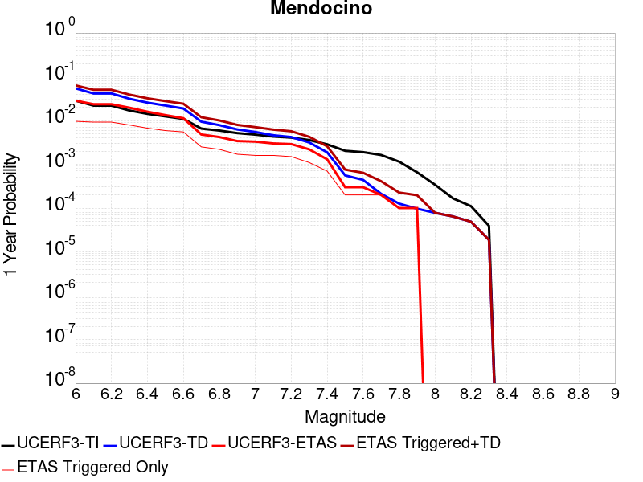 |  |

| Magnitude | 1 wk TI Prob | 1 wk TD Prob | 1 wk ETAS Prob | 1 wk ETAS/TD Gain | 1 wk ETAS Triggered+TD | 1 wk ETAS Triggered Only | 1 mo TI Prob | 1 mo TD Prob | 1 mo ETAS Prob | 1 mo ETAS/TD Gain | 1 mo ETAS Triggered+TD | 1 mo ETAS Triggered Only | 1 yr TI Prob | 1 yr TD Prob | 1 yr ETAS Prob | 1 yr ETAS/TD Gain | 1 yr ETAS Triggered+TD | 1 yr ETAS Triggered Only | 10 yr TI Prob | 10 yr TD Prob | 10 yr ETAS Prob | 10 yr ETAS/TD Gain | 10 yr ETAS Triggered+TD | 10 yr ETAS Triggered Only |
|-----|-----|-----|-----|-----|-----|-----|-----|-----|-----|-----|-----|-----|-----|-----|-----|-----|-----|-----|-----|-----|-----|-----|-----|-----|
| 6.0 | 5.5409013E-4 | 0.0010793889 | 9.0E-4 | 0.8338052 | 0.0018785254 | 8.0E-4 | 0.0023725112 | 0.0046157073 | 0.0035 | 0.7582803 | 0.00571063 | 0.0011 | 0.028505474 | 0.054447312 | 0.0285 | 0.5234418 | 0.06352462 | 0.0096 | 0.25113493 | 0.4105582 | 0.2454 | 0.5977228 | 0.44757512 | 0.0628 |
| 6.1 | 4.2515888E-4 | 8.187679E-4 | 8.0E-4 | 0.97707796 | 0.0016181128 | 8.0E-4 | 0.0018208373 | 0.0035026954 | 0.0028 | 0.7993844 | 0.0045988425 | 0.0011 | 0.021944538 | 0.041547947 | 0.0236 | 0.56801844 | 0.050365705 | 0.0092 | 0.19899574 | 0.32862902 | 0.2095 | 0.63749695 | 0.3685756 | 0.0595 |
| 6.2 | 4.2515888E-4 | 8.187679E-4 | 8.0E-4 | 0.97707796 | 0.0016181128 | 8.0E-4 | 0.0018208373 | 0.0035026954 | 0.0028 | 0.7993844 | 0.0045988425 | 0.0011 | 0.021944538 | 0.041547947 | 0.0236 | 0.56801844 | 0.050365705 | 0.0092 | 0.19899574 | 0.32862902 | 0.2095 | 0.63749695 | 0.3685756 | 0.0595 |
| 6.3 | 3.2773745E-4 | 6.155574E-4 | 6.0E-4 | 0.9747263 | 0.0012151881 | 6.0E-4 | 0.0014038329 | 0.0026343116 | 0.0023 | 0.87309337 | 0.0035319407 | 9.0E-4 | 0.016958237 | 0.031404294 | 0.0196 | 0.6241185 | 0.0390562 | 0.0079 | 0.1572094 | 0.25942355 | 0.1681 | 0.6479751 | 0.29548964 | 0.0487 |
| 6.4 | 2.7417165E-4 | 5.0113956E-4 | 6.0E-4 | 1.1972712 | 0.0011008389 | 6.0E-4 | 0.0011744922 | 0.0021450887 | 0.0021 | 0.9789805 | 0.003043158 | 9.0E-4 | 0.014205975 | 0.025655411 | 0.0159 | 0.6197523 | 0.03218352 | 0.0067 | 0.13331394 | 0.2180968 | 0.1401 | 0.64237535 | 0.2494511 | 0.0401 |
| 6.5 | 2.3984899E-4 | 4.2881654E-4 | 6.0E-4 | 1.3991997 | 0.0010285593 | 6.0E-4 | 0.0010275192 | 0.0018358091 | 0.0018 | 0.98049414 | 0.0027341568 | 9.0E-4 | 0.012438473 | 0.022002775 | 0.0133 | 0.60446924 | 0.027772957 | 0.0059 | 0.11764851 | 0.19064191 | 0.1239 | 0.64990956 | 0.21961693 | 0.0358 |
| 6.6 | 2.1023539E-4 | 3.6590043E-4 | 6.0E-4 | 1.6397904 | 9.6568087E-4 | 6.0E-4 | 9.0069766E-4 | 0.0015666756 | 0.0017 | 1.0851002 | 0.0024652656 | 9.0E-4 | 0.010910975 | 0.018815525 | 0.0113 | 0.6005679 | 0.02421204 | 0.0055 | 0.10390546 | 0.16608629 | 0.1074 | 0.6466518 | 0.19260475 | 0.0318 |
| 6.7 | 1.2592976E-4 | 1.8099084E-4 | 4.0E-4 | 2.2100565 | 5.8091845E-4 | 4.0E-4 | 5.395873E-4 | 7.753864E-4 | 9.0E-4 | 1.1607116 | 0.0013749212 | 6.0E-4 | 0.006549705 | 0.009388288 | 0.0048 | 0.51127535 | 0.011864817 | 0.0025 | 0.063599944 | 0.08949357 | 0.05 | 0.5586993 | 0.10187646 | 0.0136 |
| 6.8 | 1.13663555E-4 | 1.5089264E-4 | 4.0E-4 | 2.6508913 | 5.508323E-4 | 4.0E-4 | 4.8703855E-4 | 6.4649165E-4 | 8.0E-4 | 1.2374482 | 0.0012461038 | 6.0E-4 | 0.0059135845 | 0.007838629 | 0.0042 | 0.53580797 | 0.010021384 | 0.0022 | 0.057586733 | 0.07595165 | 0.0428 | 0.5635164 | 0.08620859 | 0.0111 |
| 6.9 | 9.926894E-5 | 1.20059965E-4 | 3.0E-4 | 2.4987514 | 4.2002395E-4 | 3.0E-4 | 4.2536893E-4 | 5.1443576E-4 | 6.0E-4 | 1.1663264 | 9.1422995E-4 | 4.0E-4 | 0.0051665753 | 0.0062443526 | 0.0034 | 0.544492 | 0.007933737 | 0.0017 | 0.050480947 | 0.06147359 | 0.036 | 0.58561736 | 0.07038959 | 0.0095 |
| 7.0 | 9.168125E-5 | 1.04989136E-4 | 3.0E-4 | 2.8574383 | 4.0495765E-4 | 3.0E-4 | 3.9286047E-4 | 4.4987473E-4 | 6.0E-4 | 1.3337046 | 8.4969477E-4 | 4.0E-4 | 0.004772591 | 0.0054631177 | 0.0033 | 0.6040507 | 0.007054377 | 0.0016 | 0.04671385 | 0.05426433 | 0.033 | 0.6081343 | 0.062965095 | 0.0092 |
| 7.1 | 8.2854116E-5 | 8.831159E-5 | 3.0E-4 | 3.3970625 | 3.882851E-4 | 3.0E-4 | 3.5504074E-4 | 3.7842387E-4 | 6.0E-4 | 1.5855237 | 7.7827246E-4 | 4.0E-4 | 0.004314056 | 0.0045976397 | 0.003 | 0.65250874 | 0.0061902837 | 0.0016 | 0.042312626 | 0.046162598 | 0.0295 | 0.6390455 | 0.05484252 | 0.0091 |
| 7.2 | 7.8255274E-5 | 8.0320024E-5 | 2.0E-4 | 2.490039 | 2.8030397E-4 | 2.0E-4 | 3.3533663E-4 | 3.4418405E-4 | 5.0E-4 | 1.4527111 | 6.440808E-4 | 3.0E-4 | 0.0040750825 | 0.0041825282 | 0.0029 | 0.6933605 | 0.0056762546 | 0.0015 | 0.040011603 | 0.04222741 | 0.0279 | 0.6607083 | 0.050368477 | 0.0085 |
| 7.3 | 6.887904E-5 | 6.0378115E-5 | 2.0E-4 | 3.3124585 | 2.6036604E-4 | 2.0E-4 | 2.9516246E-4 | 2.587382E-4 | 5.0E-4 | 1.9324552 | 5.586606E-4 | 3.0E-4 | 0.0035876823 | 0.0031456787 | 0.0022 | 0.6993722 | 0.0042422186 | 0.0011 | 0.035303112 | 0.032249544 | 0.021 | 0.65117204 | 0.03853992 | 0.0065 |
| 7.4 | 5.4898497E-5 | 3.588004E-5 | 2.0E-4 | 5.57413 | 2.3587287E-4 | 2.0E-4 | 2.3525805E-4 | 1.5376284E-4 | 3.0E-4 | 1.9510566 | 3.537321E-4 | 2.0E-4 | 0.0028605047 | 0.0018705077 | 0.0013 | 0.69499844 | 0.0025691984 | 7.0E-4 | 0.02823963 | 0.019616025 | 0.0123 | 0.62703836 | 0.023047369 | 0.0035 |
| 7.5 | 3.9103943E-5 | 1.0616167E-5 | 1.0E-4 | 9.419596 | 1.106151E-4 | 1.0E-4 | 1.6757756E-4 | 4.5497076E-5 | 2.0E-4 | 4.395887 | 1.4549252E-4 | 1.0E-4 | 0.0020383475 | 5.5378757E-4 | 3.0E-4 | 0.54172397 | 7.536768E-4 | 2.0E-4 | 0.020197518 | 0.0062145353 | 0.0037 | 0.5953784 | 0.0073076994 | 0.0011 |
| 7.6 | 3.641042E-5 | 8.36707E-6 | 1.0E-4 | 11.951614 | 1.08366236E-4 | 1.0E-4 | 1.5603533E-4 | 3.585839E-5 | 2.0E-4 | 5.5774956 | 1.358548E-4 | 1.0E-4 | 0.0018980748 | 4.3648967E-4 | 3.0E-4 | 0.68730146 | 6.364024E-4 | 2.0E-4 | 0.018819444 | 0.004976619 | 0.0031 | 0.6229128 | 0.0057726377 | 8.0E-4 |
| 7.7 | 3.1318774E-5 | 3.9938727E-6 | 1.0E-4 | 25.038353 | 1.0399347E-4 | 1.0E-4 | 1.342164E-4 | 1.7116487E-5 | 1.0E-4 | 5.8423204 | 1.17114774E-4 | 1.0E-4 | 0.0016328598 | 2.0837346E-4 | 2.0E-4 | 0.95981514 | 4.0833178E-4 | 2.0E-4 | 0.016209139 | 0.0025776818 | 0.0016 | 0.62071276 | 0.003076393 | 5.0E-4 |
| 7.8 | 2.209241E-5 | 2.3840068E-6 | 0.0 | 0.0 | 2.3840068E-6 | 0.0 | 9.467832E-5 | 1.0217132E-5 | 0.0 | 0.0 | 1.0217132E-5 | 0.0 | 0.001152099 | 1.243865E-4 | 1.0E-4 | 0.8039458 | 2.2437406E-4 | 1.0E-4 | 0.011461443 | 0.0015521594 | 9.0E-4 | 0.5798374 | 0.0018516937 | 3.0E-4 |
| 7.9 | 1.2640477E-5 | 1.8273861E-6 | 0.0 | 0.0 | 1.8273861E-6 | 0.0 | 5.4172346E-5 | 7.831631E-6 | 0.0 | 0.0 | 7.831631E-6 | 0.0 | 6.593487E-4 | 9.534596E-5 | 1.0E-4 | 1.0488122 | 1.9533643E-4 | 1.0E-4 | 0.006573958 | 0.001167472 | 9.0E-4 | 0.77089643 | 0.0014671218 | 3.0E-4 |
| 8.0 | 6.5548907E-6 | 1.4736802E-6 | 0.0 | 0.0 | 1.4736802E-6 | 0.0 | 2.8092087E-5 | 6.3157568E-6 | 0.0 | 0.0 | 6.3157568E-6 | 0.0 | 3.4196748E-4 | 7.689164E-5 | 0.0 | 0.0 | 7.689164E-5 | 0.0 | 0.0034144172 | 9.3351625E-4 | 7.0E-4 | 0.7498531 | 0.0011333296 | 2.0E-4 |
| 8.1 | 3.1916707E-6 | 1.2142848E-6 | 0.0 | 0.0 | 1.2142848E-6 | 0.0 | 1.3678517E-5 | 5.2040677E-6 | 0.0 | 0.0 | 5.2040677E-6 | 0.0 | 1.6652321E-4 | 6.33577E-5 | 0.0 | 0.0 | 6.33577E-5 | 0.0 | 0.0016639848 | 7.786327E-4 | 6.0E-4 | 0.77058154 | 9.78477E-4 | 2.0E-4 |
| 8.2 | 2.1193785E-6 | 9.23783E-7 | 0.0 | 0.0 | 9.23783E-7 | 0.0 | 9.083019E-6 | 3.9590636E-6 | 0.0 | 0.0 | 3.9590636E-6 | 0.0 | 1.1058014E-4 | 4.8200553E-5 | 0.0 | 0.0 | 4.8200553E-5 | 0.0 | 0.0011052513 | 5.890795E-4 | 5.0E-4 | 0.8487818 | 6.890206E-4 | 1.0E-4 |
| 8.3 | 7.536878E-7 | 3.5652886E-7 | 0.0 | 0.0 | 3.5652886E-7 | 0.0 | 3.2300866E-6 | 1.52798E-6 | 0.0 | 0.0 | 1.52798E-6 | 0.0 | 3.9325594E-5 | 1.8603008E-5 | 0.0 | 0.0 | 1.8603008E-5 | 0.0 | 3.9318635E-4 | 2.2076594E-4 | 1.0E-4 | 0.45296842 | 2.2076594E-4 | 0.0 |

## San Andreas (Creeping Section) 2011 CFM
*[(top)](#table-of-contents)*

| 1 Week | 1 Month | 1 Year | 10 Year |
|-----|-----|-----|-----|
|  |  |  |  |

| Magnitude | 1 wk TI Prob | 1 wk TD Prob | 1 wk ETAS Prob | 1 wk ETAS/TD Gain | 1 wk ETAS Triggered+TD | 1 wk ETAS Triggered Only | 1 mo TI Prob | 1 mo TD Prob | 1 mo ETAS Prob | 1 mo ETAS/TD Gain | 1 mo ETAS Triggered+TD | 1 mo ETAS Triggered Only | 1 yr TI Prob | 1 yr TD Prob | 1 yr ETAS Prob | 1 yr ETAS/TD Gain | 1 yr ETAS Triggered+TD | 1 yr ETAS Triggered Only | 10 yr TI Prob | 10 yr TD Prob | 10 yr ETAS Prob | 10 yr ETAS/TD Gain | 10 yr ETAS Triggered+TD | 10 yr ETAS Triggered Only |
|-----|-----|-----|-----|-----|-----|-----|-----|-----|-----|-----|-----|-----|-----|-----|-----|-----|-----|-----|-----|-----|-----|-----|-----|-----|
| 6.0 | 5.986481E-4 | 0.0012158811 | 0.0013 | 1.0691835 | 0.00191503 | 7.0E-4 | 0.0025631124 | 0.0051956596 | 0.0035 | 0.67363924 | 0.006886827 | 0.0017 | 0.030762846 | 0.060635127 | 0.042 | 0.69266784 | 0.06946515 | 0.0094 | 0.26835477 | 0.4229866 | 0.3289 | 0.777566 | 0.45160648 | 0.0496 |
| 6.1 | 5.015945E-4 | 0.0010130458 | 0.001 | 0.98712224 | 0.0016124379 | 6.0E-4 | 0.00214792 | 0.0043305648 | 0.0028 | 0.646567 | 0.0058240686 | 0.0015 | 0.025839351 | 0.050815985 | 0.0327 | 0.6434983 | 0.058219623 | 0.0078 | 0.23032776 | 0.3702337 | 0.2648 | 0.71522385 | 0.3945427 | 0.0386 |
| 6.2 | 4.073338E-4 | 8.02223E-4 | 8.0E-4 | 0.997229 | 0.0013018219 | 5.0E-4 | 0.0017445484 | 0.0034308275 | 0.0024 | 0.69953966 | 0.0046267104 | 0.0012 | 0.021034058 | 0.0405076 | 0.026 | 0.6418549 | 0.04626455 | 0.006 | 0.19150782 | 0.31020957 | 0.2182 | 0.7033954 | 0.33235183 | 0.0321 |
| 6.3 | 3.464099E-4 | 6.6541764E-4 | 5.0E-4 | 0.7514078 | 9.65218E-4 | 3.0E-4 | 0.0014837692 | 0.0028466634 | 0.002 | 0.70257694 | 0.0037441014 | 9.0E-4 | 0.017915873 | 0.033761524 | 0.0205 | 0.6072001 | 0.038302846 | 0.0047 | 0.16538359 | 0.26832467 | 0.1871 | 0.6972896 | 0.28888476 | 0.0281 |
| 6.4 | 2.935057E-4 | 5.4590224E-4 | 5.0E-4 | 0.91591495 | 8.4573845E-4 | 3.0E-4 | 0.0012572751 | 0.0023361163 | 0.0019 | 0.8133157 | 0.0032340137 | 9.0E-4 | 0.015200248 | 0.027832685 | 0.0161 | 0.5784566 | 0.031721354 | 0.004 | 0.14201577 | 0.22982958 | 0.1547 | 0.67310745 | 0.24769753 | 0.0232 |
| 6.5 | 2.3409708E-4 | 4.1241286E-4 | 4.0E-4 | 0.96990186 | 6.123304E-4 | 2.0E-4 | 0.0010028875 | 0.0017655423 | 0.0016 | 0.9062371 | 0.0024643063 | 7.0E-4 | 0.012141965 | 0.0211528 | 0.013 | 0.61457586 | 0.024480881 | 0.0034 | 0.11499573 | 0.18347985 | 0.1227 | 0.6687383 | 0.19932033 | 0.0194 |
| 6.6 | 1.5842178E-4 | 2.4227453E-4 | 2.0E-4 | 0.8255098 | 3.422503E-4 | 1.0E-4 | 6.7877385E-4 | 0.0010378995 | 0.0012 | 1.1561812 | 0.0016372768 | 6.0E-4 | 0.0082328 | 0.0125618195 | 0.0083 | 0.6607323 | 0.015129159 | 0.0026 | 0.07934396 | 0.11957417 | 0.0781 | 0.6531511 | 0.13304467 | 0.0153 |
| 6.7 | 1.5616413E-4 | 2.3766492E-4 | 2.0E-4 | 0.8415209 | 3.3764116E-4 | 1.0E-4 | 6.691031E-4 | 0.0010181629 | 0.0012 | 1.1785933 | 0.001617552 | 6.0E-4 | 0.0081159435 | 0.012324867 | 0.0083 | 0.6734353 | 0.014892823 | 0.0026 | 0.0782586 | 0.11760267 | 0.0766 | 0.65134573 | 0.13083863 | 0.015 |
| 6.8 | 1.5538467E-4 | 2.3592412E-4 | 2.0E-4 | 0.8477302 | 3.3590052E-4 | 1.0E-4 | 6.6576427E-4 | 0.0010107091 | 0.0012 | 1.1872853 | 0.0016101026 | 6.0E-4 | 0.008075596 | 0.012235293 | 0.0082 | 0.67019236 | 0.014704705 | 0.0025 | 0.07788358 | 0.11683841 | 0.0764 | 0.65389454 | 0.12999752 | 0.0149 |
| 6.9 | 1.5153569E-4 | 2.2708514E-4 | 2.0E-4 | 0.88072693 | 3.2706244E-4 | 1.0E-4 | 6.49277E-4 | 9.7286096E-4 | 0.0012 | 1.2334753 | 0.0015722773 | 6.0E-4 | 0.007876333 | 0.01178074 | 0.008 | 0.6790745 | 0.014152465 | 0.0024 | 0.07602952 | 0.112919025 | 0.074 | 0.65533686 | 0.1258704 | 0.0146 |
| 7.0 | 1.4588932E-4 | 2.1581045E-4 | 2.0E-4 | 0.92673916 | 3.1578887E-4 | 1.0E-4 | 6.250901E-4 | 9.2457596E-4 | 0.0012 | 1.2978923 | 0.0015240213 | 6.0E-4 | 0.0075839474 | 0.011199075 | 0.0076 | 0.6786275 | 0.013473317 | 0.0023 | 0.073302895 | 0.107805565 | 0.0712 | 0.6604483 | 0.120385505 | 0.0141 |
| 7.1 | 1.1565079E-4 | 1.5583615E-4 | 1.0E-4 | 0.6416996 | 2.5582057E-4 | 1.0E-4 | 4.955521E-4 | 6.676991E-4 | 0.001 | 1.4976805 | 0.0011673652 | 5.0E-4 | 0.006016669 | 0.008099121 | 0.0054 | 0.66673905 | 0.009289402 | 0.0012 | 0.058563538 | 0.080524765 | 0.0531 | 0.6594245 | 0.08981147 | 0.0101 |
| 7.2 | 1.0393792E-4 | 1.396639E-4 | 1.0E-4 | 0.71600467 | 2.3964993E-4 | 1.0E-4 | 4.4537216E-4 | 5.9842295E-4 | 9.0E-4 | 1.503953 | 9.981836E-4 | 4.0E-4 | 0.005408933 | 0.0072616157 | 0.0049 | 0.67478096 | 0.0081550805 | 9.0E-4 | 0.052791595 | 0.07266633 | 0.0474 | 0.65229654 | 0.08110507 | 0.0091 |
| 7.3 | 9.332884E-5 | 1.2216425E-4 | 0.0 | 0.0 | 1.2216425E-4 | 0.0 | 3.999194E-4 | 5.234566E-4 | 7.0E-4 | 1.3372647 | 8.232996E-4 | 3.0E-4 | 0.0048581534 | 0.0063545858 | 0.0038 | 0.5979934 | 0.006950773 | 6.0E-4 | 0.047533102 | 0.06386944 | 0.0422 | 0.66072285 | 0.07154571 | 0.0082 |
| 7.4 | 8.670252E-5 | 1.11667796E-4 | 0.0 | 0.0 | 1.11667796E-4 | 0.0 | 3.715293E-4 | 4.7848906E-4 | 7.0E-4 | 1.4629383 | 7.783455E-4 | 3.0E-4 | 0.004513991 | 0.005810155 | 0.0036 | 0.6196048 | 0.006406669 | 6.0E-4 | 0.044233937 | 0.058650583 | 0.0379 | 0.6461999 | 0.06561657 | 0.0074 |
| 7.5 | 7.3036405E-5 | 8.557419E-5 | 0.0 | 0.0 | 8.557419E-5 | 0.0 | 3.129756E-4 | 3.6669505E-4 | 7.0E-4 | 1.9089432 | 6.6658505E-4 | 3.0E-4 | 0.0038038217 | 0.0044553922 | 0.0029 | 0.65089667 | 0.00485361 | 4.0E-4 | 0.03739367 | 0.045724712 | 0.0298 | 0.65172637 | 0.05078237 | 0.0053 |
| 7.6 | 6.3935775E-5 | 7.875098E-5 | 0.0 | 0.0 | 7.875098E-5 | 0.0 | 2.7398168E-4 | 3.374606E-4 | 6.0E-4 | 1.7779853 | 6.373594E-4 | 3.0E-4 | 0.0033306254 | 0.0041008596 | 0.0027 | 0.6583985 | 0.0043996293 | 3.0E-4 | 0.032811474 | 0.04204755 | 0.0279 | 0.6635345 | 0.046549927 | 0.0047 |
| 7.7 | 5.5050095E-5 | 6.305364E-5 | 0.0 | 0.0 | 6.305364E-5 | 0.0 | 2.3590765E-4 | 2.7020188E-4 | 6.0E-4 | 2.2205617 | 5.701208E-4 | 3.0E-4 | 0.0028683927 | 0.003284749 | 0.0019 | 0.5784308 | 0.0035837637 | 3.0E-4 | 0.0283165 | 0.034058776 | 0.0226 | 0.6635588 | 0.03782595 | 0.0039 |
| 7.8 | 5.027131E-5 | 5.8371108E-5 | 0.0 | 0.0 | 5.8371108E-5 | 0.0 | 2.1543067E-4 | 2.5013793E-4 | 6.0E-4 | 2.3986766 | 5.5006286E-4 | 3.0E-4 | 0.0026197135 | 0.0030411792 | 0.0016 | 0.5261117 | 0.0033402669 | 3.0E-4 | 0.025890453 | 0.031534772 | 0.0199 | 0.63104945 | 0.0349244 | 0.0035 |
| 7.9 | 3.7271806E-5 | 4.7599344E-5 | 0.0 | 0.0 | 4.7599344E-5 | 0.0 | 1.5972654E-4 | 2.0398124E-4 | 5.0E-4 | 2.4512057 | 5.0392E-4 | 3.0E-4 | 0.0019429359 | 0.002480645 | 0.0013 | 0.52405727 | 0.0027799008 | 3.0E-4 | 0.019260362 | 0.025771113 | 0.0158 | 0.6130895 | 0.028401531 | 0.0027 |
| 8.0 | 2.7310243E-5 | 2.9675752E-5 | 0.0 | 0.0 | 2.9675752E-5 | 0.0 | 1.17038646E-4 | 1.2717559E-4 | 5.0E-4 | 3.931572 | 4.2713745E-4 | 3.0E-4 | 0.0014240141 | 0.0015472639 | 0.001 | 0.64630216 | 0.0018467997 | 3.0E-4 | 0.014149235 | 0.016320135 | 0.0097 | 0.59435785 | 0.01799239 | 0.0017 |
| 8.1 | 1.7940547E-5 | 1.627415E-5 | 0.0 | 0.0 | 1.627415E-5 | 0.0 | 7.688579E-5 | 6.97445E-5 | 2.0E-4 | 2.8676097 | 2.6973055E-4 | 2.0E-4 | 9.3568244E-4 | 8.4880897E-4 | 4.0E-4 | 0.47124857 | 0.0010486392 | 2.0E-4 | 0.009317525 | 0.009204732 | 0.0049 | 0.53233486 | 0.009898289 | 7.0E-4 |
| 8.2 | 8.643924E-6 | 5.0104E-6 | 0.0 | 0.0 | 5.0104E-6 | 0.0 | 3.704486E-5 | 2.1472966E-5 | 1.0E-4 | 4.6570187 | 1.2147082E-4 | 1.0E-4 | 4.5092785E-4 | 2.6140205E-4 | 2.0E-4 | 0.7651049 | 3.6137592E-4 | 1.0E-4 | 0.0045001395 | 0.002993769 | 0.0016 | 0.5344434 | 0.0031931703 | 2.0E-4 |
| 8.3 | 1.983087E-6 | 6.880041E-7 | 0.0 | 0.0 | 6.880041E-7 | 0.0 | 8.498917E-6 | 2.9485857E-6 | 0.0 | 0.0 | 2.9485857E-6 | 0.0 | 1.034694E-4 | 3.589845E-5 | 0.0 | 0.0 | 3.589845E-5 | 0.0 | 0.0010342124 | 4.2701262E-4 | 1.0E-4 | 0.23418511 | 4.2701262E-4 | 0.0 |

## San Andreas (Mojave S)
*[(top)](#table-of-contents)*

| 1 Week | 1 Month | 1 Year | 10 Year |
|-----|-----|-----|-----|
| 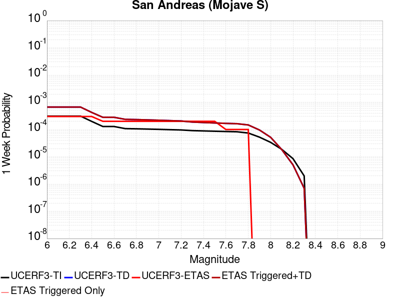 |  |  | 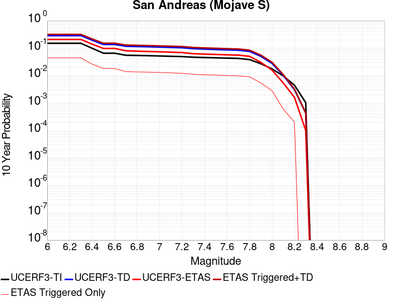 |

| Magnitude | 1 wk TI Prob | 1 wk TD Prob | 1 wk ETAS Prob | 1 wk ETAS/TD Gain | 1 wk ETAS Triggered+TD | 1 wk ETAS Triggered Only | 1 mo TI Prob | 1 mo TD Prob | 1 mo ETAS Prob | 1 mo ETAS/TD Gain | 1 mo ETAS Triggered+TD | 1 mo ETAS Triggered Only | 1 yr TI Prob | 1 yr TD Prob | 1 yr ETAS Prob | 1 yr ETAS/TD Gain | 1 yr ETAS Triggered+TD | 1 yr ETAS Triggered Only | 10 yr TI Prob | 10 yr TD Prob | 10 yr ETAS Prob | 10 yr ETAS/TD Gain | 10 yr ETAS Triggered+TD | 10 yr ETAS Triggered Only |
|-----|-----|-----|-----|-----|-----|-----|-----|-----|-----|-----|-----|-----|-----|-----|-----|-----|-----|-----|-----|-----|-----|-----|-----|-----|
| 6.0 | 3.1064058E-4 | 6.6649815E-4 | 3.0E-4 | 0.45011377 | 6.6649815E-4 | 0.0 | 0.0013306376 | 0.0028534215 | 0.0023 | 0.8060498 | 0.0033519948 | 5.0E-4 | 0.016080605 | 0.034313932 | 0.0223 | 0.6498818 | 0.03923893 | 0.0051 | 0.1496549 | 0.28368294 | 0.2071 | 0.7300404 | 0.31512925 | 0.0439 |
| 6.1 | 3.1064058E-4 | 6.6649815E-4 | 3.0E-4 | 0.45011377 | 6.6649815E-4 | 0.0 | 0.0013306376 | 0.0028534215 | 0.0023 | 0.8060498 | 0.0033519948 | 5.0E-4 | 0.016080605 | 0.034313932 | 0.0223 | 0.6498818 | 0.03923893 | 0.0051 | 0.1496549 | 0.28368294 | 0.2071 | 0.7300404 | 0.31512925 | 0.0439 |
| 6.2 | 3.1064058E-4 | 6.6649815E-4 | 3.0E-4 | 0.45011377 | 6.6649815E-4 | 0.0 | 0.0013306376 | 0.0028534215 | 0.0023 | 0.8060498 | 0.0033519948 | 5.0E-4 | 0.016080605 | 0.034313932 | 0.0223 | 0.6498818 | 0.03923893 | 0.0051 | 0.1496549 | 0.28368294 | 0.2071 | 0.7300404 | 0.31512925 | 0.0439 |
| 6.3 | 3.1064058E-4 | 6.6649815E-4 | 3.0E-4 | 0.45011377 | 6.6649815E-4 | 0.0 | 0.0013306376 | 0.0028534215 | 0.0023 | 0.8060498 | 0.0033519948 | 5.0E-4 | 0.016080605 | 0.034313932 | 0.0223 | 0.6498818 | 0.03923893 | 0.0051 | 0.1496549 | 0.28368294 | 0.2071 | 0.7300404 | 0.31512925 | 0.0439 |
| 6.4 | 1.9872203E-4 | 4.240692E-4 | 3.0E-4 | 0.7074317 | 4.240692E-4 | 0.0 | 8.5138786E-4 | 0.0018162017 | 0.0017 | 0.93601936 | 0.0022154753 | 4.0E-4 | 0.010316478 | 0.021894107 | 0.0123 | 0.561795 | 0.023556886 | 0.0017 | 0.098504856 | 0.1938825 | 0.1394 | 0.7189922 | 0.21476094 | 0.0259 |
| 6.5 | 1.291105E-4 | 2.8018636E-4 | 2.0E-4 | 0.7138107 | 2.8018636E-4 | 0.0 | 5.5321335E-4 | 0.0012002487 | 0.0013 | 1.0831088 | 0.0014998887 | 3.0E-4 | 0.006714592 | 0.014515912 | 0.0089 | 0.6131203 | 0.015402847 | 9.0E-4 | 0.065152965 | 0.13491377 | 0.0973 | 0.7212014 | 0.15048532 | 0.018 |
| 6.6 | 1.291105E-4 | 2.8018636E-4 | 2.0E-4 | 0.7138107 | 2.8018636E-4 | 0.0 | 5.5321335E-4 | 0.0012002487 | 0.0013 | 1.0831088 | 0.0014998887 | 3.0E-4 | 0.006714592 | 0.014515912 | 0.0089 | 0.6131203 | 0.015402847 | 9.0E-4 | 0.065152965 | 0.13491377 | 0.0973 | 0.7212014 | 0.15048532 | 0.018 |
| 6.7 | 1.08001186E-4 | 2.3610683E-4 | 2.0E-4 | 0.8470742 | 2.3610683E-4 | 0.0 | 4.6278012E-4 | 0.0010114945 | 0.001 | 0.9886361 | 0.0013111911 | 3.0E-4 | 0.0056198016 | 0.012245687 | 0.0071 | 0.57979596 | 0.012937115 | 7.0E-4 | 0.054797906 | 0.11606961 | 0.08 | 0.6892416 | 0.12835625 | 0.0139 |
| 6.8 | 1.0624356E-4 | 2.313033E-4 | 2.0E-4 | 0.8646655 | 2.313033E-4 | 0.0 | 4.5525006E-4 | 9.909238E-4 | 0.001 | 1.0091593 | 0.0012906265 | 3.0E-4 | 0.0055285925 | 0.0119980145 | 0.0067 | 0.5584257 | 0.012689616 | 7.0E-4 | 0.053930566 | 0.11401875 | 0.0773 | 0.67795867 | 0.1259795 | 0.0135 |
| 6.9 | 1.0393785E-4 | 2.250332E-4 | 2.0E-4 | 0.8887577 | 2.250332E-4 | 0.0 | 4.4537184E-4 | 9.64072E-4 | 0.001 | 1.037267 | 0.0012637827 | 3.0E-4 | 0.0054089287 | 0.011674637 | 0.0066 | 0.56532806 | 0.012366465 | 7.0E-4 | 0.05279156 | 0.11132155 | 0.0751 | 0.6746223 | 0.123140976 | 0.0133 |
| 7.0 | 1.0155622E-4 | 2.187592E-4 | 2.0E-4 | 0.9142472 | 2.187592E-4 | 0.0 | 4.3516833E-4 | 9.37203E-4 | 0.001 | 1.0670047 | 0.0012369219 | 3.0E-4 | 0.005285311 | 0.011350956 | 0.0066 | 0.5814488 | 0.01204301 | 7.0E-4 | 0.05161361 | 0.10858677 | 0.0733 | 0.6750362 | 0.120175146 | 0.013 |
| 7.1 | 9.885595E-5 | 2.1167743E-4 | 2.0E-4 | 0.9448339 | 2.1167743E-4 | 0.0 | 4.2359953E-4 | 9.068739E-4 | 0.001 | 1.1026891 | 0.0012066019 | 3.0E-4 | 0.0051451353 | 0.010985476 | 0.0065 | 0.59169036 | 0.011677786 | 7.0E-4 | 0.05027629 | 0.10547369 | 0.071 | 0.67315364 | 0.11665527 | 0.0125 |
| 7.2 | 9.6411415E-5 | 2.0533915E-4 | 2.0E-4 | 0.97399837 | 2.0533915E-4 | 0.0 | 4.1312634E-4 | 8.7972847E-4 | 0.001 | 1.1367143 | 0.0011794645 | 3.0E-4 | 0.005018219 | 0.01065826 | 0.0064 | 0.6004732 | 0.011350799 | 7.0E-4 | 0.049064007 | 0.10266836 | 0.0688 | 0.6701188 | 0.113526076 | 0.0121 |
| 7.3 | 9.1180635E-5 | 1.8780473E-4 | 2.0E-4 | 1.0649359 | 1.8780473E-4 | 0.0 | 3.907156E-4 | 8.0462924E-4 | 0.001 | 1.2428085 | 0.0011043878 | 3.0E-4 | 0.004746591 | 0.009752458 | 0.0063 | 0.64599097 | 0.010445632 | 7.0E-4 | 0.046464786 | 0.09491306 | 0.0625 | 0.6584974 | 0.104959525 | 0.0111 |
| 7.4 | 8.887388E-5 | 1.8036654E-4 | 2.0E-4 | 1.1088531 | 1.8036654E-4 | 0.0 | 3.8083247E-4 | 7.7277055E-4 | 0.001 | 1.2940452 | 0.0010725387 | 3.0E-4 | 0.0046267817 | 0.00936798 | 0.006 | 0.64047956 | 0.010061422 | 7.0E-4 | 0.045316286 | 0.091565564 | 0.0604 | 0.6596366 | 0.10119497 | 0.0106 |
| 7.5 | 8.6750515E-5 | 1.7375132E-4 | 2.0E-4 | 1.1510704 | 1.7375132E-4 | 0.0 | 3.7173493E-4 | 7.444361E-4 | 0.001 | 1.3432987 | 0.0010442127 | 3.0E-4 | 0.004516484 | 0.009025919 | 0.0057 | 0.6315146 | 0.009719602 | 7.0E-4 | 0.04425787 | 0.088547625 | 0.0586 | 0.6617908 | 0.09802673 | 0.0104 |
| 7.6 | 8.453092E-5 | 1.6770989E-4 | 1.0E-4 | 0.59626776 | 1.6770989E-4 | 0.0 | 3.6222505E-4 | 7.1855873E-4 | 9.0E-4 | 1.2525072 | 0.0010183431 | 3.0E-4 | 0.0044011753 | 0.008713426 | 0.0055 | 0.63120985 | 0.009407327 | 7.0E-4 | 0.04315024 | 0.085737765 | 0.0569 | 0.6636515 | 0.09488039 | 0.01 |
| 7.7 | 8.259102E-5 | 1.6300174E-4 | 1.0E-4 | 0.6134904 | 1.6300174E-4 | 0.0 | 3.539135E-4 | 6.983919E-4 | 9.0E-4 | 1.2886748 | 9.981823E-4 | 3.0E-4 | 0.004300386 | 0.00846983 | 0.0054 | 0.637557 | 0.009163901 | 7.0E-4 | 0.042181134 | 0.08351337 | 0.0556 | 0.66576165 | 0.09240329 | 0.0097 |
| 7.8 | 7.444844E-5 | 1.4679672E-4 | 1.0E-4 | 0.6812141 | 1.4679672E-4 | 0.0 | 3.1902574E-4 | 6.289772E-4 | 9.0E-4 | 1.4308945 | 9.287885E-4 | 3.0E-4 | 0.0038772223 | 0.007630952 | 0.0048 | 0.6290172 | 0.00832561 | 7.0E-4 | 0.03810269 | 0.07557513 | 0.0501 | 0.66291654 | 0.083894946 | 0.009 |
| 7.9 | 5.2586525E-5 | 9.589247E-5 | 0.0 | 0.0 | 9.589247E-5 | 0.0 | 2.2535135E-4 | 4.10903E-4 | 5.0E-4 | 1.2168322 | 7.1077974E-4 | 3.0E-4 | 0.0027402006 | 0.004991278 | 0.0024 | 0.48083875 | 0.0053892815 | 4.0E-4 | 0.027066574 | 0.050242934 | 0.0304 | 0.60506016 | 0.055371623 | 0.0054 |
| 8.0 | 3.379877E-5 | 5.1621304E-5 | 0.0 | 0.0 | 5.1621304E-5 | 0.0 | 1.4484383E-4 | 2.212154E-4 | 5.0E-4 | 2.2602403 | 5.21149E-4 | 3.0E-4 | 0.0017620471 | 0.0026899728 | 0.0016 | 0.5948016 | 0.0030888966 | 4.0E-4 | 0.017481409 | 0.027628962 | 0.0159 | 0.5754831 | 0.0303516 | 0.0028 |
| 8.1 | 1.8668277E-5 | 1.8121951E-5 | 0.0 | 0.0 | 1.8121951E-5 | 0.0 | 8.000444E-5 | 7.76632E-5 | 2.0E-4 | 2.5752223 | 2.7764766E-4 | 2.0E-4 | 9.736188E-4 | 9.4513985E-4 | 6.0E-4 | 0.63482666 | 0.0011449509 | 2.0E-4 | 0.009693642 | 0.010176109 | 0.0054 | 0.53065467 | 0.010770004 | 6.0E-4 |
| 8.2 | 8.541571E-6 | 4.99796E-6 | 0.0 | 0.0 | 4.99796E-6 | 0.0 | 3.660622E-5 | 2.1419653E-5 | 1.0E-4 | 4.6686096 | 1.2141751E-4 | 1.0E-4 | 4.455896E-4 | 2.6075315E-4 | 2.0E-4 | 0.76700896 | 3.6072705E-4 | 1.0E-4 | 0.0044469717 | 0.002986751 | 0.0016 | 0.5356991 | 0.0031861537 | 2.0E-4 |
| 8.3 | 1.983087E-6 | 6.880041E-7 | 0.0 | 0.0 | 6.880041E-7 | 0.0 | 8.498917E-6 | 2.9485857E-6 | 0.0 | 0.0 | 2.9485857E-6 | 0.0 | 1.034694E-4 | 3.589845E-5 | 0.0 | 0.0 | 3.589845E-5 | 0.0 | 0.0010342124 | 4.2701262E-4 | 1.0E-4 | 0.23418511 | 4.2701262E-4 | 0.0 |

## Cerro Prieto
*[(top)](#table-of-contents)*

| 1 Week | 1 Month | 1 Year | 10 Year |
|-----|-----|-----|-----|
|  |  |  |  |

| Magnitude | 1 wk TI Prob | 1 wk TD Prob | 1 wk ETAS Prob | 1 wk ETAS/TD Gain | 1 wk ETAS Triggered+TD | 1 wk ETAS Triggered Only | 1 mo TI Prob | 1 mo TD Prob | 1 mo ETAS Prob | 1 mo ETAS/TD Gain | 1 mo ETAS Triggered+TD | 1 mo ETAS Triggered Only | 1 yr TI Prob | 1 yr TD Prob | 1 yr ETAS Prob | 1 yr ETAS/TD Gain | 1 yr ETAS Triggered+TD | 1 yr ETAS Triggered Only | 10 yr TI Prob | 10 yr TD Prob | 10 yr ETAS Prob | 10 yr ETAS/TD Gain | 10 yr ETAS Triggered+TD | 10 yr ETAS Triggered Only |
|-----|-----|-----|-----|-----|-----|-----|-----|-----|-----|-----|-----|-----|-----|-----|-----|-----|-----|-----|-----|-----|-----|-----|-----|-----|
| 6.0 | 2.9101528E-4 | 5.876785E-4 | 6.0E-4 | 1.0209664 | 8.875022E-4 | 3.0E-4 | 0.0012466122 | 0.002516427 | 0.0014 | 0.55634433 | 0.003015169 | 5.0E-4 | 0.015072231 | 0.030233428 | 0.0204 | 0.67474985 | 0.035276216 | 0.0052 | 0.14089979 | 0.2514084 | 0.1818 | 0.7231262 | 0.28007945 | 0.0383 |
| 6.1 | 2.9101528E-4 | 5.876785E-4 | 6.0E-4 | 1.0209664 | 8.875022E-4 | 3.0E-4 | 0.0012466122 | 0.002516427 | 0.0014 | 0.55634433 | 0.003015169 | 5.0E-4 | 0.015072231 | 0.030233428 | 0.0204 | 0.67474985 | 0.035276216 | 0.0052 | 0.14089979 | 0.2514084 | 0.1818 | 0.7231262 | 0.28007945 | 0.0383 |
| 6.2 | 2.9101528E-4 | 5.876785E-4 | 6.0E-4 | 1.0209664 | 8.875022E-4 | 3.0E-4 | 0.0012466122 | 0.002516427 | 0.0014 | 0.55634433 | 0.003015169 | 5.0E-4 | 0.015072231 | 0.030233428 | 0.0204 | 0.67474985 | 0.035276216 | 0.0052 | 0.14089979 | 0.2514084 | 0.1818 | 0.7231262 | 0.28007945 | 0.0383 |
| 6.3 | 2.9101528E-4 | 5.876785E-4 | 6.0E-4 | 1.0209664 | 8.875022E-4 | 3.0E-4 | 0.0012466122 | 0.002516427 | 0.0014 | 0.55634433 | 0.003015169 | 5.0E-4 | 0.015072231 | 0.030233428 | 0.0204 | 0.67474985 | 0.035276216 | 0.0052 | 0.14089979 | 0.2514084 | 0.1818 | 0.7231262 | 0.28007945 | 0.0383 |
| 6.4 | 2.508648E-4 | 5.056167E-4 | 6.0E-4 | 1.1866697 | 8.0546504E-4 | 3.0E-4 | 0.0010746918 | 0.0021653222 | 0.0012 | 0.55419004 | 0.0026642394 | 5.0E-4 | 0.013006088 | 0.02607972 | 0.0169 | 0.6480131 | 0.030364968 | 0.0044 | 0.12270685 | 0.22188032 | 0.1592 | 0.71750396 | 0.24888107 | 0.0347 |
| 6.5 | 2.508648E-4 | 5.056167E-4 | 6.0E-4 | 1.1866697 | 8.0546504E-4 | 3.0E-4 | 0.0010746918 | 0.0021653222 | 0.0012 | 0.55419004 | 0.0026642394 | 5.0E-4 | 0.013006088 | 0.02607972 | 0.0169 | 0.6480131 | 0.030364968 | 0.0044 | 0.12270685 | 0.22188032 | 0.1592 | 0.71750396 | 0.24888107 | 0.0347 |
| 6.6 | 2.294914E-4 | 4.6307954E-4 | 6.0E-4 | 1.2956737 | 7.629406E-4 | 3.0E-4 | 9.831638E-4 | 0.0019832992 | 0.001 | 0.50421035 | 0.0024823074 | 5.0E-4 | 0.011904482 | 0.023857418 | 0.0149 | 0.62454367 | 0.027761988 | 0.004 | 0.11286586 | 0.20606163 | 0.1468 | 0.71240824 | 0.23210281 | 0.0328 |
| 6.7 | 1.9621674E-4 | 3.965335E-4 | 6.0E-4 | 1.513113 | 6.9641456E-4 | 3.0E-4 | 8.4065786E-4 | 0.0016984757 | 0.001 | 0.58876324 | 0.0021976265 | 5.0E-4 | 0.010187071 | 0.020493843 | 0.0133 | 0.6489754 | 0.024215966 | 0.0038 | 0.09732539 | 0.18046996 | 0.1269 | 0.7031641 | 0.2049739 | 0.0299 |
| 6.8 | 1.5476145E-4 | 2.9933505E-4 | 5.0E-4 | 1.6703691 | 5.9924525E-4 | 3.0E-4 | 6.6309475E-4 | 0.0012823322 | 8.0E-4 | 0.6238633 | 0.0017816911 | 5.0E-4 | 0.008043335 | 0.0154983625 | 0.0094 | 0.6065157 | 0.018353418 | 0.0029 | 0.07758363 | 0.14124227 | 0.0966 | 0.6839313 | 0.16245358 | 0.0247 |
| 6.9 | 1.20509176E-4 | 2.2068103E-4 | 4.0E-4 | 1.8125709 | 4.2063688E-4 | 2.0E-4 | 5.1636563E-4 | 9.4549364E-4 | 6.0E-4 | 0.63458914 | 0.0013451155 | 4.0E-4 | 0.006268645 | 0.011465097 | 0.0074 | 0.6454372 | 0.013936434 | 0.0025 | 0.060947374 | 0.10765188 | 0.0723 | 0.6716093 | 0.12442803 | 0.0188 |
| 7.0 | 9.3269155E-5 | 1.6304594E-4 | 3.0E-4 | 1.8399721 | 2.6302965E-4 | 1.0E-4 | 3.9966372E-4 | 6.986223E-4 | 5.0E-4 | 0.7156943 | 9.984127E-4 | 3.0E-4 | 0.0048550544 | 0.008479855 | 0.0052 | 0.613218 | 0.009867983 | 0.0014 | 0.04750344 | 0.08164473 | 0.0534 | 0.6540533 | 0.09523638 | 0.0148 |
| 7.1 | 5.029709E-5 | 7.938922E-5 | 2.0E-4 | 2.519234 | 7.938922E-5 | 0.0 | 2.1554115E-4 | 3.4021336E-4 | 3.0E-4 | 0.8817996 | 4.4017934E-4 | 1.0E-4 | 0.0026210553 | 0.0041374615 | 0.0028 | 0.6767435 | 0.004734979 | 6.0E-4 | 0.025903556 | 0.041418772 | 0.027 | 0.65187836 | 0.0482247 | 0.0071 |
| 7.2 | 6.5445185E-8 | 6.3428644E-8 | 0.0 | 0.0 | 6.3428644E-8 | 0.0 | 2.8047933E-7 | 2.7183705E-7 | 0.0 | 0.0 | 2.7183705E-7 | 0.0 | 3.4148304E-6 | 3.309616E-6 | 0.0 | 0.0 | 3.309616E-6 | 0.0 | 3.414778E-5 | 3.309616E-5 | 0.0 | 0.0 | 3.309616E-5 | 0.0 |

## Brawley (Seismic Zone) alt 1
*[(top)](#table-of-contents)*

| 1 Week | 1 Month | 1 Year | 10 Year |
|-----|-----|-----|-----|
|  | 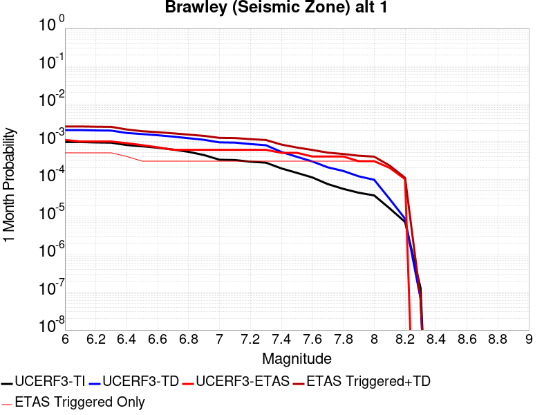 |  |  |

| Magnitude | 1 wk TI Prob | 1 wk TD Prob | 1 wk ETAS Prob | 1 wk ETAS/TD Gain | 1 wk ETAS Triggered+TD | 1 wk ETAS Triggered Only | 1 mo TI Prob | 1 mo TD Prob | 1 mo ETAS Prob | 1 mo ETAS/TD Gain | 1 mo ETAS Triggered+TD | 1 mo ETAS Triggered Only | 1 yr TI Prob | 1 yr TD Prob | 1 yr ETAS Prob | 1 yr ETAS/TD Gain | 1 yr ETAS Triggered+TD | 1 yr ETAS Triggered Only | 10 yr TI Prob | 10 yr TD Prob | 10 yr ETAS Prob | 10 yr ETAS/TD Gain | 10 yr ETAS Triggered+TD | 10 yr ETAS Triggered Only |
|-----|-----|-----|-----|-----|-----|-----|-----|-----|-----|-----|-----|-----|-----|-----|-----|-----|-----|-----|-----|-----|-----|-----|-----|-----|
| 6.0 | 2.2521618E-4 | 4.6533594E-4 | 3.0E-4 | 0.6446955 | 4.6533594E-4 | 0.0 | 9.6485513E-4 | 0.0019928087 | 0.0011 | 0.5519848 | 0.0024918122 | 5.0E-4 | 0.011683988 | 0.023988076 | 0.016 | 0.6669981 | 0.02935614 | 0.0055 | 0.11088423 | 0.20974061 | 0.1537 | 0.7328099 | 0.2343967 | 0.0312 |
| 6.1 | 2.2521618E-4 | 4.6533594E-4 | 3.0E-4 | 0.6446955 | 4.6533594E-4 | 0.0 | 9.6485513E-4 | 0.0019928087 | 0.001 | 0.50180435 | 0.0024918122 | 5.0E-4 | 0.011683988 | 0.023988076 | 0.0144 | 0.6002983 | 0.028868135 | 0.005 | 0.11088423 | 0.20974061 | 0.1366 | 0.65128064 | 0.23155177 | 0.0276 |
| 6.2 | 2.198148E-4 | 4.5645965E-4 | 3.0E-4 | 0.6572322 | 4.5645965E-4 | 0.0 | 9.417233E-4 | 0.0019548247 | 0.001 | 0.51155484 | 0.002453847 | 5.0E-4 | 0.011405343 | 0.02353607 | 0.0141 | 0.5990805 | 0.02832074 | 0.0049 | 0.10837428 | 0.20623754 | 0.1334 | 0.6468269 | 0.22687536 | 0.026 |
| 6.3 | 2.1704129E-4 | 4.5086833E-4 | 3.0E-4 | 0.66538274 | 4.5086833E-4 | 0.0 | 9.298453E-4 | 0.0019308975 | 0.001 | 0.5178939 | 0.0024299321 | 5.0E-4 | 0.011262234 | 0.023251357 | 0.0137 | 0.58921295 | 0.027744401 | 0.0046 | 0.107082725 | 0.20413247 | 0.1318 | 0.64565915 | 0.22426791 | 0.0253 |
| 6.4 | 1.876142E-4 | 3.9022637E-4 | 3.0E-4 | 0.7687846 | 3.9022637E-4 | 0.0 | 8.038131E-4 | 0.0016713403 | 9.0E-4 | 0.53849 | 0.0020706719 | 4.0E-4 | 0.00974259 | 0.02015831 | 0.0121 | 0.60024875 | 0.02417566 | 0.0041 | 0.093263686 | 0.18090113 | 0.1149 | 0.6351536 | 0.19826603 | 0.0212 |
| 6.5 | 1.7390939E-4 | 3.6497993E-4 | 3.0E-4 | 0.821963 | 3.6497993E-4 | 0.0 | 7.45113E-4 | 0.0015632734 | 8.0E-4 | 0.5117467 | 0.0018628044 | 3.0E-4 | 0.009034078 | 0.018868195 | 0.011 | 0.58299166 | 0.022498382 | 0.0037 | 0.086755216 | 0.17080772 | 0.1076 | 0.6299481 | 0.1866453 | 0.0191 |
| 6.6 | 1.591791E-4 | 3.3971245E-4 | 2.0E-4 | 0.5887332 | 3.3971245E-4 | 0.0 | 6.8201777E-4 | 0.0014551076 | 7.0E-4 | 0.48106408 | 0.001754671 | 3.0E-4 | 0.008271996 | 0.017573824 | 0.0102 | 0.5804087 | 0.021012316 | 0.0035 | 0.07970774 | 0.16035357 | 0.101 | 0.62985814 | 0.17546721 | 0.018 |
| 6.7 | 1.4268003E-4 | 3.1204906E-4 | 1.0E-4 | 0.32046244 | 3.1204906E-4 | 0.0 | 6.1134255E-4 | 0.0013366753 | 6.0E-4 | 0.44887492 | 0.0016362743 | 3.0E-4 | 0.007417723 | 0.016153757 | 0.0087 | 0.5385744 | 0.018908527 | 0.0028 | 0.07174956 | 0.1486512 | 0.0923 | 0.6209166 | 0.16244306 | 0.0162 |
| 6.8 | 1.239713E-4 | 2.835754E-4 | 1.0E-4 | 0.3526399 | 2.835754E-4 | 0.0 | 5.3119735E-4 | 0.0012147628 | 6.0E-4 | 0.49392357 | 0.0015143984 | 3.0E-4 | 0.0064481674 | 0.014690774 | 0.0081 | 0.55136645 | 0.017252577 | 0.0026 | 0.06264243 | 0.13560335 | 0.0846 | 0.62387836 | 0.14874218 | 0.0152 |
| 6.9 | 1.0180238E-4 | 2.5747836E-4 | 1.0E-4 | 0.38838217 | 2.5747836E-4 | 0.0 | 4.3622297E-4 | 0.0011030161 | 6.0E-4 | 0.5439631 | 0.0014026852 | 3.0E-4 | 0.005298089 | 0.013347485 | 0.0075 | 0.5619036 | 0.015616786 | 0.0023 | 0.05173543 | 0.12289762 | 0.0791 | 0.6436252 | 0.13508934 | 0.0139 |
| 7.0 | 7.6619996E-5 | 2.2041418E-4 | 1.0E-4 | 0.45369133 | 2.2041418E-4 | 0.0 | 3.283301E-4 | 9.4429334E-4 | 6.0E-4 | 0.6353958 | 0.00124401 | 3.0E-4 | 0.0039900932 | 0.0114368545 | 0.0062 | 0.5421071 | 0.013315124 | 0.0019 | 0.039192066 | 0.1057968 | 0.0678 | 0.64085114 | 0.11599071 | 0.0114 |
| 7.1 | 7.5127435E-5 | 2.1730422E-4 | 1.0E-4 | 0.46018434 | 2.1730422E-4 | 0.0 | 3.2193496E-4 | 9.309745E-4 | 6.0E-4 | 0.64448595 | 0.0012306952 | 3.0E-4 | 0.0039125155 | 0.011276387 | 0.0062 | 0.5498215 | 0.013154962 | 0.0019 | 0.038443442 | 0.10438197 | 0.0666 | 0.6380412 | 0.11450245 | 0.0113 |
| 7.2 | 6.788582E-5 | 1.9873041E-4 | 1.0E-4 | 0.5031942 | 1.9873041E-4 | 0.0 | 2.9090676E-4 | 8.5142674E-4 | 6.0E-4 | 0.7046995 | 0.0011511713 | 3.0E-4 | 0.0035360386 | 0.01031747 | 0.0056 | 0.5427687 | 0.011900962 | 0.0016 | 0.034803 | 0.09609729 | 0.0612 | 0.6368546 | 0.10567866 | 0.0106 |
| 7.3 | 6.399602E-5 | 1.8519968E-4 | 1.0E-4 | 0.53995776 | 1.8519968E-4 | 0.0 | 2.7423984E-4 | 7.9347426E-4 | 6.0E-4 | 0.7561682 | 0.0010932363 | 3.0E-4 | 0.0033337586 | 0.00961833 | 0.0054 | 0.561428 | 0.011103903 | 0.0015 | 0.03284188 | 0.09004573 | 0.0571 | 0.63412225 | 0.09896328 | 0.0098 |
| 7.4 | 4.506759E-5 | 1.2283388E-4 | 0.0 | 0.0 | 1.2283388E-4 | 0.0 | 1.9313251E-4 | 5.2632554E-4 | 5.0E-4 | 0.9499824 | 8.2616764E-4 | 3.0E-4 | 0.0023488526 | 0.006389355 | 0.0038 | 0.59473926 | 0.0074823266 | 0.0011 | 0.023241805 | 0.061279375 | 0.0366 | 0.5972646 | 0.06785042 | 0.007 |
| 7.5 | 3.43289E-5 | 9.1361755E-5 | 0.0 | 0.0 | 9.1361755E-5 | 0.0 | 1.4711556E-4 | 3.9149195E-4 | 5.0E-4 | 1.2771655 | 6.913745E-4 | 3.0E-4 | 0.0017896603 | 0.0047560576 | 0.0032 | 0.6728262 | 0.005651777 | 9.0E-4 | 0.01775316 | 0.046157982 | 0.028 | 0.6066123 | 0.05130873 | 0.0054 |
| 7.6 | 2.5980507E-5 | 6.881562E-5 | 0.0 | 0.0 | 6.881562E-5 | 0.0 | 1.1134028E-4 | 2.948909E-4 | 4.0E-4 | 1.3564339 | 5.9480243E-4 | 3.0E-4 | 0.001354725 | 0.0035844091 | 0.0029 | 0.8090594 | 0.0044811834 | 9.0E-4 | 0.013464959 | 0.03505983 | 0.0217 | 0.618942 | 0.03940206 | 0.0045 |
| 7.7 | 1.7292105E-5 | 4.7962152E-5 | 0.0 | 0.0 | 4.7962152E-5 | 0.0 | 7.4106916E-5 | 2.0553592E-4 | 4.0E-4 | 1.9461318 | 5.054743E-4 | 3.0E-4 | 9.018782E-4 | 0.0024995336 | 0.0018 | 0.7201344 | 0.0029982838 | 5.0E-4 | 0.008982267 | 0.024629422 | 0.0152 | 0.6171481 | 0.027750608 | 0.0032 |
| 7.8 | 1.2927471E-5 | 3.8444596E-5 | 0.0 | 0.0 | 3.8444596E-5 | 0.0 | 5.5402274E-5 | 1.6475216E-4 | 4.0E-4 | 2.4278893 | 4.6470272E-4 | 3.0E-4 | 6.743139E-4 | 0.0020040146 | 0.0014 | 0.6985977 | 0.0025030125 | 5.0E-4 | 0.0067227143 | 0.019860458 | 0.0121 | 0.6092508 | 0.022702863 | 0.0029 |
| 7.9 | 1.0200774E-5 | 2.7730803E-5 | 0.0 | 0.0 | 2.7730803E-5 | 0.0 | 4.371687E-5 | 1.18840886E-4 | 3.0E-4 | 2.5243838 | 4.1880523E-4 | 3.0E-4 | 5.321229E-4 | 0.0014459285 | 9.0E-4 | 0.6224374 | 0.0018453501 | 4.0E-4 | 0.005308505 | 0.014520071 | 0.0083 | 0.57162255 | 0.01658958 | 0.0021 |
| 8.0 | 8.650396E-6 | 2.2400553E-5 | 0.0 | 0.0 | 2.2400553E-5 | 0.0 | 3.70726E-5 | 9.599884E-5 | 3.0E-4 | 3.1250377 | 3.9597004E-4 | 3.0E-4 | 4.5126543E-4 | 0.00116816 | 8.0E-4 | 0.6848377 | 0.0015676927 | 4.0E-4 | 0.0045035016 | 0.011800713 | 0.0065 | 0.55081415 | 0.0132830115 | 0.0015 |
| 8.1 | 3.9368224E-6 | 6.9356947E-6 | 0.0 | 0.0 | 6.9356947E-6 | 0.0 | 1.6871985E-5 | 2.9724068E-5 | 2.0E-4 | 6.7285542 | 2.2971812E-4 | 2.0E-4 | 2.0539707E-4 | 3.6183055E-4 | 3.0E-4 | 0.8291174 | 5.617582E-4 | 2.0E-4 | 0.0020520731 | 0.0038061712 | 0.0022 | 0.57800865 | 0.0041050296 | 3.0E-4 |
| 8.2 | 1.7101195E-6 | 2.061943E-6 | 0.0 | 0.0 | 2.061943E-6 | 0.0 | 7.329063E-6 | 8.836869E-6 | 1.0E-4 | 11.316226 | 1.08835986E-4 | 1.0E-4 | 8.922769E-5 | 1.0758359E-4 | 1.0E-4 | 0.92950976 | 2.0757283E-4 | 1.0E-4 | 8.9191867E-4 | 0.0011864101 | 8.0E-4 | 0.6743031 | 0.0012862914 | 1.0E-4 |
| 8.3 | 3.0346666E-8 | 1.567035E-8 | 0.0 | 0.0 | 1.567035E-8 | 0.0 | 1.3005713E-7 | 6.7158645E-8 | 0.0 | 0.0 | 6.7158645E-8 | 0.0 | 1.5834444E-6 | 8.176564E-7 | 0.0 | 0.0 | 8.176564E-7 | 0.0 | 1.5834332E-5 | 8.542308E-6 | 0.0 | 0.0 | 8.542308E-6 | 0.0 |

## Imperial
*[(top)](#table-of-contents)*

| 1 Week | 1 Month | 1 Year | 10 Year |
|-----|-----|-----|-----|
|  | 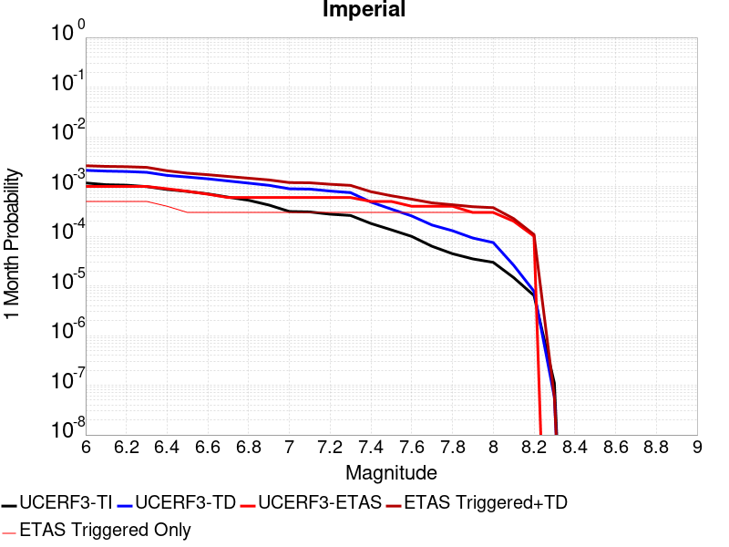 |  | 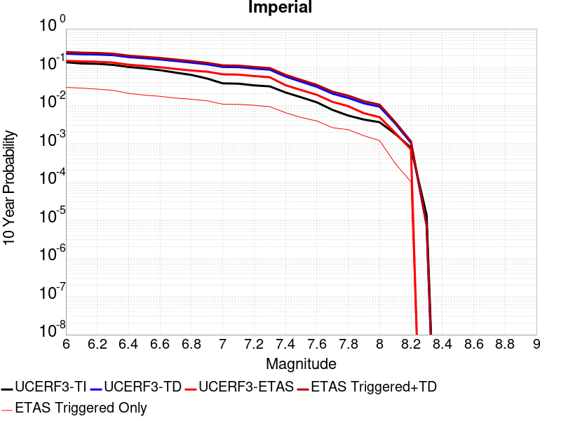 |

| Magnitude | 1 wk TI Prob | 1 wk TD Prob | 1 wk ETAS Prob | 1 wk ETAS/TD Gain | 1 wk ETAS Triggered+TD | 1 wk ETAS Triggered Only | 1 mo TI Prob | 1 mo TD Prob | 1 mo ETAS Prob | 1 mo ETAS/TD Gain | 1 mo ETAS Triggered+TD | 1 mo ETAS Triggered Only | 1 yr TI Prob | 1 yr TD Prob | 1 yr ETAS Prob | 1 yr ETAS/TD Gain | 1 yr ETAS Triggered+TD | 1 yr ETAS Triggered Only | 10 yr TI Prob | 10 yr TD Prob | 10 yr ETAS Prob | 10 yr ETAS/TD Gain | 10 yr ETAS Triggered+TD | 10 yr ETAS Triggered Only |
|-----|-----|-----|-----|-----|-----|-----|-----|-----|-----|-----|-----|-----|-----|-----|-----|-----|-----|-----|-----|-----|-----|-----|-----|-----|
| 6.0 | 2.7496446E-4 | 4.895928E-4 | 3.0E-4 | 0.6127541 | 4.895928E-4 | 0.0 | 0.0011778869 | 0.0020966053 | 0.001 | 0.4769615 | 0.0025955571 | 5.0E-4 | 0.0142467655 | 0.02520393 | 0.0151 | 0.5991129 | 0.03017539 | 0.0051 | 0.13367249 | 0.22269472 | 0.1452 | 0.6520136 | 0.24546978 | 0.0293 |
| 6.1 | 2.5356023E-4 | 4.7265363E-4 | 3.0E-4 | 0.63471425 | 4.7265363E-4 | 0.0 | 0.001086234 | 0.0020241227 | 0.001 | 0.49404117 | 0.0025231107 | 5.0E-4 | 0.013144928 | 0.024346493 | 0.0149 | 0.6119978 | 0.029322326 | 0.0051 | 0.123940155 | 0.2147349 | 0.1408 | 0.6556922 | 0.23680085 | 0.0281 |
| 6.2 | 2.4820742E-4 | 4.6388546E-4 | 3.0E-4 | 0.64671135 | 4.6388546E-4 | 0.0 | 0.0010633124 | 0.0019866023 | 0.001 | 0.503372 | 0.002485609 | 5.0E-4 | 0.01286919 | 0.023900157 | 0.0146 | 0.61087465 | 0.028780656 | 0.005 | 0.12148927 | 0.21129626 | 0.1376 | 0.6512183 | 0.23219691 | 0.0265 |
| 6.3 | 2.3205351E-4 | 4.4672057E-4 | 3.0E-4 | 0.6715607 | 4.4672057E-4 | 0.0 | 9.94136E-4 | 0.0019131477 | 0.001 | 0.52269876 | 0.0024121911 | 5.0E-4 | 0.012036599 | 0.023043953 | 0.0135 | 0.58583695 | 0.027537951 | 0.0046 | 0.11405133 | 0.20366937 | 0.1313 | 0.6446723 | 0.2232591 | 0.0246 |
| 6.4 | 2.0304754E-4 | 3.8701732E-4 | 3.0E-4 | 0.7751591 | 3.8701732E-4 | 0.0 | 8.6991355E-4 | 0.001657605 | 9.0E-4 | 0.542952 | 0.002056942 | 4.0E-4 | 0.010539869 | 0.019998284 | 0.0121 | 0.60505193 | 0.02401629 | 0.0041 | 0.100537635 | 0.18080486 | 0.1152 | 0.637151 | 0.19768028 | 0.0206 |
| 6.5 | 1.854992E-4 | 3.5898542E-4 | 3.0E-4 | 0.83568853 | 3.5898542E-4 | 0.0 | 7.9475436E-4 | 0.0015376133 | 8.0E-4 | 0.52028686 | 0.001837152 | 3.0E-4 | 0.009633281 | 0.018566702 | 0.011 | 0.5924585 | 0.022198005 | 0.0037 | 0.0922623 | 0.16924961 | 0.1069 | 0.63161147 | 0.18453543 | 0.0184 |
| 6.6 | 1.6586106E-4 | 3.305461E-4 | 2.0E-4 | 0.60505927 | 3.305461E-4 | 0.0 | 7.106394E-4 | 0.0014158665 | 7.0E-4 | 0.4943969 | 0.0017154418 | 3.0E-4 | 0.008617763 | 0.017105592 | 0.0101 | 0.59045017 | 0.020545723 | 0.0035 | 0.08291132 | 0.15704171 | 0.0989 | 0.62976897 | 0.1715406 | 0.0172 |
| 6.7 | 1.4224656E-4 | 2.9921078E-4 | 1.0E-4 | 0.33421254 | 2.9921078E-4 | 0.0 | 6.094856E-4 | 0.0012817093 | 6.0E-4 | 0.46812487 | 0.0015813248 | 3.0E-4 | 0.0073952693 | 0.015494272 | 0.0085 | 0.5485898 | 0.018250888 | 0.0028 | 0.07153955 | 0.14318357 | 0.0891 | 0.6222781 | 0.15637855 | 0.0154 |
| 6.8 | 1.2317259E-4 | 2.7105198E-4 | 1.0E-4 | 0.36893293 | 2.7105198E-4 | 0.0 | 5.2777573E-4 | 0.0011611399 | 6.0E-4 | 0.5167336 | 0.0014607916 | 3.0E-4 | 0.0064067547 | 0.014046529 | 0.0079 | 0.5624165 | 0.016610008 | 0.0026 | 0.06225166 | 0.13016221 | 0.0814 | 0.62537354 | 0.14268787 | 0.0144 |
| 6.9 | 9.859898E-5 | 2.4530667E-4 | 1.0E-4 | 0.407653 | 2.4530667E-4 | 0.0 | 4.2249862E-4 | 0.0010508947 | 6.0E-4 | 0.57094204 | 0.0013505794 | 3.0E-4 | 0.0051317946 | 0.012720503 | 0.0073 | 0.5738767 | 0.014991246 | 0.0023 | 0.05014893 | 0.11742009 | 0.0757 | 0.64469373 | 0.12898189 | 0.0131 |
| 7.0 | 7.3191884E-5 | 2.0933368E-4 | 1.0E-4 | 0.47770622 | 2.0933368E-4 | 0.0 | 3.136418E-4 | 8.9683896E-4 | 6.0E-4 | 0.6690164 | 0.0011965699 | 3.0E-4 | 0.003811904 | 0.010865013 | 0.006 | 0.55223125 | 0.01274437 | 0.0019 | 0.037471764 | 0.10068799 | 0.0646 | 0.64158595 | 0.11031063 | 0.0107 |
| 7.1 | 7.1760296E-5 | 2.064055E-4 | 1.0E-4 | 0.4844832 | 2.064055E-4 | 0.0 | 3.0750787E-4 | 8.842982E-4 | 6.0E-4 | 0.67850417 | 0.0011840329 | 3.0E-4 | 0.003737482 | 0.010713841 | 0.006 | 0.56002325 | 0.0125934845 | 0.0019 | 0.03675245 | 0.09934601 | 0.0634 | 0.6381736 | 0.10889294 | 0.0106 |
| 7.2 | 6.46614E-5 | 1.8823914E-4 | 1.0E-4 | 0.53123915 | 1.8823914E-4 | 0.0 | 2.7709085E-4 | 8.064927E-4 | 6.0E-4 | 0.7439621 | 0.0011062508 | 3.0E-4 | 0.0033683628 | 0.009775445 | 0.0054 | 0.5524045 | 0.011359804 | 0.0016 | 0.033177625 | 0.09119956 | 0.0582 | 0.638161 | 0.100287564 | 0.01 |
| 7.3 | 6.088115E-5 | 1.7511452E-4 | 1.0E-4 | 0.5710549 | 1.7511452E-4 | 0.0 | 2.6089314E-4 | 7.502777E-4 | 6.0E-4 | 0.7997039 | 0.0010500526 | 3.0E-4 | 0.0031717476 | 0.009096931 | 0.0052 | 0.57162136 | 0.010583285 | 0.0015 | 0.031268585 | 0.085304566 | 0.0541 | 0.6341981 | 0.093719766 | 0.0092 |
| 7.4 | 4.199346E-5 | 1.12887006E-4 | 0.0 | 0.0 | 1.12887006E-4 | 0.0 | 1.7995955E-4 | 4.8371262E-4 | 5.0E-4 | 1.0336716 | 7.835675E-4 | 3.0E-4 | 0.0021888057 | 0.0058734627 | 0.0036 | 0.61292636 | 0.0069670016 | 0.0011 | 0.02167372 | 0.056454986 | 0.0336 | 0.5951644 | 0.062493674 | 0.0064 |
| 7.5 | 3.130448E-5 | 8.158115E-5 | 0.0 | 0.0 | 8.158115E-5 | 0.0 | 1.3415517E-4 | 3.4958695E-4 | 5.0E-4 | 1.4302593 | 6.4948207E-4 | 3.0E-4 | 0.0016321153 | 0.0042479727 | 0.003 | 0.70621926 | 0.0051441495 | 9.0E-4 | 0.016201803 | 0.04133666 | 0.025 | 0.60479003 | 0.045938246 | 0.0048 |
| 7.6 | 2.3074248E-5 | 5.9368074E-5 | 0.0 | 0.0 | 5.9368074E-5 | 0.0 | 9.888588E-5 | 2.544099E-4 | 4.0E-4 | 1.5722657 | 5.543336E-4 | 3.0E-4 | 0.0012032706 | 0.0030930638 | 0.0027 | 0.8729209 | 0.00399028 | 9.0E-4 | 0.011967761 | 0.030348286 | 0.0188 | 0.6194748 | 0.03412993 | 0.0039 |
| 7.7 | 1.45864815E-5 | 3.8916234E-5 | 0.0 | 0.0 | 3.8916234E-5 | 0.0 | 6.2511994E-5 | 1.6677321E-4 | 4.0E-4 | 2.3984666 | 4.667232E-4 | 3.0E-4 | 7.608177E-4 | 0.0020285782 | 0.0016 | 0.7887297 | 0.0025275638 | 5.0E-4 | 0.007582182 | 0.020070491 | 0.0123 | 0.61284 | 0.022618309 | 0.0026 |
| 7.8 | 1.0352979E-5 | 2.994125E-5 | 0.0 | 0.0 | 2.994125E-5 | 0.0 | 4.4369157E-5 | 1.2831335E-4 | 4.0E-4 | 3.1173687 | 4.2827486E-4 | 3.0E-4 | 5.400606E-4 | 0.0015610977 | 0.0012 | 0.7686899 | 0.0020603172 | 5.0E-4 | 0.0053875 | 0.015546963 | 0.0095 | 0.61105186 | 0.017811205 | 0.0023 |
| 7.9 | 8.137906E-6 | 2.132492E-5 | 0.0 | 0.0 | 2.132492E-5 | 0.0 | 3.4876273E-5 | 9.1389324E-5 | 3.0E-4 | 3.2826593 | 3.9136191E-4 | 3.0E-4 | 4.2453592E-4 | 0.0011120979 | 8.0E-4 | 0.7193611 | 0.0015116531 | 4.0E-4 | 0.004237258 | 0.011232167 | 0.0062 | 0.5519861 | 0.012814196 | 0.0016 |
| 8.0 | 6.93792E-6 | 1.7294058E-5 | 0.0 | 0.0 | 1.7294058E-5 | 0.0 | 2.9733603E-5 | 7.411529E-5 | 3.0E-4 | 4.047748 | 3.7409304E-4 | 3.0E-4 | 3.6194647E-4 | 9.019808E-4 | 7.0E-4 | 0.77606976 | 0.0013016199 | 4.0E-4 | 0.0036135751 | 0.009164721 | 0.0049 | 0.53465897 | 0.010353723 | 0.0012 |
| 8.1 | 3.4286315E-6 | 6.034309E-6 | 0.0 | 0.0 | 6.034309E-6 | 0.0 | 1.4694053E-5 | 2.5861069E-5 | 2.0E-4 | 7.7336326 | 2.258559E-4 | 2.0E-4 | 1.7888541E-4 | 3.1481314E-4 | 3.0E-4 | 0.9529463 | 5.1475014E-4 | 2.0E-4 | 0.0017874148 | 0.0033140853 | 0.0019 | 0.5733105 | 0.003613091 | 3.0E-4 |
| 8.2 | 1.4906886E-6 | 1.7989122E-6 | 0.0 | 0.0 | 1.7989122E-6 | 0.0 | 6.3886496E-6 | 7.709601E-6 | 1.0E-4 | 12.9708395 | 1.0770883E-4 | 1.0E-4 | 7.7779034E-5 | 9.386038E-5 | 1.0E-4 | 1.0654123 | 1.93851E-4 | 1.0E-4 | 7.775182E-4 | 0.0010366293 | 7.0E-4 | 0.6752655 | 0.0011365257 | 1.0E-4 |
| 8.3 | 2.5758007E-8 | 1.3187132E-8 | 0.0 | 0.0 | 1.3187132E-8 | 0.0 | 1.10391454E-7 | 5.651628E-8 | 0.0 | 0.0 | 5.651628E-8 | 0.0 | 1.3440151E-6 | 6.880857E-7 | 0.0 | 0.0 | 6.880857E-7 | 0.0 | 1.344007E-5 | 7.186091E-6 | 0.0 | 0.0 | 7.186091E-6 | 0.0 |

## Laguna Salada
*[(top)](#table-of-contents)*

| 1 Week | 1 Month | 1 Year | 10 Year |
|-----|-----|-----|-----|
|  |  | 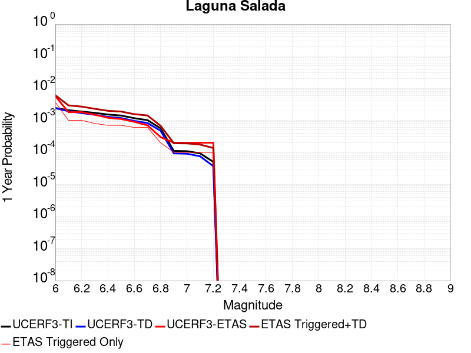 |  |

| Magnitude | 1 wk TI Prob | 1 wk TD Prob | 1 wk ETAS Prob | 1 wk ETAS/TD Gain | 1 wk ETAS Triggered+TD | 1 wk ETAS Triggered Only | 1 mo TI Prob | 1 mo TD Prob | 1 mo ETAS Prob | 1 mo ETAS/TD Gain | 1 mo ETAS Triggered+TD | 1 mo ETAS Triggered Only | 1 yr TI Prob | 1 yr TD Prob | 1 yr ETAS Prob | 1 yr ETAS/TD Gain | 1 yr ETAS Triggered+TD | 1 yr ETAS Triggered Only | 10 yr TI Prob | 10 yr TD Prob | 10 yr ETAS Prob | 10 yr ETAS/TD Gain | 10 yr ETAS Triggered+TD | 10 yr ETAS Triggered Only |
|-----|-----|-----|-----|-----|-----|-----|-----|-----|-----|-----|-----|-----|-----|-----|-----|-----|-----|-----|-----|-----|-----|-----|-----|-----|
| 6.0 | 4.6465593E-5 | 4.603502E-5 | 2.0E-4 | 4.3445187 | 1.4603042E-4 | 1.0E-4 | 1.9912305E-4 | 1.9727867E-4 | 3.0E-4 | 1.5206915 | 2.9725896E-4 | 1.0E-4 | 0.0024216278 | 0.002399297 | 0.0057 | 2.375696 | 0.0060904194 | 0.0037 | 0.02395408 | 0.023813494 | 0.0526 | 2.2088318 | 0.04880387 | 0.0256 |
| 6.1 | 3.982297E-5 | 3.696866E-5 | 0.0 | 0.0 | 3.696866E-5 | 0.0 | 1.706587E-4 | 1.584279E-4 | 1.0E-4 | 0.631202 | 1.584279E-4 | 0.0 | 0.0020757897 | 0.0019272442 | 0.0018 | 0.93397605 | 0.002925317 | 0.001 | 0.020565065 | 0.019186307 | 0.0193 | 1.0059258 | 0.028602118 | 0.0096 |
| 6.2 | 3.6067784E-5 | 3.233754E-5 | 0.0 | 0.0 | 3.233754E-5 | 0.0 | 1.5456705E-4 | 1.3858241E-4 | 1.0E-4 | 0.7215923 | 1.3858241E-4 | 0.0 | 0.0018802295 | 0.0016860253 | 0.0018 | 1.0675997 | 0.0026843392 | 0.001 | 0.018644003 | 0.016804963 | 0.0162 | 0.9640009 | 0.024867164 | 0.0082 |
| 6.3 | 3.2859112E-5 | 2.8596673E-5 | 0.0 | 0.0 | 2.8596673E-5 | 0.0 | 1.4081717E-4 | 1.2255185E-4 | 1.0E-4 | 0.81598115 | 1.2255185E-4 | 0.0 | 0.0017131006 | 0.0014911371 | 0.0015 | 1.0059437 | 0.0022899443 | 8.0E-4 | 0.016999546 | 0.014879224 | 0.0142 | 0.9543508 | 0.021972094 | 0.0072 |
| 6.4 | 2.9132116E-5 | 2.4614748E-5 | 0.0 | 0.0 | 2.4614748E-5 | 0.0 | 1.2484594E-4 | 1.0548801E-4 | 1.0E-4 | 0.94797504 | 1.0548801E-4 | 0.0 | 0.0015189396 | 0.0012836462 | 0.0012 | 0.93483704 | 0.0019827476 | 7.0E-4 | 0.015085992 | 0.012818991 | 0.0117 | 0.9127083 | 0.018840795 | 0.0061 |
| 6.5 | 2.7075037E-5 | 2.2596063E-5 | 0.0 | 0.0 | 2.2596063E-5 | 0.0 | 1.1603071E-4 | 9.683716E-5 | 1.0E-4 | 1.0326614 | 9.683716E-5 | 0.0 | 0.0014117584 | 0.0011784406 | 0.0011 | 0.93343693 | 0.0018776157 | 7.0E-4 | 0.014028233 | 0.011774354 | 0.011 | 0.9342339 | 0.017308418 | 0.0056 |
| 6.6 | 2.2367465E-5 | 1.8389497E-5 | 0.0 | 0.0 | 1.8389497E-5 | 0.0 | 9.5857045E-5 | 7.88102E-5 | 0.0 | 0.0 | 7.88102E-5 | 0.0 | 0.0011664346 | 9.591718E-4 | 9.0E-4 | 0.9383095 | 0.0015585963 | 6.0E-4 | 0.011603311 | 0.009588251 | 0.0096 | 1.0012254 | 0.01454031 | 0.005 |
| 6.7 | 1.9458053E-5 | 1.5762895E-5 | 0.0 | 0.0 | 1.5762895E-5 | 0.0 | 8.338899E-5 | 6.7553956E-5 | 0.0 | 0.0 | 6.7553956E-5 | 0.0 | 0.001014788 | 8.2223717E-4 | 7.0E-4 | 0.8513359 | 0.0014217438 | 6.0E-4 | 0.010101665 | 0.008237424 | 0.008 | 0.97117734 | 0.012502003 | 0.0043 |
| 6.8 | 1.0767866E-5 | 9.0636595E-6 | 0.0 | 0.0 | 9.0636595E-6 | 0.0 | 4.614718E-5 | 3.8844053E-5 | 0.0 | 0.0 | 3.8844053E-5 | 0.0 | 5.6169706E-4 | 4.7289018E-4 | 3.0E-4 | 0.63439673 | 6.7279564E-4 | 2.0E-4 | 0.0056027942 | 0.0047458936 | 0.0044 | 0.92711735 | 0.0069354526 | 0.0022 |
| 6.9 | 2.1384765E-6 | 1.7896037E-6 | 0.0 | 0.0 | 1.7896037E-6 | 0.0 | 9.164866E-6 | 7.669711E-6 | 0.0 | 0.0 | 7.669711E-6 | 0.0 | 1.1157654E-4 | 9.337511E-5 | 2.0E-4 | 2.1418984 | 1.9336578E-4 | 1.0E-4 | 0.0011152053 | 9.33397E-4 | 6.0E-4 | 0.6428133 | 0.0011332103 | 2.0E-4 |
| 7.0 | 2.0952946E-6 | 1.7475566E-6 | 0.0 | 0.0 | 1.7475566E-6 | 0.0 | 8.979802E-6 | 7.4895083E-6 | 0.0 | 0.0 | 7.4895083E-6 | 0.0 | 1.0932361E-4 | 9.118134E-5 | 2.0E-4 | 2.1934314 | 1.9117222E-4 | 1.0E-4 | 0.0010926984 | 9.114774E-4 | 6.0E-4 | 0.65827197 | 0.0011112951 | 2.0E-4 |
| 7.1 | 1.7887576E-6 | 1.4484149E-6 | 0.0 | 0.0 | 1.4484149E-6 | 0.0 | 7.666081E-6 | 6.207479E-6 | 0.0 | 0.0 | 6.207479E-6 | 0.0 | 9.333054E-5 | 7.557374E-5 | 2.0E-4 | 2.6464217 | 1.755662E-4 | 1.0E-4 | 9.329135E-4 | 7.5551076E-4 | 6.0E-4 | 0.7941647 | 9.5535966E-4 | 2.0E-4 |
| 7.2 | 9.723109E-7 | 7.124557E-7 | 0.0 | 0.0 | 7.124557E-7 | 0.0 | 4.16704E-6 | 3.0533788E-6 | 0.0 | 0.0 | 3.0533788E-6 | 0.0 | 5.073253E-5 | 3.7174417E-5 | 2.0E-4 | 5.380044 | 1.371707E-4 | 1.0E-4 | 5.072095E-4 | 3.716982E-4 | 4.0E-4 | 1.0761418 | 4.7166104E-4 | 1.0E-4 |

## San Andreas (Offshore) 2011 CFM
*[(top)](#table-of-contents)*

| 1 Week | 1 Month | 1 Year | 10 Year |
|-----|-----|-----|-----|
|  | 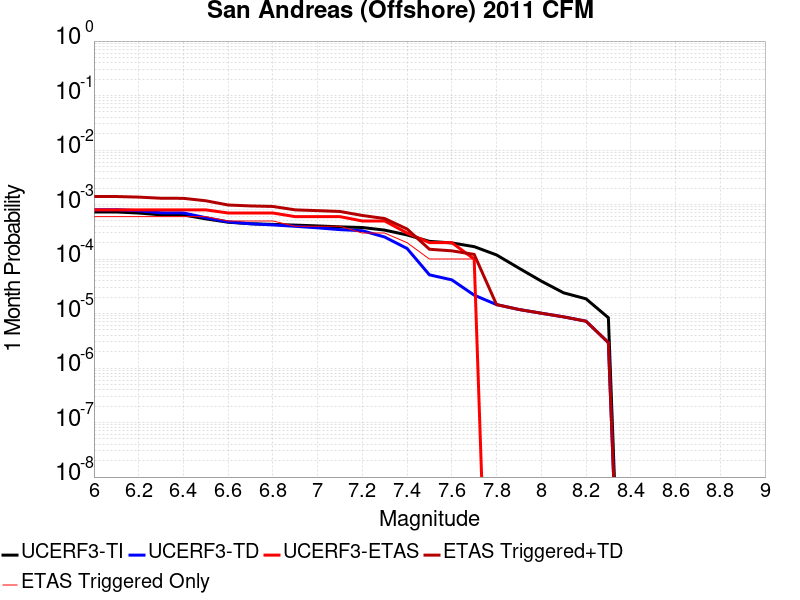 |  | 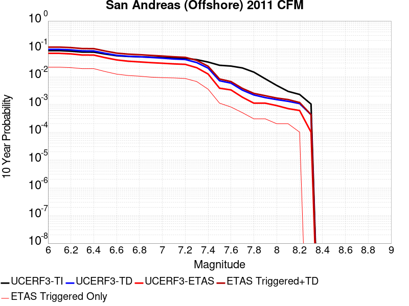 |

| Magnitude | 1 wk TI Prob | 1 wk TD Prob | 1 wk ETAS Prob | 1 wk ETAS/TD Gain | 1 wk ETAS Triggered+TD | 1 wk ETAS Triggered Only | 1 mo TI Prob | 1 mo TD Prob | 1 mo ETAS Prob | 1 mo ETAS/TD Gain | 1 mo ETAS Triggered+TD | 1 mo ETAS Triggered Only | 1 yr TI Prob | 1 yr TD Prob | 1 yr ETAS Prob | 1 yr ETAS/TD Gain | 1 yr ETAS Triggered+TD | 1 yr ETAS Triggered Only | 10 yr TI Prob | 10 yr TD Prob | 10 yr ETAS Prob | 10 yr ETAS/TD Gain | 10 yr ETAS Triggered+TD | 10 yr ETAS Triggered Only |
|-----|-----|-----|-----|-----|-----|-----|-----|-----|-----|-----|-----|-----|-----|-----|-----|-----|-----|-----|-----|-----|-----|-----|-----|-----|
| 6.0 | 1.7072787E-4 | 1.8721544E-4 | 5.0E-4 | 2.6707199 | 6.871218E-4 | 5.0E-4 | 7.3148566E-4 | 8.0210745E-4 | 8.0E-4 | 0.99737257 | 0.0014016262 | 6.0E-4 | 0.008869528 | 0.009722419 | 0.0071 | 0.7302709 | 0.0128913075 | 0.0032 | 0.085237645 | 0.09457582 | 0.0684 | 0.7232293 | 0.114223525 | 0.0217 |
| 6.1 | 1.7072787E-4 | 1.8721544E-4 | 5.0E-4 | 2.6707199 | 6.871218E-4 | 5.0E-4 | 7.3148566E-4 | 8.0210745E-4 | 8.0E-4 | 0.99737257 | 0.0014016262 | 6.0E-4 | 0.008869528 | 0.009722419 | 0.0071 | 0.7302709 | 0.0128913075 | 0.0032 | 0.085237645 | 0.09457582 | 0.0684 | 0.7232293 | 0.114223525 | 0.0217 |
| 6.2 | 1.6312556E-4 | 1.792449E-4 | 5.0E-4 | 2.7894795 | 6.791553E-4 | 5.0E-4 | 6.989222E-4 | 7.679686E-4 | 8.0E-4 | 1.0417093 | 0.0013675079 | 6.0E-4 | 0.008476226 | 0.009310407 | 0.0071 | 0.76258755 | 0.012480613 | 0.0032 | 0.08160117 | 0.0906796 | 0.0652 | 0.71901506 | 0.1096844 | 0.0209 |
| 6.3 | 1.5103363E-4 | 1.6429987E-4 | 5.0E-4 | 3.0432162 | 6.642177E-4 | 5.0E-4 | 6.471264E-4 | 7.0395437E-4 | 8.0E-4 | 1.1364373 | 0.0013035319 | 6.0E-4 | 0.007850339 | 0.008537386 | 0.0066 | 0.77307034 | 0.011412628 | 0.0029 | 0.075787395 | 0.083437145 | 0.0594 | 0.7119131 | 0.101035155 | 0.0192 |
| 6.4 | 1.5047993E-4 | 1.6316205E-4 | 5.0E-4 | 3.064438 | 6.630805E-4 | 5.0E-4 | 6.4475456E-4 | 6.9908064E-4 | 8.0E-4 | 1.1443602 | 0.0012986612 | 6.0E-4 | 0.007821669 | 0.00847851 | 0.0065 | 0.7666441 | 0.011353923 | 0.0029 | 0.0755203 | 0.08291759 | 0.0592 | 0.71396184 | 0.10052558 | 0.0192 |
| 6.5 | 1.2760791E-4 | 1.3343433E-4 | 5.0E-4 | 3.7471619 | 6.333676E-4 | 5.0E-4 | 5.467764E-4 | 5.717374E-4 | 8.0E-4 | 1.3992438 | 0.0011713944 | 6.0E-4 | 0.0066367025 | 0.006938945 | 0.0055 | 0.7926277 | 0.00962021 | 0.0027 | 0.064419635 | 0.0684414 | 0.0477 | 0.69694656 | 0.08250794 | 0.0151 |
| 6.6 | 1.1063525E-4 | 1.12099435E-4 | 4.0E-4 | 3.5682604 | 5.120546E-4 | 4.0E-4 | 4.740649E-4 | 4.803387E-4 | 7.0E-4 | 1.457305 | 9.800985E-4 | 5.0E-4 | 0.0057564764 | 0.005832633 | 0.0046 | 0.78866607 | 0.008218635 | 0.0024 | 0.05609626 | 0.05784239 | 0.0396 | 0.684619 | 0.06933671 | 0.0122 |
| 6.7 | 1.0391049E-4 | 1.03160106E-4 | 4.0E-4 | 3.8774679 | 5.0311885E-4 | 4.0E-4 | 4.4525467E-4 | 4.4204076E-4 | 7.0E-4 | 1.5835643 | 9.4181974E-4 | 5.0E-4 | 0.0054075094 | 0.0053687436 | 0.0039 | 0.72642696 | 0.007556932 | 0.0022 | 0.052778035 | 0.05340401 | 0.0356 | 0.6666166 | 0.06372191 | 0.0109 |
| 6.8 | 1.0096706E-4 | 9.835799E-5 | 4.0E-4 | 4.0667768 | 4.9831864E-4 | 4.0E-4 | 4.3264418E-4 | 4.2146703E-4 | 7.0E-4 | 1.6608654 | 9.212563E-4 | 5.0E-4 | 0.0052547283 | 0.005119455 | 0.0037 | 0.7227332 | 0.007208704 | 0.0021 | 0.051321987 | 0.05113353 | 0.0336 | 0.6571031 | 0.060906854 | 0.0103 |
| 6.9 | 9.800265E-5 | 9.273098E-5 | 3.0E-4 | 3.2351646 | 3.9270316E-4 | 3.0E-4 | 4.1994374E-4 | 3.9735882E-4 | 6.0E-4 | 1.5099703 | 7.971999E-4 | 4.0E-4 | 0.0051008356 | 0.0048272707 | 0.0034 | 0.70433176 | 0.0066185817 | 0.0018 | 0.049853306 | 0.048488364 | 0.0316 | 0.65170276 | 0.057527725 | 0.0095 |
| 7.0 | 9.4642375E-5 | 8.694709E-5 | 3.0E-4 | 3.4503744 | 3.8692102E-4 | 3.0E-4 | 4.0554712E-4 | 3.72578E-4 | 6.0E-4 | 1.610401 | 7.72429E-4 | 4.0E-4 | 0.004926363 | 0.004526855 | 0.0032 | 0.7068925 | 0.0062191593 | 0.0017 | 0.048185747 | 0.04570121 | 0.0301 | 0.6586259 | 0.05438533 | 0.0091 |
| 7.1 | 9.0996844E-5 | 8.056058E-5 | 3.0E-4 | 3.7239058 | 3.805364E-4 | 3.0E-4 | 3.8992817E-4 | 3.4521474E-4 | 6.0E-4 | 1.7380486 | 7.450767E-4 | 4.0E-4 | 0.004737046 | 0.004195037 | 0.003 | 0.7151308 | 0.005788325 | 0.0016 | 0.04637333 | 0.042589325 | 0.0285 | 0.66918176 | 0.05111028 | 0.0089 |
| 7.2 | 8.848287E-5 | 7.6909644E-5 | 2.0E-4 | 2.600454 | 2.7689425E-4 | 2.0E-4 | 3.791572E-4 | 3.2957192E-4 | 5.0E-4 | 1.5171195 | 6.2947307E-4 | 3.0E-4 | 0.004606472 | 0.0040053003 | 0.0029 | 0.72404057 | 0.0054992926 | 0.0015 | 0.045121472 | 0.040764637 | 0.0274 | 0.6721512 | 0.048918135 | 0.0085 |
| 7.3 | 7.9280784E-5 | 5.886845E-5 | 2.0E-4 | 3.3974056 | 2.588567E-4 | 2.0E-4 | 3.3973053E-4 | 2.522695E-4 | 5.0E-4 | 1.9820074 | 5.5219384E-4 | 3.0E-4 | 0.004128377 | 0.0030671514 | 0.0022 | 0.71727794 | 0.0041637775 | 0.0011 | 0.040525194 | 0.031688765 | 0.0208 | 0.65638405 | 0.03807962 | 0.0066 |
| 7.4 | 6.468038E-5 | 3.6269066E-5 | 2.0E-4 | 5.5143414 | 2.3626181E-4 | 2.0E-4 | 2.771722E-4 | 1.554299E-4 | 3.0E-4 | 1.9301307 | 3.553988E-4 | 2.0E-4 | 0.0033693502 | 0.0018907704 | 0.0014 | 0.74043894 | 0.0025894467 | 7.0E-4 | 0.0331872 | 0.019943256 | 0.0123 | 0.6167498 | 0.023373455 | 0.0035 |
| 7.5 | 4.930574E-5 | 1.1868133E-5 | 1.0E-4 | 8.425925 | 1.11866946E-4 | 1.0E-4 | 2.1129321E-4 | 5.0862443E-5 | 2.0E-4 | 3.9321747 | 1.5085736E-4 | 1.0E-4 | 0.0025694598 | 6.190758E-4 | 4.0E-4 | 0.6461245 | 8.189519E-4 | 2.0E-4 | 0.02539953 | 0.006988064 | 0.0038 | 0.5437844 | 0.008080377 | 0.0011 |
| 7.6 | 4.612566E-5 | 9.584499E-6 | 1.0E-4 | 10.433514 | 1.0958354E-4 | 1.0E-4 | 1.9766642E-4 | 4.1075786E-5 | 2.0E-4 | 4.8690486 | 1.4107168E-4 | 1.0E-4 | 0.0024039324 | 4.999842E-4 | 4.0E-4 | 0.8000253 | 6.998842E-4 | 2.0E-4 | 0.023780935 | 0.00572244 | 0.0033 | 0.5766771 | 0.006517862 | 8.0E-4 |
| 7.7 | 3.9435414E-5 | 5.0048866E-6 | 1.0E-4 | 19.980473 | 1.0500439E-4 | 1.0E-4 | 1.6899795E-4 | 2.1449338E-5 | 1.0E-4 | 4.6621485 | 1.2144719E-4 | 1.0E-4 | 0.0020556084 | 2.6111456E-4 | 3.0E-4 | 1.148921 | 4.6106233E-4 | 2.0E-4 | 0.020366974 | 0.0031907612 | 0.0018 | 0.5641287 | 0.0036891657 | 5.0E-4 |
| 7.8 | 2.7787428E-5 | 3.3536287E-6 | 0.0 | 0.0 | 3.3536287E-6 | 0.0 | 1.1908354E-4 | 1.4372615E-5 | 0.0 | 0.0 | 1.4372615E-5 | 0.0 | 0.0014488777 | 1.7497256E-4 | 2.0E-4 | 1.1430364 | 2.7495506E-4 | 1.0E-4 | 0.014394675 | 0.0021416345 | 0.0011 | 0.5136264 | 0.002440992 | 3.0E-4 |
| 7.9 | 1.590671E-5 | 2.7284348E-6 | 0.0 | 0.0 | 2.7284348E-6 | 0.0 | 6.816983E-5 | 1.169324E-5 | 0.0 | 0.0 | 1.169324E-5 | 0.0 | 8.2965166E-4 | 1.4235592E-4 | 2.0E-4 | 1.4049294 | 2.4234167E-4 | 1.0E-4 | 0.008265611 | 0.001717384 | 0.0011 | 0.64050907 | 0.0020168687 | 3.0E-4 |
| 8.0 | 9.193638E-6 | 2.3325933E-6 | 0.0 | 0.0 | 2.3325933E-6 | 0.0 | 3.940071E-5 | 9.99679E-6 | 0.0 | 0.0 | 9.99679E-6 | 0.0 | 4.7959806E-4 | 1.2170414E-4 | 1.0E-4 | 0.82166475 | 1.2170414E-4 | 0.0 | 0.0047856434 | 0.0014597047 | 9.0E-4 | 0.616563 | 0.0016594128 | 2.0E-4 |
| 8.1 | 5.601576E-6 | 1.9984789E-6 | 0.0 | 0.0 | 1.9984789E-6 | 0.0 | 2.4006533E-5 | 8.564882E-6 | 0.0 | 0.0 | 8.564882E-6 | 0.0 | 2.9224035E-4 | 1.0427247E-4 | 1.0E-4 | 0.9590259 | 1.0427247E-4 | 0.0 | 0.0029185633 | 0.0012651279 | 7.0E-4 | 0.5533038 | 0.0014648748 | 2.0E-4 |
| 8.2 | 4.3508785E-6 | 1.6652227E-6 | 0.0 | 0.0 | 1.6652227E-6 | 0.0 | 1.864649E-5 | 7.1366494E-6 | 0.0 | 0.0 | 7.1366494E-6 | 0.0 | 2.2699735E-4 | 8.6885266E-5 | 1.0E-4 | 1.1509432 | 8.6885266E-5 | 0.0 | 0.0022676561 | 0.0010487458 | 6.0E-4 | 0.5721119 | 0.001148641 | 1.0E-4 |
| 8.3 | 1.9573292E-6 | 6.7481693E-7 | 0.0 | 0.0 | 6.7481693E-7 | 0.0 | 8.388526E-6 | 2.8920695E-6 | 0.0 | 0.0 | 2.8920695E-6 | 0.0 | 1.0212552E-4 | 3.521039E-5 | 0.0 | 0.0 | 3.521039E-5 | 0.0 | 0.001020786 | 4.1982954E-4 | 1.0E-4 | 0.2381919 | 4.1982954E-4 | 0.0 |

## Hayward (So) 2011 CFM
*[(top)](#table-of-contents)*

| 1 Week | 1 Month | 1 Year | 10 Year |
|-----|-----|-----|-----|
|  |  |  |  |

| Magnitude | 1 wk TI Prob | 1 wk TD Prob | 1 wk ETAS Prob | 1 wk ETAS/TD Gain | 1 wk ETAS Triggered+TD | 1 wk ETAS Triggered Only | 1 mo TI Prob | 1 mo TD Prob | 1 mo ETAS Prob | 1 mo ETAS/TD Gain | 1 mo ETAS Triggered+TD | 1 mo ETAS Triggered Only | 1 yr TI Prob | 1 yr TD Prob | 1 yr ETAS Prob | 1 yr ETAS/TD Gain | 1 yr ETAS Triggered+TD | 1 yr ETAS Triggered Only | 10 yr TI Prob | 10 yr TD Prob | 10 yr ETAS Prob | 10 yr ETAS/TD Gain | 10 yr ETAS Triggered+TD | 10 yr ETAS Triggered Only |
|-----|-----|-----|-----|-----|-----|-----|-----|-----|-----|-----|-----|-----|-----|-----|-----|-----|-----|-----|-----|-----|-----|-----|-----|-----|
| 6.0 | 1.8091932E-4 | 3.5261808E-4 | 6.0E-4 | 1.7015576 | 4.5258284E-4 | 1.0E-4 | 7.751381E-4 | 0.0015103549 | 8.0E-4 | 0.52967685 | 0.0016102039 | 1.0E-4 | 0.00939654 | 0.018235872 | 0.0113 | 0.61965775 | 0.020690283 | 0.0025 | 0.090090066 | 0.16502564 | 0.1213 | 0.7350373 | 0.1791367 | 0.0169 |
| 6.1 | 1.8091932E-4 | 3.5261808E-4 | 6.0E-4 | 1.7015576 | 4.5258284E-4 | 1.0E-4 | 7.751381E-4 | 0.0015103549 | 8.0E-4 | 0.52967685 | 0.0016102039 | 1.0E-4 | 0.00939654 | 0.018235872 | 0.0113 | 0.61965775 | 0.020690283 | 0.0025 | 0.090090066 | 0.16502564 | 0.1213 | 0.7350373 | 0.1791367 | 0.0169 |
| 6.2 | 1.8091932E-4 | 3.5261808E-4 | 6.0E-4 | 1.7015576 | 4.5258284E-4 | 1.0E-4 | 7.751381E-4 | 0.0015103549 | 8.0E-4 | 0.52967685 | 0.0016102039 | 1.0E-4 | 0.00939654 | 0.018235872 | 0.0113 | 0.61965775 | 0.020690283 | 0.0025 | 0.090090066 | 0.16502564 | 0.1213 | 0.7350373 | 0.1791367 | 0.0169 |
| 6.3 | 1.7322872E-4 | 3.3830493E-4 | 6.0E-4 | 1.7735479 | 4.3827112E-4 | 1.0E-4 | 7.4219756E-4 | 0.0014490822 | 8.0E-4 | 0.5520736 | 0.0015489372 | 1.0E-4 | 0.0089988755 | 0.01750207 | 0.0111 | 0.63421077 | 0.019860065 | 0.0024 | 0.08643075 | 0.15897852 | 0.1166 | 0.7334324 | 0.17260307 | 0.0162 |
| 6.4 | 1.6334097E-4 | 3.192583E-4 | 6.0E-4 | 1.8793559 | 4.192264E-4 | 1.0E-4 | 6.998449E-4 | 0.0013675409 | 8.0E-4 | 0.58499163 | 0.0014674042 | 1.0E-4 | 0.008487372 | 0.01652466 | 0.0102 | 0.6172593 | 0.018688304 | 0.0022 | 0.081704415 | 0.15091974 | 0.1084 | 0.71826255 | 0.16365594 | 0.015 |
| 6.5 | 1.5600289E-4 | 3.061283E-4 | 6.0E-4 | 1.9599626 | 4.0609768E-4 | 1.0E-4 | 6.684125E-4 | 0.0013113269 | 8.0E-4 | 0.6100691 | 0.0014111957 | 1.0E-4 | 0.008107598 | 0.01585037 | 0.0096 | 0.6056641 | 0.017917085 | 0.0021 | 0.078181036 | 0.14522748 | 0.1032 | 0.7106093 | 0.15727977 | 0.0141 |
| 6.6 | 1.4046066E-4 | 2.7648776E-4 | 6.0E-4 | 2.170078 | 3.764601E-4 | 1.0E-4 | 6.018354E-4 | 0.0011844161 | 8.0E-4 | 0.6754383 | 0.0012842977 | 1.0E-4 | 0.0073027555 | 0.014326378 | 0.0087 | 0.60727143 | 0.016002024 | 0.0017 | 0.07067384 | 0.13237391 | 0.092 | 0.69500095 | 0.14226486 | 0.0114 |
| 6.7 | 1.14696966E-4 | 2.2926719E-4 | 4.0E-4 | 1.7446892 | 2.2926719E-4 | 0.0 | 4.914658E-4 | 9.822086E-4 | 6.0E-4 | 0.6108682 | 9.822086E-4 | 0.0 | 0.0059671924 | 0.011893852 | 0.0072 | 0.6053548 | 0.013079579 | 0.0012 | 0.058094822 | 0.11133145 | 0.0758 | 0.68084985 | 0.11941833 | 0.0091 |
| 6.8 | 9.3874296E-5 | 1.8578733E-4 | 3.0E-4 | 1.6147496 | 1.8578733E-4 | 0.0 | 4.0225635E-4 | 7.9599203E-4 | 5.0E-4 | 0.628147 | 7.9599203E-4 | 0.0 | 0.0048864787 | 0.009648853 | 0.006 | 0.6218356 | 0.010540169 | 9.0E-4 | 0.047804173 | 0.09138441 | 0.0596 | 0.65218997 | 0.09747214 | 0.0067 |
| 6.9 | 5.551852E-5 | 1.05556086E-4 | 2.0E-4 | 1.8947272 | 1.05556086E-4 | 0.0 | 2.3791482E-4 | 4.523054E-4 | 4.0E-4 | 0.8843582 | 4.523054E-4 | 0.0 | 0.0028927654 | 0.0054930286 | 0.0034 | 0.6189664 | 0.0061891833 | 7.0E-4 | 0.028553981 | 0.053457867 | 0.0336 | 0.6285324 | 0.05733869 | 0.0041 |
| 7.0 | 4.2662363E-5 | 8.109846E-5 | 2.0E-4 | 2.4661381 | 8.109846E-5 | 0.0 | 1.8282588E-4 | 3.4751892E-4 | 3.0E-4 | 0.86326236 | 3.4751892E-4 | 0.0 | 0.0022236328 | 0.0042229057 | 0.002 | 0.47360757 | 0.0046212166 | 4.0E-4 | 0.022015138 | 0.041430097 | 0.0241 | 0.5817027 | 0.04420995 | 0.0029 |
| 7.1 | 3.305886E-5 | 6.190245E-5 | 2.0E-4 | 3.23089 | 6.190245E-5 | 0.0 | 1.4167312E-4 | 2.6526934E-4 | 3.0E-4 | 1.1309261 | 2.6526934E-4 | 0.0 | 0.0017235056 | 0.0032248893 | 0.0016 | 0.49614108 | 0.0036235992 | 4.0E-4 | 0.017101998 | 0.031923823 | 0.0184 | 0.5763721 | 0.033763167 | 0.0019 |
| 7.2 | 2.9856887E-5 | 5.5962453E-5 | 2.0E-4 | 3.573825 | 5.5962453E-5 | 0.0 | 1.2795182E-4 | 2.3981712E-4 | 3.0E-4 | 1.2509532 | 2.3981712E-4 | 0.0 | 0.0015567001 | 0.0029158804 | 0.0014 | 0.48012945 | 0.0032150056 | 3.0E-4 | 0.015458403 | 0.028953342 | 0.0163 | 0.56297475 | 0.030701226 | 0.0018 |
| 7.3 | 2.4559737E-5 | 4.5145207E-5 | 2.0E-4 | 4.430149 | 4.5145207E-5 | 0.0 | 1.0525176E-4 | 1.9346518E-4 | 3.0E-4 | 1.5506666 | 1.9346518E-4 | 0.0 | 0.0012806869 | 0.0023529066 | 0.0013 | 0.5525081 | 0.0026522009 | 3.0E-4 | 0.012733313 | 0.023449626 | 0.0135 | 0.57570213 | 0.025012108 | 0.0016 |
| 7.4 | 1.9002231E-5 | 3.438138E-5 | 2.0E-4 | 5.817102 | 3.438138E-5 | 0.0 | 8.143559E-5 | 1.473405E-4 | 3.0E-4 | 2.0361 | 1.473405E-4 | 0.0 | 9.910273E-4 | 0.0017924041 | 0.001 | 0.5579099 | 0.0019920457 | 2.0E-4 | 0.009866194 | 0.017933264 | 0.0098 | 0.54647046 | 0.019111745 | 0.0012 |
| 7.5 | 1.2783333E-5 | 2.2866025E-5 | 2.0E-4 | 8.746601 | 2.2866025E-5 | 0.0 | 5.4784563E-5 | 9.79936E-5 | 3.0E-4 | 3.0614243 | 9.79936E-5 | 0.0 | 6.667979E-4 | 0.0011924247 | 8.0E-4 | 0.6709019 | 0.0013921863 | 2.0E-4 | 0.006648007 | 0.011982868 | 0.0068 | 0.5674768 | 0.012970885 | 0.001 |
| 7.6 | 4.8149627E-6 | 8.691418E-6 | 0.0 | 0.0 | 8.691418E-6 | 0.0 | 2.063539E-5 | 3.724841E-5 | 0.0 | 0.0 | 3.724841E-5 | 0.0 | 2.5120692E-4 | 4.534062E-4 | 5.0E-4 | 1.1027639 | 6.533155E-4 | 2.0E-4 | 0.0025092314 | 0.0045851013 | 0.0025 | 0.5452442 | 0.0048837257 | 3.0E-4 |
| 7.7 | 6.0838227E-7 | 1.1512212E-6 | 0.0 | 0.0 | 1.1512212E-6 | 0.0 | 2.6073499E-6 | 4.933796E-6 | 0.0 | 0.0 | 4.933796E-6 | 0.0 | 3.174402E-5 | 6.0067316E-5 | 1.0E-4 | 1.664799 | 6.0067316E-5 | 0.0 | 3.1739488E-4 | 6.264154E-4 | 3.0E-4 | 0.4789154 | 6.264154E-4 | 0.0 |
| 7.8 | 4.5542808E-7 | 9.323661E-7 | 0.0 | 0.0 | 9.323661E-7 | 0.0 | 1.9518332E-6 | 3.9958486E-6 | 0.0 | 0.0 | 3.9958486E-6 | 0.0 | 2.376331E-5 | 4.8648373E-5 | 1.0E-4 | 2.0555673 | 4.8648373E-5 | 0.0 | 2.3760769E-4 | 5.0937186E-4 | 2.0E-4 | 0.39264047 | 5.0937186E-4 | 0.0 |
| 7.9 | 3.3016747E-7 | 7.049145E-7 | 0.0 | 0.0 | 7.049145E-7 | 0.0 | 1.4150027E-6 | 3.0210585E-6 | 0.0 | 0.0 | 3.0210585E-6 | 0.0 | 1.7227521E-5 | 3.678077E-5 | 1.0E-4 | 2.718812 | 3.678077E-5 | 0.0 | 1.7226185E-4 | 3.829908E-4 | 2.0E-4 | 0.52220577 | 3.829908E-4 | 0.0 |
| 8.0 | 2.347038E-7 | 5.238285E-7 | 0.0 | 0.0 | 5.238285E-7 | 0.0 | 1.0058731E-6 | 2.2449772E-6 | 0.0 | 0.0 | 2.2449772E-6 | 0.0 | 1.2246436E-5 | 2.7332257E-5 | 0.0 | 0.0 | 2.7332257E-5 | 0.0 | 1.2245761E-4 | 2.8231626E-4 | 1.0E-4 | 0.35421267 | 2.8231626E-4 | 0.0 |
| 8.1 | 1.18822804E-7 | 2.5006742E-7 | 0.0 | 0.0 | 2.5006742E-7 | 0.0 | 5.092405E-7 | 1.071717E-6 | 0.0 | 0.0 | 1.071717E-6 | 0.0 | 6.1999854E-6 | 1.3048078E-5 | 0.0 | 0.0 | 1.3048078E-5 | 0.0 | 6.199812E-5 | 1.3403154E-4 | 1.0E-4 | 0.74609303 | 1.3403154E-4 | 0.0 |

## San Andreas (Cholame) rev
*[(top)](#table-of-contents)*

| 1 Week | 1 Month | 1 Year | 10 Year |
|-----|-----|-----|-----|
|  |  | 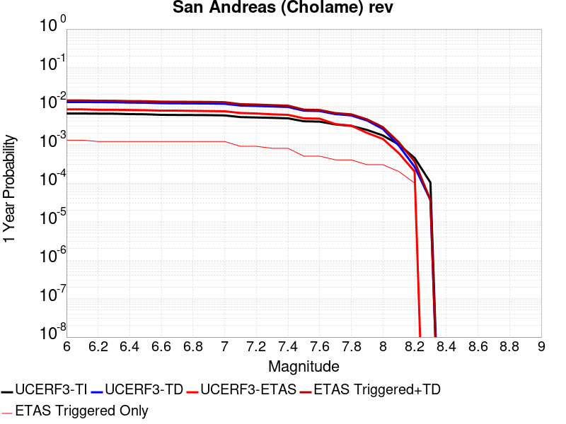 | 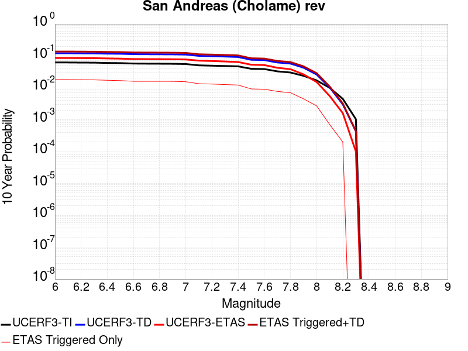 |

| Magnitude | 1 wk TI Prob | 1 wk TD Prob | 1 wk ETAS Prob | 1 wk ETAS/TD Gain | 1 wk ETAS Triggered+TD | 1 wk ETAS Triggered Only | 1 mo TI Prob | 1 mo TD Prob | 1 mo ETAS Prob | 1 mo ETAS/TD Gain | 1 mo ETAS Triggered+TD | 1 mo ETAS Triggered Only | 1 yr TI Prob | 1 yr TD Prob | 1 yr ETAS Prob | 1 yr ETAS/TD Gain | 1 yr ETAS Triggered+TD | 1 yr ETAS Triggered Only | 10 yr TI Prob | 10 yr TD Prob | 10 yr ETAS Prob | 10 yr ETAS/TD Gain | 10 yr ETAS Triggered+TD | 10 yr ETAS Triggered Only |
|-----|-----|-----|-----|-----|-----|-----|-----|-----|-----|-----|-----|-----|-----|-----|-----|-----|-----|-----|-----|-----|-----|-----|-----|-----|
| 6.0 | 1.2302514E-4 | 2.4360698E-4 | 2.0E-4 | 0.8209945 | 3.4358262E-4 | 1.0E-4 | 5.27144E-4 | 0.0010436138 | 0.0011 | 1.0540298 | 0.0014431963 | 4.0E-4 | 0.0063991086 | 0.0126324445 | 0.0082 | 0.6491222 | 0.013916022 | 0.0013 | 0.06217949 | 0.120853856 | 0.086 | 0.7116033 | 0.1367664 | 0.0181 |
| 6.1 | 1.2302514E-4 | 2.4360698E-4 | 2.0E-4 | 0.8209945 | 3.4358262E-4 | 1.0E-4 | 5.27144E-4 | 0.0010436138 | 0.0011 | 1.0540298 | 0.0014431963 | 4.0E-4 | 0.0063991086 | 0.0126324445 | 0.0082 | 0.6491222 | 0.013916022 | 0.0013 | 0.06217949 | 0.120853856 | 0.086 | 0.7116033 | 0.1367664 | 0.0181 |
| 6.2 | 1.2203569E-4 | 2.4178489E-4 | 2.0E-4 | 0.8271816 | 3.4176072E-4 | 1.0E-4 | 5.2290526E-4 | 0.001035811 | 0.0011 | 1.0619698 | 0.0014353967 | 4.0E-4 | 0.006347804 | 0.012538543 | 0.008 | 0.6380327 | 0.013723497 | 0.0012 | 0.061695136 | 0.12004175 | 0.0855 | 0.7122522 | 0.135793 | 0.0179 |
| 6.3 | 1.2142645E-4 | 2.4065067E-4 | 2.0E-4 | 0.83108014 | 3.406266E-4 | 1.0E-4 | 5.202953E-4 | 0.001030954 | 0.0011 | 1.066973 | 0.0014305415 | 4.0E-4 | 0.006316212 | 0.012480088 | 0.008 | 0.64102113 | 0.013665111 | 0.0012 | 0.06139677 | 0.1195364 | 0.0849 | 0.71024394 | 0.1351206 | 0.0177 |
| 6.4 | 1.1865206E-4 | 2.3576531E-4 | 2.0E-4 | 0.84830123 | 3.3574173E-4 | 1.0E-4 | 5.0840975E-4 | 0.001010033 | 0.0011 | 1.0890733 | 0.001409629 | 4.0E-4 | 0.006172335 | 0.012228259 | 0.0079 | 0.64604455 | 0.013413585 | 0.0012 | 0.060036868 | 0.11734377 | 0.0833 | 0.70988005 | 0.13252546 | 0.0172 |
| 6.5 | 1.17443946E-4 | 2.3374322E-4 | 2.0E-4 | 0.85563976 | 3.3371986E-4 | 1.0E-4 | 5.032341E-4 | 0.0010013736 | 0.0011 | 1.0984911 | 0.0014009731 | 4.0E-4 | 0.006109677 | 0.012124006 | 0.0078 | 0.64335173 | 0.013309456 | 0.0012 | 0.059444077 | 0.116428405 | 0.0821 | 0.7051544 | 0.1312724 | 0.0168 |
| 6.6 | 1.13579066E-4 | 2.2696287E-4 | 2.0E-4 | 0.8812014 | 3.2694018E-4 | 1.0E-4 | 4.866766E-4 | 9.7233686E-4 | 0.0011 | 1.1312952 | 0.0013719479 | 4.0E-4 | 0.0059092017 | 0.011774355 | 0.0076 | 0.6454706 | 0.012960225 | 0.0012 | 0.057545185 | 0.11338537 | 0.0796 | 0.7020306 | 0.12757121 | 0.016 |
| 6.7 | 1.1271412E-4 | 2.2543047E-4 | 2.0E-4 | 0.88719153 | 3.2540792E-4 | 1.0E-4 | 4.829711E-4 | 9.657743E-4 | 0.0011 | 1.1389824 | 0.001365388 | 4.0E-4 | 0.005864331 | 0.011695317 | 0.0076 | 0.6498328 | 0.012881282 | 0.0012 | 0.057119697 | 0.112696074 | 0.0793 | 0.7036625 | 0.12689294 | 0.016 |
| 6.8 | 1.1217975E-4 | 2.2433772E-4 | 2.0E-4 | 0.891513 | 3.2431528E-4 | 1.0E-4 | 4.8068175E-4 | 9.6109457E-4 | 0.0011 | 1.1445284 | 0.0013607101 | 4.0E-4 | 0.005836608 | 0.011638951 | 0.0075 | 0.64438796 | 0.012824984 | 0.0012 | 0.056856725 | 0.11220165 | 0.079 | 0.7040894 | 0.12640643 | 0.016 |
| 6.9 | 1.1146753E-4 | 2.2284927E-4 | 2.0E-4 | 0.8974676 | 3.22827E-4 | 1.0E-4 | 4.7763053E-4 | 9.5472013E-4 | 0.0011 | 1.1521701 | 0.0013543383 | 4.0E-4 | 0.0057996577 | 0.0115621695 | 0.0074 | 0.64001834 | 0.0127482945 | 0.0012 | 0.056506127 | 0.11152845 | 0.0784 | 0.70295966 | 0.12565514 | 0.0159 |
| 7.0 | 1.0965793E-4 | 2.191574E-4 | 2.0E-4 | 0.9125861 | 3.191355E-4 | 1.0E-4 | 4.698779E-4 | 9.3890936E-4 | 0.0011 | 1.1715721 | 0.0013385338 | 4.0E-4 | 0.005705768 | 0.011371698 | 0.0073 | 0.6419446 | 0.012558052 | 0.0012 | 0.055614736 | 0.1098526 | 0.0772 | 0.7027599 | 0.12364988 | 0.0155 |
| 7.1 | 9.927982E-5 | 1.9767124E-4 | 2.0E-4 | 1.011781 | 2.9765148E-4 | 1.0E-4 | 4.2541555E-4 | 8.468884E-4 | 0.0011 | 1.2988725 | 0.0012465497 | 4.0E-4 | 0.0051671406 | 0.01026239 | 0.0066 | 0.64312506 | 0.011153153 | 9.0E-4 | 0.05048634 | 0.100037105 | 0.071 | 0.70973665 | 0.11209661 | 0.0134 |
| 7.2 | 9.696786E-5 | 1.9276817E-4 | 2.0E-4 | 1.0375156 | 2.927489E-4 | 1.0E-4 | 4.1551032E-4 | 8.258887E-4 | 0.0011 | 1.3318986 | 0.0012255583 | 4.0E-4 | 0.00504711 | 0.010009095 | 0.0064 | 0.6394185 | 0.010900087 | 9.0E-4 | 0.04934009 | 0.09778914 | 0.0692 | 0.70764506 | 0.1096081 | 0.0131 |
| 7.3 | 9.4727984E-5 | 1.8718891E-4 | 1.0E-4 | 0.5342197 | 1.8718891E-4 | 0.0 | 4.0591392E-4 | 8.019924E-4 | 0.001 | 1.2468946 | 0.0011017518 | 3.0E-4 | 0.0049308087 | 0.00972079 | 0.0061 | 0.627521 | 0.010513014 | 8.0E-4 | 0.048228268 | 0.095200576 | 0.0669 | 0.70272684 | 0.10660105 | 0.0126 |
| 7.4 | 9.220358E-5 | 1.8104058E-4 | 1.0E-4 | 0.5523623 | 1.8104058E-4 | 0.0 | 3.9509835E-4 | 7.7565835E-4 | 0.001 | 1.2892274 | 0.0010754257 | 3.0E-4 | 0.004799717 | 0.009402977 | 0.0059 | 0.62746084 | 0.010195455 | 8.0E-4 | 0.046973653 | 0.0923335 | 0.0643 | 0.6963886 | 0.10340703 | 0.0122 |
| 7.5 | 7.71631E-5 | 1.4537087E-4 | 1.0E-4 | 0.6878957 | 1.4537087E-4 | 0.0 | 3.306571E-4 | 6.228694E-4 | 9.0E-4 | 1.4449257 | 9.226825E-4 | 3.0E-4 | 0.0040183207 | 0.0075571304 | 0.0048 | 0.6351617 | 0.008053352 | 5.0E-4 | 0.03946433 | 0.075399615 | 0.0529 | 0.70159507 | 0.08390594 | 0.0092 |
| 7.6 | 7.5634416E-5 | 1.420485E-4 | 1.0E-4 | 0.70398486 | 1.420485E-4 | 0.0 | 3.241072E-4 | 6.0863746E-4 | 8.0E-4 | 1.3144114 | 9.084548E-4 | 3.0E-4 | 0.0039388672 | 0.007385044 | 0.0047 | 0.63642144 | 0.007881351 | 5.0E-4 | 0.038697794 | 0.07379259 | 0.0516 | 0.6992572 | 0.08212846 | 0.009 |
| 7.7 | 6.3783E-5 | 1.1792882E-4 | 1.0E-4 | 0.8479691 | 1.1792882E-4 | 0.0 | 2.7332708E-4 | 5.0531136E-4 | 8.0E-4 | 1.5831822 | 8.051598E-4 | 3.0E-4 | 0.0033226798 | 0.0061348346 | 0.0034 | 0.55421215 | 0.0065323804 | 4.0E-4 | 0.032734364 | 0.061940182 | 0.0424 | 0.6845314 | 0.06916324 | 0.0077 |
| 7.8 | 5.863422E-5 | 1.0901571E-4 | 1.0E-4 | 0.917299 | 1.0901571E-4 | 0.0 | 2.512653E-4 | 4.6712658E-4 | 8.0E-4 | 1.712598 | 7.6698646E-4 | 3.0E-4 | 0.003054864 | 0.0056724534 | 0.0031 | 0.54650074 | 0.0060701845 | 4.0E-4 | 0.030132094 | 0.057286173 | 0.0383 | 0.6685732 | 0.06388517 | 0.007 |
| 7.9 | 4.595283E-5 | 8.047838E-5 | 0.0 | 0.0 | 8.047838E-5 | 0.0 | 1.9692584E-4 | 3.4486174E-4 | 5.0E-4 | 1.4498564 | 6.447583E-4 | 3.0E-4 | 0.0023949358 | 0.004190614 | 0.002 | 0.477257 | 0.004489357 | 3.0E-4 | 0.023692891 | 0.04256525 | 0.0263 | 0.6178749 | 0.046873704 | 0.0045 |
| 8.0 | 3.2950178E-5 | 4.8377187E-5 | 0.0 | 0.0 | 4.8377187E-5 | 0.0 | 1.412074E-4 | 2.0731433E-4 | 5.0E-4 | 2.4117966 | 5.072521E-4 | 3.0E-4 | 0.0017178444 | 0.002521132 | 0.0014 | 0.55530614 | 0.0028203756 | 3.0E-4 | 0.017046256 | 0.025995739 | 0.0152 | 0.58471125 | 0.02862555 | 0.0027 |
| 8.1 | 1.9177472E-5 | 1.7981185E-5 | 0.0 | 0.0 | 1.7981185E-5 | 0.0 | 8.218658E-5 | 7.705994E-5 | 2.0E-4 | 2.5953822 | 2.7704454E-4 | 2.0E-4 | 0.0010001622 | 9.3780155E-4 | 6.0E-4 | 0.6397942 | 0.001137614 | 2.0E-4 | 0.009956728 | 0.010124655 | 0.0055 | 0.5432283 | 0.010817569 | 7.0E-4 |
| 8.2 | 8.643924E-6 | 5.0104E-6 | 0.0 | 0.0 | 5.0104E-6 | 0.0 | 3.704486E-5 | 2.1472966E-5 | 1.0E-4 | 4.6570187 | 1.2147082E-4 | 1.0E-4 | 4.5092785E-4 | 2.6140205E-4 | 2.0E-4 | 0.7651049 | 3.6137592E-4 | 1.0E-4 | 0.0045001395 | 0.002993769 | 0.0016 | 0.5344434 | 0.0031931703 | 2.0E-4 |
| 8.3 | 1.983087E-6 | 6.880041E-7 | 0.0 | 0.0 | 6.880041E-7 | 0.0 | 8.498917E-6 | 2.9485857E-6 | 0.0 | 0.0 | 2.9485857E-6 | 0.0 | 1.034694E-4 | 3.589845E-5 | 0.0 | 0.0 | 3.589845E-5 | 0.0 | 0.0010342124 | 4.2701262E-4 | 1.0E-4 | 0.23418511 | 4.2701262E-4 | 0.0 |

## San Andreas (Carrizo) rev
*[(top)](#table-of-contents)*

| 1 Week | 1 Month | 1 Year | 10 Year |
|-----|-----|-----|-----|
|  |  |  | 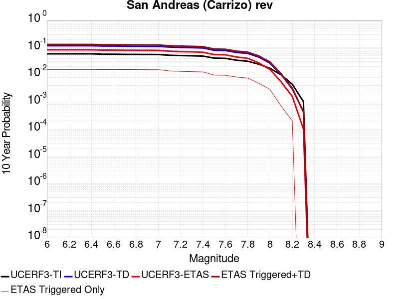 |

| Magnitude | 1 wk TI Prob | 1 wk TD Prob | 1 wk ETAS Prob | 1 wk ETAS/TD Gain | 1 wk ETAS Triggered+TD | 1 wk ETAS Triggered Only | 1 mo TI Prob | 1 mo TD Prob | 1 mo ETAS Prob | 1 mo ETAS/TD Gain | 1 mo ETAS Triggered+TD | 1 mo ETAS Triggered Only | 1 yr TI Prob | 1 yr TD Prob | 1 yr ETAS Prob | 1 yr ETAS/TD Gain | 1 yr ETAS Triggered+TD | 1 yr ETAS Triggered Only | 10 yr TI Prob | 10 yr TD Prob | 10 yr ETAS Prob | 10 yr ETAS/TD Gain | 10 yr ETAS Triggered+TD | 10 yr ETAS Triggered Only |
|-----|-----|-----|-----|-----|-----|-----|-----|-----|-----|-----|-----|-----|-----|-----|-----|-----|-----|-----|-----|-----|-----|-----|-----|-----|
| 6.0 | 1.1674632E-4 | 2.3500634E-4 | 1.0E-4 | 0.42552042 | 2.3500634E-4 | 0.0 | 5.002454E-4 | 0.0010067829 | 0.0011 | 1.0925891 | 0.0013064808 | 3.0E-4 | 0.006073493 | 0.012189141 | 0.008 | 0.6563219 | 0.013275733 | 0.0011 | 0.0591016 | 0.11713341 | 0.0832 | 0.7103012 | 0.13099441 | 0.0157 |
| 6.1 | 1.1674632E-4 | 2.3500634E-4 | 1.0E-4 | 0.42552042 | 2.3500634E-4 | 0.0 | 5.002454E-4 | 0.0010067829 | 0.0011 | 1.0925891 | 0.0013064808 | 3.0E-4 | 0.006073493 | 0.012189141 | 0.008 | 0.6563219 | 0.013275733 | 0.0011 | 0.0591016 | 0.11713341 | 0.0832 | 0.7103012 | 0.13099441 | 0.0157 |
| 6.2 | 1.1674632E-4 | 2.3500634E-4 | 1.0E-4 | 0.42552042 | 2.3500634E-4 | 0.0 | 5.002454E-4 | 0.0010067829 | 0.0011 | 1.0925891 | 0.0013064808 | 3.0E-4 | 0.006073493 | 0.012189141 | 0.008 | 0.6563219 | 0.013275733 | 0.0011 | 0.0591016 | 0.11713341 | 0.0832 | 0.7103012 | 0.13099441 | 0.0157 |
| 6.3 | 1.1674632E-4 | 2.3500634E-4 | 1.0E-4 | 0.42552042 | 2.3500634E-4 | 0.0 | 5.002454E-4 | 0.0010067829 | 0.0011 | 1.0925891 | 0.0013064808 | 3.0E-4 | 0.006073493 | 0.012189141 | 0.008 | 0.6563219 | 0.013275733 | 0.0011 | 0.0591016 | 0.11713341 | 0.0832 | 0.7103012 | 0.13099441 | 0.0157 |
| 6.4 | 1.1674632E-4 | 2.3500634E-4 | 1.0E-4 | 0.42552042 | 2.3500634E-4 | 0.0 | 5.002454E-4 | 0.0010067829 | 0.0011 | 1.0925891 | 0.0013064808 | 3.0E-4 | 0.006073493 | 0.012189141 | 0.008 | 0.6563219 | 0.013275733 | 0.0011 | 0.0591016 | 0.11713341 | 0.0832 | 0.7103012 | 0.13099441 | 0.0157 |
| 6.5 | 1.13136164E-4 | 2.2824129E-4 | 1.0E-4 | 0.43813282 | 2.2824129E-4 | 0.0 | 4.847792E-4 | 9.778118E-4 | 0.0011 | 1.124961 | 0.0012775183 | 3.0E-4 | 0.0058862255 | 0.011840291 | 0.0078 | 0.6587676 | 0.012828451 | 0.001 | 0.057327334 | 0.11410441 | 0.081 | 0.7098761 | 0.12792438 | 0.0156 |
| 6.6 | 1.13136164E-4 | 2.2824129E-4 | 1.0E-4 | 0.43813282 | 2.2824129E-4 | 0.0 | 4.847792E-4 | 9.778118E-4 | 0.0011 | 1.124961 | 0.0012775183 | 3.0E-4 | 0.0058862255 | 0.011840291 | 0.0078 | 0.6587676 | 0.012828451 | 0.001 | 0.057327334 | 0.11410441 | 0.081 | 0.7098761 | 0.12792438 | 0.0156 |
| 6.7 | 1.1149675E-4 | 2.2516907E-4 | 1.0E-4 | 0.44411072 | 2.2516907E-4 | 0.0 | 4.777557E-4 | 9.6465484E-4 | 0.0011 | 1.1403042 | 0.0012643655 | 3.0E-4 | 0.0058011734 | 0.011681832 | 0.0077 | 0.65914315 | 0.012670151 | 0.001 | 0.05652051 | 0.112732746 | 0.0805 | 0.71407825 | 0.12657411 | 0.0156 |
| 6.8 | 1.1103589E-4 | 2.2419993E-4 | 1.0E-4 | 0.44603047 | 2.2419993E-4 | 0.0 | 4.7578133E-4 | 9.6050446E-4 | 0.0011 | 1.1452316 | 0.0012602163 | 3.0E-4 | 0.005777263 | 0.011631842 | 0.0076 | 0.6533789 | 0.01262021 | 0.001 | 0.056293584 | 0.112295255 | 0.0802 | 0.71418864 | 0.12614346 | 0.0156 |
| 6.9 | 1.1053259E-4 | 2.2313405E-4 | 1.0E-4 | 0.4481611 | 2.2313405E-4 | 0.0 | 4.7362508E-4 | 9.5593976E-4 | 0.0011 | 1.1507001 | 0.001255653 | 3.0E-4 | 0.0057511497 | 0.011576858 | 0.0075 | 0.64784414 | 0.012565281 | 0.001 | 0.05604569 | 0.111813456 | 0.0799 | 0.71458304 | 0.12558034 | 0.0155 |
| 7.0 | 1.1005377E-4 | 2.2215206E-4 | 1.0E-4 | 0.45014212 | 2.2215206E-4 | 0.0 | 4.7157376E-4 | 9.517343E-4 | 0.0011 | 1.1557847 | 0.0012514488 | 3.0E-4 | 0.0057263062 | 0.0115262 | 0.0075 | 0.65069145 | 0.012514674 | 0.001 | 0.055809796 | 0.11136863 | 0.0796 | 0.7147435 | 0.12514241 | 0.0155 |
| 7.1 | 1.0308142E-4 | 2.0739544E-4 | 1.0E-4 | 0.48217067 | 2.0739544E-4 | 0.0 | 4.417027E-4 | 8.885358E-4 | 0.001 | 1.125447 | 0.0011882692 | 3.0E-4 | 0.0053644776 | 0.010764554 | 0.007 | 0.6502824 | 0.011654866 | 9.0E-4 | 0.052368138 | 0.10465884 | 0.074 | 0.7070592 | 0.11710408 | 0.0139 |
| 7.2 | 1.0027479E-4 | 2.0153404E-4 | 1.0E-4 | 0.49619406 | 2.0153404E-4 | 0.0 | 4.296783E-4 | 8.634324E-4 | 0.001 | 1.1581683 | 0.0011631734 | 3.0E-4 | 0.0052187922 | 0.010461894 | 0.0069 | 0.6595364 | 0.011352478 | 9.0E-4 | 0.050979212 | 0.10197536 | 0.072 | 0.7060529 | 0.11400889 | 0.0134 |
| 7.3 | 9.816942E-5 | 1.9639665E-4 | 1.0E-4 | 0.50917363 | 1.9639665E-4 | 0.0 | 4.2065824E-4 | 8.4142934E-4 | 0.001 | 1.1884539 | 0.0011411769 | 3.0E-4 | 0.005109493 | 0.010196544 | 0.0067 | 0.65708536 | 0.011087367 | 9.0E-4 | 0.049935985 | 0.09959349 | 0.07 | 0.7028572 | 0.11138882 | 0.0131 |
| 7.4 | 9.5634205E-5 | 1.9023678E-4 | 1.0E-4 | 0.5256607 | 1.9023678E-4 | 0.0 | 4.0979648E-4 | 8.150466E-4 | 0.001 | 1.2269237 | 0.0011148021 | 3.0E-4 | 0.0049778637 | 0.009878284 | 0.0065 | 0.658009 | 0.010769394 | 9.0E-4 | 0.048678253 | 0.09673373 | 0.0674 | 0.69675803 | 0.10829553 | 0.0128 |
| 7.5 | 8.052417E-5 | 1.544261E-4 | 1.0E-4 | 0.6475589 | 1.544261E-4 | 0.0 | 3.4505792E-4 | 6.616585E-4 | 9.0E-4 | 1.3602184 | 9.6145994E-4 | 3.0E-4 | 0.0041929903 | 0.008026009 | 0.0054 | 0.6728126 | 0.0086211935 | 6.0E-4 | 0.04114753 | 0.079812914 | 0.0559 | 0.7003879 | 0.08883075 | 0.0098 |
| 7.6 | 7.897024E-5 | 1.5104134E-4 | 1.0E-4 | 0.6620704 | 1.5104134E-4 | 0.0 | 3.384E-4 | 6.4715964E-4 | 8.0E-4 | 1.236171 | 9.469655E-4 | 3.0E-4 | 0.0041122385 | 0.007850772 | 0.0053 | 0.6750929 | 0.008446061 | 6.0E-4 | 0.040369697 | 0.07818328 | 0.0546 | 0.698359 | 0.08703272 | 0.0096 |
| 7.7 | 6.707427E-5 | 1.268127E-4 | 1.0E-4 | 0.78856456 | 1.268127E-4 | 0.0 | 2.8742946E-4 | 5.433698E-4 | 8.0E-4 | 1.4722937 | 8.432068E-4 | 3.0E-4 | 0.003493839 | 0.0065954886 | 0.004 | 0.6064752 | 0.007092191 | 5.0E-4 | 0.034394164 | 0.06633325 | 0.0453 | 0.68291545 | 0.07408268 | 0.0083 |
| 7.8 | 6.147705E-5 | 1.1658706E-4 | 1.0E-4 | 0.8577281 | 1.1658706E-4 | 0.0 | 2.6344648E-4 | 4.995632E-4 | 8.0E-4 | 1.6013991 | 7.994133E-4 | 3.0E-4 | 0.0032027436 | 0.0060652415 | 0.0037 | 0.6100334 | 0.0065622088 | 5.0E-4 | 0.031569764 | 0.061043616 | 0.0405 | 0.66346 | 0.06817968 | 0.0076 |
| 7.9 | 4.7636717E-5 | 8.48813E-5 | 0.0 | 0.0 | 8.48813E-5 | 0.0 | 2.0414138E-4 | 3.6372629E-4 | 5.0E-4 | 1.3746601 | 6.6361716E-4 | 3.0E-4 | 0.0024825884 | 0.004419382 | 0.0023 | 0.52043474 | 0.0048176143 | 4.0E-4 | 0.024550365 | 0.044775743 | 0.0274 | 0.6119385 | 0.049456343 | 0.0049 |
| 8.0 | 3.3554235E-5 | 4.969718E-5 | 0.0 | 0.0 | 4.969718E-5 | 0.0 | 1.4379594E-4 | 2.1297054E-4 | 5.0E-4 | 2.3477426 | 5.1290664E-4 | 3.0E-4 | 0.0017493097 | 0.0025898346 | 0.0016 | 0.61780006 | 0.0029887988 | 4.0E-4 | 0.017356034 | 0.026676664 | 0.0157 | 0.58852935 | 0.029499302 | 0.0029 |
| 8.1 | 1.9175432E-5 | 1.7981038E-5 | 0.0 | 0.0 | 1.7981038E-5 | 0.0 | 8.217783E-5 | 7.705932E-5 | 2.0E-4 | 2.5954032 | 2.770439E-4 | 2.0E-4 | 0.0010000558 | 9.377939E-4 | 6.0E-4 | 0.6397994 | 0.0011376063 | 2.0E-4 | 0.009955673 | 0.010124556 | 0.0055 | 0.5432337 | 0.010817468 | 7.0E-4 |
| 8.2 | 8.643924E-6 | 5.0104E-6 | 0.0 | 0.0 | 5.0104E-6 | 0.0 | 3.704486E-5 | 2.1472966E-5 | 1.0E-4 | 4.6570187 | 1.2147082E-4 | 1.0E-4 | 4.5092785E-4 | 2.6140205E-4 | 2.0E-4 | 0.7651049 | 3.6137592E-4 | 1.0E-4 | 0.0045001395 | 0.002993769 | 0.0016 | 0.5344434 | 0.0031931703 | 2.0E-4 |
| 8.3 | 1.983087E-6 | 6.880041E-7 | 0.0 | 0.0 | 6.880041E-7 | 0.0 | 8.498917E-6 | 2.9485857E-6 | 0.0 | 0.0 | 2.9485857E-6 | 0.0 | 1.034694E-4 | 3.589845E-5 | 0.0 | 0.0 | 3.589845E-5 | 0.0 | 0.0010342124 | 4.2701262E-4 | 1.0E-4 | 0.23418511 | 4.2701262E-4 | 0.0 |

## San Andreas (San Bernardino N)
*[(top)](#table-of-contents)*

| 1 Week | 1 Month | 1 Year | 10 Year |
|-----|-----|-----|-----|
|  |  |  | 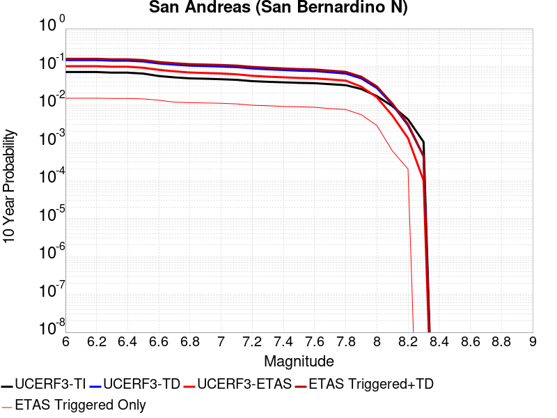 |

| Magnitude | 1 wk TI Prob | 1 wk TD Prob | 1 wk ETAS Prob | 1 wk ETAS/TD Gain | 1 wk ETAS Triggered+TD | 1 wk ETAS Triggered Only | 1 mo TI Prob | 1 mo TD Prob | 1 mo ETAS Prob | 1 mo ETAS/TD Gain | 1 mo ETAS Triggered+TD | 1 mo ETAS Triggered Only | 1 yr TI Prob | 1 yr TD Prob | 1 yr ETAS Prob | 1 yr ETAS/TD Gain | 1 yr ETAS Triggered+TD | 1 yr ETAS Triggered Only | 10 yr TI Prob | 10 yr TD Prob | 10 yr ETAS Prob | 10 yr ETAS/TD Gain | 10 yr ETAS Triggered+TD | 10 yr ETAS Triggered Only |
|-----|-----|-----|-----|-----|-----|-----|-----|-----|-----|-----|-----|-----|-----|-----|-----|-----|-----|-----|-----|-----|-----|-----|-----|-----|
| 6.0 | 1.4273766E-4 | 3.0990381E-4 | 1.0E-4 | 0.32268077 | 3.0990381E-4 | 0.0 | 6.115894E-4 | 0.001327489 | 0.0012 | 0.90396225 | 0.0016270909 | 3.0E-4 | 0.0074207084 | 0.01604387 | 0.0102 | 0.6357568 | 0.017224617 | 0.0012 | 0.07177748 | 0.14769201 | 0.1024 | 0.69333476 | 0.16022094 | 0.0147 |
| 6.1 | 1.4273766E-4 | 3.0990381E-4 | 1.0E-4 | 0.32268077 | 3.0990381E-4 | 0.0 | 6.115894E-4 | 0.001327489 | 0.0012 | 0.90396225 | 0.0016270909 | 3.0E-4 | 0.0074207084 | 0.01604387 | 0.0102 | 0.6357568 | 0.017224617 | 0.0012 | 0.07177748 | 0.14769201 | 0.1024 | 0.69333476 | 0.16022094 | 0.0147 |
| 6.2 | 1.4273766E-4 | 3.0990381E-4 | 1.0E-4 | 0.32268077 | 3.0990381E-4 | 0.0 | 6.115894E-4 | 0.001327489 | 0.0012 | 0.90396225 | 0.0016270909 | 3.0E-4 | 0.0074207084 | 0.01604387 | 0.0102 | 0.6357568 | 0.017224617 | 0.0012 | 0.07177748 | 0.14769201 | 0.1024 | 0.69333476 | 0.16022094 | 0.0147 |
| 6.3 | 1.3730655E-4 | 2.9898214E-4 | 1.0E-4 | 0.33446813 | 2.9898214E-4 | 0.0 | 5.883239E-4 | 0.0012807284 | 0.0012 | 0.9369668 | 0.0015803442 | 3.0E-4 | 0.0071393442 | 0.0154827535 | 0.0095 | 0.61358595 | 0.016565721 | 0.0011 | 0.06914291 | 0.14299165 | 0.0991 | 0.69304746 | 0.15541826 | 0.0145 |
| 6.4 | 1.3730655E-4 | 2.9898214E-4 | 1.0E-4 | 0.33446813 | 2.9898214E-4 | 0.0 | 5.883239E-4 | 0.0012807284 | 0.0012 | 0.9369668 | 0.0015803442 | 3.0E-4 | 0.0071393442 | 0.0154827535 | 0.0095 | 0.61358595 | 0.016565721 | 0.0011 | 0.06914291 | 0.14299165 | 0.0991 | 0.69304746 | 0.15541826 | 0.0145 |
| 6.5 | 1.2942807E-4 | 2.831703E-4 | 1.0E-4 | 0.35314438 | 2.831703E-4 | 0.0 | 5.545738E-4 | 0.0012130276 | 0.0011 | 0.9068219 | 0.0015126637 | 3.0E-4 | 0.0067310524 | 0.014669821 | 0.0092 | 0.62713784 | 0.015753685 | 0.0011 | 0.06530788 | 0.13614826 | 0.0929 | 0.68234444 | 0.14832856 | 0.0141 |
| 6.6 | 1.1125901E-4 | 2.4767424E-4 | 1.0E-4 | 0.40375617 | 2.4767424E-4 | 0.0 | 4.767372E-4 | 0.0010610315 | 0.0011 | 1.036727 | 0.0013607132 | 3.0E-4 | 0.005788839 | 0.012842156 | 0.0084 | 0.6540958 | 0.013829313 | 0.001 | 0.056403454 | 0.120414585 | 0.0822 | 0.68264157 | 0.1318492 | 0.013 |
| 6.7 | 1.02209575E-4 | 2.290678E-4 | 1.0E-4 | 0.436552 | 2.290678E-4 | 0.0 | 4.3796748E-4 | 9.813511E-4 | 9.0E-4 | 0.91710293 | 0.0012810568 | 3.0E-4 | 0.0053192247 | 0.0118829 | 0.0077 | 0.6479899 | 0.012772206 | 9.0E-4 | 0.051936906 | 0.112195544 | 0.0748 | 0.66669315 | 0.12249407 | 0.0116 |
| 6.8 | 9.610582E-5 | 2.144043E-4 | 1.0E-4 | 0.46640855 | 2.144043E-4 | 0.0 | 4.1181705E-4 | 9.185527E-4 | 9.0E-4 | 0.97980225 | 0.0012182771 | 3.0E-4 | 0.0050023515 | 0.0111262845 | 0.0069 | 0.6201531 | 0.012016271 | 9.0E-4 | 0.048912346 | 0.10562009 | 0.0698 | 0.6608591 | 0.115637146 | 0.0112 |
| 6.9 | 9.3877505E-5 | 2.0898355E-4 | 1.0E-4 | 0.47850657 | 2.0898355E-4 | 0.0 | 4.0227012E-4 | 8.9533697E-4 | 9.0E-4 | 1.0052081 | 0.0011950684 | 3.0E-4 | 0.0048866454 | 0.010846477 | 0.0069 | 0.63615125 | 0.011736715 | 9.0E-4 | 0.04780577 | 0.10321876 | 0.0676 | 0.65491974 | 0.11308335 | 0.011 |
| 7.0 | 9.1019785E-5 | 2.0228841E-4 | 1.0E-4 | 0.4943437 | 2.0228841E-4 | 0.0 | 3.900265E-4 | 8.666629E-4 | 9.0E-4 | 1.0384661 | 0.0011664028 | 3.0E-4 | 0.0047382377 | 0.010500783 | 0.0068 | 0.6475707 | 0.011391332 | 9.0E-4 | 0.046384744 | 0.10019968 | 0.0657 | 0.6556907 | 0.10991752 | 0.0108 |
| 7.1 | 8.771155E-5 | 1.940751E-4 | 1.0E-4 | 0.51526445 | 1.940751E-4 | 0.0 | 3.758525E-4 | 8.314858E-4 | 8.0E-4 | 0.9621331 | 0.0011312363 | 3.0E-4 | 0.0045664064 | 0.010076536 | 0.0065 | 0.6450629 | 0.010967467 | 9.0E-4 | 0.044737056 | 0.09652227 | 0.0625 | 0.647519 | 0.10591844 | 0.0104 |
| 7.2 | 8.0830236E-5 | 1.7821639E-4 | 1.0E-4 | 0.5611156 | 1.7821639E-4 | 0.0 | 3.4636928E-4 | 7.635611E-4 | 8.0E-4 | 1.0477223 | 0.0010633321 | 3.0E-4 | 0.0042088944 | 0.009256828 | 0.006 | 0.6481702 | 0.009950348 | 7.0E-4 | 0.041300658 | 0.08929606 | 0.0572 | 0.6405658 | 0.098038815 | 0.0096 |
| 7.3 | 7.7668235E-5 | 1.6774477E-4 | 1.0E-4 | 0.5961437 | 1.6774477E-4 | 0.0 | 3.328214E-4 | 7.187082E-4 | 8.0E-4 | 1.1131082 | 0.0010184926 | 3.0E-4 | 0.0040445733 | 0.0087152375 | 0.0059 | 0.67697525 | 0.009409136 | 7.0E-4 | 0.03971748 | 0.084592454 | 0.0542 | 0.6407191 | 0.09310574 | 0.0093 |
| 7.4 | 7.520177E-5 | 1.600199E-4 | 1.0E-4 | 0.6249223 | 1.600199E-4 | 0.0 | 3.2225347E-4 | 6.8561936E-4 | 8.0E-4 | 1.1668282 | 9.854137E-4 | 3.0E-4 | 0.0039163795 | 0.008315527 | 0.0056 | 0.67343897 | 0.009009707 | 7.0E-4 | 0.038480744 | 0.08106743 | 0.0522 | 0.6439084 | 0.08924593 | 0.0089 |
| 7.5 | 7.274697E-5 | 1.5296489E-4 | 1.0E-4 | 0.65374476 | 1.5296489E-4 | 0.0 | 3.1173544E-4 | 6.5539917E-4 | 8.0E-4 | 1.2206302 | 9.5520256E-4 | 3.0E-4 | 0.003788775 | 0.007950341 | 0.0052 | 0.65405995 | 0.008644776 | 7.0E-4 | 0.03724827 | 0.07780402 | 0.0502 | 0.64521086 | 0.08582713 | 0.0087 |
| 7.6 | 7.1185845E-5 | 1.4870733E-4 | 1.0E-4 | 0.6724618 | 1.4870733E-4 | 0.0 | 3.0504653E-4 | 6.371615E-4 | 8.0E-4 | 1.2555686 | 9.3697035E-4 | 3.0E-4 | 0.0037076178 | 0.0077298954 | 0.0051 | 0.6597761 | 0.008424484 | 7.0E-4 | 0.036463667 | 0.07580683 | 0.0489 | 0.6450606 | 0.08366247 | 0.0085 |
| 7.7 | 6.709961E-5 | 1.3793135E-4 | 1.0E-4 | 0.72499835 | 1.3793135E-4 | 0.0 | 2.8753807E-4 | 5.910005E-4 | 8.0E-4 | 1.3536369 | 8.908232E-4 | 3.0E-4 | 0.003495157 | 0.007171726 | 0.0046 | 0.64140767 | 0.0077674226 | 6.0E-4 | 0.034406938 | 0.070681766 | 0.0458 | 0.6479747 | 0.07793045 | 0.0078 |
| 7.8 | 6.300812E-5 | 1.2703829E-4 | 1.0E-4 | 0.7871642 | 1.2703829E-4 | 0.0 | 2.7000686E-4 | 5.443362E-4 | 8.0E-4 | 1.4696798 | 8.4417296E-4 | 3.0E-4 | 0.0032823787 | 0.0066071805 | 0.0043 | 0.6508071 | 0.007203216 | 6.0E-4 | 0.032343175 | 0.065444425 | 0.0427 | 0.652462 | 0.072360136 | 0.0074 |
| 7.9 | 4.983037E-5 | 9.326866E-5 | 0.0 | 0.0 | 9.326866E-5 | 0.0 | 2.1354125E-4 | 3.996616E-4 | 5.0E-4 | 1.2510585 | 6.995417E-4 | 3.0E-4 | 0.0025967648 | 0.0048550325 | 0.0023 | 0.47373524 | 0.0052530905 | 4.0E-4 | 0.025666296 | 0.048792165 | 0.0296 | 0.60665476 | 0.05392869 | 0.0054 |
| 8.0 | 3.2211527E-5 | 5.093469E-5 | 0.0 | 0.0 | 5.093469E-5 | 0.0 | 1.380421E-4 | 2.1827327E-4 | 5.0E-4 | 2.2907064 | 5.182078E-4 | 3.0E-4 | 0.0016793669 | 0.00265424 | 0.0016 | 0.6028091 | 0.0030531783 | 4.0E-4 | 0.016667323 | 0.02720171 | 0.0155 | 0.56981707 | 0.029925546 | 0.0028 |
| 8.1 | 1.743376E-5 | 1.7695216E-5 | 0.0 | 0.0 | 1.7695216E-5 | 0.0 | 7.471398E-5 | 7.583444E-5 | 2.0E-4 | 2.637324 | 2.7581927E-4 | 2.0E-4 | 9.0926304E-4 | 9.228938E-4 | 6.0E-4 | 0.65012896 | 0.0011227092 | 2.0E-4 | 0.009055517 | 0.009895436 | 0.0051 | 0.51538914 | 0.010489498 | 6.0E-4 |
| 8.2 | 7.831616E-6 | 4.727602E-6 | 0.0 | 0.0 | 4.727602E-6 | 0.0 | 3.3563636E-5 | 2.0260995E-5 | 1.0E-4 | 4.9355917 | 1.2025897E-4 | 1.0E-4 | 4.0856065E-4 | 2.4664975E-4 | 2.0E-4 | 0.8108664 | 3.4662508E-4 | 1.0E-4 | 0.004078103 | 0.0028085 | 0.0013 | 0.46288052 | 0.0030079384 | 2.0E-4 |
| 8.3 | 1.983087E-6 | 6.880041E-7 | 0.0 | 0.0 | 6.880041E-7 | 0.0 | 8.498917E-6 | 2.9485857E-6 | 0.0 | 0.0 | 2.9485857E-6 | 0.0 | 1.034694E-4 | 3.589845E-5 | 0.0 | 0.0 | 3.589845E-5 | 0.0 | 0.0010342124 | 4.2701262E-4 | 1.0E-4 | 0.23418511 | 4.2701262E-4 | 0.0 |

## San Andreas (Coachella) rev
*[(top)](#table-of-contents)*

| 1 Week | 1 Month | 1 Year | 10 Year |
|-----|-----|-----|-----|
|  |  |  | 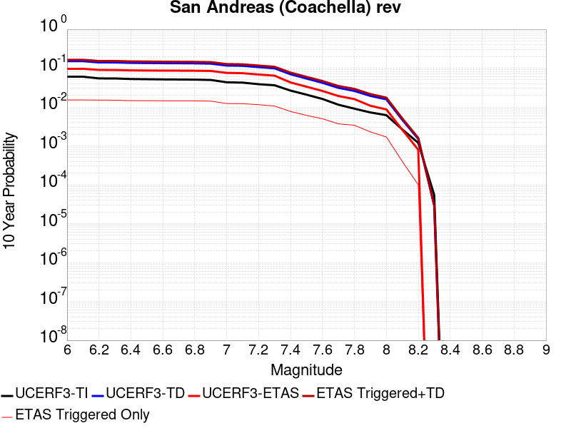 |

| Magnitude | 1 wk TI Prob | 1 wk TD Prob | 1 wk ETAS Prob | 1 wk ETAS/TD Gain | 1 wk ETAS Triggered+TD | 1 wk ETAS Triggered Only | 1 mo TI Prob | 1 mo TD Prob | 1 mo ETAS Prob | 1 mo ETAS/TD Gain | 1 mo ETAS Triggered+TD | 1 mo ETAS Triggered Only | 1 yr TI Prob | 1 yr TD Prob | 1 yr ETAS Prob | 1 yr ETAS/TD Gain | 1 yr ETAS Triggered+TD | 1 yr ETAS Triggered Only | 10 yr TI Prob | 10 yr TD Prob | 10 yr ETAS Prob | 10 yr ETAS/TD Gain | 10 yr ETAS Triggered+TD | 10 yr ETAS Triggered Only |
|-----|-----|-----|-----|-----|-----|-----|-----|-----|-----|-----|-----|-----|-----|-----|-----|-----|-----|-----|-----|-----|-----|-----|-----|-----|
| 6.0 | 1.1925945E-4 | 3.2288718E-4 | 1.0E-4 | 0.3097057 | 3.2288718E-4 | 0.0 | 5.110118E-4 | 0.0013830729 | 9.0E-4 | 0.6507249 | 0.001682658 | 3.0E-4 | 0.0062038354 | 0.016710198 | 0.0092 | 0.550562 | 0.01926675 | 0.0026 | 0.060334753 | 0.15093613 | 0.0963 | 0.6380182 | 0.1638419 | 0.0152 |
| 6.1 | 1.1925945E-4 | 3.2288718E-4 | 1.0E-4 | 0.3097057 | 3.2288718E-4 | 0.0 | 5.110118E-4 | 0.0013830729 | 9.0E-4 | 0.6507249 | 0.001682658 | 3.0E-4 | 0.0062038354 | 0.016710198 | 0.0092 | 0.550562 | 0.01926675 | 0.0026 | 0.060334753 | 0.15093613 | 0.0963 | 0.6380182 | 0.1638419 | 0.0152 |
| 6.2 | 1.07432395E-4 | 2.9791912E-4 | 1.0E-4 | 0.33566156 | 2.9791912E-4 | 0.0 | 4.603433E-4 | 0.0012761754 | 9.0E-4 | 0.7052322 | 0.0015757926 | 3.0E-4 | 0.005590286 | 0.015427807 | 0.0089 | 0.57688046 | 0.017987695 | 0.0026 | 0.05451731 | 0.14010412 | 0.0901 | 0.64309317 | 0.15308854 | 0.0151 |
| 6.3 | 1.0718766E-4 | 2.9737237E-4 | 1.0E-4 | 0.33627874 | 2.9737237E-4 | 0.0 | 4.592948E-4 | 0.0012738345 | 9.0E-4 | 0.70652825 | 0.0015734523 | 3.0E-4 | 0.005577586 | 0.015399709 | 0.0089 | 0.577933 | 0.01795967 | 0.0026 | 0.054396555 | 0.13987197 | 0.0898 | 0.6420157 | 0.15277389 | 0.015 |
| 6.4 | 1.0355944E-4 | 2.8945875E-4 | 1.0E-4 | 0.34547237 | 2.8945875E-4 | 0.0 | 4.4375064E-4 | 0.0012399516 | 8.0E-4 | 0.6451865 | 0.0015395796 | 3.0E-4 | 0.0053892885 | 0.014992934 | 0.0084 | 0.56026393 | 0.017455451 | 0.0025 | 0.052604496 | 0.13642041 | 0.0878 | 0.6435987 | 0.14902869 | 0.0146 |
| 6.5 | 1.0227914E-4 | 2.8665483E-4 | 1.0E-4 | 0.34885162 | 2.8665483E-4 | 0.0 | 4.382655E-4 | 0.0012279461 | 8.0E-4 | 0.6514944 | 0.0015275778 | 3.0E-4 | 0.0053228354 | 0.014848769 | 0.0084 | 0.56570345 | 0.017311648 | 0.0025 | 0.051971316 | 0.13520178 | 0.0869 | 0.64274305 | 0.14782783 | 0.0146 |
| 6.6 | 1.0116757E-4 | 2.8431637E-4 | 1.0E-4 | 0.35172087 | 2.8431637E-4 | 0.0 | 4.3350324E-4 | 0.0012179336 | 8.0E-4 | 0.6568503 | 0.0015175681 | 3.0E-4 | 0.0052651367 | 0.01472852 | 0.0084 | 0.5703221 | 0.017191699 | 0.0025 | 0.051421247 | 0.13417985 | 0.0866 | 0.64540243 | 0.14673424 | 0.0145 |
| 6.7 | 1.0050676E-4 | 2.829039E-4 | 1.0E-4 | 0.3534769 | 2.829039E-4 | 0.0 | 4.3067214E-4 | 0.0012118858 | 8.0E-4 | 0.66012824 | 0.0015115222 | 3.0E-4 | 0.005230834 | 0.014655882 | 0.0084 | 0.5731487 | 0.017119242 | 0.0025 | 0.051094085 | 0.13356358 | 0.0863 | 0.64613426 | 0.14604026 | 0.0144 |
| 6.8 | 9.976819E-5 | 2.8094676E-4 | 1.0E-4 | 0.35593936 | 2.8094676E-4 | 0.0 | 4.2750788E-4 | 0.0012035057 | 8.0E-4 | 0.66472477 | 0.0015031446 | 3.0E-4 | 0.0051924936 | 0.014555221 | 0.0084 | 0.5771125 | 0.017018834 | 0.0025 | 0.050728295 | 0.13271578 | 0.0858 | 0.6464943 | 0.14520468 | 0.0144 |
| 6.9 | 9.77719E-5 | 2.7595705E-4 | 1.0E-4 | 0.36237523 | 2.7595705E-4 | 0.0 | 4.1895514E-4 | 0.0011821408 | 8.0E-4 | 0.6767383 | 0.0014817861 | 3.0E-4 | 0.0050888555 | 0.014298547 | 0.0082 | 0.57348484 | 0.016664231 | 0.0024 | 0.049738888 | 0.1305549 | 0.0849 | 0.65030116 | 0.14290102 | 0.0142 |
| 7.0 | 8.500761E-5 | 2.4361434E-4 | 1.0E-4 | 0.41048488 | 2.4361434E-4 | 0.0 | 3.6426744E-4 | 0.0010436468 | 8.0E-4 | 0.76654285 | 0.0013433337 | 3.0E-4 | 0.0044259406 | 0.012633122 | 0.0071 | 0.5620147 | 0.014607855 | 0.002 | 0.04338823 | 0.11649794 | 0.0756 | 0.64893854 | 0.12736501 | 0.0123 |
| 7.1 | 8.319876E-5 | 2.3970265E-4 | 1.0E-4 | 0.41718352 | 2.3970265E-4 | 0.0 | 3.5651738E-4 | 0.0010268958 | 8.0E-4 | 0.7790469 | 0.0013265877 | 3.0E-4 | 0.004331963 | 0.012431524 | 0.0071 | 0.5711287 | 0.014406661 | 0.002 | 0.042484846 | 0.114739165 | 0.0742 | 0.6466841 | 0.12553935 | 0.0122 |
| 7.2 | 7.563917E-5 | 2.2033798E-4 | 1.0E-4 | 0.4538482 | 2.2033798E-4 | 0.0 | 3.2412758E-4 | 9.4396685E-4 | 8.0E-4 | 0.8474874 | 0.0012436837 | 3.0E-4 | 0.0039391145 | 0.011432902 | 0.0065 | 0.56853455 | 0.013113466 | 0.0017 | 0.03870018 | 0.10618827 | 0.0687 | 0.64696413 | 0.1164671 | 0.0115 |
| 7.3 | 7.082985E-5 | 2.0367479E-4 | 1.0E-4 | 0.4909788 | 2.0367479E-4 | 0.0 | 3.0352117E-4 | 8.7260274E-4 | 8.0E-4 | 0.91679746 | 0.0011723409 | 3.0E-4 | 0.0036891096 | 0.010572792 | 0.0063 | 0.59586906 | 0.012155876 | 0.0016 | 0.03628465 | 0.098766804 | 0.0642 | 0.650016 | 0.10831987 | 0.0106 |
| 7.4 | 5.146215E-5 | 1.3987564E-4 | 0.0 | 0.0 | 1.3987564E-4 | 0.0 | 2.2053342E-4 | 5.993302E-4 | 7.0E-4 | 1.1679705 | 8.991504E-4 | 3.0E-4 | 0.0026816884 | 0.007272614 | 0.0047 | 0.64626 | 0.0084638875 | 0.0012 | 0.02649557 | 0.06959498 | 0.0429 | 0.6164238 | 0.0767591 | 0.0077 |
| 7.5 | 4.0285166E-5 | 1.07025786E-4 | 0.0 | 0.0 | 1.07025786E-4 | 0.0 | 1.7263928E-4 | 4.5860163E-4 | 6.0E-4 | 1.308325 | 7.5846404E-4 | 3.0E-4 | 0.002099857 | 0.005569247 | 0.0039 | 0.70027417 | 0.006563678 | 0.001 | 0.020801254 | 0.05394122 | 0.0334 | 0.61919254 | 0.05971218 | 0.0061 |
| 7.6 | 3.1168736E-5 | 8.228769E-5 | 0.0 | 0.0 | 8.228769E-5 | 0.0 | 1.3357346E-4 | 3.5261398E-4 | 5.0E-4 | 1.4179813 | 6.5250817E-4 | 3.0E-4 | 0.0016250437 | 0.0042846496 | 0.0034 | 0.7935304 | 0.0052803652 | 0.001 | 0.016132116 | 0.041857634 | 0.0259 | 0.6187641 | 0.046648346 | 0.005 |
| 7.7 | 2.2100989E-5 | 6.0561815E-5 | 0.0 | 0.0 | 6.0561815E-5 | 0.0 | 9.4715084E-5 | 2.5952485E-4 | 5.0E-4 | 1.9265978 | 5.59447E-4 | 3.0E-4 | 0.001152546 | 0.003155143 | 0.0023 | 0.72896856 | 0.0037532498 | 6.0E-4 | 0.011465867 | 0.031067226 | 0.0192 | 0.61801463 | 0.034652278 | 0.0037 |
| 7.8 | 1.7484861E-5 | 5.017899E-5 | 0.0 | 0.0 | 5.017899E-5 | 0.0 | 7.493296E-5 | 2.150351E-4 | 5.0E-4 | 2.3252017 | 5.1497057E-4 | 3.0E-4 | 9.1192697E-4 | 0.0026149119 | 0.0019 | 0.72660196 | 0.003213343 | 6.0E-4 | 0.009081938 | 0.025900835 | 0.016 | 0.6177407 | 0.029212773 | 0.0034 |
| 7.9 | 1.3967285E-5 | 3.6891262E-5 | 0.0 | 0.0 | 3.6891262E-5 | 0.0 | 5.985842E-5 | 1.5809583E-4 | 4.0E-4 | 2.5301108 | 4.580484E-4 | 3.0E-4 | 7.2853256E-4 | 0.0019231186 | 0.0011 | 0.57198757 | 0.0023223495 | 4.0E-4 | 0.0072614877 | 0.019291423 | 0.0108 | 0.5598343 | 0.021547053 | 0.0023 |
| 8.0 | 1.1887396E-5 | 2.9913166E-5 | 0.0 | 0.0 | 2.9913166E-5 | 0.0 | 5.094499E-5 | 1.2819299E-4 | 4.0E-4 | 3.1202953 | 4.2815454E-4 | 3.0E-4 | 6.200787E-4 | 0.0015596332 | 0.001 | 0.6411764 | 0.0019590093 | 4.0E-4 | 0.006183513 | 0.015740186 | 0.0087 | 0.5527254 | 0.017413426 | 0.0017 |
| 8.1 | 5.100864E-6 | 8.48687E-6 | 0.0 | 0.0 | 8.48687E-6 | 0.0 | 2.1860664E-5 | 3.637179E-5 | 2.0E-4 | 5.498767 | 2.3636452E-4 | 2.0E-4 | 2.6612106E-4 | 4.427367E-4 | 3.0E-4 | 0.6776036 | 6.4264814E-4 | 2.0E-4 | 0.002658026 | 0.0046746903 | 0.0026 | 0.55618656 | 0.0050728205 | 4.0E-4 |
| 8.2 | 2.3004484E-6 | 2.5886918E-6 | 0.0 | 0.0 | 2.5886918E-6 | 0.0 | 9.859027E-6 | 1.10943465E-5 | 1.0E-4 | 9.0136 | 1.11093235E-4 | 1.0E-4 | 1.2002704E-4 | 1.3506532E-4 | 1.0E-4 | 0.7403825 | 2.3505182E-4 | 1.0E-4 | 0.0011996223 | 0.0014949394 | 8.0E-4 | 0.5351387 | 0.0015947899 | 1.0E-4 |
| 8.3 | 1.0424446E-7 | 5.3008716E-8 | 0.0 | 0.0 | 5.3008716E-8 | 0.0 | 4.4676187E-7 | 2.2718018E-7 | 0.0 | 0.0 | 2.2718018E-7 | 0.0 | 5.439312E-6 | 2.7659155E-6 | 0.0 | 0.0 | 2.7659155E-6 | 0.0 | 5.4391792E-5 | 2.9151119E-5 | 0.0 | 0.0 | 2.9151119E-5 | 0.0 |

## San Andreas (Big Bend)
*[(top)](#table-of-contents)*

| 1 Week | 1 Month | 1 Year | 10 Year |
|-----|-----|-----|-----|
|  | 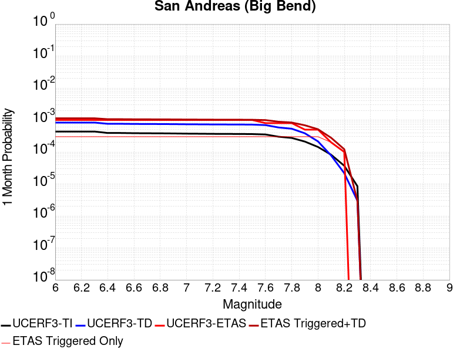 |  |  |

| Magnitude | 1 wk TI Prob | 1 wk TD Prob | 1 wk ETAS Prob | 1 wk ETAS/TD Gain | 1 wk ETAS Triggered+TD | 1 wk ETAS Triggered Only | 1 mo TI Prob | 1 mo TD Prob | 1 mo ETAS Prob | 1 mo ETAS/TD Gain | 1 mo ETAS Triggered+TD | 1 mo ETAS Triggered Only | 1 yr TI Prob | 1 yr TD Prob | 1 yr ETAS Prob | 1 yr ETAS/TD Gain | 1 yr ETAS Triggered+TD | 1 yr ETAS Triggered Only | 10 yr TI Prob | 10 yr TD Prob | 10 yr ETAS Prob | 10 yr ETAS/TD Gain | 10 yr ETAS Triggered+TD | 10 yr ETAS Triggered Only |
|-----|-----|-----|-----|-----|-----|-----|-----|-----|-----|-----|-----|-----|-----|-----|-----|-----|-----|-----|-----|-----|-----|-----|-----|-----|
| 6.0 | 1.0179969E-4 | 1.934932E-4 | 2.0E-4 | 1.0336281 | 1.934932E-4 | 0.0 | 4.362114E-4 | 8.28994E-4 | 0.001 | 1.2062814 | 0.0011287453 | 3.0E-4 | 0.0052979486 | 0.01004656 | 0.0068 | 0.6768486 | 0.010739528 | 7.0E-4 | 0.051734097 | 0.0983232 | 0.0688 | 0.69973314 | 0.1103155 | 0.0133 |
| 6.1 | 1.0179969E-4 | 1.934932E-4 | 2.0E-4 | 1.0336281 | 1.934932E-4 | 0.0 | 4.362114E-4 | 8.28994E-4 | 0.001 | 1.2062814 | 0.0011287453 | 3.0E-4 | 0.0052979486 | 0.01004656 | 0.0068 | 0.6768486 | 0.010739528 | 7.0E-4 | 0.051734097 | 0.0983232 | 0.0688 | 0.69973314 | 0.1103155 | 0.0133 |
| 6.2 | 1.0179969E-4 | 1.934932E-4 | 2.0E-4 | 1.0336281 | 1.934932E-4 | 0.0 | 4.362114E-4 | 8.28994E-4 | 0.001 | 1.2062814 | 0.0011287453 | 3.0E-4 | 0.0052979486 | 0.01004656 | 0.0068 | 0.6768486 | 0.010739528 | 7.0E-4 | 0.051734097 | 0.0983232 | 0.0688 | 0.69973314 | 0.1103155 | 0.0133 |
| 6.3 | 1.0179969E-4 | 1.934932E-4 | 2.0E-4 | 1.0336281 | 1.934932E-4 | 0.0 | 4.362114E-4 | 8.28994E-4 | 0.001 | 1.2062814 | 0.0011287453 | 3.0E-4 | 0.0052979486 | 0.01004656 | 0.0068 | 0.6768486 | 0.010739528 | 7.0E-4 | 0.051734097 | 0.0983232 | 0.0688 | 0.69973314 | 0.1103155 | 0.0133 |
| 6.4 | 9.1639464E-5 | 1.7720324E-4 | 2.0E-4 | 1.1286476 | 1.7720324E-4 | 0.0 | 3.9268145E-4 | 7.592216E-4 | 0.001 | 1.3171384 | 0.0010589939 | 3.0E-4 | 0.0047704205 | 0.009204453 | 0.0061 | 0.6627227 | 0.00989801 | 7.0E-4 | 0.046693064 | 0.09063992 | 0.0633 | 0.69836783 | 0.101188496 | 0.0116 |
| 6.5 | 9.1639464E-5 | 1.7720324E-4 | 2.0E-4 | 1.1286476 | 1.7720324E-4 | 0.0 | 3.9268145E-4 | 7.592216E-4 | 0.001 | 1.3171384 | 0.0010589939 | 3.0E-4 | 0.0047704205 | 0.009204453 | 0.0061 | 0.6627227 | 0.00989801 | 7.0E-4 | 0.046693064 | 0.09063992 | 0.0633 | 0.69836783 | 0.101188496 | 0.0116 |
| 6.6 | 9.042622E-5 | 1.7529071E-4 | 2.0E-4 | 1.1409618 | 1.7529071E-4 | 0.0 | 3.8748336E-4 | 7.510298E-4 | 0.001 | 1.3315051 | 0.0010508045 | 3.0E-4 | 0.0047074095 | 0.009105554 | 0.006 | 0.6589385 | 0.00979918 | 7.0E-4 | 0.046089325 | 0.089733854 | 0.0624 | 0.6953897 | 0.10029294 | 0.0116 |
| 6.7 | 8.9836685E-5 | 1.7443967E-4 | 2.0E-4 | 1.1465281 | 1.7443967E-4 | 0.0 | 3.8495753E-4 | 7.473846E-4 | 0.001 | 1.3379992 | 0.0010471604 | 3.0E-4 | 0.00467679 | 0.009061542 | 0.006 | 0.66213894 | 0.009755199 | 7.0E-4 | 0.045795817 | 0.08932939 | 0.0619 | 0.692941 | 0.09971104 | 0.0114 |
| 6.8 | 8.9471854E-5 | 1.7391385E-4 | 2.0E-4 | 1.1499947 | 1.7391385E-4 | 0.0 | 3.8339442E-4 | 7.4513233E-4 | 0.001 | 1.3420435 | 0.0010449088 | 3.0E-4 | 0.004657841 | 0.009034349 | 0.006 | 0.664132 | 0.009728025 | 7.0E-4 | 0.04561414 | 0.089079246 | 0.0616 | 0.69151914 | 0.09937265 | 0.0113 |
| 6.9 | 8.858234E-5 | 1.7274439E-4 | 2.0E-4 | 1.1577799 | 1.7274439E-4 | 0.0 | 3.7958333E-4 | 7.401233E-4 | 0.001 | 1.3511263 | 0.0010399012 | 3.0E-4 | 0.004611638 | 0.008973866 | 0.006 | 0.6686081 | 0.009667585 | 7.0E-4 | 0.04517103 | 0.088522434 | 0.0613 | 0.69247985 | 0.09863983 | 0.0111 |
| 7.0 | 8.7433385E-5 | 1.7114916E-4 | 2.0E-4 | 1.1685714 | 1.7114916E-4 | 0.0 | 3.746607E-4 | 7.332904E-4 | 0.001 | 1.3637162 | 0.0010330704 | 3.0E-4 | 0.004551957 | 0.008891358 | 0.0058 | 0.65231884 | 0.009585134 | 7.0E-4 | 0.044598386 | 0.08776246 | 0.0607 | 0.6916397 | 0.09779707 | 0.011 |
| 7.1 | 8.684964E-5 | 1.7027919E-4 | 2.0E-4 | 1.1745416 | 1.7027919E-4 | 0.0 | 3.7215967E-4 | 7.2956405E-4 | 0.001 | 1.3706815 | 0.0010293452 | 3.0E-4 | 0.0045216335 | 0.008846359 | 0.0058 | 0.65563697 | 0.009540167 | 7.0E-4 | 0.04430731 | 0.0873478 | 0.0605 | 0.6926334 | 0.09729571 | 0.0109 |
| 7.2 | 8.606521E-5 | 1.6919592E-4 | 2.0E-4 | 1.1820617 | 1.6919592E-4 | 0.0 | 3.6879873E-4 | 7.2492403E-4 | 0.001 | 1.379455 | 0.0010247065 | 3.0E-4 | 0.0044808835 | 0.0087903235 | 0.0058 | 0.65981644 | 0.00948417 | 7.0E-4 | 0.043916024 | 0.08683166 | 0.0604 | 0.6955988 | 0.096785195 | 0.0109 |
| 7.3 | 8.568266E-5 | 1.686284E-4 | 2.0E-4 | 1.1860399 | 1.686284E-4 | 0.0 | 3.6715972E-4 | 7.224931E-4 | 0.001 | 1.3840963 | 0.0010222764 | 3.0E-4 | 0.0044610105 | 0.008760965 | 0.0058 | 0.6620275 | 0.009454833 | 7.0E-4 | 0.043725148 | 0.0865573 | 0.0602 | 0.6954931 | 0.09642248 | 0.0108 |
| 7.4 | 8.5432206E-5 | 1.6826228E-4 | 2.0E-4 | 1.1886206 | 1.6826228E-4 | 0.0 | 3.6608664E-4 | 7.2092493E-4 | 0.001 | 1.387107 | 0.0010207087 | 3.0E-4 | 0.004447999 | 0.008742027 | 0.0058 | 0.6634617 | 0.009435907 | 7.0E-4 | 0.043600157 | 0.08638042 | 0.0601 | 0.69575953 | 0.09624751 | 0.0108 |
| 7.5 | 8.4791965E-5 | 1.669833E-4 | 2.0E-4 | 1.1977246 | 1.669833E-4 | 0.0 | 3.633435E-4 | 7.154466E-4 | 0.001 | 1.3977283 | 0.001015232 | 3.0E-4 | 0.0044147377 | 0.008675861 | 0.0058 | 0.6685215 | 0.009369788 | 7.0E-4 | 0.043280575 | 0.08576795 | 0.0597 | 0.69606423 | 0.09564165 | 0.0108 |
| 7.6 | 8.241105E-5 | 1.6155186E-4 | 1.0E-4 | 0.6189963 | 1.6155186E-4 | 0.0 | 3.531424E-4 | 6.921815E-4 | 8.0E-4 | 1.1557661 | 9.919739E-4 | 3.0E-4 | 0.0042910352 | 0.008394826 | 0.0056 | 0.6670776 | 0.009088949 | 7.0E-4 | 0.042091176 | 0.08318966 | 0.0583 | 0.7008083 | 0.09281617 | 0.0105 |
| 7.7 | 7.00432E-5 | 1.3586743E-4 | 1.0E-4 | 0.73601156 | 1.3586743E-4 | 0.0 | 3.001506E-4 | 5.821591E-4 | 8.0E-4 | 1.3741949 | 8.819844E-4 | 3.0E-4 | 0.0036482112 | 0.0070647867 | 0.0043 | 0.6086525 | 0.007660548 | 6.0E-4 | 0.035888977 | 0.07071617 | 0.0487 | 0.6886685 | 0.079172656 | 0.0091 |
| 7.8 | 6.415362E-5 | 1.2410858E-4 | 1.0E-4 | 0.805746 | 1.2410858E-4 | 0.0 | 2.749151E-4 | 5.3178554E-4 | 8.0E-4 | 1.5043658 | 8.31626E-4 | 3.0E-4 | 0.0033419547 | 0.0064552943 | 0.004 | 0.61964643 | 0.0070514213 | 6.0E-4 | 0.03292141 | 0.06470684 | 0.0438 | 0.6768991 | 0.07246978 | 0.0083 |
| 7.9 | 4.939911E-5 | 8.9373454E-5 | 0.0 | 0.0 | 8.9373454E-5 | 0.0 | 2.116933E-4 | 3.8297285E-4 | 5.0E-4 | 1.3055755 | 6.82858E-4 | 3.0E-4 | 0.0025743195 | 0.004652734 | 0.0024 | 0.51582575 | 0.005050873 | 4.0E-4 | 0.025447013 | 0.04701216 | 0.029 | 0.61686164 | 0.052063 | 0.0053 |
| 8.0 | 3.344983E-5 | 4.978813E-5 | 0.0 | 0.0 | 4.978813E-5 | 0.0 | 1.4334853E-4 | 2.1336025E-4 | 5.0E-4 | 2.3434541 | 5.132962E-4 | 3.0E-4 | 0.0017438711 | 0.0025945683 | 0.0016 | 0.61667293 | 0.0029935304 | 4.0E-4 | 0.017302496 | 0.026719132 | 0.0156 | 0.5838513 | 0.029444318 | 0.0028 |
| 8.1 | 1.9104898E-5 | 1.7970899E-5 | 0.0 | 0.0 | 1.7970899E-5 | 0.0 | 8.1875565E-5 | 7.7015866E-5 | 2.0E-4 | 2.5968676 | 2.7700045E-4 | 2.0E-4 | 9.963791E-4 | 9.3726534E-4 | 6.0E-4 | 0.6401602 | 0.0011370779 | 2.0E-4 | 0.009919235 | 0.010117445 | 0.0054 | 0.5337316 | 0.010711375 | 6.0E-4 |
| 8.2 | 8.643924E-6 | 5.0104E-6 | 0.0 | 0.0 | 5.0104E-6 | 0.0 | 3.704486E-5 | 2.1472966E-5 | 1.0E-4 | 4.6570187 | 1.2147082E-4 | 1.0E-4 | 4.5092785E-4 | 2.6140205E-4 | 2.0E-4 | 0.7651049 | 3.6137592E-4 | 1.0E-4 | 0.0045001395 | 0.002993769 | 0.0016 | 0.5344434 | 0.0031931703 | 2.0E-4 |
| 8.3 | 1.983087E-6 | 6.880041E-7 | 0.0 | 0.0 | 6.880041E-7 | 0.0 | 8.498917E-6 | 2.9485857E-6 | 0.0 | 0.0 | 2.9485857E-6 | 0.0 | 1.034694E-4 | 3.589845E-5 | 0.0 | 0.0 | 3.589845E-5 | 0.0 | 0.0010342124 | 4.2701262E-4 | 1.0E-4 | 0.23418511 | 4.2701262E-4 | 0.0 |

## Elsinore (Glen Ivy) rev
*[(top)](#table-of-contents)*

| 1 Week | 1 Month | 1 Year | 10 Year |
|-----|-----|-----|-----|
| 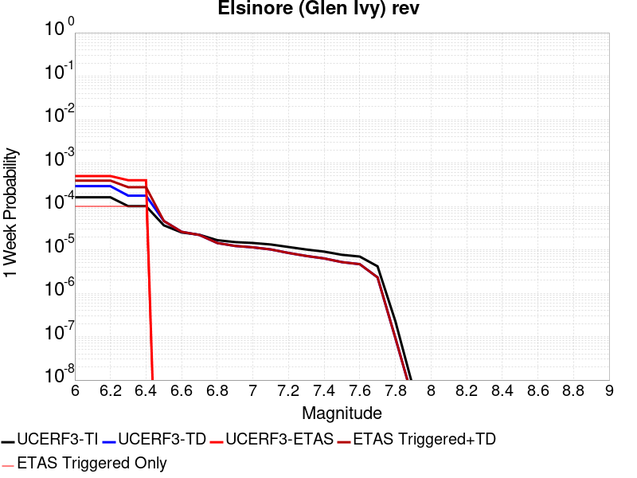 |  | 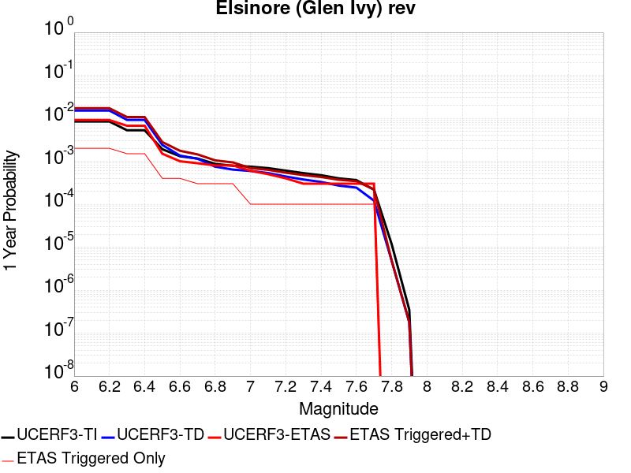 |  |

| Magnitude | 1 wk TI Prob | 1 wk TD Prob | 1 wk ETAS Prob | 1 wk ETAS/TD Gain | 1 wk ETAS Triggered+TD | 1 wk ETAS Triggered Only | 1 mo TI Prob | 1 mo TD Prob | 1 mo ETAS Prob | 1 mo ETAS/TD Gain | 1 mo ETAS Triggered+TD | 1 mo ETAS Triggered Only | 1 yr TI Prob | 1 yr TD Prob | 1 yr ETAS Prob | 1 yr ETAS/TD Gain | 1 yr ETAS Triggered+TD | 1 yr ETAS Triggered Only | 10 yr TI Prob | 10 yr TD Prob | 10 yr ETAS Prob | 10 yr ETAS/TD Gain | 10 yr ETAS Triggered+TD | 10 yr ETAS Triggered Only |
|-----|-----|-----|-----|-----|-----|-----|-----|-----|-----|-----|-----|-----|-----|-----|-----|-----|-----|-----|-----|-----|-----|-----|-----|-----|
| 6.0 | 1.6204086E-4 | 2.9251605E-4 | 5.0E-4 | 1.7093079 | 3.924868E-4 | 1.0E-4 | 6.94276E-4 | 0.0012531171 | 0.0015 | 1.197015 | 0.0015527412 | 3.0E-4 | 0.008420097 | 0.015171497 | 0.0091 | 0.599809 | 0.017141154 | 0.002 | 0.081081145 | 0.13933165 | 0.0918 | 0.6588596 | 0.14854081 | 0.0107 |
| 6.1 | 1.6204086E-4 | 2.9251605E-4 | 5.0E-4 | 1.7093079 | 3.924868E-4 | 1.0E-4 | 6.94276E-4 | 0.0012531171 | 0.0015 | 1.197015 | 0.0015527412 | 3.0E-4 | 0.008420097 | 0.015171497 | 0.0091 | 0.599809 | 0.017141154 | 0.002 | 0.081081145 | 0.13933165 | 0.0918 | 0.6588596 | 0.14854081 | 0.0107 |
| 6.2 | 1.6204086E-4 | 2.9251605E-4 | 5.0E-4 | 1.7093079 | 3.924868E-4 | 1.0E-4 | 6.94276E-4 | 0.0012531171 | 0.0015 | 1.197015 | 0.0015527412 | 3.0E-4 | 0.008420097 | 0.015171497 | 0.0091 | 0.599809 | 0.017141154 | 0.002 | 0.081081145 | 0.13933165 | 0.0918 | 0.6588596 | 0.14854081 | 0.0107 |
| 6.3 | 1.0111737E-4 | 1.7629775E-4 | 4.0E-4 | 2.268889 | 2.7628013E-4 | 1.0E-4 | 4.332882E-4 | 7.554589E-4 | 9.0E-4 | 1.1913289 | 0.0010552322 | 3.0E-4 | 0.005262531 | 0.009179472 | 0.0067 | 0.72988945 | 0.010665703 | 0.0015 | 0.0513964 | 0.08675405 | 0.0626 | 0.7215802 | 0.09369472 | 0.0076 |
| 6.4 | 1.0111737E-4 | 1.7629775E-4 | 4.0E-4 | 2.268889 | 2.7628013E-4 | 1.0E-4 | 4.332882E-4 | 7.554589E-4 | 9.0E-4 | 1.1913289 | 0.0010552322 | 3.0E-4 | 0.005262531 | 0.009179472 | 0.0067 | 0.72988945 | 0.010665703 | 0.0015 | 0.0513964 | 0.08675405 | 0.0626 | 0.7215802 | 0.09369472 | 0.0076 |
| 6.5 | 3.6624708E-5 | 4.609726E-5 | 0.0 | 0.0 | 4.609726E-5 | 0.0 | 1.569536E-4 | 1.9754675E-4 | 3.0E-4 | 1.5186279 | 3.9750725E-4 | 2.0E-4 | 0.001909235 | 0.0024028358 | 0.0015 | 0.62426245 | 0.0028018744 | 4.0E-4 | 0.01892915 | 0.023553308 | 0.015 | 0.6368532 | 0.025701491 | 0.0022 |
| 6.6 | 2.5051324E-5 | 2.597092E-5 | 0.0 | 0.0 | 2.597092E-5 | 0.0 | 1.073584E-4 | 1.1129944E-4 | 2.0E-4 | 1.7969543 | 3.1127717E-4 | 2.0E-4 | 0.0013063047 | 0.0013542724 | 0.001 | 0.7384039 | 0.0017537306 | 4.0E-4 | 0.012986525 | 0.013476744 | 0.0084 | 0.6232959 | 0.014759225 | 0.0013 |
| 6.7 | 2.2189772E-5 | 2.1921272E-5 | 0.0 | 0.0 | 2.1921272E-5 | 0.0 | 9.509556E-5 | 9.394513E-5 | 1.0E-4 | 1.0644511 | 1.9393573E-4 | 1.0E-4 | 0.0011571734 | 0.0011432177 | 9.0E-4 | 0.78725165 | 0.0014428748 | 3.0E-4 | 0.011511663 | 0.01139007 | 0.007 | 0.6145704 | 0.012576402 | 0.0012 |
| 6.8 | 1.6654378E-5 | 1.4349544E-5 | 0.0 | 0.0 | 1.4349544E-5 | 0.0 | 7.137396E-5 | 6.149663E-5 | 1.0E-4 | 1.6261055 | 1.6149048E-4 | 1.0E-4 | 8.686314E-4 | 7.4846926E-4 | 8.0E-4 | 1.0688481 | 0.0010482448 | 3.0E-4 | 0.008652439 | 0.007464598 | 0.0041 | 0.5492593 | 0.008060119 | 6.0E-4 |
| 6.9 | 1.5042909E-5 | 1.2265607E-5 | 0.0 | 0.0 | 1.2265607E-5 | 0.0 | 6.446802E-5 | 5.2565847E-5 | 1.0E-4 | 1.9023758 | 1.5256059E-4 | 1.0E-4 | 7.8461546E-4 | 6.398044E-4 | 8.0E-4 | 1.2503822 | 9.3961245E-4 | 3.0E-4 | 0.007818509 | 0.0063835797 | 0.0035 | 0.5482817 | 0.0069797495 | 6.0E-4 |
| 7.0 | 1.4361385E-5 | 1.1392162E-5 | 0.0 | 0.0 | 1.1392162E-5 | 0.0 | 6.154734E-5 | 4.8822654E-5 | 1.0E-4 | 2.0482295 | 1.4881777E-4 | 1.0E-4 | 7.490812E-4 | 5.9425656E-4 | 6.0E-4 | 1.0096649 | 6.9419714E-4 | 1.0E-4 | 0.007465612 | 0.005930479 | 0.0031 | 0.5227234 | 0.0062287003 | 3.0E-4 |
| 7.1 | 1.3265571E-5 | 1.0195621E-5 | 0.0 | 0.0 | 1.0195621E-5 | 0.0 | 5.6851208E-5 | 4.3694803E-5 | 1.0E-4 | 2.2886016 | 1.4369043E-4 | 1.0E-4 | 6.919436E-4 | 5.3185684E-4 | 5.0E-4 | 0.9401025 | 6.318037E-4 | 1.0E-4 | 0.006897931 | 0.005309098 | 0.0028 | 0.52739656 | 0.0055080364 | 2.0E-4 |
| 7.2 | 1.1596403E-5 | 8.46623E-6 | 0.0 | 0.0 | 8.46623E-6 | 0.0 | 4.9697923E-5 | 3.6283345E-5 | 1.0E-4 | 2.7560854 | 1.3627972E-4 | 1.0E-4 | 6.049042E-4 | 4.4166186E-4 | 4.0E-4 | 0.9056702 | 5.416177E-4 | 1.0E-4 | 0.006032603 | 0.0044091586 | 0.0022 | 0.49896142 | 0.0046082768 | 2.0E-4 |
| 7.3 | 1.0150827E-5 | 7.2083226E-6 | 0.0 | 0.0 | 7.2083226E-6 | 0.0 | 4.3502816E-5 | 3.0892454E-5 | 1.0E-4 | 3.2370365 | 1.3088937E-4 | 1.0E-4 | 5.2951806E-4 | 3.7605214E-4 | 3.0E-4 | 0.79776174 | 4.7601454E-4 | 1.0E-4 | 0.005282581 | 0.0037545003 | 0.0016 | 0.42615524 | 0.0039537493 | 2.0E-4 |
| 7.4 | 9.080705E-6 | 6.32672E-6 | 0.0 | 0.0 | 6.32672E-6 | 0.0 | 3.8916725E-5 | 2.7114238E-5 | 1.0E-4 | 3.6880991 | 1.2711153E-4 | 1.0E-4 | 4.7370812E-4 | 3.300672E-4 | 3.0E-4 | 0.9089058 | 4.3003418E-4 | 1.0E-4 | 0.004726996 | 0.0032959157 | 0.0014 | 0.42476815 | 0.0034952564 | 2.0E-4 |
| 7.5 | 7.671649E-6 | 5.204376E-6 | 0.0 | 0.0 | 5.204376E-6 | 0.0 | 3.287808E-5 | 2.2304284E-5 | 1.0E-4 | 4.4834437 | 1.2230205E-4 | 1.0E-4 | 4.0021708E-4 | 2.7152206E-4 | 3.0E-4 | 1.1048826 | 3.714949E-4 | 1.0E-4 | 0.0039949706 | 0.0027120274 | 0.0012 | 0.4424734 | 0.002811756 | 1.0E-4 |
| 7.6 | 6.990086E-6 | 4.6680852E-6 | 0.0 | 0.0 | 4.6680852E-6 | 0.0 | 2.9957167E-5 | 2.0005933E-5 | 1.0E-4 | 4.9985175 | 1.2000393E-4 | 1.0E-4 | 3.6466747E-4 | 2.4354616E-4 | 3.0E-4 | 1.2317994 | 3.4352182E-4 | 1.0E-4 | 0.0036406964 | 0.002432908 | 0.0012 | 0.4932369 | 0.0025326647 | 1.0E-4 |
| 7.7 | 4.163505E-6 | 2.3176701E-6 | 0.0 | 0.0 | 2.3176701E-6 | 0.0 | 1.7843471E-5 | 9.932838E-6 | 1.0E-4 | 10.0676155 | 1.0993185E-4 | 1.0E-4 | 2.172226E-4 | 1.20926336E-4 | 3.0E-4 | 2.4808493 | 2.2091424E-4 | 1.0E-4 | 0.0021701038 | 0.0012086778 | 6.0E-4 | 0.49641022 | 0.0013085569 | 1.0E-4 |
| 7.8 | 2.2692414E-7 | 9.313546E-8 | 0.0 | 0.0 | 9.313546E-8 | 0.0 | 9.725317E-7 | 3.9915196E-7 | 0.0 | 0.0 | 3.9915196E-7 | 0.0 | 1.1840509E-5 | 4.8596676E-6 | 0.0 | 0.0 | 4.8596676E-6 | 0.0 | 1.1839878E-4 | 4.859593E-5 | 0.0 | 0.0 | 4.859593E-5 | 0.0 |
| 7.9 | 6.676829E-9 | 3.4267709E-9 | 0.0 | 0.0 | 3.4267709E-9 | 0.0 | 2.861498E-8 | 1.4686159E-8 | 0.0 | 0.0 | 1.4686159E-8 | 0.0 | 3.4838732E-7 | 1.7880397E-7 | 0.0 | 0.0 | 1.7880397E-7 | 0.0 | 3.4838679E-6 | 1.7880385E-6 | 0.0 | 0.0 | 1.7880385E-6 | 0.0 |

## Hayward (So) extension 2011 CFM
*[(top)](#table-of-contents)*

| 1 Week | 1 Month | 1 Year | 10 Year |
|-----|-----|-----|-----|
|  |  | 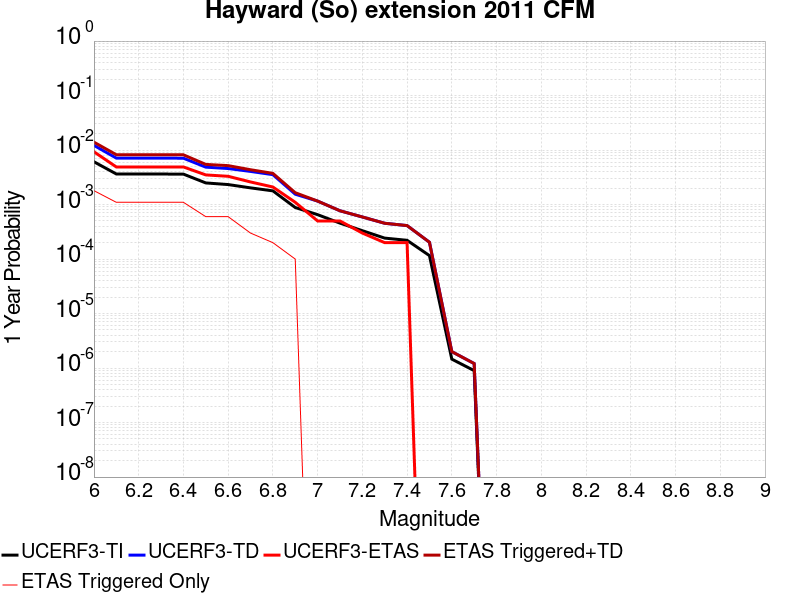 | 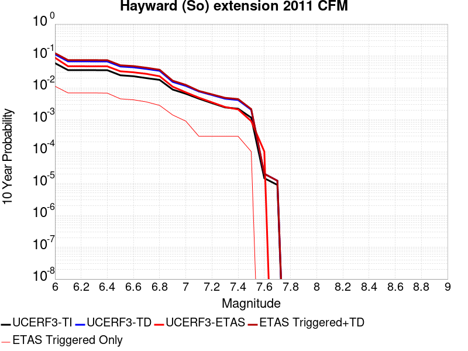 |

| Magnitude | 1 wk TI Prob | 1 wk TD Prob | 1 wk ETAS Prob | 1 wk ETAS/TD Gain | 1 wk ETAS Triggered+TD | 1 wk ETAS Triggered Only | 1 mo TI Prob | 1 mo TD Prob | 1 mo ETAS Prob | 1 mo ETAS/TD Gain | 1 mo ETAS Triggered+TD | 1 mo ETAS Triggered Only | 1 yr TI Prob | 1 yr TD Prob | 1 yr ETAS Prob | 1 yr ETAS/TD Gain | 1 yr ETAS Triggered+TD | 1 yr ETAS Triggered Only | 10 yr TI Prob | 10 yr TD Prob | 10 yr ETAS Prob | 10 yr ETAS/TD Gain | 10 yr ETAS Triggered+TD | 10 yr ETAS Triggered Only |
|-----|-----|-----|-----|-----|-----|-----|-----|-----|-----|-----|-----|-----|-----|-----|-----|-----|-----|-----|-----|-----|-----|-----|-----|-----|
| 6.0 | 1.1721256E-4 | 2.3521947E-4 | 5.0E-4 | 2.1256745 | 4.3517243E-4 | 2.0E-4 | 5.022428E-4 | 0.001007451 | 0.001 | 0.99260414 | 0.001407048 | 4.0E-4 | 0.0060976758 | 0.0121734785 | 0.0093 | 0.76395583 | 0.013951566 | 0.0018 | 0.0593305 | 0.11223979 | 0.0878 | 0.78225374 | 0.12218271 | 0.0112 |
| 6.1 | 6.99169E-5 | 1.3682294E-4 | 1.0E-4 | 0.7308716 | 2.3680925E-4 | 1.0E-4 | 2.9960944E-4 | 5.861606E-4 | 2.0E-4 | 0.34120345 | 6.8610196E-4 | 1.0E-4 | 0.0036416445 | 0.0071071615 | 0.0049 | 0.68944544 | 0.008199343 | 0.0011 | 0.035825435 | 0.067268156 | 0.0473 | 0.7031559 | 0.07370401 | 0.0069 |
| 6.2 | 6.99169E-5 | 1.3682294E-4 | 1.0E-4 | 0.7308716 | 2.3680925E-4 | 1.0E-4 | 2.9960944E-4 | 5.861606E-4 | 2.0E-4 | 0.34120345 | 6.8610196E-4 | 1.0E-4 | 0.0036416445 | 0.0071071615 | 0.0049 | 0.68944544 | 0.008199343 | 0.0011 | 0.035825435 | 0.067268156 | 0.0473 | 0.7031559 | 0.07370401 | 0.0069 |
| 6.3 | 6.970908E-5 | 1.3650513E-4 | 1.0E-4 | 0.7325732 | 2.3649148E-4 | 1.0E-4 | 2.9871898E-4 | 5.8479945E-4 | 2.0E-4 | 0.3419976 | 6.8474095E-4 | 1.0E-4 | 0.0036308395 | 0.0070907357 | 0.0049 | 0.69104254 | 0.008182936 | 0.0011 | 0.035720866 | 0.06711735 | 0.0471 | 0.70175594 | 0.07355424 | 0.0069 |
| 6.4 | 6.9517155E-5 | 1.3617531E-4 | 1.0E-4 | 0.7343475 | 2.361617E-4 | 1.0E-4 | 2.9789665E-4 | 5.833867E-4 | 2.0E-4 | 0.34282577 | 6.8332837E-4 | 1.0E-4 | 0.0036208609 | 0.007073697 | 0.0049 | 0.69270706 | 0.0081659155 | 0.0011 | 0.03562429 | 0.066961706 | 0.047 | 0.7018937 | 0.07330637 | 0.0068 |
| 6.5 | 4.786248E-5 | 9.303111E-5 | 1.0E-4 | 1.0749093 | 1.930218E-4 | 1.0E-4 | 2.0510878E-4 | 3.986461E-4 | 2.0E-4 | 0.5016981 | 4.9860624E-4 | 1.0E-4 | 0.0024943394 | 0.004843143 | 0.0035 | 0.7226712 | 0.005440237 | 6.0E-4 | 0.02466527 | 0.04641175 | 0.0329 | 0.7088722 | 0.050702896 | 0.0045 |
| 6.6 | 4.4662214E-5 | 8.7730434E-5 | 1.0E-4 | 1.1398553 | 1.8772166E-4 | 1.0E-4 | 1.9139545E-4 | 3.759359E-4 | 2.0E-4 | 0.5320056 | 4.758983E-4 | 1.0E-4 | 0.0023277493 | 0.0045678667 | 0.0033 | 0.72243786 | 0.005165126 | 6.0E-4 | 0.02303517 | 0.043816496 | 0.0306 | 0.6983671 | 0.047832467 | 0.0042 |
| 6.7 | 3.884542E-5 | 7.7629156E-5 | 0.0 | 0.0 | 7.7629156E-5 | 0.0 | 1.6646975E-4 | 3.326564E-4 | 1.0E-4 | 0.30061048 | 3.326564E-4 | 0.0 | 0.002024885 | 0.004043004 | 0.0026 | 0.6430862 | 0.004341791 | 3.0E-4 | 0.020065336 | 0.0388833 | 0.0273 | 0.70210093 | 0.04234332 | 0.0036 |
| 6.8 | 3.4221863E-5 | 6.7658715E-5 | 0.0 | 0.0 | 6.7658715E-5 | 0.0 | 1.4665688E-4 | 2.89936E-4 | 1.0E-4 | 0.3449037 | 2.89936E-4 | 0.0 | 0.0017840851 | 0.0035246678 | 0.0021 | 0.5958008 | 0.003723963 | 2.0E-4 | 0.017698295 | 0.034021176 | 0.023 | 0.6760495 | 0.03672592 | 0.0028 |
| 6.9 | 1.6927712E-5 | 2.9631337E-5 | 0.0 | 0.0 | 2.9631337E-5 | 0.0 | 7.2545314E-5 | 1.2698557E-4 | 1.0E-4 | 0.787491 | 1.2698557E-4 | 0.0 | 8.828813E-4 | 0.0015450083 | 0.0011 | 0.7119703 | 0.0016448537 | 1.0E-4 | 0.008793819 | 0.015260744 | 0.0108 | 0.7076981 | 0.01663938 | 0.0014 |
| 7.0 | 1.2509653E-5 | 2.2127879E-5 | 0.0 | 0.0 | 2.2127879E-5 | 0.0 | 5.3611697E-5 | 9.483056E-5 | 0.0 | 0.0 | 9.483056E-5 | 0.0 | 6.525269E-4 | 0.0011539933 | 5.0E-4 | 0.43327808 | 0.0011539933 | 0.0 | 0.0065061417 | 0.011423799 | 0.0072 | 0.6302632 | 0.012313518 | 9.0E-4 |
| 7.1 | 8.751583E-6 | 1.46986695E-5 | 0.0 | 0.0 | 1.46986695E-5 | 0.0 | 3.750624E-5 | 6.299281E-5 | 0.0 | 0.0 | 6.299281E-5 | 0.0 | 4.5654282E-4 | 7.6667324E-4 | 5.0E-4 | 0.65216833 | 7.6667324E-4 | 0.0 | 0.0045560603 | 0.007653102 | 0.0049 | 0.6402633 | 0.007950806 | 3.0E-4 |
| 7.2 | 6.354379E-6 | 1.1301989E-5 | 0.0 | 0.0 | 1.1301989E-5 | 0.0 | 2.7232769E-5 | 4.843622E-5 | 0.0 | 0.0 | 4.843622E-5 | 0.0 | 3.3150852E-4 | 5.8955606E-4 | 3.0E-4 | 0.5088574 | 5.8955606E-4 | 0.0 | 0.0033101442 | 0.0059044003 | 0.0035 | 0.5927782 | 0.006202629 | 3.0E-4 |
| 7.3 | 4.645554E-6 | 8.660762E-6 | 0.0 | 0.0 | 8.660762E-6 | 0.0 | 1.9909365E-5 | 3.7117046E-5 | 0.0 | 0.0 | 3.7117046E-5 | 0.0 | 2.4236954E-4 | 4.5181013E-4 | 2.0E-4 | 0.44266382 | 4.5181013E-4 | 0.0 | 0.0024210536 | 0.0045332885 | 0.0025 | 0.551476 | 0.0048319288 | 3.0E-4 |
| 7.4 | 4.23437E-6 | 7.851296E-6 | 0.0 | 0.0 | 7.851296E-6 | 0.0 | 1.8147173E-5 | 3.3648E-5 | 0.0 | 0.0 | 3.3648E-5 | 0.0 | 2.2091944E-4 | 4.095911E-4 | 2.0E-4 | 0.48829186 | 4.095911E-4 | 0.0 | 0.0022069993 | 0.0041123135 | 0.0021 | 0.5106614 | 0.00441108 | 3.0E-4 |
| 7.5 | 2.2187417E-6 | 3.887824E-6 | 0.0 | 0.0 | 3.887824E-6 | 0.0 | 9.508858E-6 | 1.666201E-5 | 0.0 | 0.0 | 1.666201E-5 | 0.0 | 1.157642E-4 | 2.0284363E-4 | 0.0 | 0.0 | 2.0284363E-4 | 0.0 | 0.0011570391 | 0.0020414833 | 9.0E-4 | 0.4408559 | 0.0021412792 | 1.0E-4 |
| 7.6 | 2.7952495E-8 | 3.823518E-8 | 0.0 | 0.0 | 3.823518E-8 | 0.0 | 1.1979641E-7 | 1.6386504E-7 | 0.0 | 0.0 | 1.6386504E-7 | 0.0 | 1.4585203E-6 | 1.995055E-6 | 0.0 | 0.0 | 1.995055E-6 | 0.0 | 1.4585107E-5 | 2.006026E-5 | 1.0E-4 | 4.98498 | 2.006026E-5 | 0.0 |
| 7.7 | 1.7192724E-8 | 2.309186E-8 | 0.0 | 0.0 | 2.309186E-8 | 0.0 | 7.36831E-8 | 9.896512E-8 | 0.0 | 0.0 | 9.896512E-8 | 0.0 | 8.9709135E-7 | 1.2048996E-6 | 0.0 | 0.0 | 1.2048996E-6 | 0.0 | 8.970877E-6 | 1.2135361E-5 | 0.0 | 0.0 | 1.2135361E-5 | 0.0 |

## Calaveras (So) - Paicines extension 2011 CFM
*[(top)](#table-of-contents)*

| 1 Week | 1 Month | 1 Year | 10 Year |
|-----|-----|-----|-----|
| 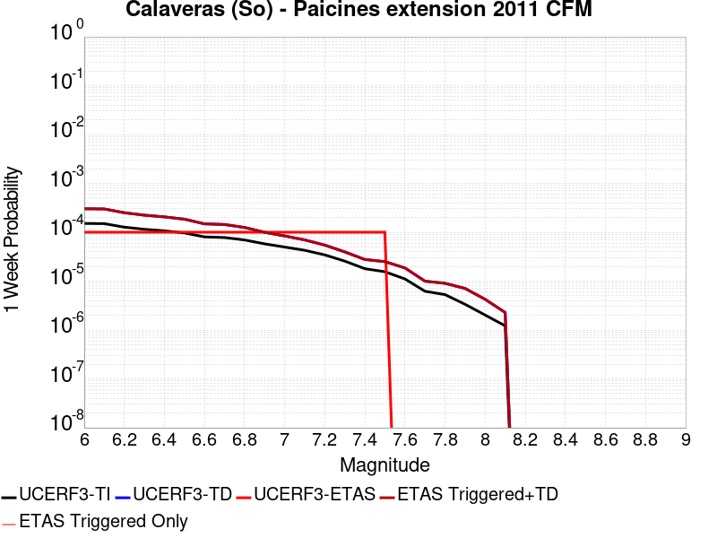 |  |  |  |

| Magnitude | 1 wk TI Prob | 1 wk TD Prob | 1 wk ETAS Prob | 1 wk ETAS/TD Gain | 1 wk ETAS Triggered+TD | 1 wk ETAS Triggered Only | 1 mo TI Prob | 1 mo TD Prob | 1 mo ETAS Prob | 1 mo ETAS/TD Gain | 1 mo ETAS Triggered+TD | 1 mo ETAS Triggered Only | 1 yr TI Prob | 1 yr TD Prob | 1 yr ETAS Prob | 1 yr ETAS/TD Gain | 1 yr ETAS Triggered+TD | 1 yr ETAS Triggered Only | 10 yr TI Prob | 10 yr TD Prob | 10 yr ETAS Prob | 10 yr ETAS/TD Gain | 10 yr ETAS Triggered+TD | 10 yr ETAS Triggered Only |
|-----|-----|-----|-----|-----|-----|-----|-----|-----|-----|-----|-----|-----|-----|-----|-----|-----|-----|-----|-----|-----|-----|-----|-----|-----|
| 6.0 | 1.5183659E-4 | 3.0299783E-4 | 1.0E-4 | 0.3300354 | 3.0299783E-4 | 0.0 | 6.5056595E-4 | 0.0012973594 | 5.0E-4 | 0.38539824 | 0.0013972296 | 1.0E-4 | 0.007891912 | 0.015582891 | 0.0104 | 0.66739863 | 0.0184377 | 0.0029 | 0.076174594 | 0.1375756 | 0.0886 | 0.6440096 | 0.14697602 | 0.0109 |
| 6.1 | 1.5024997E-4 | 2.9995097E-4 | 1.0E-4 | 0.33338782 | 2.9995097E-4 | 0.0 | 6.437695E-4 | 0.0012843153 | 5.0E-4 | 0.3893125 | 0.0013841868 | 1.0E-4 | 0.0078097614 | 0.015426802 | 0.0104 | 0.67415136 | 0.018282065 | 0.0029 | 0.075409345 | 0.1362479 | 0.0871 | 0.63927585 | 0.14557643 | 0.0108 |
| 6.2 | 1.2743923E-4 | 2.5098768E-4 | 1.0E-4 | 0.39842594 | 2.5098768E-4 | 0.0 | 5.460538E-4 | 0.0010747976 | 3.0E-4 | 0.27912232 | 0.0010747976 | 0.0 | 0.0066279583 | 0.012936405 | 0.0088 | 0.6802508 | 0.015305358 | 0.0024 | 0.064337276 | 0.11634466 | 0.0755 | 0.64893395 | 0.12429756 | 0.009 |
| 6.3 | 1.1525114E-4 | 2.2385431E-4 | 1.0E-4 | 0.4467191 | 2.2385431E-4 | 0.0 | 4.9383997E-4 | 9.587146E-4 | 3.0E-4 | 0.312919 | 9.587146E-4 | 0.0 | 0.0059959386 | 0.011557981 | 0.0078 | 0.67485833 | 0.013732553 | 0.0022 | 0.058367174 | 0.10545349 | 0.0691 | 0.65526515 | 0.11323605 | 0.0087 |
| 6.4 | 1.07200925E-4 | 2.0627695E-4 | 1.0E-4 | 0.48478517 | 2.0627695E-4 | 0.0 | 4.5935164E-4 | 8.835058E-4 | 3.0E-4 | 0.33955634 | 8.835058E-4 | 0.0 | 0.0055782744 | 0.01066342 | 0.0067 | 0.6283162 | 0.012642093 | 0.002 | 0.0544031 | 0.098273955 | 0.0626 | 0.63699484 | 0.1050369 | 0.0075 |
| 6.5 | 9.69631E-5 | 1.8526119E-4 | 1.0E-4 | 0.5397785 | 1.8526119E-4 | 0.0 | 4.1548995E-4 | 7.935387E-4 | 3.0E-4 | 0.3780534 | 7.935387E-4 | 0.0 | 0.0050468626 | 0.009587359 | 0.0061 | 0.6362545 | 0.0114691425 | 0.0019 | 0.04933773 | 0.08917394 | 0.0568 | 0.63695735 | 0.09536756 | 0.0068 |
| 6.6 | 8.0552316E-5 | 1.4863664E-4 | 1.0E-4 | 0.67278165 | 1.4863664E-4 | 0.0 | 3.4517853E-4 | 6.368201E-4 | 3.0E-4 | 0.47109067 | 6.368201E-4 | 0.0 | 0.0041944524 | 0.007719438 | 0.0054 | 0.6995328 | 0.009406315 | 0.0017 | 0.04116161 | 0.073933005 | 0.0486 | 0.65735185 | 0.07948941 | 0.006 |
| 6.7 | 7.815757E-5 | 1.440591E-4 | 1.0E-4 | 0.6941595 | 1.440591E-4 | 0.0 | 3.34918E-4 | 6.1721564E-4 | 3.0E-4 | 0.4860538 | 6.1721564E-4 | 0.0 | 0.004070005 | 0.007483083 | 0.0054 | 0.7216277 | 0.009170362 | 0.0017 | 0.039962657 | 0.07178749 | 0.0476 | 0.6630682 | 0.077171125 | 0.0058 |
| 6.8 | 6.965264E-5 | 1.2529595E-4 | 1.0E-4 | 0.7981104 | 1.2529595E-4 | 0.0 | 2.9847719E-4 | 5.3686014E-4 | 3.0E-4 | 0.55880475 | 5.3686014E-4 | 0.0 | 0.0036279052 | 0.0065135644 | 0.0045 | 0.690866 | 0.007805097 | 0.0013 | 0.03569247 | 0.062926516 | 0.0419 | 0.66585606 | 0.06770559 | 0.0051 |
| 6.9 | 5.8000453E-5 | 9.968164E-5 | 1.0E-4 | 1.0031939 | 9.968164E-5 | 0.0 | 2.4854968E-4 | 4.2713762E-4 | 3.0E-4 | 0.7023497 | 4.2713762E-4 | 0.0 | 0.0030218933 | 0.0051880954 | 0.0033 | 0.63607156 | 0.006182907 | 0.001 | 0.029811295 | 0.050695516 | 0.0331 | 0.6529177 | 0.054492734 | 0.004 |
| 7.0 | 4.9865852E-5 | 8.4068415E-5 | 1.0E-4 | 1.1895074 | 8.4068415E-5 | 0.0 | 2.1369329E-4 | 3.6024392E-4 | 2.0E-4 | 0.55517936 | 3.6024392E-4 | 0.0 | 0.0025986114 | 0.004377236 | 0.0028 | 0.63967305 | 0.0052732965 | 9.0E-4 | 0.025684336 | 0.04303462 | 0.0288 | 0.6692286 | 0.04619261 | 0.0033 |
| 7.1 | 4.283875E-5 | 6.968087E-5 | 1.0E-4 | 1.4351141 | 6.968087E-5 | 0.0 | 1.8358172E-4 | 2.985984E-4 | 2.0E-4 | 0.66979593 | 2.985984E-4 | 0.0 | 0.0022328163 | 0.0036294304 | 0.0026 | 0.7163658 | 0.004526164 | 9.0E-4 | 0.022105146 | 0.036053885 | 0.0249 | 0.69063294 | 0.03846375 | 0.0025 |
| 7.2 | 3.450115E-5 | 5.4509244E-5 | 1.0E-4 | 1.8345512 | 5.4509244E-5 | 0.0 | 1.478537E-4 | 2.3359028E-4 | 2.0E-4 | 0.8562 | 2.3359028E-4 | 0.0 | 0.0017986323 | 0.002840281 | 0.0024 | 0.8449868 | 0.0036380088 | 8.0E-4 | 0.017841442 | 0.028472278 | 0.0197 | 0.691901 | 0.030415334 | 0.002 |
| 7.3 | 2.5709045E-5 | 3.9591396E-5 | 1.0E-4 | 2.5258014 | 3.9591396E-5 | 0.0 | 1.1017697E-4 | 1.6966647E-4 | 2.0E-4 | 1.1787833 | 1.6966647E-4 | 0.0 | 0.0013405791 | 0.0020637487 | 0.0013 | 0.6299217 | 0.0025627168 | 5.0E-4 | 0.013325208 | 0.020812701 | 0.0138 | 0.6630567 | 0.02247732 | 0.0017 |
| 7.4 | 1.8003093E-5 | 2.7654243E-5 | 1.0E-4 | 3.6160817 | 2.7654243E-5 | 0.0 | 7.715383E-5 | 1.1851281E-4 | 2.0E-4 | 1.6875813 | 1.1851281E-4 | 0.0 | 9.3894306E-4 | 0.0014419407 | 0.001 | 0.6935098 | 0.001741508 | 3.0E-4 | 0.009349857 | 0.0146336295 | 0.009 | 0.6150217 | 0.015717532 | 0.0011 |
| 7.5 | 1.5595824E-5 | 2.5012372E-5 | 1.0E-4 | 3.9980214 | 2.5012372E-5 | 0.0 | 6.683753E-5 | 1.0719149E-4 | 2.0E-4 | 1.8658198 | 1.0719149E-4 | 0.0 | 8.134431E-4 | 0.0013042772 | 0.001 | 0.7667082 | 0.0016038859 | 3.0E-4 | 0.008104719 | 0.013256188 | 0.0083 | 0.6261227 | 0.014242931 | 0.001 |
| 7.6 | 1.1110309E-5 | 1.8564004E-5 | 0.0 | 0.0 | 1.8564004E-5 | 0.0 | 4.761474E-5 | 7.95576E-5 | 0.0 | 0.0 | 7.95576E-5 | 0.0 | 5.795553E-4 | 9.681847E-4 | 7.0E-4 | 0.72300255 | 0.0011679911 | 2.0E-4 | 0.0057804612 | 0.009882825 | 0.0058 | 0.5868767 | 0.010575907 | 7.0E-4 |
| 7.7 | 6.2140443E-6 | 9.9548215E-6 | 0.0 | 0.0 | 9.9548215E-6 | 0.0 | 2.6631347E-5 | 4.266282E-5 | 0.0 | 0.0 | 4.266282E-5 | 0.0 | 3.241884E-4 | 5.1929615E-4 | 2.0E-4 | 0.38513666 | 5.1929615E-4 | 0.0 | 0.0032371588 | 0.00538349 | 0.0033 | 0.6129852 | 0.0057813367 | 4.0E-4 |
| 7.8 | 5.305533E-6 | 9.00452E-6 | 0.0 | 0.0 | 9.00452E-6 | 0.0 | 2.27378E-5 | 3.859023E-5 | 0.0 | 0.0 | 3.859023E-5 | 0.0 | 2.7679754E-4 | 4.6973483E-4 | 2.0E-4 | 0.42577213 | 4.6973483E-4 | 0.0 | 0.0027645302 | 0.004865346 | 0.0031 | 0.63715917 | 0.0052634 | 4.0E-4 |
| 7.9 | 3.363505E-6 | 7.0710216E-6 | 0.0 | 0.0 | 7.0710216E-6 | 0.0 | 1.4414942E-5 | 3.0304027E-5 | 0.0 | 0.0 | 3.0304027E-5 | 0.0 | 1.7548777E-4 | 3.6888913E-4 | 1.0E-4 | 0.27108416 | 3.6888913E-4 | 0.0 | 0.0017534926 | 0.0037968648 | 0.0022 | 0.5794254 | 0.0039961054 | 2.0E-4 |
| 8.0 | 2.0271132E-6 | 4.2371266E-6 | 0.0 | 0.0 | 4.2371266E-6 | 0.0 | 8.687599E-6 | 1.8158988E-5 | 0.0 | 0.0 | 1.8158988E-5 | 0.0 | 1.05766376E-4 | 2.2106328E-4 | 0.0 | 0.0 | 2.2106328E-4 | 0.0 | 0.0010571606 | 0.0022653474 | 0.001 | 0.4414334 | 0.002365121 | 1.0E-4 |
| 8.1 | 1.2206116E-6 | 2.278714E-6 | 0.0 | 0.0 | 2.278714E-6 | 0.0 | 5.2311816E-6 | 9.765881E-6 | 0.0 | 0.0 | 9.765881E-6 | 0.0 | 6.3687774E-5 | 1.1889315E-4 | 0.0 | 0.0 | 1.1889315E-4 | 0.0 | 6.366953E-4 | 0.0012227265 | 4.0E-4 | 0.32713774 | 0.0012227265 | 0.0 |

## San Andreas (Mojave N)
*[(top)](#table-of-contents)*

| 1 Week | 1 Month | 1 Year | 10 Year |
|-----|-----|-----|-----|
|  | 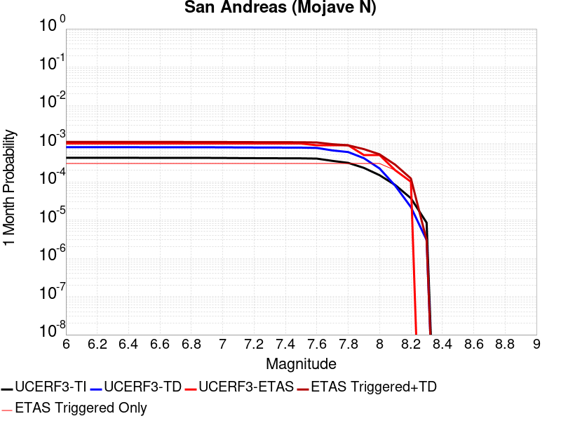 | 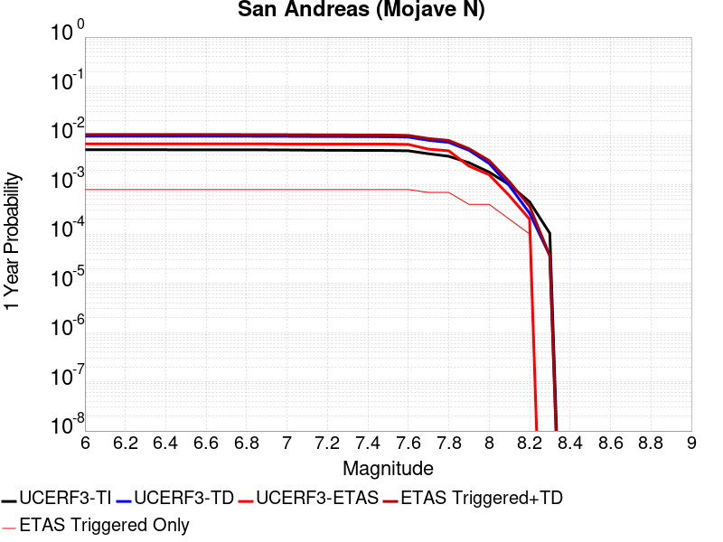 |  |

| Magnitude | 1 wk TI Prob | 1 wk TD Prob | 1 wk ETAS Prob | 1 wk ETAS/TD Gain | 1 wk ETAS Triggered+TD | 1 wk ETAS Triggered Only | 1 mo TI Prob | 1 mo TD Prob | 1 mo ETAS Prob | 1 mo ETAS/TD Gain | 1 mo ETAS Triggered+TD | 1 mo ETAS Triggered Only | 1 yr TI Prob | 1 yr TD Prob | 1 yr ETAS Prob | 1 yr ETAS/TD Gain | 1 yr ETAS Triggered+TD | 1 yr ETAS Triggered Only | 10 yr TI Prob | 10 yr TD Prob | 10 yr ETAS Prob | 10 yr ETAS/TD Gain | 10 yr ETAS Triggered+TD | 10 yr ETAS Triggered Only |
|-----|-----|-----|-----|-----|-----|-----|-----|-----|-----|-----|-----|-----|-----|-----|-----|-----|-----|-----|-----|-----|-----|-----|-----|-----|
| 6.0 | 9.877682E-5 | 1.8664719E-4 | 2.0E-4 | 1.0715404 | 1.8664719E-4 | 0.0 | 4.2326056E-4 | 7.9967146E-4 | 0.001 | 1.2505136 | 0.0010994315 | 3.0E-4 | 0.0051410277 | 0.009692651 | 0.0068 | 0.70156246 | 0.010484897 | 8.0E-4 | 0.05023708 | 0.095066346 | 0.065 | 0.683733 | 0.10538259 | 0.0114 |
| 6.1 | 9.877682E-5 | 1.8664719E-4 | 2.0E-4 | 1.0715404 | 1.8664719E-4 | 0.0 | 4.2326056E-4 | 7.9967146E-4 | 0.001 | 1.2505136 | 0.0010994315 | 3.0E-4 | 0.0051410277 | 0.009692651 | 0.0068 | 0.70156246 | 0.010484897 | 8.0E-4 | 0.05023708 | 0.095066346 | 0.065 | 0.683733 | 0.10538259 | 0.0114 |
| 6.2 | 9.877682E-5 | 1.8664719E-4 | 2.0E-4 | 1.0715404 | 1.8664719E-4 | 0.0 | 4.2326056E-4 | 7.9967146E-4 | 0.001 | 1.2505136 | 0.0010994315 | 3.0E-4 | 0.0051410277 | 0.009692651 | 0.0068 | 0.70156246 | 0.010484897 | 8.0E-4 | 0.05023708 | 0.095066346 | 0.065 | 0.683733 | 0.10538259 | 0.0114 |
| 6.3 | 9.877682E-5 | 1.8664719E-4 | 2.0E-4 | 1.0715404 | 1.8664719E-4 | 0.0 | 4.2326056E-4 | 7.9967146E-4 | 0.001 | 1.2505136 | 0.0010994315 | 3.0E-4 | 0.0051410277 | 0.009692651 | 0.0068 | 0.70156246 | 0.010484897 | 8.0E-4 | 0.05023708 | 0.095066346 | 0.065 | 0.683733 | 0.10538259 | 0.0114 |
| 6.4 | 9.877682E-5 | 1.8664719E-4 | 2.0E-4 | 1.0715404 | 1.8664719E-4 | 0.0 | 4.2326056E-4 | 7.9967146E-4 | 0.001 | 1.2505136 | 0.0010994315 | 3.0E-4 | 0.0051410277 | 0.009692651 | 0.0068 | 0.70156246 | 0.010484897 | 8.0E-4 | 0.05023708 | 0.095066346 | 0.065 | 0.683733 | 0.10538259 | 0.0114 |
| 6.5 | 9.861474E-5 | 1.8638701E-4 | 2.0E-4 | 1.0730362 | 1.8638701E-4 | 0.0 | 4.2256617E-4 | 7.985571E-4 | 0.001 | 1.2522585 | 0.0010983176 | 3.0E-4 | 0.0051326132 | 0.009679204 | 0.0068 | 0.70253706 | 0.010471461 | 8.0E-4 | 0.050156746 | 0.09494469 | 0.065 | 0.6846091 | 0.105262324 | 0.0114 |
| 6.6 | 9.861474E-5 | 1.8638701E-4 | 2.0E-4 | 1.0730362 | 1.8638701E-4 | 0.0 | 4.2256617E-4 | 7.985571E-4 | 0.001 | 1.2522585 | 0.0010983176 | 3.0E-4 | 0.0051326132 | 0.009679204 | 0.0068 | 0.70253706 | 0.010471461 | 8.0E-4 | 0.050156746 | 0.09494469 | 0.065 | 0.6846091 | 0.105262324 | 0.0114 |
| 6.7 | 9.8552715E-5 | 1.8628738E-4 | 2.0E-4 | 1.0736101 | 1.8628738E-4 | 0.0 | 4.223004E-4 | 7.9813035E-4 | 0.001 | 1.2529281 | 0.0010978909 | 3.0E-4 | 0.0051293927 | 0.009674055 | 0.0068 | 0.702911 | 0.010466316 | 8.0E-4 | 0.050125998 | 0.094897926 | 0.065 | 0.6849465 | 0.105216086 | 0.0114 |
| 6.8 | 9.8464974E-5 | 1.8614107E-4 | 2.0E-4 | 1.074454 | 1.8614107E-4 | 0.0 | 4.219245E-4 | 7.975037E-4 | 0.001 | 1.2539127 | 0.0010972645 | 3.0E-4 | 0.0051248376 | 0.009666493 | 0.0068 | 0.70346093 | 0.01045876 | 8.0E-4 | 0.05008251 | 0.09482878 | 0.065 | 0.6854459 | 0.105147734 | 0.0114 |
| 6.9 | 9.825824E-5 | 1.8582496E-4 | 2.0E-4 | 1.0762817 | 1.8582496E-4 | 0.0 | 4.2103877E-4 | 7.9614983E-4 | 0.001 | 1.256045 | 0.001095911 | 3.0E-4 | 0.0051141046 | 0.009650156 | 0.0068 | 0.70465183 | 0.010442436 | 8.0E-4 | 0.049980022 | 0.094679005 | 0.065 | 0.68653023 | 0.10499966 | 0.0114 |
| 7.0 | 9.781462E-5 | 1.8514665E-4 | 2.0E-4 | 1.0802248 | 1.8514665E-4 | 0.0 | 4.1913814E-4 | 7.932446E-4 | 0.001 | 1.2606453 | 0.0010930066 | 3.0E-4 | 0.005091073 | 0.009615097 | 0.0067 | 0.69682086 | 0.010407405 | 8.0E-4 | 0.04976007 | 0.094358064 | 0.0647 | 0.68568593 | 0.104682386 | 0.0114 |
| 7.1 | 9.7121134E-5 | 1.8417464E-4 | 2.0E-4 | 1.0859258 | 1.8417464E-4 | 0.0 | 4.1616702E-4 | 7.8908127E-4 | 0.001 | 1.2672966 | 0.0010888446 | 3.0E-4 | 0.005055068 | 0.009564855 | 0.0067 | 0.70048106 | 0.010357203 | 8.0E-4 | 0.04941613 | 0.09389799 | 0.0646 | 0.68798065 | 0.104136944 | 0.0113 |
| 7.2 | 9.663819E-5 | 1.8349035E-4 | 2.0E-4 | 1.0899756 | 1.8349035E-4 | 0.0 | 4.1409794E-4 | 7.861504E-4 | 0.001 | 1.2720213 | 0.0010859146 | 3.0E-4 | 0.0050299936 | 0.009529484 | 0.0067 | 0.7030811 | 0.010321861 | 8.0E-4 | 0.049176537 | 0.0935736 | 0.0646 | 0.6903657 | 0.10381622 | 0.0113 |
| 7.3 | 9.6277574E-5 | 1.8302524E-4 | 2.0E-4 | 1.0927454 | 1.8302524E-4 | 0.0 | 4.125529E-4 | 7.841583E-4 | 0.001 | 1.2752527 | 0.001083923 | 3.0E-4 | 0.0050112694 | 0.009505442 | 0.0067 | 0.7048594 | 0.010297838 | 8.0E-4 | 0.04899759 | 0.09335072 | 0.0644 | 0.6898715 | 0.103505194 | 0.0112 |
| 7.4 | 9.593308E-5 | 1.8243381E-4 | 2.0E-4 | 1.0962881 | 1.8243381E-4 | 0.0 | 4.1107697E-4 | 7.8162504E-4 | 0.001 | 1.2793858 | 0.0010813905 | 3.0E-4 | 0.0049933824 | 0.009474869 | 0.0067 | 0.70713377 | 0.010267289 | 8.0E-4 | 0.04882661 | 0.093072906 | 0.0642 | 0.68978184 | 0.10323049 | 0.0112 |
| 7.5 | 9.561707E-5 | 1.8190441E-4 | 2.0E-4 | 1.0994785 | 1.8190441E-4 | 0.0 | 4.0972308E-4 | 7.793576E-4 | 0.001 | 1.283108 | 0.0010791238 | 3.0E-4 | 0.0049769743 | 0.009447503 | 0.0067 | 0.70918214 | 0.010239945 | 8.0E-4 | 0.048669744 | 0.09282255 | 0.0641 | 0.69056493 | 0.10298294 | 0.0112 |
| 7.6 | 9.418194E-5 | 1.7848455E-4 | 1.0E-4 | 0.5602726 | 1.7848455E-4 | 0.0 | 4.0357444E-4 | 7.647097E-4 | 9.0E-4 | 1.1769172 | 0.0010644803 | 3.0E-4 | 0.004902454 | 0.009270695 | 0.0066 | 0.71192074 | 0.0100632785 | 8.0E-4 | 0.047957025 | 0.09122918 | 0.0634 | 0.6949531 | 0.10113478 | 0.0109 |
| 7.7 | 8.202141E-5 | 1.5360561E-4 | 1.0E-4 | 0.6510179 | 1.5360561E-4 | 0.0 | 3.51473E-4 | 6.581437E-4 | 9.0E-4 | 1.3674824 | 9.579463E-4 | 3.0E-4 | 0.00427079 | 0.007983509 | 0.0053 | 0.6638684 | 0.008677921 | 7.0E-4 | 0.04189639 | 0.07926038 | 0.054 | 0.6812988 | 0.088007405 | 0.0095 |
| 7.8 | 7.2859846E-5 | 1.3920998E-4 | 1.0E-4 | 0.7183393 | 1.3920998E-4 | 0.0 | 3.1221908E-4 | 5.9647777E-4 | 9.0E-4 | 1.5088575 | 8.9629885E-4 | 3.0E-4 | 0.003794643 | 0.0072379718 | 0.0049 | 0.6769852 | 0.007932905 | 7.0E-4 | 0.037304975 | 0.072028324 | 0.0485 | 0.6733462 | 0.08010168 | 0.0087 |
| 7.9 | 5.3874453E-5 | 9.6238386E-5 | 0.0 | 0.0 | 9.6238386E-5 | 0.0 | 2.3087008E-4 | 4.1238504E-4 | 5.0E-4 | 1.2124591 | 7.1226136E-4 | 3.0E-4 | 0.0028072202 | 0.005009239 | 0.0024 | 0.47911468 | 0.0054072356 | 4.0E-4 | 0.02772022 | 0.050442543 | 0.0305 | 0.60464835 | 0.05557015 | 0.0054 |
| 8.0 | 3.468538E-5 | 5.1783452E-5 | 0.0 | 0.0 | 5.1783452E-5 | 0.0 | 1.4864317E-4 | 2.219102E-4 | 5.0E-4 | 2.2531636 | 5.218436E-4 | 3.0E-4 | 0.0018082283 | 0.002698411 | 0.0016 | 0.5929415 | 0.0030973316 | 4.0E-4 | 0.017935853 | 0.027728014 | 0.016 | 0.57703376 | 0.030450376 | 0.0028 |
| 8.1 | 1.9152367E-5 | 1.8203265E-5 | 0.0 | 0.0 | 1.8203265E-5 | 0.0 | 8.207899E-5 | 7.801166E-5 | 2.0E-4 | 2.5637193 | 2.7799606E-4 | 2.0E-4 | 9.988535E-4 | 9.493787E-4 | 6.0E-4 | 0.6319923 | 0.0011491888 | 2.0E-4 | 0.009943757 | 0.010226626 | 0.0054 | 0.5280334 | 0.01082049 | 6.0E-4 |
| 8.2 | 8.643924E-6 | 5.0104E-6 | 0.0 | 0.0 | 5.0104E-6 | 0.0 | 3.704486E-5 | 2.1472966E-5 | 1.0E-4 | 4.6570187 | 1.2147082E-4 | 1.0E-4 | 4.5092785E-4 | 2.6140205E-4 | 2.0E-4 | 0.7651049 | 3.6137592E-4 | 1.0E-4 | 0.0045001395 | 0.002993769 | 0.0016 | 0.5344434 | 0.0031931703 | 2.0E-4 |
| 8.3 | 1.983087E-6 | 6.880041E-7 | 0.0 | 0.0 | 6.880041E-7 | 0.0 | 8.498917E-6 | 2.9485857E-6 | 0.0 | 0.0 | 2.9485857E-6 | 0.0 | 1.034694E-4 | 3.589845E-5 | 0.0 | 0.0 | 3.589845E-5 | 0.0 | 0.0010342124 | 4.2701262E-4 | 1.0E-4 | 0.23418511 | 4.2701262E-4 | 0.0 |

## Calaveras (Central) 2011 CFM
*[(top)](#table-of-contents)*

| 1 Week | 1 Month | 1 Year | 10 Year |
|-----|-----|-----|-----|
|  |  |  | 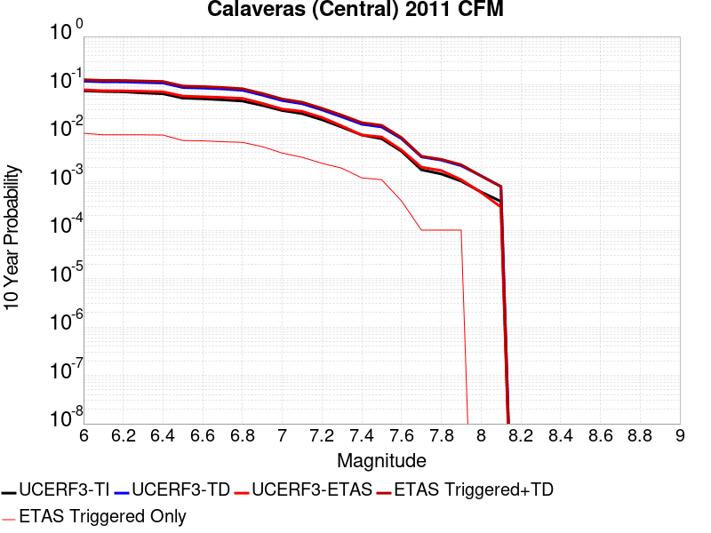 |

| Magnitude | 1 wk TI Prob | 1 wk TD Prob | 1 wk ETAS Prob | 1 wk ETAS/TD Gain | 1 wk ETAS Triggered+TD | 1 wk ETAS Triggered Only | 1 mo TI Prob | 1 mo TD Prob | 1 mo ETAS Prob | 1 mo ETAS/TD Gain | 1 mo ETAS Triggered+TD | 1 mo ETAS Triggered Only | 1 yr TI Prob | 1 yr TD Prob | 1 yr ETAS Prob | 1 yr ETAS/TD Gain | 1 yr ETAS Triggered+TD | 1 yr ETAS Triggered Only | 10 yr TI Prob | 10 yr TD Prob | 10 yr ETAS Prob | 10 yr ETAS/TD Gain | 10 yr ETAS Triggered+TD | 10 yr ETAS Triggered Only |
|-----|-----|-----|-----|-----|-----|-----|-----|-----|-----|-----|-----|-----|-----|-----|-----|-----|-----|-----|-----|-----|-----|-----|-----|-----|
| 6.0 | 1.5010907E-4 | 2.450442E-4 | 2.0E-4 | 0.8161792 | 2.450442E-4 | 0.0 | 6.4316596E-4 | 0.0010496562 | 4.0E-4 | 0.38107714 | 0.0010496562 | 0.0 | 0.0078024664 | 0.0126960855 | 0.0079 | 0.62223905 | 0.014868154 | 0.0022 | 0.07534136 | 0.11912001 | 0.0791 | 0.6640362 | 0.12792881 | 0.01 |
| 6.1 | 1.4521465E-4 | 2.3668805E-4 | 2.0E-4 | 0.84499407 | 2.3668805E-4 | 0.0 | 6.222001E-4 | 0.0010138863 | 4.0E-4 | 0.39452156 | 0.0010138863 | 0.0 | 0.0075490056 | 0.0122669 | 0.0075 | 0.61140144 | 0.014341139 | 0.0021 | 0.07297657 | 0.115398966 | 0.0757 | 0.65598506 | 0.123625755 | 0.0093 |
| 6.2 | 1.429998E-4 | 2.3603076E-4 | 2.0E-4 | 0.8473472 | 2.3603076E-4 | 0.0 | 6.127123E-4 | 0.0010110718 | 4.0E-4 | 0.39561978 | 0.0010110718 | 0.0 | 0.007434286 | 0.012233065 | 0.0075 | 0.6130924 | 0.014307376 | 0.0021 | 0.07190444 | 0.11506904 | 0.0753 | 0.65438974 | 0.1232989 | 0.0093 |
| 6.3 | 1.3536277E-4 | 2.294493E-4 | 2.0E-4 | 0.87165225 | 2.294493E-4 | 0.0 | 5.799972E-4 | 9.828886E-4 | 4.0E-4 | 0.4069637 | 9.828886E-4 | 0.0 | 0.0070386264 | 0.01189464 | 0.0074 | 0.62212896 | 0.013969661 | 0.0021 | 0.0681982 | 0.112029456 | 0.0736 | 0.6569701 | 0.120287575 | 0.0093 |
| 6.4 | 1.2993296E-4 | 2.2381423E-4 | 2.0E-4 | 0.8935982 | 2.2381423E-4 | 0.0 | 5.5673666E-4 | 9.587567E-4 | 4.0E-4 | 0.417207 | 9.587567E-4 | 0.0 | 0.006757223 | 0.011604065 | 0.0074 | 0.63770753 | 0.013679697 | 0.0021 | 0.06555412 | 0.10936137 | 0.072 | 0.65836775 | 0.11755525 | 0.0092 |
| 6.5 | 1.0498927E-4 | 1.7733751E-4 | 2.0E-4 | 1.127793 | 1.7733751E-4 | 0.0 | 4.498764E-4 | 7.597954E-4 | 4.0E-4 | 0.5264575 | 7.597954E-4 | 0.0 | 0.005463498 | 0.009211186 | 0.006 | 0.65138185 | 0.010895528 | 0.0017 | 0.053311124 | 0.08810674 | 0.0587 | 0.6662374 | 0.09458118 | 0.0071 |
| 6.6 | 1.0157505E-4 | 1.7225342E-4 | 2.0E-4 | 1.16108 | 1.7225342E-4 | 0.0 | 4.35249E-4 | 7.3801924E-4 | 4.0E-4 | 0.5419913 | 7.3801924E-4 | 0.0 | 0.0052862884 | 0.008948302 | 0.0056 | 0.62581706 | 0.01063309 | 0.0017 | 0.05162293 | 0.08569929 | 0.0568 | 0.66278267 | 0.09209939 | 0.007 |
| 6.7 | 9.660386E-5 | 1.6491175E-4 | 2.0E-4 | 1.2127699 | 1.6491175E-4 | 0.0 | 4.1395082E-4 | 7.0657226E-4 | 4.0E-4 | 0.56611335 | 7.0657226E-4 | 0.0 | 0.0050282106 | 0.008568547 | 0.0055 | 0.6418825 | 0.01025398 | 0.0017 | 0.049159497 | 0.08221362 | 0.0549 | 0.6677726 | 0.08836279 | 0.0067 |
| 6.8 | 9.089927E-5 | 1.5418738E-4 | 2.0E-4 | 1.297123 | 1.5418738E-4 | 0.0 | 3.8951015E-4 | 6.6063507E-4 | 4.0E-4 | 0.605478 | 6.6063507E-4 | 0.0 | 0.0047319788 | 0.008013535 | 0.0054 | 0.6738599 | 0.009699913 | 0.0017 | 0.046324775 | 0.07715556 | 0.0527 | 0.68303573 | 0.083154045 | 0.0065 |
| 6.9 | 7.353187E-5 | 1.2115286E-4 | 2.0E-4 | 1.650807 | 1.2115286E-4 | 0.0 | 3.150985E-4 | 5.191238E-4 | 4.0E-4 | 0.7705291 | 5.191238E-4 | 0.0 | 0.0038295772 | 0.0063021337 | 0.0042 | 0.66644096 | 0.007593941 | 0.0013 | 0.037642512 | 0.0613633 | 0.0415 | 0.67630005 | 0.06633807 | 0.0053 |
| 7.0 | 5.746064E-5 | 9.245025E-5 | 2.0E-4 | 2.1633255 | 9.245025E-5 | 0.0 | 2.4623662E-4 | 3.9615555E-4 | 3.0E-4 | 0.75727826 | 3.9615555E-4 | 0.0 | 0.0029938098 | 0.004812597 | 0.003 | 0.6233641 | 0.005807784 | 0.001 | 0.02953797 | 0.047314297 | 0.0317 | 0.66998774 | 0.05102977 | 0.0039 |
| 7.1 | 4.9557195E-5 | 7.9247366E-5 | 2.0E-4 | 2.5237432 | 7.9247366E-5 | 0.0 | 2.123707E-4 | 3.3958768E-4 | 3.0E-4 | 0.8834243 | 3.3958768E-4 | 0.0 | 0.0025825473 | 0.0041267034 | 0.0029 | 0.70274013 | 0.005122577 | 0.001 | 0.0255274 | 0.04076966 | 0.0284 | 0.69659644 | 0.043839194 | 0.0032 |
| 7.2 | 3.687595E-5 | 5.844584E-5 | 2.0E-4 | 3.4219716 | 5.844584E-5 | 0.0 | 1.5803022E-4 | 2.5045828E-4 | 3.0E-4 | 1.1978043 | 2.5045828E-4 | 0.0 | 0.0019223199 | 0.0030450942 | 0.0025 | 0.8209927 | 0.0038426581 | 8.0E-4 | 0.01905776 | 0.030366799 | 0.0212 | 0.6981309 | 0.03269392 | 0.0024 |
| 7.3 | 2.5846984E-5 | 4.162706E-5 | 2.0E-4 | 4.804567 | 4.162706E-5 | 0.0 | 1.1076809E-4 | 1.7838959E-4 | 3.0E-4 | 1.6817125 | 1.7838959E-4 | 0.0 | 0.0013477671 | 0.002169747 | 0.0014 | 0.64523655 | 0.002668662 | 5.0E-4 | 0.013396223 | 0.021766126 | 0.0142 | 0.6523898 | 0.023624772 | 0.0019 |
| 7.4 | 1.7747854E-5 | 2.9223953E-5 | 2.0E-4 | 6.8437014 | 2.9223953E-5 | 0.0 | 7.6060016E-5 | 1.2523952E-4 | 3.0E-4 | 2.39541 | 1.2523952E-4 | 0.0 | 9.2563726E-4 | 0.0015237273 | 0.0011 | 0.72191393 | 0.0018232702 | 3.0E-4 | 0.009217911 | 0.01536211 | 0.0092 | 0.59887606 | 0.016543675 | 0.0012 |
| 7.5 | 1.4883479E-5 | 2.5574644E-5 | 2.0E-4 | 7.8202457 | 2.5574644E-5 | 0.0 | 6.378478E-5 | 1.09601024E-4 | 3.0E-4 | 2.7372007 | 1.09601024E-4 | 0.0 | 7.76303E-4 | 0.0013335784 | 0.0011 | 0.8248484 | 0.0016331782 | 3.0E-4 | 0.0077359667 | 0.013476112 | 0.0084 | 0.62332517 | 0.014561289 | 0.0011 |
| 7.6 | 8.166975E-6 | 1.4497345E-5 | 0.0 | 0.0 | 1.4497345E-5 | 0.0 | 3.5000852E-5 | 6.2130006E-5 | 0.0 | 0.0 | 6.2130006E-5 | 0.0 | 4.2605202E-4 | 7.5617153E-4 | 7.0E-4 | 0.92571586 | 9.560203E-4 | 2.0E-4 | 0.004252361 | 0.0077114273 | 0.0045 | 0.58354956 | 0.008108342 | 4.0E-4 |
| 7.7 | 3.3858064E-6 | 5.957848E-6 | 0.0 | 0.0 | 5.957848E-6 | 0.0 | 1.4510518E-5 | 2.5533383E-5 | 0.0 | 0.0 | 2.5533383E-5 | 0.0 | 1.7665124E-4 | 3.1082466E-4 | 2.0E-4 | 0.6434496 | 3.1082466E-4 | 0.0 | 0.0017651088 | 0.0032421215 | 0.002 | 0.61688 | 0.0033417973 | 1.0E-4 |
| 7.8 | 2.7721615E-6 | 5.1146626E-6 | 0.0 | 0.0 | 5.1146626E-6 | 0.0 | 1.1880637E-5 | 2.1919797E-5 | 0.0 | 0.0 | 2.1919797E-5 | 0.0 | 1.4463716E-4 | 2.668409E-4 | 2.0E-4 | 0.7495103 | 2.668409E-4 | 0.0 | 0.0014454306 | 0.002783806 | 0.0017 | 0.61067474 | 0.0028835277 | 1.0E-4 |
| 7.9 | 1.9736292E-6 | 3.9468414E-6 | 0.0 | 0.0 | 3.9468414E-6 | 0.0 | 8.4583835E-6 | 1.6914924E-5 | 0.0 | 0.0 | 1.6914924E-5 | 0.0 | 1.0297595E-4 | 2.0591979E-4 | 1.0E-4 | 0.485626 | 2.0591979E-4 | 0.0 | 0.0010292825 | 0.0021351196 | 0.0011 | 0.5151936 | 0.0022349062 | 1.0E-4 |
| 8.0 | 1.1767289E-6 | 2.4512808E-6 | 0.0 | 0.0 | 2.4512808E-6 | 0.0 | 5.0431145E-6 | 1.0505447E-5 | 0.0 | 0.0 | 1.0505447E-5 | 0.0 | 6.139818E-5 | 1.2789633E-4 | 0.0 | 0.0 | 1.2789633E-4 | 0.0 | 6.1381224E-4 | 0.0013158023 | 6.0E-4 | 0.45599556 | 0.0013158023 | 0.0 |
| 8.1 | 7.5112825E-7 | 1.480043E-6 | 0.0 | 0.0 | 1.480043E-6 | 0.0 | 3.2191172E-6 | 6.343026E-6 | 0.0 | 0.0 | 6.343026E-6 | 0.0 | 3.9192048E-5 | 7.722363E-5 | 0.0 | 0.0 | 7.722363E-5 | 0.0 | 3.9185135E-4 | 7.9363264E-4 | 3.0E-4 | 0.37800863 | 7.9363264E-4 | 0.0 |

## San Andreas (San Gorgonio Pass-Garnet HIll)
*[(top)](#table-of-contents)*

| 1 Week | 1 Month | 1 Year | 10 Year |
|-----|-----|-----|-----|
|  | 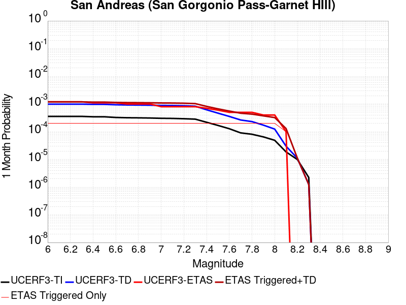 |  |  |

| Magnitude | 1 wk TI Prob | 1 wk TD Prob | 1 wk ETAS Prob | 1 wk ETAS/TD Gain | 1 wk ETAS Triggered+TD | 1 wk ETAS Triggered Only | 1 mo TI Prob | 1 mo TD Prob | 1 mo ETAS Prob | 1 mo ETAS/TD Gain | 1 mo ETAS Triggered+TD | 1 mo ETAS Triggered Only | 1 yr TI Prob | 1 yr TD Prob | 1 yr ETAS Prob | 1 yr ETAS/TD Gain | 1 yr ETAS Triggered+TD | 1 yr ETAS Triggered Only | 10 yr TI Prob | 10 yr TD Prob | 10 yr ETAS Prob | 10 yr ETAS/TD Gain | 10 yr ETAS Triggered+TD | 10 yr ETAS Triggered Only |
|-----|-----|-----|-----|-----|-----|-----|-----|-----|-----|-----|-----|-----|-----|-----|-----|-----|-----|-----|-----|-----|-----|-----|-----|-----|
| 6.0 | 8.31567E-5 | 2.301408E-4 | 2.0E-4 | 0.8690332 | 2.301408E-4 | 0.0 | 3.5633717E-4 | 9.859423E-4 | 0.0012 | 1.2171097 | 0.0011857452 | 2.0E-4 | 0.004329778 | 0.011937703 | 0.008 | 0.6701457 | 0.013419797 | 0.0015 | 0.042463828 | 0.11106009 | 0.0701 | 0.6311898 | 0.12066064 | 0.0108 |
| 6.1 | 8.31567E-5 | 2.301408E-4 | 2.0E-4 | 0.8690332 | 2.301408E-4 | 0.0 | 3.5633717E-4 | 9.859423E-4 | 0.0012 | 1.2171097 | 0.0011857452 | 2.0E-4 | 0.004329778 | 0.011937703 | 0.008 | 0.6701457 | 0.013419797 | 0.0015 | 0.042463828 | 0.11106009 | 0.0701 | 0.6311898 | 0.12066064 | 0.0108 |
| 6.2 | 8.31567E-5 | 2.301408E-4 | 2.0E-4 | 0.8690332 | 2.301408E-4 | 0.0 | 3.5633717E-4 | 9.859423E-4 | 0.0012 | 1.2171097 | 0.0011857452 | 2.0E-4 | 0.004329778 | 0.011937703 | 0.008 | 0.6701457 | 0.013419797 | 0.0015 | 0.042463828 | 0.11106009 | 0.0701 | 0.6311898 | 0.12066064 | 0.0108 |
| 6.3 | 8.31567E-5 | 2.301408E-4 | 2.0E-4 | 0.8690332 | 2.301408E-4 | 0.0 | 3.5633717E-4 | 9.859423E-4 | 0.0012 | 1.2171097 | 0.0011857452 | 2.0E-4 | 0.004329778 | 0.011937703 | 0.008 | 0.6701457 | 0.013419797 | 0.0015 | 0.042463828 | 0.11106009 | 0.0701 | 0.6311898 | 0.12066064 | 0.0108 |
| 6.4 | 8.059055E-5 | 2.2573429E-4 | 2.0E-4 | 0.8859975 | 2.2573429E-4 | 0.0 | 3.4534236E-4 | 9.670743E-4 | 0.0011 | 1.1374514 | 0.001166881 | 2.0E-4 | 0.0041964394 | 0.011710799 | 0.0079 | 0.674591 | 0.013193233 | 0.0015 | 0.041180745 | 0.109045535 | 0.0693 | 0.6355143 | 0.11866785 | 0.0108 |
| 6.5 | 8.059055E-5 | 2.2573429E-4 | 2.0E-4 | 0.8859975 | 2.2573429E-4 | 0.0 | 3.4534236E-4 | 9.670743E-4 | 0.0011 | 1.1374514 | 0.001166881 | 2.0E-4 | 0.0041964394 | 0.011710799 | 0.0079 | 0.674591 | 0.013193233 | 0.0015 | 0.041180745 | 0.109045535 | 0.0693 | 0.6355143 | 0.11866785 | 0.0108 |
| 6.6 | 7.619237E-5 | 2.1821013E-4 | 2.0E-4 | 0.9165477 | 2.1821013E-4 | 0.0 | 3.2649786E-4 | 9.3485333E-4 | 0.0011 | 1.1766552 | 0.0011346664 | 2.0E-4 | 0.0039678677 | 0.01132297 | 0.0078 | 0.6888652 | 0.012805985 | 0.0015 | 0.03897764 | 0.10558918 | 0.0676 | 0.6402171 | 0.115248814 | 0.0108 |
| 6.7 | 7.440636E-5 | 2.1497595E-4 | 1.0E-4 | 0.4651683 | 2.1497595E-4 | 0.0 | 3.188454E-4 | 9.210024E-4 | 0.001 | 1.0857735 | 0.0011208182 | 2.0E-4 | 0.0038750346 | 0.011156069 | 0.0077 | 0.69020724 | 0.012639335 | 0.0015 | 0.038081564 | 0.10409843 | 0.0664 | 0.6378578 | 0.11377417 | 0.0108 |
| 6.8 | 7.3735864E-5 | 2.1345234E-4 | 1.0E-4 | 0.46848866 | 2.1345234E-4 | 0.0 | 3.1597257E-4 | 9.1447716E-4 | 0.001 | 1.093521 | 0.0011142943 | 2.0E-4 | 0.0038401815 | 0.011077438 | 0.0077 | 0.69510657 | 0.012560822 | 0.0015 | 0.03774495 | 0.10340095 | 0.0661 | 0.6392591 | 0.11299457 | 0.0107 |
| 6.9 | 7.27575E-5 | 2.1114944E-4 | 1.0E-4 | 0.4735982 | 2.1114944E-4 | 0.0 | 3.117806E-4 | 9.046146E-4 | 0.001 | 1.1054432 | 0.0011044337 | 2.0E-4 | 0.003789323 | 0.010958575 | 0.0076 | 0.69352084 | 0.012442137 | 0.0015 | 0.037253562 | 0.10235028 | 0.0655 | 0.63995916 | 0.111955136 | 0.0107 |
| 7.0 | 7.102591E-5 | 2.070062E-4 | 1.0E-4 | 0.48307732 | 2.070062E-4 | 0.0 | 3.0436125E-4 | 8.8686997E-4 | 8.0E-4 | 0.9020488 | 0.0010866926 | 2.0E-4 | 0.003699303 | 0.0107446825 | 0.0072 | 0.6700989 | 0.012228565 | 0.0015 | 0.03638325 | 0.10045641 | 0.0642 | 0.6390832 | 0.11008152 | 0.0107 |
| 7.1 | 7.028513E-5 | 2.0537019E-4 | 1.0E-4 | 0.48692557 | 2.0537019E-4 | 0.0 | 3.0118722E-4 | 8.798633E-4 | 8.0E-4 | 0.9092322 | 0.0010796873 | 2.0E-4 | 0.0036607897 | 0.010660214 | 0.0072 | 0.67540854 | 0.012144224 | 0.0015 | 0.036010686 | 0.09970159 | 0.0638 | 0.6399095 | 0.10924476 | 0.0106 |
| 7.2 | 6.8498244E-5 | 2.014646E-4 | 1.0E-4 | 0.49636513 | 2.014646E-4 | 0.0 | 2.9353087E-4 | 8.6313614E-4 | 8.0E-4 | 0.92685264 | 0.0010629635 | 2.0E-4 | 0.003567883 | 0.010458532 | 0.0072 | 0.6884331 | 0.011942845 | 0.0015 | 0.035111405 | 0.0978974 | 0.0624 | 0.637402 | 0.10727927 | 0.0104 |
| 7.3 | 6.622592E-5 | 1.937873E-4 | 1.0E-4 | 0.5160297 | 1.937873E-4 | 0.0 | 2.8379448E-4 | 8.3025475E-4 | 8.0E-4 | 0.9635596 | 0.0010300888 | 2.0E-4 | 0.0034497243 | 0.010061966 | 0.0071 | 0.70562744 | 0.0115468735 | 0.0015 | 0.033966612 | 0.09440826 | 0.0606 | 0.641893 | 0.10355473 | 0.0101 |
| 7.4 | 5.1050705E-5 | 1.4391277E-4 | 0.0 | 0.0 | 1.4391277E-4 | 0.0 | 2.1877038E-4 | 6.166241E-4 | 7.0E-4 | 1.1352135 | 8.1650075E-4 | 2.0E-4 | 0.002660276 | 0.0074817417 | 0.0052 | 0.6950253 | 0.008573512 | 0.0011 | 0.02628654 | 0.07157116 | 0.0442 | 0.61756724 | 0.07909143 | 0.0081 |
| 7.5 | 3.9302922E-5 | 1.0880058E-4 | 0.0 | 0.0 | 1.0880058E-4 | 0.0 | 1.6843023E-4 | 4.6620518E-4 | 6.0E-4 | 1.286987 | 6.6611194E-4 | 2.0E-4 | 0.0020487092 | 0.0056613428 | 0.0041 | 0.7242098 | 0.006556248 | 9.0E-4 | 0.020299247 | 0.054900635 | 0.0334 | 0.60837185 | 0.06104378 | 0.0065 |
| 7.6 | 2.9851626E-5 | 8.275067E-5 | 0.0 | 0.0 | 8.275067E-5 | 0.0 | 1.2792926E-4 | 3.5459764E-4 | 5.0E-4 | 1.4100488 | 5.545267E-4 | 2.0E-4 | 0.0015564259 | 0.0043087048 | 0.0036 | 0.83551794 | 0.0052048266 | 9.0E-4 | 0.0154556995 | 0.042204775 | 0.0256 | 0.6065664 | 0.04737687 | 0.0054 |
| 7.7 | 2.1135214E-5 | 6.1600455E-5 | 0.0 | 0.0 | 6.1600455E-5 | 0.0 | 9.0576345E-5 | 2.6397526E-4 | 5.0E-4 | 1.8941169 | 4.6392248E-4 | 2.0E-4 | 0.0011022091 | 0.0032091674 | 0.0024 | 0.7478575 | 0.0037075628 | 5.0E-4 | 0.010967582 | 0.031710215 | 0.019 | 0.599176 | 0.035680205 | 0.0041 |
| 7.8 | 1.883379E-5 | 5.387325E-5 | 0.0 | 0.0 | 5.387325E-5 | 0.0 | 8.0713755E-5 | 2.3086494E-4 | 5.0E-4 | 2.1657684 | 4.3081876E-4 | 2.0E-4 | 9.822468E-4 | 0.0028071606 | 0.0021 | 0.74808687 | 0.003305757 | 5.0E-4 | 0.0097791655 | 0.02789182 | 0.0169 | 0.6059124 | 0.03148862 | 0.0037 |
| 7.9 | 1.5156185E-5 | 4.019655E-5 | 0.0 | 0.0 | 4.019655E-5 | 0.0 | 6.495346E-5 | 1.7225956E-4 | 4.0E-4 | 2.322077 | 3.7222513E-4 | 2.0E-4 | 7.9052144E-4 | 0.0020952441 | 0.0012 | 0.5727256 | 0.0023946157 | 3.0E-4 | 0.007877152 | 0.021085052 | 0.0117 | 0.55489546 | 0.023630232 | 0.0026 |
| 8.0 | 1.1405907E-5 | 2.8856002E-5 | 0.0 | 0.0 | 2.8856002E-5 | 0.0 | 4.8881542E-5 | 1.2366273E-4 | 4.0E-4 | 3.2346044 | 3.23638E-4 | 2.0E-4 | 5.9497025E-4 | 0.0015045548 | 0.0011 | 0.73111326 | 0.0018041035 | 3.0E-4 | 0.005933798 | 0.015251126 | 0.0087 | 0.57044965 | 0.017023675 | 0.0018 |
| 8.1 | 4.3511436E-6 | 6.948125E-6 | 0.0 | 0.0 | 6.948125E-6 | 0.0 | 1.8647626E-5 | 2.9777339E-5 | 1.0E-4 | 3.3582585 | 1.2977436E-4 | 1.0E-4 | 2.2701119E-4 | 3.624789E-4 | 2.0E-4 | 0.55175626 | 4.6244264E-4 | 1.0E-4 | 0.0022677942 | 0.003905537 | 0.0021 | 0.53769815 | 0.0042043654 | 3.0E-4 |
| 8.2 | 2.3042528E-6 | 2.5356364E-6 | 0.0 | 0.0 | 2.5356364E-6 | 0.0 | 9.875332E-6 | 1.0866968E-5 | 0.0 | 0.0 | 1.0866968E-5 | 0.0 | 1.2022553E-4 | 1.3229734E-4 | 0.0 | 0.0 | 1.3229734E-4 | 0.0 | 0.0012016051 | 0.0014945742 | 7.0E-4 | 0.4683608 | 0.0014945742 | 0.0 |
| 8.3 | 5.202968E-7 | 2.8777797E-7 | 0.0 | 0.0 | 2.8777797E-7 | 0.0 | 2.2298414E-6 | 1.2333336E-6 | 0.0 | 0.0 | 1.2333336E-6 | 0.0 | 2.714798E-5 | 1.5015743E-5 | 0.0 | 0.0 | 1.5015743E-5 | 0.0 | 2.7144665E-4 | 1.7966983E-4 | 1.0E-4 | 0.55657643 | 1.7966983E-4 | 0.0 |

## San Andreas (San Bernardino S)
*[(top)](#table-of-contents)*

| 1 Week | 1 Month | 1 Year | 10 Year |
|-----|-----|-----|-----|
|  |  |  | 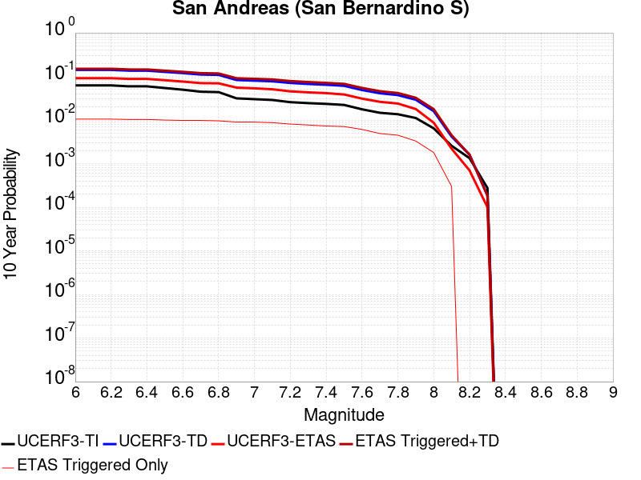 |

| Magnitude | 1 wk TI Prob | 1 wk TD Prob | 1 wk ETAS Prob | 1 wk ETAS/TD Gain | 1 wk ETAS Triggered+TD | 1 wk ETAS Triggered Only | 1 mo TI Prob | 1 mo TD Prob | 1 mo ETAS Prob | 1 mo ETAS/TD Gain | 1 mo ETAS Triggered+TD | 1 mo ETAS Triggered Only | 1 yr TI Prob | 1 yr TD Prob | 1 yr ETAS Prob | 1 yr ETAS/TD Gain | 1 yr ETAS Triggered+TD | 1 yr ETAS Triggered Only | 10 yr TI Prob | 10 yr TD Prob | 10 yr ETAS Prob | 10 yr ETAS/TD Gain | 10 yr ETAS Triggered+TD | 10 yr ETAS Triggered Only |
|-----|-----|-----|-----|-----|-----|-----|-----|-----|-----|-----|-----|-----|-----|-----|-----|-----|-----|-----|-----|-----|-----|-----|-----|-----|
| 6.0 | 1.2336002E-4 | 2.959187E-4 | 1.0E-4 | 0.33793065 | 2.959187E-4 | 0.0 | 5.2857865E-4 | 0.0012676324 | 0.0012 | 0.94664675 | 0.0014673788 | 2.0E-4 | 0.006416472 | 0.0153290965 | 0.0098 | 0.6393071 | 0.016412234 | 0.0011 | 0.06234337 | 0.14099796 | 0.0912 | 0.6468179 | 0.15001747 | 0.0105 |
| 6.1 | 1.2336002E-4 | 2.959187E-4 | 1.0E-4 | 0.33793065 | 2.959187E-4 | 0.0 | 5.2857865E-4 | 0.0012676324 | 0.0012 | 0.94664675 | 0.0014673788 | 2.0E-4 | 0.006416472 | 0.0153290965 | 0.0098 | 0.6393071 | 0.016412234 | 0.0011 | 0.06234337 | 0.14099796 | 0.0912 | 0.6468179 | 0.15001747 | 0.0105 |
| 6.2 | 1.2336002E-4 | 2.959187E-4 | 1.0E-4 | 0.33793065 | 2.959187E-4 | 0.0 | 5.2857865E-4 | 0.0012676324 | 0.0012 | 0.94664675 | 0.0014673788 | 2.0E-4 | 0.006416472 | 0.0153290965 | 0.0098 | 0.6393071 | 0.016412234 | 0.0011 | 0.06234337 | 0.14099796 | 0.0912 | 0.6468179 | 0.15001747 | 0.0105 |
| 6.3 | 1.1712257E-4 | 2.838439E-4 | 1.0E-4 | 0.35230634 | 2.838439E-4 | 0.0 | 5.018573E-4 | 0.0012159321 | 0.0012 | 0.98689723 | 0.0014156889 | 2.0E-4 | 0.006093008 | 0.01470826 | 0.0094 | 0.6390967 | 0.015792081 | 0.0011 | 0.059286322 | 0.1356851 | 0.0879 | 0.6478235 | 0.14458755 | 0.0103 |
| 6.4 | 1.1712257E-4 | 2.838439E-4 | 1.0E-4 | 0.35230634 | 2.838439E-4 | 0.0 | 5.018573E-4 | 0.0012159321 | 0.0012 | 0.98689723 | 0.0014156889 | 2.0E-4 | 0.006093008 | 0.01470826 | 0.0094 | 0.6390967 | 0.015792081 | 0.0011 | 0.059286322 | 0.1356851 | 0.0879 | 0.6478235 | 0.14458755 | 0.0103 |
| 6.5 | 1.0689076E-4 | 2.640397E-4 | 1.0E-4 | 0.37873092 | 2.640397E-4 | 0.0 | 4.5802278E-4 | 0.0011311325 | 0.0012 | 1.0608838 | 0.0013309062 | 2.0E-4 | 0.0055621783 | 0.013689131 | 0.0088 | 0.6428458 | 0.014675441 | 0.001 | 0.05425003 | 0.12696327 | 0.0819 | 0.6450684 | 0.13569364 | 0.01 |
| 6.6 | 9.7648895E-5 | 2.465534E-4 | 1.0E-4 | 0.40559167 | 2.465534E-4 | 0.0 | 4.1842813E-4 | 0.0010562527 | 0.0012 | 1.1360917 | 0.0012560416 | 2.0E-4 | 0.005082469 | 0.012788354 | 0.0082 | 0.6412084 | 0.013775566 | 0.001 | 0.049677886 | 0.11914333 | 0.0763 | 0.6404051 | 0.12777573 | 0.0098 |
| 6.7 | 8.757013E-5 | 2.2732638E-4 | 0.0 | 0.0 | 2.2732638E-4 | 0.0 | 3.7524657E-4 | 9.7391417E-4 | 0.001 | 1.0267845 | 0.0011737194 | 2.0E-4 | 0.00455906 | 0.011796966 | 0.0073 | 0.61880314 | 0.012785169 | 0.001 | 0.04466656 | 0.1104343 | 0.0703 | 0.63657755 | 0.11915205 | 0.0098 |
| 6.8 | 8.562978E-5 | 2.2295192E-4 | 0.0 | 0.0 | 2.2295192E-4 | 0.0 | 3.6693315E-4 | 9.5518027E-4 | 0.001 | 1.0469228 | 0.0011549892 | 2.0E-4 | 0.004458263 | 0.011571319 | 0.0072 | 0.62222815 | 0.012559747 | 0.001 | 0.043698758 | 0.10845624 | 0.0695 | 0.64081144 | 0.11701506 | 0.0096 |
| 6.9 | 6.124075E-5 | 1.6714828E-4 | 0.0 | 0.0 | 1.6714828E-4 | 0.0 | 2.6243398E-4 | 7.1615394E-4 | 9.0E-4 | 1.256713 | 9.160107E-4 | 2.0E-4 | 0.0031904527 | 0.008684517 | 0.0059 | 0.67937 | 0.009576701 | 9.0E-4 | 0.031450346 | 0.08264147 | 0.0554 | 0.67036563 | 0.090897694 | 0.009 |
| 7.0 | 5.8598747E-5 | 1.6147296E-4 | 0.0 | 0.0 | 1.6147296E-4 | 0.0 | 2.5111332E-4 | 6.9184415E-4 | 7.0E-4 | 1.0117885 | 8.917058E-4 | 2.0E-4 | 0.0030530186 | 0.008390861 | 0.0055 | 0.6554751 | 0.009283309 | 9.0E-4 | 0.03011414 | 0.07997129 | 0.0534 | 0.6677396 | 0.088251546 | 0.009 |
| 7.1 | 5.613814E-5 | 1.556908E-4 | 0.0 | 0.0 | 1.556908E-4 | 0.0 | 2.4056983E-4 | 6.670764E-4 | 7.0E-4 | 1.0493551 | 8.66943E-4 | 2.0E-4 | 0.0029250039 | 0.008091586 | 0.0053 | 0.6550014 | 0.008984303 | 9.0E-4 | 0.028868021 | 0.077282496 | 0.0508 | 0.65732867 | 0.08531014 | 0.0087 |
| 7.2 | 4.991222E-5 | 1.4183126E-4 | 0.0 | 0.0 | 1.4183126E-4 | 0.0 | 2.1389198E-4 | 6.07707E-4 | 7.0E-4 | 1.1518708 | 8.075855E-4 | 2.0E-4 | 0.002601025 | 0.0073738317 | 0.0048 | 0.6509506 | 0.00806867 | 7.0E-4 | 0.025707912 | 0.070787266 | 0.0455 | 0.642771 | 0.07831389 | 0.0081 |
| 7.3 | 4.7410045E-5 | 1.3384147E-4 | 0.0 | 0.0 | 1.3384147E-4 | 0.0 | 2.0317009E-4 | 5.7348056E-4 | 7.0E-4 | 1.2206168 | 7.7336584E-4 | 2.0E-4 | 0.0024707897 | 0.0069598546 | 0.0047 | 0.67530143 | 0.007654983 | 7.0E-4 | 0.024434982 | 0.06709808 | 0.0432 | 0.6438336 | 0.074281424 | 0.0077 |
| 7.4 | 4.5556746E-5 | 1.2797344E-4 | 0.0 | 0.0 | 1.2797344E-4 | 0.0 | 1.952286E-4 | 5.4834265E-4 | 7.0E-4 | 1.2765741 | 7.4823294E-4 | 2.0E-4 | 0.002374317 | 0.0066557107 | 0.0044 | 0.66108644 | 0.007351052 | 7.0E-4 | 0.023491086 | 0.064366914 | 0.0414 | 0.6431876 | 0.07119703 | 0.0073 |
| 7.5 | 4.3084514E-5 | 1.2039103E-4 | 0.0 | 0.0 | 1.2039103E-4 | 0.0 | 1.8463485E-4 | 5.158598E-4 | 6.0E-4 | 1.1631067 | 7.157566E-4 | 2.0E-4 | 0.0022456115 | 0.006262575 | 0.0039 | 0.62274706 | 0.0069581913 | 7.0E-4 | 0.022230545 | 0.06078928 | 0.0386 | 0.6349804 | 0.067457676 | 0.0071 |
| 7.6 | 3.408608E-5 | 9.545996E-5 | 0.0 | 0.0 | 9.545996E-5 | 0.0 | 1.4607502E-4 | 4.0905006E-4 | 5.0E-4 | 1.2223443 | 6.0896826E-4 | 2.0E-4 | 0.0017770125 | 0.0049688364 | 0.0034 | 0.68426484 | 0.005665358 | 7.0E-4 | 0.017628696 | 0.04873092 | 0.031 | 0.63614637 | 0.054533664 | 0.0061 |
| 7.7 | 2.8315713E-5 | 7.978289E-5 | 0.0 | 0.0 | 7.978289E-5 | 0.0 | 1.2134742E-4 | 3.4188188E-4 | 5.0E-4 | 1.4624933 | 5.418135E-4 | 2.0E-4 | 0.0014764034 | 0.004154476 | 0.0028 | 0.6739719 | 0.0046523986 | 5.0E-4 | 0.01466633 | 0.041057274 | 0.0262 | 0.6381329 | 0.045756094 | 0.0049 |
| 7.8 | 2.6222975E-5 | 7.2100505E-5 | 0.0 | 0.0 | 7.2100505E-5 | 0.0 | 1.1237934E-4 | 3.089656E-4 | 5.0E-4 | 1.6183032 | 5.089038E-4 | 2.0E-4 | 0.0013673597 | 0.0037551734 | 0.0025 | 0.66574824 | 0.0042532957 | 5.0E-4 | 0.013589768 | 0.03729441 | 0.0239 | 0.64084667 | 0.041626588 | 0.0045 |
| 7.9 | 2.1469694E-5 | 5.575388E-5 | 0.0 | 0.0 | 5.575388E-5 | 0.0 | 9.200973E-5 | 2.3892333E-4 | 4.0E-4 | 1.6741773 | 4.3887555E-4 | 2.0E-4 | 0.0011196428 | 0.002905014 | 0.0015 | 0.5163486 | 0.0032041427 | 3.0E-4 | 0.011140184 | 0.02917951 | 0.0179 | 0.61344415 | 0.03238322 | 0.0033 |
| 8.0 | 1.2420249E-5 | 3.0108682E-5 | 0.0 | 0.0 | 3.0108682E-5 | 0.0 | 5.322855E-5 | 1.2903083E-4 | 4.0E-4 | 3.1000342 | 3.2900504E-4 | 2.0E-4 | 6.478649E-4 | 0.0015698193 | 0.0011 | 0.7007176 | 0.0018693483 | 3.0E-4 | 0.0064597935 | 0.015954686 | 0.0087 | 0.54529434 | 0.017725967 | 0.0018 |
| 8.1 | 4.9197724E-6 | 7.3607757E-6 | 0.0 | 0.0 | 7.3607757E-6 | 0.0 | 2.1084568E-5 | 3.1545802E-5 | 1.0E-4 | 3.1699939 | 1.3154265E-4 | 1.0E-4 | 2.566744E-4 | 3.8400257E-4 | 2.0E-4 | 0.52082986 | 4.8396416E-4 | 1.0E-4 | 0.002563781 | 0.004151609 | 0.0022 | 0.5299151 | 0.004450363 | 3.0E-4 |
| 8.2 | 2.5634774E-6 | 2.6923744E-6 | 0.0 | 0.0 | 2.6923744E-6 | 0.0 | 1.0986286E-5 | 1.15386965E-5 | 0.0 | 0.0 | 1.15386965E-5 | 0.0 | 1.3374983E-4 | 1.4047461E-4 | 0.0 | 0.0 | 1.4047461E-4 | 0.0 | 0.0013366934 | 0.0015920753 | 7.0E-4 | 0.4396777 | 0.0015920753 | 0.0 |
| 8.3 | 5.2850464E-7 | 2.9221226E-7 | 0.0 | 0.0 | 2.9221226E-7 | 0.0 | 2.2650179E-6 | 1.2523377E-6 | 0.0 | 0.0 | 1.2523377E-6 | 0.0 | 2.7576245E-5 | 1.5247115E-5 | 0.0 | 0.0 | 1.5247115E-5 | 0.0 | 2.7572823E-4 | 1.824695E-4 | 1.0E-4 | 0.54803675 | 1.824695E-4 | 0.0 |

## San Jacinto (Superstition Mtn)
*[(top)](#table-of-contents)*

| 1 Week | 1 Month | 1 Year | 10 Year |
|-----|-----|-----|-----|
|  |  |  |  |

| Magnitude | 1 wk TI Prob | 1 wk TD Prob | 1 wk ETAS Prob | 1 wk ETAS/TD Gain | 1 wk ETAS Triggered+TD | 1 wk ETAS Triggered Only | 1 mo TI Prob | 1 mo TD Prob | 1 mo ETAS Prob | 1 mo ETAS/TD Gain | 1 mo ETAS Triggered+TD | 1 mo ETAS Triggered Only | 1 yr TI Prob | 1 yr TD Prob | 1 yr ETAS Prob | 1 yr ETAS/TD Gain | 1 yr ETAS Triggered+TD | 1 yr ETAS Triggered Only | 10 yr TI Prob | 10 yr TD Prob | 10 yr ETAS Prob | 10 yr ETAS/TD Gain | 10 yr ETAS Triggered+TD | 10 yr ETAS Triggered Only |
|-----|-----|-----|-----|-----|-----|-----|-----|-----|-----|-----|-----|-----|-----|-----|-----|-----|-----|-----|-----|-----|-----|-----|-----|-----|
| 6.0 | 6.4193904E-5 | 9.52097E-5 | 1.0E-4 | 1.0503131 | 9.52097E-5 | 0.0 | 2.7508775E-4 | 4.079841E-4 | 4.0E-4 | 0.98043036 | 4.079841E-4 | 0.0 | 0.0033440501 | 0.004957317 | 0.0032 | 0.6455105 | 0.005753351 | 8.0E-4 | 0.03294174 | 0.04847365 | 0.0349 | 0.7199788 | 0.058464672 | 0.0105 |
| 6.1 | 6.4193904E-5 | 9.52097E-5 | 1.0E-4 | 1.0503131 | 9.52097E-5 | 0.0 | 2.7508775E-4 | 4.079841E-4 | 4.0E-4 | 0.98043036 | 4.079841E-4 | 0.0 | 0.0033440501 | 0.004957317 | 0.0032 | 0.6455105 | 0.005753351 | 8.0E-4 | 0.03294174 | 0.04847365 | 0.0349 | 0.7199788 | 0.058464672 | 0.0105 |
| 6.2 | 5.7023593E-5 | 8.239395E-5 | 1.0E-4 | 1.2136813 | 8.239395E-5 | 0.0 | 2.4436394E-4 | 3.5307813E-4 | 4.0E-4 | 1.1328937 | 3.5307813E-4 | 0.0 | 0.002971072 | 0.0042918893 | 0.0026 | 0.6057938 | 0.005088456 | 8.0E-4 | 0.029316625 | 0.042131327 | 0.0299 | 0.7096857 | 0.05065636 | 0.0089 |
| 6.3 | 5.6940098E-5 | 8.2239654E-5 | 1.0E-4 | 1.2159584 | 8.2239654E-5 | 0.0 | 2.4400617E-4 | 3.5241706E-4 | 4.0E-4 | 1.1350188 | 3.5241706E-4 | 0.0 | 0.002966728 | 0.0042838724 | 0.0026 | 0.6069275 | 0.005080445 | 8.0E-4 | 0.029274331 | 0.042054836 | 0.0299 | 0.7109765 | 0.050580546 | 0.0089 |
| 6.4 | 5.4171585E-5 | 7.6739954E-5 | 1.0E-4 | 1.3031021 | 7.6739954E-5 | 0.0 | 2.3214328E-4 | 3.2885332E-4 | 4.0E-4 | 1.2163478 | 3.2885332E-4 | 0.0 | 0.0028226813 | 0.003998079 | 0.0023 | 0.5752763 | 0.00469528 | 7.0E-4 | 0.02787096 | 0.039345514 | 0.0273 | 0.6938529 | 0.04712682 | 0.0081 |
| 6.5 | 4.375144E-5 | 5.5698263E-5 | 0.0 | 0.0 | 5.5698263E-5 | 0.0 | 1.874927E-4 | 2.3869159E-4 | 1.0E-4 | 0.41895065 | 2.3869159E-4 | 0.0 | 0.0022803338 | 0.0029033655 | 0.0013 | 0.44775623 | 0.0032024945 | 3.0E-4 | 0.022570757 | 0.02887236 | 0.0192 | 0.66499585 | 0.03353377 | 0.0048 |
| 6.6 | 2.772192E-5 | 2.4859432E-5 | 0.0 | 0.0 | 2.4859432E-5 | 0.0 | 1.1880282E-4 | 1.0653618E-4 | 0.0 | 0.0 | 1.0653618E-4 | 0.0 | 0.0014454646 | 0.0012963249 | 7.0E-4 | 0.5399881 | 0.0012963249 | 0.0 | 0.014360986 | 0.013214085 | 0.0092 | 0.6962268 | 0.014694263 | 0.0015 |
| 6.7 | 2.7124124E-5 | 2.4078752E-5 | 0.0 | 0.0 | 2.4078752E-5 | 0.0 | 1.1624106E-4 | 1.0319068E-4 | 0.0 | 0.0 | 1.0319068E-4 | 0.0 | 0.0014143161 | 0.001255641 | 7.0E-4 | 0.5574842 | 0.001255641 | 0.0 | 0.014053487 | 0.012811731 | 0.0091 | 0.71028656 | 0.014292513 | 0.0015 |
| 6.8 | 2.5475807E-5 | 2.157592E-5 | 0.0 | 0.0 | 2.157592E-5 | 0.0 | 1.0917746E-4 | 9.2465016E-5 | 0.0 | 0.0 | 9.2465016E-5 | 0.0 | 0.001328425 | 0.0011251917 | 7.0E-4 | 0.6221162 | 0.0011251917 | 0.0 | 0.0132051185 | 0.011516079 | 0.0079 | 0.68599737 | 0.012603411 | 0.0011 |
| 6.9 | 2.1162023E-5 | 1.7120747E-5 | 0.0 | 0.0 | 1.7120747E-5 | 0.0 | 9.069123E-5 | 7.337258E-5 | 0.0 | 0.0 | 7.337258E-5 | 0.0 | 0.0011036064 | 8.929487E-4 | 7.0E-4 | 0.78391963 | 8.929487E-4 | 0.0 | 0.010981417 | 0.00918185 | 0.0058 | 0.63168097 | 0.009677259 | 5.0E-4 |
| 7.0 | 1.8754288E-5 | 1.5695929E-5 | 0.0 | 0.0 | 1.5695929E-5 | 0.0 | 8.037304E-5 | 6.726655E-5 | 0.0 | 0.0 | 6.726655E-5 | 0.0 | 9.781026E-4 | 8.1866485E-4 | 7.0E-4 | 0.85505074 | 8.1866485E-4 | 0.0 | 0.009738087 | 0.008425698 | 0.0052 | 0.6171596 | 0.008921484 | 5.0E-4 |
| 7.1 | 1.8678527E-5 | 1.5622212E-5 | 0.0 | 0.0 | 1.5622212E-5 | 0.0 | 8.0048376E-5 | 6.695063E-5 | 0.0 | 0.0 | 6.695063E-5 | 0.0 | 9.7415317E-4 | 8.148215E-4 | 7.0E-4 | 0.85908383 | 8.148215E-4 | 0.0 | 0.009698939 | 0.0083872555 | 0.0052 | 0.6199883 | 0.008883062 | 5.0E-4 |
| 7.2 | 1.7804578E-5 | 1.492615E-5 | 0.0 | 0.0 | 1.492615E-5 | 0.0 | 7.6303106E-5 | 6.396765E-5 | 0.0 | 0.0 | 6.396765E-5 | 0.0 | 9.285943E-4 | 7.785301E-4 | 7.0E-4 | 0.89913034 | 7.785301E-4 | 0.0 | 0.009247236 | 0.00802332 | 0.005 | 0.6231834 | 0.008420111 | 4.0E-4 |
| 7.3 | 1.6583685E-5 | 1.4084272E-5 | 0.0 | 0.0 | 1.4084272E-5 | 0.0 | 7.1070994E-5 | 6.035978E-5 | 0.0 | 0.0 | 6.035978E-5 | 0.0 | 8.649459E-4 | 7.3463446E-4 | 7.0E-4 | 0.9528548 | 7.3463446E-4 | 0.0 | 0.00861587 | 0.007583249 | 0.005 | 0.659348 | 0.007980215 | 4.0E-4 |
| 7.4 | 1.6387552E-5 | 1.3950205E-5 | 0.0 | 0.0 | 1.3950205E-5 | 0.0 | 7.023047E-5 | 5.9785234E-5 | 0.0 | 0.0 | 5.9785234E-5 | 0.0 | 8.5472054E-4 | 7.276441E-4 | 7.0E-4 | 0.9620088 | 7.276441E-4 | 0.0 | 0.008514405 | 0.0075131822 | 0.0049 | 0.65218705 | 0.007910177 | 4.0E-4 |
| 7.5 | 1.5790754E-5 | 1.3595658E-5 | 0.0 | 0.0 | 1.3595658E-5 | 0.0 | 6.767291E-5 | 5.8265814E-5 | 0.0 | 0.0 | 5.8265814E-5 | 0.0 | 8.236062E-4 | 7.091573E-4 | 7.0E-4 | 0.9870871 | 7.091573E-4 | 0.0 | 0.008205604 | 0.0073262155 | 0.0049 | 0.668831 | 0.007723285 | 4.0E-4 |
| 7.6 | 1.4248672E-5 | 1.262672E-5 | 0.0 | 0.0 | 1.262672E-5 | 0.0 | 6.106431E-5 | 5.41134E-5 | 0.0 | 0.0 | 5.41134E-5 | 0.0 | 7.432043E-4 | 6.5863313E-4 | 6.0E-4 | 0.91097754 | 6.5863313E-4 | 0.0 | 0.007407237 | 0.0068149813 | 0.0039 | 0.57226866 | 0.007013618 | 2.0E-4 |
| 7.7 | 1.15449975E-5 | 1.0499409E-5 | 0.0 | 0.0 | 1.0499409E-5 | 0.0 | 4.947762E-5 | 4.4996694E-5 | 0.0 | 0.0 | 4.4996694E-5 | 0.0 | 6.022235E-4 | 5.4769777E-4 | 3.0E-4 | 0.5477474 | 5.4769777E-4 | 0.0 | 0.006005941 | 0.00569736 | 0.0033 | 0.57921565 | 0.0058962204 | 2.0E-4 |
| 7.8 | 9.1391985E-6 | 9.129117E-6 | 0.0 | 0.0 | 9.129117E-6 | 0.0 | 3.9167408E-5 | 3.91242E-5 | 0.0 | 0.0 | 3.91242E-5 | 0.0 | 4.767588E-4 | 4.7623357E-4 | 3.0E-4 | 0.629943 | 4.7623357E-4 | 0.0 | 0.0047573727 | 0.0049739103 | 0.0029 | 0.58304226 | 0.0051729158 | 2.0E-4 |
| 7.9 | 6.973017E-6 | 7.0392243E-6 | 0.0 | 0.0 | 7.0392243E-6 | 0.0 | 2.9884017E-5 | 3.016776E-5 | 0.0 | 0.0 | 3.016776E-5 | 0.0 | 3.6377716E-4 | 3.6723103E-4 | 3.0E-4 | 0.8169244 | 3.6723103E-4 | 0.0 | 0.0036318225 | 0.0038710602 | 0.0023 | 0.5941525 | 0.003970673 | 1.0E-4 |
| 8.0 | 5.7638235E-6 | 5.9455597E-6 | 0.0 | 0.0 | 5.9455597E-6 | 0.0 | 2.4701867E-5 | 2.5480724E-5 | 0.0 | 0.0 | 2.5480724E-5 | 0.0 | 3.0070372E-4 | 3.1018408E-4 | 2.0E-4 | 0.6447784 | 3.1018408E-4 | 0.0 | 0.0030029714 | 0.0032874679 | 0.0019 | 0.5779524 | 0.0033871392 | 1.0E-4 |
| 8.1 | 5.1124434E-6 | 5.2085365E-6 | 0.0 | 0.0 | 5.2085365E-6 | 0.0 | 2.1910288E-5 | 2.2322112E-5 | 0.0 | 0.0 | 2.2322112E-5 | 0.0 | 2.6672508E-4 | 2.7173824E-4 | 2.0E-4 | 0.7360024 | 2.7173824E-4 | 0.0 | 0.0026640517 | 0.0028885864 | 0.0017 | 0.5885232 | 0.0029882975 | 1.0E-4 |
| 8.2 | 1.1075938E-6 | 4.9050954E-7 | 0.0 | 0.0 | 4.9050954E-7 | 0.0 | 4.7468216E-6 | 2.102182E-6 | 0.0 | 0.0 | 2.102182E-6 | 0.0 | 5.779102E-5 | 2.5593785E-5 | 0.0 | 0.0 | 2.5593785E-5 | 0.0 | 5.777599E-4 | 2.8936443E-4 | 2.0E-4 | 0.69117 | 2.8936443E-4 | 0.0 |
| 8.3 | 1.3584393E-8 | 4.067688E-9 | 0.0 | 0.0 | 4.067688E-9 | 0.0 | 5.8218827E-8 | 1.7432948E-8 | 0.0 | 0.0 | 1.7432948E-8 | 0.0 | 7.0881396E-7 | 2.1224615E-7 | 0.0 | 0.0 | 2.1224615E-7 | 0.0 | 7.0881174E-6 | 2.3868752E-6 | 0.0 | 0.0 | 2.3868752E-6 | 0.0 |

## West Napa 2011 CFM
*[(top)](#table-of-contents)*

| 1 Week | 1 Month | 1 Year | 10 Year |
|-----|-----|-----|-----|
|  |  |  | 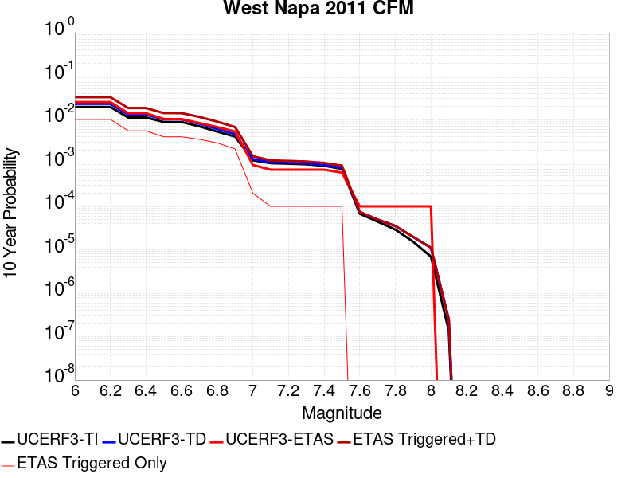 |

| Magnitude | 1 wk TI Prob | 1 wk TD Prob | 1 wk ETAS Prob | 1 wk ETAS/TD Gain | 1 wk ETAS Triggered+TD | 1 wk ETAS Triggered Only | 1 mo TI Prob | 1 mo TD Prob | 1 mo ETAS Prob | 1 mo ETAS/TD Gain | 1 mo ETAS Triggered+TD | 1 mo ETAS Triggered Only | 1 yr TI Prob | 1 yr TD Prob | 1 yr ETAS Prob | 1 yr ETAS/TD Gain | 1 yr ETAS Triggered+TD | 1 yr ETAS Triggered Only | 10 yr TI Prob | 10 yr TD Prob | 10 yr ETAS Prob | 10 yr ETAS/TD Gain | 10 yr ETAS Triggered+TD | 10 yr ETAS Triggered Only |
|-----|-----|-----|-----|-----|-----|-----|-----|-----|-----|-----|-----|-----|-----|-----|-----|-----|-----|-----|-----|-----|-----|-----|-----|-----|
| 6.0 | 3.773104E-5 | 4.443471E-5 | 1.0E-4 | 2.2504928 | 1.4443026E-4 | 1.0E-4 | 1.6169442E-4 | 1.9042236E-4 | 4.0E-4 | 2.1005936 | 3.903843E-4 | 2.0E-4 | 0.001966852 | 0.0023162432 | 0.0029 | 1.2520275 | 0.0039125374 | 0.0016 | 0.019495348 | 0.022954233 | 0.0252 | 1.0978367 | 0.032822393 | 0.0101 |
| 6.1 | 3.773104E-5 | 4.443471E-5 | 1.0E-4 | 2.2504928 | 1.4443026E-4 | 1.0E-4 | 1.6169442E-4 | 1.9042236E-4 | 4.0E-4 | 2.1005936 | 3.903843E-4 | 2.0E-4 | 0.001966852 | 0.0023162432 | 0.0029 | 1.2520275 | 0.0039125374 | 0.0016 | 0.019495348 | 0.022954233 | 0.0252 | 1.0978367 | 0.032822393 | 0.0101 |
| 6.2 | 3.773104E-5 | 4.443471E-5 | 1.0E-4 | 2.2504928 | 1.4443026E-4 | 1.0E-4 | 1.6169442E-4 | 1.9042236E-4 | 4.0E-4 | 2.1005936 | 3.903843E-4 | 2.0E-4 | 0.001966852 | 0.0023162432 | 0.0029 | 1.2520275 | 0.0039125374 | 0.0016 | 0.019495348 | 0.022954233 | 0.0252 | 1.0978367 | 0.032822393 | 0.0101 |
| 6.3 | 2.147964E-5 | 2.4934396E-5 | 1.0E-4 | 4.0105243 | 1.249319E-4 | 1.0E-4 | 9.2052345E-5 | 1.06857835E-4 | 2.0E-4 | 1.8716456 | 3.0683647E-4 | 2.0E-4 | 0.001120161 | 0.0013003092 | 0.0018 | 1.3842862 | 0.0023988788 | 0.0011 | 0.011145315 | 0.012937482 | 0.014 | 1.0821271 | 0.018366326 | 0.0055 |
| 6.4 | 2.147964E-5 | 2.4934396E-5 | 1.0E-4 | 4.0105243 | 1.249319E-4 | 1.0E-4 | 9.2052345E-5 | 1.06857835E-4 | 2.0E-4 | 1.8716456 | 3.0683647E-4 | 2.0E-4 | 0.001120161 | 0.0013003092 | 0.0018 | 1.3842862 | 0.0023988788 | 0.0011 | 0.011145315 | 0.012937482 | 0.014 | 1.0821271 | 0.018366326 | 0.0055 |
| 6.5 | 1.688201E-5 | 1.9505078E-5 | 0.0 | 0.0 | 1.9505078E-5 | 0.0 | 7.234947E-5 | 8.359092E-5 | 1.0E-4 | 1.1963022 | 1.8358257E-4 | 1.0E-4 | 8.804988E-4 | 0.0010173168 | 0.0013 | 1.2778714 | 0.0019164012 | 9.0E-4 | 0.008770182 | 0.010135127 | 0.0103 | 1.0162674 | 0.0140945865 | 0.004 |
| 6.6 | 1.6846381E-5 | 1.9464826E-5 | 0.0 | 0.0 | 1.9464826E-5 | 0.0 | 7.219678E-5 | 8.3418425E-5 | 1.0E-4 | 1.1987759 | 1.8341008E-4 | 1.0E-4 | 8.7864127E-4 | 0.0010152186 | 0.0013 | 1.2805125 | 0.0019143049 | 9.0E-4 | 0.008751754 | 0.010114336 | 0.0102 | 1.0084695 | 0.014073879 | 0.004 |
| 6.7 | 1.3396501E-5 | 1.5432639E-5 | 0.0 | 0.0 | 1.5432639E-5 | 0.0 | 5.7412315E-5 | 6.6138564E-5 | 1.0E-4 | 1.5119773 | 1.6613194E-4 | 1.0E-4 | 6.9877075E-4 | 8.0500275E-4 | 0.0011 | 1.366455 | 0.0017042783 | 9.0E-4 | 0.0069657755 | 0.008028455 | 0.0083 | 1.0338229 | 0.011500355 | 0.0035 |
| 6.8 | 1.0139058E-5 | 1.1643671E-5 | 0.0 | 0.0 | 1.1643671E-5 | 0.0 | 4.3452383E-5 | 4.9900806E-5 | 1.0E-4 | 2.0039756 | 1.4989582E-4 | 1.0E-4 | 5.289043E-4 | 6.0742826E-4 | 9.0E-4 | 1.4816566 | 0.0014069423 | 8.0E-4 | 0.005276473 | 0.006064466 | 0.0067 | 1.1047963 | 0.008946879 | 0.0029 |
| 6.9 | 7.761281E-6 | 8.86714E-6 | 0.0 | 0.0 | 8.86714E-6 | 0.0 | 3.326221E-5 | 3.8001766E-5 | 1.0E-4 | 2.6314566 | 1.3799797E-4 | 1.0E-4 | 4.0489217E-4 | 4.6262448E-4 | 6.0E-4 | 1.2969483 | 9.623932E-4 | 5.0E-4 | 0.0040415525 | 0.0046229945 | 0.0053 | 1.1464431 | 0.006713286 | 0.0021 |
| 7.0 | 2.2109202E-6 | 2.3549817E-6 | 0.0 | 0.0 | 2.3549817E-6 | 0.0 | 9.475338E-6 | 1.009274E-5 | 0.0 | 0.0 | 1.009274E-5 | 0.0 | 1.1535613E-4 | 1.2287227E-4 | 1.0E-4 | 0.8138533 | 2.2285998E-4 | 1.0E-4 | 0.0011529627 | 0.0012294134 | 9.0E-4 | 0.7320564 | 0.0014291676 | 2.0E-4 |
| 7.1 | 1.9008926E-6 | 2.0021855E-6 | 0.0 | 0.0 | 2.0021855E-6 | 0.0 | 8.146657E-6 | 8.580767E-6 | 0.0 | 0.0 | 8.580767E-6 | 0.0 | 9.918104E-5 | 1.0446586E-4 | 1.0E-4 | 0.9572506 | 2.0445541E-4 | 1.0E-4 | 9.913679E-4 | 0.0010455326 | 7.0E-4 | 0.6695152 | 0.001145428 | 1.0E-4 |
| 7.2 | 1.8495944E-6 | 1.9450608E-6 | 0.0 | 0.0 | 1.9450608E-6 | 0.0 | 7.926808E-6 | 8.335948E-6 | 0.0 | 0.0 | 8.335948E-6 | 0.0 | 9.650462E-5 | 1.0148547E-4 | 1.0E-4 | 0.9853627 | 2.0147533E-4 | 1.0E-4 | 9.6462725E-4 | 0.0010157564 | 7.0E-4 | 0.6891416 | 0.0011156548 | 1.0E-4 |
| 7.3 | 1.7883189E-6 | 1.8771289E-6 | 0.0 | 0.0 | 1.8771289E-6 | 0.0 | 7.664201E-6 | 8.0448135E-6 | 0.0 | 0.0 | 8.0448135E-6 | 0.0 | 9.330765E-5 | 9.794122E-5 | 1.0E-4 | 1.0210205 | 1.9793143E-4 | 1.0E-4 | 9.3268487E-4 | 9.803459E-4 | 7.0E-4 | 0.71403366 | 0.0010802479 | 1.0E-4 |
| 7.4 | 1.6520572E-6 | 1.7309668E-6 | 0.0 | 0.0 | 1.7309668E-6 | 0.0 | 7.0802257E-6 | 7.418408E-6 | 0.0 | 0.0 | 7.418408E-6 | 0.0 | 8.6198335E-5 | 9.03154E-5 | 1.0E-4 | 1.1072309 | 1.9030637E-4 | 1.0E-4 | 8.616491E-4 | 9.041525E-4 | 7.0E-4 | 0.7742057 | 0.0010040621 | 1.0E-4 |
| 7.5 | 1.4040345E-6 | 1.4701039E-6 | 0.0 | 0.0 | 1.4701039E-6 | 0.0 | 6.0172765E-6 | 6.3004304E-6 | 0.0 | 0.0 | 6.3004304E-6 | 0.0 | 7.325788E-5 | 7.6705066E-5 | 1.0E-4 | 1.3036948 | 1.766974E-4 | 1.0E-4 | 7.3233736E-4 | 7.6810154E-4 | 6.0E-4 | 0.7811467 | 8.6802477E-4 | 1.0E-4 |
| 7.6 | 1.3013842E-7 | 1.3989674E-7 | 0.0 | 0.0 | 1.3989674E-7 | 0.0 | 5.57736E-7 | 5.995573E-7 | 0.0 | 0.0 | 5.995573E-7 | 0.0 | 6.790414E-6 | 7.299586E-6 | 0.0 | 0.0 | 7.299586E-6 | 0.0 | 6.790207E-5 | 7.392417E-5 | 1.0E-4 | 1.3527374 | 7.392417E-5 | 0.0 |
| 7.7 | 8.541512E-8 | 9.342756E-8 | 0.0 | 0.0 | 9.342756E-8 | 0.0 | 3.6606474E-7 | 4.0040376E-7 | 0.0 | 0.0 | 4.0040376E-7 | 0.0 | 4.456829E-6 | 4.874905E-6 | 0.0 | 0.0 | 4.874905E-6 | 0.0 | 4.4567398E-5 | 4.9653856E-5 | 1.0E-4 | 2.0139422 | 4.9653856E-5 | 0.0 |
| 7.8 | 5.6074793E-8 | 6.5917234E-8 | 0.0 | 0.0 | 6.5917234E-8 | 0.0 | 2.403205E-7 | 2.8250238E-7 | 0.0 | 0.0 | 2.8250238E-7 | 0.0 | 2.9258983E-6 | 3.4394611E-6 | 0.0 | 0.0 | 3.4394611E-6 | 0.0 | 2.9258597E-5 | 3.5230274E-5 | 1.0E-4 | 2.8384678 | 3.5230274E-5 | 0.0 |
| 7.9 | 2.9475839E-8 | 3.682857E-8 | 0.0 | 0.0 | 3.682857E-8 | 0.0 | 1.2632502E-7 | 1.5783672E-7 | 0.0 | 0.0 | 1.5783672E-7 | 0.0 | 1.538006E-6 | 1.9216604E-6 | 0.0 | 0.0 | 1.9216604E-6 | 0.0 | 1.5379954E-5 | 1.9759776E-5 | 1.0E-4 | 5.060786 | 1.9759776E-5 | 0.0 |
| 8.0 | 1.3337122E-8 | 2.0611138E-8 | 0.0 | 0.0 | 2.0611138E-8 | 0.0 | 5.7159088E-8 | 8.833344E-8 | 0.0 | 0.0 | 8.833344E-8 | 0.0 | 6.959117E-7 | 1.0754591E-6 | 0.0 | 0.0 | 1.0754591E-6 | 0.0 | 6.959095E-6 | 1.1116372E-5 | 1.0E-4 | 8.995741 | 1.1116372E-5 | 0.0 |
| 8.1 | 2.6589986E-10 | 4.6371973E-10 | 0.0 | 0.0 | 4.6371973E-10 | 0.0 | 1.1395708E-9 | 1.9873707E-9 | 0.0 | 0.0 | 1.9873707E-9 | 0.0 | 1.3874274E-8 | 2.4196236E-8 | 0.0 | 0.0 | 2.4196236E-8 | 0.0 | 1.3874273E-7 | 2.4881123E-7 | 0.0 | 0.0 | 2.4881123E-7 | 0.0 |

## Calaveras (So) 2011 CFM
*[(top)](#table-of-contents)*

| 1 Week | 1 Month | 1 Year | 10 Year |
|-----|-----|-----|-----|
|  | 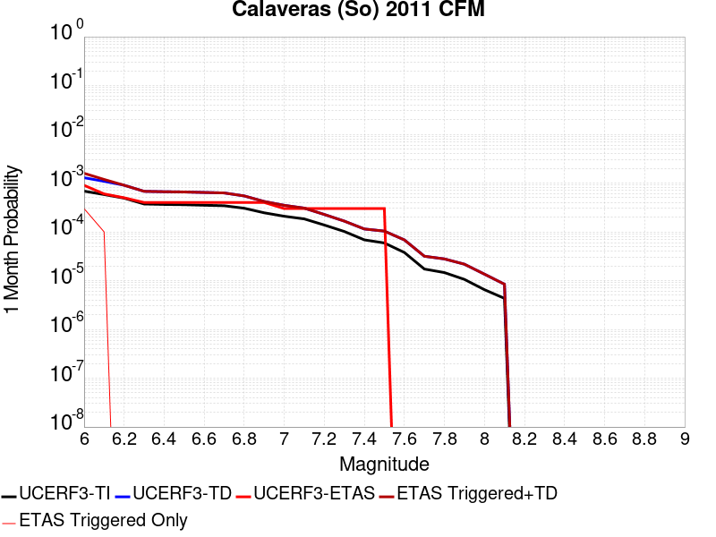 |  |  |

| Magnitude | 1 wk TI Prob | 1 wk TD Prob | 1 wk ETAS Prob | 1 wk ETAS/TD Gain | 1 wk ETAS Triggered+TD | 1 wk ETAS Triggered Only | 1 mo TI Prob | 1 mo TD Prob | 1 mo ETAS Prob | 1 mo ETAS/TD Gain | 1 mo ETAS Triggered+TD | 1 mo ETAS Triggered Only | 1 yr TI Prob | 1 yr TD Prob | 1 yr ETAS Prob | 1 yr ETAS/TD Gain | 1 yr ETAS Triggered+TD | 1 yr ETAS Triggered Only | 10 yr TI Prob | 10 yr TD Prob | 10 yr ETAS Prob | 10 yr ETAS/TD Gain | 10 yr ETAS Triggered+TD | 10 yr ETAS Triggered Only |
|-----|-----|-----|-----|-----|-----|-----|-----|-----|-----|-----|-----|-----|-----|-----|-----|-----|-----|-----|-----|-----|-----|-----|-----|-----|
| 6.0 | 1.5950744E-4 | 3.0039327E-4 | 3.0E-4 | 0.9986908 | 3.0039327E-4 | 0.0 | 6.834242E-4 | 0.0012866248 | 9.0E-4 | 0.6995046 | 0.0015862389 | 3.0E-4 | 0.00828899 | 0.015530481 | 0.0097 | 0.62457824 | 0.017696314 | 0.0022 | 0.079865426 | 0.14342968 | 0.0968 | 0.67489517 | 0.15165275 | 0.0096 |
| 6.1 | 1.3584697E-4 | 2.537606E-4 | 2.0E-4 | 0.7881444 | 2.537606E-4 | 0.0 | 5.8207137E-4 | 0.0010870121 | 6.0E-4 | 0.5519718 | 0.0011869033 | 1.0E-4 | 0.007063716 | 0.013140169 | 0.0079 | 0.60120994 | 0.015015203 | 0.0019 | 0.06843361 | 0.12309246 | 0.0782 | 0.63529485 | 0.1302831 | 0.0082 |
| 6.2 | 1.14676266E-4 | 2.1067173E-4 | 2.0E-4 | 0.9493443 | 2.1067173E-4 | 0.0 | 4.9137714E-4 | 9.025431E-4 | 5.0E-4 | 0.5539902 | 9.025431E-4 | 0.0 | 0.0059661185 | 0.010928976 | 0.0068 | 0.6221992 | 0.012610396 | 0.0017 | 0.058084648 | 0.104108006 | 0.0652 | 0.6262727 | 0.11037925 | 0.007 |
| 6.3 | 8.691518E-5 | 1.5792086E-4 | 2.0E-4 | 1.2664571 | 1.5792086E-4 | 0.0 | 3.7244044E-4 | 6.7658944E-4 | 4.0E-4 | 0.5912005 | 6.7658944E-4 | 0.0 | 0.004525038 | 0.008199894 | 0.0054 | 0.65854514 | 0.009885954 | 0.0017 | 0.044339992 | 0.078463614 | 0.0514 | 0.65508074 | 0.08399283 | 0.006 |
| 6.4 | 8.50982E-5 | 1.5501592E-4 | 2.0E-4 | 1.2901901 | 1.5501592E-4 | 0.0 | 3.646556E-4 | 6.641461E-4 | 4.0E-4 | 0.60227716 | 6.641461E-4 | 0.0 | 0.0044306475 | 0.008049522 | 0.0054 | 0.67084736 | 0.009735837 | 0.0017 | 0.04343345 | 0.07708181 | 0.0507 | 0.6577428 | 0.08252702 | 0.0059 |
| 6.5 | 8.4062965E-5 | 1.532742E-4 | 2.0E-4 | 1.304851 | 1.532742E-4 | 0.0 | 3.602201E-4 | 6.566862E-4 | 4.0E-4 | 0.60911894 | 6.566862E-4 | 0.0 | 0.004376863 | 0.007959454 | 0.0054 | 0.6784384 | 0.009645924 | 0.0017 | 0.042916555 | 0.076258376 | 0.0503 | 0.65959966 | 0.08170845 | 0.0059 |
| 6.6 | 8.194716E-5 | 1.4966037E-4 | 2.0E-4 | 1.3363591 | 1.4966037E-4 | 0.0 | 3.5115483E-4 | 6.412075E-4 | 4.0E-4 | 0.62382305 | 6.412075E-4 | 0.0 | 0.0042669317 | 0.007772731 | 0.0053 | 0.681871 | 0.009459517 | 0.0017 | 0.04185927 | 0.07455445 | 0.0495 | 0.6639443 | 0.079829484 | 0.0057 |
| 6.7 | 8.012326E-5 | 1.4635667E-4 | 2.0E-4 | 1.3665246 | 1.4635667E-4 | 0.0 | 3.433402E-4 | 6.270579E-4 | 4.0E-4 | 0.63789964 | 6.270579E-4 | 0.0 | 0.004172157 | 0.007602095 | 0.0053 | 0.6971762 | 0.009289172 | 0.0017 | 0.040946912 | 0.07300251 | 0.049 | 0.6712098 | 0.078286394 | 0.0057 |
| 6.8 | 7.119773E-5 | 1.2708327E-4 | 2.0E-4 | 1.5737712 | 1.2708327E-4 | 0.0 | 3.0509746E-4 | 5.445169E-4 | 4.0E-4 | 0.73459613 | 5.445169E-4 | 0.0 | 0.0037082357 | 0.006606212 | 0.0045 | 0.6811771 | 0.007996963 | 0.0014 | 0.036469642 | 0.063896075 | 0.0433 | 0.67766297 | 0.0686702 | 0.0051 |
| 6.9 | 5.7343088E-5 | 9.76893E-5 | 2.0E-4 | 2.0473073 | 9.76893E-5 | 0.0 | 2.4573295E-4 | 4.1860167E-4 | 4.0E-4 | 0.95556235 | 4.1860167E-4 | 0.0 | 0.0029876942 | 0.005084639 | 0.0033 | 0.64901364 | 0.006179046 | 0.0011 | 0.02947844 | 0.049813464 | 0.0332 | 0.6664865 | 0.05361421 | 0.004 |
| 7.0 | 4.8746577E-5 | 8.150154E-5 | 2.0E-4 | 2.4539416 | 8.150154E-5 | 0.0 | 2.0889717E-4 | 3.4924588E-4 | 3.0E-4 | 0.85899365 | 3.4924588E-4 | 0.0 | 0.0025403565 | 0.0042438433 | 0.0028 | 0.6597793 | 0.0052395994 | 0.001 | 0.025115121 | 0.041853353 | 0.0284 | 0.6785597 | 0.04501524 | 0.0033 |
| 7.1 | 4.2998014E-5 | 7.141097E-5 | 2.0E-4 | 2.8006902 | 7.141097E-5 | 0.0 | 1.8426418E-4 | 3.0601144E-4 | 3.0E-4 | 0.98035556 | 3.0601144E-4 | 0.0 | 0.002241108 | 0.0037193832 | 0.0027 | 0.7259268 | 0.004715664 | 0.001 | 0.022186412 | 0.036837757 | 0.0261 | 0.70851225 | 0.03982356 | 0.0031 |
| 7.2 | 3.221292E-5 | 5.2850894E-5 | 2.0E-4 | 3.7842312 | 5.2850894E-5 | 0.0 | 1.3804805E-4 | 2.264843E-4 | 3.0E-4 | 1.3245951 | 2.264843E-4 | 0.0 | 0.0016794393 | 0.0027539872 | 0.0024 | 0.8714638 | 0.003551784 | 8.0E-4 | 0.016668037 | 0.027530657 | 0.0199 | 0.72283053 | 0.029767336 | 0.0023 |
| 7.3 | 2.3756531E-5 | 3.8636637E-5 | 2.0E-4 | 5.176434 | 3.8636637E-5 | 0.0 | 1.0180973E-4 | 1.6557517E-4 | 3.0E-4 | 1.8118658 | 1.6557517E-4 | 0.0 | 0.0012388286 | 0.0020140307 | 0.0014 | 0.6951235 | 0.0025130236 | 5.0E-4 | 0.012319452 | 0.020239614 | 0.014 | 0.6917128 | 0.022101158 | 0.0019 |
| 7.4 | 1.5997684E-5 | 2.663317E-5 | 2.0E-4 | 7.509433 | 2.663317E-5 | 0.0 | 6.8559704E-5 | 1.1413718E-4 | 3.0E-4 | 2.628416 | 1.1413718E-4 | 0.0 | 8.343947E-4 | 0.0013887367 | 0.0011 | 0.7920868 | 0.0016883201 | 3.0E-4 | 0.008312687 | 0.014032471 | 0.0092 | 0.65562224 | 0.015314229 | 0.0013 |
| 7.5 | 1.3814293E-5 | 2.4100913E-5 | 2.0E-4 | 8.298441 | 2.4100913E-5 | 0.0 | 5.9202768E-5 | 1.0328555E-4 | 3.0E-4 | 2.904569 | 1.0328555E-4 | 0.0 | 7.205553E-4 | 0.0012567785 | 0.0011 | 0.8752537 | 0.0015564014 | 3.0E-4 | 0.007182234 | 0.012724071 | 0.0085 | 0.6680252 | 0.013908802 | 0.0012 |
| 7.6 | 8.817309E-6 | 1.5899472E-5 | 0.0 | 0.0 | 1.5899472E-5 | 0.0 | 3.7787922E-5 | 6.813882E-5 | 0.0 | 0.0 | 6.813882E-5 | 0.0 | 4.5997082E-4 | 8.292757E-4 | 7.0E-4 | 0.84411013 | 0.0010291098 | 2.0E-4 | 0.004590199 | 0.008460879 | 0.0052 | 0.6145933 | 0.009055803 | 6.0E-4 |
| 7.7 | 4.0352206E-6 | 7.3470687E-6 | 0.0 | 0.0 | 7.3470687E-6 | 0.0 | 1.7293689E-5 | 3.148706E-5 | 0.0 | 0.0 | 3.148706E-5 | 0.0 | 2.1053031E-4 | 3.8328758E-4 | 2.0E-4 | 0.5218014 | 3.8328758E-4 | 0.0 | 0.0021033096 | 0.0039883037 | 0.0027 | 0.67697954 | 0.0042871074 | 3.0E-4 |
| 7.8 | 3.413169E-6 | 6.4743417E-6 | 0.0 | 0.0 | 6.4743417E-6 | 0.0 | 1.4627784E-5 | 2.7746884E-5 | 0.0 | 0.0 | 2.7746884E-5 | 0.0 | 1.7807873E-4 | 3.37766E-4 | 2.0E-4 | 0.5921259 | 3.37766E-4 | 0.0 | 0.0017793609 | 0.0035134768 | 0.0024 | 0.6830841 | 0.0038124227 | 3.0E-4 |
| 7.9 | 2.4740732E-6 | 5.0508647E-6 | 0.0 | 0.0 | 5.0508647E-6 | 0.0 | 1.06031275E-5 | 2.1646385E-5 | 0.0 | 0.0 | 2.1646385E-5 | 0.0 | 1.2908543E-4 | 2.6351292E-4 | 1.0E-4 | 0.37948805 | 2.6351292E-4 | 0.0 | 0.0012901047 | 0.002723944 | 0.0017 | 0.6240951 | 0.0029233992 | 2.0E-4 |
| 8.0 | 1.5231818E-6 | 3.1566935E-6 | 0.0 | 0.0 | 3.1566935E-6 | 0.0 | 6.527906E-6 | 1.3528616E-5 | 0.0 | 0.0 | 1.3528616E-5 | 0.0 | 7.9474354E-5 | 1.6469849E-4 | 0.0 | 0.0 | 1.6469849E-4 | 0.0 | 7.944594E-4 | 0.0016920017 | 9.0E-4 | 0.53191435 | 0.0017918325 | 1.0E-4 |
| 8.1 | 1.0104524E-6 | 1.9643983E-6 | 0.0 | 0.0 | 1.9643983E-6 | 0.0 | 4.330503E-6 | 8.418823E-6 | 0.0 | 0.0 | 8.418823E-6 | 0.0 | 5.2722597E-5 | 1.0249438E-4 | 0.0 | 0.0 | 1.0249438E-4 | 0.0 | 5.271009E-4 | 0.0010529247 | 4.0E-4 | 0.37989423 | 0.0010529247 | 0.0 |

## Green Valley 2011 CFM
*[(top)](#table-of-contents)*

| 1 Week | 1 Month | 1 Year | 10 Year |
|-----|-----|-----|-----|
|  |  |  |  |

| Magnitude | 1 wk TI Prob | 1 wk TD Prob | 1 wk ETAS Prob | 1 wk ETAS/TD Gain | 1 wk ETAS Triggered+TD | 1 wk ETAS Triggered Only | 1 mo TI Prob | 1 mo TD Prob | 1 mo ETAS Prob | 1 mo ETAS/TD Gain | 1 mo ETAS Triggered+TD | 1 mo ETAS Triggered Only | 1 yr TI Prob | 1 yr TD Prob | 1 yr ETAS Prob | 1 yr ETAS/TD Gain | 1 yr ETAS Triggered+TD | 1 yr ETAS Triggered Only | 10 yr TI Prob | 10 yr TD Prob | 10 yr ETAS Prob | 10 yr ETAS/TD Gain | 10 yr ETAS Triggered+TD | 10 yr ETAS Triggered Only |
|-----|-----|-----|-----|-----|-----|-----|-----|-----|-----|-----|-----|-----|-----|-----|-----|-----|-----|-----|-----|-----|-----|-----|-----|-----|
| 6.0 | 9.9629346E-5 | 1.723003E-4 | 2.0E-4 | 1.1607641 | 2.7228307E-4 | 1.0E-4 | 4.2691303E-4 | 7.3821814E-4 | 7.0E-4 | 0.9482292 | 9.380705E-4 | 2.0E-4 | 0.0051852856 | 0.008949381 | 0.0063 | 0.7039593 | 0.009643116 | 7.0E-4 | 0.050659515 | 0.08519073 | 0.0582 | 0.68317294 | 0.09324105 | 0.0088 |
| 6.1 | 9.88615E-5 | 1.7077432E-4 | 2.0E-4 | 1.1711363 | 2.7075724E-4 | 1.0E-4 | 4.2362334E-4 | 7.3168206E-4 | 5.0E-4 | 0.68335694 | 8.316089E-4 | 1.0E-4 | 0.0051454236 | 0.008870459 | 0.0059 | 0.665129 | 0.009366024 | 5.0E-4 | 0.050279044 | 0.08447853 | 0.0569 | 0.67354393 | 0.09207735 | 0.0083 |
| 6.2 | 9.696895E-5 | 1.6717147E-4 | 2.0E-4 | 1.1963764 | 2.6715474E-4 | 1.0E-4 | 4.15515E-4 | 7.1624975E-4 | 5.0E-4 | 0.6980805 | 8.1617816E-4 | 1.0E-4 | 0.0050471667 | 0.008684165 | 0.0058 | 0.6678823 | 0.009179823 | 5.0E-4 | 0.04934063 | 0.08278945 | 0.0559 | 0.6752068 | 0.09021886 | 0.0081 |
| 6.3 | 9.275224E-5 | 1.589701E-4 | 2.0E-4 | 1.2580982 | 2.5895418E-4 | 1.0E-4 | 3.9744904E-4 | 6.811196E-4 | 4.0E-4 | 0.58726835 | 7.8105147E-4 | 1.0E-4 | 0.0048282105 | 0.008259743 | 0.0055 | 0.66588026 | 0.008755613 | 5.0E-4 | 0.047246475 | 0.07892925 | 0.0536 | 0.6790891 | 0.08620571 | 0.0079 |
| 6.4 | 8.391499E-5 | 1.4298713E-4 | 2.0E-4 | 1.3987273 | 2.4297283E-4 | 1.0E-4 | 3.595861E-4 | 6.126609E-4 | 4.0E-4 | 0.6528897 | 7.125996E-4 | 1.0E-4 | 0.004369175 | 0.007432519 | 0.0048 | 0.64581066 | 0.007928803 | 5.0E-4 | 0.04284265 | 0.071316466 | 0.0482 | 0.67586076 | 0.077445775 | 0.0066 |
| 6.5 | 5.9519385E-5 | 9.880607E-5 | 1.0E-4 | 1.0120835 | 1.9879619E-4 | 1.0E-4 | 2.5505814E-4 | 4.2338544E-4 | 3.0E-4 | 0.70857424 | 5.233431E-4 | 1.0E-4 | 0.0031009112 | 0.0051414133 | 0.0034 | 0.6612968 | 0.005439871 | 3.0E-4 | 0.030579966 | 0.049905717 | 0.0353 | 0.7073338 | 0.05418114 | 0.0045 |
| 6.6 | 4.5361558E-5 | 7.362437E-5 | 1.0E-4 | 1.358246 | 1.7361701E-4 | 1.0E-4 | 1.9439218E-4 | 3.1549318E-4 | 2.0E-4 | 0.6339282 | 4.154616E-4 | 1.0E-4 | 0.0023641558 | 0.003833405 | 0.0024 | 0.62607527 | 0.004132255 | 3.0E-4 | 0.023391623 | 0.03748022 | 0.0271 | 0.72304803 | 0.040560283 | 0.0032 |
| 6.7 | 3.8808106E-5 | 6.230829E-5 | 1.0E-4 | 1.604923 | 1.6230205E-4 | 1.0E-4 | 1.6630985E-4 | 2.670088E-4 | 1.0E-4 | 0.3745195 | 3.669821E-4 | 1.0E-4 | 0.0020229418 | 0.0032453204 | 0.0022 | 0.6778991 | 0.003544347 | 3.0E-4 | 0.020046256 | 0.03184677 | 0.0233 | 0.73162836 | 0.034460783 | 0.0027 |
| 6.8 | 2.2284667E-5 | 3.1184663E-5 | 1.0E-4 | 3.2067046 | 1.3118154E-4 | 1.0E-4 | 9.550222E-5 | 1.3364178E-4 | 1.0E-4 | 0.748269 | 2.3362841E-4 | 1.0E-4 | 0.0011621192 | 0.0016258745 | 0.001 | 0.6150536 | 0.0017257119 | 1.0E-4 | 0.011560607 | 0.016117869 | 0.0096 | 0.5956122 | 0.016904974 | 8.0E-4 |
| 6.9 | 1.8050168E-5 | 2.4380426E-5 | 1.0E-4 | 4.101651 | 1.2437798E-4 | 1.0E-4 | 7.735557E-5 | 1.0448336E-4 | 1.0E-4 | 0.9570902 | 2.0447292E-4 | 1.0E-4 | 9.4139716E-4 | 0.0012713457 | 0.001 | 0.7865681 | 0.0013712186 | 1.0E-4 | 0.009374191 | 0.012633375 | 0.0078 | 0.6174122 | 0.013324531 | 7.0E-4 |
| 7.0 | 1.4763166E-5 | 1.95367E-5 | 0.0 | 0.0 | 1.95367E-5 | 0.0 | 6.326917E-5 | 8.3726045E-5 | 0.0 | 0.0 | 8.3726045E-5 | 0.0 | 7.7002996E-4 | 0.0010188891 | 7.0E-4 | 0.6870227 | 0.0010188891 | 0.0 | 0.007673672 | 0.010142356 | 0.0056 | 0.55213994 | 0.010439313 | 3.0E-4 |
| 7.1 | 1.2399713E-5 | 1.626603E-5 | 0.0 | 0.0 | 1.626603E-5 | 0.0 | 5.3140546E-5 | 6.9709706E-5 | 0.0 | 0.0 | 6.9709706E-5 | 0.0 | 6.467941E-4 | 8.483872E-4 | 6.0E-4 | 0.70722425 | 8.483872E-4 | 0.0 | 0.006449148 | 0.008452031 | 0.0049 | 0.5797423 | 0.008749495 | 3.0E-4 |
| 7.2 | 1.0584195E-5 | 1.3887744E-5 | 0.0 | 0.0 | 1.3887744E-5 | 0.0 | 4.5360044E-5 | 5.9517555E-5 | 0.0 | 0.0 | 5.9517555E-5 | 0.0 | 5.521186E-4 | 7.243869E-4 | 6.0E-4 | 0.82828665 | 7.243869E-4 | 0.0 | 0.0055074887 | 0.007221006 | 0.0043 | 0.5954849 | 0.0075188396 | 3.0E-4 |
| 7.3 | 7.998173E-6 | 1.0516018E-5 | 0.0 | 0.0 | 1.0516018E-5 | 0.0 | 3.4277433E-5 | 4.5067874E-5 | 0.0 | 0.0 | 4.5067874E-5 | 0.0 | 4.1724785E-4 | 5.485643E-4 | 4.0E-4 | 0.7291761 | 5.485643E-4 | 0.0 | 0.004164653 | 0.005472412 | 0.0031 | 0.56647784 | 0.005671317 | 2.0E-4 |
| 7.4 | 6.7571127E-6 | 8.911162E-6 | 0.0 | 0.0 | 8.911162E-6 | 0.0 | 2.8958733E-5 | 3.819014E-5 | 0.0 | 0.0 | 3.819014E-5 | 0.0 | 3.5251552E-4 | 4.6486672E-4 | 3.0E-4 | 0.6453463 | 4.6486672E-4 | 0.0 | 0.0035195686 | 0.0046391184 | 0.0022 | 0.47422802 | 0.0048381905 | 2.0E-4 |
| 7.5 | 5.69878E-6 | 7.4981904E-6 | 0.0 | 0.0 | 7.4981904E-6 | 0.0 | 2.4423114E-5 | 3.213471E-5 | 0.0 | 0.0 | 3.213471E-5 | 0.0 | 2.9731085E-4 | 3.9117076E-4 | 3.0E-4 | 0.7669285 | 3.9117076E-4 | 0.0 | 0.002969134 | 0.0039049806 | 0.0019 | 0.4865581 | 0.0041042 | 2.0E-4 |
| 7.6 | 4.503664E-6 | 5.9203985E-6 | 0.0 | 0.0 | 5.9203985E-6 | 0.0 | 1.9301275E-5 | 2.5372896E-5 | 0.0 | 0.0 | 2.5372896E-5 | 0.0 | 2.3496768E-4 | 3.0887203E-4 | 3.0E-4 | 0.97127604 | 3.0887203E-4 | 0.0 | 0.002347194 | 0.0030845234 | 0.0018 | 0.58355856 | 0.0032839065 | 2.0E-4 |
| 7.7 | 1.0873546E-6 | 1.4062297E-6 | 0.0 | 0.0 | 1.4062297E-6 | 0.0 | 4.6600826E-6 | 6.0266852E-6 | 0.0 | 0.0 | 6.0266852E-6 | 0.0 | 5.6735033E-5 | 7.337245E-5 | 2.0E-4 | 2.7258189 | 7.337245E-5 | 0.0 | 5.672055E-4 | 7.335298E-4 | 5.0E-4 | 0.68163556 | 8.3345646E-4 | 1.0E-4 |
| 7.8 | 4.9373917E-8 | 6.172147E-8 | 0.0 | 0.0 | 6.172147E-8 | 0.0 | 2.1160248E-7 | 2.645206E-7 | 0.0 | 0.0 | 2.645206E-7 | 0.0 | 2.5762572E-6 | 3.2205346E-6 | 0.0 | 0.0 | 3.2205346E-6 | 0.0 | 2.5762274E-5 | 3.221324E-5 | 0.0 | 0.0 | 3.221324E-5 | 0.0 |

## Hunting Creek - Berryessa 2011 CFM
*[(top)](#table-of-contents)*

| 1 Week | 1 Month | 1 Year | 10 Year |
|-----|-----|-----|-----|
|  |  |  | 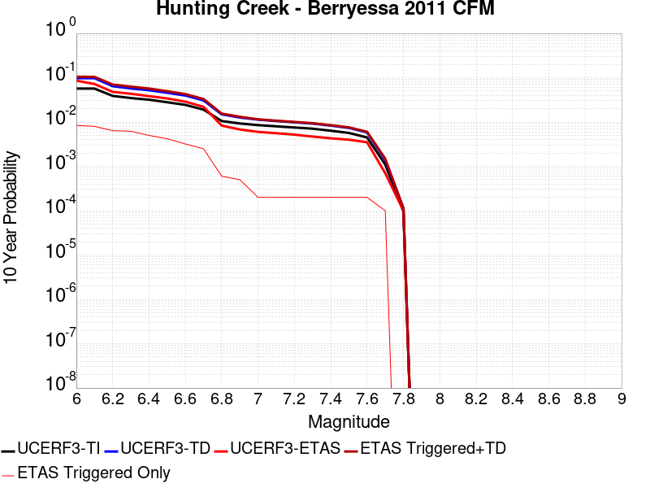 |

| Magnitude | 1 wk TI Prob | 1 wk TD Prob | 1 wk ETAS Prob | 1 wk ETAS/TD Gain | 1 wk ETAS Triggered+TD | 1 wk ETAS Triggered Only | 1 mo TI Prob | 1 mo TD Prob | 1 mo ETAS Prob | 1 mo ETAS/TD Gain | 1 mo ETAS Triggered+TD | 1 mo ETAS Triggered Only | 1 yr TI Prob | 1 yr TD Prob | 1 yr ETAS Prob | 1 yr ETAS/TD Gain | 1 yr ETAS Triggered+TD | 1 yr ETAS Triggered Only | 10 yr TI Prob | 10 yr TD Prob | 10 yr ETAS Prob | 10 yr ETAS/TD Gain | 10 yr ETAS Triggered+TD | 10 yr ETAS Triggered Only |
|-----|-----|-----|-----|-----|-----|-----|-----|-----|-----|-----|-----|-----|-----|-----|-----|-----|-----|-----|-----|-----|-----|-----|-----|-----|
| 6.0 | 1.1270982E-4 | 1.9940689E-4 | 3.0E-4 | 1.5044616 | 2.9938694E-4 | 1.0E-4 | 4.8295266E-4 | 8.542511E-4 | 0.001 | 1.170616 | 9.5416565E-4 | 1.0E-4 | 0.0058641075 | 0.01034132 | 0.0081 | 0.78326553 | 0.011133047 | 8.0E-4 | 0.057117578 | 0.09765978 | 0.086 | 0.88060814 | 0.10523944 | 0.0084 |
| 6.1 | 1.1239393E-4 | 1.988906E-4 | 1.0E-4 | 0.50278896 | 2.9887073E-4 | 1.0E-4 | 4.8159933E-4 | 8.5203996E-4 | 7.0E-4 | 0.82155776 | 9.5195475E-4 | 1.0E-4 | 0.0058477195 | 0.01031468 | 0.0071 | 0.68833935 | 0.011007459 | 7.0E-4 | 0.056962132 | 0.09741914 | 0.0721 | 0.7401009 | 0.10463979 | 0.008 |
| 6.2 | 7.596265E-5 | 1.2870526E-4 | 1.0E-4 | 0.7769691 | 2.2869238E-4 | 1.0E-4 | 3.2551357E-4 | 5.51466E-4 | 4.0E-4 | 0.72533935 | 6.5141084E-4 | 1.0E-4 | 0.0039559277 | 0.0066889296 | 0.0049 | 0.7325537 | 0.007185585 | 5.0E-4 | 0.038862433 | 0.06430455 | 0.048 | 0.7464479 | 0.070293 | 0.0064 |
| 6.3 | 6.78794E-5 | 1.13912276E-4 | 1.0E-4 | 0.87786853 | 2.1390089E-4 | 1.0E-4 | 2.9087928E-4 | 4.8809202E-4 | 3.0E-4 | 0.6146382 | 5.880432E-4 | 1.0E-4 | 0.003535705 | 0.0059231822 | 0.0041 | 0.69219553 | 0.0064202202 | 5.0E-4 | 0.034799766 | 0.057201747 | 0.0435 | 0.7604663 | 0.063047096 | 0.0062 |
| 6.4 | 6.2165134E-5 | 1.0382523E-4 | 0.0 | 0.0 | 1.0382523E-4 | 0.0 | 2.6639478E-4 | 4.4488598E-4 | 2.0E-4 | 0.44955337 | 4.4488598E-4 | 0.0 | 0.0032385332 | 0.0054004393 | 0.0036 | 0.66661245 | 0.0057982793 | 4.0E-4 | 0.03191742 | 0.052307636 | 0.0384 | 0.73411846 | 0.057046097 | 0.005 |
| 6.5 | 5.4368087E-5 | 9.023392E-5 | 0.0 | 0.0 | 9.023392E-5 | 0.0 | 2.3298527E-4 | 3.8665588E-4 | 2.0E-4 | 0.51725584 | 3.8665588E-4 | 0.0 | 0.0028329059 | 0.004695443 | 0.0031 | 0.6602146 | 0.004894504 | 2.0E-4 | 0.027970633 | 0.04565968 | 0.0341 | 0.7468296 | 0.04966791 | 0.0042 |
| 6.6 | 4.729947E-5 | 7.8045974E-5 | 0.0 | 0.0 | 7.8045974E-5 | 0.0 | 2.0269625E-4 | 3.344384E-4 | 2.0E-4 | 0.59801745 | 3.344384E-4 | 0.0 | 0.002465034 | 0.004062789 | 0.0026 | 0.63995445 | 0.0042619766 | 2.0E-4 | 0.02437869 | 0.03965023 | 0.0288 | 0.7263514 | 0.04272335 | 0.0032 |
| 6.7 | 3.6875328E-5 | 6.0107366E-5 | 0.0 | 0.0 | 6.0107366E-5 | 0.0 | 1.5802756E-4 | 2.575781E-4 | 0.0 | 0.0 | 2.575781E-4 | 0.0 | 0.0019222875 | 0.0031308257 | 0.0018 | 0.5749282 | 0.0033301995 | 2.0E-4 | 0.019057442 | 0.03073008 | 0.0221 | 0.7191651 | 0.033153255 | 0.0025 |
| 6.8 | 2.0292036E-5 | 2.8875764E-5 | 0.0 | 0.0 | 2.8875764E-5 | 0.0 | 8.6962966E-5 | 1.2374739E-4 | 0.0 | 0.0 | 1.2374739E-4 | 0.0 | 0.0010582599 | 0.0015055726 | 6.0E-4 | 0.3985195 | 0.0015055726 | 0.0 | 0.010532344 | 0.014927712 | 0.0083 | 0.55601287 | 0.015518756 | 6.0E-4 |
| 6.9 | 1.7871042E-5 | 2.440453E-5 | 0.0 | 0.0 | 2.440453E-5 | 0.0 | 7.658793E-5 | 1.0458663E-4 | 0.0 | 0.0 | 1.0458663E-4 | 0.0 | 9.320591E-4 | 0.0012725984 | 6.0E-4 | 0.47147635 | 0.0012725984 | 0.0 | 0.009281595 | 0.012644729 | 0.0068 | 0.5377735 | 0.013138406 | 5.0E-4 |
| 7.0 | 1.6415532E-5 | 2.1844406E-5 | 0.0 | 0.0 | 2.1844406E-5 | 0.0 | 7.035038E-5 | 9.361554E-5 | 0.0 | 0.0 | 9.361554E-5 | 0.0 | 8.561793E-4 | 0.0011391746 | 5.0E-4 | 0.43891427 | 0.0011391746 | 0.0 | 0.008528882 | 0.011332817 | 0.006 | 0.5294359 | 0.011530551 | 2.0E-4 |
| 7.1 | 1.5409885E-5 | 2.0292511E-5 | 0.0 | 0.0 | 2.0292511E-5 | 0.0 | 6.6040695E-5 | 8.6965025E-5 | 0.0 | 0.0 | 8.6965025E-5 | 0.0 | 8.0374884E-4 | 0.0010582876 | 5.0E-4 | 0.47246137 | 0.0010582876 | 0.0 | 0.00800848 | 0.0105329 | 0.0056 | 0.5316675 | 0.010730794 | 2.0E-4 |
| 7.2 | 1.4497423E-5 | 1.9004163E-5 | 0.0 | 0.0 | 1.9004163E-5 | 0.0 | 6.213033E-5 | 8.144388E-5 | 0.0 | 0.0 | 8.144388E-5 | 0.0 | 7.5617427E-4 | 9.911313E-4 | 5.0E-4 | 0.50447404 | 9.911313E-4 | 0.0 | 0.0075360634 | 0.009867775 | 0.0052 | 0.5269678 | 0.010065802 | 2.0E-4 |
| 7.3 | 1.3615175E-5 | 1.7777578E-5 | 0.0 | 0.0 | 1.7777578E-5 | 0.0 | 5.8349444E-5 | 7.618741E-5 | 0.0 | 0.0 | 7.618741E-5 | 0.0 | 7.101729E-4 | 9.2718995E-4 | 5.0E-4 | 0.53926384 | 9.2718995E-4 | 0.0 | 0.0070790765 | 0.009233719 | 0.0047 | 0.50900406 | 0.009431872 | 2.0E-4 |
| 7.4 | 1.2252825E-5 | 1.5983189E-5 | 0.0 | 0.0 | 1.5983189E-5 | 0.0 | 5.251105E-5 | 6.8497604E-5 | 0.0 | 0.0 | 6.8497604E-5 | 0.0 | 6.391345E-4 | 8.3364197E-4 | 4.0E-4 | 0.47982228 | 8.3364197E-4 | 0.0 | 0.0063729943 | 0.008305561 | 0.0043 | 0.5177254 | 0.0085039 | 2.0E-4 |
| 7.5 | 1.0913301E-5 | 1.4202664E-5 | 0.0 | 0.0 | 1.4202664E-5 | 0.0 | 4.6770452E-5 | 6.0867154E-5 | 0.0 | 0.0 | 6.0867154E-5 | 0.0 | 5.6928146E-4 | 7.408084E-4 | 4.0E-4 | 0.5399507 | 7.408084E-4 | 0.0 | 0.0056782532 | 0.0073837684 | 0.004 | 0.5417288 | 0.007582292 | 2.0E-4 |
| 7.6 | 8.623192E-6 | 1.1203514E-5 | 0.0 | 0.0 | 1.1203514E-5 | 0.0 | 3.6956015E-5 | 4.8014193E-5 | 0.0 | 0.0 | 4.8014193E-5 | 0.0 | 4.4984656E-4 | 5.8441854E-4 | 4.0E-4 | 0.684441 | 5.8441854E-4 | 0.0 | 0.00448937 | 0.005829101 | 0.0035 | 0.6004357 | 0.006027935 | 2.0E-4 |
| 7.7 | 2.0993634E-6 | 2.655011E-6 | 0.0 | 0.0 | 2.655011E-6 | 0.0 | 8.997241E-6 | 1.137857E-5 | 0.0 | 0.0 | 1.137857E-5 | 0.0 | 1.09535904E-4 | 1.3852536E-4 | 3.0E-4 | 2.1656685 | 1.3852536E-4 | 0.0 | 0.0010948193 | 0.001384442 | 7.0E-4 | 0.5056189 | 0.0014843036 | 1.0E-4 |
| 7.8 | 1.8428308E-7 | 2.164475E-7 | 0.0 | 0.0 | 2.164475E-7 | 0.0 | 7.897844E-7 | 9.276319E-7 | 0.0 | 0.0 | 9.276319E-7 | 0.0 | 9.615583E-6 | 1.1293863E-5 | 1.0E-4 | 8.854366 | 1.1293863E-5 | 0.0 | 9.615166E-5 | 1.1294148E-4 | 1.0E-4 | 0.8854143 | 1.1294148E-4 | 0.0 |

## San Andreas (Santa Cruz Mts) 2011 CFM
*[(top)](#table-of-contents)*

| 1 Week | 1 Month | 1 Year | 10 Year |
|-----|-----|-----|-----|
|  |  |  | 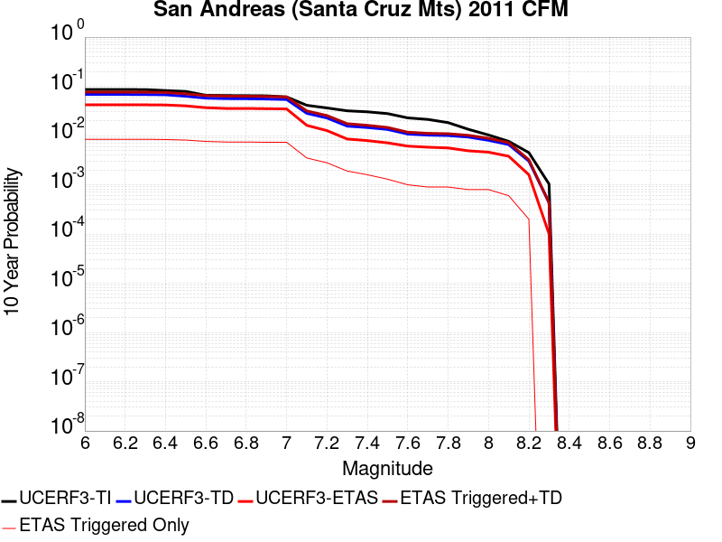 |

| Magnitude | 1 wk TI Prob | 1 wk TD Prob | 1 wk ETAS Prob | 1 wk ETAS/TD Gain | 1 wk ETAS Triggered+TD | 1 wk ETAS Triggered Only | 1 mo TI Prob | 1 mo TD Prob | 1 mo ETAS Prob | 1 mo ETAS/TD Gain | 1 mo ETAS Triggered+TD | 1 mo ETAS Triggered Only | 1 yr TI Prob | 1 yr TD Prob | 1 yr ETAS Prob | 1 yr ETAS/TD Gain | 1 yr ETAS Triggered+TD | 1 yr ETAS Triggered Only | 10 yr TI Prob | 10 yr TD Prob | 10 yr ETAS Prob | 10 yr ETAS/TD Gain | 10 yr ETAS Triggered+TD | 10 yr ETAS Triggered Only |
|-----|-----|-----|-----|-----|-----|-----|-----|-----|-----|-----|-----|-----|-----|-----|-----|-----|-----|-----|-----|-----|-----|-----|-----|-----|
| 6.0 | 1.7221631E-4 | 1.324687E-4 | 1.0E-4 | 0.7548953 | 1.324687E-4 | 0.0 | 7.378611E-4 | 5.676014E-4 | 7.0E-4 | 1.2332598 | 9.6737436E-4 | 4.0E-4 | 0.008946515 | 0.006889005 | 0.0049 | 0.7112783 | 0.008477983 | 0.0016 | 0.08594794 | 0.06788688 | 0.0422 | 0.6216223 | 0.07571663 | 0.0084 |
| 6.1 | 1.7221631E-4 | 1.324687E-4 | 1.0E-4 | 0.7548953 | 1.324687E-4 | 0.0 | 7.378611E-4 | 5.676014E-4 | 7.0E-4 | 1.2332598 | 9.6737436E-4 | 4.0E-4 | 0.008946515 | 0.006889005 | 0.0049 | 0.7112783 | 0.008477983 | 0.0016 | 0.08594794 | 0.06788688 | 0.0422 | 0.6216223 | 0.07571663 | 0.0084 |
| 6.2 | 1.7221631E-4 | 1.324687E-4 | 1.0E-4 | 0.7548953 | 1.324687E-4 | 0.0 | 7.378611E-4 | 5.676014E-4 | 7.0E-4 | 1.2332598 | 9.6737436E-4 | 4.0E-4 | 0.008946515 | 0.006889005 | 0.0049 | 0.7112783 | 0.008477983 | 0.0016 | 0.08594794 | 0.06788688 | 0.0422 | 0.6216223 | 0.07571663 | 0.0084 |
| 6.3 | 1.716926E-4 | 1.3167562E-4 | 1.0E-4 | 0.759442 | 1.3167562E-4 | 0.0 | 7.3561794E-4 | 5.64204E-4 | 7.0E-4 | 1.2406859 | 9.6397835E-4 | 4.0E-4 | 0.008919428 | 0.006847902 | 0.0049 | 0.7155476 | 0.008436945 | 0.0016 | 0.08569809 | 0.06750289 | 0.0421 | 0.62367696 | 0.07533587 | 0.0084 |
| 6.4 | 1.6392978E-4 | 1.3057106E-4 | 1.0E-4 | 0.7658665 | 1.3057106E-4 | 0.0 | 7.02367E-4 | 5.594722E-4 | 7.0E-4 | 1.2511792 | 9.592484E-4 | 4.0E-4 | 0.008517839 | 0.0067906515 | 0.0049 | 0.72158027 | 0.008379786 | 0.0016 | 0.08198654 | 0.06682765 | 0.0418 | 0.6254896 | 0.07457298 | 0.0083 |
| 6.5 | 1.5742714E-4 | 1.2136819E-4 | 1.0E-4 | 0.82393914 | 1.2136819E-4 | 0.0 | 6.745133E-4 | 5.200473E-4 | 7.0E-4 | 1.3460313 | 9.198393E-4 | 4.0E-4 | 0.00818132 | 0.006313488 | 0.0049 | 0.7761162 | 0.007903386 | 0.0016 | 0.078865945 | 0.062366523 | 0.0401 | 0.6429732 | 0.069961354 | 0.0081 |
| 6.6 | 1.3038084E-4 | 1.1128931E-4 | 1.0E-4 | 0.8985589 | 1.1128931E-4 | 0.0 | 5.5865536E-4 | 4.768682E-4 | 7.0E-4 | 1.4679108 | 8.7667746E-4 | 4.0E-4 | 0.006780438 | 0.005790628 | 0.0046 | 0.79438704 | 0.0073813633 | 0.0016 | 0.0657725 | 0.05714523 | 0.0368 | 0.64397323 | 0.06431093 | 0.0076 |
| 6.7 | 1.2867592E-4 | 1.0859168E-4 | 1.0E-4 | 0.92088085 | 1.0859168E-4 | 0.0 | 5.5135164E-4 | 4.6531114E-4 | 7.0E-4 | 1.5043697 | 8.65125E-4 | 4.0E-4 | 0.0066920654 | 0.0056506577 | 0.0045 | 0.79636747 | 0.007241617 | 0.0016 | 0.06494093 | 0.055870116 | 0.0355 | 0.63540226 | 0.06285668 | 0.0074 |
| 6.8 | 1.2801298E-4 | 1.07975764E-4 | 1.0E-4 | 0.92613375 | 1.07975764E-4 | 0.0 | 5.485117E-4 | 4.626724E-4 | 7.0E-4 | 1.5129495 | 8.6248736E-4 | 4.0E-4 | 0.0066577005 | 0.0056187143 | 0.0045 | 0.8008949 | 0.0072097243 | 0.0016 | 0.06461738 | 0.055587195 | 0.0355 | 0.6386363 | 0.062575854 | 0.0074 |
| 6.9 | 1.269149E-4 | 1.06416686E-4 | 1.0E-4 | 0.9397023 | 1.06416686E-4 | 0.0 | 5.4380763E-4 | 4.55993E-4 | 7.0E-4 | 1.5351113 | 8.558106E-4 | 4.0E-4 | 0.006600777 | 0.0055378084 | 0.0045 | 0.8125958 | 0.007128948 | 0.0016 | 0.06408122 | 0.054865282 | 0.0351 | 0.6397488 | 0.061764766 | 0.0073 |
| 7.0 | 1.2030331E-4 | 1.0379946E-4 | 1.0E-4 | 0.9633962 | 1.0379946E-4 | 0.0 | 5.154837E-4 | 4.4478016E-4 | 7.0E-4 | 1.5738112 | 8.4460224E-4 | 4.0E-4 | 0.006257969 | 0.005401977 | 0.0044 | 0.8145166 | 0.006993334 | 0.0016 | 0.06084648 | 0.053585198 | 0.0347 | 0.6475669 | 0.060494024 | 0.0073 |
| 7.1 | 8.049617E-5 | 5.0586772E-5 | 0.0 | 0.0 | 5.0586772E-5 | 0.0 | 3.4493793E-4 | 2.1678262E-4 | 5.0E-4 | 2.306458 | 5.1671756E-4 | 3.0E-4 | 0.0041915346 | 0.0026361651 | 0.0022 | 0.8345456 | 0.0032345834 | 6.0E-4 | 0.041133516 | 0.02795207 | 0.0161 | 0.57598597 | 0.031354237 | 0.0035 |
| 7.2 | 7.093979E-5 | 4.0032555E-5 | 0.0 | 0.0 | 4.0032555E-5 | 0.0 | 3.0399222E-4 | 1.7155694E-4 | 4.0E-4 | 2.3315876 | 3.7152262E-4 | 2.0E-4 | 0.0036948253 | 0.002086725 | 0.0019 | 0.91051763 | 0.0024858904 | 4.0E-4 | 0.03633994 | 0.02247247 | 0.0126 | 0.56068605 | 0.025209546 | 0.0028 |
| 7.3 | 6.193693E-5 | 2.6747162E-5 | 0.0 | 0.0 | 2.6747162E-5 | 0.0 | 2.6541698E-4 | 1.1462567E-4 | 3.0E-4 | 2.617215 | 3.1460274E-4 | 2.0E-4 | 0.0032266637 | 0.0013946756 | 8.0E-4 | 0.5736101 | 0.0015943967 | 2.0E-4 | 0.031802133 | 0.015363889 | 0.0085 | 0.55324537 | 0.017234698 | 0.0019 |
| 7.4 | 5.906492E-5 | 2.4993567E-5 | 0.0 | 0.0 | 2.4993567E-5 | 0.0 | 2.5311083E-4 | 1.0711089E-4 | 3.0E-4 | 2.8008356 | 3.0708947E-4 | 2.0E-4 | 0.0030772698 | 0.0013032962 | 7.0E-4 | 0.53709966 | 0.0015030355 | 2.0E-4 | 0.030350044 | 0.014391991 | 0.0079 | 0.5489164 | 0.015968964 | 0.0016 |
| 7.5 | 5.424296E-5 | 2.2810125E-5 | 0.0 | 0.0 | 2.2810125E-5 | 0.0 | 2.324491E-4 | 9.775402E-5 | 3.0E-4 | 3.0689275 | 2.9773446E-4 | 2.0E-4 | 0.002826395 | 0.0011895064 | 7.0E-4 | 0.5884794 | 0.0013892684 | 2.0E-4 | 0.027907165 | 0.01316571 | 0.0071 | 0.5392797 | 0.014448594 | 0.0013 |
| 7.6 | 4.43084E-5 | 1.8421408E-5 | 0.0 | 0.0 | 1.8421408E-5 | 0.0 | 1.8987931E-4 | 7.8946505E-5 | 3.0E-4 | 3.8000417 | 2.789307E-4 | 2.0E-4 | 0.0023093296 | 9.607501E-4 | 7.0E-4 | 0.7285974 | 0.001160558 | 2.0E-4 | 0.022854783 | 0.010616424 | 0.0061 | 0.57458144 | 0.011605808 | 0.001 |
| 7.7 | 4.118098E-5 | 1.7519116E-5 | 0.0 | 0.0 | 1.7519116E-5 | 0.0 | 1.7647797E-4 | 7.507976E-5 | 3.0E-4 | 3.9957504 | 2.7506475E-4 | 2.0E-4 | 0.002146502 | 9.13713E-4 | 7.0E-4 | 0.7661049 | 0.0011135302 | 2.0E-4 | 0.021258866 | 0.010109132 | 0.0058 | 0.57373863 | 0.011000034 | 9.0E-4 |
| 7.8 | 3.5408906E-5 | 1.718195E-5 | 0.0 | 0.0 | 1.718195E-5 | 0.0 | 1.5174363E-4 | 7.3634845E-5 | 3.0E-4 | 4.074158 | 2.7362013E-4 | 2.0E-4 | 0.0018459131 | 8.9613575E-4 | 7.0E-4 | 0.7811316 | 0.0010959565 | 2.0E-4 | 0.018306552 | 0.009911029 | 0.0056 | 0.5650271 | 0.010802109 | 9.0E-4 |
| 7.9 | 2.5860836E-5 | 1.605516E-5 | 0.0 | 0.0 | 1.605516E-5 | 0.0 | 1.10827445E-4 | 6.880602E-5 | 2.0E-4 | 2.9067225 | 2.6879227E-4 | 2.0E-4 | 0.001348489 | 8.373915E-4 | 6.0E-4 | 0.7165107 | 0.001037224 | 2.0E-4 | 0.013403354 | 0.00923667 | 0.0049 | 0.5304942 | 0.010029281 | 8.0E-4 |
| 8.0 | 1.9777332E-5 | 1.3757096E-5 | 0.0 | 0.0 | 1.3757096E-5 | 0.0 | 8.4757245E-5 | 5.8957652E-5 | 2.0E-4 | 3.3922656 | 2.5894586E-4 | 2.0E-4 | 0.0010314309 | 7.1757316E-4 | 5.0E-4 | 0.6967931 | 9.174296E-4 | 2.0E-4 | 0.010266567 | 0.007932751 | 0.0046 | 0.57987446 | 0.008726405 | 8.0E-4 |
| 8.1 | 1.468494E-5 | 1.1215867E-5 | 0.0 | 0.0 | 1.1215867E-5 | 0.0 | 6.293394E-5 | 4.8067115E-5 | 2.0E-4 | 4.1608486 | 2.480575E-4 | 2.0E-4 | 7.6595135E-4 | 5.8506016E-4 | 4.0E-4 | 0.68369037 | 7.849432E-4 | 2.0E-4 | 0.0076331664 | 0.006492733 | 0.0038 | 0.5852697 | 0.007088837 | 6.0E-4 |
| 8.2 | 8.63836E-6 | 5.004842E-6 | 0.0 | 0.0 | 5.004842E-6 | 0.0 | 3.7021015E-5 | 2.1449147E-5 | 1.0E-4 | 4.6621904 | 1.21447E-4 | 1.0E-4 | 4.5063766E-4 | 2.6111212E-4 | 2.0E-4 | 0.76595443 | 3.6108601E-4 | 1.0E-4 | 0.004497249 | 0.0029908775 | 0.0016 | 0.53496003 | 0.0031902795 | 2.0E-4 |
| 8.3 | 1.983087E-6 | 6.880041E-7 | 0.0 | 0.0 | 6.880041E-7 | 0.0 | 8.498917E-6 | 2.9485857E-6 | 0.0 | 0.0 | 2.9485857E-6 | 0.0 | 1.034694E-4 | 3.589845E-5 | 0.0 | 0.0 | 3.589845E-5 | 0.0 | 0.0010342124 | 4.2701262E-4 | 1.0E-4 | 0.23418511 | 4.2701262E-4 | 0.0 |

## San Andreas (North Coast) 2011 CFM
*[(top)](#table-of-contents)*

| 1 Week | 1 Month | 1 Year | 10 Year |
|-----|-----|-----|-----|
|  | 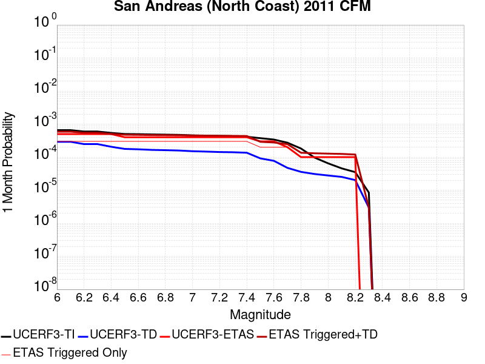 | 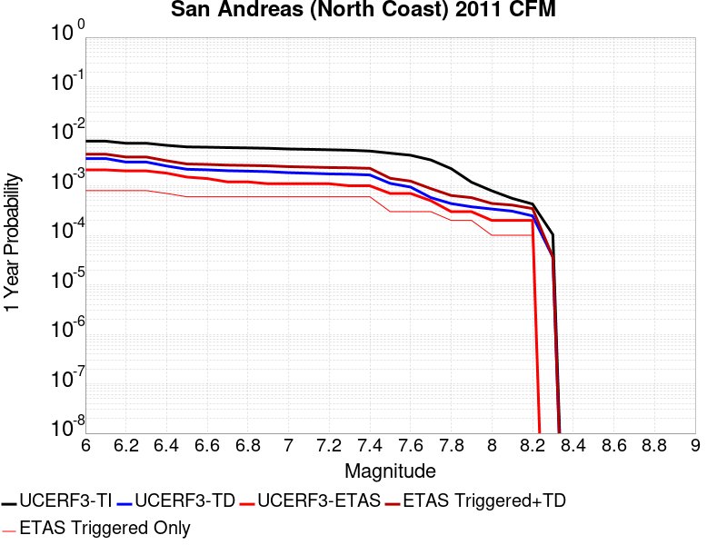 |  |

| Magnitude | 1 wk TI Prob | 1 wk TD Prob | 1 wk ETAS Prob | 1 wk ETAS/TD Gain | 1 wk ETAS Triggered+TD | 1 wk ETAS Triggered Only | 1 mo TI Prob | 1 mo TD Prob | 1 mo ETAS Prob | 1 mo ETAS/TD Gain | 1 mo ETAS Triggered+TD | 1 mo ETAS Triggered Only | 1 yr TI Prob | 1 yr TD Prob | 1 yr ETAS Prob | 1 yr ETAS/TD Gain | 1 yr ETAS Triggered+TD | 1 yr ETAS Triggered Only | 10 yr TI Prob | 10 yr TD Prob | 10 yr ETAS Prob | 10 yr ETAS/TD Gain | 10 yr ETAS Triggered+TD | 10 yr ETAS Triggered Only |
|-----|-----|-----|-----|-----|-----|-----|-----|-----|-----|-----|-----|-----|-----|-----|-----|-----|-----|-----|-----|-----|-----|-----|-----|-----|
| 6.0 | 1.5333705E-4 | 6.766802E-5 | 2.0E-4 | 2.955606 | 2.6765448E-4 | 2.0E-4 | 6.5699324E-4 | 2.8997372E-4 | 5.0E-4 | 1.7242942 | 5.8988674E-4 | 3.0E-4 | 0.007969595 | 0.003524746 | 0.0021 | 0.5957876 | 0.0043219263 | 8.0E-4 | 0.0768977 | 0.037589617 | 0.0252 | 0.6703979 | 0.04432649 | 0.007 |
| 6.1 | 1.5333705E-4 | 6.766802E-5 | 2.0E-4 | 2.955606 | 2.6765448E-4 | 2.0E-4 | 6.5699324E-4 | 2.8997372E-4 | 5.0E-4 | 1.7242942 | 5.8988674E-4 | 3.0E-4 | 0.007969595 | 0.003524746 | 0.0021 | 0.5957876 | 0.0043219263 | 8.0E-4 | 0.0768977 | 0.037589617 | 0.0252 | 0.6703979 | 0.04432649 | 0.007 |
| 6.2 | 1.3912938E-4 | 5.7452213E-5 | 2.0E-4 | 3.4811542 | 2.5744073E-4 | 2.0E-4 | 5.961325E-4 | 2.4620065E-4 | 5.0E-4 | 2.0308638 | 5.461268E-4 | 3.0E-4 | 0.007233787 | 0.0029933979 | 0.002 | 0.6681371 | 0.003791003 | 8.0E-4 | 0.07002798 | 0.03210448 | 0.0215 | 0.66968846 | 0.038105432 | 0.0062 |
| 6.3 | 1.3912938E-4 | 5.7452213E-5 | 2.0E-4 | 3.4811542 | 2.5744073E-4 | 2.0E-4 | 5.961325E-4 | 2.4620065E-4 | 5.0E-4 | 2.0308638 | 5.461268E-4 | 3.0E-4 | 0.007233787 | 0.0029933979 | 0.002 | 0.6681371 | 0.003791003 | 8.0E-4 | 0.07002798 | 0.03210448 | 0.0215 | 0.66968846 | 0.038105432 | 0.0062 |
| 6.4 | 1.2623647E-4 | 4.7755788E-5 | 2.0E-4 | 4.187974 | 2.4774624E-4 | 2.0E-4 | 5.4090127E-4 | 2.046517E-4 | 5.0E-4 | 2.4431753 | 5.045903E-4 | 3.0E-4 | 0.0065656058 | 0.002488806 | 0.0018 | 0.7232384 | 0.0031870636 | 7.0E-4 | 0.06374981 | 0.026867876 | 0.0181 | 0.67366695 | 0.031733535 | 0.005 |
| 6.5 | 1.1736096E-4 | 4.1086143E-5 | 2.0E-4 | 4.867821 | 2.4107793E-4 | 2.0E-4 | 5.028786E-4 | 1.7607167E-4 | 4.0E-4 | 2.2718022 | 4.7601885E-4 | 3.0E-4 | 0.006105373 | 0.00214158 | 0.0015 | 0.7004174 | 0.0027402951 | 6.0E-4 | 0.05940335 | 0.023259372 | 0.0155 | 0.66639805 | 0.027166333 | 0.004 |
| 6.6 | 1.1586959E-4 | 4.0026378E-5 | 2.0E-4 | 4.996705 | 2.4001837E-4 | 2.0E-4 | 4.964894E-4 | 1.7153042E-4 | 4.0E-4 | 2.3319478 | 4.7147897E-4 | 3.0E-4 | 0.006028018 | 0.0020863975 | 0.0014 | 0.67101306 | 0.0026851457 | 6.0E-4 | 0.058671024 | 0.022684598 | 0.0151 | 0.6656499 | 0.02659386 | 0.004 |
| 6.7 | 1.13693764E-4 | 3.8397164E-5 | 2.0E-4 | 5.2087183 | 2.3838949E-4 | 2.0E-4 | 4.87168E-4 | 1.6454897E-4 | 4.0E-4 | 2.4308872 | 4.644996E-4 | 3.0E-4 | 0.005915152 | 0.0020015577 | 0.0012 | 0.5995331 | 0.0026003567 | 6.0E-4 | 0.057601593 | 0.021802919 | 0.0139 | 0.6375293 | 0.025324428 | 0.0036 |
| 6.8 | 1.1204889E-4 | 3.7655755E-5 | 2.0E-4 | 5.311273 | 2.3764823E-4 | 2.0E-4 | 4.8012115E-4 | 1.613719E-4 | 4.0E-4 | 2.4787462 | 4.6132348E-4 | 3.0E-4 | 0.005829819 | 0.0019629472 | 0.0012 | 0.6113257 | 0.0025617694 | 6.0E-4 | 0.05679232 | 0.021383688 | 0.0138 | 0.6453517 | 0.024906708 | 0.0036 |
| 6.9 | 1.1005794E-4 | 3.676468E-5 | 2.0E-4 | 5.4400043 | 2.3675732E-4 | 2.0E-4 | 4.7159163E-4 | 1.5755347E-4 | 4.0E-4 | 2.5388205 | 4.5750622E-4 | 3.0E-4 | 0.0057265228 | 0.0019165406 | 0.0011 | 0.5739508 | 0.0025153905 | 6.0E-4 | 0.055811852 | 0.020875853 | 0.0135 | 0.6466802 | 0.0244007 | 0.0036 |
| 7.0 | 1.0647948E-4 | 3.5022644E-5 | 2.0E-4 | 5.7105913 | 2.3501564E-4 | 2.0E-4 | 4.562608E-4 | 1.500885E-4 | 4.0E-4 | 2.6650944 | 4.5004347E-4 | 3.0E-4 | 0.0055408357 | 0.0018258102 | 0.0011 | 0.60247225 | 0.0024247146 | 6.0E-4 | 0.054047033 | 0.019885093 | 0.0128 | 0.6436983 | 0.023217482 | 0.0034 |
| 7.1 | 1.04795035E-4 | 3.4122386E-5 | 2.0E-4 | 5.8612547 | 2.3411556E-4 | 2.0E-4 | 4.4904428E-4 | 1.4623068E-4 | 4.0E-4 | 2.735404 | 4.461868E-4 | 3.0E-4 | 0.0054534175 | 0.001778919 | 0.0011 | 0.61835307 | 0.0023778516 | 6.0E-4 | 0.053215165 | 0.01937682 | 0.0127 | 0.65542233 | 0.022710938 | 0.0034 |
| 7.2 | 1.02724036E-4 | 3.308761E-5 | 2.0E-4 | 6.044559 | 2.33081E-4 | 2.0E-4 | 4.401716E-4 | 1.4179641E-4 | 4.0E-4 | 2.820946 | 4.4175386E-4 | 3.0E-4 | 0.0053459285 | 0.0017250185 | 0.0011 | 0.63767433 | 0.0023239835 | 6.0E-4 | 0.052191395 | 0.018794429 | 0.0124 | 0.65976995 | 0.022032408 | 0.0033 |
| 7.3 | 1.00650694E-4 | 3.260041E-5 | 2.0E-4 | 6.1348925 | 2.3259388E-4 | 2.0E-4 | 4.312888E-4 | 1.3970863E-4 | 4.0E-4 | 2.8631015 | 4.3966674E-4 | 3.0E-4 | 0.005238306 | 0.0016996397 | 0.001 | 0.58836 | 0.0022986198 | 6.0E-4 | 0.051165357 | 0.018496355 | 0.0121 | 0.6541829 | 0.021735318 | 0.0033 |
| 7.4 | 9.672919E-5 | 3.148635E-5 | 2.0E-4 | 6.351959 | 2.3148005E-4 | 2.0E-4 | 4.144878E-4 | 1.349346E-4 | 4.0E-4 | 2.964399 | 4.3489411E-4 | 3.0E-4 | 0.005034718 | 0.0016416048 | 0.001 | 0.60916 | 0.0022406199 | 6.0E-4 | 0.049221683 | 0.017822465 | 0.0114 | 0.6396421 | 0.020867215 | 0.0031 |
| 7.5 | 8.7600405E-5 | 2.1235626E-5 | 1.0E-4 | 4.7090673 | 1.21233505E-4 | 1.0E-4 | 3.753763E-4 | 9.100666E-5 | 3.0E-4 | 3.296462 | 2.9098845E-4 | 2.0E-4 | 0.0045606326 | 0.0011074445 | 7.0E-4 | 0.6320858 | 0.0014071123 | 3.0E-4 | 0.04468165 | 0.012287517 | 0.0072 | 0.5859605 | 0.013867858 | 0.0016 |
| 7.6 | 7.9562284E-5 | 1.7900134E-5 | 1.0E-4 | 5.5865498 | 1.17898344E-4 | 1.0E-4 | 3.4093665E-4 | 7.671262E-5 | 3.0E-4 | 3.9106996 | 2.7669728E-4 | 2.0E-4 | 0.0041430052 | 9.335773E-4 | 7.0E-4 | 0.749804 | 0.0012332972 | 3.0E-4 | 0.040666126 | 0.010452909 | 0.0061 | 0.5835696 | 0.011541411 | 0.0011 |
| 7.7 | 6.3866544E-5 | 1.0916352E-5 | 1.0E-4 | 9.160569 | 1.1091526E-4 | 1.0E-4 | 2.7368503E-4 | 4.6783527E-5 | 2.0E-4 | 4.2750087 | 2.4677417E-4 | 2.0E-4 | 0.0033270244 | 5.6944083E-4 | 5.0E-4 | 0.8780544 | 8.6927E-4 | 3.0E-4 | 0.032776527 | 0.0066051716 | 0.0037 | 0.56016713 | 0.0073005483 | 7.0E-4 |
| 7.8 | 4.2543215E-5 | 8.2648585E-6 | 0.0 | 0.0 | 8.2648585E-6 | 0.0 | 1.8231533E-4 | 3.542034E-5 | 1.0E-4 | 2.8232365 | 1.354168E-4 | 1.0E-4 | 0.0022174292 | 4.3115742E-4 | 3.0E-4 | 0.69580156 | 6.3107116E-4 | 2.0E-4 | 0.021954332 | 0.005016888 | 0.0025 | 0.49831685 | 0.0054148813 | 4.0E-4 |
| 7.9 | 2.2636612E-5 | 7.128954E-6 | 0.0 | 0.0 | 7.128954E-6 | 0.0 | 9.7010445E-5 | 3.0552303E-5 | 1.0E-4 | 3.2730756 | 1.3054925E-4 | 1.0E-4 | 0.0011804621 | 3.7191086E-4 | 3.0E-4 | 0.80664486 | 5.718365E-4 | 2.0E-4 | 0.011742111 | 0.0042953272 | 0.0024 | 0.55874676 | 0.0046936087 | 4.0E-4 |
| 8.0 | 1.5167874E-5 | 6.4312753E-6 | 0.0 | 0.0 | 6.4312753E-6 | 0.0 | 6.500356E-5 | 2.7562317E-5 | 1.0E-4 | 3.628142 | 1.2755956E-4 | 1.0E-4 | 7.9113094E-4 | 3.355196E-4 | 2.0E-4 | 0.5960904 | 4.3548606E-4 | 1.0E-4 | 0.007883203 | 0.0038709831 | 0.0021 | 0.5424979 | 0.0041698217 | 3.0E-4 |
| 8.1 | 1.0681047E-5 | 5.8263768E-6 | 0.0 | 0.0 | 5.8263768E-6 | 0.0 | 4.5775112E-5 | 2.4969948E-5 | 1.0E-4 | 4.004814 | 1.2496745E-4 | 1.0E-4 | 5.5716943E-4 | 3.0396678E-4 | 2.0E-4 | 0.6579666 | 4.0393637E-4 | 1.0E-4 | 0.0055577457 | 0.0035073597 | 0.0018 | 0.51320654 | 0.0038063074 | 3.0E-4 |
| 8.2 | 8.226114E-6 | 4.6759387E-6 | 0.0 | 0.0 | 4.6759387E-6 | 0.0 | 3.52543E-5 | 2.0039583E-5 | 1.0E-4 | 4.9901237 | 1.2003758E-4 | 1.0E-4 | 4.2913653E-4 | 2.4395468E-4 | 2.0E-4 | 0.8198244 | 3.439303E-4 | 1.0E-4 | 0.004283088 | 0.0028035406 | 0.0016 | 0.57070696 | 0.0030029798 | 2.0E-4 |
| 8.3 | 1.983087E-6 | 6.880041E-7 | 0.0 | 0.0 | 6.880041E-7 | 0.0 | 8.498917E-6 | 2.9485857E-6 | 0.0 | 0.0 | 2.9485857E-6 | 0.0 | 1.034694E-4 | 3.589845E-5 | 0.0 | 0.0 | 3.589845E-5 | 0.0 | 0.0010342124 | 4.2701262E-4 | 1.0E-4 | 0.23418511 | 4.2701262E-4 | 0.0 |

## Cady
*[(top)](#table-of-contents)*

| 1 Week | 1 Month | 1 Year | 10 Year |
|-----|-----|-----|-----|
|  |  |  | 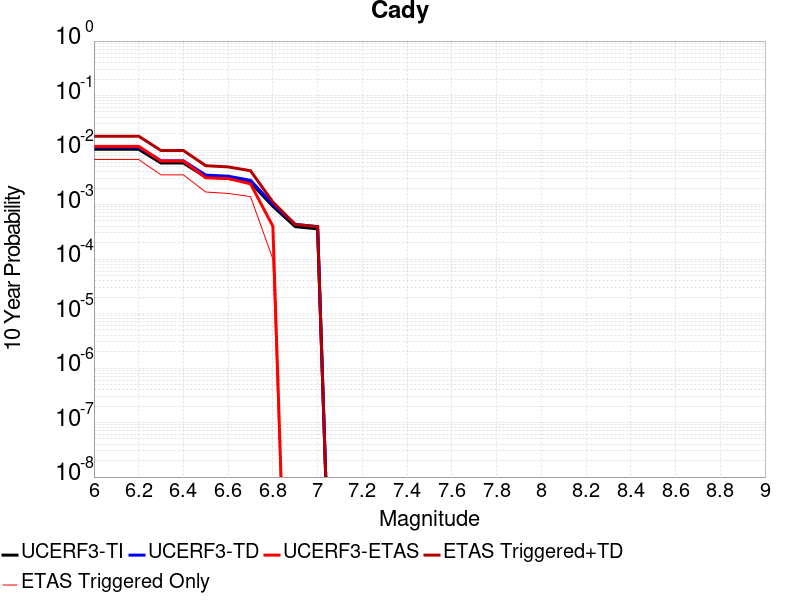 |

| Magnitude | 1 wk TI Prob | 1 wk TD Prob | 1 wk ETAS Prob | 1 wk ETAS/TD Gain | 1 wk ETAS Triggered+TD | 1 wk ETAS Triggered Only | 1 mo TI Prob | 1 mo TD Prob | 1 mo ETAS Prob | 1 mo ETAS/TD Gain | 1 mo ETAS Triggered+TD | 1 mo ETAS Triggered Only | 1 yr TI Prob | 1 yr TD Prob | 1 yr ETAS Prob | 1 yr ETAS/TD Gain | 1 yr ETAS Triggered+TD | 1 yr ETAS Triggered Only | 10 yr TI Prob | 10 yr TD Prob | 10 yr ETAS Prob | 10 yr ETAS/TD Gain | 10 yr ETAS Triggered+TD | 10 yr ETAS Triggered Only |
|-----|-----|-----|-----|-----|-----|-----|-----|-----|-----|-----|-----|-----|-----|-----|-----|-----|-----|-----|-----|-----|-----|-----|-----|-----|
| 6.0 | 1.9892565E-5 | 2.1836178E-5 | 1.0E-4 | 4.579556 | 1.21834E-4 | 1.0E-4 | 8.525106E-5 | 9.358078E-5 | 1.0E-4 | 1.0685955 | 1.9357141E-4 | 1.0E-4 | 0.0010374374 | 0.0011388412 | 0.0012 | 1.0537027 | 0.0021377022 | 0.001 | 0.010326075 | 0.011339046 | 0.0117 | 1.0318328 | 0.017963074 | 0.0067 |
| 6.1 | 1.9892565E-5 | 2.1836178E-5 | 1.0E-4 | 4.579556 | 1.21834E-4 | 1.0E-4 | 8.525106E-5 | 9.358078E-5 | 1.0E-4 | 1.0685955 | 1.9357141E-4 | 1.0E-4 | 0.0010374374 | 0.0011388412 | 0.0012 | 1.0537027 | 0.0021377022 | 0.001 | 0.010326075 | 0.011339046 | 0.0117 | 1.0318328 | 0.017963074 | 0.0067 |
| 6.2 | 1.9892565E-5 | 2.1836178E-5 | 1.0E-4 | 4.579556 | 1.21834E-4 | 1.0E-4 | 8.525106E-5 | 9.358078E-5 | 1.0E-4 | 1.0685955 | 1.9357141E-4 | 1.0E-4 | 0.0010374374 | 0.0011388412 | 0.0012 | 1.0537027 | 0.0021377022 | 0.001 | 0.010326075 | 0.011339046 | 0.0117 | 1.0318328 | 0.017963074 | 0.0067 |
| 6.3 | 1.1117327E-5 | 1.2164474E-5 | 1.0E-4 | 8.220659 | 1.1216326E-4 | 1.0E-4 | 4.764482E-5 | 5.2132596E-5 | 1.0E-4 | 1.9181857 | 1.5212738E-4 | 1.0E-4 | 5.7992124E-4 | 6.3456094E-4 | 5.0E-4 | 0.78794634 | 0.0010343072 | 4.0E-4 | 0.0057841022 | 0.0063305898 | 0.0063 | 0.9951679 | 0.009808433 | 0.0035 |
| 6.4 | 1.1117327E-5 | 1.2164474E-5 | 1.0E-4 | 8.220659 | 1.1216326E-4 | 1.0E-4 | 4.764482E-5 | 5.2132596E-5 | 1.0E-4 | 1.9181857 | 1.5212738E-4 | 1.0E-4 | 5.7992124E-4 | 6.3456094E-4 | 5.0E-4 | 0.78794634 | 0.0010343072 | 4.0E-4 | 0.0057841022 | 0.0063305898 | 0.0063 | 0.9951679 | 0.009808433 | 0.0035 |
| 6.5 | 6.103093E-6 | 6.665527E-6 | 0.0 | 0.0 | 6.665527E-6 | 0.0 | 2.615585E-5 | 2.8566303E-5 | 0.0 | 0.0 | 2.8566303E-5 | 0.0 | 3.1840094E-4 | 3.4775175E-4 | 2.0E-4 | 0.5751229 | 5.476822E-4 | 2.0E-4 | 0.0031794512 | 0.0034733072 | 0.0031 | 0.8925211 | 0.005167403 | 0.0017 |
| 6.6 | 5.817237E-6 | 6.3593943E-6 | 0.0 | 0.0 | 6.3593943E-6 | 0.0 | 2.4930776E-5 | 2.7254331E-5 | 0.0 | 0.0 | 2.7254331E-5 | 0.0 | 3.034899E-4 | 3.3178338E-4 | 2.0E-4 | 0.60280293 | 5.31717E-4 | 2.0E-4 | 0.0030307577 | 0.0033141 | 0.003 | 0.90522313 | 0.0049087973 | 0.0016 |
| 6.7 | 4.8846314E-6 | 5.335364E-6 | 0.0 | 0.0 | 5.335364E-6 | 0.0 | 2.0933967E-5 | 2.2865712E-5 | 0.0 | 0.0 | 2.2865712E-5 | 0.0 | 2.5484123E-4 | 2.7836623E-4 | 2.0E-4 | 0.7184779 | 4.7831057E-4 | 2.0E-4 | 0.0025454918 | 0.0027813287 | 0.0024 | 0.8628969 | 0.004177435 | 0.0014 |
| 6.8 | 1.7788773E-6 | 1.9380745E-6 | 0.0 | 0.0 | 1.9380745E-6 | 0.0 | 7.6237375E-6 | 8.306017E-6 | 0.0 | 0.0 | 8.306017E-6 | 0.0 | 9.281505E-5 | 1.01122634E-4 | 1.0E-4 | 0.98889834 | 2.0111252E-4 | 1.0E-4 | 9.2776294E-4 | 0.0010109205 | 4.0E-4 | 0.39567897 | 0.0011108194 | 1.0E-4 |
| 6.9 | 7.5455404E-7 | 8.2884713E-7 | 0.0 | 0.0 | 8.2884713E-7 | 0.0 | 3.233799E-6 | 3.5521991E-6 | 0.0 | 0.0 | 3.5521991E-6 | 0.0 | 3.937079E-5 | 4.3247503E-5 | 0.0 | 0.0 | 4.3247503E-5 | 0.0 | 3.9363815E-4 | 4.3242372E-4 | 0.0 | 0.0 | 4.3242372E-4 | 0.0 |
| 7.0 | 6.8578805E-7 | 7.53397E-7 | 0.0 | 0.0 | 7.53397E-7 | 0.0 | 2.9390883E-6 | 3.2288422E-6 | 0.0 | 0.0 | 3.2288422E-6 | 0.0 | 3.578281E-5 | 3.9310773E-5 | 0.0 | 0.0 | 3.9310773E-5 | 0.0 | 3.577705E-4 | 3.930706E-4 | 0.0 | 0.0 | 3.930706E-4 | 0.0 |

## Calico-Hidalgo
*[(top)](#table-of-contents)*

| 1 Week | 1 Month | 1 Year | 10 Year |
|-----|-----|-----|-----|
|  |  |  | 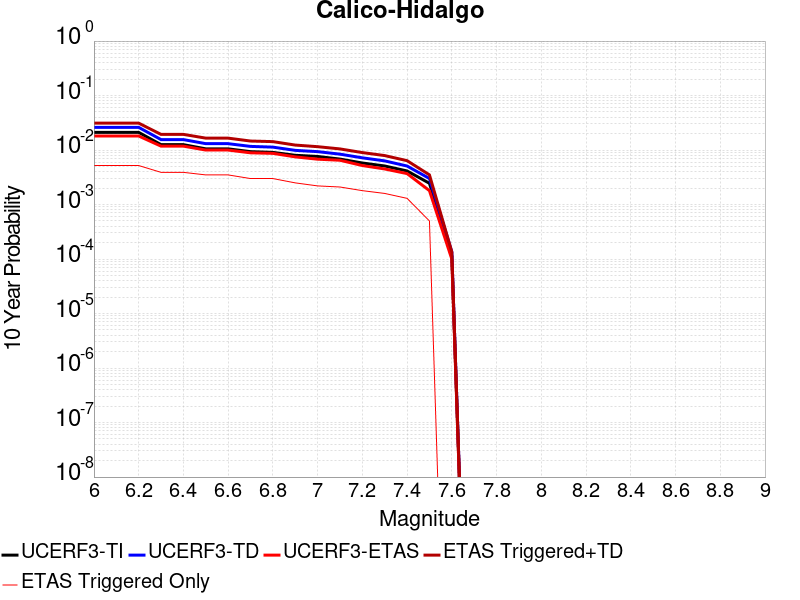 |

| Magnitude | 1 wk TI Prob | 1 wk TD Prob | 1 wk ETAS Prob | 1 wk ETAS/TD Gain | 1 wk ETAS Triggered+TD | 1 wk ETAS Triggered Only | 1 mo TI Prob | 1 mo TD Prob | 1 mo ETAS Prob | 1 mo ETAS/TD Gain | 1 mo ETAS Triggered+TD | 1 mo ETAS Triggered Only | 1 yr TI Prob | 1 yr TD Prob | 1 yr ETAS Prob | 1 yr ETAS/TD Gain | 1 yr ETAS Triggered+TD | 1 yr ETAS Triggered Only | 10 yr TI Prob | 10 yr TD Prob | 10 yr ETAS Prob | 10 yr ETAS/TD Gain | 10 yr ETAS Triggered+TD | 10 yr ETAS Triggered Only |
|-----|-----|-----|-----|-----|-----|-----|-----|-----|-----|-----|-----|-----|-----|-----|-----|-----|-----|-----|-----|-----|-----|-----|-----|-----|
| 6.0 | 4.0906612E-5 | 5.0609746E-5 | 0.0 | 0.0 | 5.0609746E-5 | 0.0 | 1.7530227E-4 | 2.1688285E-4 | 1.0E-4 | 0.46107844 | 2.1688285E-4 | 0.0 | 0.0021322158 | 0.002637748 | 0.0018 | 0.68240035 | 0.0034356376 | 8.0E-4 | 0.02111873 | 0.026104556 | 0.0181 | 0.6933656 | 0.031168813 | 0.0052 |
| 6.1 | 4.0906612E-5 | 5.0609746E-5 | 0.0 | 0.0 | 5.0609746E-5 | 0.0 | 1.7530227E-4 | 2.1688285E-4 | 1.0E-4 | 0.46107844 | 2.1688285E-4 | 0.0 | 0.0021322158 | 0.002637748 | 0.0018 | 0.68240035 | 0.0034356376 | 8.0E-4 | 0.02111873 | 0.026104556 | 0.0181 | 0.6933656 | 0.031168813 | 0.0052 |
| 6.2 | 4.0906612E-5 | 5.0609746E-5 | 0.0 | 0.0 | 5.0609746E-5 | 0.0 | 1.7530227E-4 | 2.1688285E-4 | 1.0E-4 | 0.46107844 | 2.1688285E-4 | 0.0 | 0.0021322158 | 0.002637748 | 0.0018 | 0.68240035 | 0.0034356376 | 8.0E-4 | 0.02111873 | 0.026104556 | 0.0181 | 0.6933656 | 0.031168813 | 0.0052 |
| 6.3 | 2.4242801E-5 | 3.0043078E-5 | 0.0 | 0.0 | 3.0043078E-5 | 0.0 | 1.0389358E-4 | 1.2874989E-4 | 1.0E-4 | 0.7766997 | 1.2874989E-4 | 0.0 | 0.0012641704 | 0.001566436 | 0.0014 | 0.8937486 | 0.0021654961 | 6.0E-4 | 0.01257003 | 0.015557621 | 0.0118 | 0.7584707 | 0.019396946 | 0.0039 |
| 6.4 | 2.4242801E-5 | 3.0043078E-5 | 0.0 | 0.0 | 3.0043078E-5 | 0.0 | 1.0389358E-4 | 1.2874989E-4 | 1.0E-4 | 0.7766997 | 1.2874989E-4 | 0.0 | 0.0012641704 | 0.001566436 | 0.0014 | 0.8937486 | 0.0021654961 | 6.0E-4 | 0.01257003 | 0.015557621 | 0.0118 | 0.7584707 | 0.019396946 | 0.0039 |
| 6.5 | 2.0286952E-5 | 2.5277262E-5 | 0.0 | 0.0 | 2.5277262E-5 | 0.0 | 8.694118E-5 | 1.0832672E-4 | 1.0E-4 | 0.92313325 | 1.0832672E-4 | 0.0 | 0.0010579949 | 0.0013180969 | 0.0013 | 0.9862704 | 0.0018174379 | 5.0E-4 | 0.010529719 | 0.013104719 | 0.01 | 0.7630839 | 0.016558852 | 0.0035 |
| 6.6 | 2.0269223E-5 | 2.5258227E-5 | 0.0 | 0.0 | 2.5258227E-5 | 0.0 | 8.6865206E-5 | 1.0824514E-4 | 1.0E-4 | 0.92382896 | 1.0824514E-4 | 0.0 | 0.0010570707 | 0.0013171049 | 0.0013 | 0.9870132 | 0.0018164464 | 5.0E-4 | 0.010520565 | 0.013094917 | 0.01 | 0.7636551 | 0.016549084 | 0.0035 |
| 6.7 | 1.799852E-5 | 2.2505792E-5 | 0.0 | 0.0 | 2.2505792E-5 | 0.0 | 7.713423E-5 | 9.6449905E-5 | 1.0E-4 | 1.0368077 | 9.6449905E-5 | 0.0 | 9.3870464E-4 | 0.0011736596 | 0.0012 | 1.0224429 | 0.0016730728 | 5.0E-4 | 0.009347493 | 0.011676218 | 0.0089 | 0.7622331 | 0.01464119 | 0.003 |
| 6.8 | 1.7458793E-5 | 2.1810776E-5 | 0.0 | 0.0 | 2.1810776E-5 | 0.0 | 7.4821255E-5 | 9.3471484E-5 | 1.0E-4 | 1.069845 | 9.3471484E-5 | 0.0 | 9.10568E-4 | 0.0011374357 | 0.0012 | 1.0550047 | 0.001636867 | 5.0E-4 | 0.009068459 | 0.01131772 | 0.0087 | 0.7687061 | 0.014283766 | 0.003 |
| 6.9 | 1.542884E-5 | 1.9007482E-5 | 0.0 | 0.0 | 1.9007482E-5 | 0.0 | 6.612192E-5 | 8.1458165E-5 | 1.0E-4 | 1.2276239 | 8.1458165E-5 | 0.0 | 8.04737E-4 | 9.913151E-4 | 9.0E-4 | 0.9078849 | 0.0013909185 | 4.0E-4 | 0.008018291 | 0.009870326 | 0.0075 | 0.7598533 | 0.01234565 | 0.0025 |
| 7.0 | 1.468253E-5 | 1.801497E-5 | 0.0 | 0.0 | 1.801497E-5 | 0.0 | 6.292361E-5 | 7.72048E-5 | 1.0E-4 | 1.2952563 | 7.72048E-5 | 0.0 | 7.658257E-4 | 9.3957613E-4 | 7.0E-4 | 0.7450168 | 0.0011393882 | 2.0E-4 | 0.0076319184 | 0.009357401 | 0.0068 | 0.7266975 | 0.011536814 | 0.0022 |
| 7.1 | 1.3139281E-5 | 1.6186945E-5 | 0.0 | 0.0 | 1.6186945E-5 | 0.0 | 5.6309986E-5 | 6.937084E-5 | 1.0E-4 | 1.4415277 | 6.937084E-5 | 0.0 | 6.853584E-4 | 8.4427535E-4 | 7.0E-4 | 0.8291134 | 0.0010441064 | 2.0E-4 | 0.0068324856 | 0.008411975 | 0.0065 | 0.772708 | 0.0104943095 | 0.0021 |
| 7.2 | 1.1127404E-5 | 1.3854261E-5 | 0.0 | 0.0 | 1.3854261E-5 | 0.0 | 4.7688E-5 | 5.9374113E-5 | 0.0 | 0.0 | 5.9374113E-5 | 0.0 | 5.8044674E-4 | 7.2265096E-4 | 5.0E-4 | 0.691897 | 9.2250644E-4 | 2.0E-4 | 0.0057893298 | 0.0072041163 | 0.0052 | 0.7218095 | 0.008991149 | 0.0018 |
| 7.3 | 9.808154E-6 | 1.2166212E-5 | 0.0 | 0.0 | 1.2166212E-5 | 0.0 | 4.2034266E-5 | 5.2139927E-5 | 0.0 | 0.0 | 5.2139927E-5 | 0.0 | 5.11647E-4 | 6.346294E-4 | 4.0E-4 | 0.6302891 | 8.345025E-4 | 2.0E-4 | 0.0051047057 | 0.0063292454 | 0.0045 | 0.71098524 | 0.007919119 | 0.0016 |
| 7.4 | 7.942452E-6 | 9.784373E-6 | 0.0 | 0.0 | 9.784373E-6 | 0.0 | 3.4038632E-5 | 4.1932406E-5 | 0.0 | 0.0 | 4.1932406E-5 | 0.0 | 4.1434157E-4 | 5.104169E-4 | 2.0E-4 | 0.39183655 | 6.103659E-4 | 1.0E-4 | 0.0041356985 | 0.005093386 | 0.0037 | 0.72643226 | 0.006386765 | 0.0013 |
| 7.5 | 4.7121216E-6 | 5.769255E-6 | 0.0 | 0.0 | 5.769255E-6 | 0.0 | 2.019465E-5 | 2.4725188E-5 | 0.0 | 0.0 | 2.4725188E-5 | 0.0 | 2.4584212E-4 | 3.0099522E-4 | 1.0E-4 | 0.3322312 | 3.0099522E-4 | 0.0 | 0.0024557032 | 0.0030066273 | 0.0018 | 0.59867746 | 0.003505124 | 5.0E-4 |
| 7.6 | 2.21172E-7 | 2.602981E-7 | 0.0 | 0.0 | 2.602981E-7 | 0.0 | 9.478797E-7 | 1.115563E-6 | 0.0 | 0.0 | 1.115563E-6 | 0.0 | 1.1540374E-5 | 1.3581924E-5 | 0.0 | 0.0 | 1.3581924E-5 | 0.0 | 1.1539775E-4 | 1.3581375E-4 | 1.0E-4 | 0.7363025 | 1.3581375E-4 | 0.0 |

## Bullion Mountains
*[(top)](#table-of-contents)*

| 1 Week | 1 Month | 1 Year | 10 Year |
|-----|-----|-----|-----|
|  |  |  |  |

| Magnitude | 1 wk TI Prob | 1 wk TD Prob | 1 wk ETAS Prob | 1 wk ETAS/TD Gain | 1 wk ETAS Triggered+TD | 1 wk ETAS Triggered Only | 1 mo TI Prob | 1 mo TD Prob | 1 mo ETAS Prob | 1 mo ETAS/TD Gain | 1 mo ETAS Triggered+TD | 1 mo ETAS Triggered Only | 1 yr TI Prob | 1 yr TD Prob | 1 yr ETAS Prob | 1 yr ETAS/TD Gain | 1 yr ETAS Triggered+TD | 1 yr ETAS Triggered Only | 10 yr TI Prob | 10 yr TD Prob | 10 yr ETAS Prob | 10 yr ETAS/TD Gain | 10 yr ETAS Triggered+TD | 10 yr ETAS Triggered Only |
|-----|-----|-----|-----|-----|-----|-----|-----|-----|-----|-----|-----|-----|-----|-----|-----|-----|-----|-----|-----|-----|-----|-----|-----|-----|
| 6.0 | 1.6420427E-5 | 1.4672226E-5 | 0.0 | 0.0 | 1.4672226E-5 | 0.0 | 7.037136E-5 | 6.287967E-5 | 0.0 | 0.0 | 6.287967E-5 | 0.0 | 8.5643446E-4 | 7.6532934E-4 | 8.0E-4 | 1.0453017 | 0.0011650232 | 4.0E-4 | 0.008531413 | 0.0076307203 | 0.0086 | 1.1270233 | 0.012394093 | 0.0048 |
| 6.1 | 1.6420427E-5 | 1.4672226E-5 | 0.0 | 0.0 | 1.4672226E-5 | 0.0 | 7.037136E-5 | 6.287967E-5 | 0.0 | 0.0 | 6.287967E-5 | 0.0 | 8.5643446E-4 | 7.6532934E-4 | 8.0E-4 | 1.0453017 | 0.0011650232 | 4.0E-4 | 0.008531413 | 0.0076307203 | 0.0086 | 1.1270233 | 0.012394093 | 0.0048 |
| 6.2 | 1.6420427E-5 | 1.4672226E-5 | 0.0 | 0.0 | 1.4672226E-5 | 0.0 | 7.037136E-5 | 6.287967E-5 | 0.0 | 0.0 | 6.287967E-5 | 0.0 | 8.5643446E-4 | 7.6532934E-4 | 8.0E-4 | 1.0453017 | 0.0011650232 | 4.0E-4 | 0.008531413 | 0.0076307203 | 0.0086 | 1.1270233 | 0.012394093 | 0.0048 |
| 6.3 | 1.2046778E-5 | 9.8477285E-6 | 0.0 | 0.0 | 9.8477285E-6 | 0.0 | 5.1628023E-5 | 4.2204E-5 | 0.0 | 0.0 | 4.2204E-5 | 0.0 | 6.283899E-4 | 5.1373563E-4 | 6.0E-4 | 1.1679158 | 9.135302E-4 | 4.0E-4 | 0.0062661595 | 0.005127756 | 0.0061 | 1.1896042 | 0.008510321 | 0.0034 |
| 6.4 | 1.2046778E-5 | 9.8477285E-6 | 0.0 | 0.0 | 9.8477285E-6 | 0.0 | 5.1628023E-5 | 4.2204E-5 | 0.0 | 0.0 | 4.2204E-5 | 0.0 | 6.283899E-4 | 5.1373563E-4 | 6.0E-4 | 1.1679158 | 9.135302E-4 | 4.0E-4 | 0.0062661595 | 0.005127756 | 0.0061 | 1.1896042 | 0.008510321 | 0.0034 |
| 6.5 | 1.0244343E-5 | 7.866923E-6 | 0.0 | 0.0 | 7.866923E-6 | 0.0 | 4.390359E-5 | 3.3715067E-5 | 0.0 | 0.0 | 3.3715067E-5 | 0.0 | 5.343951E-4 | 4.1042423E-4 | 6.0E-4 | 1.461902 | 8.1026007E-4 | 4.0E-4 | 0.005331118 | 0.0040986883 | 0.0055 | 1.3418927 | 0.0072855726 | 0.0032 |
| 6.6 | 9.605408E-6 | 7.1656837E-6 | 0.0 | 0.0 | 7.1656837E-6 | 0.0 | 4.1165385E-5 | 3.0709827E-5 | 0.0 | 0.0 | 3.0709827E-5 | 0.0 | 5.010733E-4 | 3.7384828E-4 | 6.0E-4 | 1.6049292 | 7.7369873E-4 | 4.0E-4 | 0.00499945 | 0.0037341856 | 0.005 | 1.3389801 | 0.00682261 | 0.0031 |
| 6.7 | 8.60418E-6 | 6.1136325E-6 | 0.0 | 0.0 | 6.1136325E-6 | 0.0 | 3.687454E-5 | 2.6201129E-5 | 0.0 | 0.0 | 2.6201129E-5 | 0.0 | 4.48855E-4 | 3.189715E-4 | 3.0E-4 | 0.94052297 | 6.188758E-4 | 3.0E-4 | 0.004479495 | 0.0031870436 | 0.0039 | 1.2237047 | 0.005679076 | 0.0025 |
| 6.8 | 5.187994E-6 | 2.556746E-6 | 0.0 | 0.0 | 2.556746E-6 | 0.0 | 2.223407E-5 | 1.0957459E-5 | 0.0 | 0.0 | 1.0957459E-5 | 0.0 | 2.7066618E-4 | 1.3340288E-4 | 2.0E-4 | 1.4992181 | 3.333762E-4 | 2.0E-4 | 0.0027033675 | 0.0013336176 | 0.0017 | 1.2747283 | 0.0026318838 | 0.0013 |
| 6.9 | 4.5302368E-6 | 2.3387597E-6 | 0.0 | 0.0 | 2.3387597E-6 | 0.0 | 1.9415156E-5 | 1.002324E-5 | 0.0 | 0.0 | 1.002324E-5 | 0.0 | 2.3635388E-4 | 1.2203006E-4 | 2.0E-4 | 1.6389405 | 3.2200565E-4 | 2.0E-4 | 0.0023610266 | 0.0012200177 | 0.0015 | 1.2294904 | 0.0023186756 | 0.0011 |
| 7.0 | 3.431668E-6 | 1.6839141E-6 | 0.0 | 0.0 | 1.6839141E-6 | 0.0 | 1.4707065E-5 | 7.2167745E-6 | 0.0 | 0.0 | 7.2167745E-6 | 0.0 | 1.7904381E-4 | 8.786423E-5 | 2.0E-4 | 2.2762392 | 2.8784666E-4 | 2.0E-4 | 0.0017889962 | 8.786423E-4 | 0.0012 | 1.3657435 | 0.0017778515 | 9.0E-4 |

## San Clemente
*[(top)](#table-of-contents)*

| 1 Week | 1 Month | 1 Year | 10 Year |
|-----|-----|-----|-----|
| 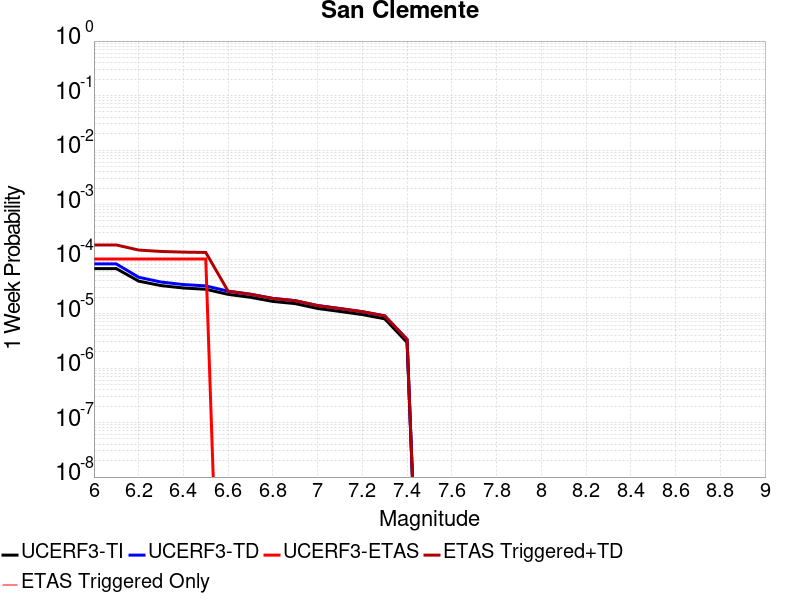 |  |  | 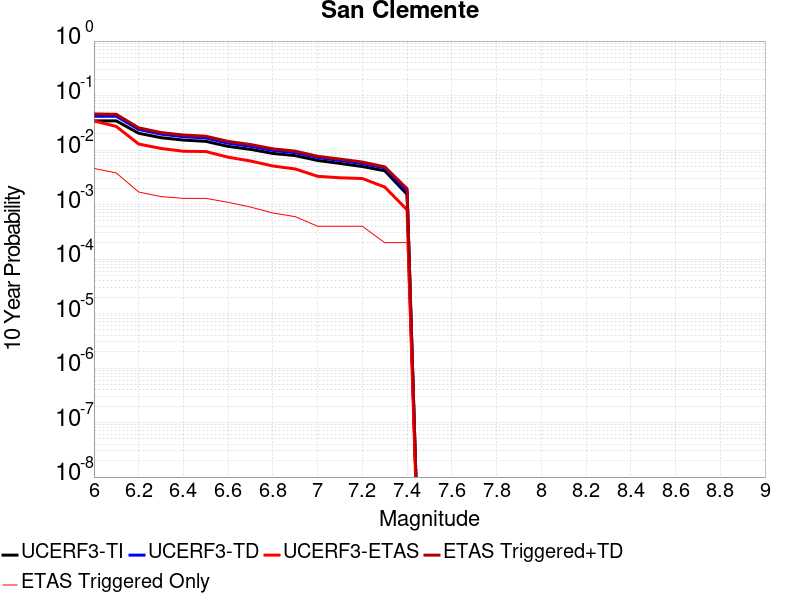 |

| Magnitude | 1 wk TI Prob | 1 wk TD Prob | 1 wk ETAS Prob | 1 wk ETAS/TD Gain | 1 wk ETAS Triggered+TD | 1 wk ETAS Triggered Only | 1 mo TI Prob | 1 mo TD Prob | 1 mo ETAS Prob | 1 mo ETAS/TD Gain | 1 mo ETAS Triggered+TD | 1 mo ETAS Triggered Only | 1 yr TI Prob | 1 yr TD Prob | 1 yr ETAS Prob | 1 yr ETAS/TD Gain | 1 yr ETAS Triggered+TD | 1 yr ETAS Triggered Only | 10 yr TI Prob | 10 yr TD Prob | 10 yr ETAS Prob | 10 yr ETAS/TD Gain | 10 yr ETAS Triggered+TD | 10 yr ETAS Triggered Only |
|-----|-----|-----|-----|-----|-----|-----|-----|-----|-----|-----|-----|-----|-----|-----|-----|-----|-----|-----|-----|-----|-----|-----|-----|-----|
| 6.0 | 6.681379E-5 | 8.144936E-5 | 1.0E-4 | 1.2277567 | 1.8144121E-4 | 1.0E-4 | 2.8631336E-4 | 3.4902518E-4 | 2.0E-4 | 0.5730245 | 4.489903E-4 | 1.0E-4 | 0.003480294 | 0.004241595 | 0.0038 | 0.89588946 | 0.004739474 | 5.0E-4 | 0.03426291 | 0.0416618 | 0.0343 | 0.8232962 | 0.046070155 | 0.0046 |
| 6.1 | 6.681379E-5 | 8.144936E-5 | 1.0E-4 | 1.2277567 | 1.8144121E-4 | 1.0E-4 | 2.8631336E-4 | 3.4902518E-4 | 2.0E-4 | 0.5730245 | 4.489903E-4 | 1.0E-4 | 0.003480294 | 0.004241595 | 0.0025 | 0.58940095 | 0.004639898 | 4.0E-4 | 0.03426291 | 0.0416618 | 0.0271 | 0.650476 | 0.045303486 | 0.0038 |
| 6.2 | 3.9400576E-5 | 4.6365072E-5 | 1.0E-4 | 2.156796 | 1.4636043E-4 | 1.0E-4 | 1.6884868E-4 | 1.9869264E-4 | 1.0E-4 | 0.50328994 | 2.9867276E-4 | 1.0E-4 | 0.0020537945 | 0.0024164524 | 0.0016 | 0.6621277 | 0.0027157275 | 3.0E-4 | 0.020349167 | 0.023908481 | 0.0129 | 0.5395575 | 0.025567837 | 0.0017 |
| 6.3 | 3.2590255E-5 | 3.7863927E-5 | 1.0E-4 | 2.641036 | 1.3786014E-4 | 1.0E-4 | 1.3966505E-4 | 1.6226407E-4 | 1.0E-4 | 0.61627936 | 2.6224784E-4 | 1.0E-4 | 0.0016990956 | 0.0019738053 | 0.0014 | 0.7092898 | 0.0022732131 | 3.0E-4 | 0.01686163 | 0.019566547 | 0.0107 | 0.5468517 | 0.020939155 | 0.0014 |
| 6.4 | 2.9454652E-5 | 3.4041437E-5 | 1.0E-4 | 2.9375963 | 1.3403803E-4 | 1.0E-4 | 1.2622811E-4 | 1.4588387E-4 | 1.0E-4 | 0.6854768 | 2.4586928E-4 | 1.0E-4 | 0.0015357438 | 0.0017747153 | 0.0014 | 0.78885895 | 0.0020741827 | 3.0E-4 | 0.015251739 | 0.017608598 | 0.0095 | 0.5395092 | 0.018885707 | 0.0013 |
| 6.5 | 2.790836E-5 | 3.2194945E-5 | 1.0E-4 | 3.1060777 | 1.3219172E-4 | 1.0E-4 | 1.1960178E-4 | 1.3797119E-4 | 1.0E-4 | 0.724789 | 2.3795739E-4 | 1.0E-4 | 0.001455179 | 0.0016785304 | 0.0014 | 0.83406293 | 0.001978027 | 3.0E-4 | 0.014456868 | 0.016661536 | 0.0094 | 0.56417364 | 0.017939877 | 0.0013 |
| 6.6 | 2.2492153E-5 | 2.5723535E-5 | 0.0 | 0.0 | 2.5723535E-5 | 0.0 | 9.639138E-5 | 1.10239154E-4 | 0.0 | 0.0 | 1.10239154E-4 | 0.0 | 0.0011729331 | 0.00134135 | 9.0E-4 | 0.67096585 | 0.0015410817 | 2.0E-4 | 0.011667615 | 0.013334249 | 0.0074 | 0.55496186 | 0.014419582 | 0.0011 |
| 6.7 | 1.9862755E-5 | 2.2633001E-5 | 0.0 | 0.0 | 2.2633001E-5 | 0.0 | 8.512331E-5 | 9.6995034E-5 | 0.0 | 0.0 | 9.6995034E-5 | 0.0 | 0.0010358836 | 0.001180286 | 9.0E-4 | 0.76252705 | 0.00138005 | 2.0E-4 | 0.010310682 | 0.011741463 | 0.0063 | 0.53656006 | 0.012630896 | 9.0E-4 |
| 6.8 | 1.6697575E-5 | 1.8950665E-5 | 0.0 | 0.0 | 1.8950665E-5 | 0.0 | 7.155907E-5 | 8.121466E-5 | 0.0 | 0.0 | 8.121466E-5 | 0.0 | 8.7088346E-4 | 9.883493E-4 | 8.0E-4 | 0.8094304 | 0.0011881517 | 2.0E-4 | 0.008674784 | 0.009840561 | 0.0051 | 0.5182631 | 0.010533673 | 7.0E-4 |
| 6.9 | 1.5218415E-5 | 1.724512E-5 | 0.0 | 0.0 | 1.724512E-5 | 0.0 | 6.522015E-5 | 7.390561E-5 | 0.0 | 0.0 | 7.390561E-5 | 0.0 | 7.93766E-4 | 8.9943816E-4 | 7.0E-4 | 0.7782636 | 0.0010992583 | 2.0E-4 | 0.007909367 | 0.008958922 | 0.0045 | 0.50229263 | 0.009553546 | 6.0E-4 |
| 7.0 | 1.2392958E-5 | 1.4013647E-5 | 0.0 | 0.0 | 1.4013647E-5 | 0.0 | 5.3111595E-5 | 6.0057147E-5 | 0.0 | 0.0 | 6.0057147E-5 | 0.0 | 6.4644177E-4 | 7.30958E-4 | 7.0E-4 | 0.9576473 | 9.308118E-4 | 2.0E-4 | 0.0064456454 | 0.0072863214 | 0.0033 | 0.45290342 | 0.007683407 | 4.0E-4 |
| 7.1 | 1.0934128E-5 | 1.2358129E-5 | 0.0 | 0.0 | 1.2358129E-5 | 0.0 | 4.6859706E-5 | 5.2962376E-5 | 0.0 | 0.0 | 5.2962376E-5 | 0.0 | 5.7036756E-4 | 6.446335E-4 | 7.0E-4 | 1.0858884 | 8.445045E-4 | 2.0E-4 | 0.0056890585 | 0.0064283796 | 0.0031 | 0.48223662 | 0.0068258084 | 4.0E-4 |
| 7.2 | 9.5798805E-6 | 1.083E-5 | 0.0 | 0.0 | 1.083E-5 | 0.0 | 4.1055984E-5 | 4.64135E-5 | 0.0 | 0.0 | 4.64135E-5 | 0.0 | 4.9974193E-4 | 5.6494505E-4 | 7.0E-4 | 1.2390586 | 7.648321E-4 | 2.0E-4 | 0.0049861963 | 0.0056358106 | 0.003 | 0.5323103 | 0.006033556 | 4.0E-4 |
| 7.3 | 8.0167365E-6 | 9.071307E-6 | 0.0 | 0.0 | 9.071307E-6 | 0.0 | 3.4356988E-5 | 3.8876493E-5 | 0.0 | 0.0 | 3.8876493E-5 | 0.0 | 4.1821605E-4 | 4.7322555E-4 | 4.0E-4 | 0.84526294 | 5.7317823E-4 | 1.0E-4 | 0.0041742986 | 0.0047228793 | 0.0021 | 0.44464403 | 0.0049219346 | 2.0E-4 |
| 7.4 | 2.9581017E-6 | 3.3575877E-6 | 0.0 | 0.0 | 3.3575877E-6 | 0.0 | 1.2677518E-5 | 1.438961E-5 | 0.0 | 0.0 | 1.438961E-5 | 0.0 | 1.5433785E-4 | 1.7518445E-4 | 1.0E-4 | 0.5708269 | 2.7516694E-4 | 1.0E-4 | 0.001542307 | 0.0017509572 | 8.0E-4 | 0.45689294 | 0.001950607 | 2.0E-4 |

## Pisgah-Bullion Mtn-Mesquite Lk
*[(top)](#table-of-contents)*

| 1 Week | 1 Month | 1 Year | 10 Year |
|-----|-----|-----|-----|
|  |  |  | 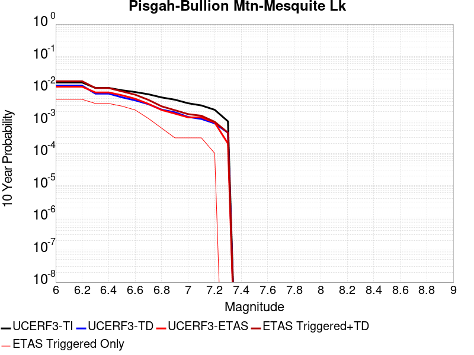 |

| Magnitude | 1 wk TI Prob | 1 wk TD Prob | 1 wk ETAS Prob | 1 wk ETAS/TD Gain | 1 wk ETAS Triggered+TD | 1 wk ETAS Triggered Only | 1 mo TI Prob | 1 mo TD Prob | 1 mo ETAS Prob | 1 mo ETAS/TD Gain | 1 mo ETAS Triggered+TD | 1 mo ETAS Triggered Only | 1 yr TI Prob | 1 yr TD Prob | 1 yr ETAS Prob | 1 yr ETAS/TD Gain | 1 yr ETAS Triggered+TD | 1 yr ETAS Triggered Only | 10 yr TI Prob | 10 yr TD Prob | 10 yr ETAS Prob | 10 yr ETAS/TD Gain | 10 yr ETAS Triggered+TD | 10 yr ETAS Triggered Only |
|-----|-----|-----|-----|-----|-----|-----|-----|-----|-----|-----|-----|-----|-----|-----|-----|-----|-----|-----|-----|-----|-----|-----|-----|-----|
| 6.0 | 3.0240792E-5 | 2.40515E-5 | 0.0 | 0.0 | 2.40515E-5 | 0.0 | 1.2959696E-4 | 1.0307435E-4 | 1.0E-4 | 0.9701735 | 1.0307435E-4 | 0.0 | 0.0015767008 | 0.0012543082 | 8.0E-4 | 0.6378018 | 0.001753681 | 5.0E-4 | 0.015655609 | 0.012482278 | 0.0116 | 0.92931753 | 0.017123612 | 0.0047 |
| 6.1 | 3.0240792E-5 | 2.40515E-5 | 0.0 | 0.0 | 2.40515E-5 | 0.0 | 1.2959696E-4 | 1.0307435E-4 | 1.0E-4 | 0.9701735 | 1.0307435E-4 | 0.0 | 0.0015767008 | 0.0012543082 | 8.0E-4 | 0.6378018 | 0.001753681 | 5.0E-4 | 0.015655609 | 0.012482278 | 0.0116 | 0.92931753 | 0.017123612 | 0.0047 |
| 6.2 | 3.0240792E-5 | 2.40515E-5 | 0.0 | 0.0 | 2.40515E-5 | 0.0 | 1.2959696E-4 | 1.0307435E-4 | 1.0E-4 | 0.9701735 | 1.0307435E-4 | 0.0 | 0.0015767008 | 0.0012543082 | 8.0E-4 | 0.6378018 | 0.001753681 | 5.0E-4 | 0.015655609 | 0.012482278 | 0.0116 | 0.92931753 | 0.017123612 | 0.0047 |
| 6.3 | 2.0498217E-5 | 1.3614233E-5 | 0.0 | 0.0 | 1.3614233E-5 | 0.0 | 8.784654E-5 | 5.8345497E-5 | 1.0E-4 | 1.7139283 | 5.8345497E-5 | 0.0 | 0.0010690069 | 7.101411E-4 | 8.0E-4 | 1.1265367 | 0.001209786 | 5.0E-4 | 0.01063879 | 0.0070803408 | 0.0077 | 1.0875183 | 0.01055556 | 0.0035 |
| 6.4 | 2.0498217E-5 | 1.3614233E-5 | 0.0 | 0.0 | 1.3614233E-5 | 0.0 | 8.784654E-5 | 5.8345497E-5 | 1.0E-4 | 1.7139283 | 5.8345497E-5 | 0.0 | 0.0010690069 | 7.101411E-4 | 8.0E-4 | 1.1265367 | 0.001209786 | 5.0E-4 | 0.01063879 | 0.0070803408 | 0.0077 | 1.0875183 | 0.01055556 | 0.0035 |
| 6.5 | 1.7316182E-5 | 1.0457165E-5 | 0.0 | 0.0 | 1.0457165E-5 | 0.0 | 7.42101E-5 | 4.4815708E-5 | 1.0E-4 | 2.2313604 | 4.4815708E-5 | 0.0 | 9.0313336E-4 | 5.455046E-4 | 6.0E-4 | 1.099899 | 9.452864E-4 | 4.0E-4 | 0.008994718 | 0.005442649 | 0.0063 | 1.1575245 | 0.008326866 | 0.0029 |
| 6.6 | 1.5251077E-5 | 8.39713E-6 | 0.0 | 0.0 | 8.39713E-6 | 0.0 | 6.536012E-5 | 3.5987243E-5 | 1.0E-4 | 2.7787626 | 3.5987243E-5 | 0.0 | 7.9546886E-4 | 4.380638E-4 | 6.0E-4 | 1.3696635 | 8.3788857E-4 | 4.0E-4 | 0.007926274 | 0.0043727187 | 0.0049 | 1.1205842 | 0.0065630986 | 0.0022 |
| 6.7 | 1.2997425E-5 | 6.400255E-6 | 0.0 | 0.0 | 6.400255E-6 | 0.0 | 5.570206E-5 | 2.7429403E-5 | 1.0E-4 | 3.6457226 | 2.7429403E-5 | 0.0 | 6.7796157E-4 | 3.3390647E-4 | 5.0E-4 | 1.4974253 | 7.3377293E-4 | 4.0E-4 | 0.0067589693 | 0.003334507 | 0.0034 | 1.0196409 | 0.0045305057 | 0.0012 |
| 6.8 | 1.035386E-5 | 4.3247396E-6 | 0.0 | 0.0 | 4.3247396E-6 | 0.0 | 4.437293E-5 | 1.853447E-5 | 1.0E-4 | 5.3953524 | 1.853447E-5 | 0.0 | 5.401065E-4 | 2.2563469E-4 | 3.0E-4 | 1.3295828 | 4.2558956E-4 | 2.0E-4 | 0.0053879567 | 0.0022541427 | 0.0022 | 0.9759809 | 0.00285279 | 6.0E-4 |
| 6.9 | 8.816252E-6 | 3.573541E-6 | 0.0 | 0.0 | 3.573541E-6 | 0.0 | 3.778339E-5 | 1.531509E-5 | 1.0E-4 | 6.5295076 | 1.531509E-5 | 0.0 | 4.5991567E-4 | 1.8644585E-4 | 2.0E-4 | 1.0726975 | 2.864272E-4 | 1.0E-4 | 0.00458965 | 0.0018629526 | 0.0017 | 0.91252995 | 0.0021623936 | 3.0E-4 |
| 7.0 | 6.8232207E-6 | 2.562117E-6 | 0.0 | 0.0 | 2.562117E-6 | 0.0 | 2.9242048E-5 | 1.0980458E-5 | 1.0E-4 | 9.107089 | 1.0980458E-5 | 0.0 | 3.5596377E-4 | 1.3367918E-4 | 2.0E-4 | 1.4961193 | 2.336658E-4 | 1.0E-4 | 0.0035539411 | 0.0013360187 | 0.0013 | 0.9730403 | 0.0016356178 | 3.0E-4 |
| 7.1 | 5.837013E-6 | 2.222822E-6 | 0.0 | 0.0 | 2.222822E-6 | 0.0 | 2.501553E-5 | 9.526347E-6 | 1.0E-4 | 10.497203 | 9.526347E-6 | 0.0 | 3.045215E-4 | 1.159774E-4 | 2.0E-4 | 1.724474 | 2.159658E-4 | 1.0E-4 | 0.0030410455 | 0.0011591977 | 0.0013 | 1.1214653 | 0.0014588499 | 3.0E-4 |
| 7.2 | 4.278052E-6 | 1.6244172E-6 | 0.0 | 0.0 | 1.6244172E-6 | 0.0 | 1.833438E-5 | 6.961771E-6 | 1.0E-4 | 14.364161 | 6.961771E-6 | 0.0 | 2.231982E-4 | 8.47565E-5 | 1.0E-4 | 1.1798505 | 8.47565E-5 | 0.0 | 0.0022297418 | 8.472649E-4 | 9.0E-4 | 1.0622416 | 9.4718015E-4 | 1.0E-4 |
| 7.3 | 1.8803692E-6 | 8.329639E-7 | 0.0 | 0.0 | 8.329639E-7 | 0.0 | 8.0587E-6 | 3.5698413E-6 | 1.0E-4 | 28.01245 | 3.5698413E-6 | 0.0 | 9.811026E-5 | 4.34621E-5 | 1.0E-4 | 2.3008554 | 4.34621E-5 | 0.0 | 9.806695E-4 | 4.345504E-4 | 2.0E-4 | 0.4602458 | 4.345504E-4 | 0.0 |

## Hayward (No) 2011 CFM
*[(top)](#table-of-contents)*

| 1 Week | 1 Month | 1 Year | 10 Year |
|-----|-----|-----|-----|
|  | 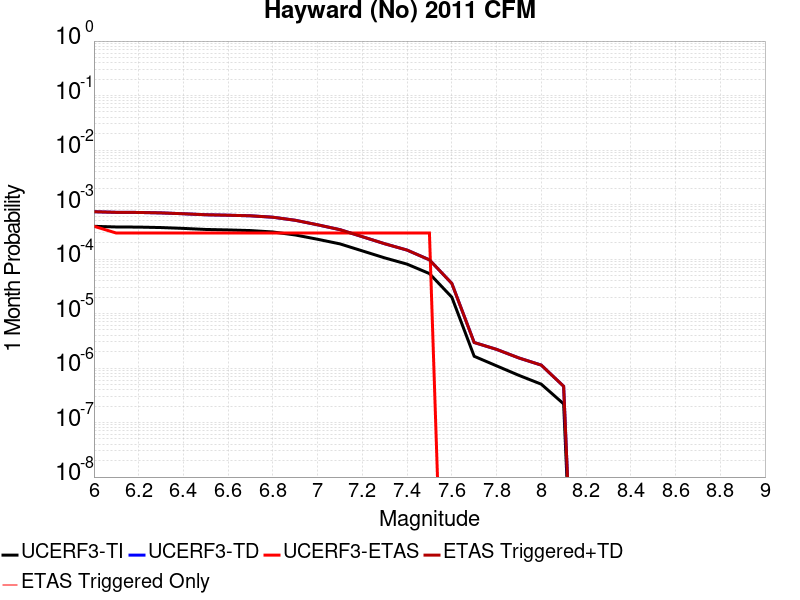 | 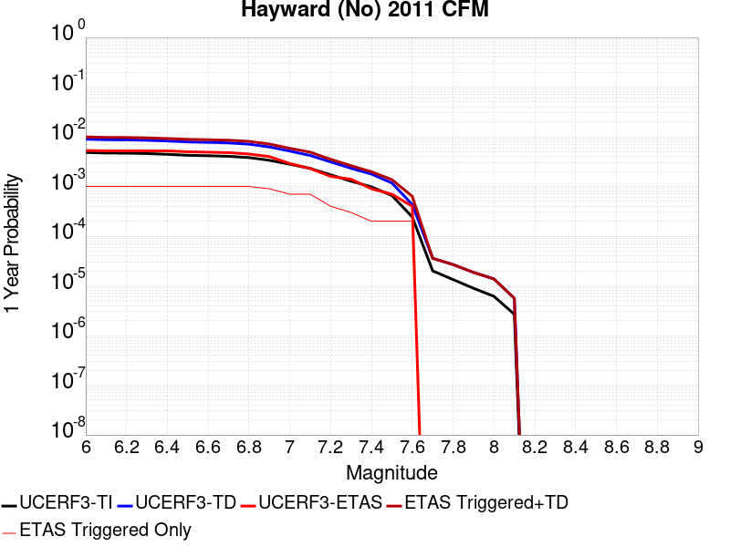 |  |

| Magnitude | 1 wk TI Prob | 1 wk TD Prob | 1 wk ETAS Prob | 1 wk ETAS/TD Gain | 1 wk ETAS Triggered+TD | 1 wk ETAS Triggered Only | 1 mo TI Prob | 1 mo TD Prob | 1 mo ETAS Prob | 1 mo ETAS/TD Gain | 1 mo ETAS Triggered+TD | 1 mo ETAS Triggered Only | 1 yr TI Prob | 1 yr TD Prob | 1 yr ETAS Prob | 1 yr ETAS/TD Gain | 1 yr ETAS Triggered+TD | 1 yr ETAS Triggered Only | 10 yr TI Prob | 10 yr TD Prob | 10 yr ETAS Prob | 10 yr ETAS/TD Gain | 10 yr ETAS Triggered+TD | 10 yr ETAS Triggered Only |
|-----|-----|-----|-----|-----|-----|-----|-----|-----|-----|-----|-----|-----|-----|-----|-----|-----|-----|-----|-----|-----|-----|-----|-----|-----|
| 6.0 | 9.3068506E-5 | 1.7216054E-4 | 3.0E-4 | 1.7425597 | 1.7216054E-4 | 0.0 | 3.9880406E-4 | 7.3762017E-4 | 4.0E-4 | 0.54228455 | 7.3762017E-4 | 0.0 | 0.0048446343 | 0.008943433 | 0.0053 | 0.5926136 | 0.00993449 | 0.001 | 0.047403704 | 0.0855743 | 0.0495 | 0.5784447 | 0.0898721 | 0.0047 |
| 6.1 | 9.055486E-5 | 1.676884E-4 | 2.0E-4 | 1.1926883 | 1.676884E-4 | 0.0 | 3.880345E-4 | 7.184667E-4 | 3.0E-4 | 0.4175559 | 7.184667E-4 | 0.0 | 0.0047140904 | 0.008712324 | 0.0052 | 0.59685564 | 0.009703612 | 0.001 | 0.046153355 | 0.083477445 | 0.0479 | 0.57380766 | 0.0877851 | 0.0047 |
| 6.2 | 9.006742E-5 | 1.6689788E-4 | 2.0E-4 | 1.1983376 | 1.6689788E-4 | 0.0 | 3.859461E-4 | 7.1508106E-4 | 3.0E-4 | 0.41953287 | 7.1508106E-4 | 0.0 | 0.0046887742 | 0.008671464 | 0.0052 | 0.599668 | 0.009662793 | 0.001 | 0.0459107 | 0.083102904 | 0.0477 | 0.5739872 | 0.08741232 | 0.0047 |
| 6.3 | 8.8336754E-5 | 1.6370429E-4 | 2.0E-4 | 1.2217151 | 1.6370429E-4 | 0.0 | 3.7853114E-4 | 7.0140185E-4 | 3.0E-4 | 0.42771485 | 7.0140185E-4 | 0.0 | 0.004598882 | 0.008506285 | 0.0052 | 0.6113127 | 0.0094977785 | 0.001 | 0.04504866 | 0.08160339 | 0.0466 | 0.5710547 | 0.08591986 | 0.0047 |
| 6.4 | 8.526157E-5 | 1.5799089E-4 | 2.0E-4 | 1.2658958 | 1.5799089E-4 | 0.0 | 3.6535555E-4 | 6.769287E-4 | 3.0E-4 | 0.44317812 | 6.769287E-4 | 0.0 | 0.0044391346 | 0.008210618 | 0.0052 | 0.63332623 | 0.009202408 | 0.001 | 0.043514993 | 0.07889129 | 0.0453 | 0.57420784 | 0.08312839 | 0.0046 |
| 6.5 | 8.152396E-5 | 1.513402E-4 | 2.0E-4 | 1.321526 | 1.513402E-4 | 0.0 | 3.493416E-4 | 6.4844027E-4 | 3.0E-4 | 0.46264863 | 6.4844027E-4 | 0.0 | 0.0042449418 | 0.0078663295 | 0.005 | 0.6356205 | 0.008858463 | 0.001 | 0.04164765 | 0.07573358 | 0.0429 | 0.5664594 | 0.07980035 | 0.0044 |
| 6.6 | 7.987405E-5 | 1.4839246E-4 | 2.0E-4 | 1.3477774 | 1.4839246E-4 | 0.0 | 3.4227243E-4 | 6.3581334E-4 | 3.0E-4 | 0.4718366 | 6.3581334E-4 | 0.0 | 0.0041592065 | 0.0077137058 | 0.0049 | 0.635233 | 0.008705992 | 0.001 | 0.04082218 | 0.07432956 | 0.0418 | 0.56236035 | 0.07840251 | 0.0044 |
| 6.7 | 7.777665E-5 | 1.4480116E-4 | 2.0E-4 | 1.3812044 | 1.4480116E-4 | 0.0 | 3.332859E-4 | 6.2042946E-4 | 3.0E-4 | 0.483536 | 6.2042946E-4 | 0.0 | 0.004050208 | 0.007527718 | 0.0048 | 0.63764346 | 0.00852019 | 0.001 | 0.039771806 | 0.07261166 | 0.041 | 0.5646476 | 0.07650669 | 0.0042 |
| 6.8 | 7.3284005E-5 | 1.3639059E-4 | 2.0E-4 | 1.4663768 | 1.3639059E-4 | 0.0 | 3.140365E-4 | 5.844007E-4 | 3.0E-4 | 0.5133464 | 5.844007E-4 | 0.0 | 0.0038166929 | 0.007092001 | 0.0045 | 0.63451767 | 0.008084909 | 0.001 | 0.037518036 | 0.068558596 | 0.0382 | 0.5571876 | 0.07228436 | 0.004 |
| 6.9 | 6.458263E-5 | 1.1987969E-4 | 2.0E-4 | 1.6683394 | 1.1987969E-4 | 0.0 | 2.7675333E-4 | 5.136694E-4 | 3.0E-4 | 0.58403325 | 5.136694E-4 | 0.0 | 0.0033642664 | 0.0062360903 | 0.004 | 0.6414275 | 0.0071304776 | 9.0E-4 | 0.033137884 | 0.060563095 | 0.0343 | 0.56635153 | 0.06394507 | 0.0036 |
| 7.0 | 5.3853604E-5 | 9.901269E-5 | 2.0E-4 | 2.0199432 | 9.901269E-5 | 0.0 | 2.3078074E-4 | 4.242714E-4 | 3.0E-4 | 0.7070946 | 4.242714E-4 | 0.0 | 0.0028061352 | 0.005153333 | 0.0029 | 0.56274265 | 0.005849725 | 7.0E-4 | 0.027709642 | 0.050376564 | 0.0276 | 0.5478738 | 0.053225435 | 0.003 |
| 7.1 | 4.4308683E-5 | 8.06231E-5 | 2.0E-4 | 2.4806788 | 8.06231E-5 | 0.0 | 1.8988053E-4 | 3.45482E-4 | 3.0E-4 | 0.86835206 | 3.45482E-4 | 0.0 | 0.0023093442 | 0.004198171 | 0.0023 | 0.5478576 | 0.0048952326 | 7.0E-4 | 0.022854926 | 0.0413089 | 0.0227 | 0.5495184 | 0.043801494 | 0.0026 |
| 7.2 | 3.295973E-5 | 5.9830003E-5 | 2.0E-4 | 3.3428044 | 5.9830003E-5 | 0.0 | 1.4124835E-4 | 2.5638923E-4 | 3.0E-4 | 1.170096 | 2.5638923E-4 | 0.0 | 0.0017183421 | 0.003117093 | 0.0016 | 0.5132988 | 0.0035158459 | 4.0E-4 | 0.017051157 | 0.03091609 | 0.0165 | 0.5337027 | 0.03275735 | 0.0019 |
| 7.3 | 2.452256E-5 | 4.440244E-5 | 2.0E-4 | 4.5042567 | 4.440244E-5 | 0.0 | 1.05092455E-4 | 1.9028237E-4 | 3.0E-4 | 1.5766042 | 1.9028237E-4 | 0.0 | 0.0012787496 | 0.0023142397 | 0.0014 | 0.60495025 | 0.0026135456 | 3.0E-4 | 0.0127141625 | 0.023063933 | 0.0131 | 0.56798637 | 0.024529338 | 0.0015 |
| 7.4 | 1.8829967E-5 | 3.396135E-5 | 2.0E-4 | 5.889047 | 3.396135E-5 | 0.0 | 8.069736E-5 | 1.4554059E-4 | 3.0E-4 | 2.0612807 | 1.4554059E-4 | 0.0 | 9.820475E-4 | 0.0017705259 | 9.0E-4 | 0.50832355 | 0.001970172 | 2.0E-4 | 0.009777189 | 0.017707042 | 0.0097 | 0.54780465 | 0.018885795 | 0.0012 |
| 7.5 | 1.26374125E-5 | 2.2482714E-5 | 2.0E-4 | 8.895723 | 2.2482714E-5 | 0.0 | 5.4159216E-5 | 9.635096E-5 | 3.0E-4 | 3.1136172 | 9.635096E-5 | 0.0 | 6.5918895E-4 | 0.0011724472 | 7.0E-4 | 0.5970418 | 0.0013722128 | 2.0E-4 | 0.00657237 | 0.0117742745 | 0.0067 | 0.5690372 | 0.0127625 | 0.001 |
| 7.6 | 4.666429E-6 | 8.307882E-6 | 0.0 | 0.0 | 8.307882E-6 | 0.0 | 1.9998828E-5 | 3.560473E-5 | 0.0 | 0.0 | 3.560473E-5 | 0.0 | 2.4345852E-4 | 4.3340254E-4 | 4.0E-4 | 0.9229295 | 6.333159E-4 | 2.0E-4 | 0.0024319198 | 0.0043748464 | 0.0024 | 0.5485907 | 0.0046735336 | 3.0E-4 |
| 7.7 | 3.8399318E-7 | 6.8284623E-7 | 0.0 | 0.0 | 6.8284623E-7 | 0.0 | 1.6456839E-6 | 2.9264804E-6 | 0.0 | 0.0 | 2.9264804E-6 | 0.0 | 2.003602E-5 | 3.5629317E-5 | 0.0 | 0.0 | 3.5629317E-5 | 0.0 | 2.0034213E-4 | 3.7119133E-4 | 2.0E-4 | 0.53880566 | 3.7119133E-4 | 0.0 |
| 7.8 | 2.5637698E-7 | 5.107383E-7 | 0.0 | 0.0 | 5.107383E-7 | 0.0 | 1.098758E-6 | 2.1888766E-6 | 0.0 | 0.0 | 2.1888766E-6 | 0.0 | 1.3377297E-5 | 2.6649248E-5 | 0.0 | 0.0 | 2.6649248E-5 | 0.0 | 1.3376492E-4 | 2.7981476E-4 | 1.0E-4 | 0.35737932 | 2.7981476E-4 | 0.0 |
| 7.9 | 1.7141245E-7 | 3.554999E-7 | 0.0 | 0.0 | 3.554999E-7 | 0.0 | 7.3462456E-7 | 1.5235701E-6 | 0.0 | 0.0 | 1.5235701E-6 | 0.0 | 8.944017E-6 | 1.8549308E-5 | 0.0 | 0.0 | 1.8549308E-5 | 0.0 | 8.943657E-5 | 1.9399682E-4 | 1.0E-4 | 0.51547235 | 1.9399682E-4 | 0.0 |
| 8.0 | 1.1808895E-7 | 2.6305878E-7 | 0.0 | 0.0 | 2.6305878E-7 | 0.0 | 5.060954E-7 | 1.1273943E-6 | 0.0 | 0.0 | 1.1273943E-6 | 0.0 | 6.161694E-6 | 1.3725939E-5 | 0.0 | 0.0 | 1.3725939E-5 | 0.0 | 6.161523E-5 | 1.4237752E-4 | 1.0E-4 | 0.70235807 | 1.4237752E-4 | 0.0 |
| 8.1 | 5.138535E-8 | 1.0755803E-7 | 0.0 | 0.0 | 1.0755803E-7 | 0.0 | 2.2022292E-7 | 4.609629E-7 | 0.0 | 0.0 | 4.609629E-7 | 0.0 | 2.6812106E-6 | 5.612209E-6 | 0.0 | 0.0 | 5.612209E-6 | 0.0 | 2.6811784E-5 | 5.784103E-5 | 1.0E-4 | 1.7288766 | 5.784103E-5 | 0.0 |

## King Range 2011 CFM
*[(top)](#table-of-contents)*

| 1 Week | 1 Month | 1 Year | 10 Year |
|-----|-----|-----|-----|
| 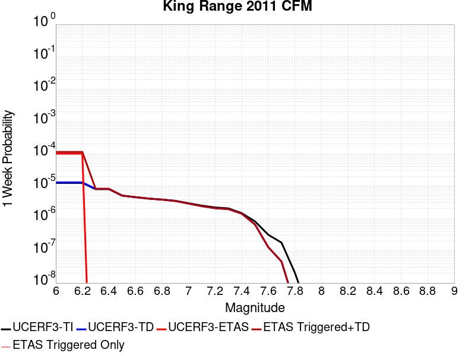 |  |  |  |

| Magnitude | 1 wk TI Prob | 1 wk TD Prob | 1 wk ETAS Prob | 1 wk ETAS/TD Gain | 1 wk ETAS Triggered+TD | 1 wk ETAS Triggered Only | 1 mo TI Prob | 1 mo TD Prob | 1 mo ETAS Prob | 1 mo ETAS/TD Gain | 1 mo ETAS Triggered+TD | 1 mo ETAS Triggered Only | 1 yr TI Prob | 1 yr TD Prob | 1 yr ETAS Prob | 1 yr ETAS/TD Gain | 1 yr ETAS Triggered+TD | 1 yr ETAS Triggered Only | 10 yr TI Prob | 10 yr TD Prob | 10 yr ETAS Prob | 10 yr ETAS/TD Gain | 10 yr ETAS Triggered+TD | 10 yr ETAS Triggered Only |
|-----|-----|-----|-----|-----|-----|-----|-----|-----|-----|-----|-----|-----|-----|-----|-----|-----|-----|-----|-----|-----|-----|-----|-----|-----|
| 6.0 | 1.2462566E-5 | 1.2994595E-5 | 1.0E-4 | 7.6955075 | 1.1299329E-4 | 1.0E-4 | 5.34099E-5 | 5.569013E-5 | 2.0E-4 | 3.5913007 | 1.5568455E-4 | 1.0E-4 | 6.5007154E-4 | 6.778512E-4 | 0.001 | 1.47525 | 0.0012774445 | 6.0E-4 | 0.0064817313 | 0.006762195 | 0.0139 | 2.0555456 | 0.011331089 | 0.0046 |
| 6.1 | 1.2462566E-5 | 1.2994595E-5 | 1.0E-4 | 7.6955075 | 1.1299329E-4 | 1.0E-4 | 5.34099E-5 | 5.569013E-5 | 2.0E-4 | 3.5913007 | 1.5568455E-4 | 1.0E-4 | 6.5007154E-4 | 6.778512E-4 | 0.001 | 1.47525 | 0.0012774445 | 6.0E-4 | 0.0064817313 | 0.006762195 | 0.0139 | 2.0555456 | 0.011331089 | 0.0046 |
| 6.2 | 1.2462566E-5 | 1.2994595E-5 | 1.0E-4 | 7.6955075 | 1.1299329E-4 | 1.0E-4 | 5.34099E-5 | 5.569013E-5 | 2.0E-4 | 3.5913007 | 1.5568455E-4 | 1.0E-4 | 6.5007154E-4 | 6.778512E-4 | 0.001 | 1.47525 | 0.0012774445 | 6.0E-4 | 0.0064817313 | 0.006762195 | 0.0139 | 2.0555456 | 0.011331089 | 0.0046 |
| 6.3 | 7.988484E-6 | 8.189467E-6 | 0.0 | 0.0 | 8.189467E-6 | 0.0 | 3.423591E-5 | 3.5097317E-5 | 1.0E-4 | 2.8492208 | 3.5097317E-5 | 0.0 | 4.1674246E-4 | 4.2723896E-4 | 2.0E-4 | 0.4681221 | 4.2723896E-4 | 0.0 | 0.004159618 | 0.004266369 | 0.0075 | 1.757935 | 0.0064569833 | 0.0022 |
| 6.4 | 7.988484E-6 | 8.189467E-6 | 0.0 | 0.0 | 8.189467E-6 | 0.0 | 3.423591E-5 | 3.5097317E-5 | 1.0E-4 | 2.8492208 | 3.5097317E-5 | 0.0 | 4.1674246E-4 | 4.2723896E-4 | 2.0E-4 | 0.4681221 | 4.2723896E-4 | 0.0 | 0.004159618 | 0.004266369 | 0.0075 | 1.757935 | 0.0064569833 | 0.0022 |
| 6.5 | 5.0522513E-6 | 5.060107E-6 | 0.0 | 0.0 | 5.060107E-6 | 0.0 | 2.1652326E-5 | 2.1685999E-5 | 1.0E-4 | 4.6112704 | 2.1685999E-5 | 0.0 | 2.6358519E-4 | 2.63996E-4 | 1.0E-4 | 0.37879366 | 2.63996E-4 | 0.0 | 0.0026327274 | 0.0026378403 | 0.0029 | 1.0993842 | 0.0037349388 | 0.0011 |
| 6.6 | 4.53682E-6 | 4.5172146E-6 | 0.0 | 0.0 | 4.5172146E-6 | 0.0 | 1.944337E-5 | 1.935935E-5 | 0.0 | 0.0 | 1.935935E-5 | 0.0 | 2.3669732E-4 | 2.3567521E-4 | 0.0 | 0.0 | 2.3567521E-4 | 0.0 | 0.0023644536 | 0.002355237 | 0.0017 | 0.7217957 | 0.0030535883 | 7.0E-4 |
| 6.7 | 4.1144335E-6 | 4.075492E-6 | 0.0 | 0.0 | 4.075492E-6 | 0.0 | 1.7633167E-5 | 1.746628E-5 | 0.0 | 0.0 | 1.746628E-5 | 0.0 | 2.1466266E-4 | 2.1263161E-4 | 0.0 | 0.0 | 2.1263161E-4 | 0.0 | 0.0021445542 | 0.002125245 | 0.0014 | 0.65874755 | 0.0026241825 | 5.0E-4 |
| 6.8 | 3.8321214E-6 | 3.7864904E-6 | 0.0 | 0.0 | 3.7864904E-6 | 0.0 | 1.6423275E-5 | 1.6227717E-5 | 0.0 | 0.0 | 1.6227717E-5 | 0.0 | 1.9993502E-4 | 1.9755487E-4 | 0.0 | 0.0 | 1.9755487E-4 | 0.0 | 0.0019975523 | 0.0019747496 | 0.0013 | 0.6583113 | 0.0023739596 | 4.0E-4 |
| 6.9 | 3.4999944E-6 | 3.443416E-6 | 0.0 | 0.0 | 3.443416E-6 | 0.0 | 1.499989E-5 | 1.4757416E-5 | 0.0 | 0.0 | 1.4757416E-5 | 0.0 | 1.8260835E-4 | 1.7965697E-4 | 0.0 | 0.0 | 1.7965697E-4 | 0.0 | 0.0018245836 | 0.0017960668 | 0.0011 | 0.6124494 | 0.0021953483 | 4.0E-4 |
| 7.0 | 2.9470837E-6 | 2.867445E-6 | 0.0 | 0.0 | 2.867445E-6 | 0.0 | 1.26302975E-5 | 1.2288992E-5 | 0.0 | 0.0 | 1.2288992E-5 | 0.0 | 1.5376302E-4 | 1.4960839E-4 | 0.0 | 0.0 | 1.4960839E-4 | 0.0 | 0.0015365666 | 0.0014960172 | 6.0E-4 | 0.4010649 | 0.0017955685 | 3.0E-4 |
| 7.1 | 2.4850247E-6 | 2.3808877E-6 | 0.0 | 0.0 | 2.3808877E-6 | 0.0 | 1.0650062E-5 | 1.0203766E-5 | 0.0 | 0.0 | 1.0203766E-5 | 0.0 | 1.296568E-4 | 1.2422391E-4 | 0.0 | 0.0 | 1.2422391E-4 | 0.0 | 0.0012958117 | 0.0012424726 | 4.0E-4 | 0.3219387 | 0.001442224 | 2.0E-4 |
| 7.2 | 2.1800304E-6 | 2.060055E-6 | 0.0 | 0.0 | 2.060055E-6 | 0.0 | 9.342954E-6 | 8.828778E-6 | 0.0 | 0.0 | 8.828778E-6 | 0.0 | 1.1374453E-4 | 1.0748516E-4 | 0.0 | 0.0 | 1.0748516E-4 | 0.0 | 0.0011368633 | 0.0010752446 | 3.0E-4 | 0.27900627 | 0.0011751371 | 1.0E-4 |
| 7.3 | 2.0378504E-6 | 1.9352276E-6 | 0.0 | 0.0 | 1.9352276E-6 | 0.0 | 8.733615E-6 | 8.293807E-6 | 0.0 | 0.0 | 8.293807E-6 | 0.0 | 1.0632657E-4 | 1.0097251E-4 | 0.0 | 0.0 | 1.0097251E-4 | 0.0 | 0.0010627571 | 0.0010101639 | 3.0E-4 | 0.2969815 | 0.0011100629 | 1.0E-4 |
| 7.4 | 1.4577047E-6 | 1.4014751E-6 | 0.0 | 0.0 | 1.4014751E-6 | 0.0 | 6.247291E-6 | 6.006308E-6 | 0.0 | 0.0 | 6.006308E-6 | 0.0 | 7.605811E-5 | 7.312442E-5 | 0.0 | 0.0 | 7.312442E-5 | 0.0 | 7.603208E-4 | 7.3184725E-4 | 2.0E-4 | 0.27328107 | 7.3184725E-4 | 0.0 |
| 7.5 | 8.0685743E-7 | 6.4750947E-7 | 0.0 | 0.0 | 6.4750947E-7 | 0.0 | 3.457956E-6 | 2.775038E-6 | 0.0 | 0.0 | 2.775038E-6 | 0.0 | 4.20998E-5 | 3.378561E-5 | 0.0 | 0.0 | 3.378561E-5 | 0.0 | 4.2091825E-4 | 3.384925E-4 | 1.0E-4 | 0.2954275 | 3.384925E-4 | 0.0 |
| 7.6 | 3.1239435E-7 | 1.2838954E-7 | 0.0 | 0.0 | 1.2838954E-7 | 0.0 | 1.3388321E-6 | 5.5024077E-7 | 0.0 | 0.0 | 5.5024077E-7 | 0.0 | 1.630016E-5 | 6.6991615E-6 | 0.0 | 0.0 | 6.6991615E-6 | 0.0 | 1.6298964E-4 | 6.7633366E-5 | 0.0 | 0.0 | 6.7633366E-5 | 0.0 |
| 7.7 | 1.7747207E-7 | 4.5873858E-8 | 0.0 | 0.0 | 4.5873858E-8 | 0.0 | 7.605944E-7 | 1.9660223E-7 | 0.0 | 0.0 | 1.9660223E-7 | 0.0 | 9.260198E-6 | 2.3936295E-6 | 0.0 | 0.0 | 2.3936295E-6 | 0.0 | 9.2598115E-5 | 2.434555E-5 | 0.0 | 0.0 | 2.434555E-5 | 0.0 |
| 7.8 | 2.1035538E-8 | 2.0912831E-9 | 0.0 | 0.0 | 2.0912831E-9 | 0.0 | 9.0152305E-8 | 8.962641E-9 | 0.0 | 0.0 | 8.962641E-9 | 0.0 | 1.0976038E-6 | 1.0912016E-7 | 0.0 | 0.0 | 1.0912016E-7 | 0.0 | 1.0975983E-5 | 1.125664E-6 | 0.0 | 0.0 | 1.125664E-6 | 0.0 |
| 7.9 | 1.4782963E-9 | 6.077361E-13 | 0.0 | 0.0 | 6.077361E-13 | 0.0 | 6.335555E-9 | 2.6049163E-12 | 0.0 | 0.0 | 2.6049163E-12 | 0.0 | 7.713538E-8 | 3.171663E-11 | 0.0 | 0.0 | 3.171663E-11 | 0.0 | 7.7135354E-7 | 4.6297055E-10 | 0.0 | 0.0 | 4.6297055E-10 | 0.0 |

## Mission Ridge-Arroyo Parida-Santa Ana
*[(top)](#table-of-contents)*

| 1 Week | 1 Month | 1 Year | 10 Year |
|-----|-----|-----|-----|
|  |  | 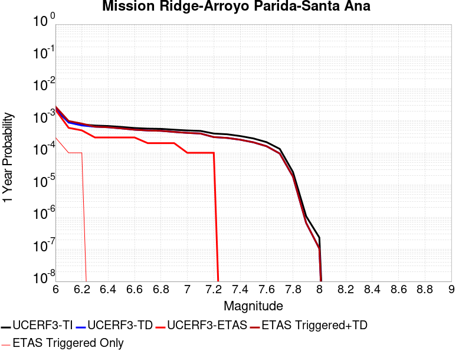 |  |

| Magnitude | 1 wk TI Prob | 1 wk TD Prob | 1 wk ETAS Prob | 1 wk ETAS/TD Gain | 1 wk ETAS Triggered+TD | 1 wk ETAS Triggered Only | 1 mo TI Prob | 1 mo TD Prob | 1 mo ETAS Prob | 1 mo ETAS/TD Gain | 1 mo ETAS Triggered+TD | 1 mo ETAS Triggered Only | 1 yr TI Prob | 1 yr TD Prob | 1 yr ETAS Prob | 1 yr ETAS/TD Gain | 1 yr ETAS Triggered+TD | 1 yr ETAS Triggered Only | 10 yr TI Prob | 10 yr TD Prob | 10 yr ETAS Prob | 10 yr ETAS/TD Gain | 10 yr ETAS Triggered+TD | 10 yr ETAS Triggered Only |
|-----|-----|-----|-----|-----|-----|-----|-----|-----|-----|-----|-----|-----|-----|-----|-----|-----|-----|-----|-----|-----|-----|-----|-----|-----|
| 6.0 | 4.169034E-5 | 4.7031044E-5 | 0.0 | 0.0 | 4.7031044E-5 | 0.0 | 1.7866064E-4 | 2.0155087E-4 | 3.0E-4 | 1.4884579 | 3.0153073E-4 | 1.0E-4 | 0.0021730233 | 0.002451956 | 0.0022 | 0.8972428 | 0.0027512205 | 3.0E-4 | 0.021518968 | 0.024330456 | 0.0268 | 1.1015002 | 0.027940433 | 0.0037 |
| 6.1 | 1.73813E-5 | 1.682591E-5 | 0.0 | 0.0 | 1.682591E-5 | 0.0 | 7.4489166E-5 | 7.210911E-5 | 0.0 | 0.0 | 7.210911E-5 | 0.0 | 9.065282E-4 | 8.775855E-4 | 6.0E-4 | 0.68369406 | 9.774978E-4 | 1.0E-4 | 0.009028391 | 0.008742238 | 0.0093 | 1.0638008 | 0.009832622 | 0.0011 |
| 6.2 | 1.4622182E-5 | 1.3650112E-5 | 0.0 | 0.0 | 1.3650112E-5 | 0.0 | 6.2664985E-5 | 5.849919E-5 | 0.0 | 0.0 | 5.849919E-5 | 0.0 | 7.6267915E-4 | 7.119988E-4 | 5.0E-4 | 0.7022484 | 8.1192754E-4 | 1.0E-4 | 0.007600669 | 0.007097517 | 0.0071 | 1.0003498 | 0.007792549 | 7.0E-4 |
| 6.3 | 1.3552434E-5 | 1.2460448E-5 | 0.0 | 0.0 | 1.2460448E-5 | 0.0 | 5.8080568E-5 | 5.340084E-5 | 0.0 | 0.0 | 5.340084E-5 | 0.0 | 7.069015E-4 | 6.4996444E-4 | 3.0E-4 | 0.4615637 | 6.4996444E-4 | 0.0 | 0.00704657 | 0.006480896 | 0.0062 | 0.9566579 | 0.0068783034 | 4.0E-4 |
| 6.4 | 1.30977305E-5 | 1.1957964E-5 | 0.0 | 0.0 | 1.1957964E-5 | 0.0 | 5.613192E-5 | 5.1247425E-5 | 0.0 | 0.0 | 5.1247425E-5 | 0.0 | 6.831918E-4 | 6.237618E-4 | 3.0E-4 | 0.48095283 | 6.237618E-4 | 0.0 | 0.006810953 | 0.0062203533 | 0.0059 | 0.94849914 | 0.006617865 | 4.0E-4 |
| 6.5 | 1.225205E-5 | 1.1028586E-5 | 0.0 | 0.0 | 1.1028586E-5 | 0.0 | 5.2507727E-5 | 4.726453E-5 | 0.0 | 0.0 | 4.726453E-5 | 0.0 | 6.3909404E-4 | 5.752964E-4 | 3.0E-4 | 0.5214703 | 5.752964E-4 | 0.0 | 0.006372592 | 0.005738279 | 0.005 | 0.8713414 | 0.0060365573 | 3.0E-4 |
| 6.6 | 1.1352241E-5 | 1.0044297E-5 | 0.0 | 0.0 | 1.0044297E-5 | 0.0 | 4.8651553E-5 | 4.3046286E-5 | 0.0 | 0.0 | 4.3046286E-5 | 0.0 | 5.921717E-4 | 5.2396464E-4 | 3.0E-4 | 0.57255775 | 5.2396464E-4 | 0.0 | 0.0059059616 | 0.005227437 | 0.0044 | 0.8417127 | 0.005426391 | 2.0E-4 |
| 6.7 | 1.0864116E-5 | 9.498481E-6 | 0.0 | 0.0 | 9.498481E-6 | 0.0 | 4.6559664E-5 | 4.0707153E-5 | 0.0 | 0.0 | 4.0707153E-5 | 0.0 | 5.667165E-4 | 4.954989E-4 | 2.0E-4 | 0.40363362 | 4.954989E-4 | 0.0 | 0.005652734 | 0.0049440726 | 0.0042 | 0.8495021 | 0.0051430836 | 2.0E-4 |
| 6.8 | 1.0666365E-5 | 9.281458E-6 | 0.0 | 0.0 | 9.281458E-6 | 0.0 | 4.571219E-5 | 3.9777082E-5 | 0.0 | 0.0 | 3.9777082E-5 | 0.0 | 5.564038E-4 | 4.8418035E-4 | 2.0E-4 | 0.41306922 | 4.8418035E-4 | 0.0 | 0.005550127 | 0.004831385 | 0.0042 | 0.869316 | 0.0050304183 | 2.0E-4 |
| 6.9 | 1.0038665E-5 | 8.574669E-6 | 0.0 | 0.0 | 8.574669E-6 | 0.0 | 4.302214E-5 | 3.6748075E-5 | 0.0 | 0.0 | 3.6748075E-5 | 0.0 | 5.236687E-4 | 4.4731775E-4 | 2.0E-4 | 0.44710946 | 4.4731775E-4 | 0.0 | 0.005224364 | 0.0044642827 | 0.004 | 0.8960006 | 0.0046633896 | 2.0E-4 |
| 7.0 | 9.5379955E-6 | 8.008521E-6 | 0.0 | 0.0 | 8.008521E-6 | 0.0 | 4.0876483E-5 | 3.432179E-5 | 0.0 | 0.0 | 3.432179E-5 | 0.0 | 4.975576E-4 | 4.1778936E-4 | 1.0E-4 | 0.23935506 | 4.1778936E-4 | 0.0 | 0.00496445 | 0.004170137 | 0.0038 | 0.9112411 | 0.0043693027 | 2.0E-4 |
| 7.1 | 9.207389E-6 | 7.636396E-6 | 0.0 | 0.0 | 7.636396E-6 | 0.0 | 3.945964E-5 | 3.272701E-5 | 0.0 | 0.0 | 3.272701E-5 | 0.0 | 4.803152E-4 | 3.983802E-4 | 1.0E-4 | 0.2510165 | 3.983802E-4 | 0.0 | 0.004792784 | 0.003976755 | 0.0035 | 0.8801146 | 0.004175959 | 2.0E-4 |
| 7.2 | 7.638091E-6 | 5.9180575E-6 | 0.0 | 0.0 | 5.9180575E-6 | 0.0 | 3.2734264E-5 | 2.5362859E-5 | 0.0 | 0.0 | 2.5362859E-5 | 0.0 | 3.984668E-4 | 3.0874935E-4 | 1.0E-4 | 0.32388732 | 3.0874935E-4 | 0.0 | 0.0039775306 | 0.0030831592 | 0.003 | 0.9730279 | 0.0032825426 | 2.0E-4 |
| 7.3 | 7.2500147E-6 | 5.583636E-6 | 0.0 | 0.0 | 5.583636E-6 | 0.0 | 3.1071122E-5 | 2.392965E-5 | 0.0 | 0.0 | 2.392965E-5 | 0.0 | 3.7822526E-4 | 2.9130484E-4 | 0.0 | 0.0 | 2.9130484E-4 | 0.0 | 0.0037758215 | 0.0029091837 | 0.0028 | 0.9624693 | 0.003108602 | 2.0E-4 |
| 7.4 | 6.3899715E-6 | 4.9073815E-6 | 0.0 | 0.0 | 4.9073815E-6 | 0.0 | 2.7385306E-5 | 2.1031467E-5 | 0.0 | 0.0 | 2.1031467E-5 | 0.0 | 3.3336508E-4 | 2.560282E-4 | 0.0 | 0.0 | 2.560282E-4 | 0.0 | 0.0033286542 | 0.0025572754 | 0.0025 | 0.97760296 | 0.002756764 | 2.0E-4 |
| 7.5 | 5.379025E-6 | 4.0744876E-6 | 0.0 | 0.0 | 4.0744876E-6 | 0.0 | 2.305276E-5 | 1.7461974E-5 | 0.0 | 0.0 | 1.7461974E-5 | 0.0 | 2.806312E-4 | 2.125789E-4 | 0.0 | 0.0 | 2.125789E-4 | 0.0 | 0.0028027708 | 0.0021237668 | 0.0019 | 0.89463687 | 0.002323342 | 2.0E-4 |
| 7.6 | 4.1270696E-6 | 3.0807755E-6 | 0.0 | 0.0 | 3.0807755E-6 | 0.0 | 1.768732E-5 | 1.32032565E-5 | 0.0 | 0.0 | 1.32032565E-5 | 0.0 | 2.1532185E-4 | 1.6073787E-4 | 0.0 | 0.0 | 1.6073787E-4 | 0.0 | 0.0021511333 | 0.0016062241 | 0.0016 | 0.99612504 | 0.0018059028 | 2.0E-4 |
| 7.7 | 2.5406805E-6 | 1.8229238E-6 | 0.0 | 0.0 | 1.8229238E-6 | 0.0 | 1.0888585E-5 | 7.812508E-6 | 0.0 | 0.0 | 7.812508E-6 | 0.0 | 1.3256045E-4 | 9.511319E-5 | 0.0 | 0.0 | 9.511319E-5 | 0.0 | 0.0013248142 | 9.507309E-4 | 9.0E-4 | 0.94664013 | 0.0010506358 | 1.0E-4 |
| 7.8 | 4.8608285E-7 | 3.5028427E-7 | 0.0 | 0.0 | 3.5028427E-7 | 0.0 | 2.0832106E-6 | 1.5012174E-6 | 0.0 | 0.0 | 1.5012174E-6 | 0.0 | 2.5362791E-5 | 1.827717E-5 | 0.0 | 0.0 | 1.827717E-5 | 0.0 | 2.5359896E-4 | 1.8275679E-4 | 1.0E-4 | 0.5471753 | 1.8275679E-4 | 0.0 |
| 7.9 | 2.0472514E-8 | 1.26545165E-8 | 0.0 | 0.0 | 1.26545165E-8 | 0.0 | 8.7739345E-8 | 5.423364E-8 | 0.0 | 0.0 | 5.423364E-8 | 0.0 | 1.068226E-6 | 6.602944E-7 | 0.0 | 0.0 | 6.602944E-7 | 0.0 | 1.0682209E-5 | 6.602925E-6 | 0.0 | 0.0 | 6.602925E-6 | 0.0 |
| 8.0 | 4.443582E-9 | 2.0201907E-9 | 0.0 | 0.0 | 2.0201907E-9 | 0.0 | 1.9043922E-8 | 8.65796E-9 | 0.0 | 0.0 | 8.65796E-9 | 0.0 | 2.3185973E-7 | 1.05410656E-7 | 0.0 | 0.0 | 1.05410656E-7 | 0.0 | 2.3185949E-6 | 1.0541062E-6 | 0.0 | 0.0 | 1.0541062E-6 | 0.0 |

## Chino alt 1
*[(top)](#table-of-contents)*

| 1 Week | 1 Month | 1 Year | 10 Year |
|-----|-----|-----|-----|
| 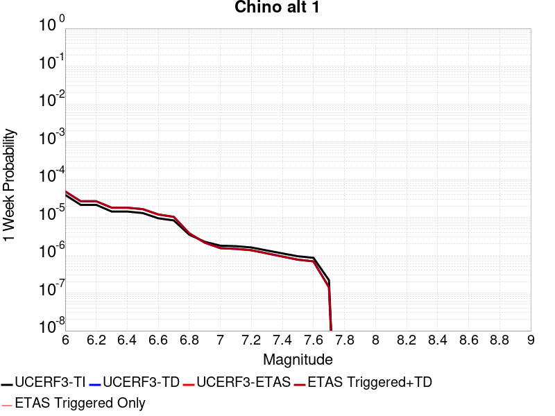 |  |  |  |

| Magnitude | 1 wk TI Prob | 1 wk TD Prob | 1 wk ETAS Prob | 1 wk ETAS/TD Gain | 1 wk ETAS Triggered+TD | 1 wk ETAS Triggered Only | 1 mo TI Prob | 1 mo TD Prob | 1 mo ETAS Prob | 1 mo ETAS/TD Gain | 1 mo ETAS Triggered+TD | 1 mo ETAS Triggered Only | 1 yr TI Prob | 1 yr TD Prob | 1 yr ETAS Prob | 1 yr ETAS/TD Gain | 1 yr ETAS Triggered+TD | 1 yr ETAS Triggered Only | 10 yr TI Prob | 10 yr TD Prob | 10 yr ETAS Prob | 10 yr ETAS/TD Gain | 10 yr ETAS Triggered+TD | 10 yr ETAS Triggered Only |
|-----|-----|-----|-----|-----|-----|-----|-----|-----|-----|-----|-----|-----|-----|-----|-----|-----|-----|-----|-----|-----|-----|-----|-----|-----|
| 6.0 | 3.939946E-5 | 4.8761474E-5 | 0.0 | 0.0 | 4.8761474E-5 | 0.0 | 1.6884391E-4 | 2.0896389E-4 | 1.0E-4 | 0.4785516 | 3.0894298E-4 | 1.0E-4 | 0.0020537362 | 0.0025416764 | 0.0015 | 0.5901617 | 0.002741168 | 2.0E-4 | 0.020348595 | 0.025185952 | 0.0199 | 0.790123 | 0.02928017 | 0.0042 |
| 6.1 | 2.1505624E-5 | 2.6745702E-5 | 0.0 | 0.0 | 2.6745702E-5 | 0.0 | 9.2163704E-5 | 1.1461999E-4 | 0.0 | 0.0 | 1.1461999E-4 | 0.0 | 0.0011215154 | 0.0013947141 | 7.0E-4 | 0.50189495 | 0.0013947141 | 0.0 | 0.011158722 | 0.013879712 | 0.0106 | 0.76370466 | 0.016049176 | 0.0022 |
| 6.2 | 2.1505624E-5 | 2.6745702E-5 | 0.0 | 0.0 | 2.6745702E-5 | 0.0 | 9.2163704E-5 | 1.1461999E-4 | 0.0 | 0.0 | 1.1461999E-4 | 0.0 | 0.0011215154 | 0.0013947141 | 7.0E-4 | 0.50189495 | 0.0013947141 | 0.0 | 0.011158722 | 0.013879712 | 0.0106 | 0.76370466 | 0.016049176 | 0.0022 |
| 6.3 | 1.4290785E-5 | 1.805055E-5 | 0.0 | 0.0 | 1.805055E-5 | 0.0 | 6.1244784E-5 | 7.7357465E-5 | 0.0 | 0.0 | 7.7357465E-5 | 0.0 | 7.454001E-4 | 9.4146485E-4 | 3.0E-4 | 0.31865236 | 9.4146485E-4 | 0.0 | 0.007429048 | 0.009388474 | 0.0065 | 0.6923383 | 0.010676269 | 0.0013 |
| 6.4 | 1.4290785E-5 | 1.805055E-5 | 0.0 | 0.0 | 1.805055E-5 | 0.0 | 6.1244784E-5 | 7.7357465E-5 | 0.0 | 0.0 | 7.7357465E-5 | 0.0 | 7.454001E-4 | 9.4146485E-4 | 3.0E-4 | 0.31865236 | 9.4146485E-4 | 0.0 | 0.007429048 | 0.009388474 | 0.0065 | 0.6923383 | 0.010676269 | 0.0013 |
| 6.5 | 1.3017944E-5 | 1.6540487E-5 | 0.0 | 0.0 | 1.6540487E-5 | 0.0 | 5.5789995E-5 | 7.088612E-5 | 0.0 | 0.0 | 7.088612E-5 | 0.0 | 6.790315E-4 | 8.6274E-4 | 3.0E-4 | 0.34772933 | 8.6274E-4 | 0.0 | 0.0067696036 | 0.00860746 | 0.0061 | 0.70868754 | 0.009797132 | 0.0012 |
| 6.6 | 9.470016E-6 | 1.1944894E-5 | 0.0 | 0.0 | 1.1944894E-5 | 0.0 | 4.058515E-5 | 5.1191586E-5 | 0.0 | 0.0 | 5.1191586E-5 | 0.0 | 4.940122E-4 | 6.2311284E-4 | 1.0E-4 | 0.16048458 | 6.2311284E-4 | 0.0 | 0.004929154 | 0.0062260013 | 0.0041 | 0.6585286 | 0.0070210206 | 8.0E-4 |
| 6.7 | 8.314155E-6 | 1.0328306E-5 | 0.0 | 0.0 | 1.0328306E-5 | 0.0 | 3.5631605E-5 | 4.4263597E-5 | 0.0 | 0.0 | 4.4263597E-5 | 0.0 | 4.3372845E-4 | 5.388079E-4 | 1.0E-4 | 0.1855949 | 5.388079E-4 | 0.0 | 0.004328829 | 0.0053875856 | 0.0037 | 0.686764 | 0.0061832755 | 8.0E-4 |
| 6.8 | 3.4856364E-6 | 3.781823E-6 | 0.0 | 0.0 | 3.781823E-6 | 0.0 | 1.4938357E-5 | 1.6207723E-5 | 0.0 | 0.0 | 1.6207723E-5 | 0.0 | 1.8185932E-4 | 1.9731317E-4 | 0.0 | 0.0 | 1.9731317E-4 | 0.0 | 0.0018171056 | 0.0019730001 | 0.0011 | 0.5575265 | 0.0021726056 | 2.0E-4 |
| 6.9 | 2.2645952E-6 | 2.1416872E-6 | 0.0 | 0.0 | 2.1416872E-6 | 0.0 | 9.705372E-6 | 9.178629E-6 | 0.0 | 0.0 | 9.178629E-6 | 0.0 | 1.18156495E-4 | 1.1174428E-4 | 0.0 | 0.0 | 1.1174428E-4 | 0.0 | 0.0011809369 | 0.0011174479 | 5.0E-4 | 0.44744816 | 0.0013172243 | 2.0E-4 |
| 7.0 | 1.7864003E-6 | 1.5371073E-6 | 0.0 | 0.0 | 1.5371073E-6 | 0.0 | 7.655979E-6 | 6.5875865E-6 | 0.0 | 0.0 | 6.5875865E-6 | 0.0 | 9.3207556E-5 | 8.0200974E-5 | 0.0 | 0.0 | 8.0200974E-5 | 0.0 | 9.316847E-4 | 8.0216007E-4 | 3.0E-4 | 0.3739902 | 8.0216007E-4 | 0.0 |
| 7.1 | 1.7315456E-6 | 1.4677553E-6 | 0.0 | 0.0 | 1.4677553E-6 | 0.0 | 7.420889E-6 | 6.290365E-6 | 0.0 | 0.0 | 6.290365E-6 | 0.0 | 9.034557E-5 | 7.658256E-5 | 0.0 | 0.0 | 7.658256E-5 | 0.0 | 9.0308854E-4 | 7.659947E-4 | 2.0E-4 | 0.2610984 | 7.659947E-4 | 0.0 |
| 7.2 | 1.6008337E-6 | 1.352271E-6 | 0.0 | 0.0 | 1.352271E-6 | 0.0 | 6.860698E-6 | 5.795435E-6 | 0.0 | 0.0 | 5.795435E-6 | 0.0 | 8.352579E-5 | 7.055719E-5 | 0.0 | 0.0 | 7.055719E-5 | 0.0 | 8.34944E-4 | 7.057674E-4 | 2.0E-4 | 0.28337947 | 7.057674E-4 | 0.0 |
| 7.3 | 1.3320939E-6 | 1.1177666E-6 | 0.0 | 0.0 | 1.1177666E-6 | 0.0 | 5.7089615E-6 | 4.79042E-6 | 0.0 | 0.0 | 4.79042E-6 | 0.0 | 6.9504385E-5 | 5.832185E-5 | 0.0 | 0.0 | 5.832185E-5 | 0.0 | 6.9482654E-4 | 5.831893E-4 | 2.0E-4 | 0.3429418 | 5.831893E-4 | 0.0 |
| 7.4 | 1.114294E-6 | 9.204411E-7 | 0.0 | 0.0 | 9.204411E-7 | 0.0 | 4.775537E-6 | 3.944742E-6 | 0.0 | 0.0 | 3.944742E-6 | 0.0 | 5.8140613E-5 | 4.802621E-5 | 0.0 | 0.0 | 4.802621E-5 | 0.0 | 5.81254E-4 | 4.8017106E-4 | 2.0E-4 | 0.4165182 | 4.8017106E-4 | 0.0 |
| 7.5 | 9.354081E-7 | 7.600677E-7 | 0.0 | 0.0 | 7.600677E-7 | 0.0 | 4.0088858E-6 | 3.257429E-6 | 0.0 | 0.0 | 3.257429E-6 | 0.0 | 4.8807087E-5 | 3.965851E-5 | 0.0 | 0.0 | 3.965851E-5 | 0.0 | 4.879637E-4 | 3.965177E-4 | 2.0E-4 | 0.5043911 | 3.965177E-4 | 0.0 |
| 7.6 | 8.521771E-7 | 6.8604237E-7 | 0.0 | 0.0 | 6.8604237E-7 | 0.0 | 3.6521824E-6 | 2.9401785E-6 | 0.0 | 0.0 | 2.9401785E-6 | 0.0 | 4.4464414E-5 | 3.5796118E-5 | 0.0 | 0.0 | 3.5796118E-5 | 0.0 | 4.4455516E-4 | 3.5790668E-4 | 2.0E-4 | 0.55880487 | 3.5790668E-4 | 0.0 |
| 7.7 | 2.1803626E-7 | 1.4132844E-7 | 0.0 | 0.0 | 1.4132844E-7 | 0.0 | 9.344408E-7 | 6.0569323E-7 | 0.0 | 0.0 | 6.0569323E-7 | 0.0 | 1.1376757E-5 | 7.3743E-6 | 0.0 | 0.0 | 7.3743E-6 | 0.0 | 1.13761744E-4 | 7.37415E-5 | 0.0 | 0.0 | 7.37415E-5 | 0.0 |

## Elmore Ranch
*[(top)](#table-of-contents)*

| 1 Week | 1 Month | 1 Year | 10 Year |
|-----|-----|-----|-----|
|  |  |  |  |

| Magnitude | 1 wk TI Prob | 1 wk TD Prob | 1 wk ETAS Prob | 1 wk ETAS/TD Gain | 1 wk ETAS Triggered+TD | 1 wk ETAS Triggered Only | 1 mo TI Prob | 1 mo TD Prob | 1 mo ETAS Prob | 1 mo ETAS/TD Gain | 1 mo ETAS Triggered+TD | 1 mo ETAS Triggered Only | 1 yr TI Prob | 1 yr TD Prob | 1 yr ETAS Prob | 1 yr ETAS/TD Gain | 1 yr ETAS Triggered+TD | 1 yr ETAS Triggered Only | 10 yr TI Prob | 10 yr TD Prob | 10 yr ETAS Prob | 10 yr ETAS/TD Gain | 10 yr ETAS Triggered+TD | 10 yr ETAS Triggered Only |
|-----|-----|-----|-----|-----|-----|-----|-----|-----|-----|-----|-----|-----|-----|-----|-----|-----|-----|-----|-----|-----|-----|-----|-----|-----|
| 6.0 | 9.102099E-5 | 8.916474E-5 | 0.0 | 0.0 | 8.916474E-5 | 0.0 | 3.9003167E-4 | 3.82064E-4 | 3.0E-4 | 0.78520876 | 3.82064E-4 | 0.0 | 0.0047383 | 0.004642422 | 0.0027 | 0.58159304 | 0.005239636 | 6.0E-4 | 0.046385348 | 0.045659773 | 0.0348 | 0.7621589 | 0.049668003 | 0.0042 |
| 6.1 | 3.8306698E-5 | 4.1321364E-5 | 0.0 | 0.0 | 4.1321364E-5 | 0.0 | 1.6416123E-4 | 1.7708354E-4 | 2.0E-4 | 1.1294104 | 1.7708354E-4 | 0.0 | 0.0019968306 | 0.0021543251 | 0.0013 | 0.6034372 | 0.0021543251 | 0.0 | 0.019789828 | 0.021515239 | 0.0159 | 0.73901105 | 0.023080815 | 0.0016 |
| 6.2 | 3.8306698E-5 | 4.1321364E-5 | 0.0 | 0.0 | 4.1321364E-5 | 0.0 | 1.6416123E-4 | 1.7708354E-4 | 2.0E-4 | 1.1294104 | 1.7708354E-4 | 0.0 | 0.0019968306 | 0.0021543251 | 0.0013 | 0.6034372 | 0.0021543251 | 0.0 | 0.019789828 | 0.021515239 | 0.0159 | 0.73901105 | 0.023080815 | 0.0016 |
| 6.3 | 3.3197924E-5 | 3.6413116E-5 | 0.0 | 0.0 | 3.6413116E-5 | 0.0 | 1.4226905E-4 | 1.5605082E-4 | 1.0E-4 | 0.64081687 | 1.5605082E-4 | 0.0 | 0.0017307495 | 0.0018988051 | 0.0011 | 0.57931167 | 0.0018988051 | 0.0 | 0.017173318 | 0.018994208 | 0.0139 | 0.73180205 | 0.020563817 | 0.0016 |
| 6.4 | 2.5148964E-5 | 2.7331169E-5 | 0.0 | 0.0 | 2.7331169E-5 | 0.0 | 1.0777682E-4 | 1.1713195E-4 | 0.0 | 0.0 | 1.1713195E-4 | 0.0 | 0.0013113929 | 0.0014257922 | 8.0E-4 | 0.56109154 | 0.0014257922 | 0.0 | 0.01303681 | 0.014326015 | 0.0114 | 0.7957552 | 0.015705958 | 0.0014 |
| 6.5 | 2.5148964E-5 | 2.7331169E-5 | 0.0 | 0.0 | 2.7331169E-5 | 0.0 | 1.0777682E-4 | 1.1713195E-4 | 0.0 | 0.0 | 1.1713195E-4 | 0.0 | 0.0013113929 | 0.0014257922 | 8.0E-4 | 0.56109154 | 0.0014257922 | 0.0 | 0.01303681 | 0.014326015 | 0.0114 | 0.7957552 | 0.015705958 | 0.0014 |

## Rodgers Creek - Healdsburg 2011 CFM
*[(top)](#table-of-contents)*

| 1 Week | 1 Month | 1 Year | 10 Year |
|-----|-----|-----|-----|
| 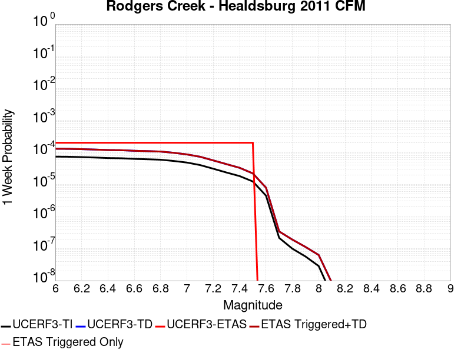 |  | 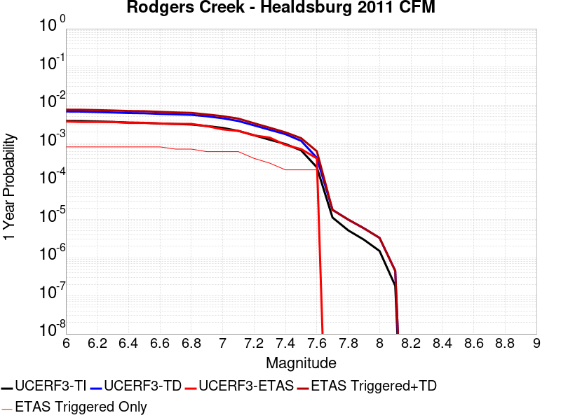 |  |

| Magnitude | 1 wk TI Prob | 1 wk TD Prob | 1 wk ETAS Prob | 1 wk ETAS/TD Gain | 1 wk ETAS Triggered+TD | 1 wk ETAS Triggered Only | 1 mo TI Prob | 1 mo TD Prob | 1 mo ETAS Prob | 1 mo ETAS/TD Gain | 1 mo ETAS Triggered+TD | 1 mo ETAS Triggered Only | 1 yr TI Prob | 1 yr TD Prob | 1 yr ETAS Prob | 1 yr ETAS/TD Gain | 1 yr ETAS Triggered+TD | 1 yr ETAS Triggered Only | 10 yr TI Prob | 10 yr TD Prob | 10 yr ETAS Prob | 10 yr ETAS/TD Gain | 10 yr ETAS Triggered+TD | 10 yr ETAS Triggered Only |
|-----|-----|-----|-----|-----|-----|-----|-----|-----|-----|-----|-----|-----|-----|-----|-----|-----|-----|-----|-----|-----|-----|-----|-----|-----|
| 6.0 | 7.390182E-5 | 1.301492E-4 | 2.0E-4 | 1.5366979 | 1.301492E-4 | 0.0 | 3.1668364E-4 | 5.5766234E-4 | 3.0E-4 | 0.53796 | 5.5766234E-4 | 0.0 | 0.0038488081 | 0.006768365 | 0.0037 | 0.54666084 | 0.0075629503 | 8.0E-4 | 0.037828278 | 0.06561573 | 0.0368 | 0.56084114 | 0.06954014 | 0.0042 |
| 6.1 | 7.318768E-5 | 1.2913322E-4 | 2.0E-4 | 1.5487883 | 1.2913322E-4 | 0.0 | 3.1362378E-4 | 5.5331015E-4 | 3.0E-4 | 0.5421914 | 5.5331015E-4 | 0.0 | 0.0038116854 | 0.0067157187 | 0.0036 | 0.5360558 | 0.0075103464 | 8.0E-4 | 0.037469655 | 0.06512183 | 0.0361 | 0.5543456 | 0.06886134 | 0.004 |
| 6.2 | 7.1379836E-5 | 1.2607191E-4 | 2.0E-4 | 1.5863962 | 1.2607191E-4 | 0.0 | 3.058777E-4 | 5.401958E-4 | 3.0E-4 | 0.5553542 | 5.401958E-4 | 0.0 | 0.003717703 | 0.0065570213 | 0.0036 | 0.54902977 | 0.0073517757 | 8.0E-4 | 0.0365612 | 0.06364771 | 0.0347 | 0.54518855 | 0.06720585 | 0.0038 |
| 6.3 | 6.9255926E-5 | 1.2263017E-4 | 2.0E-4 | 1.63092 | 1.2263017E-4 | 0.0 | 2.9677735E-4 | 5.254523E-4 | 3.0E-4 | 0.5709367 | 5.254523E-4 | 0.0 | 0.0036072785 | 0.006378665 | 0.0036 | 0.5643814 | 0.0071735624 | 8.0E-4 | 0.035492823 | 0.061984897 | 0.0333 | 0.53722763 | 0.065455556 | 0.0037 |
| 6.4 | 6.6757144E-5 | 1.1841311E-4 | 2.0E-4 | 1.6890022 | 1.1841311E-4 | 0.0 | 2.8607066E-4 | 5.073864E-4 | 3.0E-4 | 0.5912654 | 5.073864E-4 | 0.0 | 0.0034773487 | 0.0061600036 | 0.0034 | 0.5519477 | 0.0069550755 | 8.0E-4 | 0.034234364 | 0.059940808 | 0.0323 | 0.538865 | 0.06341902 | 0.0037 |
| 6.5 | 6.5735134E-5 | 1.1690995E-4 | 2.0E-4 | 1.7107184 | 1.1690995E-4 | 0.0 | 2.8169158E-4 | 5.0094683E-4 | 3.0E-4 | 0.598866 | 5.0094683E-4 | 0.0 | 0.003424202 | 0.006082054 | 0.0034 | 0.55902165 | 0.0068771886 | 8.0E-4 | 0.03371918 | 0.05920631 | 0.0322 | 0.543861 | 0.06268725 | 0.0037 |
| 6.6 | 6.289601E-5 | 1.1228256E-4 | 2.0E-4 | 1.7812204 | 1.1228256E-4 | 0.0 | 2.6952647E-4 | 4.811226E-4 | 3.0E-4 | 0.62354165 | 4.811226E-4 | 0.0 | 0.0032765474 | 0.0058420138 | 0.0033 | 0.5648737 | 0.0066373404 | 8.0E-4 | 0.032286562 | 0.05695151 | 0.031 | 0.5443227 | 0.06025218 | 0.0035 |
| 6.7 | 6.115274E-5 | 1.0946364E-4 | 2.0E-4 | 1.8270907 | 1.0946364E-4 | 0.0 | 2.6205686E-4 | 4.690459E-4 | 3.0E-4 | 0.6395963 | 4.690459E-4 | 0.0 | 0.0031858748 | 0.0056957584 | 0.0032 | 0.5618216 | 0.0063917716 | 7.0E-4 | 0.031405866 | 0.055574253 | 0.0303 | 0.5452165 | 0.058596414 | 0.0032 |
| 6.8 | 5.9232367E-5 | 1.0615019E-4 | 2.0E-4 | 1.8841228 | 1.0615019E-4 | 0.0 | 2.538283E-4 | 4.5485044E-4 | 3.0E-4 | 0.65955746 | 4.5485044E-4 | 0.0 | 0.0030859804 | 0.0055238176 | 0.0032 | 0.57930946 | 0.006219951 | 7.0E-4 | 0.030434765 | 0.05394587 | 0.0297 | 0.5505519 | 0.05697324 | 0.0032 |
| 6.9 | 5.4030377E-5 | 9.7149E-5 | 2.0E-4 | 2.0586934 | 9.7149E-5 | 0.0 | 2.315382E-4 | 4.1628676E-4 | 3.0E-4 | 0.7206571 | 4.1628676E-4 | 0.0 | 0.0028153337 | 0.0050565777 | 0.0028 | 0.5537342 | 0.005653544 | 6.0E-4 | 0.027799325 | 0.049505565 | 0.0278 | 0.561553 | 0.052262 | 0.0029 |
| 7.0 | 4.8260714E-5 | 8.639305E-5 | 2.0E-4 | 2.3150012 | 8.639305E-5 | 0.0 | 2.0681522E-4 | 3.7020363E-4 | 3.0E-4 | 0.8103648 | 3.7020363E-4 | 0.0 | 0.0025150678 | 0.0044979677 | 0.0023 | 0.51134205 | 0.0050952686 | 6.0E-4 | 0.024867928 | 0.04418429 | 0.0247 | 0.55902225 | 0.046860576 | 0.0028 |
| 7.1 | 4.0294493E-5 | 7.2951734E-5 | 2.0E-4 | 2.7415388 | 7.2951734E-5 | 0.0 | 1.7267925E-4 | 3.1261303E-4 | 3.0E-4 | 0.9596529 | 3.1261303E-4 | 0.0 | 0.0021003427 | 0.0037994585 | 0.0021 | 0.55271035 | 0.004397179 | 6.0E-4 | 0.02080602 | 0.03747253 | 0.0204 | 0.5443988 | 0.03987885 | 0.0025 |
| 7.2 | 3.096388E-5 | 5.6131365E-5 | 2.0E-4 | 3.5630703 | 5.6131365E-5 | 0.0 | 1.326956E-4 | 2.4054093E-4 | 3.0E-4 | 1.2471889 | 2.4054093E-4 | 0.0 | 0.0016143717 | 0.0029246744 | 0.0016 | 0.54706943 | 0.0033235045 | 4.0E-4 | 0.01602694 | 0.029026924 | 0.0156 | 0.5374321 | 0.030871773 | 0.0019 |
| 7.3 | 2.3615226E-5 | 4.2892298E-5 | 2.0E-4 | 4.662842 | 4.2892298E-5 | 0.0 | 1.0120418E-4 | 1.8381125E-4 | 3.0E-4 | 1.6321089 | 1.8381125E-4 | 0.0 | 0.0012314644 | 0.0022356184 | 0.0014 | 0.62622494 | 0.0025349478 | 3.0E-4 | 0.0122466255 | 0.022279777 | 0.0128 | 0.574512 | 0.023746358 | 0.0015 |
| 7.4 | 1.8251132E-5 | 3.293187E-5 | 2.0E-4 | 6.073145 | 3.293187E-5 | 0.0 | 7.821679E-5 | 1.41129E-4 | 3.0E-4 | 2.1257148 | 1.41129E-4 | 0.0 | 9.518733E-4 | 0.0017169007 | 9.0E-4 | 0.5242004 | 0.0019165574 | 2.0E-4 | 0.009478063 | 0.017168263 | 0.0095 | 0.55334663 | 0.01834766 | 0.0012 |
| 7.5 | 1.2411432E-5 | 2.204226E-5 | 2.0E-4 | 9.07348 | 2.204226E-5 | 0.0 | 5.3190768E-5 | 9.446344E-5 | 3.0E-4 | 3.1758318 | 9.446344E-5 | 0.0 | 6.4740516E-4 | 0.0011494912 | 7.0E-4 | 0.6089651 | 0.0013492613 | 2.0E-4 | 0.006455223 | 0.01153857 | 0.0066 | 0.57199466 | 0.012527031 | 0.001 |
| 7.6 | 4.4771446E-6 | 7.931335E-6 | 0.0 | 0.0 | 7.931335E-6 | 0.0 | 1.918762E-5 | 3.3991E-5 | 0.0 | 0.0 | 3.3991E-5 | 0.0 | 2.3358424E-4 | 4.1376302E-4 | 4.0E-4 | 0.966737 | 6.136803E-4 | 2.0E-4 | 0.0023333887 | 0.004170798 | 0.0023 | 0.55145323 | 0.004469547 | 3.0E-4 |
| 7.7 | 2.157941E-7 | 3.4058309E-7 | 0.0 | 0.0 | 3.4058309E-7 | 0.0 | 9.248315E-7 | 1.459641E-6 | 0.0 | 0.0 | 1.459641E-6 | 0.0 | 1.1259765E-5 | 1.7770984E-5 | 0.0 | 0.0 | 1.7770984E-5 | 0.0 | 1.1259195E-4 | 1.8428617E-4 | 1.0E-4 | 0.5426343 | 1.8428617E-4 | 0.0 |
| 7.8 | 9.9623286E-8 | 1.8952073E-7 | 0.0 | 0.0 | 1.8952073E-7 | 0.0 | 4.269569E-7 | 8.1223146E-7 | 0.0 | 0.0 | 8.1223146E-7 | 0.0 | 5.1981874E-6 | 9.888873E-6 | 0.0 | 0.0 | 9.888873E-6 | 0.0 | 5.198066E-5 | 1.0434773E-4 | 0.0 | 0.0 | 1.0434773E-4 | 0.0 |
| 7.9 | 5.6745257E-8 | 1.12044894E-7 | 0.0 | 0.0 | 1.12044894E-7 | 0.0 | 2.4319394E-7 | 4.801923E-7 | 0.0 | 0.0 | 4.801923E-7 | 0.0 | 2.960882E-6 | 5.8463256E-6 | 0.0 | 0.0 | 5.8463256E-6 | 0.0 | 2.9608427E-5 | 6.191383E-5 | 0.0 | 0.0 | 6.191383E-5 | 0.0 |
| 8.0 | 2.8614323E-8 | 6.283889E-8 | 0.0 | 0.0 | 6.283889E-8 | 0.0 | 1.2263281E-7 | 2.693095E-7 | 0.0 | 0.0 | 2.693095E-7 | 0.0 | 1.4930534E-6 | 3.2788384E-6 | 0.0 | 0.0 | 3.2788384E-6 | 0.0 | 1.4930434E-5 | 3.4405322E-5 | 0.0 | 0.0 | 3.4405322E-5 | 0.0 |
| 8.1 | 3.5045191E-9 | 8.596933E-9 | 0.0 | 0.0 | 8.596933E-9 | 0.0 | 1.5019367E-8 | 3.6844E-8 | 0.0 | 0.0 | 3.6844E-8 | 0.0 | 1.8286079E-7 | 4.485756E-7 | 0.0 | 0.0 | 4.485756E-7 | 0.0 | 1.8286064E-6 | 4.657446E-6 | 0.0 | 0.0 | 4.657446E-6 | 0.0 |

## Calaveras (No) 2011 CFM
*[(top)](#table-of-contents)*

| 1 Week | 1 Month | 1 Year | 10 Year |
|-----|-----|-----|-----|
|  |  |  |  |

| Magnitude | 1 wk TI Prob | 1 wk TD Prob | 1 wk ETAS Prob | 1 wk ETAS/TD Gain | 1 wk ETAS Triggered+TD | 1 wk ETAS Triggered Only | 1 mo TI Prob | 1 mo TD Prob | 1 mo ETAS Prob | 1 mo ETAS/TD Gain | 1 mo ETAS Triggered+TD | 1 mo ETAS Triggered Only | 1 yr TI Prob | 1 yr TD Prob | 1 yr ETAS Prob | 1 yr ETAS/TD Gain | 1 yr ETAS Triggered+TD | 1 yr ETAS Triggered Only | 10 yr TI Prob | 10 yr TD Prob | 10 yr ETAS Prob | 10 yr ETAS/TD Gain | 10 yr ETAS Triggered+TD | 10 yr ETAS Triggered Only |
|-----|-----|-----|-----|-----|-----|-----|-----|-----|-----|-----|-----|-----|-----|-----|-----|-----|-----|-----|-----|-----|-----|-----|-----|-----|
| 6.0 | 4.8694856E-5 | 6.687549E-5 | 1.0E-4 | 1.4953163 | 1.668688E-4 | 1.0E-4 | 2.0867554E-4 | 2.865784E-4 | 2.0E-4 | 0.69788927 | 3.8654977E-4 | 1.0E-4 | 0.0025376645 | 0.0034835178 | 0.0032 | 0.91861165 | 0.0046793376 | 0.0012 | 0.02508881 | 0.034476876 | 0.0276 | 0.8005365 | 0.03833897 | 0.004 |
| 6.1 | 4.8694856E-5 | 6.687549E-5 | 1.0E-4 | 1.4953163 | 1.668688E-4 | 1.0E-4 | 2.0867554E-4 | 2.865784E-4 | 2.0E-4 | 0.69788927 | 3.8654977E-4 | 1.0E-4 | 0.0025376645 | 0.0034835178 | 0.0032 | 0.91861165 | 0.0046793376 | 0.0012 | 0.02508881 | 0.034476876 | 0.0276 | 0.8005365 | 0.03833897 | 0.004 |
| 6.2 | 4.7541962E-5 | 6.521333E-5 | 1.0E-4 | 1.5334288 | 1.6520682E-4 | 1.0E-4 | 2.0373536E-4 | 2.7945652E-4 | 2.0E-4 | 0.7156749 | 3.7942856E-4 | 1.0E-4 | 0.0024776561 | 0.003397103 | 0.0032 | 0.9419791 | 0.0045930264 | 0.0012 | 0.024502134 | 0.033641305 | 0.0273 | 0.8115024 | 0.03750674 | 0.004 |
| 6.3 | 4.6717287E-5 | 6.405114E-5 | 1.0E-4 | 1.5612524 | 1.6404474E-4 | 1.0E-4 | 2.0020158E-4 | 2.7447683E-4 | 2.0E-4 | 0.7286589 | 3.744494E-4 | 1.0E-4 | 0.0024347296 | 0.00333667 | 0.0032 | 0.95904 | 0.004532666 | 0.0012 | 0.024082264 | 0.033055697 | 0.0266 | 0.8047024 | 0.036826782 | 0.0039 |
| 6.4 | 4.6276386E-5 | 6.341538E-5 | 1.0E-4 | 1.5769047 | 1.6340903E-4 | 1.0E-4 | 1.983123E-4 | 2.717527E-4 | 2.0E-4 | 0.7359632 | 3.7172553E-4 | 1.0E-4 | 0.0024117786 | 0.0033036121 | 0.0031 | 0.93836683 | 0.004399978 | 0.0011 | 0.02385771 | 0.03273572 | 0.0265 | 0.8095132 | 0.0363146 | 0.0037 |
| 6.5 | 4.5720994E-5 | 6.2619816E-5 | 1.0E-4 | 1.5969386 | 1.6261355E-4 | 1.0E-4 | 1.9593239E-4 | 2.6834407E-4 | 2.0E-4 | 0.7453118 | 3.6831724E-4 | 1.0E-4 | 0.002382867 | 0.0032622444 | 0.0031 | 0.950266 | 0.004358656 | 0.0011 | 0.023574775 | 0.032335017 | 0.0265 | 0.819545 | 0.035915375 | 0.0037 |
| 6.6 | 4.549134E-5 | 6.227483E-5 | 1.0E-4 | 1.6057854 | 1.622686E-4 | 1.0E-4 | 1.949483E-4 | 2.6686586E-4 | 2.0E-4 | 0.7494402 | 3.6683917E-4 | 1.0E-4 | 0.0023709119 | 0.0032443008 | 0.0031 | 0.95552176 | 0.004340732 | 0.0011 | 0.023457756 | 0.03216116 | 0.0262 | 0.8146472 | 0.035742167 | 0.0037 |
| 6.7 | 3.701047E-5 | 4.9836264E-5 | 0.0 | 0.0 | 4.9836264E-5 | 0.0 | 1.5860666E-4 | 2.1356673E-4 | 1.0E-4 | 0.4682377 | 2.1356673E-4 | 0.0 | 0.0019293258 | 0.002597117 | 0.0025 | 0.9626058 | 0.0034947798 | 9.0E-4 | 0.019126613 | 0.025864985 | 0.0199 | 0.7693799 | 0.028397735 | 0.0026 |
| 6.8 | 3.5523568E-5 | 4.7832134E-5 | 0.0 | 0.0 | 4.7832134E-5 | 0.0 | 1.5223498E-4 | 2.0497899E-4 | 1.0E-4 | 0.48785487 | 2.0497899E-4 | 0.0 | 0.0018518851 | 0.0024928052 | 0.0024 | 0.96277076 | 0.0033905618 | 9.0E-4 | 0.018365284 | 0.02484424 | 0.0191 | 0.7687899 | 0.027379645 | 0.0026 |
| 6.9 | 3.2946147E-5 | 4.418289E-5 | 0.0 | 0.0 | 4.418289E-5 | 0.0 | 1.4119013E-4 | 1.8934172E-4 | 1.0E-4 | 0.5281456 | 1.8934172E-4 | 0.0 | 0.0017176344 | 0.0023028397 | 0.0022 | 0.95534223 | 0.0031009975 | 8.0E-4 | 0.017044188 | 0.022980222 | 0.018 | 0.7832822 | 0.02532507 | 0.0024 |
| 7.0 | 2.7682381E-5 | 3.6623995E-5 | 0.0 | 0.0 | 3.6623995E-5 | 0.0 | 1.1863338E-4 | 1.569507E-4 | 0.0 | 0.0 | 1.569507E-4 | 0.0 | 0.0014434044 | 0.0019092296 | 0.0018 | 0.94278866 | 0.0026078932 | 7.0E-4 | 0.01434065 | 0.019111184 | 0.0144 | 0.7534855 | 0.020974873 | 0.0019 |
| 7.1 | 2.471967E-5 | 3.2936558E-5 | 0.0 | 0.0 | 3.2936558E-5 | 0.0 | 1.05937135E-4 | 1.411492E-4 | 0.0 | 0.0 | 1.411492E-4 | 0.0 | 0.0012890215 | 0.0017171653 | 0.0018 | 1.0482391 | 0.0024159634 | 7.0E-4 | 0.0128157 | 0.017209869 | 0.0134 | 0.77862304 | 0.018782333 | 0.0016 |
| 7.2 | 1.9748062E-5 | 2.646036E-5 | 0.0 | 0.0 | 2.646036E-5 | 0.0 | 8.463181E-5 | 1.13396745E-4 | 0.0 | 0.0 | 1.13396745E-4 | 0.0 | 0.0010299052 | 0.0013797542 | 0.0016 | 1.159627 | 0.0019789264 | 6.0E-4 | 0.01025145 | 0.013872306 | 0.011 | 0.79294676 | 0.015055659 | 0.0012 |
| 7.3 | 1.1603734E-5 | 1.5574346E-5 | 0.0 | 0.0 | 1.5574346E-5 | 0.0 | 4.9729337E-5 | 6.674557E-5 | 0.0 | 0.0 | 6.674557E-5 | 0.0 | 6.052865E-4 | 8.123383E-4 | 6.0E-4 | 0.73860854 | 0.0011120946 | 3.0E-4 | 0.0060364045 | 0.008202821 | 0.0059 | 0.71926475 | 0.008897079 | 7.0E-4 |
| 7.4 | 4.885381E-6 | 5.89831E-6 | 0.0 | 0.0 | 5.89831E-6 | 0.0 | 2.0937177E-5 | 2.5278228E-5 | 0.0 | 0.0 | 2.5278228E-5 | 0.0 | 2.5488032E-4 | 3.0771914E-4 | 3.0E-4 | 0.974915 | 4.0768835E-4 | 1.0E-4 | 0.0025458818 | 0.003132111 | 0.002 | 0.638547 | 0.0033314845 | 2.0E-4 |
| 7.5 | 3.0571264E-6 | 4.0283903E-6 | 0.0 | 0.0 | 4.0283903E-6 | 0.0 | 1.3101904E-5 | 1.7264416E-5 | 0.0 | 0.0 | 1.7264416E-5 | 0.0 | 1.5950401E-4 | 2.1017408E-4 | 3.0E-4 | 1.4273881 | 3.1015306E-4 | 1.0E-4 | 0.0015938957 | 0.0021571468 | 0.0014 | 0.6490055 | 0.002256931 | 1.0E-4 |
| 7.6 | 1.764948E-6 | 2.6749697E-6 | 0.0 | 0.0 | 2.6749697E-6 | 0.0 | 7.564041E-6 | 1.1464105E-5 | 0.0 | 0.0 | 1.1464105E-5 | 0.0 | 9.208831E-5 | 1.3956662E-4 | 2.0E-4 | 1.4330075 | 1.3956662E-4 | 0.0 | 9.205016E-4 | 0.0014517411 | 9.0E-4 | 0.6199452 | 0.0014517411 | 0.0 |
| 7.7 | 1.3173734E-6 | 1.9569313E-6 | 0.0 | 0.0 | 1.9569313E-6 | 0.0 | 5.645874E-6 | 8.386822E-6 | 0.0 | 0.0 | 8.386822E-6 | 0.0 | 6.873634E-5 | 1.0210479E-4 | 1.0E-4 | 0.97938603 | 1.0210479E-4 | 0.0 | 6.8715087E-4 | 0.0010747038 | 6.0E-4 | 0.5582934 | 0.0010747038 | 0.0 |
| 7.8 | 9.4429885E-7 | 1.4718682E-6 | 0.0 | 0.0 | 1.4718682E-6 | 0.0 | 4.0469886E-6 | 6.3079915E-6 | 0.0 | 0.0 | 6.3079915E-6 | 0.0 | 4.9270973E-5 | 7.67971E-5 | 1.0E-4 | 1.3021325 | 7.67971E-5 | 0.0 | 4.926005E-4 | 8.1126415E-4 | 5.0E-4 | 0.6163221 | 8.1126415E-4 | 0.0 |
| 7.9 | 6.388233E-7 | 1.0618847E-6 | 0.0 | 0.0 | 1.0618847E-6 | 0.0 | 2.7378112E-6 | 4.550927E-6 | 0.0 | 0.0 | 4.550927E-6 | 0.0 | 3.3332344E-5 | 5.5406133E-5 | 0.0 | 0.0 | 5.5406133E-5 | 0.0 | 3.3327343E-4 | 5.830354E-4 | 3.0E-4 | 0.51454854 | 5.830354E-4 | 0.0 |
| 8.0 | 3.087986E-7 | 5.510454E-7 | 0.0 | 0.0 | 5.510454E-7 | 0.0 | 1.323422E-6 | 2.361621E-6 | 0.0 | 0.0 | 2.361621E-6 | 0.0 | 1.6112543E-5 | 2.8752358E-5 | 0.0 | 0.0 | 2.8752358E-5 | 0.0 | 1.6111376E-4 | 2.9881555E-4 | 1.0E-4 | 0.3346546 | 2.9881555E-4 | 0.0 |
| 8.1 | 1.6725647E-7 | 2.6281333E-7 | 0.0 | 0.0 | 2.6281333E-7 | 0.0 | 7.168133E-7 | 1.1263423E-6 | 0.0 | 0.0 | 1.1263423E-6 | 0.0 | 8.7271665E-6 | 1.3713134E-5 | 0.0 | 0.0 | 1.3713134E-5 | 0.0 | 8.726824E-5 | 1.4273814E-4 | 0.0 | 0.0 | 1.4273814E-4 | 0.0 |

## Pinto Mtn
*[(top)](#table-of-contents)*

| 1 Week | 1 Month | 1 Year | 10 Year |
|-----|-----|-----|-----|
|  | 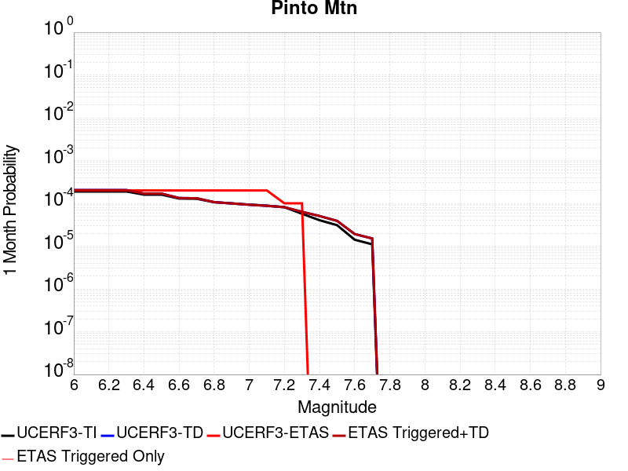 |  |  |

| Magnitude | 1 wk TI Prob | 1 wk TD Prob | 1 wk ETAS Prob | 1 wk ETAS/TD Gain | 1 wk ETAS Triggered+TD | 1 wk ETAS Triggered Only | 1 mo TI Prob | 1 mo TD Prob | 1 mo ETAS Prob | 1 mo ETAS/TD Gain | 1 mo ETAS Triggered+TD | 1 mo ETAS Triggered Only | 1 yr TI Prob | 1 yr TD Prob | 1 yr ETAS Prob | 1 yr ETAS/TD Gain | 1 yr ETAS Triggered+TD | 1 yr ETAS Triggered Only | 10 yr TI Prob | 10 yr TD Prob | 10 yr ETAS Prob | 10 yr ETAS/TD Gain | 10 yr ETAS Triggered+TD | 10 yr ETAS Triggered Only |
|-----|-----|-----|-----|-----|-----|-----|-----|-----|-----|-----|-----|-----|-----|-----|-----|-----|-----|-----|-----|-----|-----|-----|-----|-----|
| 6.0 | 4.4194956E-5 | 4.770393E-5 | 0.0 | 0.0 | 4.770393E-5 | 0.0 | 1.893932E-4 | 2.0443031E-4 | 2.0E-4 | 0.97832847 | 2.0443031E-4 | 0.0 | 0.0023034236 | 0.002486261 | 0.0016 | 0.64353657 | 0.002985018 | 5.0E-4 | 0.022796938 | 0.02460191 | 0.0176 | 0.7153916 | 0.028405964 | 0.0039 |
| 6.1 | 4.4194956E-5 | 4.770393E-5 | 0.0 | 0.0 | 4.770393E-5 | 0.0 | 1.893932E-4 | 2.0443031E-4 | 2.0E-4 | 0.97832847 | 2.0443031E-4 | 0.0 | 0.0023034236 | 0.002486261 | 0.0016 | 0.64353657 | 0.002985018 | 5.0E-4 | 0.022796938 | 0.02460191 | 0.0176 | 0.7153916 | 0.028405964 | 0.0039 |
| 6.2 | 4.4194956E-5 | 4.770393E-5 | 0.0 | 0.0 | 4.770393E-5 | 0.0 | 1.893932E-4 | 2.0443031E-4 | 2.0E-4 | 0.97832847 | 2.0443031E-4 | 0.0 | 0.0023034236 | 0.002486261 | 0.0016 | 0.64353657 | 0.002985018 | 5.0E-4 | 0.022796938 | 0.02460191 | 0.0176 | 0.7153916 | 0.028405964 | 0.0039 |
| 6.3 | 4.4194956E-5 | 4.770393E-5 | 0.0 | 0.0 | 4.770393E-5 | 0.0 | 1.893932E-4 | 2.0443031E-4 | 2.0E-4 | 0.97832847 | 2.0443031E-4 | 0.0 | 0.0023034236 | 0.002486261 | 0.0016 | 0.64353657 | 0.002985018 | 5.0E-4 | 0.022796938 | 0.02460191 | 0.0176 | 0.7153916 | 0.028405964 | 0.0039 |
| 6.4 | 3.729929E-5 | 3.9470375E-5 | 0.0 | 0.0 | 3.9470375E-5 | 0.0 | 1.5984432E-4 | 1.6914832E-4 | 2.0E-4 | 1.1823943 | 1.6914832E-4 | 0.0 | 0.0019443673 | 0.0020575286 | 0.0015 | 0.72903 | 0.0024567056 | 4.0E-4 | 0.019274427 | 0.020394774 | 0.0149 | 0.7305793 | 0.024019314 | 0.0037 |
| 6.5 | 3.729929E-5 | 3.9470375E-5 | 0.0 | 0.0 | 3.9470375E-5 | 0.0 | 1.5984432E-4 | 1.6914832E-4 | 2.0E-4 | 1.1823943 | 1.6914832E-4 | 0.0 | 0.0019443673 | 0.0020575286 | 0.0015 | 0.72903 | 0.0024567056 | 4.0E-4 | 0.019274427 | 0.020394774 | 0.0149 | 0.7305793 | 0.024019314 | 0.0037 |
| 6.6 | 3.0204548E-5 | 3.1088573E-5 | 0.0 | 0.0 | 3.1088573E-5 | 0.0 | 1.2944164E-4 | 1.3323013E-4 | 2.0E-4 | 1.5011618 | 1.3323013E-4 | 0.0 | 0.0015748127 | 0.0016209045 | 0.0011 | 0.6786334 | 0.0019204183 | 3.0E-4 | 0.015636992 | 0.01609467 | 0.0119 | 0.73937523 | 0.019144775 | 0.0031 |
| 6.7 | 2.9857754E-5 | 3.0698473E-5 | 0.0 | 0.0 | 3.0698473E-5 | 0.0 | 1.2795553E-4 | 1.3155845E-4 | 2.0E-4 | 1.5202368 | 1.3155845E-4 | 0.0 | 0.0015567453 | 0.0016005817 | 0.0011 | 0.68725014 | 0.0019001015 | 3.0E-4 | 0.015458848 | 0.01589436 | 0.0118 | 0.74240166 | 0.018945089 | 0.0031 |
| 6.8 | 2.4819734E-5 | 2.4902416E-5 | 0.0 | 0.0 | 2.4902416E-5 | 0.0 | 1.0636595E-4 | 1.067204E-4 | 2.0E-4 | 1.874056 | 1.067204E-4 | 0.0 | 0.0012942362 | 0.001298568 | 9.0E-4 | 0.6930712 | 0.0014983083 | 2.0E-4 | 0.012867244 | 0.012912154 | 0.0094 | 0.7279963 | 0.01488633 | 0.002 |
| 6.9 | 2.331124E-5 | 2.3232593E-5 | 0.0 | 0.0 | 2.3232593E-5 | 0.0 | 9.990149E-5 | 9.956457E-5 | 2.0E-4 | 2.0087469 | 9.956457E-5 | 0.0 | 0.001215622 | 0.0012115447 | 9.0E-4 | 0.7428533 | 0.0014113025 | 2.0E-4 | 0.012089936 | 0.012051578 | 0.0088 | 0.73019487 | 0.014027474 | 0.002 |
| 7.0 | 2.1818534E-5 | 2.1657344E-5 | 0.0 | 0.0 | 2.1657344E-5 | 0.0 | 9.3504656E-5 | 9.2814E-5 | 2.0E-4 | 2.1548474 | 9.2814E-5 | 0.0 | 0.0011378246 | 0.0011294443 | 8.0E-4 | 0.70831287 | 0.0012293314 | 1.0E-4 | 0.011320163 | 0.011239133 | 0.0081 | 0.7206962 | 0.013018902 | 0.0018 |
| 7.1 | 2.066081E-5 | 2.0438532E-5 | 0.0 | 0.0 | 2.0438532E-5 | 0.0 | 8.854332E-5 | 8.759088E-5 | 2.0E-4 | 2.2833426 | 8.759088E-5 | 0.0 | 0.0010774818 | 0.0010659167 | 8.0E-4 | 0.7505277 | 0.0011658102 | 1.0E-4 | 0.010722724 | 0.01061008 | 0.0077 | 0.72572494 | 0.012292043 | 0.0017 |
| 7.2 | 1.8990233E-5 | 1.8955101E-5 | 0.0 | 0.0 | 1.8955101E-5 | 0.0 | 8.138417E-5 | 8.1233724E-5 | 1.0E-4 | 1.2310158 | 8.1233724E-5 | 0.0 | 9.904018E-4 | 9.885911E-4 | 7.0E-4 | 0.7080784 | 0.0010884922 | 1.0E-4 | 0.009859995 | 0.009843922 | 0.0072 | 0.7314158 | 0.011329156 | 0.0015 |
| 7.3 | 1.3335872E-5 | 1.4816375E-5 | 0.0 | 0.0 | 1.4816375E-5 | 0.0 | 5.7152483E-5 | 6.3497275E-5 | 1.0E-4 | 1.5748707 | 6.3497275E-5 | 0.0 | 6.956093E-4 | 7.728178E-4 | 5.0E-4 | 0.646983 | 8.727405E-4 | 1.0E-4 | 0.006934359 | 0.0077025946 | 0.0053 | 0.68807983 | 0.008992582 | 0.0013 |
| 7.4 | 9.414066E-6 | 1.17748E-5 | 0.0 | 0.0 | 1.17748E-5 | 0.0 | 4.0345374E-5 | 5.0462506E-5 | 0.0 | 0.0 | 5.0462506E-5 | 0.0 | 4.910942E-4 | 6.142172E-4 | 4.0E-4 | 0.65123546 | 7.141558E-4 | 1.0E-4 | 0.0049001034 | 0.0061261375 | 0.0043 | 0.7019105 | 0.007318786 | 0.0012 |
| 7.5 | 7.2101157E-6 | 9.075645E-6 | 0.0 | 0.0 | 9.075645E-6 | 0.0 | 3.090013E-5 | 3.8895083E-5 | 0.0 | 0.0 | 3.8895083E-5 | 0.0 | 3.7614413E-4 | 4.734525E-4 | 3.0E-4 | 0.6336433 | 4.734525E-4 | 0.0 | 0.0037550807 | 0.004725207 | 0.0029 | 0.6137297 | 0.0052228444 | 5.0E-4 |
| 7.6 | 3.296375E-6 | 4.4660537E-6 | 0.0 | 0.0 | 4.4660537E-6 | 0.0 | 1.4127245E-5 | 1.9140098E-5 | 0.0 | 0.0 | 1.9140098E-5 | 0.0 | 1.7198564E-4 | 2.3300709E-4 | 1.0E-4 | 0.42917147 | 2.3300709E-4 | 0.0 | 0.0017185259 | 0.0023277595 | 0.0012 | 0.5155172 | 0.0023277595 | 0.0 |
| 7.7 | 2.5741092E-6 | 3.5092667E-6 | 0.0 | 0.0 | 3.5092667E-6 | 0.0 | 1.103185E-5 | 1.5039635E-5 | 0.0 | 0.0 | 1.5039635E-5 | 0.0 | 1.3430449E-4 | 1.8309343E-4 | 1.0E-4 | 0.5461692 | 1.8309343E-4 | 0.0 | 0.0013422335 | 0.0018295501 | 0.001 | 0.54658246 | 0.0018295501 | 0.0 |

## Almanor 2011 CFM
*[(top)](#table-of-contents)*

| 1 Week | 1 Month | 1 Year | 10 Year |
|-----|-----|-----|-----|
|  |  |  |  |

| Magnitude | 1 wk TI Prob | 1 wk TD Prob | 1 wk ETAS Prob | 1 wk ETAS/TD Gain | 1 wk ETAS Triggered+TD | 1 wk ETAS Triggered Only | 1 mo TI Prob | 1 mo TD Prob | 1 mo ETAS Prob | 1 mo ETAS/TD Gain | 1 mo ETAS Triggered+TD | 1 mo ETAS Triggered Only | 1 yr TI Prob | 1 yr TD Prob | 1 yr ETAS Prob | 1 yr ETAS/TD Gain | 1 yr ETAS Triggered+TD | 1 yr ETAS Triggered Only | 10 yr TI Prob | 10 yr TD Prob | 10 yr ETAS Prob | 10 yr ETAS/TD Gain | 10 yr ETAS Triggered+TD | 10 yr ETAS Triggered Only |
|-----|-----|-----|-----|-----|-----|-----|-----|-----|-----|-----|-----|-----|-----|-----|-----|-----|-----|-----|-----|-----|-----|-----|-----|-----|
| 6.0 | 6.1479834E-5 | 8.298417E-5 | 0.0 | 0.0 | 8.298417E-5 | 0.0 | 2.6345838E-4 | 3.5560352E-4 | 1.0E-4 | 0.28121206 | 3.5560352E-4 | 0.0 | 0.0032028882 | 0.004321557 | 0.0035 | 0.80989325 | 0.0051181 | 8.0E-4 | 0.031571172 | 0.042444512 | 0.0238 | 0.5607321 | 0.046178978 | 0.0039 |
| 6.1 | 4.4387216E-5 | 5.956422E-5 | 0.0 | 0.0 | 5.956422E-5 | 0.0 | 1.9021705E-4 | 2.5525416E-4 | 0.0 | 0.0 | 2.5525416E-4 | 0.0 | 0.0023134327 | 0.0031037936 | 0.0025 | 0.80546594 | 0.0036022419 | 5.0E-4 | 0.022894967 | 0.03065395 | 0.0172 | 0.5611023 | 0.033077314 | 0.0025 |
| 6.2 | 4.4387216E-5 | 5.956422E-5 | 0.0 | 0.0 | 5.956422E-5 | 0.0 | 1.9021705E-4 | 2.5525416E-4 | 0.0 | 0.0 | 2.5525416E-4 | 0.0 | 0.0023134327 | 0.0031037936 | 0.0025 | 0.80546594 | 0.0036022419 | 5.0E-4 | 0.022894967 | 0.03065395 | 0.0172 | 0.5611023 | 0.033077314 | 0.0025 |
| 6.3 | 2.9523822E-5 | 3.9414223E-5 | 0.0 | 0.0 | 3.9414223E-5 | 0.0 | 1.2652454E-4 | 1.6890977E-4 | 0.0 | 0.0 | 1.6890977E-4 | 0.0 | 0.0015393476 | 0.00205491 | 0.002 | 0.97327864 | 0.0025538825 | 5.0E-4 | 0.015287281 | 0.020394152 | 0.0115 | 0.5638872 | 0.022157442 | 0.0018 |
| 6.4 | 2.0512744E-5 | 2.7338916E-5 | 0.0 | 0.0 | 2.7338916E-5 | 0.0 | 8.79088E-5 | 1.1716365E-4 | 0.0 | 0.0 | 1.1716365E-4 | 0.0 | 0.001069764 | 0.0014258667 | 0.0015 | 1.0519917 | 0.0016255815 | 2.0E-4 | 0.010646289 | 0.014198058 | 0.0086 | 0.60571665 | 0.0154796 | 0.0013 |
| 6.5 | 1.6750226E-5 | 2.2315515E-5 | 0.0 | 0.0 | 2.2315515E-5 | 0.0 | 7.178471E-5 | 9.563674E-5 | 0.0 | 0.0 | 9.563674E-5 | 0.0 | 8.7362836E-4 | 0.0011640886 | 0.0011 | 0.9449452 | 0.0013638558 | 2.0E-4 | 0.008702018 | 0.011611144 | 0.007 | 0.6028691 | 0.012797211 | 0.0012 |
| 6.6 | 1.4745303E-5 | 1.964102E-5 | 0.0 | 0.0 | 1.964102E-5 | 0.0 | 6.319262E-5 | 8.417538E-5 | 0.0 | 0.0 | 8.417538E-5 | 0.0 | 7.690986E-4 | 0.0010246921 | 0.0011 | 1.0734932 | 0.0012244871 | 2.0E-4 | 0.0076644225 | 0.010231581 | 0.0066 | 0.6450616 | 0.011320326 | 0.0011 |
| 6.7 | 9.951145E-7 | 1.1596063E-6 | 0.0 | 0.0 | 1.1596063E-6 | 0.0 | 4.26477E-6 | 4.969733E-6 | 0.0 | 0.0 | 4.969733E-6 | 0.0 | 5.1922336E-5 | 6.0504994E-5 | 2.0E-4 | 3.3055124 | 1.6049894E-4 | 1.0E-4 | 5.1910203E-4 | 6.049024E-4 | 7.0E-4 | 1.1572115 | 9.047209E-4 | 3.0E-4 |
| 6.8 | 5.866312E-7 | 6.837416E-7 | 0.0 | 0.0 | 6.837416E-7 | 0.0 | 2.5141312E-6 | 2.9303185E-6 | 0.0 | 0.0 | 2.9303185E-6 | 0.0 | 3.0609117E-5 | 3.5676174E-5 | 1.0E-4 | 2.8029912 | 1.3567261E-4 | 1.0E-4 | 3.06049E-4 | 3.5671727E-4 | 4.0E-4 | 1.1213363 | 6.5661024E-4 | 3.0E-4 |

## Ludlow
*[(top)](#table-of-contents)*

| 1 Week | 1 Month | 1 Year | 10 Year |
|-----|-----|-----|-----|
|  | 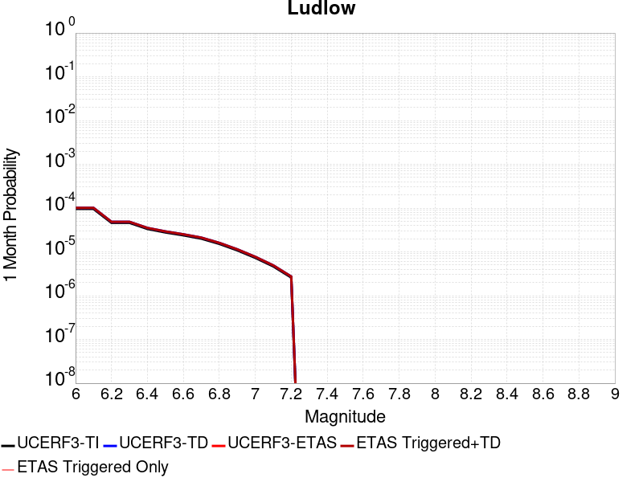 |  |  |

| Magnitude | 1 wk TI Prob | 1 wk TD Prob | 1 wk ETAS Prob | 1 wk ETAS/TD Gain | 1 wk ETAS Triggered+TD | 1 wk ETAS Triggered Only | 1 mo TI Prob | 1 mo TD Prob | 1 mo ETAS Prob | 1 mo ETAS/TD Gain | 1 mo ETAS Triggered+TD | 1 mo ETAS Triggered Only | 1 yr TI Prob | 1 yr TD Prob | 1 yr ETAS Prob | 1 yr ETAS/TD Gain | 1 yr ETAS Triggered+TD | 1 yr ETAS Triggered Only | 10 yr TI Prob | 10 yr TD Prob | 10 yr ETAS Prob | 10 yr ETAS/TD Gain | 10 yr ETAS Triggered+TD | 10 yr ETAS Triggered Only |
|-----|-----|-----|-----|-----|-----|-----|-----|-----|-----|-----|-----|-----|-----|-----|-----|-----|-----|-----|-----|-----|-----|-----|-----|-----|
| 6.0 | 2.2407607E-5 | 2.3643477E-5 | 0.0 | 0.0 | 2.3643477E-5 | 0.0 | 9.602906E-5 | 1.013255E-4 | 0.0 | 0.0 | 1.013255E-4 | 0.0 | 0.0011685267 | 0.0012329839 | 6.0E-4 | 0.48662436 | 0.0014327373 | 2.0E-4 | 0.011624013 | 0.012265936 | 0.0109 | 0.8886399 | 0.015920551 | 0.0037 |
| 6.1 | 2.2407607E-5 | 2.3643477E-5 | 0.0 | 0.0 | 2.3643477E-5 | 0.0 | 9.602906E-5 | 1.013255E-4 | 0.0 | 0.0 | 1.013255E-4 | 0.0 | 0.0011685267 | 0.0012329839 | 6.0E-4 | 0.48662436 | 0.0014327373 | 2.0E-4 | 0.011624013 | 0.012265936 | 0.0109 | 0.8886399 | 0.015920551 | 0.0037 |
| 6.2 | 1.0781252E-5 | 1.13592305E-5 | 0.0 | 0.0 | 1.13592305E-5 | 0.0 | 4.620455E-5 | 4.868153E-5 | 0.0 | 0.0 | 4.868153E-5 | 0.0 | 5.623952E-4 | 5.925405E-4 | 6.0E-4 | 1.012589 | 7.92422E-4 | 2.0E-4 | 0.00560974 | 0.005910024 | 0.0055 | 0.9306223 | 0.007500568 | 0.0016 |
| 6.3 | 1.0781252E-5 | 1.13592305E-5 | 0.0 | 0.0 | 1.13592305E-5 | 0.0 | 4.620455E-5 | 4.868153E-5 | 0.0 | 0.0 | 4.868153E-5 | 0.0 | 5.623952E-4 | 5.925405E-4 | 6.0E-4 | 1.012589 | 7.92422E-4 | 2.0E-4 | 0.00560974 | 0.005910024 | 0.0055 | 0.9306223 | 0.007500568 | 0.0016 |
| 6.4 | 7.814439E-6 | 8.233069E-6 | 0.0 | 0.0 | 8.233069E-6 | 0.0 | 3.3490025E-5 | 3.5284113E-5 | 0.0 | 0.0 | 3.5284113E-5 | 0.0 | 4.0766477E-4 | 4.295008E-4 | 3.0E-4 | 0.6984853 | 4.295008E-4 | 0.0 | 0.0040691774 | 0.004286853 | 0.0037 | 0.8631039 | 0.005382138 | 0.0011 |
| 6.5 | 6.4986366E-6 | 6.8470413E-6 | 0.0 | 0.0 | 6.8470413E-6 | 0.0 | 2.7851002E-5 | 2.9344137E-5 | 0.0 | 0.0 | 2.9344137E-5 | 0.0 | 3.390332E-4 | 3.5720723E-4 | 3.0E-4 | 0.83984864 | 3.5720723E-4 | 0.0 | 0.003385164 | 0.0035664267 | 0.0031 | 0.8692174 | 0.0045628604 | 0.001 |
| 6.6 | 5.582177E-6 | 5.8826595E-6 | 0.0 | 0.0 | 5.8826595E-6 | 0.0 | 2.3923398E-5 | 2.5211159E-5 | 0.0 | 0.0 | 2.5211159E-5 | 0.0 | 2.9122844E-4 | 3.0690333E-4 | 3.0E-4 | 0.97750646 | 3.0690333E-4 | 0.0 | 0.0029084706 | 0.0030648683 | 0.0028 | 0.9135792 | 0.0038624164 | 8.0E-4 |
| 6.7 | 4.6858763E-6 | 4.9376245E-6 | 0.0 | 0.0 | 4.9376245E-6 | 0.0 | 2.0082172E-5 | 2.1161079E-5 | 0.0 | 0.0 | 2.1161079E-5 | 0.0 | 2.4447302E-4 | 2.5760624E-4 | 3.0E-4 | 1.1645681 | 2.5760624E-4 | 0.0 | 0.0024420423 | 0.0025731325 | 0.0025 | 0.9715784 | 0.0031715888 | 6.0E-4 |
| 6.8 | 3.5584908E-6 | 3.7498878E-6 | 0.0 | 0.0 | 3.7498878E-6 | 0.0 | 1.5250586E-5 | 1.6070851E-5 | 0.0 | 0.0 | 1.6070851E-5 | 0.0 | 1.8566006E-4 | 1.9564545E-4 | 3.0E-4 | 1.533386 | 1.9564545E-4 | 0.0 | 0.0018550502 | 0.0019547732 | 0.0019 | 0.9719798 | 0.0024537959 | 5.0E-4 |
| 6.9 | 2.532834E-6 | 2.6694825E-6 | 0.0 | 0.0 | 2.6694825E-6 | 0.0 | 1.0854958E-5 | 1.144059E-5 | 0.0 | 0.0 | 1.144059E-5 | 0.0 | 1.3215111E-4 | 1.3928056E-4 | 3.0E-4 | 2.153926 | 1.3928056E-4 | 0.0 | 0.0013207254 | 0.0013919603 | 0.0014 | 1.0057758 | 0.0016915427 | 3.0E-4 |
| 7.0 | 1.7083285E-6 | 1.8009131E-6 | 0.0 | 0.0 | 1.8009131E-6 | 0.0 | 7.3213873E-6 | 7.718178E-6 | 0.0 | 0.0 | 7.718178E-6 | 0.0 | 8.913424E-5 | 9.3964925E-5 | 3.0E-4 | 3.1926808 | 9.3964925E-5 | 0.0 | 8.9098496E-4 | 9.392684E-4 | 0.0012 | 1.27759 | 0.0011390805 | 2.0E-4 |
| 7.1 | 1.0905424E-6 | 1.1491103E-6 | 0.0 | 0.0 | 1.1491103E-6 | 0.0 | 4.6737446E-6 | 4.9247496E-6 | 0.0 | 0.0 | 4.9247496E-6 | 0.0 | 5.6901354E-5 | 5.9957274E-5 | 0.0 | 0.0 | 5.9957274E-5 | 0.0 | 5.6886784E-4 | 5.9942075E-4 | 8.0E-4 | 1.3346218 | 7.9930085E-4 | 2.0E-4 |
| 7.2 | 6.06668E-7 | 6.3837547E-7 | 0.0 | 0.0 | 6.3837547E-7 | 0.0 | 2.600003E-6 | 2.7358924E-6 | 0.0 | 0.0 | 2.7358924E-6 | 0.0 | 3.1654577E-5 | 3.330905E-5 | 0.0 | 0.0 | 3.330905E-5 | 0.0 | 3.1650066E-4 | 3.330474E-4 | 4.0E-4 | 1.2010303 | 5.329808E-4 | 2.0E-4 |

## Ortigalita (North)
*[(top)](#table-of-contents)*

| 1 Week | 1 Month | 1 Year | 10 Year |
|-----|-----|-----|-----|
| 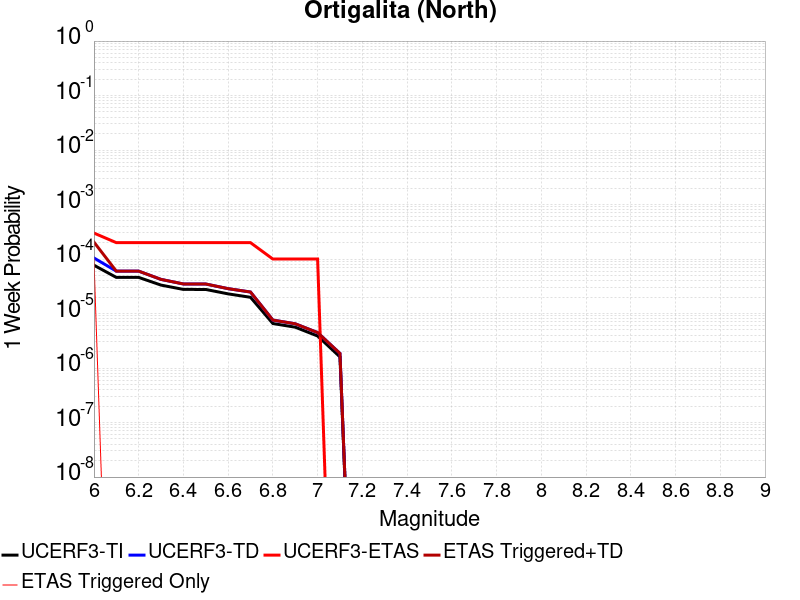 |  |  |  |

| Magnitude | 1 wk TI Prob | 1 wk TD Prob | 1 wk ETAS Prob | 1 wk ETAS/TD Gain | 1 wk ETAS Triggered+TD | 1 wk ETAS Triggered Only | 1 mo TI Prob | 1 mo TD Prob | 1 mo ETAS Prob | 1 mo ETAS/TD Gain | 1 mo ETAS Triggered+TD | 1 mo ETAS Triggered Only | 1 yr TI Prob | 1 yr TD Prob | 1 yr ETAS Prob | 1 yr ETAS/TD Gain | 1 yr ETAS Triggered+TD | 1 yr ETAS Triggered Only | 10 yr TI Prob | 10 yr TD Prob | 10 yr ETAS Prob | 10 yr ETAS/TD Gain | 10 yr ETAS Triggered+TD | 10 yr ETAS Triggered Only |
|-----|-----|-----|-----|-----|-----|-----|-----|-----|-----|-----|-----|-----|-----|-----|-----|-----|-----|-----|-----|-----|-----|-----|-----|-----|
| 6.0 | 7.711876E-5 | 1.0468789E-4 | 3.0E-4 | 2.865661 | 2.0467742E-4 | 1.0E-4 | 3.3046713E-4 | 4.4859215E-4 | 5.0E-4 | 1.1145982 | 5.485473E-4 | 1.0E-4 | 0.004016016 | 0.0054490888 | 0.0033 | 0.60560584 | 0.005846909 | 4.0E-4 | 0.039442103 | 0.053277437 | 0.0414 | 0.77706444 | 0.0561176 | 0.003 |
| 6.1 | 4.607858E-5 | 6.0052193E-5 | 2.0E-4 | 3.3304362 | 6.0052193E-5 | 0.0 | 1.9746469E-4 | 2.573422E-4 | 3.0E-4 | 1.165763 | 2.573422E-4 | 0.0 | 0.0024014818 | 0.0031289689 | 0.002 | 0.63918823 | 0.003228656 | 1.0E-4 | 0.023756953 | 0.030881127 | 0.0232 | 0.7512679 | 0.03204407 | 0.0012 |
| 6.2 | 4.607858E-5 | 6.0052193E-5 | 2.0E-4 | 3.3304362 | 6.0052193E-5 | 0.0 | 1.9746469E-4 | 2.573422E-4 | 3.0E-4 | 1.165763 | 2.573422E-4 | 0.0 | 0.0024014818 | 0.0031289689 | 0.002 | 0.63918823 | 0.003228656 | 1.0E-4 | 0.023756953 | 0.030881127 | 0.0232 | 0.7512679 | 0.03204407 | 0.0012 |
| 6.3 | 3.327423E-5 | 4.2353746E-5 | 2.0E-4 | 4.722132 | 4.2353746E-5 | 0.0 | 1.4259605E-4 | 1.8150471E-4 | 3.0E-4 | 1.6528497 | 1.8150471E-4 | 0.0 | 0.0017347244 | 0.0022078266 | 0.0016 | 0.72469455 | 0.002307606 | 1.0E-4 | 0.017212452 | 0.021883437 | 0.0174 | 0.7951219 | 0.022763742 | 9.0E-4 |
| 6.4 | 2.7732503E-5 | 3.4902085E-5 | 2.0E-4 | 5.7303166 | 3.4902085E-5 | 0.0 | 1.1884817E-4 | 1.4957308E-4 | 2.0E-4 | 1.337139 | 1.4957308E-4 | 0.0 | 0.001446016 | 0.0018197665 | 0.0013 | 0.71437734 | 0.0018197665 | 0.0 | 0.014366428 | 0.018071692 | 0.0155 | 0.857695 | 0.018857235 | 8.0E-4 |
| 6.5 | 2.7689714E-5 | 3.485199E-5 | 2.0E-4 | 5.738553 | 3.485199E-5 | 0.0 | 1.186648E-4 | 1.4935841E-4 | 2.0E-4 | 1.3390608 | 1.4935841E-4 | 0.0 | 0.0014437864 | 0.0018171573 | 0.0013 | 0.71540314 | 0.0018171573 | 0.0 | 0.014344421 | 0.018046025 | 0.0155 | 0.858915 | 0.018831588 | 8.0E-4 |
| 6.6 | 2.2976905E-5 | 2.8641503E-5 | 2.0E-4 | 6.9828734 | 2.8641503E-5 | 0.0 | 9.846873E-5 | 1.2274482E-4 | 2.0E-4 | 1.6293967 | 1.2274482E-4 | 0.0 | 0.0011981975 | 0.0014936309 | 0.0011 | 0.7364604 | 0.0014936309 | 0.0 | 0.011917574 | 0.014859187 | 0.0134 | 0.90179896 | 0.015450272 | 6.0E-4 |
| 6.7 | 1.9871539E-5 | 2.4836998E-5 | 2.0E-4 | 8.052503 | 2.4836998E-5 | 0.0 | 8.516096E-5 | 1.064412E-4 | 2.0E-4 | 1.8789717 | 1.064412E-4 | 0.0 | 0.0010363415 | 0.0012953919 | 9.0E-4 | 0.69477046 | 0.0012953919 | 0.0 | 0.010315218 | 0.012901974 | 0.0117 | 0.906838 | 0.013494233 | 6.0E-4 |
| 6.8 | 6.5640475E-6 | 7.5928892E-6 | 1.0E-4 | 13.170217 | 7.5928892E-6 | 0.0 | 2.813133E-5 | 3.2540564E-5 | 1.0E-4 | 3.0730875 | 3.2540564E-5 | 0.0 | 3.424451E-4 | 3.961122E-4 | 3.0E-4 | 0.7573612 | 3.961122E-4 | 0.0 | 0.0034191788 | 0.0039543477 | 0.0031 | 0.7839472 | 0.004053952 | 1.0E-4 |
| 6.9 | 5.6219683E-6 | 6.491215E-6 | 1.0E-4 | 15.4054365 | 6.491215E-6 | 0.0 | 2.4093928E-5 | 2.7819211E-5 | 1.0E-4 | 3.5946383 | 2.7819211E-5 | 0.0 | 2.933041E-4 | 3.3864882E-4 | 3.0E-4 | 0.88587344 | 3.3864882E-4 | 0.0 | 0.0029291727 | 0.0033815838 | 0.0029 | 0.85758626 | 0.0034812458 | 1.0E-4 |
| 7.0 | 3.875591E-6 | 4.4773983E-6 | 1.0E-4 | 22.334398 | 4.4773983E-6 | 0.0 | 1.6609569E-5 | 1.9188721E-5 | 1.0E-4 | 5.211395 | 1.9188721E-5 | 0.0 | 2.0220275E-4 | 2.3359974E-4 | 2.0E-4 | 0.85616535 | 2.3359974E-4 | 0.0 | 0.0020201886 | 0.0023337496 | 0.0022 | 0.942689 | 0.002433516 | 1.0E-4 |
| 7.1 | 1.6017933E-6 | 1.8539527E-6 | 0.0 | 0.0 | 1.8539527E-6 | 0.0 | 6.8648105E-6 | 7.945493E-6 | 0.0 | 0.0 | 7.945493E-6 | 0.0 | 8.357586E-5 | 9.673315E-5 | 0.0 | 0.0 | 9.673315E-5 | 0.0 | 8.3544437E-4 | 9.6701476E-4 | 6.0E-4 | 0.62046623 | 0.001066918 | 1.0E-4 |

## White Mountains
*[(top)](#table-of-contents)*

| 1 Week | 1 Month | 1 Year | 10 Year |
|-----|-----|-----|-----|
|  |  |  | 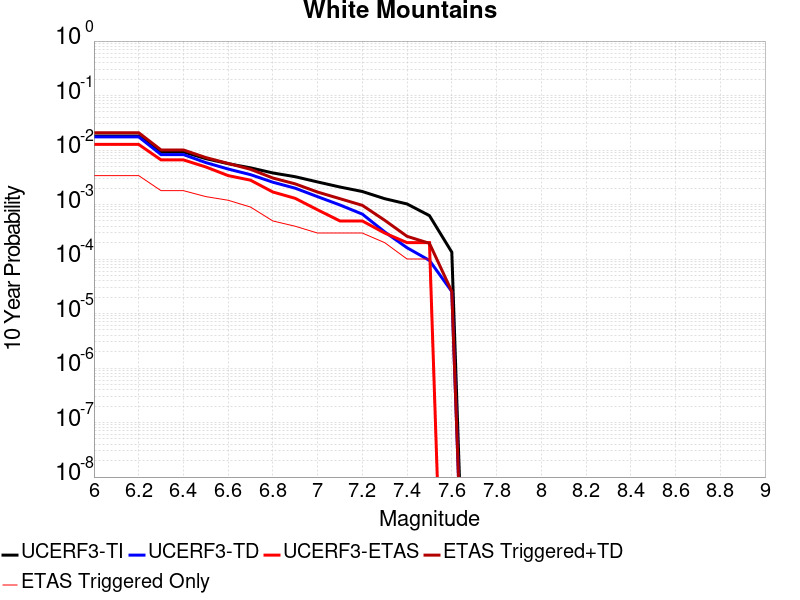 |

| Magnitude | 1 wk TI Prob | 1 wk TD Prob | 1 wk ETAS Prob | 1 wk ETAS/TD Gain | 1 wk ETAS Triggered+TD | 1 wk ETAS Triggered Only | 1 mo TI Prob | 1 mo TD Prob | 1 mo ETAS Prob | 1 mo ETAS/TD Gain | 1 mo ETAS Triggered+TD | 1 mo ETAS Triggered Only | 1 yr TI Prob | 1 yr TD Prob | 1 yr ETAS Prob | 1 yr ETAS/TD Gain | 1 yr ETAS Triggered+TD | 1 yr ETAS Triggered Only | 10 yr TI Prob | 10 yr TD Prob | 10 yr ETAS Prob | 10 yr ETAS/TD Gain | 10 yr ETAS Triggered+TD | 10 yr ETAS Triggered Only |
|-----|-----|-----|-----|-----|-----|-----|-----|-----|-----|-----|-----|-----|-----|-----|-----|-----|-----|-----|-----|-----|-----|-----|-----|-----|
| 6.0 | 3.503579E-5 | 3.3752905E-5 | 0.0 | 0.0 | 3.3752905E-5 | 0.0 | 1.5014476E-4 | 1.4464797E-4 | 1.0E-4 | 0.6913336 | 1.4464797E-4 | 0.0 | 0.0018264796 | 0.001759787 | 5.0E-4 | 0.2841253 | 0.001859611 | 1.0E-4 | 0.018115403 | 0.017470825 | 0.0127 | 0.72692615 | 0.020811424 | 0.0034 |
| 6.1 | 3.503579E-5 | 3.3752905E-5 | 0.0 | 0.0 | 3.3752905E-5 | 0.0 | 1.5014476E-4 | 1.4464797E-4 | 1.0E-4 | 0.6913336 | 1.4464797E-4 | 0.0 | 0.0018264796 | 0.001759787 | 5.0E-4 | 0.2841253 | 0.001859611 | 1.0E-4 | 0.018115403 | 0.017470825 | 0.0127 | 0.72692615 | 0.020811424 | 0.0034 |
| 6.2 | 3.503579E-5 | 3.3752905E-5 | 0.0 | 0.0 | 3.3752905E-5 | 0.0 | 1.5014476E-4 | 1.4464797E-4 | 1.0E-4 | 0.6913336 | 1.4464797E-4 | 0.0 | 0.0018264796 | 0.001759787 | 5.0E-4 | 0.2841253 | 0.001859611 | 1.0E-4 | 0.018115403 | 0.017470825 | 0.0127 | 0.72692615 | 0.020811424 | 0.0034 |
| 6.3 | 1.7818425E-5 | 1.5901618E-5 | 0.0 | 0.0 | 1.5901618E-5 | 0.0 | 7.636245E-5 | 6.8148096E-5 | 1.0E-4 | 1.4673924 | 6.8148096E-5 | 0.0 | 9.293162E-4 | 8.294014E-4 | 2.0E-4 | 0.24113774 | 8.294014E-4 | 0.0 | 0.009254395 | 0.008264516 | 0.0066 | 0.7985949 | 0.010049639 | 0.0018 |
| 6.4 | 1.7818425E-5 | 1.5901618E-5 | 0.0 | 0.0 | 1.5901618E-5 | 0.0 | 7.636245E-5 | 6.8148096E-5 | 1.0E-4 | 1.4673924 | 6.8148096E-5 | 0.0 | 9.293162E-4 | 8.294014E-4 | 2.0E-4 | 0.24113774 | 8.294014E-4 | 0.0 | 0.009254395 | 0.008264516 | 0.0066 | 0.7985949 | 0.010049639 | 0.0018 |
| 6.5 | 1.3397557E-5 | 1.1325756E-5 | 0.0 | 0.0 | 1.1325756E-5 | 0.0 | 5.741684E-5 | 4.8538088E-5 | 1.0E-4 | 2.0602376 | 4.8538088E-5 | 0.0 | 6.988258E-4 | 5.90798E-4 | 1.0E-4 | 0.1692626 | 5.90798E-4 | 0.0 | 0.006966323 | 0.0058929776 | 0.0049 | 0.83149815 | 0.0072847274 | 0.0014 |
| 6.6 | 1.0818695E-5 | 8.6170285E-6 | 0.0 | 0.0 | 8.6170285E-6 | 0.0 | 4.6365014E-5 | 3.692962E-5 | 0.0 | 0.0 | 3.692962E-5 | 0.0 | 5.6434784E-4 | 4.4952973E-4 | 0.0 | 0.0 | 4.4952973E-4 | 0.0 | 0.005629168 | 0.00448664 | 0.0034 | 0.75780535 | 0.0056812563 | 0.0012 |
| 6.7 | 9.067908E-6 | 6.7955334E-6 | 0.0 | 0.0 | 6.7955334E-6 | 0.0 | 3.8861883E-5 | 2.9123408E-5 | 0.0 | 0.0 | 2.9123408E-5 | 0.0 | 4.7304068E-4 | 3.5452298E-4 | 0.0 | 0.0 | 3.5452298E-4 | 0.0 | 0.00472035 | 0.0035398907 | 0.0028 | 0.79098487 | 0.004436705 | 9.0E-4 |
| 6.8 | 7.295947E-6 | 4.930901E-6 | 0.0 | 0.0 | 4.930901E-6 | 0.0 | 3.126797E-5 | 2.113227E-5 | 0.0 | 0.0 | 2.113227E-5 | 0.0 | 3.8062103E-4 | 2.5725612E-4 | 0.0 | 0.0 | 2.5725612E-4 | 0.0 | 0.0037996976 | 0.002569696 | 0.0017 | 0.66155684 | 0.0030684113 | 5.0E-4 |
| 6.9 | 6.2243444E-6 | 3.8274666E-6 | 0.0 | 0.0 | 3.8274666E-6 | 0.0 | 2.6675489E-5 | 1.6403328E-5 | 0.0 | 0.0 | 1.6403328E-5 | 0.0 | 3.2472567E-4 | 1.9969276E-4 | 0.0 | 0.0 | 1.9969276E-4 | 0.0 | 0.0032425157 | 0.0019951859 | 0.0013 | 0.6515684 | 0.0023943877 | 4.0E-4 |
| 7.0 | 4.9878413E-6 | 2.675381E-6 | 0.0 | 0.0 | 2.675381E-6 | 0.0 | 2.1376287E-5 | 1.146587E-5 | 0.0 | 0.0 | 1.146587E-5 | 0.0 | 2.602252E-4 | 1.3958829E-4 | 0.0 | 0.0 | 1.3958829E-4 | 0.0 | 0.002599207 | 0.0013950323 | 8.0E-4 | 0.57346344 | 0.0016946137 | 3.0E-4 |
| 7.1 | 4.0252844E-6 | 1.8821846E-6 | 0.0 | 0.0 | 1.8821846E-6 | 0.0 | 1.7251105E-5 | 8.066481E-6 | 0.0 | 0.0 | 8.066481E-6 | 0.0 | 2.1001195E-4 | 9.820511E-5 | 0.0 | 0.0 | 9.820511E-5 | 0.0 | 0.0020981359 | 9.8163E-4 | 5.0E-4 | 0.5093569 | 0.0012813355 | 3.0E-4 |
| 7.2 | 3.3284066E-6 | 1.2791369E-6 | 0.0 | 0.0 | 1.2791369E-6 | 0.0 | 1.4264522E-5 | 5.4820043E-6 | 0.0 | 0.0 | 5.4820043E-6 | 0.0 | 1.736567E-4 | 6.6741464E-5 | 0.0 | 0.0 | 6.6741464E-5 | 0.0 | 0.0017352107 | 6.6722423E-4 | 5.0E-4 | 0.74937326 | 9.6702407E-4 | 3.0E-4 |
| 7.3 | 2.458226E-6 | 6.0318837E-7 | 0.0 | 0.0 | 6.0318837E-7 | 0.0 | 1.0535211E-5 | 2.5850907E-6 | 0.0 | 0.0 | 2.5850907E-6 | 0.0 | 1.2825865E-4 | 3.147306E-5 | 0.0 | 0.0 | 3.147306E-5 | 0.0 | 0.0012818464 | 3.146898E-4 | 3.0E-4 | 0.9533198 | 5.1462685E-4 | 2.0E-4 |
| 7.4 | 1.965953E-6 | 3.086964E-7 | 0.0 | 0.0 | 3.086964E-7 | 0.0 | 8.425486E-6 | 1.3229838E-6 | 0.0 | 0.0 | 1.3229838E-6 | 0.0 | 1.0257547E-4 | 1.6107211E-5 | 0.0 | 0.0 | 1.6107211E-5 | 0.0 | 0.0010252813 | 1.6106057E-4 | 2.0E-4 | 1.2417688 | 2.6104445E-4 | 1.0E-4 |
| 7.5 | 1.2014192E-6 | 1.8092337E-7 | 0.0 | 0.0 | 1.8092337E-7 | 0.0 | 5.148929E-6 | 7.753856E-7 | 0.0 | 0.0 | 7.753856E-7 | 0.0 | 6.2686406E-5 | 9.440279E-6 | 0.0 | 0.0 | 9.440279E-6 | 0.0 | 6.266873E-4 | 9.439887E-5 | 2.0E-4 | 2.1186695 | 1.9438943E-4 | 1.0E-4 |
| 7.6 | 2.5612175E-7 | 4.8547324E-8 | 0.0 | 0.0 | 4.8547324E-8 | 0.0 | 1.0976642E-6 | 2.0805994E-7 | 0.0 | 0.0 | 2.0805994E-7 | 0.0 | 1.3363979E-5 | 2.5331274E-6 | 0.0 | 0.0 | 2.5331274E-6 | 0.0 | 1.3363175E-4 | 2.5331019E-5 | 0.0 | 0.0 | 2.5331019E-5 | 0.0 |

## Santa Ynez (West)
*[(top)](#table-of-contents)*

| 1 Week | 1 Month | 1 Year | 10 Year |
|-----|-----|-----|-----|
|  |  |  |  |

| Magnitude | 1 wk TI Prob | 1 wk TD Prob | 1 wk ETAS Prob | 1 wk ETAS/TD Gain | 1 wk ETAS Triggered+TD | 1 wk ETAS Triggered Only | 1 mo TI Prob | 1 mo TD Prob | 1 mo ETAS Prob | 1 mo ETAS/TD Gain | 1 mo ETAS Triggered+TD | 1 mo ETAS Triggered Only | 1 yr TI Prob | 1 yr TD Prob | 1 yr ETAS Prob | 1 yr ETAS/TD Gain | 1 yr ETAS Triggered+TD | 1 yr ETAS Triggered Only | 10 yr TI Prob | 10 yr TD Prob | 10 yr ETAS Prob | 10 yr ETAS/TD Gain | 10 yr ETAS Triggered+TD | 10 yr ETAS Triggered Only |
|-----|-----|-----|-----|-----|-----|-----|-----|-----|-----|-----|-----|-----|-----|-----|-----|-----|-----|-----|-----|-----|-----|-----|-----|-----|
| 6.0 | 4.7352758E-5 | 5.4863423E-5 | 0.0 | 0.0 | 5.4863423E-5 | 0.0 | 2.0292461E-4 | 2.3510942E-4 | 2.0E-4 | 0.8506677 | 3.350859E-4 | 1.0E-4 | 0.0024678076 | 0.0028589668 | 0.0018 | 0.6295981 | 0.0031581093 | 3.0E-4 | 0.024405818 | 0.028250013 | 0.0241 | 0.85309696 | 0.030776562 | 0.0026 |
| 6.1 | 4.7352758E-5 | 5.4863423E-5 | 0.0 | 0.0 | 5.4863423E-5 | 0.0 | 2.0292461E-4 | 2.3510942E-4 | 2.0E-4 | 0.8506677 | 3.350859E-4 | 1.0E-4 | 0.0024678076 | 0.0028589668 | 0.0016 | 0.55964273 | 0.003058395 | 2.0E-4 | 0.024405818 | 0.028250013 | 0.0206 | 0.7292032 | 0.030485038 | 0.0023 |
| 6.2 | 3.0415853E-5 | 3.387048E-5 | 0.0 | 0.0 | 3.387048E-5 | 0.0 | 1.3034715E-4 | 1.4515135E-4 | 1.0E-4 | 0.68893605 | 2.4513685E-4 | 1.0E-4 | 0.0015858212 | 0.0017658201 | 0.0012 | 0.6795709 | 0.001965467 | 2.0E-4 | 0.015745522 | 0.017521854 | 0.0147 | 0.83895224 | 0.01958506 | 0.0021 |
| 6.3 | 3.0415853E-5 | 3.387048E-5 | 0.0 | 0.0 | 3.387048E-5 | 0.0 | 1.3034715E-4 | 1.4515135E-4 | 1.0E-4 | 0.68893605 | 2.4513685E-4 | 1.0E-4 | 0.0015858212 | 0.0017658201 | 0.0012 | 0.6795709 | 0.001965467 | 2.0E-4 | 0.015745522 | 0.017521854 | 0.0147 | 0.83895224 | 0.01958506 | 0.0021 |
| 6.4 | 2.5452082E-5 | 2.787111E-5 | 0.0 | 0.0 | 2.787111E-5 | 0.0 | 1.09075794E-4 | 1.19442266E-4 | 1.0E-4 | 0.8372246 | 2.1943032E-4 | 1.0E-4 | 0.0013271887 | 0.0014532584 | 0.0011 | 0.75691974 | 0.0016529678 | 2.0E-4 | 0.013192902 | 0.014439723 | 0.0123 | 0.8518169 | 0.016213732 | 0.0018 |
| 6.5 | 2.3143784E-5 | 2.5092924E-5 | 0.0 | 0.0 | 2.5092924E-5 | 0.0 | 9.9183875E-5 | 1.07536755E-4 | 1.0E-4 | 0.92991465 | 2.07526E-4 | 1.0E-4 | 0.0012068948 | 0.0013084881 | 0.0011 | 0.84066486 | 0.0015082264 | 2.0E-4 | 0.012003611 | 0.013009505 | 0.0113 | 0.86859566 | 0.014687389 | 0.0017 |
| 6.6 | 1.9118515E-5 | 2.0328338E-5 | 0.0 | 0.0 | 2.0328338E-5 | 0.0 | 8.193392E-5 | 8.7118584E-5 | 1.0E-4 | 1.1478608 | 1.8710986E-4 | 1.0E-4 | 9.97089E-4 | 0.0010601605 | 0.001 | 0.9432534 | 0.0012599485 | 2.0E-4 | 0.00992627 | 0.010551939 | 0.0086 | 0.8150161 | 0.011937167 | 0.0014 |
| 6.7 | 1.722807E-5 | 1.8124238E-5 | 0.0 | 0.0 | 1.8124238E-5 | 0.0 | 7.3832496E-5 | 7.767302E-5 | 0.0 | 0.0 | 7.767302E-5 | 0.0 | 8.985399E-4 | 9.452643E-4 | 9.0E-4 | 0.95211464 | 0.0010451698 | 1.0E-4 | 0.008949154 | 0.009413079 | 0.0079 | 0.8392577 | 0.010700842 | 0.0013 |
| 6.8 | 1.5317364E-5 | 1.590815E-5 | 0.0 | 0.0 | 1.590815E-5 | 0.0 | 6.56442E-5 | 6.817603E-5 | 0.0 | 0.0 | 6.817603E-5 | 0.0 | 7.98925E-4 | 8.2973135E-4 | 9.0E-4 | 1.0846884 | 9.296484E-4 | 1.0E-4 | 0.007960589 | 0.008266821 | 0.0068 | 0.8225653 | 0.009456901 | 0.0012 |
| 6.9 | 1.3071226E-5 | 1.3315544E-5 | 0.0 | 0.0 | 1.3315544E-5 | 0.0 | 5.6018336E-5 | 5.706538E-5 | 0.0 | 0.0 | 5.706538E-5 | 0.0 | 6.8180985E-4 | 6.9455174E-4 | 7.0E-4 | 1.0078442 | 7.944823E-4 | 1.0E-4 | 0.0067972173 | 0.00692407 | 0.0057 | 0.82321525 | 0.008115761 | 0.0012 |
| 7.0 | 1.1836986E-5 | 1.1920637E-5 | 0.0 | 0.0 | 1.1920637E-5 | 0.0 | 5.0728955E-5 | 5.1087452E-5 | 0.0 | 0.0 | 5.1087452E-5 | 0.0 | 6.1745E-4 | 6.218139E-4 | 7.0E-4 | 1.1257387 | 7.217517E-4 | 1.0E-4 | 0.006157372 | 0.006200933 | 0.0051 | 0.8224569 | 0.007294112 | 0.0011 |
| 7.1 | 1.0597169E-5 | 1.0531838E-5 | 0.0 | 0.0 | 1.0531838E-5 | 0.0 | 4.541565E-5 | 4.5135675E-5 | 0.0 | 0.0 | 4.5135675E-5 | 0.0 | 5.5279525E-4 | 5.493894E-4 | 6.0E-4 | 1.0921215 | 6.4933446E-4 | 1.0E-4 | 0.0055142213 | 0.005480443 | 0.0048 | 0.8758416 | 0.0065744147 | 0.0011 |
| 7.2 | 9.59113E-6 | 9.449656E-6 | 0.0 | 0.0 | 9.449656E-6 | 0.0 | 4.11042E-5 | 4.0497904E-5 | 0.0 | 0.0 | 4.0497904E-5 | 0.0 | 5.0032866E-4 | 4.929515E-4 | 6.0E-4 | 1.2171582 | 5.929022E-4 | 1.0E-4 | 0.004992037 | 0.004918699 | 0.0046 | 0.93520665 | 0.006013288 | 0.0011 |
| 7.3 | 8.586084E-6 | 8.370937E-6 | 0.0 | 0.0 | 8.370937E-6 | 0.0 | 3.679698E-5 | 3.587496E-5 | 0.0 | 0.0 | 3.587496E-5 | 0.0 | 4.4791115E-4 | 4.3669113E-4 | 5.0E-4 | 1.144974 | 5.3664745E-4 | 1.0E-4 | 0.004470094 | 0.004358441 | 0.0043 | 0.9865913 | 0.0053540827 | 0.001 |
| 7.4 | 7.2622997E-6 | 6.9441057E-6 | 0.0 | 0.0 | 6.9441057E-6 | 0.0 | 3.112377E-5 | 2.976012E-5 | 0.0 | 0.0 | 2.976012E-5 | 0.0 | 3.78866E-4 | 3.6227016E-4 | 5.0E-4 | 1.3801854 | 4.6223396E-4 | 1.0E-4 | 0.0037822074 | 0.0036168962 | 0.0034 | 0.9400325 | 0.0043143644 | 7.0E-4 |
| 7.5 | 5.627296E-6 | 5.245823E-6 | 0.0 | 0.0 | 5.245823E-6 | 0.0 | 2.411676E-5 | 2.248191E-5 | 0.0 | 0.0 | 2.248191E-5 | 0.0 | 2.9358198E-4 | 2.7368357E-4 | 1.0E-4 | 0.36538544 | 3.7365622E-4 | 1.0E-4 | 0.0029319443 | 0.0027335372 | 0.002 | 0.73165274 | 0.0032321704 | 5.0E-4 |
| 7.6 | 2.265244E-6 | 2.058393E-6 | 0.0 | 0.0 | 2.058393E-6 | 0.0 | 9.708152E-6 | 8.821655E-6 | 0.0 | 0.0 | 8.821655E-6 | 0.0 | 1.18190335E-4 | 1.07398446E-4 | 1.0E-4 | 0.9311122 | 2.073877E-4 | 1.0E-4 | 0.001181275 | 0.001073474 | 0.0011 | 1.0247104 | 0.0015729372 | 5.0E-4 |
| 7.7 | 1.3099874E-6 | 1.0999634E-6 | 0.0 | 0.0 | 1.0999634E-6 | 0.0 | 5.61422E-6 | 4.71412E-6 | 0.0 | 0.0 | 4.71412E-6 | 0.0 | 6.8350986E-5 | 5.739293E-5 | 0.0 | 0.0 | 5.739293E-5 | 0.0 | 6.832996E-4 | 5.737834E-4 | 7.0E-4 | 1.2199725 | 8.736113E-4 | 3.0E-4 |
| 7.8 | 7.903951E-7 | 6.0595517E-7 | 0.0 | 0.0 | 6.0595517E-7 | 0.0 | 3.3874032E-6 | 2.5969482E-6 | 0.0 | 0.0 | 2.5969482E-6 | 0.0 | 4.1240855E-5 | 3.1617397E-5 | 0.0 | 0.0 | 3.1617397E-5 | 0.0 | 4.12332E-4 | 3.1613032E-4 | 1.0E-4 | 0.31632525 | 3.1613032E-4 | 0.0 |
| 7.9 | 7.0753297E-9 | 5.0875566E-9 | 0.0 | 0.0 | 5.0875566E-9 | 0.0 | 3.032284E-8 | 2.1803814E-8 | 0.0 | 0.0 | 2.1803814E-8 | 0.0 | 3.6918053E-7 | 2.654614E-7 | 0.0 | 0.0 | 2.654614E-7 | 0.0 | 3.691799E-6 | 2.654612E-6 | 0.0 | 0.0 | 2.654612E-6 | 0.0 |

## Concord 2011 CFM
*[(top)](#table-of-contents)*

| 1 Week | 1 Month | 1 Year | 10 Year |
|-----|-----|-----|-----|
|  | 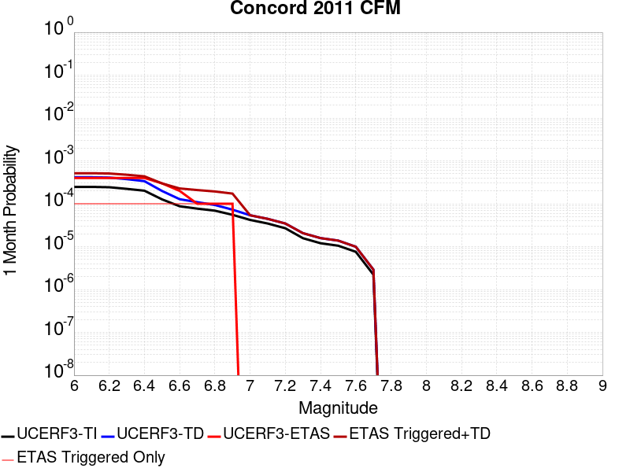 | 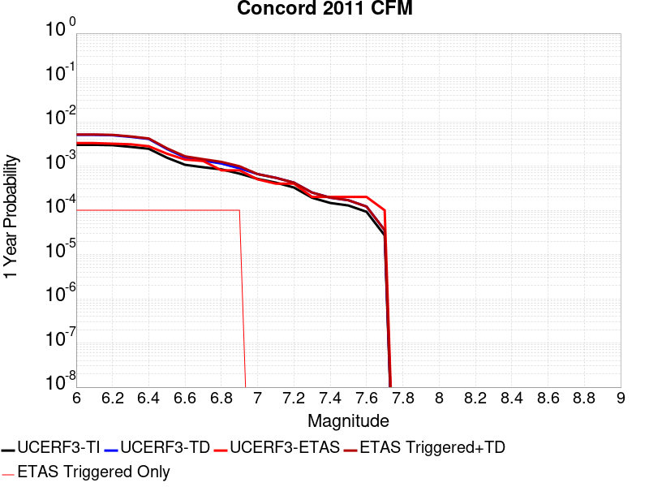 |  |

| Magnitude | 1 wk TI Prob | 1 wk TD Prob | 1 wk ETAS Prob | 1 wk ETAS/TD Gain | 1 wk ETAS Triggered+TD | 1 wk ETAS Triggered Only | 1 mo TI Prob | 1 mo TD Prob | 1 mo ETAS Prob | 1 mo ETAS/TD Gain | 1 mo ETAS Triggered+TD | 1 mo ETAS Triggered Only | 1 yr TI Prob | 1 yr TD Prob | 1 yr ETAS Prob | 1 yr ETAS/TD Gain | 1 yr ETAS Triggered+TD | 1 yr ETAS Triggered Only | 10 yr TI Prob | 10 yr TD Prob | 10 yr ETAS Prob | 10 yr ETAS/TD Gain | 10 yr ETAS Triggered+TD | 10 yr ETAS Triggered Only |
|-----|-----|-----|-----|-----|-----|-----|-----|-----|-----|-----|-----|-----|-----|-----|-----|-----|-----|-----|-----|-----|-----|-----|-----|-----|
| 6.0 | 5.7865112E-5 | 9.7227785E-5 | 2.0E-4 | 2.0570252 | 1.9721806E-4 | 1.0E-4 | 2.4796976E-4 | 4.166246E-4 | 4.0E-4 | 0.96009696 | 5.165829E-4 | 1.0E-4 | 0.0030148525 | 0.0050611263 | 0.0033 | 0.65202874 | 0.0051606204 | 1.0E-4 | 0.029742775 | 0.04907589 | 0.0298 | 0.6072228 | 0.052309033 | 0.0034 |
| 6.1 | 5.7865112E-5 | 9.7227785E-5 | 2.0E-4 | 2.0570252 | 1.9721806E-4 | 1.0E-4 | 2.4796976E-4 | 4.166246E-4 | 4.0E-4 | 0.96009696 | 5.165829E-4 | 1.0E-4 | 0.0030148525 | 0.0050611263 | 0.0033 | 0.65202874 | 0.0051606204 | 1.0E-4 | 0.029742775 | 0.04907589 | 0.0298 | 0.6072228 | 0.052309033 | 0.0034 |
| 6.2 | 5.6789337E-5 | 9.543774E-5 | 2.0E-4 | 2.095607 | 1.9542819E-4 | 1.0E-4 | 2.4336016E-4 | 4.0895652E-4 | 4.0E-4 | 0.9780991 | 5.0891563E-4 | 1.0E-4 | 0.0029588845 | 0.004968242 | 0.0032 | 0.644091 | 0.005067745 | 1.0E-4 | 0.029197963 | 0.04819583 | 0.0292 | 0.6058615 | 0.051431965 | 0.0034 |
| 6.3 | 5.203322E-5 | 8.771259E-5 | 2.0E-4 | 2.2801743 | 1.8770382E-4 | 1.0E-4 | 2.2298045E-4 | 3.7586133E-4 | 4.0E-4 | 1.0642223 | 4.7582373E-4 | 1.0E-4 | 0.0027114071 | 0.004567288 | 0.0031 | 0.6787398 | 0.0046668313 | 1.0E-4 | 0.026785625 | 0.044380765 | 0.0273 | 0.6151314 | 0.04753431 | 0.0033 |
| 6.4 | 4.7120942E-5 | 7.866446E-5 | 2.0E-4 | 2.5424442 | 1.786566E-4 | 1.0E-4 | 2.0193127E-4 | 3.37094E-4 | 4.0E-4 | 1.1866126 | 4.370603E-4 | 1.0E-4 | 0.0024557412 | 0.0040971357 | 0.0028 | 0.68340427 | 0.004196726 | 1.0E-4 | 0.024287801 | 0.039909057 | 0.0252 | 0.6314356 | 0.04288534 | 0.0031 |
| 6.5 | 2.9598437E-5 | 4.6468846E-5 | 1.0E-4 | 2.1519794 | 1.464642E-4 | 1.0E-4 | 1.2684427E-4 | 1.9913817E-4 | 3.0E-4 | 1.5064918 | 2.9911826E-4 | 1.0E-4 | 0.001543235 | 0.0024220194 | 0.0019 | 0.78446937 | 0.002521777 | 1.0E-4 | 0.015325619 | 0.023813063 | 0.0159 | 0.6677007 | 0.025472581 | 0.0017 |
| 6.6 | 2.0443718E-5 | 2.9870673E-5 | 1.0E-4 | 3.3477652 | 1.2986768E-4 | 1.0E-4 | 8.7613E-5 | 1.2801109E-4 | 2.0E-4 | 1.5623646 | 2.2799829E-4 | 1.0E-4 | 0.0010661662 | 0.0015574567 | 0.0014 | 0.8989014 | 0.001657301 | 1.0E-4 | 0.010610655 | 0.015412929 | 0.0107 | 0.6942224 | 0.016594432 | 0.0012 |
| 6.7 | 1.798539E-5 | 2.5471327E-5 | 1.0E-4 | 3.925983 | 1.2546878E-4 | 1.0E-4 | 7.7077966E-5 | 1.0915838E-4 | 1.0E-4 | 0.9161 | 2.0914747E-4 | 1.0E-4 | 9.380202E-4 | 0.0013282145 | 0.0013 | 0.97875756 | 0.0014280817 | 1.0E-4 | 0.009340706 | 0.013176453 | 0.0092 | 0.6982152 | 0.014064594 | 9.0E-4 |
| 6.8 | 1.613555E-5 | 2.1890408E-5 | 1.0E-4 | 4.5682106 | 1.2188822E-4 | 1.0E-4 | 6.915052E-5 | 9.381274E-5 | 1.0E-4 | 1.0659533 | 1.9380337E-4 | 1.0E-4 | 8.4158237E-4 | 0.0011415855 | 8.0E-4 | 0.70077974 | 0.0012414714 | 1.0E-4 | 0.008384023 | 0.01134584 | 0.0075 | 0.66103524 | 0.012136763 | 8.0E-4 |
| 6.9 | 1.2916435E-5 | 1.7027736E-5 | 1.0E-4 | 5.872771 | 1.1702604E-4 | 1.0E-4 | 5.5354973E-5 | 7.2974006E-5 | 1.0E-4 | 1.370351 | 1.7296671E-4 | 1.0E-4 | 6.7373837E-4 | 8.8810216E-4 | 8.0E-4 | 0.90079725 | 9.880133E-4 | 1.0E-4 | 0.006716994 | 0.00884014 | 0.0062 | 0.70134634 | 0.009533952 | 7.0E-4 |
| 7.0 | 9.81129E-6 | 1.2596236E-5 | 0.0 | 0.0 | 1.2596236E-5 | 0.0 | 4.2047708E-5 | 5.398276E-5 | 0.0 | 0.0 | 5.398276E-5 | 0.0 | 5.118106E-4 | 6.5704354E-4 | 5.0E-4 | 0.76098454 | 6.5704354E-4 | 0.0 | 0.005106334 | 0.0065519335 | 0.0038 | 0.5799815 | 0.006849968 | 3.0E-4 |
| 7.1 | 8.0889195E-6 | 1.0385969E-5 | 0.0 | 0.0 | 1.0385969E-5 | 0.0 | 3.4666336E-5 | 4.4510547E-5 | 0.0 | 0.0 | 4.4510547E-5 | 0.0 | 4.219809E-4 | 5.417822E-4 | 4.0E-4 | 0.7383041 | 5.417822E-4 | 0.0 | 0.004211805 | 0.0054050833 | 0.0034 | 0.6290375 | 0.005703462 | 3.0E-4 |
| 7.2 | 6.267438E-6 | 8.088033E-6 | 0.0 | 0.0 | 8.088033E-6 | 0.0 | 2.6860173E-5 | 3.4662542E-5 | 0.0 | 0.0 | 3.4662542E-5 | 0.0 | 3.2697353E-4 | 4.2193543E-4 | 4.0E-4 | 0.9480123 | 4.2193543E-4 | 0.0 | 0.0032649285 | 0.0042119 | 0.0029 | 0.6885254 | 0.0045106364 | 3.0E-4 |
| 7.3 | 3.6761196E-6 | 4.8197294E-6 | 0.0 | 0.0 | 4.8197294E-6 | 0.0 | 1.5754704E-5 | 2.0655822E-5 | 0.0 | 0.0 | 2.0655822E-5 | 0.0 | 1.9179663E-4 | 2.5145581E-4 | 2.0E-4 | 0.7953684 | 2.5145581E-4 | 0.0 | 0.0019163118 | 0.0025119635 | 0.0018 | 0.716571 | 0.002711461 | 2.0E-4 |
| 7.4 | 2.8044356E-6 | 3.6945266E-6 | 0.0 | 0.0 | 3.6945266E-6 | 0.0 | 1.2018954E-5 | 1.583359E-5 | 0.0 | 0.0 | 1.583359E-5 | 0.0 | 1.4632095E-4 | 1.9275701E-4 | 2.0E-4 | 1.0375757 | 1.9275701E-4 | 0.0 | 0.0014622464 | 0.0019260531 | 0.0011 | 0.57111615 | 0.0021256679 | 2.0E-4 |
| 7.5 | 2.4578699E-6 | 3.2311568E-6 | 0.0 | 0.0 | 3.2311568E-6 | 0.0 | 1.0533685E-5 | 1.3847743E-5 | 0.0 | 0.0 | 1.3847743E-5 | 0.0 | 1.2824008E-4 | 1.6858333E-4 | 2.0E-4 | 1.1863569 | 1.6858333E-4 | 0.0 | 0.0012816609 | 0.001684676 | 0.001 | 0.5935859 | 0.0018843391 | 2.0E-4 |
| 7.6 | 1.7713267E-6 | 2.3238626E-6 | 0.0 | 0.0 | 2.3238626E-6 | 0.0 | 7.591378E-6 | 9.9593735E-6 | 0.0 | 0.0 | 9.9593735E-6 | 0.0 | 9.2421105E-5 | 1.2124872E-4 | 2.0E-4 | 1.649502 | 1.2124872E-4 | 0.0 | 9.2382677E-4 | 0.0012119251 | 0.001 | 0.8251335 | 0.0014116827 | 2.0E-4 |
| 7.7 | 5.1912366E-7 | 6.796827E-7 | 0.0 | 0.0 | 6.796827E-7 | 0.0 | 2.2248137E-6 | 2.9129228E-6 | 0.0 | 0.0 | 2.9129228E-6 | 0.0 | 2.708677E-5 | 3.5464273E-5 | 1.0E-4 | 2.8197393 | 3.5464273E-5 | 0.0 | 2.708347E-4 | 3.5461446E-4 | 4.0E-4 | 1.1279856 | 4.54579E-4 | 1.0E-4 |

## Pleito
*[(top)](#table-of-contents)*

| 1 Week | 1 Month | 1 Year | 10 Year |
|-----|-----|-----|-----|
|  |  | 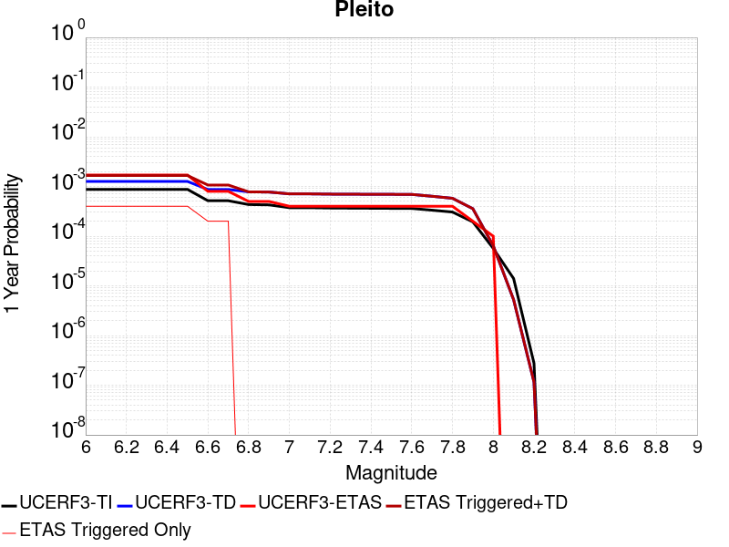 |  |

| Magnitude | 1 wk TI Prob | 1 wk TD Prob | 1 wk ETAS Prob | 1 wk ETAS/TD Gain | 1 wk ETAS Triggered+TD | 1 wk ETAS Triggered Only | 1 mo TI Prob | 1 mo TD Prob | 1 mo ETAS Prob | 1 mo ETAS/TD Gain | 1 mo ETAS Triggered+TD | 1 mo ETAS Triggered Only | 1 yr TI Prob | 1 yr TD Prob | 1 yr ETAS Prob | 1 yr ETAS/TD Gain | 1 yr ETAS Triggered+TD | 1 yr ETAS Triggered Only | 10 yr TI Prob | 10 yr TD Prob | 10 yr ETAS Prob | 10 yr ETAS/TD Gain | 10 yr ETAS Triggered+TD | 10 yr ETAS Triggered Only |
|-----|-----|-----|-----|-----|-----|-----|-----|-----|-----|-----|-----|-----|-----|-----|-----|-----|-----|-----|-----|-----|-----|-----|-----|-----|
| 6.0 | 1.6763008E-5 | 2.420621E-5 | 0.0 | 0.0 | 2.420621E-5 | 0.0 | 7.183948E-5 | 1.03737184E-4 | 3.0E-4 | 2.8919234 | 3.0371643E-4 | 2.0E-4 | 8.742947E-4 | 0.0012623403 | 0.0017 | 1.346705 | 0.0016618354 | 4.0E-4 | 0.00870863 | 0.012671881 | 0.0167 | 1.3178785 | 0.016028797 | 0.0034 |
| 6.1 | 1.6763008E-5 | 2.420621E-5 | 0.0 | 0.0 | 2.420621E-5 | 0.0 | 7.183948E-5 | 1.03737184E-4 | 3.0E-4 | 2.8919234 | 3.0371643E-4 | 2.0E-4 | 8.742947E-4 | 0.0012623403 | 0.0017 | 1.346705 | 0.0016618354 | 4.0E-4 | 0.00870863 | 0.012671881 | 0.0167 | 1.3178785 | 0.016028797 | 0.0034 |
| 6.2 | 1.6763008E-5 | 2.420621E-5 | 0.0 | 0.0 | 2.420621E-5 | 0.0 | 7.183948E-5 | 1.03737184E-4 | 3.0E-4 | 2.8919234 | 3.0371643E-4 | 2.0E-4 | 8.742947E-4 | 0.0012623403 | 0.0017 | 1.346705 | 0.0016618354 | 4.0E-4 | 0.00870863 | 0.012671881 | 0.0167 | 1.3178785 | 0.016028797 | 0.0034 |
| 6.3 | 1.6763008E-5 | 2.420621E-5 | 0.0 | 0.0 | 2.420621E-5 | 0.0 | 7.183948E-5 | 1.03737184E-4 | 3.0E-4 | 2.8919234 | 3.0371643E-4 | 2.0E-4 | 8.742947E-4 | 0.0012623403 | 0.0017 | 1.346705 | 0.0016618354 | 4.0E-4 | 0.00870863 | 0.012671881 | 0.0167 | 1.3178785 | 0.016028797 | 0.0034 |
| 6.4 | 1.6763008E-5 | 2.420621E-5 | 0.0 | 0.0 | 2.420621E-5 | 0.0 | 7.183948E-5 | 1.03737184E-4 | 3.0E-4 | 2.8919234 | 3.0371643E-4 | 2.0E-4 | 8.742947E-4 | 0.0012623403 | 0.0017 | 1.346705 | 0.0016618354 | 4.0E-4 | 0.00870863 | 0.012671881 | 0.0167 | 1.3178785 | 0.016028797 | 0.0034 |
| 6.5 | 1.6763008E-5 | 2.420621E-5 | 0.0 | 0.0 | 2.420621E-5 | 0.0 | 7.183948E-5 | 1.03737184E-4 | 3.0E-4 | 2.8919234 | 3.0371643E-4 | 2.0E-4 | 8.742947E-4 | 0.0012623403 | 0.0017 | 1.346705 | 0.0016618354 | 4.0E-4 | 0.00870863 | 0.012671881 | 0.0167 | 1.3178785 | 0.016028797 | 0.0034 |
| 6.6 | 9.910213E-6 | 1.6664997E-5 | 0.0 | 0.0 | 1.6664997E-5 | 0.0 | 4.247165E-5 | 7.141948E-5 | 2.0E-4 | 2.8003564 | 1.7141234E-4 | 1.0E-4 | 5.169696E-4 | 8.69189E-4 | 8.0E-4 | 0.92039824 | 0.0010690151 | 2.0E-4 | 0.0051576863 | 0.008771734 | 0.0066 | 0.75241673 | 0.0103577 | 0.0016 |
| 6.7 | 9.910213E-6 | 1.6664997E-5 | 0.0 | 0.0 | 1.6664997E-5 | 0.0 | 4.247165E-5 | 7.141948E-5 | 2.0E-4 | 2.8003564 | 1.7141234E-4 | 1.0E-4 | 5.169696E-4 | 8.69189E-4 | 8.0E-4 | 0.92039824 | 0.0010690151 | 2.0E-4 | 0.0051576863 | 0.008771734 | 0.0066 | 0.75241673 | 0.0103577 | 0.0016 |
| 6.8 | 8.300162E-6 | 1.4926077E-5 | 0.0 | 0.0 | 1.4926077E-5 | 0.0 | 3.557164E-5 | 6.396734E-5 | 0.0 | 0.0 | 6.396734E-5 | 0.0 | 4.3299864E-4 | 7.785255E-4 | 5.0E-4 | 0.64223975 | 7.785255E-4 | 0.0 | 0.004321559 | 0.007871681 | 0.0053 | 0.6732997 | 0.008963021 | 0.0011 |
| 6.9 | 8.183114E-6 | 1.479753E-5 | 0.0 | 0.0 | 1.479753E-5 | 0.0 | 3.5070017E-5 | 6.341645E-5 | 0.0 | 0.0 | 6.341645E-5 | 0.0 | 4.2689382E-4 | 7.7182316E-4 | 5.0E-4 | 0.6478168 | 7.7182316E-4 | 0.0 | 0.0042607468 | 0.0078051295 | 0.0053 | 0.6790406 | 0.008896544 | 0.0011 |
| 7.0 | 7.1748823E-6 | 1.35911105E-5 | 0.0 | 0.0 | 1.35911105E-5 | 0.0 | 3.0749135E-5 | 5.8246318E-5 | 0.0 | 0.0 | 5.8246318E-5 | 0.0 | 3.743064E-4 | 7.089187E-4 | 4.0E-4 | 0.56423956 | 7.089187E-4 | 0.0 | 0.0037367654 | 0.007179783 | 0.0043 | 0.5989039 | 0.008172603 | 0.001 |
| 7.1 | 7.1671807E-6 | 1.35815535E-5 | 0.0 | 0.0 | 1.35815535E-5 | 0.0 | 3.0716128E-5 | 5.820536E-5 | 0.0 | 0.0 | 5.820536E-5 | 0.0 | 3.7390468E-4 | 7.0842035E-4 | 4.0E-4 | 0.56463647 | 7.0842035E-4 | 0.0 | 0.0037327618 | 0.0071748323 | 0.0043 | 0.59931713 | 0.008167657 | 0.001 |
| 7.2 | 7.0649667E-6 | 1.3430569E-5 | 0.0 | 0.0 | 1.3430569E-5 | 0.0 | 3.0278077E-5 | 5.7558314E-5 | 0.0 | 0.0 | 5.7558314E-5 | 0.0 | 3.6857324E-4 | 7.0054765E-4 | 4.0E-4 | 0.57098186 | 7.0054765E-4 | 0.0 | 0.0036796255 | 0.007096455 | 0.0043 | 0.60593635 | 0.008089358 | 0.001 |
| 7.3 | 7.02082E-6 | 1.3375024E-5 | 0.0 | 0.0 | 1.3375024E-5 | 0.0 | 3.008888E-5 | 5.732027E-5 | 0.0 | 0.0 | 5.732027E-5 | 0.0 | 3.6627054E-4 | 6.976513E-4 | 4.0E-4 | 0.57335234 | 6.976513E-4 | 0.0 | 0.0036566744 | 0.0070674564 | 0.0042 | 0.5942732 | 0.007961095 | 9.0E-4 |
| 7.4 | 6.987146E-6 | 1.3335148E-5 | 0.0 | 0.0 | 1.3335148E-5 | 0.0 | 2.9944567E-5 | 5.7149384E-5 | 0.0 | 0.0 | 5.7149384E-5 | 0.0 | 3.6451413E-4 | 6.955721E-4 | 4.0E-4 | 0.5750662 | 6.955721E-4 | 0.0 | 0.0036391679 | 0.007046675 | 0.0042 | 0.59602576 | 0.007940333 | 9.0E-4 |
| 7.5 | 6.9494554E-6 | 1.3292482E-5 | 0.0 | 0.0 | 1.3292482E-5 | 0.0 | 2.9783041E-5 | 5.696654E-5 | 0.0 | 0.0 | 5.696654E-5 | 0.0 | 3.625482E-4 | 6.9334736E-4 | 4.0E-4 | 0.5769114 | 6.9334736E-4 | 0.0 | 0.0036195726 | 0.0070245177 | 0.0042 | 0.5979058 | 0.007918196 | 9.0E-4 |
| 7.6 | 6.92694E-6 | 1.3252396E-5 | 0.0 | 0.0 | 1.3252396E-5 | 0.0 | 2.9686547E-5 | 5.6794746E-5 | 0.0 | 0.0 | 5.6794746E-5 | 0.0 | 3.6137376E-4 | 6.912571E-4 | 4.0E-4 | 0.57865584 | 6.912571E-4 | 0.0 | 0.0036078666 | 0.007003673 | 0.0042 | 0.5996854 | 0.00789737 | 9.0E-4 |
| 7.7 | 6.395867E-6 | 1.2154203E-5 | 0.0 | 0.0 | 1.2154203E-5 | 0.0 | 2.741057E-5 | 5.2088406E-5 | 0.0 | 0.0 | 5.2088406E-5 | 0.0 | 3.336726E-4 | 6.3399214E-4 | 4.0E-4 | 0.6309227 | 6.3399214E-4 | 0.0 | 0.0033317201 | 0.006433666 | 0.004 | 0.6217295 | 0.007327876 | 9.0E-4 |
| 7.8 | 5.8664327E-6 | 1.1065597E-5 | 0.0 | 0.0 | 1.1065597E-5 | 0.0 | 2.5141611E-5 | 4.7423127E-5 | 0.0 | 0.0 | 4.7423127E-5 | 0.0 | 3.060561E-4 | 5.7722384E-4 | 4.0E-4 | 0.69297206 | 5.7722384E-4 | 0.0 | 0.0030563495 | 0.005861171 | 0.0038 | 0.6483346 | 0.006755896 | 9.0E-4 |
| 7.9 | 3.7167474E-6 | 6.826978E-6 | 0.0 | 0.0 | 6.826978E-6 | 0.0 | 1.592882E-5 | 2.9258148E-5 | 0.0 | 0.0 | 2.9258148E-5 | 0.0 | 1.9391612E-4 | 3.5615987E-4 | 2.0E-4 | 0.56154555 | 3.5615987E-4 | 0.0 | 0.0019374699 | 0.0036211766 | 0.0025 | 0.6903834 | 0.0043186415 | 7.0E-4 |
| 8.0 | 1.0903841E-6 | 1.223528E-6 | 0.0 | 0.0 | 1.223528E-6 | 0.0 | 4.6730665E-6 | 5.243681E-6 | 0.0 | 0.0 | 5.243681E-6 | 0.0 | 5.68931E-5 | 6.383996E-5 | 1.0E-4 | 1.5664171 | 6.383996E-5 | 0.0 | 5.6878536E-4 | 6.603334E-4 | 4.0E-4 | 0.6057546 | 6.603334E-4 | 0.0 |
| 8.1 | 2.6894583E-7 | 9.9516384E-8 | 0.0 | 0.0 | 9.9516384E-8 | 0.0 | 1.1526245E-6 | 4.264987E-7 | 0.0 | 0.0 | 4.264987E-7 | 0.0 | 1.4033113E-5 | 5.1926095E-6 | 0.0 | 0.0 | 5.1926095E-6 | 0.0 | 1.4032227E-4 | 5.835751E-5 | 0.0 | 0.0 | 5.835751E-5 | 0.0 |
| 8.2 | 5.2967013E-9 | 2.1931936E-9 | 0.0 | 0.0 | 2.1931936E-9 | 0.0 | 2.2700148E-8 | 9.399401E-9 | 0.0 | 0.0 | 9.399401E-9 | 0.0 | 2.7637427E-7 | 1.1443771E-7 | 0.0 | 0.0 | 1.1443771E-7 | 0.0 | 2.7637393E-6 | 1.3106312E-6 | 0.0 | 0.0 | 1.3106312E-6 | 0.0 |

## Honey Lake 2011 CFM
*[(top)](#table-of-contents)*

| 1 Week | 1 Month | 1 Year | 10 Year |
|-----|-----|-----|-----|
|  |  |  |  |

| Magnitude | 1 wk TI Prob | 1 wk TD Prob | 1 wk ETAS Prob | 1 wk ETAS/TD Gain | 1 wk ETAS Triggered+TD | 1 wk ETAS Triggered Only | 1 mo TI Prob | 1 mo TD Prob | 1 mo ETAS Prob | 1 mo ETAS/TD Gain | 1 mo ETAS Triggered+TD | 1 mo ETAS Triggered Only | 1 yr TI Prob | 1 yr TD Prob | 1 yr ETAS Prob | 1 yr ETAS/TD Gain | 1 yr ETAS Triggered+TD | 1 yr ETAS Triggered Only | 10 yr TI Prob | 10 yr TD Prob | 10 yr ETAS Prob | 10 yr ETAS/TD Gain | 10 yr ETAS Triggered+TD | 10 yr ETAS Triggered Only |
|-----|-----|-----|-----|-----|-----|-----|-----|-----|-----|-----|-----|-----|-----|-----|-----|-----|-----|-----|-----|-----|-----|-----|-----|-----|
| 6.0 | 6.155506E-5 | 7.931081E-5 | 1.0E-4 | 1.2608621 | 1.7930288E-4 | 1.0E-4 | 2.6378073E-4 | 3.3986222E-4 | 2.0E-4 | 0.5884738 | 4.3982823E-4 | 1.0E-4 | 0.0032068014 | 0.004130419 | 0.0016 | 0.3873699 | 0.0044291797 | 3.0E-4 | 0.03160919 | 0.040585518 | 0.0222 | 0.54699314 | 0.043751586 | 0.0033 |
| 6.1 | 6.155506E-5 | 7.931081E-5 | 1.0E-4 | 1.2608621 | 1.7930288E-4 | 1.0E-4 | 2.6378073E-4 | 3.3986222E-4 | 2.0E-4 | 0.5884738 | 4.3982823E-4 | 1.0E-4 | 0.0032068014 | 0.004130419 | 0.0014 | 0.33894867 | 0.0044291797 | 3.0E-4 | 0.03160919 | 0.040585518 | 0.0202 | 0.49771446 | 0.043463763 | 0.003 |
| 6.2 | 4.1335024E-5 | 5.242969E-5 | 0.0 | 0.0 | 5.242969E-5 | 0.0 | 1.7713808E-4 | 2.2468017E-4 | 1.0E-4 | 0.4450771 | 2.2468017E-4 | 0.0 | 0.0021545228 | 0.0027322022 | 9.0E-4 | 0.32940462 | 0.0029316559 | 2.0E-4 | 0.021337535 | 0.027002474 | 0.0136 | 0.5036575 | 0.029143069 | 0.0022 |
| 6.3 | 4.1335024E-5 | 5.242969E-5 | 0.0 | 0.0 | 5.242969E-5 | 0.0 | 1.7713808E-4 | 2.2468017E-4 | 1.0E-4 | 0.4450771 | 2.2468017E-4 | 0.0 | 0.0021545228 | 0.0027322022 | 9.0E-4 | 0.32940462 | 0.0029316559 | 2.0E-4 | 0.021337535 | 0.027002474 | 0.0136 | 0.5036575 | 0.029143069 | 0.0022 |
| 6.4 | 3.2393702E-5 | 4.077656E-5 | 0.0 | 0.0 | 4.077656E-5 | 0.0 | 1.3882275E-4 | 1.7474558E-4 | 1.0E-4 | 0.5722605 | 1.7474558E-4 | 0.0 | 0.0016888566 | 0.0021255575 | 9.0E-4 | 0.4234183 | 0.0023251325 | 2.0E-4 | 0.016760793 | 0.021063395 | 0.0104 | 0.49374756 | 0.022727586 | 0.0017 |
| 6.5 | 2.7205504E-5 | 3.412049E-5 | 0.0 | 0.0 | 3.412049E-5 | 0.0 | 1.1658981E-4 | 1.4622297E-4 | 1.0E-4 | 0.68388706 | 1.4622297E-4 | 0.0 | 0.0014185566 | 0.0017789049 | 8.0E-4 | 0.44971487 | 0.0019785492 | 2.0E-4 | 0.014095354 | 0.017656205 | 0.0088 | 0.49840832 | 0.019031487 | 0.0014 |
| 6.6 | 2.069265E-5 | 2.5886791E-5 | 0.0 | 0.0 | 2.5886791E-5 | 0.0 | 8.867977E-5 | 1.1093912E-4 | 0.0 | 0.0 | 1.1093912E-4 | 0.0 | 0.0010791414 | 0.0013499307 | 4.0E-4 | 0.2963115 | 0.0014497957 | 1.0E-4 | 0.010739161 | 0.0134256575 | 0.0066 | 0.491596 | 0.01451089 | 0.0011 |
| 6.7 | 1.8060919E-5 | 2.2596809E-5 | 0.0 | 0.0 | 2.2596809E-5 | 0.0 | 7.7401644E-5 | 9.684032E-5 | 0.0 | 0.0 | 9.684032E-5 | 0.0 | 9.419576E-4 | 0.0011784737 | 4.0E-4 | 0.33942208 | 0.0012783558 | 1.0E-4 | 0.009379748 | 0.011730251 | 0.0055 | 0.46887317 | 0.012619694 | 9.0E-4 |
| 6.8 | 1.4474663E-5 | 1.8132809E-5 | 0.0 | 0.0 | 1.8132809E-5 | 0.0 | 6.203279E-5 | 7.7710145E-5 | 0.0 | 0.0 | 7.7710145E-5 | 0.0 | 7.5498753E-4 | 9.4578636E-4 | 4.0E-4 | 0.4229285 | 0.0010456918 | 1.0E-4 | 0.007524277 | 0.009425106 | 0.0052 | 0.55171794 | 0.010316623 | 9.0E-4 |
| 6.9 | 8.564552E-6 | 1.0772938E-5 | 0.0 | 0.0 | 1.0772938E-5 | 0.0 | 3.6704707E-5 | 4.6169287E-5 | 0.0 | 0.0 | 4.6169287E-5 | 0.0 | 4.4678818E-4 | 5.6203216E-4 | 3.0E-4 | 0.5337773 | 5.6203216E-4 | 0.0 | 0.0044589094 | 0.005612575 | 0.003 | 0.534514 | 0.0062092077 | 6.0E-4 |

## Whittier alt 1
*[(top)](#table-of-contents)*

| 1 Week | 1 Month | 1 Year | 10 Year |
|-----|-----|-----|-----|
| 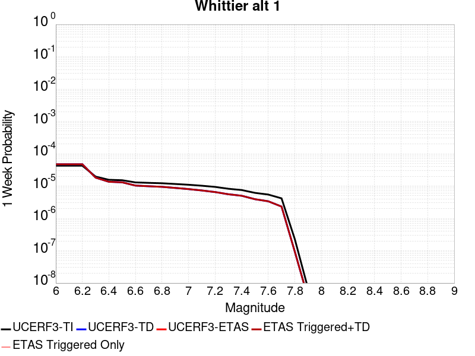 | 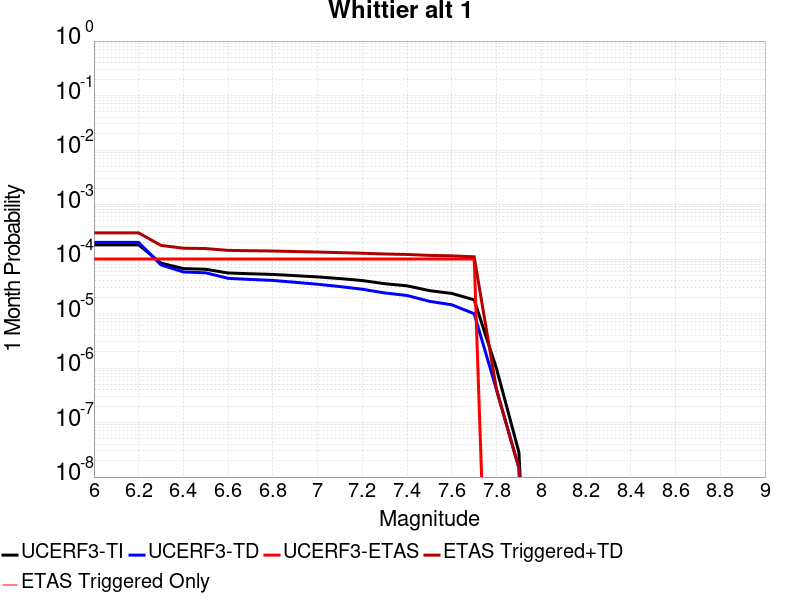 |  |  |

| Magnitude | 1 wk TI Prob | 1 wk TD Prob | 1 wk ETAS Prob | 1 wk ETAS/TD Gain | 1 wk ETAS Triggered+TD | 1 wk ETAS Triggered Only | 1 mo TI Prob | 1 mo TD Prob | 1 mo ETAS Prob | 1 mo ETAS/TD Gain | 1 mo ETAS Triggered+TD | 1 mo ETAS Triggered Only | 1 yr TI Prob | 1 yr TD Prob | 1 yr ETAS Prob | 1 yr ETAS/TD Gain | 1 yr ETAS Triggered+TD | 1 yr ETAS Triggered Only | 10 yr TI Prob | 10 yr TD Prob | 10 yr ETAS Prob | 10 yr ETAS/TD Gain | 10 yr ETAS Triggered+TD | 10 yr ETAS Triggered Only |
|-----|-----|-----|-----|-----|-----|-----|-----|-----|-----|-----|-----|-----|-----|-----|-----|-----|-----|-----|-----|-----|-----|-----|-----|-----|
| 6.0 | 4.2554693E-5 | 4.7141246E-5 | 0.0 | 0.0 | 4.7141246E-5 | 0.0 | 1.8236451E-4 | 2.0202008E-4 | 1.0E-4 | 0.49500033 | 3.0199988E-4 | 1.0E-4 | 0.002218027 | 0.0024571407 | 0.0019 | 0.7732565 | 0.0030556663 | 6.0E-4 | 0.02196019 | 0.024333641 | 0.0154 | 0.6328687 | 0.027358208 | 0.0031 |
| 6.1 | 4.2554693E-5 | 4.7141246E-5 | 0.0 | 0.0 | 4.7141246E-5 | 0.0 | 1.8236451E-4 | 2.0202008E-4 | 1.0E-4 | 0.49500033 | 3.0199988E-4 | 1.0E-4 | 0.002218027 | 0.0024571407 | 0.0019 | 0.7732565 | 0.0030556663 | 6.0E-4 | 0.02196019 | 0.024333641 | 0.0154 | 0.6328687 | 0.027358208 | 0.0031 |
| 6.2 | 4.2554693E-5 | 4.7141246E-5 | 0.0 | 0.0 | 4.7141246E-5 | 0.0 | 1.8236451E-4 | 2.0202008E-4 | 1.0E-4 | 0.49500033 | 3.0199988E-4 | 1.0E-4 | 0.002218027 | 0.0024571407 | 0.0019 | 0.7732565 | 0.0030556663 | 6.0E-4 | 0.02196019 | 0.024333641 | 0.0154 | 0.6328687 | 0.027358208 | 0.0031 |
| 6.3 | 1.9617712E-5 | 1.8201868E-5 | 0.0 | 0.0 | 1.8201868E-5 | 0.0 | 8.40732E-5 | 7.800578E-5 | 1.0E-4 | 1.2819563 | 1.7799798E-4 | 1.0E-4 | 0.0010231105 | 9.4932545E-4 | 0.001 | 1.0533795 | 0.0012490407 | 3.0E-4 | 0.01018413 | 0.009455963 | 0.0055 | 0.5816436 | 0.010545561 | 0.0011 |
| 6.4 | 1.5611336E-5 | 1.354535E-5 | 0.0 | 0.0 | 1.354535E-5 | 0.0 | 6.690401E-5 | 5.8050246E-5 | 1.0E-4 | 1.7226456 | 1.5804444E-4 | 1.0E-4 | 8.142519E-4 | 7.0653844E-4 | 9.0E-4 | 1.273816 | 0.0010063265 | 3.0E-4 | 0.008112748 | 0.0070448644 | 0.0045 | 0.6387632 | 0.007938524 | 9.0E-4 |
| 6.5 | 1.5150166E-5 | 1.3042504E-5 | 0.0 | 0.0 | 1.3042504E-5 | 0.0 | 6.492767E-5 | 5.589528E-5 | 1.0E-4 | 1.7890598 | 1.5588969E-4 | 1.0E-4 | 7.9020765E-4 | 6.803184E-4 | 9.0E-4 | 1.3229101 | 9.801143E-4 | 3.0E-4 | 0.007874036 | 0.0067842854 | 0.0045 | 0.6632976 | 0.0076781795 | 9.0E-4 |
| 6.6 | 1.295588E-5 | 1.0340121E-5 | 0.0 | 0.0 | 1.0340121E-5 | 0.0 | 5.552402E-5 | 4.431406E-5 | 1.0E-4 | 2.2566202 | 1.4430963E-4 | 1.0E-4 | 6.7579525E-4 | 5.3939206E-4 | 7.0E-4 | 1.2977573 | 8.3923026E-4 | 3.0E-4 | 0.006737438 | 0.0053822575 | 0.0033 | 0.6131256 | 0.00607849 | 7.0E-4 |
| 6.7 | 1.2542085E-5 | 9.861623E-6 | 0.0 | 0.0 | 9.861623E-6 | 0.0 | 5.3750682E-5 | 4.2263426E-5 | 1.0E-4 | 2.3661122 | 1.422592E-4 | 1.0E-4 | 6.542181E-4 | 5.1443756E-4 | 7.0E-4 | 1.3607093 | 8.142832E-4 | 3.0E-4 | 0.006522954 | 0.005133877 | 0.0029 | 0.56487525 | 0.0057307966 | 6.0E-4 |
| 6.8 | 1.2195878E-5 | 9.45888E-6 | 0.0 | 0.0 | 9.45888E-6 | 0.0 | 5.2267E-5 | 4.0537438E-5 | 1.0E-4 | 2.4668555 | 1.4053339E-4 | 1.0E-4 | 6.36165E-4 | 4.934334E-4 | 7.0E-4 | 1.4186312 | 7.932854E-4 | 3.0E-4 | 0.0063434686 | 0.0049247057 | 0.0029 | 0.58886766 | 0.005521751 | 6.0E-4 |
| 6.9 | 1.1580298E-5 | 8.738248E-6 | 0.0 | 0.0 | 8.738248E-6 | 0.0 | 4.9628903E-5 | 3.7449103E-5 | 1.0E-4 | 2.670291 | 1.3744536E-4 | 1.0E-4 | 6.040644E-4 | 4.5584908E-4 | 7.0E-4 | 1.5355959 | 7.5571233E-4 | 3.0E-4 | 0.00602425 | 0.0045503434 | 0.0027 | 0.59336185 | 0.005147613 | 6.0E-4 |
| 7.0 | 1.0964795E-5 | 8.051233E-6 | 0.0 | 0.0 | 8.051233E-6 | 0.0 | 4.6991136E-5 | 3.4504832E-5 | 1.0E-4 | 2.8981447 | 1.3450139E-4 | 1.0E-4 | 5.7196687E-4 | 4.200169E-4 | 5.0E-4 | 1.1904283 | 5.199749E-4 | 1.0E-4 | 0.0057049696 | 0.004193428 | 0.0021 | 0.5007836 | 0.00449217 | 3.0E-4 |
| 7.1 | 1.0230601E-5 | 7.296619E-6 | 0.0 | 0.0 | 7.296619E-6 | 0.0 | 4.3844695E-5 | 3.1270858E-5 | 1.0E-4 | 3.1978657 | 1.3126773E-4 | 1.0E-4 | 5.336784E-4 | 3.8065747E-4 | 4.0E-4 | 1.0508136 | 4.806194E-4 | 1.0E-4 | 0.005323986 | 0.003801133 | 0.0018 | 0.47354302 | 0.0040003727 | 2.0E-4 |
| 7.2 | 9.40865E-6 | 6.5162267E-6 | 0.0 | 0.0 | 6.5162267E-6 | 0.0 | 4.032216E-5 | 2.7926393E-5 | 1.0E-4 | 3.580842 | 1.279236E-4 | 1.0E-4 | 4.908117E-4 | 3.39952E-4 | 4.0E-4 | 1.1766367 | 4.3991802E-4 | 1.0E-4 | 0.0048972913 | 0.0033953136 | 0.0017 | 0.5006901 | 0.0035946346 | 2.0E-4 |
| 7.3 | 8.237384E-6 | 5.5742876E-6 | 0.0 | 0.0 | 5.5742876E-6 | 0.0 | 3.5302593E-5 | 2.388959E-5 | 1.0E-4 | 4.1859236 | 1.238872E-4 | 1.0E-4 | 4.2972428E-4 | 2.90818E-4 | 3.0E-4 | 1.031573 | 3.907889E-4 | 1.0E-4 | 0.0042889426 | 0.0029046668 | 0.0012 | 0.41312826 | 0.003104086 | 2.0E-4 |
| 7.4 | 7.5316966E-6 | 5.0062195E-6 | 0.0 | 0.0 | 5.0062195E-6 | 0.0 | 3.2278298E-5 | 2.1455056E-5 | 1.0E-4 | 4.6609063 | 1.2145291E-4 | 1.0E-4 | 3.9291743E-4 | 2.61185E-4 | 3.0E-4 | 1.1486112 | 3.611589E-4 | 1.0E-4 | 0.0039222343 | 0.0026088874 | 0.0011 | 0.4216357 | 0.0028083655 | 2.0E-4 |
| 7.5 | 6.149649E-6 | 3.916163E-6 | 0.0 | 0.0 | 3.916163E-6 | 0.0 | 2.6355372E-5 | 1.6783453E-5 | 1.0E-4 | 5.9582496 | 1.16781775E-4 | 1.0E-4 | 3.208294E-4 | 2.0432028E-4 | 3.0E-4 | 1.468283 | 3.0429984E-4 | 1.0E-4 | 0.003203666 | 0.0020414128 | 9.0E-4 | 0.44087115 | 0.0021412086 | 1.0E-4 |
| 7.6 | 5.457711E-6 | 3.3794513E-6 | 0.0 | 0.0 | 3.3794513E-6 | 0.0 | 2.338998E-5 | 1.4483287E-5 | 1.0E-4 | 6.90451 | 1.1448184E-4 | 1.0E-4 | 2.8473578E-4 | 1.7632057E-4 | 3.0E-4 | 1.7014465 | 2.7630292E-4 | 1.0E-4 | 0.0028437122 | 0.0017618868 | 9.0E-4 | 0.51081604 | 0.0018617106 | 1.0E-4 |
| 7.7 | 4.1676276E-6 | 2.3213304E-6 | 0.0 | 0.0 | 2.3213304E-6 | 0.0 | 1.7861139E-5 | 9.948525E-6 | 1.0E-4 | 10.051742 | 1.0994753E-4 | 1.0E-4 | 2.1743766E-4 | 1.2111729E-4 | 3.0E-4 | 2.4769378 | 2.2110519E-4 | 1.0E-4 | 0.0021722503 | 0.0012105854 | 6.0E-4 | 0.49562803 | 0.0013104642 | 1.0E-4 |
| 7.8 | 2.2692414E-7 | 9.313546E-8 | 0.0 | 0.0 | 9.313546E-8 | 0.0 | 9.725317E-7 | 3.9915196E-7 | 0.0 | 0.0 | 3.9915196E-7 | 0.0 | 1.1840509E-5 | 4.8596676E-6 | 0.0 | 0.0 | 4.8596676E-6 | 0.0 | 1.1839878E-4 | 4.859593E-5 | 0.0 | 0.0 | 4.859593E-5 | 0.0 |
| 7.9 | 6.676829E-9 | 3.4267709E-9 | 0.0 | 0.0 | 3.4267709E-9 | 0.0 | 2.861498E-8 | 1.4686159E-8 | 0.0 | 0.0 | 1.4686159E-8 | 0.0 | 3.4838732E-7 | 1.7880397E-7 | 0.0 | 0.0 | 1.7880397E-7 | 0.0 | 3.4838679E-6 | 1.7880385E-6 | 0.0 | 0.0 | 1.7880385E-6 | 0.0 |

## Keddie Ridge 2011 CFM
*[(top)](#table-of-contents)*

| 1 Week | 1 Month | 1 Year | 10 Year |
|-----|-----|-----|-----|
| 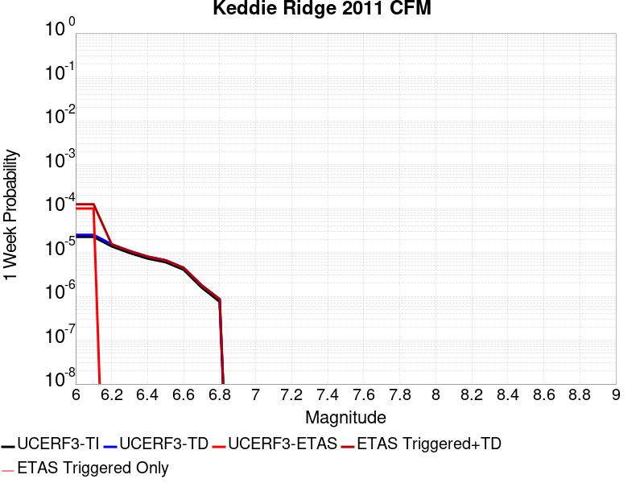 | 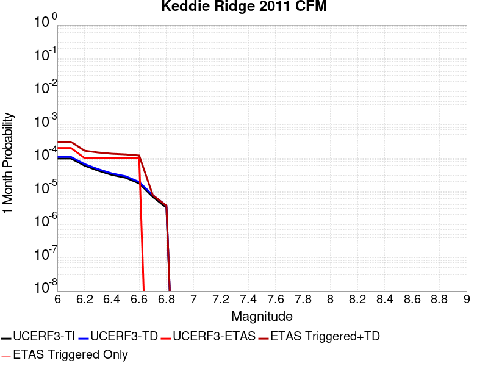 | 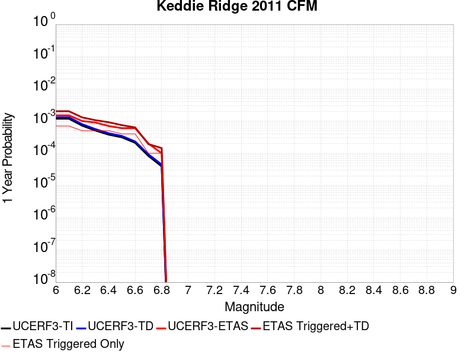 |  |

| Magnitude | 1 wk TI Prob | 1 wk TD Prob | 1 wk ETAS Prob | 1 wk ETAS/TD Gain | 1 wk ETAS Triggered+TD | 1 wk ETAS Triggered Only | 1 mo TI Prob | 1 mo TD Prob | 1 mo ETAS Prob | 1 mo ETAS/TD Gain | 1 mo ETAS Triggered+TD | 1 mo ETAS Triggered Only | 1 yr TI Prob | 1 yr TD Prob | 1 yr ETAS Prob | 1 yr ETAS/TD Gain | 1 yr ETAS Triggered+TD | 1 yr ETAS Triggered Only | 10 yr TI Prob | 10 yr TD Prob | 10 yr ETAS Prob | 10 yr ETAS/TD Gain | 10 yr ETAS Triggered+TD | 10 yr ETAS Triggered Only |
|-----|-----|-----|-----|-----|-----|-----|-----|-----|-----|-----|-----|-----|-----|-----|-----|-----|-----|-----|-----|-----|-----|-----|-----|-----|
| 6.0 | 2.2591947E-5 | 2.5158795E-5 | 1.0E-4 | 3.9747531 | 1.2515628E-4 | 1.0E-4 | 9.6819036E-5 | 1.078194E-4 | 2.0E-4 | 1.8549538 | 3.0779783E-4 | 2.0E-4 | 0.0011781343 | 0.0013119896 | 0.0015 | 1.1433017 | 0.0020110712 | 7.0E-4 | 0.011719079 | 0.013050364 | 0.01 | 0.7662621 | 0.016208604 | 0.0032 |
| 6.1 | 2.2591947E-5 | 2.5158795E-5 | 1.0E-4 | 3.9747531 | 1.2515628E-4 | 1.0E-4 | 9.6819036E-5 | 1.078194E-4 | 2.0E-4 | 1.8549538 | 3.0779783E-4 | 2.0E-4 | 0.0011781343 | 0.0013119896 | 0.0015 | 1.1433017 | 0.0020110712 | 7.0E-4 | 0.011719079 | 0.013050364 | 0.0094 | 0.7202864 | 0.015912518 | 0.0029 |
| 6.2 | 1.3775145E-5 | 1.5304711E-5 | 0.0 | 0.0 | 1.5304711E-5 | 0.0 | 5.9035E-5 | 6.559011E-5 | 1.0E-4 | 1.5246202 | 1.6558355E-4 | 1.0E-4 | 7.185141E-4 | 7.982911E-4 | 0.001 | 1.2526758 | 0.001297892 | 5.0E-4 | 0.0071619535 | 0.007956649 | 0.0066 | 0.82949495 | 0.009742327 | 0.0018 |
| 6.3 | 9.705435E-6 | 1.07559135E-5 | 0.0 | 0.0 | 1.07559135E-5 | 0.0 | 4.1594063E-5 | 4.6096025E-5 | 1.0E-4 | 2.1693842 | 1.4609142E-4 | 1.0E-4 | 5.0629E-4 | 5.61087E-4 | 9.0E-4 | 1.6040294 | 0.0010608064 | 5.0E-4 | 0.005051381 | 0.005597932 | 0.0043 | 0.76814085 | 0.0071889753 | 0.0016 |
| 6.4 | 7.2549733E-6 | 8.018234E-6 | 0.0 | 0.0 | 8.018234E-6 | 0.0 | 3.109237E-5 | 3.4363453E-5 | 1.0E-4 | 2.9100685 | 1.3436002E-4 | 1.0E-4 | 3.7848388E-4 | 4.183027E-4 | 7.0E-4 | 1.6734294 | 9.1809354E-4 | 5.0E-4 | 0.003778399 | 0.004175939 | 0.0032 | 0.7662947 | 0.00547051 | 0.0013 |
| 6.5 | 5.983293E-6 | 6.6056505E-6 | 0.0 | 0.0 | 6.6056505E-6 | 0.0 | 2.5642432E-5 | 2.8309662E-5 | 1.0E-4 | 3.532363 | 1.2830683E-4 | 1.0E-4 | 3.1215188E-4 | 3.4462236E-4 | 6.0E-4 | 1.7410363 | 7.444845E-4 | 4.0E-4 | 0.0031171376 | 0.0034415408 | 0.0025 | 0.72641885 | 0.0042387876 | 8.0E-4 |
| 6.6 | 4.0336154E-6 | 4.4528106E-6 | 0.0 | 0.0 | 4.4528106E-6 | 0.0 | 1.728681E-5 | 1.9083356E-5 | 1.0E-4 | 5.2401686 | 1.1908145E-4 | 1.0E-4 | 2.1044657E-4 | 2.3231911E-4 | 6.0E-4 | 2.5826545 | 6.322262E-4 | 4.0E-4 | 0.002102474 | 0.002321158 | 0.0019 | 0.8185569 | 0.0029197654 | 6.0E-4 |
| 6.7 | 1.5832104E-6 | 1.7792295E-6 | 0.0 | 0.0 | 1.7792295E-6 | 0.0 | 6.7851697E-6 | 7.6252486E-6 | 0.0 | 0.0 | 7.6252486E-6 | 0.0 | 8.260631E-5 | 9.283372E-5 | 2.0E-4 | 2.1543896 | 1.9282443E-4 | 1.0E-4 | 8.2575605E-4 | 9.27976E-4 | 7.0E-4 | 0.75432986 | 0.0012276976 | 3.0E-4 |
| 6.8 | 7.5177275E-7 | 8.5773416E-7 | 0.0 | 0.0 | 8.5773416E-7 | 0.0 | 3.221879E-6 | 3.6759993E-6 | 0.0 | 0.0 | 3.6759993E-6 | 0.0 | 3.9225673E-5 | 4.4754543E-5 | 1.0E-4 | 2.23441 | 1.4475007E-4 | 1.0E-4 | 3.921875E-4 | 4.4747177E-4 | 4.0E-4 | 0.8939111 | 7.4733753E-4 | 3.0E-4 |

## Great Valley 04b Gordon Valley
*[(top)](#table-of-contents)*

| 1 Week | 1 Month | 1 Year | 10 Year |
|-----|-----|-----|-----|
|  |  |  |  |

| Magnitude | 1 wk TI Prob | 1 wk TD Prob | 1 wk ETAS Prob | 1 wk ETAS/TD Gain | 1 wk ETAS Triggered+TD | 1 wk ETAS Triggered Only | 1 mo TI Prob | 1 mo TD Prob | 1 mo ETAS Prob | 1 mo ETAS/TD Gain | 1 mo ETAS Triggered+TD | 1 mo ETAS Triggered Only | 1 yr TI Prob | 1 yr TD Prob | 1 yr ETAS Prob | 1 yr ETAS/TD Gain | 1 yr ETAS Triggered+TD | 1 yr ETAS Triggered Only | 10 yr TI Prob | 10 yr TD Prob | 10 yr ETAS Prob | 10 yr ETAS/TD Gain | 10 yr ETAS Triggered+TD | 10 yr ETAS Triggered Only |
|-----|-----|-----|-----|-----|-----|-----|-----|-----|-----|-----|-----|-----|-----|-----|-----|-----|-----|-----|-----|-----|-----|-----|-----|-----|
| 6.0 | 2.1181217E-5 | 2.3948787E-5 | 0.0 | 0.0 | 2.3948787E-5 | 0.0 | 9.077348E-5 | 1.02634556E-4 | 2.0E-4 | 1.9486614 | 2.0262429E-4 | 1.0E-4 | 0.0011046068 | 0.0012490256 | 0.0016 | 1.2809986 | 0.0017484011 | 5.0E-4 | 0.010991322 | 0.012436455 | 0.0125 | 1.0051095 | 0.0154979015 | 0.0031 |
| 6.1 | 2.1181217E-5 | 2.3948787E-5 | 0.0 | 0.0 | 2.3948787E-5 | 0.0 | 9.077348E-5 | 1.02634556E-4 | 2.0E-4 | 1.9486614 | 2.0262429E-4 | 1.0E-4 | 0.0011046068 | 0.0012490256 | 0.0016 | 1.2809986 | 0.0017484011 | 5.0E-4 | 0.010991322 | 0.012436455 | 0.0125 | 1.0051095 | 0.0154979015 | 0.0031 |
| 6.2 | 2.1181217E-5 | 2.3948787E-5 | 0.0 | 0.0 | 2.3948787E-5 | 0.0 | 9.077348E-5 | 1.02634556E-4 | 2.0E-4 | 1.9486614 | 2.0262429E-4 | 1.0E-4 | 0.0011046068 | 0.0012490256 | 0.0016 | 1.2809986 | 0.0017484011 | 5.0E-4 | 0.010991322 | 0.012436455 | 0.0125 | 1.0051095 | 0.0154979015 | 0.0031 |
| 6.3 | 2.1181217E-5 | 2.3948787E-5 | 0.0 | 0.0 | 2.3948787E-5 | 0.0 | 9.077348E-5 | 1.02634556E-4 | 2.0E-4 | 1.9486614 | 2.0262429E-4 | 1.0E-4 | 0.0011046068 | 0.0012490256 | 0.0016 | 1.2809986 | 0.0017484011 | 5.0E-4 | 0.010991322 | 0.012436455 | 0.0125 | 1.0051095 | 0.0154979015 | 0.0031 |
| 6.4 | 1.0988268E-5 | 1.22397605E-5 | 0.0 | 0.0 | 1.22397605E-5 | 0.0 | 4.7091726E-5 | 5.245515E-5 | 1.0E-4 | 1.9063905 | 5.245515E-5 | 0.0 | 5.731909E-4 | 6.384702E-4 | 0.001 | 1.5662438 | 7.384064E-4 | 1.0E-4 | 0.005717147 | 0.006367942 | 0.0063 | 0.9893306 | 0.0075603006 | 0.0012 |
| 6.5 | 1.0988268E-5 | 1.22397605E-5 | 0.0 | 0.0 | 1.22397605E-5 | 0.0 | 4.7091726E-5 | 5.245515E-5 | 1.0E-4 | 1.9063905 | 5.245515E-5 | 0.0 | 5.731909E-4 | 6.384702E-4 | 0.001 | 1.5662438 | 7.384064E-4 | 1.0E-4 | 0.005717147 | 0.006367942 | 0.0063 | 0.9893306 | 0.0075603006 | 0.0012 |
| 6.6 | 1.0517822E-5 | 1.1710029E-5 | 0.0 | 0.0 | 1.1710029E-5 | 0.0 | 4.5075605E-5 | 5.018496E-5 | 1.0E-4 | 1.9926288 | 5.018496E-5 | 0.0 | 5.4865726E-4 | 6.108462E-4 | 0.001 | 1.6370733 | 7.107851E-4 | 1.0E-4 | 0.0054730466 | 0.0060932217 | 0.0062 | 1.0175241 | 0.0072859097 | 0.0012 |
| 6.7 | 7.789219E-6 | 8.667313E-6 | 0.0 | 0.0 | 8.667313E-6 | 0.0 | 3.3381937E-5 | 3.7145124E-5 | 1.0E-4 | 2.6921432 | 3.7145124E-5 | 0.0 | 4.063493E-4 | 4.521532E-4 | 8.0E-4 | 1.7693118 | 5.52108E-4 | 1.0E-4 | 0.004056071 | 0.0045128483 | 0.0045 | 0.9971529 | 0.005110141 | 6.0E-4 |
| 6.8 | 7.5850853E-6 | 8.4423E-6 | 0.0 | 0.0 | 8.4423E-6 | 0.0 | 3.2507105E-5 | 3.6180812E-5 | 1.0E-4 | 2.7638958 | 3.6180812E-5 | 0.0 | 3.957021E-4 | 4.404175E-4 | 8.0E-4 | 1.8164582 | 5.4037344E-4 | 1.0E-4 | 0.0039499826 | 0.004395958 | 0.0044 | 1.0009195 | 0.0049933204 | 6.0E-4 |
| 6.9 | 6.604105E-6 | 7.349773E-6 | 0.0 | 0.0 | 7.349773E-6 | 0.0 | 2.8303E-5 | 3.149867E-5 | 1.0E-4 | 3.1747375 | 3.149867E-5 | 0.0 | 3.4453452E-4 | 3.8343266E-4 | 8.0E-4 | 2.0864158 | 4.8339434E-4 | 1.0E-4 | 0.0034400085 | 0.0038280967 | 0.0038 | 0.9926604 | 0.0043261824 | 5.0E-4 |
| 7.0 | 5.3701115E-6 | 5.9812187E-6 | 0.0 | 0.0 | 5.9812187E-6 | 0.0 | 2.301456E-5 | 2.5633559E-5 | 1.0E-4 | 3.901136 | 2.5633559E-5 | 0.0 | 2.8016625E-4 | 3.120468E-4 | 7.0E-4 | 2.2432532 | 4.120156E-4 | 1.0E-4 | 0.0027981328 | 0.0031163741 | 0.0031 | 0.9947458 | 0.0035151276 | 4.0E-4 |
| 7.1 | 4.4685607E-6 | 4.980442E-6 | 0.0 | 0.0 | 4.980442E-6 | 0.0 | 1.9150835E-5 | 2.1344591E-5 | 1.0E-4 | 4.6850276 | 2.1344591E-5 | 0.0 | 2.3313647E-4 | 2.5984188E-4 | 7.0E-4 | 2.693946 | 3.598159E-4 | 1.0E-4 | 0.0023289204 | 0.002595625 | 0.0029 | 1.1172646 | 0.0029945867 | 4.0E-4 |
| 7.2 | 2.833378E-6 | 3.160555E-6 | 0.0 | 0.0 | 3.160555E-6 | 0.0 | 1.2142991E-5 | 1.3545175E-5 | 0.0 | 0.0 | 1.3545175E-5 | 0.0 | 1.4783088E-4 | 1.6490176E-4 | 6.0E-4 | 3.6385298 | 2.6488528E-4 | 1.0E-4 | 0.0014773258 | 0.0016479655 | 0.002 | 1.2136177 | 0.0019474712 | 3.0E-4 |
| 7.3 | 7.0087293E-7 | 7.763911E-7 | 0.0 | 0.0 | 7.763911E-7 | 0.0 | 3.0037377E-6 | 3.3273889E-6 | 0.0 | 0.0 | 3.3273889E-6 | 0.0 | 3.656989E-5 | 4.0510662E-5 | 2.0E-4 | 4.9369717 | 1.4050661E-4 | 1.0E-4 | 3.6563876E-4 | 4.0507765E-4 | 3.0E-4 | 0.74059874 | 5.0503714E-4 | 1.0E-4 |
| 7.4 | 3.112171E-8 | 3.2058175E-8 | 0.0 | 0.0 | 3.2058175E-8 | 0.0 | 1.3337875E-7 | 1.3739218E-7 | 0.0 | 0.0 | 1.3739218E-7 | 0.0 | 1.6238852E-6 | 1.6727486E-6 | 0.0 | 0.0 | 1.6727486E-6 | 0.0 | 1.6238733E-5 | 1.6727368E-5 | 0.0 | 0.0 | 1.6727368E-5 | 0.0 |

## Red Mountain
*[(top)](#table-of-contents)*

| 1 Week | 1 Month | 1 Year | 10 Year |
|-----|-----|-----|-----|
| 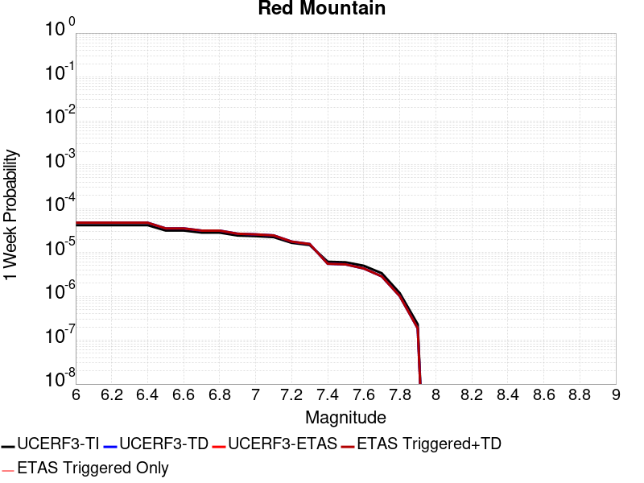 | 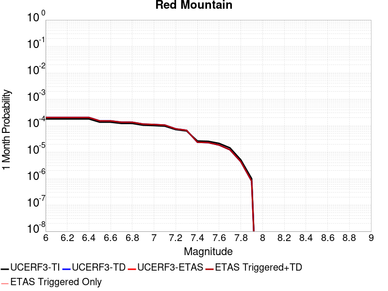 |  | 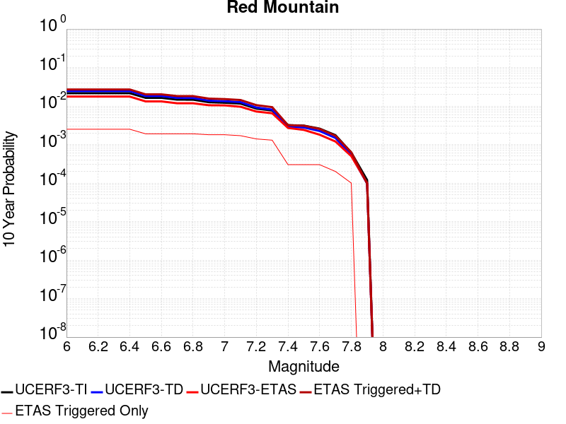 |

| Magnitude | 1 wk TI Prob | 1 wk TD Prob | 1 wk ETAS Prob | 1 wk ETAS/TD Gain | 1 wk ETAS Triggered+TD | 1 wk ETAS Triggered Only | 1 mo TI Prob | 1 mo TD Prob | 1 mo ETAS Prob | 1 mo ETAS/TD Gain | 1 mo ETAS Triggered+TD | 1 mo ETAS Triggered Only | 1 yr TI Prob | 1 yr TD Prob | 1 yr ETAS Prob | 1 yr ETAS/TD Gain | 1 yr ETAS Triggered+TD | 1 yr ETAS Triggered Only | 10 yr TI Prob | 10 yr TD Prob | 10 yr ETAS Prob | 10 yr ETAS/TD Gain | 10 yr ETAS Triggered+TD | 10 yr ETAS Triggered Only |
|-----|-----|-----|-----|-----|-----|-----|-----|-----|-----|-----|-----|-----|-----|-----|-----|-----|-----|-----|-----|-----|-----|-----|-----|-----|
| 6.0 | 4.1810763E-5 | 4.7503345E-5 | 0.0 | 0.0 | 4.7503345E-5 | 0.0 | 1.7917668E-4 | 2.0357079E-4 | 0.0 | 0.0 | 2.0357079E-4 | 0.0 | 0.0021792934 | 0.0024758214 | 0.0016 | 0.6462502 | 0.002874831 | 4.0E-4 | 0.021580452 | 0.024499938 | 0.0176 | 0.7183691 | 0.026938688 | 0.0025 |
| 6.1 | 4.1810763E-5 | 4.7503345E-5 | 0.0 | 0.0 | 4.7503345E-5 | 0.0 | 1.7917668E-4 | 2.0357079E-4 | 0.0 | 0.0 | 2.0357079E-4 | 0.0 | 0.0021792934 | 0.0024758214 | 0.0016 | 0.6462502 | 0.002874831 | 4.0E-4 | 0.021580452 | 0.024499938 | 0.0176 | 0.7183691 | 0.026938688 | 0.0025 |
| 6.2 | 4.1810763E-5 | 4.7503345E-5 | 0.0 | 0.0 | 4.7503345E-5 | 0.0 | 1.7917668E-4 | 2.0357079E-4 | 0.0 | 0.0 | 2.0357079E-4 | 0.0 | 0.0021792934 | 0.0024758214 | 0.0016 | 0.6462502 | 0.002874831 | 4.0E-4 | 0.021580452 | 0.024499938 | 0.0176 | 0.7183691 | 0.026938688 | 0.0025 |
| 6.3 | 4.1810763E-5 | 4.7503345E-5 | 0.0 | 0.0 | 4.7503345E-5 | 0.0 | 1.7917668E-4 | 2.0357079E-4 | 0.0 | 0.0 | 2.0357079E-4 | 0.0 | 0.0021792934 | 0.0024758214 | 0.0016 | 0.6462502 | 0.002874831 | 4.0E-4 | 0.021580452 | 0.024499938 | 0.0176 | 0.7183691 | 0.026938688 | 0.0025 |
| 6.4 | 4.1810763E-5 | 4.7503345E-5 | 0.0 | 0.0 | 4.7503345E-5 | 0.0 | 1.7917668E-4 | 2.0357079E-4 | 0.0 | 0.0 | 2.0357079E-4 | 0.0 | 0.0021792934 | 0.0024758214 | 0.0016 | 0.6462502 | 0.002874831 | 4.0E-4 | 0.021580452 | 0.024499938 | 0.0176 | 0.7183691 | 0.026938688 | 0.0025 |
| 6.5 | 3.154503E-5 | 3.5297457E-5 | 0.0 | 0.0 | 3.5297457E-5 | 0.0 | 1.3518598E-4 | 1.5126656E-4 | 0.0 | 0.0 | 1.5126656E-4 | 0.0 | 0.0016446467 | 0.0018402064 | 0.0011 | 0.597759 | 0.0020398383 | 2.0E-4 | 0.01632528 | 0.018259296 | 0.0132 | 0.72291946 | 0.020124603 | 0.0019 |
| 6.6 | 3.1535834E-5 | 3.5286856E-5 | 0.0 | 0.0 | 3.5286856E-5 | 0.0 | 1.3514658E-4 | 1.5122115E-4 | 0.0 | 0.0 | 1.5122115E-4 | 0.0 | 0.0016441676 | 0.0018396544 | 0.0011 | 0.5979384 | 0.0020392863 | 2.0E-4 | 0.01632056 | 0.018253865 | 0.0132 | 0.7231345 | 0.020119183 | 0.0019 |
| 6.7 | 2.8267326E-5 | 3.1414627E-5 | 0.0 | 0.0 | 3.1414627E-5 | 0.0 | 1.2114006E-4 | 1.3462765E-4 | 0.0 | 0.0 | 1.3462765E-4 | 0.0 | 0.0014738824 | 0.001637944 | 0.001 | 0.6105215 | 0.0018376164 | 2.0E-4 | 0.014641452 | 0.016267447 | 0.0118 | 0.72537506 | 0.018136539 | 0.0019 |
| 6.8 | 2.8212884E-5 | 3.1352603E-5 | 0.0 | 0.0 | 3.1352603E-5 | 0.0 | 1.20906756E-4 | 1.3436186E-4 | 0.0 | 0.0 | 1.3436186E-4 | 0.0 | 0.0014710457 | 0.0016347129 | 0.001 | 0.6117282 | 0.001834386 | 2.0E-4 | 0.014613459 | 0.016235609 | 0.0118 | 0.7267975 | 0.01810476 | 0.0019 |
| 6.9 | 2.4227871E-5 | 2.6661157E-5 | 0.0 | 0.0 | 2.6661157E-5 | 0.0 | 1.03829596E-4 | 1.1425753E-4 | 0.0 | 0.0 | 1.1425753E-4 | 0.0 | 0.0012633923 | 0.0013902733 | 9.0E-4 | 0.6473547 | 0.0014901343 | 1.0E-4 | 0.012562336 | 0.013823417 | 0.0105 | 0.7595806 | 0.015598536 | 0.0018 |
| 7.0 | 2.348524E-5 | 2.5791516E-5 | 0.0 | 0.0 | 2.5791516E-5 | 0.0 | 1.0064714E-4 | 1.1053081E-4 | 0.0 | 0.0 | 1.1053081E-4 | 0.0 | 0.0012246901 | 0.0013449573 | 9.0E-4 | 0.66916627 | 0.0014448228 | 1.0E-4 | 0.012179627 | 0.0133757815 | 0.0104 | 0.7775247 | 0.015151705 | 0.0018 |
| 7.1 | 2.2311642E-5 | 2.4421026E-5 | 0.0 | 0.0 | 2.4421026E-5 | 0.0 | 9.561782E-5 | 1.0465776E-4 | 0.0 | 0.0 | 1.0465776E-4 | 0.0 | 0.0011635252 | 0.001273538 | 8.0E-4 | 0.6281713 | 0.0013734106 | 1.0E-4 | 0.01157452 | 0.0126698855 | 0.0096 | 0.7577022 | 0.014348347 | 0.0017 |
| 7.2 | 1.6533986E-5 | 1.7640989E-5 | 0.0 | 0.0 | 1.7640989E-5 | 0.0 | 7.085802E-5 | 7.56024E-5 | 0.0 | 0.0 | 7.56024E-5 | 0.0 | 8.623549E-4 | 9.201338E-4 | 7.0E-4 | 0.76075894 | 0.0010200418 | 1.0E-4 | 0.008590161 | 0.009169496 | 0.0072 | 0.7852122 | 0.010556658 | 0.0014 |
| 7.3 | 1.4703092E-5 | 1.5533557E-5 | 0.0 | 0.0 | 1.5533557E-5 | 0.0 | 6.301173E-5 | 6.657103E-5 | 0.0 | 0.0 | 6.657103E-5 | 0.0 | 7.668978E-4 | 8.1026234E-4 | 7.0E-4 | 0.86391777 | 9.101813E-4 | 1.0E-4 | 0.0076425658 | 0.008079133 | 0.0065 | 0.80454177 | 0.00936863 | 0.0013 |
| 7.4 | 6.1331984E-6 | 5.5207784E-6 | 0.0 | 0.0 | 5.5207784E-6 | 0.0 | 2.6284872E-5 | 2.3660268E-5 | 0.0 | 0.0 | 2.3660268E-5 | 0.0 | 3.199713E-4 | 2.880262E-4 | 1.0E-4 | 0.34719062 | 2.880262E-4 | 0.0 | 0.0031951098 | 0.0028765833 | 0.0027 | 0.93861353 | 0.0031757203 | 3.0E-4 |
| 7.5 | 5.954766E-6 | 5.330579E-6 | 0.0 | 0.0 | 5.330579E-6 | 0.0 | 2.5520176E-5 | 2.284514E-5 | 0.0 | 0.0 | 2.284514E-5 | 0.0 | 3.1066386E-4 | 2.7810462E-4 | 0.0 | 0.0 | 2.7810462E-4 | 0.0 | 0.003102299 | 0.0027776195 | 0.0024 | 0.8640492 | 0.0030767864 | 3.0E-4 |
| 7.6 | 4.9726646E-6 | 4.308218E-6 | 0.0 | 0.0 | 4.308218E-6 | 0.0 | 2.1311245E-5 | 1.8463663E-5 | 0.0 | 0.0 | 1.8463663E-5 | 0.0 | 2.5943352E-4 | 2.2477226E-4 | 0.0 | 0.0 | 2.2477226E-4 | 0.0 | 0.0025913084 | 0.0022454837 | 0.0018 | 0.80160904 | 0.00254481 | 3.0E-4 |
| 7.7 | 3.3613894E-6 | 2.8472411E-6 | 0.0 | 0.0 | 2.8472411E-6 | 0.0 | 1.4405875E-5 | 1.2202406E-5 | 0.0 | 0.0 | 1.2202406E-5 | 0.0 | 1.7537741E-4 | 1.4855443E-4 | 0.0 | 0.0 | 1.4855443E-4 | 0.0 | 0.0017523908 | 0.0014845774 | 0.0012 | 0.80831087 | 0.0016842805 | 2.0E-4 |
| 7.8 | 1.1828961E-6 | 1.0112856E-6 | 0.0 | 0.0 | 1.0112856E-6 | 0.0 | 5.069545E-6 | 4.334074E-6 | 0.0 | 0.0 | 4.334074E-6 | 0.0 | 6.171996E-5 | 5.2766103E-5 | 0.0 | 0.0 | 5.2766103E-5 | 0.0 | 6.170282E-4 | 5.2753865E-4 | 5.0E-4 | 0.94779783 | 6.274859E-4 | 1.0E-4 |
| 7.9 | 2.2967266E-7 | 1.8604956E-7 | 0.0 | 0.0 | 1.8604956E-7 | 0.0 | 9.843111E-7 | 7.97355E-7 | 0.0 | 0.0 | 7.97355E-7 | 0.0 | 1.19839215E-5 | 9.707757E-6 | 0.0 | 0.0 | 9.707757E-6 | 0.0 | 1.1983275E-4 | 9.707362E-5 | 1.0E-4 | 1.030146 | 9.707362E-5 | 0.0 |

## Garberville - Briceland 2011 CFM
*[(top)](#table-of-contents)*

| 1 Week | 1 Month | 1 Year | 10 Year |
|-----|-----|-----|-----|
|  |  |  |  |

| Magnitude | 1 wk TI Prob | 1 wk TD Prob | 1 wk ETAS Prob | 1 wk ETAS/TD Gain | 1 wk ETAS Triggered+TD | 1 wk ETAS Triggered Only | 1 mo TI Prob | 1 mo TD Prob | 1 mo ETAS Prob | 1 mo ETAS/TD Gain | 1 mo ETAS Triggered+TD | 1 mo ETAS Triggered Only | 1 yr TI Prob | 1 yr TD Prob | 1 yr ETAS Prob | 1 yr ETAS/TD Gain | 1 yr ETAS Triggered+TD | 1 yr ETAS Triggered Only | 10 yr TI Prob | 10 yr TD Prob | 10 yr ETAS Prob | 10 yr ETAS/TD Gain | 10 yr ETAS Triggered+TD | 10 yr ETAS Triggered Only |
|-----|-----|-----|-----|-----|-----|-----|-----|-----|-----|-----|-----|-----|-----|-----|-----|-----|-----|-----|-----|-----|-----|-----|-----|-----|
| 6.0 | 4.8399295E-5 | 6.430683E-5 | 0.0 | 0.0 | 6.430683E-5 | 0.0 | 2.0740906E-4 | 2.7557573E-4 | 1.0E-4 | 0.36287665 | 2.7557573E-4 | 0.0 | 0.002522281 | 0.0033506495 | 9.0E-4 | 0.26860464 | 0.0034503145 | 1.0E-4 | 0.024938442 | 0.033067785 | 0.0203 | 0.6138905 | 0.035968583 | 0.003 |
| 6.1 | 4.8399295E-5 | 6.430683E-5 | 0.0 | 0.0 | 6.430683E-5 | 0.0 | 2.0740906E-4 | 2.7557573E-4 | 1.0E-4 | 0.36287665 | 2.7557573E-4 | 0.0 | 0.002522281 | 0.0033506495 | 9.0E-4 | 0.26860464 | 0.0034503145 | 1.0E-4 | 0.024938442 | 0.033067785 | 0.0203 | 0.6138905 | 0.035968583 | 0.003 |
| 6.2 | 4.8399295E-5 | 6.430683E-5 | 0.0 | 0.0 | 6.430683E-5 | 0.0 | 2.0740906E-4 | 2.7557573E-4 | 1.0E-4 | 0.36287665 | 2.7557573E-4 | 0.0 | 0.002522281 | 0.0033506495 | 9.0E-4 | 0.26860464 | 0.0034503145 | 1.0E-4 | 0.024938442 | 0.033067785 | 0.0203 | 0.6138905 | 0.035968583 | 0.003 |
| 6.3 | 4.8399295E-5 | 6.430683E-5 | 0.0 | 0.0 | 6.430683E-5 | 0.0 | 2.0740906E-4 | 2.7557573E-4 | 1.0E-4 | 0.36287665 | 2.7557573E-4 | 0.0 | 0.002522281 | 0.0033506495 | 9.0E-4 | 0.26860464 | 0.0034503145 | 1.0E-4 | 0.024938442 | 0.033067785 | 0.0203 | 0.6138905 | 0.035968583 | 0.003 |
| 6.4 | 4.8399295E-5 | 6.430683E-5 | 0.0 | 0.0 | 6.430683E-5 | 0.0 | 2.0740906E-4 | 2.7557573E-4 | 1.0E-4 | 0.36287665 | 2.7557573E-4 | 0.0 | 0.002522281 | 0.0033506495 | 9.0E-4 | 0.26860464 | 0.0034503145 | 1.0E-4 | 0.024938442 | 0.033067785 | 0.0203 | 0.6138905 | 0.035968583 | 0.003 |
| 6.5 | 4.8399295E-5 | 6.430683E-5 | 0.0 | 0.0 | 6.430683E-5 | 0.0 | 2.0740906E-4 | 2.7557573E-4 | 1.0E-4 | 0.36287665 | 2.7557573E-4 | 0.0 | 0.002522281 | 0.0033506495 | 9.0E-4 | 0.26860464 | 0.0034503145 | 1.0E-4 | 0.024938442 | 0.033067785 | 0.0203 | 0.6138905 | 0.035968583 | 0.003 |
| 6.6 | 4.8399295E-5 | 6.430683E-5 | 0.0 | 0.0 | 6.430683E-5 | 0.0 | 2.0740906E-4 | 2.7557573E-4 | 1.0E-4 | 0.36287665 | 2.7557573E-4 | 0.0 | 0.002522281 | 0.0033506495 | 9.0E-4 | 0.26860464 | 0.0034503145 | 1.0E-4 | 0.024938442 | 0.033067785 | 0.0203 | 0.6138905 | 0.035968583 | 0.003 |
| 6.7 | 3.495179E-5 | 4.6151727E-5 | 0.0 | 0.0 | 4.6151727E-5 | 0.0 | 1.4978478E-4 | 1.9778109E-4 | 1.0E-4 | 0.5056095 | 1.9778109E-4 | 0.0 | 0.0018221042 | 0.0024058553 | 8.0E-4 | 0.3325221 | 0.0025056147 | 1.0E-4 | 0.018072363 | 0.02385034 | 0.0156 | 0.6540787 | 0.026290715 | 0.0025 |
| 6.8 | 2.7517597E-5 | 3.612118E-5 | 0.0 | 0.0 | 3.612118E-5 | 0.0 | 1.1792722E-4 | 1.5479849E-4 | 1.0E-4 | 0.64600116 | 1.5479849E-4 | 0.0 | 0.0014348183 | 0.0018835143 | 8.0E-4 | 0.42473796 | 0.001983326 | 1.0E-4 | 0.014255894 | 0.018721653 | 0.012 | 0.64096904 | 0.020978594 | 0.0023 |
| 6.9 | 2.74461E-5 | 3.6039033E-5 | 0.0 | 0.0 | 3.6039033E-5 | 0.0 | 1.1762084E-4 | 1.5444648E-4 | 1.0E-4 | 0.6474735 | 1.5444648E-4 | 0.0 | 0.001431093 | 0.001879236 | 8.0E-4 | 0.42570493 | 0.0019790481 | 1.0E-4 | 0.014219119 | 0.01867959 | 0.012 | 0.64241236 | 0.020936629 | 0.0023 |
| 7.0 | 1.9023773E-5 | 2.4629906E-5 | 0.0 | 0.0 | 2.4629906E-5 | 0.0 | 8.152791E-5 | 1.05554755E-4 | 0.0 | 0.0 | 1.05554755E-4 | 0.0 | 9.921503E-4 | 0.0012847697 | 5.0E-4 | 0.38917482 | 0.0013846413 | 1.0E-4 | 0.009877323 | 0.012812283 | 0.009 | 0.70245093 | 0.01468794 | 0.0019 |
| 7.1 | 5.566844E-6 | 6.5005743E-6 | 0.0 | 0.0 | 6.5005743E-6 | 0.0 | 2.3857683E-5 | 2.785933E-5 | 0.0 | 0.0 | 2.785933E-5 | 0.0 | 2.9042858E-4 | 3.3913882E-4 | 2.0E-4 | 0.589729 | 3.3913882E-4 | 0.0 | 0.002900493 | 0.0033866316 | 0.0033 | 0.97441953 | 0.0041839224 | 8.0E-4 |
| 7.2 | 4.011353E-6 | 4.6665573E-6 | 0.0 | 0.0 | 4.6665573E-6 | 0.0 | 1.7191402E-5 | 1.9999396E-5 | 0.0 | 0.0 | 1.9999396E-5 | 0.0 | 2.0928521E-4 | 2.4346886E-4 | 1.0E-4 | 0.41073012 | 2.4346886E-4 | 0.0 | 0.0020908823 | 0.0024323578 | 0.0024 | 0.98669696 | 0.0028313848 | 4.0E-4 |
| 7.3 | 2.0974871E-6 | 2.4354429E-6 | 0.0 | 0.0 | 2.4354429E-6 | 0.0 | 8.989199E-6 | 1.0437585E-5 | 0.0 | 0.0 | 1.0437585E-5 | 0.0 | 1.09438006E-4 | 1.2707268E-4 | 0.0 | 0.0 | 1.2707268E-4 | 0.0 | 0.0010938413 | 0.0012702446 | 0.0012 | 0.9447 | 0.0015698635 | 3.0E-4 |

## Monte Vista - Shannon 2011 CFM
*[(top)](#table-of-contents)*

| 1 Week | 1 Month | 1 Year | 10 Year |
|-----|-----|-----|-----|
|  |  |  | 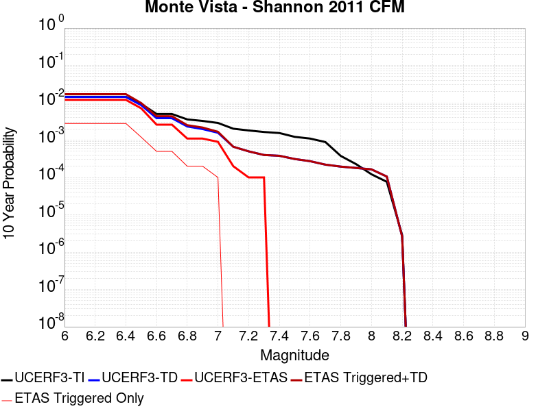 |

| Magnitude | 1 wk TI Prob | 1 wk TD Prob | 1 wk ETAS Prob | 1 wk ETAS/TD Gain | 1 wk ETAS Triggered+TD | 1 wk ETAS Triggered Only | 1 mo TI Prob | 1 mo TD Prob | 1 mo ETAS Prob | 1 mo ETAS/TD Gain | 1 mo ETAS Triggered+TD | 1 mo ETAS Triggered Only | 1 yr TI Prob | 1 yr TD Prob | 1 yr ETAS Prob | 1 yr ETAS/TD Gain | 1 yr ETAS Triggered+TD | 1 yr ETAS Triggered Only | 10 yr TI Prob | 10 yr TD Prob | 10 yr ETAS Prob | 10 yr ETAS/TD Gain | 10 yr ETAS Triggered+TD | 10 yr ETAS Triggered Only |
|-----|-----|-----|-----|-----|-----|-----|-----|-----|-----|-----|-----|-----|-----|-----|-----|-----|-----|-----|-----|-----|-----|-----|-----|-----|
| 6.0 | 2.7907707E-5 | 2.7505195E-5 | 0.0 | 0.0 | 2.7505195E-5 | 0.0 | 1.19598975E-4 | 1.1787478E-4 | 3.0E-4 | 2.5450737 | 3.178512E-4 | 2.0E-4 | 0.0014551448 | 0.0014343042 | 0.0012 | 0.8366426 | 0.001933587 | 5.0E-4 | 0.014456532 | 0.014279092 | 0.012 | 0.8403896 | 0.01703911 | 0.0028 |
| 6.1 | 2.7907707E-5 | 2.7505195E-5 | 0.0 | 0.0 | 2.7505195E-5 | 0.0 | 1.19598975E-4 | 1.1787478E-4 | 3.0E-4 | 2.5450737 | 3.178512E-4 | 2.0E-4 | 0.0014551448 | 0.0014343042 | 0.0012 | 0.8366426 | 0.001933587 | 5.0E-4 | 0.014456532 | 0.014279092 | 0.012 | 0.8403896 | 0.01703911 | 0.0028 |
| 6.2 | 2.7907707E-5 | 2.7505195E-5 | 0.0 | 0.0 | 2.7505195E-5 | 0.0 | 1.19598975E-4 | 1.1787478E-4 | 3.0E-4 | 2.5450737 | 3.178512E-4 | 2.0E-4 | 0.0014551448 | 0.0014343042 | 0.0012 | 0.8366426 | 0.001933587 | 5.0E-4 | 0.014456532 | 0.014279092 | 0.012 | 0.8403896 | 0.01703911 | 0.0028 |
| 6.3 | 2.7907707E-5 | 2.7505195E-5 | 0.0 | 0.0 | 2.7505195E-5 | 0.0 | 1.19598975E-4 | 1.1787478E-4 | 3.0E-4 | 2.5450737 | 3.178512E-4 | 2.0E-4 | 0.0014551448 | 0.0014343042 | 0.0012 | 0.8366426 | 0.001933587 | 5.0E-4 | 0.014456532 | 0.014279092 | 0.012 | 0.8403896 | 0.01703911 | 0.0028 |
| 6.4 | 2.7907707E-5 | 2.7505195E-5 | 0.0 | 0.0 | 2.7505195E-5 | 0.0 | 1.19598975E-4 | 1.1787478E-4 | 3.0E-4 | 2.5450737 | 3.178512E-4 | 2.0E-4 | 0.0014551448 | 0.0014343042 | 0.0012 | 0.8366426 | 0.001933587 | 5.0E-4 | 0.014456532 | 0.014279092 | 0.012 | 0.8403896 | 0.01703911 | 0.0028 |
| 6.5 | 1.7990213E-5 | 1.6572705E-5 | 0.0 | 0.0 | 1.6572705E-5 | 0.0 | 7.709863E-5 | 7.102432E-5 | 1.0E-4 | 1.4079685 | 7.102432E-5 | 0.0 | 9.382716E-4 | 8.6444424E-4 | 6.0E-4 | 0.69408756 | 8.6444424E-4 | 0.0 | 0.0093431985 | 0.008633737 | 0.0071 | 0.8223553 | 0.009823377 | 0.0012 |
| 6.6 | 9.650407E-6 | 7.3996484E-6 | 0.0 | 0.0 | 7.3996484E-6 | 0.0 | 4.135823E-5 | 3.171244E-5 | 0.0 | 0.0 | 3.171244E-5 | 0.0 | 5.0342013E-4 | 3.8603836E-4 | 1.0E-4 | 0.25904164 | 3.8603836E-4 | 0.0 | 0.005022812 | 0.0038709168 | 0.0026 | 0.6716755 | 0.0043689813 | 5.0E-4 |
| 6.7 | 9.62828E-6 | 7.377629E-6 | 0.0 | 0.0 | 7.377629E-6 | 0.0 | 4.1263404E-5 | 3.161807E-5 | 0.0 | 0.0 | 3.161807E-5 | 0.0 | 5.022661E-4 | 3.8488983E-4 | 1.0E-4 | 0.25981462 | 3.8488983E-4 | 0.0 | 0.0050113243 | 0.0038594718 | 0.0026 | 0.6736673 | 0.004357542 | 5.0E-4 |
| 6.8 | 6.887523E-6 | 4.4068943E-6 | 0.0 | 0.0 | 4.4068943E-6 | 0.0 | 2.9517621E-5 | 1.8886565E-5 | 0.0 | 0.0 | 1.8886565E-5 | 0.0 | 3.5931775E-4 | 2.2992189E-4 | 1.0E-4 | 0.43493032 | 2.2992189E-4 | 0.0 | 0.0035873733 | 0.002313553 | 0.0011 | 0.4754592 | 0.0025130901 | 2.0E-4 |
| 6.9 | 6.2722347E-6 | 3.7494158E-6 | 0.0 | 0.0 | 3.7494158E-6 | 0.0 | 2.6880729E-5 | 1.6068838E-5 | 0.0 | 0.0 | 1.6068838E-5 | 0.0 | 3.2722374E-4 | 1.9562256E-4 | 1.0E-4 | 0.5111885 | 1.9562256E-4 | 0.0 | 0.003267423 | 0.0019712024 | 0.0011 | 0.5580351 | 0.0021708081 | 2.0E-4 |
| 7.0 | 5.5320347E-6 | 2.9780974E-6 | 0.0 | 0.0 | 2.9780974E-6 | 0.0 | 2.3708504E-5 | 1.2763223E-5 | 0.0 | 0.0 | 1.2763223E-5 | 0.0 | 2.8861282E-4 | 1.5538298E-4 | 1.0E-4 | 0.64357114 | 1.5538298E-4 | 0.0 | 0.0028823826 | 0.0015694272 | 9.0E-4 | 0.57345766 | 0.0016692702 | 1.0E-4 |
| 7.1 | 3.8794055E-6 | 1.2335979E-6 | 0.0 | 0.0 | 1.2335979E-6 | 0.0 | 1.6625918E-5 | 5.2868377E-6 | 0.0 | 0.0 | 5.2868377E-6 | 0.0 | 2.0240174E-4 | 6.436536E-5 | 1.0E-4 | 1.5536307 | 6.436536E-5 | 0.0 | 0.002022175 | 6.599758E-4 | 2.0E-4 | 0.3030414 | 6.599758E-4 | 0.0 |
| 7.2 | 3.4813652E-6 | 9.195791E-7 | 0.0 | 0.0 | 9.195791E-7 | 0.0 | 1.49200505E-5 | 3.9410475E-6 | 0.0 | 0.0 | 3.9410475E-6 | 0.0 | 1.8163648E-4 | 4.7981204E-5 | 1.0E-4 | 2.0841494 | 4.7981204E-5 | 0.0 | 0.0018148809 | 4.962046E-4 | 1.0E-4 | 0.20152977 | 4.962046E-4 | 0.0 |
| 7.3 | 3.1682148E-6 | 7.2666313E-7 | 0.0 | 0.0 | 7.2666313E-7 | 0.0 | 1.3577992E-5 | 3.114267E-6 | 0.0 | 0.0 | 3.114267E-6 | 0.0 | 1.6529951E-4 | 3.7915543E-5 | 1.0E-4 | 2.637441 | 3.7915543E-5 | 0.0 | 0.0016517661 | 3.9556486E-4 | 1.0E-4 | 0.25280306 | 3.9556486E-4 | 0.0 |
| 7.4 | 2.9707667E-6 | 6.909009E-7 | 0.0 | 0.0 | 6.909009E-7 | 0.0 | 1.2731795E-5 | 2.9610005E-6 | 0.0 | 0.0 | 2.9610005E-6 | 0.0 | 1.5499859E-4 | 3.6049587E-5 | 0.0 | 0.0 | 3.6049587E-5 | 0.0 | 0.0015489052 | 3.7672295E-4 | 0.0 | 0.0 | 3.7672295E-4 | 0.0 |
| 7.5 | 2.3462758E-6 | 5.645872E-7 | 0.0 | 0.0 | 5.645872E-7 | 0.0 | 1.0055429E-5 | 2.4196572E-6 | 0.0 | 0.0 | 2.4196572E-6 | 0.0 | 1.2241797E-4 | 2.9458932E-5 | 0.0 | 0.0 | 2.9458932E-5 | 0.0 | 0.0012235056 | 3.0918673E-4 | 0.0 | 0.0 | 3.0918673E-4 | 0.0 |
| 7.6 | 2.112783E-6 | 4.912792E-7 | 0.0 | 0.0 | 4.912792E-7 | 0.0 | 9.054753E-6 | 2.1054807E-6 | 0.0 | 0.0 | 2.1054807E-6 | 0.0 | 1.1023604E-4 | 2.5633926E-5 | 0.0 | 0.0 | 2.5633926E-5 | 0.0 | 0.0011018137 | 2.7053844E-4 | 0.0 | 0.0 | 2.7053844E-4 | 0.0 |
| 7.7 | 1.7022471E-6 | 3.9389053E-7 | 0.0 | 0.0 | 3.9389053E-7 | 0.0 | 7.2953244E-6 | 1.6881013E-6 | 0.0 | 0.0 | 1.6881013E-6 | 0.0 | 8.881695E-5 | 2.055244E-5 | 0.0 | 0.0 | 2.055244E-5 | 0.0 | 8.878146E-4 | 2.1849174E-4 | 0.0 | 0.0 | 2.1849174E-4 | 0.0 |
| 7.8 | 7.230914E-7 | 3.4652905E-7 | 0.0 | 0.0 | 3.4652905E-7 | 0.0 | 3.0989595E-6 | 1.4851236E-6 | 0.0 | 0.0 | 1.4851236E-6 | 0.0 | 3.772918E-5 | 1.8081231E-5 | 0.0 | 0.0 | 1.8081231E-5 | 0.0 | 3.7722773E-4 | 1.9336991E-4 | 0.0 | 0.0 | 1.9336991E-4 | 0.0 |
| 7.9 | 4.3588446E-7 | 3.202187E-7 | 0.0 | 0.0 | 3.202187E-7 | 0.0 | 1.868075E-6 | 1.3723652E-6 | 0.0 | 0.0 | 1.3723652E-6 | 0.0 | 2.2743576E-5 | 1.670842E-5 | 0.0 | 0.0 | 1.670842E-5 | 0.0 | 2.2741247E-4 | 1.7800811E-4 | 0.0 | 0.0 | 1.7800811E-4 | 0.0 |
| 8.0 | 2.3317523E-7 | 2.9513785E-7 | 0.0 | 0.0 | 2.9513785E-7 | 0.0 | 9.99322E-7 | 1.2648759E-6 | 0.0 | 0.0 | 1.2648759E-6 | 0.0 | 1.2166677E-5 | 1.5399755E-5 | 0.0 | 0.0 | 1.5399755E-5 | 0.0 | 1.21660116E-4 | 1.6362294E-4 | 0.0 | 0.0 | 1.6362294E-4 | 0.0 |
| 8.1 | 1.4662456E-7 | 1.910384E-7 | 0.0 | 0.0 | 1.910384E-7 | 0.0 | 6.283908E-7 | 8.187357E-7 | 0.0 | 0.0 | 8.187357E-7 | 0.0 | 7.650631E-6 | 9.968063E-6 | 0.0 | 0.0 | 9.968063E-6 | 0.0 | 7.650368E-5 | 1.05098225E-4 | 0.0 | 0.0 | 1.05098225E-4 | 0.0 |
| 8.2 | 5.4931775E-9 | 4.7661084E-9 | 0.0 | 0.0 | 4.7661084E-9 | 0.0 | 2.3542189E-8 | 2.0426178E-8 | 0.0 | 0.0 | 2.0426178E-8 | 0.0 | 2.8662612E-7 | 2.486887E-7 | 0.0 | 0.0 | 2.486887E-7 | 0.0 | 2.8662573E-6 | 2.5898464E-6 | 0.0 | 0.0 | 2.5898464E-6 | 0.0 |

## Rose Canyon
*[(top)](#table-of-contents)*

| 1 Week | 1 Month | 1 Year | 10 Year |
|-----|-----|-----|-----|
|  | 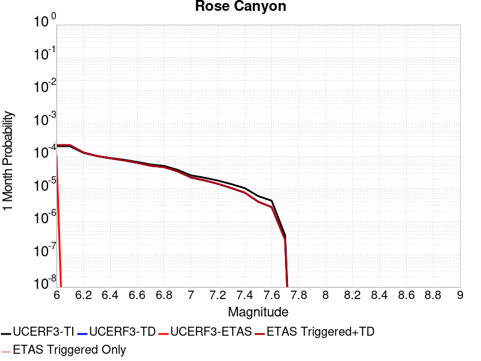 |  |  |

| Magnitude | 1 wk TI Prob | 1 wk TD Prob | 1 wk ETAS Prob | 1 wk ETAS/TD Gain | 1 wk ETAS Triggered+TD | 1 wk ETAS Triggered Only | 1 mo TI Prob | 1 mo TD Prob | 1 mo ETAS Prob | 1 mo ETAS/TD Gain | 1 mo ETAS Triggered+TD | 1 mo ETAS Triggered Only | 1 yr TI Prob | 1 yr TD Prob | 1 yr ETAS Prob | 1 yr ETAS/TD Gain | 1 yr ETAS Triggered+TD | 1 yr ETAS Triggered Only | 10 yr TI Prob | 10 yr TD Prob | 10 yr ETAS Prob | 10 yr ETAS/TD Gain | 10 yr ETAS Triggered+TD | 10 yr ETAS Triggered Only |
|-----|-----|-----|-----|-----|-----|-----|-----|-----|-----|-----|-----|-----|-----|-----|-----|-----|-----|-----|-----|-----|-----|-----|-----|-----|
| 6.0 | 4.5923203E-5 | 4.956846E-5 | 0.0 | 0.0 | 4.956846E-5 | 0.0 | 1.9679888E-4 | 2.1242008E-4 | 1.0E-4 | 0.47076526 | 2.1242008E-4 | 0.0 | 0.0023933933 | 0.0025833456 | 0.0031 | 1.1999943 | 0.002782829 | 2.0E-4 | 0.023677798 | 0.025569068 | 0.0285 | 1.1146281 | 0.028297475 | 0.0028 |
| 6.1 | 4.5923203E-5 | 4.956846E-5 | 0.0 | 0.0 | 4.956846E-5 | 0.0 | 1.9679888E-4 | 2.1242008E-4 | 0.0 | 0.0 | 2.1242008E-4 | 0.0 | 0.0023933933 | 0.0025833456 | 0.0022 | 0.8516088 | 0.002782829 | 2.0E-4 | 0.023677798 | 0.025569068 | 0.0189 | 0.7391744 | 0.027615372 | 0.0021 |
| 6.2 | 2.8844734E-5 | 2.9590543E-5 | 0.0 | 0.0 | 2.9590543E-5 | 0.0 | 1.2361443E-4 | 1.2681042E-4 | 0.0 | 0.0 | 1.2681042E-4 | 0.0 | 0.0015039665 | 0.0015428526 | 0.0014 | 0.90741 | 0.0017425441 | 2.0E-4 | 0.0149382865 | 0.015320359 | 0.0106 | 0.6918898 | 0.016403506 | 0.0011 |
| 6.3 | 2.3171577E-5 | 2.3104E-5 | 0.0 | 0.0 | 2.3104E-5 | 0.0 | 9.9302975E-5 | 9.901346E-5 | 0.0 | 0.0 | 9.901346E-5 | 0.0 | 0.0012083431 | 0.0012048355 | 9.0E-4 | 0.74698997 | 0.0012048355 | 0.0 | 0.012017938 | 0.0119845625 | 0.008 | 0.6675254 | 0.01247857 | 5.0E-4 |
| 6.4 | 2.0066604E-5 | 1.9615401E-5 | 0.0 | 0.0 | 1.9615401E-5 | 0.0 | 8.599689E-5 | 8.406336E-5 | 0.0 | 0.0 | 8.406336E-5 | 0.0 | 0.0010465092 | 0.0010230008 | 7.0E-4 | 0.68426144 | 0.0010230008 | 0.0 | 0.010415946 | 0.010179632 | 0.0061 | 0.5992358 | 0.010476578 | 3.0E-4 |
| 6.5 | 1.776989E-5 | 1.706667E-5 | 0.0 | 0.0 | 1.706667E-5 | 0.0 | 7.615444E-5 | 7.3140865E-5 | 0.0 | 0.0 | 7.3140865E-5 | 0.0 | 9.267859E-4 | 8.9013315E-4 | 6.0E-4 | 0.6740565 | 8.9013315E-4 | 0.0 | 0.009229303 | 0.0088629415 | 0.0051 | 0.57542974 | 0.008962055 | 1.0E-4 |
| 6.6 | 1.5227364E-5 | 1.4299948E-5 | 0.0 | 0.0 | 1.4299948E-5 | 0.0 | 6.52585E-5 | 6.128408E-5 | 0.0 | 0.0 | 6.128408E-5 | 0.0 | 7.942326E-4 | 7.4588344E-4 | 4.0E-4 | 0.5362768 | 7.4588344E-4 | 0.0 | 0.007914 | 0.007420897 | 0.0042 | 0.5659693 | 0.007520155 | 1.0E-4 |
| 6.7 | 1.2703898E-5 | 1.1645335E-5 | 0.0 | 0.0 | 1.1645335E-5 | 0.0 | 5.4444143E-5 | 4.9907645E-5 | 0.0 | 0.0 | 4.9907645E-5 | 0.0 | 6.626558E-4 | 6.074604E-4 | 2.0E-4 | 0.32923958 | 6.074604E-4 | 0.0 | 0.006606833 | 0.0060428753 | 0.0034 | 0.5626461 | 0.0061422708 | 1.0E-4 |
| 6.8 | 1.1554917E-5 | 1.0585637E-5 | 0.0 | 0.0 | 1.0585637E-5 | 0.0 | 4.9520135E-5 | 4.536625E-5 | 0.0 | 0.0 | 4.536625E-5 | 0.0 | 6.0274085E-4 | 5.5219815E-4 | 2.0E-4 | 0.36218882 | 5.5219815E-4 | 0.0 | 0.0060110865 | 0.005498362 | 0.0029 | 0.5274298 | 0.0055978117 | 1.0E-4 |
| 6.9 | 8.732078E-6 | 7.867183E-6 | 0.0 | 0.0 | 7.867183E-6 | 0.0 | 3.7422655E-5 | 3.3716078E-5 | 0.0 | 0.0 | 3.3716078E-5 | 0.0 | 4.5552556E-4 | 4.1041887E-4 | 2.0E-4 | 0.487307 | 4.1041887E-4 | 0.0 | 0.0045459294 | 0.004081689 | 0.0024 | 0.5879919 | 0.0041812807 | 1.0E-4 |
| 7.0 | 5.9337494E-6 | 5.0970466E-6 | 0.0 | 0.0 | 5.0970466E-6 | 0.0 | 2.5430107E-5 | 2.1844304E-5 | 0.0 | 0.0 | 2.1844304E-5 | 0.0 | 3.0956755E-4 | 2.6592208E-4 | 2.0E-4 | 0.75210005 | 2.6592208E-4 | 0.0 | 0.0030913667 | 0.0026560542 | 0.0015 | 0.5647475 | 0.0027557886 | 1.0E-4 |
| 7.1 | 5.013409E-6 | 4.1689573E-6 | 0.0 | 0.0 | 4.1689573E-6 | 0.0 | 2.1485863E-5 | 1.7866838E-5 | 0.0 | 0.0 | 1.7866838E-5 | 0.0 | 2.6155898E-4 | 2.1750714E-4 | 1.0E-4 | 0.459755 | 2.1750714E-4 | 0.0 | 0.0026125133 | 0.0021729541 | 0.0013 | 0.59826386 | 0.002272737 | 1.0E-4 |
| 7.2 | 4.120763E-6 | 3.2745306E-6 | 0.0 | 0.0 | 3.2745306E-6 | 0.0 | 1.7660293E-5 | 1.4033627E-5 | 0.0 | 0.0 | 1.4033627E-5 | 0.0 | 2.1499286E-4 | 1.708461E-4 | 1.0E-4 | 0.5853221 | 1.708461E-4 | 0.0 | 0.0021478499 | 0.0017071571 | 0.0012 | 0.702923 | 0.0018069864 | 1.0E-4 |
| 7.3 | 3.2081239E-6 | 2.4343078E-6 | 0.0 | 0.0 | 2.4343078E-6 | 0.0 | 1.374903E-5 | 1.0432706E-5 | 0.0 | 0.0 | 1.0432706E-5 | 0.0 | 1.6738157E-4 | 1.2701086E-4 | 0.0 | 0.0 | 1.2701086E-4 | 0.0 | 0.0016725556 | 0.0012693896 | 8.0E-4 | 0.6302241 | 0.0013692627 | 1.0E-4 |
| 7.4 | 2.4194755E-6 | 1.7628944E-6 | 0.0 | 0.0 | 1.7628944E-6 | 0.0 | 1.0369139E-5 | 7.55524E-6 | 0.0 | 0.0 | 7.55524E-6 | 0.0 | 1.2623696E-4 | 9.1981216E-5 | 0.0 | 0.0 | 9.1981216E-5 | 0.0 | 0.0012616527 | 9.1943674E-4 | 7.0E-4 | 0.7613357 | 0.0010193448 | 1.0E-4 |
| 7.5 | 1.3842889E-6 | 9.337478E-7 | 0.0 | 0.0 | 9.337478E-7 | 0.0 | 5.9326535E-6 | 4.0017703E-6 | 0.0 | 0.0 | 4.0017703E-6 | 0.0 | 7.222766E-5 | 4.87205E-5 | 0.0 | 0.0 | 4.87205E-5 | 0.0 | 7.220419E-4 | 4.871017E-4 | 4.0E-4 | 0.82118374 | 4.871017E-4 | 0.0 |
| 7.6 | 1.0021575E-6 | 6.3821955E-7 | 0.0 | 0.0 | 6.3821955E-7 | 0.0 | 4.2949537E-6 | 2.735224E-6 | 0.0 | 0.0 | 2.735224E-6 | 0.0 | 5.2289808E-5 | 3.3300865E-5 | 0.0 | 0.0 | 3.3300865E-5 | 0.0 | 5.2277505E-4 | 3.3296086E-4 | 4.0E-4 | 1.2013423 | 3.3296086E-4 | 0.0 |
| 7.7 | 8.7620116E-8 | 6.4458135E-8 | 0.0 | 0.0 | 6.4458135E-8 | 0.0 | 3.7551473E-7 | 2.7624912E-7 | 0.0 | 0.0 | 2.7624912E-7 | 0.0 | 4.5718825E-6 | 3.3633282E-6 | 0.0 | 0.0 | 3.3633282E-6 | 0.0 | 4.5717883E-5 | 3.36328E-5 | 0.0 | 0.0 | 3.36328E-5 | 0.0 |

## Sargent 2011 CFM
*[(top)](#table-of-contents)*

| 1 Week | 1 Month | 1 Year | 10 Year |
|-----|-----|-----|-----|
|  |  |  |  |

| Magnitude | 1 wk TI Prob | 1 wk TD Prob | 1 wk ETAS Prob | 1 wk ETAS/TD Gain | 1 wk ETAS Triggered+TD | 1 wk ETAS Triggered Only | 1 mo TI Prob | 1 mo TD Prob | 1 mo ETAS Prob | 1 mo ETAS/TD Gain | 1 mo ETAS Triggered+TD | 1 mo ETAS Triggered Only | 1 yr TI Prob | 1 yr TD Prob | 1 yr ETAS Prob | 1 yr ETAS/TD Gain | 1 yr ETAS Triggered+TD | 1 yr ETAS Triggered Only | 10 yr TI Prob | 10 yr TD Prob | 10 yr ETAS Prob | 10 yr ETAS/TD Gain | 10 yr ETAS Triggered+TD | 10 yr ETAS Triggered Only |
|-----|-----|-----|-----|-----|-----|-----|-----|-----|-----|-----|-----|-----|-----|-----|-----|-----|-----|-----|-----|-----|-----|-----|-----|-----|
| 6.0 | 3.7327867E-5 | 3.650677E-5 | 0.0 | 0.0 | 3.650677E-5 | 0.0 | 1.5996677E-4 | 1.5645097E-4 | 0.0 | 0.0 | 1.5645097E-4 | 0.0 | 0.0019458556 | 0.001903551 | 0.0011 | 0.5778673 | 0.0023027896 | 4.0E-4 | 0.01928905 | 0.018942157 | 0.016 | 0.8446768 | 0.021689119 | 0.0028 |
| 6.1 | 2.3771476E-5 | 1.8396146E-5 | 0.0 | 0.0 | 1.8396146E-5 | 0.0 | 1.01873775E-4 | 7.883873E-5 | 0.0 | 0.0 | 7.883873E-5 | 0.0 | 0.0012396075 | 9.59521E-4 | 8.0E-4 | 0.83374935 | 0.0011593291 | 2.0E-4 | 0.012327154 | 0.009590714 | 0.007 | 0.7298727 | 0.011076327 | 0.0015 |
| 6.2 | 2.3112721E-5 | 1.7628841E-5 | 0.0 | 0.0 | 1.7628841E-5 | 0.0 | 9.9050754E-5 | 7.555048E-5 | 0.0 | 0.0 | 7.555048E-5 | 0.0 | 0.0012052758 | 9.195205E-4 | 8.0E-4 | 0.87001866 | 0.0011193366 | 2.0E-4 | 0.011987597 | 0.009194039 | 0.0067 | 0.728733 | 0.010680248 | 0.0015 |
| 6.3 | 1.728509E-5 | 1.0395616E-5 | 0.0 | 0.0 | 1.0395616E-5 | 0.0 | 7.407686E-5 | 4.4552147E-5 | 0.0 | 0.0 | 4.4552147E-5 | 0.0 | 9.015125E-4 | 5.423336E-4 | 4.0E-4 | 0.7375535 | 5.423336E-4 | 0.0 | 0.008978641 | 0.0054437076 | 0.0036 | 0.661314 | 0.0060404413 | 6.0E-4 |
| 6.4 | 1.48395575E-5 | 7.3997735E-6 | 0.0 | 0.0 | 7.3997735E-6 | 0.0 | 6.3596555E-5 | 3.1713145E-5 | 0.0 | 0.0 | 3.1713145E-5 | 0.0 | 7.7401294E-4 | 3.8607675E-4 | 1.0E-4 | 0.25901586 | 3.8607675E-4 | 0.0 | 0.0077132257 | 0.0038868738 | 0.0025 | 0.64319044 | 0.0043849302 | 5.0E-4 |
| 6.5 | 1.4358964E-5 | 6.839544E-6 | 0.0 | 0.0 | 6.839544E-6 | 0.0 | 6.1536964E-5 | 2.9312214E-5 | 0.0 | 0.0 | 2.9312214E-5 | 0.0 | 7.48955E-4 | 3.5685525E-4 | 1.0E-4 | 0.28022566 | 3.5685525E-4 | 0.0 | 0.0074643586 | 0.0035956302 | 0.0023 | 0.63966537 | 0.0040938323 | 5.0E-4 |
| 6.6 | 9.772591E-6 | 1.3301266E-6 | 0.0 | 0.0 | 1.3301266E-6 | 0.0 | 4.188186E-5 | 5.7005304E-6 | 0.0 | 0.0 | 5.7005304E-6 | 0.0 | 5.097923E-4 | 6.940177E-5 | 0.0 | 0.0 | 6.940177E-5 | 0.0 | 0.005086244 | 7.2303804E-4 | 4.0E-4 | 0.5532212 | 8.2296575E-4 | 1.0E-4 |
| 6.7 | 9.752745E-6 | 1.3088344E-6 | 0.0 | 0.0 | 1.3088344E-6 | 0.0 | 4.179681E-5 | 5.609278E-6 | 0.0 | 0.0 | 5.609278E-6 | 0.0 | 5.0875737E-4 | 6.829085E-5 | 0.0 | 0.0 | 6.829085E-5 | 0.0 | 0.005075942 | 7.11936E-4 | 4.0E-4 | 0.5618483 | 8.118648E-4 | 1.0E-4 |
| 6.8 | 9.608213E-6 | 1.1935011E-6 | 0.0 | 0.0 | 1.1935011E-6 | 0.0 | 4.1177405E-5 | 5.114995E-6 | 0.0 | 0.0 | 5.114995E-6 | 0.0 | 5.012196E-4 | 6.2273306E-5 | 0.0 | 0.0 | 6.2273306E-5 | 0.0 | 0.005000906 | 6.515025E-4 | 4.0E-4 | 0.6139654 | 7.514373E-4 | 1.0E-4 |
| 6.9 | 9.427164E-6 | 1.0802921E-6 | 0.0 | 0.0 | 1.0802921E-6 | 0.0 | 4.04015E-5 | 4.629815E-6 | 0.0 | 0.0 | 4.629815E-6 | 0.0 | 4.9177726E-4 | 5.6366564E-5 | 0.0 | 0.0 | 5.6366564E-5 | 0.0 | 0.004906904 | 5.9182505E-4 | 4.0E-4 | 0.6758754 | 6.9176586E-4 | 1.0E-4 |
| 7.0 | 9.247601E-6 | 9.4809036E-7 | 0.0 | 0.0 | 9.4809036E-7 | 0.0 | 3.9631974E-5 | 4.063238E-6 | 0.0 | 0.0 | 4.063238E-6 | 0.0 | 4.8241246E-4 | 4.9468814E-5 | 0.0 | 0.0 | 4.9468814E-5 | 0.0 | 0.0048136655 | 5.2236655E-4 | 3.0E-4 | 0.57430935 | 6.223143E-4 | 1.0E-4 |
| 7.1 | 8.995454E-6 | 7.902502E-7 | 0.0 | 0.0 | 7.902502E-7 | 0.0 | 3.8551374E-5 | 3.3867823E-6 | 0.0 | 0.0 | 3.3867823E-6 | 0.0 | 4.6926187E-4 | 4.1233307E-5 | 0.0 | 0.0 | 4.1233307E-5 | 0.0 | 0.004682722 | 4.391358E-4 | 3.0E-4 | 0.68316 | 5.390919E-4 | 1.0E-4 |
| 7.2 | 8.520861E-6 | 4.955659E-7 | 0.0 | 0.0 | 4.955659E-7 | 0.0 | 3.6517464E-5 | 2.1238523E-6 | 0.0 | 0.0 | 2.1238523E-6 | 0.0 | 4.445094E-4 | 2.58576E-5 | 0.0 | 0.0 | 2.58576E-5 | 0.0 | 0.004436213 | 2.8371174E-4 | 2.0E-4 | 0.7049409 | 3.8368336E-4 | 1.0E-4 |
| 7.3 | 8.043592E-6 | 3.1743255E-7 | 0.0 | 0.0 | 3.1743255E-7 | 0.0 | 3.4472083E-5 | 1.3604244E-6 | 0.0 | 0.0 | 1.3604244E-6 | 0.0 | 4.196168E-4 | 1.6563043E-5 | 0.0 | 0.0 | 1.6563043E-5 | 0.0 | 0.004188253 | 1.8952461E-4 | 2.0E-4 | 1.055272 | 2.8950567E-4 | 1.0E-4 |
| 7.4 | 7.662316E-6 | 2.6704782E-7 | 0.0 | 0.0 | 2.6704782E-7 | 0.0 | 3.2838085E-5 | 1.1444902E-6 | 0.0 | 0.0 | 1.1444902E-6 | 0.0 | 3.9973034E-4 | 1.393408E-5 | 0.0 | 0.0 | 1.393408E-5 | 0.0 | 0.0039901207 | 1.61539E-4 | 2.0E-4 | 1.2380911 | 2.6152286E-4 | 1.0E-4 |
| 7.5 | 6.961638E-6 | 2.139055E-7 | 0.0 | 0.0 | 2.139055E-7 | 0.0 | 2.9835252E-5 | 9.167375E-7 | 0.0 | 0.0 | 9.167375E-7 | 0.0 | 3.6318362E-4 | 1.1161223E-5 | 0.0 | 0.0 | 1.1161223E-5 | 0.0 | 0.0036259065 | 1.3061658E-4 | 1.0E-4 | 0.7655996 | 1.3061658E-4 | 0.0 |
| 7.6 | 6.282332E-6 | 1.5195336E-7 | 0.0 | 0.0 | 1.5195336E-7 | 0.0 | 2.6924003E-5 | 6.5122856E-7 | 0.0 | 0.0 | 6.5122856E-7 | 0.0 | 3.2775043E-4 | 7.928679E-6 | 0.0 | 0.0 | 7.928679E-6 | 0.0 | 0.0032726745 | 9.442953E-5 | 1.0E-4 | 1.0589907 | 9.442953E-5 | 0.0 |
| 7.7 | 4.934408E-6 | 4.4333685E-8 | 0.0 | 0.0 | 4.4333685E-8 | 0.0 | 2.114729E-5 | 1.900015E-7 | 0.0 | 0.0 | 1.900015E-7 | 0.0 | 2.5743784E-4 | 2.313266E-6 | 0.0 | 0.0 | 2.313266E-6 | 0.0 | 0.0025713982 | 2.863751E-5 | 0.0 | 0.0 | 2.863751E-5 | 0.0 |
| 7.8 | 2.373212E-6 | 3.0612604E-8 | 0.0 | 0.0 | 3.0612604E-8 | 0.0 | 1.0170869E-5 | 1.3119687E-7 | 0.0 | 0.0 | 1.3119687E-7 | 0.0 | 1.238233E-4 | 1.5973208E-6 | 0.0 | 0.0 | 1.5973208E-6 | 0.0 | 0.0012375432 | 2.0951647E-5 | 0.0 | 0.0 | 2.0951647E-5 | 0.0 |
| 7.9 | 1.8227792E-6 | 2.6556389E-8 | 0.0 | 0.0 | 2.6556389E-8 | 0.0 | 7.811887E-6 | 1.13813094E-7 | 0.0 | 0.0 | 1.13813094E-7 | 0.0 | 9.510558E-5 | 1.3856735E-6 | 0.0 | 0.0 | 1.3856735E-6 | 0.0 | 9.5064886E-4 | 1.8567911E-5 | 0.0 | 0.0 | 1.8567911E-5 | 0.0 |
| 8.0 | 1.9095137E-7 | 1.2011457E-8 | 0.0 | 0.0 | 1.2011457E-8 | 0.0 | 8.1836276E-7 | 5.147767E-8 | 0.0 | 0.0 | 5.147767E-8 | 0.0 | 9.963521E-6 | 6.267405E-7 | 0.0 | 0.0 | 6.267405E-7 | 0.0 | 9.963074E-5 | 7.6893675E-6 | 0.0 | 0.0 | 7.6893675E-6 | 0.0 |

## Mission (connected) 2011 CFM
*[(top)](#table-of-contents)*

| 1 Week | 1 Month | 1 Year | 10 Year |
|-----|-----|-----|-----|
|  |  |  | 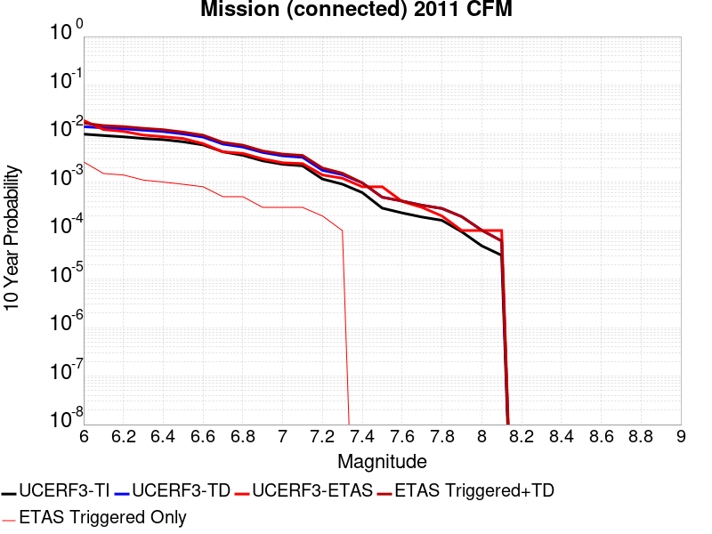 |

| Magnitude | 1 wk TI Prob | 1 wk TD Prob | 1 wk ETAS Prob | 1 wk ETAS/TD Gain | 1 wk ETAS Triggered+TD | 1 wk ETAS Triggered Only | 1 mo TI Prob | 1 mo TD Prob | 1 mo ETAS Prob | 1 mo ETAS/TD Gain | 1 mo ETAS Triggered+TD | 1 mo ETAS Triggered Only | 1 yr TI Prob | 1 yr TD Prob | 1 yr ETAS Prob | 1 yr ETAS/TD Gain | 1 yr ETAS Triggered+TD | 1 yr ETAS Triggered Only | 10 yr TI Prob | 10 yr TD Prob | 10 yr ETAS Prob | 10 yr ETAS/TD Gain | 10 yr ETAS Triggered+TD | 10 yr ETAS Triggered Only |
|-----|-----|-----|-----|-----|-----|-----|-----|-----|-----|-----|-----|-----|-----|-----|-----|-----|-----|-----|-----|-----|-----|-----|-----|-----|
| 6.0 | 1.8735573E-5 | 2.6617612E-5 | 0.0 | 0.0 | 2.6617612E-5 | 0.0 | 8.029284E-5 | 1.1406919E-4 | 1.0E-4 | 0.87666094 | 1.1406919E-4 | 0.0 | 9.771269E-4 | 0.0013878148 | 9.0E-4 | 0.6485015 | 0.0014876759 | 1.0E-4 | 0.009728416 | 0.013805085 | 0.0186 | 1.3473296 | 0.016369192 | 0.0026 |
| 6.1 | 1.7515964E-5 | 2.5260504E-5 | 0.0 | 0.0 | 2.5260504E-5 | 0.0 | 7.506625E-5 | 1.082535E-4 | 1.0E-4 | 0.9237576 | 1.082535E-4 | 0.0 | 9.135484E-4 | 0.0013170963 | 8.0E-4 | 0.6073967 | 0.0014169646 | 1.0E-4 | 0.009098019 | 0.013106428 | 0.0121 | 0.92321116 | 0.014586768 | 0.0015 |
| 6.2 | 1.6486343E-5 | 2.4106652E-5 | 0.0 | 0.0 | 2.4106652E-5 | 0.0 | 7.065384E-5 | 1.0330882E-4 | 0.0 | 0.0 | 1.0330882E-4 | 0.0 | 8.5987104E-4 | 0.0012569661 | 7.0E-4 | 0.5568965 | 0.0013568404 | 1.0E-4 | 0.008565514 | 0.012512081 | 0.0111 | 0.8871426 | 0.013894564 | 0.0014 |
| 6.3 | 1.5229385E-5 | 2.2540813E-5 | 0.0 | 0.0 | 2.2540813E-5 | 0.0 | 6.526716E-5 | 9.659859E-5 | 0.0 | 0.0 | 9.659859E-5 | 0.0 | 7.9433795E-4 | 0.0011753603 | 7.0E-4 | 0.59556204 | 0.0012752428 | 1.0E-4 | 0.007915046 | 0.011707519 | 0.0093 | 0.7943613 | 0.012794641 | 0.0011 |
| 6.4 | 1.4435828E-5 | 2.115143E-5 | 0.0 | 0.0 | 2.115143E-5 | 0.0 | 6.186637E-5 | 9.064454E-5 | 0.0 | 0.0 | 9.064454E-5 | 0.0 | 7.529627E-4 | 0.0011029466 | 6.0E-4 | 0.54399735 | 0.0012028363 | 1.0E-4 | 0.007504165 | 0.010995562 | 0.0086 | 0.78213376 | 0.011984566 | 0.001 |
| 6.5 | 1.30127955E-5 | 1.8803286E-5 | 0.0 | 0.0 | 1.8803286E-5 | 0.0 | 5.576793E-5 | 8.0582766E-5 | 0.0 | 0.0 | 8.0582766E-5 | 0.0 | 6.78763E-4 | 9.806219E-4 | 4.0E-4 | 0.4079044 | 9.806219E-4 | 0.0 | 0.0067669353 | 0.009794649 | 0.0079 | 0.80656284 | 0.010685834 | 9.0E-4 |
| 6.6 | 1.1220718E-5 | 1.617225E-5 | 0.0 | 0.0 | 1.617225E-5 | 0.0 | 4.8087906E-5 | 6.930778E-5 | 0.0 | 0.0 | 6.930778E-5 | 0.0 | 5.8531296E-4 | 8.434953E-4 | 3.0E-4 | 0.3556629 | 8.434953E-4 | 0.0 | 0.005837737 | 0.008438742 | 0.0062 | 0.73470664 | 0.009231991 | 8.0E-4 |
| 6.7 | 8.086152E-6 | 1.15681705E-5 | 0.0 | 0.0 | 1.15681705E-5 | 0.0 | 3.4654473E-5 | 4.9576935E-5 | 0.0 | 0.0 | 4.9576935E-5 | 0.0 | 4.2183654E-4 | 6.0343277E-4 | 3.0E-4 | 0.49715564 | 6.0343277E-4 | 0.0 | 0.004210367 | 0.006058275 | 0.0042 | 0.6932667 | 0.0065552457 | 5.0E-4 |
| 6.8 | 6.8361655E-6 | 1.0035145E-5 | 0.0 | 0.0 | 1.0035145E-5 | 0.0 | 2.9297524E-5 | 4.3007058E-5 | 0.0 | 0.0 | 4.3007058E-5 | 0.0 | 3.5663895E-4 | 5.2348577E-4 | 3.0E-4 | 0.5730815 | 5.2348577E-4 | 0.0 | 0.0035606713 | 0.0052582975 | 0.0039 | 0.7416849 | 0.0057556685 | 5.0E-4 |
| 6.9 | 5.2517353E-6 | 7.740318E-6 | 0.0 | 0.0 | 7.740318E-6 | 0.0 | 2.2507242E-5 | 3.317237E-5 | 0.0 | 0.0 | 3.317237E-5 | 0.0 | 2.739912E-4 | 4.0379903E-4 | 3.0E-4 | 0.7429439 | 4.0379903E-4 | 0.0 | 0.0027365363 | 0.0040651336 | 0.003 | 0.73798317 | 0.004363914 | 3.0E-4 |
| 7.0 | 4.4602784E-6 | 6.59002E-6 | 0.0 | 0.0 | 6.59002E-6 | 0.0 | 1.911534E-5 | 2.8242639E-5 | 0.0 | 0.0 | 2.8242639E-5 | 0.0 | 2.327044E-4 | 3.4380003E-4 | 1.0E-4 | 0.29086676 | 3.4380003E-4 | 0.0 | 0.0023246086 | 0.00346606 | 0.0025 | 0.72128004 | 0.0037650203 | 3.0E-4 |
| 7.1 | 4.1492594E-6 | 6.1442997E-6 | 0.0 | 0.0 | 6.1442997E-6 | 0.0 | 1.7782419E-5 | 2.633245E-5 | 0.0 | 0.0 | 2.633245E-5 | 0.0 | 2.1647944E-4 | 3.2055055E-4 | 1.0E-4 | 0.3119633 | 3.2055055E-4 | 0.0 | 0.0021626868 | 0.0032336465 | 0.0024 | 0.74219614 | 0.0035326763 | 3.0E-4 |
| 7.2 | 2.213247E-6 | 3.2849764E-6 | 0.0 | 0.0 | 3.2849764E-6 | 0.0 | 9.485309E-6 | 1.4078394E-5 | 0.0 | 0.0 | 1.4078394E-5 | 0.0 | 1.15477524E-4 | 1.71391E-4 | 1.0E-4 | 0.5834612 | 1.71391E-4 | 0.0 | 0.0011541754 | 0.0017424204 | 0.0014 | 0.80348 | 0.0019420718 | 2.0E-4 |
| 7.3 | 1.7362703E-6 | 2.6703128E-6 | 0.0 | 0.0 | 2.6703128E-6 | 0.0 | 7.4411373E-6 | 1.1444148E-5 | 0.0 | 0.0 | 1.1444148E-5 | 0.0 | 9.0592075E-5 | 1.3932362E-4 | 1.0E-4 | 0.7177534 | 1.3932362E-4 | 0.0 | 9.0555154E-4 | 0.0014187829 | 0.0012 | 0.8457954 | 0.0015186409 | 1.0E-4 |
| 7.4 | 1.1628409E-6 | 1.7967243E-6 | 0.0 | 0.0 | 1.7967243E-6 | 0.0 | 4.9835944E-6 | 7.700224E-6 | 0.0 | 0.0 | 7.700224E-6 | 0.0 | 6.0673574E-5 | 9.374621E-5 | 0.0 | 0.0 | 9.374621E-5 | 0.0 | 6.065701E-4 | 9.58822E-4 | 8.0E-4 | 0.83435714 | 9.58822E-4 | 0.0 |
| 7.5 | 5.5610667E-7 | 8.9541584E-7 | 0.0 | 0.0 | 8.9541584E-7 | 0.0 | 2.3833122E-6 | 3.8374906E-6 | 0.0 | 0.0 | 3.8374906E-6 | 0.0 | 2.9016439E-5 | 4.672045E-5 | 0.0 | 0.0 | 4.672045E-5 | 0.0 | 2.901265E-4 | 4.8461917E-4 | 8.0E-4 | 1.6507808 | 4.8461917E-4 | 0.0 |
| 7.6 | 4.4307663E-7 | 7.423254E-7 | 0.0 | 0.0 | 7.423254E-7 | 0.0 | 1.8988985E-6 | 3.1813906E-6 | 0.0 | 0.0 | 3.1813906E-6 | 0.0 | 2.3118844E-5 | 3.8732745E-5 | 0.0 | 0.0 | 3.8732745E-5 | 0.0 | 2.3116439E-4 | 4.0408003E-4 | 4.0E-4 | 0.9899029 | 4.0408003E-4 | 0.0 |
| 7.7 | 3.639119E-7 | 6.033907E-7 | 0.0 | 0.0 | 6.033907E-7 | 0.0 | 1.5596215E-6 | 2.5859574E-6 | 0.0 | 0.0 | 2.5859574E-6 | 0.0 | 1.8988227E-5 | 3.1483578E-5 | 0.0 | 0.0 | 3.1483578E-5 | 0.0 | 1.8986604E-4 | 3.3084108E-4 | 3.0E-4 | 0.9067798 | 3.3084108E-4 | 0.0 |
| 7.8 | 3.1152942E-7 | 5.206889E-7 | 0.0 | 0.0 | 5.206889E-7 | 0.0 | 1.3351254E-6 | 2.231522E-6 | 0.0 | 0.0 | 2.231522E-6 | 0.0 | 1.6255031E-5 | 2.7168444E-5 | 0.0 | 0.0 | 2.7168444E-5 | 0.0 | 1.6253842E-4 | 2.8432807E-4 | 2.0E-4 | 0.7034128 | 2.8432807E-4 | 0.0 |
| 7.9 | 1.8035962E-7 | 3.5540276E-7 | 0.0 | 0.0 | 3.5540276E-7 | 0.0 | 7.729696E-7 | 1.5231539E-6 | 0.0 | 0.0 | 1.5231539E-6 | 0.0 | 9.410865E-6 | 1.854424E-5 | 0.0 | 0.0 | 1.854424E-5 | 0.0 | 9.410465E-5 | 1.9265003E-4 | 1.0E-4 | 0.51907593 | 1.9265003E-4 | 0.0 |
| 8.0 | 9.279334E-8 | 1.8900911E-7 | 0.0 | 0.0 | 1.8900911E-7 | 0.0 | 3.976857E-7 | 8.100388E-7 | 0.0 | 0.0 | 8.100388E-7 | 0.0 | 4.841813E-6 | 9.862179E-6 | 0.0 | 0.0 | 9.862179E-6 | 0.0 | 4.841707E-5 | 1.01374E-4 | 1.0E-4 | 0.98644626 | 1.01374E-4 | 0.0 |
| 8.1 | 5.9253985E-8 | 1.1385916E-7 | 0.0 | 0.0 | 1.1385916E-7 | 0.0 | 2.5394561E-7 | 4.879677E-7 | 0.0 | 0.0 | 4.879677E-7 | 0.0 | 3.0917836E-6 | 5.9409913E-6 | 0.0 | 0.0 | 5.9409913E-6 | 0.0 | 3.0917407E-5 | 6.0916063E-5 | 1.0E-4 | 1.6416031 | 6.0916063E-5 | 0.0 |

## San Diego Trough south
*[(top)](#table-of-contents)*

| 1 Week | 1 Month | 1 Year | 10 Year |
|-----|-----|-----|-----|
| 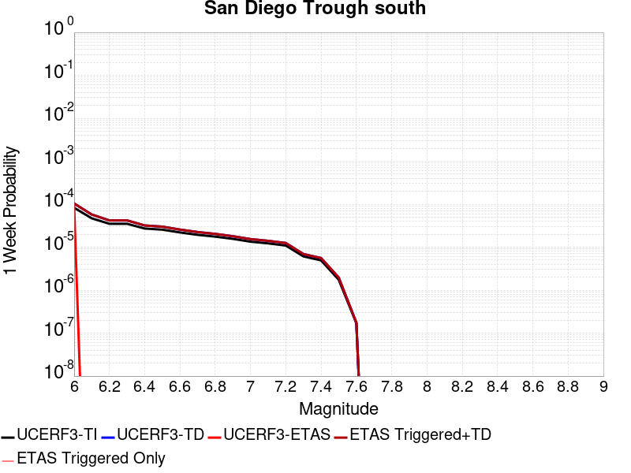 | 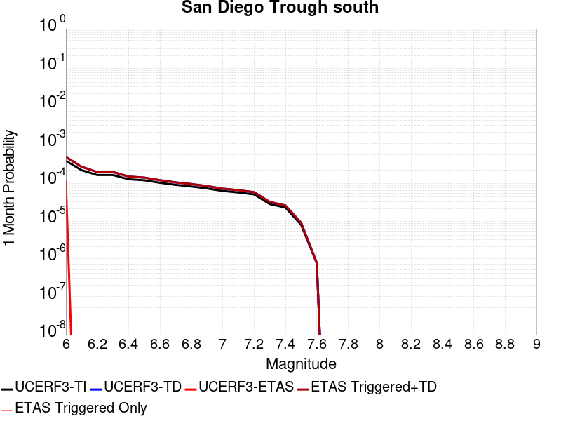 |  |  |

| Magnitude | 1 wk TI Prob | 1 wk TD Prob | 1 wk ETAS Prob | 1 wk ETAS/TD Gain | 1 wk ETAS Triggered+TD | 1 wk ETAS Triggered Only | 1 mo TI Prob | 1 mo TD Prob | 1 mo ETAS Prob | 1 mo ETAS/TD Gain | 1 mo ETAS Triggered+TD | 1 mo ETAS Triggered Only | 1 yr TI Prob | 1 yr TD Prob | 1 yr ETAS Prob | 1 yr ETAS/TD Gain | 1 yr ETAS Triggered+TD | 1 yr ETAS Triggered Only | 10 yr TI Prob | 10 yr TD Prob | 10 yr ETAS Prob | 10 yr ETAS/TD Gain | 10 yr ETAS Triggered+TD | 10 yr ETAS Triggered Only |
|-----|-----|-----|-----|-----|-----|-----|-----|-----|-----|-----|-----|-----|-----|-----|-----|-----|-----|-----|-----|-----|-----|-----|-----|-----|
| 6.0 | 8.279495E-5 | 1.0398335E-4 | 1.0E-4 | 0.9616924 | 1.0398335E-4 | 0.0 | 3.5478722E-4 | 4.4557097E-4 | 1.0E-4 | 0.22443113 | 4.4557097E-4 | 0.0 | 0.004310982 | 0.0054117716 | 0.0033 | 0.6097818 | 0.0056106895 | 2.0E-4 | 0.042283054 | 0.052859753 | 0.0394 | 0.7453686 | 0.055227604 | 0.0025 |
| 6.1 | 4.6961468E-5 | 5.7593406E-5 | 0.0 | 0.0 | 5.7593406E-5 | 0.0 | 2.0124791E-4 | 2.4680578E-4 | 0.0 | 0.0 | 2.4680578E-4 | 0.0 | 0.00244744 | 0.0030007784 | 0.0017 | 0.5665197 | 0.003200178 | 2.0E-4 | 0.024206603 | 0.029610973 | 0.0205 | 0.6923109 | 0.031066557 | 0.0015 |
| 6.2 | 3.5079658E-5 | 4.2053834E-5 | 0.0 | 0.0 | 4.2053834E-5 | 0.0 | 1.5033272E-4 | 1.8021835E-4 | 0.0 | 0.0 | 1.8021835E-4 | 0.0 | 0.0018287642 | 0.0021919683 | 9.0E-4 | 0.41058987 | 0.0021919683 | 0.0 | 0.018137876 | 0.021706074 | 0.0139 | 0.6403737 | 0.02268437 | 0.001 |
| 6.3 | 3.5079658E-5 | 4.2053834E-5 | 0.0 | 0.0 | 4.2053834E-5 | 0.0 | 1.5033272E-4 | 1.8021835E-4 | 0.0 | 0.0 | 1.8021835E-4 | 0.0 | 0.0018287642 | 0.0021919683 | 9.0E-4 | 0.41058987 | 0.0021919683 | 0.0 | 0.018137876 | 0.021706074 | 0.0139 | 0.6403737 | 0.02268437 | 0.001 |
| 6.4 | 2.7196904E-5 | 3.2026568E-5 | 0.0 | 0.0 | 3.2026568E-5 | 0.0 | 1.16552954E-4 | 1.372496E-4 | 0.0 | 0.0 | 1.372496E-4 | 0.0 | 0.0014181085 | 0.0016697448 | 8.0E-4 | 0.47911513 | 0.0016697448 | 0.0 | 0.014090929 | 0.016573627 | 0.0102 | 0.6154356 | 0.017360369 | 8.0E-4 |
| 6.5 | 2.5584688E-5 | 3.004582E-5 | 0.0 | 0.0 | 3.004582E-5 | 0.0 | 1.0964406E-4 | 1.2876153E-4 | 0.0 | 0.0 | 1.2876153E-4 | 0.0 | 0.0013340989 | 0.0015665563 | 8.0E-4 | 0.5106743 | 0.0015665563 | 0.0 | 0.013261181 | 0.0155567005 | 0.0097 | 0.6235255 | 0.01624581 | 7.0E-4 |
| 6.6 | 2.2034688E-5 | 2.5697242E-5 | 0.0 | 0.0 | 2.5697242E-5 | 0.0 | 9.443096E-5 | 1.10126435E-4 | 0.0 | 0.0 | 1.10126435E-4 | 0.0 | 0.0011490905 | 0.0013399721 | 7.0E-4 | 0.52239895 | 0.0013399721 | 0.0 | 0.011431668 | 0.0133199245 | 0.0081 | 0.60811156 | 0.013911933 | 6.0E-4 |
| 6.7 | 1.9394853E-5 | 2.2503391E-5 | 0.0 | 0.0 | 2.2503391E-5 | 0.0 | 8.311815E-5 | 9.643957E-5 | 0.0 | 0.0 | 9.643957E-5 | 0.0 | 0.0010114936 | 0.0011735245 | 6.0E-4 | 0.5112803 | 0.0011735245 | 0.0 | 0.01006902 | 0.011673977 | 0.0071 | 0.60819036 | 0.01216814 | 5.0E-4 |
| 6.8 | 1.7615313E-5 | 2.0369338E-5 | 0.0 | 0.0 | 2.0369338E-5 | 0.0 | 7.549201E-5 | 8.729427E-5 | 0.0 | 0.0 | 8.729427E-5 | 0.0 | 9.1872766E-4 | 0.0010622938 | 5.0E-4 | 0.47067958 | 0.0010622938 | 0.0 | 0.009149387 | 0.010572723 | 0.0063 | 0.59587294 | 0.011067437 | 5.0E-4 |
| 6.9 | 1.5621423E-5 | 1.7997054E-5 | 0.0 | 0.0 | 1.7997054E-5 | 0.0 | 6.6947236E-5 | 7.7127974E-5 | 0.0 | 0.0 | 7.7127974E-5 | 0.0 | 8.147778E-4 | 9.38632E-4 | 4.0E-4 | 0.42615208 | 9.38632E-4 | 0.0 | 0.008117969 | 0.009347118 | 0.0055 | 0.58841664 | 0.009842445 | 5.0E-4 |
| 7.0 | 1.3444376E-5 | 1.5423993E-5 | 0.0 | 0.0 | 1.5423993E-5 | 0.0 | 5.7617483E-5 | 6.610117E-5 | 0.0 | 0.0 | 6.610117E-5 | 0.0 | 7.0126704E-4 | 8.044873E-4 | 3.0E-4 | 0.3729083 | 8.044873E-4 | 0.0 | 0.006990582 | 0.008016082 | 0.0046 | 0.5738464 | 0.008512074 | 5.0E-4 |
| 7.1 | 1.2268361E-5 | 1.4051366E-5 | 0.0 | 0.0 | 1.4051366E-5 | 0.0 | 5.2577634E-5 | 6.021876E-5 | 0.0 | 0.0 | 6.021876E-5 | 0.0 | 6.399447E-4 | 7.3291943E-4 | 2.0E-4 | 0.2728813 | 7.3291943E-4 | 0.0 | 0.0063810493 | 0.0073053264 | 0.0041 | 0.56123435 | 0.007801674 | 5.0E-4 |
| 7.2 | 1.0922655E-5 | 1.24944845E-5 | 0.0 | 0.0 | 1.24944845E-5 | 0.0 | 4.681054E-5 | 5.3546704E-5 | 0.0 | 0.0 | 5.3546704E-5 | 0.0 | 5.697693E-4 | 6.5173866E-4 | 2.0E-4 | 0.30687147 | 6.5173866E-4 | 0.0 | 0.0056831064 | 0.0064985524 | 0.0037 | 0.5693576 | 0.006895953 | 4.0E-4 |
| 7.3 | 6.1106753E-6 | 6.9192024E-6 | 0.0 | 0.0 | 6.9192024E-6 | 0.0 | 2.6188345E-5 | 2.9653389E-5 | 0.0 | 0.0 | 2.9653389E-5 | 0.0 | 3.1879646E-4 | 3.6097062E-4 | 0.0 | 0.0 | 3.6097062E-4 | 0.0 | 0.0031833951 | 0.003603888 | 0.0017 | 0.47171277 | 0.0038031673 | 2.0E-4 |
| 7.4 | 4.933187E-6 | 5.5817527E-6 | 0.0 | 0.0 | 5.5817527E-6 | 0.0 | 2.114206E-5 | 2.392158E-5 | 0.0 | 0.0 | 2.392158E-5 | 0.0 | 2.5737417E-4 | 2.912067E-4 | 0.0 | 0.0 | 2.912067E-4 | 0.0 | 0.002570763 | 0.0029082922 | 0.0015 | 0.5157666 | 0.0030080015 | 1.0E-4 |
| 7.5 | 1.7489613E-6 | 1.967052E-6 | 0.0 | 0.0 | 1.967052E-6 | 0.0 | 7.495527E-6 | 8.430196E-6 | 0.0 | 0.0 | 8.430196E-6 | 0.0 | 9.125422E-5 | 1.0263303E-4 | 0.0 | 0.0 | 1.0263303E-4 | 0.0 | 9.1216754E-4 | 0.0010258782 | 3.0E-4 | 0.29243237 | 0.0011257756 | 1.0E-4 |
| 7.6 | 1.6988751E-7 | 1.7527951E-7 | 0.0 | 0.0 | 1.7527951E-7 | 0.0 | 7.2808916E-7 | 7.5119766E-7 | 0.0 | 0.0 | 7.5119766E-7 | 0.0 | 8.864449E-6 | 9.145795E-6 | 0.0 | 0.0 | 9.145795E-6 | 0.0 | 8.8640954E-5 | 9.1454385E-5 | 0.0 | 0.0 | 9.1454385E-5 | 0.0 |

## Santa Susana East (connector)
*[(top)](#table-of-contents)*

| 1 Week | 1 Month | 1 Year | 10 Year |
|-----|-----|-----|-----|
|  |  |  |  |

| Magnitude | 1 wk TI Prob | 1 wk TD Prob | 1 wk ETAS Prob | 1 wk ETAS/TD Gain | 1 wk ETAS Triggered+TD | 1 wk ETAS Triggered Only | 1 mo TI Prob | 1 mo TD Prob | 1 mo ETAS Prob | 1 mo ETAS/TD Gain | 1 mo ETAS Triggered+TD | 1 mo ETAS Triggered Only | 1 yr TI Prob | 1 yr TD Prob | 1 yr ETAS Prob | 1 yr ETAS/TD Gain | 1 yr ETAS Triggered+TD | 1 yr ETAS Triggered Only | 10 yr TI Prob | 10 yr TD Prob | 10 yr ETAS Prob | 10 yr ETAS/TD Gain | 10 yr ETAS Triggered+TD | 10 yr ETAS Triggered Only |
|-----|-----|-----|-----|-----|-----|-----|-----|-----|-----|-----|-----|-----|-----|-----|-----|-----|-----|-----|-----|-----|-----|-----|-----|-----|
| 6.0 | 2.858397E-5 | 3.1946194E-5 | 0.0 | 0.0 | 3.1946194E-5 | 0.0 | 1.2249697E-4 | 1.3690666E-4 | 0.0 | 0.0 | 1.3690666E-4 | 0.0 | 0.0014903803 | 0.0016658325 | 6.0E-4 | 0.3601803 | 0.0018654993 | 2.0E-4 | 0.014804244 | 0.016559996 | 0.0099 | 0.59782624 | 0.019116938 | 0.0026 |
| 6.1 | 2.858397E-5 | 3.1946194E-5 | 0.0 | 0.0 | 3.1946194E-5 | 0.0 | 1.2249697E-4 | 1.3690666E-4 | 0.0 | 0.0 | 1.3690666E-4 | 0.0 | 0.0014903803 | 0.0016658325 | 6.0E-4 | 0.3601803 | 0.0018654993 | 2.0E-4 | 0.014804244 | 0.016559996 | 0.0099 | 0.59782624 | 0.019116938 | 0.0026 |
| 6.2 | 2.858397E-5 | 3.1946194E-5 | 0.0 | 0.0 | 3.1946194E-5 | 0.0 | 1.2249697E-4 | 1.3690666E-4 | 0.0 | 0.0 | 1.3690666E-4 | 0.0 | 0.0014903803 | 0.0016658325 | 6.0E-4 | 0.3601803 | 0.0018654993 | 2.0E-4 | 0.014804244 | 0.016559996 | 0.0099 | 0.59782624 | 0.019116938 | 0.0026 |
| 6.3 | 1.943582E-5 | 2.0324424E-5 | 0.0 | 0.0 | 2.0324424E-5 | 0.0 | 8.329371E-5 | 8.7102395E-5 | 0.0 | 0.0 | 8.7102395E-5 | 0.0 | 0.001013629 | 0.0010600673 | 3.0E-4 | 0.28300092 | 0.0012598552 | 2.0E-4 | 0.010090181 | 0.010561149 | 0.0062 | 0.58705735 | 0.011946363 | 0.0014 |
| 6.4 | 1.943582E-5 | 2.0324424E-5 | 0.0 | 0.0 | 2.0324424E-5 | 0.0 | 8.329371E-5 | 8.7102395E-5 | 0.0 | 0.0 | 8.7102395E-5 | 0.0 | 0.001013629 | 0.0010600673 | 3.0E-4 | 0.28300092 | 0.0012598552 | 2.0E-4 | 0.010090181 | 0.010561149 | 0.0062 | 0.58705735 | 0.011946363 | 0.0014 |
| 6.5 | 1.943582E-5 | 2.0324424E-5 | 0.0 | 0.0 | 2.0324424E-5 | 0.0 | 8.329371E-5 | 8.7102395E-5 | 0.0 | 0.0 | 8.7102395E-5 | 0.0 | 0.001013629 | 0.0010600673 | 3.0E-4 | 0.28300092 | 0.0012598552 | 2.0E-4 | 0.010090181 | 0.010561149 | 0.0062 | 0.58705735 | 0.011946363 | 0.0014 |
| 6.6 | 1.943582E-5 | 2.0324424E-5 | 0.0 | 0.0 | 2.0324424E-5 | 0.0 | 8.329371E-5 | 8.7102395E-5 | 0.0 | 0.0 | 8.7102395E-5 | 0.0 | 0.001013629 | 0.0010600673 | 3.0E-4 | 0.28300092 | 0.0012598552 | 2.0E-4 | 0.010090181 | 0.010561149 | 0.0062 | 0.58705735 | 0.011946363 | 0.0014 |
| 6.7 | 1.9404439E-5 | 2.0311878E-5 | 0.0 | 0.0 | 2.0311878E-5 | 0.0 | 8.3159226E-5 | 8.7048626E-5 | 0.0 | 0.0 | 8.7048626E-5 | 0.0 | 0.0010119933 | 0.0010594133 | 3.0E-4 | 0.28317562 | 0.0012592014 | 2.0E-4 | 0.010073971 | 0.010554671 | 0.0061 | 0.57794315 | 0.011939894 | 0.0014 |
| 6.8 | 1.2217526E-5 | 1.1573231E-5 | 0.0 | 0.0 | 1.1573231E-5 | 0.0 | 5.2359774E-5 | 4.959871E-5 | 0.0 | 0.0 | 4.959871E-5 | 0.0 | 6.372938E-4 | 6.0371374E-4 | 2.0E-4 | 0.33128282 | 7.036534E-4 | 1.0E-4 | 0.0063546924 | 0.0060224426 | 0.0035 | 0.58115953 | 0.0068176244 | 8.0E-4 |
| 6.9 | 1.2217526E-5 | 1.1573231E-5 | 0.0 | 0.0 | 1.1573231E-5 | 0.0 | 5.2359774E-5 | 4.959871E-5 | 0.0 | 0.0 | 4.959871E-5 | 0.0 | 6.372938E-4 | 6.0371374E-4 | 2.0E-4 | 0.33128282 | 7.036534E-4 | 1.0E-4 | 0.0063546924 | 0.0060224426 | 0.0035 | 0.58115953 | 0.0068176244 | 8.0E-4 |
| 7.0 | 9.276017E-6 | 8.047204E-6 | 0.0 | 0.0 | 8.047204E-6 | 0.0 | 3.9753755E-5 | 3.448758E-5 | 0.0 | 0.0 | 3.448758E-5 | 0.0 | 4.8389446E-4 | 4.198088E-4 | 0.0 | 0.0 | 4.198088E-4 | 0.0 | 0.0048284214 | 0.0041905474 | 0.0027 | 0.6443072 | 0.004788033 | 6.0E-4 |
| 7.1 | 9.130355E-6 | 7.930724E-6 | 0.0 | 0.0 | 7.930724E-6 | 0.0 | 3.9129503E-5 | 3.3988395E-5 | 0.0 | 0.0 | 3.3988395E-5 | 0.0 | 4.7629757E-4 | 4.1373356E-4 | 0.0 | 0.0 | 4.1373356E-4 | 0.0 | 0.00475278 | 0.0041300217 | 0.0027 | 0.6537496 | 0.004727544 | 6.0E-4 |
| 7.2 | 8.851015E-6 | 7.73007E-6 | 0.0 | 0.0 | 7.73007E-6 | 0.0 | 3.7932372E-5 | 3.3128472E-5 | 0.0 | 0.0 | 3.3128472E-5 | 0.0 | 4.6172875E-4 | 4.0326788E-4 | 0.0 | 0.0 | 4.0326788E-4 | 0.0 | 0.0046077054 | 0.004025747 | 0.0027 | 0.67068297 | 0.0046233316 | 6.0E-4 |
| 7.3 | 8.573006E-6 | 7.5390053E-6 | 0.0 | 0.0 | 7.5390053E-6 | 0.0 | 3.6740938E-5 | 3.2309643E-5 | 0.0 | 0.0 | 3.2309643E-5 | 0.0 | 4.472291E-4 | 3.933023E-4 | 0.0 | 0.0 | 3.933023E-4 | 0.0 | 0.004463301 | 0.0039264387 | 0.0026 | 0.6621776 | 0.004524083 | 6.0E-4 |
| 7.4 | 7.852282E-6 | 6.8077766E-6 | 0.0 | 0.0 | 6.8077766E-6 | 0.0 | 3.36522E-5 | 2.9175877E-5 | 0.0 | 0.0 | 2.9175877E-5 | 0.0 | 4.096385E-4 | 3.5516144E-4 | 0.0 | 0.0 | 3.5516144E-4 | 0.0 | 0.0040888423 | 0.0035462487 | 0.0024 | 0.6767715 | 0.0040444755 | 5.0E-4 |
| 7.5 | 4.8869324E-6 | 4.272366E-6 | 0.0 | 0.0 | 4.272366E-6 | 0.0 | 2.0943828E-5 | 1.831002E-5 | 0.0 | 0.0 | 1.831002E-5 | 0.0 | 2.5496128E-4 | 2.2290334E-4 | 0.0 | 0.0 | 2.2290334E-4 | 0.0 | 0.0025466895 | 0.0022268544 | 0.0014 | 0.6286895 | 0.0026259637 | 4.0E-4 |
| 7.6 | 1.3894544E-6 | 1.1538831E-6 | 0.0 | 0.0 | 1.1538831E-6 | 0.0 | 5.954791E-6 | 4.945205E-6 | 0.0 | 0.0 | 4.945205E-6 | 0.0 | 7.249717E-5 | 6.020643E-5 | 0.0 | 0.0 | 6.020643E-5 | 0.0 | 7.247352E-4 | 6.019229E-4 | 3.0E-4 | 0.49840268 | 6.019229E-4 | 0.0 |
| 7.7 | 2.9924632E-7 | 2.3618348E-7 | 0.0 | 0.0 | 2.3618348E-7 | 0.0 | 1.2824837E-6 | 1.0122146E-6 | 0.0 | 0.0 | 1.0122146E-6 | 0.0 | 1.5614127E-5 | 1.23236505E-5 | 0.0 | 0.0 | 1.23236505E-5 | 0.0 | 1.5613029E-4 | 1.2323038E-4 | 0.0 | 0.0 | 1.2323038E-4 | 0.0 |
| 7.8 | 4.8188564E-8 | 2.6198858E-8 | 0.0 | 0.0 | 2.6198858E-8 | 0.0 | 2.065224E-7 | 1.12280816E-7 | 0.0 | 0.0 | 1.12280816E-7 | 0.0 | 2.5144072E-6 | 1.3670182E-6 | 0.0 | 0.0 | 1.3670182E-6 | 0.0 | 2.5143789E-5 | 1.3670106E-5 | 0.0 | 0.0 | 1.3670106E-5 | 0.0 |
| 7.9 | 2.6127251E-9 | 2.7663922E-9 | 0.0 | 0.0 | 2.7663922E-9 | 0.0 | 1.1197393E-8 | 1.1855967E-8 | 0.0 | 0.0 | 1.1855967E-8 | 0.0 | 1.3632825E-7 | 1.443464E-7 | 0.0 | 0.0 | 1.443464E-7 | 0.0 | 1.3632817E-6 | 1.4434639E-6 | 0.0 | 0.0 | 1.4434639E-6 | 0.0 |

## Gravel Hills-Harper Lk
*[(top)](#table-of-contents)*

| 1 Week | 1 Month | 1 Year | 10 Year |
|-----|-----|-----|-----|
|  |  | 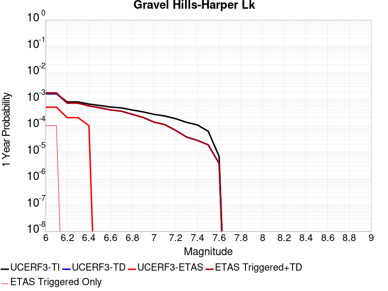 |  |

| Magnitude | 1 wk TI Prob | 1 wk TD Prob | 1 wk ETAS Prob | 1 wk ETAS/TD Gain | 1 wk ETAS Triggered+TD | 1 wk ETAS Triggered Only | 1 mo TI Prob | 1 mo TD Prob | 1 mo ETAS Prob | 1 mo ETAS/TD Gain | 1 mo ETAS Triggered+TD | 1 mo ETAS Triggered Only | 1 yr TI Prob | 1 yr TD Prob | 1 yr ETAS Prob | 1 yr ETAS/TD Gain | 1 yr ETAS Triggered+TD | 1 yr ETAS Triggered Only | 10 yr TI Prob | 10 yr TD Prob | 10 yr ETAS Prob | 10 yr ETAS/TD Gain | 10 yr ETAS Triggered+TD | 10 yr ETAS Triggered Only |
|-----|-----|-----|-----|-----|-----|-----|-----|-----|-----|-----|-----|-----|-----|-----|-----|-----|-----|-----|-----|-----|-----|-----|-----|-----|
| 6.0 | 3.0679566E-5 | 3.142136E-5 | 0.0 | 0.0 | 3.142136E-5 | 0.0 | 1.3147724E-4 | 1.3465725E-4 | 0.0 | 0.0 | 1.3465725E-4 | 0.0 | 0.0015995599 | 0.0016384354 | 5.0E-4 | 0.3051692 | 0.0017382716 | 1.0E-4 | 0.015880952 | 0.016285053 | 0.0105 | 0.64476305 | 0.018547596 | 0.0023 |
| 6.1 | 3.0679566E-5 | 3.142136E-5 | 0.0 | 0.0 | 3.142136E-5 | 0.0 | 1.3147724E-4 | 1.3465725E-4 | 0.0 | 0.0 | 1.3465725E-4 | 0.0 | 0.0015995599 | 0.0016384354 | 5.0E-4 | 0.3051692 | 0.0017382716 | 1.0E-4 | 0.015880952 | 0.016285053 | 0.0105 | 0.64476305 | 0.018547596 | 0.0023 |
| 6.2 | 1.514536E-5 | 1.3619673E-5 | 0.0 | 0.0 | 1.3619673E-5 | 0.0 | 6.490707E-5 | 5.8368787E-5 | 0.0 | 0.0 | 5.8368787E-5 | 0.0 | 7.8995706E-4 | 7.1042014E-4 | 2.0E-4 | 0.28152356 | 7.1042014E-4 | 0.0 | 0.007871548 | 0.007082689 | 0.0042 | 0.5929951 | 0.007976315 | 9.0E-4 |
| 6.3 | 1.514536E-5 | 1.3619673E-5 | 0.0 | 0.0 | 1.3619673E-5 | 0.0 | 6.490707E-5 | 5.8368787E-5 | 0.0 | 0.0 | 5.8368787E-5 | 0.0 | 7.8995706E-4 | 7.1042014E-4 | 2.0E-4 | 0.28152356 | 7.1042014E-4 | 0.0 | 0.007871548 | 0.007082689 | 0.0042 | 0.5929951 | 0.007976315 | 9.0E-4 |
| 6.4 | 1.2532521E-5 | 1.0678091E-5 | 0.0 | 0.0 | 1.0678091E-5 | 0.0 | 5.37097E-5 | 4.5762477E-5 | 0.0 | 0.0 | 4.5762477E-5 | 0.0 | 6.537194E-4 | 5.570215E-4 | 1.0E-4 | 0.17952627 | 5.570215E-4 | 0.0 | 0.0065179965 | 0.0055568423 | 0.0032 | 0.57586664 | 0.0063523967 | 8.0E-4 |
| 6.5 | 1.1094058E-5 | 9.074023E-6 | 0.0 | 0.0 | 9.074023E-6 | 0.0 | 4.7545094E-5 | 3.8888113E-5 | 0.0 | 0.0 | 3.8888113E-5 | 0.0 | 5.787078E-4 | 4.7336394E-4 | 0.0 | 0.0 | 4.7336394E-4 | 0.0 | 0.0057720304 | 0.004723963 | 0.0028 | 0.5927227 | 0.0053211288 | 6.0E-4 |
| 6.6 | 9.688328E-6 | 7.523745E-6 | 0.0 | 0.0 | 7.523745E-6 | 0.0 | 4.1520743E-5 | 3.2244236E-5 | 0.0 | 0.0 | 3.2244236E-5 | 0.0 | 5.053978E-4 | 3.925054E-4 | 0.0 | 0.0 | 3.925054E-4 | 0.0 | 0.0050424994 | 0.0039183777 | 0.0021 | 0.53593606 | 0.0042172023 | 3.0E-4 |
| 6.7 | 8.974824E-6 | 6.7422516E-6 | 0.0 | 0.0 | 6.7422516E-6 | 0.0 | 3.8462964E-5 | 2.8895056E-5 | 0.0 | 0.0 | 2.8895056E-5 | 0.0 | 4.6818596E-4 | 3.5174272E-4 | 0.0 | 0.0 | 3.5174272E-4 | 0.0 | 0.004672008 | 0.0035120805 | 0.002 | 0.569463 | 0.003711378 | 2.0E-4 |
| 6.8 | 7.4780046E-6 | 5.110587E-6 | 0.0 | 0.0 | 5.110587E-6 | 0.0 | 3.20482E-5 | 2.190234E-5 | 0.0 | 0.0 | 2.190234E-5 | 0.0 | 3.9011694E-4 | 2.6662977E-4 | 0.0 | 0.0 | 2.6662977E-4 | 0.0 | 0.0038943281 | 0.0026632366 | 0.0015 | 0.5632245 | 0.002862704 | 2.0E-4 |
| 6.9 | 6.3409307E-6 | 3.9029237E-6 | 0.0 | 0.0 | 3.9029237E-6 | 0.0 | 2.7175134E-5 | 1.6726715E-5 | 0.0 | 0.0 | 1.6726715E-5 | 0.0 | 3.3080703E-4 | 2.0362971E-4 | 0.0 | 0.0 | 2.0362971E-4 | 0.0 | 0.0033031502 | 0.0020345293 | 0.001 | 0.4915142 | 0.0020345293 | 0.0 |
| 7.0 | 5.1239335E-6 | 2.6023781E-6 | 0.0 | 0.0 | 2.6023781E-6 | 0.0 | 2.195953E-5 | 1.1153003E-5 | 0.0 | 0.0 | 1.1153003E-5 | 0.0 | 2.6732447E-4 | 1.357796E-4 | 0.0 | 0.0 | 1.357796E-4 | 0.0 | 0.0026700313 | 0.0013569916 | 0.001 | 0.73692423 | 0.0013569916 | 0.0 |
| 7.1 | 4.438899E-6 | 2.0954649E-6 | 0.0 | 0.0 | 2.0954649E-6 | 0.0 | 1.9023713E-5 | 8.980534E-6 | 0.0 | 0.0 | 8.980534E-6 | 0.0 | 2.315891E-4 | 1.09332745E-4 | 0.0 | 0.0 | 1.09332745E-4 | 0.0 | 0.002313479 | 0.0010928113 | 9.0E-4 | 0.8235639 | 0.0010928113 | 0.0 |
| 7.2 | 3.50367E-6 | 1.2591748E-6 | 0.0 | 0.0 | 1.2591748E-6 | 0.0 | 1.5015643E-5 | 5.3964527E-6 | 0.0 | 0.0 | 5.3964527E-6 | 0.0 | 1.8280011E-4 | 6.569991E-5 | 0.0 | 0.0 | 6.569991E-5 | 0.0 | 0.0018264982 | 6.568131E-4 | 7.0E-4 | 1.0657521 | 6.568131E-4 | 0.0 |
| 7.3 | 2.561638E-6 | 7.1001443E-7 | 0.0 | 0.0 | 7.1001443E-7 | 0.0 | 1.0978401E-5 | 3.0429155E-6 | 0.0 | 0.0 | 3.0429155E-6 | 0.0 | 1.3365384E-4 | 3.7046884E-5 | 0.0 | 0.0 | 3.7046884E-5 | 0.0 | 0.0013357349 | 3.7040908E-4 | 4.0E-4 | 1.0798872 | 3.7040908E-4 | 0.0 |
| 7.4 | 2.0368864E-6 | 5.289125E-7 | 0.0 | 0.0 | 5.289125E-7 | 0.0 | 8.729483E-6 | 2.266766E-6 | 0.0 | 0.0 | 2.266766E-6 | 0.0 | 1.06276275E-4 | 2.759753E-5 | 0.0 | 0.0 | 2.759753E-5 | 0.0 | 0.0010622547 | 2.7594157E-4 | 4.0E-4 | 1.4495822 | 2.7594157E-4 | 0.0 |
| 7.5 | 1.1681728E-6 | 3.592513E-7 | 0.0 | 0.0 | 3.592513E-7 | 0.0 | 5.0064455E-6 | 1.5396474E-6 | 0.0 | 0.0 | 1.5396474E-6 | 0.0 | 6.0951766E-5 | 1.8745051E-5 | 0.0 | 0.0 | 1.8745051E-5 | 0.0 | 6.093505E-4 | 1.8743517E-4 | 4.0E-4 | 2.1340714 | 1.8743517E-4 | 0.0 |
| 7.6 | 1.3154387E-7 | 7.089255E-8 | 0.0 | 0.0 | 7.089255E-8 | 0.0 | 5.6375933E-7 | 3.0382517E-7 | 0.0 | 0.0 | 3.0382517E-7 | 0.0 | 6.863748E-6 | 3.6990668E-6 | 0.0 | 0.0 | 3.6990668E-6 | 0.0 | 6.863536E-5 | 3.6990208E-5 | 0.0 | 0.0 | 3.6990208E-5 | 0.0 |

## Hosgri
*[(top)](#table-of-contents)*

| 1 Week | 1 Month | 1 Year | 10 Year |
|-----|-----|-----|-----|
|  |  |  |  |

| Magnitude | 1 wk TI Prob | 1 wk TD Prob | 1 wk ETAS Prob | 1 wk ETAS/TD Gain | 1 wk ETAS Triggered+TD | 1 wk ETAS Triggered Only | 1 mo TI Prob | 1 mo TD Prob | 1 mo ETAS Prob | 1 mo ETAS/TD Gain | 1 mo ETAS Triggered+TD | 1 mo ETAS Triggered Only | 1 yr TI Prob | 1 yr TD Prob | 1 yr ETAS Prob | 1 yr ETAS/TD Gain | 1 yr ETAS Triggered+TD | 1 yr ETAS Triggered Only | 10 yr TI Prob | 10 yr TD Prob | 10 yr ETAS Prob | 10 yr ETAS/TD Gain | 10 yr ETAS Triggered+TD | 10 yr ETAS Triggered Only |
|-----|-----|-----|-----|-----|-----|-----|-----|-----|-----|-----|-----|-----|-----|-----|-----|-----|-----|-----|-----|-----|-----|-----|-----|-----|
| 6.0 | 2.883978E-5 | 2.9089491E-5 | 0.0 | 0.0 | 2.9089491E-5 | 0.0 | 1.235932E-4 | 1.2466345E-4 | 1.0E-4 | 0.8021598 | 1.2466345E-4 | 0.0 | 0.0015037085 | 0.0015167479 | 0.0016 | 1.0548886 | 0.0018162929 | 3.0E-4 | 0.01493574 | 0.015067703 | 0.0117 | 0.7764953 | 0.017234555 | 0.0022 |
| 6.1 | 2.883978E-5 | 2.9089491E-5 | 0.0 | 0.0 | 2.9089491E-5 | 0.0 | 1.235932E-4 | 1.2466345E-4 | 1.0E-4 | 0.8021598 | 1.2466345E-4 | 0.0 | 0.0015037085 | 0.0015167479 | 0.0016 | 1.0548886 | 0.0018162929 | 3.0E-4 | 0.01493574 | 0.015067703 | 0.0117 | 0.7764953 | 0.017234555 | 0.0022 |
| 6.2 | 2.883978E-5 | 2.9089491E-5 | 0.0 | 0.0 | 2.9089491E-5 | 0.0 | 1.235932E-4 | 1.2466345E-4 | 1.0E-4 | 0.8021598 | 1.2466345E-4 | 0.0 | 0.0015037085 | 0.0015167479 | 0.0016 | 1.0548886 | 0.0018162929 | 3.0E-4 | 0.01493574 | 0.015067703 | 0.0117 | 0.7764953 | 0.017234555 | 0.0022 |
| 6.3 | 2.2914428E-5 | 2.2609474E-5 | 0.0 | 0.0 | 2.2609474E-5 | 0.0 | 9.8200995E-5 | 9.6894175E-5 | 1.0E-4 | 1.0320538 | 9.6894175E-5 | 0.0 | 0.0011949413 | 0.0011790531 | 9.0E-4 | 0.76332444 | 0.0011790531 | 0.0 | 0.011885363 | 0.011729349 | 0.0085 | 0.72467786 | 0.013112929 | 0.0014 |
| 6.4 | 2.0195741E-5 | 1.9666633E-5 | 0.0 | 0.0 | 1.9666633E-5 | 0.0 | 8.65503E-5 | 8.428286E-5 | 1.0E-4 | 1.1864809 | 8.428286E-5 | 0.0 | 0.0010532405 | 0.0010256628 | 8.0E-4 | 0.7799835 | 0.0010256628 | 0.0 | 0.010482626 | 0.010210311 | 0.0072 | 0.7051695 | 0.0112001 | 0.001 |
| 6.5 | 1.9924333E-5 | 1.937925E-5 | 0.0 | 0.0 | 1.937925E-5 | 0.0 | 8.53872E-5 | 8.3051294E-5 | 1.0E-4 | 1.2040752 | 8.3051294E-5 | 0.0 | 0.0010390934 | 0.0010106823 | 8.0E-4 | 0.79154444 | 0.0010106823 | 0.0 | 0.010342481 | 0.010061869 | 0.007 | 0.69569576 | 0.010952814 | 9.0E-4 |
| 6.6 | 1.809694E-5 | 1.7430037E-5 | 0.0 | 0.0 | 1.7430037E-5 | 0.0 | 7.7556004E-5 | 7.469802E-5 | 1.0E-4 | 1.3387235 | 7.469802E-5 | 0.0 | 9.438353E-4 | 9.0907025E-4 | 8.0E-4 | 0.88001996 | 9.0907025E-4 | 0.0 | 0.009398366 | 0.009054433 | 0.0066 | 0.7289247 | 0.009946284 | 9.0E-4 |
| 6.7 | 1.675989E-5 | 1.6015509E-5 | 0.0 | 0.0 | 1.6015509E-5 | 0.0 | 7.182612E-5 | 6.8636095E-5 | 1.0E-4 | 1.4569594 | 6.8636095E-5 | 0.0 | 8.7413215E-4 | 8.3532516E-4 | 6.0E-4 | 0.7182832 | 8.3532516E-4 | 0.0 | 0.008707017 | 0.008322733 | 0.0059 | 0.7089017 | 0.009116075 | 8.0E-4 |
| 6.8 | 1.5401129E-5 | 1.4587821E-5 | 0.0 | 0.0 | 1.4587821E-5 | 0.0 | 6.6003166E-5 | 6.251774E-5 | 1.0E-4 | 1.5995461 | 6.251774E-5 | 0.0 | 8.032922E-4 | 7.608885E-4 | 6.0E-4 | 0.7885518 | 7.608885E-4 | 0.0 | 0.008003947 | 0.0075836712 | 0.0054 | 0.71205616 | 0.008278362 | 7.0E-4 |
| 6.9 | 1.356559E-5 | 1.2665044E-5 | 0.0 | 0.0 | 1.2665044E-5 | 0.0 | 5.8136946E-5 | 5.4277632E-5 | 1.0E-4 | 1.8423796 | 5.4277632E-5 | 0.0 | 7.0758746E-4 | 6.6063023E-4 | 6.0E-4 | 0.9082236 | 6.6063023E-4 | 0.0 | 0.007053386 | 0.006587443 | 0.0044 | 0.66793746 | 0.0071834903 | 6.0E-4 |
| 7.0 | 1.2030819E-5 | 1.107222E-5 | 0.0 | 0.0 | 1.107222E-5 | 0.0 | 5.155963E-5 | 4.7451507E-5 | 1.0E-4 | 2.1074145 | 4.7451507E-5 | 0.0 | 6.275577E-4 | 5.7756907E-4 | 5.0E-4 | 0.8656973 | 5.7756907E-4 | 0.0 | 0.006257884 | 0.0057614148 | 0.0042 | 0.72898763 | 0.006357958 | 6.0E-4 |
| 7.1 | 1.0972698E-5 | 9.999176E-6 | 0.0 | 0.0 | 9.999176E-6 | 0.0 | 4.7025E-5 | 4.2852906E-5 | 1.0E-4 | 2.333564 | 4.2852906E-5 | 0.0 | 5.72379E-4 | 5.216093E-4 | 5.0E-4 | 0.95857185 | 5.216093E-4 | 0.0 | 0.0057090693 | 0.005204576 | 0.0038 | 0.7301267 | 0.0058014533 | 6.0E-4 |
| 7.2 | 9.961926E-6 | 9.012315E-6 | 0.0 | 0.0 | 9.012315E-6 | 0.0 | 4.2693267E-5 | 3.8623635E-5 | 1.0E-4 | 2.5890882 | 3.8623635E-5 | 0.0 | 5.1966653E-4 | 4.7014136E-4 | 4.0E-4 | 0.8508079 | 4.7014136E-4 | 0.0 | 0.00518453 | 0.004692188 | 0.0034 | 0.72460866 | 0.005189842 | 5.0E-4 |
| 7.3 | 8.700929E-6 | 7.806577E-6 | 0.0 | 0.0 | 7.806577E-6 | 0.0 | 3.7289166E-5 | 3.345633E-5 | 0.0 | 0.0 | 3.345633E-5 | 0.0 | 4.53901E-4 | 4.072547E-4 | 3.0E-4 | 0.73663974 | 4.072547E-4 | 0.0 | 0.00452975 | 0.0040657977 | 0.0029 | 0.7132672 | 0.0044641714 | 4.0E-4 |
| 7.4 | 7.866285E-6 | 6.9776875E-6 | 0.0 | 0.0 | 6.9776875E-6 | 0.0 | 3.3712215E-5 | 2.9904033E-5 | 0.0 | 0.0 | 2.9904033E-5 | 0.0 | 4.103689E-4 | 3.640208E-4 | 3.0E-4 | 0.82412875 | 3.640208E-4 | 0.0 | 0.004096119 | 0.0036349567 | 0.0025 | 0.68776613 | 0.003933866 | 3.0E-4 |
| 7.5 | 6.8381305E-6 | 5.939309E-6 | 0.0 | 0.0 | 5.939309E-6 | 0.0 | 2.9305946E-5 | 2.5453934E-5 | 0.0 | 0.0 | 2.5453934E-5 | 0.0 | 3.5674145E-4 | 3.098576E-4 | 3.0E-4 | 0.9681867 | 3.098576E-4 | 0.0 | 0.0035616932 | 0.0030949647 | 0.0021 | 0.6785215 | 0.003394036 | 3.0E-4 |
| 7.6 | 5.503376E-6 | 4.5757643E-6 | 0.0 | 0.0 | 4.5757643E-6 | 0.0 | 2.3585684E-5 | 1.961027E-5 | 0.0 | 0.0 | 1.961027E-5 | 0.0 | 2.8711787E-4 | 2.3872891E-4 | 2.0E-4 | 0.83777034 | 2.3872891E-4 | 0.0 | 0.002867472 | 0.0023854317 | 0.0016 | 0.67073816 | 0.0026847161 | 3.0E-4 |
| 7.7 | 3.6144982E-6 | 2.635303E-6 | 0.0 | 0.0 | 2.635303E-6 | 0.0 | 1.5490614E-5 | 1.1294106E-5 | 0.0 | 0.0 | 1.1294106E-5 | 0.0 | 1.8858191E-4 | 1.3749707E-4 | 0.0 | 0.0 | 1.3749707E-4 | 0.0 | 0.0018842196 | 0.0013748253 | 7.0E-4 | 0.5091556 | 0.0014746878 | 1.0E-4 |
| 7.8 | 1.9853494E-6 | 1.1227929E-6 | 0.0 | 0.0 | 1.1227929E-6 | 0.0 | 8.508612E-6 | 4.811961E-6 | 0.0 | 0.0 | 4.811961E-6 | 0.0 | 1.0358743E-4 | 5.858405E-5 | 0.0 | 0.0 | 5.858405E-5 | 0.0 | 0.0010353916 | 5.8639166E-4 | 2.0E-4 | 0.34106898 | 5.8639166E-4 | 0.0 |
| 7.9 | 1.1818757E-6 | 5.193046E-7 | 0.0 | 0.0 | 5.193046E-7 | 0.0 | 5.0651715E-6 | 2.225589E-6 | 0.0 | 0.0 | 2.225589E-6 | 0.0 | 6.1666724E-5 | 2.709621E-5 | 0.0 | 0.0 | 2.709621E-5 | 0.0 | 6.1649614E-4 | 2.7159383E-4 | 1.0E-4 | 0.36819687 | 2.7159383E-4 | 0.0 |
| 8.0 | 6.962958E-7 | 2.6445565E-7 | 0.0 | 0.0 | 2.6445565E-7 | 0.0 | 2.9841215E-6 | 1.1333808E-6 | 0.0 | 0.0 | 1.1333808E-6 | 0.0 | 3.6331072E-5 | 1.3798824E-5 | 0.0 | 0.0 | 1.3798824E-5 | 0.0 | 3.6325134E-4 | 1.3854101E-4 | 0.0 | 0.0 | 1.3854101E-4 | 0.0 |
| 8.1 | 1.5033264E-7 | 6.371795E-8 | 0.0 | 0.0 | 6.371795E-8 | 0.0 | 6.442826E-7 | 2.730769E-7 | 0.0 | 0.0 | 2.730769E-7 | 0.0 | 7.844113E-6 | 3.324706E-6 | 0.0 | 0.0 | 3.324706E-6 | 0.0 | 7.843835E-5 | 3.326229E-5 | 0.0 | 0.0 | 3.326229E-5 | 0.0 |

## Maacama 2011 CFM
*[(top)](#table-of-contents)*

| 1 Week | 1 Month | 1 Year | 10 Year |
|-----|-----|-----|-----|
| 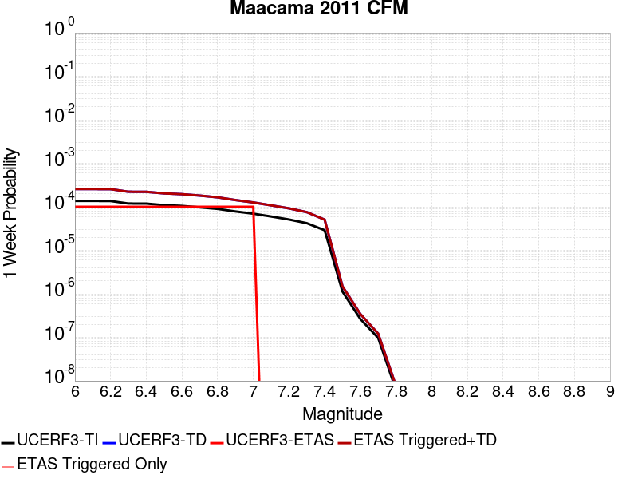 | 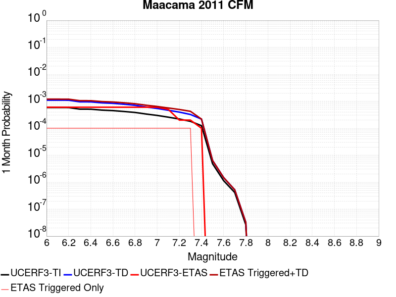 |  | 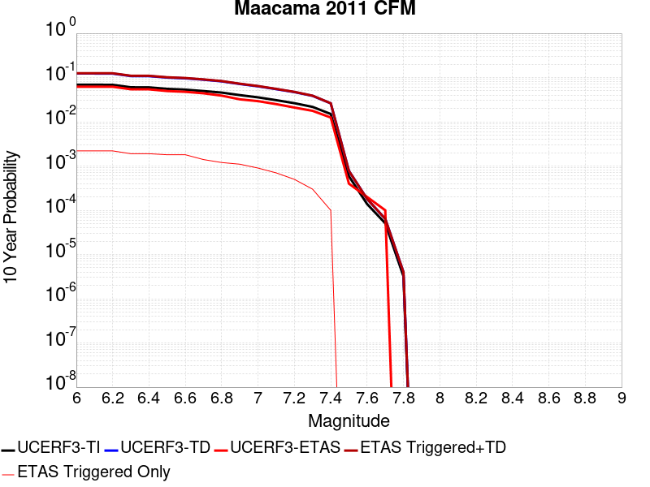 |

| Magnitude | 1 wk TI Prob | 1 wk TD Prob | 1 wk ETAS Prob | 1 wk ETAS/TD Gain | 1 wk ETAS Triggered+TD | 1 wk ETAS Triggered Only | 1 mo TI Prob | 1 mo TD Prob | 1 mo ETAS Prob | 1 mo ETAS/TD Gain | 1 mo ETAS Triggered+TD | 1 mo ETAS Triggered Only | 1 yr TI Prob | 1 yr TD Prob | 1 yr ETAS Prob | 1 yr ETAS/TD Gain | 1 yr ETAS Triggered+TD | 1 yr ETAS Triggered Only | 10 yr TI Prob | 10 yr TD Prob | 10 yr ETAS Prob | 10 yr ETAS/TD Gain | 10 yr ETAS Triggered+TD | 10 yr ETAS Triggered Only |
|-----|-----|-----|-----|-----|-----|-----|-----|-----|-----|-----|-----|-----|-----|-----|-----|-----|-----|-----|-----|-----|-----|-----|-----|-----|
| 6.0 | 1.368203E-4 | 2.5635102E-4 | 1.0E-4 | 0.3900901 | 2.5635102E-4 | 0.0 | 5.862409E-4 | 0.0010980811 | 6.0E-4 | 0.54640776 | 0.0011979713 | 1.0E-4 | 0.0071141496 | 0.013270428 | 0.0068 | 0.5124175 | 0.013566447 | 3.0E-4 | 0.06890667 | 0.12352333 | 0.0621 | 0.502739 | 0.12545158 | 0.0022 |
| 6.1 | 1.368203E-4 | 2.5635102E-4 | 1.0E-4 | 0.3900901 | 2.5635102E-4 | 0.0 | 5.862409E-4 | 0.0010980811 | 6.0E-4 | 0.54640776 | 0.0011979713 | 1.0E-4 | 0.0071141496 | 0.013270428 | 0.0068 | 0.5124175 | 0.013566447 | 3.0E-4 | 0.06890667 | 0.12352333 | 0.0621 | 0.502739 | 0.12545158 | 0.0022 |
| 6.2 | 1.360743E-4 | 2.5510337E-4 | 1.0E-4 | 0.39199796 | 2.5510337E-4 | 0.0 | 5.8304524E-4 | 0.0010927393 | 6.0E-4 | 0.5490788 | 0.0011926299 | 1.0E-4 | 0.007075496 | 0.013206253 | 0.0068 | 0.5149076 | 0.013502291 | 3.0E-4 | 0.06854413 | 0.122959584 | 0.062 | 0.50423074 | 0.124889076 | 0.0022 |
| 6.3 | 1.1917239E-4 | 2.2215702E-4 | 1.0E-4 | 0.45013207 | 2.2215702E-4 | 0.0 | 5.1063887E-4 | 9.516623E-4 | 6.0E-4 | 0.63047576 | 0.0010515671 | 1.0E-4 | 0.0061993203 | 0.011512876 | 0.0061 | 0.52984154 | 0.011710573 | 2.0E-4 | 0.060292065 | 0.1082104 | 0.0544 | 0.5027243 | 0.1099048 | 0.0019 |
| 6.4 | 1.1859289E-4 | 2.2119714E-4 | 1.0E-4 | 0.4520854 | 2.2119714E-4 | 0.0 | 5.0815626E-4 | 9.4755174E-4 | 6.0E-4 | 0.6332108 | 0.001047457 | 1.0E-4 | 0.006169266 | 0.011463408 | 0.0061 | 0.532128 | 0.011661116 | 2.0E-4 | 0.06000784 | 0.107768744 | 0.0542 | 0.50292873 | 0.10946398 | 0.0019 |
| 6.5 | 1.09512424E-4 | 2.037942E-4 | 1.0E-4 | 0.4906911 | 2.037942E-4 | 0.0 | 4.6925453E-4 | 8.7302696E-4 | 6.0E-4 | 0.687264 | 9.7293966E-4 | 1.0E-4 | 0.005698218 | 0.010567802 | 0.0059 | 0.5582996 | 0.0107656885 | 2.0E-4 | 0.055543028 | 0.099878885 | 0.0496 | 0.49660146 | 0.1014991 | 0.0018 |
| 6.6 | 1.0502928E-4 | 1.9539673E-4 | 1.0E-4 | 0.5117793 | 1.9539673E-4 | 0.0 | 4.500478E-4 | 8.370758E-4 | 6.0E-4 | 0.71678096 | 9.369921E-4 | 1.0E-4 | 0.0054655746 | 0.010135394 | 0.0054 | 0.5327864 | 0.010333367 | 2.0E-4 | 0.053330887 | 0.09604088 | 0.0476 | 0.49562228 | 0.09766801 | 0.0018 |
| 6.7 | 9.739358E-5 | 1.8128542E-4 | 1.0E-4 | 0.5516164 | 1.8128542E-4 | 0.0 | 4.173343E-4 | 7.766524E-4 | 6.0E-4 | 0.77254635 | 8.765748E-4 | 1.0E-4 | 0.0050692135 | 0.009408032 | 0.0049 | 0.5208316 | 0.009507091 | 1.0E-4 | 0.049551267 | 0.08953091 | 0.0441 | 0.49256733 | 0.09080557 | 0.0014 |
| 6.8 | 8.969524E-5 | 1.6537461E-4 | 1.0E-4 | 0.6046877 | 1.6537461E-4 | 0.0 | 3.8435153E-4 | 7.085156E-4 | 6.0E-4 | 0.8468409 | 8.0844475E-4 | 1.0E-4 | 0.0046694432 | 0.008586869 | 0.0045 | 0.524056 | 0.00868601 | 1.0E-4 | 0.045725387 | 0.08210157 | 0.039 | 0.47502136 | 0.08320305 | 0.0012 |
| 6.9 | 7.838291E-5 | 1.4311985E-4 | 1.0E-4 | 0.69871515 | 1.4311985E-4 | 0.0 | 3.358835E-4 | 6.132068E-4 | 6.0E-4 | 0.9784627 | 7.131455E-4 | 1.0E-4 | 0.0040817154 | 0.0074366727 | 0.0038 | 0.5109812 | 0.007535929 | 1.0E-4 | 0.04007554 | 0.07155797 | 0.0322 | 0.44998482 | 0.07257926 | 0.0011 |
| 7.0 | 6.961957E-5 | 1.2612117E-4 | 1.0E-4 | 0.7928883 | 1.2612117E-4 | 0.0 | 2.9833548E-4 | 5.403954E-4 | 6.0E-4 | 1.1102982 | 6.403413E-4 | 1.0E-4 | 0.0036261857 | 0.0065571335 | 0.0033 | 0.5032687 | 0.0066564777 | 1.0E-4 | 0.035675827 | 0.06342047 | 0.0293 | 0.46199596 | 0.06426339 | 9.0E-4 |
| 7.1 | 5.999398E-5 | 1.08208515E-4 | 0.0 | 0.0 | 1.08208515E-4 | 0.0 | 2.570917E-4 | 4.6365694E-4 | 5.0E-4 | 1.0783836 | 5.636106E-4 | 1.0E-4 | 0.0031255994 | 0.005629063 | 0.003 | 0.5329484 | 0.0057285004 | 1.0E-4 | 0.030820016 | 0.054735295 | 0.0251 | 0.45857063 | 0.05539698 | 7.0E-4 |
| 7.2 | 5.116532E-5 | 9.2307884E-5 | 0.0 | 0.0 | 9.2307884E-5 | 0.0 | 2.1926152E-4 | 3.955391E-4 | 2.0E-4 | 0.505639 | 4.954995E-4 | 1.0E-4 | 0.002666241 | 0.0048044506 | 0.0022 | 0.45790875 | 0.0049039703 | 1.0E-4 | 0.026344774 | 0.04694229 | 0.021 | 0.4473578 | 0.047418818 | 5.0E-4 |
| 7.3 | 4.2087835E-5 | 7.556291E-5 | 0.0 | 0.0 | 7.556291E-5 | 0.0 | 1.8036396E-4 | 3.2379667E-4 | 2.0E-4 | 0.61767155 | 4.237643E-4 | 1.0E-4 | 0.0021937196 | 0.003934732 | 0.0021 | 0.5337085 | 0.0040343385 | 1.0E-4 | 0.0217219 | 0.03860795 | 0.0177 | 0.4584548 | 0.038896367 | 3.0E-4 |
| 7.4 | 2.8991652E-5 | 5.0771338E-5 | 0.0 | 0.0 | 5.0771338E-5 | 0.0 | 1.2424402E-4 | 2.1757245E-4 | 1.0E-4 | 0.45961702 | 2.1757245E-4 | 0.0 | 0.0015116213 | 0.0026457263 | 0.0013 | 0.49135846 | 0.0026457263 | 0.0 | 0.015013801 | 0.026136458 | 0.0125 | 0.47825915 | 0.026233844 | 1.0E-4 |
| 7.5 | 1.1292299E-6 | 1.4875133E-6 | 0.0 | 0.0 | 1.4875133E-6 | 0.0 | 4.8395473E-6 | 6.3750485E-6 | 0.0 | 0.0 | 6.3750485E-6 | 0.0 | 5.8919897E-5 | 7.761469E-5 | 1.0E-4 | 1.2884159 | 7.761469E-5 | 0.0 | 5.890428E-4 | 7.765553E-4 | 4.0E-4 | 0.51509535 | 7.765553E-4 | 0.0 |
| 7.6 | 2.6535366E-7 | 3.4398312E-7 | 0.0 | 0.0 | 3.4398312E-7 | 0.0 | 1.1372296E-6 | 1.4742126E-6 | 0.0 | 0.0 | 1.4742126E-6 | 0.0 | 1.3845682E-5 | 1.794839E-5 | 0.0 | 0.0 | 1.794839E-5 | 0.0 | 1.3844819E-4 | 1.7998618E-4 | 2.0E-4 | 1.1111965 | 1.7998618E-4 | 0.0 |
| 7.7 | 9.727789E-8 | 1.2128508E-7 | 0.0 | 0.0 | 1.2128508E-7 | 0.0 | 4.1690518E-7 | 5.197931E-7 | 0.0 | 0.0 | 5.197931E-7 | 0.0 | 5.0758085E-6 | 6.328463E-6 | 0.0 | 0.0 | 6.328463E-6 | 0.0 | 5.0756928E-5 | 6.368924E-5 | 1.0E-4 | 1.5701241 | 6.368924E-5 | 0.0 |
| 7.8 | 6.1939325E-9 | 7.588051E-9 | 0.0 | 0.0 | 7.588051E-9 | 0.0 | 2.6545425E-8 | 3.252022E-8 | 0.0 | 0.0 | 3.252022E-8 | 0.0 | 3.231905E-7 | 3.9593357E-7 | 0.0 | 0.0 | 3.9593357E-7 | 0.0 | 3.2319003E-6 | 3.995574E-6 | 0.0 | 0.0 | 3.995574E-6 | 0.0 |

## Ventura-Pitas Point
*[(top)](#table-of-contents)*

| 1 Week | 1 Month | 1 Year | 10 Year |
|-----|-----|-----|-----|
|  | 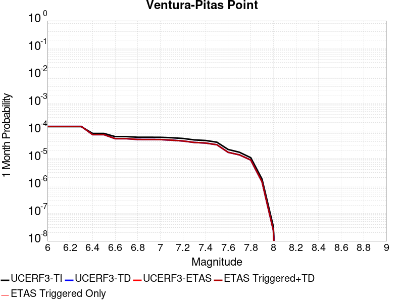 |  |  |

| Magnitude | 1 wk TI Prob | 1 wk TD Prob | 1 wk ETAS Prob | 1 wk ETAS/TD Gain | 1 wk ETAS Triggered+TD | 1 wk ETAS Triggered Only | 1 mo TI Prob | 1 mo TD Prob | 1 mo ETAS Prob | 1 mo ETAS/TD Gain | 1 mo ETAS Triggered+TD | 1 mo ETAS Triggered Only | 1 yr TI Prob | 1 yr TD Prob | 1 yr ETAS Prob | 1 yr ETAS/TD Gain | 1 yr ETAS Triggered+TD | 1 yr ETAS Triggered Only | 10 yr TI Prob | 10 yr TD Prob | 10 yr ETAS Prob | 10 yr ETAS/TD Gain | 10 yr ETAS Triggered+TD | 10 yr ETAS Triggered Only |
|-----|-----|-----|-----|-----|-----|-----|-----|-----|-----|-----|-----|-----|-----|-----|-----|-----|-----|-----|-----|-----|-----|-----|-----|-----|
| 6.0 | 3.3179622E-5 | 3.3681004E-5 | 0.0 | 0.0 | 3.3681004E-5 | 0.0 | 1.4219063E-4 | 1.443406E-4 | 0.0 | 0.0 | 1.443406E-4 | 0.0 | 0.0017297962 | 0.0017561864 | 7.0E-4 | 0.39859095 | 0.0018560108 | 1.0E-4 | 0.017163932 | 0.017448418 | 0.0121 | 0.69347256 | 0.019217012 | 0.0018 |
| 6.1 | 3.3179622E-5 | 3.3681004E-5 | 0.0 | 0.0 | 3.3681004E-5 | 0.0 | 1.4219063E-4 | 1.443406E-4 | 0.0 | 0.0 | 1.443406E-4 | 0.0 | 0.0017297962 | 0.0017561864 | 7.0E-4 | 0.39859095 | 0.0018560108 | 1.0E-4 | 0.017163932 | 0.017448418 | 0.0121 | 0.69347256 | 0.019217012 | 0.0018 |
| 6.2 | 3.3179622E-5 | 3.3681004E-5 | 0.0 | 0.0 | 3.3681004E-5 | 0.0 | 1.4219063E-4 | 1.443406E-4 | 0.0 | 0.0 | 1.443406E-4 | 0.0 | 0.0017297962 | 0.0017561864 | 7.0E-4 | 0.39859095 | 0.0018560108 | 1.0E-4 | 0.017163932 | 0.017448418 | 0.0121 | 0.69347256 | 0.019217012 | 0.0018 |
| 6.3 | 3.3179622E-5 | 3.3681004E-5 | 0.0 | 0.0 | 3.3681004E-5 | 0.0 | 1.4219063E-4 | 1.443406E-4 | 0.0 | 0.0 | 1.443406E-4 | 0.0 | 0.0017297962 | 0.0017561864 | 7.0E-4 | 0.39859095 | 0.0018560108 | 1.0E-4 | 0.017163932 | 0.017448418 | 0.0121 | 0.69347256 | 0.019217012 | 0.0018 |
| 6.4 | 1.8754668E-5 | 1.6993146E-5 | 0.0 | 0.0 | 1.6993146E-5 | 0.0 | 8.037467E-5 | 7.282587E-5 | 0.0 | 0.0 | 7.282587E-5 | 0.0 | 9.781223E-4 | 8.863173E-4 | 1.0E-4 | 0.11282641 | 8.863173E-4 | 0.0 | 0.009738282 | 0.008830049 | 0.006 | 0.67949796 | 0.009622985 | 8.0E-4 |
| 6.5 | 1.8754668E-5 | 1.6993146E-5 | 0.0 | 0.0 | 1.6993146E-5 | 0.0 | 8.037467E-5 | 7.282587E-5 | 0.0 | 0.0 | 7.282587E-5 | 0.0 | 9.781223E-4 | 8.863173E-4 | 1.0E-4 | 0.11282641 | 8.863173E-4 | 0.0 | 0.009738282 | 0.008830049 | 0.006 | 0.67949796 | 0.009622985 | 8.0E-4 |
| 6.6 | 1.4361558E-5 | 1.2101676E-5 | 0.0 | 0.0 | 1.2101676E-5 | 0.0 | 6.154808E-5 | 5.1863306E-5 | 0.0 | 0.0 | 5.1863306E-5 | 0.0 | 7.490902E-4 | 6.312551E-4 | 0.0 | 0.0 | 6.312551E-4 | 0.0 | 0.0074657016 | 0.0062947697 | 0.0047 | 0.74665165 | 0.0069903634 | 7.0E-4 |
| 6.7 | 1.4361558E-5 | 1.2101676E-5 | 0.0 | 0.0 | 1.2101676E-5 | 0.0 | 6.154808E-5 | 5.1863306E-5 | 0.0 | 0.0 | 5.1863306E-5 | 0.0 | 7.490902E-4 | 6.312551E-4 | 0.0 | 0.0 | 6.312551E-4 | 0.0 | 0.0074657016 | 0.0062947697 | 0.0047 | 0.74665165 | 0.0069903634 | 7.0E-4 |
| 6.8 | 1.3663846E-5 | 1.1324751E-5 | 0.0 | 0.0 | 1.1324751E-5 | 0.0 | 5.8558027E-5 | 4.8533755E-5 | 0.0 | 0.0 | 4.8533755E-5 | 0.0 | 7.127108E-4 | 5.907402E-4 | 0.0 | 0.0 | 5.907402E-4 | 0.0 | 0.007104293 | 0.0058918074 | 0.0042 | 0.71285427 | 0.006587683 | 7.0E-4 |
| 6.9 | 1.3644157E-5 | 1.1302877E-5 | 0.0 | 0.0 | 1.1302877E-5 | 0.0 | 5.8473648E-5 | 4.844001E-5 | 0.0 | 0.0 | 4.844001E-5 | 0.0 | 7.116841E-4 | 5.895995E-4 | 0.0 | 0.0 | 5.895995E-4 | 0.0 | 0.007094092 | 0.005880461 | 0.0042 | 0.7142297 | 0.0065763444 | 7.0E-4 |
| 7.0 | 1.3568845E-5 | 1.122256E-5 | 0.0 | 0.0 | 1.122256E-5 | 0.0 | 5.8150898E-5 | 4.8095808E-5 | 0.0 | 0.0 | 4.8095808E-5 | 0.0 | 7.077572E-4 | 5.8541103E-4 | 0.0 | 0.0 | 5.8541103E-4 | 0.0 | 0.007055073 | 0.0058387974 | 0.0042 | 0.7193262 | 0.00653471 | 7.0E-4 |
| 7.1 | 1.306572E-5 | 1.0701735E-5 | 0.0 | 0.0 | 1.0701735E-5 | 0.0 | 5.599474E-5 | 4.5863784E-5 | 0.0 | 0.0 | 4.5863784E-5 | 0.0 | 6.815227E-4 | 5.5825035E-4 | 0.0 | 0.0 | 5.5825035E-4 | 0.0 | 0.0067943637 | 0.005568578 | 0.0039 | 0.70035833 | 0.0062646796 | 7.0E-4 |
| 7.2 | 1.232604E-5 | 9.977645E-6 | 0.0 | 0.0 | 9.977645E-6 | 0.0 | 5.2824813E-5 | 4.2760646E-5 | 0.0 | 0.0 | 4.2760646E-5 | 0.0 | 6.429523E-4 | 5.2048825E-4 | 0.0 | 0.0 | 5.2048825E-4 | 0.0 | 0.0064109527 | 0.0051927767 | 0.0036 | 0.6932707 | 0.005889142 | 7.0E-4 |
| 7.3 | 1.0917261E-5 | 8.82857E-6 | 0.0 | 0.0 | 8.82857E-6 | 0.0 | 4.678742E-5 | 3.7836187E-5 | 0.0 | 0.0 | 3.7836187E-5 | 0.0 | 5.69488E-4 | 4.6055974E-4 | 0.0 | 0.0 | 4.6055974E-4 | 0.0 | 0.0056803077 | 0.0045961114 | 0.003 | 0.6527257 | 0.0051933536 | 6.0E-4 |
| 7.4 | 1.039959E-5 | 8.4092E-6 | 0.0 | 0.0 | 8.4092E-6 | 0.0 | 4.456891E-5 | 3.603894E-5 | 0.0 | 0.0 | 3.603894E-5 | 0.0 | 5.424914E-4 | 4.3868725E-4 | 0.0 | 0.0 | 4.3868725E-4 | 0.0 | 0.0054116896 | 0.004378267 | 0.003 | 0.6852026 | 0.00497564 | 6.0E-4 |
| 7.5 | 9.015877E-6 | 7.285117E-6 | 0.0 | 0.0 | 7.285117E-6 | 0.0 | 3.86389E-5 | 3.1221567E-5 | 0.0 | 0.0 | 3.1221567E-5 | 0.0 | 4.7032707E-4 | 3.8005767E-4 | 0.0 | 0.0 | 3.8005767E-4 | 0.0 | 0.004693329 | 0.0037941143 | 0.0028 | 0.73798513 | 0.004391838 | 6.0E-4 |
| 7.6 | 4.900162E-6 | 3.8663666E-6 | 0.0 | 0.0 | 3.8663666E-6 | 0.0 | 2.1000526E-5 | 1.6570038E-5 | 0.0 | 0.0 | 1.6570038E-5 | 0.0 | 2.556514E-4 | 2.0172168E-4 | 0.0 | 0.0 | 2.0172168E-4 | 0.0 | 0.0025535747 | 0.0020153993 | 0.0013 | 0.6450335 | 0.0022149961 | 2.0E-4 |
| 7.7 | 3.8850626E-6 | 3.1215045E-6 | 0.0 | 0.0 | 3.1215045E-6 | 0.0 | 1.6650163E-5 | 1.33778085E-5 | 0.0 | 0.0 | 1.33778085E-5 | 0.0 | 2.0269687E-4 | 1.6286274E-4 | 0.0 | 0.0 | 1.6286274E-4 | 0.0 | 0.002025121 | 0.001627443 | 9.0E-4 | 0.55301476 | 0.0018271175 | 2.0E-4 |
| 7.8 | 2.4654719E-6 | 2.0276973E-6 | 0.0 | 0.0 | 2.0276973E-6 | 0.0 | 1.0566265E-5 | 8.690103E-6 | 0.0 | 0.0 | 8.690103E-6 | 0.0 | 1.2863669E-4 | 1.0579691E-4 | 0.0 | 0.0 | 1.0579691E-4 | 0.0 | 0.0012856225 | 0.0010574701 | 8.0E-4 | 0.75652254 | 0.0011573645 | 1.0E-4 |
| 7.9 | 4.095894E-7 | 3.2740115E-7 | 0.0 | 0.0 | 3.2740115E-7 | 0.0 | 1.7553821E-6 | 1.403147E-6 | 0.0 | 0.0 | 1.403147E-6 | 0.0 | 2.1371567E-5 | 1.7083185E-5 | 0.0 | 0.0 | 1.7083185E-5 | 0.0 | 2.1369511E-4 | 1.7081902E-4 | 2.0E-4 | 1.1708298 | 1.7081902E-4 | 0.0 |
| 8.0 | 7.791402E-9 | 5.678961E-9 | 0.0 | 0.0 | 5.678961E-9 | 0.0 | 3.3391725E-8 | 2.4338403E-8 | 0.0 | 0.0 | 2.4338403E-8 | 0.0 | 4.0654416E-7 | 2.9632005E-7 | 0.0 | 0.0 | 2.9632005E-7 | 0.0 | 4.065434E-6 | 2.9631985E-6 | 0.0 | 0.0 | 2.9631985E-6 | 0.0 |

## Coronado Bank alt1
*[(top)](#table-of-contents)*

| 1 Week | 1 Month | 1 Year | 10 Year |
|-----|-----|-----|-----|
|  |  |  |  |

| Magnitude | 1 wk TI Prob | 1 wk TD Prob | 1 wk ETAS Prob | 1 wk ETAS/TD Gain | 1 wk ETAS Triggered+TD | 1 wk ETAS Triggered Only | 1 mo TI Prob | 1 mo TD Prob | 1 mo ETAS Prob | 1 mo ETAS/TD Gain | 1 mo ETAS Triggered+TD | 1 mo ETAS Triggered Only | 1 yr TI Prob | 1 yr TD Prob | 1 yr ETAS Prob | 1 yr ETAS/TD Gain | 1 yr ETAS Triggered+TD | 1 yr ETAS Triggered Only | 10 yr TI Prob | 10 yr TD Prob | 10 yr ETAS Prob | 10 yr ETAS/TD Gain | 10 yr ETAS Triggered+TD | 10 yr ETAS Triggered Only |
|-----|-----|-----|-----|-----|-----|-----|-----|-----|-----|-----|-----|-----|-----|-----|-----|-----|-----|-----|-----|-----|-----|-----|-----|-----|
| 6.0 | 7.533492E-5 | 9.371126E-5 | 0.0 | 0.0 | 9.371126E-5 | 0.0 | 3.22824E-4 | 4.0156196E-4 | 1.0E-4 | 0.24902758 | 4.0156196E-4 | 0.0 | 0.0039233007 | 0.004878674 | 0.003 | 0.61492115 | 0.0052767224 | 4.0E-4 | 0.03854755 | 0.047785383 | 0.0332 | 0.69477314 | 0.04959459 | 0.0019 |
| 6.1 | 4.1807285E-5 | 5.0382983E-5 | 0.0 | 0.0 | 5.0382983E-5 | 0.0 | 1.7916178E-4 | 2.1590963E-4 | 0.0 | 0.0 | 2.1590963E-4 | 0.0 | 0.0021791123 | 0.002625611 | 0.0014 | 0.5332092 | 0.0027253483 | 1.0E-4 | 0.021578677 | 0.025955351 | 0.0155 | 0.59717935 | 0.026734587 | 8.0E-4 |
| 6.2 | 4.1807285E-5 | 5.0382983E-5 | 0.0 | 0.0 | 5.0382983E-5 | 0.0 | 1.7916178E-4 | 2.1590963E-4 | 0.0 | 0.0 | 2.1590963E-4 | 0.0 | 0.0021791123 | 0.002625611 | 0.0014 | 0.5332092 | 0.0027253483 | 1.0E-4 | 0.021578677 | 0.025955351 | 0.0155 | 0.59717935 | 0.026734587 | 8.0E-4 |
| 6.3 | 3.1793104E-5 | 3.763715E-5 | 0.0 | 0.0 | 3.763715E-5 | 0.0 | 1.3624904E-4 | 1.612923E-4 | 0.0 | 0.0 | 1.612923E-4 | 0.0 | 0.0016575698 | 0.0019619977 | 0.0011 | 0.56065303 | 0.0019619977 | 0.0 | 0.016452603 | 0.019450692 | 0.0115 | 0.5912386 | 0.019842912 | 4.0E-4 |
| 6.4 | 2.9878007E-5 | 3.5267753E-5 | 0.0 | 0.0 | 3.5267753E-5 | 0.0 | 1.2804232E-4 | 1.5113894E-4 | 0.0 | 0.0 | 1.5113894E-4 | 0.0 | 0.0015578003 | 0.001838596 | 0.001 | 0.5438933 | 0.001838596 | 0.0 | 0.015469253 | 0.018237632 | 0.0114 | 0.6250812 | 0.018630337 | 4.0E-4 |
| 6.5 | 2.4512565E-5 | 2.8711424E-5 | 0.0 | 0.0 | 2.8711424E-5 | 0.0 | 1.0504962E-4 | 1.2304331E-4 | 0.0 | 0.0 | 1.2304331E-4 | 0.0 | 0.0012782287 | 0.0014970496 | 9.0E-4 | 0.60118246 | 0.0014970496 | 0.0 | 0.012709012 | 0.014872615 | 0.0088 | 0.5916915 | 0.01506964 | 2.0E-4 |
| 6.6 | 2.1317413E-5 | 2.4862335E-5 | 0.0 | 0.0 | 2.4862335E-5 | 0.0 | 9.135714E-5 | 1.06548636E-4 | 0.0 | 0.0 | 1.06548636E-4 | 0.0 | 0.0011117056 | 0.0012964798 | 9.0E-4 | 0.6941874 | 0.0012964798 | 0.0 | 0.011061605 | 0.012891567 | 0.007 | 0.5429906 | 0.013088989 | 2.0E-4 |
| 6.7 | 1.8585655E-5 | 2.1597301E-5 | 0.0 | 0.0 | 2.1597301E-5 | 0.0 | 7.9650374E-5 | 9.255669E-5 | 0.0 | 0.0 | 9.255669E-5 | 0.0 | 9.6931186E-4 | 0.0011263156 | 9.0E-4 | 0.7990656 | 0.0011263156 | 0.0 | 0.0096509475 | 0.011208225 | 0.0064 | 0.5710092 | 0.011405984 | 2.0E-4 |
| 6.8 | 1.5862879E-5 | 1.838799E-5 | 0.0 | 0.0 | 1.838799E-5 | 0.0 | 6.798199E-5 | 7.8803394E-5 | 0.0 | 0.0 | 7.8803394E-5 | 0.0 | 8.273665E-4 | 9.5902826E-4 | 9.0E-4 | 0.9384499 | 9.5902826E-4 | 0.0 | 0.008242928 | 0.00955087 | 0.0056 | 0.586334 | 0.009748961 | 2.0E-4 |
| 6.9 | 1.3021509E-5 | 1.5069692E-5 | 0.0 | 0.0 | 1.5069692E-5 | 0.0 | 5.5805274E-5 | 6.45829E-5 | 0.0 | 0.0 | 6.45829E-5 | 0.0 | 6.792174E-4 | 7.8603113E-4 | 8.0E-4 | 1.0177714 | 7.8603113E-4 | 0.0 | 0.006771452 | 0.0078343265 | 0.005 | 0.638217 | 0.00803276 | 2.0E-4 |
| 7.0 | 1.0974371E-5 | 1.2698518E-5 | 0.0 | 0.0 | 1.2698518E-5 | 0.0 | 4.7032172E-5 | 5.4421183E-5 | 0.0 | 0.0 | 5.4421183E-5 | 0.0 | 5.7246623E-4 | 6.62394E-4 | 7.0E-4 | 1.0567728 | 6.62394E-4 | 0.0 | 0.0057099373 | 0.006605939 | 0.0039 | 0.59037787 | 0.0068046176 | 2.0E-4 |
| 7.1 | 8.766221E-6 | 1.0146466E-5 | 0.0 | 0.0 | 1.0146466E-5 | 0.0 | 3.7568978E-5 | 4.3484222E-5 | 0.0 | 0.0 | 4.3484222E-5 | 0.0 | 4.573063E-4 | 5.29309E-4 | 5.0E-4 | 0.9446279 | 5.29309E-4 | 0.0 | 0.0045636636 | 0.0052821757 | 0.0029 | 0.5490162 | 0.0054811193 | 2.0E-4 |
| 7.2 | 8.026024E-7 | 8.3254315E-7 | 0.0 | 0.0 | 8.3254315E-7 | 0.0 | 3.43972E-6 | 3.5680373E-6 | 0.0 | 0.0 | 3.5680373E-6 | 0.0 | 4.1877785E-5 | 4.344E-5 | 1.0E-4 | 2.3020258 | 4.344E-5 | 0.0 | 4.1869894E-4 | 4.3431617E-4 | 3.0E-4 | 0.69074106 | 4.3431617E-4 | 0.0 |
| 7.3 | 3.7293114E-7 | 3.6975936E-7 | 0.0 | 0.0 | 3.6975936E-7 | 0.0 | 1.5982754E-6 | 1.584682E-6 | 0.0 | 0.0 | 1.584682E-6 | 0.0 | 1.9458828E-5 | 1.9293333E-5 | 0.0 | 0.0 | 1.9293333E-5 | 0.0 | 1.9457124E-4 | 1.9291665E-4 | 1.0E-4 | 0.5183586 | 1.9291665E-4 | 0.0 |
| 7.4 | 2.0557036E-7 | 1.9660611E-7 | 0.0 | 0.0 | 1.9660611E-7 | 0.0 | 8.810155E-7 | 8.4259733E-7 | 0.0 | 0.0 | 8.4259733E-7 | 0.0 | 1.0726311E-5 | 1.0258575E-5 | 0.0 | 0.0 | 1.0258575E-5 | 0.0 | 1.0725793E-4 | 1.0258104E-4 | 1.0E-4 | 0.97483903 | 1.0258104E-4 | 0.0 |
| 7.5 | 6.845446E-8 | 6.275007E-8 | 0.0 | 0.0 | 6.275007E-8 | 0.0 | 2.9337625E-7 | 2.6892883E-7 | 0.0 | 0.0 | 2.6892883E-7 | 0.0 | 3.5718497E-6 | 3.2742037E-6 | 0.0 | 0.0 | 3.2742037E-6 | 0.0 | 3.5717923E-5 | 3.2741566E-5 | 1.0E-4 | 3.0542219 | 3.2741566E-5 | 0.0 |
| 7.6 | 6.0975145E-9 | 5.5309526E-9 | 0.0 | 0.0 | 5.5309526E-9 | 0.0 | 2.6132206E-8 | 2.3704082E-8 | 0.0 | 0.0 | 2.3704082E-8 | 0.0 | 3.1815955E-7 | 2.8859716E-7 | 0.0 | 0.0 | 2.8859716E-7 | 0.0 | 3.181591E-6 | 2.885969E-6 | 0.0 | 0.0 | 2.885969E-6 | 0.0 |

## Ash Hill
*[(top)](#table-of-contents)*

| 1 Week | 1 Month | 1 Year | 10 Year |
|-----|-----|-----|-----|
|  |  | 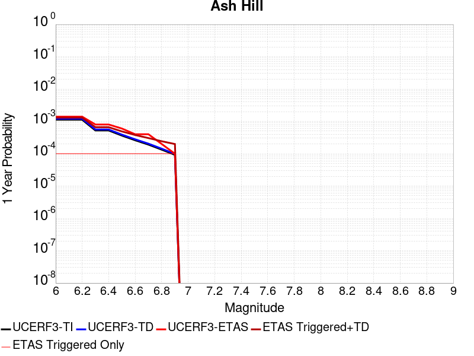 |  |

| Magnitude | 1 wk TI Prob | 1 wk TD Prob | 1 wk ETAS Prob | 1 wk ETAS/TD Gain | 1 wk ETAS Triggered+TD | 1 wk ETAS Triggered Only | 1 mo TI Prob | 1 mo TD Prob | 1 mo ETAS Prob | 1 mo ETAS/TD Gain | 1 mo ETAS Triggered+TD | 1 mo ETAS Triggered Only | 1 yr TI Prob | 1 yr TD Prob | 1 yr ETAS Prob | 1 yr ETAS/TD Gain | 1 yr ETAS Triggered+TD | 1 yr ETAS Triggered Only | 10 yr TI Prob | 10 yr TD Prob | 10 yr ETAS Prob | 10 yr ETAS/TD Gain | 10 yr ETAS Triggered+TD | 10 yr ETAS Triggered Only |
|-----|-----|-----|-----|-----|-----|-----|-----|-----|-----|-----|-----|-----|-----|-----|-----|-----|-----|-----|-----|-----|-----|-----|-----|-----|
| 6.0 | 2.1545662E-5 | 2.3175915E-5 | 0.0 | 0.0 | 2.3175915E-5 | 0.0 | 9.2335285E-5 | 9.9322024E-5 | 1.0E-4 | 1.006826 | 9.9322024E-5 | 0.0 | 0.0011236023 | 0.0012086546 | 0.0014 | 1.1583127 | 0.0013085338 | 1.0E-4 | 0.011179381 | 0.012028781 | 0.0114 | 0.94772696 | 0.014004723 | 0.002 |
| 6.1 | 2.1545662E-5 | 2.3175915E-5 | 0.0 | 0.0 | 2.3175915E-5 | 0.0 | 9.2335285E-5 | 9.9322024E-5 | 1.0E-4 | 1.006826 | 9.9322024E-5 | 0.0 | 0.0011236023 | 0.0012086546 | 0.0014 | 1.1583127 | 0.0013085338 | 1.0E-4 | 0.011179381 | 0.012028781 | 0.0114 | 0.94772696 | 0.014004723 | 0.002 |
| 6.2 | 2.1545662E-5 | 2.3175915E-5 | 0.0 | 0.0 | 2.3175915E-5 | 0.0 | 9.2335285E-5 | 9.9322024E-5 | 1.0E-4 | 1.006826 | 9.9322024E-5 | 0.0 | 0.0011236023 | 0.0012086546 | 0.0014 | 1.1583127 | 0.0013085338 | 1.0E-4 | 0.011179381 | 0.012028781 | 0.0114 | 0.94772696 | 0.014004723 | 0.002 |
| 6.3 | 1.0025529E-5 | 1.0738864E-5 | 0.0 | 0.0 | 1.0738864E-5 | 0.0 | 4.2965847E-5 | 4.6022968E-5 | 1.0E-4 | 2.1728282 | 4.6022968E-5 | 0.0 | 5.229836E-4 | 5.601988E-4 | 8.0E-4 | 1.4280646 | 6.6014274E-4 | 1.0E-4 | 0.005217545 | 0.005589177 | 0.0045 | 0.8051275 | 0.005986941 | 4.0E-4 |
| 6.4 | 1.0025529E-5 | 1.0738864E-5 | 0.0 | 0.0 | 1.0738864E-5 | 0.0 | 4.2965847E-5 | 4.6022968E-5 | 1.0E-4 | 2.1728282 | 4.6022968E-5 | 0.0 | 5.229836E-4 | 5.601988E-4 | 8.0E-4 | 1.4280646 | 6.6014274E-4 | 1.0E-4 | 0.005217545 | 0.005589177 | 0.0045 | 0.8051275 | 0.005986941 | 4.0E-4 |
| 6.5 | 6.9617327E-6 | 7.451103E-6 | 0.0 | 0.0 | 7.451103E-6 | 0.0 | 2.9835655E-5 | 3.1932956E-5 | 1.0E-4 | 3.131561 | 3.1932956E-5 | 0.0 | 3.6318856E-4 | 3.8872304E-4 | 6.0E-4 | 1.5435154 | 4.8868416E-4 | 1.0E-4 | 0.0036259557 | 0.003881284 | 0.0033 | 0.8502341 | 0.004080508 | 2.0E-4 |
| 6.6 | 4.9919777E-6 | 5.3427243E-6 | 0.0 | 0.0 | 5.3427243E-6 | 0.0 | 2.1394015E-5 | 2.2897226E-5 | 0.0 | 0.0 | 2.2897226E-5 | 0.0 | 2.60441E-4 | 2.7874476E-4 | 4.0E-4 | 1.4350046 | 3.7871688E-4 | 1.0E-4 | 0.0026013597 | 0.0027846089 | 0.0019 | 0.682322 | 0.0029840518 | 2.0E-4 |
| 6.7 | 3.6630722E-6 | 3.9216998E-6 | 0.0 | 0.0 | 3.9216998E-6 | 0.0 | 1.5698786E-5 | 1.680721E-5 | 0.0 | 0.0 | 1.680721E-5 | 0.0 | 1.9111596E-4 | 2.0461428E-4 | 4.0E-4 | 1.9548978 | 3.0459382E-4 | 1.0E-4 | 0.0019095168 | 0.002044821 | 0.0018 | 0.8802726 | 0.002244412 | 2.0E-4 |
| 6.8 | 2.5599613E-6 | 2.7428557E-6 | 0.0 | 0.0 | 2.7428557E-6 | 0.0 | 1.0971216E-5 | 1.1755071E-5 | 0.0 | 0.0 | 1.1755071E-5 | 0.0 | 1.3356637E-4 | 1.4311353E-4 | 2.0E-4 | 1.3974919 | 2.4309922E-4 | 1.0E-4 | 0.0013348613 | 0.0014306979 | 0.001 | 0.6989596 | 0.0016304117 | 2.0E-4 |
| 6.9 | 1.7684905E-6 | 1.895434E-6 | 0.0 | 0.0 | 1.895434E-6 | 0.0 | 7.579223E-6 | 8.123288E-6 | 0.0 | 0.0 | 8.123288E-6 | 0.0 | 9.2273134E-5 | 9.890104E-5 | 1.0E-4 | 1.0111117 | 1.9889115E-4 | 1.0E-4 | 9.223483E-4 | 9.890103E-4 | 7.0E-4 | 0.7077782 | 0.0011888125 | 2.0E-4 |

## Elsinore (Coyote Mountains)
*[(top)](#table-of-contents)*

| 1 Week | 1 Month | 1 Year | 10 Year |
|-----|-----|-----|-----|
|  | 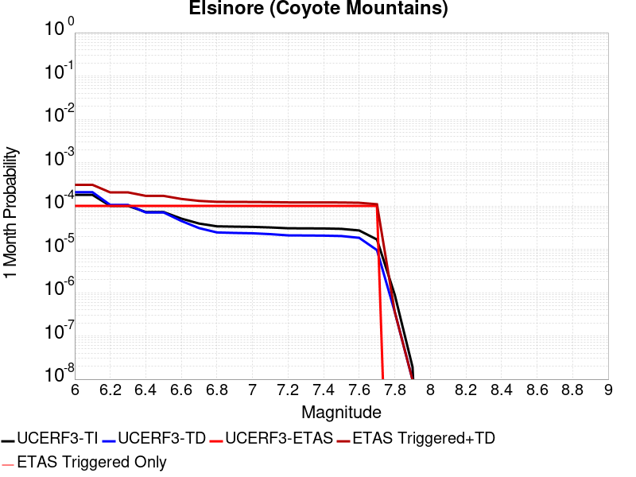 |  |  |

| Magnitude | 1 wk TI Prob | 1 wk TD Prob | 1 wk ETAS Prob | 1 wk ETAS/TD Gain | 1 wk ETAS Triggered+TD | 1 wk ETAS Triggered Only | 1 mo TI Prob | 1 mo TD Prob | 1 mo ETAS Prob | 1 mo ETAS/TD Gain | 1 mo ETAS Triggered+TD | 1 mo ETAS Triggered Only | 1 yr TI Prob | 1 yr TD Prob | 1 yr ETAS Prob | 1 yr ETAS/TD Gain | 1 yr ETAS Triggered+TD | 1 yr ETAS Triggered Only | 10 yr TI Prob | 10 yr TD Prob | 10 yr ETAS Prob | 10 yr ETAS/TD Gain | 10 yr ETAS Triggered+TD | 10 yr ETAS Triggered Only |
|-----|-----|-----|-----|-----|-----|-----|-----|-----|-----|-----|-----|-----|-----|-----|-----|-----|-----|-----|-----|-----|-----|-----|-----|-----|
| 6.0 | 4.20513E-5 | 4.8497863E-5 | 0.0 | 0.0 | 4.8497863E-5 | 0.0 | 1.8020741E-4 | 2.0783432E-4 | 1.0E-4 | 0.48115247 | 3.0781355E-4 | 1.0E-4 | 0.0021918174 | 0.002527977 | 0.0012 | 0.47468784 | 0.0028272187 | 3.0E-4 | 0.021703249 | 0.025043545 | 0.0145 | 0.57899153 | 0.02699346 | 0.002 |
| 6.1 | 4.20513E-5 | 4.8497863E-5 | 0.0 | 0.0 | 4.8497863E-5 | 0.0 | 1.8020741E-4 | 2.0783432E-4 | 1.0E-4 | 0.48115247 | 3.0781355E-4 | 1.0E-4 | 0.0021918174 | 0.002527977 | 0.0012 | 0.47468784 | 0.0028272187 | 3.0E-4 | 0.021703249 | 0.025043545 | 0.0145 | 0.57899153 | 0.02699346 | 0.002 |
| 6.2 | 2.3413893E-5 | 2.4631545E-5 | 0.0 | 0.0 | 2.4631545E-5 | 0.0 | 1.0034139E-4 | 1.05559906E-4 | 1.0E-4 | 0.94732934 | 2.0554935E-4 | 1.0E-4 | 0.0012209718 | 0.0012845232 | 6.0E-4 | 0.46709937 | 0.0014842664 | 2.0E-4 | 0.012142851 | 0.012779683 | 0.006 | 0.46949524 | 0.013569458 | 8.0E-4 |
| 6.3 | 2.3413893E-5 | 2.4631545E-5 | 0.0 | 0.0 | 2.4631545E-5 | 0.0 | 1.0034139E-4 | 1.05559906E-4 | 1.0E-4 | 0.94732934 | 2.0554935E-4 | 1.0E-4 | 0.0012209718 | 0.0012845232 | 6.0E-4 | 0.46709937 | 0.0014842664 | 2.0E-4 | 0.012142851 | 0.012779683 | 0.006 | 0.46949524 | 0.013569458 | 8.0E-4 |
| 6.4 | 1.6894814E-5 | 1.6525059E-5 | 0.0 | 0.0 | 1.6525059E-5 | 0.0 | 7.240433E-5 | 7.081997E-5 | 1.0E-4 | 1.412031 | 1.7081288E-4 | 1.0E-4 | 8.811662E-4 | 8.619288E-4 | 6.0E-4 | 0.69611317 | 0.0010617564 | 2.0E-4 | 0.0087768035 | 0.008589517 | 0.0042 | 0.4889681 | 0.009085222 | 5.0E-4 |
| 6.5 | 1.6894814E-5 | 1.6525059E-5 | 0.0 | 0.0 | 1.6525059E-5 | 0.0 | 7.240433E-5 | 7.081997E-5 | 1.0E-4 | 1.412031 | 1.7081288E-4 | 1.0E-4 | 8.811662E-4 | 8.619288E-4 | 6.0E-4 | 0.69611317 | 0.0010617564 | 2.0E-4 | 0.0087768035 | 0.008589517 | 0.0042 | 0.4889681 | 0.009085222 | 5.0E-4 |
| 6.6 | 1.1910969E-5 | 1.0500677E-5 | 0.0 | 0.0 | 1.0500677E-5 | 0.0 | 5.1046012E-5 | 4.5002198E-5 | 1.0E-4 | 2.2221136 | 1.449977E-4 | 1.0E-4 | 6.21308E-4 | 5.477772E-4 | 4.0E-4 | 0.73022383 | 7.476677E-4 | 2.0E-4 | 0.0061957375 | 0.0054655694 | 0.0024 | 0.43911254 | 0.005664476 | 2.0E-4 |
| 6.7 | 9.1486E-6 | 7.179868E-6 | 0.0 | 0.0 | 7.179868E-6 | 0.0 | 3.9207694E-5 | 3.077052E-5 | 1.0E-4 | 3.2498636 | 1.3076744E-4 | 1.0E-4 | 4.7724912E-4 | 3.745705E-4 | 4.0E-4 | 1.0678898 | 5.744956E-4 | 2.0E-4 | 0.0047622547 | 0.003739769 | 0.0017 | 0.4545735 | 0.003939021 | 2.0E-4 |
| 6.8 | 7.90441E-6 | 5.7088764E-6 | 0.0 | 0.0 | 5.7088764E-6 | 0.0 | 3.3875604E-5 | 2.4466392E-5 | 1.0E-4 | 4.0872393 | 1.2446394E-4 | 1.0E-4 | 4.1235742E-4 | 2.9783888E-4 | 2.0E-4 | 0.671504 | 3.9780908E-4 | 1.0E-4 | 0.0041159308 | 0.0029745249 | 0.0013 | 0.4370446 | 0.0030742274 | 1.0E-4 |
| 6.9 | 7.77015E-6 | 5.562965E-6 | 0.0 | 0.0 | 5.562965E-6 | 0.0 | 3.3300217E-5 | 2.3841067E-5 | 1.0E-4 | 4.194443 | 1.2383868E-4 | 1.0E-4 | 4.0535472E-4 | 2.902276E-4 | 2.0E-4 | 0.6891144 | 3.9019855E-4 | 1.0E-4 | 0.004046161 | 0.0028986116 | 0.0013 | 0.44849056 | 0.0029983218 | 1.0E-4 |
| 7.0 | 7.675798E-6 | 5.4599236E-6 | 0.0 | 0.0 | 5.4599236E-6 | 0.0 | 3.289586E-5 | 2.339947E-5 | 1.0E-4 | 4.273601 | 1.2339713E-4 | 1.0E-4 | 4.004335E-4 | 2.8485255E-4 | 2.0E-4 | 0.7021176 | 3.8482406E-4 | 1.0E-4 | 0.003997127 | 0.002845 | 0.0013 | 0.456942 | 0.0029447156 | 1.0E-4 |
| 7.1 | 7.447814E-6 | 5.2195273E-6 | 0.0 | 0.0 | 5.2195273E-6 | 0.0 | 3.191881E-5 | 2.2369217E-5 | 1.0E-4 | 4.470429 | 1.2236698E-4 | 1.0E-4 | 3.8854225E-4 | 2.7231243E-4 | 1.0E-4 | 0.36722526 | 3.722852E-4 | 1.0E-4 | 0.003878636 | 0.002719911 | 0.0012 | 0.4411909 | 0.002819639 | 1.0E-4 |
| 7.2 | 7.128185E-6 | 4.886292E-6 | 0.0 | 0.0 | 4.886292E-6 | 0.0 | 3.0549007E-5 | 2.0941092E-5 | 1.0E-4 | 4.7753005 | 1.20938996E-4 | 1.0E-4 | 3.7187067E-4 | 2.5492912E-4 | 1.0E-4 | 0.3922659 | 3.5490363E-4 | 1.0E-4 | 0.00371249 | 0.0025464846 | 0.0011 | 0.43196806 | 0.00264623 | 1.0E-4 |
| 7.3 | 7.0913875E-6 | 4.8550028E-6 | 0.0 | 0.0 | 4.8550028E-6 | 0.0 | 3.0391306E-5 | 2.0806996E-5 | 1.0E-4 | 4.8060756 | 1.20804914E-4 | 1.0E-4 | 3.6995133E-4 | 2.5329692E-4 | 1.0E-4 | 0.3947936 | 3.5327158E-4 | 1.0E-4 | 0.0036933604 | 0.0025301995 | 0.0011 | 0.43474832 | 0.0026299465 | 1.0E-4 |
| 7.4 | 7.051521E-6 | 4.818879E-6 | 0.0 | 0.0 | 4.818879E-6 | 0.0 | 3.0220453E-5 | 2.0652182E-5 | 1.0E-4 | 4.8421035 | 1.2065012E-4 | 1.0E-4 | 3.6787192E-4 | 2.5141248E-4 | 1.0E-4 | 0.39775273 | 3.5138734E-4 | 1.0E-4 | 0.0036726352 | 0.002511398 | 0.0011 | 0.4380031 | 0.0026111468 | 1.0E-4 |
| 7.5 | 6.910666E-6 | 4.7146323E-6 | 0.0 | 0.0 | 4.7146323E-6 | 0.0 | 2.9616802E-5 | 2.0205416E-5 | 1.0E-4 | 4.9491677 | 1.202034E-4 | 1.0E-4 | 3.605249E-4 | 2.4597437E-4 | 1.0E-4 | 0.40654644 | 3.4594975E-4 | 1.0E-4 | 0.0035994058 | 0.0024571382 | 0.0011 | 0.44767526 | 0.0025568926 | 1.0E-4 |
| 7.6 | 6.341753E-6 | 4.2886663E-6 | 0.0 | 0.0 | 4.2886663E-6 | 0.0 | 2.7178658E-5 | 1.8379875E-5 | 1.0E-4 | 5.4407334 | 1.1837804E-4 | 1.0E-4 | 3.3084993E-4 | 2.2375316E-4 | 1.0E-4 | 0.44692105 | 3.2373078E-4 | 1.0E-4 | 0.0033035777 | 0.0022353933 | 0.001 | 0.4473486 | 0.0023351696 | 1.0E-4 |
| 7.7 | 3.9205916E-6 | 2.2326055E-6 | 0.0 | 0.0 | 2.2326055E-6 | 0.0 | 1.6802427E-5 | 9.568278E-6 | 1.0E-4 | 10.451201 | 1.0956732E-4 | 1.0E-4 | 2.0455034E-4 | 1.1648829E-4 | 1.0E-4 | 0.85845536 | 2.1647665E-4 | 1.0E-4 | 0.0020436216 | 0.0011643447 | 4.0E-4 | 0.34354088 | 0.0012642283 | 1.0E-4 |
| 7.8 | 2.0846227E-7 | 8.4180684E-8 | 0.0 | 0.0 | 8.4180684E-8 | 0.0 | 8.9340944E-7 | 3.6077432E-7 | 0.0 | 0.0 | 3.6077432E-7 | 0.0 | 1.0877206E-5 | 4.392422E-6 | 0.0 | 0.0 | 4.392422E-6 | 0.0 | 1.0876673E-4 | 4.3923672E-5 | 0.0 | 0.0 | 4.3923672E-5 | 0.0 |
| 7.9 | 4.4969806E-9 | 2.2593856E-9 | 0.0 | 0.0 | 2.2593856E-9 | 0.0 | 1.9272775E-8 | 9.68308E-9 | 0.0 | 0.0 | 9.68308E-9 | 0.0 | 2.3464601E-7 | 1.17891496E-7 | 0.0 | 0.0 | 1.17891496E-7 | 0.0 | 2.3464577E-6 | 1.1789144E-6 | 0.0 | 0.0 | 1.1789144E-6 | 0.0 |

## Santa Ynez (East)
*[(top)](#table-of-contents)*

| 1 Week | 1 Month | 1 Year | 10 Year |
|-----|-----|-----|-----|
| 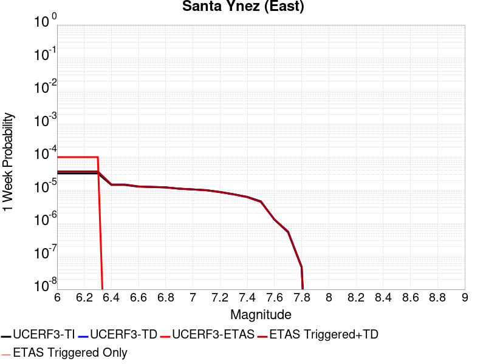 |  |  | 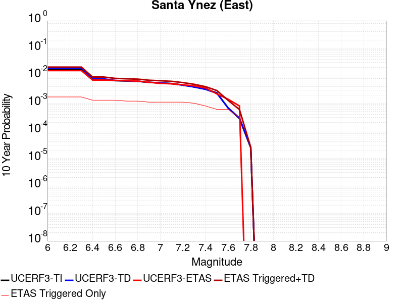 |

| Magnitude | 1 wk TI Prob | 1 wk TD Prob | 1 wk ETAS Prob | 1 wk ETAS/TD Gain | 1 wk ETAS Triggered+TD | 1 wk ETAS Triggered Only | 1 mo TI Prob | 1 mo TD Prob | 1 mo ETAS Prob | 1 mo ETAS/TD Gain | 1 mo ETAS Triggered+TD | 1 mo ETAS Triggered Only | 1 yr TI Prob | 1 yr TD Prob | 1 yr ETAS Prob | 1 yr ETAS/TD Gain | 1 yr ETAS Triggered+TD | 1 yr ETAS Triggered Only | 10 yr TI Prob | 10 yr TD Prob | 10 yr ETAS Prob | 10 yr ETAS/TD Gain | 10 yr ETAS Triggered+TD | 10 yr ETAS Triggered Only |
|-----|-----|-----|-----|-----|-----|-----|-----|-----|-----|-----|-----|-----|-----|-----|-----|-----|-----|-----|-----|-----|-----|-----|-----|-----|
| 6.0 | 3.2269712E-5 | 3.6683814E-5 | 1.0E-4 | 2.725998 | 3.6683814E-5 | 0.0 | 1.3829143E-4 | 1.5721019E-4 | 1.0E-4 | 0.6360911 | 1.5721019E-4 | 0.0 | 0.0016823979 | 0.0019129349 | 0.0014 | 0.7318597 | 0.0020127436 | 1.0E-4 | 0.016697178 | 0.01902192 | 0.0155 | 0.8148494 | 0.020689582 | 0.0017 |
| 6.1 | 3.2269712E-5 | 3.6683814E-5 | 1.0E-4 | 2.725998 | 3.6683814E-5 | 0.0 | 1.3829143E-4 | 1.5721019E-4 | 1.0E-4 | 0.6360911 | 1.5721019E-4 | 0.0 | 0.0016823979 | 0.0019129349 | 0.0014 | 0.7318597 | 0.0020127436 | 1.0E-4 | 0.016697178 | 0.01902192 | 0.0155 | 0.8148494 | 0.020689582 | 0.0017 |
| 6.2 | 3.2269712E-5 | 3.6683814E-5 | 1.0E-4 | 2.725998 | 3.6683814E-5 | 0.0 | 1.3829143E-4 | 1.5721019E-4 | 1.0E-4 | 0.6360911 | 1.5721019E-4 | 0.0 | 0.0016823979 | 0.0019129349 | 0.0014 | 0.7318597 | 0.0020127436 | 1.0E-4 | 0.016697178 | 0.01902192 | 0.0155 | 0.8148494 | 0.020689582 | 0.0017 |
| 6.3 | 3.2269712E-5 | 3.6683814E-5 | 1.0E-4 | 2.725998 | 3.6683814E-5 | 0.0 | 1.3829143E-4 | 1.5721019E-4 | 1.0E-4 | 0.6360911 | 1.5721019E-4 | 0.0 | 0.0016823979 | 0.0019129349 | 0.0014 | 0.7318597 | 0.0020127436 | 1.0E-4 | 0.016697178 | 0.01902192 | 0.0155 | 0.8148494 | 0.020689582 | 0.0017 |
| 6.4 | 1.4404779E-5 | 1.4833642E-5 | 0.0 | 0.0 | 1.4833642E-5 | 0.0 | 6.1733306E-5 | 6.3571235E-5 | 0.0 | 0.0 | 6.3571235E-5 | 0.0 | 7.513438E-4 | 7.7370997E-4 | 7.0E-4 | 0.90473175 | 8.736326E-4 | 1.0E-4 | 0.0074880854 | 0.0077107116 | 0.007 | 0.90782803 | 0.009000688 | 0.0013 |
| 6.5 | 1.4404779E-5 | 1.4833642E-5 | 0.0 | 0.0 | 1.4833642E-5 | 0.0 | 6.1733306E-5 | 6.3571235E-5 | 0.0 | 0.0 | 6.3571235E-5 | 0.0 | 7.513438E-4 | 7.7370997E-4 | 7.0E-4 | 0.90473175 | 8.736326E-4 | 1.0E-4 | 0.0074880854 | 0.0077107116 | 0.007 | 0.90782803 | 0.009000688 | 0.0013 |
| 6.6 | 1.280208E-5 | 1.2999023E-5 | 0.0 | 0.0 | 1.2999023E-5 | 0.0 | 5.4864904E-5 | 5.570892E-5 | 0.0 | 0.0 | 5.570892E-5 | 0.0 | 6.6777546E-4 | 6.780468E-4 | 7.0E-4 | 1.0323771 | 7.77979E-4 | 1.0E-4 | 0.006657724 | 0.00675999 | 0.0068 | 1.0059186 | 0.008051202 | 0.0013 |
| 6.7 | 1.2457027E-5 | 1.261599E-5 | 0.0 | 0.0 | 1.261599E-5 | 0.0 | 5.3386164E-5 | 5.406742E-5 | 0.0 | 0.0 | 5.406742E-5 | 0.0 | 6.497827E-4 | 6.5807364E-4 | 7.0E-4 | 1.0637107 | 7.5800787E-4 | 1.0E-4 | 0.00647886 | 0.006561447 | 0.0066 | 1.0058757 | 0.007753573 | 0.0012 |
| 6.8 | 1.2095134E-5 | 1.2218847E-5 | 0.0 | 0.0 | 1.2218847E-5 | 0.0 | 5.1835254E-5 | 5.236544E-5 | 0.0 | 0.0 | 5.236544E-5 | 0.0 | 6.309115E-4 | 6.3736434E-4 | 7.0E-4 | 1.0982729 | 7.373006E-4 | 1.0E-4 | 0.0062912325 | 0.0063555515 | 0.0064 | 1.0069937 | 0.007547925 | 0.0012 |
| 6.9 | 1.1104036E-5 | 1.1146225E-5 | 0.0 | 0.0 | 1.1146225E-5 | 0.0 | 4.758786E-5 | 4.7768666E-5 | 0.0 | 0.0 | 4.7768666E-5 | 0.0 | 5.7922816E-4 | 5.814296E-4 | 7.0E-4 | 1.2039291 | 6.813714E-4 | 1.0E-4 | 0.005777207 | 0.0057992293 | 0.0058 | 1.0001329 | 0.0068928497 | 0.0011 |
| 7.0 | 1.0577444E-5 | 1.057112E-5 | 0.0 | 0.0 | 1.057112E-5 | 0.0 | 4.5331115E-5 | 4.530402E-5 | 0.0 | 0.0 | 4.530402E-5 | 0.0 | 5.5176654E-4 | 5.51438E-4 | 5.0E-4 | 0.9067202 | 6.513829E-4 | 1.0E-4 | 0.0055039856 | 0.005500835 | 0.0053 | 0.96349007 | 0.006594784 | 0.0011 |
| 7.1 | 1.0021775E-5 | 9.970942E-6 | 0.0 | 0.0 | 9.970942E-6 | 0.0 | 4.294976E-5 | 4.2731914E-5 | 0.0 | 0.0 | 4.2731914E-5 | 0.0 | 5.2278786E-4 | 5.2013807E-4 | 5.0E-4 | 0.96128327 | 6.2008604E-4 | 1.0E-4 | 0.0052155964 | 0.0051893387 | 0.0051 | 0.98278415 | 0.0062836306 | 0.0011 |
| 7.2 | 8.874109E-6 | 8.739827E-6 | 0.0 | 0.0 | 8.739827E-6 | 0.0 | 3.8031343E-5 | 3.7455866E-5 | 0.0 | 0.0 | 3.7455866E-5 | 0.0 | 4.629332E-4 | 4.5593086E-4 | 5.0E-4 | 1.0966575 | 5.5588526E-4 | 1.0E-4 | 0.0046197 | 0.0045500724 | 0.0047 | 1.0329506 | 0.0056450674 | 0.0011 |
| 7.3 | 7.5504267E-6 | 7.4976997E-6 | 0.0 | 0.0 | 7.4976997E-6 | 0.0 | 3.235857E-5 | 3.2132608E-5 | 0.0 | 0.0 | 3.2132608E-5 | 0.0 | 3.9389438E-4 | 3.911453E-4 | 5.0E-4 | 1.2782973 | 4.911062E-4 | 1.0E-4 | 0.0039319694 | 0.0039046754 | 0.0043 | 1.101244 | 0.0049007707 | 0.001 |
| 7.4 | 6.309394E-6 | 6.176963E-6 | 0.0 | 0.0 | 6.176963E-6 | 0.0 | 2.703998E-5 | 2.6472433E-5 | 0.0 | 0.0 | 2.6472433E-5 | 0.0 | 3.2916202E-4 | 3.2225516E-4 | 5.0E-4 | 1.5515655 | 4.2222295E-4 | 1.0E-4 | 0.003286749 | 0.0032179758 | 0.0036 | 1.1187156 | 0.0040154015 | 8.0E-4 |
| 7.5 | 4.6103073E-6 | 4.4365083E-6 | 0.0 | 0.0 | 4.4365083E-6 | 0.0 | 1.975831E-5 | 1.9013472E-5 | 0.0 | 0.0 | 1.9013472E-5 | 0.0 | 2.4053088E-4 | 2.3146514E-4 | 1.0E-4 | 0.43203053 | 3.31442E-4 | 1.0E-4 | 0.002402707 | 0.0023123098 | 0.0022 | 0.9514296 | 0.0029109225 | 6.0E-4 |
| 7.6 | 1.2858658E-6 | 1.299773E-6 | 0.0 | 0.0 | 1.299773E-6 | 0.0 | 5.5108417E-6 | 5.570444E-6 | 0.0 | 0.0 | 5.570444E-6 | 0.0 | 6.7092435E-5 | 6.781812E-5 | 1.0E-4 | 1.4745324 | 1.6781133E-4 | 1.0E-4 | 6.707218E-4 | 6.7798106E-4 | 0.0014 | 2.0649545 | 0.0012775742 | 6.0E-4 |
| 7.7 | 5.3302307E-7 | 5.609023E-7 | 0.0 | 0.0 | 5.609023E-7 | 0.0 | 2.2843826E-6 | 2.403865E-6 | 0.0 | 0.0 | 2.403865E-6 | 0.0 | 2.7812002E-5 | 2.9266701E-5 | 0.0 | 0.0 | 2.9266701E-5 | 0.0 | 2.7808524E-4 | 2.9263203E-4 | 8.0E-4 | 2.7338088 | 5.9254427E-4 | 3.0E-4 |
| 7.8 | 4.613933E-8 | 4.8009543E-8 | 0.0 | 0.0 | 4.8009543E-8 | 0.0 | 1.9773998E-7 | 2.0575517E-7 | 0.0 | 0.0 | 2.0575517E-7 | 0.0 | 2.4074816E-6 | 2.5050665E-6 | 0.0 | 0.0 | 2.5050665E-6 | 0.0 | 2.4074554E-5 | 2.5050393E-5 | 0.0 | 0.0 | 2.5050393E-5 | 0.0 |

## Mount Diablo Thrust South
*[(top)](#table-of-contents)*

| 1 Week | 1 Month | 1 Year | 10 Year |
|-----|-----|-----|-----|
|  |  |  |  |

| Magnitude | 1 wk TI Prob | 1 wk TD Prob | 1 wk ETAS Prob | 1 wk ETAS/TD Gain | 1 wk ETAS Triggered+TD | 1 wk ETAS Triggered Only | 1 mo TI Prob | 1 mo TD Prob | 1 mo ETAS Prob | 1 mo ETAS/TD Gain | 1 mo ETAS Triggered+TD | 1 mo ETAS Triggered Only | 1 yr TI Prob | 1 yr TD Prob | 1 yr ETAS Prob | 1 yr ETAS/TD Gain | 1 yr ETAS Triggered+TD | 1 yr ETAS Triggered Only | 10 yr TI Prob | 10 yr TD Prob | 10 yr ETAS Prob | 10 yr ETAS/TD Gain | 10 yr ETAS Triggered+TD | 10 yr ETAS Triggered Only |
|-----|-----|-----|-----|-----|-----|-----|-----|-----|-----|-----|-----|-----|-----|-----|-----|-----|-----|-----|-----|-----|-----|-----|-----|-----|
| 6.0 | 2.2377444E-5 | 2.6891565E-5 | 0.0 | 0.0 | 2.6891565E-5 | 0.0 | 9.5899806E-5 | 1.1524554E-4 | 0.0 | 0.0 | 1.1524554E-4 | 0.0 | 0.0011669548 | 0.0014024085 | 0.0017 | 1.2122003 | 0.001602128 | 2.0E-4 | 0.011608457 | 0.013955617 | 0.0124 | 0.8885311 | 0.015730496 | 0.0018 |
| 6.1 | 2.2377444E-5 | 2.6891565E-5 | 0.0 | 0.0 | 2.6891565E-5 | 0.0 | 9.5899806E-5 | 1.1524554E-4 | 0.0 | 0.0 | 1.1524554E-4 | 0.0 | 0.0011669548 | 0.0014024085 | 0.0017 | 1.2122003 | 0.001602128 | 2.0E-4 | 0.011608457 | 0.013955617 | 0.0124 | 0.8885311 | 0.015730496 | 0.0018 |
| 6.2 | 2.2377444E-5 | 2.6891565E-5 | 0.0 | 0.0 | 2.6891565E-5 | 0.0 | 9.5899806E-5 | 1.1524554E-4 | 0.0 | 0.0 | 1.1524554E-4 | 0.0 | 0.0011669548 | 0.0014024085 | 0.0017 | 1.2122003 | 0.001602128 | 2.0E-4 | 0.011608457 | 0.013955617 | 0.0124 | 0.8885311 | 0.015730496 | 0.0018 |
| 6.3 | 2.2377444E-5 | 2.6891565E-5 | 0.0 | 0.0 | 2.6891565E-5 | 0.0 | 9.5899806E-5 | 1.1524554E-4 | 0.0 | 0.0 | 1.1524554E-4 | 0.0 | 0.0011669548 | 0.0014024085 | 0.0017 | 1.2122003 | 0.001602128 | 2.0E-4 | 0.011608457 | 0.013955617 | 0.0124 | 0.8885311 | 0.015730496 | 0.0018 |
| 6.4 | 1.2228463E-5 | 1.4708772E-5 | 0.0 | 0.0 | 1.4708772E-5 | 0.0 | 5.2406645E-5 | 6.303615E-5 | 0.0 | 0.0 | 6.303615E-5 | 0.0 | 6.378641E-4 | 7.672076E-4 | 8.0E-4 | 1.0427425 | 7.672076E-4 | 0.0 | 0.0063603627 | 0.007647469 | 0.0046 | 0.6015062 | 0.007647469 | 0.0 |
| 6.5 | 1.2228463E-5 | 1.4708772E-5 | 0.0 | 0.0 | 1.4708772E-5 | 0.0 | 5.2406645E-5 | 6.303615E-5 | 0.0 | 0.0 | 6.303615E-5 | 0.0 | 6.378641E-4 | 7.672076E-4 | 8.0E-4 | 1.0427425 | 7.672076E-4 | 0.0 | 0.0063603627 | 0.007647469 | 0.0046 | 0.6015062 | 0.007647469 | 0.0 |
| 6.6 | 1.2068118E-5 | 1.4514011E-5 | 0.0 | 0.0 | 1.4514011E-5 | 0.0 | 5.1719482E-5 | 6.220149E-5 | 0.0 | 0.0 | 6.220149E-5 | 0.0 | 6.2950276E-4 | 7.570528E-4 | 8.0E-4 | 1.0567294 | 7.570528E-4 | 0.0 | 0.006277225 | 0.007546615 | 0.0046 | 0.6095448 | 0.007546615 | 0.0 |
| 6.7 | 1.1499428E-5 | 1.3838028E-5 | 0.0 | 0.0 | 1.3838028E-5 | 0.0 | 4.9282335E-5 | 5.930456E-5 | 0.0 | 0.0 | 5.930456E-5 | 0.0 | 5.9984723E-4 | 7.218065E-4 | 7.0E-4 | 0.969789 | 7.218065E-4 | 0.0 | 0.0059823063 | 0.007196482 | 0.0043 | 0.59751415 | 0.007196482 | 0.0 |
| 6.8 | 8.82118E-6 | 1.0797723E-5 | 0.0 | 0.0 | 1.0797723E-5 | 0.0 | 3.780451E-5 | 4.6275163E-5 | 0.0 | 0.0 | 4.6275163E-5 | 0.0 | 4.601727E-4 | 5.6326005E-4 | 5.0E-4 | 0.8876895 | 5.6326005E-4 | 0.0 | 0.0045922096 | 0.00561947 | 0.0035 | 0.6228345 | 0.00561947 | 0.0 |
| 6.9 | 8.047112E-6 | 9.908106E-6 | 0.0 | 0.0 | 9.908106E-6 | 0.0 | 3.4487166E-5 | 4.246265E-5 | 0.0 | 0.0 | 4.246265E-5 | 0.0 | 4.1980037E-4 | 5.1686534E-4 | 5.0E-4 | 0.9673699 | 5.1686534E-4 | 0.0 | 0.004190082 | 0.005157742 | 0.0032 | 0.62042654 | 0.005157742 | 0.0 |
| 7.0 | 6.2574763E-6 | 7.73202E-6 | 0.0 | 0.0 | 7.73202E-6 | 0.0 | 2.681748E-5 | 3.313683E-5 | 0.0 | 0.0 | 3.313683E-5 | 0.0 | 3.264539E-4 | 4.0336986E-4 | 5.0E-4 | 1.2395571 | 4.0336986E-4 | 0.0 | 0.0032597475 | 0.004027368 | 0.0023 | 0.57109255 | 0.004027368 | 0.0 |
| 7.1 | 3.6485903E-6 | 4.5020347E-6 | 0.0 | 0.0 | 4.5020347E-6 | 0.0 | 1.5636722E-5 | 1.9294295E-5 | 0.0 | 0.0 | 1.9294295E-5 | 0.0 | 1.9036046E-4 | 2.3488312E-4 | 2.0E-4 | 0.85148734 | 2.3488312E-4 | 0.0 | 0.0019019748 | 0.0023466544 | 0.0018 | 0.7670495 | 0.0023466544 | 0.0 |
| 7.2 | 2.3034274E-6 | 2.8973452E-6 | 0.0 | 0.0 | 2.8973452E-6 | 0.0 | 9.871795E-6 | 1.2417136E-5 | 0.0 | 0.0 | 1.2417136E-5 | 0.0 | 1.2018247E-4 | 1.5116838E-4 | 1.0E-4 | 0.661514 | 1.5116838E-4 | 0.0 | 0.0012011749 | 0.0015108308 | 0.001 | 0.6618875 | 0.0015108308 | 0.0 |
| 7.3 | 1.224035E-6 | 1.5621736E-6 | 0.0 | 0.0 | 1.5621736E-6 | 0.0 | 5.245854E-6 | 6.695013E-6 | 0.0 | 0.0 | 6.695013E-6 | 0.0 | 6.38664E-5 | 8.150884E-5 | 1.0E-4 | 1.2268608 | 8.150884E-5 | 0.0 | 6.384805E-4 | 8.14873E-4 | 6.0E-4 | 0.736311 | 8.14873E-4 | 0.0 |
| 7.4 | 5.1601154E-7 | 6.7047233E-7 | 0.0 | 0.0 | 6.7047233E-7 | 0.0 | 2.2114762E-6 | 2.8734498E-6 | 0.0 | 0.0 | 2.8734498E-6 | 0.0 | 2.6924388E-5 | 3.4983706E-5 | 1.0E-4 | 2.8584735 | 3.4983706E-5 | 0.0 | 2.6921128E-4 | 3.4979658E-4 | 1.0E-4 | 0.28588045 | 3.4979658E-4 | 0.0 |
| 7.5 | 3.552894E-7 | 4.6502333E-7 | 0.0 | 0.0 | 4.6502333E-7 | 0.0 | 1.5226678E-6 | 1.9929557E-6 | 0.0 | 0.0 | 1.9929557E-6 | 0.0 | 1.8538323E-5 | 2.426398E-5 | 1.0E-4 | 4.1213355 | 2.426398E-5 | 0.0 | 1.8536777E-4 | 2.4257129E-4 | 1.0E-4 | 0.41224992 | 2.4257129E-4 | 0.0 |
| 7.6 | 1.3124082E-7 | 1.7187479E-7 | 0.0 | 0.0 | 1.7187479E-7 | 0.0 | 5.6246057E-7 | 7.3660607E-7 | 0.0 | 0.0 | 7.3660607E-7 | 0.0 | 6.8479358E-6 | 8.968151E-6 | 1.0E-4 | 11.150571 | 8.968151E-6 | 0.0 | 6.8477246E-5 | 8.96526E-5 | 1.0E-4 | 1.1154166 | 8.96526E-5 | 0.0 |
| 7.7 | 3.6193022E-8 | 4.7321272E-8 | 0.0 | 0.0 | 4.7321272E-8 | 0.0 | 1.5511293E-7 | 2.0280545E-7 | 0.0 | 0.0 | 2.0280545E-7 | 0.0 | 1.8884983E-6 | 2.4691547E-6 | 1.0E-4 | 40.49969 | 2.4691547E-6 | 0.0 | 1.8884823E-5 | 2.4696754E-5 | 1.0E-4 | 4.049115 | 2.4696754E-5 | 0.0 |

## Cleghorn Lake
*[(top)](#table-of-contents)*

| 1 Week | 1 Month | 1 Year | 10 Year |
|-----|-----|-----|-----|
|  |  |  | 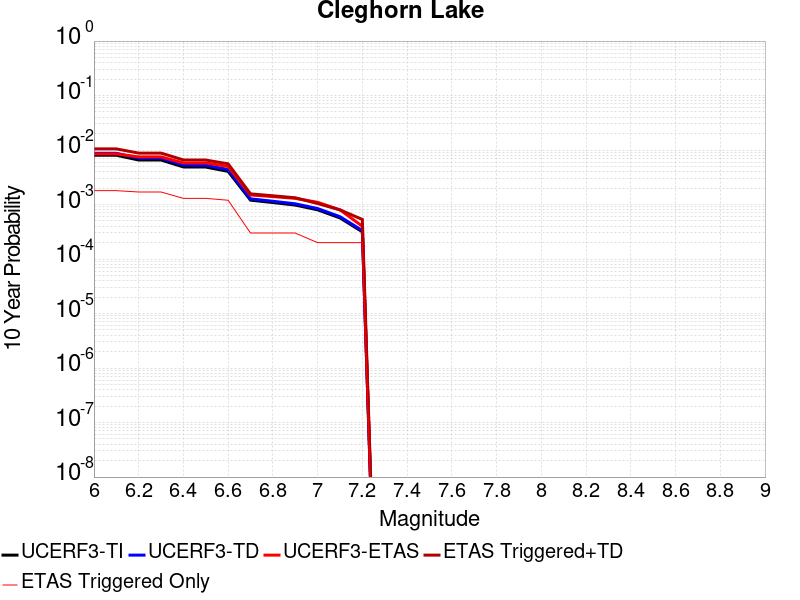 |

| Magnitude | 1 wk TI Prob | 1 wk TD Prob | 1 wk ETAS Prob | 1 wk ETAS/TD Gain | 1 wk ETAS Triggered+TD | 1 wk ETAS Triggered Only | 1 mo TI Prob | 1 mo TD Prob | 1 mo ETAS Prob | 1 mo ETAS/TD Gain | 1 mo ETAS Triggered+TD | 1 mo ETAS Triggered Only | 1 yr TI Prob | 1 yr TD Prob | 1 yr ETAS Prob | 1 yr ETAS/TD Gain | 1 yr ETAS Triggered+TD | 1 yr ETAS Triggered Only | 10 yr TI Prob | 10 yr TD Prob | 10 yr ETAS Prob | 10 yr ETAS/TD Gain | 10 yr ETAS Triggered+TD | 10 yr ETAS Triggered Only |
|-----|-----|-----|-----|-----|-----|-----|-----|-----|-----|-----|-----|-----|-----|-----|-----|-----|-----|-----|-----|-----|-----|-----|-----|-----|
| 6.0 | 1.5467183E-5 | 1.6779122E-5 | 0.0 | 0.0 | 1.6779122E-5 | 0.0 | 6.6286244E-5 | 7.190885E-5 | 0.0 | 0.0 | 7.190885E-5 | 0.0 | 8.067362E-4 | 8.751934E-4 | 6.0E-4 | 0.6855628 | 0.0010750183 | 2.0E-4 | 0.008038137 | 0.008722884 | 0.0085 | 0.97444844 | 0.010507182 | 0.0018 |
| 6.1 | 1.5467183E-5 | 1.6779122E-5 | 0.0 | 0.0 | 1.6779122E-5 | 0.0 | 6.6286244E-5 | 7.190885E-5 | 0.0 | 0.0 | 7.190885E-5 | 0.0 | 8.067362E-4 | 8.751934E-4 | 6.0E-4 | 0.6855628 | 0.0010750183 | 2.0E-4 | 0.008038137 | 0.008722884 | 0.0085 | 0.97444844 | 0.010507182 | 0.0018 |
| 6.2 | 1.2624631E-5 | 1.3669549E-5 | 0.0 | 0.0 | 1.3669549E-5 | 0.0 | 5.410444E-5 | 5.858274E-5 | 0.0 | 0.0 | 5.858274E-5 | 0.0 | 6.585225E-4 | 7.1306E-4 | 6.0E-4 | 0.84144384 | 9.129174E-4 | 2.0E-4 | 0.0065657445 | 0.007112507 | 0.0075 | 1.0544806 | 0.008800415 | 0.0017 |
| 6.3 | 1.2624631E-5 | 1.3669549E-5 | 0.0 | 0.0 | 1.3669549E-5 | 0.0 | 5.410444E-5 | 5.858274E-5 | 0.0 | 0.0 | 5.858274E-5 | 0.0 | 6.585225E-4 | 7.1306E-4 | 6.0E-4 | 0.84144384 | 9.129174E-4 | 2.0E-4 | 0.0065657445 | 0.007112507 | 0.0075 | 1.0544806 | 0.008800415 | 0.0017 |
| 6.4 | 9.417684E-6 | 1.0161601E-5 | 0.0 | 0.0 | 1.0161601E-5 | 0.0 | 4.036088E-5 | 4.354922E-5 | 0.0 | 0.0 | 4.354922E-5 | 0.0 | 4.912829E-4 | 5.3012377E-4 | 5.0E-4 | 0.943176 | 7.300177E-4 | 2.0E-4 | 0.004901982 | 0.0052926196 | 0.0058 | 1.0958656 | 0.006585739 | 0.0013 |
| 6.5 | 9.368219E-6 | 1.0109062E-5 | 0.0 | 0.0 | 1.0109062E-5 | 0.0 | 4.014889E-5 | 4.332406E-5 | 0.0 | 0.0 | 4.332406E-5 | 0.0 | 4.8870314E-4 | 5.273838E-4 | 5.0E-4 | 0.9480761 | 7.272783E-4 | 2.0E-4 | 0.004876298 | 0.00526535 | 0.0058 | 1.1015413 | 0.006558505 | 0.0013 |
| 6.6 | 7.803798E-6 | 8.434604E-6 | 0.0 | 0.0 | 8.434604E-6 | 0.0 | 3.3444423E-5 | 3.6148027E-5 | 0.0 | 0.0 | 3.6148027E-5 | 0.0 | 4.0710976E-4 | 4.4005318E-4 | 5.0E-4 | 1.1362263 | 6.399652E-4 | 2.0E-4 | 0.0040636472 | 0.0043957275 | 0.005 | 1.1374682 | 0.0055904523 | 0.0012 |
| 6.7 | 2.3108669E-6 | 2.4423648E-6 | 0.0 | 0.0 | 2.4423648E-6 | 0.0 | 9.903678E-6 | 1.0467236E-5 | 0.0 | 0.0 | 1.0467236E-5 | 0.0 | 1.205706E-4 | 1.2743134E-4 | 2.0E-4 | 1.5694727 | 1.2743134E-4 | 0.0 | 0.001205052 | 0.0012736013 | 0.0015 | 1.1777626 | 0.0015732192 | 3.0E-4 |
| 6.8 | 2.0882828E-6 | 2.2049805E-6 | 0.0 | 0.0 | 2.2049805E-6 | 0.0 | 8.949753E-6 | 9.449883E-6 | 0.0 | 0.0 | 9.449883E-6 | 0.0 | 1.08957785E-4 | 1.1504642E-4 | 2.0E-4 | 1.7384287 | 1.1504642E-4 | 0.0 | 0.0010890438 | 0.0011498855 | 0.0014 | 1.2175126 | 0.0014495405 | 3.0E-4 |
| 6.9 | 1.876935E-6 | 1.9799038E-6 | 0.0 | 0.0 | 1.9799038E-6 | 0.0 | 8.043982E-6 | 8.485275E-6 | 0.0 | 0.0 | 8.485275E-6 | 0.0 | 9.7931086E-5 | 1.0330349E-4 | 2.0E-4 | 1.936043 | 1.0330349E-4 | 0.0 | 9.788794E-4 | 0.0010325707 | 0.0013 | 1.2589937 | 0.0013322609 | 3.0E-4 |
| 7.0 | 1.5357559E-6 | 1.6193499E-6 | 0.0 | 0.0 | 1.6193499E-6 | 0.0 | 6.5817944E-6 | 6.940053E-6 | 0.0 | 0.0 | 6.940053E-6 | 0.0 | 8.01304E-5 | 8.449199E-5 | 2.0E-4 | 2.367088 | 8.449199E-5 | 0.0 | 8.010151E-4 | 8.4461115E-4 | 0.0011 | 1.3023745 | 0.0010444422 | 2.0E-4 |
| 7.1 | 1.0905424E-6 | 1.1491103E-6 | 0.0 | 0.0 | 1.1491103E-6 | 0.0 | 4.6737446E-6 | 4.9247496E-6 | 0.0 | 0.0 | 4.9247496E-6 | 0.0 | 5.6901354E-5 | 5.9957274E-5 | 0.0 | 0.0 | 5.9957274E-5 | 0.0 | 5.6886784E-4 | 5.9942075E-4 | 8.0E-4 | 1.3346218 | 7.9930085E-4 | 2.0E-4 |
| 7.2 | 6.06668E-7 | 6.3837547E-7 | 0.0 | 0.0 | 6.3837547E-7 | 0.0 | 2.600003E-6 | 2.7358924E-6 | 0.0 | 0.0 | 2.7358924E-6 | 0.0 | 3.1654577E-5 | 3.330905E-5 | 0.0 | 0.0 | 3.330905E-5 | 0.0 | 3.1650066E-4 | 3.330474E-4 | 4.0E-4 | 1.2010303 | 5.329808E-4 | 2.0E-4 |

## Cleghorn Pass
*[(top)](#table-of-contents)*

| 1 Week | 1 Month | 1 Year | 10 Year |
|-----|-----|-----|-----|
|  | 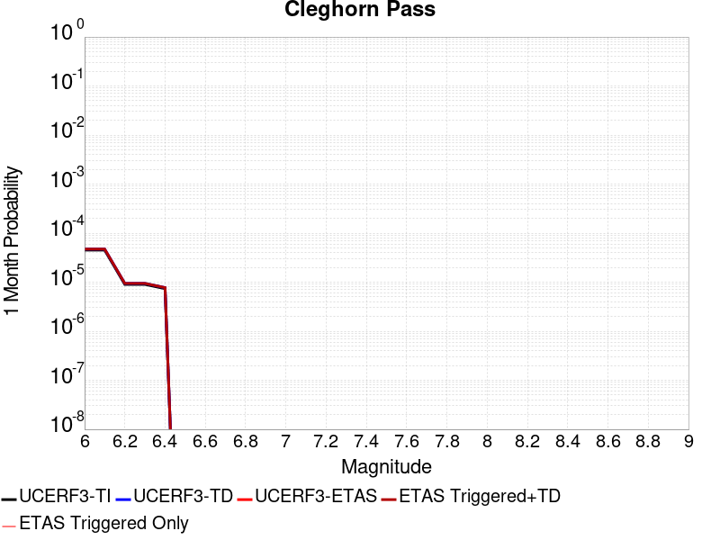 |  | 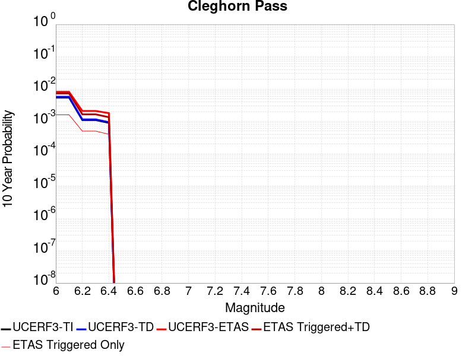 |

| Magnitude | 1 wk TI Prob | 1 wk TD Prob | 1 wk ETAS Prob | 1 wk ETAS/TD Gain | 1 wk ETAS Triggered+TD | 1 wk ETAS Triggered Only | 1 mo TI Prob | 1 mo TD Prob | 1 mo ETAS Prob | 1 mo ETAS/TD Gain | 1 mo ETAS Triggered+TD | 1 mo ETAS Triggered Only | 1 yr TI Prob | 1 yr TD Prob | 1 yr ETAS Prob | 1 yr ETAS/TD Gain | 1 yr ETAS Triggered+TD | 1 yr ETAS Triggered Only | 10 yr TI Prob | 10 yr TD Prob | 10 yr ETAS Prob | 10 yr ETAS/TD Gain | 10 yr ETAS Triggered+TD | 10 yr ETAS Triggered Only |
|-----|-----|-----|-----|-----|-----|-----|-----|-----|-----|-----|-----|-----|-----|-----|-----|-----|-----|-----|-----|-----|-----|-----|-----|-----|
| 6.0 | 1.0522846E-5 | 1.1034972E-5 | 0.0 | 0.0 | 1.1034972E-5 | 0.0 | 4.509713E-5 | 4.7292175E-5 | 0.0 | 0.0 | 4.7292175E-5 | 0.0 | 5.4891926E-4 | 5.7568273E-4 | 5.0E-4 | 0.86853397 | 6.7562517E-4 | 1.0E-4 | 0.0054756533 | 0.0057470747 | 0.0082 | 1.4268129 | 0.0073378794 | 0.0016 |
| 6.1 | 1.0522846E-5 | 1.1034972E-5 | 0.0 | 0.0 | 1.1034972E-5 | 0.0 | 4.509713E-5 | 4.7292175E-5 | 0.0 | 0.0 | 4.7292175E-5 | 0.0 | 5.4891926E-4 | 5.7568273E-4 | 5.0E-4 | 0.86853397 | 6.7562517E-4 | 1.0E-4 | 0.0054756533 | 0.0057470747 | 0.0082 | 1.4268129 | 0.0073378794 | 0.0016 |
| 6.2 | 2.1045846E-6 | 2.2070678E-6 | 0.0 | 0.0 | 2.2070678E-6 | 0.0 | 9.019617E-6 | 9.458851E-6 | 0.0 | 0.0 | 9.458851E-6 | 0.0 | 1.098083E-4 | 1.1515962E-4 | 0.0 | 0.0 | 1.1515962E-4 | 0.0 | 0.0010975406 | 0.0011514104 | 0.0021 | 1.82385 | 0.0016508347 | 5.0E-4 |
| 6.3 | 2.1045846E-6 | 2.2070678E-6 | 0.0 | 0.0 | 2.2070678E-6 | 0.0 | 9.019617E-6 | 9.458851E-6 | 0.0 | 0.0 | 9.458851E-6 | 0.0 | 1.098083E-4 | 1.1515962E-4 | 0.0 | 0.0 | 1.1515962E-4 | 0.0 | 0.0010975406 | 0.0011514104 | 0.0021 | 1.82385 | 0.0016508347 | 5.0E-4 |
| 6.4 | 1.7259927E-6 | 1.8099477E-6 | 0.0 | 0.0 | 1.8099477E-6 | 0.0 | 7.3970905E-6 | 7.756918E-6 | 0.0 | 0.0 | 7.756918E-6 | 0.0 | 9.005586E-5 | 9.444048E-5 | 0.0 | 0.0 | 9.444048E-5 | 0.0 | 9.001937E-4 | 9.444048E-4 | 0.0018 | 1.9059623 | 0.0013440271 | 4.0E-4 |

## Ortigalita (South)
*[(top)](#table-of-contents)*

| 1 Week | 1 Month | 1 Year | 10 Year |
|-----|-----|-----|-----|
|  | 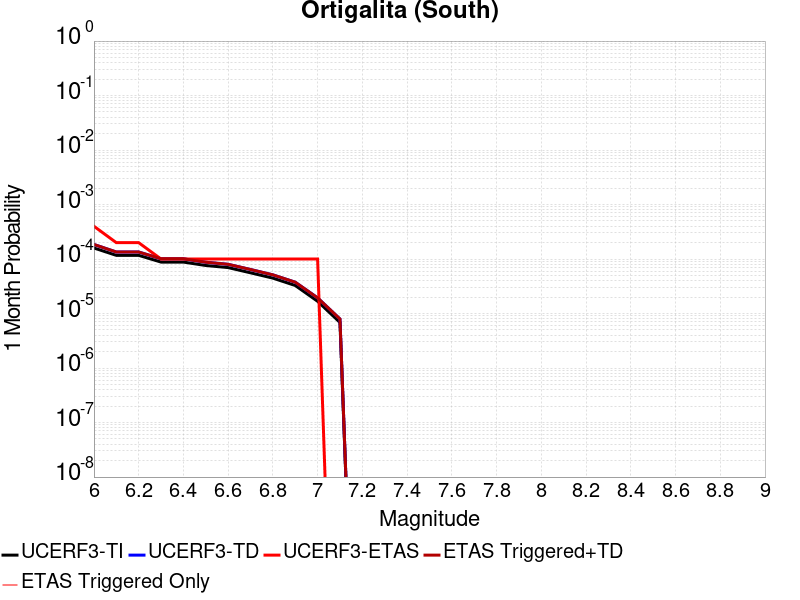 |  |  |

| Magnitude | 1 wk TI Prob | 1 wk TD Prob | 1 wk ETAS Prob | 1 wk ETAS/TD Gain | 1 wk ETAS Triggered+TD | 1 wk ETAS Triggered Only | 1 mo TI Prob | 1 mo TD Prob | 1 mo ETAS Prob | 1 mo ETAS/TD Gain | 1 mo ETAS Triggered+TD | 1 mo ETAS Triggered Only | 1 yr TI Prob | 1 yr TD Prob | 1 yr ETAS Prob | 1 yr ETAS/TD Gain | 1 yr ETAS Triggered+TD | 1 yr ETAS Triggered Only | 10 yr TI Prob | 10 yr TD Prob | 10 yr ETAS Prob | 10 yr ETAS/TD Gain | 10 yr ETAS Triggered+TD | 10 yr ETAS Triggered Only |
|-----|-----|-----|-----|-----|-----|-----|-----|-----|-----|-----|-----|-----|-----|-----|-----|-----|-----|-----|-----|-----|-----|-----|-----|-----|
| 6.0 | 3.72394E-5 | 4.3182466E-5 | 2.0E-4 | 4.6315093 | 4.3182466E-5 | 0.0 | 1.5958765E-4 | 1.8505547E-4 | 4.0E-4 | 2.161514 | 1.8505547E-4 | 0.0 | 0.0019412481 | 0.002250878 | 0.0023 | 1.0218235 | 0.0025502027 | 3.0E-4 | 0.019243775 | 0.022297136 | 0.0199 | 0.8924913 | 0.024057 | 0.0018 |
| 6.1 | 2.7299884E-5 | 3.1441457E-5 | 2.0E-4 | 6.3610287 | 3.1441457E-5 | 0.0 | 1.16994255E-4 | 1.3474245E-4 | 2.0E-4 | 1.4843131 | 1.3474245E-4 | 0.0 | 0.0014234743 | 0.0016393106 | 0.0016 | 0.97602 | 0.0017391468 | 1.0E-4 | 0.014143906 | 0.016278092 | 0.0143 | 0.8784813 | 0.01706507 | 8.0E-4 |
| 6.2 | 2.7299884E-5 | 3.1441457E-5 | 2.0E-4 | 6.3610287 | 3.1441457E-5 | 0.0 | 1.16994255E-4 | 1.3474245E-4 | 2.0E-4 | 1.4843131 | 1.3474245E-4 | 0.0 | 0.0014234743 | 0.0016393106 | 0.0016 | 0.97602 | 0.0017391468 | 1.0E-4 | 0.014143906 | 0.016278092 | 0.0143 | 0.8784813 | 0.01706507 | 8.0E-4 |
| 6.3 | 2.0546433E-5 | 2.3594344E-5 | 1.0E-4 | 4.2383037 | 2.3594344E-5 | 0.0 | 8.805317E-5 | 1.01114805E-4 | 1.0E-4 | 0.98897487 | 1.01114805E-4 | 0.0 | 0.00107152 | 0.0012303964 | 7.0E-4 | 0.56892234 | 0.0012303964 | 0.0 | 0.010663681 | 0.0122379 | 0.0099 | 0.80896235 | 0.012633004 | 4.0E-4 |
| 6.4 | 2.0546433E-5 | 2.3594344E-5 | 1.0E-4 | 4.2383037 | 2.3594344E-5 | 0.0 | 8.805317E-5 | 1.01114805E-4 | 1.0E-4 | 0.98897487 | 1.01114805E-4 | 0.0 | 0.00107152 | 0.0012303964 | 7.0E-4 | 0.56892234 | 0.0012303964 | 0.0 | 0.010663681 | 0.0122379 | 0.0099 | 0.80896235 | 0.012633004 | 4.0E-4 |
| 6.5 | 1.7779594E-5 | 2.0414887E-5 | 1.0E-4 | 4.8983865 | 2.0414887E-5 | 0.0 | 7.619603E-5 | 8.748951E-5 | 1.0E-4 | 1.1429942 | 8.748951E-5 | 0.0 | 9.272918E-4 | 0.0010646778 | 6.0E-4 | 0.5635508 | 0.0010646778 | 0.0 | 0.009234319 | 0.010597234 | 0.0088 | 0.8304054 | 0.010894055 | 3.0E-4 |
| 6.6 | 1.6272212E-5 | 1.8685576E-5 | 1.0E-4 | 5.351722 | 1.8685576E-5 | 0.0 | 6.973618E-5 | 8.007865E-5 | 1.0E-4 | 1.2487723 | 8.007865E-5 | 0.0 | 8.487073E-4 | 9.745337E-4 | 6.0E-4 | 0.6156791 | 9.745337E-4 | 0.0 | 0.008454733 | 0.009703899 | 0.0081 | 0.834716 | 0.010000988 | 3.0E-4 |
| 6.7 | 1.3051484E-5 | 1.5014794E-5 | 1.0E-4 | 6.660098 | 1.5014794E-5 | 0.0 | 5.593373E-5 | 6.434759E-5 | 1.0E-4 | 1.5540599 | 6.434759E-5 | 0.0 | 6.807804E-4 | 7.831597E-4 | 6.0E-4 | 0.7661272 | 7.831597E-4 | 0.0 | 0.006786986 | 0.007804978 | 0.0064 | 0.8199895 | 0.008102637 | 3.0E-4 |
| 6.8 | 1.04277415E-5 | 1.1968504E-5 | 1.0E-4 | 8.355264 | 1.1968504E-5 | 0.0 | 4.4689557E-5 | 5.129262E-5 | 1.0E-4 | 1.9495982 | 5.129262E-5 | 0.0 | 5.439595E-4 | 6.243161E-4 | 4.0E-4 | 0.64070106 | 6.243161E-4 | 0.0 | 0.0054262993 | 0.0062263743 | 0.005 | 0.80303556 | 0.0064251292 | 2.0E-4 |
| 6.9 | 7.639968E-6 | 8.777665E-6 | 1.0E-4 | 11.392551 | 8.777665E-6 | 0.0 | 3.274231E-5 | 3.7618054E-5 | 1.0E-4 | 2.658298 | 3.7618054E-5 | 0.0 | 3.9856473E-4 | 4.5790945E-4 | 3.0E-4 | 0.65515137 | 4.5790945E-4 | 0.0 | 0.003978506 | 0.0045702434 | 0.0037 | 0.80958486 | 0.0046697864 | 1.0E-4 |
| 7.0 | 3.919831E-6 | 4.525994E-6 | 1.0E-4 | 22.094593 | 4.525994E-6 | 0.0 | 1.679917E-5 | 1.9396986E-5 | 1.0E-4 | 5.1554403 | 1.9396986E-5 | 0.0 | 2.045107E-4 | 2.3613482E-4 | 2.0E-4 | 0.8469738 | 2.3613482E-4 | 0.0 | 0.0020432258 | 0.0023590468 | 0.0025 | 1.05975 | 0.002458811 | 1.0E-4 |
| 7.1 | 1.6017933E-6 | 1.8539527E-6 | 0.0 | 0.0 | 1.8539527E-6 | 0.0 | 6.8648105E-6 | 7.945493E-6 | 0.0 | 0.0 | 7.945493E-6 | 0.0 | 8.357586E-5 | 9.673315E-5 | 0.0 | 0.0 | 9.673315E-5 | 0.0 | 8.3544437E-4 | 9.6701476E-4 | 6.0E-4 | 0.62046623 | 0.001066918 | 1.0E-4 |

## San Diego Trough north alt1
*[(top)](#table-of-contents)*

| 1 Week | 1 Month | 1 Year | 10 Year |
|-----|-----|-----|-----|
|  |  |  |  |

| Magnitude | 1 wk TI Prob | 1 wk TD Prob | 1 wk ETAS Prob | 1 wk ETAS/TD Gain | 1 wk ETAS Triggered+TD | 1 wk ETAS Triggered Only | 1 mo TI Prob | 1 mo TD Prob | 1 mo ETAS Prob | 1 mo ETAS/TD Gain | 1 mo ETAS Triggered+TD | 1 mo ETAS Triggered Only | 1 yr TI Prob | 1 yr TD Prob | 1 yr ETAS Prob | 1 yr ETAS/TD Gain | 1 yr ETAS Triggered+TD | 1 yr ETAS Triggered Only | 10 yr TI Prob | 10 yr TD Prob | 10 yr ETAS Prob | 10 yr ETAS/TD Gain | 10 yr ETAS Triggered+TD | 10 yr ETAS Triggered Only |
|-----|-----|-----|-----|-----|-----|-----|-----|-----|-----|-----|-----|-----|-----|-----|-----|-----|-----|-----|-----|-----|-----|-----|-----|-----|
| 6.0 | 7.329252E-5 | 8.8024135E-5 | 0.0 | 0.0 | 8.8024135E-5 | 0.0 | 3.14073E-4 | 3.7719536E-4 | 2.0E-4 | 0.5302292 | 3.7719536E-4 | 0.0 | 0.0038171355 | 0.0045832642 | 0.0029 | 0.63273686 | 0.004682806 | 1.0E-4 | 0.03752231 | 0.044951465 | 0.0317 | 0.7052051 | 0.046575047 | 0.0017 |
| 6.1 | 3.7940346E-5 | 4.4798235E-5 | 0.0 | 0.0 | 4.4798235E-5 | 0.0 | 1.6259136E-4 | 1.9197886E-4 | 0.0 | 0.0 | 1.9197886E-4 | 0.0 | 0.0019777524 | 0.0023349184 | 0.0012 | 0.5139366 | 0.0023349184 | 0.0 | 0.019602431 | 0.023112651 | 0.0137 | 0.59274894 | 0.023796473 | 7.0E-4 |
| 6.2 | 2.8645263E-5 | 3.3239627E-5 | 0.0 | 0.0 | 3.3239627E-5 | 0.0 | 1.2275964E-4 | 1.4244791E-4 | 0.0 | 0.0 | 1.4244791E-4 | 0.0 | 0.0014935739 | 0.0017329459 | 8.0E-4 | 0.46164164 | 0.0017329459 | 0.0 | 0.0148357535 | 0.017197017 | 0.0093 | 0.5407915 | 0.017884977 | 7.0E-4 |
| 6.3 | 2.8645263E-5 | 3.3239627E-5 | 0.0 | 0.0 | 3.3239627E-5 | 0.0 | 1.2275964E-4 | 1.4244791E-4 | 0.0 | 0.0 | 1.4244791E-4 | 0.0 | 0.0014935739 | 0.0017329459 | 8.0E-4 | 0.46164164 | 0.0017329459 | 0.0 | 0.0148357535 | 0.017197017 | 0.0093 | 0.5407915 | 0.017884977 | 7.0E-4 |
| 6.4 | 2.2204576E-5 | 2.5409145E-5 | 0.0 | 0.0 | 2.5409145E-5 | 0.0 | 9.5159E-5 | 1.0889184E-4 | 0.0 | 0.0 | 1.0889184E-4 | 0.0 | 0.001157945 | 0.0013249613 | 4.0E-4 | 0.30189562 | 0.0013249613 | 0.0 | 0.011519298 | 0.013171791 | 0.0072 | 0.5466227 | 0.013862571 | 7.0E-4 |
| 6.5 | 2.1004838E-5 | 2.3988314E-5 | 0.0 | 0.0 | 2.3988314E-5 | 0.0 | 9.0017624E-5 | 1.0280306E-4 | 0.0 | 0.0 | 1.0280306E-4 | 0.0 | 0.0010954136 | 0.0012509173 | 4.0E-4 | 0.31976533 | 0.0012509173 | 0.0 | 0.010900296 | 0.012439845 | 0.0069 | 0.55466926 | 0.013131137 | 7.0E-4 |
| 6.6 | 1.820557E-5 | 2.0674883E-5 | 0.0 | 0.0 | 2.0674883E-5 | 0.0 | 7.802154E-5 | 8.8603665E-5 | 0.0 | 0.0 | 8.8603665E-5 | 0.0 | 9.4949827E-4 | 0.001078221 | 4.0E-4 | 0.37098145 | 0.001078221 | 0.0 | 0.009454516 | 0.010730566 | 0.006 | 0.55915034 | 0.011423055 | 7.0E-4 |
| 6.7 | 1.5884485E-5 | 1.7958651E-5 | 0.0 | 0.0 | 1.7958651E-5 | 0.0 | 6.807459E-5 | 7.696339E-5 | 0.0 | 0.0 | 7.696339E-5 | 0.0 | 8.284929E-4 | 9.3662925E-4 | 4.0E-4 | 0.42706332 | 9.3662925E-4 | 0.0 | 0.008254109 | 0.009327182 | 0.0052 | 0.5575103 | 0.010020653 | 7.0E-4 |
| 6.8 | 1.4331171E-5 | 1.6178852E-5 | 0.0 | 0.0 | 1.6178852E-5 | 0.0 | 6.141786E-5 | 6.933611E-5 | 0.0 | 0.0 | 6.933611E-5 | 0.0 | 7.4750587E-4 | 8.4384216E-4 | 4.0E-4 | 0.4740223 | 8.4384216E-4 | 0.0 | 0.0074499645 | 0.008406646 | 0.0048 | 0.57097685 | 0.009100761 | 7.0E-4 |
| 6.9 | 1.2574203E-5 | 1.4186481E-5 | 0.0 | 0.0 | 1.4186481E-5 | 0.0 | 5.3888325E-5 | 6.0797796E-5 | 0.0 | 0.0 | 6.0797796E-5 | 0.0 | 6.558929E-4 | 7.3996314E-4 | 3.0E-4 | 0.40542558 | 7.3996314E-4 | 0.0 | 0.0065396037 | 0.0073751784 | 0.004 | 0.54235977 | 0.007970753 | 6.0E-4 |
| 7.0 | 1.0883844E-5 | 1.22726E-5 | 0.0 | 0.0 | 1.22726E-5 | 0.0 | 4.664421E-5 | 5.25958E-5 | 0.0 | 0.0 | 5.25958E-5 | 0.0 | 5.677453E-4 | 6.401667E-4 | 3.0E-4 | 0.46862793 | 6.401667E-4 | 0.0 | 0.00566297 | 0.006383354 | 0.0036 | 0.5639669 | 0.0069795237 | 6.0E-4 |
| 7.1 | 9.393088E-6 | 1.0592619E-5 | 0.0 | 0.0 | 1.0592619E-5 | 0.0 | 4.025547E-5 | 4.5396155E-5 | 0.0 | 0.0 | 4.5396155E-5 | 0.0 | 4.900001E-4 | 5.525588E-4 | 1.0E-4 | 0.18097623 | 5.525588E-4 | 0.0 | 0.0048892107 | 0.005511945 | 0.0029 | 0.5261301 | 0.006009189 | 5.0E-4 |
| 7.2 | 8.190791E-6 | 9.245941E-6 | 0.0 | 0.0 | 9.245941E-6 | 0.0 | 3.510292E-5 | 3.962486E-5 | 0.0 | 0.0 | 3.962486E-5 | 0.0 | 4.2729423E-4 | 4.823266E-4 | 1.0E-4 | 0.2073284 | 4.823266E-4 | 0.0 | 0.0042647356 | 0.0048128776 | 0.0028 | 0.58177257 | 0.005310471 | 5.0E-4 |
| 7.3 | 6.268162E-6 | 7.079958E-6 | 0.0 | 0.0 | 7.079958E-6 | 0.0 | 2.6863276E-5 | 3.0342326E-5 | 0.0 | 0.0 | 3.0342326E-5 | 0.0 | 3.2701128E-4 | 3.693556E-4 | 0.0 | 0.0 | 3.693556E-4 | 0.0 | 0.003265305 | 0.003687463 | 0.0017 | 0.46102157 | 0.0038867255 | 2.0E-4 |
| 7.4 | 4.985186E-6 | 5.63487E-6 | 0.0 | 0.0 | 5.63487E-6 | 0.0 | 2.1364907E-5 | 2.414922E-5 | 0.0 | 0.0 | 2.414922E-5 | 0.0 | 2.600867E-4 | 2.9397747E-4 | 0.0 | 0.0 | 2.9397747E-4 | 0.0 | 0.002597825 | 0.0029359271 | 0.0015 | 0.5109119 | 0.0030356336 | 1.0E-4 |
| 7.5 | 1.7489613E-6 | 1.967052E-6 | 0.0 | 0.0 | 1.967052E-6 | 0.0 | 7.495527E-6 | 8.430196E-6 | 0.0 | 0.0 | 8.430196E-6 | 0.0 | 9.125422E-5 | 1.0263303E-4 | 0.0 | 0.0 | 1.0263303E-4 | 0.0 | 9.1216754E-4 | 0.0010258782 | 3.0E-4 | 0.29243237 | 0.0011257756 | 1.0E-4 |
| 7.6 | 1.6988751E-7 | 1.7527951E-7 | 0.0 | 0.0 | 1.7527951E-7 | 0.0 | 7.2808916E-7 | 7.5119766E-7 | 0.0 | 0.0 | 7.5119766E-7 | 0.0 | 8.864449E-6 | 9.145795E-6 | 0.0 | 0.0 | 9.145795E-6 | 0.0 | 8.8640954E-5 | 9.1454385E-5 | 0.0 | 0.0 | 9.1454385E-5 | 0.0 |

## San Gregorio (North) 2011 CFM
*[(top)](#table-of-contents)*

| 1 Week | 1 Month | 1 Year | 10 Year |
|-----|-----|-----|-----|
|  | 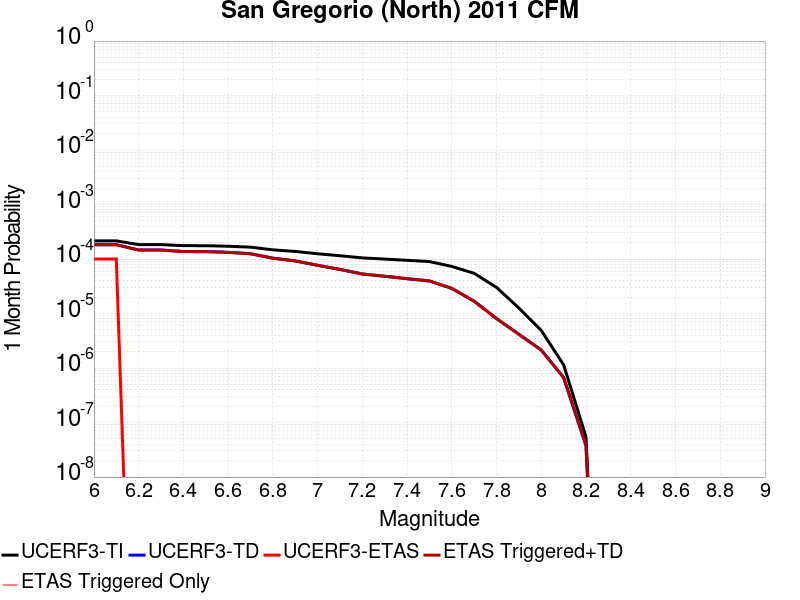 |  |  |

| Magnitude | 1 wk TI Prob | 1 wk TD Prob | 1 wk ETAS Prob | 1 wk ETAS/TD Gain | 1 wk ETAS Triggered+TD | 1 wk ETAS Triggered Only | 1 mo TI Prob | 1 mo TD Prob | 1 mo ETAS Prob | 1 mo ETAS/TD Gain | 1 mo ETAS Triggered+TD | 1 mo ETAS Triggered Only | 1 yr TI Prob | 1 yr TD Prob | 1 yr ETAS Prob | 1 yr ETAS/TD Gain | 1 yr ETAS Triggered+TD | 1 yr ETAS Triggered Only | 10 yr TI Prob | 10 yr TD Prob | 10 yr ETAS Prob | 10 yr ETAS/TD Gain | 10 yr ETAS Triggered+TD | 10 yr ETAS Triggered Only |
|-----|-----|-----|-----|-----|-----|-----|-----|-----|-----|-----|-----|-----|-----|-----|-----|-----|-----|-----|-----|-----|-----|-----|-----|-----|
| 6.0 | 5.0283932E-5 | 4.27429E-5 | 0.0 | 0.0 | 4.27429E-5 | 0.0 | 2.1548476E-4 | 1.8317105E-4 | 1.0E-4 | 0.5459378 | 1.8317105E-4 | 0.0 | 0.0026203706 | 0.0022278423 | 0.0017 | 0.76307017 | 0.002527174 | 3.0E-4 | 0.02589687 | 0.022132142 | 0.0134 | 0.60545427 | 0.023892304 | 0.0018 |
| 6.1 | 5.0283932E-5 | 4.27429E-5 | 0.0 | 0.0 | 4.27429E-5 | 0.0 | 2.1548476E-4 | 1.8317105E-4 | 1.0E-4 | 0.5459378 | 1.8317105E-4 | 0.0 | 0.0026203706 | 0.0022278423 | 0.0017 | 0.76307017 | 0.002527174 | 3.0E-4 | 0.02589687 | 0.022132142 | 0.0134 | 0.60545427 | 0.023892304 | 0.0018 |
| 6.2 | 4.2998647E-5 | 3.4151155E-5 | 0.0 | 0.0 | 3.4151155E-5 | 0.0 | 1.842669E-4 | 1.4635394E-4 | 0.0 | 0.0 | 1.4635394E-4 | 0.0 | 0.0022411412 | 0.001780416 | 0.0013 | 0.73016644 | 0.002079882 | 3.0E-4 | 0.022186736 | 0.017737158 | 0.0101 | 0.56942606 | 0.01871942 | 0.001 |
| 6.3 | 4.2998647E-5 | 3.4151155E-5 | 0.0 | 0.0 | 3.4151155E-5 | 0.0 | 1.842669E-4 | 1.4635394E-4 | 0.0 | 0.0 | 1.4635394E-4 | 0.0 | 0.0022411412 | 0.001780416 | 0.0013 | 0.73016644 | 0.002079882 | 3.0E-4 | 0.022186736 | 0.017737158 | 0.0101 | 0.56942606 | 0.01871942 | 0.001 |
| 6.4 | 4.1101295E-5 | 3.204354E-5 | 0.0 | 0.0 | 3.204354E-5 | 0.0 | 1.7613651E-4 | 1.373223E-4 | 0.0 | 0.0 | 1.373223E-4 | 0.0 | 0.0021423528 | 0.0016706305 | 0.0013 | 0.7781493 | 0.0019701293 | 3.0E-4 | 0.02121817 | 0.016655626 | 0.01 | 0.6003977 | 0.01763897 | 0.001 |
| 6.5 | 4.1032585E-5 | 3.1961743E-5 | 0.0 | 0.0 | 3.1961743E-5 | 0.0 | 1.7584208E-4 | 1.369718E-4 | 0.0 | 0.0 | 1.369718E-4 | 0.0 | 0.0021387753 | 0.0016663696 | 0.0013 | 0.780139 | 0.0019658697 | 3.0E-4 | 0.021183075 | 0.01661366 | 0.01 | 0.60191435 | 0.017597046 | 0.001 |
| 6.6 | 4.011629E-5 | 3.0987347E-5 | 0.0 | 0.0 | 3.0987347E-5 | 0.0 | 1.7191563E-4 | 1.3279624E-4 | 0.0 | 0.0 | 1.3279624E-4 | 0.0 | 0.0020910634 | 0.001615609 | 0.0013 | 0.8046501 | 0.0019151244 | 3.0E-4 | 0.020714961 | 0.016111875 | 0.0096 | 0.5958338 | 0.017095763 | 0.001 |
| 6.7 | 3.8583938E-5 | 2.9180554E-5 | 0.0 | 0.0 | 2.9180554E-5 | 0.0 | 1.6534925E-4 | 1.250536E-4 | 0.0 | 0.0 | 1.250536E-4 | 0.0 | 0.0020112682 | 0.0015214785 | 0.0012 | 0.78870654 | 0.0017211742 | 2.0E-4 | 0.019931622 | 0.015182592 | 0.0091 | 0.59937066 | 0.016068928 | 9.0E-4 |
| 6.8 | 3.44341E-5 | 2.4191757E-5 | 0.0 | 0.0 | 2.4191757E-5 | 0.0 | 1.4756636E-4 | 1.03674894E-4 | 0.0 | 0.0 | 1.03674894E-4 | 0.0 | 0.0017951399 | 0.0012615214 | 9.0E-4 | 0.71342427 | 0.0014612691 | 2.0E-4 | 0.017807078 | 0.012614404 | 0.0072 | 0.5707761 | 0.013404312 | 8.0E-4 |
| 6.9 | 3.221199E-5 | 2.1526548E-5 | 0.0 | 0.0 | 2.1526548E-5 | 0.0 | 1.3804408E-4 | 9.225342E-5 | 0.0 | 0.0 | 9.225342E-5 | 0.0 | 0.0016793909 | 0.0011226148 | 7.0E-4 | 0.6235442 | 0.0013223904 | 2.0E-4 | 0.01666756 | 0.011239285 | 0.0062 | 0.5516365 | 0.012030293 | 8.0E-4 |
| 7.0 | 2.9186718E-5 | 1.7905459E-5 | 0.0 | 0.0 | 1.7905459E-5 | 0.0 | 1.2507994E-4 | 7.673544E-5 | 0.0 | 0.0 | 7.673544E-5 | 0.0 | 0.0015217843 | 9.3385804E-4 | 7.0E-4 | 0.7495786 | 0.0011336713 | 2.0E-4 | 0.015114053 | 0.009368532 | 0.005 | 0.53370154 | 0.010061974 | 7.0E-4 |
| 7.1 | 2.6840138E-5 | 1.505109E-5 | 0.0 | 0.0 | 1.505109E-5 | 0.0 | 1.1502409E-4 | 6.450309E-5 | 0.0 | 0.0 | 6.450309E-5 | 0.0 | 0.0013995186 | 7.8504405E-4 | 6.0E-4 | 0.7642883 | 9.84887E-4 | 2.0E-4 | 0.013907375 | 0.007891314 | 0.0044 | 0.5575751 | 0.00858579 | 7.0E-4 |
| 7.2 | 2.453002E-5 | 1.237814E-5 | 0.0 | 0.0 | 1.237814E-5 | 0.0 | 1.05124425E-4 | 5.3048097E-5 | 0.0 | 0.0 | 5.3048097E-5 | 0.0 | 0.0012791384 | 6.4566976E-4 | 6.0E-4 | 0.9292676 | 8.455406E-4 | 2.0E-4 | 0.012718005 | 0.0065055764 | 0.004 | 0.61485714 | 0.0072010225 | 7.0E-4 |
| 7.3 | 2.3330727E-5 | 1.1267044E-5 | 0.0 | 0.0 | 1.1267044E-5 | 0.0 | 9.9985E-5 | 4.8286438E-5 | 0.0 | 0.0 | 4.8286438E-5 | 0.0 | 0.0012166376 | 5.877293E-4 | 6.0E-4 | 1.0208782 | 7.876117E-4 | 2.0E-4 | 0.012099981 | 0.005927935 | 0.0039 | 0.657902 | 0.006623785 | 7.0E-4 |
| 7.4 | 2.2136466E-5 | 1.0156461E-5 | 0.0 | 0.0 | 1.0156461E-5 | 0.0 | 9.486712E-5 | 4.3526965E-5 | 0.0 | 0.0 | 4.3526965E-5 | 0.0 | 0.0011543952 | 5.298122E-4 | 5.0E-4 | 0.94373065 | 7.297062E-4 | 2.0E-4 | 0.011484168 | 0.0053503895 | 0.0033 | 0.61677754 | 0.005947179 | 6.0E-4 |
| 7.5 | 2.0994974E-5 | 9.224957E-6 | 0.0 | 0.0 | 9.224957E-6 | 0.0 | 8.997535E-5 | 3.9534927E-5 | 0.0 | 0.0 | 3.9534927E-5 | 0.0 | 0.0010948994 | 4.8123166E-4 | 5.0E-4 | 1.0390006 | 6.811354E-4 | 2.0E-4 | 0.010895205 | 0.0048649055 | 0.0031 | 0.6372169 | 0.0054619866 | 6.0E-4 |
| 7.6 | 1.7091823E-5 | 6.7378846E-6 | 0.0 | 0.0 | 6.7378846E-6 | 0.0 | 7.3248615E-5 | 2.887633E-5 | 0.0 | 0.0 | 2.887633E-5 | 0.0 | 8.9143694E-4 | 3.515127E-4 | 4.0E-4 | 1.137939 | 5.514424E-4 | 2.0E-4 | 0.008878695 | 0.0035640579 | 0.0023 | 0.6453318 | 0.0038629887 | 3.0E-4 |
| 7.7 | 1.2772179E-5 | 3.91545E-6 | 0.0 | 0.0 | 3.91545E-6 | 0.0 | 5.473676E-5 | 1.6780392E-5 | 0.0 | 0.0 | 1.6780392E-5 | 0.0 | 6.6621625E-4 | 2.0428214E-4 | 2.0E-4 | 0.9790381 | 3.0426172E-4 | 1.0E-4 | 0.006642225 | 0.0020792817 | 0.0012 | 0.5771224 | 0.002278866 | 2.0E-4 |
| 7.8 | 7.041923E-6 | 1.8751176E-6 | 0.0 | 0.0 | 1.8751176E-6 | 0.0 | 3.017932E-5 | 8.036193E-6 | 0.0 | 0.0 | 8.036193E-6 | 0.0 | 3.6737128E-4 | 9.783626E-5 | 1.0E-4 | 1.022116 | 1.9782648E-4 | 1.0E-4 | 0.0036676454 | 0.0010021103 | 5.0E-4 | 0.49894708 | 0.00110201 | 1.0E-4 |
| 7.9 | 2.946768E-6 | 9.649276E-7 | 0.0 | 0.0 | 9.649276E-7 | 0.0 | 1.2628945E-5 | 4.1353974E-6 | 0.0 | 0.0 | 4.1353974E-6 | 0.0 | 1.5374656E-4 | 5.0347302E-5 | 1.0E-4 | 1.9862038 | 1.5034227E-4 | 1.0E-4 | 0.0015364023 | 5.1351276E-4 | 5.0E-4 | 0.9736856 | 6.134614E-4 | 1.0E-4 |
| 8.0 | 1.1433375E-6 | 4.965971E-7 | 0.0 | 0.0 | 4.965971E-7 | 0.0 | 4.9000087E-6 | 2.1282717E-6 | 0.0 | 0.0 | 2.1282717E-6 | 0.0 | 5.965597E-5 | 2.5911399E-5 | 0.0 | 0.0 | 2.5911399E-5 | 0.0 | 5.963996E-4 | 2.6264298E-4 | 2.0E-4 | 0.7614899 | 2.6264298E-4 | 0.0 |
| 8.1 | 2.6675295E-7 | 1.5483019E-7 | 0.0 | 0.0 | 1.5483019E-7 | 0.0 | 1.1432264E-6 | 6.635578E-7 | 0.0 | 0.0 | 6.635578E-7 | 0.0 | 1.3918692E-5 | 8.078786E-6 | 0.0 | 0.0 | 8.078786E-6 | 0.0 | 1.391782E-4 | 8.21167E-5 | 1.0E-4 | 1.2177792 | 8.21167E-5 | 0.0 |
| 8.2 | 1.2704569E-8 | 8.721503E-9 | 0.0 | 0.0 | 8.721503E-9 | 0.0 | 5.444815E-8 | 3.7377873E-8 | 0.0 | 0.0 | 3.7377873E-8 | 0.0 | 6.629061E-7 | 4.5507548E-7 | 0.0 | 0.0 | 4.5507548E-7 | 0.0 | 6.629041E-6 | 4.733775E-6 | 0.0 | 0.0 | 4.733775E-6 | 0.0 |

## Elysian Park (Upper)
*[(top)](#table-of-contents)*

| 1 Week | 1 Month | 1 Year | 10 Year |
|-----|-----|-----|-----|
|  |  |  |  |

| Magnitude | 1 wk TI Prob | 1 wk TD Prob | 1 wk ETAS Prob | 1 wk ETAS/TD Gain | 1 wk ETAS Triggered+TD | 1 wk ETAS Triggered Only | 1 mo TI Prob | 1 mo TD Prob | 1 mo ETAS Prob | 1 mo ETAS/TD Gain | 1 mo ETAS Triggered+TD | 1 mo ETAS Triggered Only | 1 yr TI Prob | 1 yr TD Prob | 1 yr ETAS Prob | 1 yr ETAS/TD Gain | 1 yr ETAS Triggered+TD | 1 yr ETAS Triggered Only | 10 yr TI Prob | 10 yr TD Prob | 10 yr ETAS Prob | 10 yr ETAS/TD Gain | 10 yr ETAS Triggered+TD | 10 yr ETAS Triggered Only |
|-----|-----|-----|-----|-----|-----|-----|-----|-----|-----|-----|-----|-----|-----|-----|-----|-----|-----|-----|-----|-----|-----|-----|-----|-----|
| 6.0 | 3.1876025E-5 | 3.695651E-5 | 0.0 | 0.0 | 3.695651E-5 | 0.0 | 1.3660437E-4 | 1.5837814E-4 | 0.0 | 0.0 | 1.5837814E-4 | 0.0 | 0.0016618895 | 0.00192702 | 8.0E-4 | 0.41514876 | 0.0020268273 | 1.0E-4 | 0.016495159 | 0.019149423 | 0.0118 | 0.6162065 | 0.020816868 | 0.0017 |
| 6.1 | 3.1876025E-5 | 3.695651E-5 | 0.0 | 0.0 | 3.695651E-5 | 0.0 | 1.3660437E-4 | 1.5837814E-4 | 0.0 | 0.0 | 1.5837814E-4 | 0.0 | 0.0016618895 | 0.00192702 | 8.0E-4 | 0.41514876 | 0.0020268273 | 1.0E-4 | 0.016495159 | 0.019149423 | 0.0118 | 0.6162065 | 0.020816868 | 0.0017 |
| 6.2 | 3.1876025E-5 | 3.695651E-5 | 0.0 | 0.0 | 3.695651E-5 | 0.0 | 1.3660437E-4 | 1.5837814E-4 | 0.0 | 0.0 | 1.5837814E-4 | 0.0 | 0.0016618895 | 0.00192702 | 8.0E-4 | 0.41514876 | 0.0020268273 | 1.0E-4 | 0.016495159 | 0.019149423 | 0.0118 | 0.6162065 | 0.020816868 | 0.0017 |
| 6.3 | 3.1876025E-5 | 3.695651E-5 | 0.0 | 0.0 | 3.695651E-5 | 0.0 | 1.3660437E-4 | 1.5837814E-4 | 0.0 | 0.0 | 1.5837814E-4 | 0.0 | 0.0016618895 | 0.00192702 | 8.0E-4 | 0.41514876 | 0.0020268273 | 1.0E-4 | 0.016495159 | 0.019149423 | 0.0118 | 0.6162065 | 0.020816868 | 0.0017 |
| 6.4 | 1.9273462E-5 | 2.1165466E-5 | 0.0 | 0.0 | 2.1165466E-5 | 0.0 | 8.259794E-5 | 9.0706955E-5 | 0.0 | 0.0 | 9.0706955E-5 | 0.0 | 0.001005166 | 0.0011039685 | 3.0E-4 | 0.2717469 | 0.0011039685 | 0.0 | 0.010006315 | 0.011001599 | 0.0066 | 0.5999128 | 0.011792798 | 8.0E-4 |
| 6.5 | 1.9273462E-5 | 2.1165466E-5 | 0.0 | 0.0 | 2.1165466E-5 | 0.0 | 8.259794E-5 | 9.0706955E-5 | 0.0 | 0.0 | 9.0706955E-5 | 0.0 | 0.001005166 | 0.0011039685 | 3.0E-4 | 0.2717469 | 0.0011039685 | 0.0 | 0.010006315 | 0.011001599 | 0.0066 | 0.5999128 | 0.011792798 | 8.0E-4 |
| 6.6 | 9.813258E-6 | 9.654875E-6 | 0.0 | 0.0 | 9.654875E-6 | 0.0 | 4.205614E-5 | 4.1377418E-5 | 0.0 | 0.0 | 4.1377418E-5 | 0.0 | 5.119132E-4 | 5.036609E-4 | 1.0E-4 | 0.19854629 | 5.036609E-4 | 0.0 | 0.005107356 | 0.0050259153 | 0.0033 | 0.6565968 | 0.0055234027 | 5.0E-4 |
| 6.7 | 9.801478E-6 | 9.642452E-6 | 0.0 | 0.0 | 9.642452E-6 | 0.0 | 4.2005657E-5 | 4.132418E-5 | 0.0 | 0.0 | 4.132418E-5 | 0.0 | 5.112989E-4 | 5.0301297E-4 | 1.0E-4 | 0.19880202 | 5.0301297E-4 | 0.0 | 0.0051012407 | 0.005019466 | 0.0033 | 0.6574405 | 0.005516956 | 5.0E-4 |
| 6.8 | 8.102489E-6 | 7.764389E-6 | 0.0 | 0.0 | 7.764389E-6 | 0.0 | 3.4724493E-5 | 3.3275555E-5 | 0.0 | 0.0 | 3.3275555E-5 | 0.0 | 4.2268867E-4 | 4.0505955E-4 | 1.0E-4 | 0.24687728 | 4.0505955E-4 | 0.0 | 0.004218856 | 0.004043705 | 0.0027 | 0.6677045 | 0.0044420874 | 4.0E-4 |
| 6.9 | 6.08275E-6 | 5.476053E-6 | 0.0 | 0.0 | 5.476053E-6 | 0.0 | 2.6068668E-5 | 2.3468592E-5 | 0.0 | 0.0 | 2.3468592E-5 | 0.0 | 3.173398E-4 | 2.8569342E-4 | 1.0E-4 | 0.35002556 | 2.8569342E-4 | 0.0 | 0.0031688702 | 0.0028533388 | 0.0017 | 0.59579325 | 0.0029530537 | 1.0E-4 |
| 7.0 | 5.5995934E-6 | 4.9778487E-6 | 0.0 | 0.0 | 4.9778487E-6 | 0.0 | 2.3998036E-5 | 2.1333466E-5 | 0.0 | 0.0 | 2.1333466E-5 | 0.0 | 2.9213692E-4 | 2.5970466E-4 | 1.0E-4 | 0.38505277 | 2.5970466E-4 | 0.0 | 0.0029175316 | 0.002594079 | 0.0015 | 0.5782399 | 0.0026938193 | 1.0E-4 |
| 7.1 | 4.709881E-6 | 4.0832847E-6 | 0.0 | 0.0 | 4.0832847E-6 | 0.0 | 2.0185047E-5 | 1.7499677E-5 | 0.0 | 0.0 | 1.7499677E-5 | 0.0 | 2.4572524E-4 | 2.1303815E-4 | 1.0E-4 | 0.4693995 | 2.1303815E-4 | 0.0 | 0.002454537 | 0.0021283806 | 0.0013 | 0.61079305 | 0.0022281676 | 1.0E-4 |
| 7.2 | 3.6063436E-6 | 2.974877E-6 | 0.0 | 0.0 | 2.974877E-6 | 0.0 | 1.5455667E-5 | 1.274941E-5 | 0.0 | 0.0 | 1.274941E-5 | 0.0 | 1.881565E-4 | 1.5521313E-4 | 1.0E-4 | 0.64427537 | 1.5521313E-4 | 0.0 | 0.0018799726 | 0.0015510585 | 7.0E-4 | 0.45130473 | 0.0015510585 | 0.0 |
| 7.3 | 2.471135E-6 | 2.093359E-6 | 0.0 | 0.0 | 2.093359E-6 | 0.0 | 1.0590536E-5 | 8.971508E-6 | 0.0 | 0.0 | 8.971508E-6 | 0.0 | 1.2893214E-4 | 1.092227E-4 | 1.0E-4 | 0.9155606 | 1.092227E-4 | 0.0 | 0.0012885736 | 0.0010916974 | 6.0E-4 | 0.54960287 | 0.0010916974 | 0.0 |
| 7.4 | 1.163943E-6 | 1.0265474E-6 | 0.0 | 0.0 | 1.0265474E-6 | 0.0 | 4.988318E-6 | 4.3994814E-6 | 0.0 | 0.0 | 4.3994814E-6 | 0.0 | 6.0731076E-5 | 5.3562402E-5 | 0.0 | 0.0 | 5.3562402E-5 | 0.0 | 6.071448E-4 | 5.354979E-4 | 2.0E-4 | 0.3734842 | 5.354979E-4 | 0.0 |
| 7.5 | 4.99459E-7 | 4.91304E-7 | 0.0 | 0.0 | 4.91304E-7 | 0.0 | 2.140537E-6 | 2.1055869E-6 | 0.0 | 0.0 | 2.1055869E-6 | 0.0 | 2.6060725E-5 | 2.5635234E-5 | 0.0 | 0.0 | 2.5635234E-5 | 0.0 | 2.605767E-4 | 2.5632433E-4 | 1.0E-4 | 0.39013073 | 2.5632433E-4 | 0.0 |
| 7.6 | 2.4667852E-7 | 2.4750702E-7 | 0.0 | 0.0 | 2.4750702E-7 | 0.0 | 1.0571932E-6 | 1.0607439E-6 | 0.0 | 0.0 | 1.0607439E-6 | 0.0 | 1.2871251E-5 | 1.2914485E-5 | 0.0 | 0.0 | 1.2914485E-5 | 0.0 | 1.2870505E-4 | 1.2913771E-4 | 1.0E-4 | 0.77436715 | 1.2913771E-4 | 0.0 |
| 7.7 | 8.2312795E-8 | 7.370986E-8 | 0.0 | 0.0 | 7.370986E-8 | 0.0 | 3.527691E-7 | 3.158994E-7 | 0.0 | 0.0 | 3.158994E-7 | 0.0 | 4.294955E-6 | 3.8460694E-6 | 0.0 | 0.0 | 3.8460694E-6 | 0.0 | 4.2948723E-5 | 3.8460144E-5 | 0.0 | 0.0 | 3.8460144E-5 | 0.0 |
| 7.8 | 2.7819295E-8 | 1.7455262E-8 | 0.0 | 0.0 | 1.7455262E-8 | 0.0 | 1.1922555E-7 | 7.480826E-8 | 0.0 | 0.0 | 7.480826E-8 | 0.0 | 1.45157E-6 | 9.107904E-7 | 0.0 | 0.0 | 9.107904E-7 | 0.0 | 1.45156055E-5 | 9.107881E-6 | 0.0 | 0.0 | 9.107881E-6 | 0.0 |

## San Andreas (Peninsula) 2011 CFM
*[(top)](#table-of-contents)*

| 1 Week | 1 Month | 1 Year | 10 Year |
|-----|-----|-----|-----|
|  |  |  |  |

| Magnitude | 1 wk TI Prob | 1 wk TD Prob | 1 wk ETAS Prob | 1 wk ETAS/TD Gain | 1 wk ETAS Triggered+TD | 1 wk ETAS Triggered Only | 1 mo TI Prob | 1 mo TD Prob | 1 mo ETAS Prob | 1 mo ETAS/TD Gain | 1 mo ETAS Triggered+TD | 1 mo ETAS Triggered Only | 1 yr TI Prob | 1 yr TD Prob | 1 yr ETAS Prob | 1 yr ETAS/TD Gain | 1 yr ETAS Triggered+TD | 1 yr ETAS Triggered Only | 10 yr TI Prob | 10 yr TD Prob | 10 yr ETAS Prob | 10 yr ETAS/TD Gain | 10 yr ETAS Triggered+TD | 10 yr ETAS Triggered Only |
|-----|-----|-----|-----|-----|-----|-----|-----|-----|-----|-----|-----|-----|-----|-----|-----|-----|-----|-----|-----|-----|-----|-----|-----|-----|
| 6.0 | 8.6200685E-5 | 2.3159508E-5 | 0.0 | 0.0 | 2.3159508E-5 | 0.0 | 3.6937918E-4 | 9.9251265E-5 | 1.0E-4 | 1.0075438 | 1.9924135E-4 | 1.0E-4 | 0.0044879215 | 0.0012077157 | 5.0E-4 | 0.4140047 | 0.0013075949 | 1.0E-4 | 0.043983612 | 0.0136466725 | 0.0074 | 0.5422567 | 0.015323473 | 0.0017 |
| 6.1 | 8.6200685E-5 | 2.3159508E-5 | 0.0 | 0.0 | 2.3159508E-5 | 0.0 | 3.6937918E-4 | 9.9251265E-5 | 1.0E-4 | 1.0075438 | 1.9924135E-4 | 1.0E-4 | 0.0044879215 | 0.0012077157 | 5.0E-4 | 0.4140047 | 0.0013075949 | 1.0E-4 | 0.043983612 | 0.0136466725 | 0.0074 | 0.5422567 | 0.015323473 | 0.0017 |
| 6.2 | 8.6200685E-5 | 2.3159508E-5 | 0.0 | 0.0 | 2.3159508E-5 | 0.0 | 3.6937918E-4 | 9.9251265E-5 | 1.0E-4 | 1.0075438 | 1.9924135E-4 | 1.0E-4 | 0.0044879215 | 0.0012077157 | 5.0E-4 | 0.4140047 | 0.0013075949 | 1.0E-4 | 0.043983612 | 0.0136466725 | 0.0074 | 0.5422567 | 0.015323473 | 0.0017 |
| 6.3 | 8.551163E-5 | 2.286702E-5 | 0.0 | 0.0 | 2.286702E-5 | 0.0 | 3.6642692E-4 | 9.7997836E-5 | 1.0E-4 | 1.0204307 | 1.9798803E-4 | 1.0E-4 | 0.004452125 | 0.001192472 | 5.0E-4 | 0.41929707 | 0.0012923528 | 1.0E-4 | 0.043639794 | 0.013481642 | 0.0074 | 0.5488945 | 0.015158723 | 0.0017 |
| 6.4 | 8.551163E-5 | 2.286702E-5 | 0.0 | 0.0 | 2.286702E-5 | 0.0 | 3.6642692E-4 | 9.7997836E-5 | 1.0E-4 | 1.0204307 | 1.9798803E-4 | 1.0E-4 | 0.004452125 | 0.001192472 | 5.0E-4 | 0.41929707 | 0.0012923528 | 1.0E-4 | 0.043639794 | 0.013481642 | 0.0074 | 0.5488945 | 0.015158723 | 0.0017 |
| 6.5 | 8.511146E-5 | 2.2697528E-5 | 0.0 | 0.0 | 2.2697528E-5 | 0.0 | 3.647124E-4 | 9.72715E-5 | 1.0E-4 | 1.0280503 | 1.9726178E-4 | 1.0E-4 | 0.004431336 | 0.0011836385 | 5.0E-4 | 0.42242628 | 0.0012835201 | 1.0E-4 | 0.04344007 | 0.013385722 | 0.0073 | 0.54535717 | 0.015062966 | 0.0017 |
| 6.6 | 8.4985084E-5 | 2.2630868E-5 | 0.0 | 0.0 | 2.2630868E-5 | 0.0 | 3.6417096E-4 | 9.698583E-5 | 1.0E-4 | 1.0310785 | 1.9697614E-4 | 1.0E-4 | 0.0044247704 | 0.0011801643 | 4.0E-4 | 0.33893585 | 0.0012800463 | 1.0E-4 | 0.043376986 | 0.013349016 | 0.0072 | 0.5393656 | 0.015026323 | 0.0017 |
| 6.7 | 8.462618E-5 | 2.2467157E-5 | 0.0 | 0.0 | 2.2467157E-5 | 0.0 | 3.6263323E-4 | 9.628427E-5 | 1.0E-4 | 1.0385913 | 1.9627465E-4 | 1.0E-4 | 0.004406125 | 0.001171632 | 4.0E-4 | 0.34140414 | 0.0012715148 | 1.0E-4 | 0.043197807 | 0.01325752 | 0.007 | 0.5280022 | 0.014934982 | 0.0017 |
| 6.8 | 8.42337E-5 | 2.2369068E-5 | 0.0 | 0.0 | 2.2369068E-5 | 0.0 | 3.6095164E-4 | 9.586392E-5 | 1.0E-4 | 1.0431453 | 1.9585433E-4 | 1.0E-4 | 0.004385734 | 0.0011665197 | 4.0E-4 | 0.34290034 | 0.001266403 | 1.0E-4 | 0.043001823 | 0.013201576 | 0.007 | 0.53023976 | 0.014879133 | 0.0017 |
| 6.9 | 8.365989E-5 | 2.2182085E-5 | 0.0 | 0.0 | 2.2182085E-5 | 0.0 | 3.5849313E-4 | 9.506262E-5 | 1.0E-4 | 1.0519382 | 1.9505312E-4 | 1.0E-4 | 0.004355922 | 0.0011567742 | 4.0E-4 | 0.34578916 | 0.0012566586 | 1.0E-4 | 0.04271523 | 0.013098413 | 0.007 | 0.5344159 | 0.014776146 | 0.0017 |
| 7.0 | 8.30936E-5 | 2.1951666E-5 | 0.0 | 0.0 | 2.1951666E-5 | 0.0 | 3.560668E-4 | 9.407518E-5 | 1.0E-4 | 1.0629796 | 1.9406577E-4 | 1.0E-4 | 0.004326499 | 0.0011447648 | 4.0E-4 | 0.34941673 | 0.0012446505 | 1.0E-4 | 0.042432297 | 0.0129736625 | 0.0068 | 0.5241388 | 0.014651607 | 0.0017 |
| 7.1 | 8.041264E-5 | 2.1655384E-5 | 0.0 | 0.0 | 2.1655384E-5 | 0.0 | 3.4458007E-4 | 9.2805494E-5 | 1.0E-4 | 1.0775224 | 1.9279621E-4 | 1.0E-4 | 0.0041871946 | 0.0011293226 | 4.0E-4 | 0.35419464 | 0.0012292096 | 1.0E-4 | 0.041091725 | 0.012806519 | 0.0067 | 0.52317107 | 0.014386028 | 0.0016 |
| 7.2 | 7.8427016E-5 | 2.1101474E-5 | 0.0 | 0.0 | 2.1101474E-5 | 0.0 | 3.3607247E-4 | 9.043176E-5 | 1.0E-4 | 1.1058062 | 1.9042271E-4 | 1.0E-4 | 0.004084008 | 0.0011004519 | 4.0E-4 | 0.36348704 | 0.0012003419 | 1.0E-4 | 0.040097635 | 0.012503188 | 0.0064 | 0.51186943 | 0.013984433 | 0.0015 |
| 7.3 | 7.721087E-5 | 2.0894355E-5 | 0.0 | 0.0 | 2.0894355E-5 | 0.0 | 3.3086175E-4 | 8.954416E-5 | 1.0E-4 | 1.1167674 | 1.895352E-4 | 1.0E-4 | 0.004020803 | 0.0010896563 | 3.0E-4 | 0.27531618 | 0.0011895474 | 1.0E-4 | 0.03948827 | 0.01239136 | 0.0063 | 0.5084188 | 0.013872772 | 0.0015 |
| 7.4 | 7.3536525E-5 | 1.9132254E-5 | 0.0 | 0.0 | 1.9132254E-5 | 0.0 | 3.1511846E-4 | 8.199281E-5 | 1.0E-4 | 1.2196192 | 1.8198461E-4 | 1.0E-4 | 0.0038298194 | 9.978063E-4 | 3.0E-4 | 0.30065954 | 0.0010977065 | 1.0E-4 | 0.037644852 | 0.011406938 | 0.0059 | 0.5172291 | 0.012692109 | 0.0013 |
| 7.5 | 6.806207E-5 | 1.7102431E-5 | 0.0 | 0.0 | 1.7102431E-5 | 0.0 | 2.9166197E-4 | 7.329408E-5 | 1.0E-4 | 1.3643667 | 1.7328675E-4 | 1.0E-4 | 0.0035452035 | 8.91991E-4 | 3.0E-4 | 0.33632627 | 9.919018E-4 | 1.0E-4 | 0.034891766 | 0.010244253 | 0.0051 | 0.49784008 | 0.01123401 | 0.001 |
| 7.6 | 5.6731416E-5 | 1.2907267E-5 | 0.0 | 0.0 | 1.2907267E-5 | 0.0 | 2.43112E-4 | 5.5315686E-5 | 1.0E-4 | 1.8078055 | 1.5531015E-4 | 1.0E-4 | 0.0029558712 | 6.732605E-4 | 3.0E-4 | 0.44559276 | 7.7319314E-4 | 1.0E-4 | 0.02916862 | 0.0077660736 | 0.0041 | 0.5279373 | 0.008460637 | 7.0E-4 |
| 7.7 | 4.946994E-5 | 1.2073095E-5 | 0.0 | 0.0 | 1.2073095E-5 | 0.0 | 2.1199681E-4 | 5.1740808E-5 | 1.0E-4 | 1.9327104 | 1.5173563E-4 | 1.0E-4 | 0.002578006 | 6.2976236E-4 | 3.0E-4 | 0.47637016 | 7.296994E-4 | 1.0E-4 | 0.02548303 | 0.0072453525 | 0.0039 | 0.5382761 | 0.007841005 | 6.0E-4 |
| 7.8 | 3.9718198E-5 | 1.1853909E-5 | 0.0 | 0.0 | 1.1853909E-5 | 0.0 | 1.7020974E-4 | 5.0801482E-5 | 1.0E-4 | 1.9684466 | 1.507964E-4 | 1.0E-4 | 0.0020703338 | 6.1833265E-4 | 3.0E-4 | 0.48517576 | 7.182708E-4 | 1.0E-4 | 0.020511515 | 0.0070861923 | 0.0039 | 0.5503661 | 0.0076819407 | 6.0E-4 |
| 7.9 | 2.4115114E-5 | 1.11810505E-5 | 0.0 | 0.0 | 1.11810505E-5 | 0.0 | 1.0334639E-4 | 4.7917907E-5 | 1.0E-4 | 2.0869024 | 1.4791312E-4 | 1.0E-4 | 0.001257516 | 5.832445E-4 | 3.0E-4 | 0.51436406 | 6.8318617E-4 | 1.0E-4 | 0.012504238 | 0.0066095334 | 0.0035 | 0.52953815 | 0.007205568 | 6.0E-4 |
| 8.0 | 1.7756569E-5 | 1.0501687E-5 | 0.0 | 0.0 | 1.0501687E-5 | 0.0 | 7.6097356E-5 | 4.5006454E-5 | 1.0E-4 | 2.2219036 | 1.4500195E-4 | 1.0E-4 | 9.260915E-4 | 5.4781593E-4 | 3.0E-4 | 0.5476292 | 6.4776116E-4 | 1.0E-4 | 0.009222416 | 0.006168466 | 0.0035 | 0.567402 | 0.006764765 | 6.0E-4 |
| 8.1 | 1.3159258E-5 | 8.976217E-6 | 0.0 | 0.0 | 8.976217E-6 | 0.0 | 5.6395602E-5 | 3.8468937E-5 | 1.0E-4 | 2.5995 | 1.3846508E-4 | 1.0E-4 | 6.864001E-4 | 4.6825875E-4 | 3.0E-4 | 0.64067143 | 5.6821195E-4 | 1.0E-4 | 0.0068428386 | 0.0052732863 | 0.0029 | 0.5499417 | 0.0056711766 | 4.0E-4 |
| 8.2 | 8.635426E-6 | 5.00287E-6 | 0.0 | 0.0 | 5.00287E-6 | 0.0 | 3.700844E-5 | 2.1440694E-5 | 1.0E-4 | 4.664028 | 1.2143855E-4 | 1.0E-4 | 4.5048463E-4 | 2.6100926E-4 | 2.0E-4 | 0.76625633 | 3.6098316E-4 | 1.0E-4 | 0.004495725 | 0.002989784 | 0.0016 | 0.53515565 | 0.0031891863 | 2.0E-4 |
| 8.3 | 1.983087E-6 | 6.880041E-7 | 0.0 | 0.0 | 6.880041E-7 | 0.0 | 8.498917E-6 | 2.9485857E-6 | 0.0 | 0.0 | 2.9485857E-6 | 0.0 | 1.034694E-4 | 3.589845E-5 | 0.0 | 0.0 | 3.589845E-5 | 0.0 | 0.0010342124 | 4.2701262E-4 | 1.0E-4 | 0.23418511 | 4.2701262E-4 | 0.0 |

## Trinidad (alt1)
*[(top)](#table-of-contents)*

| 1 Week | 1 Month | 1 Year | 10 Year |
|-----|-----|-----|-----|
|  | 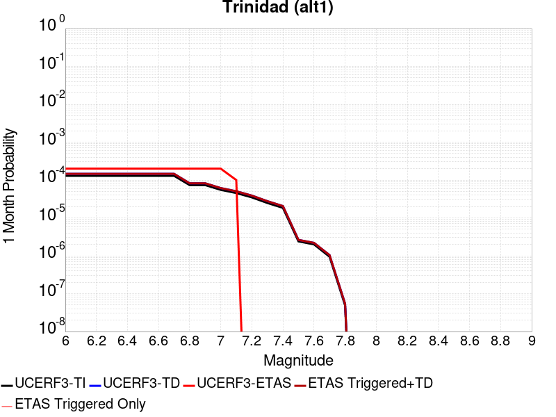 |  | 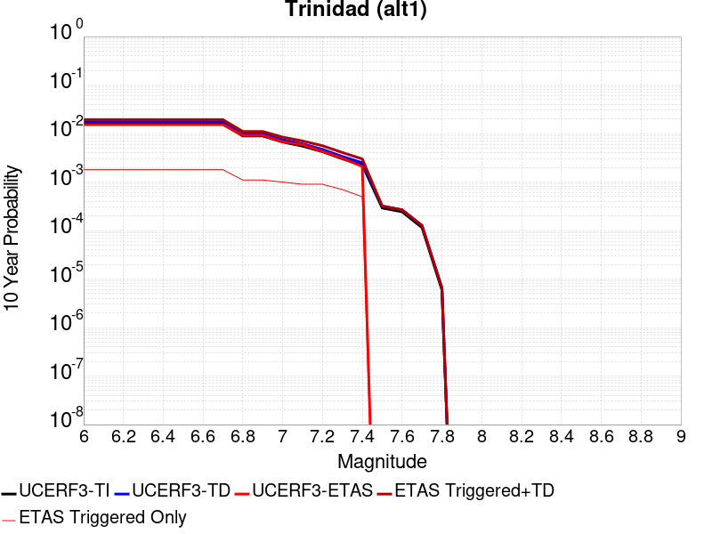 |

| Magnitude | 1 wk TI Prob | 1 wk TD Prob | 1 wk ETAS Prob | 1 wk ETAS/TD Gain | 1 wk ETAS Triggered+TD | 1 wk ETAS Triggered Only | 1 mo TI Prob | 1 mo TD Prob | 1 mo ETAS Prob | 1 mo ETAS/TD Gain | 1 mo ETAS Triggered+TD | 1 mo ETAS Triggered Only | 1 yr TI Prob | 1 yr TD Prob | 1 yr ETAS Prob | 1 yr ETAS/TD Gain | 1 yr ETAS Triggered+TD | 1 yr ETAS Triggered Only | 10 yr TI Prob | 10 yr TD Prob | 10 yr ETAS Prob | 10 yr ETAS/TD Gain | 10 yr ETAS Triggered+TD | 10 yr ETAS Triggered Only |
|-----|-----|-----|-----|-----|-----|-----|-----|-----|-----|-----|-----|-----|-----|-----|-----|-----|-----|-----|-----|-----|-----|-----|-----|-----|
| 6.0 | 3.0167168E-5 | 3.3987628E-5 | 1.0E-4 | 2.9422474 | 3.3987628E-5 | 0.0 | 1.2928146E-4 | 1.4565406E-4 | 2.0E-4 | 1.3731165 | 1.4565406E-4 | 0.0 | 0.0015728653 | 0.0017720638 | 0.0018 | 1.0157648 | 0.0020715322 | 3.0E-4 | 0.0156177925 | 0.017596241 | 0.0153 | 0.8695039 | 0.019364567 | 0.0018 |
| 6.1 | 3.0167168E-5 | 3.3987628E-5 | 1.0E-4 | 2.9422474 | 3.3987628E-5 | 0.0 | 1.2928146E-4 | 1.4565406E-4 | 2.0E-4 | 1.3731165 | 1.4565406E-4 | 0.0 | 0.0015728653 | 0.0017720638 | 0.0018 | 1.0157648 | 0.0020715322 | 3.0E-4 | 0.0156177925 | 0.017596241 | 0.0153 | 0.8695039 | 0.019364567 | 0.0018 |
| 6.2 | 3.0167168E-5 | 3.3987628E-5 | 1.0E-4 | 2.9422474 | 3.3987628E-5 | 0.0 | 1.2928146E-4 | 1.4565406E-4 | 2.0E-4 | 1.3731165 | 1.4565406E-4 | 0.0 | 0.0015728653 | 0.0017720638 | 0.0018 | 1.0157648 | 0.0020715322 | 3.0E-4 | 0.0156177925 | 0.017596241 | 0.0153 | 0.8695039 | 0.019364567 | 0.0018 |
| 6.3 | 3.0167168E-5 | 3.3987628E-5 | 1.0E-4 | 2.9422474 | 3.3987628E-5 | 0.0 | 1.2928146E-4 | 1.4565406E-4 | 2.0E-4 | 1.3731165 | 1.4565406E-4 | 0.0 | 0.0015728653 | 0.0017720638 | 0.0018 | 1.0157648 | 0.0020715322 | 3.0E-4 | 0.0156177925 | 0.017596241 | 0.0153 | 0.8695039 | 0.019364567 | 0.0018 |
| 6.4 | 3.0167168E-5 | 3.3987628E-5 | 1.0E-4 | 2.9422474 | 3.3987628E-5 | 0.0 | 1.2928146E-4 | 1.4565406E-4 | 2.0E-4 | 1.3731165 | 1.4565406E-4 | 0.0 | 0.0015728653 | 0.0017720638 | 0.0018 | 1.0157648 | 0.0020715322 | 3.0E-4 | 0.0156177925 | 0.017596241 | 0.0153 | 0.8695039 | 0.019364567 | 0.0018 |
| 6.5 | 3.0167168E-5 | 3.3987628E-5 | 1.0E-4 | 2.9422474 | 3.3987628E-5 | 0.0 | 1.2928146E-4 | 1.4565406E-4 | 2.0E-4 | 1.3731165 | 1.4565406E-4 | 0.0 | 0.0015728653 | 0.0017720638 | 0.0018 | 1.0157648 | 0.0020715322 | 3.0E-4 | 0.0156177925 | 0.017596241 | 0.0153 | 0.8695039 | 0.019364567 | 0.0018 |
| 6.6 | 3.0167168E-5 | 3.3987628E-5 | 1.0E-4 | 2.9422474 | 3.3987628E-5 | 0.0 | 1.2928146E-4 | 1.4565406E-4 | 2.0E-4 | 1.3731165 | 1.4565406E-4 | 0.0 | 0.0015728653 | 0.0017720638 | 0.0018 | 1.0157648 | 0.0020715322 | 3.0E-4 | 0.0156177925 | 0.017596241 | 0.0153 | 0.8695039 | 0.019364567 | 0.0018 |
| 6.7 | 3.0167168E-5 | 3.3987628E-5 | 1.0E-4 | 2.9422474 | 3.3987628E-5 | 0.0 | 1.2928146E-4 | 1.4565406E-4 | 2.0E-4 | 1.3731165 | 1.4565406E-4 | 0.0 | 0.0015728653 | 0.0017720638 | 0.0018 | 1.0157648 | 0.0020715322 | 3.0E-4 | 0.0156177925 | 0.017596241 | 0.0153 | 0.8695039 | 0.019364567 | 0.0018 |
| 6.8 | 1.717077E-5 | 1.917205E-5 | 1.0E-4 | 5.215926 | 1.917205E-5 | 0.0 | 7.358694E-5 | 8.21636E-5 | 2.0E-4 | 2.434168 | 8.21636E-5 | 0.0 | 8.9555274E-4 | 9.99927E-4 | 0.0011 | 1.1000803 | 0.0010998271 | 1.0E-4 | 0.008919522 | 0.009958718 | 0.0092 | 0.9238137 | 0.011047764 | 0.0011 |
| 6.9 | 1.717077E-5 | 1.917205E-5 | 1.0E-4 | 5.215926 | 1.917205E-5 | 0.0 | 7.358694E-5 | 8.21636E-5 | 2.0E-4 | 2.434168 | 8.21636E-5 | 0.0 | 8.9555274E-4 | 9.99927E-4 | 0.0011 | 1.1000803 | 0.0010998271 | 1.0E-4 | 0.008919522 | 0.009958718 | 0.0092 | 0.9238137 | 0.011047764 | 0.0011 |
| 7.0 | 1.2858572E-5 | 1.4320156E-5 | 1.0E-4 | 6.9831643 | 1.4320156E-5 | 0.0 | 5.5107E-5 | 6.137083E-5 | 2.0E-4 | 3.258877 | 6.137083E-5 | 0.0 | 6.707212E-4 | 7.4696576E-4 | 8.0E-4 | 1.0709995 | 8.468911E-4 | 1.0E-4 | 0.006687004 | 0.0074477214 | 0.0068 | 0.9130309 | 0.008440274 | 0.001 |
| 7.1 | 1.0588431E-5 | 1.1787157E-5 | 0.0 | 0.0 | 1.1787157E-5 | 0.0 | 4.53782E-5 | 5.0515573E-5 | 1.0E-4 | 1.9795877 | 5.0515573E-5 | 0.0 | 5.5233954E-4 | 6.1488233E-4 | 7.0E-4 | 1.1384292 | 7.1482087E-4 | 1.0E-4 | 0.005509687 | 0.006134653 | 0.0059 | 0.9617496 | 0.0070291315 | 9.0E-4 |
| 7.2 | 8.138061E-6 | 9.056403E-6 | 0.0 | 0.0 | 9.056403E-6 | 0.0 | 3.487694E-5 | 3.8812716E-5 | 0.0 | 0.0 | 3.8812716E-5 | 0.0 | 4.2454398E-4 | 4.7246713E-4 | 5.0E-4 | 1.0582746 | 5.724199E-4 | 1.0E-4 | 0.0042373384 | 0.0047170613 | 0.0043 | 0.9115845 | 0.005612816 | 9.0E-4 |
| 7.3 | 5.787542E-6 | 6.4524816E-6 | 0.0 | 0.0 | 6.4524816E-6 | 0.0 | 2.4803514E-5 | 2.7653321E-5 | 0.0 | 0.0 | 2.7653321E-5 | 0.0 | 3.0194095E-4 | 3.3664863E-4 | 3.0E-4 | 0.8911369 | 3.3664863E-4 | 0.0 | 0.00301531 | 0.0033634922 | 0.0031 | 0.92166114 | 0.004061138 | 7.0E-4 |
| 7.4 | 4.303563E-6 | 4.7950593E-6 | 0.0 | 0.0 | 4.7950593E-6 | 0.0 | 1.844371E-5 | 2.0550204E-5 | 0.0 | 0.0 | 2.0550204E-5 | 0.0 | 2.2452902E-4 | 2.501897E-4 | 3.0E-4 | 1.19909 | 2.501897E-4 | 0.0 | 0.0022430231 | 0.002501014 | 0.0021 | 0.83965945 | 0.0029997635 | 5.0E-4 |
| 7.5 | 5.6063425E-7 | 6.136845E-7 | 0.0 | 0.0 | 6.136845E-7 | 0.0 | 2.402716E-6 | 2.630074E-6 | 0.0 | 0.0 | 2.630074E-6 | 0.0 | 2.9252675E-5 | 3.2020696E-5 | 0.0 | 0.0 | 3.2020696E-5 | 0.0 | 2.9248823E-4 | 3.2016236E-4 | 0.0 | 0.0 | 3.2016236E-4 | 0.0 |
| 7.6 | 4.6699128E-7 | 5.120578E-7 | 0.0 | 0.0 | 5.120578E-7 | 0.0 | 2.0013897E-6 | 2.1945316E-6 | 0.0 | 0.0 | 2.1945316E-6 | 0.0 | 2.4366647E-5 | 2.671811E-5 | 0.0 | 0.0 | 2.671811E-5 | 0.0 | 2.4363975E-4 | 2.6715038E-4 | 0.0 | 0.0 | 2.6715038E-4 | 0.0 |
| 7.7 | 2.2080937E-7 | 2.4320832E-7 | 0.0 | 0.0 | 2.4320832E-7 | 0.0 | 9.4632554E-7 | 1.0423211E-6 | 0.0 | 0.0 | 1.0423211E-6 | 0.0 | 1.15214525E-5 | 1.26901905E-5 | 0.0 | 0.0 | 1.26901905E-5 | 0.0 | 1.1520855E-4 | 1.2689526E-4 | 0.0 | 0.0 | 1.2689526E-4 | 0.0 |
| 7.8 | 1.1438307E-8 | 1.2668568E-8 | 0.0 | 0.0 | 1.2668568E-8 | 0.0 | 4.9021317E-8 | 5.4293867E-8 | 0.0 | 0.0 | 5.4293867E-8 | 0.0 | 5.9683435E-7 | 6.610278E-7 | 0.0 | 0.0 | 6.610278E-7 | 0.0 | 5.9683275E-6 | 6.610278E-6 | 0.0 | 0.0 | 6.610278E-6 | 0.0 |

## Manix-Afton Hills
*[(top)](#table-of-contents)*

| 1 Week | 1 Month | 1 Year | 10 Year |
|-----|-----|-----|-----|
|  |  |  |  |

| Magnitude | 1 wk TI Prob | 1 wk TD Prob | 1 wk ETAS Prob | 1 wk ETAS/TD Gain | 1 wk ETAS Triggered+TD | 1 wk ETAS Triggered Only | 1 mo TI Prob | 1 mo TD Prob | 1 mo ETAS Prob | 1 mo ETAS/TD Gain | 1 mo ETAS Triggered+TD | 1 mo ETAS Triggered Only | 1 yr TI Prob | 1 yr TD Prob | 1 yr ETAS Prob | 1 yr ETAS/TD Gain | 1 yr ETAS Triggered+TD | 1 yr ETAS Triggered Only | 10 yr TI Prob | 10 yr TD Prob | 10 yr ETAS Prob | 10 yr ETAS/TD Gain | 10 yr ETAS Triggered+TD | 10 yr ETAS Triggered Only |
|-----|-----|-----|-----|-----|-----|-----|-----|-----|-----|-----|-----|-----|-----|-----|-----|-----|-----|-----|-----|-----|-----|-----|-----|-----|
| 6.0 | 1.3783202E-5 | 1.4700737E-5 | 0.0 | 0.0 | 1.4700737E-5 | 0.0 | 5.906953E-5 | 6.300173E-5 | 1.0E-4 | 1.587258 | 6.300173E-5 | 0.0 | 7.189342E-4 | 7.667936E-4 | 6.0E-4 | 0.78247917 | 8.667169E-4 | 1.0E-4 | 0.0071661277 | 0.007643232 | 0.0073 | 0.9550933 | 0.009330238 | 0.0017 |
| 6.1 | 1.3783202E-5 | 1.4700737E-5 | 0.0 | 0.0 | 1.4700737E-5 | 0.0 | 5.906953E-5 | 6.300173E-5 | 1.0E-4 | 1.587258 | 6.300173E-5 | 0.0 | 7.189342E-4 | 7.667936E-4 | 6.0E-4 | 0.78247917 | 8.667169E-4 | 1.0E-4 | 0.0071661277 | 0.007643232 | 0.0073 | 0.9550933 | 0.009330238 | 0.0017 |
| 6.2 | 1.3783202E-5 | 1.4700737E-5 | 0.0 | 0.0 | 1.4700737E-5 | 0.0 | 5.906953E-5 | 6.300173E-5 | 1.0E-4 | 1.587258 | 6.300173E-5 | 0.0 | 7.189342E-4 | 7.667936E-4 | 6.0E-4 | 0.78247917 | 8.667169E-4 | 1.0E-4 | 0.0071661277 | 0.007643232 | 0.0073 | 0.9550933 | 0.009330238 | 0.0017 |
| 6.3 | 1.10494875E-5 | 1.1784835E-5 | 0.0 | 0.0 | 1.1784835E-5 | 0.0 | 4.7354086E-5 | 5.0505518E-5 | 1.0E-4 | 1.9799817 | 5.0505518E-5 | 0.0 | 5.763835E-4 | 6.147415E-4 | 6.0E-4 | 0.9760199 | 7.1468006E-4 | 1.0E-4 | 0.005748908 | 0.0061314492 | 0.0059 | 0.9622521 | 0.007522865 | 0.0014 |
| 6.4 | 1.10494875E-5 | 1.1784835E-5 | 0.0 | 0.0 | 1.1784835E-5 | 0.0 | 4.7354086E-5 | 5.0505518E-5 | 1.0E-4 | 1.9799817 | 5.0505518E-5 | 0.0 | 5.763835E-4 | 6.147415E-4 | 6.0E-4 | 0.9760199 | 7.1468006E-4 | 1.0E-4 | 0.005748908 | 0.0061314492 | 0.0059 | 0.9622521 | 0.007522865 | 0.0014 |
| 6.5 | 9.788949E-6 | 1.0446887E-5 | 0.0 | 0.0 | 1.0446887E-5 | 0.0 | 4.1951964E-5 | 4.4771656E-5 | 1.0E-4 | 2.233556 | 4.4771656E-5 | 0.0 | 5.1064545E-4 | 5.449679E-4 | 5.0E-4 | 0.9174853 | 6.4491335E-4 | 1.0E-4 | 0.0050947363 | 0.00543724 | 0.0048 | 0.8828008 | 0.006730172 | 0.0013 |
| 6.6 | 8.810006E-6 | 9.406881E-6 | 0.0 | 0.0 | 9.406881E-6 | 0.0 | 3.775662E-5 | 4.0314633E-5 | 1.0E-4 | 2.480489 | 4.0314633E-5 | 0.0 | 4.5958988E-4 | 4.90729E-4 | 5.0E-4 | 1.0188924 | 5.906799E-4 | 1.0E-4 | 0.0045864056 | 0.0048973346 | 0.0046 | 0.9392865 | 0.006091458 | 0.0012 |
| 6.7 | 8.80128E-6 | 9.3973695E-6 | 0.0 | 0.0 | 9.3973695E-6 | 0.0 | 3.7719226E-5 | 4.027387E-5 | 1.0E-4 | 2.4829996 | 4.027387E-5 | 0.0 | 4.591348E-4 | 4.9023295E-4 | 5.0E-4 | 1.0199233 | 5.901839E-4 | 1.0E-4 | 0.004581874 | 0.004892396 | 0.0046 | 0.9402346 | 0.006086525 | 0.0012 |
| 6.8 | 6.8994877E-6 | 7.374698E-6 | 0.0 | 0.0 | 7.374698E-6 | 0.0 | 2.9568899E-5 | 3.160551E-5 | 1.0E-4 | 3.1640053 | 3.160551E-5 | 0.0 | 3.5994186E-4 | 3.847373E-4 | 4.0E-4 | 1.0396705 | 4.8469883E-4 | 1.0E-4 | 0.003593594 | 0.003841516 | 0.0034 | 0.8850672 | 0.004538827 | 7.0E-4 |
| 6.9 | 4.9328037E-6 | 5.2671803E-6 | 0.0 | 0.0 | 5.2671803E-6 | 0.0 | 2.1140417E-5 | 2.257347E-5 | 1.0E-4 | 4.4299793 | 2.257347E-5 | 0.0 | 2.5735417E-4 | 2.748035E-4 | 3.0E-4 | 1.0916892 | 2.748035E-4 | 0.0 | 0.0025705635 | 0.0027452412 | 0.0026 | 0.9470935 | 0.003144143 | 4.0E-4 |
| 7.0 | 3.347973E-6 | 3.5873138E-6 | 0.0 | 0.0 | 3.5873138E-6 | 0.0 | 1.4348378E-5 | 1.5374135E-5 | 1.0E-4 | 6.5044312 | 1.5374135E-5 | 0.0 | 1.746775E-4 | 1.8716812E-4 | 3.0E-4 | 1.6028372 | 1.8716812E-4 | 0.0 | 0.0017454025 | 0.0018705068 | 0.0018 | 0.9623061 | 0.0021699455 | 3.0E-4 |
| 7.1 | 1.2073567E-6 | 1.2925193E-6 | 0.0 | 0.0 | 1.2925193E-6 | 0.0 | 5.1743755E-6 | 5.5393657E-6 | 1.0E-4 | 18.052608 | 5.5393657E-6 | 0.0 | 6.29962E-5 | 6.7441324E-5 | 2.0E-4 | 2.965541 | 6.7441324E-5 | 0.0 | 6.297835E-4 | 6.7436846E-4 | 9.0E-4 | 1.334582 | 8.742336E-4 | 2.0E-4 |

## Santa Susana alt 1
*[(top)](#table-of-contents)*

| 1 Week | 1 Month | 1 Year | 10 Year |
|-----|-----|-----|-----|
|  |  |  |  |

| Magnitude | 1 wk TI Prob | 1 wk TD Prob | 1 wk ETAS Prob | 1 wk ETAS/TD Gain | 1 wk ETAS Triggered+TD | 1 wk ETAS Triggered Only | 1 mo TI Prob | 1 mo TD Prob | 1 mo ETAS Prob | 1 mo ETAS/TD Gain | 1 mo ETAS Triggered+TD | 1 mo ETAS Triggered Only | 1 yr TI Prob | 1 yr TD Prob | 1 yr ETAS Prob | 1 yr ETAS/TD Gain | 1 yr ETAS Triggered+TD | 1 yr ETAS Triggered Only | 10 yr TI Prob | 10 yr TD Prob | 10 yr ETAS Prob | 10 yr ETAS/TD Gain | 10 yr ETAS Triggered+TD | 10 yr ETAS Triggered Only |
|-----|-----|-----|-----|-----|-----|-----|-----|-----|-----|-----|-----|-----|-----|-----|-----|-----|-----|-----|-----|-----|-----|-----|-----|-----|
| 6.0 | 2.674877E-5 | 2.7137981E-5 | 0.0 | 0.0 | 2.7137981E-5 | 0.0 | 1.1463255E-4 | 1.1630109E-4 | 0.0 | 0.0 | 1.1630109E-4 | 0.0 | 0.0013947578 | 0.0014151591 | 3.0E-4 | 0.2119903 | 0.0016148761 | 2.0E-4 | 0.013860362 | 0.014072867 | 0.0082 | 0.58268154 | 0.015748942 | 0.0017 |
| 6.1 | 2.674877E-5 | 2.7137981E-5 | 0.0 | 0.0 | 2.7137981E-5 | 0.0 | 1.1463255E-4 | 1.1630109E-4 | 0.0 | 0.0 | 1.1630109E-4 | 0.0 | 0.0013947578 | 0.0014151591 | 3.0E-4 | 0.2119903 | 0.0016148761 | 2.0E-4 | 0.013860362 | 0.014072867 | 0.0082 | 0.58268154 | 0.015748942 | 0.0017 |
| 6.2 | 2.674877E-5 | 2.7137981E-5 | 0.0 | 0.0 | 2.7137981E-5 | 0.0 | 1.1463255E-4 | 1.1630109E-4 | 0.0 | 0.0 | 1.1630109E-4 | 0.0 | 0.0013947578 | 0.0014151591 | 3.0E-4 | 0.2119903 | 0.0016148761 | 2.0E-4 | 0.013860362 | 0.014072867 | 0.0082 | 0.58268154 | 0.015748942 | 0.0017 |
| 6.3 | 2.674877E-5 | 2.7137981E-5 | 0.0 | 0.0 | 2.7137981E-5 | 0.0 | 1.1463255E-4 | 1.1630109E-4 | 0.0 | 0.0 | 1.1630109E-4 | 0.0 | 0.0013947578 | 0.0014151591 | 3.0E-4 | 0.2119903 | 0.0016148761 | 2.0E-4 | 0.013860362 | 0.014072867 | 0.0082 | 0.58268154 | 0.015748942 | 0.0017 |
| 6.4 | 2.674877E-5 | 2.7137981E-5 | 0.0 | 0.0 | 2.7137981E-5 | 0.0 | 1.1463255E-4 | 1.1630109E-4 | 0.0 | 0.0 | 1.1630109E-4 | 0.0 | 0.0013947578 | 0.0014151591 | 3.0E-4 | 0.2119903 | 0.0016148761 | 2.0E-4 | 0.013860362 | 0.014072867 | 0.0082 | 0.58268154 | 0.015748942 | 0.0017 |
| 6.5 | 2.674877E-5 | 2.7137981E-5 | 0.0 | 0.0 | 2.7137981E-5 | 0.0 | 1.1463255E-4 | 1.1630109E-4 | 0.0 | 0.0 | 1.1630109E-4 | 0.0 | 0.0013947578 | 0.0014151591 | 3.0E-4 | 0.2119903 | 0.0016148761 | 2.0E-4 | 0.013860362 | 0.014072867 | 0.0082 | 0.58268154 | 0.015748942 | 0.0017 |
| 6.6 | 2.6647976E-5 | 2.7014612E-5 | 0.0 | 0.0 | 2.7014612E-5 | 0.0 | 1.14200615E-4 | 1.15772404E-4 | 0.0 | 0.0 | 1.15772404E-4 | 0.0 | 0.0013895056 | 0.0014087307 | 3.0E-4 | 0.21295765 | 0.001608449 | 2.0E-4 | 0.013808494 | 0.014009399 | 0.0082 | 0.5853213 | 0.015685583 | 0.0017 |
| 6.7 | 2.6647976E-5 | 2.7014612E-5 | 0.0 | 0.0 | 2.7014612E-5 | 0.0 | 1.14200615E-4 | 1.15772404E-4 | 0.0 | 0.0 | 1.15772404E-4 | 0.0 | 0.0013895056 | 0.0014087307 | 3.0E-4 | 0.21295765 | 0.001608449 | 2.0E-4 | 0.013808494 | 0.014009399 | 0.0082 | 0.5853213 | 0.015685583 | 0.0017 |
| 6.8 | 1.9073179E-5 | 1.7601715E-5 | 0.0 | 0.0 | 1.7601715E-5 | 0.0 | 8.1739636E-5 | 7.543384E-5 | 0.0 | 0.0 | 7.543384E-5 | 0.0 | 9.947256E-4 | 9.1803813E-4 | 1.0E-4 | 0.108927935 | 0.0010179463 | 1.0E-4 | 0.009902848 | 0.00914439 | 0.0053 | 0.5795903 | 0.0101352455 | 0.001 |
| 6.9 | 1.9041876E-5 | 1.7583874E-5 | 0.0 | 0.0 | 1.7583874E-5 | 0.0 | 8.160549E-5 | 7.535739E-5 | 0.0 | 0.0 | 7.535739E-5 | 0.0 | 9.930939E-4 | 9.171081E-4 | 1.0E-4 | 0.1090384 | 0.0010170164 | 1.0E-4 | 0.0098866755 | 0.009135166 | 0.0053 | 0.5801755 | 0.010126031 | 0.001 |
| 7.0 | 1.5917482E-5 | 1.3836804E-5 | 0.0 | 0.0 | 1.3836804E-5 | 0.0 | 6.8215995E-5 | 5.9299266E-5 | 0.0 | 0.0 | 5.9299266E-5 | 0.0 | 8.302132E-4 | 7.217341E-4 | 0.0 | 0.0 | 7.217341E-4 | 0.0 | 0.008271185 | 0.0071944636 | 0.0044 | 0.6115814 | 0.007988708 | 8.0E-4 |
| 7.1 | 1.577788E-5 | 1.3717173E-5 | 0.0 | 0.0 | 1.3717173E-5 | 0.0 | 6.761774E-5 | 5.8786583E-5 | 0.0 | 0.0 | 5.8786583E-5 | 0.0 | 8.2293496E-4 | 7.1549625E-4 | 0.0 | 0.0 | 7.1549625E-4 | 0.0 | 0.008198941 | 0.0071324874 | 0.0044 | 0.61689556 | 0.007926782 | 8.0E-4 |
| 7.2 | 1.5416446E-5 | 1.3443651E-5 | 0.0 | 0.0 | 1.3443651E-5 | 0.0 | 6.606882E-5 | 5.7614405E-5 | 0.0 | 0.0 | 5.7614405E-5 | 0.0 | 8.0409093E-4 | 7.012342E-4 | 0.0 | 0.0 | 7.012342E-4 | 0.0 | 0.008011877 | 0.006990767 | 0.0044 | 0.6294016 | 0.0077851745 | 8.0E-4 |
| 7.3 | 1.4534083E-5 | 1.2693055E-5 | 0.0 | 0.0 | 1.2693055E-5 | 0.0 | 6.228744E-5 | 5.43977E-5 | 0.0 | 0.0 | 5.43977E-5 | 0.0 | 7.580857E-4 | 6.620952E-4 | 0.0 | 0.0 | 6.620952E-4 | 0.0 | 0.007555048 | 0.006601737 | 0.0042 | 0.63619626 | 0.0073964554 | 8.0E-4 |
| 7.4 | 1.2858995E-5 | 1.1207757E-5 | 0.0 | 0.0 | 1.1207757E-5 | 0.0 | 5.5108816E-5 | 4.8032383E-5 | 0.0 | 0.0 | 4.8032383E-5 | 0.0 | 6.7074323E-4 | 5.846413E-4 | 0.0 | 0.0 | 5.846413E-4 | 0.0 | 0.0066872234 | 0.0058314526 | 0.0039 | 0.66878706 | 0.0065273703 | 7.0E-4 |
| 7.5 | 8.827668E-6 | 7.790112E-6 | 0.0 | 0.0 | 7.790112E-6 | 0.0 | 3.7832317E-5 | 3.3385782E-5 | 0.0 | 0.0 | 3.3385782E-5 | 0.0 | 4.605111E-4 | 4.0639853E-4 | 0.0 | 0.0 | 4.0639853E-4 | 0.0 | 0.0045955796 | 0.0040566945 | 0.0029 | 0.7148678 | 0.0046542604 | 6.0E-4 |
| 7.6 | 3.2533426E-6 | 2.8624881E-6 | 0.0 | 0.0 | 2.8624881E-6 | 0.0 | 1.3942822E-5 | 1.226775E-5 | 0.0 | 0.0 | 1.226775E-5 | 0.0 | 1.6974064E-4 | 1.4934999E-4 | 0.0 | 0.0 | 1.4934999E-4 | 0.0 | 0.0016961104 | 0.0014925328 | 0.001 | 0.67000204 | 0.0015923835 | 1.0E-4 |
| 7.7 | 1.2751709E-6 | 1.1436869E-6 | 0.0 | 0.0 | 1.1436869E-6 | 0.0 | 5.4650063E-6 | 4.9015066E-6 | 0.0 | 0.0 | 4.9015066E-6 | 0.0 | 6.653442E-5 | 5.9674298E-5 | 0.0 | 0.0 | 5.9674298E-5 | 0.0 | 6.6514505E-4 | 5.965915E-4 | 5.0E-4 | 0.8380944 | 6.9653185E-4 | 1.0E-4 |
| 7.8 | 3.067544E-7 | 3.23772E-7 | 0.0 | 0.0 | 3.23772E-7 | 0.0 | 1.3146611E-6 | 1.3875937E-6 | 0.0 | 0.0 | 1.3875937E-6 | 0.0 | 1.600588E-5 | 1.6893833E-5 | 0.0 | 0.0 | 1.6893833E-5 | 0.0 | 1.6004729E-4 | 1.689265E-4 | 1.0E-4 | 0.5919734 | 2.689096E-4 | 1.0E-4 |
| 7.9 | 7.622999E-8 | 8.082586E-8 | 0.0 | 0.0 | 8.082586E-8 | 0.0 | 3.2669993E-7 | 3.4639652E-7 | 0.0 | 0.0 | 3.4639652E-7 | 0.0 | 3.977564E-6 | 4.2173715E-6 | 0.0 | 0.0 | 4.2173715E-6 | 0.0 | 3.977493E-5 | 4.2173124E-5 | 0.0 | 0.0 | 4.2173124E-5 | 0.0 |

## South Klamath Lake West
*[(top)](#table-of-contents)*

| 1 Week | 1 Month | 1 Year | 10 Year |
|-----|-----|-----|-----|
|  | 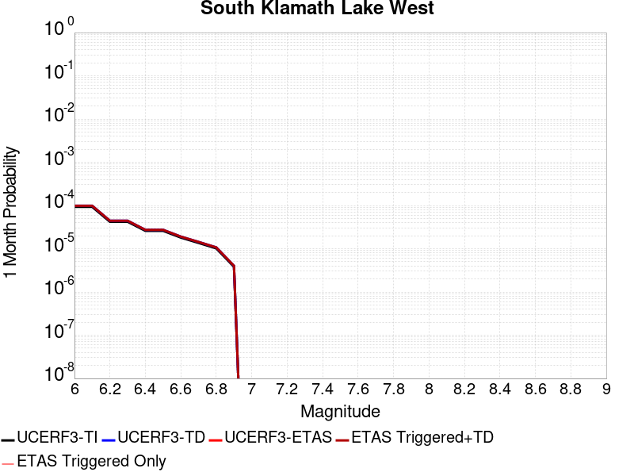 |  |  |

| Magnitude | 1 wk TI Prob | 1 wk TD Prob | 1 wk ETAS Prob | 1 wk ETAS/TD Gain | 1 wk ETAS Triggered+TD | 1 wk ETAS Triggered Only | 1 mo TI Prob | 1 mo TD Prob | 1 mo ETAS Prob | 1 mo ETAS/TD Gain | 1 mo ETAS Triggered+TD | 1 mo ETAS Triggered Only | 1 yr TI Prob | 1 yr TD Prob | 1 yr ETAS Prob | 1 yr ETAS/TD Gain | 1 yr ETAS Triggered+TD | 1 yr ETAS Triggered Only | 10 yr TI Prob | 10 yr TD Prob | 10 yr ETAS Prob | 10 yr ETAS/TD Gain | 10 yr ETAS Triggered+TD | 10 yr ETAS Triggered Only |
|-----|-----|-----|-----|-----|-----|-----|-----|-----|-----|-----|-----|-----|-----|-----|-----|-----|-----|-----|-----|-----|-----|-----|-----|-----|
| 6.0 | 2.174025E-5 | 2.3027618E-5 | 0.0 | 0.0 | 2.3027618E-5 | 0.0 | 9.3169176E-5 | 9.868643E-5 | 0.0 | 0.0 | 9.868643E-5 | 0.0 | 0.0011337444 | 0.0012009108 | 0.0011 | 0.91597146 | 0.0012009108 | 0.0 | 0.011279777 | 0.011950803 | 0.0113 | 0.9455431 | 0.013037657 | 0.0011 |
| 6.1 | 2.174025E-5 | 2.3027618E-5 | 0.0 | 0.0 | 2.3027618E-5 | 0.0 | 9.3169176E-5 | 9.868643E-5 | 0.0 | 0.0 | 9.868643E-5 | 0.0 | 0.0011337444 | 0.0012009108 | 0.0011 | 0.91597146 | 0.0012009108 | 0.0 | 0.011279777 | 0.011950803 | 0.0113 | 0.9455431 | 0.013037657 | 0.0011 |
| 6.2 | 9.834929E-6 | 1.03876755E-5 | 0.0 | 0.0 | 1.03876755E-5 | 0.0 | 4.2149015E-5 | 4.45179E-5 | 0.0 | 0.0 | 4.45179E-5 | 0.0 | 5.1304343E-4 | 5.418797E-4 | 7.0E-4 | 1.2917997 | 5.418797E-4 | 0.0 | 0.0051186057 | 0.0054064845 | 0.0051 | 0.94331175 | 0.005903781 | 5.0E-4 |
| 6.3 | 9.834929E-6 | 1.03876755E-5 | 0.0 | 0.0 | 1.03876755E-5 | 0.0 | 4.2149015E-5 | 4.45179E-5 | 0.0 | 0.0 | 4.45179E-5 | 0.0 | 5.1304343E-4 | 5.418797E-4 | 7.0E-4 | 1.2917997 | 5.418797E-4 | 0.0 | 0.0051186057 | 0.0054064845 | 0.0051 | 0.94331175 | 0.005903781 | 5.0E-4 |
| 6.4 | 6.066321E-6 | 6.3967505E-6 | 0.0 | 0.0 | 6.3967505E-6 | 0.0 | 2.5998259E-5 | 2.7414373E-5 | 0.0 | 0.0 | 2.7414373E-5 | 0.0 | 3.1648282E-4 | 3.3372157E-4 | 3.0E-4 | 0.89895296 | 3.3372157E-4 | 0.0 | 0.0031603249 | 0.0033324743 | 0.0029 | 0.87022424 | 0.0035318078 | 2.0E-4 |
| 6.5 | 6.066321E-6 | 6.3967505E-6 | 0.0 | 0.0 | 6.3967505E-6 | 0.0 | 2.5998259E-5 | 2.7414373E-5 | 0.0 | 0.0 | 2.7414373E-5 | 0.0 | 3.1648282E-4 | 3.3372157E-4 | 3.0E-4 | 0.89895296 | 3.3372157E-4 | 0.0 | 0.0031603249 | 0.0033324743 | 0.0029 | 0.87022424 | 0.0035318078 | 2.0E-4 |
| 6.6 | 4.2321803E-6 | 4.4587705E-6 | 0.0 | 0.0 | 4.4587705E-6 | 0.0 | 1.8137789E-5 | 1.9108884E-5 | 0.0 | 0.0 | 1.9108884E-5 | 0.0 | 2.208052E-4 | 2.3262684E-4 | 1.0E-4 | 0.42987302 | 2.3262684E-4 | 0.0 | 0.0022058594 | 0.002323935 | 0.0018 | 0.7745483 | 0.002323935 | 0.0 |
| 6.7 | 3.186646E-6 | 3.358394E-6 | 0.0 | 0.0 | 3.358394E-6 | 0.0 | 1.3656982E-5 | 1.4393042E-5 | 0.0 | 0.0 | 1.4393042E-5 | 0.0 | 1.6626107E-4 | 1.7522187E-4 | 1.0E-4 | 0.570705 | 1.7522187E-4 | 0.0 | 0.0016613674 | 0.0017509041 | 0.0014 | 0.7995869 | 0.0017509041 | 0.0 |
| 6.8 | 2.380121E-6 | 2.509467E-6 | 0.0 | 0.0 | 2.509467E-6 | 0.0 | 1.0200479E-5 | 1.0754818E-5 | 0.0 | 0.0 | 1.0754818E-5 | 0.0 | 1.2418375E-4 | 1.309325E-4 | 1.0E-4 | 0.76375234 | 1.309325E-4 | 0.0 | 0.0012411437 | 0.0013085994 | 0.0012 | 0.917011 | 0.0013085994 | 0.0 |
| 6.9 | 8.928287E-7 | 9.4247173E-7 | 0.0 | 0.0 | 9.4247173E-7 | 0.0 | 3.826403E-6 | 4.0391596E-6 | 0.0 | 0.0 | 4.0391596E-6 | 0.0 | 4.658546E-5 | 4.917588E-5 | 1.0E-4 | 2.0335174 | 4.917588E-5 | 0.0 | 4.6575698E-4 | 4.9167156E-4 | 3.0E-4 | 0.6101634 | 4.9167156E-4 | 0.0 |

## Mission Hills 2011
*[(top)](#table-of-contents)*

| 1 Week | 1 Month | 1 Year | 10 Year |
|-----|-----|-----|-----|
|  |  |  |  |

| Magnitude | 1 wk TI Prob | 1 wk TD Prob | 1 wk ETAS Prob | 1 wk ETAS/TD Gain | 1 wk ETAS Triggered+TD | 1 wk ETAS Triggered Only | 1 mo TI Prob | 1 mo TD Prob | 1 mo ETAS Prob | 1 mo ETAS/TD Gain | 1 mo ETAS Triggered+TD | 1 mo ETAS Triggered Only | 1 yr TI Prob | 1 yr TD Prob | 1 yr ETAS Prob | 1 yr ETAS/TD Gain | 1 yr ETAS Triggered+TD | 1 yr ETAS Triggered Only | 10 yr TI Prob | 10 yr TD Prob | 10 yr ETAS Prob | 10 yr ETAS/TD Gain | 10 yr ETAS Triggered+TD | 10 yr ETAS Triggered Only |
|-----|-----|-----|-----|-----|-----|-----|-----|-----|-----|-----|-----|-----|-----|-----|-----|-----|-----|-----|-----|-----|-----|-----|-----|-----|
| 6.0 | 1.8765717E-5 | 1.9021598E-5 | 0.0 | 0.0 | 1.9021598E-5 | 0.0 | 8.0422025E-5 | 8.152052E-5 | 0.0 | 0.0 | 8.152052E-5 | 0.0 | 9.786983E-4 | 9.924026E-4 | 1.0E-4 | 0.100765556 | 9.924026E-4 | 0.0 | 0.009743992 | 0.00991326 | 0.0061 | 0.61533743 | 0.011497399 | 0.0016 |
| 6.1 | 1.8765717E-5 | 1.9021598E-5 | 0.0 | 0.0 | 1.9021598E-5 | 0.0 | 8.0422025E-5 | 8.152052E-5 | 0.0 | 0.0 | 8.152052E-5 | 0.0 | 9.786983E-4 | 9.924026E-4 | 1.0E-4 | 0.100765556 | 9.924026E-4 | 0.0 | 0.009743992 | 0.00991326 | 0.0061 | 0.61533743 | 0.011497399 | 0.0016 |
| 6.2 | 1.8765717E-5 | 1.9021598E-5 | 0.0 | 0.0 | 1.9021598E-5 | 0.0 | 8.0422025E-5 | 8.152052E-5 | 0.0 | 0.0 | 8.152052E-5 | 0.0 | 9.786983E-4 | 9.924026E-4 | 1.0E-4 | 0.100765556 | 9.924026E-4 | 0.0 | 0.009743992 | 0.00991326 | 0.0061 | 0.61533743 | 0.011497399 | 0.0016 |
| 6.3 | 1.8765717E-5 | 1.9021598E-5 | 0.0 | 0.0 | 1.9021598E-5 | 0.0 | 8.0422025E-5 | 8.152052E-5 | 0.0 | 0.0 | 8.152052E-5 | 0.0 | 9.786983E-4 | 9.924026E-4 | 1.0E-4 | 0.100765556 | 9.924026E-4 | 0.0 | 0.009743992 | 0.00991326 | 0.0061 | 0.61533743 | 0.011497399 | 0.0016 |
| 6.4 | 4.566357E-6 | 2.5101976E-6 | 0.0 | 0.0 | 2.5101976E-6 | 0.0 | 1.9569954E-5 | 1.0757955E-5 | 0.0 | 0.0 | 1.0757955E-5 | 0.0 | 2.3823815E-4 | 1.3097204E-4 | 0.0 | 0.0 | 1.3097204E-4 | 0.0 | 0.002379829 | 0.001309126 | 4.0E-4 | 0.30554736 | 0.001309126 | 0.0 |
| 6.5 | 4.566357E-6 | 2.5101976E-6 | 0.0 | 0.0 | 2.5101976E-6 | 0.0 | 1.9569954E-5 | 1.0757955E-5 | 0.0 | 0.0 | 1.0757955E-5 | 0.0 | 2.3823815E-4 | 1.3097204E-4 | 0.0 | 0.0 | 1.3097204E-4 | 0.0 | 0.002379829 | 0.001309126 | 4.0E-4 | 0.30554736 | 0.001309126 | 0.0 |
| 6.6 | 4.566357E-6 | 2.5101976E-6 | 0.0 | 0.0 | 2.5101976E-6 | 0.0 | 1.9569954E-5 | 1.0757955E-5 | 0.0 | 0.0 | 1.0757955E-5 | 0.0 | 2.3823815E-4 | 1.3097204E-4 | 0.0 | 0.0 | 1.3097204E-4 | 0.0 | 0.002379829 | 0.001309126 | 4.0E-4 | 0.30554736 | 0.001309126 | 0.0 |
| 6.7 | 2.3266773E-6 | 1.3273985E-6 | 0.0 | 0.0 | 1.3273985E-6 | 0.0 | 9.971435E-6 | 5.688839E-6 | 0.0 | 0.0 | 5.688839E-6 | 0.0 | 1.2139547E-4 | 6.925948E-5 | 0.0 | 0.0 | 6.925948E-5 | 0.0 | 0.0012132917 | 6.9238496E-4 | 2.0E-4 | 0.28885666 | 6.9238496E-4 | 0.0 |
| 6.8 | 2.032735E-6 | 1.1874002E-6 | 0.0 | 0.0 | 1.1874002E-6 | 0.0 | 8.711692E-6 | 5.0888484E-6 | 0.0 | 0.0 | 5.0888484E-6 | 0.0 | 1.06059684E-4 | 6.195502E-5 | 0.0 | 0.0 | 6.195502E-5 | 0.0 | 0.0010600908 | 6.193823E-4 | 2.0E-4 | 0.32290235 | 6.193823E-4 | 0.0 |
| 6.9 | 1.3186259E-6 | 1.0546239E-6 | 0.0 | 0.0 | 1.0546239E-6 | 0.0 | 5.6512413E-6 | 4.519809E-6 | 0.0 | 0.0 | 4.519809E-6 | 0.0 | 6.8801695E-5 | 5.5027314E-5 | 0.0 | 0.0 | 5.5027314E-5 | 0.0 | 6.8780396E-4 | 5.5013987E-4 | 2.0E-4 | 0.3635439 | 5.5013987E-4 | 0.0 |
| 7.0 | 1.2726016E-6 | 1.0143791E-6 | 0.0 | 0.0 | 1.0143791E-6 | 0.0 | 5.4539955E-6 | 4.347332E-6 | 0.0 | 0.0 | 4.347332E-6 | 0.0 | 6.6400375E-5 | 5.2927506E-5 | 0.0 | 0.0 | 5.2927506E-5 | 0.0 | 6.6380535E-4 | 5.291519E-4 | 2.0E-4 | 0.37796333 | 5.291519E-4 | 0.0 |
| 7.1 | 1.2063913E-6 | 9.555864E-7 | 0.0 | 0.0 | 9.555864E-7 | 0.0 | 5.170238E-6 | 4.095364E-6 | 0.0 | 0.0 | 4.095364E-6 | 0.0 | 6.294583E-5 | 4.9859944E-5 | 0.0 | 0.0 | 4.9859944E-5 | 0.0 | 6.2928005E-4 | 4.984901E-4 | 2.0E-4 | 0.4012116 | 4.984901E-4 | 0.0 |
| 7.2 | 9.105806E-7 | 7.3639194E-7 | 0.0 | 0.0 | 7.3639194E-7 | 0.0 | 3.9024826E-6 | 3.1559618E-6 | 0.0 | 0.0 | 3.1559618E-6 | 0.0 | 4.7511687E-5 | 3.842317E-5 | 0.0 | 0.0 | 3.842317E-5 | 0.0 | 4.7501532E-4 | 3.8416684E-4 | 2.0E-4 | 0.5206071 | 3.8416684E-4 | 0.0 |
| 7.3 | 7.020432E-7 | 5.6998084E-7 | 0.0 | 0.0 | 5.6998084E-7 | 0.0 | 3.0087533E-6 | 2.442773E-6 | 0.0 | 0.0 | 2.442773E-6 | 0.0 | 3.6630954E-5 | 2.9740368E-5 | 0.0 | 0.0 | 2.9740368E-5 | 0.0 | 3.6624918E-4 | 2.973652E-4 | 2.0E-4 | 0.6725737 | 2.973652E-4 | 0.0 |
| 7.4 | 5.3900635E-7 | 4.4389245E-7 | 0.0 | 0.0 | 4.4389245E-7 | 0.0 | 2.3100251E-6 | 1.902395E-6 | 0.0 | 0.0 | 1.902395E-6 | 0.0 | 2.8124194E-5 | 2.3161425E-5 | 0.0 | 0.0 | 2.3161425E-5 | 0.0 | 2.8120633E-4 | 2.3159132E-4 | 1.0E-4 | 0.43179512 | 2.3159132E-4 | 0.0 |
| 7.5 | 2.907075E-7 | 2.280401E-7 | 0.0 | 0.0 | 2.280401E-7 | 0.0 | 1.2458887E-6 | 9.773144E-7 | 0.0 | 0.0 | 9.773144E-7 | 0.0 | 1.5168589E-5 | 1.1898739E-5 | 0.0 | 0.0 | 1.1898739E-5 | 0.0 | 1.5167553E-4 | 1.18981196E-4 | 1.0E-4 | 0.84046894 | 1.18981196E-4 | 0.0 |
| 7.6 | 1.6903675E-7 | 1.2291261E-7 | 0.0 | 0.0 | 1.2291261E-7 | 0.0 | 7.2444305E-7 | 5.267682E-7 | 0.0 | 0.0 | 5.267682E-7 | 0.0 | 8.820059E-6 | 6.4133856E-6 | 0.0 | 0.0 | 6.4133856E-6 | 0.0 | 8.8197085E-5 | 6.4132124E-5 | 1.0E-4 | 1.5592809 | 6.4132124E-5 | 0.0 |
| 7.7 | 7.168073E-8 | 3.893984E-8 | 0.0 | 0.0 | 3.893984E-8 | 0.0 | 3.072031E-7 | 1.6688503E-7 | 0.0 | 0.0 | 1.6688503E-7 | 0.0 | 3.7401915E-6 | 2.0318234E-6 | 0.0 | 0.0 | 2.0318234E-6 | 0.0 | 3.7401285E-5 | 2.0318059E-5 | 0.0 | 0.0 | 2.0318059E-5 | 0.0 |
| 7.8 | 6.564101E-8 | 3.364574E-8 | 0.0 | 0.0 | 3.364574E-8 | 0.0 | 2.813186E-7 | 1.4419602E-7 | 0.0 | 0.0 | 1.4419602E-7 | 0.0 | 3.4250486E-6 | 1.7555852E-6 | 0.0 | 0.0 | 1.7555852E-6 | 0.0 | 3.424996E-5 | 1.7555723E-5 | 0.0 | 0.0 | 1.7555723E-5 | 0.0 |
| 7.9 | 1.0029074E-8 | 3.6999679E-9 | 0.0 | 0.0 | 3.6999679E-9 | 0.0 | 4.2981743E-8 | 1.5857005E-8 | 0.0 | 0.0 | 1.5857005E-8 | 0.0 | 5.2330256E-7 | 1.9305904E-7 | 0.0 | 0.0 | 1.9305904E-7 | 0.0 | 5.2330133E-6 | 1.9305896E-6 | 0.0 | 0.0 | 1.9305896E-6 | 0.0 |

## Robinson Creek
*[(top)](#table-of-contents)*

| 1 Week | 1 Month | 1 Year | 10 Year |
|-----|-----|-----|-----|
|  |  |  |  |

| Magnitude | 1 wk TI Prob | 1 wk TD Prob | 1 wk ETAS Prob | 1 wk ETAS/TD Gain | 1 wk ETAS Triggered+TD | 1 wk ETAS Triggered Only | 1 mo TI Prob | 1 mo TD Prob | 1 mo ETAS Prob | 1 mo ETAS/TD Gain | 1 mo ETAS Triggered+TD | 1 mo ETAS Triggered Only | 1 yr TI Prob | 1 yr TD Prob | 1 yr ETAS Prob | 1 yr ETAS/TD Gain | 1 yr ETAS Triggered+TD | 1 yr ETAS Triggered Only | 10 yr TI Prob | 10 yr TD Prob | 10 yr ETAS Prob | 10 yr ETAS/TD Gain | 10 yr ETAS Triggered+TD | 10 yr ETAS Triggered Only |
|-----|-----|-----|-----|-----|-----|-----|-----|-----|-----|-----|-----|-----|-----|-----|-----|-----|-----|-----|-----|-----|-----|-----|-----|-----|
| 6.0 | 1.3705327E-5 | 1.526664E-5 | 0.0 | 0.0 | 1.526664E-5 | 0.0 | 5.8735794E-5 | 6.542846E-5 | 0.0 | 0.0 | 6.542846E-5 | 0.0 | 7.1487366E-4 | 7.965915E-4 | 8.0E-4 | 1.0042789 | 0.0011962729 | 4.0E-4 | 0.0071257832 | 0.007965915 | 0.0053 | 0.66533476 | 0.00955317 | 0.0016 |
| 6.1 | 1.3705327E-5 | 1.526664E-5 | 0.0 | 0.0 | 1.526664E-5 | 0.0 | 5.8735794E-5 | 6.542846E-5 | 0.0 | 0.0 | 6.542846E-5 | 0.0 | 7.1487366E-4 | 7.965915E-4 | 8.0E-4 | 1.0042789 | 0.0011962729 | 4.0E-4 | 0.0071257832 | 0.007965915 | 0.0053 | 0.66533476 | 0.00955317 | 0.0016 |
| 6.2 | 1.3705327E-5 | 1.526664E-5 | 0.0 | 0.0 | 1.526664E-5 | 0.0 | 5.8735794E-5 | 6.542846E-5 | 0.0 | 0.0 | 6.542846E-5 | 0.0 | 7.1487366E-4 | 7.965915E-4 | 8.0E-4 | 1.0042789 | 0.0011962729 | 4.0E-4 | 0.0071257832 | 0.007965915 | 0.0053 | 0.66533476 | 0.00955317 | 0.0016 |
| 6.3 | 1.3705327E-5 | 1.526664E-5 | 0.0 | 0.0 | 1.526664E-5 | 0.0 | 5.8735794E-5 | 6.542846E-5 | 0.0 | 0.0 | 6.542846E-5 | 0.0 | 7.1487366E-4 | 7.965915E-4 | 8.0E-4 | 1.0042789 | 0.0011962729 | 4.0E-4 | 0.0071257832 | 0.007965915 | 0.0053 | 0.66533476 | 0.00955317 | 0.0016 |
| 6.4 | 1.3705327E-5 | 1.526664E-5 | 0.0 | 0.0 | 1.526664E-5 | 0.0 | 5.8735794E-5 | 6.542846E-5 | 0.0 | 0.0 | 6.542846E-5 | 0.0 | 7.1487366E-4 | 7.965915E-4 | 8.0E-4 | 1.0042789 | 0.0011962729 | 4.0E-4 | 0.0071257832 | 0.007965915 | 0.0053 | 0.66533476 | 0.00955317 | 0.0016 |

## Little Salmon (Offshore)
*[(top)](#table-of-contents)*

| 1 Week | 1 Month | 1 Year | 10 Year |
|-----|-----|-----|-----|
|  | 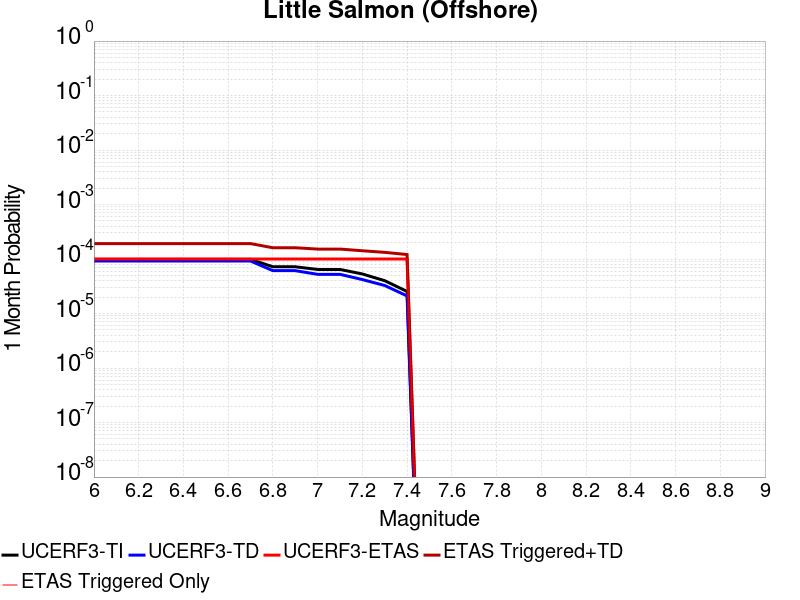 |  | 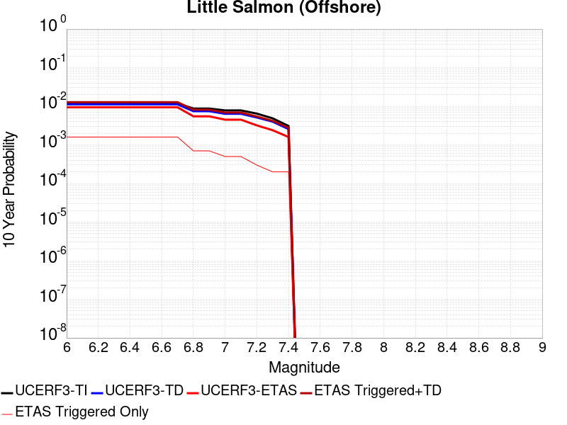 |

| Magnitude | 1 wk TI Prob | 1 wk TD Prob | 1 wk ETAS Prob | 1 wk ETAS/TD Gain | 1 wk ETAS Triggered+TD | 1 wk ETAS Triggered Only | 1 mo TI Prob | 1 mo TD Prob | 1 mo ETAS Prob | 1 mo ETAS/TD Gain | 1 mo ETAS Triggered+TD | 1 mo ETAS Triggered Only | 1 yr TI Prob | 1 yr TD Prob | 1 yr ETAS Prob | 1 yr ETAS/TD Gain | 1 yr ETAS Triggered+TD | 1 yr ETAS Triggered Only | 10 yr TI Prob | 10 yr TD Prob | 10 yr ETAS Prob | 10 yr ETAS/TD Gain | 10 yr ETAS Triggered+TD | 10 yr ETAS Triggered Only |
|-----|-----|-----|-----|-----|-----|-----|-----|-----|-----|-----|-----|-----|-----|-----|-----|-----|-----|-----|-----|-----|-----|-----|-----|-----|
| 6.0 | 2.3052053E-5 | 2.1499658E-5 | 1.0E-4 | 4.651237 | 1.21497505E-4 | 1.0E-4 | 9.879077E-5 | 9.213878E-5 | 1.0E-4 | 1.0853194 | 1.9212956E-4 | 1.0E-4 | 0.0012021139 | 0.0011213263 | 6.0E-4 | 0.5350806 | 0.001321102 | 2.0E-4 | 0.011956319 | 0.011187837 | 0.0094 | 0.8401981 | 0.012769937 | 0.0016 |
| 6.1 | 2.3052053E-5 | 2.1499658E-5 | 1.0E-4 | 4.651237 | 1.21497505E-4 | 1.0E-4 | 9.879077E-5 | 9.213878E-5 | 1.0E-4 | 1.0853194 | 1.9212956E-4 | 1.0E-4 | 0.0012021139 | 0.0011213263 | 6.0E-4 | 0.5350806 | 0.001321102 | 2.0E-4 | 0.011956319 | 0.011187837 | 0.0094 | 0.8401981 | 0.012769937 | 0.0016 |
| 6.2 | 2.3052053E-5 | 2.1499658E-5 | 1.0E-4 | 4.651237 | 1.21497505E-4 | 1.0E-4 | 9.879077E-5 | 9.213878E-5 | 1.0E-4 | 1.0853194 | 1.9212956E-4 | 1.0E-4 | 0.0012021139 | 0.0011213263 | 6.0E-4 | 0.5350806 | 0.001321102 | 2.0E-4 | 0.011956319 | 0.011187837 | 0.0094 | 0.8401981 | 0.012769937 | 0.0016 |
| 6.3 | 2.3052053E-5 | 2.1499658E-5 | 1.0E-4 | 4.651237 | 1.21497505E-4 | 1.0E-4 | 9.879077E-5 | 9.213878E-5 | 1.0E-4 | 1.0853194 | 1.9212956E-4 | 1.0E-4 | 0.0012021139 | 0.0011213263 | 6.0E-4 | 0.5350806 | 0.001321102 | 2.0E-4 | 0.011956319 | 0.011187837 | 0.0094 | 0.8401981 | 0.012769937 | 0.0016 |
| 6.4 | 2.3052053E-5 | 2.1499658E-5 | 1.0E-4 | 4.651237 | 1.21497505E-4 | 1.0E-4 | 9.879077E-5 | 9.213878E-5 | 1.0E-4 | 1.0853194 | 1.9212956E-4 | 1.0E-4 | 0.0012021139 | 0.0011213263 | 6.0E-4 | 0.5350806 | 0.001321102 | 2.0E-4 | 0.011956319 | 0.011187837 | 0.0094 | 0.8401981 | 0.012769937 | 0.0016 |
| 6.5 | 2.3052053E-5 | 2.1499658E-5 | 1.0E-4 | 4.651237 | 1.21497505E-4 | 1.0E-4 | 9.879077E-5 | 9.213878E-5 | 1.0E-4 | 1.0853194 | 1.9212956E-4 | 1.0E-4 | 0.0012021139 | 0.0011213263 | 6.0E-4 | 0.5350806 | 0.001321102 | 2.0E-4 | 0.011956319 | 0.011187837 | 0.0094 | 0.8401981 | 0.012769937 | 0.0016 |
| 6.6 | 2.3052053E-5 | 2.1499658E-5 | 1.0E-4 | 4.651237 | 1.21497505E-4 | 1.0E-4 | 9.879077E-5 | 9.213878E-5 | 1.0E-4 | 1.0853194 | 1.9212956E-4 | 1.0E-4 | 0.0012021139 | 0.0011213263 | 6.0E-4 | 0.5350806 | 0.001321102 | 2.0E-4 | 0.011956319 | 0.011187837 | 0.0094 | 0.8401981 | 0.012769937 | 0.0016 |
| 6.7 | 2.3052053E-5 | 2.1499658E-5 | 1.0E-4 | 4.651237 | 1.21497505E-4 | 1.0E-4 | 9.879077E-5 | 9.213878E-5 | 1.0E-4 | 1.0853194 | 1.9212956E-4 | 1.0E-4 | 0.0012021139 | 0.0011213263 | 6.0E-4 | 0.5350806 | 0.001321102 | 2.0E-4 | 0.011956319 | 0.011187837 | 0.0094 | 0.8401981 | 0.012769937 | 0.0016 |
| 6.8 | 1.683878E-5 | 1.4291685E-5 | 1.0E-4 | 6.997075 | 1.14290255E-4 | 1.0E-4 | 7.21642E-5 | 6.1248924E-5 | 1.0E-4 | 1.6326817 | 1.612428E-4 | 1.0E-4 | 8.78245E-4 | 7.455008E-4 | 4.0E-4 | 0.5365521 | 8.454262E-4 | 1.0E-4 | 0.008747822 | 0.007454923 | 0.0055 | 0.7377675 | 0.008149704 | 7.0E-4 |
| 6.9 | 1.683878E-5 | 1.4291685E-5 | 1.0E-4 | 6.997075 | 1.14290255E-4 | 1.0E-4 | 7.21642E-5 | 6.1248924E-5 | 1.0E-4 | 1.6326817 | 1.612428E-4 | 1.0E-4 | 8.78245E-4 | 7.455008E-4 | 4.0E-4 | 0.5365521 | 8.454262E-4 | 1.0E-4 | 0.008747822 | 0.007454923 | 0.0055 | 0.7377675 | 0.008149704 | 7.0E-4 |
| 7.0 | 1.5051273E-5 | 1.2243148E-5 | 1.0E-4 | 8.167834 | 1.1224193E-4 | 1.0E-4 | 6.450386E-5 | 5.2469833E-5 | 1.0E-4 | 1.905857 | 1.5246459E-4 | 1.0E-4 | 7.8505155E-4 | 6.386783E-4 | 2.0E-4 | 0.3131467 | 7.386144E-4 | 1.0E-4 | 0.00782284 | 0.0063928757 | 0.0045 | 0.70390856 | 0.0068896795 | 5.0E-4 |
| 7.1 | 1.5051273E-5 | 1.2243148E-5 | 1.0E-4 | 8.167834 | 1.1224193E-4 | 1.0E-4 | 6.450386E-5 | 5.2469833E-5 | 1.0E-4 | 1.905857 | 1.5246459E-4 | 1.0E-4 | 7.8505155E-4 | 6.386783E-4 | 2.0E-4 | 0.3131467 | 7.386144E-4 | 1.0E-4 | 0.00782284 | 0.0063928757 | 0.0045 | 0.70390856 | 0.0068896795 | 5.0E-4 |
| 7.2 | 1.24301405E-5 | 9.815183E-6 | 1.0E-4 | 10.188297 | 1.098142E-4 | 1.0E-4 | 5.3270942E-5 | 4.2064614E-5 | 1.0E-4 | 2.377295 | 1.4206041E-4 | 1.0E-4 | 6.483807E-4 | 5.120557E-4 | 2.0E-4 | 0.39058253 | 6.120045E-4 | 1.0E-4 | 0.006464922 | 0.005132409 | 0.0032 | 0.62348896 | 0.005430869 | 3.0E-4 |
| 7.3 | 9.3599865E-6 | 7.63674E-6 | 1.0E-4 | 13.094594 | 1.0763598E-4 | 1.0E-4 | 4.011361E-5 | 3.2728673E-5 | 1.0E-4 | 3.055425 | 1.327254E-4 | 1.0E-4 | 4.8827377E-4 | 3.9843383E-4 | 2.0E-4 | 0.5019654 | 4.9839396E-4 | 1.0E-4 | 0.004872023 | 0.0039928746 | 0.0024 | 0.6010707 | 0.004192076 | 2.0E-4 |
| 7.4 | 5.941556E-6 | 4.913584E-6 | 1.0E-4 | 20.351744 | 1.04913095E-4 | 1.0E-4 | 2.5463563E-5 | 2.1058217E-5 | 1.0E-4 | 4.74874 | 1.2105611E-4 | 1.0E-4 | 3.0997477E-4 | 2.5638376E-4 | 1.0E-4 | 0.39004028 | 3.5635813E-4 | 1.0E-4 | 0.0030954275 | 0.0025715034 | 0.0016 | 0.6222041 | 0.0027709892 | 2.0E-4 |

## Santa Rosa Island
*[(top)](#table-of-contents)*

| 1 Week | 1 Month | 1 Year | 10 Year |
|-----|-----|-----|-----|
|  |  | 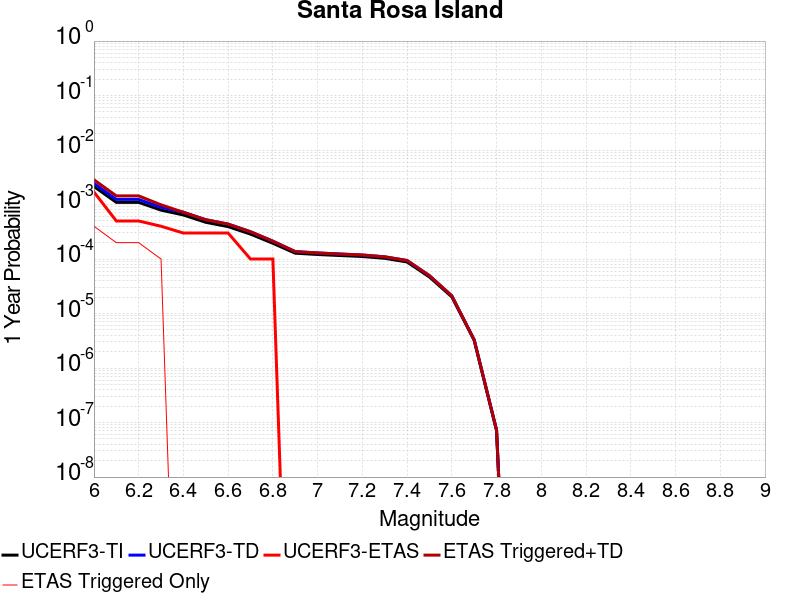 | 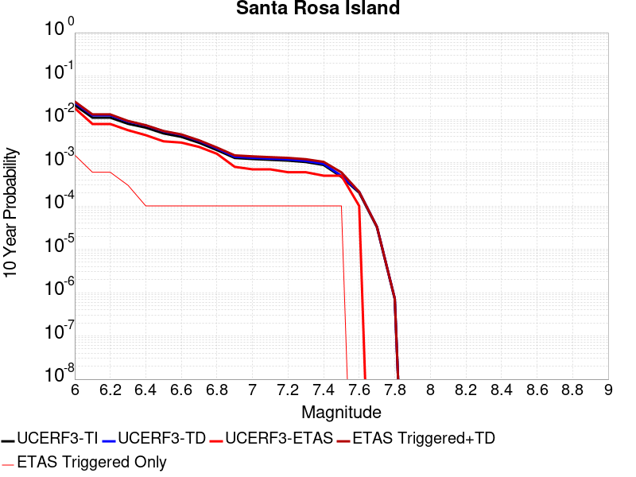 |

| Magnitude | 1 wk TI Prob | 1 wk TD Prob | 1 wk ETAS Prob | 1 wk ETAS/TD Gain | 1 wk ETAS Triggered+TD | 1 wk ETAS Triggered Only | 1 mo TI Prob | 1 mo TD Prob | 1 mo ETAS Prob | 1 mo ETAS/TD Gain | 1 mo ETAS Triggered+TD | 1 mo ETAS Triggered Only | 1 yr TI Prob | 1 yr TD Prob | 1 yr ETAS Prob | 1 yr ETAS/TD Gain | 1 yr ETAS Triggered+TD | 1 yr ETAS Triggered Only | 10 yr TI Prob | 10 yr TD Prob | 10 yr ETAS Prob | 10 yr ETAS/TD Gain | 10 yr ETAS Triggered+TD | 10 yr ETAS Triggered Only |
|-----|-----|-----|-----|-----|-----|-----|-----|-----|-----|-----|-----|-----|-----|-----|-----|-----|-----|-----|-----|-----|-----|-----|-----|-----|
| 6.0 | 4.1143165E-5 | 4.701977E-5 | 0.0 | 0.0 | 4.701977E-5 | 0.0 | 1.7631594E-4 | 2.0149884E-4 | 1.0E-4 | 0.4962808 | 3.014787E-4 | 1.0E-4 | 0.002144533 | 0.002450684 | 0.0017 | 0.69368386 | 0.002849704 | 4.0E-4 | 0.021239553 | 0.024257159 | 0.0181 | 0.7461715 | 0.025720773 | 0.0015 |
| 6.1 | 2.1061249E-5 | 2.3831648E-5 | 0.0 | 0.0 | 2.3831648E-5 | 0.0 | 9.0259375E-5 | 1.021318E-4 | 1.0E-4 | 0.979127 | 2.0212159E-4 | 1.0E-4 | 0.0010983539 | 0.0012427742 | 5.0E-4 | 0.4023257 | 0.0014425257 | 2.0E-4 | 0.01092941 | 0.012361274 | 0.0078 | 0.6310029 | 0.012953858 | 6.0E-4 |
| 6.2 | 2.1061249E-5 | 2.3831648E-5 | 0.0 | 0.0 | 2.3831648E-5 | 0.0 | 9.0259375E-5 | 1.021318E-4 | 1.0E-4 | 0.979127 | 2.0212159E-4 | 1.0E-4 | 0.0010983539 | 0.0012427742 | 5.0E-4 | 0.4023257 | 0.0014425257 | 2.0E-4 | 0.01092941 | 0.012361274 | 0.0078 | 0.6310029 | 0.012953858 | 6.0E-4 |
| 6.3 | 1.5158236E-5 | 1.7051776E-5 | 0.0 | 0.0 | 1.7051776E-5 | 0.0 | 6.496225E-5 | 7.307706E-5 | 0.0 | 0.0 | 7.307706E-5 | 0.0 | 7.906284E-4 | 8.89362E-4 | 4.0E-4 | 0.44976062 | 9.892731E-4 | 1.0E-4 | 0.007878214 | 0.008859277 | 0.0056 | 0.63210577 | 0.009156619 | 3.0E-4 |
| 6.4 | 1.2341918E-5 | 1.3835114E-5 | 0.0 | 0.0 | 1.3835114E-5 | 0.0 | 5.2892858E-5 | 5.9292044E-5 | 0.0 | 0.0 | 5.9292044E-5 | 0.0 | 6.437803E-4 | 7.216496E-4 | 3.0E-4 | 0.4157142 | 7.216496E-4 | 0.0 | 0.006419184 | 0.007193897 | 0.0043 | 0.5977289 | 0.0072931773 | 1.0E-4 |
| 6.5 | 9.061158E-6 | 1.0104637E-5 | 0.0 | 0.0 | 1.0104637E-5 | 0.0 | 3.883296E-5 | 4.33049E-5 | 0.0 | 0.0 | 4.33049E-5 | 0.0 | 4.726887E-4 | 5.271149E-4 | 3.0E-4 | 0.56913584 | 5.271149E-4 | 0.0 | 0.004716845 | 0.005259183 | 0.0031 | 0.5894452 | 0.005358657 | 1.0E-4 |
| 6.6 | 7.5461685E-6 | 8.390719E-6 | 0.0 | 0.0 | 8.390719E-6 | 0.0 | 3.2340322E-5 | 3.595975E-5 | 0.0 | 0.0 | 3.595975E-5 | 0.0 | 3.936723E-4 | 4.377263E-4 | 3.0E-4 | 0.6853598 | 4.377263E-4 | 0.0 | 0.003929756 | 0.00436907 | 0.0029 | 0.6637569 | 0.004468633 | 1.0E-4 |
| 6.7 | 5.5023775E-6 | 6.080548E-6 | 0.0 | 0.0 | 6.080548E-6 | 0.0 | 2.3581404E-5 | 2.605925E-5 | 0.0 | 0.0 | 2.605925E-5 | 0.0 | 2.8706578E-4 | 3.172284E-4 | 1.0E-4 | 0.31523028 | 3.172284E-4 | 0.0 | 0.0028669522 | 0.0031680765 | 0.0023 | 0.72599256 | 0.0032677597 | 1.0E-4 |
| 6.8 | 3.7351679E-6 | 4.079111E-6 | 0.0 | 0.0 | 4.079111E-6 | 0.0 | 1.6007763E-5 | 1.7481801E-5 | 0.0 | 0.0 | 1.7481801E-5 | 0.0 | 1.948771E-4 | 2.1282263E-4 | 1.0E-4 | 0.46987483 | 2.1282263E-4 | 0.0 | 0.0019470629 | 0.0021264327 | 0.0016 | 0.7524339 | 0.00222622 | 1.0E-4 |
| 6.9 | 2.456366E-6 | 2.6273171E-6 | 0.0 | 0.0 | 2.6273171E-6 | 0.0 | 1.0527241E-5 | 1.1259883E-5 | 0.0 | 0.0 | 1.1259883E-5 | 0.0 | 1.2816161E-4 | 1.3708047E-4 | 0.0 | 0.0 | 1.3708047E-4 | 0.0 | 0.0012808773 | 0.0013699621 | 8.0E-4 | 0.5839578 | 0.001469825 | 1.0E-4 |
| 7.0 | 2.3245157E-6 | 2.480995E-6 | 0.0 | 0.0 | 2.480995E-6 | 0.0 | 9.962172E-6 | 1.0632792E-5 | 0.0 | 0.0 | 1.0632792E-5 | 0.0 | 1.2128269E-4 | 1.2944658E-4 | 0.0 | 0.0 | 1.2944658E-4 | 0.0 | 0.0012121652 | 0.0012937139 | 7.0E-4 | 0.54107785 | 0.0013935845 | 1.0E-4 |
| 7.1 | 2.2248344E-6 | 2.3715795E-6 | 0.0 | 0.0 | 2.3715795E-6 | 0.0 | 9.53497E-6 | 1.0163873E-5 | 0.0 | 0.0 | 1.0163873E-5 | 0.0 | 1.1608207E-4 | 1.2373815E-4 | 0.0 | 0.0 | 1.2373815E-4 | 0.0 | 0.0011602144 | 0.0012366944 | 7.0E-4 | 0.566025 | 0.0013365708 | 1.0E-4 |
| 7.2 | 2.1350402E-6 | 2.274566E-6 | 0.0 | 0.0 | 2.274566E-6 | 0.0 | 9.150141E-6 | 9.748104E-6 | 0.0 | 0.0 | 9.748104E-6 | 0.0 | 1.1139726E-4 | 1.1867672E-4 | 0.0 | 0.0 | 1.1867672E-4 | 0.0 | 0.0011134144 | 0.0011861353 | 6.0E-4 | 0.5058445 | 0.0012860168 | 1.0E-4 |
| 7.3 | 1.9793572E-6 | 2.1072633E-6 | 0.0 | 0.0 | 2.1072633E-6 | 0.0 | 8.482932E-6 | 9.031098E-6 | 0.0 | 0.0 | 9.031098E-6 | 0.0 | 1.032748E-4 | 1.0994809E-4 | 0.0 | 0.0 | 1.0994809E-4 | 0.0 | 0.0010322682 | 0.0010989386 | 6.0E-4 | 0.54598135 | 0.0011988288 | 1.0E-4 |
| 7.4 | 1.6951194E-6 | 1.8033405E-6 | 0.0 | 0.0 | 1.8033405E-6 | 0.0 | 7.264777E-6 | 7.7285795E-6 | 0.0 | 0.0 | 7.7285795E-6 | 0.0 | 8.844508E-5 | 9.409141E-5 | 0.0 | 0.0 | 9.409141E-5 | 0.0 | 8.840988E-4 | 9.4051735E-4 | 5.0E-4 | 0.5316223 | 0.0010404233 | 1.0E-4 |
| 7.5 | 8.987207E-7 | 9.5062643E-7 | 0.0 | 0.0 | 9.5062643E-7 | 0.0 | 3.8516546E-6 | 4.074107E-6 | 0.0 | 0.0 | 4.074107E-6 | 0.0 | 4.6892885E-5 | 4.9601134E-5 | 0.0 | 0.0 | 4.9601134E-5 | 0.0 | 4.688299E-4 | 4.959018E-4 | 5.0E-4 | 1.0082641 | 5.958522E-4 | 1.0E-4 |
| 7.6 | 3.8783037E-7 | 4.0509016E-7 | 0.0 | 0.0 | 4.0509016E-7 | 0.0 | 1.6621291E-6 | 1.7360995E-6 | 0.0 | 0.0 | 1.7360995E-6 | 0.0 | 2.0236233E-5 | 2.1136813E-5 | 0.0 | 0.0 | 2.1136813E-5 | 0.0 | 2.023439E-4 | 2.1134868E-4 | 1.0E-4 | 0.47315174 | 2.1134868E-4 | 0.0 |
| 7.7 | 6.181804E-8 | 6.336573E-8 | 0.0 | 0.0 | 6.336573E-8 | 0.0 | 2.6493444E-7 | 2.7156742E-7 | 0.0 | 0.0 | 2.7156742E-7 | 0.0 | 3.225572E-6 | 3.3063282E-6 | 0.0 | 0.0 | 3.3063282E-6 | 0.0 | 3.225525E-5 | 3.3062795E-5 | 0.0 | 0.0 | 3.3062795E-5 | 0.0 |
| 7.8 | 1.3704449E-9 | 1.3961391E-9 | 0.0 | 0.0 | 1.3961391E-9 | 0.0 | 5.873335E-9 | 5.983453E-9 | 0.0 | 0.0 | 5.983453E-9 | 0.0 | 7.1507856E-8 | 7.2848536E-8 | 0.0 | 0.0 | 7.2848536E-8 | 0.0 | 7.1507833E-7 | 7.2848525E-7 | 0.0 | 0.0 | 7.2848525E-7 | 0.0 |

## Owens Valley Keough Hot Springs
*[(top)](#table-of-contents)*

| 1 Week | 1 Month | 1 Year | 10 Year |
|-----|-----|-----|-----|
|  | 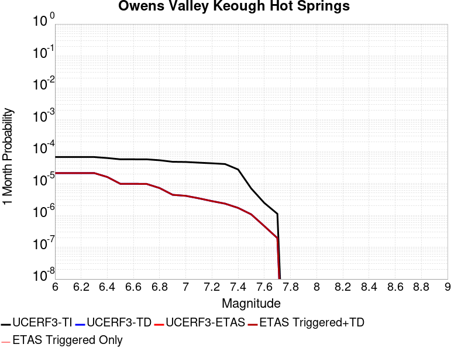 |  | 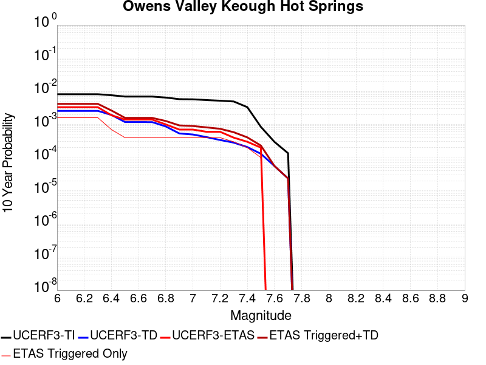 |

| Magnitude | 1 wk TI Prob | 1 wk TD Prob | 1 wk ETAS Prob | 1 wk ETAS/TD Gain | 1 wk ETAS Triggered+TD | 1 wk ETAS Triggered Only | 1 mo TI Prob | 1 mo TD Prob | 1 mo ETAS Prob | 1 mo ETAS/TD Gain | 1 mo ETAS Triggered+TD | 1 mo ETAS Triggered Only | 1 yr TI Prob | 1 yr TD Prob | 1 yr ETAS Prob | 1 yr ETAS/TD Gain | 1 yr ETAS Triggered+TD | 1 yr ETAS Triggered Only | 10 yr TI Prob | 10 yr TD Prob | 10 yr ETAS Prob | 10 yr ETAS/TD Gain | 10 yr ETAS Triggered+TD | 10 yr ETAS Triggered Only |
|-----|-----|-----|-----|-----|-----|-----|-----|-----|-----|-----|-----|-----|-----|-----|-----|-----|-----|-----|-----|-----|-----|-----|-----|-----|
| 6.0 | 1.5708529E-5 | 4.935569E-6 | 0.0 | 0.0 | 4.935569E-6 | 0.0 | 6.7320536E-5 | 2.1152297E-5 | 0.0 | 0.0 | 2.1152297E-5 | 0.0 | 8.193192E-4 | 2.5750388E-4 | 2.0E-4 | 0.7766873 | 2.5750388E-4 | 0.0 | 0.008163051 | 0.002572749 | 0.0033 | 1.2826747 | 0.0041686324 | 0.0016 |
| 6.1 | 1.5708529E-5 | 4.935569E-6 | 0.0 | 0.0 | 4.935569E-6 | 0.0 | 6.7320536E-5 | 2.1152297E-5 | 0.0 | 0.0 | 2.1152297E-5 | 0.0 | 8.193192E-4 | 2.5750388E-4 | 2.0E-4 | 0.7766873 | 2.5750388E-4 | 0.0 | 0.008163051 | 0.002572749 | 0.0033 | 1.2826747 | 0.0041686324 | 0.0016 |
| 6.2 | 1.5708529E-5 | 4.935569E-6 | 0.0 | 0.0 | 4.935569E-6 | 0.0 | 6.7320536E-5 | 2.1152297E-5 | 0.0 | 0.0 | 2.1152297E-5 | 0.0 | 8.193192E-4 | 2.5750388E-4 | 2.0E-4 | 0.7766873 | 2.5750388E-4 | 0.0 | 0.008163051 | 0.002572749 | 0.0033 | 1.2826747 | 0.0041686324 | 0.0016 |
| 6.3 | 1.5708529E-5 | 4.935569E-6 | 0.0 | 0.0 | 4.935569E-6 | 0.0 | 6.7320536E-5 | 2.1152297E-5 | 0.0 | 0.0 | 2.1152297E-5 | 0.0 | 8.193192E-4 | 2.5750388E-4 | 2.0E-4 | 0.7766873 | 2.5750388E-4 | 0.0 | 0.008163051 | 0.002572749 | 0.0033 | 1.2826747 | 0.0041686324 | 0.0016 |
| 6.4 | 1.4622509E-5 | 3.713057E-6 | 0.0 | 0.0 | 3.713057E-6 | 0.0 | 6.266639E-5 | 1.5913021E-5 | 0.0 | 0.0 | 1.5913021E-5 | 0.0 | 7.626962E-4 | 1.9372712E-4 | 1.0E-4 | 0.51619 | 1.9372712E-4 | 0.0 | 0.007600839 | 0.0019360979 | 0.0019 | 0.98135537 | 0.0026347425 | 7.0E-4 |
| 6.5 | 1.3335527E-5 | 2.266153E-6 | 0.0 | 0.0 | 2.266153E-6 | 0.0 | 5.7151006E-5 | 9.712051E-6 | 0.0 | 0.0 | 9.712051E-6 | 0.0 | 6.955913E-4 | 1.1823849E-4 | 1.0E-4 | 0.8457483 | 1.1823849E-4 | 0.0 | 0.0069341804 | 0.0011820148 | 0.0014 | 1.1844183 | 0.001581542 | 4.0E-4 |
| 6.6 | 1.3332855E-5 | 2.2633042E-6 | 0.0 | 0.0 | 2.2633042E-6 | 0.0 | 5.7139558E-5 | 9.699842E-6 | 0.0 | 0.0 | 9.699842E-6 | 0.0 | 6.9545204E-4 | 1.18089854E-4 | 1.0E-4 | 0.8468128 | 1.18089854E-4 | 0.0 | 0.0069327964 | 0.0011805301 | 0.0014 | 1.185908 | 0.0015800579 | 4.0E-4 |
| 6.7 | 1.3318214E-5 | 2.252565E-6 | 0.0 | 0.0 | 2.252565E-6 | 0.0 | 5.707681E-5 | 9.653818E-6 | 0.0 | 0.0 | 9.653818E-6 | 0.0 | 6.946886E-4 | 1.1752958E-4 | 1.0E-4 | 0.8508497 | 1.1752958E-4 | 0.0 | 0.0069252094 | 0.0011749332 | 0.0014 | 1.1915572 | 0.0015744632 | 4.0E-4 |
| 6.8 | 1.2441338E-5 | 1.6679138E-6 | 0.0 | 0.0 | 1.6679138E-6 | 0.0 | 5.331893E-5 | 7.148184E-6 | 0.0 | 0.0 | 7.148184E-6 | 0.0 | 6.489646E-4 | 8.702596E-5 | 0.0 | 0.0 | 8.702596E-5 | 0.0 | 0.0064707273 | 8.701404E-4 | 0.001 | 1.1492398 | 0.0012697923 | 4.0E-4 |
| 6.9 | 1.1130476E-5 | 1.0235789E-6 | 0.0 | 0.0 | 1.0235789E-6 | 0.0 | 4.7701167E-5 | 4.386759E-6 | 0.0 | 0.0 | 4.386759E-6 | 0.0 | 5.806069E-4 | 5.3407497E-5 | 0.0 | 0.0 | 5.3407497E-5 | 0.0 | 0.0057909233 | 5.341389E-4 | 7.0E-4 | 1.3105206 | 9.339252E-4 | 4.0E-4 |
| 7.0 | 1.0986073E-5 | 9.5140257E-7 | 0.0 | 0.0 | 9.5140257E-7 | 0.0 | 4.7082318E-5 | 4.0774335E-6 | 0.0 | 0.0 | 4.0774335E-6 | 0.0 | 5.730765E-4 | 4.9641632E-5 | 0.0 | 0.0 | 4.9641632E-5 | 0.0 | 0.0057160086 | 4.9649685E-4 | 7.0E-4 | 1.409878 | 8.9629827E-4 | 4.0E-4 |
| 7.1 | 1.0451338E-5 | 7.946169E-7 | 0.0 | 0.0 | 7.946169E-7 | 0.0 | 4.4790682E-5 | 3.4054965E-6 | 0.0 | 0.0 | 3.4054965E-6 | 0.0 | 5.451901E-4 | 4.146114E-5 | 0.0 | 0.0 | 4.146114E-5 | 0.0 | 0.005438545 | 4.1472164E-4 | 6.0E-4 | 1.4467535 | 8.1455574E-4 | 4.0E-4 |
| 7.2 | 9.989061E-6 | 6.498459E-7 | 0.0 | 0.0 | 6.498459E-7 | 0.0 | 4.280956E-5 | 2.7850508E-6 | 0.0 | 0.0 | 2.7850508E-6 | 0.0 | 5.2108173E-4 | 3.3907472E-5 | 0.0 | 0.0 | 3.3907472E-5 | 0.0 | 0.0051986156 | 3.3920485E-4 | 6.0E-4 | 1.7688426 | 7.390692E-4 | 4.0E-4 |
| 7.3 | 9.465365E-6 | 5.4165963E-7 | 0.0 | 0.0 | 5.4165963E-7 | 0.0 | 4.056522E-5 | 2.3213963E-6 | 0.0 | 0.0 | 2.3213963E-6 | 0.0 | 4.937696E-4 | 2.8262637E-5 | 0.0 | 0.0 | 2.8262637E-5 | 0.0 | 0.0049267393 | 2.8276743E-4 | 4.0E-4 | 1.4145901 | 5.826826E-4 | 3.0E-4 |
| 7.4 | 6.3824805E-6 | 3.9801478E-7 | 0.0 | 0.0 | 3.9801478E-7 | 0.0 | 2.73532E-5 | 1.7057765E-6 | 0.0 | 0.0 | 1.7057765E-6 | 0.0 | 3.3297433E-4 | 2.0767633E-5 | 0.0 | 0.0 | 2.0767633E-5 | 0.0 | 0.0033247585 | 2.0779442E-4 | 3.0E-4 | 1.4437346 | 4.0775287E-4 | 2.0E-4 |
| 7.5 | 1.6192645E-6 | 2.4938223E-7 | 0.0 | 0.0 | 2.4938223E-7 | 0.0 | 6.9396865E-6 | 1.0687805E-6 | 0.0 | 0.0 | 1.0687805E-6 | 0.0 | 8.448741E-5 | 1.3012326E-5 | 0.0 | 0.0 | 1.3012326E-5 | 0.0 | 8.4455294E-4 | 1.3011578E-4 | 2.0E-4 | 1.5370927 | 2.3010276E-4 | 1.0E-4 |
| 7.6 | 5.7062545E-7 | 1.0694718E-7 | 0.0 | 0.0 | 1.0694718E-7 | 0.0 | 2.4455355E-6 | 4.5834497E-7 | 0.0 | 0.0 | 4.5834497E-7 | 0.0 | 2.9773988E-5 | 5.5803366E-6 | 0.0 | 0.0 | 5.5803366E-6 | 0.0 | 2.977E-4 | 5.5802044E-5 | 0.0 | 0.0 | 5.5802044E-5 | 0.0 |
| 7.7 | 2.5988817E-7 | 4.4976343E-8 | 0.0 | 0.0 | 4.4976343E-8 | 0.0 | 1.113806E-6 | 1.9275575E-7 | 0.0 | 0.0 | 1.9275575E-7 | 0.0 | 1.3560503E-5 | 2.3467992E-6 | 0.0 | 0.0 | 2.3467992E-6 | 0.0 | 1.3559677E-4 | 2.3467786E-5 | 0.0 | 0.0 | 2.3467786E-5 | 0.0 |

## Pitas Point (Lower West)
*[(top)](#table-of-contents)*

| 1 Week | 1 Month | 1 Year | 10 Year |
|-----|-----|-----|-----|
|  |  | 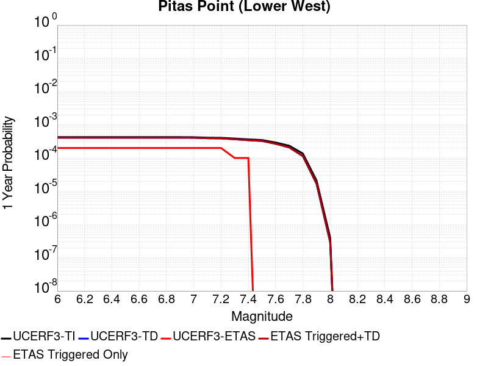 | 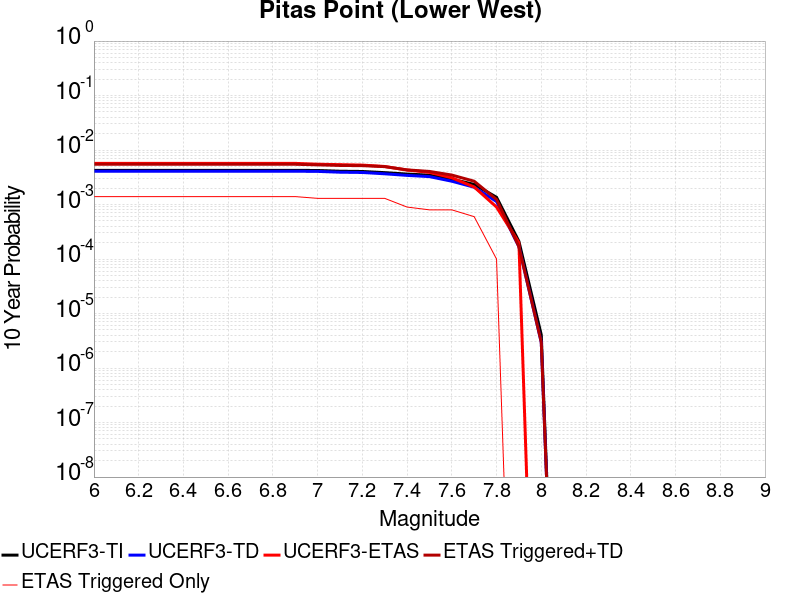 |

| Magnitude | 1 wk TI Prob | 1 wk TD Prob | 1 wk ETAS Prob | 1 wk ETAS/TD Gain | 1 wk ETAS Triggered+TD | 1 wk ETAS Triggered Only | 1 mo TI Prob | 1 mo TD Prob | 1 mo ETAS Prob | 1 mo ETAS/TD Gain | 1 mo ETAS Triggered+TD | 1 mo ETAS Triggered Only | 1 yr TI Prob | 1 yr TD Prob | 1 yr ETAS Prob | 1 yr ETAS/TD Gain | 1 yr ETAS Triggered+TD | 1 yr ETAS Triggered Only | 10 yr TI Prob | 10 yr TD Prob | 10 yr ETAS Prob | 10 yr ETAS/TD Gain | 10 yr ETAS Triggered+TD | 10 yr ETAS Triggered Only |
|-----|-----|-----|-----|-----|-----|-----|-----|-----|-----|-----|-----|-----|-----|-----|-----|-----|-----|-----|-----|-----|-----|-----|-----|-----|
| 6.0 | 8.151497E-6 | 7.848972E-6 | 0.0 | 0.0 | 7.848972E-6 | 0.0 | 3.493452E-5 | 3.363802E-5 | 0.0 | 0.0 | 3.363802E-5 | 0.0 | 4.252448E-4 | 4.0946668E-4 | 2.0E-4 | 0.48844022 | 4.0946668E-4 | 0.0 | 0.0042443196 | 0.0040872027 | 0.0057 | 1.3945968 | 0.0054814806 | 0.0014 |
| 6.1 | 8.151497E-6 | 7.848972E-6 | 0.0 | 0.0 | 7.848972E-6 | 0.0 | 3.493452E-5 | 3.363802E-5 | 0.0 | 0.0 | 3.363802E-5 | 0.0 | 4.252448E-4 | 4.0946668E-4 | 2.0E-4 | 0.48844022 | 4.0946668E-4 | 0.0 | 0.0042443196 | 0.0040872027 | 0.0057 | 1.3945968 | 0.0054814806 | 0.0014 |
| 6.2 | 8.151497E-6 | 7.848972E-6 | 0.0 | 0.0 | 7.848972E-6 | 0.0 | 3.493452E-5 | 3.363802E-5 | 0.0 | 0.0 | 3.363802E-5 | 0.0 | 4.252448E-4 | 4.0946668E-4 | 2.0E-4 | 0.48844022 | 4.0946668E-4 | 0.0 | 0.0042443196 | 0.0040872027 | 0.0057 | 1.3945968 | 0.0054814806 | 0.0014 |
| 6.3 | 8.151497E-6 | 7.848972E-6 | 0.0 | 0.0 | 7.848972E-6 | 0.0 | 3.493452E-5 | 3.363802E-5 | 0.0 | 0.0 | 3.363802E-5 | 0.0 | 4.252448E-4 | 4.0946668E-4 | 2.0E-4 | 0.48844022 | 4.0946668E-4 | 0.0 | 0.0042443196 | 0.0040872027 | 0.0057 | 1.3945968 | 0.0054814806 | 0.0014 |
| 6.4 | 8.151497E-6 | 7.848972E-6 | 0.0 | 0.0 | 7.848972E-6 | 0.0 | 3.493452E-5 | 3.363802E-5 | 0.0 | 0.0 | 3.363802E-5 | 0.0 | 4.252448E-4 | 4.0946668E-4 | 2.0E-4 | 0.48844022 | 4.0946668E-4 | 0.0 | 0.0042443196 | 0.0040872027 | 0.0057 | 1.3945968 | 0.0054814806 | 0.0014 |
| 6.5 | 8.151497E-6 | 7.848972E-6 | 0.0 | 0.0 | 7.848972E-6 | 0.0 | 3.493452E-5 | 3.363802E-5 | 0.0 | 0.0 | 3.363802E-5 | 0.0 | 4.252448E-4 | 4.0946668E-4 | 2.0E-4 | 0.48844022 | 4.0946668E-4 | 0.0 | 0.0042443196 | 0.0040872027 | 0.0057 | 1.3945968 | 0.0054814806 | 0.0014 |
| 6.6 | 8.151497E-6 | 7.848972E-6 | 0.0 | 0.0 | 7.848972E-6 | 0.0 | 3.493452E-5 | 3.363802E-5 | 0.0 | 0.0 | 3.363802E-5 | 0.0 | 4.252448E-4 | 4.0946668E-4 | 2.0E-4 | 0.48844022 | 4.0946668E-4 | 0.0 | 0.0042443196 | 0.0040872027 | 0.0057 | 1.3945968 | 0.0054814806 | 0.0014 |
| 6.7 | 8.151497E-6 | 7.848972E-6 | 0.0 | 0.0 | 7.848972E-6 | 0.0 | 3.493452E-5 | 3.363802E-5 | 0.0 | 0.0 | 3.363802E-5 | 0.0 | 4.252448E-4 | 4.0946668E-4 | 2.0E-4 | 0.48844022 | 4.0946668E-4 | 0.0 | 0.0042443196 | 0.0040872027 | 0.0057 | 1.3945968 | 0.0054814806 | 0.0014 |
| 6.8 | 8.151497E-6 | 7.848972E-6 | 0.0 | 0.0 | 7.848972E-6 | 0.0 | 3.493452E-5 | 3.363802E-5 | 0.0 | 0.0 | 3.363802E-5 | 0.0 | 4.252448E-4 | 4.0946668E-4 | 2.0E-4 | 0.48844022 | 4.0946668E-4 | 0.0 | 0.0042443196 | 0.0040872027 | 0.0057 | 1.3945968 | 0.0054814806 | 0.0014 |
| 6.9 | 8.151497E-6 | 7.848972E-6 | 0.0 | 0.0 | 7.848972E-6 | 0.0 | 3.493452E-5 | 3.363802E-5 | 0.0 | 0.0 | 3.363802E-5 | 0.0 | 4.252448E-4 | 4.0946668E-4 | 2.0E-4 | 0.48844022 | 4.0946668E-4 | 0.0 | 0.0042443196 | 0.0040872027 | 0.0057 | 1.3945968 | 0.0054814806 | 0.0014 |
| 7.0 | 8.103535E-6 | 7.7984305E-6 | 0.0 | 0.0 | 7.7984305E-6 | 0.0 | 3.4728975E-5 | 3.342142E-5 | 0.0 | 0.0 | 3.342142E-5 | 0.0 | 4.2274324E-4 | 4.0683054E-4 | 2.0E-4 | 0.49160516 | 4.0683054E-4 | 0.0 | 0.0042193993 | 0.004060938 | 0.0055 | 1.3543669 | 0.005355659 | 0.0013 |
| 7.1 | 7.853298E-6 | 7.5342764E-6 | 0.0 | 0.0 | 7.5342764E-6 | 0.0 | 3.3656554E-5 | 3.228936E-5 | 0.0 | 0.0 | 3.228936E-5 | 0.0 | 4.096915E-4 | 3.9305276E-4 | 2.0E-4 | 0.5088375 | 3.9305276E-4 | 0.0 | 0.00408937 | 0.0039236518 | 0.0054 | 1.376269 | 0.005218551 | 0.0013 |
| 7.2 | 7.771102E-6 | 7.44662E-6 | 0.0 | 0.0 | 7.44662E-6 | 0.0 | 3.33043E-5 | 3.19137E-5 | 0.0 | 0.0 | 3.19137E-5 | 0.0 | 4.0540437E-4 | 3.8848072E-4 | 2.0E-4 | 0.51482606 | 3.8848072E-4 | 0.0 | 0.0040466557 | 0.0038780915 | 0.0053 | 1.3666515 | 0.00517305 | 0.0013 |
| 7.3 | 7.3945344E-6 | 7.0430306E-6 | 0.0 | 0.0 | 7.0430306E-6 | 0.0 | 3.1690477E-5 | 3.018407E-5 | 0.0 | 0.0 | 3.018407E-5 | 0.0 | 3.8576324E-4 | 3.6742972E-4 | 1.0E-4 | 0.2721609 | 3.6742972E-4 | 0.0 | 0.0038509427 | 0.0036682896 | 0.005 | 1.363033 | 0.004963521 | 0.0013 |
| 7.4 | 6.964645E-6 | 6.584206E-6 | 0.0 | 0.0 | 6.584206E-6 | 0.0 | 2.9848137E-5 | 2.8217723E-5 | 0.0 | 0.0 | 2.8217723E-5 | 0.0 | 3.6334046E-4 | 3.4349711E-4 | 1.0E-4 | 0.29112327 | 3.4349711E-4 | 0.0 | 0.0036274698 | 0.0034297148 | 0.0043 | 1.2537485 | 0.004326628 | 9.0E-4 |
| 7.5 | 6.6525035E-6 | 6.253454E-6 | 0.0 | 0.0 | 6.253454E-6 | 0.0 | 2.851042E-5 | 2.6800246E-5 | 0.0 | 0.0 | 2.6800246E-5 | 0.0 | 3.4705905E-4 | 3.2624463E-4 | 0.0 | 0.0 | 3.2624463E-4 | 0.0 | 0.0034651754 | 0.0032577082 | 0.0039 | 1.1971606 | 0.004055102 | 8.0E-4 |
| 7.6 | 5.613338E-6 | 5.1464976E-6 | 0.0 | 0.0 | 5.1464976E-6 | 0.0 | 2.405694E-5 | 2.2056234E-5 | 0.0 | 0.0 | 2.2056234E-5 | 0.0 | 2.928539E-4 | 2.6850184E-4 | 0.0 | 0.0 | 2.6850184E-4 | 0.0 | 0.0029246826 | 0.002681806 | 0.0031 | 1.1559374 | 0.0034796605 | 8.0E-4 |
| 7.7 | 4.494704E-6 | 3.9929123E-6 | 0.0 | 0.0 | 3.9929123E-6 | 0.0 | 1.9262876E-5 | 1.711237E-5 | 0.0 | 0.0 | 1.711237E-5 | 0.0 | 2.3450027E-4 | 2.0832343E-4 | 0.0 | 0.0 | 2.0832343E-4 | 0.0 | 0.0023425296 | 0.0020813055 | 0.0021 | 1.0089822 | 0.0026800567 | 6.0E-4 |
| 7.8 | 2.6075882E-6 | 2.1812086E-6 | 0.0 | 0.0 | 2.1812086E-6 | 0.0 | 1.117533E-5 | 9.348004E-6 | 0.0 | 0.0 | 9.348004E-6 | 0.0 | 1.3605114E-4 | 1.13806054E-4 | 0.0 | 0.0 | 1.13806054E-4 | 0.0 | 0.0013596788 | 0.0011374825 | 9.0E-4 | 0.791221 | 0.0012373687 | 1.0E-4 |
| 7.9 | 4.045984E-7 | 3.2399677E-7 | 0.0 | 0.0 | 3.2399677E-7 | 0.0 | 1.733992E-6 | 1.3885569E-6 | 0.0 | 0.0 | 1.3885569E-6 | 0.0 | 2.1111147E-5 | 1.6905553E-5 | 0.0 | 0.0 | 1.6905553E-5 | 0.0 | 2.1109142E-4 | 1.6904298E-4 | 2.0E-4 | 1.1831311 | 1.6904298E-4 | 0.0 |
| 8.0 | 7.791402E-9 | 5.678961E-9 | 0.0 | 0.0 | 5.678961E-9 | 0.0 | 3.3391725E-8 | 2.4338403E-8 | 0.0 | 0.0 | 2.4338403E-8 | 0.0 | 4.0654416E-7 | 2.9632005E-7 | 0.0 | 0.0 | 2.9632005E-7 | 0.0 | 4.065434E-6 | 2.9631985E-6 | 0.0 | 0.0 | 2.9631985E-6 | 0.0 |

## Coyote Canyon
*[(top)](#table-of-contents)*

| 1 Week | 1 Month | 1 Year | 10 Year |
|-----|-----|-----|-----|
|  | 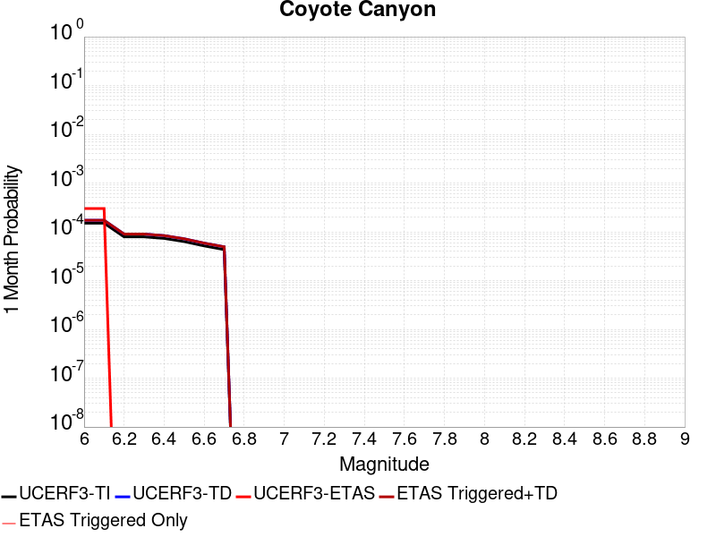 |  | 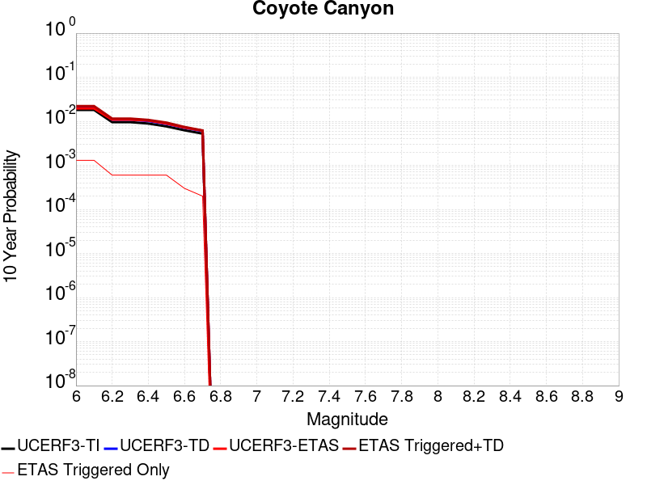 |

| Magnitude | 1 wk TI Prob | 1 wk TD Prob | 1 wk ETAS Prob | 1 wk ETAS/TD Gain | 1 wk ETAS Triggered+TD | 1 wk ETAS Triggered Only | 1 mo TI Prob | 1 mo TD Prob | 1 mo ETAS Prob | 1 mo ETAS/TD Gain | 1 mo ETAS Triggered+TD | 1 mo ETAS Triggered Only | 1 yr TI Prob | 1 yr TD Prob | 1 yr ETAS Prob | 1 yr ETAS/TD Gain | 1 yr ETAS Triggered+TD | 1 yr ETAS Triggered Only | 10 yr TI Prob | 10 yr TD Prob | 10 yr ETAS Prob | 10 yr ETAS/TD Gain | 10 yr ETAS Triggered+TD | 10 yr ETAS Triggered Only |
|-----|-----|-----|-----|-----|-----|-----|-----|-----|-----|-----|-----|-----|-----|-----|-----|-----|-----|-----|-----|-----|-----|-----|-----|-----|
| 6.0 | 3.5090034E-5 | 4.030101E-5 | 1.0E-4 | 2.4813275 | 4.030101E-5 | 0.0 | 1.503772E-4 | 1.7270862E-4 | 3.0E-4 | 1.7370297 | 1.7270862E-4 | 0.0 | 0.0018293047 | 0.0021009562 | 0.0021 | 0.9995449 | 0.0023005358 | 2.0E-4 | 0.018143194 | 0.020836774 | 0.0196 | 0.9406447 | 0.022109685 | 0.0013 |
| 6.1 | 3.5090034E-5 | 4.030101E-5 | 1.0E-4 | 2.4813275 | 4.030101E-5 | 0.0 | 1.503772E-4 | 1.7270862E-4 | 3.0E-4 | 1.7370297 | 1.7270862E-4 | 0.0 | 0.0018293047 | 0.0021009562 | 0.0021 | 0.9995449 | 0.0023005358 | 2.0E-4 | 0.018143194 | 0.020836774 | 0.0196 | 0.9406447 | 0.022109685 | 0.0013 |
| 6.2 | 1.841879E-5 | 2.1028296E-5 | 0.0 | 0.0 | 2.1028296E-5 | 0.0 | 7.8935285E-5 | 9.011873E-5 | 0.0 | 0.0 | 9.011873E-5 | 0.0 | 9.606133E-4 | 0.001096745 | 9.0E-4 | 0.82061005 | 0.0012965257 | 2.0E-4 | 0.0095647145 | 0.01092338 | 0.0109 | 0.99785966 | 0.011516826 | 6.0E-4 |
| 6.3 | 1.841879E-5 | 2.1028296E-5 | 0.0 | 0.0 | 2.1028296E-5 | 0.0 | 7.8935285E-5 | 9.011873E-5 | 0.0 | 0.0 | 9.011873E-5 | 0.0 | 9.606133E-4 | 0.001096745 | 9.0E-4 | 0.82061005 | 0.0012965257 | 2.0E-4 | 0.0095647145 | 0.01092338 | 0.0109 | 0.99785966 | 0.011516826 | 6.0E-4 |
| 6.4 | 1.712201E-5 | 1.9536092E-5 | 0.0 | 0.0 | 1.9536092E-5 | 0.0 | 7.337798E-5 | 8.3723986E-5 | 0.0 | 0.0 | 8.3723986E-5 | 0.0 | 8.930107E-4 | 0.0010189632 | 9.0E-4 | 0.8832508 | 0.0012187593 | 2.0E-4 | 0.008894307 | 0.010152799 | 0.0104 | 1.0243481 | 0.010746707 | 6.0E-4 |
| 6.5 | 1.4744935E-5 | 1.6812055E-5 | 0.0 | 0.0 | 1.6812055E-5 | 0.0 | 6.3191044E-5 | 7.20502E-5 | 0.0 | 0.0 | 7.20502E-5 | 0.0 | 7.6907943E-4 | 8.769513E-4 | 8.0E-4 | 0.9122513 | 0.001076776 | 2.0E-4 | 0.007664232 | 0.008744077 | 0.0089 | 1.0178319 | 0.00933883 | 6.0E-4 |
| 6.6 | 1.2017839E-5 | 1.3703764E-5 | 0.0 | 0.0 | 1.3703764E-5 | 0.0 | 5.150401E-5 | 5.872959E-5 | 0.0 | 0.0 | 5.872959E-5 | 0.0 | 6.268809E-4 | 7.148865E-4 | 5.0E-4 | 0.6994117 | 7.148865E-4 | 0.0 | 0.0062511545 | 0.0071345353 | 0.0072 | 1.0091758 | 0.0074323947 | 3.0E-4 |
| 6.7 | 1.00956095E-5 | 1.1516381E-5 | 0.0 | 0.0 | 1.1516381E-5 | 0.0 | 4.326618E-5 | 4.9355476E-5 | 0.0 | 0.0 | 4.9355476E-5 | 0.0 | 5.266384E-4 | 6.0082396E-4 | 5.0E-4 | 0.8321905 | 6.0082396E-4 | 0.0 | 0.005253921 | 0.006000497 | 0.0061 | 1.0165825 | 0.0061992966 | 2.0E-4 |

## Garlock (Central)
*[(top)](#table-of-contents)*

| 1 Week | 1 Month | 1 Year | 10 Year |
|-----|-----|-----|-----|
|  |  | 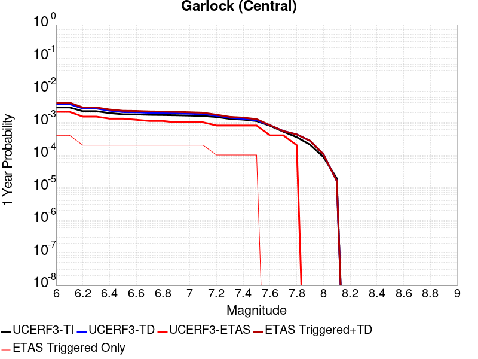 |  |

| Magnitude | 1 wk TI Prob | 1 wk TD Prob | 1 wk ETAS Prob | 1 wk ETAS/TD Gain | 1 wk ETAS Triggered+TD | 1 wk ETAS Triggered Only | 1 mo TI Prob | 1 mo TD Prob | 1 mo ETAS Prob | 1 mo ETAS/TD Gain | 1 mo ETAS Triggered+TD | 1 mo ETAS Triggered Only | 1 yr TI Prob | 1 yr TD Prob | 1 yr ETAS Prob | 1 yr ETAS/TD Gain | 1 yr ETAS Triggered+TD | 1 yr ETAS Triggered Only | 10 yr TI Prob | 10 yr TD Prob | 10 yr ETAS Prob | 10 yr ETAS/TD Gain | 10 yr ETAS Triggered+TD | 10 yr ETAS Triggered Only |
|-----|-----|-----|-----|-----|-----|-----|-----|-----|-----|-----|-----|-----|-----|-----|-----|-----|-----|-----|-----|-----|-----|-----|-----|-----|
| 6.0 | 5.5131142E-5 | 6.9720634E-5 | 0.0 | 0.0 | 6.9720634E-5 | 0.0 | 2.3625491E-4 | 2.9876886E-4 | 1.0E-4 | 0.3347069 | 2.9876886E-4 | 0.0 | 0.0028726095 | 0.0036315077 | 0.0021 | 0.5782722 | 0.004030055 | 4.0E-4 | 0.028357591 | 0.035784204 | 0.0217 | 0.6064128 | 0.037230525 | 0.0015 |
| 6.1 | 5.5131142E-5 | 6.9720634E-5 | 0.0 | 0.0 | 6.9720634E-5 | 0.0 | 2.3625491E-4 | 2.9876886E-4 | 1.0E-4 | 0.3347069 | 2.9876886E-4 | 0.0 | 0.0028726095 | 0.0036315077 | 0.0021 | 0.5782722 | 0.004030055 | 4.0E-4 | 0.028357591 | 0.035784204 | 0.0217 | 0.6064128 | 0.037230525 | 0.0015 |
| 6.2 | 4.216245E-5 | 5.1180392E-5 | 0.0 | 0.0 | 5.1180392E-5 | 0.0 | 1.806837E-4 | 2.1932626E-4 | 1.0E-4 | 0.45594174 | 2.1932626E-4 | 0.0 | 0.0021976046 | 0.0026670585 | 0.0015 | 0.5624173 | 0.0028665252 | 2.0E-4 | 0.021759989 | 0.026441311 | 0.0156 | 0.5899859 | 0.027220158 | 8.0E-4 |
| 6.3 | 4.216245E-5 | 5.1180392E-5 | 0.0 | 0.0 | 5.1180392E-5 | 0.0 | 1.806837E-4 | 2.1932626E-4 | 1.0E-4 | 0.45594174 | 2.1932626E-4 | 0.0 | 0.0021976046 | 0.0026670585 | 0.0015 | 0.5624173 | 0.0028665252 | 2.0E-4 | 0.021759989 | 0.026441311 | 0.0156 | 0.5899859 | 0.027220158 | 8.0E-4 |
| 6.4 | 3.6858168E-5 | 4.3654112E-5 | 0.0 | 0.0 | 4.3654112E-5 | 0.0 | 1.5795401E-4 | 1.8707577E-4 | 1.0E-4 | 0.53454274 | 1.8707577E-4 | 0.0 | 0.0019213937 | 0.0022752932 | 0.0013 | 0.5713549 | 0.0024748382 | 2.0E-4 | 0.019048655 | 0.02262472 | 0.0129 | 0.57017285 | 0.023211144 | 6.0E-4 |
| 6.5 | 3.39199E-5 | 3.9577175E-5 | 0.0 | 0.0 | 3.9577175E-5 | 0.0 | 1.453629E-4 | 1.6960557E-4 | 1.0E-4 | 0.5896033 | 1.6960557E-4 | 0.0 | 0.0017683565 | 0.0020630136 | 0.0013 | 0.6301461 | 0.002262601 | 2.0E-4 | 0.017543508 | 0.020541329 | 0.0113 | 0.55011046 | 0.02103106 | 5.0E-4 |
| 6.6 | 3.3571985E-5 | 3.9032402E-5 | 0.0 | 0.0 | 3.9032402E-5 | 0.0 | 1.4387199E-4 | 1.6727112E-4 | 1.0E-4 | 0.59783185 | 1.6727112E-4 | 0.0 | 0.0017502342 | 0.0020346453 | 0.0012 | 0.58978343 | 0.0022342382 | 2.0E-4 | 0.017365133 | 0.020265728 | 0.0108 | 0.5329194 | 0.020755595 | 5.0E-4 |
| 6.7 | 3.2580007E-5 | 3.7653088E-5 | 0.0 | 0.0 | 3.7653088E-5 | 0.0 | 1.3962112E-4 | 1.6136053E-4 | 1.0E-4 | 0.6197303 | 1.6136053E-4 | 0.0 | 0.0016985617 | 0.0019628154 | 0.0011 | 0.5604195 | 0.002162423 | 2.0E-4 | 0.016856372 | 0.019553363 | 0.0103 | 0.5267636 | 0.020043585 | 5.0E-4 |
| 6.8 | 3.2185937E-5 | 3.7081954E-5 | 0.0 | 0.0 | 3.7081954E-5 | 0.0 | 1.3793244E-4 | 1.589131E-4 | 1.0E-4 | 0.6292747 | 1.589131E-4 | 0.0 | 0.0016780337 | 0.0019330714 | 0.0011 | 0.5690426 | 0.0021326847 | 2.0E-4 | 0.016654192 | 0.0192608 | 0.0101 | 0.52438116 | 0.019751169 | 5.0E-4 |
| 6.9 | 3.165394E-5 | 3.6288824E-5 | 0.0 | 0.0 | 3.6288824E-5 | 0.0 | 1.3565269E-4 | 1.5551437E-4 | 1.0E-4 | 0.64302737 | 1.5551437E-4 | 0.0 | 0.0016503202 | 0.0018917643 | 0.001 | 0.5286071 | 0.0020913861 | 2.0E-4 | 0.01638118 | 0.018854156 | 0.0097 | 0.5144754 | 0.019344728 | 5.0E-4 |
| 7.0 | 3.0903822E-5 | 3.519741E-5 | 0.0 | 0.0 | 3.519741E-5 | 0.0 | 1.3243823E-4 | 1.5083743E-4 | 1.0E-4 | 0.6629654 | 1.5083743E-4 | 0.0 | 0.0016112428 | 0.0018349198 | 0.001 | 0.5449829 | 0.0020345529 | 2.0E-4 | 0.015996104 | 0.01829316 | 0.0097 | 0.5302529 | 0.018784013 | 5.0E-4 |
| 7.1 | 3.0069863E-5 | 3.3969434E-5 | 0.0 | 0.0 | 3.3969434E-5 | 0.0 | 1.2886449E-4 | 1.455753E-4 | 1.0E-4 | 0.68692976 | 1.455753E-4 | 0.0 | 0.0015677959 | 0.0017709591 | 0.001 | 0.56466573 | 0.001970605 | 2.0E-4 | 0.01556781 | 0.01766366 | 0.0093 | 0.52650476 | 0.018154828 | 5.0E-4 |
| 7.2 | 2.7957109E-5 | 3.0868236E-5 | 0.0 | 0.0 | 3.0868236E-5 | 0.0 | 1.1981068E-4 | 1.3228584E-4 | 1.0E-4 | 0.75593877 | 1.3228584E-4 | 0.0 | 0.0014577188 | 0.0016094097 | 8.0E-4 | 0.4970767 | 0.0017092486 | 1.0E-4 | 0.014481937 | 0.016071785 | 0.0085 | 0.5288772 | 0.016465355 | 4.0E-4 |
| 7.3 | 2.4519275E-5 | 2.6325442E-5 | 0.0 | 0.0 | 2.6325442E-5 | 0.0 | 1.0507837E-4 | 1.12818525E-4 | 1.0E-4 | 0.88637924 | 1.12818525E-4 | 0.0 | 0.0012785783 | 0.0013727146 | 8.0E-4 | 0.5827868 | 0.0014725773 | 1.0E-4 | 0.012712469 | 0.013727977 | 0.0076 | 0.55361396 | 0.014122486 | 4.0E-4 |
| 7.4 | 2.3225532E-5 | 2.4822692E-5 | 0.0 | 0.0 | 2.4822692E-5 | 0.0 | 9.95342E-5 | 1.06378706E-4 | 1.0E-4 | 0.9400378 | 1.06378706E-4 | 0.0 | 0.0012111551 | 0.0012944055 | 8.0E-4 | 0.6180443 | 0.001394276 | 1.0E-4 | 0.012045753 | 0.012951895 | 0.007 | 0.5404615 | 0.013346714 | 4.0E-4 |
| 7.5 | 2.097765E-5 | 2.2125227E-5 | 0.0 | 0.0 | 2.2125227E-5 | 0.0 | 8.9901114E-5 | 9.481902E-5 | 1.0E-4 | 1.0546408 | 9.481902E-5 | 0.0 | 0.0010939965 | 0.0011538219 | 8.0E-4 | 0.69334793 | 0.0012537065 | 1.0E-4 | 0.010886264 | 0.011555824 | 0.006 | 0.5192187 | 0.011852358 | 3.0E-4 |
| 7.6 | 1.511254E-5 | 1.5667734E-5 | 0.0 | 0.0 | 1.5667734E-5 | 0.0 | 6.476642E-5 | 6.714575E-5 | 0.0 | 0.0 | 6.714575E-5 | 0.0 | 7.882459E-4 | 8.1720063E-4 | 4.0E-4 | 0.48947588 | 8.1720063E-4 | 0.0 | 0.007854558 | 0.008216628 | 0.0043 | 0.523329 | 0.008315806 | 1.0E-4 |
| 7.7 | 9.934069E-6 | 1.0379772E-5 | 0.0 | 0.0 | 1.0379772E-5 | 0.0 | 4.2573887E-5 | 4.448398E-5 | 0.0 | 0.0 | 4.448398E-5 | 0.0 | 5.182138E-4 | 5.4145826E-4 | 4.0E-4 | 0.7387458 | 5.4145826E-4 | 0.0 | 0.00517007 | 0.005472377 | 0.0031 | 0.5664815 | 0.005472377 | 0.0 |
| 7.8 | 6.7562896E-6 | 8.184014E-6 | 0.0 | 0.0 | 8.184014E-6 | 0.0 | 2.8955206E-5 | 3.5073877E-5 | 0.0 | 0.0 | 3.5073877E-5 | 0.0 | 3.5247262E-4 | 4.269409E-4 | 2.0E-4 | 0.46844888 | 4.269409E-4 | 0.0 | 0.0035191406 | 0.0043196273 | 0.0024 | 0.55560344 | 0.0043196273 | 0.0 |
| 7.9 | 3.975453E-6 | 5.220447E-6 | 0.0 | 0.0 | 5.220447E-6 | 0.0 | 1.7037546E-5 | 2.2373153E-5 | 0.0 | 0.0 | 2.2373153E-5 | 0.0 | 2.0741238E-4 | 2.7235918E-4 | 0.0 | 0.0 | 2.7235918E-4 | 0.0 | 0.002072189 | 0.002755179 | 0.001 | 0.3629528 | 0.002755179 | 0.0 |
| 8.0 | 1.6729537E-6 | 2.023924E-6 | 0.0 | 0.0 | 2.023924E-6 | 0.0 | 7.169782E-6 | 8.673931E-6 | 0.0 | 0.0 | 8.673931E-6 | 0.0 | 8.7288594E-5 | 1.05600026E-4 | 0.0 | 0.0 | 1.05600026E-4 | 0.0 | 8.7254314E-4 | 0.0010688532 | 3.0E-4 | 0.28067467 | 0.0010688532 | 0.0 |
| 8.1 | 3.6733252E-7 | 3.054934E-7 | 0.0 | 0.0 | 3.054934E-7 | 0.0 | 1.5742813E-6 | 1.3092568E-6 | 0.0 | 0.0 | 1.3092568E-6 | 0.0 | 1.9166706E-5 | 1.59401E-5 | 0.0 | 0.0 | 1.59401E-5 | 0.0 | 1.9165053E-4 | 1.6150644E-4 | 0.0 | 0.0 | 1.6150644E-4 | 0.0 |

## San Jacinto (Anza) rev
*[(top)](#table-of-contents)*

| 1 Week | 1 Month | 1 Year | 10 Year |
|-----|-----|-----|-----|
|  | 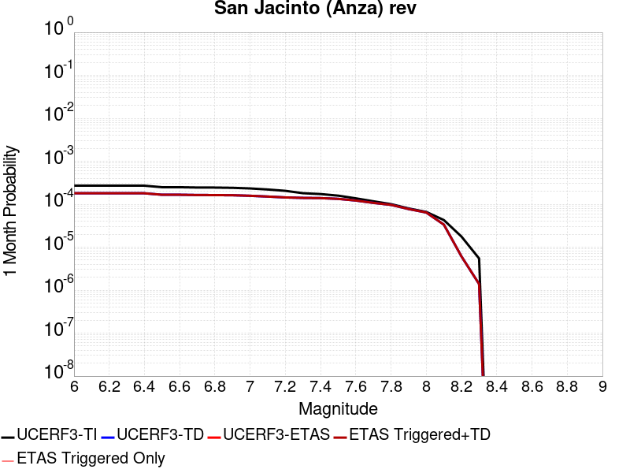 |  | 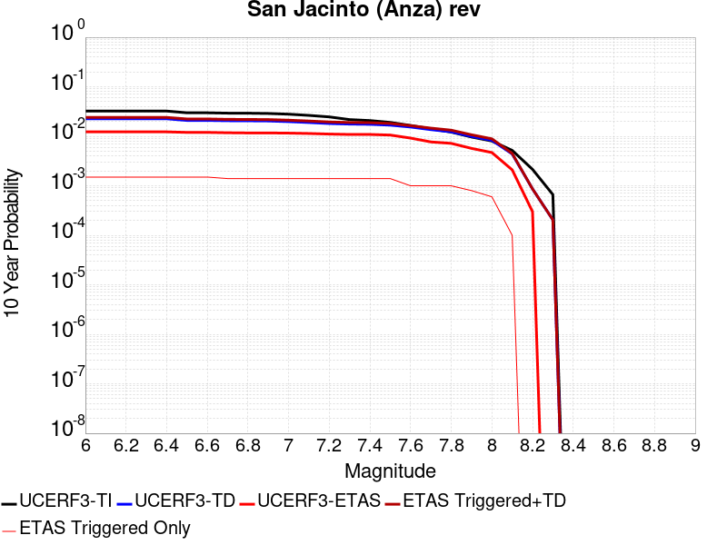 |

| Magnitude | 1 wk TI Prob | 1 wk TD Prob | 1 wk ETAS Prob | 1 wk ETAS/TD Gain | 1 wk ETAS Triggered+TD | 1 wk ETAS Triggered Only | 1 mo TI Prob | 1 mo TD Prob | 1 mo ETAS Prob | 1 mo ETAS/TD Gain | 1 mo ETAS Triggered+TD | 1 mo ETAS Triggered Only | 1 yr TI Prob | 1 yr TD Prob | 1 yr ETAS Prob | 1 yr ETAS/TD Gain | 1 yr ETAS Triggered+TD | 1 yr ETAS Triggered Only | 10 yr TI Prob | 10 yr TD Prob | 10 yr ETAS Prob | 10 yr ETAS/TD Gain | 10 yr ETAS Triggered+TD | 10 yr ETAS Triggered Only |
|-----|-----|-----|-----|-----|-----|-----|-----|-----|-----|-----|-----|-----|-----|-----|-----|-----|-----|-----|-----|-----|-----|-----|-----|-----|
| 6.0 | 6.3015636E-5 | 4.183058E-5 | 0.0 | 0.0 | 4.183058E-5 | 0.0 | 2.7003905E-4 | 1.7926165E-4 | 0.0 | 0.0 | 1.7926165E-4 | 0.0 | 0.0032827691 | 0.0021803374 | 0.0012 | 0.55037355 | 0.0022801193 | 1.0E-4 | 0.032346968 | 0.022534408 | 0.0123 | 0.545832 | 0.024000606 | 0.0015 |
| 6.1 | 6.3015636E-5 | 4.183058E-5 | 0.0 | 0.0 | 4.183058E-5 | 0.0 | 2.7003905E-4 | 1.7926165E-4 | 0.0 | 0.0 | 1.7926165E-4 | 0.0 | 0.0032827691 | 0.0021803374 | 0.0012 | 0.55037355 | 0.0022801193 | 1.0E-4 | 0.032346968 | 0.022534408 | 0.0123 | 0.545832 | 0.024000606 | 0.0015 |
| 6.2 | 6.3015636E-5 | 4.183058E-5 | 0.0 | 0.0 | 4.183058E-5 | 0.0 | 2.7003905E-4 | 1.7926165E-4 | 0.0 | 0.0 | 1.7926165E-4 | 0.0 | 0.0032827691 | 0.0021803374 | 0.0012 | 0.55037355 | 0.0022801193 | 1.0E-4 | 0.032346968 | 0.022534408 | 0.0123 | 0.545832 | 0.024000606 | 0.0015 |
| 6.3 | 6.3015636E-5 | 4.183058E-5 | 0.0 | 0.0 | 4.183058E-5 | 0.0 | 2.7003905E-4 | 1.7926165E-4 | 0.0 | 0.0 | 1.7926165E-4 | 0.0 | 0.0032827691 | 0.0021803374 | 0.0012 | 0.55037355 | 0.0022801193 | 1.0E-4 | 0.032346968 | 0.022534408 | 0.0123 | 0.545832 | 0.024000606 | 0.0015 |
| 6.4 | 6.3015636E-5 | 4.183058E-5 | 0.0 | 0.0 | 4.183058E-5 | 0.0 | 2.7003905E-4 | 1.7926165E-4 | 0.0 | 0.0 | 1.7926165E-4 | 0.0 | 0.0032827691 | 0.0021803374 | 0.0012 | 0.55037355 | 0.0022801193 | 1.0E-4 | 0.032346968 | 0.022534408 | 0.0123 | 0.545832 | 0.024000606 | 0.0015 |
| 6.5 | 5.811017E-5 | 3.8686903E-5 | 0.0 | 0.0 | 3.8686903E-5 | 0.0 | 2.4901982E-4 | 1.6579051E-4 | 0.0 | 0.0 | 1.6579051E-4 | 0.0 | 0.0030276014 | 0.002016636 | 0.0011 | 0.5454628 | 0.0021164345 | 1.0E-4 | 0.02986684 | 0.020870313 | 0.012 | 0.57497936 | 0.022339009 | 0.0015 |
| 6.6 | 5.811017E-5 | 3.8686903E-5 | 0.0 | 0.0 | 3.8686903E-5 | 0.0 | 2.4901982E-4 | 1.6579051E-4 | 0.0 | 0.0 | 1.6579051E-4 | 0.0 | 0.0030276014 | 0.002016636 | 0.0011 | 0.5454628 | 0.0021164345 | 1.0E-4 | 0.02986684 | 0.020870313 | 0.012 | 0.57497936 | 0.022339009 | 0.0015 |
| 6.7 | 5.712442E-5 | 3.8125763E-5 | 0.0 | 0.0 | 3.8125763E-5 | 0.0 | 2.4479596E-4 | 1.6338592E-4 | 0.0 | 0.0 | 1.6338592E-4 | 0.0 | 0.0029763177 | 0.001987414 | 0.0011 | 0.55348307 | 0.0020872152 | 1.0E-4 | 0.029367693 | 0.020570375 | 0.0118 | 0.57364047 | 0.021941578 | 0.0014 |
| 6.8 | 5.6967532E-5 | 3.7984697E-5 | 0.0 | 0.0 | 3.7984697E-5 | 0.0 | 2.4412372E-4 | 1.6278143E-4 | 0.0 | 0.0 | 1.6278143E-4 | 0.0 | 0.0029681553 | 0.0019800677 | 0.0011 | 0.55553657 | 0.0020798696 | 1.0E-4 | 0.029288229 | 0.020495819 | 0.0117 | 0.5708481 | 0.021867124 | 0.0014 |
| 6.9 | 5.6211324E-5 | 3.7700964E-5 | 0.0 | 0.0 | 3.7700964E-5 | 0.0 | 2.4088343E-4 | 1.6156558E-4 | 0.0 | 0.0 | 1.6156558E-4 | 0.0 | 0.0029288116 | 0.0019652913 | 0.0011 | 0.5597134 | 0.002065095 | 1.0E-4 | 0.028905109 | 0.02034173 | 0.0117 | 0.5751723 | 0.021713251 | 0.0014 |
| 7.0 | 5.4383527E-5 | 3.659375E-5 | 0.0 | 0.0 | 3.659375E-5 | 0.0 | 2.3305144E-4 | 1.5682094E-4 | 0.0 | 0.0 | 1.5682094E-4 | 0.0 | 0.0028337094 | 0.0019076277 | 0.0011 | 0.57663244 | 0.002007437 | 1.0E-4 | 0.027978465 | 0.019751118 | 0.0116 | 0.5873085 | 0.021123467 | 0.0014 |
| 7.1 | 5.1393665E-5 | 3.510502E-5 | 0.0 | 0.0 | 3.510502E-5 | 0.0 | 2.2023996E-4 | 1.5044144E-4 | 0.0 | 0.0 | 1.5044144E-4 | 0.0 | 0.0026781242 | 0.0018300897 | 0.0011 | 0.60106343 | 0.0019299067 | 1.0E-4 | 0.026460782 | 0.018947938 | 0.0114 | 0.60164857 | 0.020321412 | 0.0014 |
| 7.2 | 4.785222E-5 | 3.3509757E-5 | 0.0 | 0.0 | 3.3509757E-5 | 0.0 | 2.0506482E-4 | 1.4360536E-4 | 0.0 | 0.0 | 1.4360536E-4 | 0.0 | 0.0024938055 | 0.0017469965 | 0.001 | 0.572411 | 0.0018468219 | 1.0E-4 | 0.024660049 | 0.018087938 | 0.0111 | 0.6136686 | 0.019462615 | 0.0014 |
| 7.3 | 4.2143256E-5 | 3.2639113E-5 | 0.0 | 0.0 | 3.2639113E-5 | 0.0 | 1.8060145E-4 | 1.3987442E-4 | 0.0 | 0.0 | 1.3987442E-4 | 0.0 | 0.002196605 | 0.0017016442 | 0.001 | 0.5876669 | 0.001801474 | 1.0E-4 | 0.02175019 | 0.01761302 | 0.0109 | 0.61886036 | 0.018988362 | 0.0014 |
| 7.4 | 4.0264713E-5 | 3.2289736E-5 | 0.0 | 0.0 | 3.2289736E-5 | 0.0 | 1.7255165E-4 | 1.3837726E-4 | 0.0 | 0.0 | 1.3837726E-4 | 0.0 | 0.002098792 | 0.0016834446 | 0.001 | 0.5940202 | 0.0017832762 | 1.0E-4 | 0.020790804 | 0.017424108 | 0.0109 | 0.62557 | 0.018799715 | 0.0014 |
| 7.5 | 3.694492E-5 | 3.1029784E-5 | 0.0 | 0.0 | 3.1029784E-5 | 0.0 | 1.5832575E-4 | 1.3297804E-4 | 0.0 | 0.0 | 1.3297804E-4 | 0.0 | 0.0019259118 | 0.0016178081 | 0.001 | 0.61812025 | 0.0017176464 | 1.0E-4 | 0.01909306 | 0.016754005 | 0.0106 | 0.6326846 | 0.018130548 | 0.0014 |
| 7.6 | 3.200565E-5 | 2.8383402E-5 | 0.0 | 0.0 | 2.8383402E-5 | 0.0 | 1.3715986E-4 | 1.2163749E-4 | 0.0 | 0.0 | 1.2163749E-4 | 0.0 | 0.001668642 | 0.0014799325 | 8.0E-4 | 0.5405652 | 0.0014799325 | 0.0 | 0.01656168 | 0.015360921 | 0.0092 | 0.59892243 | 0.016345559 | 0.001 |
| 7.7 | 2.731642E-5 | 2.501408E-5 | 0.0 | 0.0 | 2.501408E-5 | 0.0 | 1.1706512E-4 | 1.071988E-4 | 0.0 | 0.0 | 1.071988E-4 | 0.0 | 0.001424336 | 0.0013043649 | 5.0E-4 | 0.38332832 | 0.0013043649 | 0.0 | 0.014152412 | 0.013602458 | 0.0077 | 0.5660742 | 0.014588855 | 0.001 |
| 7.8 | 2.3466424E-5 | 2.2473176E-5 | 0.0 | 0.0 | 2.2473176E-5 | 0.0 | 1.0056651E-4 | 9.6310054E-5 | 0.0 | 0.0 | 9.6310054E-5 | 0.0 | 0.0012237094 | 0.0011719449 | 5.0E-4 | 0.42664123 | 0.0011719449 | 0.0 | 0.012169928 | 0.012268121 | 0.0072 | 0.58688694 | 0.013255853 | 0.001 |
| 7.9 | 1.8611925E-5 | 1.7977458E-5 | 0.0 | 0.0 | 1.7977458E-5 | 0.0 | 7.9762955E-5 | 7.704397E-5 | 0.0 | 0.0 | 7.704397E-5 | 0.0 | 9.7068126E-4 | 9.376074E-4 | 5.0E-4 | 0.53327227 | 9.376074E-4 | 0.0 | 0.0096645225 | 0.009904152 | 0.0057 | 0.5755162 | 0.010696228 | 8.0E-4 |
| 8.0 | 1.5460775E-5 | 1.4910216E-5 | 0.0 | 0.0 | 1.4910216E-5 | 0.0 | 6.6258784E-5 | 6.3899366E-5 | 0.0 | 0.0 | 6.3899366E-5 | 0.0 | 8.0640207E-4 | 7.776977E-4 | 4.0E-4 | 0.5143387 | 7.776977E-4 | 0.0 | 0.008034821 | 0.008264083 | 0.0047 | 0.5687261 | 0.008859125 | 6.0E-4 |
| 8.1 | 9.983884E-6 | 7.773843E-6 | 0.0 | 0.0 | 7.773843E-6 | 0.0 | 4.2787375E-5 | 3.3316046E-5 | 0.0 | 0.0 | 3.3316046E-5 | 0.0 | 5.2081177E-4 | 4.0554785E-4 | 3.0E-4 | 0.7397401 | 4.0554785E-4 | 0.0 | 0.0051959283 | 0.00437231 | 0.0021 | 0.4802953 | 0.004471873 | 1.0E-4 |
| 8.2 | 4.1226E-6 | 1.402547E-6 | 0.0 | 0.0 | 1.402547E-6 | 0.0 | 1.7668166E-5 | 6.010902E-6 | 0.0 | 0.0 | 6.010902E-6 | 0.0 | 2.1508869E-4 | 7.31803E-5 | 1.0E-4 | 1.366488 | 7.31803E-5 | 0.0 | 0.0021488064 | 8.541163E-4 | 3.0E-4 | 0.35124025 | 8.541163E-4 | 0.0 |
| 8.3 | 1.2750878E-6 | 3.1939175E-7 | 0.0 | 0.0 | 3.1939175E-7 | 0.0 | 5.4646503E-6 | 1.368821E-6 | 0.0 | 0.0 | 1.368821E-6 | 0.0 | 6.653009E-5 | 1.6665272E-5 | 0.0 | 0.0 | 1.6665272E-5 | 0.0 | 6.6510175E-4 | 2.0263324E-4 | 0.0 | 0.0 | 2.0263324E-4 | 0.0 |

## San Jacinto (San Bernardino)
*[(top)](#table-of-contents)*

| 1 Week | 1 Month | 1 Year | 10 Year |
|-----|-----|-----|-----|
|  |  |  |  |

| Magnitude | 1 wk TI Prob | 1 wk TD Prob | 1 wk ETAS Prob | 1 wk ETAS/TD Gain | 1 wk ETAS Triggered+TD | 1 wk ETAS Triggered Only | 1 mo TI Prob | 1 mo TD Prob | 1 mo ETAS Prob | 1 mo ETAS/TD Gain | 1 mo ETAS Triggered+TD | 1 mo ETAS Triggered Only | 1 yr TI Prob | 1 yr TD Prob | 1 yr ETAS Prob | 1 yr ETAS/TD Gain | 1 yr ETAS Triggered+TD | 1 yr ETAS Triggered Only | 10 yr TI Prob | 10 yr TD Prob | 10 yr ETAS Prob | 10 yr ETAS/TD Gain | 10 yr ETAS Triggered+TD | 10 yr ETAS Triggered Only |
|-----|-----|-----|-----|-----|-----|-----|-----|-----|-----|-----|-----|-----|-----|-----|-----|-----|-----|-----|-----|-----|-----|-----|-----|-----|
| 6.0 | 3.409352E-5 | 3.4625045E-5 | 1.0E-4 | 2.8880827 | 3.4625045E-5 | 0.0 | 1.461069E-4 | 1.4838463E-4 | 1.0E-4 | 0.67392427 | 1.4838463E-4 | 0.0 | 0.0017774 | 0.0018050874 | 9.0E-4 | 0.49859083 | 0.0018050874 | 0.0 | 0.01763251 | 0.018651593 | 0.0119 | 0.6380152 | 0.02002548 | 0.0014 |
| 6.1 | 3.409352E-5 | 3.4625045E-5 | 1.0E-4 | 2.8880827 | 3.4625045E-5 | 0.0 | 1.461069E-4 | 1.4838463E-4 | 1.0E-4 | 0.67392427 | 1.4838463E-4 | 0.0 | 0.0017774 | 0.0018050874 | 9.0E-4 | 0.49859083 | 0.0018050874 | 0.0 | 0.01763251 | 0.018651593 | 0.0119 | 0.6380152 | 0.02002548 | 0.0014 |
| 6.2 | 3.409352E-5 | 3.4625045E-5 | 1.0E-4 | 2.8880827 | 3.4625045E-5 | 0.0 | 1.461069E-4 | 1.4838463E-4 | 1.0E-4 | 0.67392427 | 1.4838463E-4 | 0.0 | 0.0017774 | 0.0018050874 | 9.0E-4 | 0.49859083 | 0.0018050874 | 0.0 | 0.01763251 | 0.018651593 | 0.0119 | 0.6380152 | 0.02002548 | 0.0014 |
| 6.3 | 3.409352E-5 | 3.4625045E-5 | 1.0E-4 | 2.8880827 | 3.4625045E-5 | 0.0 | 1.461069E-4 | 1.4838463E-4 | 1.0E-4 | 0.67392427 | 1.4838463E-4 | 0.0 | 0.0017774 | 0.0018050874 | 9.0E-4 | 0.49859083 | 0.0018050874 | 0.0 | 0.01763251 | 0.018651593 | 0.0119 | 0.6380152 | 0.02002548 | 0.0014 |
| 6.4 | 3.400795E-5 | 3.451799E-5 | 1.0E-4 | 2.89704 | 3.451799E-5 | 0.0 | 1.4574021E-4 | 1.4792588E-4 | 1.0E-4 | 0.67601424 | 1.4792588E-4 | 0.0 | 0.0017729428 | 0.0017995114 | 9.0E-4 | 0.5001358 | 0.0017995114 | 0.0 | 0.017588645 | 0.01859678 | 0.0119 | 0.63989574 | 0.019970743 | 0.0014 |
| 6.5 | 3.341482E-5 | 3.3780503E-5 | 1.0E-4 | 2.9602876 | 3.3780503E-5 | 0.0 | 1.4319851E-4 | 1.4476555E-4 | 1.0E-4 | 0.69077206 | 1.4476555E-4 | 0.0 | 0.0017420477 | 0.001761097 | 8.0E-4 | 0.45426232 | 0.001761097 | 0.0 | 0.017284546 | 0.01821901 | 0.0114 | 0.62572 | 0.019495327 | 0.0013 |
| 6.6 | 3.3364955E-5 | 3.3717886E-5 | 1.0E-4 | 2.965785 | 3.3717886E-5 | 0.0 | 1.4298483E-4 | 1.4449723E-4 | 1.0E-4 | 0.69205475 | 1.4449723E-4 | 0.0 | 0.0017394501 | 0.0017578355 | 7.0E-4 | 0.39821702 | 0.0017578355 | 0.0 | 0.017258976 | 0.018186938 | 0.0113 | 0.621325 | 0.019463295 | 0.0013 |
| 6.7 | 3.335922E-5 | 3.370769E-5 | 1.0E-4 | 2.9666822 | 3.370769E-5 | 0.0 | 1.4296026E-4 | 1.4445353E-4 | 1.0E-4 | 0.69226414 | 1.4445353E-4 | 0.0 | 0.0017391514 | 0.0017573043 | 7.0E-4 | 0.3983374 | 0.0017573043 | 0.0 | 0.017256035 | 0.018181741 | 0.0113 | 0.62150264 | 0.019458104 | 0.0013 |
| 6.8 | 3.327683E-5 | 3.3602053E-5 | 1.0E-4 | 2.9760084 | 3.3602053E-5 | 0.0 | 1.4260718E-4 | 1.4400086E-4 | 1.0E-4 | 0.6944403 | 1.4400086E-4 | 0.0 | 0.0017348597 | 0.0017518019 | 7.0E-4 | 0.39958856 | 0.0017518019 | 0.0 | 0.017213784 | 0.018127626 | 0.0112 | 0.61784154 | 0.019305872 | 0.0012 |
| 6.9 | 3.3235785E-5 | 3.3543198E-5 | 1.0E-4 | 2.9812303 | 3.3543198E-5 | 0.0 | 1.4243131E-4 | 1.4374865E-4 | 1.0E-4 | 0.6956587 | 1.4374865E-4 | 0.0 | 0.0017327217 | 0.0017487362 | 7.0E-4 | 0.40028906 | 0.0017487362 | 0.0 | 0.017192734 | 0.018097568 | 0.0112 | 0.6188677 | 0.01927585 | 0.0012 |
| 7.0 | 3.3197095E-5 | 3.348335E-5 | 1.0E-4 | 2.986559 | 3.348335E-5 | 0.0 | 1.422655E-4 | 1.4349219E-4 | 1.0E-4 | 0.69690204 | 1.4349219E-4 | 0.0 | 0.0017307063 | 0.0017456188 | 7.0E-4 | 0.40100393 | 0.0017456188 | 0.0 | 0.017172894 | 0.018067034 | 0.0112 | 0.6199136 | 0.019245353 | 0.0012 |
| 7.1 | 3.3129716E-5 | 3.336406E-5 | 1.0E-4 | 2.997237 | 3.336406E-5 | 0.0 | 1.4197677E-4 | 1.42981E-4 | 1.0E-4 | 0.69939363 | 1.42981E-4 | 0.0 | 0.0017271966 | 0.0017394051 | 7.0E-4 | 0.40243644 | 0.0017394051 | 0.0 | 0.017138338 | 0.018006315 | 0.0111 | 0.6164504 | 0.019184707 | 0.0012 |
| 7.2 | 3.3034008E-5 | 3.3231896E-5 | 1.0E-4 | 3.0091572 | 3.3231896E-5 | 0.0 | 1.4156665E-4 | 1.4241465E-4 | 1.0E-4 | 0.702175 | 1.4241465E-4 | 0.0 | 0.0017222111 | 0.0017325206 | 7.0E-4 | 0.4040356 | 0.0017325206 | 0.0 | 0.017089253 | 0.017938862 | 0.0111 | 0.61876833 | 0.019117335 | 0.0012 |
| 7.3 | 3.2956614E-5 | 3.3100405E-5 | 1.0E-4 | 3.0211112 | 3.3100405E-5 | 0.0 | 1.4123498E-4 | 1.4185117E-4 | 1.0E-4 | 0.7049642 | 1.4185117E-4 | 0.0 | 0.0017181796 | 0.0017256712 | 7.0E-4 | 0.40563926 | 0.0017256712 | 0.0 | 0.017049557 | 0.01787193 | 0.0109 | 0.609895 | 0.019050483 | 0.0012 |
| 7.4 | 3.2915937E-5 | 3.3022723E-5 | 1.0E-4 | 3.028218 | 3.3022723E-5 | 0.0 | 1.4106068E-4 | 1.4151828E-4 | 1.0E-4 | 0.7066225 | 1.4151828E-4 | 0.0 | 0.0017160608 | 0.0017216248 | 7.0E-4 | 0.40659267 | 0.0017216248 | 0.0 | 0.017028693 | 0.01783248 | 0.0109 | 0.6112442 | 0.019011082 | 0.0012 |
| 7.5 | 3.281791E-5 | 3.288865E-5 | 1.0E-4 | 3.0405626 | 3.288865E-5 | 0.0 | 1.406406E-4 | 1.4094375E-4 | 1.0E-4 | 0.7095029 | 1.4094375E-4 | 0.0 | 0.0017109542 | 0.0017146409 | 7.0E-4 | 0.40824875 | 0.0017146409 | 0.0 | 0.016978411 | 0.017763821 | 0.0109 | 0.61360675 | 0.018942503 | 0.0012 |
| 7.6 | 3.2521442E-5 | 3.261648E-5 | 1.0E-4 | 3.0659347 | 3.261648E-5 | 0.0 | 1.3937015E-4 | 1.3977743E-4 | 1.0E-4 | 0.71542305 | 1.3977743E-4 | 0.0 | 0.0016955109 | 0.0017004632 | 7.0E-4 | 0.41165254 | 0.0017004632 | 0.0 | 0.016826328 | 0.017622786 | 0.0109 | 0.61851746 | 0.018801639 | 0.0012 |
| 7.7 | 3.0287873E-5 | 3.112073E-5 | 1.0E-4 | 3.2132924 | 3.112073E-5 | 0.0 | 1.297987E-4 | 1.3336774E-4 | 1.0E-4 | 0.7498065 | 1.3336774E-4 | 0.0 | 0.0015791537 | 0.0016225439 | 7.0E-4 | 0.43142128 | 0.0016225439 | 0.0 | 0.01567979 | 0.016843515 | 0.01 | 0.59370035 | 0.0180233 | 0.0012 |
| 7.8 | 2.6316151E-5 | 2.838393E-5 | 1.0E-4 | 3.5231202 | 2.838393E-5 | 0.0 | 1.1277862E-4 | 1.2163975E-4 | 1.0E-4 | 0.8220997 | 1.2163975E-4 | 0.0 | 0.0013722149 | 0.0014799588 | 7.0E-4 | 0.47298613 | 0.0014799588 | 0.0 | 0.013637724 | 0.015411119 | 0.0095 | 0.61643803 | 0.016592626 | 0.0012 |
| 7.9 | 2.0761147E-5 | 2.2299115E-5 | 0.0 | 0.0 | 2.2299115E-5 | 0.0 | 8.897331E-5 | 9.556414E-5 | 0.0 | 0.0 | 9.556414E-5 | 0.0 | 0.0010827117 | 0.0011628731 | 6.0E-4 | 0.51596344 | 0.0011628731 | 0.0 | 0.010774517 | 0.012213089 | 0.0071 | 0.58134353 | 0.0131020965 | 9.0E-4 |
| 8.0 | 1.5738568E-5 | 1.5184829E-5 | 0.0 | 0.0 | 1.5184829E-5 | 0.0 | 6.744926E-5 | 6.5076216E-5 | 0.0 | 0.0 | 6.5076216E-5 | 0.0 | 8.2088535E-4 | 7.920156E-4 | 4.0E-4 | 0.5050406 | 7.920156E-4 | 0.0 | 0.008178596 | 0.008417643 | 0.0047 | 0.5583511 | 0.009012592 | 6.0E-4 |
| 8.1 | 1.0105832E-5 | 7.828162E-6 | 0.0 | 0.0 | 7.828162E-6 | 0.0 | 4.3309992E-5 | 3.3548833E-5 | 0.0 | 0.0 | 3.3548833E-5 | 0.0 | 5.2717153E-4 | 4.0838096E-4 | 3.0E-4 | 0.7346082 | 4.0838096E-4 | 0.0 | 0.005259227 | 0.0044059837 | 0.0021 | 0.47662455 | 0.004505543 | 1.0E-4 |
| 8.2 | 4.189207E-6 | 1.4251509E-6 | 0.0 | 0.0 | 1.4251509E-6 | 0.0 | 1.7953622E-5 | 6.1077753E-6 | 0.0 | 0.0 | 6.1077753E-6 | 0.0 | 2.1856341E-4 | 7.4359654E-5 | 1.0E-4 | 1.3448153 | 7.4359654E-5 | 0.0 | 0.0021834858 | 8.685344E-4 | 3.0E-4 | 0.34540948 | 8.685344E-4 | 0.0 |
| 8.3 | 1.2758221E-6 | 3.1965183E-7 | 0.0 | 0.0 | 3.1965183E-7 | 0.0 | 5.4677976E-6 | 1.3699357E-6 | 0.0 | 0.0 | 1.3699357E-6 | 0.0 | 6.65684E-5 | 1.6678843E-5 | 0.0 | 0.0 | 1.6678843E-5 | 0.0 | 6.6548464E-4 | 2.0278891E-4 | 0.0 | 0.0 | 2.0278891E-4 | 0.0 |

## Tank Canyon
*[(top)](#table-of-contents)*

| 1 Week | 1 Month | 1 Year | 10 Year |
|-----|-----|-----|-----|
|  |  |  |  |

| Magnitude | 1 wk TI Prob | 1 wk TD Prob | 1 wk ETAS Prob | 1 wk ETAS/TD Gain | 1 wk ETAS Triggered+TD | 1 wk ETAS Triggered Only | 1 mo TI Prob | 1 mo TD Prob | 1 mo ETAS Prob | 1 mo ETAS/TD Gain | 1 mo ETAS Triggered+TD | 1 mo ETAS Triggered Only | 1 yr TI Prob | 1 yr TD Prob | 1 yr ETAS Prob | 1 yr ETAS/TD Gain | 1 yr ETAS Triggered+TD | 1 yr ETAS Triggered Only | 10 yr TI Prob | 10 yr TD Prob | 10 yr ETAS Prob | 10 yr ETAS/TD Gain | 10 yr ETAS Triggered+TD | 10 yr ETAS Triggered Only |
|-----|-----|-----|-----|-----|-----|-----|-----|-----|-----|-----|-----|-----|-----|-----|-----|-----|-----|-----|-----|-----|-----|-----|-----|-----|
| 6.0 | 4.8284557E-5 | 5.7840167E-5 | 0.0 | 0.0 | 5.7840167E-5 | 0.0 | 2.0691741E-4 | 2.4786626E-4 | 1.0E-4 | 0.40344337 | 2.4786626E-4 | 0.0 | 0.0025163088 | 0.0030142586 | 0.0019 | 0.6303374 | 0.0031139571 | 1.0E-4 | 0.02488006 | 0.029800545 | 0.0177 | 0.59394884 | 0.030770745 | 0.001 |
| 6.1 | 1.7796336E-5 | 2.083262E-5 | 0.0 | 0.0 | 2.083262E-5 | 0.0 | 7.626778E-5 | 8.927982E-5 | 1.0E-4 | 1.1200739 | 8.927982E-5 | 0.0 | 9.281647E-4 | 0.0010864778 | 0.0011 | 1.0124459 | 0.0011863691 | 1.0E-4 | 0.009242975 | 0.010815719 | 0.0074 | 0.6841893 | 0.011211393 | 4.0E-4 |
| 6.2 | 1.7796336E-5 | 2.083262E-5 | 0.0 | 0.0 | 2.083262E-5 | 0.0 | 7.626778E-5 | 8.927982E-5 | 1.0E-4 | 1.1200739 | 8.927982E-5 | 0.0 | 9.281647E-4 | 0.0010864778 | 0.0011 | 1.0124459 | 0.0011863691 | 1.0E-4 | 0.009242975 | 0.010815719 | 0.0074 | 0.6841893 | 0.011211393 | 4.0E-4 |
| 6.3 | 1.3515912E-5 | 1.5729276E-5 | 0.0 | 0.0 | 1.5729276E-5 | 0.0 | 5.792405E-5 | 6.740957E-5 | 1.0E-4 | 1.4834689 | 6.740957E-5 | 0.0 | 7.049971E-4 | 8.2042604E-4 | 0.001 | 1.2188789 | 9.2034397E-4 | 1.0E-4 | 0.007027647 | 0.008176551 | 0.0057 | 0.6971154 | 0.008573281 | 4.0E-4 |
| 6.4 | 1.0870146E-5 | 1.2593871E-5 | 0.0 | 0.0 | 1.2593871E-5 | 0.0 | 4.658551E-5 | 5.397272E-5 | 1.0E-4 | 1.8527879 | 5.397272E-5 | 0.0 | 5.67031E-4 | 6.569374E-4 | 9.0E-4 | 1.3699936 | 6.569374E-4 | 0.0 | 0.005655863 | 0.0065519316 | 0.0045 | 0.6868203 | 0.006849966 | 3.0E-4 |
| 6.5 | 7.964826E-6 | 9.178247E-6 | 0.0 | 0.0 | 9.178247E-6 | 0.0 | 3.4134522E-5 | 3.933481E-5 | 1.0E-4 | 2.5422773 | 3.933481E-5 | 0.0 | 4.1550855E-4 | 4.788066E-4 | 7.0E-4 | 1.4619681 | 4.788066E-4 | 0.0 | 0.0041473247 | 0.0047790254 | 0.0029 | 0.60681826 | 0.0050775916 | 3.0E-4 |
| 6.6 | 6.6317E-6 | 7.5974126E-6 | 0.0 | 0.0 | 7.5974126E-6 | 0.0 | 2.8421264E-5 | 3.2559987E-5 | 1.0E-4 | 3.0712545 | 3.2559987E-5 | 0.0 | 3.4597394E-4 | 3.9635476E-4 | 6.0E-4 | 1.5137954 | 3.9635476E-4 | 0.0 | 0.0034543579 | 0.0039576045 | 0.0027 | 0.6822309 | 0.004256417 | 3.0E-4 |
| 6.7 | 4.793663E-6 | 5.4198917E-6 | 0.0 | 0.0 | 5.4198917E-6 | 0.0 | 2.0544108E-5 | 2.3227925E-5 | 1.0E-4 | 4.305163 | 2.3227925E-5 | 0.0 | 2.500958E-4 | 2.8276767E-4 | 6.0E-4 | 2.1218834 | 2.8276767E-4 | 0.0 | 0.0024981452 | 0.0028247444 | 0.0017 | 0.60182434 | 0.0030241795 | 2.0E-4 |
| 6.8 | 4.382823E-6 | 4.959133E-6 | 0.0 | 0.0 | 4.959133E-6 | 0.0 | 1.8783392E-5 | 2.125328E-5 | 1.0E-4 | 4.7051563 | 2.125328E-5 | 0.0 | 2.286638E-4 | 2.587322E-4 | 6.0E-4 | 2.319 | 2.587322E-4 | 0.0 | 0.0022842865 | 0.002584962 | 0.0015 | 0.58027935 | 0.002784445 | 2.0E-4 |
| 6.9 | 2.729601E-6 | 3.0660856E-6 | 0.0 | 0.0 | 3.0660856E-6 | 0.0 | 1.1698237E-5 | 1.3140308E-5 | 1.0E-4 | 7.610172 | 1.3140308E-5 | 0.0 | 1.4241673E-4 | 1.5997273E-4 | 6.0E-4 | 3.7506394 | 1.5997273E-4 | 0.0 | 0.001423255 | 0.0015988793 | 0.0014 | 0.8756133 | 0.0017985596 | 2.0E-4 |
| 7.0 | 1.8987357E-6 | 2.1211877E-6 | 0.0 | 0.0 | 2.1211877E-6 | 0.0 | 8.137413E-6 | 9.090776E-6 | 1.0E-4 | 11.00016 | 9.090776E-6 | 0.0 | 9.90685E-5 | 1.10675275E-4 | 5.0E-4 | 4.5177207 | 1.10675275E-4 | 0.0 | 9.902435E-4 | 0.0011062701 | 0.001 | 0.90393835 | 0.0012061595 | 1.0E-4 |
| 7.1 | 1.4928986E-6 | 1.6591971E-6 | 0.0 | 0.0 | 1.6591971E-6 | 0.0 | 6.398121E-6 | 7.110829E-6 | 1.0E-4 | 14.063059 | 7.110829E-6 | 0.0 | 7.789434E-5 | 8.657149E-5 | 4.0E-4 | 4.6204586 | 8.657149E-5 | 0.0 | 7.786704E-4 | 8.654354E-4 | 7.0E-4 | 0.8088414 | 8.654354E-4 | 0.0 |
| 7.2 | 1.069082E-6 | 1.179496E-6 | 0.0 | 0.0 | 1.179496E-6 | 0.0 | 4.581772E-6 | 5.0549766E-6 | 0.0 | 0.0 | 5.0549766E-6 | 0.0 | 5.5781646E-5 | 6.1543135E-5 | 3.0E-4 | 4.87463 | 6.1543135E-5 | 0.0 | 5.576765E-4 | 6.1531307E-4 | 6.0E-4 | 0.9751134 | 6.1531307E-4 | 0.0 |
| 7.3 | 8.776551E-7 | 9.750752E-7 | 0.0 | 0.0 | 9.750752E-7 | 0.0 | 3.7613736E-6 | 4.17889E-6 | 0.0 | 0.0 | 4.17889E-6 | 0.0 | 4.579376E-5 | 5.0877316E-5 | 3.0E-4 | 5.8965373 | 5.0877316E-5 | 0.0 | 4.5784327E-4 | 5.087076E-4 | 6.0E-4 | 1.1794595 | 5.087076E-4 | 0.0 |
| 7.4 | 7.55721E-7 | 8.493275E-7 | 0.0 | 0.0 | 8.493275E-7 | 0.0 | 3.2388E-6 | 3.6399726E-6 | 0.0 | 0.0 | 3.6399726E-6 | 0.0 | 3.9431678E-5 | 4.4316283E-5 | 3.0E-4 | 6.7695208 | 4.4316283E-5 | 0.0 | 3.942468E-4 | 4.4312523E-4 | 6.0E-4 | 1.354019 | 4.4312523E-4 | 0.0 |
| 7.5 | 5.587665E-7 | 6.303491E-7 | 0.0 | 0.0 | 6.303491E-7 | 0.0 | 2.3947114E-6 | 2.7014962E-6 | 0.0 | 0.0 | 2.7014962E-6 | 0.0 | 2.915522E-5 | 3.289072E-5 | 1.0E-4 | 3.0403714 | 3.289072E-5 | 0.0 | 2.9151395E-4 | 3.2890716E-4 | 1.0E-4 | 0.30403715 | 3.2890716E-4 | 0.0 |

## San Jacinto (Stepovers Combined)
*[(top)](#table-of-contents)*

| 1 Week | 1 Month | 1 Year | 10 Year |
|-----|-----|-----|-----|
| 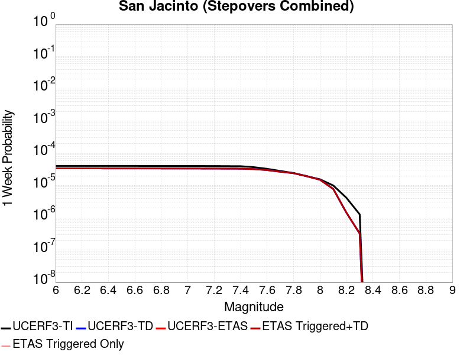 |  |  |  |

| Magnitude | 1 wk TI Prob | 1 wk TD Prob | 1 wk ETAS Prob | 1 wk ETAS/TD Gain | 1 wk ETAS Triggered+TD | 1 wk ETAS Triggered Only | 1 mo TI Prob | 1 mo TD Prob | 1 mo ETAS Prob | 1 mo ETAS/TD Gain | 1 mo ETAS Triggered+TD | 1 mo ETAS Triggered Only | 1 yr TI Prob | 1 yr TD Prob | 1 yr ETAS Prob | 1 yr ETAS/TD Gain | 1 yr ETAS Triggered+TD | 1 yr ETAS Triggered Only | 10 yr TI Prob | 10 yr TD Prob | 10 yr ETAS Prob | 10 yr ETAS/TD Gain | 10 yr ETAS Triggered+TD | 10 yr ETAS Triggered Only |
|-----|-----|-----|-----|-----|-----|-----|-----|-----|-----|-----|-----|-----|-----|-----|-----|-----|-----|-----|-----|-----|-----|-----|-----|-----|
| 6.0 | 4.0667746E-5 | 3.4023797E-5 | 0.0 | 0.0 | 3.4023797E-5 | 0.0 | 1.742787E-4 | 1.4580812E-4 | 0.0 | 0.0 | 1.4580812E-4 | 0.0 | 0.0021197782 | 0.0017737696 | 9.0E-4 | 0.50739396 | 0.0018735923 | 1.0E-4 | 0.020996714 | 0.018338304 | 0.0107 | 0.58347815 | 0.01971263 | 0.0014 |
| 6.1 | 4.0667746E-5 | 3.4023797E-5 | 0.0 | 0.0 | 3.4023797E-5 | 0.0 | 1.742787E-4 | 1.4580812E-4 | 0.0 | 0.0 | 1.4580812E-4 | 0.0 | 0.0021197782 | 0.0017737696 | 9.0E-4 | 0.50739396 | 0.0018735923 | 1.0E-4 | 0.020996714 | 0.018338304 | 0.0107 | 0.58347815 | 0.01971263 | 0.0014 |
| 6.2 | 4.0667746E-5 | 3.4023797E-5 | 0.0 | 0.0 | 3.4023797E-5 | 0.0 | 1.742787E-4 | 1.4580812E-4 | 0.0 | 0.0 | 1.4580812E-4 | 0.0 | 0.0021197782 | 0.0017737696 | 9.0E-4 | 0.50739396 | 0.0018735923 | 1.0E-4 | 0.020996714 | 0.018338304 | 0.0107 | 0.58347815 | 0.01971263 | 0.0014 |
| 6.3 | 4.0667746E-5 | 3.4023797E-5 | 0.0 | 0.0 | 3.4023797E-5 | 0.0 | 1.742787E-4 | 1.4580812E-4 | 0.0 | 0.0 | 1.4580812E-4 | 0.0 | 0.0021197782 | 0.0017737696 | 9.0E-4 | 0.50739396 | 0.0018735923 | 1.0E-4 | 0.020996714 | 0.018338304 | 0.0107 | 0.58347815 | 0.01971263 | 0.0014 |
| 6.4 | 4.0577226E-5 | 3.3896198E-5 | 0.0 | 0.0 | 3.3896198E-5 | 0.0 | 1.738908E-4 | 1.4526135E-4 | 0.0 | 0.0 | 1.4526135E-4 | 0.0 | 0.0021150648 | 0.0017671245 | 9.0E-4 | 0.50930196 | 0.0018669479 | 1.0E-4 | 0.020950472 | 0.018273074 | 0.0107 | 0.58556104 | 0.019647492 | 0.0014 |
| 6.5 | 4.0577226E-5 | 3.3896198E-5 | 0.0 | 0.0 | 3.3896198E-5 | 0.0 | 1.738908E-4 | 1.4526135E-4 | 0.0 | 0.0 | 1.4526135E-4 | 0.0 | 0.0021150648 | 0.0017671245 | 9.0E-4 | 0.50930196 | 0.0018669479 | 1.0E-4 | 0.020950472 | 0.018273074 | 0.0107 | 0.58556104 | 0.019647492 | 0.0014 |
| 6.6 | 4.053861E-5 | 3.3841752E-5 | 0.0 | 0.0 | 3.3841752E-5 | 0.0 | 1.7372532E-4 | 1.4502803E-4 | 0.0 | 0.0 | 1.4502803E-4 | 0.0 | 0.0021130538 | 0.0017642889 | 9.0E-4 | 0.5101205 | 0.0018641124 | 1.0E-4 | 0.020930743 | 0.018245239 | 0.0106 | 0.5809735 | 0.019619696 | 0.0014 |
| 6.7 | 4.0516545E-5 | 3.3810942E-5 | 0.0 | 0.0 | 3.3810942E-5 | 0.0 | 1.7363077E-4 | 1.44896E-4 | 0.0 | 0.0 | 1.44896E-4 | 0.0 | 0.002111905 | 0.0017626843 | 9.0E-4 | 0.5105849 | 0.001862508 | 1.0E-4 | 0.020919468 | 0.018229483 | 0.0106 | 0.5814756 | 0.019603962 | 0.0014 |
| 6.8 | 4.049434E-5 | 3.3782613E-5 | 0.0 | 0.0 | 3.3782613E-5 | 0.0 | 1.7353562E-4 | 1.4477462E-4 | 0.0 | 0.0 | 1.4477462E-4 | 0.0 | 0.0021107488 | 0.0017612089 | 9.0E-4 | 0.5110127 | 0.0018610328 | 1.0E-4 | 0.020908125 | 0.018214941 | 0.0106 | 0.5819398 | 0.01958944 | 0.0014 |
| 6.9 | 4.046386E-5 | 3.374534E-5 | 0.0 | 0.0 | 3.374534E-5 | 0.0 | 1.73405E-4 | 1.4461488E-4 | 0.0 | 0.0 | 1.4461488E-4 | 0.0 | 0.0021091616 | 0.0017592673 | 9.0E-4 | 0.5115766 | 0.0018590913 | 1.0E-4 | 0.020892553 | 0.018195786 | 0.0106 | 0.5825525 | 0.019570312 | 0.0014 |
| 7.0 | 4.036382E-5 | 3.3626537E-5 | 0.0 | 0.0 | 3.3626537E-5 | 0.0 | 1.7297632E-4 | 1.4410578E-4 | 0.0 | 0.0 | 1.4410578E-4 | 0.0 | 0.0021039525 | 0.0017530791 | 9.0E-4 | 0.51338243 | 0.0018529039 | 1.0E-4 | 0.02084144 | 0.018134682 | 0.0106 | 0.5845154 | 0.019509293 | 0.0014 |
| 7.1 | 4.0343282E-5 | 3.3605123E-5 | 0.0 | 0.0 | 3.3605123E-5 | 0.0 | 1.7288832E-4 | 1.4401402E-4 | 0.0 | 0.0 | 1.4401402E-4 | 0.0 | 0.002102883 | 0.0017519636 | 9.0E-4 | 0.5137093 | 0.0018517885 | 1.0E-4 | 0.020830948 | 0.01812361 | 0.0106 | 0.5848724 | 0.019498236 | 0.0014 |
| 7.2 | 4.0257353E-5 | 3.3510176E-5 | 0.0 | 0.0 | 3.3510176E-5 | 0.0 | 1.725201E-4 | 1.4360716E-4 | 0.0 | 0.0 | 1.4360716E-4 | 0.0 | 0.0020984085 | 0.0017470181 | 9.0E-4 | 0.51516354 | 0.0018468434 | 1.0E-4 | 0.020787042 | 0.0180746 | 0.0106 | 0.5864583 | 0.019449295 | 0.0014 |
| 7.3 | 3.9940667E-5 | 3.3340824E-5 | 0.0 | 0.0 | 3.3340824E-5 | 0.0 | 1.7116306E-4 | 1.4288144E-4 | 0.0 | 0.0 | 1.4288144E-4 | 0.0 | 0.0020819185 | 0.0017381967 | 9.0E-4 | 0.517778 | 0.0018380228 | 1.0E-4 | 0.020625217 | 0.017984752 | 0.0105 | 0.5838279 | 0.019359574 | 0.0014 |
| 7.4 | 3.9721202E-5 | 3.322838E-5 | 0.0 | 0.0 | 3.322838E-5 | 0.0 | 1.7022261E-4 | 1.4239959E-4 | 0.0 | 0.0 | 1.4239959E-4 | 0.0 | 0.0020704903 | 0.0017323394 | 9.0E-4 | 0.5195287 | 0.0018321662 | 1.0E-4 | 0.020513052 | 0.017924985 | 0.0105 | 0.5857746 | 0.019299889 | 0.0014 |
| 7.5 | 3.7036873E-5 | 3.2316977E-5 | 0.0 | 0.0 | 3.2316977E-5 | 0.0 | 1.5871979E-4 | 1.38494E-4 | 0.0 | 0.0 | 1.38494E-4 | 0.0 | 0.0019307006 | 0.0016848632 | 9.0E-4 | 0.534168 | 0.0017846947 | 1.0E-4 | 0.019140124 | 0.017437536 | 0.0102 | 0.584945 | 0.018813124 | 0.0014 |
| 7.6 | 3.2940967E-5 | 3.0129268E-5 | 0.0 | 0.0 | 3.0129268E-5 | 0.0 | 1.4116794E-4 | 1.2911906E-4 | 0.0 | 0.0 | 1.2911906E-4 | 0.0 | 0.0017173645 | 0.001570893 | 8.0E-4 | 0.50926447 | 0.001570893 | 0.0 | 0.01704153 | 0.016286012 | 0.0095 | 0.5833227 | 0.017368097 | 0.0011 |
| 7.7 | 2.8236149E-5 | 2.673733E-5 | 0.0 | 0.0 | 2.673733E-5 | 0.0 | 1.2100645E-4 | 1.14583534E-4 | 0.0 | 0.0 | 1.14583534E-4 | 0.0 | 0.0014722579 | 0.0013941628 | 5.0E-4 | 0.3586382 | 0.0013941628 | 0.0 | 0.014625421 | 0.014517579 | 0.008 | 0.551056 | 0.01560161 | 0.0011 |
| 7.8 | 2.4329287E-5 | 2.4110075E-5 | 0.0 | 0.0 | 2.4110075E-5 | 0.0 | 1.042642E-4 | 1.0332481E-4 | 0.0 | 0.0 | 1.0332481E-4 | 0.0 | 0.0012686774 | 0.0012572544 | 5.0E-4 | 0.397692 | 0.0012572544 | 0.0 | 0.012614589 | 0.013139585 | 0.0075 | 0.5707943 | 0.014225132 | 0.0011 |
| 7.9 | 1.9370926E-5 | 1.9430965E-5 | 0.0 | 0.0 | 1.9430965E-5 | 0.0 | 8.301561E-5 | 8.327291E-5 | 0.0 | 0.0 | 8.327291E-5 | 0.0 | 0.0010102465 | 0.0010133769 | 5.0E-4 | 0.4933999 | 0.0010133769 | 0.0 | 0.0100566605 | 0.010680598 | 0.006 | 0.5617663 | 0.011570985 | 9.0E-4 |
| 8.0 | 1.5583017E-5 | 1.5048742E-5 | 0.0 | 0.0 | 1.5048742E-5 | 0.0 | 6.6782646E-5 | 6.449302E-5 | 0.0 | 0.0 | 6.449302E-5 | 0.0 | 8.127754E-4 | 7.8492024E-4 | 4.0E-4 | 0.50960594 | 7.8492024E-4 | 0.0 | 0.008098091 | 0.008339399 | 0.0047 | 0.5635898 | 0.008934394 | 6.0E-4 |
| 8.1 | 1.0024873E-5 | 7.794212E-6 | 0.0 | 0.0 | 7.794212E-6 | 0.0 | 4.2963035E-5 | 3.3403343E-5 | 0.0 | 0.0 | 3.3403343E-5 | 0.0 | 5.229494E-4 | 4.0661026E-4 | 3.0E-4 | 0.7378073 | 4.0661026E-4 | 0.0 | 0.0052172043 | 0.0043845368 | 0.0021 | 0.47895592 | 0.0044840984 | 1.0E-4 |
| 8.2 | 4.142796E-6 | 1.4097176E-6 | 0.0 | 0.0 | 1.4097176E-6 | 0.0 | 1.775472E-5 | 6.041633E-6 | 0.0 | 0.0 | 6.041633E-6 | 0.0 | 2.1614227E-4 | 7.3554416E-5 | 1.0E-4 | 1.3595376 | 7.3554416E-5 | 0.0 | 0.0021593217 | 8.5858733E-4 | 3.0E-4 | 0.3494112 | 8.5858733E-4 | 0.0 |
| 8.3 | 1.2750878E-6 | 3.1939175E-7 | 0.0 | 0.0 | 3.1939175E-7 | 0.0 | 5.4646503E-6 | 1.368821E-6 | 0.0 | 0.0 | 1.368821E-6 | 0.0 | 6.653009E-5 | 1.6665272E-5 | 0.0 | 0.0 | 1.6665272E-5 | 0.0 | 6.6510175E-4 | 2.0263324E-4 | 0.0 | 0.0 | 2.0263324E-4 | 0.0 |

## Santa Ynez River
*[(top)](#table-of-contents)*

| 1 Week | 1 Month | 1 Year | 10 Year |
|-----|-----|-----|-----|
|  |  |  |  |

| Magnitude | 1 wk TI Prob | 1 wk TD Prob | 1 wk ETAS Prob | 1 wk ETAS/TD Gain | 1 wk ETAS Triggered+TD | 1 wk ETAS Triggered Only | 1 mo TI Prob | 1 mo TD Prob | 1 mo ETAS Prob | 1 mo ETAS/TD Gain | 1 mo ETAS Triggered+TD | 1 mo ETAS Triggered Only | 1 yr TI Prob | 1 yr TD Prob | 1 yr ETAS Prob | 1 yr ETAS/TD Gain | 1 yr ETAS Triggered+TD | 1 yr ETAS Triggered Only | 10 yr TI Prob | 10 yr TD Prob | 10 yr ETAS Prob | 10 yr ETAS/TD Gain | 10 yr ETAS Triggered+TD | 10 yr ETAS Triggered Only |
|-----|-----|-----|-----|-----|-----|-----|-----|-----|-----|-----|-----|-----|-----|-----|-----|-----|-----|-----|-----|-----|-----|-----|-----|-----|
| 6.0 | 1.6396456E-5 | 1.719887E-5 | 0.0 | 0.0 | 1.719887E-5 | 0.0 | 7.026863E-5 | 7.370757E-5 | 0.0 | 0.0 | 7.370757E-5 | 0.0 | 8.551848E-4 | 8.970556E-4 | 4.0E-4 | 0.44590324 | 9.969659E-4 | 1.0E-4 | 0.0085190125 | 0.00893789 | 0.0091 | 1.0181375 | 0.0101271635 | 0.0012 |
| 6.1 | 1.6396456E-5 | 1.719887E-5 | 0.0 | 0.0 | 1.719887E-5 | 0.0 | 7.026863E-5 | 7.370757E-5 | 0.0 | 0.0 | 7.370757E-5 | 0.0 | 8.551848E-4 | 8.970556E-4 | 4.0E-4 | 0.44590324 | 9.969659E-4 | 1.0E-4 | 0.0085190125 | 0.00893789 | 0.0091 | 1.0181375 | 0.0101271635 | 0.0012 |
| 6.2 | 1.6396456E-5 | 1.719887E-5 | 0.0 | 0.0 | 1.719887E-5 | 0.0 | 7.026863E-5 | 7.370757E-5 | 0.0 | 0.0 | 7.370757E-5 | 0.0 | 8.551848E-4 | 8.970556E-4 | 4.0E-4 | 0.44590324 | 9.969659E-4 | 1.0E-4 | 0.0085190125 | 0.00893789 | 0.0091 | 1.0181375 | 0.0101271635 | 0.0012 |
| 6.3 | 9.736976E-6 | 1.01165315E-5 | 0.0 | 0.0 | 1.01165315E-5 | 0.0 | 4.172923E-5 | 4.335587E-5 | 0.0 | 0.0 | 4.335587E-5 | 0.0 | 5.0793495E-4 | 5.2773487E-4 | 3.0E-4 | 0.56846726 | 6.2768214E-4 | 1.0E-4 | 0.005067755 | 0.0052653216 | 0.0065 | 1.2344924 | 0.006160583 | 9.0E-4 |
| 6.4 | 9.736976E-6 | 1.01165315E-5 | 0.0 | 0.0 | 1.01165315E-5 | 0.0 | 4.172923E-5 | 4.335587E-5 | 0.0 | 0.0 | 4.335587E-5 | 0.0 | 5.0793495E-4 | 5.2773487E-4 | 3.0E-4 | 0.56846726 | 6.2768214E-4 | 1.0E-4 | 0.005067755 | 0.0052653216 | 0.0065 | 1.2344924 | 0.006160583 | 9.0E-4 |
| 6.5 | 7.081964E-6 | 7.3256106E-6 | 0.0 | 0.0 | 7.3256106E-6 | 0.0 | 3.035092E-5 | 3.1395106E-5 | 0.0 | 0.0 | 3.1395106E-5 | 0.0 | 3.694598E-4 | 3.8216994E-4 | 3.0E-4 | 0.7849911 | 4.8213173E-4 | 1.0E-4 | 0.0036884616 | 0.003815289 | 0.0045 | 1.179465 | 0.0045126183 | 7.0E-4 |
| 6.6 | 5.873247E-6 | 6.056132E-6 | 0.0 | 0.0 | 6.056132E-6 | 0.0 | 2.5170815E-5 | 2.5954598E-5 | 0.0 | 0.0 | 2.5954598E-5 | 0.0 | 3.064116E-4 | 3.1595226E-4 | 2.0E-4 | 0.633007 | 4.1592066E-4 | 1.0E-4 | 0.0030598943 | 0.003155118 | 0.004 | 1.2677814 | 0.0038529094 | 7.0E-4 |
| 6.7 | 4.973277E-6 | 5.112771E-6 | 0.0 | 0.0 | 5.112771E-6 | 0.0 | 2.1313872E-5 | 2.1911694E-5 | 0.0 | 0.0 | 2.1911694E-5 | 0.0 | 2.5946548E-4 | 2.667427E-4 | 1.0E-4 | 0.37489313 | 3.66716E-4 | 1.0E-4 | 0.0025916274 | 0.002664274 | 0.0031 | 1.1635439 | 0.0032626756 | 6.0E-4 |
| 6.8 | 4.396492E-6 | 4.508156E-6 | 0.0 | 0.0 | 4.508156E-6 | 0.0 | 1.884197E-5 | 1.9320527E-5 | 0.0 | 0.0 | 1.9320527E-5 | 0.0 | 2.2937685E-4 | 2.3520237E-4 | 1.0E-4 | 0.42516577 | 3.3517886E-4 | 1.0E-4 | 0.0022914023 | 0.0023495697 | 0.0028 | 1.1917076 | 0.002848395 | 5.0E-4 |
| 6.9 | 3.5255632E-6 | 3.5989337E-6 | 0.0 | 0.0 | 3.5989337E-6 | 0.0 | 1.5109469E-5 | 1.5423911E-5 | 0.0 | 0.0 | 1.5423911E-5 | 0.0 | 1.8394225E-4 | 1.877701E-4 | 1.0E-4 | 0.53256613 | 2.8775132E-4 | 1.0E-4 | 0.0018379007 | 0.0018761306 | 0.0021 | 1.119325 | 0.0023751925 | 5.0E-4 |
| 7.0 | 3.211603E-6 | 3.2714042E-6 | 0.0 | 0.0 | 3.2714042E-6 | 0.0 | 1.376394E-5 | 1.4020229E-5 | 0.0 | 0.0 | 1.4020229E-5 | 0.0 | 1.6756308E-4 | 1.7068307E-4 | 1.0E-4 | 0.58588123 | 2.70666E-4 | 1.0E-4 | 0.0016743679 | 0.0017055338 | 0.0021 | 1.231286 | 0.002204681 | 5.0E-4 |
| 7.1 | 2.5094619E-6 | 2.5390043E-6 | 0.0 | 0.0 | 2.5390043E-6 | 0.0 | 1.0754793E-5 | 1.0881402E-5 | 0.0 | 0.0 | 1.0881402E-5 | 0.0 | 1.3093173E-4 | 1.3247307E-4 | 1.0E-4 | 0.7548704 | 2.3245982E-4 | 1.0E-4 | 0.0013085462 | 0.001323947 | 0.0019 | 1.4351027 | 0.001823285 | 5.0E-4 |
| 7.2 | 2.0515774E-6 | 2.0602522E-6 | 0.0 | 0.0 | 2.0602522E-6 | 0.0 | 8.792445E-6 | 8.829622E-6 | 0.0 | 0.0 | 8.829622E-6 | 0.0 | 1.0704277E-4 | 1.0749539E-4 | 1.0E-4 | 0.93027246 | 2.0748464E-4 | 1.0E-4 | 0.0010699122 | 0.0010744382 | 0.0016 | 1.4891503 | 0.001573901 | 5.0E-4 |
| 7.3 | 1.6845745E-6 | 1.6758975E-6 | 0.0 | 0.0 | 1.6758975E-6 | 0.0 | 7.219585E-6 | 7.1823983E-6 | 0.0 | 0.0 | 7.1823983E-6 | 0.0 | 8.78949E-5 | 8.744222E-5 | 1.0E-4 | 1.1436124 | 1.8743347E-4 | 1.0E-4 | 8.7860145E-4 | 8.74081E-4 | 0.0014 | 1.6016823 | 0.0012737314 | 4.0E-4 |
| 7.4 | 1.3600285E-6 | 1.3320589E-6 | 0.0 | 0.0 | 1.3320589E-6 | 0.0 | 5.82868E-6 | 5.7088114E-6 | 0.0 | 0.0 | 5.7088114E-6 | 0.0 | 7.096187E-5 | 6.950259E-5 | 1.0E-4 | 1.4387954 | 1.6949563E-4 | 1.0E-4 | 7.0939213E-4 | 6.948107E-4 | 9.0E-4 | 1.2953168 | 8.946717E-4 | 2.0E-4 |
| 7.5 | 9.735342E-7 | 9.2797353E-7 | 0.0 | 0.0 | 9.2797353E-7 | 0.0 | 4.172283E-6 | 3.9770234E-6 | 0.0 | 0.0 | 3.9770234E-6 | 0.0 | 5.079636E-5 | 4.8419202E-5 | 1.0E-4 | 2.0652962 | 1.4841436E-4 | 1.0E-4 | 5.0784746E-4 | 4.8408823E-4 | 6.0E-4 | 1.2394434 | 5.8403984E-4 | 1.0E-4 |
| 7.6 | 5.067187E-7 | 4.773283E-7 | 0.0 | 0.0 | 4.773283E-7 | 0.0 | 2.1716498E-6 | 2.0456912E-6 | 0.0 | 0.0 | 2.0456912E-6 | 0.0 | 2.6439517E-5 | 2.4906014E-5 | 1.0E-4 | 4.0150948 | 1.2490353E-4 | 1.0E-4 | 2.643637E-4 | 2.4903295E-4 | 4.0E-4 | 1.6062131 | 3.4900807E-4 | 1.0E-4 |
| 7.7 | 2.769089E-7 | 2.574409E-7 | 0.0 | 0.0 | 2.574409E-7 | 0.0 | 1.1867519E-6 | 1.1033177E-6 | 0.0 | 0.0 | 1.1033177E-6 | 0.0 | 1.4448608E-5 | 1.343281E-5 | 0.0 | 0.0 | 1.343281E-5 | 0.0 | 1.444767E-4 | 1.3432001E-4 | 1.0E-4 | 0.7444907 | 1.3432001E-4 | 0.0 |
| 7.8 | 1.7044663E-7 | 1.5440357E-7 | 0.0 | 0.0 | 1.5440357E-7 | 0.0 | 7.3048534E-7 | 6.617294E-7 | 0.0 | 0.0 | 6.617294E-7 | 0.0 | 8.893623E-6 | 8.056526E-6 | 0.0 | 0.0 | 8.056526E-6 | 0.0 | 8.893267E-5 | 8.056236E-5 | 1.0E-4 | 1.2412745 | 8.056236E-5 | 0.0 |
| 7.9 | 4.8344287E-8 | 4.0886366E-8 | 0.0 | 0.0 | 4.0886366E-8 | 0.0 | 2.0718979E-7 | 1.7522727E-7 | 0.0 | 0.0 | 1.7522727E-7 | 0.0 | 2.5225327E-6 | 2.1333901E-6 | 0.0 | 0.0 | 2.1333901E-6 | 0.0 | 2.5225041E-5 | 2.13337E-5 | 0.0 | 0.0 | 2.13337E-5 | 0.0 |

## Mono Lake 2011 CFM
*[(top)](#table-of-contents)*

| 1 Week | 1 Month | 1 Year | 10 Year |
|-----|-----|-----|-----|
| 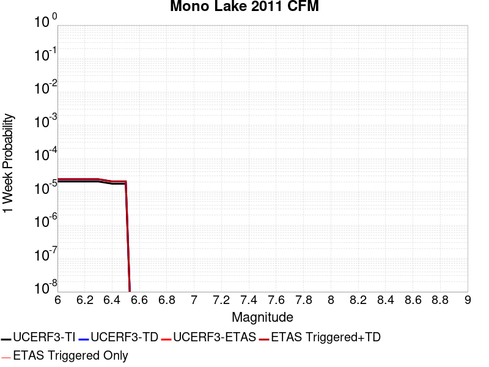 |  |  |  |

| Magnitude | 1 wk TI Prob | 1 wk TD Prob | 1 wk ETAS Prob | 1 wk ETAS/TD Gain | 1 wk ETAS Triggered+TD | 1 wk ETAS Triggered Only | 1 mo TI Prob | 1 mo TD Prob | 1 mo ETAS Prob | 1 mo ETAS/TD Gain | 1 mo ETAS Triggered+TD | 1 mo ETAS Triggered Only | 1 yr TI Prob | 1 yr TD Prob | 1 yr ETAS Prob | 1 yr ETAS/TD Gain | 1 yr ETAS Triggered+TD | 1 yr ETAS Triggered Only | 10 yr TI Prob | 10 yr TD Prob | 10 yr ETAS Prob | 10 yr ETAS/TD Gain | 10 yr ETAS Triggered+TD | 10 yr ETAS Triggered Only |
|-----|-----|-----|-----|-----|-----|-----|-----|-----|-----|-----|-----|-----|-----|-----|-----|-----|-----|-----|-----|-----|-----|-----|-----|-----|
| 6.0 | 2.0341662E-5 | 2.3785644E-5 | 0.0 | 0.0 | 2.3785644E-5 | 0.0 | 8.717564E-5 | 1.01937476E-4 | 1.0E-4 | 0.98099345 | 2.0192728E-4 | 1.0E-4 | 0.0010608466 | 0.0012409115 | 8.0E-4 | 0.64468735 | 0.0015405392 | 3.0E-4 | 0.010557966 | 0.012391717 | 0.0095 | 0.76664114 | 0.013774369 | 0.0014 |
| 6.1 | 2.0341662E-5 | 2.3785644E-5 | 0.0 | 0.0 | 2.3785644E-5 | 0.0 | 8.717564E-5 | 1.01937476E-4 | 1.0E-4 | 0.98099345 | 2.0192728E-4 | 1.0E-4 | 0.0010608466 | 0.0012409115 | 8.0E-4 | 0.64468735 | 0.0015405392 | 3.0E-4 | 0.010557966 | 0.012391717 | 0.0095 | 0.76664114 | 0.013774369 | 0.0014 |
| 6.2 | 2.0341662E-5 | 2.3785644E-5 | 0.0 | 0.0 | 2.3785644E-5 | 0.0 | 8.717564E-5 | 1.01937476E-4 | 1.0E-4 | 0.98099345 | 2.0192728E-4 | 1.0E-4 | 0.0010608466 | 0.0012409115 | 8.0E-4 | 0.64468735 | 0.0015405392 | 3.0E-4 | 0.010557966 | 0.012391717 | 0.0095 | 0.76664114 | 0.013774369 | 0.0014 |
| 6.3 | 2.0341662E-5 | 2.3785644E-5 | 0.0 | 0.0 | 2.3785644E-5 | 0.0 | 8.717564E-5 | 1.01937476E-4 | 1.0E-4 | 0.98099345 | 2.0192728E-4 | 1.0E-4 | 0.0010608466 | 0.0012409115 | 8.0E-4 | 0.64468735 | 0.0015405392 | 3.0E-4 | 0.010557966 | 0.012391717 | 0.0095 | 0.76664114 | 0.013774369 | 0.0014 |
| 6.4 | 1.749821E-5 | 2.04545E-5 | 0.0 | 0.0 | 2.04545E-5 | 0.0 | 7.499018E-5 | 8.766214E-5 | 1.0E-4 | 1.1407433 | 1.8765338E-4 | 1.0E-4 | 9.1262296E-4 | 0.0010672864 | 7.0E-4 | 0.65586895 | 0.0013669662 | 3.0E-4 | 0.009088841 | 0.010672825 | 0.0084 | 0.7870456 | 0.011761085 | 0.0011 |
| 6.5 | 1.749821E-5 | 2.04545E-5 | 0.0 | 0.0 | 2.04545E-5 | 0.0 | 7.499018E-5 | 8.766214E-5 | 1.0E-4 | 1.1407433 | 1.8765338E-4 | 1.0E-4 | 9.1262296E-4 | 0.0010672864 | 7.0E-4 | 0.65586895 | 0.0013669662 | 3.0E-4 | 0.009088841 | 0.010672825 | 0.0084 | 0.7870456 | 0.011761085 | 0.0011 |

## Goldstone Lake
*[(top)](#table-of-contents)*

| 1 Week | 1 Month | 1 Year | 10 Year |
|-----|-----|-----|-----|
|  |  |  |  |

| Magnitude | 1 wk TI Prob | 1 wk TD Prob | 1 wk ETAS Prob | 1 wk ETAS/TD Gain | 1 wk ETAS Triggered+TD | 1 wk ETAS Triggered Only | 1 mo TI Prob | 1 mo TD Prob | 1 mo ETAS Prob | 1 mo ETAS/TD Gain | 1 mo ETAS Triggered+TD | 1 mo ETAS Triggered Only | 1 yr TI Prob | 1 yr TD Prob | 1 yr ETAS Prob | 1 yr ETAS/TD Gain | 1 yr ETAS Triggered+TD | 1 yr ETAS Triggered Only | 10 yr TI Prob | 10 yr TD Prob | 10 yr ETAS Prob | 10 yr ETAS/TD Gain | 10 yr ETAS Triggered+TD | 10 yr ETAS Triggered Only |
|-----|-----|-----|-----|-----|-----|-----|-----|-----|-----|-----|-----|-----|-----|-----|-----|-----|-----|-----|-----|-----|-----|-----|-----|-----|
| 6.0 | 2.671352E-5 | 3.0331994E-5 | 0.0 | 0.0 | 3.0331994E-5 | 0.0 | 1.1448149E-4 | 1.2998888E-4 | 1.0E-4 | 0.7692965 | 1.2998888E-4 | 0.0 | 0.001392921 | 0.0015816615 | 0.0019 | 1.2012684 | 0.0016815034 | 1.0E-4 | 0.013842222 | 0.015723487 | 0.0174 | 1.1066247 | 0.01680619 | 0.0011 |
| 6.1 | 2.671352E-5 | 3.0331994E-5 | 0.0 | 0.0 | 3.0331994E-5 | 0.0 | 1.1448149E-4 | 1.2998888E-4 | 1.0E-4 | 0.7692965 | 1.2998888E-4 | 0.0 | 0.001392921 | 0.0015816615 | 0.0019 | 1.2012684 | 0.0016815034 | 1.0E-4 | 0.013842222 | 0.015723487 | 0.0174 | 1.1066247 | 0.01680619 | 0.0011 |
| 6.2 | 1.4197047E-5 | 1.6073136E-5 | 0.0 | 0.0 | 1.6073136E-5 | 0.0 | 6.0843064E-5 | 6.88836E-5 | 1.0E-4 | 1.4517243 | 6.88836E-5 | 0.0 | 7.4051257E-4 | 8.384335E-4 | 0.001 | 1.1927004 | 8.384335E-4 | 0.0 | 0.007380498 | 0.008362372 | 0.01 | 1.195833 | 0.008858191 | 5.0E-4 |
| 6.3 | 1.4197047E-5 | 1.6073136E-5 | 0.0 | 0.0 | 1.6073136E-5 | 0.0 | 6.0843064E-5 | 6.88836E-5 | 1.0E-4 | 1.4517243 | 6.88836E-5 | 0.0 | 7.4051257E-4 | 8.384335E-4 | 0.001 | 1.1927004 | 8.384335E-4 | 0.0 | 0.007380498 | 0.008362372 | 0.01 | 1.195833 | 0.008858191 | 5.0E-4 |
| 6.4 | 1.3238931E-5 | 1.4986886E-5 | 0.0 | 0.0 | 1.4986886E-5 | 0.0 | 5.6737044E-5 | 6.422848E-5 | 1.0E-4 | 1.5569417 | 6.422848E-5 | 0.0 | 6.9055456E-4 | 7.817989E-4 | 0.001 | 1.2791013 | 7.817989E-4 | 0.0 | 0.006884126 | 0.007800085 | 0.0096 | 1.2307558 | 0.008296185 | 5.0E-4 |
| 6.5 | 1.3238931E-5 | 1.4986886E-5 | 0.0 | 0.0 | 1.4986886E-5 | 0.0 | 5.6737044E-5 | 6.422848E-5 | 1.0E-4 | 1.5569417 | 6.422848E-5 | 0.0 | 6.9055456E-4 | 7.817989E-4 | 0.001 | 1.2791013 | 7.817989E-4 | 0.0 | 0.006884126 | 0.007800085 | 0.0096 | 1.2307558 | 0.008296185 | 5.0E-4 |
| 6.6 | 1.1328278E-5 | 1.2836445E-5 | 0.0 | 0.0 | 1.2836445E-5 | 0.0 | 4.8548856E-5 | 5.5012715E-5 | 1.0E-4 | 1.8177617 | 5.5012715E-5 | 0.0 | 5.90922E-4 | 6.6966936E-4 | 8.0E-4 | 1.1946193 | 6.6966936E-4 | 0.0 | 0.0058935313 | 0.0066858768 | 0.0083 | 1.2414228 | 0.0070832022 | 4.0E-4 |
| 6.7 | 8.651175E-6 | 9.810019E-6 | 0.0 | 0.0 | 9.810019E-6 | 0.0 | 3.707594E-5 | 4.2042768E-5 | 1.0E-4 | 2.3785303 | 4.2042768E-5 | 0.0 | 4.5130608E-4 | 5.1184074E-4 | 6.0E-4 | 1.1722395 | 5.1184074E-4 | 0.0 | 0.0045039062 | 0.0051154727 | 0.0062 | 1.2120092 | 0.005413938 | 3.0E-4 |
| 6.8 | 1.0215377E-6 | 1.1729769E-6 | 0.0 | 0.0 | 1.1729769E-6 | 0.0 | 4.378012E-6 | 5.027035E-6 | 0.0 | 0.0 | 5.027035E-6 | 0.0 | 5.3300988E-5 | 6.120255E-5 | 0.0 | 0.0 | 6.120255E-5 | 0.0 | 5.3288206E-4 | 6.118681E-4 | 6.0E-4 | 0.98060346 | 8.1174576E-4 | 2.0E-4 |
| 6.9 | 7.9360774E-7 | 9.2606354E-7 | 0.0 | 0.0 | 9.2606354E-7 | 0.0 | 3.4011714E-6 | 3.968838E-6 | 0.0 | 0.0 | 3.968838E-6 | 0.0 | 4.1408475E-5 | 4.83196E-5 | 0.0 | 0.0 | 4.83196E-5 | 0.0 | 4.140076E-4 | 4.8309792E-4 | 5.0E-4 | 1.0349869 | 6.830013E-4 | 2.0E-4 |
| 7.0 | 7.4382757E-7 | 8.724997E-7 | 0.0 | 0.0 | 8.724997E-7 | 0.0 | 3.1878285E-6 | 3.7392795E-6 | 0.0 | 0.0 | 3.7392795E-6 | 0.0 | 3.8811122E-5 | 4.5524845E-5 | 0.0 | 0.0 | 4.5524845E-5 | 0.0 | 3.8804344E-4 | 4.551618E-4 | 5.0E-4 | 1.0985105 | 6.5507076E-4 | 2.0E-4 |
| 7.1 | 6.4709513E-7 | 7.689736E-7 | 0.0 | 0.0 | 7.689736E-7 | 0.0 | 2.773262E-6 | 3.2955975E-6 | 0.0 | 0.0 | 3.2955975E-6 | 0.0 | 3.376394E-5 | 4.012322E-5 | 0.0 | 0.0 | 4.012322E-5 | 0.0 | 3.375881E-4 | 4.011657E-4 | 5.0E-4 | 1.2463678 | 6.010855E-4 | 2.0E-4 |
| 7.2 | 6.356704E-7 | 7.5668936E-7 | 0.0 | 0.0 | 7.5668936E-7 | 0.0 | 2.7242988E-6 | 3.2429507E-6 | 0.0 | 0.0 | 3.2429507E-6 | 0.0 | 3.3167835E-5 | 3.948227E-5 | 0.0 | 0.0 | 3.948227E-5 | 0.0 | 3.3162883E-4 | 3.9475845E-4 | 5.0E-4 | 1.2665973 | 5.946795E-4 | 2.0E-4 |
| 7.3 | 5.7695723E-7 | 6.8827575E-7 | 0.0 | 0.0 | 6.8827575E-7 | 0.0 | 2.4726714E-6 | 2.9497503E-6 | 0.0 | 0.0 | 2.9497503E-6 | 0.0 | 3.0104358E-5 | 3.5912675E-5 | 0.0 | 0.0 | 3.5912675E-5 | 0.0 | 3.0100282E-4 | 3.5907442E-4 | 4.0E-4 | 1.1139752 | 4.590385E-4 | 1.0E-4 |
| 7.4 | 5.209647E-7 | 6.18126E-7 | 0.0 | 0.0 | 6.18126E-7 | 0.0 | 2.232704E-6 | 2.649109E-6 | 0.0 | 0.0 | 2.649109E-6 | 0.0 | 2.718283E-5 | 3.2252483E-5 | 0.0 | 0.0 | 3.2252483E-5 | 0.0 | 2.7179506E-4 | 3.2248354E-4 | 3.0E-4 | 0.93028 | 4.224513E-4 | 1.0E-4 |
| 7.5 | 4.512955E-7 | 5.33711E-7 | 0.0 | 0.0 | 5.33711E-7 | 0.0 | 1.934122E-6 | 2.2873312E-6 | 0.0 | 0.0 | 2.2873312E-6 | 0.0 | 2.3547682E-5 | 2.7847955E-5 | 0.0 | 0.0 | 2.7847955E-5 | 0.0 | 2.3545188E-4 | 2.7844994E-4 | 2.0E-4 | 0.71826196 | 2.7844994E-4 | 0.0 |
| 7.6 | 2.21172E-7 | 2.602981E-7 | 0.0 | 0.0 | 2.602981E-7 | 0.0 | 9.478797E-7 | 1.115563E-6 | 0.0 | 0.0 | 1.115563E-6 | 0.0 | 1.1540374E-5 | 1.3581924E-5 | 0.0 | 0.0 | 1.3581924E-5 | 0.0 | 1.1539775E-4 | 1.3581375E-4 | 1.0E-4 | 0.7363025 | 1.3581375E-4 | 0.0 |

## San Jacinto (Borrego)
*[(top)](#table-of-contents)*

| 1 Week | 1 Month | 1 Year | 10 Year |
|-----|-----|-----|-----|
|  |  | 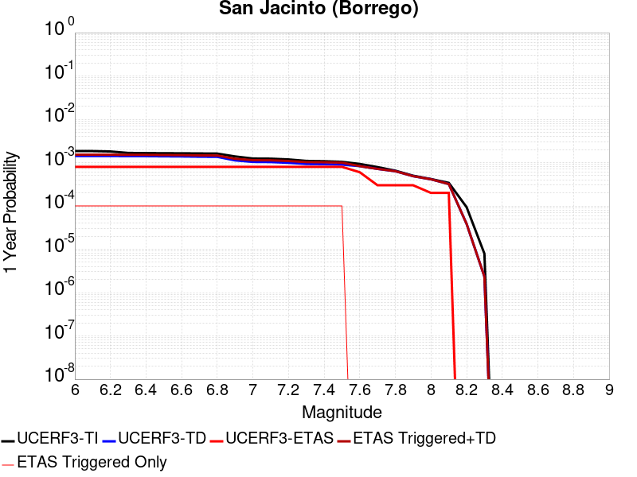 |  |

| Magnitude | 1 wk TI Prob | 1 wk TD Prob | 1 wk ETAS Prob | 1 wk ETAS/TD Gain | 1 wk ETAS Triggered+TD | 1 wk ETAS Triggered Only | 1 mo TI Prob | 1 mo TD Prob | 1 mo ETAS Prob | 1 mo ETAS/TD Gain | 1 mo ETAS Triggered+TD | 1 mo ETAS Triggered Only | 1 yr TI Prob | 1 yr TD Prob | 1 yr ETAS Prob | 1 yr ETAS/TD Gain | 1 yr ETAS Triggered+TD | 1 yr ETAS Triggered Only | 10 yr TI Prob | 10 yr TD Prob | 10 yr ETAS Prob | 10 yr ETAS/TD Gain | 10 yr ETAS Triggered+TD | 10 yr ETAS Triggered Only |
|-----|-----|-----|-----|-----|-----|-----|-----|-----|-----|-----|-----|-----|-----|-----|-----|-----|-----|-----|-----|-----|-----|-----|-----|-----|
| 6.0 | 3.543992E-5 | 2.7189188E-5 | 0.0 | 0.0 | 2.7189188E-5 | 0.0 | 1.5187653E-4 | 1.1651995E-4 | 0.0 | 0.0 | 1.1651995E-4 | 0.0 | 0.0018475284 | 0.0014177191 | 8.0E-4 | 0.5642867 | 0.0015175772 | 1.0E-4 | 0.018322436 | 0.01448599 | 0.0091 | 0.6281932 | 0.01586571 | 0.0014 |
| 6.1 | 3.542281E-5 | 2.7189188E-5 | 0.0 | 0.0 | 2.7189188E-5 | 0.0 | 1.5180321E-4 | 1.1651995E-4 | 0.0 | 0.0 | 1.1651995E-4 | 0.0 | 0.0018466372 | 0.0014177191 | 8.0E-4 | 0.5642867 | 0.0015175772 | 1.0E-4 | 0.018313672 | 0.01448599 | 0.0091 | 0.6281932 | 0.01586571 | 0.0014 |
| 6.2 | 3.4688688E-5 | 2.7189188E-5 | 0.0 | 0.0 | 2.7189188E-5 | 0.0 | 1.4865733E-4 | 1.1651995E-4 | 0.0 | 0.0 | 1.1651995E-4 | 0.0 | 0.0018084005 | 0.0014177191 | 8.0E-4 | 0.5642867 | 0.0015175772 | 1.0E-4 | 0.017937548 | 0.01448599 | 0.0091 | 0.6281932 | 0.01586571 | 0.0014 |
| 6.3 | 3.2087122E-5 | 2.7034886E-5 | 0.0 | 0.0 | 2.7034886E-5 | 0.0 | 1.3750899E-4 | 1.1585872E-4 | 0.0 | 0.0 | 1.1585872E-4 | 0.0 | 0.0016728862 | 0.001409679 | 8.0E-4 | 0.5675051 | 0.0015095379 | 1.0E-4 | 0.016603488 | 0.014407289 | 0.0091 | 0.6316247 | 0.015787119 | 0.0014 |
| 6.4 | 3.1828724E-5 | 2.7002008E-5 | 0.0 | 0.0 | 2.7002008E-5 | 0.0 | 1.364017E-4 | 1.1571783E-4 | 0.0 | 0.0 | 1.1571783E-4 | 0.0 | 0.0016594254 | 0.0014079658 | 8.0E-4 | 0.56819564 | 0.001507825 | 1.0E-4 | 0.016470885 | 0.014390131 | 0.0091 | 0.6323778 | 0.015769985 | 0.0014 |
| 6.5 | 3.1563577E-5 | 2.6742735E-5 | 0.0 | 0.0 | 2.6742735E-5 | 0.0 | 1.3526545E-4 | 1.1460675E-4 | 0.0 | 0.0 | 1.1460675E-4 | 0.0 | 0.0016456128 | 0.0013944558 | 8.0E-4 | 0.5737005 | 0.0014943164 | 1.0E-4 | 0.0163348 | 0.014257997 | 0.0091 | 0.6382383 | 0.015638037 | 0.0014 |
| 6.6 | 3.1467625E-5 | 2.6587433E-5 | 0.0 | 0.0 | 2.6587433E-5 | 0.0 | 1.3485427E-4 | 1.1394123E-4 | 0.0 | 0.0 | 1.1394123E-4 | 0.0 | 0.0016406142 | 0.0013863634 | 8.0E-4 | 0.57704926 | 0.0014862247 | 1.0E-4 | 0.016285548 | 0.014178378 | 0.0091 | 0.6418224 | 0.015558528 | 0.0014 |
| 6.7 | 3.1223695E-5 | 2.6207546E-5 | 0.0 | 0.0 | 2.6207546E-5 | 0.0 | 1.3380898E-4 | 1.1231328E-4 | 0.0 | 0.0 | 1.1231328E-4 | 0.0 | 0.0016279068 | 0.0013665681 | 8.0E-4 | 0.5854081 | 0.0014664314 | 1.0E-4 | 0.01616033 | 0.013983885 | 0.009 | 0.64359796 | 0.015364307 | 0.0014 |
| 6.8 | 3.1015585E-5 | 2.6030486E-5 | 0.0 | 0.0 | 2.6030486E-5 | 0.0 | 1.3291716E-4 | 1.11554524E-4 | 0.0 | 0.0 | 1.11554524E-4 | 0.0 | 0.001617065 | 0.0013573418 | 8.0E-4 | 0.5893873 | 0.001457206 | 1.0E-4 | 0.016053487 | 0.013892122 | 0.0089 | 0.64065087 | 0.015174062 | 0.0013 |
| 6.9 | 2.6641965E-5 | 2.1536094E-5 | 0.0 | 0.0 | 2.1536094E-5 | 0.0 | 1.1417485E-4 | 9.22943E-5 | 0.0 | 0.0 | 9.22943E-5 | 0.0 | 0.0013891924 | 0.0011231076 | 8.0E-4 | 0.7123093 | 0.0012229953 | 1.0E-4 | 0.0138054015 | 0.011543221 | 0.0068 | 0.58909035 | 0.01223514 | 7.0E-4 |
| 7.0 | 2.3854353E-5 | 1.9871672E-5 | 0.0 | 0.0 | 1.9871672E-5 | 0.0 | 1.02228936E-4 | 8.516154E-5 | 0.0 | 0.0 | 8.516154E-5 | 0.0 | 0.0012439266 | 0.001036351 | 8.0E-4 | 0.7719392 | 0.0011362474 | 1.0E-4 | 0.012369866 | 0.0106646 | 0.0062 | 0.58136266 | 0.011357134 | 7.0E-4 |
| 7.1 | 2.3672901E-5 | 1.970949E-5 | 0.0 | 0.0 | 1.970949E-5 | 0.0 | 1.0145135E-4 | 8.446652E-5 | 0.0 | 0.0 | 8.446652E-5 | 0.0 | 0.0012344702 | 0.0010278972 | 8.0E-4 | 0.77828795 | 0.0011277944 | 1.0E-4 | 0.0122763505 | 0.01058045 | 0.0062 | 0.58598644 | 0.011273044 | 7.0E-4 |
| 7.2 | 2.2717244E-5 | 1.8946388E-5 | 0.0 | 0.0 | 1.8946388E-5 | 0.0 | 9.735599E-5 | 8.119629E-5 | 0.0 | 0.0 | 8.119629E-5 | 0.0 | 0.0011846646 | 9.881187E-4 | 8.0E-4 | 0.8096193 | 0.0010880199 | 1.0E-4 | 0.01178369 | 0.010182606 | 0.006 | 0.5892401 | 0.0107764965 | 6.0E-4 |
| 7.3 | 2.1016205E-5 | 1.7800043E-5 | 0.0 | 0.0 | 1.7800043E-5 | 0.0 | 9.006634E-5 | 7.628368E-5 | 0.0 | 0.0 | 7.628368E-5 | 0.0 | 0.001096006 | 9.2836004E-4 | 8.0E-4 | 0.8617346 | 0.0010282672 | 1.0E-4 | 0.010906163 | 0.009584244 | 0.0059 | 0.6155936 | 0.010178494 | 6.0E-4 |
| 7.4 | 2.0683625E-5 | 1.7604487E-5 | 0.0 | 0.0 | 1.7604487E-5 | 0.0 | 8.86411E-5 | 7.544563E-5 | 0.0 | 0.0 | 7.544563E-5 | 0.0 | 0.001078671 | 9.181654E-4 | 8.0E-4 | 0.8713027 | 0.0010180735 | 1.0E-4 | 0.010734501 | 0.00948196 | 0.0058 | 0.61168784 | 0.010076271 | 6.0E-4 |
| 7.5 | 1.9993966E-5 | 1.7204853E-5 | 0.0 | 0.0 | 1.7204853E-5 | 0.0 | 8.568561E-5 | 7.373301E-5 | 0.0 | 0.0 | 7.373301E-5 | 0.0 | 0.001042723 | 8.973316E-4 | 8.0E-4 | 0.8915321 | 9.972419E-4 | 1.0E-4 | 0.010378438 | 0.009271625 | 0.0058 | 0.6255646 | 0.009866062 | 6.0E-4 |
| 7.6 | 1.788966E-5 | 1.5873382E-5 | 0.0 | 0.0 | 1.5873382E-5 | 0.0 | 7.666772E-5 | 6.802701E-5 | 0.0 | 0.0 | 6.802701E-5 | 0.0 | 9.3302975E-4 | 8.2791585E-4 | 6.0E-4 | 0.72471136 | 8.2791585E-4 | 0.0 | 0.00929122 | 0.008571208 | 0.0047 | 0.5483474 | 0.0088686375 | 3.0E-4 |
| 7.7 | 1.5125781E-5 | 1.369977E-5 | 0.0 | 0.0 | 1.369977E-5 | 0.0 | 6.4823165E-5 | 5.8711983E-5 | 0.0 | 0.0 | 5.8711983E-5 | 0.0 | 7.889362E-4 | 7.145847E-4 | 3.0E-4 | 0.41982427 | 7.145847E-4 | 0.0 | 0.007861412 | 0.0074313665 | 0.004 | 0.538259 | 0.0077291373 | 3.0E-4 |
| 7.8 | 1.250089E-5 | 1.2115975E-5 | 0.0 | 0.0 | 1.2115975E-5 | 0.0 | 5.3574146E-5 | 5.1924573E-5 | 0.0 | 0.0 | 5.1924573E-5 | 0.0 | 6.5207E-4 | 6.319989E-4 | 3.0E-4 | 0.4746844 | 6.319989E-4 | 0.0 | 0.006501599 | 0.0065969536 | 0.0036 | 0.54570645 | 0.0068949745 | 3.0E-4 |
| 7.9 | 9.561E-6 | 9.297197E-6 | 0.0 | 0.0 | 9.297197E-6 | 0.0 | 4.0975072E-5 | 3.9844523E-5 | 0.0 | 0.0 | 3.9844523E-5 | 0.0 | 4.987573E-4 | 4.849996E-4 | 3.0E-4 | 0.6185572 | 4.849996E-4 | 0.0 | 0.0049763937 | 0.0051110815 | 0.0026 | 0.5086986 | 0.0052105705 | 1.0E-4 |
| 8.0 | 8.01699E-6 | 7.874647E-6 | 0.0 | 0.0 | 7.874647E-6 | 0.0 | 3.4358076E-5 | 3.3748056E-5 | 0.0 | 0.0 | 3.3748056E-5 | 0.0 | 4.1822926E-4 | 4.1080557E-4 | 2.0E-4 | 0.4868483 | 4.1080557E-4 | 0.0 | 0.0041744304 | 0.004352012 | 0.0021 | 0.48253542 | 0.004451577 | 1.0E-4 |
| 8.1 | 6.541947E-6 | 6.118004E-6 | 0.0 | 0.0 | 6.118004E-6 | 0.0 | 2.8036617E-5 | 2.6219757E-5 | 0.0 | 0.0 | 2.6219757E-5 | 0.0 | 3.4129233E-4 | 3.1917923E-4 | 2.0E-4 | 0.6266072 | 3.1917923E-4 | 0.0 | 0.0034076865 | 0.0033980047 | 0.0017 | 0.5002936 | 0.003497665 | 1.0E-4 |
| 8.2 | 1.7968189E-6 | 7.303876E-7 | 0.0 | 0.0 | 7.303876E-7 | 0.0 | 7.70063E-6 | 3.130229E-6 | 0.0 | 0.0 | 3.130229E-6 | 0.0 | 9.3751136E-5 | 3.810989E-5 | 0.0 | 0.0 | 3.810989E-5 | 0.0 | 9.371159E-4 | 4.3368828E-4 | 2.0E-4 | 0.46116072 | 4.3368828E-4 | 0.0 |
| 8.3 | 1.5167889E-7 | 4.4245223E-8 | 0.0 | 0.0 | 4.4245223E-8 | 0.0 | 6.500522E-7 | 1.8962237E-7 | 0.0 | 0.0 | 1.8962237E-7 | 0.0 | 7.9143565E-6 | 2.3086502E-6 | 0.0 | 0.0 | 2.3086502E-6 | 0.0 | 7.914075E-5 | 2.6973452E-5 | 0.0 | 0.0 | 2.6973452E-5 | 0.0 |

## Sierra Nevada  (No Extension)
*[(top)](#table-of-contents)*

| 1 Week | 1 Month | 1 Year | 10 Year |
|-----|-----|-----|-----|
|  |  |  |  |

| Magnitude | 1 wk TI Prob | 1 wk TD Prob | 1 wk ETAS Prob | 1 wk ETAS/TD Gain | 1 wk ETAS Triggered+TD | 1 wk ETAS Triggered Only | 1 mo TI Prob | 1 mo TD Prob | 1 mo ETAS Prob | 1 mo ETAS/TD Gain | 1 mo ETAS Triggered+TD | 1 mo ETAS Triggered Only | 1 yr TI Prob | 1 yr TD Prob | 1 yr ETAS Prob | 1 yr ETAS/TD Gain | 1 yr ETAS Triggered+TD | 1 yr ETAS Triggered Only | 10 yr TI Prob | 10 yr TD Prob | 10 yr ETAS Prob | 10 yr ETAS/TD Gain | 10 yr ETAS Triggered+TD | 10 yr ETAS Triggered Only |
|-----|-----|-----|-----|-----|-----|-----|-----|-----|-----|-----|-----|-----|-----|-----|-----|-----|-----|-----|-----|-----|-----|-----|-----|-----|
| 6.0 | 7.7690465E-6 | 6.971018E-6 | 0.0 | 0.0 | 6.971018E-6 | 0.0 | 3.329549E-5 | 2.9875653E-5 | 1.0E-4 | 3.3472073 | 1.2987267E-4 | 1.0E-4 | 4.0529718E-4 | 3.6371118E-4 | 1.0E-4 | 0.27494344 | 4.636748E-4 | 1.0E-4 | 0.004045588 | 0.0036346717 | 0.0027 | 0.74284565 | 0.005029583 | 0.0014 |
| 6.1 | 7.7690465E-6 | 6.971018E-6 | 0.0 | 0.0 | 6.971018E-6 | 0.0 | 3.329549E-5 | 2.9875653E-5 | 1.0E-4 | 3.3472073 | 1.2987267E-4 | 1.0E-4 | 4.0529718E-4 | 3.6371118E-4 | 1.0E-4 | 0.27494344 | 4.636748E-4 | 1.0E-4 | 0.004045588 | 0.0036346717 | 0.0027 | 0.74284565 | 0.005029583 | 0.0014 |
| 6.2 | 7.7690465E-6 | 6.971018E-6 | 0.0 | 0.0 | 6.971018E-6 | 0.0 | 3.329549E-5 | 2.9875653E-5 | 1.0E-4 | 3.3472073 | 1.2987267E-4 | 1.0E-4 | 4.0529718E-4 | 3.6371118E-4 | 1.0E-4 | 0.27494344 | 4.636748E-4 | 1.0E-4 | 0.004045588 | 0.0036346717 | 0.0027 | 0.74284565 | 0.005029583 | 0.0014 |
| 6.3 | 7.7690465E-6 | 6.971018E-6 | 0.0 | 0.0 | 6.971018E-6 | 0.0 | 3.329549E-5 | 2.9875653E-5 | 1.0E-4 | 3.3472073 | 1.2987267E-4 | 1.0E-4 | 4.0529718E-4 | 3.6371118E-4 | 1.0E-4 | 0.27494344 | 4.636748E-4 | 1.0E-4 | 0.004045588 | 0.0036346717 | 0.0027 | 0.74284565 | 0.005029583 | 0.0014 |
| 6.4 | 7.7690465E-6 | 6.971018E-6 | 0.0 | 0.0 | 6.971018E-6 | 0.0 | 3.329549E-5 | 2.9875653E-5 | 1.0E-4 | 3.3472073 | 1.2987267E-4 | 1.0E-4 | 4.0529718E-4 | 3.6371118E-4 | 1.0E-4 | 0.27494344 | 4.636748E-4 | 1.0E-4 | 0.004045588 | 0.0036346717 | 0.0027 | 0.74284565 | 0.005029583 | 0.0014 |
| 6.5 | 7.7690465E-6 | 6.971018E-6 | 0.0 | 0.0 | 6.971018E-6 | 0.0 | 3.329549E-5 | 2.9875653E-5 | 1.0E-4 | 3.3472073 | 1.2987267E-4 | 1.0E-4 | 4.0529718E-4 | 3.6371118E-4 | 1.0E-4 | 0.27494344 | 4.636748E-4 | 1.0E-4 | 0.004045588 | 0.0036346717 | 0.0027 | 0.74284565 | 0.005029583 | 0.0014 |
| 6.6 | 2.653E-6 | 1.6122345E-6 | 0.0 | 0.0 | 1.6122345E-6 | 0.0 | 1.136995E-5 | 6.9095586E-6 | 0.0 | 0.0 | 6.9095586E-6 | 0.0 | 1.3842035E-4 | 8.4120664E-5 | 0.0 | 0.0 | 8.4120664E-5 | 0.0 | 0.0013833415 | 8.408917E-4 | 2.0E-4 | 0.23784277 | 8.408917E-4 | 0.0 |
| 6.7 | 2.5902466E-6 | 1.5475887E-6 | 0.0 | 0.0 | 1.5475887E-6 | 0.0 | 1.11010095E-5 | 6.6325065E-6 | 0.0 | 0.0 | 6.6325065E-6 | 0.0 | 1.351464E-4 | 8.07478E-5 | 0.0 | 0.0 | 8.07478E-5 | 0.0 | 0.0013506424 | 8.071876E-4 | 1.0E-4 | 0.123886935 | 8.071876E-4 | 0.0 |
| 6.8 | 2.5853892E-6 | 1.5444003E-6 | 0.0 | 0.0 | 1.5444003E-6 | 0.0 | 1.1080193E-5 | 6.618842E-6 | 0.0 | 0.0 | 6.618842E-6 | 0.0 | 1.34893E-4 | 8.058145E-5 | 0.0 | 0.0 | 8.058145E-5 | 0.0 | 0.0013481114 | 8.055253E-4 | 1.0E-4 | 0.124142595 | 8.055253E-4 | 0.0 |
| 6.9 | 2.458257E-6 | 1.4195255E-6 | 0.0 | 0.0 | 1.4195255E-6 | 0.0 | 1.0535345E-5 | 6.0836664E-6 | 0.0 | 0.0 | 6.0836664E-6 | 0.0 | 1.2826028E-4 | 7.406614E-5 | 0.0 | 0.0 | 7.406614E-5 | 0.0 | 0.0012818627 | 7.404165E-4 | 1.0E-4 | 0.13505912 | 7.404165E-4 | 0.0 |
| 7.0 | 2.4341468E-6 | 1.3965005E-6 | 0.0 | 0.0 | 1.3965005E-6 | 0.0 | 1.0432016E-5 | 5.9849885E-6 | 0.0 | 0.0 | 5.9849885E-6 | 0.0 | 1.270024E-4 | 7.2864816E-5 | 0.0 | 0.0 | 7.2864816E-5 | 0.0 | 0.0012692984 | 7.284112E-4 | 1.0E-4 | 0.1372851 | 7.284112E-4 | 0.0 |
| 7.1 | 2.3652476E-6 | 1.3314825E-6 | 0.0 | 0.0 | 1.3314825E-6 | 0.0 | 1.0136736E-5 | 5.706341E-6 | 0.0 | 0.0 | 5.706341E-6 | 0.0 | 1.2340778E-4 | 6.94725E-5 | 0.0 | 0.0 | 6.94725E-5 | 0.0 | 0.0012333926 | 6.9450954E-4 | 1.0E-4 | 0.14398651 | 6.9450954E-4 | 0.0 |
| 7.2 | 2.272158E-6 | 1.2478428E-6 | 0.0 | 0.0 | 1.2478428E-6 | 0.0 | 9.737784E-6 | 5.3478866E-6 | 0.0 | 0.0 | 5.3478866E-6 | 0.0 | 1.1855107E-4 | 6.510859E-5 | 0.0 | 0.0 | 6.510859E-5 | 0.0 | 0.0011848784 | 6.5089663E-4 | 1.0E-4 | 0.15363422 | 6.5089663E-4 | 0.0 |
| 7.3 | 2.1382127E-6 | 1.1396008E-6 | 0.0 | 0.0 | 1.1396008E-6 | 0.0 | 9.163737E-6 | 4.8839947E-6 | 0.0 | 0.0 | 4.8839947E-6 | 0.0 | 1.1156279E-4 | 5.9461025E-5 | 0.0 | 0.0 | 5.9461025E-5 | 0.0 | 0.001115068 | 5.944523E-4 | 1.0E-4 | 0.16822207 | 5.944523E-4 | 0.0 |
| 7.4 | 1.9048055E-6 | 9.552692E-7 | 0.0 | 0.0 | 9.552692E-7 | 0.0 | 8.163426E-6 | 4.094005E-6 | 0.0 | 0.0 | 4.094005E-6 | 0.0 | 9.9385186E-5 | 4.9843373E-5 | 0.0 | 0.0 | 4.9843373E-5 | 0.0 | 9.934074E-4 | 4.9832265E-4 | 0.0 | 0.0 | 4.9832265E-4 | 0.0 |
| 7.5 | 1.5373403E-6 | 7.540598E-7 | 0.0 | 0.0 | 7.540598E-7 | 0.0 | 6.5885843E-6 | 3.2316807E-6 | 0.0 | 0.0 | 3.2316807E-6 | 0.0 | 8.021306E-5 | 3.9345006E-5 | 0.0 | 0.0 | 3.9345006E-5 | 0.0 | 8.0184115E-4 | 3.9338088E-4 | 0.0 | 0.0 | 3.9338088E-4 | 0.0 |
| 7.6 | 1.0680322E-6 | 4.6453596E-7 | 0.0 | 0.0 | 4.6453596E-7 | 0.0 | 4.577273E-6 | 1.9908668E-6 | 0.0 | 0.0 | 1.9908668E-6 | 0.0 | 5.5726876E-5 | 2.4238538E-5 | 0.0 | 0.0 | 2.4238538E-5 | 0.0 | 5.5712904E-4 | 2.423592E-4 | 0.0 | 0.0 | 2.423592E-4 | 0.0 |
| 7.7 | 5.509146E-7 | 1.550042E-7 | 0.0 | 0.0 | 1.550042E-7 | 0.0 | 2.3610605E-6 | 6.6430357E-7 | 0.0 | 0.0 | 6.6430357E-7 | 0.0 | 2.8745531E-5 | 8.087867E-6 | 0.0 | 0.0 | 8.087867E-6 | 0.0 | 2.8741814E-4 | 8.087584E-5 | 0.0 | 0.0 | 8.087584E-5 | 0.0 |

## Great Valley 05 Pittsburg - Kirby Hills alt1
*[(top)](#table-of-contents)*

| 1 Week | 1 Month | 1 Year | 10 Year |
|-----|-----|-----|-----|
|  | 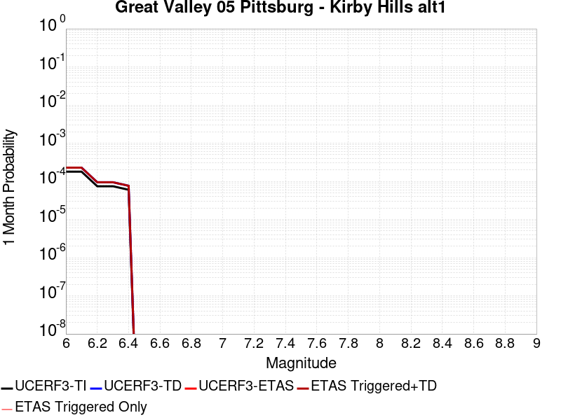 |  | 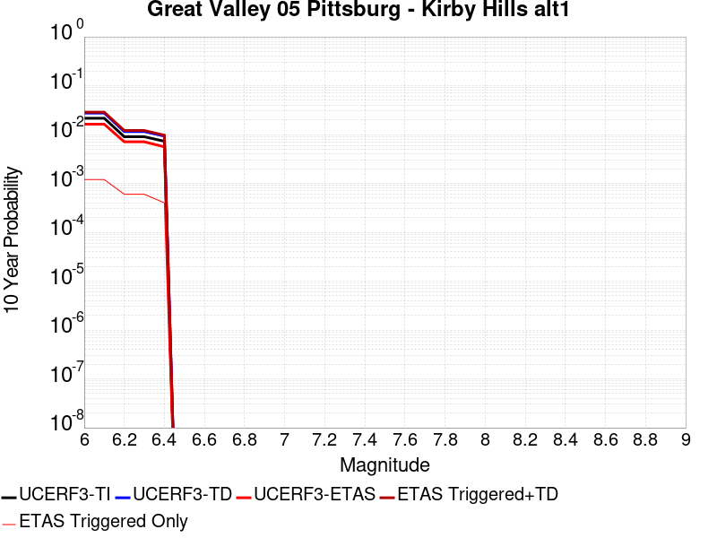 |

| Magnitude | 1 wk TI Prob | 1 wk TD Prob | 1 wk ETAS Prob | 1 wk ETAS/TD Gain | 1 wk ETAS Triggered+TD | 1 wk ETAS Triggered Only | 1 mo TI Prob | 1 mo TD Prob | 1 mo ETAS Prob | 1 mo ETAS/TD Gain | 1 mo ETAS Triggered+TD | 1 mo ETAS Triggered Only | 1 yr TI Prob | 1 yr TD Prob | 1 yr ETAS Prob | 1 yr ETAS/TD Gain | 1 yr ETAS Triggered+TD | 1 yr ETAS Triggered Only | 10 yr TI Prob | 10 yr TD Prob | 10 yr ETAS Prob | 10 yr ETAS/TD Gain | 10 yr ETAS Triggered+TD | 10 yr ETAS Triggered Only |
|-----|-----|-----|-----|-----|-----|-----|-----|-----|-----|-----|-----|-----|-----|-----|-----|-----|-----|-----|-----|-----|-----|-----|-----|-----|
| 6.0 | 4.187212E-5 | 5.3292064E-5 | 1.0E-4 | 1.876452 | 5.3292064E-5 | 0.0 | 1.794396E-4 | 2.2838028E-4 | 1.0E-4 | 0.43786618 | 2.2838028E-4 | 0.0 | 0.002182488 | 0.0027779457 | 0.0013 | 0.4679717 | 0.0027779457 | 0.0 | 0.021611776 | 0.027526524 | 0.0163 | 0.5921561 | 0.028693492 | 0.0012 |
| 6.1 | 4.187212E-5 | 5.3292064E-5 | 1.0E-4 | 1.876452 | 5.3292064E-5 | 0.0 | 1.794396E-4 | 2.2838028E-4 | 1.0E-4 | 0.43786618 | 2.2838028E-4 | 0.0 | 0.002182488 | 0.0027779457 | 0.0013 | 0.4679717 | 0.0027779457 | 0.0 | 0.021611776 | 0.027526524 | 0.0163 | 0.5921561 | 0.028693492 | 0.0012 |
| 6.2 | 1.7353306E-5 | 2.2091923E-5 | 0.0 | 0.0 | 2.2091923E-5 | 0.0 | 7.436919E-5 | 9.467852E-5 | 0.0 | 0.0 | 9.467852E-5 | 0.0 | 9.050688E-4 | 0.0011524927 | 4.0E-4 | 0.34707376 | 0.0011524927 | 0.0 | 0.009013915 | 0.011502856 | 0.0071 | 0.617238 | 0.012095954 | 6.0E-4 |
| 6.3 | 1.7353306E-5 | 2.2091923E-5 | 0.0 | 0.0 | 2.2091923E-5 | 0.0 | 7.436919E-5 | 9.467852E-5 | 0.0 | 0.0 | 9.467852E-5 | 0.0 | 9.050688E-4 | 0.0011524927 | 4.0E-4 | 0.34707376 | 0.0011524927 | 0.0 | 0.009013915 | 0.011502856 | 0.0071 | 0.617238 | 0.012095954 | 6.0E-4 |
| 6.4 | 1.4028824E-5 | 1.7850445E-5 | 0.0 | 0.0 | 1.7850445E-5 | 0.0 | 6.0122147E-5 | 7.650191E-5 | 0.0 | 0.0 | 7.650191E-5 | 0.0 | 7.3174125E-4 | 9.3139714E-4 | 4.0E-4 | 0.42946234 | 9.3139714E-4 | 0.0 | 0.0072933645 | 0.009312032 | 0.0056 | 0.60137254 | 0.009708307 | 4.0E-4 |

## Palos Verdes
*[(top)](#table-of-contents)*

| 1 Week | 1 Month | 1 Year | 10 Year |
|-----|-----|-----|-----|
|  |  |  |  |

| Magnitude | 1 wk TI Prob | 1 wk TD Prob | 1 wk ETAS Prob | 1 wk ETAS/TD Gain | 1 wk ETAS Triggered+TD | 1 wk ETAS Triggered Only | 1 mo TI Prob | 1 mo TD Prob | 1 mo ETAS Prob | 1 mo ETAS/TD Gain | 1 mo ETAS Triggered+TD | 1 mo ETAS Triggered Only | 1 yr TI Prob | 1 yr TD Prob | 1 yr ETAS Prob | 1 yr ETAS/TD Gain | 1 yr ETAS Triggered+TD | 1 yr ETAS Triggered Only | 10 yr TI Prob | 10 yr TD Prob | 10 yr ETAS Prob | 10 yr ETAS/TD Gain | 10 yr ETAS Triggered+TD | 10 yr ETAS Triggered Only |
|-----|-----|-----|-----|-----|-----|-----|-----|-----|-----|-----|-----|-----|-----|-----|-----|-----|-----|-----|-----|-----|-----|-----|-----|-----|
| 6.0 | 6.126063E-5 | 7.6033015E-5 | 1.0E-4 | 1.3152182 | 7.6033015E-5 | 0.0 | 2.6251914E-4 | 3.258184E-4 | 2.0E-4 | 0.61383885 | 3.258184E-4 | 0.0 | 0.0031914865 | 0.003960153 | 0.0022 | 0.5555341 | 0.0041593607 | 2.0E-4 | 0.031460393 | 0.038952567 | 0.023 | 0.59046173 | 0.04020193 | 0.0013 |
| 6.1 | 6.126063E-5 | 7.6033015E-5 | 1.0E-4 | 1.3152182 | 7.6033015E-5 | 0.0 | 2.6251914E-4 | 3.258184E-4 | 2.0E-4 | 0.61383885 | 3.258184E-4 | 0.0 | 0.0031914865 | 0.003960153 | 0.0022 | 0.5555341 | 0.0041593607 | 2.0E-4 | 0.031460393 | 0.038952567 | 0.023 | 0.59046173 | 0.04020193 | 0.0013 |
| 6.2 | 6.126063E-5 | 7.6033015E-5 | 1.0E-4 | 1.3152182 | 7.6033015E-5 | 0.0 | 2.6251914E-4 | 3.258184E-4 | 2.0E-4 | 0.61383885 | 3.258184E-4 | 0.0 | 0.0031914865 | 0.003960153 | 0.0022 | 0.5555341 | 0.0041593607 | 2.0E-4 | 0.031460393 | 0.038952567 | 0.023 | 0.59046173 | 0.04020193 | 0.0013 |
| 6.3 | 4.0838047E-5 | 4.9635695E-5 | 1.0E-4 | 2.0146792 | 4.9635695E-5 | 0.0 | 1.7500846E-4 | 2.1270833E-4 | 2.0E-4 | 0.9402547 | 2.1270833E-4 | 0.0 | 0.0021286458 | 0.0025868537 | 0.0017 | 0.657169 | 0.0026865948 | 1.0E-4 | 0.021083709 | 0.025589142 | 0.0157 | 0.6135415 | 0.026368672 | 8.0E-4 |
| 6.4 | 4.0838047E-5 | 4.9635695E-5 | 1.0E-4 | 2.0146792 | 4.9635695E-5 | 0.0 | 1.7500846E-4 | 2.1270833E-4 | 2.0E-4 | 0.9402547 | 2.1270833E-4 | 0.0 | 0.0021286458 | 0.0025868537 | 0.0017 | 0.657169 | 0.0026865948 | 1.0E-4 | 0.021083709 | 0.025589142 | 0.0157 | 0.6135415 | 0.026368672 | 8.0E-4 |
| 6.5 | 3.0512005E-5 | 3.6485533E-5 | 1.0E-4 | 2.7408123 | 3.6485533E-5 | 0.0 | 1.3075917E-4 | 1.5635787E-4 | 1.0E-4 | 0.63955843 | 1.5635787E-4 | 0.0 | 0.0015908304 | 0.001902111 | 0.0012 | 0.630878 | 0.0020019207 | 1.0E-4 | 0.015794903 | 0.01887022 | 0.0114 | 0.6041265 | 0.019655123 | 8.0E-4 |
| 6.6 | 2.9255087E-5 | 3.5080087E-5 | 1.0E-4 | 2.8506203 | 3.5080087E-5 | 0.0 | 1.2537291E-4 | 1.5033523E-4 | 1.0E-4 | 0.66518015 | 1.5033523E-4 | 0.0 | 0.0015253464 | 0.0018289083 | 0.0012 | 0.6561291 | 0.0019287254 | 1.0E-4 | 0.015149189 | 0.018150162 | 0.011 | 0.6060552 | 0.018935643 | 8.0E-4 |
| 6.7 | 2.287198E-5 | 2.71935E-5 | 0.0 | 0.0 | 2.71935E-5 | 0.0 | 9.801909E-5 | 1.1653888E-4 | 0.0 | 0.0 | 1.1653888E-4 | 0.0 | 0.001192729 | 0.0014180287 | 9.0E-4 | 0.6346839 | 0.0015178869 | 1.0E-4 | 0.011863477 | 0.014098996 | 0.0088 | 0.6241579 | 0.014789128 | 7.0E-4 |
| 6.8 | 2.1325764E-5 | 2.538045E-5 | 0.0 | 0.0 | 2.538045E-5 | 0.0 | 9.139293E-5 | 1.0876933E-4 | 0.0 | 0.0 | 1.0876933E-4 | 0.0 | 0.001112141 | 0.001323552 | 9.0E-4 | 0.67998844 | 0.0014234196 | 1.0E-4 | 0.011065915 | 0.013165689 | 0.0084 | 0.63802207 | 0.013856473 | 7.0E-4 |
| 6.9 | 1.9009392E-5 | 2.2568487E-5 | 0.0 | 0.0 | 2.2568487E-5 | 0.0 | 8.1466285E-5 | 9.671899E-5 | 0.0 | 0.0 | 9.671899E-5 | 0.0 | 9.914007E-4 | 0.0011770045 | 8.0E-4 | 0.6796915 | 0.0012768868 | 1.0E-4 | 0.009869894 | 0.011716356 | 0.0071 | 0.60599047 | 0.012309326 | 6.0E-4 |
| 7.0 | 1.7098473E-5 | 2.027909E-5 | 0.0 | 0.0 | 2.027909E-5 | 0.0 | 7.3277115E-5 | 8.6907974E-5 | 0.0 | 0.0 | 8.6907974E-5 | 0.0 | 8.917837E-4 | 0.0010576758 | 8.0E-4 | 0.75637543 | 0.00115757 | 1.0E-4 | 0.008882134 | 0.010534819 | 0.0066 | 0.62649393 | 0.011128498 | 6.0E-4 |
| 7.1 | 1.5982785E-5 | 1.89571E-5 | 0.0 | 0.0 | 1.89571E-5 | 0.0 | 6.849585E-5 | 8.1242666E-5 | 0.0 | 0.0 | 8.1242666E-5 | 0.0 | 8.336179E-4 | 9.887649E-4 | 8.0E-4 | 0.8090902 | 0.001088666 | 1.0E-4 | 0.008304977 | 0.009851984 | 0.0059 | 0.59886414 | 0.010446073 | 6.0E-4 |
| 7.2 | 1.4468002E-5 | 1.716309E-5 | 0.0 | 0.0 | 1.716309E-5 | 0.0 | 6.200425E-5 | 7.3554496E-5 | 0.0 | 0.0 | 7.3554496E-5 | 0.0 | 7.546402E-4 | 8.9524174E-4 | 8.0E-4 | 0.8936134 | 9.951522E-4 | 1.0E-4 | 0.007520827 | 0.008924588 | 0.0051 | 0.571455 | 0.009519232 | 6.0E-4 |
| 7.3 | 5.288233E-6 | 6.192199E-6 | 0.0 | 0.0 | 6.192199E-6 | 0.0 | 2.2663658E-5 | 2.6537922E-5 | 0.0 | 0.0 | 2.6537922E-5 | 0.0 | 2.7589512E-4 | 3.2308605E-4 | 3.0E-4 | 0.9285452 | 4.2305375E-4 | 1.0E-4 | 0.0027555283 | 0.0032295715 | 0.0018 | 0.5573495 | 0.0033292484 | 1.0E-4 |
| 7.4 | 8.279556E-7 | 8.406981E-7 | 0.0 | 0.0 | 8.406981E-7 | 0.0 | 3.5483763E-6 | 3.6029871E-6 | 0.0 | 0.0 | 3.6029871E-6 | 0.0 | 4.3200624E-5 | 4.386556E-5 | 2.0E-4 | 4.559386 | 1.4386118E-4 | 1.0E-4 | 4.3192226E-4 | 4.3857621E-4 | 5.0E-4 | 1.1400527 | 5.385324E-4 | 1.0E-4 |
| 7.5 | 6.559831E-7 | 6.666089E-7 | 0.0 | 0.0 | 6.666089E-7 | 0.0 | 2.8113532E-6 | 2.8568925E-6 | 0.0 | 0.0 | 2.8568925E-6 | 0.0 | 3.4227687E-5 | 3.478218E-5 | 2.0E-4 | 5.750071 | 1.347787E-4 | 1.0E-4 | 3.4222414E-4 | 3.4777398E-4 | 4.0E-4 | 1.1501724 | 4.477392E-4 | 1.0E-4 |
| 7.6 | 3.5018968E-7 | 3.5613644E-7 | 0.0 | 0.0 | 3.5613644E-7 | 0.0 | 1.500812E-6 | 1.5262984E-6 | 0.0 | 0.0 | 1.5262984E-6 | 0.0 | 1.8272232E-5 | 1.8582572E-5 | 1.0E-4 | 5.3813863 | 1.8582572E-5 | 0.0 | 1.8270731E-4 | 1.8581477E-4 | 2.0E-4 | 1.0763407 | 1.8581477E-4 | 0.0 |
| 7.7 | 1.1986104E-7 | 1.2196121E-7 | 0.0 | 0.0 | 1.2196121E-7 | 0.0 | 5.1369005E-7 | 5.226908E-7 | 0.0 | 0.0 | 5.226908E-7 | 0.0 | 6.2541585E-6 | 6.363742E-6 | 1.0E-4 | 15.714025 | 6.363742E-6 | 0.0 | 6.2539824E-5 | 6.363564E-5 | 1.0E-4 | 1.5714464 | 6.363564E-5 | 0.0 |
| 7.8 | 3.0445005E-8 | 3.1021386E-8 | 0.0 | 0.0 | 3.1021386E-8 | 0.0 | 1.3047858E-7 | 1.3294878E-7 | 0.0 | 0.0 | 1.3294878E-7 | 0.0 | 1.5885756E-6 | 1.6186506E-6 | 1.0E-4 | 61.779858 | 1.6186506E-6 | 0.0 | 1.5885644E-5 | 1.6186408E-5 | 1.0E-4 | 6.178023 | 1.6186408E-5 | 0.0 |

## Hector Mine
*[(top)](#table-of-contents)*

| 1 Week | 1 Month | 1 Year | 10 Year |
|-----|-----|-----|-----|
|  |  |  |  |

| Magnitude | 1 wk TI Prob | 1 wk TD Prob | 1 wk ETAS Prob | 1 wk ETAS/TD Gain | 1 wk ETAS Triggered+TD | 1 wk ETAS Triggered Only | 1 mo TI Prob | 1 mo TD Prob | 1 mo ETAS Prob | 1 mo ETAS/TD Gain | 1 mo ETAS Triggered+TD | 1 mo ETAS Triggered Only | 1 yr TI Prob | 1 yr TD Prob | 1 yr ETAS Prob | 1 yr ETAS/TD Gain | 1 yr ETAS Triggered+TD | 1 yr ETAS Triggered Only | 10 yr TI Prob | 10 yr TD Prob | 10 yr ETAS Prob | 10 yr ETAS/TD Gain | 10 yr ETAS Triggered+TD | 10 yr ETAS Triggered Only |
|-----|-----|-----|-----|-----|-----|-----|-----|-----|-----|-----|-----|-----|-----|-----|-----|-----|-----|-----|-----|-----|-----|-----|-----|-----|
| 6.0 | 1.8760093E-5 | 2.7878673E-6 | 0.0 | 0.0 | 2.7878673E-6 | 0.0 | 8.039792E-5 | 1.194797E-5 | 0.0 | 0.0 | 1.194797E-5 | 0.0 | 9.78405E-4 | 1.454608E-4 | 2.0E-4 | 1.3749409 | 3.454317E-4 | 2.0E-4 | 0.009741086 | 0.0014540462 | 0.0018 | 1.2379249 | 0.002752156 | 0.0013 |
| 6.1 | 1.8760093E-5 | 2.7878673E-6 | 0.0 | 0.0 | 2.7878673E-6 | 0.0 | 8.039792E-5 | 1.194797E-5 | 0.0 | 0.0 | 1.194797E-5 | 0.0 | 9.78405E-4 | 1.454608E-4 | 2.0E-4 | 1.3749409 | 3.454317E-4 | 2.0E-4 | 0.009741086 | 0.0014540462 | 0.0018 | 1.2379249 | 0.002752156 | 0.0013 |
| 6.2 | 1.8760093E-5 | 2.7878673E-6 | 0.0 | 0.0 | 2.7878673E-6 | 0.0 | 8.039792E-5 | 1.194797E-5 | 0.0 | 0.0 | 1.194797E-5 | 0.0 | 9.78405E-4 | 1.454608E-4 | 2.0E-4 | 1.3749409 | 3.454317E-4 | 2.0E-4 | 0.009741086 | 0.0014540462 | 0.0018 | 1.2379249 | 0.002752156 | 0.0013 |
| 6.3 | 1.8760093E-5 | 2.7878673E-6 | 0.0 | 0.0 | 2.7878673E-6 | 0.0 | 8.039792E-5 | 1.194797E-5 | 0.0 | 0.0 | 1.194797E-5 | 0.0 | 9.78405E-4 | 1.454608E-4 | 2.0E-4 | 1.3749409 | 3.454317E-4 | 2.0E-4 | 0.009741086 | 0.0014540462 | 0.0018 | 1.2379249 | 0.002752156 | 0.0013 |
| 6.4 | 1.0888055E-5 | 2.7878673E-6 | 0.0 | 0.0 | 2.7878673E-6 | 0.0 | 4.666226E-5 | 1.194797E-5 | 0.0 | 0.0 | 1.194797E-5 | 0.0 | 5.679649E-4 | 1.454608E-4 | 2.0E-4 | 1.3749409 | 3.454317E-4 | 2.0E-4 | 0.0056651547 | 0.0014540462 | 0.0018 | 1.2379249 | 0.002752156 | 0.0013 |
| 6.5 | 1.0888055E-5 | 2.7878673E-6 | 0.0 | 0.0 | 2.7878673E-6 | 0.0 | 4.666226E-5 | 1.194797E-5 | 0.0 | 0.0 | 1.194797E-5 | 0.0 | 5.679649E-4 | 1.454608E-4 | 2.0E-4 | 1.3749409 | 3.454317E-4 | 2.0E-4 | 0.0056651547 | 0.0014540462 | 0.0018 | 1.2379249 | 0.002752156 | 0.0013 |
| 6.6 | 1.0730738E-5 | 2.7878673E-6 | 0.0 | 0.0 | 2.7878673E-6 | 0.0 | 4.5988065E-5 | 1.194797E-5 | 0.0 | 0.0 | 1.194797E-5 | 0.0 | 5.5976084E-4 | 1.454608E-4 | 2.0E-4 | 1.3749409 | 3.454317E-4 | 2.0E-4 | 0.0055835294 | 0.0014540462 | 0.0018 | 1.2379249 | 0.002752156 | 0.0013 |
| 6.7 | 7.881326E-6 | 2.7629317E-6 | 0.0 | 0.0 | 2.7629317E-6 | 0.0 | 3.3776672E-5 | 1.1841104E-5 | 0.0 | 0.0 | 1.1841104E-5 | 0.0 | 4.111534E-4 | 1.4415989E-4 | 2.0E-4 | 1.3873484 | 3.4413105E-4 | 2.0E-4 | 0.0041039353 | 0.0014410539 | 0.0018 | 1.2490858 | 0.0027391806 | 0.0013 |
| 6.8 | 7.5683483E-6 | 2.7250815E-6 | 0.0 | 0.0 | 2.7250815E-6 | 0.0 | 3.2435375E-5 | 1.1678891E-5 | 0.0 | 0.0 | 1.1678891E-5 | 0.0 | 3.9482914E-4 | 1.4218519E-4 | 2.0E-4 | 1.4066162 | 3.4215677E-4 | 2.0E-4 | 0.0039412836 | 0.0014213322 | 0.0018 | 1.2664175 | 0.0027194845 | 0.0013 |
| 6.9 | 6.473048E-6 | 2.507028E-6 | 0.0 | 0.0 | 2.507028E-6 | 0.0 | 2.7741338E-5 | 1.0744385E-5 | 0.0 | 0.0 | 1.0744385E-5 | 0.0 | 3.3769844E-4 | 1.3080898E-4 | 2.0E-4 | 1.528947 | 3.3078282E-4 | 2.0E-4 | 0.0033718573 | 0.0013077074 | 0.0016 | 1.2235153 | 0.0024062688 | 0.0011 |
| 7.0 | 4.9959954E-6 | 1.850893E-6 | 0.0 | 0.0 | 1.850893E-6 | 0.0 | 2.1411232E-5 | 7.9323945E-6 | 0.0 | 0.0 | 7.9323945E-6 | 0.0 | 2.6065056E-4 | 9.657617E-5 | 2.0E-4 | 2.0709043 | 2.9655686E-4 | 2.0E-4 | 0.0026034506 | 9.656898E-4 | 0.0013 | 1.346188 | 0.0018648207 | 9.0E-4 |
| 7.1 | 1.2997541E-6 | 1.5493657E-7 | 0.0 | 0.0 | 1.5493657E-7 | 0.0 | 5.5703626E-6 | 6.640137E-7 | 0.0 | 0.0 | 6.640137E-7 | 0.0 | 6.7817055E-5 | 8.084341E-6 | 0.0 | 0.0 | 8.084341E-6 | 0.0 | 6.779636E-4 | 8.084086E-5 | 1.0E-4 | 1.2369982 | 8.084086E-5 | 0.0 |
| 7.2 | 8.392699E-7 | 9.673849E-8 | 0.0 | 0.0 | 9.673849E-8 | 0.0 | 3.596866E-6 | 4.1459344E-7 | 0.0 | 0.0 | 4.1459344E-7 | 0.0 | 4.3790962E-5 | 5.0476656E-6 | 0.0 | 0.0 | 5.0476656E-6 | 0.0 | 4.3782333E-4 | 5.04757E-5 | 1.0E-4 | 1.9811513 | 5.04757E-5 | 0.0 |
| 7.3 | 3.13015E-7 | 4.8061118E-8 | 0.0 | 0.0 | 4.8061118E-8 | 0.0 | 1.3414921E-6 | 2.059762E-7 | 0.0 | 0.0 | 2.059762E-7 | 0.0 | 1.6332544E-5 | 2.5077582E-6 | 0.0 | 0.0 | 2.5077582E-6 | 0.0 | 1.6331344E-4 | 2.5077383E-5 | 0.0 | 0.0 | 2.5077383E-5 | 0.0 |

## Monterey Bay-Tularcitos
*[(top)](#table-of-contents)*

| 1 Week | 1 Month | 1 Year | 10 Year |
|-----|-----|-----|-----|
| 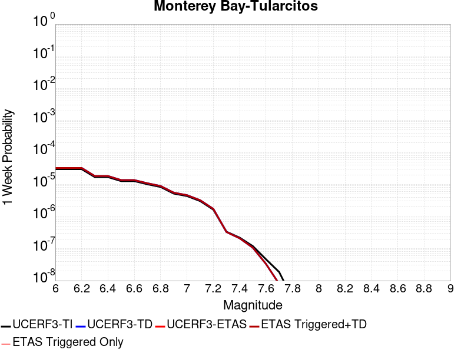 |  | 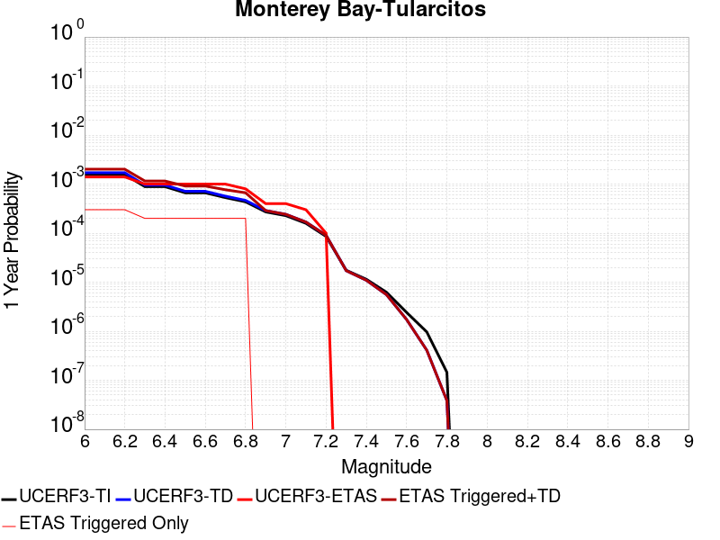 |  |

| Magnitude | 1 wk TI Prob | 1 wk TD Prob | 1 wk ETAS Prob | 1 wk ETAS/TD Gain | 1 wk ETAS Triggered+TD | 1 wk ETAS Triggered Only | 1 mo TI Prob | 1 mo TD Prob | 1 mo ETAS Prob | 1 mo ETAS/TD Gain | 1 mo ETAS Triggered+TD | 1 mo ETAS Triggered Only | 1 yr TI Prob | 1 yr TD Prob | 1 yr ETAS Prob | 1 yr ETAS/TD Gain | 1 yr ETAS Triggered+TD | 1 yr ETAS Triggered Only | 10 yr TI Prob | 10 yr TD Prob | 10 yr ETAS Prob | 10 yr ETAS/TD Gain | 10 yr ETAS Triggered+TD | 10 yr ETAS Triggered Only |
|-----|-----|-----|-----|-----|-----|-----|-----|-----|-----|-----|-----|-----|-----|-----|-----|-----|-----|-----|-----|-----|-----|-----|-----|-----|
| 6.0 | 3.0131365E-5 | 3.2767934E-5 | 0.0 | 0.0 | 3.2767934E-5 | 0.0 | 1.2912804E-4 | 1.4042703E-4 | 0.0 | 0.0 | 1.4042703E-4 | 0.0 | 0.001571 | 0.0017084635 | 0.0014 | 0.8194497 | 0.002007951 | 3.0E-4 | 0.015599402 | 0.016964074 | 0.0127 | 0.74864095 | 0.018143717 | 0.0012 |
| 6.1 | 3.0131365E-5 | 3.2767934E-5 | 0.0 | 0.0 | 3.2767934E-5 | 0.0 | 1.2912804E-4 | 1.4042703E-4 | 0.0 | 0.0 | 1.4042703E-4 | 0.0 | 0.001571 | 0.0017084635 | 0.0014 | 0.8194497 | 0.002007951 | 3.0E-4 | 0.015599402 | 0.016964074 | 0.0127 | 0.74864095 | 0.018143717 | 0.0012 |
| 6.2 | 3.0131365E-5 | 3.2767934E-5 | 0.0 | 0.0 | 3.2767934E-5 | 0.0 | 1.2912804E-4 | 1.4042703E-4 | 0.0 | 0.0 | 1.4042703E-4 | 0.0 | 0.001571 | 0.0017084635 | 0.0014 | 0.8194497 | 0.002007951 | 3.0E-4 | 0.015599402 | 0.016964074 | 0.0127 | 0.74864095 | 0.018143717 | 0.0012 |
| 6.3 | 1.6998249E-5 | 1.8315328E-5 | 0.0 | 0.0 | 1.8315328E-5 | 0.0 | 7.28476E-5 | 7.8492005E-5 | 0.0 | 0.0 | 7.8492005E-5 | 0.0 | 8.865586E-4 | 9.5523987E-4 | 0.001 | 1.0468575 | 0.0011550488 | 2.0E-4 | 0.0088303005 | 0.009513259 | 0.0075 | 0.78837335 | 0.010107551 | 6.0E-4 |
| 6.4 | 1.6998249E-5 | 1.8315328E-5 | 0.0 | 0.0 | 1.8315328E-5 | 0.0 | 7.28476E-5 | 7.8492005E-5 | 0.0 | 0.0 | 7.8492005E-5 | 0.0 | 8.865586E-4 | 9.5523987E-4 | 0.001 | 1.0468575 | 0.0011550488 | 2.0E-4 | 0.0088303005 | 0.009513259 | 0.0075 | 0.78837335 | 0.010107551 | 6.0E-4 |
| 6.5 | 1.27470785E-5 | 1.36822455E-5 | 0.0 | 0.0 | 1.36822455E-5 | 0.0 | 5.4629192E-5 | 5.8636935E-5 | 0.0 | 0.0 | 5.8636935E-5 | 0.0 | 6.649074E-4 | 7.1368116E-4 | 0.001 | 1.4011859 | 9.1353845E-4 | 2.0E-4 | 0.0066292146 | 0.0071149427 | 0.006 | 0.84329563 | 0.0074128085 | 3.0E-4 |
| 6.6 | 1.2739422E-5 | 1.3674335E-5 | 0.0 | 0.0 | 1.3674335E-5 | 0.0 | 5.4596385E-5 | 5.8603036E-5 | 0.0 | 0.0 | 5.8603036E-5 | 0.0 | 6.645082E-4 | 7.132687E-4 | 0.001 | 1.4019961 | 9.1312604E-4 | 2.0E-4 | 0.0066252467 | 0.0071108444 | 0.006 | 0.84378165 | 0.007408711 | 3.0E-4 |
| 6.7 | 1.0160109E-5 | 1.08771865E-5 | 0.0 | 0.0 | 1.08771865E-5 | 0.0 | 4.35426E-5 | 4.661572E-5 | 0.0 | 0.0 | 4.661572E-5 | 0.0 | 5.300022E-4 | 5.6740566E-4 | 0.001 | 1.7624075 | 7.6729216E-4 | 2.0E-4 | 0.005287399 | 0.0056602797 | 0.005 | 0.8833486 | 0.0058591478 | 2.0E-4 |
| 6.8 | 8.349859E-6 | 8.92563E-6 | 0.0 | 0.0 | 8.92563E-6 | 0.0 | 3.578462E-5 | 3.825217E-5 | 0.0 | 0.0 | 3.825217E-5 | 0.0 | 4.3559066E-4 | 4.6562628E-4 | 8.0E-4 | 1.718116 | 6.655332E-4 | 2.0E-4 | 0.004347378 | 0.004647071 | 0.004 | 0.8607573 | 0.0048461417 | 2.0E-4 |
| 6.9 | 5.193639E-6 | 5.532168E-6 | 0.0 | 0.0 | 5.532168E-6 | 0.0 | 2.2258262E-5 | 2.3709094E-5 | 0.0 | 0.0 | 2.3709094E-5 | 0.0 | 2.7096065E-4 | 2.886232E-4 | 4.0E-4 | 1.3858899 | 2.886232E-4 | 0.0 | 0.0027063051 | 0.0028828043 | 0.0025 | 0.86721116 | 0.0028828043 | 0.0 |
| 7.0 | 4.359381E-6 | 4.6397618E-6 | 0.0 | 0.0 | 4.6397618E-6 | 0.0 | 1.8682927E-5 | 1.988456E-5 | 0.0 | 0.0 | 1.988456E-5 | 0.0 | 2.274409E-4 | 2.4207057E-4 | 4.0E-4 | 1.6524106 | 2.4207057E-4 | 0.0 | 0.0022720827 | 0.0024183614 | 0.002 | 0.8270063 | 0.0024183614 | 0.0 |
| 7.1 | 3.0398533E-6 | 3.2284763E-6 | 0.0 | 0.0 | 3.2284763E-6 | 0.0 | 1.3027877E-5 | 1.3836268E-5 | 0.0 | 0.0 | 1.3836268E-5 | 0.0 | 1.5860285E-4 | 1.6844616E-4 | 3.0E-4 | 1.7809845 | 1.6844616E-4 | 0.0 | 0.001584897 | 0.001683442 | 0.0014 | 0.83162946 | 0.001683442 | 0.0 |
| 7.2 | 1.642335E-6 | 1.7318716E-6 | 0.0 | 0.0 | 1.7318716E-6 | 0.0 | 7.0385595E-6 | 7.4222976E-6 | 0.0 | 0.0 | 7.4222976E-6 | 0.0 | 8.569109E-5 | 9.036479E-5 | 1.0E-4 | 1.1066258 | 9.036479E-5 | 0.0 | 8.5658056E-4 | 9.034828E-4 | 6.0E-4 | 0.6640968 | 9.034828E-4 | 0.0 |
| 7.3 | 3.356842E-7 | 3.291712E-7 | 0.0 | 0.0 | 3.291712E-7 | 0.0 | 1.4386458E-6 | 1.410733E-6 | 0.0 | 0.0 | 1.410733E-6 | 0.0 | 1.7515373E-5 | 1.717554E-5 | 0.0 | 0.0 | 1.717554E-5 | 0.0 | 1.7513991E-4 | 1.7174221E-4 | 1.0E-4 | 0.582268 | 1.7174221E-4 | 0.0 |
| 7.4 | 2.1973483E-7 | 2.0974947E-7 | 0.0 | 0.0 | 2.0974947E-7 | 0.0 | 9.417204E-7 | 8.98926E-7 | 0.0 | 0.0 | 8.98926E-7 | 0.0 | 1.1465385E-5 | 1.0944369E-5 | 0.0 | 0.0 | 1.0944369E-5 | 0.0 | 1.1464794E-4 | 1.0943834E-4 | 0.0 | 0.0 | 1.0943834E-4 | 0.0 |
| 7.5 | 1.1944135E-7 | 1.0668502E-7 | 0.0 | 0.0 | 1.0668502E-7 | 0.0 | 5.118914E-7 | 4.5722143E-7 | 0.0 | 0.0 | 4.5722143E-7 | 0.0 | 6.23226E-6 | 5.566657E-6 | 0.0 | 0.0 | 5.566657E-6 | 0.0 | 6.2320854E-5 | 5.5665187E-5 | 0.0 | 0.0 | 5.5665187E-5 | 0.0 |
| 7.6 | 4.636058E-8 | 3.3143074E-8 | 0.0 | 0.0 | 3.3143074E-8 | 0.0 | 1.9868818E-7 | 1.4204173E-7 | 0.0 | 0.0 | 1.4204173E-7 | 0.0 | 2.419026E-6 | 1.7293568E-6 | 0.0 | 0.0 | 1.7293568E-6 | 0.0 | 2.4189996E-5 | 1.7293434E-5 | 0.0 | 0.0 | 1.7293434E-5 | 0.0 |
| 7.7 | 1.8588572E-8 | 7.864173E-9 | 0.0 | 0.0 | 7.864173E-9 | 0.0 | 7.9665305E-8 | 3.37036E-8 | 0.0 | 0.0 | 3.37036E-8 | 0.0 | 9.699246E-7 | 4.1034124E-7 | 0.0 | 0.0 | 4.1034124E-7 | 0.0 | 9.699204E-6 | 4.103405E-6 | 0.0 | 0.0 | 4.103405E-6 | 0.0 |
| 7.8 | 2.7960154E-9 | 7.380496E-10 | 0.0 | 0.0 | 7.380496E-10 | 0.0 | 1.1982923E-8 | 3.1630694E-9 | 0.0 | 0.0 | 3.1630694E-9 | 0.0 | 1.4589209E-7 | 3.851037E-8 | 0.0 | 0.0 | 3.851037E-8 | 0.0 | 1.4589199E-6 | 3.8510368E-7 | 0.0 | 0.0 | 3.8510368E-7 | 0.0 |

## Bear River fault zone
*[(top)](#table-of-contents)*

| 1 Week | 1 Month | 1 Year | 10 Year |
|-----|-----|-----|-----|
|  |  |  |  |

| Magnitude | 1 wk TI Prob | 1 wk TD Prob | 1 wk ETAS Prob | 1 wk ETAS/TD Gain | 1 wk ETAS Triggered+TD | 1 wk ETAS Triggered Only | 1 mo TI Prob | 1 mo TD Prob | 1 mo ETAS Prob | 1 mo ETAS/TD Gain | 1 mo ETAS Triggered+TD | 1 mo ETAS Triggered Only | 1 yr TI Prob | 1 yr TD Prob | 1 yr ETAS Prob | 1 yr ETAS/TD Gain | 1 yr ETAS Triggered+TD | 1 yr ETAS Triggered Only | 10 yr TI Prob | 10 yr TD Prob | 10 yr ETAS Prob | 10 yr ETAS/TD Gain | 10 yr ETAS Triggered+TD | 10 yr ETAS Triggered Only |
|-----|-----|-----|-----|-----|-----|-----|-----|-----|-----|-----|-----|-----|-----|-----|-----|-----|-----|-----|-----|-----|-----|-----|-----|-----|
| 6.0 | 2.3773342E-5 | 2.69424E-5 | 1.0E-4 | 3.7116218 | 2.69424E-5 | 0.0 | 1.0188177E-4 | 1.1546284E-4 | 2.0E-4 | 1.732159 | 1.1546284E-4 | 0.0 | 0.0012397047 | 0.0014049468 | 8.0E-4 | 0.5694166 | 0.0014049468 | 0.0 | 0.012328116 | 0.013970025 | 0.0102 | 0.7301347 | 0.015251864 | 0.0013 |
| 6.1 | 2.3773342E-5 | 2.69424E-5 | 1.0E-4 | 3.7116218 | 2.69424E-5 | 0.0 | 1.0188177E-4 | 1.1546284E-4 | 2.0E-4 | 1.732159 | 1.1546284E-4 | 0.0 | 0.0012397047 | 0.0014049468 | 8.0E-4 | 0.5694166 | 0.0014049468 | 0.0 | 0.012328116 | 0.013970025 | 0.0102 | 0.7301347 | 0.015251864 | 0.0013 |
| 6.2 | 1.5973403E-5 | 1.8037237E-5 | 0.0 | 0.0 | 1.8037237E-5 | 0.0 | 6.845564E-5 | 7.730028E-5 | 1.0E-4 | 1.2936563 | 7.730028E-5 | 0.0 | 8.3312875E-4 | 9.407481E-4 | 6.0E-4 | 0.63779026 | 9.407481E-4 | 0.0 | 0.008300122 | 0.009370046 | 0.0075 | 0.800423 | 0.010558802 | 0.0012 |
| 6.3 | 1.5973403E-5 | 1.8037237E-5 | 0.0 | 0.0 | 1.8037237E-5 | 0.0 | 6.845564E-5 | 7.730028E-5 | 1.0E-4 | 1.2936563 | 7.730028E-5 | 0.0 | 8.3312875E-4 | 9.407481E-4 | 6.0E-4 | 0.63779026 | 9.407481E-4 | 0.0 | 0.008300122 | 0.009370046 | 0.0075 | 0.800423 | 0.010558802 | 0.0012 |
| 6.4 | 1.3027338E-5 | 1.4720553E-5 | 0.0 | 0.0 | 1.4720553E-5 | 0.0 | 5.5830256E-5 | 6.3086634E-5 | 1.0E-4 | 1.5851218 | 6.3086634E-5 | 0.0 | 6.7952136E-4 | 7.678229E-4 | 4.0E-4 | 0.5209535 | 7.678229E-4 | 0.0 | 0.0067744725 | 0.0076530976 | 0.0059 | 0.7709297 | 0.008843914 | 0.0012 |
| 6.5 | 1.2489152E-5 | 1.4123917E-5 | 0.0 | 0.0 | 1.4123917E-5 | 0.0 | 5.352384E-5 | 6.0529746E-5 | 1.0E-4 | 1.6520803 | 6.0529746E-5 | 0.0 | 6.514579E-4 | 7.3671405E-4 | 4.0E-4 | 0.5429515 | 7.3671405E-4 | 0.0 | 0.0064955144 | 0.0073440894 | 0.0055 | 0.74890155 | 0.008535276 | 0.0012 |
| 6.6 | 1.1662849E-5 | 1.3209397E-5 | 0.0 | 0.0 | 1.3209397E-5 | 0.0 | 4.9982682E-5 | 5.661055E-5 | 1.0E-4 | 1.7664553 | 5.661055E-5 | 0.0 | 6.083692E-4 | 6.8902835E-4 | 3.0E-4 | 0.43539572 | 6.8902835E-4 | 0.0 | 0.006067064 | 0.006870217 | 0.0054 | 0.7860013 | 0.008061973 | 0.0012 |
| 6.7 | 1.0667623E-5 | 1.2110522E-5 | 0.0 | 0.0 | 1.2110522E-5 | 0.0 | 4.5717585E-5 | 5.1901272E-5 | 1.0E-4 | 1.926735 | 5.1901272E-5 | 0.0 | 5.5646943E-4 | 6.317266E-4 | 3.0E-4 | 0.474889 | 6.317266E-4 | 0.0 | 0.0055507803 | 0.006300487 | 0.0052 | 0.82533306 | 0.0074929264 | 0.0012 |
| 6.8 | 9.154534E-6 | 1.0443577E-5 | 0.0 | 0.0 | 1.0443577E-5 | 0.0 | 3.923313E-5 | 4.475748E-5 | 1.0E-4 | 2.2342634 | 4.475748E-5 | 0.0 | 4.7755867E-4 | 5.447965E-4 | 3.0E-4 | 0.5506643 | 5.447965E-4 | 0.0 | 0.004765337 | 0.005435654 | 0.0049 | 0.90145546 | 0.006529675 | 0.0011 |
| 6.9 | 7.68501E-6 | 8.831835E-6 | 0.0 | 0.0 | 8.831835E-6 | 0.0 | 3.2935342E-5 | 3.7850223E-5 | 0.0 | 0.0 | 3.7850223E-5 | 0.0 | 4.0091402E-4 | 4.6073832E-4 | 2.0E-4 | 0.43408588 | 4.6073832E-4 | 0.0 | 0.004001915 | 0.00459875 | 0.0043 | 0.9350367 | 0.005594151 | 0.001 |
| 7.0 | 5.7315733E-6 | 6.69178E-6 | 0.0 | 0.0 | 6.69178E-6 | 0.0 | 2.4563653E-5 | 2.8678767E-5 | 0.0 | 0.0 | 2.8678767E-5 | 0.0 | 2.9902143E-4 | 3.491123E-4 | 2.0E-4 | 0.5728816 | 3.491123E-4 | 0.0 | 0.0029861939 | 0.0034860587 | 0.0034 | 0.9753135 | 0.00428327 | 8.0E-4 |
| 7.1 | 5.566844E-6 | 6.5005743E-6 | 0.0 | 0.0 | 6.5005743E-6 | 0.0 | 2.3857683E-5 | 2.785933E-5 | 0.0 | 0.0 | 2.785933E-5 | 0.0 | 2.9042858E-4 | 3.3913882E-4 | 2.0E-4 | 0.589729 | 3.3913882E-4 | 0.0 | 0.002900493 | 0.0033866316 | 0.0033 | 0.97441953 | 0.0041839224 | 8.0E-4 |
| 7.2 | 4.011353E-6 | 4.6665573E-6 | 0.0 | 0.0 | 4.6665573E-6 | 0.0 | 1.7191402E-5 | 1.9999396E-5 | 0.0 | 0.0 | 1.9999396E-5 | 0.0 | 2.0928521E-4 | 2.4346886E-4 | 1.0E-4 | 0.41073012 | 2.4346886E-4 | 0.0 | 0.0020908823 | 0.0024323578 | 0.0024 | 0.98669696 | 0.0028313848 | 4.0E-4 |
| 7.3 | 2.0974871E-6 | 2.4354429E-6 | 0.0 | 0.0 | 2.4354429E-6 | 0.0 | 8.989199E-6 | 1.0437585E-5 | 0.0 | 0.0 | 1.0437585E-5 | 0.0 | 1.09438006E-4 | 1.2707268E-4 | 0.0 | 0.0 | 1.2707268E-4 | 0.0 | 0.0010938413 | 0.0012702446 | 0.0012 | 0.9447 | 0.0015698635 | 3.0E-4 |

## Hunting Creek - Bartlett Springs connector 2011
*[(top)](#table-of-contents)*

| 1 Week | 1 Month | 1 Year | 10 Year |
|-----|-----|-----|-----|
| 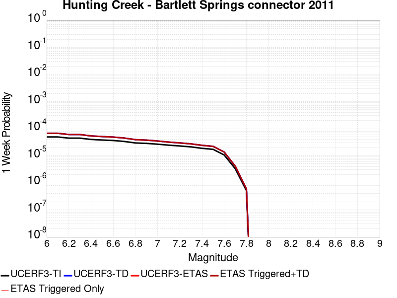 | 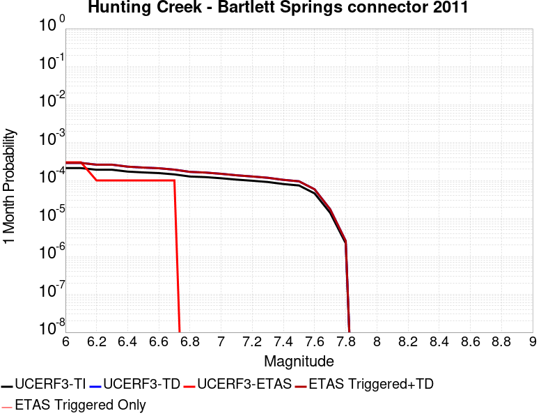 |  | 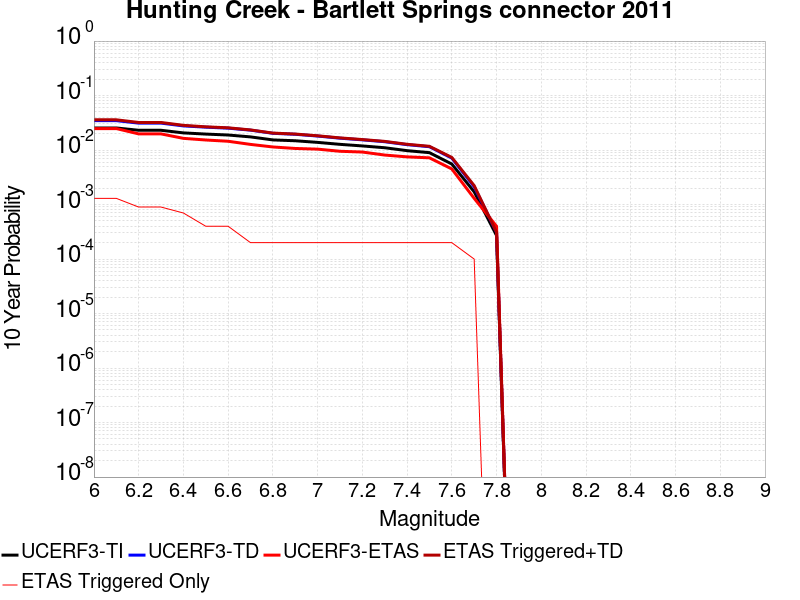 |

| Magnitude | 1 wk TI Prob | 1 wk TD Prob | 1 wk ETAS Prob | 1 wk ETAS/TD Gain | 1 wk ETAS Triggered+TD | 1 wk ETAS Triggered Only | 1 mo TI Prob | 1 mo TD Prob | 1 mo ETAS Prob | 1 mo ETAS/TD Gain | 1 mo ETAS Triggered+TD | 1 mo ETAS Triggered Only | 1 yr TI Prob | 1 yr TD Prob | 1 yr ETAS Prob | 1 yr ETAS/TD Gain | 1 yr ETAS Triggered+TD | 1 yr ETAS Triggered Only | 10 yr TI Prob | 10 yr TD Prob | 10 yr ETAS Prob | 10 yr ETAS/TD Gain | 10 yr ETAS Triggered+TD | 10 yr ETAS Triggered Only |
|-----|-----|-----|-----|-----|-----|-----|-----|-----|-----|-----|-----|-----|-----|-----|-----|-----|-----|-----|-----|-----|-----|-----|-----|-----|
| 6.0 | 4.940016E-5 | 6.7636094E-5 | 0.0 | 0.0 | 6.7636094E-5 | 0.0 | 2.1169778E-4 | 2.8983652E-4 | 3.0E-4 | 1.0350662 | 2.8983652E-4 | 0.0 | 0.002574374 | 0.003522902 | 0.0021 | 0.5960995 | 0.0037221974 | 2.0E-4 | 0.025447546 | 0.03465753 | 0.0248 | 0.7155732 | 0.035912476 | 0.0013 |
| 6.1 | 4.940016E-5 | 6.7636094E-5 | 0.0 | 0.0 | 6.7636094E-5 | 0.0 | 2.1169778E-4 | 2.8983652E-4 | 3.0E-4 | 1.0350662 | 2.8983652E-4 | 0.0 | 0.002574374 | 0.003522902 | 0.0021 | 0.5960995 | 0.0037221974 | 2.0E-4 | 0.025447546 | 0.03465753 | 0.0248 | 0.7155732 | 0.035912476 | 0.0013 |
| 6.2 | 4.472471E-5 | 6.0799062E-5 | 0.0 | 0.0 | 6.0799062E-5 | 0.0 | 1.9166325E-4 | 2.6054154E-4 | 1.0E-4 | 0.38381597 | 2.6054154E-4 | 0.0 | 0.0023310026 | 0.0031673922 | 0.0019 | 0.5998626 | 0.0033667588 | 2.0E-4 | 0.02306703 | 0.031213867 | 0.0198 | 0.6343335 | 0.032085773 | 9.0E-4 |
| 6.3 | 4.472471E-5 | 6.0799062E-5 | 0.0 | 0.0 | 6.0799062E-5 | 0.0 | 1.9166325E-4 | 2.6054154E-4 | 1.0E-4 | 0.38381597 | 2.6054154E-4 | 0.0 | 0.0023310026 | 0.0031673922 | 0.0019 | 0.5998626 | 0.0033667588 | 2.0E-4 | 0.02306703 | 0.031213867 | 0.0198 | 0.6343335 | 0.032085773 | 9.0E-4 |
| 6.4 | 4.0001003E-5 | 5.3926353E-5 | 0.0 | 0.0 | 5.3926353E-5 | 0.0 | 1.714216E-4 | 2.3109278E-4 | 1.0E-4 | 0.43272662 | 2.3109278E-4 | 0.0 | 0.0020850603 | 0.002809889 | 0.0018 | 0.6405947 | 0.003009327 | 2.0E-4 | 0.02065605 | 0.027738636 | 0.0164 | 0.5912331 | 0.028419219 | 7.0E-4 |
| 6.5 | 3.8033053E-5 | 5.1099152E-5 | 0.0 | 0.0 | 5.1099152E-5 | 0.0 | 1.6298861E-4 | 2.1897825E-4 | 1.0E-4 | 0.45666635 | 2.1897825E-4 | 0.0 | 0.0019825802 | 0.0026627893 | 0.0018 | 0.67598283 | 0.002862257 | 2.0E-4 | 0.019649856 | 0.026306137 | 0.0153 | 0.58161336 | 0.026695615 | 4.0E-4 |
| 6.6 | 3.653754E-5 | 4.897064E-5 | 0.0 | 0.0 | 4.897064E-5 | 0.0 | 1.5658008E-4 | 2.0985756E-4 | 1.0E-4 | 0.47651368 | 2.0985756E-4 | 0.0 | 0.0019046954 | 0.0025520264 | 0.0018 | 0.70532185 | 0.002751516 | 2.0E-4 | 0.018884527 | 0.025226098 | 0.0145 | 0.57480156 | 0.025616007 | 4.0E-4 |
| 6.7 | 3.372024E-5 | 4.4996686E-5 | 0.0 | 0.0 | 4.4996686E-5 | 0.0 | 1.4450731E-4 | 1.928289E-4 | 1.0E-4 | 0.5185945 | 1.928289E-4 | 0.0 | 0.0017579567 | 0.0023451848 | 0.0014 | 0.5969679 | 0.0023451848 | 0.0 | 0.017441148 | 0.023205193 | 0.0127 | 0.5472913 | 0.02340055 | 2.0E-4 |
| 6.8 | 2.9650024E-5 | 3.929196E-5 | 0.0 | 0.0 | 3.929196E-5 | 0.0 | 1.2706534E-4 | 1.6838325E-4 | 0.0 | 0.0 | 1.6838325E-4 | 0.0 | 0.0015459227 | 0.0020481308 | 9.0E-4 | 0.43942505 | 0.0020481308 | 0.0 | 0.015352124 | 0.020290205 | 0.0114 | 0.56184745 | 0.020486148 | 2.0E-4 |
| 6.9 | 2.860775E-5 | 3.7701204E-5 | 0.0 | 0.0 | 3.7701204E-5 | 0.0 | 1.2259888E-4 | 1.6156661E-4 | 0.0 | 0.0 | 1.6156661E-4 | 0.0 | 0.0014916194 | 0.0019653058 | 9.0E-4 | 0.457944 | 0.0019653058 | 0.0 | 0.014816469 | 0.019478736 | 0.0107 | 0.54931694 | 0.01967484 | 2.0E-4 |
| 7.0 | 2.6696067E-5 | 3.4966903E-5 | 0.0 | 0.0 | 3.4966903E-5 | 0.0 | 1.144067E-4 | 1.4984961E-4 | 0.0 | 0.0 | 1.4984961E-4 | 0.0 | 0.0013920115 | 0.0018229008 | 9.0E-4 | 0.49371856 | 0.0018229008 | 0.0 | 0.013833242 | 0.01808013 | 0.0104 | 0.5752171 | 0.018276513 | 2.0E-4 |
| 7.1 | 2.456087E-5 | 3.1925734E-5 | 0.0 | 0.0 | 3.1925734E-5 | 0.0 | 1.0525662E-4 | 1.3681744E-4 | 0.0 | 0.0 | 1.3681744E-4 | 0.0 | 0.001280746 | 0.0016644886 | 9.0E-4 | 0.54070663 | 0.0016644886 | 0.0 | 0.012733897 | 0.016521595 | 0.0095 | 0.575005 | 0.01671829 | 2.0E-4 |
| 7.2 | 2.295761E-5 | 2.9741363E-5 | 0.0 | 0.0 | 2.9741363E-5 | 0.0 | 9.8386045E-5 | 1.274568E-4 | 0.0 | 0.0 | 1.274568E-4 | 0.0 | 0.0011971919 | 0.0015506912 | 9.0E-4 | 0.58038634 | 0.0015506912 | 0.0 | 0.011907627 | 0.015400236 | 0.0092 | 0.59739345 | 0.015597155 | 2.0E-4 |
| 7.3 | 2.1256936E-5 | 2.7465583E-5 | 0.0 | 0.0 | 2.7465583E-5 | 0.0 | 9.109797E-5 | 1.1770438E-4 | 0.0 | 0.0 | 1.1770438E-4 | 0.0 | 0.0011085535 | 0.0014321175 | 9.0E-4 | 0.62844 | 0.0014321175 | 0.0 | 0.011030397 | 0.014230171 | 0.0081 | 0.5692131 | 0.014427325 | 2.0E-4 |
| 7.4 | 1.8784336E-5 | 2.4240306E-5 | 0.0 | 0.0 | 2.4240306E-5 | 0.0 | 8.050181E-5 | 1.03882936E-4 | 0.0 | 0.0 | 1.03882936E-4 | 0.0 | 9.796688E-4 | 0.0012640484 | 7.0E-4 | 0.55377626 | 0.0012640484 | 0.0 | 0.009753612 | 0.01256961 | 0.0075 | 0.59667724 | 0.012767096 | 2.0E-4 |
| 7.5 | 1.7248298E-5 | 2.2208003E-5 | 0.0 | 0.0 | 2.2208003E-5 | 0.0 | 7.391918E-5 | 9.5173724E-5 | 0.0 | 0.0 | 9.5173724E-5 | 0.0 | 8.9959445E-4 | 0.0011581316 | 7.0E-4 | 0.6044218 | 0.0011581316 | 0.0 | 0.008959615 | 0.011521938 | 0.0072 | 0.62489486 | 0.011719634 | 2.0E-4 |
| 7.6 | 1.0653709E-5 | 1.36851195E-5 | 0.0 | 0.0 | 1.36851195E-5 | 0.0 | 4.5657955E-5 | 5.864921E-5 | 0.0 | 0.0 | 5.864921E-5 | 0.0 | 5.557438E-4 | 7.138229E-4 | 7.0E-4 | 0.9806354 | 7.138229E-4 | 0.0 | 0.0055435603 | 0.0071156183 | 0.0045 | 0.63241166 | 0.007314195 | 2.0E-4 |
| 7.7 | 3.286316E-6 | 4.079729E-6 | 0.0 | 0.0 | 4.079729E-6 | 0.0 | 1.4084137E-5 | 1.7484437E-5 | 0.0 | 0.0 | 1.7484437E-5 | 0.0 | 1.7146087E-4 | 2.1285238E-4 | 5.0E-4 | 2.3490458 | 2.1285238E-4 | 0.0 | 0.0017132863 | 0.002126546 | 0.0013 | 0.6113199 | 0.0022263336 | 1.0E-4 |
| 7.8 | 5.1855085E-7 | 5.9636176E-7 | 0.0 | 0.0 | 5.9636176E-7 | 0.0 | 2.222359E-6 | 2.5558336E-6 | 0.0 | 0.0 | 2.5558336E-6 | 0.0 | 2.7056883E-5 | 3.111684E-5 | 2.0E-4 | 6.427388 | 3.111684E-5 | 0.0 | 2.705359E-4 | 3.1113403E-4 | 4.0E-4 | 1.2856196 | 3.1113403E-4 | 0.0 |

## Blue Cut
*[(top)](#table-of-contents)*

| 1 Week | 1 Month | 1 Year | 10 Year |
|-----|-----|-----|-----|
|  |  | 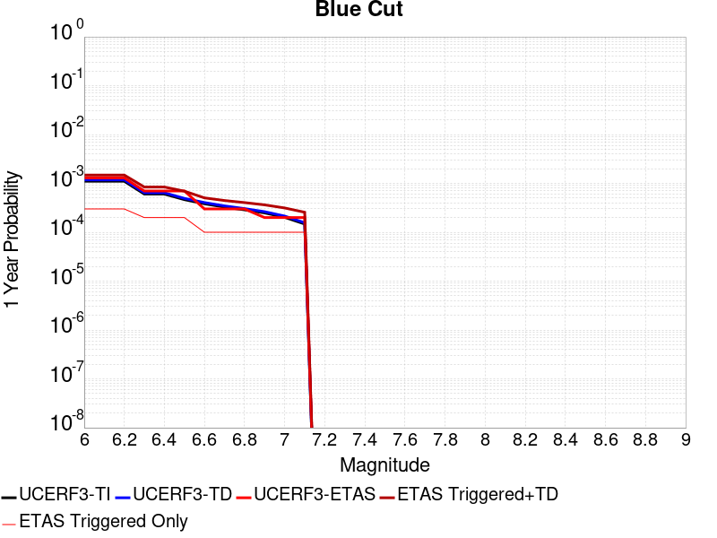 |  |

| Magnitude | 1 wk TI Prob | 1 wk TD Prob | 1 wk ETAS Prob | 1 wk ETAS/TD Gain | 1 wk ETAS Triggered+TD | 1 wk ETAS Triggered Only | 1 mo TI Prob | 1 mo TD Prob | 1 mo ETAS Prob | 1 mo ETAS/TD Gain | 1 mo ETAS Triggered+TD | 1 mo ETAS Triggered Only | 1 yr TI Prob | 1 yr TD Prob | 1 yr ETAS Prob | 1 yr ETAS/TD Gain | 1 yr ETAS Triggered+TD | 1 yr ETAS Triggered Only | 10 yr TI Prob | 10 yr TD Prob | 10 yr ETAS Prob | 10 yr ETAS/TD Gain | 10 yr ETAS Triggered+TD | 10 yr ETAS Triggered Only |
|-----|-----|-----|-----|-----|-----|-----|-----|-----|-----|-----|-----|-----|-----|-----|-----|-----|-----|-----|-----|-----|-----|-----|-----|-----|
| 6.0 | 2.1227985E-5 | 2.270289E-5 | 0.0 | 0.0 | 2.270289E-5 | 0.0 | 9.097391E-5 | 9.7294804E-5 | 2.0E-4 | 2.0556083 | 9.7294804E-5 | 0.0 | 0.0011070445 | 0.0011839785 | 0.0013 | 1.0979929 | 0.0014836233 | 3.0E-4 | 0.011015458 | 0.011782538 | 0.0099 | 0.8402264 | 0.0129684 | 0.0012 |
| 6.1 | 2.1227985E-5 | 2.270289E-5 | 0.0 | 0.0 | 2.270289E-5 | 0.0 | 9.097391E-5 | 9.7294804E-5 | 2.0E-4 | 2.0556083 | 9.7294804E-5 | 0.0 | 0.0011070445 | 0.0011839785 | 0.0013 | 1.0979929 | 0.0014836233 | 3.0E-4 | 0.011015458 | 0.011782538 | 0.0099 | 0.8402264 | 0.0129684 | 0.0012 |
| 6.2 | 2.1227985E-5 | 2.270289E-5 | 0.0 | 0.0 | 2.270289E-5 | 0.0 | 9.097391E-5 | 9.7294804E-5 | 2.0E-4 | 2.0556083 | 9.7294804E-5 | 0.0 | 0.0011070445 | 0.0011839785 | 0.0013 | 1.0979929 | 0.0014836233 | 3.0E-4 | 0.011015458 | 0.011782538 | 0.0099 | 0.8402264 | 0.0129684 | 0.0012 |
| 6.3 | 1.1613981E-5 | 1.2345328E-5 | 0.0 | 0.0 | 1.2345328E-5 | 0.0 | 4.9773254E-5 | 5.2907548E-5 | 0.0 | 0.0 | 5.2907548E-5 | 0.0 | 6.0582085E-4 | 6.4397143E-4 | 7.0E-4 | 1.0870048 | 8.4384263E-4 | 2.0E-4 | 0.0060417196 | 0.006422299 | 0.0054 | 0.8408204 | 0.0072171614 | 8.0E-4 |
| 6.4 | 1.1613981E-5 | 1.2345328E-5 | 0.0 | 0.0 | 1.2345328E-5 | 0.0 | 4.9773254E-5 | 5.2907548E-5 | 0.0 | 0.0 | 5.2907548E-5 | 0.0 | 6.0582085E-4 | 6.4397143E-4 | 7.0E-4 | 1.0870048 | 8.4384263E-4 | 2.0E-4 | 0.0060417196 | 0.006422299 | 0.0054 | 0.8408204 | 0.0072171614 | 8.0E-4 |
| 6.5 | 8.931326E-6 | 9.475502E-6 | 0.0 | 0.0 | 9.475502E-6 | 0.0 | 3.8276554E-5 | 4.0608713E-5 | 0.0 | 0.0 | 4.0608713E-5 | 0.0 | 4.6591737E-4 | 4.943081E-4 | 7.0E-4 | 1.4161209 | 6.9420924E-4 | 2.0E-4 | 0.0046494175 | 0.004932994 | 0.0046 | 0.9324966 | 0.005629541 | 7.0E-4 |
| 6.6 | 7.345353E-6 | 7.785355E-6 | 0.0 | 0.0 | 7.785355E-6 | 0.0 | 3.1479703E-5 | 3.3365424E-5 | 0.0 | 0.0 | 3.3365424E-5 | 0.0 | 3.83198E-4 | 4.0615632E-4 | 3.0E-4 | 0.7386319 | 5.0611567E-4 | 1.0E-4 | 0.0038253788 | 0.0040549305 | 0.0031 | 0.7645014 | 0.004552903 | 5.0E-4 |
| 6.7 | 6.2775666E-6 | 6.6509715E-6 | 0.0 | 0.0 | 6.6509715E-6 | 0.0 | 2.690358E-5 | 2.8503895E-5 | 0.0 | 0.0 | 2.8503895E-5 | 0.0 | 3.2750185E-4 | 3.4698716E-4 | 3.0E-4 | 0.8645853 | 4.4695247E-4 | 1.0E-4 | 0.0032701963 | 0.0034651938 | 0.0026 | 0.75031877 | 0.003963461 | 5.0E-4 |
| 6.8 | 5.5234095E-6 | 5.851442E-6 | 0.0 | 0.0 | 5.851442E-6 | 0.0 | 2.367154E-5 | 2.5077408E-5 | 0.0 | 0.0 | 2.5077408E-5 | 0.0 | 2.8816288E-4 | 3.0528192E-4 | 3.0E-4 | 0.9826982 | 4.052514E-4 | 1.0E-4 | 0.002877895 | 0.0030493408 | 0.0022 | 0.72146744 | 0.003547816 | 5.0E-4 |
| 6.9 | 4.7780054E-6 | 5.0622407E-6 | 0.0 | 0.0 | 5.0622407E-6 | 0.0 | 2.0477004E-5 | 2.1695178E-5 | 0.0 | 0.0 | 2.1695178E-5 | 0.0 | 2.4927902E-4 | 2.641138E-4 | 2.0E-4 | 0.75724936 | 3.6408738E-4 | 1.0E-4 | 0.0024899957 | 0.0026386904 | 0.0021 | 0.7958493 | 0.003137371 | 5.0E-4 |
| 7.0 | 3.883171E-6 | 4.115883E-6 | 0.0 | 0.0 | 4.115883E-6 | 0.0 | 1.6642054E-5 | 1.7639417E-5 | 0.0 | 0.0 | 1.7639417E-5 | 0.0 | 2.0259817E-4 | 2.1474561E-4 | 2.0E-4 | 0.9313345 | 3.1472414E-4 | 1.0E-4 | 0.0020241356 | 0.002146056 | 0.0018 | 0.838748 | 0.0025451975 | 4.0E-4 |
| 7.1 | 2.8358215E-6 | 3.00779E-6 | 0.0 | 0.0 | 3.00779E-6 | 0.0 | 1.2153464E-5 | 1.2890502E-5 | 0.0 | 0.0 | 1.2890502E-5 | 0.0 | 1.4795837E-4 | 1.5693712E-4 | 2.0E-4 | 1.2743957 | 2.5692143E-4 | 1.0E-4 | 0.001478599 | 0.0015689074 | 0.0015 | 0.95607936 | 0.0018684367 | 3.0E-4 |

## Johnson Valley (No) 2011 rev
*[(top)](#table-of-contents)*

| 1 Week | 1 Month | 1 Year | 10 Year |
|-----|-----|-----|-----|
| 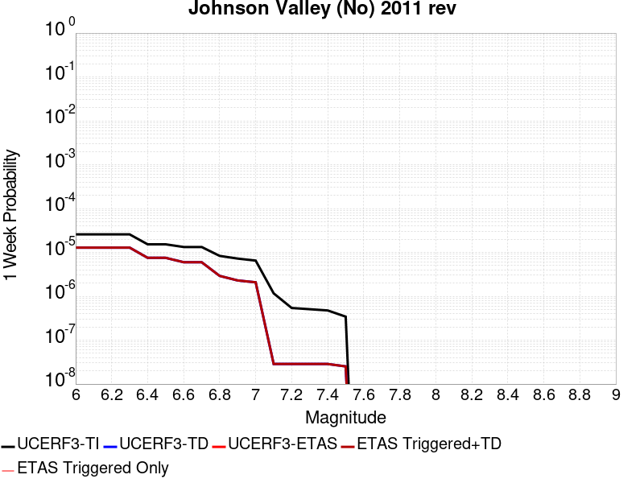 | 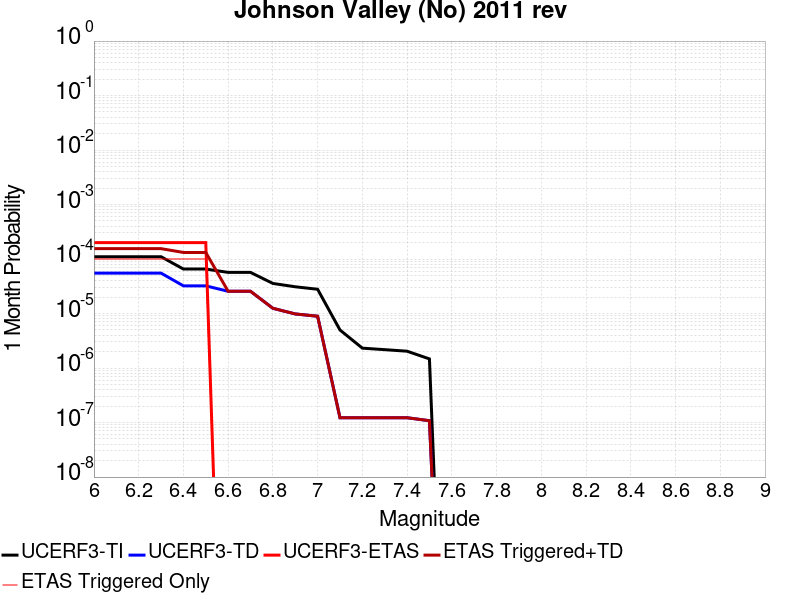 |  |  |

| Magnitude | 1 wk TI Prob | 1 wk TD Prob | 1 wk ETAS Prob | 1 wk ETAS/TD Gain | 1 wk ETAS Triggered+TD | 1 wk ETAS Triggered Only | 1 mo TI Prob | 1 mo TD Prob | 1 mo ETAS Prob | 1 mo ETAS/TD Gain | 1 mo ETAS Triggered+TD | 1 mo ETAS Triggered Only | 1 yr TI Prob | 1 yr TD Prob | 1 yr ETAS Prob | 1 yr ETAS/TD Gain | 1 yr ETAS Triggered+TD | 1 yr ETAS Triggered Only | 10 yr TI Prob | 10 yr TD Prob | 10 yr ETAS Prob | 10 yr ETAS/TD Gain | 10 yr ETAS Triggered+TD | 10 yr ETAS Triggered Only |
|-----|-----|-----|-----|-----|-----|-----|-----|-----|-----|-----|-----|-----|-----|-----|-----|-----|-----|-----|-----|-----|-----|-----|-----|-----|
| 6.0 | 2.577707E-5 | 1.2882305E-5 | 0.0 | 0.0 | 1.2882305E-5 | 0.0 | 1.1046848E-4 | 5.5208933E-5 | 2.0E-4 | 3.622602 | 1.5520341E-4 | 1.0E-4 | 0.0013441239 | 6.7200104E-4 | 3.0E-4 | 0.44642788 | 7.719339E-4 | 1.0E-4 | 0.013360229 | 0.0067035886 | 0.0053 | 0.79062134 | 0.007895544 | 0.0012 |
| 6.1 | 2.577707E-5 | 1.2882305E-5 | 0.0 | 0.0 | 1.2882305E-5 | 0.0 | 1.1046848E-4 | 5.5208933E-5 | 2.0E-4 | 3.622602 | 1.5520341E-4 | 1.0E-4 | 0.0013441239 | 6.7200104E-4 | 3.0E-4 | 0.44642788 | 7.719339E-4 | 1.0E-4 | 0.013360229 | 0.0067035886 | 0.0053 | 0.79062134 | 0.007895544 | 0.0012 |
| 6.2 | 2.577707E-5 | 1.2882305E-5 | 0.0 | 0.0 | 1.2882305E-5 | 0.0 | 1.1046848E-4 | 5.5208933E-5 | 2.0E-4 | 3.622602 | 1.5520341E-4 | 1.0E-4 | 0.0013441239 | 6.7200104E-4 | 3.0E-4 | 0.44642788 | 7.719339E-4 | 1.0E-4 | 0.013360229 | 0.0067035886 | 0.0053 | 0.79062134 | 0.007895544 | 0.0012 |
| 6.3 | 2.577707E-5 | 1.2882305E-5 | 0.0 | 0.0 | 1.2882305E-5 | 0.0 | 1.1046848E-4 | 5.5208933E-5 | 2.0E-4 | 3.622602 | 1.5520341E-4 | 1.0E-4 | 0.0013441239 | 6.7200104E-4 | 3.0E-4 | 0.44642788 | 7.719339E-4 | 1.0E-4 | 0.013360229 | 0.0067035886 | 0.0053 | 0.79062134 | 0.007895544 | 0.0012 |
| 6.4 | 1.5296591E-5 | 7.5242306E-6 | 0.0 | 0.0 | 7.5242306E-6 | 0.0 | 6.555518E-5 | 3.224641E-5 | 2.0E-4 | 6.202241 | 1.3224318E-4 | 1.0E-4 | 7.97842E-4 | 3.92548E-4 | 3.0E-4 | 0.76423776 | 4.9250876E-4 | 1.0E-4 | 0.007949836 | 0.0039203814 | 0.0026 | 0.66320074 | 0.0046176375 | 7.0E-4 |
| 6.5 | 1.5296591E-5 | 7.5242306E-6 | 0.0 | 0.0 | 7.5242306E-6 | 0.0 | 6.555518E-5 | 3.224641E-5 | 2.0E-4 | 6.202241 | 1.3224318E-4 | 1.0E-4 | 7.97842E-4 | 3.92548E-4 | 3.0E-4 | 0.76423776 | 4.9250876E-4 | 1.0E-4 | 0.007949836 | 0.0039203814 | 0.0026 | 0.66320074 | 0.0046176375 | 7.0E-4 |
| 6.6 | 1.3289383E-5 | 5.981013E-6 | 0.0 | 0.0 | 5.981013E-6 | 0.0 | 5.6953253E-5 | 2.5632757E-5 | 0.0 | 0.0 | 2.5632757E-5 | 0.0 | 6.9318525E-4 | 3.1205104E-4 | 1.0E-4 | 0.3204604 | 3.1205104E-4 | 0.0 | 0.0069102696 | 0.0031177877 | 0.0021 | 0.67355454 | 0.0036162287 | 5.0E-4 |
| 6.7 | 1.3289383E-5 | 5.981013E-6 | 0.0 | 0.0 | 5.981013E-6 | 0.0 | 5.6953253E-5 | 2.5632757E-5 | 0.0 | 0.0 | 2.5632757E-5 | 0.0 | 6.9318525E-4 | 3.1205104E-4 | 1.0E-4 | 0.3204604 | 3.1205104E-4 | 0.0 | 0.0069102696 | 0.0031177877 | 0.0021 | 0.67355454 | 0.0036162287 | 5.0E-4 |
| 6.8 | 8.330789E-6 | 2.9140658E-6 | 0.0 | 0.0 | 2.9140658E-6 | 0.0 | 3.570289E-5 | 1.2488826E-5 | 0.0 | 0.0 | 1.2488826E-5 | 0.0 | 4.34596E-4 | 1.5204652E-4 | 1.0E-4 | 0.65769345 | 1.5204652E-4 | 0.0 | 0.0043374705 | 0.0015199819 | 0.0011 | 0.72369283 | 0.0017196779 | 2.0E-4 |
| 6.9 | 7.2359003E-6 | 2.295075E-6 | 0.0 | 0.0 | 2.295075E-6 | 0.0 | 3.1010633E-5 | 9.836029E-6 | 0.0 | 0.0 | 9.836029E-6 | 0.0 | 3.7748902E-4 | 1.1975237E-4 | 1.0E-4 | 0.83505654 | 1.1975237E-4 | 0.0 | 0.0037684843 | 0.0011973984 | 9.0E-4 | 0.75162953 | 0.001397159 | 2.0E-4 |
| 7.0 | 6.5149957E-6 | 2.08268E-6 | 0.0 | 0.0 | 2.08268E-6 | 0.0 | 2.792111E-5 | 8.925771E-6 | 0.0 | 0.0 | 8.925771E-6 | 0.0 | 3.398865E-4 | 1.0867111E-4 | 0.0 | 0.0 | 1.0867111E-4 | 0.0 | 0.003393671 | 0.0010866966 | 8.0E-4 | 0.736176 | 0.0012864793 | 2.0E-4 |
| 7.1 | 1.1662233E-6 | 2.8602754E-8 | 0.0 | 0.0 | 2.8602754E-8 | 0.0 | 4.9980904E-6 | 1.2258323E-7 | 0.0 | 0.0 | 1.2258323E-7 | 0.0 | 6.0850052E-5 | 1.49245E-6 | 0.0 | 0.0 | 1.49245E-6 | 0.0 | 6.083339E-4 | 1.4924416E-5 | 0.0 | 0.0 | 1.4924416E-5 | 0.0 |
| 7.2 | 5.413881E-7 | 2.8602754E-8 | 0.0 | 0.0 | 2.8602754E-8 | 0.0 | 2.3202326E-6 | 1.2258323E-7 | 0.0 | 0.0 | 1.2258323E-7 | 0.0 | 2.8248465E-5 | 1.49245E-6 | 0.0 | 0.0 | 1.49245E-6 | 0.0 | 2.8244875E-4 | 1.4924416E-5 | 0.0 | 0.0 | 1.4924416E-5 | 0.0 |
| 7.3 | 5.076821E-7 | 2.8602754E-8 | 0.0 | 0.0 | 2.8602754E-8 | 0.0 | 2.1757785E-6 | 1.2258323E-7 | 0.0 | 0.0 | 1.2258323E-7 | 0.0 | 2.648978E-5 | 1.49245E-6 | 0.0 | 0.0 | 1.49245E-6 | 0.0 | 2.6486625E-4 | 1.4924415E-5 | 0.0 | 0.0 | 1.4924415E-5 | 0.0 |
| 7.4 | 4.7568687E-7 | 2.8585008E-8 | 0.0 | 0.0 | 2.8585008E-8 | 0.0 | 2.0386565E-6 | 1.2250717E-7 | 0.0 | 0.0 | 1.2250717E-7 | 0.0 | 2.482036E-5 | 1.491524E-6 | 0.0 | 0.0 | 1.491524E-6 | 0.0 | 2.4817587E-4 | 1.4915156E-5 | 0.0 | 0.0 | 1.4915156E-5 | 0.0 |
| 7.5 | 3.435626E-7 | 2.5190312E-8 | 0.0 | 0.0 | 2.5190312E-8 | 0.0 | 1.4724103E-6 | 1.0795847E-7 | 0.0 | 0.0 | 1.0795847E-7 | 0.0 | 1.7926448E-5 | 1.3143938E-6 | 0.0 | 0.0 | 1.3143938E-6 | 0.0 | 1.7925001E-4 | 1.31438765E-5 | 0.0 | 0.0 | 1.31438765E-5 | 0.0 |

## Oak Ridge (Onshore)
*[(top)](#table-of-contents)*

| 1 Week | 1 Month | 1 Year | 10 Year |
|-----|-----|-----|-----|
| 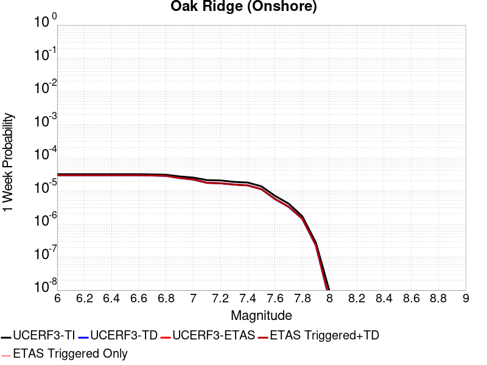 |  |  | 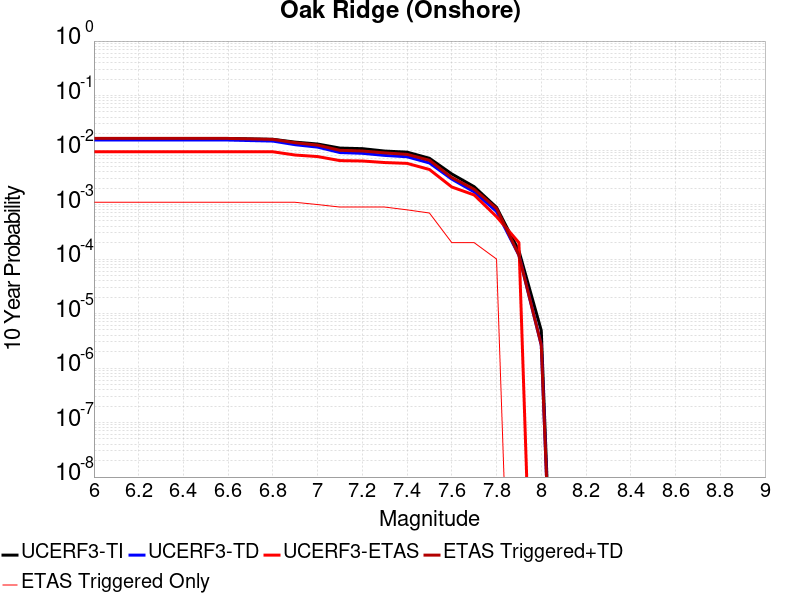 |

| Magnitude | 1 wk TI Prob | 1 wk TD Prob | 1 wk ETAS Prob | 1 wk ETAS/TD Gain | 1 wk ETAS Triggered+TD | 1 wk ETAS Triggered Only | 1 mo TI Prob | 1 mo TD Prob | 1 mo ETAS Prob | 1 mo ETAS/TD Gain | 1 mo ETAS Triggered+TD | 1 mo ETAS Triggered Only | 1 yr TI Prob | 1 yr TD Prob | 1 yr ETAS Prob | 1 yr ETAS/TD Gain | 1 yr ETAS Triggered+TD | 1 yr ETAS Triggered Only | 10 yr TI Prob | 10 yr TD Prob | 10 yr ETAS Prob | 10 yr ETAS/TD Gain | 10 yr ETAS Triggered+TD | 10 yr ETAS Triggered Only |
|-----|-----|-----|-----|-----|-----|-----|-----|-----|-----|-----|-----|-----|-----|-----|-----|-----|-----|-----|-----|-----|-----|-----|-----|-----|
| 6.0 | 3.155064E-5 | 2.9476469E-5 | 0.0 | 0.0 | 2.9476469E-5 | 0.0 | 1.3521002E-4 | 1.2632181E-4 | 0.0 | 0.0 | 1.2632181E-4 | 0.0 | 0.001644939 | 0.001536921 | 5.0E-4 | 0.32532576 | 0.001536921 | 0.0 | 0.01632816 | 0.015267061 | 0.0093 | 0.6091546 | 0.016350267 | 0.0011 |
| 6.1 | 3.155064E-5 | 2.9476469E-5 | 0.0 | 0.0 | 2.9476469E-5 | 0.0 | 1.3521002E-4 | 1.2632181E-4 | 0.0 | 0.0 | 1.2632181E-4 | 0.0 | 0.001644939 | 0.001536921 | 5.0E-4 | 0.32532576 | 0.001536921 | 0.0 | 0.01632816 | 0.015267061 | 0.0093 | 0.6091546 | 0.016350267 | 0.0011 |
| 6.2 | 3.155064E-5 | 2.9476469E-5 | 0.0 | 0.0 | 2.9476469E-5 | 0.0 | 1.3521002E-4 | 1.2632181E-4 | 0.0 | 0.0 | 1.2632181E-4 | 0.0 | 0.001644939 | 0.001536921 | 5.0E-4 | 0.32532576 | 0.001536921 | 0.0 | 0.01632816 | 0.015267061 | 0.0093 | 0.6091546 | 0.016350267 | 0.0011 |
| 6.3 | 3.155064E-5 | 2.9476469E-5 | 0.0 | 0.0 | 2.9476469E-5 | 0.0 | 1.3521002E-4 | 1.2632181E-4 | 0.0 | 0.0 | 1.2632181E-4 | 0.0 | 0.001644939 | 0.001536921 | 5.0E-4 | 0.32532576 | 0.001536921 | 0.0 | 0.01632816 | 0.015267061 | 0.0093 | 0.6091546 | 0.016350267 | 0.0011 |
| 6.4 | 3.155064E-5 | 2.9476469E-5 | 0.0 | 0.0 | 2.9476469E-5 | 0.0 | 1.3521002E-4 | 1.2632181E-4 | 0.0 | 0.0 | 1.2632181E-4 | 0.0 | 0.001644939 | 0.001536921 | 5.0E-4 | 0.32532576 | 0.001536921 | 0.0 | 0.01632816 | 0.015267061 | 0.0093 | 0.6091546 | 0.016350267 | 0.0011 |
| 6.5 | 3.155064E-5 | 2.9476469E-5 | 0.0 | 0.0 | 2.9476469E-5 | 0.0 | 1.3521002E-4 | 1.2632181E-4 | 0.0 | 0.0 | 1.2632181E-4 | 0.0 | 0.001644939 | 0.001536921 | 5.0E-4 | 0.32532576 | 0.001536921 | 0.0 | 0.01632816 | 0.015267061 | 0.0093 | 0.6091546 | 0.016350267 | 0.0011 |
| 6.6 | 3.155064E-5 | 2.9476469E-5 | 0.0 | 0.0 | 2.9476469E-5 | 0.0 | 1.3521002E-4 | 1.2632181E-4 | 0.0 | 0.0 | 1.2632181E-4 | 0.0 | 0.001644939 | 0.001536921 | 5.0E-4 | 0.32532576 | 0.001536921 | 0.0 | 0.01632816 | 0.015267061 | 0.0093 | 0.6091546 | 0.016350267 | 0.0011 |
| 6.7 | 3.098897E-5 | 2.8815899E-5 | 0.0 | 0.0 | 2.8815899E-5 | 0.0 | 1.328031E-4 | 1.2349107E-4 | 0.0 | 0.0 | 1.2349107E-4 | 0.0 | 0.0016156785 | 0.0015025045 | 5.0E-4 | 0.3327777 | 0.0015025045 | 0.0 | 0.016039822 | 0.014927538 | 0.0093 | 0.6230096 | 0.016011119 | 0.0011 |
| 6.8 | 3.0449872E-5 | 2.8192131E-5 | 0.0 | 0.0 | 2.8192131E-5 | 0.0 | 1.3049292E-4 | 1.2081803E-4 | 0.0 | 0.0 | 1.2081803E-4 | 0.0 | 0.0015875935 | 0.0014700041 | 5.0E-4 | 0.3401351 | 0.0014700041 | 0.0 | 0.015762992 | 0.014606811 | 0.0093 | 0.6366893 | 0.015690744 | 0.0011 |
| 6.9 | 2.697928E-5 | 2.417918E-5 | 0.0 | 0.0 | 2.417918E-5 | 0.0 | 1.15620365E-4 | 1.0362107E-4 | 0.0 | 0.0 | 1.0362107E-4 | 0.0 | 0.0014067689 | 0.0012608778 | 3.0E-4 | 0.23792948 | 0.0012608778 | 0.0 | 0.0139789665 | 0.012539598 | 0.0081 | 0.6459537 | 0.013625805 | 0.0011 |
| 7.0 | 2.4893961E-5 | 2.182509E-5 | 0.0 | 0.0 | 2.182509E-5 | 0.0 | 1.0668404E-4 | 9.353285E-5 | 0.0 | 0.0 | 9.353285E-5 | 0.0 | 0.0012981043 | 0.0011381852 | 3.0E-4 | 0.2635775 | 0.0011381852 | 0.0 | 0.012905477 | 0.011325488 | 0.0076 | 0.6710528 | 0.012314162 | 0.001 |
| 7.1 | 2.0945363E-5 | 1.732434E-5 | 0.0 | 0.0 | 1.732434E-5 | 0.0 | 8.976275E-5 | 7.424509E-5 | 0.0 | 0.0 | 7.424509E-5 | 0.0 | 0.0010923136 | 9.0356375E-4 | 0.0 | 0.0 | 9.0356375E-4 | 0.0 | 0.0108696 | 0.008999482 | 0.0064 | 0.711152 | 0.009891382 | 9.0E-4 |
| 7.2 | 2.0439404E-5 | 1.6780043E-5 | 0.0 | 0.0 | 1.6780043E-5 | 0.0 | 8.7594504E-5 | 7.191251E-5 | 0.0 | 0.0 | 7.191251E-5 | 0.0 | 0.0010659413 | 8.751878E-4 | 0.0 | 0.0 | 8.751878E-4 | 0.0 | 0.010608427 | 0.0087179765 | 0.0063 | 0.72264475 | 0.00961013 | 9.0E-4 |
| 7.3 | 1.8463334E-5 | 1.5354783E-5 | 0.0 | 0.0 | 1.5354783E-5 | 0.0 | 7.912617E-5 | 6.5804576E-5 | 0.0 | 0.0 | 6.5804576E-5 | 0.0 | 9.6293533E-4 | 8.0088055E-4 | 0.0 | 0.0 | 8.0088055E-4 | 0.0 | 0.009587734 | 0.007980454 | 0.0059 | 0.73930633 | 0.008873271 | 9.0E-4 |
| 7.4 | 1.763139E-5 | 1.4491453E-5 | 0.0 | 0.0 | 1.4491453E-5 | 0.0 | 7.556091E-5 | 6.210477E-5 | 0.0 | 0.0 | 6.210477E-5 | 0.0 | 9.1956573E-4 | 7.558672E-4 | 0.0 | 0.0 | 7.558672E-4 | 0.0 | 0.009157699 | 0.007533413 | 0.0057 | 0.75662917 | 0.008327386 | 8.0E-4 |
| 7.5 | 1.3594944E-5 | 1.11433665E-5 | 0.0 | 0.0 | 1.11433665E-5 | 0.0 | 5.8262744E-5 | 4.7756428E-5 | 0.0 | 0.0 | 4.7756428E-5 | 0.0 | 7.0911803E-4 | 5.812819E-4 | 0.0 | 0.0 | 5.812819E-4 | 0.0 | 0.007068595 | 0.0057977783 | 0.0044 | 0.7589114 | 0.0064937198 | 7.0E-4 |
| 7.6 | 6.9889534E-6 | 5.6236463E-6 | 0.0 | 0.0 | 5.6236463E-6 | 0.0 | 2.9952313E-5 | 2.410112E-5 | 0.0 | 0.0 | 2.410112E-5 | 0.0 | 3.646084E-4 | 2.9339205E-4 | 0.0 | 0.0 | 2.9339205E-4 | 0.0 | 0.0036401073 | 0.0029300908 | 0.0021 | 0.7167013 | 0.0031295049 | 2.0E-4 |
| 7.7 | 4.0824193E-6 | 3.2754842E-6 | 0.0 | 0.0 | 3.2754842E-6 | 0.0 | 1.7495966E-5 | 1.4037714E-5 | 0.0 | 0.0 | 1.4037714E-5 | 0.0 | 2.1299256E-4 | 1.708959E-4 | 0.0 | 0.0 | 1.708959E-4 | 0.0 | 0.0021278851 | 0.001707658 | 0.0015 | 0.878396 | 0.0019073165 | 2.0E-4 |
| 7.8 | 1.7023609E-6 | 1.436121E-6 | 0.0 | 0.0 | 1.436121E-6 | 0.0 | 7.295812E-6 | 6.1547903E-6 | 0.0 | 0.0 | 6.1547903E-6 | 0.0 | 8.882289E-5 | 7.4932024E-5 | 0.0 | 0.0 | 7.4932024E-5 | 0.0 | 8.8787393E-4 | 7.490704E-4 | 6.0E-4 | 0.80099285 | 8.4899546E-4 | 1.0E-4 |
| 7.9 | 2.721225E-7 | 2.259906E-7 | 0.0 | 0.0 | 2.259906E-7 | 0.0 | 1.1662388E-6 | 9.685308E-7 | 0.0 | 0.0 | 9.685308E-7 | 0.0 | 1.4198865E-5 | 1.1791802E-5 | 0.0 | 0.0 | 1.1791802E-5 | 0.0 | 1.4197957E-4 | 1.1791204E-4 | 2.0E-4 | 1.6961796 | 1.1791204E-4 | 0.0 |
| 8.0 | 9.364255E-9 | 5.0988342E-9 | 0.0 | 0.0 | 5.0988342E-9 | 0.0 | 4.0132523E-8 | 2.1852149E-8 | 0.0 | 0.0 | 2.1852149E-8 | 0.0 | 4.8861335E-7 | 2.6604988E-7 | 0.0 | 0.0 | 2.6604988E-7 | 0.0 | 4.8861225E-6 | 2.660496E-6 | 0.0 | 0.0 | 2.660496E-6 | 0.0 |

## San Jacinto (San Jacinto Valley) rev
*[(top)](#table-of-contents)*

| 1 Week | 1 Month | 1 Year | 10 Year |
|-----|-----|-----|-----|
|  |  |  |  |

| Magnitude | 1 wk TI Prob | 1 wk TD Prob | 1 wk ETAS Prob | 1 wk ETAS/TD Gain | 1 wk ETAS Triggered+TD | 1 wk ETAS Triggered Only | 1 mo TI Prob | 1 mo TD Prob | 1 mo ETAS Prob | 1 mo ETAS/TD Gain | 1 mo ETAS Triggered+TD | 1 mo ETAS Triggered Only | 1 yr TI Prob | 1 yr TD Prob | 1 yr ETAS Prob | 1 yr ETAS/TD Gain | 1 yr ETAS Triggered+TD | 1 yr ETAS Triggered Only | 10 yr TI Prob | 10 yr TD Prob | 10 yr ETAS Prob | 10 yr ETAS/TD Gain | 10 yr ETAS Triggered+TD | 10 yr ETAS Triggered Only |
|-----|-----|-----|-----|-----|-----|-----|-----|-----|-----|-----|-----|-----|-----|-----|-----|-----|-----|-----|-----|-----|-----|-----|-----|-----|
| 6.0 | 3.652694E-5 | 3.31435E-5 | 0.0 | 0.0 | 3.31435E-5 | 0.0 | 1.5653463E-4 | 1.4203585E-4 | 0.0 | 0.0 | 1.4203585E-4 | 0.0 | 0.0019041431 | 0.0017279165 | 8.0E-4 | 0.4629853 | 0.0017279165 | 0.0 | 0.018879099 | 0.017874664 | 0.0106 | 0.5930182 | 0.019053213 | 0.0012 |
| 6.1 | 3.652694E-5 | 3.31435E-5 | 0.0 | 0.0 | 3.31435E-5 | 0.0 | 1.5653463E-4 | 1.4203585E-4 | 0.0 | 0.0 | 1.4203585E-4 | 0.0 | 0.0019041431 | 0.0017279165 | 8.0E-4 | 0.4629853 | 0.0017279165 | 0.0 | 0.018879099 | 0.017874664 | 0.0106 | 0.5930182 | 0.019053213 | 0.0012 |
| 6.2 | 3.652694E-5 | 3.31435E-5 | 0.0 | 0.0 | 3.31435E-5 | 0.0 | 1.5653463E-4 | 1.4203585E-4 | 0.0 | 0.0 | 1.4203585E-4 | 0.0 | 0.0019041431 | 0.0017279165 | 8.0E-4 | 0.4629853 | 0.0017279165 | 0.0 | 0.018879099 | 0.017874664 | 0.0106 | 0.5930182 | 0.019053213 | 0.0012 |
| 6.3 | 3.652694E-5 | 3.31435E-5 | 0.0 | 0.0 | 3.31435E-5 | 0.0 | 1.5653463E-4 | 1.4203585E-4 | 0.0 | 0.0 | 1.4203585E-4 | 0.0 | 0.0019041431 | 0.0017279165 | 8.0E-4 | 0.4629853 | 0.0017279165 | 0.0 | 0.018879099 | 0.017874664 | 0.0106 | 0.5930182 | 0.019053213 | 0.0012 |
| 6.4 | 3.646941E-5 | 3.306535E-5 | 0.0 | 0.0 | 3.306535E-5 | 0.0 | 1.5628811E-4 | 1.4170096E-4 | 0.0 | 0.0 | 1.4170096E-4 | 0.0 | 0.0019011468 | 0.0017238461 | 8.0E-4 | 0.46407855 | 0.0017238461 | 0.0 | 0.018849645 | 0.017834656 | 0.0106 | 0.59434843 | 0.019013254 | 0.0012 |
| 6.5 | 3.646941E-5 | 3.306535E-5 | 0.0 | 0.0 | 3.306535E-5 | 0.0 | 1.5628811E-4 | 1.4170096E-4 | 0.0 | 0.0 | 1.4170096E-4 | 0.0 | 0.0019011468 | 0.0017238461 | 8.0E-4 | 0.46407855 | 0.0017238461 | 0.0 | 0.018849645 | 0.017834656 | 0.0106 | 0.59434843 | 0.019013254 | 0.0012 |
| 6.6 | 3.6442503E-5 | 3.3028868E-5 | 0.0 | 0.0 | 3.3028868E-5 | 0.0 | 1.561728E-4 | 1.4154462E-4 | 0.0 | 0.0 | 1.4154462E-4 | 0.0 | 0.0018997455 | 0.0017219458 | 8.0E-4 | 0.4645907 | 0.0017219458 | 0.0 | 0.018835869 | 0.017815977 | 0.0106 | 0.59497154 | 0.018994598 | 0.0012 |
| 6.7 | 3.6432113E-5 | 3.3014494E-5 | 0.0 | 0.0 | 3.3014494E-5 | 0.0 | 1.5612828E-4 | 1.4148303E-4 | 0.0 | 0.0 | 1.4148303E-4 | 0.0 | 0.0018992044 | 0.0017211973 | 8.0E-4 | 0.46479276 | 0.0017211973 | 0.0 | 0.018830549 | 0.017808624 | 0.0106 | 0.5952173 | 0.018987251 | 0.0012 |
| 6.8 | 3.6409598E-5 | 3.298367E-5 | 0.0 | 0.0 | 3.298367E-5 | 0.0 | 1.560318E-4 | 1.4135095E-4 | 0.0 | 0.0 | 1.4135095E-4 | 0.0 | 0.0018980318 | 0.0017195916 | 8.0E-4 | 0.46522674 | 0.0017195916 | 0.0 | 0.018819023 | 0.017792828 | 0.0106 | 0.5957457 | 0.018971477 | 0.0012 |
| 6.9 | 3.638078E-5 | 3.2944245E-5 | 0.0 | 0.0 | 3.2944245E-5 | 0.0 | 1.5590832E-4 | 1.41182E-4 | 0.0 | 0.0 | 1.41182E-4 | 0.0 | 0.0018965311 | 0.001717538 | 8.0E-4 | 0.465783 | 0.001717538 | 0.0 | 0.018804269 | 0.017772626 | 0.0106 | 0.59642285 | 0.018951299 | 0.0012 |
| 7.0 | 3.6294874E-5 | 3.2826716E-5 | 0.0 | 0.0 | 3.2826716E-5 | 0.0 | 1.5554018E-4 | 1.4067836E-4 | 0.0 | 0.0 | 1.4067836E-4 | 0.0 | 0.0018920569 | 0.001711416 | 8.0E-4 | 0.4674492 | 0.001711416 | 0.0 | 0.018760284 | 0.0177124 | 0.0106 | 0.59845084 | 0.018891145 | 0.0012 |
| 7.1 | 3.6260717E-5 | 3.2783122E-5 | 0.0 | 0.0 | 3.2783122E-5 | 0.0 | 1.5539382E-4 | 1.4049155E-4 | 0.0 | 0.0 | 1.4049155E-4 | 0.0 | 0.001890278 | 0.0017091451 | 8.0E-4 | 0.46807027 | 0.0017091451 | 0.0 | 0.018742796 | 0.017690044 | 0.0105 | 0.5935542 | 0.018868815 | 0.0012 |
| 7.2 | 3.6210204E-5 | 3.271755E-5 | 0.0 | 0.0 | 3.271755E-5 | 0.0 | 1.5517735E-4 | 1.4021056E-4 | 0.0 | 0.0 | 1.4021056E-4 | 0.0 | 0.001887647 | 0.0017057295 | 8.0E-4 | 0.46900755 | 0.0017057295 | 0.0 | 0.01871693 | 0.01765642 | 0.0105 | 0.5946846 | 0.018835232 | 0.0012 |
| 7.3 | 3.6119454E-5 | 3.260648E-5 | 0.0 | 0.0 | 3.260648E-5 | 0.0 | 1.5478847E-4 | 1.3973458E-4 | 0.0 | 0.0 | 1.3973458E-4 | 0.0 | 0.0018829206 | 0.0016999436 | 8.0E-4 | 0.47060388 | 0.0016999436 | 0.0 | 0.018670462 | 0.017599264 | 0.0105 | 0.5966159 | 0.018778143 | 0.0012 |
| 7.4 | 3.607848E-5 | 3.255442E-5 | 0.0 | 0.0 | 3.255442E-5 | 0.0 | 1.5461289E-4 | 1.395115E-4 | 0.0 | 0.0 | 1.395115E-4 | 0.0 | 0.0018807866 | 0.0016972318 | 8.0E-4 | 0.4713558 | 0.0016972318 | 0.0 | 0.018649481 | 0.017572464 | 0.0105 | 0.5975258 | 0.018751377 | 0.0012 |
| 7.5 | 3.5856774E-5 | 3.23662E-5 | 0.0 | 0.0 | 3.23662E-5 | 0.0 | 1.5366284E-4 | 1.3870491E-4 | 0.0 | 0.0 | 1.3870491E-4 | 0.0 | 0.0018692396 | 0.0016874268 | 8.0E-4 | 0.47409463 | 0.0016874268 | 0.0 | 0.018535944 | 0.017474525 | 0.0104 | 0.5951521 | 0.018653555 | 0.0012 |
| 7.6 | 3.286655E-5 | 3.091292E-5 | 0.0 | 0.0 | 3.091292E-5 | 0.0 | 1.4084904E-4 | 1.3247723E-4 | 0.0 | 0.0 | 1.3247723E-4 | 0.0 | 0.001713488 | 0.001611719 | 8.0E-4 | 0.49636444 | 0.001611719 | 0.0 | 0.017003361 | 0.016706059 | 0.0101 | 0.6045711 | 0.017787682 | 0.0011 |
| 7.7 | 2.8882527E-5 | 2.8036491E-5 | 0.0 | 0.0 | 2.8036491E-5 | 0.0 | 1.237764E-4 | 1.20150864E-4 | 0.0 | 0.0 | 1.20150864E-4 | 0.0 | 0.0015059357 | 0.0014618561 | 6.0E-4 | 0.4104371 | 0.0014618561 | 0.0 | 0.014957713 | 0.01520748 | 0.0088 | 0.5786626 | 0.016290752 | 0.0011 |
| 7.8 | 2.4950225E-5 | 2.5377112E-5 | 0.0 | 0.0 | 2.5377112E-5 | 0.0 | 1.0692515E-4 | 1.08754524E-4 | 0.0 | 0.0 | 1.08754524E-4 | 0.0 | 0.0013010362 | 0.0013232828 | 6.0E-4 | 0.4534178 | 0.0013232828 | 0.0 | 0.012934455 | 0.01381372 | 0.0083 | 0.6008519 | 0.014898525 | 0.0011 |
| 7.9 | 1.9881603E-5 | 2.0472362E-5 | 0.0 | 0.0 | 2.0472362E-5 | 0.0 | 8.520408E-5 | 8.7735745E-5 | 0.0 | 0.0 | 8.7735745E-5 | 0.0 | 0.001036866 | 0.0010676599 | 6.0E-4 | 0.5619767 | 0.0010676599 | 0.0 | 0.010320415 | 0.011236687 | 0.0067 | 0.59626114 | 0.012126574 | 9.0E-4 |
| 8.0 | 1.563292E-5 | 1.5096072E-5 | 0.0 | 0.0 | 1.5096072E-5 | 0.0 | 6.6996516E-5 | 6.469585E-5 | 0.0 | 0.0 | 6.469585E-5 | 0.0 | 8.153773E-4 | 7.8738795E-4 | 4.0E-4 | 0.5080088 | 7.8738795E-4 | 0.0 | 0.00812392 | 0.008366229 | 0.0047 | 0.5617824 | 0.008961209 | 6.0E-4 |
| 8.1 | 1.0045313E-5 | 7.802638E-6 | 0.0 | 0.0 | 7.802638E-6 | 0.0 | 4.305063E-5 | 3.343945E-5 | 0.0 | 0.0 | 3.343945E-5 | 0.0 | 5.2401534E-4 | 4.070497E-4 | 3.0E-4 | 0.7370108 | 4.070497E-4 | 0.0 | 0.0052278144 | 0.0043896893 | 0.0021 | 0.47839376 | 0.0044892505 | 1.0E-4 |
| 8.2 | 4.1554413E-6 | 1.4137654E-6 | 0.0 | 0.0 | 1.4137654E-6 | 0.0 | 1.7808914E-5 | 6.0589805E-6 | 0.0 | 0.0 | 6.0589805E-6 | 0.0 | 2.1680194E-4 | 7.3765616E-5 | 1.0E-4 | 1.3556452 | 7.3765616E-5 | 0.0 | 0.0021659054 | 8.6111814E-4 | 3.0E-4 | 0.34838423 | 8.6111814E-4 | 0.0 |
| 8.3 | 1.2758221E-6 | 3.1965183E-7 | 0.0 | 0.0 | 3.1965183E-7 | 0.0 | 5.4677976E-6 | 1.3699357E-6 | 0.0 | 0.0 | 1.3699357E-6 | 0.0 | 6.65684E-5 | 1.6678843E-5 | 0.0 | 0.0 | 1.6678843E-5 | 0.0 | 6.6548464E-4 | 2.0278891E-4 | 0.0 | 0.0 | 2.0278891E-4 | 0.0 |

## Lenwood-Lockhart-Old Woman Springs
*[(top)](#table-of-contents)*

| 1 Week | 1 Month | 1 Year | 10 Year |
|-----|-----|-----|-----|
|  | 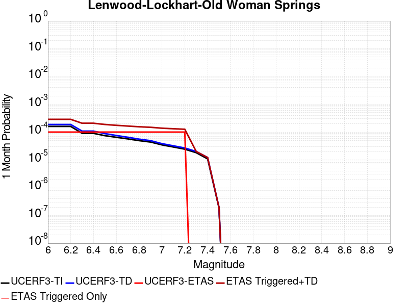 | 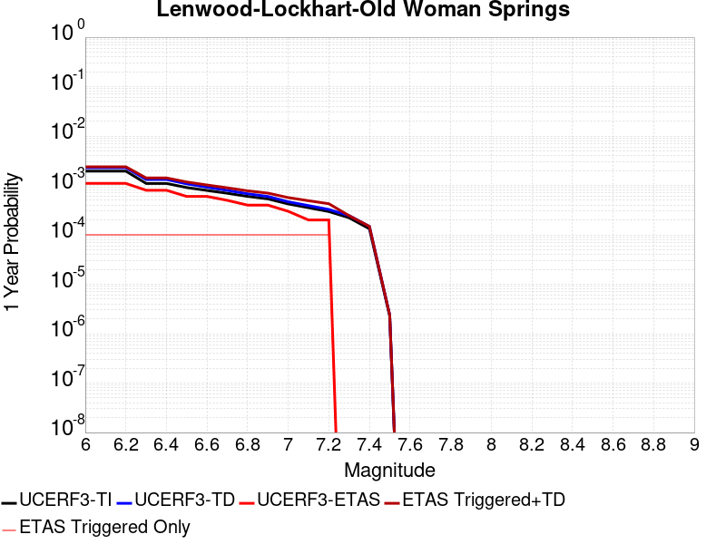 |  |

| Magnitude | 1 wk TI Prob | 1 wk TD Prob | 1 wk ETAS Prob | 1 wk ETAS/TD Gain | 1 wk ETAS Triggered+TD | 1 wk ETAS Triggered Only | 1 mo TI Prob | 1 mo TD Prob | 1 mo ETAS Prob | 1 mo ETAS/TD Gain | 1 mo ETAS Triggered+TD | 1 mo ETAS Triggered Only | 1 yr TI Prob | 1 yr TD Prob | 1 yr ETAS Prob | 1 yr ETAS/TD Gain | 1 yr ETAS Triggered+TD | 1 yr ETAS Triggered Only | 10 yr TI Prob | 10 yr TD Prob | 10 yr ETAS Prob | 10 yr ETAS/TD Gain | 10 yr ETAS Triggered+TD | 10 yr ETAS Triggered Only |
|-----|-----|-----|-----|-----|-----|-----|-----|-----|-----|-----|-----|-----|-----|-----|-----|-----|-----|-----|-----|-----|-----|-----|-----|-----|
| 6.0 | 3.744542E-5 | 4.3915243E-5 | 0.0 | 0.0 | 4.3915243E-5 | 0.0 | 1.604705E-4 | 1.8819557E-4 | 1.0E-4 | 0.5313621 | 2.8817676E-4 | 1.0E-4 | 0.0019519776 | 0.002289045 | 0.0011 | 0.48054975 | 0.002388816 | 1.0E-4 | 0.019349206 | 0.02267263 | 0.0134 | 0.59102094 | 0.023845425 | 0.0012 |
| 6.1 | 3.744542E-5 | 4.3915243E-5 | 0.0 | 0.0 | 4.3915243E-5 | 0.0 | 1.604705E-4 | 1.8819557E-4 | 1.0E-4 | 0.5313621 | 2.8817676E-4 | 1.0E-4 | 0.0019519776 | 0.002289045 | 0.0011 | 0.48054975 | 0.002388816 | 1.0E-4 | 0.019349206 | 0.02267263 | 0.0134 | 0.59102094 | 0.023845425 | 0.0012 |
| 6.2 | 3.744542E-5 | 4.3915243E-5 | 0.0 | 0.0 | 4.3915243E-5 | 0.0 | 1.604705E-4 | 1.8819557E-4 | 1.0E-4 | 0.5313621 | 2.8817676E-4 | 1.0E-4 | 0.0019519776 | 0.002289045 | 0.0011 | 0.48054975 | 0.002388816 | 1.0E-4 | 0.019349206 | 0.02267263 | 0.0134 | 0.59102094 | 0.023845425 | 0.0012 |
| 6.3 | 2.1079984E-5 | 2.5328589E-5 | 0.0 | 0.0 | 2.5328589E-5 | 0.0 | 9.0339665E-5 | 1.0854669E-4 | 1.0E-4 | 0.92126256 | 2.0853583E-4 | 1.0E-4 | 0.0010993304 | 0.0013207747 | 8.0E-4 | 0.60570514 | 0.0014206426 | 1.0E-4 | 0.010939079 | 0.01313146 | 0.0086 | 0.65491575 | 0.014019642 | 9.0E-4 |
| 6.4 | 2.1079984E-5 | 2.5328589E-5 | 0.0 | 0.0 | 2.5328589E-5 | 0.0 | 9.0339665E-5 | 1.0854669E-4 | 1.0E-4 | 0.92126256 | 2.0853583E-4 | 1.0E-4 | 0.0010993304 | 0.0013207747 | 8.0E-4 | 0.60570514 | 0.0014206426 | 1.0E-4 | 0.010939079 | 0.01313146 | 0.0086 | 0.65491575 | 0.014019642 | 9.0E-4 |
| 6.5 | 1.7397282E-5 | 2.0640626E-5 | 0.0 | 0.0 | 2.0640626E-5 | 0.0 | 7.455765E-5 | 8.8456894E-5 | 1.0E-4 | 1.1304941 | 1.8844804E-4 | 1.0E-4 | 9.073613E-4 | 0.0010764423 | 6.0E-4 | 0.5573917 | 0.0011763347 | 1.0E-4 | 0.009036654 | 0.010713574 | 0.0077 | 0.7187144 | 0.011505003 | 8.0E-4 |
| 6.6 | 1.52050325E-5 | 1.765924E-5 | 0.0 | 0.0 | 1.765924E-5 | 0.0 | 6.51628E-5 | 7.5680306E-5 | 1.0E-4 | 1.3213477 | 1.7567274E-4 | 1.0E-4 | 7.9306826E-4 | 9.210261E-4 | 6.0E-4 | 0.65144736 | 0.001020934 | 1.0E-4 | 0.007902439 | 0.00917295 | 0.0064 | 0.6977036 | 0.009668363 | 5.0E-4 |
| 6.7 | 1.332523E-5 | 1.5245194E-5 | 0.0 | 0.0 | 1.5245194E-5 | 0.0 | 5.7106878E-5 | 6.533494E-5 | 1.0E-4 | 1.5305746 | 1.6532841E-4 | 1.0E-4 | 6.950544E-4 | 7.9516845E-4 | 5.0E-4 | 0.6287976 | 8.950889E-4 | 1.0E-4 | 0.006928845 | 0.007923861 | 0.0054 | 0.68148595 | 0.008320691 | 4.0E-4 |
| 6.8 | 1.1525329E-5 | 1.3013368E-5 | 0.0 | 0.0 | 1.3013368E-5 | 0.0 | 4.9393333E-5 | 5.5770404E-5 | 1.0E-4 | 1.7930657 | 1.5576482E-4 | 1.0E-4 | 6.011979E-4 | 6.7879737E-4 | 4.0E-4 | 0.58927745 | 7.787295E-4 | 1.0E-4 | 0.00599574 | 0.00676769 | 0.0046 | 0.67970014 | 0.007164983 | 4.0E-4 |
| 6.9 | 1.0253909E-5 | 1.1497721E-5 | 0.0 | 0.0 | 1.1497721E-5 | 0.0 | 4.3944583E-5 | 4.9275037E-5 | 1.0E-4 | 2.0294251 | 1.4927011E-4 | 1.0E-4 | 5.3489394E-4 | 5.99762E-4 | 4.0E-4 | 0.66693115 | 6.9970207E-4 | 1.0E-4 | 0.0053360825 | 0.005981812 | 0.0044 | 0.7355631 | 0.0062800176 | 3.0E-4 |
| 7.0 | 8.104563E-6 | 8.976321E-6 | 0.0 | 0.0 | 8.976321E-6 | 0.0 | 3.4733377E-5 | 3.8469392E-5 | 1.0E-4 | 2.5994694 | 1.3846555E-4 | 1.0E-4 | 4.2279682E-4 | 4.6826657E-4 | 3.0E-4 | 0.6406607 | 5.6821975E-4 | 1.0E-4 | 0.0042199334 | 0.004673046 | 0.0035 | 0.7489762 | 0.004971644 | 3.0E-4 |
| 7.1 | 6.7986157E-6 | 7.501446E-6 | 0.0 | 0.0 | 7.501446E-6 | 0.0 | 2.91366E-5 | 3.214867E-5 | 1.0E-4 | 3.1105485 | 1.3214546E-4 | 1.0E-4 | 3.5468035E-4 | 3.913419E-4 | 2.0E-4 | 0.5110621 | 4.9130275E-4 | 1.0E-4 | 0.003541148 | 0.003906743 | 0.003 | 0.7679031 | 0.004205571 | 3.0E-4 |
| 7.2 | 5.6893327E-6 | 6.2681474E-6 | 0.0 | 0.0 | 6.2681474E-6 | 0.0 | 2.4382627E-5 | 2.6863223E-5 | 1.0E-4 | 3.7225614 | 1.2686054E-4 | 1.0E-4 | 2.9681803E-4 | 3.2701265E-4 | 2.0E-4 | 0.6115972 | 4.2697994E-4 | 1.0E-4 | 0.002964219 | 0.0032655122 | 0.0025 | 0.76557666 | 0.0035645326 | 3.0E-4 |
| 7.3 | 4.253348E-6 | 4.6957107E-6 | 0.0 | 0.0 | 4.6957107E-6 | 0.0 | 1.8228506E-5 | 2.012433E-5 | 0.0 | 0.0 | 2.012433E-5 | 0.0 | 2.2190946E-4 | 2.4498798E-4 | 0.0 | 0.0 | 2.4498798E-4 | 0.0 | 0.00221688 | 0.0024473593 | 0.0018 | 0.7354866 | 0.0026468697 | 2.0E-4 |
| 7.4 | 2.5448119E-6 | 2.8424663E-6 | 0.0 | 0.0 | 2.8424663E-6 | 0.0 | 1.0906291E-5 | 1.218195E-5 | 0.0 | 0.0 | 1.218195E-5 | 0.0 | 1.3277601E-4 | 1.483068E-4 | 0.0 | 0.0 | 1.483068E-4 | 0.0 | 0.001326967 | 0.0014822397 | 9.0E-4 | 0.60718924 | 0.0016819432 | 2.0E-4 |
| 7.5 | 4.3706837E-8 | 4.5608147E-8 | 0.0 | 0.0 | 4.5608147E-8 | 0.0 | 1.8731501E-7 | 1.9546347E-7 | 0.0 | 0.0 | 1.9546347E-7 | 0.0 | 2.2805577E-6 | 2.3797656E-6 | 0.0 | 0.0 | 2.3797656E-6 | 0.0 | 2.2805343E-5 | 2.3797458E-5 | 0.0 | 0.0 | 2.3797458E-5 | 0.0 |

## Great Valley 09 (Laguna Seca)
*[(top)](#table-of-contents)*

| 1 Week | 1 Month | 1 Year | 10 Year |
|-----|-----|-----|-----|
|  | 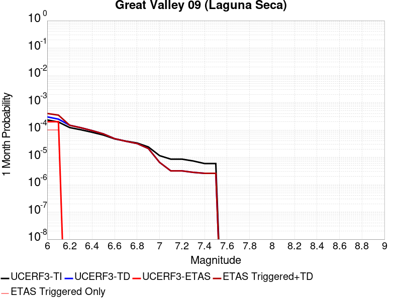 | 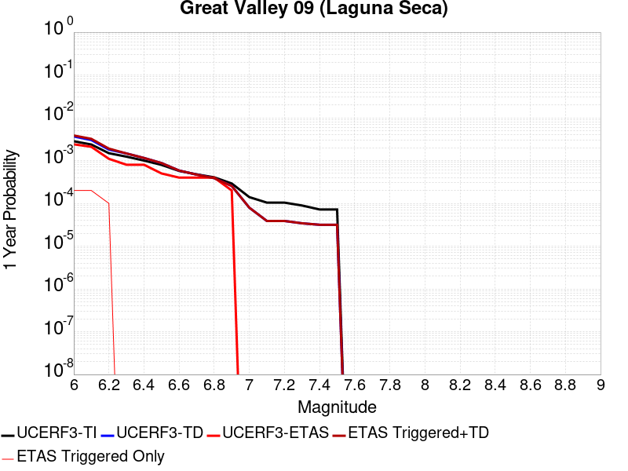 |  |

| Magnitude | 1 wk TI Prob | 1 wk TD Prob | 1 wk ETAS Prob | 1 wk ETAS/TD Gain | 1 wk ETAS Triggered+TD | 1 wk ETAS Triggered Only | 1 mo TI Prob | 1 mo TD Prob | 1 mo ETAS Prob | 1 mo ETAS/TD Gain | 1 mo ETAS Triggered+TD | 1 mo ETAS Triggered Only | 1 yr TI Prob | 1 yr TD Prob | 1 yr ETAS Prob | 1 yr ETAS/TD Gain | 1 yr ETAS Triggered+TD | 1 yr ETAS Triggered Only | 10 yr TI Prob | 10 yr TD Prob | 10 yr ETAS Prob | 10 yr ETAS/TD Gain | 10 yr ETAS Triggered+TD | 10 yr ETAS Triggered Only |
|-----|-----|-----|-----|-----|-----|-----|-----|-----|-----|-----|-----|-----|-----|-----|-----|-----|-----|-----|-----|-----|-----|-----|-----|-----|
| 6.0 | 5.4353277E-5 | 7.027208E-5 | 1.0E-4 | 1.4230403 | 1.7026505E-4 | 1.0E-4 | 2.3292181E-4 | 3.0113137E-4 | 2.0E-4 | 0.664162 | 4.0110125E-4 | 1.0E-4 | 0.0028321352 | 0.0036601184 | 0.0024 | 0.6557165 | 0.0038593863 | 2.0E-4 | 0.02796312 | 0.036002573 | 0.0271 | 0.752724 | 0.03696657 | 0.001 |
| 6.1 | 4.5578287E-5 | 5.8037644E-5 | 1.0E-4 | 1.7230197 | 1.5803183E-4 | 1.0E-4 | 1.953209E-4 | 2.4870917E-4 | 2.0E-4 | 0.80415213 | 3.486843E-4 | 1.0E-4 | 0.0023754383 | 0.0030238347 | 0.0021 | 0.69448245 | 0.00322323 | 2.0E-4 | 0.023502063 | 0.02982855 | 0.0192 | 0.6436786 | 0.030701704 | 9.0E-4 |
| 6.2 | 2.8536782E-5 | 3.4637495E-5 | 0.0 | 0.0 | 3.4637495E-5 | 0.0 | 1.2229476E-4 | 1.4843796E-4 | 0.0 | 0.0 | 1.4843796E-4 | 0.0 | 0.0014879217 | 0.0018057144 | 0.0011 | 0.6091772 | 0.0019055338 | 1.0E-4 | 0.014779986 | 0.017908249 | 0.0115 | 0.6421622 | 0.018497504 | 6.0E-4 |
| 6.3 | 2.3698774E-5 | 2.8136548E-5 | 0.0 | 0.0 | 2.8136548E-5 | 0.0 | 1.01562226E-4 | 1.205795E-4 | 0.0 | 0.0 | 1.205795E-4 | 0.0 | 0.0012358186 | 0.0014670567 | 8.0E-4 | 0.54530954 | 0.0014670567 | 0.0 | 0.012289686 | 0.01457243 | 0.009 | 0.6176046 | 0.0149666015 | 4.0E-4 |
| 6.4 | 1.9191197E-5 | 2.2066964E-5 | 0.0 | 0.0 | 2.2066964E-5 | 0.0 | 8.2245395E-5 | 9.456951E-5 | 0.0 | 0.0 | 9.456951E-5 | 0.0 | 0.0010008777 | 0.0011507788 | 8.0E-4 | 0.69518137 | 0.0011507788 | 0.0 | 0.009963818 | 0.011448429 | 0.007 | 0.6114376 | 0.011646139 | 2.0E-4 |
| 6.5 | 1.5203241E-5 | 1.6762844E-5 | 0.0 | 0.0 | 1.6762844E-5 | 0.0 | 6.5155116E-5 | 7.183896E-5 | 0.0 | 0.0 | 7.183896E-5 | 0.0 | 7.9297484E-4 | 8.743024E-4 | 5.0E-4 | 0.5718845 | 8.743024E-4 | 0.0 | 0.007901512 | 0.008709849 | 0.0053 | 0.60850656 | 0.008908107 | 2.0E-4 |
| 6.6 | 1.0984925E-5 | 1.122181E-5 | 0.0 | 0.0 | 1.122181E-5 | 0.0 | 4.70774E-5 | 4.8092603E-5 | 0.0 | 0.0 | 4.8092603E-5 | 0.0 | 5.730166E-4 | 5.8537396E-4 | 4.0E-4 | 0.6833239 | 5.8537396E-4 | 0.0 | 0.005715413 | 0.0058387127 | 0.0038 | 0.65082836 | 0.006037545 | 2.0E-4 |
| 6.7 | 9.134616E-6 | 9.003779E-6 | 0.0 | 0.0 | 9.003779E-6 | 0.0 | 3.9147766E-5 | 3.8587066E-5 | 0.0 | 0.0 | 3.8587066E-5 | 0.0 | 4.7651984E-4 | 4.6969866E-4 | 4.0E-4 | 0.8516098 | 4.6969866E-4 | 0.0 | 0.004754993 | 0.004687303 | 0.003 | 0.64002687 | 0.0047868346 | 1.0E-4 |
| 6.8 | 7.785589E-6 | 7.438485E-6 | 0.0 | 0.0 | 7.438485E-6 | 0.0 | 3.3366385E-5 | 3.1878844E-5 | 0.0 | 0.0 | 3.1878844E-5 | 0.0 | 4.0616E-4 | 3.8805782E-4 | 4.0E-4 | 1.0307742 | 3.8805782E-4 | 0.0 | 0.0040541845 | 0.003874005 | 0.0027 | 0.6969531 | 0.0039736177 | 1.0E-4 |
| 6.9 | 5.579095E-6 | 4.8892202E-6 | 0.0 | 0.0 | 4.8892202E-6 | 0.0 | 2.3910188E-5 | 2.0953641E-5 | 0.0 | 0.0 | 2.0953641E-5 | 0.0 | 2.9106764E-4 | 2.550821E-4 | 2.0E-4 | 0.7840613 | 2.550821E-4 | 0.0 | 0.002906867 | 0.0025480299 | 0.0016 | 0.6279361 | 0.002647775 | 1.0E-4 |
| 7.0 | 2.6816688E-6 | 1.5181748E-6 | 0.0 | 0.0 | 1.5181748E-6 | 0.0 | 1.1492816E-5 | 6.506448E-6 | 0.0 | 0.0 | 6.506448E-6 | 0.0 | 1.3991605E-4 | 7.921321E-5 | 0.0 | 0.0 | 7.921321E-5 | 0.0 | 0.0013982799 | 7.918585E-4 | 5.0E-4 | 0.631426 | 8.9177926E-4 | 1.0E-4 |
| 7.1 | 1.9951021E-6 | 7.430028E-7 | 0.0 | 0.0 | 7.430028E-7 | 0.0 | 8.55041E-6 | 3.184294E-6 | 0.0 | 0.0 | 3.184294E-6 | 0.0 | 1.0409627E-4 | 3.876813E-5 | 0.0 | 0.0 | 3.876813E-5 | 0.0 | 0.0010404752 | 3.876178E-4 | 1.0E-4 | 0.2579861 | 3.876178E-4 | 0.0 |
| 7.2 | 1.9951021E-6 | 7.430028E-7 | 0.0 | 0.0 | 7.430028E-7 | 0.0 | 8.55041E-6 | 3.184294E-6 | 0.0 | 0.0 | 3.184294E-6 | 0.0 | 1.0409627E-4 | 3.876813E-5 | 0.0 | 0.0 | 3.876813E-5 | 0.0 | 0.0010404752 | 3.876178E-4 | 1.0E-4 | 0.2579861 | 3.876178E-4 | 0.0 |
| 7.3 | 1.7087556E-6 | 6.5582105E-7 | 0.0 | 0.0 | 6.5582105E-7 | 0.0 | 7.3232177E-6 | 2.8106588E-6 | 0.0 | 0.0 | 2.8106588E-6 | 0.0 | 8.915652E-5 | 3.4219276E-5 | 0.0 | 0.0 | 3.4219276E-5 | 0.0 | 8.9120766E-4 | 3.4214408E-4 | 1.0E-4 | 0.29227453 | 3.4214408E-4 | 0.0 |
| 7.4 | 1.3804846E-6 | 6.05547E-7 | 0.0 | 0.0 | 6.05547E-7 | 0.0 | 5.916349E-6 | 2.595199E-6 | 0.0 | 0.0 | 2.595199E-6 | 0.0 | 7.2029165E-5 | 3.159613E-5 | 0.0 | 0.0 | 3.159613E-5 | 0.0 | 7.200583E-4 | 3.1592036E-4 | 1.0E-4 | 0.31653547 | 3.1592036E-4 | 0.0 |
| 7.5 | 1.3804846E-6 | 6.05547E-7 | 0.0 | 0.0 | 6.05547E-7 | 0.0 | 5.916349E-6 | 2.595199E-6 | 0.0 | 0.0 | 2.595199E-6 | 0.0 | 7.2029165E-5 | 3.159613E-5 | 0.0 | 0.0 | 3.159613E-5 | 0.0 | 7.200583E-4 | 3.1592036E-4 | 1.0E-4 | 0.31653547 | 3.1592036E-4 | 0.0 |

## Garlock (West)
*[(top)](#table-of-contents)*

| 1 Week | 1 Month | 1 Year | 10 Year |
|-----|-----|-----|-----|
|  |  |  |  |

| Magnitude | 1 wk TI Prob | 1 wk TD Prob | 1 wk ETAS Prob | 1 wk ETAS/TD Gain | 1 wk ETAS Triggered+TD | 1 wk ETAS Triggered Only | 1 mo TI Prob | 1 mo TD Prob | 1 mo ETAS Prob | 1 mo ETAS/TD Gain | 1 mo ETAS Triggered+TD | 1 mo ETAS Triggered Only | 1 yr TI Prob | 1 yr TD Prob | 1 yr ETAS Prob | 1 yr ETAS/TD Gain | 1 yr ETAS Triggered+TD | 1 yr ETAS Triggered Only | 10 yr TI Prob | 10 yr TD Prob | 10 yr ETAS Prob | 10 yr ETAS/TD Gain | 10 yr ETAS Triggered+TD | 10 yr ETAS Triggered Only |
|-----|-----|-----|-----|-----|-----|-----|-----|-----|-----|-----|-----|-----|-----|-----|-----|-----|-----|-----|-----|-----|-----|-----|-----|-----|
| 6.0 | 2.5181727E-5 | 2.4802828E-5 | 0.0 | 0.0 | 2.4802828E-5 | 0.0 | 1.0791722E-4 | 1.0629352E-4 | 0.0 | 0.0 | 1.0629352E-4 | 0.0 | 0.0013131002 | 0.0012933587 | 8.0E-4 | 0.6185445 | 0.0015929707 | 3.0E-4 | 0.013053683 | 0.012939008 | 0.0085 | 0.65692824 | 0.014123482 | 0.0012 |
| 6.1 | 2.5077732E-5 | 2.4704092E-5 | 0.0 | 0.0 | 2.4704092E-5 | 0.0 | 1.0747157E-4 | 1.058704E-4 | 0.0 | 0.0 | 1.058704E-4 | 0.0 | 0.001307681 | 0.0012882133 | 8.0E-4 | 0.6210152 | 0.0015878269 | 3.0E-4 | 0.013000126 | 0.012888152 | 0.0084 | 0.6517614 | 0.014072686 | 0.0012 |
| 6.2 | 2.494612E-5 | 2.4586023E-5 | 0.0 | 0.0 | 2.4586023E-5 | 0.0 | 1.0690756E-4 | 1.0536443E-4 | 0.0 | 0.0 | 1.0536443E-4 | 0.0 | 0.0013008224 | 0.0012820604 | 8.0E-4 | 0.62399554 | 0.0015816758 | 3.0E-4 | 0.012932341 | 0.012827334 | 0.0084 | 0.65485156 | 0.014011942 | 0.0012 |
| 6.3 | 2.4733758E-5 | 2.440584E-5 | 0.0 | 0.0 | 2.440584E-5 | 0.0 | 1.0599751E-4 | 1.04592276E-4 | 0.0 | 0.0 | 1.04592276E-4 | 0.0 | 0.0012897556 | 0.0012726705 | 8.0E-4 | 0.62859946 | 0.0015722887 | 3.0E-4 | 0.012822957 | 0.012734516 | 0.0082 | 0.6439193 | 0.013919233 | 0.0012 |
| 6.4 | 2.3237335E-5 | 2.2787908E-5 | 0.0 | 0.0 | 2.2787908E-5 | 0.0 | 9.958477E-5 | 9.765882E-5 | 0.0 | 0.0 | 9.765882E-5 | 0.0 | 0.0012117702 | 0.0011883504 | 8.0E-4 | 0.67320216 | 0.0014879939 | 3.0E-4 | 0.012051838 | 0.011900616 | 0.0081 | 0.68063706 | 0.013086335 | 0.0012 |
| 6.5 | 2.2732203E-5 | 2.2604341E-5 | 0.0 | 0.0 | 2.2604341E-5 | 0.0 | 9.742009E-5 | 9.687217E-5 | 0.0 | 0.0 | 9.687217E-5 | 0.0 | 0.0011854442 | 0.0011787832 | 8.0E-4 | 0.6786659 | 0.0014784297 | 3.0E-4 | 0.011791403 | 0.011805966 | 0.008 | 0.6776235 | 0.012892979 | 0.0011 |
| 6.6 | 2.1319436E-5 | 2.1387925E-5 | 0.0 | 0.0 | 2.1387925E-5 | 0.0 | 9.136581E-5 | 9.165933E-5 | 0.0 | 0.0 | 9.165933E-5 | 0.0 | 0.001111811 | 0.0011153833 | 8.0E-4 | 0.7172422 | 0.0014150487 | 3.0E-4 | 0.011062649 | 0.011178487 | 0.0073 | 0.65304005 | 0.0121673085 | 0.001 |
| 6.7 | 1.970802E-5 | 2.001179E-5 | 0.0 | 0.0 | 2.001179E-5 | 0.0 | 8.446021E-5 | 8.5762E-5 | 0.0 | 0.0 | 8.5762E-5 | 0.0 | 0.001027818 | 0.0010436539 | 8.0E-4 | 0.7665376 | 0.0013433408 | 3.0E-4 | 0.010230771 | 0.010468132 | 0.0068 | 0.6495906 | 0.011457663 | 0.001 |
| 6.8 | 1.8744462E-5 | 1.9522038E-5 | 0.0 | 0.0 | 1.9522038E-5 | 0.0 | 8.033094E-5 | 8.36632E-5 | 0.0 | 0.0 | 8.36632E-5 | 0.0 | 9.775903E-4 | 0.0010181251 | 8.0E-4 | 0.785758 | 0.0013178197 | 3.0E-4 | 0.009733009 | 0.010215214 | 0.0068 | 0.66567373 | 0.011204999 | 0.001 |
| 6.9 | 1.7559682E-5 | 1.8576884E-5 | 0.0 | 0.0 | 1.8576884E-5 | 0.0 | 7.5253614E-5 | 7.96128E-5 | 0.0 | 0.0 | 7.96128E-5 | 0.0 | 9.158276E-4 | 9.688562E-4 | 6.0E-4 | 0.61928695 | 0.0010687594 | 1.0E-4 | 0.0091206245 | 0.009726962 | 0.006 | 0.61684215 | 0.010420153 | 7.0E-4 |
| 7.0 | 1.6794445E-5 | 1.7842674E-5 | 0.0 | 0.0 | 1.7842674E-5 | 0.0 | 7.197421E-5 | 7.646637E-5 | 0.0 | 0.0 | 7.646637E-5 | 0.0 | 8.759337E-4 | 9.3058177E-4 | 6.0E-4 | 0.6447579 | 0.0010304888 | 1.0E-4 | 0.008724891 | 0.009347316 | 0.0057 | 0.60980076 | 0.010040772 | 7.0E-4 |
| 7.1 | 1.6337795E-5 | 1.7347655E-5 | 0.0 | 0.0 | 1.7347655E-5 | 0.0 | 7.0017246E-5 | 7.434498E-5 | 0.0 | 0.0 | 7.434498E-5 | 0.0 | 8.521265E-4 | 9.047756E-4 | 6.0E-4 | 0.66314787 | 0.0010046851 | 1.0E-4 | 0.008488664 | 0.009091418 | 0.0057 | 0.6269649 | 0.009785054 | 7.0E-4 |
| 7.2 | 1.5780008E-5 | 1.679775E-5 | 0.0 | 0.0 | 1.679775E-5 | 0.0 | 6.762685E-5 | 7.198838E-5 | 0.0 | 0.0 | 7.198838E-5 | 0.0 | 8.2304585E-4 | 8.7610737E-4 | 5.0E-4 | 0.5707063 | 8.7610737E-4 | 0.0 | 0.008200042 | 0.008806948 | 0.0054 | 0.61315227 | 0.009401664 | 6.0E-4 |
| 7.3 | 1.5058865E-5 | 1.6253596E-5 | 0.0 | 0.0 | 1.6253596E-5 | 0.0 | 6.45364E-5 | 6.965641E-5 | 0.0 | 0.0 | 6.965641E-5 | 0.0 | 7.854473E-4 | 8.47738E-4 | 5.0E-4 | 0.5898049 | 8.47738E-4 | 0.0 | 0.00782677 | 0.008525018 | 0.0053 | 0.62169963 | 0.009119903 | 6.0E-4 |
| 7.4 | 1.4887923E-5 | 1.6090784E-5 | 0.0 | 0.0 | 1.6090784E-5 | 0.0 | 6.380382E-5 | 6.895869E-5 | 0.0 | 0.0 | 6.895869E-5 | 0.0 | 7.7653467E-4 | 8.392498E-4 | 5.0E-4 | 0.5957702 | 8.392498E-4 | 0.0 | 0.0077382675 | 0.008440436 | 0.0051 | 0.6042342 | 0.008936216 | 5.0E-4 |
| 7.5 | 1.4509299E-5 | 1.5685366E-5 | 0.0 | 0.0 | 1.5685366E-5 | 0.0 | 6.218123E-5 | 6.722127E-5 | 0.0 | 0.0 | 6.722127E-5 | 0.0 | 7.567935E-4 | 8.1811287E-4 | 5.0E-4 | 0.61116266 | 8.1811287E-4 | 0.0 | 0.0075422134 | 0.00823001 | 0.0048 | 0.58323133 | 0.008725896 | 5.0E-4 |
| 7.6 | 1.2756717E-5 | 1.37042925E-5 | 0.0 | 0.0 | 1.37042925E-5 | 0.0 | 5.4670498E-5 | 5.8731363E-5 | 0.0 | 0.0 | 5.8731363E-5 | 0.0 | 6.6541E-4 | 7.148204E-4 | 4.0E-4 | 0.55958116 | 7.148204E-4 | 0.0 | 0.006634211 | 0.007202352 | 0.0041 | 0.5692585 | 0.007500191 | 3.0E-4 |
| 7.7 | 1.0328985E-5 | 1.1137085E-5 | 0.0 | 0.0 | 1.1137085E-5 | 0.0 | 4.4266326E-5 | 4.772949E-5 | 0.0 | 0.0 | 4.772949E-5 | 0.0 | 5.388092E-4 | 5.80952E-4 | 4.0E-4 | 0.6885251 | 5.80952E-4 | 0.0 | 0.0053750467 | 0.0058708116 | 0.0032 | 0.54506946 | 0.0058708116 | 0.0 |
| 7.8 | 7.0306583E-6 | 8.640371E-6 | 0.0 | 0.0 | 8.640371E-6 | 0.0 | 3.0131043E-5 | 3.7029633E-5 | 0.0 | 0.0 | 3.7029633E-5 | 0.0 | 3.667837E-4 | 4.5074266E-4 | 2.0E-4 | 0.44371215 | 4.5074266E-4 | 0.0 | 0.003661789 | 0.0045606596 | 0.0025 | 0.54816633 | 0.0045606596 | 0.0 |
| 7.9 | 4.060633E-6 | 5.312001E-6 | 0.0 | 0.0 | 5.312001E-6 | 0.0 | 1.7402595E-5 | 2.2765522E-5 | 0.0 | 0.0 | 2.2765522E-5 | 0.0 | 2.11856E-4 | 2.7713506E-4 | 0.0 | 0.0 | 2.7713506E-4 | 0.0 | 0.0021165414 | 0.0028042854 | 0.001 | 0.35659707 | 0.0028042854 | 0.0 |
| 8.0 | 1.6729537E-6 | 2.023924E-6 | 0.0 | 0.0 | 2.023924E-6 | 0.0 | 7.169782E-6 | 8.673931E-6 | 0.0 | 0.0 | 8.673931E-6 | 0.0 | 8.7288594E-5 | 1.05600026E-4 | 0.0 | 0.0 | 1.05600026E-4 | 0.0 | 8.7254314E-4 | 0.0010688532 | 3.0E-4 | 0.28067467 | 0.0010688532 | 0.0 |
| 8.1 | 3.6733252E-7 | 3.054934E-7 | 0.0 | 0.0 | 3.054934E-7 | 0.0 | 1.5742813E-6 | 1.3092568E-6 | 0.0 | 0.0 | 1.3092568E-6 | 0.0 | 1.9166706E-5 | 1.59401E-5 | 0.0 | 0.0 | 1.59401E-5 | 0.0 | 1.9165053E-4 | 1.6150644E-4 | 0.0 | 0.0 | 1.6150644E-4 | 0.0 |

## Big Pine (East)
*[(top)](#table-of-contents)*

| 1 Week | 1 Month | 1 Year | 10 Year |
|-----|-----|-----|-----|
|  | 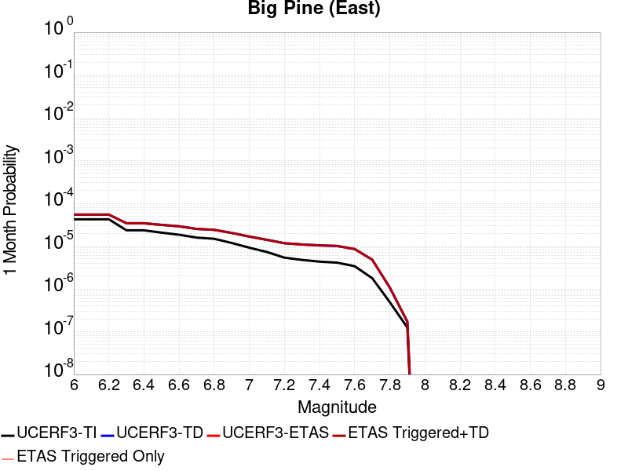 |  |  |

| Magnitude | 1 wk TI Prob | 1 wk TD Prob | 1 wk ETAS Prob | 1 wk ETAS/TD Gain | 1 wk ETAS Triggered+TD | 1 wk ETAS Triggered Only | 1 mo TI Prob | 1 mo TD Prob | 1 mo ETAS Prob | 1 mo ETAS/TD Gain | 1 mo ETAS Triggered+TD | 1 mo ETAS Triggered Only | 1 yr TI Prob | 1 yr TD Prob | 1 yr ETAS Prob | 1 yr ETAS/TD Gain | 1 yr ETAS Triggered+TD | 1 yr ETAS Triggered Only | 10 yr TI Prob | 10 yr TD Prob | 10 yr ETAS Prob | 10 yr ETAS/TD Gain | 10 yr ETAS Triggered+TD | 10 yr ETAS Triggered Only |
|-----|-----|-----|-----|-----|-----|-----|-----|-----|-----|-----|-----|-----|-----|-----|-----|-----|-----|-----|-----|-----|-----|-----|-----|-----|
| 6.0 | 9.916913E-6 | 1.2717424E-5 | 0.0 | 0.0 | 1.2717424E-5 | 0.0 | 4.250036E-5 | 5.4502234E-5 | 0.0 | 0.0 | 5.4502234E-5 | 0.0 | 5.173191E-4 | 6.633847E-4 | 3.0E-4 | 0.45222628 | 6.633847E-4 | 0.0 | 0.0051611643 | 0.0066197775 | 0.0058 | 0.87616235 | 0.007712496 | 0.0011 |
| 6.1 | 9.916913E-6 | 1.2717424E-5 | 0.0 | 0.0 | 1.2717424E-5 | 0.0 | 4.250036E-5 | 5.4502234E-5 | 0.0 | 0.0 | 5.4502234E-5 | 0.0 | 5.173191E-4 | 6.633847E-4 | 3.0E-4 | 0.45222628 | 6.633847E-4 | 0.0 | 0.0051611643 | 0.0066197775 | 0.0058 | 0.87616235 | 0.007712496 | 0.0011 |
| 6.2 | 9.916913E-6 | 1.2717424E-5 | 0.0 | 0.0 | 1.2717424E-5 | 0.0 | 4.250036E-5 | 5.4502234E-5 | 0.0 | 0.0 | 5.4502234E-5 | 0.0 | 5.173191E-4 | 6.633847E-4 | 3.0E-4 | 0.45222628 | 6.633847E-4 | 0.0 | 0.0051611643 | 0.0066197775 | 0.0058 | 0.87616235 | 0.007712496 | 0.0011 |
| 6.3 | 5.479711E-6 | 8.0163445E-6 | 0.0 | 0.0 | 8.0163445E-6 | 0.0 | 2.3484265E-5 | 3.435533E-5 | 0.0 | 0.0 | 3.435533E-5 | 0.0 | 2.858834E-4 | 4.18199E-4 | 3.0E-4 | 0.7173618 | 4.18199E-4 | 0.0 | 0.0028551589 | 0.004177993 | 0.0041 | 0.9813324 | 0.005173815 | 0.001 |
| 6.4 | 5.465009E-6 | 8.000649E-6 | 0.0 | 0.0 | 8.000649E-6 | 0.0 | 2.3421257E-5 | 3.4288067E-5 | 0.0 | 0.0 | 3.4288067E-5 | 0.0 | 2.851165E-4 | 4.1738036E-4 | 3.0E-4 | 0.71876884 | 4.1738036E-4 | 0.0 | 0.0028475097 | 0.0041698376 | 0.004 | 0.95927 | 0.0051656677 | 0.001 |
| 6.5 | 4.826767E-6 | 7.326111E-6 | 0.0 | 0.0 | 7.326111E-6 | 0.0 | 2.068598E-5 | 3.1397256E-5 | 0.0 | 0.0 | 3.1397256E-5 | 0.0 | 2.518227E-4 | 3.8219726E-4 | 3.0E-4 | 0.784935 | 3.8219726E-4 | 0.0 | 0.0025153751 | 0.0038192312 | 0.0035 | 0.9164148 | 0.0047157938 | 9.0E-4 |
| 6.6 | 4.3146847E-6 | 6.786355E-6 | 0.0 | 0.0 | 6.786355E-6 | 0.0 | 1.8491375E-5 | 2.9084067E-5 | 0.0 | 0.0 | 2.9084067E-5 | 0.0 | 2.2510924E-4 | 3.5404338E-4 | 3.0E-4 | 0.84735376 | 3.5404338E-4 | 0.0 | 0.0022488134 | 0.003538593 | 0.0031 | 0.8760544 | 0.004335762 | 8.0E-4 |
| 6.7 | 3.6968106E-6 | 5.9052136E-6 | 0.0 | 0.0 | 5.9052136E-6 | 0.0 | 1.5843378E-5 | 2.5307821E-5 | 0.0 | 0.0 | 2.5307821E-5 | 0.0 | 1.9287605E-4 | 3.0808066E-4 | 3.0E-4 | 0.9737709 | 3.0808066E-4 | 0.0 | 0.0019270873 | 0.0030802467 | 0.0022 | 0.7142285 | 0.0036783987 | 6.0E-4 |
| 6.8 | 3.4671132E-6 | 5.6143613E-6 | 0.0 | 0.0 | 5.6143613E-6 | 0.0 | 1.4858972E-5 | 2.4061335E-5 | 0.0 | 0.0 | 2.4061335E-5 | 0.0 | 1.8089297E-4 | 2.9290878E-4 | 3.0E-4 | 1.0242096 | 2.9290878E-4 | 0.0 | 0.0018074579 | 0.0029289299 | 0.0019 | 0.6487011 | 0.0035271726 | 6.0E-4 |
| 6.9 | 2.7686972E-6 | 4.744144E-6 | 0.0 | 0.0 | 4.744144E-6 | 0.0 | 1.1865792E-5 | 2.0331892E-5 | 0.0 | 0.0 | 2.0331892E-5 | 0.0 | 1.4445644E-4 | 2.475134E-4 | 3.0E-4 | 1.2120556 | 2.475134E-4 | 0.0 | 0.0014436257 | 0.0024760137 | 0.0015 | 0.6058125 | 0.0028750233 | 4.0E-4 |
| 7.0 | 2.1472624E-6 | 3.911395E-6 | 0.0 | 0.0 | 3.911395E-6 | 0.0 | 9.20252E-6 | 1.6763019E-5 | 0.0 | 0.0 | 1.6763019E-5 | 0.0 | 1.12034926E-4 | 2.0407116E-4 | 1.0E-4 | 0.49002516 | 2.0407116E-4 | 0.0 | 0.0011197845 | 0.0020424502 | 8.0E-4 | 0.3916864 | 0.0022420418 | 2.0E-4 |
| 7.1 | 1.7018335E-6 | 3.2778523E-6 | 0.0 | 0.0 | 3.2778523E-6 | 0.0 | 7.293552E-6 | 1.4047864E-5 | 0.0 | 0.0 | 1.4047864E-5 | 0.0 | 8.879537E-5 | 1.7101968E-4 | 1.0E-4 | 0.58472806 | 1.7101968E-4 | 0.0 | 8.87599E-4 | 0.0017124636 | 5.0E-4 | 0.29197702 | 0.0018122923 | 1.0E-4 |
| 7.2 | 1.25603E-6 | 2.7311708E-6 | 0.0 | 0.0 | 2.7311708E-6 | 0.0 | 5.3829745E-6 | 1.1704967E-5 | 0.0 | 0.0 | 1.1704967E-5 | 0.0 | 6.553574E-5 | 1.4249886E-4 | 1.0E-4 | 0.70176 | 1.4249886E-4 | 0.0 | 6.551642E-4 | 0.0014276317 | 4.0E-4 | 0.2801843 | 0.001527489 | 1.0E-4 |
| 7.3 | 1.112297E-6 | 2.5505421E-6 | 0.0 | 0.0 | 2.5505421E-6 | 0.0 | 4.7669787E-6 | 1.093085E-5 | 0.0 | 0.0 | 1.093085E-5 | 0.0 | 5.803642E-5 | 1.3307518E-4 | 1.0E-4 | 0.7514549 | 1.3307518E-4 | 0.0 | 5.802127E-4 | 0.0013333561 | 3.0E-4 | 0.22499615 | 0.0014332228 | 1.0E-4 |
| 7.4 | 1.0137181E-6 | 2.4262638E-6 | 0.0 | 0.0 | 2.4262638E-6 | 0.0 | 4.3444993E-6 | 1.0398234E-5 | 0.0 | 0.0 | 1.0398234E-5 | 0.0 | 5.2892992E-5 | 1.2659135E-4 | 1.0E-4 | 0.78994346 | 1.2659135E-4 | 0.0 | 5.288041E-4 | 0.0012684112 | 3.0E-4 | 0.23651636 | 0.0013682843 | 1.0E-4 |
| 7.5 | 9.598608E-7 | 2.3516236E-6 | 0.0 | 0.0 | 2.3516236E-6 | 0.0 | 4.1136827E-6 | 1.0078349E-5 | 0.0 | 0.0 | 1.0078349E-5 | 0.0 | 5.0082934E-5 | 1.226972E-4 | 1.0E-4 | 0.81501454 | 1.226972E-4 | 0.0 | 5.007165E-4 | 0.0012293095 | 3.0E-4 | 0.24403943 | 0.0013291866 | 1.0E-4 |
| 7.6 | 7.929459E-7 | 1.9958393E-6 | 0.0 | 0.0 | 1.9958393E-6 | 0.0 | 3.3983351E-6 | 8.55357E-6 | 0.0 | 0.0 | 8.55357E-6 | 0.0 | 4.1373947E-5 | 1.0413491E-4 | 1.0E-4 | 0.96029276 | 1.0413491E-4 | 0.0 | 4.1366243E-4 | 0.0010437943 | 3.0E-4 | 0.28741294 | 0.00114369 | 1.0E-4 |
| 7.7 | 4.155788E-7 | 1.1258439E-6 | 0.0 | 0.0 | 1.1258439E-6 | 0.0 | 1.7810507E-6 | 4.825037E-6 | 0.0 | 0.0 | 4.825037E-6 | 0.0 | 2.1684076E-5 | 5.874328E-5 | 1.0E-4 | 1.7023224 | 5.874328E-5 | 0.0 | 2.1681961E-4 | 5.910641E-4 | 3.0E-4 | 0.5075592 | 6.9100497E-4 | 1.0E-4 |
| 7.8 | 1.14666925E-7 | 2.5129995E-7 | 0.0 | 0.0 | 2.5129995E-7 | 0.0 | 4.914296E-7 | 1.0769994E-6 | 0.0 | 0.0 | 1.0769994E-6 | 0.0 | 5.9831386E-6 | 1.31123925E-5 | 1.0E-4 | 7.6263733 | 1.31123925E-5 | 0.0 | 5.9829777E-5 | 1.3229302E-4 | 1.0E-4 | 0.7558978 | 1.3229302E-4 | 0.0 |
| 7.9 | 2.9231824E-8 | 4.005187E-8 | 0.0 | 0.0 | 4.005187E-8 | 0.0 | 1.2527924E-7 | 1.7165085E-7 | 0.0 | 0.0 | 1.7165085E-7 | 0.0 | 1.5252737E-6 | 2.0898474E-6 | 0.0 | 0.0 | 2.0898474E-6 | 0.0 | 1.5252632E-5 | 2.1239879E-5 | 0.0 | 0.0 | 2.1239879E-5 | 0.0 |

## Emerson-Copper Mtn 2011
*[(top)](#table-of-contents)*

| 1 Week | 1 Month | 1 Year | 10 Year |
|-----|-----|-----|-----|
| 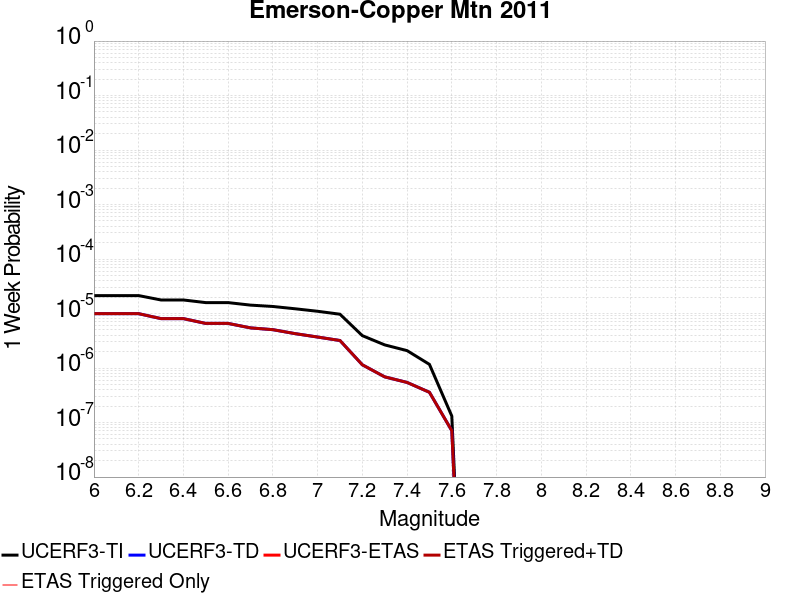 |  |  |  |

| Magnitude | 1 wk TI Prob | 1 wk TD Prob | 1 wk ETAS Prob | 1 wk ETAS/TD Gain | 1 wk ETAS Triggered+TD | 1 wk ETAS Triggered Only | 1 mo TI Prob | 1 mo TD Prob | 1 mo ETAS Prob | 1 mo ETAS/TD Gain | 1 mo ETAS Triggered+TD | 1 mo ETAS Triggered Only | 1 yr TI Prob | 1 yr TD Prob | 1 yr ETAS Prob | 1 yr ETAS/TD Gain | 1 yr ETAS Triggered+TD | 1 yr ETAS Triggered Only | 10 yr TI Prob | 10 yr TD Prob | 10 yr ETAS Prob | 10 yr ETAS/TD Gain | 10 yr ETAS Triggered+TD | 10 yr ETAS Triggered Only |
|-----|-----|-----|-----|-----|-----|-----|-----|-----|-----|-----|-----|-----|-----|-----|-----|-----|-----|-----|-----|-----|-----|-----|-----|-----|
| 6.0 | 2.1364202E-5 | 9.949666E-6 | 0.0 | 0.0 | 9.949666E-6 | 0.0 | 9.1557646E-5 | 4.264078E-5 | 1.0E-4 | 2.3451731 | 4.264078E-5 | 0.0 | 0.0011141442 | 5.190365E-4 | 6.0E-4 | 1.1559881 | 8.188808E-4 | 3.0E-4 | 0.011085749 | 0.005179109 | 0.0046 | 0.88818365 | 0.006273412 | 0.0011 |
| 6.1 | 2.1364202E-5 | 9.949666E-6 | 0.0 | 0.0 | 9.949666E-6 | 0.0 | 9.1557646E-5 | 4.264078E-5 | 1.0E-4 | 2.3451731 | 4.264078E-5 | 0.0 | 0.0011141442 | 5.190365E-4 | 6.0E-4 | 1.1559881 | 8.188808E-4 | 3.0E-4 | 0.011085749 | 0.005179109 | 0.0046 | 0.88818365 | 0.006273412 | 0.0011 |
| 6.2 | 2.1364202E-5 | 9.949666E-6 | 0.0 | 0.0 | 9.949666E-6 | 0.0 | 9.1557646E-5 | 4.264078E-5 | 1.0E-4 | 2.3451731 | 4.264078E-5 | 0.0 | 0.0011141442 | 5.190365E-4 | 6.0E-4 | 1.1559881 | 8.188808E-4 | 3.0E-4 | 0.011085749 | 0.005179109 | 0.0046 | 0.88818365 | 0.006273412 | 0.0011 |
| 6.3 | 1.7751237E-5 | 8.072754E-6 | 0.0 | 0.0 | 8.072754E-6 | 0.0 | 7.607452E-5 | 3.4597095E-5 | 0.0 | 0.0 | 3.4597095E-5 | 0.0 | 9.258136E-4 | 4.2114448E-4 | 4.0E-4 | 0.94979286 | 7.210181E-4 | 3.0E-4 | 0.00921966 | 0.0042040837 | 0.0037 | 0.8800966 | 0.0050007207 | 8.0E-4 |
| 6.4 | 1.7751237E-5 | 8.072754E-6 | 0.0 | 0.0 | 8.072754E-6 | 0.0 | 7.607452E-5 | 3.4597095E-5 | 0.0 | 0.0 | 3.4597095E-5 | 0.0 | 9.258136E-4 | 4.2114448E-4 | 4.0E-4 | 0.94979286 | 7.210181E-4 | 3.0E-4 | 0.00921966 | 0.0042040837 | 0.0037 | 0.8800966 | 0.0050007207 | 8.0E-4 |
| 6.5 | 1.5886664E-5 | 6.589088E-6 | 0.0 | 0.0 | 6.589088E-6 | 0.0 | 6.808392E-5 | 2.8238668E-5 | 0.0 | 0.0 | 2.8238668E-5 | 0.0 | 8.286065E-4 | 3.4375623E-4 | 3.0E-4 | 0.8727115 | 5.436875E-4 | 2.0E-4 | 0.008255237 | 0.0034327072 | 0.0026 | 0.75741965 | 0.0041303043 | 7.0E-4 |
| 6.6 | 1.5886664E-5 | 6.589088E-6 | 0.0 | 0.0 | 6.589088E-6 | 0.0 | 6.808392E-5 | 2.8238668E-5 | 0.0 | 0.0 | 2.8238668E-5 | 0.0 | 8.286065E-4 | 3.4375623E-4 | 3.0E-4 | 0.8727115 | 5.436875E-4 | 2.0E-4 | 0.008255237 | 0.0034327072 | 0.0026 | 0.75741965 | 0.0041303043 | 7.0E-4 |
| 6.7 | 1.428471E-5 | 5.456938E-6 | 0.0 | 0.0 | 5.456938E-6 | 0.0 | 6.121875E-5 | 2.3386692E-5 | 0.0 | 0.0 | 2.3386692E-5 | 0.0 | 7.450834E-4 | 2.846997E-4 | 2.0E-4 | 0.7024946 | 4.8464275E-4 | 2.0E-4 | 0.007425902 | 0.0028437357 | 0.0022 | 0.77363026 | 0.0034420295 | 6.0E-4 |
| 6.8 | 1.3490684E-5 | 5.0607155E-6 | 0.0 | 0.0 | 5.0607155E-6 | 0.0 | 5.7815934E-5 | 2.1688622E-5 | 0.0 | 0.0 | 2.1688622E-5 | 0.0 | 7.0368167E-4 | 2.6403082E-4 | 2.0E-4 | 0.75748736 | 4.63978E-4 | 2.0E-4 | 0.007014576 | 0.0026375502 | 0.0021 | 0.79619336 | 0.0032359678 | 6.0E-4 |
| 6.9 | 1.2235421E-5 | 4.2773563E-6 | 0.0 | 0.0 | 4.2773563E-6 | 0.0 | 5.2436466E-5 | 1.8331419E-5 | 0.0 | 0.0 | 1.8331419E-5 | 0.0 | 6.38227E-4 | 2.2316576E-4 | 2.0E-4 | 0.8961948 | 4.2312112E-4 | 2.0E-4 | 0.0063639707 | 0.0022297692 | 0.0018 | 0.8072584 | 0.0028284313 | 6.0E-4 |
| 7.0 | 1.1009851E-5 | 3.707532E-6 | 0.0 | 0.0 | 3.707532E-6 | 0.0 | 4.7184225E-5 | 1.5889345E-5 | 0.0 | 0.0 | 1.5889345E-5 | 0.0 | 5.743165E-4 | 1.9343903E-4 | 1.0E-4 | 0.5169588 | 2.934197E-4 | 1.0E-4 | 0.005728345 | 0.0019330427 | 0.0016 | 0.8277107 | 0.002432076 | 5.0E-4 |
| 7.1 | 9.726373E-6 | 3.201145E-6 | 0.0 | 0.0 | 3.201145E-6 | 0.0 | 4.168379E-5 | 1.371914E-5 | 0.0 | 0.0 | 1.371914E-5 | 0.0 | 5.07382E-4 | 1.6702109E-4 | 1.0E-4 | 0.5987268 | 2.670044E-4 | 1.0E-4 | 0.0050622504 | 0.0016692852 | 0.0015 | 0.89858824 | 0.0021684505 | 5.0E-4 |
| 7.2 | 3.9335127E-6 | 1.1477415E-6 | 0.0 | 0.0 | 1.1477415E-6 | 0.0 | 1.6857803E-5 | 4.9188834E-6 | 0.0 | 0.0 | 4.9188834E-6 | 0.0 | 2.0522442E-4 | 5.9885817E-5 | 0.0 | 0.0 | 5.9885817E-5 | 0.0 | 0.00205035 | 5.987027E-4 | 6.0E-4 | 1.0021669 | 5.987027E-4 | 0.0 |
| 7.3 | 2.661632E-6 | 6.8915176E-7 | 0.0 | 0.0 | 6.8915176E-7 | 0.0 | 1.14069435E-5 | 2.9535042E-6 | 0.0 | 0.0 | 2.9535042E-6 | 0.0 | 1.3887069E-4 | 3.5958332E-5 | 0.0 | 0.0 | 3.5958332E-5 | 0.0 | 0.0013878393 | 3.5952617E-4 | 5.0E-4 | 1.3907194 | 3.5952617E-4 | 0.0 |
| 7.4 | 2.0893426E-6 | 5.44573E-7 | 0.0 | 0.0 | 5.44573E-7 | 0.0 | 8.954295E-6 | 2.3338823E-6 | 0.0 | 0.0 | 2.3338823E-6 | 0.0 | 1.0901308E-4 | 2.8414652E-5 | 0.0 | 0.0 | 2.8414652E-5 | 0.0 | 0.0010895962 | 2.8411072E-4 | 4.0E-4 | 1.4079019 | 2.8411072E-4 | 0.0 |
| 7.5 | 1.1681728E-6 | 3.592513E-7 | 0.0 | 0.0 | 3.592513E-7 | 0.0 | 5.0064455E-6 | 1.5396474E-6 | 0.0 | 0.0 | 1.5396474E-6 | 0.0 | 6.0951766E-5 | 1.8745051E-5 | 0.0 | 0.0 | 1.8745051E-5 | 0.0 | 6.093505E-4 | 1.8743517E-4 | 4.0E-4 | 2.1340714 | 1.8743517E-4 | 0.0 |
| 7.6 | 1.3154387E-7 | 7.089255E-8 | 0.0 | 0.0 | 7.089255E-8 | 0.0 | 5.6375933E-7 | 3.0382517E-7 | 0.0 | 0.0 | 3.0382517E-7 | 0.0 | 6.863748E-6 | 3.6990668E-6 | 0.0 | 0.0 | 3.6990668E-6 | 0.0 | 6.863536E-5 | 3.6990208E-5 | 0.0 | 0.0 | 3.6990208E-5 | 0.0 |

## Goose Lake 2011 CFM
*[(top)](#table-of-contents)*

| 1 Week | 1 Month | 1 Year | 10 Year |
|-----|-----|-----|-----|
|  |  |  |  |

| Magnitude | 1 wk TI Prob | 1 wk TD Prob | 1 wk ETAS Prob | 1 wk ETAS/TD Gain | 1 wk ETAS Triggered+TD | 1 wk ETAS Triggered Only | 1 mo TI Prob | 1 mo TD Prob | 1 mo ETAS Prob | 1 mo ETAS/TD Gain | 1 mo ETAS Triggered+TD | 1 mo ETAS Triggered Only | 1 yr TI Prob | 1 yr TD Prob | 1 yr ETAS Prob | 1 yr ETAS/TD Gain | 1 yr ETAS Triggered+TD | 1 yr ETAS Triggered Only | 10 yr TI Prob | 10 yr TD Prob | 10 yr ETAS Prob | 10 yr ETAS/TD Gain | 10 yr ETAS Triggered+TD | 10 yr ETAS Triggered Only |
|-----|-----|-----|-----|-----|-----|-----|-----|-----|-----|-----|-----|-----|-----|-----|-----|-----|-----|-----|-----|-----|-----|-----|-----|-----|
| 6.0 | 3.780968E-6 | 3.8225776E-6 | 0.0 | 0.0 | 3.8225776E-6 | 0.0 | 1.6204049E-5 | 1.6382379E-5 | 1.0E-4 | 6.10412 | 1.6382379E-5 | 0.0 | 1.9726643E-4 | 1.994383E-4 | 2.0E-4 | 1.0028164 | 2.9941835E-4 | 1.0E-4 | 0.001970914 | 0.0019927013 | 0.0028 | 1.4051278 | 0.002890908 | 9.0E-4 |
| 6.1 | 2.2035124E-6 | 2.2295228E-6 | 0.0 | 0.0 | 2.2295228E-6 | 0.0 | 9.443591E-6 | 9.555064E-6 | 0.0 | 0.0 | 9.555064E-6 | 0.0 | 1.1496965E-4 | 1.16326875E-4 | 0.0 | 0.0 | 1.16326875E-4 | 0.0 | 0.0011491019 | 0.0011626781 | 0.0015 | 1.2901249 | 0.0017619806 | 6.0E-4 |
| 6.2 | 1.5624689E-6 | 1.5824779E-6 | 0.0 | 0.0 | 1.5824779E-6 | 0.0 | 6.6962784E-6 | 6.7820306E-6 | 0.0 | 0.0 | 6.7820306E-6 | 0.0 | 8.152414E-5 | 8.256814E-5 | 0.0 | 0.0 | 8.256814E-5 | 0.0 | 8.1494235E-4 | 8.2537904E-4 | 8.0E-4 | 0.96925163 | 0.0011251314 | 3.0E-4 |
| 6.3 | 1.5624689E-6 | 1.5824779E-6 | 0.0 | 0.0 | 1.5824779E-6 | 0.0 | 6.6962784E-6 | 6.7820306E-6 | 0.0 | 0.0 | 6.7820306E-6 | 0.0 | 8.152414E-5 | 8.256814E-5 | 0.0 | 0.0 | 8.256814E-5 | 0.0 | 8.1494235E-4 | 8.2537904E-4 | 8.0E-4 | 0.96925163 | 0.0011251314 | 3.0E-4 |
| 6.4 | 1.256464E-6 | 1.2736848E-6 | 0.0 | 0.0 | 1.2736848E-6 | 0.0 | 5.3848344E-6 | 5.4586376E-6 | 0.0 | 0.0 | 5.4586376E-6 | 0.0 | 6.5558386E-5 | 6.645691E-5 | 0.0 | 0.0 | 6.645691E-5 | 0.0 | 6.553905E-4 | 6.6437235E-4 | 5.0E-4 | 0.75259 | 7.6430594E-4 | 1.0E-4 |
| 6.5 | 1.0910911E-6 | 1.1067721E-6 | 0.0 | 0.0 | 1.1067721E-6 | 0.0 | 4.6760965E-6 | 4.7433005E-6 | 0.0 | 0.0 | 4.7433005E-6 | 0.0 | 5.692999E-5 | 5.7748162E-5 | 0.0 | 0.0 | 5.7748162E-5 | 0.0 | 5.6915404E-4 | 5.773328E-4 | 2.0E-4 | 0.34642062 | 5.773328E-4 | 0.0 |
| 6.6 | 9.546601E-7 | 9.689709E-7 | 0.0 | 0.0 | 9.689709E-7 | 0.0 | 4.091394E-6 | 4.1527255E-6 | 0.0 | 0.0 | 4.1527255E-6 | 0.0 | 4.9811584E-5 | 5.0558272E-5 | 0.0 | 0.0 | 5.0558272E-5 | 0.0 | 4.980042E-4 | 5.054686E-4 | 2.0E-4 | 0.39567247 | 5.054686E-4 | 0.0 |
| 6.7 | 7.790316E-7 | 7.914627E-7 | 0.0 | 0.0 | 7.914627E-7 | 0.0 | 3.3387028E-6 | 3.3919787E-6 | 0.0 | 0.0 | 3.3919787E-6 | 0.0 | 4.0647945E-5 | 4.1296564E-5 | 0.0 | 0.0 | 4.1296564E-5 | 0.0 | 4.0640513E-4 | 4.128895E-4 | 2.0E-4 | 0.48439112 | 4.128895E-4 | 0.0 |
| 6.8 | 6.3714384E-7 | 6.4775975E-7 | 0.0 | 0.0 | 6.4775975E-7 | 0.0 | 2.7306137E-6 | 2.7761103E-6 | 0.0 | 0.0 | 2.7761103E-6 | 0.0 | 3.3244716E-5 | 3.3798624E-5 | 0.0 | 0.0 | 3.3798624E-5 | 0.0 | 3.323974E-4 | 3.3793531E-4 | 1.0E-4 | 0.29591462 | 3.3793531E-4 | 0.0 |
| 6.9 | 4.92586E-7 | 5.012977E-7 | 0.0 | 0.0 | 5.012977E-7 | 0.0 | 2.1110811E-6 | 2.1484168E-6 | 0.0 | 0.0 | 2.1484168E-6 | 0.0 | 2.5702111E-5 | 2.6156666E-5 | 0.0 | 0.0 | 2.6156666E-5 | 0.0 | 2.569914E-4 | 2.6153625E-4 | 1.0E-4 | 0.3823562 | 2.6153625E-4 | 0.0 |
| 7.0 | 3.130245E-7 | 3.1897127E-7 | 0.0 | 0.0 | 3.1897127E-7 | 0.0 | 1.3415328E-6 | 1.367019E-6 | 0.0 | 0.0 | 1.367019E-6 | 0.0 | 1.6333039E-5 | 1.6643331E-5 | 0.0 | 0.0 | 1.6643331E-5 | 0.0 | 1.6331839E-4 | 1.6642106E-4 | 1.0E-4 | 0.6008855 | 1.6642106E-4 | 0.0 |
| 7.1 | 1.7680084E-7 | 1.8020253E-7 | 0.0 | 0.0 | 1.8020253E-7 | 0.0 | 7.5771766E-7 | 7.7229635E-7 | 0.0 | 0.0 | 7.7229635E-7 | 0.0 | 9.225173E-6 | 9.402669E-6 | 0.0 | 0.0 | 9.402669E-6 | 0.0 | 9.22479E-5 | 9.402282E-5 | 1.0E-4 | 1.0635716 | 9.402282E-5 | 0.0 |
| 7.2 | 4.8641045E-8 | 4.9393996E-8 | 0.0 | 0.0 | 4.9393996E-8 | 0.0 | 2.084616E-7 | 2.1168853E-7 | 0.0 | 0.0 | 2.1168853E-7 | 0.0 | 2.538017E-6 | 2.577305E-6 | 0.0 | 0.0 | 2.577305E-6 | 0.0 | 2.537988E-5 | 2.5772762E-5 | 1.0E-4 | 3.8800652 | 2.5772762E-5 | 0.0 |
| 7.3 | 5.3911844E-9 | 5.474917E-9 | 0.0 | 0.0 | 5.474917E-9 | 0.0 | 2.3105075E-8 | 2.346393E-8 | 0.0 | 0.0 | 2.346393E-8 | 0.0 | 2.8130427E-7 | 2.856733E-7 | 0.0 | 0.0 | 2.856733E-7 | 0.0 | 2.8130391E-6 | 2.856731E-6 | 0.0 | 0.0 | 2.856731E-6 | 0.0 |

## Greenville (No) 2011 CFM
*[(top)](#table-of-contents)*

| 1 Week | 1 Month | 1 Year | 10 Year |
|-----|-----|-----|-----|
| 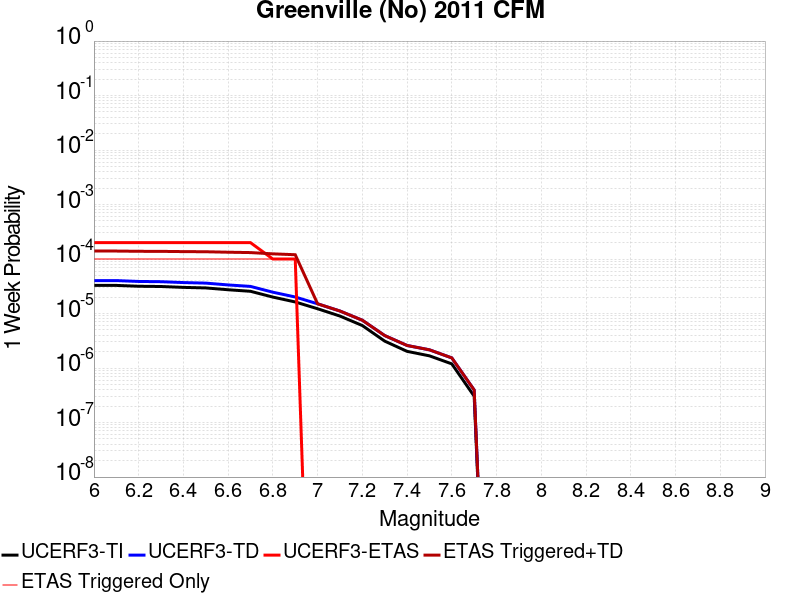 |  |  |  |

| Magnitude | 1 wk TI Prob | 1 wk TD Prob | 1 wk ETAS Prob | 1 wk ETAS/TD Gain | 1 wk ETAS Triggered+TD | 1 wk ETAS Triggered Only | 1 mo TI Prob | 1 mo TD Prob | 1 mo ETAS Prob | 1 mo ETAS/TD Gain | 1 mo ETAS Triggered+TD | 1 mo ETAS Triggered Only | 1 yr TI Prob | 1 yr TD Prob | 1 yr ETAS Prob | 1 yr ETAS/TD Gain | 1 yr ETAS Triggered+TD | 1 yr ETAS Triggered Only | 10 yr TI Prob | 10 yr TD Prob | 10 yr ETAS Prob | 10 yr ETAS/TD Gain | 10 yr ETAS Triggered+TD | 10 yr ETAS Triggered Only |
|-----|-----|-----|-----|-----|-----|-----|-----|-----|-----|-----|-----|-----|-----|-----|-----|-----|-----|-----|-----|-----|-----|-----|-----|-----|
| 6.0 | 3.286654E-5 | 4.0269028E-5 | 2.0E-4 | 4.966596 | 1.40265E-4 | 1.0E-4 | 1.4084899E-4 | 1.7257035E-4 | 3.0E-4 | 1.7384214 | 2.725531E-4 | 1.0E-4 | 0.0017134876 | 0.0020990572 | 0.0016 | 0.76224697 | 0.0024982176 | 4.0E-4 | 0.017003356 | 0.020797431 | 0.0151 | 0.7260512 | 0.021874554 | 0.0011 |
| 6.1 | 3.286654E-5 | 4.0269028E-5 | 2.0E-4 | 4.966596 | 1.40265E-4 | 1.0E-4 | 1.4084899E-4 | 1.7257035E-4 | 3.0E-4 | 1.7384214 | 2.725531E-4 | 1.0E-4 | 0.0017134876 | 0.0020990572 | 0.0015 | 0.7146065 | 0.0023984276 | 3.0E-4 | 0.017003356 | 0.020797431 | 0.0126 | 0.6058441 | 0.021384953 | 6.0E-4 |
| 6.2 | 3.1697953E-5 | 3.883535E-5 | 2.0E-4 | 5.1499467 | 1.3883147E-4 | 1.0E-4 | 1.358413E-4 | 1.6642682E-4 | 3.0E-4 | 1.8025941 | 2.6641018E-4 | 1.0E-4 | 0.0016526132 | 0.0020244005 | 0.0015 | 0.7409601 | 0.0023237932 | 3.0E-4 | 0.01640377 | 0.02006453 | 0.0121 | 0.6030542 | 0.020652492 | 6.0E-4 |
| 6.3 | 3.1363317E-5 | 3.8425198E-5 | 2.0E-4 | 5.204918 | 1.3842135E-4 | 1.0E-4 | 1.344073E-4 | 1.6466924E-4 | 3.0E-4 | 1.8218338 | 2.6465277E-4 | 1.0E-4 | 0.0016351803 | 0.0020030416 | 0.0015 | 0.7488612 | 0.0023024406 | 3.0E-4 | 0.016232004 | 0.019854784 | 0.0121 | 0.6094249 | 0.020442871 | 6.0E-4 |
| 6.4 | 3.0228604E-5 | 3.7035607E-5 | 2.0E-4 | 5.4002085 | 1.3703191E-4 | 1.0E-4 | 1.2954473E-4 | 1.5871458E-4 | 2.0E-4 | 1.2601237 | 2.586987E-4 | 1.0E-4 | 0.0015760659 | 0.0019306737 | 0.0014 | 0.72513545 | 0.0022300945 | 3.0E-4 | 0.015649348 | 0.019143766 | 0.0117 | 0.611165 | 0.01973228 | 6.0E-4 |
| 6.5 | 2.9537814E-5 | 3.6193007E-5 | 2.0E-4 | 5.5259295 | 1.3618938E-4 | 1.0E-4 | 1.2658449E-4 | 1.5510386E-4 | 2.0E-4 | 1.2894585 | 2.5508835E-4 | 1.0E-4 | 0.0015400766 | 0.0018867902 | 0.0014 | 0.7420009 | 0.002186224 | 3.0E-4 | 0.01529447 | 0.018712403 | 0.0114 | 0.6092216 | 0.019301176 | 6.0E-4 |
| 6.6 | 2.7345395E-5 | 3.3508666E-5 | 2.0E-4 | 5.9686055 | 1.3350531E-4 | 1.0E-4 | 1.1718928E-4 | 1.4360083E-4 | 2.0E-4 | 1.3927495 | 2.4358647E-4 | 1.0E-4 | 0.0014258457 | 0.0017469691 | 0.0013 | 0.744146 | 0.002046445 | 3.0E-4 | 0.014167317 | 0.017336408 | 0.0103 | 0.5941254 | 0.017926008 | 6.0E-4 |
| 6.7 | 2.5615784E-5 | 3.148919E-5 | 2.0E-4 | 6.3513856 | 1.3148604E-4 | 1.0E-4 | 1.09777306E-4 | 1.3494687E-4 | 2.0E-4 | 1.4820647 | 2.3493338E-4 | 1.0E-4 | 0.0013357193 | 0.0016417704 | 0.0011 | 0.6700084 | 0.0019412779 | 3.0E-4 | 0.013277191 | 0.016300317 | 0.0095 | 0.58281076 | 0.016890537 | 6.0E-4 |
| 6.8 | 2.0059057E-5 | 2.4650924E-5 | 1.0E-4 | 4.056643 | 1.2464846E-4 | 1.0E-4 | 8.596455E-5 | 1.0564263E-4 | 1.0E-4 | 0.9465875 | 2.0563207E-4 | 1.0E-4 | 0.0010461159 | 0.0012854564 | 9.0E-4 | 0.7001404 | 0.0014851993 | 2.0E-4 | 0.0104120495 | 0.012782466 | 0.0079 | 0.6180341 | 0.013276075 | 5.0E-4 |
| 6.9 | 1.6321746E-5 | 2.0133579E-5 | 1.0E-4 | 4.9668264 | 1.2013157E-4 | 1.0E-4 | 6.9948466E-5 | 8.628399E-5 | 1.0E-4 | 1.1589636 | 1.8627536E-4 | 1.0E-4 | 8.5128983E-4 | 0.0010500136 | 9.0E-4 | 0.8571318 | 0.0012498036 | 2.0E-4 | 0.008480361 | 0.010452295 | 0.0068 | 0.65057486 | 0.010848113 | 4.0E-4 |
| 7.0 | 1.22527645E-5 | 1.50970345E-5 | 0.0 | 0.0 | 1.50970345E-5 | 0.0 | 5.2510793E-5 | 6.47E-5 | 0.0 | 0.0 | 6.47E-5 | 0.0 | 6.3913135E-4 | 7.8744197E-4 | 6.0E-4 | 0.76196086 | 8.873632E-4 | 1.0E-4 | 0.0063729626 | 0.007847438 | 0.0042 | 0.5352065 | 0.008145084 | 3.0E-4 |
| 7.1 | 8.996482E-6 | 1.1133471E-5 | 0.0 | 0.0 | 1.1133471E-5 | 0.0 | 3.8555783E-5 | 4.771401E-5 | 0.0 | 0.0 | 4.771401E-5 | 0.0 | 4.6931554E-4 | 5.8076443E-4 | 3.0E-4 | 0.51656055 | 5.8076443E-4 | 0.0 | 0.004683256 | 0.0057929195 | 0.0035 | 0.6041858 | 0.005991761 | 2.0E-4 |
| 7.2 | 6.0273087E-6 | 7.544417E-6 | 0.0 | 0.0 | 7.544417E-6 | 0.0 | 2.5831067E-5 | 3.233282E-5 | 0.0 | 0.0 | 3.233282E-5 | 0.0 | 3.1444785E-4 | 3.9358166E-4 | 3.0E-4 | 0.76223063 | 3.9358166E-4 | 0.0 | 0.0031400328 | 0.0039292723 | 0.0026 | 0.6617001 | 0.0041284864 | 2.0E-4 |
| 7.3 | 3.1209995E-6 | 3.9481756E-6 | 0.0 | 0.0 | 3.9481756E-6 | 0.0 | 1.3375643E-5 | 1.6920645E-5 | 0.0 | 0.0 | 1.6920645E-5 | 0.0 | 1.6283628E-4 | 2.0598953E-4 | 1.0E-4 | 0.48546156 | 2.0598953E-4 | 0.0 | 0.0016271701 | 0.0020581102 | 0.0013 | 0.63164747 | 0.0021579042 | 1.0E-4 |
| 7.4 | 2.0254208E-6 | 2.596744E-6 | 0.0 | 0.0 | 2.596744E-6 | 0.0 | 8.680347E-6 | 1.11288555E-5 | 0.0 | 0.0 | 1.11288555E-5 | 0.0 | 1.0567809E-4 | 1.3548545E-4 | 1.0E-4 | 0.73808664 | 1.3548545E-4 | 0.0 | 0.0010562785 | 0.0013540613 | 7.0E-4 | 0.5169633 | 0.001453926 | 1.0E-4 |
| 7.5 | 1.6763418E-6 | 2.1614228E-6 | 0.0 | 0.0 | 2.1614228E-6 | 0.0 | 7.184302E-6 | 9.263208E-6 | 0.0 | 0.0 | 9.263208E-6 | 0.0 | 8.746537E-5 | 1.1277378E-4 | 1.0E-4 | 0.88673097 | 1.1277378E-4 | 0.0 | 8.743095E-4 | 0.0011271731 | 6.0E-4 | 0.5323051 | 0.0012270603 | 1.0E-4 |
| 7.6 | 1.1935462E-6 | 1.5358892E-6 | 0.0 | 0.0 | 1.5358892E-6 | 0.0 | 5.115188E-6 | 6.5823656E-6 | 0.0 | 0.0 | 6.5823656E-6 | 0.0 | 6.2275634E-5 | 8.01374E-5 | 1.0E-4 | 1.2478569 | 8.01374E-5 | 0.0 | 6.2258187E-4 | 8.010764E-4 | 6.0E-4 | 0.7489922 | 9.009963E-4 | 1.0E-4 |
| 7.7 | 3.0464201E-7 | 3.9616813E-7 | 0.0 | 0.0 | 3.9616813E-7 | 0.0 | 1.3056081E-6 | 1.6978623E-6 | 0.0 | 0.0 | 1.6978623E-6 | 0.0 | 1.589566E-5 | 2.0671283E-5 | 0.0 | 0.0 | 2.0671283E-5 | 0.0 | 1.5894524E-4 | 2.0669866E-4 | 3.0E-4 | 1.4513882 | 3.06678E-4 | 1.0E-4 |

## South Klamath Lake East
*[(top)](#table-of-contents)*

| 1 Week | 1 Month | 1 Year | 10 Year |
|-----|-----|-----|-----|
|  | 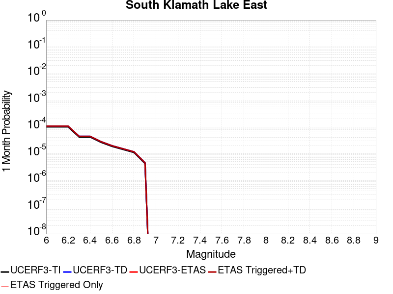 |  | 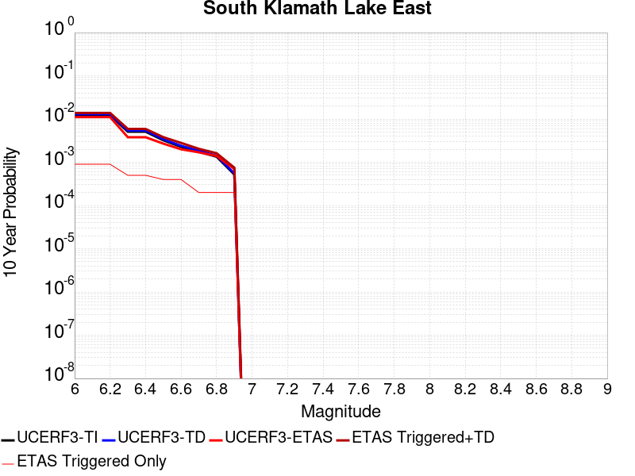 |

| Magnitude | 1 wk TI Prob | 1 wk TD Prob | 1 wk ETAS Prob | 1 wk ETAS/TD Gain | 1 wk ETAS Triggered+TD | 1 wk ETAS Triggered Only | 1 mo TI Prob | 1 mo TD Prob | 1 mo ETAS Prob | 1 mo ETAS/TD Gain | 1 mo ETAS Triggered+TD | 1 mo ETAS Triggered Only | 1 yr TI Prob | 1 yr TD Prob | 1 yr ETAS Prob | 1 yr ETAS/TD Gain | 1 yr ETAS Triggered+TD | 1 yr ETAS Triggered Only | 10 yr TI Prob | 10 yr TD Prob | 10 yr ETAS Prob | 10 yr ETAS/TD Gain | 10 yr ETAS Triggered+TD | 10 yr ETAS Triggered Only |
|-----|-----|-----|-----|-----|-----|-----|-----|-----|-----|-----|-----|-----|-----|-----|-----|-----|-----|-----|-----|-----|-----|-----|-----|-----|
| 6.0 | 2.3539369E-5 | 2.5030551E-5 | 0.0 | 0.0 | 2.5030551E-5 | 0.0 | 1.0087911E-4 | 1.0726984E-4 | 0.0 | 0.0 | 1.0726984E-4 | 0.0 | 0.0012275111 | 0.001305311 | 8.0E-4 | 0.61288077 | 0.001305311 | 0.0 | 0.012207527 | 0.012984774 | 0.0111 | 0.8548474 | 0.013873087 | 9.0E-4 |
| 6.1 | 2.3539369E-5 | 2.5030551E-5 | 0.0 | 0.0 | 2.5030551E-5 | 0.0 | 1.0087911E-4 | 1.0726984E-4 | 0.0 | 0.0 | 1.0726984E-4 | 0.0 | 0.0012275111 | 0.001305311 | 8.0E-4 | 0.61288077 | 0.001305311 | 0.0 | 0.012207527 | 0.012984774 | 0.0111 | 0.8548474 | 0.013873087 | 9.0E-4 |
| 6.2 | 2.3539369E-5 | 2.5030551E-5 | 0.0 | 0.0 | 2.5030551E-5 | 0.0 | 1.0087911E-4 | 1.0726984E-4 | 0.0 | 0.0 | 1.0726984E-4 | 0.0 | 0.0012275111 | 0.001305311 | 8.0E-4 | 0.61288077 | 0.001305311 | 0.0 | 0.012207527 | 0.012984774 | 0.0111 | 0.8548474 | 0.013873087 | 9.0E-4 |
| 6.3 | 9.807823E-6 | 1.03895345E-5 | 0.0 | 0.0 | 1.03895345E-5 | 0.0 | 4.2032847E-5 | 4.4525863E-5 | 0.0 | 0.0 | 4.4525863E-5 | 0.0 | 5.1162974E-4 | 5.419759E-4 | 3.0E-4 | 0.55353016 | 5.419759E-4 | 0.0 | 0.005104534 | 0.0054073767 | 0.0038 | 0.7027437 | 0.005904673 | 5.0E-4 |
| 6.4 | 9.807823E-6 | 1.03895345E-5 | 0.0 | 0.0 | 1.03895345E-5 | 0.0 | 4.2032847E-5 | 4.4525863E-5 | 0.0 | 0.0 | 4.4525863E-5 | 0.0 | 5.1162974E-4 | 5.419759E-4 | 3.0E-4 | 0.55353016 | 5.419759E-4 | 0.0 | 0.005104534 | 0.0054073767 | 0.0038 | 0.7027437 | 0.005904673 | 5.0E-4 |
| 6.5 | 6.191981E-6 | 6.546877E-6 | 0.0 | 0.0 | 6.546877E-6 | 0.0 | 2.653679E-5 | 2.8057759E-5 | 0.0 | 0.0 | 2.8057759E-5 | 0.0 | 3.2303753E-4 | 3.4155246E-4 | 2.0E-4 | 0.5855616 | 3.4155246E-4 | 0.0 | 0.0032256835 | 0.0034105529 | 0.0027 | 0.7916605 | 0.0038091887 | 4.0E-4 |
| 6.6 | 4.3693776E-6 | 4.6138316E-6 | 0.0 | 0.0 | 4.6138316E-6 | 0.0 | 1.8725768E-5 | 1.977342E-5 | 0.0 | 0.0 | 1.977342E-5 | 0.0 | 2.2796239E-4 | 2.4071593E-4 | 2.0E-4 | 0.83085483 | 2.4071593E-4 | 0.0 | 0.0022772867 | 0.0024046644 | 0.002 | 0.8317169 | 0.0028037024 | 4.0E-4 |
| 6.7 | 3.360834E-6 | 3.5491405E-6 | 0.0 | 0.0 | 3.5491405E-6 | 0.0 | 1.4403494E-5 | 1.5210518E-5 | 0.0 | 0.0 | 1.5210518E-5 | 0.0 | 1.7534842E-4 | 1.8517312E-4 | 2.0E-4 | 1.0800704 | 1.8517312E-4 | 0.0 | 0.0017521014 | 0.0018502681 | 0.0017 | 0.91878575 | 0.002049898 | 2.0E-4 |
| 6.8 | 2.57873E-6 | 2.7235558E-6 | 0.0 | 0.0 | 2.7235558E-6 | 0.0 | 1.1051653E-5 | 1.1672333E-5 | 0.0 | 0.0 | 1.1672333E-5 | 0.0 | 1.3454557E-4 | 1.42102E-4 | 2.0E-4 | 1.4074397 | 1.42102E-4 | 0.0 | 0.0013446413 | 0.0014201719 | 0.0014 | 0.98579615 | 0.0016198879 | 2.0E-4 |
| 6.9 | 9.987825E-7 | 1.0559827E-6 | 0.0 | 0.0 | 1.0559827E-6 | 0.0 | 4.2804895E-6 | 4.5256343E-6 | 0.0 | 0.0 | 4.5256343E-6 | 0.0 | 5.211371E-5 | 5.5098528E-5 | 1.0E-4 | 1.8149304 | 5.5098528E-5 | 0.0 | 5.210149E-4 | 5.508808E-4 | 7.0E-4 | 1.2706922 | 7.507706E-4 | 2.0E-4 |

## Santa Cruz Island
*[(top)](#table-of-contents)*

| 1 Week | 1 Month | 1 Year | 10 Year |
|-----|-----|-----|-----|
|  |  |  | 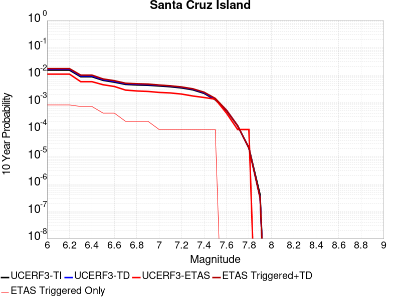 |

| Magnitude | 1 wk TI Prob | 1 wk TD Prob | 1 wk ETAS Prob | 1 wk ETAS/TD Gain | 1 wk ETAS Triggered+TD | 1 wk ETAS Triggered Only | 1 mo TI Prob | 1 mo TD Prob | 1 mo ETAS Prob | 1 mo ETAS/TD Gain | 1 mo ETAS Triggered+TD | 1 mo ETAS Triggered Only | 1 yr TI Prob | 1 yr TD Prob | 1 yr ETAS Prob | 1 yr ETAS/TD Gain | 1 yr ETAS Triggered+TD | 1 yr ETAS Triggered Only | 10 yr TI Prob | 10 yr TD Prob | 10 yr ETAS Prob | 10 yr ETAS/TD Gain | 10 yr ETAS Triggered+TD | 10 yr ETAS Triggered Only |
|-----|-----|-----|-----|-----|-----|-----|-----|-----|-----|-----|-----|-----|-----|-----|-----|-----|-----|-----|-----|-----|-----|-----|-----|-----|
| 6.0 | 2.9164563E-5 | 3.1572003E-5 | 0.0 | 0.0 | 3.1572003E-5 | 0.0 | 1.2498499E-4 | 1.3530234E-4 | 0.0 | 0.0 | 1.3530234E-4 | 0.0 | 0.0015206301 | 0.0016461972 | 5.0E-4 | 0.30373034 | 0.0016461972 | 0.0 | 0.015102667 | 0.01635373 | 0.0108 | 0.66039985 | 0.017140646 | 8.0E-4 |
| 6.1 | 2.9164563E-5 | 3.1572003E-5 | 0.0 | 0.0 | 3.1572003E-5 | 0.0 | 1.2498499E-4 | 1.3530234E-4 | 0.0 | 0.0 | 1.3530234E-4 | 0.0 | 0.0015206301 | 0.0016461972 | 5.0E-4 | 0.30373034 | 0.0016461972 | 0.0 | 0.015102667 | 0.01635373 | 0.0108 | 0.66039985 | 0.017140646 | 8.0E-4 |
| 6.2 | 2.9164563E-5 | 3.1572003E-5 | 0.0 | 0.0 | 3.1572003E-5 | 0.0 | 1.2498499E-4 | 1.3530234E-4 | 0.0 | 0.0 | 1.3530234E-4 | 0.0 | 0.0015206301 | 0.0016461972 | 5.0E-4 | 0.30373034 | 0.0016461972 | 0.0 | 0.015102667 | 0.01635373 | 0.0108 | 0.66039985 | 0.017140646 | 8.0E-4 |
| 6.3 | 1.6635553E-5 | 1.779119E-5 | 0.0 | 0.0 | 1.779119E-5 | 0.0 | 7.1293274E-5 | 7.624584E-5 | 0.0 | 0.0 | 7.624584E-5 | 0.0 | 8.6765E-4 | 9.279159E-4 | 2.0E-4 | 0.21553677 | 9.279159E-4 | 0.0 | 0.008642701 | 0.009242283 | 0.0057 | 0.61673075 | 0.009935813 | 7.0E-4 |
| 6.4 | 1.6635553E-5 | 1.779119E-5 | 0.0 | 0.0 | 1.779119E-5 | 0.0 | 7.1293274E-5 | 7.624584E-5 | 0.0 | 0.0 | 7.624584E-5 | 0.0 | 8.6765E-4 | 9.279159E-4 | 2.0E-4 | 0.21553677 | 9.279159E-4 | 0.0 | 0.008642701 | 0.009242283 | 0.0057 | 0.61673075 | 0.009935813 | 7.0E-4 |
| 6.5 | 1.2238748E-5 | 1.3033949E-5 | 0.0 | 0.0 | 1.3033949E-5 | 0.0 | 5.2450723E-5 | 5.5858603E-5 | 0.0 | 0.0 | 5.5858603E-5 | 0.0 | 6.3840044E-4 | 6.7987E-4 | 2.0E-4 | 0.2941739 | 6.7987E-4 | 0.0 | 0.0063656955 | 0.0067782984 | 0.0044 | 0.64913046 | 0.007175587 | 4.0E-4 |
| 6.6 | 1.0489767E-5 | 1.1149135E-5 | 0.0 | 0.0 | 1.1149135E-5 | 0.0 | 4.495537E-5 | 4.7781148E-5 | 0.0 | 0.0 | 4.7781148E-5 | 0.0 | 5.4719415E-4 | 5.815824E-4 | 2.0E-4 | 0.34388936 | 5.815824E-4 | 0.0 | 0.005458487 | 0.0058008446 | 0.0038 | 0.65507704 | 0.0061985245 | 4.0E-4 |
| 6.7 | 8.699222E-6 | 9.230729E-6 | 0.0 | 0.0 | 9.230729E-6 | 0.0 | 3.7281847E-5 | 3.9559673E-5 | 0.0 | 0.0 | 3.9559673E-5 | 0.0 | 4.5381195E-4 | 4.8153312E-4 | 2.0E-4 | 0.4153401 | 4.8153312E-4 | 0.0 | 0.0045288634 | 0.0048049646 | 0.0028 | 0.5827306 | 0.0050040036 | 2.0E-4 |
| 6.8 | 8.307732E-6 | 8.811169E-6 | 0.0 | 0.0 | 8.811169E-6 | 0.0 | 3.560408E-5 | 3.776161E-5 | 0.0 | 0.0 | 3.776161E-5 | 0.0 | 4.3339343E-4 | 4.5965103E-4 | 2.0E-4 | 0.43511268 | 4.5965103E-4 | 0.0 | 0.004325492 | 0.0045870566 | 0.0026 | 0.5668123 | 0.004786139 | 2.0E-4 |
| 6.9 | 8.073121E-6 | 8.559399E-6 | 0.0 | 0.0 | 8.559399E-6 | 0.0 | 3.459863E-5 | 3.6682628E-5 | 0.0 | 0.0 | 3.6682628E-5 | 0.0 | 4.2115687E-4 | 4.4651987E-4 | 2.0E-4 | 0.4479084 | 4.4651987E-4 | 0.0 | 0.004203596 | 0.0044562784 | 0.0025 | 0.56100625 | 0.0046553873 | 2.0E-4 |
| 7.0 | 7.617019E-6 | 8.069512E-6 | 0.0 | 0.0 | 8.069512E-6 | 0.0 | 3.264396E-5 | 3.4583165E-5 | 0.0 | 0.0 | 3.4583165E-5 | 0.0 | 3.9736772E-4 | 4.2096907E-4 | 2.0E-4 | 0.4750943 | 4.2096907E-4 | 0.0 | 0.003966579 | 0.004201764 | 0.0023 | 0.54738915 | 0.0043013436 | 1.0E-4 |
| 7.1 | 7.1224836E-6 | 7.5410208E-6 | 0.0 | 0.0 | 7.5410208E-6 | 0.0 | 3.052457E-5 | 3.231826E-5 | 0.0 | 0.0 | 3.231826E-5 | 0.0 | 3.715733E-4 | 3.9340416E-4 | 2.0E-4 | 0.50838304 | 3.9340416E-4 | 0.0 | 0.003709526 | 0.0039271205 | 0.0022 | 0.56020695 | 0.0040267278 | 1.0E-4 |
| 7.2 | 6.441115E-6 | 6.8230265E-6 | 0.0 | 0.0 | 6.8230265E-6 | 0.0 | 2.7604487E-5 | 2.9241217E-5 | 0.0 | 0.0 | 2.9241217E-5 | 0.0 | 3.360328E-4 | 3.5595387E-4 | 1.0E-4 | 0.28093526 | 3.5595387E-4 | 0.0 | 0.0033552512 | 0.0035538657 | 0.002 | 0.56276745 | 0.0036535105 | 1.0E-4 |
| 7.3 | 5.494274E-6 | 5.8163123E-6 | 0.0 | 0.0 | 5.8163123E-6 | 0.0 | 2.3546674E-5 | 2.4926814E-5 | 0.0 | 0.0 | 2.4926814E-5 | 0.0 | 2.8664304E-4 | 3.0344192E-4 | 1.0E-4 | 0.32955238 | 3.0344192E-4 | 0.0 | 0.002862736 | 0.0030302987 | 0.0017 | 0.56100076 | 0.003129996 | 1.0E-4 |
| 7.4 | 4.0802624E-6 | 4.309619E-6 | 0.0 | 0.0 | 4.309619E-6 | 0.0 | 1.7486722E-5 | 1.8469664E-5 | 0.0 | 0.0 | 1.8469664E-5 | 0.0 | 2.1288003E-4 | 2.2484503E-4 | 1.0E-4 | 0.44475076 | 2.2484503E-4 | 0.0 | 0.0021267622 | 0.0022461845 | 0.0015 | 0.6677991 | 0.00234596 | 1.0E-4 |
| 7.5 | 2.3584746E-6 | 2.4739577E-6 | 0.0 | 0.0 | 2.4739577E-6 | 0.0 | 1.0107709E-5 | 1.0602633E-5 | 0.0 | 0.0 | 1.0602633E-5 | 0.0 | 1.2305441E-4 | 1.2907945E-4 | 1.0E-4 | 0.7747166 | 1.2907945E-4 | 0.0 | 0.0012298629 | 0.0012900499 | 0.0013 | 1.0077131 | 0.0013899208 | 1.0E-4 |
| 7.6 | 9.4981914E-7 | 9.856386E-7 | 0.0 | 0.0 | 9.856386E-7 | 0.0 | 4.0706473E-6 | 4.2241586E-6 | 0.0 | 0.0 | 4.2241586E-6 | 0.0 | 4.9559E-5 | 5.142793E-5 | 1.0E-4 | 1.9444686 | 5.142793E-5 | 0.0 | 4.954795E-4 | 5.141616E-4 | 4.0E-4 | 0.7779655 | 5.141616E-4 | 0.0 |
| 7.7 | 2.6013532E-7 | 2.640751E-7 | 0.0 | 0.0 | 2.640751E-7 | 0.0 | 1.1148652E-6 | 1.13175E-6 | 0.0 | 0.0 | 1.13175E-6 | 0.0 | 1.3573399E-5 | 1.3778969E-5 | 1.0E-4 | 7.2574368 | 1.3778969E-5 | 0.0 | 1.357257E-4 | 1.3778122E-4 | 1.0E-4 | 0.7257883 | 1.3778122E-4 | 0.0 |
| 7.8 | 4.1522263E-8 | 3.964669E-8 | 0.0 | 0.0 | 3.964669E-8 | 0.0 | 1.7795254E-7 | 1.6991437E-7 | 0.0 | 0.0 | 1.6991437E-7 | 0.0 | 2.16657E-6 | 2.0687057E-6 | 1.0E-4 | 48.3394 | 2.0687057E-6 | 0.0 | 2.1665488E-5 | 2.0686886E-5 | 1.0E-4 | 4.83398 | 2.0686886E-5 | 0.0 |
| 7.9 | 7.7242046E-10 | 5.944937E-10 | 0.0 | 0.0 | 5.944937E-10 | 0.0 | 3.3103735E-9 | 2.54783E-9 | 0.0 | 0.0 | 2.54783E-9 | 0.0 | 4.0303796E-8 | 3.101983E-8 | 0.0 | 0.0 | 3.101983E-8 | 0.0 | 4.030379E-7 | 3.101983E-7 | 0.0 | 0.0 | 3.101983E-7 | 0.0 |

## Coyote Lake
*[(top)](#table-of-contents)*

| 1 Week | 1 Month | 1 Year | 10 Year |
|-----|-----|-----|-----|
|  |  |  |  |

| Magnitude | 1 wk TI Prob | 1 wk TD Prob | 1 wk ETAS Prob | 1 wk ETAS/TD Gain | 1 wk ETAS Triggered+TD | 1 wk ETAS Triggered Only | 1 mo TI Prob | 1 mo TD Prob | 1 mo ETAS Prob | 1 mo ETAS/TD Gain | 1 mo ETAS Triggered+TD | 1 mo ETAS Triggered Only | 1 yr TI Prob | 1 yr TD Prob | 1 yr ETAS Prob | 1 yr ETAS/TD Gain | 1 yr ETAS Triggered+TD | 1 yr ETAS Triggered Only | 10 yr TI Prob | 10 yr TD Prob | 10 yr ETAS Prob | 10 yr ETAS/TD Gain | 10 yr ETAS Triggered+TD | 10 yr ETAS Triggered Only |
|-----|-----|-----|-----|-----|-----|-----|-----|-----|-----|-----|-----|-----|-----|-----|-----|-----|-----|-----|-----|-----|-----|-----|-----|-----|
| 6.0 | 1.980352E-5 | 2.1684975E-5 | 0.0 | 0.0 | 2.1684975E-5 | 0.0 | 8.486947E-5 | 9.293271E-5 | 0.0 | 0.0 | 9.293271E-5 | 0.0 | 0.0010327959 | 0.0011309403 | 2.0E-4 | 0.176844 | 0.0012308272 | 1.0E-4 | 0.010280091 | 0.011259011 | 0.0074 | 0.6572513 | 0.012050004 | 8.0E-4 |
| 6.1 | 1.980352E-5 | 2.1684975E-5 | 0.0 | 0.0 | 2.1684975E-5 | 0.0 | 8.486947E-5 | 9.293271E-5 | 0.0 | 0.0 | 9.293271E-5 | 0.0 | 0.0010327959 | 0.0011309403 | 2.0E-4 | 0.176844 | 0.0012308272 | 1.0E-4 | 0.010280091 | 0.011259011 | 0.0074 | 0.6572513 | 0.012050004 | 8.0E-4 |
| 6.2 | 1.980352E-5 | 2.1684975E-5 | 0.0 | 0.0 | 2.1684975E-5 | 0.0 | 8.486947E-5 | 9.293271E-5 | 0.0 | 0.0 | 9.293271E-5 | 0.0 | 0.0010327959 | 0.0011309403 | 2.0E-4 | 0.176844 | 0.0012308272 | 1.0E-4 | 0.010280091 | 0.011259011 | 0.0074 | 0.6572513 | 0.012050004 | 8.0E-4 |
| 6.3 | 1.5344787E-5 | 1.6803786E-5 | 0.0 | 0.0 | 1.6803786E-5 | 0.0 | 6.576172E-5 | 7.201458E-5 | 0.0 | 0.0 | 7.201458E-5 | 0.0 | 8.003548E-4 | 8.764859E-4 | 2.0E-4 | 0.22818393 | 9.763983E-4 | 1.0E-4 | 0.007974784 | 0.008736323 | 0.0057 | 0.6524484 | 0.009430207 | 7.0E-4 |
| 6.4 | 1.5344787E-5 | 1.6803786E-5 | 0.0 | 0.0 | 1.6803786E-5 | 0.0 | 6.576172E-5 | 7.201458E-5 | 0.0 | 0.0 | 7.201458E-5 | 0.0 | 8.003548E-4 | 8.764859E-4 | 2.0E-4 | 0.22818393 | 9.763983E-4 | 1.0E-4 | 0.007974784 | 0.008736323 | 0.0057 | 0.6524484 | 0.009430207 | 7.0E-4 |
| 6.5 | 1.4189697E-5 | 1.5542331E-5 | 0.0 | 0.0 | 1.5542331E-5 | 0.0 | 6.081157E-5 | 6.660863E-5 | 0.0 | 0.0 | 6.660863E-5 | 0.0 | 7.401293E-4 | 8.1071845E-4 | 2.0E-4 | 0.24669476 | 9.106374E-4 | 1.0E-4 | 0.0073766913 | 0.008083539 | 0.0054 | 0.6680242 | 0.00867869 | 6.0E-4 |
| 6.6 | 1.3469301E-5 | 1.47566725E-5 | 0.0 | 0.0 | 1.47566725E-5 | 0.0 | 5.7724297E-5 | 6.3241685E-5 | 0.0 | 0.0 | 6.3241685E-5 | 0.0 | 7.025667E-4 | 7.697554E-4 | 2.0E-4 | 0.2598228 | 8.6967845E-4 | 1.0E-4 | 0.0070034964 | 0.0076767835 | 0.0051 | 0.66434073 | 0.008272178 | 6.0E-4 |
| 6.7 | 1.3027966E-5 | 1.4267402E-5 | 0.0 | 0.0 | 1.4267402E-5 | 0.0 | 5.5832945E-5 | 6.1144914E-5 | 0.0 | 0.0 | 6.1144914E-5 | 0.0 | 6.7955407E-4 | 7.4424467E-4 | 2.0E-4 | 0.26872885 | 8.441702E-4 | 1.0E-4 | 0.006774798 | 0.007423387 | 0.0046 | 0.61966324 | 0.007919676 | 5.0E-4 |
| 6.8 | 5.695434E-6 | 6.218387E-6 | 0.0 | 0.0 | 6.218387E-6 | 0.0 | 2.4408775E-5 | 2.6650127E-5 | 0.0 | 0.0 | 2.6650127E-5 | 0.0 | 2.971363E-4 | 3.244469E-4 | 1.0E-4 | 0.3082168 | 4.2441447E-4 | 1.0E-4 | 0.0029673933 | 0.0032426675 | 0.0017 | 0.5242597 | 0.0035416947 | 3.0E-4 |
| 6.9 | 4.385688E-6 | 4.7884114E-6 | 0.0 | 0.0 | 4.7884114E-6 | 0.0 | 1.879567E-5 | 2.0521762E-5 | 0.0 | 0.0 | 2.0521762E-5 | 0.0 | 2.2881327E-4 | 2.4985246E-4 | 0.0 | 0.0 | 2.4985246E-4 | 0.0 | 0.002285778 | 0.0024985245 | 0.0014 | 0.5603307 | 0.002698025 | 2.0E-4 |

## Death Valley (Fish Lake Valley)
*[(top)](#table-of-contents)*

| 1 Week | 1 Month | 1 Year | 10 Year |
|-----|-----|-----|-----|
|  |  |  |  |

| Magnitude | 1 wk TI Prob | 1 wk TD Prob | 1 wk ETAS Prob | 1 wk ETAS/TD Gain | 1 wk ETAS Triggered+TD | 1 wk ETAS Triggered Only | 1 mo TI Prob | 1 mo TD Prob | 1 mo ETAS Prob | 1 mo ETAS/TD Gain | 1 mo ETAS Triggered+TD | 1 mo ETAS Triggered Only | 1 yr TI Prob | 1 yr TD Prob | 1 yr ETAS Prob | 1 yr ETAS/TD Gain | 1 yr ETAS Triggered+TD | 1 yr ETAS Triggered Only | 10 yr TI Prob | 10 yr TD Prob | 10 yr ETAS Prob | 10 yr ETAS/TD Gain | 10 yr ETAS Triggered+TD | 10 yr ETAS Triggered Only |
|-----|-----|-----|-----|-----|-----|-----|-----|-----|-----|-----|-----|-----|-----|-----|-----|-----|-----|-----|-----|-----|-----|-----|-----|-----|
| 6.0 | 3.872328E-5 | 4.7157107E-5 | 0.0 | 0.0 | 4.7157107E-5 | 0.0 | 1.6594635E-4 | 2.0208675E-4 | 2.0E-4 | 0.989674 | 3.0206653E-4 | 1.0E-4 | 0.0020185246 | 0.0024578883 | 0.0013 | 0.5289093 | 0.002757151 | 3.0E-4 | 0.02000288 | 0.024332998 | 0.0114 | 0.46849963 | 0.025308665 | 0.001 |
| 6.1 | 3.872328E-5 | 4.7157107E-5 | 0.0 | 0.0 | 4.7157107E-5 | 0.0 | 1.6594635E-4 | 2.0208675E-4 | 2.0E-4 | 0.989674 | 3.0206653E-4 | 1.0E-4 | 0.0020185246 | 0.0024578883 | 0.0013 | 0.5289093 | 0.002757151 | 3.0E-4 | 0.02000288 | 0.024332998 | 0.0114 | 0.46849963 | 0.025308665 | 0.001 |
| 6.2 | 3.872328E-5 | 4.7157107E-5 | 0.0 | 0.0 | 4.7157107E-5 | 0.0 | 1.6594635E-4 | 2.0208675E-4 | 2.0E-4 | 0.989674 | 3.0206653E-4 | 1.0E-4 | 0.0020185246 | 0.0024578883 | 0.0013 | 0.5289093 | 0.002757151 | 3.0E-4 | 0.02000288 | 0.024332998 | 0.0114 | 0.46849963 | 0.025308665 | 0.001 |
| 6.3 | 2.8356371E-5 | 3.354422E-5 | 0.0 | 0.0 | 3.354422E-5 | 0.0 | 1.2152165E-4 | 1.4375345E-4 | 2.0E-4 | 1.391271 | 2.4373908E-4 | 1.0E-4 | 0.0014785219 | 0.001748861 | 0.001 | 0.5718007 | 0.0020483364 | 3.0E-4 | 0.014687235 | 0.017358216 | 0.0079 | 0.4551159 | 0.018046064 | 7.0E-4 |
| 6.4 | 2.8356371E-5 | 3.354422E-5 | 0.0 | 0.0 | 3.354422E-5 | 0.0 | 1.2152165E-4 | 1.4375345E-4 | 2.0E-4 | 1.391271 | 2.4373908E-4 | 1.0E-4 | 0.0014785219 | 0.001748861 | 0.001 | 0.5718007 | 0.0020483364 | 3.0E-4 | 0.014687235 | 0.017358216 | 0.0079 | 0.4551159 | 0.018046064 | 7.0E-4 |
| 6.5 | 2.4448687E-5 | 2.8556286E-5 | 0.0 | 0.0 | 2.8556286E-5 | 0.0 | 1.0477588E-4 | 1.2237861E-4 | 1.0E-4 | 0.8171362 | 1.2237861E-4 | 0.0 | 0.0012748998 | 0.0014889877 | 8.0E-4 | 0.53727776 | 0.0015888389 | 1.0E-4 | 0.012676105 | 0.014795017 | 0.0069 | 0.4663732 | 0.01528762 | 5.0E-4 |
| 6.6 | 2.1298161E-5 | 2.4619052E-5 | 0.0 | 0.0 | 2.4619052E-5 | 0.0 | 9.127464E-5 | 1.0550614E-4 | 0.0 | 0.0 | 1.0550614E-4 | 0.0 | 0.0011107022 | 0.001283813 | 7.0E-4 | 0.5452508 | 0.0013836846 | 1.0E-4 | 0.011051672 | 0.012767389 | 0.0059 | 0.46211484 | 0.013261005 | 5.0E-4 |
| 6.7 | 1.8959729E-5 | 2.1746893E-5 | 0.0 | 0.0 | 2.1746893E-5 | 0.0 | 8.125345E-5 | 9.3197785E-5 | 0.0 | 0.0 | 9.3197785E-5 | 0.0 | 9.888117E-4 | 0.0011341178 | 4.0E-4 | 0.35269704 | 0.0012340044 | 1.0E-4 | 0.009844234 | 0.01128595 | 0.0049 | 0.43416813 | 0.011582565 | 3.0E-4 |
| 6.8 | 1.6691629E-5 | 1.89905E-5 | 0.0 | 0.0 | 1.89905E-5 | 0.0 | 7.153359E-5 | 8.138541E-5 | 0.0 | 0.0 | 8.138541E-5 | 0.0 | 8.7057345E-4 | 9.904337E-4 | 4.0E-4 | 0.40386346 | 0.0010903347 | 1.0E-4 | 0.008671708 | 0.009861947 | 0.0045 | 0.45629933 | 0.010158989 | 3.0E-4 |
| 6.9 | 1.450505E-5 | 1.636723E-5 | 0.0 | 0.0 | 1.636723E-5 | 0.0 | 6.216302E-5 | 7.014343E-5 | 0.0 | 0.0 | 7.014343E-5 | 0.0 | 7.5657194E-4 | 8.5367047E-4 | 4.0E-4 | 0.46856487 | 9.5358514E-4 | 1.0E-4 | 0.007540013 | 0.008504841 | 0.0034 | 0.39977232 | 0.00870314 | 2.0E-4 |
| 7.0 | 1.2940855E-5 | 1.4519209E-5 | 0.0 | 0.0 | 1.4519209E-5 | 0.0 | 5.545963E-5 | 6.222373E-5 | 0.0 | 0.0 | 6.222373E-5 | 0.0 | 6.750118E-4 | 7.5731636E-4 | 4.0E-4 | 0.52818084 | 8.5724064E-4 | 1.0E-4 | 0.006729651 | 0.007547972 | 0.0033 | 0.43720353 | 0.0077464622 | 2.0E-4 |
| 7.1 | 1.2544658E-5 | 1.4060214E-5 | 0.0 | 0.0 | 1.4060214E-5 | 0.0 | 5.3761712E-5 | 6.02567E-5 | 0.0 | 0.0 | 6.02567E-5 | 0.0 | 6.5435225E-4 | 7.33384E-4 | 3.0E-4 | 0.40906265 | 8.3331065E-4 | 1.0E-4 | 0.006524288 | 0.0073102294 | 0.0032 | 0.43774277 | 0.0075087673 | 2.0E-4 |
| 7.2 | 1.2489416E-5 | 1.3997767E-5 | 0.0 | 0.0 | 1.3997767E-5 | 0.0 | 5.3524967E-5 | 5.9989085E-5 | 0.0 | 0.0 | 5.9989085E-5 | 0.0 | 6.514716E-4 | 7.301279E-4 | 3.0E-4 | 0.41088688 | 8.300549E-4 | 1.0E-4 | 0.006495651 | 0.007277882 | 0.0032 | 0.43968832 | 0.0074764267 | 2.0E-4 |
| 7.3 | 1.2368307E-5 | 1.386208E-5 | 0.0 | 0.0 | 1.386208E-5 | 0.0 | 5.3005948E-5 | 5.9407594E-5 | 0.0 | 0.0 | 5.9407594E-5 | 0.0 | 6.451563E-4 | 7.23053E-4 | 3.0E-4 | 0.41490734 | 8.229807E-4 | 1.0E-4 | 0.0064328653 | 0.0072075943 | 0.0032 | 0.44397616 | 0.007406153 | 2.0E-4 |
| 7.4 | 1.2161707E-5 | 1.3630435E-5 | 0.0 | 0.0 | 1.3630435E-5 | 0.0 | 5.212056E-5 | 5.8414873E-5 | 0.0 | 0.0 | 5.8414873E-5 | 0.0 | 6.3438306E-4 | 7.1097456E-4 | 3.0E-4 | 0.421956 | 8.109035E-4 | 1.0E-4 | 0.006325751 | 0.007087587 | 0.0031 | 0.4373844 | 0.0072861696 | 2.0E-4 |
| 7.5 | 1.1707948E-5 | 1.31286515E-5 | 0.0 | 0.0 | 1.31286515E-5 | 0.0 | 5.0175953E-5 | 5.6264467E-5 | 0.0 | 0.0 | 5.6264467E-5 | 0.0 | 6.10721E-4 | 6.8481016E-4 | 3.0E-4 | 0.43807763 | 7.8474166E-4 | 1.0E-4 | 0.0060904534 | 0.0068275803 | 0.0031 | 0.4540408 | 0.0070262146 | 2.0E-4 |
| 7.6 | 1.0319538E-5 | 1.1564856E-5 | 0.0 | 0.0 | 1.1564856E-5 | 0.0 | 4.4225842E-5 | 4.9562757E-5 | 0.0 | 0.0 | 4.9562757E-5 | 0.0 | 5.383166E-4 | 6.0326466E-4 | 3.0E-4 | 0.49729416 | 7.0320436E-4 | 1.0E-4 | 0.0053701443 | 0.0060168006 | 0.0028 | 0.4653636 | 0.0062155975 | 2.0E-4 |
| 7.7 | 8.937764E-6 | 1.0010071E-5 | 0.0 | 0.0 | 1.0010071E-5 | 0.0 | 3.830414E-5 | 4.2899625E-5 | 0.0 | 0.0 | 4.2899625E-5 | 0.0 | 4.6625308E-4 | 5.221828E-4 | 3.0E-4 | 0.57451147 | 6.221306E-4 | 1.0E-4 | 0.0046527605 | 0.005210066 | 0.0024 | 0.46064672 | 0.0053095454 | 1.0E-4 |
| 7.8 | 3.108007E-7 | 3.282696E-7 | 0.0 | 0.0 | 3.282696E-7 | 0.0 | 1.3320023E-6 | 1.406869E-6 | 0.0 | 0.0 | 1.406869E-6 | 0.0 | 1.6217007E-5 | 1.71285E-5 | 0.0 | 0.0 | 1.71285E-5 | 0.0 | 1.6215823E-4 | 1.7127219E-4 | 1.0E-4 | 0.583866 | 1.7127219E-4 | 0.0 |
| 7.9 | 2.5591178E-9 | 2.6684681E-9 | 0.0 | 0.0 | 2.6684681E-9 | 0.0 | 1.0967647E-8 | 1.1436292E-8 | 0.0 | 0.0 | 1.1436292E-8 | 0.0 | 1.335311E-7 | 1.3923685E-7 | 0.0 | 0.0 | 1.3923685E-7 | 0.0 | 1.3353102E-6 | 1.3923685E-6 | 0.0 | 0.0 | 1.3923685E-6 | 0.0 |

## Oceanic - West Huasna
*[(top)](#table-of-contents)*

| 1 Week | 1 Month | 1 Year | 10 Year |
|-----|-----|-----|-----|
| 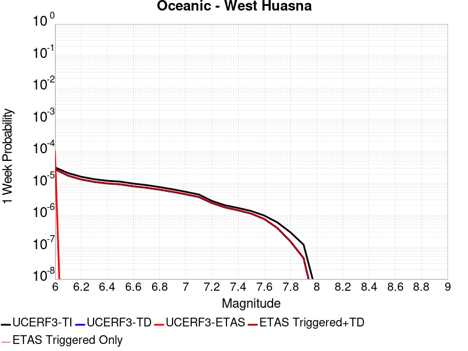 | 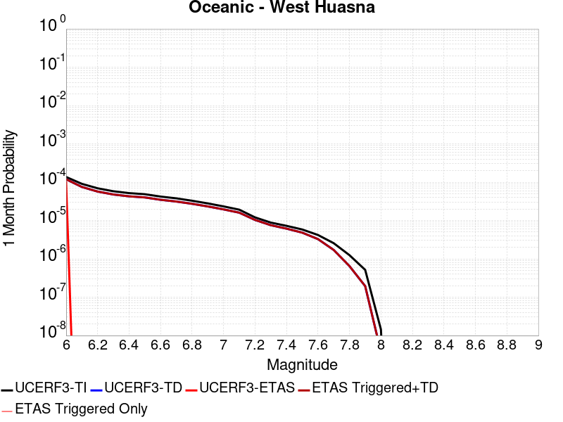 |  |  |

| Magnitude | 1 wk TI Prob | 1 wk TD Prob | 1 wk ETAS Prob | 1 wk ETAS/TD Gain | 1 wk ETAS Triggered+TD | 1 wk ETAS Triggered Only | 1 mo TI Prob | 1 mo TD Prob | 1 mo ETAS Prob | 1 mo ETAS/TD Gain | 1 mo ETAS Triggered+TD | 1 mo ETAS Triggered Only | 1 yr TI Prob | 1 yr TD Prob | 1 yr ETAS Prob | 1 yr ETAS/TD Gain | 1 yr ETAS Triggered+TD | 1 yr ETAS Triggered Only | 10 yr TI Prob | 10 yr TD Prob | 10 yr ETAS Prob | 10 yr ETAS/TD Gain | 10 yr ETAS Triggered+TD | 10 yr ETAS Triggered Only |
|-----|-----|-----|-----|-----|-----|-----|-----|-----|-----|-----|-----|-----|-----|-----|-----|-----|-----|-----|-----|-----|-----|-----|-----|-----|
| 6.0 | 3.195567E-5 | 2.7893158E-5 | 1.0E-4 | 3.5851085 | 2.7893158E-5 | 0.0 | 1.3694567E-4 | 1.19536875E-4 | 1.0E-4 | 0.8365619 | 1.19536875E-4 | 0.0 | 0.0016660384 | 0.0014544328 | 0.0014 | 0.9625745 | 0.001654142 | 2.0E-4 | 0.016536033 | 0.014453682 | 0.0108 | 0.74721444 | 0.015340674 | 9.0E-4 |
| 6.1 | 2.1156782E-5 | 1.7549437E-5 | 0.0 | 0.0 | 1.7549437E-5 | 0.0 | 9.066878E-5 | 7.5209755E-5 | 0.0 | 0.0 | 7.5209755E-5 | 0.0 | 0.0011033333 | 9.153035E-4 | 8.0E-4 | 0.874027 | 0.0010152119 | 1.0E-4 | 0.010978713 | 0.009116341 | 0.0056 | 0.61428154 | 0.009512695 | 4.0E-4 |
| 6.2 | 1.6195117E-5 | 1.3308006E-5 | 0.0 | 0.0 | 1.3308006E-5 | 0.0 | 6.9405796E-5 | 5.7033078E-5 | 0.0 | 0.0 | 5.7033078E-5 | 0.0 | 8.44688E-4 | 6.9415907E-4 | 7.0E-4 | 1.0084144 | 7.9408963E-4 | 1.0E-4 | 0.008414844 | 0.006920201 | 0.0047 | 0.679171 | 0.007317433 | 4.0E-4 |
| 6.3 | 1.3559345E-5 | 1.1162683E-5 | 0.0 | 0.0 | 1.1162683E-5 | 0.0 | 5.811018E-5 | 4.78392E-5 | 0.0 | 0.0 | 4.78392E-5 | 0.0 | 7.072618E-4 | 5.8228755E-4 | 6.0E-4 | 1.0304188 | 6.8222935E-4 | 1.0E-4 | 0.0070501505 | 0.0058077364 | 0.0039 | 0.6715181 | 0.0060065747 | 2.0E-4 |
| 6.4 | 1.2120619E-5 | 9.985801E-6 | 0.0 | 0.0 | 9.985801E-6 | 0.0 | 5.1944477E-5 | 4.279559E-5 | 0.0 | 0.0 | 4.279559E-5 | 0.0 | 6.322405E-4 | 5.2091223E-4 | 6.0E-4 | 1.1518254 | 6.2086014E-4 | 1.0E-4 | 0.006304447 | 0.0051969793 | 0.0035 | 0.6734681 | 0.00539594 | 2.0E-4 |
| 6.5 | 1.13511915E-5 | 9.352899E-6 | 0.0 | 0.0 | 9.352899E-6 | 0.0 | 4.8647056E-5 | 4.0083236E-5 | 0.0 | 0.0 | 4.0083236E-5 | 0.0 | 5.9211696E-4 | 4.879046E-4 | 6.0E-4 | 1.2297486 | 5.878558E-4 | 1.0E-4 | 0.0059054173 | 0.0048683924 | 0.0035 | 0.7189231 | 0.005067419 | 2.0E-4 |
| 6.6 | 9.850605E-6 | 8.121949E-6 | 0.0 | 0.0 | 8.121949E-6 | 0.0 | 4.2216197E-5 | 3.480789E-5 | 0.0 | 0.0 | 3.480789E-5 | 0.0 | 5.1386096E-4 | 4.2370387E-4 | 6.0E-4 | 1.4160833 | 5.236615E-4 | 1.0E-4 | 0.0051267436 | 0.0042289924 | 0.0026 | 0.6148036 | 0.004428147 | 2.0E-4 |
| 6.7 | 8.8558645E-6 | 7.305612E-6 | 0.0 | 0.0 | 7.305612E-6 | 0.0 | 3.7953152E-5 | 3.130939E-5 | 0.0 | 0.0 | 3.130939E-5 | 0.0 | 4.6198163E-4 | 3.8112534E-4 | 6.0E-4 | 1.5742851 | 4.8108725E-4 | 1.0E-4 | 0.004610224 | 0.0038047426 | 0.0024 | 0.63079166 | 0.0040039816 | 2.0E-4 |
| 6.8 | 7.67136E-6 | 6.3796406E-6 | 0.0 | 0.0 | 6.3796406E-6 | 0.0 | 3.2876844E-5 | 2.7341031E-5 | 0.0 | 0.0 | 2.7341031E-5 | 0.0 | 4.0020206E-4 | 3.3282637E-4 | 3.0E-4 | 0.9013709 | 3.3282637E-4 | 0.0 | 0.003994821 | 0.0033233 | 0.0019 | 0.5717209 | 0.0034229676 | 1.0E-4 |
| 6.9 | 6.534529E-6 | 5.446879E-6 | 0.0 | 0.0 | 5.446879E-6 | 0.0 | 2.8004823E-5 | 2.334356E-5 | 0.0 | 0.0 | 2.334356E-5 | 0.0 | 3.4090536E-4 | 2.841709E-4 | 2.0E-4 | 0.7038018 | 2.841709E-4 | 0.0 | 0.0034038287 | 0.002838092 | 0.0015 | 0.5285241 | 0.0029378082 | 1.0E-4 |
| 7.0 | 5.460525E-6 | 4.55915E-6 | 0.0 | 0.0 | 4.55915E-6 | 0.0 | 2.3402039E-5 | 1.953907E-5 | 0.0 | 0.0 | 1.953907E-5 | 0.0 | 2.8488258E-4 | 2.3786232E-4 | 1.0E-4 | 0.4204113 | 2.3786232E-4 | 0.0 | 0.0028451765 | 0.002376091 | 0.0013 | 0.5471171 | 0.0024758533 | 1.0E-4 |
| 7.1 | 4.4825083E-6 | 3.7437326E-6 | 0.0 | 0.0 | 3.7437326E-6 | 0.0 | 1.9210609E-5 | 1.604447E-5 | 0.0 | 0.0 | 1.604447E-5 | 0.0 | 2.3386406E-4 | 1.9532401E-4 | 0.0 | 0.0 | 1.9532401E-4 | 0.0 | 0.002336181 | 0.0019515352 | 0.001 | 0.5124171 | 0.0020513402 | 1.0E-4 |
| 7.2 | 2.821708E-6 | 2.42135E-6 | 0.0 | 0.0 | 2.42135E-6 | 0.0 | 1.2092979E-5 | 1.0377174E-5 | 0.0 | 0.0 | 1.0377174E-5 | 0.0 | 1.4722206E-4 | 1.2633477E-4 | 0.0 | 0.0 | 1.2633477E-4 | 0.0 | 0.0014712457 | 0.0012626321 | 6.0E-4 | 0.47519782 | 0.0012626321 | 0.0 |
| 7.3 | 2.0644757E-6 | 1.7656695E-6 | 0.0 | 0.0 | 1.7656695E-6 | 0.0 | 8.847723E-6 | 7.567133E-6 | 0.0 | 0.0 | 7.567133E-6 | 0.0 | 1.0771569E-4 | 9.212595E-5 | 0.0 | 0.0 | 9.212595E-5 | 0.0 | 0.001076635 | 9.208794E-4 | 4.0E-4 | 0.4343674 | 9.208794E-4 | 0.0 |
| 7.4 | 1.6980367E-6 | 1.4351258E-6 | 0.0 | 0.0 | 1.4351258E-6 | 0.0 | 7.27728E-6 | 6.1505243E-6 | 0.0 | 0.0 | 6.1505243E-6 | 0.0 | 8.8597284E-5 | 7.488007E-5 | 0.0 | 0.0 | 7.488007E-5 | 0.0 | 8.8561967E-4 | 7.4855005E-4 | 3.0E-4 | 0.4007748 | 7.4855005E-4 | 0.0 |
| 7.5 | 1.3637683E-6 | 1.1276496E-6 | 0.0 | 0.0 | 1.1276496E-6 | 0.0 | 5.844708E-6 | 4.832775E-6 | 0.0 | 0.0 | 4.832775E-6 | 0.0 | 7.1156996E-5 | 5.8837453E-5 | 0.0 | 0.0 | 5.8837453E-5 | 0.0 | 7.1134215E-4 | 5.8822037E-4 | 2.0E-4 | 0.34000865 | 5.8822037E-4 | 0.0 |
| 7.6 | 9.802994E-7 | 7.653192E-7 | 0.0 | 0.0 | 7.653192E-7 | 0.0 | 4.2012766E-6 | 3.2799353E-6 | 0.0 | 0.0 | 3.2799353E-6 | 0.0 | 5.1149345E-5 | 3.993248E-5 | 0.0 | 0.0 | 3.993248E-5 | 0.0 | 5.113757E-4 | 3.9925458E-4 | 1.0E-4 | 0.25046676 | 3.9925458E-4 | 0.0 |
| 7.7 | 5.986191E-7 | 3.9841396E-7 | 0.0 | 0.0 | 3.9841396E-7 | 0.0 | 2.5655079E-6 | 1.7074873E-6 | 0.0 | 0.0 | 1.7074873E-6 | 0.0 | 3.1234613E-5 | 2.078846E-5 | 0.0 | 0.0 | 2.078846E-5 | 0.0 | 3.123022E-4 | 2.0786659E-4 | 0.0 | 0.0 | 2.0786659E-4 | 0.0 |
| 7.8 | 2.9189815E-7 | 1.5128599E-7 | 0.0 | 0.0 | 1.5128599E-7 | 0.0 | 1.2509914E-6 | 6.4836837E-7 | 0.0 | 0.0 | 6.4836837E-7 | 0.0 | 1.5230714E-5 | 7.8938565E-6 | 0.0 | 0.0 | 7.8938565E-6 | 0.0 | 1.522967E-4 | 7.8937155E-5 | 0.0 | 0.0 | 7.8937155E-5 | 0.0 |
| 7.9 | 1.2057845E-7 | 4.5331024E-8 | 0.0 | 0.0 | 4.5331024E-8 | 0.0 | 5.1676466E-7 | 1.9427581E-7 | 0.0 | 0.0 | 1.9427581E-7 | 0.0 | 6.2915915E-6 | 2.3653054E-6 | 0.0 | 0.0 | 2.3653054E-6 | 0.0 | 6.2914136E-5 | 2.3654193E-5 | 0.0 | 0.0 | 2.3654193E-5 | 0.0 |
| 8.0 | 3.3806387E-9 | 8.6979923E-10 | 0.0 | 0.0 | 8.6979923E-10 | 0.0 | 1.4488451E-8 | 3.7277115E-9 | 0.0 | 0.0 | 3.7277115E-9 | 0.0 | 1.7639688E-7 | 4.5384894E-8 | 0.0 | 0.0 | 4.5384894E-8 | 0.0 | 1.7639674E-6 | 4.5500374E-7 | 0.0 | 0.0 | 4.5500374E-7 | 0.0 |

## Quien Sabe 2011 CFM
*[(top)](#table-of-contents)*

| 1 Week | 1 Month | 1 Year | 10 Year |
|-----|-----|-----|-----|
| 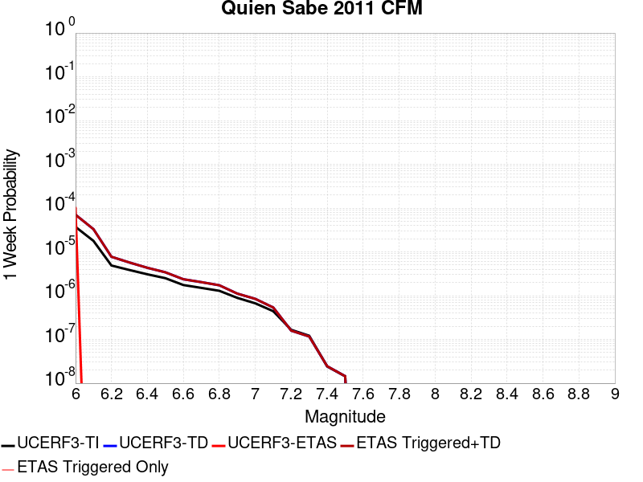 |  |  |  |

| Magnitude | 1 wk TI Prob | 1 wk TD Prob | 1 wk ETAS Prob | 1 wk ETAS/TD Gain | 1 wk ETAS Triggered+TD | 1 wk ETAS Triggered Only | 1 mo TI Prob | 1 mo TD Prob | 1 mo ETAS Prob | 1 mo ETAS/TD Gain | 1 mo ETAS Triggered+TD | 1 mo ETAS Triggered Only | 1 yr TI Prob | 1 yr TD Prob | 1 yr ETAS Prob | 1 yr ETAS/TD Gain | 1 yr ETAS Triggered+TD | 1 yr ETAS Triggered Only | 10 yr TI Prob | 10 yr TD Prob | 10 yr ETAS Prob | 10 yr ETAS/TD Gain | 10 yr ETAS Triggered+TD | 10 yr ETAS Triggered Only |
|-----|-----|-----|-----|-----|-----|-----|-----|-----|-----|-----|-----|-----|-----|-----|-----|-----|-----|-----|-----|-----|-----|-----|-----|-----|
| 6.0 | 3.729899E-5 | 7.065252E-5 | 1.0E-4 | 1.4153777 | 7.065252E-5 | 0.0 | 1.5984301E-4 | 3.0270868E-4 | 2.0E-4 | 0.6607013 | 4.026784E-4 | 1.0E-4 | 0.0019443515 | 0.0036701858 | 0.001 | 0.27246577 | 0.003769819 | 1.0E-4 | 0.019274272 | 0.035221227 | 0.0195 | 0.5536434 | 0.03608953 | 9.0E-4 |
| 6.1 | 1.7825725E-5 | 3.304532E-5 | 0.0 | 0.0 | 3.304532E-5 | 0.0 | 7.639373E-5 | 1.4160175E-4 | 0.0 | 0.0 | 1.4160175E-4 | 0.0 | 9.296967E-4 | 0.0017183855 | 3.0E-4 | 0.17458248 | 0.0017183855 | 0.0 | 0.009258169 | 0.016626084 | 0.0096 | 0.577406 | 0.017019434 | 4.0E-4 |
| 6.2 | 4.8865336E-6 | 7.731312E-6 | 0.0 | 0.0 | 7.731312E-6 | 0.0 | 2.0942118E-5 | 3.313373E-5 | 0.0 | 0.0 | 3.313373E-5 | 0.0 | 2.5494045E-4 | 4.0298793E-4 | 0.0 | 0.0 | 4.0298793E-4 | 0.0 | 0.0025464818 | 0.003977334 | 0.0021 | 0.5279919 | 0.0040769363 | 1.0E-4 |
| 6.3 | 3.858491E-6 | 5.72091E-6 | 0.0 | 0.0 | 5.72091E-6 | 0.0 | 1.6536285E-5 | 2.4517982E-5 | 0.0 | 0.0 | 2.4517982E-5 | 0.0 | 2.0131067E-4 | 2.984701E-4 | 0.0 | 0.0 | 2.984701E-4 | 0.0 | 0.002011284 | 0.0029687511 | 0.0019 | 0.6399998 | 0.003068454 | 1.0E-4 |
| 6.4 | 3.0771805E-6 | 4.3260084E-6 | 0.0 | 0.0 | 4.3260084E-6 | 0.0 | 1.318785E-5 | 1.8539917E-5 | 0.0 | 0.0 | 1.8539917E-5 | 0.0 | 1.6055023E-4 | 2.2570248E-4 | 0.0 | 0.0 | 2.2570248E-4 | 0.0 | 0.001604343 | 0.0022578666 | 0.0015 | 0.66434395 | 0.0023576408 | 1.0E-4 |
| 6.5 | 2.5081235E-6 | 3.4144905E-6 | 0.0 | 0.0 | 3.4144905E-6 | 0.0 | 1.0749056E-5 | 1.4633457E-5 | 0.0 | 0.0 | 1.4633457E-5 | 0.0 | 1.308619E-4 | 1.781492E-4 | 0.0 | 0.0 | 1.781492E-4 | 0.0 | 0.0013078486 | 0.0017882477 | 0.0011 | 0.6151273 | 0.0018880689 | 1.0E-4 |
| 6.6 | 1.7505364E-6 | 2.370007E-6 | 0.0 | 0.0 | 2.370007E-6 | 0.0 | 7.502277E-6 | 1.0157138E-5 | 0.0 | 0.0 | 1.0157138E-5 | 0.0 | 9.13364E-5 | 1.2365682E-4 | 0.0 | 0.0 | 1.2365682E-4 | 0.0 | 9.129886E-4 | 0.001242428 | 0.001 | 0.8048756 | 0.001242428 | 0.0 |
| 6.7 | 1.505737E-6 | 2.0362945E-6 | 0.0 | 0.0 | 2.0362945E-6 | 0.0 | 6.4531428E-6 | 8.726951E-6 | 0.0 | 0.0 | 8.726951E-6 | 0.0 | 7.8564175E-5 | 1.0624603E-4 | 0.0 | 0.0 | 1.0624603E-4 | 0.0 | 7.853641E-4 | 0.0010682659 | 9.0E-4 | 0.8424869 | 0.0010682659 | 0.0 |
| 6.8 | 1.2924105E-6 | 1.7271491E-6 | 0.0 | 0.0 | 1.7271491E-6 | 0.0 | 5.5388905E-6 | 7.4020495E-6 | 0.0 | 0.0 | 7.4020495E-6 | 0.0 | 6.74339E-5 | 9.011676E-5 | 0.0 | 0.0 | 9.011676E-5 | 0.0 | 6.741344E-4 | 9.0557896E-4 | 7.0E-4 | 0.7729862 | 9.0557896E-4 | 0.0 |
| 6.9 | 8.9075286E-7 | 1.1142547E-6 | 0.0 | 0.0 | 1.1142547E-6 | 0.0 | 3.8175067E-6 | 4.7753697E-6 | 0.0 | 0.0 | 4.7753697E-6 | 0.0 | 4.6477155E-5 | 5.8138794E-5 | 0.0 | 0.0 | 5.8138794E-5 | 0.0 | 4.6467435E-4 | 5.849777E-4 | 4.0E-4 | 0.68378675 | 5.849777E-4 | 0.0 |
| 7.0 | 6.6891175E-7 | 8.44982E-7 | 0.0 | 0.0 | 8.44982E-7 | 0.0 | 2.8667614E-6 | 3.6213476E-6 | 0.0 | 0.0 | 3.6213476E-6 | 0.0 | 3.4902263E-5 | 4.4089207E-5 | 0.0 | 0.0 | 4.4089207E-5 | 0.0 | 3.4896782E-4 | 4.4339887E-4 | 3.0E-4 | 0.6765917 | 4.4339887E-4 | 0.0 |
| 7.1 | 4.4205015E-7 | 5.364283E-7 | 0.0 | 0.0 | 5.364283E-7 | 0.0 | 1.8944993E-6 | 2.2989773E-6 | 0.0 | 0.0 | 2.2989773E-6 | 0.0 | 2.3065284E-5 | 2.7989856E-5 | 0.0 | 0.0 | 2.7989856E-5 | 0.0 | 2.3062891E-4 | 2.813194E-4 | 1.0E-4 | 0.35546783 | 2.813194E-4 | 0.0 |
| 7.2 | 1.6620965E-7 | 1.587583E-7 | 0.0 | 0.0 | 1.587583E-7 | 0.0 | 7.123269E-7 | 6.8039253E-7 | 0.0 | 0.0 | 6.8039253E-7 | 0.0 | 8.672545E-6 | 8.283751E-6 | 0.0 | 0.0 | 8.283751E-6 | 0.0 | 8.6722066E-5 | 8.3000945E-5 | 1.0E-4 | 1.2048055 | 8.3000945E-5 | 0.0 |
| 7.3 | 1.2142488E-7 | 1.1659369E-7 | 0.0 | 0.0 | 1.1659369E-7 | 0.0 | 5.2039223E-7 | 4.9968713E-7 | 0.0 | 0.0 | 4.9968713E-7 | 0.0 | 6.335757E-6 | 6.0836774E-6 | 0.0 | 0.0 | 6.0836774E-6 | 0.0 | 6.3355765E-5 | 6.0916547E-5 | 1.0E-4 | 1.6415901 | 6.0916547E-5 | 0.0 |
| 7.4 | 2.4192937E-8 | 2.44361E-8 | 0.0 | 0.0 | 2.44361E-8 | 0.0 | 1.0368401E-7 | 1.0472613E-7 | 0.0 | 0.0 | 1.0472613E-7 | 0.0 | 1.2623522E-6 | 1.2750401E-6 | 0.0 | 0.0 | 1.2750401E-6 | 0.0 | 1.2623449E-5 | 1.2770978E-5 | 0.0 | 0.0 | 1.2770978E-5 | 0.0 |
| 7.5 | 1.4432802E-8 | 1.4471932E-8 | 0.0 | 0.0 | 1.4471932E-8 | 0.0 | 6.185486E-8 | 6.2022565E-8 | 0.0 | 0.0 | 6.2022565E-8 | 0.0 | 7.530827E-7 | 7.551246E-7 | 0.0 | 0.0 | 7.551246E-7 | 0.0 | 7.530801E-6 | 7.570129E-6 | 0.0 | 0.0 | 7.570129E-6 | 0.0 |

## Channel Islands Thrust
*[(top)](#table-of-contents)*

| 1 Week | 1 Month | 1 Year | 10 Year |
|-----|-----|-----|-----|
|  | 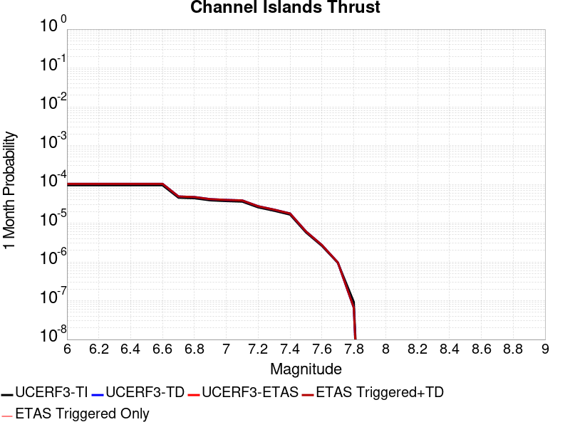 |  | 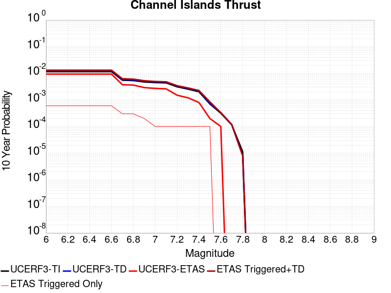 |

| Magnitude | 1 wk TI Prob | 1 wk TD Prob | 1 wk ETAS Prob | 1 wk ETAS/TD Gain | 1 wk ETAS Triggered+TD | 1 wk ETAS Triggered Only | 1 mo TI Prob | 1 mo TD Prob | 1 mo ETAS Prob | 1 mo ETAS/TD Gain | 1 mo ETAS Triggered+TD | 1 mo ETAS Triggered Only | 1 yr TI Prob | 1 yr TD Prob | 1 yr ETAS Prob | 1 yr ETAS/TD Gain | 1 yr ETAS Triggered+TD | 1 yr ETAS Triggered Only | 10 yr TI Prob | 10 yr TD Prob | 10 yr ETAS Prob | 10 yr ETAS/TD Gain | 10 yr ETAS Triggered+TD | 10 yr ETAS Triggered Only |
|-----|-----|-----|-----|-----|-----|-----|-----|-----|-----|-----|-----|-----|-----|-----|-----|-----|-----|-----|-----|-----|-----|-----|-----|-----|
| 6.0 | 2.2156251E-5 | 2.4069896E-5 | 0.0 | 0.0 | 2.4069896E-5 | 0.0 | 9.495191E-5 | 1.03153216E-4 | 0.0 | 0.0 | 1.03153216E-4 | 0.0 | 0.0011554264 | 0.0012552731 | 6.0E-4 | 0.47798362 | 0.0012552731 | 0.0 | 0.011494373 | 0.012492395 | 0.0093 | 0.7444529 | 0.0130849 | 6.0E-4 |
| 6.1 | 2.2156251E-5 | 2.4069896E-5 | 0.0 | 0.0 | 2.4069896E-5 | 0.0 | 9.495191E-5 | 1.03153216E-4 | 0.0 | 0.0 | 1.03153216E-4 | 0.0 | 0.0011554264 | 0.0012552731 | 6.0E-4 | 0.47798362 | 0.0012552731 | 0.0 | 0.011494373 | 0.012492395 | 0.0093 | 0.7444529 | 0.0130849 | 6.0E-4 |
| 6.2 | 2.2156251E-5 | 2.4069896E-5 | 0.0 | 0.0 | 2.4069896E-5 | 0.0 | 9.495191E-5 | 1.03153216E-4 | 0.0 | 0.0 | 1.03153216E-4 | 0.0 | 0.0011554264 | 0.0012552731 | 6.0E-4 | 0.47798362 | 0.0012552731 | 0.0 | 0.011494373 | 0.012492395 | 0.0093 | 0.7444529 | 0.0130849 | 6.0E-4 |
| 6.3 | 2.2156251E-5 | 2.4069896E-5 | 0.0 | 0.0 | 2.4069896E-5 | 0.0 | 9.495191E-5 | 1.03153216E-4 | 0.0 | 0.0 | 1.03153216E-4 | 0.0 | 0.0011554264 | 0.0012552731 | 6.0E-4 | 0.47798362 | 0.0012552731 | 0.0 | 0.011494373 | 0.012492395 | 0.0093 | 0.7444529 | 0.0130849 | 6.0E-4 |
| 6.4 | 2.2156251E-5 | 2.4069896E-5 | 0.0 | 0.0 | 2.4069896E-5 | 0.0 | 9.495191E-5 | 1.03153216E-4 | 0.0 | 0.0 | 1.03153216E-4 | 0.0 | 0.0011554264 | 0.0012552731 | 6.0E-4 | 0.47798362 | 0.0012552731 | 0.0 | 0.011494373 | 0.012492395 | 0.0093 | 0.7444529 | 0.0130849 | 6.0E-4 |
| 6.5 | 2.2156251E-5 | 2.4069896E-5 | 0.0 | 0.0 | 2.4069896E-5 | 0.0 | 9.495191E-5 | 1.03153216E-4 | 0.0 | 0.0 | 1.03153216E-4 | 0.0 | 0.0011554264 | 0.0012552731 | 6.0E-4 | 0.47798362 | 0.0012552731 | 0.0 | 0.011494373 | 0.012492395 | 0.0093 | 0.7444529 | 0.0130849 | 6.0E-4 |
| 6.6 | 2.2156251E-5 | 2.4069896E-5 | 0.0 | 0.0 | 2.4069896E-5 | 0.0 | 9.495191E-5 | 1.03153216E-4 | 0.0 | 0.0 | 1.03153216E-4 | 0.0 | 0.0011554264 | 0.0012552731 | 6.0E-4 | 0.47798362 | 0.0012552731 | 0.0 | 0.011494373 | 0.012492395 | 0.0093 | 0.7444529 | 0.0130849 | 6.0E-4 |
| 6.7 | 1.0601296E-5 | 1.1370703E-5 | 0.0 | 0.0 | 1.1370703E-5 | 0.0 | 4.5433335E-5 | 4.87307E-5 | 0.0 | 0.0 | 4.87307E-5 | 0.0 | 5.5301044E-4 | 5.931397E-4 | 2.0E-4 | 0.33718872 | 5.931397E-4 | 0.0 | 0.005516363 | 0.0059160665 | 0.0037 | 0.62541556 | 0.006214292 | 3.0E-4 |
| 6.8 | 1.0246747E-5 | 1.0988148E-5 | 0.0 | 0.0 | 1.0988148E-5 | 0.0 | 4.391389E-5 | 4.7091235E-5 | 0.0 | 0.0 | 4.7091235E-5 | 0.0 | 5.345204E-4 | 5.7318975E-4 | 1.0E-4 | 0.17446229 | 5.7318975E-4 | 0.0 | 0.0053323656 | 0.0057176026 | 0.0036 | 0.6296345 | 0.0060158875 | 3.0E-4 |
| 6.9 | 9.049551E-6 | 9.692251E-6 | 0.0 | 0.0 | 9.692251E-6 | 0.0 | 3.878322E-5 | 4.1537583E-5 | 0.0 | 0.0 | 4.1537583E-5 | 0.0 | 4.7208337E-4 | 5.056068E-4 | 0.0 | 0.0 | 5.056068E-4 | 0.0 | 0.0047108172 | 0.0050449814 | 0.0029 | 0.5748287 | 0.0052439724 | 2.0E-4 |
| 7.0 | 8.6542195E-6 | 9.267544E-6 | 0.0 | 0.0 | 9.267544E-6 | 0.0 | 3.7088983E-5 | 3.9717463E-5 | 0.0 | 0.0 | 3.9717463E-5 | 0.0 | 4.5146482E-4 | 4.8345688E-4 | 0.0 | 0.0 | 4.8345688E-4 | 0.0 | 0.004505487 | 0.004824463 | 0.0027 | 0.5596478 | 0.00492398 | 1.0E-4 |
| 7.1 | 8.391028E-6 | 8.986072E-6 | 0.0 | 0.0 | 8.986072E-6 | 0.0 | 3.5961057E-5 | 3.8511193E-5 | 0.0 | 0.0 | 3.8511193E-5 | 0.0 | 4.3773788E-4 | 4.6877697E-4 | 0.0 | 0.0 | 4.6877697E-4 | 0.0 | 0.004368766 | 0.004678291 | 0.0026 | 0.55575854 | 0.0047778226 | 1.0E-4 |
| 7.2 | 5.965188E-6 | 6.367049E-6 | 0.0 | 0.0 | 6.367049E-6 | 0.0 | 2.556484E-5 | 2.7287071E-5 | 0.0 | 0.0 | 2.7287071E-5 | 0.0 | 3.1120746E-4 | 3.3217E-4 | 0.0 | 0.0 | 3.3217E-4 | 0.0 | 0.00310772 | 0.003316793 | 0.0015 | 0.4522441 | 0.0034164612 | 1.0E-4 |
| 7.3 | 4.877518E-6 | 5.202234E-6 | 0.0 | 0.0 | 5.202234E-6 | 0.0 | 2.0903482E-5 | 2.22951E-5 | 0.0 | 0.0 | 2.22951E-5 | 0.0 | 2.5447016E-4 | 2.714095E-4 | 0.0 | 0.0 | 2.714095E-4 | 0.0 | 0.0025417898 | 0.0027108265 | 0.0012 | 0.44266945 | 0.0028105553 | 1.0E-4 |
| 7.4 | 3.8829853E-6 | 4.1388685E-6 | 0.0 | 0.0 | 4.1388685E-6 | 0.0 | 1.664126E-5 | 1.7737888E-5 | 0.0 | 0.0 | 1.7737888E-5 | 0.0 | 2.0258849E-4 | 2.159378E-4 | 0.0 | 0.0 | 2.159378E-4 | 0.0 | 0.002024039 | 0.0021573214 | 8.0E-4 | 0.3708302 | 0.002257106 | 1.0E-4 |
| 7.5 | 1.3489616E-6 | 1.4268106E-6 | 0.0 | 0.0 | 1.4268106E-6 | 0.0 | 5.7812517E-6 | 6.1148885E-6 | 0.0 | 0.0 | 6.1148885E-6 | 0.0 | 7.038446E-5 | 7.444627E-5 | 0.0 | 0.0 | 7.444627E-5 | 0.0 | 7.036218E-4 | 7.4421725E-4 | 2.0E-4 | 0.26873875 | 8.441428E-4 | 1.0E-4 |
| 7.6 | 6.058192E-7 | 6.349486E-7 | 0.0 | 0.0 | 6.349486E-7 | 0.0 | 2.5963652E-6 | 2.7212056E-6 | 0.0 | 0.0 | 2.7212056E-6 | 0.0 | 3.161029E-5 | 3.3130193E-5 | 0.0 | 0.0 | 3.3130193E-5 | 0.0 | 3.1605794E-4 | 3.3125412E-4 | 1.0E-4 | 0.301883 | 3.3125412E-4 | 0.0 |
| 7.7 | 2.2170494E-7 | 2.2593485E-7 | 0.0 | 0.0 | 2.2593485E-7 | 0.0 | 9.5016367E-7 | 9.682919E-7 | 0.0 | 0.0 | 9.682919E-7 | 0.0 | 1.1568181E-5 | 1.1788902E-5 | 0.0 | 0.0 | 1.1788902E-5 | 0.0 | 1.1567579E-4 | 1.1788387E-4 | 0.0 | 0.0 | 1.1788387E-4 | 0.0 |
| 7.8 | 2.1613102E-8 | 1.545333E-8 | 0.0 | 0.0 | 1.545333E-8 | 0.0 | 9.262757E-8 | 6.622856E-8 | 0.0 | 0.0 | 6.622856E-8 | 0.0 | 1.1277401E-6 | 8.063324E-7 | 0.0 | 0.0 | 8.063324E-7 | 0.0 | 1.1277344E-5 | 8.063303E-6 | 0.0 | 0.0 | 8.063303E-6 | 0.0 |

## San Jacinto (Coyote Creek)
*[(top)](#table-of-contents)*

| 1 Week | 1 Month | 1 Year | 10 Year |
|-----|-----|-----|-----|
| 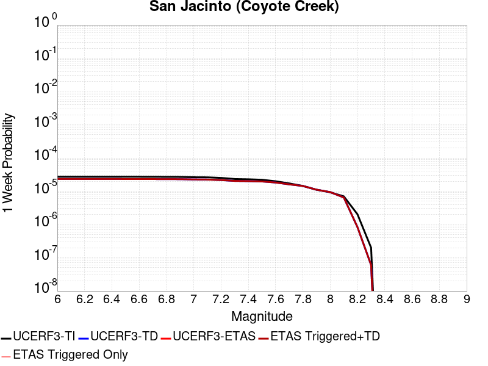 |  | 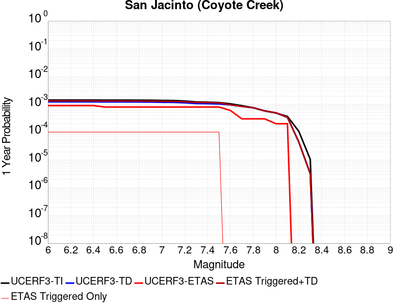 |  |

| Magnitude | 1 wk TI Prob | 1 wk TD Prob | 1 wk ETAS Prob | 1 wk ETAS/TD Gain | 1 wk ETAS Triggered+TD | 1 wk ETAS Triggered Only | 1 mo TI Prob | 1 mo TD Prob | 1 mo ETAS Prob | 1 mo ETAS/TD Gain | 1 mo ETAS Triggered+TD | 1 mo ETAS Triggered Only | 1 yr TI Prob | 1 yr TD Prob | 1 yr ETAS Prob | 1 yr ETAS/TD Gain | 1 yr ETAS Triggered+TD | 1 yr ETAS Triggered Only | 10 yr TI Prob | 10 yr TD Prob | 10 yr ETAS Prob | 10 yr ETAS/TD Gain | 10 yr ETAS Triggered+TD | 10 yr ETAS Triggered Only |
|-----|-----|-----|-----|-----|-----|-----|-----|-----|-----|-----|-----|-----|-----|-----|-----|-----|-----|-----|-----|-----|-----|-----|-----|-----|
| 6.0 | 2.7374346E-5 | 2.3432753E-5 | 0.0 | 0.0 | 2.3432753E-5 | 0.0 | 1.1731335E-4 | 1.0042223E-4 | 0.0 | 0.0 | 1.0042223E-4 | 0.0 | 0.0014273542 | 0.0012219574 | 9.0E-4 | 0.7365232 | 0.0013218352 | 1.0E-4 | 0.01418221 | 0.012556274 | 0.0068 | 0.5415619 | 0.013444974 | 9.0E-4 |
| 6.1 | 2.7374346E-5 | 2.3432753E-5 | 0.0 | 0.0 | 2.3432753E-5 | 0.0 | 1.1731335E-4 | 1.0042223E-4 | 0.0 | 0.0 | 1.0042223E-4 | 0.0 | 0.0014273542 | 0.0012219574 | 9.0E-4 | 0.7365232 | 0.0013218352 | 1.0E-4 | 0.01418221 | 0.012556274 | 0.0068 | 0.5415619 | 0.013444974 | 9.0E-4 |
| 6.2 | 2.7374346E-5 | 2.3432753E-5 | 0.0 | 0.0 | 2.3432753E-5 | 0.0 | 1.1731335E-4 | 1.0042223E-4 | 0.0 | 0.0 | 1.0042223E-4 | 0.0 | 0.0014273542 | 0.0012219574 | 9.0E-4 | 0.7365232 | 0.0013218352 | 1.0E-4 | 0.01418221 | 0.012556274 | 0.0068 | 0.5415619 | 0.013444974 | 9.0E-4 |
| 6.3 | 2.7374346E-5 | 2.3432753E-5 | 0.0 | 0.0 | 2.3432753E-5 | 0.0 | 1.1731335E-4 | 1.0042223E-4 | 0.0 | 0.0 | 1.0042223E-4 | 0.0 | 0.0014273542 | 0.0012219574 | 9.0E-4 | 0.7365232 | 0.0013218352 | 1.0E-4 | 0.01418221 | 0.012556274 | 0.0068 | 0.5415619 | 0.013444974 | 9.0E-4 |
| 6.4 | 2.7374346E-5 | 2.3432753E-5 | 0.0 | 0.0 | 2.3432753E-5 | 0.0 | 1.1731335E-4 | 1.0042223E-4 | 0.0 | 0.0 | 1.0042223E-4 | 0.0 | 0.0014273542 | 0.0012219574 | 9.0E-4 | 0.7365232 | 0.0013218352 | 1.0E-4 | 0.01418221 | 0.012556274 | 0.0068 | 0.5415619 | 0.013444974 | 9.0E-4 |
| 6.5 | 2.7282445E-5 | 2.3319113E-5 | 0.0 | 0.0 | 2.3319113E-5 | 0.0 | 1.16919524E-4 | 9.993524E-5 | 0.0 | 0.0 | 9.993524E-5 | 0.0 | 0.0014225657 | 0.001216035 | 8.0E-4 | 0.65787584 | 0.0013159134 | 1.0E-4 | 0.014134934 | 0.012497725 | 0.0067 | 0.5360976 | 0.013386477 | 9.0E-4 |
| 6.6 | 2.7282445E-5 | 2.3319113E-5 | 0.0 | 0.0 | 2.3319113E-5 | 0.0 | 1.16919524E-4 | 9.993524E-5 | 0.0 | 0.0 | 9.993524E-5 | 0.0 | 0.0014225657 | 0.001216035 | 8.0E-4 | 0.65787584 | 0.0013159134 | 1.0E-4 | 0.014134934 | 0.012497725 | 0.0067 | 0.5360976 | 0.013386477 | 9.0E-4 |
| 6.7 | 2.7216198E-5 | 2.3244427E-5 | 0.0 | 0.0 | 2.3244427E-5 | 0.0 | 1.1663563E-4 | 9.961518E-5 | 0.0 | 0.0 | 9.961518E-5 | 0.0 | 0.0014191137 | 0.0012121426 | 8.0E-4 | 0.65998834 | 0.0013120214 | 1.0E-4 | 0.014100855 | 0.012459221 | 0.0067 | 0.5377543 | 0.013348008 | 9.0E-4 |
| 6.8 | 2.7078617E-5 | 2.316207E-5 | 0.0 | 0.0 | 2.316207E-5 | 0.0 | 1.1604605E-4 | 9.926226E-5 | 0.0 | 0.0 | 9.926226E-5 | 0.0 | 0.001411945 | 0.0012078505 | 8.0E-4 | 0.6623336 | 0.0013077297 | 1.0E-4 | 0.014030075 | 0.012416572 | 0.0067 | 0.53960145 | 0.013305397 | 9.0E-4 |
| 6.9 | 2.6982952E-5 | 2.308208E-5 | 0.0 | 0.0 | 2.308208E-5 | 0.0 | 1.15636096E-4 | 9.891947E-5 | 0.0 | 0.0 | 9.891947E-5 | 0.0 | 0.0014069602 | 0.0012036817 | 8.0E-4 | 0.66462755 | 0.0013035613 | 1.0E-4 | 0.013980856 | 0.012375174 | 0.0067 | 0.5414065 | 0.013264036 | 9.0E-4 |
| 7.0 | 2.6449972E-5 | 2.266081E-5 | 0.0 | 0.0 | 2.266081E-5 | 0.0 | 1.1335209E-4 | 9.7114156E-5 | 0.0 | 0.0 | 9.7114156E-5 | 0.0 | 0.001379188 | 0.001181726 | 8.0E-4 | 0.67697585 | 0.0012816079 | 1.0E-4 | 0.0137065975 | 0.0121573275 | 0.0067 | 0.55110794 | 0.013046386 | 9.0E-4 |
| 7.1 | 2.6257849E-5 | 2.2488342E-5 | 0.0 | 0.0 | 2.2488342E-5 | 0.0 | 1.1252879E-4 | 9.6375064E-5 | 0.0 | 0.0 | 9.6375064E-5 | 0.0 | 0.0013691769 | 0.0011727373 | 8.0E-4 | 0.6821647 | 0.00127262 | 1.0E-4 | 0.013607717 | 0.012067942 | 0.0067 | 0.55518997 | 0.01295708 | 9.0E-4 |
| 7.2 | 2.5270041E-5 | 2.1693011E-5 | 0.0 | 0.0 | 2.1693011E-5 | 0.0 | 1.0829568E-4 | 9.296675E-5 | 0.0 | 0.0 | 9.296675E-5 | 0.0 | 0.0013177024 | 0.0011312847 | 8.0E-4 | 0.7071606 | 0.0012311715 | 1.0E-4 | 0.013099162 | 0.011653936 | 0.0065 | 0.5577515 | 0.012444613 | 8.0E-4 |
| 7.3 | 2.339701E-5 | 2.0438638E-5 | 0.0 | 0.0 | 2.0438638E-5 | 0.0 | 1.0026905E-4 | 8.759123E-5 | 0.0 | 0.0 | 8.759123E-5 | 0.0 | 0.001220092 | 0.0010659035 | 8.0E-4 | 0.750537 | 0.0011657969 | 1.0E-4 | 0.012134149 | 0.010999719 | 0.0064 | 0.58183306 | 0.011790919 | 8.0E-4 |
| 7.4 | 2.296333E-5 | 2.01717E-5 | 0.0 | 0.0 | 2.01717E-5 | 0.0 | 9.841056E-5 | 8.644729E-5 | 0.0 | 0.0 | 8.644729E-5 | 0.0 | 0.0011974899 | 0.0010519895 | 8.0E-4 | 0.76046383 | 0.0011518843 | 1.0E-4 | 0.011910575 | 0.010860209 | 0.0063 | 0.5800993 | 0.011651522 | 8.0E-4 |
| 7.5 | 2.2188895E-5 | 1.970052E-5 | 0.0 | 0.0 | 1.970052E-5 | 0.0 | 9.50918E-5 | 8.442807E-5 | 0.0 | 0.0 | 8.442807E-5 | 0.0 | 0.0011571277 | 0.001027429 | 8.0E-4 | 0.7786426 | 0.0011273263 | 1.0E-4 | 0.011511209 | 0.010612826 | 0.0063 | 0.5936214 | 0.0114043355 | 8.0E-4 |
| 7.6 | 2.0013189E-5 | 1.8302539E-5 | 0.0 | 0.0 | 1.8302539E-5 | 0.0 | 8.5767984E-5 | 7.84371E-5 | 0.0 | 0.0 | 7.84371E-5 | 0.0 | 0.001043725 | 9.5455506E-4 | 6.0E-4 | 0.62856513 | 9.5455506E-4 | 0.0 | 0.010388365 | 0.009878712 | 0.0052 | 0.5263844 | 0.010373772 | 5.0E-4 |
| 7.7 | 1.7230794E-5 | 1.6108386E-5 | 0.0 | 0.0 | 1.6108386E-5 | 0.0 | 7.384417E-5 | 6.903412E-5 | 0.0 | 0.0 | 6.903412E-5 | 0.0 | 8.986819E-4 | 8.401671E-4 | 3.0E-4 | 0.35707185 | 8.401671E-4 | 0.0 | 0.008950562 | 0.008729697 | 0.0045 | 0.51548177 | 0.009225333 | 5.0E-4 |
| 7.8 | 1.4478809E-5 | 1.4381459E-5 | 0.0 | 0.0 | 1.4381459E-5 | 0.0 | 6.205057E-5 | 6.163337E-5 | 0.0 | 0.0 | 6.163337E-5 | 0.0 | 7.552038E-4 | 7.501285E-4 | 3.0E-4 | 0.39993146 | 7.501285E-4 | 0.0 | 0.0075264242 | 0.007821484 | 0.0041 | 0.5241972 | 0.008317573 | 5.0E-4 |
| 7.9 | 1.1114467E-5 | 1.1103332E-5 | 0.0 | 0.0 | 1.1103332E-5 | 0.0 | 4.7632562E-5 | 4.7584843E-5 | 0.0 | 0.0 | 4.7584843E-5 | 0.0 | 5.797721E-4 | 5.79192E-4 | 3.0E-4 | 0.51796293 | 5.79192E-4 | 0.0 | 0.0057826187 | 0.0060953056 | 0.003 | 0.49218205 | 0.006393477 | 3.0E-4 |
| 8.0 | 9.327402E-6 | 9.404994E-6 | 0.0 | 0.0 | 9.404994E-6 | 0.0 | 3.9973966E-5 | 4.0306495E-5 | 0.0 | 0.0 | 4.0306495E-5 | 0.0 | 4.8657437E-4 | 4.906216E-4 | 2.0E-4 | 0.40764615 | 4.906216E-4 | 0.0 | 0.0048551033 | 0.0051894397 | 0.0025 | 0.48174757 | 0.005487883 | 3.0E-4 |
| 8.1 | 7.0235833E-6 | 6.459538E-6 | 0.0 | 0.0 | 6.459538E-6 | 0.0 | 3.0100724E-5 | 2.7683443E-5 | 0.0 | 0.0 | 2.7683443E-5 | 0.0 | 3.664147E-4 | 3.3699424E-4 | 2.0E-4 | 0.59348196 | 3.3699424E-4 | 0.0 | 0.003658111 | 0.003592068 | 0.0018 | 0.5011041 | 0.003691709 | 1.0E-4 |
| 8.2 | 2.0358202E-6 | 8.234806E-7 | 0.0 | 0.0 | 8.234806E-7 | 0.0 | 8.724915E-6 | 3.529198E-6 | 0.0 | 0.0 | 3.529198E-6 | 0.0 | 1.06220665E-4 | 4.2967156E-5 | 0.0 | 0.0 | 4.2967156E-5 | 0.0 | 0.001061699 | 4.8980064E-4 | 2.0E-4 | 0.4083294 | 4.8980064E-4 | 0.0 |
| 8.3 | 2.0051264E-7 | 5.978011E-8 | 0.0 | 0.0 | 5.978011E-8 | 0.0 | 8.5933965E-7 | 2.5620045E-7 | 0.0 | 0.0 | 2.5620045E-7 | 0.0 | 1.046241E-5 | 3.1192365E-6 | 0.0 | 0.0 | 3.1192365E-6 | 0.0 | 1.0461917E-4 | 3.6464324E-5 | 0.0 | 0.0 | 3.6464324E-5 | 0.0 |

## Pitas Point (Lower)-Montalvo
*[(top)](#table-of-contents)*

| 1 Week | 1 Month | 1 Year | 10 Year |
|-----|-----|-----|-----|
|  |  |  |  |

| Magnitude | 1 wk TI Prob | 1 wk TD Prob | 1 wk ETAS Prob | 1 wk ETAS/TD Gain | 1 wk ETAS Triggered+TD | 1 wk ETAS Triggered Only | 1 mo TI Prob | 1 mo TD Prob | 1 mo ETAS Prob | 1 mo ETAS/TD Gain | 1 mo ETAS Triggered+TD | 1 mo ETAS Triggered Only | 1 yr TI Prob | 1 yr TD Prob | 1 yr ETAS Prob | 1 yr ETAS/TD Gain | 1 yr ETAS Triggered+TD | 1 yr ETAS Triggered Only | 10 yr TI Prob | 10 yr TD Prob | 10 yr ETAS Prob | 10 yr ETAS/TD Gain | 10 yr ETAS Triggered+TD | 10 yr ETAS Triggered Only |
|-----|-----|-----|-----|-----|-----|-----|-----|-----|-----|-----|-----|-----|-----|-----|-----|-----|-----|-----|-----|-----|-----|-----|-----|-----|
| 6.0 | 5.2543637E-6 | 4.8333795E-6 | 0.0 | 0.0 | 4.8333795E-6 | 0.0 | 2.2518509E-5 | 2.071432E-5 | 0.0 | 0.0 | 2.071432E-5 | 0.0 | 2.7412834E-4 | 2.5216799E-4 | 0.0 | 0.0 | 2.5216799E-4 | 0.0 | 0.0027379042 | 0.0025188508 | 0.0029 | 1.1513187 | 0.0033168357 | 8.0E-4 |
| 6.1 | 5.2543637E-6 | 4.8333795E-6 | 0.0 | 0.0 | 4.8333795E-6 | 0.0 | 2.2518509E-5 | 2.071432E-5 | 0.0 | 0.0 | 2.071432E-5 | 0.0 | 2.7412834E-4 | 2.5216799E-4 | 0.0 | 0.0 | 2.5216799E-4 | 0.0 | 0.0027379042 | 0.0025188508 | 0.0029 | 1.1513187 | 0.0033168357 | 8.0E-4 |
| 6.2 | 5.2543637E-6 | 4.8333795E-6 | 0.0 | 0.0 | 4.8333795E-6 | 0.0 | 2.2518509E-5 | 2.071432E-5 | 0.0 | 0.0 | 2.071432E-5 | 0.0 | 2.7412834E-4 | 2.5216799E-4 | 0.0 | 0.0 | 2.5216799E-4 | 0.0 | 0.0027379042 | 0.0025188508 | 0.0029 | 1.1513187 | 0.0033168357 | 8.0E-4 |
| 6.3 | 5.2543637E-6 | 4.8333795E-6 | 0.0 | 0.0 | 4.8333795E-6 | 0.0 | 2.2518509E-5 | 2.071432E-5 | 0.0 | 0.0 | 2.071432E-5 | 0.0 | 2.7412834E-4 | 2.5216799E-4 | 0.0 | 0.0 | 2.5216799E-4 | 0.0 | 0.0027379042 | 0.0025188508 | 0.0029 | 1.1513187 | 0.0033168357 | 8.0E-4 |
| 6.4 | 5.2543637E-6 | 4.8333795E-6 | 0.0 | 0.0 | 4.8333795E-6 | 0.0 | 2.2518509E-5 | 2.071432E-5 | 0.0 | 0.0 | 2.071432E-5 | 0.0 | 2.7412834E-4 | 2.5216799E-4 | 0.0 | 0.0 | 2.5216799E-4 | 0.0 | 0.0027379042 | 0.0025188508 | 0.0029 | 1.1513187 | 0.0033168357 | 8.0E-4 |
| 6.5 | 5.2543637E-6 | 4.8333795E-6 | 0.0 | 0.0 | 4.8333795E-6 | 0.0 | 2.2518509E-5 | 2.071432E-5 | 0.0 | 0.0 | 2.071432E-5 | 0.0 | 2.7412834E-4 | 2.5216799E-4 | 0.0 | 0.0 | 2.5216799E-4 | 0.0 | 0.0027379042 | 0.0025188508 | 0.0029 | 1.1513187 | 0.0033168357 | 8.0E-4 |
| 6.6 | 5.2543637E-6 | 4.8333795E-6 | 0.0 | 0.0 | 4.8333795E-6 | 0.0 | 2.2518509E-5 | 2.071432E-5 | 0.0 | 0.0 | 2.071432E-5 | 0.0 | 2.7412834E-4 | 2.5216799E-4 | 0.0 | 0.0 | 2.5216799E-4 | 0.0 | 0.0027379042 | 0.0025188508 | 0.0029 | 1.1513187 | 0.0033168357 | 8.0E-4 |
| 6.7 | 5.2543637E-6 | 4.8333795E-6 | 0.0 | 0.0 | 4.8333795E-6 | 0.0 | 2.2518509E-5 | 2.071432E-5 | 0.0 | 0.0 | 2.071432E-5 | 0.0 | 2.7412834E-4 | 2.5216799E-4 | 0.0 | 0.0 | 2.5216799E-4 | 0.0 | 0.0027379042 | 0.0025188508 | 0.0029 | 1.1513187 | 0.0033168357 | 8.0E-4 |
| 6.8 | 5.2543637E-6 | 4.8333795E-6 | 0.0 | 0.0 | 4.8333795E-6 | 0.0 | 2.2518509E-5 | 2.071432E-5 | 0.0 | 0.0 | 2.071432E-5 | 0.0 | 2.7412834E-4 | 2.5216799E-4 | 0.0 | 0.0 | 2.5216799E-4 | 0.0 | 0.0027379042 | 0.0025188508 | 0.0029 | 1.1513187 | 0.0033168357 | 8.0E-4 |
| 6.9 | 5.2543637E-6 | 4.8333795E-6 | 0.0 | 0.0 | 4.8333795E-6 | 0.0 | 2.2518509E-5 | 2.071432E-5 | 0.0 | 0.0 | 2.071432E-5 | 0.0 | 2.7412834E-4 | 2.5216799E-4 | 0.0 | 0.0 | 2.5216799E-4 | 0.0 | 0.0027379042 | 0.0025188508 | 0.0029 | 1.1513187 | 0.0033168357 | 8.0E-4 |
| 7.0 | 5.2543637E-6 | 4.8333795E-6 | 0.0 | 0.0 | 4.8333795E-6 | 0.0 | 2.2518509E-5 | 2.071432E-5 | 0.0 | 0.0 | 2.071432E-5 | 0.0 | 2.7412834E-4 | 2.5216799E-4 | 0.0 | 0.0 | 2.5216799E-4 | 0.0 | 0.0027379042 | 0.0025188508 | 0.0029 | 1.1513187 | 0.0033168357 | 8.0E-4 |
| 7.1 | 5.2543637E-6 | 4.8333795E-6 | 0.0 | 0.0 | 4.8333795E-6 | 0.0 | 2.2518509E-5 | 2.071432E-5 | 0.0 | 0.0 | 2.071432E-5 | 0.0 | 2.7412834E-4 | 2.5216799E-4 | 0.0 | 0.0 | 2.5216799E-4 | 0.0 | 0.0027379042 | 0.0025188508 | 0.0029 | 1.1513187 | 0.0033168357 | 8.0E-4 |
| 7.2 | 5.2458695E-6 | 4.824537E-6 | 0.0 | 0.0 | 4.824537E-6 | 0.0 | 2.2482105E-5 | 2.0676425E-5 | 0.0 | 0.0 | 2.0676425E-5 | 0.0 | 2.7368523E-4 | 2.5170672E-4 | 0.0 | 0.0 | 2.5170672E-4 | 0.0 | 0.0027334841 | 0.0025142487 | 0.0029 | 1.153426 | 0.0033122373 | 8.0E-4 |
| 7.3 | 5.22665E-6 | 4.804464E-6 | 0.0 | 0.0 | 4.804464E-6 | 0.0 | 2.2399736E-5 | 2.0590398E-5 | 0.0 | 0.0 | 2.0590398E-5 | 0.0 | 2.7268266E-4 | 2.5065956E-4 | 0.0 | 0.0 | 2.5065956E-4 | 0.0 | 0.002723483 | 0.002503801 | 0.0029 | 1.158239 | 0.003301798 | 8.0E-4 |
| 7.4 | 5.210642E-6 | 4.7876847E-6 | 0.0 | 0.0 | 4.7876847E-6 | 0.0 | 2.233113E-5 | 2.051849E-5 | 0.0 | 0.0 | 2.051849E-5 | 0.0 | 2.718476E-4 | 2.4978427E-4 | 0.0 | 0.0 | 2.4978427E-4 | 0.0 | 0.002715153 | 0.0024950677 | 0.0028 | 1.1222141 | 0.0031933212 | 7.0E-4 |
| 7.5 | 5.1226016E-6 | 4.6956156E-6 | 0.0 | 0.0 | 4.6956156E-6 | 0.0 | 2.1953823E-5 | 2.0123915E-5 | 0.0 | 0.0 | 2.0123915E-5 | 0.0 | 2.67255E-4 | 2.449814E-4 | 0.0 | 0.0 | 2.449814E-4 | 0.0 | 0.0026693381 | 0.002447145 | 0.0028 | 1.1441904 | 0.003145432 | 7.0E-4 |
| 7.6 | 4.8796987E-6 | 4.4406534E-6 | 0.0 | 0.0 | 4.4406534E-6 | 0.0 | 2.0912828E-5 | 1.9031235E-5 | 0.0 | 0.0 | 1.9031235E-5 | 0.0 | 2.5458392E-4 | 2.3168094E-4 | 0.0 | 0.0 | 2.3168094E-4 | 0.0 | 0.0025429246 | 0.0023144246 | 0.0027 | 1.1665967 | 0.0030128045 | 7.0E-4 |
| 7.7 | 4.0834398E-6 | 3.6053289E-6 | 0.0 | 0.0 | 3.6053289E-6 | 0.0 | 1.7500339E-5 | 1.545132E-5 | 0.0 | 0.0 | 1.545132E-5 | 0.0 | 2.1304579E-4 | 1.881038E-4 | 0.0 | 0.0 | 1.881038E-4 | 0.0 | 0.0021284167 | 0.0018794696 | 0.0019 | 1.0109235 | 0.0023785299 | 5.0E-4 |
| 7.8 | 2.5445438E-6 | 2.1189444E-6 | 0.0 | 0.0 | 2.1189444E-6 | 0.0 | 1.0905142E-5 | 9.081159E-6 | 0.0 | 0.0 | 9.081159E-6 | 0.0 | 1.3276201E-4 | 1.1055754E-4 | 0.0 | 0.0 | 1.1055754E-4 | 0.0 | 0.0013268272 | 0.0011050301 | 9.0E-4 | 0.8144575 | 0.0012049197 | 1.0E-4 |
| 7.9 | 4.1677114E-7 | 3.3268338E-7 | 0.0 | 0.0 | 3.3268338E-7 | 0.0 | 1.7861609E-6 | 1.4257852E-6 | 0.0 | 0.0 | 1.4257852E-6 | 0.0 | 2.1746291E-5 | 1.73588E-5 | 0.0 | 0.0 | 1.73588E-5 | 0.0 | 2.1744163E-4 | 1.7357474E-4 | 2.0E-4 | 1.1522413 | 1.7357474E-4 | 0.0 |
| 8.0 | 7.791402E-9 | 5.678961E-9 | 0.0 | 0.0 | 5.678961E-9 | 0.0 | 3.3391725E-8 | 2.4338403E-8 | 0.0 | 0.0 | 2.4338403E-8 | 0.0 | 4.0654416E-7 | 2.9632005E-7 | 0.0 | 0.0 | 2.9632005E-7 | 0.0 | 4.065434E-6 | 2.9631985E-6 | 0.0 | 0.0 | 2.9631985E-6 | 0.0 |

## Franklin 2011 CFM
*[(top)](#table-of-contents)*

| 1 Week | 1 Month | 1 Year | 10 Year |
|-----|-----|-----|-----|
|  |  |  |  |

| Magnitude | 1 wk TI Prob | 1 wk TD Prob | 1 wk ETAS Prob | 1 wk ETAS/TD Gain | 1 wk ETAS Triggered+TD | 1 wk ETAS Triggered Only | 1 mo TI Prob | 1 mo TD Prob | 1 mo ETAS Prob | 1 mo ETAS/TD Gain | 1 mo ETAS Triggered+TD | 1 mo ETAS Triggered Only | 1 yr TI Prob | 1 yr TD Prob | 1 yr ETAS Prob | 1 yr ETAS/TD Gain | 1 yr ETAS Triggered+TD | 1 yr ETAS Triggered Only | 10 yr TI Prob | 10 yr TD Prob | 10 yr ETAS Prob | 10 yr ETAS/TD Gain | 10 yr ETAS Triggered+TD | 10 yr ETAS Triggered Only |
|-----|-----|-----|-----|-----|-----|-----|-----|-----|-----|-----|-----|-----|-----|-----|-----|-----|-----|-----|-----|-----|-----|-----|-----|-----|
| 6.0 | 1.845602E-5 | 2.013647E-5 | 0.0 | 0.0 | 2.013647E-5 | 0.0 | 7.9094825E-5 | 8.6296466E-5 | 0.0 | 0.0 | 8.6296466E-5 | 0.0 | 9.6255407E-4 | 0.0010501819 | 9.0E-4 | 0.85699433 | 0.0012499719 | 2.0E-4 | 0.009583955 | 0.010469505 | 0.0075 | 0.71636623 | 0.011360083 | 9.0E-4 |
| 6.1 | 1.845602E-5 | 2.013647E-5 | 0.0 | 0.0 | 2.013647E-5 | 0.0 | 7.9094825E-5 | 8.6296466E-5 | 0.0 | 0.0 | 8.6296466E-5 | 0.0 | 9.6255407E-4 | 0.0010501819 | 9.0E-4 | 0.85699433 | 0.0012499719 | 2.0E-4 | 0.009583955 | 0.010469505 | 0.0075 | 0.71636623 | 0.011360083 | 9.0E-4 |
| 6.2 | 1.845602E-5 | 2.013647E-5 | 0.0 | 0.0 | 2.013647E-5 | 0.0 | 7.9094825E-5 | 8.6296466E-5 | 0.0 | 0.0 | 8.6296466E-5 | 0.0 | 9.6255407E-4 | 0.0010501819 | 9.0E-4 | 0.85699433 | 0.0012499719 | 2.0E-4 | 0.009583955 | 0.010469505 | 0.0075 | 0.71636623 | 0.011360083 | 9.0E-4 |
| 6.3 | 1.3813506E-5 | 1.5083398E-5 | 0.0 | 0.0 | 1.5083398E-5 | 0.0 | 5.9199396E-5 | 6.464157E-5 | 0.0 | 0.0 | 6.464157E-5 | 0.0 | 7.205143E-4 | 7.867346E-4 | 5.0E-4 | 0.6355383 | 9.865772E-4 | 2.0E-4 | 0.007181826 | 0.007854696 | 0.005 | 0.6365619 | 0.008648412 | 8.0E-4 |
| 6.4 | 1.3813506E-5 | 1.5083398E-5 | 0.0 | 0.0 | 1.5083398E-5 | 0.0 | 5.9199396E-5 | 6.464157E-5 | 0.0 | 0.0 | 6.464157E-5 | 0.0 | 7.205143E-4 | 7.867346E-4 | 5.0E-4 | 0.6355383 | 9.865772E-4 | 2.0E-4 | 0.007181826 | 0.007854696 | 0.005 | 0.6365619 | 0.008648412 | 8.0E-4 |
| 6.5 | 1.1308949E-5 | 1.234902E-5 | 0.0 | 0.0 | 1.234902E-5 | 0.0 | 4.8466023E-5 | 5.292331E-5 | 0.0 | 0.0 | 5.292331E-5 | 0.0 | 5.899141E-4 | 6.4415287E-4 | 4.0E-4 | 0.6209706 | 8.44024E-4 | 2.0E-4 | 0.0058835056 | 0.006437505 | 0.0042 | 0.65242666 | 0.007033643 | 6.0E-4 |
| 6.6 | 1.0813164E-5 | 1.1807768E-5 | 0.0 | 0.0 | 1.1807768E-5 | 0.0 | 4.6341313E-5 | 5.0603747E-5 | 0.0 | 0.0 | 5.0603747E-5 | 0.0 | 5.640594E-4 | 6.159283E-4 | 3.0E-4 | 0.48706964 | 7.1586674E-4 | 1.0E-4 | 0.005626298 | 0.006156845 | 0.0038 | 0.61719924 | 0.0066537666 | 5.0E-4 |
| 6.7 | 1.0706348E-5 | 1.16896645E-5 | 0.0 | 0.0 | 1.16896645E-5 | 0.0 | 4.5883542E-5 | 5.009761E-5 | 0.0 | 0.0 | 5.009761E-5 | 0.0 | 5.5848894E-4 | 6.0976954E-4 | 3.0E-4 | 0.49198914 | 7.097086E-4 | 1.0E-4 | 0.005570874 | 0.006095596 | 0.0037 | 0.6069956 | 0.0065925485 | 5.0E-4 |
| 6.8 | 9.443655E-6 | 1.0282702E-5 | 0.0 | 0.0 | 1.0282702E-5 | 0.0 | 4.0472176E-5 | 4.4067983E-5 | 0.0 | 0.0 | 4.4067983E-5 | 0.0 | 4.9263734E-4 | 5.36397E-4 | 3.0E-4 | 0.5592873 | 6.363433E-4 | 1.0E-4 | 0.0049154665 | 0.005365605 | 0.0035 | 0.6523029 | 0.005763459 | 4.0E-4 |
| 6.9 | 8.7001645E-6 | 9.456737E-6 | 0.0 | 0.0 | 9.456737E-6 | 0.0 | 3.728589E-5 | 4.0528248E-5 | 0.0 | 0.0 | 4.0528248E-5 | 0.0 | 4.538611E-4 | 4.933209E-4 | 3.0E-4 | 0.6081234 | 5.932716E-4 | 1.0E-4 | 0.0045293528 | 0.0049368283 | 0.0035 | 0.70895725 | 0.005334853 | 4.0E-4 |
| 7.0 | 8.074731E-6 | 8.751307E-6 | 0.0 | 0.0 | 8.751307E-6 | 0.0 | 3.460553E-5 | 3.750507E-5 | 0.0 | 0.0 | 3.750507E-5 | 0.0 | 4.212409E-4 | 4.5652964E-4 | 3.0E-4 | 0.6571315 | 5.56484E-4 | 1.0E-4 | 0.004204433 | 0.0045704753 | 0.0032 | 0.70014596 | 0.0048691044 | 3.0E-4 |
| 7.1 | 7.3370957E-6 | 7.899786E-6 | 0.0 | 0.0 | 7.899786E-6 | 0.0 | 3.1444317E-5 | 3.3855795E-5 | 0.0 | 0.0 | 3.3855795E-5 | 0.0 | 3.8276732E-4 | 4.1211734E-4 | 3.0E-4 | 0.727948 | 5.1207613E-4 | 1.0E-4 | 0.0038210868 | 0.0041279797 | 0.0031 | 0.7509727 | 0.004426741 | 3.0E-4 |
| 7.2 | 5.1750103E-6 | 5.408504E-6 | 0.0 | 0.0 | 5.408504E-6 | 0.0 | 2.2178427E-5 | 2.31791E-5 | 0.0 | 0.0 | 2.31791E-5 | 0.0 | 2.699889E-4 | 2.821693E-4 | 1.0E-4 | 0.35439715 | 3.821411E-4 | 1.0E-4 | 0.002696611 | 0.0028320388 | 0.0017 | 0.60027426 | 0.0031311892 | 3.0E-4 |
| 7.3 | 3.5221371E-6 | 3.7529333E-6 | 0.0 | 0.0 | 3.7529333E-6 | 0.0 | 1.5094786E-5 | 1.60839E-5 | 0.0 | 0.0 | 1.60839E-5 | 0.0 | 1.8376352E-4 | 1.9580401E-4 | 1.0E-4 | 0.51071477 | 2.957844E-4 | 1.0E-4 | 0.0018361164 | 0.001969821 | 0.001 | 0.5076603 | 0.0020696241 | 1.0E-4 |
| 7.4 | 2.5749775E-6 | 2.780148E-6 | 0.0 | 0.0 | 2.780148E-6 | 0.0 | 1.1035571E-5 | 1.1914865E-5 | 0.0 | 0.0 | 1.1914865E-5 | 0.0 | 1.343498E-4 | 1.450539E-4 | 1.0E-4 | 0.6893989 | 2.450394E-4 | 1.0E-4 | 0.001342686 | 0.0014617846 | 8.0E-4 | 0.54727626 | 0.0015616384 | 1.0E-4 |
| 7.5 | 1.3642131E-6 | 1.5183126E-6 | 0.0 | 0.0 | 1.5183126E-6 | 0.0 | 5.8466144E-6 | 6.5070376E-6 | 0.0 | 0.0 | 6.5070376E-6 | 0.0 | 7.1180206E-5 | 7.922032E-5 | 1.0E-4 | 1.2623024 | 1.792124E-4 | 1.0E-4 | 7.115741E-4 | 8.0266496E-4 | 6.0E-4 | 0.7475099 | 9.025847E-4 | 1.0E-4 |
| 7.6 | 5.329124E-7 | 6.432227E-7 | 0.0 | 0.0 | 6.432227E-7 | 0.0 | 2.2839083E-6 | 2.7566657E-6 | 0.0 | 0.0 | 2.7566657E-6 | 0.0 | 2.7806227E-5 | 3.356189E-5 | 0.0 | 0.0 | 3.356189E-5 | 0.0 | 2.780275E-4 | 3.4603724E-4 | 3.0E-4 | 0.86695874 | 3.4603724E-4 | 0.0 |
| 7.7 | 4.199127E-7 | 5.234719E-7 | 0.0 | 0.0 | 5.234719E-7 | 0.0 | 1.7996247E-6 | 2.2434492E-6 | 0.0 | 0.0 | 2.2434492E-6 | 0.0 | 2.191021E-5 | 2.7313654E-5 | 0.0 | 0.0 | 2.7313654E-5 | 0.0 | 2.190805E-4 | 2.8337433E-4 | 1.0E-4 | 0.3528901 | 2.8337433E-4 | 0.0 |
| 7.8 | 2.2586491E-7 | 2.920886E-7 | 0.0 | 0.0 | 2.920886E-7 | 0.0 | 9.67992E-7 | 1.2518077E-6 | 0.0 | 0.0 | 1.2518077E-6 | 0.0 | 1.178524E-5 | 1.5240653E-5 | 0.0 | 0.0 | 1.5240653E-5 | 0.0 | 1.17846146E-4 | 1.5876295E-4 | 1.0E-4 | 0.6298699 | 1.5876295E-4 | 0.0 |
| 7.9 | 1.4568845E-7 | 2.0206191E-7 | 0.0 | 0.0 | 2.0206191E-7 | 0.0 | 6.243789E-7 | 8.659793E-7 | 0.0 | 0.0 | 8.659793E-7 | 0.0 | 7.601787E-6 | 1.0543247E-5 | 0.0 | 0.0 | 1.0543247E-5 | 0.0 | 7.601527E-5 | 1.09946675E-4 | 1.0E-4 | 0.90953183 | 1.09946675E-4 | 0.0 |
| 8.0 | 5.2868224E-8 | 9.5506905E-8 | 0.0 | 0.0 | 9.5506905E-8 | 0.0 | 2.2657808E-7 | 4.0931525E-7 | 0.0 | 0.0 | 4.0931525E-7 | 0.0 | 2.7585847E-6 | 4.983402E-6 | 0.0 | 0.0 | 4.983402E-6 | 0.0 | 2.7585504E-5 | 5.1751427E-5 | 1.0E-4 | 1.9323138 | 5.1751427E-5 | 0.0 |
| 8.1 | 2.654434E-9 | 4.5353827E-9 | 0.0 | 0.0 | 4.5353827E-9 | 0.0 | 1.1376145E-8 | 1.9437357E-8 | 0.0 | 0.0 | 1.9437357E-8 | 0.0 | 1.3850456E-7 | 2.366498E-7 | 0.0 | 0.0 | 2.366498E-7 | 0.0 | 1.3850448E-6 | 2.4386486E-6 | 0.0 | 0.0 | 2.4386486E-6 | 0.0 |

## North Frontal  (East)
*[(top)](#table-of-contents)*

| 1 Week | 1 Month | 1 Year | 10 Year |
|-----|-----|-----|-----|
|  |  | 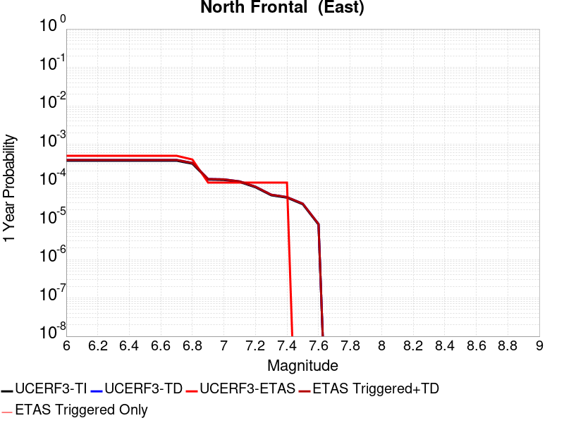 | 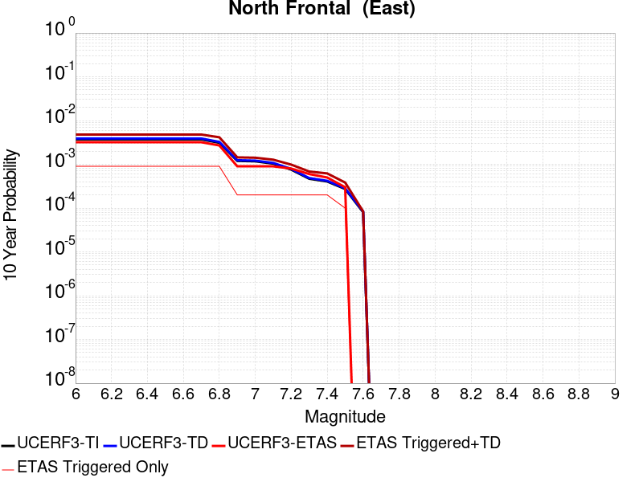 |

| Magnitude | 1 wk TI Prob | 1 wk TD Prob | 1 wk ETAS Prob | 1 wk ETAS/TD Gain | 1 wk ETAS Triggered+TD | 1 wk ETAS Triggered Only | 1 mo TI Prob | 1 mo TD Prob | 1 mo ETAS Prob | 1 mo ETAS/TD Gain | 1 mo ETAS Triggered+TD | 1 mo ETAS Triggered Only | 1 yr TI Prob | 1 yr TD Prob | 1 yr ETAS Prob | 1 yr ETAS/TD Gain | 1 yr ETAS Triggered+TD | 1 yr ETAS Triggered Only | 10 yr TI Prob | 10 yr TD Prob | 10 yr ETAS Prob | 10 yr ETAS/TD Gain | 10 yr ETAS Triggered+TD | 10 yr ETAS Triggered Only |
|-----|-----|-----|-----|-----|-----|-----|-----|-----|-----|-----|-----|-----|-----|-----|-----|-----|-----|-----|-----|-----|-----|-----|-----|-----|
| 6.0 | 7.135738E-6 | 7.473438E-6 | 0.0 | 0.0 | 7.473438E-6 | 0.0 | 3.0581377E-5 | 3.202874E-5 | 0.0 | 0.0 | 3.202874E-5 | 0.0 | 3.7226462E-4 | 3.8990006E-4 | 5.0E-4 | 1.28238 | 3.8990006E-4 | 0.0 | 0.0037164164 | 0.0038941153 | 0.0032 | 0.8217527 | 0.0047906106 | 9.0E-4 |
| 6.1 | 7.135738E-6 | 7.473438E-6 | 0.0 | 0.0 | 7.473438E-6 | 0.0 | 3.0581377E-5 | 3.202874E-5 | 0.0 | 0.0 | 3.202874E-5 | 0.0 | 3.7226462E-4 | 3.8990006E-4 | 5.0E-4 | 1.28238 | 3.8990006E-4 | 0.0 | 0.0037164164 | 0.0038941153 | 0.0032 | 0.8217527 | 0.0047906106 | 9.0E-4 |
| 6.2 | 7.135738E-6 | 7.473438E-6 | 0.0 | 0.0 | 7.473438E-6 | 0.0 | 3.0581377E-5 | 3.202874E-5 | 0.0 | 0.0 | 3.202874E-5 | 0.0 | 3.7226462E-4 | 3.8990006E-4 | 5.0E-4 | 1.28238 | 3.8990006E-4 | 0.0 | 0.0037164164 | 0.0038941153 | 0.0032 | 0.8217527 | 0.0047906106 | 9.0E-4 |
| 6.3 | 7.135738E-6 | 7.473438E-6 | 0.0 | 0.0 | 7.473438E-6 | 0.0 | 3.0581377E-5 | 3.202874E-5 | 0.0 | 0.0 | 3.202874E-5 | 0.0 | 3.7226462E-4 | 3.8990006E-4 | 5.0E-4 | 1.28238 | 3.8990006E-4 | 0.0 | 0.0037164164 | 0.0038941153 | 0.0032 | 0.8217527 | 0.0047906106 | 9.0E-4 |
| 6.4 | 7.135738E-6 | 7.473438E-6 | 0.0 | 0.0 | 7.473438E-6 | 0.0 | 3.0581377E-5 | 3.202874E-5 | 0.0 | 0.0 | 3.202874E-5 | 0.0 | 3.7226462E-4 | 3.8990006E-4 | 5.0E-4 | 1.28238 | 3.8990006E-4 | 0.0 | 0.0037164164 | 0.0038941153 | 0.0032 | 0.8217527 | 0.0047906106 | 9.0E-4 |
| 6.5 | 7.135738E-6 | 7.473438E-6 | 0.0 | 0.0 | 7.473438E-6 | 0.0 | 3.0581377E-5 | 3.202874E-5 | 0.0 | 0.0 | 3.202874E-5 | 0.0 | 3.7226462E-4 | 3.8990006E-4 | 5.0E-4 | 1.28238 | 3.8990006E-4 | 0.0 | 0.0037164164 | 0.0038941153 | 0.0032 | 0.8217527 | 0.0047906106 | 9.0E-4 |
| 6.6 | 7.135738E-6 | 7.473438E-6 | 0.0 | 0.0 | 7.473438E-6 | 0.0 | 3.0581377E-5 | 3.202874E-5 | 0.0 | 0.0 | 3.202874E-5 | 0.0 | 3.7226462E-4 | 3.8990006E-4 | 5.0E-4 | 1.28238 | 3.8990006E-4 | 0.0 | 0.0037164164 | 0.0038941153 | 0.0032 | 0.8217527 | 0.0047906106 | 9.0E-4 |
| 6.7 | 7.135738E-6 | 7.473438E-6 | 0.0 | 0.0 | 7.473438E-6 | 0.0 | 3.0581377E-5 | 3.202874E-5 | 0.0 | 0.0 | 3.202874E-5 | 0.0 | 3.7226462E-4 | 3.8990006E-4 | 5.0E-4 | 1.28238 | 3.8990006E-4 | 0.0 | 0.0037164164 | 0.0038941153 | 0.0032 | 0.8217527 | 0.0047906106 | 9.0E-4 |
| 6.8 | 5.959142E-6 | 6.2336476E-6 | 0.0 | 0.0 | 6.2336476E-6 | 0.0 | 2.553893E-5 | 2.6715461E-5 | 0.0 | 0.0 | 2.6715461E-5 | 0.0 | 3.108921E-4 | 3.2523024E-4 | 4.0E-4 | 1.229898 | 3.2523024E-4 | 0.0 | 0.0031045752 | 0.003249314 | 0.0027 | 0.8309446 | 0.0041463897 | 9.0E-4 |
| 6.9 | 2.2946929E-6 | 2.3815082E-6 | 0.0 | 0.0 | 2.3815082E-6 | 0.0 | 9.834361E-6 | 1.0206426E-5 | 0.0 | 0.0 | 1.0206426E-5 | 0.0 | 1.1972676E-4 | 1.2425662E-4 | 1.0E-4 | 0.804786 | 1.2425662E-4 | 0.0 | 0.0011966228 | 0.001241918 | 9.0E-4 | 0.72468555 | 0.0014416695 | 2.0E-4 |
| 7.0 | 2.2468673E-6 | 2.3312286E-6 | 0.0 | 0.0 | 2.3312286E-6 | 0.0 | 9.629396E-6 | 9.990945E-6 | 0.0 | 0.0 | 9.990945E-6 | 0.0 | 1.1723159E-4 | 1.2163343E-4 | 1.0E-4 | 0.8221424 | 1.2163343E-4 | 0.0 | 0.0011716976 | 0.0012157148 | 9.0E-4 | 0.7403052 | 0.0014154717 | 2.0E-4 |
| 7.1 | 1.9921076E-6 | 2.0638183E-6 | 0.0 | 0.0 | 2.0638183E-6 | 0.0 | 8.537577E-6 | 8.844909E-6 | 0.0 | 0.0 | 8.844909E-6 | 0.0 | 1.0394004E-4 | 1.0768187E-4 | 1.0E-4 | 0.9286614 | 1.0768187E-4 | 0.0 | 0.0010389143 | 0.0010763396 | 9.0E-4 | 0.8361673 | 0.0012761244 | 2.0E-4 |
| 7.2 | 1.4524545E-6 | 1.5039516E-6 | 0.0 | 0.0 | 1.5039516E-6 | 0.0 | 6.2247905E-6 | 6.445492E-6 | 0.0 | 0.0 | 6.445492E-6 | 0.0 | 7.5784184E-5 | 7.847129E-5 | 1.0E-4 | 1.2743514 | 7.847129E-5 | 0.0 | 7.575835E-4 | 7.844603E-4 | 8.0E-4 | 1.0198095 | 9.843034E-4 | 2.0E-4 |
| 7.3 | 8.9802575E-7 | 9.305173E-7 | 0.0 | 0.0 | 9.305173E-7 | 0.0 | 3.848676E-6 | 3.9879255E-6 | 0.0 | 0.0 | 3.9879255E-6 | 0.0 | 4.685662E-5 | 4.855203E-5 | 1.0E-4 | 2.0596461 | 4.855203E-5 | 0.0 | 4.6846745E-4 | 4.854255E-4 | 6.0E-4 | 1.236029 | 6.853284E-4 | 2.0E-4 |
| 7.4 | 7.776139E-7 | 8.057397E-7 | 0.0 | 0.0 | 8.057397E-7 | 0.0 | 3.3326266E-6 | 3.4531663E-6 | 0.0 | 0.0 | 3.4531663E-6 | 0.0 | 4.0573974E-5 | 4.20416E-5 | 1.0E-4 | 2.3785965 | 4.20416E-5 | 0.0 | 4.0566566E-4 | 4.203472E-4 | 5.0E-4 | 1.1894928 | 6.2026316E-4 | 2.0E-4 |
| 7.5 | 5.244417E-7 | 5.4390875E-7 | 0.0 | 0.0 | 5.4390875E-7 | 0.0 | 2.2476054E-6 | 2.3310358E-6 | 0.0 | 0.0 | 2.3310358E-6 | 0.0 | 2.7364253E-5 | 2.8380058E-5 | 0.0 | 0.0 | 2.8380058E-5 | 0.0 | 2.7360884E-4 | 2.8377085E-4 | 3.0E-4 | 1.057191 | 3.8374247E-4 | 1.0E-4 |
| 7.6 | 1.5489647E-7 | 1.6083001E-7 | 0.0 | 0.0 | 1.6083001E-7 | 0.0 | 6.6384183E-7 | 6.8927136E-7 | 0.0 | 0.0 | 6.8927136E-7 | 0.0 | 8.082245E-6 | 8.391868E-6 | 0.0 | 0.0 | 8.391868E-6 | 0.0 | 8.08195E-5 | 8.39175E-5 | 0.0 | 0.0 | 8.39175E-5 | 0.0 |

## San Juan
*[(top)](#table-of-contents)*

| 1 Week | 1 Month | 1 Year | 10 Year |
|-----|-----|-----|-----|
|  |  |  |  |

| Magnitude | 1 wk TI Prob | 1 wk TD Prob | 1 wk ETAS Prob | 1 wk ETAS/TD Gain | 1 wk ETAS Triggered+TD | 1 wk ETAS Triggered Only | 1 mo TI Prob | 1 mo TD Prob | 1 mo ETAS Prob | 1 mo ETAS/TD Gain | 1 mo ETAS Triggered+TD | 1 mo ETAS Triggered Only | 1 yr TI Prob | 1 yr TD Prob | 1 yr ETAS Prob | 1 yr ETAS/TD Gain | 1 yr ETAS Triggered+TD | 1 yr ETAS Triggered Only | 10 yr TI Prob | 10 yr TD Prob | 10 yr ETAS Prob | 10 yr ETAS/TD Gain | 10 yr ETAS Triggered+TD | 10 yr ETAS Triggered Only |
|-----|-----|-----|-----|-----|-----|-----|-----|-----|-----|-----|-----|-----|-----|-----|-----|-----|-----|-----|-----|-----|-----|-----|-----|-----|
| 6.0 | 8.682808E-6 | 8.703906E-6 | 0.0 | 0.0 | 8.703906E-6 | 0.0 | 3.72115E-5 | 3.7301947E-5 | 3.0E-4 | 8.042476 | 2.3729449E-4 | 2.0E-4 | 4.5295584E-4 | 4.5406137E-4 | 8.0E-4 | 1.7618763 | 7.539252E-4 | 3.0E-4 | 0.004520337 | 0.004531875 | 0.0057 | 1.2577577 | 0.005427796 | 9.0E-4 |
| 6.1 | 8.682808E-6 | 8.703906E-6 | 0.0 | 0.0 | 8.703906E-6 | 0.0 | 3.72115E-5 | 3.7301947E-5 | 3.0E-4 | 8.042476 | 2.3729449E-4 | 2.0E-4 | 4.5295584E-4 | 4.5406137E-4 | 8.0E-4 | 1.7618763 | 7.539252E-4 | 3.0E-4 | 0.004520337 | 0.004531875 | 0.0057 | 1.2577577 | 0.005427796 | 9.0E-4 |
| 6.2 | 8.682808E-6 | 8.703906E-6 | 0.0 | 0.0 | 8.703906E-6 | 0.0 | 3.72115E-5 | 3.7301947E-5 | 3.0E-4 | 8.042476 | 2.3729449E-4 | 2.0E-4 | 4.5295584E-4 | 4.5406137E-4 | 8.0E-4 | 1.7618763 | 7.539252E-4 | 3.0E-4 | 0.004520337 | 0.004531875 | 0.0057 | 1.2577577 | 0.005427796 | 9.0E-4 |
| 6.3 | 6.3054235E-6 | 6.2382937E-6 | 0.0 | 0.0 | 6.2382937E-6 | 0.0 | 2.7022963E-5 | 2.6735277E-5 | 3.0E-4 | 11.221128 | 2.2672993E-4 | 2.0E-4 | 3.2895492E-4 | 3.2545478E-4 | 8.0E-4 | 2.4580986 | 6.2535715E-4 | 3.0E-4 | 0.003284684 | 0.0032499793 | 0.0042 | 1.2923158 | 0.0039477046 | 7.0E-4 |
| 6.4 | 6.1490473E-6 | 6.0763314E-6 | 0.0 | 0.0 | 6.0763314E-6 | 0.0 | 2.6352795E-5 | 2.6041169E-5 | 3.0E-4 | 11.520221 | 2.2603596E-4 | 2.0E-4 | 3.2079802E-4 | 3.1700646E-4 | 8.0E-4 | 2.5236077 | 6.169114E-4 | 3.0E-4 | 0.0032033534 | 0.003165737 | 0.0042 | 1.3267052 | 0.003863521 | 7.0E-4 |
| 6.5 | 5.204848E-6 | 5.1001834E-6 | 0.0 | 0.0 | 5.1001834E-6 | 0.0 | 2.23063E-5 | 2.1857752E-5 | 2.0E-4 | 9.150072 | 1.2185556E-4 | 1.0E-4 | 2.7154534E-4 | 2.6608657E-4 | 5.0E-4 | 1.8790877 | 4.6603335E-4 | 2.0E-4 | 0.0027121378 | 0.0026578319 | 0.0037 | 1.3921121 | 0.003156503 | 5.0E-4 |
| 6.6 | 4.5179986E-6 | 4.387328E-6 | 0.0 | 0.0 | 4.387328E-6 | 0.0 | 1.9362706E-5 | 1.8802702E-5 | 1.0E-4 | 5.318384 | 1.8802702E-5 | 0.0 | 2.3571544E-4 | 2.2889965E-4 | 4.0E-4 | 1.7474906 | 3.2887675E-4 | 1.0E-4 | 0.0023546559 | 0.002286774 | 0.0033 | 1.4430809 | 0.0026858593 | 4.0E-4 |
| 6.7 | 3.9442616E-6 | 3.7950253E-6 | 0.0 | 0.0 | 3.7950253E-6 | 0.0 | 1.6903869E-5 | 1.6264297E-5 | 0.0 | 0.0 | 1.6264297E-5 | 0.0 | 2.0578515E-4 | 1.9800049E-4 | 3.0E-4 | 1.5151478 | 2.9798067E-4 | 1.0E-4 | 0.002055947 | 0.0019783638 | 0.0031 | 1.5669514 | 0.0023775725 | 4.0E-4 |
| 6.8 | 3.4536245E-6 | 3.292513E-6 | 0.0 | 0.0 | 3.292513E-6 | 0.0 | 1.4801163E-5 | 1.41106975E-5 | 0.0 | 0.0 | 1.41106975E-5 | 0.0 | 1.8018926E-4 | 1.717848E-4 | 3.0E-4 | 1.746371 | 2.7176764E-4 | 1.0E-4 | 0.0018004322 | 0.0017166373 | 0.0028 | 1.6310959 | 0.0020161222 | 3.0E-4 |
| 6.9 | 3.059865E-6 | 2.8892368E-6 | 0.0 | 0.0 | 2.8892368E-6 | 0.0 | 1.3113641E-5 | 1.2382388E-5 | 0.0 | 0.0 | 1.2382388E-5 | 0.0 | 1.596469E-4 | 1.5074572E-4 | 1.0E-4 | 0.66336876 | 1.5074572E-4 | 0.0 | 0.0015953224 | 0.0015065476 | 0.0023 | 1.5266693 | 0.0017062463 | 2.0E-4 |
| 7.0 | 2.6504351E-6 | 2.4704427E-6 | 0.0 | 0.0 | 2.4704427E-6 | 0.0 | 1.1358958E-5 | 1.05875715E-5 | 0.0 | 0.0 | 1.05875715E-5 | 0.0 | 1.3828653E-4 | 1.288966E-4 | 1.0E-4 | 0.77581567 | 1.288966E-4 | 0.0 | 0.0013820052 | 0.0012883286 | 0.0019 | 1.4747791 | 0.0013881997 | 1.0E-4 |
| 7.1 | 2.2039317E-6 | 2.0161558E-6 | 0.0 | 0.0 | 2.0161558E-6 | 0.0 | 9.445387E-6 | 8.640643E-6 | 0.0 | 0.0 | 8.640643E-6 | 0.0 | 1.1499152E-4 | 1.0519527E-4 | 1.0E-4 | 0.9506131 | 1.0519527E-4 | 0.0 | 0.0011493203 | 0.0010515631 | 0.0014 | 1.3313514 | 0.0011514579 | 1.0E-4 |
| 7.2 | 1.0786707E-6 | 8.6173696E-7 | 0.0 | 0.0 | 8.6173696E-7 | 0.0 | 4.622866E-6 | 3.693153E-6 | 0.0 | 0.0 | 3.693153E-6 | 0.0 | 5.628194E-5 | 4.496322E-5 | 0.0 | 0.0 | 4.496322E-5 | 0.0 | 5.6267687E-4 | 4.4959877E-4 | 4.0E-4 | 0.8896822 | 5.495538E-4 | 1.0E-4 |
| 7.3 | 6.846433E-7 | 4.7728435E-7 | 0.0 | 0.0 | 4.7728435E-7 | 0.0 | 2.9341822E-6 | 2.0455027E-6 | 0.0 | 0.0 | 2.0455027E-6 | 0.0 | 3.5723086E-5 | 2.4903711E-5 | 0.0 | 0.0 | 2.4903711E-5 | 0.0 | 3.571734E-4 | 2.4904133E-4 | 2.0E-4 | 0.80307955 | 2.4904133E-4 | 0.0 |
| 7.4 | 5.23043E-7 | 3.1916605E-7 | 0.0 | 0.0 | 3.1916605E-7 | 0.0 | 2.2416111E-6 | 1.3678538E-6 | 0.0 | 0.0 | 1.3678538E-6 | 0.0 | 2.7291273E-5 | 1.6653492E-5 | 0.0 | 0.0 | 1.6653492E-5 | 0.0 | 2.7287923E-4 | 1.6655332E-4 | 1.0E-4 | 0.6004083 | 1.6655332E-4 | 0.0 |
| 7.5 | 4.648444E-7 | 2.6622286E-7 | 0.0 | 0.0 | 2.6622286E-7 | 0.0 | 1.9921886E-6 | 1.1409545E-6 | 0.0 | 0.0 | 1.1409545E-6 | 0.0 | 2.4254627E-5 | 1.3891034E-5 | 0.0 | 0.0 | 1.3891034E-5 | 0.0 | 2.425198E-4 | 1.3893023E-4 | 1.0E-4 | 0.71978575 | 1.3893023E-4 | 0.0 |
| 7.6 | 3.9906567E-7 | 2.1594454E-7 | 0.0 | 0.0 | 2.1594454E-7 | 0.0 | 1.7102802E-6 | 9.254763E-7 | 0.0 | 0.0 | 9.254763E-7 | 0.0 | 2.0822463E-5 | 1.1267616E-5 | 0.0 | 0.0 | 1.1267616E-5 | 0.0 | 2.0820512E-4 | 1.1269382E-4 | 1.0E-4 | 0.8873601 | 1.1269382E-4 | 0.0 |
| 7.7 | 1.8784601E-7 | 5.194314E-8 | 0.0 | 0.0 | 5.194314E-8 | 0.0 | 8.0505407E-7 | 2.2261347E-7 | 0.0 | 0.0 | 2.2261347E-7 | 0.0 | 9.80149E-6 | 2.7103156E-6 | 0.0 | 0.0 | 2.7103156E-6 | 0.0 | 9.801057E-5 | 2.7110653E-5 | 0.0 | 0.0 | 2.7110653E-5 | 0.0 |
| 7.8 | 1.00154914E-7 | 1.1896528E-8 | 0.0 | 0.0 | 1.1896528E-8 | 0.0 | 4.2923529E-7 | 5.098514E-8 | 0.0 | 0.0 | 5.098514E-8 | 0.0 | 5.225927E-6 | 6.2074395E-7 | 0.0 | 0.0 | 6.2074395E-7 | 0.0 | 5.225804E-5 | 6.21241E-6 | 0.0 | 0.0 | 6.21241E-6 | 0.0 |
| 7.9 | 6.171429E-8 | 4.0372203E-9 | 0.0 | 0.0 | 4.0372203E-9 | 0.0 | 2.6448978E-7 | 1.7302384E-8 | 0.0 | 0.0 | 1.7302384E-8 | 0.0 | 3.2201583E-6 | 2.1065654E-7 | 0.0 | 0.0 | 2.1065654E-7 | 0.0 | 3.2201115E-5 | 2.1110895E-6 | 0.0 | 0.0 | 2.1110895E-6 | 0.0 |
| 8.0 | 1.3974572E-8 | 2.9240155E-10 | 0.0 | 0.0 | 2.9240155E-10 | 0.0 | 5.989102E-8 | 1.2531507E-9 | 0.0 | 0.0 | 1.2531507E-9 | 0.0 | 7.2917294E-7 | 1.5257124E-8 | 0.0 | 0.0 | 1.5257124E-8 | 0.0 | 7.2917055E-6 | 1.5632261E-7 | 0.0 | 0.0 | 1.5632261E-7 | 0.0 |
| 8.1 | 1.8403477E-9 | 1.0155343E-10 | 0.0 | 0.0 | 1.0155343E-10 | 0.0 | 7.887204E-9 | 4.352304E-10 | 0.0 | 0.0 | 4.352304E-10 | 0.0 | 9.602671E-8 | 5.298931E-9 | 0.0 | 0.0 | 5.298931E-9 | 0.0 | 9.602667E-7 | 5.416739E-8 | 0.0 | 0.0 | 5.416739E-8 | 0.0 |

## Raymond
*[(top)](#table-of-contents)*

| 1 Week | 1 Month | 1 Year | 10 Year |
|-----|-----|-----|-----|
|  |  |  |  |

| Magnitude | 1 wk TI Prob | 1 wk TD Prob | 1 wk ETAS Prob | 1 wk ETAS/TD Gain | 1 wk ETAS Triggered+TD | 1 wk ETAS Triggered Only | 1 mo TI Prob | 1 mo TD Prob | 1 mo ETAS Prob | 1 mo ETAS/TD Gain | 1 mo ETAS Triggered+TD | 1 mo ETAS Triggered Only | 1 yr TI Prob | 1 yr TD Prob | 1 yr ETAS Prob | 1 yr ETAS/TD Gain | 1 yr ETAS Triggered+TD | 1 yr ETAS Triggered Only | 10 yr TI Prob | 10 yr TD Prob | 10 yr ETAS Prob | 10 yr ETAS/TD Gain | 10 yr ETAS Triggered+TD | 10 yr ETAS Triggered Only |
|-----|-----|-----|-----|-----|-----|-----|-----|-----|-----|-----|-----|-----|-----|-----|-----|-----|-----|-----|-----|-----|-----|-----|-----|-----|
| 6.0 | 1.5157413E-5 | 1.5789088E-5 | 0.0 | 0.0 | 1.5789088E-5 | 0.0 | 6.4958724E-5 | 6.7665904E-5 | 0.0 | 0.0 | 6.7665904E-5 | 0.0 | 7.905855E-4 | 8.23546E-4 | 3.0E-4 | 0.36427835 | 8.23546E-4 | 0.0 | 0.007877788 | 0.0082074525 | 0.0061 | 0.743227 | 0.009100066 | 9.0E-4 |
| 6.1 | 1.5157413E-5 | 1.5789088E-5 | 0.0 | 0.0 | 1.5789088E-5 | 0.0 | 6.4958724E-5 | 6.7665904E-5 | 0.0 | 0.0 | 6.7665904E-5 | 0.0 | 7.905855E-4 | 8.23546E-4 | 3.0E-4 | 0.36427835 | 8.23546E-4 | 0.0 | 0.007877788 | 0.0082074525 | 0.0061 | 0.743227 | 0.009100066 | 9.0E-4 |
| 6.2 | 1.5157413E-5 | 1.5789088E-5 | 0.0 | 0.0 | 1.5789088E-5 | 0.0 | 6.4958724E-5 | 6.7665904E-5 | 0.0 | 0.0 | 6.7665904E-5 | 0.0 | 7.905855E-4 | 8.23546E-4 | 3.0E-4 | 0.36427835 | 8.23546E-4 | 0.0 | 0.007877788 | 0.0082074525 | 0.0061 | 0.743227 | 0.009100066 | 9.0E-4 |
| 6.3 | 1.5157413E-5 | 1.5789088E-5 | 0.0 | 0.0 | 1.5789088E-5 | 0.0 | 6.4958724E-5 | 6.7665904E-5 | 0.0 | 0.0 | 6.7665904E-5 | 0.0 | 7.905855E-4 | 8.23546E-4 | 3.0E-4 | 0.36427835 | 8.23546E-4 | 0.0 | 0.007877788 | 0.0082074525 | 0.0061 | 0.743227 | 0.009100066 | 9.0E-4 |
| 6.4 | 1.3941944E-5 | 1.4435279E-5 | 0.0 | 0.0 | 1.4435279E-5 | 0.0 | 5.9749822E-5 | 6.186414E-5 | 0.0 | 0.0 | 6.186414E-5 | 0.0 | 7.2721124E-4 | 7.5295893E-4 | 3.0E-4 | 0.3984281 | 7.5295893E-4 | 0.0 | 0.007248361 | 0.0075064045 | 0.0055 | 0.7327076 | 0.008300399 | 8.0E-4 |
| 6.5 | 1.3941944E-5 | 1.4435279E-5 | 0.0 | 0.0 | 1.4435279E-5 | 0.0 | 5.9749822E-5 | 6.186414E-5 | 0.0 | 0.0 | 6.186414E-5 | 0.0 | 7.2721124E-4 | 7.5295893E-4 | 3.0E-4 | 0.3984281 | 7.5295893E-4 | 0.0 | 0.007248361 | 0.0075064045 | 0.0055 | 0.7327076 | 0.008300399 | 8.0E-4 |
| 6.6 | 1.0542609E-5 | 1.0656161E-5 | 0.0 | 0.0 | 1.0656161E-5 | 0.0 | 4.5181827E-5 | 4.5668494E-5 | 0.0 | 0.0 | 4.5668494E-5 | 0.0 | 5.499499E-4 | 5.558775E-4 | 1.0E-4 | 0.17989574 | 5.558775E-4 | 0.0 | 0.005485909 | 0.0055454294 | 0.0037 | 0.6672162 | 0.0060426565 | 5.0E-4 |
| 6.7 | 1.0542609E-5 | 1.0656161E-5 | 0.0 | 0.0 | 1.0656161E-5 | 0.0 | 4.5181827E-5 | 4.5668494E-5 | 0.0 | 0.0 | 4.5668494E-5 | 0.0 | 5.499499E-4 | 5.558775E-4 | 1.0E-4 | 0.17989574 | 5.558775E-4 | 0.0 | 0.005485909 | 0.0055454294 | 0.0037 | 0.6672162 | 0.0060426565 | 5.0E-4 |
| 6.8 | 1.0079132E-5 | 1.0162047E-5 | 0.0 | 0.0 | 1.0162047E-5 | 0.0 | 4.3195567E-5 | 4.3550932E-5 | 0.0 | 0.0 | 4.3550932E-5 | 0.0 | 5.257791E-4 | 5.30109E-4 | 1.0E-4 | 0.18864046 | 5.30109E-4 | 0.0 | 0.0052453685 | 0.005288991 | 0.0036 | 0.68065906 | 0.0057863467 | 5.0E-4 |
| 6.9 | 7.721598E-6 | 7.5374787E-6 | 0.0 | 0.0 | 7.5374787E-6 | 0.0 | 3.3092143E-5 | 3.2303087E-5 | 0.0 | 0.0 | 3.2303087E-5 | 0.0 | 4.0282236E-4 | 3.9322034E-4 | 1.0E-4 | 0.25431034 | 3.9322034E-4 | 0.0 | 0.0040209293 | 0.003925378 | 0.0029 | 0.73878235 | 0.0042242003 | 3.0E-4 |
| 7.0 | 7.137566E-6 | 6.9004946E-6 | 0.0 | 0.0 | 6.9004946E-6 | 0.0 | 3.058921E-5 | 2.9573219E-5 | 0.0 | 0.0 | 2.9573219E-5 | 0.0 | 3.7236E-4 | 3.5999552E-4 | 1.0E-4 | 0.27778122 | 3.5999552E-4 | 0.0 | 0.0037173668 | 0.0035942406 | 0.0027 | 0.7512018 | 0.0038931624 | 3.0E-4 |
| 7.1 | 5.654976E-6 | 5.2901996E-6 | 0.0 | 0.0 | 5.2901996E-6 | 0.0 | 2.4235387E-5 | 2.2672088E-5 | 0.0 | 0.0 | 2.2672088E-5 | 0.0 | 2.9502588E-4 | 2.759979E-4 | 1.0E-4 | 0.3623216 | 2.759979E-4 | 0.0 | 0.0029463451 | 0.0027565814 | 0.0018 | 0.6529827 | 0.0030557544 | 3.0E-4 |
| 7.2 | 4.9358455E-6 | 4.5180914E-6 | 0.0 | 0.0 | 4.5180914E-6 | 0.0 | 2.1153453E-5 | 1.9363106E-5 | 0.0 | 0.0 | 1.9363106E-5 | 0.0 | 2.5751285E-4 | 2.3572045E-4 | 1.0E-4 | 0.42423132 | 2.3572045E-4 | 0.0 | 0.0025721465 | 0.0023547253 | 0.0014 | 0.5945492 | 0.0025542544 | 2.0E-4 |
| 7.3 | 4.2368597E-6 | 3.7976688E-6 | 0.0 | 0.0 | 3.7976688E-6 | 0.0 | 1.8157843E-5 | 1.6275622E-5 | 0.0 | 0.0 | 1.6275622E-5 | 0.0 | 2.2104931E-4 | 1.9813779E-4 | 0.0 | 0.0 | 1.9813779E-4 | 0.0 | 0.0022082955 | 0.001979629 | 0.0012 | 0.6061742 | 0.002079431 | 1.0E-4 |
| 7.4 | 3.4999923E-6 | 3.0365104E-6 | 0.0 | 0.0 | 3.0365104E-6 | 0.0 | 1.49998805E-5 | 1.3013551E-5 | 0.0 | 0.0 | 1.3013551E-5 | 0.0 | 1.8260824E-4 | 1.5842855E-4 | 0.0 | 0.0 | 1.5842855E-4 | 0.0 | 0.0018245826 | 0.0015831707 | 0.001 | 0.63164383 | 0.0016830123 | 1.0E-4 |
| 7.5 | 2.738017E-6 | 2.2960107E-6 | 0.0 | 0.0 | 2.2960107E-6 | 0.0 | 1.1734306E-5 | 9.84001E-6 | 0.0 | 0.0 | 9.84001E-6 | 0.0 | 1.428558E-4 | 1.197956E-4 | 0.0 | 0.0 | 1.197956E-4 | 0.0 | 0.0014276401 | 0.0011973236 | 8.0E-4 | 0.6681569 | 0.0012972037 | 1.0E-4 |
| 7.6 | 1.8186392E-6 | 1.4379914E-6 | 0.0 | 0.0 | 1.4379914E-6 | 0.0 | 7.794145E-6 | 6.1628057E-6 | 0.0 | 0.0 | 6.1628057E-6 | 0.0 | 9.488958E-5 | 7.502962E-5 | 0.0 | 0.0 | 7.502962E-5 | 0.0 | 9.4849075E-4 | 7.500533E-4 | 5.0E-4 | 0.6666193 | 8.499783E-4 | 1.0E-4 |
| 7.7 | 1.0660348E-6 | 7.609158E-7 | 0.0 | 0.0 | 7.609158E-7 | 0.0 | 4.5687125E-6 | 3.2610637E-6 | 0.0 | 0.0 | 3.2610637E-6 | 0.0 | 5.5622655E-5 | 3.9702743E-5 | 0.0 | 0.0 | 3.9702743E-5 | 0.0 | 5.5608735E-4 | 3.9696458E-4 | 3.0E-4 | 0.7557349 | 3.9696458E-4 | 0.0 |
| 7.8 | 6.913602E-7 | 4.2910082E-7 | 0.0 | 0.0 | 4.2910082E-7 | 0.0 | 2.962969E-6 | 1.8390023E-6 | 0.0 | 0.0 | 1.8390023E-6 | 0.0 | 3.607355E-5 | 2.238963E-5 | 0.0 | 0.0 | 2.238963E-5 | 0.0 | 3.6067693E-4 | 2.2388056E-4 | 2.0E-4 | 0.8933335 | 2.2388056E-4 | 0.0 |
| 7.9 | 7.425201E-8 | 5.2954892E-8 | 0.0 | 0.0 | 5.2954892E-8 | 0.0 | 3.1822285E-7 | 2.2694954E-7 | 0.0 | 0.0 | 2.2694954E-7 | 0.0 | 3.874356E-6 | 2.7631083E-6 | 0.0 | 0.0 | 2.7631083E-6 | 0.0 | 3.8742884E-5 | 2.763087E-5 | 1.0E-4 | 3.6191406 | 2.763087E-5 | 0.0 |

## Simi-Santa Rosa
*[(top)](#table-of-contents)*

| 1 Week | 1 Month | 1 Year | 10 Year |
|-----|-----|-----|-----|
|  |  |  | 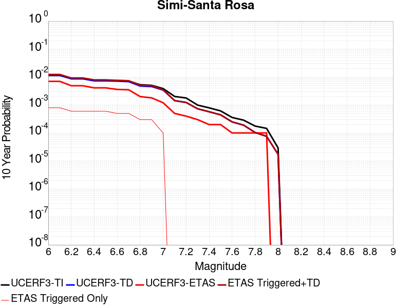 |

| Magnitude | 1 wk TI Prob | 1 wk TD Prob | 1 wk ETAS Prob | 1 wk ETAS/TD Gain | 1 wk ETAS Triggered+TD | 1 wk ETAS Triggered Only | 1 mo TI Prob | 1 mo TD Prob | 1 mo ETAS Prob | 1 mo ETAS/TD Gain | 1 mo ETAS Triggered+TD | 1 mo ETAS Triggered Only | 1 yr TI Prob | 1 yr TD Prob | 1 yr ETAS Prob | 1 yr ETAS/TD Gain | 1 yr ETAS Triggered+TD | 1 yr ETAS Triggered Only | 10 yr TI Prob | 10 yr TD Prob | 10 yr ETAS Prob | 10 yr ETAS/TD Gain | 10 yr ETAS Triggered+TD | 10 yr ETAS Triggered Only |
|-----|-----|-----|-----|-----|-----|-----|-----|-----|-----|-----|-----|-----|-----|-----|-----|-----|-----|-----|-----|-----|-----|-----|-----|-----|
| 6.0 | 2.198912E-5 | 2.2243956E-5 | 0.0 | 0.0 | 2.2243956E-5 | 0.0 | 9.4235686E-5 | 9.5328E-5 | 0.0 | 0.0 | 9.5328E-5 | 0.0 | 0.0011467156 | 0.0011600441 | 6.0E-4 | 0.5172217 | 0.0011600441 | 0.0 | 0.011408163 | 0.011544323 | 0.007 | 0.6063587 | 0.012335087 | 8.0E-4 |
| 6.1 | 2.198912E-5 | 2.2243956E-5 | 0.0 | 0.0 | 2.2243956E-5 | 0.0 | 9.4235686E-5 | 9.5328E-5 | 0.0 | 0.0 | 9.5328E-5 | 0.0 | 0.0011467156 | 0.0011600441 | 6.0E-4 | 0.5172217 | 0.0011600441 | 0.0 | 0.011408163 | 0.011544323 | 0.007 | 0.6063587 | 0.012335087 | 8.0E-4 |
| 6.2 | 1.69983E-5 | 1.6644291E-5 | 0.0 | 0.0 | 1.6644291E-5 | 0.0 | 7.284782E-5 | 7.133089E-5 | 0.0 | 0.0 | 7.133089E-5 | 0.0 | 8.865613E-4 | 8.6813665E-4 | 3.0E-4 | 0.3455677 | 8.6813665E-4 | 0.0 | 0.008830327 | 0.008650365 | 0.0049 | 0.56645006 | 0.009245175 | 6.0E-4 |
| 6.3 | 1.69983E-5 | 1.6644291E-5 | 0.0 | 0.0 | 1.6644291E-5 | 0.0 | 7.284782E-5 | 7.133089E-5 | 0.0 | 0.0 | 7.133089E-5 | 0.0 | 8.865613E-4 | 8.6813665E-4 | 3.0E-4 | 0.3455677 | 8.6813665E-4 | 0.0 | 0.008830327 | 0.008650365 | 0.0049 | 0.56645006 | 0.009245175 | 6.0E-4 |
| 6.4 | 1.4666188E-5 | 1.4031596E-5 | 0.0 | 0.0 | 1.4031596E-5 | 0.0 | 6.285358E-5 | 6.0134164E-5 | 0.0 | 0.0 | 6.0134164E-5 | 0.0 | 7.6497364E-4 | 7.319124E-4 | 2.0E-4 | 0.27325675 | 7.319124E-4 | 0.0 | 0.0076234564 | 0.0072974865 | 0.0041 | 0.5618373 | 0.007893108 | 6.0E-4 |
| 6.5 | 1.4666188E-5 | 1.4031596E-5 | 0.0 | 0.0 | 1.4031596E-5 | 0.0 | 6.285358E-5 | 6.0134164E-5 | 0.0 | 0.0 | 6.0134164E-5 | 0.0 | 7.6497364E-4 | 7.319124E-4 | 2.0E-4 | 0.27325675 | 7.319124E-4 | 0.0 | 0.0076234564 | 0.0072974865 | 0.0041 | 0.5618373 | 0.007893108 | 6.0E-4 |
| 6.6 | 1.4377586E-5 | 1.37090365E-5 | 0.0 | 0.0 | 1.37090365E-5 | 0.0 | 6.1616774E-5 | 5.875183E-5 | 0.0 | 0.0 | 5.875183E-5 | 0.0 | 7.4992597E-4 | 7.1509357E-4 | 2.0E-4 | 0.27968368 | 7.1509357E-4 | 0.0 | 0.007474003 | 0.007130387 | 0.0036 | 0.50488144 | 0.0076268213 | 5.0E-4 |
| 6.7 | 1.3881404E-5 | 1.3187798E-5 | 0.0 | 0.0 | 1.3187798E-5 | 0.0 | 5.9490372E-5 | 5.6518045E-5 | 0.0 | 0.0 | 5.6518045E-5 | 0.0 | 7.240546E-4 | 6.879146E-4 | 1.0E-4 | 0.14536688 | 6.879146E-4 | 0.0 | 0.007217 | 0.0068602944 | 0.0035 | 0.5101822 | 0.0073568644 | 5.0E-4 |
| 6.8 | 1.0176516E-5 | 9.139751E-6 | 0.0 | 0.0 | 9.139751E-6 | 0.0 | 4.3612912E-5 | 3.9169863E-5 | 0.0 | 0.0 | 3.9169863E-5 | 0.0 | 5.308578E-4 | 4.7680526E-4 | 1.0E-4 | 0.20972922 | 4.7680526E-4 | 0.0 | 0.0052959146 | 0.004759451 | 0.002 | 0.42021653 | 0.005058023 | 3.0E-4 |
| 6.9 | 9.699797E-6 | 8.761137E-6 | 0.0 | 0.0 | 8.761137E-6 | 0.0 | 4.15699E-5 | 3.754728E-5 | 0.0 | 0.0 | 3.754728E-5 | 0.0 | 5.05996E-4 | 4.5705863E-4 | 1.0E-4 | 0.21879031 | 4.5705863E-4 | 0.0 | 0.005048454 | 0.0045627994 | 0.0018 | 0.39449468 | 0.0048614303 | 3.0E-4 |
| 7.0 | 7.4049476E-6 | 6.549223E-6 | 0.0 | 0.0 | 6.549223E-6 | 0.0 | 3.1735104E-5 | 2.8067869E-5 | 0.0 | 0.0 | 2.8067869E-5 | 0.0 | 3.8630638E-4 | 3.416853E-4 | 1.0E-4 | 0.29266694 | 3.416853E-4 | 0.0 | 0.0038563553 | 0.0034128383 | 0.0012 | 0.3516135 | 0.003512497 | 1.0E-4 |
| 7.1 | 3.873439E-6 | 2.755057E-6 | 0.0 | 0.0 | 2.755057E-6 | 0.0 | 1.6600346E-5 | 1.1807336E-5 | 0.0 | 0.0 | 1.1807336E-5 | 0.0 | 2.0209046E-4 | 1.4374507E-4 | 0.0 | 0.0 | 1.4374507E-4 | 0.0 | 0.0020190678 | 0.0014365443 | 5.0E-4 | 0.34805748 | 0.0014365443 | 0.0 |
| 7.2 | 3.417706E-6 | 2.3636594E-6 | 0.0 | 0.0 | 2.3636594E-6 | 0.0 | 1.4647229E-5 | 1.0129931E-5 | 0.0 | 0.0 | 1.0129931E-5 | 0.0 | 1.7831543E-4 | 1.2332515E-4 | 0.0 | 0.0 | 1.2332515E-4 | 0.0 | 0.0017817242 | 0.0012325894 | 4.0E-4 | 0.32452008 | 0.0012325894 | 0.0 |
| 7.3 | 1.90225E-6 | 1.4045734E-6 | 0.0 | 0.0 | 1.4045734E-6 | 0.0 | 8.152474E-6 | 6.0195866E-6 | 0.0 | 0.0 | 6.0195866E-6 | 0.0 | 9.9251854E-5 | 7.328602E-5 | 0.0 | 0.0 | 7.328602E-5 | 0.0 | 9.920754E-4 | 7.326208E-4 | 3.0E-4 | 0.40948877 | 7.326208E-4 | 0.0 |
| 7.4 | 1.5170556E-6 | 1.1000865E-6 | 0.0 | 0.0 | 1.1000865E-6 | 0.0 | 6.5016507E-6 | 4.7146477E-6 | 0.0 | 0.0 | 4.7146477E-6 | 0.0 | 7.915472E-5 | 5.739934E-5 | 0.0 | 0.0 | 5.739934E-5 | 0.0 | 7.9126534E-4 | 5.738462E-4 | 2.0E-4 | 0.34852543 | 5.738462E-4 | 0.0 |
| 7.5 | 1.178732E-6 | 8.513654E-7 | 0.0 | 0.0 | 8.513654E-7 | 0.0 | 5.0516987E-6 | 3.6487038E-6 | 0.0 | 0.0 | 3.6487038E-6 | 0.0 | 6.1502695E-5 | 4.442207E-5 | 0.0 | 0.0 | 4.442207E-5 | 0.0 | 6.148568E-4 | 4.441329E-4 | 2.0E-4 | 0.45031568 | 4.441329E-4 | 0.0 |
| 7.6 | 6.8722386E-7 | 4.774306E-7 | 0.0 | 0.0 | 4.774306E-7 | 0.0 | 2.9452417E-6 | 2.0461296E-6 | 0.0 | 0.0 | 2.0461296E-6 | 0.0 | 3.5857727E-5 | 2.4911344E-5 | 0.0 | 0.0 | 2.4911344E-5 | 0.0 | 3.5851944E-4 | 2.4908563E-4 | 1.0E-4 | 0.40146834 | 2.4908563E-4 | 0.0 |
| 7.7 | 5.5126515E-7 | 3.6551893E-7 | 0.0 | 0.0 | 3.6551893E-7 | 0.0 | 2.3625628E-6 | 1.5665088E-6 | 0.0 | 0.0 | 1.5665088E-6 | 0.0 | 2.8763823E-5 | 1.9072078E-5 | 0.0 | 0.0 | 1.9072078E-5 | 0.0 | 2.87601E-4 | 1.9070452E-4 | 1.0E-4 | 0.5243714 | 1.9070452E-4 | 0.0 |
| 7.8 | 3.3860243E-7 | 1.9957298E-7 | 0.0 | 0.0 | 1.9957298E-7 | 0.0 | 1.4511525E-6 | 8.5531246E-7 | 0.0 | 0.0 | 8.5531246E-7 | 0.0 | 1.7667637E-5 | 1.041338E-5 | 0.0 | 0.0 | 1.041338E-5 | 0.0 | 1.7666233E-4 | 1.0412897E-4 | 1.0E-4 | 0.9603475 | 1.0412897E-4 | 0.0 |
| 7.9 | 2.7955386E-7 | 1.454412E-7 | 0.0 | 0.0 | 1.454412E-7 | 0.0 | 1.1980875E-6 | 6.233193E-7 | 0.0 | 0.0 | 6.233193E-7 | 0.0 | 1.4586617E-5 | 7.5888865E-6 | 0.0 | 0.0 | 7.5888865E-6 | 0.0 | 1.458566E-4 | 7.588632E-5 | 1.0E-4 | 1.3177607 | 7.588632E-5 | 0.0 |
| 8.0 | 5.6259015E-8 | 3.3173883E-8 | 0.0 | 0.0 | 3.3173883E-8 | 0.0 | 2.4111003E-7 | 1.4217377E-7 | 0.0 | 0.0 | 1.4217377E-7 | 0.0 | 2.9355108E-6 | 1.7309645E-6 | 0.0 | 0.0 | 1.7309645E-6 | 0.0 | 2.935472E-5 | 1.7309523E-5 | 0.0 | 0.0 | 1.7309523E-5 | 0.0 |

## Great Valley 04a Trout Creek
*[(top)](#table-of-contents)*

| 1 Week | 1 Month | 1 Year | 10 Year |
|-----|-----|-----|-----|
|  |  |  | 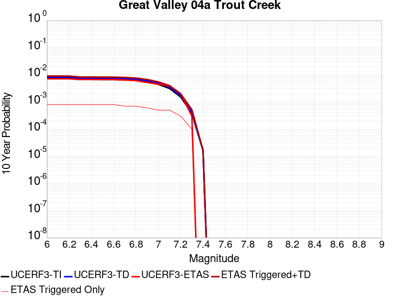 |

| Magnitude | 1 wk TI Prob | 1 wk TD Prob | 1 wk ETAS Prob | 1 wk ETAS/TD Gain | 1 wk ETAS Triggered+TD | 1 wk ETAS Triggered Only | 1 mo TI Prob | 1 mo TD Prob | 1 mo ETAS Prob | 1 mo ETAS/TD Gain | 1 mo ETAS Triggered+TD | 1 mo ETAS Triggered Only | 1 yr TI Prob | 1 yr TD Prob | 1 yr ETAS Prob | 1 yr ETAS/TD Gain | 1 yr ETAS Triggered+TD | 1 yr ETAS Triggered Only | 10 yr TI Prob | 10 yr TD Prob | 10 yr ETAS Prob | 10 yr ETAS/TD Gain | 10 yr ETAS Triggered+TD | 10 yr ETAS Triggered Only |
|-----|-----|-----|-----|-----|-----|-----|-----|-----|-----|-----|-----|-----|-----|-----|-----|-----|-----|-----|-----|-----|-----|-----|-----|-----|
| 6.0 | 1.4088538E-5 | 1.5700552E-5 | 0.0 | 0.0 | 1.5700552E-5 | 0.0 | 6.037805E-5 | 6.728642E-5 | 1.0E-4 | 1.486184 | 6.728642E-5 | 0.0 | 7.3485484E-4 | 8.189167E-4 | 8.0E-4 | 0.97690034 | 9.188348E-4 | 1.0E-4 | 0.007324295 | 0.008160271 | 0.0071 | 0.87006915 | 0.008953743 | 8.0E-4 |
| 6.1 | 1.4088538E-5 | 1.5700552E-5 | 0.0 | 0.0 | 1.5700552E-5 | 0.0 | 6.037805E-5 | 6.728642E-5 | 1.0E-4 | 1.486184 | 6.728642E-5 | 0.0 | 7.3485484E-4 | 8.189167E-4 | 8.0E-4 | 0.97690034 | 9.188348E-4 | 1.0E-4 | 0.007324295 | 0.008160271 | 0.0071 | 0.87006915 | 0.008953743 | 8.0E-4 |
| 6.2 | 1.4088538E-5 | 1.5700552E-5 | 0.0 | 0.0 | 1.5700552E-5 | 0.0 | 6.037805E-5 | 6.728642E-5 | 1.0E-4 | 1.486184 | 6.728642E-5 | 0.0 | 7.3485484E-4 | 8.189167E-4 | 8.0E-4 | 0.97690034 | 9.188348E-4 | 1.0E-4 | 0.007324295 | 0.008160271 | 0.0071 | 0.87006915 | 0.008953743 | 8.0E-4 |
| 6.3 | 1.2882862E-5 | 1.43611705E-5 | 0.0 | 0.0 | 1.43611705E-5 | 0.0 | 5.5211098E-5 | 6.154648E-5 | 1.0E-4 | 1.6247883 | 6.154648E-5 | 0.0 | 6.7198783E-4 | 7.4908114E-4 | 8.0E-4 | 1.067975 | 8.4900623E-4 | 1.0E-4 | 0.0066995937 | 0.007466622 | 0.0067 | 0.89732677 | 0.008260649 | 8.0E-4 |
| 6.4 | 1.2882862E-5 | 1.43611705E-5 | 0.0 | 0.0 | 1.43611705E-5 | 0.0 | 5.5211098E-5 | 6.154648E-5 | 1.0E-4 | 1.6247883 | 6.154648E-5 | 0.0 | 6.7198783E-4 | 7.4908114E-4 | 8.0E-4 | 1.067975 | 8.4900623E-4 | 1.0E-4 | 0.0066995937 | 0.007466622 | 0.0067 | 0.89732677 | 0.008260649 | 8.0E-4 |
| 6.5 | 1.2762329E-5 | 1.4227877E-5 | 0.0 | 0.0 | 1.4227877E-5 | 0.0 | 5.469455E-5 | 6.097525E-5 | 1.0E-4 | 1.6400096 | 6.097525E-5 | 0.0 | 6.657027E-4 | 7.4213115E-4 | 8.0E-4 | 1.0779766 | 8.4205694E-4 | 1.0E-4 | 0.00663712 | 0.007397585 | 0.0067 | 0.905701 | 0.008191667 | 8.0E-4 |
| 6.6 | 1.2762329E-5 | 1.4227877E-5 | 0.0 | 0.0 | 1.4227877E-5 | 0.0 | 5.469455E-5 | 6.097525E-5 | 1.0E-4 | 1.6400096 | 6.097525E-5 | 0.0 | 6.657027E-4 | 7.4213115E-4 | 8.0E-4 | 1.0779766 | 8.4205694E-4 | 1.0E-4 | 0.00663712 | 0.007397585 | 0.0067 | 0.905701 | 0.008191667 | 8.0E-4 |
| 6.7 | 1.2557959E-5 | 1.4002359E-5 | 0.0 | 0.0 | 1.4002359E-5 | 0.0 | 5.3818712E-5 | 6.0008788E-5 | 1.0E-4 | 1.6664226 | 6.0008788E-5 | 0.0 | 6.5504585E-4 | 7.303724E-4 | 8.0E-4 | 1.0953317 | 8.3029934E-4 | 1.0E-4 | 0.006531183 | 0.007280771 | 0.0064 | 0.8790278 | 0.007975674 | 7.0E-4 |
| 6.8 | 1.1871544E-5 | 1.3242644E-5 | 0.0 | 0.0 | 1.3242644E-5 | 0.0 | 5.0877054E-5 | 5.675301E-5 | 1.0E-4 | 1.7620211 | 5.675301E-5 | 0.0 | 6.1925204E-4 | 6.9075887E-4 | 8.0E-4 | 1.1581466 | 7.906898E-4 | 1.0E-4 | 0.0061752927 | 0.006887132 | 0.0061 | 0.88570976 | 0.007582311 | 7.0E-4 |
| 6.9 | 1.0500373E-5 | 1.1716899E-5 | 0.0 | 0.0 | 1.1716899E-5 | 0.0 | 4.5000823E-5 | 5.0214363E-5 | 1.0E-4 | 1.991462 | 5.0214363E-5 | 0.0 | 5.4774724E-4 | 6.1119697E-4 | 8.0E-4 | 1.308907 | 7.1113586E-4 | 1.0E-4 | 0.005463991 | 0.0060960236 | 0.0052 | 0.8530151 | 0.0066923657 | 6.0E-4 |
| 7.0 | 8.524332E-6 | 9.521695E-6 | 0.0 | 0.0 | 9.521695E-6 | 0.0 | 3.653234E-5 | 4.0806663E-5 | 1.0E-4 | 2.4505801 | 4.0806663E-5 | 0.0 | 4.4469046E-4 | 4.967152E-4 | 7.0E-4 | 1.4092582 | 5.9666554E-4 | 1.0E-4 | 0.0044380166 | 0.004956779 | 0.0045 | 0.90784764 | 0.0054543004 | 5.0E-4 |
| 7.1 | 6.006849E-6 | 6.70333E-6 | 0.0 | 0.0 | 6.70333E-6 | 0.0 | 2.5743384E-5 | 2.8728273E-5 | 1.0E-4 | 3.4808915 | 2.8728273E-5 | 0.0 | 3.1338062E-4 | 3.4971617E-4 | 7.0E-4 | 2.0016232 | 4.496812E-4 | 1.0E-4 | 0.0031293905 | 0.0034922073 | 0.0039 | 1.1167722 | 0.003990461 | 5.0E-4 |
| 7.2 | 2.9122193E-6 | 3.2426306E-6 | 0.0 | 0.0 | 3.2426306E-6 | 0.0 | 1.248088E-5 | 1.3896924E-5 | 0.0 | 0.0 | 1.3896924E-5 | 0.0 | 1.5194413E-4 | 1.6918367E-4 | 6.0E-4 | 3.5464418 | 2.6916675E-4 | 1.0E-4 | 0.0015184027 | 0.0016907202 | 0.002 | 1.1829278 | 0.001990213 | 3.0E-4 |
| 7.3 | 7.2194007E-7 | 7.9798E-7 | 0.0 | 0.0 | 7.9798E-7 | 0.0 | 3.0940253E-6 | 3.4199124E-6 | 0.0 | 0.0 | 3.4199124E-6 | 0.0 | 3.7669106E-5 | 4.1637097E-5 | 2.0E-4 | 4.8034086 | 1.4163293E-4 | 1.0E-4 | 3.766272E-4 | 4.1633783E-4 | 3.0E-4 | 0.7205687 | 5.162962E-4 | 1.0E-4 |
| 7.4 | 3.112171E-8 | 3.2058175E-8 | 0.0 | 0.0 | 3.2058175E-8 | 0.0 | 1.3337875E-7 | 1.3739218E-7 | 0.0 | 0.0 | 1.3739218E-7 | 0.0 | 1.6238852E-6 | 1.6727486E-6 | 0.0 | 0.0 | 1.6727486E-6 | 0.0 | 1.6238733E-5 | 1.6727368E-5 | 0.0 | 0.0 | 1.6727368E-5 | 0.0 |

## Lost Hills
*[(top)](#table-of-contents)*

| 1 Week | 1 Month | 1 Year | 10 Year |
|-----|-----|-----|-----|
|  |  |  |  |

| Magnitude | 1 wk TI Prob | 1 wk TD Prob | 1 wk ETAS Prob | 1 wk ETAS/TD Gain | 1 wk ETAS Triggered+TD | 1 wk ETAS Triggered Only | 1 mo TI Prob | 1 mo TD Prob | 1 mo ETAS Prob | 1 mo ETAS/TD Gain | 1 mo ETAS Triggered+TD | 1 mo ETAS Triggered Only | 1 yr TI Prob | 1 yr TD Prob | 1 yr ETAS Prob | 1 yr ETAS/TD Gain | 1 yr ETAS Triggered+TD | 1 yr ETAS Triggered Only | 10 yr TI Prob | 10 yr TD Prob | 10 yr ETAS Prob | 10 yr ETAS/TD Gain | 10 yr ETAS Triggered+TD | 10 yr ETAS Triggered Only |
|-----|-----|-----|-----|-----|-----|-----|-----|-----|-----|-----|-----|-----|-----|-----|-----|-----|-----|-----|-----|-----|-----|-----|-----|-----|
| 6.0 | 2.233523E-5 | 2.5074094E-5 | 0.0 | 0.0 | 2.5074094E-5 | 0.0 | 9.571891E-5 | 1.0745692E-4 | 0.0 | 0.0 | 1.0745692E-4 | 0.0 | 0.0011647546 | 0.0013076705 | 0.0012 | 0.9176623 | 0.001507409 | 2.0E-4 | 0.011586686 | 0.013016312 | 0.0109 | 0.83741075 | 0.0138059 | 8.0E-4 |
| 6.1 | 2.233523E-5 | 2.5074094E-5 | 0.0 | 0.0 | 2.5074094E-5 | 0.0 | 9.571891E-5 | 1.0745692E-4 | 0.0 | 0.0 | 1.0745692E-4 | 0.0 | 0.0011647546 | 0.0013076705 | 0.0012 | 0.9176623 | 0.001507409 | 2.0E-4 | 0.011586686 | 0.013016312 | 0.0109 | 0.83741075 | 0.0138059 | 8.0E-4 |
| 6.2 | 2.233523E-5 | 2.5074094E-5 | 0.0 | 0.0 | 2.5074094E-5 | 0.0 | 9.571891E-5 | 1.0745692E-4 | 0.0 | 0.0 | 1.0745692E-4 | 0.0 | 0.0011647546 | 0.0013076705 | 0.0012 | 0.9176623 | 0.001507409 | 2.0E-4 | 0.011586686 | 0.013016312 | 0.0109 | 0.83741075 | 0.0138059 | 8.0E-4 |
| 6.3 | 2.233523E-5 | 2.5074094E-5 | 0.0 | 0.0 | 2.5074094E-5 | 0.0 | 9.571891E-5 | 1.0745692E-4 | 0.0 | 0.0 | 1.0745692E-4 | 0.0 | 0.0011647546 | 0.0013076705 | 0.0012 | 0.9176623 | 0.001507409 | 2.0E-4 | 0.011586686 | 0.013016312 | 0.0109 | 0.83741075 | 0.0138059 | 8.0E-4 |
| 6.4 | 1.2288092E-5 | 1.3763646E-5 | 0.0 | 0.0 | 1.3763646E-5 | 0.0 | 5.2662188E-5 | 5.8986247E-5 | 0.0 | 0.0 | 5.8986247E-5 | 0.0 | 6.409735E-4 | 7.180145E-4 | 0.0012 | 1.6712755 | 9.178709E-4 | 2.0E-4 | 0.006391279 | 0.007166129 | 0.0073 | 1.018681 | 0.007761829 | 6.0E-4 |
| 6.5 | 1.2288092E-5 | 1.3763646E-5 | 0.0 | 0.0 | 1.3763646E-5 | 0.0 | 5.2662188E-5 | 5.8986247E-5 | 0.0 | 0.0 | 5.8986247E-5 | 0.0 | 6.409735E-4 | 7.180145E-4 | 0.0012 | 1.6712755 | 9.178709E-4 | 2.0E-4 | 0.006391279 | 0.007166129 | 0.0073 | 1.018681 | 0.007761829 | 6.0E-4 |
| 6.6 | 8.58281E-6 | 9.621468E-6 | 0.0 | 0.0 | 9.621468E-6 | 0.0 | 3.6782953E-5 | 4.123468E-5 | 0.0 | 0.0 | 4.123468E-5 | 0.0 | 4.4774043E-4 | 5.019996E-4 | 0.0011 | 2.191237 | 6.019494E-4 | 1.0E-4 | 0.0044683935 | 0.0050167954 | 0.0052 | 1.0365182 | 0.0054147886 | 4.0E-4 |
| 6.7 | 7.205685E-6 | 8.07797E-6 | 0.0 | 0.0 | 8.07797E-6 | 0.0 | 3.088114E-5 | 3.4619872E-5 | 0.0 | 0.0 | 3.4619872E-5 | 0.0 | 3.7591302E-4 | 4.2149695E-4 | 0.001 | 2.3724964 | 5.214548E-4 | 1.0E-4 | 0.0037527776 | 0.0042149695 | 0.0044 | 1.0438985 | 0.0046132836 | 4.0E-4 |

## Hunter Mountain-Saline Valley
*[(top)](#table-of-contents)*

| 1 Week | 1 Month | 1 Year | 10 Year |
|-----|-----|-----|-----|
|  |  |  | 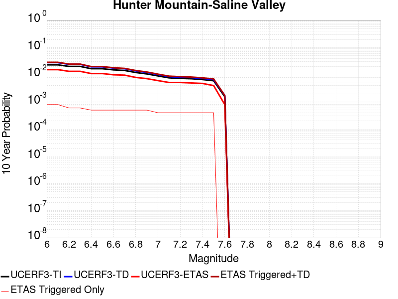 |

| Magnitude | 1 wk TI Prob | 1 wk TD Prob | 1 wk ETAS Prob | 1 wk ETAS/TD Gain | 1 wk ETAS Triggered+TD | 1 wk ETAS Triggered Only | 1 mo TI Prob | 1 mo TD Prob | 1 mo ETAS Prob | 1 mo ETAS/TD Gain | 1 mo ETAS Triggered+TD | 1 mo ETAS Triggered Only | 1 yr TI Prob | 1 yr TD Prob | 1 yr ETAS Prob | 1 yr ETAS/TD Gain | 1 yr ETAS Triggered+TD | 1 yr ETAS Triggered Only | 10 yr TI Prob | 10 yr TD Prob | 10 yr ETAS Prob | 10 yr ETAS/TD Gain | 10 yr ETAS Triggered+TD | 10 yr ETAS Triggered Only |
|-----|-----|-----|-----|-----|-----|-----|-----|-----|-----|-----|-----|-----|-----|-----|-----|-----|-----|-----|-----|-----|-----|-----|-----|-----|
| 6.0 | 4.5103672E-5 | 5.4413267E-5 | 1.0E-4 | 1.8377872 | 5.4413267E-5 | 0.0 | 1.9328714E-4 | 2.3317964E-4 | 3.0E-4 | 1.2865617 | 2.3317964E-4 | 0.0 | 0.002350731 | 0.002835441 | 0.0014 | 0.49375036 | 0.0029351574 | 1.0E-4 | 0.023260195 | 0.02801385 | 0.0155 | 0.55329776 | 0.028791439 | 8.0E-4 |
| 6.1 | 4.5103672E-5 | 5.4413267E-5 | 1.0E-4 | 1.8377872 | 5.4413267E-5 | 0.0 | 1.9328714E-4 | 2.3317964E-4 | 3.0E-4 | 1.2865617 | 2.3317964E-4 | 0.0 | 0.002350731 | 0.002835441 | 0.0014 | 0.49375036 | 0.0029351574 | 1.0E-4 | 0.023260195 | 0.02801385 | 0.0155 | 0.55329776 | 0.028791439 | 8.0E-4 |
| 6.2 | 3.9363465E-5 | 4.6930167E-5 | 1.0E-4 | 2.1308255 | 4.6930167E-5 | 0.0 | 1.6868966E-4 | 2.0111441E-4 | 2.0E-4 | 0.9944588 | 2.0111441E-4 | 0.0 | 0.002051862 | 0.002445953 | 0.0013 | 0.53149015 | 0.0025457086 | 1.0E-4 | 0.020330196 | 0.02420684 | 0.0134 | 0.5535626 | 0.024792315 | 6.0E-4 |
| 6.3 | 3.9363465E-5 | 4.6930167E-5 | 1.0E-4 | 2.1308255 | 4.6930167E-5 | 0.0 | 1.6868966E-4 | 2.0111441E-4 | 2.0E-4 | 0.9944588 | 2.0111441E-4 | 0.0 | 0.002051862 | 0.002445953 | 0.0013 | 0.53149015 | 0.0025457086 | 1.0E-4 | 0.020330196 | 0.02420684 | 0.0134 | 0.5535626 | 0.024792315 | 6.0E-4 |
| 6.4 | 3.2311684E-5 | 3.784555E-5 | 0.0 | 0.0 | 3.784555E-5 | 0.0 | 1.384713E-4 | 1.621855E-4 | 1.0E-4 | 0.6165779 | 1.621855E-4 | 0.0 | 0.0016845843 | 0.0019728886 | 0.001 | 0.506871 | 0.0020726915 | 1.0E-4 | 0.016718714 | 0.019563187 | 0.0111 | 0.56739223 | 0.020053405 | 5.0E-4 |
| 6.5 | 3.2311684E-5 | 3.784555E-5 | 0.0 | 0.0 | 3.784555E-5 | 0.0 | 1.384713E-4 | 1.621855E-4 | 1.0E-4 | 0.6165779 | 1.621855E-4 | 0.0 | 0.0016845843 | 0.0019728886 | 0.001 | 0.506871 | 0.0020726915 | 1.0E-4 | 0.016718714 | 0.019563187 | 0.0111 | 0.56739223 | 0.020053405 | 5.0E-4 |
| 6.6 | 2.9305844E-5 | 3.408624E-5 | 0.0 | 0.0 | 3.408624E-5 | 0.0 | 1.2559042E-4 | 1.4607605E-4 | 1.0E-4 | 0.6845749 | 1.4607605E-4 | 0.0 | 0.0015279909 | 0.0017770866 | 0.001 | 0.5627188 | 0.0018769088 | 1.0E-4 | 0.015175272 | 0.017637318 | 0.01 | 0.5669796 | 0.0181285 | 5.0E-4 |
| 6.7 | 2.7826512E-5 | 3.2253232E-5 | 0.0 | 0.0 | 3.2253232E-5 | 0.0 | 1.19251024E-4 | 1.3822115E-4 | 1.0E-4 | 0.72347826 | 1.3822115E-4 | 0.0 | 0.0014509142 | 0.0016816035 | 0.001 | 0.59467053 | 0.0017814353 | 1.0E-4 | 0.014414776 | 0.016697118 | 0.0097 | 0.5809386 | 0.017188769 | 5.0E-4 |
| 6.8 | 2.3389874E-5 | 2.6789065E-5 | 0.0 | 0.0 | 2.6789065E-5 | 0.0 | 1.0023846E-4 | 1.14805494E-4 | 1.0E-4 | 0.8710385 | 1.14805494E-4 | 0.0 | 0.00121972 | 0.0013969077 | 0.001 | 0.7158669 | 0.001496768 | 1.0E-4 | 0.01213047 | 0.013888132 | 0.008 | 0.5760314 | 0.014381187 | 5.0E-4 |
| 6.9 | 2.069209E-5 | 2.3500012E-5 | 0.0 | 0.0 | 2.3500012E-5 | 0.0 | 8.867737E-5 | 1.00710655E-4 | 1.0E-4 | 0.9929436 | 1.00710655E-4 | 0.0 | 0.0010791123 | 0.0012254985 | 9.0E-4 | 0.734395 | 0.0013253759 | 1.0E-4 | 0.010738871 | 0.012193091 | 0.0072 | 0.5904983 | 0.012686995 | 5.0E-4 |
| 7.0 | 1.7462342E-5 | 1.9572502E-5 | 0.0 | 0.0 | 1.9572502E-5 | 0.0 | 7.483646E-5 | 8.387958E-5 | 1.0E-4 | 1.1921852 | 8.387958E-5 | 0.0 | 9.1075303E-4 | 0.001020778 | 9.0E-4 | 0.8816804 | 0.0011206759 | 1.0E-4 | 0.009070295 | 0.01016519 | 0.0061 | 0.60008717 | 0.010561124 | 4.0E-4 |
| 7.1 | 1.4807709E-5 | 1.6387437E-5 | 0.0 | 0.0 | 1.6387437E-5 | 0.0 | 6.3460066E-5 | 7.0230075E-5 | 1.0E-4 | 1.4238913 | 7.0230075E-5 | 0.0 | 7.723524E-4 | 8.547322E-4 | 8.0E-4 | 0.9359657 | 9.546467E-4 | 1.0E-4 | 0.007696735 | 0.0085181035 | 0.0052 | 0.6104646 | 0.008914696 | 4.0E-4 |
| 7.2 | 1.4180048E-5 | 1.564545E-5 | 0.0 | 0.0 | 1.564545E-5 | 0.0 | 6.077022E-5 | 6.70503E-5 | 1.0E-4 | 1.4914178 | 6.70503E-5 | 0.0 | 7.396263E-4 | 8.160477E-4 | 8.0E-4 | 0.9803348 | 9.159661E-4 | 1.0E-4 | 0.0073716943 | 0.008134132 | 0.0052 | 0.6392815 | 0.008530878 | 4.0E-4 |
| 7.3 | 1.3730402E-5 | 1.5120152E-5 | 0.0 | 0.0 | 1.5120152E-5 | 0.0 | 5.8843252E-5 | 6.479913E-5 | 1.0E-4 | 1.5432305 | 6.479913E-5 | 0.0 | 7.161811E-4 | 7.8865985E-4 | 7.0E-4 | 0.8875816 | 8.88581E-4 | 1.0E-4 | 0.007138774 | 0.007862212 | 0.005 | 0.6359533 | 0.008259067 | 4.0E-4 |
| 7.4 | 1.2810095E-5 | 1.4059342E-5 | 0.0 | 0.0 | 1.4059342E-5 | 0.0 | 5.489925E-5 | 6.025302E-5 | 1.0E-4 | 1.6596678 | 6.025302E-5 | 0.0 | 6.681934E-4 | 7.3334936E-4 | 6.0E-4 | 0.818164 | 8.33276E-4 | 1.0E-4 | 0.006661878 | 0.0073128585 | 0.0048 | 0.6563781 | 0.0077099334 | 4.0E-4 |
| 7.5 | 1.1595659E-5 | 1.275406E-5 | 0.0 | 0.0 | 1.275406E-5 | 0.0 | 4.9694736E-5 | 5.46592E-5 | 1.0E-4 | 1.8295182 | 5.46592E-5 | 0.0 | 6.0486543E-4 | 6.652881E-4 | 4.0E-4 | 0.60124326 | 7.652216E-4 | 1.0E-4 | 0.006032217 | 0.0066365097 | 0.004 | 0.60272646 | 0.007033855 | 4.0E-4 |
| 7.6 | 2.997694E-6 | 3.3143867E-6 | 0.0 | 0.0 | 3.3143867E-6 | 0.0 | 1.28471975E-5 | 1.4204477E-5 | 0.0 | 0.0 | 1.4204477E-5 | 0.0 | 1.564034E-4 | 1.7293303E-4 | 0.0 | 0.0 | 1.7293303E-4 | 0.0 | 0.0015629337 | 0.00173029 | 8.0E-4 | 0.46235025 | 0.00173029 | 0.0 |

## Big Lagoon - Bald Mtn 2011 CFM
*[(top)](#table-of-contents)*

| 1 Week | 1 Month | 1 Year | 10 Year |
|-----|-----|-----|-----|
| 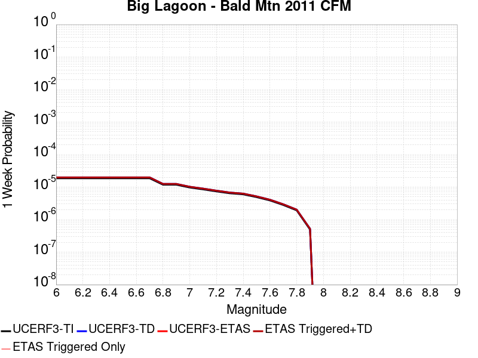 |  |  | 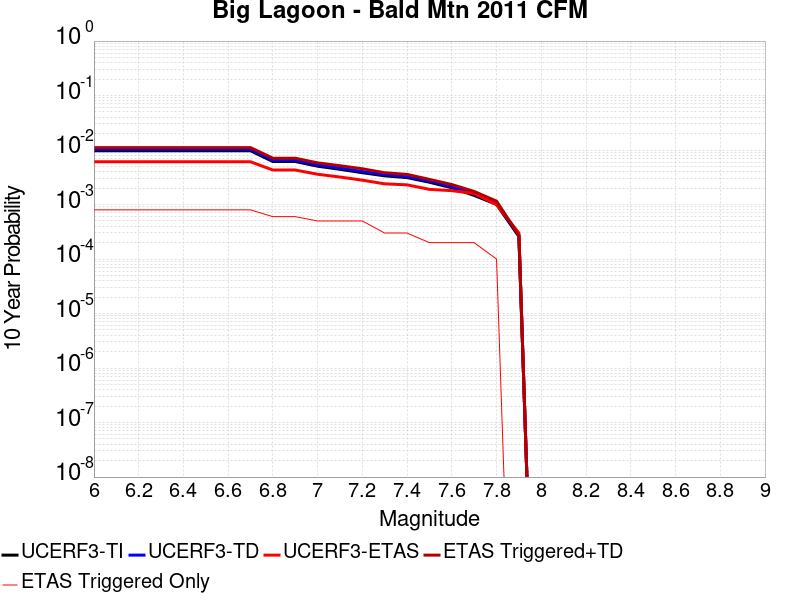 |

| Magnitude | 1 wk TI Prob | 1 wk TD Prob | 1 wk ETAS Prob | 1 wk ETAS/TD Gain | 1 wk ETAS Triggered+TD | 1 wk ETAS Triggered Only | 1 mo TI Prob | 1 mo TD Prob | 1 mo ETAS Prob | 1 mo ETAS/TD Gain | 1 mo ETAS Triggered+TD | 1 mo ETAS Triggered Only | 1 yr TI Prob | 1 yr TD Prob | 1 yr ETAS Prob | 1 yr ETAS/TD Gain | 1 yr ETAS Triggered+TD | 1 yr ETAS Triggered Only | 10 yr TI Prob | 10 yr TD Prob | 10 yr ETAS Prob | 10 yr ETAS/TD Gain | 10 yr ETAS Triggered+TD | 10 yr ETAS Triggered Only |
|-----|-----|-----|-----|-----|-----|-----|-----|-----|-----|-----|-----|-----|-----|-----|-----|-----|-----|-----|-----|-----|-----|-----|-----|-----|
| 6.0 | 1.8699735E-5 | 1.983738E-5 | 0.0 | 0.0 | 1.983738E-5 | 0.0 | 8.013926E-5 | 8.5014784E-5 | 0.0 | 0.0 | 8.5014784E-5 | 0.0 | 9.752587E-4 | 0.0010346014 | 6.0E-4 | 0.5799335 | 0.0012343944 | 2.0E-4 | 0.009709897 | 0.010301657 | 0.0061 | 0.59213775 | 0.011093415 | 8.0E-4 |
| 6.1 | 1.8699735E-5 | 1.983738E-5 | 0.0 | 0.0 | 1.983738E-5 | 0.0 | 8.013926E-5 | 8.5014784E-5 | 0.0 | 0.0 | 8.5014784E-5 | 0.0 | 9.752587E-4 | 0.0010346014 | 6.0E-4 | 0.5799335 | 0.0012343944 | 2.0E-4 | 0.009709897 | 0.010301657 | 0.0061 | 0.59213775 | 0.011093415 | 8.0E-4 |
| 6.2 | 1.8699735E-5 | 1.983738E-5 | 0.0 | 0.0 | 1.983738E-5 | 0.0 | 8.013926E-5 | 8.5014784E-5 | 0.0 | 0.0 | 8.5014784E-5 | 0.0 | 9.752587E-4 | 0.0010346014 | 6.0E-4 | 0.5799335 | 0.0012343944 | 2.0E-4 | 0.009709897 | 0.010301657 | 0.0061 | 0.59213775 | 0.011093415 | 8.0E-4 |
| 6.3 | 1.8699735E-5 | 1.983738E-5 | 0.0 | 0.0 | 1.983738E-5 | 0.0 | 8.013926E-5 | 8.5014784E-5 | 0.0 | 0.0 | 8.5014784E-5 | 0.0 | 9.752587E-4 | 0.0010346014 | 6.0E-4 | 0.5799335 | 0.0012343944 | 2.0E-4 | 0.009709897 | 0.010301657 | 0.0061 | 0.59213775 | 0.011093415 | 8.0E-4 |
| 6.4 | 1.8699735E-5 | 1.983738E-5 | 0.0 | 0.0 | 1.983738E-5 | 0.0 | 8.013926E-5 | 8.5014784E-5 | 0.0 | 0.0 | 8.5014784E-5 | 0.0 | 9.752587E-4 | 0.0010346014 | 6.0E-4 | 0.5799335 | 0.0012343944 | 2.0E-4 | 0.009709897 | 0.010301657 | 0.0061 | 0.59213775 | 0.011093415 | 8.0E-4 |
| 6.5 | 1.8699735E-5 | 1.983738E-5 | 0.0 | 0.0 | 1.983738E-5 | 0.0 | 8.013926E-5 | 8.5014784E-5 | 0.0 | 0.0 | 8.5014784E-5 | 0.0 | 9.752587E-4 | 0.0010346014 | 6.0E-4 | 0.5799335 | 0.0012343944 | 2.0E-4 | 0.009709897 | 0.010301657 | 0.0061 | 0.59213775 | 0.011093415 | 8.0E-4 |
| 6.6 | 1.8699735E-5 | 1.983738E-5 | 0.0 | 0.0 | 1.983738E-5 | 0.0 | 8.013926E-5 | 8.5014784E-5 | 0.0 | 0.0 | 8.5014784E-5 | 0.0 | 9.752587E-4 | 0.0010346014 | 6.0E-4 | 0.5799335 | 0.0012343944 | 2.0E-4 | 0.009709897 | 0.010301657 | 0.0061 | 0.59213775 | 0.011093415 | 8.0E-4 |
| 6.7 | 1.8699735E-5 | 1.983738E-5 | 0.0 | 0.0 | 1.983738E-5 | 0.0 | 8.013926E-5 | 8.5014784E-5 | 0.0 | 0.0 | 8.5014784E-5 | 0.0 | 9.752587E-4 | 0.0010346014 | 6.0E-4 | 0.5799335 | 0.0012343944 | 2.0E-4 | 0.009709897 | 0.010301657 | 0.0061 | 0.59213775 | 0.011093415 | 8.0E-4 |
| 6.8 | 1.18505095E-5 | 1.2492637E-5 | 0.0 | 0.0 | 1.2492637E-5 | 0.0 | 5.078691E-5 | 5.3538803E-5 | 0.0 | 0.0 | 5.3538803E-5 | 0.0 | 6.181552E-4 | 6.516448E-4 | 4.0E-4 | 0.61383134 | 8.5151446E-4 | 2.0E-4 | 0.006164385 | 0.0064978427 | 0.0043 | 0.66175807 | 0.007093944 | 6.0E-4 |
| 6.9 | 1.18505095E-5 | 1.2492637E-5 | 0.0 | 0.0 | 1.2492637E-5 | 0.0 | 5.078691E-5 | 5.3538803E-5 | 0.0 | 0.0 | 5.3538803E-5 | 0.0 | 6.181552E-4 | 6.516448E-4 | 4.0E-4 | 0.61383134 | 8.5151446E-4 | 2.0E-4 | 0.006164385 | 0.0064978427 | 0.0043 | 0.66175807 | 0.007093944 | 6.0E-4 |
| 7.0 | 9.719786E-6 | 1.0229806E-5 | 0.0 | 0.0 | 1.0229806E-5 | 0.0 | 4.1655563E-5 | 4.3841304E-5 | 0.0 | 0.0 | 4.3841304E-5 | 0.0 | 5.0703844E-4 | 5.336395E-4 | 3.0E-4 | 0.5621773 | 6.3358614E-4 | 1.0E-4 | 0.005058831 | 0.005323827 | 0.0036 | 0.67620534 | 0.0058211647 | 5.0E-4 |
| 7.1 | 8.523418E-6 | 8.964554E-6 | 0.0 | 0.0 | 8.964554E-6 | 0.0 | 3.652842E-5 | 3.841896E-5 | 0.0 | 0.0 | 3.841896E-5 | 0.0 | 4.4464276E-4 | 4.6765196E-4 | 3.0E-4 | 0.6415027 | 5.676052E-4 | 1.0E-4 | 0.0044375416 | 0.004666842 | 0.0032 | 0.68568856 | 0.0051645087 | 5.0E-4 |
| 7.2 | 7.378894E-6 | 7.756907E-6 | 0.0 | 0.0 | 7.756907E-6 | 0.0 | 3.162345E-5 | 3.324347E-5 | 0.0 | 0.0 | 3.324347E-5 | 0.0 | 3.8494746E-4 | 4.0466493E-4 | 2.0E-4 | 0.49423605 | 5.0462445E-4 | 1.0E-4 | 0.0038428132 | 0.0040393765 | 0.0028 | 0.69317627 | 0.004537357 | 5.0E-4 |
| 7.3 | 6.4640294E-6 | 6.7888345E-6 | 0.0 | 0.0 | 6.7888345E-6 | 0.0 | 2.7702688E-5 | 2.9094685E-5 | 0.0 | 0.0 | 2.9094685E-5 | 0.0 | 3.3722803E-4 | 3.5417086E-4 | 1.0E-4 | 0.2823496 | 3.5417086E-4 | 0.0 | 0.0033671674 | 0.0035361343 | 0.0024 | 0.67870724 | 0.0038350734 | 3.0E-4 |
| 7.4 | 5.9959093E-6 | 6.2954728E-6 | 0.0 | 0.0 | 6.2954728E-6 | 0.0 | 2.5696501E-5 | 2.6980322E-5 | 0.0 | 0.0 | 2.6980322E-5 | 0.0 | 3.1280998E-4 | 3.284365E-4 | 1.0E-4 | 0.30447286 | 3.284365E-4 | 0.0 | 0.0031237002 | 0.0032795728 | 0.0023 | 0.7013108 | 0.003578589 | 3.0E-4 |
| 7.5 | 4.929265E-6 | 5.1736833E-6 | 0.0 | 0.0 | 5.1736833E-6 | 0.0 | 2.112525E-5 | 2.2172742E-5 | 0.0 | 0.0 | 2.2172742E-5 | 0.0 | 2.5716957E-4 | 2.699201E-4 | 0.0 | 0.0 | 2.699201E-4 | 0.0 | 0.0025687215 | 0.0026959633 | 0.0019 | 0.7047574 | 0.002895424 | 2.0E-4 |
| 7.6 | 3.8982403E-6 | 4.0868376E-6 | 0.0 | 0.0 | 4.0868376E-6 | 0.0 | 1.6706637E-5 | 1.7514903E-5 | 0.0 | 0.0 | 1.7514903E-5 | 0.0 | 2.0338432E-4 | 2.1322335E-4 | 0.0 | 0.0 | 2.1322335E-4 | 0.0 | 0.0020319829 | 0.0021302155 | 0.0018 | 0.84498495 | 0.0023297893 | 2.0E-4 |
| 7.7 | 2.820968E-6 | 2.9557207E-6 | 0.0 | 0.0 | 2.9557207E-6 | 0.0 | 1.2089806E-5 | 1.2667313E-5 | 0.0 | 0.0 | 1.2667313E-5 | 0.0 | 1.4718344E-4 | 1.542138E-4 | 0.0 | 0.0 | 1.542138E-4 | 0.0 | 0.00147086 | 0.0015410855 | 0.0016 | 1.0382292 | 0.0017407773 | 2.0E-4 |
| 7.8 | 1.9314455E-6 | 2.024983E-6 | 0.0 | 0.0 | 2.024983E-6 | 0.0 | 8.277597E-6 | 8.67847E-6 | 0.0 | 0.0 | 8.67847E-6 | 0.0 | 1.0077508E-4 | 1.0565538E-4 | 0.0 | 0.0 | 1.0565538E-4 | 0.0 | 0.0010072939 | 0.0010560644 | 0.001 | 0.946912 | 0.0011559587 | 1.0E-4 |
| 7.9 | 4.9586197E-7 | 5.216062E-7 | 0.0 | 0.0 | 5.216062E-7 | 0.0 | 2.125121E-6 | 2.2354534E-6 | 0.0 | 0.0 | 2.2354534E-6 | 0.0 | 2.5873042E-5 | 2.7216325E-5 | 0.0 | 0.0 | 2.7216325E-5 | 0.0 | 2.5870028E-4 | 2.7213202E-4 | 3.0E-4 | 1.1024061 | 2.7213202E-4 | 0.0 |

## Little Salmon (Onshore)
*[(top)](#table-of-contents)*

| 1 Week | 1 Month | 1 Year | 10 Year |
|-----|-----|-----|-----|
| 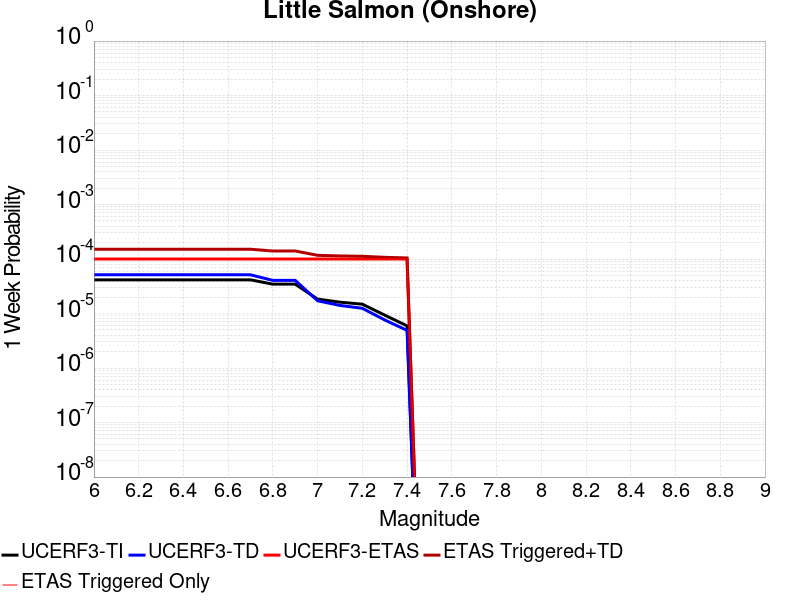 | 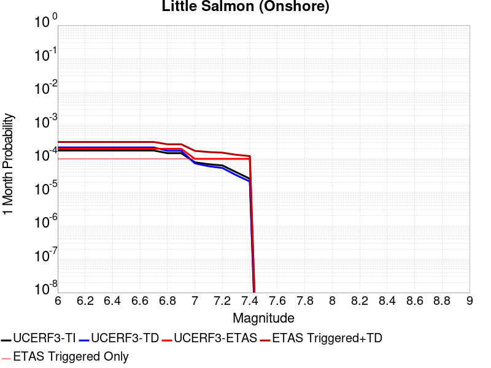 |  |  |

| Magnitude | 1 wk TI Prob | 1 wk TD Prob | 1 wk ETAS Prob | 1 wk ETAS/TD Gain | 1 wk ETAS Triggered+TD | 1 wk ETAS Triggered Only | 1 mo TI Prob | 1 mo TD Prob | 1 mo ETAS Prob | 1 mo ETAS/TD Gain | 1 mo ETAS Triggered+TD | 1 mo ETAS Triggered Only | 1 yr TI Prob | 1 yr TD Prob | 1 yr ETAS Prob | 1 yr ETAS/TD Gain | 1 yr ETAS Triggered+TD | 1 yr ETAS Triggered Only | 10 yr TI Prob | 10 yr TD Prob | 10 yr ETAS Prob | 10 yr ETAS/TD Gain | 10 yr ETAS Triggered+TD | 10 yr ETAS Triggered Only |
|-----|-----|-----|-----|-----|-----|-----|-----|-----|-----|-----|-----|-----|-----|-----|-----|-----|-----|-----|-----|-----|-----|-----|-----|-----|
| 6.0 | 4.1582247E-5 | 5.143167E-5 | 1.0E-4 | 1.9443272 | 1.5142653E-4 | 1.0E-4 | 1.7819746E-4 | 2.2040741E-4 | 2.0E-4 | 0.9074105 | 3.2038538E-4 | 1.0E-4 | 0.0021673953 | 0.002680972 | 8.0E-4 | 0.29839924 | 0.0027807038 | 1.0E-4 | 0.021463778 | 0.026835978 | 0.015 | 0.5589511 | 0.02761451 | 8.0E-4 |
| 6.1 | 4.1582247E-5 | 5.143167E-5 | 1.0E-4 | 1.9443272 | 1.5142653E-4 | 1.0E-4 | 1.7819746E-4 | 2.2040741E-4 | 2.0E-4 | 0.9074105 | 3.2038538E-4 | 1.0E-4 | 0.0021673953 | 0.002680972 | 8.0E-4 | 0.29839924 | 0.0027807038 | 1.0E-4 | 0.021463778 | 0.026835978 | 0.015 | 0.5589511 | 0.02761451 | 8.0E-4 |
| 6.2 | 4.1582247E-5 | 5.143167E-5 | 1.0E-4 | 1.9443272 | 1.5142653E-4 | 1.0E-4 | 1.7819746E-4 | 2.2040741E-4 | 2.0E-4 | 0.9074105 | 3.2038538E-4 | 1.0E-4 | 0.0021673953 | 0.002680972 | 8.0E-4 | 0.29839924 | 0.0027807038 | 1.0E-4 | 0.021463778 | 0.026835978 | 0.015 | 0.5589511 | 0.02761451 | 8.0E-4 |
| 6.3 | 4.1582247E-5 | 5.143167E-5 | 1.0E-4 | 1.9443272 | 1.5142653E-4 | 1.0E-4 | 1.7819746E-4 | 2.2040741E-4 | 2.0E-4 | 0.9074105 | 3.2038538E-4 | 1.0E-4 | 0.0021673953 | 0.002680972 | 8.0E-4 | 0.29839924 | 0.0027807038 | 1.0E-4 | 0.021463778 | 0.026835978 | 0.015 | 0.5589511 | 0.02761451 | 8.0E-4 |
| 6.4 | 4.1582247E-5 | 5.143167E-5 | 1.0E-4 | 1.9443272 | 1.5142653E-4 | 1.0E-4 | 1.7819746E-4 | 2.2040741E-4 | 2.0E-4 | 0.9074105 | 3.2038538E-4 | 1.0E-4 | 0.0021673953 | 0.002680972 | 8.0E-4 | 0.29839924 | 0.0027807038 | 1.0E-4 | 0.021463778 | 0.026835978 | 0.015 | 0.5589511 | 0.02761451 | 8.0E-4 |
| 6.5 | 4.1582247E-5 | 5.143167E-5 | 1.0E-4 | 1.9443272 | 1.5142653E-4 | 1.0E-4 | 1.7819746E-4 | 2.2040741E-4 | 2.0E-4 | 0.9074105 | 3.2038538E-4 | 1.0E-4 | 0.0021673953 | 0.002680972 | 8.0E-4 | 0.29839924 | 0.0027807038 | 1.0E-4 | 0.021463778 | 0.026835978 | 0.015 | 0.5589511 | 0.02761451 | 8.0E-4 |
| 6.6 | 4.1582247E-5 | 5.143167E-5 | 1.0E-4 | 1.9443272 | 1.5142653E-4 | 1.0E-4 | 1.7819746E-4 | 2.2040741E-4 | 2.0E-4 | 0.9074105 | 3.2038538E-4 | 1.0E-4 | 0.0021673953 | 0.002680972 | 8.0E-4 | 0.29839924 | 0.0027807038 | 1.0E-4 | 0.021463778 | 0.026835978 | 0.015 | 0.5589511 | 0.02761451 | 8.0E-4 |
| 6.7 | 4.1582247E-5 | 5.143167E-5 | 1.0E-4 | 1.9443272 | 1.5142653E-4 | 1.0E-4 | 1.7819746E-4 | 2.2040741E-4 | 2.0E-4 | 0.9074105 | 3.2038538E-4 | 1.0E-4 | 0.0021673953 | 0.002680972 | 8.0E-4 | 0.29839924 | 0.0027807038 | 1.0E-4 | 0.021463778 | 0.026835978 | 0.015 | 0.5589511 | 0.02761451 | 8.0E-4 |
| 6.8 | 3.4607925E-5 | 4.0632807E-5 | 1.0E-4 | 2.4610655 | 1.4062875E-4 | 1.0E-4 | 1.4831126E-4 | 1.7413315E-4 | 2.0E-4 | 1.1485463 | 2.7411574E-4 | 1.0E-4 | 0.001804194 | 0.0021187498 | 5.0E-4 | 0.23598823 | 0.002218538 | 1.0E-4 | 0.01789616 | 0.021293357 | 0.0114 | 0.5353782 | 0.021978453 | 7.0E-4 |
| 6.9 | 3.4607925E-5 | 4.0632807E-5 | 1.0E-4 | 2.4610655 | 1.4062875E-4 | 1.0E-4 | 1.4831126E-4 | 1.7413315E-4 | 2.0E-4 | 1.1485463 | 2.7411574E-4 | 1.0E-4 | 0.001804194 | 0.0021187498 | 5.0E-4 | 0.23598823 | 0.002218538 | 1.0E-4 | 0.01789616 | 0.021293357 | 0.0114 | 0.5353782 | 0.021978453 | 7.0E-4 |
| 7.0 | 1.8411014E-5 | 1.7161936E-5 | 1.0E-4 | 5.826849 | 1.1716022E-4 | 1.0E-4 | 7.8901954E-5 | 7.3549374E-5 | 1.0E-4 | 1.359631 | 1.7354202E-4 | 1.0E-4 | 9.6020795E-4 | 8.9514843E-4 | 2.0E-4 | 0.22342664 | 9.950589E-4 | 1.0E-4 | 0.009560696 | 0.008940588 | 0.0046 | 0.5145076 | 0.009237905 | 3.0E-4 |
| 7.1 | 1.6183103E-5 | 1.4098013E-5 | 1.0E-4 | 7.0931983 | 1.14096605E-4 | 1.0E-4 | 6.935431E-5 | 6.041892E-5 | 1.0E-4 | 1.6551107 | 1.6041288E-4 | 1.0E-4 | 8.440616E-4 | 7.353988E-4 | 2.0E-4 | 0.27196127 | 8.353253E-4 | 1.0E-4 | 0.008408628 | 0.007354235 | 0.0042 | 0.5710995 | 0.0076520285 | 3.0E-4 |
| 7.2 | 1.4868988E-5 | 1.2485594E-5 | 1.0E-4 | 8.009231 | 1.1248435E-4 | 1.0E-4 | 6.372268E-5 | 5.350884E-5 | 1.0E-4 | 1.8688501 | 1.5350348E-4 | 1.0E-4 | 7.755474E-4 | 6.513198E-4 | 2.0E-4 | 0.30706882 | 7.512547E-4 | 1.0E-4 | 0.0077284635 | 0.006518235 | 0.0035 | 0.5369552 | 0.0068162796 | 3.0E-4 |
| 7.3 | 9.3599865E-6 | 7.63674E-6 | 1.0E-4 | 13.094594 | 1.0763598E-4 | 1.0E-4 | 4.011361E-5 | 3.2728673E-5 | 1.0E-4 | 3.055425 | 1.327254E-4 | 1.0E-4 | 4.8827377E-4 | 3.9843383E-4 | 2.0E-4 | 0.5019654 | 4.9839396E-4 | 1.0E-4 | 0.004872023 | 0.0039928746 | 0.0024 | 0.6010707 | 0.004192076 | 2.0E-4 |
| 7.4 | 5.941556E-6 | 4.913584E-6 | 1.0E-4 | 20.351744 | 1.04913095E-4 | 1.0E-4 | 2.5463563E-5 | 2.1058217E-5 | 1.0E-4 | 4.74874 | 1.2105611E-4 | 1.0E-4 | 3.0997477E-4 | 2.5638376E-4 | 1.0E-4 | 0.39004028 | 3.5635813E-4 | 1.0E-4 | 0.0030954275 | 0.0025715034 | 0.0016 | 0.6222041 | 0.0027709892 | 2.0E-4 |

## Carson Range (Genoa)
*[(top)](#table-of-contents)*

| 1 Week | 1 Month | 1 Year | 10 Year |
|-----|-----|-----|-----|
| 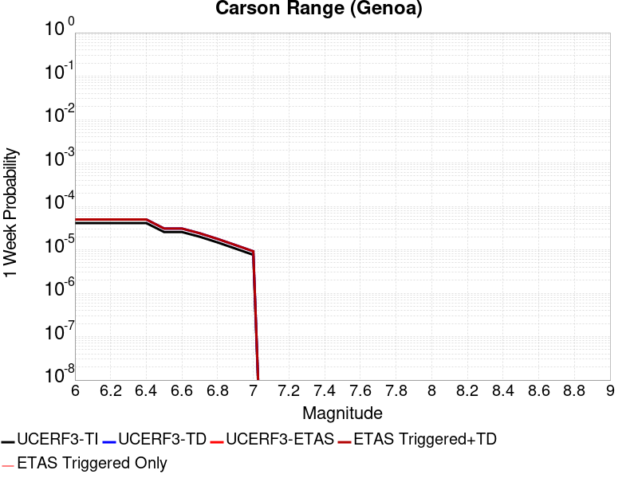 |  |  | 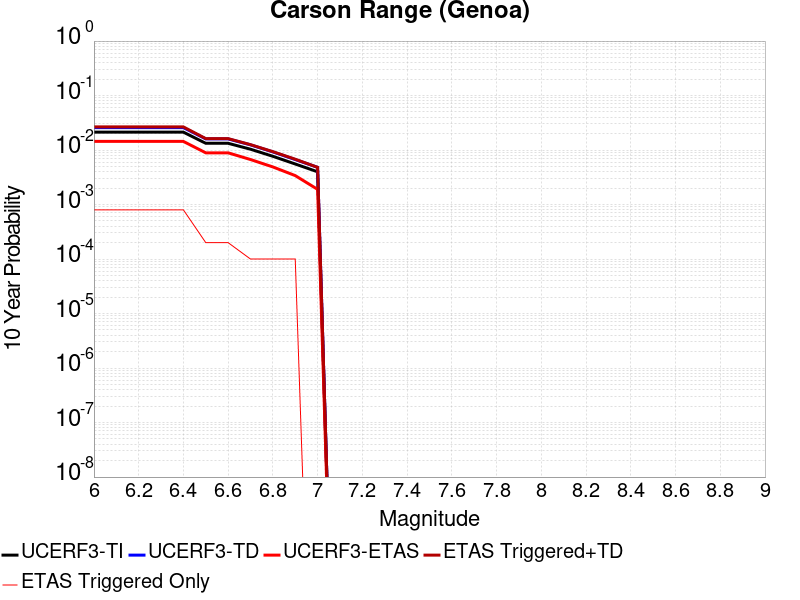 |

| Magnitude | 1 wk TI Prob | 1 wk TD Prob | 1 wk ETAS Prob | 1 wk ETAS/TD Gain | 1 wk ETAS Triggered+TD | 1 wk ETAS Triggered Only | 1 mo TI Prob | 1 mo TD Prob | 1 mo ETAS Prob | 1 mo ETAS/TD Gain | 1 mo ETAS Triggered+TD | 1 mo ETAS Triggered Only | 1 yr TI Prob | 1 yr TD Prob | 1 yr ETAS Prob | 1 yr ETAS/TD Gain | 1 yr ETAS Triggered+TD | 1 yr ETAS Triggered Only | 10 yr TI Prob | 10 yr TD Prob | 10 yr ETAS Prob | 10 yr ETAS/TD Gain | 10 yr ETAS Triggered+TD | 10 yr ETAS Triggered Only |
|-----|-----|-----|-----|-----|-----|-----|-----|-----|-----|-----|-----|-----|-----|-----|-----|-----|-----|-----|-----|-----|-----|-----|-----|-----|
| 6.0 | 4.1268457E-5 | 5.0034752E-5 | 0.0 | 0.0 | 5.0034752E-5 | 0.0 | 1.7685282E-4 | 2.1441927E-4 | 1.0E-4 | 0.46637598 | 2.1441927E-4 | 0.0 | 0.0021510567 | 0.0026078215 | 0.001 | 0.38346183 | 0.0026078215 | 0.0 | 0.02130354 | 0.025811734 | 0.0144 | 0.5578858 | 0.026591085 | 8.0E-4 |
| 6.1 | 4.1268457E-5 | 5.0034752E-5 | 0.0 | 0.0 | 5.0034752E-5 | 0.0 | 1.7685282E-4 | 2.1441927E-4 | 1.0E-4 | 0.46637598 | 2.1441927E-4 | 0.0 | 0.0021510567 | 0.0026078215 | 0.001 | 0.38346183 | 0.0026078215 | 0.0 | 0.02130354 | 0.025811734 | 0.0144 | 0.5578858 | 0.026591085 | 8.0E-4 |
| 6.2 | 4.1268457E-5 | 5.0034752E-5 | 0.0 | 0.0 | 5.0034752E-5 | 0.0 | 1.7685282E-4 | 2.1441927E-4 | 1.0E-4 | 0.46637598 | 2.1441927E-4 | 0.0 | 0.0021510567 | 0.0026078215 | 0.001 | 0.38346183 | 0.0026078215 | 0.0 | 0.02130354 | 0.025811734 | 0.0144 | 0.5578858 | 0.026591085 | 8.0E-4 |
| 6.3 | 4.1268457E-5 | 5.0034752E-5 | 0.0 | 0.0 | 5.0034752E-5 | 0.0 | 1.7685282E-4 | 2.1441927E-4 | 1.0E-4 | 0.46637598 | 2.1441927E-4 | 0.0 | 0.0021510567 | 0.0026078215 | 0.001 | 0.38346183 | 0.0026078215 | 0.0 | 0.02130354 | 0.025811734 | 0.0144 | 0.5578858 | 0.026591085 | 8.0E-4 |
| 6.4 | 4.1268457E-5 | 5.0034752E-5 | 0.0 | 0.0 | 5.0034752E-5 | 0.0 | 1.7685282E-4 | 2.1441927E-4 | 1.0E-4 | 0.46637598 | 2.1441927E-4 | 0.0 | 0.0021510567 | 0.0026078215 | 0.001 | 0.38346183 | 0.0026078215 | 0.0 | 0.02130354 | 0.025811734 | 0.0144 | 0.5578858 | 0.026591085 | 8.0E-4 |
| 6.5 | 2.5677185E-5 | 3.091171E-5 | 0.0 | 0.0 | 3.091171E-5 | 0.0 | 1.1004044E-4 | 1.3247305E-4 | 1.0E-4 | 0.75487053 | 1.3247305E-4 | 0.0 | 0.0013389189 | 0.0016118455 | 7.0E-4 | 0.4342848 | 0.0016118455 | 0.0 | 0.0133088045 | 0.016019398 | 0.0089 | 0.55557644 | 0.016216194 | 2.0E-4 |
| 6.6 | 2.5677185E-5 | 3.091171E-5 | 0.0 | 0.0 | 3.091171E-5 | 0.0 | 1.1004044E-4 | 1.3247305E-4 | 1.0E-4 | 0.75487053 | 1.3247305E-4 | 0.0 | 0.0013389189 | 0.0016118455 | 7.0E-4 | 0.4342848 | 0.0016118455 | 0.0 | 0.0133088045 | 0.016019398 | 0.0089 | 0.55557644 | 0.016216194 | 2.0E-4 |
| 6.7 | 1.9969408E-5 | 2.401207E-5 | 0.0 | 0.0 | 2.401207E-5 | 0.0 | 8.558037E-5 | 1.0290567E-4 | 1.0E-4 | 0.97176373 | 1.0290567E-4 | 0.0 | 0.0010414429 | 0.0012523093 | 5.0E-4 | 0.39926237 | 0.0012523093 | 0.0 | 0.010365757 | 0.012467616 | 0.0067 | 0.5373922 | 0.012566369 | 1.0E-4 |
| 6.8 | 1.4783156E-5 | 1.7779463E-5 | 0.0 | 0.0 | 1.7779463E-5 | 0.0 | 6.335485E-5 | 7.61962E-5 | 1.0E-4 | 1.3124013 | 7.61962E-5 | 0.0 | 7.710722E-4 | 9.2742353E-4 | 3.0E-4 | 0.3234768 | 9.2742353E-4 | 0.0 | 0.0076840227 | 0.009248264 | 0.0049 | 0.52982914 | 0.009347339 | 1.0E-4 |
| 6.9 | 1.06660555E-5 | 1.2849217E-5 | 0.0 | 0.0 | 1.2849217E-5 | 0.0 | 4.5710865E-5 | 5.5067558E-5 | 0.0 | 0.0 | 5.5067558E-5 | 0.0 | 5.5638765E-4 | 6.70356E-4 | 1.0E-4 | 0.14917448 | 6.70356E-4 | 0.0 | 0.005549967 | 0.006694589 | 0.0034 | 0.5078729 | 0.006793919 | 1.0E-4 |
| 7.0 | 7.664838E-6 | 9.238254E-6 | 0.0 | 0.0 | 9.238254E-6 | 0.0 | 3.2848893E-5 | 3.9592516E-5 | 0.0 | 0.0 | 3.9592516E-5 | 0.0 | 3.998619E-4 | 4.820389E-4 | 1.0E-4 | 0.20745215 | 4.820389E-4 | 0.0 | 0.0039914316 | 0.004820387 | 0.0019 | 0.39415923 | 0.004820387 | 0.0 |

## Contra Costa Shear Zone (connector) 2011 CFM
*[(top)](#table-of-contents)*

| 1 Week | 1 Month | 1 Year | 10 Year |
|-----|-----|-----|-----|
|  |  |  |  |

| Magnitude | 1 wk TI Prob | 1 wk TD Prob | 1 wk ETAS Prob | 1 wk ETAS/TD Gain | 1 wk ETAS Triggered+TD | 1 wk ETAS Triggered Only | 1 mo TI Prob | 1 mo TD Prob | 1 mo ETAS Prob | 1 mo ETAS/TD Gain | 1 mo ETAS Triggered+TD | 1 mo ETAS Triggered Only | 1 yr TI Prob | 1 yr TD Prob | 1 yr ETAS Prob | 1 yr ETAS/TD Gain | 1 yr ETAS Triggered+TD | 1 yr ETAS Triggered Only | 10 yr TI Prob | 10 yr TD Prob | 10 yr ETAS Prob | 10 yr ETAS/TD Gain | 10 yr ETAS Triggered+TD | 10 yr ETAS Triggered Only |
|-----|-----|-----|-----|-----|-----|-----|-----|-----|-----|-----|-----|-----|-----|-----|-----|-----|-----|-----|-----|-----|-----|-----|-----|-----|
| 6.0 | 1.3187427E-5 | 1.400659E-5 | 0.0 | 0.0 | 1.400659E-5 | 0.0 | 5.6516317E-5 | 6.0026992E-5 | 0.0 | 0.0 | 6.0026992E-5 | 0.0 | 6.878689E-4 | 7.306063E-4 | 6.0E-4 | 0.8212357 | 7.306063E-4 | 0.0 | 0.006857436 | 0.0072885524 | 0.0059 | 0.8094886 | 0.008082721 | 8.0E-4 |
| 6.1 | 1.3187427E-5 | 1.400659E-5 | 0.0 | 0.0 | 1.400659E-5 | 0.0 | 5.6516317E-5 | 6.0026992E-5 | 0.0 | 0.0 | 6.0026992E-5 | 0.0 | 6.878689E-4 | 7.306063E-4 | 6.0E-4 | 0.8212357 | 7.306063E-4 | 0.0 | 0.006857436 | 0.0072885524 | 0.0059 | 0.8094886 | 0.008082721 | 8.0E-4 |
| 6.2 | 1.3187427E-5 | 1.400659E-5 | 0.0 | 0.0 | 1.400659E-5 | 0.0 | 5.6516317E-5 | 6.0026992E-5 | 0.0 | 0.0 | 6.0026992E-5 | 0.0 | 6.878689E-4 | 7.306063E-4 | 6.0E-4 | 0.8212357 | 7.306063E-4 | 0.0 | 0.006857436 | 0.0072885524 | 0.0059 | 0.8094886 | 0.008082721 | 8.0E-4 |
| 6.3 | 9.315374E-6 | 9.793442E-6 | 0.0 | 0.0 | 9.793442E-6 | 0.0 | 3.992242E-5 | 4.197124E-5 | 0.0 | 0.0 | 4.197124E-5 | 0.0 | 4.8594706E-4 | 5.1088416E-4 | 2.0E-4 | 0.39147815 | 5.1088416E-4 | 0.0 | 0.004848858 | 0.005101765 | 0.0036 | 0.7056382 | 0.0054997243 | 4.0E-4 |
| 6.4 | 9.315374E-6 | 9.793442E-6 | 0.0 | 0.0 | 9.793442E-6 | 0.0 | 3.992242E-5 | 4.197124E-5 | 0.0 | 0.0 | 4.197124E-5 | 0.0 | 4.8594706E-4 | 5.1088416E-4 | 2.0E-4 | 0.39147815 | 5.1088416E-4 | 0.0 | 0.004848858 | 0.005101765 | 0.0036 | 0.7056382 | 0.0054997243 | 4.0E-4 |
| 6.5 | 8.492638E-6 | 8.9078385E-6 | 0.0 | 0.0 | 8.9078385E-6 | 0.0 | 3.639651E-5 | 3.8175913E-5 | 0.0 | 0.0 | 3.8175913E-5 | 0.0 | 4.430374E-4 | 4.6469597E-4 | 1.0E-4 | 0.21519446 | 4.6469597E-4 | 0.0 | 0.0044215517 | 0.004641835 | 0.0034 | 0.73246896 | 0.0050399783 | 4.0E-4 |
| 6.6 | 8.402072E-6 | 8.808738E-6 | 0.0 | 0.0 | 8.808738E-6 | 0.0 | 3.6008387E-5 | 3.7751208E-5 | 0.0 | 0.0 | 3.7751208E-5 | 0.0 | 4.383139E-4 | 4.595274E-4 | 1.0E-4 | 0.21761489 | 4.595274E-4 | 0.0 | 0.0043745036 | 0.0045903637 | 0.0033 | 0.7188973 | 0.0049885274 | 4.0E-4 |
| 6.7 | 7.383587E-6 | 7.717163E-6 | 0.0 | 0.0 | 7.717163E-6 | 0.0 | 3.164356E-5 | 3.307315E-5 | 0.0 | 0.0 | 3.307315E-5 | 0.0 | 3.8519225E-4 | 4.0259326E-4 | 1.0E-4 | 0.24838965 | 4.0259326E-4 | 0.0 | 0.0038452526 | 0.004023106 | 0.0026 | 0.6462668 | 0.004321899 | 3.0E-4 |
| 6.8 | 6.004921E-6 | 6.2360114E-6 | 0.0 | 0.0 | 6.2360114E-6 | 0.0 | 2.5735122E-5 | 2.672549E-5 | 0.0 | 0.0 | 2.672549E-5 | 0.0 | 3.1328006E-4 | 3.253348E-4 | 1.0E-4 | 0.30737567 | 3.253348E-4 | 0.0 | 0.0031283877 | 0.0032528986 | 0.0024 | 0.7378035 | 0.0035519227 | 3.0E-4 |
| 6.9 | 5.505255E-6 | 5.6889726E-6 | 0.0 | 0.0 | 5.6889726E-6 | 0.0 | 2.3593739E-5 | 2.4381085E-5 | 0.0 | 0.0 | 2.4381085E-5 | 0.0 | 2.872159E-4 | 2.967997E-4 | 1.0E-4 | 0.33692756 | 2.967997E-4 | 0.0 | 0.0028684495 | 0.0029683376 | 0.0022 | 0.74115556 | 0.003167744 | 2.0E-4 |
| 7.0 | 4.891922E-6 | 5.020287E-6 | 0.0 | 0.0 | 5.020287E-6 | 0.0 | 2.096521E-5 | 2.151534E-5 | 0.0 | 0.0 | 2.151534E-5 | 0.0 | 2.5522153E-4 | 2.6191812E-4 | 1.0E-4 | 0.3817987 | 2.6191812E-4 | 0.0 | 0.0025492862 | 0.0026203908 | 0.0019 | 0.72508264 | 0.0028198669 | 2.0E-4 |
| 7.1 | 4.3599E-6 | 4.425074E-6 | 0.0 | 0.0 | 4.425074E-6 | 0.0 | 1.868515E-5 | 1.8964467E-5 | 0.0 | 0.0 | 1.8964467E-5 | 0.0 | 2.2746796E-4 | 2.3086819E-4 | 1.0E-4 | 0.43314758 | 2.3086819E-4 | 0.0 | 0.0022723526 | 0.0023105736 | 0.0016 | 0.69246876 | 0.0024103425 | 1.0E-4 |
| 7.2 | 3.7647926E-6 | 3.7775706E-6 | 0.0 | 0.0 | 3.7775706E-6 | 0.0 | 1.6134725E-5 | 1.618949E-5 | 0.0 | 0.0 | 1.618949E-5 | 0.0 | 1.9642258E-4 | 1.9708945E-4 | 1.0E-4 | 0.5073838 | 1.9708945E-4 | 0.0 | 0.0019624906 | 0.0019734248 | 0.0015 | 0.7600999 | 0.0020732277 | 1.0E-4 |
| 7.3 | 2.3179882E-6 | 2.3698099E-6 | 0.0 | 0.0 | 2.3698099E-6 | 0.0 | 9.934198E-6 | 1.0156289E-5 | 0.0 | 0.0 | 1.0156289E-5 | 0.0 | 1.20942146E-4 | 1.2364585E-4 | 0.0 | 0.0 | 1.2364585E-4 | 0.0 | 0.0012087635 | 0.0012400119 | 0.001 | 0.80644387 | 0.0013398879 | 1.0E-4 |
| 7.4 | 1.8378355E-6 | 1.8994251E-6 | 0.0 | 0.0 | 1.8994251E-6 | 0.0 | 7.876414E-6 | 8.140369E-6 | 0.0 | 0.0 | 8.140369E-6 | 0.0 | 9.5891126E-5 | 9.9104516E-5 | 0.0 | 0.0 | 9.9104516E-5 | 0.0 | 9.584976E-4 | 9.947325E-4 | 0.001 | 1.0052954 | 0.001094633 | 1.0E-4 |
| 7.5 | 9.840493E-7 | 1.0468315E-6 | 0.0 | 0.0 | 1.0468315E-6 | 0.0 | 4.2173474E-6 | 4.486413E-6 | 0.0 | 0.0 | 4.486413E-6 | 0.0 | 5.1344992E-5 | 5.4620723E-5 | 0.0 | 0.0 | 5.4620723E-5 | 0.0 | 5.133313E-4 | 5.4982124E-4 | 5.0E-4 | 0.90938646 | 5.4982124E-4 | 0.0 |
| 7.6 | 3.1602997E-7 | 3.570008E-7 | 0.0 | 0.0 | 3.570008E-7 | 0.0 | 1.3544135E-6 | 1.5300025E-6 | 0.0 | 0.0 | 1.5300025E-6 | 0.0 | 1.648986E-5 | 1.8627623E-5 | 0.0 | 0.0 | 1.8627623E-5 | 0.0 | 1.6488635E-4 | 1.8979255E-4 | 2.0E-4 | 1.0537821 | 1.8979255E-4 | 0.0 |
| 7.7 | 2.2125788E-7 | 2.6373445E-7 | 0.0 | 0.0 | 2.6373445E-7 | 0.0 | 9.482477E-7 | 1.13029E-6 | 0.0 | 0.0 | 1.13029E-6 | 0.0 | 1.1544855E-5 | 1.3761194E-5 | 0.0 | 0.0 | 1.3761194E-5 | 0.0 | 1.1544255E-4 | 1.4109761E-4 | 2.0E-4 | 1.4174584 | 1.4109761E-4 | 0.0 |
| 7.8 | 1.0509553E-7 | 1.3708522E-7 | 0.0 | 0.0 | 1.3708522E-7 | 0.0 | 4.5040935E-7 | 5.8750794E-7 | 0.0 | 0.0 | 5.8750794E-7 | 0.0 | 5.48372E-6 | 7.1528857E-6 | 0.0 | 0.0 | 7.1528857E-6 | 0.0 | 5.4835844E-5 | 7.385291E-5 | 1.0E-4 | 1.3540428 | 7.385291E-5 | 0.0 |
| 7.9 | 6.029319E-8 | 8.8118234E-8 | 0.0 | 0.0 | 8.8118234E-8 | 0.0 | 2.5839938E-7 | 3.776495E-7 | 0.0 | 0.0 | 3.776495E-7 | 0.0 | 3.1460077E-6 | 4.597873E-6 | 0.0 | 0.0 | 4.597873E-6 | 0.0 | 3.1459633E-5 | 4.7589925E-5 | 1.0E-4 | 2.101285 | 4.7589925E-5 | 0.0 |
| 8.0 | 3.531068E-8 | 6.2128734E-8 | 0.0 | 0.0 | 6.2128734E-8 | 0.0 | 1.5133148E-7 | 2.6626597E-7 | 0.0 | 0.0 | 2.6626597E-7 | 0.0 | 1.8424593E-6 | 3.2417834E-6 | 0.0 | 0.0 | 3.2417834E-6 | 0.0 | 1.842444E-5 | 3.3593235E-5 | 1.0E-4 | 2.97679 | 3.3593235E-5 | 0.0 |
| 8.1 | 3.5238246E-10 | 5.9752425E-10 | 0.0 | 0.0 | 5.9752425E-10 | 0.0 | 1.5102107E-9 | 2.5608196E-9 | 0.0 | 0.0 | 2.5608196E-9 | 0.0 | 1.8386816E-8 | 3.1177976E-8 | 0.0 | 0.0 | 3.1177976E-8 | 0.0 | 1.8386814E-7 | 3.2000412E-7 | 0.0 | 0.0 | 3.2000412E-7 | 0.0 |

## Bicycle Lake
*[(top)](#table-of-contents)*

| 1 Week | 1 Month | 1 Year | 10 Year |
|-----|-----|-----|-----|
|  | 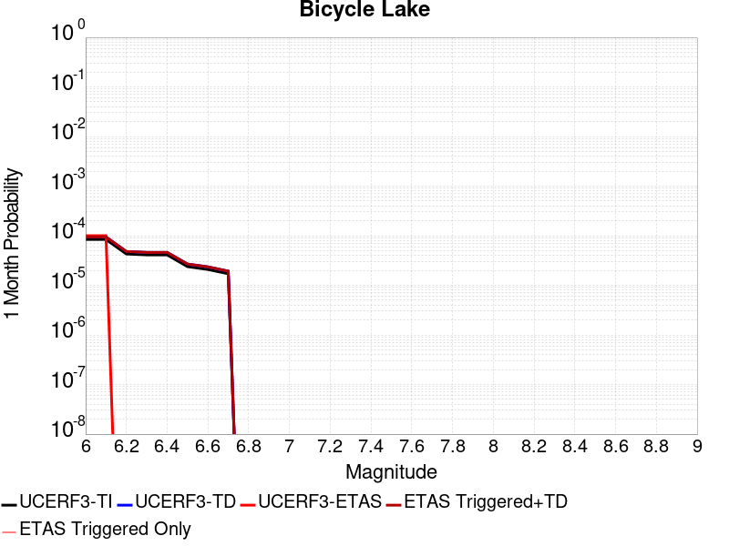 | 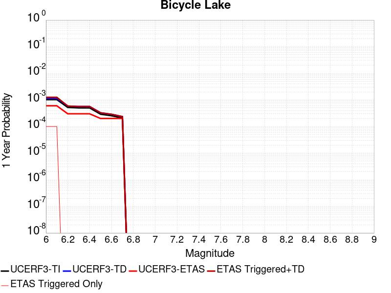 |  |

| Magnitude | 1 wk TI Prob | 1 wk TD Prob | 1 wk ETAS Prob | 1 wk ETAS/TD Gain | 1 wk ETAS Triggered+TD | 1 wk ETAS Triggered Only | 1 mo TI Prob | 1 mo TD Prob | 1 mo ETAS Prob | 1 mo ETAS/TD Gain | 1 mo ETAS Triggered+TD | 1 mo ETAS Triggered Only | 1 yr TI Prob | 1 yr TD Prob | 1 yr ETAS Prob | 1 yr ETAS/TD Gain | 1 yr ETAS Triggered+TD | 1 yr ETAS Triggered Only | 10 yr TI Prob | 10 yr TD Prob | 10 yr ETAS Prob | 10 yr ETAS/TD Gain | 10 yr ETAS Triggered+TD | 10 yr ETAS Triggered Only |
|-----|-----|-----|-----|-----|-----|-----|-----|-----|-----|-----|-----|-----|-----|-----|-----|-----|-----|-----|-----|-----|-----|-----|-----|-----|
| 6.0 | 1.9621975E-5 | 2.2067992E-5 | 0.0 | 0.0 | 2.2067992E-5 | 0.0 | 8.4091465E-5 | 9.457444E-5 | 1.0E-4 | 1.0573682 | 9.457444E-5 | 0.0 | 0.0010233327 | 0.0011509702 | 6.0E-4 | 0.5212993 | 0.0012508552 | 1.0E-4 | 0.01018633 | 0.011463366 | 0.0128 | 1.1166004 | 0.012155343 | 7.0E-4 |
| 6.1 | 1.9621975E-5 | 2.2067992E-5 | 0.0 | 0.0 | 2.2067992E-5 | 0.0 | 8.4091465E-5 | 9.457444E-5 | 1.0E-4 | 1.0573682 | 9.457444E-5 | 0.0 | 0.0010233327 | 0.0011509702 | 6.0E-4 | 0.5212993 | 0.0012508552 | 1.0E-4 | 0.01018633 | 0.011463366 | 0.0128 | 1.1166004 | 0.012155343 | 7.0E-4 |
| 6.2 | 9.9971285E-6 | 1.1240861E-5 | 0.0 | 0.0 | 1.1240861E-5 | 0.0 | 4.2844134E-5 | 4.817452E-5 | 0.0 | 0.0 | 4.817452E-5 | 0.0 | 5.2150246E-4 | 5.864188E-4 | 3.0E-4 | 0.51157975 | 5.864188E-4 | 0.0 | 0.0052028033 | 0.005853805 | 0.0072 | 1.2299691 | 0.006152049 | 3.0E-4 |
| 6.3 | 9.589428E-6 | 1.0784147E-5 | 0.0 | 0.0 | 1.0784147E-5 | 0.0 | 4.10969E-5 | 4.6217247E-5 | 0.0 | 0.0 | 4.6217247E-5 | 0.0 | 5.002399E-4 | 5.6260143E-4 | 3.0E-4 | 0.53323716 | 5.6260143E-4 | 0.0 | 0.0049911533 | 0.005616848 | 0.0069 | 1.2284471 | 0.0059151626 | 3.0E-4 |
| 6.4 | 9.589428E-6 | 1.0784147E-5 | 0.0 | 0.0 | 1.0784147E-5 | 0.0 | 4.10969E-5 | 4.6217247E-5 | 0.0 | 0.0 | 4.6217247E-5 | 0.0 | 5.002399E-4 | 5.6260143E-4 | 3.0E-4 | 0.53323716 | 5.6260143E-4 | 0.0 | 0.0049911533 | 0.005616848 | 0.0069 | 1.2284471 | 0.0059151626 | 3.0E-4 |
| 6.5 | 5.557707E-6 | 6.2770173E-6 | 0.0 | 0.0 | 6.2770173E-6 | 0.0 | 2.3818526E-5 | 2.6901376E-5 | 0.0 | 0.0 | 2.6901376E-5 | 0.0 | 2.8995197E-4 | 3.2750185E-4 | 2.0E-4 | 0.61068356 | 3.2750185E-4 | 0.0 | 0.0028957394 | 0.003272821 | 0.0039 | 1.1916325 | 0.0033724937 | 1.0E-4 |
| 6.6 | 4.8742945E-6 | 5.505753E-6 | 0.0 | 0.0 | 5.505753E-6 | 0.0 | 2.0889667E-5 | 2.359602E-5 | 0.0 | 0.0 | 2.359602E-5 | 0.0 | 2.54302E-4 | 2.872698E-4 | 2.0E-4 | 0.69620967 | 2.872698E-4 | 0.0 | 0.002540112 | 0.0028715462 | 0.0033 | 1.1492066 | 0.0029712592 | 1.0E-4 |
| 6.7 | 3.991108E-6 | 4.5097186E-6 | 0.0 | 0.0 | 4.5097186E-6 | 0.0 | 1.7104636E-5 | 1.9327364E-5 | 0.0 | 0.0 | 1.9327364E-5 | 0.0 | 2.0822904E-4 | 2.3531067E-4 | 2.0E-4 | 0.84994024 | 2.3531067E-4 | 0.0 | 0.0020803404 | 0.0023531066 | 0.0029 | 1.2324133 | 0.0024528713 | 1.0E-4 |

## McLean Lake
*[(top)](#table-of-contents)*

| 1 Week | 1 Month | 1 Year | 10 Year |
|-----|-----|-----|-----|
| 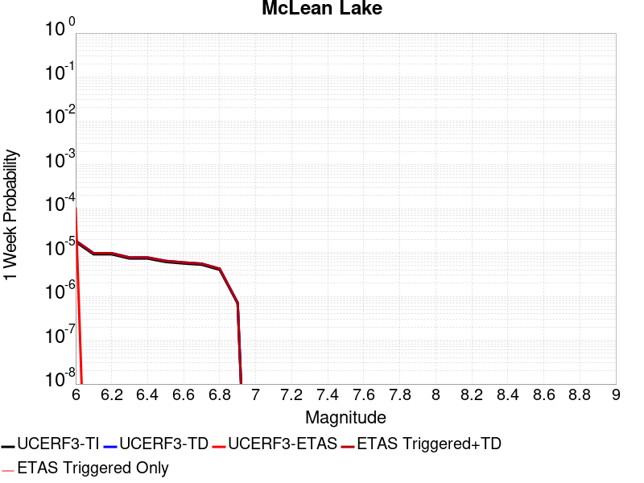 | 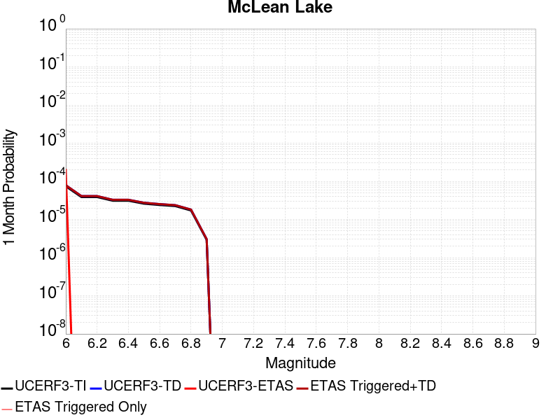 |  |  |

| Magnitude | 1 wk TI Prob | 1 wk TD Prob | 1 wk ETAS Prob | 1 wk ETAS/TD Gain | 1 wk ETAS Triggered+TD | 1 wk ETAS Triggered Only | 1 mo TI Prob | 1 mo TD Prob | 1 mo ETAS Prob | 1 mo ETAS/TD Gain | 1 mo ETAS Triggered+TD | 1 mo ETAS Triggered Only | 1 yr TI Prob | 1 yr TD Prob | 1 yr ETAS Prob | 1 yr ETAS/TD Gain | 1 yr ETAS Triggered+TD | 1 yr ETAS Triggered Only | 10 yr TI Prob | 10 yr TD Prob | 10 yr ETAS Prob | 10 yr ETAS/TD Gain | 10 yr ETAS Triggered+TD | 10 yr ETAS Triggered Only |
|-----|-----|-----|-----|-----|-----|-----|-----|-----|-----|-----|-----|-----|-----|-----|-----|-----|-----|-----|-----|-----|-----|-----|-----|-----|
| 6.0 | 1.7360222E-5 | 1.848891E-5 | 1.0E-4 | 5.4086475 | 1.848891E-5 | 0.0 | 7.439883E-5 | 7.923606E-5 | 2.0E-4 | 2.5241034 | 7.923606E-5 | 0.0 | 9.0542925E-4 | 9.643206E-4 | 9.0E-4 | 0.9332996 | 0.0010642242 | 1.0E-4 | 0.009017491 | 0.009606195 | 0.012 | 1.2491939 | 0.010200431 | 6.0E-4 |
| 6.1 | 9.062689E-6 | 9.586339E-6 | 0.0 | 0.0 | 9.586339E-6 | 0.0 | 3.8839516E-5 | 4.108371E-5 | 0.0 | 0.0 | 4.108371E-5 | 0.0 | 4.727685E-4 | 5.0008827E-4 | 5.0E-4 | 0.9998235 | 5.0008827E-4 | 0.0 | 0.0047176396 | 0.0049905106 | 0.0068 | 1.362586 | 0.0054880152 | 5.0E-4 |
| 6.2 | 9.062689E-6 | 9.586339E-6 | 0.0 | 0.0 | 9.586339E-6 | 0.0 | 3.8839516E-5 | 4.108371E-5 | 0.0 | 0.0 | 4.108371E-5 | 0.0 | 4.727685E-4 | 5.0008827E-4 | 5.0E-4 | 0.9998235 | 5.0008827E-4 | 0.0 | 0.0047176396 | 0.0049905106 | 0.0068 | 1.362586 | 0.0054880152 | 5.0E-4 |
| 6.3 | 7.2575485E-6 | 7.663183E-6 | 0.0 | 0.0 | 7.663183E-6 | 0.0 | 3.110341E-5 | 3.284184E-5 | 0.0 | 0.0 | 3.284184E-5 | 0.0 | 3.786182E-4 | 3.9978314E-4 | 5.0E-4 | 1.2506781 | 3.9978314E-4 | 0.0 | 0.0037797375 | 0.0039913435 | 0.0059 | 1.4781991 | 0.004489348 | 5.0E-4 |
| 6.4 | 7.2575485E-6 | 7.663183E-6 | 0.0 | 0.0 | 7.663183E-6 | 0.0 | 3.110341E-5 | 3.284184E-5 | 0.0 | 0.0 | 3.284184E-5 | 0.0 | 3.786182E-4 | 3.9978314E-4 | 5.0E-4 | 1.2506781 | 3.9978314E-4 | 0.0 | 0.0037797375 | 0.0039913435 | 0.0059 | 1.4781991 | 0.004489348 | 5.0E-4 |
| 6.5 | 6.06582E-6 | 6.4001492E-6 | 0.0 | 0.0 | 6.4001492E-6 | 0.0 | 2.5996113E-5 | 2.742896E-5 | 0.0 | 0.0 | 2.742896E-5 | 0.0 | 3.164567E-4 | 3.339029E-4 | 3.0E-4 | 0.89846486 | 3.339029E-4 | 0.0 | 0.0031600643 | 0.0033346498 | 0.0049 | 1.4694197 | 0.0038329824 | 5.0E-4 |
| 6.6 | 5.598744E-6 | 5.9068275E-6 | 0.0 | 0.0 | 5.9068275E-6 | 0.0 | 2.3994397E-5 | 2.5314765E-5 | 0.0 | 0.0 | 2.5314765E-5 | 0.0 | 2.9209262E-4 | 3.0817007E-4 | 2.0E-4 | 0.6489923 | 3.0817007E-4 | 0.0 | 0.0029170897 | 0.0030780556 | 0.0047 | 1.526938 | 0.0035765166 | 5.0E-4 |
| 6.7 | 5.246996E-6 | 5.5359405E-6 | 0.0 | 0.0 | 5.5359405E-6 | 0.0 | 2.2486933E-5 | 2.372528E-5 | 0.0 | 0.0 | 2.372528E-5 | 0.0 | 2.73744E-4 | 2.8882333E-4 | 2.0E-4 | 0.6924648 | 2.8882333E-4 | 0.0 | 0.0027340704 | 0.0028851028 | 0.0045 | 1.5597365 | 0.0033836602 | 5.0E-4 |
| 6.8 | 4.02324E-6 | 4.2444385E-6 | 0.0 | 0.0 | 4.2444385E-6 | 0.0 | 1.7242342E-5 | 1.8190356E-5 | 0.0 | 0.0 | 1.8190356E-5 | 0.0 | 2.099053E-4 | 2.2145103E-4 | 0.0 | 0.0 | 2.2145103E-4 | 0.0 | 0.0020970714 | 0.0022128872 | 0.0036 | 1.6268339 | 0.002612002 | 4.0E-4 |
| 6.9 | 6.835972E-7 | 7.1366145E-7 | 0.0 | 0.0 | 7.1366145E-7 | 0.0 | 2.9296991E-6 | 3.0585475E-6 | 0.0 | 0.0 | 3.0585475E-6 | 0.0 | 3.56685E-5 | 3.7237496E-5 | 0.0 | 0.0 | 3.7237496E-5 | 0.0 | 3.5662777E-4 | 3.7234378E-4 | 5.0E-4 | 1.342845 | 3.7234378E-4 | 0.0 |

## Panamint Valley
*[(top)](#table-of-contents)*

| 1 Week | 1 Month | 1 Year | 10 Year |
|-----|-----|-----|-----|
|  |  | 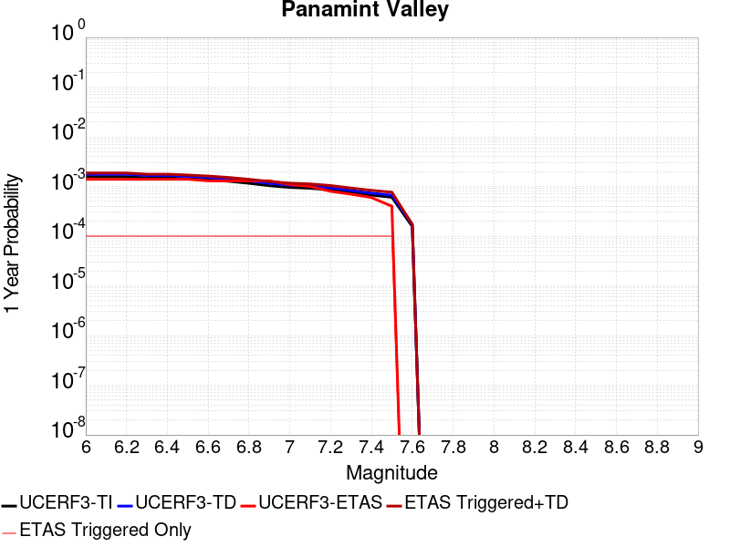 |  |

| Magnitude | 1 wk TI Prob | 1 wk TD Prob | 1 wk ETAS Prob | 1 wk ETAS/TD Gain | 1 wk ETAS Triggered+TD | 1 wk ETAS Triggered Only | 1 mo TI Prob | 1 mo TD Prob | 1 mo ETAS Prob | 1 mo ETAS/TD Gain | 1 mo ETAS Triggered+TD | 1 mo ETAS Triggered Only | 1 yr TI Prob | 1 yr TD Prob | 1 yr ETAS Prob | 1 yr ETAS/TD Gain | 1 yr ETAS Triggered+TD | 1 yr ETAS Triggered Only | 10 yr TI Prob | 10 yr TD Prob | 10 yr ETAS Prob | 10 yr ETAS/TD Gain | 10 yr ETAS Triggered+TD | 10 yr ETAS Triggered Only |
|-----|-----|-----|-----|-----|-----|-----|-----|-----|-----|-----|-----|-----|-----|-----|-----|-----|-----|-----|-----|-----|-----|-----|-----|-----|
| 6.0 | 3.0211835E-5 | 3.3884E-5 | 0.0 | 0.0 | 3.3884E-5 | 0.0 | 1.2947287E-4 | 1.4520923E-4 | 2.0E-4 | 1.377323 | 1.4520923E-4 | 0.0 | 0.0015751923 | 0.001766518 | 0.0014 | 0.7925195 | 0.0018663413 | 1.0E-4 | 0.015640736 | 0.01753238 | 0.0109 | 0.6217068 | 0.018318355 | 8.0E-4 |
| 6.1 | 3.0211835E-5 | 3.3884E-5 | 0.0 | 0.0 | 3.3884E-5 | 0.0 | 1.2947287E-4 | 1.4520923E-4 | 2.0E-4 | 1.377323 | 1.4520923E-4 | 0.0 | 0.0015751923 | 0.001766518 | 0.0014 | 0.7925195 | 0.0018663413 | 1.0E-4 | 0.015640736 | 0.01753238 | 0.0109 | 0.6217068 | 0.018318355 | 8.0E-4 |
| 6.2 | 3.0211835E-5 | 3.3884E-5 | 0.0 | 0.0 | 3.3884E-5 | 0.0 | 1.2947287E-4 | 1.4520923E-4 | 2.0E-4 | 1.377323 | 1.4520923E-4 | 0.0 | 0.0015751923 | 0.001766518 | 0.0014 | 0.7925195 | 0.0018663413 | 1.0E-4 | 0.015640736 | 0.01753238 | 0.0109 | 0.6217068 | 0.018318355 | 8.0E-4 |
| 6.3 | 2.8573924E-5 | 3.200564E-5 | 0.0 | 0.0 | 3.200564E-5 | 0.0 | 1.2245393E-4 | 1.3715998E-4 | 2.0E-4 | 1.4581513 | 1.3715998E-4 | 0.0 | 0.001489857 | 0.0016686713 | 0.0014 | 0.8389909 | 0.0017685044 | 1.0E-4 | 0.01479908 | 0.016568655 | 0.0098 | 0.5914783 | 0.017257057 | 7.0E-4 |
| 6.4 | 2.8573924E-5 | 3.200564E-5 | 0.0 | 0.0 | 3.200564E-5 | 0.0 | 1.2245393E-4 | 1.3715998E-4 | 2.0E-4 | 1.4581513 | 1.3715998E-4 | 0.0 | 0.001489857 | 0.0016686713 | 0.0014 | 0.8389909 | 0.0017685044 | 1.0E-4 | 0.01479908 | 0.016568655 | 0.0098 | 0.5914783 | 0.017257057 | 7.0E-4 |
| 6.5 | 2.7468774E-5 | 3.0733812E-5 | 0.0 | 0.0 | 3.0733812E-5 | 0.0 | 1.1771801E-4 | 1.3170984E-4 | 2.0E-4 | 1.5184895 | 1.3170984E-4 | 0.0 | 0.0014322745 | 0.001602415 | 0.0014 | 0.8736813 | 0.0017022548 | 1.0E-4 | 0.014230782 | 0.015915751 | 0.0096 | 0.60317606 | 0.01660461 | 7.0E-4 |
| 6.6 | 2.6135967E-5 | 2.9160503E-5 | 0.0 | 0.0 | 2.9160503E-5 | 0.0 | 1.1200648E-4 | 1.2496774E-4 | 2.0E-4 | 1.600413 | 1.2496774E-4 | 0.0 | 0.0013628257 | 0.0015204469 | 0.0013 | 0.8550118 | 0.0016202948 | 1.0E-4 | 0.013544982 | 0.015107549 | 0.0091 | 0.6023479 | 0.015796972 | 7.0E-4 |
| 6.7 | 2.4498746E-5 | 2.7250808E-5 | 0.0 | 0.0 | 2.7250808E-5 | 0.0 | 1.04990395E-4 | 1.1678409E-4 | 2.0E-4 | 1.712562 | 1.1678409E-4 | 0.0 | 0.0012775084 | 0.0014209439 | 0.0013 | 0.9148848 | 0.0015208018 | 1.0E-4 | 0.012701893 | 0.014125483 | 0.0083 | 0.5875905 | 0.014815595 | 7.0E-4 |
| 6.8 | 2.2244329E-5 | 2.4848146E-5 | 0.0 | 0.0 | 2.4848146E-5 | 0.0 | 9.532935E-5 | 1.0648783E-4 | 2.0E-4 | 1.8781488 | 1.0648783E-4 | 0.0 | 0.0011600169 | 0.00129574 | 0.0013 | 1.0032877 | 0.0013956104 | 1.0E-4 | 0.011539802 | 0.012888346 | 0.0077 | 0.59743893 | 0.013579325 | 7.0E-4 |
| 6.9 | 1.9902658E-5 | 2.2207269E-5 | 0.0 | 0.0 | 2.2207269E-5 | 0.0 | 8.529431E-5 | 9.517064E-5 | 2.0E-4 | 2.1014886 | 9.517064E-5 | 0.0 | 0.0010379635 | 0.001158105 | 0.0013 | 1.1225234 | 0.0012579892 | 1.0E-4 | 0.010331288 | 0.011526734 | 0.0074 | 0.6419859 | 0.012218664 | 7.0E-4 |
| 7.0 | 1.8353881E-5 | 2.0486243E-5 | 0.0 | 0.0 | 2.0486243E-5 | 0.0 | 7.865712E-5 | 8.779533E-5 | 2.0E-4 | 2.2780256 | 8.779533E-5 | 0.0 | 9.5722964E-4 | 0.0010684015 | 0.0011 | 1.0295755 | 0.0011682947 | 1.0E-4 | 0.009531168 | 0.010638366 | 0.0063 | 0.59219617 | 0.011133047 | 5.0E-4 |
| 7.1 | 1.7667631E-5 | 1.9694082E-5 | 0.0 | 0.0 | 1.9694082E-5 | 0.0 | 7.571623E-5 | 8.440057E-5 | 2.0E-4 | 2.3696523 | 8.440057E-5 | 0.0 | 9.2145515E-4 | 0.00102711 | 0.001 | 0.9736055 | 0.0011270073 | 1.0E-4 | 0.009176437 | 0.010229308 | 0.0059 | 0.5767741 | 0.010625216 | 4.0E-4 |
| 7.2 | 1.6381597E-5 | 1.8084012E-5 | 0.0 | 0.0 | 1.8084012E-5 | 0.0 | 7.020495E-5 | 7.750071E-5 | 1.0E-4 | 1.2903109 | 7.750071E-5 | 0.0 | 8.544101E-4 | 9.431798E-4 | 8.0E-4 | 0.84819454 | 0.0010430855 | 1.0E-4 | 0.008511325 | 0.009397178 | 0.0056 | 0.59592354 | 0.009793419 | 4.0E-4 |
| 7.3 | 1.4520491E-5 | 1.5905964E-5 | 0.0 | 0.0 | 1.5905964E-5 | 0.0 | 6.222919E-5 | 6.816673E-5 | 1.0E-4 | 1.4669913 | 6.816673E-5 | 0.0 | 7.57377E-4 | 8.2963E-4 | 7.0E-4 | 0.8437496 | 9.2954707E-4 | 1.0E-4 | 0.0075480095 | 0.008269115 | 0.0052 | 0.628846 | 0.008665808 | 4.0E-4 |
| 7.4 | 1.2852287E-5 | 1.4095156E-5 | 0.0 | 0.0 | 1.4095156E-5 | 0.0 | 5.5080065E-5 | 6.0406503E-5 | 1.0E-4 | 1.6554509 | 6.0406503E-5 | 0.0 | 6.7039346E-4 | 7.352167E-4 | 6.0E-4 | 0.8160859 | 8.351432E-4 | 1.0E-4 | 0.0066837464 | 0.007331442 | 0.0048 | 0.6547143 | 0.0077285096 | 4.0E-4 |
| 7.5 | 1.1637851E-5 | 1.2789875E-5 | 0.0 | 0.0 | 1.2789875E-5 | 0.0 | 4.987555E-5 | 5.4812685E-5 | 1.0E-4 | 1.8243953 | 5.4812685E-5 | 0.0 | 6.070656E-4 | 6.6715566E-4 | 4.0E-4 | 0.5995602 | 7.6708896E-4 | 1.0E-4 | 0.006054099 | 0.006655106 | 0.004 | 0.6010423 | 0.007052444 | 4.0E-4 |
| 7.6 | 3.0068115E-6 | 3.322222E-6 | 0.0 | 0.0 | 3.322222E-6 | 0.0 | 1.2886271E-5 | 1.4238058E-5 | 0.0 | 0.0 | 1.4238058E-5 | 0.0 | 1.5687906E-4 | 1.7334179E-4 | 0.0 | 0.0 | 1.7334179E-4 | 0.0 | 0.0015676835 | 0.0017343822 | 8.0E-4 | 0.46125934 | 0.0017343822 | 0.0 |

## Homestead Valley 2011
*[(top)](#table-of-contents)*

| 1 Week | 1 Month | 1 Year | 10 Year |
|-----|-----|-----|-----|
|  |  | 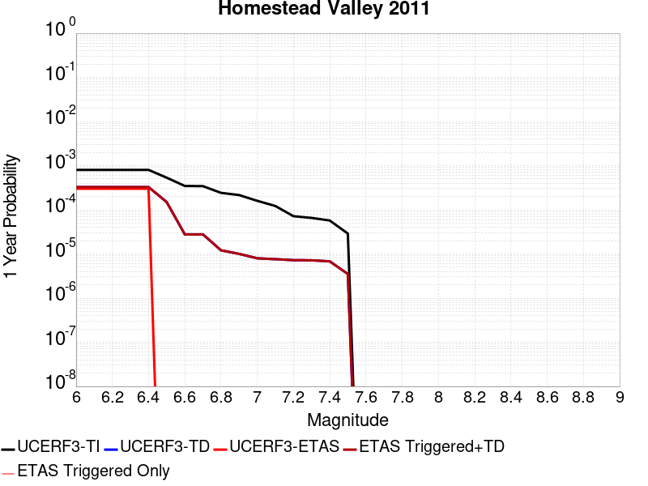 | 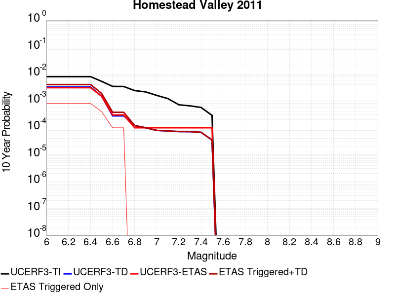 |

| Magnitude | 1 wk TI Prob | 1 wk TD Prob | 1 wk ETAS Prob | 1 wk ETAS/TD Gain | 1 wk ETAS Triggered+TD | 1 wk ETAS Triggered Only | 1 mo TI Prob | 1 mo TD Prob | 1 mo ETAS Prob | 1 mo ETAS/TD Gain | 1 mo ETAS Triggered+TD | 1 mo ETAS Triggered Only | 1 yr TI Prob | 1 yr TD Prob | 1 yr ETAS Prob | 1 yr ETAS/TD Gain | 1 yr ETAS Triggered+TD | 1 yr ETAS Triggered Only | 10 yr TI Prob | 10 yr TD Prob | 10 yr ETAS Prob | 10 yr ETAS/TD Gain | 10 yr ETAS Triggered+TD | 10 yr ETAS Triggered Only |
|-----|-----|-----|-----|-----|-----|-----|-----|-----|-----|-----|-----|-----|-----|-----|-----|-----|-----|-----|-----|-----|-----|-----|-----|-----|
| 6.0 | 1.539795E-5 | 6.2816875E-6 | 0.0 | 0.0 | 6.2816875E-6 | 0.0 | 6.5989545E-5 | 2.6921358E-5 | 0.0 | 0.0 | 2.6921358E-5 | 0.0 | 8.0312655E-4 | 3.2773882E-4 | 3.0E-4 | 0.9153631 | 3.2773882E-4 | 0.0 | 0.008002302 | 0.003274573 | 0.0031 | 0.94668835 | 0.0040719532 | 8.0E-4 |
| 6.1 | 1.539795E-5 | 6.2816875E-6 | 0.0 | 0.0 | 6.2816875E-6 | 0.0 | 6.5989545E-5 | 2.6921358E-5 | 0.0 | 0.0 | 2.6921358E-5 | 0.0 | 8.0312655E-4 | 3.2773882E-4 | 3.0E-4 | 0.9153631 | 3.2773882E-4 | 0.0 | 0.008002302 | 0.003274573 | 0.0031 | 0.94668835 | 0.0040719532 | 8.0E-4 |
| 6.2 | 1.539795E-5 | 6.2816875E-6 | 0.0 | 0.0 | 6.2816875E-6 | 0.0 | 6.5989545E-5 | 2.6921358E-5 | 0.0 | 0.0 | 2.6921358E-5 | 0.0 | 8.0312655E-4 | 3.2773882E-4 | 3.0E-4 | 0.9153631 | 3.2773882E-4 | 0.0 | 0.008002302 | 0.003274573 | 0.0031 | 0.94668835 | 0.0040719532 | 8.0E-4 |
| 6.3 | 1.539795E-5 | 6.2816875E-6 | 0.0 | 0.0 | 6.2816875E-6 | 0.0 | 6.5989545E-5 | 2.6921358E-5 | 0.0 | 0.0 | 2.6921358E-5 | 0.0 | 8.0312655E-4 | 3.2773882E-4 | 3.0E-4 | 0.9153631 | 3.2773882E-4 | 0.0 | 0.008002302 | 0.003274573 | 0.0031 | 0.94668835 | 0.0040719532 | 8.0E-4 |
| 6.4 | 1.539795E-5 | 6.2816875E-6 | 0.0 | 0.0 | 6.2816875E-6 | 0.0 | 6.5989545E-5 | 2.6921358E-5 | 0.0 | 0.0 | 2.6921358E-5 | 0.0 | 8.0312655E-4 | 3.2773882E-4 | 3.0E-4 | 0.9153631 | 3.2773882E-4 | 0.0 | 0.008002302 | 0.003274573 | 0.0031 | 0.94668835 | 0.0040719532 | 8.0E-4 |
| 6.5 | 1.0265258E-5 | 2.8766954E-6 | 0.0 | 0.0 | 2.8766954E-6 | 0.0 | 4.3993223E-5 | 1.2328675E-5 | 0.0 | 0.0 | 1.2328675E-5 | 0.0 | 5.3548586E-4 | 1.5009823E-4 | 0.0 | 0.0 | 1.5009823E-4 | 0.0 | 0.005341973 | 0.0015006498 | 0.0015 | 0.9995669 | 0.0019000496 | 4.0E-4 |
| 6.6 | 6.664671E-6 | 5.335016E-7 | 0.0 | 0.0 | 5.335016E-7 | 0.0 | 2.8562565E-5 | 2.286434E-6 | 0.0 | 0.0 | 2.286434E-6 | 0.0 | 3.476937E-4 | 2.7837097E-5 | 0.0 | 0.0 | 2.7837097E-5 | 0.0 | 0.003471502 | 2.7834772E-4 | 3.0E-4 | 1.0777886 | 3.7831988E-4 | 1.0E-4 |
| 6.7 | 6.5954046E-6 | 5.335016E-7 | 0.0 | 0.0 | 5.335016E-7 | 0.0 | 2.8265715E-5 | 2.286434E-6 | 0.0 | 0.0 | 2.286434E-6 | 0.0 | 3.4408073E-4 | 2.7837097E-5 | 0.0 | 0.0 | 2.7837097E-5 | 0.0 | 0.0034354846 | 2.7834772E-4 | 3.0E-4 | 1.0777886 | 3.7831988E-4 | 1.0E-4 |
| 6.8 | 4.648189E-6 | 2.3168988E-7 | 0.0 | 0.0 | 2.3168988E-7 | 0.0 | 1.9920659E-5 | 9.929563E-7 | 0.0 | 0.0 | 9.929563E-7 | 0.0 | 2.4250703E-4 | 1.208918E-5 | 0.0 | 0.0 | 1.208918E-5 | 0.0 | 0.0024224254 | 1.208857E-4 | 1.0E-4 | 0.8272277 | 1.208857E-4 | 0.0 |
| 6.9 | 4.1428534E-6 | 1.9255067E-7 | 0.0 | 0.0 | 1.9255067E-7 | 0.0 | 1.7754966E-5 | 8.252169E-7 | 0.0 | 0.0 | 8.252169E-7 | 0.0 | 2.1614527E-4 | 1.0046972E-5 | 0.0 | 0.0 | 1.0046972E-5 | 0.0 | 0.0021593515 | 1.0046548E-4 | 1.0E-4 | 0.9953668 | 1.0046548E-4 | 0.0 |
| 7.0 | 3.0673707E-6 | 1.529381E-7 | 0.0 | 0.0 | 1.529381E-7 | 0.0 | 1.3145808E-5 | 6.5544884E-7 | 0.0 | 0.0 | 6.5544884E-7 | 0.0 | 1.6003846E-4 | 7.980061E-6 | 0.0 | 0.0 | 7.980061E-6 | 0.0 | 0.0015992324 | 7.979785E-5 | 1.0E-4 | 1.2531666 | 7.979785E-5 | 0.0 |
| 7.1 | 2.340854E-6 | 1.4619064E-7 | 0.0 | 0.0 | 1.4619064E-7 | 0.0 | 1.0032193E-5 | 6.265312E-7 | 0.0 | 0.0 | 6.265312E-7 | 0.0 | 1.221351E-4 | 7.627991E-6 | 0.0 | 0.0 | 7.627991E-6 | 0.0 | 0.00122068 | 7.627739E-5 | 1.0E-4 | 1.3110045 | 7.627739E-5 | 0.0 |
| 7.2 | 1.3754182E-6 | 1.3861036E-7 | 0.0 | 0.0 | 1.3861036E-7 | 0.0 | 5.8946357E-6 | 5.9404425E-7 | 0.0 | 0.0 | 5.9404425E-7 | 0.0 | 7.176483E-5 | 7.2324656E-6 | 0.0 | 0.0 | 7.2324656E-6 | 0.0 | 7.174166E-4 | 7.232239E-5 | 1.0E-4 | 1.3826976 | 7.232239E-5 | 0.0 |
| 7.3 | 1.2573237E-6 | 1.3766248E-7 | 0.0 | 0.0 | 1.3766248E-7 | 0.0 | 5.388519E-6 | 5.8998194E-7 | 0.0 | 0.0 | 5.8998194E-7 | 0.0 | 6.560324E-5 | 7.1830077E-6 | 0.0 | 0.0 | 7.1830077E-6 | 0.0 | 6.558388E-4 | 7.1827846E-5 | 1.0E-4 | 1.3922178 | 7.1827846E-5 | 0.0 |
| 7.4 | 1.0994207E-6 | 1.3049238E-7 | 0.0 | 0.0 | 1.3049238E-7 | 0.0 | 4.7117946E-6 | 5.592529E-7 | 0.0 | 0.0 | 5.592529E-7 | 0.0 | 5.736459E-5 | 6.808884E-6 | 0.0 | 0.0 | 6.808884E-6 | 0.0 | 5.734978E-4 | 6.808685E-5 | 1.0E-4 | 1.4687124 | 6.808685E-5 | 0.0 |
| 7.5 | 5.5569126E-7 | 6.743821E-8 | 0.0 | 0.0 | 6.743821E-8 | 0.0 | 2.3815317E-6 | 2.8902087E-7 | 0.0 | 0.0 | 2.8902087E-7 | 0.0 | 2.8994764E-5 | 3.518824E-6 | 0.0 | 0.0 | 3.518824E-6 | 0.0 | 2.899098E-4 | 3.5187746E-5 | 1.0E-4 | 2.8418984 | 3.5187746E-5 | 0.0 |

## Hartley Springs 2011 CFM
*[(top)](#table-of-contents)*

| 1 Week | 1 Month | 1 Year | 10 Year |
|-----|-----|-----|-----|
|  |  | 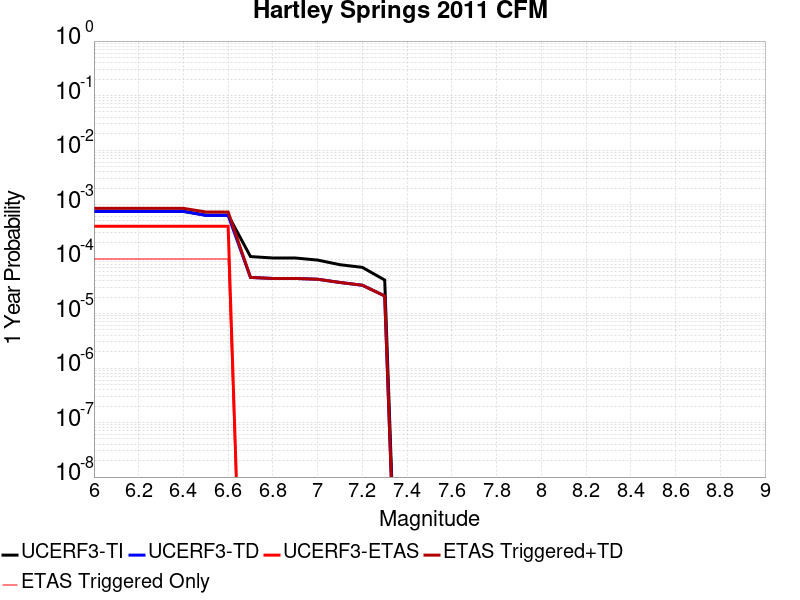 | 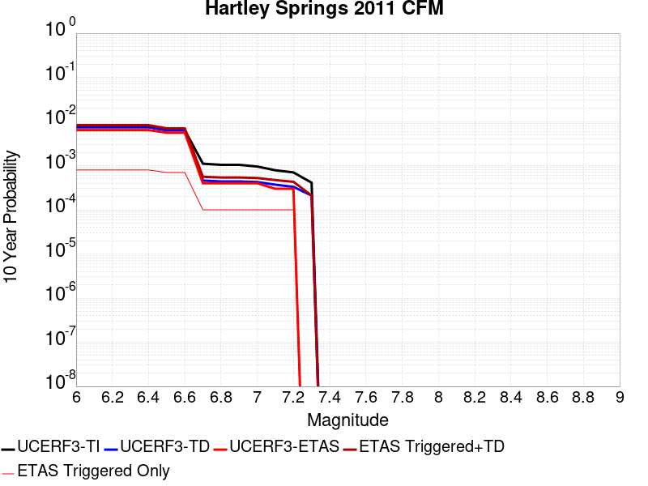 |

| Magnitude | 1 wk TI Prob | 1 wk TD Prob | 1 wk ETAS Prob | 1 wk ETAS/TD Gain | 1 wk ETAS Triggered+TD | 1 wk ETAS Triggered Only | 1 mo TI Prob | 1 mo TD Prob | 1 mo ETAS Prob | 1 mo ETAS/TD Gain | 1 mo ETAS Triggered+TD | 1 mo ETAS Triggered Only | 1 yr TI Prob | 1 yr TD Prob | 1 yr ETAS Prob | 1 yr ETAS/TD Gain | 1 yr ETAS Triggered+TD | 1 yr ETAS Triggered Only | 10 yr TI Prob | 10 yr TD Prob | 10 yr ETAS Prob | 10 yr ETAS/TD Gain | 10 yr ETAS Triggered+TD | 10 yr ETAS Triggered Only |
|-----|-----|-----|-----|-----|-----|-----|-----|-----|-----|-----|-----|-----|-----|-----|-----|-----|-----|-----|-----|-----|-----|-----|-----|-----|
| 6.0 | 1.4352418E-5 | 1.4410377E-5 | 0.0 | 0.0 | 1.4410377E-5 | 0.0 | 6.1508916E-5 | 6.175822E-5 | 1.0E-4 | 1.6192176 | 1.6175205E-4 | 1.0E-4 | 7.486137E-4 | 7.5181096E-4 | 4.0E-4 | 0.53204864 | 8.5173576E-4 | 1.0E-4 | 0.007460968 | 0.00750876 | 0.0064 | 0.8523378 | 0.008302753 | 8.0E-4 |
| 6.1 | 1.4352418E-5 | 1.4410377E-5 | 0.0 | 0.0 | 1.4410377E-5 | 0.0 | 6.1508916E-5 | 6.175822E-5 | 1.0E-4 | 1.6192176 | 1.6175205E-4 | 1.0E-4 | 7.486137E-4 | 7.5181096E-4 | 4.0E-4 | 0.53204864 | 8.5173576E-4 | 1.0E-4 | 0.007460968 | 0.00750876 | 0.0064 | 0.8523378 | 0.008302753 | 8.0E-4 |
| 6.2 | 1.4352418E-5 | 1.4410377E-5 | 0.0 | 0.0 | 1.4410377E-5 | 0.0 | 6.1508916E-5 | 6.175822E-5 | 1.0E-4 | 1.6192176 | 1.6175205E-4 | 1.0E-4 | 7.486137E-4 | 7.5181096E-4 | 4.0E-4 | 0.53204864 | 8.5173576E-4 | 1.0E-4 | 0.007460968 | 0.00750876 | 0.0064 | 0.8523378 | 0.008302753 | 8.0E-4 |
| 6.3 | 1.4352418E-5 | 1.4410377E-5 | 0.0 | 0.0 | 1.4410377E-5 | 0.0 | 6.1508916E-5 | 6.175822E-5 | 1.0E-4 | 1.6192176 | 1.6175205E-4 | 1.0E-4 | 7.486137E-4 | 7.5181096E-4 | 4.0E-4 | 0.53204864 | 8.5173576E-4 | 1.0E-4 | 0.007460968 | 0.00750876 | 0.0064 | 0.8523378 | 0.008302753 | 8.0E-4 |
| 6.4 | 1.4352418E-5 | 1.4410377E-5 | 0.0 | 0.0 | 1.4410377E-5 | 0.0 | 6.1508916E-5 | 6.175822E-5 | 1.0E-4 | 1.6192176 | 1.6175205E-4 | 1.0E-4 | 7.486137E-4 | 7.5181096E-4 | 4.0E-4 | 0.53204864 | 8.5173576E-4 | 1.0E-4 | 0.007460968 | 0.00750876 | 0.0064 | 0.8523378 | 0.008302753 | 8.0E-4 |
| 6.5 | 1.2279858E-5 | 1.2111947E-5 | 0.0 | 0.0 | 1.2111947E-5 | 0.0 | 5.26269E-5 | 5.1908202E-5 | 1.0E-4 | 1.9264778 | 1.51903E-4 | 1.0E-4 | 6.4054417E-4 | 6.319569E-4 | 4.0E-4 | 0.63295454 | 7.3189376E-4 | 1.0E-4 | 0.0063870098 | 0.006317075 | 0.0056 | 0.88648623 | 0.007012653 | 7.0E-4 |
| 6.6 | 1.2279858E-5 | 1.2111947E-5 | 0.0 | 0.0 | 1.2111947E-5 | 0.0 | 5.26269E-5 | 5.1908202E-5 | 1.0E-4 | 1.9264778 | 1.51903E-4 | 1.0E-4 | 6.4054417E-4 | 6.319569E-4 | 4.0E-4 | 0.63295454 | 7.3189376E-4 | 1.0E-4 | 0.0063870098 | 0.006317075 | 0.0056 | 0.88648623 | 0.007012653 | 7.0E-4 |
| 6.7 | 2.1282601E-6 | 8.8093867E-7 | 0.0 | 0.0 | 8.8093867E-7 | 0.0 | 9.121083E-6 | 3.7754473E-6 | 0.0 | 0.0 | 3.7754473E-6 | 0.0 | 1.11043526E-4 | 4.5965353E-5 | 0.0 | 0.0 | 4.5965353E-5 | 0.0 | 0.0011098806 | 4.595832E-4 | 4.0E-4 | 0.8703538 | 5.5953726E-4 | 1.0E-4 |
| 6.8 | 2.00516E-6 | 8.438678E-7 | 0.0 | 0.0 | 8.438678E-7 | 0.0 | 8.593515E-6 | 3.6165725E-6 | 0.0 | 0.0 | 3.6165725E-6 | 0.0 | 1.04621024E-4 | 4.403113E-5 | 0.0 | 0.0 | 4.403113E-5 | 0.0 | 0.0010457177 | 4.4024864E-4 | 4.0E-4 | 0.9085775 | 5.402046E-4 | 1.0E-4 |
| 6.9 | 2.00516E-6 | 8.438678E-7 | 0.0 | 0.0 | 8.438678E-7 | 0.0 | 8.593515E-6 | 3.6165725E-6 | 0.0 | 0.0 | 3.6165725E-6 | 0.0 | 1.04621024E-4 | 4.403113E-5 | 0.0 | 0.0 | 4.403113E-5 | 0.0 | 0.0010457177 | 4.4024864E-4 | 4.0E-4 | 0.9085775 | 5.402046E-4 | 1.0E-4 |
| 7.0 | 1.8366732E-6 | 8.164269E-7 | 0.0 | 0.0 | 8.164269E-7 | 0.0 | 7.871433E-6 | 3.4989691E-6 | 0.0 | 0.0 | 3.4989691E-6 | 0.0 | 9.583048E-5 | 4.2599364E-5 | 0.0 | 0.0 | 4.2599364E-5 | 0.0 | 9.5789164E-4 | 4.2593645E-4 | 4.0E-4 | 0.9391072 | 5.258939E-4 | 1.0E-4 |
| 7.1 | 1.5097997E-6 | 7.1236667E-7 | 0.0 | 0.0 | 7.1236667E-7 | 0.0 | 6.470554E-6 | 3.0529977E-6 | 0.0 | 0.0 | 3.0529977E-6 | 0.0 | 7.877615E-5 | 3.7169848E-5 | 0.0 | 0.0 | 3.7169848E-5 | 0.0 | 7.874823E-4 | 3.7165947E-4 | 3.0E-4 | 0.80719054 | 4.716223E-4 | 1.0E-4 |
| 7.2 | 1.3490993E-6 | 6.341586E-7 | 0.0 | 0.0 | 6.341586E-7 | 0.0 | 5.7818415E-6 | 2.7178212E-6 | 0.0 | 0.0 | 2.7178212E-6 | 0.0 | 7.0391645E-5 | 3.30892E-5 | 0.0 | 0.0 | 3.30892E-5 | 0.0 | 7.0369354E-4 | 3.308651E-4 | 3.0E-4 | 0.90671396 | 4.30832E-4 | 1.0E-4 |
| 7.3 | 7.900015E-7 | 4.033625E-7 | 0.0 | 0.0 | 4.033625E-7 | 0.0 | 3.3857161E-6 | 1.7286964E-6 | 0.0 | 0.0 | 1.7286964E-6 | 0.0 | 4.1220315E-5 | 2.1046879E-5 | 0.0 | 0.0 | 2.1046879E-5 | 0.0 | 4.121267E-4 | 2.1046879E-4 | 0.0 | 0.0 | 2.1046879E-4 | 0.0 |

## San Cayetano
*[(top)](#table-of-contents)*

| 1 Week | 1 Month | 1 Year | 10 Year |
|-----|-----|-----|-----|
|  | 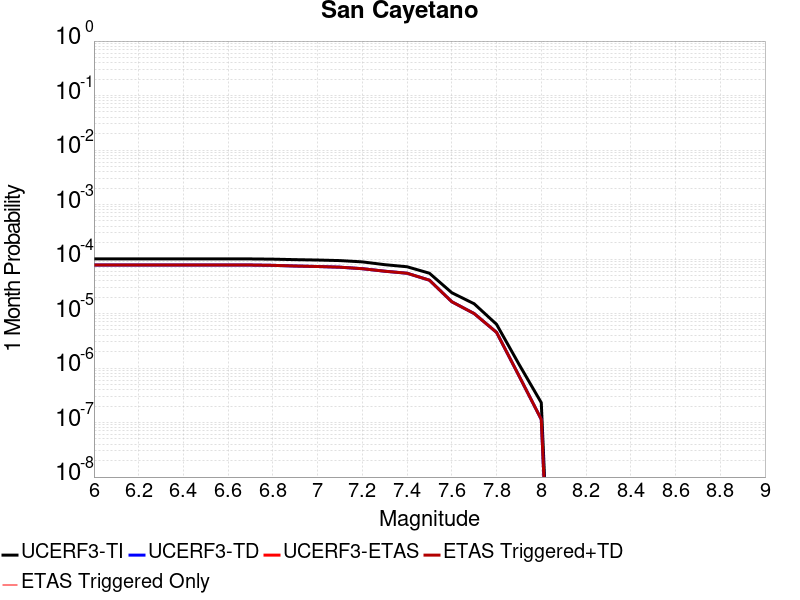 | 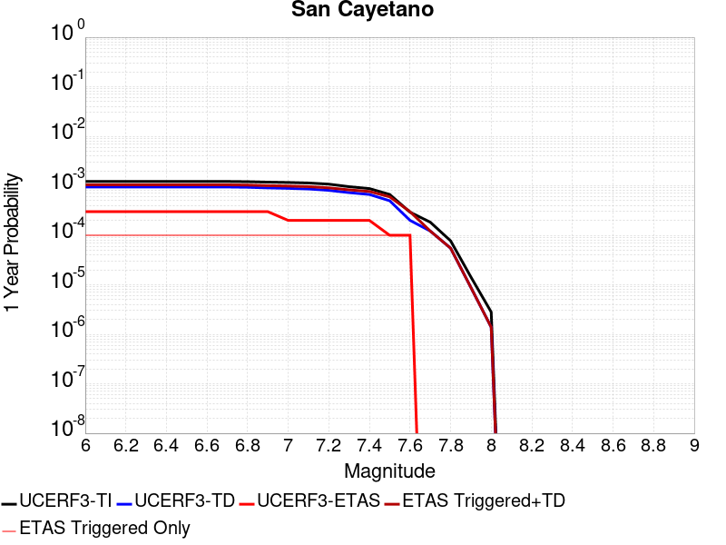 |  |

| Magnitude | 1 wk TI Prob | 1 wk TD Prob | 1 wk ETAS Prob | 1 wk ETAS/TD Gain | 1 wk ETAS Triggered+TD | 1 wk ETAS Triggered Only | 1 mo TI Prob | 1 mo TD Prob | 1 mo ETAS Prob | 1 mo ETAS/TD Gain | 1 mo ETAS Triggered+TD | 1 mo ETAS Triggered Only | 1 yr TI Prob | 1 yr TD Prob | 1 yr ETAS Prob | 1 yr ETAS/TD Gain | 1 yr ETAS Triggered+TD | 1 yr ETAS Triggered Only | 10 yr TI Prob | 10 yr TD Prob | 10 yr ETAS Prob | 10 yr ETAS/TD Gain | 10 yr ETAS Triggered+TD | 10 yr ETAS Triggered Only |
|-----|-----|-----|-----|-----|-----|-----|-----|-----|-----|-----|-----|-----|-----|-----|-----|-----|-----|-----|-----|-----|-----|-----|-----|-----|
| 6.0 | 2.3476267E-5 | 1.8131892E-5 | 0.0 | 0.0 | 1.8131892E-5 | 0.0 | 1.0060869E-4 | 7.7705816E-5 | 0.0 | 0.0 | 7.7705816E-5 | 0.0 | 0.0012242225 | 9.4566133E-4 | 3.0E-4 | 0.3172383 | 0.0010455668 | 1.0E-4 | 0.012175002 | 0.0094169695 | 0.0067 | 0.7114815 | 0.010110378 | 7.0E-4 |
| 6.1 | 2.3476267E-5 | 1.8131892E-5 | 0.0 | 0.0 | 1.8131892E-5 | 0.0 | 1.0060869E-4 | 7.7705816E-5 | 0.0 | 0.0 | 7.7705816E-5 | 0.0 | 0.0012242225 | 9.4566133E-4 | 3.0E-4 | 0.3172383 | 0.0010455668 | 1.0E-4 | 0.012175002 | 0.0094169695 | 0.0067 | 0.7114815 | 0.010110378 | 7.0E-4 |
| 6.2 | 2.3476267E-5 | 1.8131892E-5 | 0.0 | 0.0 | 1.8131892E-5 | 0.0 | 1.0060869E-4 | 7.7705816E-5 | 0.0 | 0.0 | 7.7705816E-5 | 0.0 | 0.0012242225 | 9.4566133E-4 | 3.0E-4 | 0.3172383 | 0.0010455668 | 1.0E-4 | 0.012175002 | 0.0094169695 | 0.0067 | 0.7114815 | 0.010110378 | 7.0E-4 |
| 6.3 | 2.3476267E-5 | 1.8131892E-5 | 0.0 | 0.0 | 1.8131892E-5 | 0.0 | 1.0060869E-4 | 7.7705816E-5 | 0.0 | 0.0 | 7.7705816E-5 | 0.0 | 0.0012242225 | 9.4566133E-4 | 3.0E-4 | 0.3172383 | 0.0010455668 | 1.0E-4 | 0.012175002 | 0.0094169695 | 0.0067 | 0.7114815 | 0.010110378 | 7.0E-4 |
| 6.4 | 2.3476267E-5 | 1.8131892E-5 | 0.0 | 0.0 | 1.8131892E-5 | 0.0 | 1.0060869E-4 | 7.7705816E-5 | 0.0 | 0.0 | 7.7705816E-5 | 0.0 | 0.0012242225 | 9.4566133E-4 | 3.0E-4 | 0.3172383 | 0.0010455668 | 1.0E-4 | 0.012175002 | 0.0094169695 | 0.0067 | 0.7114815 | 0.010110378 | 7.0E-4 |
| 6.5 | 2.3476267E-5 | 1.8131892E-5 | 0.0 | 0.0 | 1.8131892E-5 | 0.0 | 1.0060869E-4 | 7.7705816E-5 | 0.0 | 0.0 | 7.7705816E-5 | 0.0 | 0.0012242225 | 9.4566133E-4 | 3.0E-4 | 0.3172383 | 0.0010455668 | 1.0E-4 | 0.012175002 | 0.0094169695 | 0.0067 | 0.7114815 | 0.010110378 | 7.0E-4 |
| 6.6 | 2.3476267E-5 | 1.8131892E-5 | 0.0 | 0.0 | 1.8131892E-5 | 0.0 | 1.0060869E-4 | 7.7705816E-5 | 0.0 | 0.0 | 7.7705816E-5 | 0.0 | 0.0012242225 | 9.4566133E-4 | 3.0E-4 | 0.3172383 | 0.0010455668 | 1.0E-4 | 0.012175002 | 0.0094169695 | 0.0067 | 0.7114815 | 0.010110378 | 7.0E-4 |
| 6.7 | 2.3476267E-5 | 1.8131892E-5 | 0.0 | 0.0 | 1.8131892E-5 | 0.0 | 1.0060869E-4 | 7.7705816E-5 | 0.0 | 0.0 | 7.7705816E-5 | 0.0 | 0.0012242225 | 9.4566133E-4 | 3.0E-4 | 0.3172383 | 0.0010455668 | 1.0E-4 | 0.012175002 | 0.0094169695 | 0.0067 | 0.7114815 | 0.010110378 | 7.0E-4 |
| 6.8 | 2.3241924E-5 | 1.790014E-5 | 0.0 | 0.0 | 1.790014E-5 | 0.0 | 9.960445E-5 | 7.671265E-5 | 0.0 | 0.0 | 7.671265E-5 | 0.0 | 0.0012120095 | 9.3357987E-4 | 3.0E-4 | 0.3213437 | 0.0010334866 | 1.0E-4 | 0.012054204 | 0.009297104 | 0.0067 | 0.72065455 | 0.009990596 | 7.0E-4 |
| 6.9 | 2.2761007E-5 | 1.7396622E-5 | 0.0 | 0.0 | 1.7396622E-5 | 0.0 | 9.7543525E-5 | 7.455484E-5 | 0.0 | 0.0 | 7.455484E-5 | 0.0 | 0.0011869454 | 9.0733054E-4 | 3.0E-4 | 0.33064026 | 0.0010072398 | 1.0E-4 | 0.011806256 | 0.009036761 | 0.0065 | 0.7192843 | 0.0096313385 | 6.0E-4 |
| 7.0 | 2.240283E-5 | 1.7030885E-5 | 0.0 | 0.0 | 1.7030885E-5 | 0.0 | 9.600859E-5 | 7.298748E-5 | 0.0 | 0.0 | 7.298748E-5 | 0.0 | 0.0011682777 | 8.882637E-4 | 2.0E-4 | 0.22515836 | 9.881749E-4 | 1.0E-4 | 0.011621549 | 0.008847616 | 0.0064 | 0.72335875 | 0.009442307 | 6.0E-4 |
| 7.1 | 2.1871154E-5 | 1.6551548E-5 | 0.0 | 0.0 | 1.6551548E-5 | 0.0 | 9.373015E-5 | 7.0933296E-5 | 0.0 | 0.0 | 7.0933296E-5 | 0.0 | 0.0011405671 | 8.6327404E-4 | 2.0E-4 | 0.23167615 | 9.631877E-4 | 1.0E-4 | 0.011347309 | 0.008599675 | 0.0062 | 0.72095746 | 0.009194516 | 6.0E-4 |
| 7.2 | 2.0714133E-5 | 1.5531956E-5 | 0.0 | 0.0 | 1.5531956E-5 | 0.0 | 8.8771834E-5 | 6.656384E-5 | 0.0 | 0.0 | 6.656384E-5 | 0.0 | 0.0010802611 | 8.101167E-4 | 2.0E-4 | 0.24687801 | 9.100357E-4 | 1.0E-4 | 0.010750249 | 0.008072077 | 0.0058 | 0.71852636 | 0.008667234 | 6.0E-4 |
| 7.3 | 1.8408395E-5 | 1.3967973E-5 | 0.0 | 0.0 | 1.3967973E-5 | 0.0 | 7.8890735E-5 | 5.9861388E-5 | 0.0 | 0.0 | 5.9861388E-5 | 0.0 | 9.600714E-4 | 7.285717E-4 | 2.0E-4 | 0.27450973 | 8.284988E-4 | 1.0E-4 | 0.009559342 | 0.00726221 | 0.0052 | 0.7160355 | 0.0077585788 | 5.0E-4 |
| 7.4 | 1.6856795E-5 | 1.2823682E-5 | 0.0 | 0.0 | 1.2823682E-5 | 0.0 | 7.2241404E-5 | 5.4957494E-5 | 0.0 | 0.0 | 5.4957494E-5 | 0.0 | 8.7918417E-4 | 6.689049E-4 | 2.0E-4 | 0.29899615 | 7.6883804E-4 | 1.0E-4 | 0.00875714 | 0.0066692415 | 0.0051 | 0.76470464 | 0.007165907 | 5.0E-4 |
| 7.5 | 1.2822778E-5 | 9.558564E-6 | 0.0 | 0.0 | 9.558564E-6 | 0.0 | 5.495361E-5 | 4.0964638E-5 | 0.0 | 0.0 | 4.0964638E-5 | 0.0 | 6.688548E-4 | 4.986319E-4 | 1.0E-4 | 0.20054872 | 5.985821E-4 | 1.0E-4 | 0.006668452 | 0.004975195 | 0.0037 | 0.7436895 | 0.005472707 | 5.0E-4 |
| 7.6 | 5.6272684E-6 | 3.8443663E-6 | 0.0 | 0.0 | 3.8443663E-6 | 0.0 | 2.4116642E-5 | 1.6475751E-5 | 0.0 | 0.0 | 1.6475751E-5 | 0.0 | 2.9358055E-4 | 2.0057391E-4 | 1.0E-4 | 0.4985693 | 3.0055386E-4 | 1.0E-4 | 0.0029319301 | 0.0020039396 | 0.0018 | 0.8982307 | 0.0022035388 | 2.0E-4 |
| 7.7 | 3.5261346E-6 | 2.3333537E-6 | 0.0 | 0.0 | 2.3333537E-6 | 0.0 | 1.5111918E-5 | 1.0000049E-5 | 0.0 | 0.0 | 1.0000049E-5 | 0.0 | 1.8397206E-4 | 1.2174387E-4 | 0.0 | 0.0 | 1.2174387E-4 | 0.0 | 0.0018381984 | 0.001216779 | 9.0E-4 | 0.73965776 | 0.0013166573 | 1.0E-4 |
| 7.8 | 1.4826929E-6 | 1.0538357E-6 | 0.0 | 0.0 | 1.0538357E-6 | 0.0 | 6.354383E-6 | 4.516431E-6 | 0.0 | 0.0 | 4.516431E-6 | 0.0 | 7.736187E-5 | 5.498618E-5 | 0.0 | 0.0 | 5.498618E-5 | 0.0 | 7.733494E-4 | 5.4972776E-4 | 4.0E-4 | 0.7276329 | 5.4972776E-4 | 0.0 |
| 7.9 | 2.7568166E-7 | 1.6932414E-7 | 0.0 | 0.0 | 1.6932414E-7 | 0.0 | 1.1814923E-6 | 7.256747E-7 | 0.0 | 0.0 | 7.256747E-7 | 0.0 | 1.4384574E-5 | 8.835053E-6 | 0.0 | 0.0 | 8.835053E-6 | 0.0 | 1.4383643E-4 | 8.834706E-5 | 0.0 | 0.0 | 8.834706E-5 | 0.0 |
| 8.0 | 5.407832E-8 | 2.6720056E-8 | 0.0 | 0.0 | 2.6720056E-8 | 0.0 | 2.3176422E-7 | 1.1451452E-7 | 0.0 | 0.0 | 1.1451452E-7 | 0.0 | 2.8217257E-6 | 1.3942134E-6 | 0.0 | 0.0 | 1.3942134E-6 | 0.0 | 2.8216898E-5 | 1.3942051E-5 | 0.0 | 0.0 | 1.3942051E-5 | 0.0 |

## Cucamonga
*[(top)](#table-of-contents)*

| 1 Week | 1 Month | 1 Year | 10 Year |
|-----|-----|-----|-----|
|  |  | 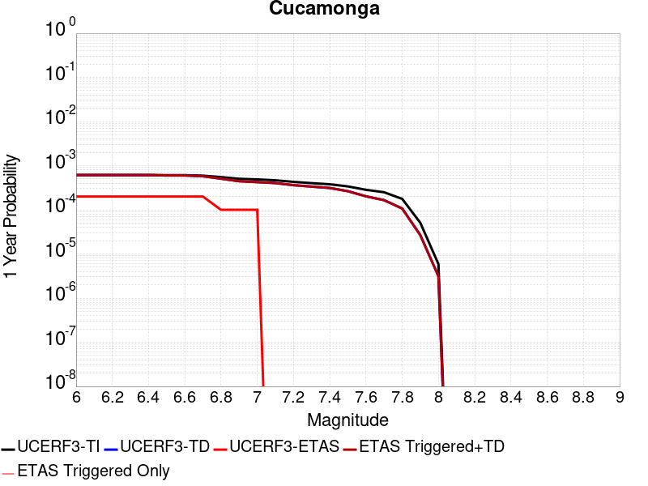 |  |

| Magnitude | 1 wk TI Prob | 1 wk TD Prob | 1 wk ETAS Prob | 1 wk ETAS/TD Gain | 1 wk ETAS Triggered+TD | 1 wk ETAS Triggered Only | 1 mo TI Prob | 1 mo TD Prob | 1 mo ETAS Prob | 1 mo ETAS/TD Gain | 1 mo ETAS Triggered+TD | 1 mo ETAS Triggered Only | 1 yr TI Prob | 1 yr TD Prob | 1 yr ETAS Prob | 1 yr ETAS/TD Gain | 1 yr ETAS Triggered+TD | 1 yr ETAS Triggered Only | 10 yr TI Prob | 10 yr TD Prob | 10 yr ETAS Prob | 10 yr ETAS/TD Gain | 10 yr ETAS Triggered+TD | 10 yr ETAS Triggered Only |
|-----|-----|-----|-----|-----|-----|-----|-----|-----|-----|-----|-----|-----|-----|-----|-----|-----|-----|-----|-----|-----|-----|-----|-----|-----|
| 6.0 | 1.1848348E-5 | 1.1681425E-5 | 1.0E-4 | 8.560599 | 1.1681425E-5 | 0.0 | 5.0777642E-5 | 5.0062306E-5 | 2.0E-4 | 3.9950218 | 5.0062306E-5 | 0.0 | 6.180424E-4 | 6.093408E-4 | 2.0E-4 | 0.32822356 | 6.093408E-4 | 0.0 | 0.0061632637 | 0.0060776994 | 0.0041 | 0.6745974 | 0.006773445 | 7.0E-4 |
| 6.1 | 1.1848348E-5 | 1.1681425E-5 | 1.0E-4 | 8.560599 | 1.1681425E-5 | 0.0 | 5.0777642E-5 | 5.0062306E-5 | 2.0E-4 | 3.9950218 | 5.0062306E-5 | 0.0 | 6.180424E-4 | 6.093408E-4 | 2.0E-4 | 0.32822356 | 6.093408E-4 | 0.0 | 0.0061632637 | 0.0060776994 | 0.0041 | 0.6745974 | 0.006773445 | 7.0E-4 |
| 6.2 | 1.1848348E-5 | 1.1681425E-5 | 1.0E-4 | 8.560599 | 1.1681425E-5 | 0.0 | 5.0777642E-5 | 5.0062306E-5 | 2.0E-4 | 3.9950218 | 5.0062306E-5 | 0.0 | 6.180424E-4 | 6.093408E-4 | 2.0E-4 | 0.32822356 | 6.093408E-4 | 0.0 | 0.0061632637 | 0.0060776994 | 0.0041 | 0.6745974 | 0.006773445 | 7.0E-4 |
| 6.3 | 1.1848348E-5 | 1.1681425E-5 | 1.0E-4 | 8.560599 | 1.1681425E-5 | 0.0 | 5.0777642E-5 | 5.0062306E-5 | 2.0E-4 | 3.9950218 | 5.0062306E-5 | 0.0 | 6.180424E-4 | 6.093408E-4 | 2.0E-4 | 0.32822356 | 6.093408E-4 | 0.0 | 0.0061632637 | 0.0060776994 | 0.0041 | 0.6745974 | 0.006773445 | 7.0E-4 |
| 6.4 | 1.1848348E-5 | 1.1681425E-5 | 1.0E-4 | 8.560599 | 1.1681425E-5 | 0.0 | 5.0777642E-5 | 5.0062306E-5 | 2.0E-4 | 3.9950218 | 5.0062306E-5 | 0.0 | 6.180424E-4 | 6.093408E-4 | 2.0E-4 | 0.32822356 | 6.093408E-4 | 0.0 | 0.0061632637 | 0.0060776994 | 0.0041 | 0.6745974 | 0.006773445 | 7.0E-4 |
| 6.5 | 1.16988695E-5 | 1.1520585E-5 | 1.0E-4 | 8.680115 | 1.1520585E-5 | 0.0 | 5.013705E-5 | 4.937302E-5 | 2.0E-4 | 4.0507956 | 4.937302E-5 | 0.0 | 6.102476E-4 | 6.0095335E-4 | 2.0E-4 | 0.33280453 | 6.0095335E-4 | 0.0 | 0.006085745 | 0.005994278 | 0.004 | 0.667303 | 0.006690082 | 7.0E-4 |
| 6.6 | 1.16988695E-5 | 1.1520585E-5 | 1.0E-4 | 8.680115 | 1.1520585E-5 | 0.0 | 5.013705E-5 | 4.937302E-5 | 2.0E-4 | 4.0507956 | 4.937302E-5 | 0.0 | 6.102476E-4 | 6.0095335E-4 | 2.0E-4 | 0.33280453 | 6.0095335E-4 | 0.0 | 0.006085745 | 0.005994278 | 0.004 | 0.667303 | 0.006690082 | 7.0E-4 |
| 6.7 | 1.1397107E-5 | 1.1060845E-5 | 1.0E-4 | 9.0409 | 1.1060845E-5 | 0.0 | 4.884383E-5 | 4.7402777E-5 | 2.0E-4 | 4.2191625 | 4.7402777E-5 | 0.0 | 5.9451134E-4 | 5.7697843E-4 | 2.0E-4 | 0.3466334 | 5.7697843E-4 | 0.0 | 0.005929234 | 0.005755779 | 0.004 | 0.6949537 | 0.00645175 | 7.0E-4 |
| 6.8 | 1.058387E-5 | 9.737108E-6 | 0.0 | 0.0 | 9.737108E-6 | 0.0 | 4.5358654E-5 | 4.17298E-5 | 1.0E-4 | 2.396369 | 4.17298E-5 | 0.0 | 5.521017E-4 | 5.07943E-4 | 1.0E-4 | 0.1968725 | 5.07943E-4 | 0.0 | 0.00550732 | 0.005068654 | 0.0036 | 0.7102477 | 0.005665613 | 6.0E-4 |
| 6.9 | 9.690046E-6 | 8.535669E-6 | 0.0 | 0.0 | 8.535669E-6 | 0.0 | 4.1528107E-5 | 3.6580925E-5 | 1.0E-4 | 2.7336652 | 3.6580925E-5 | 0.0 | 5.054874E-4 | 4.4528214E-4 | 1.0E-4 | 0.22457671 | 4.4528214E-4 | 0.0 | 0.005043391 | 0.0044446616 | 0.0029 | 0.65246814 | 0.0050419946 | 6.0E-4 |
| 7.0 | 9.381461E-6 | 8.14438E-6 | 0.0 | 0.0 | 8.14438E-6 | 0.0 | 4.020564E-5 | 3.490402E-5 | 1.0E-4 | 2.8649995 | 3.490402E-5 | 0.0 | 4.893937E-4 | 4.2487396E-4 | 1.0E-4 | 0.23536393 | 4.2487396E-4 | 0.0 | 0.0048831734 | 0.0042413757 | 0.0026 | 0.6130086 | 0.004739255 | 5.0E-4 |
| 7.1 | 8.946492E-6 | 7.739966E-6 | 0.0 | 0.0 | 7.739966E-6 | 0.0 | 3.8341543E-5 | 3.3170865E-5 | 0.0 | 0.0 | 3.3170865E-5 | 0.0 | 4.667083E-4 | 4.0378075E-4 | 0.0 | 0.0 | 4.0378075E-4 | 0.0 | 0.0046572937 | 0.004031233 | 0.0024 | 0.5953514 | 0.0045292173 | 5.0E-4 |
| 7.2 | 8.251016E-6 | 6.9360203E-6 | 0.0 | 0.0 | 6.9360203E-6 | 0.0 | 3.5361016E-5 | 2.9725465E-5 | 0.0 | 0.0 | 2.9725465E-5 | 0.0 | 4.3043532E-4 | 3.6184766E-4 | 0.0 | 0.0 | 3.6184766E-4 | 0.0 | 0.0042960253 | 0.0036133453 | 0.0022 | 0.60885406 | 0.0040119 | 4.0E-4 |
| 7.3 | 7.717881E-6 | 6.4482774E-6 | 0.0 | 0.0 | 6.4482774E-6 | 0.0 | 3.3076216E-5 | 2.7635182E-5 | 0.0 | 0.0 | 2.7635182E-5 | 0.0 | 4.026285E-4 | 3.3640664E-4 | 0.0 | 0.0 | 3.3640664E-4 | 0.0 | 0.004018998 | 0.0033597308 | 0.0022 | 0.65481436 | 0.003758387 | 4.0E-4 |
| 7.4 | 7.275623E-6 | 5.9953554E-6 | 0.0 | 0.0 | 5.9953554E-6 | 0.0 | 3.118087E-5 | 2.5694128E-5 | 0.0 | 0.0 | 2.5694128E-5 | 0.0 | 3.7956095E-4 | 3.127813E-4 | 0.0 | 0.0 | 3.127813E-4 | 0.0 | 0.0037891332 | 0.0031241663 | 0.0021 | 0.67217934 | 0.0035229167 | 4.0E-4 |
| 7.5 | 6.5109502E-6 | 5.0681283E-6 | 0.0 | 0.0 | 5.0681283E-6 | 0.0 | 2.7903774E-5 | 2.1720369E-5 | 0.0 | 0.0 | 2.1720369E-5 | 0.0 | 3.3967546E-4 | 2.6441354E-4 | 0.0 | 0.0 | 2.6441354E-4 | 0.0 | 0.0033915674 | 0.0026417347 | 0.0019 | 0.71922433 | 0.003040678 | 4.0E-4 |
| 7.6 | 5.4495326E-6 | 3.8797943E-6 | 0.0 | 0.0 | 3.8797943E-6 | 0.0 | 2.335493E-5 | 1.6627584E-5 | 0.0 | 0.0 | 1.6627584E-5 | 0.0 | 2.8430918E-4 | 2.024221E-4 | 0.0 | 0.0 | 2.024221E-4 | 0.0 | 0.0028394572 | 0.0020231178 | 0.0015 | 0.7414299 | 0.0023225108 | 3.0E-4 |
| 7.7 | 4.7997164E-6 | 3.17428E-6 | 0.0 | 0.0 | 3.17428E-6 | 0.0 | 2.057005E-5 | 1.3603986E-5 | 0.0 | 0.0 | 1.3603986E-5 | 0.0 | 2.504116E-4 | 1.6561597E-4 | 0.0 | 0.0 | 1.6561597E-4 | 0.0 | 0.002501296 | 0.0016556637 | 0.0014 | 0.84558237 | 0.0018553325 | 2.0E-4 |
| 7.8 | 3.3941733E-6 | 2.049857E-6 | 0.0 | 0.0 | 2.049857E-6 | 0.0 | 1.4546376E-5 | 8.785072E-6 | 0.0 | 0.0 | 8.785072E-6 | 0.0 | 1.7708774E-4 | 1.0695301E-4 | 0.0 | 0.0 | 1.0695301E-4 | 0.0 | 0.0017694668 | 0.0010690487 | 0.0011 | 1.0289522 | 0.0012688348 | 2.0E-4 |
| 7.9 | 9.750552E-7 | 5.122147E-7 | 0.0 | 0.0 | 5.122147E-7 | 0.0 | 4.178801E-6 | 2.195204E-6 | 0.0 | 0.0 | 2.195204E-6 | 0.0 | 5.0875715E-5 | 2.6726284E-5 | 0.0 | 0.0 | 2.6726284E-5 | 0.0 | 5.086407E-4 | 2.672311E-4 | 3.0E-4 | 1.1226238 | 2.672311E-4 | 0.0 |
| 8.0 | 1.133857E-7 | 6.016657E-8 | 0.0 | 0.0 | 6.016657E-8 | 0.0 | 4.8593864E-7 | 2.5785673E-7 | 0.0 | 0.0 | 2.5785673E-7 | 0.0 | 5.9162867E-6 | 3.139401E-6 | 0.0 | 0.0 | 3.139401E-6 | 0.0 | 5.916129E-5 | 3.1393585E-5 | 0.0 | 0.0 | 3.1393585E-5 | 0.0 |

## Cleghorn
*[(top)](#table-of-contents)*

| 1 Week | 1 Month | 1 Year | 10 Year |
|-----|-----|-----|-----|
|  |  |  |  |

| Magnitude | 1 wk TI Prob | 1 wk TD Prob | 1 wk ETAS Prob | 1 wk ETAS/TD Gain | 1 wk ETAS Triggered+TD | 1 wk ETAS Triggered Only | 1 mo TI Prob | 1 mo TD Prob | 1 mo ETAS Prob | 1 mo ETAS/TD Gain | 1 mo ETAS Triggered+TD | 1 mo ETAS Triggered Only | 1 yr TI Prob | 1 yr TD Prob | 1 yr ETAS Prob | 1 yr ETAS/TD Gain | 1 yr ETAS Triggered+TD | 1 yr ETAS Triggered Only | 10 yr TI Prob | 10 yr TD Prob | 10 yr ETAS Prob | 10 yr ETAS/TD Gain | 10 yr ETAS Triggered+TD | 10 yr ETAS Triggered Only |
|-----|-----|-----|-----|-----|-----|-----|-----|-----|-----|-----|-----|-----|-----|-----|-----|-----|-----|-----|-----|-----|-----|-----|-----|-----|
| 6.0 | 7.9267165E-6 | 9.749158E-6 | 1.0E-4 | 10.257296 | 9.749158E-6 | 0.0 | 3.39712E-5 | 4.17815E-5 | 2.0E-4 | 4.786808 | 4.17815E-5 | 0.0 | 4.1352084E-4 | 5.0858164E-4 | 5.0E-4 | 0.9831264 | 5.0858164E-4 | 0.0 | 0.004127522 | 0.0050905296 | 0.0061 | 1.1983037 | 0.005786966 | 7.0E-4 |
| 6.1 | 7.9267165E-6 | 9.749158E-6 | 1.0E-4 | 10.257296 | 9.749158E-6 | 0.0 | 3.39712E-5 | 4.17815E-5 | 2.0E-4 | 4.786808 | 4.17815E-5 | 0.0 | 4.1352084E-4 | 5.0858164E-4 | 5.0E-4 | 0.9831264 | 5.0858164E-4 | 0.0 | 0.004127522 | 0.0050905296 | 0.0061 | 1.1983037 | 0.005786966 | 7.0E-4 |
| 6.2 | 7.9267165E-6 | 9.749158E-6 | 1.0E-4 | 10.257296 | 9.749158E-6 | 0.0 | 3.39712E-5 | 4.17815E-5 | 2.0E-4 | 4.786808 | 4.17815E-5 | 0.0 | 4.1352084E-4 | 5.0858164E-4 | 5.0E-4 | 0.9831264 | 5.0858164E-4 | 0.0 | 0.004127522 | 0.0050905296 | 0.0061 | 1.1983037 | 0.005786966 | 7.0E-4 |
| 6.3 | 7.9267165E-6 | 9.749158E-6 | 1.0E-4 | 10.257296 | 9.749158E-6 | 0.0 | 3.39712E-5 | 4.17815E-5 | 2.0E-4 | 4.786808 | 4.17815E-5 | 0.0 | 4.1352084E-4 | 5.0858164E-4 | 5.0E-4 | 0.9831264 | 5.0858164E-4 | 0.0 | 0.004127522 | 0.0050905296 | 0.0061 | 1.1983037 | 0.005786966 | 7.0E-4 |
| 6.4 | 4.3445207E-6 | 6.010741E-6 | 1.0E-4 | 16.636885 | 6.010741E-6 | 0.0 | 1.8619241E-5 | 2.576007E-5 | 2.0E-4 | 7.763954 | 2.576007E-5 | 0.0 | 2.2666567E-4 | 3.1358472E-4 | 4.0E-4 | 1.2755723 | 3.1358472E-4 | 0.0 | 0.0022643462 | 0.003146855 | 0.0037 | 1.1757771 | 0.0037449668 | 6.0E-4 |
| 6.5 | 4.3445207E-6 | 6.010741E-6 | 1.0E-4 | 16.636885 | 6.010741E-6 | 0.0 | 1.8619241E-5 | 2.576007E-5 | 2.0E-4 | 7.763954 | 2.576007E-5 | 0.0 | 2.2666567E-4 | 3.1358472E-4 | 4.0E-4 | 1.2755723 | 3.1358472E-4 | 0.0 | 0.0022643462 | 0.003146855 | 0.0037 | 1.1757771 | 0.0037449668 | 6.0E-4 |
| 6.6 | 4.040109E-6 | 5.693292E-6 | 1.0E-4 | 17.56453 | 5.693292E-6 | 0.0 | 1.7314638E-5 | 2.43996E-5 | 2.0E-4 | 8.196856 | 2.43996E-5 | 0.0 | 2.1078532E-4 | 2.9702557E-4 | 4.0E-4 | 1.3466854 | 2.9702557E-4 | 0.0 | 0.002105855 | 0.0029817126 | 0.0035 | 1.173822 | 0.0035799237 | 6.0E-4 |
| 6.7 | 3.3632055E-6 | 4.9871064E-6 | 0.0 | 0.0 | 4.9871064E-6 | 0.0 | 1.4413658E-5 | 2.137314E-5 | 0.0 | 0.0 | 2.137314E-5 | 0.0 | 1.7547216E-4 | 2.6018723E-4 | 1.0E-4 | 0.38433862 | 2.6018723E-4 | 0.0 | 0.0017533366 | 0.002614197 | 0.0023 | 0.8798112 | 0.00311289 | 5.0E-4 |
| 6.8 | 3.2902772E-6 | 4.9090745E-6 | 0.0 | 0.0 | 4.9090745E-6 | 0.0 | 1.4101111E-5 | 2.1038722E-5 | 0.0 | 0.0 | 2.1038722E-5 | 0.0 | 1.716675E-4 | 2.5611665E-4 | 1.0E-4 | 0.39044708 | 2.5611665E-4 | 0.0 | 0.0017153495 | 0.0025735858 | 0.0022 | 0.8548384 | 0.003072299 | 5.0E-4 |
| 6.9 | 3.031547E-6 | 4.6112386E-6 | 0.0 | 0.0 | 4.6112386E-6 | 0.0 | 1.299228E-5 | 1.9762303E-5 | 0.0 | 0.0 | 1.9762303E-5 | 0.0 | 1.5816953E-4 | 2.4057974E-4 | 1.0E-4 | 0.41566262 | 2.4057974E-4 | 0.0 | 0.00158057 | 0.002418562 | 0.0021 | 0.8682845 | 0.0029173528 | 5.0E-4 |
| 7.0 | 2.8259715E-6 | 4.291993E-6 | 0.0 | 0.0 | 4.291993E-6 | 0.0 | 1.211125E-5 | 1.8394127E-5 | 0.0 | 0.0 | 1.8394127E-5 | 0.0 | 1.4744449E-4 | 2.2392572E-4 | 1.0E-4 | 0.44657668 | 2.2392572E-4 | 0.0 | 0.001473467 | 0.002252369 | 0.0019 | 0.84355634 | 0.002651468 | 4.0E-4 |
| 7.1 | 2.5962665E-6 | 3.9879E-6 | 0.0 | 0.0 | 3.9879E-6 | 0.0 | 1.1126809E-5 | 1.709089E-5 | 0.0 | 0.0 | 1.709089E-5 | 0.0 | 1.3546048E-4 | 2.0806193E-4 | 1.0E-4 | 0.4806261 | 2.0806193E-4 | 0.0 | 0.0013537793 | 0.0020940474 | 0.0019 | 0.90733385 | 0.0024932097 | 4.0E-4 |
| 7.2 | 2.3247253E-6 | 3.5995272E-6 | 0.0 | 0.0 | 3.5995272E-6 | 0.0 | 9.96307E-6 | 1.5426454E-5 | 0.0 | 0.0 | 1.5426454E-5 | 0.0 | 1.21293626E-4 | 1.8780108E-4 | 1.0E-4 | 0.5324783 | 1.8780108E-4 | 0.0 | 0.0012122744 | 0.0018918219 | 0.0018 | 0.95146376 | 0.0022910652 | 4.0E-4 |
| 7.3 | 2.056928E-6 | 3.1607108E-6 | 0.0 | 0.0 | 3.1607108E-6 | 0.0 | 8.815376E-6 | 1.3545834E-5 | 0.0 | 0.0 | 1.3545834E-5 | 0.0 | 1.0732192E-4 | 1.649082E-4 | 1.0E-4 | 0.606398 | 1.649082E-4 | 0.0 | 0.001072701 | 0.0016633242 | 0.0017 | 1.0220497 | 0.0020626588 | 4.0E-4 |
| 7.4 | 1.8055999E-6 | 2.7537358E-6 | 0.0 | 0.0 | 2.7537358E-6 | 0.0 | 7.738263E-6 | 1.1801672E-5 | 0.0 | 0.0 | 1.1801672E-5 | 0.0 | 9.4209274E-5 | 1.4367602E-4 | 1.0E-4 | 0.69601035 | 1.4367602E-4 | 0.0 | 9.4169343E-4 | 0.0014514376 | 0.0015 | 1.0334581 | 0.001850857 | 4.0E-4 |
| 7.5 | 1.4683443E-6 | 2.3541588E-6 | 0.0 | 0.0 | 2.3541588E-6 | 0.0 | 6.292889E-6 | 1.0089214E-5 | 0.0 | 0.0 | 1.0089214E-5 | 0.0 | 7.661323E-5 | 1.2282934E-4 | 0.0 | 0.0 | 1.2282934E-4 | 0.0 | 7.658682E-4 | 0.0012432557 | 0.0012 | 0.96520776 | 0.0015428826 | 3.0E-4 |
| 7.6 | 9.804088E-7 | 1.8304524E-6 | 0.0 | 0.0 | 1.8304524E-6 | 0.0 | 4.201745E-6 | 7.844773E-6 | 0.0 | 0.0 | 7.844773E-6 | 0.0 | 5.1155046E-5 | 9.5505966E-5 | 0.0 | 0.0 | 9.5505966E-5 | 0.0 | 5.114327E-4 | 9.703182E-4 | 9.0E-4 | 0.92753077 | 0.0011701242 | 2.0E-4 |
| 7.7 | 7.3434086E-7 | 1.5593936E-6 | 0.0 | 0.0 | 1.5593936E-6 | 0.0 | 3.1471714E-6 | 6.683098E-6 | 0.0 | 0.0 | 6.683098E-6 | 0.0 | 3.831614E-5 | 8.136371E-5 | 0.0 | 0.0 | 8.136371E-5 | 0.0 | 3.8309532E-4 | 8.2903623E-4 | 9.0E-4 | 1.0855979 | 0.0010288705 | 2.0E-4 |
| 7.8 | 6.434184E-7 | 1.4552913E-6 | 0.0 | 0.0 | 1.4552913E-6 | 0.0 | 2.7575045E-6 | 6.236948E-6 | 0.0 | 0.0 | 6.236948E-6 | 0.0 | 3.35721E-5 | 7.593222E-5 | 0.0 | 0.0 | 7.593222E-5 | 0.0 | 3.3567028E-4 | 7.743781E-4 | 9.0E-4 | 1.162223 | 9.7422325E-4 | 2.0E-4 |
| 7.9 | 3.4943926E-7 | 7.2015865E-7 | 0.0 | 0.0 | 7.2015865E-7 | 0.0 | 1.497596E-6 | 3.0863905E-6 | 0.0 | 0.0 | 3.0863905E-6 | 0.0 | 1.8233079E-5 | 3.7576167E-5 | 0.0 | 0.0 | 3.7576167E-5 | 0.0 | 1.8231584E-4 | 3.8507476E-4 | 4.0E-4 | 1.0387594 | 4.8503626E-4 | 1.0E-4 |
| 8.0 | 6.717524E-8 | 5.375388E-8 | 0.0 | 0.0 | 5.375388E-8 | 0.0 | 2.8789387E-7 | 2.3037374E-7 | 0.0 | 0.0 | 2.3037374E-7 | 0.0 | 3.505102E-6 | 2.8047968E-6 | 0.0 | 0.0 | 2.8047968E-6 | 0.0 | 3.5050467E-5 | 3.0233154E-5 | 0.0 | 0.0 | 3.0233154E-5 | 0.0 |
| 8.1 | 3.1984914E-8 | 1.14456675E-8 | 0.0 | 0.0 | 1.14456675E-8 | 0.0 | 1.370782E-7 | 4.9052858E-8 | 0.0 | 0.0 | 4.9052858E-8 | 0.0 | 1.6689258E-6 | 5.972184E-7 | 0.0 | 0.0 | 5.972184E-7 | 0.0 | 1.6689133E-5 | 6.8908034E-6 | 0.0 | 0.0 | 6.8908034E-6 | 0.0 |
| 8.2 | 1.21887656E-8 | 3.1833332E-9 | 0.0 | 0.0 | 3.1833332E-9 | 0.0 | 5.2237567E-8 | 1.3642856E-8 | 0.0 | 0.0 | 1.3642856E-8 | 0.0 | 6.359922E-7 | 1.6610176E-7 | 0.0 | 0.0 | 1.6610176E-7 | 0.0 | 6.3599036E-6 | 1.9769184E-6 | 0.0 | 0.0 | 1.9769184E-6 | 0.0 |

## Great Valley 07 (Orestimba)
*[(top)](#table-of-contents)*

| 1 Week | 1 Month | 1 Year | 10 Year |
|-----|-----|-----|-----|
|  |  |  | 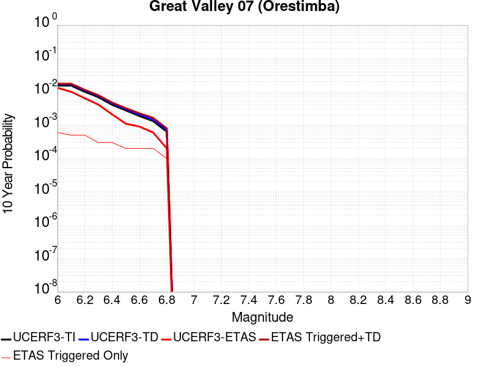 |

| Magnitude | 1 wk TI Prob | 1 wk TD Prob | 1 wk ETAS Prob | 1 wk ETAS/TD Gain | 1 wk ETAS Triggered+TD | 1 wk ETAS Triggered Only | 1 mo TI Prob | 1 mo TD Prob | 1 mo ETAS Prob | 1 mo ETAS/TD Gain | 1 mo ETAS Triggered+TD | 1 mo ETAS Triggered Only | 1 yr TI Prob | 1 yr TD Prob | 1 yr ETAS Prob | 1 yr ETAS/TD Gain | 1 yr ETAS Triggered+TD | 1 yr ETAS Triggered Only | 10 yr TI Prob | 10 yr TD Prob | 10 yr ETAS Prob | 10 yr ETAS/TD Gain | 10 yr ETAS Triggered+TD | 10 yr ETAS Triggered Only |
|-----|-----|-----|-----|-----|-----|-----|-----|-----|-----|-----|-----|-----|-----|-----|-----|-----|-----|-----|-----|-----|-----|-----|-----|-----|
| 6.0 | 2.9687902E-5 | 3.272214E-5 | 0.0 | 0.0 | 3.272214E-5 | 0.0 | 1.2722766E-4 | 1.402306E-4 | 4.0E-4 | 2.8524444 | 1.402306E-4 | 0.0 | 0.0015478961 | 0.0017060422 | 0.002 | 1.1723039 | 0.001905701 | 2.0E-4 | 0.015371585 | 0.016936978 | 0.0131 | 0.7734555 | 0.017526817 | 6.0E-4 |
| 6.1 | 2.9687902E-5 | 3.272214E-5 | 0.0 | 0.0 | 3.272214E-5 | 0.0 | 1.2722766E-4 | 1.402306E-4 | 3.0E-4 | 2.1393332 | 1.402306E-4 | 0.0 | 0.0015478961 | 0.0017060422 | 0.0016 | 0.93784314 | 0.001905701 | 2.0E-4 | 0.015371585 | 0.016936978 | 0.01 | 0.59042406 | 0.01742851 | 5.0E-4 |
| 6.2 | 1.9231524E-5 | 2.113703E-5 | 0.0 | 0.0 | 2.113703E-5 | 0.0 | 8.2418206E-5 | 9.058425E-5 | 3.0E-4 | 3.3118339 | 9.058425E-5 | 0.0 | 0.0010029797 | 0.0011023284 | 0.0014 | 1.270039 | 0.0013021079 | 2.0E-4 | 0.00998465 | 0.010971011 | 0.0064 | 0.58335555 | 0.011465525 | 5.0E-4 |
| 6.3 | 1.324766E-5 | 1.4533626E-5 | 0.0 | 0.0 | 1.4533626E-5 | 0.0 | 5.6774446E-5 | 6.228553E-5 | 1.0E-4 | 1.6055093 | 6.228553E-5 | 0.0 | 6.910097E-4 | 7.5807166E-4 | 7.0E-4 | 0.9233956 | 8.579959E-4 | 1.0E-4 | 0.006888649 | 0.0075558014 | 0.0041 | 0.54262936 | 0.007853535 | 3.0E-4 |
| 6.4 | 7.818645E-6 | 8.564213E-6 | 0.0 | 0.0 | 8.564213E-6 | 0.0 | 3.3508048E-5 | 3.6703274E-5 | 1.0E-4 | 2.7245526 | 3.6703274E-5 | 0.0 | 4.078841E-4 | 4.4677407E-4 | 3.0E-4 | 0.6714803 | 5.467294E-4 | 1.0E-4 | 0.004071363 | 0.0044590984 | 0.0021 | 0.47094724 | 0.0047577606 | 3.0E-4 |
| 6.5 | 5.3076565E-6 | 5.8119676E-6 | 0.0 | 0.0 | 5.8119676E-6 | 0.0 | 2.27469E-5 | 2.4908206E-5 | 0.0 | 0.0 | 2.4908206E-5 | 0.0 | 2.7690834E-4 | 3.0321733E-4 | 1.0E-4 | 0.32979646 | 4.03187E-4 | 1.0E-4 | 0.0027656353 | 0.003028245 | 0.0011 | 0.3632467 | 0.0032276392 | 2.0E-4 |
| 6.6 | 3.6003578E-6 | 3.9445126E-6 | 0.0 | 0.0 | 3.9445126E-6 | 0.0 | 1.5430012E-5 | 1.6904953E-5 | 0.0 | 0.0 | 1.6904953E-5 | 0.0 | 1.8784421E-4 | 2.0579992E-4 | 1.0E-4 | 0.48590884 | 3.0577934E-4 | 1.0E-4 | 0.0018768552 | 0.002056247 | 9.0E-4 | 0.43769056 | 0.002255836 | 2.0E-4 |
| 6.7 | 2.5361826E-6 | 2.7806368E-6 | 0.0 | 0.0 | 2.7806368E-6 | 0.0 | 1.0869308E-5 | 1.1916968E-5 | 0.0 | 0.0 | 1.1916968E-5 | 0.0 | 1.3232579E-4 | 1.4508075E-4 | 1.0E-4 | 0.68927133 | 2.4506624E-4 | 1.0E-4 | 0.0013224703 | 0.00144999 | 6.0E-4 | 0.41379598 | 0.0016497 | 2.0E-4 |
| 6.8 | 1.2115831E-6 | 1.3300066E-6 | 0.0 | 0.0 | 1.3300066E-6 | 0.0 | 5.1924885E-6 | 5.7000216E-6 | 0.0 | 0.0 | 5.7000216E-6 | 0.0 | 6.3216714E-5 | 6.939652E-5 | 0.0 | 0.0 | 6.939652E-5 | 0.0 | 6.3198735E-4 | 6.938434E-4 | 2.0E-4 | 0.2882495 | 7.9377403E-4 | 1.0E-4 |

## Paradise
*[(top)](#table-of-contents)*

| 1 Week | 1 Month | 1 Year | 10 Year |
|-----|-----|-----|-----|
|  |  | 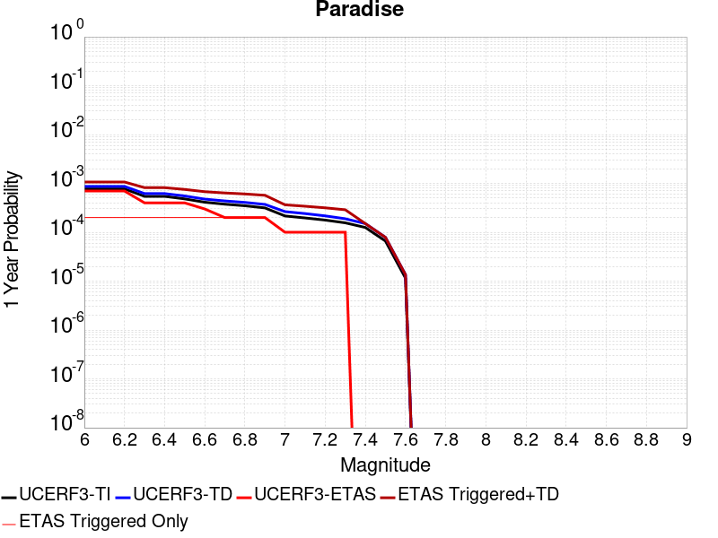 |  |

| Magnitude | 1 wk TI Prob | 1 wk TD Prob | 1 wk ETAS Prob | 1 wk ETAS/TD Gain | 1 wk ETAS Triggered+TD | 1 wk ETAS Triggered Only | 1 mo TI Prob | 1 mo TD Prob | 1 mo ETAS Prob | 1 mo ETAS/TD Gain | 1 mo ETAS Triggered+TD | 1 mo ETAS Triggered Only | 1 yr TI Prob | 1 yr TD Prob | 1 yr ETAS Prob | 1 yr ETAS/TD Gain | 1 yr ETAS Triggered+TD | 1 yr ETAS Triggered Only | 10 yr TI Prob | 10 yr TD Prob | 10 yr ETAS Prob | 10 yr ETAS/TD Gain | 10 yr ETAS Triggered+TD | 10 yr ETAS Triggered Only |
|-----|-----|-----|-----|-----|-----|-----|-----|-----|-----|-----|-----|-----|-----|-----|-----|-----|-----|-----|-----|-----|-----|-----|-----|-----|
| 6.0 | 1.4851273E-5 | 1.6679838E-5 | 0.0 | 0.0 | 1.6679838E-5 | 0.0 | 6.364676E-5 | 7.14832E-5 | 0.0 | 0.0 | 7.14832E-5 | 0.0 | 7.7462377E-4 | 8.69984E-4 | 7.0E-4 | 0.8046125 | 0.00106981 | 2.0E-4 | 0.0077192914 | 0.008668157 | 0.0081 | 0.9344547 | 0.009362089 | 7.0E-4 |
| 6.1 | 1.4851273E-5 | 1.6679838E-5 | 0.0 | 0.0 | 1.6679838E-5 | 0.0 | 6.364676E-5 | 7.14832E-5 | 0.0 | 0.0 | 7.14832E-5 | 0.0 | 7.7462377E-4 | 8.69984E-4 | 7.0E-4 | 0.8046125 | 0.00106981 | 2.0E-4 | 0.0077192914 | 0.008668157 | 0.0081 | 0.9344547 | 0.009362089 | 7.0E-4 |
| 6.2 | 1.4851273E-5 | 1.6679838E-5 | 0.0 | 0.0 | 1.6679838E-5 | 0.0 | 6.364676E-5 | 7.14832E-5 | 0.0 | 0.0 | 7.14832E-5 | 0.0 | 7.7462377E-4 | 8.69984E-4 | 7.0E-4 | 0.8046125 | 0.00106981 | 2.0E-4 | 0.0077192914 | 0.008668157 | 0.0081 | 0.9344547 | 0.009362089 | 7.0E-4 |
| 6.3 | 1.0426831E-5 | 1.1878099E-5 | 0.0 | 0.0 | 1.1878099E-5 | 0.0 | 4.4685654E-5 | 5.090518E-5 | 0.0 | 0.0 | 5.090518E-5 | 0.0 | 5.43912E-4 | 6.1960024E-4 | 4.0E-4 | 0.64557755 | 8.194763E-4 | 2.0E-4 | 0.0054258266 | 0.0061793346 | 0.0054 | 0.8738805 | 0.0068750093 | 7.0E-4 |
| 6.4 | 1.0426831E-5 | 1.1878099E-5 | 0.0 | 0.0 | 1.1878099E-5 | 0.0 | 4.4685654E-5 | 5.090518E-5 | 0.0 | 0.0 | 5.090518E-5 | 0.0 | 5.43912E-4 | 6.1960024E-4 | 4.0E-4 | 0.64557755 | 8.194763E-4 | 2.0E-4 | 0.0054258266 | 0.0061793346 | 0.0054 | 0.8738805 | 0.0068750093 | 7.0E-4 |
| 6.5 | 9.25027E-6 | 1.0610476E-5 | 0.0 | 0.0 | 1.0610476E-5 | 0.0 | 3.964341E-5 | 4.5472705E-5 | 0.0 | 0.0 | 4.5472705E-5 | 0.0 | 4.8255164E-4 | 5.5349444E-4 | 4.0E-4 | 0.72268116 | 7.5338373E-4 | 2.0E-4 | 0.0048150513 | 0.0055216574 | 0.0045 | 0.8149727 | 0.006217792 | 7.0E-4 |
| 6.6 | 7.904275E-6 | 9.15134E-6 | 0.0 | 0.0 | 9.15134E-6 | 0.0 | 3.3875025E-5 | 3.9219463E-5 | 0.0 | 0.0 | 3.9219463E-5 | 0.0 | 4.1235037E-4 | 4.7739627E-4 | 3.0E-4 | 0.62840873 | 6.773008E-4 | 2.0E-4 | 0.0041158604 | 0.004764104 | 0.0036 | 0.75565106 | 0.005361245 | 6.0E-4 |
| 6.7 | 7.2061953E-6 | 8.399675E-6 | 0.0 | 0.0 | 8.399675E-6 | 0.0 | 3.088333E-5 | 3.5998128E-5 | 0.0 | 0.0 | 3.5998128E-5 | 0.0 | 3.7593965E-4 | 4.3819274E-4 | 2.0E-4 | 0.45642015 | 6.381051E-4 | 2.0E-4 | 0.003753043 | 0.0043736557 | 0.0032 | 0.7316534 | 0.0049710316 | 6.0E-4 |
| 6.8 | 6.6948724E-6 | 7.835022E-6 | 0.0 | 0.0 | 7.835022E-6 | 0.0 | 2.8691995E-5 | 3.3578257E-5 | 0.0 | 0.0 | 3.3578257E-5 | 0.0 | 3.4926904E-4 | 4.0874214E-4 | 2.0E-4 | 0.48930603 | 6.086604E-4 | 2.0E-4 | 0.003487206 | 0.0040802606 | 0.0031 | 0.7597554 | 0.0046778126 | 6.0E-4 |
| 6.9 | 6.0421025E-6 | 7.1240197E-6 | 0.0 | 0.0 | 7.1240197E-6 | 0.0 | 2.5894467E-5 | 3.0531173E-5 | 0.0 | 0.0 | 3.0531173E-5 | 0.0 | 3.1521954E-4 | 3.7165705E-4 | 2.0E-4 | 0.5381305 | 5.715827E-4 | 2.0E-4 | 0.0031477278 | 0.0037106927 | 0.0029 | 0.78152525 | 0.004208837 | 5.0E-4 |
| 7.0 | 4.134091E-6 | 5.0750823E-6 | 0.0 | 0.0 | 5.0750823E-6 | 0.0 | 1.7717413E-5 | 2.175018E-5 | 0.0 | 0.0 | 2.175018E-5 | 0.0 | 2.1568815E-4 | 2.647778E-4 | 1.0E-4 | 0.37767515 | 3.6475132E-4 | 1.0E-4 | 0.0021547892 | 0.0026447764 | 0.0019 | 0.71839726 | 0.0030437184 | 4.0E-4 |
| 7.1 | 3.7674888E-6 | 4.6269474E-6 | 0.0 | 0.0 | 4.6269474E-6 | 0.0 | 1.6146281E-5 | 1.9829633E-5 | 0.0 | 0.0 | 1.9829633E-5 | 0.0 | 1.9656324E-4 | 2.4140056E-4 | 1.0E-4 | 0.41424924 | 3.4137644E-4 | 1.0E-4 | 0.0019638946 | 0.0024115338 | 0.0018 | 0.74641293 | 0.0027108104 | 3.0E-4 |
| 7.2 | 3.4065345E-6 | 4.1520943E-6 | 0.0 | 0.0 | 4.1520943E-6 | 0.0 | 1.4599351E-5 | 1.7794577E-5 | 0.0 | 0.0 | 1.7794577E-5 | 0.0 | 1.777326E-4 | 2.1662892E-4 | 1.0E-4 | 0.46161887 | 3.1660727E-4 | 1.0E-4 | 0.0017759053 | 0.0021643257 | 0.0015 | 0.6930565 | 0.0024636763 | 3.0E-4 |
| 7.3 | 2.9934936E-6 | 3.6258575E-6 | 0.0 | 0.0 | 3.6258575E-6 | 0.0 | 1.2829195E-5 | 1.5539305E-5 | 0.0 | 0.0 | 1.5539305E-5 | 0.0 | 1.5618425E-4 | 1.8917609E-4 | 1.0E-4 | 0.528608 | 2.8915718E-4 | 1.0E-4 | 0.0015607453 | 0.0018902957 | 0.0012 | 0.63482136 | 0.0020899177 | 2.0E-4 |
| 7.4 | 2.4049796E-6 | 2.8865425E-6 | 0.0 | 0.0 | 2.8865425E-6 | 0.0 | 1.0307015E-5 | 1.2370845E-5 | 0.0 | 0.0 | 1.2370845E-5 | 0.0 | 1.2548068E-4 | 1.5060607E-4 | 0.0 | 0.0 | 1.5060607E-4 | 0.0 | 0.0012540985 | 0.0015051813 | 8.0E-4 | 0.5314974 | 0.0016050308 | 1.0E-4 |
| 7.5 | 1.2710091E-6 | 1.5118025E-6 | 0.0 | 0.0 | 1.5118025E-6 | 0.0 | 5.44717E-6 | 6.4791443E-6 | 0.0 | 0.0 | 6.4791443E-6 | 0.0 | 6.631728E-5 | 7.8881974E-5 | 0.0 | 0.0 | 7.8881974E-5 | 0.0 | 6.6297496E-4 | 7.8866223E-4 | 3.0E-4 | 0.380391 | 7.8866223E-4 | 0.0 |
| 7.6 | 2.21172E-7 | 2.602981E-7 | 0.0 | 0.0 | 2.602981E-7 | 0.0 | 9.478797E-7 | 1.115563E-6 | 0.0 | 0.0 | 1.115563E-6 | 0.0 | 1.1540374E-5 | 1.3581924E-5 | 0.0 | 0.0 | 1.3581924E-5 | 0.0 | 1.1539775E-4 | 1.3581375E-4 | 1.0E-4 | 0.7363025 | 1.3581375E-4 | 0.0 |

## Garlic Springs
*[(top)](#table-of-contents)*

| 1 Week | 1 Month | 1 Year | 10 Year |
|-----|-----|-----|-----|
| 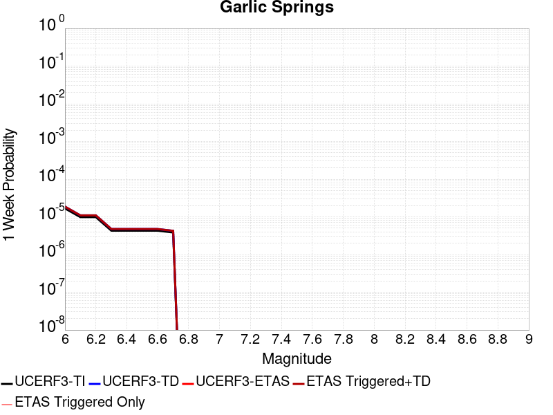 |  |  |  |

| Magnitude | 1 wk TI Prob | 1 wk TD Prob | 1 wk ETAS Prob | 1 wk ETAS/TD Gain | 1 wk ETAS Triggered+TD | 1 wk ETAS Triggered Only | 1 mo TI Prob | 1 mo TD Prob | 1 mo ETAS Prob | 1 mo ETAS/TD Gain | 1 mo ETAS Triggered+TD | 1 mo ETAS Triggered Only | 1 yr TI Prob | 1 yr TD Prob | 1 yr ETAS Prob | 1 yr ETAS/TD Gain | 1 yr ETAS Triggered+TD | 1 yr ETAS Triggered Only | 10 yr TI Prob | 10 yr TD Prob | 10 yr ETAS Prob | 10 yr ETAS/TD Gain | 10 yr ETAS Triggered+TD | 10 yr ETAS Triggered Only |
|-----|-----|-----|-----|-----|-----|-----|-----|-----|-----|-----|-----|-----|-----|-----|-----|-----|-----|-----|-----|-----|-----|-----|-----|-----|
| 6.0 | 1.6760017E-5 | 1.875325E-5 | 0.0 | 0.0 | 1.875325E-5 | 0.0 | 7.182667E-5 | 8.036925E-5 | 0.0 | 0.0 | 8.036925E-5 | 0.0 | 8.7413884E-4 | 9.781736E-4 | 6.0E-4 | 0.6133881 | 9.781736E-4 | 0.0 | 0.008707083 | 0.009750196 | 0.0092 | 0.9435708 | 0.010344346 | 6.0E-4 |
| 6.1 | 9.852767E-6 | 1.0960564E-5 | 0.0 | 0.0 | 1.0960564E-5 | 0.0 | 4.222546E-5 | 4.69734E-5 | 0.0 | 0.0 | 4.69734E-5 | 0.0 | 5.139737E-4 | 5.718219E-4 | 3.0E-4 | 0.5246389 | 5.718219E-4 | 0.0 | 0.005127866 | 0.0057104467 | 0.0055 | 0.9631471 | 0.0061081625 | 4.0E-4 |
| 6.2 | 9.852767E-6 | 1.0960564E-5 | 0.0 | 0.0 | 1.0960564E-5 | 0.0 | 4.222546E-5 | 4.69734E-5 | 0.0 | 0.0 | 4.69734E-5 | 0.0 | 5.139737E-4 | 5.718219E-4 | 3.0E-4 | 0.5246389 | 5.718219E-4 | 0.0 | 0.005127866 | 0.0057104467 | 0.0055 | 0.9631471 | 0.0061081625 | 4.0E-4 |
| 6.3 | 4.3167724E-6 | 4.7727035E-6 | 0.0 | 0.0 | 4.7727035E-6 | 0.0 | 1.8500323E-5 | 2.0454414E-5 | 0.0 | 0.0 | 2.0454414E-5 | 0.0 | 2.2521814E-4 | 2.49027E-4 | 0.0 | 0.0 | 2.49027E-4 | 0.0 | 0.0022499003 | 0.0024897328 | 0.0027 | 1.0844537 | 0.0027889858 | 3.0E-4 |
| 6.4 | 4.3167724E-6 | 4.7727035E-6 | 0.0 | 0.0 | 4.7727035E-6 | 0.0 | 1.8500323E-5 | 2.0454414E-5 | 0.0 | 0.0 | 2.0454414E-5 | 0.0 | 2.2521814E-4 | 2.49027E-4 | 0.0 | 0.0 | 2.49027E-4 | 0.0 | 0.0022499003 | 0.0024897328 | 0.0027 | 1.0844537 | 0.0027889858 | 3.0E-4 |
| 6.5 | 4.3167724E-6 | 4.7727035E-6 | 0.0 | 0.0 | 4.7727035E-6 | 0.0 | 1.8500323E-5 | 2.0454414E-5 | 0.0 | 0.0 | 2.0454414E-5 | 0.0 | 2.2521814E-4 | 2.49027E-4 | 0.0 | 0.0 | 2.49027E-4 | 0.0 | 0.0022499003 | 0.0024897328 | 0.0027 | 1.0844537 | 0.0027889858 | 3.0E-4 |
| 6.6 | 4.301311E-6 | 4.7555914E-6 | 0.0 | 0.0 | 4.7555914E-6 | 0.0 | 1.8434059E-5 | 2.0381076E-5 | 0.0 | 0.0 | 2.0381076E-5 | 0.0 | 2.2441156E-4 | 2.481343E-4 | 0.0 | 0.0 | 2.481343E-4 | 0.0 | 0.0022418506 | 0.0024808259 | 0.0027 | 1.0883472 | 0.0027800817 | 3.0E-4 |
| 6.7 | 3.8599724E-6 | 4.2663155E-6 | 0.0 | 0.0 | 4.2663155E-6 | 0.0 | 1.6542634E-5 | 1.828421E-5 | 0.0 | 0.0 | 1.828421E-5 | 0.0 | 2.0138794E-4 | 2.2261025E-4 | 0.0 | 0.0 | 2.2261025E-4 | 0.0 | 0.0020120554 | 0.0022261024 | 0.0022 | 0.98827434 | 0.0024256574 | 2.0E-4 |

## Collayami 2011 CFM
*[(top)](#table-of-contents)*

| 1 Week | 1 Month | 1 Year | 10 Year |
|-----|-----|-----|-----|
|  |  |  | 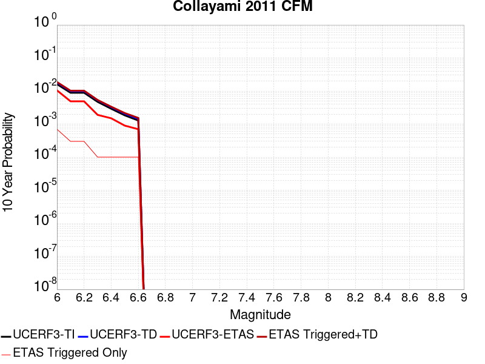 |

| Magnitude | 1 wk TI Prob | 1 wk TD Prob | 1 wk ETAS Prob | 1 wk ETAS/TD Gain | 1 wk ETAS Triggered+TD | 1 wk ETAS Triggered Only | 1 mo TI Prob | 1 mo TD Prob | 1 mo ETAS Prob | 1 mo ETAS/TD Gain | 1 mo ETAS Triggered+TD | 1 mo ETAS Triggered Only | 1 yr TI Prob | 1 yr TD Prob | 1 yr ETAS Prob | 1 yr ETAS/TD Gain | 1 yr ETAS Triggered+TD | 1 yr ETAS Triggered Only | 10 yr TI Prob | 10 yr TD Prob | 10 yr ETAS Prob | 10 yr ETAS/TD Gain | 10 yr ETAS Triggered+TD | 10 yr ETAS Triggered Only |
|-----|-----|-----|-----|-----|-----|-----|-----|-----|-----|-----|-----|-----|-----|-----|-----|-----|-----|-----|-----|-----|-----|-----|-----|-----|
| 6.0 | 3.112429E-5 | 3.4893903E-5 | 0.0 | 0.0 | 3.4893903E-5 | 0.0 | 1.33383E-4 | 1.4953771E-4 | 1.0E-4 | 0.6687277 | 1.4953771E-4 | 0.0 | 0.0016227282 | 0.0018192746 | 0.0013 | 0.7145705 | 0.0018192746 | 0.0 | 0.016109297 | 0.018061297 | 0.0105 | 0.5813536 | 0.018748654 | 7.0E-4 |
| 6.1 | 1.7119446E-5 | 1.9132842E-5 | 0.0 | 0.0 | 1.9132842E-5 | 0.0 | 7.336699E-5 | 8.199565E-5 | 1.0E-4 | 1.219577 | 8.199565E-5 | 0.0 | 8.92877E-4 | 9.978989E-4 | 6.0E-4 | 0.60126334 | 9.978989E-4 | 0.0 | 0.00889298 | 0.009940042 | 0.0049 | 0.49295563 | 0.0102370605 | 3.0E-4 |
| 6.2 | 1.7119446E-5 | 1.9132842E-5 | 0.0 | 0.0 | 1.9132842E-5 | 0.0 | 7.336699E-5 | 8.199565E-5 | 1.0E-4 | 1.219577 | 8.199565E-5 | 0.0 | 8.92877E-4 | 9.978989E-4 | 6.0E-4 | 0.60126334 | 9.978989E-4 | 0.0 | 0.00889298 | 0.009940042 | 0.0049 | 0.49295563 | 0.0102370605 | 3.0E-4 |
| 6.3 | 9.041288E-6 | 1.0093683E-5 | 0.0 | 0.0 | 1.0093683E-5 | 0.0 | 3.87478E-5 | 4.325805E-5 | 0.0 | 0.0 | 4.325805E-5 | 0.0 | 4.7165234E-4 | 5.2656134E-4 | 3.0E-4 | 0.5697342 | 5.2656134E-4 | 0.0 | 0.0047065257 | 0.005255289 | 0.0019 | 0.36154053 | 0.0053547635 | 1.0E-4 |
| 6.4 | 5.5972064E-6 | 6.2503414E-6 | 0.0 | 0.0 | 6.2503414E-6 | 0.0 | 2.3987806E-5 | 2.6786978E-5 | 0.0 | 0.0 | 2.6786978E-5 | 0.0 | 2.920124E-4 | 3.260962E-4 | 1.0E-4 | 0.30665797 | 3.260962E-4 | 0.0 | 0.0029162897 | 0.003257508 | 0.0015 | 0.4604747 | 0.0033571823 | 1.0E-4 |
| 6.5 | 3.530659E-6 | 3.9471297E-6 | 0.0 | 0.0 | 3.9471297E-6 | 0.0 | 1.5131307E-5 | 1.691622E-5 | 0.0 | 0.0 | 1.691622E-5 | 0.0 | 1.842081E-4 | 2.0594586E-4 | 1.0E-4 | 0.4855645 | 2.0594586E-4 | 0.0 | 0.0018405546 | 0.0020585663 | 9.0E-4 | 0.43719748 | 0.0021583603 | 1.0E-4 |
| 6.6 | 2.4625563E-6 | 2.7538247E-6 | 0.0 | 0.0 | 2.7538247E-6 | 0.0 | 1.0553769E-5 | 1.1802105E-5 | 0.0 | 0.0 | 1.1802105E-5 | 0.0 | 1.2848456E-4 | 1.4369063E-4 | 0.0 | 0.0 | 1.4369063E-4 | 0.0 | 0.001284103 | 0.0014369063 | 7.0E-4 | 0.48715773 | 0.0015367626 | 1.0E-4 |

## Mission Creek
*[(top)](#table-of-contents)*

| 1 Week | 1 Month | 1 Year | 10 Year |
|-----|-----|-----|-----|
|  |  |  |  |

| Magnitude | 1 wk TI Prob | 1 wk TD Prob | 1 wk ETAS Prob | 1 wk ETAS/TD Gain | 1 wk ETAS Triggered+TD | 1 wk ETAS Triggered Only | 1 mo TI Prob | 1 mo TD Prob | 1 mo ETAS Prob | 1 mo ETAS/TD Gain | 1 mo ETAS Triggered+TD | 1 mo ETAS Triggered Only | 1 yr TI Prob | 1 yr TD Prob | 1 yr ETAS Prob | 1 yr ETAS/TD Gain | 1 yr ETAS Triggered+TD | 1 yr ETAS Triggered Only | 10 yr TI Prob | 10 yr TD Prob | 10 yr ETAS Prob | 10 yr ETAS/TD Gain | 10 yr ETAS Triggered+TD | 10 yr ETAS Triggered Only |
|-----|-----|-----|-----|-----|-----|-----|-----|-----|-----|-----|-----|-----|-----|-----|-----|-----|-----|-----|-----|-----|-----|-----|-----|-----|
| 6.0 | 1.1549387E-5 | 1.6131504E-5 | 0.0 | 0.0 | 1.6131504E-5 | 0.0 | 4.9496433E-5 | 6.913327E-5 | 1.0E-4 | 1.4464816 | 1.6912636E-4 | 1.0E-4 | 6.0245243E-4 | 8.413875E-4 | 2.0E-4 | 0.23770261 | 9.413033E-4 | 1.0E-4 | 0.006008218 | 0.008413596 | 0.0057 | 0.67747486 | 0.009107707 | 7.0E-4 |
| 6.1 | 1.1549387E-5 | 1.6131504E-5 | 0.0 | 0.0 | 1.6131504E-5 | 0.0 | 4.9496433E-5 | 6.913327E-5 | 1.0E-4 | 1.4464816 | 1.6912636E-4 | 1.0E-4 | 6.0245243E-4 | 8.413875E-4 | 2.0E-4 | 0.23770261 | 9.413033E-4 | 1.0E-4 | 0.006008218 | 0.008413596 | 0.0057 | 0.67747486 | 0.009107707 | 7.0E-4 |
| 6.2 | 1.1549387E-5 | 1.6131504E-5 | 0.0 | 0.0 | 1.6131504E-5 | 0.0 | 4.9496433E-5 | 6.913327E-5 | 1.0E-4 | 1.4464816 | 1.6912636E-4 | 1.0E-4 | 6.0245243E-4 | 8.413875E-4 | 2.0E-4 | 0.23770261 | 9.413033E-4 | 1.0E-4 | 0.006008218 | 0.008413596 | 0.0057 | 0.67747486 | 0.009107707 | 7.0E-4 |
| 6.3 | 1.1549387E-5 | 1.6131504E-5 | 0.0 | 0.0 | 1.6131504E-5 | 0.0 | 4.9496433E-5 | 6.913327E-5 | 1.0E-4 | 1.4464816 | 1.6912636E-4 | 1.0E-4 | 6.0245243E-4 | 8.413875E-4 | 2.0E-4 | 0.23770261 | 9.413033E-4 | 1.0E-4 | 0.006008218 | 0.008413596 | 0.0057 | 0.67747486 | 0.009107707 | 7.0E-4 |
| 6.4 | 1.1549387E-5 | 1.6131504E-5 | 0.0 | 0.0 | 1.6131504E-5 | 0.0 | 4.9496433E-5 | 6.913327E-5 | 1.0E-4 | 1.4464816 | 1.6912636E-4 | 1.0E-4 | 6.0245243E-4 | 8.413875E-4 | 2.0E-4 | 0.23770261 | 9.413033E-4 | 1.0E-4 | 0.006008218 | 0.008413596 | 0.0057 | 0.67747486 | 0.009107707 | 7.0E-4 |
| 6.5 | 1.1549387E-5 | 1.6131504E-5 | 0.0 | 0.0 | 1.6131504E-5 | 0.0 | 4.9496433E-5 | 6.913327E-5 | 1.0E-4 | 1.4464816 | 1.6912636E-4 | 1.0E-4 | 6.0245243E-4 | 8.413875E-4 | 2.0E-4 | 0.23770261 | 9.413033E-4 | 1.0E-4 | 0.006008218 | 0.008413596 | 0.0057 | 0.67747486 | 0.009107707 | 7.0E-4 |
| 6.6 | 9.202681E-6 | 1.3656212E-5 | 0.0 | 0.0 | 1.3656212E-5 | 0.0 | 3.9439463E-5 | 5.8525362E-5 | 0.0 | 0.0 | 5.8525362E-5 | 0.0 | 4.800697E-4 | 7.123223E-4 | 1.0E-4 | 0.14038588 | 7.123223E-4 | 0.0 | 0.004790339 | 0.0071313977 | 0.0047 | 0.6590573 | 0.007727119 | 6.0E-4 |
| 6.7 | 9.019164E-6 | 1.3462001E-5 | 0.0 | 0.0 | 1.3462001E-5 | 0.0 | 3.8652986E-5 | 5.7693065E-5 | 0.0 | 0.0 | 5.7693065E-5 | 0.0 | 4.7049852E-4 | 7.021956E-4 | 1.0E-4 | 0.14241046 | 7.021956E-4 | 0.0 | 0.004695036 | 0.0070307744 | 0.0046 | 0.6542665 | 0.007626556 | 6.0E-4 |
| 6.8 | 8.673558E-6 | 1.3084503E-5 | 0.0 | 0.0 | 1.3084503E-5 | 0.0 | 3.717186E-5 | 5.6075285E-5 | 0.0 | 0.0 | 5.6075285E-5 | 0.0 | 4.524734E-4 | 6.8251154E-4 | 1.0E-4 | 0.14651766 | 6.8251154E-4 | 0.0 | 0.0045155324 | 0.0068351463 | 0.0046 | 0.67299217 | 0.007431045 | 6.0E-4 |
| 6.9 | 7.002255E-6 | 1.1290143E-5 | 0.0 | 0.0 | 1.1290143E-5 | 0.0 | 3.000932E-5 | 4.8385467E-5 | 0.0 | 0.0 | 4.8385467E-5 | 0.0 | 3.653022E-4 | 5.8894063E-4 | 1.0E-4 | 0.1697964 | 5.8894063E-4 | 0.0 | 0.0036470229 | 0.005904612 | 0.0042 | 0.71130836 | 0.00630225 | 4.0E-4 |
| 7.0 | 5.84644E-6 | 9.496702E-6 | 0.0 | 0.0 | 9.496702E-6 | 0.0 | 2.5055931E-5 | 4.069954E-5 | 0.0 | 0.0 | 4.069954E-5 | 0.0 | 3.0501327E-4 | 4.954088E-4 | 1.0E-4 | 0.20185351 | 4.954088E-4 | 0.0 | 0.0030459496 | 0.0049736556 | 0.0038 | 0.76402557 | 0.005371666 | 4.0E-4 |
| 7.1 | 5.54703E-6 | 9.1518E-6 | 0.0 | 0.0 | 9.1518E-6 | 0.0 | 2.377277E-5 | 3.922144E-5 | 0.0 | 0.0 | 3.922144E-5 | 0.0 | 2.8939504E-4 | 4.774208E-4 | 0.0 | 0.0 | 4.774208E-4 | 0.0 | 0.0028901845 | 0.004794557 | 0.0034 | 0.7091375 | 0.0050931186 | 3.0E-4 |
| 7.2 | 4.384709E-6 | 7.511537E-6 | 0.0 | 0.0 | 7.511537E-6 | 0.0 | 1.8791474E-5 | 3.2191925E-5 | 0.0 | 0.0 | 3.2191925E-5 | 0.0 | 2.2876218E-4 | 3.9186983E-4 | 0.0 | 0.0 | 3.9186983E-4 | 0.0 | 0.0022852682 | 0.0039423797 | 0.0026 | 0.6595001 | 0.0041415915 | 2.0E-4 |
| 7.3 | 3.7888456E-6 | 6.7486394E-6 | 0.0 | 0.0 | 6.7486394E-6 | 0.0 | 1.623781E-5 | 2.8922439E-5 | 0.0 | 0.0 | 2.8922439E-5 | 0.0 | 1.9767738E-4 | 3.5207713E-4 | 0.0 | 0.0 | 3.5207713E-4 | 0.0 | 0.0019750162 | 0.0035457811 | 0.0024 | 0.67686075 | 0.0037450718 | 2.0E-4 |
| 7.4 | 2.1982462E-6 | 4.8617194E-6 | 0.0 | 0.0 | 4.8617194E-6 | 0.0 | 9.421021E-6 | 2.0835776E-5 | 0.0 | 0.0 | 2.0835776E-5 | 0.0 | 1.1469489E-4 | 2.5364623E-4 | 0.0 | 0.0 | 2.5364623E-4 | 0.0 | 0.0011463572 | 0.0025639413 | 0.0016 | 0.62403923 | 0.0026636848 | 1.0E-4 |
| 7.5 | 2.051923E-6 | 4.4572294E-6 | 0.0 | 0.0 | 4.4572294E-6 | 0.0 | 8.793926E-6 | 1.9102274E-5 | 0.0 | 0.0 | 1.9102274E-5 | 0.0 | 1.0706078E-4 | 2.3254548E-4 | 0.0 | 0.0 | 2.3254548E-4 | 0.0 | 0.0010700922 | 0.0023536985 | 0.0015 | 0.6372948 | 0.0024534632 | 1.0E-4 |
| 7.6 | 1.8733427E-6 | 3.970845E-6 | 0.0 | 0.0 | 3.970845E-6 | 0.0 | 8.028587E-6 | 1.7017795E-5 | 0.0 | 0.0 | 1.7017795E-5 | 0.0 | 9.774366E-5 | 2.0717202E-4 | 0.0 | 0.0 | 2.0717202E-4 | 0.0 | 9.770069E-4 | 0.0021008784 | 0.0012 | 0.57118964 | 0.0022006682 | 1.0E-4 |
| 7.7 | 1.8411953E-6 | 3.8915077E-6 | 0.0 | 0.0 | 3.8915077E-6 | 0.0 | 7.890813E-6 | 1.6677785E-5 | 0.0 | 0.0 | 1.6677785E-5 | 0.0 | 9.606641E-5 | 2.0303318E-4 | 0.0 | 0.0 | 2.0303318E-4 | 0.0 | 9.6024893E-4 | 0.0020596583 | 0.0012 | 0.5826209 | 0.0021594523 | 1.0E-4 |
| 7.8 | 1.7194251E-6 | 3.5689336E-6 | 0.0 | 0.0 | 3.5689336E-6 | 0.0 | 7.368944E-6 | 1.5295342E-5 | 0.0 | 0.0 | 1.5295342E-5 | 0.0 | 8.97132E-5 | 1.8620494E-4 | 0.0 | 0.0 | 1.8620494E-4 | 0.0 | 8.967699E-4 | 0.0018907825 | 0.0012 | 0.63465786 | 0.0019905935 | 1.0E-4 |
| 7.9 | 1.4035052E-6 | 2.8331592E-6 | 0.0 | 0.0 | 2.8331592E-6 | 0.0 | 6.0150082E-6 | 1.2142054E-5 | 0.0 | 0.0 | 1.2142054E-5 | 0.0 | 7.3230265E-5 | 1.4781953E-4 | 0.0 | 0.0 | 1.4781953E-4 | 0.0 | 7.3206134E-4 | 0.0015040784 | 0.0011 | 0.7313448 | 0.001603928 | 1.0E-4 |
| 8.0 | 3.9318823E-7 | 5.2328056E-7 | 0.0 | 0.0 | 5.2328056E-7 | 0.0 | 1.6850913E-6 | 2.242629E-6 | 0.0 | 0.0 | 2.242629E-6 | 0.0 | 2.0515794E-5 | 2.7303671E-5 | 0.0 | 0.0 | 2.7303671E-5 | 0.0 | 2.0513899E-4 | 2.8338243E-4 | 2.0E-4 | 0.7057601 | 2.8338243E-4 | 0.0 |
| 8.1 | 1.596793E-7 | 1.0334334E-7 | 0.0 | 0.0 | 1.0334334E-7 | 0.0 | 6.8433974E-7 | 4.4289996E-7 | 0.0 | 0.0 | 4.4289996E-7 | 0.0 | 8.331805E-6 | 5.392294E-6 | 0.0 | 0.0 | 5.392294E-6 | 0.0 | 8.331492E-5 | 5.980708E-5 | 1.0E-4 | 1.6720428 | 5.980708E-5 | 0.0 |
| 8.2 | 4.9003038E-8 | 2.2795913E-8 | 0.0 | 0.0 | 2.2795913E-8 | 0.0 | 2.10013E-7 | 9.769676E-8 | 0.0 | 0.0 | 9.769676E-8 | 0.0 | 2.5569052E-6 | 1.1894574E-6 | 0.0 | 0.0 | 1.1894574E-6 | 0.0 | 2.556876E-5 | 1.3484331E-5 | 0.0 | 0.0 | 1.3484331E-5 | 0.0 |

## Big Pine (Central)
*[(top)](#table-of-contents)*

| 1 Week | 1 Month | 1 Year | 10 Year |
|-----|-----|-----|-----|
|  | 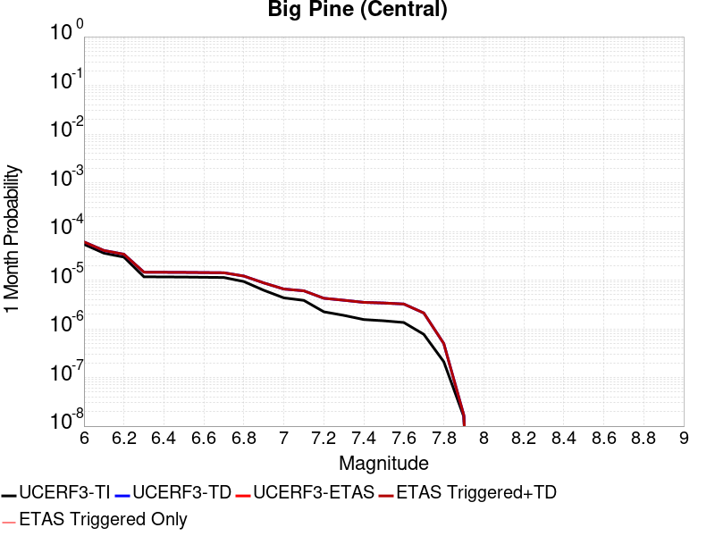 | 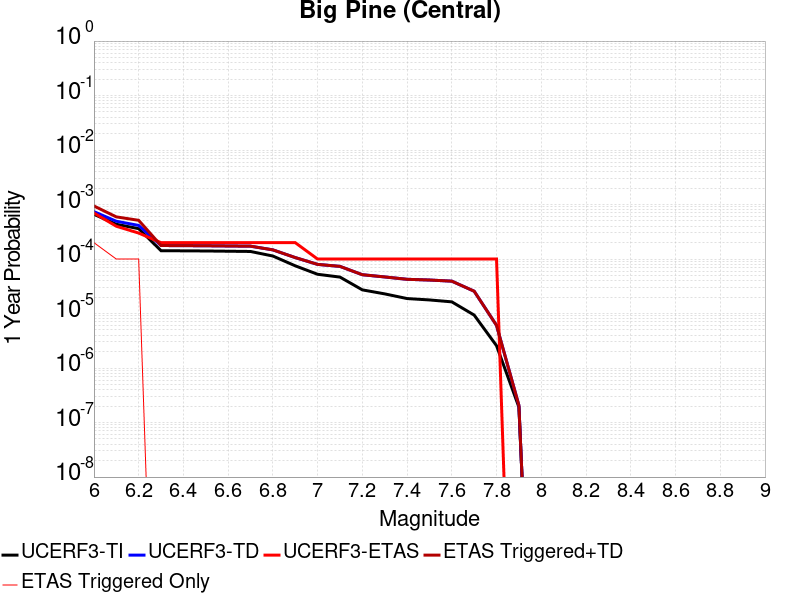 |  |

| Magnitude | 1 wk TI Prob | 1 wk TD Prob | 1 wk ETAS Prob | 1 wk ETAS/TD Gain | 1 wk ETAS Triggered+TD | 1 wk ETAS Triggered Only | 1 mo TI Prob | 1 mo TD Prob | 1 mo ETAS Prob | 1 mo ETAS/TD Gain | 1 mo ETAS Triggered+TD | 1 mo ETAS Triggered Only | 1 yr TI Prob | 1 yr TD Prob | 1 yr ETAS Prob | 1 yr ETAS/TD Gain | 1 yr ETAS Triggered+TD | 1 yr ETAS Triggered Only | 10 yr TI Prob | 10 yr TD Prob | 10 yr ETAS Prob | 10 yr ETAS/TD Gain | 10 yr ETAS Triggered+TD | 10 yr ETAS Triggered Only |
|-----|-----|-----|-----|-----|-----|-----|-----|-----|-----|-----|-----|-----|-----|-----|-----|-----|-----|-----|-----|-----|-----|-----|-----|-----|
| 6.0 | 1.2706755E-5 | 1.4212055E-5 | 0.0 | 0.0 | 1.4212055E-5 | 0.0 | 5.4456385E-5 | 6.090759E-5 | 0.0 | 0.0 | 6.090759E-5 | 0.0 | 6.628048E-4 | 7.413341E-4 | 7.0E-4 | 0.9442436 | 9.4118586E-4 | 2.0E-4 | 0.006608314 | 0.007393866 | 0.006 | 0.8114835 | 0.00808869 | 7.0E-4 |
| 6.1 | 8.342579E-6 | 9.4765455E-6 | 0.0 | 0.0 | 9.4765455E-6 | 0.0 | 3.5753423E-5 | 4.0613253E-5 | 0.0 | 0.0 | 4.0613253E-5 | 0.0 | 4.3521097E-4 | 4.943759E-4 | 4.0E-4 | 0.809101 | 5.943264E-4 | 1.0E-4 | 0.0043435963 | 0.0049365456 | 0.0027 | 0.54694116 | 0.005334571 | 4.0E-4 |
| 6.2 | 6.923899E-6 | 7.934349E-6 | 0.0 | 0.0 | 7.934349E-6 | 0.0 | 2.9673516E-5 | 3.4004017E-5 | 0.0 | 0.0 | 3.4004017E-5 | 0.0 | 3.6121515E-4 | 4.1393947E-4 | 3.0E-4 | 0.72474366 | 5.138981E-4 | 1.0E-4 | 0.003606286 | 0.004135223 | 0.0026 | 0.6287448 | 0.0045335693 | 4.0E-4 |
| 6.3 | 2.728396E-6 | 3.3954161E-6 | 0.0 | 0.0 | 3.3954161E-6 | 0.0 | 1.1693074E-5 | 1.4551707E-5 | 0.0 | 0.0 | 1.4551707E-5 | 0.0 | 1.4235388E-4 | 1.771535E-4 | 2.0E-4 | 1.1289644 | 1.771535E-4 | 0.0 | 0.0014226272 | 0.0017718642 | 0.0016 | 0.90300375 | 0.0019715098 | 2.0E-4 |
| 6.4 | 2.7136944E-6 | 3.3797207E-6 | 0.0 | 0.0 | 3.3797207E-6 | 0.0 | 1.1630066E-5 | 1.4484442E-5 | 0.0 | 0.0 | 1.4484442E-5 | 0.0 | 1.4158686E-4 | 1.7633467E-4 | 2.0E-4 | 1.1342069 | 1.7633467E-4 | 0.0 | 0.0014149669 | 0.001763689 | 0.0015 | 0.8504901 | 0.0019633363 | 2.0E-4 |
| 6.5 | 2.6971882E-6 | 3.3620786E-6 | 0.0 | 0.0 | 3.3620786E-6 | 0.0 | 1.1559327E-5 | 1.44088335E-5 | 0.0 | 0.0 | 1.44088335E-5 | 0.0 | 1.4072572E-4 | 1.7541429E-4 | 2.0E-4 | 1.1401579 | 1.7541429E-4 | 0.0 | 0.0014063664 | 0.0017544997 | 0.0015 | 0.8549445 | 0.0019541488 | 2.0E-4 |
| 6.6 | 2.669092E-6 | 3.33212E-6 | 0.0 | 0.0 | 3.33212E-6 | 0.0 | 1.1438916E-5 | 1.4280441E-5 | 0.0 | 0.0 | 1.4280441E-5 | 0.0 | 1.3925991E-4 | 1.7385137E-4 | 2.0E-4 | 1.150408 | 1.7385137E-4 | 0.0 | 0.0013917267 | 0.001738895 | 0.0015 | 0.8626168 | 0.0019385472 | 2.0E-4 |
| 6.7 | 2.6408059E-6 | 3.3021643E-6 | 0.0 | 0.0 | 3.3021643E-6 | 0.0 | 1.1317691E-5 | 1.4152061E-5 | 0.0 | 0.0 | 1.4152061E-5 | 0.0 | 1.3778417E-4 | 1.7228858E-4 | 2.0E-4 | 1.160843 | 1.7228858E-4 | 0.0 | 0.0013769877 | 0.0017232915 | 0.0015 | 0.8704273 | 0.0019229469 | 2.0E-4 |
| 6.8 | 2.1786943E-6 | 2.8257773E-6 | 0.0 | 0.0 | 2.8257773E-6 | 0.0 | 9.337228E-6 | 1.2110421E-5 | 0.0 | 0.0 | 1.2110421E-5 | 0.0 | 1.1367482E-4 | 1.4743513E-4 | 2.0E-4 | 1.3565288 | 1.4743513E-4 | 0.0 | 0.0011361669 | 0.0014751011 | 0.0013 | 0.8812955 | 0.0016748061 | 2.0E-4 |
| 6.9 | 1.4411696E-6 | 2.0411103E-6 | 0.0 | 0.0 | 2.0411103E-6 | 0.0 | 6.1764263E-6 | 8.747587E-6 | 0.0 | 0.0 | 8.747587E-6 | 0.0 | 7.51954E-5 | 1.0649694E-4 | 2.0E-4 | 1.8779882 | 1.0649694E-4 | 0.0 | 7.5169955E-4 | 0.0010661426 | 0.001 | 0.93796086 | 0.0012659293 | 2.0E-4 |
| 7.0 | 1.0073411E-6 | 1.5298066E-6 | 0.0 | 0.0 | 1.5298066E-6 | 0.0 | 4.317169E-6 | 6.5562986E-6 | 0.0 | 0.0 | 6.5562986E-6 | 0.0 | 5.2560266E-5 | 7.982016E-5 | 1.0E-4 | 1.2528163 | 7.982016E-5 | 0.0 | 5.2547833E-4 | 7.995874E-4 | 5.0E-4 | 0.6253225 | 7.995874E-4 | 0.0 |
| 7.1 | 8.947104E-7 | 1.4061434E-6 | 0.0 | 0.0 | 1.4061434E-6 | 0.0 | 3.834468E-6 | 6.026316E-6 | 0.0 | 0.0 | 6.026316E-6 | 0.0 | 4.6683643E-5 | 7.336807E-5 | 1.0E-4 | 1.3629907 | 7.336807E-5 | 0.0 | 4.6673836E-4 | 7.351108E-4 | 4.0E-4 | 0.5441357 | 7.351108E-4 | 0.0 |
| 7.2 | 5.215166E-7 | 9.886738E-7 | 0.0 | 0.0 | 9.886738E-7 | 0.0 | 2.2350691E-6 | 4.2371666E-6 | 0.0 | 0.0 | 4.2371666E-6 | 0.0 | 2.7211627E-5 | 5.158633E-5 | 1.0E-4 | 1.9384981 | 5.158633E-5 | 0.0 | 2.7208295E-4 | 5.1740574E-4 | 3.0E-4 | 0.57981575 | 5.1740574E-4 | 0.0 |
| 7.3 | 4.4024807E-7 | 9.0013293E-7 | 0.0 | 0.0 | 9.0013293E-7 | 0.0 | 1.8867761E-6 | 3.8577073E-6 | 0.0 | 0.0 | 3.8577073E-6 | 0.0 | 2.2971257E-5 | 4.6966612E-5 | 1.0E-4 | 2.129172 | 4.6966612E-5 | 0.0 | 2.2968883E-4 | 4.712289E-4 | 2.0E-4 | 0.42442217 | 4.712289E-4 | 0.0 |
| 7.4 | 3.6130905E-7 | 8.147042E-7 | 0.0 | 0.0 | 8.147042E-7 | 0.0 | 1.5484665E-6 | 3.491585E-6 | 0.0 | 0.0 | 3.491585E-6 | 0.0 | 1.8852415E-5 | 4.2509255E-5 | 1.0E-4 | 2.352429 | 4.2509255E-5 | 0.0 | 1.8850817E-4 | 4.2666378E-4 | 2.0E-4 | 0.46875316 | 4.2666378E-4 | 0.0 |
| 7.5 | 3.408184E-7 | 7.901291E-7 | 0.0 | 0.0 | 7.901291E-7 | 0.0 | 1.4606494E-6 | 3.3862634E-6 | 0.0 | 0.0 | 3.3862634E-6 | 0.0 | 1.7783263E-5 | 4.1227013E-5 | 1.0E-4 | 2.425594 | 4.1227013E-5 | 0.0 | 1.778184E-4 | 4.1382274E-4 | 2.0E-4 | 0.48329872 | 4.1382274E-4 | 0.0 |
| 7.6 | 3.1428627E-7 | 7.532086E-7 | 0.0 | 0.0 | 7.532086E-7 | 0.0 | 1.3469405E-6 | 3.2280332E-6 | 0.0 | 0.0 | 3.2280332E-6 | 0.0 | 1.6398877E-5 | 3.9300634E-5 | 1.0E-4 | 2.5444882 | 3.9300634E-5 | 0.0 | 1.6397667E-4 | 3.945347E-4 | 2.0E-4 | 0.5069263 | 3.945347E-4 | 0.0 |
| 7.7 | 1.7972785E-7 | 4.9254703E-7 | 0.0 | 0.0 | 4.9254703E-7 | 0.0 | 7.70262E-7 | 2.110914E-6 | 0.0 | 0.0 | 2.110914E-6 | 0.0 | 9.377899E-6 | 2.5700087E-5 | 1.0E-4 | 3.8910375 | 2.5700087E-5 | 0.0 | 9.377503E-5 | 2.5857266E-4 | 2.0E-4 | 0.77347696 | 2.5857266E-4 | 0.0 |
| 7.8 | 4.9230927E-8 | 1.161866E-7 | 0.0 | 0.0 | 1.161866E-7 | 0.0 | 2.1098968E-7 | 4.979425E-7 | 0.0 | 0.0 | 4.979425E-7 | 0.0 | 2.5687964E-6 | 6.0624343E-6 | 1.0E-4 | 16.495024 | 6.0624343E-6 | 0.0 | 2.5687666E-5 | 6.110249E-5 | 1.0E-4 | 1.6365947 | 6.110249E-5 | 0.0 |
| 7.9 | 3.6805972E-9 | 3.9566657E-9 | 0.0 | 0.0 | 3.9566657E-9 | 0.0 | 1.5773987E-8 | 1.695714E-8 | 0.0 | 0.0 | 1.695714E-8 | 0.0 | 1.9204828E-7 | 2.0645315E-7 | 0.0 | 0.0 | 2.0645315E-7 | 0.0 | 1.920481E-6 | 2.1121898E-6 | 0.0 | 0.0 | 2.1121898E-6 | 0.0 |

## Bennett Valley 2011 CFM
*[(top)](#table-of-contents)*

| 1 Week | 1 Month | 1 Year | 10 Year |
|-----|-----|-----|-----|
|  |  |  |  |

| Magnitude | 1 wk TI Prob | 1 wk TD Prob | 1 wk ETAS Prob | 1 wk ETAS/TD Gain | 1 wk ETAS Triggered+TD | 1 wk ETAS Triggered Only | 1 mo TI Prob | 1 mo TD Prob | 1 mo ETAS Prob | 1 mo ETAS/TD Gain | 1 mo ETAS Triggered+TD | 1 mo ETAS Triggered Only | 1 yr TI Prob | 1 yr TD Prob | 1 yr ETAS Prob | 1 yr ETAS/TD Gain | 1 yr ETAS Triggered+TD | 1 yr ETAS Triggered Only | 10 yr TI Prob | 10 yr TD Prob | 10 yr ETAS Prob | 10 yr ETAS/TD Gain | 10 yr ETAS Triggered+TD | 10 yr ETAS Triggered Only |
|-----|-----|-----|-----|-----|-----|-----|-----|-----|-----|-----|-----|-----|-----|-----|-----|-----|-----|-----|-----|-----|-----|-----|-----|-----|
| 6.0 | 2.3893934E-5 | 2.817474E-5 | 1.0E-4 | 3.5492785 | 2.817474E-5 | 0.0 | 1.0239855E-4 | 1.20744335E-4 | 1.0E-4 | 0.8281962 | 1.20744335E-4 | 0.0 | 0.0012459893 | 0.0014692552 | 0.001 | 0.6806169 | 0.0015691083 | 1.0E-4 | 0.012390262 | 0.014617991 | 0.0129 | 0.88247424 | 0.015307758 | 7.0E-4 |
| 6.1 | 2.3893934E-5 | 2.817474E-5 | 1.0E-4 | 3.5492785 | 2.817474E-5 | 0.0 | 1.0239855E-4 | 1.20744335E-4 | 1.0E-4 | 0.8281962 | 1.20744335E-4 | 0.0 | 0.0012459893 | 0.0014692552 | 0.001 | 0.6806169 | 0.0015691083 | 1.0E-4 | 0.012390262 | 0.014617991 | 0.0123 | 0.84142894 | 0.015110681 | 5.0E-4 |
| 6.2 | 1.6657146E-5 | 1.9803494E-5 | 1.0E-4 | 5.049614 | 1.9803494E-5 | 0.0 | 7.138582E-5 | 8.487015E-5 | 1.0E-4 | 1.1782706 | 8.487015E-5 | 0.0 | 8.6877577E-4 | 0.0010329452 | 7.0E-4 | 0.6776739 | 0.0011328419 | 1.0E-4 | 0.008653872 | 0.010299649 | 0.0091 | 0.88352525 | 0.010794499 | 5.0E-4 |
| 6.3 | 1.6657146E-5 | 1.9803494E-5 | 1.0E-4 | 5.049614 | 1.9803494E-5 | 0.0 | 7.138582E-5 | 8.487015E-5 | 1.0E-4 | 1.1782706 | 8.487015E-5 | 0.0 | 8.6877577E-4 | 0.0010329452 | 7.0E-4 | 0.6776739 | 0.0011328419 | 1.0E-4 | 0.008653872 | 0.010299649 | 0.0091 | 0.88352525 | 0.010794499 | 5.0E-4 |
| 6.4 | 1.29418495E-5 | 1.552408E-5 | 1.0E-4 | 6.4416056 | 1.552408E-5 | 0.0 | 5.546389E-5 | 6.653081E-5 | 1.0E-4 | 1.5030631 | 6.653081E-5 | 0.0 | 6.7506364E-4 | 8.098413E-4 | 4.0E-4 | 0.4939239 | 8.098413E-4 | 0.0 | 0.0067301663 | 0.0080859875 | 0.007 | 0.8656951 | 0.00828437 | 2.0E-4 |
| 6.5 | 1.2582504E-5 | 1.5091854E-5 | 1.0E-4 | 6.6260915 | 1.5091854E-5 | 0.0 | 5.39239E-5 | 6.46785E-5 | 1.0E-4 | 1.5461088 | 6.46785E-5 | 0.0 | 6.563257E-4 | 7.8730594E-4 | 3.0E-4 | 0.38104627 | 7.8730594E-4 | 0.0 | 0.006543907 | 0.007862272 | 0.0069 | 0.8776089 | 0.008060699 | 2.0E-4 |
| 6.6 | 1.0846706E-5 | 1.2997634E-5 | 1.0E-4 | 7.693708 | 1.2997634E-5 | 0.0 | 4.6485053E-5 | 5.5703676E-5 | 1.0E-4 | 1.7952136 | 5.5703676E-5 | 0.0 | 5.6580856E-4 | 6.781091E-4 | 3.0E-4 | 0.44240668 | 6.781091E-4 | 0.0 | 0.005643701 | 0.0067773764 | 0.0059 | 0.87054336 | 0.0069760205 | 2.0E-4 |
| 6.7 | 1.6803231E-6 | 2.355859E-6 | 1.0E-4 | 42.447365 | 2.355859E-6 | 0.0 | 7.2013645E-6 | 1.00965E-5 | 1.0E-4 | 9.904423 | 1.00965E-5 | 0.0 | 8.7673085E-5 | 1.2291808E-4 | 1.0E-4 | 0.81355 | 1.2291808E-4 | 0.0 | 8.76385E-4 | 0.0012331385 | 9.0E-4 | 0.729845 | 0.0012331385 | 0.0 |
| 6.8 | 1.4609833E-6 | 2.072452E-6 | 1.0E-4 | 48.252026 | 2.072452E-6 | 0.0 | 6.261342E-6 | 8.881906E-6 | 1.0E-4 | 11.258844 | 8.881906E-6 | 0.0 | 7.6229175E-5 | 1.0813191E-4 | 1.0E-4 | 0.92479634 | 1.0813191E-4 | 0.0 | 7.620303E-4 | 0.0010853742 | 9.0E-4 | 0.8292072 | 0.0010853742 | 0.0 |
| 6.9 | 1.3492396E-6 | 1.9247504E-6 | 1.0E-4 | 51.95479 | 1.9247504E-6 | 0.0 | 5.7824427E-6 | 8.248904E-6 | 1.0E-4 | 12.122822 | 8.248904E-6 | 0.0 | 7.0398964E-5 | 1.00425845E-4 | 1.0E-4 | 0.99575967 | 1.00425845E-4 | 0.0 | 7.037667E-4 | 0.0010083566 | 9.0E-4 | 0.8925414 | 0.0010083566 | 0.0 |
| 7.0 | 1.2347921E-6 | 1.7690137E-6 | 1.0E-4 | 56.528675 | 1.7690137E-6 | 0.0 | 5.291955E-6 | 7.5814655E-6 | 1.0E-4 | 13.190062 | 7.5814655E-6 | 0.0 | 6.442765E-5 | 9.230049E-5 | 1.0E-4 | 1.0834179 | 9.230049E-5 | 0.0 | 6.440897E-4 | 9.271397E-4 | 9.0E-4 | 0.9707275 | 9.271397E-4 | 0.0 |
| 7.1 | 1.1262973E-6 | 1.6163733E-6 | 1.0E-4 | 61.866894 | 1.6163733E-6 | 0.0 | 4.8269794E-6 | 6.927296E-6 | 1.0E-4 | 14.435647 | 6.927296E-6 | 0.0 | 5.876689E-5 | 8.4336614E-5 | 1.0E-4 | 1.1857246 | 8.4336614E-5 | 0.0 | 5.875135E-4 | 8.475391E-4 | 9.0E-4 | 1.0618979 | 8.475391E-4 | 0.0 |
| 7.2 | 9.351744E-7 | 1.3420482E-6 | 1.0E-4 | 74.51297 | 1.3420482E-6 | 0.0 | 4.007884E-6 | 5.7516227E-6 | 1.0E-4 | 17.386398 | 5.7516227E-6 | 0.0 | 4.8794896E-5 | 7.002378E-5 | 1.0E-4 | 1.4280863 | 7.002378E-5 | 0.0 | 4.878418E-4 | 7.0446555E-4 | 7.0E-4 | 0.99366105 | 7.0446555E-4 | 0.0 |
| 7.3 | 8.5039534E-7 | 1.2206865E-6 | 1.0E-4 | 81.92112 | 1.2206865E-6 | 0.0 | 3.6445463E-6 | 5.231503E-6 | 1.0E-4 | 19.114965 | 5.231503E-6 | 0.0 | 4.437145E-5 | 6.369171E-5 | 1.0E-4 | 1.5700631 | 6.369171E-5 | 0.0 | 4.436259E-4 | 6.408765E-4 | 7.0E-4 | 1.0922542 | 6.408765E-4 | 0.0 |
| 7.4 | 6.7875015E-7 | 9.4619816E-7 | 1.0E-4 | 105.686104 | 9.4619816E-7 | 0.0 | 2.908926E-6 | 4.0551286E-6 | 1.0E-4 | 24.66013 | 4.0551286E-6 | 0.0 | 3.54156E-5 | 4.9370083E-5 | 1.0E-4 | 2.0255182 | 4.9370083E-5 | 0.0 | 3.5409955E-4 | 4.96984E-4 | 5.0E-4 | 1.0060687 | 4.96984E-4 | 0.0 |
| 7.5 | 5.826867E-7 | 8.074313E-7 | 1.0E-4 | 123.84955 | 8.074313E-7 | 0.0 | 2.4972264E-6 | 3.4604152E-6 | 1.0E-4 | 28.898266 | 3.4604152E-6 | 0.0 | 3.0403306E-5 | 4.2129748E-5 | 1.0E-4 | 2.3736196 | 4.2129748E-5 | 0.0 | 3.0399146E-4 | 4.2416374E-4 | 4.0E-4 | 0.943032 | 4.2416374E-4 | 0.0 |
| 7.6 | 2.7734902E-7 | 3.6406664E-7 | 0.0 | 0.0 | 3.6406664E-7 | 0.0 | 1.1886381E-6 | 1.5602847E-6 | 0.0 | 0.0 | 1.5602847E-6 | 0.0 | 1.4471572E-5 | 1.8996301E-5 | 0.0 | 0.0 | 1.8996301E-5 | 0.0 | 1.447063E-4 | 1.9096595E-4 | 2.0E-4 | 1.0473071 | 1.9096595E-4 | 0.0 |
| 7.7 | 1.0530888E-7 | 1.350075E-7 | 0.0 | 0.0 | 1.350075E-7 | 0.0 | 4.513237E-7 | 5.786034E-7 | 0.0 | 0.0 | 5.786034E-7 | 0.0 | 5.4948523E-6 | 7.044474E-6 | 0.0 | 0.0 | 7.044474E-6 | 0.0 | 5.4947162E-5 | 7.130604E-5 | 1.0E-4 | 1.4024056 | 7.130604E-5 | 0.0 |
| 7.8 | 1.2714258E-8 | 1.8897655E-8 | 0.0 | 0.0 | 1.8897655E-8 | 0.0 | 5.448968E-8 | 8.098995E-8 | 0.0 | 0.0 | 8.098995E-8 | 0.0 | 6.6341164E-7 | 9.860522E-7 | 0.0 | 0.0 | 9.860522E-7 | 0.0 | 6.6340967E-6 | 1.0286996E-5 | 0.0 | 0.0 | 1.0286996E-5 | 0.0 |
| 7.9 | 4.075888E-9 | 7.176765E-9 | 0.0 | 0.0 | 7.176765E-9 | 0.0 | 1.7468091E-8 | 3.0757562E-8 | 0.0 | 0.0 | 3.0757562E-8 | 0.0 | 2.12674E-7 | 3.7447322E-7 | 0.0 | 0.0 | 3.7447322E-7 | 0.0 | 2.1267379E-6 | 4.0035866E-6 | 0.0 | 0.0 | 4.0035866E-6 | 0.0 |
| 8.0 | 1.9126138E-9 | 3.802908E-9 | 0.0 | 0.0 | 3.802908E-9 | 0.0 | 8.196917E-9 | 1.6298175E-8 | 0.0 | 0.0 | 1.6298175E-8 | 0.0 | 9.9797454E-8 | 1.9843026E-7 | 0.0 | 0.0 | 1.9843026E-7 | 0.0 | 9.979741E-7 | 2.103499E-6 | 0.0 | 0.0 | 2.103499E-6 | 0.0 |

## Great Valley 08 (Quinto)
*[(top)](#table-of-contents)*

| 1 Week | 1 Month | 1 Year | 10 Year |
|-----|-----|-----|-----|
|  |  | 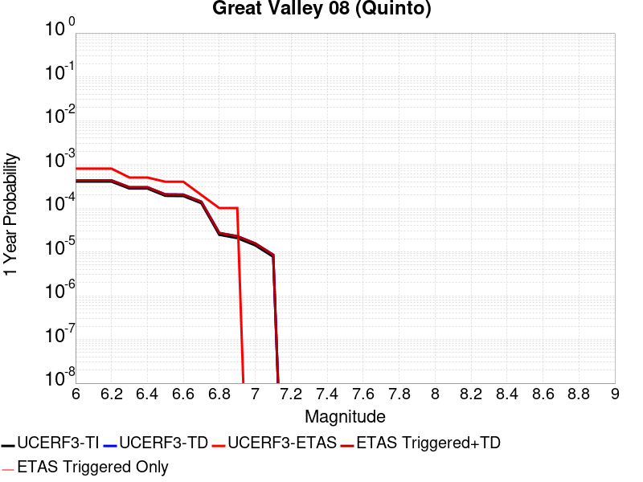 |  |

| Magnitude | 1 wk TI Prob | 1 wk TD Prob | 1 wk ETAS Prob | 1 wk ETAS/TD Gain | 1 wk ETAS Triggered+TD | 1 wk ETAS Triggered Only | 1 mo TI Prob | 1 mo TD Prob | 1 mo ETAS Prob | 1 mo ETAS/TD Gain | 1 mo ETAS Triggered+TD | 1 mo ETAS Triggered Only | 1 yr TI Prob | 1 yr TD Prob | 1 yr ETAS Prob | 1 yr ETAS/TD Gain | 1 yr ETAS Triggered+TD | 1 yr ETAS Triggered Only | 10 yr TI Prob | 10 yr TD Prob | 10 yr ETAS Prob | 10 yr ETAS/TD Gain | 10 yr ETAS Triggered+TD | 10 yr ETAS Triggered Only |
|-----|-----|-----|-----|-----|-----|-----|-----|-----|-----|-----|-----|-----|-----|-----|-----|-----|-----|-----|-----|-----|-----|-----|-----|-----|
| 6.0 | 7.737697E-6 | 8.247288E-6 | 1.0E-4 | 12.125198 | 8.247288E-6 | 0.0 | 3.3161137E-5 | 3.5345147E-5 | 2.0E-4 | 5.6584854 | 3.5345147E-5 | 0.0 | 4.0366207E-4 | 4.3026102E-4 | 8.0E-4 | 1.8593365 | 4.3026102E-4 | 0.0 | 0.004029296 | 0.0042961305 | 0.0086 | 2.0018015 | 0.0048935525 | 6.0E-4 |
| 6.1 | 7.737697E-6 | 8.247288E-6 | 1.0E-4 | 12.125198 | 8.247288E-6 | 0.0 | 3.3161137E-5 | 3.5345147E-5 | 2.0E-4 | 5.6584854 | 3.5345147E-5 | 0.0 | 4.0366207E-4 | 4.3026102E-4 | 8.0E-4 | 1.8593365 | 4.3026102E-4 | 0.0 | 0.004029296 | 0.0042961305 | 0.0086 | 2.0018015 | 0.0048935525 | 6.0E-4 |
| 6.2 | 7.737697E-6 | 8.247288E-6 | 1.0E-4 | 12.125198 | 8.247288E-6 | 0.0 | 3.3161137E-5 | 3.5345147E-5 | 2.0E-4 | 5.6584854 | 3.5345147E-5 | 0.0 | 4.0366207E-4 | 4.3026102E-4 | 8.0E-4 | 1.8593365 | 4.3026102E-4 | 0.0 | 0.004029296 | 0.0042961305 | 0.0086 | 2.0018015 | 0.0048935525 | 6.0E-4 |
| 6.3 | 5.374012E-6 | 5.7463567E-6 | 0.0 | 0.0 | 5.7463567E-6 | 0.0 | 2.3031276E-5 | 2.4627074E-5 | 1.0E-4 | 4.0605717 | 2.4627074E-5 | 0.0 | 2.803697E-4 | 2.998045E-4 | 5.0E-4 | 1.6677536 | 2.998045E-4 | 0.0 | 0.0028001624 | 0.002995092 | 0.0053 | 1.7695616 | 0.0034935945 | 5.0E-4 |
| 6.4 | 5.374012E-6 | 5.7463567E-6 | 0.0 | 0.0 | 5.7463567E-6 | 0.0 | 2.3031276E-5 | 2.4627074E-5 | 1.0E-4 | 4.0605717 | 2.4627074E-5 | 0.0 | 2.803697E-4 | 2.998045E-4 | 5.0E-4 | 1.6677536 | 2.998045E-4 | 0.0 | 0.0028001624 | 0.002995092 | 0.0053 | 1.7695616 | 0.0034935945 | 5.0E-4 |
| 6.5 | 3.65427E-6 | 3.93809E-6 | 0.0 | 0.0 | 3.93809E-6 | 0.0 | 1.5661062E-5 | 1.6877457E-5 | 1.0E-4 | 5.925063 | 1.6877457E-5 | 0.0 | 1.9065675E-4 | 2.0547071E-4 | 4.0E-4 | 1.9467494 | 2.0547071E-4 | 0.0 | 0.0019049325 | 0.002053498 | 0.0033 | 1.6070141 | 0.0022530872 | 2.0E-4 |
| 6.6 | 3.6143538E-6 | 3.895309E-6 | 0.0 | 0.0 | 3.895309E-6 | 0.0 | 1.5489995E-5 | 1.6694114E-5 | 1.0E-4 | 5.9901357 | 1.6694114E-5 | 0.0 | 1.8857437E-4 | 2.0323892E-4 | 4.0E-4 | 1.968127 | 2.0323892E-4 | 0.0 | 0.0018841444 | 0.0020312208 | 0.0033 | 1.6246387 | 0.0022308147 | 2.0E-4 |
| 6.7 | 2.4821015E-6 | 2.6834055E-6 | 0.0 | 0.0 | 2.6834055E-6 | 0.0 | 1.0637535E-5 | 1.150029E-5 | 0.0 | 0.0 | 1.150029E-5 | 0.0 | 1.2950429E-4 | 1.400127E-4 | 2.0E-4 | 1.4284419 | 1.400127E-4 | 0.0 | 0.0012942884 | 0.0013997988 | 0.0023 | 1.6430932 | 0.0015995188 | 2.0E-4 |
| 6.8 | 4.7110538E-7 | 5.187477E-7 | 0.0 | 0.0 | 5.187477E-7 | 0.0 | 2.0190216E-6 | 2.2232025E-6 | 0.0 | 0.0 | 2.2232025E-6 | 0.0 | 2.458131E-5 | 2.7067174E-5 | 1.0E-4 | 3.6945121 | 2.7067174E-5 | 0.0 | 2.457859E-4 | 2.7064056E-4 | 6.0E-4 | 2.2169626 | 2.7064056E-4 | 0.0 |
| 6.9 | 3.958685E-7 | 4.3656033E-7 | 0.0 | 0.0 | 4.3656033E-7 | 0.0 | 1.6965782E-6 | 1.8709716E-6 | 0.0 | 0.0 | 1.8709716E-6 | 0.0 | 2.0655643E-5 | 2.2778857E-5 | 1.0E-4 | 4.390036 | 2.2778857E-5 | 0.0 | 2.0653724E-4 | 2.2776684E-4 | 6.0E-4 | 2.6342728 | 2.2776684E-4 | 0.0 |
| 7.0 | 2.70294E-7 | 2.9886627E-7 | 0.0 | 0.0 | 2.9886627E-7 | 0.0 | 1.1584025E-6 | 1.2808549E-6 | 0.0 | 0.0 | 1.2808549E-6 | 0.0 | 1.4103458E-5 | 1.559431E-5 | 0.0 | 0.0 | 1.559431E-5 | 0.0 | 1.4102564E-4 | 1.5593343E-4 | 5.0E-4 | 3.2064965 | 1.5593343E-4 | 0.0 |
| 7.1 | 1.4828602E-7 | 1.6450103E-7 | 0.0 | 0.0 | 1.6450103E-7 | 0.0 | 6.3551136E-7 | 7.0500425E-7 | 0.0 | 0.0 | 7.0500425E-7 | 0.0 | 7.737323E-6 | 8.583402E-6 | 0.0 | 0.0 | 8.583402E-6 | 0.0 | 7.737054E-5 | 8.5831496E-5 | 0.0 | 0.0 | 8.5831496E-5 | 0.0 |

## Russ 2011 CFM
*[(top)](#table-of-contents)*

| 1 Week | 1 Month | 1 Year | 10 Year |
|-----|-----|-----|-----|
|  |  |  | 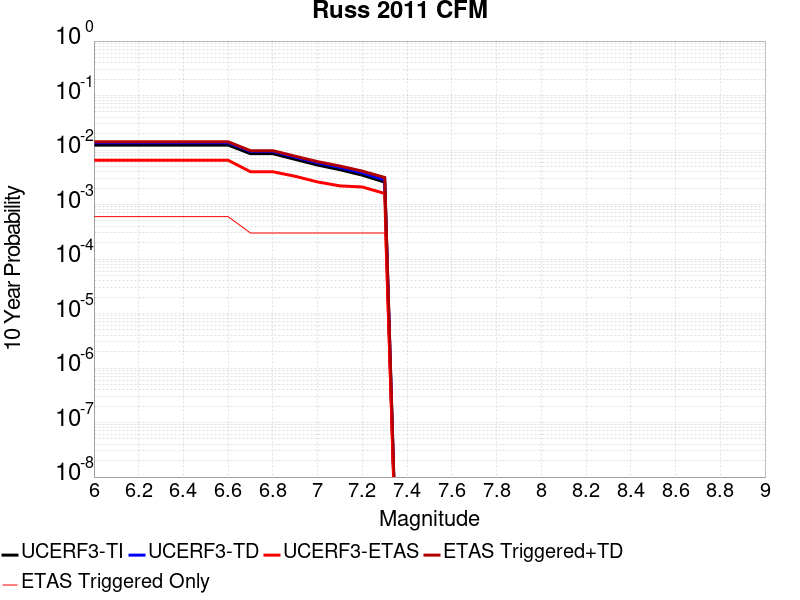 |

| Magnitude | 1 wk TI Prob | 1 wk TD Prob | 1 wk ETAS Prob | 1 wk ETAS/TD Gain | 1 wk ETAS Triggered+TD | 1 wk ETAS Triggered Only | 1 mo TI Prob | 1 mo TD Prob | 1 mo ETAS Prob | 1 mo ETAS/TD Gain | 1 mo ETAS Triggered+TD | 1 mo ETAS Triggered Only | 1 yr TI Prob | 1 yr TD Prob | 1 yr ETAS Prob | 1 yr ETAS/TD Gain | 1 yr ETAS Triggered+TD | 1 yr ETAS Triggered Only | 10 yr TI Prob | 10 yr TD Prob | 10 yr ETAS Prob | 10 yr ETAS/TD Gain | 10 yr ETAS Triggered+TD | 10 yr ETAS Triggered Only |
|-----|-----|-----|-----|-----|-----|-----|-----|-----|-----|-----|-----|-----|-----|-----|-----|-----|-----|-----|-----|-----|-----|-----|-----|-----|
| 6.0 | 2.3806366E-5 | 2.6225995E-5 | 0.0 | 0.0 | 2.6225995E-5 | 0.0 | 1.0202329E-4 | 1.12392634E-4 | 0.0 | 0.0 | 1.12392634E-4 | 0.0 | 0.0012414258 | 0.0013675849 | 5.0E-4 | 0.365608 | 0.0014674482 | 1.0E-4 | 0.012345135 | 0.013598154 | 0.0065 | 0.47800604 | 0.014189996 | 6.0E-4 |
| 6.1 | 2.3806366E-5 | 2.6225995E-5 | 0.0 | 0.0 | 2.6225995E-5 | 0.0 | 1.0202329E-4 | 1.12392634E-4 | 0.0 | 0.0 | 1.12392634E-4 | 0.0 | 0.0012414258 | 0.0013675849 | 5.0E-4 | 0.365608 | 0.0014674482 | 1.0E-4 | 0.012345135 | 0.013598154 | 0.0065 | 0.47800604 | 0.014189996 | 6.0E-4 |
| 6.2 | 2.3806366E-5 | 2.6225995E-5 | 0.0 | 0.0 | 2.6225995E-5 | 0.0 | 1.0202329E-4 | 1.12392634E-4 | 0.0 | 0.0 | 1.12392634E-4 | 0.0 | 0.0012414258 | 0.0013675849 | 5.0E-4 | 0.365608 | 0.0014674482 | 1.0E-4 | 0.012345135 | 0.013598154 | 0.0065 | 0.47800604 | 0.014189996 | 6.0E-4 |
| 6.3 | 2.3806366E-5 | 2.6225995E-5 | 0.0 | 0.0 | 2.6225995E-5 | 0.0 | 1.0202329E-4 | 1.12392634E-4 | 0.0 | 0.0 | 1.12392634E-4 | 0.0 | 0.0012414258 | 0.0013675849 | 5.0E-4 | 0.365608 | 0.0014674482 | 1.0E-4 | 0.012345135 | 0.013598154 | 0.0065 | 0.47800604 | 0.014189996 | 6.0E-4 |
| 6.4 | 2.3806366E-5 | 2.6225995E-5 | 0.0 | 0.0 | 2.6225995E-5 | 0.0 | 1.0202329E-4 | 1.12392634E-4 | 0.0 | 0.0 | 1.12392634E-4 | 0.0 | 0.0012414258 | 0.0013675849 | 5.0E-4 | 0.365608 | 0.0014674482 | 1.0E-4 | 0.012345135 | 0.013598154 | 0.0065 | 0.47800604 | 0.014189996 | 6.0E-4 |
| 6.5 | 2.3806366E-5 | 2.6225995E-5 | 0.0 | 0.0 | 2.6225995E-5 | 0.0 | 1.0202329E-4 | 1.12392634E-4 | 0.0 | 0.0 | 1.12392634E-4 | 0.0 | 0.0012414258 | 0.0013675849 | 5.0E-4 | 0.365608 | 0.0014674482 | 1.0E-4 | 0.012345135 | 0.013598154 | 0.0065 | 0.47800604 | 0.014189996 | 6.0E-4 |
| 6.6 | 2.3806366E-5 | 2.6225995E-5 | 0.0 | 0.0 | 2.6225995E-5 | 0.0 | 1.0202329E-4 | 1.12392634E-4 | 0.0 | 0.0 | 1.12392634E-4 | 0.0 | 0.0012414258 | 0.0013675849 | 5.0E-4 | 0.365608 | 0.0014674482 | 1.0E-4 | 0.012345135 | 0.013598154 | 0.0065 | 0.47800604 | 0.014189996 | 6.0E-4 |
| 6.7 | 1.6515693E-5 | 1.8168736E-5 | 0.0 | 0.0 | 1.8168736E-5 | 0.0 | 7.077962E-5 | 7.786387E-5 | 0.0 | 0.0 | 7.786387E-5 | 0.0 | 8.6140115E-4 | 9.476141E-4 | 2.0E-4 | 0.21105638 | 9.476141E-4 | 0.0 | 0.008580698 | 0.009439119 | 0.004 | 0.42376837 | 0.009736287 | 3.0E-4 |
| 6.8 | 1.6515693E-5 | 1.8168736E-5 | 0.0 | 0.0 | 1.8168736E-5 | 0.0 | 7.077962E-5 | 7.786387E-5 | 0.0 | 0.0 | 7.786387E-5 | 0.0 | 8.6140115E-4 | 9.476141E-4 | 2.0E-4 | 0.21105638 | 9.476141E-4 | 0.0 | 0.008580698 | 0.009439119 | 0.004 | 0.42376837 | 0.009736287 | 3.0E-4 |
| 6.9 | 1.2971182E-5 | 1.4258879E-5 | 0.0 | 0.0 | 1.4258879E-5 | 0.0 | 5.5589593E-5 | 6.110819E-5 | 0.0 | 0.0 | 6.110819E-5 | 0.0 | 6.765931E-4 | 7.4376416E-4 | 2.0E-4 | 0.26890245 | 7.4376416E-4 | 0.0 | 0.0067453682 | 0.0074153175 | 0.0033 | 0.4450248 | 0.007713093 | 3.0E-4 |
| 7.0 | 1.0201805E-5 | 1.1210207E-5 | 0.0 | 0.0 | 1.1210207E-5 | 0.0 | 4.3721288E-5 | 4.8042977E-5 | 0.0 | 0.0 | 4.8042977E-5 | 0.0 | 5.3217664E-4 | 5.84787E-4 | 2.0E-4 | 0.34200487 | 5.84787E-4 | 0.0 | 0.00530904 | 0.0058345287 | 0.0026 | 0.44562295 | 0.0061327787 | 3.0E-4 |
| 7.1 | 8.3744935E-6 | 9.20305E-6 | 0.0 | 0.0 | 9.20305E-6 | 0.0 | 3.5890193E-5 | 3.9441147E-5 | 0.0 | 0.0 | 3.9441147E-5 | 0.0 | 4.368755E-4 | 4.801087E-4 | 2.0E-4 | 0.41657236 | 4.801087E-4 | 0.0 | 0.004360176 | 0.004792536 | 0.0022 | 0.45904717 | 0.005091098 | 3.0E-4 |
| 7.2 | 6.649391E-6 | 7.309346E-6 | 0.0 | 0.0 | 7.309346E-6 | 0.0 | 2.8497077E-5 | 3.1325486E-5 | 0.0 | 0.0 | 3.1325486E-5 | 0.0 | 3.4689668E-4 | 3.8133762E-4 | 2.0E-4 | 0.5244696 | 3.8133762E-4 | 0.0 | 0.0034635565 | 0.0038084595 | 0.0021 | 0.55140406 | 0.004107317 | 3.0E-4 |
| 7.3 | 4.9549312E-6 | 5.4488555E-6 | 0.0 | 0.0 | 5.4488555E-6 | 0.0 | 2.1235246E-5 | 2.3352111E-5 | 0.0 | 0.0 | 2.3352111E-5 | 0.0 | 2.5850846E-4 | 2.8428956E-4 | 1.0E-4 | 0.35175404 | 2.8428956E-4 | 0.0 | 0.0025820795 | 0.0028406996 | 0.0016 | 0.56324154 | 0.0031398474 | 3.0E-4 |

## San Andreas (North Branch Mill Creek)
*[(top)](#table-of-contents)*

| 1 Week | 1 Month | 1 Year | 10 Year |
|-----|-----|-----|-----|
|  |  | 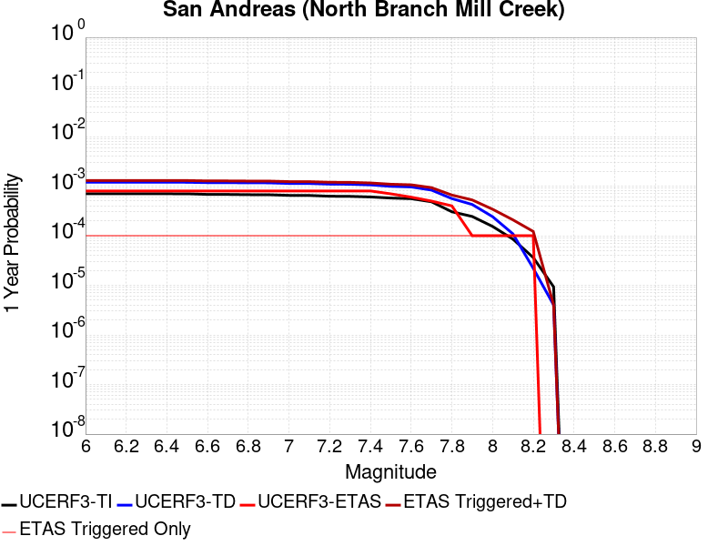 |  |

| Magnitude | 1 wk TI Prob | 1 wk TD Prob | 1 wk ETAS Prob | 1 wk ETAS/TD Gain | 1 wk ETAS Triggered+TD | 1 wk ETAS Triggered Only | 1 mo TI Prob | 1 mo TD Prob | 1 mo ETAS Prob | 1 mo ETAS/TD Gain | 1 mo ETAS Triggered+TD | 1 mo ETAS Triggered Only | 1 yr TI Prob | 1 yr TD Prob | 1 yr ETAS Prob | 1 yr ETAS/TD Gain | 1 yr ETAS Triggered+TD | 1 yr ETAS Triggered Only | 10 yr TI Prob | 10 yr TD Prob | 10 yr ETAS Prob | 10 yr ETAS/TD Gain | 10 yr ETAS Triggered+TD | 10 yr ETAS Triggered Only |
|-----|-----|-----|-----|-----|-----|-----|-----|-----|-----|-----|-----|-----|-----|-----|-----|-----|-----|-----|-----|-----|-----|-----|-----|-----|
| 6.0 | 1.3461156E-5 | 2.2894961E-5 | 0.0 | 0.0 | 2.2894961E-5 | 0.0 | 5.7689394E-5 | 9.811759E-5 | 1.0E-4 | 1.0191852 | 1.9810778E-4 | 1.0E-4 | 7.02142E-4 | 0.0011939303 | 8.0E-4 | 0.6700559 | 0.0012938108 | 1.0E-4 | 0.0069992766 | 0.011918645 | 0.0073 | 0.6124857 | 0.012511495 | 6.0E-4 |
| 6.1 | 1.3461156E-5 | 2.2894961E-5 | 0.0 | 0.0 | 2.2894961E-5 | 0.0 | 5.7689394E-5 | 9.811759E-5 | 1.0E-4 | 1.0191852 | 1.9810778E-4 | 1.0E-4 | 7.02142E-4 | 0.0011939303 | 8.0E-4 | 0.6700559 | 0.0012938108 | 1.0E-4 | 0.0069992766 | 0.011918645 | 0.0073 | 0.6124857 | 0.012511495 | 6.0E-4 |
| 6.2 | 1.3461156E-5 | 2.2894961E-5 | 0.0 | 0.0 | 2.2894961E-5 | 0.0 | 5.7689394E-5 | 9.811759E-5 | 1.0E-4 | 1.0191852 | 1.9810778E-4 | 1.0E-4 | 7.02142E-4 | 0.0011939303 | 8.0E-4 | 0.6700559 | 0.0012938108 | 1.0E-4 | 0.0069992766 | 0.011918645 | 0.0073 | 0.6124857 | 0.012511495 | 6.0E-4 |
| 6.3 | 1.3461156E-5 | 2.2894961E-5 | 0.0 | 0.0 | 2.2894961E-5 | 0.0 | 5.7689394E-5 | 9.811759E-5 | 1.0E-4 | 1.0191852 | 1.9810778E-4 | 1.0E-4 | 7.02142E-4 | 0.0011939303 | 8.0E-4 | 0.6700559 | 0.0012938108 | 1.0E-4 | 0.0069992766 | 0.011918645 | 0.0073 | 0.6124857 | 0.012511495 | 6.0E-4 |
| 6.4 | 1.3461156E-5 | 2.2894961E-5 | 0.0 | 0.0 | 2.2894961E-5 | 0.0 | 5.7689394E-5 | 9.811759E-5 | 1.0E-4 | 1.0191852 | 1.9810778E-4 | 1.0E-4 | 7.02142E-4 | 0.0011939303 | 8.0E-4 | 0.6700559 | 0.0012938108 | 1.0E-4 | 0.0069992766 | 0.011918645 | 0.0073 | 0.6124857 | 0.012511495 | 6.0E-4 |
| 6.5 | 1.3450706E-5 | 2.2883927E-5 | 0.0 | 0.0 | 2.2883927E-5 | 0.0 | 5.764461E-5 | 9.8070304E-5 | 1.0E-4 | 1.0196767 | 1.980605E-4 | 1.0E-4 | 7.0159714E-4 | 0.0011933552 | 8.0E-4 | 0.6703788 | 0.0012932358 | 1.0E-4 | 0.006993862 | 0.011912957 | 0.0073 | 0.6127782 | 0.012505809 | 6.0E-4 |
| 6.6 | 1.3074523E-5 | 2.2498407E-5 | 0.0 | 0.0 | 2.2498407E-5 | 0.0 | 5.6032466E-5 | 9.6418196E-5 | 1.0E-4 | 1.0371486 | 1.9640855E-4 | 1.0E-4 | 6.8198174E-4 | 0.0011732625 | 8.0E-4 | 0.6818594 | 0.0012731452 | 1.0E-4 | 0.006798926 | 0.01171416 | 0.0072 | 0.6146407 | 0.012307132 | 6.0E-4 |
| 6.7 | 1.3050216E-5 | 2.2473736E-5 | 0.0 | 0.0 | 2.2473736E-5 | 0.0 | 5.59283E-5 | 9.631248E-5 | 1.0E-4 | 1.0382872 | 1.9630285E-4 | 1.0E-4 | 6.8071426E-4 | 0.0011719767 | 8.0E-4 | 0.6826074 | 0.0012718595 | 1.0E-4 | 0.0067863287 | 0.011701439 | 0.0072 | 0.61530894 | 0.012294417 | 6.0E-4 |
| 6.8 | 1.29049395E-5 | 2.2322258E-5 | 0.0 | 0.0 | 2.2322258E-5 | 0.0 | 5.530571E-5 | 9.566333E-5 | 1.0E-4 | 1.0453327 | 1.9565376E-4 | 1.0E-4 | 6.73139E-4 | 0.0011640819 | 8.0E-4 | 0.6872369 | 0.0012639654 | 1.0E-4 | 0.0067110364 | 0.011623316 | 0.0072 | 0.61944455 | 0.012216343 | 6.0E-4 |
| 6.9 | 1.2867369E-5 | 2.2281742E-5 | 0.0 | 0.0 | 2.2281742E-5 | 0.0 | 5.51447E-5 | 9.5489704E-5 | 1.0E-4 | 1.0472333 | 1.9548016E-4 | 1.0E-4 | 6.711799E-4 | 0.0011619702 | 8.0E-4 | 0.6884858 | 0.001261854 | 1.0E-4 | 0.006691564 | 0.011602421 | 0.0072 | 0.6205601 | 0.01219546 | 6.0E-4 |
| 7.0 | 1.2495996E-5 | 2.1685511E-5 | 0.0 | 0.0 | 2.1685511E-5 | 0.0 | 5.3553173E-5 | 9.293461E-5 | 1.0E-4 | 1.0760254 | 1.9292532E-4 | 1.0E-4 | 6.518148E-4 | 0.0011308943 | 8.0E-4 | 0.70740473 | 0.0012307812 | 1.0E-4 | 0.0064990623 | 0.011294832 | 0.0067 | 0.5931916 | 0.011888056 | 6.0E-4 |
| 7.1 | 1.2452067E-5 | 2.1630749E-5 | 0.0 | 0.0 | 2.1630749E-5 | 0.0 | 5.3364907E-5 | 9.2699935E-5 | 1.0E-4 | 1.0787494 | 1.9269067E-4 | 1.0E-4 | 6.4952404E-4 | 0.0011280401 | 8.0E-4 | 0.70919466 | 0.0012279273 | 1.0E-4 | 0.0064762887 | 0.011266581 | 0.0067 | 0.5946791 | 0.01185982 | 6.0E-4 |
| 7.2 | 1.2002777E-5 | 2.1012174E-5 | 0.0 | 0.0 | 2.1012174E-5 | 0.0 | 5.143946E-5 | 9.0049085E-5 | 1.0E-4 | 1.1105055 | 1.9004008E-4 | 1.0E-4 | 6.2609545E-4 | 0.0010957988 | 8.0E-4 | 0.73006105 | 0.0011956892 | 1.0E-4 | 0.006243344 | 0.010947371 | 0.0066 | 0.6028845 | 0.011540803 | 6.0E-4 |
| 7.3 | 1.1923425E-5 | 2.088261E-5 | 0.0 | 0.0 | 2.088261E-5 | 0.0 | 5.109939E-5 | 8.949384E-5 | 1.0E-4 | 1.1173953 | 1.894849E-4 | 1.0E-4 | 6.219575E-4 | 0.0010890454 | 8.0E-4 | 0.73458827 | 0.0011889365 | 1.0E-4 | 0.0062021962 | 0.010880542 | 0.0066 | 0.60658747 | 0.011474013 | 6.0E-4 |
| 7.4 | 1.16105175E-5 | 2.0263682E-5 | 0.0 | 0.0 | 2.0263682E-5 | 0.0 | 4.975841E-5 | 8.684147E-5 | 1.0E-4 | 1.1515235 | 1.868328E-4 | 1.0E-4 | 6.0564023E-4 | 0.0010567845 | 8.0E-4 | 0.7570133 | 0.0011566789 | 1.0E-4 | 0.006039923 | 0.010561627 | 0.0061 | 0.5775625 | 0.010957402 | 4.0E-4 |
| 7.5 | 1.1037265E-5 | 1.8988934E-5 | 0.0 | 0.0 | 1.8988934E-5 | 0.0 | 4.7301706E-5 | 8.137862E-5 | 1.0E-4 | 1.228824 | 1.8137047E-4 | 1.0E-4 | 5.757461E-4 | 9.903364E-4 | 7.0E-4 | 0.7068305 | 0.0010902374 | 1.0E-4 | 0.005742567 | 0.009904555 | 0.0057 | 0.5754928 | 0.010201584 | 3.0E-4 |
| 7.6 | 1.0720915E-5 | 1.8438837E-5 | 0.0 | 0.0 | 1.8438837E-5 | 0.0 | 4.5945973E-5 | 7.902121E-5 | 1.0E-4 | 1.2654831 | 1.790133E-4 | 1.0E-4 | 5.592486E-4 | 9.6166064E-4 | 6.0E-4 | 0.62392074 | 0.0010615644 | 1.0E-4 | 0.005578433 | 0.009620325 | 0.0054 | 0.5613116 | 0.009917438 | 3.0E-4 |
| 7.7 | 9.276279E-6 | 1.5914407E-5 | 0.0 | 0.0 | 1.5914407E-5 | 0.0 | 3.9754876E-5 | 6.820283E-5 | 1.0E-4 | 1.4662148 | 1.6819601E-4 | 1.0E-4 | 4.839081E-4 | 8.3005475E-4 | 5.0E-4 | 0.6023699 | 9.299717E-4 | 1.0E-4 | 0.0048285574 | 0.008315057 | 0.005 | 0.60131884 | 0.008612562 | 3.0E-4 |
| 7.8 | 5.8346777E-6 | 1.0738303E-5 | 0.0 | 0.0 | 1.0738303E-5 | 0.0 | 2.5005522E-5 | 4.6020486E-5 | 1.0E-4 | 2.1729453 | 1.4601588E-4 | 1.0E-4 | 3.043997E-4 | 5.601555E-4 | 4.0E-4 | 0.7140874 | 6.600995E-4 | 1.0E-4 | 0.0030398308 | 0.0056325593 | 0.0036 | 0.6391411 | 0.00593087 | 3.0E-4 |
| 7.9 | 4.690204E-6 | 8.1600465E-6 | 0.0 | 0.0 | 8.1600465E-6 | 0.0 | 2.0100719E-5 | 3.497116E-5 | 1.0E-4 | 2.859499 | 1.3496766E-4 | 1.0E-4 | 2.4469878E-4 | 4.2569079E-4 | 1.0E-4 | 0.2349123 | 5.256482E-4 | 1.0E-4 | 0.002444295 | 0.0042910287 | 0.0027 | 0.6292198 | 0.004589741 | 3.0E-4 |
| 8.0 | 2.9570454E-6 | 4.6303044E-6 | 0.0 | 0.0 | 4.6303044E-6 | 0.0 | 1.267299E-5 | 1.984401E-5 | 1.0E-4 | 5.039304 | 1.1984203E-4 | 1.0E-4 | 1.5428272E-4 | 2.4157407E-4 | 1.0E-4 | 0.41395172 | 3.4154992E-4 | 1.0E-4 | 0.0015417566 | 0.0024371196 | 0.0017 | 0.6975448 | 0.0026366322 | 2.0E-4 |
| 8.1 | 1.6376824E-6 | 2.0804132E-6 | 0.0 | 0.0 | 2.0804132E-6 | 0.0 | 7.01862E-6 | 8.916027E-6 | 1.0E-4 | 11.215758 | 1.08915134E-4 | 1.0E-4 | 8.544835E-5 | 1.0854723E-4 | 1.0E-4 | 0.921258 | 2.0853638E-4 | 1.0E-4 | 8.54155E-4 | 0.0010998398 | 7.0E-4 | 0.6364564 | 0.0011997297 | 1.0E-4 |
| 8.2 | 6.9631557E-7 | 4.167043E-7 | 0.0 | 0.0 | 4.167043E-7 | 0.0 | 2.984206E-6 | 1.7858744E-6 | 1.0E-4 | 55.994984 | 1.0178569E-4 | 1.0E-4 | 3.63321E-5 | 2.1742804E-5 | 1.0E-4 | 4.5992227 | 1.2174063E-4 | 1.0E-4 | 3.6326164E-4 | 2.255496E-4 | 2.0E-4 | 0.8867229 | 3.2552704E-4 | 1.0E-4 |
| 8.3 | 1.7876137E-7 | 7.614013E-8 | 0.0 | 0.0 | 7.614013E-8 | 0.0 | 7.661199E-7 | 3.263148E-7 | 0.0 | 0.0 | 3.263148E-7 | 0.0 | 9.32747E-6 | 3.9728757E-6 | 0.0 | 0.0 | 3.9728757E-6 | 0.0 | 9.3270784E-5 | 4.1807303E-5 | 0.0 | 0.0 | 4.1807303E-5 | 0.0 |

## Mad River (alt1)
*[(top)](#table-of-contents)*

| 1 Week | 1 Month | 1 Year | 10 Year |
|-----|-----|-----|-----|
|  | 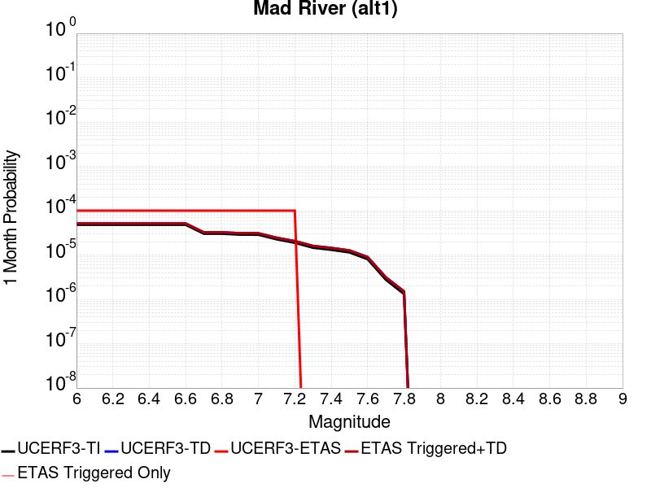 | 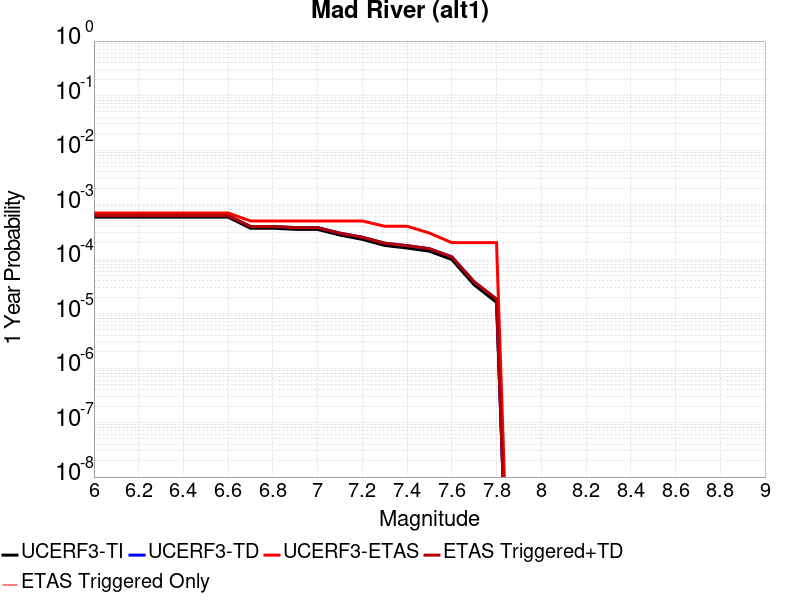 |  |

| Magnitude | 1 wk TI Prob | 1 wk TD Prob | 1 wk ETAS Prob | 1 wk ETAS/TD Gain | 1 wk ETAS Triggered+TD | 1 wk ETAS Triggered Only | 1 mo TI Prob | 1 mo TD Prob | 1 mo ETAS Prob | 1 mo ETAS/TD Gain | 1 mo ETAS Triggered+TD | 1 mo ETAS Triggered Only | 1 yr TI Prob | 1 yr TD Prob | 1 yr ETAS Prob | 1 yr ETAS/TD Gain | 1 yr ETAS Triggered+TD | 1 yr ETAS Triggered Only | 10 yr TI Prob | 10 yr TD Prob | 10 yr ETAS Prob | 10 yr ETAS/TD Gain | 10 yr ETAS Triggered+TD | 10 yr ETAS Triggered Only |
|-----|-----|-----|-----|-----|-----|-----|-----|-----|-----|-----|-----|-----|-----|-----|-----|-----|-----|-----|-----|-----|-----|-----|-----|-----|
| 6.0 | 1.1255216E-5 | 1.2030814E-5 | 0.0 | 0.0 | 1.2030814E-5 | 0.0 | 4.8235746E-5 | 5.1559695E-5 | 1.0E-4 | 1.9394995 | 5.1559695E-5 | 0.0 | 5.87112E-4 | 6.275729E-4 | 7.0E-4 | 1.1154083 | 6.275729E-4 | 0.0 | 0.0058556325 | 0.0062594432 | 0.0056 | 0.89464825 | 0.0068556876 | 6.0E-4 |
| 6.1 | 1.1255216E-5 | 1.2030814E-5 | 0.0 | 0.0 | 1.2030814E-5 | 0.0 | 4.8235746E-5 | 5.1559695E-5 | 1.0E-4 | 1.9394995 | 5.1559695E-5 | 0.0 | 5.87112E-4 | 6.275729E-4 | 7.0E-4 | 1.1154083 | 6.275729E-4 | 0.0 | 0.0058556325 | 0.0062594432 | 0.0056 | 0.89464825 | 0.0068556876 | 6.0E-4 |
| 6.2 | 1.1255216E-5 | 1.2030814E-5 | 0.0 | 0.0 | 1.2030814E-5 | 0.0 | 4.8235746E-5 | 5.1559695E-5 | 1.0E-4 | 1.9394995 | 5.1559695E-5 | 0.0 | 5.87112E-4 | 6.275729E-4 | 7.0E-4 | 1.1154083 | 6.275729E-4 | 0.0 | 0.0058556325 | 0.0062594432 | 0.0056 | 0.89464825 | 0.0068556876 | 6.0E-4 |
| 6.3 | 1.1255216E-5 | 1.2030814E-5 | 0.0 | 0.0 | 1.2030814E-5 | 0.0 | 4.8235746E-5 | 5.1559695E-5 | 1.0E-4 | 1.9394995 | 5.1559695E-5 | 0.0 | 5.87112E-4 | 6.275729E-4 | 7.0E-4 | 1.1154083 | 6.275729E-4 | 0.0 | 0.0058556325 | 0.0062594432 | 0.0056 | 0.89464825 | 0.0068556876 | 6.0E-4 |
| 6.4 | 1.1255216E-5 | 1.2030814E-5 | 0.0 | 0.0 | 1.2030814E-5 | 0.0 | 4.8235746E-5 | 5.1559695E-5 | 1.0E-4 | 1.9394995 | 5.1559695E-5 | 0.0 | 5.87112E-4 | 6.275729E-4 | 7.0E-4 | 1.1154083 | 6.275729E-4 | 0.0 | 0.0058556325 | 0.0062594432 | 0.0056 | 0.89464825 | 0.0068556876 | 6.0E-4 |
| 6.5 | 1.1255216E-5 | 1.2030814E-5 | 0.0 | 0.0 | 1.2030814E-5 | 0.0 | 4.8235746E-5 | 5.1559695E-5 | 1.0E-4 | 1.9394995 | 5.1559695E-5 | 0.0 | 5.87112E-4 | 6.275729E-4 | 7.0E-4 | 1.1154083 | 6.275729E-4 | 0.0 | 0.0058556325 | 0.0062594432 | 0.0056 | 0.89464825 | 0.0068556876 | 6.0E-4 |
| 6.6 | 1.1255216E-5 | 1.2030814E-5 | 0.0 | 0.0 | 1.2030814E-5 | 0.0 | 4.8235746E-5 | 5.1559695E-5 | 1.0E-4 | 1.9394995 | 5.1559695E-5 | 0.0 | 5.87112E-4 | 6.275729E-4 | 7.0E-4 | 1.1154083 | 6.275729E-4 | 0.0 | 0.0058556325 | 0.0062594432 | 0.0056 | 0.89464825 | 0.0068556876 | 6.0E-4 |
| 6.7 | 7.0564884E-6 | 7.5991843E-6 | 0.0 | 0.0 | 7.5991843E-6 | 0.0 | 3.0241743E-5 | 3.256754E-5 | 1.0E-4 | 3.070542 | 3.256754E-5 | 0.0 | 3.68131E-4 | 3.9643983E-4 | 5.0E-4 | 1.2612255 | 3.9643983E-4 | 0.0 | 0.0036752177 | 0.003957548 | 0.0033 | 0.8338496 | 0.003957548 | 0.0 |
| 6.8 | 7.0564884E-6 | 7.5991843E-6 | 0.0 | 0.0 | 7.5991843E-6 | 0.0 | 3.0241743E-5 | 3.256754E-5 | 1.0E-4 | 3.070542 | 3.256754E-5 | 0.0 | 3.68131E-4 | 3.9643983E-4 | 5.0E-4 | 1.2612255 | 3.9643983E-4 | 0.0 | 0.0036752177 | 0.003957548 | 0.0033 | 0.8338496 | 0.003957548 | 0.0 |
| 6.9 | 6.727494E-6 | 7.251248E-6 | 0.0 | 0.0 | 7.251248E-6 | 0.0 | 2.8831799E-5 | 3.107642E-5 | 1.0E-4 | 3.217874 | 3.107642E-5 | 0.0 | 3.509706E-4 | 3.7829185E-4 | 5.0E-4 | 1.3217309 | 3.7829185E-4 | 0.0 | 0.003504168 | 0.0037766942 | 0.003 | 0.7943455 | 0.0037766942 | 0.0 |
| 7.0 | 6.7021124E-6 | 7.224108E-6 | 0.0 | 0.0 | 7.224108E-6 | 0.0 | 2.8723021E-5 | 3.0960106E-5 | 1.0E-4 | 3.229963 | 3.0960106E-5 | 0.0 | 3.4964667E-4 | 3.7687624E-4 | 5.0E-4 | 1.3266954 | 3.7687624E-4 | 0.0 | 0.0034909705 | 0.003762586 | 0.003 | 0.79732394 | 0.003762586 | 0.0 |
| 7.1 | 5.2784667E-6 | 5.727039E-6 | 0.0 | 0.0 | 5.727039E-6 | 0.0 | 2.2621804E-5 | 2.4544226E-5 | 1.0E-4 | 4.074278 | 2.4544226E-5 | 0.0 | 2.7538565E-4 | 2.987859E-4 | 5.0E-4 | 1.6734391 | 2.987859E-4 | 0.0 | 0.0027504463 | 0.002983934 | 0.0022 | 0.73728174 | 0.002983934 | 0.0 |
| 7.2 | 4.4085446E-6 | 4.8148163E-6 | 0.0 | 0.0 | 4.8148163E-6 | 0.0 | 1.8893625E-5 | 2.0634765E-5 | 1.0E-4 | 4.8461905 | 2.0634765E-5 | 0.0 | 2.3000561E-4 | 2.511997E-4 | 5.0E-4 | 1.9904482 | 2.511997E-4 | 0.0 | 0.0022976769 | 0.0025091982 | 0.0018 | 0.7173606 | 0.0025091982 | 0.0 |
| 7.3 | 3.4060627E-6 | 3.7491557E-6 | 0.0 | 0.0 | 3.7491557E-6 | 0.0 | 1.459733E-5 | 1.6067712E-5 | 0.0 | 0.0 | 1.6067712E-5 | 0.0 | 1.77708E-4 | 1.9560708E-4 | 4.0E-4 | 2.044916 | 1.9560708E-4 | 0.0 | 0.0017756595 | 0.0019543723 | 0.0016 | 0.8186771 | 0.0019543723 | 0.0 |
| 7.4 | 3.0570902E-6 | 3.3765443E-6 | 0.0 | 0.0 | 3.3765443E-6 | 0.0 | 1.310175E-5 | 1.4470826E-5 | 0.0 | 0.0 | 1.4470826E-5 | 0.0 | 1.5950213E-4 | 1.7616827E-4 | 4.0E-4 | 2.2705564 | 1.7616827E-4 | 0.0 | 0.0015938769 | 0.0017603077 | 0.0016 | 0.908932 | 0.0017603077 | 0.0 |
| 7.5 | 2.674048E-6 | 2.96583E-6 | 0.0 | 0.0 | 2.96583E-6 | 0.0 | 1.1460155E-5 | 1.2710639E-5 | 0.0 | 0.0 | 1.2710639E-5 | 0.0 | 1.3951845E-4 | 1.5474124E-4 | 3.0E-4 | 1.9387205 | 1.5474124E-4 | 0.0 | 0.0013943089 | 0.0015463544 | 0.0013 | 0.840687 | 0.0015463544 | 0.0 |
| 7.6 | 1.8806261E-6 | 2.1019816E-6 | 0.0 | 0.0 | 2.1019816E-6 | 0.0 | 8.059801E-6 | 9.008462E-6 | 0.0 | 0.0 | 9.008462E-6 | 0.0 | 9.812366E-5 | 1.09672634E-4 | 2.0E-4 | 1.823609 | 1.09672634E-4 | 0.0 | 9.808034E-4 | 0.0010961975 | 0.001 | 0.9122444 | 0.0010961975 | 0.0 |
| 7.7 | 6.461283E-7 | 7.330341E-7 | 0.0 | 0.0 | 7.330341E-7 | 0.0 | 2.7691183E-6 | 3.1415711E-6 | 0.0 | 0.0 | 3.1415711E-6 | 0.0 | 3.371349E-5 | 3.824797E-5 | 2.0E-4 | 5.2290354 | 3.824797E-5 | 0.0 | 3.370838E-4 | 3.824154E-4 | 7.0E-4 | 1.8304702 | 3.824154E-4 | 0.0 |
| 7.8 | 3.0785324E-7 | 3.5236104E-7 | 0.0 | 0.0 | 3.5236104E-7 | 0.0 | 1.3193703E-6 | 1.510118E-6 | 0.0 | 0.0 | 1.510118E-6 | 0.0 | 1.6063215E-5 | 1.8385537E-5 | 2.0E-4 | 10.878116 | 1.8385537E-5 | 0.0 | 1.6062055E-4 | 1.8384079E-4 | 4.0E-4 | 2.1757956 | 1.8384079E-4 | 0.0 |

## Yorba Linda
*[(top)](#table-of-contents)*

| 1 Week | 1 Month | 1 Year | 10 Year |
|-----|-----|-----|-----|
|  |  |  |  |

| Magnitude | 1 wk TI Prob | 1 wk TD Prob | 1 wk ETAS Prob | 1 wk ETAS/TD Gain | 1 wk ETAS Triggered+TD | 1 wk ETAS Triggered Only | 1 mo TI Prob | 1 mo TD Prob | 1 mo ETAS Prob | 1 mo ETAS/TD Gain | 1 mo ETAS Triggered+TD | 1 mo ETAS Triggered Only | 1 yr TI Prob | 1 yr TD Prob | 1 yr ETAS Prob | 1 yr ETAS/TD Gain | 1 yr ETAS Triggered+TD | 1 yr ETAS Triggered Only | 10 yr TI Prob | 10 yr TD Prob | 10 yr ETAS Prob | 10 yr ETAS/TD Gain | 10 yr ETAS Triggered+TD | 10 yr ETAS Triggered Only |
|-----|-----|-----|-----|-----|-----|-----|-----|-----|-----|-----|-----|-----|-----|-----|-----|-----|-----|-----|-----|-----|-----|-----|-----|-----|
| 6.0 | 1.9346849E-6 | 1.6898641E-6 | 0.0 | 0.0 | 1.6898641E-6 | 0.0 | 8.29148E-6 | 7.24226E-6 | 0.0 | 0.0 | 7.24226E-6 | 0.0 | 1.009441E-4 | 8.8171895E-5 | 2.0E-4 | 2.2682965 | 8.8171895E-5 | 0.0 | 0.0010089825 | 8.814622E-4 | 0.0012 | 1.3613744 | 0.0014809333 | 6.0E-4 |
| 6.1 | 1.9346849E-6 | 1.6898641E-6 | 0.0 | 0.0 | 1.6898641E-6 | 0.0 | 8.29148E-6 | 7.24226E-6 | 0.0 | 0.0 | 7.24226E-6 | 0.0 | 1.009441E-4 | 8.8171895E-5 | 2.0E-4 | 2.2682965 | 8.8171895E-5 | 0.0 | 0.0010089825 | 8.814622E-4 | 0.0012 | 1.3613744 | 0.0014809333 | 6.0E-4 |
| 6.2 | 1.9346849E-6 | 1.6898641E-6 | 0.0 | 0.0 | 1.6898641E-6 | 0.0 | 8.29148E-6 | 7.24226E-6 | 0.0 | 0.0 | 7.24226E-6 | 0.0 | 1.009441E-4 | 8.8171895E-5 | 2.0E-4 | 2.2682965 | 8.8171895E-5 | 0.0 | 0.0010089825 | 8.814622E-4 | 0.0012 | 1.3613744 | 0.0014809333 | 6.0E-4 |
| 6.3 | 1.1028608E-6 | 8.4725457E-7 | 0.0 | 0.0 | 8.4725457E-7 | 0.0 | 4.7265376E-6 | 3.6310862E-6 | 0.0 | 0.0 | 3.6310862E-6 | 0.0 | 5.754407E-5 | 4.4207645E-5 | 0.0 | 0.0 | 4.4207645E-5 | 0.0 | 5.7529175E-4 | 4.41995E-4 | 4.0E-4 | 0.9049876 | 6.4190663E-4 | 2.0E-4 |
| 6.4 | 1.1028608E-6 | 8.4725457E-7 | 0.0 | 0.0 | 8.4725457E-7 | 0.0 | 4.7265376E-6 | 3.6310862E-6 | 0.0 | 0.0 | 3.6310862E-6 | 0.0 | 5.754407E-5 | 4.4207645E-5 | 0.0 | 0.0 | 4.4207645E-5 | 0.0 | 5.7529175E-4 | 4.41995E-4 | 4.0E-4 | 0.9049876 | 6.4190663E-4 | 2.0E-4 |
| 6.5 | 8.4451364E-7 | 5.860101E-7 | 0.0 | 0.0 | 5.860101E-7 | 0.0 | 3.619339E-6 | 2.5114696E-6 | 0.0 | 0.0 | 2.5114696E-6 | 0.0 | 4.406456E-5 | 3.0576735E-5 | 0.0 | 0.0 | 3.0576735E-5 | 0.0 | 4.4055824E-4 | 3.0572742E-4 | 3.0E-4 | 0.98126626 | 4.0569686E-4 | 1.0E-4 |
| 6.6 | 8.422957E-7 | 5.835641E-7 | 0.0 | 0.0 | 5.835641E-7 | 0.0 | 3.6098338E-6 | 2.5009865E-6 | 0.0 | 0.0 | 2.5009865E-6 | 0.0 | 4.3948843E-5 | 3.0449108E-5 | 0.0 | 0.0 | 3.0449108E-5 | 0.0 | 4.394015E-4 | 3.044515E-4 | 3.0E-4 | 0.9853786 | 4.0442104E-4 | 1.0E-4 |
| 6.7 | 8.4119705E-7 | 5.8234855E-7 | 0.0 | 0.0 | 5.8234855E-7 | 0.0 | 3.6051254E-6 | 2.4957774E-6 | 0.0 | 0.0 | 2.4957774E-6 | 0.0 | 4.3891516E-5 | 3.0385687E-5 | 0.0 | 0.0 | 3.0385687E-5 | 0.0 | 4.388285E-4 | 3.0381745E-4 | 3.0E-4 | 0.98743504 | 4.0378707E-4 | 1.0E-4 |
| 6.8 | 7.5919155E-7 | 4.9861677E-7 | 0.0 | 0.0 | 4.9861677E-7 | 0.0 | 3.253674E-6 | 2.1369274E-6 | 0.0 | 0.0 | 2.1369274E-6 | 0.0 | 3.961276E-5 | 2.6016798E-5 | 0.0 | 0.0 | 2.6016798E-5 | 0.0 | 3.9605703E-4 | 2.6013923E-4 | 3.0E-4 | 1.1532285 | 3.6011322E-4 | 1.0E-4 |
| 6.9 | 7.5804564E-7 | 4.9723553E-7 | 0.0 | 0.0 | 4.9723553E-7 | 0.0 | 3.248763E-6 | 2.1310077E-6 | 0.0 | 0.0 | 2.1310077E-6 | 0.0 | 3.955297E-5 | 2.5944728E-5 | 0.0 | 0.0 | 2.5944728E-5 | 0.0 | 3.9545933E-4 | 2.5941868E-4 | 3.0E-4 | 1.1564317 | 3.5939275E-4 | 1.0E-4 |
| 7.0 | 7.539293E-7 | 4.9345005E-7 | 0.0 | 0.0 | 4.9345005E-7 | 0.0 | 3.2311218E-6 | 2.1147844E-6 | 0.0 | 0.0 | 2.1147844E-6 | 0.0 | 3.9338196E-5 | 2.5747211E-5 | 0.0 | 0.0 | 2.5747211E-5 | 0.0 | 3.9331234E-4 | 2.57444E-4 | 3.0E-4 | 1.1653019 | 3.5741826E-4 | 1.0E-4 |
| 7.1 | 6.0900885E-7 | 3.7736595E-7 | 0.0 | 0.0 | 3.7736595E-7 | 0.0 | 2.6100352E-6 | 1.6172817E-6 | 0.0 | 0.0 | 1.6172817E-6 | 0.0 | 3.1776715E-5 | 1.9690231E-5 | 0.0 | 0.0 | 1.9690231E-5 | 0.0 | 3.1772171E-4 | 1.9688522E-4 | 0.0 | 0.0 | 1.9688522E-4 | 0.0 |
| 7.2 | 5.849925E-7 | 3.5800423E-7 | 0.0 | 0.0 | 3.5800423E-7 | 0.0 | 2.5071083E-6 | 1.534303E-6 | 0.0 | 0.0 | 1.534303E-6 | 0.0 | 3.0523614E-5 | 1.8679983E-5 | 0.0 | 0.0 | 1.8679983E-5 | 0.0 | 3.0519423E-4 | 1.8678444E-4 | 0.0 | 0.0 | 1.8678444E-4 | 0.0 |
| 7.3 | 4.89808E-7 | 3.031628E-7 | 0.0 | 0.0 | 3.031628E-7 | 0.0 | 2.0991754E-6 | 1.2992685E-6 | 0.0 | 0.0 | 1.2992685E-6 | 0.0 | 2.5557161E-5 | 1.5818481E-5 | 0.0 | 0.0 | 1.5818481E-5 | 0.0 | 2.5554223E-4 | 1.5817379E-4 | 0.0 | 0.0 | 1.5817379E-4 | 0.0 |
| 7.4 | 3.8700415E-7 | 2.4670638E-7 | 0.0 | 0.0 | 2.4670638E-7 | 0.0 | 1.6585881E-6 | 1.0573127E-6 | 0.0 | 0.0 | 1.0573127E-6 | 0.0 | 2.0193123E-5 | 1.2872707E-5 | 0.0 | 0.0 | 1.2872707E-5 | 0.0 | 2.0191289E-4 | 1.2871974E-4 | 0.0 | 0.0 | 1.2871974E-4 | 0.0 |
| 7.5 | 2.900565E-7 | 1.8606309E-7 | 0.0 | 0.0 | 1.8606309E-7 | 0.0 | 1.2430987E-6 | 7.97413E-7 | 0.0 | 0.0 | 7.97413E-7 | 0.0 | 1.5134622E-5 | 9.708461E-6 | 0.0 | 0.0 | 9.708461E-6 | 0.0 | 1.5133592E-4 | 9.708045E-5 | 0.0 | 0.0 | 9.708045E-5 | 0.0 |
| 7.6 | 2.2770318E-7 | 1.4789921E-7 | 0.0 | 0.0 | 1.4789921E-7 | 0.0 | 9.758704E-7 | 6.338536E-7 | 0.0 | 0.0 | 6.338536E-7 | 0.0 | 1.1881158E-5 | 7.717141E-6 | 0.0 | 0.0 | 7.717141E-6 | 0.0 | 1.1880523E-4 | 7.716878E-5 | 0.0 | 0.0 | 7.716878E-5 | 0.0 |
| 7.7 | 1.5017194E-7 | 8.718325E-8 | 0.0 | 0.0 | 8.718325E-8 | 0.0 | 6.4359386E-7 | 3.7364245E-7 | 0.0 | 0.0 | 3.7364245E-7 | 0.0 | 7.835727E-6 | 4.5490874E-6 | 0.0 | 0.0 | 4.5490874E-6 | 0.0 | 7.835451E-5 | 4.548997E-5 | 0.0 | 0.0 | 4.548997E-5 | 0.0 |
| 7.8 | 3.895753E-8 | 1.8458216E-8 | 0.0 | 0.0 | 1.8458216E-8 | 0.0 | 1.6696083E-7 | 7.910664E-8 | 0.0 | 0.0 | 7.910664E-8 | 0.0 | 2.0327461E-6 | 9.63123E-7 | 0.0 | 0.0 | 9.63123E-7 | 0.0 | 2.0327276E-5 | 9.63119E-6 | 0.0 | 0.0 | 9.63119E-6 | 0.0 |
| 7.9 | 6.648505E-9 | 3.405407E-9 | 0.0 | 0.0 | 3.405407E-9 | 0.0 | 2.8493591E-8 | 1.4594601E-8 | 0.0 | 0.0 | 1.4594601E-8 | 0.0 | 3.4690942E-7 | 1.7768926E-7 | 0.0 | 0.0 | 1.7768926E-7 | 0.0 | 3.4690888E-6 | 1.7768913E-6 | 0.0 | 0.0 | 1.7768913E-6 | 0.0 |

## Red Pass
*[(top)](#table-of-contents)*

| 1 Week | 1 Month | 1 Year | 10 Year |
|-----|-----|-----|-----|
|  |  |  | 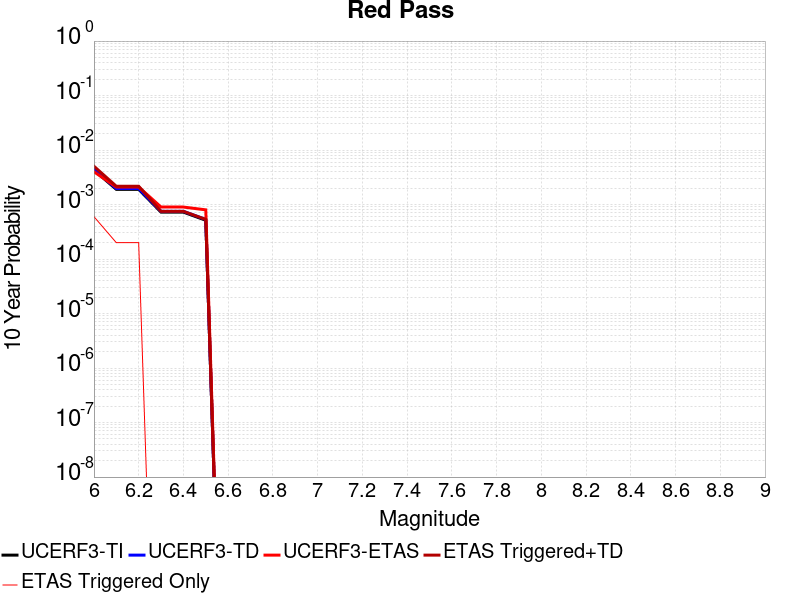 |

| Magnitude | 1 wk TI Prob | 1 wk TD Prob | 1 wk ETAS Prob | 1 wk ETAS/TD Gain | 1 wk ETAS Triggered+TD | 1 wk ETAS Triggered Only | 1 mo TI Prob | 1 mo TD Prob | 1 mo ETAS Prob | 1 mo ETAS/TD Gain | 1 mo ETAS Triggered+TD | 1 mo ETAS Triggered Only | 1 yr TI Prob | 1 yr TD Prob | 1 yr ETAS Prob | 1 yr ETAS/TD Gain | 1 yr ETAS Triggered+TD | 1 yr ETAS Triggered Only | 10 yr TI Prob | 10 yr TD Prob | 10 yr ETAS Prob | 10 yr ETAS/TD Gain | 10 yr ETAS Triggered+TD | 10 yr ETAS Triggered Only |
|-----|-----|-----|-----|-----|-----|-----|-----|-----|-----|-----|-----|-----|-----|-----|-----|-----|-----|-----|-----|-----|-----|-----|-----|-----|
| 6.0 | 8.258278E-6 | 8.548098E-6 | 0.0 | 0.0 | 8.548098E-6 | 0.0 | 3.539214E-5 | 3.6634294E-5 | 0.0 | 0.0 | 3.6634294E-5 | 0.0 | 4.308141E-4 | 4.459491E-4 | 9.0E-4 | 2.0181675 | 6.458599E-4 | 2.0E-4 | 0.0042997985 | 0.0044522984 | 0.004 | 0.8984124 | 0.005049627 | 6.0E-4 |
| 6.1 | 3.649988E-6 | 3.773963E-6 | 0.0 | 0.0 | 3.773963E-6 | 0.0 | 1.5642712E-5 | 1.6174054E-5 | 0.0 | 0.0 | 1.6174054E-5 | 0.0 | 1.9043336E-4 | 1.9690607E-4 | 4.0E-4 | 2.0314255 | 1.9690607E-4 | 0.0 | 0.0019027026 | 0.001967783 | 0.0021 | 1.0671909 | 0.0021673895 | 2.0E-4 |
| 6.2 | 3.649988E-6 | 3.773963E-6 | 0.0 | 0.0 | 3.773963E-6 | 0.0 | 1.5642712E-5 | 1.6174054E-5 | 0.0 | 0.0 | 1.6174054E-5 | 0.0 | 1.9043336E-4 | 1.9690607E-4 | 4.0E-4 | 2.0314255 | 1.9690607E-4 | 0.0 | 0.0019027026 | 0.001967783 | 0.0021 | 1.0671909 | 0.0021673895 | 2.0E-4 |
| 6.3 | 1.3924937E-6 | 1.4405914E-6 | 0.0 | 0.0 | 1.4405914E-6 | 0.0 | 5.9678164E-6 | 6.1739565E-6 | 0.0 | 0.0 | 6.1739565E-6 | 0.0 | 7.265574E-5 | 7.516674E-5 | 0.0 | 0.0 | 7.516674E-5 | 0.0 | 7.263199E-4 | 7.515518E-4 | 9.0E-4 | 1.1975222 | 7.515518E-4 | 0.0 |
| 6.4 | 1.3924937E-6 | 1.4405914E-6 | 0.0 | 0.0 | 1.4405914E-6 | 0.0 | 5.9678164E-6 | 6.1739565E-6 | 0.0 | 0.0 | 6.1739565E-6 | 0.0 | 7.265574E-5 | 7.516674E-5 | 0.0 | 0.0 | 7.516674E-5 | 0.0 | 7.263199E-4 | 7.515518E-4 | 9.0E-4 | 1.1975222 | 7.515518E-4 | 0.0 |
| 6.5 | 9.876812E-7 | 1.0218184E-6 | 0.0 | 0.0 | 1.0218184E-6 | 0.0 | 4.2329125E-6 | 4.379222E-6 | 0.0 | 0.0 | 4.379222E-6 | 0.0 | 5.153449E-5 | 5.3317024E-5 | 0.0 | 0.0 | 5.3317024E-5 | 0.0 | 5.1522546E-4 | 5.3317024E-4 | 8.0E-4 | 1.5004588 | 5.3317024E-4 | 0.0 |

## Nelson Lake
*[(top)](#table-of-contents)*

| 1 Week | 1 Month | 1 Year | 10 Year |
|-----|-----|-----|-----|
|  | 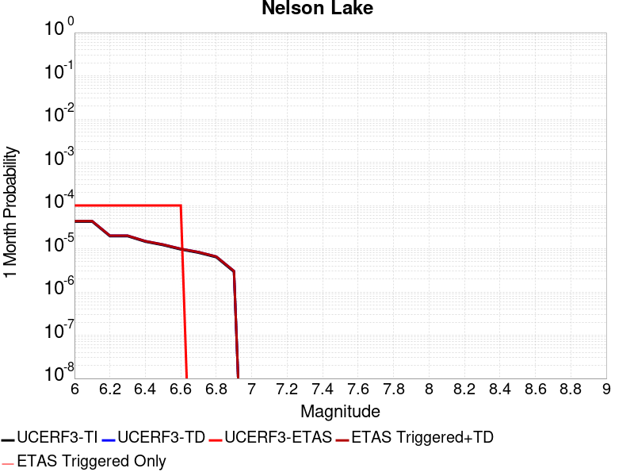 | 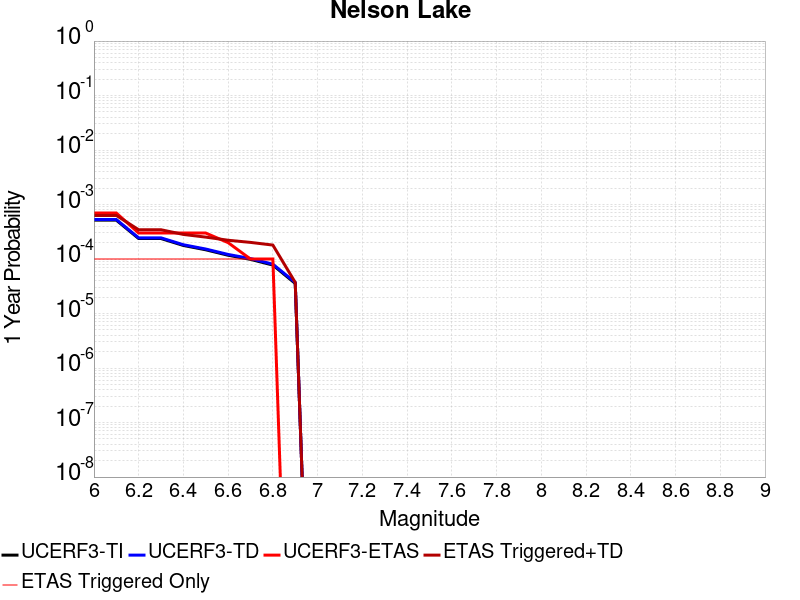 | 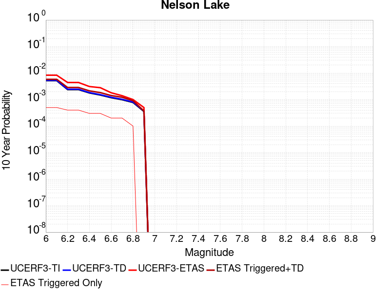 |

| Magnitude | 1 wk TI Prob | 1 wk TD Prob | 1 wk ETAS Prob | 1 wk ETAS/TD Gain | 1 wk ETAS Triggered+TD | 1 wk ETAS Triggered Only | 1 mo TI Prob | 1 mo TD Prob | 1 mo ETAS Prob | 1 mo ETAS/TD Gain | 1 mo ETAS Triggered+TD | 1 mo ETAS Triggered Only | 1 yr TI Prob | 1 yr TD Prob | 1 yr ETAS Prob | 1 yr ETAS/TD Gain | 1 yr ETAS Triggered+TD | 1 yr ETAS Triggered Only | 10 yr TI Prob | 10 yr TD Prob | 10 yr ETAS Prob | 10 yr ETAS/TD Gain | 10 yr ETAS Triggered+TD | 10 yr ETAS Triggered Only |
|-----|-----|-----|-----|-----|-----|-----|-----|-----|-----|-----|-----|-----|-----|-----|-----|-----|-----|-----|-----|-----|-----|-----|-----|-----|
| 6.0 | 9.913453E-6 | 1.0189259E-5 | 0.0 | 0.0 | 1.0189259E-5 | 0.0 | 4.2485535E-5 | 4.3667584E-5 | 1.0E-4 | 2.2900283 | 4.3667584E-5 | 0.0 | 5.1713863E-4 | 5.3153344E-4 | 7.0E-4 | 1.3169444 | 6.314803E-4 | 1.0E-4 | 0.0051593683 | 0.0053036483 | 0.0083 | 1.5649605 | 0.0058009964 | 5.0E-4 |
| 6.1 | 9.913453E-6 | 1.0189259E-5 | 0.0 | 0.0 | 1.0189259E-5 | 0.0 | 4.2485535E-5 | 4.3667584E-5 | 1.0E-4 | 2.2900283 | 4.3667584E-5 | 0.0 | 5.1713863E-4 | 5.3153344E-4 | 7.0E-4 | 1.3169444 | 6.314803E-4 | 1.0E-4 | 0.0051593683 | 0.0053036483 | 0.0083 | 1.5649605 | 0.0058009964 | 5.0E-4 |
| 6.2 | 4.5596407E-6 | 4.6948408E-6 | 0.0 | 0.0 | 4.6948408E-6 | 0.0 | 1.954117E-5 | 2.0120598E-5 | 1.0E-4 | 4.9700313 | 2.0120598E-5 | 0.0 | 2.3788778E-4 | 2.44942E-4 | 3.0E-4 | 1.2247797 | 3.4491753E-4 | 1.0E-4 | 0.0023763329 | 0.0024468463 | 0.0044 | 1.798233 | 0.0028458675 | 4.0E-4 |
| 6.3 | 4.5596407E-6 | 4.6948408E-6 | 0.0 | 0.0 | 4.6948408E-6 | 0.0 | 1.954117E-5 | 2.0120598E-5 | 1.0E-4 | 4.9700313 | 2.0120598E-5 | 0.0 | 2.3788778E-4 | 2.44942E-4 | 3.0E-4 | 1.2247797 | 3.4491753E-4 | 1.0E-4 | 0.0023763329 | 0.0024468463 | 0.0044 | 1.798233 | 0.0028458675 | 4.0E-4 |
| 6.4 | 3.4025713E-6 | 3.5087392E-6 | 0.0 | 0.0 | 3.5087392E-6 | 0.0 | 1.4582367E-5 | 1.5037371E-5 | 1.0E-4 | 6.6500983 | 1.5037371E-5 | 0.0 | 1.7752586E-4 | 1.8306545E-4 | 3.0E-4 | 1.6387582 | 2.8304715E-4 | 1.0E-4 | 0.001773841 | 0.0018292294 | 0.0031 | 1.6947027 | 0.0021286807 | 3.0E-4 |
| 6.5 | 2.8352947E-6 | 2.926856E-6 | 0.0 | 0.0 | 2.926856E-6 | 0.0 | 1.2151207E-5 | 1.2543613E-5 | 1.0E-4 | 7.9721847 | 1.2543613E-5 | 0.0 | 1.479309E-4 | 1.5270854E-4 | 3.0E-4 | 1.9645268 | 2.5269325E-4 | 1.0E-4 | 0.0014783246 | 0.0015261098 | 0.0028 | 1.8347304 | 0.001825652 | 3.0E-4 |
| 6.6 | 2.251518E-6 | 2.3282284E-6 | 0.0 | 0.0 | 2.3282284E-6 | 0.0 | 9.649328E-6 | 9.978087E-6 | 1.0E-4 | 10.021961 | 9.978087E-6 | 0.0 | 1.1747423E-4 | 1.2147706E-4 | 2.0E-4 | 1.6464014 | 2.2146491E-4 | 1.0E-4 | 0.0011741214 | 0.0012141683 | 0.0018 | 1.4824963 | 0.0014139254 | 2.0E-4 |
| 6.7 | 1.8911853E-6 | 1.9584033E-6 | 0.0 | 0.0 | 1.9584033E-6 | 0.0 | 8.105055E-6 | 8.393134E-6 | 0.0 | 0.0 | 8.393134E-6 | 0.0 | 9.867457E-5 | 1.02182195E-4 | 1.0E-4 | 0.9786441 | 2.0217197E-4 | 1.0E-4 | 9.863076E-4 | 0.0010214095 | 0.0014 | 1.370655 | 0.0012212052 | 2.0E-4 |
| 6.8 | 1.4874814E-6 | 1.5432189E-6 | 0.0 | 0.0 | 1.5432189E-6 | 0.0 | 6.374905E-6 | 6.613782E-6 | 0.0 | 0.0 | 6.613782E-6 | 0.0 | 7.76117E-5 | 8.052034E-5 | 1.0E-4 | 1.2419223 | 1.8051229E-4 | 1.0E-4 | 7.75846E-4 | 8.0496265E-4 | 0.001 | 1.2422936 | 9.0488215E-4 | 1.0E-4 |
| 6.9 | 6.835972E-7 | 7.1366145E-7 | 0.0 | 0.0 | 7.1366145E-7 | 0.0 | 2.9296991E-6 | 3.0585475E-6 | 0.0 | 0.0 | 3.0585475E-6 | 0.0 | 3.56685E-5 | 3.7237496E-5 | 0.0 | 0.0 | 3.7237496E-5 | 0.0 | 3.5662777E-4 | 3.7234378E-4 | 5.0E-4 | 1.342845 | 3.7234378E-4 | 0.0 |

## Independence rev 2011
*[(top)](#table-of-contents)*

| 1 Week | 1 Month | 1 Year | 10 Year |
|-----|-----|-----|-----|
|  |  |  |  |

| Magnitude | 1 wk TI Prob | 1 wk TD Prob | 1 wk ETAS Prob | 1 wk ETAS/TD Gain | 1 wk ETAS Triggered+TD | 1 wk ETAS Triggered Only | 1 mo TI Prob | 1 mo TD Prob | 1 mo ETAS Prob | 1 mo ETAS/TD Gain | 1 mo ETAS Triggered+TD | 1 mo ETAS Triggered Only | 1 yr TI Prob | 1 yr TD Prob | 1 yr ETAS Prob | 1 yr ETAS/TD Gain | 1 yr ETAS Triggered+TD | 1 yr ETAS Triggered Only | 10 yr TI Prob | 10 yr TD Prob | 10 yr ETAS Prob | 10 yr ETAS/TD Gain | 10 yr ETAS Triggered+TD | 10 yr ETAS Triggered Only |
|-----|-----|-----|-----|-----|-----|-----|-----|-----|-----|-----|-----|-----|-----|-----|-----|-----|-----|-----|-----|-----|-----|-----|-----|-----|
| 6.0 | 4.422171E-6 | 4.3246873E-6 | 0.0 | 0.0 | 4.3246873E-6 | 0.0 | 1.8952025E-5 | 1.853426E-5 | 0.0 | 0.0 | 1.853426E-5 | 0.0 | 2.3071647E-4 | 2.2563423E-4 | 0.0 | 0.0 | 2.2563423E-4 | 0.0 | 0.0023047708 | 0.002254345 | 0.0015 | 0.6653818 | 0.0027532177 | 5.0E-4 |
| 6.1 | 4.422171E-6 | 4.3246873E-6 | 0.0 | 0.0 | 4.3246873E-6 | 0.0 | 1.8952025E-5 | 1.853426E-5 | 0.0 | 0.0 | 1.853426E-5 | 0.0 | 2.3071647E-4 | 2.2563423E-4 | 0.0 | 0.0 | 2.2563423E-4 | 0.0 | 0.0023047708 | 0.002254345 | 0.0015 | 0.6653818 | 0.0027532177 | 5.0E-4 |
| 6.2 | 4.422171E-6 | 4.3246873E-6 | 0.0 | 0.0 | 4.3246873E-6 | 0.0 | 1.8952025E-5 | 1.853426E-5 | 0.0 | 0.0 | 1.853426E-5 | 0.0 | 2.3071647E-4 | 2.2563423E-4 | 0.0 | 0.0 | 2.2563423E-4 | 0.0 | 0.0023047708 | 0.002254345 | 0.0015 | 0.6653818 | 0.0027532177 | 5.0E-4 |
| 6.3 | 4.422171E-6 | 4.3246873E-6 | 0.0 | 0.0 | 4.3246873E-6 | 0.0 | 1.8952025E-5 | 1.853426E-5 | 0.0 | 0.0 | 1.853426E-5 | 0.0 | 2.3071647E-4 | 2.2563423E-4 | 0.0 | 0.0 | 2.2563423E-4 | 0.0 | 0.0023047708 | 0.002254345 | 0.0015 | 0.6653818 | 0.0027532177 | 5.0E-4 |
| 6.4 | 4.422171E-6 | 4.3246873E-6 | 0.0 | 0.0 | 4.3246873E-6 | 0.0 | 1.8952025E-5 | 1.853426E-5 | 0.0 | 0.0 | 1.853426E-5 | 0.0 | 2.3071647E-4 | 2.2563423E-4 | 0.0 | 0.0 | 2.2563423E-4 | 0.0 | 0.0023047708 | 0.002254345 | 0.0015 | 0.6653818 | 0.0027532177 | 5.0E-4 |
| 6.5 | 4.422171E-6 | 4.3246873E-6 | 0.0 | 0.0 | 4.3246873E-6 | 0.0 | 1.8952025E-5 | 1.853426E-5 | 0.0 | 0.0 | 1.853426E-5 | 0.0 | 2.3071647E-4 | 2.2563423E-4 | 0.0 | 0.0 | 2.2563423E-4 | 0.0 | 0.0023047708 | 0.002254345 | 0.0015 | 0.6653818 | 0.0027532177 | 5.0E-4 |
| 6.6 | 2.663744E-6 | 2.5308284E-6 | 0.0 | 0.0 | 2.5308284E-6 | 0.0 | 1.1415996E-5 | 1.0846365E-5 | 0.0 | 0.0 | 1.0846365E-5 | 0.0 | 1.3898089E-4 | 1.3204697E-4 | 0.0 | 0.0 | 1.3204697E-4 | 0.0 | 0.0013889399 | 0.0013197334 | 8.0E-4 | 0.60618305 | 0.0016193375 | 3.0E-4 |
| 6.7 | 2.663744E-6 | 2.5308284E-6 | 0.0 | 0.0 | 2.5308284E-6 | 0.0 | 1.1415996E-5 | 1.0846365E-5 | 0.0 | 0.0 | 1.0846365E-5 | 0.0 | 1.3898089E-4 | 1.3204697E-4 | 0.0 | 0.0 | 1.3204697E-4 | 0.0 | 0.0013889399 | 0.0013197334 | 8.0E-4 | 0.60618305 | 0.0016193375 | 3.0E-4 |
| 6.8 | 1.9716529E-6 | 1.8312561E-6 | 0.0 | 0.0 | 1.8312561E-6 | 0.0 | 8.449913E-6 | 7.848218E-6 | 0.0 | 0.0 | 7.848218E-6 | 0.0 | 1.0287284E-4 | 9.554799E-5 | 0.0 | 0.0 | 9.554799E-5 | 0.0 | 0.0010282523 | 9.55082E-4 | 3.0E-4 | 0.31410915 | 0.0010549865 | 1.0E-4 |
| 6.9 | 1.8788617E-6 | 1.7420354E-6 | 0.0 | 0.0 | 1.7420354E-6 | 0.0 | 8.0522395E-6 | 7.465845E-6 | 0.0 | 0.0 | 7.465845E-6 | 0.0 | 9.80316E-5 | 9.0892994E-5 | 0.0 | 0.0 | 9.0892994E-5 | 0.0 | 9.798837E-4 | 9.085702E-4 | 3.0E-4 | 0.33018914 | 0.0010084793 | 1.0E-4 |
| 7.0 | 1.5045488E-6 | 1.3841516E-6 | 0.0 | 0.0 | 1.3841516E-6 | 0.0 | 6.44805E-6 | 5.932065E-6 | 0.0 | 0.0 | 5.932065E-6 | 0.0 | 7.8502184E-5 | 7.222055E-5 | 0.0 | 0.0 | 7.222055E-5 | 0.0 | 7.8474457E-4 | 7.219759E-4 | 3.0E-4 | 0.41552633 | 8.219037E-4 | 1.0E-4 |
| 7.1 | 1.272341E-6 | 1.1618124E-6 | 0.0 | 0.0 | 1.1618124E-6 | 0.0 | 5.4528787E-6 | 4.979187E-6 | 0.0 | 0.0 | 4.979187E-6 | 0.0 | 6.6386776E-5 | 6.0619946E-5 | 0.0 | 0.0 | 6.0619946E-5 | 0.0 | 6.636695E-4 | 6.0603727E-4 | 1.0E-4 | 0.16500635 | 7.059767E-4 | 1.0E-4 |
| 7.2 | 1.0416892E-6 | 9.403856E-7 | 0.0 | 0.0 | 9.403856E-7 | 0.0 | 4.464375E-6 | 4.030218E-6 | 0.0 | 0.0 | 4.030218E-6 | 0.0 | 5.4352407E-5 | 4.9066814E-5 | 0.0 | 0.0 | 4.9066814E-5 | 0.0 | 5.4339116E-4 | 4.9056165E-4 | 1.0E-4 | 0.20384797 | 5.905126E-4 | 1.0E-4 |
| 7.3 | 7.9450155E-7 | 7.230512E-7 | 0.0 | 0.0 | 7.230512E-7 | 0.0 | 3.4050022E-6 | 3.0987871E-6 | 0.0 | 0.0 | 3.0987871E-6 | 0.0 | 4.1455114E-5 | 3.772709E-5 | 0.0 | 0.0 | 3.772709E-5 | 0.0 | 4.144738E-4 | 3.7720797E-4 | 1.0E-4 | 0.26510575 | 4.7717025E-4 | 1.0E-4 |
| 7.4 | 5.3893444E-7 | 5.0167404E-7 | 0.0 | 0.0 | 5.0167404E-7 | 0.0 | 2.309717E-6 | 2.1500298E-6 | 0.0 | 0.0 | 2.1500298E-6 | 0.0 | 2.8120441E-5 | 2.6176303E-5 | 0.0 | 0.0 | 2.6176303E-5 | 0.0 | 2.8116882E-4 | 2.6173264E-4 | 0.0 | 0.0 | 2.6173264E-4 | 0.0 |
| 7.5 | 3.8852085E-7 | 3.680757E-7 | 0.0 | 0.0 | 3.680757E-7 | 0.0 | 1.6650882E-6 | 1.5774664E-6 | 0.0 | 0.0 | 1.5774664E-6 | 0.0 | 2.027226E-5 | 1.9205485E-5 | 0.0 | 0.0 | 1.9205485E-5 | 0.0 | 2.0270412E-4 | 1.9203847E-4 | 0.0 | 0.0 | 1.9203847E-4 | 0.0 |
| 7.6 | 2.414929E-7 | 2.3448305E-7 | 0.0 | 0.0 | 2.3448305E-7 | 0.0 | 1.0349692E-6 | 1.004927E-6 | 0.0 | 0.0 | 1.004927E-6 | 0.0 | 1.2600677E-5 | 1.2234918E-5 | 0.0 | 0.0 | 1.2234918E-5 | 0.0 | 1.2599962E-4 | 1.2234258E-4 | 0.0 | 0.0 | 1.2234258E-4 | 0.0 |
| 7.7 | 6.8298014E-8 | 6.8571076E-8 | 0.0 | 0.0 | 6.8571076E-8 | 0.0 | 2.9270575E-7 | 2.93876E-7 | 0.0 | 0.0 | 2.93876E-7 | 0.0 | 3.5636867E-6 | 3.577935E-6 | 0.0 | 0.0 | 3.577935E-6 | 0.0 | 3.5636294E-5 | 3.5778823E-5 | 0.0 | 0.0 | 3.5778823E-5 | 0.0 |

## Great Valley 03 Mysterious Ridge
*[(top)](#table-of-contents)*

| 1 Week | 1 Month | 1 Year | 10 Year |
|-----|-----|-----|-----|
|  |  |  |  |

| Magnitude | 1 wk TI Prob | 1 wk TD Prob | 1 wk ETAS Prob | 1 wk ETAS/TD Gain | 1 wk ETAS Triggered+TD | 1 wk ETAS Triggered Only | 1 mo TI Prob | 1 mo TD Prob | 1 mo ETAS Prob | 1 mo ETAS/TD Gain | 1 mo ETAS Triggered+TD | 1 mo ETAS Triggered Only | 1 yr TI Prob | 1 yr TD Prob | 1 yr ETAS Prob | 1 yr ETAS/TD Gain | 1 yr ETAS Triggered+TD | 1 yr ETAS Triggered Only | 10 yr TI Prob | 10 yr TD Prob | 10 yr ETAS Prob | 10 yr ETAS/TD Gain | 10 yr ETAS Triggered+TD | 10 yr ETAS Triggered Only |
|-----|-----|-----|-----|-----|-----|-----|-----|-----|-----|-----|-----|-----|-----|-----|-----|-----|-----|-----|-----|-----|-----|-----|-----|-----|
| 6.0 | 3.1182444E-5 | 3.5975117E-5 | 0.0 | 0.0 | 3.5975117E-5 | 0.0 | 1.336322E-4 | 1.5417102E-4 | 1.0E-4 | 0.6486303 | 1.5417102E-4 | 0.0 | 0.0016257578 | 0.0018756017 | 0.0015 | 0.79974335 | 0.001975414 | 1.0E-4 | 0.016139153 | 0.018616395 | 0.0126 | 0.6768227 | 0.019205226 | 6.0E-4 |
| 6.1 | 3.1182444E-5 | 3.5975117E-5 | 0.0 | 0.0 | 3.5975117E-5 | 0.0 | 1.336322E-4 | 1.5417102E-4 | 1.0E-4 | 0.6486303 | 1.5417102E-4 | 0.0 | 0.0016257578 | 0.0018756017 | 0.0015 | 0.79974335 | 0.001975414 | 1.0E-4 | 0.016139153 | 0.018616395 | 0.0126 | 0.6768227 | 0.019205226 | 6.0E-4 |
| 6.2 | 3.1182444E-5 | 3.5975117E-5 | 0.0 | 0.0 | 3.5975117E-5 | 0.0 | 1.336322E-4 | 1.5417102E-4 | 1.0E-4 | 0.6486303 | 1.5417102E-4 | 0.0 | 0.0016257578 | 0.0018756017 | 0.0015 | 0.79974335 | 0.001975414 | 1.0E-4 | 0.016139153 | 0.018616395 | 0.0126 | 0.6768227 | 0.019205226 | 6.0E-4 |
| 6.3 | 2.106934E-5 | 2.3817278E-5 | 0.0 | 0.0 | 2.3817278E-5 | 0.0 | 9.0294045E-5 | 1.02070226E-4 | 1.0E-4 | 0.9797176 | 1.02070226E-4 | 0.0 | 0.0010987755 | 0.0012420276 | 0.0013 | 1.0466756 | 0.0013419035 | 1.0E-4 | 0.010933585 | 0.012354098 | 0.01 | 0.80944794 | 0.012946686 | 6.0E-4 |
| 6.4 | 2.106934E-5 | 2.3817278E-5 | 0.0 | 0.0 | 2.3817278E-5 | 0.0 | 9.0294045E-5 | 1.02070226E-4 | 1.0E-4 | 0.9797176 | 1.02070226E-4 | 0.0 | 0.0010987755 | 0.0012420276 | 0.0013 | 1.0466756 | 0.0013419035 | 1.0E-4 | 0.010933585 | 0.012354098 | 0.01 | 0.80944794 | 0.012946686 | 6.0E-4 |
| 6.5 | 1.9389783E-5 | 2.1855454E-5 | 0.0 | 0.0 | 2.1855454E-5 | 0.0 | 8.309642E-5 | 9.3663024E-5 | 1.0E-4 | 1.0676572 | 9.3663024E-5 | 0.0 | 0.0010112294 | 0.0011397784 | 0.0011 | 0.9650999 | 0.0012396645 | 1.0E-4 | 0.010066401 | 0.011342193 | 0.0092 | 0.8111306 | 0.011935388 | 6.0E-4 |
| 6.6 | 1.9370193E-5 | 2.183538E-5 | 0.0 | 0.0 | 2.183538E-5 | 0.0 | 8.301247E-5 | 9.3577E-5 | 1.0E-4 | 1.0686387 | 9.3577E-5 | 0.0 | 0.0010102082 | 0.0011387322 | 0.0011 | 0.96598655 | 0.0012386183 | 1.0E-4 | 0.010056281 | 0.011331838 | 0.0092 | 0.8118719 | 0.011925039 | 6.0E-4 |
| 6.7 | 1.6723505E-5 | 1.8774837E-5 | 0.0 | 0.0 | 1.8774837E-5 | 0.0 | 7.16702E-5 | 8.046122E-5 | 1.0E-4 | 1.2428348 | 8.046122E-5 | 0.0 | 8.722353E-4 | 9.791945E-4 | 8.0E-4 | 0.81699806 | 0.0010790966 | 1.0E-4 | 0.008688197 | 0.009750803 | 0.0081 | 0.8307008 | 0.010344953 | 6.0E-4 |
| 6.8 | 1.426937E-5 | 1.597693E-5 | 0.0 | 0.0 | 1.597693E-5 | 0.0 | 6.115301E-5 | 6.847084E-5 | 1.0E-4 | 1.4604757 | 6.847084E-5 | 0.0 | 7.4428355E-4 | 8.3332806E-4 | 7.0E-4 | 0.84000534 | 9.332447E-4 | 1.0E-4 | 0.007417957 | 0.008303506 | 0.0069 | 0.8309743 | 0.008898525 | 6.0E-4 |
| 6.9 | 1.2469891E-5 | 1.393951E-5 | 0.0 | 0.0 | 1.393951E-5 | 0.0 | 5.3441294E-5 | 5.9739454E-5 | 1.0E-4 | 1.6739355 | 5.9739454E-5 | 0.0 | 6.504535E-4 | 7.270972E-4 | 7.0E-4 | 0.9627324 | 8.270245E-4 | 1.0E-4 | 0.006485529 | 0.0072484035 | 0.0058 | 0.8001762 | 0.007844054 | 6.0E-4 |
| 7.0 | 8.7746275E-6 | 9.779858E-6 | 0.0 | 0.0 | 9.779858E-6 | 0.0 | 3.7605005E-5 | 4.1913045E-5 | 1.0E-4 | 2.385892 | 4.1913045E-5 | 0.0 | 4.5774475E-4 | 5.1017915E-4 | 7.0E-4 | 1.372067 | 6.1012816E-4 | 1.0E-4 | 0.00456803 | 0.00509081 | 0.0045 | 0.88394576 | 0.0055882647 | 5.0E-4 |
| 7.1 | 6.1067153E-6 | 6.805472E-6 | 0.0 | 0.0 | 6.805472E-6 | 0.0 | 2.6171374E-5 | 2.9166014E-5 | 1.0E-4 | 3.4286482 | 2.9166014E-5 | 0.0 | 3.1858988E-4 | 3.550439E-4 | 7.0E-4 | 1.9715871 | 4.550084E-4 | 1.0E-4 | 0.0031813353 | 0.0035453162 | 0.0039 | 1.1000429 | 0.0040435437 | 5.0E-4 |
| 7.2 | 2.939283E-6 | 3.2702005E-6 | 0.0 | 0.0 | 3.2702005E-6 | 0.0 | 1.2596866E-5 | 1.401508E-5 | 0.0 | 0.0 | 1.401508E-5 | 0.0 | 1.5335606E-4 | 1.7062198E-4 | 6.0E-4 | 3.5165458 | 2.706049E-4 | 1.0E-4 | 0.0015325027 | 0.0017050814 | 0.002 | 1.1729646 | 0.0020045699 | 3.0E-4 |
| 7.3 | 7.2387763E-7 | 7.99954E-7 | 0.0 | 0.0 | 7.99954E-7 | 0.0 | 3.102329E-6 | 3.4283726E-6 | 0.0 | 0.0 | 3.4283726E-6 | 0.0 | 3.77702E-5 | 4.174009E-5 | 2.0E-4 | 4.7915564 | 1.4173592E-4 | 1.0E-4 | 3.7763783E-4 | 4.1736738E-4 | 3.0E-4 | 0.7187912 | 5.1732565E-4 | 1.0E-4 |
| 7.4 | 3.112171E-8 | 3.2058175E-8 | 0.0 | 0.0 | 3.2058175E-8 | 0.0 | 1.3337875E-7 | 1.3739218E-7 | 0.0 | 0.0 | 1.3739218E-7 | 0.0 | 1.6238852E-6 | 1.6727486E-6 | 0.0 | 0.0 | 1.6727486E-6 | 0.0 | 1.6238733E-5 | 1.6727368E-5 | 0.0 | 0.0 | 1.6727368E-5 | 0.0 |

## Fish Slough 2011 CFM
*[(top)](#table-of-contents)*

| 1 Week | 1 Month | 1 Year | 10 Year |
|-----|-----|-----|-----|
|  |  |  |  |

| Magnitude | 1 wk TI Prob | 1 wk TD Prob | 1 wk ETAS Prob | 1 wk ETAS/TD Gain | 1 wk ETAS Triggered+TD | 1 wk ETAS Triggered Only | 1 mo TI Prob | 1 mo TD Prob | 1 mo ETAS Prob | 1 mo ETAS/TD Gain | 1 mo ETAS Triggered+TD | 1 mo ETAS Triggered Only | 1 yr TI Prob | 1 yr TD Prob | 1 yr ETAS Prob | 1 yr ETAS/TD Gain | 1 yr ETAS Triggered+TD | 1 yr ETAS Triggered Only | 10 yr TI Prob | 10 yr TD Prob | 10 yr ETAS Prob | 10 yr ETAS/TD Gain | 10 yr ETAS Triggered+TD | 10 yr ETAS Triggered Only |
|-----|-----|-----|-----|-----|-----|-----|-----|-----|-----|-----|-----|-----|-----|-----|-----|-----|-----|-----|-----|-----|-----|-----|-----|-----|
| 6.0 | 4.3629925E-6 | 3.6746292E-6 | 0.0 | 0.0 | 3.6746292E-6 | 0.0 | 1.8698405E-5 | 1.5748328E-5 | 0.0 | 0.0 | 1.5748328E-5 | 0.0 | 2.276293E-4 | 1.9172113E-4 | 2.0E-4 | 1.0431818 | 2.9170196E-4 | 1.0E-4 | 0.0022739628 | 0.0019157663 | 0.0013 | 0.6785797 | 0.0025146168 | 6.0E-4 |
| 6.1 | 4.3629925E-6 | 3.6746292E-6 | 0.0 | 0.0 | 3.6746292E-6 | 0.0 | 1.8698405E-5 | 1.5748328E-5 | 0.0 | 0.0 | 1.5748328E-5 | 0.0 | 2.276293E-4 | 1.9172113E-4 | 2.0E-4 | 1.0431818 | 2.9170196E-4 | 1.0E-4 | 0.0022739628 | 0.0019157663 | 0.0013 | 0.6785797 | 0.0025146168 | 6.0E-4 |
| 6.2 | 4.3629925E-6 | 3.6746292E-6 | 0.0 | 0.0 | 3.6746292E-6 | 0.0 | 1.8698405E-5 | 1.5748328E-5 | 0.0 | 0.0 | 1.5748328E-5 | 0.0 | 2.276293E-4 | 1.9172113E-4 | 2.0E-4 | 1.0431818 | 2.9170196E-4 | 1.0E-4 | 0.0022739628 | 0.0019157663 | 0.0013 | 0.6785797 | 0.0025146168 | 6.0E-4 |
| 6.3 | 4.3629925E-6 | 3.6746292E-6 | 0.0 | 0.0 | 3.6746292E-6 | 0.0 | 1.8698405E-5 | 1.5748328E-5 | 0.0 | 0.0 | 1.5748328E-5 | 0.0 | 2.276293E-4 | 1.9172113E-4 | 2.0E-4 | 1.0431818 | 2.9170196E-4 | 1.0E-4 | 0.0022739628 | 0.0019157663 | 0.0013 | 0.6785797 | 0.0025146168 | 6.0E-4 |
| 6.4 | 4.3629925E-6 | 3.6746292E-6 | 0.0 | 0.0 | 3.6746292E-6 | 0.0 | 1.8698405E-5 | 1.5748328E-5 | 0.0 | 0.0 | 1.5748328E-5 | 0.0 | 2.276293E-4 | 1.9172113E-4 | 2.0E-4 | 1.0431818 | 2.9170196E-4 | 1.0E-4 | 0.0022739628 | 0.0019157663 | 0.0013 | 0.6785797 | 0.0025146168 | 6.0E-4 |
| 6.5 | 2.991715E-6 | 2.2681304E-6 | 0.0 | 0.0 | 2.2681304E-6 | 0.0 | 1.2821573E-5 | 9.7205275E-6 | 0.0 | 0.0 | 9.7205275E-6 | 0.0 | 1.5609147E-4 | 1.18341915E-4 | 2.0E-4 | 1.6900183 | 2.1833008E-4 | 1.0E-4 | 0.0015598187 | 0.0011828791 | 9.0E-4 | 0.7608555 | 0.0015824059 | 4.0E-4 |
| 6.6 | 2.991715E-6 | 2.2681304E-6 | 0.0 | 0.0 | 2.2681304E-6 | 0.0 | 1.2821573E-5 | 9.7205275E-6 | 0.0 | 0.0 | 9.7205275E-6 | 0.0 | 1.5609147E-4 | 1.18341915E-4 | 2.0E-4 | 1.6900183 | 2.1833008E-4 | 1.0E-4 | 0.0015598187 | 0.0011828791 | 9.0E-4 | 0.7608555 | 0.0015824059 | 4.0E-4 |
| 6.7 | 2.7890346E-6 | 2.059985E-6 | 0.0 | 0.0 | 2.059985E-6 | 0.0 | 1.1952951E-5 | 8.828483E-6 | 0.0 | 0.0 | 8.828483E-6 | 0.0 | 1.4551746E-4 | 1.07482374E-4 | 2.0E-4 | 1.8607702 | 2.0747163E-4 | 1.0E-4 | 0.0014542221 | 0.0010743921 | 9.0E-4 | 0.83768296 | 0.0014739624 | 4.0E-4 |
| 6.8 | 1.9416723E-6 | 1.1905935E-6 | 0.0 | 0.0 | 1.1905935E-6 | 0.0 | 8.321425E-6 | 5.102534E-6 | 0.0 | 0.0 | 5.102534E-6 | 0.0 | 1.01308644E-4 | 6.212162E-5 | 0.0 | 0.0 | 6.212162E-5 | 0.0 | 0.0010126247 | 6.2104664E-4 | 6.0E-4 | 0.966111 | 9.2086033E-4 | 3.0E-4 |
| 6.9 | 1.8567416E-6 | 1.1027666E-6 | 0.0 | 0.0 | 1.1027666E-6 | 0.0 | 7.957439E-6 | 4.7261346E-6 | 0.0 | 0.0 | 4.7261346E-6 | 0.0 | 9.687752E-5 | 5.7539208E-5 | 0.0 | 0.0 | 5.7539208E-5 | 0.0 | 9.6835295E-4 | 5.75247E-4 | 6.0E-4 | 1.0430303 | 8.750744E-4 | 3.0E-4 |
| 7.0 | 1.6634067E-6 | 9.0554016E-7 | 0.0 | 0.0 | 9.0554016E-7 | 0.0 | 7.1288664E-6 | 3.8808807E-6 | 0.0 | 0.0 | 3.8808807E-6 | 0.0 | 8.679049E-5 | 4.724873E-5 | 0.0 | 0.0 | 4.724873E-5 | 0.0 | 8.6756604E-4 | 4.7238971E-4 | 4.0E-4 | 0.8467585 | 6.722952E-4 | 2.0E-4 |
| 7.1 | 1.4281054E-6 | 6.7193105E-7 | 0.0 | 0.0 | 6.7193105E-7 | 0.0 | 6.1204373E-6 | 2.8797012E-6 | 0.0 | 0.0 | 2.8797012E-6 | 0.0 | 7.451377E-5 | 3.5059817E-5 | 0.0 | 0.0 | 3.5059817E-5 | 0.0 | 7.44888E-4 | 3.5054464E-4 | 3.0E-4 | 0.8558111 | 5.5047456E-4 | 2.0E-4 |
| 7.2 | 1.1810387E-6 | 4.3926684E-7 | 0.0 | 0.0 | 4.3926684E-7 | 0.0 | 5.0615845E-6 | 1.8825709E-6 | 0.0 | 0.0 | 1.8825709E-6 | 0.0 | 6.1623046E-5 | 2.2920069E-5 | 0.0 | 0.0 | 2.2920069E-5 | 0.0 | 6.160596E-4 | 2.2917794E-4 | 3.0E-4 | 1.3090265 | 4.291321E-4 | 2.0E-4 |
| 7.3 | 9.918052E-7 | 2.8591708E-7 | 0.0 | 0.0 | 2.8591708E-7 | 0.0 | 4.2505867E-6 | 1.2253583E-6 | 0.0 | 0.0 | 1.2253583E-6 | 0.0 | 5.1749663E-5 | 1.4918637E-5 | 0.0 | 0.0 | 1.4918637E-5 | 0.0 | 5.173762E-4 | 1.4917647E-4 | 1.0E-4 | 0.67034703 | 2.4916156E-4 | 1.0E-4 |
| 7.4 | 8.25252E-7 | 2.057333E-7 | 0.0 | 0.0 | 2.057333E-7 | 0.0 | 3.5367896E-6 | 8.8171385E-7 | 0.0 | 0.0 | 8.8171385E-7 | 0.0 | 4.3059565E-5 | 1.0734814E-5 | 0.0 | 0.0 | 1.0734814E-5 | 0.0 | 4.305122E-4 | 1.07343025E-4 | 1.0E-4 | 0.93159294 | 2.0733228E-4 | 1.0E-4 |
| 7.5 | 5.3248567E-7 | 1.1988566E-7 | 0.0 | 0.0 | 1.1988566E-7 | 0.0 | 2.2820795E-6 | 5.1379556E-7 | 0.0 | 0.0 | 5.1379556E-7 | 0.0 | 2.7783964E-5 | 6.255443E-6 | 0.0 | 0.0 | 6.255443E-6 | 0.0 | 2.778049E-4 | 6.255271E-5 | 1.0E-4 | 1.5986516 | 1.6254645E-4 | 1.0E-4 |
| 7.6 | 2.037542E-7 | 4.678543E-8 | 0.0 | 0.0 | 4.678543E-8 | 0.0 | 8.73232E-7 | 2.0050898E-7 | 0.0 | 0.0 | 2.0050898E-7 | 0.0 | 1.0631547E-5 | 2.4411943E-6 | 0.0 | 0.0 | 2.4411943E-6 | 0.0 | 1.0631039E-4 | 2.4411696E-5 | 0.0 | 0.0 | 2.4411696E-5 | 0.0 |
| 7.7 | 2.2501226E-8 | 3.124149E-9 | 0.0 | 0.0 | 3.124149E-9 | 0.0 | 9.6433816E-8 | 1.3389211E-8 | 0.0 | 0.0 | 1.3389211E-8 | 0.0 | 1.1740811E-6 | 1.6301362E-7 | 0.0 | 0.0 | 1.6301362E-7 | 0.0 | 1.1740749E-5 | 1.6301352E-6 | 0.0 | 0.0 | 1.6301352E-6 | 0.0 |

## Earthquake Valley (No  Extension)
*[(top)](#table-of-contents)*

| 1 Week | 1 Month | 1 Year | 10 Year |
|-----|-----|-----|-----|
|  |  |  |  |

| Magnitude | 1 wk TI Prob | 1 wk TD Prob | 1 wk ETAS Prob | 1 wk ETAS/TD Gain | 1 wk ETAS Triggered+TD | 1 wk ETAS Triggered Only | 1 mo TI Prob | 1 mo TD Prob | 1 mo ETAS Prob | 1 mo ETAS/TD Gain | 1 mo ETAS Triggered+TD | 1 mo ETAS Triggered Only | 1 yr TI Prob | 1 yr TD Prob | 1 yr ETAS Prob | 1 yr ETAS/TD Gain | 1 yr ETAS Triggered+TD | 1 yr ETAS Triggered Only | 10 yr TI Prob | 10 yr TD Prob | 10 yr ETAS Prob | 10 yr ETAS/TD Gain | 10 yr ETAS Triggered+TD | 10 yr ETAS Triggered Only |
|-----|-----|-----|-----|-----|-----|-----|-----|-----|-----|-----|-----|-----|-----|-----|-----|-----|-----|-----|-----|-----|-----|-----|-----|-----|
| 6.0 | 2.1859703E-5 | 2.5156909E-5 | 0.0 | 0.0 | 2.5156909E-5 | 0.0 | 9.3681076E-5 | 1.07811684E-4 | 0.0 | 0.0 | 1.07811684E-4 | 0.0 | 0.0011399703 | 0.0013119616 | 6.0E-4 | 0.4573305 | 0.0014118303 | 1.0E-4 | 0.011341401 | 0.013056477 | 0.0077 | 0.58974564 | 0.013648642 | 6.0E-4 |
| 6.1 | 2.1859703E-5 | 2.5156909E-5 | 0.0 | 0.0 | 2.5156909E-5 | 0.0 | 9.3681076E-5 | 1.07811684E-4 | 0.0 | 0.0 | 1.07811684E-4 | 0.0 | 0.0011399703 | 0.0013119616 | 6.0E-4 | 0.4573305 | 0.0014118303 | 1.0E-4 | 0.011341401 | 0.013056477 | 0.0077 | 0.58974564 | 0.013648642 | 6.0E-4 |
| 6.2 | 2.1859703E-5 | 2.5156909E-5 | 0.0 | 0.0 | 2.5156909E-5 | 0.0 | 9.3681076E-5 | 1.07811684E-4 | 0.0 | 0.0 | 1.07811684E-4 | 0.0 | 0.0011399703 | 0.0013119616 | 6.0E-4 | 0.4573305 | 0.0014118303 | 1.0E-4 | 0.011341401 | 0.013056477 | 0.0077 | 0.58974564 | 0.013648642 | 6.0E-4 |
| 6.3 | 2.1859703E-5 | 2.5156909E-5 | 0.0 | 0.0 | 2.5156909E-5 | 0.0 | 9.3681076E-5 | 1.07811684E-4 | 0.0 | 0.0 | 1.07811684E-4 | 0.0 | 0.0011399703 | 0.0013119616 | 6.0E-4 | 0.4573305 | 0.0014118303 | 1.0E-4 | 0.011341401 | 0.013056477 | 0.0077 | 0.58974564 | 0.013648642 | 6.0E-4 |
| 6.4 | 2.1859703E-5 | 2.5156909E-5 | 0.0 | 0.0 | 2.5156909E-5 | 0.0 | 9.3681076E-5 | 1.07811684E-4 | 0.0 | 0.0 | 1.07811684E-4 | 0.0 | 0.0011399703 | 0.0013119616 | 6.0E-4 | 0.4573305 | 0.0014118303 | 1.0E-4 | 0.011341401 | 0.013056477 | 0.0077 | 0.58974564 | 0.013648642 | 6.0E-4 |
| 6.5 | 2.1859703E-5 | 2.5156909E-5 | 0.0 | 0.0 | 2.5156909E-5 | 0.0 | 9.3681076E-5 | 1.07811684E-4 | 0.0 | 0.0 | 1.07811684E-4 | 0.0 | 0.0011399703 | 0.0013119616 | 6.0E-4 | 0.4573305 | 0.0014118303 | 1.0E-4 | 0.011341401 | 0.013056477 | 0.0077 | 0.58974564 | 0.013648642 | 6.0E-4 |
| 6.6 | 1.597E-5 | 1.8326356E-5 | 0.0 | 0.0 | 1.8326356E-5 | 0.0 | 6.8441055E-5 | 7.8539655E-5 | 0.0 | 0.0 | 7.8539655E-5 | 0.0 | 8.329513E-4 | 9.5588784E-4 | 5.0E-4 | 0.5230739 | 0.0010557922 | 1.0E-4 | 0.008298361 | 0.009526342 | 0.006 | 0.6298325 | 0.010021579 | 5.0E-4 |
| 6.7 | 1.597E-5 | 1.8326356E-5 | 0.0 | 0.0 | 1.8326356E-5 | 0.0 | 6.8441055E-5 | 7.8539655E-5 | 0.0 | 0.0 | 7.8539655E-5 | 0.0 | 8.329513E-4 | 9.5588784E-4 | 5.0E-4 | 0.5230739 | 0.0010557922 | 1.0E-4 | 0.008298361 | 0.009526342 | 0.006 | 0.6298325 | 0.010021579 | 5.0E-4 |
| 6.8 | 1.5315149E-5 | 1.7573366E-5 | 0.0 | 0.0 | 1.7573366E-5 | 0.0 | 6.5634704E-5 | 7.531274E-5 | 0.0 | 0.0 | 7.531274E-5 | 0.0 | 7.988095E-4 | 9.1663323E-4 | 4.0E-4 | 0.43637955 | 0.0010165416 | 1.0E-4 | 0.007959441 | 0.009137036 | 0.0054 | 0.5910013 | 0.009533381 | 4.0E-4 |
| 6.9 | 1.3634728E-5 | 1.5650037E-5 | 0.0 | 0.0 | 1.5650037E-5 | 0.0 | 5.8433237E-5 | 6.707032E-5 | 0.0 | 0.0 | 6.707032E-5 | 0.0 | 7.1119244E-4 | 8.163571E-4 | 4.0E-4 | 0.48998168 | 9.162754E-4 | 1.0E-4 | 0.007089207 | 0.008141627 | 0.005 | 0.6141279 | 0.00853837 | 4.0E-4 |
| 7.0 | 1.3496271E-5 | 1.5492302E-5 | 0.0 | 0.0 | 1.5492302E-5 | 0.0 | 5.783988E-5 | 6.639436E-5 | 0.0 | 0.0 | 6.639436E-5 | 0.0 | 7.03973E-4 | 8.081333E-4 | 4.0E-4 | 0.49496788 | 9.0805243E-4 | 1.0E-4 | 0.007017471 | 0.008059987 | 0.0049 | 0.60794145 | 0.008456763 | 4.0E-4 |
| 7.1 | 8.242798E-6 | 9.4565585E-6 | 0.0 | 0.0 | 9.4565585E-6 | 0.0 | 3.53258E-5 | 4.0527855E-5 | 0.0 | 0.0 | 4.0527855E-5 | 0.0 | 4.300067E-4 | 4.9338175E-4 | 2.0E-4 | 0.4053656 | 5.9333246E-4 | 1.0E-4 | 0.004291756 | 0.0049294187 | 0.0025 | 0.5071592 | 0.0052279397 | 3.0E-4 |
| 7.2 | 2.6506527E-7 | 2.2490862E-7 | 0.0 | 0.0 | 2.2490862E-7 | 0.0 | 1.1359936E-6 | 9.638937E-7 | 0.0 | 0.0 | 9.638937E-7 | 0.0 | 1.3830633E-5 | 1.17353475E-5 | 0.0 | 0.0 | 1.17353475E-5 | 0.0 | 1.3829772E-4 | 1.17347685E-4 | 0.0 | 0.0 | 1.17347685E-4 | 0.0 |
| 7.3 | 2.5810488E-7 | 2.1886828E-7 | 0.0 | 0.0 | 2.1886828E-7 | 0.0 | 1.1061633E-6 | 9.3800656E-7 | 0.0 | 0.0 | 9.3800656E-7 | 0.0 | 1.3467455E-5 | 1.1420175E-5 | 0.0 | 0.0 | 1.1420175E-5 | 0.0 | 1.3466639E-4 | 1.14196286E-4 | 0.0 | 0.0 | 1.14196286E-4 | 0.0 |
| 7.4 | 2.2676066E-7 | 1.904391E-7 | 0.0 | 0.0 | 1.904391E-7 | 0.0 | 9.71831E-7 | 8.1616736E-7 | 0.0 | 0.0 | 8.1616736E-7 | 0.0 | 1.1831979E-5 | 9.936796E-6 | 0.0 | 0.0 | 9.936796E-6 | 0.0 | 1.1831349E-4 | 9.9363904E-5 | 0.0 | 0.0 | 9.9363904E-5 | 0.0 |
| 7.5 | 1.5553917E-7 | 1.3056504E-7 | 0.0 | 0.0 | 1.3056504E-7 | 0.0 | 6.6659624E-7 | 5.5956434E-7 | 0.0 | 0.0 | 5.5956434E-7 | 0.0 | 8.115779E-6 | 6.8126765E-6 | 0.0 | 0.0 | 6.8126765E-6 | 0.0 | 8.115482E-5 | 6.812489E-5 | 0.0 | 0.0 | 6.812489E-5 | 0.0 |
| 7.6 | 1.3448629E-7 | 1.12465045E-7 | 0.0 | 0.0 | 1.12465045E-7 | 0.0 | 5.7636964E-7 | 4.8199297E-7 | 0.0 | 0.0 | 4.8199297E-7 | 0.0 | 7.017278E-6 | 5.868251E-6 | 0.0 | 0.0 | 5.868251E-6 | 0.0 | 7.0170565E-5 | 5.868117E-5 | 0.0 | 0.0 | 5.868117E-5 | 0.0 |
| 7.7 | 2.9719402E-8 | 1.4513542E-8 | 0.0 | 0.0 | 1.4513542E-8 | 0.0 | 1.2736886E-7 | 6.22009E-8 | 0.0 | 0.0 | 6.22009E-8 | 0.0 | 1.5507147E-6 | 7.572957E-7 | 0.0 | 0.0 | 7.572957E-7 | 0.0 | 1.550704E-5 | 7.5729363E-6 | 0.0 | 0.0 | 7.5729363E-6 | 0.0 |
| 7.8 | 7.4390196E-9 | 3.232151E-9 | 0.0 | 0.0 | 3.232151E-9 | 0.0 | 3.1881513E-8 | 1.3852076E-8 | 0.0 | 0.0 | 1.3852076E-8 | 0.0 | 3.8815733E-7 | 1.6864901E-7 | 0.0 | 0.0 | 1.6864901E-7 | 0.0 | 3.8815665E-6 | 1.6864891E-6 | 0.0 | 0.0 | 1.6864891E-6 | 0.0 |
| 7.9 | 1.5373532E-9 | 8.4171903E-10 | 0.0 | 0.0 | 8.4171903E-10 | 0.0 | 6.5886567E-9 | 3.6073673E-9 | 0.0 | 0.0 | 3.6073673E-9 | 0.0 | 8.021689E-8 | 4.3919695E-8 | 0.0 | 0.0 | 4.3919695E-8 | 0.0 | 8.0216864E-7 | 4.3919692E-7 | 0.0 | 0.0 | 4.3919692E-7 | 0.0 |

## Eureka Peak
*[(top)](#table-of-contents)*

| 1 Week | 1 Month | 1 Year | 10 Year |
|-----|-----|-----|-----|
| 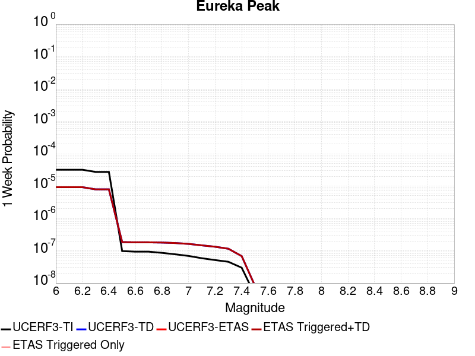 |  | 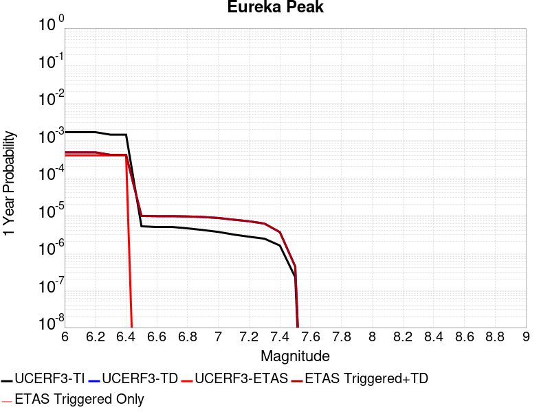 |  |

| Magnitude | 1 wk TI Prob | 1 wk TD Prob | 1 wk ETAS Prob | 1 wk ETAS/TD Gain | 1 wk ETAS Triggered+TD | 1 wk ETAS Triggered Only | 1 mo TI Prob | 1 mo TD Prob | 1 mo ETAS Prob | 1 mo ETAS/TD Gain | 1 mo ETAS Triggered+TD | 1 mo ETAS Triggered Only | 1 yr TI Prob | 1 yr TD Prob | 1 yr ETAS Prob | 1 yr ETAS/TD Gain | 1 yr ETAS Triggered+TD | 1 yr ETAS Triggered Only | 10 yr TI Prob | 10 yr TD Prob | 10 yr ETAS Prob | 10 yr ETAS/TD Gain | 10 yr ETAS Triggered+TD | 10 yr ETAS Triggered Only |
|-----|-----|-----|-----|-----|-----|-----|-----|-----|-----|-----|-----|-----|-----|-----|-----|-----|-----|-----|-----|-----|-----|-----|-----|-----|
| 6.0 | 3.1949054E-5 | 9.204286E-6 | 0.0 | 0.0 | 9.204286E-6 | 0.0 | 1.3691733E-4 | 3.944677E-5 | 1.0E-4 | 2.5350618 | 3.944677E-5 | 0.0 | 0.0016656938 | 4.802348E-4 | 4.0E-4 | 0.8329259 | 4.802348E-4 | 0.0 | 0.016532637 | 0.0048650242 | 0.0034 | 0.698866 | 0.005462105 | 6.0E-4 |
| 6.1 | 3.1949054E-5 | 9.204286E-6 | 0.0 | 0.0 | 9.204286E-6 | 0.0 | 1.3691733E-4 | 3.944677E-5 | 1.0E-4 | 2.5350618 | 3.944677E-5 | 0.0 | 0.0016656938 | 4.802348E-4 | 4.0E-4 | 0.8329259 | 4.802348E-4 | 0.0 | 0.016532637 | 0.0048650242 | 0.0034 | 0.698866 | 0.005462105 | 6.0E-4 |
| 6.2 | 3.1949054E-5 | 9.204286E-6 | 0.0 | 0.0 | 9.204286E-6 | 0.0 | 1.3691733E-4 | 3.944677E-5 | 1.0E-4 | 2.5350618 | 3.944677E-5 | 0.0 | 0.0016656938 | 4.802348E-4 | 4.0E-4 | 0.8329259 | 4.802348E-4 | 0.0 | 0.016532637 | 0.0048650242 | 0.0034 | 0.698866 | 0.005462105 | 6.0E-4 |
| 6.3 | 2.7339745E-5 | 7.881916E-6 | 0.0 | 0.0 | 7.881916E-6 | 0.0 | 1.1716507E-4 | 3.377962E-5 | 1.0E-4 | 2.9603648 | 3.377962E-5 | 0.0 | 0.0014255513 | 4.112633E-4 | 4.0E-4 | 0.972613 | 4.112633E-4 | 0.0 | 0.0141644105 | 0.0041737496 | 0.0033 | 0.7906559 | 0.0047712456 | 6.0E-4 |
| 6.4 | 2.7339745E-5 | 7.881916E-6 | 0.0 | 0.0 | 7.881916E-6 | 0.0 | 1.1716507E-4 | 3.377962E-5 | 1.0E-4 | 2.9603648 | 3.377962E-5 | 0.0 | 0.0014255513 | 4.112633E-4 | 4.0E-4 | 0.972613 | 4.112633E-4 | 0.0 | 0.0141644105 | 0.0041737496 | 0.0033 | 0.7906559 | 0.0047712456 | 6.0E-4 |
| 6.5 | 9.738388E-8 | 1.8425347E-7 | 0.0 | 0.0 | 1.8425347E-7 | 0.0 | 4.1735944E-7 | 7.8965746E-7 | 0.0 | 0.0 | 7.8965746E-7 | 0.0 | 5.081339E-6 | 9.614038E-6 | 0.0 | 0.0 | 9.614038E-6 | 0.0 | 5.0812232E-5 | 9.6136304E-5 | 2.0E-4 | 2.0803795 | 1.9612668E-4 | 1.0E-4 |
| 6.6 | 9.3495956E-8 | 1.8134794E-7 | 0.0 | 0.0 | 1.8134794E-7 | 0.0 | 4.0069688E-7 | 7.7720523E-7 | 0.0 | 0.0 | 7.7720523E-7 | 0.0 | 4.8784736E-6 | 9.462434E-6 | 0.0 | 0.0 | 9.462434E-6 | 0.0 | 4.8783666E-5 | 9.462039E-5 | 2.0E-4 | 2.1137094 | 1.9461093E-4 | 1.0E-4 |
| 6.7 | 9.3495956E-8 | 1.8134794E-7 | 0.0 | 0.0 | 1.8134794E-7 | 0.0 | 4.0069688E-7 | 7.7720523E-7 | 0.0 | 0.0 | 7.7720523E-7 | 0.0 | 4.8784736E-6 | 9.462434E-6 | 0.0 | 0.0 | 9.462434E-6 | 0.0 | 4.8783666E-5 | 9.462039E-5 | 2.0E-4 | 2.1137094 | 1.9461093E-4 | 1.0E-4 |
| 6.8 | 8.591428E-8 | 1.782945E-7 | 0.0 | 0.0 | 1.782945E-7 | 0.0 | 3.68204E-7 | 7.641191E-7 | 0.0 | 0.0 | 7.641191E-7 | 0.0 | 4.4828744E-6 | 9.303111E-6 | 0.0 | 0.0 | 9.303111E-6 | 0.0 | 4.482784E-5 | 9.3027294E-5 | 1.0E-4 | 1.0749533 | 9.3027294E-5 | 0.0 |
| 6.9 | 7.749723E-8 | 1.7248696E-7 | 0.0 | 0.0 | 1.7248696E-7 | 0.0 | 3.3213098E-7 | 7.392296E-7 | 0.0 | 0.0 | 7.392296E-7 | 0.0 | 4.043687E-6 | 9.000084E-6 | 0.0 | 0.0 | 9.000084E-6 | 0.0 | 4.0436134E-5 | 8.999727E-5 | 1.0E-4 | 1.1111448 | 8.999727E-5 | 0.0 |
| 7.0 | 6.897872E-8 | 1.6229737E-7 | 0.0 | 0.0 | 1.6229737E-7 | 0.0 | 2.9562307E-7 | 6.9556E-7 | 0.0 | 0.0 | 6.9556E-7 | 0.0 | 3.5992048E-6 | 8.468411E-6 | 0.0 | 0.0 | 8.468411E-6 | 0.0 | 3.5991467E-5 | 8.468095E-5 | 1.0E-4 | 1.1809032 | 8.468095E-5 | 0.0 |
| 7.1 | 5.859318E-8 | 1.4609734E-7 | 0.0 | 0.0 | 1.4609734E-7 | 0.0 | 2.5111362E-7 | 6.261313E-7 | 0.0 | 0.0 | 6.261313E-7 | 0.0 | 3.057304E-6 | 7.623122E-6 | 0.0 | 0.0 | 7.623122E-6 | 0.0 | 3.0572617E-5 | 7.622867E-5 | 1.0E-4 | 1.3118423 | 7.622867E-5 | 0.0 |
| 7.2 | 5.1375338E-8 | 1.3249839E-7 | 0.0 | 0.0 | 1.3249839E-7 | 0.0 | 2.2018E-7 | 5.678501E-7 | 0.0 | 0.0 | 5.678501E-7 | 0.0 | 2.680688E-6 | 6.9135535E-6 | 0.0 | 0.0 | 6.9135535E-6 | 0.0 | 2.6806558E-5 | 6.913344E-5 | 1.0E-4 | 1.4464779 | 6.913344E-5 | 0.0 |
| 7.3 | 4.5441396E-8 | 1.14749426E-7 | 0.0 | 0.0 | 1.14749426E-7 | 0.0 | 1.9474882E-7 | 4.9178317E-7 | 0.0 | 0.0 | 4.9178317E-7 | 0.0 | 2.3710643E-6 | 5.987444E-6 | 0.0 | 0.0 | 5.987444E-6 | 0.0 | 2.371039E-5 | 5.9872884E-5 | 0.0 | 0.0 | 5.9872884E-5 | 0.0 |
| 7.4 | 2.981918E-8 | 6.7817034E-8 | 0.0 | 0.0 | 6.7817034E-8 | 0.0 | 1.2779647E-7 | 2.906444E-7 | 0.0 | 0.0 | 2.906444E-7 | 0.0 | 1.5559209E-6 | 3.5385904E-6 | 0.0 | 0.0 | 3.5385904E-6 | 0.0 | 1.55591E-5 | 3.538538E-5 | 0.0 | 0.0 | 3.538538E-5 | 0.0 |
| 7.5 | 4.24214E-9 | 8.1482385E-9 | 0.0 | 0.0 | 8.1482385E-9 | 0.0 | 1.81806E-8 | 3.4921023E-8 | 0.0 | 0.0 | 3.4921023E-8 | 0.0 | 2.213488E-7 | 4.2516345E-7 | 0.0 | 0.0 | 4.2516345E-7 | 0.0 | 2.2134857E-6 | 4.2516326E-6 | 0.0 | 0.0 | 4.2516326E-6 | 0.0 |

## Burnt Mtn
*[(top)](#table-of-contents)*

| 1 Week | 1 Month | 1 Year | 10 Year |
|-----|-----|-----|-----|
| 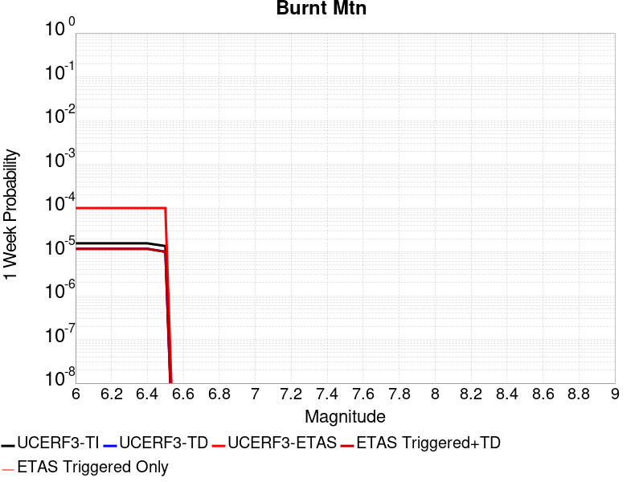 | 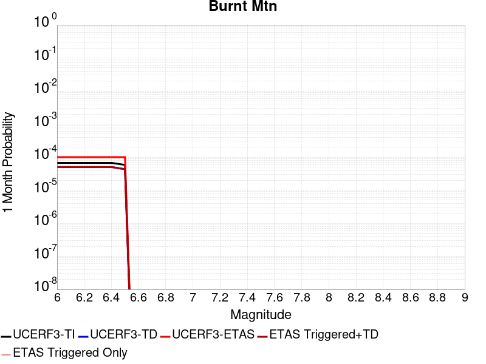 | 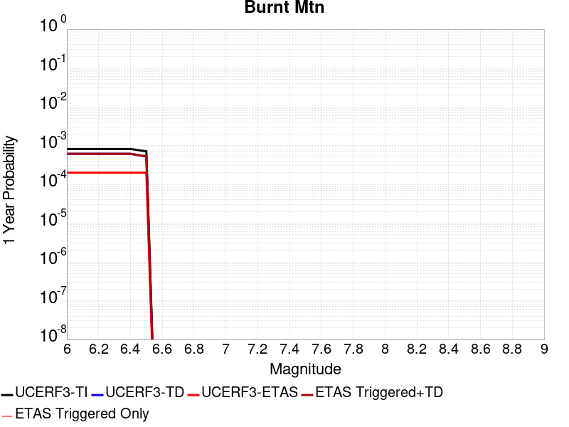 |  |

| Magnitude | 1 wk TI Prob | 1 wk TD Prob | 1 wk ETAS Prob | 1 wk ETAS/TD Gain | 1 wk ETAS Triggered+TD | 1 wk ETAS Triggered Only | 1 mo TI Prob | 1 mo TD Prob | 1 mo ETAS Prob | 1 mo ETAS/TD Gain | 1 mo ETAS Triggered+TD | 1 mo ETAS Triggered Only | 1 yr TI Prob | 1 yr TD Prob | 1 yr ETAS Prob | 1 yr ETAS/TD Gain | 1 yr ETAS Triggered+TD | 1 yr ETAS Triggered Only | 10 yr TI Prob | 10 yr TD Prob | 10 yr ETAS Prob | 10 yr ETAS/TD Gain | 10 yr ETAS Triggered+TD | 10 yr ETAS Triggered Only |
|-----|-----|-----|-----|-----|-----|-----|-----|-----|-----|-----|-----|-----|-----|-----|-----|-----|-----|-----|-----|-----|-----|-----|-----|-----|
| 6.0 | 1.5673151E-5 | 1.1737301E-5 | 1.0E-4 | 8.519846 | 1.1737301E-5 | 0.0 | 6.716892E-5 | 5.0302475E-5 | 1.0E-4 | 1.9879738 | 5.0302475E-5 | 0.0 | 8.1747473E-4 | 6.123892E-4 | 2.0E-4 | 0.3265897 | 6.123892E-4 | 0.0 | 0.008144741 | 0.006119633 | 0.0035 | 0.5719297 | 0.0067159613 | 6.0E-4 |
| 6.1 | 1.5673151E-5 | 1.1737301E-5 | 1.0E-4 | 8.519846 | 1.1737301E-5 | 0.0 | 6.716892E-5 | 5.0302475E-5 | 1.0E-4 | 1.9879738 | 5.0302475E-5 | 0.0 | 8.1747473E-4 | 6.123892E-4 | 2.0E-4 | 0.3265897 | 6.123892E-4 | 0.0 | 0.008144741 | 0.006119633 | 0.0035 | 0.5719297 | 0.0067159613 | 6.0E-4 |
| 6.2 | 1.5673151E-5 | 1.1737301E-5 | 1.0E-4 | 8.519846 | 1.1737301E-5 | 0.0 | 6.716892E-5 | 5.0302475E-5 | 1.0E-4 | 1.9879738 | 5.0302475E-5 | 0.0 | 8.1747473E-4 | 6.123892E-4 | 2.0E-4 | 0.3265897 | 6.123892E-4 | 0.0 | 0.008144741 | 0.006119633 | 0.0035 | 0.5719297 | 0.0067159613 | 6.0E-4 |
| 6.3 | 1.5673151E-5 | 1.1737301E-5 | 1.0E-4 | 8.519846 | 1.1737301E-5 | 0.0 | 6.716892E-5 | 5.0302475E-5 | 1.0E-4 | 1.9879738 | 5.0302475E-5 | 0.0 | 8.1747473E-4 | 6.123892E-4 | 2.0E-4 | 0.3265897 | 6.123892E-4 | 0.0 | 0.008144741 | 0.006119633 | 0.0035 | 0.5719297 | 0.0067159613 | 6.0E-4 |
| 6.4 | 1.5673151E-5 | 1.1737301E-5 | 1.0E-4 | 8.519846 | 1.1737301E-5 | 0.0 | 6.716892E-5 | 5.0302475E-5 | 1.0E-4 | 1.9879738 | 5.0302475E-5 | 0.0 | 8.1747473E-4 | 6.123892E-4 | 2.0E-4 | 0.3265897 | 6.123892E-4 | 0.0 | 0.008144741 | 0.006119633 | 0.0035 | 0.5719297 | 0.0067159613 | 6.0E-4 |
| 6.5 | 1.36191375E-5 | 1.0068775E-5 | 1.0E-4 | 9.931695 | 1.0068775E-5 | 0.0 | 5.8366426E-5 | 4.3151893E-5 | 1.0E-4 | 2.3173954 | 4.3151893E-5 | 0.0 | 7.103795E-4 | 5.253743E-4 | 2.0E-4 | 0.38068098 | 5.253743E-4 | 0.0 | 0.0070811296 | 0.005253743 | 0.0028 | 0.5329534 | 0.005751116 | 5.0E-4 |

## Greenville (So) 2011 CFM
*[(top)](#table-of-contents)*

| 1 Week | 1 Month | 1 Year | 10 Year |
|-----|-----|-----|-----|
| 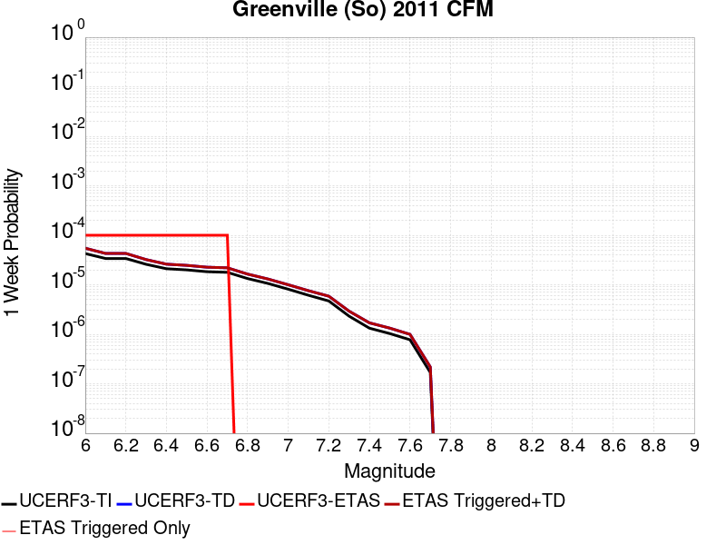 |  |  |  |

| Magnitude | 1 wk TI Prob | 1 wk TD Prob | 1 wk ETAS Prob | 1 wk ETAS/TD Gain | 1 wk ETAS Triggered+TD | 1 wk ETAS Triggered Only | 1 mo TI Prob | 1 mo TD Prob | 1 mo ETAS Prob | 1 mo ETAS/TD Gain | 1 mo ETAS Triggered+TD | 1 mo ETAS Triggered Only | 1 yr TI Prob | 1 yr TD Prob | 1 yr ETAS Prob | 1 yr ETAS/TD Gain | 1 yr ETAS Triggered+TD | 1 yr ETAS Triggered Only | 10 yr TI Prob | 10 yr TD Prob | 10 yr ETAS Prob | 10 yr ETAS/TD Gain | 10 yr ETAS Triggered+TD | 10 yr ETAS Triggered Only |
|-----|-----|-----|-----|-----|-----|-----|-----|-----|-----|-----|-----|-----|-----|-----|-----|-----|-----|-----|-----|-----|-----|-----|-----|-----|
| 6.0 | 4.279693E-5 | 5.4871653E-5 | 1.0E-4 | 1.8224347 | 5.4871653E-5 | 0.0 | 1.8340252E-4 | 2.35145E-4 | 1.0E-4 | 0.4252695 | 2.35145E-4 | 0.0 | 0.0022306389 | 0.002859405 | 0.0019 | 0.66447395 | 0.003058833 | 2.0E-4 | 0.022083808 | 0.028253423 | 0.0156 | 0.5521455 | 0.02883647 | 6.0E-4 |
| 6.1 | 3.4037297E-5 | 4.3064574E-5 | 1.0E-4 | 2.3220942 | 4.3064574E-5 | 0.0 | 1.4586597E-4 | 1.8455059E-4 | 1.0E-4 | 0.5418568 | 1.8455059E-4 | 0.0 | 0.0017744715 | 0.002244753 | 0.0014 | 0.6236766 | 0.002444304 | 2.0E-4 | 0.01760369 | 0.02223786 | 0.0124 | 0.5576076 | 0.02272674 | 5.0E-4 |
| 6.2 | 3.4037297E-5 | 4.3064574E-5 | 1.0E-4 | 2.3220942 | 4.3064574E-5 | 0.0 | 1.4586597E-4 | 1.8455059E-4 | 1.0E-4 | 0.5418568 | 1.8455059E-4 | 0.0 | 0.0017744715 | 0.002244753 | 0.0014 | 0.6236766 | 0.002444304 | 2.0E-4 | 0.01760369 | 0.02223786 | 0.0124 | 0.5576076 | 0.02272674 | 5.0E-4 |
| 6.3 | 2.5956324E-5 | 3.2337128E-5 | 1.0E-4 | 3.0924206 | 3.2337128E-5 | 0.0 | 1.11236644E-4 | 1.3858077E-4 | 1.0E-4 | 0.72160083 | 1.3858077E-4 | 0.0 | 0.0013534647 | 0.0016859788 | 0.0011 | 0.65244 | 0.0018856416 | 2.0E-4 | 0.013452509 | 0.016738787 | 0.0098 | 0.58546656 | 0.017230418 | 5.0E-4 |
| 6.4 | 2.1145053E-5 | 2.6124151E-5 | 1.0E-4 | 3.8278756 | 2.6124151E-5 | 0.0 | 9.061851E-5 | 1.1195603E-4 | 1.0E-4 | 0.8932078 | 1.1195603E-4 | 0.0 | 0.0011027219 | 0.0013622439 | 0.001 | 0.73408294 | 0.0015619714 | 2.0E-4 | 0.01097266 | 0.0135424305 | 0.008 | 0.5907359 | 0.014035659 | 5.0E-4 |
| 6.5 | 2.0030959E-5 | 2.4726009E-5 | 1.0E-4 | 4.0443244 | 2.4726009E-5 | 0.0 | 8.584414E-5 | 1.0596449E-4 | 1.0E-4 | 0.94371235 | 1.0596449E-4 | 0.0 | 0.0010446513 | 0.0012893851 | 0.001 | 0.7755635 | 0.0014891273 | 2.0E-4 | 0.010397541 | 0.012822466 | 0.0077 | 0.6005085 | 0.013316055 | 5.0E-4 |
| 6.6 | 1.8395405E-5 | 2.2689894E-5 | 1.0E-4 | 4.4072485 | 2.2689894E-5 | 0.0 | 7.8835066E-5 | 9.723894E-5 | 1.0E-4 | 1.0283946 | 9.723894E-5 | 0.0 | 9.5939427E-4 | 0.0011832695 | 9.0E-4 | 0.7606044 | 0.0013830329 | 2.0E-4 | 0.009552629 | 0.011772812 | 0.0068 | 0.577602 | 0.012266926 | 5.0E-4 |
| 6.7 | 1.7883482E-5 | 2.2062428E-5 | 1.0E-4 | 4.532593 | 2.2062428E-5 | 0.0 | 7.664124E-5 | 9.454999E-5 | 1.0E-4 | 1.0576415 | 9.454999E-5 | 0.0 | 9.3270757E-4 | 0.0011505667 | 9.0E-4 | 0.7822232 | 0.0013503366 | 2.0E-4 | 0.009288026 | 0.011449214 | 0.0065 | 0.5677245 | 0.011943489 | 5.0E-4 |
| 6.8 | 1.3373564E-5 | 1.6457283E-5 | 0.0 | 0.0 | 1.6457283E-5 | 0.0 | 5.7314013E-5 | 7.0529386E-5 | 0.0 | 0.0 | 7.0529386E-5 | 0.0 | 6.975747E-4 | 8.583717E-4 | 7.0E-4 | 0.8154975 | 9.582859E-4 | 1.0E-4 | 0.0069538904 | 0.008552243 | 0.0052 | 0.60802764 | 0.0089488225 | 4.0E-4 |
| 6.9 | 1.06692905E-5 | 1.3112284E-5 | 0.0 | 0.0 | 1.3112284E-5 | 0.0 | 4.5724726E-5 | 5.619436E-5 | 0.0 | 0.0 | 5.619436E-5 | 0.0 | 5.5655633E-4 | 6.839628E-4 | 7.0E-4 | 1.0234475 | 7.838944E-4 | 1.0E-4 | 0.005551645 | 0.006819882 | 0.0044 | 0.6451724 | 0.0071178363 | 3.0E-4 |
| 7.0 | 8.157512E-6 | 1.0029763E-5 | 0.0 | 0.0 | 1.0029763E-5 | 0.0 | 3.4960296E-5 | 4.298401E-5 | 0.0 | 0.0 | 4.298401E-5 | 0.0 | 4.2555845E-4 | 5.2320835E-4 | 6.0E-4 | 1.1467707 | 6.23156E-4 | 1.0E-4 | 0.004247444 | 0.0052203177 | 0.0032 | 0.6129895 | 0.0055187517 | 3.0E-4 |
| 7.1 | 6.1467113E-6 | 7.599936E-6 | 0.0 | 0.0 | 7.599936E-6 | 0.0 | 2.6342783E-5 | 3.257075E-5 | 0.0 | 0.0 | 3.257075E-5 | 0.0 | 3.206762E-4 | 3.964776E-4 | 3.0E-4 | 0.75666314 | 3.964776E-4 | 0.0 | 0.0032021382 | 0.0039579673 | 0.0027 | 0.68216836 | 0.004157176 | 2.0E-4 |
| 7.2 | 4.713467E-6 | 5.890499E-6 | 0.0 | 0.0 | 5.890499E-6 | 0.0 | 2.0200418E-5 | 2.5244755E-5 | 0.0 | 0.0 | 2.5244755E-5 | 0.0 | 2.4591232E-4 | 3.0731212E-4 | 3.0E-4 | 0.9762062 | 3.0731212E-4 | 0.0 | 0.0024564038 | 0.0030691908 | 0.0024 | 0.7819651 | 0.003268577 | 2.0E-4 |
| 7.3 | 2.3266216E-6 | 2.9365724E-6 | 0.0 | 0.0 | 2.9365724E-6 | 0.0 | 9.971197E-6 | 1.258525E-5 | 0.0 | 0.0 | 1.258525E-5 | 0.0 | 1.2139256E-4 | 1.532148E-4 | 1.0E-4 | 0.6526785 | 1.532148E-4 | 0.0 | 0.0012132627 | 0.0015311961 | 0.0012 | 0.78370106 | 0.001631043 | 1.0E-4 |
| 7.4 | 1.3314E-6 | 1.7055879E-6 | 0.0 | 0.0 | 1.7055879E-6 | 0.0 | 5.7059874E-6 | 7.309642E-6 | 0.0 | 0.0 | 7.309642E-6 | 0.0 | 6.946818E-5 | 8.899131E-5 | 1.0E-4 | 1.1237053 | 8.899131E-5 | 0.0 | 6.9446466E-4 | 8.8957E-4 | 6.0E-4 | 0.6744832 | 9.89481E-4 | 1.0E-4 |
| 7.5 | 1.0362941E-6 | 1.3353753E-6 | 0.0 | 0.0 | 1.3353753E-6 | 0.0 | 4.4412527E-6 | 5.7230245E-6 | 0.0 | 0.0 | 5.7230245E-6 | 0.0 | 5.407091E-5 | 6.967564E-5 | 1.0E-4 | 1.4352218 | 6.967564E-5 | 0.0 | 5.405776E-4 | 6.9652876E-4 | 5.0E-4 | 0.71784544 | 7.964591E-4 | 1.0E-4 |
| 7.6 | 7.764784E-7 | 9.991577E-7 | 0.0 | 0.0 | 9.991577E-7 | 0.0 | 3.3277602E-6 | 4.2820975E-6 | 0.0 | 0.0 | 4.2820975E-6 | 0.0 | 4.0514726E-5 | 5.213333E-5 | 1.0E-4 | 1.9181587 | 5.213333E-5 | 0.0 | 4.050734E-4 | 5.21178E-4 | 5.0E-4 | 0.9593652 | 6.2112586E-4 | 1.0E-4 |
| 7.7 | 1.6927763E-7 | 2.191352E-7 | 0.0 | 0.0 | 2.191352E-7 | 0.0 | 7.2547533E-7 | 9.3915054E-7 | 0.0 | 0.0 | 9.3915054E-7 | 0.0 | 8.832627E-6 | 1.1434101E-5 | 0.0 | 0.0 | 1.1434101E-5 | 0.0 | 8.8322755E-5 | 1.1434293E-4 | 2.0E-4 | 1.7491243 | 2.143315E-4 | 1.0E-4 |

## Earthquake Valley (So Extension)
*[(top)](#table-of-contents)*

| 1 Week | 1 Month | 1 Year | 10 Year |
|-----|-----|-----|-----|
|  |  | 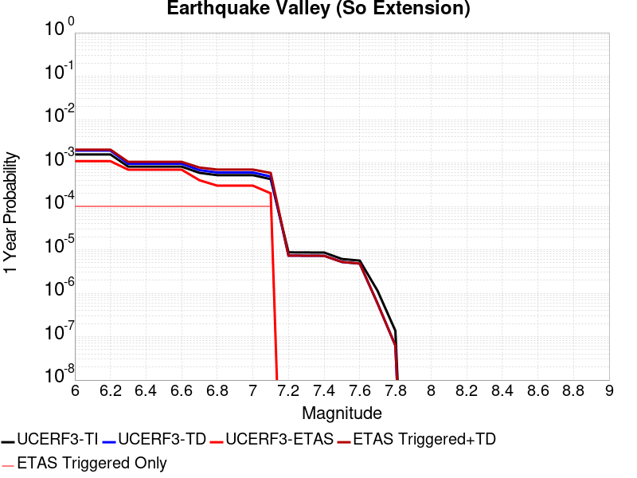 |  |

| Magnitude | 1 wk TI Prob | 1 wk TD Prob | 1 wk ETAS Prob | 1 wk ETAS/TD Gain | 1 wk ETAS Triggered+TD | 1 wk ETAS Triggered Only | 1 mo TI Prob | 1 mo TD Prob | 1 mo ETAS Prob | 1 mo ETAS/TD Gain | 1 mo ETAS Triggered+TD | 1 mo ETAS Triggered Only | 1 yr TI Prob | 1 yr TD Prob | 1 yr ETAS Prob | 1 yr ETAS/TD Gain | 1 yr ETAS Triggered+TD | 1 yr ETAS Triggered Only | 10 yr TI Prob | 10 yr TD Prob | 10 yr ETAS Prob | 10 yr ETAS/TD Gain | 10 yr ETAS Triggered+TD | 10 yr ETAS Triggered Only |
|-----|-----|-----|-----|-----|-----|-----|-----|-----|-----|-----|-----|-----|-----|-----|-----|-----|-----|-----|-----|-----|-----|-----|-----|-----|
| 6.0 | 3.0194888E-5 | 3.698353E-5 | 0.0 | 0.0 | 3.698353E-5 | 0.0 | 1.2940024E-4 | 1.5849427E-4 | 1.0E-4 | 0.6309377 | 1.5849427E-4 | 0.0 | 0.0015743093 | 0.0019284706 | 0.0011 | 0.5704002 | 0.0020282776 | 1.0E-4 | 0.01563203 | 0.019167658 | 0.0094 | 0.4904094 | 0.019756157 | 6.0E-4 |
| 6.1 | 3.0194888E-5 | 3.698353E-5 | 0.0 | 0.0 | 3.698353E-5 | 0.0 | 1.2940024E-4 | 1.5849427E-4 | 1.0E-4 | 0.6309377 | 1.5849427E-4 | 0.0 | 0.0015743093 | 0.0019284706 | 0.0011 | 0.5704002 | 0.0020282776 | 1.0E-4 | 0.01563203 | 0.019167658 | 0.0094 | 0.4904094 | 0.019756157 | 6.0E-4 |
| 6.2 | 3.0194888E-5 | 3.698353E-5 | 0.0 | 0.0 | 3.698353E-5 | 0.0 | 1.2940024E-4 | 1.5849427E-4 | 1.0E-4 | 0.6309377 | 1.5849427E-4 | 0.0 | 0.0015743093 | 0.0019284706 | 0.0011 | 0.5704002 | 0.0020282776 | 1.0E-4 | 0.01563203 | 0.019167658 | 0.0094 | 0.4904094 | 0.019756157 | 6.0E-4 |
| 6.3 | 1.5795305E-5 | 1.8413415E-5 | 0.0 | 0.0 | 1.8413415E-5 | 0.0 | 6.769241E-5 | 7.8912875E-5 | 0.0 | 0.0 | 7.8912875E-5 | 0.0 | 8.238434E-4 | 9.604512E-4 | 7.0E-4 | 0.72882414 | 0.0010603551 | 1.0E-4 | 0.008207959 | 0.009573867 | 0.0049 | 0.5118099 | 0.009970037 | 4.0E-4 |
| 6.4 | 1.5795305E-5 | 1.8413415E-5 | 0.0 | 0.0 | 1.8413415E-5 | 0.0 | 6.769241E-5 | 7.8912875E-5 | 0.0 | 0.0 | 7.8912875E-5 | 0.0 | 8.238434E-4 | 9.604512E-4 | 7.0E-4 | 0.72882414 | 0.0010603551 | 1.0E-4 | 0.008207959 | 0.009573867 | 0.0049 | 0.5118099 | 0.009970037 | 4.0E-4 |
| 6.5 | 1.5795305E-5 | 1.8413415E-5 | 0.0 | 0.0 | 1.8413415E-5 | 0.0 | 6.769241E-5 | 7.8912875E-5 | 0.0 | 0.0 | 7.8912875E-5 | 0.0 | 8.238434E-4 | 9.604512E-4 | 7.0E-4 | 0.72882414 | 0.0010603551 | 1.0E-4 | 0.008207959 | 0.009573867 | 0.0049 | 0.5118099 | 0.009970037 | 4.0E-4 |
| 6.6 | 1.5795305E-5 | 1.8413415E-5 | 0.0 | 0.0 | 1.8413415E-5 | 0.0 | 6.769241E-5 | 7.8912875E-5 | 0.0 | 0.0 | 7.8912875E-5 | 0.0 | 8.238434E-4 | 9.604512E-4 | 7.0E-4 | 0.72882414 | 0.0010603551 | 1.0E-4 | 0.008207959 | 0.009573867 | 0.0049 | 0.5118099 | 0.009970037 | 4.0E-4 |
| 6.7 | 1.1363076E-5 | 1.31159995E-5 | 0.0 | 0.0 | 1.31159995E-5 | 0.0 | 4.8697988E-5 | 5.6210643E-5 | 0.0 | 0.0 | 5.6210643E-5 | 0.0 | 5.927367E-4 | 6.842256E-4 | 4.0E-4 | 0.58460253 | 7.8415714E-4 | 1.0E-4 | 0.0059115817 | 0.0068286373 | 0.0036 | 0.5271916 | 0.007225906 | 4.0E-4 |
| 6.8 | 1.0049611E-5 | 1.15748635E-5 | 0.0 | 0.0 | 1.15748635E-5 | 0.0 | 4.306905E-5 | 4.9606024E-5 | 0.0 | 0.0 | 4.9606024E-5 | 0.0 | 5.242395E-4 | 6.038589E-4 | 3.0E-4 | 0.49680477 | 7.0379855E-4 | 1.0E-4 | 0.0052300454 | 0.0060293335 | 0.0035 | 0.5804953 | 0.006426922 | 4.0E-4 |
| 6.9 | 1.0049611E-5 | 1.15748635E-5 | 0.0 | 0.0 | 1.15748635E-5 | 0.0 | 4.306905E-5 | 4.9606024E-5 | 0.0 | 0.0 | 4.9606024E-5 | 0.0 | 5.242395E-4 | 6.038589E-4 | 3.0E-4 | 0.49680477 | 7.0379855E-4 | 1.0E-4 | 0.0052300454 | 0.0060293335 | 0.0035 | 0.5804953 | 0.006426922 | 4.0E-4 |
| 7.0 | 1.0049611E-5 | 1.15748635E-5 | 0.0 | 0.0 | 1.15748635E-5 | 0.0 | 4.306905E-5 | 4.9606024E-5 | 0.0 | 0.0 | 4.9606024E-5 | 0.0 | 5.242395E-4 | 6.038589E-4 | 3.0E-4 | 0.49680477 | 7.0379855E-4 | 1.0E-4 | 0.0052300454 | 0.0060293335 | 0.0035 | 0.5804953 | 0.006426922 | 4.0E-4 |
| 7.1 | 8.140254E-6 | 9.367627E-6 | 0.0 | 0.0 | 9.367627E-6 | 0.0 | 3.4886336E-5 | 4.014673E-5 | 0.0 | 0.0 | 4.014673E-5 | 0.0 | 4.2465836E-4 | 4.8874365E-4 | 2.0E-4 | 0.40921247 | 5.886948E-4 | 1.0E-4 | 0.0042384774 | 0.0048832423 | 0.0025 | 0.5119549 | 0.0051817773 | 3.0E-4 |
| 7.2 | 1.673835E-7 | 1.410432E-7 | 0.0 | 0.0 | 1.410432E-7 | 0.0 | 7.173577E-7 | 6.044707E-7 | 0.0 | 0.0 | 6.044707E-7 | 0.0 | 8.733795E-6 | 7.3594097E-6 | 0.0 | 0.0 | 7.3594097E-6 | 0.0 | 8.733451E-5 | 7.359201E-5 | 0.0 | 0.0 | 7.359201E-5 | 0.0 |
| 7.3 | 1.6632116E-7 | 1.4002664E-7 | 0.0 | 0.0 | 1.4002664E-7 | 0.0 | 7.1280476E-7 | 6.0011405E-7 | 0.0 | 0.0 | 6.0011405E-7 | 0.0 | 8.678364E-6 | 7.306368E-6 | 0.0 | 0.0 | 7.306368E-6 | 0.0 | 8.6780245E-5 | 7.306163E-5 | 0.0 | 0.0 | 7.306163E-5 | 0.0 |
| 7.4 | 1.6569169E-7 | 1.3947373E-7 | 0.0 | 0.0 | 1.3947373E-7 | 0.0 | 7.1010703E-7 | 5.977445E-7 | 0.0 | 0.0 | 5.977445E-7 | 0.0 | 8.645519E-6 | 7.277518E-6 | 0.0 | 0.0 | 7.277518E-6 | 0.0 | 8.645182E-5 | 7.277315E-5 | 0.0 | 0.0 | 7.277315E-5 | 0.0 |
| 7.5 | 1.1764555E-7 | 1.0053396E-7 | 0.0 | 0.0 | 1.0053396E-7 | 0.0 | 5.041951E-7 | 4.3085976E-7 | 0.0 | 0.0 | 4.3085976E-7 | 0.0 | 6.138558E-6 | 5.245707E-6 | 0.0 | 0.0 | 5.245707E-6 | 0.0 | 6.1383886E-5 | 5.2456046E-5 | 0.0 | 0.0 | 5.2456046E-5 | 0.0 |
| 7.6 | 1.07927605E-7 | 9.226856E-8 | 0.0 | 0.0 | 9.226856E-8 | 0.0 | 4.6254678E-7 | 3.9543662E-7 | 0.0 | 0.0 | 3.9543662E-7 | 0.0 | 5.6314925E-6 | 4.8144325E-6 | 0.0 | 0.0 | 4.8144325E-6 | 0.0 | 5.63135E-5 | 4.8143487E-5 | 0.0 | 0.0 | 4.8143487E-5 | 0.0 |
| 7.7 | 2.1826905E-8 | 1.11334355E-8 | 0.0 | 0.0 | 1.11334355E-8 | 0.0 | 9.3543875E-8 | 4.771472E-8 | 0.0 | 0.0 | 4.771472E-8 | 0.0 | 1.1388961E-6 | 5.809266E-7 | 0.0 | 0.0 | 5.809266E-7 | 0.0 | 1.1388902E-5 | 5.8092564E-6 | 0.0 | 0.0 | 5.8092564E-6 | 0.0 |
| 7.8 | 2.6169649E-9 | 1.1922348E-9 | 0.0 | 0.0 | 1.1922348E-9 | 0.0 | 1.1215564E-8 | 5.1095776E-9 | 0.0 | 0.0 | 5.1095776E-9 | 0.0 | 1.3654947E-7 | 6.220911E-8 | 0.0 | 0.0 | 6.220911E-8 | 0.0 | 1.365494E-6 | 6.220911E-7 | 0.0 | 0.0 | 6.220911E-7 | 0.0 |

## Cedar Mtn-Mahogany Mtn
*[(top)](#table-of-contents)*

| 1 Week | 1 Month | 1 Year | 10 Year |
|-----|-----|-----|-----|
|  |  | 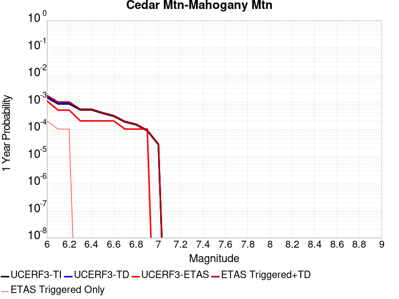 | 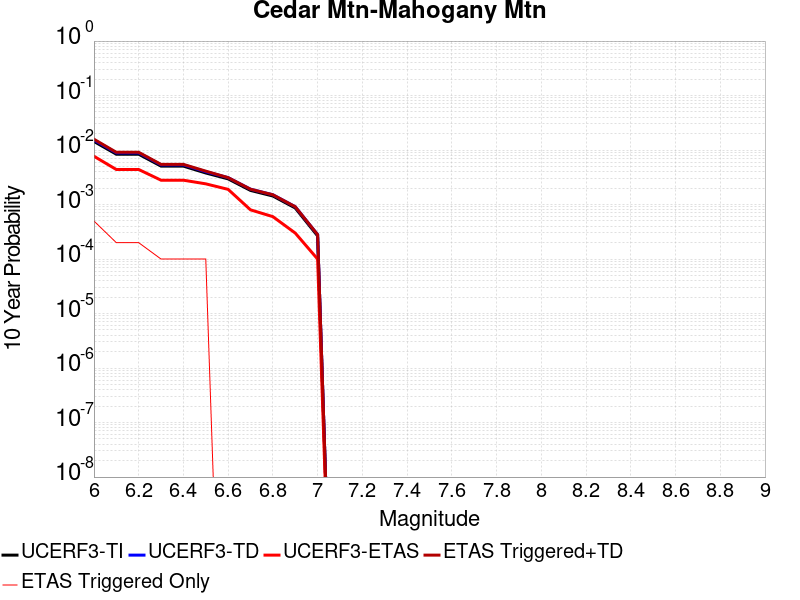 |

| Magnitude | 1 wk TI Prob | 1 wk TD Prob | 1 wk ETAS Prob | 1 wk ETAS/TD Gain | 1 wk ETAS Triggered+TD | 1 wk ETAS Triggered Only | 1 mo TI Prob | 1 mo TD Prob | 1 mo ETAS Prob | 1 mo ETAS/TD Gain | 1 mo ETAS Triggered+TD | 1 mo ETAS Triggered Only | 1 yr TI Prob | 1 yr TD Prob | 1 yr ETAS Prob | 1 yr ETAS/TD Gain | 1 yr ETAS Triggered+TD | 1 yr ETAS Triggered Only | 10 yr TI Prob | 10 yr TD Prob | 10 yr ETAS Prob | 10 yr ETAS/TD Gain | 10 yr ETAS Triggered+TD | 10 yr ETAS Triggered Only |
|-----|-----|-----|-----|-----|-----|-----|-----|-----|-----|-----|-----|-----|-----|-----|-----|-----|-----|-----|-----|-----|-----|-----|-----|-----|
| 6.0 | 2.7763876E-5 | 2.9568526E-5 | 1.0E-4 | 3.3819745 | 1.2956557E-4 | 1.0E-4 | 1.1898261E-4 | 1.2671649E-4 | 2.0E-4 | 1.5783265 | 2.2670382E-4 | 1.0E-4 | 0.0014476506 | 0.0015417514 | 0.0011 | 0.7134743 | 0.0017414431 | 2.0E-4 | 0.0143825635 | 0.015317763 | 0.0077 | 0.50268435 | 0.015810104 | 5.0E-4 |
| 6.1 | 1.6162443E-5 | 1.7132097E-5 | 1.0E-4 | 5.836997 | 1.1713038E-4 | 1.0E-4 | 6.926578E-5 | 7.342131E-5 | 1.0E-4 | 1.3620024 | 1.7341397E-4 | 1.0E-4 | 8.4298453E-4 | 8.935555E-4 | 5.0E-4 | 0.5595623 | 9.934662E-4 | 1.0E-4 | 0.008397939 | 0.008901436 | 0.0044 | 0.49430227 | 0.009099656 | 2.0E-4 |
| 6.2 | 1.6162443E-5 | 1.7132097E-5 | 1.0E-4 | 5.836997 | 1.1713038E-4 | 1.0E-4 | 6.926578E-5 | 7.342131E-5 | 1.0E-4 | 1.3620024 | 1.7341397E-4 | 1.0E-4 | 8.4298453E-4 | 8.935555E-4 | 5.0E-4 | 0.5595623 | 9.934662E-4 | 1.0E-4 | 0.008397939 | 0.008901436 | 0.0044 | 0.49430227 | 0.009099656 | 2.0E-4 |
| 6.3 | 9.746053E-6 | 1.0297002E-5 | 0.0 | 0.0 | 1.0297002E-5 | 0.0 | 4.1768133E-5 | 4.4129283E-5 | 0.0 | 0.0 | 4.4129283E-5 | 0.0 | 5.0840835E-4 | 5.3714565E-4 | 2.0E-4 | 0.37233847 | 5.3714565E-4 | 0.0 | 0.0050724675 | 0.005358892 | 0.0028 | 0.5224961 | 0.005458356 | 1.0E-4 |
| 6.4 | 9.746053E-6 | 1.0297002E-5 | 0.0 | 0.0 | 1.0297002E-5 | 0.0 | 4.1768133E-5 | 4.4129283E-5 | 0.0 | 0.0 | 4.4129283E-5 | 0.0 | 5.0840835E-4 | 5.3714565E-4 | 2.0E-4 | 0.37233847 | 5.3714565E-4 | 0.0 | 0.0050724675 | 0.005358892 | 0.0028 | 0.5224961 | 0.005458356 | 1.0E-4 |
| 6.5 | 7.290083E-6 | 7.690858E-6 | 0.0 | 0.0 | 7.690858E-6 | 0.0 | 3.124284E-5 | 3.296042E-5 | 0.0 | 0.0 | 3.296042E-5 | 0.0 | 3.8031515E-4 | 4.0122136E-4 | 2.0E-4 | 0.49847794 | 4.0122136E-4 | 0.0 | 0.0037966494 | 0.00400519 | 0.0024 | 0.59922254 | 0.0041047893 | 1.0E-4 |
| 6.6 | 5.67907E-6 | 5.9857393E-6 | 0.0 | 0.0 | 5.9857393E-6 | 0.0 | 2.4338644E-5 | 2.5652924E-5 | 0.0 | 0.0 | 2.5652924E-5 | 0.0 | 2.962827E-4 | 3.1228093E-4 | 2.0E-4 | 0.6404489 | 3.1228093E-4 | 0.0 | 0.0029588798 | 0.0031185572 | 0.0019 | 0.6092561 | 0.0031185572 | 0.0 |
| 6.7 | 3.4853963E-6 | 3.670572E-6 | 0.0 | 0.0 | 3.670572E-6 | 0.0 | 1.4937327E-5 | 1.5730931E-5 | 0.0 | 0.0 | 1.5730931E-5 | 0.0 | 1.8184677E-4 | 1.9150788E-4 | 1.0E-4 | 0.52217174 | 1.9150788E-4 | 0.0 | 0.0018169804 | 0.0019134904 | 8.0E-4 | 0.41808414 | 0.0019134904 | 0.0 |
| 6.8 | 2.7535168E-6 | 2.899948E-6 | 0.0 | 0.0 | 2.899948E-6 | 0.0 | 1.1800733E-5 | 1.2428292E-5 | 0.0 | 0.0 | 1.2428292E-5 | 0.0 | 1.4366445E-4 | 1.5130443E-4 | 1.0E-4 | 0.6609192 | 1.5130443E-4 | 0.0 | 0.0014357162 | 0.0015120613 | 6.0E-4 | 0.3968093 | 0.0015120613 | 0.0 |
| 6.9 | 1.6594106E-6 | 1.748705E-6 | 0.0 | 0.0 | 1.748705E-6 | 0.0 | 7.1117406E-6 | 7.4944305E-6 | 0.0 | 0.0 | 7.4944305E-6 | 0.0 | 8.6582E-5 | 9.124118E-5 | 1.0E-4 | 1.0959964 | 9.124118E-5 | 0.0 | 8.654827E-4 | 9.120676E-4 | 3.0E-4 | 0.328923 | 9.120676E-4 | 0.0 |
| 7.0 | 5.10215E-7 | 5.386089E-7 | 0.0 | 0.0 | 5.386089E-7 | 0.0 | 2.186634E-6 | 2.3083226E-6 | 0.0 | 0.0 | 2.3083226E-6 | 0.0 | 2.6621943E-5 | 2.8103592E-5 | 0.0 | 0.0 | 2.8103592E-5 | 0.0 | 2.6618753E-4 | 2.810129E-4 | 1.0E-4 | 0.35585552 | 2.810129E-4 | 0.0 |

## Little Lake
*[(top)](#table-of-contents)*

| 1 Week | 1 Month | 1 Year | 10 Year |
|-----|-----|-----|-----|
| 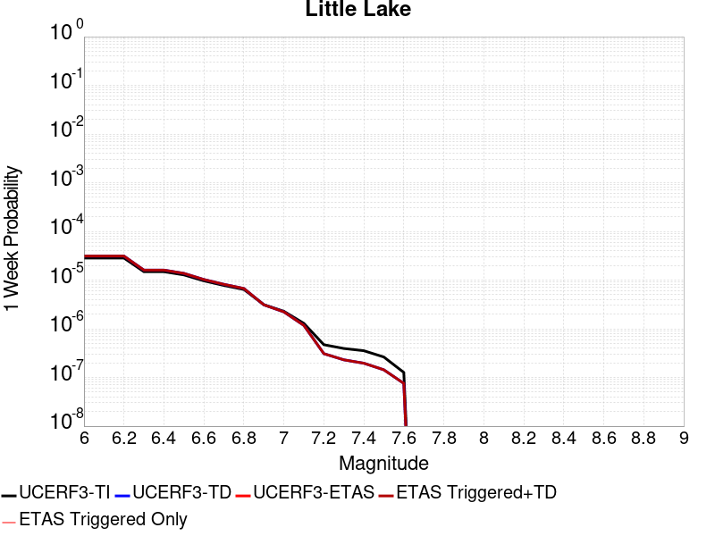 |  | 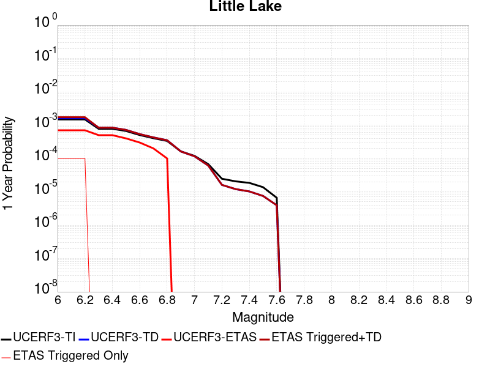 | 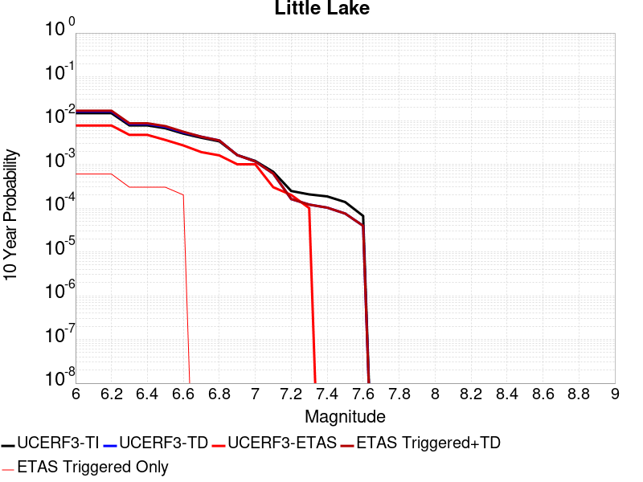 |

| Magnitude | 1 wk TI Prob | 1 wk TD Prob | 1 wk ETAS Prob | 1 wk ETAS/TD Gain | 1 wk ETAS Triggered+TD | 1 wk ETAS Triggered Only | 1 mo TI Prob | 1 mo TD Prob | 1 mo ETAS Prob | 1 mo ETAS/TD Gain | 1 mo ETAS Triggered+TD | 1 mo ETAS Triggered Only | 1 yr TI Prob | 1 yr TD Prob | 1 yr ETAS Prob | 1 yr ETAS/TD Gain | 1 yr ETAS Triggered+TD | 1 yr ETAS Triggered Only | 10 yr TI Prob | 10 yr TD Prob | 10 yr ETAS Prob | 10 yr ETAS/TD Gain | 10 yr ETAS Triggered+TD | 10 yr ETAS Triggered Only |
|-----|-----|-----|-----|-----|-----|-----|-----|-----|-----|-----|-----|-----|-----|-----|-----|-----|-----|-----|-----|-----|-----|-----|-----|-----|
| 6.0 | 2.8424427E-5 | 3.117113E-5 | 0.0 | 0.0 | 3.117113E-5 | 0.0 | 1.2181328E-4 | 1.3358446E-4 | 0.0 | 0.0 | 1.3358446E-4 | 0.0 | 0.0014820677 | 0.0016253103 | 7.0E-4 | 0.43068698 | 0.0017251477 | 1.0E-4 | 0.014722223 | 0.016147608 | 0.0077 | 0.47685084 | 0.01673792 | 6.0E-4 |
| 6.1 | 2.8424427E-5 | 3.117113E-5 | 0.0 | 0.0 | 3.117113E-5 | 0.0 | 1.2181328E-4 | 1.3358446E-4 | 0.0 | 0.0 | 1.3358446E-4 | 0.0 | 0.0014820677 | 0.0016253103 | 7.0E-4 | 0.43068698 | 0.0017251477 | 1.0E-4 | 0.014722223 | 0.016147608 | 0.0077 | 0.47685084 | 0.01673792 | 6.0E-4 |
| 6.2 | 2.8424427E-5 | 3.117113E-5 | 0.0 | 0.0 | 3.117113E-5 | 0.0 | 1.2181328E-4 | 1.3358446E-4 | 0.0 | 0.0 | 1.3358446E-4 | 0.0 | 0.0014820677 | 0.0016253103 | 7.0E-4 | 0.43068698 | 0.0017251477 | 1.0E-4 | 0.014722223 | 0.016147608 | 0.0077 | 0.47685084 | 0.01673792 | 6.0E-4 |
| 6.3 | 1.48860645E-5 | 1.6065283E-5 | 0.0 | 0.0 | 1.6065283E-5 | 0.0 | 6.379586E-5 | 6.884956E-5 | 0.0 | 0.0 | 6.884956E-5 | 0.0 | 7.7643775E-4 | 8.379491E-4 | 5.0E-4 | 0.59669495 | 8.379491E-4 | 0.0 | 0.007737305 | 0.008350707 | 0.0047 | 0.5628266 | 0.008648202 | 3.0E-4 |
| 6.4 | 1.48860645E-5 | 1.6065283E-5 | 0.0 | 0.0 | 1.6065283E-5 | 0.0 | 6.379586E-5 | 6.884956E-5 | 0.0 | 0.0 | 6.884956E-5 | 0.0 | 7.7643775E-4 | 8.379491E-4 | 5.0E-4 | 0.59669495 | 8.379491E-4 | 0.0 | 0.007737305 | 0.008350707 | 0.0047 | 0.5628266 | 0.008648202 | 3.0E-4 |
| 6.5 | 1.2797581E-5 | 1.3752088E-5 | 0.0 | 0.0 | 1.3752088E-5 | 0.0 | 5.4845623E-5 | 5.8936334E-5 | 0.0 | 0.0 | 5.8936334E-5 | 0.0 | 6.675408E-4 | 7.173393E-4 | 4.0E-4 | 0.5576162 | 7.173393E-4 | 0.0 | 0.006655392 | 0.0071527823 | 0.0036 | 0.50330067 | 0.0074506365 | 3.0E-4 |
| 6.6 | 9.661896E-6 | 1.0279502E-5 | 0.0 | 0.0 | 1.0279502E-5 | 0.0 | 4.1407468E-5 | 4.405436E-5 | 0.0 | 0.0 | 4.405436E-5 | 0.0 | 5.040193E-4 | 5.36246E-4 | 3.0E-4 | 0.5594447 | 5.36246E-4 | 0.0 | 0.005028777 | 0.005351122 | 0.0027 | 0.5045671 | 0.0055500516 | 2.0E-4 |
| 6.7 | 7.767871E-6 | 8.192401E-6 | 0.0 | 0.0 | 8.192401E-6 | 0.0 | 3.329045E-5 | 3.5109893E-5 | 0.0 | 0.0 | 3.5109893E-5 | 0.0 | 4.0523586E-4 | 4.2739284E-4 | 2.0E-4 | 0.46795356 | 4.2739284E-4 | 0.0 | 0.004044977 | 0.0042670574 | 0.0019 | 0.4452717 | 0.0042670574 | 0.0 |
| 6.8 | 6.4235196E-6 | 6.7298247E-6 | 0.0 | 0.0 | 6.7298247E-6 | 0.0 | 2.752908E-5 | 2.884186E-5 | 0.0 | 0.0 | 2.884186E-5 | 0.0 | 3.35115E-4 | 3.5110585E-4 | 1.0E-4 | 0.2848144 | 3.5110585E-4 | 0.0 | 0.003346101 | 0.003506769 | 0.0016 | 0.45626044 | 0.003506769 | 0.0 |
| 6.9 | 3.1283696E-6 | 3.1100424E-6 | 0.0 | 0.0 | 3.1100424E-6 | 0.0 | 1.3407229E-5 | 1.3328694E-5 | 0.0 | 0.0 | 1.3328694E-5 | 0.0 | 1.6322079E-4 | 1.6226627E-4 | 0.0 | 0.0 | 1.6226627E-4 | 0.0 | 0.0016310095 | 0.001621626 | 0.001 | 0.616665 | 0.001621626 | 0.0 |
| 7.0 | 2.290603E-6 | 2.2270472E-6 | 0.0 | 0.0 | 2.2270472E-6 | 0.0 | 9.816834E-6 | 9.544459E-6 | 0.0 | 0.0 | 9.544459E-6 | 0.0 | 1.19513395E-4 | 1.1619863E-4 | 0.0 | 0.0 | 1.1619863E-4 | 0.0 | 0.0011944914 | 0.0011614808 | 0.001 | 0.8609699 | 0.0011614808 | 0.0 |
| 7.1 | 1.293693E-6 | 1.176644E-6 | 0.0 | 0.0 | 1.176644E-6 | 0.0 | 5.5443866E-6 | 5.0427543E-6 | 0.0 | 0.0 | 5.0427543E-6 | 0.0 | 6.750081E-5 | 6.13945E-5 | 0.0 | 0.0 | 6.13945E-5 | 0.0 | 6.7480316E-4 | 6.138438E-4 | 3.0E-4 | 0.4887237 | 6.138438E-4 | 0.0 |
| 7.2 | 4.715842E-7 | 3.0865166E-7 | 0.0 | 0.0 | 3.0865166E-7 | 0.0 | 2.0210737E-6 | 1.3227922E-6 | 0.0 | 0.0 | 1.3227922E-6 | 0.0 | 2.4606294E-5 | 1.6104881E-5 | 0.0 | 0.0 | 1.6104881E-5 | 0.0 | 2.460357E-4 | 1.610377E-4 | 2.0E-4 | 1.2419453 | 1.610377E-4 | 0.0 |
| 7.3 | 3.9430947E-7 | 2.3048662E-7 | 0.0 | 0.0 | 2.3048662E-7 | 0.0 | 1.6898966E-6 | 9.877995E-7 | 0.0 | 0.0 | 9.877995E-7 | 0.0 | 2.0574296E-5 | 1.2026393E-5 | 0.0 | 0.0 | 1.2026393E-5 | 0.0 | 2.0572392E-4 | 1.2025749E-4 | 1.0E-4 | 0.83154905 | 1.2025749E-4 | 0.0 |
| 7.4 | 3.547123E-7 | 1.9633711E-7 | 0.0 | 0.0 | 1.9633711E-7 | 0.0 | 1.5201948E-6 | 8.414445E-7 | 0.0 | 0.0 | 8.414445E-7 | 0.0 | 1.8508214E-5 | 1.0244539E-5 | 0.0 | 0.0 | 1.0244539E-5 | 0.0 | 1.8506673E-4 | 1.0244073E-4 | 0.0 | 0.0 | 1.0244073E-4 | 0.0 |
| 7.5 | 2.6354266E-7 | 1.439136E-7 | 0.0 | 0.0 | 1.439136E-7 | 0.0 | 1.129468E-6 | 6.167724E-7 | 0.0 | 0.0 | 6.167724E-7 | 0.0 | 1.3751187E-5 | 7.5091784E-6 | 0.0 | 0.0 | 7.5091784E-6 | 0.0 | 1.3750336E-4 | 7.50893E-5 | 0.0 | 0.0 | 7.50893E-5 | 0.0 |
| 7.6 | 1.269913E-7 | 7.559133E-8 | 0.0 | 0.0 | 7.559133E-8 | 0.0 | 5.4424834E-7 | 3.239628E-7 | 0.0 | 0.0 | 3.239628E-7 | 0.0 | 6.6262032E-6 | 3.9442402E-6 | 0.0 | 0.0 | 3.9442402E-6 | 0.0 | 6.626006E-5 | 3.944174E-5 | 0.0 | 0.0 | 3.944174E-5 | 0.0 |

## Death Valley (No)
*[(top)](#table-of-contents)*

| 1 Week | 1 Month | 1 Year | 10 Year |
|-----|-----|-----|-----|
|  |  |  |  |

| Magnitude | 1 wk TI Prob | 1 wk TD Prob | 1 wk ETAS Prob | 1 wk ETAS/TD Gain | 1 wk ETAS Triggered+TD | 1 wk ETAS Triggered Only | 1 mo TI Prob | 1 mo TD Prob | 1 mo ETAS Prob | 1 mo ETAS/TD Gain | 1 mo ETAS Triggered+TD | 1 mo ETAS Triggered Only | 1 yr TI Prob | 1 yr TD Prob | 1 yr ETAS Prob | 1 yr ETAS/TD Gain | 1 yr ETAS Triggered+TD | 1 yr ETAS Triggered Only | 10 yr TI Prob | 10 yr TD Prob | 10 yr ETAS Prob | 10 yr ETAS/TD Gain | 10 yr ETAS Triggered+TD | 10 yr ETAS Triggered Only |
|-----|-----|-----|-----|-----|-----|-----|-----|-----|-----|-----|-----|-----|-----|-----|-----|-----|-----|-----|-----|-----|-----|-----|-----|-----|
| 6.0 | 2.0074807E-5 | 2.2471604E-5 | 0.0 | 0.0 | 2.2471604E-5 | 0.0 | 8.603206E-5 | 9.630336E-5 | 0.0 | 0.0 | 9.630336E-5 | 0.0 | 0.001046937 | 0.0011718702 | 5.0E-4 | 0.42666844 | 0.0012717529 | 1.0E-4 | 0.010420183 | 0.011657817 | 0.0057 | 0.48894233 | 0.012250822 | 6.0E-4 |
| 6.1 | 2.0074807E-5 | 2.2471604E-5 | 0.0 | 0.0 | 2.2471604E-5 | 0.0 | 8.603206E-5 | 9.630336E-5 | 0.0 | 0.0 | 9.630336E-5 | 0.0 | 0.001046937 | 0.0011718702 | 5.0E-4 | 0.42666844 | 0.0012717529 | 1.0E-4 | 0.010420183 | 0.011657817 | 0.0057 | 0.48894233 | 0.012250822 | 6.0E-4 |
| 6.2 | 2.0074807E-5 | 2.2471604E-5 | 0.0 | 0.0 | 2.2471604E-5 | 0.0 | 8.603206E-5 | 9.630336E-5 | 0.0 | 0.0 | 9.630336E-5 | 0.0 | 0.001046937 | 0.0011718702 | 5.0E-4 | 0.42666844 | 0.0012717529 | 1.0E-4 | 0.010420183 | 0.011657817 | 0.0057 | 0.48894233 | 0.012250822 | 6.0E-4 |
| 6.3 | 1.9050609E-5 | 2.1310112E-5 | 0.0 | 0.0 | 2.1310112E-5 | 0.0 | 8.164292E-5 | 9.132589E-5 | 0.0 | 0.0 | 9.132589E-5 | 0.0 | 9.935491E-4 | 0.0011113323 | 4.0E-4 | 0.35992834 | 0.0012112212 | 1.0E-4 | 0.009891188 | 0.01105857 | 0.005 | 0.45213804 | 0.011651934 | 6.0E-4 |
| 6.4 | 1.9050609E-5 | 2.1310112E-5 | 0.0 | 0.0 | 2.1310112E-5 | 0.0 | 8.164292E-5 | 9.132589E-5 | 0.0 | 0.0 | 9.132589E-5 | 0.0 | 9.935491E-4 | 0.0011113323 | 4.0E-4 | 0.35992834 | 0.0012112212 | 1.0E-4 | 0.009891188 | 0.01105857 | 0.005 | 0.45213804 | 0.011651934 | 6.0E-4 |
| 6.5 | 1.8367004E-5 | 2.0535266E-5 | 0.0 | 0.0 | 2.0535266E-5 | 0.0 | 7.8713354E-5 | 8.8005356E-5 | 0.0 | 0.0 | 8.8005356E-5 | 0.0 | 9.5791375E-4 | 0.001070945 | 4.0E-4 | 0.3735019 | 0.0011708379 | 1.0E-4 | 0.009537951 | 0.010658625 | 0.0048 | 0.45033953 | 0.01125223 | 6.0E-4 |
| 6.6 | 1.779439E-5 | 1.9886103E-5 | 0.0 | 0.0 | 1.9886103E-5 | 0.0 | 7.625944E-5 | 8.522341E-5 | 0.0 | 0.0 | 8.522341E-5 | 0.0 | 9.280632E-4 | 0.0010371074 | 4.0E-4 | 0.3856881 | 0.0011370038 | 1.0E-4 | 0.009241969 | 0.010323431 | 0.0048 | 0.46496168 | 0.010917237 | 6.0E-4 |
| 6.7 | 1.7025437E-5 | 1.9019766E-5 | 0.0 | 0.0 | 1.9019766E-5 | 0.0 | 7.296412E-5 | 8.151077E-5 | 0.0 | 0.0 | 8.151077E-5 | 0.0 | 8.87976E-4 | 9.91948E-4 | 4.0E-4 | 0.40324697 | 0.0010918487 | 1.0E-4 | 0.008844362 | 0.00987592 | 0.0045 | 0.45565376 | 0.0104699945 | 6.0E-4 |
| 6.8 | 1.6545107E-5 | 1.848948E-5 | 0.0 | 0.0 | 1.848948E-5 | 0.0 | 7.090568E-5 | 7.9238256E-5 | 0.0 | 0.0 | 7.9238256E-5 | 0.0 | 8.629347E-4 | 9.643049E-4 | 4.0E-4 | 0.41480657 | 0.0010642085 | 1.0E-4 | 0.008595915 | 0.009601908 | 0.0044 | 0.4582423 | 0.010196147 | 6.0E-4 |
| 6.9 | 1.615478E-5 | 1.8064933E-5 | 0.0 | 0.0 | 1.8064933E-5 | 0.0 | 6.9232934E-5 | 7.741888E-5 | 0.0 | 0.0 | 7.741888E-5 | 0.0 | 8.4258494E-4 | 9.4217336E-4 | 4.0E-4 | 0.42455032 | 0.0010420791 | 1.0E-4 | 0.008393973 | 0.009382481 | 0.0043 | 0.45830098 | 0.00987779 | 5.0E-4 |
| 7.0 | 1.5894311E-5 | 1.7783139E-5 | 0.0 | 0.0 | 1.7783139E-5 | 0.0 | 6.81167E-5 | 7.621126E-5 | 0.0 | 0.0 | 7.621126E-5 | 0.0 | 8.2900526E-4 | 9.274832E-4 | 4.0E-4 | 0.43127465 | 0.0010273905 | 1.0E-4 | 0.008259195 | 0.009236811 | 0.0041 | 0.44387618 | 0.009732192 | 5.0E-4 |
| 7.1 | 1.5602263E-5 | 1.7461445E-5 | 0.0 | 0.0 | 1.7461445E-5 | 0.0 | 6.6865134E-5 | 7.483265E-5 | 0.0 | 0.0 | 7.483265E-5 | 0.0 | 8.137789E-4 | 9.1071276E-4 | 4.0E-4 | 0.43921643 | 0.0010106217 | 1.0E-4 | 0.008108052 | 0.009070487 | 0.004 | 0.4409907 | 0.009466859 | 4.0E-4 |
| 7.2 | 1.5323829E-5 | 1.7148977E-5 | 0.0 | 0.0 | 1.7148977E-5 | 0.0 | 6.56719E-5 | 7.349358E-5 | 0.0 | 0.0 | 7.349358E-5 | 0.0 | 7.99262E-4 | 8.9442305E-4 | 4.0E-4 | 0.44721568 | 9.943336E-4 | 1.0E-4 | 0.007963934 | 0.008908907 | 0.0039 | 0.43776414 | 0.009305344 | 4.0E-4 |
| 7.3 | 1.4556212E-5 | 1.628199E-5 | 0.0 | 0.0 | 1.628199E-5 | 0.0 | 6.238227E-5 | 6.977812E-5 | 0.0 | 0.0 | 6.977812E-5 | 0.0 | 7.592395E-4 | 8.492234E-4 | 4.0E-4 | 0.47101858 | 9.491385E-4 | 1.0E-4 | 0.0075665074 | 0.008460425 | 0.0036 | 0.42551056 | 0.0087578865 | 3.0E-4 |
| 7.4 | 1.411725E-5 | 1.578815E-5 | 0.0 | 0.0 | 1.578815E-5 | 0.0 | 6.0501097E-5 | 6.766178E-5 | 0.0 | 0.0 | 6.766178E-5 | 0.0 | 7.363519E-4 | 8.234766E-4 | 4.0E-4 | 0.48574543 | 9.233943E-4 | 1.0E-4 | 0.0073391674 | 0.008204885 | 0.0035 | 0.42657515 | 0.008502423 | 3.0E-4 |
| 7.5 | 1.3503312E-5 | 1.5107272E-5 | 0.0 | 0.0 | 1.5107272E-5 | 0.0 | 5.7870053E-5 | 6.474388E-5 | 0.0 | 0.0 | 6.474388E-5 | 0.0 | 7.043401E-4 | 7.879774E-4 | 4.0E-4 | 0.50762874 | 8.878986E-4 | 1.0E-4 | 0.007021119 | 0.007852457 | 0.0034 | 0.43298545 | 0.008150102 | 3.0E-4 |
| 7.6 | 1.1279839E-5 | 1.2610564E-5 | 0.0 | 0.0 | 1.2610564E-5 | 0.0 | 4.834127E-5 | 5.4044183E-5 | 0.0 | 0.0 | 5.4044183E-5 | 0.0 | 5.88396E-4 | 6.577946E-4 | 4.0E-4 | 0.60809255 | 7.577288E-4 | 1.0E-4 | 0.005868405 | 0.006559026 | 0.0029 | 0.44213882 | 0.0067577143 | 2.0E-4 |
| 7.7 | 9.189108E-6 | 1.027055E-5 | 0.0 | 0.0 | 1.027055E-5 | 0.0 | 3.93813E-5 | 4.4015927E-5 | 0.0 | 0.0 | 4.4015927E-5 | 0.0 | 4.7936183E-4 | 5.357672E-4 | 4.0E-4 | 0.74659294 | 6.3571363E-4 | 1.0E-4 | 0.004783291 | 0.005345265 | 0.0025 | 0.46770367 | 0.0054447306 | 1.0E-4 |
| 7.8 | 3.4586725E-7 | 3.6461634E-7 | 0.0 | 0.0 | 3.6461634E-7 | 0.0 | 1.4822873E-6 | 1.5626406E-6 | 0.0 | 0.0 | 1.5626406E-6 | 0.0 | 1.80467E-5 | 1.9024988E-5 | 0.0 | 0.0 | 1.9024988E-5 | 0.0 | 1.8045233E-4 | 1.9023403E-4 | 1.0E-4 | 0.5256683 | 1.9023403E-4 | 0.0 |
| 7.9 | 2.5591178E-9 | 2.6684681E-9 | 0.0 | 0.0 | 2.6684681E-9 | 0.0 | 1.0967647E-8 | 1.1436292E-8 | 0.0 | 0.0 | 1.1436292E-8 | 0.0 | 1.335311E-7 | 1.3923685E-7 | 0.0 | 0.0 | 1.3923685E-7 | 0.0 | 1.3353102E-6 | 1.3923685E-6 | 0.0 | 0.0 | 1.3923685E-6 | 0.0 |

## McKinleyville (alt1)
*[(top)](#table-of-contents)*

| 1 Week | 1 Month | 1 Year | 10 Year |
|-----|-----|-----|-----|
|  |  | 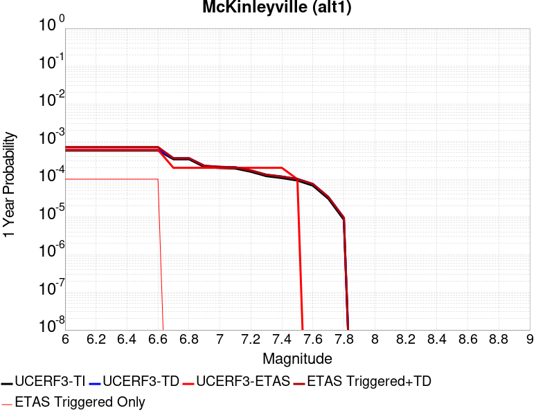 |  |

| Magnitude | 1 wk TI Prob | 1 wk TD Prob | 1 wk ETAS Prob | 1 wk ETAS/TD Gain | 1 wk ETAS Triggered+TD | 1 wk ETAS Triggered Only | 1 mo TI Prob | 1 mo TD Prob | 1 mo ETAS Prob | 1 mo ETAS/TD Gain | 1 mo ETAS Triggered+TD | 1 mo ETAS Triggered Only | 1 yr TI Prob | 1 yr TD Prob | 1 yr ETAS Prob | 1 yr ETAS/TD Gain | 1 yr ETAS Triggered+TD | 1 yr ETAS Triggered Only | 10 yr TI Prob | 10 yr TD Prob | 10 yr ETAS Prob | 10 yr ETAS/TD Gain | 10 yr ETAS Triggered+TD | 10 yr ETAS Triggered Only |
|-----|-----|-----|-----|-----|-----|-----|-----|-----|-----|-----|-----|-----|-----|-----|-----|-----|-----|-----|-----|-----|-----|-----|-----|-----|
| 6.0 | 1.1028524E-5 | 1.1719955E-5 | 0.0 | 0.0 | 1.1719955E-5 | 0.0 | 4.7264242E-5 | 5.0227554E-5 | 0.0 | 0.0 | 5.0227554E-5 | 0.0 | 5.7529024E-4 | 6.113743E-4 | 6.0E-4 | 0.98139554 | 7.1131316E-4 | 1.0E-4 | 0.005738032 | 0.006099429 | 0.0074 | 1.2132283 | 0.0066957693 | 6.0E-4 |
| 6.1 | 1.1028524E-5 | 1.1719955E-5 | 0.0 | 0.0 | 1.1719955E-5 | 0.0 | 4.7264242E-5 | 5.0227554E-5 | 0.0 | 0.0 | 5.0227554E-5 | 0.0 | 5.7529024E-4 | 6.113743E-4 | 6.0E-4 | 0.98139554 | 7.1131316E-4 | 1.0E-4 | 0.005738032 | 0.006099429 | 0.0074 | 1.2132283 | 0.0066957693 | 6.0E-4 |
| 6.2 | 1.1028524E-5 | 1.1719955E-5 | 0.0 | 0.0 | 1.1719955E-5 | 0.0 | 4.7264242E-5 | 5.0227554E-5 | 0.0 | 0.0 | 5.0227554E-5 | 0.0 | 5.7529024E-4 | 6.113743E-4 | 6.0E-4 | 0.98139554 | 7.1131316E-4 | 1.0E-4 | 0.005738032 | 0.006099429 | 0.0074 | 1.2132283 | 0.0066957693 | 6.0E-4 |
| 6.3 | 1.1028524E-5 | 1.1719955E-5 | 0.0 | 0.0 | 1.1719955E-5 | 0.0 | 4.7264242E-5 | 5.0227554E-5 | 0.0 | 0.0 | 5.0227554E-5 | 0.0 | 5.7529024E-4 | 6.113743E-4 | 6.0E-4 | 0.98139554 | 7.1131316E-4 | 1.0E-4 | 0.005738032 | 0.006099429 | 0.0074 | 1.2132283 | 0.0066957693 | 6.0E-4 |
| 6.4 | 1.1028524E-5 | 1.1719955E-5 | 0.0 | 0.0 | 1.1719955E-5 | 0.0 | 4.7264242E-5 | 5.0227554E-5 | 0.0 | 0.0 | 5.0227554E-5 | 0.0 | 5.7529024E-4 | 6.113743E-4 | 6.0E-4 | 0.98139554 | 7.1131316E-4 | 1.0E-4 | 0.005738032 | 0.006099429 | 0.0074 | 1.2132283 | 0.0066957693 | 6.0E-4 |
| 6.5 | 1.1028524E-5 | 1.1719955E-5 | 0.0 | 0.0 | 1.1719955E-5 | 0.0 | 4.7264242E-5 | 5.0227554E-5 | 0.0 | 0.0 | 5.0227554E-5 | 0.0 | 5.7529024E-4 | 6.113743E-4 | 6.0E-4 | 0.98139554 | 7.1131316E-4 | 1.0E-4 | 0.005738032 | 0.006099429 | 0.0074 | 1.2132283 | 0.0066957693 | 6.0E-4 |
| 6.6 | 1.1028524E-5 | 1.1719955E-5 | 0.0 | 0.0 | 1.1719955E-5 | 0.0 | 4.7264242E-5 | 5.0227554E-5 | 0.0 | 0.0 | 5.0227554E-5 | 0.0 | 5.7529024E-4 | 6.113743E-4 | 6.0E-4 | 0.98139554 | 7.1131316E-4 | 1.0E-4 | 0.005738032 | 0.006099429 | 0.0074 | 1.2132283 | 0.0066957693 | 6.0E-4 |
| 6.7 | 6.483374E-6 | 6.9122175E-6 | 0.0 | 0.0 | 6.9122175E-6 | 0.0 | 2.7785592E-5 | 2.9623488E-5 | 0.0 | 0.0 | 2.9623488E-5 | 0.0 | 3.3823706E-4 | 3.6061247E-4 | 2.0E-4 | 0.554612 | 3.6061247E-4 | 0.0 | 0.003377227 | 0.0036008852 | 0.0037 | 1.0275252 | 0.0036008852 | 0.0 |
| 6.8 | 6.483374E-6 | 6.9122175E-6 | 0.0 | 0.0 | 6.9122175E-6 | 0.0 | 2.7785592E-5 | 2.9623488E-5 | 0.0 | 0.0 | 2.9623488E-5 | 0.0 | 3.3823706E-4 | 3.6061247E-4 | 2.0E-4 | 0.554612 | 3.6061247E-4 | 0.0 | 0.003377227 | 0.0036008852 | 0.0037 | 1.0275252 | 0.0036008852 | 0.0 |
| 6.9 | 4.0394048E-6 | 4.341882E-6 | 0.0 | 0.0 | 4.341882E-6 | 0.0 | 1.731162E-5 | 1.8607934E-5 | 0.0 | 0.0 | 1.8607934E-5 | 0.0 | 2.1074859E-4 | 2.265286E-4 | 2.0E-4 | 0.8828907 | 2.265286E-4 | 0.0 | 0.0021054882 | 0.0022630317 | 0.0021 | 0.92795867 | 0.0022630317 | 0.0 |
| 7.0 | 3.7791233E-6 | 4.0688788E-6 | 0.0 | 0.0 | 4.0688788E-6 | 0.0 | 1.6196142E-5 | 1.7437938E-5 | 0.0 | 0.0 | 1.7437938E-5 | 0.0 | 1.9717019E-4 | 2.1228672E-4 | 2.0E-4 | 0.94212204 | 2.1228672E-4 | 0.0 | 0.0019699533 | 0.0021208893 | 0.002 | 0.94300073 | 0.0021208893 | 0.0 |
| 7.1 | 3.675443E-6 | 3.960234E-6 | 0.0 | 0.0 | 3.960234E-6 | 0.0 | 1.5751802E-5 | 1.6972324E-5 | 0.0 | 0.0 | 1.6972324E-5 | 0.0 | 1.9176133E-4 | 2.0661895E-4 | 2.0E-4 | 0.9679654 | 2.0661895E-4 | 0.0 | 0.0019159593 | 0.002064318 | 0.0019 | 0.92040086 | 0.002064318 | 0.0 |
| 7.2 | 3.0165843E-6 | 3.2691917E-6 | 0.0 | 0.0 | 3.2691917E-6 | 0.0 | 1.2928153E-5 | 1.4010747E-5 | 0.0 | 0.0 | 1.4010747E-5 | 0.0 | 1.573889E-4 | 1.7056768E-4 | 2.0E-4 | 1.1725551 | 1.7056768E-4 | 0.0 | 0.0015727748 | 0.0017043864 | 0.0015 | 0.88008213 | 0.0017043864 | 0.0 |
| 7.3 | 2.307633E-6 | 2.5164982E-6 | 0.0 | 0.0 | 2.5164982E-6 | 0.0 | 9.889818E-6 | 1.0784948E-5 | 0.0 | 0.0 | 1.0784948E-5 | 0.0 | 1.2040188E-4 | 1.312989E-4 | 2.0E-4 | 1.5232419 | 1.312989E-4 | 0.0 | 0.0012033667 | 0.0013122217 | 0.0013 | 0.9906862 | 0.0013122217 | 0.0 |
| 7.4 | 2.0568484E-6 | 2.2494894E-6 | 0.0 | 0.0 | 2.2494894E-6 | 0.0 | 8.8150355E-6 | 9.640634E-6 | 0.0 | 0.0 | 9.640634E-6 | 0.0 | 1.0731777E-4 | 1.1736847E-4 | 2.0E-4 | 1.7040352 | 1.1736847E-4 | 0.0 | 0.0010726595 | 0.0011730725 | 0.0012 | 1.0229547 | 0.0011730725 | 0.0 |
| 7.5 | 1.7674889E-6 | 1.9394265E-6 | 0.0 | 0.0 | 1.9394265E-6 | 0.0 | 7.5749304E-6 | 8.311801E-6 | 0.0 | 0.0 | 8.311801E-6 | 0.0 | 9.222087E-5 | 1.01191545E-4 | 1.0E-4 | 0.9882248 | 1.01191545E-4 | 0.0 | 9.218261E-4 | 0.0010114614 | 0.001 | 0.98866856 | 0.0010114614 | 0.0 |
| 7.6 | 1.2944297E-6 | 1.4280773E-6 | 0.0 | 0.0 | 1.4280773E-6 | 0.0 | 5.547544E-6 | 6.1203173E-6 | 0.0 | 0.0 | 6.1203173E-6 | 0.0 | 6.753925E-5 | 7.451236E-5 | 0.0 | 0.0 | 7.451236E-5 | 0.0 | 6.7518733E-4 | 7.448786E-4 | 7.0E-4 | 0.93975043 | 7.448786E-4 | 0.0 |
| 7.7 | 5.806243E-7 | 6.4533947E-7 | 0.0 | 0.0 | 6.4533947E-7 | 0.0 | 2.4883875E-6 | 2.765738E-6 | 0.0 | 0.0 | 2.765738E-6 | 0.0 | 3.0295698E-5 | 3.3672353E-5 | 0.0 | 0.0 | 3.3672353E-5 | 0.0 | 3.0291567E-4 | 3.3667422E-4 | 1.0E-4 | 0.29702306 | 3.3667422E-4 | 0.0 |
| 7.8 | 1.6121008E-7 | 1.81592E-7 | 0.0 | 0.0 | 1.81592E-7 | 0.0 | 6.909002E-7 | 7.7825126E-7 | 0.0 | 0.0 | 7.7825126E-7 | 0.0 | 8.411677E-6 | 9.47517E-6 | 0.0 | 0.0 | 9.47517E-6 | 0.0 | 8.411359E-5 | 9.474791E-5 | 0.0 | 0.0 | 9.474791E-5 | 0.0 |

## Owens Valley
*[(top)](#table-of-contents)*

| 1 Week | 1 Month | 1 Year | 10 Year |
|-----|-----|-----|-----|
|  |  |  |  |

| Magnitude | 1 wk TI Prob | 1 wk TD Prob | 1 wk ETAS Prob | 1 wk ETAS/TD Gain | 1 wk ETAS Triggered+TD | 1 wk ETAS Triggered Only | 1 mo TI Prob | 1 mo TD Prob | 1 mo ETAS Prob | 1 mo ETAS/TD Gain | 1 mo ETAS Triggered+TD | 1 mo ETAS Triggered Only | 1 yr TI Prob | 1 yr TD Prob | 1 yr ETAS Prob | 1 yr ETAS/TD Gain | 1 yr ETAS Triggered+TD | 1 yr ETAS Triggered Only | 10 yr TI Prob | 10 yr TD Prob | 10 yr ETAS Prob | 10 yr ETAS/TD Gain | 10 yr ETAS Triggered+TD | 10 yr ETAS Triggered Only |
|-----|-----|-----|-----|-----|-----|-----|-----|-----|-----|-----|-----|-----|-----|-----|-----|-----|-----|-----|-----|-----|-----|-----|-----|-----|
| 6.0 | 4.83821E-5 | 3.553485E-6 | 0.0 | 0.0 | 3.553485E-6 | 0.0 | 2.0733538E-4 | 1.5229138E-5 | 0.0 | 0.0 | 1.5229138E-5 | 0.0 | 0.002521386 | 1.8539993E-4 | 2.0E-4 | 1.0787491 | 2.853814E-4 | 1.0E-4 | 0.024929691 | 0.0018779148 | 0.002 | 1.065011 | 0.002476788 | 6.0E-4 |
| 6.1 | 4.83821E-5 | 3.553485E-6 | 0.0 | 0.0 | 3.553485E-6 | 0.0 | 2.0733538E-4 | 1.5229138E-5 | 0.0 | 0.0 | 1.5229138E-5 | 0.0 | 0.002521386 | 1.8539993E-4 | 2.0E-4 | 1.0787491 | 2.853814E-4 | 1.0E-4 | 0.024929691 | 0.0018779148 | 0.002 | 1.065011 | 0.002476788 | 6.0E-4 |
| 6.2 | 4.83821E-5 | 3.553485E-6 | 0.0 | 0.0 | 3.553485E-6 | 0.0 | 2.0733538E-4 | 1.5229138E-5 | 0.0 | 0.0 | 1.5229138E-5 | 0.0 | 0.002521386 | 1.8539993E-4 | 2.0E-4 | 1.0787491 | 2.853814E-4 | 1.0E-4 | 0.024929691 | 0.0018779148 | 0.002 | 1.065011 | 0.002476788 | 6.0E-4 |
| 6.3 | 3.953008E-5 | 3.1146653E-6 | 0.0 | 0.0 | 3.1146653E-6 | 0.0 | 1.6940363E-4 | 1.3348502E-5 | 0.0 | 0.0 | 1.3348502E-5 | 0.0 | 0.002060538 | 1.625066E-4 | 2.0E-4 | 1.2307192 | 2.6249036E-4 | 1.0E-4 | 0.020415364 | 0.001635654 | 0.0019 | 1.1616149 | 0.0022346727 | 6.0E-4 |
| 6.4 | 3.953008E-5 | 3.1146653E-6 | 0.0 | 0.0 | 3.1146653E-6 | 0.0 | 1.6940363E-4 | 1.3348502E-5 | 0.0 | 0.0 | 1.3348502E-5 | 0.0 | 0.002060538 | 1.625066E-4 | 2.0E-4 | 1.2307192 | 2.6249036E-4 | 1.0E-4 | 0.020415364 | 0.001635654 | 0.0019 | 1.1616149 | 0.0022346727 | 6.0E-4 |
| 6.5 | 3.457342E-5 | 2.944885E-6 | 0.0 | 0.0 | 2.944885E-6 | 0.0 | 1.4816338E-4 | 1.2620879E-5 | 0.0 | 0.0 | 1.2620879E-5 | 0.0 | 0.0018023965 | 1.5364906E-4 | 1.0E-4 | 0.6508338 | 1.5364906E-4 | 0.0 | 0.017878477 | 0.0015404408 | 0.0017 | 1.1035802 | 0.0020396707 | 5.0E-4 |
| 6.6 | 3.1127765E-5 | 2.8551772E-6 | 0.0 | 0.0 | 2.8551772E-6 | 0.0 | 1.3339789E-4 | 1.223642E-5 | 0.0 | 0.0 | 1.223642E-5 | 0.0 | 0.0016229092 | 1.4896892E-4 | 1.0E-4 | 0.671281 | 1.4896892E-4 | 0.0 | 0.016111081 | 0.0014915651 | 0.0016 | 1.0726987 | 0.0019908193 | 5.0E-4 |
| 6.7 | 2.806885E-5 | 2.7961862E-6 | 0.0 | 0.0 | 2.7961862E-6 | 0.0 | 1.2028952E-4 | 1.1983604E-5 | 0.0 | 0.0 | 1.1983604E-5 | 0.0 | 0.001463541 | 1.4589129E-4 | 1.0E-4 | 0.68544185 | 1.4589129E-4 | 0.0 | 0.014539397 | 0.0014583865 | 0.0015 | 1.0285339 | 0.0019576573 | 5.0E-4 |
| 6.8 | 2.524524E-5 | 2.2230183E-6 | 0.0 | 0.0 | 2.2230183E-6 | 0.0 | 1.0818939E-4 | 9.527188E-6 | 0.0 | 0.0 | 9.527188E-6 | 0.0 | 0.0013164099 | 1.1598764E-4 | 0.0 | 0.0 | 1.1598764E-4 | 0.0 | 0.01308639 | 0.0011595791 | 0.0011 | 0.9486201 | 0.0016589992 | 5.0E-4 |
| 6.9 | 2.2704568E-5 | 1.599E-6 | 0.0 | 0.0 | 1.599E-6 | 0.0 | 9.730166E-5 | 6.8528393E-6 | 0.0 | 0.0 | 6.8528393E-6 | 0.0 | 0.0011840039 | 8.343014E-5 | 0.0 | 0.0 | 8.343014E-5 | 0.0 | 0.011777153 | 8.342342E-4 | 8.0E-4 | 0.9589634 | 0.001333817 | 5.0E-4 |
| 7.0 | 2.0871712E-5 | 1.5308683E-6 | 0.0 | 0.0 | 1.5308683E-6 | 0.0 | 8.944713E-5 | 6.560848E-6 | 0.0 | 0.0 | 6.560848E-6 | 0.0 | 0.0010884746 | 7.987541E-5 | 0.0 | 0.0 | 7.987541E-5 | 0.0 | 0.010831586 | 7.9867634E-4 | 8.0E-4 | 1.0016574 | 0.0012982769 | 5.0E-4 |
| 7.1 | 1.944928E-5 | 1.3789747E-6 | 0.0 | 0.0 | 1.3789747E-6 | 0.0 | 8.335139E-5 | 5.9098784E-6 | 0.0 | 0.0 | 5.9098784E-6 | 0.0 | 0.0010143308 | 7.19504E-5 | 0.0 | 0.0 | 7.19504E-5 | 0.0 | 0.010097133 | 7.1946834E-4 | 7.0E-4 | 0.9729406 | 0.0012191086 | 5.0E-4 |
| 7.2 | 1.7876306E-5 | 1.2423458E-6 | 0.0 | 0.0 | 1.2423458E-6 | 0.0 | 7.6610486E-5 | 5.324328E-6 | 0.0 | 0.0 | 5.324328E-6 | 0.0 | 9.3233347E-4 | 6.4821776E-5 | 0.0 | 0.0 | 6.4821776E-5 | 0.0 | 0.009284316 | 6.4821105E-4 | 7.0E-4 | 1.0798953 | 0.001147887 | 5.0E-4 |
| 7.3 | 1.2618672E-5 | 1.1054104E-6 | 0.0 | 0.0 | 1.1054104E-6 | 0.0 | 5.40789E-5 | 4.7374647E-6 | 0.0 | 0.0 | 4.7374647E-6 | 0.0 | 6.582117E-4 | 5.7677113E-5 | 0.0 | 0.0 | 5.7677113E-5 | 0.0 | 0.0065626553 | 5.7679886E-4 | 5.0E-4 | 0.8668533 | 9.765681E-4 | 4.0E-4 |
| 7.4 | 7.4874442E-6 | 8.496985E-7 | 0.0 | 0.0 | 8.496985E-7 | 0.0 | 3.208865E-5 | 3.64156E-6 | 0.0 | 0.0 | 3.64156E-6 | 0.0 | 3.906093E-4 | 4.4335095E-5 | 0.0 | 0.0 | 4.4335095E-5 | 0.0 | 0.003899234 | 4.4340023E-4 | 3.0E-4 | 0.6765896 | 6.433116E-4 | 2.0E-4 |
| 7.5 | 2.4734156E-6 | 6.0339664E-7 | 0.0 | 0.0 | 6.0339664E-7 | 0.0 | 1.060031E-5 | 2.585983E-6 | 0.0 | 0.0 | 2.585983E-6 | 0.0 | 1.2905113E-4 | 3.148389E-5 | 0.0 | 0.0 | 3.148389E-5 | 0.0 | 0.0012897621 | 3.1479463E-4 | 2.0E-4 | 0.63533485 | 4.1476317E-4 | 1.0E-4 |
| 7.6 | 1.1328841E-6 | 3.178669E-7 | 0.0 | 0.0 | 3.178669E-7 | 0.0 | 4.8552088E-6 | 1.362286E-6 | 0.0 | 0.0 | 1.362286E-6 | 0.0 | 5.9110564E-5 | 1.6585707E-5 | 0.0 | 0.0 | 1.6585707E-5 | 0.0 | 5.9094845E-4 | 1.6584487E-4 | 0.0 | 0.0 | 1.6584487E-4 | 0.0 |
| 7.7 | 4.8613185E-7 | 8.8860894E-8 | 0.0 | 0.0 | 8.8860894E-8 | 0.0 | 2.0834207E-6 | 3.8083235E-7 | 0.0 | 0.0 | 3.8083235E-7 | 0.0 | 2.536535E-5 | 4.6366245E-6 | 0.0 | 0.0 | 4.6366245E-6 | 0.0 | 2.5362454E-4 | 4.6365345E-5 | 0.0 | 0.0 | 4.6365345E-5 | 0.0 |

## Superstition Hills
*[(top)](#table-of-contents)*

| 1 Week | 1 Month | 1 Year | 10 Year |
|-----|-----|-----|-----|
|  |  |  |  |

| Magnitude | 1 wk TI Prob | 1 wk TD Prob | 1 wk ETAS Prob | 1 wk ETAS/TD Gain | 1 wk ETAS Triggered+TD | 1 wk ETAS Triggered Only | 1 mo TI Prob | 1 mo TD Prob | 1 mo ETAS Prob | 1 mo ETAS/TD Gain | 1 mo ETAS Triggered+TD | 1 mo ETAS Triggered Only | 1 yr TI Prob | 1 yr TD Prob | 1 yr ETAS Prob | 1 yr ETAS/TD Gain | 1 yr ETAS Triggered+TD | 1 yr ETAS Triggered Only | 10 yr TI Prob | 10 yr TD Prob | 10 yr ETAS Prob | 10 yr ETAS/TD Gain | 10 yr ETAS Triggered+TD | 10 yr ETAS Triggered Only |
|-----|-----|-----|-----|-----|-----|-----|-----|-----|-----|-----|-----|-----|-----|-----|-----|-----|-----|-----|-----|-----|-----|-----|-----|-----|
| 6.0 | 6.6865185E-5 | 1.3796519E-5 | 0.0 | 0.0 | 1.3796519E-5 | 0.0 | 2.8653358E-4 | 5.9126687E-5 | 0.0 | 0.0 | 5.9126687E-5 | 0.0 | 0.0034829667 | 7.196453E-4 | 2.0E-4 | 0.27791467 | 7.196453E-4 | 0.0 | 0.03428881 | 0.007343593 | 0.0048 | 0.653631 | 0.007939187 | 6.0E-4 |
| 6.1 | 6.544851E-5 | 1.3796519E-5 | 0.0 | 0.0 | 1.3796519E-5 | 0.0 | 2.8046346E-4 | 5.9126687E-5 | 0.0 | 0.0 | 5.9126687E-5 | 0.0 | 0.0034092965 | 7.196453E-4 | 2.0E-4 | 0.27791467 | 7.196453E-4 | 0.0 | 0.033574644 | 0.0073435926 | 0.0048 | 0.65363103 | 0.007939187 | 6.0E-4 |
| 6.2 | 6.544851E-5 | 1.3796519E-5 | 0.0 | 0.0 | 1.3796519E-5 | 0.0 | 2.8046346E-4 | 5.9126687E-5 | 0.0 | 0.0 | 5.9126687E-5 | 0.0 | 0.0034092965 | 7.196453E-4 | 2.0E-4 | 0.27791467 | 7.196453E-4 | 0.0 | 0.033574644 | 0.0073435926 | 0.0048 | 0.65363103 | 0.007939187 | 6.0E-4 |
| 6.3 | 5.2402065E-5 | 1.3796519E-5 | 0.0 | 0.0 | 1.3796519E-5 | 0.0 | 2.2456095E-4 | 5.9126687E-5 | 0.0 | 0.0 | 5.9126687E-5 | 0.0 | 0.0027306017 | 7.196453E-4 | 2.0E-4 | 0.2779147 | 7.196453E-4 | 0.0 | 0.02697292 | 0.007343591 | 0.0048 | 0.65363115 | 0.007939185 | 6.0E-4 |
| 6.4 | 4.542238E-5 | 1.3796519E-5 | 0.0 | 0.0 | 1.3796519E-5 | 0.0 | 1.9465282E-4 | 5.9126687E-5 | 0.0 | 0.0 | 5.9126687E-5 | 0.0 | 0.0023673223 | 7.196453E-4 | 2.0E-4 | 0.2779147 | 7.196453E-4 | 0.0 | 0.023422617 | 0.0073435907 | 0.0048 | 0.6536312 | 0.007939184 | 6.0E-4 |
| 6.5 | 2.9672969E-5 | 1.3796519E-5 | 0.0 | 0.0 | 1.3796519E-5 | 0.0 | 1.2716366E-4 | 5.9126683E-5 | 0.0 | 0.0 | 5.9126683E-5 | 0.0 | 0.0015471181 | 7.196453E-4 | 2.0E-4 | 0.2779147 | 7.196453E-4 | 0.0 | 0.015363912 | 0.007343589 | 0.0048 | 0.6536314 | 0.007939182 | 6.0E-4 |
| 6.6 | 2.6056105E-5 | 1.3465085E-5 | 0.0 | 0.0 | 1.3465085E-5 | 0.0 | 1.1166424E-4 | 5.7706322E-5 | 0.0 | 0.0 | 5.7706322E-5 | 0.0 | 0.0013586642 | 7.023635E-4 | 2.0E-4 | 0.28475285 | 7.023635E-4 | 0.0 | 0.013503874 | 0.007169425 | 0.0048 | 0.66950977 | 0.007765123 | 6.0E-4 |
| 6.7 | 1.4611248E-5 | 1.3051225E-5 | 0.0 | 0.0 | 1.3051225E-5 | 0.0 | 6.261813E-5 | 5.593271E-5 | 0.0 | 0.0 | 5.593271E-5 | 0.0 | 7.6210906E-4 | 6.8078336E-4 | 2.0E-4 | 0.29377922 | 6.8078336E-4 | 0.0 | 0.0075950073 | 0.006953731 | 0.0048 | 0.69027686 | 0.007549559 | 6.0E-4 |
| 6.8 | 1.30607E-5 | 1.06771295E-5 | 0.0 | 0.0 | 1.06771295E-5 | 0.0 | 5.597323E-5 | 4.575837E-5 | 0.0 | 0.0 | 4.575837E-5 | 0.0 | 6.8126095E-4 | 5.569741E-4 | 2.0E-4 | 0.35908312 | 5.569741E-4 | 0.0 | 0.006791762 | 0.0057176747 | 0.0037 | 0.64711624 | 0.006015959 | 3.0E-4 |
| 6.9 | 1.0443096E-5 | 7.9457495E-6 | 0.0 | 0.0 | 7.9457495E-6 | 0.0 | 4.4755358E-5 | 3.405278E-5 | 0.0 | 0.0 | 3.405278E-5 | 0.0 | 5.447602E-4 | 4.1451596E-4 | 2.0E-4 | 0.48249048 | 4.1451596E-4 | 0.0 | 0.005434267 | 0.0042785862 | 0.0026 | 0.60767734 | 0.0043781586 | 1.0E-4 |
| 7.0 | 8.045912E-6 | 6.5298846E-6 | 0.0 | 0.0 | 6.5298846E-6 | 0.0 | 3.4482026E-5 | 2.7984925E-5 | 0.0 | 0.0 | 2.7984925E-5 | 0.0 | 4.197378E-4 | 3.4066418E-4 | 2.0E-4 | 0.58708847 | 3.4066418E-4 | 0.0 | 0.0041894587 | 0.003523399 | 0.002 | 0.5676337 | 0.0036230467 | 1.0E-4 |
| 7.1 | 8.045912E-6 | 6.5298846E-6 | 0.0 | 0.0 | 6.5298846E-6 | 0.0 | 3.4482026E-5 | 2.7984925E-5 | 0.0 | 0.0 | 2.7984925E-5 | 0.0 | 4.197378E-4 | 3.4066418E-4 | 2.0E-4 | 0.58708847 | 3.4066418E-4 | 0.0 | 0.0041894587 | 0.003523399 | 0.002 | 0.5676337 | 0.0036230467 | 1.0E-4 |
| 7.2 | 7.375506E-6 | 6.045261E-6 | 0.0 | 0.0 | 6.045261E-6 | 0.0 | 3.1608928E-5 | 2.590801E-5 | 0.0 | 0.0 | 2.590801E-5 | 0.0 | 3.8477074E-4 | 3.1538517E-4 | 2.0E-4 | 0.63414526 | 3.1538517E-4 | 0.0 | 0.003841052 | 0.003268259 | 0.0019 | 0.58134925 | 0.0033679323 | 1.0E-4 |
| 7.3 | 6.6063913E-6 | 5.603235E-6 | 0.0 | 0.0 | 5.603235E-6 | 0.0 | 2.8312797E-5 | 2.4013647E-5 | 0.0 | 0.0 | 2.4013647E-5 | 0.0 | 3.446538E-4 | 2.9232758E-4 | 2.0E-4 | 0.684164 | 2.9232758E-4 | 0.0 | 0.0034411973 | 0.003035418 | 0.0019 | 0.6259434 | 0.0031351147 | 1.0E-4 |
| 7.4 | 6.4313126E-6 | 5.485424E-6 | 0.0 | 0.0 | 5.485424E-6 | 0.0 | 2.7562477E-5 | 2.3508752E-5 | 0.0 | 0.0 | 2.3508752E-5 | 0.0 | 3.355215E-4 | 2.8618213E-4 | 2.0E-4 | 0.6988557 | 2.8618213E-4 | 0.0 | 0.0033501536 | 0.0029735975 | 0.0018 | 0.60532737 | 0.0030733 | 1.0E-4 |
| 7.5 | 6.0742927E-6 | 5.2839196E-6 | 0.0 | 0.0 | 5.2839196E-6 | 0.0 | 2.6032423E-5 | 2.2645176E-5 | 0.0 | 0.0 | 2.2645176E-5 | 0.0 | 3.1689866E-4 | 2.7567075E-4 | 2.0E-4 | 0.72550315 | 2.7567075E-4 | 0.0 | 0.0031644711 | 0.0028668358 | 0.0018 | 0.62786996 | 0.002966549 | 1.0E-4 |
| 7.6 | 5.6987187E-6 | 5.1049324E-6 | 0.0 | 0.0 | 5.1049324E-6 | 0.0 | 2.4422852E-5 | 2.18781E-5 | 0.0 | 0.0 | 2.18781E-5 | 0.0 | 2.9730765E-4 | 2.6633393E-4 | 2.0E-4 | 0.750937 | 2.6633393E-4 | 0.0 | 0.002969102 | 0.0027715745 | 0.0016 | 0.57728916 | 0.0028712973 | 1.0E-4 |
| 7.7 | 5.1658035E-6 | 4.7403937E-6 | 0.0 | 0.0 | 4.7403937E-6 | 0.0 | 2.2138971E-5 | 2.0315818E-5 | 0.0 | 0.0 | 2.0315818E-5 | 0.0 | 2.6950863E-4 | 2.4731757E-4 | 1.0E-4 | 0.40433845 | 2.4731757E-4 | 0.0 | 0.00269182 | 0.0025789577 | 0.0015 | 0.58163035 | 0.0026786998 | 1.0E-4 |
| 7.8 | 3.6864697E-6 | 4.0211085E-6 | 0.0 | 0.0 | 4.0211085E-6 | 0.0 | 1.579906E-5 | 1.723321E-5 | 0.0 | 0.0 | 1.723321E-5 | 0.0 | 1.9233658E-4 | 2.0979455E-4 | 1.0E-4 | 0.4766568 | 2.0979455E-4 | 0.0 | 0.0019217018 | 0.0021972533 | 0.0013 | 0.59164774 | 0.0022970336 | 1.0E-4 |
| 7.9 | 3.0265903E-6 | 3.4014947E-6 | 0.0 | 0.0 | 3.4014947E-6 | 0.0 | 1.2971037E-5 | 1.4577755E-5 | 0.0 | 0.0 | 1.4577755E-5 | 0.0 | 1.5791094E-4 | 1.7747011E-4 | 1.0E-4 | 0.5634752 | 1.7747011E-4 | 0.0 | 0.0015779877 | 0.0018684153 | 0.0012 | 0.64225554 | 0.0019682285 | 1.0E-4 |
| 8.0 | 2.5271493E-6 | 2.937738E-6 | 0.0 | 0.0 | 2.937738E-6 | 0.0 | 1.0830595E-5 | 1.2590247E-5 | 0.0 | 0.0 | 1.2590247E-5 | 0.0 | 1.3185451E-4 | 1.5327585E-4 | 1.0E-4 | 0.6524185 | 1.5327585E-4 | 0.0 | 0.0013177631 | 0.001619196 | 0.0011 | 0.6793495 | 0.0017190342 | 1.0E-4 |
| 8.1 | 2.3749135E-6 | 2.7747E-6 | 0.0 | 0.0 | 2.7747E-6 | 0.0 | 1.0178161E-5 | 1.18915195E-5 | 0.0 | 0.0 | 1.18915195E-5 | 0.0 | 1.2391206E-4 | 1.4477E-4 | 1.0E-4 | 0.6907508 | 1.4477E-4 | 0.0 | 0.0012384299 | 0.0015301426 | 0.001 | 0.6535339 | 0.0016299896 | 1.0E-4 |
| 8.2 | 1.7186406E-9 | 1.0663763E-9 | 0.0 | 0.0 | 1.0663763E-9 | 0.0 | 7.3656024E-9 | 4.5701842E-9 | 0.0 | 0.0 | 4.5701842E-9 | 0.0 | 8.9676206E-8 | 5.5641994E-8 | 0.0 | 0.0 | 5.5641994E-8 | 0.0 | 8.9676166E-7 | 5.9691484E-7 | 0.0 | 0.0 | 5.9691484E-7 | 0.0 |

## Blackwater
*[(top)](#table-of-contents)*

| 1 Week | 1 Month | 1 Year | 10 Year |
|-----|-----|-----|-----|
|  | 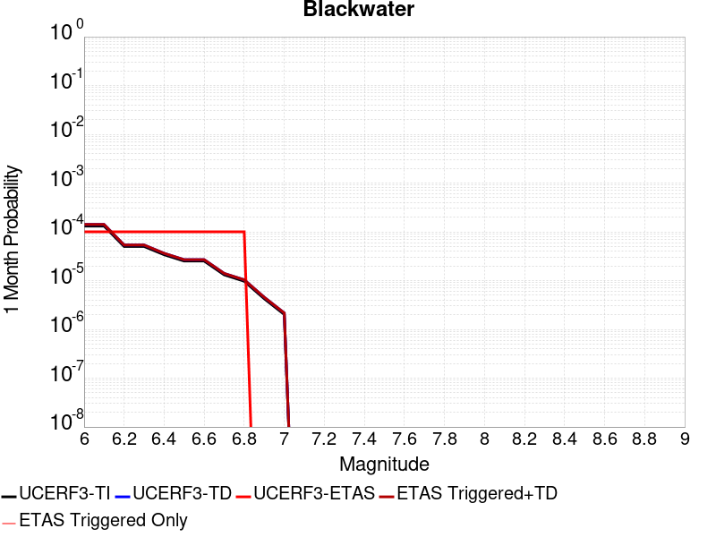 | 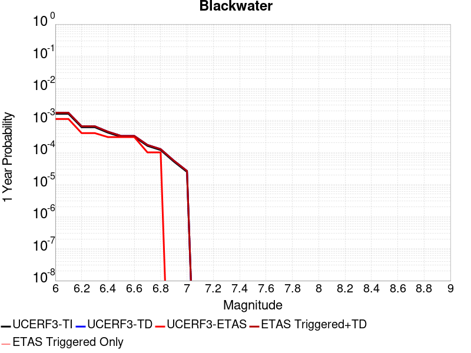 |  |

| Magnitude | 1 wk TI Prob | 1 wk TD Prob | 1 wk ETAS Prob | 1 wk ETAS/TD Gain | 1 wk ETAS Triggered+TD | 1 wk ETAS Triggered Only | 1 mo TI Prob | 1 mo TD Prob | 1 mo ETAS Prob | 1 mo ETAS/TD Gain | 1 mo ETAS Triggered+TD | 1 mo ETAS Triggered Only | 1 yr TI Prob | 1 yr TD Prob | 1 yr ETAS Prob | 1 yr ETAS/TD Gain | 1 yr ETAS Triggered+TD | 1 yr ETAS Triggered Only | 10 yr TI Prob | 10 yr TD Prob | 10 yr ETAS Prob | 10 yr ETAS/TD Gain | 10 yr ETAS Triggered+TD | 10 yr ETAS Triggered Only |
|-----|-----|-----|-----|-----|-----|-----|-----|-----|-----|-----|-----|-----|-----|-----|-----|-----|-----|-----|-----|-----|-----|-----|-----|-----|
| 6.0 | 3.0708583E-5 | 3.306896E-5 | 1.0E-4 | 3.0239837 | 3.306896E-5 | 0.0 | 1.3160157E-4 | 1.4171719E-4 | 1.0E-4 | 0.7056307 | 1.4171719E-4 | 0.0 | 0.0016010714 | 0.0017241776 | 0.0011 | 0.6379853 | 0.0017241776 | 0.0 | 0.015895851 | 0.017121818 | 0.0107 | 0.62493366 | 0.017711544 | 6.0E-4 |
| 6.1 | 3.0708583E-5 | 3.306896E-5 | 1.0E-4 | 3.0239837 | 3.306896E-5 | 0.0 | 1.3160157E-4 | 1.4171719E-4 | 1.0E-4 | 0.7056307 | 1.4171719E-4 | 0.0 | 0.0016010714 | 0.0017241776 | 0.0011 | 0.6379853 | 0.0017241776 | 0.0 | 0.015895851 | 0.017121818 | 0.0107 | 0.62493366 | 0.017711544 | 6.0E-4 |
| 6.2 | 1.1707779E-5 | 1.2535755E-5 | 1.0E-4 | 7.977182 | 1.2535755E-5 | 0.0 | 5.017523E-5 | 5.3723612E-5 | 1.0E-4 | 1.8613789 | 5.3723612E-5 | 0.0 | 6.107122E-4 | 6.538983E-4 | 4.0E-4 | 0.611716 | 6.538983E-4 | 0.0 | 0.006090366 | 0.006520712 | 0.0036 | 0.55208695 | 0.0066200597 | 1.0E-4 |
| 6.3 | 1.1707779E-5 | 1.2535755E-5 | 1.0E-4 | 7.977182 | 1.2535755E-5 | 0.0 | 5.017523E-5 | 5.3723612E-5 | 1.0E-4 | 1.8613789 | 5.3723612E-5 | 0.0 | 6.107122E-4 | 6.538983E-4 | 4.0E-4 | 0.611716 | 6.538983E-4 | 0.0 | 0.006090366 | 0.006520712 | 0.0036 | 0.55208695 | 0.0066200597 | 1.0E-4 |
| 6.4 | 7.929244E-6 | 8.4739495E-6 | 1.0E-4 | 11.800873 | 8.4739495E-6 | 0.0 | 3.3982033E-5 | 3.6316444E-5 | 1.0E-4 | 2.7535737 | 3.6316444E-5 | 0.0 | 4.136527E-4 | 4.4206702E-4 | 3.0E-4 | 0.6786301 | 4.4206702E-4 | 0.0 | 0.0041288356 | 0.0044122813 | 0.0026 | 0.58926433 | 0.0044122813 | 0.0 |
| 6.5 | 5.8832115E-6 | 6.2814997E-6 | 1.0E-4 | 15.9197645 | 6.2814997E-6 | 0.0 | 2.521352E-5 | 2.692045E-5 | 1.0E-4 | 3.7146482 | 2.692045E-5 | 0.0 | 3.0693135E-4 | 3.2770974E-4 | 3.0E-4 | 0.9154443 | 3.2770974E-4 | 0.0 | 0.0030650778 | 0.0032725176 | 0.002 | 0.61115026 | 0.0032725176 | 0.0 |
| 6.6 | 5.8832115E-6 | 6.2814997E-6 | 1.0E-4 | 15.9197645 | 6.2814997E-6 | 0.0 | 2.521352E-5 | 2.692045E-5 | 1.0E-4 | 3.7146482 | 2.692045E-5 | 0.0 | 3.0693135E-4 | 3.2770974E-4 | 3.0E-4 | 0.9154443 | 3.2770974E-4 | 0.0 | 0.0030650778 | 0.0032725176 | 0.002 | 0.61115026 | 0.0032725176 | 0.0 |
| 6.7 | 3.0715053E-6 | 3.2791254E-6 | 1.0E-4 | 30.495935 | 3.2791254E-6 | 0.0 | 1.3163528E-5 | 1.4053326E-5 | 1.0E-4 | 7.115753 | 1.4053326E-5 | 0.0 | 1.6025416E-4 | 1.7108697E-4 | 1.0E-4 | 0.58449805 | 1.7108697E-4 | 0.0 | 0.0016013865 | 0.0017096669 | 8.0E-4 | 0.4679274 | 0.0017096669 | 0.0 |
| 6.8 | 2.2722281E-6 | 2.4270078E-6 | 1.0E-4 | 41.203 | 2.4270078E-6 | 0.0 | 9.738084E-6 | 1.0401426E-5 | 1.0E-4 | 9.614066 | 1.0401426E-5 | 0.0 | 1.1855473E-4 | 1.2663091E-4 | 1.0E-4 | 0.7896966 | 1.2663091E-4 | 0.0 | 0.001184915 | 0.0012656776 | 7.0E-4 | 0.5530634 | 0.0012656776 | 0.0 |
| 6.9 | 9.952399E-7 | 1.0645658E-6 | 0.0 | 0.0 | 1.0645658E-6 | 0.0 | 4.265307E-6 | 4.5624197E-6 | 0.0 | 0.0 | 4.5624197E-6 | 0.0 | 5.1928873E-5 | 5.554656E-5 | 0.0 | 0.0 | 5.554656E-5 | 0.0 | 5.191674E-4 | 5.553773E-4 | 2.0E-4 | 0.36011553 | 5.553773E-4 | 0.0 |
| 7.0 | 4.7385504E-7 | 5.071793E-7 | 0.0 | 0.0 | 5.071793E-7 | 0.0 | 2.0308057E-6 | 2.1736255E-6 | 0.0 | 0.0 | 2.1736255E-6 | 0.0 | 2.4724779E-5 | 2.6463891E-5 | 0.0 | 0.0 | 2.6463891E-5 | 0.0 | 2.4722028E-4 | 2.6463892E-4 | 1.0E-4 | 0.3778734 | 2.6463892E-4 | 0.0 |

## Hollywood
*[(top)](#table-of-contents)*

| 1 Week | 1 Month | 1 Year | 10 Year |
|-----|-----|-----|-----|
|  |  |  |  |

| Magnitude | 1 wk TI Prob | 1 wk TD Prob | 1 wk ETAS Prob | 1 wk ETAS/TD Gain | 1 wk ETAS Triggered+TD | 1 wk ETAS Triggered Only | 1 mo TI Prob | 1 mo TD Prob | 1 mo ETAS Prob | 1 mo ETAS/TD Gain | 1 mo ETAS Triggered+TD | 1 mo ETAS Triggered Only | 1 yr TI Prob | 1 yr TD Prob | 1 yr ETAS Prob | 1 yr ETAS/TD Gain | 1 yr ETAS Triggered+TD | 1 yr ETAS Triggered Only | 10 yr TI Prob | 10 yr TD Prob | 10 yr ETAS Prob | 10 yr ETAS/TD Gain | 10 yr ETAS Triggered+TD | 10 yr ETAS Triggered Only |
|-----|-----|-----|-----|-----|-----|-----|-----|-----|-----|-----|-----|-----|-----|-----|-----|-----|-----|-----|-----|-----|-----|-----|-----|-----|
| 6.0 | 1.24487615E-5 | 1.2580265E-5 | 0.0 | 0.0 | 1.2580265E-5 | 0.0 | 5.3350745E-5 | 5.3914333E-5 | 0.0 | 0.0 | 5.3914333E-5 | 0.0 | 6.4935174E-4 | 6.5621396E-4 | 3.0E-4 | 0.45716795 | 6.5621396E-4 | 0.0 | 0.0064745755 | 0.0065432494 | 0.0042 | 0.6418829 | 0.0070399777 | 5.0E-4 |
| 6.1 | 1.24487615E-5 | 1.2580265E-5 | 0.0 | 0.0 | 1.2580265E-5 | 0.0 | 5.3350745E-5 | 5.3914333E-5 | 0.0 | 0.0 | 5.3914333E-5 | 0.0 | 6.4935174E-4 | 6.5621396E-4 | 3.0E-4 | 0.45716795 | 6.5621396E-4 | 0.0 | 0.0064745755 | 0.0065432494 | 0.0042 | 0.6418829 | 0.0070399777 | 5.0E-4 |
| 6.2 | 1.24487615E-5 | 1.2580265E-5 | 0.0 | 0.0 | 1.2580265E-5 | 0.0 | 5.3350745E-5 | 5.3914333E-5 | 0.0 | 0.0 | 5.3914333E-5 | 0.0 | 6.4935174E-4 | 6.5621396E-4 | 3.0E-4 | 0.45716795 | 6.5621396E-4 | 0.0 | 0.0064745755 | 0.0065432494 | 0.0042 | 0.6418829 | 0.0070399777 | 5.0E-4 |
| 6.3 | 1.24487615E-5 | 1.2580265E-5 | 0.0 | 0.0 | 1.2580265E-5 | 0.0 | 5.3350745E-5 | 5.3914333E-5 | 0.0 | 0.0 | 5.3914333E-5 | 0.0 | 6.4935174E-4 | 6.5621396E-4 | 3.0E-4 | 0.45716795 | 6.5621396E-4 | 0.0 | 0.0064745755 | 0.0065432494 | 0.0042 | 0.6418829 | 0.0070399777 | 5.0E-4 |
| 6.4 | 1.2431024E-5 | 1.2560898E-5 | 0.0 | 0.0 | 1.2560898E-5 | 0.0 | 5.327473E-5 | 5.3831332E-5 | 0.0 | 0.0 | 5.3831332E-5 | 0.0 | 6.4842677E-4 | 6.55204E-4 | 3.0E-4 | 0.45787266 | 6.55204E-4 | 0.0 | 0.0064653796 | 0.0065332097 | 0.0042 | 0.64286935 | 0.0070299427 | 5.0E-4 |
| 6.5 | 1.1242222E-5 | 1.1305599E-5 | 0.0 | 0.0 | 1.1305599E-5 | 0.0 | 4.8180063E-5 | 4.8451686E-5 | 0.0 | 0.0 | 4.8451686E-5 | 0.0 | 5.864344E-4 | 5.8974227E-4 | 2.0E-4 | 0.33913118 | 5.8974227E-4 | 0.0 | 0.0058488925 | 0.0058820588 | 0.0039 | 0.6630332 | 0.0062797056 | 4.0E-4 |
| 6.6 | 1.1234066E-5 | 1.1296722E-5 | 0.0 | 0.0 | 1.1296722E-5 | 0.0 | 4.8145106E-5 | 4.841364E-5 | 0.0 | 0.0 | 4.841364E-5 | 0.0 | 5.86009E-4 | 5.892793E-4 | 2.0E-4 | 0.33939764 | 5.892793E-4 | 0.0 | 0.005844661 | 0.0058774534 | 0.0039 | 0.6635527 | 0.0062751025 | 4.0E-4 |
| 6.7 | 1.12294E-5 | 1.1291472E-5 | 0.0 | 0.0 | 1.1291472E-5 | 0.0 | 4.812511E-5 | 4.839114E-5 | 0.0 | 0.0 | 4.839114E-5 | 0.0 | 5.857657E-4 | 5.8900553E-4 | 2.0E-4 | 0.33955538 | 5.8900553E-4 | 0.0 | 0.0058422405 | 0.00587473 | 0.0039 | 0.66386026 | 0.0062723802 | 4.0E-4 |
| 6.8 | 1.0252819E-5 | 1.02075255E-5 | 0.0 | 0.0 | 1.02075255E-5 | 0.0 | 4.3939912E-5 | 4.374582E-5 | 0.0 | 0.0 | 4.374582E-5 | 0.0 | 5.3483713E-4 | 5.324773E-4 | 2.0E-4 | 0.37560287 | 5.324773E-4 | 0.0 | 0.005335517 | 0.00531224 | 0.0036 | 0.6776802 | 0.005710115 | 4.0E-4 |
| 6.9 | 9.252289E-6 | 9.100634E-6 | 0.0 | 0.0 | 9.100634E-6 | 0.0 | 3.9652066E-5 | 3.9002145E-5 | 0.0 | 0.0 | 3.9002145E-5 | 0.0 | 4.8265693E-4 | 4.7474928E-4 | 2.0E-4 | 0.421275 | 4.7474928E-4 | 0.0 | 0.0048161 | 0.004737524 | 0.0031 | 0.6543503 | 0.0050361026 | 3.0E-4 |
| 7.0 | 8.474604E-6 | 8.249438E-6 | 0.0 | 0.0 | 8.249438E-6 | 0.0 | 3.6319227E-5 | 3.535426E-5 | 0.0 | 0.0 | 3.535426E-5 | 0.0 | 4.4209688E-4 | 4.3035456E-4 | 2.0E-4 | 0.4647331 | 4.3035456E-4 | 0.0 | 0.004412184 | 0.0042953617 | 0.0026 | 0.6053041 | 0.004594073 | 3.0E-4 |
| 7.1 | 6.643643E-6 | 6.2615013E-6 | 0.0 | 0.0 | 6.2615013E-6 | 0.0 | 2.8472443E-5 | 2.6834732E-5 | 0.0 | 0.0 | 2.6834732E-5 | 0.0 | 3.4659685E-4 | 3.266643E-4 | 2.0E-4 | 0.6122493 | 3.266643E-4 | 0.0 | 0.0034605677 | 0.0032618872 | 0.0018 | 0.5518278 | 0.0035609086 | 3.0E-4 |
| 7.2 | 5.549002E-6 | 5.1028646E-6 | 0.0 | 0.0 | 5.1028646E-6 | 0.0 | 2.378122E-5 | 2.1869237E-5 | 0.0 | 0.0 | 2.1869237E-5 | 0.0 | 2.8949787E-4 | 2.6622557E-4 | 2.0E-4 | 0.75124264 | 2.6622557E-4 | 0.0 | 0.0028912104 | 0.0026590829 | 0.0015 | 0.56410426 | 0.002858551 | 2.0E-4 |
| 7.3 | 4.3059727E-6 | 3.9549527E-6 | 0.0 | 0.0 | 3.9549527E-6 | 0.0 | 1.8454039E-5 | 1.6949687E-5 | 0.0 | 0.0 | 1.6949687E-5 | 0.0 | 2.2465475E-4 | 2.06343E-4 | 1.0E-4 | 0.48462996 | 2.06343E-4 | 0.0 | 0.0022442779 | 0.0020615242 | 0.0012 | 0.5820936 | 0.002161318 | 1.0E-4 |
| 7.4 | 2.8550733E-6 | 2.6975592E-6 | 0.0 | 0.0 | 2.6975592E-6 | 0.0 | 1.2235971E-5 | 1.1560916E-5 | 0.0 | 0.0 | 1.1560916E-5 | 0.0 | 1.4896276E-4 | 1.4074512E-4 | 0.0 | 0.0 | 1.4074512E-4 | 0.0 | 0.0014886294 | 0.0014065648 | 8.0E-4 | 0.5687615 | 0.0015064242 | 1.0E-4 |
| 7.5 | 1.9927045E-6 | 1.8945904E-6 | 0.0 | 0.0 | 1.8945904E-6 | 0.0 | 8.540134E-6 | 8.119648E-6 | 0.0 | 0.0 | 8.119648E-6 | 0.0 | 1.0397117E-4 | 9.8852266E-5 | 0.0 | 0.0 | 9.8852266E-5 | 0.0 | 0.0010392254 | 9.880866E-4 | 6.0E-4 | 0.60723424 | 0.0010879877 | 1.0E-4 |
| 7.6 | 1.345084E-6 | 1.21936E-6 | 0.0 | 0.0 | 1.21936E-6 | 0.0 | 5.764633E-6 | 5.225818E-6 | 0.0 | 0.0 | 5.225818E-6 | 0.0 | 7.018215E-5 | 6.3622494E-5 | 0.0 | 0.0 | 6.3622494E-5 | 0.0 | 7.0159987E-4 | 6.360448E-4 | 5.0E-4 | 0.78610814 | 7.359812E-4 | 1.0E-4 |
| 7.7 | 7.6835164E-7 | 6.2598747E-7 | 0.0 | 0.0 | 6.2598747E-7 | 0.0 | 3.2929315E-6 | 2.6828009E-6 | 0.0 | 0.0 | 2.6828009E-6 | 0.0 | 4.00907E-5 | 3.2662625E-5 | 0.0 | 0.0 | 3.2662625E-5 | 0.0 | 4.0083472E-4 | 3.265797E-4 | 2.0E-4 | 0.6124079 | 3.265797E-4 | 0.0 |
| 7.8 | 3.6562128E-7 | 2.4380995E-7 | 0.0 | 0.0 | 2.4380995E-7 | 0.0 | 1.5669474E-6 | 1.0448994E-6 | 0.0 | 0.0 | 1.0448994E-6 | 0.0 | 1.9077417E-5 | 1.2721579E-5 | 0.0 | 0.0 | 1.2721579E-5 | 0.0 | 1.907578E-4 | 1.2720887E-4 | 2.0E-4 | 1.5722173 | 1.2720887E-4 | 0.0 |
| 7.9 | 7.5024424E-8 | 5.354939E-8 | 0.0 | 0.0 | 5.354939E-8 | 0.0 | 3.215332E-7 | 2.2949736E-7 | 0.0 | 0.0 | 2.2949736E-7 | 0.0 | 3.91466E-6 | 2.794128E-6 | 0.0 | 0.0 | 2.794128E-6 | 0.0 | 3.9145907E-5 | 2.7941058E-5 | 1.0E-4 | 3.5789626 | 2.7941058E-5 | 0.0 |

## Walker Spring 2011 CFM
*[(top)](#table-of-contents)*

| 1 Week | 1 Month | 1 Year | 10 Year |
|-----|-----|-----|-----|
|  |  |  |  |

| Magnitude | 1 wk TI Prob | 1 wk TD Prob | 1 wk ETAS Prob | 1 wk ETAS/TD Gain | 1 wk ETAS Triggered+TD | 1 wk ETAS Triggered Only | 1 mo TI Prob | 1 mo TD Prob | 1 mo ETAS Prob | 1 mo ETAS/TD Gain | 1 mo ETAS Triggered+TD | 1 mo ETAS Triggered Only | 1 yr TI Prob | 1 yr TD Prob | 1 yr ETAS Prob | 1 yr ETAS/TD Gain | 1 yr ETAS Triggered+TD | 1 yr ETAS Triggered Only | 10 yr TI Prob | 10 yr TD Prob | 10 yr ETAS Prob | 10 yr ETAS/TD Gain | 10 yr ETAS Triggered+TD | 10 yr ETAS Triggered Only |
|-----|-----|-----|-----|-----|-----|-----|-----|-----|-----|-----|-----|-----|-----|-----|-----|-----|-----|-----|-----|-----|-----|-----|-----|-----|
| 6.0 | 8.791276E-6 | 9.258855E-6 | 0.0 | 0.0 | 9.258855E-6 | 0.0 | 3.767635E-5 | 3.9680264E-5 | 1.0E-4 | 2.5201445 | 1.396763E-4 | 1.0E-4 | 4.58613E-4 | 4.8301095E-4 | 7.0E-4 | 1.4492425 | 7.828661E-4 | 3.0E-4 | 0.004576677 | 0.004820684 | 0.0034 | 0.70529413 | 0.005318274 | 5.0E-4 |
| 6.1 | 8.791276E-6 | 9.258855E-6 | 0.0 | 0.0 | 9.258855E-6 | 0.0 | 3.767635E-5 | 3.9680264E-5 | 1.0E-4 | 2.5201445 | 1.396763E-4 | 1.0E-4 | 4.58613E-4 | 4.8301095E-4 | 6.0E-4 | 1.2422078 | 7.828661E-4 | 3.0E-4 | 0.004576677 | 0.004820684 | 0.0027 | 0.5600865 | 0.005318274 | 5.0E-4 |
| 6.2 | 5.654515E-6 | 5.994926E-6 | 0.0 | 0.0 | 5.994926E-6 | 0.0 | 2.4233412E-5 | 2.5692316E-5 | 1.0E-4 | 3.8922143 | 1.2568975E-4 | 1.0E-4 | 2.9500184E-4 | 3.1276405E-4 | 5.0E-4 | 1.5986491 | 6.126702E-4 | 3.0E-4 | 0.0029461053 | 0.0031237327 | 0.0015 | 0.48019475 | 0.0035224832 | 4.0E-4 |
| 6.3 | 4.591685E-6 | 4.891341E-6 | 0.0 | 0.0 | 4.891341E-6 | 0.0 | 1.96785E-5 | 2.0962747E-5 | 1.0E-4 | 4.770367 | 1.2096065E-4 | 1.0E-4 | 2.395594E-4 | 2.5519592E-4 | 5.0E-4 | 1.9592791 | 5.5511936E-4 | 3.0E-4 | 0.002393013 | 0.0025494578 | 0.0014 | 0.54913634 | 0.002948438 | 4.0E-4 |
| 6.4 | 4.243283E-6 | 4.5195384E-6 | 0.0 | 0.0 | 4.5195384E-6 | 0.0 | 1.8185372E-5 | 1.936933E-5 | 1.0E-4 | 5.162801 | 1.19367396E-4 | 1.0E-4 | 2.2138441E-4 | 2.358003E-4 | 4.0E-4 | 1.6963507 | 5.357296E-4 | 3.0E-4 | 0.00221164 | 0.002355916 | 0.0013 | 0.5518024 | 0.0027549735 | 4.0E-4 |
| 6.5 | 3.4445666E-6 | 3.6833867E-6 | 0.0 | 0.0 | 3.6833867E-6 | 0.0 | 1.4762345E-5 | 1.578587E-5 | 1.0E-4 | 6.3347793 | 1.1578429E-4 | 1.0E-4 | 1.7971672E-4 | 1.9218003E-4 | 4.0E-4 | 2.0813818 | 4.921224E-4 | 3.0E-4 | 0.0017957145 | 0.0019205326 | 0.0013 | 0.6768956 | 0.0023197643 | 4.0E-4 |
| 6.6 | 2.68766E-6 | 2.8772854E-6 | 0.0 | 0.0 | 2.8772854E-6 | 0.0 | 1.1518492E-5 | 1.2331187E-5 | 1.0E-4 | 8.10952 | 1.1232995E-4 | 1.0E-4 | 1.4022861E-4 | 1.5012566E-4 | 4.0E-4 | 2.6644347 | 4.500806E-4 | 3.0E-4 | 0.0014014016 | 0.0015006157 | 0.0011 | 0.73303246 | 0.0018001655 | 3.0E-4 |
| 6.7 | 5.880964E-7 | 6.1962396E-7 | 0.0 | 0.0 | 6.1962396E-7 | 0.0 | 2.5204106E-6 | 2.655529E-6 | 0.0 | 0.0 | 2.655529E-6 | 0.0 | 3.0685565E-5 | 3.233068E-5 | 0.0 | 0.0 | 3.233068E-5 | 0.0 | 3.068133E-4 | 3.2326914E-4 | 0.0 | 0.0 | 3.2326914E-4 | 0.0 |
| 6.8 | 1.6514163E-7 | 1.7399272E-7 | 0.0 | 0.0 | 1.7399272E-7 | 0.0 | 7.077497E-7 | 7.4568305E-7 | 0.0 | 0.0 | 7.4568305E-7 | 0.0 | 8.616818E-6 | 9.078692E-6 | 0.0 | 0.0 | 9.078692E-6 | 0.0 | 8.616484E-5 | 9.078691E-5 | 0.0 | 0.0 | 9.078691E-5 | 0.0 |

## Sierra Madre
*[(top)](#table-of-contents)*

| 1 Week | 1 Month | 1 Year | 10 Year |
|-----|-----|-----|-----|
|  |  |  | 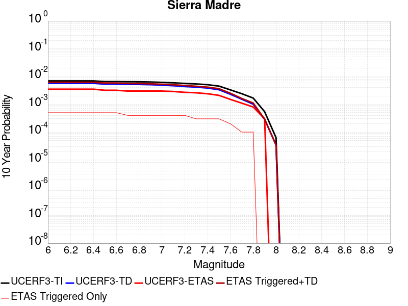 |

| Magnitude | 1 wk TI Prob | 1 wk TD Prob | 1 wk ETAS Prob | 1 wk ETAS/TD Gain | 1 wk ETAS Triggered+TD | 1 wk ETAS Triggered Only | 1 mo TI Prob | 1 mo TD Prob | 1 mo ETAS Prob | 1 mo ETAS/TD Gain | 1 mo ETAS Triggered+TD | 1 mo ETAS Triggered Only | 1 yr TI Prob | 1 yr TD Prob | 1 yr ETAS Prob | 1 yr ETAS/TD Gain | 1 yr ETAS Triggered+TD | 1 yr ETAS Triggered Only | 10 yr TI Prob | 10 yr TD Prob | 10 yr ETAS Prob | 10 yr ETAS/TD Gain | 10 yr ETAS Triggered+TD | 10 yr ETAS Triggered Only |
|-----|-----|-----|-----|-----|-----|-----|-----|-----|-----|-----|-----|-----|-----|-----|-----|-----|-----|-----|-----|-----|-----|-----|-----|-----|
| 6.0 | 1.3379373E-5 | 1.0971575E-5 | 0.0 | 0.0 | 1.0971575E-5 | 0.0 | 5.7338908E-5 | 4.7020196E-5 | 1.0E-4 | 2.1267457 | 4.7020196E-5 | 0.0 | 6.978776E-4 | 5.72322E-4 | 2.0E-4 | 0.34945366 | 5.72322E-4 | 0.0 | 0.0069569005 | 0.005708669 | 0.0035 | 0.6131026 | 0.006205815 | 5.0E-4 |
| 6.1 | 1.3379373E-5 | 1.0971575E-5 | 0.0 | 0.0 | 1.0971575E-5 | 0.0 | 5.7338908E-5 | 4.7020196E-5 | 1.0E-4 | 2.1267457 | 4.7020196E-5 | 0.0 | 6.978776E-4 | 5.72322E-4 | 2.0E-4 | 0.34945366 | 5.72322E-4 | 0.0 | 0.0069569005 | 0.005708669 | 0.0035 | 0.6131026 | 0.006205815 | 5.0E-4 |
| 6.2 | 1.3379373E-5 | 1.0971575E-5 | 0.0 | 0.0 | 1.0971575E-5 | 0.0 | 5.7338908E-5 | 4.7020196E-5 | 1.0E-4 | 2.1267457 | 4.7020196E-5 | 0.0 | 6.978776E-4 | 5.72322E-4 | 2.0E-4 | 0.34945366 | 5.72322E-4 | 0.0 | 0.0069569005 | 0.005708669 | 0.0035 | 0.6131026 | 0.006205815 | 5.0E-4 |
| 6.3 | 1.3379373E-5 | 1.0971575E-5 | 0.0 | 0.0 | 1.0971575E-5 | 0.0 | 5.7338908E-5 | 4.7020196E-5 | 1.0E-4 | 2.1267457 | 4.7020196E-5 | 0.0 | 6.978776E-4 | 5.72322E-4 | 2.0E-4 | 0.34945366 | 5.72322E-4 | 0.0 | 0.0069569005 | 0.005708669 | 0.0035 | 0.6131026 | 0.006205815 | 5.0E-4 |
| 6.4 | 1.3379373E-5 | 1.0971575E-5 | 0.0 | 0.0 | 1.0971575E-5 | 0.0 | 5.7338908E-5 | 4.7020196E-5 | 1.0E-4 | 2.1267457 | 4.7020196E-5 | 0.0 | 6.978776E-4 | 5.72322E-4 | 2.0E-4 | 0.34945366 | 5.72322E-4 | 0.0 | 0.0069569005 | 0.005708669 | 0.0035 | 0.6131026 | 0.006205815 | 5.0E-4 |
| 6.5 | 1.26563245E-5 | 1.0201558E-5 | 0.0 | 0.0 | 1.0201558E-5 | 0.0 | 5.4240263E-5 | 4.372024E-5 | 1.0E-4 | 2.2872703 | 4.372024E-5 | 0.0 | 6.601751E-4 | 5.32165E-4 | 1.0E-4 | 0.18791164 | 5.32165E-4 | 0.0 | 0.006582173 | 0.0053090523 | 0.0032 | 0.6027441 | 0.005806398 | 5.0E-4 |
| 6.6 | 1.26563245E-5 | 1.0201558E-5 | 0.0 | 0.0 | 1.0201558E-5 | 0.0 | 5.4240263E-5 | 4.372024E-5 | 1.0E-4 | 2.2872703 | 4.372024E-5 | 0.0 | 6.601751E-4 | 5.32165E-4 | 1.0E-4 | 0.18791164 | 5.32165E-4 | 0.0 | 0.006582173 | 0.0053090523 | 0.0032 | 0.6027441 | 0.005806398 | 5.0E-4 |
| 6.7 | 1.2502474E-5 | 1.0037814E-5 | 0.0 | 0.0 | 1.0037814E-5 | 0.0 | 5.3580934E-5 | 4.30185E-5 | 1.0E-4 | 2.3245814 | 4.30185E-5 | 0.0 | 6.521526E-4 | 5.236254E-4 | 1.0E-4 | 0.19097622 | 5.236254E-4 | 0.0 | 0.0065024206 | 0.0052240603 | 0.003 | 0.57426596 | 0.0056219706 | 4.0E-4 |
| 6.8 | 1.2454966E-5 | 9.990137E-6 | 0.0 | 0.0 | 9.990137E-6 | 0.0 | 5.3377335E-5 | 4.2814176E-5 | 1.0E-4 | 2.335675 | 4.2814176E-5 | 0.0 | 6.4967526E-4 | 5.21139E-4 | 1.0E-4 | 0.1918874 | 5.21139E-4 | 0.0 | 0.006477792 | 0.005199312 | 0.003 | 0.5769994 | 0.0055972324 | 4.0E-4 |
| 6.9 | 1.2225574E-5 | 9.764267E-6 | 0.0 | 0.0 | 9.764267E-6 | 0.0 | 5.2394265E-5 | 4.1846193E-5 | 1.0E-4 | 2.3897038 | 4.1846193E-5 | 0.0 | 6.3771347E-4 | 5.0935935E-4 | 1.0E-4 | 0.19632505 | 5.0935935E-4 | 0.0 | 0.006358865 | 0.005082059 | 0.003 | 0.5903119 | 0.0054800264 | 4.0E-4 |
| 7.0 | 1.182946E-5 | 9.371078E-6 | 0.0 | 0.0 | 9.371078E-6 | 0.0 | 5.06967E-5 | 4.016115E-5 | 1.0E-4 | 2.4899685 | 4.016115E-5 | 0.0 | 6.1705755E-4 | 4.888533E-4 | 1.0E-4 | 0.20456034 | 4.888533E-4 | 0.0 | 0.006153469 | 0.0048779156 | 0.003 | 0.61501676 | 0.0052759643 | 4.0E-4 |
| 7.1 | 1.14369095E-5 | 8.9588175E-6 | 0.0 | 0.0 | 8.9588175E-6 | 0.0 | 4.9014405E-5 | 3.8394373E-5 | 0.0 | 0.0 | 3.8394373E-5 | 0.0 | 5.9658696E-4 | 4.673522E-4 | 0.0 | 0.0 | 4.673522E-4 | 0.0 | 0.005949879 | 0.0046638236 | 0.0029 | 0.6218074 | 0.005061958 | 4.0E-4 |
| 7.2 | 1.0836419E-5 | 8.372935E-6 | 0.0 | 0.0 | 8.372935E-6 | 0.0 | 4.644097E-5 | 3.588352E-5 | 0.0 | 0.0 | 3.588352E-5 | 0.0 | 5.652721E-4 | 4.3679518E-4 | 0.0 | 0.0 | 4.3679518E-4 | 0.0 | 0.0056383642 | 0.0043594884 | 0.0027 | 0.61933875 | 0.0047577443 | 4.0E-4 |
| 7.3 | 1.0403439E-5 | 7.994614E-6 | 0.0 | 0.0 | 7.994614E-6 | 0.0 | 4.4585406E-5 | 3.4262186E-5 | 0.0 | 0.0 | 3.4262186E-5 | 0.0 | 5.426921E-4 | 4.170632E-4 | 0.0 | 0.0 | 4.170632E-4 | 0.0 | 0.005413687 | 0.0041629244 | 0.0026 | 0.62456095 | 0.0044616754 | 3.0E-4 |
| 7.4 | 9.768864E-6 | 7.3889805E-6 | 0.0 | 0.0 | 7.3889805E-6 | 0.0 | 4.186589E-5 | 3.166668E-5 | 0.0 | 0.0 | 3.166668E-5 | 0.0 | 5.09598E-4 | 3.8547453E-4 | 0.0 | 0.0 | 3.8547453E-4 | 0.0 | 0.0050843097 | 0.0038481748 | 0.0024 | 0.62367225 | 0.0041470206 | 3.0E-4 |
| 7.5 | 8.687089E-6 | 6.4261762E-6 | 0.0 | 0.0 | 6.4261762E-6 | 0.0 | 3.722985E-5 | 2.754047E-5 | 0.0 | 0.0 | 2.754047E-5 | 0.0 | 4.5317915E-4 | 3.3525447E-4 | 0.0 | 0.0 | 3.3525447E-4 | 0.0 | 0.004522561 | 0.0033475985 | 0.0021 | 0.62731534 | 0.0036465942 | 3.0E-4 |
| 7.6 | 6.3506063E-6 | 4.409074E-6 | 0.0 | 0.0 | 4.409074E-6 | 0.0 | 2.72166E-5 | 1.8895895E-5 | 0.0 | 0.0 | 1.8895895E-5 | 0.0 | 3.3131172E-4 | 2.300335E-4 | 0.0 | 0.0 | 2.300335E-4 | 0.0 | 0.003308182 | 0.0022980026 | 0.0015 | 0.6527407 | 0.002497543 | 2.0E-4 |
| 7.7 | 4.62223E-6 | 2.9145829E-6 | 0.0 | 0.0 | 2.9145829E-6 | 0.0 | 1.9809406E-5 | 1.2491009E-5 | 0.0 | 0.0 | 1.2491009E-5 | 0.0 | 2.4115283E-4 | 1.5206744E-4 | 0.0 | 0.0 | 1.5206744E-4 | 0.0 | 0.0024089129 | 0.0015196567 | 0.0011 | 0.7238477 | 0.0016195048 | 1.0E-4 |
| 7.8 | 3.2145008E-6 | 1.9368993E-6 | 0.0 | 0.0 | 1.9368993E-6 | 0.0 | 1.3776359E-5 | 8.30097E-6 | 0.0 | 0.0 | 8.30097E-6 | 0.0 | 1.6771426E-4 | 1.0105964E-4 | 0.0 | 0.0 | 1.0105964E-4 | 0.0 | 0.0016758774 | 0.0010101008 | 8.0E-4 | 0.7920002 | 0.0011099997 | 1.0E-4 |
| 7.9 | 1.0391769E-6 | 5.568387E-7 | 0.0 | 0.0 | 5.568387E-7 | 0.0 | 4.4536077E-6 | 2.3864495E-6 | 0.0 | 0.0 | 2.3864495E-6 | 0.0 | 5.4221324E-5 | 2.905464E-5 | 0.0 | 0.0 | 2.905464E-5 | 0.0 | 5.4208096E-4 | 2.9050882E-4 | 3.0E-4 | 1.0326709 | 2.9050882E-4 | 0.0 |
| 8.0 | 1.210983E-7 | 6.576322E-8 | 0.0 | 0.0 | 6.576322E-8 | 0.0 | 5.1899264E-7 | 2.8184235E-7 | 0.0 | 0.0 | 2.8184235E-7 | 0.0 | 6.3187167E-6 | 3.4314253E-6 | 0.0 | 0.0 | 3.4314253E-6 | 0.0 | 6.318537E-5 | 3.431374E-5 | 0.0 | 0.0 | 3.431374E-5 | 0.0 |

## Reliz 2011 CFM
*[(top)](#table-of-contents)*

| 1 Week | 1 Month | 1 Year | 10 Year |
|-----|-----|-----|-----|
|  | 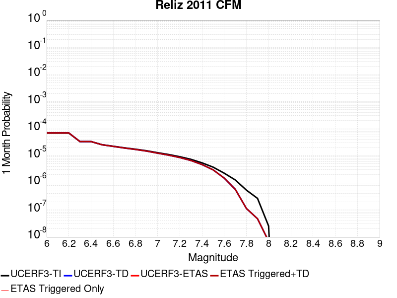 | 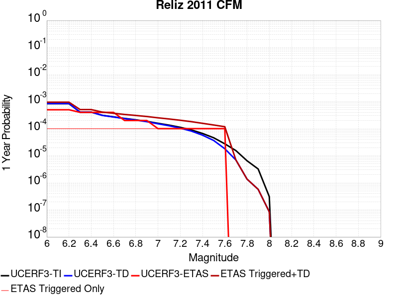 |  |

| Magnitude | 1 wk TI Prob | 1 wk TD Prob | 1 wk ETAS Prob | 1 wk ETAS/TD Gain | 1 wk ETAS Triggered+TD | 1 wk ETAS Triggered Only | 1 mo TI Prob | 1 mo TD Prob | 1 mo ETAS Prob | 1 mo ETAS/TD Gain | 1 mo ETAS Triggered+TD | 1 mo ETAS Triggered Only | 1 yr TI Prob | 1 yr TD Prob | 1 yr ETAS Prob | 1 yr ETAS/TD Gain | 1 yr ETAS Triggered+TD | 1 yr ETAS Triggered Only | 10 yr TI Prob | 10 yr TD Prob | 10 yr ETAS Prob | 10 yr ETAS/TD Gain | 10 yr ETAS Triggered+TD | 10 yr ETAS Triggered Only |
|-----|-----|-----|-----|-----|-----|-----|-----|-----|-----|-----|-----|-----|-----|-----|-----|-----|-----|-----|-----|-----|-----|-----|-----|-----|
| 6.0 | 1.6002472E-5 | 1.627498E-5 | 0.0 | 0.0 | 1.627498E-5 | 0.0 | 6.8580215E-5 | 6.974816E-5 | 0.0 | 0.0 | 6.974816E-5 | 0.0 | 8.3464425E-4 | 8.488728E-4 | 5.0E-4 | 0.5890164 | 9.4878796E-4 | 1.0E-4 | 0.008315164 | 0.008458493 | 0.0082 | 0.96943986 | 0.008954263 | 5.0E-4 |
| 6.1 | 1.6002472E-5 | 1.627498E-5 | 0.0 | 0.0 | 1.627498E-5 | 0.0 | 6.8580215E-5 | 6.974816E-5 | 0.0 | 0.0 | 6.974816E-5 | 0.0 | 8.3464425E-4 | 8.488728E-4 | 5.0E-4 | 0.5890164 | 9.4878796E-4 | 1.0E-4 | 0.008315164 | 0.008458493 | 0.0082 | 0.96943986 | 0.008954263 | 5.0E-4 |
| 6.2 | 1.6002472E-5 | 1.627498E-5 | 0.0 | 0.0 | 1.627498E-5 | 0.0 | 6.8580215E-5 | 6.974816E-5 | 0.0 | 0.0 | 6.974816E-5 | 0.0 | 8.3464425E-4 | 8.488728E-4 | 5.0E-4 | 0.5890164 | 9.4878796E-4 | 1.0E-4 | 0.008315164 | 0.008458493 | 0.0082 | 0.96943986 | 0.008954263 | 5.0E-4 |
| 6.3 | 7.792404E-6 | 7.798883E-6 | 0.0 | 0.0 | 7.798883E-6 | 0.0 | 3.339559E-5 | 3.3423363E-5 | 0.0 | 0.0 | 3.3423363E-5 | 0.0 | 4.0651546E-4 | 4.0685423E-4 | 4.0E-4 | 0.9831531 | 5.068136E-4 | 1.0E-4 | 0.0040577264 | 0.0040613655 | 0.0034 | 0.8371569 | 0.004260553 | 2.0E-4 |
| 6.4 | 7.792404E-6 | 7.798883E-6 | 0.0 | 0.0 | 7.798883E-6 | 0.0 | 3.339559E-5 | 3.3423363E-5 | 0.0 | 0.0 | 3.3423363E-5 | 0.0 | 4.0651546E-4 | 4.0685423E-4 | 4.0E-4 | 0.9831531 | 5.068136E-4 | 1.0E-4 | 0.0040577264 | 0.0040613655 | 0.0034 | 0.8371569 | 0.004260553 | 2.0E-4 |
| 6.5 | 5.9659374E-6 | 5.924341E-6 | 0.0 | 0.0 | 5.924341E-6 | 0.0 | 2.5568053E-5 | 2.5389787E-5 | 0.0 | 0.0 | 2.5389787E-5 | 0.0 | 3.1124658E-4 | 3.0907703E-4 | 4.0E-4 | 1.2941757 | 4.090461E-4 | 1.0E-4 | 0.00310811 | 0.0030866845 | 0.0028 | 0.9071222 | 0.0031863758 | 1.0E-4 |
| 6.6 | 5.2350692E-6 | 5.174791E-6 | 0.0 | 0.0 | 5.174791E-6 | 0.0 | 2.2435817E-5 | 2.2177488E-5 | 0.0 | 0.0 | 2.2177488E-5 | 0.0 | 2.7312184E-4 | 2.699776E-4 | 4.0E-4 | 1.4816043 | 3.699506E-4 | 1.0E-4 | 0.002727864 | 0.0026967013 | 0.0026 | 0.96414083 | 0.0027964318 | 1.0E-4 |
| 6.7 | 4.580206E-6 | 4.502119E-6 | 0.0 | 0.0 | 4.502119E-6 | 0.0 | 1.9629308E-5 | 1.9294654E-5 | 0.0 | 0.0 | 1.9294654E-5 | 0.0 | 2.389606E-4 | 2.3488715E-4 | 2.0E-4 | 0.85147274 | 3.3486367E-4 | 1.0E-4 | 0.002387038 | 0.0023465857 | 0.0022 | 0.9375323 | 0.002446351 | 1.0E-4 |
| 6.8 | 4.0765017E-6 | 3.984389E-6 | 0.0 | 0.0 | 3.984389E-6 | 0.0 | 1.7470604E-5 | 1.7075841E-5 | 0.0 | 0.0 | 1.7075841E-5 | 0.0 | 2.1268385E-4 | 2.0787858E-4 | 2.0E-4 | 0.96210015 | 3.078578E-4 | 1.0E-4 | 0.002124804 | 0.0020770344 | 0.0019 | 0.91476583 | 0.0021768266 | 1.0E-4 |
| 6.9 | 3.5752896E-6 | 3.468825E-6 | 0.0 | 0.0 | 3.468825E-6 | 0.0 | 1.532258E-5 | 1.4866308E-5 | 0.0 | 0.0 | 1.4866308E-5 | 0.0 | 1.8653645E-4 | 1.809823E-4 | 2.0E-4 | 1.1050805 | 2.809642E-4 | 1.0E-4 | 0.0018637994 | 0.0018085405 | 0.0016 | 0.88469124 | 0.0019083597 | 1.0E-4 |
| 7.0 | 3.0259848E-6 | 2.9044136E-6 | 0.0 | 0.0 | 2.9044136E-6 | 0.0 | 1.2968442E-5 | 1.2447428E-5 | 0.0 | 0.0 | 1.2447428E-5 | 0.0 | 1.5787935E-4 | 1.5153691E-4 | 1.0E-4 | 0.65990525 | 2.5152176E-4 | 1.0E-4 | 0.0015776722 | 0.001514526 | 0.0013 | 0.85835433 | 0.0016143746 | 1.0E-4 |
| 7.1 | 2.5861116E-6 | 2.4517783E-6 | 0.0 | 0.0 | 2.4517783E-6 | 0.0 | 1.1083288E-5 | 1.0507579E-5 | 0.0 | 0.0 | 1.0507579E-5 | 0.0 | 1.3493067E-4 | 1.2792228E-4 | 1.0E-4 | 0.7817247 | 2.2790948E-4 | 1.0E-4 | 0.0013484878 | 0.0012786761 | 9.0E-4 | 0.703853 | 0.0013785482 | 1.0E-4 |
| 7.2 | 2.1482588E-6 | 2.0000004E-6 | 0.0 | 0.0 | 2.0000004E-6 | 0.0 | 9.20679E-6 | 8.571403E-6 | 0.0 | 0.0 | 8.571403E-6 | 0.0 | 1.12086906E-4 | 1.04351835E-4 | 1.0E-4 | 0.95829654 | 2.043414E-4 | 1.0E-4 | 0.0011203039 | 0.0010432176 | 8.0E-4 | 0.7668582 | 0.0011431134 | 1.0E-4 |
| 7.3 | 1.7194744E-6 | 1.558044E-6 | 0.0 | 0.0 | 1.558044E-6 | 0.0 | 7.3691554E-6 | 6.677314E-6 | 0.0 | 0.0 | 6.677314E-6 | 0.0 | 8.971577E-5 | 8.129327E-5 | 1.0E-4 | 1.2301141 | 1.8128514E-4 | 1.0E-4 | 8.967956E-4 | 8.1282435E-4 | 6.0E-4 | 0.73816687 | 9.127431E-4 | 1.0E-4 |
| 7.4 | 1.2755178E-6 | 1.102744E-6 | 0.0 | 0.0 | 1.102744E-6 | 0.0 | 5.4664933E-6 | 4.7260373E-6 | 0.0 | 0.0 | 4.7260373E-6 | 0.0 | 6.655252E-5 | 5.7537985E-5 | 1.0E-4 | 1.7379823 | 1.5753224E-4 | 1.0E-4 | 6.6532596E-4 | 5.7541975E-4 | 3.0E-4 | 0.52135855 | 6.7536224E-4 | 1.0E-4 |
| 7.5 | 8.8463224E-7 | 7.030606E-7 | 0.0 | 0.0 | 7.030606E-7 | 0.0 | 3.7912755E-6 | 3.0131132E-6 | 0.0 | 0.0 | 3.0131132E-6 | 0.0 | 4.6157802E-5 | 3.6684036E-5 | 1.0E-4 | 2.7259812 | 1.3668036E-4 | 1.0E-4 | 4.6148215E-4 | 3.6696866E-4 | 2.0E-4 | 0.5450057 | 4.6693196E-4 | 1.0E-4 |
| 7.6 | 5.291355E-7 | 3.4761743E-7 | 0.0 | 0.0 | 3.4761743E-7 | 0.0 | 2.2677216E-6 | 1.4897881E-6 | 0.0 | 0.0 | 1.4897881E-6 | 0.0 | 2.760916E-5 | 1.813802E-5 | 1.0E-4 | 5.513281 | 1.1813621E-4 | 1.0E-4 | 2.760573E-4 | 1.8155269E-4 | 2.0E-4 | 1.1016085 | 2.8153454E-4 | 1.0E-4 |
| 7.7 | 2.9663357E-7 | 1.3318855E-7 | 0.0 | 0.0 | 1.3318855E-7 | 0.0 | 1.2712861E-6 | 5.7080797E-7 | 0.0 | 0.0 | 5.7080797E-7 | 0.0 | 1.5477797E-5 | 6.949565E-6 | 0.0 | 0.0 | 6.949565E-6 | 0.0 | 1.547672E-4 | 6.9672795E-5 | 0.0 | 0.0 | 6.9672795E-5 | 0.0 |
| 7.8 | 1.2509386E-7 | 2.6085319E-8 | 0.0 | 0.0 | 2.6085319E-8 | 0.0 | 5.3611643E-7 | 1.1179423E-7 | 0.0 | 0.0 | 1.1179423E-7 | 0.0 | 6.527198E-6 | 1.3610938E-6 | 0.0 | 0.0 | 1.3610938E-6 | 0.0 | 6.527006E-5 | 1.3762518E-5 | 0.0 | 0.0 | 1.3762518E-5 | 0.0 |
| 7.9 | 6.213493E-8 | 1.09062555E-8 | 0.0 | 0.0 | 1.09062555E-8 | 0.0 | 2.6629255E-7 | 4.67411E-8 | 0.0 | 0.0 | 4.67411E-8 | 0.0 | 3.242107E-6 | 5.6907277E-7 | 0.0 | 0.0 | 5.6907277E-7 | 0.0 | 3.2420594E-5 | 5.8185447E-6 | 0.0 | 0.0 | 5.8185447E-6 | 0.0 |
| 8.0 | 5.92383E-9 | 1.6123572E-9 | 0.0 | 0.0 | 1.6123572E-9 | 0.0 | 2.5387841E-8 | 6.9101036E-9 | 0.0 | 0.0 | 6.9101036E-9 | 0.0 | 3.0909692E-7 | 8.4130505E-8 | 0.0 | 0.0 | 8.4130505E-8 | 0.0 | 3.090965E-6 | 8.6556287E-7 | 0.0 | 0.0 | 8.6556287E-7 | 0.0 |

## Round Valley
*[(top)](#table-of-contents)*

| 1 Week | 1 Month | 1 Year | 10 Year |
|-----|-----|-----|-----|
| 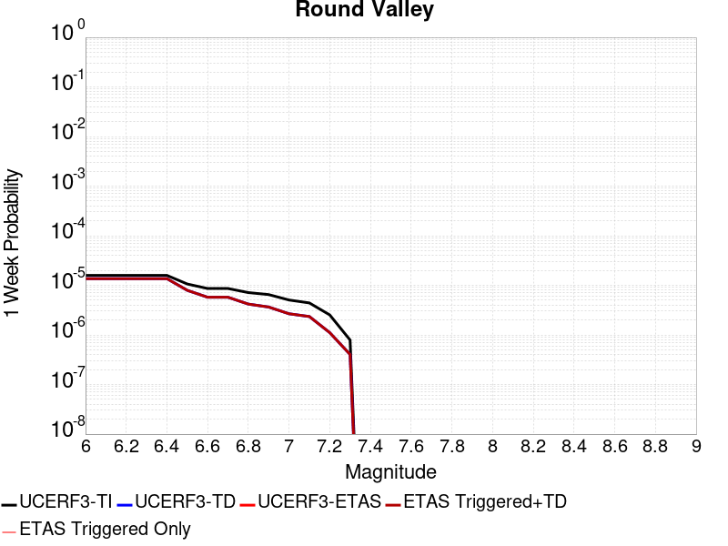 |  |  | 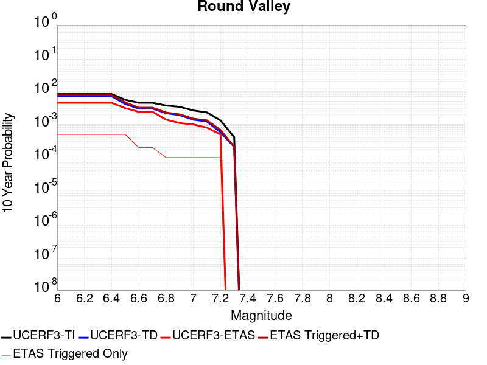 |

| Magnitude | 1 wk TI Prob | 1 wk TD Prob | 1 wk ETAS Prob | 1 wk ETAS/TD Gain | 1 wk ETAS Triggered+TD | 1 wk ETAS Triggered Only | 1 mo TI Prob | 1 mo TD Prob | 1 mo ETAS Prob | 1 mo ETAS/TD Gain | 1 mo ETAS Triggered+TD | 1 mo ETAS Triggered Only | 1 yr TI Prob | 1 yr TD Prob | 1 yr ETAS Prob | 1 yr ETAS/TD Gain | 1 yr ETAS Triggered+TD | 1 yr ETAS Triggered Only | 10 yr TI Prob | 10 yr TD Prob | 10 yr ETAS Prob | 10 yr ETAS/TD Gain | 10 yr ETAS Triggered+TD | 10 yr ETAS Triggered Only |
|-----|-----|-----|-----|-----|-----|-----|-----|-----|-----|-----|-----|-----|-----|-----|-----|-----|-----|-----|-----|-----|-----|-----|-----|-----|
| 6.0 | 1.588152E-5 | 1.3647419E-5 | 0.0 | 0.0 | 1.3647419E-5 | 0.0 | 6.806188E-5 | 5.848785E-5 | 0.0 | 0.0 | 5.848785E-5 | 0.0 | 8.283384E-4 | 7.118962E-4 | 4.0E-4 | 0.56187963 | 7.118962E-4 | 0.0 | 0.008252576 | 0.0071000364 | 0.0045 | 0.63379955 | 0.0075964862 | 5.0E-4 |
| 6.1 | 1.588152E-5 | 1.3647419E-5 | 0.0 | 0.0 | 1.3647419E-5 | 0.0 | 6.806188E-5 | 5.848785E-5 | 0.0 | 0.0 | 5.848785E-5 | 0.0 | 8.283384E-4 | 7.118962E-4 | 4.0E-4 | 0.56187963 | 7.118962E-4 | 0.0 | 0.008252576 | 0.0071000364 | 0.0045 | 0.63379955 | 0.0075964862 | 5.0E-4 |
| 6.2 | 1.588152E-5 | 1.3647419E-5 | 0.0 | 0.0 | 1.3647419E-5 | 0.0 | 6.806188E-5 | 5.848785E-5 | 0.0 | 0.0 | 5.848785E-5 | 0.0 | 8.283384E-4 | 7.118962E-4 | 4.0E-4 | 0.56187963 | 7.118962E-4 | 0.0 | 0.008252576 | 0.0071000364 | 0.0045 | 0.63379955 | 0.0075964862 | 5.0E-4 |
| 6.3 | 1.588152E-5 | 1.3647419E-5 | 0.0 | 0.0 | 1.3647419E-5 | 0.0 | 6.806188E-5 | 5.848785E-5 | 0.0 | 0.0 | 5.848785E-5 | 0.0 | 8.283384E-4 | 7.118962E-4 | 4.0E-4 | 0.56187963 | 7.118962E-4 | 0.0 | 0.008252576 | 0.0071000364 | 0.0045 | 0.63379955 | 0.0075964862 | 5.0E-4 |
| 6.4 | 1.588152E-5 | 1.3647419E-5 | 0.0 | 0.0 | 1.3647419E-5 | 0.0 | 6.806188E-5 | 5.848785E-5 | 0.0 | 0.0 | 5.848785E-5 | 0.0 | 8.283384E-4 | 7.118962E-4 | 4.0E-4 | 0.56187963 | 7.118962E-4 | 0.0 | 0.008252576 | 0.0071000364 | 0.0045 | 0.63379955 | 0.0075964862 | 5.0E-4 |
| 6.5 | 1.0646776E-5 | 7.935249E-6 | 0.0 | 0.0 | 7.935249E-6 | 0.0 | 4.5628243E-5 | 3.4007815E-5 | 0.0 | 0.0 | 3.4007815E-5 | 0.0 | 5.553823E-4 | 4.1397483E-4 | 3.0E-4 | 0.72468174 | 4.1397483E-4 | 0.0 | 0.005539963 | 0.004132863 | 0.0031 | 0.7500853 | 0.004630797 | 5.0E-4 |
| 6.6 | 8.632956E-6 | 5.7528837E-6 | 0.0 | 0.0 | 5.7528837E-6 | 0.0 | 3.6997862E-5 | 2.4655004E-5 | 0.0 | 0.0 | 2.4655004E-5 | 0.0 | 4.5035584E-4 | 3.0013715E-4 | 3.0E-4 | 0.999543 | 3.0013715E-4 | 0.0 | 0.0044944426 | 0.0029976945 | 0.0024 | 0.80061525 | 0.003197095 | 2.0E-4 |
| 6.7 | 8.632956E-6 | 5.7528837E-6 | 0.0 | 0.0 | 5.7528837E-6 | 0.0 | 3.6997862E-5 | 2.4655004E-5 | 0.0 | 0.0 | 2.4655004E-5 | 0.0 | 4.5035584E-4 | 3.0013715E-4 | 3.0E-4 | 0.999543 | 3.0013715E-4 | 0.0 | 0.0044944426 | 0.0029976945 | 0.0024 | 0.80061525 | 0.003197095 | 2.0E-4 |
| 6.8 | 7.143895E-6 | 4.1873486E-6 | 0.0 | 0.0 | 4.1873486E-6 | 0.0 | 3.0616335E-5 | 1.7945666E-5 | 0.0 | 0.0 | 1.7945666E-5 | 0.0 | 3.726901E-4 | 2.1846822E-4 | 2.0E-4 | 0.91546494 | 2.1846822E-4 | 0.0 | 0.0037206567 | 0.002182698 | 0.0014 | 0.64140797 | 0.00228248 | 1.0E-4 |
| 6.9 | 6.5120694E-6 | 3.6507183E-6 | 0.0 | 0.0 | 3.6507183E-6 | 0.0 | 2.790857E-5 | 1.564585E-5 | 0.0 | 0.0 | 1.564585E-5 | 0.0 | 3.3973387E-4 | 1.9047307E-4 | 2.0E-4 | 1.0500171 | 1.9047307E-4 | 0.0 | 0.0033921495 | 0.0019032462 | 0.0011 | 0.57795995 | 0.0020030558 | 1.0E-4 |
| 7.0 | 5.0614435E-6 | 2.6718365E-6 | 0.0 | 0.0 | 2.6718365E-6 | 0.0 | 2.169172E-5 | 1.1450683E-5 | 0.0 | 0.0 | 1.1450683E-5 | 0.0 | 2.6406467E-4 | 1.3940418E-4 | 2.0E-4 | 1.4346774 | 1.3940418E-4 | 0.0 | 0.0026375111 | 0.0013932675 | 0.001 | 0.7177372 | 0.0014931282 | 1.0E-4 |
| 7.1 | 4.41728E-6 | 2.3467217E-6 | 0.0 | 0.0 | 2.3467217E-6 | 0.0 | 1.8931061E-5 | 1.0057345E-5 | 0.0 | 0.0 | 1.0057345E-5 | 0.0 | 2.304613E-4 | 1.2244227E-4 | 1.0E-4 | 0.81671137 | 1.2244227E-4 | 0.0 | 0.0023022245 | 0.0012238437 | 8.0E-4 | 0.65367824 | 0.0013237214 | 1.0E-4 |
| 7.2 | 2.535495E-6 | 1.1126469E-6 | 0.0 | 0.0 | 1.1126469E-6 | 0.0 | 1.0866362E-5 | 4.7684807E-6 | 0.0 | 0.0 | 4.7684807E-6 | 0.0 | 1.3228992E-4 | 5.8055222E-5 | 0.0 | 0.0 | 5.8055222E-5 | 0.0 | 0.0013221119 | 5.80451E-4 | 5.0E-4 | 0.8613992 | 6.8039296E-4 | 1.0E-4 |
| 7.3 | 7.900015E-7 | 4.033625E-7 | 0.0 | 0.0 | 4.033625E-7 | 0.0 | 3.3857161E-6 | 1.7286964E-6 | 0.0 | 0.0 | 1.7286964E-6 | 0.0 | 4.1220315E-5 | 2.1046879E-5 | 0.0 | 0.0 | 2.1046879E-5 | 0.0 | 4.121267E-4 | 2.1046879E-4 | 0.0 | 0.0 | 2.1046879E-4 | 0.0 |

## San Jacinto (Clark) rev
*[(top)](#table-of-contents)*

| 1 Week | 1 Month | 1 Year | 10 Year |
|-----|-----|-----|-----|
| 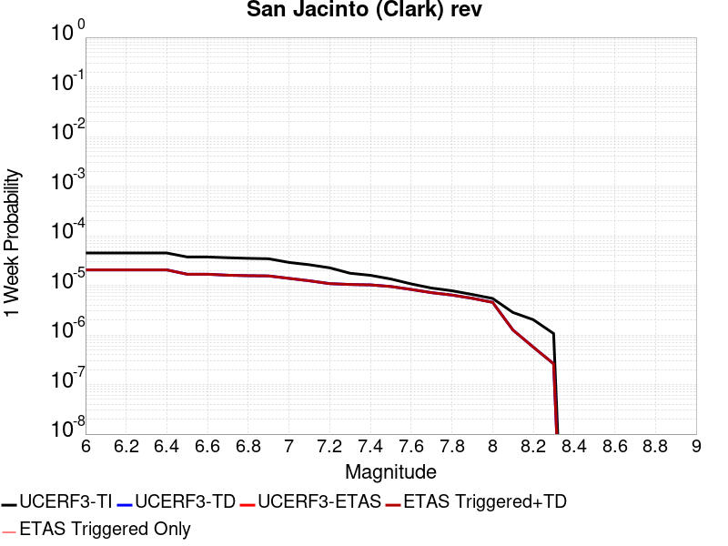 |  |  |  |

| Magnitude | 1 wk TI Prob | 1 wk TD Prob | 1 wk ETAS Prob | 1 wk ETAS/TD Gain | 1 wk ETAS Triggered+TD | 1 wk ETAS Triggered Only | 1 mo TI Prob | 1 mo TD Prob | 1 mo ETAS Prob | 1 mo ETAS/TD Gain | 1 mo ETAS Triggered+TD | 1 mo ETAS Triggered Only | 1 yr TI Prob | 1 yr TD Prob | 1 yr ETAS Prob | 1 yr ETAS/TD Gain | 1 yr ETAS Triggered+TD | 1 yr ETAS Triggered Only | 10 yr TI Prob | 10 yr TD Prob | 10 yr ETAS Prob | 10 yr ETAS/TD Gain | 10 yr ETAS Triggered+TD | 10 yr ETAS Triggered Only |
|-----|-----|-----|-----|-----|-----|-----|-----|-----|-----|-----|-----|-----|-----|-----|-----|-----|-----|-----|-----|-----|-----|-----|-----|-----|
| 6.0 | 4.482615E-5 | 2.0430423E-5 | 0.0 | 0.0 | 2.0430423E-5 | 0.0 | 1.9209793E-4 | 8.7556065E-5 | 0.0 | 0.0 | 8.7556065E-5 | 0.0 | 0.0023362834 | 0.0010654826 | 2.0E-4 | 0.18770836 | 0.0010654826 | 0.0 | 0.02311874 | 0.011110588 | 0.0055 | 0.4950233 | 0.011605033 | 5.0E-4 |
| 6.1 | 4.482615E-5 | 2.0430423E-5 | 0.0 | 0.0 | 2.0430423E-5 | 0.0 | 1.9209793E-4 | 8.7556065E-5 | 0.0 | 0.0 | 8.7556065E-5 | 0.0 | 0.0023362834 | 0.0010654826 | 2.0E-4 | 0.18770836 | 0.0010654826 | 0.0 | 0.02311874 | 0.011110588 | 0.0055 | 0.4950233 | 0.011605033 | 5.0E-4 |
| 6.2 | 4.482615E-5 | 2.0430423E-5 | 0.0 | 0.0 | 2.0430423E-5 | 0.0 | 1.9209793E-4 | 8.7556065E-5 | 0.0 | 0.0 | 8.7556065E-5 | 0.0 | 0.0023362834 | 0.0010654826 | 2.0E-4 | 0.18770836 | 0.0010654826 | 0.0 | 0.02311874 | 0.011110588 | 0.0055 | 0.4950233 | 0.011605033 | 5.0E-4 |
| 6.3 | 4.482615E-5 | 2.0430423E-5 | 0.0 | 0.0 | 2.0430423E-5 | 0.0 | 1.9209793E-4 | 8.7556065E-5 | 0.0 | 0.0 | 8.7556065E-5 | 0.0 | 0.0023362834 | 0.0010654826 | 2.0E-4 | 0.18770836 | 0.0010654826 | 0.0 | 0.02311874 | 0.011110588 | 0.0055 | 0.4950233 | 0.011605033 | 5.0E-4 |
| 6.4 | 4.482615E-5 | 2.0430423E-5 | 0.0 | 0.0 | 2.0430423E-5 | 0.0 | 1.9209793E-4 | 8.7556065E-5 | 0.0 | 0.0 | 8.7556065E-5 | 0.0 | 0.0023362834 | 0.0010654826 | 2.0E-4 | 0.18770836 | 0.0010654826 | 0.0 | 0.02311874 | 0.011110588 | 0.0055 | 0.4950233 | 0.011605033 | 5.0E-4 |
| 6.5 | 3.7294863E-5 | 1.6706344E-5 | 0.0 | 0.0 | 1.6706344E-5 | 0.0 | 1.5982533E-4 | 7.159668E-5 | 0.0 | 0.0 | 7.159668E-5 | 0.0 | 0.0019441366 | 8.713452E-4 | 2.0E-4 | 0.22953016 | 8.713452E-4 | 0.0 | 0.01927216 | 0.00914818 | 0.0048 | 0.52469456 | 0.009643605 | 5.0E-4 |
| 6.6 | 3.7294863E-5 | 1.6706344E-5 | 0.0 | 0.0 | 1.6706344E-5 | 0.0 | 1.5982533E-4 | 7.159668E-5 | 0.0 | 0.0 | 7.159668E-5 | 0.0 | 0.0019441366 | 8.713452E-4 | 2.0E-4 | 0.22953016 | 8.713452E-4 | 0.0 | 0.01927216 | 0.00914818 | 0.0048 | 0.52469456 | 0.009643605 | 5.0E-4 |
| 6.7 | 3.6039248E-5 | 1.59683E-5 | 0.0 | 0.0 | 1.59683E-5 | 0.0 | 1.5444479E-4 | 6.84338E-5 | 0.0 | 0.0 | 6.84338E-5 | 0.0 | 0.0018787434 | 8.3286694E-4 | 2.0E-4 | 0.24013439 | 8.3286694E-4 | 0.0 | 0.01862939 | 0.008754714 | 0.0048 | 0.54827607 | 0.009250336 | 5.0E-4 |
| 6.8 | 3.5031844E-5 | 1.5607146E-5 | 0.0 | 0.0 | 1.5607146E-5 | 0.0 | 1.5012783E-4 | 6.6886074E-5 | 0.0 | 0.0 | 6.6886074E-5 | 0.0 | 0.0018262739 | 8.140376E-4 | 2.0E-4 | 0.24568892 | 8.140376E-4 | 0.0 | 0.01811338 | 0.008560842 | 0.0047 | 0.5490114 | 0.009056562 | 5.0E-4 |
| 6.9 | 3.435112E-5 | 1.5442898E-5 | 0.0 | 0.0 | 1.5442898E-5 | 0.0 | 1.4721078E-4 | 6.618219E-5 | 0.0 | 0.0 | 6.618219E-5 | 0.0 | 0.0017908178 | 8.054741E-4 | 2.0E-4 | 0.24830097 | 8.054741E-4 | 0.0 | 0.017764548 | 0.008471737 | 0.0047 | 0.5547859 | 0.0089675 | 5.0E-4 |
| 7.0 | 2.8959772E-5 | 1.3769847E-5 | 0.0 | 0.0 | 1.3769847E-5 | 0.0 | 1.241074E-4 | 5.9012313E-5 | 0.0 | 0.0 | 5.9012313E-5 | 0.0 | 0.0015099603 | 7.182407E-4 | 2.0E-4 | 0.27845818 | 7.182407E-4 | 0.0 | 0.014997416 | 0.0075708367 | 0.0044 | 0.58117753 | 0.008067051 | 5.0E-4 |
| 7.1 | 2.6002877E-5 | 1.2310033E-5 | 0.0 | 0.0 | 1.2310033E-5 | 0.0 | 1.11436144E-4 | 5.2756226E-5 | 0.0 | 0.0 | 5.2756226E-5 | 0.0 | 0.0013558907 | 6.421198E-4 | 2.0E-4 | 0.31146836 | 6.421198E-4 | 0.0 | 0.013476475 | 0.0067729447 | 0.0042 | 0.6201143 | 0.0072695585 | 5.0E-4 |
| 7.2 | 2.2544838E-5 | 1.0795646E-5 | 0.0 | 0.0 | 1.0795646E-5 | 0.0 | 9.661716E-5 | 4.6266243E-5 | 0.0 | 0.0 | 4.6266243E-5 | 0.0 | 0.001175679 | 5.6314724E-4 | 1.0E-4 | 0.17757344 | 5.6314724E-4 | 0.0 | 0.011694785 | 0.005944752 | 0.0039 | 0.6560408 | 0.00644178 | 5.0E-4 |
| 7.3 | 1.75334E-5 | 1.0374646E-5 | 0.0 | 0.0 | 1.0374646E-5 | 0.0 | 7.514098E-5 | 4.446202E-5 | 0.0 | 0.0 | 4.446202E-5 | 0.0 | 9.144575E-4 | 5.4119196E-4 | 1.0E-4 | 0.18477732 | 5.4119196E-4 | 0.0 | 0.009107036 | 0.005700516 | 0.0038 | 0.6666063 | 0.006197666 | 5.0E-4 |
| 7.4 | 1.5924552E-5 | 1.0184866E-5 | 0.0 | 0.0 | 1.0184866E-5 | 0.0 | 6.82463E-5 | 4.3648706E-5 | 0.0 | 0.0 | 4.3648706E-5 | 0.0 | 8.305819E-4 | 5.3129473E-4 | 1.0E-4 | 0.18821946 | 5.3129473E-4 | 0.0 | 0.008274844 | 0.0055934065 | 0.0038 | 0.67937136 | 0.00609061 | 5.0E-4 |
| 7.5 | 1.3428931E-5 | 9.445109E-6 | 0.0 | 0.0 | 9.445109E-6 | 0.0 | 5.7551293E-5 | 4.0478415E-5 | 0.0 | 0.0 | 4.0478415E-5 | 0.0 | 7.004617E-4 | 4.927143E-4 | 1.0E-4 | 0.20295738 | 4.927143E-4 | 0.0 | 0.006982579 | 0.005189663 | 0.0035 | 0.6744176 | 0.005687068 | 5.0E-4 |
| 7.6 | 1.0688787E-5 | 8.229918E-6 | 0.0 | 0.0 | 8.229918E-6 | 0.0 | 4.5808283E-5 | 3.5270605E-5 | 0.0 | 0.0 | 3.5270605E-5 | 0.0 | 5.5757316E-4 | 4.2933546E-4 | 1.0E-4 | 0.23291811 | 4.2933546E-4 | 0.0 | 0.005561762 | 0.0045361673 | 0.0032 | 0.70544136 | 0.004934353 | 4.0E-4 |
| 7.7 | 8.81236E-6 | 7.1000795E-6 | 0.0 | 0.0 | 7.1000795E-6 | 0.0 | 3.776671E-5 | 3.0428559E-5 | 0.0 | 0.0 | 3.0428559E-5 | 0.0 | 4.597127E-4 | 3.7040492E-4 | 1.0E-4 | 0.26997483 | 3.7040492E-4 | 0.0 | 0.0045876284 | 0.003937952 | 0.0025 | 0.6348477 | 0.004336377 | 4.0E-4 |
| 7.8 | 7.780431E-6 | 6.3489674E-6 | 0.0 | 0.0 | 6.3489674E-6 | 0.0 | 3.3344273E-5 | 2.7209579E-5 | 0.0 | 0.0 | 2.7209579E-5 | 0.0 | 4.0589093E-4 | 3.3122642E-4 | 1.0E-4 | 0.30190828 | 3.3122642E-4 | 0.0 | 0.0040515037 | 0.0035365752 | 0.0024 | 0.67862266 | 0.0039351606 | 4.0E-4 |
| 7.9 | 6.5437994E-6 | 5.4558323E-6 | 0.0 | 0.0 | 5.4558323E-6 | 0.0 | 2.8044553E-5 | 2.338193E-5 | 0.0 | 0.0 | 2.338193E-5 | 0.0 | 3.4138895E-4 | 2.8463796E-4 | 1.0E-4 | 0.3513235 | 2.8463796E-4 | 0.0 | 0.0034086495 | 0.0030602466 | 0.0023 | 0.75157344 | 0.0034590226 | 4.0E-4 |
| 8.0 | 5.4488164E-6 | 4.52452E-6 | 0.0 | 0.0 | 4.52452E-6 | 0.0 | 2.3351862E-5 | 1.9390656E-5 | 0.0 | 0.0 | 1.9390656E-5 | 0.0 | 2.8427184E-4 | 2.360558E-4 | 1.0E-4 | 0.42362866 | 2.360558E-4 | 0.0 | 0.0028390845 | 0.0025552472 | 0.002 | 0.7827031 | 0.0028544806 | 3.0E-4 |
| 8.1 | 2.8397242E-6 | 1.2452609E-6 | 0.0 | 0.0 | 1.2452609E-6 | 0.0 | 1.217019E-5 | 5.3368217E-6 | 0.0 | 0.0 | 5.3368217E-6 | 0.0 | 1.4816198E-4 | 6.497388E-5 | 1.0E-4 | 1.5390801 | 6.497388E-5 | 0.0 | 0.0014806325 | 7.424613E-4 | 3.0E-4 | 0.40406147 | 7.424613E-4 | 0.0 |
| 8.2 | 2.030244E-6 | 5.597597E-7 | 0.0 | 0.0 | 5.597597E-7 | 0.0 | 8.701017E-6 | 2.398968E-6 | 0.0 | 0.0 | 2.398968E-6 | 0.0 | 1.05929736E-4 | 2.9207049E-5 | 1.0E-4 | 3.423831 | 2.9207049E-5 | 0.0 | 0.0010587925 | 3.5252166E-4 | 1.0E-4 | 0.2836705 | 3.5252166E-4 | 0.0 |
| 8.3 | 1.0659804E-6 | 2.5734514E-7 | 0.0 | 0.0 | 2.5734514E-7 | 0.0 | 4.568479E-6 | 1.1029073E-6 | 0.0 | 0.0 | 1.1029073E-6 | 0.0 | 5.5619817E-5 | 1.3427816E-5 | 0.0 | 0.0 | 1.3427816E-5 | 0.0 | 5.5605895E-4 | 1.6478398E-4 | 0.0 | 0.0 | 1.6478398E-4 | 0.0 |

## Great Valley 03a Dunnigan Hills
*[(top)](#table-of-contents)*

| 1 Week | 1 Month | 1 Year | 10 Year |
|-----|-----|-----|-----|
|  |  |  |  |

| Magnitude | 1 wk TI Prob | 1 wk TD Prob | 1 wk ETAS Prob | 1 wk ETAS/TD Gain | 1 wk ETAS Triggered+TD | 1 wk ETAS Triggered Only | 1 mo TI Prob | 1 mo TD Prob | 1 mo ETAS Prob | 1 mo ETAS/TD Gain | 1 mo ETAS Triggered+TD | 1 mo ETAS Triggered Only | 1 yr TI Prob | 1 yr TD Prob | 1 yr ETAS Prob | 1 yr ETAS/TD Gain | 1 yr ETAS Triggered+TD | 1 yr ETAS Triggered Only | 10 yr TI Prob | 10 yr TD Prob | 10 yr ETAS Prob | 10 yr ETAS/TD Gain | 10 yr ETAS Triggered+TD | 10 yr ETAS Triggered Only |
|-----|-----|-----|-----|-----|-----|-----|-----|-----|-----|-----|-----|-----|-----|-----|-----|-----|-----|-----|-----|-----|-----|-----|-----|-----|
| 6.0 | 1.6591328E-5 | 1.8090686E-5 | 1.0E-4 | 5.527706 | 1.8090686E-5 | 0.0 | 7.110376E-5 | 7.75296E-5 | 1.0E-4 | 1.28983 | 7.75296E-5 | 0.0 | 8.6534437E-4 | 9.435831E-4 | 4.0E-4 | 0.42391604 | 0.0010434887 | 1.0E-4 | 0.008619824 | 0.009402585 | 0.0094 | 0.99972504 | 0.009897884 | 5.0E-4 |
| 6.1 | 8.041125E-6 | 8.761437E-6 | 0.0 | 0.0 | 8.761437E-6 | 0.0 | 3.4461507E-5 | 3.754859E-5 | 0.0 | 0.0 | 3.754859E-5 | 0.0 | 4.194881E-4 | 4.5707848E-4 | 0.0 | 0.0 | 4.5707848E-4 | 0.0 | 0.004186971 | 0.0045633772 | 0.0043 | 0.9422846 | 0.004862008 | 3.0E-4 |
| 6.2 | 3.2807004E-6 | 3.576167E-6 | 0.0 | 0.0 | 3.576167E-6 | 0.0 | 1.4060069E-5 | 1.5326363E-5 | 0.0 | 0.0 | 1.5326363E-5 | 0.0 | 1.7116789E-4 | 1.8658665E-4 | 0.0 | 0.0 | 1.8658665E-4 | 0.0 | 0.0017103611 | 0.0018647071 | 0.0018 | 0.96529907 | 0.0018647071 | 0.0 |
| 6.3 | 1.9339366E-6 | 2.1083722E-6 | 0.0 | 0.0 | 2.1083722E-6 | 0.0 | 8.288273E-6 | 9.035865E-6 | 0.0 | 0.0 | 9.035865E-6 | 0.0 | 1.00905054E-4 | 1.1000896E-4 | 0.0 | 0.0 | 1.1000896E-4 | 0.0 | 0.0010085925 | 0.0010998244 | 9.0E-4 | 0.81831247 | 0.0010998244 | 0.0 |
| 6.4 | 1.3142635E-6 | 1.4326239E-6 | 0.0 | 0.0 | 1.4326239E-6 | 0.0 | 5.6325457E-6 | 6.139817E-6 | 0.0 | 0.0 | 6.139817E-6 | 0.0 | 6.857408E-5 | 7.475227E-5 | 0.0 | 0.0 | 7.475227E-5 | 0.0 | 6.8552926E-4 | 7.475227E-4 | 7.0E-4 | 0.9364264 | 7.475227E-4 | 0.0 |

## San Gregorio (South) 2011 CFM
*[(top)](#table-of-contents)*

| 1 Week | 1 Month | 1 Year | 10 Year |
|-----|-----|-----|-----|
| 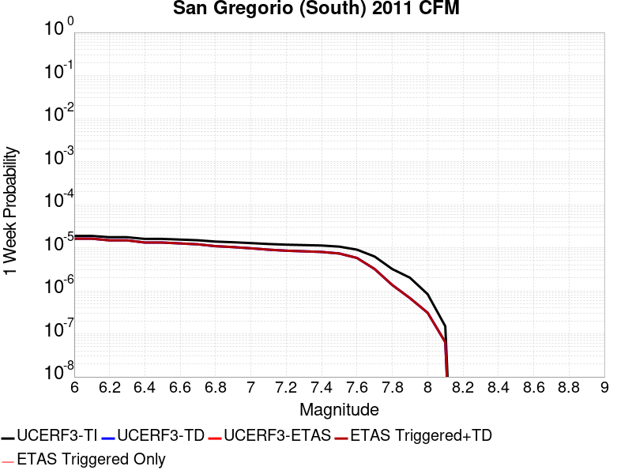 |  |  | 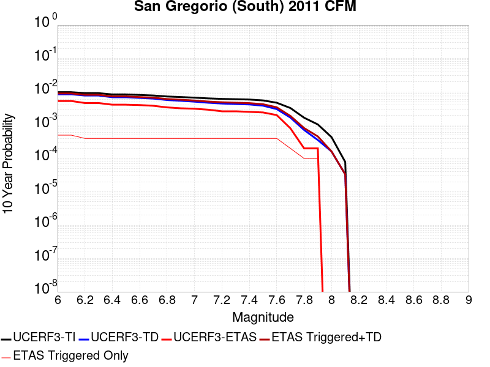 |

| Magnitude | 1 wk TI Prob | 1 wk TD Prob | 1 wk ETAS Prob | 1 wk ETAS/TD Gain | 1 wk ETAS Triggered+TD | 1 wk ETAS Triggered Only | 1 mo TI Prob | 1 mo TD Prob | 1 mo ETAS Prob | 1 mo ETAS/TD Gain | 1 mo ETAS Triggered+TD | 1 mo ETAS Triggered Only | 1 yr TI Prob | 1 yr TD Prob | 1 yr ETAS Prob | 1 yr ETAS/TD Gain | 1 yr ETAS Triggered+TD | 1 yr ETAS Triggered Only | 10 yr TI Prob | 10 yr TD Prob | 10 yr ETAS Prob | 10 yr ETAS/TD Gain | 10 yr ETAS Triggered+TD | 10 yr ETAS Triggered Only |
|-----|-----|-----|-----|-----|-----|-----|-----|-----|-----|-----|-----|-----|-----|-----|-----|-----|-----|-----|-----|-----|-----|-----|-----|-----|
| 6.0 | 1.8770423E-5 | 1.6205753E-5 | 0.0 | 0.0 | 1.6205753E-5 | 0.0 | 8.044219E-5 | 6.94514E-5 | 0.0 | 0.0 | 6.94514E-5 | 0.0 | 9.789435E-4 | 8.452466E-4 | 7.0E-4 | 0.8281607 | 9.451621E-4 | 1.0E-4 | 0.009746423 | 0.008432556 | 0.0053 | 0.62851644 | 0.00892834 | 5.0E-4 |
| 6.1 | 1.8770423E-5 | 1.6205753E-5 | 0.0 | 0.0 | 1.6205753E-5 | 0.0 | 8.044219E-5 | 6.94514E-5 | 0.0 | 0.0 | 6.94514E-5 | 0.0 | 9.789435E-4 | 8.452466E-4 | 7.0E-4 | 0.8281607 | 9.451621E-4 | 1.0E-4 | 0.009746423 | 0.008432556 | 0.0053 | 0.62851644 | 0.00892834 | 5.0E-4 |
| 6.2 | 1.7508692E-5 | 1.4826615E-5 | 0.0 | 0.0 | 1.4826615E-5 | 0.0 | 7.5035096E-5 | 6.3541105E-5 | 0.0 | 0.0 | 6.3541105E-5 | 0.0 | 9.1316935E-4 | 7.7334145E-4 | 6.0E-4 | 0.77585393 | 8.732641E-4 | 1.0E-4 | 0.00909426 | 0.0077186585 | 0.0046 | 0.5959585 | 0.008115571 | 4.0E-4 |
| 6.3 | 1.7508692E-5 | 1.4826615E-5 | 0.0 | 0.0 | 1.4826615E-5 | 0.0 | 7.5035096E-5 | 6.3541105E-5 | 0.0 | 0.0 | 6.3541105E-5 | 0.0 | 9.1316935E-4 | 7.7334145E-4 | 6.0E-4 | 0.77585393 | 8.732641E-4 | 1.0E-4 | 0.00909426 | 0.0077186585 | 0.0046 | 0.5959585 | 0.008115571 | 4.0E-4 |
| 6.4 | 1.6004591E-5 | 1.3178125E-5 | 0.0 | 0.0 | 1.3178125E-5 | 0.0 | 6.85893E-5 | 5.6476463E-5 | 0.0 | 0.0 | 5.6476463E-5 | 0.0 | 8.347548E-4 | 6.8738504E-4 | 6.0E-4 | 0.87287325 | 7.873163E-4 | 1.0E-4 | 0.008316261 | 0.0068645435 | 0.0041 | 0.59727204 | 0.007261798 | 4.0E-4 |
| 6.5 | 1.6004591E-5 | 1.3178125E-5 | 0.0 | 0.0 | 1.3178125E-5 | 0.0 | 6.85893E-5 | 5.6476463E-5 | 0.0 | 0.0 | 5.6476463E-5 | 0.0 | 8.347548E-4 | 6.8738504E-4 | 6.0E-4 | 0.87287325 | 7.873163E-4 | 1.0E-4 | 0.008316261 | 0.0068645435 | 0.0041 | 0.59727204 | 0.007261798 | 4.0E-4 |
| 6.6 | 1.5442201E-5 | 1.2563361E-5 | 0.0 | 0.0 | 1.2563361E-5 | 0.0 | 6.617918E-5 | 5.3841868E-5 | 0.0 | 0.0 | 5.3841868E-5 | 0.0 | 8.0543366E-4 | 6.5532845E-4 | 6.0E-4 | 0.9155714 | 7.552629E-4 | 1.0E-4 | 0.008025207 | 0.006545897 | 0.004 | 0.6110698 | 0.0069432785 | 4.0E-4 |
| 6.7 | 1.489921E-5 | 1.1972423E-5 | 0.0 | 0.0 | 1.1972423E-5 | 0.0 | 6.3852196E-5 | 5.1309376E-5 | 0.0 | 0.0 | 5.1309376E-5 | 0.0 | 7.7712315E-4 | 6.245133E-4 | 5.0E-4 | 0.8006234 | 7.2445086E-4 | 1.0E-4 | 0.0077441116 | 0.0062395055 | 0.0038 | 0.6090226 | 0.00663701 | 4.0E-4 |
| 6.8 | 1.3876024E-5 | 1.0852497E-5 | 0.0 | 0.0 | 1.0852497E-5 | 0.0 | 5.9467322E-5 | 4.6509875E-5 | 0.0 | 0.0 | 4.6509875E-5 | 0.0 | 7.237741E-4 | 5.66111E-4 | 5.0E-4 | 0.88321906 | 6.660544E-4 | 1.0E-4 | 0.0072142133 | 0.0056585763 | 0.0034 | 0.60085785 | 0.006056313 | 4.0E-4 |
| 6.9 | 1.33922495E-5 | 1.0324516E-5 | 0.0 | 0.0 | 1.0324516E-5 | 0.0 | 5.7394092E-5 | 4.4247172E-5 | 0.0 | 0.0 | 4.4247172E-5 | 0.0 | 6.9854903E-4 | 5.3857645E-4 | 5.0E-4 | 0.9283733 | 6.385226E-4 | 1.0E-4 | 0.0069635725 | 0.0053845914 | 0.0032 | 0.59428835 | 0.0057824375 | 4.0E-4 |
| 7.0 | 1.2807324E-5 | 9.685112E-6 | 0.0 | 0.0 | 9.685112E-6 | 0.0 | 5.4887376E-5 | 4.1506963E-5 | 0.0 | 0.0 | 4.1506963E-5 | 0.0 | 6.680489E-4 | 5.052303E-4 | 5.0E-4 | 0.98964775 | 6.0517975E-4 | 1.0E-4 | 0.006660442 | 0.0050526876 | 0.0031 | 0.61353487 | 0.0054506664 | 4.0E-4 |
| 7.1 | 1.2191438E-5 | 8.994899E-6 | 0.0 | 0.0 | 8.994899E-6 | 0.0 | 5.224797E-5 | 3.8548995E-5 | 0.0 | 0.0 | 3.8548995E-5 | 0.0 | 6.3593336E-4 | 4.6923305E-4 | 5.0E-4 | 1.0655686 | 5.691861E-4 | 1.0E-4 | 0.0063411663 | 0.0046942853 | 0.0029 | 0.6177724 | 0.005092408 | 4.0E-4 |
| 7.2 | 1.1769438E-5 | 8.515794E-6 | 0.0 | 0.0 | 8.515794E-6 | 0.0 | 5.0439474E-5 | 3.6495752E-5 | 0.0 | 0.0 | 3.6495752E-5 | 0.0 | 6.1392755E-4 | 4.4424526E-4 | 5.0E-4 | 1.1255044 | 5.442008E-4 | 1.0E-4 | 0.0061223423 | 0.0044454336 | 0.0026 | 0.5848698 | 0.0048436555 | 4.0E-4 |
| 7.3 | 1.150374E-5 | 8.232142E-6 | 0.0 | 0.0 | 8.232142E-6 | 0.0 | 4.9300812E-5 | 3.5280133E-5 | 0.0 | 0.0 | 3.5280133E-5 | 0.0 | 6.0007203E-4 | 4.29451E-4 | 5.0E-4 | 1.1642772 | 5.2940805E-4 | 1.0E-4 | 0.0059845424 | 0.004298052 | 0.0026 | 0.6049252 | 0.004696333 | 4.0E-4 |
| 7.4 | 1.12514E-5 | 7.978506E-6 | 0.0 | 0.0 | 7.978506E-6 | 0.0 | 4.8219394E-5 | 3.4193148E-5 | 0.0 | 0.0 | 3.4193148E-5 | 0.0 | 5.8691297E-4 | 4.1622212E-4 | 5.0E-4 | 1.2012817 | 5.161805E-4 | 1.0E-4 | 0.005853653 | 0.004166263 | 0.0025 | 0.60005814 | 0.0045645963 | 4.0E-4 |
| 7.5 | 1.059696E-5 | 7.3311076E-6 | 0.0 | 0.0 | 7.3311076E-6 | 0.0 | 4.5414752E-5 | 3.1418655E-5 | 0.0 | 0.0 | 3.1418655E-5 | 0.0 | 5.5278436E-4 | 3.8245504E-4 | 5.0E-4 | 1.3073432 | 4.824168E-4 | 1.0E-4 | 0.0055141128 | 0.0038297165 | 0.0024 | 0.6266782 | 0.0042281845 | 4.0E-4 |
| 7.6 | 9.018592E-6 | 5.7797615E-6 | 0.0 | 0.0 | 5.7797615E-6 | 0.0 | 3.8650534E-5 | 2.4770172E-5 | 0.0 | 0.0 | 2.4770172E-5 | 0.0 | 4.7046866E-4 | 3.0153515E-4 | 4.0E-4 | 1.3265452 | 4.01505E-4 | 1.0E-4 | 0.004694739 | 0.003022654 | 0.002 | 0.6616702 | 0.003421445 | 4.0E-4 |
| 7.7 | 6.243489E-6 | 3.1962775E-6 | 0.0 | 0.0 | 3.1962775E-6 | 0.0 | 2.6757538E-5 | 1.3698261E-5 | 0.0 | 0.0 | 1.3698261E-5 | 0.0 | 3.257243E-4 | 1.6676357E-4 | 2.0E-4 | 1.1993027 | 2.6674688E-4 | 1.0E-4 | 0.003252473 | 0.0016761078 | 8.0E-4 | 0.4772963 | 0.0018757725 | 2.0E-4 |
| 7.8 | 3.1941963E-6 | 1.3557503E-6 | 0.0 | 0.0 | 1.3557503E-6 | 0.0 | 1.368934E-5 | 5.8103456E-6 | 0.0 | 0.0 | 5.8103456E-6 | 0.0 | 1.6665498E-4 | 7.0738664E-5 | 1.0E-4 | 1.4136541 | 1.7073158E-4 | 1.0E-4 | 0.0016653005 | 7.1291375E-4 | 2.0E-4 | 0.28053886 | 8.1284245E-4 | 1.0E-4 |
| 7.9 | 2.0098398E-6 | 6.730377E-7 | 0.0 | 0.0 | 6.730377E-7 | 0.0 | 8.6135715E-6 | 2.8844438E-6 | 0.0 | 0.0 | 2.8844438E-6 | 0.0 | 1.0486518E-4 | 3.5117537E-5 | 1.0E-4 | 2.84758 | 1.3511402E-4 | 1.0E-4 | 0.0010481571 | 3.5584348E-4 | 2.0E-4 | 0.56204486 | 4.558079E-4 | 1.0E-4 |
| 8.0 | 8.353119E-7 | 3.0770198E-7 | 0.0 | 0.0 | 3.0770198E-7 | 0.0 | 3.579903E-6 | 1.3187221E-6 | 0.0 | 0.0 | 1.3187221E-6 | 0.0 | 4.358445E-5 | 1.6055323E-5 | 0.0 | 0.0 | 1.6055323E-5 | 0.0 | 4.3575902E-4 | 1.6171623E-4 | 0.0 | 0.0 | 1.6171623E-4 | 0.0 |
| 8.1 | 1.5033264E-7 | 6.371795E-8 | 0.0 | 0.0 | 6.371795E-8 | 0.0 | 6.442826E-7 | 2.730769E-7 | 0.0 | 0.0 | 2.730769E-7 | 0.0 | 7.844113E-6 | 3.324706E-6 | 0.0 | 0.0 | 3.324706E-6 | 0.0 | 7.843835E-5 | 3.326229E-5 | 0.0 | 0.0 | 3.326229E-5 | 0.0 |

## Newport-Inglewood alt 1
*[(top)](#table-of-contents)*

| 1 Week | 1 Month | 1 Year | 10 Year |
|-----|-----|-----|-----|
|  |  |  | 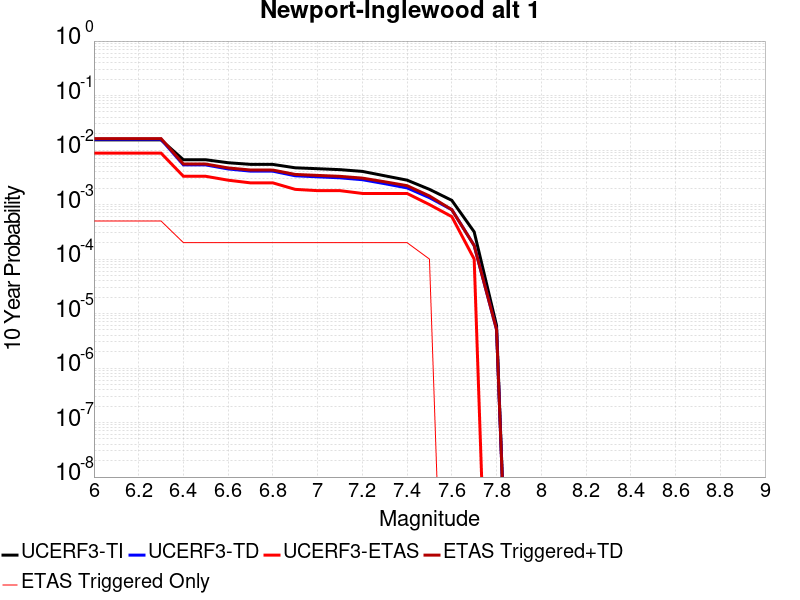 |

| Magnitude | 1 wk TI Prob | 1 wk TD Prob | 1 wk ETAS Prob | 1 wk ETAS/TD Gain | 1 wk ETAS Triggered+TD | 1 wk ETAS Triggered Only | 1 mo TI Prob | 1 mo TD Prob | 1 mo ETAS Prob | 1 mo ETAS/TD Gain | 1 mo ETAS Triggered+TD | 1 mo ETAS Triggered Only | 1 yr TI Prob | 1 yr TD Prob | 1 yr ETAS Prob | 1 yr ETAS/TD Gain | 1 yr ETAS Triggered+TD | 1 yr ETAS Triggered Only | 10 yr TI Prob | 10 yr TD Prob | 10 yr ETAS Prob | 10 yr ETAS/TD Gain | 10 yr ETAS Triggered+TD | 10 yr ETAS Triggered Only |
|-----|-----|-----|-----|-----|-----|-----|-----|-----|-----|-----|-----|-----|-----|-----|-----|-----|-----|-----|-----|-----|-----|-----|-----|-----|
| 6.0 | 2.9668912E-5 | 3.0343075E-5 | 0.0 | 0.0 | 3.0343075E-5 | 0.0 | 1.2714628E-4 | 1.30038E-4 | 0.0 | 0.0 | 1.30038E-4 | 0.0 | 0.0015469068 | 0.0015825456 | 8.0E-4 | 0.5055147 | 0.0015825456 | 0.0 | 0.015361829 | 0.015760189 | 0.0088 | 0.5583689 | 0.01625231 | 5.0E-4 |
| 6.1 | 2.9668912E-5 | 3.0343075E-5 | 0.0 | 0.0 | 3.0343075E-5 | 0.0 | 1.2714628E-4 | 1.30038E-4 | 0.0 | 0.0 | 1.30038E-4 | 0.0 | 0.0015469068 | 0.0015825456 | 8.0E-4 | 0.5055147 | 0.0015825456 | 0.0 | 0.015361829 | 0.015760189 | 0.0088 | 0.5583689 | 0.01625231 | 5.0E-4 |
| 6.2 | 2.9668912E-5 | 3.0343075E-5 | 0.0 | 0.0 | 3.0343075E-5 | 0.0 | 1.2714628E-4 | 1.30038E-4 | 0.0 | 0.0 | 1.30038E-4 | 0.0 | 0.0015469068 | 0.0015825456 | 8.0E-4 | 0.5055147 | 0.0015825456 | 0.0 | 0.015361829 | 0.015760189 | 0.0088 | 0.5583689 | 0.01625231 | 5.0E-4 |
| 6.3 | 2.9668912E-5 | 3.0343075E-5 | 0.0 | 0.0 | 3.0343075E-5 | 0.0 | 1.2714628E-4 | 1.30038E-4 | 0.0 | 0.0 | 1.30038E-4 | 0.0 | 0.0015469068 | 0.0015825456 | 8.0E-4 | 0.5055147 | 0.0015825456 | 0.0 | 0.015361829 | 0.015760189 | 0.0088 | 0.5583689 | 0.01625231 | 5.0E-4 |
| 6.4 | 1.275942E-5 | 1.025341E-5 | 0.0 | 0.0 | 1.025341E-5 | 0.0 | 5.4682085E-5 | 4.394247E-5 | 0.0 | 0.0 | 4.394247E-5 | 0.0 | 6.65551E-4 | 5.3487235E-4 | 3.0E-4 | 0.56088144 | 5.3487235E-4 | 0.0 | 0.0066356123 | 0.0053362735 | 0.0033 | 0.61840904 | 0.0055352063 | 2.0E-4 |
| 6.5 | 1.275942E-5 | 1.025341E-5 | 0.0 | 0.0 | 1.025341E-5 | 0.0 | 5.4682085E-5 | 4.394247E-5 | 0.0 | 0.0 | 4.394247E-5 | 0.0 | 6.65551E-4 | 5.3487235E-4 | 3.0E-4 | 0.56088144 | 5.3487235E-4 | 0.0 | 0.0066356123 | 0.0053362735 | 0.0033 | 0.61840904 | 0.0055352063 | 2.0E-4 |
| 6.6 | 1.1255358E-5 | 8.645131E-6 | 0.0 | 0.0 | 8.645131E-6 | 0.0 | 4.8236358E-5 | 3.7050046E-5 | 0.0 | 0.0 | 3.7050046E-5 | 0.0 | 5.871194E-4 | 4.509926E-4 | 3.0E-4 | 0.66519934 | 4.509926E-4 | 0.0 | 0.005855706 | 0.00450095 | 0.0028 | 0.6220908 | 0.00470005 | 2.0E-4 |
| 6.7 | 1.0504745E-5 | 7.883882E-6 | 0.0 | 0.0 | 7.883882E-6 | 0.0 | 4.5019555E-5 | 3.3787634E-5 | 0.0 | 0.0 | 3.3787634E-5 | 0.0 | 5.4797524E-4 | 4.1128803E-4 | 3.0E-4 | 0.72941583 | 4.1128803E-4 | 0.0 | 0.0054662596 | 0.004105398 | 0.0025 | 0.60895437 | 0.0043045767 | 2.0E-4 |
| 6.8 | 1.0476007E-5 | 7.865275E-6 | 0.0 | 0.0 | 7.865275E-6 | 0.0 | 4.4896402E-5 | 3.3707893E-5 | 0.0 | 0.0 | 3.3707893E-5 | 0.0 | 5.464766E-4 | 4.1031756E-4 | 3.0E-4 | 0.73114103 | 4.1031756E-4 | 0.0 | 0.005451347 | 0.004095729 | 0.0025 | 0.610392 | 0.00429491 | 2.0E-4 |
| 6.9 | 9.076797E-6 | 6.4751025E-6 | 0.0 | 0.0 | 6.4751025E-6 | 0.0 | 3.889998E-5 | 2.7750146E-5 | 0.0 | 0.0 | 2.7750146E-5 | 0.0 | 4.7350433E-4 | 3.3780598E-4 | 2.0E-4 | 0.5920558 | 3.3780598E-4 | 0.0 | 0.004724967 | 0.0033729621 | 0.0019 | 0.5633031 | 0.0035722875 | 2.0E-4 |
| 7.0 | 8.73795E-6 | 6.1975693E-6 | 0.0 | 0.0 | 6.1975693E-6 | 0.0 | 3.7447822E-5 | 2.6560741E-5 | 0.0 | 0.0 | 2.6560741E-5 | 0.0 | 4.5583185E-4 | 3.2332932E-4 | 2.0E-4 | 0.61856437 | 3.2332932E-4 | 0.0 | 0.0045489795 | 0.0032286204 | 0.0018 | 0.55751365 | 0.0034279746 | 2.0E-4 |
| 7.1 | 8.391299E-6 | 5.9415534E-6 | 0.0 | 0.0 | 5.9415534E-6 | 0.0 | 3.5962214E-5 | 2.5463554E-5 | 0.0 | 0.0 | 2.5463554E-5 | 0.0 | 4.37752E-4 | 3.0997492E-4 | 2.0E-4 | 0.6452135 | 3.0997492E-4 | 0.0 | 0.004368907 | 0.0030954548 | 0.0018 | 0.5814977 | 0.0032948358 | 2.0E-4 |
| 7.2 | 7.796882E-6 | 5.484767E-6 | 0.0 | 0.0 | 5.484767E-6 | 0.0 | 3.341478E-5 | 2.3505934E-5 | 0.0 | 0.0 | 2.3505934E-5 | 0.0 | 4.06749E-4 | 2.8614738E-4 | 2.0E-4 | 0.6989405 | 2.8614738E-4 | 0.0 | 0.0040600533 | 0.0028578131 | 0.0016 | 0.5598687 | 0.0030572414 | 2.0E-4 |
| 7.3 | 6.4738833E-6 | 4.639097E-6 | 0.0 | 0.0 | 4.639097E-6 | 0.0 | 2.774492E-5 | 1.9881692E-5 | 0.0 | 0.0 | 1.9881692E-5 | 0.0 | 3.3774204E-4 | 2.4203288E-4 | 2.0E-4 | 0.826334 | 2.4203288E-4 | 0.0 | 0.0033722918 | 0.0024177094 | 0.0016 | 0.6617834 | 0.0026172257 | 2.0E-4 |
| 7.4 | 5.382145E-6 | 3.8783064E-6 | 0.0 | 0.0 | 3.8783064E-6 | 0.0 | 2.3066134E-5 | 1.6621208E-5 | 0.0 | 0.0 | 1.6621208E-5 | 0.0 | 2.8079396E-4 | 2.0234457E-4 | 2.0E-4 | 0.988413 | 2.0234457E-4 | 0.0 | 0.0028043943 | 0.0020216177 | 0.0016 | 0.7914454 | 0.0022212134 | 2.0E-4 |
| 7.5 | 3.648244E-6 | 2.5676459E-6 | 0.0 | 0.0 | 2.5676459E-6 | 0.0 | 1.5635238E-5 | 1.1004151E-5 | 0.0 | 0.0 | 1.1004151E-5 | 0.0 | 1.9034238E-4 | 1.339674E-4 | 1.0E-4 | 0.74645025 | 1.339674E-4 | 0.0 | 0.0019017943 | 0.0013388768 | 0.001 | 0.7468947 | 0.0014387429 | 1.0E-4 |
| 7.6 | 2.2906888E-6 | 1.5434092E-6 | 0.0 | 0.0 | 1.5434092E-6 | 0.0 | 9.817201E-6 | 6.6145944E-6 | 0.0 | 0.0 | 6.6145944E-6 | 0.0 | 1.1951787E-4 | 8.052978E-5 | 1.0E-4 | 1.2417766 | 8.052978E-5 | 0.0 | 0.0011945361 | 8.0501265E-4 | 6.0E-4 | 0.7453299 | 8.0501265E-4 | 0.0 |
| 7.7 | 6.0479874E-7 | 3.3945827E-7 | 0.0 | 0.0 | 3.3945827E-7 | 0.0 | 2.5919921E-6 | 1.4548204E-6 | 0.0 | 0.0 | 1.4548204E-6 | 0.0 | 3.1557047E-5 | 1.771231E-5 | 0.0 | 0.0 | 1.771231E-5 | 0.0 | 3.1552566E-4 | 1.7711034E-4 | 1.0E-4 | 0.5646198 | 1.7711034E-4 | 0.0 |
| 7.8 | 1.16056995E-8 | 9.781111E-9 | 0.0 | 0.0 | 9.781111E-9 | 0.0 | 4.9738713E-8 | 4.1919048E-8 | 0.0 | 0.0 | 4.1919048E-8 | 0.0 | 6.0556863E-7 | 5.1036443E-7 | 0.0 | 0.0 | 5.1036443E-7 | 0.0 | 6.05567E-6 | 5.103644E-6 | 0.0 | 0.0 | 5.103644E-6 | 0.0 |

## Los Alamos 2011 CFM
*[(top)](#table-of-contents)*

| 1 Week | 1 Month | 1 Year | 10 Year |
|-----|-----|-----|-----|
|  |  |  | 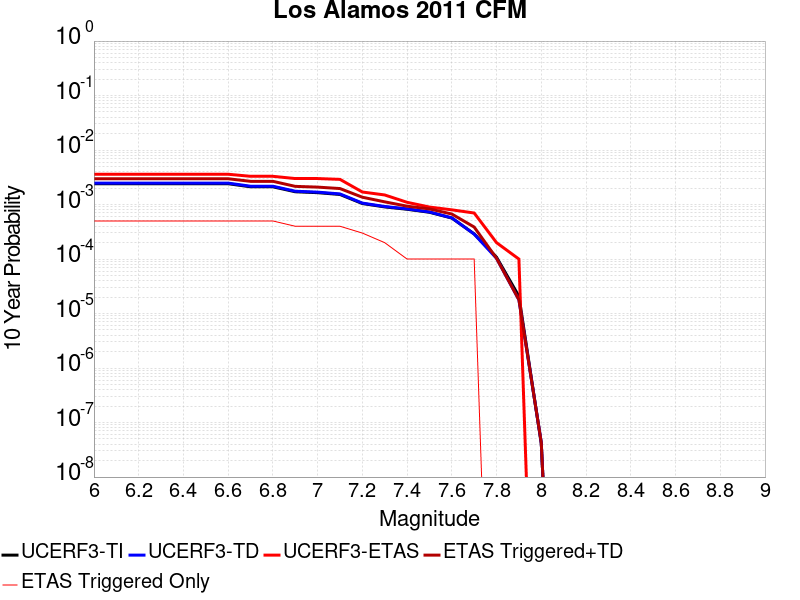 |

| Magnitude | 1 wk TI Prob | 1 wk TD Prob | 1 wk ETAS Prob | 1 wk ETAS/TD Gain | 1 wk ETAS Triggered+TD | 1 wk ETAS Triggered Only | 1 mo TI Prob | 1 mo TD Prob | 1 mo ETAS Prob | 1 mo ETAS/TD Gain | 1 mo ETAS Triggered+TD | 1 mo ETAS Triggered Only | 1 yr TI Prob | 1 yr TD Prob | 1 yr ETAS Prob | 1 yr ETAS/TD Gain | 1 yr ETAS Triggered+TD | 1 yr ETAS Triggered Only | 10 yr TI Prob | 10 yr TD Prob | 10 yr ETAS Prob | 10 yr ETAS/TD Gain | 10 yr ETAS Triggered+TD | 10 yr ETAS Triggered Only |
|-----|-----|-----|-----|-----|-----|-----|-----|-----|-----|-----|-----|-----|-----|-----|-----|-----|-----|-----|-----|-----|-----|-----|-----|-----|
| 6.0 | 4.6284417E-6 | 4.7499843E-6 | 0.0 | 0.0 | 4.7499843E-6 | 0.0 | 1.9836029E-5 | 2.0356927E-5 | 1.0E-4 | 4.9123325 | 2.0356927E-5 | 0.0 | 2.4147688E-4 | 2.4781915E-4 | 2.0E-4 | 0.8070401 | 2.4781915E-4 | 0.0 | 0.0024121467 | 0.002475602 | 0.0036 | 1.4541917 | 0.0029743642 | 5.0E-4 |
| 6.1 | 4.6284417E-6 | 4.7499843E-6 | 0.0 | 0.0 | 4.7499843E-6 | 0.0 | 1.9836029E-5 | 2.0356927E-5 | 1.0E-4 | 4.9123325 | 2.0356927E-5 | 0.0 | 2.4147688E-4 | 2.4781915E-4 | 2.0E-4 | 0.8070401 | 2.4781915E-4 | 0.0 | 0.0024121467 | 0.002475602 | 0.0036 | 1.4541917 | 0.0029743642 | 5.0E-4 |
| 6.2 | 4.6284417E-6 | 4.7499843E-6 | 0.0 | 0.0 | 4.7499843E-6 | 0.0 | 1.9836029E-5 | 2.0356927E-5 | 1.0E-4 | 4.9123325 | 2.0356927E-5 | 0.0 | 2.4147688E-4 | 2.4781915E-4 | 2.0E-4 | 0.8070401 | 2.4781915E-4 | 0.0 | 0.0024121467 | 0.002475602 | 0.0036 | 1.4541917 | 0.0029743642 | 5.0E-4 |
| 6.3 | 4.6284417E-6 | 4.7499843E-6 | 0.0 | 0.0 | 4.7499843E-6 | 0.0 | 1.9836029E-5 | 2.0356927E-5 | 1.0E-4 | 4.9123325 | 2.0356927E-5 | 0.0 | 2.4147688E-4 | 2.4781915E-4 | 2.0E-4 | 0.8070401 | 2.4781915E-4 | 0.0 | 0.0024121467 | 0.002475602 | 0.0036 | 1.4541917 | 0.0029743642 | 5.0E-4 |
| 6.4 | 4.6284417E-6 | 4.7499843E-6 | 0.0 | 0.0 | 4.7499843E-6 | 0.0 | 1.9836029E-5 | 2.0356927E-5 | 1.0E-4 | 4.9123325 | 2.0356927E-5 | 0.0 | 2.4147688E-4 | 2.4781915E-4 | 2.0E-4 | 0.8070401 | 2.4781915E-4 | 0.0 | 0.0024121467 | 0.002475602 | 0.0036 | 1.4541917 | 0.0029743642 | 5.0E-4 |
| 6.5 | 4.6284417E-6 | 4.7499843E-6 | 0.0 | 0.0 | 4.7499843E-6 | 0.0 | 1.9836029E-5 | 2.0356927E-5 | 1.0E-4 | 4.9123325 | 2.0356927E-5 | 0.0 | 2.4147688E-4 | 2.4781915E-4 | 2.0E-4 | 0.8070401 | 2.4781915E-4 | 0.0 | 0.0024121467 | 0.002475602 | 0.0036 | 1.4541917 | 0.0029743642 | 5.0E-4 |
| 6.6 | 4.6284417E-6 | 4.7499843E-6 | 0.0 | 0.0 | 4.7499843E-6 | 0.0 | 1.9836029E-5 | 2.0356927E-5 | 1.0E-4 | 4.9123325 | 2.0356927E-5 | 0.0 | 2.4147688E-4 | 2.4781915E-4 | 2.0E-4 | 0.8070401 | 2.4781915E-4 | 0.0 | 0.0024121467 | 0.002475602 | 0.0036 | 1.4541917 | 0.0029743642 | 5.0E-4 |
| 6.7 | 4.062321E-6 | 4.16481E-6 | 0.0 | 0.0 | 4.16481E-6 | 0.0 | 1.7409831E-5 | 1.7849072E-5 | 1.0E-4 | 5.6025324 | 1.7849072E-5 | 0.0 | 2.1194408E-4 | 2.172923E-4 | 2.0E-4 | 0.9204192 | 2.172923E-4 | 0.0 | 0.0021174205 | 0.0021709478 | 0.0033 | 1.5200734 | 0.0026698625 | 5.0E-4 |
| 6.8 | 4.062321E-6 | 4.16481E-6 | 0.0 | 0.0 | 4.16481E-6 | 0.0 | 1.7409831E-5 | 1.7849072E-5 | 1.0E-4 | 5.6025324 | 1.7849072E-5 | 0.0 | 2.1194408E-4 | 2.172923E-4 | 2.0E-4 | 0.9204192 | 2.172923E-4 | 0.0 | 0.0021174205 | 0.0021709478 | 0.0033 | 1.5200734 | 0.0026698625 | 5.0E-4 |
| 6.9 | 3.2936077E-6 | 3.371685E-6 | 0.0 | 0.0 | 3.371685E-6 | 0.0 | 1.4115385E-5 | 1.4450004E-5 | 1.0E-4 | 6.9204135 | 1.4450004E-5 | 0.0 | 1.7184127E-4 | 1.7591553E-4 | 2.0E-4 | 1.1369094 | 1.7591553E-4 | 0.0 | 0.0017170844 | 0.0017578553 | 0.003 | 1.7066251 | 0.0021571522 | 4.0E-4 |
| 7.0 | 3.1687898E-6 | 3.2435782E-6 | 0.0 | 0.0 | 3.2435782E-6 | 0.0 | 1.3580457E-5 | 1.3900981E-5 | 1.0E-4 | 7.193737 | 1.3900981E-5 | 0.0 | 1.6532952E-4 | 1.6923223E-4 | 2.0E-4 | 1.181808 | 1.6923223E-4 | 0.0 | 0.0016520657 | 0.001691125 | 0.003 | 1.773967 | 0.0020904485 | 4.0E-4 |
| 7.1 | 2.9379228E-6 | 3.0061597E-6 | 0.0 | 0.0 | 3.0061597E-6 | 0.0 | 1.25910365E-5 | 1.2883483E-5 | 1.0E-4 | 7.7618766 | 1.2883483E-5 | 0.0 | 1.5328509E-4 | 1.5684601E-4 | 2.0E-4 | 1.275136 | 1.5684601E-4 | 0.0 | 0.001531794 | 0.0015674423 | 0.0029 | 1.8501478 | 0.0019668152 | 4.0E-4 |
| 7.2 | 2.0020686E-6 | 2.0407851E-6 | 0.0 | 0.0 | 2.0407851E-6 | 0.0 | 8.580266E-6 | 8.746193E-6 | 0.0 | 0.0 | 8.746193E-6 | 0.0 | 1.0445973E-4 | 1.0647974E-4 | 1.0E-4 | 0.9391458 | 1.0647974E-4 | 0.0 | 0.0010441064 | 0.0010642916 | 0.0017 | 1.5973066 | 0.0013639723 | 3.0E-4 |
| 7.3 | 1.7364243E-6 | 1.7671227E-6 | 0.0 | 0.0 | 1.7671227E-6 | 0.0 | 7.441797E-6 | 7.5733615E-6 | 0.0 | 0.0 | 7.5733615E-6 | 0.0 | 9.0600115E-5 | 9.220181E-5 | 1.0E-4 | 1.0845774 | 9.220181E-5 | 0.0 | 9.0563187E-4 | 9.216387E-4 | 0.0015 | 1.6275359 | 0.0011214543 | 2.0E-4 |
| 7.4 | 1.5718434E-6 | 1.5976138E-6 | 0.0 | 0.0 | 1.5976138E-6 | 0.0 | 6.7364545E-6 | 6.8468985E-6 | 0.0 | 0.0 | 6.8468985E-6 | 0.0 | 8.201325E-5 | 8.335783E-5 | 1.0E-4 | 1.1996473 | 8.335783E-5 | 0.0 | 8.198299E-4 | 8.332686E-4 | 0.0011 | 1.3201025 | 9.331853E-4 | 1.0E-4 |
| 7.5 | 1.3841119E-6 | 1.4036435E-6 | 0.0 | 0.0 | 1.4036435E-6 | 0.0 | 5.9318945E-6 | 6.0156012E-6 | 0.0 | 0.0 | 6.0156012E-6 | 0.0 | 7.221842E-5 | 7.323751E-5 | 0.0 | 0.0 | 7.323751E-5 | 0.0 | 7.2194956E-4 | 7.3213666E-4 | 9.0E-4 | 1.2292787 | 8.3206344E-4 | 1.0E-4 |
| 7.6 | 1.0843726E-6 | 1.0929267E-6 | 0.0 | 0.0 | 1.0929267E-6 | 0.0 | 4.647303E-6 | 4.683963E-6 | 0.0 | 0.0 | 4.683963E-6 | 0.0 | 5.6579443E-5 | 5.7025787E-5 | 0.0 | 0.0 | 5.7025787E-5 | 0.0 | 5.656504E-4 | 5.701141E-4 | 8.0E-4 | 1.4032278 | 6.7005714E-4 | 1.0E-4 |
| 7.7 | 5.544814E-7 | 5.4990085E-7 | 0.0 | 0.0 | 5.4990085E-7 | 0.0 | 2.3763469E-6 | 2.3567156E-6 | 0.0 | 0.0 | 2.3567156E-6 | 0.0 | 2.8931638E-5 | 2.8692637E-5 | 0.0 | 0.0 | 2.8692637E-5 | 0.0 | 2.8927872E-4 | 2.868895E-4 | 7.0E-4 | 2.439964 | 3.868608E-4 | 1.0E-4 |
| 7.8 | 2.0707465E-7 | 1.9767009E-7 | 0.0 | 0.0 | 1.9767009E-7 | 0.0 | 8.874625E-7 | 8.4715725E-7 | 0.0 | 0.0 | 8.4715725E-7 | 0.0 | 1.08048025E-5 | 1.0314091E-5 | 0.0 | 0.0 | 1.0314091E-5 | 0.0 | 1.0804277E-4 | 1.0313617E-4 | 2.0E-4 | 1.939184 | 1.0313617E-4 | 0.0 |
| 7.9 | 3.9821284E-8 | 3.43097E-8 | 0.0 | 0.0 | 3.43097E-8 | 0.0 | 1.7066264E-7 | 1.4704156E-7 | 0.0 | 0.0 | 1.4704156E-7 | 0.0 | 2.0778157E-6 | 1.7902296E-6 | 0.0 | 0.0 | 1.7902296E-6 | 0.0 | 2.0777963E-5 | 1.7902157E-5 | 1.0E-4 | 5.585919 | 1.7902157E-5 | 0.0 |
| 8.0 | 7.880441E-11 | 8.231449E-11 | 0.0 | 0.0 | 8.231449E-11 | 0.0 | 3.3773329E-10 | 3.5277614E-10 | 0.0 | 0.0 | 3.5277614E-10 | 0.0 | 4.1119033E-9 | 4.29505E-9 | 0.0 | 0.0 | 4.29505E-9 | 0.0 | 4.1119034E-8 | 4.29505E-8 | 0.0 | 0.0 | 4.29505E-8 | 0.0 |

## Los Alamos extension
*[(top)](#table-of-contents)*

| 1 Week | 1 Month | 1 Year | 10 Year |
|-----|-----|-----|-----|
|  |  |  | 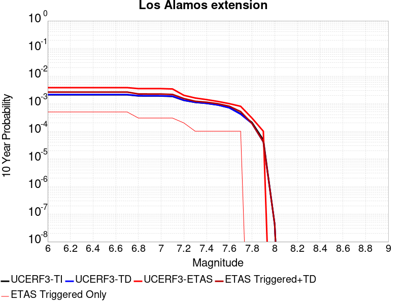 |

| Magnitude | 1 wk TI Prob | 1 wk TD Prob | 1 wk ETAS Prob | 1 wk ETAS/TD Gain | 1 wk ETAS Triggered+TD | 1 wk ETAS Triggered Only | 1 mo TI Prob | 1 mo TD Prob | 1 mo ETAS Prob | 1 mo ETAS/TD Gain | 1 mo ETAS Triggered+TD | 1 mo ETAS Triggered Only | 1 yr TI Prob | 1 yr TD Prob | 1 yr ETAS Prob | 1 yr ETAS/TD Gain | 1 yr ETAS Triggered+TD | 1 yr ETAS Triggered Only | 10 yr TI Prob | 10 yr TD Prob | 10 yr ETAS Prob | 10 yr ETAS/TD Gain | 10 yr ETAS Triggered+TD | 10 yr ETAS Triggered Only |
|-----|-----|-----|-----|-----|-----|-----|-----|-----|-----|-----|-----|-----|-----|-----|-----|-----|-----|-----|-----|-----|-----|-----|-----|-----|
| 6.0 | 4.0146506E-6 | 4.084475E-6 | 0.0 | 0.0 | 4.084475E-6 | 0.0 | 1.7205533E-5 | 1.7504783E-5 | 1.0E-4 | 5.7127247 | 1.7504783E-5 | 0.0 | 2.0945723E-4 | 2.1310098E-4 | 2.0E-4 | 0.9385222 | 2.1310098E-4 | 0.0 | 0.0020925992 | 0.0021290754 | 0.0038 | 1.7848123 | 0.002628011 | 5.0E-4 |
| 6.1 | 4.0146506E-6 | 4.084475E-6 | 0.0 | 0.0 | 4.084475E-6 | 0.0 | 1.7205533E-5 | 1.7504783E-5 | 1.0E-4 | 5.7127247 | 1.7504783E-5 | 0.0 | 2.0945723E-4 | 2.1310098E-4 | 2.0E-4 | 0.9385222 | 2.1310098E-4 | 0.0 | 0.0020925992 | 0.0021290754 | 0.0038 | 1.7848123 | 0.002628011 | 5.0E-4 |
| 6.2 | 4.0146506E-6 | 4.084475E-6 | 0.0 | 0.0 | 4.084475E-6 | 0.0 | 1.7205533E-5 | 1.7504783E-5 | 1.0E-4 | 5.7127247 | 1.7504783E-5 | 0.0 | 2.0945723E-4 | 2.1310098E-4 | 2.0E-4 | 0.9385222 | 2.1310098E-4 | 0.0 | 0.0020925992 | 0.0021290754 | 0.0038 | 1.7848123 | 0.002628011 | 5.0E-4 |
| 6.3 | 4.0146506E-6 | 4.084475E-6 | 0.0 | 0.0 | 4.084475E-6 | 0.0 | 1.7205533E-5 | 1.7504783E-5 | 1.0E-4 | 5.7127247 | 1.7504783E-5 | 0.0 | 2.0945723E-4 | 2.1310098E-4 | 2.0E-4 | 0.9385222 | 2.1310098E-4 | 0.0 | 0.0020925992 | 0.0021290754 | 0.0038 | 1.7848123 | 0.002628011 | 5.0E-4 |
| 6.4 | 4.0146506E-6 | 4.084475E-6 | 0.0 | 0.0 | 4.084475E-6 | 0.0 | 1.7205533E-5 | 1.7504783E-5 | 1.0E-4 | 5.7127247 | 1.7504783E-5 | 0.0 | 2.0945723E-4 | 2.1310098E-4 | 2.0E-4 | 0.9385222 | 2.1310098E-4 | 0.0 | 0.0020925992 | 0.0021290754 | 0.0038 | 1.7848123 | 0.002628011 | 5.0E-4 |
| 6.5 | 4.0146506E-6 | 4.084475E-6 | 0.0 | 0.0 | 4.084475E-6 | 0.0 | 1.7205533E-5 | 1.7504783E-5 | 1.0E-4 | 5.7127247 | 1.7504783E-5 | 0.0 | 2.0945723E-4 | 2.1310098E-4 | 2.0E-4 | 0.9385222 | 2.1310098E-4 | 0.0 | 0.0020925992 | 0.0021290754 | 0.0038 | 1.7848123 | 0.002628011 | 5.0E-4 |
| 6.6 | 4.0146506E-6 | 4.084475E-6 | 0.0 | 0.0 | 4.084475E-6 | 0.0 | 1.7205533E-5 | 1.7504783E-5 | 1.0E-4 | 5.7127247 | 1.7504783E-5 | 0.0 | 2.0945723E-4 | 2.1310098E-4 | 2.0E-4 | 0.9385222 | 2.1310098E-4 | 0.0 | 0.0020925992 | 0.0021290754 | 0.0038 | 1.7848123 | 0.002628011 | 5.0E-4 |
| 6.7 | 4.0146506E-6 | 4.084475E-6 | 0.0 | 0.0 | 4.084475E-6 | 0.0 | 1.7205533E-5 | 1.7504783E-5 | 1.0E-4 | 5.7127247 | 1.7504783E-5 | 0.0 | 2.0945723E-4 | 2.1310098E-4 | 2.0E-4 | 0.9385222 | 2.1310098E-4 | 0.0 | 0.0020925992 | 0.0021290754 | 0.0038 | 1.7848123 | 0.002628011 | 5.0E-4 |
| 6.8 | 3.6584688E-6 | 3.717294E-6 | 0.0 | 0.0 | 3.717294E-6 | 0.0 | 1.5679057E-5 | 1.5931168E-5 | 1.0E-4 | 6.277004 | 1.5931168E-5 | 0.0 | 1.9087581E-4 | 1.9394564E-4 | 2.0E-4 | 1.0312169 | 1.9394564E-4 | 0.0 | 0.0019071194 | 0.0019378561 | 0.0035 | 1.8061197 | 0.0022372748 | 3.0E-4 |
| 6.9 | 3.644631E-6 | 3.7030088E-6 | 0.0 | 0.0 | 3.7030088E-6 | 0.0 | 1.5619753E-5 | 1.5869946E-5 | 1.0E-4 | 6.3012185 | 1.5869946E-5 | 0.0 | 1.901539E-4 | 1.932004E-4 | 2.0E-4 | 1.0351945 | 1.932004E-4 | 0.0 | 0.0018999127 | 0.0019304167 | 0.0035 | 1.8130801 | 0.0022298375 | 3.0E-4 |
| 7.0 | 3.6318522E-6 | 3.6897743E-6 | 0.0 | 0.0 | 3.6897743E-6 | 0.0 | 1.5564989E-5 | 1.5813228E-5 | 1.0E-4 | 6.3238196 | 1.5813228E-5 | 0.0 | 1.8948725E-4 | 1.9250998E-4 | 2.0E-4 | 1.0389072 | 1.9250998E-4 | 0.0 | 0.0018932576 | 0.0019235244 | 0.0035 | 1.8195766 | 0.0022229473 | 3.0E-4 |
| 7.1 | 3.5001724E-6 | 3.5538908E-6 | 0.0 | 0.0 | 3.5538908E-6 | 0.0 | 1.5000653E-5 | 1.5230877E-5 | 1.0E-4 | 6.5656104 | 1.5230877E-5 | 0.0 | 1.8261763E-4 | 1.8542106E-4 | 2.0E-4 | 1.0786262 | 1.8542106E-4 | 0.0 | 0.0018246764 | 0.001852754 | 0.0034 | 1.8351059 | 0.0021521982 | 3.0E-4 |
| 7.2 | 2.5204702E-6 | 2.54253E-6 | 0.0 | 0.0 | 2.54253E-6 | 0.0 | 1.080197E-5 | 1.0896511E-5 | 0.0 | 0.0 | 1.0896511E-5 | 0.0 | 1.3150605E-4 | 1.32657E-4 | 1.0E-4 | 0.75382376 | 1.32657E-4 | 0.0 | 0.0013142825 | 0.0013257838 | 0.002 | 1.5085416 | 0.0015255186 | 2.0E-4 |
| 7.3 | 2.1399692E-6 | 2.1491085E-6 | 0.0 | 0.0 | 2.1491085E-6 | 0.0 | 9.1712645E-6 | 9.210432E-6 | 0.0 | 0.0 | 9.210432E-6 | 0.0 | 1.1165442E-4 | 1.12131274E-4 | 1.0E-4 | 0.8918119 | 1.12131274E-4 | 0.0 | 0.0011159834 | 0.0011207502 | 0.0016 | 1.4276152 | 0.0012206382 | 1.0E-4 |
| 7.4 | 1.9660122E-6 | 1.9692773E-6 | 0.0 | 0.0 | 1.9692773E-6 | 0.0 | 8.42574E-6 | 8.4397325E-6 | 0.0 | 0.0 | 8.4397325E-6 | 0.0 | 1.0257855E-4 | 1.02748934E-4 | 1.0E-4 | 0.97324616 | 1.02748934E-4 | 0.0 | 0.0010253121 | 0.0010270174 | 0.0014 | 1.3631707 | 0.0011269146 | 1.0E-4 |
| 7.5 | 1.7204633E-6 | 1.7142435E-6 | 0.0 | 0.0 | 1.7142435E-6 | 0.0 | 7.373393E-6 | 7.346737E-6 | 0.0 | 0.0 | 7.346737E-6 | 0.0 | 8.976737E-5 | 8.944288E-5 | 0.0 | 0.0 | 8.944288E-5 | 0.0 | 8.9731114E-4 | 8.940718E-4 | 0.0012 | 1.342174 | 9.939824E-4 | 1.0E-4 |
| 7.6 | 1.3717638E-6 | 1.3528835E-6 | 0.0 | 0.0 | 1.3528835E-6 | 0.0 | 5.878974E-6 | 5.798059E-6 | 0.0 | 0.0 | 5.798059E-6 | 0.0 | 7.157416E-5 | 7.058911E-5 | 0.0 | 0.0 | 7.058911E-5 | 0.0 | 7.1551115E-4 | 7.056695E-4 | 0.001 | 1.417094 | 8.055989E-4 | 1.0E-4 |
| 7.7 | 8.272564E-7 | 7.9530946E-7 | 0.0 | 0.0 | 7.9530946E-7 | 0.0 | 3.5453797E-6 | 3.4084646E-6 | 0.0 | 0.0 | 3.4084646E-6 | 0.0 | 4.3164142E-5 | 4.1497267E-5 | 0.0 | 0.0 | 4.1497267E-5 | 0.0 | 4.315576E-4 | 4.148954E-4 | 8.0E-4 | 1.9281969 | 5.1485386E-4 | 1.0E-4 |
| 7.8 | 3.9708277E-7 | 3.6697475E-7 | 0.0 | 0.0 | 3.6697475E-7 | 0.0 | 1.7017821E-6 | 1.5727479E-6 | 0.0 | 0.0 | 1.5727479E-6 | 0.0 | 2.0719E-5 | 1.9148038E-5 | 0.0 | 0.0 | 1.9148038E-5 | 0.0 | 2.071707E-4 | 1.9146396E-4 | 3.0E-4 | 1.5668746 | 1.9146396E-4 | 0.0 |
| 7.9 | 9.292528E-8 | 7.884269E-8 | 0.0 | 0.0 | 7.884269E-8 | 0.0 | 3.9825116E-7 | 3.3789718E-7 | 0.0 | 0.0 | 3.3789718E-7 | 0.0 | 4.848697E-6 | 4.1138906E-6 | 0.0 | 0.0 | 4.1138906E-6 | 0.0 | 4.8485912E-5 | 4.113815E-5 | 1.0E-4 | 2.4308336 | 4.113815E-5 | 0.0 |
| 8.0 | 7.880441E-11 | 8.231449E-11 | 0.0 | 0.0 | 8.231449E-11 | 0.0 | 3.3773329E-10 | 3.5277614E-10 | 0.0 | 0.0 | 3.5277614E-10 | 0.0 | 4.1119033E-9 | 4.29505E-9 | 0.0 | 0.0 | 4.29505E-9 | 0.0 | 4.1119034E-8 | 4.29505E-8 | 0.0 | 0.0 | 4.29505E-8 | 0.0 |

## Sheephole
*[(top)](#table-of-contents)*

| 1 Week | 1 Month | 1 Year | 10 Year |
|-----|-----|-----|-----|
|  |  |  |  |

| Magnitude | 1 wk TI Prob | 1 wk TD Prob | 1 wk ETAS Prob | 1 wk ETAS/TD Gain | 1 wk ETAS Triggered+TD | 1 wk ETAS Triggered Only | 1 mo TI Prob | 1 mo TD Prob | 1 mo ETAS Prob | 1 mo ETAS/TD Gain | 1 mo ETAS Triggered+TD | 1 mo ETAS Triggered Only | 1 yr TI Prob | 1 yr TD Prob | 1 yr ETAS Prob | 1 yr ETAS/TD Gain | 1 yr ETAS Triggered+TD | 1 yr ETAS Triggered Only | 10 yr TI Prob | 10 yr TD Prob | 10 yr ETAS Prob | 10 yr ETAS/TD Gain | 10 yr ETAS Triggered+TD | 10 yr ETAS Triggered Only |
|-----|-----|-----|-----|-----|-----|-----|-----|-----|-----|-----|-----|-----|-----|-----|-----|-----|-----|-----|-----|-----|-----|-----|-----|-----|
| 6.0 | 4.5579695E-6 | 4.7392687E-6 | 0.0 | 0.0 | 4.7392687E-6 | 0.0 | 1.9534009E-5 | 2.0311025E-5 | 1.0E-4 | 4.9234343 | 2.0311025E-5 | 0.0 | 2.3780059E-4 | 2.4726422E-4 | 3.0E-4 | 1.2132771 | 2.4726422E-4 | 0.0 | 0.0023754628 | 0.0024704349 | 0.0034 | 1.3762759 | 0.0029691998 | 5.0E-4 |
| 6.1 | 4.5579695E-6 | 4.7392687E-6 | 0.0 | 0.0 | 4.7392687E-6 | 0.0 | 1.9534009E-5 | 2.0311025E-5 | 1.0E-4 | 4.9234343 | 2.0311025E-5 | 0.0 | 2.3780059E-4 | 2.4726422E-4 | 3.0E-4 | 1.2132771 | 2.4726422E-4 | 0.0 | 0.0023754628 | 0.0024704349 | 0.0034 | 1.3762759 | 0.0029691998 | 5.0E-4 |
| 6.2 | 2.6677674E-6 | 2.7860874E-6 | 0.0 | 0.0 | 2.7860874E-6 | 0.0 | 1.1433239E-5 | 1.1940326E-5 | 0.0 | 0.0 | 1.1940326E-5 | 0.0 | 1.3919079E-4 | 1.4536484E-4 | 2.0E-4 | 1.3758484 | 1.4536484E-4 | 0.0 | 0.0013910364 | 0.0014528034 | 0.0022 | 1.5143136 | 0.0017523676 | 3.0E-4 |
| 6.3 | 2.6677674E-6 | 2.7860874E-6 | 0.0 | 0.0 | 2.7860874E-6 | 0.0 | 1.1433239E-5 | 1.1940326E-5 | 0.0 | 0.0 | 1.1940326E-5 | 0.0 | 1.3919079E-4 | 1.4536484E-4 | 2.0E-4 | 1.3758484 | 1.4536484E-4 | 0.0 | 0.0013910364 | 0.0014528034 | 0.0022 | 1.5143136 | 0.0017523676 | 3.0E-4 |
| 6.4 | 2.2159759E-6 | 2.3217085E-6 | 0.0 | 0.0 | 2.3217085E-6 | 0.0 | 9.497005E-6 | 9.950146E-6 | 0.0 | 0.0 | 9.950146E-6 | 0.0 | 1.156199E-4 | 1.211371E-4 | 2.0E-4 | 1.6510218 | 1.211371E-4 | 0.0 | 0.0011555976 | 0.00121079 | 0.0016 | 1.3214513 | 0.0015104268 | 3.0E-4 |
| 6.5 | 2.1986082E-6 | 2.303597E-6 | 0.0 | 0.0 | 2.303597E-6 | 0.0 | 9.4225725E-6 | 9.872526E-6 | 0.0 | 0.0 | 9.872526E-6 | 0.0 | 1.1471378E-4 | 1.2019218E-4 | 2.0E-4 | 1.6640018 | 1.2019218E-4 | 0.0 | 0.0011465458 | 0.0012013509 | 0.0016 | 1.331834 | 0.0015009906 | 3.0E-4 |
| 6.6 | 1.5232331E-6 | 1.6010284E-6 | 0.0 | 0.0 | 1.6010284E-6 | 0.0 | 6.5281256E-6 | 6.8615336E-6 | 0.0 | 0.0 | 6.8615336E-6 | 0.0 | 7.947703E-5 | 8.353616E-5 | 2.0E-4 | 2.394173 | 8.353616E-5 | 0.0 | 7.9448614E-4 | 8.3506625E-4 | 0.0012 | 1.4370117 | 0.0011348157 | 3.0E-4 |
| 6.7 | 1.3137362E-6 | 1.3820602E-6 | 0.0 | 0.0 | 1.3820602E-6 | 0.0 | 5.6302856E-6 | 5.9231024E-6 | 0.0 | 0.0 | 5.9231024E-6 | 0.0 | 6.854657E-5 | 7.211153E-5 | 2.0E-4 | 2.7734818 | 7.211153E-5 | 0.0 | 6.8525434E-4 | 7.208951E-4 | 9.0E-4 | 1.2484479 | 9.2075096E-4 | 2.0E-4 |
| 6.8 | 1.2275751E-6 | 1.2915738E-6 | 0.0 | 0.0 | 1.2915738E-6 | 0.0 | 5.2610258E-6 | 5.535305E-6 | 0.0 | 0.0 | 5.535305E-6 | 0.0 | 6.4051106E-5 | 6.739039E-5 | 2.0E-4 | 2.9677823 | 6.739039E-5 | 0.0 | 6.4032647E-4 | 6.737129E-4 | 8.0E-4 | 1.1874495 | 8.7357813E-4 | 2.0E-4 |
| 6.9 | 1.1837088E-6 | 1.2454166E-6 | 0.0 | 0.0 | 1.2454166E-6 | 0.0 | 5.0730278E-6 | 5.3374893E-6 | 0.0 | 0.0 | 5.3374893E-6 | 0.0 | 6.176237E-5 | 6.498213E-5 | 2.0E-4 | 3.0777693 | 6.498213E-5 | 0.0 | 6.17452E-4 | 6.496444E-4 | 8.0E-4 | 1.2314429 | 8.4951444E-4 | 2.0E-4 |
| 7.0 | 9.849371E-7 | 1.036061E-6 | 0.0 | 0.0 | 1.036061E-6 | 0.0 | 4.2211523E-6 | 4.4402545E-6 | 0.0 | 0.0 | 4.4402545E-6 | 0.0 | 5.1391315E-5 | 5.405886E-5 | 2.0E-4 | 3.699671 | 5.405886E-5 | 0.0 | 5.137943E-4 | 5.4046715E-4 | 6.0E-4 | 1.1101507 | 6.4041314E-4 | 1.0E-4 |
| 7.1 | 8.1643645E-7 | 8.586976E-7 | 0.0 | 0.0 | 8.586976E-7 | 0.0 | 3.4990085E-6 | 3.680128E-6 | 0.0 | 0.0 | 3.680128E-6 | 0.0 | 4.2599597E-5 | 4.4804725E-5 | 0.0 | 0.0 | 4.4804725E-5 | 0.0 | 4.259143E-4 | 4.4796552E-4 | 4.0E-4 | 0.89292586 | 5.479207E-4 | 1.0E-4 |
| 7.2 | 5.7295756E-7 | 6.026208E-7 | 0.0 | 0.0 | 6.026208E-7 | 0.0 | 2.45553E-6 | 2.5826585E-6 | 0.0 | 0.0 | 2.5826585E-6 | 0.0 | 2.9895667E-5 | 3.144348E-5 | 0.0 | 0.0 | 3.144348E-5 | 0.0 | 2.9891645E-4 | 3.1439698E-4 | 3.0E-4 | 0.9542076 | 4.1436555E-4 | 1.0E-4 |

## Owl Lake
*[(top)](#table-of-contents)*

| 1 Week | 1 Month | 1 Year | 10 Year |
|-----|-----|-----|-----|
| 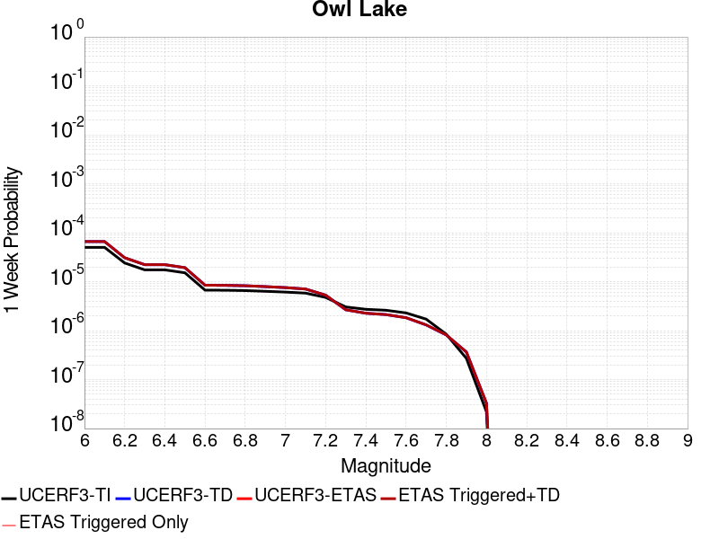 |  |  |  |

| Magnitude | 1 wk TI Prob | 1 wk TD Prob | 1 wk ETAS Prob | 1 wk ETAS/TD Gain | 1 wk ETAS Triggered+TD | 1 wk ETAS Triggered Only | 1 mo TI Prob | 1 mo TD Prob | 1 mo ETAS Prob | 1 mo ETAS/TD Gain | 1 mo ETAS Triggered+TD | 1 mo ETAS Triggered Only | 1 yr TI Prob | 1 yr TD Prob | 1 yr ETAS Prob | 1 yr ETAS/TD Gain | 1 yr ETAS Triggered+TD | 1 yr ETAS Triggered Only | 10 yr TI Prob | 10 yr TD Prob | 10 yr ETAS Prob | 10 yr ETAS/TD Gain | 10 yr ETAS Triggered+TD | 10 yr ETAS Triggered Only |
|-----|-----|-----|-----|-----|-----|-----|-----|-----|-----|-----|-----|-----|-----|-----|-----|-----|-----|-----|-----|-----|-----|-----|-----|-----|
| 6.0 | 5.0320643E-5 | 6.610823E-5 | 0.0 | 0.0 | 6.610823E-5 | 0.0 | 2.1564208E-4 | 2.8329072E-4 | 1.0E-4 | 0.35299426 | 2.8329072E-4 | 0.0 | 0.0026222812 | 0.0034445229 | 0.0021 | 0.60966355 | 0.0035441783 | 1.0E-4 | 0.02591553 | 0.034015402 | 0.0246 | 0.7232018 | 0.034498394 | 5.0E-4 |
| 6.1 | 5.0320643E-5 | 6.610823E-5 | 0.0 | 0.0 | 6.610823E-5 | 0.0 | 2.1564208E-4 | 2.8329072E-4 | 1.0E-4 | 0.35299426 | 2.8329072E-4 | 0.0 | 0.0026222812 | 0.0034445229 | 0.0021 | 0.60966355 | 0.0035441783 | 1.0E-4 | 0.02591553 | 0.034015402 | 0.0246 | 0.7232018 | 0.034498394 | 5.0E-4 |
| 6.2 | 2.4125871E-5 | 3.0850362E-5 | 0.0 | 0.0 | 3.0850362E-5 | 0.0 | 1.0339249E-4 | 1.3220983E-4 | 0.0 | 0.0 | 1.3220983E-4 | 0.0 | 0.0012580766 | 0.0016086436 | 8.0E-4 | 0.4973134 | 0.0017084827 | 1.0E-4 | 0.012509781 | 0.016003814 | 0.0124 | 0.7748154 | 0.016200611 | 2.0E-4 |
| 6.3 | 1.7433485E-5 | 2.2250671E-5 | 0.0 | 0.0 | 2.2250671E-5 | 0.0 | 7.471279E-5 | 9.535695E-5 | 0.0 | 0.0 | 9.535695E-5 | 0.0 | 9.0924866E-4 | 0.0011604935 | 5.0E-4 | 0.4308512 | 0.0012603774 | 1.0E-4 | 0.009055373 | 0.011574848 | 0.0086 | 0.7429903 | 0.011772533 | 2.0E-4 |
| 6.4 | 1.7433485E-5 | 2.2250671E-5 | 0.0 | 0.0 | 2.2250671E-5 | 0.0 | 7.471279E-5 | 9.535695E-5 | 0.0 | 0.0 | 9.535695E-5 | 0.0 | 9.0924866E-4 | 0.0011604935 | 5.0E-4 | 0.4308512 | 0.0012603774 | 1.0E-4 | 0.009055373 | 0.011574848 | 0.0086 | 0.7429903 | 0.011772533 | 2.0E-4 |
| 6.5 | 1.5182742E-5 | 1.9333092E-5 | 0.0 | 0.0 | 1.9333092E-5 | 0.0 | 6.506727E-5 | 8.2853854E-5 | 0.0 | 0.0 | 8.2853854E-5 | 0.0 | 7.919061E-4 | 0.0010084178 | 5.0E-4 | 0.49582624 | 0.0011083169 | 1.0E-4 | 0.0078909 | 0.010068757 | 0.0077 | 0.76474184 | 0.010266744 | 2.0E-4 |
| 6.6 | 6.7271576E-6 | 8.482794E-6 | 0.0 | 0.0 | 8.482794E-6 | 0.0 | 2.8830356E-5 | 3.635436E-5 | 0.0 | 0.0 | 3.635436E-5 | 0.0 | 3.5095305E-4 | 4.4253003E-4 | 1.0E-4 | 0.22597337 | 4.4253003E-4 | 0.0 | 0.0035039932 | 0.004434151 | 0.0025 | 0.56380576 | 0.0045337076 | 1.0E-4 |
| 6.7 | 6.682835E-6 | 8.415512E-6 | 0.0 | 0.0 | 8.415512E-6 | 0.0 | 2.8640408E-5 | 3.6066012E-5 | 0.0 | 0.0 | 3.6066012E-5 | 0.0 | 3.4864116E-4 | 4.3902083E-4 | 1.0E-4 | 0.22777963 | 4.3902083E-4 | 0.0 | 0.003480947 | 0.0043991995 | 0.0023 | 0.5228224 | 0.0044987598 | 1.0E-4 |
| 6.8 | 6.5774975E-6 | 8.262369E-6 | 0.0 | 0.0 | 8.262369E-6 | 0.0 | 2.8188972E-5 | 3.5409706E-5 | 0.0 | 0.0 | 3.5409706E-5 | 0.0 | 3.4314668E-4 | 4.3103346E-4 | 1.0E-4 | 0.23200054 | 4.3103346E-4 | 0.0 | 0.0034261728 | 0.004319577 | 0.0022 | 0.5093091 | 0.004419145 | 1.0E-4 |
| 6.9 | 6.363419E-6 | 7.936412E-6 | 0.0 | 0.0 | 7.936412E-6 | 0.0 | 2.727151E-5 | 3.401278E-5 | 0.0 | 0.0 | 3.401278E-5 | 0.0 | 3.3198006E-4 | 4.1403246E-4 | 1.0E-4 | 0.24152696 | 4.1403246E-4 | 0.0 | 0.0033148455 | 0.004150027 | 0.0019 | 0.45782834 | 0.004249612 | 1.0E-4 |
| 7.0 | 6.1342453E-6 | 7.569727E-6 | 0.0 | 0.0 | 7.569727E-6 | 0.0 | 2.6289357E-5 | 3.2441316E-5 | 0.0 | 0.0 | 3.2441316E-5 | 0.0 | 3.2002592E-4 | 3.9490688E-4 | 1.0E-4 | 0.25322425 | 3.9490688E-4 | 0.0 | 0.0031956544 | 0.003959279 | 0.0019 | 0.47988534 | 0.004058883 | 1.0E-4 |
| 7.1 | 5.842926E-6 | 7.081895E-6 | 0.0 | 0.0 | 7.081895E-6 | 0.0 | 2.504087E-5 | 3.0350655E-5 | 0.0 | 0.0 | 3.0350655E-5 | 0.0 | 3.0482994E-4 | 3.6946195E-4 | 1.0E-4 | 0.2706639 | 3.6946195E-4 | 0.0 | 0.0030441214 | 0.0037054901 | 0.0019 | 0.5127527 | 0.0038051195 | 1.0E-4 |
| 7.2 | 4.77173E-6 | 5.3036333E-6 | 0.0 | 0.0 | 5.3036333E-6 | 0.0 | 2.045011E-5 | 2.272968E-5 | 0.0 | 0.0 | 2.272968E-5 | 0.0 | 2.4895166E-4 | 2.7670275E-4 | 0.0 | 0.0 | 2.7670275E-4 | 0.0 | 0.0024867293 | 0.0027798498 | 0.0015 | 0.53959745 | 0.0028795719 | 1.0E-4 |
| 7.3 | 3.0494948E-6 | 2.6695109E-6 | 0.0 | 0.0 | 2.6695109E-6 | 0.0 | 1.3069198E-5 | 1.1440711E-5 | 0.0 | 0.0 | 1.1440711E-5 | 0.0 | 1.5910587E-4 | 1.3928191E-4 | 0.0 | 0.0 | 1.3928191E-4 | 0.0 | 0.0015899199 | 0.0014018042 | 8.0E-4 | 0.57069314 | 0.001501664 | 1.0E-4 |
| 7.4 | 2.7263884E-6 | 2.2671784E-6 | 0.0 | 0.0 | 2.2671784E-6 | 0.0 | 1.1684469E-5 | 9.716443E-6 | 0.0 | 0.0 | 9.716443E-6 | 0.0 | 1.4224913E-4 | 1.1829137E-4 | 0.0 | 0.0 | 1.1829137E-4 | 0.0 | 0.0014215811 | 0.0011910212 | 6.0E-4 | 0.5037694 | 0.001290902 | 1.0E-4 |
| 7.5 | 2.6090431E-6 | 2.1279625E-6 | 0.0 | 0.0 | 2.1279625E-6 | 0.0 | 1.1181565E-5 | 9.119808E-6 | 0.0 | 0.0 | 9.119808E-6 | 0.0 | 1.3612706E-4 | 1.11028094E-4 | 0.0 | 0.0 | 1.11028094E-4 | 0.0 | 0.001360437 | 0.0011181902 | 5.0E-4 | 0.4471511 | 0.0012180784 | 1.0E-4 |
| 7.6 | 2.3008756E-6 | 1.8369362E-6 | 0.0 | 0.0 | 1.8369362E-6 | 0.0 | 9.860858E-6 | 7.872561E-6 | 0.0 | 0.0 | 7.872561E-6 | 0.0 | 1.20049335E-4 | 9.584428E-5 | 0.0 | 0.0 | 9.584428E-5 | 0.0 | 0.001199845 | 9.661557E-4 | 4.0E-4 | 0.41401196 | 0.0010660591 | 1.0E-4 |
| 7.7 | 1.7184348E-6 | 1.3088865E-6 | 0.0 | 0.0 | 1.3088865E-6 | 0.0 | 7.3646997E-6 | 5.6095014E-6 | 0.0 | 0.0 | 5.6095014E-6 | 0.0 | 8.966153E-5 | 6.829358E-5 | 0.0 | 0.0 | 6.829358E-5 | 0.0 | 8.962536E-4 | 6.90414E-4 | 3.0E-4 | 0.4345219 | 6.90414E-4 | 0.0 |
| 7.8 | 8.4612907E-7 | 8.1692343E-7 | 0.0 | 0.0 | 8.1692343E-7 | 0.0 | 3.6262625E-6 | 3.501096E-6 | 0.0 | 0.0 | 3.501096E-6 | 0.0 | 4.4148852E-5 | 4.262503E-5 | 0.0 | 0.0 | 4.262503E-5 | 0.0 | 4.414008E-4 | 4.314805E-4 | 3.0E-4 | 0.69528055 | 4.314805E-4 | 0.0 |
| 7.9 | 2.716738E-7 | 3.6615592E-7 | 0.0 | 0.0 | 3.6615592E-7 | 0.0 | 1.1643157E-6 | 1.5692387E-6 | 0.0 | 0.0 | 1.5692387E-6 | 0.0 | 1.4175452E-5 | 1.9105324E-5 | 0.0 | 0.0 | 1.9105324E-5 | 0.0 | 1.4174548E-4 | 1.9270634E-4 | 1.0E-4 | 0.5189243 | 1.9270634E-4 | 0.0 |
| 8.0 | 2.1995428E-8 | 3.2903408E-8 | 0.0 | 0.0 | 3.2903408E-8 | 0.0 | 9.426611E-8 | 1.410146E-7 | 0.0 | 0.0 | 1.410146E-7 | 0.0 | 1.1476893E-6 | 1.716852E-6 | 0.0 | 0.0 | 1.716852E-6 | 0.0 | 1.14768345E-5 | 1.7377139E-5 | 0.0 | 0.0 | 1.7377139E-5 | 0.0 |

## Elsinore (Stepovers Combined)
*[(top)](#table-of-contents)*

| 1 Week | 1 Month | 1 Year | 10 Year |
|-----|-----|-----|-----|
| 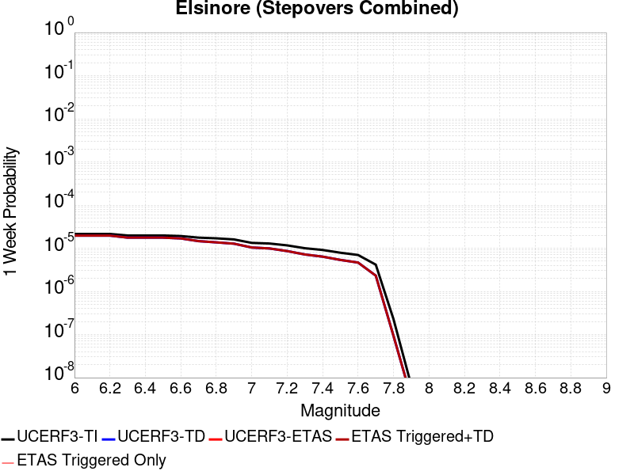 |  |  |  |

| Magnitude | 1 wk TI Prob | 1 wk TD Prob | 1 wk ETAS Prob | 1 wk ETAS/TD Gain | 1 wk ETAS Triggered+TD | 1 wk ETAS Triggered Only | 1 mo TI Prob | 1 mo TD Prob | 1 mo ETAS Prob | 1 mo ETAS/TD Gain | 1 mo ETAS Triggered+TD | 1 mo ETAS Triggered Only | 1 yr TI Prob | 1 yr TD Prob | 1 yr ETAS Prob | 1 yr ETAS/TD Gain | 1 yr ETAS Triggered+TD | 1 yr ETAS Triggered Only | 10 yr TI Prob | 10 yr TD Prob | 10 yr ETAS Prob | 10 yr ETAS/TD Gain | 10 yr ETAS Triggered+TD | 10 yr ETAS Triggered Only |
|-----|-----|-----|-----|-----|-----|-----|-----|-----|-----|-----|-----|-----|-----|-----|-----|-----|-----|-----|-----|-----|-----|-----|-----|-----|
| 6.0 | 2.144392E-5 | 1.9630772E-5 | 0.0 | 0.0 | 1.9630772E-5 | 0.0 | 9.189928E-5 | 8.412929E-5 | 2.0E-4 | 2.3772933 | 2.8411247E-4 | 2.0E-4 | 0.0011182994 | 0.0010238121 | 8.0E-4 | 0.78139335 | 0.0012236073 | 2.0E-4 | 0.011126885 | 0.010198043 | 0.0061 | 0.598154 | 0.010692944 | 5.0E-4 |
| 6.1 | 2.144392E-5 | 1.9630772E-5 | 0.0 | 0.0 | 1.9630772E-5 | 0.0 | 9.189928E-5 | 8.412929E-5 | 2.0E-4 | 2.3772933 | 2.8411247E-4 | 2.0E-4 | 0.0011182994 | 0.0010238121 | 8.0E-4 | 0.78139335 | 0.0012236073 | 2.0E-4 | 0.011126885 | 0.010198043 | 0.0061 | 0.598154 | 0.010692944 | 5.0E-4 |
| 6.2 | 2.144392E-5 | 1.9630772E-5 | 0.0 | 0.0 | 1.9630772E-5 | 0.0 | 9.189928E-5 | 8.412929E-5 | 2.0E-4 | 2.3772933 | 2.8411247E-4 | 2.0E-4 | 0.0011182994 | 0.0010238121 | 8.0E-4 | 0.78139335 | 0.0012236073 | 2.0E-4 | 0.011126885 | 0.010198043 | 0.0061 | 0.598154 | 0.010692944 | 5.0E-4 |
| 6.3 | 1.9751555E-5 | 1.761608E-5 | 0.0 | 0.0 | 1.761608E-5 | 0.0 | 8.4646774E-5 | 7.549539E-5 | 2.0E-4 | 2.6491685 | 2.754803E-4 | 2.0E-4 | 0.0010300872 | 9.187831E-4 | 8.0E-4 | 0.8707169 | 0.0011185993 | 2.0E-4 | 0.010253254 | 0.009156425 | 0.0056 | 0.6115924 | 0.009651847 | 5.0E-4 |
| 6.4 | 1.9751555E-5 | 1.761608E-5 | 0.0 | 0.0 | 1.761608E-5 | 0.0 | 8.4646774E-5 | 7.549539E-5 | 2.0E-4 | 2.6491685 | 2.754803E-4 | 2.0E-4 | 0.0010300872 | 9.187831E-4 | 8.0E-4 | 0.8707169 | 0.0011185993 | 2.0E-4 | 0.010253254 | 0.009156425 | 0.0056 | 0.6115924 | 0.009651847 | 5.0E-4 |
| 6.5 | 1.9751555E-5 | 1.761608E-5 | 0.0 | 0.0 | 1.761608E-5 | 0.0 | 8.4646774E-5 | 7.549539E-5 | 2.0E-4 | 2.6491685 | 2.754803E-4 | 2.0E-4 | 0.0010300872 | 9.187831E-4 | 8.0E-4 | 0.8707169 | 0.0011185993 | 2.0E-4 | 0.010253254 | 0.009156425 | 0.0056 | 0.6115924 | 0.009651847 | 5.0E-4 |
| 6.6 | 1.9188685E-5 | 1.6880309E-5 | 0.0 | 0.0 | 1.6880309E-5 | 0.0 | 8.2234634E-5 | 7.234226E-5 | 2.0E-4 | 2.7646356 | 2.723278E-4 | 2.0E-4 | 0.0010007467 | 8.804271E-4 | 8.0E-4 | 0.9086499 | 0.0010802511 | 2.0E-4 | 0.00996252 | 0.008776145 | 0.0054 | 0.6153043 | 0.009172635 | 4.0E-4 |
| 6.7 | 1.7608272E-5 | 1.4616964E-5 | 0.0 | 0.0 | 1.4616964E-5 | 0.0 | 7.546184E-5 | 6.264268E-5 | 1.0E-4 | 1.5963557 | 1.6263641E-4 | 1.0E-4 | 9.183606E-4 | 7.624173E-4 | 7.0E-4 | 0.91813236 | 8.62341E-4 | 1.0E-4 | 0.009145746 | 0.007604775 | 0.0046 | 0.6048831 | 0.007902494 | 3.0E-4 |
| 6.8 | 1.697165E-5 | 1.3682772E-5 | 0.0 | 0.0 | 1.3682772E-5 | 0.0 | 7.273361E-5 | 5.863918E-5 | 1.0E-4 | 1.7053444 | 1.5863332E-4 | 1.0E-4 | 8.8517193E-4 | 7.1370666E-4 | 7.0E-4 | 0.98079515 | 8.136353E-4 | 1.0E-4 | 0.008816543 | 0.0071203187 | 0.0043 | 0.60390556 | 0.0074181827 | 3.0E-4 |
| 6.9 | 1.600365E-5 | 1.2758175E-5 | 0.0 | 0.0 | 1.2758175E-5 | 0.0 | 6.858527E-5 | 5.467679E-5 | 1.0E-4 | 1.8289295 | 1.5467132E-4 | 1.0E-4 | 8.347058E-4 | 6.654942E-4 | 7.0E-4 | 1.0518498 | 7.6542766E-4 | 1.0E-4 | 0.008315775 | 0.0066407807 | 0.0038 | 0.5722219 | 0.0069387886 | 3.0E-4 |
| 7.0 | 1.3314581E-5 | 1.0393103E-5 | 0.0 | 0.0 | 1.0393103E-5 | 0.0 | 5.7061243E-5 | 4.4541124E-5 | 1.0E-4 | 2.2451162 | 1.4453667E-4 | 1.0E-4 | 6.944992E-4 | 5.4215593E-4 | 5.0E-4 | 0.9222439 | 6.4210175E-4 | 1.0E-4 | 0.006923327 | 0.005412003 | 0.0029 | 0.535846 | 0.0056109205 | 2.0E-4 |
| 7.1 | 1.2865345E-5 | 9.890421E-6 | 0.0 | 0.0 | 9.890421E-6 | 0.0 | 5.5136024E-5 | 4.2386848E-5 | 1.0E-4 | 2.3592224 | 1.423826E-4 | 1.0E-4 | 6.710743E-4 | 5.159402E-4 | 5.0E-4 | 0.9691046 | 6.1588857E-4 | 1.0E-4 | 0.0066905143 | 0.0051506558 | 0.0029 | 0.5630351 | 0.005349626 | 2.0E-4 |
| 7.2 | 1.1650051E-5 | 8.595105E-6 | 0.0 | 0.0 | 8.595105E-6 | 0.0 | 4.9927836E-5 | 3.6835656E-5 | 1.0E-4 | 2.714761 | 1.3683196E-4 | 1.0E-4 | 6.0770183E-4 | 4.4838357E-4 | 4.0E-4 | 0.89209336 | 5.4833875E-4 | 1.0E-4 | 0.0060604266 | 0.0044761146 | 0.0023 | 0.51383847 | 0.0046752193 | 2.0E-4 |
| 7.3 | 1.0008533E-5 | 7.170936E-6 | 0.0 | 0.0 | 7.170936E-6 | 0.0 | 4.2893007E-5 | 3.073223E-5 | 1.0E-4 | 3.253913 | 1.3072915E-4 | 1.0E-4 | 5.220972E-4 | 3.741021E-4 | 3.0E-4 | 0.8019202 | 4.7406467E-4 | 1.0E-4 | 0.005208723 | 0.0037350664 | 0.0016 | 0.42837256 | 0.0039343196 | 2.0E-4 |
| 7.4 | 9.116759E-6 | 6.3842217E-6 | 0.0 | 0.0 | 6.3842217E-6 | 0.0 | 3.907124E-5 | 2.7360671E-5 | 1.0E-4 | 3.654881 | 1.2735794E-4 | 1.0E-4 | 4.7558855E-4 | 3.3306662E-4 | 3.0E-4 | 0.9007207 | 4.330333E-4 | 1.0E-4 | 0.00474572 | 0.0033258214 | 0.0014 | 0.42094865 | 0.0035251563 | 2.0E-4 |
| 7.5 | 7.870524E-6 | 5.360863E-6 | 0.0 | 0.0 | 5.360863E-6 | 0.0 | 3.3730383E-5 | 2.2974931E-5 | 1.0E-4 | 4.35257 | 1.2297263E-4 | 1.0E-4 | 4.1059E-4 | 2.7968513E-4 | 3.0E-4 | 1.0726347 | 3.7965717E-4 | 1.0E-4 | 0.0040983222 | 0.0027934571 | 0.0012 | 0.42957523 | 0.0028931778 | 1.0E-4 |
| 7.6 | 6.9774537E-6 | 4.6581627E-6 | 0.0 | 0.0 | 4.6581627E-6 | 0.0 | 2.990303E-5 | 1.9963409E-5 | 1.0E-4 | 5.009165 | 1.1996141E-4 | 1.0E-4 | 3.640086E-4 | 2.4302855E-4 | 3.0E-4 | 1.2344229 | 3.4300424E-4 | 1.0E-4 | 0.003634129 | 0.002427743 | 0.0012 | 0.49428624 | 0.0025275003 | 1.0E-4 |
| 7.7 | 4.1616954E-6 | 2.3164787E-6 | 0.0 | 0.0 | 2.3164787E-6 | 0.0 | 1.7835715E-5 | 9.927732E-6 | 1.0E-4 | 10.072794 | 1.0992674E-4 | 1.0E-4 | 2.171282E-4 | 1.2086417E-4 | 3.0E-4 | 2.482125 | 2.2085209E-4 | 1.0E-4 | 0.0021691616 | 0.0012080568 | 6.0E-4 | 0.4966654 | 0.001307936 | 1.0E-4 |
| 7.8 | 2.2692414E-7 | 9.313546E-8 | 0.0 | 0.0 | 9.313546E-8 | 0.0 | 9.725317E-7 | 3.9915196E-7 | 0.0 | 0.0 | 3.9915196E-7 | 0.0 | 1.1840509E-5 | 4.8596676E-6 | 0.0 | 0.0 | 4.8596676E-6 | 0.0 | 1.1839878E-4 | 4.859593E-5 | 0.0 | 0.0 | 4.859593E-5 | 0.0 |
| 7.9 | 6.676829E-9 | 3.4267709E-9 | 0.0 | 0.0 | 3.4267709E-9 | 0.0 | 2.861498E-8 | 1.4686159E-8 | 0.0 | 0.0 | 1.4686159E-8 | 0.0 | 3.4838732E-7 | 1.7880397E-7 | 0.0 | 0.0 | 1.7880397E-7 | 0.0 | 3.4838679E-6 | 1.7880385E-6 | 0.0 | 0.0 | 1.7880385E-6 | 0.0 |

## Skinner Flat 2011 CFM
*[(top)](#table-of-contents)*

| 1 Week | 1 Month | 1 Year | 10 Year |
|-----|-----|-----|-----|
|  |  |  | 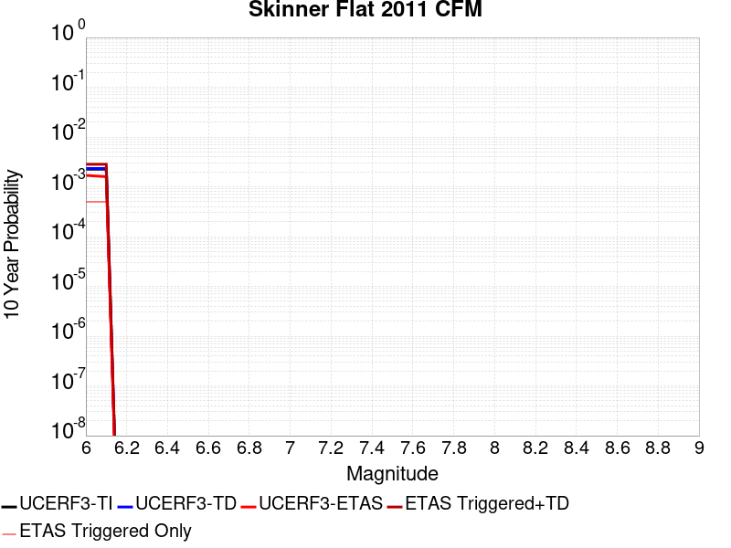 |

| Magnitude | 1 wk TI Prob | 1 wk TD Prob | 1 wk ETAS Prob | 1 wk ETAS/TD Gain | 1 wk ETAS Triggered+TD | 1 wk ETAS Triggered Only | 1 mo TI Prob | 1 mo TD Prob | 1 mo ETAS Prob | 1 mo ETAS/TD Gain | 1 mo ETAS Triggered+TD | 1 mo ETAS Triggered Only | 1 yr TI Prob | 1 yr TD Prob | 1 yr ETAS Prob | 1 yr ETAS/TD Gain | 1 yr ETAS Triggered+TD | 1 yr ETAS Triggered Only | 10 yr TI Prob | 10 yr TD Prob | 10 yr ETAS Prob | 10 yr ETAS/TD Gain | 10 yr ETAS Triggered+TD | 10 yr ETAS Triggered Only |
|-----|-----|-----|-----|-----|-----|-----|-----|-----|-----|-----|-----|-----|-----|-----|-----|-----|-----|-----|-----|-----|-----|-----|-----|-----|
| 6.0 | 4.3279074E-6 | 4.4832545E-6 | 0.0 | 0.0 | 4.4832545E-6 | 0.0 | 1.8548042E-5 | 1.9213947E-5 | 0.0 | 0.0 | 1.9213947E-5 | 0.0 | 2.2579901E-4 | 2.3392981E-4 | 2.0E-4 | 0.85495734 | 3.339064E-4 | 1.0E-4 | 0.002255697 | 0.0023392981 | 0.0017 | 0.7267137 | 0.0028381285 | 5.0E-4 |
| 6.1 | 4.3279074E-6 | 4.4832545E-6 | 0.0 | 0.0 | 4.4832545E-6 | 0.0 | 1.8548042E-5 | 1.9213947E-5 | 0.0 | 0.0 | 1.9213947E-5 | 0.0 | 2.2579901E-4 | 2.3392981E-4 | 1.0E-4 | 0.42747867 | 3.339064E-4 | 1.0E-4 | 0.002255697 | 0.0023392981 | 0.0016 | 0.68396586 | 0.0028381285 | 5.0E-4 |

## Rinconada 2011 CFM
*[(top)](#table-of-contents)*

| 1 Week | 1 Month | 1 Year | 10 Year |
|-----|-----|-----|-----|
|  | 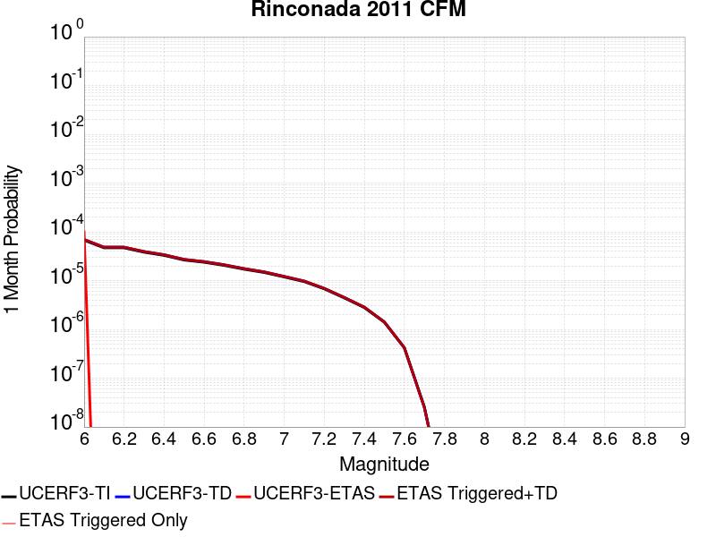 |  |  |

| Magnitude | 1 wk TI Prob | 1 wk TD Prob | 1 wk ETAS Prob | 1 wk ETAS/TD Gain | 1 wk ETAS Triggered+TD | 1 wk ETAS Triggered Only | 1 mo TI Prob | 1 mo TD Prob | 1 mo ETAS Prob | 1 mo ETAS/TD Gain | 1 mo ETAS Triggered+TD | 1 mo ETAS Triggered Only | 1 yr TI Prob | 1 yr TD Prob | 1 yr ETAS Prob | 1 yr ETAS/TD Gain | 1 yr ETAS Triggered+TD | 1 yr ETAS Triggered Only | 10 yr TI Prob | 10 yr TD Prob | 10 yr ETAS Prob | 10 yr ETAS/TD Gain | 10 yr ETAS Triggered+TD | 10 yr ETAS Triggered Only |
|-----|-----|-----|-----|-----|-----|-----|-----|-----|-----|-----|-----|-----|-----|-----|-----|-----|-----|-----|-----|-----|-----|-----|-----|-----|
| 6.0 | 1.5752368E-5 | 1.6269056E-5 | 0.0 | 0.0 | 1.6269056E-5 | 0.0 | 6.75084E-5 | 6.972268E-5 | 1.0E-4 | 1.4342536 | 6.972268E-5 | 0.0 | 8.2160486E-4 | 8.4854616E-4 | 7.0E-4 | 0.8249404 | 9.484613E-4 | 1.0E-4 | 0.008185739 | 0.008453442 | 0.0064 | 0.7570881 | 0.00885006 | 4.0E-4 |
| 6.1 | 1.0966133E-5 | 1.1319156E-5 | 0.0 | 0.0 | 1.1319156E-5 | 0.0 | 4.6996865E-5 | 4.8509773E-5 | 0.0 | 0.0 | 4.8509773E-5 | 0.0 | 5.720366E-4 | 5.9044716E-4 | 4.0E-4 | 0.6774527 | 6.903881E-4 | 1.0E-4 | 0.0057056635 | 0.0058888798 | 0.0036 | 0.6113217 | 0.0060877022 | 2.0E-4 |
| 6.2 | 1.0966133E-5 | 1.1319156E-5 | 0.0 | 0.0 | 1.1319156E-5 | 0.0 | 4.6996865E-5 | 4.8509773E-5 | 0.0 | 0.0 | 4.8509773E-5 | 0.0 | 5.720366E-4 | 5.9044716E-4 | 4.0E-4 | 0.6774527 | 6.903881E-4 | 1.0E-4 | 0.0057056635 | 0.0058888798 | 0.0036 | 0.6113217 | 0.0060877022 | 2.0E-4 |
| 6.3 | 8.926149E-6 | 9.209658E-6 | 0.0 | 0.0 | 9.209658E-6 | 0.0 | 3.8254362E-5 | 3.9469367E-5 | 0.0 | 0.0 | 3.9469367E-5 | 0.0 | 4.6564735E-4 | 4.8043393E-4 | 3.0E-4 | 0.62443554 | 5.8038585E-4 | 1.0E-4 | 0.0046467283 | 0.0047939974 | 0.0027 | 0.5632043 | 0.0049930387 | 2.0E-4 |
| 6.4 | 7.676955E-6 | 7.917546E-6 | 0.0 | 0.0 | 7.917546E-6 | 0.0 | 3.290082E-5 | 3.39319E-5 | 0.0 | 0.0 | 3.39319E-5 | 0.0 | 4.0049385E-4 | 4.1304276E-4 | 3.0E-4 | 0.72631705 | 5.1300146E-4 | 1.0E-4 | 0.0039977287 | 0.004122777 | 0.0024 | 0.5821319 | 0.0042223646 | 1.0E-4 |
| 6.5 | 6.1671026E-6 | 6.356865E-6 | 0.0 | 0.0 | 6.356865E-6 | 0.0 | 2.6430173E-5 | 2.7243423E-5 | 0.0 | 0.0 | 2.7243423E-5 | 0.0 | 3.2173982E-4 | 3.3163826E-4 | 3.0E-4 | 0.9046001 | 4.316051E-4 | 1.0E-4 | 0.003212744 | 0.0033114457 | 0.002 | 0.6039658 | 0.0034111144 | 1.0E-4 |
| 6.6 | 5.553456E-6 | 5.722944E-6 | 0.0 | 0.0 | 5.722944E-6 | 0.0 | 2.3800309E-5 | 2.4526673E-5 | 0.0 | 0.0 | 2.4526673E-5 | 0.0 | 2.897302E-4 | 2.985714E-4 | 2.0E-4 | 0.66985655 | 3.9854154E-4 | 1.0E-4 | 0.0028935277 | 0.0029817112 | 0.0018 | 0.6036802 | 0.003081413 | 1.0E-4 |
| 6.7 | 4.787857E-6 | 4.931721E-6 | 0.0 | 0.0 | 4.931721E-6 | 0.0 | 2.0519226E-5 | 2.1135776E-5 | 0.0 | 0.0 | 2.1135776E-5 | 0.0 | 2.4979294E-4 | 2.5729774E-4 | 2.0E-4 | 0.7773096 | 3.57272E-4 | 1.0E-4 | 0.0024951235 | 0.002570004 | 0.0017 | 0.66147757 | 0.002669747 | 1.0E-4 |
| 6.8 | 3.9955166E-6 | 4.1121853E-6 | 0.0 | 0.0 | 4.1121853E-6 | 0.0 | 1.7123532E-5 | 1.7623532E-5 | 0.0 | 0.0 | 1.7623532E-5 | 0.0 | 2.0845905E-4 | 2.145454E-4 | 2.0E-4 | 0.9322036 | 3.1452396E-4 | 1.0E-4 | 0.002082636 | 0.0021433865 | 0.0014 | 0.653172 | 0.0022431721 | 1.0E-4 |
| 6.9 | 3.4250072E-6 | 3.5213782E-6 | 0.0 | 0.0 | 3.5213782E-6 | 0.0 | 1.46785205E-5 | 1.5091534E-5 | 0.0 | 0.0 | 1.5091534E-5 | 0.0 | 1.7869633E-4 | 1.8372395E-4 | 2.0E-4 | 1.0885897 | 2.8370557E-4 | 1.0E-4 | 0.001785527 | 0.0018357231 | 0.0014 | 0.76264226 | 0.0019355395 | 1.0E-4 |
| 7.0 | 2.7712713E-6 | 2.84587E-6 | 0.0 | 0.0 | 2.84587E-6 | 0.0 | 1.1876823E-5 | 1.2196529E-5 | 0.0 | 0.0 | 1.2196529E-5 | 0.0 | 1.4459073E-4 | 1.4848264E-4 | 1.0E-4 | 0.67347944 | 2.4846778E-4 | 1.0E-4 | 0.0014449668 | 0.0014838357 | 9.0E-4 | 0.60653615 | 0.0015836874 | 1.0E-4 |
| 7.1 | 2.227358E-6 | 2.285053E-6 | 0.0 | 0.0 | 2.285053E-6 | 0.0 | 9.545785E-6 | 9.793047E-6 | 0.0 | 0.0 | 9.793047E-6 | 0.0 | 1.16213734E-4 | 1.19223834E-4 | 1.0E-4 | 0.83875847 | 2.1921191E-4 | 1.0E-4 | 0.0011615298 | 0.0011915998 | 7.0E-4 | 0.58744556 | 0.0012914806 | 1.0E-4 |
| 7.2 | 1.581796E-6 | 1.620463E-6 | 0.0 | 0.0 | 1.620463E-6 | 0.0 | 6.779108E-6 | 6.944823E-6 | 0.0 | 0.0 | 6.944823E-6 | 0.0 | 8.253252E-5 | 8.4549945E-5 | 1.0E-4 | 1.1827329 | 1.845415E-4 | 1.0E-4 | 8.250187E-4 | 8.451783E-4 | 5.0E-4 | 0.5915911 | 9.450938E-4 | 1.0E-4 |
| 7.3 | 1.0306567E-6 | 1.0543723E-6 | 0.0 | 0.0 | 1.0543723E-6 | 0.0 | 4.4170924E-6 | 4.5187303E-6 | 0.0 | 0.0 | 4.5187303E-6 | 0.0 | 5.3776774E-5 | 5.5014156E-5 | 1.0E-4 | 1.817714 | 1.5500866E-4 | 1.0E-4 | 5.376376E-4 | 5.5000564E-4 | 3.0E-4 | 0.54544896 | 6.4995064E-4 | 1.0E-4 |
| 7.4 | 6.535541E-7 | 6.6809815E-7 | 0.0 | 0.0 | 6.6809815E-7 | 0.0 | 2.800943E-6 | 2.8632746E-6 | 0.0 | 0.0 | 2.8632746E-6 | 0.0 | 3.4100947E-5 | 3.485981E-5 | 1.0E-4 | 2.8686328 | 1.3485632E-4 | 1.0E-4 | 3.4095717E-4 | 3.4854357E-4 | 3.0E-4 | 0.86072457 | 4.485087E-4 | 1.0E-4 |
| 7.5 | 3.2656962E-7 | 3.3307785E-7 | 0.0 | 0.0 | 3.3307785E-7 | 0.0 | 1.3995833E-6 | 1.4274757E-6 | 0.0 | 0.0 | 1.4274757E-6 | 0.0 | 1.7039794E-5 | 1.7379378E-5 | 1.0E-4 | 5.753946 | 1.1737764E-4 | 1.0E-4 | 1.7038487E-4 | 1.7378024E-4 | 2.0E-4 | 1.1508789 | 2.7376285E-4 | 1.0E-4 |
| 7.6 | 9.754343E-8 | 9.818454E-8 | 0.0 | 0.0 | 9.818454E-8 | 0.0 | 4.180432E-7 | 4.2079083E-7 | 0.0 | 0.0 | 4.2079083E-7 | 0.0 | 5.089664E-6 | 5.1231164E-6 | 1.0E-4 | 19.51937 | 1.05122606E-4 | 1.0E-4 | 5.0895473E-5 | 5.1229992E-5 | 2.0E-4 | 3.9039633 | 1.5122487E-4 | 1.0E-4 |
| 7.7 | 6.0001453E-9 | 5.8468235E-9 | 0.0 | 0.0 | 5.8468235E-9 | 0.0 | 2.5714908E-8 | 2.5057814E-8 | 0.0 | 0.0 | 2.5057814E-8 | 0.0 | 3.1307894E-7 | 3.0507886E-7 | 0.0 | 0.0 | 3.0507886E-7 | 0.0 | 3.1307852E-6 | 3.0507845E-6 | 0.0 | 0.0 | 3.0507845E-6 | 0.0 |
| 7.8 | 7.400003E-11 | 7.464762E-11 | 0.0 | 0.0 | 7.464762E-11 | 0.0 | 3.171432E-10 | 3.199182E-10 | 0.0 | 0.0 | 3.199182E-10 | 0.0 | 3.861218E-9 | 3.8950034E-9 | 0.0 | 0.0 | 3.8950034E-9 | 0.0 | 3.861218E-8 | 3.8950034E-8 | 0.0 | 0.0 | 3.8950034E-8 | 0.0 |

## Rocky Ledge 2011 CFM
*[(top)](#table-of-contents)*

| 1 Week | 1 Month | 1 Year | 10 Year |
|-----|-----|-----|-----|
|  |  |  |  |

| Magnitude | 1 wk TI Prob | 1 wk TD Prob | 1 wk ETAS Prob | 1 wk ETAS/TD Gain | 1 wk ETAS Triggered+TD | 1 wk ETAS Triggered Only | 1 mo TI Prob | 1 mo TD Prob | 1 mo ETAS Prob | 1 mo ETAS/TD Gain | 1 mo ETAS Triggered+TD | 1 mo ETAS Triggered Only | 1 yr TI Prob | 1 yr TD Prob | 1 yr ETAS Prob | 1 yr ETAS/TD Gain | 1 yr ETAS Triggered+TD | 1 yr ETAS Triggered Only | 10 yr TI Prob | 10 yr TD Prob | 10 yr ETAS Prob | 10 yr ETAS/TD Gain | 10 yr ETAS Triggered+TD | 10 yr ETAS Triggered Only |
|-----|-----|-----|-----|-----|-----|-----|-----|-----|-----|-----|-----|-----|-----|-----|-----|-----|-----|-----|-----|-----|-----|-----|-----|-----|
| 6.0 | 8.7550525E-6 | 9.478336E-6 | 0.0 | 0.0 | 9.478336E-6 | 0.0 | 3.7521113E-5 | 4.062127E-5 | 0.0 | 0.0 | 4.062127E-5 | 0.0 | 4.567238E-4 | 4.945341E-4 | 4.0E-4 | 0.8088421 | 5.944846E-4 | 1.0E-4 | 0.0045578624 | 0.00494241 | 0.0041 | 0.8295548 | 0.005340433 | 4.0E-4 |
| 6.1 | 8.7550525E-6 | 9.478336E-6 | 0.0 | 0.0 | 9.478336E-6 | 0.0 | 3.7521113E-5 | 4.062127E-5 | 0.0 | 0.0 | 4.062127E-5 | 0.0 | 4.567238E-4 | 4.945341E-4 | 2.0E-4 | 0.40442106 | 4.945341E-4 | 0.0 | 0.0045578624 | 0.00494241 | 0.0026 | 0.52605915 | 0.0051414217 | 2.0E-4 |
| 6.2 | 7.442295E-6 | 8.056024E-6 | 0.0 | 0.0 | 8.056024E-6 | 0.0 | 3.189516E-5 | 3.452582E-5 | 0.0 | 0.0 | 3.452582E-5 | 0.0 | 3.8825438E-4 | 4.2035183E-4 | 1.0E-4 | 0.23789595 | 4.2035183E-4 | 0.0 | 0.0038757676 | 0.0042035184 | 0.002 | 0.4757919 | 0.004303098 | 1.0E-4 |

## Casmalia 2011 CFM
*[(top)](#table-of-contents)*

| 1 Week | 1 Month | 1 Year | 10 Year |
|-----|-----|-----|-----|
|  |  | 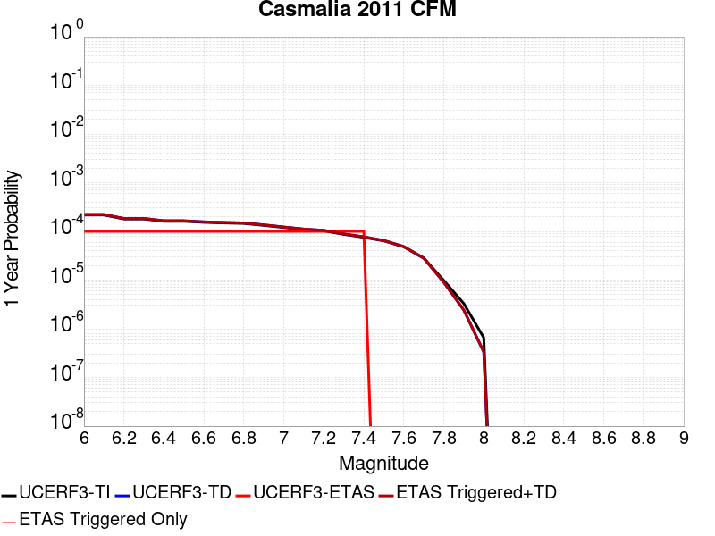 |  |

| Magnitude | 1 wk TI Prob | 1 wk TD Prob | 1 wk ETAS Prob | 1 wk ETAS/TD Gain | 1 wk ETAS Triggered+TD | 1 wk ETAS Triggered Only | 1 mo TI Prob | 1 mo TD Prob | 1 mo ETAS Prob | 1 mo ETAS/TD Gain | 1 mo ETAS Triggered+TD | 1 mo ETAS Triggered Only | 1 yr TI Prob | 1 yr TD Prob | 1 yr ETAS Prob | 1 yr ETAS/TD Gain | 1 yr ETAS Triggered+TD | 1 yr ETAS Triggered Only | 10 yr TI Prob | 10 yr TD Prob | 10 yr ETAS Prob | 10 yr ETAS/TD Gain | 10 yr ETAS Triggered+TD | 10 yr ETAS Triggered Only |
|-----|-----|-----|-----|-----|-----|-----|-----|-----|-----|-----|-----|-----|-----|-----|-----|-----|-----|-----|-----|-----|-----|-----|-----|-----|
| 6.0 | 4.1704893E-6 | 4.2609445E-6 | 0.0 | 0.0 | 4.2609445E-6 | 0.0 | 1.7873403E-5 | 1.8261064E-5 | 0.0 | 0.0 | 1.8261064E-5 | 0.0 | 2.1758694E-4 | 2.2230597E-4 | 1.0E-4 | 0.44983047 | 2.2230597E-4 | 0.0 | 0.0021737402 | 0.002220857 | 0.0018 | 0.810498 | 0.0026199685 | 4.0E-4 |
| 6.1 | 4.1704893E-6 | 4.2609445E-6 | 0.0 | 0.0 | 4.2609445E-6 | 0.0 | 1.7873403E-5 | 1.8261064E-5 | 0.0 | 0.0 | 1.8261064E-5 | 0.0 | 2.1758694E-4 | 2.2230597E-4 | 1.0E-4 | 0.44983047 | 2.2230597E-4 | 0.0 | 0.0021737402 | 0.002220857 | 0.0018 | 0.810498 | 0.0026199685 | 4.0E-4 |
| 6.2 | 3.457312E-6 | 3.5356138E-6 | 0.0 | 0.0 | 3.5356138E-6 | 0.0 | 1.4816967E-5 | 1.5152544E-5 | 0.0 | 0.0 | 1.5152544E-5 | 0.0 | 1.8038164E-4 | 1.8446668E-4 | 1.0E-4 | 0.5421033 | 1.8446668E-4 | 0.0 | 0.001802353 | 0.0018431451 | 0.0018 | 0.9765916 | 0.0022424078 | 4.0E-4 |
| 6.3 | 3.457312E-6 | 3.5356138E-6 | 0.0 | 0.0 | 3.5356138E-6 | 0.0 | 1.4816967E-5 | 1.5152544E-5 | 0.0 | 0.0 | 1.5152544E-5 | 0.0 | 1.8038164E-4 | 1.8446668E-4 | 1.0E-4 | 0.5421033 | 1.8446668E-4 | 0.0 | 0.001802353 | 0.0018431451 | 0.0018 | 0.9765916 | 0.0022424078 | 4.0E-4 |
| 6.4 | 3.0957337E-6 | 3.167884E-6 | 0.0 | 0.0 | 3.167884E-6 | 0.0 | 1.3267363E-5 | 1.3576575E-5 | 0.0 | 0.0 | 1.3576575E-5 | 0.0 | 1.6151817E-4 | 1.6528231E-4 | 1.0E-4 | 0.6050254 | 1.6528231E-4 | 0.0 | 0.0016140083 | 0.0016516 | 0.0017 | 1.0293049 | 0.0020509395 | 4.0E-4 |
| 6.5 | 3.0957337E-6 | 3.167884E-6 | 0.0 | 0.0 | 3.167884E-6 | 0.0 | 1.3267363E-5 | 1.3576575E-5 | 0.0 | 0.0 | 1.3576575E-5 | 0.0 | 1.6151817E-4 | 1.6528231E-4 | 1.0E-4 | 0.6050254 | 1.6528231E-4 | 0.0 | 0.0016140083 | 0.0016516 | 0.0017 | 1.0293049 | 0.0020509395 | 4.0E-4 |
| 6.6 | 2.9459152E-6 | 3.0152635E-6 | 0.0 | 0.0 | 3.0152635E-6 | 0.0 | 1.262529E-5 | 1.2922494E-5 | 0.0 | 0.0 | 1.2922494E-5 | 0.0 | 1.5370206E-4 | 1.5732006E-4 | 1.0E-4 | 0.6356469 | 1.5732006E-4 | 0.0 | 0.0015359579 | 0.0015720924 | 0.0016 | 1.0177518 | 0.0019714637 | 4.0E-4 |
| 6.7 | 2.8634809E-6 | 2.9311786E-6 | 0.0 | 0.0 | 2.9311786E-6 | 0.0 | 1.2272003E-5 | 1.2562134E-5 | 0.0 | 0.0 | 1.2562134E-5 | 0.0 | 1.4940138E-4 | 1.529333E-4 | 1.0E-4 | 0.6538798 | 1.529333E-4 | 0.0 | 0.0014930099 | 0.0015282859 | 0.0016 | 1.0469245 | 0.0019276746 | 4.0E-4 |
| 6.8 | 2.7999822E-6 | 2.8663176E-6 | 0.0 | 0.0 | 2.8663176E-6 | 0.0 | 1.1999869E-5 | 1.228416E-5 | 0.0 | 0.0 | 1.228416E-5 | 0.0 | 1.460886E-4 | 1.4954944E-4 | 1.0E-4 | 0.6686752 | 1.4954944E-4 | 0.0 | 0.001459926 | 0.0014944932 | 0.0016 | 1.0705969 | 0.0018938954 | 4.0E-4 |
| 6.9 | 2.551052E-6 | 2.6107575E-6 | 0.0 | 0.0 | 2.6107575E-6 | 0.0 | 1.0933034E-5 | 1.1188913E-5 | 0.0 | 0.0 | 1.1188913E-5 | 0.0 | 1.3310155E-4 | 1.3621653E-4 | 1.0E-4 | 0.73412526 | 1.3621653E-4 | 0.0 | 0.0013302186 | 0.0013613345 | 0.0016 | 1.1753173 | 0.0017607899 | 4.0E-4 |
| 7.0 | 2.3081875E-6 | 2.3612736E-6 | 0.0 | 0.0 | 2.3612736E-6 | 0.0 | 9.892195E-6 | 1.0119705E-5 | 0.0 | 0.0 | 1.0119705E-5 | 0.0 | 1.20430814E-4 | 1.2320046E-4 | 1.0E-4 | 0.81168526 | 1.2320046E-4 | 0.0 | 0.0012036557 | 0.0012313245 | 0.0016 | 1.2994138 | 0.001630832 | 4.0E-4 |
| 7.1 | 2.093245E-6 | 2.1406506E-6 | 0.0 | 0.0 | 2.1406506E-6 | 0.0 | 8.971019E-6 | 9.174185E-6 | 0.0 | 0.0 | 9.174185E-6 | 0.0 | 1.09216686E-4 | 1.1168999E-4 | 1.0E-4 | 0.8953354 | 1.1168999E-4 | 0.0 | 0.0010916302 | 0.0011163406 | 0.0014 | 1.2540976 | 0.0015158941 | 4.0E-4 |
| 7.2 | 1.9714576E-6 | 2.0154723E-6 | 0.0 | 0.0 | 2.0154723E-6 | 0.0 | 8.449076E-6 | 8.6377095E-6 | 0.0 | 0.0 | 8.6377095E-6 | 0.0 | 1.0286264E-4 | 1.0515906E-4 | 1.0E-4 | 0.95094043 | 1.0515906E-4 | 0.0 | 0.0010281504 | 0.0010510948 | 0.0014 | 1.3319445 | 0.0014506744 | 4.0E-4 |
| 7.3 | 1.6689512E-6 | 1.7037764E-6 | 0.0 | 0.0 | 1.7037764E-6 | 0.0 | 7.1526288E-6 | 7.301878E-6 | 0.0 | 0.0 | 7.301878E-6 | 0.0 | 8.7079774E-5 | 8.889675E-5 | 1.0E-4 | 1.1249006 | 8.889675E-5 | 0.0 | 8.7045657E-4 | 8.886127E-4 | 0.0012 | 1.3504196 | 0.001088435 | 2.0E-4 |
| 7.4 | 1.4490954E-6 | 1.4770293E-6 | 0.0 | 0.0 | 1.4770293E-6 | 0.0 | 6.210394E-6 | 6.3301104E-6 | 0.0 | 0.0 | 6.3301104E-6 | 0.0 | 7.560892E-5 | 7.7066376E-5 | 1.0E-4 | 1.2975827 | 7.7066376E-5 | 0.0 | 7.55832E-4 | 7.703971E-4 | 9.0E-4 | 1.1682287 | 8.703201E-4 | 1.0E-4 |
| 7.5 | 1.226873E-6 | 1.2473897E-6 | 0.0 | 0.0 | 1.2473897E-6 | 0.0 | 5.2580162E-6 | 5.3459453E-6 | 0.0 | 0.0 | 5.3459453E-6 | 0.0 | 6.401447E-5 | 6.508495E-5 | 0.0 | 0.0 | 6.508495E-5 | 0.0 | 6.399603E-4 | 6.506593E-4 | 7.0E-4 | 1.0758318 | 7.505943E-4 | 1.0E-4 |
| 7.6 | 9.2561345E-7 | 9.355281E-7 | 0.0 | 0.0 | 9.355281E-7 | 0.0 | 3.966909E-6 | 4.0094E-6 | 0.0 | 0.0 | 4.0094E-6 | 0.0 | 4.8296046E-5 | 4.8813356E-5 | 0.0 | 0.0 | 4.8813356E-5 | 0.0 | 4.828555E-4 | 4.880267E-4 | 5.0E-4 | 1.0245341 | 5.8797793E-4 | 1.0E-4 |
| 7.7 | 5.4367933E-7 | 5.387873E-7 | 0.0 | 0.0 | 5.387873E-7 | 0.0 | 2.3300522E-6 | 2.309086E-6 | 0.0 | 0.0 | 2.309086E-6 | 0.0 | 2.8368017E-5 | 2.8112763E-5 | 0.0 | 0.0 | 2.8112763E-5 | 0.0 | 2.8364395E-4 | 2.810922E-4 | 4.0E-4 | 1.4230207 | 3.8106408E-4 | 1.0E-4 |
| 7.8 | 1.8825742E-7 | 1.731014E-7 | 0.0 | 0.0 | 1.731014E-7 | 0.0 | 8.068173E-7 | 7.418629E-7 | 0.0 | 0.0 | 7.418629E-7 | 0.0 | 9.822956E-6 | 9.032144E-6 | 0.0 | 0.0 | 9.032144E-6 | 0.0 | 9.822522E-5 | 9.0317786E-5 | 1.0E-4 | 1.1072016 | 9.0317786E-5 | 0.0 |
| 7.9 | 6.342771E-8 | 4.653135E-8 | 0.0 | 0.0 | 4.653135E-8 | 0.0 | 2.7183304E-7 | 1.9942006E-7 | 0.0 | 0.0 | 1.9942006E-7 | 0.0 | 3.3095623E-6 | 2.4279366E-6 | 0.0 | 0.0 | 2.4279366E-6 | 0.0 | 3.309513E-5 | 2.4279105E-5 | 0.0 | 0.0 | 2.4279105E-5 | 0.0 |
| 8.0 | 1.2574819E-8 | 6.3845222E-9 | 0.0 | 0.0 | 6.3845222E-9 | 0.0 | 5.3892084E-8 | 2.7362239E-8 | 0.0 | 0.0 | 2.7362239E-8 | 0.0 | 6.561359E-7 | 3.331352E-7 | 0.0 | 0.0 | 3.331352E-7 | 0.0 | 6.56134E-6 | 3.3313472E-6 | 0.0 | 0.0 | 3.3313472E-6 | 0.0 |

## Bartlett Springs 2011 CFM
*[(top)](#table-of-contents)*

| 1 Week | 1 Month | 1 Year | 10 Year |
|-----|-----|-----|-----|
|  | 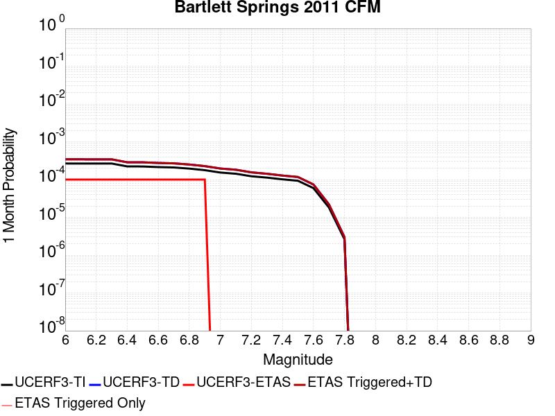 |  |  |

| Magnitude | 1 wk TI Prob | 1 wk TD Prob | 1 wk ETAS Prob | 1 wk ETAS/TD Gain | 1 wk ETAS Triggered+TD | 1 wk ETAS Triggered Only | 1 mo TI Prob | 1 mo TD Prob | 1 mo ETAS Prob | 1 mo ETAS/TD Gain | 1 mo ETAS Triggered+TD | 1 mo ETAS Triggered Only | 1 yr TI Prob | 1 yr TD Prob | 1 yr ETAS Prob | 1 yr ETAS/TD Gain | 1 yr ETAS Triggered+TD | 1 yr ETAS Triggered Only | 10 yr TI Prob | 10 yr TD Prob | 10 yr ETAS Prob | 10 yr ETAS/TD Gain | 10 yr ETAS Triggered+TD | 10 yr ETAS Triggered Only |
|-----|-----|-----|-----|-----|-----|-----|-----|-----|-----|-----|-----|-----|-----|-----|-----|-----|-----|-----|-----|-----|-----|-----|-----|-----|
| 6.0 | 6.2326144E-5 | 8.037504E-5 | 0.0 | 0.0 | 8.037504E-5 | 0.0 | 2.6708472E-4 | 3.4441956E-4 | 1.0E-4 | 0.29034355 | 3.4441956E-4 | 0.0 | 0.003246908 | 0.004185348 | 0.0023 | 0.54953617 | 0.004185348 | 0.0 | 0.031998757 | 0.04108245 | 0.0277 | 0.6742539 | 0.041466016 | 4.0E-4 |
| 6.1 | 6.227657E-5 | 8.0312704E-5 | 0.0 | 0.0 | 8.0312704E-5 | 0.0 | 2.668723E-4 | 3.441525E-4 | 1.0E-4 | 0.29056886 | 3.441525E-4 | 0.0 | 0.0032443295 | 0.0041821087 | 0.0023 | 0.5499618 | 0.0041821087 | 0.0 | 0.031973712 | 0.041051265 | 0.0277 | 0.67476606 | 0.041434843 | 4.0E-4 |
| 6.2 | 6.22452E-5 | 8.0273414E-5 | 0.0 | 0.0 | 8.0273414E-5 | 0.0 | 2.6673786E-4 | 3.4398414E-4 | 1.0E-4 | 0.29071108 | 3.4398414E-4 | 0.0 | 0.0032426978 | 0.0041800668 | 0.0023 | 0.55023044 | 0.0041800668 | 0.0 | 0.03195787 | 0.041031603 | 0.0277 | 0.67508936 | 0.041415192 | 4.0E-4 |
| 6.3 | 6.219006E-5 | 8.020344E-5 | 0.0 | 0.0 | 8.020344E-5 | 0.0 | 2.6650162E-4 | 3.4368437E-4 | 1.0E-4 | 0.29096466 | 3.4368437E-4 | 0.0 | 0.00323983 | 0.0041764313 | 0.0023 | 0.5507094 | 0.0041764313 | 0.0 | 0.031930014 | 0.0409966 | 0.0277 | 0.6756658 | 0.0413802 | 4.0E-4 |
| 6.4 | 5.2175856E-5 | 6.706463E-5 | 0.0 | 0.0 | 6.706463E-5 | 0.0 | 2.2359163E-4 | 2.873884E-4 | 1.0E-4 | 0.34796116 | 2.873884E-4 | 0.0 | 0.0027188298 | 0.0034933877 | 0.0018 | 0.51525915 | 0.0034933877 | 0.0 | 0.026858058 | 0.03439411 | 0.0227 | 0.6599967 | 0.034780353 | 4.0E-4 |
| 6.5 | 5.205166E-5 | 6.6907734E-5 | 0.0 | 0.0 | 6.6907734E-5 | 0.0 | 2.2305945E-4 | 2.867161E-4 | 1.0E-4 | 0.34877706 | 2.867161E-4 | 0.0 | 0.0027123666 | 0.003485229 | 0.0018 | 0.51646537 | 0.003485229 | 0.0 | 0.026794989 | 0.034315065 | 0.0227 | 0.6615171 | 0.034701336 | 4.0E-4 |
| 6.6 | 5.0085426E-5 | 6.431246E-5 | 0.0 | 0.0 | 6.431246E-5 | 0.0 | 2.1463417E-4 | 2.75596E-4 | 1.0E-4 | 0.36284998 | 2.75596E-4 | 0.0 | 0.0026100394 | 0.0033502688 | 0.0017 | 0.507422 | 0.0033502688 | 0.0 | 0.025795965 | 0.033006705 | 0.0211 | 0.63926405 | 0.033296805 | 3.0E-4 |
| 6.7 | 4.8930866E-5 | 6.284131E-5 | 0.0 | 0.0 | 6.284131E-5 | 0.0 | 2.0968684E-4 | 2.692924E-4 | 1.0E-4 | 0.37134358 | 2.692924E-4 | 0.0 | 0.0025499484 | 0.0032737555 | 0.0017 | 0.51928127 | 0.0032737555 | 0.0 | 0.025208864 | 0.0322641 | 0.0209 | 0.6477788 | 0.03255442 | 3.0E-4 |
| 6.8 | 4.5679535E-5 | 5.8579746E-5 | 0.0 | 0.0 | 5.8579746E-5 | 0.0 | 1.9575475E-4 | 2.510321E-4 | 1.0E-4 | 0.39835542 | 2.510321E-4 | 0.0 | 0.002380709 | 0.0030520703 | 0.0017 | 0.55699897 | 0.0030520703 | 0.0 | 0.023553653 | 0.03010846 | 0.0196 | 0.6509798 | 0.030399427 | 3.0E-4 |
| 6.9 | 4.1439176E-5 | 5.307531E-5 | 0.0 | 0.0 | 5.307531E-5 | 0.0 | 1.7758438E-4 | 2.2744594E-4 | 1.0E-4 | 0.43966493 | 2.2744594E-4 | 0.0 | 0.002159946 | 0.0027656634 | 0.0014 | 0.50620764 | 0.0027656634 | 0.0 | 0.021390721 | 0.02731738 | 0.017 | 0.6223144 | 0.027511917 | 2.0E-4 |
| 7.0 | 3.5920104E-5 | 4.588693E-5 | 0.0 | 0.0 | 4.588693E-5 | 0.0 | 1.5393422E-4 | 1.9664354E-4 | 0.0 | 0.0 | 1.9664354E-4 | 0.0 | 0.001872538 | 0.0023915223 | 0.0011 | 0.45995808 | 0.0023915223 | 0.0 | 0.018568378 | 0.023661038 | 0.0148 | 0.62550086 | 0.023856306 | 2.0E-4 |
| 7.1 | 3.338812E-5 | 4.2578507E-5 | 0.0 | 0.0 | 4.2578507E-5 | 0.0 | 1.430841E-4 | 1.8246664E-4 | 0.0 | 0.0 | 1.8246664E-4 | 0.0 | 0.0017406568 | 0.0022192823 | 0.0011 | 0.49565572 | 0.0022192823 | 0.0 | 0.017270854 | 0.021973928 | 0.0136 | 0.6189153 | 0.022169532 | 2.0E-4 |
| 7.2 | 2.8619615E-5 | 3.6309073E-5 | 0.0 | 0.0 | 3.6309073E-5 | 0.0 | 1.2264973E-4 | 1.5560108E-4 | 0.0 | 0.0 | 1.5560108E-4 | 0.0 | 0.0014922376 | 0.0018928067 | 0.001 | 0.52831596 | 0.0018928067 | 0.0 | 0.014822568 | 0.018768791 | 0.0118 | 0.62870324 | 0.018965038 | 2.0E-4 |
| 7.3 | 2.6376783E-5 | 3.3337503E-5 | 0.0 | 0.0 | 3.3337503E-5 | 0.0 | 1.13038455E-4 | 1.4286724E-4 | 0.0 | 0.0 | 1.4286724E-4 | 0.0 | 0.0013753743 | 0.0017380301 | 0.001 | 0.575364 | 0.0017380301 | 0.0 | 0.01366893 | 0.017245973 | 0.0105 | 0.6088378 | 0.017442523 | 2.0E-4 |
| 7.4 | 2.3738676E-5 | 2.9904191E-5 | 0.0 | 0.0 | 2.9904191E-5 | 0.0 | 1.0173322E-4 | 1.2815457E-4 | 0.0 | 0.0 | 1.2815457E-4 | 0.0 | 0.0012378981 | 0.0015591731 | 8.0E-4 | 0.51309246 | 0.0015591731 | 0.0 | 0.012310251 | 0.015483612 | 0.0098 | 0.63292724 | 0.015680516 | 2.0E-4 |
| 7.5 | 2.1789481E-5 | 2.7371283E-5 | 0.0 | 0.0 | 2.7371283E-5 | 0.0 | 9.338015E-5 | 1.1730027E-4 | 0.0 | 0.0 | 1.1730027E-4 | 0.0 | 0.0011363103 | 0.0014272031 | 7.0E-4 | 0.4904698 | 0.0014272031 | 0.0 | 0.011305175 | 0.014181548 | 0.0093 | 0.65578175 | 0.014378712 | 2.0E-4 |
| 7.6 | 1.3895281E-5 | 1.732663E-5 | 0.0 | 0.0 | 1.732663E-5 | 0.0 | 5.9549846E-5 | 7.425489E-5 | 0.0 | 0.0 | 7.425489E-5 | 0.0 | 7.2477816E-4 | 9.0368115E-4 | 7.0E-4 | 0.77460945 | 9.0368115E-4 | 0.0 | 0.0072241887 | 0.009000443 | 0.006 | 0.6666339 | 0.009198642 | 2.0E-4 |
| 7.7 | 4.245981E-6 | 5.150537E-6 | 0.0 | 0.0 | 5.150537E-6 | 0.0 | 1.8196934E-5 | 2.2073546E-5 | 0.0 | 0.0 | 2.2073546E-5 | 0.0 | 2.2152514E-4 | 2.6871247E-4 | 5.0E-4 | 1.860725 | 2.6871247E-4 | 0.0 | 0.0022130446 | 0.0026839403 | 0.0017 | 0.6333971 | 0.002783672 | 1.0E-4 |
| 7.8 | 6.145192E-7 | 7.037207E-7 | 0.0 | 0.0 | 7.037207E-7 | 0.0 | 2.633651E-6 | 3.0159424E-6 | 0.0 | 0.0 | 3.0159424E-6 | 0.0 | 3.206423E-5 | 3.671849E-5 | 2.0E-4 | 5.446847 | 3.671849E-5 | 0.0 | 3.2059604E-4 | 3.6713365E-4 | 4.0E-4 | 1.0895215 | 3.6713365E-4 | 0.0 |

## Hat Creek-McArthur-Mayfield
*[(top)](#table-of-contents)*

| 1 Week | 1 Month | 1 Year | 10 Year |
|-----|-----|-----|-----|
| 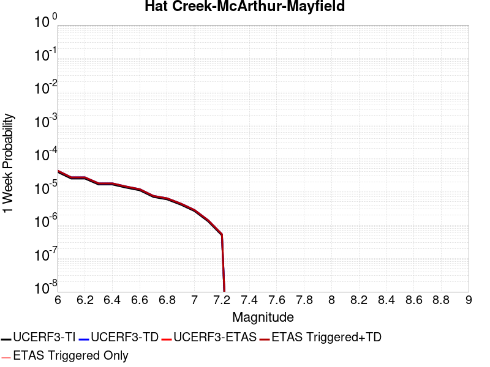 |  |  |  |

| Magnitude | 1 wk TI Prob | 1 wk TD Prob | 1 wk ETAS Prob | 1 wk ETAS/TD Gain | 1 wk ETAS Triggered+TD | 1 wk ETAS Triggered Only | 1 mo TI Prob | 1 mo TD Prob | 1 mo ETAS Prob | 1 mo ETAS/TD Gain | 1 mo ETAS Triggered+TD | 1 mo ETAS Triggered Only | 1 yr TI Prob | 1 yr TD Prob | 1 yr ETAS Prob | 1 yr ETAS/TD Gain | 1 yr ETAS Triggered+TD | 1 yr ETAS Triggered Only | 10 yr TI Prob | 10 yr TD Prob | 10 yr ETAS Prob | 10 yr ETAS/TD Gain | 10 yr ETAS Triggered+TD | 10 yr ETAS Triggered Only |
|-----|-----|-----|-----|-----|-----|-----|-----|-----|-----|-----|-----|-----|-----|-----|-----|-----|-----|-----|-----|-----|-----|-----|-----|-----|
| 6.0 | 3.967457E-5 | 4.3118598E-5 | 0.0 | 0.0 | 4.3118598E-5 | 0.0 | 1.7002279E-4 | 1.8478154E-4 | 2.0E-4 | 1.0823592 | 1.8478154E-4 | 0.0 | 0.002068062 | 0.0022475081 | 6.0E-4 | 0.26696235 | 0.0022475081 | 0.0 | 0.02048922 | 0.022260109 | 0.0119 | 0.5345886 | 0.022651205 | 4.0E-4 |
| 6.1 | 2.5044013E-5 | 2.7048232E-5 | 0.0 | 0.0 | 2.7048232E-5 | 0.0 | 1.0732707E-4 | 1.15916024E-4 | 1.0E-4 | 0.8626935 | 1.15916024E-4 | 0.0 | 0.0013059238 | 0.0014103957 | 3.0E-4 | 0.21270627 | 0.0014103957 | 0.0 | 0.01298276 | 0.014017856 | 0.0077 | 0.5492994 | 0.01431365 | 3.0E-4 |
| 6.2 | 2.5044013E-5 | 2.7048232E-5 | 0.0 | 0.0 | 2.7048232E-5 | 0.0 | 1.0732707E-4 | 1.15916024E-4 | 1.0E-4 | 0.8626935 | 1.15916024E-4 | 0.0 | 0.0013059238 | 0.0014103957 | 3.0E-4 | 0.21270627 | 0.0014103957 | 0.0 | 0.01298276 | 0.014017856 | 0.0077 | 0.5492994 | 0.01431365 | 3.0E-4 |
| 6.3 | 1.6624012E-5 | 1.7876819E-5 | 0.0 | 0.0 | 1.7876819E-5 | 0.0 | 7.124382E-5 | 7.6612734E-5 | 1.0E-4 | 1.305266 | 7.6612734E-5 | 0.0 | 8.670483E-4 | 9.3236944E-4 | 2.0E-4 | 0.21450724 | 9.3236944E-4 | 0.0 | 0.008636732 | 0.00928551 | 0.0048 | 0.5169345 | 0.009483652 | 2.0E-4 |
| 6.4 | 1.6624012E-5 | 1.7876819E-5 | 0.0 | 0.0 | 1.7876819E-5 | 0.0 | 7.124382E-5 | 7.6612734E-5 | 1.0E-4 | 1.305266 | 7.6612734E-5 | 0.0 | 8.670483E-4 | 9.3236944E-4 | 2.0E-4 | 0.21450724 | 9.3236944E-4 | 0.0 | 0.008636732 | 0.00928551 | 0.0048 | 0.5169345 | 0.009483652 | 2.0E-4 |
| 6.5 | 1.3394842E-5 | 1.4380942E-5 | 0.0 | 0.0 | 1.4380942E-5 | 0.0 | 5.7405203E-5 | 6.163119E-5 | 0.0 | 0.0 | 6.163119E-5 | 0.0 | 6.986842E-4 | 7.501069E-4 | 1.0E-4 | 0.13331433 | 7.501069E-4 | 0.0 | 0.006964916 | 0.007476342 | 0.0038 | 0.50826997 | 0.0075755944 | 1.0E-4 |
| 6.6 | 1.1137514E-5 | 1.1945386E-5 | 0.0 | 0.0 | 1.1945386E-5 | 0.0 | 4.7731326E-5 | 5.1193532E-5 | 0.0 | 0.0 | 5.1193532E-5 | 0.0 | 5.809739E-4 | 6.23107E-4 | 1.0E-4 | 0.16048607 | 6.23107E-4 | 0.0 | 0.005794574 | 0.00621402 | 0.0034 | 0.54714984 | 0.0063133985 | 1.0E-4 |
| 6.7 | 7.0200663E-6 | 7.518647E-6 | 0.0 | 0.0 | 7.518647E-6 | 0.0 | 3.008565E-5 | 3.2222386E-5 | 0.0 | 0.0 | 3.2222386E-5 | 0.0 | 3.6623122E-4 | 3.9223852E-4 | 0.0 | 0.0 | 3.9223852E-4 | 0.0 | 0.0036562826 | 0.003915624 | 0.002 | 0.5107742 | 0.003915624 | 0.0 |
| 6.8 | 5.940172E-6 | 6.360719E-6 | 0.0 | 0.0 | 6.360719E-6 | 0.0 | 2.545763E-5 | 2.7259946E-5 | 0.0 | 0.0 | 2.7259946E-5 | 0.0 | 3.0990256E-4 | 3.3184057E-4 | 0.0 | 0.0 | 3.3184057E-4 | 0.0 | 0.0030947074 | 0.003313579 | 0.0019 | 0.5733981 | 0.003313579 | 0.0 |
| 6.9 | 4.129831E-6 | 4.4202634E-6 | 0.0 | 0.0 | 4.4202634E-6 | 0.0 | 1.7699154E-5 | 1.8943852E-5 | 0.0 | 0.0 | 1.8943852E-5 | 0.0 | 2.154659E-4 | 2.3061779E-4 | 0.0 | 0.0 | 2.3061779E-4 | 0.0 | 0.002152571 | 0.002303863 | 0.001 | 0.43405363 | 0.002303863 | 0.0 |
| 7.0 | 2.6512955E-6 | 2.8353218E-6 | 0.0 | 0.0 | 2.8353218E-6 | 0.0 | 1.1362646E-5 | 1.2151324E-5 | 0.0 | 0.0 | 1.2151324E-5 | 0.0 | 1.3833142E-4 | 1.4793276E-4 | 0.0 | 0.0 | 1.4793276E-4 | 0.0 | 0.0013824535 | 0.0014783853 | 5.0E-4 | 0.33820683 | 0.0014783853 | 0.0 |
| 7.1 | 1.2992575E-6 | 1.3899078E-6 | 0.0 | 0.0 | 1.3899078E-6 | 0.0 | 5.568235E-6 | 5.956735E-6 | 0.0 | 0.0 | 5.956735E-6 | 0.0 | 6.779115E-5 | 7.2521056E-5 | 0.0 | 0.0 | 7.2521056E-5 | 0.0 | 6.7770475E-4 | 7.2499545E-4 | 4.0E-4 | 0.5517276 | 7.2499545E-4 | 0.0 |
| 7.2 | 4.968191E-7 | 5.323132E-7 | 0.0 | 0.0 | 5.323132E-7 | 0.0 | 2.1292228E-6 | 2.2813408E-6 | 0.0 | 0.0 | 2.2813408E-6 | 0.0 | 2.592298E-5 | 2.7775097E-5 | 0.0 | 0.0 | 2.7775097E-5 | 0.0 | 2.5919956E-4 | 2.777286E-4 | 1.0E-4 | 0.36006373 | 2.777286E-4 | 0.0 |

## San Jose
*[(top)](#table-of-contents)*

| 1 Week | 1 Month | 1 Year | 10 Year |
|-----|-----|-----|-----|
| 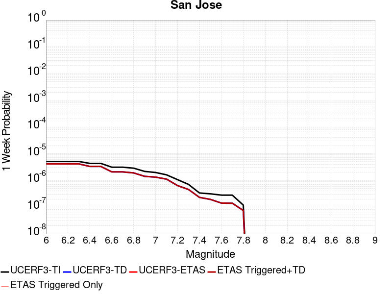 | 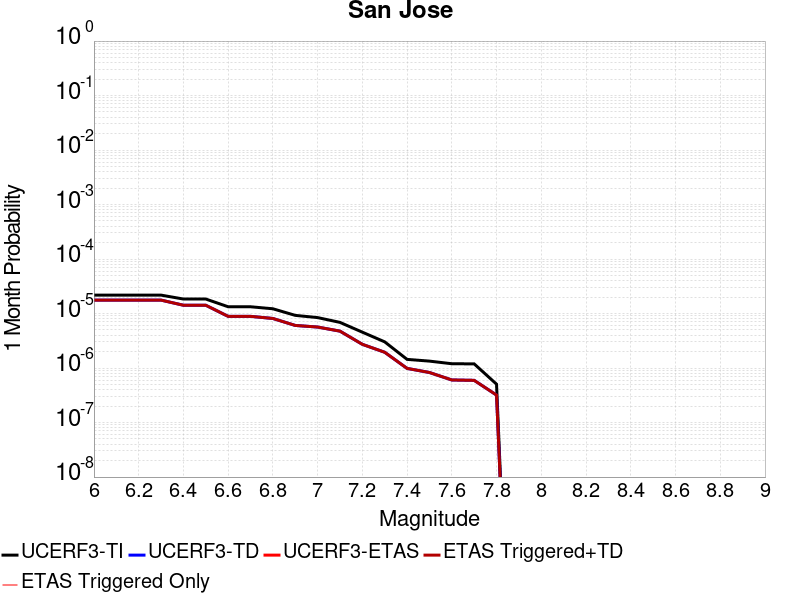 |  |  |

| Magnitude | 1 wk TI Prob | 1 wk TD Prob | 1 wk ETAS Prob | 1 wk ETAS/TD Gain | 1 wk ETAS Triggered+TD | 1 wk ETAS Triggered Only | 1 mo TI Prob | 1 mo TD Prob | 1 mo ETAS Prob | 1 mo ETAS/TD Gain | 1 mo ETAS Triggered+TD | 1 mo ETAS Triggered Only | 1 yr TI Prob | 1 yr TD Prob | 1 yr ETAS Prob | 1 yr ETAS/TD Gain | 1 yr ETAS Triggered+TD | 1 yr ETAS Triggered Only | 10 yr TI Prob | 10 yr TD Prob | 10 yr ETAS Prob | 10 yr ETAS/TD Gain | 10 yr ETAS Triggered+TD | 10 yr ETAS Triggered Only |
|-----|-----|-----|-----|-----|-----|-----|-----|-----|-----|-----|-----|-----|-----|-----|-----|-----|-----|-----|-----|-----|-----|-----|-----|-----|
| 6.0 | 5.0851277E-6 | 4.1185885E-6 | 0.0 | 0.0 | 4.1185885E-6 | 0.0 | 2.1793223E-5 | 1.7650988E-5 | 0.0 | 0.0 | 1.7650988E-5 | 0.0 | 2.653002E-4 | 2.1488222E-4 | 0.0 | 0.0 | 2.1488222E-4 | 0.0 | 0.0026498367 | 0.0021470315 | 0.0011 | 0.5123353 | 0.0025461726 | 4.0E-4 |
| 6.1 | 5.0851277E-6 | 4.1185885E-6 | 0.0 | 0.0 | 4.1185885E-6 | 0.0 | 2.1793223E-5 | 1.7650988E-5 | 0.0 | 0.0 | 1.7650988E-5 | 0.0 | 2.653002E-4 | 2.1488222E-4 | 0.0 | 0.0 | 2.1488222E-4 | 0.0 | 0.0026498367 | 0.0021470315 | 0.0011 | 0.5123353 | 0.0025461726 | 4.0E-4 |
| 6.2 | 5.0851277E-6 | 4.1185885E-6 | 0.0 | 0.0 | 4.1185885E-6 | 0.0 | 2.1793223E-5 | 1.7650988E-5 | 0.0 | 0.0 | 1.7650988E-5 | 0.0 | 2.653002E-4 | 2.1488222E-4 | 0.0 | 0.0 | 2.1488222E-4 | 0.0 | 0.0026498367 | 0.0021470315 | 0.0011 | 0.5123353 | 0.0025461726 | 4.0E-4 |
| 6.3 | 5.0851277E-6 | 4.1185885E-6 | 0.0 | 0.0 | 4.1185885E-6 | 0.0 | 2.1793223E-5 | 1.7650988E-5 | 0.0 | 0.0 | 1.7650988E-5 | 0.0 | 2.653002E-4 | 2.1488222E-4 | 0.0 | 0.0 | 2.1488222E-4 | 0.0 | 0.0026498367 | 0.0021470315 | 0.0011 | 0.5123353 | 0.0025461726 | 4.0E-4 |
| 6.4 | 4.3115124E-6 | 3.3170047E-6 | 0.0 | 0.0 | 3.3170047E-6 | 0.0 | 1.8477778E-5 | 1.421567E-5 | 0.0 | 0.0 | 1.421567E-5 | 0.0 | 2.2494372E-4 | 1.7306424E-4 | 0.0 | 0.0 | 1.7306424E-4 | 0.0 | 0.0022471617 | 0.0017295403 | 9.0E-4 | 0.52036947 | 0.0020290215 | 3.0E-4 |
| 6.5 | 4.3115124E-6 | 3.3170047E-6 | 0.0 | 0.0 | 3.3170047E-6 | 0.0 | 1.8477778E-5 | 1.421567E-5 | 0.0 | 0.0 | 1.421567E-5 | 0.0 | 2.2494372E-4 | 1.7306424E-4 | 0.0 | 0.0 | 1.7306424E-4 | 0.0 | 0.0022471617 | 0.0017295403 | 9.0E-4 | 0.52036947 | 0.0020290215 | 3.0E-4 |
| 6.6 | 3.110396E-6 | 2.0736695E-6 | 0.0 | 0.0 | 2.0736695E-6 | 0.0 | 1.33302E-5 | 8.887126E-6 | 0.0 | 0.0 | 8.887126E-6 | 0.0 | 1.622831E-4 | 1.08195665E-4 | 0.0 | 0.0 | 1.08195665E-4 | 0.0 | 0.0016216465 | 0.001081486 | 6.0E-4 | 0.55479217 | 0.0013811616 | 3.0E-4 |
| 6.7 | 3.110396E-6 | 2.0736695E-6 | 0.0 | 0.0 | 2.0736695E-6 | 0.0 | 1.33302E-5 | 8.887126E-6 | 0.0 | 0.0 | 8.887126E-6 | 0.0 | 1.622831E-4 | 1.08195665E-4 | 0.0 | 0.0 | 1.08195665E-4 | 0.0 | 0.0016216465 | 0.001081486 | 6.0E-4 | 0.55479217 | 0.0013811616 | 3.0E-4 |
| 6.8 | 2.856651E-6 | 1.8962563E-6 | 0.0 | 0.0 | 1.8962563E-6 | 0.0 | 1.2242733E-5 | 8.126789E-6 | 0.0 | 0.0 | 8.126789E-6 | 0.0 | 1.4904508E-4 | 9.893941E-5 | 0.0 | 0.0 | 9.893941E-5 | 0.0 | 0.0014894515 | 9.890067E-4 | 6.0E-4 | 0.60666925 | 0.00128871 | 3.0E-4 |
| 6.9 | 2.1618725E-6 | 1.4128503E-6 | 0.0 | 0.0 | 1.4128503E-6 | 0.0 | 9.265135E-6 | 6.055059E-6 | 0.0 | 0.0 | 6.055059E-6 | 0.0 | 1.12797185E-4 | 7.371794E-5 | 0.0 | 0.0 | 7.371794E-5 | 0.0 | 0.0011273995 | 7.3697226E-4 | 5.0E-4 | 0.6784516 | 0.0010367512 | 3.0E-4 |
| 7.0 | 1.9684312E-6 | 1.3199175E-6 | 0.0 | 0.0 | 1.3199175E-6 | 0.0 | 8.436106E-6 | 5.6567774E-6 | 0.0 | 0.0 | 5.6567774E-6 | 0.0 | 1.02704755E-4 | 6.886917E-5 | 0.0 | 0.0 | 6.886917E-5 | 0.0 | 0.001026573 | 6.8851514E-4 | 3.0E-4 | 0.43572026 | 8.883774E-4 | 2.0E-4 |
| 7.1 | 1.6070337E-6 | 1.1100453E-6 | 0.0 | 0.0 | 1.1100453E-6 | 0.0 | 6.887269E-6 | 4.7573285E-6 | 0.0 | 0.0 | 4.7573285E-6 | 0.0 | 8.384928E-5 | 5.7919E-5 | 0.0 | 0.0 | 5.7919E-5 | 0.0 | 8.3817646E-4 | 5.7907385E-4 | 2.0E-4 | 0.34537908 | 7.789581E-4 | 2.0E-4 |
| 7.2 | 1.0631658E-6 | 6.3608644E-7 | 0.0 | 0.0 | 6.3608644E-7 | 0.0 | 4.556417E-6 | 2.726082E-6 | 0.0 | 0.0 | 2.726082E-6 | 0.0 | 5.5472963E-5 | 3.3189557E-5 | 0.0 | 0.0 | 3.3189557E-5 | 0.0 | 5.545912E-4 | 3.3187607E-4 | 1.0E-4 | 0.3013173 | 4.3184287E-4 | 1.0E-4 |
| 7.3 | 7.060711E-7 | 4.548345E-7 | 0.0 | 0.0 | 4.548345E-7 | 0.0 | 3.0260155E-6 | 1.9492893E-6 | 0.0 | 0.0 | 1.9492893E-6 | 0.0 | 3.6841117E-5 | 2.3732347E-5 | 0.0 | 0.0 | 2.3732347E-5 | 0.0 | 3.6835007E-4 | 2.3732771E-4 | 1.0E-4 | 0.4213583 | 3.37304E-4 | 1.0E-4 |
| 7.4 | 3.3677085E-7 | 2.3000042E-7 | 0.0 | 0.0 | 2.3000042E-7 | 0.0 | 1.4433028E-6 | 9.857157E-7 | 0.0 | 0.0 | 9.857157E-7 | 0.0 | 1.757207E-5 | 1.2001025E-5 | 0.0 | 0.0 | 1.2001025E-5 | 0.0 | 1.7570681E-4 | 1.2003276E-4 | 1.0E-4 | 0.8331059 | 2.2002075E-4 | 1.0E-4 |
| 7.5 | 3.129161E-7 | 1.9333507E-7 | 0.0 | 0.0 | 1.9333507E-7 | 0.0 | 1.3410682E-6 | 8.285786E-7 | 0.0 | 0.0 | 8.285786E-7 | 0.0 | 1.6327383E-5 | 1.00879E-5 | 0.0 | 0.0 | 1.00879E-5 | 0.0 | 1.6326184E-4 | 1.0090336E-4 | 1.0E-4 | 0.9910473 | 2.0089326E-4 | 1.0E-4 |
| 7.6 | 2.8008668E-7 | 1.4096759E-7 | 0.0 | 0.0 | 1.4096759E-7 | 0.0 | 1.2003709E-6 | 6.0414663E-7 | 0.0 | 0.0 | 6.0414663E-7 | 0.0 | 1.46144175E-5 | 7.355462E-6 | 0.0 | 0.0 | 7.355462E-6 | 0.0 | 1.4613457E-4 | 7.3581126E-5 | 1.0E-4 | 1.3590442 | 1.7357376E-4 | 1.0E-4 |
| 7.7 | 2.7852005E-7 | 1.3874613E-7 | 0.0 | 0.0 | 1.3874613E-7 | 0.0 | 1.1936568E-6 | 5.9462616E-7 | 0.0 | 0.0 | 5.9462616E-7 | 0.0 | 1.4532674E-5 | 7.239551E-6 | 0.0 | 0.0 | 7.239551E-6 | 0.0 | 1.4531724E-4 | 7.242209E-5 | 1.0E-4 | 1.3807942 | 1.7241485E-4 | 1.0E-4 |
| 7.8 | 1.1810797E-7 | 7.4484625E-8 | 0.0 | 0.0 | 7.4484625E-8 | 0.0 | 5.0617695E-7 | 3.192198E-7 | 0.0 | 0.0 | 3.192198E-7 | 0.0 | 6.1626865E-6 | 3.8864946E-6 | 0.0 | 0.0 | 3.8864946E-6 | 0.0 | 6.162516E-5 | 3.8864488E-5 | 1.0E-4 | 2.573043 | 1.388606E-4 | 1.0E-4 |

## Butano 2011 CFM
*[(top)](#table-of-contents)*

| 1 Week | 1 Month | 1 Year | 10 Year |
|-----|-----|-----|-----|
|  | 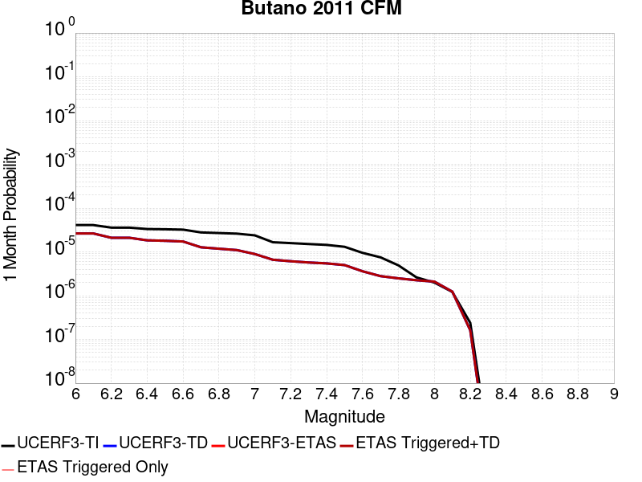 | 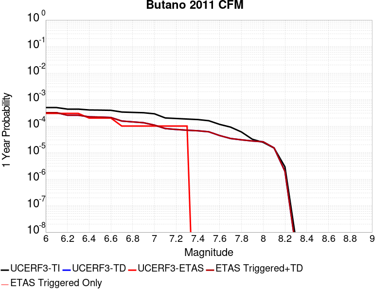 | 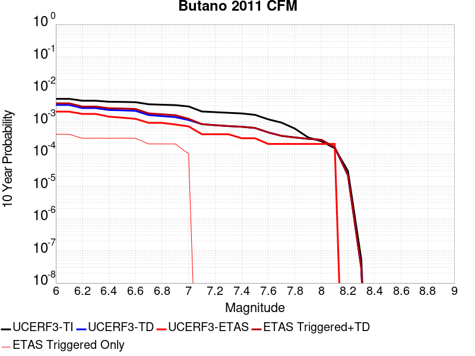 |

| Magnitude | 1 wk TI Prob | 1 wk TD Prob | 1 wk ETAS Prob | 1 wk ETAS/TD Gain | 1 wk ETAS Triggered+TD | 1 wk ETAS Triggered Only | 1 mo TI Prob | 1 mo TD Prob | 1 mo ETAS Prob | 1 mo ETAS/TD Gain | 1 mo ETAS Triggered+TD | 1 mo ETAS Triggered Only | 1 yr TI Prob | 1 yr TD Prob | 1 yr ETAS Prob | 1 yr ETAS/TD Gain | 1 yr ETAS Triggered+TD | 1 yr ETAS Triggered Only | 10 yr TI Prob | 10 yr TD Prob | 10 yr ETAS Prob | 10 yr ETAS/TD Gain | 10 yr ETAS Triggered+TD | 10 yr ETAS Triggered Only |
|-----|-----|-----|-----|-----|-----|-----|-----|-----|-----|-----|-----|-----|-----|-----|-----|-----|-----|-----|-----|-----|-----|-----|-----|-----|
| 6.0 | 9.561135E-6 | 6.1362093E-6 | 0.0 | 0.0 | 6.1362093E-6 | 0.0 | 4.097565E-5 | 2.6297786E-5 | 0.0 | 0.0 | 2.6297786E-5 | 0.0 | 4.9876433E-4 | 3.201307E-4 | 3.0E-4 | 0.9371172 | 3.201307E-4 | 0.0 | 0.004976464 | 0.0032140645 | 0.002 | 0.62226504 | 0.0036127788 | 4.0E-4 |
| 6.1 | 9.561135E-6 | 6.1362093E-6 | 0.0 | 0.0 | 6.1362093E-6 | 0.0 | 4.097565E-5 | 2.6297786E-5 | 0.0 | 0.0 | 2.6297786E-5 | 0.0 | 4.9876433E-4 | 3.201307E-4 | 3.0E-4 | 0.9371172 | 3.201307E-4 | 0.0 | 0.004976464 | 0.0032140645 | 0.002 | 0.62226504 | 0.0036127788 | 4.0E-4 |
| 6.2 | 8.364741E-6 | 4.8898437E-6 | 0.0 | 0.0 | 4.8898437E-6 | 0.0 | 3.5848396E-5 | 2.0956313E-5 | 0.0 | 0.0 | 2.0956313E-5 | 0.0 | 4.3636683E-4 | 2.551148E-4 | 3.0E-4 | 1.1759411 | 2.551148E-4 | 0.0 | 0.0043551093 | 0.0025655364 | 0.0017 | 0.6626294 | 0.0028647669 | 3.0E-4 |
| 6.3 | 8.364741E-6 | 4.8898437E-6 | 0.0 | 0.0 | 4.8898437E-6 | 0.0 | 3.5848396E-5 | 2.0956313E-5 | 0.0 | 0.0 | 2.0956313E-5 | 0.0 | 4.3636683E-4 | 2.551148E-4 | 3.0E-4 | 1.1759411 | 2.551148E-4 | 0.0 | 0.0043551093 | 0.0025655364 | 0.0017 | 0.6626294 | 0.0028647669 | 3.0E-4 |
| 6.4 | 7.768282E-6 | 4.26807E-6 | 0.0 | 0.0 | 4.26807E-6 | 0.0 | 3.329221E-5 | 1.8291608E-5 | 0.0 | 0.0 | 1.8291608E-5 | 0.0 | 4.0525728E-4 | 2.2267894E-4 | 2.0E-4 | 0.89815414 | 2.2267894E-4 | 0.0 | 0.0040451903 | 0.0022418597 | 0.0014 | 0.62448156 | 0.0025411872 | 3.0E-4 |
| 6.5 | 7.673437E-6 | 4.167695E-6 | 0.0 | 0.0 | 4.167695E-6 | 0.0 | 3.2885746E-5 | 1.7861435E-5 | 0.0 | 0.0 | 1.7861435E-5 | 0.0 | 4.0031038E-4 | 2.1744262E-4 | 2.0E-4 | 0.9197829 | 2.1744262E-4 | 0.0 | 0.0039959005 | 0.0021896 | 0.0013 | 0.5937158 | 0.002488943 | 3.0E-4 |
| 6.6 | 7.5244197E-6 | 4.012763E-6 | 0.0 | 0.0 | 4.012763E-6 | 0.0 | 3.2247113E-5 | 1.719745E-5 | 0.0 | 0.0 | 1.719745E-5 | 0.0 | 3.9253788E-4 | 2.0936017E-4 | 2.0E-4 | 0.95529157 | 2.0936017E-4 | 0.0 | 0.003918452 | 0.0021089306 | 0.0012 | 0.56900877 | 0.002408298 | 3.0E-4 |
| 6.7 | 6.4921405E-6 | 2.9537437E-6 | 0.0 | 0.0 | 2.9537437E-6 | 0.0 | 2.7823162E-5 | 1.265884E-5 | 0.0 | 0.0 | 1.265884E-5 | 0.0 | 3.3869434E-4 | 1.5411056E-4 | 1.0E-4 | 0.6488848 | 1.5411056E-4 | 0.0 | 0.003381786 | 0.0015572244 | 9.0E-4 | 0.5779514 | 0.001756913 | 2.0E-4 |
| 6.8 | 6.2890294E-6 | 2.740695E-6 | 0.0 | 0.0 | 2.740695E-6 | 0.0 | 2.6952705E-5 | 1.1745782E-5 | 0.0 | 0.0 | 1.1745782E-5 | 0.0 | 3.2809976E-4 | 1.4299559E-4 | 1.0E-4 | 0.6993223 | 1.4299559E-4 | 0.0 | 0.0032761577 | 0.0014462244 | 9.0E-4 | 0.6223101 | 0.0016459351 | 2.0E-4 |
| 6.9 | 6.0965517E-6 | 2.54747E-6 | 0.0 | 0.0 | 2.54747E-6 | 0.0 | 2.6127816E-5 | 1.0917683E-5 | 0.0 | 0.0 | 1.0917683E-5 | 0.0 | 3.1805973E-4 | 1.3291475E-4 | 1.0E-4 | 0.75236195 | 1.3291475E-4 | 0.0 | 0.0031760489 | 0.0013455414 | 8.0E-4 | 0.59455615 | 0.0015452724 | 2.0E-4 |
| 7.0 | 5.566252E-6 | 2.0657963E-6 | 0.0 | 0.0 | 2.0657963E-6 | 0.0 | 2.3855147E-5 | 8.8533825E-6 | 0.0 | 0.0 | 8.8533825E-6 | 0.0 | 2.9039773E-4 | 1.0778464E-4 | 1.0E-4 | 0.927776 | 1.0778464E-4 | 0.0 | 0.0029001853 | 0.0010945101 | 7.0E-4 | 0.6395556 | 0.0011944006 | 1.0E-4 |
| 7.1 | 3.878588E-6 | 1.5327756E-6 | 0.0 | 0.0 | 1.5327756E-6 | 0.0 | 1.6622414E-5 | 6.5690215E-6 | 0.0 | 0.0 | 6.5690215E-6 | 0.0 | 2.023591E-4 | 7.99749E-5 | 1.0E-4 | 1.2503922 | 7.99749E-5 | 0.0 | 0.0020217493 | 8.163018E-4 | 4.0E-4 | 0.49001485 | 8.163018E-4 | 0.0 |
| 7.2 | 3.7038085E-6 | 1.4150893E-6 | 0.0 | 0.0 | 1.4150893E-6 | 0.0 | 1.587337E-5 | 6.064654E-6 | 0.0 | 0.0 | 6.064654E-6 | 0.0 | 1.9324113E-4 | 7.3834664E-5 | 1.0E-4 | 1.3543774 | 7.3834664E-5 | 0.0 | 0.0019307317 | 7.5491285E-4 | 4.0E-4 | 0.5298625 | 7.5491285E-4 | 0.0 |
| 7.3 | 3.5277278E-6 | 1.3243301E-6 | 0.0 | 0.0 | 1.3243301E-6 | 0.0 | 1.5118746E-5 | 5.675688E-6 | 0.0 | 0.0 | 5.675688E-6 | 0.0 | 1.8405518E-4 | 6.909931E-5 | 1.0E-4 | 1.4471924 | 6.909931E-5 | 0.0 | 0.0018390282 | 7.075099E-4 | 4.0E-4 | 0.5653631 | 7.075099E-4 | 0.0 |
| 7.4 | 3.3711294E-6 | 1.2629802E-6 | 0.0 | 0.0 | 1.2629802E-6 | 0.0 | 1.4447617E-5 | 5.412761E-6 | 0.0 | 0.0 | 5.412761E-6 | 0.0 | 1.7588554E-4 | 6.589837E-5 | 0.0 | 0.0 | 6.589837E-5 | 0.0 | 0.0017574639 | 6.754714E-4 | 3.0E-4 | 0.4441343 | 6.754714E-4 | 0.0 |
| 7.5 | 3.0496426E-6 | 1.1556441E-6 | 0.0 | 0.0 | 1.1556441E-6 | 0.0 | 1.3069831E-5 | 4.952751E-6 | 0.0 | 0.0 | 4.952751E-6 | 0.0 | 1.5911358E-4 | 6.0298076E-5 | 0.0 | 0.0 | 6.0298076E-5 | 0.0 | 0.001589997 | 6.194358E-4 | 3.0E-4 | 0.48431167 | 6.194358E-4 | 0.0 |
| 7.6 | 2.2179781E-6 | 8.339079E-7 | 0.0 | 0.0 | 8.339079E-7 | 0.0 | 9.505586E-6 | 3.573886E-6 | 0.0 | 0.0 | 3.573886E-6 | 0.0 | 1.1572436E-4 | 4.3511194E-5 | 0.0 | 0.0 | 4.3511194E-5 | 0.0 | 0.0011566412 | 4.515447E-4 | 2.0E-4 | 0.44292402 | 4.515447E-4 | 0.0 |
| 7.7 | 1.7519328E-6 | 6.46127E-7 | 0.0 | 0.0 | 6.46127E-7 | 0.0 | 7.508262E-6 | 2.7691128E-6 | 0.0 | 0.0 | 2.7691128E-6 | 0.0 | 9.140925E-5 | 3.3713426E-5 | 0.0 | 0.0 | 3.3713426E-5 | 0.0 | 9.137166E-4 | 3.5289623E-4 | 2.0E-4 | 0.56673884 | 3.5289623E-4 | 0.0 |
| 7.8 | 1.1478974E-6 | 5.74737E-7 | 0.0 | 0.0 | 5.74737E-7 | 0.0 | 4.9195505E-6 | 2.4631563E-6 | 0.0 | 0.0 | 2.4631563E-6 | 0.0 | 5.9893882E-5 | 2.9988514E-5 | 0.0 | 0.0 | 2.9988514E-5 | 0.0 | 5.9877743E-4 | 3.153512E-4 | 2.0E-4 | 0.6342135 | 3.153512E-4 | 0.0 |
| 7.9 | 6.1154634E-7 | 5.212373E-7 | 0.0 | 0.0 | 5.212373E-7 | 0.0 | 2.6209104E-6 | 2.2338725E-6 | 0.0 | 0.0 | 2.2338725E-6 | 0.0 | 3.1909116E-5 | 2.7197057E-5 | 0.0 | 0.0 | 2.7197057E-5 | 0.0 | 3.1904536E-4 | 2.8628347E-4 | 2.0E-4 | 0.6986083 | 2.8628347E-4 | 0.0 |
| 8.0 | 4.6520046E-7 | 4.853142E-7 | 0.0 | 0.0 | 4.853142E-7 | 0.0 | 1.9937147E-6 | 2.0799166E-6 | 0.0 | 0.0 | 2.0799166E-6 | 0.0 | 2.4273206E-5 | 2.532269E-5 | 0.0 | 0.0 | 2.532269E-5 | 0.0 | 2.4270554E-4 | 2.6660808E-4 | 2.0E-4 | 0.75016475 | 2.6660808E-4 | 0.0 |
| 8.1 | 2.8425194E-7 | 2.8649276E-7 | 0.0 | 0.0 | 2.8649276E-7 | 0.0 | 1.218222E-6 | 1.2278256E-6 | 0.0 | 0.0 | 1.2278256E-6 | 0.0 | 1.4831752E-5 | 1.4948673E-5 | 0.0 | 0.0 | 1.4948673E-5 | 0.0 | 1.4830762E-4 | 1.5729504E-4 | 2.0E-4 | 1.2714959 | 1.5729504E-4 | 0.0 |
| 8.2 | 5.585778E-8 | 3.733322E-8 | 0.0 | 0.0 | 3.733322E-8 | 0.0 | 2.3939046E-7 | 1.5999952E-7 | 0.0 | 0.0 | 1.5999952E-7 | 0.0 | 2.914575E-6 | 1.9479924E-6 | 0.0 | 0.0 | 1.9479924E-6 | 0.0 | 2.9145367E-5 | 2.1251977E-5 | 0.0 | 0.0 | 2.1251977E-5 | 0.0 |
| 8.3 | 1.0371215E-10 | 4.8450688E-11 | 0.0 | 0.0 | 4.8450688E-11 | 0.0 | 4.4448079E-10 | 2.0764612E-10 | 0.0 | 0.0 | 2.0764612E-10 | 0.0 | 5.4115543E-9 | 2.528091E-9 | 0.0 | 0.0 | 2.528091E-9 | 0.0 | 5.4115542E-8 | 2.9267524E-8 | 0.0 | 0.0 | 2.9267524E-8 | 0.0 |

## Peralta Hills
*[(top)](#table-of-contents)*

| 1 Week | 1 Month | 1 Year | 10 Year |
|-----|-----|-----|-----|
|  |  |  | 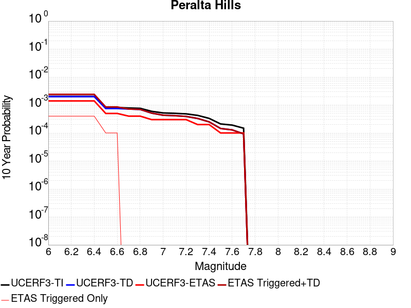 |

| Magnitude | 1 wk TI Prob | 1 wk TD Prob | 1 wk ETAS Prob | 1 wk ETAS/TD Gain | 1 wk ETAS Triggered+TD | 1 wk ETAS Triggered Only | 1 mo TI Prob | 1 mo TD Prob | 1 mo ETAS Prob | 1 mo ETAS/TD Gain | 1 mo ETAS Triggered+TD | 1 mo ETAS Triggered Only | 1 yr TI Prob | 1 yr TD Prob | 1 yr ETAS Prob | 1 yr ETAS/TD Gain | 1 yr ETAS Triggered+TD | 1 yr ETAS Triggered Only | 10 yr TI Prob | 10 yr TD Prob | 10 yr ETAS Prob | 10 yr ETAS/TD Gain | 10 yr ETAS Triggered+TD | 10 yr ETAS Triggered Only |
|-----|-----|-----|-----|-----|-----|-----|-----|-----|-----|-----|-----|-----|-----|-----|-----|-----|-----|-----|-----|-----|-----|-----|-----|-----|
| 6.0 | 3.8850067E-6 | 3.8344565E-6 | 0.0 | 0.0 | 3.8344565E-6 | 0.0 | 1.6649923E-5 | 1.6433323E-5 | 0.0 | 0.0 | 1.6433323E-5 | 0.0 | 2.0269395E-4 | 2.0006477E-4 | 0.0 | 0.0 | 2.0006477E-4 | 0.0 | 0.0020250916 | 0.0019995735 | 0.0014 | 0.7001493 | 0.0023987738 | 4.0E-4 |
| 6.1 | 3.8850067E-6 | 3.8344565E-6 | 0.0 | 0.0 | 3.8344565E-6 | 0.0 | 1.6649923E-5 | 1.6433323E-5 | 0.0 | 0.0 | 1.6433323E-5 | 0.0 | 2.0269395E-4 | 2.0006477E-4 | 0.0 | 0.0 | 2.0006477E-4 | 0.0 | 0.0020250916 | 0.0019995735 | 0.0014 | 0.7001493 | 0.0023987738 | 4.0E-4 |
| 6.2 | 3.8850067E-6 | 3.8344565E-6 | 0.0 | 0.0 | 3.8344565E-6 | 0.0 | 1.6649923E-5 | 1.6433323E-5 | 0.0 | 0.0 | 1.6433323E-5 | 0.0 | 2.0269395E-4 | 2.0006477E-4 | 0.0 | 0.0 | 2.0006477E-4 | 0.0 | 0.0020250916 | 0.0019995735 | 0.0014 | 0.7001493 | 0.0023987738 | 4.0E-4 |
| 6.3 | 3.8850067E-6 | 3.8344565E-6 | 0.0 | 0.0 | 3.8344565E-6 | 0.0 | 1.6649923E-5 | 1.6433323E-5 | 0.0 | 0.0 | 1.6433323E-5 | 0.0 | 2.0269395E-4 | 2.0006477E-4 | 0.0 | 0.0 | 2.0006477E-4 | 0.0 | 0.0020250916 | 0.0019995735 | 0.0014 | 0.7001493 | 0.0023987738 | 4.0E-4 |
| 6.4 | 3.8850067E-6 | 3.8344565E-6 | 0.0 | 0.0 | 3.8344565E-6 | 0.0 | 1.6649923E-5 | 1.6433323E-5 | 0.0 | 0.0 | 1.6433323E-5 | 0.0 | 2.0269395E-4 | 2.0006477E-4 | 0.0 | 0.0 | 2.0006477E-4 | 0.0 | 0.0020250916 | 0.0019995735 | 0.0014 | 0.7001493 | 0.0023987738 | 4.0E-4 |
| 6.5 | 1.5587785E-6 | 1.4387793E-6 | 0.0 | 0.0 | 1.4387793E-6 | 0.0 | 6.6804623E-6 | 6.166184E-6 | 0.0 | 0.0 | 6.166184E-6 | 0.0 | 8.133159E-5 | 7.5070944E-5 | 0.0 | 0.0 | 7.5070944E-5 | 0.0 | 8.1301836E-4 | 7.504797E-4 | 5.0E-4 | 0.6662405 | 8.504047E-4 | 1.0E-4 |
| 6.6 | 1.5587785E-6 | 1.4387793E-6 | 0.0 | 0.0 | 1.4387793E-6 | 0.0 | 6.6804623E-6 | 6.166184E-6 | 0.0 | 0.0 | 6.166184E-6 | 0.0 | 8.133159E-5 | 7.5070944E-5 | 0.0 | 0.0 | 7.5070944E-5 | 0.0 | 8.1301836E-4 | 7.504797E-4 | 5.0E-4 | 0.6662405 | 8.504047E-4 | 1.0E-4 |
| 6.7 | 1.5018579E-6 | 1.3794287E-6 | 0.0 | 0.0 | 1.3794287E-6 | 0.0 | 6.436518E-6 | 5.911825E-6 | 0.0 | 0.0 | 5.911825E-6 | 0.0 | 7.836179E-5 | 7.197433E-5 | 0.0 | 0.0 | 7.197433E-5 | 0.0 | 7.833416E-4 | 7.1953365E-4 | 4.0E-4 | 0.55591565 | 7.1953365E-4 | 0.0 |
| 6.8 | 1.4584314E-6 | 1.3338843E-6 | 0.0 | 0.0 | 1.3338843E-6 | 0.0 | 6.250405E-6 | 5.7166358E-6 | 0.0 | 0.0 | 5.7166358E-6 | 0.0 | 7.6096025E-5 | 6.9598056E-5 | 0.0 | 0.0 | 6.9598056E-5 | 0.0 | 7.6069974E-4 | 6.957858E-4 | 4.0E-4 | 0.57488954 | 6.957858E-4 | 0.0 |
| 6.9 | 1.1382393E-6 | 9.830711E-7 | 0.0 | 0.0 | 9.830711E-7 | 0.0 | 4.8781594E-6 | 4.2131555E-6 | 0.0 | 0.0 | 4.2131555E-6 | 0.0 | 5.9389975E-5 | 5.1294046E-5 | 0.0 | 0.0 | 5.1294046E-5 | 0.0 | 5.93741E-4 | 5.128302E-4 | 3.0E-4 | 0.5849889 | 5.128302E-4 | 0.0 |
| 7.0 | 9.970413E-7 | 8.2824795E-7 | 0.0 | 0.0 | 8.2824795E-7 | 0.0 | 4.273027E-6 | 3.5496298E-6 | 0.0 | 0.0 | 3.5496298E-6 | 0.0 | 5.2022864E-5 | 4.3215954E-5 | 0.0 | 0.0 | 4.3215954E-5 | 0.0 | 5.2010687E-4 | 4.3208225E-4 | 3.0E-4 | 0.6943123 | 4.3208225E-4 | 0.0 |
| 7.1 | 9.684443E-7 | 7.9685265E-7 | 0.0 | 0.0 | 7.9685265E-7 | 0.0 | 4.150469E-6 | 3.4150787E-6 | 0.0 | 0.0 | 3.4150787E-6 | 0.0 | 5.053079E-5 | 4.157786E-5 | 0.0 | 0.0 | 4.157786E-5 | 0.0 | 5.05193E-4 | 4.1570747E-4 | 3.0E-4 | 0.7216613 | 4.1570747E-4 | 0.0 |
| 7.2 | 9.240811E-7 | 7.4785555E-7 | 0.0 | 0.0 | 7.4785555E-7 | 0.0 | 3.960342E-6 | 3.2050916E-6 | 0.0 | 0.0 | 3.2050916E-6 | 0.0 | 4.8216094E-5 | 3.9021357E-5 | 0.0 | 0.0 | 3.9021357E-5 | 0.0 | 4.8205635E-4 | 3.9015157E-4 | 3.0E-4 | 0.7689319 | 3.9015157E-4 | 0.0 |
| 7.3 | 8.158643E-7 | 6.327957E-7 | 0.0 | 0.0 | 6.327957E-7 | 0.0 | 3.4965567E-6 | 2.711979E-6 | 0.0 | 0.0 | 2.711979E-6 | 0.0 | 4.2569747E-5 | 3.3017906E-5 | 0.0 | 0.0 | 3.3017906E-5 | 0.0 | 4.2561593E-4 | 3.3013613E-4 | 2.0E-4 | 0.6058107 | 3.3013613E-4 | 0.0 |
| 7.4 | 6.3822824E-7 | 4.7784977E-7 | 0.0 | 0.0 | 4.7784977E-7 | 0.0 | 2.7352612E-6 | 2.047926E-6 | 0.0 | 0.0 | 2.047926E-6 | 0.0 | 3.3301294E-5 | 2.4933268E-5 | 0.0 | 0.0 | 2.4933268E-5 | 0.0 | 3.3296304E-4 | 2.493098E-4 | 2.0E-4 | 0.80221474 | 2.493098E-4 | 0.0 |
| 7.5 | 4.0292628E-7 | 2.7737062E-7 | 0.0 | 0.0 | 2.7737062E-7 | 0.0 | 1.7268258E-6 | 1.1887308E-6 | 0.0 | 0.0 | 1.1887308E-6 | 0.0 | 2.1023901E-5 | 1.447273E-5 | 0.0 | 0.0 | 1.447273E-5 | 0.0 | 2.1021912E-4 | 1.4472065E-4 | 1.0E-4 | 0.6909864 | 1.4472065E-4 | 0.0 |
| 7.6 | 3.672993E-7 | 2.4755946E-7 | 0.0 | 0.0 | 2.4755946E-7 | 0.0 | 1.5741389E-6 | 1.0609688E-6 | 0.0 | 0.0 | 1.0609688E-6 | 0.0 | 1.9164972E-5 | 1.2917246E-5 | 0.0 | 0.0 | 1.2917246E-5 | 0.0 | 1.916332E-4 | 1.2916765E-4 | 1.0E-4 | 0.7741877 | 1.2916765E-4 | 0.0 |
| 7.7 | 2.8466823E-7 | 1.7796732E-7 | 0.0 | 0.0 | 1.7796732E-7 | 0.0 | 1.2200061E-6 | 7.6271704E-7 | 0.0 | 0.0 | 7.6271704E-7 | 0.0 | 1.4853474E-5 | 9.286066E-6 | 0.0 | 0.0 | 9.286066E-6 | 0.0 | 1.485248E-4 | 9.2859365E-5 | 1.0E-4 | 1.0768973 | 9.2859365E-5 | 0.0 |

## Antelope Valley 2011
*[(top)](#table-of-contents)*

| 1 Week | 1 Month | 1 Year | 10 Year |
|-----|-----|-----|-----|
|  | 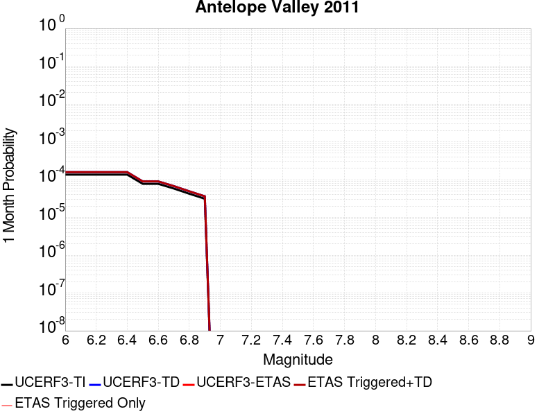 |  | 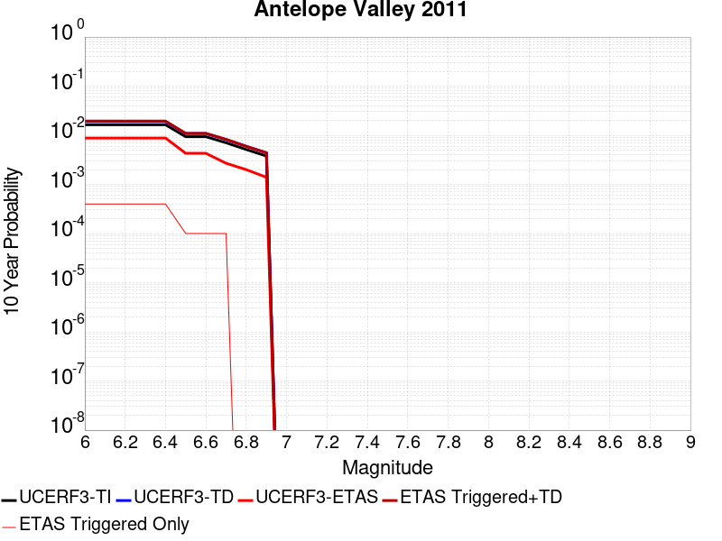 |

| Magnitude | 1 wk TI Prob | 1 wk TD Prob | 1 wk ETAS Prob | 1 wk ETAS/TD Gain | 1 wk ETAS Triggered+TD | 1 wk ETAS Triggered Only | 1 mo TI Prob | 1 mo TD Prob | 1 mo ETAS Prob | 1 mo ETAS/TD Gain | 1 mo ETAS Triggered+TD | 1 mo ETAS Triggered Only | 1 yr TI Prob | 1 yr TD Prob | 1 yr ETAS Prob | 1 yr ETAS/TD Gain | 1 yr ETAS Triggered+TD | 1 yr ETAS Triggered Only | 10 yr TI Prob | 10 yr TD Prob | 10 yr ETAS Prob | 10 yr ETAS/TD Gain | 10 yr ETAS Triggered+TD | 10 yr ETAS Triggered Only |
|-----|-----|-----|-----|-----|-----|-----|-----|-----|-----|-----|-----|-----|-----|-----|-----|-----|-----|-----|-----|-----|-----|-----|-----|-----|
| 6.0 | 3.1646934E-5 | 3.6840487E-5 | 0.0 | 0.0 | 3.6840487E-5 | 0.0 | 1.3562266E-4 | 1.5787974E-4 | 0.0 | 0.0 | 1.5787974E-4 | 0.0 | 0.0016499552 | 0.0019207548 | 7.0E-4 | 0.36444005 | 0.0019207548 | 0.0 | 0.016377583 | 0.019067852 | 0.0088 | 0.46150976 | 0.019460225 | 4.0E-4 |
| 6.1 | 3.1646934E-5 | 3.6840487E-5 | 0.0 | 0.0 | 3.6840487E-5 | 0.0 | 1.3562266E-4 | 1.5787974E-4 | 0.0 | 0.0 | 1.5787974E-4 | 0.0 | 0.0016499552 | 0.0019207548 | 7.0E-4 | 0.36444005 | 0.0019207548 | 0.0 | 0.016377583 | 0.019067852 | 0.0088 | 0.46150976 | 0.019460225 | 4.0E-4 |
| 6.2 | 3.1646934E-5 | 3.6840487E-5 | 0.0 | 0.0 | 3.6840487E-5 | 0.0 | 1.3562266E-4 | 1.5787974E-4 | 0.0 | 0.0 | 1.5787974E-4 | 0.0 | 0.0016499552 | 0.0019207548 | 7.0E-4 | 0.36444005 | 0.0019207548 | 0.0 | 0.016377583 | 0.019067852 | 0.0088 | 0.46150976 | 0.019460225 | 4.0E-4 |
| 6.3 | 3.1646934E-5 | 3.6840487E-5 | 0.0 | 0.0 | 3.6840487E-5 | 0.0 | 1.3562266E-4 | 1.5787974E-4 | 0.0 | 0.0 | 1.5787974E-4 | 0.0 | 0.0016499552 | 0.0019207548 | 7.0E-4 | 0.36444005 | 0.0019207548 | 0.0 | 0.016377583 | 0.019067852 | 0.0088 | 0.46150976 | 0.019460225 | 4.0E-4 |
| 6.4 | 3.1646934E-5 | 3.6840487E-5 | 0.0 | 0.0 | 3.6840487E-5 | 0.0 | 1.3562266E-4 | 1.5787974E-4 | 0.0 | 0.0 | 1.5787974E-4 | 0.0 | 0.0016499552 | 0.0019207548 | 7.0E-4 | 0.36444005 | 0.0019207548 | 0.0 | 0.016377583 | 0.019067852 | 0.0088 | 0.46150976 | 0.019460225 | 4.0E-4 |
| 6.5 | 1.8034107E-5 | 2.0905773E-5 | 0.0 | 0.0 | 2.0905773E-5 | 0.0 | 7.7286735E-5 | 8.959378E-5 | 0.0 | 0.0 | 8.959378E-5 | 0.0 | 9.405598E-4 | 0.0010903804 | 4.0E-4 | 0.36684445 | 0.0010903804 | 0.0 | 0.009365888 | 0.010862339 | 0.0043 | 0.39586315 | 0.010961253 | 1.0E-4 |
| 6.6 | 1.8034107E-5 | 2.0905773E-5 | 0.0 | 0.0 | 2.0905773E-5 | 0.0 | 7.7286735E-5 | 8.959378E-5 | 0.0 | 0.0 | 8.959378E-5 | 0.0 | 9.405598E-4 | 0.0010903804 | 4.0E-4 | 0.36684445 | 0.0010903804 | 0.0 | 0.009365888 | 0.010862339 | 0.0043 | 0.39586315 | 0.010961253 | 1.0E-4 |
| 6.7 | 1.3567667E-5 | 1.5723108E-5 | 0.0 | 0.0 | 1.5723108E-5 | 0.0 | 5.814585E-5 | 6.7383604E-5 | 0.0 | 0.0 | 6.7383604E-5 | 0.0 | 7.076958E-4 | 8.2019245E-4 | 3.0E-4 | 0.3657678 | 8.2019245E-4 | 0.0 | 0.007054463 | 0.008182052 | 0.0027 | 0.32999057 | 0.008281234 | 1.0E-4 |
| 6.8 | 9.867387E-6 | 1.1448545E-5 | 0.0 | 0.0 | 1.1448545E-5 | 0.0 | 4.2288117E-5 | 4.90648E-5 | 0.0 | 0.0 | 4.90648E-5 | 0.0 | 5.1473617E-4 | 5.972949E-4 | 2.0E-4 | 0.33484298 | 5.972949E-4 | 0.0 | 0.005135455 | 0.005966176 | 0.002 | 0.3352231 | 0.005966176 | 0.0 |
| 6.9 | 7.273233E-6 | 8.440546E-6 | 0.0 | 0.0 | 8.440546E-6 | 0.0 | 3.1170628E-5 | 3.6173766E-5 | 0.0 | 0.0 | 3.6173766E-5 | 0.0 | 3.794363E-4 | 4.404156E-4 | 2.0E-4 | 0.45411652 | 4.404156E-4 | 0.0 | 0.0037878908 | 0.004404156 | 0.0014 | 0.31788155 | 0.004404156 | 0.0 |

## Compton
*[(top)](#table-of-contents)*

| 1 Week | 1 Month | 1 Year | 10 Year |
|-----|-----|-----|-----|
|  |  |  | 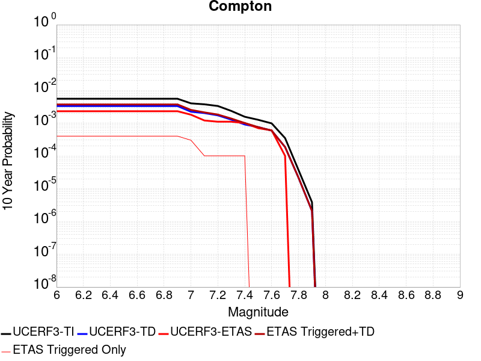 |

| Magnitude | 1 wk TI Prob | 1 wk TD Prob | 1 wk ETAS Prob | 1 wk ETAS/TD Gain | 1 wk ETAS Triggered+TD | 1 wk ETAS Triggered Only | 1 mo TI Prob | 1 mo TD Prob | 1 mo ETAS Prob | 1 mo ETAS/TD Gain | 1 mo ETAS Triggered+TD | 1 mo ETAS Triggered Only | 1 yr TI Prob | 1 yr TD Prob | 1 yr ETAS Prob | 1 yr ETAS/TD Gain | 1 yr ETAS Triggered+TD | 1 yr ETAS Triggered Only | 10 yr TI Prob | 10 yr TD Prob | 10 yr ETAS Prob | 10 yr ETAS/TD Gain | 10 yr ETAS Triggered+TD | 10 yr ETAS Triggered Only |
|-----|-----|-----|-----|-----|-----|-----|-----|-----|-----|-----|-----|-----|-----|-----|-----|-----|-----|-----|-----|-----|-----|-----|-----|-----|
| 6.0 | 1.06050875E-5 | 6.3433017E-6 | 0.0 | 0.0 | 6.3433017E-6 | 0.0 | 4.5449582E-5 | 2.7185311E-5 | 0.0 | 0.0 | 2.7185311E-5 | 0.0 | 5.5320817E-4 | 3.3093375E-4 | 1.0E-4 | 0.30217528 | 4.3090066E-4 | 1.0E-4 | 0.0055183303 | 0.0033046925 | 0.0023 | 0.69598 | 0.0037033707 | 4.0E-4 |
| 6.1 | 1.06050875E-5 | 6.3433017E-6 | 0.0 | 0.0 | 6.3433017E-6 | 0.0 | 4.5449582E-5 | 2.7185311E-5 | 0.0 | 0.0 | 2.7185311E-5 | 0.0 | 5.5320817E-4 | 3.3093375E-4 | 1.0E-4 | 0.30217528 | 4.3090066E-4 | 1.0E-4 | 0.0055183303 | 0.0033046925 | 0.0023 | 0.69598 | 0.0037033707 | 4.0E-4 |
| 6.2 | 1.06050875E-5 | 6.3433017E-6 | 0.0 | 0.0 | 6.3433017E-6 | 0.0 | 4.5449582E-5 | 2.7185311E-5 | 0.0 | 0.0 | 2.7185311E-5 | 0.0 | 5.5320817E-4 | 3.3093375E-4 | 1.0E-4 | 0.30217528 | 4.3090066E-4 | 1.0E-4 | 0.0055183303 | 0.0033046925 | 0.0023 | 0.69598 | 0.0037033707 | 4.0E-4 |
| 6.3 | 1.06050875E-5 | 6.3433017E-6 | 0.0 | 0.0 | 6.3433017E-6 | 0.0 | 4.5449582E-5 | 2.7185311E-5 | 0.0 | 0.0 | 2.7185311E-5 | 0.0 | 5.5320817E-4 | 3.3093375E-4 | 1.0E-4 | 0.30217528 | 4.3090066E-4 | 1.0E-4 | 0.0055183303 | 0.0033046925 | 0.0023 | 0.69598 | 0.0037033707 | 4.0E-4 |
| 6.4 | 1.06050875E-5 | 6.3433017E-6 | 0.0 | 0.0 | 6.3433017E-6 | 0.0 | 4.5449582E-5 | 2.7185311E-5 | 0.0 | 0.0 | 2.7185311E-5 | 0.0 | 5.5320817E-4 | 3.3093375E-4 | 1.0E-4 | 0.30217528 | 4.3090066E-4 | 1.0E-4 | 0.0055183303 | 0.0033046925 | 0.0023 | 0.69598 | 0.0037033707 | 4.0E-4 |
| 6.5 | 1.06050875E-5 | 6.3433017E-6 | 0.0 | 0.0 | 6.3433017E-6 | 0.0 | 4.5449582E-5 | 2.7185311E-5 | 0.0 | 0.0 | 2.7185311E-5 | 0.0 | 5.5320817E-4 | 3.3093375E-4 | 1.0E-4 | 0.30217528 | 4.3090066E-4 | 1.0E-4 | 0.0055183303 | 0.0033046925 | 0.0023 | 0.69598 | 0.0037033707 | 4.0E-4 |
| 6.6 | 1.06050875E-5 | 6.3433017E-6 | 0.0 | 0.0 | 6.3433017E-6 | 0.0 | 4.5449582E-5 | 2.7185311E-5 | 0.0 | 0.0 | 2.7185311E-5 | 0.0 | 5.5320817E-4 | 3.3093375E-4 | 1.0E-4 | 0.30217528 | 4.3090066E-4 | 1.0E-4 | 0.0055183303 | 0.0033046925 | 0.0023 | 0.69598 | 0.0037033707 | 4.0E-4 |
| 6.7 | 1.06050875E-5 | 6.3433017E-6 | 0.0 | 0.0 | 6.3433017E-6 | 0.0 | 4.5449582E-5 | 2.7185311E-5 | 0.0 | 0.0 | 2.7185311E-5 | 0.0 | 5.5320817E-4 | 3.3093375E-4 | 1.0E-4 | 0.30217528 | 4.3090066E-4 | 1.0E-4 | 0.0055183303 | 0.0033046925 | 0.0023 | 0.69598 | 0.0037033707 | 4.0E-4 |
| 6.8 | 1.06050875E-5 | 6.3433017E-6 | 0.0 | 0.0 | 6.3433017E-6 | 0.0 | 4.5449582E-5 | 2.7185311E-5 | 0.0 | 0.0 | 2.7185311E-5 | 0.0 | 5.5320817E-4 | 3.3093375E-4 | 1.0E-4 | 0.30217528 | 4.3090066E-4 | 1.0E-4 | 0.0055183303 | 0.0033046925 | 0.0023 | 0.69598 | 0.0037033707 | 4.0E-4 |
| 6.9 | 1.06050875E-5 | 6.3433017E-6 | 0.0 | 0.0 | 6.3433017E-6 | 0.0 | 4.5449582E-5 | 2.7185311E-5 | 0.0 | 0.0 | 2.7185311E-5 | 0.0 | 5.5320817E-4 | 3.3093375E-4 | 1.0E-4 | 0.30217528 | 4.3090066E-4 | 1.0E-4 | 0.0055183303 | 0.0033046925 | 0.0023 | 0.69598 | 0.0037033707 | 4.0E-4 |
| 7.0 | 7.672486E-6 | 4.2592465E-6 | 0.0 | 0.0 | 4.2592465E-6 | 0.0 | 3.288167E-5 | 1.825379E-5 | 0.0 | 0.0 | 1.825379E-5 | 0.0 | 4.0026082E-4 | 2.2221784E-4 | 1.0E-4 | 0.45000887 | 3.221956E-4 | 1.0E-4 | 0.0039954064 | 0.002220018 | 0.0018 | 0.8108042 | 0.0025193521 | 3.0E-4 |
| 7.1 | 7.163992E-6 | 3.8713692E-6 | 0.0 | 0.0 | 3.8713692E-6 | 0.0 | 3.0702464E-5 | 1.659148E-5 | 0.0 | 0.0 | 1.659148E-5 | 0.0 | 3.7373835E-4 | 2.0198312E-4 | 1.0E-4 | 0.4950909 | 3.0196292E-4 | 1.0E-4 | 0.0037311043 | 0.002018052 | 0.0012 | 0.59463286 | 0.0021178501 | 1.0E-4 |
| 7.2 | 6.3689185E-6 | 3.299305E-6 | 0.0 | 0.0 | 3.299305E-6 | 0.0 | 2.729508E-5 | 1.4139804E-5 | 0.0 | 0.0 | 1.4139804E-5 | 0.0 | 3.322669E-4 | 1.7213893E-4 | 1.0E-4 | 0.5809261 | 2.7212172E-4 | 1.0E-4 | 0.0033177056 | 0.0017200974 | 0.0011 | 0.6394987 | 0.0018199254 | 1.0E-4 |
| 7.3 | 4.4987873E-6 | 2.4412468E-6 | 0.0 | 0.0 | 2.4412468E-6 | 0.0 | 1.9280375E-5 | 1.0462446E-5 | 0.0 | 0.0 | 1.0462446E-5 | 0.0 | 2.3471327E-4 | 1.2737315E-4 | 1.0E-4 | 0.78509486 | 2.273604E-4 | 1.0E-4 | 0.002344655 | 0.0012730313 | 0.0011 | 0.86407924 | 0.001372904 | 1.0E-4 |
| 7.4 | 2.987296E-6 | 1.7346217E-6 | 0.0 | 0.0 | 1.7346217E-6 | 0.0 | 1.2802635E-5 | 7.4340724E-6 | 0.0 | 0.0 | 7.4340724E-6 | 0.0 | 1.5586092E-4 | 9.0506124E-5 | 1.0E-4 | 1.1048976 | 1.9049707E-4 | 1.0E-4 | 0.0015575165 | 9.0469845E-4 | 0.001 | 1.1053407 | 0.001004608 | 1.0E-4 |
| 7.5 | 2.4111696E-6 | 1.4430154E-6 | 0.0 | 0.0 | 1.4430154E-6 | 0.0 | 1.0333543E-5 | 6.184337E-6 | 0.0 | 0.0 | 6.184337E-6 | 0.0 | 1.2580362E-4 | 7.529175E-5 | 0.0 | 0.0 | 7.529175E-5 | 0.0 | 0.0012573242 | 7.526671E-4 | 7.0E-4 | 0.93002605 | 7.526671E-4 | 0.0 |
| 7.6 | 1.8783096E-6 | 1.1325025E-6 | 0.0 | 0.0 | 1.1325025E-6 | 0.0 | 8.049874E-6 | 4.853573E-6 | 0.0 | 0.0 | 4.853573E-6 | 0.0 | 9.8002805E-5 | 5.909069E-5 | 0.0 | 0.0 | 5.909069E-5 | 0.0 | 9.795959E-4 | 5.9075374E-4 | 6.0E-4 | 1.0156517 | 5.9075374E-4 | 0.0 |
| 7.7 | 6.6646817E-7 | 3.5557844E-7 | 0.0 | 0.0 | 3.5557844E-7 | 0.0 | 2.856289E-6 | 1.5239068E-6 | 0.0 | 0.0 | 1.5239068E-6 | 0.0 | 3.4774763E-5 | 1.855342E-5 | 0.0 | 0.0 | 1.855342E-5 | 0.0 | 3.4769322E-4 | 1.8552005E-4 | 1.0E-4 | 0.5390253 | 1.8552005E-4 | 0.0 |
| 7.8 | 7.054689E-8 | 4.1250875E-8 | 0.0 | 0.0 | 4.1250875E-8 | 0.0 | 3.0234378E-7 | 1.7678946E-7 | 0.0 | 0.0 | 1.7678946E-7 | 0.0 | 3.6810293E-6 | 2.1524095E-6 | 0.0 | 0.0 | 2.1524095E-6 | 0.0 | 3.6809684E-5 | 2.1523898E-5 | 0.0 | 0.0 | 2.1523898E-5 | 0.0 |
| 7.9 | 7.420925E-9 | 3.999901E-9 | 0.0 | 0.0 | 3.999901E-9 | 0.0 | 3.1803964E-8 | 1.7142431E-8 | 0.0 | 0.0 | 1.7142431E-8 | 0.0 | 3.872132E-7 | 2.0870908E-7 | 0.0 | 0.0 | 2.0870908E-7 | 0.0 | 3.872125E-6 | 2.0870891E-6 | 0.0 | 0.0 | 2.0870891E-6 | 0.0 |

## Polaris 2011 CFM
*[(top)](#table-of-contents)*

| 1 Week | 1 Month | 1 Year | 10 Year |
|-----|-----|-----|-----|
| 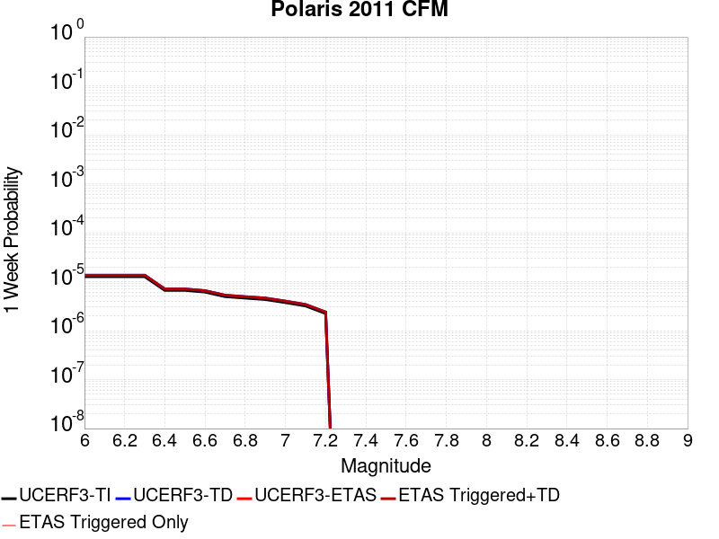 |  |  |  |

| Magnitude | 1 wk TI Prob | 1 wk TD Prob | 1 wk ETAS Prob | 1 wk ETAS/TD Gain | 1 wk ETAS Triggered+TD | 1 wk ETAS Triggered Only | 1 mo TI Prob | 1 mo TD Prob | 1 mo ETAS Prob | 1 mo ETAS/TD Gain | 1 mo ETAS Triggered+TD | 1 mo ETAS Triggered Only | 1 yr TI Prob | 1 yr TD Prob | 1 yr ETAS Prob | 1 yr ETAS/TD Gain | 1 yr ETAS Triggered+TD | 1 yr ETAS Triggered Only | 10 yr TI Prob | 10 yr TD Prob | 10 yr ETAS Prob | 10 yr ETAS/TD Gain | 10 yr ETAS Triggered+TD | 10 yr ETAS Triggered Only |
|-----|-----|-----|-----|-----|-----|-----|-----|-----|-----|-----|-----|-----|-----|-----|-----|-----|-----|-----|-----|-----|-----|-----|-----|-----|
| 6.0 | 1.2630823E-5 | 1.3572226E-5 | 0.0 | 0.0 | 1.3572226E-5 | 0.0 | 5.413098E-5 | 5.8165675E-5 | 0.0 | 0.0 | 5.8165675E-5 | 0.0 | 6.5884535E-4 | 7.079888E-4 | 3.0E-4 | 0.4237355 | 7.079888E-4 | 0.0 | 0.0065689543 | 0.007062433 | 0.0039 | 0.55221766 | 0.007459608 | 4.0E-4 |
| 6.1 | 1.2630823E-5 | 1.3572226E-5 | 0.0 | 0.0 | 1.3572226E-5 | 0.0 | 5.413098E-5 | 5.8165675E-5 | 0.0 | 0.0 | 5.8165675E-5 | 0.0 | 6.5884535E-4 | 7.079888E-4 | 3.0E-4 | 0.4237355 | 7.079888E-4 | 0.0 | 0.0065689543 | 0.007062433 | 0.0039 | 0.55221766 | 0.007459608 | 4.0E-4 |
| 6.2 | 1.2630823E-5 | 1.3572226E-5 | 0.0 | 0.0 | 1.3572226E-5 | 0.0 | 5.413098E-5 | 5.8165675E-5 | 0.0 | 0.0 | 5.8165675E-5 | 0.0 | 6.5884535E-4 | 7.079888E-4 | 3.0E-4 | 0.4237355 | 7.079888E-4 | 0.0 | 0.0065689543 | 0.007062433 | 0.0039 | 0.55221766 | 0.007459608 | 4.0E-4 |
| 6.3 | 1.2630823E-5 | 1.3572226E-5 | 0.0 | 0.0 | 1.3572226E-5 | 0.0 | 5.413098E-5 | 5.8165675E-5 | 0.0 | 0.0 | 5.8165675E-5 | 0.0 | 6.5884535E-4 | 7.079888E-4 | 3.0E-4 | 0.4237355 | 7.079888E-4 | 0.0 | 0.0065689543 | 0.007062433 | 0.0039 | 0.55221766 | 0.007459608 | 4.0E-4 |
| 6.4 | 6.642994E-6 | 7.1018785E-6 | 0.0 | 0.0 | 7.1018785E-6 | 0.0 | 2.8469662E-5 | 3.0436295E-5 | 0.0 | 0.0 | 3.0436295E-5 | 0.0 | 3.46563E-4 | 3.7050404E-4 | 1.0E-4 | 0.2699026 | 3.7050404E-4 | 0.0 | 0.0034602303 | 0.0036993735 | 0.0013 | 0.35141087 | 0.0037990033 | 1.0E-4 |
| 6.5 | 6.642994E-6 | 7.1018785E-6 | 0.0 | 0.0 | 7.1018785E-6 | 0.0 | 2.8469662E-5 | 3.0436295E-5 | 0.0 | 0.0 | 3.0436295E-5 | 0.0 | 3.46563E-4 | 3.7050404E-4 | 1.0E-4 | 0.2699026 | 3.7050404E-4 | 0.0 | 0.0034602303 | 0.0036993735 | 0.0013 | 0.35141087 | 0.0037990033 | 1.0E-4 |
| 6.6 | 6.1286296E-6 | 6.551398E-6 | 0.0 | 0.0 | 6.551398E-6 | 0.0 | 2.626529E-5 | 2.8077146E-5 | 0.0 | 0.0 | 2.8077146E-5 | 0.0 | 3.19733E-4 | 3.4179044E-4 | 1.0E-4 | 0.29257694 | 3.4179044E-4 | 0.0 | 0.0031927335 | 0.003413122 | 0.0011 | 0.32228556 | 0.0035127806 | 1.0E-4 |
| 6.7 | 4.9474666E-6 | 5.2943287E-6 | 0.0 | 0.0 | 5.2943287E-6 | 0.0 | 2.1203256E-5 | 2.26898E-5 | 0.0 | 0.0 | 2.26898E-5 | 0.0 | 2.5811905E-4 | 2.762161E-4 | 1.0E-4 | 0.36203536 | 2.762161E-4 | 0.0 | 0.0025781945 | 0.0027590075 | 5.0E-4 | 0.1812246 | 0.0027590075 | 0.0 |
| 6.8 | 4.616407E-6 | 4.9425757E-6 | 0.0 | 0.0 | 4.9425757E-6 | 0.0 | 1.978445E-5 | 2.1182312E-5 | 0.0 | 0.0 | 2.1182312E-5 | 0.0 | 2.4084905E-4 | 2.578668E-4 | 1.0E-4 | 0.38779712 | 2.578668E-4 | 0.0 | 0.0024058819 | 0.0025759398 | 5.0E-4 | 0.19410393 | 0.0025759398 | 0.0 |
| 6.9 | 4.320343E-6 | 4.6274126E-6 | 0.0 | 0.0 | 4.6274126E-6 | 0.0 | 1.8515624E-5 | 1.9831632E-5 | 0.0 | 0.0 | 1.9831632E-5 | 0.0 | 2.2540441E-4 | 2.4142597E-4 | 1.0E-4 | 0.41420564 | 2.4142597E-4 | 0.0 | 0.0022517592 | 0.0024118933 | 5.0E-4 | 0.20730603 | 0.0024118933 | 0.0 |
| 7.0 | 3.7382292E-6 | 4.006516E-6 | 0.0 | 0.0 | 4.006516E-6 | 0.0 | 1.6020884E-5 | 1.7170683E-5 | 0.0 | 0.0 | 1.7170683E-5 | 0.0 | 1.950368E-4 | 2.0903541E-4 | 0.0 | 0.0 | 2.0903541E-4 | 0.0 | 0.0019486571 | 0.002088623 | 3.0E-4 | 0.14363532 | 0.002088623 | 0.0 |
| 7.1 | 3.193576E-6 | 3.425077E-6 | 0.0 | 0.0 | 3.425077E-6 | 0.0 | 1.3686683E-5 | 1.4678832E-5 | 0.0 | 0.0 | 1.4678832E-5 | 0.0 | 1.6662262E-4 | 1.7870234E-4 | 0.0 | 0.0 | 1.7870234E-4 | 0.0 | 0.0016649774 | 0.0017858049 | 3.0E-4 | 0.16799147 | 0.0017858049 | 0.0 |
| 7.2 | 2.2356758E-6 | 2.4004994E-6 | 0.0 | 0.0 | 2.4004994E-6 | 0.0 | 9.581432E-6 | 1.0287825E-5 | 0.0 | 0.0 | 1.0287825E-5 | 0.0 | 1.1664769E-4 | 1.2524896E-4 | 0.0 | 0.0 | 1.2524896E-4 | 0.0 | 0.0011658648 | 0.0012519691 | 1.0E-4 | 0.07987417 | 0.0012519691 | 0.0 |

## Great Valley 06 (Midland) 2011 CFM alt1
*[(top)](#table-of-contents)*

| 1 Week | 1 Month | 1 Year | 10 Year |
|-----|-----|-----|-----|
|  | 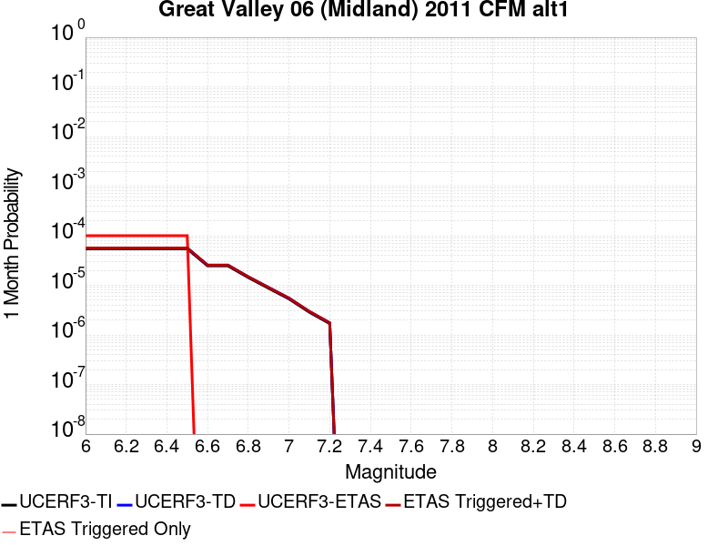 | 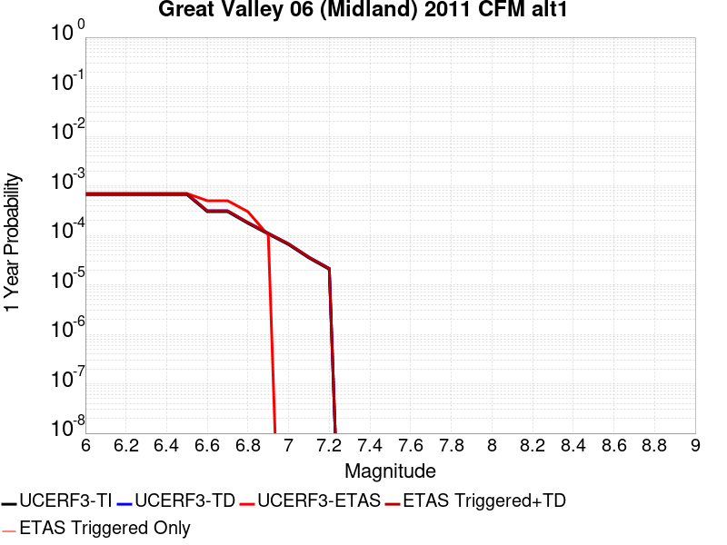 |  |

| Magnitude | 1 wk TI Prob | 1 wk TD Prob | 1 wk ETAS Prob | 1 wk ETAS/TD Gain | 1 wk ETAS Triggered+TD | 1 wk ETAS Triggered Only | 1 mo TI Prob | 1 mo TD Prob | 1 mo ETAS Prob | 1 mo ETAS/TD Gain | 1 mo ETAS Triggered+TD | 1 mo ETAS Triggered Only | 1 yr TI Prob | 1 yr TD Prob | 1 yr ETAS Prob | 1 yr ETAS/TD Gain | 1 yr ETAS Triggered+TD | 1 yr ETAS Triggered Only | 10 yr TI Prob | 10 yr TD Prob | 10 yr ETAS Prob | 10 yr ETAS/TD Gain | 10 yr ETAS Triggered+TD | 10 yr ETAS Triggered Only |
|-----|-----|-----|-----|-----|-----|-----|-----|-----|-----|-----|-----|-----|-----|-----|-----|-----|-----|-----|-----|-----|-----|-----|-----|-----|
| 6.0 | 1.2712525E-5 | 1.3205172E-5 | 1.0E-4 | 7.5727906 | 1.3205172E-5 | 0.0 | 5.4481112E-5 | 5.6592507E-5 | 1.0E-4 | 1.7670183 | 5.6592507E-5 | 0.0 | 6.6310563E-4 | 6.8882137E-4 | 7.0E-4 | 1.0162287 | 6.8882137E-4 | 0.0 | 0.0066113044 | 0.006869376 | 0.0048 | 0.6987534 | 0.0072666286 | 4.0E-4 |
| 6.1 | 1.2712525E-5 | 1.3205172E-5 | 1.0E-4 | 7.5727906 | 1.3205172E-5 | 0.0 | 5.4481112E-5 | 5.6592507E-5 | 1.0E-4 | 1.7670183 | 5.6592507E-5 | 0.0 | 6.6310563E-4 | 6.8882137E-4 | 7.0E-4 | 1.0162287 | 6.8882137E-4 | 0.0 | 0.0066113044 | 0.006869376 | 0.0048 | 0.6987534 | 0.0072666286 | 4.0E-4 |
| 6.2 | 1.2712525E-5 | 1.3205172E-5 | 1.0E-4 | 7.5727906 | 1.3205172E-5 | 0.0 | 5.4481112E-5 | 5.6592507E-5 | 1.0E-4 | 1.7670183 | 5.6592507E-5 | 0.0 | 6.6310563E-4 | 6.8882137E-4 | 7.0E-4 | 1.0162287 | 6.8882137E-4 | 0.0 | 0.0066113044 | 0.006869376 | 0.0048 | 0.6987534 | 0.0072666286 | 4.0E-4 |
| 6.3 | 1.2712525E-5 | 1.3205172E-5 | 1.0E-4 | 7.5727906 | 1.3205172E-5 | 0.0 | 5.4481112E-5 | 5.6592507E-5 | 1.0E-4 | 1.7670183 | 5.6592507E-5 | 0.0 | 6.6310563E-4 | 6.8882137E-4 | 7.0E-4 | 1.0162287 | 6.8882137E-4 | 0.0 | 0.0066113044 | 0.006869376 | 0.0048 | 0.6987534 | 0.0072666286 | 4.0E-4 |
| 6.4 | 1.2712525E-5 | 1.3205172E-5 | 1.0E-4 | 7.5727906 | 1.3205172E-5 | 0.0 | 5.4481112E-5 | 5.6592507E-5 | 1.0E-4 | 1.7670183 | 5.6592507E-5 | 0.0 | 6.6310563E-4 | 6.8882137E-4 | 7.0E-4 | 1.0162287 | 6.8882137E-4 | 0.0 | 0.0066113044 | 0.006869376 | 0.0048 | 0.6987534 | 0.0072666286 | 4.0E-4 |
| 6.5 | 1.2712525E-5 | 1.3205172E-5 | 1.0E-4 | 7.5727906 | 1.3205172E-5 | 0.0 | 5.4481112E-5 | 5.6592507E-5 | 1.0E-4 | 1.7670183 | 5.6592507E-5 | 0.0 | 6.6310563E-4 | 6.8882137E-4 | 7.0E-4 | 1.0162287 | 6.8882137E-4 | 0.0 | 0.0066113044 | 0.006869376 | 0.0048 | 0.6987534 | 0.0072666286 | 4.0E-4 |
| 6.6 | 5.7574384E-6 | 5.9683384E-6 | 0.0 | 0.0 | 5.9683384E-6 | 0.0 | 2.4674504E-5 | 2.5578363E-5 | 0.0 | 0.0 | 2.5578363E-5 | 0.0 | 3.0037065E-4 | 3.1137597E-4 | 5.0E-4 | 1.6057757 | 3.1137597E-4 | 0.0 | 0.0029996498 | 0.0031097834 | 0.0025 | 0.80391455 | 0.0034088504 | 3.0E-4 |
| 6.7 | 5.7574384E-6 | 5.9683384E-6 | 0.0 | 0.0 | 5.9683384E-6 | 0.0 | 2.4674504E-5 | 2.5578363E-5 | 0.0 | 0.0 | 2.5578363E-5 | 0.0 | 3.0037065E-4 | 3.1137597E-4 | 5.0E-4 | 1.6057757 | 3.1137597E-4 | 0.0 | 0.0029996498 | 0.0031097834 | 0.0025 | 0.80391455 | 0.0034088504 | 3.0E-4 |
| 6.8 | 3.3474828E-6 | 3.468066E-6 | 0.0 | 0.0 | 3.468066E-6 | 0.0 | 1.4346277E-5 | 1.4863063E-5 | 0.0 | 0.0 | 1.4863063E-5 | 0.0 | 1.7465191E-4 | 1.8094426E-4 | 3.0E-4 | 1.6579691 | 1.8094426E-4 | 0.0 | 0.0017451472 | 0.0018081163 | 0.0015 | 0.82959265 | 0.0020077548 | 2.0E-4 |
| 6.9 | 2.035106E-6 | 2.108236E-6 | 0.0 | 0.0 | 2.108236E-6 | 0.0 | 8.721853E-6 | 9.03527E-6 | 0.0 | 0.0 | 9.03527E-6 | 0.0 | 1.0618339E-4 | 1.09999586E-4 | 1.0E-4 | 0.90909433 | 1.09999586E-4 | 0.0 | 0.0010613267 | 0.0010995236 | 8.0E-4 | 0.7275878 | 0.0011994137 | 1.0E-4 |
| 7.0 | 1.2424716E-6 | 1.287385E-6 | 0.0 | 0.0 | 1.287385E-6 | 0.0 | 5.3248673E-6 | 5.517355E-6 | 0.0 | 0.0 | 5.517355E-6 | 0.0 | 6.482833E-5 | 6.717218E-5 | 0.0 | 0.0 | 6.717218E-5 | 0.0 | 6.480942E-4 | 6.7156303E-4 | 4.0E-4 | 0.5956254 | 7.7149586E-4 | 1.0E-4 |
| 7.1 | 6.6904556E-7 | 6.936344E-7 | 0.0 | 0.0 | 6.936344E-7 | 0.0 | 2.867335E-6 | 2.9727169E-6 | 0.0 | 0.0 | 2.9727169E-6 | 0.0 | 3.4909244E-5 | 3.6192487E-5 | 0.0 | 0.0 | 3.6192487E-5 | 0.0 | 3.490376E-4 | 3.618914E-4 | 2.0E-4 | 0.552652 | 3.618914E-4 | 0.0 |
| 7.2 | 3.948168E-7 | 4.0941075E-7 | 0.0 | 0.0 | 4.0941075E-7 | 0.0 | 1.6920709E-6 | 1.7546175E-6 | 0.0 | 0.0 | 1.7546175E-6 | 0.0 | 2.0600768E-5 | 2.1362468E-5 | 0.0 | 0.0 | 2.1362468E-5 | 0.0 | 2.0598859E-4 | 2.1362468E-4 | 2.0E-4 | 0.9362214 | 2.1362468E-4 | 0.0 |

## Earthquake Valley
*[(top)](#table-of-contents)*

| 1 Week | 1 Month | 1 Year | 10 Year |
|-----|-----|-----|-----|
|  |  |  |  |

| Magnitude | 1 wk TI Prob | 1 wk TD Prob | 1 wk ETAS Prob | 1 wk ETAS/TD Gain | 1 wk ETAS Triggered+TD | 1 wk ETAS Triggered Only | 1 mo TI Prob | 1 mo TD Prob | 1 mo ETAS Prob | 1 mo ETAS/TD Gain | 1 mo ETAS Triggered+TD | 1 mo ETAS Triggered Only | 1 yr TI Prob | 1 yr TD Prob | 1 yr ETAS Prob | 1 yr ETAS/TD Gain | 1 yr ETAS Triggered+TD | 1 yr ETAS Triggered Only | 10 yr TI Prob | 10 yr TD Prob | 10 yr ETAS Prob | 10 yr ETAS/TD Gain | 10 yr ETAS Triggered+TD | 10 yr ETAS Triggered Only |
|-----|-----|-----|-----|-----|-----|-----|-----|-----|-----|-----|-----|-----|-----|-----|-----|-----|-----|-----|-----|-----|-----|-----|-----|-----|
| 6.0 | 1.9416384E-5 | 2.2544515E-5 | 0.0 | 0.0 | 2.2544515E-5 | 0.0 | 8.321042E-5 | 9.6616444E-5 | 0.0 | 0.0 | 9.6616444E-5 | 0.0 | 0.001012616 | 0.0011757897 | 8.0E-4 | 0.68039376 | 0.0012756722 | 1.0E-4 | 0.010080142 | 0.011707484 | 0.0064 | 0.5466589 | 0.0121028 | 4.0E-4 |
| 6.1 | 1.9416384E-5 | 2.2544515E-5 | 0.0 | 0.0 | 2.2544515E-5 | 0.0 | 8.321042E-5 | 9.6616444E-5 | 0.0 | 0.0 | 9.6616444E-5 | 0.0 | 0.001012616 | 0.0011757897 | 8.0E-4 | 0.68039376 | 0.0012756722 | 1.0E-4 | 0.010080142 | 0.011707484 | 0.0064 | 0.5466589 | 0.0121028 | 4.0E-4 |
| 6.2 | 1.9416384E-5 | 2.2544515E-5 | 0.0 | 0.0 | 2.2544515E-5 | 0.0 | 8.321042E-5 | 9.6616444E-5 | 0.0 | 0.0 | 9.6616444E-5 | 0.0 | 0.001012616 | 0.0011757897 | 8.0E-4 | 0.68039376 | 0.0012756722 | 1.0E-4 | 0.010080142 | 0.011707484 | 0.0064 | 0.5466589 | 0.0121028 | 4.0E-4 |
| 6.3 | 1.9416384E-5 | 2.2544515E-5 | 0.0 | 0.0 | 2.2544515E-5 | 0.0 | 8.321042E-5 | 9.6616444E-5 | 0.0 | 0.0 | 9.6616444E-5 | 0.0 | 0.001012616 | 0.0011757897 | 8.0E-4 | 0.68039376 | 0.0012756722 | 1.0E-4 | 0.010080142 | 0.011707484 | 0.0064 | 0.5466589 | 0.0121028 | 4.0E-4 |
| 6.4 | 1.9416384E-5 | 2.2544515E-5 | 0.0 | 0.0 | 2.2544515E-5 | 0.0 | 8.321042E-5 | 9.6616444E-5 | 0.0 | 0.0 | 9.6616444E-5 | 0.0 | 0.001012616 | 0.0011757897 | 8.0E-4 | 0.68039376 | 0.0012756722 | 1.0E-4 | 0.010080142 | 0.011707484 | 0.0064 | 0.5466589 | 0.0121028 | 4.0E-4 |
| 6.5 | 1.9389157E-5 | 2.2513153E-5 | 0.0 | 0.0 | 2.2513153E-5 | 0.0 | 8.309374E-5 | 9.648205E-5 | 0.0 | 0.0 | 9.648205E-5 | 0.0 | 0.0010111968 | 0.0011741553 | 8.0E-4 | 0.6813409 | 0.0012740379 | 1.0E-4 | 0.010066078 | 0.011691311 | 0.0064 | 0.5474151 | 0.0120866345 | 4.0E-4 |
| 6.6 | 1.9389157E-5 | 2.2513153E-5 | 0.0 | 0.0 | 2.2513153E-5 | 0.0 | 8.309374E-5 | 9.648205E-5 | 0.0 | 0.0 | 9.648205E-5 | 0.0 | 0.0010111968 | 0.0011741553 | 8.0E-4 | 0.6813409 | 0.0012740379 | 1.0E-4 | 0.010066078 | 0.011691311 | 0.0064 | 0.5474151 | 0.0120866345 | 4.0E-4 |
| 6.7 | 1.4925434E-5 | 1.717964E-5 | 0.0 | 0.0 | 1.717964E-5 | 0.0 | 6.396457E-5 | 7.362543E-5 | 0.0 | 0.0 | 7.362543E-5 | 0.0 | 7.7849044E-4 | 8.961057E-4 | 5.0E-4 | 0.55796987 | 9.960161E-4 | 1.0E-4 | 0.007757689 | 0.008933271 | 0.0051 | 0.5708995 | 0.009329698 | 4.0E-4 |
| 6.8 | 1.3570335E-5 | 1.559115E-5 | 0.0 | 0.0 | 1.559115E-5 | 0.0 | 5.8157282E-5 | 6.681796E-5 | 0.0 | 0.0 | 6.681796E-5 | 0.0 | 7.0783484E-4 | 8.1328687E-4 | 4.0E-4 | 0.4918314 | 9.132055E-4 | 1.0E-4 | 0.0070558446 | 0.008111149 | 0.005 | 0.61643547 | 0.008507905 | 4.0E-4 |
| 6.9 | 1.3570335E-5 | 1.559115E-5 | 0.0 | 0.0 | 1.559115E-5 | 0.0 | 5.8157282E-5 | 6.681796E-5 | 0.0 | 0.0 | 6.681796E-5 | 0.0 | 7.0783484E-4 | 8.1328687E-4 | 4.0E-4 | 0.4918314 | 9.132055E-4 | 1.0E-4 | 0.0070558446 | 0.008111149 | 0.005 | 0.61643547 | 0.008507905 | 4.0E-4 |
| 7.0 | 1.3433392E-5 | 1.5434925E-5 | 0.0 | 0.0 | 1.5434925E-5 | 0.0 | 5.757041E-5 | 6.614846E-5 | 0.0 | 0.0 | 6.614846E-5 | 0.0 | 7.0069433E-4 | 8.0514175E-4 | 4.0E-4 | 0.49680692 | 9.0506126E-4 | 1.0E-4 | 0.006984891 | 0.008030289 | 0.0049 | 0.6101898 | 0.008427076 | 4.0E-4 |
| 7.1 | 8.181609E-6 | 9.400889E-6 | 0.0 | 0.0 | 9.400889E-6 | 0.0 | 3.5063567E-5 | 4.028928E-5 | 0.0 | 0.0 | 4.028928E-5 | 0.0 | 4.268153E-4 | 4.904784E-4 | 2.0E-4 | 0.40776512 | 5.904294E-4 | 1.0E-4 | 0.0042599645 | 0.0049005137 | 0.0025 | 0.5101506 | 0.0051990435 | 3.0E-4 |
| 7.2 | 2.0663983E-7 | 1.7200274E-7 | 0.0 | 0.0 | 1.7200274E-7 | 0.0 | 8.855989E-7 | 7.371544E-7 | 0.0 | 0.0 | 7.371544E-7 | 0.0 | 1.0782113E-5 | 8.974822E-6 | 0.0 | 0.0 | 8.974822E-6 | 0.0 | 1.07815904E-4 | 8.974495E-5 | 0.0 | 0.0 | 8.974495E-5 | 0.0 |
| 7.3 | 2.0462376E-7 | 1.701601E-7 | 0.0 | 0.0 | 1.701601E-7 | 0.0 | 8.7695867E-7 | 7.292574E-7 | 0.0 | 0.0 | 7.292574E-7 | 0.0 | 1.0676919E-5 | 8.878676E-6 | 0.0 | 0.0 | 8.878676E-6 | 0.0 | 1.0676406E-4 | 8.878357E-5 | 0.0 | 0.0 | 8.878357E-5 | 0.0 |
| 7.4 | 2.0171088E-7 | 1.6799007E-7 | 0.0 | 0.0 | 1.6799007E-7 | 0.0 | 8.644749E-7 | 7.199572E-7 | 0.0 | 0.0 | 7.199572E-7 | 0.0 | 1.0524931E-5 | 8.765447E-6 | 0.0 | 0.0 | 8.765447E-6 | 0.0 | 1.05244326E-4 | 8.765137E-5 | 0.0 | 0.0 | 8.765137E-5 | 0.0 |
| 7.5 | 1.4847944E-7 | 1.2507505E-7 | 0.0 | 0.0 | 1.2507505E-7 | 0.0 | 6.363403E-7 | 5.360358E-7 | 0.0 | 0.0 | 5.360358E-7 | 0.0 | 7.747416E-6 | 6.526219E-6 | 0.0 | 0.0 | 6.526219E-6 | 0.0 | 7.747146E-5 | 6.526049E-5 | 0.0 | 0.0 | 6.526049E-5 | 0.0 |
| 7.6 | 1.3185847E-7 | 1.10822064E-7 | 0.0 | 0.0 | 1.10822064E-7 | 0.0 | 5.6510765E-7 | 4.7495163E-7 | 0.0 | 0.0 | 4.7495163E-7 | 0.0 | 6.8801637E-6 | 5.7825227E-6 | 0.0 | 0.0 | 5.7825227E-6 | 0.0 | 6.8799505E-5 | 5.7823934E-5 | 0.0 | 0.0 | 5.7823934E-5 | 0.0 |
| 7.7 | 2.8609954E-8 | 1.4104295E-8 | 0.0 | 0.0 | 1.4104295E-8 | 0.0 | 1.2261408E-7 | 6.044697E-8 | 0.0 | 0.0 | 6.044697E-8 | 0.0 | 1.4928254E-6 | 7.3594174E-7 | 0.0 | 0.0 | 7.3594174E-7 | 0.0 | 1.4928154E-5 | 7.3593983E-6 | 0.0 | 0.0 | 7.3593983E-6 | 0.0 |
| 7.8 | 6.527266E-9 | 2.906815E-9 | 0.0 | 0.0 | 2.906815E-9 | 0.0 | 2.7973995E-8 | 1.2457779E-8 | 0.0 | 0.0 | 1.2457779E-8 | 0.0 | 3.4058334E-7 | 1.5167345E-7 | 0.0 | 0.0 | 1.5167345E-7 | 0.0 | 3.4058282E-6 | 1.5167336E-6 | 0.0 | 0.0 | 1.5167336E-6 | 0.0 |
| 7.9 | 1.2898267E-9 | 7.108556E-10 | 0.0 | 0.0 | 7.108556E-10 | 0.0 | 5.527829E-9 | 3.046524E-9 | 0.0 | 0.0 | 3.046524E-9 | 0.0 | 6.7301315E-8 | 3.709143E-8 | 0.0 | 0.0 | 3.709143E-8 | 0.0 | 6.7301295E-7 | 3.7091428E-7 | 0.0 | 0.0 | 3.7091428E-7 | 0.0 |

## Shoreline
*[(top)](#table-of-contents)*

| 1 Week | 1 Month | 1 Year | 10 Year |
|-----|-----|-----|-----|
| 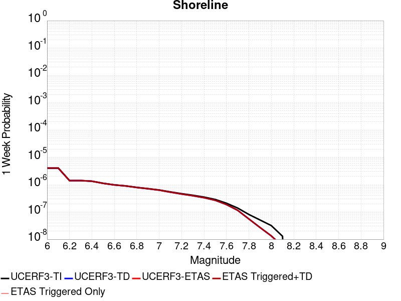 |  | 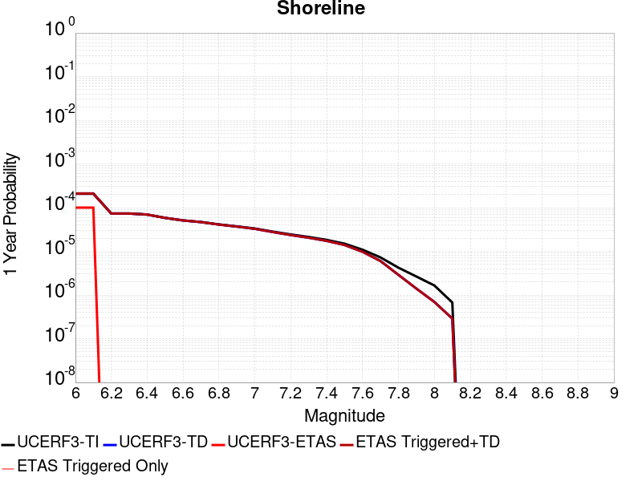 |  |

| Magnitude | 1 wk TI Prob | 1 wk TD Prob | 1 wk ETAS Prob | 1 wk ETAS/TD Gain | 1 wk ETAS Triggered+TD | 1 wk ETAS Triggered Only | 1 mo TI Prob | 1 mo TD Prob | 1 mo ETAS Prob | 1 mo ETAS/TD Gain | 1 mo ETAS Triggered+TD | 1 mo ETAS Triggered Only | 1 yr TI Prob | 1 yr TD Prob | 1 yr ETAS Prob | 1 yr ETAS/TD Gain | 1 yr ETAS Triggered+TD | 1 yr ETAS Triggered Only | 10 yr TI Prob | 10 yr TD Prob | 10 yr ETAS Prob | 10 yr ETAS/TD Gain | 10 yr ETAS Triggered+TD | 10 yr ETAS Triggered Only |
|-----|-----|-----|-----|-----|-----|-----|-----|-----|-----|-----|-----|-----|-----|-----|-----|-----|-----|-----|-----|-----|-----|-----|-----|-----|
| 6.0 | 3.9888673E-6 | 4.046603E-6 | 0.0 | 0.0 | 4.046603E-6 | 0.0 | 1.7095033E-5 | 1.73425E-5 | 1.0E-4 | 5.7661815 | 1.73425E-5 | 0.0 | 2.0811215E-4 | 2.1113007E-4 | 1.0E-4 | 0.4736417 | 2.1113007E-4 | 0.0 | 0.0020791737 | 0.0021098433 | 0.0021 | 0.99533457 | 0.0025089993 | 4.0E-4 |
| 6.1 | 3.9888673E-6 | 4.046603E-6 | 0.0 | 0.0 | 4.046603E-6 | 0.0 | 1.7095033E-5 | 1.73425E-5 | 1.0E-4 | 5.7661815 | 1.73425E-5 | 0.0 | 2.0811215E-4 | 2.1113007E-4 | 1.0E-4 | 0.4736417 | 2.1113007E-4 | 0.0 | 0.0020791737 | 0.0021098433 | 0.0021 | 0.99533457 | 0.0025089993 | 4.0E-4 |
| 6.2 | 1.4039653E-6 | 1.4093272E-6 | 0.0 | 0.0 | 1.4093272E-6 | 0.0 | 6.0169805E-6 | 6.0399598E-6 | 0.0 | 0.0 | 6.0399598E-6 | 0.0 | 7.325427E-5 | 7.3534095E-5 | 0.0 | 0.0 | 7.3534095E-5 | 0.0 | 7.3230127E-4 | 7.351036E-4 | 3.0E-4 | 0.40810573 | 9.349566E-4 | 2.0E-4 |
| 6.3 | 1.4039653E-6 | 1.4093272E-6 | 0.0 | 0.0 | 1.4093272E-6 | 0.0 | 6.0169805E-6 | 6.0399598E-6 | 0.0 | 0.0 | 6.0399598E-6 | 0.0 | 7.325427E-5 | 7.3534095E-5 | 0.0 | 0.0 | 7.3534095E-5 | 0.0 | 7.3230127E-4 | 7.351036E-4 | 3.0E-4 | 0.40810573 | 9.349566E-4 | 2.0E-4 |
| 6.4 | 1.3314152E-6 | 1.3354132E-6 | 0.0 | 0.0 | 1.3354132E-6 | 0.0 | 5.7060524E-6 | 5.7231873E-6 | 0.0 | 0.0 | 5.7231873E-6 | 0.0 | 6.946897E-5 | 6.967763E-5 | 0.0 | 0.0 | 6.967763E-5 | 0.0 | 6.9447263E-4 | 6.965632E-4 | 3.0E-4 | 0.43068594 | 8.9642394E-4 | 2.0E-4 |
| 6.5 | 1.1187026E-6 | 1.1196494E-6 | 0.0 | 0.0 | 1.1196494E-6 | 0.0 | 4.794431E-6 | 4.7984886E-6 | 0.0 | 0.0 | 4.7984886E-6 | 0.0 | 5.8370628E-5 | 5.842006E-5 | 0.0 | 0.0 | 5.842006E-5 | 0.0 | 5.83553E-4 | 5.8404956E-4 | 2.0E-4 | 0.3424367 | 7.8393274E-4 | 2.0E-4 |
| 6.6 | 9.793089E-7 | 9.778038E-7 | 0.0 | 0.0 | 9.778038E-7 | 0.0 | 4.1970316E-6 | 4.190581E-6 | 0.0 | 0.0 | 4.190581E-6 | 0.0 | 5.1097657E-5 | 5.1019142E-5 | 0.0 | 0.0 | 5.1019142E-5 | 0.0 | 5.108591E-4 | 5.1007554E-4 | 2.0E-4 | 0.39209878 | 7.0997357E-4 | 2.0E-4 |
| 6.7 | 8.995986E-7 | 8.9660784E-7 | 0.0 | 0.0 | 8.9660784E-7 | 0.0 | 3.8554167E-6 | 3.842599E-6 | 0.0 | 0.0 | 3.842599E-6 | 0.0 | 4.693869E-5 | 4.678265E-5 | 0.0 | 0.0 | 4.678265E-5 | 0.0 | 4.6928777E-4 | 4.67729E-4 | 2.0E-4 | 0.42759806 | 6.6763547E-4 | 2.0E-4 |
| 6.8 | 7.931612E-7 | 7.873981E-7 | 0.0 | 0.0 | 7.873981E-7 | 0.0 | 3.3992578E-6 | 3.3745591E-6 | 0.0 | 0.0 | 3.3745591E-6 | 0.0 | 4.1385178E-5 | 4.1084488E-5 | 0.0 | 0.0 | 4.1084488E-5 | 0.0 | 4.1377472E-4 | 4.1076945E-4 | 1.0E-4 | 0.24344556 | 5.107284E-4 | 1.0E-4 |
| 6.9 | 7.1465956E-7 | 7.0717704E-7 | 0.0 | 0.0 | 7.0717704E-7 | 0.0 | 3.062823E-6 | 3.0307551E-6 | 0.0 | 0.0 | 3.0307551E-6 | 0.0 | 3.7289232E-5 | 3.6898822E-5 | 0.0 | 0.0 | 3.6898822E-5 | 0.0 | 3.7282976E-4 | 3.6892734E-4 | 0.0 | 0.0 | 3.6892734E-4 | 0.0 |
| 7.0 | 6.389046E-7 | 6.293448E-7 | 0.0 | 0.0 | 6.293448E-7 | 0.0 | 2.7381598E-6 | 2.6971893E-6 | 0.0 | 0.0 | 2.6971893E-6 | 0.0 | 3.3336586E-5 | 3.2837786E-5 | 0.0 | 0.0 | 3.2837786E-5 | 0.0 | 3.3331584E-4 | 3.283296E-4 | 0.0 | 0.0 | 3.283296E-4 | 0.0 |
| 7.1 | 5.4300875E-7 | 5.3054384E-7 | 0.0 | 0.0 | 5.3054384E-7 | 0.0 | 2.3271782E-6 | 2.2737572E-6 | 0.0 | 0.0 | 2.2737572E-6 | 0.0 | 2.8333026E-5 | 2.7682643E-5 | 0.0 | 0.0 | 2.7682643E-5 | 0.0 | 2.8329415E-4 | 2.7679207E-4 | 0.0 | 0.0 | 2.7679207E-4 | 0.0 |
| 7.2 | 4.6768855E-7 | 4.529451E-7 | 0.0 | 0.0 | 4.529451E-7 | 0.0 | 2.0043778E-6 | 1.9411918E-6 | 0.0 | 0.0 | 1.9411918E-6 | 0.0 | 2.4403027E-5 | 2.3633755E-5 | 0.0 | 0.0 | 2.3633755E-5 | 0.0 | 2.4400349E-4 | 2.3631247E-4 | 0.0 | 0.0 | 2.3631247E-4 | 0.0 |
| 7.3 | 4.0966103E-7 | 3.933295E-7 | 0.0 | 0.0 | 3.933295E-7 | 0.0 | 1.7556889E-6 | 1.6856966E-6 | 0.0 | 0.0 | 1.6856966E-6 | 0.0 | 2.1375303E-5 | 2.0523163E-5 | 0.0 | 0.0 | 2.0523163E-5 | 0.0 | 2.1373246E-4 | 2.0521272E-4 | 0.0 | 0.0 | 2.0521272E-4 | 0.0 |
| 7.4 | 3.5105785E-7 | 3.3313E-7 | 0.0 | 0.0 | 3.3313E-7 | 0.0 | 1.5045327E-6 | 1.4276992E-6 | 0.0 | 0.0 | 1.4276992E-6 | 0.0 | 1.8317533E-5 | 1.7382099E-5 | 0.0 | 0.0 | 1.7382099E-5 | 0.0 | 1.8316023E-4 | 1.7380742E-4 | 0.0 | 0.0 | 1.7380742E-4 | 0.0 |
| 7.5 | 2.8737534E-7 | 2.6770962E-7 | 0.0 | 0.0 | 2.6770962E-7 | 0.0 | 1.2316079E-6 | 1.1473264E-6 | 0.0 | 0.0 | 1.1473264E-6 | 0.0 | 1.4994724E-5 | 1.396861E-5 | 0.0 | 0.0 | 1.396861E-5 | 0.0 | 1.4993713E-4 | 1.3967734E-4 | 0.0 | 0.0 | 1.3967734E-4 | 0.0 |
| 7.6 | 2.0924051E-7 | 1.8732382E-7 | 0.0 | 0.0 | 1.8732382E-7 | 0.0 | 8.967448E-7 | 8.028161E-7 | 0.0 | 0.0 | 8.028161E-7 | 0.0 | 1.0917813E-5 | 9.774242E-6 | 0.0 | 0.0 | 9.774242E-6 | 0.0 | 1.0917276E-4 | 9.7738135E-5 | 0.0 | 0.0 | 9.7738135E-5 | 0.0 |
| 7.7 | 1.392265E-7 | 1.14993405E-7 | 0.0 | 0.0 | 1.14993405E-7 | 0.0 | 5.9668486E-7 | 4.9282875E-7 | 0.0 | 0.0 | 4.9282875E-7 | 0.0 | 7.2646135E-6 | 6.0001735E-6 | 0.0 | 0.0 | 6.0001735E-6 | 0.0 | 7.2643765E-5 | 6.000012E-5 | 0.0 | 0.0 | 6.000012E-5 | 0.0 |
| 7.8 | 8.1080074E-8 | 5.5455253E-8 | 0.0 | 0.0 | 5.5455253E-8 | 0.0 | 3.4748598E-7 | 2.3766535E-7 | 0.0 | 0.0 | 2.3766535E-7 | 0.0 | 4.2306337E-6 | 2.8935717E-6 | 0.0 | 0.0 | 2.8935717E-6 | 0.0 | 4.230553E-5 | 2.8935341E-5 | 0.0 | 0.0 | 2.8935341E-5 | 0.0 |
| 7.9 | 5.0859036E-8 | 2.686757E-8 | 0.0 | 0.0 | 2.686757E-8 | 0.0 | 2.1796728E-7 | 1.1514672E-7 | 0.0 | 0.0 | 1.1514672E-7 | 0.0 | 2.6537484E-6 | 1.4019104E-6 | 0.0 | 0.0 | 1.4019104E-6 | 0.0 | 2.6537167E-5 | 1.4019016E-5 | 0.0 | 0.0 | 1.4019016E-5 | 0.0 |
| 8.0 | 3.1760536E-8 | 1.32835325E-8 | 0.0 | 0.0 | 1.32835325E-8 | 0.0 | 1.3611657E-7 | 5.6929423E-8 | 0.0 | 0.0 | 5.6929423E-8 | 0.0 | 1.6572179E-6 | 6.931155E-7 | 0.0 | 0.0 | 6.931155E-7 | 0.0 | 1.6572056E-5 | 6.9311336E-6 | 0.0 | 0.0 | 6.9311336E-6 | 0.0 |
| 8.1 | 1.2947896E-8 | 5.5341487E-9 | 0.0 | 0.0 | 5.5341487E-9 | 0.0 | 5.5490982E-8 | 2.3717782E-8 | 0.0 | 0.0 | 2.3717782E-8 | 0.0 | 6.756025E-7 | 2.8876394E-7 | 0.0 | 0.0 | 2.8876394E-7 | 0.0 | 6.7560045E-6 | 2.8876357E-6 | 0.0 | 0.0 | 2.8876357E-6 | 0.0 |

## Hosgri (Extension)
*[(top)](#table-of-contents)*

| 1 Week | 1 Month | 1 Year | 10 Year |
|-----|-----|-----|-----|
|  |  |  |  |

| Magnitude | 1 wk TI Prob | 1 wk TD Prob | 1 wk ETAS Prob | 1 wk ETAS/TD Gain | 1 wk ETAS Triggered+TD | 1 wk ETAS Triggered Only | 1 mo TI Prob | 1 mo TD Prob | 1 mo ETAS Prob | 1 mo ETAS/TD Gain | 1 mo ETAS Triggered+TD | 1 mo ETAS Triggered Only | 1 yr TI Prob | 1 yr TD Prob | 1 yr ETAS Prob | 1 yr ETAS/TD Gain | 1 yr ETAS Triggered+TD | 1 yr ETAS Triggered Only | 10 yr TI Prob | 10 yr TD Prob | 10 yr ETAS Prob | 10 yr ETAS/TD Gain | 10 yr ETAS Triggered+TD | 10 yr ETAS Triggered Only |
|-----|-----|-----|-----|-----|-----|-----|-----|-----|-----|-----|-----|-----|-----|-----|-----|-----|-----|-----|-----|-----|-----|-----|-----|-----|
| 6.0 | 1.1369135E-5 | 1.2072836E-5 | 0.0 | 0.0 | 1.2072836E-5 | 0.0 | 4.8723956E-5 | 5.173983E-5 | 1.0E-4 | 1.932747 | 5.173983E-5 | 0.0 | 5.9305265E-4 | 6.29773E-4 | 5.0E-4 | 0.79393685 | 7.2971004E-4 | 1.0E-4 | 0.005914725 | 0.0062821284 | 0.0053 | 0.8436631 | 0.0066796155 | 4.0E-4 |
| 6.1 | 6.934979E-6 | 7.3179544E-6 | 0.0 | 0.0 | 7.3179544E-6 | 0.0 | 2.9721E-5 | 3.1362306E-5 | 1.0E-4 | 3.188541 | 3.1362306E-5 | 0.0 | 3.617931E-4 | 3.8177334E-4 | 3.0E-4 | 0.7858066 | 3.8177334E-4 | 0.0 | 0.0036120464 | 0.0038115869 | 0.0022 | 0.5771874 | 0.0041104434 | 3.0E-4 |
| 6.2 | 6.934979E-6 | 7.3179544E-6 | 0.0 | 0.0 | 7.3179544E-6 | 0.0 | 2.9721E-5 | 3.1362306E-5 | 1.0E-4 | 3.188541 | 3.1362306E-5 | 0.0 | 3.617931E-4 | 3.8177334E-4 | 3.0E-4 | 0.7858066 | 3.8177334E-4 | 0.0 | 0.0036120464 | 0.0038115869 | 0.0022 | 0.5771874 | 0.0041104434 | 3.0E-4 |
| 6.3 | 4.5484676E-6 | 4.764615E-6 | 0.0 | 0.0 | 4.764615E-6 | 0.0 | 1.9493287E-5 | 2.0419622E-5 | 1.0E-4 | 4.8972507 | 2.0419622E-5 | 0.0 | 2.3730492E-4 | 2.4858094E-4 | 2.0E-4 | 0.8045669 | 2.4858094E-4 | 0.0 | 0.0023705168 | 0.0024830715 | 0.0016 | 0.6443632 | 0.0027823267 | 3.0E-4 |
| 6.4 | 4.218095E-6 | 4.4123926E-6 | 0.0 | 0.0 | 4.4123926E-6 | 0.0 | 1.8077424E-5 | 1.8910117E-5 | 1.0E-4 | 5.288174 | 1.8910117E-5 | 0.0 | 2.2007042E-4 | 2.3020669E-4 | 1.0E-4 | 0.43439224 | 2.3020669E-4 | 0.0 | 0.002198526 | 0.0022997158 | 0.0014 | 0.6087709 | 0.0025990258 | 3.0E-4 |
| 6.5 | 3.717374E-6 | 3.879767E-6 | 0.0 | 0.0 | 3.879767E-6 | 0.0 | 1.5931506E-5 | 1.6627468E-5 | 1.0E-4 | 6.014145 | 1.6627468E-5 | 0.0 | 1.9394881E-4 | 2.0242081E-4 | 1.0E-4 | 0.49402037 | 2.0242081E-4 | 0.0 | 0.0019377962 | 0.002022383 | 0.0011 | 0.54391277 | 0.0022219785 | 2.0E-4 |
| 6.6 | 3.4605036E-6 | 3.6044048E-6 | 0.0 | 0.0 | 3.6044048E-6 | 0.0 | 1.4830645E-5 | 1.5447358E-5 | 1.0E-4 | 6.4735985 | 1.5447358E-5 | 0.0 | 1.8054814E-4 | 1.880555E-4 | 1.0E-4 | 0.5317579 | 1.880555E-4 | 0.0 | 0.0018040152 | 0.0018789783 | 0.0011 | 0.58542454 | 0.0020786026 | 2.0E-4 |
| 6.7 | 3.123439E-6 | 3.2429439E-6 | 0.0 | 0.0 | 3.2429439E-6 | 0.0 | 1.33860985E-5 | 1.3898257E-5 | 1.0E-4 | 7.195147 | 1.3898257E-5 | 0.0 | 1.6296357E-4 | 1.6919825E-4 | 1.0E-4 | 0.5910227 | 1.6919825E-4 | 0.0 | 0.001628441 | 0.0016907052 | 9.0E-4 | 0.5323223 | 0.001890367 | 2.0E-4 |
| 6.8 | 2.8290783E-6 | 2.9271582E-6 | 0.0 | 0.0 | 2.9271582E-6 | 0.0 | 1.2124565E-5 | 1.2544903E-5 | 1.0E-4 | 7.9713645 | 1.2544903E-5 | 0.0 | 1.4760658E-4 | 1.5272359E-4 | 1.0E-4 | 0.6547777 | 1.5272359E-4 | 0.0 | 0.0014750857 | 0.001526195 | 9.0E-4 | 0.5897019 | 0.0017258897 | 2.0E-4 |
| 6.9 | 2.454112E-6 | 2.5252425E-6 | 0.0 | 0.0 | 2.5252425E-6 | 0.0 | 1.0517581E-5 | 1.0822423E-5 | 1.0E-4 | 9.240075 | 1.0822423E-5 | 0.0 | 1.2804402E-4 | 1.3175509E-4 | 1.0E-4 | 0.75898397 | 1.3175509E-4 | 0.0 | 0.0012797028 | 0.0013167758 | 7.0E-4 | 0.5316015 | 0.0015165125 | 2.0E-4 |
| 7.0 | 2.1008145E-6 | 2.1470744E-6 | 0.0 | 0.0 | 2.1470744E-6 | 0.0 | 9.003459E-6 | 9.201714E-6 | 1.0E-4 | 10.867539 | 9.201714E-6 | 0.0 | 1.096116E-4 | 1.12025155E-4 | 1.0E-4 | 0.8926567 | 1.12025155E-4 | 0.0 | 0.0010955755 | 0.0011196906 | 7.0E-4 | 0.62517273 | 0.0013194666 | 2.0E-4 |
| 7.1 | 1.744384E-6 | 1.766116E-6 | 0.0 | 0.0 | 1.766116E-6 | 0.0 | 7.47591E-6 | 7.569047E-6 | 1.0E-4 | 13.211703 | 7.569047E-6 | 0.0 | 9.1015405E-5 | 9.214927E-5 | 1.0E-4 | 1.0851959 | 9.214927E-5 | 0.0 | 9.097813E-4 | 9.2111225E-4 | 7.0E-4 | 0.7599508 | 0.0011209281 | 2.0E-4 |
| 7.2 | 1.5456587E-6 | 1.5539209E-6 | 0.0 | 0.0 | 1.5539209E-6 | 0.0 | 6.6242346E-6 | 6.659644E-6 | 1.0E-4 | 15.015818 | 6.659644E-6 | 0.0 | 8.064707E-5 | 8.1078164E-5 | 1.0E-4 | 1.2333777 | 8.1078164E-5 | 0.0 | 8.0617814E-4 | 8.104871E-4 | 7.0E-4 | 0.86367816 | 0.0010103249 | 2.0E-4 |
| 7.3 | 1.3775123E-6 | 1.3743695E-6 | 0.0 | 0.0 | 1.3743695E-6 | 0.0 | 5.9036106E-6 | 5.890142E-6 | 0.0 | 0.0 | 5.890142E-6 | 0.0 | 7.187409E-5 | 7.171013E-5 | 0.0 | 0.0 | 7.171013E-5 | 0.0 | 7.185085E-4 | 7.168709E-4 | 4.0E-4 | 0.55798054 | 9.1672747E-4 | 2.0E-4 |
| 7.4 | 1.214491E-6 | 1.2002328E-6 | 0.0 | 0.0 | 1.2002328E-6 | 0.0 | 5.2049513E-6 | 5.143844E-6 | 0.0 | 0.0 | 5.143844E-6 | 0.0 | 6.336844E-5 | 6.262452E-5 | 0.0 | 0.0 | 6.262452E-5 | 0.0 | 6.335037E-4 | 6.260695E-4 | 4.0E-4 | 0.6389067 | 8.2594424E-4 | 2.0E-4 |
| 7.5 | 1.0101123E-6 | 9.822643E-7 | 0.0 | 0.0 | 9.822643E-7 | 0.0 | 4.3290456E-6 | 4.209697E-6 | 0.0 | 0.0 | 4.209697E-6 | 0.0 | 5.2704854E-5 | 5.1251864E-5 | 0.0 | 0.0 | 5.1251864E-5 | 0.0 | 5.2692357E-4 | 5.1240105E-4 | 4.0E-4 | 0.7806386 | 7.1229856E-4 | 2.0E-4 |
| 7.6 | 8.1558215E-7 | 7.7478217E-7 | 0.0 | 0.0 | 7.7478217E-7 | 0.0 | 3.4953473E-6 | 3.3204908E-6 | 0.0 | 0.0 | 3.3204908E-6 | 0.0 | 4.255502E-5 | 4.0426232E-5 | 0.0 | 0.0 | 4.0426232E-5 | 0.0 | 4.2546875E-4 | 4.0418922E-4 | 3.0E-4 | 0.74222666 | 6.041084E-4 | 2.0E-4 |
| 7.7 | 4.757816E-7 | 4.1153908E-7 | 0.0 | 0.0 | 4.1153908E-7 | 0.0 | 2.0390623E-6 | 1.7637377E-6 | 0.0 | 0.0 | 1.7637377E-6 | 0.0 | 2.4825302E-5 | 2.1473295E-5 | 0.0 | 0.0 | 2.1473295E-5 | 0.0 | 2.482253E-4 | 2.1471233E-4 | 0.0 | 0.0 | 2.1471233E-4 | 0.0 |
| 7.8 | 2.782787E-7 | 1.9909719E-7 | 0.0 | 0.0 | 1.9909719E-7 | 0.0 | 1.1926223E-6 | 8.532734E-7 | 0.0 | 0.0 | 8.532734E-7 | 0.0 | 1.452008E-5 | 1.0388554E-5 | 0.0 | 0.0 | 1.0388554E-5 | 0.0 | 1.4519131E-4 | 1.0388072E-4 | 0.0 | 0.0 | 1.0388072E-4 | 0.0 |
| 7.9 | 1.6948086E-7 | 9.1191595E-8 | 0.0 | 0.0 | 9.1191595E-8 | 0.0 | 7.2634634E-7 | 3.9082107E-7 | 0.0 | 0.0 | 3.9082107E-7 | 0.0 | 8.843231E-6 | 4.758236E-6 | 0.0 | 0.0 | 4.758236E-6 | 0.0 | 8.842879E-5 | 4.758135E-5 | 0.0 | 0.0 | 4.758135E-5 | 0.0 |
| 8.0 | 1.0225492E-7 | 4.3830603E-8 | 0.0 | 0.0 | 4.3830603E-8 | 0.0 | 4.382353E-7 | 1.8784543E-7 | 0.0 | 0.0 | 1.8784543E-7 | 0.0 | 5.335502E-6 | 2.2870158E-6 | 0.0 | 0.0 | 2.2870158E-6 | 0.0 | 5.335374E-5 | 2.2869925E-5 | 0.0 | 0.0 | 2.2869925E-5 | 0.0 |
| 8.1 | 1.43711345E-8 | 5.6468283E-9 | 0.0 | 0.0 | 5.6468283E-9 | 0.0 | 6.1590576E-8 | 2.4200693E-8 | 0.0 | 0.0 | 2.4200693E-8 | 0.0 | 7.4986497E-7 | 2.946434E-7 | 0.0 | 0.0 | 2.946434E-7 | 0.0 | 7.4986247E-6 | 2.9464306E-6 | 0.0 | 0.0 | 2.9464306E-6 | 0.0 |

## Newport-Inglewood (Offshore)
*[(top)](#table-of-contents)*

| 1 Week | 1 Month | 1 Year | 10 Year |
|-----|-----|-----|-----|
|  |  |  |  |

| Magnitude | 1 wk TI Prob | 1 wk TD Prob | 1 wk ETAS Prob | 1 wk ETAS/TD Gain | 1 wk ETAS Triggered+TD | 1 wk ETAS Triggered Only | 1 mo TI Prob | 1 mo TD Prob | 1 mo ETAS Prob | 1 mo ETAS/TD Gain | 1 mo ETAS Triggered+TD | 1 mo ETAS Triggered Only | 1 yr TI Prob | 1 yr TD Prob | 1 yr ETAS Prob | 1 yr ETAS/TD Gain | 1 yr ETAS Triggered+TD | 1 yr ETAS Triggered Only | 10 yr TI Prob | 10 yr TD Prob | 10 yr ETAS Prob | 10 yr ETAS/TD Gain | 10 yr ETAS Triggered+TD | 10 yr ETAS Triggered Only |
|-----|-----|-----|-----|-----|-----|-----|-----|-----|-----|-----|-----|-----|-----|-----|-----|-----|-----|-----|-----|-----|-----|-----|-----|-----|
| 6.0 | 1.9626508E-5 | 1.8942716E-5 | 0.0 | 0.0 | 1.8942716E-5 | 0.0 | 8.411089E-5 | 8.118061E-5 | 0.0 | 0.0 | 8.118061E-5 | 0.0 | 0.001023569 | 9.879384E-4 | 5.0E-4 | 0.50610447 | 9.879384E-4 | 0.0 | 0.010188672 | 0.009836804 | 0.0046 | 0.46763155 | 0.01023287 | 4.0E-4 |
| 6.1 | 1.331886E-5 | 1.220036E-5 | 0.0 | 0.0 | 1.220036E-5 | 0.0 | 5.707958E-5 | 5.228622E-5 | 0.0 | 0.0 | 5.228622E-5 | 0.0 | 6.947222E-4 | 6.364003E-4 | 3.0E-4 | 0.47140142 | 6.364003E-4 | 0.0 | 0.006925544 | 0.006345955 | 0.0029 | 0.45698398 | 0.006445321 | 1.0E-4 |
| 6.2 | 1.2250852E-5 | 1.10591245E-5 | 0.0 | 0.0 | 1.10591245E-5 | 0.0 | 5.2502597E-5 | 4.739539E-5 | 0.0 | 0.0 | 4.739539E-5 | 0.0 | 6.3903164E-4 | 5.768871E-4 | 2.0E-4 | 0.34668827 | 5.768871E-4 | 0.0 | 0.006371971 | 0.0057540163 | 0.0024 | 0.41709995 | 0.005853441 | 1.0E-4 |
| 6.3 | 1.2106258E-5 | 1.0902128E-5 | 0.0 | 0.0 | 1.0902128E-5 | 0.0 | 5.1882926E-5 | 4.6722576E-5 | 0.0 | 0.0 | 4.6722576E-5 | 0.0 | 6.3149154E-4 | 5.6869985E-4 | 2.0E-4 | 0.35167935 | 5.6869985E-4 | 0.0 | 0.0062970007 | 0.005672562 | 0.0023 | 0.40546054 | 0.0057719946 | 1.0E-4 |
| 6.4 | 1.1348758E-5 | 1.0093179E-5 | 0.0 | 0.0 | 1.0093179E-5 | 0.0 | 4.8636626E-5 | 4.325577E-5 | 0.0 | 0.0 | 4.325577E-5 | 0.0 | 5.919901E-4 | 5.2651257E-4 | 2.0E-4 | 0.379858 | 5.2651257E-4 | 0.0 | 0.005904155 | 0.005252747 | 0.0022 | 0.4188285 | 0.0053522214 | 1.0E-4 |
| 6.5 | 1.100837E-5 | 9.727494E-6 | 0.0 | 0.0 | 9.727494E-6 | 0.0 | 4.7177873E-5 | 4.16886E-5 | 0.0 | 0.0 | 4.16886E-5 | 0.0 | 5.7423924E-4 | 5.074413E-4 | 2.0E-4 | 0.39413428 | 5.074413E-4 | 0.0 | 0.005727576 | 0.005062917 | 0.0022 | 0.4345321 | 0.0051624104 | 1.0E-4 |
| 6.6 | 1.0634696E-5 | 9.329969E-6 | 0.0 | 0.0 | 9.329969E-6 | 0.0 | 4.557647E-5 | 3.998497E-5 | 0.0 | 0.0 | 3.998497E-5 | 0.0 | 5.5475225E-4 | 4.86709E-4 | 2.0E-4 | 0.41092315 | 4.86709E-4 | 0.0 | 0.0055336943 | 0.004856517 | 0.0021 | 0.43240866 | 0.004956031 | 1.0E-4 |
| 6.7 | 9.9780855E-6 | 8.652844E-6 | 0.0 | 0.0 | 8.652844E-6 | 0.0 | 4.276252E-5 | 3.7083097E-5 | 0.0 | 0.0 | 3.7083097E-5 | 0.0 | 5.205093E-4 | 4.5139386E-4 | 2.0E-4 | 0.44307205 | 4.5139386E-4 | 0.0 | 0.0051929182 | 0.0045048487 | 0.0021 | 0.46616438 | 0.0046043983 | 1.0E-4 |
| 6.8 | 9.59546E-6 | 8.258152E-6 | 0.0 | 0.0 | 8.258152E-6 | 0.0 | 4.1122752E-5 | 3.5391604E-5 | 0.0 | 0.0 | 3.5391604E-5 | 0.0 | 5.0055445E-4 | 4.3080826E-4 | 2.0E-4 | 0.46424365 | 4.3080826E-4 | 0.0 | 0.004994285 | 0.0042998064 | 0.002 | 0.4651372 | 0.0043993765 | 1.0E-4 |
| 6.9 | 9.000614E-6 | 7.692837E-6 | 0.0 | 0.0 | 7.692837E-6 | 0.0 | 3.857349E-5 | 3.2968892E-5 | 0.0 | 0.0 | 3.2968892E-5 | 0.0 | 4.6953102E-4 | 4.0132296E-4 | 2.0E-4 | 0.49835172 | 4.0132296E-4 | 0.0 | 0.004685402 | 0.004006054 | 0.0019 | 0.47428223 | 0.004105653 | 1.0E-4 |
| 7.0 | 7.4070194E-6 | 6.1376672E-6 | 0.0 | 0.0 | 6.1376672E-6 | 0.0 | 3.1743984E-5 | 2.6304024E-5 | 0.0 | 0.0 | 2.6304024E-5 | 0.0 | 3.8641447E-4 | 3.202046E-4 | 2.0E-4 | 0.6246007 | 3.202046E-4 | 0.0 | 0.0038574322 | 0.0031974516 | 0.0015 | 0.4691236 | 0.003297132 | 1.0E-4 |
| 7.1 | 6.299615E-6 | 5.0474437E-6 | 0.0 | 0.0 | 5.0474437E-6 | 0.0 | 2.699807E-5 | 2.1631724E-5 | 0.0 | 0.0 | 2.1631724E-5 | 0.0 | 3.2865192E-4 | 2.6333454E-4 | 1.0E-4 | 0.3797451 | 2.6333454E-4 | 0.0 | 0.003281663 | 0.0026302396 | 0.0013 | 0.49425155 | 0.0027299765 | 1.0E-4 |
| 7.2 | 5.096653E-6 | 3.8845606E-6 | 0.0 | 0.0 | 3.8845606E-6 | 0.0 | 2.1842614E-5 | 1.6648011E-5 | 0.0 | 0.0 | 1.6648011E-5 | 0.0 | 2.6590136E-4 | 2.026708E-4 | 1.0E-4 | 0.493411 | 2.026708E-4 | 0.0 | 0.0026558342 | 0.0020248706 | 0.0011 | 0.54324454 | 0.0021246683 | 1.0E-4 |
| 7.3 | 3.9753018E-6 | 2.903192E-6 | 0.0 | 0.0 | 2.903192E-6 | 0.0 | 1.7036897E-5 | 1.2442192E-5 | 0.0 | 0.0 | 1.2442192E-5 | 0.0 | 2.0740448E-4 | 1.5147323E-4 | 0.0 | 0.0 | 1.5147323E-4 | 0.0 | 0.00207211 | 0.0015137079 | 7.0E-4 | 0.4624406 | 0.0016135565 | 1.0E-4 |
| 7.4 | 3.0568392E-6 | 2.1394217E-6 | 0.0 | 0.0 | 2.1394217E-6 | 0.0 | 1.3100675E-5 | 9.168918E-6 | 0.0 | 0.0 | 9.168918E-6 | 0.0 | 1.5948903E-4 | 1.1162592E-4 | 0.0 | 0.0 | 1.1162592E-4 | 0.0 | 0.0015937461 | 0.0011157048 | 7.0E-4 | 0.6274061 | 0.0012155932 | 1.0E-4 |
| 7.5 | 1.7279019E-6 | 1.1426342E-6 | 0.0 | 0.0 | 1.1426342E-6 | 0.0 | 7.405273E-6 | 4.896995E-6 | 0.0 | 0.0 | 4.896995E-6 | 0.0 | 9.015547E-5 | 5.9619324E-5 | 0.0 | 0.0 | 5.9619324E-5 | 0.0 | 9.01189E-4 | 5.9603713E-4 | 4.0E-4 | 0.6710991 | 5.9603713E-4 | 0.0 |
| 7.6 | 1.1156416E-6 | 7.1931936E-7 | 0.0 | 0.0 | 7.1931936E-7 | 0.0 | 4.7813123E-6 | 3.082794E-6 | 0.0 | 0.0 | 3.082794E-6 | 0.0 | 5.821092E-5 | 3.753239E-5 | 0.0 | 0.0 | 3.753239E-5 | 0.0 | 5.8195676E-4 | 3.7526284E-4 | 4.0E-4 | 1.0659195 | 3.7526284E-4 | 0.0 |
| 7.7 | 9.117973E-8 | 6.7306544E-8 | 0.0 | 0.0 | 6.7306544E-8 | 0.0 | 3.907702E-7 | 2.884566E-7 | 0.0 | 0.0 | 2.884566E-7 | 0.0 | 4.757617E-6 | 3.5119535E-6 | 0.0 | 0.0 | 3.5119535E-6 | 0.0 | 4.7575148E-5 | 3.511901E-5 | 0.0 | 0.0 | 3.511901E-5 | 0.0 |

## Las Positas
*[(top)](#table-of-contents)*

| 1 Week | 1 Month | 1 Year | 10 Year |
|-----|-----|-----|-----|
|  | 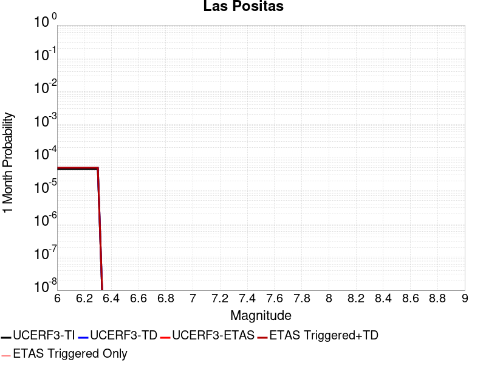 |  |  |

| Magnitude | 1 wk TI Prob | 1 wk TD Prob | 1 wk ETAS Prob | 1 wk ETAS/TD Gain | 1 wk ETAS Triggered+TD | 1 wk ETAS Triggered Only | 1 mo TI Prob | 1 mo TD Prob | 1 mo ETAS Prob | 1 mo ETAS/TD Gain | 1 mo ETAS Triggered+TD | 1 mo ETAS Triggered Only | 1 yr TI Prob | 1 yr TD Prob | 1 yr ETAS Prob | 1 yr ETAS/TD Gain | 1 yr ETAS Triggered+TD | 1 yr ETAS Triggered Only | 10 yr TI Prob | 10 yr TD Prob | 10 yr ETAS Prob | 10 yr ETAS/TD Gain | 10 yr ETAS Triggered+TD | 10 yr ETAS Triggered Only |
|-----|-----|-----|-----|-----|-----|-----|-----|-----|-----|-----|-----|-----|-----|-----|-----|-----|-----|-----|-----|-----|-----|-----|-----|-----|
| 6.0 | 1.0659424E-5 | 1.1580553E-5 | 0.0 | 0.0 | 1.1580553E-5 | 0.0 | 4.568245E-5 | 4.9630944E-5 | 0.0 | 0.0 | 4.9630944E-5 | 0.0 | 5.560419E-4 | 6.0425675E-4 | 6.0E-4 | 0.9929554 | 6.0425675E-4 | 0.0 | 0.005546526 | 0.0060425675 | 0.0049 | 0.81091356 | 0.0064401506 | 4.0E-4 |
| 6.1 | 1.0659424E-5 | 1.1580553E-5 | 0.0 | 0.0 | 1.1580553E-5 | 0.0 | 4.568245E-5 | 4.9630944E-5 | 0.0 | 0.0 | 4.9630944E-5 | 0.0 | 5.560419E-4 | 6.0425675E-4 | 6.0E-4 | 0.9929554 | 6.0425675E-4 | 0.0 | 0.005546526 | 0.0060425675 | 0.0049 | 0.81091356 | 0.0064401506 | 4.0E-4 |
| 6.2 | 1.0659424E-5 | 1.1580553E-5 | 0.0 | 0.0 | 1.1580553E-5 | 0.0 | 4.568245E-5 | 4.9630944E-5 | 0.0 | 0.0 | 4.9630944E-5 | 0.0 | 5.560419E-4 | 6.0425675E-4 | 6.0E-4 | 0.9929554 | 6.0425675E-4 | 0.0 | 0.005546526 | 0.0060425675 | 0.0049 | 0.81091356 | 0.0064401506 | 4.0E-4 |
| 6.3 | 1.0659424E-5 | 1.1580553E-5 | 0.0 | 0.0 | 1.1580553E-5 | 0.0 | 4.568245E-5 | 4.9630944E-5 | 0.0 | 0.0 | 4.9630944E-5 | 0.0 | 5.560419E-4 | 6.0425675E-4 | 6.0E-4 | 0.9929554 | 6.0425675E-4 | 0.0 | 0.005546526 | 0.0060425675 | 0.0049 | 0.81091356 | 0.0064401506 | 4.0E-4 |

## North Frontal  (West)
*[(top)](#table-of-contents)*

| 1 Week | 1 Month | 1 Year | 10 Year |
|-----|-----|-----|-----|
|  |  | 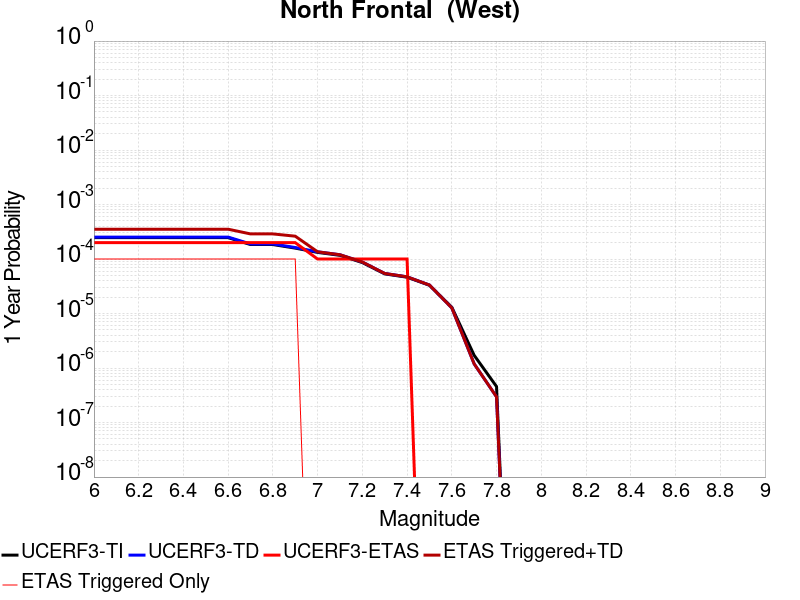 |  |

| Magnitude | 1 wk TI Prob | 1 wk TD Prob | 1 wk ETAS Prob | 1 wk ETAS/TD Gain | 1 wk ETAS Triggered+TD | 1 wk ETAS Triggered Only | 1 mo TI Prob | 1 mo TD Prob | 1 mo ETAS Prob | 1 mo ETAS/TD Gain | 1 mo ETAS Triggered+TD | 1 mo ETAS Triggered Only | 1 yr TI Prob | 1 yr TD Prob | 1 yr ETAS Prob | 1 yr ETAS/TD Gain | 1 yr ETAS Triggered+TD | 1 yr ETAS Triggered Only | 10 yr TI Prob | 10 yr TD Prob | 10 yr ETAS Prob | 10 yr ETAS/TD Gain | 10 yr ETAS Triggered+TD | 10 yr ETAS Triggered Only |
|-----|-----|-----|-----|-----|-----|-----|-----|-----|-----|-----|-----|-----|-----|-----|-----|-----|-----|-----|-----|-----|-----|-----|-----|-----|
| 6.0 | 4.7316266E-6 | 4.851189E-6 | 0.0 | 0.0 | 4.851189E-6 | 0.0 | 2.0278241E-5 | 2.0790652E-5 | 0.0 | 0.0 | 2.0790652E-5 | 0.0 | 2.4685962E-4 | 2.5309826E-4 | 2.0E-4 | 0.79020697 | 3.5307294E-4 | 1.0E-4 | 0.0024658558 | 0.002528246 | 0.0014 | 0.5537436 | 0.0029272346 | 4.0E-4 |
| 6.1 | 4.7316266E-6 | 4.851189E-6 | 0.0 | 0.0 | 4.851189E-6 | 0.0 | 2.0278241E-5 | 2.0790652E-5 | 0.0 | 0.0 | 2.0790652E-5 | 0.0 | 2.4685962E-4 | 2.5309826E-4 | 2.0E-4 | 0.79020697 | 3.5307294E-4 | 1.0E-4 | 0.0024658558 | 0.002528246 | 0.0014 | 0.5537436 | 0.0029272346 | 4.0E-4 |
| 6.2 | 4.7316266E-6 | 4.851189E-6 | 0.0 | 0.0 | 4.851189E-6 | 0.0 | 2.0278241E-5 | 2.0790652E-5 | 0.0 | 0.0 | 2.0790652E-5 | 0.0 | 2.4685962E-4 | 2.5309826E-4 | 2.0E-4 | 0.79020697 | 3.5307294E-4 | 1.0E-4 | 0.0024658558 | 0.002528246 | 0.0014 | 0.5537436 | 0.0029272346 | 4.0E-4 |
| 6.3 | 4.7316266E-6 | 4.851189E-6 | 0.0 | 0.0 | 4.851189E-6 | 0.0 | 2.0278241E-5 | 2.0790652E-5 | 0.0 | 0.0 | 2.0790652E-5 | 0.0 | 2.4685962E-4 | 2.5309826E-4 | 2.0E-4 | 0.79020697 | 3.5307294E-4 | 1.0E-4 | 0.0024658558 | 0.002528246 | 0.0014 | 0.5537436 | 0.0029272346 | 4.0E-4 |
| 6.4 | 4.7316266E-6 | 4.851189E-6 | 0.0 | 0.0 | 4.851189E-6 | 0.0 | 2.0278241E-5 | 2.0790652E-5 | 0.0 | 0.0 | 2.0790652E-5 | 0.0 | 2.4685962E-4 | 2.5309826E-4 | 2.0E-4 | 0.79020697 | 3.5307294E-4 | 1.0E-4 | 0.0024658558 | 0.002528246 | 0.0014 | 0.5537436 | 0.0029272346 | 4.0E-4 |
| 6.5 | 4.7316266E-6 | 4.851189E-6 | 0.0 | 0.0 | 4.851189E-6 | 0.0 | 2.0278241E-5 | 2.0790652E-5 | 0.0 | 0.0 | 2.0790652E-5 | 0.0 | 2.4685962E-4 | 2.5309826E-4 | 2.0E-4 | 0.79020697 | 3.5307294E-4 | 1.0E-4 | 0.0024658558 | 0.002528246 | 0.0014 | 0.5537436 | 0.0029272346 | 4.0E-4 |
| 6.6 | 4.7316266E-6 | 4.851189E-6 | 0.0 | 0.0 | 4.851189E-6 | 0.0 | 2.0278241E-5 | 2.0790652E-5 | 0.0 | 0.0 | 2.0790652E-5 | 0.0 | 2.4685962E-4 | 2.5309826E-4 | 2.0E-4 | 0.79020697 | 3.5307294E-4 | 1.0E-4 | 0.0024658558 | 0.002528246 | 0.0014 | 0.5537436 | 0.0029272346 | 4.0E-4 |
| 6.7 | 3.5382777E-6 | 3.629706E-6 | 0.0 | 0.0 | 3.629706E-6 | 0.0 | 1.516396E-5 | 1.5555795E-5 | 0.0 | 0.0 | 1.5555795E-5 | 0.0 | 1.8460557E-4 | 1.8937612E-4 | 2.0E-4 | 1.0560994 | 2.8935718E-4 | 1.0E-4 | 0.0018445229 | 0.0018922243 | 0.0012 | 0.6341743 | 0.0022914675 | 4.0E-4 |
| 6.8 | 3.5382777E-6 | 3.629706E-6 | 0.0 | 0.0 | 3.629706E-6 | 0.0 | 1.516396E-5 | 1.5555795E-5 | 0.0 | 0.0 | 1.5555795E-5 | 0.0 | 1.8460557E-4 | 1.8937612E-4 | 2.0E-4 | 1.0560994 | 2.8935718E-4 | 1.0E-4 | 0.0018445229 | 0.0018922243 | 0.0012 | 0.6341743 | 0.0022914675 | 4.0E-4 |
| 6.9 | 3.0428037E-6 | 3.1217162E-6 | 0.0 | 0.0 | 3.1217162E-6 | 0.0 | 1.30405215E-5 | 1.3378719E-5 | 0.0 | 0.0 | 1.3378719E-5 | 0.0 | 1.5875678E-4 | 1.628744E-4 | 2.0E-4 | 1.2279401 | 2.628581E-4 | 1.0E-4 | 0.0015864341 | 0.0016276174 | 0.0012 | 0.737274 | 0.0020269663 | 4.0E-4 |
| 7.0 | 2.538778E-6 | 2.6051812E-6 | 0.0 | 0.0 | 2.6051812E-6 | 0.0 | 1.0880432E-5 | 1.1165017E-5 | 0.0 | 0.0 | 1.1165017E-5 | 0.0 | 1.324612E-4 | 1.3592608E-4 | 1.0E-4 | 0.735694 | 1.3592608E-4 | 0.0 | 0.0013238228 | 0.0013584761 | 0.001 | 0.7361189 | 0.0015582044 | 2.0E-4 |
| 7.1 | 2.2418935E-6 | 2.3003838E-6 | 0.0 | 0.0 | 2.3003838E-6 | 0.0 | 9.60808E-6 | 9.858753E-6 | 0.0 | 0.0 | 9.858753E-6 | 0.0 | 1.1697209E-4 | 1.2002416E-4 | 1.0E-4 | 0.8331656 | 1.2002416E-4 | 0.0 | 0.0011691054 | 0.0011996372 | 0.001 | 0.8335853 | 0.0013993973 | 2.0E-4 |
| 7.2 | 1.6526745E-6 | 1.6918722E-6 | 0.0 | 0.0 | 1.6918722E-6 | 0.0 | 7.082872E-6 | 7.250862E-6 | 0.0 | 0.0 | 7.250862E-6 | 0.0 | 8.623055E-5 | 8.827592E-5 | 1.0E-4 | 1.1328118 | 8.827592E-5 | 0.0 | 8.61971E-4 | 8.824336E-4 | 9.0E-4 | 1.0199068 | 0.0010822571 | 2.0E-4 |
| 7.3 | 1.0246019E-6 | 1.0438306E-6 | 0.0 | 0.0 | 1.0438306E-6 | 0.0 | 4.391144E-6 | 4.473553E-6 | 0.0 | 0.0 | 4.473553E-6 | 0.0 | 5.3460866E-5 | 5.446426E-5 | 1.0E-4 | 1.8360665 | 5.446426E-5 | 0.0 | 5.344801E-4 | 5.445206E-4 | 6.0E-4 | 1.1018867 | 7.4441166E-4 | 2.0E-4 |
| 7.4 | 8.9045164E-7 | 9.0530807E-7 | 0.0 | 0.0 | 9.0530807E-7 | 0.0 | 3.8162157E-6 | 3.8798867E-6 | 0.0 | 0.0 | 3.8798867E-6 | 0.0 | 4.646144E-5 | 4.7236706E-5 | 1.0E-4 | 2.1169977 | 4.7236706E-5 | 0.0 | 4.6451724E-4 | 4.7227752E-4 | 6.0E-4 | 1.2704394 | 6.7218306E-4 | 2.0E-4 |
| 7.5 | 6.3357E-7 | 6.40014E-7 | 0.0 | 0.0 | 6.40014E-7 | 0.0 | 2.7152971E-6 | 2.7429146E-6 | 0.0 | 0.0 | 2.7429146E-6 | 0.0 | 3.305824E-5 | 3.3394543E-5 | 0.0 | 0.0 | 3.3394543E-5 | 0.0 | 3.3053322E-4 | 3.339018E-4 | 4.0E-4 | 1.197957 | 4.338684E-4 | 1.0E-4 |
| 7.6 | 2.5087024E-7 | 2.4350598E-7 | 0.0 | 0.0 | 2.4350598E-7 | 0.0 | 1.0751578E-6 | 1.0435967E-6 | 0.0 | 0.0 | 1.0435967E-6 | 0.0 | 1.3089967E-5 | 1.2705737E-5 | 0.0 | 0.0 | 1.2705737E-5 | 0.0 | 1.3089196E-4 | 1.2705216E-4 | 1.0E-4 | 0.78707826 | 1.2705216E-4 | 0.0 |
| 7.7 | 3.282987E-8 | 2.2854802E-8 | 0.0 | 0.0 | 2.2854802E-8 | 0.0 | 1.4069944E-7 | 9.7949155E-8 | 0.0 | 0.0 | 9.7949155E-8 | 0.0 | 1.7130144E-6 | 1.1925304E-6 | 0.0 | 0.0 | 1.1925304E-6 | 0.0 | 1.7130013E-5 | 1.1925248E-5 | 1.0E-4 | 8.38557 | 1.1925248E-5 | 0.0 |
| 7.8 | 8.77499E-9 | 5.676737E-9 | 0.0 | 0.0 | 5.676737E-9 | 0.0 | 3.7607098E-8 | 2.4328871E-8 | 0.0 | 0.0 | 2.4328871E-8 | 0.0 | 4.578663E-7 | 2.9620398E-7 | 0.0 | 0.0 | 2.9620398E-7 | 0.0 | 4.5786537E-6 | 2.9620373E-6 | 1.0E-4 | 33.760548 | 2.9620373E-6 | 0.0 |

## Morales (East)
*[(top)](#table-of-contents)*

| 1 Week | 1 Month | 1 Year | 10 Year |
|-----|-----|-----|-----|
| 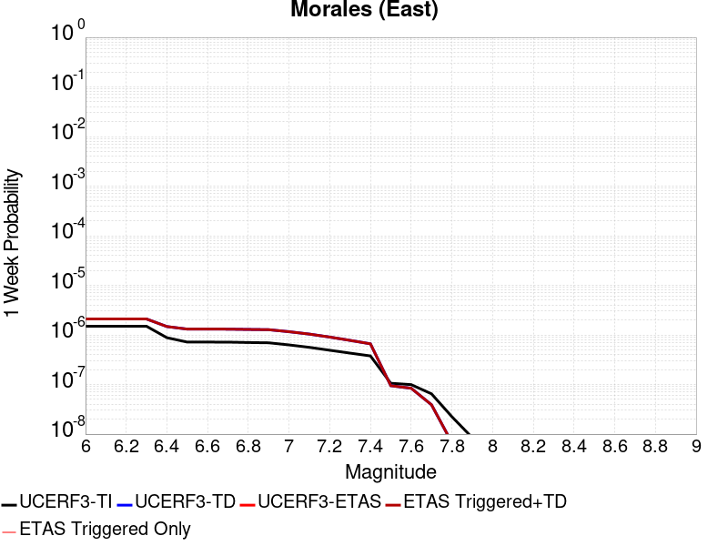 |  |  |  |

| Magnitude | 1 wk TI Prob | 1 wk TD Prob | 1 wk ETAS Prob | 1 wk ETAS/TD Gain | 1 wk ETAS Triggered+TD | 1 wk ETAS Triggered Only | 1 mo TI Prob | 1 mo TD Prob | 1 mo ETAS Prob | 1 mo ETAS/TD Gain | 1 mo ETAS Triggered+TD | 1 mo ETAS Triggered Only | 1 yr TI Prob | 1 yr TD Prob | 1 yr ETAS Prob | 1 yr ETAS/TD Gain | 1 yr ETAS Triggered+TD | 1 yr ETAS Triggered Only | 10 yr TI Prob | 10 yr TD Prob | 10 yr ETAS Prob | 10 yr ETAS/TD Gain | 10 yr ETAS Triggered+TD | 10 yr ETAS Triggered Only |
|-----|-----|-----|-----|-----|-----|-----|-----|-----|-----|-----|-----|-----|-----|-----|-----|-----|-----|-----|-----|-----|-----|-----|-----|-----|
| 6.0 | 1.4942771E-6 | 2.0928742E-6 | 0.0 | 0.0 | 2.0928742E-6 | 0.0 | 6.404029E-6 | 8.969433E-6 | 0.0 | 0.0 | 8.969433E-6 | 0.0 | 7.7966266E-5 | 1.0919796E-4 | 1.0E-4 | 0.915768 | 1.0919796E-4 | 0.0 | 7.793892E-4 | 0.0010915021 | 0.0017 | 1.5574867 | 0.0014910655 | 4.0E-4 |
| 6.1 | 1.4942771E-6 | 2.0928742E-6 | 0.0 | 0.0 | 2.0928742E-6 | 0.0 | 6.404029E-6 | 8.969433E-6 | 0.0 | 0.0 | 8.969433E-6 | 0.0 | 7.7966266E-5 | 1.0919796E-4 | 1.0E-4 | 0.915768 | 1.0919796E-4 | 0.0 | 7.793892E-4 | 0.0010915021 | 0.0017 | 1.5574867 | 0.0014910655 | 4.0E-4 |
| 6.2 | 1.4942771E-6 | 2.0928742E-6 | 0.0 | 0.0 | 2.0928742E-6 | 0.0 | 6.404029E-6 | 8.969433E-6 | 0.0 | 0.0 | 8.969433E-6 | 0.0 | 7.7966266E-5 | 1.0919796E-4 | 1.0E-4 | 0.915768 | 1.0919796E-4 | 0.0 | 7.793892E-4 | 0.0010915021 | 0.0017 | 1.5574867 | 0.0014910655 | 4.0E-4 |
| 6.3 | 1.4942771E-6 | 2.0928742E-6 | 0.0 | 0.0 | 2.0928742E-6 | 0.0 | 6.404029E-6 | 8.969433E-6 | 0.0 | 0.0 | 8.969433E-6 | 0.0 | 7.7966266E-5 | 1.0919796E-4 | 1.0E-4 | 0.915768 | 1.0919796E-4 | 0.0 | 7.793892E-4 | 0.0010915021 | 0.0017 | 1.5574867 | 0.0014910655 | 4.0E-4 |
| 6.4 | 8.798845E-7 | 1.4717402E-6 | 0.0 | 0.0 | 1.4717402E-6 | 0.0 | 3.7709283E-6 | 6.3074435E-6 | 0.0 | 0.0 | 6.3074435E-6 | 0.0 | 4.5910085E-5 | 7.679053E-5 | 0.0 | 0.0 | 7.679053E-5 | 0.0 | 4.59006E-4 | 7.676527E-4 | 9.0E-4 | 1.1724051 | 0.0011673457 | 4.0E-4 |
| 6.5 | 7.1751725E-7 | 1.3079057E-6 | 0.0 | 0.0 | 1.3079057E-6 | 0.0 | 3.0750705E-6 | 5.6052986E-6 | 0.0 | 0.0 | 5.6052986E-6 | 0.0 | 3.7438338E-5 | 6.824244E-5 | 0.0 | 0.0 | 6.824244E-5 | 0.0 | 3.743203E-4 | 6.822244E-4 | 6.0E-4 | 0.879476 | 9.820197E-4 | 3.0E-4 |
| 6.6 | 7.1751725E-7 | 1.3079057E-6 | 0.0 | 0.0 | 1.3079057E-6 | 0.0 | 3.0750705E-6 | 5.6052986E-6 | 0.0 | 0.0 | 5.6052986E-6 | 0.0 | 3.7438338E-5 | 6.824244E-5 | 0.0 | 0.0 | 6.824244E-5 | 0.0 | 3.743203E-4 | 6.822244E-4 | 6.0E-4 | 0.879476 | 9.820197E-4 | 3.0E-4 |
| 6.7 | 7.159057E-7 | 1.305387E-6 | 0.0 | 0.0 | 1.305387E-6 | 0.0 | 3.0681638E-6 | 5.5945043E-6 | 0.0 | 0.0 | 5.5945043E-6 | 0.0 | 3.7354253E-5 | 6.811103E-5 | 0.0 | 0.0 | 6.811103E-5 | 0.0 | 3.7347974E-4 | 6.8091106E-4 | 6.0E-4 | 0.88117236 | 9.807068E-4 | 3.0E-4 |
| 6.8 | 7.032203E-7 | 1.2871109E-6 | 0.0 | 0.0 | 1.2871109E-6 | 0.0 | 3.0137978E-6 | 5.5161786E-6 | 0.0 | 0.0 | 5.5161786E-6 | 0.0 | 3.669237E-5 | 6.7157474E-5 | 0.0 | 0.0 | 6.7157474E-5 | 0.0 | 3.6686313E-4 | 6.7138125E-4 | 6.0E-4 | 0.89368 | 9.7117986E-4 | 3.0E-4 |
| 6.9 | 6.941549E-7 | 1.2723219E-6 | 0.0 | 0.0 | 1.2723219E-6 | 0.0 | 2.974946E-6 | 5.4527973E-6 | 0.0 | 0.0 | 5.4527973E-6 | 0.0 | 3.6219368E-5 | 6.638586E-5 | 0.0 | 0.0 | 6.638586E-5 | 0.0 | 3.6213463E-4 | 6.636697E-4 | 6.0E-4 | 0.9040642 | 9.634706E-4 | 3.0E-4 |
| 7.0 | 6.2932247E-7 | 1.1587041E-6 | 0.0 | 0.0 | 1.1587041E-6 | 0.0 | 2.6970936E-6 | 4.9658656E-6 | 0.0 | 0.0 | 4.9658656E-6 | 0.0 | 3.283662E-5 | 6.0457794E-5 | 0.0 | 0.0 | 6.0457794E-5 | 0.0 | 3.283177E-4 | 6.044217E-4 | 5.0E-4 | 0.827237 | 9.0424035E-4 | 3.0E-4 |
| 7.1 | 5.6200963E-7 | 1.0362347E-6 | 0.0 | 0.0 | 1.0362347E-6 | 0.0 | 2.4086105E-6 | 4.4409985E-6 | 0.0 | 0.0 | 4.4409985E-6 | 0.0 | 2.9324437E-5 | 5.4067863E-5 | 0.0 | 0.0 | 5.4067863E-5 | 0.0 | 2.9320567E-4 | 5.405537E-4 | 4.0E-4 | 0.739982 | 7.4044557E-4 | 2.0E-4 |
| 7.2 | 4.91044E-7 | 9.0211216E-7 | 0.0 | 0.0 | 9.0211216E-7 | 0.0 | 2.1044725E-6 | 3.8661897E-6 | 0.0 | 0.0 | 3.8661897E-6 | 0.0 | 2.5621652E-5 | 4.7069876E-5 | 0.0 | 0.0 | 4.7069876E-5 | 0.0 | 2.56187E-4 | 4.7060478E-4 | 3.0E-4 | 0.6374776 | 6.7051064E-4 | 2.0E-4 |
| 7.3 | 4.2978448E-7 | 7.7328565E-7 | 0.0 | 0.0 | 7.7328565E-7 | 0.0 | 1.8419321E-6 | 3.3140773E-6 | 0.0 | 0.0 | 3.3140773E-6 | 0.0 | 2.2425293E-5 | 4.0348175E-5 | 0.0 | 0.0 | 4.0348175E-5 | 0.0 | 2.242303E-4 | 4.0341355E-4 | 3.0E-4 | 0.7436538 | 6.033329E-4 | 2.0E-4 |
| 7.4 | 3.774317E-7 | 6.586822E-7 | 0.0 | 0.0 | 6.586822E-7 | 0.0 | 1.6175634E-6 | 2.8229208E-6 | 0.0 | 0.0 | 2.8229208E-6 | 0.0 | 1.9693656E-5 | 3.4368546E-5 | 0.0 | 0.0 | 3.4368546E-5 | 0.0 | 1.969191E-4 | 3.4363705E-4 | 2.0E-4 | 0.58200943 | 4.4360268E-4 | 1.0E-4 |
| 7.5 | 1.0603232E-7 | 9.3955784E-8 | 0.0 | 0.0 | 9.3955784E-8 | 0.0 | 4.5442414E-7 | 4.0266758E-7 | 0.0 | 0.0 | 4.0266758E-7 | 0.0 | 5.5326E-6 | 4.902467E-6 | 0.0 | 0.0 | 4.902467E-6 | 0.0 | 5.532462E-5 | 4.902575E-5 | 0.0 | 0.0 | 4.902575E-5 | 0.0 |
| 7.6 | 9.960384E-8 | 8.3472656E-8 | 0.0 | 0.0 | 8.3472656E-8 | 0.0 | 4.2687353E-7 | 3.577399E-7 | 0.0 | 0.0 | 3.577399E-7 | 0.0 | 5.197173E-6 | 4.3554746E-6 | 0.0 | 0.0 | 4.3554746E-6 | 0.0 | 5.1970514E-5 | 4.3556058E-5 | 0.0 | 0.0 | 4.3556058E-5 | 0.0 |
| 7.7 | 6.499468E-8 | 3.8693557E-8 | 0.0 | 0.0 | 3.8693557E-8 | 0.0 | 2.785486E-7 | 1.6582952E-7 | 0.0 | 0.0 | 1.6582952E-7 | 0.0 | 3.3913238E-6 | 2.0189725E-6 | 0.0 | 0.0 | 2.0189725E-6 | 0.0 | 3.3912722E-5 | 2.01917E-5 | 0.0 | 0.0 | 2.01917E-5 | 0.0 |
| 7.8 | 2.2517119E-8 | 6.6650423E-9 | 0.0 | 0.0 | 6.6650423E-9 | 0.0 | 9.6501935E-8 | 2.8564468E-8 | 0.0 | 0.0 | 2.8564468E-8 | 0.0 | 1.1749105E-6 | 3.4777236E-7 | 0.0 | 0.0 | 3.4777236E-7 | 0.0 | 1.1749043E-5 | 3.47987E-6 | 0.0 | 0.0 | 3.47987E-6 | 0.0 |
| 7.9 | 8.493023E-9 | 8.939476E-10 | 0.0 | 0.0 | 8.939476E-10 | 0.0 | 3.639867E-8 | 3.831205E-9 | 0.0 | 0.0 | 3.831205E-9 | 0.0 | 4.4315374E-7 | 4.6644935E-8 | 0.0 | 0.0 | 4.6644935E-8 | 0.0 | 4.4315284E-6 | 4.6821356E-7 | 0.0 | 0.0 | 4.6821356E-7 | 0.0 |
| 8.0 | 1.4971842E-9 | 4.4638404E-11 | 0.0 | 0.0 | 4.4638404E-11 | 0.0 | 6.4165038E-9 | 1.9130775E-10 | 0.0 | 0.0 | 1.9130775E-10 | 0.0 | 7.812093E-8 | 2.3291762E-9 | 0.0 | 0.0 | 2.3291762E-9 | 0.0 | 7.81209E-7 | 2.4336822E-8 | 0.0 | 0.0 | 2.4336822E-8 | 0.0 |

## Thirty Mile Bank
*[(top)](#table-of-contents)*

| 1 Week | 1 Month | 1 Year | 10 Year |
|-----|-----|-----|-----|
|  |  |  |  |

| Magnitude | 1 wk TI Prob | 1 wk TD Prob | 1 wk ETAS Prob | 1 wk ETAS/TD Gain | 1 wk ETAS Triggered+TD | 1 wk ETAS Triggered Only | 1 mo TI Prob | 1 mo TD Prob | 1 mo ETAS Prob | 1 mo ETAS/TD Gain | 1 mo ETAS Triggered+TD | 1 mo ETAS Triggered Only | 1 yr TI Prob | 1 yr TD Prob | 1 yr ETAS Prob | 1 yr ETAS/TD Gain | 1 yr ETAS Triggered+TD | 1 yr ETAS Triggered Only | 10 yr TI Prob | 10 yr TD Prob | 10 yr ETAS Prob | 10 yr ETAS/TD Gain | 10 yr ETAS Triggered+TD | 10 yr ETAS Triggered Only |
|-----|-----|-----|-----|-----|-----|-----|-----|-----|-----|-----|-----|-----|-----|-----|-----|-----|-----|-----|-----|-----|-----|-----|-----|-----|
| 6.0 | 6.5124755E-6 | 6.657695E-6 | 0.0 | 0.0 | 6.657695E-6 | 0.0 | 2.791031E-5 | 2.8532691E-5 | 0.0 | 0.0 | 2.8532691E-5 | 0.0 | 3.3975503E-4 | 3.4733448E-4 | 1.0E-4 | 0.28790691 | 3.4733448E-4 | 0.0 | 0.0033923604 | 0.0034683477 | 0.0026 | 0.7496365 | 0.0038669605 | 4.0E-4 |
| 6.1 | 6.5124755E-6 | 6.657695E-6 | 0.0 | 0.0 | 6.657695E-6 | 0.0 | 2.791031E-5 | 2.8532691E-5 | 0.0 | 0.0 | 2.8532691E-5 | 0.0 | 3.3975503E-4 | 3.4733448E-4 | 1.0E-4 | 0.28790691 | 3.4733448E-4 | 0.0 | 0.0033923604 | 0.0034683477 | 0.0026 | 0.7496365 | 0.0038669605 | 4.0E-4 |
| 6.2 | 6.5124755E-6 | 6.657695E-6 | 0.0 | 0.0 | 6.657695E-6 | 0.0 | 2.791031E-5 | 2.8532691E-5 | 0.0 | 0.0 | 2.8532691E-5 | 0.0 | 3.3975503E-4 | 3.4733448E-4 | 1.0E-4 | 0.28790691 | 3.4733448E-4 | 0.0 | 0.0033923604 | 0.0034683477 | 0.0026 | 0.7496365 | 0.0038669605 | 4.0E-4 |
| 6.3 | 6.5124755E-6 | 6.657695E-6 | 0.0 | 0.0 | 6.657695E-6 | 0.0 | 2.791031E-5 | 2.8532691E-5 | 0.0 | 0.0 | 2.8532691E-5 | 0.0 | 3.3975503E-4 | 3.4733448E-4 | 1.0E-4 | 0.28790691 | 3.4733448E-4 | 0.0 | 0.0033923604 | 0.0034683477 | 0.0026 | 0.7496365 | 0.0038669605 | 4.0E-4 |
| 6.4 | 6.5124755E-6 | 6.657695E-6 | 0.0 | 0.0 | 6.657695E-6 | 0.0 | 2.791031E-5 | 2.8532691E-5 | 0.0 | 0.0 | 2.8532691E-5 | 0.0 | 3.3975503E-4 | 3.4733448E-4 | 1.0E-4 | 0.28790691 | 3.4733448E-4 | 0.0 | 0.0033923604 | 0.0034683477 | 0.0026 | 0.7496365 | 0.0038669605 | 4.0E-4 |
| 6.5 | 6.5124755E-6 | 6.657695E-6 | 0.0 | 0.0 | 6.657695E-6 | 0.0 | 2.791031E-5 | 2.8532691E-5 | 0.0 | 0.0 | 2.8532691E-5 | 0.0 | 3.3975503E-4 | 3.4733448E-4 | 1.0E-4 | 0.28790691 | 3.4733448E-4 | 0.0 | 0.0033923604 | 0.0034683477 | 0.0026 | 0.7496365 | 0.0038669605 | 4.0E-4 |
| 6.6 | 6.5124755E-6 | 6.657695E-6 | 0.0 | 0.0 | 6.657695E-6 | 0.0 | 2.791031E-5 | 2.8532691E-5 | 0.0 | 0.0 | 2.8532691E-5 | 0.0 | 3.3975503E-4 | 3.4733448E-4 | 1.0E-4 | 0.28790691 | 3.4733448E-4 | 0.0 | 0.0033923604 | 0.0034683477 | 0.0026 | 0.7496365 | 0.0038669605 | 4.0E-4 |
| 6.7 | 3.5261137E-6 | 3.609002E-6 | 0.0 | 0.0 | 3.609002E-6 | 0.0 | 1.5111828E-5 | 1.5467063E-5 | 0.0 | 0.0 | 1.5467063E-5 | 0.0 | 1.8397097E-4 | 1.8829587E-4 | 1.0E-4 | 0.53107905 | 1.8829587E-4 | 0.0 | 0.0018381875 | 0.0018814283 | 0.0013 | 0.6909644 | 0.002081052 | 2.0E-4 |
| 6.8 | 3.370743E-6 | 3.4500763E-6 | 0.0 | 0.0 | 3.4500763E-6 | 0.0 | 1.4445961E-5 | 1.4785961E-5 | 0.0 | 0.0 | 1.4785961E-5 | 0.0 | 1.7586538E-4 | 1.8000483E-4 | 1.0E-4 | 0.5555406 | 1.8000483E-4 | 0.0 | 0.0017572626 | 0.0017986521 | 0.0011 | 0.6115691 | 0.0019982923 | 2.0E-4 |
| 6.9 | 2.2756835E-6 | 2.332544E-6 | 0.0 | 0.0 | 2.332544E-6 | 0.0 | 9.752893E-6 | 9.99658E-6 | 0.0 | 0.0 | 9.99658E-6 | 0.0 | 1.18735006E-4 | 1.21701814E-4 | 0.0 | 0.0 | 1.21701814E-4 | 0.0 | 0.0011867158 | 0.0012163763 | 5.0E-4 | 0.41105703 | 0.0013162546 | 1.0E-4 |
| 7.0 | 2.1617404E-6 | 2.2153977E-6 | 0.0 | 0.0 | 2.2153977E-6 | 0.0 | 9.264569E-6 | 9.494528E-6 | 0.0 | 0.0 | 9.494528E-6 | 0.0 | 1.1279029E-4 | 1.15589995E-4 | 0.0 | 0.0 | 1.15589995E-4 | 0.0 | 0.0011273306 | 0.0011553228 | 5.0E-4 | 0.4327795 | 0.0012552072 | 1.0E-4 |
| 7.1 | 1.5900777E-6 | 1.632243E-6 | 0.0 | 0.0 | 1.632243E-6 | 0.0 | 6.814601E-6 | 6.995309E-6 | 0.0 | 0.0 | 6.995309E-6 | 0.0 | 8.296461E-5 | 8.5164684E-5 | 0.0 | 0.0 | 8.5164684E-5 | 0.0 | 8.293364E-4 | 8.5133326E-4 | 4.0E-4 | 0.46985126 | 9.512481E-4 | 1.0E-4 |
| 7.2 | 1.2971728E-6 | 1.3325146E-6 | 0.0 | 0.0 | 1.3325146E-6 | 0.0 | 5.5593005E-6 | 5.710765E-6 | 0.0 | 0.0 | 5.710765E-6 | 0.0 | 6.768238E-5 | 6.9526446E-5 | 0.0 | 0.0 | 6.9526446E-5 | 0.0 | 6.7661767E-4 | 6.9505733E-4 | 2.0E-4 | 0.28774607 | 7.949878E-4 | 1.0E-4 |
| 7.3 | 8.2454284E-7 | 8.4467115E-7 | 0.0 | 0.0 | 8.4467115E-7 | 0.0 | 3.5337503E-6 | 3.6200145E-6 | 0.0 | 0.0 | 3.6200145E-6 | 0.0 | 4.302256E-5 | 4.4072847E-5 | 0.0 | 0.0 | 4.4072847E-5 | 0.0 | 4.301423E-4 | 4.406471E-4 | 0.0 | 0.0 | 4.406471E-4 | 0.0 |
| 7.4 | 4.2619024E-7 | 4.3850085E-7 | 0.0 | 0.0 | 4.3850085E-7 | 0.0 | 1.8265283E-6 | 1.879288E-6 | 0.0 | 0.0 | 1.879288E-6 | 0.0 | 2.2237757E-5 | 2.2880095E-5 | 0.0 | 0.0 | 2.2880095E-5 | 0.0 | 2.223553E-4 | 2.2877778E-4 | 0.0 | 0.0 | 2.2877778E-4 | 0.0 |
| 7.5 | 2.993922E-7 | 3.0854568E-7 | 0.0 | 0.0 | 3.0854568E-7 | 0.0 | 1.2831089E-6 | 1.322338E-6 | 0.0 | 0.0 | 1.322338E-6 | 0.0 | 1.5621737E-5 | 1.609935E-5 | 0.0 | 0.0 | 1.609935E-5 | 0.0 | 1.562064E-4 | 1.6098208E-4 | 0.0 | 0.0 | 1.6098208E-4 | 0.0 |
| 7.6 | 1.6988751E-7 | 1.7527951E-7 | 0.0 | 0.0 | 1.7527951E-7 | 0.0 | 7.2808916E-7 | 7.5119766E-7 | 0.0 | 0.0 | 7.5119766E-7 | 0.0 | 8.864449E-6 | 9.145795E-6 | 0.0 | 0.0 | 9.145795E-6 | 0.0 | 8.8640954E-5 | 9.1454385E-5 | 0.0 | 0.0 | 9.1454385E-5 | 0.0 |

## Malibu Coast alt 1
*[(top)](#table-of-contents)*

| 1 Week | 1 Month | 1 Year | 10 Year |
|-----|-----|-----|-----|
|  |  |  |  |

| Magnitude | 1 wk TI Prob | 1 wk TD Prob | 1 wk ETAS Prob | 1 wk ETAS/TD Gain | 1 wk ETAS Triggered+TD | 1 wk ETAS Triggered Only | 1 mo TI Prob | 1 mo TD Prob | 1 mo ETAS Prob | 1 mo ETAS/TD Gain | 1 mo ETAS Triggered+TD | 1 mo ETAS Triggered Only | 1 yr TI Prob | 1 yr TD Prob | 1 yr ETAS Prob | 1 yr ETAS/TD Gain | 1 yr ETAS Triggered+TD | 1 yr ETAS Triggered Only | 10 yr TI Prob | 10 yr TD Prob | 10 yr ETAS Prob | 10 yr ETAS/TD Gain | 10 yr ETAS Triggered+TD | 10 yr ETAS Triggered Only |
|-----|-----|-----|-----|-----|-----|-----|-----|-----|-----|-----|-----|-----|-----|-----|-----|-----|-----|-----|-----|-----|-----|-----|-----|-----|
| 6.0 | 1.6572556E-5 | 1.7582135E-5 | 0.0 | 0.0 | 1.7582135E-5 | 0.0 | 7.102331E-5 | 7.534994E-5 | 0.0 | 0.0 | 7.534994E-5 | 0.0 | 8.6436566E-4 | 9.170183E-4 | 8.0E-4 | 0.87239265 | 9.170183E-4 | 0.0 | 0.0086101135 | 0.009134271 | 0.006 | 0.65686685 | 0.009530618 | 4.0E-4 |
| 6.1 | 1.6572556E-5 | 1.7582135E-5 | 0.0 | 0.0 | 1.7582135E-5 | 0.0 | 7.102331E-5 | 7.534994E-5 | 0.0 | 0.0 | 7.534994E-5 | 0.0 | 8.6436566E-4 | 9.170183E-4 | 4.0E-4 | 0.43619633 | 9.170183E-4 | 0.0 | 0.0086101135 | 0.009134271 | 0.0043 | 0.47075456 | 0.009431531 | 3.0E-4 |
| 6.2 | 1.1085717E-5 | 1.15476005E-5 | 0.0 | 0.0 | 1.15476005E-5 | 0.0 | 4.750935E-5 | 4.9488797E-5 | 0.0 | 0.0 | 4.9488797E-5 | 0.0 | 5.782728E-4 | 6.023631E-4 | 3.0E-4 | 0.4980385 | 6.023631E-4 | 0.0 | 0.0057677035 | 0.0060076737 | 0.003 | 0.49936134 | 0.006107073 | 1.0E-4 |
| 6.3 | 1.0208568E-5 | 1.0583702E-5 | 0.0 | 0.0 | 1.0583702E-5 | 0.0 | 4.375027E-5 | 4.5357952E-5 | 0.0 | 0.0 | 4.5357952E-5 | 0.0 | 5.325294E-4 | 5.5209605E-4 | 3.0E-4 | 0.5433837 | 5.5209605E-4 | 0.0 | 0.0053125503 | 0.0055075516 | 0.0029 | 0.52654976 | 0.005607001 | 1.0E-4 |
| 6.4 | 9.0682315E-6 | 9.335354E-6 | 0.0 | 0.0 | 9.335354E-6 | 0.0 | 3.8863272E-5 | 4.0008057E-5 | 0.0 | 0.0 | 4.0008057E-5 | 0.0 | 4.730576E-4 | 4.8699128E-4 | 3.0E-4 | 0.6160275 | 4.8699128E-4 | 0.0 | 0.0047205184 | 0.004859454 | 0.0027 | 0.555618 | 0.004958968 | 1.0E-4 |
| 6.5 | 7.605796E-6 | 7.742805E-6 | 0.0 | 0.0 | 7.742805E-6 | 0.0 | 3.259586E-5 | 3.3183034E-5 | 0.0 | 0.0 | 3.3183034E-5 | 0.0 | 3.9678233E-4 | 4.0392988E-4 | 2.0E-4 | 0.49513546 | 4.0392988E-4 | 0.0 | 0.0039607463 | 0.0040320945 | 0.0023 | 0.5704232 | 0.004131691 | 1.0E-4 |
| 6.6 | 5.889873E-6 | 5.875499E-6 | 0.0 | 0.0 | 5.875499E-6 | 0.0 | 2.5242069E-5 | 2.5180469E-5 | 0.0 | 0.0 | 2.5180469E-5 | 0.0 | 3.0727885E-4 | 3.0652917E-4 | 2.0E-4 | 0.6524665 | 3.0652917E-4 | 0.0 | 0.003068543 | 0.0030610764 | 0.0016 | 0.52269197 | 0.0031607703 | 1.0E-4 |
| 6.7 | 5.66586E-6 | 5.637756E-6 | 0.0 | 0.0 | 5.637756E-6 | 0.0 | 2.428203E-5 | 2.4161589E-5 | 0.0 | 0.0 | 2.4161589E-5 | 0.0 | 2.955936E-4 | 2.9412773E-4 | 2.0E-4 | 0.6799767 | 2.9412773E-4 | 0.0 | 0.0029520073 | 0.0029373963 | 0.0014 | 0.47661257 | 0.0030371025 | 1.0E-4 |
| 6.8 | 5.521556E-6 | 5.4856296E-6 | 0.0 | 0.0 | 5.4856296E-6 | 0.0 | 2.3663597E-5 | 2.3509629E-5 | 0.0 | 0.0 | 2.3509629E-5 | 0.0 | 2.880662E-4 | 2.8619223E-4 | 2.0E-4 | 0.698831 | 2.8619223E-4 | 0.0 | 0.0028769306 | 0.0028582483 | 0.0014 | 0.4898105 | 0.0029579625 | 1.0E-4 |
| 6.9 | 5.29752E-6 | 5.2463074E-6 | 0.0 | 0.0 | 5.2463074E-6 | 0.0 | 2.270346E-5 | 2.2483982E-5 | 0.0 | 0.0 | 2.2483982E-5 | 0.0 | 2.7637955E-4 | 2.7370817E-4 | 2.0E-4 | 0.73070526 | 2.7370817E-4 | 0.0 | 0.0027603607 | 0.002733721 | 0.0013 | 0.4755423 | 0.0028334477 | 1.0E-4 |
| 7.0 | 5.106743E-6 | 5.0441827E-6 | 0.0 | 0.0 | 5.0441827E-6 | 0.0 | 2.1885859E-5 | 2.1617747E-5 | 0.0 | 0.0 | 2.1617747E-5 | 0.0 | 2.6642776E-4 | 2.6316434E-4 | 2.0E-4 | 0.75998133 | 2.6316434E-4 | 0.0 | 0.0026610855 | 0.002628537 | 0.0012 | 0.45652774 | 0.0027282739 | 1.0E-4 |
| 7.1 | 4.8469647E-6 | 4.7670737E-6 | 0.0 | 0.0 | 4.7670737E-6 | 0.0 | 2.0772539E-5 | 2.0430156E-5 | 0.0 | 0.0 | 2.0430156E-5 | 0.0 | 2.528763E-4 | 2.4870882E-4 | 2.0E-4 | 0.80415326 | 2.4870882E-4 | 0.0 | 0.0025258875 | 0.0024843127 | 0.0012 | 0.48303097 | 0.0025840644 | 1.0E-4 |
| 7.2 | 4.545514E-6 | 4.445128E-6 | 0.0 | 0.0 | 4.445128E-6 | 0.0 | 1.9480629E-5 | 1.905041E-5 | 0.0 | 0.0 | 1.905041E-5 | 0.0 | 2.3715083E-4 | 2.3191413E-4 | 2.0E-4 | 0.8623882 | 2.3191413E-4 | 0.0 | 0.0023689792 | 0.0023167285 | 0.0011 | 0.47480747 | 0.0024164969 | 1.0E-4 |
| 7.3 | 3.794097E-6 | 3.6495078E-6 | 0.0 | 0.0 | 3.6495078E-6 | 0.0 | 1.6260314E-5 | 1.5640655E-5 | 0.0 | 0.0 | 1.5640655E-5 | 0.0 | 1.9795135E-4 | 1.9040836E-4 | 1.0E-4 | 0.525187 | 1.9040836E-4 | 0.0 | 0.001977751 | 0.0019024569 | 9.0E-4 | 0.4730725 | 0.0020022667 | 1.0E-4 |
| 7.4 | 2.808217E-6 | 2.7172337E-6 | 0.0 | 0.0 | 2.7172337E-6 | 0.0 | 1.203516E-5 | 1.1645236E-5 | 0.0 | 0.0 | 1.1645236E-5 | 0.0 | 1.4651821E-4 | 1.4177154E-4 | 0.0 | 0.0 | 1.4177154E-4 | 0.0 | 0.0014642165 | 0.0014168137 | 6.0E-4 | 0.42348546 | 0.001516672 | 1.0E-4 |
| 7.5 | 1.83809E-6 | 1.8177809E-6 | 0.0 | 0.0 | 1.8177809E-6 | 0.0 | 7.877505E-6 | 7.790467E-6 | 0.0 | 0.0 | 7.790467E-6 | 0.0 | 9.59044E-5 | 9.484482E-5 | 0.0 | 0.0 | 9.484482E-5 | 0.0 | 9.5863023E-4 | 9.4804546E-4 | 5.0E-4 | 0.52740085 | 0.0010479507 | 1.0E-4 |
| 7.6 | 1.1292672E-6 | 1.0993047E-6 | 0.0 | 0.0 | 1.0993047E-6 | 0.0 | 4.839708E-6 | 4.711297E-6 | 0.0 | 0.0 | 4.711297E-6 | 0.0 | 5.8921847E-5 | 5.735855E-5 | 0.0 | 0.0 | 5.735855E-5 | 0.0 | 5.890623E-4 | 5.734391E-4 | 4.0E-4 | 0.69754577 | 6.733817E-4 | 1.0E-4 |
| 7.7 | 5.065272E-7 | 4.6048007E-7 | 0.0 | 0.0 | 4.6048007E-7 | 0.0 | 2.170829E-6 | 1.9734846E-6 | 0.0 | 0.0 | 1.9734846E-6 | 0.0 | 2.6429525E-5 | 2.4026922E-5 | 0.0 | 0.0 | 2.4026922E-5 | 0.0 | 2.642638E-4 | 2.4024435E-4 | 1.0E-4 | 0.41624287 | 2.4024435E-4 | 0.0 |
| 7.8 | 8.952991E-8 | 6.689527E-8 | 0.0 | 0.0 | 6.689527E-8 | 0.0 | 3.8369956E-7 | 2.86694E-7 | 0.0 | 0.0 | 2.86694E-7 | 0.0 | 4.671532E-6 | 3.4904938E-6 | 0.0 | 0.0 | 3.4904938E-6 | 0.0 | 4.671434E-5 | 3.490441E-5 | 1.0E-4 | 2.8649676 | 3.490441E-5 | 0.0 |
| 7.9 | 8.007447E-10 | 6.1585737E-10 | 0.0 | 0.0 | 6.1585737E-10 | 0.0 | 3.4317629E-9 | 2.6393883E-9 | 0.0 | 0.0 | 2.6393883E-9 | 0.0 | 4.1781714E-8 | 3.2134555E-8 | 0.0 | 0.0 | 3.2134555E-8 | 0.0 | 4.1781706E-7 | 3.213455E-7 | 0.0 | 0.0 | 3.213455E-7 | 0.0 |

## Santa Monica alt 1
*[(top)](#table-of-contents)*

| 1 Week | 1 Month | 1 Year | 10 Year |
|-----|-----|-----|-----|
|  | 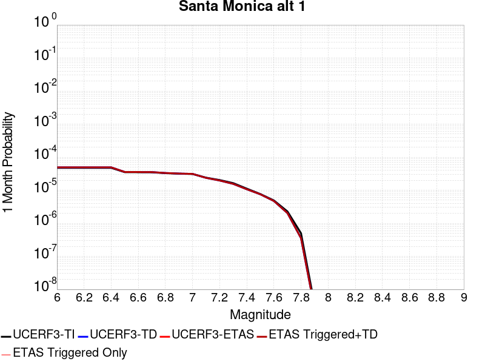 |  |  |

| Magnitude | 1 wk TI Prob | 1 wk TD Prob | 1 wk ETAS Prob | 1 wk ETAS/TD Gain | 1 wk ETAS Triggered+TD | 1 wk ETAS Triggered Only | 1 mo TI Prob | 1 mo TD Prob | 1 mo ETAS Prob | 1 mo ETAS/TD Gain | 1 mo ETAS Triggered+TD | 1 mo ETAS Triggered Only | 1 yr TI Prob | 1 yr TD Prob | 1 yr ETAS Prob | 1 yr ETAS/TD Gain | 1 yr ETAS Triggered+TD | 1 yr ETAS Triggered Only | 10 yr TI Prob | 10 yr TD Prob | 10 yr ETAS Prob | 10 yr ETAS/TD Gain | 10 yr ETAS Triggered+TD | 10 yr ETAS Triggered Only |
|-----|-----|-----|-----|-----|-----|-----|-----|-----|-----|-----|-----|-----|-----|-----|-----|-----|-----|-----|-----|-----|-----|-----|-----|-----|
| 6.0 | 1.1066008E-5 | 1.1470408E-5 | 0.0 | 0.0 | 1.1470408E-5 | 0.0 | 4.742488E-5 | 4.9158047E-5 | 0.0 | 0.0 | 4.9158047E-5 | 0.0 | 5.7724497E-4 | 5.9834874E-4 | 5.0E-4 | 0.83563304 | 6.982889E-4 | 1.0E-4 | 0.005757478 | 0.0059687616 | 0.0043 | 0.72041744 | 0.006366374 | 4.0E-4 |
| 6.1 | 1.1066008E-5 | 1.1470408E-5 | 0.0 | 0.0 | 1.1470408E-5 | 0.0 | 4.742488E-5 | 4.9158047E-5 | 0.0 | 0.0 | 4.9158047E-5 | 0.0 | 5.7724497E-4 | 5.9834874E-4 | 5.0E-4 | 0.83563304 | 6.982889E-4 | 1.0E-4 | 0.005757478 | 0.0059687616 | 0.0043 | 0.72041744 | 0.006366374 | 4.0E-4 |
| 6.2 | 1.1066008E-5 | 1.1470408E-5 | 0.0 | 0.0 | 1.1470408E-5 | 0.0 | 4.742488E-5 | 4.9158047E-5 | 0.0 | 0.0 | 4.9158047E-5 | 0.0 | 5.7724497E-4 | 5.9834874E-4 | 5.0E-4 | 0.83563304 | 6.982889E-4 | 1.0E-4 | 0.005757478 | 0.0059687616 | 0.0043 | 0.72041744 | 0.006366374 | 4.0E-4 |
| 6.3 | 1.1066008E-5 | 1.1470408E-5 | 0.0 | 0.0 | 1.1470408E-5 | 0.0 | 4.742488E-5 | 4.9158047E-5 | 0.0 | 0.0 | 4.9158047E-5 | 0.0 | 5.7724497E-4 | 5.9834874E-4 | 5.0E-4 | 0.83563304 | 6.982889E-4 | 1.0E-4 | 0.005757478 | 0.0059687616 | 0.0043 | 0.72041744 | 0.006366374 | 4.0E-4 |
| 6.4 | 1.1066008E-5 | 1.1470408E-5 | 0.0 | 0.0 | 1.1470408E-5 | 0.0 | 4.742488E-5 | 4.9158047E-5 | 0.0 | 0.0 | 4.9158047E-5 | 0.0 | 5.7724497E-4 | 5.9834874E-4 | 5.0E-4 | 0.83563304 | 6.982889E-4 | 1.0E-4 | 0.005757478 | 0.0059687616 | 0.0043 | 0.72041744 | 0.006366374 | 4.0E-4 |
| 6.5 | 8.183544E-6 | 8.328517E-6 | 0.0 | 0.0 | 8.328517E-6 | 0.0 | 3.5071862E-5 | 3.5693163E-5 | 0.0 | 0.0 | 3.5693163E-5 | 0.0 | 4.2691626E-4 | 4.3447918E-4 | 2.0E-4 | 0.46032125 | 4.3447918E-4 | 0.0 | 0.0042609703 | 0.004336463 | 0.003 | 0.6918081 | 0.0045355954 | 2.0E-4 |
| 6.6 | 8.1543285E-6 | 8.29676E-6 | 0.0 | 0.0 | 8.29676E-6 | 0.0 | 3.4946657E-5 | 3.5557066E-5 | 0.0 | 0.0 | 3.5557066E-5 | 0.0 | 4.2539247E-4 | 4.3282288E-4 | 2.0E-4 | 0.46208277 | 4.3282288E-4 | 0.0 | 0.0042457907 | 0.004319964 | 0.003 | 0.6944502 | 0.0045191003 | 2.0E-4 |
| 6.7 | 8.110878E-6 | 8.250192E-6 | 0.0 | 0.0 | 8.250192E-6 | 0.0 | 3.4760444E-5 | 3.5357498E-5 | 0.0 | 0.0 | 3.5357498E-5 | 0.0 | 4.231262E-4 | 4.3039408E-4 | 2.0E-4 | 0.46469042 | 4.3039408E-4 | 0.0 | 0.0042232145 | 0.00429577 | 0.003 | 0.6983614 | 0.004494911 | 2.0E-4 |
| 6.8 | 7.644036E-6 | 7.744655E-6 | 0.0 | 0.0 | 7.744655E-6 | 0.0 | 3.275974E-5 | 3.319096E-5 | 0.0 | 0.0 | 3.319096E-5 | 0.0 | 3.9877684E-4 | 4.0402645E-4 | 2.0E-4 | 0.4950171 | 4.0402645E-4 | 0.0 | 0.00398062 | 0.004033065 | 0.0027 | 0.669466 | 0.0042322585 | 2.0E-4 |
| 6.9 | 7.3698293E-6 | 7.449552E-6 | 0.0 | 0.0 | 7.449552E-6 | 0.0 | 3.15846E-5 | 3.192627E-5 | 0.0 | 0.0 | 3.192627E-5 | 0.0 | 3.8447464E-4 | 3.8863436E-4 | 2.0E-4 | 0.5146225 | 3.8863436E-4 | 0.0 | 0.0038381014 | 0.0038796905 | 0.0025 | 0.6443813 | 0.0040789144 | 2.0E-4 |
| 7.0 | 7.209872E-6 | 7.279572E-6 | 0.0 | 0.0 | 7.279572E-6 | 0.0 | 3.0899086E-5 | 3.11978E-5 | 0.0 | 0.0 | 3.11978E-5 | 0.0 | 3.7613141E-4 | 3.797684E-4 | 2.0E-4 | 0.5266368 | 3.797684E-4 | 0.0 | 0.0037549543 | 0.0037913364 | 0.0024 | 0.6330221 | 0.0039905785 | 2.0E-4 |
| 7.1 | 5.603456E-6 | 5.5196188E-6 | 0.0 | 0.0 | 5.5196188E-6 | 0.0 | 2.4014591E-5 | 2.3655297E-5 | 0.0 | 0.0 | 2.3655297E-5 | 0.0 | 2.923384E-4 | 2.8796558E-4 | 2.0E-4 | 0.69452745 | 2.8796558E-4 | 0.0 | 0.0029195412 | 0.002875966 | 0.0017 | 0.5911057 | 0.0030753908 | 2.0E-4 |
| 7.2 | 4.7483613E-6 | 4.587748E-6 | 0.0 | 0.0 | 4.587748E-6 | 0.0 | 2.0349962E-5 | 1.9661631E-5 | 0.0 | 0.0 | 1.9661631E-5 | 0.0 | 2.4773262E-4 | 2.3935418E-4 | 2.0E-4 | 0.83558184 | 2.3935418E-4 | 0.0 | 0.0024745662 | 0.002390978 | 0.0012 | 0.50188667 | 0.0024907389 | 1.0E-4 |
| 7.3 | 3.829015E-6 | 3.6315676E-6 | 0.0 | 0.0 | 3.6315676E-6 | 0.0 | 1.6409962E-5 | 1.5563768E-5 | 0.0 | 0.0 | 1.5563768E-5 | 0.0 | 1.9977297E-4 | 1.8947248E-4 | 1.0E-4 | 0.5277811 | 1.8947248E-4 | 0.0 | 0.0019959346 | 0.0018931184 | 0.001 | 0.528229 | 0.001992929 | 1.0E-4 |
| 7.4 | 2.610755E-6 | 2.497693E-6 | 0.0 | 0.0 | 2.497693E-6 | 0.0 | 1.1188902E-5 | 1.0704354E-5 | 0.0 | 0.0 | 1.0704354E-5 | 0.0 | 1.3621636E-4 | 1.3031777E-4 | 0.0 | 0.0 | 1.3031777E-4 | 0.0 | 0.001361329 | 0.0013024178 | 6.0E-4 | 0.46068165 | 0.0014022876 | 1.0E-4 |
| 7.5 | 1.792146E-6 | 1.7570197E-6 | 0.0 | 0.0 | 1.7570197E-6 | 0.0 | 7.680603E-6 | 7.530063E-6 | 0.0 | 0.0 | 7.530063E-6 | 0.0 | 9.3507326E-5 | 9.1674694E-5 | 0.0 | 0.0 | 9.1674694E-5 | 0.0 | 9.3467993E-4 | 9.1637194E-4 | 5.0E-4 | 0.54563 | 0.0010162803 | 1.0E-4 |
| 7.6 | 1.1473018E-6 | 1.1019774E-6 | 0.0 | 0.0 | 1.1019774E-6 | 0.0 | 4.9169985E-6 | 4.7227522E-6 | 0.0 | 0.0 | 4.7227522E-6 | 0.0 | 5.986281E-5 | 5.7498008E-5 | 0.0 | 0.0 | 5.7498008E-5 | 0.0 | 5.984669E-4 | 5.7483296E-4 | 4.0E-4 | 0.6958543 | 6.7477545E-4 | 1.0E-4 |
| 7.7 | 5.330919E-7 | 4.7398788E-7 | 0.0 | 0.0 | 4.7398788E-7 | 0.0 | 2.2846775E-6 | 2.031375E-6 | 0.0 | 0.0 | 2.031375E-6 | 0.0 | 2.7815593E-5 | 2.4731722E-5 | 0.0 | 0.0 | 2.4731722E-5 | 0.0 | 2.7812112E-4 | 2.4729082E-4 | 1.0E-4 | 0.40438217 | 2.4729082E-4 | 0.0 |
| 7.8 | 1.1668574E-7 | 8.2681304E-8 | 0.0 | 0.0 | 8.2681304E-8 | 0.0 | 5.000816E-7 | 3.5434837E-7 | 0.0 | 0.0 | 3.5434837E-7 | 0.0 | 6.0884768E-6 | 4.3141836E-6 | 0.0 | 0.0 | 4.3141836E-6 | 0.0 | 6.08831E-5 | 4.3141026E-5 | 1.0E-4 | 2.317979 | 4.3141026E-5 | 0.0 |
| 7.9 | 8.007447E-10 | 6.1585737E-10 | 0.0 | 0.0 | 6.1585737E-10 | 0.0 | 3.4317629E-9 | 2.6393883E-9 | 0.0 | 0.0 | 2.6393883E-9 | 0.0 | 4.1781714E-8 | 3.2134555E-8 | 0.0 | 0.0 | 3.2134555E-8 | 0.0 | 4.1781706E-7 | 3.213455E-7 | 0.0 | 0.0 | 3.213455E-7 | 0.0 |

## San Gorgonio Pass
*[(top)](#table-of-contents)*

| 1 Week | 1 Month | 1 Year | 10 Year |
|-----|-----|-----|-----|
|  |  |  |  |

| Magnitude | 1 wk TI Prob | 1 wk TD Prob | 1 wk ETAS Prob | 1 wk ETAS/TD Gain | 1 wk ETAS Triggered+TD | 1 wk ETAS Triggered Only | 1 mo TI Prob | 1 mo TD Prob | 1 mo ETAS Prob | 1 mo ETAS/TD Gain | 1 mo ETAS Triggered+TD | 1 mo ETAS Triggered Only | 1 yr TI Prob | 1 yr TD Prob | 1 yr ETAS Prob | 1 yr ETAS/TD Gain | 1 yr ETAS Triggered+TD | 1 yr ETAS Triggered Only | 10 yr TI Prob | 10 yr TD Prob | 10 yr ETAS Prob | 10 yr ETAS/TD Gain | 10 yr ETAS Triggered+TD | 10 yr ETAS Triggered Only |
|-----|-----|-----|-----|-----|-----|-----|-----|-----|-----|-----|-----|-----|-----|-----|-----|-----|-----|-----|-----|-----|-----|-----|-----|-----|
| 6.0 | 7.644328E-6 | 1.3123646E-5 | 0.0 | 0.0 | 1.3123646E-5 | 0.0 | 3.2760996E-5 | 5.624303E-5 | 0.0 | 0.0 | 5.624303E-5 | 0.0 | 3.987921E-4 | 6.845522E-4 | 9.0E-4 | 1.3147281 | 8.8441523E-4 | 2.0E-4 | 0.003980772 | 0.006830755 | 0.0042 | 0.61486614 | 0.007228023 | 4.0E-4 |
| 6.1 | 7.644328E-6 | 1.3123646E-5 | 0.0 | 0.0 | 1.3123646E-5 | 0.0 | 3.2760996E-5 | 5.624303E-5 | 0.0 | 0.0 | 5.624303E-5 | 0.0 | 3.987921E-4 | 6.845522E-4 | 9.0E-4 | 1.3147281 | 8.8441523E-4 | 2.0E-4 | 0.003980772 | 0.006830755 | 0.0042 | 0.61486614 | 0.007228023 | 4.0E-4 |
| 6.2 | 7.644328E-6 | 1.3123646E-5 | 0.0 | 0.0 | 1.3123646E-5 | 0.0 | 3.2760996E-5 | 5.624303E-5 | 0.0 | 0.0 | 5.624303E-5 | 0.0 | 3.987921E-4 | 6.845522E-4 | 9.0E-4 | 1.3147281 | 8.8441523E-4 | 2.0E-4 | 0.003980772 | 0.006830755 | 0.0042 | 0.61486614 | 0.007228023 | 4.0E-4 |
| 6.3 | 7.644328E-6 | 1.3123646E-5 | 0.0 | 0.0 | 1.3123646E-5 | 0.0 | 3.2760996E-5 | 5.624303E-5 | 0.0 | 0.0 | 5.624303E-5 | 0.0 | 3.987921E-4 | 6.845522E-4 | 9.0E-4 | 1.3147281 | 8.8441523E-4 | 2.0E-4 | 0.003980772 | 0.006830755 | 0.0042 | 0.61486614 | 0.007228023 | 4.0E-4 |
| 6.4 | 7.644328E-6 | 1.3123646E-5 | 0.0 | 0.0 | 1.3123646E-5 | 0.0 | 3.2760996E-5 | 5.624303E-5 | 0.0 | 0.0 | 5.624303E-5 | 0.0 | 3.987921E-4 | 6.845522E-4 | 9.0E-4 | 1.3147281 | 8.8441523E-4 | 2.0E-4 | 0.003980772 | 0.006830755 | 0.0042 | 0.61486614 | 0.007228023 | 4.0E-4 |
| 6.5 | 7.644328E-6 | 1.3123646E-5 | 0.0 | 0.0 | 1.3123646E-5 | 0.0 | 3.2760996E-5 | 5.624303E-5 | 0.0 | 0.0 | 5.624303E-5 | 0.0 | 3.987921E-4 | 6.845522E-4 | 9.0E-4 | 1.3147281 | 8.8441523E-4 | 2.0E-4 | 0.003980772 | 0.006830755 | 0.0042 | 0.61486614 | 0.007228023 | 4.0E-4 |
| 6.6 | 7.644328E-6 | 1.3123646E-5 | 0.0 | 0.0 | 1.3123646E-5 | 0.0 | 3.2760996E-5 | 5.624303E-5 | 0.0 | 0.0 | 5.624303E-5 | 0.0 | 3.987921E-4 | 6.845522E-4 | 9.0E-4 | 1.3147281 | 8.8441523E-4 | 2.0E-4 | 0.003980772 | 0.006830755 | 0.0042 | 0.61486614 | 0.007228023 | 4.0E-4 |
| 6.7 | 6.987586E-6 | 1.2428351E-5 | 0.0 | 0.0 | 1.2428351E-5 | 0.0 | 2.9946454E-5 | 5.3263317E-5 | 0.0 | 0.0 | 5.3263317E-5 | 0.0 | 3.645371E-4 | 6.4829586E-4 | 9.0E-4 | 1.388255 | 8.4816624E-4 | 2.0E-4 | 0.0036393967 | 0.0064703184 | 0.0042 | 0.64911795 | 0.0068677305 | 4.0E-4 |
| 6.8 | 6.987586E-6 | 1.2428351E-5 | 0.0 | 0.0 | 1.2428351E-5 | 0.0 | 2.9946454E-5 | 5.3263317E-5 | 0.0 | 0.0 | 5.3263317E-5 | 0.0 | 3.645371E-4 | 6.4829586E-4 | 9.0E-4 | 1.388255 | 8.4816624E-4 | 2.0E-4 | 0.0036393967 | 0.0064703184 | 0.0042 | 0.64911795 | 0.0068677305 | 4.0E-4 |
| 6.9 | 5.504702E-6 | 1.0860166E-5 | 0.0 | 0.0 | 1.0860166E-5 | 0.0 | 2.3591367E-5 | 4.6542766E-5 | 0.0 | 0.0 | 4.6542766E-5 | 0.0 | 2.8718702E-4 | 5.665157E-4 | 7.0E-4 | 1.2356232 | 7.6640246E-4 | 2.0E-4 | 0.0028681618 | 0.0056566843 | 0.0036 | 0.6364152 | 0.006054422 | 4.0E-4 |
| 7.0 | 5.4825764E-6 | 1.0836524E-5 | 0.0 | 0.0 | 1.0836524E-5 | 0.0 | 2.3496545E-5 | 4.6441448E-5 | 0.0 | 0.0 | 4.6441448E-5 | 0.0 | 2.8603288E-4 | 5.652828E-4 | 7.0E-4 | 1.2383182 | 7.651698E-4 | 2.0E-4 | 0.00285665 | 0.005644418 | 0.0036 | 0.63779825 | 0.00604216 | 4.0E-4 |
| 7.1 | 5.4692787E-6 | 1.0822245E-5 | 0.0 | 0.0 | 1.0822245E-5 | 0.0 | 2.3439556E-5 | 4.6380253E-5 | 0.0 | 0.0 | 4.6380253E-5 | 0.0 | 2.8533922E-4 | 5.645382E-4 | 7.0E-4 | 1.2399515 | 7.6442526E-4 | 2.0E-4 | 0.0028497311 | 0.0056370096 | 0.0036 | 0.6386365 | 0.0060347547 | 4.0E-4 |
| 7.2 | 5.453661E-6 | 1.0805287E-5 | 0.0 | 0.0 | 1.0805287E-5 | 0.0 | 2.3372622E-5 | 4.6307578E-5 | 0.0 | 0.0 | 4.6307578E-5 | 0.0 | 2.8452452E-4 | 5.636538E-4 | 7.0E-4 | 1.241897 | 7.635411E-4 | 2.0E-4 | 0.002841605 | 0.0056282105 | 0.0036 | 0.6396349 | 0.0060259593 | 4.0E-4 |
| 7.3 | 5.4422303E-6 | 1.0792245E-5 | 0.0 | 0.0 | 1.0792245E-5 | 0.0 | 2.3323635E-5 | 4.6251687E-5 | 0.0 | 0.0 | 4.6251687E-5 | 0.0 | 2.8392827E-4 | 5.629737E-4 | 7.0E-4 | 1.2433974 | 7.628611E-4 | 2.0E-4 | 0.0028356577 | 0.005621444 | 0.0036 | 0.6404049 | 0.006019195 | 4.0E-4 |
| 7.4 | 5.398595E-6 | 1.0739746E-5 | 0.0 | 0.0 | 1.0739746E-5 | 0.0 | 2.313663E-5 | 4.60267E-5 | 0.0 | 0.0 | 4.60267E-5 | 0.0 | 2.8165206E-4 | 5.6023593E-4 | 7.0E-4 | 1.2494737 | 7.6012383E-4 | 2.0E-4 | 0.0028129534 | 0.005594204 | 0.0036 | 0.64352316 | 0.0059919665 | 4.0E-4 |
| 7.5 | 5.3578788E-6 | 1.0666854E-5 | 0.0 | 0.0 | 1.0666854E-5 | 0.0 | 2.2962136E-5 | 4.5714318E-5 | 0.0 | 0.0 | 4.5714318E-5 | 0.0 | 2.7952815E-4 | 5.5643456E-4 | 6.0E-4 | 1.0782939 | 7.563233E-4 | 2.0E-4 | 0.002791768 | 0.0055564074 | 0.0033 | 0.5939089 | 0.005954185 | 4.0E-4 |
| 7.6 | 4.8091474E-6 | 9.4257875E-6 | 0.0 | 0.0 | 9.4257875E-6 | 0.0 | 2.0610469E-5 | 4.0395633E-5 | 0.0 | 0.0 | 4.0395633E-5 | 0.0 | 2.5090357E-4 | 4.917105E-4 | 6.0E-4 | 1.2202302 | 6.9161213E-4 | 2.0E-4 | 0.0025062046 | 0.004912377 | 0.0027 | 0.54963213 | 0.005210903 | 3.0E-4 |
| 7.7 | 1.5991155E-6 | 3.2640755E-6 | 0.0 | 0.0 | 3.2640755E-6 | 0.0 | 6.853334E-6 | 1.3988822E-5 | 0.0 | 0.0 | 1.3988822E-5 | 0.0 | 8.343615E-5 | 1.7030083E-4 | 0.0 | 0.0 | 1.7030083E-4 | 0.0 | 8.340483E-4 | 0.0017073427 | 8.0E-4 | 0.4685644 | 0.001807172 | 1.0E-4 |
| 7.8 | 9.258398E-7 | 1.9945169E-6 | 0.0 | 0.0 | 1.9945169E-6 | 0.0 | 3.967879E-6 | 8.547901E-6 | 0.0 | 0.0 | 8.547901E-6 | 0.0 | 4.8307855E-5 | 1.0406575E-4 | 0.0 | 0.0 | 1.0406575E-4 | 0.0 | 4.8297356E-4 | 0.0010457964 | 6.0E-4 | 0.5737254 | 0.0011456918 | 1.0E-4 |
| 7.9 | 5.975575E-7 | 1.1827133E-6 | 0.0 | 0.0 | 1.1827133E-6 | 0.0 | 2.5609581E-6 | 5.0687613E-6 | 0.0 | 0.0 | 5.0687613E-6 | 0.0 | 3.117922E-5 | 6.171043E-5 | 0.0 | 0.0 | 6.171043E-5 | 0.0 | 3.1174847E-4 | 6.223159E-4 | 5.0E-4 | 0.80345047 | 7.222537E-4 | 1.0E-4 |
| 8.0 | 3.4413725E-7 | 6.4326485E-7 | 0.0 | 0.0 | 6.4326485E-7 | 0.0 | 1.4748731E-6 | 2.7568465E-6 | 0.0 | 0.0 | 2.7568465E-6 | 0.0 | 1.7956432E-5 | 3.3564094E-5 | 0.0 | 0.0 | 3.3564094E-5 | 0.0 | 1.7954981E-4 | 3.391827E-4 | 4.0E-4 | 1.1793054 | 4.391488E-4 | 1.0E-4 |
| 8.1 | 1.1787731E-8 | 8.871863E-9 | 0.0 | 0.0 | 8.871863E-9 | 0.0 | 5.0518846E-8 | 3.8022268E-8 | 0.0 | 0.0 | 3.8022268E-8 | 0.0 | 6.1506677E-7 | 4.62921E-7 | 0.0 | 0.0 | 4.62921E-7 | 0.0 | 6.1506507E-6 | 4.836884E-6 | 0.0 | 0.0 | 4.836884E-6 | 0.0 |

## Great Valley 11
*[(top)](#table-of-contents)*

| 1 Week | 1 Month | 1 Year | 10 Year |
|-----|-----|-----|-----|
|  |  | 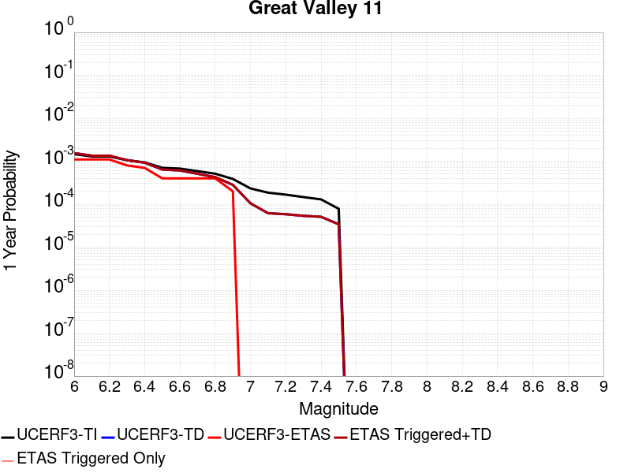 |  |

| Magnitude | 1 wk TI Prob | 1 wk TD Prob | 1 wk ETAS Prob | 1 wk ETAS/TD Gain | 1 wk ETAS Triggered+TD | 1 wk ETAS Triggered Only | 1 mo TI Prob | 1 mo TD Prob | 1 mo ETAS Prob | 1 mo ETAS/TD Gain | 1 mo ETAS Triggered+TD | 1 mo ETAS Triggered Only | 1 yr TI Prob | 1 yr TD Prob | 1 yr ETAS Prob | 1 yr ETAS/TD Gain | 1 yr ETAS Triggered+TD | 1 yr ETAS Triggered Only | 10 yr TI Prob | 10 yr TD Prob | 10 yr ETAS Prob | 10 yr ETAS/TD Gain | 10 yr ETAS Triggered+TD | 10 yr ETAS Triggered Only |
|-----|-----|-----|-----|-----|-----|-----|-----|-----|-----|-----|-----|-----|-----|-----|-----|-----|-----|-----|-----|-----|-----|-----|-----|-----|
| 6.0 | 2.8099583E-5 | 2.9775147E-5 | 0.0 | 0.0 | 2.9775147E-5 | 0.0 | 1.20421224E-4 | 1.2760195E-4 | 0.0 | 0.0 | 1.2760195E-4 | 0.0 | 0.0014651422 | 0.0015525199 | 0.0011 | 0.70852554 | 0.0015525199 | 0.0 | 0.0145552 | 0.015424252 | 0.0086 | 0.55756354 | 0.015818082 | 4.0E-4 |
| 6.1 | 2.483194E-5 | 2.585836E-5 | 0.0 | 0.0 | 2.585836E-5 | 0.0 | 1.0641825E-4 | 1.108172E-4 | 0.0 | 0.0 | 1.108172E-4 | 0.0 | 0.0012948721 | 0.0013484275 | 0.0011 | 0.815765 | 0.0013484275 | 0.0 | 0.012873529 | 0.013408852 | 0.0072 | 0.5369587 | 0.013803489 | 4.0E-4 |
| 6.2 | 2.483194E-5 | 2.585836E-5 | 0.0 | 0.0 | 2.585836E-5 | 0.0 | 1.0641825E-4 | 1.108172E-4 | 0.0 | 0.0 | 1.108172E-4 | 0.0 | 0.0012948721 | 0.0013484275 | 0.0011 | 0.815765 | 0.0013484275 | 0.0 | 0.012873529 | 0.013408852 | 0.0072 | 0.5369587 | 0.013803489 | 4.0E-4 |
| 6.3 | 2.0257901E-5 | 2.0361831E-5 | 0.0 | 0.0 | 2.0361831E-5 | 0.0 | 8.681669E-5 | 8.7262306E-5 | 0.0 | 0.0 | 8.7262306E-5 | 0.0 | 0.0010564806 | 0.0010619421 | 8.0E-4 | 0.7533367 | 0.0010619421 | 0.0 | 0.01051472 | 0.010572836 | 0.0058 | 0.54857564 | 0.010770721 | 2.0E-4 |
| 6.4 | 1.8054898E-5 | 1.7748922E-5 | 0.0 | 0.0 | 1.7748922E-5 | 0.0 | 7.737584E-5 | 7.60648E-5 | 0.0 | 0.0 | 7.60648E-5 | 0.0 | 9.416436E-4 | 9.257329E-4 | 7.0E-4 | 0.75615764 | 9.257329E-4 | 0.0 | 0.009376635 | 0.009222495 | 0.0048 | 0.5204665 | 0.009321573 | 1.0E-4 |
| 6.5 | 1.34804895E-5 | 1.230008E-5 | 0.0 | 0.0 | 1.230008E-5 | 0.0 | 5.777225E-5 | 5.271359E-5 | 0.0 | 0.0 | 5.271359E-5 | 0.0 | 7.031501E-4 | 6.416031E-4 | 4.0E-4 | 0.6234384 | 6.416031E-4 | 0.0 | 0.007009294 | 0.006397943 | 0.0035 | 0.54705083 | 0.006497303 | 1.0E-4 |
| 6.6 | 1.294883E-5 | 1.1711999E-5 | 0.0 | 0.0 | 1.1711999E-5 | 0.0 | 5.5493805E-5 | 5.019334E-5 | 0.0 | 0.0 | 5.019334E-5 | 0.0 | 6.754276E-4 | 6.109366E-4 | 4.0E-4 | 0.6547324 | 6.109366E-4 | 0.0 | 0.006733784 | 0.0060929954 | 0.0033 | 0.54160553 | 0.006192386 | 1.0E-4 |
| 6.7 | 1.1272237E-5 | 9.79449E-6 | 0.0 | 0.0 | 9.79449E-6 | 0.0 | 4.8308695E-5 | 4.1975727E-5 | 0.0 | 0.0 | 4.1975727E-5 | 0.0 | 5.879996E-4 | 5.1093736E-4 | 4.0E-4 | 0.7828748 | 5.1093736E-4 | 0.0 | 0.005864462 | 0.00509791 | 0.0031 | 0.60809237 | 0.0051973998 | 1.0E-4 |
| 6.8 | 9.8337505E-6 | 8.178487E-6 | 0.0 | 0.0 | 8.178487E-6 | 0.0 | 4.2143965E-5 | 3.50502E-5 | 0.0 | 0.0 | 3.50502E-5 | 0.0 | 5.1298196E-4 | 4.2665467E-4 | 4.0E-4 | 0.93752635 | 4.2665467E-4 | 0.0 | 0.005117994 | 0.0042585647 | 0.0028 | 0.65749854 | 0.004358139 | 1.0E-4 |
| 6.9 | 7.4224813E-6 | 5.4022985E-6 | 0.0 | 0.0 | 5.4022985E-6 | 0.0 | 3.1810247E-5 | 2.3152512E-5 | 0.0 | 0.0 | 2.3152512E-5 | 0.0 | 3.872209E-4 | 2.8184676E-4 | 2.0E-4 | 0.70960546 | 2.8184676E-4 | 0.0 | 0.0038654688 | 0.0028150333 | 0.0017 | 0.6039005 | 0.0029147519 | 1.0E-4 |
| 7.0 | 4.4628923E-6 | 2.0061314E-6 | 0.0 | 0.0 | 2.0061314E-6 | 0.0 | 1.912654E-5 | 8.597678E-6 | 0.0 | 0.0 | 8.597678E-6 | 0.0 | 2.3284076E-4 | 1.0467182E-4 | 0.0 | 0.0 | 1.0467182E-4 | 0.0 | 0.0023259693 | 0.0010462366 | 6.0E-4 | 0.573484 | 0.001146132 | 1.0E-4 |
| 7.1 | 3.5546527E-6 | 1.1820339E-6 | 0.0 | 0.0 | 1.1820339E-6 | 0.0 | 1.5234136E-5 | 5.06585E-6 | 0.0 | 0.0 | 5.06585E-6 | 0.0 | 1.8545982E-4 | 6.167505E-5 | 0.0 | 0.0 | 6.167505E-5 | 0.0 | 0.0018530512 | 6.1658607E-4 | 2.0E-4 | 0.32436672 | 6.1658607E-4 | 0.0 |
| 7.2 | 3.2039936E-6 | 1.1221681E-6 | 0.0 | 0.0 | 1.1221681E-6 | 0.0 | 1.3731329E-5 | 4.8092834E-6 | 0.0 | 0.0 | 4.8092834E-6 | 0.0 | 1.671661E-4 | 5.855152E-5 | 0.0 | 0.0 | 5.855152E-5 | 0.0 | 0.0016704041 | 5.853676E-4 | 2.0E-4 | 0.34166566 | 5.853676E-4 | 0.0 |
| 7.3 | 2.8120473E-6 | 1.0276752E-6 | 0.0 | 0.0 | 1.0276752E-6 | 0.0 | 1.2051575E-5 | 4.4043154E-6 | 0.0 | 0.0 | 4.4043154E-6 | 0.0 | 1.4671806E-4 | 5.3621286E-5 | 0.0 | 0.0 | 5.3621286E-5 | 0.0 | 0.0014662122 | 5.3609005E-4 | 2.0E-4 | 0.37307164 | 5.3609005E-4 | 0.0 |
| 7.4 | 2.4837766E-6 | 9.774011E-7 | 0.0 | 0.0 | 9.774011E-7 | 0.0 | 1.0644713E-5 | 4.1888557E-6 | 0.0 | 0.0 | 4.1888557E-6 | 0.0 | 1.2959167E-4 | 5.099819E-5 | 0.0 | 0.0 | 5.099819E-5 | 0.0 | 0.0012951613 | 5.098714E-4 | 2.0E-4 | 0.39225575 | 5.098714E-4 | 0.0 |
| 7.5 | 1.5002679E-6 | 6.5268995E-7 | 0.0 | 0.0 | 6.5268995E-7 | 0.0 | 6.4297037E-6 | 2.79724E-6 | 0.0 | 0.0 | 2.79724E-6 | 0.0 | 7.827883E-5 | 3.4055905E-5 | 0.0 | 0.0 | 3.4055905E-5 | 0.0 | 7.825126E-4 | 3.40511E-4 | 1.0E-4 | 0.29367626 | 3.40511E-4 | 0.0 |

## Garlock (East)
*[(top)](#table-of-contents)*

| 1 Week | 1 Month | 1 Year | 10 Year |
|-----|-----|-----|-----|
|  | 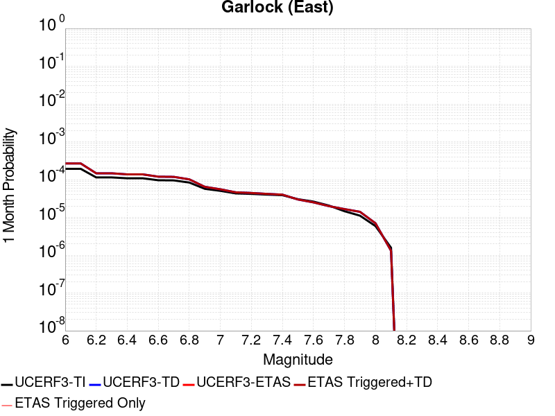 | 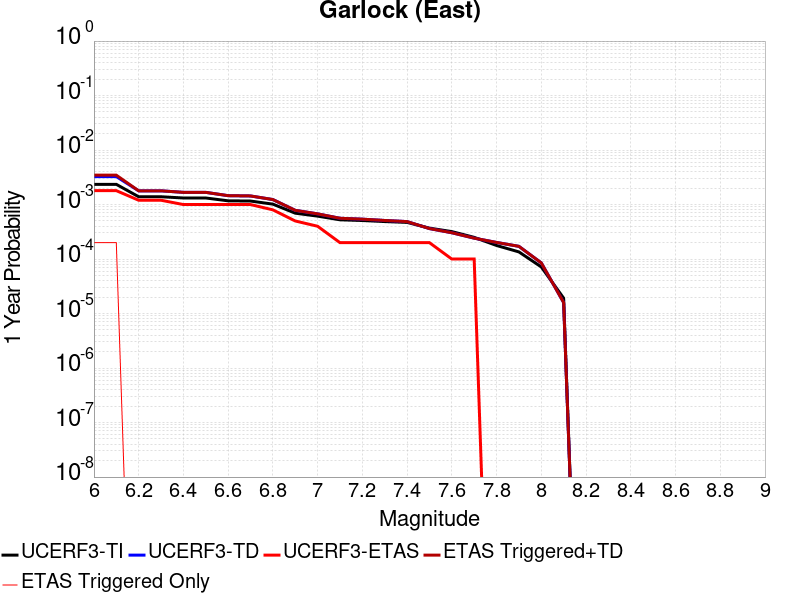 |  |

| Magnitude | 1 wk TI Prob | 1 wk TD Prob | 1 wk ETAS Prob | 1 wk ETAS/TD Gain | 1 wk ETAS Triggered+TD | 1 wk ETAS Triggered Only | 1 mo TI Prob | 1 mo TD Prob | 1 mo ETAS Prob | 1 mo ETAS/TD Gain | 1 mo ETAS Triggered+TD | 1 mo ETAS Triggered Only | 1 yr TI Prob | 1 yr TD Prob | 1 yr ETAS Prob | 1 yr ETAS/TD Gain | 1 yr ETAS Triggered+TD | 1 yr ETAS Triggered Only | 10 yr TI Prob | 10 yr TD Prob | 10 yr ETAS Prob | 10 yr ETAS/TD Gain | 10 yr ETAS Triggered+TD | 10 yr ETAS Triggered Only |
|-----|-----|-----|-----|-----|-----|-----|-----|-----|-----|-----|-----|-----|-----|-----|-----|-----|-----|-----|-----|-----|-----|-----|-----|-----|
| 6.0 | 4.5092507E-5 | 6.26185E-5 | 0.0 | 0.0 | 6.26185E-5 | 0.0 | 1.9323928E-4 | 2.683399E-4 | 0.0 | 0.0 | 2.683399E-4 | 0.0 | 0.0023501497 | 0.0032625883 | 0.0018 | 0.55170923 | 0.0034619358 | 2.0E-4 | 0.023254504 | 0.032222725 | 0.0244 | 0.7572295 | 0.03260984 | 4.0E-4 |
| 6.1 | 4.5092507E-5 | 6.26185E-5 | 0.0 | 0.0 | 6.26185E-5 | 0.0 | 1.9323928E-4 | 2.683399E-4 | 0.0 | 0.0 | 2.683399E-4 | 0.0 | 0.0023501497 | 0.0032625883 | 0.0018 | 0.55170923 | 0.0034619358 | 2.0E-4 | 0.023254504 | 0.032222725 | 0.0244 | 0.7572295 | 0.03260984 | 4.0E-4 |
| 6.2 | 2.6674514E-5 | 3.4283148E-5 | 0.0 | 0.0 | 3.4283148E-5 | 0.0 | 1.1431433E-4 | 1.4691969E-4 | 0.0 | 0.0 | 1.4691969E-4 | 0.0 | 0.0013908884 | 0.0017873124 | 0.0012 | 0.6713991 | 0.0017873124 | 0.0 | 0.01382215 | 0.01779696 | 0.0133 | 0.7473186 | 0.01789518 | 1.0E-4 |
| 6.3 | 2.6674514E-5 | 3.4283148E-5 | 0.0 | 0.0 | 3.4283148E-5 | 0.0 | 1.1431433E-4 | 1.4691969E-4 | 0.0 | 0.0 | 1.4691969E-4 | 0.0 | 0.0013908884 | 0.0017873124 | 0.0012 | 0.6713991 | 0.0017873124 | 0.0 | 0.01382215 | 0.01779696 | 0.0133 | 0.7473186 | 0.01789518 | 1.0E-4 |
| 6.4 | 2.5312667E-5 | 3.2117397E-5 | 0.0 | 0.0 | 3.2117397E-5 | 0.0 | 1.0847834E-4 | 1.376389E-4 | 0.0 | 0.0 | 1.376389E-4 | 0.0 | 0.0013199237 | 0.0016744947 | 0.001 | 0.5971951 | 0.0016744947 | 0.0 | 0.013121112 | 0.016671102 | 0.0127 | 0.76179725 | 0.016769435 | 1.0E-4 |
| 6.5 | 2.5312667E-5 | 3.2117397E-5 | 0.0 | 0.0 | 3.2117397E-5 | 0.0 | 1.0847834E-4 | 1.376389E-4 | 0.0 | 0.0 | 1.376389E-4 | 0.0 | 0.0013199237 | 0.0016744947 | 0.001 | 0.5971951 | 0.0016744947 | 0.0 | 0.013121112 | 0.016671102 | 0.0127 | 0.76179725 | 0.016769435 | 1.0E-4 |
| 6.6 | 2.246556E-5 | 2.7920609E-5 | 0.0 | 0.0 | 2.7920609E-5 | 0.0 | 9.627742E-5 | 1.19654396E-4 | 0.0 | 0.0 | 1.19654396E-4 | 0.0 | 0.0011715472 | 0.0014558422 | 0.001 | 0.6868877 | 0.0014558422 | 0.0 | 0.011653901 | 0.014516019 | 0.0112 | 0.7715614 | 0.014614568 | 1.0E-4 |
| 6.7 | 2.2241198E-5 | 2.7590935E-5 | 0.0 | 0.0 | 2.7590935E-5 | 0.0 | 9.531594E-5 | 1.1824164E-4 | 0.0 | 0.0 | 1.1824164E-4 | 0.0 | 0.0011598538 | 0.0014386646 | 0.001 | 0.69508904 | 0.0014386646 | 0.0 | 0.011538187 | 0.014345958 | 0.0109 | 0.7597959 | 0.0144445235 | 1.0E-4 |
| 6.8 | 1.9528685E-5 | 2.3699193E-5 | 0.0 | 0.0 | 2.3699193E-5 | 0.0 | 8.369167E-5 | 1.01564125E-4 | 0.0 | 0.0 | 1.01564125E-4 | 0.0 | 0.0010184698 | 0.0012358612 | 8.0E-4 | 0.6473219 | 0.0012358612 | 0.0 | 0.010138147 | 0.012333402 | 0.0091 | 0.73783374 | 0.012432168 | 1.0E-4 |
| 6.9 | 1.3318621E-5 | 1.5025627E-5 | 0.0 | 0.0 | 1.5025627E-5 | 0.0 | 5.7078556E-5 | 6.439399E-5 | 0.0 | 0.0 | 6.439399E-5 | 0.0 | 6.9470983E-4 | 7.8372046E-4 | 5.0E-4 | 0.63798255 | 7.8372046E-4 | 0.0 | 0.0069254204 | 0.007850269 | 0.0053 | 0.67513615 | 0.007949484 | 1.0E-4 |
| 7.0 | 1.1760853E-5 | 1.2940224E-5 | 0.0 | 0.0 | 1.2940224E-5 | 0.0 | 5.0402683E-5 | 5.5456952E-5 | 0.0 | 0.0 | 5.5456952E-5 | 0.0 | 6.134799E-4 | 6.749842E-4 | 4.0E-4 | 0.5926065 | 6.749842E-4 | 0.0 | 0.0061178906 | 0.00676973 | 0.0045 | 0.66472375 | 0.006869053 | 1.0E-4 |
| 7.1 | 1.0064758E-5 | 1.07410215E-5 | 0.0 | 0.0 | 1.07410215E-5 | 0.0 | 4.3133965E-5 | 4.6032157E-5 | 0.0 | 0.0 | 4.6032157E-5 | 0.0 | 5.2502943E-4 | 5.6030083E-4 | 2.0E-4 | 0.3569511 | 5.6030083E-4 | 0.0 | 0.005237907 | 0.005628545 | 0.0032 | 0.5685306 | 0.005727982 | 1.0E-4 |
| 7.2 | 9.768808E-6 | 1.0338564E-5 | 0.0 | 0.0 | 1.0338564E-5 | 0.0 | 4.186565E-5 | 4.4307395E-5 | 0.0 | 0.0 | 4.4307395E-5 | 0.0 | 5.095951E-4 | 5.393125E-4 | 2.0E-4 | 0.37084252 | 5.393125E-4 | 0.0 | 0.0050842804 | 0.005419766 | 0.0031 | 0.5719804 | 0.005519224 | 1.0E-4 |
| 7.3 | 9.344516E-6 | 9.787146E-6 | 0.0 | 0.0 | 9.787146E-6 | 0.0 | 4.004731E-5 | 4.194426E-5 | 0.0 | 0.0 | 4.194426E-5 | 0.0 | 4.8746695E-4 | 5.105551E-4 | 2.0E-4 | 0.39173052 | 5.105551E-4 | 0.0 | 0.0048639905 | 0.005132942 | 0.003 | 0.58446014 | 0.0052324287 | 1.0E-4 |
| 7.4 | 9.023491E-6 | 9.336408E-6 | 0.0 | 0.0 | 9.336408E-6 | 0.0 | 3.867153E-5 | 4.001258E-5 | 0.0 | 0.0 | 4.001258E-5 | 0.0 | 4.7072413E-4 | 4.8704757E-4 | 2.0E-4 | 0.4106375 | 4.8704757E-4 | 0.0 | 0.004697283 | 0.004897937 | 0.0029 | 0.592086 | 0.0049974476 | 1.0E-4 |
| 7.5 | 7.081253E-6 | 6.9497437E-6 | 0.0 | 0.0 | 6.9497437E-6 | 0.0 | 3.0347876E-5 | 2.978428E-5 | 0.0 | 0.0 | 2.978428E-5 | 0.0 | 3.6942272E-4 | 3.62564E-4 | 2.0E-4 | 0.55162674 | 3.62564E-4 | 0.0 | 0.003688092 | 0.0036524232 | 0.002 | 0.5475817 | 0.0036524232 | 0.0 |
| 7.6 | 6.116396E-6 | 5.82792E-6 | 0.0 | 0.0 | 5.82792E-6 | 0.0 | 2.6212863E-5 | 2.4976564E-5 | 0.0 | 0.0 | 2.4976564E-5 | 0.0 | 3.1909486E-4 | 3.0404748E-4 | 1.0E-4 | 0.328896 | 3.0404748E-4 | 0.0 | 0.0031863707 | 0.0030672427 | 0.0018 | 0.5868463 | 0.0030672427 | 0.0 |
| 7.7 | 4.797145E-6 | 4.634507E-6 | 0.0 | 0.0 | 4.634507E-6 | 0.0 | 2.055903E-5 | 1.9862024E-5 | 0.0 | 0.0 | 1.9862024E-5 | 0.0 | 2.5027743E-4 | 2.4179342E-4 | 1.0E-4 | 0.4135762 | 2.4179342E-4 | 0.0 | 0.0024999576 | 0.002445301 | 0.0013 | 0.5316319 | 0.002445301 | 0.0 |
| 7.8 | 3.4028885E-6 | 3.8687012E-6 | 0.0 | 0.0 | 3.8687012E-6 | 0.0 | 1.4583726E-5 | 1.6580043E-5 | 0.0 | 0.0 | 1.6580043E-5 | 0.0 | 1.775424E-4 | 2.018434E-4 | 0.0 | 0.0 | 2.018434E-4 | 0.0 | 0.0017740062 | 0.0020439837 | 9.0E-4 | 0.44031665 | 0.0020439837 | 0.0 |
| 7.9 | 2.5928412E-6 | 3.2792618E-6 | 0.0 | 0.0 | 3.2792618E-6 | 0.0 | 1.1112129E-5 | 1.4053903E-5 | 0.0 | 0.0 | 1.4053903E-5 | 0.0 | 1.3528178E-4 | 1.710929E-4 | 0.0 | 0.0 | 1.710929E-4 | 0.0 | 0.0013519945 | 0.0017326559 | 4.0E-4 | 0.23085946 | 0.0017326559 | 0.0 |
| 8.0 | 1.3743648E-6 | 1.6300781E-6 | 0.0 | 0.0 | 1.6300781E-6 | 0.0 | 5.8901214E-6 | 6.9860307E-6 | 0.0 | 0.0 | 6.9860307E-6 | 0.0 | 7.1709874E-5 | 8.505163E-5 | 0.0 | 0.0 | 8.505163E-5 | 0.0 | 7.1686733E-4 | 8.6106616E-4 | 2.0E-4 | 0.2322702 | 8.6106616E-4 | 0.0 |
| 8.1 | 3.6733252E-7 | 3.054934E-7 | 0.0 | 0.0 | 3.054934E-7 | 0.0 | 1.5742813E-6 | 1.3092568E-6 | 0.0 | 0.0 | 1.3092568E-6 | 0.0 | 1.9166706E-5 | 1.59401E-5 | 0.0 | 0.0 | 1.59401E-5 | 0.0 | 1.9165053E-4 | 1.6150644E-4 | 0.0 | 0.0 | 1.6150644E-4 | 0.0 |

## Gillem - Big Crack 2011 CFM
*[(top)](#table-of-contents)*

| 1 Week | 1 Month | 1 Year | 10 Year |
|-----|-----|-----|-----|
|  |  |  |  |

| Magnitude | 1 wk TI Prob | 1 wk TD Prob | 1 wk ETAS Prob | 1 wk ETAS/TD Gain | 1 wk ETAS Triggered+TD | 1 wk ETAS Triggered Only | 1 mo TI Prob | 1 mo TD Prob | 1 mo ETAS Prob | 1 mo ETAS/TD Gain | 1 mo ETAS Triggered+TD | 1 mo ETAS Triggered Only | 1 yr TI Prob | 1 yr TD Prob | 1 yr ETAS Prob | 1 yr ETAS/TD Gain | 1 yr ETAS Triggered+TD | 1 yr ETAS Triggered Only | 10 yr TI Prob | 10 yr TD Prob | 10 yr ETAS Prob | 10 yr ETAS/TD Gain | 10 yr ETAS Triggered+TD | 10 yr ETAS Triggered Only |
|-----|-----|-----|-----|-----|-----|-----|-----|-----|-----|-----|-----|-----|-----|-----|-----|-----|-----|-----|-----|-----|-----|-----|-----|-----|
| 6.0 | 2.196852E-5 | 2.358614E-5 | 0.0 | 0.0 | 2.358614E-5 | 0.0 | 9.4147406E-5 | 1.0108005E-4 | 0.0 | 0.0 | 1.0108005E-4 | 0.0 | 0.0011456419 | 0.0012300436 | 5.0E-4 | 0.40648967 | 0.0012300436 | 0.0 | 0.011397537 | 0.012241199 | 0.0079 | 0.6453616 | 0.012537526 | 3.0E-4 |
| 6.1 | 9.992795E-6 | 1.0703847E-5 | 0.0 | 0.0 | 1.0703847E-5 | 0.0 | 4.2825563E-5 | 4.5872923E-5 | 0.0 | 0.0 | 4.5872923E-5 | 0.0 | 5.2127644E-4 | 5.58378E-4 | 2.0E-4 | 0.35818028 | 5.58378E-4 | 0.0 | 0.0052005537 | 0.0055715577 | 0.0047 | 0.8435702 | 0.0058698864 | 3.0E-4 |
| 6.2 | 9.992795E-6 | 1.0703847E-5 | 0.0 | 0.0 | 1.0703847E-5 | 0.0 | 4.2825563E-5 | 4.5872923E-5 | 0.0 | 0.0 | 4.5872923E-5 | 0.0 | 5.2127644E-4 | 5.58378E-4 | 2.0E-4 | 0.35818028 | 5.58378E-4 | 0.0 | 0.0052005537 | 0.0055715577 | 0.0047 | 0.8435702 | 0.0058698864 | 3.0E-4 |
| 6.3 | 4.6127884E-6 | 4.938969E-6 | 0.0 | 0.0 | 4.938969E-6 | 0.0 | 1.9768944E-5 | 2.1166863E-5 | 0.0 | 0.0 | 2.1166863E-5 | 0.0 | 2.406603E-4 | 2.5768054E-4 | 1.0E-4 | 0.38807744 | 2.5768054E-4 | 0.0 | 0.0024039985 | 0.002574255 | 0.002 | 0.77692384 | 0.002574255 | 0.0 |
| 6.4 | 4.6127884E-6 | 4.938969E-6 | 0.0 | 0.0 | 4.938969E-6 | 0.0 | 1.9768944E-5 | 2.1166863E-5 | 0.0 | 0.0 | 2.1166863E-5 | 0.0 | 2.406603E-4 | 2.5768054E-4 | 1.0E-4 | 0.38807744 | 2.5768054E-4 | 0.0 | 0.0024039985 | 0.002574255 | 0.002 | 0.77692384 | 0.002574255 | 0.0 |
| 6.5 | 2.716712E-6 | 2.9089379E-6 | 0.0 | 0.0 | 2.9089379E-6 | 0.0 | 1.1643E-5 | 1.246683E-5 | 0.0 | 0.0 | 1.246683E-5 | 0.0 | 1.417443E-4 | 1.5177552E-4 | 1.0E-4 | 0.65886784 | 1.5177552E-4 | 0.0 | 0.0014165393 | 0.0015169563 | 7.0E-4 | 0.46145037 | 0.0015169563 | 0.0 |
| 6.6 | 1.3818255E-6 | 1.480947E-6 | 0.0 | 0.0 | 1.480947E-6 | 0.0 | 5.922096E-6 | 6.346908E-6 | 0.0 | 0.0 | 6.346908E-6 | 0.0 | 7.209913E-5 | 7.727209E-5 | 0.0 | 0.0 | 7.727209E-5 | 0.0 | 7.2075747E-4 | 7.7257294E-4 | 4.0E-4 | 0.51775044 | 7.7257294E-4 | 0.0 |

## Scodie Lineament
*[(top)](#table-of-contents)*

| 1 Week | 1 Month | 1 Year | 10 Year |
|-----|-----|-----|-----|
|  |  |  |  |

| Magnitude | 1 wk TI Prob | 1 wk TD Prob | 1 wk ETAS Prob | 1 wk ETAS/TD Gain | 1 wk ETAS Triggered+TD | 1 wk ETAS Triggered Only | 1 mo TI Prob | 1 mo TD Prob | 1 mo ETAS Prob | 1 mo ETAS/TD Gain | 1 mo ETAS Triggered+TD | 1 mo ETAS Triggered Only | 1 yr TI Prob | 1 yr TD Prob | 1 yr ETAS Prob | 1 yr ETAS/TD Gain | 1 yr ETAS Triggered+TD | 1 yr ETAS Triggered Only | 10 yr TI Prob | 10 yr TD Prob | 10 yr ETAS Prob | 10 yr ETAS/TD Gain | 10 yr ETAS Triggered+TD | 10 yr ETAS Triggered Only |
|-----|-----|-----|-----|-----|-----|-----|-----|-----|-----|-----|-----|-----|-----|-----|-----|-----|-----|-----|-----|-----|-----|-----|-----|-----|
| 6.0 | 3.2919327E-6 | 3.0121248E-6 | 0.0 | 0.0 | 3.0121248E-6 | 0.0 | 1.4108206E-5 | 1.290906E-5 | 0.0 | 0.0 | 1.290906E-5 | 0.0 | 1.7175387E-4 | 1.5715965E-4 | 2.0E-4 | 1.2725914 | 2.5714393E-4 | 1.0E-4 | 0.0017162118 | 0.0015707965 | 0.001 | 0.63661975 | 0.0019701682 | 4.0E-4 |
| 6.1 | 1.8663811E-6 | 1.5482478E-6 | 0.0 | 0.0 | 1.5482478E-6 | 0.0 | 7.998751E-6 | 6.6353336E-6 | 0.0 | 0.0 | 6.6353336E-6 | 0.0 | 9.738045E-5 | 8.0782695E-5 | 1.0E-4 | 1.2378889 | 8.0782695E-5 | 0.0 | 9.7337784E-4 | 8.0758205E-4 | 5.0E-4 | 0.61913216 | 9.0750126E-4 | 1.0E-4 |
| 6.2 | 1.8663811E-6 | 1.5482478E-6 | 0.0 | 0.0 | 1.5482478E-6 | 0.0 | 7.998751E-6 | 6.6353336E-6 | 0.0 | 0.0 | 6.6353336E-6 | 0.0 | 9.738045E-5 | 8.0782695E-5 | 1.0E-4 | 1.2378889 | 8.0782695E-5 | 0.0 | 9.7337784E-4 | 8.0758205E-4 | 5.0E-4 | 0.61913216 | 9.0750126E-4 | 1.0E-4 |
| 6.3 | 1.8663811E-6 | 1.5482478E-6 | 0.0 | 0.0 | 1.5482478E-6 | 0.0 | 7.998751E-6 | 6.6353336E-6 | 0.0 | 0.0 | 6.6353336E-6 | 0.0 | 9.738045E-5 | 8.0782695E-5 | 1.0E-4 | 1.2378889 | 8.0782695E-5 | 0.0 | 9.7337784E-4 | 8.0758205E-4 | 5.0E-4 | 0.61913216 | 9.0750126E-4 | 1.0E-4 |
| 6.4 | 1.8663811E-6 | 1.5482478E-6 | 0.0 | 0.0 | 1.5482478E-6 | 0.0 | 7.998751E-6 | 6.6353336E-6 | 0.0 | 0.0 | 6.6353336E-6 | 0.0 | 9.738045E-5 | 8.0782695E-5 | 1.0E-4 | 1.2378889 | 8.0782695E-5 | 0.0 | 9.7337784E-4 | 8.0758205E-4 | 5.0E-4 | 0.61913216 | 9.0750126E-4 | 1.0E-4 |
| 6.5 | 1.8106311E-6 | 1.4902071E-6 | 0.0 | 0.0 | 1.4902071E-6 | 0.0 | 7.759824E-6 | 6.3865887E-6 | 0.0 | 0.0 | 6.3865887E-6 | 0.0 | 9.447177E-5 | 7.775444E-5 | 1.0E-4 | 1.2861001 | 7.775444E-5 | 0.0 | 9.4431615E-4 | 7.77321E-4 | 5.0E-4 | 0.6432349 | 8.7724323E-4 | 1.0E-4 |
| 6.6 | 1.2414679E-6 | 8.992181E-7 | 0.0 | 0.0 | 8.992181E-7 | 0.0 | 5.320566E-6 | 3.8537864E-6 | 0.0 | 0.0 | 3.8537864E-6 | 0.0 | 6.477596E-5 | 4.691893E-5 | 1.0E-4 | 2.131336 | 4.691893E-5 | 0.0 | 6.475708E-4 | 4.690989E-4 | 2.0E-4 | 0.42634934 | 4.690989E-4 | 0.0 |
| 6.7 | 1.1062215E-6 | 7.5894843E-7 | 0.0 | 0.0 | 7.5894843E-7 | 0.0 | 4.7409408E-6 | 3.2526325E-6 | 0.0 | 0.0 | 3.2526325E-6 | 0.0 | 5.7719422E-5 | 3.9600152E-5 | 1.0E-4 | 2.5252428 | 3.9600152E-5 | 0.0 | 5.770443E-4 | 3.9593794E-4 | 1.0E-4 | 0.25256485 | 3.9593794E-4 | 0.0 |
| 6.8 | 1.0006736E-6 | 6.495986E-7 | 0.0 | 0.0 | 6.495986E-7 | 0.0 | 4.288594E-6 | 2.7839912E-6 | 0.0 | 0.0 | 2.7839912E-6 | 0.0 | 5.221238E-5 | 3.389463E-5 | 1.0E-4 | 2.95032 | 3.389463E-5 | 0.0 | 5.220012E-4 | 3.3890066E-4 | 1.0E-4 | 0.29507172 | 3.3890066E-4 | 0.0 |
| 6.9 | 9.167364E-7 | 5.6275314E-7 | 0.0 | 0.0 | 5.6275314E-7 | 0.0 | 3.9288643E-6 | 2.4117971E-6 | 0.0 | 0.0 | 2.4117971E-6 | 0.0 | 4.7832873E-5 | 2.9363293E-5 | 0.0 | 0.0 | 2.9363293E-5 | 0.0 | 4.782258E-4 | 2.9359982E-4 | 0.0 | 0.0 | 2.9359982E-4 | 0.0 |
| 7.0 | 7.6987664E-7 | 4.1098252E-7 | 0.0 | 0.0 | 4.1098252E-7 | 0.0 | 3.2994672E-6 | 1.7613528E-6 | 0.0 | 0.0 | 1.7613528E-6 | 0.0 | 4.0170275E-5 | 2.1444297E-5 | 0.0 | 0.0 | 2.1444297E-5 | 0.0 | 4.0163012E-4 | 2.1442614E-4 | 0.0 | 0.0 | 2.1442614E-4 | 0.0 |
| 7.1 | 7.1038727E-7 | 3.5178041E-7 | 0.0 | 0.0 | 3.5178041E-7 | 0.0 | 3.0445133E-6 | 1.5076297E-6 | 0.0 | 0.0 | 1.5076297E-6 | 0.0 | 3.706632E-5 | 1.8355271E-5 | 0.0 | 0.0 | 1.8355271E-5 | 0.0 | 3.7060137E-4 | 1.8354105E-4 | 0.0 | 0.0 | 1.8354105E-4 | 0.0 |
| 7.2 | 2.0799602E-7 | 3.1090035E-8 | 0.0 | 0.0 | 3.1090035E-8 | 0.0 | 8.914113E-7 | 1.33243E-7 | 0.0 | 0.0 | 1.33243E-7 | 0.0 | 1.0852878E-5 | 1.6222325E-6 | 0.0 | 0.0 | 1.6222325E-6 | 0.0 | 1.08523476E-4 | 1.6222213E-5 | 0.0 | 0.0 | 1.6222213E-5 | 0.0 |
| 7.3 | 1.5048182E-7 | 1.5878712E-8 | 0.0 | 0.0 | 1.5878712E-8 | 0.0 | 6.449219E-7 | 6.805162E-8 | 0.0 | 0.0 | 6.805162E-8 | 0.0 | 7.851896E-6 | 8.2852813E-7 | 0.0 | 0.0 | 8.2852813E-7 | 0.0 | 7.851618E-5 | 8.285254E-6 | 0.0 | 0.0 | 8.285254E-6 | 0.0 |
| 7.4 | 5.9334678E-8 | 4.8415534E-9 | 0.0 | 0.0 | 4.8415534E-9 | 0.0 | 2.5429145E-7 | 2.0749514E-8 | 0.0 | 0.0 | 2.0749514E-8 | 0.0 | 3.095994E-6 | 2.526253E-7 | 0.0 | 0.0 | 2.526253E-7 | 0.0 | 3.095951E-5 | 2.5262514E-6 | 0.0 | 0.0 | 2.5262514E-6 | 0.0 |

## San Pedro Basin
*[(top)](#table-of-contents)*

| 1 Week | 1 Month | 1 Year | 10 Year |
|-----|-----|-----|-----|
|  |  |  | 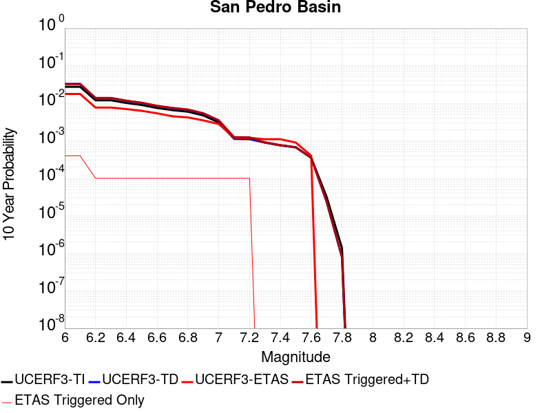 |

| Magnitude | 1 wk TI Prob | 1 wk TD Prob | 1 wk ETAS Prob | 1 wk ETAS/TD Gain | 1 wk ETAS Triggered+TD | 1 wk ETAS Triggered Only | 1 mo TI Prob | 1 mo TD Prob | 1 mo ETAS Prob | 1 mo ETAS/TD Gain | 1 mo ETAS Triggered+TD | 1 mo ETAS Triggered Only | 1 yr TI Prob | 1 yr TD Prob | 1 yr ETAS Prob | 1 yr ETAS/TD Gain | 1 yr ETAS Triggered+TD | 1 yr ETAS Triggered Only | 10 yr TI Prob | 10 yr TD Prob | 10 yr ETAS Prob | 10 yr ETAS/TD Gain | 10 yr ETAS Triggered+TD | 10 yr ETAS Triggered Only |
|-----|-----|-----|-----|-----|-----|-----|-----|-----|-----|-----|-----|-----|-----|-----|-----|-----|-----|-----|-----|-----|-----|-----|-----|-----|
| 6.0 | 5.3449043E-5 | 6.324607E-5 | 0.0 | 0.0 | 6.324607E-5 | 0.0 | 2.2904722E-4 | 2.710299E-4 | 3.0E-4 | 1.106889 | 2.710299E-4 | 0.0 | 0.0027850836 | 0.0032953974 | 0.0021 | 0.6372524 | 0.003395068 | 1.0E-4 | 0.027504366 | 0.03252667 | 0.0177 | 0.54416883 | 0.03291366 | 4.0E-4 |
| 6.1 | 5.3449043E-5 | 6.324607E-5 | 0.0 | 0.0 | 6.324607E-5 | 0.0 | 2.2904722E-4 | 2.710299E-4 | 3.0E-4 | 1.106889 | 2.710299E-4 | 0.0 | 0.0027850836 | 0.0032953974 | 0.0021 | 0.6372524 | 0.003395068 | 1.0E-4 | 0.027504366 | 0.03252667 | 0.0177 | 0.54416883 | 0.03291366 | 4.0E-4 |
| 6.2 | 2.3189454E-5 | 2.6600583E-5 | 0.0 | 0.0 | 2.6600583E-5 | 0.0 | 9.9379584E-5 | 1.13997776E-4 | 1.0E-4 | 0.8772101 | 1.13997776E-4 | 0.0 | 0.0012092749 | 0.0013870861 | 7.0E-4 | 0.504655 | 0.0013870861 | 0.0 | 0.012027155 | 0.013789139 | 0.0077 | 0.5584105 | 0.01388776 | 1.0E-4 |
| 6.3 | 2.3189454E-5 | 2.6600583E-5 | 0.0 | 0.0 | 2.6600583E-5 | 0.0 | 9.9379584E-5 | 1.13997776E-4 | 1.0E-4 | 0.8772101 | 1.13997776E-4 | 0.0 | 0.0012092749 | 0.0013870861 | 7.0E-4 | 0.504655 | 0.0013870861 | 0.0 | 0.012027155 | 0.013789139 | 0.0077 | 0.5584105 | 0.01388776 | 1.0E-4 |
| 6.4 | 1.966056E-5 | 2.2429222E-5 | 0.0 | 0.0 | 2.2429222E-5 | 0.0 | 8.425682E-5 | 9.612192E-5 | 1.0E-4 | 1.0403454 | 9.612192E-5 | 0.0 | 0.001025344 | 0.0011696961 | 6.0E-4 | 0.51295376 | 0.0011696961 | 0.0 | 0.010206259 | 0.011639469 | 0.007 | 0.601402 | 0.011738306 | 1.0E-4 |
| 6.5 | 1.7342953E-5 | 1.9715857E-5 | 0.0 | 0.0 | 1.9715857E-5 | 0.0 | 7.4324824E-5 | 8.4494E-5 | 0.0 | 0.0 | 8.4494E-5 | 0.0 | 9.04529E-4 | 0.0010282658 | 5.0E-4 | 0.4862556 | 0.0010282658 | 0.0 | 0.009008561 | 0.010238791 | 0.0063 | 0.61530703 | 0.010337767 | 1.0E-4 |
| 6.6 | 1.439804E-5 | 1.6299211E-5 | 0.0 | 0.0 | 1.6299211E-5 | 0.0 | 6.170443E-5 | 6.9852074E-5 | 0.0 | 0.0 | 6.9852074E-5 | 0.0 | 7.509924E-4 | 8.501492E-4 | 4.0E-4 | 0.47050565 | 8.501492E-4 | 0.0 | 0.0074845953 | 0.008472161 | 0.0054 | 0.6373816 | 0.008571314 | 1.0E-4 |
| 6.7 | 1.2634884E-5 | 1.4265099E-5 | 0.0 | 0.0 | 1.4265099E-5 | 0.0 | 5.414838E-5 | 6.113488E-5 | 0.0 | 0.0 | 6.113488E-5 | 0.0 | 6.590571E-4 | 7.440933E-4 | 4.0E-4 | 0.537567 | 7.440933E-4 | 0.0 | 0.006571059 | 0.0074190297 | 0.0045 | 0.6065483 | 0.0075182877 | 1.0E-4 |
| 6.8 | 1.146091E-5 | 1.2915133E-5 | 0.0 | 0.0 | 1.2915133E-5 | 0.0 | 4.911726E-5 | 5.5349567E-5 | 0.0 | 0.0 | 5.5349567E-5 | 0.0 | 5.9783855E-4 | 6.737022E-4 | 4.0E-4 | 0.5937341 | 6.737022E-4 | 0.0 | 0.0059623276 | 0.006719529 | 0.0042 | 0.62504375 | 0.0068188575 | 1.0E-4 |
| 6.9 | 9.109035E-6 | 1.0221102E-5 | 0.0 | 0.0 | 1.0221102E-5 | 0.0 | 3.9038136E-5 | 4.3804142E-5 | 0.0 | 0.0 | 4.3804142E-5 | 0.0 | 4.7518566E-4 | 5.332128E-4 | 4.0E-4 | 0.7501695 | 5.332128E-4 | 0.0 | 0.0047417083 | 0.005322079 | 0.0035 | 0.6576377 | 0.005421547 | 1.0E-4 |
| 7.0 | 5.9351028E-6 | 6.575781E-6 | 0.0 | 0.0 | 6.575781E-6 | 0.0 | 2.5435906E-5 | 2.8181747E-5 | 0.0 | 0.0 | 2.8181747E-5 | 0.0 | 3.0963816E-4 | 3.4308227E-4 | 4.0E-4 | 1.1659011 | 3.4308227E-4 | 0.0 | 0.0030920706 | 0.0034278356 | 0.0028 | 0.81684196 | 0.0035274928 | 1.0E-4 |
| 7.1 | 2.1557585E-6 | 2.20865E-6 | 0.0 | 0.0 | 2.20865E-6 | 0.0 | 9.238933E-6 | 9.465609E-6 | 0.0 | 0.0 | 9.465609E-6 | 0.0 | 1.1247819E-4 | 1.1523785E-4 | 0.0 | 0.0 | 1.1523785E-4 | 0.0 | 0.0011242128 | 0.0011517963 | 0.0012 | 1.0418509 | 0.0012516811 | 1.0E-4 |
| 7.2 | 2.1251979E-6 | 2.1770081E-6 | 0.0 | 0.0 | 2.1770081E-6 | 0.0 | 9.107958E-6 | 9.330002E-6 | 0.0 | 0.0 | 9.330002E-6 | 0.0 | 1.1088375E-4 | 1.13587004E-4 | 0.0 | 0.0 | 1.13587004E-4 | 0.0 | 0.0011082845 | 0.0011353048 | 0.0012 | 1.0569849 | 0.0012351912 | 1.0E-4 |
| 7.3 | 1.7145798E-6 | 1.743556E-6 | 0.0 | 0.0 | 1.743556E-6 | 0.0 | 7.3481783E-6 | 7.472362E-6 | 0.0 | 0.0 | 7.472362E-6 | 0.0 | 8.94604E-5 | 9.09723E-5 | 0.0 | 0.0 | 9.09723E-5 | 0.0 | 8.9424395E-4 | 9.093598E-4 | 0.0011 | 1.2096423 | 9.093598E-4 | 0.0 |
| 7.4 | 1.4467993E-6 | 1.4635903E-6 | 0.0 | 0.0 | 1.4635903E-6 | 0.0 | 6.200554E-6 | 6.272515E-6 | 0.0 | 0.0 | 6.272515E-6 | 0.0 | 7.548913E-5 | 7.6365264E-5 | 0.0 | 0.0 | 7.6365264E-5 | 0.0 | 7.546349E-4 | 7.6339755E-4 | 0.0011 | 1.4409268 | 7.6339755E-4 | 0.0 |
| 7.5 | 1.2803735E-6 | 1.2926232E-6 | 0.0 | 0.0 | 1.2926232E-6 | 0.0 | 5.487303E-6 | 5.5398023E-6 | 0.0 | 0.0 | 5.5398023E-6 | 0.0 | 6.680587E-5 | 6.744508E-5 | 0.0 | 0.0 | 6.744508E-5 | 0.0 | 6.678579E-4 | 6.7425316E-4 | 9.0E-4 | 1.3348103 | 6.7425316E-4 | 0.0 |
| 7.6 | 6.755009E-7 | 6.7666826E-7 | 0.0 | 0.0 | 6.7666826E-7 | 0.0 | 2.8950008E-6 | 2.900004E-6 | 0.0 | 0.0 | 2.900004E-6 | 0.0 | 3.5246063E-5 | 3.530703E-5 | 0.0 | 0.0 | 3.530703E-5 | 0.0 | 3.5240475E-4 | 3.5301995E-4 | 4.0E-4 | 1.1330804 | 3.5301995E-4 | 0.0 |
| 7.7 | 6.211885E-8 | 4.5673264E-8 | 0.0 | 0.0 | 4.5673264E-8 | 0.0 | 2.6622362E-7 | 1.9574256E-7 | 0.0 | 0.0 | 1.9574256E-7 | 0.0 | 3.2412677E-6 | 2.383163E-6 | 0.0 | 0.0 | 2.383163E-6 | 0.0 | 3.2412205E-5 | 2.3831397E-5 | 0.0 | 0.0 | 2.3831397E-5 | 0.0 |
| 7.8 | 2.6580573E-9 | 1.5097251E-9 | 0.0 | 0.0 | 1.5097251E-9 | 0.0 | 1.1391674E-8 | 6.4702506E-9 | 0.0 | 0.0 | 6.4702506E-9 | 0.0 | 1.3869362E-7 | 7.87753E-8 | 0.0 | 0.0 | 7.87753E-8 | 0.0 | 1.3869354E-6 | 7.8775304E-7 | 0.0 | 0.0 | 7.8775304E-7 | 0.0 |

## Pilarcitos 2011 CFM
*[(top)](#table-of-contents)*

| 1 Week | 1 Month | 1 Year | 10 Year |
|-----|-----|-----|-----|
|  |  |  |  |

| Magnitude | 1 wk TI Prob | 1 wk TD Prob | 1 wk ETAS Prob | 1 wk ETAS/TD Gain | 1 wk ETAS Triggered+TD | 1 wk ETAS Triggered Only | 1 mo TI Prob | 1 mo TD Prob | 1 mo ETAS Prob | 1 mo ETAS/TD Gain | 1 mo ETAS Triggered+TD | 1 mo ETAS Triggered Only | 1 yr TI Prob | 1 yr TD Prob | 1 yr ETAS Prob | 1 yr ETAS/TD Gain | 1 yr ETAS Triggered+TD | 1 yr ETAS Triggered Only | 10 yr TI Prob | 10 yr TD Prob | 10 yr ETAS Prob | 10 yr ETAS/TD Gain | 10 yr ETAS Triggered+TD | 10 yr ETAS Triggered Only |
|-----|-----|-----|-----|-----|-----|-----|-----|-----|-----|-----|-----|-----|-----|-----|-----|-----|-----|-----|-----|-----|-----|-----|-----|-----|
| 6.0 | 4.9150476E-6 | 3.144231E-6 | 0.0 | 0.0 | 3.144231E-6 | 0.0 | 2.1064321E-5 | 1.3475207E-5 | 0.0 | 0.0 | 1.3475207E-5 | 0.0 | 2.564279E-4 | 1.6404862E-4 | 0.0 | 0.0 | 1.6404862E-4 | 0.0 | 0.0025613222 | 0.0016516697 | 0.0014 | 0.84762704 | 0.0019511742 | 3.0E-4 |
| 6.1 | 4.9150476E-6 | 3.144231E-6 | 0.0 | 0.0 | 3.144231E-6 | 0.0 | 2.1064321E-5 | 1.3475207E-5 | 0.0 | 0.0 | 1.3475207E-5 | 0.0 | 2.564279E-4 | 1.6404862E-4 | 0.0 | 0.0 | 1.6404862E-4 | 0.0 | 0.0025613222 | 0.0016516697 | 0.001 | 0.6054479 | 0.0018513395 | 2.0E-4 |
| 6.2 | 4.162343E-6 | 2.3728235E-6 | 0.0 | 0.0 | 2.3728235E-6 | 0.0 | 1.783849E-5 | 1.0169204E-5 | 0.0 | 0.0 | 1.0169204E-5 | 0.0 | 2.1716199E-4 | 1.238031E-4 | 0.0 | 0.0 | 1.238031E-4 | 0.0 | 0.002169499 | 0.0012497179 | 0.001 | 0.8001806 | 0.001449468 | 2.0E-4 |
| 6.3 | 4.162343E-6 | 2.3728235E-6 | 0.0 | 0.0 | 2.3728235E-6 | 0.0 | 1.783849E-5 | 1.0169204E-5 | 0.0 | 0.0 | 1.0169204E-5 | 0.0 | 2.1716199E-4 | 1.238031E-4 | 0.0 | 0.0 | 1.238031E-4 | 0.0 | 0.002169499 | 0.0012497179 | 0.001 | 0.8001806 | 0.001449468 | 2.0E-4 |
| 6.4 | 3.8768926E-6 | 2.080319E-6 | 0.0 | 0.0 | 2.080319E-6 | 0.0 | 1.6615148E-5 | 8.915623E-6 | 0.0 | 0.0 | 8.915623E-6 | 0.0 | 2.0227065E-4 | 1.0854234E-4 | 0.0 | 0.0 | 1.0854234E-4 | 0.0 | 0.0020208664 | 0.0010972681 | 9.0E-4 | 0.8202189 | 0.0012970486 | 2.0E-4 |
| 6.5 | 3.7137002E-6 | 1.9137601E-6 | 0.0 | 0.0 | 1.9137601E-6 | 0.0 | 1.591576E-5 | 8.201803E-6 | 0.0 | 0.0 | 8.201803E-6 | 0.0 | 1.9375715E-4 | 9.9852405E-5 | 0.0 | 0.0 | 9.9852405E-5 | 0.0 | 0.001935883 | 0.0010104501 | 6.0E-4 | 0.59379476 | 0.001210248 | 2.0E-4 |
| 6.6 | 3.5048733E-6 | 1.6987939E-6 | 0.0 | 0.0 | 1.6987939E-6 | 0.0 | 1.5020799E-5 | 7.280525E-6 | 0.0 | 0.0 | 7.280525E-6 | 0.0 | 1.8286289E-4 | 8.863681E-5 | 0.0 | 0.0 | 8.863681E-5 | 0.0 | 0.0018271249 | 8.9838984E-4 | 5.0E-4 | 0.5565513 | 9.983E-4 | 1.0E-4 |
| 6.7 | 3.3908584E-6 | 1.5825741E-6 | 0.0 | 0.0 | 1.5825741E-6 | 0.0 | 1.453217E-5 | 6.7824426E-6 | 0.0 | 0.0 | 6.7824426E-6 | 0.0 | 1.7691481E-4 | 8.2573126E-5 | 0.0 | 0.0 | 8.2573126E-5 | 0.0 | 0.0017677402 | 8.378E-4 | 5.0E-4 | 0.59680116 | 9.377162E-4 | 1.0E-4 |
| 6.8 | 3.2451449E-6 | 1.4359205E-6 | 0.0 | 0.0 | 1.4359205E-6 | 0.0 | 1.3907689E-5 | 6.15393E-6 | 0.0 | 0.0 | 6.15393E-6 | 0.0 | 1.6931296E-4 | 7.492153E-5 | 0.0 | 0.0 | 7.492153E-5 | 0.0 | 0.0016918402 | 7.613385E-4 | 5.0E-4 | 0.6567381 | 8.612624E-4 | 1.0E-4 |
| 6.9 | 3.1239128E-6 | 1.3125516E-6 | 0.0 | 0.0 | 1.3125516E-6 | 0.0 | 1.3388129E-5 | 5.6252093E-6 | 0.0 | 0.0 | 5.6252093E-6 | 0.0 | 1.6298829E-4 | 6.848478E-5 | 0.0 | 0.0 | 6.848478E-5 | 0.0 | 0.001628688 | 6.97013E-4 | 5.0E-4 | 0.7173467 | 7.9694326E-4 | 1.0E-4 |
| 7.0 | 2.9940109E-6 | 1.1840551E-6 | 0.0 | 0.0 | 1.1840551E-6 | 0.0 | 1.2831412E-5 | 5.074512E-6 | 0.0 | 0.0 | 5.074512E-6 | 0.0 | 1.5621124E-4 | 6.178044E-5 | 0.0 | 0.0 | 6.178044E-5 | 0.0 | 0.0015610148 | 6.300091E-4 | 5.0E-4 | 0.7936393 | 7.299461E-4 | 1.0E-4 |
| 7.1 | 2.7471217E-6 | 1.0973234E-6 | 0.0 | 0.0 | 1.0973234E-6 | 0.0 | 1.1773326E-5 | 4.702806E-6 | 0.0 | 0.0 | 4.702806E-6 | 0.0 | 1.4333082E-4 | 5.725516E-5 | 0.0 | 0.0 | 5.725516E-5 | 0.0 | 0.001432384 | 5.847355E-4 | 5.0E-4 | 0.8550875 | 6.84677E-4 | 1.0E-4 |
| 7.2 | 2.592675E-6 | 9.640502E-7 | 0.0 | 0.0 | 9.640502E-7 | 0.0 | 1.1111417E-5 | 4.1316366E-6 | 0.0 | 0.0 | 4.1316366E-6 | 0.0 | 1.3527309E-4 | 5.0301518E-5 | 0.0 | 0.0 | 5.0301518E-5 | 0.0 | 0.0013519078 | 5.1523343E-4 | 5.0E-4 | 0.97043395 | 6.1518187E-4 | 1.0E-4 |
| 7.3 | 2.4518663E-6 | 8.5554564E-7 | 0.0 | 0.0 | 8.5554564E-7 | 0.0 | 1.0507956E-5 | 3.666619E-6 | 0.0 | 0.0 | 3.666619E-6 | 0.0 | 1.2792686E-4 | 4.4640172E-5 | 0.0 | 0.0 | 4.4640172E-5 | 0.0 | 0.0012785323 | 4.58643E-4 | 5.0E-4 | 1.0901725 | 5.585971E-4 | 1.0E-4 |
| 7.4 | 2.3349535E-6 | 8.184507E-7 | 0.0 | 0.0 | 8.184507E-7 | 0.0 | 1.0006905E-5 | 3.5076412E-6 | 0.0 | 0.0 | 3.5076412E-6 | 0.0 | 1.2182725E-4 | 4.2704694E-5 | 0.0 | 0.0 | 4.2704694E-5 | 0.0 | 0.0012176048 | 4.392726E-4 | 4.0E-4 | 0.9105963 | 5.3922867E-4 | 1.0E-4 |
| 7.5 | 2.1358665E-6 | 7.725491E-7 | 0.0 | 0.0 | 7.725491E-7 | 0.0 | 9.15368E-6 | 3.3109204E-6 | 0.0 | 0.0 | 3.3109204E-6 | 0.0 | 1.11440364E-4 | 4.030971E-5 | 0.0 | 0.0 | 4.030971E-5 | 0.0 | 0.0011138449 | 4.1524452E-4 | 4.0E-4 | 0.9632879 | 5.15203E-4 | 1.0E-4 |
| 7.6 | 1.6445446E-6 | 6.331206E-7 | 0.0 | 0.0 | 6.331206E-7 | 0.0 | 7.048029E-6 | 2.713371E-6 | 0.0 | 0.0 | 2.713371E-6 | 0.0 | 8.580638E-5 | 3.3034794E-5 | 0.0 | 0.0 | 3.3034794E-5 | 0.0 | 8.5773255E-4 | 3.4245505E-4 | 3.0E-4 | 0.87602735 | 3.4245505E-4 | 0.0 |
| 7.7 | 1.3650961E-6 | 5.365653E-7 | 0.0 | 0.0 | 5.365653E-7 | 0.0 | 5.850399E-6 | 2.2995637E-6 | 0.0 | 0.0 | 2.2995637E-6 | 0.0 | 7.122628E-5 | 2.7996828E-5 | 0.0 | 0.0 | 2.7996828E-5 | 0.0 | 7.120345E-4 | 2.9197492E-4 | 3.0E-4 | 1.0274855 | 2.9197492E-4 | 0.0 |
| 7.8 | 1.0500993E-6 | 5.105362E-7 | 0.0 | 0.0 | 5.105362E-7 | 0.0 | 4.5004176E-6 | 2.1880105E-6 | 0.0 | 0.0 | 2.1880105E-6 | 0.0 | 5.4791206E-5 | 2.6638703E-5 | 0.0 | 0.0 | 2.6638703E-5 | 0.0 | 5.47777E-4 | 2.782785E-4 | 3.0E-4 | 1.0780568 | 2.782785E-4 | 0.0 |
| 7.9 | 5.856431E-7 | 4.7864296E-7 | 0.0 | 0.0 | 4.7864296E-7 | 0.0 | 2.5098966E-6 | 2.0513253E-6 | 0.0 | 0.0 | 2.0513253E-6 | 0.0 | 3.0557563E-5 | 2.49746E-5 | 0.0 | 0.0 | 2.49746E-5 | 0.0 | 3.055336E-4 | 2.6095548E-4 | 3.0E-4 | 1.1496215 | 2.6095548E-4 | 0.0 |
| 8.0 | 4.4768265E-7 | 4.519346E-7 | 0.0 | 0.0 | 4.519346E-7 | 0.0 | 1.9186384E-6 | 1.9368613E-6 | 0.0 | 0.0 | 1.9368613E-6 | 0.0 | 2.3359173E-5 | 2.3581031E-5 | 0.0 | 0.0 | 2.3581031E-5 | 0.0 | 2.3356717E-4 | 2.4651948E-4 | 3.0E-4 | 1.2169424 | 2.4651948E-4 | 0.0 |
| 8.1 | 2.6692538E-7 | 3.1503544E-7 | 0.0 | 0.0 | 3.1503544E-7 | 0.0 | 1.1439654E-6 | 1.3501513E-6 | 0.0 | 0.0 | 1.3501513E-6 | 0.0 | 1.392769E-5 | 1.6437969E-5 | 0.0 | 0.0 | 1.6437969E-5 | 0.0 | 1.3926817E-4 | 1.7180636E-4 | 3.0E-4 | 1.7461518 | 1.7180636E-4 | 0.0 |
| 8.2 | 1.3198862E-8 | 1.0033938E-8 | 0.0 | 0.0 | 1.0033938E-8 | 0.0 | 5.656655E-8 | 4.3002593E-8 | 0.0 | 0.0 | 4.3002593E-8 | 0.0 | 6.886975E-7 | 5.235565E-7 | 0.0 | 0.0 | 5.235565E-7 | 0.0 | 6.8869535E-6 | 5.460517E-6 | 0.0 | 0.0 | 5.460517E-6 | 0.0 |

## Point Reyes 2011 CFM
*[(top)](#table-of-contents)*

| 1 Week | 1 Month | 1 Year | 10 Year |
|-----|-----|-----|-----|
|  |  |  |  |

| Magnitude | 1 wk TI Prob | 1 wk TD Prob | 1 wk ETAS Prob | 1 wk ETAS/TD Gain | 1 wk ETAS Triggered+TD | 1 wk ETAS Triggered Only | 1 mo TI Prob | 1 mo TD Prob | 1 mo ETAS Prob | 1 mo ETAS/TD Gain | 1 mo ETAS Triggered+TD | 1 mo ETAS Triggered Only | 1 yr TI Prob | 1 yr TD Prob | 1 yr ETAS Prob | 1 yr ETAS/TD Gain | 1 yr ETAS Triggered+TD | 1 yr ETAS Triggered Only | 10 yr TI Prob | 10 yr TD Prob | 10 yr ETAS Prob | 10 yr ETAS/TD Gain | 10 yr ETAS Triggered+TD | 10 yr ETAS Triggered Only |
|-----|-----|-----|-----|-----|-----|-----|-----|-----|-----|-----|-----|-----|-----|-----|-----|-----|-----|-----|-----|-----|-----|-----|-----|-----|
| 6.0 | 8.8644965E-6 | 8.963893E-6 | 0.0 | 0.0 | 8.963893E-6 | 0.0 | 3.7990147E-5 | 3.8416154E-5 | 0.0 | 0.0 | 3.8416154E-5 | 0.0 | 4.624319E-4 | 4.676226E-4 | 0.0 | 0.0 | 4.676226E-4 | 0.0 | 0.0046147075 | 0.0046670143 | 0.0027 | 0.57852834 | 0.004965614 | 3.0E-4 |
| 6.1 | 4.526405E-6 | 4.5369065E-6 | 0.0 | 0.0 | 4.5369065E-6 | 0.0 | 1.9398734E-5 | 1.9443745E-5 | 0.0 | 0.0 | 1.9443745E-5 | 0.0 | 2.36154E-4 | 2.3670292E-4 | 0.0 | 0.0 | 2.3670292E-4 | 0.0 | 0.002359032 | 0.0023646143 | 0.0013 | 0.54977256 | 0.0024643778 | 1.0E-4 |
| 6.2 | 4.526405E-6 | 4.5369065E-6 | 0.0 | 0.0 | 4.5369065E-6 | 0.0 | 1.9398734E-5 | 1.9443745E-5 | 0.0 | 0.0 | 1.9443745E-5 | 0.0 | 2.36154E-4 | 2.3670292E-4 | 0.0 | 0.0 | 2.3670292E-4 | 0.0 | 0.002359032 | 0.0023646143 | 0.0013 | 0.54977256 | 0.0024643778 | 1.0E-4 |
| 6.3 | 2.6842322E-6 | 2.6587513E-6 | 0.0 | 0.0 | 2.6587513E-6 | 0.0 | 1.1503801E-5 | 1.13946E-5 | 0.0 | 0.0 | 1.13946E-5 | 0.0 | 1.4004979E-4 | 1.3872061E-4 | 0.0 | 0.0 | 1.3872061E-4 | 0.0 | 0.0013996155 | 0.001386362 | 8.0E-4 | 0.57704985 | 0.0014862234 | 1.0E-4 |
| 6.4 | 2.6842322E-6 | 2.6587513E-6 | 0.0 | 0.0 | 2.6587513E-6 | 0.0 | 1.1503801E-5 | 1.13946E-5 | 0.0 | 0.0 | 1.13946E-5 | 0.0 | 1.4004979E-4 | 1.3872061E-4 | 0.0 | 0.0 | 1.3872061E-4 | 0.0 | 0.0013996155 | 0.001386362 | 8.0E-4 | 0.57704985 | 0.0014862234 | 1.0E-4 |
| 6.5 | 1.9281833E-6 | 1.8888504E-6 | 0.0 | 0.0 | 1.8888504E-6 | 0.0 | 8.263617E-6 | 8.0950485E-6 | 0.0 | 0.0 | 8.0950485E-6 | 0.0 | 1.0060489E-4 | 9.8552846E-5 | 0.0 | 0.0 | 9.8552846E-5 | 0.0 | 0.0010055936 | 9.851023E-4 | 5.0E-4 | 0.5075615 | 0.0010850037 | 1.0E-4 |
| 6.6 | 1.4726726E-6 | 1.4252686E-6 | 0.0 | 0.0 | 1.4252686E-6 | 0.0 | 6.3114385E-6 | 6.1082796E-6 | 0.0 | 0.0 | 6.1082796E-6 | 0.0 | 7.683905E-5 | 7.436582E-5 | 0.0 | 0.0 | 7.436582E-5 | 0.0 | 7.6812494E-4 | 7.434165E-4 | 4.0E-4 | 0.5380564 | 8.4334216E-4 | 1.0E-4 |
| 6.7 | 8.572307E-7 | 7.991468E-7 | 0.0 | 0.0 | 7.991468E-7 | 0.0 | 3.6738406E-6 | 3.4249103E-6 | 0.0 | 0.0 | 3.4249103E-6 | 0.0 | 4.472809E-5 | 4.16975E-5 | 0.0 | 0.0 | 4.16975E-5 | 0.0 | 4.471909E-4 | 4.1690073E-4 | 3.0E-4 | 0.7195958 | 5.16859E-4 | 1.0E-4 |
| 6.8 | 6.6745434E-7 | 6.061897E-7 | 0.0 | 0.0 | 6.061897E-7 | 0.0 | 2.8605155E-6 | 2.5979532E-6 | 0.0 | 0.0 | 2.5979532E-6 | 0.0 | 3.482622E-5 | 3.1629632E-5 | 0.0 | 0.0 | 3.1629632E-5 | 0.0 | 3.4820763E-4 | 3.1625465E-4 | 1.0E-4 | 0.3162009 | 3.1625465E-4 | 0.0 |
| 6.9 | 4.291521E-7 | 3.6386228E-7 | 0.0 | 0.0 | 3.6386228E-7 | 0.0 | 1.839222E-6 | 1.5594089E-6 | 0.0 | 0.0 | 1.5594089E-6 | 0.0 | 2.2392298E-5 | 1.8985642E-5 | 0.0 | 0.0 | 1.8985642E-5 | 0.0 | 2.2390042E-4 | 1.8984289E-4 | 0.0 | 0.0 | 1.8984289E-4 | 0.0 |
| 7.0 | 2.6812808E-7 | 2.0040757E-7 | 0.0 | 0.0 | 2.0040757E-7 | 0.0 | 1.1491198E-6 | 8.5888934E-7 | 0.0 | 0.0 | 8.5888934E-7 | 0.0 | 1.3990444E-5 | 1.0456928E-5 | 0.0 | 0.0 | 1.0456928E-5 | 0.0 | 1.3989564E-4 | 1.04566745E-4 | 0.0 | 0.0 | 1.04566745E-4 | 0.0 |
| 7.1 | 1.9451231E-7 | 1.2580303E-7 | 0.0 | 0.0 | 1.2580303E-7 | 0.0 | 8.336239E-7 | 5.3915574E-7 | 0.0 | 0.0 | 5.3915574E-7 | 0.0 | 1.0149324E-5 | 6.564201E-6 | 0.0 | 0.0 | 6.564201E-6 | 0.0 | 1.014886E-4 | 6.564239E-5 | 0.0 | 0.0 | 6.564239E-5 | 0.0 |
| 7.2 | 1.6715143E-7 | 9.899642E-8 | 0.0 | 0.0 | 9.899642E-8 | 0.0 | 7.1636305E-7 | 4.2427033E-7 | 0.0 | 0.0 | 4.2427033E-7 | 0.0 | 8.721685E-6 | 5.165479E-6 | 0.0 | 0.0 | 5.165479E-6 | 0.0 | 8.721343E-5 | 5.1655898E-5 | 0.0 | 0.0 | 5.1655898E-5 | 0.0 |
| 7.3 | 1.5503173E-7 | 8.871935E-8 | 0.0 | 0.0 | 8.871935E-8 | 0.0 | 6.644215E-7 | 3.8022574E-7 | 0.0 | 0.0 | 3.8022574E-7 | 0.0 | 8.089301E-6 | 4.6292384E-6 | 0.0 | 0.0 | 4.6292384E-6 | 0.0 | 8.089007E-5 | 4.6293728E-5 | 0.0 | 0.0 | 4.6293728E-5 | 0.0 |
| 7.4 | 1.4251614E-7 | 7.960195E-8 | 0.0 | 0.0 | 7.960195E-8 | 0.0 | 6.1078333E-7 | 3.4115118E-7 | 0.0 | 0.0 | 3.4115118E-7 | 0.0 | 7.4362615E-6 | 4.1535077E-6 | 0.0 | 0.0 | 4.1535077E-6 | 0.0 | 7.436013E-5 | 4.153661E-5 | 0.0 | 0.0 | 4.153661E-5 | 0.0 |
| 7.5 | 1.2710186E-7 | 6.897576E-8 | 0.0 | 0.0 | 6.897576E-8 | 0.0 | 5.447221E-7 | 2.956104E-7 | 0.0 | 0.0 | 2.956104E-7 | 0.0 | 6.6319717E-6 | 3.5990504E-6 | 0.0 | 0.0 | 3.5990504E-6 | 0.0 | 6.6317734E-5 | 3.5992227E-5 | 0.0 | 0.0 | 3.5992227E-5 | 0.0 |
| 7.6 | 1.0144708E-7 | 5.375214E-8 | 0.0 | 0.0 | 5.375214E-8 | 0.0 | 4.347731E-7 | 2.3036631E-7 | 0.0 | 0.0 | 2.3036631E-7 | 0.0 | 5.2933497E-6 | 2.8047061E-6 | 0.0 | 0.0 | 2.8047061E-6 | 0.0 | 5.293224E-5 | 2.8049015E-5 | 0.0 | 0.0 | 2.8049015E-5 | 0.0 |
| 7.7 | 7.090527E-8 | 3.884654E-8 | 0.0 | 0.0 | 3.884654E-8 | 0.0 | 3.038797E-7 | 1.6648517E-7 | 0.0 | 0.0 | 1.6648517E-7 | 0.0 | 3.699729E-6 | 2.026955E-6 | 0.0 | 0.0 | 2.026955E-6 | 0.0 | 3.6996673E-5 | 2.0271671E-5 | 0.0 | 0.0 | 2.0271671E-5 | 0.0 |
| 7.8 | 3.8712045E-8 | 2.6624814E-8 | 0.0 | 0.0 | 2.6624814E-8 | 0.0 | 1.6590876E-7 | 1.1410634E-7 | 0.0 | 0.0 | 1.1410634E-7 | 0.0 | 2.0199373E-6 | 1.3892438E-6 | 0.0 | 0.0 | 1.3892438E-6 | 0.0 | 2.0199188E-5 | 1.3894659E-5 | 0.0 | 0.0 | 1.3894659E-5 | 0.0 |
| 7.9 | 1.7068782E-8 | 1.1178237E-8 | 0.0 | 0.0 | 1.1178237E-8 | 0.0 | 7.315192E-8 | 4.790673E-8 | 0.0 | 0.0 | 4.790673E-8 | 0.0 | 8.906242E-7 | 5.832643E-7 | 0.0 | 0.0 | 5.832643E-7 | 0.0 | 8.906207E-6 | 5.834935E-6 | 0.0 | 0.0 | 5.834935E-6 | 0.0 |
| 8.0 | 1.0172592E-8 | 6.4811028E-9 | 0.0 | 0.0 | 6.4811028E-9 | 0.0 | 4.359682E-8 | 2.7776158E-8 | 0.0 | 0.0 | 2.7776158E-8 | 0.0 | 5.3079117E-7 | 3.381747E-7 | 0.0 | 0.0 | 3.381747E-7 | 0.0 | 5.307899E-6 | 3.3840493E-6 | 0.0 | 0.0 | 3.3840493E-6 | 0.0 |
| 8.1 | 3.7861243E-9 | 3.2830108E-9 | 0.0 | 0.0 | 3.2830108E-9 | 0.0 | 1.6226247E-8 | 1.4070051E-8 | 0.0 | 0.0 | 1.4070051E-8 | 0.0 | 1.9755454E-7 | 1.7130284E-7 | 0.0 | 0.0 | 1.7130284E-7 | 0.0 | 1.9755437E-6 | 1.7149324E-6 | 0.0 | 0.0 | 1.7149324E-6 | 0.0 |

## Holser alt 1
*[(top)](#table-of-contents)*

| 1 Week | 1 Month | 1 Year | 10 Year |
|-----|-----|-----|-----|
|  |  |  |  |

| Magnitude | 1 wk TI Prob | 1 wk TD Prob | 1 wk ETAS Prob | 1 wk ETAS/TD Gain | 1 wk ETAS Triggered+TD | 1 wk ETAS Triggered Only | 1 mo TI Prob | 1 mo TD Prob | 1 mo ETAS Prob | 1 mo ETAS/TD Gain | 1 mo ETAS Triggered+TD | 1 mo ETAS Triggered Only | 1 yr TI Prob | 1 yr TD Prob | 1 yr ETAS Prob | 1 yr ETAS/TD Gain | 1 yr ETAS Triggered+TD | 1 yr ETAS Triggered Only | 10 yr TI Prob | 10 yr TD Prob | 10 yr ETAS Prob | 10 yr ETAS/TD Gain | 10 yr ETAS Triggered+TD | 10 yr ETAS Triggered Only |
|-----|-----|-----|-----|-----|-----|-----|-----|-----|-----|-----|-----|-----|-----|-----|-----|-----|-----|-----|-----|-----|-----|-----|-----|-----|
| 6.0 | 6.2746653E-6 | 5.785281E-6 | 0.0 | 0.0 | 5.785281E-6 | 0.0 | 2.6891146E-5 | 2.479389E-5 | 0.0 | 0.0 | 2.479389E-5 | 0.0 | 3.273505E-4 | 3.0183533E-4 | 2.0E-4 | 0.662613 | 3.0183533E-4 | 0.0 | 0.0032686873 | 0.0030153857 | 0.002 | 0.66326505 | 0.0033144811 | 3.0E-4 |
| 6.1 | 6.2746653E-6 | 5.785281E-6 | 0.0 | 0.0 | 5.785281E-6 | 0.0 | 2.6891146E-5 | 2.479389E-5 | 0.0 | 0.0 | 2.479389E-5 | 0.0 | 3.273505E-4 | 3.0183533E-4 | 2.0E-4 | 0.662613 | 3.0183533E-4 | 0.0 | 0.0032686873 | 0.0030153857 | 0.002 | 0.66326505 | 0.0033144811 | 3.0E-4 |
| 6.2 | 6.2746653E-6 | 5.785281E-6 | 0.0 | 0.0 | 5.785281E-6 | 0.0 | 2.6891146E-5 | 2.479389E-5 | 0.0 | 0.0 | 2.479389E-5 | 0.0 | 3.273505E-4 | 3.0183533E-4 | 2.0E-4 | 0.662613 | 3.0183533E-4 | 0.0 | 0.0032686873 | 0.0030153857 | 0.002 | 0.66326505 | 0.0033144811 | 3.0E-4 |
| 6.3 | 6.2746653E-6 | 5.785281E-6 | 0.0 | 0.0 | 5.785281E-6 | 0.0 | 2.6891146E-5 | 2.479389E-5 | 0.0 | 0.0 | 2.479389E-5 | 0.0 | 3.273505E-4 | 3.0183533E-4 | 2.0E-4 | 0.662613 | 3.0183533E-4 | 0.0 | 0.0032686873 | 0.0030153857 | 0.002 | 0.66326505 | 0.0033144811 | 3.0E-4 |
| 6.4 | 6.2746653E-6 | 5.785281E-6 | 0.0 | 0.0 | 5.785281E-6 | 0.0 | 2.6891146E-5 | 2.479389E-5 | 0.0 | 0.0 | 2.479389E-5 | 0.0 | 3.273505E-4 | 3.0183533E-4 | 2.0E-4 | 0.662613 | 3.0183533E-4 | 0.0 | 0.0032686873 | 0.0030153857 | 0.002 | 0.66326505 | 0.0033144811 | 3.0E-4 |
| 6.5 | 6.2746653E-6 | 5.785281E-6 | 0.0 | 0.0 | 5.785281E-6 | 0.0 | 2.6891146E-5 | 2.479389E-5 | 0.0 | 0.0 | 2.479389E-5 | 0.0 | 3.273505E-4 | 3.0183533E-4 | 2.0E-4 | 0.662613 | 3.0183533E-4 | 0.0 | 0.0032686873 | 0.0030153857 | 0.002 | 0.66326505 | 0.0033144811 | 3.0E-4 |
| 6.6 | 3.375825E-6 | 2.767809E-6 | 0.0 | 0.0 | 2.767809E-6 | 0.0 | 1.4467741E-5 | 1.1861986E-5 | 0.0 | 0.0 | 1.1861986E-5 | 0.0 | 1.761305E-4 | 1.4441028E-4 | 2.0E-4 | 1.384943 | 1.4441028E-4 | 0.0 | 0.0017599097 | 0.0014431813 | 0.0014 | 0.97007906 | 0.0016428927 | 2.0E-4 |
| 6.7 | 3.375825E-6 | 2.767809E-6 | 0.0 | 0.0 | 2.767809E-6 | 0.0 | 1.4467741E-5 | 1.1861986E-5 | 0.0 | 0.0 | 1.1861986E-5 | 0.0 | 1.761305E-4 | 1.4441028E-4 | 2.0E-4 | 1.384943 | 1.4441028E-4 | 0.0 | 0.0017599097 | 0.0014431813 | 0.0014 | 0.97007906 | 0.0016428927 | 2.0E-4 |
| 6.8 | 3.366533E-6 | 2.758212E-6 | 0.0 | 0.0 | 2.758212E-6 | 0.0 | 1.4427919E-5 | 1.1820856E-5 | 0.0 | 0.0 | 1.1820856E-5 | 0.0 | 1.7564575E-4 | 1.439096E-4 | 2.0E-4 | 1.3897614 | 1.439096E-4 | 0.0 | 0.0017550698 | 0.0014381809 | 0.0013 | 0.9039197 | 0.0015380371 | 1.0E-4 |
| 6.9 | 3.253174E-6 | 2.640482E-6 | 0.0 | 0.0 | 2.640482E-6 | 0.0 | 1.39421E-5 | 1.1316303E-5 | 0.0 | 0.0 | 1.1316303E-5 | 0.0 | 1.6973184E-4 | 1.3776745E-4 | 2.0E-4 | 1.4517218 | 1.3776745E-4 | 0.0 | 0.0016960226 | 0.0013768362 | 0.0013 | 0.94419366 | 0.0014766986 | 1.0E-4 |
| 7.0 | 2.9336593E-6 | 2.3086081E-6 | 0.0 | 0.0 | 2.3086081E-6 | 0.0 | 1.2572766E-5 | 9.893998E-6 | 0.0 | 0.0 | 9.893998E-6 | 0.0 | 1.5306266E-4 | 1.2045279E-4 | 1.0E-4 | 0.8302008 | 1.2045279E-4 | 0.0 | 0.0015295728 | 0.0012038775 | 0.0011 | 0.91371423 | 0.0013037571 | 1.0E-4 |
| 7.1 | 2.9087812E-6 | 2.284478E-6 | 0.0 | 0.0 | 2.284478E-6 | 0.0 | 1.2466146E-5 | 9.790583E-6 | 0.0 | 0.0 | 9.790583E-6 | 0.0 | 1.5176475E-4 | 1.1919386E-4 | 0.0 | 0.0 | 1.1919386E-4 | 0.0 | 0.0015166114 | 0.0011913017 | 0.001 | 0.83941793 | 0.0012911826 | 1.0E-4 |
| 7.2 | 2.8674524E-6 | 2.2444067E-6 | 0.0 | 0.0 | 2.2444067E-6 | 0.0 | 1.2289024E-5 | 9.61885E-6 | 0.0 | 0.0 | 9.61885E-6 | 0.0 | 1.4960859E-4 | 1.1710323E-4 | 0.0 | 0.0 | 1.1710323E-4 | 0.0 | 0.0014950791 | 0.0011704175 | 0.001 | 0.8543959 | 0.0012703005 | 1.0E-4 |
| 7.3 | 2.8057775E-6 | 2.1923609E-6 | 0.0 | 0.0 | 2.1923609E-6 | 0.0 | 1.2024705E-5 | 9.395799E-6 | 0.0 | 0.0 | 9.395799E-6 | 0.0 | 1.4639096E-4 | 1.1438786E-4 | 0.0 | 0.0 | 1.1438786E-4 | 0.0 | 0.0014629456 | 0.0011432921 | 0.001 | 0.8746671 | 0.0012431778 | 1.0E-4 |
| 7.4 | 2.683666E-6 | 2.1063188E-6 | 0.0 | 0.0 | 2.1063188E-6 | 0.0 | 1.1501375E-5 | 9.027049E-6 | 0.0 | 0.0 | 9.027049E-6 | 0.0 | 1.4002025E-4 | 1.098988E-4 | 0.0 | 0.0 | 1.098988E-4 | 0.0 | 0.0013993206 | 0.0010984467 | 0.001 | 0.9103764 | 0.0011983368 | 1.0E-4 |
| 7.5 | 2.434495E-6 | 1.9169684E-6 | 0.0 | 0.0 | 1.9169684E-6 | 0.0 | 1.0433508E-5 | 8.215552E-6 | 0.0 | 0.0 | 8.215552E-6 | 0.0 | 1.2702055E-4 | 1.0001978E-4 | 0.0 | 0.0 | 1.0001978E-4 | 0.0 | 0.0012694797 | 9.997496E-4 | 9.0E-4 | 0.9002254 | 0.0010996497 | 1.0E-4 |
| 7.6 | 1.9914562E-6 | 1.5711643E-6 | 0.0 | 0.0 | 1.5711643E-6 | 0.0 | 8.534785E-6 | 6.733544E-6 | 0.0 | 0.0 | 6.733544E-6 | 0.0 | 1.03906044E-4 | 8.197783E-5 | 0.0 | 0.0 | 8.197783E-5 | 0.0 | 0.0010385747 | 8.194774E-4 | 8.0E-4 | 0.97623193 | 9.193955E-4 | 1.0E-4 |
| 7.7 | 1.5229501E-6 | 1.188101E-6 | 0.0 | 0.0 | 1.188101E-6 | 0.0 | 6.526913E-6 | 5.0918516E-6 | 0.0 | 0.0 | 5.0918516E-6 | 0.0 | 7.946226E-5 | 6.1991544E-5 | 0.0 | 0.0 | 6.1991544E-5 | 0.0 | 7.943385E-4 | 6.197438E-4 | 5.0E-4 | 0.80678505 | 7.196818E-4 | 1.0E-4 |
| 7.8 | 6.3489426E-7 | 4.6806187E-7 | 0.0 | 0.0 | 4.6806187E-7 | 0.0 | 2.7209726E-6 | 2.0059779E-6 | 0.0 | 0.0 | 2.0059779E-6 | 0.0 | 3.312734E-5 | 2.4422508E-5 | 0.0 | 0.0 | 2.4422508E-5 | 0.0 | 3.31224E-4 | 2.4419843E-4 | 2.0E-4 | 0.8190061 | 2.4419843E-4 | 0.0 |
| 7.9 | 1.5459432E-7 | 1.0168801E-7 | 0.0 | 0.0 | 1.0168801E-7 | 0.0 | 6.6254694E-7 | 4.3580567E-7 | 0.0 | 0.0 | 4.3580567E-7 | 0.0 | 8.066479E-6 | 5.3059216E-6 | 0.0 | 0.0 | 5.3059216E-6 | 0.0 | 8.066186E-5 | 5.3057964E-5 | 0.0 | 0.0 | 5.3057964E-5 | 0.0 |
| 8.0 | 1.8307812E-8 | 9.636768E-9 | 0.0 | 0.0 | 9.636768E-9 | 0.0 | 7.846205E-8 | 4.1300435E-8 | 0.0 | 0.0 | 4.1300435E-8 | 0.0 | 9.55275E-7 | 5.028327E-7 | 0.0 | 0.0 | 5.028327E-7 | 0.0 | 9.552709E-6 | 5.0283156E-6 | 0.0 | 0.0 | 5.0283156E-6 | 0.0 |

## San Gabriel
*[(top)](#table-of-contents)*

| 1 Week | 1 Month | 1 Year | 10 Year |
|-----|-----|-----|-----|
|  |  |  | 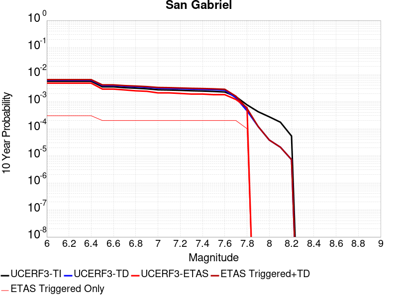 |

| Magnitude | 1 wk TI Prob | 1 wk TD Prob | 1 wk ETAS Prob | 1 wk ETAS/TD Gain | 1 wk ETAS Triggered+TD | 1 wk ETAS Triggered Only | 1 mo TI Prob | 1 mo TD Prob | 1 mo ETAS Prob | 1 mo ETAS/TD Gain | 1 mo ETAS Triggered+TD | 1 mo ETAS Triggered Only | 1 yr TI Prob | 1 yr TD Prob | 1 yr ETAS Prob | 1 yr ETAS/TD Gain | 1 yr ETAS Triggered+TD | 1 yr ETAS Triggered Only | 10 yr TI Prob | 10 yr TD Prob | 10 yr ETAS Prob | 10 yr ETAS/TD Gain | 10 yr ETAS Triggered+TD | 10 yr ETAS Triggered Only |
|-----|-----|-----|-----|-----|-----|-----|-----|-----|-----|-----|-----|-----|-----|-----|-----|-----|-----|-----|-----|-----|-----|-----|-----|-----|
| 6.0 | 1.083775E-5 | 1.1801103E-5 | 0.0 | 0.0 | 1.1801103E-5 | 0.0 | 4.6446676E-5 | 5.057524E-5 | 0.0 | 0.0 | 5.057524E-5 | 0.0 | 5.653415E-4 | 6.155909E-4 | 4.0E-4 | 0.64978224 | 7.155293E-4 | 1.0E-4 | 0.0056390543 | 0.00615131 | 0.0048 | 0.7803216 | 0.0064494647 | 3.0E-4 |
| 6.1 | 1.083775E-5 | 1.1801103E-5 | 0.0 | 0.0 | 1.1801103E-5 | 0.0 | 4.6446676E-5 | 5.057524E-5 | 0.0 | 0.0 | 5.057524E-5 | 0.0 | 5.653415E-4 | 6.155909E-4 | 4.0E-4 | 0.64978224 | 7.155293E-4 | 1.0E-4 | 0.0056390543 | 0.00615131 | 0.0048 | 0.7803216 | 0.0064494647 | 3.0E-4 |
| 6.2 | 1.083775E-5 | 1.1801103E-5 | 0.0 | 0.0 | 1.1801103E-5 | 0.0 | 4.6446676E-5 | 5.057524E-5 | 0.0 | 0.0 | 5.057524E-5 | 0.0 | 5.653415E-4 | 6.155909E-4 | 4.0E-4 | 0.64978224 | 7.155293E-4 | 1.0E-4 | 0.0056390543 | 0.00615131 | 0.0048 | 0.7803216 | 0.0064494647 | 3.0E-4 |
| 6.3 | 1.083775E-5 | 1.1801103E-5 | 0.0 | 0.0 | 1.1801103E-5 | 0.0 | 4.6446676E-5 | 5.057524E-5 | 0.0 | 0.0 | 5.057524E-5 | 0.0 | 5.653415E-4 | 6.155909E-4 | 4.0E-4 | 0.64978224 | 7.155293E-4 | 1.0E-4 | 0.0056390543 | 0.00615131 | 0.0048 | 0.7803216 | 0.0064494647 | 3.0E-4 |
| 6.4 | 1.083775E-5 | 1.1801103E-5 | 0.0 | 0.0 | 1.1801103E-5 | 0.0 | 4.6446676E-5 | 5.057524E-5 | 0.0 | 0.0 | 5.057524E-5 | 0.0 | 5.653415E-4 | 6.155909E-4 | 4.0E-4 | 0.64978224 | 7.155293E-4 | 1.0E-4 | 0.0056390543 | 0.00615131 | 0.0048 | 0.7803216 | 0.0064494647 | 3.0E-4 |
| 6.5 | 6.7317824E-6 | 7.5346225E-6 | 0.0 | 0.0 | 7.5346225E-6 | 0.0 | 2.8850178E-5 | 3.2290845E-5 | 0.0 | 0.0 | 3.2290845E-5 | 0.0 | 3.511943E-4 | 3.9307112E-4 | 3.0E-4 | 0.76322067 | 3.9307112E-4 | 0.0 | 0.003506398 | 0.0039352155 | 0.0029 | 0.7369355 | 0.0041344287 | 2.0E-4 |
| 6.6 | 6.7317824E-6 | 7.5346225E-6 | 0.0 | 0.0 | 7.5346225E-6 | 0.0 | 2.8850178E-5 | 3.2290845E-5 | 0.0 | 0.0 | 3.2290845E-5 | 0.0 | 3.511943E-4 | 3.9307112E-4 | 3.0E-4 | 0.76322067 | 3.9307112E-4 | 0.0 | 0.003506398 | 0.0039352155 | 0.0029 | 0.7369355 | 0.0041344287 | 2.0E-4 |
| 6.7 | 6.274881E-6 | 7.063695E-6 | 0.0 | 0.0 | 7.063695E-6 | 0.0 | 2.6892068E-5 | 3.0272633E-5 | 0.0 | 0.0 | 3.0272633E-5 | 0.0 | 3.2736175E-4 | 3.685079E-4 | 3.0E-4 | 0.81409377 | 3.685079E-4 | 0.0 | 0.0032687993 | 0.0036904183 | 0.0027 | 0.73162436 | 0.0038896804 | 2.0E-4 |
| 6.8 | 5.996209E-6 | 6.7765077E-6 | 0.0 | 0.0 | 6.7765077E-6 | 0.0 | 2.5697784E-5 | 2.9041857E-5 | 0.0 | 0.0 | 2.9041857E-5 | 0.0 | 3.128256E-4 | 3.5352816E-4 | 3.0E-4 | 0.8485887 | 3.5352816E-4 | 0.0 | 0.003123856 | 0.0035411054 | 0.0025 | 0.70599425 | 0.003740397 | 2.0E-4 |
| 6.9 | 5.686331E-6 | 6.4422247E-6 | 0.0 | 0.0 | 6.4422247E-6 | 0.0 | 2.4369761E-5 | 2.7609247E-5 | 0.0 | 0.0 | 2.7609247E-5 | 0.0 | 2.9666146E-4 | 3.3609162E-4 | 3.0E-4 | 0.89261377 | 3.3609162E-4 | 0.0 | 0.0029626573 | 0.0033672797 | 0.0024 | 0.71274155 | 0.0035666062 | 2.0E-4 |
| 7.0 | 5.2329838E-6 | 5.966532E-6 | 0.0 | 0.0 | 5.966532E-6 | 0.0 | 2.242688E-5 | 2.5570605E-5 | 0.0 | 0.0 | 2.5570605E-5 | 0.0 | 2.7301308E-4 | 3.112784E-4 | 2.0E-4 | 0.6425117 | 3.112784E-4 | 0.0 | 0.002726779 | 0.003119858 | 0.0021 | 0.67310756 | 0.0033192341 | 2.0E-4 |
| 7.1 | 5.135671E-6 | 5.8570986E-6 | 0.0 | 0.0 | 5.8570986E-6 | 0.0 | 2.2009834E-5 | 2.5101614E-5 | 0.0 | 0.0 | 2.5101614E-5 | 0.0 | 2.6793676E-4 | 3.0557E-4 | 2.0E-4 | 0.6545145 | 3.0557E-4 | 0.0 | 0.0026761394 | 0.003062933 | 0.0021 | 0.6856174 | 0.0032623203 | 2.0E-4 |
| 7.2 | 4.989062E-6 | 5.691239E-6 | 0.0 | 0.0 | 5.691239E-6 | 0.0 | 2.1381518E-5 | 2.4390802E-5 | 0.0 | 0.0 | 2.4390802E-5 | 0.0 | 2.6028889E-4 | 2.9691824E-4 | 2.0E-4 | 0.6735861 | 2.9691824E-4 | 0.0 | 0.0025998424 | 0.00297665 | 0.002 | 0.6718963 | 0.0031760547 | 2.0E-4 |
| 7.3 | 4.8219395E-6 | 5.5234627E-6 | 0.0 | 0.0 | 5.5234627E-6 | 0.0 | 2.0665291E-5 | 2.3671773E-5 | 0.0 | 0.0 | 2.3671773E-5 | 0.0 | 2.5157086E-4 | 2.8816643E-4 | 2.0E-4 | 0.69404334 | 2.8816643E-4 | 0.0 | 0.0025128627 | 0.0028893626 | 0.0019 | 0.6575845 | 0.0030887849 | 2.0E-4 |
| 7.4 | 4.7118383E-6 | 5.4126326E-6 | 0.0 | 0.0 | 5.4126326E-6 | 0.0 | 2.0193436E-5 | 2.3196795E-5 | 0.0 | 0.0 | 2.3196795E-5 | 0.0 | 2.4582737E-4 | 2.823851E-4 | 2.0E-4 | 0.70825267 | 2.823851E-4 | 0.0 | 0.002455556 | 0.0028316968 | 0.0019 | 0.6709758 | 0.0030311304 | 2.0E-4 |
| 7.5 | 4.5506545E-6 | 5.2588725E-6 | 0.0 | 0.0 | 5.2588725E-6 | 0.0 | 1.9502659E-5 | 2.2537834E-5 | 0.0 | 0.0 | 2.2537834E-5 | 0.0 | 2.37419E-4 | 2.7436428E-4 | 2.0E-4 | 0.72895783 | 2.7436428E-4 | 0.0 | 0.002371655 | 0.0027516887 | 0.0018 | 0.65414375 | 0.0029511384 | 2.0E-4 |
| 7.6 | 4.343636E-6 | 5.053188E-6 | 0.0 | 0.0 | 5.053188E-6 | 0.0 | 1.861545E-5 | 2.1656344E-5 | 0.0 | 0.0 | 2.1656344E-5 | 0.0 | 2.2661954E-4 | 2.636348E-4 | 2.0E-4 | 0.75862515 | 2.636348E-4 | 0.0 | 0.0022638857 | 0.0026446441 | 0.0018 | 0.6806209 | 0.002844115 | 2.0E-4 |
| 7.7 | 2.936235E-6 | 2.6242813E-6 | 0.0 | 0.0 | 2.6242813E-6 | 0.0 | 1.2583803E-5 | 1.1246871E-5 | 0.0 | 0.0 | 1.1246871E-5 | 0.0 | 1.5319703E-4 | 1.3692208E-4 | 2.0E-4 | 1.4606848 | 1.3692208E-4 | 0.0 | 0.0015309147 | 0.0013752662 | 0.0012 | 0.8725583 | 0.0015749913 | 2.0E-4 |
| 7.8 | 1.4541639E-6 | 8.626959E-7 | 0.0 | 0.0 | 8.626959E-7 | 0.0 | 6.232116E-6 | 3.6972629E-6 | 0.0 | 0.0 | 3.6972629E-6 | 0.0 | 7.587337E-5 | 4.5013247E-5 | 1.0E-4 | 2.221568 | 4.5013247E-5 | 0.0 | 7.584747E-4 | 4.5455978E-4 | 6.0E-4 | 1.3199584 | 5.545143E-4 | 1.0E-4 |
| 7.9 | 8.098958E-7 | 2.2213146E-7 | 0.0 | 0.0 | 2.2213146E-7 | 0.0 | 3.4709774E-6 | 9.519916E-7 | 0.0 | 0.0 | 9.519916E-7 | 0.0 | 4.225833E-5 | 1.1590436E-5 | 0.0 | 0.0 | 1.1590436E-5 | 0.0 | 4.2250296E-4 | 1.1864942E-4 | 0.0 | 0.0 | 1.1864942E-4 | 0.0 |
| 8.0 | 5.2473234E-7 | 6.769211E-8 | 0.0 | 0.0 | 6.769211E-8 | 0.0 | 2.248851E-6 | 2.9010903E-7 | 0.0 | 0.0 | 2.9010903E-7 | 0.0 | 2.7379416E-5 | 3.5320716E-6 | 0.0 | 0.0 | 3.5320716E-6 | 0.0 | 2.7376044E-4 | 3.721192E-5 | 0.0 | 0.0 | 3.721192E-5 | 0.0 |
| 8.1 | 3.3162388E-7 | 3.6448405E-8 | 0.0 | 0.0 | 3.6448405E-8 | 0.0 | 1.4212444E-6 | 1.5620745E-7 | 0.0 | 0.0 | 1.5620745E-7 | 0.0 | 1.7303513E-5 | 1.9018239E-6 | 0.0 | 0.0 | 1.9018239E-6 | 0.0 | 1.7302166E-4 | 2.0197309E-5 | 0.0 | 0.0 | 2.0197309E-5 | 0.0 |
| 8.2 | 1.0235345E-7 | 1.2439834E-8 | 0.0 | 0.0 | 1.2439834E-8 | 0.0 | 4.3865757E-7 | 5.3313574E-8 | 0.0 | 0.0 | 5.3313574E-8 | 0.0 | 5.340643E-6 | 6.4909256E-7 | 0.0 | 0.0 | 6.4909256E-7 | 0.0 | 5.3405143E-5 | 7.038853E-6 | 0.0 | 0.0 | 7.038853E-6 | 0.0 |

## Mount Diablo Thrust North CFM
*[(top)](#table-of-contents)*

| 1 Week | 1 Month | 1 Year | 10 Year |
|-----|-----|-----|-----|
|  |  | 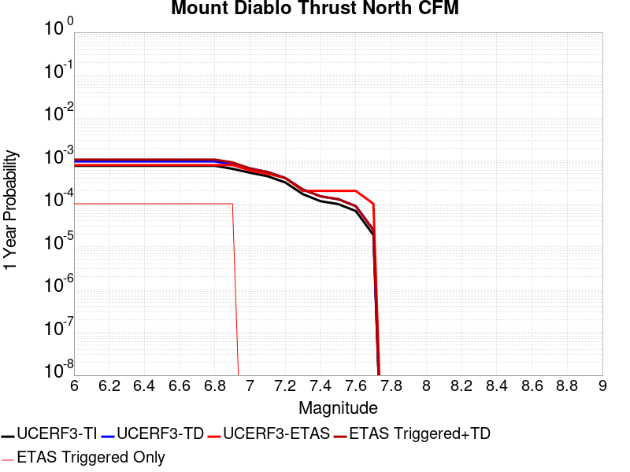 |  |

| Magnitude | 1 wk TI Prob | 1 wk TD Prob | 1 wk ETAS Prob | 1 wk ETAS/TD Gain | 1 wk ETAS Triggered+TD | 1 wk ETAS Triggered Only | 1 mo TI Prob | 1 mo TD Prob | 1 mo ETAS Prob | 1 mo ETAS/TD Gain | 1 mo ETAS Triggered+TD | 1 mo ETAS Triggered Only | 1 yr TI Prob | 1 yr TD Prob | 1 yr ETAS Prob | 1 yr ETAS/TD Gain | 1 yr ETAS Triggered+TD | 1 yr ETAS Triggered Only | 10 yr TI Prob | 10 yr TD Prob | 10 yr ETAS Prob | 10 yr ETAS/TD Gain | 10 yr ETAS Triggered+TD | 10 yr ETAS Triggered Only |
|-----|-----|-----|-----|-----|-----|-----|-----|-----|-----|-----|-----|-----|-----|-----|-----|-----|-----|-----|-----|-----|-----|-----|-----|-----|
| 6.0 | 1.479628E-5 | 1.8715906E-5 | 1.0E-4 | 5.343049 | 1.1871404E-4 | 1.0E-4 | 6.341109E-5 | 8.020861E-5 | 1.0E-4 | 1.2467489 | 1.8020059E-4 | 1.0E-4 | 7.717565E-4 | 9.761118E-4 | 8.0E-4 | 0.81957823 | 0.0010760142 | 1.0E-4 | 0.007690818 | 0.009722127 | 0.0063 | 0.6480064 | 0.010019209 | 3.0E-4 |
| 6.1 | 1.479628E-5 | 1.8715906E-5 | 1.0E-4 | 5.343049 | 1.1871404E-4 | 1.0E-4 | 6.341109E-5 | 8.020861E-5 | 1.0E-4 | 1.2467489 | 1.8020059E-4 | 1.0E-4 | 7.717565E-4 | 9.761118E-4 | 8.0E-4 | 0.81957823 | 0.0010760142 | 1.0E-4 | 0.007690818 | 0.009722127 | 0.0063 | 0.6480064 | 0.010019209 | 3.0E-4 |
| 6.2 | 1.479628E-5 | 1.8715906E-5 | 1.0E-4 | 5.343049 | 1.1871404E-4 | 1.0E-4 | 6.341109E-5 | 8.020861E-5 | 1.0E-4 | 1.2467489 | 1.8020059E-4 | 1.0E-4 | 7.717565E-4 | 9.761118E-4 | 8.0E-4 | 0.81957823 | 0.0010760142 | 1.0E-4 | 0.007690818 | 0.009722127 | 0.0063 | 0.6480064 | 0.010019209 | 3.0E-4 |
| 6.3 | 1.479628E-5 | 1.8715906E-5 | 1.0E-4 | 5.343049 | 1.1871404E-4 | 1.0E-4 | 6.341109E-5 | 8.020861E-5 | 1.0E-4 | 1.2467489 | 1.8020059E-4 | 1.0E-4 | 7.717565E-4 | 9.761118E-4 | 8.0E-4 | 0.81957823 | 0.0010760142 | 1.0E-4 | 0.007690818 | 0.009722127 | 0.0063 | 0.6480064 | 0.010019209 | 3.0E-4 |
| 6.4 | 1.479628E-5 | 1.8715906E-5 | 1.0E-4 | 5.343049 | 1.1871404E-4 | 1.0E-4 | 6.341109E-5 | 8.020861E-5 | 1.0E-4 | 1.2467489 | 1.8020059E-4 | 1.0E-4 | 7.717565E-4 | 9.761118E-4 | 8.0E-4 | 0.81957823 | 0.0010760142 | 1.0E-4 | 0.007690818 | 0.009722127 | 0.0063 | 0.6480064 | 0.010019209 | 3.0E-4 |
| 6.5 | 1.479628E-5 | 1.8715906E-5 | 1.0E-4 | 5.343049 | 1.1871404E-4 | 1.0E-4 | 6.341109E-5 | 8.020861E-5 | 1.0E-4 | 1.2467489 | 1.8020059E-4 | 1.0E-4 | 7.717565E-4 | 9.761118E-4 | 8.0E-4 | 0.81957823 | 0.0010760142 | 1.0E-4 | 0.007690818 | 0.009722127 | 0.0063 | 0.6480064 | 0.010019209 | 3.0E-4 |
| 6.6 | 1.479016E-5 | 1.8709026E-5 | 1.0E-4 | 5.3450136 | 1.18707154E-4 | 1.0E-4 | 6.338486E-5 | 8.0179125E-5 | 1.0E-4 | 1.2472074 | 1.801711E-4 | 1.0E-4 | 7.714374E-4 | 9.757532E-4 | 8.0E-4 | 0.8198795 | 0.0010756556 | 1.0E-4 | 0.007687649 | 0.009718572 | 0.0063 | 0.6482434 | 0.010015656 | 3.0E-4 |
| 6.7 | 1.479016E-5 | 1.8709026E-5 | 1.0E-4 | 5.3450136 | 1.18707154E-4 | 1.0E-4 | 6.338486E-5 | 8.0179125E-5 | 1.0E-4 | 1.2472074 | 1.801711E-4 | 1.0E-4 | 7.714374E-4 | 9.757532E-4 | 8.0E-4 | 0.8198795 | 0.0010756556 | 1.0E-4 | 0.007687649 | 0.009718572 | 0.0063 | 0.6482434 | 0.010015656 | 3.0E-4 |
| 6.8 | 1.4771667E-5 | 1.868783E-5 | 1.0E-4 | 5.3510766 | 1.1868596E-4 | 1.0E-4 | 6.330561E-5 | 8.008829E-5 | 1.0E-4 | 1.248622 | 1.8008029E-4 | 1.0E-4 | 7.704732E-4 | 9.746482E-4 | 8.0E-4 | 0.82080895 | 0.0010745508 | 1.0E-4 | 0.007678074 | 0.0097076185 | 0.0063 | 0.64897484 | 0.010004706 | 3.0E-4 |
| 6.9 | 1.2548234E-5 | 1.577091E-5 | 1.0E-4 | 6.340789 | 1.1576933E-4 | 1.0E-4 | 5.3777036E-5 | 6.758788E-5 | 1.0E-4 | 1.4795552 | 1.6758112E-4 | 1.0E-4 | 6.545387E-4 | 8.225753E-4 | 8.0E-4 | 0.9725554 | 9.22493E-4 | 1.0E-4 | 0.006526142 | 0.00819642 | 0.0057 | 0.69542557 | 0.008493961 | 3.0E-4 |
| 7.0 | 1.01754185E-5 | 1.2775895E-5 | 0.0 | 0.0 | 1.2775895E-5 | 0.0 | 4.360821E-5 | 5.4752694E-5 | 0.0 | 0.0 | 5.4752694E-5 | 0.0 | 5.308006E-4 | 6.664118E-4 | 6.0E-4 | 0.9003442 | 6.664118E-4 | 0.0 | 0.005295345 | 0.006645098 | 0.0041 | 0.61699617 | 0.0068437685 | 2.0E-4 |
| 7.1 | 8.398341E-6 | 1.0523696E-5 | 0.0 | 0.0 | 1.0523696E-5 | 0.0 | 3.5992394E-5 | 4.510078E-5 | 0.0 | 0.0 | 4.510078E-5 | 0.0 | 4.3811928E-4 | 5.489647E-4 | 5.0E-4 | 0.9108053 | 5.489647E-4 | 0.0 | 0.0043725655 | 0.0054764855 | 0.0037 | 0.6756158 | 0.0056753904 | 2.0E-4 |
| 7.2 | 6.024759E-6 | 7.622678E-6 | 0.0 | 0.0 | 7.622678E-6 | 0.0 | 2.582014E-5 | 3.2668217E-5 | 0.0 | 0.0 | 3.2668217E-5 | 0.0 | 3.1431485E-4 | 3.9766362E-4 | 4.0E-4 | 1.0058752 | 3.9766362E-4 | 0.0 | 0.0031387066 | 0.003969908 | 0.0027 | 0.6801165 | 0.004169114 | 2.0E-4 |
| 7.3 | 3.2099704E-6 | 4.117058E-6 | 0.0 | 0.0 | 4.117058E-6 | 0.0 | 1.3756943E-5 | 1.7644415E-5 | 0.0 | 0.0 | 1.7644415E-5 | 0.0 | 1.674779E-4 | 2.1479974E-4 | 2.0E-4 | 0.93109983 | 2.1479974E-4 | 0.0 | 0.0016735174 | 0.0021460056 | 0.0014 | 0.6523748 | 0.002245791 | 1.0E-4 |
| 7.4 | 2.2041513E-6 | 2.8601714E-6 | 0.0 | 0.0 | 2.8601714E-6 | 0.0 | 9.4463285E-6 | 1.225782E-5 | 0.0 | 0.0 | 1.225782E-5 | 0.0 | 1.1500298E-4 | 1.4922881E-4 | 2.0E-4 | 1.3402237 | 1.4922881E-4 | 0.0 | 0.0011494348 | 0.0014912793 | 8.0E-4 | 0.5364521 | 0.0015911303 | 1.0E-4 |
| 7.5 | 1.8869501E-6 | 2.4573346E-6 | 0.0 | 0.0 | 2.4573346E-6 | 0.0 | 8.086904E-6 | 1.0531392E-5 | 0.0 | 0.0 | 1.0531392E-5 | 0.0 | 9.845361E-5 | 1.2821222E-4 | 2.0E-4 | 1.5599136 | 1.2821222E-4 | 0.0 | 9.841E-4 | 0.001281347 | 7.0E-4 | 0.5463001 | 0.0013812189 | 1.0E-4 |
| 7.6 | 1.3012458E-6 | 1.6901882E-6 | 0.0 | 0.0 | 1.6901882E-6 | 0.0 | 5.576756E-6 | 7.243644E-6 | 0.0 | 0.0 | 7.243644E-6 | 0.0 | 6.7894885E-5 | 8.818785E-5 | 2.0E-4 | 2.2678862 | 8.818785E-5 | 0.0 | 6.787415E-4 | 8.81489E-4 | 7.0E-4 | 0.7941109 | 9.814008E-4 | 1.0E-4 |
| 7.7 | 3.603383E-7 | 4.6900843E-7 | 0.0 | 0.0 | 4.6900843E-7 | 0.0 | 1.5443061E-6 | 2.0100347E-6 | 0.0 | 0.0 | 2.0100347E-6 | 0.0 | 1.8801764E-5 | 2.4471903E-5 | 1.0E-4 | 4.086319 | 2.4471903E-5 | 0.0 | 1.8800174E-4 | 2.4469846E-4 | 4.0E-4 | 1.634665 | 3.44674E-4 | 1.0E-4 |

## Contra Costa (Lafayette) 2011 CFM
*[(top)](#table-of-contents)*

| 1 Week | 1 Month | 1 Year | 10 Year |
|-----|-----|-----|-----|
|  |  |  |  |

| Magnitude | 1 wk TI Prob | 1 wk TD Prob | 1 wk ETAS Prob | 1 wk ETAS/TD Gain | 1 wk ETAS Triggered+TD | 1 wk ETAS Triggered Only | 1 mo TI Prob | 1 mo TD Prob | 1 mo ETAS Prob | 1 mo ETAS/TD Gain | 1 mo ETAS Triggered+TD | 1 mo ETAS Triggered Only | 1 yr TI Prob | 1 yr TD Prob | 1 yr ETAS Prob | 1 yr ETAS/TD Gain | 1 yr ETAS Triggered+TD | 1 yr ETAS Triggered Only | 10 yr TI Prob | 10 yr TD Prob | 10 yr ETAS Prob | 10 yr ETAS/TD Gain | 10 yr ETAS Triggered+TD | 10 yr ETAS Triggered Only |
|-----|-----|-----|-----|-----|-----|-----|-----|-----|-----|-----|-----|-----|-----|-----|-----|-----|-----|-----|-----|-----|-----|-----|-----|-----|
| 6.0 | 6.655419E-6 | 6.907731E-6 | 0.0 | 0.0 | 6.907731E-6 | 0.0 | 2.8522913E-5 | 2.9604238E-5 | 0.0 | 0.0 | 2.9604238E-5 | 0.0 | 3.472111E-4 | 3.6037396E-4 | 1.0E-4 | 0.27748954 | 3.6037396E-4 | 0.0 | 0.0034666911 | 0.0036027534 | 0.0023 | 0.6384006 | 0.0039016725 | 3.0E-4 |
| 6.1 | 6.655419E-6 | 6.907731E-6 | 0.0 | 0.0 | 6.907731E-6 | 0.0 | 2.8522913E-5 | 2.9604238E-5 | 0.0 | 0.0 | 2.9604238E-5 | 0.0 | 3.472111E-4 | 3.6037396E-4 | 1.0E-4 | 0.27748954 | 3.6037396E-4 | 0.0 | 0.0034666911 | 0.0036027534 | 0.0023 | 0.6384006 | 0.0039016725 | 3.0E-4 |
| 6.2 | 6.6254133E-6 | 6.876158E-6 | 0.0 | 0.0 | 6.876158E-6 | 0.0 | 2.839432E-5 | 2.9468925E-5 | 0.0 | 0.0 | 2.9468925E-5 | 0.0 | 3.45646E-4 | 3.5872706E-4 | 1.0E-4 | 0.27876347 | 3.5872706E-4 | 0.0 | 0.003451089 | 0.003586338 | 0.0022 | 0.61343914 | 0.0037856207 | 2.0E-4 |
| 6.3 | 6.6254133E-6 | 6.876158E-6 | 0.0 | 0.0 | 6.876158E-6 | 0.0 | 2.839432E-5 | 2.9468925E-5 | 0.0 | 0.0 | 2.9468925E-5 | 0.0 | 3.45646E-4 | 3.5872706E-4 | 1.0E-4 | 0.27876347 | 3.5872706E-4 | 0.0 | 0.003451089 | 0.003586338 | 0.0022 | 0.61343914 | 0.0037856207 | 2.0E-4 |
| 6.4 | 6.6254133E-6 | 6.876158E-6 | 0.0 | 0.0 | 6.876158E-6 | 0.0 | 2.839432E-5 | 2.9468925E-5 | 0.0 | 0.0 | 2.9468925E-5 | 0.0 | 3.45646E-4 | 3.5872706E-4 | 1.0E-4 | 0.27876347 | 3.5872706E-4 | 0.0 | 0.003451089 | 0.003586338 | 0.0022 | 0.61343914 | 0.0037856207 | 2.0E-4 |
| 6.5 | 6.606445E-6 | 6.855723E-6 | 0.0 | 0.0 | 6.855723E-6 | 0.0 | 2.8313027E-5 | 2.938135E-5 | 0.0 | 0.0 | 2.938135E-5 | 0.0 | 3.4465658E-4 | 3.576612E-4 | 1.0E-4 | 0.2795942 | 3.576612E-4 | 0.0 | 0.0034412253 | 0.0035757134 | 0.0022 | 0.61526185 | 0.0037749982 | 2.0E-4 |
| 6.6 | 6.59966E-6 | 6.8482686E-6 | 0.0 | 0.0 | 6.8482686E-6 | 0.0 | 2.828395E-5 | 2.9349403E-5 | 0.0 | 0.0 | 2.9349403E-5 | 0.0 | 3.4430268E-4 | 3.5727237E-4 | 1.0E-4 | 0.2798985 | 3.5727237E-4 | 0.0 | 0.0034376972 | 0.0035718377 | 0.0022 | 0.6159294 | 0.0037711232 | 2.0E-4 |
| 6.7 | 6.5570975E-6 | 6.8022987E-6 | 0.0 | 0.0 | 6.8022987E-6 | 0.0 | 2.8101544E-5 | 2.9152394E-5 | 0.0 | 0.0 | 2.9152394E-5 | 0.0 | 3.4208258E-4 | 3.5487456E-4 | 1.0E-4 | 0.2817897 | 3.5487456E-4 | 0.0 | 0.0034155648 | 0.0035479364 | 0.0022 | 0.62007874 | 0.003747227 | 2.0E-4 |
| 6.8 | 5.472255E-6 | 5.646102E-6 | 0.0 | 0.0 | 5.646102E-6 | 0.0 | 2.345231E-5 | 2.4197358E-5 | 0.0 | 0.0 | 2.4197358E-5 | 0.0 | 2.8549446E-4 | 2.9456348E-4 | 1.0E-4 | 0.3394854 | 2.9456348E-4 | 0.0 | 0.0028512797 | 0.0029464404 | 0.002 | 0.67878515 | 0.0031458512 | 2.0E-4 |
| 6.9 | 5.092346E-6 | 5.2367986E-6 | 0.0 | 0.0 | 5.2367986E-6 | 0.0 | 2.1824157E-5 | 2.2443233E-5 | 0.0 | 0.0 | 2.2443233E-5 | 0.0 | 2.656767E-4 | 2.7321247E-4 | 1.0E-4 | 0.3660155 | 2.7321247E-4 | 0.0 | 0.002653593 | 0.0027334683 | 0.0019 | 0.6950876 | 0.0029329218 | 2.0E-4 |
| 7.0 | 4.5525762E-6 | 4.6506752E-6 | 0.0 | 0.0 | 4.6506752E-6 | 0.0 | 1.9510895E-5 | 1.9931314E-5 | 0.0 | 0.0 | 1.9931314E-5 | 0.0 | 2.3751926E-4 | 2.4263703E-4 | 1.0E-4 | 0.41213822 | 2.4263703E-4 | 0.0 | 0.0023726553 | 0.0024284127 | 0.0017 | 0.70004576 | 0.002627927 | 2.0E-4 |
| 7.1 | 4.261504E-6 | 4.3302425E-6 | 0.0 | 0.0 | 4.3302425E-6 | 0.0 | 1.826346E-5 | 1.8558052E-5 | 0.0 | 0.0 | 1.8558052E-5 | 0.0 | 2.2233493E-4 | 2.2592113E-4 | 1.0E-4 | 0.44263235 | 2.2592113E-4 | 0.0 | 0.002221126 | 0.0022615942 | 0.0016 | 0.7074656 | 0.002461142 | 2.0E-4 |
| 7.2 | 3.654114E-6 | 3.6725157E-6 | 0.0 | 0.0 | 3.6725157E-6 | 0.0 | 1.5660395E-5 | 1.5739259E-5 | 0.0 | 0.0 | 1.5739259E-5 | 0.0 | 1.9064861E-4 | 1.9160888E-4 | 1.0E-4 | 0.5218965 | 1.9160888E-4 | 0.0 | 0.0019048514 | 0.0019190717 | 0.0014 | 0.72951937 | 0.0020188799 | 1.0E-4 |
| 7.3 | 2.1595129E-6 | 2.2241215E-6 | 0.0 | 0.0 | 2.2241215E-6 | 0.0 | 9.255023E-6 | 9.531915E-6 | 0.0 | 0.0 | 9.531915E-6 | 0.0 | 1.1267407E-4 | 1.16044925E-4 | 0.0 | 0.0 | 1.16044925E-4 | 0.0 | 0.0011261696 | 0.0011644588 | 9.0E-4 | 0.7728912 | 0.0012643423 | 1.0E-4 |
| 7.4 | 1.7532738E-6 | 1.8149052E-6 | 0.0 | 0.0 | 1.8149052E-6 | 0.0 | 7.5140088E-6 | 7.778142E-6 | 0.0 | 0.0 | 7.778142E-6 | 0.0 | 9.147922E-5 | 9.4694806E-5 | 0.0 | 0.0 | 9.4694806E-5 | 0.0 | 9.144157E-4 | 9.5098466E-4 | 9.0E-4 | 0.9463875 | 0.0010508895 | 1.0E-4 |
| 7.5 | 9.387875E-7 | 1.0040341E-6 | 0.0 | 0.0 | 1.0040341E-6 | 0.0 | 4.0233685E-6 | 4.302996E-6 | 0.0 | 0.0 | 4.302996E-6 | 0.0 | 4.8983413E-5 | 5.238773E-5 | 0.0 | 0.0 | 5.238773E-5 | 0.0 | 4.897262E-4 | 5.278372E-4 | 4.0E-4 | 0.75780946 | 5.278372E-4 | 0.0 |
| 7.6 | 2.7471893E-7 | 3.1831E-7 | 0.0 | 0.0 | 3.1831E-7 | 0.0 | 1.1773664E-6 | 1.364185E-6 | 0.0 | 0.0 | 1.364185E-6 | 0.0 | 1.433434E-5 | 1.6608827E-5 | 0.0 | 0.0 | 1.6608827E-5 | 0.0 | 1.4333417E-4 | 1.6994587E-4 | 1.0E-4 | 0.58842266 | 1.6994587E-4 | 0.0 |
| 7.7 | 2.0057985E-7 | 2.4472544E-7 | 0.0 | 0.0 | 2.4472544E-7 | 0.0 | 8.596276E-7 | 1.0488229E-6 | 0.0 | 0.0 | 1.0488229E-6 | 0.0 | 1.0465916E-5 | 1.2769346E-5 | 0.0 | 0.0 | 1.2769346E-5 | 0.0 | 1.0465423E-4 | 1.315111E-4 | 1.0E-4 | 0.7603921 | 1.315111E-4 | 0.0 |
| 7.8 | 8.7403905E-8 | 1.1670708E-7 | 0.0 | 0.0 | 1.1670708E-7 | 0.0 | 3.745881E-7 | 5.001731E-7 | 0.0 | 0.0 | 5.001731E-7 | 0.0 | 4.5606007E-6 | 6.0895904E-6 | 0.0 | 0.0 | 6.0895904E-6 | 0.0 | 4.560507E-5 | 6.318295E-5 | 0.0 | 0.0 | 6.318295E-5 | 0.0 |
| 7.9 | 4.740233E-8 | 7.2807154E-8 | 0.0 | 0.0 | 7.2807154E-8 | 0.0 | 2.0315284E-7 | 3.1203064E-7 | 0.0 | 0.0 | 3.1203064E-7 | 0.0 | 2.473383E-6 | 3.7989662E-6 | 0.0 | 0.0 | 3.7989662E-6 | 0.0 | 2.4733554E-5 | 3.9554907E-5 | 0.0 | 0.0 | 3.9554907E-5 | 0.0 |
| 8.0 | 2.99164E-8 | 5.3344383E-8 | 0.0 | 0.0 | 5.3344383E-8 | 0.0 | 1.2821314E-7 | 2.2861877E-7 | 0.0 | 0.0 | 2.2861877E-7 | 0.0 | 1.5609938E-6 | 2.78343E-6 | 0.0 | 0.0 | 2.78343E-6 | 0.0 | 1.5609829E-5 | 2.8890961E-5 | 0.0 | 0.0 | 2.8890961E-5 | 0.0 |
| 8.1 | 4.431212E-10 | 7.101969E-10 | 0.0 | 0.0 | 7.101969E-10 | 0.0 | 1.899091E-9 | 3.0437017E-9 | 0.0 | 0.0 | 3.0437017E-9 | 0.0 | 2.3121432E-8 | 3.705707E-8 | 0.0 | 0.0 | 3.705707E-8 | 0.0 | 2.312143E-7 | 3.7948874E-7 | 0.0 | 0.0 | 3.7948874E-7 | 0.0 |

## Canada David (Detachment)
*[(top)](#table-of-contents)*

| 1 Week | 1 Month | 1 Year | 10 Year |
|-----|-----|-----|-----|
|  |  | 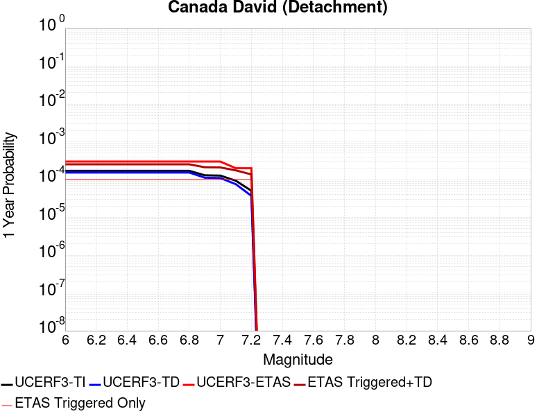 | 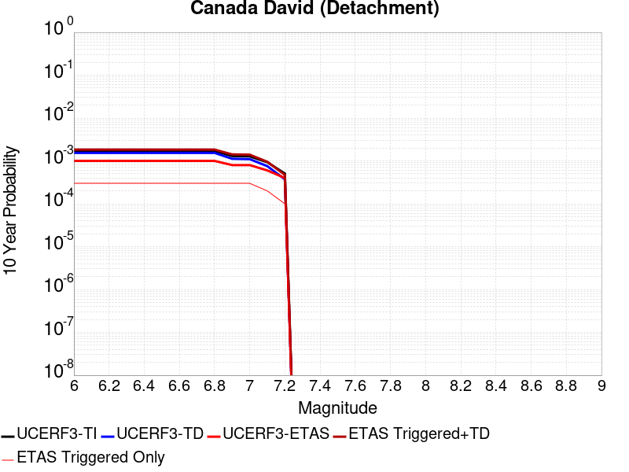 |

| Magnitude | 1 wk TI Prob | 1 wk TD Prob | 1 wk ETAS Prob | 1 wk ETAS/TD Gain | 1 wk ETAS Triggered+TD | 1 wk ETAS Triggered Only | 1 mo TI Prob | 1 mo TD Prob | 1 mo ETAS Prob | 1 mo ETAS/TD Gain | 1 mo ETAS Triggered+TD | 1 mo ETAS Triggered Only | 1 yr TI Prob | 1 yr TD Prob | 1 yr ETAS Prob | 1 yr ETAS/TD Gain | 1 yr ETAS Triggered+TD | 1 yr ETAS Triggered Only | 10 yr TI Prob | 10 yr TD Prob | 10 yr ETAS Prob | 10 yr ETAS/TD Gain | 10 yr ETAS Triggered+TD | 10 yr ETAS Triggered Only |
|-----|-----|-----|-----|-----|-----|-----|-----|-----|-----|-----|-----|-----|-----|-----|-----|-----|-----|-----|-----|-----|-----|-----|-----|-----|
| 6.0 | 3.2736298E-6 | 2.9513726E-6 | 0.0 | 0.0 | 2.9513726E-6 | 0.0 | 1.4029766E-5 | 1.2648686E-5 | 0.0 | 0.0 | 1.2648686E-5 | 0.0 | 1.7079902E-4 | 1.5398815E-4 | 3.0E-4 | 1.9482019 | 2.5397274E-4 | 1.0E-4 | 0.001706678 | 0.0015389405 | 0.001 | 0.6497977 | 0.0018384788 | 3.0E-4 |
| 6.1 | 3.2736298E-6 | 2.9513726E-6 | 0.0 | 0.0 | 2.9513726E-6 | 0.0 | 1.4029766E-5 | 1.2648686E-5 | 0.0 | 0.0 | 1.2648686E-5 | 0.0 | 1.7079902E-4 | 1.5398815E-4 | 3.0E-4 | 1.9482019 | 2.5397274E-4 | 1.0E-4 | 0.001706678 | 0.0015389405 | 0.001 | 0.6497977 | 0.0018384788 | 3.0E-4 |
| 6.2 | 3.2736298E-6 | 2.9513726E-6 | 0.0 | 0.0 | 2.9513726E-6 | 0.0 | 1.4029766E-5 | 1.2648686E-5 | 0.0 | 0.0 | 1.2648686E-5 | 0.0 | 1.7079902E-4 | 1.5398815E-4 | 3.0E-4 | 1.9482019 | 2.5397274E-4 | 1.0E-4 | 0.001706678 | 0.0015389405 | 0.001 | 0.6497977 | 0.0018384788 | 3.0E-4 |
| 6.3 | 3.2736298E-6 | 2.9513726E-6 | 0.0 | 0.0 | 2.9513726E-6 | 0.0 | 1.4029766E-5 | 1.2648686E-5 | 0.0 | 0.0 | 1.2648686E-5 | 0.0 | 1.7079902E-4 | 1.5398815E-4 | 3.0E-4 | 1.9482019 | 2.5397274E-4 | 1.0E-4 | 0.001706678 | 0.0015389405 | 0.001 | 0.6497977 | 0.0018384788 | 3.0E-4 |
| 6.4 | 3.2736298E-6 | 2.9513726E-6 | 0.0 | 0.0 | 2.9513726E-6 | 0.0 | 1.4029766E-5 | 1.2648686E-5 | 0.0 | 0.0 | 1.2648686E-5 | 0.0 | 1.7079902E-4 | 1.5398815E-4 | 3.0E-4 | 1.9482019 | 2.5397274E-4 | 1.0E-4 | 0.001706678 | 0.0015389405 | 0.001 | 0.6497977 | 0.0018384788 | 3.0E-4 |
| 6.5 | 3.2736298E-6 | 2.9513726E-6 | 0.0 | 0.0 | 2.9513726E-6 | 0.0 | 1.4029766E-5 | 1.2648686E-5 | 0.0 | 0.0 | 1.2648686E-5 | 0.0 | 1.7079902E-4 | 1.5398815E-4 | 3.0E-4 | 1.9482019 | 2.5397274E-4 | 1.0E-4 | 0.001706678 | 0.0015389405 | 0.001 | 0.6497977 | 0.0018384788 | 3.0E-4 |
| 6.6 | 3.2736298E-6 | 2.9513726E-6 | 0.0 | 0.0 | 2.9513726E-6 | 0.0 | 1.4029766E-5 | 1.2648686E-5 | 0.0 | 0.0 | 1.2648686E-5 | 0.0 | 1.7079902E-4 | 1.5398815E-4 | 3.0E-4 | 1.9482019 | 2.5397274E-4 | 1.0E-4 | 0.001706678 | 0.0015389405 | 0.001 | 0.6497977 | 0.0018384788 | 3.0E-4 |
| 6.7 | 3.2736298E-6 | 2.9513726E-6 | 0.0 | 0.0 | 2.9513726E-6 | 0.0 | 1.4029766E-5 | 1.2648686E-5 | 0.0 | 0.0 | 1.2648686E-5 | 0.0 | 1.7079902E-4 | 1.5398815E-4 | 3.0E-4 | 1.9482019 | 2.5397274E-4 | 1.0E-4 | 0.001706678 | 0.0015389405 | 0.001 | 0.6497977 | 0.0018384788 | 3.0E-4 |
| 6.8 | 3.2736298E-6 | 2.9513726E-6 | 0.0 | 0.0 | 2.9513726E-6 | 0.0 | 1.4029766E-5 | 1.2648686E-5 | 0.0 | 0.0 | 1.2648686E-5 | 0.0 | 1.7079902E-4 | 1.5398815E-4 | 3.0E-4 | 1.9482019 | 2.5397274E-4 | 1.0E-4 | 0.001706678 | 0.0015389405 | 0.001 | 0.6497977 | 0.0018384788 | 3.0E-4 |
| 6.9 | 2.4914223E-6 | 2.1503936E-6 | 0.0 | 0.0 | 2.1503936E-6 | 0.0 | 1.067748E-5 | 9.215943E-6 | 0.0 | 0.0 | 9.215943E-6 | 0.0 | 1.2999057E-4 | 1.1219888E-4 | 3.0E-4 | 2.6738236 | 2.1218766E-4 | 1.0E-4 | 0.0012991455 | 0.0011214765 | 8.0E-4 | 0.7133453 | 0.00142114 | 3.0E-4 |
| 7.0 | 2.4482404E-6 | 2.1083463E-6 | 0.0 | 0.0 | 2.1083463E-6 | 0.0 | 1.0492417E-5 | 9.035742E-6 | 0.0 | 0.0 | 9.035742E-6 | 0.0 | 1.2773767E-4 | 1.1000515E-4 | 3.0E-4 | 2.727145 | 2.0999415E-4 | 1.0E-4 | 0.0012766428 | 0.0010995611 | 8.0E-4 | 0.727563 | 0.0013992313 | 3.0E-4 |
| 7.1 | 1.7887576E-6 | 1.4484149E-6 | 0.0 | 0.0 | 1.4484149E-6 | 0.0 | 7.666081E-6 | 6.207479E-6 | 0.0 | 0.0 | 6.207479E-6 | 0.0 | 9.333054E-5 | 7.557374E-5 | 2.0E-4 | 2.6464217 | 1.755662E-4 | 1.0E-4 | 9.329135E-4 | 7.5551076E-4 | 6.0E-4 | 0.7941647 | 9.5535966E-4 | 2.0E-4 |
| 7.2 | 9.723109E-7 | 7.124557E-7 | 0.0 | 0.0 | 7.124557E-7 | 0.0 | 4.16704E-6 | 3.0533788E-6 | 0.0 | 0.0 | 3.0533788E-6 | 0.0 | 5.073253E-5 | 3.7174417E-5 | 2.0E-4 | 5.380044 | 1.371707E-4 | 1.0E-4 | 5.072095E-4 | 3.716982E-4 | 4.0E-4 | 1.0761418 | 4.7166104E-4 | 1.0E-4 |

## Deep Springs
*[(top)](#table-of-contents)*

| 1 Week | 1 Month | 1 Year | 10 Year |
|-----|-----|-----|-----|
|  | 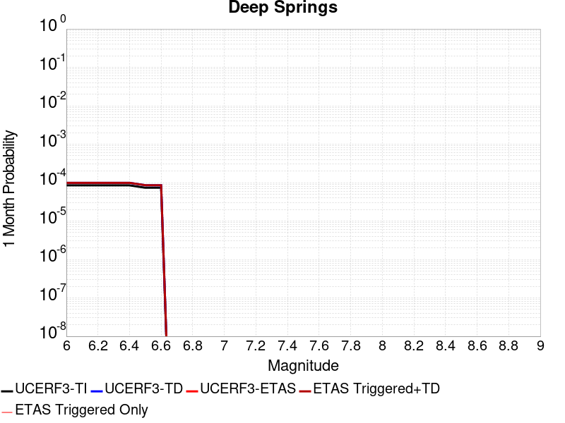 | 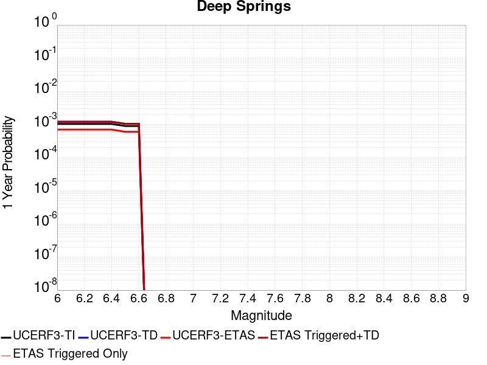 |  |

| Magnitude | 1 wk TI Prob | 1 wk TD Prob | 1 wk ETAS Prob | 1 wk ETAS/TD Gain | 1 wk ETAS Triggered+TD | 1 wk ETAS Triggered Only | 1 mo TI Prob | 1 mo TD Prob | 1 mo ETAS Prob | 1 mo ETAS/TD Gain | 1 mo ETAS Triggered+TD | 1 mo ETAS Triggered Only | 1 yr TI Prob | 1 yr TD Prob | 1 yr ETAS Prob | 1 yr ETAS/TD Gain | 1 yr ETAS Triggered+TD | 1 yr ETAS Triggered Only | 10 yr TI Prob | 10 yr TD Prob | 10 yr ETAS Prob | 10 yr ETAS/TD Gain | 10 yr ETAS Triggered+TD | 10 yr ETAS Triggered Only |
|-----|-----|-----|-----|-----|-----|-----|-----|-----|-----|-----|-----|-----|-----|-----|-----|-----|-----|-----|-----|-----|-----|-----|-----|-----|
| 6.0 | 1.9810619E-5 | 2.3072382E-5 | 0.0 | 0.0 | 2.3072382E-5 | 0.0 | 8.489989E-5 | 9.8880744E-5 | 0.0 | 0.0 | 9.8880744E-5 | 0.0 | 0.001033166 | 0.0012037142 | 7.0E-4 | 0.58153343 | 0.0012037142 | 0.0 | 0.010283757 | 0.012021552 | 0.008 | 0.6654715 | 0.012317945 | 3.0E-4 |
| 6.1 | 1.9810619E-5 | 2.3072382E-5 | 0.0 | 0.0 | 2.3072382E-5 | 0.0 | 8.489989E-5 | 9.8880744E-5 | 0.0 | 0.0 | 9.8880744E-5 | 0.0 | 0.001033166 | 0.0012037142 | 7.0E-4 | 0.58153343 | 0.0012037142 | 0.0 | 0.010283757 | 0.012021552 | 0.008 | 0.6654715 | 0.012317945 | 3.0E-4 |
| 6.2 | 1.9810619E-5 | 2.3072382E-5 | 0.0 | 0.0 | 2.3072382E-5 | 0.0 | 8.489989E-5 | 9.8880744E-5 | 0.0 | 0.0 | 9.8880744E-5 | 0.0 | 0.001033166 | 0.0012037142 | 7.0E-4 | 0.58153343 | 0.0012037142 | 0.0 | 0.010283757 | 0.012021552 | 0.008 | 0.6654715 | 0.012317945 | 3.0E-4 |
| 6.3 | 1.9810619E-5 | 2.3072382E-5 | 0.0 | 0.0 | 2.3072382E-5 | 0.0 | 8.489989E-5 | 9.8880744E-5 | 0.0 | 0.0 | 9.8880744E-5 | 0.0 | 0.001033166 | 0.0012037142 | 7.0E-4 | 0.58153343 | 0.0012037142 | 0.0 | 0.010283757 | 0.012021552 | 0.008 | 0.6654715 | 0.012317945 | 3.0E-4 |
| 6.4 | 1.9810619E-5 | 2.3072382E-5 | 0.0 | 0.0 | 2.3072382E-5 | 0.0 | 8.489989E-5 | 9.8880744E-5 | 0.0 | 0.0 | 9.8880744E-5 | 0.0 | 0.001033166 | 0.0012037142 | 7.0E-4 | 0.58153343 | 0.0012037142 | 0.0 | 0.010283757 | 0.012021552 | 0.008 | 0.6654715 | 0.012317945 | 3.0E-4 |
| 6.5 | 1.7190405E-5 | 2.00158E-5 | 0.0 | 0.0 | 2.00158E-5 | 0.0 | 7.367108E-5 | 8.5782E-5 | 0.0 | 0.0 | 8.5782E-5 | 0.0 | 8.9657627E-4 | 0.0010443956 | 6.0E-4 | 0.57449496 | 0.0010443956 | 0.0 | 0.008929676 | 0.010443928 | 0.007 | 0.6702459 | 0.010740795 | 3.0E-4 |
| 6.6 | 1.7190405E-5 | 2.00158E-5 | 0.0 | 0.0 | 2.00158E-5 | 0.0 | 7.367108E-5 | 8.5782E-5 | 0.0 | 0.0 | 8.5782E-5 | 0.0 | 8.9657627E-4 | 0.0010443956 | 6.0E-4 | 0.57449496 | 0.0010443956 | 0.0 | 0.008929676 | 0.010443928 | 0.007 | 0.6702459 | 0.010740795 | 3.0E-4 |

## Table Bluff
*[(top)](#table-of-contents)*

| 1 Week | 1 Month | 1 Year | 10 Year |
|-----|-----|-----|-----|
|  |  | 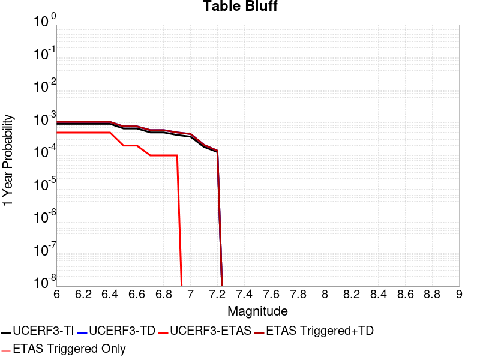 |  |

| Magnitude | 1 wk TI Prob | 1 wk TD Prob | 1 wk ETAS Prob | 1 wk ETAS/TD Gain | 1 wk ETAS Triggered+TD | 1 wk ETAS Triggered Only | 1 mo TI Prob | 1 mo TD Prob | 1 mo ETAS Prob | 1 mo ETAS/TD Gain | 1 mo ETAS Triggered+TD | 1 mo ETAS Triggered Only | 1 yr TI Prob | 1 yr TD Prob | 1 yr ETAS Prob | 1 yr ETAS/TD Gain | 1 yr ETAS Triggered+TD | 1 yr ETAS Triggered Only | 10 yr TI Prob | 10 yr TD Prob | 10 yr ETAS Prob | 10 yr ETAS/TD Gain | 10 yr ETAS Triggered+TD | 10 yr ETAS Triggered Only |
|-----|-----|-----|-----|-----|-----|-----|-----|-----|-----|-----|-----|-----|-----|-----|-----|-----|-----|-----|-----|-----|-----|-----|-----|-----|
| 6.0 | 1.7744695E-5 | 2.0234518E-5 | 0.0 | 0.0 | 2.0234518E-5 | 0.0 | 7.6046475E-5 | 8.671681E-5 | 0.0 | 0.0 | 8.671681E-5 | 0.0 | 9.2547253E-4 | 0.0010553253 | 5.0E-4 | 0.47378758 | 0.0010553253 | 0.0 | 0.009216278 | 0.010509055 | 0.006 | 0.5709362 | 0.010805903 | 3.0E-4 |
| 6.1 | 1.7744695E-5 | 2.0234518E-5 | 0.0 | 0.0 | 2.0234518E-5 | 0.0 | 7.6046475E-5 | 8.671681E-5 | 0.0 | 0.0 | 8.671681E-5 | 0.0 | 9.2547253E-4 | 0.0010553253 | 5.0E-4 | 0.47378758 | 0.0010553253 | 0.0 | 0.009216278 | 0.010509055 | 0.006 | 0.5709362 | 0.010805903 | 3.0E-4 |
| 6.2 | 1.7744695E-5 | 2.0234518E-5 | 0.0 | 0.0 | 2.0234518E-5 | 0.0 | 7.6046475E-5 | 8.671681E-5 | 0.0 | 0.0 | 8.671681E-5 | 0.0 | 9.2547253E-4 | 0.0010553253 | 5.0E-4 | 0.47378758 | 0.0010553253 | 0.0 | 0.009216278 | 0.010509055 | 0.006 | 0.5709362 | 0.010805903 | 3.0E-4 |
| 6.3 | 1.7744695E-5 | 2.0234518E-5 | 0.0 | 0.0 | 2.0234518E-5 | 0.0 | 7.6046475E-5 | 8.671681E-5 | 0.0 | 0.0 | 8.671681E-5 | 0.0 | 9.2547253E-4 | 0.0010553253 | 5.0E-4 | 0.47378758 | 0.0010553253 | 0.0 | 0.009216278 | 0.010509055 | 0.006 | 0.5709362 | 0.010805903 | 3.0E-4 |
| 6.4 | 1.7744695E-5 | 2.0234518E-5 | 0.0 | 0.0 | 2.0234518E-5 | 0.0 | 7.6046475E-5 | 8.671681E-5 | 0.0 | 0.0 | 8.671681E-5 | 0.0 | 9.2547253E-4 | 0.0010553253 | 5.0E-4 | 0.47378758 | 0.0010553253 | 0.0 | 0.009216278 | 0.010509055 | 0.006 | 0.5709362 | 0.010805903 | 3.0E-4 |
| 6.5 | 1.2822383E-5 | 1.4814618E-5 | 0.0 | 0.0 | 1.4814618E-5 | 0.0 | 5.4951914E-5 | 6.3489846E-5 | 0.0 | 0.0 | 6.3489846E-5 | 0.0 | 6.6883414E-4 | 7.727443E-4 | 2.0E-4 | 0.25881782 | 7.727443E-4 | 0.0 | 0.0066682473 | 0.0077035096 | 0.004 | 0.51924384 | 0.0078027397 | 1.0E-4 |
| 6.6 | 1.2822383E-5 | 1.4814618E-5 | 0.0 | 0.0 | 1.4814618E-5 | 0.0 | 5.4951914E-5 | 6.3489846E-5 | 0.0 | 0.0 | 6.3489846E-5 | 0.0 | 6.6883414E-4 | 7.727443E-4 | 2.0E-4 | 0.25881782 | 7.727443E-4 | 0.0 | 0.0066682473 | 0.0077035096 | 0.004 | 0.51924384 | 0.0078027397 | 1.0E-4 |
| 6.7 | 9.690175E-6 | 1.1394503E-5 | 0.0 | 0.0 | 1.1394503E-5 | 0.0 | 4.1528663E-5 | 4.8832782E-5 | 0.0 | 0.0 | 4.8832782E-5 | 0.0 | 5.054941E-4 | 5.9439696E-4 | 1.0E-4 | 0.16823775 | 5.9439696E-4 | 0.0 | 0.005043458 | 0.005930049 | 0.003 | 0.50589806 | 0.005930049 | 0.0 |
| 6.8 | 9.690175E-6 | 1.1394503E-5 | 0.0 | 0.0 | 1.1394503E-5 | 0.0 | 4.1528663E-5 | 4.8832782E-5 | 0.0 | 0.0 | 4.8832782E-5 | 0.0 | 5.054941E-4 | 5.9439696E-4 | 1.0E-4 | 0.16823775 | 5.9439696E-4 | 0.0 | 0.005043458 | 0.005930049 | 0.003 | 0.50589806 | 0.005930049 | 0.0 |
| 6.9 | 8.096043E-6 | 9.660498E-6 | 0.0 | 0.0 | 9.660498E-6 | 0.0 | 3.4696863E-5 | 4.1401574E-5 | 0.0 | 0.0 | 4.1401574E-5 | 0.0 | 4.223524E-4 | 5.039649E-4 | 1.0E-4 | 0.19842651 | 5.039649E-4 | 0.0 | 0.004215506 | 0.005029926 | 0.0024 | 0.47714418 | 0.005029926 | 0.0 |
| 7.0 | 7.185906E-6 | 8.6728105E-6 | 0.0 | 0.0 | 8.6728105E-6 | 0.0 | 3.0796375E-5 | 3.716875E-5 | 0.0 | 0.0 | 3.716875E-5 | 0.0 | 3.7488135E-4 | 4.52452E-4 | 0.0 | 0.0 | 4.52452E-4 | 0.0 | 0.0037424958 | 0.004516924 | 0.0019 | 0.42064026 | 0.004516924 | 0.0 |
| 7.1 | 3.4937343E-6 | 4.0247673E-6 | 0.0 | 0.0 | 4.0247673E-6 | 0.0 | 1.497306E-5 | 1.7248929E-5 | 0.0 | 0.0 | 1.7248929E-5 | 0.0 | 1.8228177E-4 | 2.0999282E-4 | 0.0 | 0.0 | 2.0999282E-4 | 0.0 | 0.0018213232 | 0.0020986635 | 0.001 | 0.47649372 | 0.0020986635 | 0.0 |
| 7.2 | 2.4388776E-6 | 2.6704367E-6 | 0.0 | 0.0 | 2.6704367E-6 | 0.0 | 1.0452291E-5 | 1.14447075E-5 | 0.0 | 0.0 | 1.14447075E-5 | 0.0 | 1.2724921E-4 | 1.3933545E-4 | 0.0 | 0.0 | 1.3933545E-4 | 0.0 | 0.0012717636 | 0.0013929757 | 3.0E-4 | 0.21536627 | 0.0013929757 | 0.0 |

## Surprise Valley 2011 CFM
*[(top)](#table-of-contents)*

| 1 Week | 1 Month | 1 Year | 10 Year |
|-----|-----|-----|-----|
|  |  | 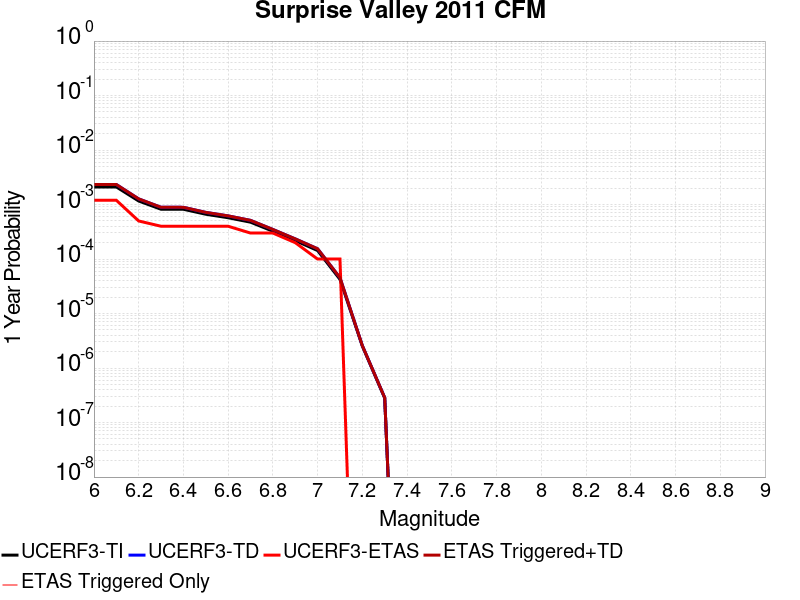 |  |

| Magnitude | 1 wk TI Prob | 1 wk TD Prob | 1 wk ETAS Prob | 1 wk ETAS/TD Gain | 1 wk ETAS Triggered+TD | 1 wk ETAS Triggered Only | 1 mo TI Prob | 1 mo TD Prob | 1 mo ETAS Prob | 1 mo ETAS/TD Gain | 1 mo ETAS Triggered+TD | 1 mo ETAS Triggered Only | 1 yr TI Prob | 1 yr TD Prob | 1 yr ETAS Prob | 1 yr ETAS/TD Gain | 1 yr ETAS Triggered+TD | 1 yr ETAS Triggered Only | 10 yr TI Prob | 10 yr TD Prob | 10 yr ETAS Prob | 10 yr ETAS/TD Gain | 10 yr ETAS Triggered+TD | 10 yr ETAS Triggered Only |
|-----|-----|-----|-----|-----|-----|-----|-----|-----|-----|-----|-----|-----|-----|-----|-----|-----|-----|-----|-----|-----|-----|-----|-----|-----|
| 6.0 | 4.0396248E-5 | 4.479939E-5 | 0.0 | 0.0 | 4.479939E-5 | 0.0 | 1.7311527E-4 | 1.9198445E-4 | 1.0E-4 | 0.5208755 | 1.9198445E-4 | 0.0 | 0.002105641 | 0.0023351142 | 0.0012 | 0.5138935 | 0.0023351142 | 0.0 | 0.020858008 | 0.023127439 | 0.0114 | 0.49292096 | 0.023420502 | 3.0E-4 |
| 6.1 | 4.0396248E-5 | 4.479939E-5 | 0.0 | 0.0 | 4.479939E-5 | 0.0 | 1.7311527E-4 | 1.9198445E-4 | 1.0E-4 | 0.5208755 | 1.9198445E-4 | 0.0 | 0.002105641 | 0.0023351142 | 0.0012 | 0.5138935 | 0.0023351142 | 0.0 | 0.020858008 | 0.023127439 | 0.0114 | 0.49292096 | 0.023420502 | 3.0E-4 |
| 6.2 | 2.2295266E-5 | 2.4377101E-5 | 0.0 | 0.0 | 2.4377101E-5 | 0.0 | 9.554764E-5 | 1.0446928E-4 | 0.0 | 0.0 | 1.0446928E-4 | 0.0 | 0.0011626717 | 0.0012712021 | 5.0E-4 | 0.3933285 | 0.0012712021 | 0.0 | 0.011566074 | 0.012642533 | 0.0062 | 0.4904081 | 0.01293874 | 3.0E-4 |
| 6.3 | 1.572643E-5 | 1.7081213E-5 | 0.0 | 0.0 | 1.7081213E-5 | 0.0 | 6.7397246E-5 | 7.3203206E-5 | 0.0 | 0.0 | 7.3203206E-5 | 0.0 | 8.202525E-4 | 8.908951E-4 | 4.0E-4 | 0.44898665 | 8.908951E-4 | 0.0 | 0.008172315 | 0.00887434 | 0.0045 | 0.50707996 | 0.008973453 | 1.0E-4 |
| 6.4 | 1.5714395E-5 | 1.7069036E-5 | 0.0 | 0.0 | 1.7069036E-5 | 0.0 | 6.734567E-5 | 7.315102E-5 | 0.0 | 0.0 | 7.315102E-5 | 0.0 | 8.1962504E-4 | 8.902603E-4 | 4.0E-4 | 0.44930682 | 8.902603E-4 | 0.0 | 0.008166086 | 0.008868042 | 0.0045 | 0.50744003 | 0.008967156 | 1.0E-4 |
| 6.5 | 1.2733495E-5 | 1.3789486E-5 | 0.0 | 0.0 | 1.3789486E-5 | 0.0 | 5.457098E-5 | 5.9096496E-5 | 0.0 | 0.0 | 5.9096496E-5 | 0.0 | 6.641992E-4 | 7.19269E-4 | 4.0E-4 | 0.5561202 | 7.19269E-4 | 0.0 | 0.0066221743 | 0.0071701026 | 0.0039 | 0.5439253 | 0.0072693857 | 1.0E-4 |
| 6.6 | 1.0983784E-5 | 1.1876331E-5 | 0.0 | 0.0 | 1.1876331E-5 | 0.0 | 4.7072506E-5 | 5.0897597E-5 | 0.0 | 0.0 | 5.0897597E-5 | 0.0 | 5.7295704E-4 | 6.195074E-4 | 4.0E-4 | 0.6456743 | 6.195074E-4 | 0.0 | 0.0057148207 | 0.0061783525 | 0.0037 | 0.59886515 | 0.0062777344 | 1.0E-4 |
| 6.7 | 9.104806E-6 | 9.831182E-6 | 0.0 | 0.0 | 9.831182E-6 | 0.0 | 3.902001E-5 | 4.213298E-5 | 0.0 | 0.0 | 4.213298E-5 | 0.0 | 4.7496508E-4 | 5.128522E-4 | 3.0E-4 | 0.58496386 | 5.128522E-4 | 0.0 | 0.004739512 | 0.005117083 | 0.0033 | 0.64489865 | 0.005216571 | 1.0E-4 |
| 6.8 | 6.2162403E-6 | 6.6986236E-6 | 0.0 | 0.0 | 6.6986236E-6 | 0.0 | 2.6640759E-5 | 2.8708082E-5 | 0.0 | 0.0 | 2.8708082E-5 | 0.0 | 3.2430296E-4 | 3.4946707E-4 | 3.0E-4 | 0.85844994 | 3.4946707E-4 | 0.0 | 0.003238301 | 0.0034893982 | 0.0026 | 0.74511415 | 0.0035890492 | 1.0E-4 |
| 6.9 | 4.1792696E-6 | 4.499571E-6 | 0.0 | 0.0 | 4.499571E-6 | 0.0 | 1.7911032E-5 | 1.9283741E-5 | 0.0 | 0.0 | 1.9283741E-5 | 0.0 | 2.1804498E-4 | 2.347558E-4 | 2.0E-4 | 0.85194916 | 2.347558E-4 | 0.0 | 0.0021783116 | 0.0023452311 | 0.0021 | 0.89543414 | 0.0024449965 | 1.0E-4 |
| 7.0 | 2.7478413E-6 | 2.9598184E-6 | 0.0 | 0.0 | 2.9598184E-6 | 0.0 | 1.177641E-5 | 1.2684882E-5 | 0.0 | 0.0 | 1.2684882E-5 | 0.0 | 1.4336836E-4 | 1.5442874E-4 | 1.0E-4 | 0.6475479 | 1.5442874E-4 | 0.0 | 0.001432759 | 0.0015433364 | 0.0017 | 1.1015097 | 0.0015433364 | 0.0 |
| 7.1 | 8.128648E-7 | 8.718175E-7 | 0.0 | 0.0 | 8.718175E-7 | 0.0 | 3.4837017E-6 | 3.7363588E-6 | 0.0 | 0.0 | 3.7363588E-6 | 0.0 | 4.2413245E-5 | 4.5489818E-5 | 1.0E-4 | 2.1982942 | 4.5489818E-5 | 0.0 | 4.2405148E-4 | 4.5486377E-4 | 6.0E-4 | 1.3190763 | 4.5486377E-4 | 0.0 |
| 7.2 | 4.8641045E-8 | 4.9393996E-8 | 0.0 | 0.0 | 4.9393996E-8 | 0.0 | 2.084616E-7 | 2.1168853E-7 | 0.0 | 0.0 | 2.1168853E-7 | 0.0 | 2.538017E-6 | 2.577305E-6 | 0.0 | 0.0 | 2.577305E-6 | 0.0 | 2.537988E-5 | 2.5772762E-5 | 1.0E-4 | 3.8800652 | 2.5772762E-5 | 0.0 |
| 7.3 | 5.3911844E-9 | 5.474917E-9 | 0.0 | 0.0 | 5.474917E-9 | 0.0 | 2.3105075E-8 | 2.346393E-8 | 0.0 | 0.0 | 2.346393E-8 | 0.0 | 2.8130427E-7 | 2.856733E-7 | 0.0 | 0.0 | 2.856733E-7 | 0.0 | 2.8130391E-6 | 2.856731E-6 | 0.0 | 0.0 | 2.856731E-6 | 0.0 |

## Death Valley (Black Mtns Frontal)
*[(top)](#table-of-contents)*

| 1 Week | 1 Month | 1 Year | 10 Year |
|-----|-----|-----|-----|
|  |  | 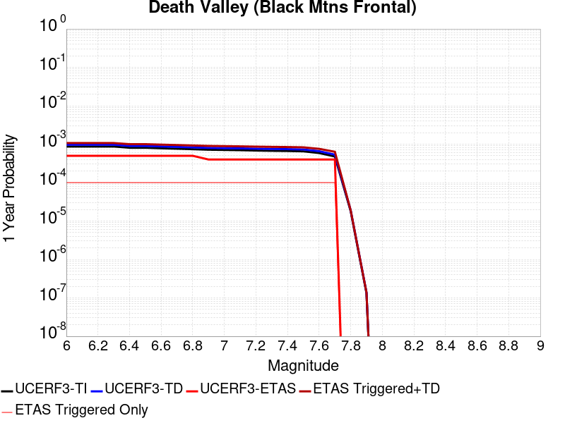 | 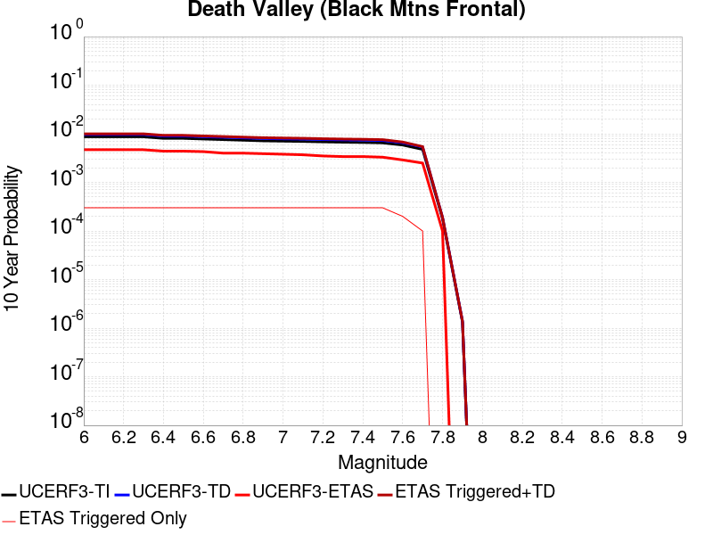 |

| Magnitude | 1 wk TI Prob | 1 wk TD Prob | 1 wk ETAS Prob | 1 wk ETAS/TD Gain | 1 wk ETAS Triggered+TD | 1 wk ETAS Triggered Only | 1 mo TI Prob | 1 mo TD Prob | 1 mo ETAS Prob | 1 mo ETAS/TD Gain | 1 mo ETAS Triggered+TD | 1 mo ETAS Triggered Only | 1 yr TI Prob | 1 yr TD Prob | 1 yr ETAS Prob | 1 yr ETAS/TD Gain | 1 yr ETAS Triggered+TD | 1 yr ETAS Triggered Only | 10 yr TI Prob | 10 yr TD Prob | 10 yr ETAS Prob | 10 yr ETAS/TD Gain | 10 yr ETAS Triggered+TD | 10 yr ETAS Triggered Only |
|-----|-----|-----|-----|-----|-----|-----|-----|-----|-----|-----|-----|-----|-----|-----|-----|-----|-----|-----|-----|-----|-----|-----|-----|-----|
| 6.0 | 1.6707214E-5 | 1.8647328E-5 | 0.0 | 0.0 | 1.8647328E-5 | 0.0 | 7.160038E-5 | 7.991472E-5 | 0.0 | 0.0 | 7.991472E-5 | 0.0 | 8.71386E-4 | 9.7253494E-4 | 5.0E-4 | 0.51412034 | 0.0010724377 | 1.0E-4 | 0.00867977 | 0.009683641 | 0.0047 | 0.48535466 | 0.009980735 | 3.0E-4 |
| 6.1 | 1.6707214E-5 | 1.8647328E-5 | 0.0 | 0.0 | 1.8647328E-5 | 0.0 | 7.160038E-5 | 7.991472E-5 | 0.0 | 0.0 | 7.991472E-5 | 0.0 | 8.71386E-4 | 9.7253494E-4 | 5.0E-4 | 0.51412034 | 0.0010724377 | 1.0E-4 | 0.00867977 | 0.009683641 | 0.0047 | 0.48535466 | 0.009980735 | 3.0E-4 |
| 6.2 | 1.6707214E-5 | 1.8647328E-5 | 0.0 | 0.0 | 1.8647328E-5 | 0.0 | 7.160038E-5 | 7.991472E-5 | 0.0 | 0.0 | 7.991472E-5 | 0.0 | 8.71386E-4 | 9.7253494E-4 | 5.0E-4 | 0.51412034 | 0.0010724377 | 1.0E-4 | 0.00867977 | 0.009683641 | 0.0047 | 0.48535466 | 0.009980735 | 3.0E-4 |
| 6.3 | 1.6707214E-5 | 1.8647328E-5 | 0.0 | 0.0 | 1.8647328E-5 | 0.0 | 7.160038E-5 | 7.991472E-5 | 0.0 | 0.0 | 7.991472E-5 | 0.0 | 8.71386E-4 | 9.7253494E-4 | 5.0E-4 | 0.51412034 | 0.0010724377 | 1.0E-4 | 0.00867977 | 0.009683641 | 0.0047 | 0.48535466 | 0.009980735 | 3.0E-4 |
| 6.4 | 1.5515609E-5 | 1.731691E-5 | 0.0 | 0.0 | 1.731691E-5 | 0.0 | 6.649377E-5 | 7.4213254E-5 | 0.0 | 0.0 | 7.4213254E-5 | 0.0 | 8.0926094E-4 | 9.031779E-4 | 5.0E-4 | 0.5536008 | 0.0010030876 | 1.0E-4 | 0.008063202 | 0.008995756 | 0.0044 | 0.4891196 | 0.009293056 | 3.0E-4 |
| 6.5 | 1.5515609E-5 | 1.731691E-5 | 0.0 | 0.0 | 1.731691E-5 | 0.0 | 6.649377E-5 | 7.4213254E-5 | 0.0 | 0.0 | 7.4213254E-5 | 0.0 | 8.0926094E-4 | 9.031779E-4 | 5.0E-4 | 0.5536008 | 0.0010030876 | 1.0E-4 | 0.008063202 | 0.008995756 | 0.0044 | 0.4891196 | 0.009293056 | 3.0E-4 |
| 6.6 | 1.5041828E-5 | 1.6788485E-5 | 0.0 | 0.0 | 1.6788485E-5 | 0.0 | 6.4463384E-5 | 7.19487E-5 | 0.0 | 0.0 | 7.19487E-5 | 0.0 | 7.8455906E-4 | 8.7562925E-4 | 5.0E-4 | 0.5710179 | 9.755417E-4 | 1.0E-4 | 0.00781795 | 0.008722445 | 0.0043 | 0.49298105 | 0.009019828 | 3.0E-4 |
| 6.7 | 1.4634985E-5 | 1.6335895E-5 | 0.0 | 0.0 | 1.6335895E-5 | 0.0 | 6.271985E-5 | 7.000913E-5 | 0.0 | 0.0 | 7.000913E-5 | 0.0 | 7.6334673E-4 | 8.520336E-4 | 5.0E-4 | 0.58683133 | 9.519484E-4 | 1.0E-4 | 0.007607299 | 0.008488304 | 0.004 | 0.47123665 | 0.008785757 | 3.0E-4 |
| 6.8 | 1.4209158E-5 | 1.5862484E-5 | 0.0 | 0.0 | 1.5862484E-5 | 0.0 | 6.089497E-5 | 6.798034E-5 | 0.0 | 0.0 | 6.798034E-5 | 0.0 | 7.4114406E-4 | 8.2735193E-4 | 5.0E-4 | 0.60433775 | 9.272692E-4 | 1.0E-4 | 0.007386771 | 0.008243332 | 0.004 | 0.48524073 | 0.0085408585 | 3.0E-4 |
| 6.9 | 1.3780098E-5 | 1.5385593E-5 | 0.0 | 0.0 | 1.5385593E-5 | 0.0 | 5.9056227E-5 | 6.593662E-5 | 0.0 | 0.0 | 6.593662E-5 | 0.0 | 7.1877235E-4 | 8.0248807E-4 | 4.0E-4 | 0.49844977 | 9.0240786E-4 | 1.0E-4 | 0.0071645193 | 0.007996496 | 0.0039 | 0.4877136 | 0.008294097 | 3.0E-4 |
| 7.0 | 1.3585064E-5 | 1.5169402E-5 | 0.0 | 0.0 | 1.5169402E-5 | 0.0 | 5.8220405E-5 | 6.5010136E-5 | 0.0 | 0.0 | 6.5010136E-5 | 0.0 | 7.086029E-4 | 7.9121644E-4 | 4.0E-4 | 0.5055507 | 8.911373E-4 | 1.0E-4 | 0.007063476 | 0.007884584 | 0.0038 | 0.4819531 | 0.008182219 | 3.0E-4 |
| 7.1 | 1.3398601E-5 | 1.4962822E-5 | 0.0 | 0.0 | 1.4962822E-5 | 0.0 | 5.742131E-5 | 6.412483E-5 | 0.0 | 0.0 | 6.412483E-5 | 0.0 | 6.9888023E-4 | 7.8044564E-4 | 4.0E-4 | 0.5125277 | 8.803676E-4 | 1.0E-4 | 0.0069668638 | 0.0077776355 | 0.0037 | 0.475723 | 0.0080753025 | 3.0E-4 |
| 7.2 | 1.3126312E-5 | 1.4661385E-5 | 0.0 | 0.0 | 1.4661385E-5 | 0.0 | 5.6254412E-5 | 6.283302E-5 | 0.0 | 0.0 | 6.283302E-5 | 0.0 | 6.846822E-4 | 7.64729E-4 | 4.0E-4 | 0.52306116 | 8.646525E-4 | 1.0E-4 | 0.006825765 | 0.0076215565 | 0.0035 | 0.45922378 | 0.007919271 | 3.0E-4 |
| 7.3 | 1.2922429E-5 | 1.44358655E-5 | 0.0 | 0.0 | 1.44358655E-5 | 0.0 | 5.5380664E-5 | 6.186656E-5 | 0.0 | 0.0 | 6.186656E-5 | 0.0 | 6.74051E-4 | 7.5297046E-4 | 4.0E-4 | 0.5312294 | 8.5289514E-4 | 1.0E-4 | 0.006720101 | 0.0075047715 | 0.0034 | 0.4530451 | 0.00780252 | 3.0E-4 |
| 7.4 | 1.2768878E-5 | 1.426604E-5 | 0.0 | 0.0 | 1.426604E-5 | 0.0 | 5.4722615E-5 | 6.113877E-5 | 0.0 | 0.0 | 6.113877E-5 | 0.0 | 6.660441E-4 | 7.4411574E-4 | 4.0E-4 | 0.5375508 | 8.440413E-4 | 1.0E-4 | 0.0066405144 | 0.0074168188 | 0.0034 | 0.45841756 | 0.007714594 | 3.0E-4 |
| 7.5 | 1.2521929E-5 | 1.3994572E-5 | 0.0 | 0.0 | 1.3994572E-5 | 0.0 | 5.366431E-5 | 5.997539E-5 | 0.0 | 0.0 | 5.997539E-5 | 0.0 | 6.531671E-4 | 7.2996115E-4 | 4.0E-4 | 0.54797435 | 8.2988816E-4 | 1.0E-4 | 0.006512506 | 0.007276209 | 0.0033 | 0.45353287 | 0.0075740265 | 3.0E-4 |
| 7.6 | 1.1301089E-5 | 1.2632379E-5 | 0.0 | 0.0 | 1.2632379E-5 | 0.0 | 4.8432343E-5 | 5.4137676E-5 | 0.0 | 0.0 | 5.4137676E-5 | 0.0 | 5.895042E-4 | 6.589322E-4 | 4.0E-4 | 0.60704273 | 7.5886626E-4 | 1.0E-4 | 0.0058794282 | 0.0065703345 | 0.0029 | 0.44137782 | 0.0067690206 | 2.0E-4 |
| 7.7 | 9.189108E-6 | 1.027055E-5 | 0.0 | 0.0 | 1.027055E-5 | 0.0 | 3.93813E-5 | 4.4015927E-5 | 0.0 | 0.0 | 4.4015927E-5 | 0.0 | 4.7936183E-4 | 5.357672E-4 | 4.0E-4 | 0.74659294 | 6.3571363E-4 | 1.0E-4 | 0.004783291 | 0.005345265 | 0.0025 | 0.46770367 | 0.0054447306 | 1.0E-4 |
| 7.8 | 3.4586725E-7 | 3.6461634E-7 | 0.0 | 0.0 | 3.6461634E-7 | 0.0 | 1.4822873E-6 | 1.5626406E-6 | 0.0 | 0.0 | 1.5626406E-6 | 0.0 | 1.80467E-5 | 1.9024988E-5 | 0.0 | 0.0 | 1.9024988E-5 | 0.0 | 1.8045233E-4 | 1.9023403E-4 | 1.0E-4 | 0.5256683 | 1.9023403E-4 | 0.0 |
| 7.9 | 2.5591178E-9 | 2.6684681E-9 | 0.0 | 0.0 | 2.6684681E-9 | 0.0 | 1.0967647E-8 | 1.1436292E-8 | 0.0 | 0.0 | 1.1436292E-8 | 0.0 | 1.335311E-7 | 1.3923685E-7 | 0.0 | 0.0 | 1.3923685E-7 | 0.0 | 1.3353102E-6 | 1.3923685E-6 | 0.0 | 0.0 | 1.3923685E-6 | 0.0 |

## Santa Cruz Catalina Ridge alt1
*[(top)](#table-of-contents)*

| 1 Week | 1 Month | 1 Year | 10 Year |
|-----|-----|-----|-----|
|  |  |  |  |

| Magnitude | 1 wk TI Prob | 1 wk TD Prob | 1 wk ETAS Prob | 1 wk ETAS/TD Gain | 1 wk ETAS Triggered+TD | 1 wk ETAS Triggered Only | 1 mo TI Prob | 1 mo TD Prob | 1 mo ETAS Prob | 1 mo ETAS/TD Gain | 1 mo ETAS Triggered+TD | 1 mo ETAS Triggered Only | 1 yr TI Prob | 1 yr TD Prob | 1 yr ETAS Prob | 1 yr ETAS/TD Gain | 1 yr ETAS Triggered+TD | 1 yr ETAS Triggered Only | 10 yr TI Prob | 10 yr TD Prob | 10 yr ETAS Prob | 10 yr ETAS/TD Gain | 10 yr ETAS Triggered+TD | 10 yr ETAS Triggered Only |
|-----|-----|-----|-----|-----|-----|-----|-----|-----|-----|-----|-----|-----|-----|-----|-----|-----|-----|-----|-----|-----|-----|-----|-----|-----|
| 6.0 | 3.2833184E-5 | 3.6514502E-5 | 0.0 | 0.0 | 3.6514502E-5 | 0.0 | 1.4070606E-4 | 1.5648227E-4 | 0.0 | 0.0 | 1.5648227E-4 | 0.0 | 0.00171175 | 0.0019036726 | 5.0E-4 | 0.26265022 | 0.0019036726 | 0.0 | 0.016986247 | 0.0188905 | 0.0109 | 0.5770096 | 0.019184833 | 3.0E-4 |
| 6.1 | 1.9835548E-5 | 2.163856E-5 | 0.0 | 0.0 | 2.163856E-5 | 0.0 | 8.500672E-5 | 9.27335E-5 | 0.0 | 0.0 | 9.27335E-5 | 0.0 | 0.0010344655 | 0.0011284658 | 4.0E-4 | 0.35446358 | 0.0011284658 | 0.0 | 0.010296632 | 0.0112294825 | 0.0065 | 0.5788334 | 0.011526114 | 3.0E-4 |
| 6.2 | 1.9835548E-5 | 2.163856E-5 | 0.0 | 0.0 | 2.163856E-5 | 0.0 | 8.500672E-5 | 9.27335E-5 | 0.0 | 0.0 | 9.27335E-5 | 0.0 | 0.0010344655 | 0.0011284658 | 4.0E-4 | 0.35446358 | 0.0011284658 | 0.0 | 0.010296632 | 0.0112294825 | 0.0065 | 0.5788334 | 0.011526114 | 3.0E-4 |
| 6.3 | 1.5728183E-5 | 1.7019129E-5 | 0.0 | 0.0 | 1.7019129E-5 | 0.0 | 6.7404755E-5 | 7.293712E-5 | 0.0 | 0.0 | 7.293712E-5 | 0.0 | 8.2034385E-4 | 8.876537E-4 | 2.0E-4 | 0.2253131 | 8.876537E-4 | 0.0 | 0.008173222 | 0.00884176 | 0.0052 | 0.5881182 | 0.009039992 | 2.0E-4 |
| 6.4 | 1.5728183E-5 | 1.7019129E-5 | 0.0 | 0.0 | 1.7019129E-5 | 0.0 | 6.7404755E-5 | 7.293712E-5 | 0.0 | 0.0 | 7.293712E-5 | 0.0 | 8.2034385E-4 | 8.876537E-4 | 2.0E-4 | 0.2253131 | 8.876537E-4 | 0.0 | 0.008173222 | 0.00884176 | 0.0052 | 0.5881182 | 0.009039992 | 2.0E-4 |
| 6.5 | 1.3707734E-5 | 1.4782246E-5 | 0.0 | 0.0 | 1.4782246E-5 | 0.0 | 5.8746107E-5 | 6.335096E-5 | 0.0 | 0.0 | 6.335096E-5 | 0.0 | 7.1499916E-4 | 7.710286E-4 | 2.0E-4 | 0.25939378 | 7.710286E-4 | 0.0 | 0.0071270303 | 0.0076839323 | 0.0046 | 0.5986518 | 0.0077831643 | 1.0E-4 |
| 6.6 | 1.2539813E-5 | 1.3499282E-5 | 0.0 | 0.0 | 1.3499282E-5 | 0.0 | 5.3740947E-5 | 5.78528E-5 | 0.0 | 0.0 | 5.78528E-5 | 0.0 | 6.540996E-4 | 7.041329E-4 | 2.0E-4 | 0.2840373 | 7.041329E-4 | 0.0 | 0.0065217763 | 0.0070193214 | 0.0044 | 0.62684125 | 0.0071186195 | 1.0E-4 |
| 6.7 | 1.1504083E-5 | 1.2367549E-5 | 0.0 | 0.0 | 1.2367549E-5 | 0.0 | 4.930228E-5 | 5.3002714E-5 | 0.0 | 0.0 | 5.3002714E-5 | 0.0 | 6.0008996E-4 | 6.45119E-4 | 1.0E-4 | 0.15501016 | 6.45119E-4 | 0.0 | 0.005984721 | 0.0064326916 | 0.0041 | 0.6373693 | 0.0065320483 | 1.0E-4 |
| 6.8 | 1.012739E-5 | 1.0868654E-5 | 0.0 | 0.0 | 1.0868654E-5 | 0.0 | 4.340238E-5 | 4.657912E-5 | 0.0 | 0.0 | 4.657912E-5 | 0.0 | 5.282958E-4 | 5.669547E-4 | 0.0 | 0.0 | 5.669547E-4 | 0.0 | 0.0052704164 | 0.0056552514 | 0.0037 | 0.65425915 | 0.005754686 | 1.0E-4 |
| 6.9 | 8.9607865E-6 | 9.60185E-6 | 0.0 | 0.0 | 9.60185E-6 | 0.0 | 3.8402806E-5 | 4.1150142E-5 | 0.0 | 0.0 | 4.1150142E-5 | 0.0 | 4.6745385E-4 | 5.0088885E-4 | 0.0 | 0.0 | 5.0088885E-4 | 0.0 | 0.0046647177 | 0.0049977186 | 0.0027 | 0.54024655 | 0.005097219 | 1.0E-4 |
| 7.0 | 8.046829E-6 | 8.613331E-6 | 0.0 | 0.0 | 8.613331E-6 | 0.0 | 3.4485955E-5 | 3.691376E-5 | 0.0 | 0.0 | 3.691376E-5 | 0.0 | 4.1978562E-4 | 4.4933314E-4 | 0.0 | 0.0 | 4.4933314E-4 | 0.0 | 0.004189935 | 0.004484337 | 0.0024 | 0.53519624 | 0.004583888 | 1.0E-4 |
| 7.1 | 7.136131E-6 | 7.632046E-6 | 0.0 | 0.0 | 7.632046E-6 | 0.0 | 3.0583058E-5 | 3.270836E-5 | 0.0 | 0.0 | 3.270836E-5 | 0.0 | 3.7228514E-4 | 3.9815222E-4 | 0.0 | 0.0 | 3.9815222E-4 | 0.0 | 0.0037166206 | 0.003974465 | 0.002 | 0.50321233 | 0.004074068 | 1.0E-4 |
| 7.2 | 6.362014E-6 | 6.800006E-6 | 0.0 | 0.0 | 6.800006E-6 | 0.0 | 2.726549E-5 | 2.914256E-5 | 0.0 | 0.0 | 2.914256E-5 | 0.0 | 3.3190678E-4 | 3.5475355E-4 | 0.0 | 0.0 | 3.5475355E-4 | 0.0 | 0.0033141149 | 0.0035419408 | 0.0016 | 0.45172974 | 0.0036415868 | 1.0E-4 |
| 7.3 | 5.004101E-6 | 5.347829E-6 | 0.0 | 0.0 | 5.347829E-6 | 0.0 | 2.1445969E-5 | 2.2919068E-5 | 0.0 | 0.0 | 2.2919068E-5 | 0.0 | 2.6107338E-4 | 2.7900445E-4 | 0.0 | 0.0 | 2.7900445E-4 | 0.0 | 0.002607669 | 0.0027865963 | 0.0013 | 0.46651894 | 0.0028863177 | 1.0E-4 |
| 7.4 | 3.4901443E-6 | 3.7293473E-6 | 0.0 | 0.0 | 3.7293473E-6 | 0.0 | 1.4957676E-5 | 1.5982821E-5 | 0.0 | 0.0 | 1.5982821E-5 | 0.0 | 1.8209449E-4 | 1.9457386E-4 | 0.0 | 0.0 | 1.9457386E-4 | 0.0 | 0.0018194534 | 0.0019440735 | 0.001 | 0.51438385 | 0.0020438791 | 1.0E-4 |
| 7.5 | 1.1215045E-6 | 1.188633E-6 | 0.0 | 0.0 | 1.188633E-6 | 0.0 | 4.806439E-6 | 5.094131E-6 | 0.0 | 0.0 | 5.094131E-6 | 0.0 | 5.851682E-5 | 6.201932E-5 | 0.0 | 0.0 | 6.201932E-5 | 0.0 | 5.850142E-4 | 6.200231E-4 | 4.0E-4 | 0.64513725 | 7.199611E-4 | 1.0E-4 |
| 7.6 | 2.8599047E-7 | 2.9937195E-7 | 0.0 | 0.0 | 2.9937195E-7 | 0.0 | 1.2256729E-6 | 1.283022E-6 | 0.0 | 0.0 | 1.283022E-6 | 0.0 | 1.4922465E-5 | 1.5620682E-5 | 0.0 | 0.0 | 1.5620682E-5 | 0.0 | 1.4921463E-4 | 1.5619598E-4 | 1.0E-4 | 0.64022136 | 1.5619598E-4 | 0.0 |
| 7.7 | 2.0781519E-7 | 2.1733803E-7 | 0.0 | 0.0 | 2.1733803E-7 | 0.0 | 8.906362E-7 | 9.3144837E-7 | 0.0 | 0.0 | 9.3144837E-7 | 0.0 | 1.08434415E-5 | 1.1340326E-5 | 0.0 | 0.0 | 1.1340326E-5 | 0.0 | 1.0842913E-4 | 1.1339756E-4 | 1.0E-4 | 0.88185316 | 1.1339756E-4 | 0.0 |
| 7.8 | 3.614776E-8 | 3.7624787E-8 | 0.0 | 0.0 | 3.7624787E-8 | 0.0 | 1.5491896E-7 | 1.6124908E-7 | 0.0 | 0.0 | 1.6124908E-7 | 0.0 | 1.8861368E-6 | 1.9632057E-6 | 0.0 | 0.0 | 1.9632057E-6 | 0.0 | 1.8861208E-5 | 1.9631896E-5 | 0.0 | 0.0 | 1.9631896E-5 | 0.0 |

## Del Valle
*[(top)](#table-of-contents)*

| 1 Week | 1 Month | 1 Year | 10 Year |
|-----|-----|-----|-----|
|  |  | 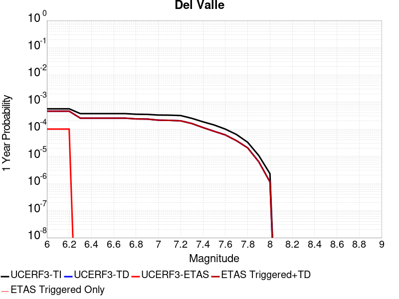 |  |

| Magnitude | 1 wk TI Prob | 1 wk TD Prob | 1 wk ETAS Prob | 1 wk ETAS/TD Gain | 1 wk ETAS Triggered+TD | 1 wk ETAS Triggered Only | 1 mo TI Prob | 1 mo TD Prob | 1 mo ETAS Prob | 1 mo ETAS/TD Gain | 1 mo ETAS Triggered+TD | 1 mo ETAS Triggered Only | 1 yr TI Prob | 1 yr TD Prob | 1 yr ETAS Prob | 1 yr ETAS/TD Gain | 1 yr ETAS Triggered+TD | 1 yr ETAS Triggered Only | 10 yr TI Prob | 10 yr TD Prob | 10 yr ETAS Prob | 10 yr ETAS/TD Gain | 10 yr ETAS Triggered+TD | 10 yr ETAS Triggered Only |
|-----|-----|-----|-----|-----|-----|-----|-----|-----|-----|-----|-----|-----|-----|-----|-----|-----|-----|-----|-----|-----|-----|-----|-----|-----|
| 6.0 | 1.0716125E-5 | 8.751312E-6 | 0.0 | 0.0 | 8.751312E-6 | 0.0 | 4.592544E-5 | 3.7505193E-5 | 0.0 | 0.0 | 3.7505193E-5 | 0.0 | 5.589988E-4 | 4.5654975E-4 | 1.0E-4 | 0.21903418 | 4.5654975E-4 | 0.0 | 0.0055759475 | 0.0045580897 | 0.0019 | 0.4168413 | 0.0048567224 | 3.0E-4 |
| 6.1 | 1.0716125E-5 | 8.751312E-6 | 0.0 | 0.0 | 8.751312E-6 | 0.0 | 4.592544E-5 | 3.7505193E-5 | 0.0 | 0.0 | 3.7505193E-5 | 0.0 | 5.589988E-4 | 4.5654975E-4 | 1.0E-4 | 0.21903418 | 4.5654975E-4 | 0.0 | 0.0055759475 | 0.0045580897 | 0.0019 | 0.4168413 | 0.0048567224 | 3.0E-4 |
| 6.2 | 1.0716125E-5 | 8.751312E-6 | 0.0 | 0.0 | 8.751312E-6 | 0.0 | 4.592544E-5 | 3.7505193E-5 | 0.0 | 0.0 | 3.7505193E-5 | 0.0 | 5.589988E-4 | 4.5654975E-4 | 1.0E-4 | 0.21903418 | 4.5654975E-4 | 0.0 | 0.0055759475 | 0.0045580897 | 0.0019 | 0.4168413 | 0.0048567224 | 3.0E-4 |
| 6.3 | 7.1293784E-6 | 4.8528304E-6 | 0.0 | 0.0 | 4.8528304E-6 | 0.0 | 3.055412E-5 | 2.0797685E-5 | 0.0 | 0.0 | 2.0797685E-5 | 0.0 | 3.7193293E-4 | 2.531831E-4 | 0.0 | 0.0 | 2.531831E-4 | 0.0 | 0.0037131102 | 0.0025290528 | 0.0012 | 0.47448593 | 0.002728547 | 2.0E-4 |
| 6.4 | 7.1293784E-6 | 4.8528304E-6 | 0.0 | 0.0 | 4.8528304E-6 | 0.0 | 3.055412E-5 | 2.0797685E-5 | 0.0 | 0.0 | 2.0797685E-5 | 0.0 | 3.7193293E-4 | 2.531831E-4 | 0.0 | 0.0 | 2.531831E-4 | 0.0 | 0.0037131102 | 0.0025290528 | 0.0012 | 0.47448593 | 0.002728547 | 2.0E-4 |
| 6.5 | 7.1293784E-6 | 4.8528304E-6 | 0.0 | 0.0 | 4.8528304E-6 | 0.0 | 3.055412E-5 | 2.0797685E-5 | 0.0 | 0.0 | 2.0797685E-5 | 0.0 | 3.7193293E-4 | 2.531831E-4 | 0.0 | 0.0 | 2.531831E-4 | 0.0 | 0.0037131102 | 0.0025290528 | 0.0012 | 0.47448593 | 0.002728547 | 2.0E-4 |
| 6.6 | 7.1293784E-6 | 4.8528304E-6 | 0.0 | 0.0 | 4.8528304E-6 | 0.0 | 3.055412E-5 | 2.0797685E-5 | 0.0 | 0.0 | 2.0797685E-5 | 0.0 | 3.7193293E-4 | 2.531831E-4 | 0.0 | 0.0 | 2.531831E-4 | 0.0 | 0.0037131102 | 0.0025290528 | 0.0012 | 0.47448593 | 0.002728547 | 2.0E-4 |
| 6.7 | 7.12272E-6 | 4.85024E-6 | 0.0 | 0.0 | 4.85024E-6 | 0.0 | 3.0525585E-5 | 2.0786581E-5 | 0.0 | 0.0 | 2.0786581E-5 | 0.0 | 3.7158563E-4 | 2.5304797E-4 | 0.0 | 0.0 | 2.5304797E-4 | 0.0 | 0.003709649 | 0.0025277045 | 0.0012 | 0.47473902 | 0.002727199 | 2.0E-4 |
| 6.8 | 6.7558703E-6 | 4.547065E-6 | 0.0 | 0.0 | 4.547065E-6 | 0.0 | 2.895341E-5 | 1.948728E-5 | 0.0 | 0.0 | 1.948728E-5 | 0.0 | 3.5245073E-4 | 2.3723242E-4 | 0.0 | 0.0 | 2.3723242E-4 | 0.0 | 0.0035189227 | 0.0023698872 | 0.0011 | 0.4641571 | 0.0024696502 | 1.0E-4 |
| 6.9 | 6.6700386E-6 | 4.4906624E-6 | 0.0 | 0.0 | 4.4906624E-6 | 0.0 | 2.8585566E-5 | 1.9245557E-5 | 0.0 | 0.0 | 1.9245557E-5 | 0.0 | 3.479737E-4 | 2.342901E-4 | 0.0 | 0.0 | 2.342901E-4 | 0.0 | 0.003474293 | 0.002340526 | 0.0011 | 0.4699798 | 0.0024402922 | 1.0E-4 |
| 7.0 | 6.3181424E-6 | 4.0874893E-6 | 0.0 | 0.0 | 4.0874893E-6 | 0.0 | 2.7077473E-5 | 1.7517696E-5 | 0.0 | 0.0 | 1.7517696E-5 | 0.0 | 3.2961834E-4 | 2.1325749E-4 | 0.0 | 0.0 | 2.1325749E-4 | 0.0 | 0.0032912986 | 0.0021306037 | 0.001 | 0.46935058 | 0.0022303904 | 1.0E-4 |
| 7.1 | 6.248759E-6 | 4.0228306E-6 | 0.0 | 0.0 | 4.0228306E-6 | 0.0 | 2.678012E-5 | 1.724059E-5 | 0.0 | 0.0 | 1.724059E-5 | 0.0 | 3.2599916E-4 | 2.098844E-4 | 0.0 | 0.0 | 2.098844E-4 | 0.0 | 0.0032552136 | 0.0020969366 | 0.001 | 0.47688615 | 0.0021967269 | 1.0E-4 |
| 7.2 | 6.0411944E-6 | 3.859206E-6 | 0.0 | 0.0 | 3.859206E-6 | 0.0 | 2.5890577E-5 | 1.6539352E-5 | 0.0 | 0.0 | 1.6539352E-5 | 0.0 | 3.1517216E-4 | 2.0134842E-4 | 0.0 | 0.0 | 2.0134842E-4 | 0.0 | 0.0031472554 | 0.0020117336 | 0.001 | 0.49708372 | 0.0021115325 | 1.0E-4 |
| 7.3 | 4.7691183E-6 | 3.0697345E-6 | 0.0 | 0.0 | 3.0697345E-6 | 0.0 | 2.0438918E-5 | 1.315594E-5 | 0.0 | 0.0 | 1.315594E-5 | 0.0 | 2.488154E-4 | 1.6016202E-4 | 0.0 | 0.0 | 1.6016202E-4 | 0.0 | 0.00248537 | 0.0016005047 | 5.0E-4 | 0.31240144 | 0.0016005047 | 0.0 |
| 7.4 | 3.5524722E-6 | 2.1829612E-6 | 0.0 | 0.0 | 2.1829612E-6 | 0.0 | 1.5224792E-5 | 9.3555145E-6 | 0.0 | 0.0 | 9.3555145E-6 | 0.0 | 1.8534607E-4 | 1.1389752E-4 | 0.0 | 0.0 | 1.1389752E-4 | 0.0 | 0.0018519156 | 0.0011383997 | 4.0E-4 | 0.35137045 | 0.0011383997 | 0.0 |
| 7.5 | 2.7133442E-6 | 1.5874225E-6 | 0.0 | 0.0 | 1.5874225E-6 | 0.0 | 1.1628566E-5 | 6.803222E-6 | 0.0 | 0.0 | 6.803222E-6 | 0.0 | 1.415686E-4 | 8.2826096E-5 | 0.0 | 0.0 | 8.2826096E-5 | 0.0 | 0.0014147845 | 8.2795415E-4 | 3.0E-4 | 0.3623389 | 8.2795415E-4 | 0.0 |
| 7.6 | 1.915338E-6 | 1.1707277E-6 | 0.0 | 0.0 | 1.1707277E-6 | 0.0 | 8.208566E-6 | 5.017395E-6 | 0.0 | 0.0 | 5.017395E-6 | 0.0 | 9.993471E-5 | 6.1085084E-5 | 0.0 | 0.0 | 6.1085084E-5 | 0.0 | 9.988978E-4 | 6.1068387E-4 | 3.0E-4 | 0.49125257 | 6.1068387E-4 | 0.0 |
| 7.7 | 1.2120448E-6 | 7.1597157E-7 | 0.0 | 0.0 | 7.1597157E-7 | 0.0 | 5.194467E-6 | 3.068446E-6 | 0.0 | 0.0 | 3.068446E-6 | 0.0 | 6.3240805E-5 | 3.735769E-5 | 0.0 | 0.0 | 3.735769E-5 | 0.0 | 6.322281E-4 | 3.735145E-4 | 1.0E-4 | 0.26772723 | 3.735145E-4 | 0.0 |
| 7.8 | 6.272381E-7 | 3.9202124E-7 | 0.0 | 0.0 | 3.9202124E-7 | 0.0 | 2.6881603E-6 | 1.6800899E-6 | 0.0 | 0.0 | 1.6800899E-6 | 0.0 | 3.272786E-5 | 2.0454903E-5 | 0.0 | 0.0 | 2.0454903E-5 | 0.0 | 3.272304E-4 | 2.0453037E-4 | 1.0E-4 | 0.48892495 | 2.0453037E-4 | 0.0 |
| 7.9 | 2.0292627E-7 | 1.1963482E-7 | 0.0 | 0.0 | 1.1963482E-7 | 0.0 | 8.6968373E-7 | 5.1272053E-7 | 0.0 | 0.0 | 5.1272053E-7 | 0.0 | 1.0588348E-5 | 6.242355E-6 | 0.0 | 0.0 | 6.242355E-6 | 0.0 | 1.0587843E-4 | 6.2421816E-5 | 0.0 | 0.0 | 6.2421816E-5 | 0.0 |
| 8.0 | 4.374492E-8 | 2.1766871E-8 | 0.0 | 0.0 | 2.1766871E-8 | 0.0 | 1.8747821E-7 | 9.328659E-8 | 0.0 | 0.0 | 9.328659E-8 | 0.0 | 2.2825448E-6 | 1.1357637E-6 | 0.0 | 0.0 | 1.1357637E-6 | 0.0 | 2.2825214E-5 | 1.13575825E-5 | 0.0 | 0.0 | 1.13575825E-5 | 0.0 |

## Fontana (Seismicity)
*[(top)](#table-of-contents)*

| 1 Week | 1 Month | 1 Year | 10 Year |
|-----|-----|-----|-----|
|  |  |  | 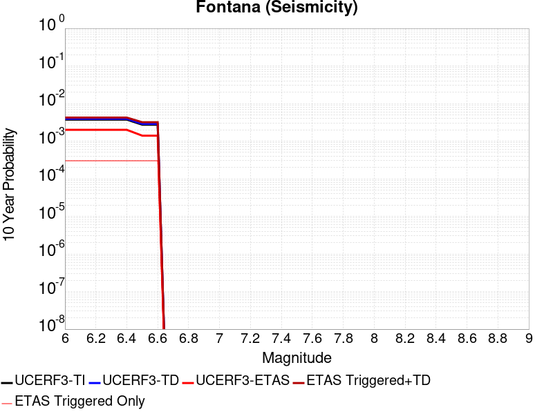 |

| Magnitude | 1 wk TI Prob | 1 wk TD Prob | 1 wk ETAS Prob | 1 wk ETAS/TD Gain | 1 wk ETAS Triggered+TD | 1 wk ETAS Triggered Only | 1 mo TI Prob | 1 mo TD Prob | 1 mo ETAS Prob | 1 mo ETAS/TD Gain | 1 mo ETAS Triggered+TD | 1 mo ETAS Triggered Only | 1 yr TI Prob | 1 yr TD Prob | 1 yr ETAS Prob | 1 yr ETAS/TD Gain | 1 yr ETAS Triggered+TD | 1 yr ETAS Triggered Only | 10 yr TI Prob | 10 yr TD Prob | 10 yr ETAS Prob | 10 yr ETAS/TD Gain | 10 yr ETAS Triggered+TD | 10 yr ETAS Triggered Only |
|-----|-----|-----|-----|-----|-----|-----|-----|-----|-----|-----|-----|-----|-----|-----|-----|-----|-----|-----|-----|-----|-----|-----|-----|-----|
| 6.0 | 7.1789214E-6 | 7.547905E-6 | 0.0 | 0.0 | 7.547905E-6 | 0.0 | 3.076644E-5 | 3.2347994E-5 | 0.0 | 0.0 | 3.2347994E-5 | 0.0 | 3.7451705E-4 | 3.9380637E-4 | 0.0 | 0.0 | 3.9380637E-4 | 0.0 | 0.003738865 | 0.0039350805 | 0.002 | 0.5082488 | 0.0042339 | 3.0E-4 |
| 6.1 | 7.1789214E-6 | 7.547905E-6 | 0.0 | 0.0 | 7.547905E-6 | 0.0 | 3.076644E-5 | 3.2347994E-5 | 0.0 | 0.0 | 3.2347994E-5 | 0.0 | 3.7451705E-4 | 3.9380637E-4 | 0.0 | 0.0 | 3.9380637E-4 | 0.0 | 0.003738865 | 0.0039350805 | 0.002 | 0.5082488 | 0.0042339 | 3.0E-4 |
| 6.2 | 7.1789214E-6 | 7.547905E-6 | 0.0 | 0.0 | 7.547905E-6 | 0.0 | 3.076644E-5 | 3.2347994E-5 | 0.0 | 0.0 | 3.2347994E-5 | 0.0 | 3.7451705E-4 | 3.9380637E-4 | 0.0 | 0.0 | 3.9380637E-4 | 0.0 | 0.003738865 | 0.0039350805 | 0.002 | 0.5082488 | 0.0042339 | 3.0E-4 |
| 6.3 | 7.1789214E-6 | 7.547905E-6 | 0.0 | 0.0 | 7.547905E-6 | 0.0 | 3.076644E-5 | 3.2347994E-5 | 0.0 | 0.0 | 3.2347994E-5 | 0.0 | 3.7451705E-4 | 3.9380637E-4 | 0.0 | 0.0 | 3.9380637E-4 | 0.0 | 0.003738865 | 0.0039350805 | 0.002 | 0.5082488 | 0.0042339 | 3.0E-4 |
| 6.4 | 7.1789214E-6 | 7.547905E-6 | 0.0 | 0.0 | 7.547905E-6 | 0.0 | 3.076644E-5 | 3.2347994E-5 | 0.0 | 0.0 | 3.2347994E-5 | 0.0 | 3.7451705E-4 | 3.9380637E-4 | 0.0 | 0.0 | 3.9380637E-4 | 0.0 | 0.003738865 | 0.0039350805 | 0.002 | 0.5082488 | 0.0042339 | 3.0E-4 |
| 6.5 | 5.2611317E-6 | 5.529745E-6 | 0.0 | 0.0 | 5.529745E-6 | 0.0 | 2.2547512E-5 | 2.3698909E-5 | 0.0 | 0.0 | 2.3698909E-5 | 0.0 | 2.744814E-4 | 2.885342E-4 | 0.0 | 0.0 | 2.885342E-4 | 0.0 | 0.002741426 | 0.002885342 | 0.0014 | 0.4852111 | 0.0031844764 | 3.0E-4 |
| 6.6 | 5.2611317E-6 | 5.529745E-6 | 0.0 | 0.0 | 5.529745E-6 | 0.0 | 2.2547512E-5 | 2.3698909E-5 | 0.0 | 0.0 | 2.3698909E-5 | 0.0 | 2.744814E-4 | 2.885342E-4 | 0.0 | 0.0 | 2.885342E-4 | 0.0 | 0.002741426 | 0.002885342 | 0.0014 | 0.4852111 | 0.0031844764 | 3.0E-4 |

## Hilton Creek 2011 CFM
*[(top)](#table-of-contents)*

| 1 Week | 1 Month | 1 Year | 10 Year |
|-----|-----|-----|-----|
|  | 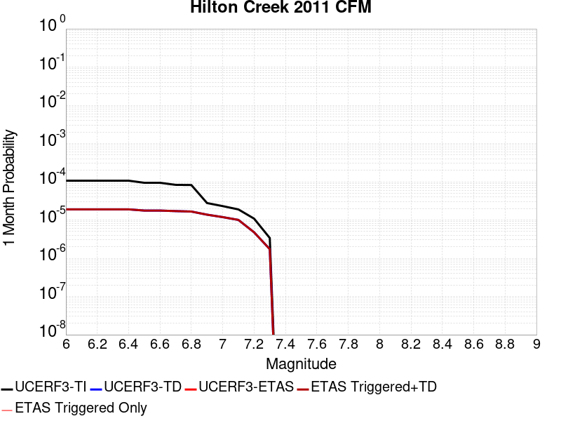 | 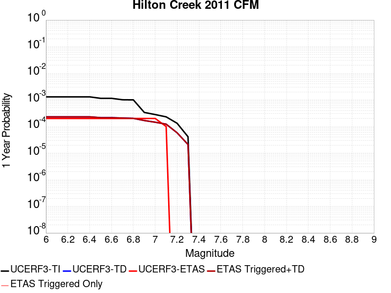 | 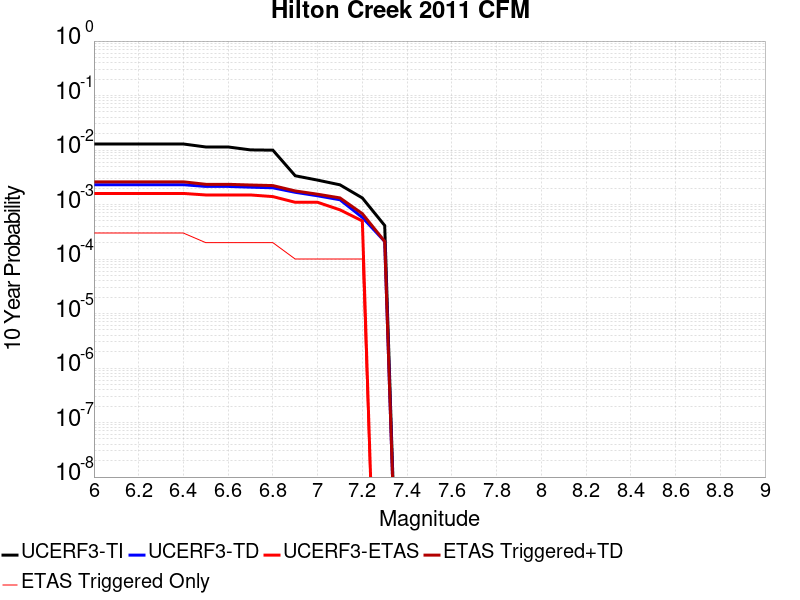 |

| Magnitude | 1 wk TI Prob | 1 wk TD Prob | 1 wk ETAS Prob | 1 wk ETAS/TD Gain | 1 wk ETAS Triggered+TD | 1 wk ETAS Triggered Only | 1 mo TI Prob | 1 mo TD Prob | 1 mo ETAS Prob | 1 mo ETAS/TD Gain | 1 mo ETAS Triggered+TD | 1 mo ETAS Triggered Only | 1 yr TI Prob | 1 yr TD Prob | 1 yr ETAS Prob | 1 yr ETAS/TD Gain | 1 yr ETAS Triggered+TD | 1 yr ETAS Triggered Only | 10 yr TI Prob | 10 yr TD Prob | 10 yr ETAS Prob | 10 yr ETAS/TD Gain | 10 yr ETAS Triggered+TD | 10 yr ETAS Triggered Only |
|-----|-----|-----|-----|-----|-----|-----|-----|-----|-----|-----|-----|-----|-----|-----|-----|-----|-----|-----|-----|-----|-----|-----|-----|-----|
| 6.0 | 2.4923684E-5 | 4.4273243E-6 | 0.0 | 0.0 | 4.4273243E-6 | 0.0 | 1.06811414E-4 | 1.8974117E-5 | 0.0 | 0.0 | 1.8974117E-5 | 0.0 | 0.0012996531 | 2.3098699E-4 | 2.0E-4 | 0.8658496 | 2.3098699E-4 | 0.0 | 0.012920785 | 0.0023104653 | 0.0016 | 0.6925012 | 0.0026097721 | 3.0E-4 |
| 6.1 | 2.4923684E-5 | 4.4273243E-6 | 0.0 | 0.0 | 4.4273243E-6 | 0.0 | 1.06811414E-4 | 1.8974117E-5 | 0.0 | 0.0 | 1.8974117E-5 | 0.0 | 0.0012996531 | 2.3098699E-4 | 2.0E-4 | 0.8658496 | 2.3098699E-4 | 0.0 | 0.012920785 | 0.0023104653 | 0.0016 | 0.6925012 | 0.0026097721 | 3.0E-4 |
| 6.2 | 2.4923684E-5 | 4.4273243E-6 | 0.0 | 0.0 | 4.4273243E-6 | 0.0 | 1.06811414E-4 | 1.8974117E-5 | 0.0 | 0.0 | 1.8974117E-5 | 0.0 | 0.0012996531 | 2.3098699E-4 | 2.0E-4 | 0.8658496 | 2.3098699E-4 | 0.0 | 0.012920785 | 0.0023104653 | 0.0016 | 0.6925012 | 0.0026097721 | 3.0E-4 |
| 6.3 | 2.4923684E-5 | 4.4273243E-6 | 0.0 | 0.0 | 4.4273243E-6 | 0.0 | 1.06811414E-4 | 1.8974117E-5 | 0.0 | 0.0 | 1.8974117E-5 | 0.0 | 0.0012996531 | 2.3098699E-4 | 2.0E-4 | 0.8658496 | 2.3098699E-4 | 0.0 | 0.012920785 | 0.0023104653 | 0.0016 | 0.6925012 | 0.0026097721 | 3.0E-4 |
| 6.4 | 2.4923684E-5 | 4.4273243E-6 | 0.0 | 0.0 | 4.4273243E-6 | 0.0 | 1.06811414E-4 | 1.8974117E-5 | 0.0 | 0.0 | 1.8974117E-5 | 0.0 | 0.0012996531 | 2.3098699E-4 | 2.0E-4 | 0.8658496 | 2.3098699E-4 | 0.0 | 0.012920785 | 0.0023104653 | 0.0016 | 0.6925012 | 0.0026097721 | 3.0E-4 |
| 6.5 | 2.1963904E-5 | 4.11599E-6 | 0.0 | 0.0 | 4.11599E-6 | 0.0 | 9.412762E-5 | 1.7639846E-5 | 0.0 | 0.0 | 1.7639846E-5 | 0.0 | 0.0011454013 | 2.1474544E-4 | 2.0E-4 | 0.9313353 | 2.1474544E-4 | 0.0 | 0.011395155 | 0.0021502108 | 0.0015 | 0.697606 | 0.0023497806 | 2.0E-4 |
| 6.6 | 2.1963904E-5 | 4.11599E-6 | 0.0 | 0.0 | 4.11599E-6 | 0.0 | 9.412762E-5 | 1.7639846E-5 | 0.0 | 0.0 | 1.7639846E-5 | 0.0 | 0.0011454013 | 2.1474544E-4 | 2.0E-4 | 0.9313353 | 2.1474544E-4 | 0.0 | 0.011395155 | 0.0021502108 | 0.0015 | 0.697606 | 0.0023497806 | 2.0E-4 |
| 6.7 | 1.9397496E-5 | 3.9872543E-6 | 0.0 | 0.0 | 3.9872543E-6 | 0.0 | 8.3129475E-5 | 1.708813E-5 | 0.0 | 0.0 | 1.708813E-5 | 0.0 | 0.0010116313 | 2.0802957E-4 | 2.0E-4 | 0.96140176 | 2.0802957E-4 | 0.0 | 0.0100703845 | 0.0020827733 | 0.0015 | 0.7201936 | 0.0022823566 | 2.0E-4 |
| 6.8 | 1.917303E-5 | 3.880981E-6 | 0.0 | 0.0 | 3.880981E-6 | 0.0 | 8.216754E-5 | 1.6632677E-5 | 0.0 | 0.0 | 1.6632677E-5 | 0.0 | 9.999307E-4 | 2.0248548E-4 | 2.0E-4 | 0.9877252 | 2.0248548E-4 | 0.0 | 0.009954433 | 0.002027434 | 0.0014 | 0.69052804 | 0.0022270286 | 2.0E-4 |
| 6.9 | 6.480681E-6 | 3.2171663E-6 | 0.0 | 0.0 | 3.2171663E-6 | 0.0 | 2.7774051E-5 | 1.3787789E-5 | 0.0 | 0.0 | 1.3787789E-5 | 0.0 | 3.380966E-4 | 1.6785452E-4 | 2.0E-4 | 1.191508 | 1.6785452E-4 | 0.0 | 0.0033758266 | 0.0016773874 | 0.0011 | 0.65578175 | 0.0017772197 | 1.0E-4 |
| 7.0 | 5.388316E-6 | 2.7758965E-6 | 0.0 | 0.0 | 2.7758965E-6 | 0.0 | 2.3092578E-5 | 1.1896651E-5 | 0.0 | 0.0 | 1.1896651E-5 | 0.0 | 2.8111585E-4 | 1.4483313E-4 | 2.0E-4 | 1.3808995 | 1.4483313E-4 | 0.0 | 0.002807605 | 0.0014474891 | 0.0011 | 0.75993663 | 0.0015473444 | 1.0E-4 |
| 7.1 | 4.41728E-6 | 2.3467217E-6 | 0.0 | 0.0 | 2.3467217E-6 | 0.0 | 1.8931061E-5 | 1.0057345E-5 | 0.0 | 0.0 | 1.0057345E-5 | 0.0 | 2.304613E-4 | 1.2244227E-4 | 1.0E-4 | 0.81671137 | 1.2244227E-4 | 0.0 | 0.0023022245 | 0.0012238437 | 8.0E-4 | 0.65367824 | 0.0013237214 | 1.0E-4 |
| 7.2 | 2.535495E-6 | 1.1126469E-6 | 0.0 | 0.0 | 1.1126469E-6 | 0.0 | 1.0866362E-5 | 4.7684807E-6 | 0.0 | 0.0 | 4.7684807E-6 | 0.0 | 1.3228992E-4 | 5.8055222E-5 | 0.0 | 0.0 | 5.8055222E-5 | 0.0 | 0.0013221119 | 5.80451E-4 | 5.0E-4 | 0.8613992 | 6.8039296E-4 | 1.0E-4 |
| 7.3 | 7.900015E-7 | 4.033625E-7 | 0.0 | 0.0 | 4.033625E-7 | 0.0 | 3.3857161E-6 | 1.7286964E-6 | 0.0 | 0.0 | 1.7286964E-6 | 0.0 | 4.1220315E-5 | 2.1046879E-5 | 0.0 | 0.0 | 2.1046879E-5 | 0.0 | 4.121267E-4 | 2.1046879E-4 | 0.0 | 0.0 | 2.1046879E-4 | 0.0 |

## Great Valley 10 (Panoche)
*[(top)](#table-of-contents)*

| 1 Week | 1 Month | 1 Year | 10 Year |
|-----|-----|-----|-----|
|  |  | 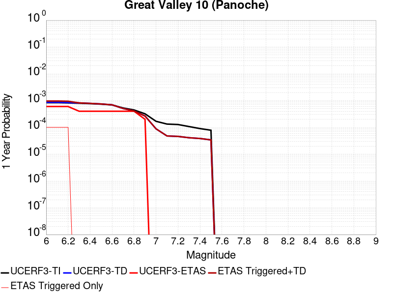 |  |

| Magnitude | 1 wk TI Prob | 1 wk TD Prob | 1 wk ETAS Prob | 1 wk ETAS/TD Gain | 1 wk ETAS Triggered+TD | 1 wk ETAS Triggered Only | 1 mo TI Prob | 1 mo TD Prob | 1 mo ETAS Prob | 1 mo ETAS/TD Gain | 1 mo ETAS Triggered+TD | 1 mo ETAS Triggered Only | 1 yr TI Prob | 1 yr TD Prob | 1 yr ETAS Prob | 1 yr ETAS/TD Gain | 1 yr ETAS Triggered+TD | 1 yr ETAS Triggered Only | 10 yr TI Prob | 10 yr TD Prob | 10 yr ETAS Prob | 10 yr ETAS/TD Gain | 10 yr ETAS Triggered+TD | 10 yr ETAS Triggered Only |
|-----|-----|-----|-----|-----|-----|-----|-----|-----|-----|-----|-----|-----|-----|-----|-----|-----|-----|-----|-----|-----|-----|-----|-----|-----|
| 6.0 | 1.6014626E-5 | 1.6546046E-5 | 0.0 | 0.0 | 1.6546046E-5 | 0.0 | 6.863231E-5 | 7.090973E-5 | 0.0 | 0.0 | 7.090973E-5 | 0.0 | 8.35278E-4 | 8.629895E-4 | 6.0E-4 | 0.69525754 | 9.6290326E-4 | 1.0E-4 | 0.008321454 | 0.008596998 | 0.0049 | 0.56996644 | 0.008894418 | 3.0E-4 |
| 6.1 | 1.6014626E-5 | 1.6546046E-5 | 0.0 | 0.0 | 1.6546046E-5 | 0.0 | 6.863231E-5 | 7.090973E-5 | 0.0 | 0.0 | 7.090973E-5 | 0.0 | 8.35278E-4 | 8.629895E-4 | 6.0E-4 | 0.69525754 | 9.6290326E-4 | 1.0E-4 | 0.008321454 | 0.008596998 | 0.0048 | 0.55833447 | 0.008894418 | 3.0E-4 |
| 6.2 | 1.56782E-5 | 1.6169568E-5 | 0.0 | 0.0 | 1.6169568E-5 | 0.0 | 6.719056E-5 | 6.929634E-5 | 0.0 | 0.0 | 6.929634E-5 | 0.0 | 8.17738E-4 | 8.433618E-4 | 6.0E-4 | 0.7114384 | 9.4327744E-4 | 1.0E-4 | 0.008147354 | 0.008402215 | 0.0047 | 0.5593763 | 0.008699695 | 3.0E-4 |
| 6.3 | 1.5263338E-5 | 1.5695354E-5 | 0.0 | 0.0 | 1.5695354E-5 | 0.0 | 6.541267E-5 | 6.7264096E-5 | 0.0 | 0.0 | 6.7264096E-5 | 0.0 | 7.961082E-4 | 8.186381E-4 | 4.0E-4 | 0.4886164 | 8.186381E-4 | 0.0 | 0.007932622 | 0.008156813 | 0.0043 | 0.52716666 | 0.008355182 | 2.0E-4 |
| 6.4 | 1.4720723E-5 | 1.5072195E-5 | 0.0 | 0.0 | 1.5072195E-5 | 0.0 | 6.308728E-5 | 6.459355E-5 | 0.0 | 0.0 | 6.459355E-5 | 0.0 | 7.67817E-4 | 7.86148E-4 | 4.0E-4 | 0.50881004 | 7.86148E-4 | 0.0 | 0.007651695 | 0.007834241 | 0.0042 | 0.5361081 | 0.008032674 | 2.0E-4 |
| 6.5 | 1.408264E-5 | 1.4330072E-5 | 0.0 | 0.0 | 1.4330072E-5 | 0.0 | 6.0352773E-5 | 6.141317E-5 | 0.0 | 0.0 | 6.141317E-5 | 0.0 | 7.3454727E-4 | 7.4745406E-4 | 4.0E-4 | 0.53514993 | 7.4745406E-4 | 0.0 | 0.0073212404 | 0.0074499524 | 0.0041 | 0.5503391 | 0.0076484624 | 2.0E-4 |
| 6.6 | 1.3197086E-5 | 1.3297803E-5 | 0.0 | 0.0 | 1.3297803E-5 | 0.0 | 5.6557717E-5 | 5.6989364E-5 | 0.0 | 0.0 | 5.6989364E-5 | 0.0 | 6.8837265E-4 | 6.936297E-4 | 4.0E-4 | 0.57667655 | 6.936297E-4 | 0.0 | 0.006862442 | 0.006915182 | 0.004 | 0.57843745 | 0.007113799 | 2.0E-4 |
| 6.7 | 1.017583E-5 | 9.72817E-6 | 0.0 | 0.0 | 9.72817E-6 | 0.0 | 4.360997E-5 | 4.1691503E-5 | 0.0 | 0.0 | 4.1691503E-5 | 0.0 | 5.30822E-4 | 5.0747825E-4 | 4.0E-4 | 0.78821117 | 5.0747825E-4 | 0.0 | 0.0052955584 | 0.0050634453 | 0.003 | 0.592482 | 0.005162939 | 1.0E-4 |
| 6.8 | 8.557912E-6 | 7.8585745E-6 | 0.0 | 0.0 | 7.8585745E-6 | 0.0 | 3.667625E-5 | 3.367918E-5 | 0.0 | 0.0 | 3.367918E-5 | 0.0 | 4.4644187E-4 | 4.099689E-4 | 4.0E-4 | 0.97568375 | 4.099689E-4 | 0.0 | 0.0044554602 | 0.004092332 | 0.0027 | 0.6597705 | 0.004191923 | 1.0E-4 |
| 6.9 | 6.14664E-6 | 5.082385E-6 | 0.0 | 0.0 | 5.082385E-6 | 0.0 | 2.6342475E-5 | 2.1781476E-5 | 0.0 | 0.0 | 2.1781476E-5 | 0.0 | 3.2067244E-4 | 2.6515857E-4 | 2.0E-4 | 0.7542656 | 2.6515857E-4 | 0.0 | 0.003202101 | 0.0026485599 | 0.0016 | 0.6041019 | 0.002748295 | 1.0E-4 |
| 7.0 | 3.2310581E-6 | 1.6912916E-6 | 0.0 | 0.0 | 1.6912916E-6 | 0.0 | 1.3847319E-5 | 7.248373E-6 | 0.0 | 0.0 | 7.248373E-6 | 0.0 | 1.6857806E-4 | 8.824546E-5 | 0.0 | 0.0 | 8.824546E-5 | 0.0 | 0.0016845023 | 8.821135E-4 | 5.0E-4 | 0.56682044 | 9.820253E-4 | 1.0E-4 |
| 7.1 | 2.544492E-6 | 9.1611963E-7 | 0.0 | 0.0 | 9.1611963E-7 | 0.0 | 1.090492E-5 | 3.9262213E-6 | 0.0 | 0.0 | 3.9262213E-6 | 0.0 | 1.327593E-4 | 4.7800742E-5 | 0.0 | 0.0 | 4.7800742E-5 | 0.0 | 0.0013268003 | 4.7790937E-4 | 1.0E-4 | 0.2092447 | 4.7790937E-4 | 0.0 |
| 7.2 | 2.4479045E-6 | 8.8145214E-7 | 0.0 | 0.0 | 8.8145214E-7 | 0.0 | 1.0490977E-5 | 3.777647E-6 | 0.0 | 0.0 | 3.777647E-6 | 0.0 | 1.2772017E-4 | 4.599193E-5 | 0.0 | 0.0 | 4.599193E-5 | 0.0 | 0.0012764678 | 4.5982882E-4 | 1.0E-4 | 0.21747224 | 4.5982882E-4 | 0.0 |
| 7.3 | 2.0559578E-6 | 7.869593E-7 | 0.0 | 0.0 | 7.869593E-7 | 0.0 | 8.811218E-6 | 3.3726785E-6 | 0.0 | 0.0 | 3.3726785E-6 | 0.0 | 1.072713E-4 | 4.1061634E-5 | 0.0 | 0.0 | 4.1061634E-5 | 0.0 | 0.0010721954 | 4.1054506E-4 | 1.0E-4 | 0.24357861 | 4.1054506E-4 | 0.0 |
| 7.4 | 1.727687E-6 | 7.366852E-7 | 0.0 | 0.0 | 7.366852E-7 | 0.0 | 7.404352E-6 | 3.1572188E-6 | 0.0 | 0.0 | 3.1572188E-6 | 0.0 | 9.0144255E-5 | 3.8438506E-5 | 0.0 | 0.0 | 3.8438506E-5 | 0.0 | 9.0107694E-4 | 3.8432315E-4 | 1.0E-4 | 0.2601977 | 3.8432315E-4 | 0.0 |
| 7.5 | 1.5002679E-6 | 6.5268995E-7 | 0.0 | 0.0 | 6.5268995E-7 | 0.0 | 6.4297037E-6 | 2.79724E-6 | 0.0 | 0.0 | 2.79724E-6 | 0.0 | 7.827883E-5 | 3.4055905E-5 | 0.0 | 0.0 | 3.4055905E-5 | 0.0 | 7.825126E-4 | 3.40511E-4 | 1.0E-4 | 0.29367626 | 3.40511E-4 | 0.0 |

## Towne Pass
*[(top)](#table-of-contents)*

| 1 Week | 1 Month | 1 Year | 10 Year |
|-----|-----|-----|-----|
|  | 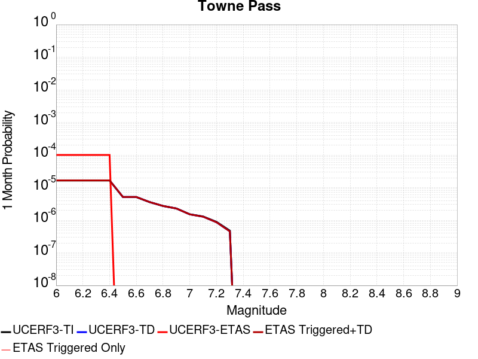 | 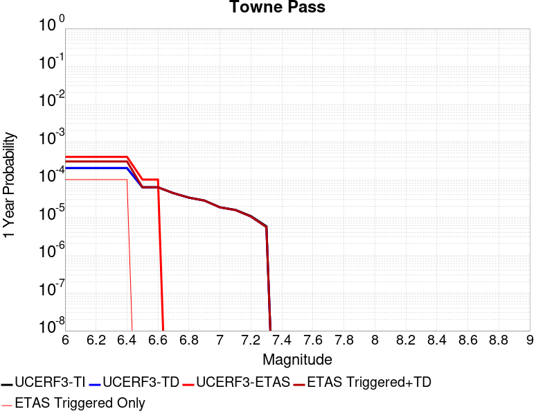 |  |

| Magnitude | 1 wk TI Prob | 1 wk TD Prob | 1 wk ETAS Prob | 1 wk ETAS/TD Gain | 1 wk ETAS Triggered+TD | 1 wk ETAS Triggered Only | 1 mo TI Prob | 1 mo TD Prob | 1 mo ETAS Prob | 1 mo ETAS/TD Gain | 1 mo ETAS Triggered+TD | 1 mo ETAS Triggered Only | 1 yr TI Prob | 1 yr TD Prob | 1 yr ETAS Prob | 1 yr ETAS/TD Gain | 1 yr ETAS Triggered+TD | 1 yr ETAS Triggered Only | 10 yr TI Prob | 10 yr TD Prob | 10 yr ETAS Prob | 10 yr ETAS/TD Gain | 10 yr ETAS Triggered+TD | 10 yr ETAS Triggered Only |
|-----|-----|-----|-----|-----|-----|-----|-----|-----|-----|-----|-----|-----|-----|-----|-----|-----|-----|-----|-----|-----|-----|-----|-----|-----|
| 6.0 | 3.849728E-6 | 3.8938624E-6 | 0.0 | 0.0 | 3.8938624E-6 | 0.0 | 1.649873E-5 | 1.66879E-5 | 1.0E-4 | 5.992366 | 1.66879E-5 | 0.0 | 2.0085352E-4 | 2.0316061E-4 | 4.0E-4 | 1.9688857 | 3.031403E-4 | 1.0E-4 | 0.0020067208 | 0.0020301777 | 0.0023 | 1.1329057 | 0.0023295688 | 3.0E-4 |
| 6.1 | 3.849728E-6 | 3.8938624E-6 | 0.0 | 0.0 | 3.8938624E-6 | 0.0 | 1.649873E-5 | 1.66879E-5 | 1.0E-4 | 5.992366 | 1.66879E-5 | 0.0 | 2.0085352E-4 | 2.0316061E-4 | 4.0E-4 | 1.9688857 | 3.031403E-4 | 1.0E-4 | 0.0020067208 | 0.0020301777 | 0.0023 | 1.1329057 | 0.0023295688 | 3.0E-4 |
| 6.2 | 3.849728E-6 | 3.8938624E-6 | 0.0 | 0.0 | 3.8938624E-6 | 0.0 | 1.649873E-5 | 1.66879E-5 | 1.0E-4 | 5.992366 | 1.66879E-5 | 0.0 | 2.0085352E-4 | 2.0316061E-4 | 4.0E-4 | 1.9688857 | 3.031403E-4 | 1.0E-4 | 0.0020067208 | 0.0020301777 | 0.0023 | 1.1329057 | 0.0023295688 | 3.0E-4 |
| 6.3 | 3.849728E-6 | 3.8938624E-6 | 0.0 | 0.0 | 3.8938624E-6 | 0.0 | 1.649873E-5 | 1.66879E-5 | 1.0E-4 | 5.992366 | 1.66879E-5 | 0.0 | 2.0085352E-4 | 2.0316061E-4 | 4.0E-4 | 1.9688857 | 3.031403E-4 | 1.0E-4 | 0.0020067208 | 0.0020301777 | 0.0023 | 1.1329057 | 0.0023295688 | 3.0E-4 |
| 6.4 | 3.849728E-6 | 3.8938624E-6 | 0.0 | 0.0 | 3.8938624E-6 | 0.0 | 1.649873E-5 | 1.66879E-5 | 1.0E-4 | 5.992366 | 1.66879E-5 | 0.0 | 2.0085352E-4 | 2.0316061E-4 | 4.0E-4 | 1.9688857 | 3.031403E-4 | 1.0E-4 | 0.0020067208 | 0.0020301777 | 0.0023 | 1.1329057 | 0.0023295688 | 3.0E-4 |
| 6.5 | 1.1953545E-6 | 1.202766E-6 | 0.0 | 0.0 | 1.202766E-6 | 0.0 | 5.1229376E-6 | 5.154702E-6 | 0.0 | 0.0 | 5.154702E-6 | 0.0 | 6.236998E-5 | 6.2756815E-5 | 1.0E-4 | 1.5934525 | 6.2756815E-5 | 0.0 | 6.235248E-4 | 6.274026E-4 | 4.0E-4 | 0.63754916 | 7.273399E-4 | 1.0E-4 |
| 6.6 | 1.1953545E-6 | 1.202766E-6 | 0.0 | 0.0 | 1.202766E-6 | 0.0 | 5.1229376E-6 | 5.154702E-6 | 0.0 | 0.0 | 5.154702E-6 | 0.0 | 6.236998E-5 | 6.2756815E-5 | 1.0E-4 | 1.5934525 | 6.2756815E-5 | 0.0 | 6.235248E-4 | 6.274026E-4 | 4.0E-4 | 0.63754916 | 7.273399E-4 | 1.0E-4 |
| 6.7 | 8.375951E-7 | 8.4082575E-7 | 0.0 | 0.0 | 8.4082575E-7 | 0.0 | 3.5896885E-6 | 3.6035342E-6 | 0.0 | 0.0 | 3.6035342E-6 | 0.0 | 4.370358E-5 | 4.3872205E-5 | 0.0 | 0.0 | 4.3872205E-5 | 0.0 | 4.3694986E-4 | 4.3864115E-4 | 2.0E-4 | 0.45595357 | 5.385973E-4 | 1.0E-4 |
| 6.8 | 6.38041E-7 | 6.3899864E-7 | 0.0 | 0.0 | 6.3899864E-7 | 0.0 | 2.7344586E-6 | 2.738563E-6 | 0.0 | 0.0 | 2.738563E-6 | 0.0 | 3.3291526E-5 | 3.334153E-5 | 0.0 | 0.0 | 3.334153E-5 | 0.0 | 3.3286537E-4 | 3.333691E-4 | 2.0E-4 | 0.59993565 | 4.3333578E-4 | 1.0E-4 |
| 6.9 | 5.3460053E-7 | 5.343294E-7 | 0.0 | 0.0 | 5.343294E-7 | 0.0 | 2.2911431E-6 | 2.2899815E-6 | 0.0 | 0.0 | 2.2899815E-6 | 0.0 | 2.789431E-5 | 2.78802E-5 | 0.0 | 0.0 | 2.78802E-5 | 0.0 | 2.789081E-4 | 2.7877034E-4 | 2.0E-4 | 0.71743643 | 3.7874246E-4 | 1.0E-4 |
| 7.0 | 3.557783E-7 | 3.5306454E-7 | 0.0 | 0.0 | 3.5306454E-7 | 0.0 | 1.5247632E-6 | 1.5131328E-6 | 0.0 | 0.0 | 1.5131328E-6 | 0.0 | 1.8563835E-5 | 1.8422244E-5 | 0.0 | 0.0 | 1.8422244E-5 | 0.0 | 1.8562283E-4 | 1.8420802E-4 | 1.0E-4 | 0.5428645 | 1.8420802E-4 | 0.0 |
| 7.1 | 3.037942E-7 | 2.9985767E-7 | 0.0 | 0.0 | 2.9985767E-7 | 0.0 | 1.3019744E-6 | 1.2851036E-6 | 0.0 | 0.0 | 1.2851036E-6 | 0.0 | 1.5851423E-5 | 1.5646032E-5 | 0.0 | 0.0 | 1.5646032E-5 | 0.0 | 1.5850292E-4 | 1.5645006E-4 | 1.0E-4 | 0.6391816 | 1.5645006E-4 | 0.0 |
| 7.2 | 2.0808248E-7 | 2.02036E-7 | 0.0 | 0.0 | 2.02036E-7 | 0.0 | 8.917818E-7 | 8.6586834E-7 | 0.0 | 0.0 | 8.6586834E-7 | 0.0 | 1.0857389E-5 | 1.05419E-5 | 0.0 | 0.0 | 1.05419E-5 | 0.0 | 1.0856859E-4 | 1.0541447E-4 | 0.0 | 0.0 | 1.0541447E-4 | 0.0 |
| 7.3 | 1.1162073E-7 | 1.062679E-7 | 0.0 | 0.0 | 1.062679E-7 | 0.0 | 4.7837443E-7 | 4.5543376E-7 | 0.0 | 0.0 | 4.5543376E-7 | 0.0 | 5.8241935E-6 | 5.544894E-6 | 0.0 | 0.0 | 5.544894E-6 | 0.0 | 5.8240406E-5 | 5.5447756E-5 | 0.0 | 0.0 | 5.5447756E-5 | 0.0 |

## Eaton Roughs 2011 CFM
*[(top)](#table-of-contents)*

| 1 Week | 1 Month | 1 Year | 10 Year |
|-----|-----|-----|-----|
| 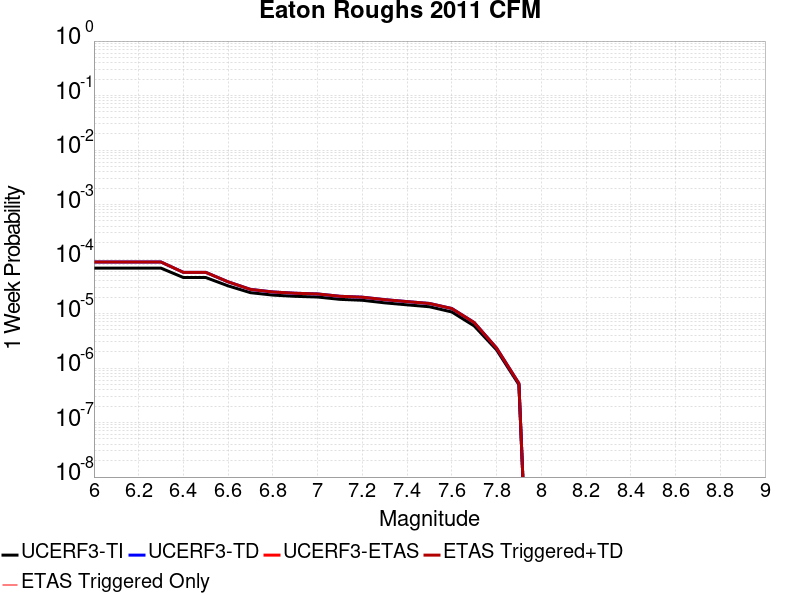 |  |  | 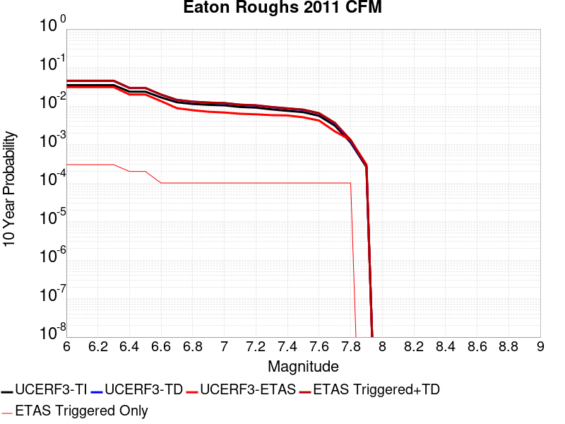 |

| Magnitude | 1 wk TI Prob | 1 wk TD Prob | 1 wk ETAS Prob | 1 wk ETAS/TD Gain | 1 wk ETAS Triggered+TD | 1 wk ETAS Triggered Only | 1 mo TI Prob | 1 mo TD Prob | 1 mo ETAS Prob | 1 mo ETAS/TD Gain | 1 mo ETAS Triggered+TD | 1 mo ETAS Triggered Only | 1 yr TI Prob | 1 yr TD Prob | 1 yr ETAS Prob | 1 yr ETAS/TD Gain | 1 yr ETAS Triggered+TD | 1 yr ETAS Triggered Only | 10 yr TI Prob | 10 yr TD Prob | 10 yr ETAS Prob | 10 yr ETAS/TD Gain | 10 yr ETAS Triggered+TD | 10 yr ETAS Triggered Only |
|-----|-----|-----|-----|-----|-----|-----|-----|-----|-----|-----|-----|-----|-----|-----|-----|-----|-----|-----|-----|-----|-----|-----|-----|-----|
| 6.0 | 6.8044945E-5 | 8.817112E-5 | 0.0 | 0.0 | 8.817112E-5 | 0.0 | 2.9158857E-4 | 3.7782674E-4 | 1.0E-4 | 0.2646716 | 3.7782674E-4 | 0.0 | 0.0035443127 | 0.004591065 | 0.003 | 0.65344316 | 0.004591065 | 0.0 | 0.03488314 | 0.045034718 | 0.031 | 0.68835783 | 0.045321207 | 3.0E-4 |
| 6.1 | 6.8044945E-5 | 8.817112E-5 | 0.0 | 0.0 | 8.817112E-5 | 0.0 | 2.9158857E-4 | 3.7782674E-4 | 1.0E-4 | 0.2646716 | 3.7782674E-4 | 0.0 | 0.0035443127 | 0.004591065 | 0.003 | 0.65344316 | 0.004591065 | 0.0 | 0.03488314 | 0.045034718 | 0.031 | 0.68835783 | 0.045321207 | 3.0E-4 |
| 6.2 | 6.8044945E-5 | 8.817112E-5 | 0.0 | 0.0 | 8.817112E-5 | 0.0 | 2.9158857E-4 | 3.7782674E-4 | 1.0E-4 | 0.2646716 | 3.7782674E-4 | 0.0 | 0.0035443127 | 0.004591065 | 0.003 | 0.65344316 | 0.004591065 | 0.0 | 0.03488314 | 0.045034718 | 0.031 | 0.68835783 | 0.045321207 | 3.0E-4 |
| 6.3 | 6.8044945E-5 | 8.817112E-5 | 0.0 | 0.0 | 8.817112E-5 | 0.0 | 2.9158857E-4 | 3.7782674E-4 | 1.0E-4 | 0.2646716 | 3.7782674E-4 | 0.0 | 0.0035443127 | 0.004591065 | 0.003 | 0.65344316 | 0.004591065 | 0.0 | 0.03488314 | 0.045034718 | 0.031 | 0.68835783 | 0.045321207 | 3.0E-4 |
| 6.4 | 4.5830013E-5 | 5.7010613E-5 | 0.0 | 0.0 | 5.7010613E-5 | 0.0 | 1.9639956E-4 | 2.4431135E-4 | 1.0E-4 | 0.4093138 | 2.4431135E-4 | 0.0 | 0.0023885423 | 0.002970821 | 0.002 | 0.67321455 | 0.002970821 | 0.0 | 0.023630321 | 0.029349273 | 0.0199 | 0.6780406 | 0.029543404 | 2.0E-4 |
| 6.5 | 4.5830013E-5 | 5.7010613E-5 | 0.0 | 0.0 | 5.7010613E-5 | 0.0 | 1.9639956E-4 | 2.4431135E-4 | 1.0E-4 | 0.4093138 | 2.4431135E-4 | 0.0 | 0.0023885423 | 0.002970821 | 0.002 | 0.67321455 | 0.002970821 | 0.0 | 0.023630321 | 0.029349273 | 0.0199 | 0.6780406 | 0.029543404 | 2.0E-4 |
| 6.6 | 3.222194E-5 | 3.8187813E-5 | 0.0 | 0.0 | 3.8187813E-5 | 0.0 | 1.3808672E-4 | 1.6365242E-4 | 1.0E-4 | 0.61105114 | 1.6365242E-4 | 0.0 | 0.0016799092 | 0.0019907374 | 0.0016 | 0.80372226 | 0.0019907374 | 0.0 | 0.016672665 | 0.01973844 | 0.0134 | 0.67887837 | 0.019836467 | 1.0E-4 |
| 6.7 | 2.4155654E-5 | 2.774278E-5 | 0.0 | 0.0 | 2.774278E-5 | 0.0 | 1.0352012E-4 | 1.1889226E-4 | 1.0E-4 | 0.84109765 | 1.1889226E-4 | 0.0 | 0.0012596287 | 0.0014465603 | 0.0013 | 0.8986836 | 0.0014465603 | 0.0 | 0.012525126 | 0.014372619 | 0.0088 | 0.61227536 | 0.014471182 | 1.0E-4 |
| 6.8 | 2.1814667E-5 | 2.4903855E-5 | 0.0 | 0.0 | 2.4903855E-5 | 0.0 | 9.348808E-5 | 1.0672646E-4 | 1.0E-4 | 0.93697476 | 1.0672646E-4 | 0.0 | 0.001137623 | 0.0012986239 | 0.0012 | 0.9240551 | 0.0012986239 | 0.0 | 0.011318169 | 0.012911002 | 0.0078 | 0.60413593 | 0.013009711 | 1.0E-4 |
| 6.9 | 2.0700467E-5 | 2.3594372E-5 | 0.0 | 0.0 | 2.3594372E-5 | 0.0 | 8.871327E-5 | 1.01114834E-4 | 1.0E-4 | 0.9889746 | 1.01114834E-4 | 0.0 | 0.0010795488 | 0.0012303811 | 0.0012 | 0.9753076 | 0.0012303811 | 0.0 | 0.010743194 | 0.012236249 | 0.0071 | 0.5802432 | 0.012335026 | 1.0E-4 |
| 7.0 | 2.0104066E-5 | 2.2903117E-5 | 0.0 | 0.0 | 2.2903117E-5 | 0.0 | 8.615744E-5 | 9.8152545E-5 | 1.0E-4 | 1.0188223 | 9.8152545E-5 | 0.0 | 0.0010484619 | 0.0011943552 | 0.0011 | 0.9209991 | 0.0011943552 | 0.0 | 0.010435291 | 0.011879887 | 0.0068 | 0.572396 | 0.0119787 | 1.0E-4 |
| 7.1 | 1.8225232E-5 | 2.0743106E-5 | 0.0 | 0.0 | 2.0743106E-5 | 0.0 | 7.81058E-5 | 8.8896006E-5 | 1.0E-4 | 1.1249099 | 8.8896006E-5 | 0.0 | 9.5052324E-4 | 0.0010817731 | 0.001 | 0.9244083 | 0.0010817731 | 0.0 | 0.009464677 | 0.010765398 | 0.0063 | 0.58520824 | 0.010864322 | 1.0E-4 |
| 7.2 | 1.7526572E-5 | 1.9964516E-5 | 0.0 | 0.0 | 1.9964516E-5 | 0.0 | 7.511172E-5 | 8.555942E-5 | 1.0E-4 | 1.1687784 | 8.555942E-5 | 0.0 | 9.141015E-4 | 0.0010411895 | 0.001 | 0.9604399 | 0.0010411895 | 0.0 | 0.009103506 | 0.010363418 | 0.0061 | 0.58860886 | 0.010462382 | 1.0E-4 |
| 7.3 | 1.5727232E-5 | 1.7994558E-5 | 0.0 | 0.0 | 1.7994558E-5 | 0.0 | 6.740067E-5 | 7.711726E-5 | 0.0 | 0.0 | 7.711726E-5 | 0.0 | 8.2029426E-4 | 9.384995E-4 | 9.0E-4 | 0.9589776 | 9.384995E-4 | 0.0 | 0.008172729 | 0.009345609 | 0.0058 | 0.6206123 | 0.0094446745 | 1.0E-4 |
| 7.4 | 1.4457361E-5 | 1.6573253E-5 | 0.0 | 0.0 | 1.6573253E-5 | 0.0 | 6.195865E-5 | 7.10263E-5 | 0.0 | 0.0 | 7.10263E-5 | 0.0 | 7.540854E-4 | 8.64403E-4 | 9.0E-4 | 1.0411811 | 8.64403E-4 | 0.0 | 0.007515317 | 0.008610596 | 0.0057 | 0.6619751 | 0.008709734 | 1.0E-4 |
| 7.5 | 1.33280955E-5 | 1.5321804E-5 | 0.0 | 0.0 | 1.5321804E-5 | 0.0 | 5.711916E-5 | 6.566323E-5 | 0.0 | 0.0 | 6.566323E-5 | 0.0 | 6.9520384E-4 | 7.991575E-4 | 6.0E-4 | 0.7507907 | 7.991575E-4 | 0.0 | 0.00693033 | 0.0079630045 | 0.0051 | 0.64046174 | 0.008062208 | 1.0E-4 |
| 7.6 | 1.0699478E-5 | 1.2368158E-5 | 0.0 | 0.0 | 1.2368158E-5 | 0.0 | 4.5854096E-5 | 5.300532E-5 | 0.0 | 0.0 | 5.300532E-5 | 0.0 | 5.581306E-4 | 6.451492E-4 | 5.0E-4 | 0.77501446 | 6.451492E-4 | 0.0 | 0.005567309 | 0.0064328723 | 0.0042 | 0.6528965 | 0.006532229 | 1.0E-4 |
| 7.7 | 5.9390236E-6 | 6.84246E-6 | 0.0 | 0.0 | 6.84246E-6 | 0.0 | 2.545271E-5 | 2.9324501E-5 | 0.0 | 0.0 | 2.9324501E-5 | 0.0 | 3.0984267E-4 | 3.5696756E-4 | 4.0E-4 | 1.12055 | 3.5696756E-4 | 0.0 | 0.0030941102 | 0.0035640104 | 0.0022 | 0.61728215 | 0.003663654 | 1.0E-4 |
| 7.8 | 2.1622036E-6 | 2.3278722E-6 | 0.0 | 0.0 | 2.3278722E-6 | 0.0 | 9.266554E-6 | 9.9765575E-6 | 0.0 | 0.0 | 9.9765575E-6 | 0.0 | 1.1281446E-4 | 1.2145789E-4 | 2.0E-4 | 1.6466613 | 1.2145789E-4 | 0.0 | 0.001127572 | 0.0012139308 | 0.0013 | 1.0709013 | 0.0013138093 | 1.0E-4 |
| 7.9 | 4.9586197E-7 | 5.216062E-7 | 0.0 | 0.0 | 5.216062E-7 | 0.0 | 2.125121E-6 | 2.2354534E-6 | 0.0 | 0.0 | 2.2354534E-6 | 0.0 | 2.5873042E-5 | 2.7216325E-5 | 0.0 | 0.0 | 2.7216325E-5 | 0.0 | 2.5870028E-4 | 2.7213202E-4 | 3.0E-4 | 1.1024061 | 2.7213202E-4 | 0.0 |

## Sierra Madre (San Fernando)
*[(top)](#table-of-contents)*

| 1 Week | 1 Month | 1 Year | 10 Year |
|-----|-----|-----|-----|
|  |  | 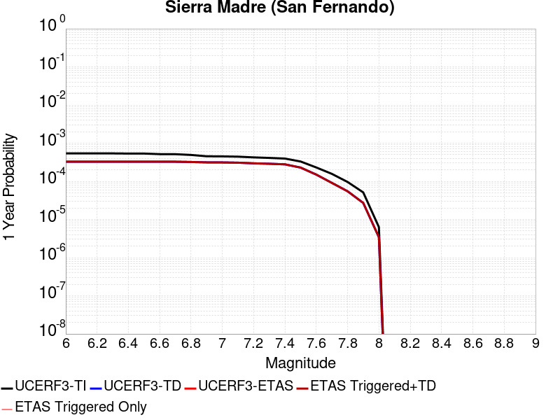 |  |

| Magnitude | 1 wk TI Prob | 1 wk TD Prob | 1 wk ETAS Prob | 1 wk ETAS/TD Gain | 1 wk ETAS Triggered+TD | 1 wk ETAS Triggered Only | 1 mo TI Prob | 1 mo TD Prob | 1 mo ETAS Prob | 1 mo ETAS/TD Gain | 1 mo ETAS Triggered+TD | 1 mo ETAS Triggered Only | 1 yr TI Prob | 1 yr TD Prob | 1 yr ETAS Prob | 1 yr ETAS/TD Gain | 1 yr ETAS Triggered+TD | 1 yr ETAS Triggered Only | 10 yr TI Prob | 10 yr TD Prob | 10 yr ETAS Prob | 10 yr ETAS/TD Gain | 10 yr ETAS Triggered+TD | 10 yr ETAS Triggered Only |
|-----|-----|-----|-----|-----|-----|-----|-----|-----|-----|-----|-----|-----|-----|-----|-----|-----|-----|-----|-----|-----|-----|-----|-----|-----|
| 6.0 | 1.0346413E-5 | 6.272881E-6 | 0.0 | 0.0 | 6.272881E-6 | 0.0 | 4.4341014E-5 | 2.6883505E-5 | 0.0 | 0.0 | 2.6883505E-5 | 0.0 | 5.3971814E-4 | 3.2725863E-4 | 0.0 | 0.0 | 3.2725863E-4 | 0.0 | 0.0053840918 | 0.0032678794 | 0.0018 | 0.55081594 | 0.003566899 | 3.0E-4 |
| 6.1 | 1.0346413E-5 | 6.272881E-6 | 0.0 | 0.0 | 6.272881E-6 | 0.0 | 4.4341014E-5 | 2.6883505E-5 | 0.0 | 0.0 | 2.6883505E-5 | 0.0 | 5.3971814E-4 | 3.2725863E-4 | 0.0 | 0.0 | 3.2725863E-4 | 0.0 | 0.0053840918 | 0.0032678794 | 0.0018 | 0.55081594 | 0.003566899 | 3.0E-4 |
| 6.2 | 1.0346413E-5 | 6.272881E-6 | 0.0 | 0.0 | 6.272881E-6 | 0.0 | 4.4341014E-5 | 2.6883505E-5 | 0.0 | 0.0 | 2.6883505E-5 | 0.0 | 5.3971814E-4 | 3.2725863E-4 | 0.0 | 0.0 | 3.2725863E-4 | 0.0 | 0.0053840918 | 0.0032678794 | 0.0018 | 0.55081594 | 0.003566899 | 3.0E-4 |
| 6.3 | 1.0346413E-5 | 6.272881E-6 | 0.0 | 0.0 | 6.272881E-6 | 0.0 | 4.4341014E-5 | 2.6883505E-5 | 0.0 | 0.0 | 2.6883505E-5 | 0.0 | 5.3971814E-4 | 3.2725863E-4 | 0.0 | 0.0 | 3.2725863E-4 | 0.0 | 0.0053840918 | 0.0032678794 | 0.0018 | 0.55081594 | 0.003566899 | 3.0E-4 |
| 6.4 | 1.0249558E-5 | 6.272881E-6 | 0.0 | 0.0 | 6.272881E-6 | 0.0 | 4.392594E-5 | 2.6883505E-5 | 0.0 | 0.0 | 2.6883505E-5 | 0.0 | 5.3466705E-4 | 3.2725863E-4 | 0.0 | 0.0 | 3.2725863E-4 | 0.0 | 0.0053338245 | 0.0032678794 | 0.0018 | 0.55081594 | 0.003566899 | 3.0E-4 |
| 6.5 | 1.0249558E-5 | 6.272881E-6 | 0.0 | 0.0 | 6.272881E-6 | 0.0 | 4.392594E-5 | 2.6883505E-5 | 0.0 | 0.0 | 2.6883505E-5 | 0.0 | 5.3466705E-4 | 3.2725863E-4 | 0.0 | 0.0 | 3.2725863E-4 | 0.0 | 0.0053338245 | 0.0032678794 | 0.0018 | 0.55081594 | 0.003566899 | 3.0E-4 |
| 6.6 | 9.9035515E-6 | 6.272881E-6 | 0.0 | 0.0 | 6.272881E-6 | 0.0 | 4.2443102E-5 | 2.6883505E-5 | 0.0 | 0.0 | 2.6883505E-5 | 0.0 | 5.166222E-4 | 3.2725863E-4 | 0.0 | 0.0 | 3.2725863E-4 | 0.0 | 0.0051542283 | 0.0032678794 | 0.0018 | 0.55081594 | 0.003566899 | 3.0E-4 |
| 6.7 | 9.87217E-6 | 6.2603344E-6 | 0.0 | 0.0 | 6.2603344E-6 | 0.0 | 4.2308613E-5 | 2.6829734E-5 | 0.0 | 0.0 | 2.6829734E-5 | 0.0 | 5.149856E-4 | 3.2660415E-4 | 0.0 | 0.0 | 3.2660415E-4 | 0.0 | 0.005137938 | 0.0032613538 | 0.0017 | 0.5212559 | 0.0035603754 | 3.0E-4 |
| 6.8 | 9.4359175E-6 | 6.164593E-6 | 0.0 | 0.0 | 6.164593E-6 | 0.0 | 4.043902E-5 | 2.6419422E-5 | 0.0 | 0.0 | 2.6419422E-5 | 0.0 | 4.9223384E-4 | 3.2161007E-4 | 0.0 | 0.0 | 3.2161007E-4 | 0.0 | 0.0049114493 | 0.0032115579 | 0.0017 | 0.5293381 | 0.0035105944 | 3.0E-4 |
| 6.9 | 8.700447E-6 | 6.0263274E-6 | 0.0 | 0.0 | 6.0263274E-6 | 0.0 | 3.72871E-5 | 2.5826866E-5 | 0.0 | 0.0 | 2.5826866E-5 | 0.0 | 4.5387587E-4 | 3.1439782E-4 | 0.0 | 0.0 | 3.1439782E-4 | 0.0 | 0.0045295 | 0.0031396395 | 0.0017 | 0.54146343 | 0.0034386977 | 3.0E-4 |
| 7.0 | 8.648878E-6 | 6.001341E-6 | 0.0 | 0.0 | 6.001341E-6 | 0.0 | 3.7066096E-5 | 2.5719784E-5 | 0.0 | 0.0 | 2.5719784E-5 | 0.0 | 4.5118626E-4 | 3.1309447E-4 | 0.0 | 0.0 | 3.1309447E-4 | 0.0 | 0.004502713 | 0.003126643 | 0.0017 | 0.54371417 | 0.0034257048 | 3.0E-4 |
| 7.1 | 8.505786E-6 | 5.911324E-6 | 0.0 | 0.0 | 5.911324E-6 | 0.0 | 3.645286E-5 | 2.5334008E-5 | 0.0 | 0.0 | 2.5334008E-5 | 0.0 | 4.437232E-4 | 3.0839894E-4 | 0.0 | 0.0 | 3.0839894E-4 | 0.0 | 0.0044283825 | 0.0030798186 | 0.0017 | 0.55198056 | 0.0033788946 | 3.0E-4 |
| 7.2 | 8.139752E-6 | 5.6858466E-6 | 0.0 | 0.0 | 5.6858466E-6 | 0.0 | 3.4884186E-5 | 2.4367693E-5 | 0.0 | 0.0 | 2.4367693E-5 | 0.0 | 4.246322E-4 | 2.9663733E-4 | 0.0 | 0.0 | 2.9663733E-4 | 0.0 | 0.004238217 | 0.0029625196 | 0.0017 | 0.57383585 | 0.003261631 | 3.0E-4 |
| 7.3 | 7.8816E-6 | 5.5393357E-6 | 0.0 | 0.0 | 5.5393357E-6 | 0.0 | 3.3777847E-5 | 2.37398E-5 | 0.0 | 0.0 | 2.37398E-5 | 0.0 | 4.111677E-4 | 2.8899478E-4 | 0.0 | 0.0 | 2.8899478E-4 | 0.0 | 0.004104078 | 0.002886295 | 0.0017 | 0.5889904 | 0.0031854291 | 3.0E-4 |
| 7.4 | 7.5810603E-6 | 5.3437257E-6 | 0.0 | 0.0 | 5.3437257E-6 | 0.0 | 3.2489854E-5 | 2.2901486E-5 | 0.0 | 0.0 | 2.2901486E-5 | 0.0 | 3.9549218E-4 | 2.7879095E-4 | 0.0 | 0.0 | 2.7879095E-4 | 0.0 | 0.0039478904 | 0.0027845171 | 0.0017 | 0.6105188 | 0.0030836817 | 3.0E-4 |
| 7.5 | 6.349153E-6 | 4.3955624E-6 | 0.0 | 0.0 | 4.3955624E-6 | 0.0 | 2.7210372E-5 | 1.8837993E-5 | 0.0 | 0.0 | 1.8837993E-5 | 0.0 | 3.312359E-4 | 2.2932925E-4 | 0.0 | 0.0 | 2.2932925E-4 | 0.0 | 0.0033074263 | 0.002291008 | 0.0014 | 0.61108476 | 0.0024905496 | 2.0E-4 |
| 7.6 | 4.430576E-6 | 2.8797283E-6 | 0.0 | 0.0 | 2.8797283E-6 | 0.0 | 1.8988047E-5 | 1.2341636E-5 | 0.0 | 0.0 | 1.2341636E-5 | 0.0 | 2.3115493E-4 | 1.5024928E-4 | 0.0 | 0.0 | 1.5024928E-4 | 0.0 | 0.0023091463 | 0.0015014994 | 0.001 | 0.6660009 | 0.0016013493 | 1.0E-4 |
| 7.7 | 3.005066E-6 | 1.7425353E-6 | 0.0 | 0.0 | 1.7425353E-6 | 0.0 | 1.2878791E-5 | 7.4679874E-6 | 0.0 | 0.0 | 7.4679874E-6 | 0.0 | 1.56788E-4 | 9.091896E-5 | 0.0 | 0.0 | 9.091896E-5 | 0.0 | 0.0015667742 | 9.088188E-4 | 7.0E-4 | 0.77023053 | 0.0010087279 | 1.0E-4 |
| 7.8 | 1.8459098E-6 | 1.0524968E-6 | 0.0 | 0.0 | 1.0524968E-6 | 0.0 | 7.911018E-6 | 4.5106926E-6 | 0.0 | 0.0 | 4.5106926E-6 | 0.0 | 9.631238E-5 | 5.4916305E-5 | 0.0 | 0.0 | 5.4916305E-5 | 0.0 | 9.627065E-4 | 5.490278E-4 | 5.0E-4 | 0.9107007 | 6.4897287E-4 | 1.0E-4 |
| 7.9 | 9.839262E-7 | 5.2032686E-7 | 0.0 | 0.0 | 5.2032686E-7 | 0.0 | 4.2168194E-6 | 2.2299705E-6 | 0.0 | 0.0 | 2.2299705E-6 | 0.0 | 5.1338568E-5 | 2.7149556E-5 | 0.0 | 0.0 | 2.7149556E-5 | 0.0 | 5.132671E-4 | 2.7146266E-4 | 2.0E-4 | 0.7367496 | 2.7146266E-4 | 0.0 |
| 8.0 | 1.210983E-7 | 6.576322E-8 | 0.0 | 0.0 | 6.576322E-8 | 0.0 | 5.1899264E-7 | 2.8184235E-7 | 0.0 | 0.0 | 2.8184235E-7 | 0.0 | 6.3187167E-6 | 3.4314253E-6 | 0.0 | 0.0 | 3.4314253E-6 | 0.0 | 6.318537E-5 | 3.431374E-5 | 0.0 | 0.0 | 3.431374E-5 | 0.0 |

## Clayton
*[(top)](#table-of-contents)*

| 1 Week | 1 Month | 1 Year | 10 Year |
|-----|-----|-----|-----|
|  | 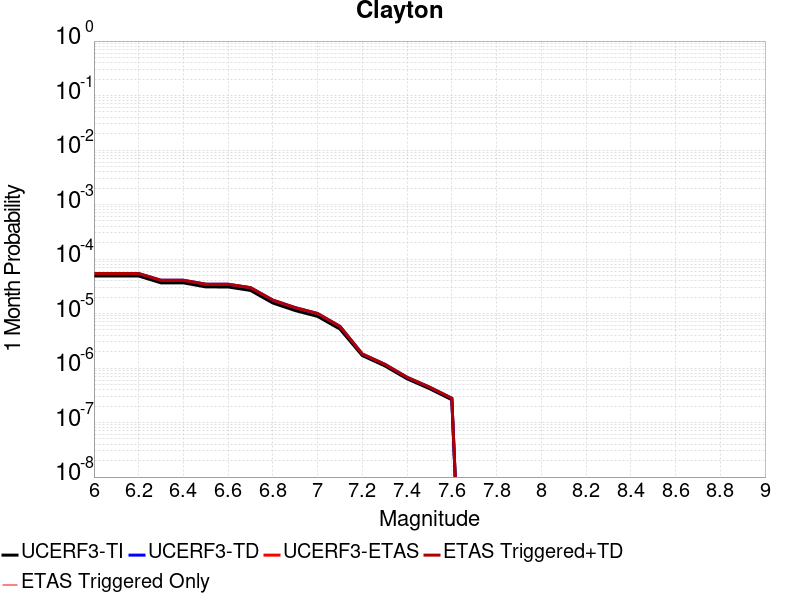 | 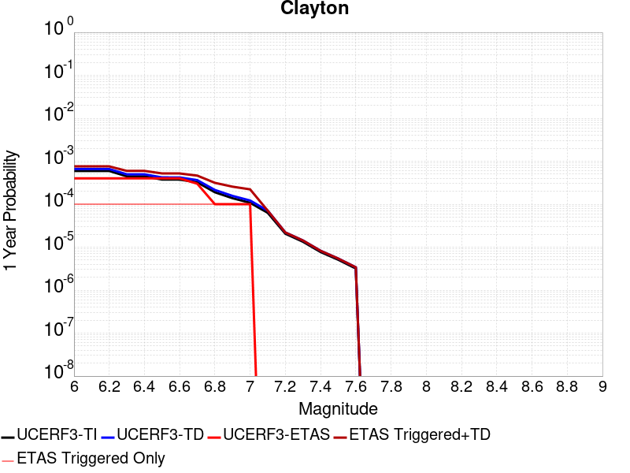 | 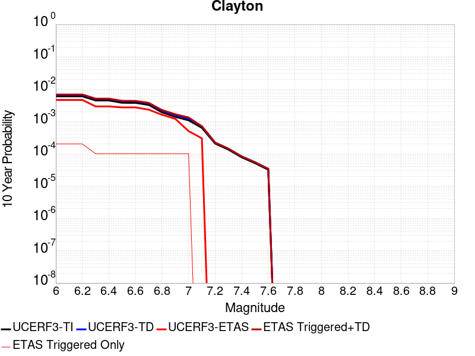 |

| Magnitude | 1 wk TI Prob | 1 wk TD Prob | 1 wk ETAS Prob | 1 wk ETAS/TD Gain | 1 wk ETAS Triggered+TD | 1 wk ETAS Triggered Only | 1 mo TI Prob | 1 mo TD Prob | 1 mo ETAS Prob | 1 mo ETAS/TD Gain | 1 mo ETAS Triggered+TD | 1 mo ETAS Triggered Only | 1 yr TI Prob | 1 yr TD Prob | 1 yr ETAS Prob | 1 yr ETAS/TD Gain | 1 yr ETAS Triggered+TD | 1 yr ETAS Triggered Only | 10 yr TI Prob | 10 yr TD Prob | 10 yr ETAS Prob | 10 yr ETAS/TD Gain | 10 yr ETAS Triggered+TD | 10 yr ETAS Triggered Only |
|-----|-----|-----|-----|-----|-----|-----|-----|-----|-----|-----|-----|-----|-----|-----|-----|-----|-----|-----|-----|-----|-----|-----|-----|-----|
| 6.0 | 1.1413061E-5 | 1.2652709E-5 | 0.0 | 0.0 | 1.2652709E-5 | 0.0 | 4.89122E-5 | 5.4224896E-5 | 0.0 | 0.0 | 5.4224896E-5 | 0.0 | 5.953433E-4 | 6.600103E-4 | 4.0E-4 | 0.60605115 | 7.599443E-4 | 1.0E-4 | 0.005937509 | 0.0065826993 | 0.0046 | 0.69880146 | 0.0067813825 | 2.0E-4 |
| 6.1 | 1.1413061E-5 | 1.2652709E-5 | 0.0 | 0.0 | 1.2652709E-5 | 0.0 | 4.89122E-5 | 5.4224896E-5 | 0.0 | 0.0 | 5.4224896E-5 | 0.0 | 5.953433E-4 | 6.600103E-4 | 4.0E-4 | 0.60605115 | 7.599443E-4 | 1.0E-4 | 0.005937509 | 0.0065826993 | 0.0046 | 0.69880146 | 0.0067813825 | 2.0E-4 |
| 6.2 | 1.1413061E-5 | 1.2652709E-5 | 0.0 | 0.0 | 1.2652709E-5 | 0.0 | 4.89122E-5 | 5.4224896E-5 | 0.0 | 0.0 | 5.4224896E-5 | 0.0 | 5.953433E-4 | 6.600103E-4 | 4.0E-4 | 0.60605115 | 7.599443E-4 | 1.0E-4 | 0.005937509 | 0.0065826993 | 0.0046 | 0.69880146 | 0.0067813825 | 2.0E-4 |
| 6.3 | 8.538689E-6 | 9.521361E-6 | 0.0 | 0.0 | 9.521361E-6 | 0.0 | 3.659387E-5 | 4.0805255E-5 | 0.0 | 0.0 | 4.0805255E-5 | 0.0 | 4.4543925E-4 | 4.9670145E-4 | 4.0E-4 | 0.80531275 | 5.9665175E-4 | 1.0E-4 | 0.0044454746 | 0.004956976 | 0.0029 | 0.5850341 | 0.0050564804 | 1.0E-4 |
| 6.4 | 8.538689E-6 | 9.521361E-6 | 0.0 | 0.0 | 9.521361E-6 | 0.0 | 3.659387E-5 | 4.0805255E-5 | 0.0 | 0.0 | 4.0805255E-5 | 0.0 | 4.4543925E-4 | 4.9670145E-4 | 4.0E-4 | 0.80531275 | 5.9665175E-4 | 1.0E-4 | 0.0044454746 | 0.004956976 | 0.0029 | 0.5850341 | 0.0050564804 | 1.0E-4 |
| 6.5 | 7.197462E-6 | 8.070808E-6 | 0.0 | 0.0 | 8.070808E-6 | 0.0 | 3.08459E-5 | 3.4588764E-5 | 0.0 | 0.0 | 3.4588764E-5 | 0.0 | 3.7548412E-4 | 4.2104503E-4 | 4.0E-4 | 0.95001715 | 5.210029E-4 | 1.0E-4 | 0.003748503 | 0.004203283 | 0.0027 | 0.642355 | 0.0043028626 | 1.0E-4 |
| 6.6 | 7.1760483E-6 | 8.046854E-6 | 0.0 | 0.0 | 8.046854E-6 | 0.0 | 3.075413E-5 | 3.4486107E-5 | 0.0 | 0.0 | 3.4486107E-5 | 0.0 | 3.743672E-4 | 4.197957E-4 | 4.0E-4 | 0.9528445 | 5.197537E-4 | 1.0E-4 | 0.0037373714 | 0.0041908366 | 0.0027 | 0.6442628 | 0.0042904173 | 1.0E-4 |
| 6.7 | 6.202582E-6 | 6.9678167E-6 | 0.0 | 0.0 | 6.9678167E-6 | 0.0 | 2.6582224E-5 | 2.9861772E-5 | 0.0 | 0.0 | 2.9861772E-5 | 0.0 | 3.235905E-4 | 3.635141E-4 | 3.0E-4 | 0.8252775 | 4.634777E-4 | 1.0E-4 | 0.0032311971 | 0.0036299485 | 0.0023 | 0.6336178 | 0.0037295856 | 1.0E-4 |
| 6.8 | 3.6417277E-6 | 4.115845E-6 | 0.0 | 0.0 | 4.115845E-6 | 0.0 | 1.5607311E-5 | 1.763922E-5 | 0.0 | 0.0 | 1.763922E-5 | 0.0 | 1.9000245E-4 | 2.1473711E-4 | 1.0E-4 | 0.4656857 | 3.1471564E-4 | 1.0E-4 | 0.0018984007 | 0.0021453723 | 0.0016 | 0.7457913 | 0.0022451577 | 1.0E-4 |
| 6.9 | 2.6498485E-6 | 2.9955984E-6 | 0.0 | 0.0 | 2.9955984E-6 | 0.0 | 1.1356444E-5 | 1.2838218E-5 | 0.0 | 0.0 | 1.2838218E-5 | 0.0 | 1.3825593E-4 | 1.562945E-4 | 1.0E-4 | 0.63981783 | 2.5627887E-4 | 1.0E-4 | 0.0013816995 | 0.0015618851 | 0.0012 | 0.7683023 | 0.001661729 | 1.0E-4 |
| 7.0 | 2.070442E-6 | 2.3377002E-6 | 0.0 | 0.0 | 2.3377002E-6 | 0.0 | 8.873292E-6 | 1.0018678E-5 | 0.0 | 0.0 | 1.0018678E-5 | 0.0 | 1.0802698E-4 | 1.2197087E-4 | 1.0E-4 | 0.81986785 | 2.2195867E-4 | 1.0E-4 | 0.0010797448 | 0.001219069 | 5.0E-4 | 0.41014904 | 0.0013189472 | 1.0E-4 |
| 7.1 | 1.2111691E-6 | 1.35727E-6 | 0.0 | 0.0 | 1.35727E-6 | 0.0 | 5.190714E-6 | 5.8168594E-6 | 0.0 | 0.0 | 5.8168594E-6 | 0.0 | 6.319511E-5 | 7.0818125E-5 | 0.0 | 0.0 | 7.0818125E-5 | 0.0 | 6.3177146E-4 | 7.0797186E-4 | 3.0E-4 | 0.42374563 | 7.0797186E-4 | 0.0 |
| 7.2 | 3.9541607E-7 | 4.2207304E-7 | 0.0 | 0.0 | 4.2207304E-7 | 0.0 | 1.6946392E-6 | 1.8088832E-6 | 0.0 | 0.0 | 1.8088832E-6 | 0.0 | 2.0632036E-5 | 2.2022932E-5 | 0.0 | 0.0 | 2.2022932E-5 | 0.0 | 2.063012E-4 | 2.2020764E-4 | 0.0 | 0.0 | 2.2020764E-4 | 0.0 |
| 7.3 | 2.5685637E-7 | 2.7442894E-7 | 0.0 | 0.0 | 2.7442894E-7 | 0.0 | 1.1008126E-6 | 1.1761234E-6 | 0.0 | 0.0 | 1.1761234E-6 | 0.0 | 1.3402311E-5 | 1.431921E-5 | 0.0 | 0.0 | 1.431921E-5 | 0.0 | 1.3401502E-4 | 1.4318294E-4 | 0.0 | 0.0 | 1.4318294E-4 | 0.0 |
| 7.4 | 1.482299E-7 | 1.5803452E-7 | 0.0 | 0.0 | 1.5803452E-7 | 0.0 | 6.3527085E-7 | 6.772906E-7 | 0.0 | 0.0 | 6.772906E-7 | 0.0 | 7.734395E-6 | 8.245982E-6 | 0.0 | 0.0 | 8.245982E-6 | 0.0 | 7.734126E-5 | 8.245679E-5 | 0.0 | 0.0 | 8.245679E-5 | 0.0 |
| 7.5 | 9.7969505E-8 | 1.0435528E-7 | 0.0 | 0.0 | 1.0435528E-7 | 0.0 | 4.1986925E-7 | 4.4723686E-7 | 0.0 | 0.0 | 4.4723686E-7 | 0.0 | 5.111896E-6 | 5.445095E-6 | 0.0 | 0.0 | 5.445095E-6 | 0.0 | 5.1117782E-5 | 5.4449636E-5 | 0.0 | 0.0 | 5.4449636E-5 | 0.0 |
| 7.6 | 6.125415E-8 | 6.521665E-8 | 0.0 | 0.0 | 6.521665E-8 | 0.0 | 2.6251774E-7 | 2.7949991E-7 | 0.0 | 0.0 | 2.7949991E-7 | 0.0 | 3.196149E-6 | 3.4029063E-6 | 0.0 | 0.0 | 3.4029063E-6 | 0.0 | 3.196103E-5 | 3.402855E-5 | 0.0 | 0.0 | 3.402855E-5 | 0.0 |

## Pine Mtn
*[(top)](#table-of-contents)*

| 1 Week | 1 Month | 1 Year | 10 Year |
|-----|-----|-----|-----|
|  |  | 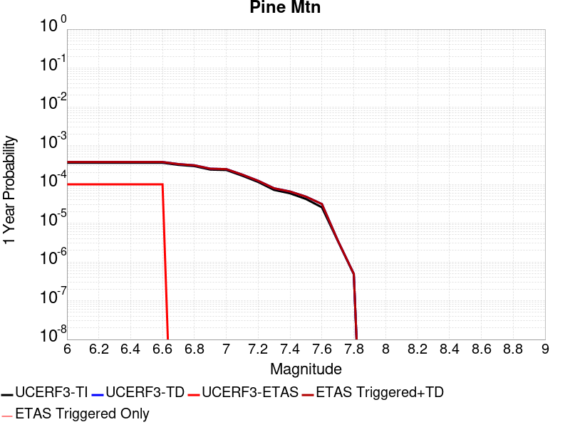 | 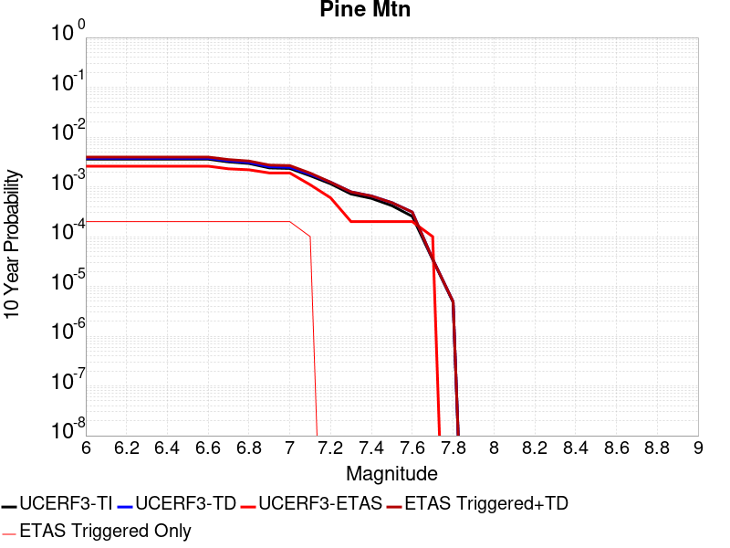 |

| Magnitude | 1 wk TI Prob | 1 wk TD Prob | 1 wk ETAS Prob | 1 wk ETAS/TD Gain | 1 wk ETAS Triggered+TD | 1 wk ETAS Triggered Only | 1 mo TI Prob | 1 mo TD Prob | 1 mo ETAS Prob | 1 mo ETAS/TD Gain | 1 mo ETAS Triggered+TD | 1 mo ETAS Triggered Only | 1 yr TI Prob | 1 yr TD Prob | 1 yr ETAS Prob | 1 yr ETAS/TD Gain | 1 yr ETAS Triggered+TD | 1 yr ETAS Triggered Only | 10 yr TI Prob | 10 yr TD Prob | 10 yr ETAS Prob | 10 yr ETAS/TD Gain | 10 yr ETAS Triggered+TD | 10 yr ETAS Triggered Only |
|-----|-----|-----|-----|-----|-----|-----|-----|-----|-----|-----|-----|-----|-----|-----|-----|-----|-----|-----|-----|-----|-----|-----|-----|-----|
| 6.0 | 6.894797E-6 | 7.2173143E-6 | 0.0 | 0.0 | 7.2173143E-6 | 0.0 | 2.9548795E-5 | 3.0930998E-5 | 1.0E-4 | 3.233003 | 3.0930998E-5 | 0.0 | 3.596972E-4 | 3.7652277E-4 | 1.0E-4 | 0.26558816 | 3.7652277E-4 | 0.0 | 0.0035911554 | 0.0037591455 | 0.0026 | 0.6916465 | 0.003958394 | 2.0E-4 |
| 6.1 | 6.894797E-6 | 7.2173143E-6 | 0.0 | 0.0 | 7.2173143E-6 | 0.0 | 2.9548795E-5 | 3.0930998E-5 | 1.0E-4 | 3.233003 | 3.0930998E-5 | 0.0 | 3.596972E-4 | 3.7652277E-4 | 1.0E-4 | 0.26558816 | 3.7652277E-4 | 0.0 | 0.0035911554 | 0.0037591455 | 0.0026 | 0.6916465 | 0.003958394 | 2.0E-4 |
| 6.2 | 6.894797E-6 | 7.2173143E-6 | 0.0 | 0.0 | 7.2173143E-6 | 0.0 | 2.9548795E-5 | 3.0930998E-5 | 1.0E-4 | 3.233003 | 3.0930998E-5 | 0.0 | 3.596972E-4 | 3.7652277E-4 | 1.0E-4 | 0.26558816 | 3.7652277E-4 | 0.0 | 0.0035911554 | 0.0037591455 | 0.0026 | 0.6916465 | 0.003958394 | 2.0E-4 |
| 6.3 | 6.894797E-6 | 7.2173143E-6 | 0.0 | 0.0 | 7.2173143E-6 | 0.0 | 2.9548795E-5 | 3.0930998E-5 | 1.0E-4 | 3.233003 | 3.0930998E-5 | 0.0 | 3.596972E-4 | 3.7652277E-4 | 1.0E-4 | 0.26558816 | 3.7652277E-4 | 0.0 | 0.0035911554 | 0.0037591455 | 0.0026 | 0.6916465 | 0.003958394 | 2.0E-4 |
| 6.4 | 6.894797E-6 | 7.2173143E-6 | 0.0 | 0.0 | 7.2173143E-6 | 0.0 | 2.9548795E-5 | 3.0930998E-5 | 1.0E-4 | 3.233003 | 3.0930998E-5 | 0.0 | 3.596972E-4 | 3.7652277E-4 | 1.0E-4 | 0.26558816 | 3.7652277E-4 | 0.0 | 0.0035911554 | 0.0037591455 | 0.0026 | 0.6916465 | 0.003958394 | 2.0E-4 |
| 6.5 | 6.894797E-6 | 7.2173143E-6 | 0.0 | 0.0 | 7.2173143E-6 | 0.0 | 2.9548795E-5 | 3.0930998E-5 | 1.0E-4 | 3.233003 | 3.0930998E-5 | 0.0 | 3.596972E-4 | 3.7652277E-4 | 1.0E-4 | 0.26558816 | 3.7652277E-4 | 0.0 | 0.0035911554 | 0.0037591455 | 0.0026 | 0.6916465 | 0.003958394 | 2.0E-4 |
| 6.6 | 6.894797E-6 | 7.2173143E-6 | 0.0 | 0.0 | 7.2173143E-6 | 0.0 | 2.9548795E-5 | 3.0930998E-5 | 1.0E-4 | 3.233003 | 3.0930998E-5 | 0.0 | 3.596972E-4 | 3.7652277E-4 | 1.0E-4 | 0.26558816 | 3.7652277E-4 | 0.0 | 0.0035911554 | 0.0037591455 | 0.0026 | 0.6916465 | 0.003958394 | 2.0E-4 |
| 6.7 | 6.0867933E-6 | 6.389184E-6 | 0.0 | 0.0 | 6.389184E-6 | 0.0 | 2.6085996E-5 | 2.7381942E-5 | 0.0 | 0.0 | 2.7381942E-5 | 0.0 | 3.1755073E-4 | 3.3332632E-4 | 0.0 | 0.0 | 3.3332632E-4 | 0.0 | 0.0031709734 | 0.0033284824 | 0.0023 | 0.6910056 | 0.0035278166 | 2.0E-4 |
| 6.8 | 5.6530425E-6 | 5.9428035E-6 | 0.0 | 0.0 | 5.9428035E-6 | 0.0 | 2.42271E-5 | 2.546892E-5 | 0.0 | 0.0 | 2.546892E-5 | 0.0 | 2.94925E-4 | 3.1004203E-4 | 0.0 | 0.0 | 3.1004203E-4 | 0.0 | 0.002945339 | 0.0030962992 | 0.0022 | 0.71052563 | 0.00329568 | 2.0E-4 |
| 6.9 | 4.6015225E-6 | 4.856422E-6 | 0.0 | 0.0 | 4.856422E-6 | 0.0 | 1.9720663E-5 | 2.081308E-5 | 0.0 | 0.0 | 2.081308E-5 | 0.0 | 2.4007261E-4 | 2.5337122E-4 | 0.0 | 0.0 | 2.5337122E-4 | 0.0 | 0.0023981342 | 0.0025309676 | 0.0019 | 0.75070107 | 0.0027304613 | 2.0E-4 |
| 7.0 | 4.4875965E-6 | 4.740087E-6 | 0.0 | 0.0 | 4.740087E-6 | 0.0 | 1.9232413E-5 | 2.031451E-5 | 0.0 | 0.0 | 2.031451E-5 | 0.0 | 2.3412947E-4 | 2.4730252E-4 | 0.0 | 0.0 | 2.4730252E-4 | 0.0 | 0.0023388295 | 0.002470417 | 0.0019 | 0.76910096 | 0.0026699228 | 2.0E-4 |
| 7.1 | 3.203907E-6 | 3.4223929E-6 | 0.0 | 0.0 | 3.4223929E-6 | 0.0 | 1.3730958E-5 | 1.4667319E-5 | 0.0 | 0.0 | 1.4667319E-5 | 0.0 | 1.6716159E-4 | 1.7856064E-4 | 0.0 | 0.0 | 1.7856064E-4 | 0.0 | 0.0016703589 | 0.0017842377 | 0.0011 | 0.6165098 | 0.0018840592 | 1.0E-4 |
| 7.2 | 2.2060601E-6 | 2.372741E-6 | 0.0 | 0.0 | 2.372741E-6 | 0.0 | 9.4545085E-6 | 1.0168853E-5 | 0.0 | 0.0 | 1.0168853E-5 | 0.0 | 1.15102564E-4 | 1.237992E-4 | 0.0 | 0.0 | 1.237992E-4 | 0.0 | 0.0011504296 | 0.001237347 | 6.0E-4 | 0.4849084 | 0.001237347 | 0.0 |
| 7.3 | 1.3765207E-6 | 1.5164808E-6 | 0.0 | 0.0 | 1.5164808E-6 | 0.0 | 5.899361E-6 | 6.4991877E-6 | 0.0 | 0.0 | 6.4991877E-6 | 0.0 | 7.182235E-5 | 7.9124824E-5 | 0.0 | 0.0 | 7.9124824E-5 | 0.0 | 7.1799144E-4 | 7.909756E-4 | 2.0E-4 | 0.25285232 | 7.909756E-4 | 0.0 |
| 7.4 | 1.1245983E-6 | 1.2540539E-6 | 0.0 | 0.0 | 1.2540539E-6 | 0.0 | 4.819698E-6 | 5.374506E-6 | 0.0 | 0.0 | 5.374506E-6 | 0.0 | 5.8678244E-5 | 6.543273E-5 | 0.0 | 0.0 | 6.543273E-5 | 0.0 | 5.866275E-4 | 6.541429E-4 | 2.0E-4 | 0.3057436 | 6.541429E-4 | 0.0 |
| 7.5 | 8.031682E-7 | 9.233474E-7 | 0.0 | 0.0 | 9.233474E-7 | 0.0 | 3.4421448E-6 | 3.9571974E-6 | 0.0 | 0.0 | 3.9571974E-6 | 0.0 | 4.1907308E-5 | 4.817788E-5 | 0.0 | 0.0 | 4.817788E-5 | 0.0 | 4.1899405E-4 | 4.8168103E-4 | 2.0E-4 | 0.41521254 | 4.8168103E-4 | 0.0 |
| 7.6 | 4.8953444E-7 | 5.964397E-7 | 0.0 | 0.0 | 5.964397E-7 | 0.0 | 2.098003E-6 | 2.5561678E-6 | 0.0 | 0.0 | 2.5561678E-6 | 0.0 | 2.5542888E-5 | 3.1120948E-5 | 0.0 | 0.0 | 3.1120948E-5 | 0.0 | 2.5539953E-4 | 3.1117065E-4 | 2.0E-4 | 0.6427341 | 3.1117065E-4 | 0.0 |
| 7.7 | 6.634529E-8 | 6.7871596E-8 | 0.0 | 0.0 | 6.7871596E-8 | 0.0 | 2.843369E-7 | 2.9087823E-7 | 0.0 | 0.0 | 2.9087823E-7 | 0.0 | 3.4617963E-6 | 3.5414373E-6 | 0.0 | 0.0 | 3.5414373E-6 | 0.0 | 3.4617424E-5 | 3.5413857E-5 | 1.0E-4 | 2.8237534 | 3.5413857E-5 | 0.0 |
| 7.8 | 9.235578E-9 | 9.485809E-9 | 0.0 | 0.0 | 9.485809E-9 | 0.0 | 3.9581046E-8 | 4.0653465E-8 | 0.0 | 0.0 | 4.0653465E-8 | 0.0 | 4.818991E-7 | 4.949558E-7 | 0.0 | 0.0 | 4.949558E-7 | 0.0 | 4.8189804E-6 | 4.949549E-6 | 0.0 | 0.0 | 4.949549E-6 | 0.0 |

## San Joaquin Hills
*[(top)](#table-of-contents)*

| 1 Week | 1 Month | 1 Year | 10 Year |
|-----|-----|-----|-----|
|  |  |  |  |

| Magnitude | 1 wk TI Prob | 1 wk TD Prob | 1 wk ETAS Prob | 1 wk ETAS/TD Gain | 1 wk ETAS Triggered+TD | 1 wk ETAS Triggered Only | 1 mo TI Prob | 1 mo TD Prob | 1 mo ETAS Prob | 1 mo ETAS/TD Gain | 1 mo ETAS Triggered+TD | 1 mo ETAS Triggered Only | 1 yr TI Prob | 1 yr TD Prob | 1 yr ETAS Prob | 1 yr ETAS/TD Gain | 1 yr ETAS Triggered+TD | 1 yr ETAS Triggered Only | 10 yr TI Prob | 10 yr TD Prob | 10 yr ETAS Prob | 10 yr ETAS/TD Gain | 10 yr ETAS Triggered+TD | 10 yr ETAS Triggered Only |
|-----|-----|-----|-----|-----|-----|-----|-----|-----|-----|-----|-----|-----|-----|-----|-----|-----|-----|-----|-----|-----|-----|-----|-----|-----|
| 6.0 | 3.4525704E-6 | 2.811636E-6 | 0.0 | 0.0 | 2.811636E-6 | 0.0 | 1.4796647E-5 | 1.2049813E-5 | 0.0 | 0.0 | 1.2049813E-5 | 0.0 | 1.8013427E-4 | 1.4669674E-4 | 2.0E-4 | 1.3633568 | 1.4669674E-4 | 0.0 | 0.0017998833 | 0.0014660122 | 0.0011 | 0.75033486 | 0.001665719 | 2.0E-4 |
| 6.1 | 3.4525704E-6 | 2.811636E-6 | 0.0 | 0.0 | 2.811636E-6 | 0.0 | 1.4796647E-5 | 1.2049813E-5 | 0.0 | 0.0 | 1.2049813E-5 | 0.0 | 1.8013427E-4 | 1.4669674E-4 | 2.0E-4 | 1.3633568 | 1.4669674E-4 | 0.0 | 0.0017998833 | 0.0014660122 | 0.0011 | 0.75033486 | 0.001665719 | 2.0E-4 |
| 6.2 | 3.4525704E-6 | 2.811636E-6 | 0.0 | 0.0 | 2.811636E-6 | 0.0 | 1.4796647E-5 | 1.2049813E-5 | 0.0 | 0.0 | 1.2049813E-5 | 0.0 | 1.8013427E-4 | 1.4669674E-4 | 2.0E-4 | 1.3633568 | 1.4669674E-4 | 0.0 | 0.0017998833 | 0.0014660122 | 0.0011 | 0.75033486 | 0.001665719 | 2.0E-4 |
| 6.3 | 3.4525704E-6 | 2.811636E-6 | 0.0 | 0.0 | 2.811636E-6 | 0.0 | 1.4796647E-5 | 1.2049813E-5 | 0.0 | 0.0 | 1.2049813E-5 | 0.0 | 1.8013427E-4 | 1.4669674E-4 | 2.0E-4 | 1.3633568 | 1.4669674E-4 | 0.0 | 0.0017998833 | 0.0014660122 | 0.0011 | 0.75033486 | 0.001665719 | 2.0E-4 |
| 6.4 | 3.4525704E-6 | 2.811636E-6 | 0.0 | 0.0 | 2.811636E-6 | 0.0 | 1.4796647E-5 | 1.2049813E-5 | 0.0 | 0.0 | 1.2049813E-5 | 0.0 | 1.8013427E-4 | 1.4669674E-4 | 2.0E-4 | 1.3633568 | 1.4669674E-4 | 0.0 | 0.0017998833 | 0.0014660122 | 0.0011 | 0.75033486 | 0.001665719 | 2.0E-4 |
| 6.5 | 3.4525704E-6 | 2.811636E-6 | 0.0 | 0.0 | 2.811636E-6 | 0.0 | 1.4796647E-5 | 1.2049813E-5 | 0.0 | 0.0 | 1.2049813E-5 | 0.0 | 1.8013427E-4 | 1.4669674E-4 | 2.0E-4 | 1.3633568 | 1.4669674E-4 | 0.0 | 0.0017998833 | 0.0014660122 | 0.0011 | 0.75033486 | 0.001665719 | 2.0E-4 |
| 6.6 | 3.4525704E-6 | 2.811636E-6 | 0.0 | 0.0 | 2.811636E-6 | 0.0 | 1.4796647E-5 | 1.2049813E-5 | 0.0 | 0.0 | 1.2049813E-5 | 0.0 | 1.8013427E-4 | 1.4669674E-4 | 2.0E-4 | 1.3633568 | 1.4669674E-4 | 0.0 | 0.0017998833 | 0.0014660122 | 0.0011 | 0.75033486 | 0.001665719 | 2.0E-4 |
| 6.7 | 3.4525704E-6 | 2.811636E-6 | 0.0 | 0.0 | 2.811636E-6 | 0.0 | 1.4796647E-5 | 1.2049813E-5 | 0.0 | 0.0 | 1.2049813E-5 | 0.0 | 1.8013427E-4 | 1.4669674E-4 | 2.0E-4 | 1.3633568 | 1.4669674E-4 | 0.0 | 0.0017998833 | 0.0014660122 | 0.0011 | 0.75033486 | 0.001665719 | 2.0E-4 |
| 6.8 | 3.388654E-6 | 2.746092E-6 | 0.0 | 0.0 | 2.746092E-6 | 0.0 | 1.4522722E-5 | 1.1768913E-5 | 0.0 | 0.0 | 1.1768913E-5 | 0.0 | 1.767998E-4 | 1.4327723E-4 | 2.0E-4 | 1.3958952 | 1.4327723E-4 | 0.0 | 0.001766592 | 0.0014318613 | 0.0011 | 0.76823086 | 0.0016315749 | 2.0E-4 |
| 6.9 | 3.2694352E-6 | 2.6260386E-6 | 0.0 | 0.0 | 2.6260386E-6 | 0.0 | 1.401179E-5 | 1.1254403E-5 | 0.0 | 0.0 | 1.1254403E-5 | 0.0 | 1.7058018E-4 | 1.3701385E-4 | 2.0E-4 | 1.4597064 | 1.3701385E-4 | 0.0 | 0.0017044931 | 0.0013693051 | 0.001 | 0.73029745 | 0.0015690312 | 2.0E-4 |
| 7.0 | 3.246912E-6 | 2.6047035E-6 | 0.0 | 0.0 | 2.6047035E-6 | 0.0 | 1.39152635E-5 | 1.1162967E-5 | 0.0 | 0.0 | 1.1162967E-5 | 0.0 | 1.6940516E-4 | 1.3590076E-4 | 2.0E-4 | 1.471662 | 1.3590076E-4 | 0.0 | 0.0016927607 | 0.0013581878 | 0.001 | 0.73627526 | 0.0015579162 | 2.0E-4 |
| 7.1 | 3.1864927E-6 | 2.5500453E-6 | 0.0 | 0.0 | 2.5500453E-6 | 0.0 | 1.3656326E-5 | 1.0928721E-5 | 0.0 | 0.0 | 1.0928721E-5 | 0.0 | 1.6625308E-4 | 1.3304917E-4 | 2.0E-4 | 1.5032037 | 1.3304917E-4 | 0.0 | 0.0016612876 | 0.001329706 | 0.001 | 0.7520459 | 0.0015294402 | 2.0E-4 |
| 7.2 | 3.0220644E-6 | 2.3969453E-6 | 0.0 | 0.0 | 2.3969453E-6 | 0.0 | 1.295164E-5 | 1.0272583E-5 | 0.0 | 0.0 | 1.0272583E-5 | 0.0 | 1.576748E-4 | 1.2506162E-4 | 2.0E-4 | 1.5992117 | 1.2506162E-4 | 0.0 | 0.0015756298 | 0.0012499227 | 0.001 | 0.8000495 | 0.0014496727 | 2.0E-4 |
| 7.3 | 2.787619E-6 | 2.215373E-6 | 0.0 | 0.0 | 2.215373E-6 | 0.0 | 1.1946884E-5 | 9.494422E-6 | 0.0 | 0.0 | 9.494422E-6 | 0.0 | 1.454436E-4 | 1.1558855E-4 | 2.0E-4 | 1.7302753 | 1.1558855E-4 | 0.0 | 0.0014534845 | 0.001155294 | 0.001 | 0.8655805 | 0.001355063 | 2.0E-4 |
| 7.4 | 2.4593792E-6 | 1.9207107E-6 | 0.0 | 0.0 | 1.9207107E-6 | 0.0 | 1.0540153E-5 | 8.231592E-6 | 0.0 | 0.0 | 8.231592E-6 | 0.0 | 1.2831882E-4 | 1.0021511E-4 | 2.0E-4 | 1.995707 | 1.0021511E-4 | 0.0 | 0.0012824474 | 0.001001708 | 9.0E-4 | 0.89846545 | 0.0011016078 | 1.0E-4 |
| 7.5 | 1.926764E-6 | 1.4365178E-6 | 0.0 | 0.0 | 1.4365178E-6 | 0.0 | 8.257534E-6 | 6.156491E-6 | 0.0 | 0.0 | 6.156491E-6 | 0.0 | 1.00530844E-4 | 7.495276E-5 | 1.0E-4 | 1.3341737 | 7.495276E-5 | 0.0 | 0.0010048538 | 7.4928114E-4 | 7.0E-4 | 0.9342288 | 8.4920623E-4 | 1.0E-4 |
| 7.6 | 1.1609359E-6 | 8.129729E-7 | 0.0 | 0.0 | 8.129729E-7 | 0.0 | 4.97543E-6 | 3.4841653E-6 | 0.0 | 0.0 | 3.4841653E-6 | 0.0 | 6.0574173E-5 | 4.241893E-5 | 1.0E-4 | 2.357438 | 4.241893E-5 | 0.0 | 6.055767E-4 | 4.2411263E-4 | 2.0E-4 | 0.47157285 | 4.2411263E-4 | 0.0 |
| 7.7 | 5.1168536E-7 | 2.7130497E-7 | 0.0 | 0.0 | 2.7130497E-7 | 0.0 | 2.1929354E-6 | 1.1627352E-6 | 0.0 | 0.0 | 1.1627352E-6 | 0.0 | 2.669866E-5 | 1.4156222E-5 | 0.0 | 0.0 | 1.4156222E-5 | 0.0 | 2.6695454E-4 | 1.4155456E-4 | 1.0E-4 | 0.7064414 | 1.4155456E-4 | 0.0 |
| 7.8 | 1.16056995E-8 | 9.781111E-9 | 0.0 | 0.0 | 9.781111E-9 | 0.0 | 4.9738713E-8 | 4.1919048E-8 | 0.0 | 0.0 | 4.1919048E-8 | 0.0 | 6.0556863E-7 | 5.1036443E-7 | 0.0 | 0.0 | 5.1036443E-7 | 0.0 | 6.05567E-6 | 5.103644E-6 | 0.0 | 0.0 | 5.103644E-6 | 0.0 |

## Oceanside alt1
*[(top)](#table-of-contents)*

| 1 Week | 1 Month | 1 Year | 10 Year |
|-----|-----|-----|-----|
|  | 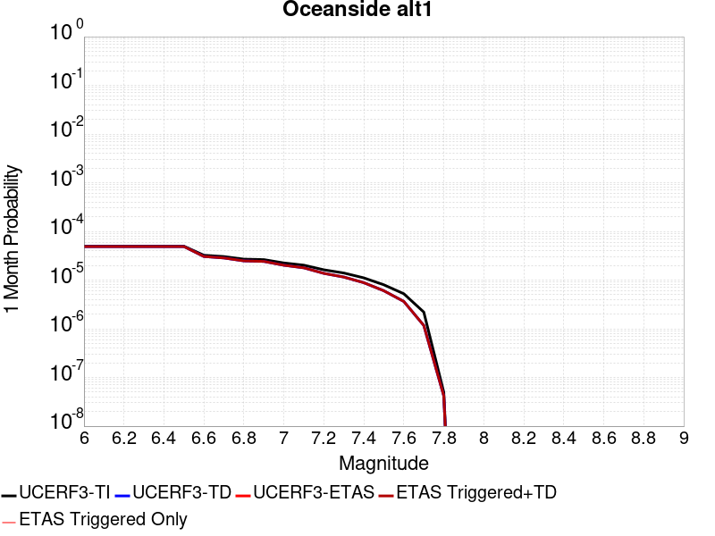 |  |  |

| Magnitude | 1 wk TI Prob | 1 wk TD Prob | 1 wk ETAS Prob | 1 wk ETAS/TD Gain | 1 wk ETAS Triggered+TD | 1 wk ETAS Triggered Only | 1 mo TI Prob | 1 mo TD Prob | 1 mo ETAS Prob | 1 mo ETAS/TD Gain | 1 mo ETAS Triggered+TD | 1 mo ETAS Triggered Only | 1 yr TI Prob | 1 yr TD Prob | 1 yr ETAS Prob | 1 yr ETAS/TD Gain | 1 yr ETAS Triggered+TD | 1 yr ETAS Triggered Only | 10 yr TI Prob | 10 yr TD Prob | 10 yr ETAS Prob | 10 yr ETAS/TD Gain | 10 yr ETAS Triggered+TD | 10 yr ETAS Triggered Only |
|-----|-----|-----|-----|-----|-----|-----|-----|-----|-----|-----|-----|-----|-----|-----|-----|-----|-----|-----|-----|-----|-----|-----|-----|-----|
| 6.0 | 1.1617542E-5 | 1.1416572E-5 | 0.0 | 0.0 | 1.1416572E-5 | 0.0 | 4.9788516E-5 | 4.892734E-5 | 0.0 | 0.0 | 4.892734E-5 | 0.0 | 6.060066E-4 | 5.9554365E-4 | 4.0E-4 | 0.67165524 | 5.9554365E-4 | 0.0 | 0.0060435664 | 0.0059410725 | 0.0039 | 0.6564471 | 0.0061398842 | 2.0E-4 |
| 6.1 | 1.1617542E-5 | 1.1416572E-5 | 0.0 | 0.0 | 1.1416572E-5 | 0.0 | 4.9788516E-5 | 4.892734E-5 | 0.0 | 0.0 | 4.892734E-5 | 0.0 | 6.060066E-4 | 5.9554365E-4 | 4.0E-4 | 0.67165524 | 5.9554365E-4 | 0.0 | 0.0060435664 | 0.0059410725 | 0.0039 | 0.6564471 | 0.0061398842 | 2.0E-4 |
| 6.2 | 1.1617542E-5 | 1.1416572E-5 | 0.0 | 0.0 | 1.1416572E-5 | 0.0 | 4.9788516E-5 | 4.892734E-5 | 0.0 | 0.0 | 4.892734E-5 | 0.0 | 6.060066E-4 | 5.9554365E-4 | 4.0E-4 | 0.67165524 | 5.9554365E-4 | 0.0 | 0.0060435664 | 0.0059410725 | 0.0039 | 0.6564471 | 0.0061398842 | 2.0E-4 |
| 6.3 | 1.1617542E-5 | 1.1416572E-5 | 0.0 | 0.0 | 1.1416572E-5 | 0.0 | 4.9788516E-5 | 4.892734E-5 | 0.0 | 0.0 | 4.892734E-5 | 0.0 | 6.060066E-4 | 5.9554365E-4 | 4.0E-4 | 0.67165524 | 5.9554365E-4 | 0.0 | 0.0060435664 | 0.0059410725 | 0.0039 | 0.6564471 | 0.0061398842 | 2.0E-4 |
| 6.4 | 1.1617542E-5 | 1.1416572E-5 | 0.0 | 0.0 | 1.1416572E-5 | 0.0 | 4.9788516E-5 | 4.892734E-5 | 0.0 | 0.0 | 4.892734E-5 | 0.0 | 6.060066E-4 | 5.9554365E-4 | 4.0E-4 | 0.67165524 | 5.9554365E-4 | 0.0 | 0.0060435664 | 0.0059410725 | 0.0039 | 0.6564471 | 0.0061398842 | 2.0E-4 |
| 6.5 | 1.1617542E-5 | 1.1416572E-5 | 0.0 | 0.0 | 1.1416572E-5 | 0.0 | 4.9788516E-5 | 4.892734E-5 | 0.0 | 0.0 | 4.892734E-5 | 0.0 | 6.060066E-4 | 5.9554365E-4 | 4.0E-4 | 0.67165524 | 5.9554365E-4 | 0.0 | 0.0060435664 | 0.0059410725 | 0.0039 | 0.6564471 | 0.0061398842 | 2.0E-4 |
| 6.6 | 7.561768E-6 | 7.1292825E-6 | 0.0 | 0.0 | 7.1292825E-6 | 0.0 | 3.2407173E-5 | 3.0553718E-5 | 0.0 | 0.0 | 3.0553718E-5 | 0.0 | 3.9448592E-4 | 3.7192908E-4 | 3.0E-4 | 0.8066054 | 3.7192908E-4 | 0.0 | 0.0039378637 | 0.0037131775 | 0.0027 | 0.72714007 | 0.003912435 | 2.0E-4 |
| 6.7 | 7.1042605E-6 | 6.6515754E-6 | 0.0 | 0.0 | 6.6515754E-6 | 0.0 | 3.0446476E-5 | 2.8506445E-5 | 0.0 | 0.0 | 2.8506445E-5 | 0.0 | 3.706228E-4 | 3.470115E-4 | 3.0E-4 | 0.86452466 | 3.470115E-4 | 0.0 | 0.0037000529 | 0.0034647796 | 0.0025 | 0.7215466 | 0.0036640868 | 2.0E-4 |
| 6.8 | 6.285554E-6 | 5.796003E-6 | 0.0 | 0.0 | 5.796003E-6 | 0.0 | 2.693781E-5 | 2.483978E-5 | 0.0 | 0.0 | 2.483978E-5 | 0.0 | 3.2791847E-4 | 3.023829E-4 | 3.0E-4 | 0.99211967 | 3.023829E-4 | 0.0 | 0.0032743502 | 0.0030197718 | 0.0019 | 0.62918663 | 0.0032191677 | 2.0E-4 |
| 6.9 | 6.148883E-6 | 5.6529125E-6 | 0.0 | 0.0 | 5.6529125E-6 | 0.0 | 2.635209E-5 | 2.4226545E-5 | 0.0 | 0.0 | 2.4226545E-5 | 0.0 | 3.2078946E-4 | 2.949188E-4 | 3.0E-4 | 1.0172291 | 2.949188E-4 | 0.0 | 0.003203268 | 0.0029453312 | 0.0018 | 0.61113673 | 0.0031447422 | 2.0E-4 |
| 7.0 | 5.253857E-6 | 4.719203E-6 | 0.0 | 0.0 | 4.719203E-6 | 0.0 | 2.2516335E-5 | 2.0225E-5 | 0.0 | 0.0 | 2.0225E-5 | 0.0 | 2.7410188E-4 | 2.4621186E-4 | 3.0E-4 | 1.2184628 | 2.4621186E-4 | 0.0 | 0.0027376404 | 0.0024594222 | 0.0014 | 0.5692394 | 0.0026589304 | 2.0E-4 |
| 7.1 | 4.730754E-6 | 4.175568E-6 | 0.0 | 0.0 | 4.175568E-6 | 0.0 | 2.0274503E-5 | 1.7895169E-5 | 0.0 | 0.0 | 1.7895169E-5 | 0.0 | 2.468141E-4 | 2.1785217E-4 | 3.0E-4 | 1.3770807 | 2.1785217E-4 | 0.0 | 0.0024654015 | 0.0021764124 | 0.0011 | 0.5054189 | 0.002375977 | 2.0E-4 |
| 7.2 | 3.7998386E-6 | 3.2115709E-6 | 0.0 | 0.0 | 3.2115709E-6 | 0.0 | 1.6284921E-5 | 1.37638035E-5 | 0.0 | 0.0 | 1.37638035E-5 | 0.0 | 1.9825088E-4 | 1.6756153E-4 | 2.0E-4 | 1.1935914 | 1.6756153E-4 | 0.0 | 0.001980741 | 0.0016743641 | 0.001 | 0.59724164 | 0.0018740293 | 2.0E-4 |
| 7.3 | 3.2656465E-6 | 2.6961372E-6 | 0.0 | 0.0 | 2.6961372E-6 | 0.0 | 1.3995553E-5 | 1.1554823E-5 | 0.0 | 0.0 | 1.1554823E-5 | 0.0 | 1.7038253E-4 | 1.4067099E-4 | 2.0E-4 | 1.4217572 | 1.4067099E-4 | 0.0 | 0.0017025196 | 0.0014058306 | 0.001 | 0.71132326 | 0.0016055495 | 2.0E-4 |
| 7.4 | 2.593703E-6 | 2.0660555E-6 | 0.0 | 0.0 | 2.0660555E-6 | 0.0 | 1.1115822E-5 | 8.854494E-6 | 0.0 | 0.0 | 8.854494E-6 | 0.0 | 1.3532673E-4 | 1.07798216E-4 | 2.0E-4 | 1.8553182 | 1.07798216E-4 | 0.0 | 0.0013524436 | 0.0010774682 | 8.0E-4 | 0.74248135 | 0.0011773604 | 1.0E-4 |
| 7.5 | 1.8715585E-6 | 1.4119369E-6 | 0.0 | 0.0 | 1.4119369E-6 | 0.0 | 8.020941E-6 | 6.0511443E-6 | 0.0 | 0.0 | 6.0511443E-6 | 0.0 | 9.7650576E-5 | 7.367025E-5 | 1.0E-4 | 1.3574 | 7.367025E-5 | 0.0 | 9.7607676E-4 | 7.3646434E-4 | 6.0E-4 | 0.8147034 | 8.363907E-4 | 1.0E-4 |
| 7.6 | 1.2246786E-6 | 8.5104784E-7 | 0.0 | 0.0 | 8.5104784E-7 | 0.0 | 5.248612E-6 | 3.6473432E-6 | 0.0 | 0.0 | 3.6473432E-6 | 0.0 | 6.389998E-5 | 4.4405544E-5 | 1.0E-4 | 2.251971 | 4.4405544E-5 | 0.0 | 6.3881604E-4 | 4.4397116E-4 | 2.0E-4 | 0.45047972 | 4.4397116E-4 | 0.0 |
| 7.7 | 5.140719E-7 | 2.7321568E-7 | 0.0 | 0.0 | 2.7321568E-7 | 0.0 | 2.2031636E-6 | 1.1709238E-6 | 0.0 | 0.0 | 1.1709238E-6 | 0.0 | 2.6823185E-5 | 1.4255918E-5 | 0.0 | 0.0 | 1.4255918E-5 | 0.0 | 2.6819948E-4 | 1.4255139E-4 | 1.0E-4 | 0.7015014 | 1.4255139E-4 | 0.0 |
| 7.8 | 1.16056995E-8 | 9.781111E-9 | 0.0 | 0.0 | 9.781111E-9 | 0.0 | 4.9738713E-8 | 4.1919048E-8 | 0.0 | 0.0 | 4.1919048E-8 | 0.0 | 6.0556863E-7 | 5.1036443E-7 | 0.0 | 0.0 | 5.1036443E-7 | 0.0 | 6.05567E-6 | 5.103644E-6 | 0.0 | 0.0 | 5.103644E-6 | 0.0 |

## San Luis Range - Pecho 2011 CFM
*[(top)](#table-of-contents)*

| 1 Week | 1 Month | 1 Year | 10 Year |
|-----|-----|-----|-----|
|  |  |  |  |

| Magnitude | 1 wk TI Prob | 1 wk TD Prob | 1 wk ETAS Prob | 1 wk ETAS/TD Gain | 1 wk ETAS Triggered+TD | 1 wk ETAS Triggered Only | 1 mo TI Prob | 1 mo TD Prob | 1 mo ETAS Prob | 1 mo ETAS/TD Gain | 1 mo ETAS Triggered+TD | 1 mo ETAS Triggered Only | 1 yr TI Prob | 1 yr TD Prob | 1 yr ETAS Prob | 1 yr ETAS/TD Gain | 1 yr ETAS Triggered+TD | 1 yr ETAS Triggered Only | 10 yr TI Prob | 10 yr TD Prob | 10 yr ETAS Prob | 10 yr ETAS/TD Gain | 10 yr ETAS Triggered+TD | 10 yr ETAS Triggered Only |
|-----|-----|-----|-----|-----|-----|-----|-----|-----|-----|-----|-----|-----|-----|-----|-----|-----|-----|-----|-----|-----|-----|-----|-----|-----|
| 6.0 | 1.687423E-6 | 1.6917523E-6 | 0.0 | 0.0 | 1.6917523E-6 | 0.0 | 7.231793E-6 | 7.2503485E-6 | 0.0 | 0.0 | 7.2503485E-6 | 0.0 | 8.804352E-5 | 8.826966E-5 | 0.0 | 0.0 | 8.826966E-5 | 0.0 | 8.8008645E-4 | 8.823699E-4 | 9.0E-4 | 1.0199804 | 0.0010821935 | 2.0E-4 |
| 6.1 | 1.687423E-6 | 1.6917523E-6 | 0.0 | 0.0 | 1.6917523E-6 | 0.0 | 7.231793E-6 | 7.2503485E-6 | 0.0 | 0.0 | 7.2503485E-6 | 0.0 | 8.804352E-5 | 8.826966E-5 | 0.0 | 0.0 | 8.826966E-5 | 0.0 | 8.8008645E-4 | 8.823699E-4 | 9.0E-4 | 1.0199804 | 0.0010821935 | 2.0E-4 |
| 6.2 | 1.0765672E-6 | 1.0766571E-6 | 0.0 | 0.0 | 1.0766571E-6 | 0.0 | 4.613851E-6 | 4.614237E-6 | 0.0 | 0.0 | 4.614237E-6 | 0.0 | 5.617219E-5 | 5.617695E-5 | 0.0 | 0.0 | 5.617695E-5 | 0.0 | 5.6157995E-4 | 5.6163373E-4 | 6.0E-4 | 1.0683119 | 7.615214E-4 | 2.0E-4 |
| 6.3 | 8.523104E-7 | 8.509209E-7 | 0.0 | 0.0 | 8.509209E-7 | 0.0 | 3.6527538E-6 | 3.6467989E-6 | 0.0 | 0.0 | 3.6467989E-6 | 0.0 | 4.447137E-5 | 4.4398905E-5 | 0.0 | 0.0 | 4.4398905E-5 | 0.0 | 4.4462472E-4 | 4.4390353E-4 | 5.0E-4 | 1.1263708 | 5.4385915E-4 | 1.0E-4 |
| 6.4 | 8.523104E-7 | 8.509209E-7 | 0.0 | 0.0 | 8.509209E-7 | 0.0 | 3.6527538E-6 | 3.6467989E-6 | 0.0 | 0.0 | 3.6467989E-6 | 0.0 | 4.447137E-5 | 4.4398905E-5 | 0.0 | 0.0 | 4.4398905E-5 | 0.0 | 4.4462472E-4 | 4.4390353E-4 | 5.0E-4 | 1.1263708 | 5.4385915E-4 | 1.0E-4 |
| 6.5 | 7.0029404E-7 | 6.972799E-7 | 0.0 | 0.0 | 6.972799E-7 | 0.0 | 3.0012568E-6 | 2.988339E-6 | 0.0 | 0.0 | 2.988339E-6 | 0.0 | 3.6539688E-5 | 3.6382437E-5 | 0.0 | 0.0 | 3.6382437E-5 | 0.0 | 3.653368E-4 | 3.637665E-4 | 4.0E-4 | 1.0996065 | 4.6373013E-4 | 1.0E-4 |
| 6.6 | 5.583906E-7 | 5.539344E-7 | 0.0 | 0.0 | 5.539344E-7 | 0.0 | 2.3931002E-6 | 2.3740024E-6 | 0.0 | 0.0 | 2.3740024E-6 | 0.0 | 2.9135606E-5 | 2.8903103E-5 | 0.0 | 0.0 | 2.8903103E-5 | 0.0 | 2.9131788E-4 | 2.8899417E-4 | 4.0E-4 | 1.3841109 | 3.8896527E-4 | 1.0E-4 |
| 6.7 | 4.73441E-7 | 4.6796887E-7 | 0.0 | 0.0 | 4.6796887E-7 | 0.0 | 2.0290313E-6 | 2.0055795E-6 | 0.0 | 0.0 | 2.0055795E-6 | 0.0 | 2.4703175E-5 | 2.441766E-5 | 0.0 | 0.0 | 2.441766E-5 | 0.0 | 2.470043E-4 | 2.4415023E-4 | 3.0E-4 | 1.2287517 | 3.4412582E-4 | 1.0E-4 |
| 6.8 | 4.1466086E-7 | 4.084497E-7 | 0.0 | 0.0 | 4.084497E-7 | 0.0 | 1.7771167E-6 | 1.7504975E-6 | 0.0 | 0.0 | 1.7504975E-6 | 0.0 | 2.1636182E-5 | 2.1312102E-5 | 0.0 | 0.0 | 2.1312102E-5 | 0.0 | 2.1634075E-4 | 2.1310092E-4 | 2.0E-4 | 0.93852246 | 3.1307962E-4 | 1.0E-4 |
| 6.9 | 3.2056641E-7 | 3.1297796E-7 | 0.0 | 0.0 | 3.1297796E-7 | 0.0 | 1.3738553E-6 | 1.3413334E-6 | 0.0 | 0.0 | 1.3413334E-6 | 0.0 | 1.6726559E-5 | 1.6330614E-5 | 0.0 | 0.0 | 1.6330614E-5 | 0.0 | 1.67253E-4 | 1.6329429E-4 | 1.0E-4 | 0.6123913 | 1.6329429E-4 | 0.0 |
| 7.0 | 2.6315942E-7 | 2.545922E-7 | 0.0 | 0.0 | 2.545922E-7 | 0.0 | 1.1278256E-6 | 1.091109E-6 | 0.0 | 0.0 | 1.091109E-6 | 0.0 | 1.3731191E-5 | 1.32841715E-5 | 0.0 | 0.0 | 1.32841715E-5 | 0.0 | 1.3730342E-4 | 1.3283385E-4 | 1.0E-4 | 0.75282013 | 1.3283385E-4 | 0.0 |
| 7.1 | 2.1832436E-7 | 2.0887805E-7 | 0.0 | 0.0 | 2.0887805E-7 | 0.0 | 9.356755E-7 | 8.9519136E-7 | 0.0 | 0.0 | 8.9519136E-7 | 0.0 | 1.13917895E-5 | 1.0898901E-5 | 0.0 | 0.0 | 1.0898901E-5 | 0.0 | 1.1391206E-4 | 1.0898371E-4 | 1.0E-4 | 0.9175683 | 1.0898371E-4 | 0.0 |
| 7.2 | 1.7393015E-7 | 1.6348166E-7 | 0.0 | 0.0 | 1.6348166E-7 | 0.0 | 7.454147E-7 | 7.006355E-7 | 0.0 | 0.0 | 7.006355E-7 | 0.0 | 9.075386E-6 | 8.5302045E-6 | 0.0 | 0.0 | 8.5302045E-6 | 0.0 | 9.075015E-5 | 8.5298794E-5 | 1.0E-4 | 1.1723495 | 8.5298794E-5 | 0.0 |
| 7.3 | 1.3744894E-7 | 1.2611156E-7 | 0.0 | 0.0 | 1.2611156E-7 | 0.0 | 5.890667E-7 | 5.4047797E-7 | 0.0 | 0.0 | 5.4047797E-7 | 0.0 | 7.1718637E-6 | 6.5802997E-6 | 0.0 | 0.0 | 6.5802997E-6 | 0.0 | 7.171632E-5 | 6.580106E-5 | 1.0E-4 | 1.5197324 | 6.580106E-5 | 0.0 |
| 7.4 | 1.0915278E-7 | 9.7009455E-8 | 0.0 | 0.0 | 9.7009455E-8 | 0.0 | 4.6779755E-7 | 4.1575476E-7 | 0.0 | 0.0 | 4.1575476E-7 | 0.0 | 5.6954204E-6 | 5.0618023E-6 | 0.0 | 0.0 | 5.0618023E-6 | 0.0 | 5.6952744E-5 | 5.0616876E-5 | 1.0E-4 | 1.9756256 | 5.0616876E-5 | 0.0 |
| 7.5 | 9.490291E-8 | 8.231033E-8 | 0.0 | 0.0 | 8.231033E-8 | 0.0 | 4.0672668E-7 | 3.527585E-7 | 0.0 | 0.0 | 3.527585E-7 | 0.0 | 4.9518862E-6 | 4.2948263E-6 | 0.0 | 0.0 | 4.2948263E-6 | 0.0 | 4.951776E-5 | 4.294744E-5 | 1.0E-4 | 2.3284276 | 4.294744E-5 | 0.0 |
| 7.6 | 7.256678E-8 | 5.9173068E-8 | 0.0 | 0.0 | 5.9173068E-8 | 0.0 | 3.1100043E-7 | 2.5359884E-7 | 0.0 | 0.0 | 2.5359884E-7 | 0.0 | 3.7864236E-6 | 3.0875615E-6 | 0.0 | 0.0 | 3.0875615E-6 | 0.0 | 3.7863592E-5 | 3.0875188E-5 | 1.0E-4 | 3.2388465 | 3.0875188E-5 | 0.0 |
| 7.7 | 5.446273E-8 | 4.033521E-8 | 0.0 | 0.0 | 4.033521E-8 | 0.0 | 2.3341168E-7 | 1.7286519E-7 | 0.0 | 0.0 | 1.7286519E-7 | 0.0 | 2.8417835E-6 | 2.1046314E-6 | 0.0 | 0.0 | 2.1046314E-6 | 0.0 | 2.8417471E-5 | 2.1046117E-5 | 1.0E-4 | 4.75147 | 2.1046117E-5 | 0.0 |
| 7.8 | 3.5850867E-8 | 2.1284722E-8 | 0.0 | 0.0 | 2.1284722E-8 | 0.0 | 1.5364655E-7 | 9.1220244E-8 | 0.0 | 0.0 | 9.1220244E-8 | 0.0 | 1.8706452E-6 | 1.1106058E-6 | 0.0 | 0.0 | 1.1106058E-6 | 0.0 | 1.8706294E-5 | 1.11060035E-5 | 1.0E-4 | 9.004139 | 1.11060035E-5 | 0.0 |
| 7.9 | 2.45879E-8 | 1.1178923E-8 | 0.0 | 0.0 | 1.1178923E-8 | 0.0 | 1.0537671E-7 | 4.7909676E-8 | 0.0 | 0.0 | 4.7909676E-8 | 0.0 | 1.2829606E-6 | 5.833001E-7 | 0.0 | 0.0 | 5.833001E-7 | 0.0 | 1.2829532E-5 | 5.832986E-6 | 1.0E-4 | 17.143879 | 5.832986E-6 | 0.0 |
| 8.0 | 1.8151761E-8 | 7.266575E-9 | 0.0 | 0.0 | 7.266575E-9 | 0.0 | 7.779326E-8 | 3.114247E-8 | 0.0 | 0.0 | 3.114247E-8 | 0.0 | 9.4713255E-7 | 3.791595E-7 | 0.0 | 0.0 | 3.791595E-7 | 0.0 | 9.471285E-6 | 3.7915886E-6 | 0.0 | 0.0 | 3.7915886E-6 | 0.0 |
| 8.1 | 9.559205E-9 | 4.009819E-9 | 0.0 | 0.0 | 4.009819E-9 | 0.0 | 4.096802E-8 | 1.7184941E-8 | 0.0 | 0.0 | 1.7184941E-8 | 0.0 | 4.9878554E-7 | 2.0922664E-7 | 0.0 | 0.0 | 2.0922664E-7 | 0.0 | 4.987844E-6 | 2.0922644E-6 | 0.0 | 0.0 | 2.0922644E-6 | 0.0 |

## San Jacinto (Lytle Creek connector)
*[(top)](#table-of-contents)*

| 1 Week | 1 Month | 1 Year | 10 Year |
|-----|-----|-----|-----|
|  | 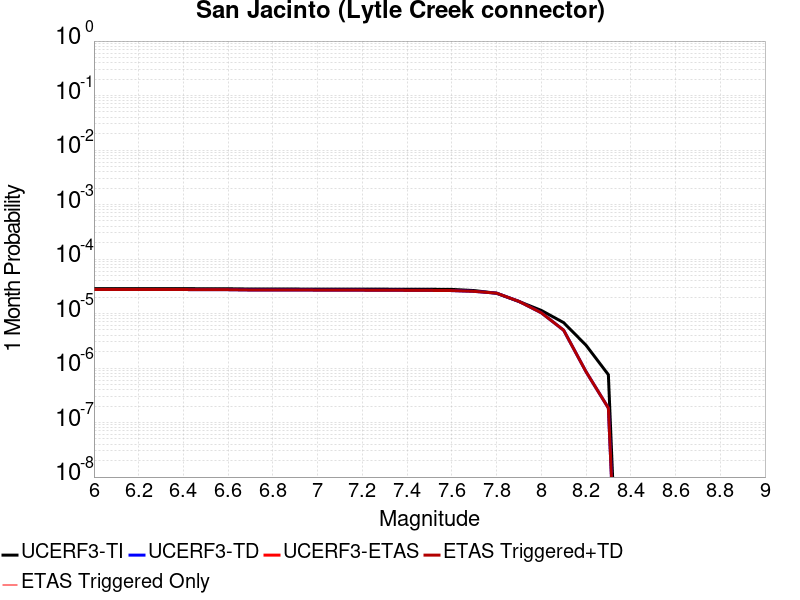 |  | 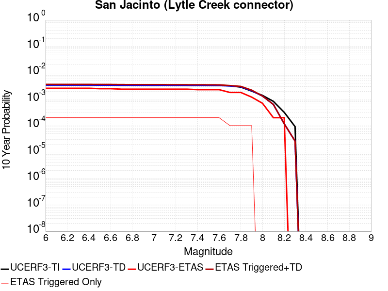 |

| Magnitude | 1 wk TI Prob | 1 wk TD Prob | 1 wk ETAS Prob | 1 wk ETAS/TD Gain | 1 wk ETAS Triggered+TD | 1 wk ETAS Triggered Only | 1 mo TI Prob | 1 mo TD Prob | 1 mo ETAS Prob | 1 mo ETAS/TD Gain | 1 mo ETAS Triggered+TD | 1 mo ETAS Triggered Only | 1 yr TI Prob | 1 yr TD Prob | 1 yr ETAS Prob | 1 yr ETAS/TD Gain | 1 yr ETAS Triggered+TD | 1 yr ETAS Triggered Only | 10 yr TI Prob | 10 yr TD Prob | 10 yr ETAS Prob | 10 yr ETAS/TD Gain | 10 yr ETAS Triggered+TD | 10 yr ETAS Triggered Only |
|-----|-----|-----|-----|-----|-----|-----|-----|-----|-----|-----|-----|-----|-----|-----|-----|-----|-----|-----|-----|-----|-----|-----|-----|-----|
| 6.0 | 6.693995E-6 | 6.4251267E-6 | 0.0 | 0.0 | 6.4251267E-6 | 0.0 | 2.8688235E-5 | 2.7535965E-5 | 0.0 | 0.0 | 2.7535965E-5 | 0.0 | 3.492233E-4 | 3.3519889E-4 | 2.0E-4 | 0.5966607 | 3.3519889E-4 | 0.0 | 0.00348675 | 0.0034272496 | 0.0026 | 0.7586258 | 0.003626564 | 2.0E-4 |
| 6.1 | 6.693995E-6 | 6.4251267E-6 | 0.0 | 0.0 | 6.4251267E-6 | 0.0 | 2.8688235E-5 | 2.7535965E-5 | 0.0 | 0.0 | 2.7535965E-5 | 0.0 | 3.492233E-4 | 3.3519889E-4 | 2.0E-4 | 0.5966607 | 3.3519889E-4 | 0.0 | 0.00348675 | 0.0034272496 | 0.0026 | 0.7586258 | 0.003626564 | 2.0E-4 |
| 6.2 | 6.693995E-6 | 6.4251267E-6 | 0.0 | 0.0 | 6.4251267E-6 | 0.0 | 2.8688235E-5 | 2.7535965E-5 | 0.0 | 0.0 | 2.7535965E-5 | 0.0 | 3.492233E-4 | 3.3519889E-4 | 2.0E-4 | 0.5966607 | 3.3519889E-4 | 0.0 | 0.00348675 | 0.0034272496 | 0.0026 | 0.7586258 | 0.003626564 | 2.0E-4 |
| 6.3 | 6.693995E-6 | 6.4251267E-6 | 0.0 | 0.0 | 6.4251267E-6 | 0.0 | 2.8688235E-5 | 2.7535965E-5 | 0.0 | 0.0 | 2.7535965E-5 | 0.0 | 3.492233E-4 | 3.3519889E-4 | 2.0E-4 | 0.5966607 | 3.3519889E-4 | 0.0 | 0.00348675 | 0.0034272496 | 0.0026 | 0.7586258 | 0.003626564 | 2.0E-4 |
| 6.4 | 6.693995E-6 | 6.4251267E-6 | 0.0 | 0.0 | 6.4251267E-6 | 0.0 | 2.8688235E-5 | 2.7535965E-5 | 0.0 | 0.0 | 2.7535965E-5 | 0.0 | 3.492233E-4 | 3.3519889E-4 | 2.0E-4 | 0.5966607 | 3.3519889E-4 | 0.0 | 0.00348675 | 0.0034272496 | 0.0026 | 0.7586258 | 0.003626564 | 2.0E-4 |
| 6.5 | 6.6561875E-6 | 6.3853663E-6 | 0.0 | 0.0 | 6.3853663E-6 | 0.0 | 2.8526205E-5 | 2.7365568E-5 | 0.0 | 0.0 | 2.7365568E-5 | 0.0 | 3.472512E-4 | 3.3312495E-4 | 2.0E-4 | 0.60037535 | 3.3312495E-4 | 0.0 | 0.0034670907 | 0.0034065738 | 0.0025 | 0.7338752 | 0.0036058924 | 2.0E-4 |
| 6.6 | 6.6561875E-6 | 6.3853663E-6 | 0.0 | 0.0 | 6.3853663E-6 | 0.0 | 2.8526205E-5 | 2.7365568E-5 | 0.0 | 0.0 | 2.7365568E-5 | 0.0 | 3.472512E-4 | 3.3312495E-4 | 2.0E-4 | 0.60037535 | 3.3312495E-4 | 0.0 | 0.0034670907 | 0.0034065738 | 0.0025 | 0.7338752 | 0.0036058924 | 2.0E-4 |
| 6.7 | 6.5802237E-6 | 6.304594E-6 | 0.0 | 0.0 | 6.304594E-6 | 0.0 | 2.8200653E-5 | 2.7019409E-5 | 0.0 | 0.0 | 2.7019409E-5 | 0.0 | 3.4328885E-4 | 3.289117E-4 | 2.0E-4 | 0.6080659 | 3.289117E-4 | 0.0 | 0.0034275902 | 0.0033645695 | 0.0024 | 0.7133156 | 0.0035638965 | 2.0E-4 |
| 6.8 | 6.575632E-6 | 6.2990957E-6 | 0.0 | 0.0 | 6.2990957E-6 | 0.0 | 2.8180975E-5 | 2.6995844E-5 | 0.0 | 0.0 | 2.6995844E-5 | 0.0 | 3.4304935E-4 | 3.286249E-4 | 2.0E-4 | 0.6085966 | 3.286249E-4 | 0.0 | 0.0034252026 | 0.00336171 | 0.0024 | 0.7139223 | 0.0035610378 | 2.0E-4 |
| 6.9 | 6.570433E-6 | 6.290521E-6 | 0.0 | 0.0 | 6.290521E-6 | 0.0 | 2.8158694E-5 | 2.6959096E-5 | 0.0 | 0.0 | 2.6959096E-5 | 0.0 | 3.4277816E-4 | 3.2817764E-4 | 2.0E-4 | 0.609426 | 3.2817764E-4 | 0.0 | 0.0034224992 | 0.003357251 | 0.0024 | 0.7148706 | 0.0035565796 | 2.0E-4 |
| 7.0 | 6.5643826E-6 | 6.2806785E-6 | 0.0 | 0.0 | 6.2806785E-6 | 0.0 | 2.8132765E-5 | 2.6916916E-5 | 0.0 | 0.0 | 2.6916916E-5 | 0.0 | 3.424626E-4 | 3.2766422E-4 | 2.0E-4 | 0.61038095 | 3.2766422E-4 | 0.0 | 0.0034193532 | 0.0033521326 | 0.0024 | 0.7159621 | 0.0035514622 | 2.0E-4 |
| 7.1 | 6.557402E-6 | 6.269428E-6 | 0.0 | 0.0 | 6.269428E-6 | 0.0 | 2.8102848E-5 | 2.68687E-5 | 0.0 | 0.0 | 2.68687E-5 | 0.0 | 3.4209844E-4 | 3.2707737E-4 | 2.0E-4 | 0.61147606 | 3.2707737E-4 | 0.0 | 0.0034157229 | 0.0033462825 | 0.0024 | 0.7172138 | 0.0035456133 | 2.0E-4 |
| 7.2 | 6.546394E-6 | 6.251467E-6 | 0.0 | 0.0 | 6.251467E-6 | 0.0 | 2.8055672E-5 | 2.6791728E-5 | 0.0 | 0.0 | 2.6791728E-5 | 0.0 | 3.4152428E-4 | 3.2614052E-4 | 2.0E-4 | 0.6132326 | 3.2614052E-4 | 0.0 | 0.0034099987 | 0.003336947 | 0.0024 | 0.7192203 | 0.0035362798 | 2.0E-4 |
| 7.3 | 6.5364216E-6 | 6.232396E-6 | 0.0 | 0.0 | 6.232396E-6 | 0.0 | 2.8012933E-5 | 2.6709997E-5 | 0.0 | 0.0 | 2.6709997E-5 | 0.0 | 3.4100408E-4 | 3.2514575E-4 | 2.0E-4 | 0.6151088 | 3.2514575E-4 | 0.0 | 0.003404813 | 0.003327043 | 0.0024 | 0.7213613 | 0.0035263777 | 2.0E-4 |
| 7.4 | 6.5269523E-6 | 6.2136583E-6 | 0.0 | 0.0 | 6.2136583E-6 | 0.0 | 2.7972354E-5 | 2.6629692E-5 | 0.0 | 0.0 | 2.6629692E-5 | 0.0 | 3.4051016E-4 | 3.2416833E-4 | 2.0E-4 | 0.6169634 | 3.2416833E-4 | 0.0 | 0.0033998888 | 0.003317309 | 0.0023 | 0.693333 | 0.0035166456 | 2.0E-4 |
| 7.5 | 6.5111835E-6 | 6.190141E-6 | 0.0 | 0.0 | 6.190141E-6 | 0.0 | 2.7904773E-5 | 2.6528907E-5 | 0.0 | 0.0 | 2.6528907E-5 | 0.0 | 3.3968766E-4 | 3.2294163E-4 | 2.0E-4 | 0.6193069 | 3.2294163E-4 | 0.0 | 0.0033916887 | 0.0033050892 | 0.0023 | 0.6958965 | 0.0035044283 | 2.0E-4 |
| 7.6 | 6.4768806E-6 | 6.1496025E-6 | 0.0 | 0.0 | 6.1496025E-6 | 0.0 | 2.7757764E-5 | 2.6355174E-5 | 0.0 | 0.0 | 2.6355174E-5 | 0.0 | 3.3789838E-4 | 3.2082706E-4 | 2.0E-4 | 0.6233888 | 3.2082706E-4 | 0.0 | 0.0033738504 | 0.0032839996 | 0.0023 | 0.7003655 | 0.0034833427 | 2.0E-4 |
| 7.7 | 6.1655364E-6 | 5.9450176E-6 | 0.0 | 0.0 | 5.9450176E-6 | 0.0 | 2.642346E-5 | 2.5478399E-5 | 0.0 | 0.0 | 2.5478399E-5 | 0.0 | 3.2165812E-4 | 3.1015542E-4 | 2.0E-4 | 0.64483804 | 3.1015542E-4 | 0.0 | 0.0032119295 | 0.0031771415 | 0.0018 | 0.566547 | 0.0032768238 | 1.0E-4 |
| 7.8 | 5.5043524E-6 | 5.513173E-6 | 0.0 | 0.0 | 5.513173E-6 | 0.0 | 2.3589868E-5 | 2.362767E-5 | 0.0 | 0.0 | 2.362767E-5 | 0.0 | 2.871688E-4 | 2.8762897E-4 | 2.0E-4 | 0.6953403 | 2.8762897E-4 | 0.0 | 0.0028679797 | 0.002950916 | 0.0018 | 0.60998005 | 0.0030506211 | 1.0E-4 |
| 7.9 | 3.889249E-6 | 3.893841E-6 | 0.0 | 0.0 | 3.893841E-6 | 0.0 | 1.6668104E-5 | 1.6687783E-5 | 0.0 | 0.0 | 1.6687783E-5 | 0.0 | 2.0291525E-4 | 2.0315485E-4 | 2.0E-4 | 0.9844707 | 2.0315485E-4 | 0.0 | 0.0020273007 | 0.002098645 | 0.0012 | 0.5717975 | 0.0021984351 | 1.0E-4 |
| 8.0 | 2.668535E-6 | 2.4034314E-6 | 0.0 | 0.0 | 2.4034314E-6 | 0.0 | 1.1436528E-5 | 1.03003795E-5 | 0.0 | 0.0 | 1.03003795E-5 | 0.0 | 1.3923083E-4 | 1.2539992E-4 | 2.0E-4 | 1.5948973 | 1.2539992E-4 | 0.0 | 0.0013914363 | 0.0013079548 | 7.0E-4 | 0.5351867 | 0.0013079548 | 0.0 |
| 8.1 | 1.5911459E-6 | 1.1496724E-6 | 0.0 | 0.0 | 1.1496724E-6 | 0.0 | 6.8191785E-6 | 4.927158E-6 | 0.0 | 0.0 | 4.927158E-6 | 0.0 | 8.3020335E-5 | 5.9986516E-5 | 1.0E-4 | 1.6670413 | 5.9986516E-5 | 0.0 | 8.298933E-4 | 6.322829E-4 | 2.0E-4 | 0.3163141 | 6.322829E-4 | 0.0 |
| 8.2 | 6.1294963E-7 | 1.9759129E-7 | 0.0 | 0.0 | 1.9759129E-7 | 0.0 | 2.6269242E-6 | 8.4681955E-7 | 0.0 | 0.0 | 8.4681955E-7 | 0.0 | 3.1982334E-5 | 1.0309979E-5 | 1.0E-4 | 9.699341 | 1.0309979E-5 | 0.0 | 3.1977732E-4 | 1.16282965E-4 | 2.0E-4 | 1.7199423 | 1.16282965E-4 | 0.0 |
| 8.3 | 1.762871E-7 | 4.245016E-8 | 0.0 | 0.0 | 4.245016E-8 | 0.0 | 7.5551594E-7 | 1.8192925E-7 | 0.0 | 0.0 | 1.8192925E-7 | 0.0 | 9.1983675E-6 | 2.2149864E-6 | 0.0 | 0.0 | 2.2149864E-6 | 0.0 | 9.197987E-5 | 2.5753252E-5 | 0.0 | 0.0 | 2.5753252E-5 | 0.0 |

## Silver Creek 2011 CFM
*[(top)](#table-of-contents)*

| 1 Week | 1 Month | 1 Year | 10 Year |
|-----|-----|-----|-----|
| 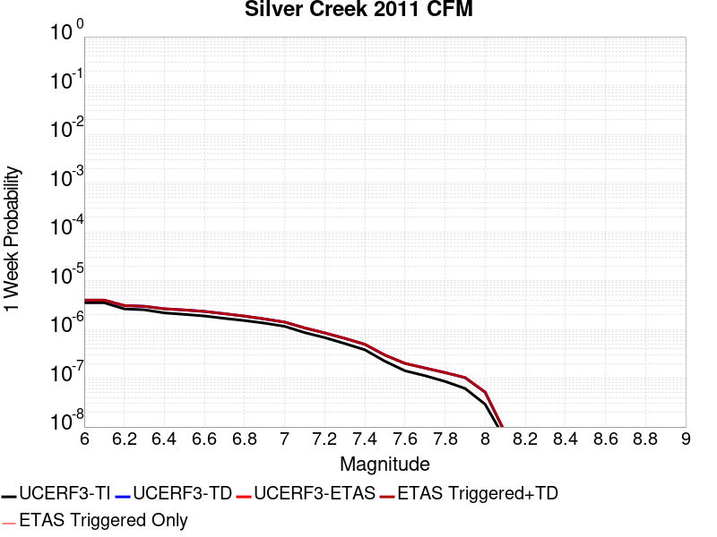 |  |  |  |

| Magnitude | 1 wk TI Prob | 1 wk TD Prob | 1 wk ETAS Prob | 1 wk ETAS/TD Gain | 1 wk ETAS Triggered+TD | 1 wk ETAS Triggered Only | 1 mo TI Prob | 1 mo TD Prob | 1 mo ETAS Prob | 1 mo ETAS/TD Gain | 1 mo ETAS Triggered+TD | 1 mo ETAS Triggered Only | 1 yr TI Prob | 1 yr TD Prob | 1 yr ETAS Prob | 1 yr ETAS/TD Gain | 1 yr ETAS Triggered+TD | 1 yr ETAS Triggered Only | 10 yr TI Prob | 10 yr TD Prob | 10 yr ETAS Prob | 10 yr ETAS/TD Gain | 10 yr ETAS Triggered+TD | 10 yr ETAS Triggered Only |
|-----|-----|-----|-----|-----|-----|-----|-----|-----|-----|-----|-----|-----|-----|-----|-----|-----|-----|-----|-----|-----|-----|-----|-----|-----|
| 6.0 | 3.5229125E-6 | 3.9729434E-6 | 0.0 | 0.0 | 3.9729434E-6 | 0.0 | 1.5098109E-5 | 1.7026792E-5 | 0.0 | 0.0 | 1.7026792E-5 | 0.0 | 1.8380396E-4 | 2.0728185E-4 | 2.0E-4 | 0.9648698 | 3.0726113E-4 | 1.0E-4 | 0.0018365202 | 0.0020712514 | 0.0013 | 0.6276399 | 0.002270837 | 2.0E-4 |
| 6.1 | 3.5229125E-6 | 3.9729434E-6 | 0.0 | 0.0 | 3.9729434E-6 | 0.0 | 1.5098109E-5 | 1.7026792E-5 | 0.0 | 0.0 | 1.7026792E-5 | 0.0 | 1.8380396E-4 | 2.0728185E-4 | 2.0E-4 | 0.9648698 | 3.0726113E-4 | 1.0E-4 | 0.0018365202 | 0.0020712514 | 0.0013 | 0.6276399 | 0.002270837 | 2.0E-4 |
| 6.2 | 2.6363234E-6 | 3.0754463E-6 | 0.0 | 0.0 | 3.0754463E-6 | 0.0 | 1.129848E-5 | 1.3180418E-5 | 0.0 | 0.0 | 1.3180418E-5 | 0.0 | 1.375503E-4 | 1.6045984E-4 | 2.0E-4 | 1.2464179 | 2.6044378E-4 | 1.0E-4 | 0.0013746519 | 0.0016037752 | 0.001 | 0.6235288 | 0.0018034544 | 2.0E-4 |
| 6.3 | 2.5275126E-6 | 2.9651017E-6 | 0.0 | 0.0 | 2.9651017E-6 | 0.0 | 1.0832152E-5 | 1.2707517E-5 | 0.0 | 0.0 | 1.2707517E-5 | 0.0 | 1.3187347E-4 | 1.5470308E-4 | 2.0E-4 | 1.292799 | 2.5468762E-4 | 1.0E-4 | 0.0013179524 | 0.0015462884 | 0.001 | 0.6467099 | 0.0017459792 | 2.0E-4 |
| 6.4 | 2.178732E-6 | 2.6362497E-6 | 0.0 | 0.0 | 2.6362497E-6 | 0.0 | 9.337389E-6 | 1.1298165E-5 | 0.0 | 0.0 | 1.1298165E-5 | 0.0 | 1.1367678E-4 | 1.375465E-4 | 1.0E-4 | 0.7270268 | 2.3753275E-4 | 1.0E-4 | 0.0011361865 | 0.0013749459 | 8.0E-4 | 0.5818411 | 0.0014748083 | 1.0E-4 |
| 6.5 | 2.0341574E-6 | 2.4954852E-6 | 0.0 | 0.0 | 2.4954852E-6 | 0.0 | 8.717788E-6 | 1.0694893E-5 | 0.0 | 0.0 | 1.0694893E-5 | 0.0 | 1.061339E-4 | 1.3020256E-4 | 1.0E-4 | 0.768034 | 2.3018954E-4 | 1.0E-4 | 0.0010608323 | 0.0013015944 | 8.0E-4 | 0.61463076 | 0.0014014643 | 1.0E-4 |
| 6.6 | 1.8856827E-6 | 2.3277084E-6 | 0.0 | 0.0 | 2.3277084E-6 | 0.0 | 8.0814725E-6 | 9.975855E-6 | 0.0 | 0.0 | 9.975855E-6 | 0.0 | 9.838748E-5 | 1.2144929E-4 | 1.0E-4 | 0.82338893 | 2.2143715E-4 | 1.0E-4 | 9.834393E-4 | 0.0012141604 | 8.0E-4 | 0.6588915 | 0.001314039 | 1.0E-4 |
| 6.7 | 1.6844668E-6 | 2.087264E-6 | 0.0 | 0.0 | 2.087264E-6 | 0.0 | 7.2191233E-6 | 8.945386E-6 | 0.0 | 0.0 | 8.945386E-6 | 0.0 | 8.788928E-5 | 1.0890465E-4 | 1.0E-4 | 0.91823447 | 2.0889376E-4 | 1.0E-4 | 8.785453E-4 | 0.0010888433 | 7.0E-4 | 0.6428841 | 0.0011887344 | 1.0E-4 |
| 6.8 | 1.5177161E-6 | 1.8649915E-6 | 0.0 | 0.0 | 1.8649915E-6 | 0.0 | 6.504481E-6 | 7.992796E-6 | 0.0 | 0.0 | 7.992796E-6 | 0.0 | 7.918918E-5 | 9.730796E-5 | 1.0E-4 | 1.0276651 | 1.9729823E-4 | 1.0E-4 | 7.9160964E-4 | 9.7298354E-4 | 7.0E-4 | 0.71943665 | 0.0010728862 | 1.0E-4 |
| 6.9 | 1.3437394E-6 | 1.6285475E-6 | 0.0 | 0.0 | 1.6285475E-6 | 0.0 | 5.7588704E-6 | 6.9794705E-6 | 0.0 | 0.0 | 6.9794705E-6 | 0.0 | 7.011199E-5 | 8.497175E-5 | 1.0E-4 | 1.1768618 | 1.8496325E-4 | 1.0E-4 | 7.0089876E-4 | 8.497221E-4 | 6.0E-4 | 0.7061132 | 9.4963715E-4 | 1.0E-4 |
| 7.0 | 1.1563575E-6 | 1.4059393E-6 | 0.0 | 0.0 | 1.4059393E-6 | 0.0 | 4.9558084E-6 | 6.02544E-6 | 0.0 | 0.0 | 6.02544E-6 | 0.0 | 6.03353E-5 | 7.335727E-5 | 1.0E-4 | 1.3631914 | 1.7334994E-4 | 1.0E-4 | 6.0318917E-4 | 7.3366E-4 | 3.0E-4 | 0.40890875 | 8.335866E-4 | 1.0E-4 |
| 7.1 | 8.602183E-7 | 1.066756E-6 | 0.0 | 0.0 | 1.066756E-6 | 0.0 | 3.6866445E-6 | 4.5718034E-6 | 0.0 | 0.0 | 4.5718034E-6 | 0.0 | 4.4883975E-5 | 5.5660286E-5 | 1.0E-4 | 1.7966132 | 1.5565472E-4 | 1.0E-4 | 4.4874908E-4 | 5.567927E-4 | 1.0E-4 | 0.17960005 | 6.56737E-4 | 1.0E-4 |
| 7.2 | 6.788407E-7 | 8.423095E-7 | 0.0 | 0.0 | 8.423095E-7 | 0.0 | 2.9093142E-6 | 3.6098927E-6 | 0.0 | 0.0 | 3.6098927E-6 | 0.0 | 3.5420322E-5 | 4.394956E-5 | 0.0 | 0.0 | 4.394956E-5 | 0.0 | 3.541468E-4 | 4.3973792E-4 | 0.0 | 0.0 | 4.3973792E-4 | 0.0 |
| 7.3 | 5.1292045E-7 | 6.5255654E-7 | 0.0 | 0.0 | 6.5255654E-7 | 0.0 | 2.1982287E-6 | 2.7966678E-6 | 0.0 | 0.0 | 2.7966678E-6 | 0.0 | 2.6763106E-5 | 3.40489E-5 | 0.0 | 0.0 | 3.40489E-5 | 0.0 | 2.6759884E-4 | 3.4076607E-4 | 0.0 | 0.0 | 3.4076607E-4 | 0.0 |
| 7.4 | 3.820994E-7 | 4.924713E-7 | 0.0 | 0.0 | 4.924713E-7 | 0.0 | 1.6375678E-6 | 2.1105898E-6 | 0.0 | 0.0 | 2.1105898E-6 | 0.0 | 1.9937206E-5 | 2.5696127E-5 | 0.0 | 0.0 | 2.5696127E-5 | 0.0 | 1.9935417E-4 | 2.572608E-4 | 0.0 | 0.0 | 2.572608E-4 | 0.0 |
| 7.5 | 2.2292595E-7 | 2.960106E-7 | 0.0 | 0.0 | 2.960106E-7 | 0.0 | 9.553966E-7 | 1.2686162E-6 | 0.0 | 0.0 | 1.2686162E-6 | 0.0 | 1.16318915E-5 | 1.5445294E-5 | 0.0 | 0.0 | 1.5445294E-5 | 0.0 | 1.16312825E-4 | 1.5477142E-4 | 0.0 | 0.0 | 1.5477142E-4 | 0.0 |
| 7.6 | 1.420587E-7 | 2.001469E-7 | 0.0 | 0.0 | 2.001469E-7 | 0.0 | 6.088228E-7 | 8.5777214E-7 | 0.0 | 0.0 | 8.5777214E-7 | 0.0 | 7.4123927E-6 | 1.0443326E-5 | 0.0 | 0.0 | 1.0443326E-5 | 0.0 | 7.412145E-5 | 1.04757826E-4 | 0.0 | 0.0 | 1.04757826E-4 | 0.0 |
| 7.7 | 1.1250075E-7 | 1.6066531E-7 | 0.0 | 0.0 | 1.6066531E-7 | 0.0 | 4.82146E-7 | 6.885654E-7 | 0.0 | 0.0 | 6.885654E-7 | 0.0 | 5.8701116E-6 | 8.383252E-6 | 0.0 | 0.0 | 8.383252E-6 | 0.0 | 5.8699567E-5 | 8.415408E-5 | 0.0 | 0.0 | 8.415408E-5 | 0.0 |
| 7.8 | 8.592761E-8 | 1.2969757E-7 | 0.0 | 0.0 | 1.2969757E-7 | 0.0 | 3.682611E-7 | 5.558466E-7 | 0.0 | 0.0 | 5.558466E-7 | 0.0 | 4.48357E-6 | 6.7674114E-6 | 0.0 | 0.0 | 6.7674114E-6 | 0.0 | 4.4834796E-5 | 6.798567E-5 | 0.0 | 0.0 | 6.798567E-5 | 0.0 |
| 7.9 | 6.156529E-8 | 1.0229637E-7 | 0.0 | 0.0 | 1.0229637E-7 | 0.0 | 2.638512E-7 | 4.3841294E-7 | 0.0 | 0.0 | 4.3841294E-7 | 0.0 | 3.212384E-6 | 5.3376643E-6 | 0.0 | 0.0 | 5.3376643E-6 | 0.0 | 3.2123375E-5 | 5.3643587E-5 | 0.0 | 0.0 | 5.3643587E-5 | 0.0 |
| 8.0 | 2.9230547E-8 | 5.148457E-8 | 0.0 | 0.0 | 5.148457E-8 | 0.0 | 1.2527377E-7 | 2.2064815E-7 | 0.0 | 0.0 | 2.2064815E-7 | 0.0 | 1.525207E-6 | 2.686388E-6 | 0.0 | 0.0 | 2.686388E-6 | 0.0 | 1.5251966E-5 | 2.7000919E-5 | 0.0 | 0.0 | 2.7000919E-5 | 0.0 |
| 8.1 | 5.6062213E-9 | 7.553767E-9 | 0.0 | 0.0 | 7.553767E-9 | 0.0 | 2.4026663E-8 | 3.2373286E-8 | 0.0 | 0.0 | 3.2373286E-8 | 0.0 | 2.925246E-7 | 3.941447E-7 | 0.0 | 0.0 | 3.941447E-7 | 0.0 | 2.925242E-6 | 3.9794677E-6 | 0.0 | 0.0 | 3.9794677E-6 | 0.0 |

## Tin Mountain
*[(top)](#table-of-contents)*

| 1 Week | 1 Month | 1 Year | 10 Year |
|-----|-----|-----|-----|
|  |  |  |  |

| Magnitude | 1 wk TI Prob | 1 wk TD Prob | 1 wk ETAS Prob | 1 wk ETAS/TD Gain | 1 wk ETAS Triggered+TD | 1 wk ETAS Triggered Only | 1 mo TI Prob | 1 mo TD Prob | 1 mo ETAS Prob | 1 mo ETAS/TD Gain | 1 mo ETAS Triggered+TD | 1 mo ETAS Triggered Only | 1 yr TI Prob | 1 yr TD Prob | 1 yr ETAS Prob | 1 yr ETAS/TD Gain | 1 yr ETAS Triggered+TD | 1 yr ETAS Triggered Only | 10 yr TI Prob | 10 yr TD Prob | 10 yr ETAS Prob | 10 yr ETAS/TD Gain | 10 yr ETAS Triggered+TD | 10 yr ETAS Triggered Only |
|-----|-----|-----|-----|-----|-----|-----|-----|-----|-----|-----|-----|-----|-----|-----|-----|-----|-----|-----|-----|-----|-----|-----|-----|-----|
| 6.0 | 4.083776E-6 | 4.1804883E-6 | 0.0 | 0.0 | 4.1804883E-6 | 0.0 | 1.750178E-5 | 1.7916278E-5 | 0.0 | 0.0 | 1.7916278E-5 | 0.0 | 2.1306332E-4 | 2.1811256E-4 | 0.0 | 0.0 | 2.1811256E-4 | 0.0 | 0.0021285915 | 0.0021793505 | 0.001 | 0.45885232 | 0.0023789145 | 2.0E-4 |
| 6.1 | 4.083776E-6 | 4.1804883E-6 | 0.0 | 0.0 | 4.1804883E-6 | 0.0 | 1.750178E-5 | 1.7916278E-5 | 0.0 | 0.0 | 1.7916278E-5 | 0.0 | 2.1306332E-4 | 2.1811256E-4 | 0.0 | 0.0 | 2.1811256E-4 | 0.0 | 0.0021285915 | 0.0021793505 | 0.001 | 0.45885232 | 0.0023789145 | 2.0E-4 |
| 6.2 | 4.083776E-6 | 4.1804883E-6 | 0.0 | 0.0 | 4.1804883E-6 | 0.0 | 1.750178E-5 | 1.7916278E-5 | 0.0 | 0.0 | 1.7916278E-5 | 0.0 | 2.1306332E-4 | 2.1811256E-4 | 0.0 | 0.0 | 2.1811256E-4 | 0.0 | 0.0021285915 | 0.0021793505 | 0.001 | 0.45885232 | 0.0023789145 | 2.0E-4 |
| 6.3 | 4.083776E-6 | 4.1804883E-6 | 0.0 | 0.0 | 4.1804883E-6 | 0.0 | 1.750178E-5 | 1.7916278E-5 | 0.0 | 0.0 | 1.7916278E-5 | 0.0 | 2.1306332E-4 | 2.1811256E-4 | 0.0 | 0.0 | 2.1811256E-4 | 0.0 | 0.0021285915 | 0.0021793505 | 0.001 | 0.45885232 | 0.0023789145 | 2.0E-4 |
| 6.4 | 4.083776E-6 | 4.1804883E-6 | 0.0 | 0.0 | 4.1804883E-6 | 0.0 | 1.750178E-5 | 1.7916278E-5 | 0.0 | 0.0 | 1.7916278E-5 | 0.0 | 2.1306332E-4 | 2.1811256E-4 | 0.0 | 0.0 | 2.1811256E-4 | 0.0 | 0.0021285915 | 0.0021793505 | 0.001 | 0.45885232 | 0.0023789145 | 2.0E-4 |
| 6.5 | 2.3143427E-6 | 2.3725247E-6 | 0.0 | 0.0 | 2.3725247E-6 | 0.0 | 9.9185745E-6 | 1.0167928E-5 | 0.0 | 0.0 | 1.0167928E-5 | 0.0 | 1.2075195E-4 | 1.2378825E-4 | 0.0 | 0.0 | 1.2378825E-4 | 0.0 | 0.0012068636 | 0.0012372689 | 6.0E-4 | 0.48493904 | 0.0014370215 | 2.0E-4 |
| 6.6 | 2.3143427E-6 | 2.3725247E-6 | 0.0 | 0.0 | 2.3725247E-6 | 0.0 | 9.9185745E-6 | 1.0167928E-5 | 0.0 | 0.0 | 1.0167928E-5 | 0.0 | 1.2075195E-4 | 1.2378825E-4 | 0.0 | 0.0 | 1.2378825E-4 | 0.0 | 0.0012068636 | 0.0012372689 | 6.0E-4 | 0.48493904 | 0.0014370215 | 2.0E-4 |
| 6.7 | 1.7029532E-6 | 1.7492865E-6 | 0.0 | 0.0 | 1.7492865E-6 | 0.0 | 7.2983503E-6 | 7.4969234E-6 | 0.0 | 0.0 | 7.4969234E-6 | 0.0 | 8.885379E-5 | 9.127176E-5 | 0.0 | 0.0 | 9.127176E-5 | 0.0 | 8.881827E-4 | 9.123953E-4 | 5.0E-4 | 0.5480081 | 0.0011122129 | 2.0E-4 |
| 6.8 | 1.2914646E-6 | 1.329522E-6 | 0.0 | 0.0 | 1.329522E-6 | 0.0 | 5.534837E-6 | 5.6979416E-6 | 0.0 | 0.0 | 5.6979416E-6 | 0.0 | 6.738455E-5 | 6.937067E-5 | 0.0 | 0.0 | 6.937067E-5 | 0.0 | 6.736412E-4 | 6.9353345E-4 | 4.0E-4 | 0.5767566 | 8.9339475E-4 | 2.0E-4 |
| 6.9 | 5.8708974E-7 | 6.114311E-7 | 0.0 | 0.0 | 6.114311E-7 | 0.0 | 2.5160964E-6 | 2.6204166E-6 | 0.0 | 0.0 | 2.6204166E-6 | 0.0 | 3.0633044E-5 | 3.190315E-5 | 0.0 | 0.0 | 3.190315E-5 | 0.0 | 3.0628822E-4 | 3.189898E-4 | 3.0E-4 | 0.94046897 | 4.1895788E-4 | 1.0E-4 |
| 7.0 | 4.6248786E-7 | 4.829753E-7 | 0.0 | 0.0 | 4.829753E-7 | 0.0 | 1.9820893E-6 | 2.0698926E-6 | 0.0 | 0.0 | 2.0698926E-6 | 0.0 | 2.413167E-5 | 2.5200687E-5 | 0.0 | 0.0 | 2.5200687E-5 | 0.0 | 2.412905E-4 | 2.5198198E-4 | 1.0E-4 | 0.39685377 | 3.5195678E-4 | 1.0E-4 |
| 7.1 | 3.804606E-7 | 3.9851489E-7 | 0.0 | 0.0 | 3.9851489E-7 | 0.0 | 1.6305444E-6 | 1.70792E-6 | 0.0 | 0.0 | 1.70792E-6 | 0.0 | 1.9851697E-5 | 2.0793761E-5 | 0.0 | 0.0 | 2.0793761E-5 | 0.0 | 1.9849923E-4 | 2.0792152E-4 | 0.0 | 0.0 | 2.0792152E-4 | 0.0 |
| 7.2 | 3.5864858E-7 | 3.7597673E-7 | 0.0 | 0.0 | 3.7597673E-7 | 0.0 | 1.5370645E-6 | 1.611328E-6 | 0.0 | 0.0 | 1.611328E-6 | 0.0 | 1.87136E-5 | 1.9617775E-5 | 0.0 | 0.0 | 1.9617775E-5 | 0.0 | 1.8712023E-4 | 1.9616375E-4 | 0.0 | 0.0 | 1.9616375E-4 | 0.0 |
| 7.3 | 3.342063E-7 | 3.5045474E-7 | 0.0 | 0.0 | 3.5045474E-7 | 0.0 | 1.4323119E-6 | 1.5019482E-6 | 0.0 | 0.0 | 1.5019482E-6 | 0.0 | 1.7438259E-5 | 1.8286099E-5 | 0.0 | 0.0 | 1.8286099E-5 | 0.0 | 1.743689E-4 | 1.8284924E-4 | 0.0 | 0.0 | 1.8284924E-4 | 0.0 |
| 7.4 | 2.971242E-7 | 3.11499E-7 | 0.0 | 0.0 | 3.11499E-7 | 0.0 | 1.2733886E-6 | 1.3349952E-6 | 0.0 | 0.0 | 1.3349952E-6 | 0.0 | 1.5503398E-5 | 1.625348E-5 | 0.0 | 0.0 | 1.625348E-5 | 0.0 | 1.5502315E-4 | 1.6252618E-4 | 0.0 | 0.0 | 1.6252618E-4 | 0.0 |
| 7.5 | 1.4326713E-7 | 1.5005024E-7 | 0.0 | 0.0 | 1.5005024E-7 | 0.0 | 6.140018E-7 | 6.4307244E-7 | 0.0 | 0.0 | 6.4307244E-7 | 0.0 | 7.4754466E-6 | 7.829407E-6 | 0.0 | 0.0 | 7.829407E-6 | 0.0 | 7.475195E-5 | 7.829407E-5 | 0.0 | 0.0 | 7.829407E-5 | 0.0 |

## Channel Islands Western Deep Ramp
*[(top)](#table-of-contents)*

| 1 Week | 1 Month | 1 Year | 10 Year |
|-----|-----|-----|-----|
| 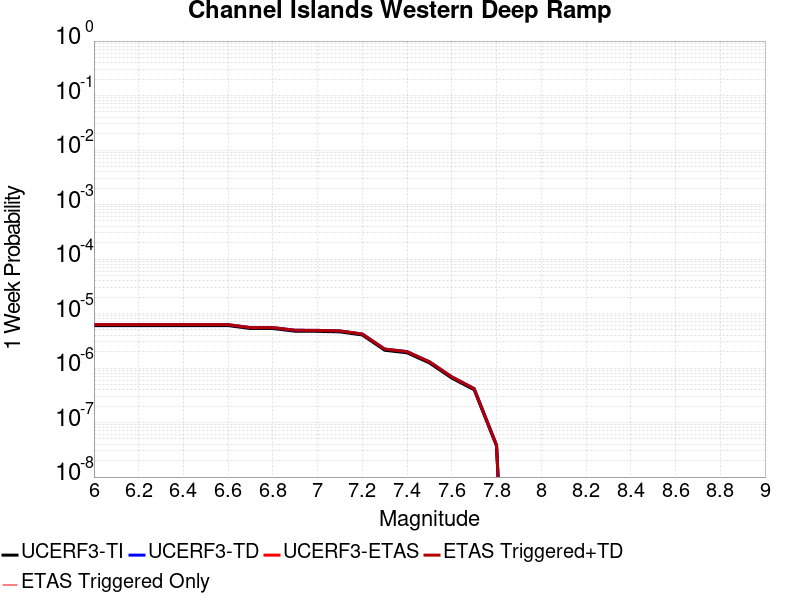 |  |  | 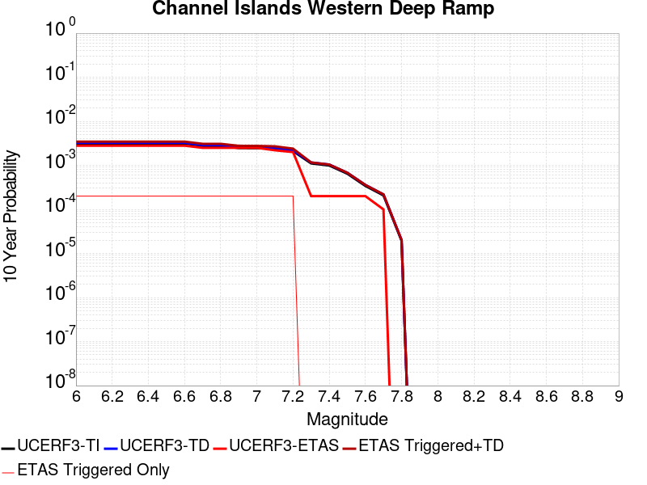 |

| Magnitude | 1 wk TI Prob | 1 wk TD Prob | 1 wk ETAS Prob | 1 wk ETAS/TD Gain | 1 wk ETAS Triggered+TD | 1 wk ETAS Triggered Only | 1 mo TI Prob | 1 mo TD Prob | 1 mo ETAS Prob | 1 mo ETAS/TD Gain | 1 mo ETAS Triggered+TD | 1 mo ETAS Triggered Only | 1 yr TI Prob | 1 yr TD Prob | 1 yr ETAS Prob | 1 yr ETAS/TD Gain | 1 yr ETAS Triggered+TD | 1 yr ETAS Triggered Only | 10 yr TI Prob | 10 yr TD Prob | 10 yr ETAS Prob | 10 yr ETAS/TD Gain | 10 yr ETAS Triggered+TD | 10 yr ETAS Triggered Only |
|-----|-----|-----|-----|-----|-----|-----|-----|-----|-----|-----|-----|-----|-----|-----|-----|-----|-----|-----|-----|-----|-----|-----|-----|-----|
| 6.0 | 6.0213506E-6 | 6.25233E-6 | 0.0 | 0.0 | 6.25233E-6 | 0.0 | 2.5805533E-5 | 2.679545E-5 | 0.0 | 0.0 | 2.679545E-5 | 0.0 | 3.1413708E-4 | 3.2619023E-4 | 3.0E-4 | 0.9197087 | 3.2619023E-4 | 0.0 | 0.0031369338 | 0.003257556 | 0.0028 | 0.85954016 | 0.0034569043 | 2.0E-4 |
| 6.1 | 6.0213506E-6 | 6.25233E-6 | 0.0 | 0.0 | 6.25233E-6 | 0.0 | 2.5805533E-5 | 2.679545E-5 | 0.0 | 0.0 | 2.679545E-5 | 0.0 | 3.1413708E-4 | 3.2619023E-4 | 3.0E-4 | 0.9197087 | 3.2619023E-4 | 0.0 | 0.0031369338 | 0.003257556 | 0.0028 | 0.85954016 | 0.0034569043 | 2.0E-4 |
| 6.2 | 6.0213506E-6 | 6.25233E-6 | 0.0 | 0.0 | 6.25233E-6 | 0.0 | 2.5805533E-5 | 2.679545E-5 | 0.0 | 0.0 | 2.679545E-5 | 0.0 | 3.1413708E-4 | 3.2619023E-4 | 3.0E-4 | 0.9197087 | 3.2619023E-4 | 0.0 | 0.0031369338 | 0.003257556 | 0.0028 | 0.85954016 | 0.0034569043 | 2.0E-4 |
| 6.3 | 6.0213506E-6 | 6.25233E-6 | 0.0 | 0.0 | 6.25233E-6 | 0.0 | 2.5805533E-5 | 2.679545E-5 | 0.0 | 0.0 | 2.679545E-5 | 0.0 | 3.1413708E-4 | 3.2619023E-4 | 3.0E-4 | 0.9197087 | 3.2619023E-4 | 0.0 | 0.0031369338 | 0.003257556 | 0.0028 | 0.85954016 | 0.0034569043 | 2.0E-4 |
| 6.4 | 6.0213506E-6 | 6.25233E-6 | 0.0 | 0.0 | 6.25233E-6 | 0.0 | 2.5805533E-5 | 2.679545E-5 | 0.0 | 0.0 | 2.679545E-5 | 0.0 | 3.1413708E-4 | 3.2619023E-4 | 3.0E-4 | 0.9197087 | 3.2619023E-4 | 0.0 | 0.0031369338 | 0.003257556 | 0.0028 | 0.85954016 | 0.0034569043 | 2.0E-4 |
| 6.5 | 6.0213506E-6 | 6.25233E-6 | 0.0 | 0.0 | 6.25233E-6 | 0.0 | 2.5805533E-5 | 2.679545E-5 | 0.0 | 0.0 | 2.679545E-5 | 0.0 | 3.1413708E-4 | 3.2619023E-4 | 3.0E-4 | 0.9197087 | 3.2619023E-4 | 0.0 | 0.0031369338 | 0.003257556 | 0.0028 | 0.85954016 | 0.0034569043 | 2.0E-4 |
| 6.6 | 6.0213506E-6 | 6.25233E-6 | 0.0 | 0.0 | 6.25233E-6 | 0.0 | 2.5805533E-5 | 2.679545E-5 | 0.0 | 0.0 | 2.679545E-5 | 0.0 | 3.1413708E-4 | 3.2619023E-4 | 3.0E-4 | 0.9197087 | 3.2619023E-4 | 0.0 | 0.0031369338 | 0.003257556 | 0.0028 | 0.85954016 | 0.0034569043 | 2.0E-4 |
| 6.7 | 5.313309E-6 | 5.5229343E-6 | 0.0 | 0.0 | 5.5229343E-6 | 0.0 | 2.2771126E-5 | 2.3669527E-5 | 0.0 | 0.0 | 2.3669527E-5 | 0.0 | 2.772032E-4 | 2.8814247E-4 | 2.0E-4 | 0.6941011 | 2.8814247E-4 | 0.0 | 0.0027685766 | 0.0028780915 | 0.0025 | 0.8686312 | 0.0030775159 | 2.0E-4 |
| 6.8 | 5.313309E-6 | 5.5229343E-6 | 0.0 | 0.0 | 5.5229343E-6 | 0.0 | 2.2771126E-5 | 2.3669527E-5 | 0.0 | 0.0 | 2.3669527E-5 | 0.0 | 2.772032E-4 | 2.8814247E-4 | 2.0E-4 | 0.6941011 | 2.8814247E-4 | 0.0 | 0.0027685766 | 0.0028780915 | 0.0025 | 0.8686312 | 0.0030775159 | 2.0E-4 |
| 6.9 | 4.744377E-6 | 4.9373057E-6 | 0.0 | 0.0 | 4.9373057E-6 | 0.0 | 2.0332885E-5 | 2.115973E-5 | 0.0 | 0.0 | 2.115973E-5 | 0.0 | 2.4752476E-4 | 2.57593E-4 | 2.0E-4 | 0.7764186 | 2.57593E-4 | 0.0 | 0.0024724922 | 0.0025733113 | 0.0025 | 0.9715109 | 0.0027727967 | 2.0E-4 |
| 7.0 | 4.722209E-6 | 4.914357E-6 | 0.0 | 0.0 | 4.914357E-6 | 0.0 | 2.0237881E-5 | 2.106138E-5 | 0.0 | 0.0 | 2.106138E-5 | 0.0 | 2.4636835E-4 | 2.5639587E-4 | 2.0E-4 | 0.7800438 | 2.5639587E-4 | 0.0 | 0.002460954 | 0.0025613676 | 0.0025 | 0.9760411 | 0.0027608555 | 2.0E-4 |
| 7.1 | 4.611174E-6 | 4.7993362E-6 | 0.0 | 0.0 | 4.7993362E-6 | 0.0 | 1.9762025E-5 | 2.0568443E-5 | 0.0 | 0.0 | 2.0568443E-5 | 0.0 | 2.4057609E-4 | 2.5039574E-4 | 1.0E-4 | 0.3993678 | 2.5039574E-4 | 0.0 | 0.002403158 | 0.0025015029 | 0.0022 | 0.8794713 | 0.0027010026 | 2.0E-4 |
| 7.2 | 4.043994E-6 | 4.2101947E-6 | 0.0 | 0.0 | 4.2101947E-6 | 0.0 | 1.7331287E-5 | 1.8043587E-5 | 0.0 | 0.0 | 1.8043587E-5 | 0.0 | 2.10988E-4 | 2.196621E-4 | 0.0 | 0.0 | 2.196621E-4 | 0.0 | 0.002107878 | 0.0021948004 | 0.002 | 0.91124463 | 0.0023943614 | 2.0E-4 |
| 7.3 | 2.1233036E-6 | 2.2286192E-6 | 0.0 | 0.0 | 2.2286192E-6 | 0.0 | 9.099841E-6 | 9.5511905E-6 | 0.0 | 0.0 | 9.5511905E-6 | 0.0 | 1.1078493E-4 | 1.16279596E-4 | 0.0 | 0.0 | 1.16279596E-4 | 0.0 | 0.0011072971 | 0.0011621931 | 2.0E-4 | 0.17208844 | 0.0011621931 | 0.0 |
| 7.4 | 1.9051884E-6 | 2.0004404E-6 | 0.0 | 0.0 | 2.0004404E-6 | 0.0 | 8.165067E-6 | 8.573288E-6 | 0.0 | 0.0 | 8.573288E-6 | 0.0 | 9.940516E-5 | 1.04374834E-4 | 0.0 | 0.0 | 1.04374834E-4 | 0.0 | 9.93607E-4 | 0.0010432634 | 2.0E-4 | 0.19170614 | 0.0010432634 | 0.0 |
| 7.5 | 1.2408497E-6 | 1.3031918E-6 | 0.0 | 0.0 | 1.3031918E-6 | 0.0 | 5.317916E-6 | 5.585096E-6 | 0.0 | 0.0 | 5.585096E-6 | 0.0 | 6.4743705E-5 | 6.799644E-5 | 0.0 | 0.0 | 6.799644E-5 | 0.0 | 6.4724847E-4 | 6.7975855E-4 | 2.0E-4 | 0.29422212 | 6.7975855E-4 | 0.0 |
| 7.6 | 6.5440025E-7 | 6.882948E-7 | 0.0 | 0.0 | 6.882948E-7 | 0.0 | 2.8045695E-6 | 2.9498317E-6 | 0.0 | 0.0 | 2.9498317E-6 | 0.0 | 3.4145098E-5 | 3.591362E-5 | 0.0 | 0.0 | 3.591362E-5 | 0.0 | 3.4139853E-4 | 3.590796E-4 | 2.0E-4 | 0.5569796 | 3.590796E-4 | 0.0 |
| 7.7 | 3.985963E-7 | 4.1908018E-7 | 0.0 | 0.0 | 4.1908018E-7 | 0.0 | 1.7082689E-6 | 1.7960567E-6 | 0.0 | 0.0 | 1.7960567E-6 | 0.0 | 2.0797976E-5 | 2.1866783E-5 | 0.0 | 0.0 | 2.1866783E-5 | 0.0 | 2.0796029E-4 | 2.1864749E-4 | 1.0E-4 | 0.4573572 | 2.1864749E-4 | 0.0 |
| 7.8 | 3.706329E-8 | 3.857518E-8 | 0.0 | 0.0 | 3.857518E-8 | 0.0 | 1.5884267E-7 | 1.6532219E-7 | 0.0 | 0.0 | 1.6532219E-7 | 0.0 | 1.9339077E-6 | 2.012796E-6 | 0.0 | 0.0 | 2.012796E-6 | 0.0 | 1.933891E-5 | 2.0127789E-5 | 0.0 | 0.0 | 2.0127789E-5 | 0.0 |

## Anaheim
*[(top)](#table-of-contents)*

| 1 Week | 1 Month | 1 Year | 10 Year |
|-----|-----|-----|-----|
| 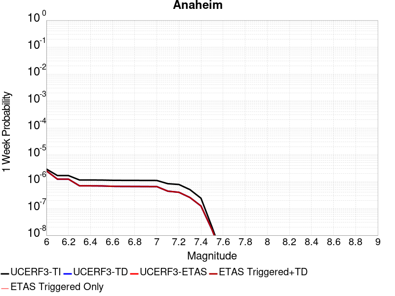 |  | 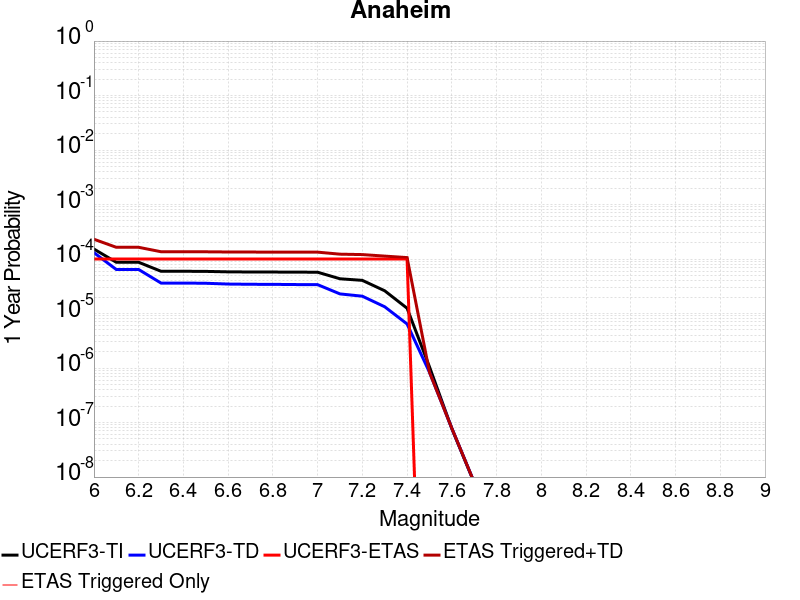 |  |

| Magnitude | 1 wk TI Prob | 1 wk TD Prob | 1 wk ETAS Prob | 1 wk ETAS/TD Gain | 1 wk ETAS Triggered+TD | 1 wk ETAS Triggered Only | 1 mo TI Prob | 1 mo TD Prob | 1 mo ETAS Prob | 1 mo ETAS/TD Gain | 1 mo ETAS Triggered+TD | 1 mo ETAS Triggered Only | 1 yr TI Prob | 1 yr TD Prob | 1 yr ETAS Prob | 1 yr ETAS/TD Gain | 1 yr ETAS Triggered+TD | 1 yr ETAS Triggered Only | 10 yr TI Prob | 10 yr TD Prob | 10 yr ETAS Prob | 10 yr ETAS/TD Gain | 10 yr ETAS Triggered+TD | 10 yr ETAS Triggered Only |
|-----|-----|-----|-----|-----|-----|-----|-----|-----|-----|-----|-----|-----|-----|-----|-----|-----|-----|-----|-----|-----|-----|-----|-----|-----|
| 6.0 | 2.9254998E-6 | 2.5109766E-6 | 0.0 | 0.0 | 2.5109766E-6 | 0.0 | 1.25377965E-5 | 1.0761297E-5 | 0.0 | 0.0 | 1.0761297E-5 | 0.0 | 1.5263697E-4 | 1.3101326E-4 | 1.0E-4 | 0.7632815 | 2.3100016E-4 | 1.0E-4 | 0.0015253217 | 0.0013095903 | 9.0E-4 | 0.6872378 | 0.0015093284 | 2.0E-4 |
| 6.1 | 1.6729715E-6 | 1.2327025E-6 | 0.0 | 0.0 | 1.2327025E-6 | 0.0 | 7.1698582E-6 | 5.2830023E-6 | 0.0 | 0.0 | 5.2830023E-6 | 0.0 | 8.7289525E-5 | 6.431907E-5 | 1.0E-4 | 1.5547488 | 1.6431265E-4 | 1.0E-4 | 8.7255245E-4 | 6.4304547E-4 | 5.0E-4 | 0.77755 | 7.4298115E-4 | 1.0E-4 |
| 6.2 | 1.6729715E-6 | 1.2327025E-6 | 0.0 | 0.0 | 1.2327025E-6 | 0.0 | 7.1698582E-6 | 5.2830023E-6 | 0.0 | 0.0 | 5.2830023E-6 | 0.0 | 8.7289525E-5 | 6.431907E-5 | 1.0E-4 | 1.5547488 | 1.6431265E-4 | 1.0E-4 | 8.7255245E-4 | 6.4304547E-4 | 5.0E-4 | 0.77755 | 7.4298115E-4 | 1.0E-4 |
| 6.3 | 1.1444064E-6 | 6.9503216E-7 | 0.0 | 0.0 | 6.9503216E-7 | 0.0 | 4.9045893E-6 | 2.978706E-6 | 0.0 | 0.0 | 2.978706E-6 | 0.0 | 5.971174E-5 | 3.62652E-5 | 1.0E-4 | 2.7574644 | 1.3626157E-4 | 1.0E-4 | 5.96957E-4 | 3.625983E-4 | 3.0E-4 | 0.8273618 | 4.6256205E-4 | 1.0E-4 |
| 6.4 | 1.1444064E-6 | 6.9503216E-7 | 0.0 | 0.0 | 6.9503216E-7 | 0.0 | 4.9045893E-6 | 2.978706E-6 | 0.0 | 0.0 | 2.978706E-6 | 0.0 | 5.971174E-5 | 3.62652E-5 | 1.0E-4 | 2.7574644 | 1.3626157E-4 | 1.0E-4 | 5.96957E-4 | 3.625983E-4 | 3.0E-4 | 0.8273618 | 4.6256205E-4 | 1.0E-4 |
| 6.5 | 1.1385318E-6 | 6.891011E-7 | 0.0 | 0.0 | 6.891011E-7 | 0.0 | 4.879413E-6 | 2.9532873E-6 | 0.0 | 0.0 | 2.9532873E-6 | 0.0 | 5.9405233E-5 | 3.5955738E-5 | 1.0E-4 | 2.7811973 | 1.3595214E-4 | 1.0E-4 | 5.938936E-4 | 3.595047E-4 | 3.0E-4 | 0.8344815 | 4.5946872E-4 | 1.0E-4 |
| 6.6 | 1.1165511E-6 | 6.668907E-7 | 0.0 | 0.0 | 6.668907E-7 | 0.0 | 4.78521E-6 | 2.8581E-6 | 0.0 | 0.0 | 2.8581E-6 | 0.0 | 5.8258374E-5 | 3.4796867E-5 | 1.0E-4 | 2.8738217 | 1.3479339E-4 | 1.0E-4 | 5.8243104E-4 | 3.4791962E-4 | 3.0E-4 | 0.8622681 | 4.4788484E-4 | 1.0E-4 |
| 6.7 | 1.1098243E-6 | 6.601107E-7 | 0.0 | 0.0 | 6.601107E-7 | 0.0 | 4.7563813E-6 | 2.829043E-6 | 0.0 | 0.0 | 2.829043E-6 | 0.0 | 5.7907404E-5 | 3.444311E-5 | 1.0E-4 | 2.9033384 | 1.3443966E-4 | 1.0E-4 | 5.7892315E-4 | 3.4438312E-4 | 3.0E-4 | 0.8711228 | 4.443487E-4 | 1.0E-4 |
| 6.8 | 1.1077587E-6 | 6.580311E-7 | 0.0 | 0.0 | 6.580311E-7 | 0.0 | 4.7475287E-6 | 2.8201307E-6 | 0.0 | 0.0 | 2.8201307E-6 | 0.0 | 5.779963E-5 | 3.4334604E-5 | 1.0E-4 | 2.9125135 | 1.3433117E-4 | 1.0E-4 | 5.77846E-4 | 3.4329842E-4 | 3.0E-4 | 0.87387526 | 4.4326409E-4 | 1.0E-4 |
| 6.9 | 1.1024468E-6 | 6.5268915E-7 | 0.0 | 0.0 | 6.5268915E-7 | 0.0 | 4.7247636E-6 | 2.7972364E-6 | 0.0 | 0.0 | 2.7972364E-6 | 0.0 | 5.752248E-5 | 3.4055876E-5 | 1.0E-4 | 2.9363508 | 1.3405248E-4 | 1.0E-4 | 5.750759E-4 | 3.40512E-4 | 3.0E-4 | 0.8810262 | 4.4047795E-4 | 1.0E-4 |
| 7.0 | 1.0993066E-6 | 6.5010045E-7 | 0.0 | 0.0 | 6.5010045E-7 | 0.0 | 4.7113053E-6 | 2.786142E-6 | 0.0 | 0.0 | 2.786142E-6 | 0.0 | 5.7358633E-5 | 3.3920805E-5 | 1.0E-4 | 2.948043 | 1.3391742E-4 | 1.0E-4 | 5.734383E-4 | 3.3916172E-4 | 3.0E-4 | 0.88453376 | 4.391278E-4 | 1.0E-4 |
| 7.1 | 8.334877E-7 | 4.3970527E-7 | 0.0 | 0.0 | 4.3970527E-7 | 0.0 | 3.5720855E-6 | 1.88445E-6 | 0.0 | 0.0 | 1.88445E-6 | 0.0 | 4.348927E-5 | 2.2942959E-5 | 1.0E-4 | 4.358636 | 1.2294066E-4 | 1.0E-4 | 4.3480762E-4 | 2.2940812E-4 | 3.0E-4 | 1.307713 | 3.293852E-4 | 1.0E-4 |
| 7.2 | 7.794411E-7 | 3.9903873E-7 | 0.0 | 0.0 | 3.9903873E-7 | 0.0 | 3.3404576E-6 | 1.710165E-6 | 0.0 | 0.0 | 1.710165E-6 | 0.0 | 4.0669314E-5 | 2.082108E-5 | 1.0E-4 | 4.802825 | 1.20819E-4 | 1.0E-4 | 4.066187E-4 | 2.0819333E-4 | 3.0E-4 | 1.4409684 | 3.0817252E-4 | 1.0E-4 |
| 7.3 | 5.01704E-7 | 2.552751E-7 | 0.0 | 0.0 | 2.552751E-7 | 0.0 | 2.150158E-6 | 1.0940357E-6 | 0.0 | 0.0 | 1.0940357E-6 | 0.0 | 2.617786E-5 | 1.3319816E-5 | 1.0E-4 | 7.507611 | 1.13318485E-4 | 1.0E-4 | 2.6174777E-4 | 1.3319142E-4 | 3.0E-4 | 2.2523973 | 2.331781E-4 | 1.0E-4 |
| 7.4 | 2.4008182E-7 | 1.2346648E-7 | 0.0 | 0.0 | 1.2346648E-7 | 0.0 | 1.0289217E-6 | 5.29142E-7 | 0.0 | 0.0 | 5.29142E-7 | 0.0 | 1.252705E-5 | 6.4422925E-6 | 1.0E-4 | 15.522425 | 1.0644165E-4 | 1.0E-4 | 1.2526344E-4 | 6.4421816E-5 | 3.0E-4 | 4.6568074 | 1.6441538E-4 | 1.0E-4 |
| 7.5 | 2.0263876E-8 | 1.6112283E-8 | 0.0 | 0.0 | 1.6112283E-8 | 0.0 | 8.684518E-8 | 6.9052646E-8 | 0.0 | 0.0 | 6.9052646E-8 | 0.0 | 1.0573395E-6 | 8.407157E-7 | 0.0 | 0.0 | 8.407157E-7 | 0.0 | 1.0573345E-5 | 8.407134E-6 | 0.0 | 0.0 | 8.407134E-6 | 0.0 |
| 7.6 | 1.4871431E-9 | 1.5081927E-9 | 0.0 | 0.0 | 1.5081927E-9 | 0.0 | 6.37347E-9 | 6.463683E-9 | 0.0 | 0.0 | 6.463683E-9 | 0.0 | 7.7596994E-8 | 7.869534E-8 | 0.0 | 0.0 | 7.869534E-8 | 0.0 | 7.759697E-7 | 7.869531E-7 | 0.0 | 0.0 | 7.869531E-7 | 0.0 |
| 7.7 | 1.5093293E-10 | 1.5330981E-10 | 0.0 | 0.0 | 1.5330981E-10 | 0.0 | 6.4685546E-10 | 6.57042E-10 | 0.0 | 0.0 | 6.57042E-10 | 0.0 | 7.875465E-9 | 7.999484E-9 | 0.0 | 0.0 | 7.999484E-9 | 0.0 | 7.8754645E-8 | 7.999483E-8 | 0.0 | 0.0 | 7.999483E-8 | 0.0 |

## Helendale-So Lockhart
*[(top)](#table-of-contents)*

| 1 Week | 1 Month | 1 Year | 10 Year |
|-----|-----|-----|-----|
|  |  |  |  |

| Magnitude | 1 wk TI Prob | 1 wk TD Prob | 1 wk ETAS Prob | 1 wk ETAS/TD Gain | 1 wk ETAS Triggered+TD | 1 wk ETAS Triggered Only | 1 mo TI Prob | 1 mo TD Prob | 1 mo ETAS Prob | 1 mo ETAS/TD Gain | 1 mo ETAS Triggered+TD | 1 mo ETAS Triggered Only | 1 yr TI Prob | 1 yr TD Prob | 1 yr ETAS Prob | 1 yr ETAS/TD Gain | 1 yr ETAS Triggered+TD | 1 yr ETAS Triggered Only | 10 yr TI Prob | 10 yr TD Prob | 10 yr ETAS Prob | 10 yr ETAS/TD Gain | 10 yr ETAS Triggered+TD | 10 yr ETAS Triggered Only |
|-----|-----|-----|-----|-----|-----|-----|-----|-----|-----|-----|-----|-----|-----|-----|-----|-----|-----|-----|-----|-----|-----|-----|-----|-----|
| 6.0 | 1.7296055E-5 | 1.8094886E-5 | 1.0E-4 | 5.526423 | 1.8094886E-5 | 0.0 | 7.412385E-5 | 7.754733E-5 | 2.0E-4 | 2.57907 | 1.7753958E-4 | 1.0E-4 | 9.0208417E-4 | 9.437505E-4 | 6.0E-4 | 0.63576126 | 0.0010436561 | 1.0E-4 | 0.008984311 | 0.0093995435 | 0.0066 | 0.7021618 | 0.009597664 | 2.0E-4 |
| 6.1 | 1.7296055E-5 | 1.8094886E-5 | 1.0E-4 | 5.526423 | 1.8094886E-5 | 0.0 | 7.412385E-5 | 7.754733E-5 | 2.0E-4 | 2.57907 | 1.7753958E-4 | 1.0E-4 | 9.0208417E-4 | 9.437505E-4 | 6.0E-4 | 0.63576126 | 0.0010436561 | 1.0E-4 | 0.008984311 | 0.0093995435 | 0.0066 | 0.7021618 | 0.009597664 | 2.0E-4 |
| 6.2 | 1.7296055E-5 | 1.8094886E-5 | 1.0E-4 | 5.526423 | 1.8094886E-5 | 0.0 | 7.412385E-5 | 7.754733E-5 | 2.0E-4 | 2.57907 | 1.7753958E-4 | 1.0E-4 | 9.0208417E-4 | 9.437505E-4 | 6.0E-4 | 0.63576126 | 0.0010436561 | 1.0E-4 | 0.008984311 | 0.0093995435 | 0.0066 | 0.7021618 | 0.009597664 | 2.0E-4 |
| 6.3 | 1.0669118E-5 | 1.1130337E-5 | 1.0E-4 | 8.984454 | 1.1130337E-5 | 0.0 | 4.5723988E-5 | 4.770059E-5 | 2.0E-4 | 4.1928205 | 1.4769581E-4 | 1.0E-4 | 5.5654737E-4 | 5.806027E-4 | 4.0E-4 | 0.6889393 | 6.8054465E-4 | 1.0E-4 | 0.0055515557 | 0.005791154 | 0.0034 | 0.58710235 | 0.005890575 | 1.0E-4 |
| 6.4 | 1.0669118E-5 | 1.1130337E-5 | 1.0E-4 | 8.984454 | 1.1130337E-5 | 0.0 | 4.5723988E-5 | 4.770059E-5 | 2.0E-4 | 4.1928205 | 1.4769581E-4 | 1.0E-4 | 5.5654737E-4 | 5.806027E-4 | 4.0E-4 | 0.6889393 | 6.8054465E-4 | 1.0E-4 | 0.0055515557 | 0.005791154 | 0.0034 | 0.58710235 | 0.005890575 | 1.0E-4 |
| 6.5 | 8.790038E-6 | 9.166051E-6 | 1.0E-4 | 10.909823 | 9.166051E-6 | 0.0 | 3.767105E-5 | 3.9282495E-5 | 2.0E-4 | 5.0913267 | 1.3927856E-4 | 1.0E-4 | 4.585485E-4 | 4.7816095E-4 | 4.0E-4 | 0.83653843 | 5.7811313E-4 | 1.0E-4 | 0.0045760344 | 0.0047714855 | 0.0028 | 0.58681935 | 0.004871008 | 1.0E-4 |
| 6.6 | 7.396949E-6 | 7.712063E-6 | 0.0 | 0.0 | 7.712063E-6 | 0.0 | 3.1700827E-5 | 3.3051285E-5 | 1.0E-4 | 3.025601 | 1.3304799E-4 | 1.0E-4 | 3.858892E-4 | 4.023261E-4 | 3.0E-4 | 0.74566376 | 5.022859E-4 | 1.0E-4 | 0.003852198 | 0.0040160846 | 0.0023 | 0.5726971 | 0.0041156826 | 1.0E-4 |
| 6.7 | 6.4600285E-6 | 6.7349997E-6 | 0.0 | 0.0 | 6.7349997E-6 | 0.0 | 2.7685543E-5 | 2.886397E-5 | 1.0E-4 | 3.464527 | 1.2886108E-4 | 1.0E-4 | 3.3701936E-4 | 3.5136295E-4 | 3.0E-4 | 0.853818 | 4.5132783E-4 | 1.0E-4 | 0.0033650869 | 0.0035081557 | 0.0021 | 0.5986051 | 0.003607805 | 1.0E-4 |
| 6.8 | 5.600104E-6 | 5.833441E-6 | 0.0 | 0.0 | 5.833441E-6 | 0.0 | 2.4000226E-5 | 2.5000225E-5 | 1.0E-4 | 3.999964 | 1.2499772E-4 | 1.0E-4 | 2.9216358E-4 | 3.0433582E-4 | 3.0E-4 | 0.9857532 | 4.0430538E-4 | 1.0E-4 | 0.0029177975 | 0.0030392518 | 0.0017 | 0.55934817 | 0.003138948 | 1.0E-4 |
| 6.9 | 4.839122E-6 | 5.0373296E-6 | 0.0 | 0.0 | 5.0373296E-6 | 0.0 | 2.0738931E-5 | 2.158838E-5 | 1.0E-4 | 4.6321216 | 1.2158622E-4 | 1.0E-4 | 2.5246723E-4 | 2.6280727E-4 | 3.0E-4 | 1.1415209 | 3.62781E-4 | 1.0E-4 | 0.002521806 | 0.0026250123 | 0.0017 | 0.647616 | 0.0027247497 | 1.0E-4 |
| 7.0 | 3.6937633E-6 | 3.8435614E-6 | 0.0 | 0.0 | 3.8435614E-6 | 0.0 | 1.5830317E-5 | 1.6472304E-5 | 1.0E-4 | 6.070796 | 1.16470655E-4 | 1.0E-4 | 1.9271708E-4 | 2.0053216E-4 | 2.0E-4 | 0.9973462 | 3.0051213E-4 | 1.0E-4 | 0.0019255003 | 0.0020035435 | 0.0012 | 0.5989388 | 0.0021033431 | 1.0E-4 |
| 7.1 | 2.7858857E-6 | 2.8966379E-6 | 0.0 | 0.0 | 2.8966379E-6 | 0.0 | 1.1939455E-5 | 1.2414104E-5 | 1.0E-4 | 8.055354 | 1.1241286E-4 | 1.0E-4 | 1.4535317E-4 | 1.5113145E-4 | 1.0E-4 | 0.66167563 | 2.5111635E-4 | 1.0E-4 | 0.0014525814 | 0.0015103082 | 0.0011 | 0.72832817 | 0.0016101572 | 1.0E-4 |
| 7.2 | 2.1672065E-6 | 2.2530703E-6 | 0.0 | 0.0 | 2.2530703E-6 | 0.0 | 9.2879945E-6 | 9.655981E-6 | 1.0E-4 | 10.356276 | 1.0965502E-4 | 1.0E-4 | 1.1307546E-4 | 1.17555406E-4 | 1.0E-4 | 0.8506627 | 2.1754365E-4 | 1.0E-4 | 0.0011301794 | 0.0011749504 | 7.0E-4 | 0.5957698 | 0.001274833 | 1.0E-4 |
| 7.3 | 1.4823496E-6 | 1.5415601E-6 | 0.0 | 0.0 | 1.5415601E-6 | 0.0 | 6.3529114E-6 | 6.6066705E-6 | 0.0 | 0.0 | 6.6066705E-6 | 0.0 | 7.734395E-5 | 8.04334E-5 | 0.0 | 0.0 | 8.04334E-5 | 0.0 | 7.731704E-4 | 8.040579E-4 | 5.0E-4 | 0.6218457 | 8.040579E-4 | 0.0 |
| 7.4 | 4.2321457E-7 | 4.4089322E-7 | 0.0 | 0.0 | 4.4089322E-7 | 0.0 | 1.8137755E-6 | 1.8895413E-6 | 0.0 | 0.0 | 1.8895413E-6 | 0.0 | 2.2082493E-5 | 2.3004968E-5 | 0.0 | 0.0 | 2.3004968E-5 | 0.0 | 2.2080299E-4 | 2.3003039E-4 | 0.0 | 0.0 | 2.3003039E-4 | 0.0 |
| 7.5 | 5.6942316E-8 | 5.938871E-8 | 0.0 | 0.0 | 5.938871E-8 | 0.0 | 2.440385E-7 | 2.5452303E-7 | 0.0 | 0.0 | 2.5452303E-7 | 0.0 | 2.9711643E-6 | 3.0988142E-6 | 0.0 | 0.0 | 3.0988142E-6 | 0.0 | 2.9711247E-5 | 3.0987787E-5 | 0.0 | 0.0 | 3.0987787E-5 | 0.0 |

## Point Reyes 2011 connector
*[(top)](#table-of-contents)*

| 1 Week | 1 Month | 1 Year | 10 Year |
|-----|-----|-----|-----|
| 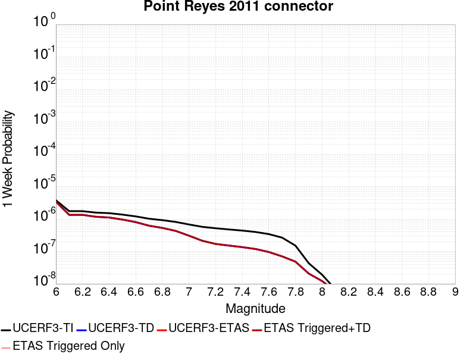 |  |  |  |

| Magnitude | 1 wk TI Prob | 1 wk TD Prob | 1 wk ETAS Prob | 1 wk ETAS/TD Gain | 1 wk ETAS Triggered+TD | 1 wk ETAS Triggered Only | 1 mo TI Prob | 1 mo TD Prob | 1 mo ETAS Prob | 1 mo ETAS/TD Gain | 1 mo ETAS Triggered+TD | 1 mo ETAS Triggered Only | 1 yr TI Prob | 1 yr TD Prob | 1 yr ETAS Prob | 1 yr ETAS/TD Gain | 1 yr ETAS Triggered+TD | 1 yr ETAS Triggered Only | 10 yr TI Prob | 10 yr TD Prob | 10 yr ETAS Prob | 10 yr ETAS/TD Gain | 10 yr ETAS Triggered+TD | 10 yr ETAS Triggered Only |
|-----|-----|-----|-----|-----|-----|-----|-----|-----|-----|-----|-----|-----|-----|-----|-----|-----|-----|-----|-----|-----|-----|-----|-----|-----|
| 6.0 | 3.7893044E-6 | 3.410913E-6 | 0.0 | 0.0 | 3.410913E-6 | 0.0 | 1.6239776E-5 | 1.4618128E-5 | 0.0 | 0.0 | 1.4618128E-5 | 0.0 | 1.9770133E-4 | 1.7796332E-4 | 0.0 | 0.0 | 1.7796332E-4 | 0.0 | 0.0019752553 | 0.0017786479 | 0.001 | 0.5622248 | 0.0019782921 | 2.0E-4 |
| 6.1 | 1.7449562E-6 | 1.3422227E-6 | 0.0 | 0.0 | 1.3422227E-6 | 0.0 | 7.478362E-6 | 5.7523707E-6 | 0.0 | 0.0 | 5.7523707E-6 | 0.0 | 9.104525E-5 | 7.003292E-5 | 0.0 | 0.0 | 7.003292E-5 | 0.0 | 9.1007963E-4 | 7.003445E-4 | 5.0E-4 | 0.71393436 | 7.003445E-4 | 0.0 |
| 6.2 | 1.7449562E-6 | 1.3422227E-6 | 0.0 | 0.0 | 1.3422227E-6 | 0.0 | 7.478362E-6 | 5.7523707E-6 | 0.0 | 0.0 | 5.7523707E-6 | 0.0 | 9.104525E-5 | 7.003292E-5 | 0.0 | 0.0 | 7.003292E-5 | 0.0 | 9.1007963E-4 | 7.003445E-4 | 5.0E-4 | 0.71393436 | 7.003445E-4 | 0.0 |
| 6.3 | 1.5739171E-6 | 1.1694809E-6 | 0.0 | 0.0 | 1.1694809E-6 | 0.0 | 6.7453416E-6 | 5.012052E-6 | 0.0 | 0.0 | 5.012052E-6 | 0.0 | 8.212144E-5 | 6.1020066E-5 | 0.0 | 0.0 | 6.1020066E-5 | 0.0 | 8.2091097E-4 | 6.1026774E-4 | 3.0E-4 | 0.49158752 | 6.1026774E-4 | 0.0 |
| 6.4 | 1.5138507E-6 | 1.1088416E-6 | 0.0 | 0.0 | 1.1088416E-6 | 0.0 | 6.4879155E-6 | 4.75217E-6 | 0.0 | 0.0 | 4.75217E-6 | 0.0 | 7.898751E-5 | 5.7856174E-5 | 0.0 | 0.0 | 5.7856174E-5 | 0.0 | 7.8959437E-4 | 5.7864556E-4 | 3.0E-4 | 0.5184521 | 5.7864556E-4 | 0.0 |
| 6.5 | 1.3662817E-6 | 9.593434E-7 | 0.0 | 0.0 | 9.593434E-7 | 0.0 | 5.8554797E-6 | 4.1114654E-6 | 0.0 | 0.0 | 4.1114654E-6 | 0.0 | 7.128814E-5 | 5.0055958E-5 | 0.0 | 0.0 | 5.0055958E-5 | 0.0 | 7.126527E-4 | 5.006792E-4 | 2.0E-4 | 0.3994574 | 5.006792E-4 | 0.0 |
| 6.6 | 1.2022703E-6 | 7.995506E-7 | 0.0 | 0.0 | 7.995506E-7 | 0.0 | 5.1525767E-6 | 3.4266411E-6 | 0.0 | 0.0 | 3.4266411E-6 | 0.0 | 6.273081E-5 | 4.1718566E-5 | 0.0 | 0.0 | 4.1718566E-5 | 0.0 | 6.271311E-4 | 4.1733886E-4 | 2.0E-4 | 0.4792269 | 4.1733886E-4 | 0.0 |
| 6.7 | 1.0194848E-6 | 6.194266E-7 | 0.0 | 0.0 | 6.194266E-7 | 0.0 | 4.3692135E-6 | 2.6546827E-6 | 0.0 | 0.0 | 2.6546827E-6 | 0.0 | 5.319387E-5 | 3.2320288E-5 | 0.0 | 0.0 | 3.2320288E-5 | 0.0 | 5.3181144E-4 | 3.2338683E-4 | 2.0E-4 | 0.61845434 | 3.2338683E-4 | 0.0 |
| 6.8 | 9.212307E-7 | 5.296362E-7 | 0.0 | 0.0 | 5.296362E-7 | 0.0 | 3.9481256E-6 | 2.2698675E-6 | 0.0 | 0.0 | 2.2698675E-6 | 0.0 | 4.806737E-5 | 2.763529E-5 | 0.0 | 0.0 | 2.763529E-5 | 0.0 | 4.8056975E-4 | 2.7654934E-4 | 1.0E-4 | 0.36159912 | 2.7654934E-4 | 0.0 |
| 6.9 | 8.1306075E-7 | 4.2849297E-7 | 0.0 | 0.0 | 4.2849297E-7 | 0.0 | 3.4845416E-6 | 1.8363971E-6 | 0.0 | 0.0 | 1.8363971E-6 | 0.0 | 4.2423468E-5 | 2.2357908E-5 | 0.0 | 0.0 | 2.2357908E-5 | 0.0 | 4.241537E-4 | 2.2378725E-4 | 1.0E-4 | 0.44685295 | 2.2378725E-4 | 0.0 |
| 7.0 | 6.773335E-7 | 3.0478412E-7 | 0.0 | 0.0 | 3.0478412E-7 | 0.0 | 2.9028547E-6 | 1.306217E-6 | 0.0 | 0.0 | 1.306217E-6 | 0.0 | 3.5341684E-5 | 1.5903075E-5 | 0.0 | 0.0 | 1.5903075E-5 | 0.0 | 3.5336064E-4 | 1.5924993E-4 | 1.0E-4 | 0.62794375 | 1.5924993E-4 | 0.0 |
| 7.1 | 5.7279397E-7 | 2.1205408E-7 | 0.0 | 0.0 | 2.1205408E-7 | 0.0 | 2.454829E-6 | 9.088029E-7 | 0.0 | 0.0 | 9.088029E-7 | 0.0 | 2.9887131E-5 | 1.1064619E-5 | 0.0 | 0.0 | 1.1064619E-5 | 0.0 | 2.9883112E-4 | 1.10871166E-4 | 1.0E-4 | 0.9019478 | 1.10871166E-4 | 0.0 |
| 7.2 | 5.185539E-7 | 1.6946254E-7 | 0.0 | 0.0 | 1.6946254E-7 | 0.0 | 2.222372E-6 | 7.2626784E-7 | 0.0 | 0.0 | 7.2626784E-7 | 0.0 | 2.7057044E-5 | 8.842274E-6 | 0.0 | 0.0 | 8.842274E-6 | 0.0 | 2.7053748E-4 | 8.864971E-5 | 1.0E-4 | 1.1280353 | 8.864971E-5 | 0.0 |
| 7.3 | 4.7599846E-7 | 1.5081537E-7 | 0.0 | 0.0 | 1.5081537E-7 | 0.0 | 2.0399918E-6 | 6.4635145E-7 | 0.0 | 0.0 | 6.4635145E-7 | 0.0 | 2.4836616E-5 | 7.8693E-6 | 0.0 | 0.0 | 7.8693E-6 | 0.0 | 2.4833842E-4 | 7.89207E-5 | 1.0E-4 | 1.2670947 | 7.89207E-5 | 0.0 |
| 7.4 | 4.3987393E-7 | 1.3488209E-7 | 0.0 | 0.0 | 1.3488209E-7 | 0.0 | 1.8851727E-6 | 5.7806596E-7 | 0.0 | 0.0 | 5.7806596E-7 | 0.0 | 2.2951735E-5 | 7.0379297E-6 | 0.0 | 0.0 | 7.0379297E-6 | 0.0 | 2.2949366E-4 | 7.060749E-5 | 1.0E-4 | 1.4162803 | 7.060749E-5 | 0.0 |
| 7.5 | 3.980054E-7 | 1.181958E-7 | 0.0 | 0.0 | 1.181958E-7 | 0.0 | 1.7057363E-6 | 5.0655336E-7 | 0.0 | 0.0 | 5.0655336E-7 | 0.0 | 2.0767142E-5 | 6.1672695E-6 | 0.0 | 0.0 | 6.1672695E-6 | 0.0 | 2.0765202E-4 | 6.189639E-5 | 1.0E-4 | 1.6156031 | 6.189639E-5 | 0.0 |
| 7.6 | 3.4188398E-7 | 9.5391115E-8 | 0.0 | 0.0 | 9.5391115E-8 | 0.0 | 1.4652163E-6 | 4.0881903E-7 | 0.0 | 0.0 | 4.0881903E-7 | 0.0 | 1.7838862E-5 | 4.9773603E-6 | 0.0 | 0.0 | 4.9773603E-6 | 0.0 | 1.783743E-4 | 4.9983326E-5 | 1.0E-4 | 2.000667 | 4.9983326E-5 | 0.0 |
| 7.7 | 2.6611437E-7 | 6.982821E-8 | 0.0 | 0.0 | 6.982821E-8 | 0.0 | 1.1404896E-6 | 2.9926372E-7 | 0.0 | 0.0 | 2.9926372E-7 | 0.0 | 1.3885373E-5 | 3.6435297E-6 | 0.0 | 0.0 | 3.6435297E-6 | 0.0 | 1.3884505E-4 | 3.6605583E-5 | 1.0E-4 | 2.7318237 | 3.6605583E-5 | 0.0 |
| 7.8 | 1.5107078E-7 | 4.8159084E-8 | 0.0 | 0.0 | 4.8159084E-8 | 0.0 | 6.474461E-7 | 2.0639607E-7 | 0.0 | 0.0 | 2.0639607E-7 | 0.0 | 7.882627E-6 | 2.512869E-6 | 0.0 | 0.0 | 2.512869E-6 | 0.0 | 7.8823476E-5 | 2.5281068E-5 | 1.0E-4 | 3.955529 | 2.5281068E-5 | 0.0 |
| 7.9 | 4.3228205E-8 | 2.0568631E-8 | 0.0 | 0.0 | 2.0568631E-8 | 0.0 | 1.8526373E-7 | 8.815129E-8 | 0.0 | 0.0 | 8.815129E-8 | 0.0 | 2.2555835E-6 | 1.0732415E-6 | 0.0 | 0.0 | 1.0732415E-6 | 0.0 | 2.2555607E-5 | 1.0805793E-5 | 1.0E-4 | 9.254295 | 1.0805793E-5 | 0.0 |
| 8.0 | 1.9149928E-8 | 1.20992665E-8 | 0.0 | 0.0 | 1.20992665E-8 | 0.0 | 8.207112E-8 | 5.185401E-8 | 0.0 | 0.0 | 5.185401E-8 | 0.0 | 9.992154E-7 | 6.313224E-7 | 0.0 | 0.0 | 6.313224E-7 | 0.0 | 9.992109E-6 | 6.3593607E-6 | 1.0E-4 | 15.724852 | 6.3593607E-6 | 0.0 |
| 8.1 | 6.7792816E-9 | 5.9604193E-9 | 0.0 | 0.0 | 5.9604193E-9 | 0.0 | 2.9054062E-8 | 2.554466E-8 | 0.0 | 0.0 | 2.554466E-8 | 0.0 | 3.5373316E-7 | 3.1100618E-7 | 0.0 | 0.0 | 3.1100618E-7 | 0.0 | 3.537326E-6 | 3.1346613E-6 | 1.0E-4 | 31.901373 | 3.1346613E-6 | 0.0 |

## Elsinore (Temecula) rev
*[(top)](#table-of-contents)*

| 1 Week | 1 Month | 1 Year | 10 Year |
|-----|-----|-----|-----|
|  | 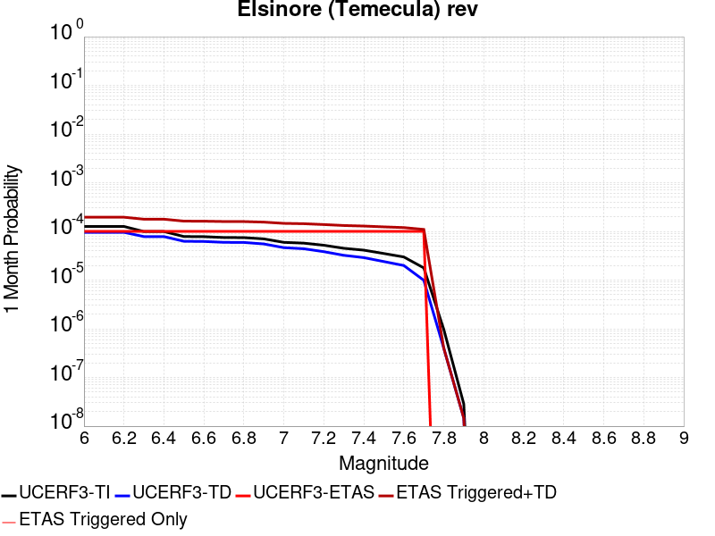 | 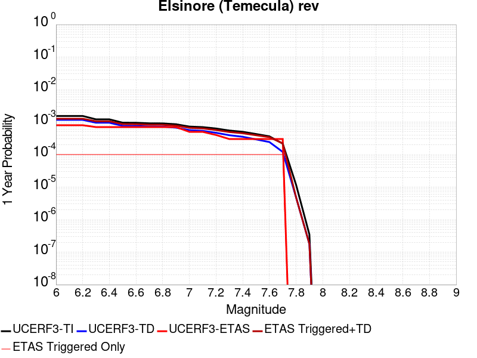 |  |

| Magnitude | 1 wk TI Prob | 1 wk TD Prob | 1 wk ETAS Prob | 1 wk ETAS/TD Gain | 1 wk ETAS Triggered+TD | 1 wk ETAS Triggered Only | 1 mo TI Prob | 1 mo TD Prob | 1 mo ETAS Prob | 1 mo ETAS/TD Gain | 1 mo ETAS Triggered+TD | 1 mo ETAS Triggered Only | 1 yr TI Prob | 1 yr TD Prob | 1 yr ETAS Prob | 1 yr ETAS/TD Gain | 1 yr ETAS Triggered+TD | 1 yr ETAS Triggered Only | 10 yr TI Prob | 10 yr TD Prob | 10 yr ETAS Prob | 10 yr ETAS/TD Gain | 10 yr ETAS Triggered+TD | 10 yr ETAS Triggered Only |
|-----|-----|-----|-----|-----|-----|-----|-----|-----|-----|-----|-----|-----|-----|-----|-----|-----|-----|-----|-----|-----|-----|-----|-----|-----|
| 6.0 | 2.9514995E-5 | 2.2366194E-5 | 0.0 | 0.0 | 2.2366194E-5 | 0.0 | 1.264867E-4 | 9.585171E-5 | 1.0E-4 | 1.0432782 | 1.9584213E-4 | 1.0E-4 | 0.0015388876 | 0.0011663915 | 8.0E-4 | 0.685876 | 0.001266275 | 1.0E-4 | 0.015282745 | 0.011629022 | 0.007 | 0.6019423 | 0.011826696 | 2.0E-4 |
| 6.1 | 2.9514995E-5 | 2.2366194E-5 | 0.0 | 0.0 | 2.2366194E-5 | 0.0 | 1.264867E-4 | 9.585171E-5 | 1.0E-4 | 1.0432782 | 1.9584213E-4 | 1.0E-4 | 0.0015388876 | 0.0011663915 | 8.0E-4 | 0.685876 | 0.001266275 | 1.0E-4 | 0.015282745 | 0.011629022 | 0.007 | 0.6019423 | 0.011826696 | 2.0E-4 |
| 6.2 | 2.9514995E-5 | 2.2366194E-5 | 0.0 | 0.0 | 2.2366194E-5 | 0.0 | 1.264867E-4 | 9.585171E-5 | 1.0E-4 | 1.0432782 | 1.9584213E-4 | 1.0E-4 | 0.0015388876 | 0.0011663915 | 8.0E-4 | 0.685876 | 0.001266275 | 1.0E-4 | 0.015282745 | 0.011629022 | 0.007 | 0.6019423 | 0.011826696 | 2.0E-4 |
| 6.3 | 2.3223649E-5 | 1.8284612E-5 | 0.0 | 0.0 | 1.8284612E-5 | 0.0 | 9.952613E-5 | 7.836036E-5 | 1.0E-4 | 1.2761554 | 1.7835252E-4 | 1.0E-4 | 0.001211057 | 9.5363683E-4 | 7.0E-4 | 0.7340321 | 0.0010535414 | 1.0E-4 | 0.012044783 | 0.009502125 | 0.0058 | 0.61038977 | 0.009700225 | 2.0E-4 |
| 6.4 | 2.3223649E-5 | 1.8284612E-5 | 0.0 | 0.0 | 1.8284612E-5 | 0.0 | 9.952613E-5 | 7.836036E-5 | 1.0E-4 | 1.2761554 | 1.7835252E-4 | 1.0E-4 | 0.001211057 | 9.5363683E-4 | 7.0E-4 | 0.7340321 | 0.0010535414 | 1.0E-4 | 0.012044783 | 0.009502125 | 0.0058 | 0.61038977 | 0.009700225 | 2.0E-4 |
| 6.5 | 1.8338875E-5 | 1.4648862E-5 | 0.0 | 0.0 | 1.4648862E-5 | 0.0 | 7.8592806E-5 | 6.277937E-5 | 1.0E-4 | 1.5928799 | 1.627731E-4 | 1.0E-4 | 9.5644733E-4 | 7.640794E-4 | 7.0E-4 | 0.91613513 | 8.64003E-4 | 1.0E-4 | 0.009523412 | 0.0076172994 | 0.0045 | 0.5907605 | 0.007815776 | 2.0E-4 |
| 6.6 | 1.8223333E-5 | 1.4511689E-5 | 0.0 | 0.0 | 1.4511689E-5 | 0.0 | 7.809766E-5 | 6.219152E-5 | 1.0E-4 | 1.6079363 | 1.621853E-4 | 1.0E-4 | 9.504242E-4 | 7.5692724E-4 | 7.0E-4 | 0.92479163 | 8.568516E-4 | 1.0E-4 | 0.009463696 | 0.0075462647 | 0.0045 | 0.5963215 | 0.0077447556 | 2.0E-4 |
| 6.7 | 1.7512752E-5 | 1.3929564E-5 | 0.0 | 0.0 | 1.3929564E-5 | 0.0 | 7.505249E-5 | 5.9696813E-5 | 1.0E-4 | 1.6751313 | 1.5969084E-4 | 1.0E-4 | 9.13381E-4 | 7.2657474E-4 | 7.0E-4 | 0.9634246 | 8.265021E-4 | 1.0E-4 | 0.00909636 | 0.0072476105 | 0.0043 | 0.593299 | 0.007446161 | 2.0E-4 |
| 6.8 | 1.7417142E-5 | 1.3854172E-5 | 0.0 | 0.0 | 1.3854172E-5 | 0.0 | 7.4642754E-5 | 5.937372E-5 | 1.0E-4 | 1.6842469 | 1.5936779E-4 | 1.0E-4 | 9.083966E-4 | 7.226437E-4 | 7.0E-4 | 0.96866554 | 8.225714E-4 | 1.0E-4 | 0.009046922 | 0.0072084954 | 0.0043 | 0.59651834 | 0.007407054 | 2.0E-4 |
| 6.9 | 1.6402591E-5 | 1.2904006E-5 | 0.0 | 0.0 | 1.2904006E-5 | 0.0 | 7.0294926E-5 | 5.5301753E-5 | 1.0E-4 | 1.8082609 | 1.5529622E-4 | 1.0E-4 | 8.5550465E-4 | 6.730984E-4 | 7.0E-4 | 1.0399668 | 7.7303103E-4 | 1.0E-4 | 0.008522186 | 0.0067162444 | 0.0038 | 0.5657924 | 0.006914901 | 2.0E-4 |
| 7.0 | 1.3912486E-5 | 1.0823051E-5 | 0.0 | 0.0 | 1.0823051E-5 | 0.0 | 5.9623577E-5 | 4.638369E-5 | 1.0E-4 | 2.15593 | 1.4637905E-4 | 1.0E-4 | 7.2567526E-4 | 5.645778E-4 | 5.0E-4 | 0.8856175 | 6.6452136E-4 | 1.0E-4 | 0.0072331014 | 0.0056350967 | 0.003 | 0.5323777 | 0.00583397 | 2.0E-4 |
| 7.1 | 1.3405147E-5 | 1.0279687E-5 | 0.0 | 0.0 | 1.0279687E-5 | 0.0 | 5.7449364E-5 | 4.405507E-5 | 1.0E-4 | 2.2698863 | 1.4405066E-4 | 1.0E-4 | 6.9922156E-4 | 5.36241E-4 | 5.0E-4 | 0.93241656 | 6.361874E-4 | 1.0E-4 | 0.0069702556 | 0.005352705 | 0.003 | 0.56046426 | 0.0055516344 | 2.0E-4 |
| 7.2 | 1.21402E-5 | 8.957294E-6 | 0.0 | 0.0 | 8.957294E-6 | 0.0 | 5.202839E-5 | 3.8387847E-5 | 1.0E-4 | 2.604991 | 1.3838401E-4 | 1.0E-4 | 6.332616E-4 | 4.6727358E-4 | 4.0E-4 | 0.8560295 | 5.6722685E-4 | 1.0E-4 | 0.0063146 | 0.004664238 | 0.0024 | 0.5145535 | 0.0048633055 | 2.0E-4 |
| 7.3 | 1.05047775E-5 | 7.5408534E-6 | 0.0 | 0.0 | 7.5408534E-6 | 0.0 | 4.5019697E-5 | 3.231755E-5 | 1.0E-4 | 3.0942938 | 1.3231432E-4 | 1.0E-4 | 5.4797693E-4 | 3.933966E-4 | 3.0E-4 | 0.7625892 | 4.9335725E-4 | 1.0E-4 | 0.005466277 | 0.0039273473 | 0.0017 | 0.43286216 | 0.004126562 | 2.0E-4 |
| 7.4 | 9.624483E-6 | 6.760184E-6 | 0.0 | 0.0 | 6.760184E-6 | 0.0 | 4.124713E-5 | 2.8971905E-5 | 1.0E-4 | 3.4516199 | 1.2896901E-4 | 1.0E-4 | 5.0206814E-4 | 3.5267722E-4 | 3.0E-4 | 0.8506362 | 4.5264195E-4 | 1.0E-4 | 0.005009353 | 0.0035213241 | 0.0015 | 0.42597613 | 0.0037206197 | 2.0E-4 |
| 7.5 | 8.215151E-6 | 5.613324E-6 | 0.0 | 0.0 | 5.613324E-6 | 0.0 | 3.5207315E-5 | 2.4056888E-5 | 1.0E-4 | 4.1568136 | 1.2405448E-4 | 1.0E-4 | 4.2856473E-4 | 2.9285453E-4 | 3.0E-4 | 1.0243994 | 3.9282523E-4 | 1.0E-4 | 0.004277392 | 0.002924813 | 0.0013 | 0.44447288 | 0.0030245204 | 1.0E-4 |
| 7.6 | 6.975058E-6 | 4.6566042E-6 | 0.0 | 0.0 | 4.6566042E-6 | 0.0 | 2.9892764E-5 | 1.995673E-5 | 1.0E-4 | 5.0108414 | 1.1995473E-4 | 1.0E-4 | 3.6388362E-4 | 2.4294725E-4 | 3.0E-4 | 1.234836 | 3.4292295E-4 | 1.0E-4 | 0.0036328835 | 0.0024269319 | 0.0012 | 0.49445146 | 0.0025266893 | 1.0E-4 |
| 7.7 | 4.159604E-6 | 2.315134E-6 | 0.0 | 0.0 | 2.315134E-6 | 0.0 | 1.7826753E-5 | 9.921969E-6 | 1.0E-4 | 10.078645 | 1.0992098E-4 | 1.0E-4 | 2.1701909E-4 | 1.2079401E-4 | 3.0E-4 | 2.4835668 | 2.2078193E-4 | 1.0E-4 | 0.0021680726 | 0.001207356 | 6.0E-4 | 0.4969537 | 0.0013072352 | 1.0E-4 |
| 7.8 | 2.2692414E-7 | 9.313546E-8 | 0.0 | 0.0 | 9.313546E-8 | 0.0 | 9.725317E-7 | 3.9915196E-7 | 0.0 | 0.0 | 3.9915196E-7 | 0.0 | 1.1840509E-5 | 4.8596676E-6 | 0.0 | 0.0 | 4.8596676E-6 | 0.0 | 1.1839878E-4 | 4.859593E-5 | 0.0 | 0.0 | 4.859593E-5 | 0.0 |
| 7.9 | 6.676829E-9 | 3.4267709E-9 | 0.0 | 0.0 | 3.4267709E-9 | 0.0 | 2.861498E-8 | 1.4686159E-8 | 0.0 | 0.0 | 1.4686159E-8 | 0.0 | 3.4838732E-7 | 1.7880397E-7 | 0.0 | 0.0 | 1.7880397E-7 | 0.0 | 3.4838679E-6 | 1.7880385E-6 | 0.0 | 0.0 | 1.7880385E-6 | 0.0 |

## Kern Canyon (North Kern) 2011
*[(top)](#table-of-contents)*

| 1 Week | 1 Month | 1 Year | 10 Year |
|-----|-----|-----|-----|
|  |  |  |  |

| Magnitude | 1 wk TI Prob | 1 wk TD Prob | 1 wk ETAS Prob | 1 wk ETAS/TD Gain | 1 wk ETAS Triggered+TD | 1 wk ETAS Triggered Only | 1 mo TI Prob | 1 mo TD Prob | 1 mo ETAS Prob | 1 mo ETAS/TD Gain | 1 mo ETAS Triggered+TD | 1 mo ETAS Triggered Only | 1 yr TI Prob | 1 yr TD Prob | 1 yr ETAS Prob | 1 yr ETAS/TD Gain | 1 yr ETAS Triggered+TD | 1 yr ETAS Triggered Only | 10 yr TI Prob | 10 yr TD Prob | 10 yr ETAS Prob | 10 yr ETAS/TD Gain | 10 yr ETAS Triggered+TD | 10 yr ETAS Triggered Only |
|-----|-----|-----|-----|-----|-----|-----|-----|-----|-----|-----|-----|-----|-----|-----|-----|-----|-----|-----|-----|-----|-----|-----|-----|-----|
| 6.0 | 6.6264497E-6 | 6.755636E-6 | 0.0 | 0.0 | 6.755636E-6 | 0.0 | 2.8398761E-5 | 2.895245E-5 | 0.0 | 0.0 | 2.895245E-5 | 0.0 | 3.4570007E-4 | 3.5244707E-4 | 1.0E-4 | 0.28373054 | 3.5244707E-4 | 0.0 | 0.0034516277 | 0.003519669 | 0.0022 | 0.62505877 | 0.003718965 | 2.0E-4 |
| 6.1 | 6.6264497E-6 | 6.755636E-6 | 0.0 | 0.0 | 6.755636E-6 | 0.0 | 2.8398761E-5 | 2.895245E-5 | 0.0 | 0.0 | 2.895245E-5 | 0.0 | 3.4570007E-4 | 3.5244707E-4 | 1.0E-4 | 0.28373054 | 3.5244707E-4 | 0.0 | 0.0034516277 | 0.003519669 | 0.0022 | 0.62505877 | 0.003718965 | 2.0E-4 |
| 6.2 | 6.6264497E-6 | 6.755636E-6 | 0.0 | 0.0 | 6.755636E-6 | 0.0 | 2.8398761E-5 | 2.895245E-5 | 0.0 | 0.0 | 2.895245E-5 | 0.0 | 3.4570007E-4 | 3.5244707E-4 | 1.0E-4 | 0.28373054 | 3.5244707E-4 | 0.0 | 0.0034516277 | 0.003519669 | 0.0022 | 0.62505877 | 0.003718965 | 2.0E-4 |
| 6.3 | 6.6264497E-6 | 6.755636E-6 | 0.0 | 0.0 | 6.755636E-6 | 0.0 | 2.8398761E-5 | 2.895245E-5 | 0.0 | 0.0 | 2.895245E-5 | 0.0 | 3.4570007E-4 | 3.5244707E-4 | 1.0E-4 | 0.28373054 | 3.5244707E-4 | 0.0 | 0.0034516277 | 0.003519669 | 0.0022 | 0.62505877 | 0.003718965 | 2.0E-4 |
| 6.4 | 6.6264497E-6 | 6.755636E-6 | 0.0 | 0.0 | 6.755636E-6 | 0.0 | 2.8398761E-5 | 2.895245E-5 | 0.0 | 0.0 | 2.895245E-5 | 0.0 | 3.4570007E-4 | 3.5244707E-4 | 1.0E-4 | 0.28373054 | 3.5244707E-4 | 0.0 | 0.0034516277 | 0.003519669 | 0.0022 | 0.62505877 | 0.003718965 | 2.0E-4 |
| 6.5 | 3.2162225E-6 | 3.2563628E-6 | 0.0 | 0.0 | 3.2563628E-6 | 0.0 | 1.3783738E-5 | 1.3955771E-5 | 0.0 | 0.0 | 1.3955771E-5 | 0.0 | 1.6780409E-4 | 1.6989907E-4 | 1.0E-4 | 0.5885847 | 1.6989907E-4 | 0.0 | 0.0016767744 | 0.0016977714 | 0.001 | 0.58900744 | 0.0018974319 | 2.0E-4 |
| 6.6 | 3.2162225E-6 | 3.2563628E-6 | 0.0 | 0.0 | 3.2563628E-6 | 0.0 | 1.3783738E-5 | 1.3955771E-5 | 0.0 | 0.0 | 1.3955771E-5 | 0.0 | 1.6780409E-4 | 1.6989907E-4 | 1.0E-4 | 0.5885847 | 1.6989907E-4 | 0.0 | 0.0016767744 | 0.0016977714 | 0.001 | 0.58900744 | 0.0018974319 | 2.0E-4 |
| 6.7 | 2.1908265E-6 | 2.2066565E-6 | 0.0 | 0.0 | 2.2066565E-6 | 0.0 | 9.389223E-6 | 9.457066E-6 | 0.0 | 0.0 | 9.457066E-6 | 0.0 | 1.1430779E-4 | 1.1513389E-4 | 1.0E-4 | 0.868554 | 1.1513389E-4 | 0.0 | 0.0011424901 | 0.0011507617 | 7.0E-4 | 0.6082927 | 0.0011507617 | 0.0 |
| 6.8 | 1.7303895E-6 | 1.7361954E-6 | 0.0 | 0.0 | 1.7361954E-6 | 0.0 | 7.415934E-6 | 7.4408163E-6 | 0.0 | 0.0 | 7.4408163E-6 | 0.0 | 9.028525E-5 | 9.058827E-5 | 1.0E-4 | 1.1038957 | 9.058827E-5 | 0.0 | 9.024858E-4 | 9.055232E-4 | 6.0E-4 | 0.6626004 | 9.055232E-4 | 0.0 |
| 6.9 | 1.3700314E-6 | 1.3685828E-6 | 0.0 | 0.0 | 1.3685828E-6 | 0.0 | 5.87155E-6 | 5.865342E-6 | 0.0 | 0.0 | 5.865342E-6 | 0.0 | 7.148377E-5 | 7.140824E-5 | 1.0E-4 | 1.4003985 | 7.140824E-5 | 0.0 | 7.146078E-4 | 7.1385753E-4 | 5.0E-4 | 0.70041984 | 7.1385753E-4 | 0.0 |
| 7.0 | 1.1467797E-6 | 1.141146E-6 | 0.0 | 0.0 | 1.141146E-6 | 0.0 | 4.9147607E-6 | 4.8906168E-6 | 0.0 | 0.0 | 4.8906168E-6 | 0.0 | 5.983557E-5 | 5.9541664E-5 | 1.0E-4 | 1.6794963 | 5.9541664E-5 | 0.0 | 5.981946E-4 | 5.9526024E-4 | 4.0E-4 | 0.67197496 | 5.9526024E-4 | 0.0 |
| 7.1 | 9.3952065E-7 | 9.300756E-7 | 0.0 | 0.0 | 9.300756E-7 | 0.0 | 4.026511E-6 | 3.9860324E-6 | 0.0 | 0.0 | 3.9860324E-6 | 0.0 | 4.9021666E-5 | 4.852888E-5 | 1.0E-4 | 2.0606287 | 4.852888E-5 | 0.0 | 4.901085E-4 | 4.851846E-4 | 4.0E-4 | 0.8244285 | 4.851846E-4 | 0.0 |
| 7.2 | 6.858055E-7 | 6.7178576E-7 | 0.0 | 0.0 | 6.7178576E-7 | 0.0 | 2.939163E-6 | 2.8790787E-6 | 0.0 | 0.0 | 2.8790787E-6 | 0.0 | 3.5783723E-5 | 3.5052228E-5 | 1.0E-4 | 2.8528857 | 3.5052228E-5 | 0.0 | 3.5777962E-4 | 3.5046786E-4 | 3.0E-4 | 0.8559986 | 3.5046786E-4 | 0.0 |
| 7.3 | 5.1101983E-7 | 4.9381987E-7 | 0.0 | 0.0 | 4.9381987E-7 | 0.0 | 2.1900833E-6 | 2.1163692E-6 | 0.0 | 0.0 | 2.1163692E-6 | 0.0 | 2.6663936E-5 | 2.5766494E-5 | 1.0E-4 | 3.8810093 | 2.5766494E-5 | 0.0 | 2.6660739E-4 | 2.5763555E-4 | 3.0E-4 | 1.1644356 | 2.5763555E-4 | 0.0 |
| 7.4 | 3.4999414E-7 | 3.2988024E-7 | 0.0 | 0.0 | 3.2988024E-7 | 0.0 | 1.499974E-6 | 1.4137717E-6 | 0.0 | 0.0 | 1.4137717E-6 | 0.0 | 1.8262032E-5 | 1.7212536E-5 | 0.0 | 0.0 | 1.7212536E-5 | 0.0 | 1.826053E-4 | 1.7211228E-4 | 1.0E-4 | 0.58101606 | 1.7211228E-4 | 0.0 |
| 7.5 | 1.7021522E-7 | 1.4745702E-7 | 0.0 | 0.0 | 1.4745702E-7 | 0.0 | 7.2949354E-7 | 6.3195847E-7 | 0.0 | 0.0 | 6.3195847E-7 | 0.0 | 8.881548E-6 | 7.694068E-6 | 0.0 | 0.0 | 7.694068E-6 | 0.0 | 8.8811925E-5 | 7.69381E-5 | 1.0E-4 | 1.2997462 | 7.69381E-5 | 0.0 |
| 7.6 | 2.572245E-8 | 1.734379E-8 | 0.0 | 0.0 | 1.734379E-8 | 0.0 | 1.10239064E-7 | 7.433053E-8 | 0.0 | 0.0 | 7.433053E-8 | 0.0 | 1.3421597E-6 | 9.049739E-7 | 0.0 | 0.0 | 9.049739E-7 | 0.0 | 1.3421517E-5 | 9.049708E-6 | 0.0 | 0.0 | 9.049708E-6 | 0.0 |

## San Gabriel (Extension)
*[(top)](#table-of-contents)*

| 1 Week | 1 Month | 1 Year | 10 Year |
|-----|-----|-----|-----|
|  |  |  |  |

| Magnitude | 1 wk TI Prob | 1 wk TD Prob | 1 wk ETAS Prob | 1 wk ETAS/TD Gain | 1 wk ETAS Triggered+TD | 1 wk ETAS Triggered Only | 1 mo TI Prob | 1 mo TD Prob | 1 mo ETAS Prob | 1 mo ETAS/TD Gain | 1 mo ETAS Triggered+TD | 1 mo ETAS Triggered Only | 1 yr TI Prob | 1 yr TD Prob | 1 yr ETAS Prob | 1 yr ETAS/TD Gain | 1 yr ETAS Triggered+TD | 1 yr ETAS Triggered Only | 10 yr TI Prob | 10 yr TD Prob | 10 yr ETAS Prob | 10 yr ETAS/TD Gain | 10 yr ETAS Triggered+TD | 10 yr ETAS Triggered Only |
|-----|-----|-----|-----|-----|-----|-----|-----|-----|-----|-----|-----|-----|-----|-----|-----|-----|-----|-----|-----|-----|-----|-----|-----|-----|
| 6.0 | 5.6486106E-6 | 5.690174E-6 | 0.0 | 0.0 | 5.690174E-6 | 0.0 | 2.4208108E-5 | 2.438624E-5 | 0.0 | 0.0 | 2.438624E-5 | 0.0 | 2.9469383E-4 | 2.968633E-4 | 1.0E-4 | 0.3368554 | 2.968633E-4 | 0.0 | 0.0029430336 | 0.0029647981 | 0.0024 | 0.8094986 | 0.0031642052 | 2.0E-4 |
| 6.1 | 5.6486106E-6 | 5.690174E-6 | 0.0 | 0.0 | 5.690174E-6 | 0.0 | 2.4208108E-5 | 2.438624E-5 | 0.0 | 0.0 | 2.438624E-5 | 0.0 | 2.9469383E-4 | 2.968633E-4 | 1.0E-4 | 0.3368554 | 2.968633E-4 | 0.0 | 0.0029430336 | 0.0029647981 | 0.0024 | 0.8094986 | 0.0031642052 | 2.0E-4 |
| 6.2 | 5.6486106E-6 | 5.690174E-6 | 0.0 | 0.0 | 5.690174E-6 | 0.0 | 2.4208108E-5 | 2.438624E-5 | 0.0 | 0.0 | 2.438624E-5 | 0.0 | 2.9469383E-4 | 2.968633E-4 | 1.0E-4 | 0.3368554 | 2.968633E-4 | 0.0 | 0.0029430336 | 0.0029647981 | 0.0024 | 0.8094986 | 0.0031642052 | 2.0E-4 |
| 6.3 | 5.6486106E-6 | 5.690174E-6 | 0.0 | 0.0 | 5.690174E-6 | 0.0 | 2.4208108E-5 | 2.438624E-5 | 0.0 | 0.0 | 2.438624E-5 | 0.0 | 2.9469383E-4 | 2.968633E-4 | 1.0E-4 | 0.3368554 | 2.968633E-4 | 0.0 | 0.0029430336 | 0.0029647981 | 0.0024 | 0.8094986 | 0.0031642052 | 2.0E-4 |
| 6.4 | 5.6486106E-6 | 5.690174E-6 | 0.0 | 0.0 | 5.690174E-6 | 0.0 | 2.4208108E-5 | 2.438624E-5 | 0.0 | 0.0 | 2.438624E-5 | 0.0 | 2.9469383E-4 | 2.968633E-4 | 1.0E-4 | 0.3368554 | 2.968633E-4 | 0.0 | 0.0029430336 | 0.0029647981 | 0.0024 | 0.8094986 | 0.0031642052 | 2.0E-4 |
| 6.5 | 4.7134554E-6 | 4.7278927E-6 | 0.0 | 0.0 | 4.7278927E-6 | 0.0 | 2.0200367E-5 | 2.0262245E-5 | 0.0 | 0.0 | 2.0262245E-5 | 0.0 | 2.459117E-4 | 2.4666576E-4 | 1.0E-4 | 0.40540692 | 2.4666576E-4 | 0.0 | 0.0024563975 | 0.0024640085 | 0.0021 | 0.8522698 | 0.0026635155 | 2.0E-4 |
| 6.6 | 4.7134554E-6 | 4.7278927E-6 | 0.0 | 0.0 | 4.7278927E-6 | 0.0 | 2.0200367E-5 | 2.0262245E-5 | 0.0 | 0.0 | 2.0262245E-5 | 0.0 | 2.459117E-4 | 2.4666576E-4 | 1.0E-4 | 0.40540692 | 2.4666576E-4 | 0.0 | 0.0024563975 | 0.0024640085 | 0.0021 | 0.8522698 | 0.0026635155 | 2.0E-4 |
| 6.7 | 4.2468837E-6 | 4.2478564E-6 | 0.0 | 0.0 | 4.2478564E-6 | 0.0 | 1.8200803E-5 | 1.8204975E-5 | 0.0 | 0.0 | 1.8204975E-5 | 0.0 | 2.2157225E-4 | 2.2162375E-4 | 1.0E-4 | 0.45121518 | 2.2162375E-4 | 0.0 | 0.0022135144 | 0.0022141037 | 0.0014 | 0.63231003 | 0.0023138823 | 1.0E-4 |
| 6.8 | 4.1180615E-6 | 4.1152866E-6 | 0.0 | 0.0 | 4.1152866E-6 | 0.0 | 1.7648716E-5 | 1.7636827E-5 | 0.0 | 0.0 | 1.7636827E-5 | 0.0 | 2.1485193E-4 | 2.1470792E-4 | 1.0E-4 | 0.465749 | 2.1470792E-4 | 0.0 | 0.0021464431 | 0.0021450806 | 0.0013 | 0.60603786 | 0.002244866 | 1.0E-4 |
| 6.9 | 3.863861E-6 | 3.8536823E-6 | 0.0 | 0.0 | 3.8536823E-6 | 0.0 | 1.65593E-5 | 1.651568E-5 | 0.0 | 0.0 | 1.651568E-5 | 0.0 | 2.0159081E-4 | 2.0106054E-4 | 0.0 | 0.0 | 2.0106054E-4 | 0.0 | 0.0020140803 | 0.0020088584 | 0.0011 | 0.5475747 | 0.0021086575 | 1.0E-4 |
| 7.0 | 3.6947372E-6 | 3.679635E-6 | 0.0 | 0.0 | 3.679635E-6 | 0.0 | 1.5834492E-5 | 1.5769772E-5 | 0.0 | 0.0 | 1.5769772E-5 | 0.0 | 1.9276788E-4 | 1.9198074E-4 | 0.0 | 0.0 | 1.9198074E-4 | 0.0 | 0.0019260074 | 0.0019182197 | 0.0011 | 0.57344836 | 0.002018028 | 1.0E-4 |
| 7.1 | 3.5686835E-6 | 3.5469382E-6 | 0.0 | 0.0 | 3.5469382E-6 | 0.0 | 1.5294268E-5 | 1.5201079E-5 | 0.0 | 0.0 | 1.5201079E-5 | 0.0 | 1.861918E-4 | 1.8505809E-4 | 0.0 | 0.0 | 1.8505809E-4 | 0.0 | 0.0018603588 | 0.00184911 | 0.0011 | 0.59488076 | 0.0019489251 | 1.0E-4 |
| 7.2 | 2.8023446E-6 | 2.7511849E-6 | 0.0 | 0.0 | 2.7511849E-6 | 0.0 | 1.2009994E-5 | 1.179074E-5 | 0.0 | 0.0 | 1.179074E-5 | 0.0 | 1.4621185E-4 | 1.4354291E-4 | 0.0 | 0.0 | 1.4354291E-4 | 0.0 | 0.001461157 | 0.0014345172 | 9.0E-4 | 0.6273888 | 0.0015343737 | 1.0E-4 |
| 7.3 | 2.5843012E-6 | 2.5205989E-6 | 0.0 | 0.0 | 2.5205989E-6 | 0.0 | 1.1075529E-5 | 1.0802522E-5 | 0.0 | 0.0 | 1.0802522E-5 | 0.0 | 1.3483623E-4 | 1.3151288E-4 | 0.0 | 0.0 | 1.3151288E-4 | 0.0 | 0.0013475444 | 0.0013143646 | 9.0E-4 | 0.6847415 | 0.0014142331 | 1.0E-4 |
| 7.4 | 2.4464468E-6 | 2.3716357E-6 | 0.0 | 0.0 | 2.3716357E-6 | 0.0 | 1.04847295E-5 | 1.01641135E-5 | 0.0 | 0.0 | 1.01641135E-5 | 0.0 | 1.276441E-4 | 1.2374115E-4 | 0.0 | 0.0 | 1.2374115E-4 | 0.0 | 0.0012757082 | 0.0012367365 | 9.0E-4 | 0.7277217 | 0.0013366129 | 1.0E-4 |
| 7.5 | 2.0420266E-6 | 1.8687264E-6 | 0.0 | 0.0 | 1.8687264E-6 | 0.0 | 8.751514E-6 | 8.008803E-6 | 0.0 | 0.0 | 8.008803E-6 | 0.0 | 1.0654447E-4 | 9.7502845E-5 | 0.0 | 0.0 | 9.7502845E-5 | 0.0 | 0.001064934 | 9.746086E-4 | 8.0E-4 | 0.8208424 | 0.0010745111 | 1.0E-4 |
| 7.6 | 1.8326596E-6 | 1.6189423E-6 | 0.0 | 0.0 | 1.6189423E-6 | 0.0 | 7.854232E-6 | 6.938306E-6 | 0.0 | 0.0 | 6.938306E-6 | 0.0 | 9.562107E-5 | 8.447062E-5 | 0.0 | 0.0 | 8.447062E-5 | 0.0 | 9.5579936E-4 | 8.4439194E-4 | 7.0E-4 | 0.8289989 | 9.443075E-4 | 1.0E-4 |
| 7.7 | 1.4786998E-6 | 1.2330692E-6 | 0.0 | 0.0 | 1.2330692E-6 | 0.0 | 6.3372695E-6 | 5.284571E-6 | 0.0 | 0.0 | 5.284571E-6 | 0.0 | 7.715353E-5 | 6.4337764E-5 | 0.0 | 0.0 | 6.4337764E-5 | 0.0 | 7.7126746E-4 | 6.431981E-4 | 6.0E-4 | 0.9328386 | 7.431338E-4 | 1.0E-4 |
| 7.8 | 7.6975533E-7 | 5.9045055E-7 | 0.0 | 0.0 | 5.9045055E-7 | 0.0 | 3.2989474E-6 | 2.5304998E-6 | 0.0 | 0.0 | 2.5304998E-6 | 0.0 | 4.0163945E-5 | 3.08084E-5 | 0.0 | 0.0 | 3.08084E-5 | 0.0 | 4.0156685E-4 | 3.080462E-4 | 5.0E-4 | 1.6231332 | 4.080154E-4 | 1.0E-4 |
| 7.9 | 1.7645915E-7 | 8.7312664E-8 | 0.0 | 0.0 | 8.7312664E-8 | 0.0 | 7.562533E-7 | 3.7419707E-7 | 0.0 | 0.0 | 3.7419707E-7 | 0.0 | 9.207345E-6 | 4.55584E-6 | 0.0 | 0.0 | 4.55584E-6 | 0.0 | 9.206964E-5 | 4.5561792E-5 | 0.0 | 0.0 | 4.5561792E-5 | 0.0 |
| 8.0 | 1.0463461E-7 | 2.2871829E-8 | 0.0 | 0.0 | 2.2871829E-8 | 0.0 | 4.4843398E-7 | 9.802212E-8 | 0.0 | 0.0 | 9.802212E-8 | 0.0 | 5.45967E-6 | 1.1934186E-6 | 0.0 | 0.0 | 1.1934186E-6 | 0.0 | 5.459536E-5 | 1.1938443E-5 | 0.0 | 0.0 | 1.1938443E-5 | 0.0 |
| 8.1 | 7.875717E-8 | 1.2511848E-8 | 0.0 | 0.0 | 1.2511848E-8 | 0.0 | 3.3753068E-7 | 5.36222E-8 | 0.0 | 0.0 | 5.36222E-8 | 0.0 | 4.109428E-6 | 6.528501E-7 | 0.0 | 0.0 | 6.528501E-7 | 0.0 | 4.109352E-5 | 6.5328018E-6 | 0.0 | 0.0 | 6.5328018E-6 | 0.0 |
| 8.2 | 1.33163E-8 | 1.5762713E-9 | 0.0 | 0.0 | 1.5762713E-9 | 0.0 | 5.7069855E-8 | 6.7554478E-9 | 0.0 | 0.0 | 6.7554478E-9 | 0.0 | 6.9482525E-7 | 8.2247574E-8 | 0.0 | 0.0 | 8.2247574E-8 | 0.0 | 6.9482307E-6 | 8.242661E-7 | 0.0 | 0.0 | 8.242661E-7 | 0.0 |

## Joshua Tree (Seismicity)
*[(top)](#table-of-contents)*

| 1 Week | 1 Month | 1 Year | 10 Year |
|-----|-----|-----|-----|
|  |  |  |  |

| Magnitude | 1 wk TI Prob | 1 wk TD Prob | 1 wk ETAS Prob | 1 wk ETAS/TD Gain | 1 wk ETAS Triggered+TD | 1 wk ETAS Triggered Only | 1 mo TI Prob | 1 mo TD Prob | 1 mo ETAS Prob | 1 mo ETAS/TD Gain | 1 mo ETAS Triggered+TD | 1 mo ETAS Triggered Only | 1 yr TI Prob | 1 yr TD Prob | 1 yr ETAS Prob | 1 yr ETAS/TD Gain | 1 yr ETAS Triggered+TD | 1 yr ETAS Triggered Only | 10 yr TI Prob | 10 yr TD Prob | 10 yr ETAS Prob | 10 yr ETAS/TD Gain | 10 yr ETAS Triggered+TD | 10 yr ETAS Triggered Only |
|-----|-----|-----|-----|-----|-----|-----|-----|-----|-----|-----|-----|-----|-----|-----|-----|-----|-----|-----|-----|-----|-----|-----|-----|-----|
| 6.0 | 1.4025588E-6 | 2.2655597E-6 | 0.0 | 0.0 | 2.2655597E-6 | 0.0 | 6.0109523E-6 | 9.709509E-6 | 0.0 | 0.0 | 9.709509E-6 | 0.0 | 7.318089E-5 | 1.18207514E-4 | 1.0E-4 | 0.8459699 | 2.181957E-4 | 1.0E-4 | 7.315679E-4 | 0.0011815104 | 8.0E-4 | 0.6770994 | 0.0013812741 | 2.0E-4 |
| 6.1 | 1.4025588E-6 | 2.2655597E-6 | 0.0 | 0.0 | 2.2655597E-6 | 0.0 | 6.0109523E-6 | 9.709509E-6 | 0.0 | 0.0 | 9.709509E-6 | 0.0 | 7.318089E-5 | 1.18207514E-4 | 1.0E-4 | 0.8459699 | 2.181957E-4 | 1.0E-4 | 7.315679E-4 | 0.0011815104 | 8.0E-4 | 0.6770994 | 0.0013812741 | 2.0E-4 |
| 6.2 | 1.4025588E-6 | 2.2655597E-6 | 0.0 | 0.0 | 2.2655597E-6 | 0.0 | 6.0109523E-6 | 9.709509E-6 | 0.0 | 0.0 | 9.709509E-6 | 0.0 | 7.318089E-5 | 1.18207514E-4 | 1.0E-4 | 0.8459699 | 2.181957E-4 | 1.0E-4 | 7.315679E-4 | 0.0011815104 | 8.0E-4 | 0.6770994 | 0.0013812741 | 2.0E-4 |
| 6.3 | 7.3325685E-7 | 1.5896609E-6 | 0.0 | 0.0 | 1.5896609E-6 | 0.0 | 3.1425257E-6 | 6.812815E-6 | 0.0 | 0.0 | 6.812815E-6 | 0.0 | 3.825958E-5 | 8.2942955E-5 | 0.0 | 0.0 | 8.2942955E-5 | 0.0 | 3.8252992E-4 | 8.291284E-4 | 5.0E-4 | 0.60304296 | 9.2904543E-4 | 1.0E-4 |
| 6.4 | 6.38256E-7 | 1.4939177E-6 | 0.0 | 0.0 | 1.4939177E-6 | 0.0 | 2.7353801E-6 | 6.4024894E-6 | 0.0 | 0.0 | 6.4024894E-6 | 0.0 | 3.3302742E-5 | 7.794759E-5 | 0.0 | 0.0 | 7.794759E-5 | 0.0 | 3.3297754E-4 | 7.792098E-4 | 5.0E-4 | 0.6416757 | 8.791319E-4 | 1.0E-4 |
| 6.5 | 6.38256E-7 | 1.4939177E-6 | 0.0 | 0.0 | 1.4939177E-6 | 0.0 | 2.7353801E-6 | 6.4024894E-6 | 0.0 | 0.0 | 6.4024894E-6 | 0.0 | 3.3302742E-5 | 7.794759E-5 | 0.0 | 0.0 | 7.794759E-5 | 0.0 | 3.3297754E-4 | 7.792098E-4 | 5.0E-4 | 0.6416757 | 8.791319E-4 | 1.0E-4 |
| 6.6 | 6.3436806E-7 | 1.4910122E-6 | 0.0 | 0.0 | 1.4910122E-6 | 0.0 | 2.7187175E-6 | 6.390037E-6 | 0.0 | 0.0 | 6.390037E-6 | 0.0 | 3.3099885E-5 | 7.7795994E-5 | 0.0 | 0.0 | 7.7795994E-5 | 0.0 | 3.3094952E-4 | 7.776949E-4 | 5.0E-4 | 0.6429256 | 8.7761716E-4 | 1.0E-4 |
| 6.7 | 6.094856E-7 | 1.4657072E-6 | 0.0 | 0.0 | 1.4657072E-6 | 0.0 | 2.6120786E-6 | 6.281588E-6 | 0.0 | 0.0 | 6.281588E-6 | 0.0 | 3.1801592E-5 | 7.647572E-5 | 0.0 | 0.0 | 7.647572E-5 | 0.0 | 3.179704E-4 | 7.645012E-4 | 5.0E-4 | 0.6540212 | 8.644248E-4 | 1.0E-4 |
| 6.8 | 5.984801E-7 | 1.4570192E-6 | 0.0 | 0.0 | 1.4570192E-6 | 0.0 | 2.564912E-6 | 6.2443532E-6 | 0.0 | 0.0 | 6.2443532E-6 | 0.0 | 3.1227355E-5 | 7.602242E-5 | 0.0 | 0.0 | 7.602242E-5 | 0.0 | 3.1222968E-4 | 7.599714E-4 | 4.0E-4 | 0.5263356 | 7.599714E-4 | 0.0 |
| 6.9 | 4.94631E-7 | 1.2919547E-6 | 0.0 | 0.0 | 1.2919547E-6 | 0.0 | 2.1198455E-6 | 5.5369374E-6 | 0.0 | 0.0 | 5.5369374E-6 | 0.0 | 2.5808813E-5 | 6.741019E-5 | 0.0 | 0.0 | 6.741019E-5 | 0.0 | 2.5805813E-4 | 6.739032E-4 | 3.0E-4 | 0.44516778 | 6.739032E-4 | 0.0 |
| 7.0 | 4.250375E-7 | 1.1560988E-6 | 0.0 | 0.0 | 1.1560988E-6 | 0.0 | 1.8215881E-6 | 4.9547E-6 | 0.0 | 0.0 | 4.9547E-6 | 0.0 | 2.2177608E-5 | 6.0321858E-5 | 0.0 | 0.0 | 6.0321858E-5 | 0.0 | 2.2175396E-4 | 6.030598E-4 | 3.0E-4 | 0.49746314 | 6.030598E-4 | 0.0 |
| 7.1 | 3.6888565E-7 | 1.0349357E-6 | 0.0 | 0.0 | 1.0349357E-6 | 0.0 | 1.5809376E-6 | 4.4354315E-6 | 0.0 | 0.0 | 4.4354315E-6 | 0.0 | 1.9247746E-5 | 5.4000087E-5 | 0.0 | 0.0 | 5.4000087E-5 | 0.0 | 1.9246078E-4 | 5.3987396E-4 | 3.0E-4 | 0.5556852 | 5.3987396E-4 | 0.0 |
| 7.2 | 3.2473773E-7 | 9.300622E-7 | 0.0 | 0.0 | 9.300622E-7 | 0.0 | 1.3917323E-6 | 3.985975E-6 | 0.0 | 0.0 | 3.985975E-6 | 0.0 | 1.694421E-5 | 4.8528203E-5 | 0.0 | 0.0 | 4.8528203E-5 | 0.0 | 1.6942917E-4 | 4.8518006E-4 | 3.0E-4 | 0.61832714 | 4.8518006E-4 | 0.0 |
| 7.3 | 2.465367E-7 | 6.5459557E-7 | 0.0 | 0.0 | 6.5459557E-7 | 0.0 | 1.0565853E-6 | 2.8054067E-6 | 0.0 | 0.0 | 2.8054067E-6 | 0.0 | 1.2863851E-5 | 3.4155324E-5 | 0.0 | 0.0 | 3.4155324E-5 | 0.0 | 1.2863107E-4 | 3.4150408E-4 | 2.0E-4 | 0.58564454 | 3.4150408E-4 | 0.0 |
| 7.4 | 1.6654941E-7 | 4.1122357E-7 | 0.0 | 0.0 | 4.1122357E-7 | 0.0 | 7.13783E-7 | 1.7623856E-6 | 0.0 | 0.0 | 1.7623856E-6 | 0.0 | 8.690274E-6 | 2.145686E-5 | 0.0 | 0.0 | 2.145686E-5 | 0.0 | 8.689934E-5 | 2.1455054E-4 | 1.0E-4 | 0.46609062 | 2.1455054E-4 | 0.0 |
| 7.5 | 4.24214E-9 | 8.1482385E-9 | 0.0 | 0.0 | 8.1482385E-9 | 0.0 | 1.81806E-8 | 3.4921023E-8 | 0.0 | 0.0 | 3.4921023E-8 | 0.0 | 2.213488E-7 | 4.2516345E-7 | 0.0 | 0.0 | 4.2516345E-7 | 0.0 | 2.2134857E-6 | 4.2516326E-6 | 0.0 | 0.0 | 4.2516326E-6 | 0.0 |

## Elsinore (Julian)
*[(top)](#table-of-contents)*

| 1 Week | 1 Month | 1 Year | 10 Year |
|-----|-----|-----|-----|
|  |  |  |  |

| Magnitude | 1 wk TI Prob | 1 wk TD Prob | 1 wk ETAS Prob | 1 wk ETAS/TD Gain | 1 wk ETAS Triggered+TD | 1 wk ETAS Triggered Only | 1 mo TI Prob | 1 mo TD Prob | 1 mo ETAS Prob | 1 mo ETAS/TD Gain | 1 mo ETAS Triggered+TD | 1 mo ETAS Triggered Only | 1 yr TI Prob | 1 yr TD Prob | 1 yr ETAS Prob | 1 yr ETAS/TD Gain | 1 yr ETAS Triggered+TD | 1 yr ETAS Triggered Only | 10 yr TI Prob | 10 yr TD Prob | 10 yr ETAS Prob | 10 yr ETAS/TD Gain | 10 yr ETAS Triggered+TD | 10 yr ETAS Triggered Only |
|-----|-----|-----|-----|-----|-----|-----|-----|-----|-----|-----|-----|-----|-----|-----|-----|-----|-----|-----|-----|-----|-----|-----|-----|-----|
| 6.0 | 1.1710231E-5 | 8.8099E-6 | 0.0 | 0.0 | 8.8099E-6 | 0.0 | 5.0185736E-5 | 3.7756174E-5 | 1.0E-4 | 2.6485734 | 1.377524E-4 | 1.0E-4 | 6.1084004E-4 | 4.5958615E-4 | 4.0E-4 | 0.8703482 | 5.595402E-4 | 1.0E-4 | 0.006091637 | 0.004586544 | 0.0021 | 0.4578611 | 0.0047856267 | 2.0E-4 |
| 6.1 | 1.1710231E-5 | 8.8099E-6 | 0.0 | 0.0 | 8.8099E-6 | 0.0 | 5.0185736E-5 | 3.7756174E-5 | 1.0E-4 | 2.6485734 | 1.377524E-4 | 1.0E-4 | 6.1084004E-4 | 4.5958615E-4 | 4.0E-4 | 0.8703482 | 5.595402E-4 | 1.0E-4 | 0.006091637 | 0.004586544 | 0.0021 | 0.4578611 | 0.0047856267 | 2.0E-4 |
| 6.2 | 1.1710231E-5 | 8.8099E-6 | 0.0 | 0.0 | 8.8099E-6 | 0.0 | 5.0185736E-5 | 3.7756174E-5 | 1.0E-4 | 2.6485734 | 1.377524E-4 | 1.0E-4 | 6.1084004E-4 | 4.5958615E-4 | 4.0E-4 | 0.8703482 | 5.595402E-4 | 1.0E-4 | 0.006091637 | 0.004586544 | 0.0021 | 0.4578611 | 0.0047856267 | 2.0E-4 |
| 6.3 | 1.1710231E-5 | 8.8099E-6 | 0.0 | 0.0 | 8.8099E-6 | 0.0 | 5.0185736E-5 | 3.7756174E-5 | 1.0E-4 | 2.6485734 | 1.377524E-4 | 1.0E-4 | 6.1084004E-4 | 4.5958615E-4 | 4.0E-4 | 0.8703482 | 5.595402E-4 | 1.0E-4 | 0.006091637 | 0.004586544 | 0.0021 | 0.4578611 | 0.0047856267 | 2.0E-4 |
| 6.4 | 1.1710231E-5 | 8.8099E-6 | 0.0 | 0.0 | 8.8099E-6 | 0.0 | 5.0185736E-5 | 3.7756174E-5 | 1.0E-4 | 2.6485734 | 1.377524E-4 | 1.0E-4 | 6.1084004E-4 | 4.5958615E-4 | 4.0E-4 | 0.8703482 | 5.595402E-4 | 1.0E-4 | 0.006091637 | 0.004586544 | 0.0021 | 0.4578611 | 0.0047856267 | 2.0E-4 |
| 6.5 | 1.1710231E-5 | 8.8099E-6 | 0.0 | 0.0 | 8.8099E-6 | 0.0 | 5.0185736E-5 | 3.7756174E-5 | 1.0E-4 | 2.6485734 | 1.377524E-4 | 1.0E-4 | 6.1084004E-4 | 4.5958615E-4 | 4.0E-4 | 0.8703482 | 5.595402E-4 | 1.0E-4 | 0.006091637 | 0.004586544 | 0.0021 | 0.4578611 | 0.0047856267 | 2.0E-4 |
| 6.6 | 1.1650619E-5 | 8.742328E-6 | 0.0 | 0.0 | 8.742328E-6 | 0.0 | 4.993027E-5 | 3.746659E-5 | 1.0E-4 | 2.6690445 | 1.3746285E-4 | 1.0E-4 | 6.0773146E-4 | 4.5606194E-4 | 4.0E-4 | 0.8770738 | 5.5601634E-4 | 1.0E-4 | 0.0060607214 | 0.0045514465 | 0.0021 | 0.46139175 | 0.0047505363 | 2.0E-4 |
| 6.7 | 1.1650619E-5 | 8.742328E-6 | 0.0 | 0.0 | 8.742328E-6 | 0.0 | 4.993027E-5 | 3.746659E-5 | 1.0E-4 | 2.6690445 | 1.3746285E-4 | 1.0E-4 | 6.0773146E-4 | 4.5606194E-4 | 4.0E-4 | 0.8770738 | 5.5601634E-4 | 1.0E-4 | 0.0060607214 | 0.0045514465 | 0.0021 | 0.46139175 | 0.0047505363 | 2.0E-4 |
| 6.8 | 1.1442698E-5 | 8.5257125E-6 | 0.0 | 0.0 | 8.5257125E-6 | 0.0 | 4.9039216E-5 | 3.6538266E-5 | 1.0E-4 | 2.736857 | 1.3653461E-4 | 1.0E-4 | 5.968889E-4 | 4.447642E-4 | 4.0E-4 | 0.8993529 | 5.4471975E-4 | 1.0E-4 | 0.0059528816 | 0.004438925 | 0.002 | 0.45055953 | 0.004638037 | 2.0E-4 |
| 6.9 | 1.1300589E-5 | 8.373737E-6 | 0.0 | 0.0 | 8.373737E-6 | 0.0 | 4.8430196E-5 | 3.588696E-5 | 1.0E-4 | 2.7865274 | 1.3588337E-4 | 1.0E-4 | 5.894781E-4 | 4.3683778E-4 | 4.0E-4 | 0.9156717 | 5.3679413E-4 | 1.0E-4 | 0.005879169 | 0.0043599736 | 0.002 | 0.4587184 | 0.0045591015 | 2.0E-4 |
| 7.0 | 1.1117729E-5 | 8.191226E-6 | 0.0 | 0.0 | 8.191226E-6 | 0.0 | 4.764654E-5 | 3.510479E-5 | 1.0E-4 | 2.8486142 | 1.3510128E-4 | 1.0E-4 | 5.799422E-4 | 4.2731862E-4 | 4.0E-4 | 0.93606967 | 5.272759E-4 | 1.0E-4 | 0.0057843104 | 0.0042651505 | 0.002 | 0.46891662 | 0.0044642976 | 2.0E-4 |
| 7.1 | 1.08053955E-5 | 7.877859E-6 | 0.0 | 0.0 | 7.877859E-6 | 0.0 | 4.6308014E-5 | 3.3761826E-5 | 1.0E-4 | 2.961925 | 1.3375845E-4 | 1.0E-4 | 5.6365423E-4 | 4.1097435E-4 | 3.0E-4 | 0.7299726 | 5.109332E-4 | 1.0E-4 | 0.005622267 | 0.0041023213 | 0.0019 | 0.4631524 | 0.004301501 | 2.0E-4 |
| 7.2 | 1.032804E-5 | 7.399617E-6 | 0.0 | 0.0 | 7.399617E-6 | 0.0 | 4.4262277E-5 | 3.171227E-5 | 1.0E-4 | 3.153354 | 1.317091E-4 | 1.0E-4 | 5.387599E-4 | 3.8603E-4 | 3.0E-4 | 0.7771417 | 4.859914E-4 | 1.0E-4 | 0.0053745564 | 0.0038537644 | 0.0018 | 0.46707577 | 0.004052994 | 2.0E-4 |
| 7.3 | 9.622426E-6 | 6.869473E-6 | 0.0 | 0.0 | 6.869473E-6 | 0.0 | 4.1238312E-5 | 2.9440274E-5 | 1.0E-4 | 3.3967075 | 1.2943734E-4 | 1.0E-4 | 5.019608E-4 | 3.583778E-4 | 3.0E-4 | 0.8371054 | 4.5834196E-4 | 1.0E-4 | 0.005008285 | 0.0035781534 | 0.0016 | 0.44715804 | 0.0037774376 | 2.0E-4 |
| 7.4 | 9.144434E-6 | 6.4709243E-6 | 0.0 | 0.0 | 6.4709243E-6 | 0.0 | 3.9189843E-5 | 2.7732245E-5 | 1.0E-4 | 3.6059108 | 1.2772947E-4 | 1.0E-4 | 4.7703186E-4 | 3.3758915E-4 | 3.0E-4 | 0.8886542 | 4.375554E-4 | 1.0E-4 | 0.0047600917 | 0.0033709055 | 0.0015 | 0.44498432 | 0.0035702311 | 2.0E-4 |
| 7.5 | 7.988981E-6 | 5.476566E-6 | 0.0 | 0.0 | 5.476566E-6 | 0.0 | 3.4238044E-5 | 2.3470793E-5 | 1.0E-4 | 4.2606144 | 1.2346845E-4 | 1.0E-4 | 4.1676845E-4 | 2.8572071E-4 | 3.0E-4 | 1.0499765 | 3.8569214E-4 | 1.0E-4 | 0.0041598766 | 0.00285366 | 0.0013 | 0.45555535 | 0.0029533745 | 1.0E-4 |
| 7.6 | 6.9554876E-6 | 4.6431246E-6 | 0.0 | 0.0 | 4.6431246E-6 | 0.0 | 2.9808893E-5 | 1.989896E-5 | 1.0E-4 | 5.0253882 | 1.1989697E-4 | 1.0E-4 | 3.6286283E-4 | 2.4224407E-4 | 3.0E-4 | 1.2384204 | 3.4221984E-4 | 1.0E-4 | 0.0036227088 | 0.0024199155 | 0.0012 | 0.4958851 | 0.0025196734 | 1.0E-4 |
| 7.7 | 4.1557314E-6 | 2.3127932E-6 | 0.0 | 0.0 | 2.3127932E-6 | 0.0 | 1.7810156E-5 | 9.911938E-6 | 1.0E-4 | 10.088845 | 1.0991094E-4 | 1.0E-4 | 2.1681708E-4 | 1.20671895E-4 | 3.0E-4 | 2.4860802 | 2.2065983E-4 | 1.0E-4 | 0.0021660565 | 0.0012061362 | 6.0E-4 | 0.49745628 | 0.0013060155 | 1.0E-4 |
| 7.8 | 2.2597293E-7 | 9.2611394E-8 | 0.0 | 0.0 | 9.2611394E-8 | 0.0 | 9.684551E-7 | 3.9690593E-7 | 0.0 | 0.0 | 3.9690593E-7 | 0.0 | 1.1790877E-5 | 4.8323222E-6 | 0.0 | 0.0 | 4.8323222E-6 | 0.0 | 1.17902506E-4 | 4.8322494E-5 | 0.0 | 0.0 | 4.8322494E-5 | 0.0 |
| 7.9 | 6.676829E-9 | 3.4267709E-9 | 0.0 | 0.0 | 3.4267709E-9 | 0.0 | 2.861498E-8 | 1.4686159E-8 | 0.0 | 0.0 | 1.4686159E-8 | 0.0 | 3.4838732E-7 | 1.7880397E-7 | 0.0 | 0.0 | 1.7880397E-7 | 0.0 | 3.4838679E-6 | 1.7880385E-6 | 0.0 | 0.0 | 1.7880385E-6 | 0.0 |

## Puente Hills
*[(top)](#table-of-contents)*

| 1 Week | 1 Month | 1 Year | 10 Year |
|-----|-----|-----|-----|
| 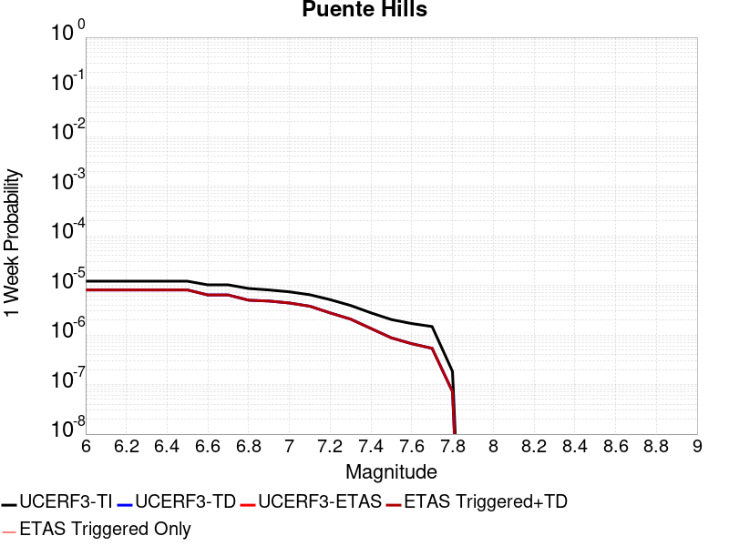 |  |  |  |

| Magnitude | 1 wk TI Prob | 1 wk TD Prob | 1 wk ETAS Prob | 1 wk ETAS/TD Gain | 1 wk ETAS Triggered+TD | 1 wk ETAS Triggered Only | 1 mo TI Prob | 1 mo TD Prob | 1 mo ETAS Prob | 1 mo ETAS/TD Gain | 1 mo ETAS Triggered+TD | 1 mo ETAS Triggered Only | 1 yr TI Prob | 1 yr TD Prob | 1 yr ETAS Prob | 1 yr ETAS/TD Gain | 1 yr ETAS Triggered+TD | 1 yr ETAS Triggered Only | 10 yr TI Prob | 10 yr TD Prob | 10 yr ETAS Prob | 10 yr ETAS/TD Gain | 10 yr ETAS Triggered+TD | 10 yr ETAS Triggered Only |
|-----|-----|-----|-----|-----|-----|-----|-----|-----|-----|-----|-----|-----|-----|-----|-----|-----|-----|-----|-----|-----|-----|-----|-----|-----|
| 6.0 | 1.2101656E-5 | 8.082964E-6 | 0.0 | 0.0 | 8.082964E-6 | 0.0 | 5.1863204E-5 | 3.464085E-5 | 0.0 | 0.0 | 3.464085E-5 | 0.0 | 6.312516E-4 | 4.2167635E-4 | 4.0E-4 | 0.94859487 | 4.2167635E-4 | 0.0 | 0.0062946146 | 0.0042093215 | 0.0027 | 0.6414336 | 0.0044084797 | 2.0E-4 |
| 6.1 | 1.2101656E-5 | 8.082964E-6 | 0.0 | 0.0 | 8.082964E-6 | 0.0 | 5.1863204E-5 | 3.464085E-5 | 0.0 | 0.0 | 3.464085E-5 | 0.0 | 6.312516E-4 | 4.2167635E-4 | 4.0E-4 | 0.94859487 | 4.2167635E-4 | 0.0 | 0.0062946146 | 0.0042093215 | 0.0027 | 0.6414336 | 0.0044084797 | 2.0E-4 |
| 6.2 | 1.2101656E-5 | 8.082964E-6 | 0.0 | 0.0 | 8.082964E-6 | 0.0 | 5.1863204E-5 | 3.464085E-5 | 0.0 | 0.0 | 3.464085E-5 | 0.0 | 6.312516E-4 | 4.2167635E-4 | 4.0E-4 | 0.94859487 | 4.2167635E-4 | 0.0 | 0.0062946146 | 0.0042093215 | 0.0027 | 0.6414336 | 0.0044084797 | 2.0E-4 |
| 6.3 | 1.2101656E-5 | 8.082964E-6 | 0.0 | 0.0 | 8.082964E-6 | 0.0 | 5.1863204E-5 | 3.464085E-5 | 0.0 | 0.0 | 3.464085E-5 | 0.0 | 6.312516E-4 | 4.2167635E-4 | 4.0E-4 | 0.94859487 | 4.2167635E-4 | 0.0 | 0.0062946146 | 0.0042093215 | 0.0027 | 0.6414336 | 0.0044084797 | 2.0E-4 |
| 6.4 | 1.2101656E-5 | 8.082964E-6 | 0.0 | 0.0 | 8.082964E-6 | 0.0 | 5.1863204E-5 | 3.464085E-5 | 0.0 | 0.0 | 3.464085E-5 | 0.0 | 6.312516E-4 | 4.2167635E-4 | 4.0E-4 | 0.94859487 | 4.2167635E-4 | 0.0 | 0.0062946146 | 0.0042093215 | 0.0027 | 0.6414336 | 0.0044084797 | 2.0E-4 |
| 6.5 | 1.2101656E-5 | 8.082964E-6 | 0.0 | 0.0 | 8.082964E-6 | 0.0 | 5.1863204E-5 | 3.464085E-5 | 0.0 | 0.0 | 3.464085E-5 | 0.0 | 6.312516E-4 | 4.2167635E-4 | 4.0E-4 | 0.94859487 | 4.2167635E-4 | 0.0 | 0.0062946146 | 0.0042093215 | 0.0027 | 0.6414336 | 0.0044084797 | 2.0E-4 |
| 6.6 | 1.0222488E-5 | 6.3847015E-6 | 0.0 | 0.0 | 6.3847015E-6 | 0.0 | 4.3809923E-5 | 2.7362734E-5 | 0.0 | 0.0 | 2.7362734E-5 | 0.0 | 5.332553E-4 | 3.3309282E-4 | 3.0E-4 | 0.9006499 | 3.3309282E-4 | 0.0 | 0.0053197746 | 0.00332618 | 0.0022 | 0.6614194 | 0.0035255149 | 2.0E-4 |
| 6.7 | 1.0222488E-5 | 6.3847015E-6 | 0.0 | 0.0 | 6.3847015E-6 | 0.0 | 4.3809923E-5 | 2.7362734E-5 | 0.0 | 0.0 | 2.7362734E-5 | 0.0 | 5.332553E-4 | 3.3309282E-4 | 3.0E-4 | 0.9006499 | 3.3309282E-4 | 0.0 | 0.0053197746 | 0.00332618 | 0.0022 | 0.6614194 | 0.0035255149 | 2.0E-4 |
| 6.8 | 8.6367845E-6 | 5.015095E-6 | 0.0 | 0.0 | 5.015095E-6 | 0.0 | 3.7014266E-5 | 2.1493091E-5 | 0.0 | 0.0 | 2.1493091E-5 | 0.0 | 4.505555E-4 | 2.616475E-4 | 3.0E-4 | 1.1465808 | 2.616475E-4 | 0.0 | 0.004496431 | 0.0026134506 | 0.0016 | 0.6122174 | 0.0027131892 | 1.0E-4 |
| 6.9 | 8.066481E-6 | 4.823201E-6 | 0.0 | 0.0 | 4.823201E-6 | 0.0 | 3.4570177E-5 | 2.0670699E-5 | 0.0 | 0.0 | 2.0670699E-5 | 0.0 | 4.2081063E-4 | 2.5163722E-4 | 3.0E-4 | 1.1921924 | 2.5163722E-4 | 0.0 | 0.0042001465 | 0.0025135765 | 0.0016 | 0.63654315 | 0.0026133251 | 1.0E-4 |
| 7.0 | 7.393828E-6 | 4.4051603E-6 | 0.0 | 0.0 | 4.4051603E-6 | 0.0 | 3.168745E-5 | 1.8879124E-5 | 0.0 | 0.0 | 1.8879124E-5 | 0.0 | 3.857264E-4 | 2.2982953E-4 | 3.0E-4 | 1.3053153 | 2.2982953E-4 | 0.0 | 0.0038505755 | 0.0022959637 | 0.0012 | 0.5226563 | 0.0023957342 | 1.0E-4 |
| 7.1 | 6.4660953E-6 | 3.793753E-6 | 0.0 | 0.0 | 3.793753E-6 | 0.0 | 2.7711543E-5 | 1.6258842E-5 | 0.0 | 0.0 | 1.6258842E-5 | 0.0 | 3.373358E-4 | 1.9793377E-4 | 3.0E-4 | 1.5156585 | 1.9793377E-4 | 0.0 | 0.0033682417 | 0.0019776104 | 0.001 | 0.5056608 | 0.0020774128 | 1.0E-4 |
| 7.2 | 5.143232E-6 | 2.7781773E-6 | 0.0 | 0.0 | 2.7781773E-6 | 0.0 | 2.2042237E-5 | 1.1906421E-5 | 0.0 | 0.0 | 1.1906421E-5 | 0.0 | 2.6833118E-4 | 1.4495112E-4 | 3.0E-4 | 2.0696633 | 1.4495112E-4 | 0.0 | 0.002680074 | 0.0014485754 | 6.0E-4 | 0.41420004 | 0.0014485754 | 0.0 |
| 7.3 | 3.928255E-6 | 2.0843436E-6 | 0.0 | 0.0 | 2.0843436E-6 | 0.0 | 1.683527E-5 | 8.932871E-6 | 0.0 | 0.0 | 8.932871E-6 | 0.0 | 2.0495013E-4 | 1.0875234E-4 | 3.0E-4 | 2.7585611 | 1.0875234E-4 | 0.0 | 0.002047612 | 0.0010869978 | 5.0E-4 | 0.4599825 | 0.0010869978 | 0.0 |
| 7.4 | 2.7894434E-6 | 1.3487361E-6 | 0.0 | 0.0 | 1.3487361E-6 | 0.0 | 1.1954703E-5 | 5.780285E-6 | 0.0 | 0.0 | 5.780285E-6 | 0.0 | 1.4553878E-4 | 7.037274E-5 | 2.0E-4 | 2.8420095 | 7.037274E-5 | 0.0 | 0.001454435 | 7.035089E-4 | 3.0E-4 | 0.42643383 | 7.035089E-4 | 0.0 |
| 7.5 | 2.041735E-6 | 8.7389367E-7 | 0.0 | 0.0 | 8.7389367E-7 | 0.0 | 8.750263E-6 | 3.7452535E-6 | 0.0 | 0.0 | 3.7452535E-6 | 0.0 | 1.06529245E-4 | 4.5597542E-5 | 2.0E-4 | 4.3862014 | 4.5597542E-5 | 0.0 | 0.0010647819 | 4.5588517E-4 | 3.0E-4 | 0.65806043 | 4.5588517E-4 | 0.0 |
| 7.6 | 1.6959062E-6 | 6.656155E-7 | 0.0 | 0.0 | 6.656155E-7 | 0.0 | 7.268149E-6 | 2.8526351E-6 | 0.0 | 0.0 | 2.8526351E-6 | 0.0 | 8.848612E-5 | 3.4730307E-5 | 2.0E-4 | 5.7586594 | 3.4730307E-5 | 0.0 | 8.84509E-4 | 3.4725165E-4 | 3.0E-4 | 0.8639268 | 3.4725165E-4 | 0.0 |
| 7.7 | 1.4767965E-6 | 5.369831E-7 | 0.0 | 0.0 | 5.369831E-7 | 0.0 | 6.3291122E-6 | 2.3013542E-6 | 0.0 | 0.0 | 2.3013542E-6 | 0.0 | 7.705422E-5 | 2.8018654E-5 | 2.0E-4 | 7.1381016 | 2.8018654E-5 | 0.0 | 7.702751E-4 | 2.8015376E-4 | 3.0E-4 | 1.0708406 | 2.8015376E-4 | 0.0 |
| 7.8 | 1.8432911E-7 | 7.2190026E-8 | 0.0 | 0.0 | 7.2190026E-8 | 0.0 | 7.8998164E-7 | 3.0938583E-7 | 0.0 | 0.0 | 3.0938583E-7 | 0.0 | 9.617985E-6 | 3.7667692E-6 | 0.0 | 0.0 | 3.7667692E-6 | 0.0 | 9.617568E-5 | 3.7667374E-5 | 0.0 | 0.0 | 3.7667374E-5 | 0.0 |

## Dry Mountain
*[(top)](#table-of-contents)*

| 1 Week | 1 Month | 1 Year | 10 Year |
|-----|-----|-----|-----|
|  |  |  | 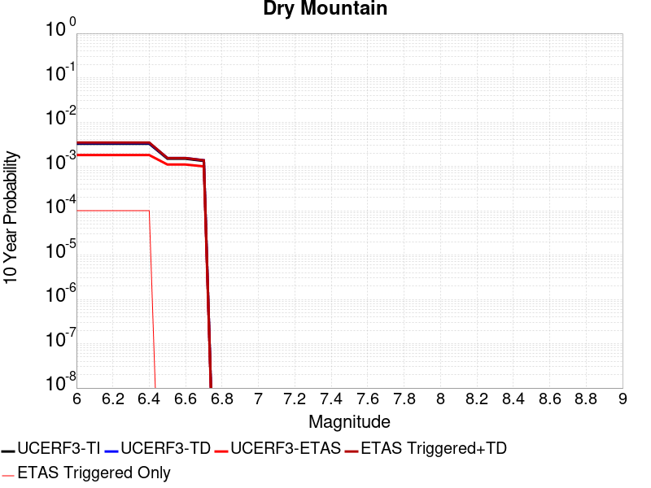 |

| Magnitude | 1 wk TI Prob | 1 wk TD Prob | 1 wk ETAS Prob | 1 wk ETAS/TD Gain | 1 wk ETAS Triggered+TD | 1 wk ETAS Triggered Only | 1 mo TI Prob | 1 mo TD Prob | 1 mo ETAS Prob | 1 mo ETAS/TD Gain | 1 mo ETAS Triggered+TD | 1 mo ETAS Triggered Only | 1 yr TI Prob | 1 yr TD Prob | 1 yr ETAS Prob | 1 yr ETAS/TD Gain | 1 yr ETAS Triggered+TD | 1 yr ETAS Triggered Only | 10 yr TI Prob | 10 yr TD Prob | 10 yr ETAS Prob | 10 yr ETAS/TD Gain | 10 yr ETAS Triggered+TD | 10 yr ETAS Triggered Only |
|-----|-----|-----|-----|-----|-----|-----|-----|-----|-----|-----|-----|-----|-----|-----|-----|-----|-----|-----|-----|-----|-----|-----|-----|-----|
| 6.0 | 6.222801E-6 | 6.437042E-6 | 0.0 | 0.0 | 6.437042E-6 | 0.0 | 2.6668875E-5 | 2.758712E-5 | 0.0 | 0.0 | 2.758712E-5 | 0.0 | 3.2464517E-4 | 3.3583734E-4 | 2.0E-4 | 0.5955264 | 3.3583734E-4 | 0.0 | 0.0032417132 | 0.003354859 | 0.0018 | 0.5365352 | 0.0034545236 | 1.0E-4 |
| 6.1 | 6.222801E-6 | 6.437042E-6 | 0.0 | 0.0 | 6.437042E-6 | 0.0 | 2.6668875E-5 | 2.758712E-5 | 0.0 | 0.0 | 2.758712E-5 | 0.0 | 3.2464517E-4 | 3.3583734E-4 | 2.0E-4 | 0.5955264 | 3.3583734E-4 | 0.0 | 0.0032417132 | 0.003354859 | 0.0018 | 0.5365352 | 0.0034545236 | 1.0E-4 |
| 6.2 | 6.222801E-6 | 6.437042E-6 | 0.0 | 0.0 | 6.437042E-6 | 0.0 | 2.6668875E-5 | 2.758712E-5 | 0.0 | 0.0 | 2.758712E-5 | 0.0 | 3.2464517E-4 | 3.3583734E-4 | 2.0E-4 | 0.5955264 | 3.3583734E-4 | 0.0 | 0.0032417132 | 0.003354859 | 0.0018 | 0.5365352 | 0.0034545236 | 1.0E-4 |
| 6.3 | 6.222801E-6 | 6.437042E-6 | 0.0 | 0.0 | 6.437042E-6 | 0.0 | 2.6668875E-5 | 2.758712E-5 | 0.0 | 0.0 | 2.758712E-5 | 0.0 | 3.2464517E-4 | 3.3583734E-4 | 2.0E-4 | 0.5955264 | 3.3583734E-4 | 0.0 | 0.0032417132 | 0.003354859 | 0.0018 | 0.5365352 | 0.0034545236 | 1.0E-4 |
| 6.4 | 6.222801E-6 | 6.437042E-6 | 0.0 | 0.0 | 6.437042E-6 | 0.0 | 2.6668875E-5 | 2.758712E-5 | 0.0 | 0.0 | 2.758712E-5 | 0.0 | 3.2464517E-4 | 3.3583734E-4 | 2.0E-4 | 0.5955264 | 3.3583734E-4 | 0.0 | 0.0032417132 | 0.003354859 | 0.0018 | 0.5365352 | 0.0034545236 | 1.0E-4 |
| 6.5 | 2.8528623E-6 | 2.951096E-6 | 0.0 | 0.0 | 2.951096E-6 | 0.0 | 1.22264955E-5 | 1.2647541E-5 | 0.0 | 0.0 | 1.2647541E-5 | 0.0 | 1.4884741E-4 | 1.5398163E-4 | 1.0E-4 | 0.6494281 | 1.5398163E-4 | 0.0 | 0.0014874774 | 0.0015396021 | 0.0011 | 0.7144703 | 0.0015396021 | 0.0 |
| 6.6 | 2.8528623E-6 | 2.951096E-6 | 0.0 | 0.0 | 2.951096E-6 | 0.0 | 1.22264955E-5 | 1.2647541E-5 | 0.0 | 0.0 | 1.2647541E-5 | 0.0 | 1.4884741E-4 | 1.5398163E-4 | 1.0E-4 | 0.6494281 | 1.5398163E-4 | 0.0 | 0.0014874774 | 0.0015396021 | 0.0011 | 0.7144703 | 0.0015396021 | 0.0 |
| 6.7 | 2.541E-6 | 2.6284035E-6 | 0.0 | 0.0 | 2.6284035E-6 | 0.0 | 1.0889954E-5 | 1.1264587E-5 | 0.0 | 0.0 | 1.1264587E-5 | 0.0 | 1.3257713E-4 | 1.3714634E-4 | 1.0E-4 | 0.72914815 | 1.3714634E-4 | 0.0 | 0.0013249806 | 0.0013714634 | 0.001 | 0.72914815 | 0.0013714634 | 0.0 |

## So Sierra Nevada
*[(top)](#table-of-contents)*

| 1 Week | 1 Month | 1 Year | 10 Year |
|-----|-----|-----|-----|
|  |  |  |  |

| Magnitude | 1 wk TI Prob | 1 wk TD Prob | 1 wk ETAS Prob | 1 wk ETAS/TD Gain | 1 wk ETAS Triggered+TD | 1 wk ETAS Triggered Only | 1 mo TI Prob | 1 mo TD Prob | 1 mo ETAS Prob | 1 mo ETAS/TD Gain | 1 mo ETAS Triggered+TD | 1 mo ETAS Triggered Only | 1 yr TI Prob | 1 yr TD Prob | 1 yr ETAS Prob | 1 yr ETAS/TD Gain | 1 yr ETAS Triggered+TD | 1 yr ETAS Triggered Only | 10 yr TI Prob | 10 yr TD Prob | 10 yr ETAS Prob | 10 yr ETAS/TD Gain | 10 yr ETAS Triggered+TD | 10 yr ETAS Triggered Only |
|-----|-----|-----|-----|-----|-----|-----|-----|-----|-----|-----|-----|-----|-----|-----|-----|-----|-----|-----|-----|-----|-----|-----|-----|-----|
| 6.0 | 1.15488665E-5 | 1.1072983E-5 | 0.0 | 0.0 | 1.1072983E-5 | 0.0 | 4.9494203E-5 | 4.745485E-5 | 0.0 | 0.0 | 4.745485E-5 | 0.0 | 6.024253E-4 | 5.776224E-4 | 3.0E-4 | 0.51937044 | 5.776224E-4 | 0.0 | 0.006007948 | 0.005762478 | 0.0041 | 0.71149945 | 0.0058619017 | 1.0E-4 |
| 6.1 | 1.15488665E-5 | 1.1072983E-5 | 0.0 | 0.0 | 1.1072983E-5 | 0.0 | 4.9494203E-5 | 4.745485E-5 | 0.0 | 0.0 | 4.745485E-5 | 0.0 | 6.024253E-4 | 5.776224E-4 | 3.0E-4 | 0.51937044 | 5.776224E-4 | 0.0 | 0.006007948 | 0.005762478 | 0.0041 | 0.71149945 | 0.0058619017 | 1.0E-4 |
| 6.2 | 1.15488665E-5 | 1.1072983E-5 | 0.0 | 0.0 | 1.1072983E-5 | 0.0 | 4.9494203E-5 | 4.745485E-5 | 0.0 | 0.0 | 4.745485E-5 | 0.0 | 6.024253E-4 | 5.776224E-4 | 3.0E-4 | 0.51937044 | 5.776224E-4 | 0.0 | 0.006007948 | 0.005762478 | 0.0041 | 0.71149945 | 0.0058619017 | 1.0E-4 |
| 6.3 | 1.15488665E-5 | 1.1072983E-5 | 0.0 | 0.0 | 1.1072983E-5 | 0.0 | 4.9494203E-5 | 4.745485E-5 | 0.0 | 0.0 | 4.745485E-5 | 0.0 | 6.024253E-4 | 5.776224E-4 | 3.0E-4 | 0.51937044 | 5.776224E-4 | 0.0 | 0.006007948 | 0.005762478 | 0.0041 | 0.71149945 | 0.0058619017 | 1.0E-4 |
| 6.4 | 1.15488665E-5 | 1.1072983E-5 | 0.0 | 0.0 | 1.1072983E-5 | 0.0 | 4.9494203E-5 | 4.745485E-5 | 0.0 | 0.0 | 4.745485E-5 | 0.0 | 6.024253E-4 | 5.776224E-4 | 3.0E-4 | 0.51937044 | 5.776224E-4 | 0.0 | 0.006007948 | 0.005762478 | 0.0041 | 0.71149945 | 0.0058619017 | 1.0E-4 |
| 6.5 | 1.15488665E-5 | 1.1072983E-5 | 0.0 | 0.0 | 1.1072983E-5 | 0.0 | 4.9494203E-5 | 4.745485E-5 | 0.0 | 0.0 | 4.745485E-5 | 0.0 | 6.024253E-4 | 5.776224E-4 | 3.0E-4 | 0.51937044 | 5.776224E-4 | 0.0 | 0.006007948 | 0.005762478 | 0.0041 | 0.71149945 | 0.0058619017 | 1.0E-4 |
| 6.6 | 7.587044E-6 | 6.93097E-6 | 0.0 | 0.0 | 6.93097E-6 | 0.0 | 3.2515498E-5 | 2.9703835E-5 | 0.0 | 0.0 | 2.9703835E-5 | 0.0 | 3.9580427E-4 | 3.615871E-4 | 1.0E-4 | 0.27655855 | 3.615871E-4 | 0.0 | 0.003951 | 0.0036102792 | 0.0025 | 0.6924673 | 0.0036102792 | 0.0 |
| 6.7 | 7.587044E-6 | 6.93097E-6 | 0.0 | 0.0 | 6.93097E-6 | 0.0 | 3.2515498E-5 | 2.9703835E-5 | 0.0 | 0.0 | 2.9703835E-5 | 0.0 | 3.9580427E-4 | 3.615871E-4 | 1.0E-4 | 0.27655855 | 3.615871E-4 | 0.0 | 0.003951 | 0.0036102792 | 0.0025 | 0.6924673 | 0.0036102792 | 0.0 |
| 6.8 | 5.9026956E-6 | 5.1755114E-6 | 0.0 | 0.0 | 5.1755114E-6 | 0.0 | 2.5297022E-5 | 2.218058E-5 | 0.0 | 0.0 | 2.218058E-5 | 0.0 | 3.0794772E-4 | 2.7001626E-4 | 0.0 | 0.0 | 2.7001626E-4 | 0.0 | 0.0030752132 | 0.002696998 | 0.0018 | 0.6674087 | 0.002696998 | 0.0 |
| 6.9 | 5.0118915E-6 | 4.248937E-6 | 0.0 | 0.0 | 4.248937E-6 | 0.0 | 2.1479358E-5 | 1.8209606E-5 | 0.0 | 0.0 | 1.8209606E-5 | 0.0 | 2.614798E-4 | 2.2168014E-4 | 0.0 | 0.0 | 2.2168014E-4 | 0.0 | 0.0026117235 | 0.0022146625 | 9.0E-4 | 0.40638244 | 0.0022146625 | 0.0 |
| 7.0 | 4.4924795E-6 | 3.7106392E-6 | 0.0 | 0.0 | 3.7106392E-6 | 0.0 | 1.925334E-5 | 1.5902646E-5 | 0.0 | 0.0 | 1.5902646E-5 | 0.0 | 2.3438422E-4 | 1.9359816E-4 | 0.0 | 0.0 | 1.9359816E-4 | 0.0 | 0.0023413717 | 0.0019343579 | 8.0E-4 | 0.41357392 | 0.0019343579 | 0.0 |
| 7.1 | 3.9118436E-6 | 3.1089503E-6 | 0.0 | 0.0 | 3.1089503E-6 | 0.0 | 1.6764936E-5 | 1.3324008E-5 | 0.0 | 0.0 | 1.3324008E-5 | 0.0 | 2.0409399E-4 | 1.622083E-4 | 0.0 | 0.0 | 1.622083E-4 | 0.0 | 0.0020390663 | 0.001620955 | 7.0E-4 | 0.4318442 | 0.001620955 | 0.0 |
| 7.2 | 3.4200818E-6 | 2.6026298E-6 | 0.0 | 0.0 | 2.6026298E-6 | 0.0 | 1.4657411E-5 | 1.1154083E-5 | 0.0 | 0.0 | 1.1154083E-5 | 0.0 | 1.7843937E-4 | 1.35793E-4 | 0.0 | 0.0 | 1.35793E-4 | 0.0 | 0.0017829615 | 0.0013571499 | 5.0E-4 | 0.3684191 | 0.0013571499 | 0.0 |
| 7.3 | 2.6593618E-6 | 1.8259041E-6 | 0.0 | 0.0 | 1.8259041E-6 | 0.0 | 1.13972155E-5 | 7.8252815E-6 | 0.0 | 0.0 | 7.8252815E-6 | 0.0 | 1.3875226E-4 | 9.526893E-5 | 0.0 | 0.0 | 9.526893E-5 | 0.0 | 0.0013866565 | 9.523098E-4 | 3.0E-4 | 0.31502354 | 9.523098E-4 | 0.0 |
| 7.4 | 2.2577992E-6 | 1.4341158E-6 | 0.0 | 0.0 | 1.4341158E-6 | 0.0 | 9.676246E-6 | 6.1461974E-6 | 0.0 | 0.0 | 6.1461974E-6 | 0.0 | 1.1780193E-4 | 7.4827636E-5 | 0.0 | 0.0 | 7.4827636E-5 | 0.0 | 0.001177395 | 7.4804947E-4 | 1.0E-4 | 0.133681 | 7.4804947E-4 | 0.0 |
| 7.5 | 1.489319E-6 | 7.335145E-7 | 0.0 | 0.0 | 7.335145E-7 | 0.0 | 6.3827797E-6 | 3.1436298E-6 | 0.0 | 0.0 | 3.1436298E-6 | 0.0 | 7.770758E-5 | 3.8273025E-5 | 0.0 | 0.0 | 3.8273025E-5 | 0.0 | 7.7680405E-4 | 3.8266476E-4 | 0.0 | 0.0 | 3.8266476E-4 | 0.0 |
| 7.6 | 1.0680322E-6 | 4.6453596E-7 | 0.0 | 0.0 | 4.6453596E-7 | 0.0 | 4.577273E-6 | 1.9908668E-6 | 0.0 | 0.0 | 1.9908668E-6 | 0.0 | 5.5726876E-5 | 2.4238538E-5 | 0.0 | 0.0 | 2.4238538E-5 | 0.0 | 5.5712904E-4 | 2.423592E-4 | 0.0 | 0.0 | 2.423592E-4 | 0.0 |
| 7.7 | 5.509146E-7 | 1.550042E-7 | 0.0 | 0.0 | 1.550042E-7 | 0.0 | 2.3610605E-6 | 6.6430357E-7 | 0.0 | 0.0 | 6.6430357E-7 | 0.0 | 2.8745531E-5 | 8.087867E-6 | 0.0 | 0.0 | 8.087867E-6 | 0.0 | 2.8741814E-4 | 8.087584E-5 | 0.0 | 0.0 | 8.087584E-5 | 0.0 |

## Kern Canyon (Lake Isabella) 2011
*[(top)](#table-of-contents)*

| 1 Week | 1 Month | 1 Year | 10 Year |
|-----|-----|-----|-----|
|  |  |  | 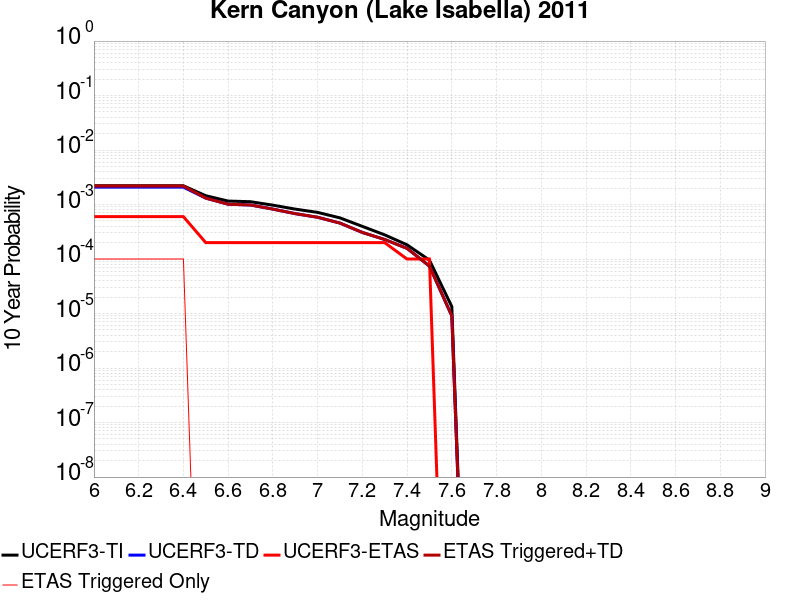 |

| Magnitude | 1 wk TI Prob | 1 wk TD Prob | 1 wk ETAS Prob | 1 wk ETAS/TD Gain | 1 wk ETAS Triggered+TD | 1 wk ETAS Triggered Only | 1 mo TI Prob | 1 mo TD Prob | 1 mo ETAS Prob | 1 mo ETAS/TD Gain | 1 mo ETAS Triggered+TD | 1 mo ETAS Triggered Only | 1 yr TI Prob | 1 yr TD Prob | 1 yr ETAS Prob | 1 yr ETAS/TD Gain | 1 yr ETAS Triggered+TD | 1 yr ETAS Triggered Only | 10 yr TI Prob | 10 yr TD Prob | 10 yr ETAS Prob | 10 yr ETAS/TD Gain | 10 yr ETAS Triggered+TD | 10 yr ETAS Triggered Only |
|-----|-----|-----|-----|-----|-----|-----|-----|-----|-----|-----|-----|-----|-----|-----|-----|-----|-----|-----|-----|-----|-----|-----|-----|-----|
| 6.0 | 4.2387383E-6 | 4.0006266E-6 | 0.0 | 0.0 | 4.0006266E-6 | 0.0 | 1.8165894E-5 | 1.7145441E-5 | 0.0 | 0.0 | 1.7145441E-5 | 0.0 | 2.2114732E-4 | 2.0872762E-4 | 1.0E-4 | 0.47909328 | 2.0872762E-4 | 0.0 | 0.0022092736 | 0.0020854995 | 6.0E-4 | 0.28770086 | 0.002185291 | 1.0E-4 |
| 6.1 | 4.2387383E-6 | 4.0006266E-6 | 0.0 | 0.0 | 4.0006266E-6 | 0.0 | 1.8165894E-5 | 1.7145441E-5 | 0.0 | 0.0 | 1.7145441E-5 | 0.0 | 2.2114732E-4 | 2.0872762E-4 | 1.0E-4 | 0.47909328 | 2.0872762E-4 | 0.0 | 0.0022092736 | 0.0020854995 | 6.0E-4 | 0.28770086 | 0.002185291 | 1.0E-4 |
| 6.2 | 4.2387383E-6 | 4.0006266E-6 | 0.0 | 0.0 | 4.0006266E-6 | 0.0 | 1.8165894E-5 | 1.7145441E-5 | 0.0 | 0.0 | 1.7145441E-5 | 0.0 | 2.2114732E-4 | 2.0872762E-4 | 1.0E-4 | 0.47909328 | 2.0872762E-4 | 0.0 | 0.0022092736 | 0.0020854995 | 6.0E-4 | 0.28770086 | 0.002185291 | 1.0E-4 |
| 6.3 | 4.2387383E-6 | 4.0006266E-6 | 0.0 | 0.0 | 4.0006266E-6 | 0.0 | 1.8165894E-5 | 1.7145441E-5 | 0.0 | 0.0 | 1.7145441E-5 | 0.0 | 2.2114732E-4 | 2.0872762E-4 | 1.0E-4 | 0.47909328 | 2.0872762E-4 | 0.0 | 0.0022092736 | 0.0020854995 | 6.0E-4 | 0.28770086 | 0.002185291 | 1.0E-4 |
| 6.4 | 4.2387383E-6 | 4.0006266E-6 | 0.0 | 0.0 | 4.0006266E-6 | 0.0 | 1.8165894E-5 | 1.7145441E-5 | 0.0 | 0.0 | 1.7145441E-5 | 0.0 | 2.2114732E-4 | 2.0872762E-4 | 1.0E-4 | 0.47909328 | 2.0872762E-4 | 0.0 | 0.0022092736 | 0.0020854995 | 6.0E-4 | 0.28770086 | 0.002185291 | 1.0E-4 |
| 6.5 | 2.7857532E-6 | 2.5171832E-6 | 0.0 | 0.0 | 2.5171832E-6 | 0.0 | 1.1938888E-5 | 1.0787886E-5 | 0.0 | 0.0 | 1.0787886E-5 | 0.0 | 1.4534626E-4 | 1.3133492E-4 | 1.0E-4 | 0.7614121 | 1.3133492E-4 | 0.0 | 0.0014525123 | 0.0013126058 | 2.0E-4 | 0.15236868 | 0.0013126058 | 0.0 |
| 6.6 | 2.2233348E-6 | 1.9435606E-6 | 0.0 | 0.0 | 1.9435606E-6 | 0.0 | 9.528543E-6 | 8.329519E-6 | 0.0 | 0.0 | 8.329519E-6 | 0.0 | 1.1600384E-4 | 1.0140726E-4 | 1.0E-4 | 0.98612267 | 1.0140726E-4 | 0.0 | 0.001159433 | 0.0010136185 | 2.0E-4 | 0.19731289 | 0.0010136185 | 0.0 |
| 6.7 | 2.1635126E-6 | 1.882949E-6 | 0.0 | 0.0 | 1.882949E-6 | 0.0 | 9.272164E-6 | 8.069757E-6 | 0.0 | 0.0 | 8.069757E-6 | 0.0 | 1.1288274E-4 | 9.824494E-5 | 1.0E-4 | 1.0178641 | 9.824494E-5 | 0.0 | 0.0011282542 | 9.820233E-4 | 2.0E-4 | 0.20366116 | 9.820233E-4 | 0.0 |
| 6.8 | 1.8685711E-6 | 1.5826456E-6 | 0.0 | 0.0 | 1.5826456E-6 | 0.0 | 8.008137E-6 | 6.7827496E-6 | 0.0 | 0.0 | 6.7827496E-6 | 0.0 | 9.74947E-5 | 8.2576895E-5 | 1.0E-4 | 1.2109925 | 8.2576895E-5 | 0.0 | 9.745194E-4 | 8.2546705E-4 | 2.0E-4 | 0.24228708 | 8.2546705E-4 | 0.0 |
| 6.9 | 1.5815071E-6 | 1.3060636E-6 | 0.0 | 0.0 | 1.3060636E-6 | 0.0 | 6.77787E-6 | 5.5974037E-6 | 0.0 | 0.0 | 5.5974037E-6 | 0.0 | 8.251744E-5 | 6.8146284E-5 | 1.0E-4 | 1.4674314 | 6.8146284E-5 | 0.0 | 8.248681E-4 | 6.812566E-4 | 2.0E-4 | 0.29357514 | 6.812566E-4 | 0.0 |
| 7.0 | 1.3772564E-6 | 1.1206982E-6 | 0.0 | 0.0 | 1.1206982E-6 | 0.0 | 5.9025137E-6 | 4.8029833E-6 | 0.0 | 0.0 | 4.8029833E-6 | 0.0 | 7.186073E-5 | 5.8474776E-5 | 1.0E-4 | 1.710139 | 5.8474776E-5 | 0.0 | 7.18375E-4 | 5.8459595E-4 | 2.0E-4 | 0.34211665 | 5.8459595E-4 | 0.0 |
| 7.1 | 1.0916998E-6 | 8.7609243E-7 | 0.0 | 0.0 | 8.7609243E-7 | 0.0 | 4.678705E-6 | 3.7546765E-6 | 0.0 | 0.0 | 3.7546765E-6 | 0.0 | 5.6961744E-5 | 4.571224E-5 | 1.0E-4 | 2.1875978 | 4.571224E-5 | 0.0 | 5.6947145E-4 | 4.5702973E-4 | 2.0E-4 | 0.4376083 | 4.5702973E-4 | 0.0 |
| 7.2 | 7.6277024E-7 | 5.899507E-7 | 0.0 | 0.0 | 5.899507E-7 | 0.0 | 3.2690114E-6 | 2.5283575E-6 | 0.0 | 0.0 | 2.5283575E-6 | 0.0 | 3.9799485E-5 | 3.0782325E-5 | 1.0E-4 | 3.2486176 | 3.0782325E-5 | 0.0 | 3.9792358E-4 | 3.077812E-4 | 2.0E-4 | 0.6498123 | 3.077812E-4 | 0.0 |
| 7.3 | 5.3265916E-7 | 4.381071E-7 | 0.0 | 0.0 | 4.381071E-7 | 0.0 | 2.282823E-6 | 1.8776004E-6 | 0.0 | 0.0 | 1.8776004E-6 | 0.0 | 2.7793016E-5 | 2.2859549E-5 | 1.0E-4 | 4.3745394 | 2.2859549E-5 | 0.0 | 2.778954E-4 | 2.2857236E-4 | 2.0E-4 | 0.8749964 | 2.2857236E-4 | 0.0 |
| 7.4 | 3.4946007E-7 | 3.0056464E-7 | 0.0 | 0.0 | 3.0056464E-7 | 0.0 | 1.497685E-6 | 1.2881335E-6 | 0.0 | 0.0 | 1.2881335E-6 | 0.0 | 1.8234163E-5 | 1.5682916E-5 | 0.0 | 0.0 | 1.5682916E-5 | 0.0 | 1.8232666E-4 | 1.568183E-4 | 1.0E-4 | 0.63768065 | 1.568183E-4 | 0.0 |
| 7.5 | 1.8317026E-7 | 1.4239252E-7 | 0.0 | 0.0 | 1.4239252E-7 | 0.0 | 7.850152E-7 | 6.102535E-7 | 0.0 | 0.0 | 6.102535E-7 | 0.0 | 9.557518E-6 | 7.429812E-6 | 0.0 | 0.0 | 7.429812E-6 | 0.0 | 9.5571064E-5 | 7.429571E-5 | 1.0E-4 | 1.3459727 | 7.429571E-5 | 0.0 |
| 7.6 | 2.572245E-8 | 1.734379E-8 | 0.0 | 0.0 | 1.734379E-8 | 0.0 | 1.10239064E-7 | 7.433053E-8 | 0.0 | 0.0 | 7.433053E-8 | 0.0 | 1.3421597E-6 | 9.049739E-7 | 0.0 | 0.0 | 9.049739E-7 | 0.0 | 1.3421517E-5 | 9.049708E-6 | 0.0 | 0.0 | 9.049708E-6 | 0.0 |

## Camp Rock 2011
*[(top)](#table-of-contents)*

| 1 Week | 1 Month | 1 Year | 10 Year |
|-----|-----|-----|-----|
|  |  |  |  |

| Magnitude | 1 wk TI Prob | 1 wk TD Prob | 1 wk ETAS Prob | 1 wk ETAS/TD Gain | 1 wk ETAS Triggered+TD | 1 wk ETAS Triggered Only | 1 mo TI Prob | 1 mo TD Prob | 1 mo ETAS Prob | 1 mo ETAS/TD Gain | 1 mo ETAS Triggered+TD | 1 mo ETAS Triggered Only | 1 yr TI Prob | 1 yr TD Prob | 1 yr ETAS Prob | 1 yr ETAS/TD Gain | 1 yr ETAS Triggered+TD | 1 yr ETAS Triggered Only | 10 yr TI Prob | 10 yr TD Prob | 10 yr ETAS Prob | 10 yr ETAS/TD Gain | 10 yr ETAS Triggered+TD | 10 yr ETAS Triggered Only |
|-----|-----|-----|-----|-----|-----|-----|-----|-----|-----|-----|-----|-----|-----|-----|-----|-----|-----|-----|-----|-----|-----|-----|-----|-----|
| 6.0 | 1.6710783E-5 | 4.2452543E-6 | 0.0 | 0.0 | 4.2452543E-6 | 0.0 | 7.161568E-5 | 1.8193823E-5 | 0.0 | 0.0 | 1.8193823E-5 | 0.0 | 8.7157206E-4 | 2.214878E-4 | 0.0 | 0.0 | 2.214878E-4 | 0.0 | 0.008681616 | 0.0022127233 | 0.0016 | 0.7230909 | 0.0023125021 | 1.0E-4 |
| 6.1 | 1.6710783E-5 | 4.2452543E-6 | 0.0 | 0.0 | 4.2452543E-6 | 0.0 | 7.161568E-5 | 1.8193823E-5 | 0.0 | 0.0 | 1.8193823E-5 | 0.0 | 8.7157206E-4 | 2.214878E-4 | 0.0 | 0.0 | 2.214878E-4 | 0.0 | 0.008681616 | 0.0022127233 | 0.0016 | 0.7230909 | 0.0023125021 | 1.0E-4 |
| 6.2 | 1.6710783E-5 | 4.2452543E-6 | 0.0 | 0.0 | 4.2452543E-6 | 0.0 | 7.161568E-5 | 1.8193823E-5 | 0.0 | 0.0 | 1.8193823E-5 | 0.0 | 8.7157206E-4 | 2.214878E-4 | 0.0 | 0.0 | 2.214878E-4 | 0.0 | 0.008681616 | 0.0022127233 | 0.0016 | 0.7230909 | 0.0023125021 | 1.0E-4 |
| 6.3 | 1.6710783E-5 | 4.2452543E-6 | 0.0 | 0.0 | 4.2452543E-6 | 0.0 | 7.161568E-5 | 1.8193823E-5 | 0.0 | 0.0 | 1.8193823E-5 | 0.0 | 8.7157206E-4 | 2.214878E-4 | 0.0 | 0.0 | 2.214878E-4 | 0.0 | 0.008681616 | 0.0022127233 | 0.0016 | 0.7230909 | 0.0023125021 | 1.0E-4 |
| 6.4 | 7.982846E-6 | 3.677464E-6 | 0.0 | 0.0 | 3.677464E-6 | 0.0 | 3.421175E-5 | 1.5760466E-5 | 0.0 | 0.0 | 1.5760466E-5 | 0.0 | 4.1644843E-4 | 1.9186713E-4 | 0.0 | 0.0 | 1.9186713E-4 | 0.0 | 0.0041566887 | 0.0019170496 | 0.0011 | 0.5737984 | 0.002016858 | 1.0E-4 |
| 6.5 | 7.982846E-6 | 3.677464E-6 | 0.0 | 0.0 | 3.677464E-6 | 0.0 | 3.421175E-5 | 1.5760466E-5 | 0.0 | 0.0 | 1.5760466E-5 | 0.0 | 4.1644843E-4 | 1.9186713E-4 | 0.0 | 0.0 | 1.9186713E-4 | 0.0 | 0.0041566887 | 0.0019170496 | 0.0011 | 0.5737984 | 0.002016858 | 1.0E-4 |
| 6.6 | 7.048869E-6 | 3.419898E-6 | 0.0 | 0.0 | 3.419898E-6 | 0.0 | 3.0209088E-5 | 1.4656624E-5 | 0.0 | 0.0 | 1.4656624E-5 | 0.0 | 3.677336E-4 | 1.784301E-4 | 0.0 | 0.0 | 1.784301E-4 | 0.0 | 0.0036712566 | 0.0017829001 | 0.0011 | 0.6169723 | 0.0018827217 | 1.0E-4 |
| 6.7 | 6.987307E-6 | 3.3579133E-6 | 0.0 | 0.0 | 3.3579133E-6 | 0.0 | 2.9945259E-5 | 1.4390979E-5 | 0.0 | 0.0 | 1.4390979E-5 | 0.0 | 3.6452254E-4 | 1.751964E-4 | 0.0 | 0.0 | 1.751964E-4 | 0.0 | 0.0036392517 | 0.0017506139 | 0.0011 | 0.62835103 | 0.0018504389 | 1.0E-4 |
| 6.8 | 6.3737602E-6 | 3.113684E-6 | 0.0 | 0.0 | 3.113684E-6 | 0.0 | 2.731583E-5 | 1.3344293E-5 | 0.0 | 0.0 | 1.3344293E-5 | 0.0 | 3.3251947E-4 | 1.6245493E-4 | 0.0 | 0.0 | 1.6245493E-4 | 0.0 | 0.0033202237 | 0.0016233904 | 0.0011 | 0.67759424 | 0.001723228 | 1.0E-4 |
| 6.9 | 6.112211E-6 | 2.9290313E-6 | 0.0 | 0.0 | 2.9290313E-6 | 0.0 | 2.6194928E-5 | 1.2552932E-5 | 0.0 | 0.0 | 1.2552932E-5 | 0.0 | 3.1887658E-4 | 1.528215E-4 | 0.0 | 0.0 | 1.528215E-4 | 0.0 | 0.003184194 | 0.001527192 | 0.001 | 0.65479654 | 0.001527192 | 0.0 |
| 7.0 | 5.5140117E-6 | 2.6382797E-6 | 0.0 | 0.0 | 2.6382797E-6 | 0.0 | 2.3631264E-5 | 1.1306866E-5 | 0.0 | 0.0 | 1.1306866E-5 | 0.0 | 2.8767265E-4 | 1.3765265E-4 | 0.0 | 0.0 | 1.3765265E-4 | 0.0 | 0.0028730053 | 0.0013756991 | 0.001 | 0.72690314 | 0.0013756991 | 0.0 |
| 7.1 | 4.8151105E-6 | 2.1311002E-6 | 0.0 | 0.0 | 2.1311002E-6 | 0.0 | 2.0636026E-5 | 9.133256E-6 | 0.0 | 0.0 | 9.133256E-6 | 0.0 | 2.5121463E-4 | 1.11191934E-4 | 0.0 | 0.0 | 1.11191934E-4 | 0.0 | 0.0025093083 | 0.0011113848 | 9.0E-4 | 0.8098005 | 0.0011113848 | 0.0 |
| 7.2 | 3.818335E-6 | 1.2912051E-6 | 0.0 | 0.0 | 1.2912051E-6 | 0.0 | 1.6364189E-5 | 5.533725E-6 | 0.0 | 0.0 | 5.533725E-6 | 0.0 | 1.9921579E-4 | 6.7371104E-5 | 0.0 | 0.0 | 6.7371104E-5 | 0.0 | 0.0019903728 | 6.73515E-4 | 7.0E-4 | 1.0393236 | 6.73515E-4 | 0.0 |
| 7.3 | 2.7166698E-6 | 7.363538E-7 | 0.0 | 0.0 | 7.363538E-7 | 0.0 | 1.1642818E-5 | 3.1557984E-6 | 0.0 | 0.0 | 3.1557984E-6 | 0.0 | 1.4174209E-4 | 3.8421185E-5 | 0.0 | 0.0 | 3.8421185E-5 | 0.0 | 0.0014165172 | 3.8414745E-4 | 4.0E-4 | 1.0412668 | 3.8414745E-4 | 0.0 |
| 7.4 | 2.0893426E-6 | 5.44573E-7 | 0.0 | 0.0 | 5.44573E-7 | 0.0 | 8.954295E-6 | 2.3338823E-6 | 0.0 | 0.0 | 2.3338823E-6 | 0.0 | 1.0901308E-4 | 2.8414652E-5 | 0.0 | 0.0 | 2.8414652E-5 | 0.0 | 0.0010895962 | 2.8411072E-4 | 4.0E-4 | 1.4079019 | 2.8411072E-4 | 0.0 |
| 7.5 | 1.1681728E-6 | 3.592513E-7 | 0.0 | 0.0 | 3.592513E-7 | 0.0 | 5.0064455E-6 | 1.5396474E-6 | 0.0 | 0.0 | 1.5396474E-6 | 0.0 | 6.0951766E-5 | 1.8745051E-5 | 0.0 | 0.0 | 1.8745051E-5 | 0.0 | 6.093505E-4 | 1.8743517E-4 | 4.0E-4 | 2.1340714 | 1.8743517E-4 | 0.0 |
| 7.6 | 1.3154387E-7 | 7.089255E-8 | 0.0 | 0.0 | 7.089255E-8 | 0.0 | 5.6375933E-7 | 3.0382517E-7 | 0.0 | 0.0 | 3.0382517E-7 | 0.0 | 6.863748E-6 | 3.6990668E-6 | 0.0 | 0.0 | 3.6990668E-6 | 0.0 | 6.863536E-5 | 3.6990208E-5 | 0.0 | 0.0 | 3.6990208E-5 | 0.0 |

## Fitzhugh Creek
*[(top)](#table-of-contents)*

| 1 Week | 1 Month | 1 Year | 10 Year |
|-----|-----|-----|-----|
|  |  |  | 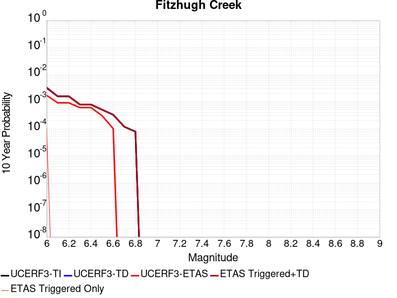 |

| Magnitude | 1 wk TI Prob | 1 wk TD Prob | 1 wk ETAS Prob | 1 wk ETAS/TD Gain | 1 wk ETAS Triggered+TD | 1 wk ETAS Triggered Only | 1 mo TI Prob | 1 mo TD Prob | 1 mo ETAS Prob | 1 mo ETAS/TD Gain | 1 mo ETAS Triggered+TD | 1 mo ETAS Triggered Only | 1 yr TI Prob | 1 yr TD Prob | 1 yr ETAS Prob | 1 yr ETAS/TD Gain | 1 yr ETAS Triggered+TD | 1 yr ETAS Triggered Only | 10 yr TI Prob | 10 yr TD Prob | 10 yr ETAS Prob | 10 yr ETAS/TD Gain | 10 yr ETAS Triggered+TD | 10 yr ETAS Triggered Only |
|-----|-----|-----|-----|-----|-----|-----|-----|-----|-----|-----|-----|-----|-----|-----|-----|-----|-----|-----|-----|-----|-----|-----|-----|-----|
| 6.0 | 6.1090436E-6 | 6.209083E-6 | 0.0 | 0.0 | 6.209083E-6 | 0.0 | 2.6181353E-5 | 2.6610109E-5 | 0.0 | 0.0 | 2.6610109E-5 | 0.0 | 3.1871133E-4 | 3.2393442E-4 | 3.0E-4 | 0.9261134 | 3.2393442E-4 | 0.0 | 0.0031825465 | 0.0032350663 | 0.0017 | 0.52549154 | 0.0033347427 | 1.0E-4 |
| 6.1 | 2.9741811E-6 | 3.021078E-6 | 0.0 | 0.0 | 3.021078E-6 | 0.0 | 1.2746428E-5 | 1.2947419E-5 | 0.0 | 0.0 | 1.2947419E-5 | 0.0 | 1.5517672E-4 | 1.5762437E-4 | 2.0E-4 | 1.2688394 | 1.5762437E-4 | 0.0 | 0.001550684 | 0.0015752186 | 9.0E-4 | 0.57134926 | 0.0015752186 | 0.0 |
| 6.2 | 2.9741811E-6 | 3.021078E-6 | 0.0 | 0.0 | 3.021078E-6 | 0.0 | 1.2746428E-5 | 1.2947419E-5 | 0.0 | 0.0 | 1.2947419E-5 | 0.0 | 1.5517672E-4 | 1.5762437E-4 | 2.0E-4 | 1.2688394 | 1.5762437E-4 | 0.0 | 0.001550684 | 0.0015752186 | 9.0E-4 | 0.57134926 | 0.0015752186 | 0.0 |
| 6.3 | 1.4781198E-6 | 1.5010254E-6 | 0.0 | 0.0 | 1.5010254E-6 | 0.0 | 6.3347834E-6 | 6.432951E-6 | 0.0 | 0.0 | 6.432951E-6 | 0.0 | 7.712326E-5 | 7.831857E-5 | 1.0E-4 | 1.2768364 | 7.831857E-5 | 0.0 | 7.70965E-4 | 7.829296E-4 | 6.0E-4 | 0.7663525 | 7.829296E-4 | 0.0 |
| 6.4 | 1.4781198E-6 | 1.5010254E-6 | 0.0 | 0.0 | 1.5010254E-6 | 0.0 | 6.3347834E-6 | 6.432951E-6 | 0.0 | 0.0 | 6.432951E-6 | 0.0 | 7.712326E-5 | 7.831857E-5 | 1.0E-4 | 1.2768364 | 7.831857E-5 | 0.0 | 7.70965E-4 | 7.829296E-4 | 6.0E-4 | 0.7663525 | 7.829296E-4 | 0.0 |
| 6.5 | 9.5176676E-7 | 9.664486E-7 | 0.0 | 0.0 | 9.664486E-7 | 0.0 | 4.078994E-6 | 4.1419166E-6 | 0.0 | 0.0 | 4.1419166E-6 | 0.0 | 4.9660623E-5 | 5.0426774E-5 | 1.0E-4 | 1.9830735 | 5.0426774E-5 | 0.0 | 4.964952E-4 | 5.0416373E-4 | 3.0E-4 | 0.5950448 | 5.0416373E-4 | 0.0 |
| 6.6 | 6.21145E-7 | 6.307556E-7 | 0.0 | 0.0 | 6.307556E-7 | 0.0 | 2.662047E-6 | 2.7032359E-6 | 0.0 | 0.0 | 2.7032359E-6 | 0.0 | 3.2409942E-5 | 3.2911466E-5 | 0.0 | 0.0 | 3.2911466E-5 | 0.0 | 3.2405215E-4 | 3.290725E-4 | 1.0E-4 | 0.30388442 | 3.290725E-4 | 0.0 |
| 6.7 | 2.2377962E-7 | 2.2730853E-7 | 0.0 | 0.0 | 2.2730853E-7 | 0.0 | 9.590551E-7 | 9.741792E-7 | 0.0 | 0.0 | 9.741792E-7 | 0.0 | 1.1676434E-5 | 1.1860599E-5 | 0.0 | 0.0 | 1.1860599E-5 | 0.0 | 1.1675821E-4 | 1.186028E-4 | 0.0 | 0.0 | 1.186028E-4 | 0.0 |
| 6.8 | 1.4785022E-7 | 1.5018983E-7 | 0.0 | 0.0 | 1.5018983E-7 | 0.0 | 6.3364365E-7 | 6.436707E-7 | 0.0 | 0.0 | 6.436707E-7 | 0.0 | 7.714584E-6 | 7.836691E-6 | 0.0 | 0.0 | 7.836691E-6 | 0.0 | 7.714316E-5 | 7.836691E-5 | 0.0 | 0.0 | 7.836691E-5 | 0.0 |

## Clamshell-Sawpit
*[(top)](#table-of-contents)*

| 1 Week | 1 Month | 1 Year | 10 Year |
|-----|-----|-----|-----|
| 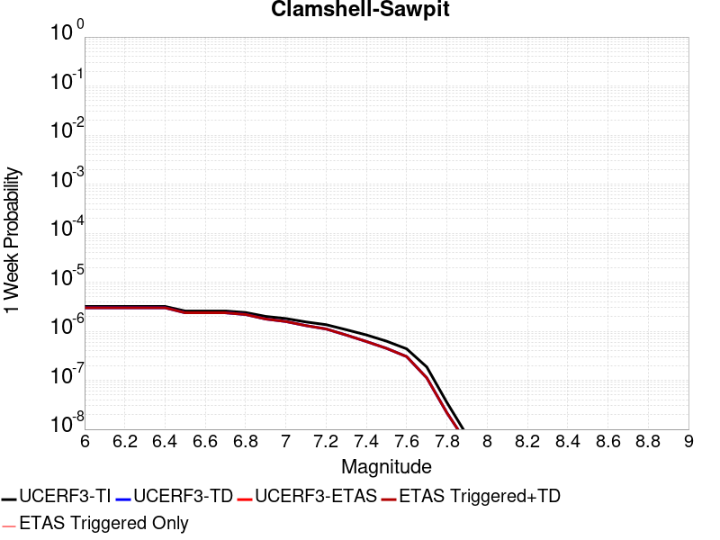 |  |  |  |

| Magnitude | 1 wk TI Prob | 1 wk TD Prob | 1 wk ETAS Prob | 1 wk ETAS/TD Gain | 1 wk ETAS Triggered+TD | 1 wk ETAS Triggered Only | 1 mo TI Prob | 1 mo TD Prob | 1 mo ETAS Prob | 1 mo ETAS/TD Gain | 1 mo ETAS Triggered+TD | 1 mo ETAS Triggered Only | 1 yr TI Prob | 1 yr TD Prob | 1 yr ETAS Prob | 1 yr ETAS/TD Gain | 1 yr ETAS Triggered+TD | 1 yr ETAS Triggered Only | 10 yr TI Prob | 10 yr TD Prob | 10 yr ETAS Prob | 10 yr ETAS/TD Gain | 10 yr ETAS Triggered+TD | 10 yr ETAS Triggered Only |
|-----|-----|-----|-----|-----|-----|-----|-----|-----|-----|-----|-----|-----|-----|-----|-----|-----|-----|-----|-----|-----|-----|-----|-----|-----|
| 6.0 | 3.202998E-6 | 3.010052E-6 | 0.0 | 0.0 | 3.010052E-6 | 0.0 | 1.3727062E-5 | 1.2900164E-5 | 0.0 | 0.0 | 1.2900164E-5 | 0.0 | 1.6711417E-4 | 1.5704897E-4 | 0.0 | 0.0 | 1.5704897E-4 | 0.0 | 0.0016698855 | 0.0015694592 | 9.0E-4 | 0.5734459 | 0.0016693022 | 1.0E-4 |
| 6.1 | 3.202998E-6 | 3.010052E-6 | 0.0 | 0.0 | 3.010052E-6 | 0.0 | 1.3727062E-5 | 1.2900164E-5 | 0.0 | 0.0 | 1.2900164E-5 | 0.0 | 1.6711417E-4 | 1.5704897E-4 | 0.0 | 0.0 | 1.5704897E-4 | 0.0 | 0.0016698855 | 0.0015694592 | 9.0E-4 | 0.5734459 | 0.0016693022 | 1.0E-4 |
| 6.2 | 3.202998E-6 | 3.010052E-6 | 0.0 | 0.0 | 3.010052E-6 | 0.0 | 1.3727062E-5 | 1.2900164E-5 | 0.0 | 0.0 | 1.2900164E-5 | 0.0 | 1.6711417E-4 | 1.5704897E-4 | 0.0 | 0.0 | 1.5704897E-4 | 0.0 | 0.0016698855 | 0.0015694592 | 9.0E-4 | 0.5734459 | 0.0016693022 | 1.0E-4 |
| 6.3 | 3.202998E-6 | 3.010052E-6 | 0.0 | 0.0 | 3.010052E-6 | 0.0 | 1.3727062E-5 | 1.2900164E-5 | 0.0 | 0.0 | 1.2900164E-5 | 0.0 | 1.6711417E-4 | 1.5704897E-4 | 0.0 | 0.0 | 1.5704897E-4 | 0.0 | 0.0016698855 | 0.0015694592 | 9.0E-4 | 0.5734459 | 0.0016693022 | 1.0E-4 |
| 6.4 | 3.202998E-6 | 3.010052E-6 | 0.0 | 0.0 | 3.010052E-6 | 0.0 | 1.3727062E-5 | 1.2900164E-5 | 0.0 | 0.0 | 1.2900164E-5 | 0.0 | 1.6711417E-4 | 1.5704897E-4 | 0.0 | 0.0 | 1.5704897E-4 | 0.0 | 0.0016698855 | 0.0015694592 | 9.0E-4 | 0.5734459 | 0.0016693022 | 1.0E-4 |
| 6.5 | 2.5862723E-6 | 2.3782259E-6 | 0.0 | 0.0 | 2.3782259E-6 | 0.0 | 1.1083977E-5 | 1.0192358E-5 | 0.0 | 0.0 | 1.0192358E-5 | 0.0 | 1.3493907E-4 | 1.240852E-4 | 0.0 | 0.0 | 1.240852E-4 | 0.0 | 0.0013485716 | 0.0012401894 | 6.0E-4 | 0.48379707 | 0.0012401894 | 0.0 |
| 6.6 | 2.5862723E-6 | 2.3782259E-6 | 0.0 | 0.0 | 2.3782259E-6 | 0.0 | 1.1083977E-5 | 1.0192358E-5 | 0.0 | 0.0 | 1.0192358E-5 | 0.0 | 1.3493907E-4 | 1.240852E-4 | 0.0 | 0.0 | 1.240852E-4 | 0.0 | 0.0013485716 | 0.0012401894 | 6.0E-4 | 0.48379707 | 0.0012401894 | 0.0 |
| 6.7 | 2.5862723E-6 | 2.3782259E-6 | 0.0 | 0.0 | 2.3782259E-6 | 0.0 | 1.1083977E-5 | 1.0192358E-5 | 0.0 | 0.0 | 1.0192358E-5 | 0.0 | 1.3493907E-4 | 1.240852E-4 | 0.0 | 0.0 | 1.240852E-4 | 0.0 | 0.0013485716 | 0.0012401894 | 6.0E-4 | 0.48379707 | 0.0012401894 | 0.0 |
| 6.8 | 2.4098806E-6 | 2.1952537E-6 | 0.0 | 0.0 | 2.1952537E-6 | 0.0 | 1.0328019E-5 | 9.408198E-6 | 0.0 | 0.0 | 9.408198E-6 | 0.0 | 1.2573638E-4 | 1.14539056E-4 | 0.0 | 0.0 | 1.14539056E-4 | 0.0 | 0.0012566525 | 0.0011448268 | 5.0E-4 | 0.43674728 | 0.0011448268 | 0.0 |
| 6.9 | 2.0073985E-6 | 1.7761307E-6 | 0.0 | 0.0 | 1.7761307E-6 | 0.0 | 8.603109E-6 | 7.6119672E-6 | 0.0 | 0.0 | 7.6119672E-6 | 0.0 | 1.0473781E-4 | 9.267188E-5 | 0.0 | 0.0 | 9.267188E-5 | 0.0 | 0.0010468846 | 9.263442E-4 | 5.0E-4 | 0.5397562 | 9.263442E-4 | 0.0 |
| 7.0 | 1.8166766E-6 | 1.5784912E-6 | 0.0 | 0.0 | 1.5784912E-6 | 0.0 | 7.785734E-6 | 6.7649453E-6 | 0.0 | 0.0 | 6.7649453E-6 | 0.0 | 9.478718E-5 | 8.2360195E-5 | 0.0 | 0.0 | 8.2360195E-5 | 0.0 | 9.4746763E-4 | 8.2330673E-4 | 5.0E-4 | 0.6073071 | 8.2330673E-4 | 0.0 |
| 7.1 | 1.5471421E-6 | 1.3032243E-6 | 0.0 | 0.0 | 1.3032243E-6 | 0.0 | 6.6305925E-6 | 5.585235E-6 | 0.0 | 0.0 | 5.585235E-6 | 0.0 | 8.072447E-5 | 6.799817E-5 | 0.0 | 0.0 | 6.799817E-5 | 0.0 | 8.0695155E-4 | 6.797791E-4 | 3.0E-4 | 0.44131985 | 6.797791E-4 | 0.0 |
| 7.2 | 1.3608037E-6 | 1.1133725E-6 | 0.0 | 0.0 | 1.1133725E-6 | 0.0 | 5.8320024E-6 | 4.771588E-6 | 0.0 | 0.0 | 4.771588E-6 | 0.0 | 7.1002316E-5 | 5.809258E-5 | 0.0 | 0.0 | 5.809258E-5 | 0.0 | 7.097964E-4 | 5.807785E-4 | 2.0E-4 | 0.34436533 | 5.807785E-4 | 0.0 |
| 7.3 | 1.0749634E-6 | 8.366195E-7 | 0.0 | 0.0 | 8.366195E-7 | 0.0 | 4.6069777E-6 | 3.5855076E-6 | 0.0 | 0.0 | 3.5855076E-6 | 0.0 | 5.608851E-5 | 4.3652708E-5 | 0.0 | 0.0 | 4.3652708E-5 | 0.0 | 5.6074356E-4 | 4.3644413E-4 | 2.0E-4 | 0.45824882 | 4.3644413E-4 | 0.0 |
| 7.4 | 8.416856E-7 | 6.1834277E-7 | 0.0 | 0.0 | 6.1834277E-7 | 0.0 | 3.607219E-6 | 2.650038E-6 | 0.0 | 0.0 | 2.650038E-6 | 0.0 | 4.3917007E-5 | 3.2263753E-5 | 0.0 | 0.0 | 3.2263753E-5 | 0.0 | 4.390833E-4 | 3.2259262E-4 | 1.0E-4 | 0.30998847 | 3.2259262E-4 | 0.0 |
| 7.5 | 6.2779594E-7 | 4.4814578E-7 | 0.0 | 0.0 | 4.4814578E-7 | 0.0 | 2.6905511E-6 | 1.9206234E-6 | 0.0 | 0.0 | 1.9206234E-6 | 0.0 | 3.275697E-5 | 2.3383358E-5 | 0.0 | 0.0 | 2.3383358E-5 | 0.0 | 3.275214E-4 | 2.3381083E-4 | 1.0E-4 | 0.4276962 | 2.3381083E-4 | 0.0 |
| 7.6 | 4.3822078E-7 | 3.0451272E-7 | 0.0 | 0.0 | 3.0451272E-7 | 0.0 | 1.8780877E-6 | 1.305054E-6 | 0.0 | 0.0 | 1.305054E-6 | 0.0 | 2.2865479E-5 | 1.5888932E-5 | 0.0 | 0.0 | 1.5888932E-5 | 0.0 | 2.2863125E-4 | 1.5887948E-4 | 1.0E-4 | 0.6294079 | 1.5887948E-4 | 0.0 |
| 7.7 | 1.8704569E-7 | 1.1223184E-7 | 0.0 | 0.0 | 1.1223184E-7 | 0.0 | 8.0162414E-7 | 4.809935E-7 | 0.0 | 0.0 | 4.809935E-7 | 0.0 | 9.75973E-6 | 5.856081E-6 | 0.0 | 0.0 | 5.856081E-6 | 0.0 | 9.7593016E-5 | 5.855933E-5 | 0.0 | 0.0 | 5.855933E-5 | 0.0 |
| 7.8 | 3.5378733E-8 | 2.1797728E-8 | 0.0 | 0.0 | 2.1797728E-8 | 0.0 | 1.5162313E-7 | 9.3418834E-8 | 0.0 | 0.0 | 9.3418834E-8 | 0.0 | 1.84601E-6 | 1.1373737E-6 | 0.0 | 0.0 | 1.1373737E-6 | 0.0 | 1.8459947E-5 | 1.1373682E-5 | 0.0 | 0.0 | 1.1373682E-5 | 0.0 |
| 7.9 | 7.504945E-9 | 5.1874287E-9 | 0.0 | 0.0 | 5.1874287E-9 | 0.0 | 3.2164053E-8 | 2.2231838E-8 | 0.0 | 0.0 | 2.2231838E-8 | 0.0 | 3.9159727E-7 | 2.706726E-7 | 0.0 | 0.0 | 2.706726E-7 | 0.0 | 3.915966E-6 | 2.7067233E-6 | 0.0 | 0.0 | 2.7067233E-6 | 0.0 |
| 8.0 | 1.6554036E-10 | 1.4178592E-10 | 0.0 | 0.0 | 1.4178592E-10 | 0.0 | 7.0945894E-10 | 6.0765415E-10 | 0.0 | 0.0 | 6.0765415E-10 | 0.0 | 8.637662E-9 | 7.398189E-9 | 0.0 | 0.0 | 7.398189E-9 | 0.0 | 8.6376616E-8 | 7.3981894E-8 | 0.0 | 0.0 | 7.3981894E-8 | 0.0 |

## Great Valley 14 (Kettleman Hills)
*[(top)](#table-of-contents)*

| 1 Week | 1 Month | 1 Year | 10 Year |
|-----|-----|-----|-----|
|  |  | 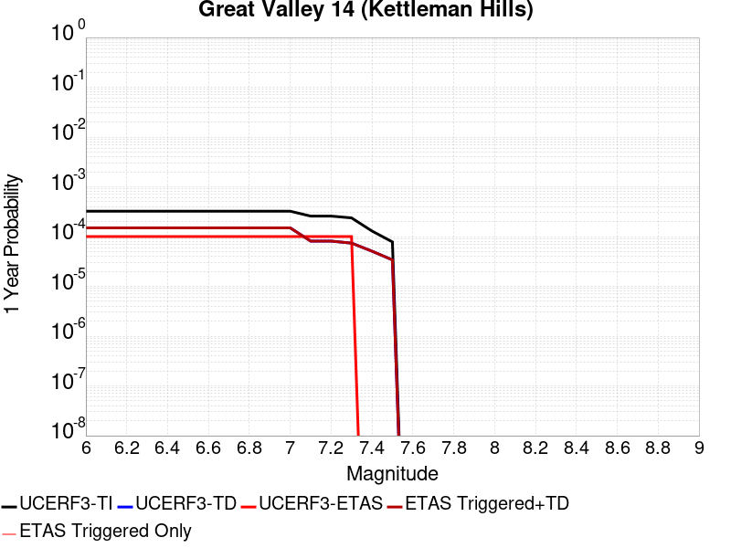 |  |

| Magnitude | 1 wk TI Prob | 1 wk TD Prob | 1 wk ETAS Prob | 1 wk ETAS/TD Gain | 1 wk ETAS Triggered+TD | 1 wk ETAS Triggered Only | 1 mo TI Prob | 1 mo TD Prob | 1 mo ETAS Prob | 1 mo ETAS/TD Gain | 1 mo ETAS Triggered+TD | 1 mo ETAS Triggered Only | 1 yr TI Prob | 1 yr TD Prob | 1 yr ETAS Prob | 1 yr ETAS/TD Gain | 1 yr ETAS Triggered+TD | 1 yr ETAS Triggered Only | 10 yr TI Prob | 10 yr TD Prob | 10 yr ETAS Prob | 10 yr ETAS/TD Gain | 10 yr ETAS Triggered+TD | 10 yr ETAS Triggered Only |
|-----|-----|-----|-----|-----|-----|-----|-----|-----|-----|-----|-----|-----|-----|-----|-----|-----|-----|-----|-----|-----|-----|-----|-----|-----|
| 6.0 | 6.2057843E-6 | 2.8718878E-6 | 0.0 | 0.0 | 2.8718878E-6 | 0.0 | 2.6595946E-5 | 1.2308045E-5 | 0.0 | 0.0 | 1.2308045E-5 | 0.0 | 3.2375753E-4 | 1.498425E-4 | 1.0E-4 | 0.6673674 | 1.498425E-4 | 0.0 | 0.0032328626 | 0.0014976456 | 8.0E-4 | 0.53417176 | 0.0015974959 | 1.0E-4 |
| 6.1 | 6.2057843E-6 | 2.8718878E-6 | 0.0 | 0.0 | 2.8718878E-6 | 0.0 | 2.6595946E-5 | 1.2308045E-5 | 0.0 | 0.0 | 1.2308045E-5 | 0.0 | 3.2375753E-4 | 1.498425E-4 | 1.0E-4 | 0.6673674 | 1.498425E-4 | 0.0 | 0.0032328626 | 0.0014976456 | 8.0E-4 | 0.53417176 | 0.0015974959 | 1.0E-4 |
| 6.2 | 6.2057843E-6 | 2.8718878E-6 | 0.0 | 0.0 | 2.8718878E-6 | 0.0 | 2.6595946E-5 | 1.2308045E-5 | 0.0 | 0.0 | 1.2308045E-5 | 0.0 | 3.2375753E-4 | 1.498425E-4 | 1.0E-4 | 0.6673674 | 1.498425E-4 | 0.0 | 0.0032328626 | 0.0014976456 | 8.0E-4 | 0.53417176 | 0.0015974959 | 1.0E-4 |
| 6.3 | 6.2057843E-6 | 2.8718878E-6 | 0.0 | 0.0 | 2.8718878E-6 | 0.0 | 2.6595946E-5 | 1.2308045E-5 | 0.0 | 0.0 | 1.2308045E-5 | 0.0 | 3.2375753E-4 | 1.498425E-4 | 1.0E-4 | 0.6673674 | 1.498425E-4 | 0.0 | 0.0032328626 | 0.0014976456 | 8.0E-4 | 0.53417176 | 0.0015974959 | 1.0E-4 |
| 6.4 | 6.2057843E-6 | 2.8718878E-6 | 0.0 | 0.0 | 2.8718878E-6 | 0.0 | 2.6595946E-5 | 1.2308045E-5 | 0.0 | 0.0 | 1.2308045E-5 | 0.0 | 3.2375753E-4 | 1.498425E-4 | 1.0E-4 | 0.6673674 | 1.498425E-4 | 0.0 | 0.0032328626 | 0.0014976456 | 8.0E-4 | 0.53417176 | 0.0015974959 | 1.0E-4 |
| 6.5 | 6.2057843E-6 | 2.8718878E-6 | 0.0 | 0.0 | 2.8718878E-6 | 0.0 | 2.6595946E-5 | 1.2308045E-5 | 0.0 | 0.0 | 1.2308045E-5 | 0.0 | 3.2375753E-4 | 1.498425E-4 | 1.0E-4 | 0.6673674 | 1.498425E-4 | 0.0 | 0.0032328626 | 0.0014976456 | 8.0E-4 | 0.53417176 | 0.0015974959 | 1.0E-4 |
| 6.6 | 6.2057843E-6 | 2.8718878E-6 | 0.0 | 0.0 | 2.8718878E-6 | 0.0 | 2.6595946E-5 | 1.2308045E-5 | 0.0 | 0.0 | 1.2308045E-5 | 0.0 | 3.2375753E-4 | 1.498425E-4 | 1.0E-4 | 0.6673674 | 1.498425E-4 | 0.0 | 0.0032328626 | 0.0014976456 | 8.0E-4 | 0.53417176 | 0.0015974959 | 1.0E-4 |
| 6.7 | 6.2057843E-6 | 2.8718878E-6 | 0.0 | 0.0 | 2.8718878E-6 | 0.0 | 2.6595946E-5 | 1.2308045E-5 | 0.0 | 0.0 | 1.2308045E-5 | 0.0 | 3.2375753E-4 | 1.498425E-4 | 1.0E-4 | 0.6673674 | 1.498425E-4 | 0.0 | 0.0032328626 | 0.0014976456 | 8.0E-4 | 0.53417176 | 0.0015974959 | 1.0E-4 |
| 6.8 | 6.2057843E-6 | 2.8718878E-6 | 0.0 | 0.0 | 2.8718878E-6 | 0.0 | 2.6595946E-5 | 1.2308045E-5 | 0.0 | 0.0 | 1.2308045E-5 | 0.0 | 3.2375753E-4 | 1.498425E-4 | 1.0E-4 | 0.6673674 | 1.498425E-4 | 0.0 | 0.0032328626 | 0.0014976456 | 8.0E-4 | 0.53417176 | 0.0015974959 | 1.0E-4 |
| 6.9 | 6.2057843E-6 | 2.8718878E-6 | 0.0 | 0.0 | 2.8718878E-6 | 0.0 | 2.6595946E-5 | 1.2308045E-5 | 0.0 | 0.0 | 1.2308045E-5 | 0.0 | 3.2375753E-4 | 1.498425E-4 | 1.0E-4 | 0.6673674 | 1.498425E-4 | 0.0 | 0.0032328626 | 0.0014976456 | 8.0E-4 | 0.53417176 | 0.0015974959 | 1.0E-4 |
| 7.0 | 6.2057843E-6 | 2.8718878E-6 | 0.0 | 0.0 | 2.8718878E-6 | 0.0 | 2.6595946E-5 | 1.2308045E-5 | 0.0 | 0.0 | 1.2308045E-5 | 0.0 | 3.2375753E-4 | 1.498425E-4 | 1.0E-4 | 0.6673674 | 1.498425E-4 | 0.0 | 0.0032328626 | 0.0014976456 | 8.0E-4 | 0.53417176 | 0.0015974959 | 1.0E-4 |
| 7.1 | 4.95113E-6 | 1.5563107E-6 | 0.0 | 0.0 | 1.5563107E-6 | 0.0 | 2.1218955E-5 | 6.6698876E-6 | 0.0 | 0.0 | 6.6698876E-6 | 0.0 | 2.5831014E-4 | 8.120304E-5 | 1.0E-4 | 1.231481 | 8.120304E-5 | 0.0 | 0.0025801011 | 8.117526E-4 | 5.0E-4 | 0.61595124 | 8.117526E-4 | 0.0 |
| 7.2 | 4.95113E-6 | 1.5563107E-6 | 0.0 | 0.0 | 1.5563107E-6 | 0.0 | 2.1218955E-5 | 6.6698876E-6 | 0.0 | 0.0 | 6.6698876E-6 | 0.0 | 2.5831014E-4 | 8.120304E-5 | 1.0E-4 | 1.231481 | 8.120304E-5 | 0.0 | 0.0025801011 | 8.117526E-4 | 5.0E-4 | 0.61595124 | 8.117526E-4 | 0.0 |
| 7.3 | 4.5549086E-6 | 1.4185493E-6 | 0.0 | 0.0 | 1.4185493E-6 | 0.0 | 1.9520892E-5 | 6.0794837E-6 | 0.0 | 0.0 | 6.0794837E-6 | 0.0 | 2.3764092E-4 | 7.401537E-5 | 1.0E-4 | 1.3510708 | 7.401537E-5 | 0.0 | 0.0023738695 | 7.399237E-4 | 4.0E-4 | 0.5405963 | 7.399237E-4 | 0.0 |
| 7.4 | 2.4837766E-6 | 9.774011E-7 | 0.0 | 0.0 | 9.774011E-7 | 0.0 | 1.0644713E-5 | 4.1888557E-6 | 0.0 | 0.0 | 4.1888557E-6 | 0.0 | 1.2959167E-4 | 5.099819E-5 | 0.0 | 0.0 | 5.099819E-5 | 0.0 | 0.0012951613 | 5.098714E-4 | 2.0E-4 | 0.39225575 | 5.098714E-4 | 0.0 |
| 7.5 | 1.5002679E-6 | 6.5268995E-7 | 0.0 | 0.0 | 6.5268995E-7 | 0.0 | 6.4297037E-6 | 2.79724E-6 | 0.0 | 0.0 | 2.79724E-6 | 0.0 | 7.827883E-5 | 3.4055905E-5 | 0.0 | 0.0 | 3.4055905E-5 | 0.0 | 7.825126E-4 | 3.40511E-4 | 1.0E-4 | 0.29367626 | 3.40511E-4 | 0.0 |

## Dog Valley
*[(top)](#table-of-contents)*

| 1 Week | 1 Month | 1 Year | 10 Year |
|-----|-----|-----|-----|
| 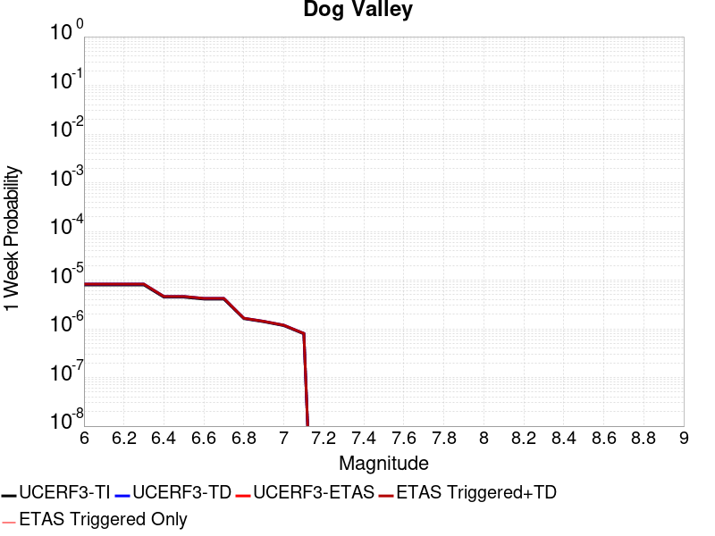 |  |  |  |

| Magnitude | 1 wk TI Prob | 1 wk TD Prob | 1 wk ETAS Prob | 1 wk ETAS/TD Gain | 1 wk ETAS Triggered+TD | 1 wk ETAS Triggered Only | 1 mo TI Prob | 1 mo TD Prob | 1 mo ETAS Prob | 1 mo ETAS/TD Gain | 1 mo ETAS Triggered+TD | 1 mo ETAS Triggered Only | 1 yr TI Prob | 1 yr TD Prob | 1 yr ETAS Prob | 1 yr ETAS/TD Gain | 1 yr ETAS Triggered+TD | 1 yr ETAS Triggered Only | 10 yr TI Prob | 10 yr TD Prob | 10 yr ETAS Prob | 10 yr ETAS/TD Gain | 10 yr ETAS Triggered+TD | 10 yr ETAS Triggered Only |
|-----|-----|-----|-----|-----|-----|-----|-----|-----|-----|-----|-----|-----|-----|-----|-----|-----|-----|-----|-----|-----|-----|-----|-----|-----|
| 6.0 | 7.949598E-6 | 8.272174E-6 | 0.0 | 0.0 | 8.272174E-6 | 0.0 | 3.4069257E-5 | 3.54518E-5 | 0.0 | 0.0 | 3.54518E-5 | 0.0 | 4.1471425E-4 | 4.315598E-4 | 2.0E-4 | 0.46343517 | 4.315598E-4 | 0.0 | 0.0041394117 | 0.0043091457 | 0.0021 | 0.48733556 | 0.004408715 | 1.0E-4 |
| 6.1 | 7.949598E-6 | 8.272174E-6 | 0.0 | 0.0 | 8.272174E-6 | 0.0 | 3.4069257E-5 | 3.54518E-5 | 0.0 | 0.0 | 3.54518E-5 | 0.0 | 4.1471425E-4 | 4.315598E-4 | 2.0E-4 | 0.46343517 | 4.315598E-4 | 0.0 | 0.0041394117 | 0.0043091457 | 0.0021 | 0.48733556 | 0.004408715 | 1.0E-4 |
| 6.2 | 7.949598E-6 | 8.272174E-6 | 0.0 | 0.0 | 8.272174E-6 | 0.0 | 3.4069257E-5 | 3.54518E-5 | 0.0 | 0.0 | 3.54518E-5 | 0.0 | 4.1471425E-4 | 4.315598E-4 | 2.0E-4 | 0.46343517 | 4.315598E-4 | 0.0 | 0.0041394117 | 0.0043091457 | 0.0021 | 0.48733556 | 0.004408715 | 1.0E-4 |
| 6.3 | 7.949598E-6 | 8.272174E-6 | 0.0 | 0.0 | 8.272174E-6 | 0.0 | 3.4069257E-5 | 3.54518E-5 | 0.0 | 0.0 | 3.54518E-5 | 0.0 | 4.1471425E-4 | 4.315598E-4 | 2.0E-4 | 0.46343517 | 4.315598E-4 | 0.0 | 0.0041394117 | 0.0043091457 | 0.0021 | 0.48733556 | 0.004408715 | 1.0E-4 |
| 6.4 | 4.462132E-6 | 4.6214154E-6 | 0.0 | 0.0 | 4.6214154E-6 | 0.0 | 1.9123283E-5 | 1.9805966E-5 | 0.0 | 0.0 | 1.9805966E-5 | 0.0 | 2.328011E-4 | 2.411199E-4 | 1.0E-4 | 0.41473144 | 2.411199E-4 | 0.0 | 0.0023255737 | 0.002409459 | 0.0012 | 0.4980371 | 0.0025092182 | 1.0E-4 |
| 6.5 | 4.462132E-6 | 4.6214154E-6 | 0.0 | 0.0 | 4.6214154E-6 | 0.0 | 1.9123283E-5 | 1.9805966E-5 | 0.0 | 0.0 | 1.9805966E-5 | 0.0 | 2.328011E-4 | 2.411199E-4 | 1.0E-4 | 0.41473144 | 2.411199E-4 | 0.0 | 0.0023255737 | 0.002409459 | 0.0012 | 0.4980371 | 0.0025092182 | 1.0E-4 |
| 6.6 | 4.074213E-6 | 4.2158235E-6 | 0.0 | 0.0 | 4.2158235E-6 | 0.0 | 1.7460794E-5 | 1.8067738E-5 | 0.0 | 0.0 | 1.8067738E-5 | 0.0 | 2.1256444E-4 | 2.199613E-4 | 1.0E-4 | 0.45462546 | 2.199613E-4 | 0.0 | 0.0021236122 | 0.0021982966 | 0.0011 | 0.50038743 | 0.0022980769 | 1.0E-4 |
| 6.7 | 4.074213E-6 | 4.2158235E-6 | 0.0 | 0.0 | 4.2158235E-6 | 0.0 | 1.7460794E-5 | 1.8067738E-5 | 0.0 | 0.0 | 1.8067738E-5 | 0.0 | 2.1256444E-4 | 2.199613E-4 | 1.0E-4 | 0.45462546 | 2.199613E-4 | 0.0 | 0.0021236122 | 0.0021982966 | 0.0011 | 0.50038743 | 0.0022980769 | 1.0E-4 |
| 6.8 | 1.6159543E-6 | 1.6499739E-6 | 0.0 | 0.0 | 1.6499739E-6 | 0.0 | 6.9255E-6 | 7.071301E-6 | 0.0 | 0.0 | 7.071301E-6 | 0.0 | 8.43147E-5 | 8.609024E-5 | 0.0 | 0.0 | 8.609024E-5 | 0.0 | 8.4282714E-4 | 8.606231E-4 | 6.0E-4 | 0.6971693 | 9.60537E-4 | 1.0E-4 |
| 6.9 | 1.3952654E-6 | 1.4249674E-6 | 0.0 | 0.0 | 1.4249674E-6 | 0.0 | 5.9796953E-6 | 6.106992E-6 | 0.0 | 0.0 | 6.106992E-6 | 0.0 | 7.280036E-5 | 7.435057E-5 | 0.0 | 0.0 | 7.435057E-5 | 0.0 | 7.2776515E-4 | 7.4330496E-4 | 5.0E-4 | 0.6726714 | 8.4323063E-4 | 1.0E-4 |
| 7.0 | 1.1619308E-6 | 1.1866858E-6 | 0.0 | 0.0 | 1.1866858E-6 | 0.0 | 4.979694E-6 | 5.085789E-6 | 0.0 | 0.0 | 5.085789E-6 | 0.0 | 6.0626087E-5 | 6.191817E-5 | 0.0 | 0.0 | 6.191817E-5 | 0.0 | 6.060955E-4 | 6.1905285E-4 | 4.0E-4 | 0.6461484 | 7.189909E-4 | 1.0E-4 |
| 7.1 | 7.8723247E-7 | 8.0451326E-7 | 0.0 | 0.0 | 8.0451326E-7 | 0.0 | 3.373849E-6 | 3.4479112E-6 | 0.0 | 0.0 | 3.4479112E-6 | 0.0 | 4.107584E-5 | 4.1977815E-5 | 0.0 | 0.0 | 4.1977815E-5 | 0.0 | 4.1068246E-4 | 4.1972872E-4 | 2.0E-4 | 0.47649825 | 4.1972872E-4 | 0.0 |

## North Salt Lake
*[(top)](#table-of-contents)*

| 1 Week | 1 Month | 1 Year | 10 Year |
|-----|-----|-----|-----|
|  |  |  |  |

| Magnitude | 1 wk TI Prob | 1 wk TD Prob | 1 wk ETAS Prob | 1 wk ETAS/TD Gain | 1 wk ETAS Triggered+TD | 1 wk ETAS Triggered Only | 1 mo TI Prob | 1 mo TD Prob | 1 mo ETAS Prob | 1 mo ETAS/TD Gain | 1 mo ETAS Triggered+TD | 1 mo ETAS Triggered Only | 1 yr TI Prob | 1 yr TD Prob | 1 yr ETAS Prob | 1 yr ETAS/TD Gain | 1 yr ETAS Triggered+TD | 1 yr ETAS Triggered Only | 10 yr TI Prob | 10 yr TD Prob | 10 yr ETAS Prob | 10 yr ETAS/TD Gain | 10 yr ETAS Triggered+TD | 10 yr ETAS Triggered Only |
|-----|-----|-----|-----|-----|-----|-----|-----|-----|-----|-----|-----|-----|-----|-----|-----|-----|-----|-----|-----|-----|-----|-----|-----|-----|
| 6.0 | 1.849599E-6 | 1.9543972E-6 | 0.0 | 0.0 | 1.9543972E-6 | 0.0 | 7.926829E-6 | 8.375973E-6 | 0.0 | 0.0 | 8.375973E-6 | 0.0 | 9.650487E-5 | 1.01974714E-4 | 1.0E-4 | 0.9806353 | 1.01974714E-4 | 0.0 | 9.646297E-4 | 0.0010194768 | 0.0011 | 1.0789849 | 0.0011193749 | 1.0E-4 |
| 6.1 | 1.849599E-6 | 1.9543972E-6 | 0.0 | 0.0 | 1.9543972E-6 | 0.0 | 7.926829E-6 | 8.375973E-6 | 0.0 | 0.0 | 8.375973E-6 | 0.0 | 9.650487E-5 | 1.01974714E-4 | 1.0E-4 | 0.9806353 | 1.01974714E-4 | 0.0 | 9.646297E-4 | 0.0010194768 | 6.0E-4 | 0.58853716 | 0.0011193749 | 1.0E-4 |
| 6.2 | 1.849599E-6 | 1.9543972E-6 | 0.0 | 0.0 | 1.9543972E-6 | 0.0 | 7.926829E-6 | 8.375973E-6 | 0.0 | 0.0 | 8.375973E-6 | 0.0 | 9.650487E-5 | 1.01974714E-4 | 1.0E-4 | 0.9806353 | 1.01974714E-4 | 0.0 | 9.646297E-4 | 0.0010194768 | 6.0E-4 | 0.58853716 | 0.0011193749 | 1.0E-4 |
| 6.3 | 1.849599E-6 | 1.9543972E-6 | 0.0 | 0.0 | 1.9543972E-6 | 0.0 | 7.926829E-6 | 8.375973E-6 | 0.0 | 0.0 | 8.375973E-6 | 0.0 | 9.650487E-5 | 1.01974714E-4 | 1.0E-4 | 0.9806353 | 1.01974714E-4 | 0.0 | 9.646297E-4 | 0.0010194768 | 6.0E-4 | 0.58853716 | 0.0011193749 | 1.0E-4 |
| 6.4 | 1.7803909E-6 | 1.8849003E-6 | 0.0 | 0.0 | 1.8849003E-6 | 0.0 | 7.630225E-6 | 8.07813E-6 | 0.0 | 0.0 | 8.07813E-6 | 0.0 | 9.289402E-5 | 9.8348806E-5 | 1.0E-4 | 1.0167892 | 9.8348806E-5 | 0.0 | 9.28552E-4 | 9.832497E-4 | 6.0E-4 | 0.6102213 | 0.0010831514 | 1.0E-4 |
| 6.5 | 5.9157696E-7 | 6.2958924E-7 | 0.0 | 0.0 | 6.2958924E-7 | 0.0 | 2.5353274E-6 | 2.698237E-6 | 0.0 | 0.0 | 2.698237E-6 | 0.0 | 3.0867173E-5 | 3.285058E-5 | 0.0 | 0.0 | 3.285058E-5 | 0.0 | 3.0862886E-4 | 3.2846117E-4 | 3.0E-4 | 0.91335 | 3.2846117E-4 | 0.0 |
| 6.6 | 5.9157696E-7 | 6.2958924E-7 | 0.0 | 0.0 | 6.2958924E-7 | 0.0 | 2.5353274E-6 | 2.698237E-6 | 0.0 | 0.0 | 2.698237E-6 | 0.0 | 3.0867173E-5 | 3.285058E-5 | 0.0 | 0.0 | 3.285058E-5 | 0.0 | 3.0862886E-4 | 3.2846117E-4 | 3.0E-4 | 0.91335 | 3.2846117E-4 | 0.0 |
| 6.7 | 5.9157696E-7 | 6.2958924E-7 | 0.0 | 0.0 | 6.2958924E-7 | 0.0 | 2.5353274E-6 | 2.698237E-6 | 0.0 | 0.0 | 2.698237E-6 | 0.0 | 3.0867173E-5 | 3.285058E-5 | 0.0 | 0.0 | 3.285058E-5 | 0.0 | 3.0862886E-4 | 3.2846117E-4 | 3.0E-4 | 0.91335 | 3.2846117E-4 | 0.0 |
| 6.8 | 4.7536267E-7 | 5.06253E-7 | 0.0 | 0.0 | 5.06253E-7 | 0.0 | 2.037267E-6 | 2.169654E-6 | 0.0 | 0.0 | 2.169654E-6 | 0.0 | 2.4803443E-5 | 2.6415242E-5 | 0.0 | 0.0 | 2.6415242E-5 | 0.0 | 2.4800675E-4 | 2.6412346E-4 | 2.0E-4 | 0.7572216 | 2.6412346E-4 | 0.0 |
| 6.9 | 3.6345344E-7 | 3.872318E-7 | 0.0 | 0.0 | 3.872318E-7 | 0.0 | 1.5576567E-6 | 1.659564E-6 | 0.0 | 0.0 | 1.659564E-6 | 0.0 | 1.8964305E-5 | 2.0205021E-5 | 0.0 | 0.0 | 2.0205021E-5 | 0.0 | 1.8962687E-4 | 2.0203354E-4 | 1.0E-4 | 0.49496734 | 2.0203354E-4 | 0.0 |
| 7.0 | 2.4087325E-7 | 2.5691207E-7 | 0.0 | 0.0 | 2.5691207E-7 | 0.0 | 1.0323135E-6 | 1.1010513E-6 | 0.0 | 0.0 | 1.1010513E-6 | 0.0 | 1.25683455E-5 | 1.3405231E-5 | 0.0 | 0.0 | 1.3405231E-5 | 0.0 | 1.2567634E-4 | 1.3404548E-4 | 0.0 | 0.0 | 1.3404548E-4 | 0.0 |
| 7.1 | 8.551555E-8 | 9.03901E-8 | 0.0 | 0.0 | 9.03901E-8 | 0.0 | 3.6649516E-7 | 3.873861E-7 | 0.0 | 0.0 | 3.873861E-7 | 0.0 | 4.4620692E-6 | 4.7164167E-6 | 0.0 | 0.0 | 4.7164167E-6 | 0.0 | 4.46198E-5 | 4.7163285E-5 | 0.0 | 0.0 | 4.7163285E-5 | 0.0 |
| 7.2 | 2.475279E-8 | 2.5880656E-8 | 0.0 | 0.0 | 2.5880656E-8 | 0.0 | 1.0608338E-7 | 1.10917085E-7 | 0.0 | 0.0 | 1.10917085E-7 | 0.0 | 1.2915643E-6 | 1.3504148E-6 | 0.0 | 0.0 | 1.3504148E-6 | 0.0 | 1.2915569E-5 | 1.3504072E-5 | 0.0 | 0.0 | 1.3504072E-5 | 0.0 |
| 7.3 | 1.5212393E-8 | 1.584054E-8 | 0.0 | 0.0 | 1.584054E-8 | 0.0 | 6.519597E-8 | 6.7888024E-8 | 0.0 | 0.0 | 6.7888024E-8 | 0.0 | 7.9376065E-7 | 8.265364E-7 | 0.0 | 0.0 | 8.265364E-7 | 0.0 | 7.937579E-6 | 8.265336E-6 | 0.0 | 0.0 | 8.265336E-6 | 0.0 |
| 7.4 | 8.182E-9 | 8.44443E-9 | 0.0 | 0.0 | 8.44443E-9 | 0.0 | 3.5065714E-8 | 3.6190414E-8 | 0.0 | 0.0 | 3.6190414E-8 | 0.0 | 4.26925E-7 | 4.4061818E-7 | 0.0 | 0.0 | 4.4061818E-7 | 0.0 | 4.269242E-6 | 4.4061735E-6 | 0.0 | 0.0 | 4.4061735E-6 | 0.0 |
| 7.5 | 5.479913E-9 | 5.666009E-9 | 0.0 | 0.0 | 5.666009E-9 | 0.0 | 2.3485342E-8 | 2.4282897E-8 | 0.0 | 0.0 | 2.4282897E-8 | 0.0 | 2.85934E-7 | 2.9564424E-7 | 0.0 | 0.0 | 2.9564424E-7 | 0.0 | 2.8593363E-6 | 2.956439E-6 | 0.0 | 0.0 | 2.956439E-6 | 0.0 |
| 7.6 | 2.6813562E-10 | 2.7722025E-10 | 0.0 | 0.0 | 2.7722025E-10 | 0.0 | 1.1491527E-9 | 1.1880862E-9 | 0.0 | 0.0 | 1.1880862E-9 | 0.0 | 1.3990933E-8 | 1.446495E-8 | 0.0 | 0.0 | 1.446495E-8 | 0.0 | 1.3990932E-7 | 1.4464949E-7 | 0.0 | 0.0 | 1.4464949E-7 | 0.0 |

## Great Valley 12
*[(top)](#table-of-contents)*

| 1 Week | 1 Month | 1 Year | 10 Year |
|-----|-----|-----|-----|
| 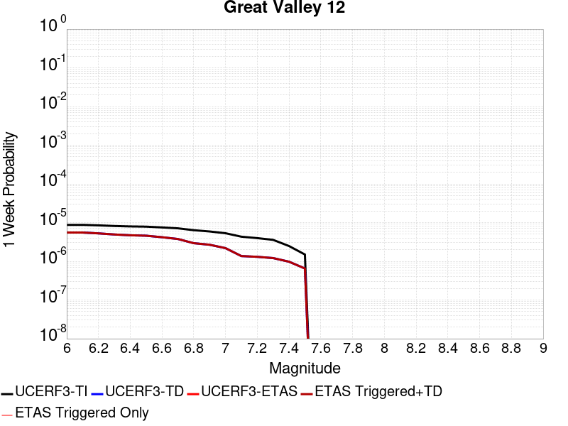 |  |  |  |

| Magnitude | 1 wk TI Prob | 1 wk TD Prob | 1 wk ETAS Prob | 1 wk ETAS/TD Gain | 1 wk ETAS Triggered+TD | 1 wk ETAS Triggered Only | 1 mo TI Prob | 1 mo TD Prob | 1 mo ETAS Prob | 1 mo ETAS/TD Gain | 1 mo ETAS Triggered+TD | 1 mo ETAS Triggered Only | 1 yr TI Prob | 1 yr TD Prob | 1 yr ETAS Prob | 1 yr ETAS/TD Gain | 1 yr ETAS Triggered+TD | 1 yr ETAS Triggered Only | 10 yr TI Prob | 10 yr TD Prob | 10 yr ETAS Prob | 10 yr ETAS/TD Gain | 10 yr ETAS Triggered+TD | 10 yr ETAS Triggered Only |
|-----|-----|-----|-----|-----|-----|-----|-----|-----|-----|-----|-----|-----|-----|-----|-----|-----|-----|-----|-----|-----|-----|-----|-----|-----|
| 6.0 | 8.757157E-6 | 5.5459627E-6 | 0.0 | 0.0 | 5.5459627E-6 | 0.0 | 3.7530135E-5 | 2.3768202E-5 | 0.0 | 0.0 | 2.3768202E-5 | 0.0 | 4.5683357E-4 | 2.8934065E-4 | 0.0 | 0.0 | 2.8934065E-4 | 0.0 | 0.004558956 | 0.0028897598 | 0.0011 | 0.38065445 | 0.002989471 | 1.0E-4 |
| 6.1 | 8.757157E-6 | 5.5459627E-6 | 0.0 | 0.0 | 5.5459627E-6 | 0.0 | 3.7530135E-5 | 2.3768202E-5 | 0.0 | 0.0 | 2.3768202E-5 | 0.0 | 4.5683357E-4 | 2.8934065E-4 | 0.0 | 0.0 | 2.8934065E-4 | 0.0 | 0.004558956 | 0.0028897598 | 0.001 | 0.34604952 | 0.002989471 | 1.0E-4 |
| 6.2 | 8.499136E-6 | 5.271812E-6 | 0.0 | 0.0 | 5.271812E-6 | 0.0 | 3.642436E-5 | 2.259329E-5 | 0.0 | 0.0 | 2.259329E-5 | 0.0 | 4.4337637E-4 | 2.7503975E-4 | 0.0 | 0.0 | 2.7503975E-4 | 0.0 | 0.0044249278 | 0.0027471078 | 0.001 | 0.36401922 | 0.002846833 | 1.0E-4 |
| 6.3 | 8.186883E-6 | 4.9401747E-6 | 0.0 | 0.0 | 4.9401747E-6 | 0.0 | 3.508617E-5 | 2.117201E-5 | 0.0 | 0.0 | 2.117201E-5 | 0.0 | 4.270904E-4 | 2.5773974E-4 | 0.0 | 0.0 | 2.5773974E-4 | 0.0 | 0.004262705 | 0.0025745088 | 0.001 | 0.38842362 | 0.0026742513 | 1.0E-4 |
| 6.4 | 7.979878E-6 | 4.7124195E-6 | 0.0 | 0.0 | 4.7124195E-6 | 0.0 | 3.419903E-5 | 2.0195932E-5 | 0.0 | 0.0 | 2.0195932E-5 | 0.0 | 4.1629362E-4 | 2.4585865E-4 | 0.0 | 0.0 | 2.4585865E-4 | 0.0 | 0.0041551464 | 0.0024559605 | 9.0E-4 | 0.3664554 | 0.002555715 | 1.0E-4 |
| 6.5 | 7.871003E-6 | 4.592522E-6 | 0.0 | 0.0 | 4.592522E-6 | 0.0 | 3.373243E-5 | 1.9682095E-5 | 0.0 | 0.0 | 1.9682095E-5 | 0.0 | 4.1061494E-4 | 2.396041E-4 | 0.0 | 0.0 | 2.396041E-4 | 0.0 | 0.0040985704 | 0.0023935505 | 9.0E-4 | 0.37601048 | 0.002493311 | 1.0E-4 |
| 6.6 | 7.508221E-6 | 4.1962935E-6 | 0.0 | 0.0 | 4.1962935E-6 | 0.0 | 3.2177693E-5 | 1.7983995E-5 | 0.0 | 0.0 | 1.7983995E-5 | 0.0 | 3.91693E-4 | 2.1893402E-4 | 0.0 | 0.0 | 2.1893402E-4 | 0.0 | 0.003910033 | 0.0021872693 | 7.0E-4 | 0.32003373 | 0.0022870507 | 1.0E-4 |
| 6.7 | 7.1297914E-6 | 3.774526E-6 | 0.0 | 0.0 | 3.774526E-6 | 0.0 | 3.055589E-5 | 1.6176444E-5 | 0.0 | 0.0 | 1.6176444E-5 | 0.0 | 3.7195446E-4 | 1.9693121E-4 | 0.0 | 0.0 | 1.9693121E-4 | 0.0 | 0.0037133251 | 0.0019676457 | 7.0E-4 | 0.35575512 | 0.0020674488 | 1.0E-4 |
| 6.8 | 6.376581E-6 | 2.9420255E-6 | 0.0 | 0.0 | 2.9420255E-6 | 0.0 | 2.7327918E-5 | 1.2608621E-5 | 0.0 | 0.0 | 1.2608621E-5 | 0.0 | 3.326666E-4 | 1.534993E-4 | 0.0 | 0.0 | 1.534993E-4 | 0.0 | 0.0033216903 | 0.0015339494 | 7.0E-4 | 0.45633838 | 0.001633796 | 1.0E-4 |
| 6.9 | 5.9095E-6 | 2.680438E-6 | 0.0 | 0.0 | 2.680438E-6 | 0.0 | 2.5326184E-5 | 1.1487542E-5 | 0.0 | 0.0 | 1.1487542E-5 | 0.0 | 3.0830267E-4 | 1.39852E-4 | 0.0 | 0.0 | 1.39852E-4 | 0.0 | 0.003078753 | 0.0013976552 | 7.0E-4 | 0.5008388 | 0.0014975155 | 1.0E-4 |
| 7.0 | 5.3239864E-6 | 2.1912285E-6 | 0.0 | 0.0 | 2.1912285E-6 | 0.0 | 2.2816885E-5 | 9.390947E-6 | 0.0 | 0.0 | 9.390947E-6 | 0.0 | 2.7776015E-4 | 1.1432891E-4 | 0.0 | 0.0 | 1.1432891E-4 | 0.0 | 0.0027741324 | 0.0011427144 | 7.0E-4 | 0.61257654 | 0.0012426 | 1.0E-4 |
| 7.1 | 4.329147E-6 | 1.3667083E-6 | 0.0 | 0.0 | 1.3667083E-6 | 0.0 | 1.8553355E-5 | 5.857308E-6 | 0.0 | 0.0 | 5.857308E-6 | 0.0 | 2.2586368E-4 | 7.131048E-5 | 0.0 | 0.0 | 7.131048E-5 | 0.0 | 0.0022563424 | 7.1288465E-4 | 3.0E-4 | 0.42082545 | 7.1288465E-4 | 0.0 |
| 7.2 | 3.978488E-6 | 1.3068424E-6 | 0.0 | 0.0 | 1.3068424E-6 | 0.0 | 1.7050552E-5 | 5.6007416E-6 | 0.0 | 0.0 | 5.6007416E-6 | 0.0 | 2.075707E-4 | 6.818698E-5 | 0.0 | 0.0 | 6.818698E-5 | 0.0 | 0.0020737692 | 6.8166916E-4 | 3.0E-4 | 0.4400962 | 6.8166916E-4 | 0.0 |
| 7.3 | 3.586542E-6 | 1.2123495E-6 | 0.0 | 0.0 | 1.2123495E-6 | 0.0 | 1.5370804E-5 | 5.195774E-6 | 0.0 | 0.0 | 5.195774E-6 | 0.0 | 1.8712347E-4 | 6.32568E-5 | 0.0 | 0.0 | 6.32568E-5 | 0.0 | 0.0018696598 | 6.323964E-4 | 3.0E-4 | 0.47438604 | 6.323964E-4 | 0.0 |
| 7.4 | 2.4837766E-6 | 9.774011E-7 | 0.0 | 0.0 | 9.774011E-7 | 0.0 | 1.0644713E-5 | 4.1888557E-6 | 0.0 | 0.0 | 4.1888557E-6 | 0.0 | 1.2959167E-4 | 5.099819E-5 | 0.0 | 0.0 | 5.099819E-5 | 0.0 | 0.0012951613 | 5.098714E-4 | 2.0E-4 | 0.39225575 | 5.098714E-4 | 0.0 |
| 7.5 | 1.5002679E-6 | 6.5268995E-7 | 0.0 | 0.0 | 6.5268995E-7 | 0.0 | 6.4297037E-6 | 2.79724E-6 | 0.0 | 0.0 | 2.79724E-6 | 0.0 | 7.827883E-5 | 3.4055905E-5 | 0.0 | 0.0 | 3.4055905E-5 | 0.0 | 7.825126E-4 | 3.40511E-4 | 1.0E-4 | 0.29367626 | 3.40511E-4 | 0.0 |

## Anacapa-Dume alt 1
*[(top)](#table-of-contents)*

| 1 Week | 1 Month | 1 Year | 10 Year |
|-----|-----|-----|-----|
|  |  |  |  |

| Magnitude | 1 wk TI Prob | 1 wk TD Prob | 1 wk ETAS Prob | 1 wk ETAS/TD Gain | 1 wk ETAS Triggered+TD | 1 wk ETAS Triggered Only | 1 mo TI Prob | 1 mo TD Prob | 1 mo ETAS Prob | 1 mo ETAS/TD Gain | 1 mo ETAS Triggered+TD | 1 mo ETAS Triggered Only | 1 yr TI Prob | 1 yr TD Prob | 1 yr ETAS Prob | 1 yr ETAS/TD Gain | 1 yr ETAS Triggered+TD | 1 yr ETAS Triggered Only | 10 yr TI Prob | 10 yr TD Prob | 10 yr ETAS Prob | 10 yr ETAS/TD Gain | 10 yr ETAS Triggered+TD | 10 yr ETAS Triggered Only |
|-----|-----|-----|-----|-----|-----|-----|-----|-----|-----|-----|-----|-----|-----|-----|-----|-----|-----|-----|-----|-----|-----|-----|-----|-----|
| 6.0 | 5.1871802E-6 | 5.365183E-6 | 0.0 | 0.0 | 5.365183E-6 | 0.0 | 2.2230583E-5 | 2.2993445E-5 | 0.0 | 0.0 | 2.2993445E-5 | 0.0 | 2.7062374E-4 | 2.7991008E-4 | 1.0E-4 | 0.3572576 | 2.7991008E-4 | 0.0 | 0.002702944 | 0.0027956604 | 0.0017 | 0.60808533 | 0.0028953808 | 1.0E-4 |
| 6.1 | 5.1871802E-6 | 5.365183E-6 | 0.0 | 0.0 | 5.365183E-6 | 0.0 | 2.2230583E-5 | 2.2993445E-5 | 0.0 | 0.0 | 2.2993445E-5 | 0.0 | 2.7062374E-4 | 2.7991008E-4 | 1.0E-4 | 0.3572576 | 2.7991008E-4 | 0.0 | 0.002702944 | 0.0027956604 | 0.0017 | 0.60808533 | 0.0028953808 | 1.0E-4 |
| 6.2 | 5.1871802E-6 | 5.365183E-6 | 0.0 | 0.0 | 5.365183E-6 | 0.0 | 2.2230583E-5 | 2.2993445E-5 | 0.0 | 0.0 | 2.2993445E-5 | 0.0 | 2.7062374E-4 | 2.7991008E-4 | 1.0E-4 | 0.3572576 | 2.7991008E-4 | 0.0 | 0.002702944 | 0.0027956604 | 0.0017 | 0.60808533 | 0.0028953808 | 1.0E-4 |
| 6.3 | 5.1871802E-6 | 5.365183E-6 | 0.0 | 0.0 | 5.365183E-6 | 0.0 | 2.2230583E-5 | 2.2993445E-5 | 0.0 | 0.0 | 2.2993445E-5 | 0.0 | 2.7062374E-4 | 2.7991008E-4 | 1.0E-4 | 0.3572576 | 2.7991008E-4 | 0.0 | 0.002702944 | 0.0027956604 | 0.0017 | 0.60808533 | 0.0028953808 | 1.0E-4 |
| 6.4 | 5.1871802E-6 | 5.365183E-6 | 0.0 | 0.0 | 5.365183E-6 | 0.0 | 2.2230583E-5 | 2.2993445E-5 | 0.0 | 0.0 | 2.2993445E-5 | 0.0 | 2.7062374E-4 | 2.7991008E-4 | 1.0E-4 | 0.3572576 | 2.7991008E-4 | 0.0 | 0.002702944 | 0.0027956604 | 0.0017 | 0.60808533 | 0.0028953808 | 1.0E-4 |
| 6.5 | 5.1871802E-6 | 5.365183E-6 | 0.0 | 0.0 | 5.365183E-6 | 0.0 | 2.2230583E-5 | 2.2993445E-5 | 0.0 | 0.0 | 2.2993445E-5 | 0.0 | 2.7062374E-4 | 2.7991008E-4 | 1.0E-4 | 0.3572576 | 2.7991008E-4 | 0.0 | 0.002702944 | 0.0027956604 | 0.0017 | 0.60808533 | 0.0028953808 | 1.0E-4 |
| 6.6 | 5.1871802E-6 | 5.365183E-6 | 0.0 | 0.0 | 5.365183E-6 | 0.0 | 2.2230583E-5 | 2.2993445E-5 | 0.0 | 0.0 | 2.2993445E-5 | 0.0 | 2.7062374E-4 | 2.7991008E-4 | 1.0E-4 | 0.3572576 | 2.7991008E-4 | 0.0 | 0.002702944 | 0.0027956604 | 0.0017 | 0.60808533 | 0.0028953808 | 1.0E-4 |
| 6.7 | 4.7693475E-6 | 4.934622E-6 | 0.0 | 0.0 | 4.934622E-6 | 0.0 | 2.04399E-5 | 2.1148215E-5 | 0.0 | 0.0 | 2.1148215E-5 | 0.0 | 2.4882736E-4 | 2.5744984E-4 | 1.0E-4 | 0.38842517 | 2.5744984E-4 | 0.0 | 0.0024854892 | 0.0025715919 | 0.0017 | 0.66106915 | 0.0026713347 | 1.0E-4 |
| 6.8 | 4.753408E-6 | 4.9181763E-6 | 0.0 | 0.0 | 4.9181763E-6 | 0.0 | 2.037159E-5 | 2.1077733E-5 | 0.0 | 0.0 | 2.1077733E-5 | 0.0 | 2.4799586E-4 | 2.565919E-4 | 1.0E-4 | 0.3897239 | 2.565919E-4 | 0.0 | 0.002477193 | 0.0025630326 | 0.0017 | 0.6632768 | 0.0026627763 | 1.0E-4 |
| 6.9 | 3.800069E-6 | 3.9353827E-6 | 0.0 | 0.0 | 3.9353827E-6 | 0.0 | 1.6285909E-5 | 1.6865819E-5 | 0.0 | 0.0 | 1.6865819E-5 | 0.0 | 1.9826289E-4 | 2.0532223E-4 | 1.0E-4 | 0.48703933 | 2.0532223E-4 | 0.0 | 0.001980861 | 0.002051349 | 0.0014 | 0.6824777 | 0.002151144 | 1.0E-4 |
| 7.0 | 3.6671938E-6 | 3.7982218E-6 | 0.0 | 0.0 | 3.7982218E-6 | 0.0 | 1.571645E-5 | 1.6277992E-5 | 0.0 | 0.0 | 1.6277992E-5 | 0.0 | 1.9133097E-4 | 1.9816677E-4 | 1.0E-4 | 0.5046255 | 1.9816677E-4 | 0.0 | 0.0019116632 | 0.0019799238 | 0.0014 | 0.7070979 | 0.002079726 | 1.0E-4 |
| 7.1 | 3.2394885E-6 | 3.3572412E-6 | 0.0 | 0.0 | 3.3572412E-6 | 0.0 | 1.3883448E-5 | 1.4388098E-5 | 0.0 | 0.0 | 1.4388098E-5 | 0.0 | 1.6901788E-4 | 1.7516111E-4 | 1.0E-4 | 0.57090294 | 1.7516111E-4 | 0.0 | 0.0016888938 | 0.0017502417 | 0.0013 | 0.7427545 | 0.0018500667 | 1.0E-4 |
| 7.2 | 3.0935948E-6 | 3.2064277E-6 | 0.0 | 0.0 | 3.2064277E-6 | 0.0 | 1.3258196E-5 | 1.3741761E-5 | 0.0 | 0.0 | 1.3741761E-5 | 0.0 | 1.6140658E-4 | 1.672932E-4 | 1.0E-4 | 0.5977529 | 1.672932E-4 | 0.0 | 0.001612894 | 0.0016716836 | 0.0013 | 0.7776591 | 0.0017715164 | 1.0E-4 |
| 7.3 | 2.5604163E-6 | 2.6458795E-6 | 0.0 | 0.0 | 2.6458795E-6 | 0.0 | 1.0973167E-5 | 1.1339434E-5 | 0.0 | 0.0 | 1.1339434E-5 | 0.0 | 1.3359012E-4 | 1.3804891E-4 | 1.0E-4 | 0.72438097 | 1.3804891E-4 | 0.0 | 0.0013350984 | 0.0013796361 | 0.0011 | 0.79731166 | 0.0013796361 | 0.0 |
| 7.4 | 2.1429005E-6 | 2.2096165E-6 | 0.0 | 0.0 | 2.2096165E-6 | 0.0 | 9.1838265E-6 | 9.469751E-6 | 0.0 | 0.0 | 9.469751E-6 | 0.0 | 1.11807356E-4 | 1.1528814E-4 | 1.0E-4 | 0.86739194 | 1.1528814E-4 | 0.0 | 0.0011175112 | 0.001152286 | 0.0011 | 0.9546242 | 0.001152286 | 0.0 |
| 7.5 | 1.7237151E-6 | 1.7753498E-6 | 0.0 | 0.0 | 1.7753498E-6 | 0.0 | 7.3873293E-6 | 7.60862E-6 | 0.0 | 0.0 | 7.60862E-6 | 0.0 | 8.993702E-5 | 9.263103E-5 | 1.0E-4 | 1.0795518 | 9.263103E-5 | 0.0 | 8.990063E-4 | 9.2592655E-4 | 0.0011 | 1.1879992 | 9.2592655E-4 | 0.0 |
| 7.6 | 9.541696E-7 | 9.818806E-7 | 0.0 | 0.0 | 9.818806E-7 | 0.0 | 4.089292E-6 | 4.208053E-6 | 0.0 | 0.0 | 4.208053E-6 | 0.0 | 4.9785995E-5 | 5.123185E-5 | 1.0E-4 | 1.9519107 | 5.123185E-5 | 0.0 | 4.9774844E-4 | 5.122017E-4 | 4.0E-4 | 0.7809424 | 5.122017E-4 | 0.0 |
| 7.7 | 2.7226676E-7 | 2.7162645E-7 | 0.0 | 0.0 | 2.7162645E-7 | 0.0 | 1.166857E-6 | 1.1641129E-6 | 0.0 | 0.0 | 1.1641129E-6 | 0.0 | 1.4206392E-5 | 1.4172982E-5 | 1.0E-4 | 7.055678 | 1.4172982E-5 | 0.0 | 1.4205484E-4 | 1.4172086E-4 | 1.0E-4 | 0.7056124 | 1.4172086E-4 | 0.0 |
| 7.8 | 4.5017995E-8 | 4.2144713E-8 | 0.0 | 0.0 | 4.2144713E-8 | 0.0 | 1.9293425E-7 | 1.8062018E-7 | 0.0 | 0.0 | 1.8062018E-7 | 0.0 | 2.348972E-6 | 2.1990486E-6 | 1.0E-4 | 45.47421 | 2.1990486E-6 | 0.0 | 2.348947E-5 | 2.199029E-5 | 1.0E-4 | 4.5474615 | 2.199029E-5 | 0.0 |
| 7.9 | 8.007447E-10 | 6.1585737E-10 | 0.0 | 0.0 | 6.1585737E-10 | 0.0 | 3.4317629E-9 | 2.6393883E-9 | 0.0 | 0.0 | 2.6393883E-9 | 0.0 | 4.1781714E-8 | 3.2134555E-8 | 0.0 | 0.0 | 3.2134555E-8 | 0.0 | 4.1781706E-7 | 3.213455E-7 | 0.0 | 0.0 | 3.213455E-7 | 0.0 |

## Likely 2011 CFM
*[(top)](#table-of-contents)*

| 1 Week | 1 Month | 1 Year | 10 Year |
|-----|-----|-----|-----|
| 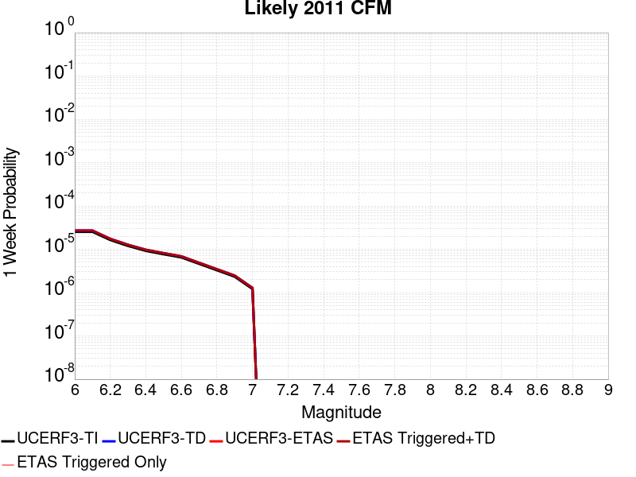 |  |  |  |

| Magnitude | 1 wk TI Prob | 1 wk TD Prob | 1 wk ETAS Prob | 1 wk ETAS/TD Gain | 1 wk ETAS Triggered+TD | 1 wk ETAS Triggered Only | 1 mo TI Prob | 1 mo TD Prob | 1 mo ETAS Prob | 1 mo ETAS/TD Gain | 1 mo ETAS Triggered+TD | 1 mo ETAS Triggered Only | 1 yr TI Prob | 1 yr TD Prob | 1 yr ETAS Prob | 1 yr ETAS/TD Gain | 1 yr ETAS Triggered+TD | 1 yr ETAS Triggered Only | 10 yr TI Prob | 10 yr TD Prob | 10 yr ETAS Prob | 10 yr ETAS/TD Gain | 10 yr ETAS Triggered+TD | 10 yr ETAS Triggered Only |
|-----|-----|-----|-----|-----|-----|-----|-----|-----|-----|-----|-----|-----|-----|-----|-----|-----|-----|-----|-----|-----|-----|-----|-----|-----|
| 6.0 | 2.5315949E-5 | 2.7084729E-5 | 0.0 | 0.0 | 2.7084729E-5 | 0.0 | 1.0849241E-4 | 1.160725E-4 | 1.0E-4 | 0.86153054 | 1.160725E-4 | 0.0 | 0.0013200947 | 0.001412311 | 6.0E-4 | 0.4248356 | 0.0015121697 | 1.0E-4 | 0.013122803 | 0.014038003 | 0.0087 | 0.61974627 | 0.014136599 | 1.0E-4 |
| 6.1 | 2.5315949E-5 | 2.7084729E-5 | 0.0 | 0.0 | 2.7084729E-5 | 0.0 | 1.0849241E-4 | 1.160725E-4 | 1.0E-4 | 0.86153054 | 1.160725E-4 | 0.0 | 0.0013200947 | 0.001412311 | 4.0E-4 | 0.28322375 | 0.001412311 | 0.0 | 0.013122803 | 0.014038003 | 0.0074 | 0.5271405 | 0.014038003 | 0.0 |
| 6.2 | 1.6375941E-5 | 1.7453698E-5 | 0.0 | 0.0 | 1.7453698E-5 | 0.0 | 7.0180715E-5 | 7.479949E-5 | 0.0 | 0.0 | 7.479949E-5 | 0.0 | 8.5411523E-4 | 9.1031555E-4 | 1.0E-4 | 0.109852016 | 9.1031555E-4 | 0.0 | 0.008508399 | 0.009067152 | 0.0048 | 0.5293835 | 0.009067152 | 0.0 |
| 6.3 | 1.1945543E-5 | 1.2704063E-5 | 0.0 | 0.0 | 1.2704063E-5 | 0.0 | 5.119418E-5 | 5.4444878E-5 | 0.0 | 0.0 | 5.4444878E-5 | 0.0 | 6.2311086E-4 | 6.626701E-4 | 1.0E-4 | 0.15090466 | 6.626701E-4 | 0.0 | 0.0062136655 | 0.0066074952 | 0.0035 | 0.5297015 | 0.0066074952 | 0.0 |
| 6.4 | 9.192729E-6 | 9.7621005E-6 | 0.0 | 0.0 | 9.7621005E-6 | 0.0 | 3.939681E-5 | 4.183692E-5 | 0.0 | 0.0 | 4.183692E-5 | 0.0 | 4.7955062E-4 | 5.092482E-4 | 1.0E-4 | 0.19636792 | 5.092482E-4 | 0.0 | 0.004785171 | 0.005081093 | 0.0026 | 0.5117009 | 0.005081093 | 0.0 |
| 6.5 | 7.67906E-6 | 8.1473745E-6 | 0.0 | 0.0 | 8.1473745E-6 | 0.0 | 3.2909844E-5 | 3.4916862E-5 | 0.0 | 0.0 | 3.4916862E-5 | 0.0 | 4.006037E-4 | 4.2503176E-4 | 1.0E-4 | 0.23527654 | 4.2503176E-4 | 0.0 | 0.0039988225 | 0.004242381 | 0.0019 | 0.44786167 | 0.004242381 | 0.0 |
| 6.6 | 6.4884057E-6 | 6.880361E-6 | 0.0 | 0.0 | 6.880361E-6 | 0.0 | 2.7807157E-5 | 2.9486937E-5 | 0.0 | 0.0 | 2.9486937E-5 | 0.0 | 3.3849955E-4 | 3.5894575E-4 | 1.0E-4 | 0.27859363 | 3.5894575E-4 | 0.0 | 0.003379844 | 0.0035838045 | 0.0015 | 0.41854963 | 0.0035838045 | 0.0 |
| 6.7 | 4.6060636E-6 | 4.880965E-6 | 0.0 | 0.0 | 4.880965E-6 | 0.0 | 1.9740122E-5 | 2.091826E-5 | 0.0 | 0.0 | 2.091826E-5 | 0.0 | 2.403095E-4 | 2.5465086E-4 | 1.0E-4 | 0.39269453 | 2.5465086E-4 | 0.0 | 0.002400498 | 0.0025436736 | 9.0E-4 | 0.35381898 | 0.0025436736 | 0.0 |
| 6.8 | 3.2795615E-6 | 3.4751843E-6 | 0.0 | 0.0 | 3.4751843E-6 | 0.0 | 1.4055187E-5 | 1.4893565E-5 | 0.0 | 0.0 | 1.4893565E-5 | 0.0 | 1.7110848E-4 | 1.8131462E-4 | 1.0E-4 | 0.5515275 | 1.8131462E-4 | 0.0 | 0.0017097679 | 0.0018117221 | 8.0E-4 | 0.44156882 | 0.0018117221 | 0.0 |
| 6.9 | 2.3289967E-6 | 2.4689898E-6 | 0.0 | 0.0 | 2.4689898E-6 | 0.0 | 9.981376E-6 | 1.0581344E-5 | 0.0 | 0.0 | 1.0581344E-5 | 0.0 | 1.2151648E-4 | 1.2882068E-4 | 1.0E-4 | 0.77627283 | 1.2882068E-4 | 0.0 | 0.0012145005 | 0.001287503 | 5.0E-4 | 0.3883486 | 0.001287503 | 0.0 |
| 7.0 | 1.211292E-6 | 1.2855635E-6 | 0.0 | 0.0 | 1.2855635E-6 | 0.0 | 5.1912407E-6 | 5.5095475E-6 | 0.0 | 0.0 | 5.5095475E-6 | 0.0 | 6.320152E-5 | 6.707698E-5 | 1.0E-4 | 1.4908243 | 6.707698E-5 | 0.0 | 6.3183554E-4 | 6.7059713E-4 | 3.0E-4 | 0.44736248 | 6.7059713E-4 | 0.0 |

## Airport Lake
*[(top)](#table-of-contents)*

| 1 Week | 1 Month | 1 Year | 10 Year |
|-----|-----|-----|-----|
|  |  |  |  |

| Magnitude | 1 wk TI Prob | 1 wk TD Prob | 1 wk ETAS Prob | 1 wk ETAS/TD Gain | 1 wk ETAS Triggered+TD | 1 wk ETAS Triggered Only | 1 mo TI Prob | 1 mo TD Prob | 1 mo ETAS Prob | 1 mo ETAS/TD Gain | 1 mo ETAS Triggered+TD | 1 mo ETAS Triggered Only | 1 yr TI Prob | 1 yr TD Prob | 1 yr ETAS Prob | 1 yr ETAS/TD Gain | 1 yr ETAS Triggered+TD | 1 yr ETAS Triggered Only | 10 yr TI Prob | 10 yr TD Prob | 10 yr ETAS Prob | 10 yr ETAS/TD Gain | 10 yr ETAS Triggered+TD | 10 yr ETAS Triggered Only |
|-----|-----|-----|-----|-----|-----|-----|-----|-----|-----|-----|-----|-----|-----|-----|-----|-----|-----|-----|-----|-----|-----|-----|-----|-----|
| 6.0 | 1.2387061E-5 | 1.3095247E-5 | 0.0 | 0.0 | 1.3095247E-5 | 0.0 | 5.3086325E-5 | 5.612144E-5 | 0.0 | 0.0 | 5.612144E-5 | 0.0 | 6.461343E-4 | 6.830927E-4 | 3.0E-4 | 0.43917906 | 6.830927E-4 | 0.0 | 0.0064425888 | 0.006812736 | 0.0035 | 0.51374364 | 0.006912055 | 1.0E-4 |
| 6.1 | 1.2387061E-5 | 1.3095247E-5 | 0.0 | 0.0 | 1.3095247E-5 | 0.0 | 5.3086325E-5 | 5.612144E-5 | 0.0 | 0.0 | 5.612144E-5 | 0.0 | 6.461343E-4 | 6.830927E-4 | 3.0E-4 | 0.43917906 | 6.830927E-4 | 0.0 | 0.0064425888 | 0.006812736 | 0.0035 | 0.51374364 | 0.006912055 | 1.0E-4 |
| 6.2 | 1.2387061E-5 | 1.3095247E-5 | 0.0 | 0.0 | 1.3095247E-5 | 0.0 | 5.3086325E-5 | 5.612144E-5 | 0.0 | 0.0 | 5.612144E-5 | 0.0 | 6.461343E-4 | 6.830927E-4 | 3.0E-4 | 0.43917906 | 6.830927E-4 | 0.0 | 0.0064425888 | 0.006812736 | 0.0035 | 0.51374364 | 0.006912055 | 1.0E-4 |
| 6.3 | 1.2387061E-5 | 1.3095247E-5 | 0.0 | 0.0 | 1.3095247E-5 | 0.0 | 5.3086325E-5 | 5.612144E-5 | 0.0 | 0.0 | 5.612144E-5 | 0.0 | 6.461343E-4 | 6.830927E-4 | 3.0E-4 | 0.43917906 | 6.830927E-4 | 0.0 | 0.0064425888 | 0.006812736 | 0.0035 | 0.51374364 | 0.006912055 | 1.0E-4 |
| 6.4 | 1.2387061E-5 | 1.3095247E-5 | 0.0 | 0.0 | 1.3095247E-5 | 0.0 | 5.3086325E-5 | 5.612144E-5 | 0.0 | 0.0 | 5.612144E-5 | 0.0 | 6.461343E-4 | 6.830927E-4 | 3.0E-4 | 0.43917906 | 6.830927E-4 | 0.0 | 0.0064425888 | 0.006812736 | 0.0035 | 0.51374364 | 0.006912055 | 1.0E-4 |
| 6.5 | 6.9922594E-6 | 7.380596E-6 | 0.0 | 0.0 | 7.380596E-6 | 0.0 | 2.996648E-5 | 3.1630774E-5 | 0.0 | 0.0 | 3.1630774E-5 | 0.0 | 3.6478083E-4 | 3.8504202E-4 | 3.0E-4 | 0.7791357 | 3.8504202E-4 | 0.0 | 0.003641826 | 0.0038442856 | 0.0022 | 0.57227796 | 0.0038442856 | 0.0 |
| 6.6 | 6.9922594E-6 | 7.380596E-6 | 0.0 | 0.0 | 7.380596E-6 | 0.0 | 2.996648E-5 | 3.1630774E-5 | 0.0 | 0.0 | 3.1630774E-5 | 0.0 | 3.6478083E-4 | 3.8504202E-4 | 3.0E-4 | 0.7791357 | 3.8504202E-4 | 0.0 | 0.003641826 | 0.0038442856 | 0.0022 | 0.57227796 | 0.0038442856 | 0.0 |
| 6.7 | 5.477277E-6 | 5.7826633E-6 | 0.0 | 0.0 | 5.7826633E-6 | 0.0 | 2.3473833E-5 | 2.478263E-5 | 0.0 | 0.0 | 2.478263E-5 | 0.0 | 2.8575645E-4 | 3.0169063E-4 | 2.0E-4 | 0.6629308 | 3.0169063E-4 | 0.0 | 0.0028538927 | 0.003013194 | 0.0017 | 0.5641854 | 0.003013194 | 0.0 |
| 6.8 | 3.9950432E-6 | 4.2166175E-6 | 0.0 | 0.0 | 4.2166175E-6 | 0.0 | 1.7121502E-5 | 1.8071109E-5 | 0.0 | 0.0 | 1.8071109E-5 | 0.0 | 2.0843433E-4 | 2.1999628E-4 | 1.0E-4 | 0.45455313 | 2.1999628E-4 | 0.0 | 0.0020823893 | 0.0021980556 | 0.0011 | 0.50044227 | 0.0021980556 | 0.0 |
| 6.9 | 2.95695E-6 | 3.1211937E-6 | 0.0 | 0.0 | 3.1211937E-6 | 0.0 | 1.2672582E-5 | 1.3376488E-5 | 0.0 | 0.0 | 1.3376488E-5 | 0.0 | 1.5427776E-4 | 1.6284884E-4 | 0.0 | 0.0 | 1.6284884E-4 | 0.0 | 0.001541707 | 0.0016275172 | 9.0E-4 | 0.55298954 | 0.0016275172 | 0.0 |
| 7.0 | 1.456072E-6 | 1.5398762E-6 | 0.0 | 0.0 | 1.5398762E-6 | 0.0 | 6.2402937E-6 | 6.5994586E-6 | 0.0 | 0.0 | 6.5994586E-6 | 0.0 | 7.597293E-5 | 8.034645E-5 | 0.0 | 0.0 | 8.034645E-5 | 0.0 | 7.594696E-4 | 8.032728E-4 | 8.0E-4 | 0.99592566 | 8.032728E-4 | 0.0 |
| 7.1 | 6.995192E-7 | 7.404401E-7 | 0.0 | 0.0 | 7.404401E-7 | 0.0 | 2.997936E-6 | 3.1733148E-6 | 0.0 | 0.0 | 3.1733148E-6 | 0.0 | 3.649926E-5 | 3.8635106E-5 | 0.0 | 0.0 | 3.8635106E-5 | 0.0 | 3.6493264E-4 | 3.8635108E-4 | 1.0E-4 | 0.25883195 | 3.8635108E-4 | 0.0 |

## North Tahoe 2011 CFM
*[(top)](#table-of-contents)*

| 1 Week | 1 Month | 1 Year | 10 Year |
|-----|-----|-----|-----|
|  |  |  | 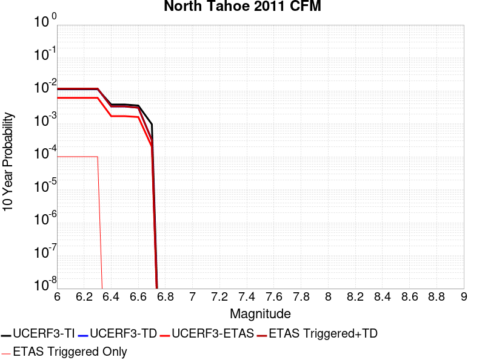 |

| Magnitude | 1 wk TI Prob | 1 wk TD Prob | 1 wk ETAS Prob | 1 wk ETAS/TD Gain | 1 wk ETAS Triggered+TD | 1 wk ETAS Triggered Only | 1 mo TI Prob | 1 mo TD Prob | 1 mo ETAS Prob | 1 mo ETAS/TD Gain | 1 mo ETAS Triggered+TD | 1 mo ETAS Triggered Only | 1 yr TI Prob | 1 yr TD Prob | 1 yr ETAS Prob | 1 yr ETAS/TD Gain | 1 yr ETAS Triggered+TD | 1 yr ETAS Triggered Only | 10 yr TI Prob | 10 yr TD Prob | 10 yr ETAS Prob | 10 yr ETAS/TD Gain | 10 yr ETAS Triggered+TD | 10 yr ETAS Triggered Only |
|-----|-----|-----|-----|-----|-----|-----|-----|-----|-----|-----|-----|-----|-----|-----|-----|-----|-----|-----|-----|-----|-----|-----|-----|-----|
| 6.0 | 2.150391E-5 | 2.2139517E-5 | 0.0 | 0.0 | 2.2139517E-5 | 0.0 | 9.215636E-5 | 9.488129E-5 | 0.0 | 0.0 | 9.488129E-5 | 0.0 | 0.0011214261 | 0.001154763 | 5.0E-4 | 0.43298927 | 0.001154763 | 0.0 | 0.011157839 | 0.011506836 | 0.0061 | 0.53011966 | 0.011605686 | 1.0E-4 |
| 6.1 | 2.150391E-5 | 2.2139517E-5 | 0.0 | 0.0 | 2.2139517E-5 | 0.0 | 9.215636E-5 | 9.488129E-5 | 0.0 | 0.0 | 9.488129E-5 | 0.0 | 0.0011214261 | 0.001154763 | 5.0E-4 | 0.43298927 | 0.001154763 | 0.0 | 0.011157839 | 0.011506836 | 0.0061 | 0.53011966 | 0.011605686 | 1.0E-4 |
| 6.2 | 2.150391E-5 | 2.2139517E-5 | 0.0 | 0.0 | 2.2139517E-5 | 0.0 | 9.215636E-5 | 9.488129E-5 | 0.0 | 0.0 | 9.488129E-5 | 0.0 | 0.0011214261 | 0.001154763 | 5.0E-4 | 0.43298927 | 0.001154763 | 0.0 | 0.011157839 | 0.011506836 | 0.0061 | 0.53011966 | 0.011605686 | 1.0E-4 |
| 6.3 | 2.150391E-5 | 2.2139517E-5 | 0.0 | 0.0 | 2.2139517E-5 | 0.0 | 9.215636E-5 | 9.488129E-5 | 0.0 | 0.0 | 9.488129E-5 | 0.0 | 0.0011214261 | 0.001154763 | 5.0E-4 | 0.43298927 | 0.001154763 | 0.0 | 0.011157839 | 0.011506836 | 0.0061 | 0.53011966 | 0.011605686 | 1.0E-4 |
| 6.4 | 7.3563056E-6 | 6.4376086E-6 | 0.0 | 0.0 | 6.4376086E-6 | 0.0 | 3.1526644E-5 | 2.7589631E-5 | 0.0 | 0.0 | 2.7589631E-5 | 0.0 | 3.8376928E-4 | 3.3588245E-4 | 1.0E-4 | 0.2977232 | 3.3588245E-4 | 0.0 | 0.003831072 | 0.0033567378 | 0.0017 | 0.5064441 | 0.0033567378 | 0.0 |
| 6.5 | 7.3563056E-6 | 6.4376086E-6 | 0.0 | 0.0 | 6.4376086E-6 | 0.0 | 3.1526644E-5 | 2.7589631E-5 | 0.0 | 0.0 | 2.7589631E-5 | 0.0 | 3.8376928E-4 | 3.3588245E-4 | 1.0E-4 | 0.2977232 | 3.3588245E-4 | 0.0 | 0.003831072 | 0.0033567378 | 0.0017 | 0.5064441 | 0.0033567378 | 0.0 |
| 6.6 | 6.8508816E-6 | 5.8774203E-6 | 0.0 | 0.0 | 5.8774203E-6 | 0.0 | 2.936059E-5 | 2.5188872E-5 | 0.0 | 0.0 | 2.5188872E-5 | 0.0 | 3.5740656E-4 | 3.0666165E-4 | 1.0E-4 | 0.3260923 | 3.0666165E-4 | 0.0 | 0.0035683226 | 0.0030653551 | 0.0016 | 0.52196234 | 0.0030653551 | 0.0 |
| 6.7 | 1.8511148E-6 | 6.0916835E-7 | 0.0 | 0.0 | 6.0916835E-7 | 0.0 | 7.933325E-6 | 2.6107216E-6 | 0.0 | 0.0 | 2.6107216E-6 | 0.0 | 9.658395E-5 | 3.1785534E-5 | 0.0 | 0.0 | 3.1785534E-5 | 0.0 | 9.6541987E-4 | 3.1785536E-4 | 2.0E-4 | 0.629217 | 3.1785536E-4 | 0.0 |

## Malibu Coast (Extension) alt 1
*[(top)](#table-of-contents)*

| 1 Week | 1 Month | 1 Year | 10 Year |
|-----|-----|-----|-----|
| 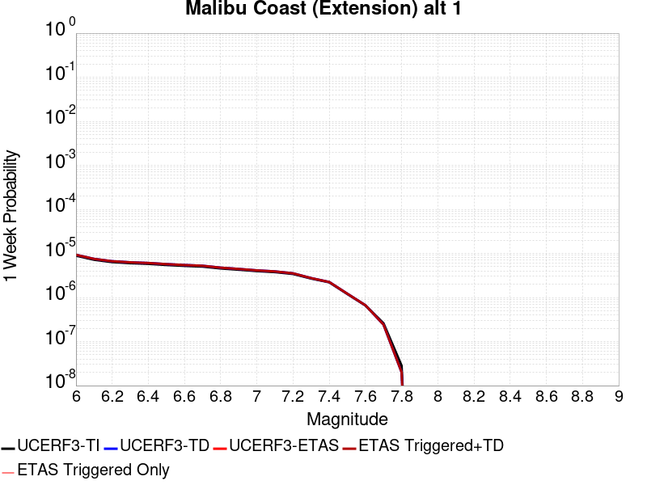 |  |  |  |

| Magnitude | 1 wk TI Prob | 1 wk TD Prob | 1 wk ETAS Prob | 1 wk ETAS/TD Gain | 1 wk ETAS Triggered+TD | 1 wk ETAS Triggered Only | 1 mo TI Prob | 1 mo TD Prob | 1 mo ETAS Prob | 1 mo ETAS/TD Gain | 1 mo ETAS Triggered+TD | 1 mo ETAS Triggered Only | 1 yr TI Prob | 1 yr TD Prob | 1 yr ETAS Prob | 1 yr ETAS/TD Gain | 1 yr ETAS Triggered+TD | 1 yr ETAS Triggered Only | 10 yr TI Prob | 10 yr TD Prob | 10 yr ETAS Prob | 10 yr ETAS/TD Gain | 10 yr ETAS Triggered+TD | 10 yr ETAS Triggered Only |
|-----|-----|-----|-----|-----|-----|-----|-----|-----|-----|-----|-----|-----|-----|-----|-----|-----|-----|-----|-----|-----|-----|-----|-----|-----|
| 6.0 | 8.930738E-6 | 9.323782E-6 | 0.0 | 0.0 | 9.323782E-6 | 0.0 | 3.827403E-5 | 3.9958464E-5 | 0.0 | 0.0 | 3.9958464E-5 | 0.0 | 4.6588664E-4 | 4.863874E-4 | 3.0E-4 | 0.61679226 | 4.863874E-4 | 0.0 | 0.0046491115 | 0.004853411 | 0.003 | 0.618122 | 0.0049529257 | 1.0E-4 |
| 6.1 | 7.199952E-6 | 7.5255425E-6 | 0.0 | 0.0 | 7.5255425E-6 | 0.0 | 3.0856572E-5 | 3.225193E-5 | 0.0 | 0.0 | 3.225193E-5 | 0.0 | 3.75614E-4 | 3.9259708E-4 | 2.0E-4 | 0.50942814 | 3.9259708E-4 | 0.0 | 0.0037497976 | 0.0039191013 | 0.0021 | 0.5358371 | 0.0040187095 | 1.0E-4 |
| 6.2 | 6.3721413E-6 | 6.6624266E-6 | 0.0 | 0.0 | 6.6624266E-6 | 0.0 | 2.7308892E-5 | 2.8552946E-5 | 0.0 | 0.0 | 2.8552946E-5 | 0.0 | 3.3243504E-4 | 3.47577E-4 | 2.0E-4 | 0.57541203 | 3.47577E-4 | 0.0 | 0.0033193815 | 0.0034703738 | 0.0018 | 0.5186761 | 0.003570027 | 1.0E-4 |
| 6.3 | 6.016345E-6 | 6.290966E-6 | 0.0 | 0.0 | 6.290966E-6 | 0.0 | 2.578408E-5 | 2.6961006E-5 | 0.0 | 0.0 | 2.6961006E-5 | 0.0 | 3.1387596E-4 | 3.2820113E-4 | 2.0E-4 | 0.6093824 | 3.2820113E-4 | 0.0 | 0.00313433 | 0.0032772005 | 0.0018 | 0.5492493 | 0.0033768727 | 1.0E-4 |
| 6.4 | 5.8104883E-6 | 6.075459E-6 | 0.0 | 0.0 | 6.075459E-6 | 0.0 | 2.4901856E-5 | 2.6037425E-5 | 0.0 | 0.0 | 2.6037425E-5 | 0.0 | 3.031379E-4 | 3.1695983E-4 | 1.0E-4 | 0.31549737 | 3.1695983E-4 | 0.0 | 0.0030272473 | 0.0031651123 | 0.0016 | 0.5055113 | 0.003264796 | 1.0E-4 |
| 6.5 | 5.476925E-6 | 5.7236316E-6 | 0.0 | 0.0 | 5.7236316E-6 | 0.0 | 2.3472323E-5 | 2.4529621E-5 | 0.0 | 0.0 | 2.4529621E-5 | 0.0 | 2.8573806E-4 | 2.986075E-4 | 1.0E-4 | 0.33488777 | 2.986075E-4 | 0.0 | 0.0028537093 | 0.0029820947 | 0.0016 | 0.5365356 | 0.0030817965 | 1.0E-4 |
| 6.6 | 5.222387E-6 | 5.4548573E-6 | 0.0 | 0.0 | 5.4548573E-6 | 0.0 | 2.2381464E-5 | 2.3377752E-5 | 0.0 | 0.0 | 2.3377752E-5 | 0.0 | 2.7246025E-4 | 2.8458724E-4 | 1.0E-4 | 0.3513861 | 2.8458724E-4 | 0.0 | 0.0027212645 | 0.0028422587 | 0.0014 | 0.49256602 | 0.0029419744 | 1.0E-4 |
| 6.7 | 5.0337076E-6 | 5.2555E-6 | 0.0 | 0.0 | 5.2555E-6 | 0.0 | 2.1572854E-5 | 2.2523378E-5 | 0.0 | 0.0 | 2.2523378E-5 | 0.0 | 2.6261783E-4 | 2.741879E-4 | 1.0E-4 | 0.3647134 | 2.741879E-4 | 0.0 | 0.002623077 | 0.002738526 | 0.0012 | 0.43819192 | 0.0028382523 | 1.0E-4 |
| 6.8 | 4.5675624E-6 | 4.7554977E-6 | 0.0 | 0.0 | 4.7554977E-6 | 0.0 | 1.9575122E-5 | 2.0380545E-5 | 0.0 | 0.0 | 2.0380545E-5 | 0.0 | 2.3830103E-4 | 2.4810506E-4 | 0.0 | 0.0 | 2.4810506E-4 | 0.0 | 0.0023804565 | 0.0024783006 | 0.0011 | 0.44385254 | 0.0025780527 | 1.0E-4 |
| 6.9 | 4.2802412E-6 | 4.4490175E-6 | 0.0 | 0.0 | 4.4490175E-6 | 0.0 | 1.8343762E-5 | 1.906708E-5 | 0.0 | 0.0 | 1.906708E-5 | 0.0 | 2.2331243E-4 | 2.3211713E-4 | 0.0 | 0.0 | 2.3211713E-4 | 0.0 | 0.0022308815 | 0.0023187636 | 0.001 | 0.43126434 | 0.0024185316 | 1.0E-4 |
| 7.0 | 3.9794063E-6 | 4.127332E-6 | 0.0 | 0.0 | 4.127332E-6 | 0.0 | 1.7054486E-5 | 1.7688448E-5 | 0.0 | 0.0 | 1.7688448E-5 | 0.0 | 2.0761859E-4 | 2.1533569E-4 | 0.0 | 0.0 | 2.1533569E-4 | 0.0 | 0.0020742472 | 0.002151284 | 9.0E-4 | 0.41835484 | 0.0022510686 | 1.0E-4 |
| 7.1 | 3.7730424E-6 | 3.9085894E-6 | 0.0 | 0.0 | 3.9085894E-6 | 0.0 | 1.6170083E-5 | 1.675099E-5 | 0.0 | 0.0 | 1.675099E-5 | 0.0 | 1.9685295E-4 | 2.0392434E-4 | 0.0 | 0.0 | 2.0392434E-4 | 0.0 | 0.0019667868 | 0.002037385 | 9.0E-4 | 0.44174275 | 0.002137181 | 1.0E-4 |
| 7.2 | 3.424985E-6 | 3.5389521E-6 | 0.0 | 0.0 | 3.5389521E-6 | 0.0 | 1.4678424E-5 | 1.516685E-5 | 0.0 | 0.0 | 1.516685E-5 | 0.0 | 1.7869516E-4 | 1.8464087E-4 | 0.0 | 0.0 | 1.8464087E-4 | 0.0 | 0.0017855153 | 0.0018448866 | 8.0E-4 | 0.433631 | 0.0019447021 | 1.0E-4 |
| 7.3 | 2.6966375E-6 | 2.7578667E-6 | 0.0 | 0.0 | 2.7578667E-6 | 0.0 | 1.15569665E-5 | 1.1819375E-5 | 0.0 | 0.0 | 1.1819375E-5 | 0.0 | 1.4069698E-4 | 1.4389143E-4 | 0.0 | 0.0 | 1.4389143E-4 | 0.0 | 0.0014060794 | 0.0014379867 | 5.0E-4 | 0.34770834 | 0.0015378429 | 1.0E-4 |
| 7.4 | 2.215957E-6 | 2.2479396E-6 | 0.0 | 0.0 | 2.2479396E-6 | 0.0 | 9.496924E-6 | 9.633992E-6 | 0.0 | 0.0 | 9.633992E-6 | 0.0 | 1.1561892E-4 | 1.1728757E-4 | 0.0 | 0.0 | 1.1728757E-4 | 0.0 | 0.0011555878 | 0.0011722604 | 2.0E-4 | 0.17061055 | 0.0012721432 | 1.0E-4 |
| 7.5 | 1.2040218E-6 | 1.2210837E-6 | 0.0 | 0.0 | 1.2210837E-6 | 0.0 | 5.160083E-6 | 5.2332057E-6 | 0.0 | 0.0 | 5.2332057E-6 | 0.0 | 6.2822204E-5 | 6.371243E-5 | 0.0 | 0.0 | 6.371243E-5 | 0.0 | 6.280445E-4 | 6.3694356E-4 | 2.0E-4 | 0.31399956 | 7.368798E-4 | 1.0E-4 |
| 7.6 | 6.6157446E-7 | 6.674275E-7 | 0.0 | 0.0 | 6.674275E-7 | 0.0 | 2.835316E-6 | 2.8604006E-6 | 0.0 | 0.0 | 2.8604006E-6 | 0.0 | 3.4519428E-5 | 3.4824836E-5 | 0.0 | 0.0 | 3.4824836E-5 | 0.0 | 3.4514067E-4 | 3.4819532E-4 | 2.0E-4 | 0.5743903 | 4.4816048E-4 | 1.0E-4 |
| 7.7 | 2.6012302E-7 | 2.4340684E-7 | 0.0 | 0.0 | 2.4340684E-7 | 0.0 | 1.1148124E-6 | 1.0431719E-6 | 0.0 | 0.0 | 1.0431719E-6 | 0.0 | 1.3572758E-5 | 1.2700554E-5 | 0.0 | 0.0 | 1.2700554E-5 | 0.0 | 1.3571928E-4 | 1.2699935E-4 | 0.0 | 0.0 | 1.2699935E-4 | 0.0 |
| 7.8 | 2.8323132E-8 | 2.0242826E-8 | 0.0 | 0.0 | 2.0242826E-8 | 0.0 | 1.2138484E-7 | 8.6754966E-8 | 0.0 | 0.0 | 8.6754966E-8 | 0.0 | 1.4778595E-6 | 1.0562413E-6 | 0.0 | 0.0 | 1.0562413E-6 | 0.0 | 1.4778497E-5 | 1.0562371E-5 | 0.0 | 0.0 | 1.0562371E-5 | 0.0 |

## Lions Head 2011 CFM
*[(top)](#table-of-contents)*

| 1 Week | 1 Month | 1 Year | 10 Year |
|-----|-----|-----|-----|
|  |  |  | 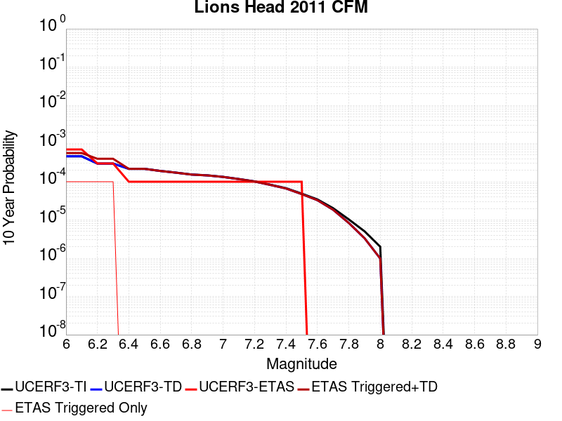 |

| Magnitude | 1 wk TI Prob | 1 wk TD Prob | 1 wk ETAS Prob | 1 wk ETAS/TD Gain | 1 wk ETAS Triggered+TD | 1 wk ETAS Triggered Only | 1 mo TI Prob | 1 mo TD Prob | 1 mo ETAS Prob | 1 mo ETAS/TD Gain | 1 mo ETAS Triggered+TD | 1 mo ETAS Triggered Only | 1 yr TI Prob | 1 yr TD Prob | 1 yr ETAS Prob | 1 yr ETAS/TD Gain | 1 yr ETAS Triggered+TD | 1 yr ETAS Triggered Only | 10 yr TI Prob | 10 yr TD Prob | 10 yr ETAS Prob | 10 yr ETAS/TD Gain | 10 yr ETAS Triggered+TD | 10 yr ETAS Triggered Only |
|-----|-----|-----|-----|-----|-----|-----|-----|-----|-----|-----|-----|-----|-----|-----|-----|-----|-----|-----|-----|-----|-----|-----|-----|-----|
| 6.0 | 8.889363E-7 | 8.8904903E-7 | 0.0 | 0.0 | 8.8904903E-7 | 0.0 | 3.8097214E-6 | 3.8102048E-6 | 0.0 | 0.0 | 3.8102048E-6 | 0.0 | 4.638237E-5 | 4.6388323E-5 | 0.0 | 0.0 | 4.6388323E-5 | 0.0 | 4.637269E-4 | 4.6379268E-4 | 7.0E-4 | 1.5092951 | 5.637463E-4 | 1.0E-4 |
| 6.1 | 8.889363E-7 | 8.8904903E-7 | 0.0 | 0.0 | 8.8904903E-7 | 0.0 | 3.8097214E-6 | 3.8102048E-6 | 0.0 | 0.0 | 3.8102048E-6 | 0.0 | 4.638237E-5 | 4.6388323E-5 | 0.0 | 0.0 | 4.6388323E-5 | 0.0 | 4.637269E-4 | 4.6379268E-4 | 7.0E-4 | 1.5092951 | 5.637463E-4 | 1.0E-4 |
| 6.2 | 5.7435483E-7 | 5.7352366E-7 | 0.0 | 0.0 | 5.7352366E-7 | 0.0 | 2.4615185E-6 | 2.4579563E-6 | 0.0 | 0.0 | 2.4579563E-6 | 0.0 | 2.9968574E-5 | 2.9925222E-5 | 0.0 | 0.0 | 2.9925222E-5 | 0.0 | 2.9964533E-4 | 2.9921337E-4 | 3.0E-4 | 1.002629 | 3.9918345E-4 | 1.0E-4 |
| 6.3 | 5.7435483E-7 | 5.7352366E-7 | 0.0 | 0.0 | 5.7352366E-7 | 0.0 | 2.4615185E-6 | 2.4579563E-6 | 0.0 | 0.0 | 2.4579563E-6 | 0.0 | 2.9968574E-5 | 2.9925222E-5 | 0.0 | 0.0 | 2.9925222E-5 | 0.0 | 2.9964533E-4 | 2.9921337E-4 | 3.0E-4 | 1.002629 | 3.9918345E-4 | 1.0E-4 |
| 6.4 | 4.1835764E-7 | 4.1707543E-7 | 0.0 | 0.0 | 4.1707543E-7 | 0.0 | 1.7929601E-6 | 1.7874648E-6 | 0.0 | 0.0 | 1.7874648E-6 | 0.0 | 2.1829072E-5 | 2.176217E-5 | 0.0 | 0.0 | 2.176217E-5 | 0.0 | 2.1826927E-4 | 2.1760062E-4 | 1.0E-4 | 0.4595575 | 2.1760062E-4 | 0.0 |
| 6.5 | 4.1835764E-7 | 4.1707543E-7 | 0.0 | 0.0 | 4.1707543E-7 | 0.0 | 1.7929601E-6 | 1.7874648E-6 | 0.0 | 0.0 | 1.7874648E-6 | 0.0 | 2.1829072E-5 | 2.176217E-5 | 0.0 | 0.0 | 2.176217E-5 | 0.0 | 2.1826927E-4 | 2.1760062E-4 | 1.0E-4 | 0.4595575 | 2.1760062E-4 | 0.0 |
| 6.6 | 3.6896213E-7 | 3.6754165E-7 | 0.0 | 0.0 | 3.6754165E-7 | 0.0 | 1.5812653E-6 | 1.5751774E-6 | 0.0 | 0.0 | 1.5751774E-6 | 0.0 | 1.9251736E-5 | 1.9177618E-5 | 0.0 | 0.0 | 1.9177618E-5 | 0.0 | 1.9250068E-4 | 1.9175975E-4 | 1.0E-4 | 0.52148587 | 1.9175975E-4 | 0.0 |
| 6.7 | 3.3283942E-7 | 3.3132204E-7 | 0.0 | 0.0 | 3.3132204E-7 | 0.0 | 1.4264539E-6 | 1.4199508E-6 | 0.0 | 0.0 | 1.4199508E-6 | 0.0 | 1.7366938E-5 | 1.7287764E-5 | 0.0 | 0.0 | 1.7287764E-5 | 0.0 | 1.736558E-4 | 1.7286427E-4 | 1.0E-4 | 0.5784886 | 1.7286427E-4 | 0.0 |
| 6.8 | 2.9684807E-7 | 2.9523926E-7 | 0.0 | 0.0 | 2.9523926E-7 | 0.0 | 1.2722054E-6 | 1.2653105E-6 | 0.0 | 0.0 | 1.2653105E-6 | 0.0 | 1.5488991E-5 | 1.5405047E-5 | 0.0 | 0.0 | 1.5405047E-5 | 0.0 | 1.5487912E-4 | 1.5403982E-4 | 1.0E-4 | 0.6491828 | 1.5403982E-4 | 0.0 |
| 6.9 | 2.8254823E-7 | 2.8089178E-7 | 0.0 | 0.0 | 2.8089178E-7 | 0.0 | 1.2109203E-6 | 1.2038213E-6 | 0.0 | 0.0 | 1.2038213E-6 | 0.0 | 1.4742856E-5 | 1.4656425E-5 | 0.0 | 0.0 | 1.4656425E-5 | 0.0 | 1.4741877E-4 | 1.4655462E-4 | 1.0E-4 | 0.68233943 | 1.4655462E-4 | 0.0 |
| 7.0 | 2.5794475E-7 | 2.5619772E-7 | 0.0 | 0.0 | 2.5619772E-7 | 0.0 | 1.105477E-6 | 1.0979898E-6 | 0.0 | 0.0 | 1.0979898E-6 | 0.0 | 1.34591E-5 | 1.3367943E-5 | 0.0 | 0.0 | 1.3367943E-5 | 0.0 | 1.3458285E-4 | 1.3367142E-4 | 1.0E-4 | 0.7481031 | 1.3367142E-4 | 0.0 |
| 7.1 | 2.2678832E-7 | 2.2488918E-7 | 0.0 | 0.0 | 2.2488918E-7 | 0.0 | 9.719496E-7 | 9.638103E-7 | 0.0 | 0.0 | 9.638103E-7 | 0.0 | 1.1833421E-5 | 1.1734328E-5 | 0.0 | 0.0 | 1.1734328E-5 | 0.0 | 1.1832791E-4 | 1.173371E-4 | 1.0E-4 | 0.8522454 | 1.173371E-4 | 0.0 |
| 7.2 | 1.968546E-7 | 1.9480879E-7 | 0.0 | 0.0 | 1.9480879E-7 | 0.0 | 8.436623E-7 | 8.3489454E-7 | 0.0 | 0.0 | 8.3489454E-7 | 0.0 | 1.027154E-5 | 1.0164794E-5 | 0.0 | 0.0 | 1.0164794E-5 | 0.0 | 1.0271065E-4 | 1.01643294E-4 | 1.0E-4 | 0.9838327 | 1.01643294E-4 | 0.0 |
| 7.3 | 1.6101195E-7 | 1.5873644E-7 | 0.0 | 0.0 | 1.5873644E-7 | 0.0 | 6.90051E-7 | 6.8029885E-7 | 0.0 | 0.0 | 6.8029885E-7 | 0.0 | 8.401339E-6 | 8.282607E-6 | 0.0 | 0.0 | 8.282607E-6 | 0.0 | 8.4010215E-5 | 8.282299E-5 | 1.0E-4 | 1.2073942 | 8.282299E-5 | 0.0 |
| 7.4 | 1.304744E-7 | 1.279682E-7 | 0.0 | 0.0 | 1.279682E-7 | 0.0 | 5.591759E-7 | 5.48435E-7 | 0.0 | 0.0 | 5.48435E-7 | 0.0 | 6.807945E-6 | 6.677176E-6 | 0.0 | 0.0 | 6.677176E-6 | 0.0 | 6.807737E-5 | 6.676975E-5 | 1.0E-4 | 1.497684 | 6.676975E-5 | 0.0 |
| 7.5 | 9.410614E-8 | 9.1263885E-8 | 0.0 | 0.0 | 9.1263885E-8 | 0.0 | 4.0331196E-7 | 3.9113087E-7 | 0.0 | 0.0 | 3.9113087E-7 | 0.0 | 4.910312E-6 | 4.762008E-6 | 0.0 | 0.0 | 4.762008E-6 | 0.0 | 4.9102036E-5 | 4.761906E-5 | 1.0E-4 | 2.0999994 | 4.761906E-5 | 0.0 |
| 7.6 | 6.6360826E-8 | 6.321173E-8 | 0.0 | 0.0 | 6.321173E-8 | 0.0 | 2.844035E-7 | 2.7090738E-7 | 0.0 | 0.0 | 2.7090738E-7 | 0.0 | 3.462607E-6 | 3.2982923E-6 | 0.0 | 0.0 | 3.2982923E-6 | 0.0 | 3.4625533E-5 | 3.2982436E-5 | 0.0 | 0.0 | 3.2982436E-5 | 0.0 |
| 7.7 | 3.9100893E-8 | 3.556324E-8 | 0.0 | 0.0 | 3.556324E-8 | 0.0 | 1.6757524E-7 | 1.5241389E-7 | 0.0 | 0.0 | 1.5241389E-7 | 0.0 | 2.0402267E-6 | 1.8556375E-6 | 0.0 | 0.0 | 1.8556375E-6 | 0.0 | 2.040208E-5 | 1.855622E-5 | 0.0 | 0.0 | 1.855622E-5 | 0.0 |
| 7.8 | 1.9858547E-8 | 1.6007789E-8 | 0.0 | 0.0 | 1.6007789E-8 | 0.0 | 8.5108056E-8 | 6.860481E-8 | 0.0 | 0.0 | 6.860481E-8 | 0.0 | 1.0361902E-6 | 8.352633E-7 | 0.0 | 0.0 | 8.352633E-7 | 0.0 | 1.0361853E-5 | 8.352601E-6 | 0.0 | 0.0 | 8.352601E-6 | 0.0 |
| 7.9 | 9.717722E-9 | 6.399469E-9 | 0.0 | 0.0 | 6.399469E-9 | 0.0 | 4.1647375E-8 | 2.74263E-8 | 0.0 | 0.0 | 2.74263E-8 | 0.0 | 5.070567E-7 | 3.3391515E-7 | 0.0 | 0.0 | 3.3391515E-7 | 0.0 | 5.0705553E-6 | 3.3391464E-6 | 0.0 | 0.0 | 3.3391464E-6 | 0.0 |
| 8.0 | 3.8397716E-9 | 1.8820383E-9 | 0.0 | 0.0 | 1.8820383E-9 | 0.0 | 1.6456164E-8 | 8.0658795E-9 | 0.0 | 0.0 | 8.0658795E-9 | 0.0 | 2.0035378E-7 | 9.820207E-8 | 0.0 | 0.0 | 9.820207E-8 | 0.0 | 2.0035359E-6 | 9.820203E-7 | 0.0 | 0.0 | 9.820203E-7 | 0.0 |

## White Wolf (Extension)
*[(top)](#table-of-contents)*

| 1 Week | 1 Month | 1 Year | 10 Year |
|-----|-----|-----|-----|
|  |  |  |  |

| Magnitude | 1 wk TI Prob | 1 wk TD Prob | 1 wk ETAS Prob | 1 wk ETAS/TD Gain | 1 wk ETAS Triggered+TD | 1 wk ETAS Triggered Only | 1 mo TI Prob | 1 mo TD Prob | 1 mo ETAS Prob | 1 mo ETAS/TD Gain | 1 mo ETAS Triggered+TD | 1 mo ETAS Triggered Only | 1 yr TI Prob | 1 yr TD Prob | 1 yr ETAS Prob | 1 yr ETAS/TD Gain | 1 yr ETAS Triggered+TD | 1 yr ETAS Triggered Only | 10 yr TI Prob | 10 yr TD Prob | 10 yr ETAS Prob | 10 yr ETAS/TD Gain | 10 yr ETAS Triggered+TD | 10 yr ETAS Triggered Only |
|-----|-----|-----|-----|-----|-----|-----|-----|-----|-----|-----|-----|-----|-----|-----|-----|-----|-----|-----|-----|-----|-----|-----|-----|-----|
| 6.0 | 8.222555E-6 | 6.0631282E-6 | 0.0 | 0.0 | 6.0631282E-6 | 0.0 | 3.5239045E-5 | 2.5984613E-5 | 0.0 | 0.0 | 2.5984613E-5 | 0.0 | 4.289509E-4 | 3.1632336E-4 | 3.0E-4 | 0.9483966 | 3.1632336E-4 | 0.0 | 0.0042812387 | 0.0031593821 | 0.0014 | 0.4431246 | 0.0032590663 | 1.0E-4 |
| 6.1 | 8.222555E-6 | 6.0631282E-6 | 0.0 | 0.0 | 6.0631282E-6 | 0.0 | 3.5239045E-5 | 2.5984613E-5 | 0.0 | 0.0 | 2.5984613E-5 | 0.0 | 4.289509E-4 | 3.1632336E-4 | 3.0E-4 | 0.9483966 | 3.1632336E-4 | 0.0 | 0.0042812387 | 0.0031593821 | 0.0014 | 0.4431246 | 0.0032590663 | 1.0E-4 |
| 6.2 | 8.222555E-6 | 6.0631282E-6 | 0.0 | 0.0 | 6.0631282E-6 | 0.0 | 3.5239045E-5 | 2.5984613E-5 | 0.0 | 0.0 | 2.5984613E-5 | 0.0 | 4.289509E-4 | 3.1632336E-4 | 3.0E-4 | 0.9483966 | 3.1632336E-4 | 0.0 | 0.0042812387 | 0.0031593821 | 0.0014 | 0.4431246 | 0.0032590663 | 1.0E-4 |
| 6.3 | 8.222555E-6 | 6.0631282E-6 | 0.0 | 0.0 | 6.0631282E-6 | 0.0 | 3.5239045E-5 | 2.5984613E-5 | 0.0 | 0.0 | 2.5984613E-5 | 0.0 | 4.289509E-4 | 3.1632336E-4 | 3.0E-4 | 0.9483966 | 3.1632336E-4 | 0.0 | 0.0042812387 | 0.0031593821 | 0.0014 | 0.4431246 | 0.0032590663 | 1.0E-4 |
| 6.4 | 5.821773E-6 | 3.5548255E-6 | 0.0 | 0.0 | 3.5548255E-6 | 0.0 | 2.4950215E-5 | 1.5234884E-5 | 0.0 | 0.0 | 1.5234884E-5 | 0.0 | 3.0372653E-4 | 1.8547002E-4 | 2.0E-4 | 1.0783414 | 1.8547002E-4 | 0.0 | 0.0030331176 | 0.0018532606 | 0.001 | 0.5395895 | 0.0019530753 | 1.0E-4 |
| 6.5 | 5.766023E-6 | 3.496785E-6 | 0.0 | 0.0 | 3.496785E-6 | 0.0 | 2.4711293E-5 | 1.4986141E-5 | 0.0 | 0.0 | 1.4986141E-5 | 0.0 | 3.0081844E-4 | 1.8244209E-4 | 2.0E-4 | 1.0962383 | 1.8244209E-4 | 0.0 | 0.0030041158 | 0.0018230312 | 0.001 | 0.54853696 | 0.0019228489 | 1.0E-4 |
| 6.6 | 4.643576E-6 | 2.3307762E-6 | 0.0 | 0.0 | 2.3307762E-6 | 0.0 | 1.9900888E-5 | 9.989005E-6 | 0.0 | 0.0 | 9.989005E-6 | 0.0 | 2.4226638E-4 | 1.2160977E-4 | 1.0E-4 | 0.8223023 | 1.2160977E-4 | 0.0 | 0.0024200242 | 0.0012154747 | 3.0E-4 | 0.24681716 | 0.0012154747 | 0.0 |
| 6.7 | 3.9529173E-6 | 1.6468016E-6 | 0.0 | 0.0 | 1.6468016E-6 | 0.0 | 1.6940963E-5 | 7.057703E-6 | 0.0 | 0.0 | 7.057703E-6 | 0.0 | 2.0623671E-4 | 8.592434E-5 | 1.0E-4 | 1.1638147 | 8.592434E-5 | 0.0 | 0.002060454 | 8.5892965E-4 | 2.0E-4 | 0.23284794 | 8.5892965E-4 | 0.0 |
| 6.8 | 3.4377522E-6 | 1.2232036E-6 | 0.0 | 0.0 | 1.2232036E-6 | 0.0 | 1.473314E-5 | 5.2422915E-6 | 0.0 | 0.0 | 5.2422915E-6 | 0.0 | 1.7936122E-4 | 6.382312E-5 | 1.0E-4 | 1.5668303 | 6.382312E-5 | 0.0 | 0.0017921652 | 6.38057E-4 | 2.0E-4 | 0.31345162 | 6.38057E-4 | 0.0 |
| 6.9 | 3.1367306E-6 | 1.0021989E-6 | 0.0 | 0.0 | 1.0021989E-6 | 0.0 | 1.3443062E-5 | 4.295132E-6 | 0.0 | 0.0 | 4.295132E-6 | 0.0 | 1.63657E-4 | 5.2292053E-5 | 0.0 | 0.0 | 5.2292053E-5 | 0.0 | 0.0016353652 | 5.228051E-4 | 1.0E-4 | 0.19127586 | 5.228051E-4 | 0.0 |
| 7.0 | 2.8298145E-6 | 7.4181105E-7 | 0.0 | 0.0 | 7.4181105E-7 | 0.0 | 1.2127721E-5 | 3.1791865E-6 | 0.0 | 0.0 | 3.1791865E-6 | 0.0 | 1.47645E-4 | 3.870596E-5 | 0.0 | 0.0 | 3.870596E-5 | 0.0 | 0.0014754693 | 3.8699716E-4 | 1.0E-4 | 0.2583998 | 3.8699716E-4 | 0.0 |
| 7.1 | 2.4091064E-6 | 5.414195E-7 | 0.0 | 0.0 | 5.414195E-7 | 0.0 | 1.03247E-5 | 2.3203675E-6 | 0.0 | 0.0 | 2.3203675E-6 | 0.0 | 1.2569598E-4 | 2.8250148E-5 | 0.0 | 0.0 | 2.8250148E-5 | 0.0 | 0.001256249 | 2.824696E-4 | 1.0E-4 | 0.3540204 | 2.824696E-4 | 0.0 |
| 7.2 | 1.3875518E-6 | 1.0699991E-7 | 0.0 | 0.0 | 1.0699991E-7 | 0.0 | 5.9466374E-6 | 4.5857098E-7 | 0.0 | 0.0 | 4.5857098E-7 | 0.0 | 7.23979E-5 | 5.5830888E-6 | 0.0 | 0.0 | 5.5830888E-6 | 0.0 | 7.2374323E-4 | 5.5829594E-5 | 0.0 | 0.0 | 5.5829594E-5 | 0.0 |
| 7.3 | 7.056077E-7 | 4.977136E-8 | 0.0 | 0.0 | 4.977136E-8 | 0.0 | 3.0240296E-6 | 2.133058E-7 | 0.0 | 0.0 | 2.133058E-7 | 0.0 | 3.681694E-5 | 2.5969955E-6 | 0.0 | 0.0 | 2.5969955E-6 | 0.0 | 3.681084E-4 | 2.5969697E-5 | 0.0 | 0.0 | 2.5969697E-5 | 0.0 |
| 7.4 | 5.9334678E-8 | 4.8415534E-9 | 0.0 | 0.0 | 4.8415534E-9 | 0.0 | 2.5429145E-7 | 2.0749514E-8 | 0.0 | 0.0 | 2.0749514E-8 | 0.0 | 3.095994E-6 | 2.526253E-7 | 0.0 | 0.0 | 2.526253E-7 | 0.0 | 3.095951E-5 | 2.5262514E-6 | 0.0 | 0.0 | 2.5262514E-6 | 0.0 |

## Pittville 2011 CFM
*[(top)](#table-of-contents)*

| 1 Week | 1 Month | 1 Year | 10 Year |
|-----|-----|-----|-----|
|  |  |  | 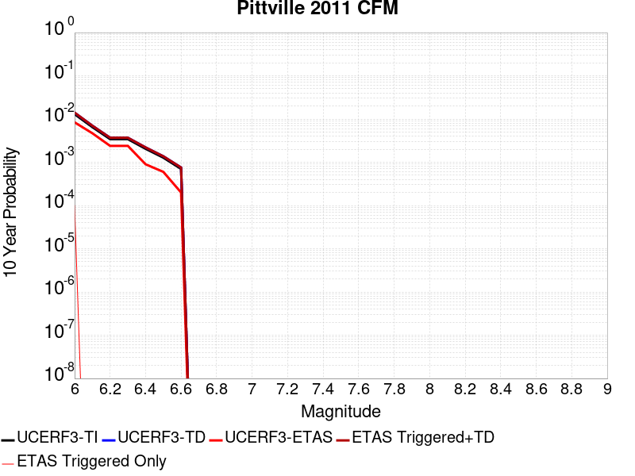 |

| Magnitude | 1 wk TI Prob | 1 wk TD Prob | 1 wk ETAS Prob | 1 wk ETAS/TD Gain | 1 wk ETAS Triggered+TD | 1 wk ETAS Triggered Only | 1 mo TI Prob | 1 mo TD Prob | 1 mo ETAS Prob | 1 mo ETAS/TD Gain | 1 mo ETAS Triggered+TD | 1 mo ETAS Triggered Only | 1 yr TI Prob | 1 yr TD Prob | 1 yr ETAS Prob | 1 yr ETAS/TD Gain | 1 yr ETAS Triggered+TD | 1 yr ETAS Triggered Only | 10 yr TI Prob | 10 yr TD Prob | 10 yr ETAS Prob | 10 yr ETAS/TD Gain | 10 yr ETAS Triggered+TD | 10 yr ETAS Triggered Only |
|-----|-----|-----|-----|-----|-----|-----|-----|-----|-----|-----|-----|-----|-----|-----|-----|-----|-----|-----|-----|-----|-----|-----|-----|-----|
| 6.0 | 2.5031832E-5 | 2.703412E-5 | 0.0 | 0.0 | 2.703412E-5 | 0.0 | 1.0727487E-4 | 1.1585592E-4 | 1.0E-4 | 0.86314106 | 1.1585592E-4 | 0.0 | 0.001305289 | 0.0014097303 | 0.0013 | 0.9221622 | 0.0014097303 | 0.0 | 0.012976485 | 0.014017642 | 0.0084 | 0.5992449 | 0.01411624 | 1.0E-4 |
| 6.1 | 1.2540113E-5 | 1.35021255E-5 | 0.0 | 0.0 | 1.35021255E-5 | 0.0 | 5.3742235E-5 | 5.7865094E-5 | 0.0 | 0.0 | 5.7865094E-5 | 0.0 | 6.541153E-4 | 7.043023E-4 | 6.0E-4 | 0.85190696 | 7.043023E-4 | 0.0 | 0.0065219323 | 0.0070229317 | 0.0047 | 0.6692362 | 0.0070229317 | 0.0 |
| 6.2 | 6.603218E-6 | 7.1015293E-6 | 0.0 | 0.0 | 7.1015293E-6 | 0.0 | 2.8299199E-5 | 3.0434807E-5 | 0.0 | 0.0 | 3.0434807E-5 | 0.0 | 3.4448825E-4 | 3.7048725E-4 | 4.0E-4 | 1.0796592 | 3.7048725E-4 | 0.0 | 0.0034395473 | 0.0036993357 | 0.0024 | 0.64876515 | 0.0036993357 | 0.0 |
| 6.3 | 6.603218E-6 | 7.1015293E-6 | 0.0 | 0.0 | 7.1015293E-6 | 0.0 | 2.8299199E-5 | 3.0434807E-5 | 0.0 | 0.0 | 3.0434807E-5 | 0.0 | 3.4448825E-4 | 3.7048725E-4 | 4.0E-4 | 1.0796592 | 3.7048725E-4 | 0.0 | 0.0034395473 | 0.0036993357 | 0.0024 | 0.64876515 | 0.0036993357 | 0.0 |
| 6.4 | 3.9389015E-6 | 4.2358033E-6 | 0.0 | 0.0 | 4.2358033E-6 | 0.0 | 1.6880897E-5 | 1.8153334E-5 | 0.0 | 0.0 | 1.8153334E-5 | 0.0 | 2.0550552E-4 | 2.2099752E-4 | 1.0E-4 | 0.45249376 | 2.2099752E-4 | 0.0 | 0.0020531558 | 0.002208082 | 9.0E-4 | 0.40759358 | 0.002208082 | 0.0 |
| 6.5 | 2.4533072E-6 | 2.6391572E-6 | 0.0 | 0.0 | 2.6391572E-6 | 0.0 | 1.0514132E-5 | 1.1310636E-5 | 0.0 | 0.0 | 1.1310636E-5 | 0.0 | 1.2800204E-4 | 1.3770022E-4 | 1.0E-4 | 0.72621524 | 1.3770022E-4 | 0.0 | 0.0012792832 | 0.0013763389 | 6.0E-4 | 0.43593916 | 0.0013763389 | 0.0 |
| 6.6 | 1.3482367E-6 | 1.4518153E-6 | 0.0 | 0.0 | 1.4518153E-6 | 0.0 | 5.778144E-6 | 6.2220565E-6 | 0.0 | 0.0 | 6.2220565E-6 | 0.0 | 7.0346636E-5 | 7.575204E-5 | 1.0E-4 | 1.3200965 | 7.575204E-5 | 0.0 | 7.032437E-4 | 7.5737305E-4 | 2.0E-4 | 0.26407066 | 7.5737305E-4 | 0.0 |

## Redondo Canyon alt 1
*[(top)](#table-of-contents)*

| 1 Week | 1 Month | 1 Year | 10 Year |
|-----|-----|-----|-----|
|  |  |  |  |

| Magnitude | 1 wk TI Prob | 1 wk TD Prob | 1 wk ETAS Prob | 1 wk ETAS/TD Gain | 1 wk ETAS Triggered+TD | 1 wk ETAS Triggered Only | 1 mo TI Prob | 1 mo TD Prob | 1 mo ETAS Prob | 1 mo ETAS/TD Gain | 1 mo ETAS Triggered+TD | 1 mo ETAS Triggered Only | 1 yr TI Prob | 1 yr TD Prob | 1 yr ETAS Prob | 1 yr ETAS/TD Gain | 1 yr ETAS Triggered+TD | 1 yr ETAS Triggered Only | 10 yr TI Prob | 10 yr TD Prob | 10 yr ETAS Prob | 10 yr ETAS/TD Gain | 10 yr ETAS Triggered+TD | 10 yr ETAS Triggered Only |
|-----|-----|-----|-----|-----|-----|-----|-----|-----|-----|-----|-----|-----|-----|-----|-----|-----|-----|-----|-----|-----|-----|-----|-----|-----|
| 6.0 | 1.0346246E-5 | 1.0969803E-5 | 0.0 | 0.0 | 1.0969803E-5 | 0.0 | 4.43403E-5 | 4.701304E-5 | 0.0 | 0.0 | 4.701304E-5 | 0.0 | 5.3970946E-4 | 5.7231216E-4 | 3.0E-4 | 0.5241895 | 5.7231216E-4 | 0.0 | 0.0053840056 | 0.005716108 | 0.0032 | 0.5598215 | 0.0058155362 | 1.0E-4 |
| 6.1 | 1.0346246E-5 | 1.0969803E-5 | 0.0 | 0.0 | 1.0969803E-5 | 0.0 | 4.43403E-5 | 4.701304E-5 | 0.0 | 0.0 | 4.701304E-5 | 0.0 | 5.3970946E-4 | 5.7231216E-4 | 3.0E-4 | 0.5241895 | 5.7231216E-4 | 0.0 | 0.0053840056 | 0.005716108 | 0.0032 | 0.5598215 | 0.0058155362 | 1.0E-4 |
| 6.2 | 1.0346246E-5 | 1.0969803E-5 | 0.0 | 0.0 | 1.0969803E-5 | 0.0 | 4.43403E-5 | 4.701304E-5 | 0.0 | 0.0 | 4.701304E-5 | 0.0 | 5.3970946E-4 | 5.7231216E-4 | 3.0E-4 | 0.5241895 | 5.7231216E-4 | 0.0 | 0.0053840056 | 0.005716108 | 0.0032 | 0.5598215 | 0.0058155362 | 1.0E-4 |
| 6.3 | 3.2052794E-6 | 3.2314128E-6 | 0.0 | 0.0 | 3.2314128E-6 | 0.0 | 1.373684E-5 | 1.3848861E-5 | 0.0 | 0.0 | 1.3848861E-5 | 0.0 | 1.6723319E-4 | 1.686008E-4 | 0.0 | 0.0 | 1.686008E-4 | 0.0 | 0.001671074 | 0.0016851175 | 0.0011 | 0.6527735 | 0.001784949 | 1.0E-4 |
| 6.4 | 3.2052794E-6 | 3.2314128E-6 | 0.0 | 0.0 | 3.2314128E-6 | 0.0 | 1.373684E-5 | 1.3848861E-5 | 0.0 | 0.0 | 1.3848861E-5 | 0.0 | 1.6723319E-4 | 1.686008E-4 | 0.0 | 0.0 | 1.686008E-4 | 0.0 | 0.001671074 | 0.0016851175 | 0.0011 | 0.6527735 | 0.001784949 | 1.0E-4 |
| 6.5 | 3.2052794E-6 | 3.2314128E-6 | 0.0 | 0.0 | 3.2314128E-6 | 0.0 | 1.373684E-5 | 1.3848861E-5 | 0.0 | 0.0 | 1.3848861E-5 | 0.0 | 1.6723319E-4 | 1.686008E-4 | 0.0 | 0.0 | 1.686008E-4 | 0.0 | 0.001671074 | 0.0016851175 | 0.0011 | 0.6527735 | 0.001784949 | 1.0E-4 |
| 6.6 | 1.948328E-6 | 1.8259183E-6 | 0.0 | 0.0 | 1.8259183E-6 | 0.0 | 8.349951E-6 | 7.825349E-6 | 0.0 | 0.0 | 7.825349E-6 | 0.0 | 1.016559E-4 | 9.527095E-5 | 0.0 | 0.0 | 9.527095E-5 | 0.0 | 0.0010160941 | 9.5244765E-4 | 7.0E-4 | 0.7349485 | 0.0010523524 | 1.0E-4 |
| 6.7 | 1.948328E-6 | 1.8259183E-6 | 0.0 | 0.0 | 1.8259183E-6 | 0.0 | 8.349951E-6 | 7.825349E-6 | 0.0 | 0.0 | 7.825349E-6 | 0.0 | 1.016559E-4 | 9.527095E-5 | 0.0 | 0.0 | 9.527095E-5 | 0.0 | 0.0010160941 | 9.5244765E-4 | 7.0E-4 | 0.7349485 | 0.0010523524 | 1.0E-4 |
| 6.8 | 1.1278219E-6 | 9.015936E-7 | 0.0 | 0.0 | 9.015936E-7 | 0.0 | 4.8335132E-6 | 3.863969E-6 | 0.0 | 0.0 | 3.863969E-6 | 0.0 | 5.8846435E-5 | 4.704324E-5 | 0.0 | 0.0 | 4.704324E-5 | 0.0 | 5.8830855E-4 | 4.7037465E-4 | 4.0E-4 | 0.85038596 | 5.703276E-4 | 1.0E-4 |
| 6.9 | 1.1278219E-6 | 9.015936E-7 | 0.0 | 0.0 | 9.015936E-7 | 0.0 | 4.8335132E-6 | 3.863969E-6 | 0.0 | 0.0 | 3.863969E-6 | 0.0 | 5.8846435E-5 | 4.704324E-5 | 0.0 | 0.0 | 4.704324E-5 | 0.0 | 5.8830855E-4 | 4.7037465E-4 | 4.0E-4 | 0.85038596 | 5.703276E-4 | 1.0E-4 |
| 7.0 | 1.1278219E-6 | 9.015936E-7 | 0.0 | 0.0 | 9.015936E-7 | 0.0 | 4.8335132E-6 | 3.863969E-6 | 0.0 | 0.0 | 3.863969E-6 | 0.0 | 5.8846435E-5 | 4.704324E-5 | 0.0 | 0.0 | 4.704324E-5 | 0.0 | 5.8830855E-4 | 4.7037465E-4 | 4.0E-4 | 0.85038596 | 5.703276E-4 | 1.0E-4 |
| 7.1 | 1.0545139E-6 | 8.5534685E-7 | 0.0 | 0.0 | 8.5534685E-7 | 0.0 | 4.5193374E-6 | 3.6657693E-6 | 0.0 | 0.0 | 3.6657693E-6 | 0.0 | 5.5021545E-5 | 4.463025E-5 | 0.0 | 0.0 | 4.463025E-5 | 0.0 | 5.500792E-4 | 4.462545E-4 | 1.0E-4 | 0.22408737 | 4.462545E-4 | 0.0 |
| 7.2 | 1.0545139E-6 | 8.5534685E-7 | 0.0 | 0.0 | 8.5534685E-7 | 0.0 | 4.5193374E-6 | 3.6657693E-6 | 0.0 | 0.0 | 3.6657693E-6 | 0.0 | 5.5021545E-5 | 4.463025E-5 | 0.0 | 0.0 | 4.463025E-5 | 0.0 | 5.500792E-4 | 4.462545E-4 | 1.0E-4 | 0.22408737 | 4.462545E-4 | 0.0 |
| 7.3 | 9.505161E-8 | 5.8791972E-8 | 0.0 | 0.0 | 5.8791972E-8 | 0.0 | 4.0736398E-7 | 2.519656E-7 | 0.0 | 0.0 | 2.519656E-7 | 0.0 | 4.959645E-6 | 3.0676779E-6 | 0.0 | 0.0 | 3.0676779E-6 | 0.0 | 4.9595343E-5 | 3.0676474E-5 | 0.0 | 0.0 | 3.0676474E-5 | 0.0 |
| 7.4 | 3.9520785E-8 | 2.6868836E-8 | 0.0 | 0.0 | 2.6868836E-8 | 0.0 | 1.6937479E-7 | 1.1515215E-7 | 0.0 | 0.0 | 1.1515215E-7 | 0.0 | 2.062136E-6 | 1.4019768E-6 | 0.0 | 0.0 | 1.4019768E-6 | 0.0 | 2.062117E-5 | 1.4019706E-5 | 0.0 | 0.0 | 1.4019706E-5 | 0.0 |
| 7.5 | 5.6133214E-9 | 3.722762E-9 | 0.0 | 0.0 | 3.722762E-9 | 0.0 | 2.4057092E-8 | 1.5954695E-8 | 0.0 | 0.0 | 1.5954695E-8 | 0.0 | 2.9289507E-7 | 1.942484E-7 | 0.0 | 0.0 | 1.942484E-7 | 0.0 | 2.9289467E-6 | 1.9424826E-6 | 0.0 | 0.0 | 1.9424826E-6 | 0.0 |
| 7.6 | 4.1064334E-9 | 2.5842946E-9 | 0.0 | 0.0 | 2.5842946E-9 | 0.0 | 1.7599E-8 | 1.10755485E-8 | 0.0 | 0.0 | 1.10755485E-8 | 0.0 | 2.142678E-7 | 1.348448E-7 | 0.0 | 0.0 | 1.348448E-7 | 0.0 | 2.1426758E-6 | 1.3484473E-6 | 0.0 | 0.0 | 1.3484473E-6 | 0.0 |
| 7.7 | 1.361975E-9 | 6.2969774E-10 | 0.0 | 0.0 | 6.2969774E-10 | 0.0 | 5.8370353E-9 | 2.698705E-9 | 0.0 | 0.0 | 2.698705E-9 | 0.0 | 7.1065905E-8 | 3.2856732E-8 | 0.0 | 0.0 | 3.2856732E-8 | 0.0 | 7.106588E-7 | 3.285673E-7 | 0.0 | 0.0 | 3.285673E-7 | 0.0 |
| 7.8 | 1.361975E-9 | 6.2969774E-10 | 0.0 | 0.0 | 6.2969774E-10 | 0.0 | 5.8370353E-9 | 2.698705E-9 | 0.0 | 0.0 | 2.698705E-9 | 0.0 | 7.1065905E-8 | 3.2856732E-8 | 0.0 | 0.0 | 3.2856732E-8 | 0.0 | 7.106588E-7 | 3.285673E-7 | 0.0 | 0.0 | 3.285673E-7 | 0.0 |

## Los Osos 2011
*[(top)](#table-of-contents)*

| 1 Week | 1 Month | 1 Year | 10 Year |
|-----|-----|-----|-----|
|  |  | 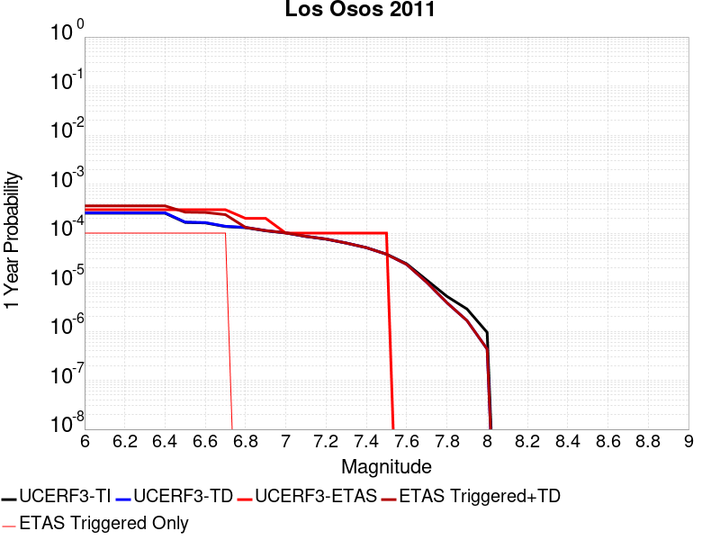 | 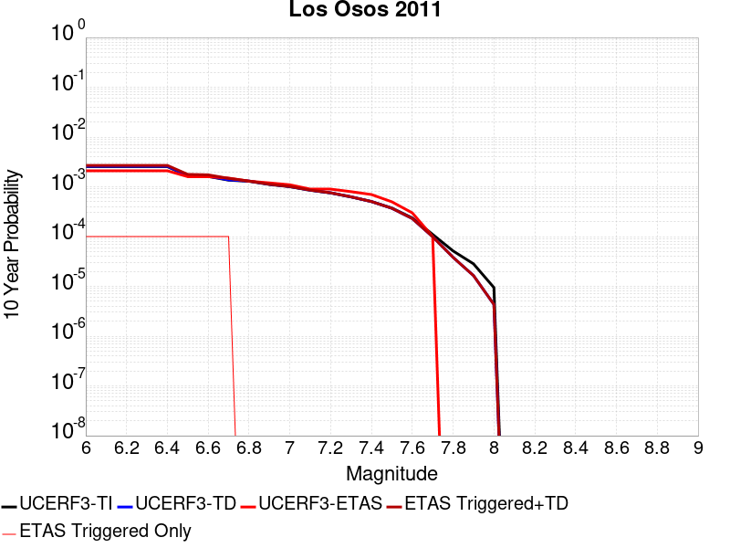 |

| Magnitude | 1 wk TI Prob | 1 wk TD Prob | 1 wk ETAS Prob | 1 wk ETAS/TD Gain | 1 wk ETAS Triggered+TD | 1 wk ETAS Triggered Only | 1 mo TI Prob | 1 mo TD Prob | 1 mo ETAS Prob | 1 mo ETAS/TD Gain | 1 mo ETAS Triggered+TD | 1 mo ETAS Triggered Only | 1 yr TI Prob | 1 yr TD Prob | 1 yr ETAS Prob | 1 yr ETAS/TD Gain | 1 yr ETAS Triggered+TD | 1 yr ETAS Triggered Only | 10 yr TI Prob | 10 yr TD Prob | 10 yr ETAS Prob | 10 yr ETAS/TD Gain | 10 yr ETAS Triggered+TD | 10 yr ETAS Triggered Only |
|-----|-----|-----|-----|-----|-----|-----|-----|-----|-----|-----|-----|-----|-----|-----|-----|-----|-----|-----|-----|-----|-----|-----|-----|-----|
| 6.0 | 4.8871775E-6 | 4.979819E-6 | 0.0 | 0.0 | 4.979819E-6 | 0.0 | 2.0944879E-5 | 2.1341923E-5 | 0.0 | 0.0 | 2.1341923E-5 | 0.0 | 2.5497406E-4 | 2.5980972E-4 | 3.0E-4 | 1.1546912 | 3.5978373E-4 | 1.0E-4 | 0.002546817 | 0.0025953338 | 0.0021 | 0.80914444 | 0.0026950745 | 1.0E-4 |
| 6.1 | 4.8871775E-6 | 4.979819E-6 | 0.0 | 0.0 | 4.979819E-6 | 0.0 | 2.0944879E-5 | 2.1341923E-5 | 0.0 | 0.0 | 2.1341923E-5 | 0.0 | 2.5497406E-4 | 2.5980972E-4 | 3.0E-4 | 1.1546912 | 3.5978373E-4 | 1.0E-4 | 0.002546817 | 0.0025953338 | 0.0021 | 0.80914444 | 0.0026950745 | 1.0E-4 |
| 6.2 | 4.8871775E-6 | 4.979819E-6 | 0.0 | 0.0 | 4.979819E-6 | 0.0 | 2.0944879E-5 | 2.1341923E-5 | 0.0 | 0.0 | 2.1341923E-5 | 0.0 | 2.5497406E-4 | 2.5980972E-4 | 3.0E-4 | 1.1546912 | 3.5978373E-4 | 1.0E-4 | 0.002546817 | 0.0025953338 | 0.0021 | 0.80914444 | 0.0026950745 | 1.0E-4 |
| 6.3 | 4.8871775E-6 | 4.979819E-6 | 0.0 | 0.0 | 4.979819E-6 | 0.0 | 2.0944879E-5 | 2.1341923E-5 | 0.0 | 0.0 | 2.1341923E-5 | 0.0 | 2.5497406E-4 | 2.5980972E-4 | 3.0E-4 | 1.1546912 | 3.5978373E-4 | 1.0E-4 | 0.002546817 | 0.0025953338 | 0.0021 | 0.80914444 | 0.0026950745 | 1.0E-4 |
| 6.4 | 4.8871775E-6 | 4.979819E-6 | 0.0 | 0.0 | 4.979819E-6 | 0.0 | 2.0944879E-5 | 2.1341923E-5 | 0.0 | 0.0 | 2.1341923E-5 | 0.0 | 2.5497406E-4 | 2.5980972E-4 | 3.0E-4 | 1.1546912 | 3.5978373E-4 | 1.0E-4 | 0.002546817 | 0.0025953338 | 0.0021 | 0.80914444 | 0.0026950745 | 1.0E-4 |
| 6.5 | 3.1724062E-6 | 3.2221944E-6 | 0.0 | 0.0 | 3.2221944E-6 | 0.0 | 1.3595956E-5 | 1.3809333E-5 | 0.0 | 0.0 | 1.3809333E-5 | 0.0 | 1.6551818E-4 | 1.6811579E-4 | 3.0E-4 | 1.7844844 | 2.68099E-4 | 1.0E-4 | 0.0016539496 | 0.0016798995 | 0.0016 | 0.9524379 | 0.0017797316 | 1.0E-4 |
| 6.6 | 3.1022591E-6 | 3.1499271E-6 | 0.0 | 0.0 | 3.1499271E-6 | 0.0 | 1.3295328E-5 | 1.3499618E-5 | 0.0 | 0.0 | 1.3499618E-5 | 0.0 | 1.618586E-4 | 1.6434558E-4 | 3.0E-4 | 1.8254218 | 2.6432914E-4 | 1.0E-4 | 0.0016174077 | 0.0016422532 | 0.0016 | 0.9742712 | 0.001742089 | 1.0E-4 |
| 6.7 | 2.611518E-6 | 2.6481255E-6 | 0.0 | 0.0 | 2.6481255E-6 | 0.0 | 1.1192172E-5 | 1.134906E-5 | 0.0 | 0.0 | 1.134906E-5 | 0.0 | 1.3625617E-4 | 1.3816608E-4 | 3.0E-4 | 2.1713 | 2.3815226E-4 | 1.0E-4 | 0.0013617266 | 0.0013808063 | 0.0015 | 1.0863218 | 0.0014806682 | 1.0E-4 |
| 6.8 | 2.4780884E-6 | 2.51114E-6 | 0.0 | 0.0 | 2.51114E-6 | 0.0 | 1.0620336E-5 | 1.0761984E-5 | 0.0 | 0.0 | 1.0761984E-5 | 0.0 | 1.2929492E-4 | 1.3101932E-4 | 2.0E-4 | 1.5264924 | 1.3101932E-4 | 0.0 | 0.0012921972 | 0.0013094249 | 0.0013 | 0.99280226 | 0.0013094249 | 0.0 |
| 6.9 | 2.1376322E-6 | 2.1625742E-6 | 0.0 | 0.0 | 2.1625742E-6 | 0.0 | 9.161248E-6 | 9.268142E-6 | 0.0 | 0.0 | 9.268142E-6 | 0.0 | 1.1153249E-4 | 1.1283381E-4 | 2.0E-4 | 1.7725184 | 1.1283381E-4 | 0.0 | 0.0011147653 | 0.0011277671 | 0.0012 | 1.0640495 | 0.0011277671 | 0.0 |
| 7.0 | 1.9282882E-6 | 1.9485774E-6 | 0.0 | 0.0 | 1.9485774E-6 | 0.0 | 8.264066E-6 | 8.3510195E-6 | 0.0 | 0.0 | 8.3510195E-6 | 0.0 | 1.0061036E-4 | 1.0166893E-4 | 1.0E-4 | 0.98358464 | 1.0166893E-4 | 0.0 | 0.0010056482 | 0.0010162255 | 0.0011 | 1.0824369 | 0.0010162255 | 0.0 |
| 7.1 | 1.6353226E-6 | 1.6492988E-6 | 0.0 | 0.0 | 1.6492988E-6 | 0.0 | 7.0085066E-6 | 7.0684046E-6 | 0.0 | 0.0 | 7.0684046E-6 | 0.0 | 8.532523E-5 | 8.605443E-5 | 1.0E-4 | 1.1620553 | 8.605443E-5 | 0.0 | 8.529247E-4 | 8.6021185E-4 | 9.0E-4 | 1.0462539 | 8.6021185E-4 | 0.0 |
| 7.2 | 1.4446276E-6 | 1.4545648E-6 | 0.0 | 0.0 | 1.4545648E-6 | 0.0 | 6.191247E-6 | 6.233834E-6 | 0.0 | 0.0 | 6.233834E-6 | 0.0 | 7.537582E-5 | 7.589429E-5 | 1.0E-4 | 1.3176222 | 7.589429E-5 | 0.0 | 7.535026E-4 | 7.586843E-4 | 9.0E-4 | 1.1862642 | 7.586843E-4 | 0.0 |
| 7.3 | 1.2014582E-6 | 1.206194E-6 | 0.0 | 0.0 | 1.206194E-6 | 0.0 | 5.149096E-6 | 5.169393E-6 | 0.0 | 0.0 | 5.169393E-6 | 0.0 | 6.268844E-5 | 6.293554E-5 | 1.0E-4 | 1.5889273 | 6.293554E-5 | 0.0 | 6.267076E-4 | 6.291776E-4 | 8.0E-4 | 1.2715011 | 6.291776E-4 | 0.0 |
| 7.4 | 9.707733E-7 | 9.703201E-7 | 0.0 | 0.0 | 9.703201E-7 | 0.0 | 4.16045E-6 | 4.158508E-6 | 0.0 | 0.0 | 4.158508E-6 | 0.0 | 5.0652303E-5 | 5.0628663E-5 | 1.0E-4 | 1.9751656 | 5.0628663E-5 | 0.0 | 5.064076E-4 | 5.0617155E-4 | 7.0E-4 | 1.3829303 | 5.0617155E-4 | 0.0 |
| 7.5 | 7.174908E-7 | 7.1090074E-7 | 0.0 | 0.0 | 7.1090074E-7 | 0.0 | 3.074957E-6 | 3.0467138E-6 | 0.0 | 0.0 | 3.0467138E-6 | 0.0 | 3.743696E-5 | 3.7093112E-5 | 1.0E-4 | 2.6959183 | 3.7093112E-5 | 0.0 | 3.7430652E-4 | 3.7086938E-4 | 5.0E-4 | 1.3481836 | 3.7086938E-4 | 0.0 |
| 7.6 | 4.5535776E-7 | 4.4156693E-7 | 0.0 | 0.0 | 4.4156693E-7 | 0.0 | 1.9515319E-6 | 1.8924283E-6 | 0.0 | 0.0 | 1.8924283E-6 | 0.0 | 2.3759641E-5 | 2.3040073E-5 | 0.0 | 0.0 | 2.3040073E-5 | 0.0 | 2.37571E-4 | 2.3037693E-4 | 3.0E-4 | 1.3022138 | 2.3037693E-4 | 0.0 |
| 7.7 | 2.1173553E-7 | 1.9018053E-7 | 0.0 | 0.0 | 1.9018053E-7 | 0.0 | 9.0743765E-7 | 8.150592E-7 | 0.0 | 0.0 | 8.150592E-7 | 0.0 | 1.1047998E-5 | 9.9233E-6 | 0.0 | 0.0 | 9.9233E-6 | 0.0 | 1.1047449E-4 | 9.92286E-5 | 1.0E-4 | 1.007774 | 9.92286E-5 | 0.0 |
| 7.8 | 9.873608E-8 | 7.3295304E-8 | 0.0 | 0.0 | 7.3295304E-8 | 0.0 | 4.2315455E-7 | 3.1412267E-7 | 0.0 | 0.0 | 3.1412267E-7 | 0.0 | 5.1518946E-6 | 3.824437E-6 | 0.0 | 0.0 | 3.824437E-6 | 0.0 | 5.1517753E-5 | 3.8243717E-5 | 0.0 | 0.0 | 3.8243717E-5 | 0.0 |
| 7.9 | 5.4399106E-8 | 3.1547312E-8 | 0.0 | 0.0 | 3.1547312E-8 | 0.0 | 2.33139E-7 | 1.3520277E-7 | 0.0 | 0.0 | 1.3520277E-7 | 0.0 | 2.8384638E-6 | 1.6460924E-6 | 0.0 | 0.0 | 1.6460924E-6 | 0.0 | 2.8384275E-5 | 1.6460805E-5 | 0.0 | 0.0 | 1.6460805E-5 | 0.0 |
| 8.0 | 1.817203E-8 | 8.279409E-9 | 0.0 | 0.0 | 8.279409E-9 | 0.0 | 7.7880124E-8 | 3.5483183E-8 | 0.0 | 0.0 | 3.5483183E-8 | 0.0 | 9.481901E-7 | 4.3200768E-7 | 0.0 | 0.0 | 4.3200768E-7 | 0.0 | 9.481861E-6 | 4.320069E-6 | 0.0 | 0.0 | 4.320069E-6 | 0.0 |

## Elysian Park (Lower CFM)
*[(top)](#table-of-contents)*

| 1 Week | 1 Month | 1 Year | 10 Year |
|-----|-----|-----|-----|
| 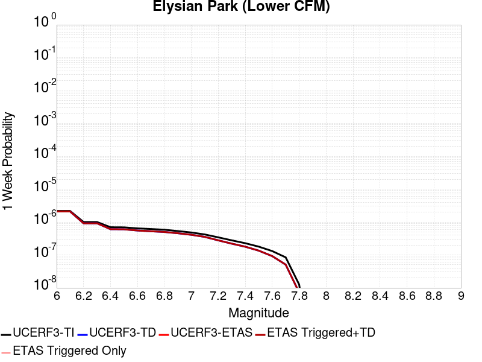 |  |  |  |

| Magnitude | 1 wk TI Prob | 1 wk TD Prob | 1 wk ETAS Prob | 1 wk ETAS/TD Gain | 1 wk ETAS Triggered+TD | 1 wk ETAS Triggered Only | 1 mo TI Prob | 1 mo TD Prob | 1 mo ETAS Prob | 1 mo ETAS/TD Gain | 1 mo ETAS Triggered+TD | 1 mo ETAS Triggered Only | 1 yr TI Prob | 1 yr TD Prob | 1 yr ETAS Prob | 1 yr ETAS/TD Gain | 1 yr ETAS Triggered+TD | 1 yr ETAS Triggered Only | 10 yr TI Prob | 10 yr TD Prob | 10 yr ETAS Prob | 10 yr ETAS/TD Gain | 10 yr ETAS Triggered+TD | 10 yr ETAS Triggered Only |
|-----|-----|-----|-----|-----|-----|-----|-----|-----|-----|-----|-----|-----|-----|-----|-----|-----|-----|-----|-----|-----|-----|-----|-----|-----|
| 6.0 | 2.1766498E-6 | 2.103101E-6 | 0.0 | 0.0 | 2.103101E-6 | 0.0 | 9.328466E-6 | 9.013267E-6 | 0.0 | 0.0 | 9.013267E-6 | 0.0 | 1.1356815E-4 | 1.0973245E-4 | 1.0E-4 | 0.91130745 | 1.0973245E-4 | 0.0 | 0.0011351013 | 0.0010969245 | 9.0E-4 | 0.82047576 | 0.0011968148 | 1.0E-4 |
| 6.1 | 2.1766498E-6 | 2.103101E-6 | 0.0 | 0.0 | 2.103101E-6 | 0.0 | 9.328466E-6 | 9.013267E-6 | 0.0 | 0.0 | 9.013267E-6 | 0.0 | 1.1356815E-4 | 1.0973245E-4 | 1.0E-4 | 0.91130745 | 1.0973245E-4 | 0.0 | 0.0011351013 | 0.0010969245 | 9.0E-4 | 0.82047576 | 0.0011968148 | 1.0E-4 |
| 6.2 | 1.0031182E-6 | 9.180558E-7 | 0.0 | 0.0 | 9.180558E-7 | 0.0 | 4.299071E-6 | 3.934519E-6 | 0.0 | 0.0 | 3.934519E-6 | 0.0 | 5.2339932E-5 | 4.7901816E-5 | 0.0 | 0.0 | 4.7901816E-5 | 0.0 | 5.2327604E-4 | 4.7892472E-4 | 2.0E-4 | 0.41760215 | 4.7892472E-4 | 0.0 |
| 6.3 | 1.0031182E-6 | 9.180558E-7 | 0.0 | 0.0 | 9.180558E-7 | 0.0 | 4.299071E-6 | 3.934519E-6 | 0.0 | 0.0 | 3.934519E-6 | 0.0 | 5.2339932E-5 | 4.7901816E-5 | 0.0 | 0.0 | 4.7901816E-5 | 0.0 | 5.2327604E-4 | 4.7892472E-4 | 2.0E-4 | 0.41760215 | 4.7892472E-4 | 0.0 |
| 6.4 | 6.9606244E-7 | 6.086536E-7 | 0.0 | 0.0 | 6.086536E-7 | 0.0 | 2.9831212E-6 | 2.6085127E-6 | 0.0 | 0.0 | 2.6085127E-6 | 0.0 | 3.6318896E-5 | 3.175818E-5 | 0.0 | 0.0 | 3.175818E-5 | 0.0 | 3.6312963E-4 | 3.1753667E-4 | 1.0E-4 | 0.31492427 | 3.1753667E-4 | 0.0 |
| 6.5 | 6.901879E-7 | 6.0272254E-7 | 0.0 | 0.0 | 6.0272254E-7 | 0.0 | 2.9579448E-6 | 2.5830939E-6 | 0.0 | 0.0 | 2.5830939E-6 | 0.0 | 3.6012385E-5 | 3.144872E-5 | 0.0 | 0.0 | 3.144872E-5 | 0.0 | 3.600655E-4 | 3.144429E-4 | 1.0E-4 | 0.31802276 | 3.144429E-4 | 0.0 |
| 6.6 | 6.4198554E-7 | 5.5412505E-7 | 0.0 | 0.0 | 5.5412505E-7 | 0.0 | 2.7513638E-6 | 2.3748194E-6 | 0.0 | 0.0 | 2.3748194E-6 | 0.0 | 3.3497337E-5 | 2.8913044E-5 | 0.0 | 0.0 | 2.8913044E-5 | 0.0 | 3.349229E-4 | 2.8909295E-4 | 1.0E-4 | 0.3459095 | 2.8909295E-4 | 0.0 |
| 6.7 | 6.138733E-7 | 5.2580793E-7 | 0.0 | 0.0 | 5.2580793E-7 | 0.0 | 2.6308828E-6 | 2.2534605E-6 | 0.0 | 0.0 | 2.2534605E-6 | 0.0 | 3.203053E-5 | 2.7435537E-5 | 0.0 | 0.0 | 2.7435537E-5 | 0.0 | 3.2025913E-4 | 2.7432162E-4 | 1.0E-4 | 0.3645356 | 2.7432162E-4 | 0.0 |
| 6.8 | 5.84778E-7 | 4.997639E-7 | 0.0 | 0.0 | 4.997639E-7 | 0.0 | 2.506189E-6 | 2.1418434E-6 | 0.0 | 0.0 | 2.1418434E-6 | 0.0 | 3.0512423E-5 | 2.6076634E-5 | 0.0 | 0.0 | 2.6076634E-5 | 0.0 | 3.0508233E-4 | 2.6073586E-4 | 1.0E-4 | 0.3835299 | 2.6073586E-4 | 0.0 |
| 6.9 | 5.322785E-7 | 4.5748806E-7 | 0.0 | 0.0 | 4.5748806E-7 | 0.0 | 2.2811914E-6 | 1.9606614E-6 | 0.0 | 0.0 | 1.9606614E-6 | 0.0 | 2.7773152E-5 | 2.3870793E-5 | 0.0 | 0.0 | 2.3870793E-5 | 0.0 | 2.7769682E-4 | 2.3868239E-4 | 1.0E-4 | 0.4189668 | 2.3868239E-4 | 0.0 |
| 7.0 | 4.8147206E-7 | 4.107299E-7 | 0.0 | 0.0 | 4.107299E-7 | 0.0 | 2.06345E-6 | 1.7602698E-6 | 0.0 | 0.0 | 1.7602698E-6 | 0.0 | 2.5122214E-5 | 2.1431075E-5 | 0.0 | 0.0 | 2.1431075E-5 | 0.0 | 2.5119373E-4 | 2.1429016E-4 | 1.0E-4 | 0.46665695 | 2.1429016E-4 | 0.0 |
| 7.1 | 4.1932955E-7 | 3.5409474E-7 | 0.0 | 0.0 | 3.5409474E-7 | 0.0 | 1.7971255E-6 | 1.5175478E-6 | 0.0 | 0.0 | 1.5175478E-6 | 0.0 | 2.1879783E-5 | 1.8475988E-5 | 0.0 | 0.0 | 1.8475988E-5 | 0.0 | 2.1877629E-4 | 1.8474458E-4 | 1.0E-4 | 0.54128784 | 1.8474458E-4 | 0.0 |
| 7.2 | 3.426051E-7 | 2.7771074E-7 | 0.0 | 0.0 | 2.7771074E-7 | 0.0 | 1.4683067E-6 | 1.1901883E-6 | 0.0 | 0.0 | 1.1901883E-6 | 0.0 | 1.7876488E-5 | 1.4490445E-5 | 0.0 | 0.0 | 1.4490445E-5 | 0.0 | 1.787505E-4 | 1.4489504E-4 | 0.0 | 0.0 | 1.4489504E-4 | 0.0 |
| 7.3 | 2.7771645E-7 | 2.2063207E-7 | 0.0 | 0.0 | 2.2063207E-7 | 0.0 | 1.1902127E-6 | 9.4556566E-7 | 0.0 | 0.0 | 9.4556566E-7 | 0.0 | 1.4490744E-5 | 1.1512201E-5 | 0.0 | 0.0 | 1.1512201E-5 | 0.0 | 1.4489799E-4 | 1.1511607E-4 | 0.0 | 0.0 | 1.1511607E-4 | 0.0 |
| 7.4 | 2.2756493E-7 | 1.7810005E-7 | 0.0 | 0.0 | 1.7810005E-7 | 0.0 | 9.752779E-7 | 7.632857E-7 | 0.0 | 0.0 | 7.632857E-7 | 0.0 | 1.1873944E-5 | 9.292963E-6 | 0.0 | 0.0 | 9.292963E-6 | 0.0 | 1.18733085E-4 | 9.2925766E-5 | 0.0 | 0.0 | 9.2925766E-5 | 0.0 |
| 7.5 | 1.7874558E-7 | 1.351719E-7 | 0.0 | 0.0 | 1.351719E-7 | 0.0 | 7.660522E-7 | 5.7930805E-7 | 0.0 | 0.0 | 5.7930805E-7 | 0.0 | 9.326646E-6 | 7.0530527E-6 | 0.0 | 0.0 | 7.0530527E-6 | 0.0 | 9.326255E-5 | 7.05283E-5 | 0.0 | 0.0 | 7.05283E-5 | 0.0 |
| 7.6 | 1.3124549E-7 | 9.230548E-8 | 0.0 | 0.0 | 9.230548E-8 | 0.0 | 5.624805E-7 | 3.9559487E-7 | 0.0 | 0.0 | 3.9559487E-7 | 0.0 | 6.8481786E-6 | 4.8163565E-6 | 0.0 | 0.0 | 4.8163565E-6 | 0.0 | 6.8479676E-5 | 4.816254E-5 | 0.0 | 0.0 | 4.816254E-5 | 0.0 |
| 7.7 | 8.439993E-8 | 5.0735117E-8 | 0.0 | 0.0 | 5.0735117E-8 | 0.0 | 3.6171392E-7 | 2.174362E-7 | 0.0 | 0.0 | 2.174362E-7 | 0.0 | 4.403858E-6 | 2.6472826E-6 | 0.0 | 0.0 | 2.6472826E-6 | 0.0 | 4.4037708E-5 | 2.6472522E-5 | 0.0 | 0.0 | 2.6472522E-5 | 0.0 |
| 7.8 | 1.2591407E-8 | 7.195422E-9 | 0.0 | 0.0 | 7.195422E-9 | 0.0 | 5.3963173E-8 | 3.0837526E-8 | 0.0 | 0.0 | 3.0837526E-8 | 0.0 | 6.570014E-7 | 3.7544683E-7 | 0.0 | 0.0 | 3.7544683E-7 | 0.0 | 6.5699946E-6 | 3.7544619E-6 | 0.0 | 0.0 | 3.7544619E-6 | 0.0 |
| 7.9 | 2.8324232E-11 | 2.1363689E-11 | 0.0 | 0.0 | 2.1363689E-11 | 0.0 | 1.2138957E-10 | 9.1558316E-11 | 0.0 | 0.0 | 9.1558316E-11 | 0.0 | 1.4779177E-9 | 1.1147231E-9 | 0.0 | 0.0 | 1.1147231E-9 | 0.0 | 1.4779177E-8 | 1.1147231E-8 | 0.0 | 0.0 | 1.1147231E-8 | 0.0 |

## Mohawk Valley 2011 CFM
*[(top)](#table-of-contents)*

| 1 Week | 1 Month | 1 Year | 10 Year |
|-----|-----|-----|-----|
|  |  |  |  |

| Magnitude | 1 wk TI Prob | 1 wk TD Prob | 1 wk ETAS Prob | 1 wk ETAS/TD Gain | 1 wk ETAS Triggered+TD | 1 wk ETAS Triggered Only | 1 mo TI Prob | 1 mo TD Prob | 1 mo ETAS Prob | 1 mo ETAS/TD Gain | 1 mo ETAS Triggered+TD | 1 mo ETAS Triggered Only | 1 yr TI Prob | 1 yr TD Prob | 1 yr ETAS Prob | 1 yr ETAS/TD Gain | 1 yr ETAS Triggered+TD | 1 yr ETAS Triggered Only | 10 yr TI Prob | 10 yr TD Prob | 10 yr ETAS Prob | 10 yr ETAS/TD Gain | 10 yr ETAS Triggered+TD | 10 yr ETAS Triggered Only |
|-----|-----|-----|-----|-----|-----|-----|-----|-----|-----|-----|-----|-----|-----|-----|-----|-----|-----|-----|-----|-----|-----|-----|-----|-----|
| 6.0 | 2.5425423E-5 | 2.7619575E-5 | 0.0 | 0.0 | 2.7619575E-5 | 0.0 | 1.0896155E-4 | 1.1836485E-4 | 0.0 | 0.0 | 1.1836485E-4 | 0.0 | 0.0013257994 | 0.0014402476 | 6.0E-4 | 0.416595 | 0.0015401037 | 1.0E-4 | 0.013179175 | 0.0143199945 | 0.0052 | 0.36312863 | 0.014418563 | 1.0E-4 |
| 6.1 | 2.5425423E-5 | 2.7619575E-5 | 0.0 | 0.0 | 2.7619575E-5 | 0.0 | 1.0896155E-4 | 1.1836485E-4 | 0.0 | 0.0 | 1.1836485E-4 | 0.0 | 0.0013257994 | 0.0014402476 | 6.0E-4 | 0.416595 | 0.0015401037 | 1.0E-4 | 0.013179175 | 0.0143199945 | 0.0052 | 0.36312863 | 0.014418563 | 1.0E-4 |
| 6.2 | 2.5425423E-5 | 2.7619575E-5 | 0.0 | 0.0 | 2.7619575E-5 | 0.0 | 1.0896155E-4 | 1.1836485E-4 | 0.0 | 0.0 | 1.1836485E-4 | 0.0 | 0.0013257994 | 0.0014402476 | 6.0E-4 | 0.416595 | 0.0015401037 | 1.0E-4 | 0.013179175 | 0.0143199945 | 0.0052 | 0.36312863 | 0.014418563 | 1.0E-4 |
| 6.3 | 2.5425423E-5 | 2.7619575E-5 | 0.0 | 0.0 | 2.7619575E-5 | 0.0 | 1.0896155E-4 | 1.1836485E-4 | 0.0 | 0.0 | 1.1836485E-4 | 0.0 | 0.0013257994 | 0.0014402476 | 6.0E-4 | 0.416595 | 0.0015401037 | 1.0E-4 | 0.013179175 | 0.0143199945 | 0.0052 | 0.36312863 | 0.014418563 | 1.0E-4 |
| 6.4 | 1.1812642E-5 | 1.2752864E-5 | 0.0 | 0.0 | 1.2752864E-5 | 0.0 | 5.0624625E-5 | 5.465407E-5 | 0.0 | 0.0 | 5.465407E-5 | 0.0 | 6.161805E-4 | 6.6522486E-4 | 3.0E-4 | 0.45097536 | 6.6522486E-4 | 0.0 | 0.0061447476 | 0.006633806 | 0.0024 | 0.36178327 | 0.006633806 | 0.0 |
| 6.5 | 1.1812642E-5 | 1.2752864E-5 | 0.0 | 0.0 | 1.2752864E-5 | 0.0 | 5.0624625E-5 | 5.465407E-5 | 0.0 | 0.0 | 5.465407E-5 | 0.0 | 6.161805E-4 | 6.6522486E-4 | 3.0E-4 | 0.45097536 | 6.6522486E-4 | 0.0 | 0.0061447476 | 0.006633806 | 0.0024 | 0.36178327 | 0.006633806 | 0.0 |
| 6.6 | 9.34204E-6 | 1.0076818E-5 | 0.0 | 0.0 | 1.0076818E-5 | 0.0 | 4.0036703E-5 | 4.318572E-5 | 0.0 | 0.0 | 4.318572E-5 | 0.0 | 4.873378E-4 | 5.25671E-4 | 1.0E-4 | 0.19023305 | 5.25671E-4 | 0.0 | 0.0048627043 | 0.005245442 | 0.0016 | 0.3050267 | 0.005245442 | 0.0 |
| 6.7 | 7.0661854E-6 | 7.6179185E-6 | 0.0 | 0.0 | 7.6179185E-6 | 0.0 | 3.02833E-5 | 3.2647866E-5 | 0.0 | 0.0 | 3.2647866E-5 | 0.0 | 3.686368E-4 | 3.974243E-4 | 1.0E-4 | 0.25162023 | 3.974243E-4 | 0.0 | 0.0036802588 | 0.0039680297 | 0.0011 | 0.27721566 | 0.0039680297 | 0.0 |
| 6.8 | 4.806676E-6 | 5.1829315E-6 | 0.0 | 0.0 | 5.1829315E-6 | 0.0 | 2.0599877E-5 | 2.221241E-5 | 0.0 | 0.0 | 2.221241E-5 | 0.0 | 2.507746E-4 | 2.704089E-4 | 1.0E-4 | 0.3698103 | 2.704089E-4 | 0.0 | 0.0025049183 | 0.002701424 | 7.0E-4 | 0.25912258 | 0.002701424 | 0.0 |
| 6.9 | 3.4163209E-6 | 3.6858269E-6 | 0.0 | 0.0 | 3.6858269E-6 | 0.0 | 1.4641293E-5 | 1.5796335E-5 | 0.0 | 0.0 | 1.5796335E-5 | 0.0 | 1.7824316E-4 | 1.9230883E-4 | 1.0E-4 | 0.51999694 | 1.9230883E-4 | 0.0 | 0.0017810026 | 0.0019219551 | 5.0E-4 | 0.26015174 | 0.0019219551 | 0.0 |
| 7.0 | 2.5271734E-6 | 2.7287144E-6 | 0.0 | 0.0 | 2.7287144E-6 | 0.0 | 1.0830699E-5 | 1.1694466E-5 | 0.0 | 0.0 | 1.1694466E-5 | 0.0 | 1.3185578E-4 | 1.4237575E-4 | 1.0E-4 | 0.7023668 | 1.4237575E-4 | 0.0 | 0.0013177756 | 0.0014233281 | 4.0E-4 | 0.2810315 | 0.0014233281 | 0.0 |

## San Pedro Escarpment
*[(top)](#table-of-contents)*

| 1 Week | 1 Month | 1 Year | 10 Year |
|-----|-----|-----|-----|
| 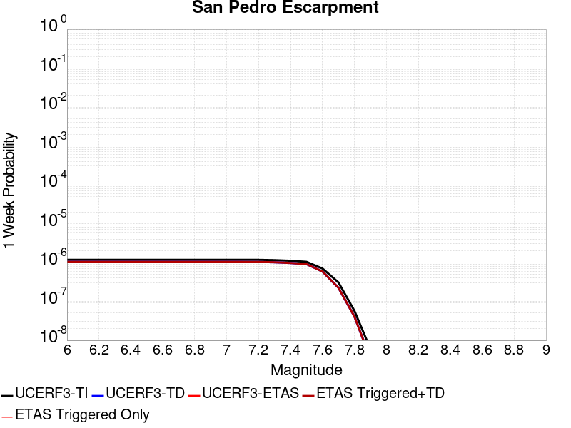 | 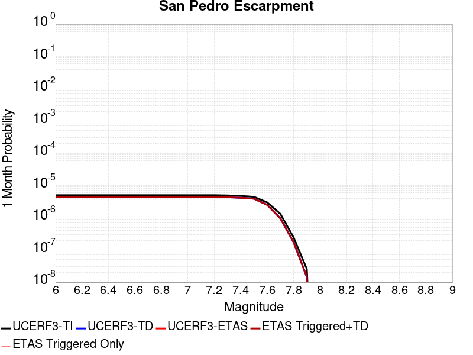 | 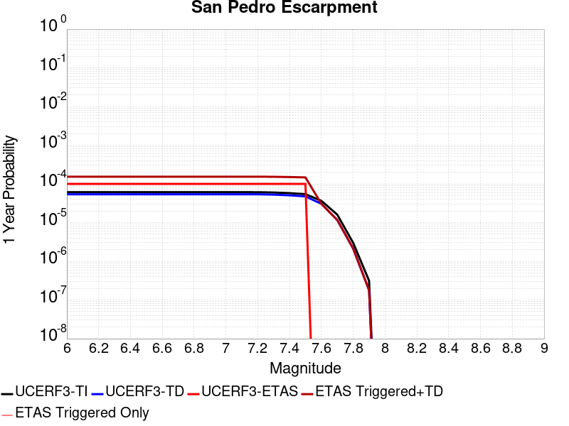 |  |

| Magnitude | 1 wk TI Prob | 1 wk TD Prob | 1 wk ETAS Prob | 1 wk ETAS/TD Gain | 1 wk ETAS Triggered+TD | 1 wk ETAS Triggered Only | 1 mo TI Prob | 1 mo TD Prob | 1 mo ETAS Prob | 1 mo ETAS/TD Gain | 1 mo ETAS Triggered+TD | 1 mo ETAS Triggered Only | 1 yr TI Prob | 1 yr TD Prob | 1 yr ETAS Prob | 1 yr ETAS/TD Gain | 1 yr ETAS Triggered+TD | 1 yr ETAS Triggered Only | 10 yr TI Prob | 10 yr TD Prob | 10 yr ETAS Prob | 10 yr ETAS/TD Gain | 10 yr ETAS Triggered+TD | 10 yr ETAS Triggered Only |
|-----|-----|-----|-----|-----|-----|-----|-----|-----|-----|-----|-----|-----|-----|-----|-----|-----|-----|-----|-----|-----|-----|-----|-----|-----|
| 6.0 | 1.1740281E-6 | 1.0376928E-6 | 0.0 | 0.0 | 1.0376928E-6 | 0.0 | 5.031539E-6 | 4.4472476E-6 | 0.0 | 0.0 | 4.4472476E-6 | 0.0 | 6.125726E-5 | 5.414396E-5 | 1.0E-4 | 1.8469281 | 1.5413854E-4 | 1.0E-4 | 6.124038E-4 | 5.413141E-4 | 6.0E-4 | 1.1084138 | 6.4125995E-4 | 1.0E-4 |
| 6.1 | 1.1740281E-6 | 1.0376928E-6 | 0.0 | 0.0 | 1.0376928E-6 | 0.0 | 5.031539E-6 | 4.4472476E-6 | 0.0 | 0.0 | 4.4472476E-6 | 0.0 | 6.125726E-5 | 5.414396E-5 | 1.0E-4 | 1.8469281 | 1.5413854E-4 | 1.0E-4 | 6.124038E-4 | 5.413141E-4 | 6.0E-4 | 1.1084138 | 6.4125995E-4 | 1.0E-4 |
| 6.2 | 1.1740281E-6 | 1.0376928E-6 | 0.0 | 0.0 | 1.0376928E-6 | 0.0 | 5.031539E-6 | 4.4472476E-6 | 0.0 | 0.0 | 4.4472476E-6 | 0.0 | 6.125726E-5 | 5.414396E-5 | 1.0E-4 | 1.8469281 | 1.5413854E-4 | 1.0E-4 | 6.124038E-4 | 5.413141E-4 | 6.0E-4 | 1.1084138 | 6.4125995E-4 | 1.0E-4 |
| 6.3 | 1.1740281E-6 | 1.0376928E-6 | 0.0 | 0.0 | 1.0376928E-6 | 0.0 | 5.031539E-6 | 4.4472476E-6 | 0.0 | 0.0 | 4.4472476E-6 | 0.0 | 6.125726E-5 | 5.414396E-5 | 1.0E-4 | 1.8469281 | 1.5413854E-4 | 1.0E-4 | 6.124038E-4 | 5.413141E-4 | 6.0E-4 | 1.1084138 | 6.4125995E-4 | 1.0E-4 |
| 6.4 | 1.1740281E-6 | 1.0376928E-6 | 0.0 | 0.0 | 1.0376928E-6 | 0.0 | 5.031539E-6 | 4.4472476E-6 | 0.0 | 0.0 | 4.4472476E-6 | 0.0 | 6.125726E-5 | 5.414396E-5 | 1.0E-4 | 1.8469281 | 1.5413854E-4 | 1.0E-4 | 6.124038E-4 | 5.413141E-4 | 6.0E-4 | 1.1084138 | 6.4125995E-4 | 1.0E-4 |
| 6.5 | 1.1740281E-6 | 1.0376928E-6 | 0.0 | 0.0 | 1.0376928E-6 | 0.0 | 5.031539E-6 | 4.4472476E-6 | 0.0 | 0.0 | 4.4472476E-6 | 0.0 | 6.125726E-5 | 5.414396E-5 | 1.0E-4 | 1.8469281 | 1.5413854E-4 | 1.0E-4 | 6.124038E-4 | 5.413141E-4 | 6.0E-4 | 1.1084138 | 6.4125995E-4 | 1.0E-4 |
| 6.6 | 1.1740281E-6 | 1.0376928E-6 | 0.0 | 0.0 | 1.0376928E-6 | 0.0 | 5.031539E-6 | 4.4472476E-6 | 0.0 | 0.0 | 4.4472476E-6 | 0.0 | 6.125726E-5 | 5.414396E-5 | 1.0E-4 | 1.8469281 | 1.5413854E-4 | 1.0E-4 | 6.124038E-4 | 5.413141E-4 | 6.0E-4 | 1.1084138 | 6.4125995E-4 | 1.0E-4 |
| 6.7 | 1.1740281E-6 | 1.0376928E-6 | 0.0 | 0.0 | 1.0376928E-6 | 0.0 | 5.031539E-6 | 4.4472476E-6 | 0.0 | 0.0 | 4.4472476E-6 | 0.0 | 6.125726E-5 | 5.414396E-5 | 1.0E-4 | 1.8469281 | 1.5413854E-4 | 1.0E-4 | 6.124038E-4 | 5.413141E-4 | 6.0E-4 | 1.1084138 | 6.4125995E-4 | 1.0E-4 |
| 6.8 | 1.1740281E-6 | 1.0376928E-6 | 0.0 | 0.0 | 1.0376928E-6 | 0.0 | 5.031539E-6 | 4.4472476E-6 | 0.0 | 0.0 | 4.4472476E-6 | 0.0 | 6.125726E-5 | 5.414396E-5 | 1.0E-4 | 1.8469281 | 1.5413854E-4 | 1.0E-4 | 6.124038E-4 | 5.413141E-4 | 6.0E-4 | 1.1084138 | 6.4125995E-4 | 1.0E-4 |
| 6.9 | 1.1740281E-6 | 1.0376928E-6 | 0.0 | 0.0 | 1.0376928E-6 | 0.0 | 5.031539E-6 | 4.4472476E-6 | 0.0 | 0.0 | 4.4472476E-6 | 0.0 | 6.125726E-5 | 5.414396E-5 | 1.0E-4 | 1.8469281 | 1.5413854E-4 | 1.0E-4 | 6.124038E-4 | 5.413141E-4 | 6.0E-4 | 1.1084138 | 6.4125995E-4 | 1.0E-4 |
| 7.0 | 1.1740281E-6 | 1.0376928E-6 | 0.0 | 0.0 | 1.0376928E-6 | 0.0 | 5.031539E-6 | 4.4472476E-6 | 0.0 | 0.0 | 4.4472476E-6 | 0.0 | 6.125726E-5 | 5.414396E-5 | 1.0E-4 | 1.8469281 | 1.5413854E-4 | 1.0E-4 | 6.124038E-4 | 5.413141E-4 | 6.0E-4 | 1.1084138 | 6.4125995E-4 | 1.0E-4 |
| 7.1 | 1.1740281E-6 | 1.0376928E-6 | 0.0 | 0.0 | 1.0376928E-6 | 0.0 | 5.031539E-6 | 4.4472476E-6 | 0.0 | 0.0 | 4.4472476E-6 | 0.0 | 6.125726E-5 | 5.414396E-5 | 1.0E-4 | 1.8469281 | 1.5413854E-4 | 1.0E-4 | 6.124038E-4 | 5.413141E-4 | 6.0E-4 | 1.1084138 | 6.4125995E-4 | 1.0E-4 |
| 7.2 | 1.1722314E-6 | 1.0358802E-6 | 0.0 | 0.0 | 1.0358802E-6 | 0.0 | 5.023839E-6 | 4.4394797E-6 | 0.0 | 0.0 | 4.4394797E-6 | 0.0 | 6.116352E-5 | 5.4049386E-5 | 1.0E-4 | 1.8501598 | 1.5404398E-4 | 1.0E-4 | 6.114669E-4 | 5.403688E-4 | 6.0E-4 | 1.1103528 | 6.4031477E-4 | 1.0E-4 |
| 7.3 | 1.1515234E-6 | 1.0149566E-6 | 0.0 | 0.0 | 1.0149566E-6 | 0.0 | 4.935091E-6 | 4.349807E-6 | 0.0 | 0.0 | 4.349807E-6 | 0.0 | 6.008308E-5 | 5.295768E-5 | 1.0E-4 | 1.8883003 | 1.5295239E-4 | 1.0E-4 | 6.0066837E-4 | 5.2945694E-4 | 6.0E-4 | 1.1332365 | 6.2940404E-4 | 1.0E-4 |
| 7.4 | 1.1103637E-6 | 9.733208E-7 | 0.0 | 0.0 | 9.733208E-7 | 0.0 | 4.7586927E-6 | 4.171369E-6 | 0.0 | 0.0 | 4.171369E-6 | 0.0 | 5.793554E-5 | 5.0785293E-5 | 1.0E-4 | 1.969074 | 1.5078021E-4 | 1.0E-4 | 5.792044E-4 | 5.077432E-4 | 6.0E-4 | 1.1816996 | 6.0769246E-4 | 1.0E-4 |
| 7.5 | 1.0425391E-6 | 9.1158233E-7 | 0.0 | 0.0 | 9.1158233E-7 | 0.0 | 4.4680173E-6 | 3.906776E-6 | 0.0 | 0.0 | 3.906776E-6 | 0.0 | 5.439675E-5 | 4.7564023E-5 | 1.0E-4 | 2.1024294 | 1.4755927E-4 | 1.0E-4 | 5.438344E-4 | 4.7554474E-4 | 4.0E-4 | 0.8411406 | 5.7549716E-4 | 1.0E-4 |
| 7.6 | 7.0184194E-7 | 5.88415E-7 | 0.0 | 0.0 | 5.88415E-7 | 0.0 | 3.0078907E-6 | 2.5217764E-6 | 0.0 | 0.0 | 2.5217764E-6 | 0.0 | 3.6620455E-5 | 3.0702242E-5 | 0.0 | 0.0 | 3.0702242E-5 | 0.0 | 3.661442E-4 | 3.069848E-4 | 2.0E-4 | 0.6514981 | 3.069848E-4 | 0.0 |
| 7.7 | 3.0871365E-7 | 2.2442183E-7 | 0.0 | 0.0 | 2.2442183E-7 | 0.0 | 1.3230577E-6 | 9.618075E-7 | 0.0 | 0.0 | 9.618075E-7 | 0.0 | 1.610811E-5 | 1.17099435E-5 | 0.0 | 0.0 | 1.17099435E-5 | 0.0 | 1.6106942E-4 | 1.17093376E-4 | 0.0 | 0.0 | 1.17093376E-4 | 0.0 |
| 7.8 | 5.7512665E-8 | 4.1012946E-8 | 0.0 | 0.0 | 4.1012946E-8 | 0.0 | 2.464828E-7 | 1.7576976E-7 | 0.0 | 0.0 | 1.7576976E-7 | 0.0 | 3.0009242E-6 | 2.1399949E-6 | 0.0 | 0.0 | 2.1399949E-6 | 0.0 | 3.0008836E-5 | 2.1399763E-5 | 0.0 | 0.0 | 2.1399763E-5 | 0.0 |
| 7.9 | 6.040053E-9 | 3.4423597E-9 | 0.0 | 0.0 | 3.4423597E-9 | 0.0 | 2.5885942E-8 | 1.4752969E-8 | 0.0 | 0.0 | 1.4752969E-8 | 0.0 | 3.151613E-7 | 1.7961739E-7 | 0.0 | 0.0 | 1.7961739E-7 | 0.0 | 3.1516086E-6 | 1.7961726E-6 | 0.0 | 0.0 | 1.7961726E-6 | 0.0 |

## Verdugo
*[(top)](#table-of-contents)*

| 1 Week | 1 Month | 1 Year | 10 Year |
|-----|-----|-----|-----|
|  |  |  | 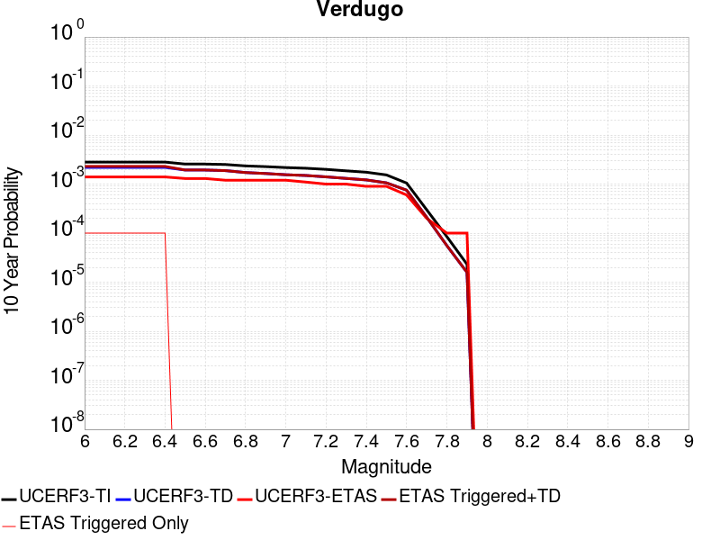 |

| Magnitude | 1 wk TI Prob | 1 wk TD Prob | 1 wk ETAS Prob | 1 wk ETAS/TD Gain | 1 wk ETAS Triggered+TD | 1 wk ETAS Triggered Only | 1 mo TI Prob | 1 mo TD Prob | 1 mo ETAS Prob | 1 mo ETAS/TD Gain | 1 mo ETAS Triggered+TD | 1 mo ETAS Triggered Only | 1 yr TI Prob | 1 yr TD Prob | 1 yr ETAS Prob | 1 yr ETAS/TD Gain | 1 yr ETAS Triggered+TD | 1 yr ETAS Triggered Only | 10 yr TI Prob | 10 yr TD Prob | 10 yr ETAS Prob | 10 yr ETAS/TD Gain | 10 yr ETAS Triggered+TD | 10 yr ETAS Triggered Only |
|-----|-----|-----|-----|-----|-----|-----|-----|-----|-----|-----|-----|-----|-----|-----|-----|-----|-----|-----|-----|-----|-----|-----|-----|-----|
| 6.0 | 5.392987E-6 | 4.2079487E-6 | 0.0 | 0.0 | 4.2079487E-6 | 0.0 | 2.3112598E-5 | 1.8033943E-5 | 0.0 | 0.0 | 1.8033943E-5 | 0.0 | 2.8135953E-4 | 2.1954162E-4 | 0.0 | 0.0 | 2.1954162E-4 | 0.0 | 0.0028100356 | 0.002193295 | 0.0014 | 0.63830906 | 0.0022930757 | 1.0E-4 |
| 6.1 | 5.392987E-6 | 4.2079487E-6 | 0.0 | 0.0 | 4.2079487E-6 | 0.0 | 2.3112598E-5 | 1.8033943E-5 | 0.0 | 0.0 | 1.8033943E-5 | 0.0 | 2.8135953E-4 | 2.1954162E-4 | 0.0 | 0.0 | 2.1954162E-4 | 0.0 | 0.0028100356 | 0.002193295 | 0.0014 | 0.63830906 | 0.0022930757 | 1.0E-4 |
| 6.2 | 5.392987E-6 | 4.2079487E-6 | 0.0 | 0.0 | 4.2079487E-6 | 0.0 | 2.3112598E-5 | 1.8033943E-5 | 0.0 | 0.0 | 1.8033943E-5 | 0.0 | 2.8135953E-4 | 2.1954162E-4 | 0.0 | 0.0 | 2.1954162E-4 | 0.0 | 0.0028100356 | 0.002193295 | 0.0014 | 0.63830906 | 0.0022930757 | 1.0E-4 |
| 6.3 | 5.392987E-6 | 4.2079487E-6 | 0.0 | 0.0 | 4.2079487E-6 | 0.0 | 2.3112598E-5 | 1.8033943E-5 | 0.0 | 0.0 | 1.8033943E-5 | 0.0 | 2.8135953E-4 | 2.1954162E-4 | 0.0 | 0.0 | 2.1954162E-4 | 0.0 | 0.0028100356 | 0.002193295 | 0.0014 | 0.63830906 | 0.0022930757 | 1.0E-4 |
| 6.4 | 5.392987E-6 | 4.2079487E-6 | 0.0 | 0.0 | 4.2079487E-6 | 0.0 | 2.3112598E-5 | 1.8033943E-5 | 0.0 | 0.0 | 1.8033943E-5 | 0.0 | 2.8135953E-4 | 2.1954162E-4 | 0.0 | 0.0 | 2.1954162E-4 | 0.0 | 0.0028100356 | 0.002193295 | 0.0014 | 0.63830906 | 0.0022930757 | 1.0E-4 |
| 6.5 | 4.9154837E-6 | 3.7140753E-6 | 0.0 | 0.0 | 3.7140753E-6 | 0.0 | 2.1066187E-5 | 1.5917369E-5 | 0.0 | 0.0 | 1.5917369E-5 | 0.0 | 2.5645064E-4 | 1.9377694E-4 | 0.0 | 0.0 | 1.9377694E-4 | 0.0 | 0.002561549 | 0.0019361005 | 0.0013 | 0.67145276 | 0.0019361005 | 0.0 |
| 6.6 | 4.9154837E-6 | 3.7140753E-6 | 0.0 | 0.0 | 3.7140753E-6 | 0.0 | 2.1066187E-5 | 1.5917369E-5 | 0.0 | 0.0 | 1.5917369E-5 | 0.0 | 2.5645064E-4 | 1.9377694E-4 | 0.0 | 0.0 | 1.9377694E-4 | 0.0 | 0.002561549 | 0.0019361005 | 0.0013 | 0.67145276 | 0.0019361005 | 0.0 |
| 6.7 | 4.817006E-6 | 3.6122979E-6 | 0.0 | 0.0 | 3.6122979E-6 | 0.0 | 2.0644147E-5 | 1.5481186E-5 | 0.0 | 0.0 | 1.5481186E-5 | 0.0 | 2.513135E-4 | 1.8846733E-4 | 0.0 | 0.0 | 1.8846733E-4 | 0.0 | 0.0025102948 | 0.0018830944 | 0.0012 | 0.63724893 | 0.0018830944 | 0.0 |
| 6.8 | 4.507407E-6 | 3.2989892E-6 | 0.0 | 0.0 | 3.2989892E-6 | 0.0 | 1.9317316E-5 | 1.413845E-5 | 0.0 | 0.0 | 1.413845E-5 | 0.0 | 2.3516294E-4 | 1.7212216E-4 | 0.0 | 0.0 | 1.7212216E-4 | 0.0 | 0.0023491425 | 0.0017199027 | 0.0012 | 0.69771385 | 0.0017199027 | 0.0 |
| 6.9 | 4.3573054E-6 | 3.1530003E-6 | 0.0 | 0.0 | 3.1530003E-6 | 0.0 | 1.8674033E-5 | 1.3512789E-5 | 0.0 | 0.0 | 1.3512789E-5 | 0.0 | 2.2733262E-4 | 1.6450591E-4 | 0.0 | 0.0 | 1.6450591E-4 | 0.0 | 0.0022710022 | 0.0016438536 | 0.0012 | 0.72999203 | 0.0016438536 | 0.0 |
| 7.0 | 4.171527E-6 | 2.9757632E-6 | 0.0 | 0.0 | 2.9757632E-6 | 0.0 | 1.787785E-5 | 1.27532085E-5 | 0.0 | 0.0 | 1.27532085E-5 | 0.0 | 2.1764109E-4 | 1.5525936E-4 | 0.0 | 0.0 | 1.5525936E-4 | 0.0 | 0.0021742806 | 0.0015515201 | 0.0012 | 0.77343506 | 0.0015515201 | 0.0 |
| 7.1 | 4.0405484E-6 | 2.8744676E-6 | 0.0 | 0.0 | 2.8744676E-6 | 0.0 | 1.731652E-5 | 1.2319089E-5 | 0.0 | 0.0 | 1.2319089E-5 | 0.0 | 2.1080824E-4 | 1.499747E-4 | 0.0 | 0.0 | 1.499747E-4 | 0.0 | 0.0021060838 | 0.0014987458 | 0.0011 | 0.733947 | 0.0014987458 | 0.0 |
| 7.2 | 3.8306007E-6 | 2.694271E-6 | 0.0 | 0.0 | 2.694271E-6 | 0.0 | 1.6416758E-5 | 1.1546825E-5 | 0.0 | 0.0 | 1.1546825E-5 | 0.0 | 1.9985568E-4 | 1.4057363E-4 | 0.0 | 0.0 | 1.4057363E-4 | 0.0 | 0.0019967605 | 0.0014048577 | 0.001 | 0.7118159 | 0.0014048577 | 0.0 |
| 7.3 | 3.5750938E-6 | 2.5048005E-6 | 0.0 | 0.0 | 2.5048005E-6 | 0.0 | 1.532174E-5 | 1.0734815E-5 | 0.0 | 0.0 | 1.0734815E-5 | 0.0 | 1.8652623E-4 | 1.3068864E-4 | 0.0 | 0.0 | 1.3068864E-4 | 0.0 | 0.0018636974 | 0.0013061283 | 0.001 | 0.7656216 | 0.0013061283 | 0.0 |
| 7.4 | 3.3510041E-6 | 2.3336188E-6 | 0.0 | 0.0 | 2.3336188E-6 | 0.0 | 1.4361368E-5 | 1.0001186E-5 | 0.0 | 0.0 | 1.0001186E-5 | 0.0 | 1.7483562E-4 | 1.2175773E-4 | 0.0 | 0.0 | 1.2175773E-4 | 0.0 | 0.0017469813 | 0.0012169206 | 9.0E-4 | 0.73957175 | 0.0012169206 | 0.0 |
| 7.5 | 2.948287E-6 | 2.032561E-6 | 0.0 | 0.0 | 2.032561E-6 | 0.0 | 1.2635454E-5 | 8.710947E-6 | 0.0 | 0.0 | 8.710947E-6 | 0.0 | 1.538258E-4 | 1.0605072E-4 | 0.0 | 0.0 | 1.0605072E-4 | 0.0 | 0.0015371935 | 0.0010600112 | 9.0E-4 | 0.8490476 | 0.0010600112 | 0.0 |
| 7.6 | 2.0134323E-6 | 1.4417401E-6 | 0.0 | 0.0 | 1.4417401E-6 | 0.0 | 8.628967E-6 | 6.178872E-6 | 0.0 | 0.0 | 6.178872E-6 | 0.0 | 1.05052604E-4 | 7.522526E-5 | 0.0 | 0.0 | 7.522526E-5 | 0.0 | 0.0010500296 | 7.5200666E-4 | 6.0E-4 | 0.7978653 | 7.5200666E-4 | 0.0 |
| 7.7 | 5.726436E-7 | 4.0243603E-7 | 0.0 | 0.0 | 4.0243603E-7 | 0.0 | 2.4541846E-6 | 1.7247248E-6 | 0.0 | 0.0 | 1.7247248E-6 | 0.0 | 2.9879287E-5 | 2.0998348E-5 | 0.0 | 0.0 | 2.0998348E-5 | 0.0 | 2.987527E-4 | 2.0996614E-4 | 2.0E-4 | 0.95253456 | 2.0996614E-4 | 0.0 |
| 7.8 | 1.6248204E-7 | 1.0652377E-7 | 0.0 | 0.0 | 1.0652377E-7 | 0.0 | 6.963514E-7 | 4.565304E-7 | 0.0 | 0.0 | 4.565304E-7 | 0.0 | 8.478045E-6 | 5.5582436E-6 | 0.0 | 0.0 | 5.5582436E-6 | 0.0 | 8.477722E-5 | 5.558108E-5 | 1.0E-4 | 1.7991735 | 5.558108E-5 | 0.0 |
| 7.9 | 4.4475744E-8 | 3.0362166E-8 | 0.0 | 0.0 | 3.0362166E-8 | 0.0 | 1.9061031E-7 | 1.3012357E-7 | 0.0 | 0.0 | 1.3012357E-7 | 0.0 | 2.320678E-6 | 1.5842534E-6 | 0.0 | 0.0 | 1.5842534E-6 | 0.0 | 2.3206538E-5 | 1.5842435E-5 | 1.0E-4 | 6.312161 | 1.5842435E-5 | 0.0 |

## Davis Creek
*[(top)](#table-of-contents)*

| 1 Week | 1 Month | 1 Year | 10 Year |
|-----|-----|-----|-----|
|  | 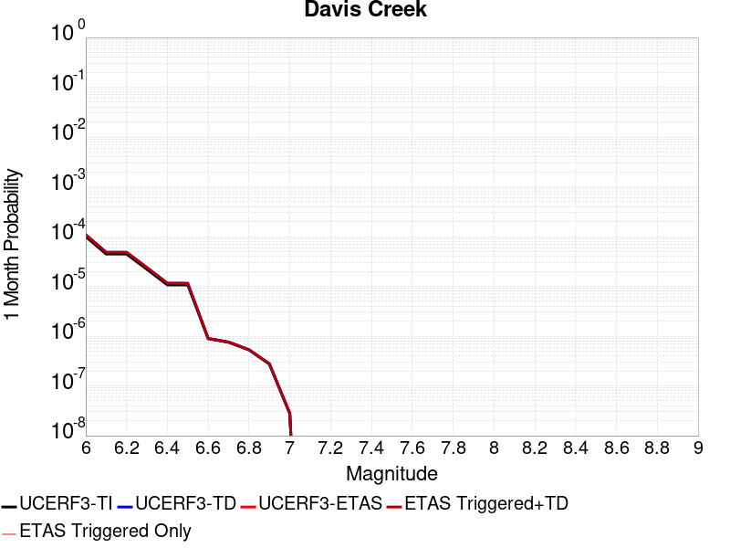 |  | 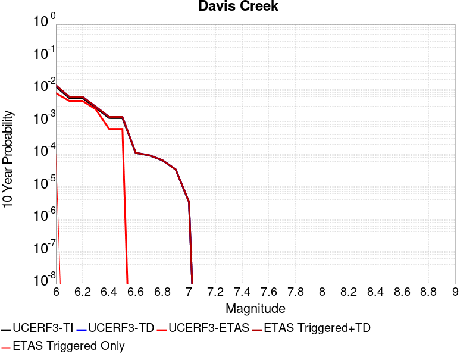 |

| Magnitude | 1 wk TI Prob | 1 wk TD Prob | 1 wk ETAS Prob | 1 wk ETAS/TD Gain | 1 wk ETAS Triggered+TD | 1 wk ETAS Triggered Only | 1 mo TI Prob | 1 mo TD Prob | 1 mo ETAS Prob | 1 mo ETAS/TD Gain | 1 mo ETAS Triggered+TD | 1 mo ETAS Triggered Only | 1 yr TI Prob | 1 yr TD Prob | 1 yr ETAS Prob | 1 yr ETAS/TD Gain | 1 yr ETAS Triggered+TD | 1 yr ETAS Triggered Only | 10 yr TI Prob | 10 yr TD Prob | 10 yr ETAS Prob | 10 yr ETAS/TD Gain | 10 yr ETAS Triggered+TD | 10 yr ETAS Triggered Only |
|-----|-----|-----|-----|-----|-----|-----|-----|-----|-----|-----|-----|-----|-----|-----|-----|-----|-----|-----|-----|-----|-----|-----|-----|-----|
| 6.0 | 2.331472E-5 | 2.5393283E-5 | 0.0 | 0.0 | 2.5393283E-5 | 0.0 | 9.99164E-5 | 1.0882449E-4 | 0.0 | 0.0 | 1.0882449E-4 | 0.0 | 0.0012158032 | 0.0013242511 | 7.0E-4 | 0.52860063 | 0.0013242511 | 0.0 | 0.01209173 | 0.013175357 | 0.0076 | 0.57683444 | 0.01327404 | 1.0E-4 |
| 6.1 | 1.0407654E-5 | 1.1306657E-5 | 0.0 | 0.0 | 1.1306657E-5 | 0.0 | 4.4603472E-5 | 4.8456353E-5 | 0.0 | 0.0 | 4.8456353E-5 | 0.0 | 5.4291193E-4 | 5.8982347E-4 | 4.0E-4 | 0.678169 | 5.8982347E-4 | 0.0 | 0.0054158745 | 0.0058852476 | 0.0044 | 0.7476321 | 0.0058852476 | 0.0 |
| 6.2 | 1.0407654E-5 | 1.1306657E-5 | 0.0 | 0.0 | 1.1306657E-5 | 0.0 | 4.4603472E-5 | 4.8456353E-5 | 0.0 | 0.0 | 4.8456353E-5 | 0.0 | 5.4291193E-4 | 5.8982347E-4 | 4.0E-4 | 0.678169 | 5.8982347E-4 | 0.0 | 0.0054158745 | 0.0058852476 | 0.0044 | 0.7476321 | 0.0058852476 | 0.0 |
| 6.3 | 5.1323277E-6 | 5.5636046E-6 | 0.0 | 0.0 | 5.5636046E-6 | 0.0 | 2.1995505E-5 | 2.384385E-5 | 0.0 | 0.0 | 2.384385E-5 | 0.0 | 2.6776237E-4 | 2.902688E-4 | 2.0E-4 | 0.6890165 | 2.902688E-4 | 0.0 | 0.0026743996 | 0.0028997413 | 0.0024 | 0.82766 | 0.0028997413 | 0.0 |
| 6.4 | 2.4985154E-6 | 2.7021988E-6 | 0.0 | 0.0 | 2.7021988E-6 | 0.0 | 1.07078795E-5 | 1.1580821E-5 | 0.0 | 0.0 | 1.1580821E-5 | 0.0 | 1.3036063E-4 | 1.4099097E-4 | 0.0 | 0.0 | 1.4099097E-4 | 0.0 | 0.0013028418 | 0.0014093693 | 6.0E-4 | 0.42572233 | 0.0014093693 | 0.0 |
| 6.5 | 2.4846438E-6 | 2.6881348E-6 | 0.0 | 0.0 | 2.6881348E-6 | 0.0 | 1.064843E-5 | 1.1520548E-5 | 0.0 | 0.0 | 1.1520548E-5 | 0.0 | 1.2963692E-4 | 1.4025725E-4 | 0.0 | 0.0 | 1.4025725E-4 | 0.0 | 0.0012956132 | 0.0014020413 | 6.0E-4 | 0.42794743 | 0.0014020413 | 0.0 |
| 6.6 | 2.072566E-7 | 2.1014988E-7 | 0.0 | 0.0 | 2.1014988E-7 | 0.0 | 8.882423E-7 | 9.006421E-7 | 0.0 | 0.0 | 9.006421E-7 | 0.0 | 1.0814296E-5 | 1.0965264E-5 | 0.0 | 0.0 | 1.0965264E-5 | 0.0 | 1.081377E-4 | 1.0964741E-4 | 0.0 | 0.0 | 1.0964741E-4 | 0.0 |
| 6.7 | 1.7544528E-7 | 1.7788216E-7 | 0.0 | 0.0 | 1.7788216E-7 | 0.0 | 7.5190815E-7 | 7.6235193E-7 | 0.0 | 0.0 | 7.6235193E-7 | 0.0 | 9.154443E-6 | 9.281596E-6 | 0.0 | 0.0 | 9.281596E-6 | 0.0 | 9.1540656E-5 | 9.2812246E-5 | 0.0 | 0.0 | 9.2812246E-5 | 0.0 |
| 6.8 | 1.2320395E-7 | 1.2479437E-7 | 0.0 | 0.0 | 1.2479437E-7 | 0.0 | 5.280168E-7 | 5.348329E-7 | 0.0 | 0.0 | 5.348329E-7 | 0.0 | 6.428586E-6 | 6.5115723E-6 | 0.0 | 0.0 | 6.5115723E-6 | 0.0 | 6.4284E-5 | 6.511393E-5 | 0.0 | 0.0 | 6.511393E-5 | 0.0 |
| 6.9 | 6.399997E-8 | 6.485147E-8 | 0.0 | 0.0 | 6.485147E-8 | 0.0 | 2.7428555E-7 | 2.7793484E-7 | 0.0 | 0.0 | 2.7793484E-7 | 0.0 | 3.3394215E-6 | 3.3838523E-6 | 0.0 | 0.0 | 3.3838523E-6 | 0.0 | 3.3393713E-5 | 3.383807E-5 | 0.0 | 0.0 | 3.383807E-5 | 0.0 |
| 7.0 | 6.4455685E-9 | 6.5343144E-9 | 0.0 | 0.0 | 6.5343144E-9 | 0.0 | 2.7623864E-8 | 2.8004205E-8 | 0.0 | 0.0 | 2.8004205E-8 | 0.0 | 3.3632048E-7 | 3.409512E-7 | 0.0 | 0.0 | 3.409512E-7 | 0.0 | 3.3631998E-6 | 3.409512E-6 | 0.0 | 0.0 | 3.409512E-6 | 0.0 |

## Last Chance
*[(top)](#table-of-contents)*

| 1 Week | 1 Month | 1 Year | 10 Year |
|-----|-----|-----|-----|
| 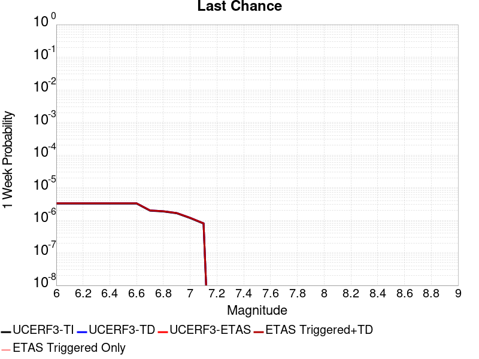 |  |  |  |

| Magnitude | 1 wk TI Prob | 1 wk TD Prob | 1 wk ETAS Prob | 1 wk ETAS/TD Gain | 1 wk ETAS Triggered+TD | 1 wk ETAS Triggered Only | 1 mo TI Prob | 1 mo TD Prob | 1 mo ETAS Prob | 1 mo ETAS/TD Gain | 1 mo ETAS Triggered+TD | 1 mo ETAS Triggered Only | 1 yr TI Prob | 1 yr TD Prob | 1 yr ETAS Prob | 1 yr ETAS/TD Gain | 1 yr ETAS Triggered+TD | 1 yr ETAS Triggered Only | 10 yr TI Prob | 10 yr TD Prob | 10 yr ETAS Prob | 10 yr ETAS/TD Gain | 10 yr ETAS Triggered+TD | 10 yr ETAS Triggered Only |
|-----|-----|-----|-----|-----|-----|-----|-----|-----|-----|-----|-----|-----|-----|-----|-----|-----|-----|-----|-----|-----|-----|-----|-----|-----|
| 6.0 | 3.23929E-6 | 3.3044296E-6 | 0.0 | 0.0 | 3.3044296E-6 | 0.0 | 1.3882597E-5 | 1.4161778E-5 | 0.0 | 0.0 | 1.4161778E-5 | 0.0 | 1.6900752E-4 | 1.7240849E-4 | 0.0 | 0.0 | 1.7240849E-4 | 0.0 | 0.0016887904 | 0.001722991 | 9.0E-4 | 0.5223475 | 0.0018228187 | 1.0E-4 |
| 6.1 | 3.23929E-6 | 3.3044296E-6 | 0.0 | 0.0 | 3.3044296E-6 | 0.0 | 1.3882597E-5 | 1.4161778E-5 | 0.0 | 0.0 | 1.4161778E-5 | 0.0 | 1.6900752E-4 | 1.7240849E-4 | 0.0 | 0.0 | 1.7240849E-4 | 0.0 | 0.0016887904 | 0.001722991 | 9.0E-4 | 0.5223475 | 0.0018228187 | 1.0E-4 |
| 6.2 | 3.23929E-6 | 3.3044296E-6 | 0.0 | 0.0 | 3.3044296E-6 | 0.0 | 1.3882597E-5 | 1.4161778E-5 | 0.0 | 0.0 | 1.4161778E-5 | 0.0 | 1.6900752E-4 | 1.7240849E-4 | 0.0 | 0.0 | 1.7240849E-4 | 0.0 | 0.0016887904 | 0.001722991 | 9.0E-4 | 0.5223475 | 0.0018228187 | 1.0E-4 |
| 6.3 | 3.23929E-6 | 3.3044296E-6 | 0.0 | 0.0 | 3.3044296E-6 | 0.0 | 1.3882597E-5 | 1.4161778E-5 | 0.0 | 0.0 | 1.4161778E-5 | 0.0 | 1.6900752E-4 | 1.7240849E-4 | 0.0 | 0.0 | 1.7240849E-4 | 0.0 | 0.0016887904 | 0.001722991 | 9.0E-4 | 0.5223475 | 0.0018228187 | 1.0E-4 |
| 6.4 | 3.23929E-6 | 3.3044296E-6 | 0.0 | 0.0 | 3.3044296E-6 | 0.0 | 1.3882597E-5 | 1.4161778E-5 | 0.0 | 0.0 | 1.4161778E-5 | 0.0 | 1.6900752E-4 | 1.7240849E-4 | 0.0 | 0.0 | 1.7240849E-4 | 0.0 | 0.0016887904 | 0.001722991 | 9.0E-4 | 0.5223475 | 0.0018228187 | 1.0E-4 |
| 6.5 | 3.23929E-6 | 3.3044296E-6 | 0.0 | 0.0 | 3.3044296E-6 | 0.0 | 1.3882597E-5 | 1.4161778E-5 | 0.0 | 0.0 | 1.4161778E-5 | 0.0 | 1.6900752E-4 | 1.7240849E-4 | 0.0 | 0.0 | 1.7240849E-4 | 0.0 | 0.0016887904 | 0.001722991 | 9.0E-4 | 0.5223475 | 0.0018228187 | 1.0E-4 |
| 6.6 | 3.23929E-6 | 3.3044296E-6 | 0.0 | 0.0 | 3.3044296E-6 | 0.0 | 1.3882597E-5 | 1.4161778E-5 | 0.0 | 0.0 | 1.4161778E-5 | 0.0 | 1.6900752E-4 | 1.7240849E-4 | 0.0 | 0.0 | 1.7240849E-4 | 0.0 | 0.0016887904 | 0.001722991 | 9.0E-4 | 0.5223475 | 0.0018228187 | 1.0E-4 |
| 6.7 | 1.9639244E-6 | 2.004022E-6 | 0.0 | 0.0 | 2.004022E-6 | 0.0 | 8.416792E-6 | 8.588641E-6 | 0.0 | 0.0 | 8.588641E-6 | 0.0 | 1.02469625E-4 | 1.0456233E-4 | 0.0 | 0.0 | 1.0456233E-4 | 0.0 | 0.0010242239 | 0.0010451938 | 7.0E-4 | 0.6697323 | 0.0011450893 | 1.0E-4 |
| 6.8 | 1.8490592E-6 | 1.887082E-6 | 0.0 | 0.0 | 1.887082E-6 | 0.0 | 7.924516E-6 | 8.087472E-6 | 0.0 | 0.0 | 8.087472E-6 | 0.0 | 9.64767E-5 | 9.8461154E-5 | 0.0 | 0.0 | 9.8461154E-5 | 0.0 | 9.643483E-4 | 9.842364E-4 | 7.0E-4 | 0.71121126 | 0.0010841379 | 1.0E-4 |
| 6.9 | 1.6283703E-6 | 1.6620755E-6 | 0.0 | 0.0 | 1.6620755E-6 | 0.0 | 6.9787116E-6 | 7.1231643E-6 | 0.0 | 0.0 | 7.1231643E-6 | 0.0 | 8.49625E-5 | 8.672164E-5 | 0.0 | 0.0 | 8.672164E-5 | 0.0 | 8.4930024E-4 | 8.669328E-4 | 6.0E-4 | 0.69209516 | 9.668461E-4 | 1.0E-4 |
| 7.0 | 1.1619308E-6 | 1.1866858E-6 | 0.0 | 0.0 | 1.1866858E-6 | 0.0 | 4.979694E-6 | 5.085789E-6 | 0.0 | 0.0 | 5.085789E-6 | 0.0 | 6.0626087E-5 | 6.191817E-5 | 0.0 | 0.0 | 6.191817E-5 | 0.0 | 6.060955E-4 | 6.1905285E-4 | 4.0E-4 | 0.6461484 | 7.189909E-4 | 1.0E-4 |
| 7.1 | 7.8723247E-7 | 8.0451326E-7 | 0.0 | 0.0 | 8.0451326E-7 | 0.0 | 3.373849E-6 | 3.4479112E-6 | 0.0 | 0.0 | 3.4479112E-6 | 0.0 | 4.107584E-5 | 4.1977815E-5 | 0.0 | 0.0 | 4.1977815E-5 | 0.0 | 4.1068246E-4 | 4.1972872E-4 | 2.0E-4 | 0.47649825 | 4.1972872E-4 | 0.0 |

