# Parent Section Magnitude-Probability Distributions

Only fault sections with at least one triggered aftershock are plotted. Sections are sorted by total supraseismogenic trigger rate (decreasing)

## Table Of Contents

* [San Andreas (Parkfield)](#san-andreas-parkfield)
* [Mendocino](#mendocino)
* [San Andreas (Creeping Section) 2011 CFM](#san-andreas-creeping-section-2011-cfm)
* [San Andreas (Mojave S)](#san-andreas-mojave-s)
* [Garlock (Central)](#garlock-central)
* [Tank Canyon](#tank-canyon)
* [Cerro Prieto](#cerro-prieto)
* [Imperial](#imperial)
* [Brawley (Seismic Zone) alt 1](#brawley-seismic-zone-alt-1)
* [Laguna Salada](#laguna-salada)
* [Hayward (So) 2011 CFM](#hayward-so-2011-cfm)
* [San Andreas (Offshore) 2011 CFM](#san-andreas-offshore-2011-cfm)
* [Little Lake](#little-lake)
* [Airport Lake](#airport-lake)
* [San Andreas (Cholame) rev](#san-andreas-cholame-rev)
* [San Andreas (Carrizo) rev](#san-andreas-carrizo-rev)
* [Owl Lake](#owl-lake)
* [Hayward (So) extension 2011 CFM](#hayward-so-extension-2011-cfm)
* [San Andreas (Coachella) rev](#san-andreas-coachella-rev)
* [San Andreas (San Bernardino N)](#san-andreas-san-bernardino-n)
* [Calaveras (Central) 2011 CFM](#calaveras-central-2011-cfm)
* [San Andreas (Mojave N)](#san-andreas-mojave-n)
* [Calaveras (So) - Paicines extension 2011 CFM](#calaveras-so---paicines-extension-2011-cfm)
* [San Jacinto (Superstition Mtn)](#san-jacinto-superstition-mtn)
* [Panamint Valley](#panamint-valley)
* [San Andreas (Big Bend)](#san-andreas-big-bend)
* [Calaveras (So) 2011 CFM](#calaveras-so-2011-cfm)
* [Garlock (East)](#garlock-east)
* [Elsinore (Glen Ivy) rev](#elsinore-glen-ivy-rev)
* [San Andreas (San Bernardino S)](#san-andreas-san-bernardino-s)
* [San Andreas (San Gorgonio Pass-Garnet HIll)](#san-andreas-san-gorgonio-pass-garnet-hill)
* [West Napa 2011 CFM](#west-napa-2011-cfm)
* [Cady](#cady)
* [Hunting Creek - Berryessa 2011 CFM](#hunting-creek---berryessa-2011-cfm)
* [Green Valley 2011 CFM](#green-valley-2011-cfm)
* [San Andreas (Santa Cruz Mts) 2011 CFM](#san-andreas-santa-cruz-mts-2011-cfm)
* [Ash Hill](#ash-hill)
* [Hayward (No) 2011 CFM](#hayward-no-2011-cfm)
* [Hunter Mountain-Saline Valley](#hunter-mountain-saline-valley)
* [San Andreas (North Coast) 2011 CFM](#san-andreas-north-coast-2011-cfm)
* [Calico-Hidalgo](#calico-hidalgo)
* [King Range 2011 CFM](#king-range-2011-cfm)
* [Elmore Ranch](#elmore-ranch)
* [Pisgah-Bullion Mtn-Mesquite Lk](#pisgah-bullion-mtn-mesquite-lk)
* [Mission Ridge-Arroyo Parida-Santa Ana](#mission-ridge-arroyo-parida-santa-ana)
* [Blackwater](#blackwater)
* [Goldstone Lake](#goldstone-lake)
* [Pinto Mtn](#pinto-mtn)
* [Ludlow](#ludlow)
* [Rodgers Creek - Healdsburg 2011 CFM](#rodgers-creek---healdsburg-2011-cfm)
* [Garlock (West)](#garlock-west)
* [Garberville - Briceland 2011 CFM](#garberville---briceland-2011-cfm)
* [Chino alt 1](#chino-alt-1)
* [Honey Lake 2011 CFM](#honey-lake-2011-cfm)
* [Bullion Mountains](#bullion-mountains)
* [Concord 2011 CFM](#concord-2011-cfm)
* [Coyote Canyon](#coyote-canyon)
* [Calaveras (No) 2011 CFM](#calaveras-no-2011-cfm)
* [San Clemente](#san-clemente)
* [Red Mountain](#red-mountain)
* [Whittier alt 1](#whittier-alt-1)
* [Gravel Hills-Harper Lk](#gravel-hills-harper-lk)
* [Maacama 2011 CFM](#maacama-2011-cfm)
* [Santa Ynez (West)](#santa-ynez-west)
* [Sargent 2011 CFM](#sargent-2011-cfm)
* [Great Valley 04b Gordon Valley](#great-valley-04b-gordon-valley)
* [McLean Lake](#mclean-lake)
* [White Mountains](#white-mountains)
* [Pleito](#pleito)
* [Keddie Ridge 2011 CFM](#keddie-ridge-2011-cfm)
* [Monte Vista - Shannon 2011 CFM](#monte-vista---shannon-2011-cfm)
* [Ortigalita (North)](#ortigalita-north)
* [Manix-Afton Hills](#manix-afton-hills)
* [Great Valley 05 Pittsburg - Kirby Hills alt1](#great-valley-05-pittsburg---kirby-hills-alt1)
* [Paradise](#paradise)
* [Mount Diablo Thrust South](#mount-diablo-thrust-south)
* [Rose Canyon](#rose-canyon)
* [Elysian Park (Upper)](#elysian-park-upper)
* [So Sierra Nevada](#so-sierra-nevada)
* [Death Valley (So)](#death-valley-so)
* [San Diego Trough north alt1](#san-diego-trough-north-alt1)
* [San Gregorio (North) 2011 CFM](#san-gregorio-north-2011-cfm)
* [Quien Sabe 2011 CFM](#quien-sabe-2011-cfm)
* [Hunting Creek - Bartlett Springs connector 2011](#hunting-creek---bartlett-springs-connector-2011)
* [Ventura-Pitas Point](#ventura-pitas-point)
* [Mission (connected) 2011 CFM](#mission-connected-2011-cfm)
* [San Diego Trough south](#san-diego-trough-south)
* [Coronado Bank alt1](#coronado-bank-alt1)
* [Almanor 2011 CFM](#almanor-2011-cfm)
* [Greenville (No) 2011 CFM](#greenville-no-2011-cfm)
* [South Klamath Lake West](#south-klamath-lake-west)
* [Cleghorn Pass](#cleghorn-pass)
* [South Klamath Lake East](#south-klamath-lake-east)
* [San Jacinto (Borrego)](#san-jacinto-borrego)
* [Nelson Lake](#nelson-lake)
* [Santa Susana East (connector)](#santa-susana-east-connector)
* [Owens Valley Keough Hot Springs](#owens-valley-keough-hot-springs)
* [Bartlett Springs 2011 CFM](#bartlett-springs-2011-cfm)
* [Ortigalita (South)](#ortigalita-south)
* [Santa Ynez (East)](#santa-ynez-east)
* [Blue Cut](#blue-cut)
* [San Jacinto (Anza) rev](#san-jacinto-anza-rev)
* [Mission Hills 2011](#mission-hills-2011)
* [Eaton Roughs 2011 CFM](#eaton-roughs-2011-cfm)
* [Death Valley (Fish Lake Valley)](#death-valley-fish-lake-valley)
* [Cleghorn Lake](#cleghorn-lake)
* [Pitas Point (Lower West)](#pitas-point-lower-west)
* [Little Salmon (Offshore)](#little-salmon-offshore)
* [Bennett Valley 2011 CFM](#bennett-valley-2011-cfm)
* [Trinidad (alt1)](#trinidad-alt1)
* [Superstition Hills](#superstition-hills)
* [San Jacinto (Stepovers Combined)](#san-jacinto-stepovers-combined)
* [Santa Cruz Island](#santa-cruz-island)
* [Towne Pass](#towne-pass)
* [Santa Susana alt 1](#santa-susana-alt-1)
* [Elsinore (Coyote Mountains)](#elsinore-coyote-mountains)
* [Lenwood-Lockhart-Old Woman Springs](#lenwood-lockhart-old-woman-springs)
* [San Jacinto (Coyote Creek)](#san-jacinto-coyote-creek)
* [Independence rev 2011](#independence-rev-2011)
* [Round Valley](#round-valley)
* [Raymond](#raymond)
* [Oceanic - West Huasna](#oceanic---west-huasna)
* [San Andreas (Peninsula) 2011 CFM](#san-andreas-peninsula-2011-cfm)
* [Newport-Inglewood alt 1](#newport-inglewood-alt-1)
* [Table Bluff](#table-bluff)
* [San Jacinto (San Jacinto Valley) rev](#san-jacinto-san-jacinto-valley-rev)
* [Santa Ynez River](#santa-ynez-river)
* [Sierra Nevada  (No Extension)](#sierra-nevada--no-extension)
* [Death Valley (Black Mtns Frontal)](#death-valley-black-mtns-frontal)
* [San Juan](#san-juan)
* [Great Valley 07 (Orestimba)](#great-valley-07-orestimba)
* [San Jacinto (San Bernardino)](#san-jacinto-san-bernardino)
* [Bicycle Lake](#bicycle-lake)
* [San Gabriel](#san-gabriel)
* [Channel Islands Thrust](#channel-islands-thrust)
* [Mission Creek](#mission-creek)
* [Garlic Springs](#garlic-springs)
* [San Pedro Basin](#san-pedro-basin)
* [Owens Valley](#owens-valley)
* [Death Valley (No)](#death-valley-no)
* [Greenville (So) 2011 CFM](#greenville-so-2011-cfm)
* [Carson Range (Genoa)](#carson-range-genoa)
* [Mono Lake 2011 CFM](#mono-lake-2011-cfm)
* [Bear River fault zone](#bear-river-fault-zone)
* [Hosgri](#hosgri)
* [Homestead Valley 2011](#homestead-valley-2011)
* [Palos Verdes](#palos-verdes)
* [Elsinore (Temecula) rev](#elsinore-temecula-rev)
* [Great Valley 06 (Midland) 2011 CFM alt1](#great-valley-06-midland-2011-cfm-alt1)
* [Robinson Creek](#robinson-creek)
* [Franklin 2011 CFM](#franklin-2011-cfm)
* [Hector Mine](#hector-mine)
* [Simi-Santa Rosa](#simi-santa-rosa)
* [Swain Ravine - Spenceville](#swain-ravine---spenceville)
* [Burnt Mtn](#burnt-mtn)
* [Hat Creek-McArthur-Mayfield](#hat-creek-mcarthur-mayfield)
* [Oak Ridge (Onshore)](#oak-ridge-onshore)
* [Earthquake Valley (So Extension)](#earthquake-valley-so-extension)
* [Helendale-So Lockhart](#helendale-so-lockhart)
* [Elsinore (Stepovers Combined)](#elsinore-stepovers-combined)
* [Skinner Flat 2011 CFM](#skinner-flat-2011-cfm)
* [Earthquake Valley (No  Extension)](#earthquake-valley-no--extension)
* [Reliz 2011 CFM](#reliz-2011-cfm)
* [Cucamonga](#cucamonga)
* [Cedar Mtn-Mahogany Mtn](#cedar-mtn-mahogany-mtn)
* [Big Lagoon - Bald Mtn 2011 CFM](#big-lagoon---bald-mtn-2011-cfm)
* [Santa Rosa Island](#santa-rosa-island)
* [Great Valley 09 (Laguna Seca)](#great-valley-09-laguna-seca)
* [Sheephole](#sheephole)
* [McKinleyville (alt1)](#mckinleyville-alt1)
* [Pitas Point (Lower)-Montalvo](#pitas-point-lower-montalvo)
* [Monterey Bay-Tularcitos](#monterey-bay-tularcitos)
* [San Andreas (North Branch Mill Creek)](#san-andreas-north-branch-mill-creek)
* [Scodie Lineament](#scodie-lineament)
* [Collayami 2011 CFM](#collayami-2011-cfm)
* [Eureka Peak](#eureka-peak)
* [Coyote Lake](#coyote-lake)
* [Great Valley 11](#great-valley-11)
* [Santa Cruz Catalina Ridge alt1](#santa-cruz-catalina-ridge-alt1)
* [Little Salmon (Onshore)](#little-salmon-onshore)
* [Point Reyes 2011 CFM](#point-reyes-2011-cfm)
* [Sierra Madre (San Fernando)](#sierra-madre-san-fernando)
* [Elsinore (Julian)](#elsinore-julian)
* [Hartley Springs 2011 CFM](#hartley-springs-2011-cfm)
* [Channel Islands Western Deep Ramp](#channel-islands-western-deep-ramp)
* [Mount Diablo Thrust North CFM](#mount-diablo-thrust-north-cfm)
* [Great Valley 03 Mysterious Ridge](#great-valley-03-mysterious-ridge)
* [Lost Hills](#lost-hills)
* [Earthquake Valley](#earthquake-valley)
* [Contra Costa Shear Zone (connector) 2011 CFM](#contra-costa-shear-zone-connector-2011-cfm)
* [Fish Slough 2011 CFM](#fish-slough-2011-cfm)
* [Los Alamos extension](#los-alamos-extension)
* [Great Valley 04a Trout Creek](#great-valley-04a-trout-creek)
* [Puente Hills](#puente-hills)
* [San Cayetano](#san-cayetano)
* [North Frontal  (East)](#north-frontal--east)
* [Surprise Valley 2011 CFM](#surprise-valley-2011-cfm)
* [Cleghorn](#cleghorn)
* [Sierra Madre](#sierra-madre)
* [White Wolf (Extension)](#white-wolf-extension)
* [Antelope Valley 2011](#antelope-valley-2011)
* [Rinconada 2011 CFM](#rinconada-2011-cfm)
* [Big Pine (East)](#big-pine-east)
* [San Jose](#san-jose)
* [San Jacinto (Clark) rev](#san-jacinto-clark-rev)
* [Los Alamos 2011 CFM](#los-alamos-2011-cfm)
* [Johnson Valley (No) 2011 rev](#johnson-valley-no-2011-rev)
* [Goose Lake 2011 CFM](#goose-lake-2011-cfm)
* [Great Valley 08 (Quinto)](#great-valley-08-quinto)
* [Great Valley 03a Dunnigan Hills](#great-valley-03a-dunnigan-hills)
* [West Tahoe](#west-tahoe)
* [Mad River (alt1)](#mad-river-alt1)
* [Peralta Hills](#peralta-hills)
* [Russ 2011 CFM](#russ-2011-cfm)
* [San Gorgonio Pass](#san-gorgonio-pass)
* [Las Positas](#las-positas)
* [Fickle Hill (alt1)](#fickle-hill-alt1)
* [Polaris 2011 CFM](#polaris-2011-cfm)
* [Thirty Mile Bank](#thirty-mile-bank)
* [Gillem - Big Crack 2011 CFM](#gillem---big-crack-2011-cfm)
* [Great Valley 10 (Panoche)](#great-valley-10-panoche)
* [Fontana (Seismicity)](#fontana-seismicity)
* [Mohawk Valley 2011 CFM](#mohawk-valley-2011-cfm)
* [Emerson-Copper Mtn 2011](#emerson-copper-mtn-2011)
* [Northridge Hills](#northridge-hills)
* [Baker](#baker)
* [Lake Isabella (Seismicity)](#lake-isabella-seismicity)
* [Del Valle](#del-valle)
* [Great Valley 14 (Kettleman Hills)](#great-valley-14-kettleman-hills)
* [Red Pass](#red-pass)
* [North Tahoe 2011 CFM](#north-tahoe-2011-cfm)
* [Rocky Ledge 2011 CFM](#rocky-ledge-2011-cfm)
* [Newport-Inglewood (Offshore)](#newport-inglewood-offshore)
* [Butano 2011 CFM](#butano-2011-cfm)
* [Silver Creek 2011 CFM](#silver-creek-2011-cfm)
* [Zayante-Vergeles 2011 CFM](#zayante-vergeles-2011-cfm)
* [Davis Creek](#davis-creek)
* [Pilarcitos 2011 CFM](#pilarcitos-2011-cfm)
* [Casmalia 2011 CFM](#casmalia-2011-cfm)
* [White Wolf](#white-wolf)
* [Deep Springs](#deep-springs)
* [Sisar](#sisar)
* [Kern Canyon (North Kern) 2011](#kern-canyon-north-kern-2011)
* [Malibu Coast alt 1](#malibu-coast-alt-1)
* [Pittville 2011 CFM](#pittville-2011-cfm)
* [Clamshell-Sawpit](#clamshell-sawpit)
* [Elysian Park (Lower CFM)](#elysian-park-lower-cfm)
* [Hollywood](#hollywood)
* [Big Pine (Central)](#big-pine-central)
* [Tin Mountain](#tin-mountain)
* [San Gregorio (South) 2011 CFM](#san-gregorio-south-2011-cfm)
* [Morales (East)](#morales-east)
* [San Gabriel (Extension)](#san-gabriel-extension)
* [Kern Canyon (South Kern) 2011](#kern-canyon-south-kern-2011)
* [Oceanside alt1](#oceanside-alt1)
* [San Jacinto (Lytle Creek connector)](#san-jacinto-lytle-creek-connector)
* [Great Valley 13 (Coalinga)](#great-valley-13-coalinga)
* [La Panza 2011](#la-panza-2011)
* [Pine Mtn](#pine-mtn)
* [Walker Spring 2011 CFM](#walker-spring-2011-cfm)
* [Clayton](#clayton)
* [Contra Costa (Lafayette) 2011 CFM](#contra-costa-lafayette-2011-cfm)
* [Great Valley 12](#great-valley-12)
* [Compton](#compton)
* [Point Reyes 2011 connector](#point-reyes-2011-connector)
* [Big Pine (West)](#big-pine-west)
* [Jess Valley](#jess-valley)
* [Malibu Coast (Extension) alt 1](#malibu-coast-extension-alt-1)
* [Ozena](#ozena)
* [Joshua Tree (Seismicity)](#joshua-tree-seismicity)
* [Santa Monica Bay](#santa-monica-bay)
* [San Luis Range 2011 CFM](#san-luis-range-2011-cfm)
* [Camp Rock 2011](#camp-rock-2011)
* [Dog Valley](#dog-valley)
* [Richfield](#richfield)
* [Dry Mountain](#dry-mountain)
* [Anacapa-Dume alt 1](#anacapa-dume-alt-1)
* [Holser alt 1](#holser-alt-1)
* [Santa Monica alt 1](#santa-monica-alt-1)
* [Canada David (Detachment)](#canada-david-detachment)
* [Northridge](#northridge)
* [Kern Canyon (Lake Isabella) 2011](#kern-canyon-lake-isabella-2011)
* [Hilton Creek 2011 CFM](#hilton-creek-2011-cfm)
* [Yorba Linda](#yorba-linda)

## San Andreas (Parkfield)
*[(top)](#table-of-contents)*

| 1 Week | 1 Month | 1 Year | 10 Year |
|-----|-----|-----|-----|
|  |  | 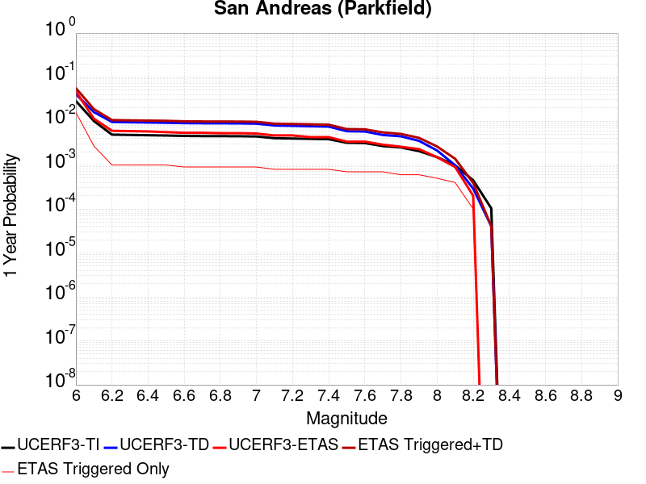 |  |

| Magnitude | 1 wk TI Prob | 1 wk TD Prob | 1 wk ETAS Prob | 1 wk ETAS/TD Gain | 1 wk ETAS Triggered+TD | 1 wk ETAS Triggered Only | 1 mo TI Prob | 1 mo TD Prob | 1 mo ETAS Prob | 1 mo ETAS/TD Gain | 1 mo ETAS Triggered+TD | 1 mo ETAS Triggered Only | 1 yr TI Prob | 1 yr TD Prob | 1 yr ETAS Prob | 1 yr ETAS/TD Gain | 1 yr ETAS Triggered+TD | 1 yr ETAS Triggered Only | 10 yr TI Prob | 10 yr TD Prob | 10 yr ETAS Prob | 10 yr ETAS/TD Gain | 10 yr ETAS Triggered+TD | 10 yr ETAS Triggered Only |
|-----|-----|-----|-----|-----|-----|-----|-----|-----|-----|-----|-----|-----|-----|-----|-----|-----|-----|-----|-----|-----|-----|-----|-----|-----|
| 6.0 | 5.556969E-4 | 7.558171E-4 | 2.0E-4 | 0.26461428 | 9.5566595E-4 | 2.0E-4 | 0.0023793848 | 0.0032357005 | 9.0E-4 | 0.27814686 | 0.0041327886 | 9.0E-4 | 0.028586963 | 0.039192773 | 0.0158 | 0.40313554 | 0.05437353 | 0.0158 | 0.25176284 | 0.33418468 | 0.1237 | 0.37015462 | 0.41654602 | 0.1237 |
| 6.1 | 1.925858E-4 | 2.9830483E-4 | 0.0 | 0.0 | 2.9830483E-4 | 0.0 | 8.2510663E-4 | 0.0012779089 | 1.0E-4 | 0.07825284 | 0.0013777812 | 1.0E-4 | 0.0099994885 | 0.015557202 | 0.0027 | 0.17355306 | 0.018215198 | 0.0027 | 0.095613256 | 0.14895825 | 0.0221 | 0.14836372 | 0.16776627 | 0.0221 |
| 6.2 | 9.4306815E-5 | 1.8287741E-4 | 0.0 | 0.0 | 1.8287741E-4 | 0.0 | 4.0410945E-4 | 7.8352616E-4 | 0.0 | 0.0 | 7.8352616E-4 | 0.0 | 0.0049089384 | 0.009497889 | 0.001 | 0.105286546 | 0.010488392 | 0.001 | 0.048019063 | 0.09204396 | 0.0105 | 0.11407593 | 0.10157749 | 0.0105 |
| 6.3 | 9.283051E-5 | 1.7984798E-4 | 0.0 | 0.0 | 1.7984798E-4 | 0.0 | 3.9778434E-4 | 7.7055057E-4 | 0.0 | 0.0 | 7.7055057E-4 | 0.0 | 0.0048322747 | 0.009341282 | 0.001 | 0.107051685 | 0.010331941 | 0.001 | 0.047285385 | 0.090698995 | 0.0103 | 0.11356245 | 0.10006479 | 0.0103 |
| 6.4 | 9.138826E-5 | 1.7747653E-4 | 0.0 | 0.0 | 1.7747653E-4 | 0.0 | 3.916052E-4 | 7.6039316E-4 | 0.0 | 0.0 | 7.6039316E-4 | 0.0 | 0.0047573745 | 0.009218675 | 0.001 | 0.10847546 | 0.010209456 | 0.001 | 0.046568092 | 0.08960555 | 0.0098 | 0.109368235 | 0.09852741 | 0.0098 |
| 6.5 | 9.000255E-5 | 1.7506153E-4 | 0.0 | 0.0 | 1.7506153E-4 | 0.0 | 3.8566816E-4 | 7.5004913E-4 | 0.0 | 0.0 | 7.5004913E-4 | 0.0 | 0.0046854047 | 0.009093817 | 0.001 | 0.10996482 | 0.010084724 | 0.001 | 0.045878403 | 0.088490464 | 0.0097 | 0.10961633 | 0.097332105 | 0.0097 |
| 6.6 | 8.8109264E-5 | 1.7189016E-4 | 0.0 | 0.0 | 1.7189016E-4 | 0.0 | 3.7755648E-4 | 7.3646527E-4 | 0.0 | 0.0 | 7.3646527E-4 | 0.0 | 0.0045870654 | 0.008929816 | 9.0E-4 | 0.10078595 | 0.009821779 | 9.0E-4 | 0.04493529 | 0.08702973 | 0.0095 | 0.1091581 | 0.095702946 | 0.0095 |
| 6.7 | 8.738073E-5 | 1.7056368E-4 | 0.0 | 0.0 | 1.7056368E-4 | 0.0 | 3.7443507E-4 | 7.3078356E-4 | 0.0 | 0.0 | 7.3078356E-4 | 0.0 | 0.0045492216 | 0.008861248 | 9.0E-4 | 0.10156583 | 0.009753273 | 9.0E-4 | 0.04457213 | 0.0864313 | 0.0094 | 0.1087569 | 0.09501884 | 0.0094 |
| 6.8 | 8.710195E-5 | 1.7002058E-4 | 0.0 | 0.0 | 1.7002058E-4 | 0.0 | 3.7324068E-4 | 7.284573E-4 | 0.0 | 0.0 | 7.284573E-4 | 0.0 | 0.0045347405 | 0.008833164 | 9.0E-4 | 0.10188874 | 0.009725215 | 9.0E-4 | 0.04443313 | 0.0861798 | 0.0094 | 0.10907428 | 0.094769716 | 0.0094 |
| 6.9 | 8.6801556E-5 | 1.6943141E-4 | 0.0 | 0.0 | 1.6943141E-4 | 0.0 | 3.7195362E-4 | 7.259337E-4 | 0.0 | 0.0 | 7.259337E-4 | 0.0 | 0.0045191357 | 0.008802689 | 9.0E-4 | 0.102241494 | 0.009694766 | 9.0E-4 | 0.044283327 | 0.08590656 | 0.0094 | 0.109421216 | 0.09449904 | 0.0094 |
| 7.0 | 8.5571606E-5 | 1.669635E-4 | 0.0 | 0.0 | 1.669635E-4 | 0.0 | 3.6668387E-4 | 7.153627E-4 | 0.0 | 0.0 | 7.153627E-4 | 0.0 | 0.004455241 | 0.008675018 | 9.0E-4 | 0.103746176 | 0.009567211 | 9.0E-4 | 0.043669727 | 0.084756024 | 0.0094 | 0.11090657 | 0.093359314 | 0.0094 |
| 7.1 | 7.82589E-5 | 1.5176953E-4 | 0.0 | 0.0 | 1.5176953E-4 | 0.0 | 3.3535215E-4 | 6.5027946E-4 | 0.0 | 0.0 | 6.5027946E-4 | 0.0 | 0.0040752706 | 0.007888583 | 8.0E-4 | 0.101412386 | 0.008682272 | 8.0E-4 | 0.040013418 | 0.0776729 | 0.0087 | 0.11200818 | 0.085697144 | 0.0087 |
| 7.2 | 7.690929E-5 | 1.4914144E-4 | 0.0 | 0.0 | 1.4914144E-4 | 0.0 | 3.2956956E-4 | 6.3902175E-4 | 0.0 | 0.0 | 6.3902175E-4 | 0.0 | 0.004005129 | 0.0077525033 | 8.0E-4 | 0.10319247 | 0.008546301 | 8.0E-4 | 0.0393371 | 0.07644719 | 0.0084 | 0.10987978 | 0.08420503 | 0.0084 |
| 7.3 | 7.5543794E-5 | 1.4610453E-4 | 0.0 | 0.0 | 1.4610453E-4 | 0.0 | 3.2371894E-4 | 6.2601274E-4 | 0.0 | 0.0 | 6.2601274E-4 | 0.0 | 0.003934157 | 0.007595233 | 8.0E-4 | 0.10532922 | 0.008389157 | 8.0E-4 | 0.038652334 | 0.075011775 | 0.0082 | 0.10931616 | 0.08259668 | 0.0082 |
| 7.4 | 7.4214564E-5 | 1.4311381E-4 | 0.0 | 0.0 | 1.4311381E-4 | 0.0 | 3.1802364E-4 | 6.132014E-4 | 0.0 | 0.0 | 6.132014E-4 | 0.0 | 0.003865065 | 0.0074403305 | 8.0E-4 | 0.10752211 | 0.008234378 | 8.0E-4 | 0.03798529 | 0.073585704 | 0.008 | 0.10871677 | 0.08099702 | 0.008 |
| 7.5 | 6.149578E-5 | 1.12359594E-4 | 0.0 | 0.0 | 1.12359594E-4 | 0.0 | 2.6352672E-4 | 4.8145233E-4 | 0.0 | 0.0 | 4.8145233E-4 | 0.0 | 0.0032037178 | 0.00584596 | 7.0E-4 | 0.119740814 | 0.0065418677 | 7.0E-4 | 0.03157923 | 0.058759287 | 0.0054 | 0.09190037 | 0.06384198 | 0.0054 |
| 7.6 | 6.0643448E-5 | 1.1064415E-4 | 0.0 | 0.0 | 1.1064415E-4 | 0.0 | 2.598746E-4 | 4.7410314E-4 | 0.0 | 0.0 | 4.7410314E-4 | 0.0 | 0.0031593828 | 0.00575696 | 7.0E-4 | 0.121591955 | 0.00645293 | 7.0E-4 | 0.031148417 | 0.057919662 | 0.0053 | 0.09150606 | 0.06291269 | 0.0053 |
| 7.7 | 5.1652263E-5 | 9.2159346E-5 | 0.0 | 0.0 | 9.2159346E-5 | 0.0 | 2.2134806E-4 | 3.9490886E-4 | 0.0 | 0.0 | 3.9490886E-4 | 0.0 | 0.002691582 | 0.004797426 | 7.0E-4 | 0.14591159 | 0.0054940674 | 7.0E-4 | 0.026592141 | 0.048725538 | 0.0041 | 0.084144786 | 0.052625764 | 0.0041 |
| 7.8 | 4.8090482E-5 | 8.598024E-5 | 0.0 | 0.0 | 8.598024E-5 | 0.0 | 2.060858E-4 | 3.6843473E-4 | 0.0 | 0.0 | 3.6843473E-4 | 0.0 | 0.0025062072 | 0.0044764746 | 6.0E-4 | 0.13403404 | 0.005073789 | 6.0E-4 | 0.024781305 | 0.045479402 | 0.0037 | 0.08135551 | 0.04901113 | 0.0037 |
| 7.9 | 3.970278E-5 | 6.779674E-5 | 0.0 | 0.0 | 6.779674E-5 | 0.0 | 1.7014367E-4 | 2.9052512E-4 | 0.0 | 0.0 | 2.9052512E-4 | 0.0 | 0.002069531 | 0.0035314104 | 6.0E-4 | 0.1699038 | 0.0041292915 | 6.0E-4 | 0.020503636 | 0.03602079 | 0.003 | 0.08328524 | 0.038912725 | 0.003 |
| 8.0 | 2.8982335E-5 | 4.0861756E-5 | 0.0 | 0.0 | 4.0861756E-5 | 0.0 | 1.2420409E-4 | 1.7511006E-4 | 0.0 | 0.0 | 1.7511006E-4 | 0.0 | 0.0015111357 | 0.0021298816 | 5.0E-4 | 0.23475483 | 0.0026288168 | 5.0E-4 | 0.015009012 | 0.022091191 | 0.0017 | 0.07695375 | 0.023753637 | 0.0017 |
| 8.1 | 1.8836186E-5 | 1.875501E-5 | 0.0 | 0.0 | 1.875501E-5 | 0.0 | 8.0724014E-5 | 8.037614E-5 | 0.0 | 0.0 | 8.037614E-5 | 0.0 | 9.823717E-4 | 9.781409E-4 | 4.0E-4 | 0.40893906 | 0.0013777496 | 4.0E-4 | 0.009780403 | 0.010526711 | 9.0E-4 | 0.08549679 | 0.011417237 | 9.0E-4 |
| 8.2 | 8.643924E-6 | 5.4947163E-6 | 0.0 | 0.0 | 5.4947163E-6 | 0.0 | 3.704486E-5 | 2.3548571E-5 | 0.0 | 0.0 | 2.3548571E-5 | 0.0 | 4.5092785E-4 | 2.866662E-4 | 1.0E-4 | 0.34883776 | 3.8663755E-4 | 1.0E-4 | 0.0045001395 | 0.0032596437 | 3.0E-4 | 0.0920346 | 0.0035586657 | 3.0E-4 |
| 8.3 | 1.983087E-6 | 7.6880906E-7 | 0.0 | 0.0 | 7.6880906E-7 | 0.0 | 8.498917E-6 | 3.294892E-6 | 0.0 | 0.0 | 3.294892E-6 | 0.0 | 1.034694E-4 | 4.0114588E-5 | 0.0 | 0.0 | 4.0114588E-5 | 0.0 | 0.0010342124 | 4.7361702E-4 | 0.0 | 0.0 | 4.7361702E-4 | 0.0 |

## Mendocino
*[(top)](#table-of-contents)*

| 1 Week | 1 Month | 1 Year | 10 Year |
|-----|-----|-----|-----|
|  |  | 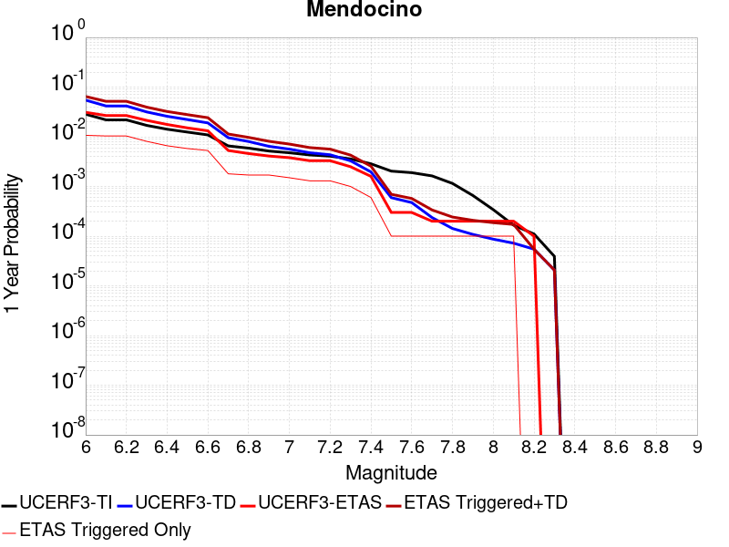 |  |

| Magnitude | 1 wk TI Prob | 1 wk TD Prob | 1 wk ETAS Prob | 1 wk ETAS/TD Gain | 1 wk ETAS Triggered+TD | 1 wk ETAS Triggered Only | 1 mo TI Prob | 1 mo TD Prob | 1 mo ETAS Prob | 1 mo ETAS/TD Gain | 1 mo ETAS Triggered+TD | 1 mo ETAS Triggered Only | 1 yr TI Prob | 1 yr TD Prob | 1 yr ETAS Prob | 1 yr ETAS/TD Gain | 1 yr ETAS Triggered+TD | 1 yr ETAS Triggered Only | 10 yr TI Prob | 10 yr TD Prob | 10 yr ETAS Prob | 10 yr ETAS/TD Gain | 10 yr ETAS Triggered+TD | 10 yr ETAS Triggered Only |
|-----|-----|-----|-----|-----|-----|-----|-----|-----|-----|-----|-----|-----|-----|-----|-----|-----|-----|-----|-----|-----|-----|-----|-----|-----|
| 6.0 | 5.5409013E-4 | 0.001084747 | 1.0E-4 | 0.0921874 | 0.0011846385 | 1.0E-4 | 0.0023725112 | 0.004638455 | 6.0E-4 | 0.12935342 | 0.0052356715 | 6.0E-4 | 0.028505474 | 0.05470894 | 0.0107 | 0.19558047 | 0.06482355 | 0.0107 | 0.25113493 | 0.41205505 | 0.0603 | 0.14633967 | 0.44750813 | 0.0603 |
| 6.1 | 4.2515888E-4 | 8.2339975E-4 | 1.0E-4 | 0.12144769 | 9.233174E-4 | 1.0E-4 | 0.0018208373 | 0.003522372 | 6.0E-4 | 0.17033976 | 0.0041202586 | 6.0E-4 | 0.021944538 | 0.041777268 | 0.0104 | 0.24893922 | 0.051742785 | 0.0104 | 0.19899574 | 0.33011395 | 0.0574 | 0.17387934 | 0.3685654 | 0.0574 |
| 6.2 | 4.2515888E-4 | 8.2339975E-4 | 1.0E-4 | 0.12144769 | 9.233174E-4 | 1.0E-4 | 0.0018208373 | 0.003522372 | 6.0E-4 | 0.17033976 | 0.0041202586 | 6.0E-4 | 0.021944538 | 0.041777268 | 0.0104 | 0.24893922 | 0.051742785 | 0.0104 | 0.19899574 | 0.33011395 | 0.0574 | 0.17387934 | 0.3685654 | 0.0574 |
| 6.3 | 3.2773745E-4 | 6.1980094E-4 | 1.0E-4 | 0.16134213 | 7.1973895E-4 | 1.0E-4 | 0.0014038329 | 0.0026523182 | 6.0E-4 | 0.2262172 | 0.003250727 | 6.0E-4 | 0.016958237 | 0.031616308 | 0.0081 | 0.25619692 | 0.039460216 | 0.0081 | 0.1572094 | 0.260932 | 0.0479 | 0.18357272 | 0.29633337 | 0.0479 |
| 6.4 | 2.7417165E-4 | 5.052092E-4 | 1.0E-4 | 0.19793782 | 6.051587E-4 | 1.0E-4 | 0.0011744922 | 0.0021623892 | 4.0E-4 | 0.18498057 | 0.0025615243 | 4.0E-4 | 0.014205975 | 0.025860354 | 0.0066 | 0.25521693 | 0.032289676 | 0.0066 | 0.13331394 | 0.21963343 | 0.0407 | 0.18530877 | 0.25139436 | 0.0407 |
| 6.5 | 2.3984899E-4 | 4.3277213E-4 | 1.0E-4 | 0.23106849 | 5.3272885E-4 | 1.0E-4 | 0.0010275192 | 0.0018525737 | 3.0E-4 | 0.16193688 | 0.002152018 | 3.0E-4 | 0.012438473 | 0.022202164 | 0.0058 | 0.2612358 | 0.027873391 | 0.0058 | 0.11764851 | 0.19218843 | 0.0367 | 0.19095843 | 0.2218351 | 0.0367 |
| 6.6 | 2.1023539E-4 | 3.697502E-4 | 1.0E-4 | 0.2704529 | 4.697132E-4 | 1.0E-4 | 9.0069766E-4 | 0.0015830025 | 3.0E-4 | 0.18951328 | 0.0018825276 | 3.0E-4 | 0.010910975 | 0.019010425 | 0.0053 | 0.2787944 | 0.02420967 | 0.0053 | 0.10390546 | 0.16764317 | 0.0318 | 0.18968861 | 0.19411212 | 0.0318 |
| 6.7 | 1.2592976E-4 | 1.846216E-4 | 0.0 | 0.0 | 1.846216E-4 | 0.0 | 5.395873E-4 | 7.909013E-4 | 1.0E-4 | 0.12643802 | 8.908222E-4 | 1.0E-4 | 0.006549705 | 0.009575104 | 0.0018 | 0.1879875 | 0.011357869 | 0.0018 | 0.063599944 | 0.09112046 | 0.0136 | 0.14925298 | 0.10348122 | 0.0136 |
| 6.8 | 1.13663555E-4 | 1.5434294E-4 | 0.0 | 0.0 | 1.5434294E-4 | 0.0 | 4.8703855E-4 | 6.612661E-4 | 1.0E-4 | 0.15122505 | 7.612E-4 | 1.0E-4 | 0.0059135845 | 0.008017018 | 0.0017 | 0.2120489 | 0.009703389 | 0.0017 | 0.057586733 | 0.07753431 | 0.0118 | 0.15219069 | 0.08841941 | 0.0118 |
| 6.9 | 9.926894E-5 | 1.2329529E-4 | 0.0 | 0.0 | 1.2329529E-4 | 0.0 | 4.2536893E-4 | 5.282932E-4 | 1.0E-4 | 0.18928884 | 6.2824035E-4 | 1.0E-4 | 0.0051665753 | 0.0064120195 | 0.0017 | 0.2651271 | 0.008101119 | 0.0017 | 0.050480947 | 0.062989004 | 0.0107 | 0.16987091 | 0.07301503 | 0.0107 |
| 7.0 | 9.168125E-5 | 1.0811626E-4 | 0.0 | 0.0 | 1.0811626E-4 | 0.0 | 3.9286047E-4 | 4.6326843E-4 | 1.0E-4 | 0.21585758 | 5.632221E-4 | 1.0E-4 | 0.004772591 | 0.0056253443 | 0.0015 | 0.26665032 | 0.0071169063 | 0.0015 | 0.04671385 | 0.055744044 | 0.0099 | 0.17759745 | 0.065092176 | 0.0099 |
| 7.1 | 8.2854116E-5 | 9.1307505E-5 | 0.0 | 0.0 | 9.1307505E-5 | 0.0 | 3.5504074E-4 | 3.912595E-4 | 1.0E-4 | 0.25558484 | 4.912204E-4 | 1.0E-4 | 0.004314056 | 0.0047532436 | 0.0013 | 0.27349743 | 0.0060470644 | 0.0013 | 0.042312626 | 0.04759642 | 0.0092 | 0.19329184 | 0.056358535 | 0.0092 |
| 7.2 | 7.8255274E-5 | 8.324858E-5 | 0.0 | 0.0 | 8.324858E-5 | 0.0 | 3.3533663E-4 | 3.5673167E-4 | 1.0E-4 | 0.28032273 | 4.5669603E-4 | 1.0E-4 | 0.0040750825 | 0.0043347073 | 0.0013 | 0.2999049 | 0.0056290724 | 0.0013 | 0.040011603 | 0.04363615 | 0.0088 | 0.20166765 | 0.052052155 | 0.0088 |
| 7.3 | 6.887904E-5 | 6.276664E-5 | 0.0 | 0.0 | 6.276664E-5 | 0.0 | 2.9516246E-4 | 2.6897268E-4 | 1.0E-4 | 0.37178496 | 3.689458E-4 | 1.0E-4 | 0.0035876823 | 0.0032699227 | 0.001 | 0.30581763 | 0.0042666527 | 0.001 | 0.035303112 | 0.03343414 | 0.0066 | 0.197403 | 0.039813478 | 0.0066 |
| 7.4 | 5.4898497E-5 | 3.750063E-5 | 0.0 | 0.0 | 3.750063E-5 | 0.0 | 2.3525805E-4 | 1.6070741E-4 | 1.0E-4 | 0.6222488 | 2.6069133E-4 | 1.0E-4 | 0.0028605047 | 0.0019549134 | 6.0E-4 | 0.30691898 | 0.0025537405 | 6.0E-4 | 0.02823963 | 0.02045739 | 0.0038 | 0.18575193 | 0.024179654 | 0.0038 |
| 7.5 | 3.9103943E-5 | 1.1328826E-5 | 0.0 | 0.0 | 1.1328826E-5 | 0.0 | 1.6757756E-4 | 4.8551217E-5 | 0.0 | 0.0 | 4.8551217E-5 | 0.0 | 0.0020383475 | 5.9095235E-4 | 1.0E-4 | 0.16921839 | 6.908932E-4 | 1.0E-4 | 0.020197518 | 0.0066374512 | 0.001 | 0.15066025 | 0.007630814 | 0.001 |
| 7.6 | 3.641042E-5 | 9.002549E-6 | 0.0 | 0.0 | 9.002549E-6 | 0.0 | 1.5603533E-4 | 3.8581788E-5 | 0.0 | 0.0 | 3.8581788E-5 | 0.0 | 0.0018980748 | 4.6963338E-4 | 1.0E-4 | 0.21293205 | 5.695864E-4 | 1.0E-4 | 0.018819444 | 0.0053594853 | 7.0E-4 | 0.13060956 | 0.0060557337 | 7.0E-4 |
| 7.7 | 3.1318774E-5 | 4.4684107E-6 | 0.0 | 0.0 | 4.4684107E-6 | 0.0 | 1.342164E-4 | 1.9150193E-5 | 0.0 | 0.0 | 1.9150193E-5 | 0.0 | 0.0016328598 | 2.3312883E-4 | 1.0E-4 | 0.42894736 | 3.331055E-4 | 1.0E-4 | 0.016209139 | 0.002874105 | 4.0E-4 | 0.13917376 | 0.0032729553 | 4.0E-4 |
| 7.8 | 2.209241E-5 | 2.6898708E-6 | 0.0 | 0.0 | 2.6898708E-6 | 0.0 | 9.467832E-5 | 1.1527967E-5 | 0.0 | 0.0 | 1.1527967E-5 | 0.0 | 0.001152099 | 1.40344E-4 | 1.0E-4 | 0.71253496 | 2.4032996E-4 | 1.0E-4 | 0.011461443 | 0.0017429014 | 3.0E-4 | 0.17212678 | 0.0020423785 | 3.0E-4 |
| 7.9 | 1.2640477E-5 | 2.0489279E-6 | 0.0 | 0.0 | 2.0489279E-6 | 0.0 | 5.4172346E-5 | 8.7810895E-6 | 0.0 | 0.0 | 8.7810895E-6 | 0.0 | 6.593487E-4 | 1.0690455E-4 | 1.0E-4 | 0.9354139 | 2.0689386E-4 | 1.0E-4 | 0.006573958 | 0.0013019252 | 2.0E-4 | 0.15361866 | 0.0015016648 | 2.0E-4 |
| 8.0 | 6.5548907E-6 | 1.6451688E-6 | 0.0 | 0.0 | 1.6451688E-6 | 0.0 | 2.8092087E-5 | 7.0507044E-6 | 0.0 | 0.0 | 7.0507044E-6 | 0.0 | 3.4196748E-4 | 8.583897E-5 | 1.0E-4 | 1.1649721 | 1.8583039E-4 | 1.0E-4 | 0.0034144172 | 0.0010347611 | 2.0E-4 | 0.19328132 | 0.0012345541 | 2.0E-4 |
| 8.1 | 3.1916707E-6 | 1.3651912E-6 | 0.0 | 0.0 | 1.3651912E-6 | 0.0 | 1.3678517E-5 | 5.8508067E-6 | 0.0 | 0.0 | 5.8508067E-6 | 0.0 | 1.6652321E-4 | 7.123126E-5 | 1.0E-4 | 1.403878 | 1.7122414E-4 | 1.0E-4 | 0.0016639848 | 8.667784E-4 | 1.0E-4 | 0.11536974 | 9.6669176E-4 | 1.0E-4 |
| 8.2 | 2.1193785E-6 | 1.0351152E-6 | 0.0 | 0.0 | 1.0351152E-6 | 0.0 | 9.083019E-6 | 4.436201E-6 | 0.0 | 0.0 | 4.436201E-6 | 0.0 | 1.1058014E-4 | 5.4009426E-5 | 0.0 | 0.0 | 5.4009426E-5 | 0.0 | 0.0011052513 | 6.531866E-4 | 0.0 | 0.0 | 6.531866E-4 | 0.0 |
| 8.3 | 7.536878E-7 | 3.9438493E-7 | 0.0 | 0.0 | 3.9438493E-7 | 0.0 | 3.2300866E-6 | 1.6902201E-6 | 0.0 | 0.0 | 1.6902201E-6 | 0.0 | 3.9325594E-5 | 2.0578249E-5 | 0.0 | 0.0 | 2.0578249E-5 | 0.0 | 3.9318635E-4 | 2.4226234E-4 | 0.0 | 0.0 | 2.4226234E-4 | 0.0 |

## San Andreas (Creeping Section) 2011 CFM
*[(top)](#table-of-contents)*

| 1 Week | 1 Month | 1 Year | 10 Year |
|-----|-----|-----|-----|
|  |  |  |  |

| Magnitude | 1 wk TI Prob | 1 wk TD Prob | 1 wk ETAS Prob | 1 wk ETAS/TD Gain | 1 wk ETAS Triggered+TD | 1 wk ETAS Triggered Only | 1 mo TI Prob | 1 mo TD Prob | 1 mo ETAS Prob | 1 mo ETAS/TD Gain | 1 mo ETAS Triggered+TD | 1 mo ETAS Triggered Only | 1 yr TI Prob | 1 yr TD Prob | 1 yr ETAS Prob | 1 yr ETAS/TD Gain | 1 yr ETAS Triggered+TD | 1 yr ETAS Triggered Only | 10 yr TI Prob | 10 yr TD Prob | 10 yr ETAS Prob | 10 yr ETAS/TD Gain | 10 yr ETAS Triggered+TD | 10 yr ETAS Triggered Only |
|-----|-----|-----|-----|-----|-----|-----|-----|-----|-----|-----|-----|-----|-----|-----|-----|-----|-----|-----|-----|-----|-----|-----|-----|-----|
| 6.0 | 5.986481E-4 | 0.0012271844 | 0.0018 | 1.4667722 | 0.0030249755 | 0.0018 | 0.0025631124 | 0.0052437796 | 0.0037 | 0.70559794 | 0.008924378 | 0.0037 | 0.030762846 | 0.061185557 | 0.0107 | 0.17487787 | 0.07123087 | 0.0107 | 0.26835477 | 0.42587662 | 0.0491 | 0.11529161 | 0.45406607 | 0.0491 |
| 6.1 | 5.015945E-4 | 0.0010219354 | 0.0013 | 1.2720962 | 0.0023206067 | 0.0013 | 0.00214792 | 0.0043684095 | 0.0031 | 0.70964044 | 0.0074548675 | 0.0031 | 0.025839351 | 0.05125479 | 0.0089 | 0.17364231 | 0.059698623 | 0.0089 | 0.23032776 | 0.37290117 | 0.0389 | 0.10431719 | 0.3972953 | 0.0389 |
| 6.2 | 4.073338E-4 | 8.109227E-4 | 0.001 | 1.2331631 | 0.0018101118 | 0.001 | 0.0017445484 | 0.0034679037 | 0.0026 | 0.7497325 | 0.006058887 | 0.0026 | 0.021034058 | 0.040942214 | 0.0073 | 0.17830008 | 0.047943335 | 0.0073 | 0.19150782 | 0.31309265 | 0.0328 | 0.104761325 | 0.3356232 | 0.0328 |
| 6.3 | 3.464099E-4 | 6.741214E-4 | 9.0E-4 | 1.3350712 | 0.0015735147 | 9.0E-4 | 0.0014837692 | 0.0028837703 | 0.0024 | 0.8322438 | 0.0052768495 | 0.0024 | 0.017915873 | 0.034199227 | 0.0066 | 0.19298683 | 0.04057351 | 0.0066 | 0.16538359 | 0.27138206 | 0.0286 | 0.10538647 | 0.29222053 | 0.0286 |
| 6.4 | 2.935057E-4 | 5.546347E-4 | 5.0E-4 | 0.90149426 | 0.0010543574 | 5.0E-4 | 0.0012572751 | 0.0023733815 | 0.0017 | 0.7162776 | 0.004069347 | 0.0017 | 0.015200248 | 0.028274624 | 0.005 | 0.17683701 | 0.03313325 | 0.005 | 0.14201577 | 0.23305658 | 0.0237 | 0.10169205 | 0.25123313 | 0.0237 |
| 6.5 | 2.3409708E-4 | 4.211381E-4 | 4.0E-4 | 0.94980717 | 8.2096964E-4 | 4.0E-4 | 0.0010028875 | 0.0018028357 | 0.0014 | 0.7765544 | 0.0032003117 | 0.0014 | 0.012141965 | 0.021597859 | 0.0041 | 0.18983364 | 0.025609307 | 0.0041 | 0.11499573 | 0.18690051 | 0.0185 | 0.098983146 | 0.20194285 | 0.0185 |
| 6.6 | 1.5842178E-4 | 2.5091838E-4 | 3.0E-4 | 1.1956079 | 5.5084313E-4 | 3.0E-4 | 6.7877385E-4 | 0.0010749114 | 6.0E-4 | 0.5581855 | 0.0016742664 | 6.0E-4 | 0.0082328 | 0.013007131 | 0.0022 | 0.16913798 | 0.015178516 | 0.0022 | 0.07934396 | 0.123237476 | 0.0123 | 0.0998073 | 0.13402165 | 0.0123 |
| 6.7 | 1.5616413E-4 | 2.4628517E-4 | 3.0E-4 | 1.2181001 | 5.462113E-4 | 3.0E-4 | 6.691031E-4 | 0.0010550739 | 6.0E-4 | 0.5686805 | 0.0016544409 | 6.0E-4 | 0.0081159435 | 0.012769066 | 0.0022 | 0.17229138 | 0.014940973 | 0.0022 | 0.0782586 | 0.12126533 | 0.0121 | 0.0997812 | 0.13189802 | 0.0121 |
| 6.8 | 1.5538467E-4 | 2.4452378E-4 | 3.0E-4 | 1.2268746 | 5.444504E-4 | 3.0E-4 | 6.6576427E-4 | 0.0010475324 | 6.0E-4 | 0.5727746 | 0.0016469039 | 6.0E-4 | 0.008075596 | 0.012678478 | 0.0022 | 0.1735224 | 0.014850586 | 0.0022 | 0.07788358 | 0.12049631 | 0.0121 | 0.10041801 | 0.13113831 | 0.0121 |
| 6.9 | 1.5153569E-4 | 2.356084E-4 | 3.0E-4 | 1.2732992 | 5.355377E-4 | 3.0E-4 | 6.49277E-4 | 0.0010093615 | 6.0E-4 | 0.5944352 | 0.0016087559 | 6.0E-4 | 0.007876333 | 0.012220252 | 0.0022 | 0.180029 | 0.014393368 | 0.0022 | 0.07602952 | 0.11656371 | 0.0118 | 0.1012322 | 0.12698825 | 0.0118 |
| 7.0 | 1.4588932E-4 | 2.2418625E-4 | 3.0E-4 | 1.338173 | 5.24119E-4 | 3.0E-4 | 6.250901E-4 | 9.604464E-4 | 6.0E-4 | 0.6247095 | 0.0015598701 | 6.0E-4 | 0.0075839474 | 0.011631236 | 0.0021 | 0.1805483 | 0.013706811 | 0.0021 | 0.073302895 | 0.11141267 | 0.0116 | 0.10411743 | 0.12172028 | 0.0116 |
| 7.1 | 1.1565079E-4 | 1.6308385E-4 | 3.0E-4 | 1.8395444 | 4.6303493E-4 | 3.0E-4 | 4.955521E-4 | 6.9874444E-4 | 5.0E-4 | 0.7155692 | 0.001198395 | 5.0E-4 | 0.006016669 | 0.008474232 | 0.0017 | 0.20060815 | 0.010159826 | 0.0017 | 0.058563538 | 0.083780795 | 0.0092 | 0.10981037 | 0.09221001 | 0.0092 |
| 7.2 | 1.0393792E-4 | 1.4646127E-4 | 2.0E-4 | 1.3655487 | 3.4643197E-4 | 2.0E-4 | 4.4537216E-4 | 6.275409E-4 | 4.0E-4 | 0.6374087 | 0.0010272899 | 4.0E-4 | 0.005408933 | 0.0076137153 | 0.0013 | 0.17074451 | 0.008903817 | 0.0013 | 0.052791595 | 0.07574943 | 0.0077 | 0.10165093 | 0.08286616 | 0.0077 |
| 7.3 | 9.332884E-5 | 1.2814232E-4 | 1.0E-4 | 0.78038234 | 2.281295E-4 | 1.0E-4 | 3.999194E-4 | 5.490664E-4 | 1.0E-4 | 0.18212733 | 6.490115E-4 | 1.0E-4 | 0.0048581534 | 0.006664529 | 0.001 | 0.15004812 | 0.007657864 | 0.001 | 0.047533102 | 0.066627674 | 0.0068 | 0.10205969 | 0.07297461 | 0.0068 |
| 7.4 | 8.670252E-5 | 1.1734409E-4 | 1.0E-4 | 0.8521946 | 2.1733236E-4 | 1.0E-4 | 3.715293E-4 | 5.028069E-4 | 1.0E-4 | 0.1988835 | 6.027566E-4 | 1.0E-4 | 0.004513991 | 0.0061046123 | 8.0E-4 | 0.13104846 | 0.006899729 | 8.0E-4 | 0.044233937 | 0.061286733 | 0.0061 | 0.09953214 | 0.06701288 | 0.0061 |
| 7.5 | 7.3036405E-5 | 9.035606E-5 | 1.0E-4 | 1.1067326 | 1.9034703E-4 | 1.0E-4 | 3.129756E-4 | 3.8718287E-4 | 1.0E-4 | 0.2582759 | 4.8714416E-4 | 1.0E-4 | 0.0038038217 | 0.004703784 | 6.0E-4 | 0.12755688 | 0.005300962 | 6.0E-4 | 0.03739367 | 0.048011467 | 0.0039 | 0.081230596 | 0.05172422 | 0.0039 |
| 7.6 | 6.3935775E-5 | 8.310614E-5 | 1.0E-4 | 1.2032804 | 1.8309783E-4 | 1.0E-4 | 2.7398168E-4 | 3.5612064E-4 | 1.0E-4 | 0.2808037 | 4.5608502E-4 | 1.0E-4 | 0.0033306254 | 0.0043271678 | 6.0E-4 | 0.13865882 | 0.0049245716 | 6.0E-4 | 0.032811474 | 0.04412911 | 0.0037 | 0.08384488 | 0.047665834 | 0.0037 |
| 7.7 | 5.5050095E-5 | 6.690078E-5 | 1.0E-4 | 1.4947509 | 1.668941E-4 | 1.0E-4 | 2.3590765E-4 | 2.8668615E-4 | 1.0E-4 | 0.3488135 | 3.8665748E-4 | 1.0E-4 | 0.0028683927 | 0.0034848216 | 6.0E-4 | 0.17217524 | 0.004082731 | 6.0E-4 | 0.0283165 | 0.035928067 | 0.0026 | 0.07236682 | 0.038434654 | 0.0026 |
| 7.8 | 5.027131E-5 | 6.189082E-5 | 1.0E-4 | 1.6157483 | 1.6188464E-4 | 1.0E-4 | 2.1543067E-4 | 2.6521945E-4 | 1.0E-4 | 0.37704626 | 3.6519291E-4 | 1.0E-4 | 0.0026197135 | 0.003224269 | 6.0E-4 | 0.1860887 | 0.0038223343 | 6.0E-4 | 0.025890453 | 0.03324991 | 0.0023 | 0.06917312 | 0.035473436 | 0.0023 |
| 7.9 | 3.7271806E-5 | 5.043586E-5 | 0.0 | 0.0 | 5.043586E-5 | 0.0 | 1.5972654E-4 | 2.161358E-4 | 0.0 | 0.0 | 2.161358E-4 | 0.0 | 0.0019429359 | 0.0026282798 | 5.0E-4 | 0.19023849 | 0.0031269656 | 5.0E-4 | 0.019260362 | 0.027167857 | 0.002 | 0.07361641 | 0.02911352 | 0.002 |
| 8.0 | 2.7310243E-5 | 3.1552252E-5 | 0.0 | 0.0 | 3.1552252E-5 | 0.0 | 1.17038646E-4 | 1.3521693E-4 | 0.0 | 0.0 | 1.3521693E-4 | 0.0 | 0.0014240141 | 0.0016450238 | 4.0E-4 | 0.24315758 | 0.0020443657 | 4.0E-4 | 0.014149235 | 0.017275628 | 0.0012 | 0.06946202 | 0.018454896 | 0.0012 |
| 8.1 | 1.7940547E-5 | 1.7468512E-5 | 0.0 | 0.0 | 1.7468512E-5 | 0.0 | 7.688579E-5 | 7.486291E-5 | 0.0 | 0.0 | 7.486291E-5 | 0.0 | 9.3568244E-4 | 9.1107533E-4 | 3.0E-4 | 0.32928124 | 0.001210802 | 3.0E-4 | 0.009317525 | 0.009834544 | 7.0E-4 | 0.07117768 | 0.01052766 | 7.0E-4 |
| 8.2 | 8.643924E-6 | 5.4947163E-6 | 0.0 | 0.0 | 5.4947163E-6 | 0.0 | 3.704486E-5 | 2.3548571E-5 | 0.0 | 0.0 | 2.3548571E-5 | 0.0 | 4.5092785E-4 | 2.866662E-4 | 1.0E-4 | 0.34883776 | 3.8663755E-4 | 1.0E-4 | 0.0045001395 | 0.0032596437 | 3.0E-4 | 0.0920346 | 0.0035586657 | 3.0E-4 |
| 8.3 | 1.983087E-6 | 7.6880906E-7 | 0.0 | 0.0 | 7.6880906E-7 | 0.0 | 8.498917E-6 | 3.294892E-6 | 0.0 | 0.0 | 3.294892E-6 | 0.0 | 1.034694E-4 | 4.0114588E-5 | 0.0 | 0.0 | 4.0114588E-5 | 0.0 | 0.0010342124 | 4.7361702E-4 | 0.0 | 0.0 | 4.7361702E-4 | 0.0 |

## San Andreas (Mojave S)
*[(top)](#table-of-contents)*

| 1 Week | 1 Month | 1 Year | 10 Year |
|-----|-----|-----|-----|
|  |  |  |  |

| Magnitude | 1 wk TI Prob | 1 wk TD Prob | 1 wk ETAS Prob | 1 wk ETAS/TD Gain | 1 wk ETAS Triggered+TD | 1 wk ETAS Triggered Only | 1 mo TI Prob | 1 mo TD Prob | 1 mo ETAS Prob | 1 mo ETAS/TD Gain | 1 mo ETAS Triggered+TD | 1 mo ETAS Triggered Only | 1 yr TI Prob | 1 yr TD Prob | 1 yr ETAS Prob | 1 yr ETAS/TD Gain | 1 yr ETAS Triggered+TD | 1 yr ETAS Triggered Only | 10 yr TI Prob | 10 yr TD Prob | 10 yr ETAS Prob | 10 yr ETAS/TD Gain | 10 yr ETAS Triggered+TD | 10 yr ETAS Triggered Only |
|-----|-----|-----|-----|-----|-----|-----|-----|-----|-----|-----|-----|-----|-----|-----|-----|-----|-----|-----|-----|-----|-----|-----|-----|-----|
| 6.0 | 3.1064058E-4 | 6.756793E-4 | 0.0 | 0.0 | 6.756793E-4 | 0.0 | 0.0013306376 | 0.002892683 | 4.0E-4 | 0.13827993 | 0.003291526 | 4.0E-4 | 0.016080605 | 0.03477695 | 0.0046 | 0.13227153 | 0.039216973 | 0.0046 | 0.1496549 | 0.2868759 | 0.0421 | 0.14675334 | 0.31689844 | 0.0421 |
| 6.1 | 3.1064058E-4 | 6.756793E-4 | 0.0 | 0.0 | 6.756793E-4 | 0.0 | 0.0013306376 | 0.002892683 | 4.0E-4 | 0.13827993 | 0.003291526 | 4.0E-4 | 0.016080605 | 0.03477695 | 0.0046 | 0.13227153 | 0.039216973 | 0.0046 | 0.1496549 | 0.2868759 | 0.0421 | 0.14675334 | 0.31689844 | 0.0421 |
| 6.2 | 3.1064058E-4 | 6.756793E-4 | 0.0 | 0.0 | 6.756793E-4 | 0.0 | 0.0013306376 | 0.002892683 | 4.0E-4 | 0.13827993 | 0.003291526 | 4.0E-4 | 0.016080605 | 0.03477695 | 0.0046 | 0.13227153 | 0.039216973 | 0.0046 | 0.1496549 | 0.2868759 | 0.0421 | 0.14675334 | 0.31689844 | 0.0421 |
| 6.3 | 3.1064058E-4 | 6.756793E-4 | 0.0 | 0.0 | 6.756793E-4 | 0.0 | 0.0013306376 | 0.002892683 | 4.0E-4 | 0.13827993 | 0.003291526 | 4.0E-4 | 0.016080605 | 0.03477695 | 0.0046 | 0.13227153 | 0.039216973 | 0.0046 | 0.1496549 | 0.2868759 | 0.0421 | 0.14675334 | 0.31689844 | 0.0421 |
| 6.4 | 1.9872203E-4 | 4.3279512E-4 | 0.0 | 0.0 | 4.3279512E-4 | 0.0 | 8.5138786E-4 | 0.0018535459 | 3.0E-4 | 0.16185194 | 0.0021529899 | 3.0E-4 | 0.010316478 | 0.022339558 | 0.0023 | 0.10295638 | 0.024588179 | 0.0023 | 0.098504856 | 0.19740792 | 0.0259 | 0.1312004 | 0.21819505 | 0.0259 |
| 6.5 | 1.291105E-4 | 2.884578E-4 | 0.0 | 0.0 | 2.884578E-4 | 0.0 | 5.5321335E-4 | 0.0012356648 | 2.0E-4 | 0.16185619 | 0.0014354177 | 2.0E-4 | 0.006714592 | 0.014941274 | 0.002 | 0.13385738 | 0.016911391 | 0.002 | 0.065152965 | 0.13842176 | 0.0158 | 0.11414391 | 0.1520347 | 0.0158 |
| 6.6 | 1.291105E-4 | 2.884578E-4 | 0.0 | 0.0 | 2.884578E-4 | 0.0 | 5.5321335E-4 | 0.0012356648 | 2.0E-4 | 0.16185619 | 0.0014354177 | 2.0E-4 | 0.006714592 | 0.014941274 | 0.002 | 0.13385738 | 0.016911391 | 0.002 | 0.065152965 | 0.13842176 | 0.0158 | 0.11414391 | 0.1520347 | 0.0158 |
| 6.7 | 1.08001186E-4 | 2.4425116E-4 | 0.0 | 0.0 | 2.4425116E-4 | 0.0 | 4.6278012E-4 | 0.0010463713 | 2.0E-4 | 0.19113675 | 0.001246162 | 2.0E-4 | 0.0056198016 | 0.012665457 | 0.0018 | 0.14211884 | 0.014442659 | 0.0018 | 0.054797906 | 0.11954045 | 0.0127 | 0.10624018 | 0.13072228 | 0.0127 |
| 6.8 | 1.0624356E-4 | 2.3942407E-4 | 0.0 | 0.0 | 2.3942407E-4 | 0.0 | 4.5525006E-4 | 0.0010257001 | 1.0E-4 | 0.09749438 | 0.0011255976 | 1.0E-4 | 0.0055285925 | 0.012416673 | 0.0017 | 0.13691269 | 0.014095564 | 0.0017 | 0.053930566 | 0.11748886 | 0.0124 | 0.10554192 | 0.12843199 | 0.0124 |
| 6.9 | 1.0393785E-4 | 2.3312245E-4 | 0.0 | 0.0 | 2.3312245E-4 | 0.0 | 4.4537184E-4 | 9.987141E-4 | 1.0E-4 | 0.100128755 | 0.0010986143 | 1.0E-4 | 0.0054089287 | 0.012091805 | 0.0016 | 0.13232102 | 0.013672458 | 0.0016 | 0.05279156 | 0.114790194 | 0.012 | 0.104538545 | 0.12541272 | 0.012 |
| 7.0 | 1.0155622E-4 | 2.2681218E-4 | 0.0 | 0.0 | 2.2681218E-4 | 0.0 | 4.3516833E-4 | 9.7169046E-4 | 1.0E-4 | 0.10291343 | 0.0010715933 | 1.0E-4 | 0.005285311 | 0.011766387 | 0.0016 | 0.13598056 | 0.013347561 | 0.0016 | 0.05161361 | 0.1120473 | 0.0116 | 0.1035277 | 0.122347556 | 0.0116 |
| 7.1 | 9.885595E-5 | 2.1968997E-4 | 0.0 | 0.0 | 2.1968997E-4 | 0.0 | 4.2359953E-4 | 9.4118906E-4 | 1.0E-4 | 0.10624857 | 0.001041095 | 1.0E-4 | 0.0051451353 | 0.011398972 | 0.0014 | 0.1228181 | 0.012783013 | 0.0014 | 0.05027629 | 0.10893023 | 0.011 | 0.10098207 | 0.118732 | 0.011 |
| 7.2 | 9.6411415E-5 | 2.1331389E-4 | 0.0 | 0.0 | 2.1331389E-4 | 0.0 | 4.1312634E-4 | 9.138824E-4 | 1.0E-4 | 0.10942327 | 0.001013791 | 1.0E-4 | 0.005018219 | 0.011069938 | 0.0014 | 0.12646864 | 0.01245444 | 0.0014 | 0.049064007 | 0.106117696 | 0.0108 | 0.10177379 | 0.11577162 | 0.0108 |
| 7.3 | 9.1180635E-5 | 1.9556312E-4 | 0.0 | 0.0 | 1.9556312E-4 | 0.0 | 3.907156E-4 | 8.3785853E-4 | 1.0E-4 | 0.11935189 | 9.377747E-4 | 1.0E-4 | 0.004746591 | 0.010153329 | 0.0014 | 0.13788581 | 0.011539114 | 0.0014 | 0.046464786 | 0.09831402 | 0.0096 | 0.097646296 | 0.106970206 | 0.0096 |
| 7.4 | 8.887388E-5 | 1.8803465E-4 | 0.0 | 0.0 | 1.8803465E-4 | 0.0 | 3.8083247E-4 | 8.05614E-4 | 1.0E-4 | 0.12412893 | 9.0553344E-4 | 1.0E-4 | 0.0046267817 | 0.009764338 | 0.0013 | 0.13313754 | 0.011051645 | 0.0013 | 0.045316286 | 0.094948135 | 0.0091 | 0.0958418 | 0.103184104 | 0.0091 |
| 7.5 | 8.6750515E-5 | 1.8133737E-4 | 0.0 | 0.0 | 1.8133737E-4 | 0.0 | 3.7173493E-4 | 7.7692873E-4 | 1.0E-4 | 0.12871192 | 8.768511E-4 | 1.0E-4 | 0.004516484 | 0.009418169 | 0.0013 | 0.13803108 | 0.0107059255 | 0.0013 | 0.04425787 | 0.09190914 | 0.009 | 0.097922795 | 0.10008196 | 0.009 |
| 7.6 | 8.453092E-5 | 1.7519863E-4 | 0.0 | 0.0 | 1.7519863E-4 | 0.0 | 3.6222505E-4 | 7.506353E-4 | 1.0E-4 | 0.1332205 | 8.505602E-4 | 1.0E-4 | 0.0044011753 | 0.009100765 | 0.0013 | 0.14284514 | 0.010388934 | 0.0013 | 0.04315024 | 0.08906145 | 0.0087 | 0.09768537 | 0.096986614 | 0.0087 |
| 7.7 | 8.259102E-5 | 1.7040722E-4 | 0.0 | 0.0 | 1.7040722E-4 | 0.0 | 3.539135E-4 | 7.3011225E-4 | 1.0E-4 | 0.13696523 | 8.3003927E-4 | 1.0E-4 | 0.004300386 | 0.008852956 | 0.0013 | 0.1468436 | 0.010141447 | 0.0013 | 0.042181134 | 0.08680772 | 0.0085 | 0.097917564 | 0.094569854 | 0.0085 |
| 7.8 | 7.444844E-5 | 1.5354772E-4 | 0.0 | 0.0 | 1.5354772E-4 | 0.0 | 3.1902574E-4 | 6.5789575E-4 | 1.0E-4 | 0.15199977 | 7.5783E-4 | 1.0E-4 | 0.0038772223 | 0.007980513 | 0.001 | 0.12530522 | 0.008972533 | 0.001 | 0.03810269 | 0.07860304 | 0.0074 | 0.09414395 | 0.08542137 | 0.0074 |
| 7.9 | 5.2586525E-5 | 1.0051677E-4 | 0.0 | 0.0 | 1.0051677E-4 | 0.0 | 2.2535135E-4 | 4.3071504E-4 | 0.0 | 0.0 | 4.3071504E-4 | 0.0 | 0.0027402006 | 0.005231358 | 7.0E-4 | 0.13380846 | 0.0059276964 | 7.0E-4 | 0.027066574 | 0.05241089 | 0.0042 | 0.080136016 | 0.056390762 | 0.0042 |
| 8.0 | 3.379877E-5 | 5.430084E-5 | 0.0 | 0.0 | 5.430084E-5 | 0.0 | 1.4484383E-4 | 2.3269713E-4 | 0.0 | 0.0 | 2.3269713E-4 | 0.0 | 0.0017620471 | 0.0028294087 | 4.0E-4 | 0.1413723 | 0.003228277 | 4.0E-4 | 0.017481409 | 0.028944505 | 0.0021 | 0.07255263 | 0.030983722 | 0.0021 |
| 8.1 | 1.8668277E-5 | 1.9386398E-5 | 0.0 | 0.0 | 1.9386398E-5 | 0.0 | 8.000444E-5 | 8.3081926E-5 | 0.0 | 0.0 | 8.3081926E-5 | 0.0 | 9.736188E-4 | 0.0010110537 | 3.0E-4 | 0.29672015 | 0.0013107504 | 3.0E-4 | 0.009693642 | 0.010838969 | 8.0E-4 | 0.07380776 | 0.011630298 | 8.0E-4 |
| 8.2 | 8.541571E-6 | 5.4806915E-6 | 0.0 | 0.0 | 5.4806915E-6 | 0.0 | 3.660622E-5 | 2.3488466E-5 | 0.0 | 0.0 | 2.3488466E-5 | 0.0 | 4.455896E-4 | 2.8593463E-4 | 1.0E-4 | 0.34973028 | 3.8590602E-4 | 1.0E-4 | 0.0044469717 | 0.0032517526 | 3.0E-4 | 0.09225795 | 0.003550777 | 3.0E-4 |
| 8.3 | 1.983087E-6 | 7.6880906E-7 | 0.0 | 0.0 | 7.6880906E-7 | 0.0 | 8.498917E-6 | 3.294892E-6 | 0.0 | 0.0 | 3.294892E-6 | 0.0 | 1.034694E-4 | 4.0114588E-5 | 0.0 | 0.0 | 4.0114588E-5 | 0.0 | 0.0010342124 | 4.7361702E-4 | 0.0 | 0.0 | 4.7361702E-4 | 0.0 |

## Garlock (Central)
*[(top)](#table-of-contents)*

| 1 Week | 1 Month | 1 Year | 10 Year |
|-----|-----|-----|-----|
|  |  |  |  |

| Magnitude | 1 wk TI Prob | 1 wk TD Prob | 1 wk ETAS Prob | 1 wk ETAS/TD Gain | 1 wk ETAS Triggered+TD | 1 wk ETAS Triggered Only | 1 mo TI Prob | 1 mo TD Prob | 1 mo ETAS Prob | 1 mo ETAS/TD Gain | 1 mo ETAS Triggered+TD | 1 mo ETAS Triggered Only | 1 yr TI Prob | 1 yr TD Prob | 1 yr ETAS Prob | 1 yr ETAS/TD Gain | 1 yr ETAS Triggered+TD | 1 yr ETAS Triggered Only | 10 yr TI Prob | 10 yr TD Prob | 10 yr ETAS Prob | 10 yr ETAS/TD Gain | 10 yr ETAS Triggered+TD | 10 yr ETAS Triggered Only |
|-----|-----|-----|-----|-----|-----|-----|-----|-----|-----|-----|-----|-----|-----|-----|-----|-----|-----|-----|-----|-----|-----|-----|-----|-----|
| 6.0 | 5.5131142E-5 | 7.03415E-5 | 3.0E-4 | 4.2649074 | 3.703204E-4 | 3.0E-4 | 2.3625491E-4 | 3.014291E-4 | 0.0028 | 9.2890835 | 0.0031005852 | 0.0028 | 0.0028726095 | 0.0036637883 | 0.0161 | 4.3943586 | 0.019704802 | 0.0161 | 0.028357591 | 0.03610733 | 0.0411 | 1.138273 | 0.07572332 | 0.0411 |
| 6.1 | 5.5131142E-5 | 7.03415E-5 | 3.0E-4 | 4.2649074 | 3.703204E-4 | 3.0E-4 | 2.3625491E-4 | 3.014291E-4 | 0.0028 | 9.2890835 | 0.0031005852 | 0.0028 | 0.0028726095 | 0.0036637883 | 0.0161 | 4.3943586 | 0.019704802 | 0.0161 | 0.028357591 | 0.03610733 | 0.0411 | 1.138273 | 0.07572332 | 0.0411 |
| 6.2 | 4.216245E-5 | 5.1746345E-5 | 1.0E-4 | 1.9325036 | 1.5174117E-4 | 1.0E-4 | 1.806837E-4 | 2.2175138E-4 | 0.0013 | 5.862421 | 0.0015214632 | 0.0013 | 0.0021976046 | 0.0026965118 | 0.0096 | 3.560155 | 0.012270626 | 0.0096 | 0.021759989 | 0.026706662 | 0.0267 | 0.99975055 | 0.052693594 | 0.0267 |
| 6.3 | 4.216245E-5 | 5.1746345E-5 | 1.0E-4 | 1.9325036 | 1.5174117E-4 | 1.0E-4 | 1.806837E-4 | 2.2175138E-4 | 0.0013 | 5.862421 | 0.0015214632 | 0.0013 | 0.0021976046 | 0.0026965118 | 0.0096 | 3.560155 | 0.012270626 | 0.0096 | 0.021759989 | 0.026706662 | 0.0267 | 0.99975055 | 0.052693594 | 0.0267 |
| 6.4 | 3.6858168E-5 | 4.4192388E-5 | 0.0 | 0.0 | 4.4192388E-5 | 0.0 | 1.5795401E-4 | 1.8938235E-4 | 9.0E-4 | 4.7522907 | 0.0010892119 | 9.0E-4 | 0.0019213937 | 0.002303317 | 0.0075 | 3.2561736 | 0.009786042 | 0.0075 | 0.019048655 | 0.022849247 | 0.0214 | 0.9365735 | 0.043760274 | 0.0214 |
| 6.5 | 3.39199E-5 | 4.009739E-5 | 0.0 | 0.0 | 4.009739E-5 | 0.0 | 1.453629E-4 | 1.7183476E-4 | 6.0E-4 | 3.4917266 | 7.7173166E-4 | 6.0E-4 | 0.0017683565 | 0.0020901028 | 0.0069 | 3.3012733 | 0.008975681 | 0.0069 | 0.017543508 | 0.020796733 | 0.0195 | 0.9376473 | 0.0398912 | 0.0195 |
| 6.6 | 3.3571985E-5 | 3.9550992E-5 | 0.0 | 0.0 | 3.9550992E-5 | 0.0 | 1.4387199E-4 | 1.6949336E-4 | 6.0E-4 | 3.5399616 | 7.6939166E-4 | 6.0E-4 | 0.0017502342 | 0.0020616504 | 0.0069 | 3.3468332 | 0.008947425 | 0.0069 | 0.017365133 | 0.020517709 | 0.0195 | 0.9503985 | 0.039617613 | 0.0195 |
| 6.7 | 3.2580007E-5 | 3.816689E-5 | 0.0 | 0.0 | 3.816689E-5 | 0.0 | 1.3962112E-4 | 1.6356225E-4 | 4.0E-4 | 2.445552 | 5.6349684E-4 | 4.0E-4 | 0.0016985617 | 0.001989573 | 0.0065 | 3.2670326 | 0.008476641 | 0.0065 | 0.016856372 | 0.0198128 | 0.0186 | 0.93878704 | 0.03804428 | 0.0186 |
| 6.8 | 3.2185937E-5 | 3.759374E-5 | 0.0 | 0.0 | 3.759374E-5 | 0.0 | 1.3793244E-4 | 1.611062E-4 | 4.0E-4 | 2.482834 | 5.6104176E-4 | 4.0E-4 | 0.0016780337 | 0.0019597248 | 0.0065 | 3.316792 | 0.008446987 | 0.0065 | 0.016654192 | 0.019519405 | 0.0183 | 0.9375286 | 0.0374622 | 0.0183 |
| 6.9 | 3.165394E-5 | 3.679777E-5 | 0.0 | 0.0 | 3.679777E-5 | 0.0 | 1.3565269E-4 | 1.5769532E-4 | 4.0E-4 | 2.536537 | 5.5763224E-4 | 4.0E-4 | 0.0016503202 | 0.0019182712 | 0.0064 | 3.3363373 | 0.008305994 | 0.0064 | 0.01638118 | 0.019112501 | 0.0179 | 0.9365598 | 0.036670387 | 0.0179 |
| 7.0 | 3.0903822E-5 | 3.5702436E-5 | 0.0 | 0.0 | 3.5702436E-5 | 0.0 | 1.3243823E-4 | 1.5300159E-4 | 4.0E-4 | 2.6143517 | 5.529404E-4 | 4.0E-4 | 0.0016112428 | 0.0018612241 | 0.0062 | 3.331141 | 0.008049685 | 0.0062 | 0.015996104 | 0.018550893 | 0.0173 | 0.9325697 | 0.035529964 | 0.0173 |
| 7.1 | 3.0069863E-5 | 3.4468012E-5 | 0.0 | 0.0 | 3.4468012E-5 | 0.0 | 1.2886449E-4 | 1.477118E-4 | 4.0E-4 | 2.7079759 | 5.476527E-4 | 4.0E-4 | 0.0015677959 | 0.0017969288 | 0.006 | 3.3390305 | 0.0077861473 | 0.006 | 0.01556781 | 0.017918114 | 0.0166 | 0.9264368 | 0.034220673 | 0.0166 |
| 7.2 | 2.7957109E-5 | 3.135561E-5 | 0.0 | 0.0 | 3.135561E-5 | 0.0 | 1.1981068E-4 | 1.3437436E-4 | 3.0E-4 | 2.2325687 | 4.3433404E-4 | 3.0E-4 | 0.0014577188 | 0.0016347996 | 0.005 | 3.0584786 | 0.0066266255 | 0.005 | 0.014481937 | 0.016321091 | 0.0134 | 0.8210235 | 0.029502388 | 0.0134 |
| 7.3 | 2.4519275E-5 | 2.6784184E-5 | 0.0 | 0.0 | 2.6784184E-5 | 0.0 | 1.0507837E-4 | 1.14784394E-4 | 3.0E-4 | 2.6135957 | 4.1474996E-4 | 3.0E-4 | 0.0012785783 | 0.0013966188 | 0.0044 | 3.150466 | 0.005790474 | 0.0044 | 0.012712469 | 0.013962706 | 0.0111 | 0.79497486 | 0.02490772 | 0.0111 |
| 7.4 | 2.3225532E-5 | 2.5267282E-5 | 0.0 | 0.0 | 2.5267282E-5 | 0.0 | 9.95342E-5 | 1.0828394E-4 | 2.0E-4 | 1.846996 | 3.0826227E-4 | 2.0E-4 | 0.0012111551 | 0.0013175741 | 0.0042 | 3.1876764 | 0.00551204 | 0.0042 | 0.012045753 | 0.013179647 | 0.0102 | 0.7739206 | 0.023245214 | 0.0102 |
| 7.5 | 2.097765E-5 | 2.2547947E-5 | 0.0 | 0.0 | 2.2547947E-5 | 0.0 | 8.9901114E-5 | 9.6630545E-5 | 2.0E-4 | 2.0697389 | 2.9661122E-4 | 2.0E-4 | 0.0010939965 | 0.0011758538 | 0.0035 | 2.9765606 | 0.0046717385 | 0.0035 | 0.010886264 | 0.011772558 | 0.0084 | 0.71352375 | 0.020073669 | 0.0084 |
| 7.6 | 1.511254E-5 | 1.6050833E-5 | 0.0 | 0.0 | 1.6050833E-5 | 0.0 | 6.476642E-5 | 6.878752E-5 | 2.0E-4 | 2.907504 | 2.6877376E-4 | 2.0E-4 | 7.882459E-4 | 8.371741E-4 | 0.002 | 2.3889894 | 0.0028354998 | 0.002 | 0.007854558 | 0.008413479 | 0.0045 | 0.5348561 | 0.0128756175 | 0.0045 |
| 7.7 | 9.934069E-6 | 1.0733771E-5 | 0.0 | 0.0 | 1.0733771E-5 | 0.0 | 4.2573887E-5 | 4.6001067E-5 | 1.0E-4 | 2.1738627 | 1.4599647E-4 | 1.0E-4 | 5.182138E-4 | 5.5991946E-4 | 4.0E-4 | 0.7143885 | 9.596955E-4 | 4.0E-4 | 0.00517007 | 0.0056562945 | 0.0015 | 0.2651913 | 0.00714781 | 0.0015 |
| 7.8 | 6.7562896E-6 | 8.473682E-6 | 0.0 | 0.0 | 8.473682E-6 | 0.0 | 2.8955206E-5 | 3.6315276E-5 | 0.0 | 0.0 | 3.6315276E-5 | 0.0 | 3.5247262E-4 | 4.4204894E-4 | 1.0E-4 | 0.2262193 | 5.420047E-4 | 1.0E-4 | 0.0035191406 | 0.0044703223 | 9.0E-4 | 0.20132777 | 0.005366299 | 9.0E-4 |
| 7.9 | 3.975453E-6 | 5.398577E-6 | 0.0 | 0.0 | 5.398577E-6 | 0.0 | 1.7037546E-5 | 2.3136554E-5 | 0.0 | 0.0 | 2.3136554E-5 | 0.0 | 2.0741238E-4 | 2.8165124E-4 | 1.0E-4 | 0.35504904 | 3.8162307E-4 | 1.0E-4 | 0.002072189 | 0.0028480184 | 5.0E-4 | 0.17556065 | 0.0033465945 | 5.0E-4 |
| 8.0 | 1.6729537E-6 | 2.0866366E-6 | 0.0 | 0.0 | 2.0866366E-6 | 0.0 | 7.169782E-6 | 8.9426985E-6 | 0.0 | 0.0 | 8.9426985E-6 | 0.0 | 8.7288594E-5 | 1.08871944E-4 | 0.0 | 0.0 | 1.08871944E-4 | 0.0 | 8.7254314E-4 | 0.0011017286 | 1.0E-4 | 0.09076645 | 0.0012016185 | 1.0E-4 |
| 8.1 | 3.6733252E-7 | 3.1613604E-7 | 0.0 | 0.0 | 3.1613604E-7 | 0.0 | 1.5742813E-6 | 1.3548681E-6 | 0.0 | 0.0 | 1.3548681E-6 | 0.0 | 1.9166706E-5 | 1.649541E-5 | 0.0 | 0.0 | 1.649541E-5 | 0.0 | 1.9165053E-4 | 1.6694514E-4 | 0.0 | 0.0 | 1.6694514E-4 | 0.0 |

## Tank Canyon
*[(top)](#table-of-contents)*

| 1 Week | 1 Month | 1 Year | 10 Year |
|-----|-----|-----|-----|
|  | 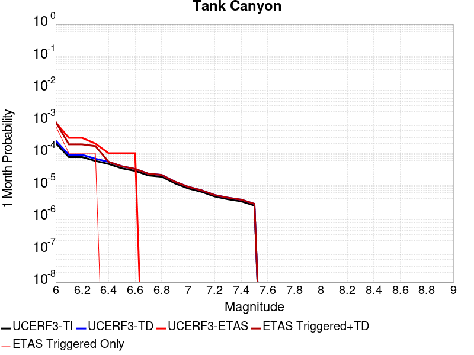 |  |  |

| Magnitude | 1 wk TI Prob | 1 wk TD Prob | 1 wk ETAS Prob | 1 wk ETAS/TD Gain | 1 wk ETAS Triggered+TD | 1 wk ETAS Triggered Only | 1 mo TI Prob | 1 mo TD Prob | 1 mo ETAS Prob | 1 mo ETAS/TD Gain | 1 mo ETAS Triggered+TD | 1 mo ETAS Triggered Only | 1 yr TI Prob | 1 yr TD Prob | 1 yr ETAS Prob | 1 yr ETAS/TD Gain | 1 yr ETAS Triggered+TD | 1 yr ETAS Triggered Only | 10 yr TI Prob | 10 yr TD Prob | 10 yr ETAS Prob | 10 yr ETAS/TD Gain | 10 yr ETAS Triggered+TD | 10 yr ETAS Triggered Only |
|-----|-----|-----|-----|-----|-----|-----|-----|-----|-----|-----|-----|-----|-----|-----|-----|-----|-----|-----|-----|-----|-----|-----|-----|-----|
| 6.0 | 4.8284557E-5 | 5.7988127E-5 | 0.0 | 0.0 | 5.7988127E-5 | 0.0 | 2.0691741E-4 | 2.485007E-4 | 7.0E-4 | 2.8168933 | 9.483268E-4 | 7.0E-4 | 0.0025163088 | 0.0030219676 | 0.0106 | 3.5076485 | 0.013589934 | 0.0106 | 0.02488006 | 0.02987538 | 0.0321 | 1.0744632 | 0.06101638 | 0.0321 |
| 6.1 | 1.7796336E-5 | 2.088055E-5 | 0.0 | 0.0 | 2.088055E-5 | 0.0 | 7.626778E-5 | 8.948522E-5 | 1.0E-4 | 1.1175029 | 1.8947627E-4 | 1.0E-4 | 9.281647E-4 | 0.0010889764 | 0.0039 | 3.5813448 | 0.0049847295 | 0.0039 | 0.009242975 | 0.010840065 | 0.0109 | 1.005529 | 0.021621909 | 0.0109 |
| 6.2 | 1.7796336E-5 | 2.088055E-5 | 0.0 | 0.0 | 2.088055E-5 | 0.0 | 7.626778E-5 | 8.948522E-5 | 1.0E-4 | 1.1175029 | 1.8947627E-4 | 1.0E-4 | 9.281647E-4 | 0.0010889764 | 0.0039 | 3.5813448 | 0.0049847295 | 0.0039 | 0.009242975 | 0.010840065 | 0.0109 | 1.005529 | 0.021621909 | 0.0109 |
| 6.3 | 1.3515912E-5 | 1.5764776E-5 | 0.0 | 0.0 | 1.5764776E-5 | 0.0 | 5.792405E-5 | 6.7561705E-5 | 1.0E-4 | 1.4801284 | 1.6755496E-4 | 1.0E-4 | 7.049971E-4 | 8.2227704E-4 | 0.0026 | 3.1619513 | 0.0034201392 | 0.0026 | 0.007027647 | 0.008194527 | 0.0076 | 0.9274483 | 0.01573225 | 0.0076 |
| 6.4 | 1.0870146E-5 | 1.2622026E-5 | 0.0 | 0.0 | 1.2622026E-5 | 0.0 | 4.658551E-5 | 5.4093372E-5 | 0.0 | 0.0 | 5.4093372E-5 | 0.0 | 5.67031E-4 | 6.5840554E-4 | 0.0019 | 2.8857594 | 0.0025571545 | 0.0019 | 0.005655863 | 0.0065661273 | 0.0055 | 0.8376323 | 0.012030014 | 0.0055 |
| 6.5 | 7.964826E-6 | 9.1988495E-6 | 0.0 | 0.0 | 9.1988495E-6 | 0.0 | 3.4134522E-5 | 3.9423103E-5 | 0.0 | 0.0 | 3.9423103E-5 | 0.0 | 4.1550855E-4 | 4.798812E-4 | 0.0012 | 2.500619 | 0.0016793053 | 0.0012 | 0.0041473247 | 0.0047893226 | 0.0034 | 0.7099125 | 0.008173039 | 0.0034 |
| 6.6 | 6.6317E-6 | 7.6144606E-6 | 0.0 | 0.0 | 7.6144606E-6 | 0.0 | 2.8421264E-5 | 3.263305E-5 | 0.0 | 0.0 | 3.263305E-5 | 0.0 | 3.4597394E-4 | 3.97244E-4 | 8.0E-4 | 2.0138757 | 0.0011969262 | 8.0E-4 | 0.0034543579 | 0.003966063 | 0.0022 | 0.55470634 | 0.006157337 | 0.0022 |
| 6.7 | 4.793663E-6 | 5.4321517E-6 | 0.0 | 0.0 | 5.4321517E-6 | 0.0 | 2.0544108E-5 | 2.3280467E-5 | 0.0 | 0.0 | 2.3280467E-5 | 0.0 | 2.500958E-4 | 2.834072E-4 | 5.0E-4 | 1.764246 | 7.832655E-4 | 5.0E-4 | 0.0024981452 | 0.0028307196 | 0.0013 | 0.4592472 | 0.0041270396 | 0.0013 |
| 6.8 | 4.382823E-6 | 4.9704663E-6 | 0.0 | 0.0 | 4.9704663E-6 | 0.0 | 1.8783392E-5 | 2.1301848E-5 | 0.0 | 0.0 | 2.1301848E-5 | 0.0 | 2.286638E-4 | 2.593234E-4 | 4.0E-4 | 1.5424755 | 6.592197E-4 | 4.0E-4 | 0.0022842865 | 0.0025904465 | 0.001 | 0.38603383 | 0.003587856 | 0.001 |
| 6.9 | 2.729601E-6 | 3.0742544E-6 | 0.0 | 0.0 | 3.0742544E-6 | 0.0 | 1.1698237E-5 | 1.3175317E-5 | 0.0 | 0.0 | 1.3175317E-5 | 0.0 | 1.4241673E-4 | 1.6039891E-4 | 3.0E-4 | 1.870337 | 4.6035077E-4 | 3.0E-4 | 0.001423255 | 0.0016028339 | 4.0E-4 | 0.24955799 | 0.002002193 | 4.0E-4 |
| 7.0 | 1.8987357E-6 | 2.1273177E-6 | 0.0 | 0.0 | 2.1273177E-6 | 0.0 | 8.137413E-6 | 9.117048E-6 | 0.0 | 0.0 | 9.117048E-6 | 0.0 | 9.90685E-5 | 1.109951E-4 | 3.0E-4 | 2.7028222 | 4.109618E-4 | 3.0E-4 | 9.902435E-4 | 0.0011094653 | 3.0E-4 | 0.27040052 | 0.0014091324 | 3.0E-4 |
| 7.1 | 1.4928986E-6 | 1.6644278E-6 | 0.0 | 0.0 | 1.6644278E-6 | 0.0 | 6.398121E-6 | 7.133246E-6 | 0.0 | 0.0 | 7.133246E-6 | 0.0 | 7.789434E-5 | 8.68444E-5 | 2.0E-4 | 2.3029695 | 2.8682704E-4 | 2.0E-4 | 7.786704E-4 | 8.681625E-4 | 2.0E-4 | 0.23037162 | 0.0010679888 | 2.0E-4 |
| 7.2 | 1.069082E-6 | 1.183091E-6 | 0.0 | 0.0 | 1.183091E-6 | 0.0 | 4.581772E-6 | 5.070383E-6 | 0.0 | 0.0 | 5.070383E-6 | 0.0 | 5.5781646E-5 | 6.17307E-5 | 0.0 | 0.0 | 6.17307E-5 | 0.0 | 5.576765E-4 | 6.1718776E-4 | 0.0 | 0.0 | 6.1718776E-4 | 0.0 |
| 7.3 | 8.776551E-7 | 9.772039E-7 | 0.0 | 0.0 | 9.772039E-7 | 0.0 | 3.7613736E-6 | 4.188013E-6 | 0.0 | 0.0 | 4.188013E-6 | 0.0 | 4.579376E-5 | 5.0988387E-5 | 0.0 | 0.0 | 5.0988387E-5 | 0.0 | 4.5784327E-4 | 5.098179E-4 | 0.0 | 0.0 | 5.098179E-4 | 0.0 |
| 7.4 | 7.55721E-7 | 8.5109815E-7 | 0.0 | 0.0 | 8.5109815E-7 | 0.0 | 3.2388E-6 | 3.6475615E-6 | 0.0 | 0.0 | 3.6475615E-6 | 0.0 | 3.9431678E-5 | 4.4408673E-5 | 0.0 | 0.0 | 4.4408673E-5 | 0.0 | 3.942468E-4 | 4.4404884E-4 | 0.0 | 0.0 | 4.4404884E-4 | 0.0 |
| 7.5 | 5.587665E-7 | 6.3061736E-7 | 0.0 | 0.0 | 6.3061736E-7 | 0.0 | 2.3947114E-6 | 2.7026458E-6 | 0.0 | 0.0 | 2.7026458E-6 | 0.0 | 2.915522E-5 | 3.2904714E-5 | 0.0 | 0.0 | 3.2904714E-5 | 0.0 | 2.9151395E-4 | 3.2904715E-4 | 0.0 | 0.0 | 3.2904715E-4 | 0.0 |

## Cerro Prieto
*[(top)](#table-of-contents)*

| 1 Week | 1 Month | 1 Year | 10 Year |
|-----|-----|-----|-----|
|  | 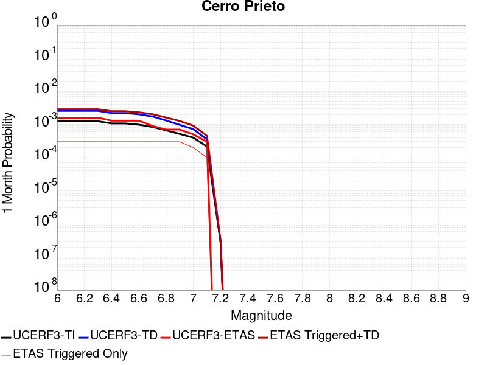 |  |  |

| Magnitude | 1 wk TI Prob | 1 wk TD Prob | 1 wk ETAS Prob | 1 wk ETAS/TD Gain | 1 wk ETAS Triggered+TD | 1 wk ETAS Triggered Only | 1 mo TI Prob | 1 mo TD Prob | 1 mo ETAS Prob | 1 mo ETAS/TD Gain | 1 mo ETAS Triggered+TD | 1 mo ETAS Triggered Only | 1 yr TI Prob | 1 yr TD Prob | 1 yr ETAS Prob | 1 yr ETAS/TD Gain | 1 yr ETAS Triggered+TD | 1 yr ETAS Triggered Only | 10 yr TI Prob | 10 yr TD Prob | 10 yr ETAS Prob | 10 yr ETAS/TD Gain | 10 yr ETAS Triggered+TD | 10 yr ETAS Triggered Only |
|-----|-----|-----|-----|-----|-----|-----|-----|-----|-----|-----|-----|-----|-----|-----|-----|-----|-----|-----|-----|-----|-----|-----|-----|-----|
| 6.0 | 2.9101528E-4 | 5.981856E-4 | 2.0E-4 | 0.33434442 | 7.980659E-4 | 2.0E-4 | 0.0012466122 | 0.002561377 | 3.0E-4 | 0.117124505 | 0.0028606085 | 3.0E-4 | 0.015072231 | 0.030694528 | 0.0053 | 0.17266922 | 0.035831846 | 0.0053 | 0.14089979 | 0.2545834 | 0.0341 | 0.13394432 | 0.28000212 | 0.0341 |
| 6.1 | 2.9101528E-4 | 5.981856E-4 | 2.0E-4 | 0.33434442 | 7.980659E-4 | 2.0E-4 | 0.0012466122 | 0.002561377 | 3.0E-4 | 0.117124505 | 0.0028606085 | 3.0E-4 | 0.015072231 | 0.030694528 | 0.0053 | 0.17266922 | 0.035831846 | 0.0053 | 0.14089979 | 0.2545834 | 0.0341 | 0.13394432 | 0.28000212 | 0.0341 |
| 6.2 | 2.9101528E-4 | 5.981856E-4 | 2.0E-4 | 0.33434442 | 7.980659E-4 | 2.0E-4 | 0.0012466122 | 0.002561377 | 3.0E-4 | 0.117124505 | 0.0028606085 | 3.0E-4 | 0.015072231 | 0.030694528 | 0.0053 | 0.17266922 | 0.035831846 | 0.0053 | 0.14089979 | 0.2545834 | 0.0341 | 0.13394432 | 0.28000212 | 0.0341 |
| 6.3 | 2.9101528E-4 | 5.981856E-4 | 2.0E-4 | 0.33434442 | 7.980659E-4 | 2.0E-4 | 0.0012466122 | 0.002561377 | 3.0E-4 | 0.117124505 | 0.0028606085 | 3.0E-4 | 0.015072231 | 0.030694528 | 0.0053 | 0.17266922 | 0.035831846 | 0.0053 | 0.14089979 | 0.2545834 | 0.0341 | 0.13394432 | 0.28000212 | 0.0341 |
| 6.4 | 2.508648E-4 | 5.1559124E-4 | 2.0E-4 | 0.3879042 | 7.154881E-4 | 2.0E-4 | 0.0010746918 | 0.0022080052 | 3.0E-4 | 0.13586925 | 0.0025073427 | 3.0E-4 | 0.013006088 | 0.026521806 | 0.005 | 0.18852411 | 0.031389195 | 0.005 | 0.12270685 | 0.2250377 | 0.0311 | 0.13819908 | 0.24913903 | 0.0311 |
| 6.5 | 2.508648E-4 | 5.1559124E-4 | 2.0E-4 | 0.3879042 | 7.154881E-4 | 2.0E-4 | 0.0010746918 | 0.0022080052 | 3.0E-4 | 0.13586925 | 0.0025073427 | 3.0E-4 | 0.013006088 | 0.026521806 | 0.005 | 0.18852411 | 0.031389195 | 0.005 | 0.12270685 | 0.2250377 | 0.0311 | 0.13819908 | 0.24913903 | 0.0311 |
| 6.6 | 2.294914E-4 | 4.7273084E-4 | 2.0E-4 | 0.4230737 | 6.726363E-4 | 2.0E-4 | 9.831638E-4 | 0.002024605 | 3.0E-4 | 0.14817706 | 0.0023239974 | 3.0E-4 | 0.011904482 | 0.024356637 | 0.0045 | 0.18475457 | 0.028747031 | 0.0045 | 0.11286586 | 0.2092396 | 0.029 | 0.13859709 | 0.23217165 | 0.029 |
| 6.7 | 1.9621674E-4 | 4.0567195E-4 | 2.0E-4 | 0.49300918 | 6.055908E-4 | 2.0E-4 | 8.4065786E-4 | 0.0017375951 | 3.0E-4 | 0.17265242 | 0.002037074 | 3.0E-4 | 0.010187071 | 0.020971093 | 0.0043 | 0.20504415 | 0.025180917 | 0.0043 | 0.09732539 | 0.18351552 | 0.0267 | 0.14549178 | 0.20531566 | 0.0267 |
| 6.8 | 1.5476145E-4 | 3.0686287E-4 | 2.0E-4 | 0.65175694 | 5.068015E-4 | 2.0E-4 | 6.6309475E-4 | 0.0013145667 | 3.0E-4 | 0.22821209 | 0.0016141724 | 3.0E-4 | 0.008043335 | 0.015895415 | 0.0038 | 0.23906264 | 0.019635014 | 0.0038 | 0.07758363 | 0.14392504 | 0.0209 | 0.14521448 | 0.16181701 | 0.0209 |
| 6.9 | 1.20509176E-4 | 2.2679665E-4 | 2.0E-4 | 0.88184726 | 4.267513E-4 | 2.0E-4 | 5.1636563E-4 | 9.716874E-4 | 3.0E-4 | 0.30874127 | 0.0012713958 | 3.0E-4 | 0.006268645 | 0.0117811505 | 0.0026 | 0.22069152 | 0.0143505195 | 0.0026 | 0.060947374 | 0.10996192 | 0.0147 | 0.13368264 | 0.12304548 | 0.0147 |
| 7.0 | 9.3269155E-5 | 1.6794559E-4 | 1.0E-4 | 0.59543097 | 2.679288E-4 | 1.0E-4 | 3.9966372E-4 | 7.196117E-4 | 2.0E-4 | 0.27792767 | 9.1946777E-4 | 2.0E-4 | 0.0048550544 | 0.008733798 | 0.0016 | 0.18319637 | 0.010319823 | 0.0016 | 0.04750344 | 0.08358386 | 0.0105 | 0.12562233 | 0.093206234 | 0.0105 |
| 7.1 | 5.029709E-5 | 8.214957E-5 | 1.0E-4 | 1.2172918 | 1.8214136E-4 | 1.0E-4 | 2.1554115E-4 | 3.5204153E-4 | 1.0E-4 | 0.28405738 | 4.5200635E-4 | 1.0E-4 | 0.0026210553 | 0.0042811316 | 9.0E-4 | 0.21022479 | 0.0051772785 | 9.0E-4 | 0.025903556 | 0.04259305 | 0.0065 | 0.15260705 | 0.048816197 | 0.0065 |
| 7.2 | 6.5445185E-8 | 6.905684E-8 | 0.0 | 0.0 | 6.905684E-8 | 0.0 | 2.8047933E-7 | 2.9595788E-7 | 0.0 | 0.0 | 2.9595788E-7 | 0.0 | 3.4148304E-6 | 3.6032873E-6 | 0.0 | 0.0 | 3.6032873E-6 | 0.0 | 3.414778E-5 | 3.6032874E-5 | 0.0 | 0.0 | 3.6032874E-5 | 0.0 |

## Imperial
*[(top)](#table-of-contents)*

| 1 Week | 1 Month | 1 Year | 10 Year |
|-----|-----|-----|-----|
|  |  | 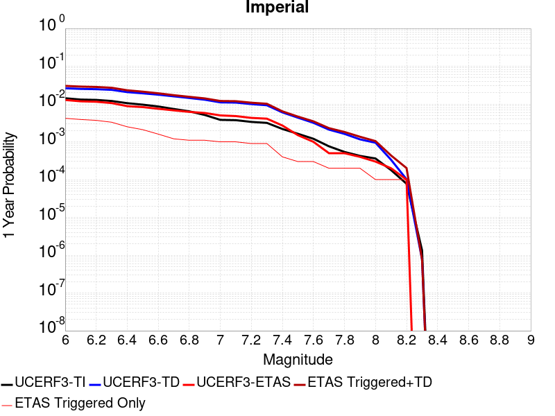 | 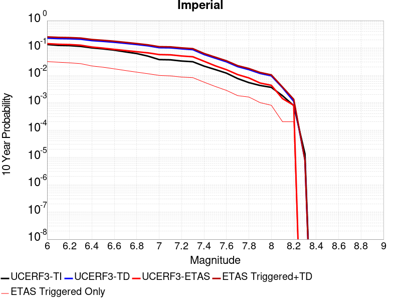 |

| Magnitude | 1 wk TI Prob | 1 wk TD Prob | 1 wk ETAS Prob | 1 wk ETAS/TD Gain | 1 wk ETAS Triggered+TD | 1 wk ETAS Triggered Only | 1 mo TI Prob | 1 mo TD Prob | 1 mo ETAS Prob | 1 mo ETAS/TD Gain | 1 mo ETAS Triggered+TD | 1 mo ETAS Triggered Only | 1 yr TI Prob | 1 yr TD Prob | 1 yr ETAS Prob | 1 yr ETAS/TD Gain | 1 yr ETAS Triggered+TD | 1 yr ETAS Triggered Only | 10 yr TI Prob | 10 yr TD Prob | 10 yr ETAS Prob | 10 yr ETAS/TD Gain | 10 yr ETAS Triggered+TD | 10 yr ETAS Triggered Only |
|-----|-----|-----|-----|-----|-----|-----|-----|-----|-----|-----|-----|-----|-----|-----|-----|-----|-----|-----|-----|-----|-----|-----|-----|-----|
| 6.0 | 2.7496446E-4 | 5.031734E-4 | 1.0E-4 | 0.19873865 | 6.031231E-4 | 1.0E-4 | 0.0011778869 | 0.0021547142 | 6.0E-4 | 0.2784592 | 0.0027534214 | 6.0E-4 | 0.0142467655 | 0.025906544 | 0.0042 | 0.1621212 | 0.029997736 | 0.0042 | 0.13367249 | 0.22726142 | 0.0318 | 0.13992696 | 0.2518345 | 0.0318 |
| 6.1 | 2.5356023E-4 | 4.8463774E-4 | 1.0E-4 | 0.20633969 | 5.8458926E-4 | 1.0E-4 | 0.001086234 | 0.0020754037 | 6.0E-4 | 0.28910038 | 0.0026741584 | 6.0E-4 | 0.013144928 | 0.024969488 | 0.0039 | 0.15619063 | 0.028772106 | 0.0039 | 0.123940155 | 0.2188323 | 0.03 | 0.13709128 | 0.24226733 | 0.03 |
| 6.2 | 2.4820742E-4 | 4.7564157E-4 | 1.0E-4 | 0.21024235 | 5.75594E-4 | 1.0E-4 | 0.0010633124 | 0.002036909 | 6.0E-4 | 0.29456398 | 0.002635687 | 6.0E-4 | 0.01286919 | 0.024511945 | 0.0037 | 0.15094681 | 0.02812125 | 0.0037 | 0.12148927 | 0.21534897 | 0.0285 | 0.13234332 | 0.23771153 | 0.0285 |
| 6.3 | 2.3205351E-4 | 4.573147E-4 | 1.0E-4 | 0.2186678 | 5.5726897E-4 | 1.0E-4 | 9.94136E-4 | 0.0019584845 | 5.0E-4 | 0.25529942 | 0.0024575053 | 5.0E-4 | 0.012036599 | 0.023577614 | 0.0033 | 0.13996327 | 0.026799807 | 0.0033 | 0.11405133 | 0.20739056 | 0.0266 | 0.12826042 | 0.22847398 | 0.0266 |
| 6.4 | 2.0304754E-4 | 3.972381E-4 | 0.0 | 0.0 | 3.972381E-4 | 0.0 | 8.6991355E-4 | 0.0017013527 | 3.0E-4 | 0.17633028 | 0.0020008422 | 3.0E-4 | 0.010539869 | 0.02051448 | 0.0025 | 0.12186513 | 0.022963194 | 0.0025 | 0.100537635 | 0.18452562 | 0.0219 | 0.118682705 | 0.20238452 | 0.0219 |
| 6.5 | 1.854992E-4 | 3.6851864E-4 | 0.0 | 0.0 | 3.6851864E-4 | 0.0 | 7.9475436E-4 | 0.0015784218 | 2.0E-4 | 0.12670884 | 0.0017781061 | 2.0E-4 | 0.009633281 | 0.019048406 | 0.0021 | 0.110245444 | 0.021108404 | 0.0021 | 0.0922623 | 0.1728006 | 0.0197 | 0.11400423 | 0.18909642 | 0.0197 |
| 6.6 | 1.6586106E-4 | 3.39189E-4 | 0.0 | 0.0 | 3.39189E-4 | 0.0 | 7.106394E-4 | 0.0014528673 | 2.0E-4 | 0.13765882 | 0.0016525767 | 2.0E-4 | 0.008617763 | 0.017542252 | 0.0016 | 0.09120836 | 0.019114183 | 0.0016 | 0.08291132 | 0.16034324 | 0.0172 | 0.107269876 | 0.17478535 | 0.0172 |
| 6.7 | 1.4224656E-4 | 3.0674788E-4 | 0.0 | 0.0 | 3.0674788E-4 | 0.0 | 6.094856E-4 | 0.0013139795 | 1.0E-4 | 0.076104686 | 0.0014138481 | 1.0E-4 | 0.0073952693 | 0.015882876 | 0.0012 | 0.07555307 | 0.017063815 | 0.0012 | 0.07153955 | 0.14613047 | 0.0149 | 0.10196368 | 0.15885313 | 0.0149 |
| 6.8 | 1.2317259E-4 | 2.7727493E-4 | 0.0 | 0.0 | 2.7727493E-4 | 0.0 | 5.2777573E-4 | 0.001187786 | 1.0E-4 | 0.08419025 | 0.0012876673 | 1.0E-4 | 0.0064067547 | 0.014366775 | 0.0011 | 0.07656555 | 0.015450972 | 0.0011 | 0.06225166 | 0.13267764 | 0.013 | 0.09798184 | 0.14395285 | 0.013 |
| 6.9 | 9.859898E-5 | 2.498696E-4 | 0.0 | 0.0 | 2.498696E-4 | 0.0 | 4.2249862E-4 | 0.0010704345 | 1.0E-4 | 0.093420014 | 0.0011703274 | 1.0E-4 | 0.0051317946 | 0.012955621 | 0.0011 | 0.08490523 | 0.01404137 | 0.0011 | 0.05014893 | 0.11929237 | 0.0114 | 0.09556353 | 0.12933244 | 0.0114 |
| 7.0 | 7.3191884E-5 | 2.1263771E-4 | 0.0 | 0.0 | 2.1263771E-4 | 0.0 | 3.136418E-4 | 9.1098936E-4 | 1.0E-4 | 0.10977077 | 0.0010108983 | 1.0E-4 | 0.003811904 | 0.0110355755 | 0.001 | 0.090616025 | 0.01202454 | 0.001 | 0.037471764 | 0.10205474 | 0.0099 | 0.09700677 | 0.1109444 | 0.0099 |
| 7.1 | 7.1760296E-5 | 2.0965879E-4 | 0.0 | 0.0 | 2.0965879E-4 | 0.0 | 3.0750787E-4 | 8.982314E-4 | 1.0E-4 | 0.11132988 | 9.981416E-4 | 1.0E-4 | 0.003737482 | 0.010881809 | 0.001 | 0.09189649 | 0.011870927 | 0.001 | 0.03675245 | 0.10069409 | 0.0095 | 0.09434516 | 0.1092375 | 0.0095 |
| 7.2 | 6.46614E-5 | 1.9135741E-4 | 0.0 | 0.0 | 1.9135741E-4 | 0.0 | 2.7709085E-4 | 8.1984844E-4 | 0.0 | 0.0 | 8.1984844E-4 | 0.0 | 0.0033683628 | 0.009936593 | 9.0E-4 | 0.09057431 | 0.010827649 | 9.0E-4 | 0.033177625 | 0.09250671 | 0.0086 | 0.092966236 | 0.10031115 | 0.0086 |
| 7.3 | 6.088115E-5 | 1.780843E-4 | 0.0 | 0.0 | 1.780843E-4 | 0.0 | 2.6089314E-4 | 7.6299807E-4 | 0.0 | 0.0 | 7.6299807E-4 | 0.0 | 0.0031717476 | 0.009250509 | 9.0E-4 | 0.09729195 | 0.010142183 | 9.0E-4 | 0.031268585 | 0.086561464 | 0.0082 | 0.09473038 | 0.09405166 | 0.0082 |
| 7.4 | 4.199346E-5 | 1.15146926E-4 | 0.0 | 0.0 | 1.15146926E-4 | 0.0 | 1.7995955E-4 | 4.933944E-4 | 0.0 | 0.0 | 4.933944E-4 | 0.0 | 0.0021888057 | 0.0059907 | 4.0E-4 | 0.06677016 | 0.006388304 | 4.0E-4 | 0.02167372 | 0.05745868 | 0.0056 | 0.09746134 | 0.06273691 | 0.0056 |
| 7.5 | 3.130448E-5 | 8.3400264E-5 | 0.0 | 0.0 | 8.3400264E-5 | 0.0 | 1.3415517E-4 | 3.5738104E-4 | 0.0 | 0.0 | 3.5738104E-4 | 0.0 | 0.0016321153 | 0.004342493 | 3.0E-4 | 0.06908474 | 0.00464119 | 3.0E-4 | 0.016201803 | 0.0421599 | 0.0039 | 0.09250496 | 0.045895476 | 0.0039 |
| 7.6 | 2.3074248E-5 | 6.0919185E-5 | 0.0 | 0.0 | 6.0919185E-5 | 0.0 | 9.888588E-5 | 2.6105624E-4 | 0.0 | 0.0 | 2.6105624E-4 | 0.0 | 0.0012032706 | 0.0031737506 | 3.0E-4 | 0.09452539 | 0.0034727985 | 3.0E-4 | 0.011967761 | 0.031058026 | 0.0028 | 0.09015383 | 0.033771064 | 0.0028 |
| 7.7 | 1.45864815E-5 | 4.0205996E-5 | 0.0 | 0.0 | 4.0205996E-5 | 0.0 | 6.2511994E-5 | 1.7230006E-4 | 0.0 | 0.0 | 1.7230006E-4 | 0.0 | 7.608177E-4 | 0.0020957405 | 2.0E-4 | 0.09543166 | 0.0022953213 | 2.0E-4 | 0.007582182 | 0.020663446 | 0.0018 | 0.08711035 | 0.022426253 | 0.0018 |
| 7.8 | 1.0352979E-5 | 3.1041614E-5 | 0.0 | 0.0 | 3.1041614E-5 | 0.0 | 4.4369157E-5 | 1.3302872E-4 | 0.0 | 0.0 | 1.3302872E-4 | 0.0 | 5.400606E-4 | 0.0016184237 | 2.0E-4 | 0.12357703 | 0.0018181001 | 2.0E-4 | 0.0053875 | 0.016052935 | 0.0016 | 0.09967024 | 0.017627252 | 0.0016 |
| 7.9 | 8.137906E-6 | 2.2213022E-5 | 0.0 | 0.0 | 2.2213022E-5 | 0.0 | 3.4876273E-5 | 9.51952E-5 | 0.0 | 0.0 | 9.51952E-5 | 0.0 | 4.2453592E-4 | 0.0011583864 | 2.0E-4 | 0.17265397 | 0.0013581546 | 2.0E-4 | 0.004237258 | 0.011647271 | 0.001 | 0.08585702 | 0.012635624 | 0.001 |
| 8.0 | 6.93792E-6 | 1.8061008E-5 | 0.0 | 0.0 | 1.8061008E-5 | 0.0 | 2.9733603E-5 | 7.740202E-5 | 0.0 | 0.0 | 7.740202E-5 | 0.0 | 3.6194647E-4 | 9.41963E-4 | 1.0E-4 | 0.10616128 | 0.0010418688 | 1.0E-4 | 0.0036135751 | 0.0095256865 | 8.0E-4 | 0.08398345 | 0.010318066 | 8.0E-4 |
| 8.1 | 3.4286315E-6 | 6.3950947E-6 | 0.0 | 0.0 | 6.3950947E-6 | 0.0 | 1.4694053E-5 | 2.740726E-5 | 0.0 | 0.0 | 2.740726E-5 | 0.0 | 1.7888541E-4 | 3.3363243E-4 | 1.0E-4 | 0.29973105 | 4.3359908E-4 | 1.0E-4 | 0.0017874148 | 0.0034935756 | 2.0E-4 | 0.05724794 | 0.0036928768 | 2.0E-4 |
| 8.2 | 1.4906886E-6 | 1.9406414E-6 | 0.0 | 0.0 | 1.9406414E-6 | 0.0 | 6.3886496E-6 | 8.317008E-6 | 0.0 | 0.0 | 8.317008E-6 | 0.0 | 7.7779034E-5 | 1.01254904E-4 | 1.0E-4 | 0.9876065 | 2.0124478E-4 | 1.0E-4 | 7.775182E-4 | 0.0011096302 | 2.0E-4 | 0.18024023 | 0.0013094083 | 2.0E-4 |
| 8.3 | 2.5758007E-8 | 1.4523714E-8 | 0.0 | 0.0 | 1.4523714E-8 | 0.0 | 1.10391454E-7 | 6.224449E-8 | 0.0 | 0.0 | 6.224449E-8 | 0.0 | 1.3440151E-6 | 7.578266E-7 | 0.0 | 0.0 | 7.578266E-7 | 0.0 | 1.344007E-5 | 7.901413E-6 | 0.0 | 0.0 | 7.901413E-6 | 0.0 |

## Brawley (Seismic Zone) alt 1
*[(top)](#table-of-contents)*

| 1 Week | 1 Month | 1 Year | 10 Year |
|-----|-----|-----|-----|
|  |  |  |  |

| Magnitude | 1 wk TI Prob | 1 wk TD Prob | 1 wk ETAS Prob | 1 wk ETAS/TD Gain | 1 wk ETAS Triggered+TD | 1 wk ETAS Triggered Only | 1 mo TI Prob | 1 mo TD Prob | 1 mo ETAS Prob | 1 mo ETAS/TD Gain | 1 mo ETAS Triggered+TD | 1 mo ETAS Triggered Only | 1 yr TI Prob | 1 yr TD Prob | 1 yr ETAS Prob | 1 yr ETAS/TD Gain | 1 yr ETAS Triggered+TD | 1 yr ETAS Triggered Only | 10 yr TI Prob | 10 yr TD Prob | 10 yr ETAS Prob | 10 yr ETAS/TD Gain | 10 yr ETAS Triggered+TD | 10 yr ETAS Triggered Only |
|-----|-----|-----|-----|-----|-----|-----|-----|-----|-----|-----|-----|-----|-----|-----|-----|-----|-----|-----|-----|-----|-----|-----|-----|-----|
| 6.0 | 2.2521618E-4 | 4.750936E-4 | 1.0E-4 | 0.21048483 | 5.750461E-4 | 1.0E-4 | 9.6485513E-4 | 0.0020345636 | 6.0E-4 | 0.29490355 | 0.0026333428 | 6.0E-4 | 0.011683988 | 0.024484856 | 0.0039 | 0.15928213 | 0.028289365 | 0.0039 | 0.11088423 | 0.21309938 | 0.0311 | 0.1459413 | 0.23757198 | 0.0311 |
| 6.1 | 2.2521618E-4 | 4.750936E-4 | 1.0E-4 | 0.21048483 | 5.750461E-4 | 1.0E-4 | 9.6485513E-4 | 0.0020345636 | 5.0E-4 | 0.24575296 | 0.0025335462 | 5.0E-4 | 0.011683988 | 0.024484856 | 0.0036 | 0.14702965 | 0.02799671 | 0.0036 | 0.11088423 | 0.21309938 | 0.028 | 0.1313941 | 0.23513259 | 0.028 |
| 6.2 | 2.198148E-4 | 4.6598926E-4 | 1.0E-4 | 0.21459723 | 5.6594267E-4 | 1.0E-4 | 9.417233E-4 | 0.0019956047 | 5.0E-4 | 0.2505506 | 0.002494607 | 5.0E-4 | 0.011405343 | 0.024021577 | 0.0034 | 0.14153941 | 0.027339904 | 0.0034 | 0.10837428 | 0.20954806 | 0.0264 | 0.12598543 | 0.23041598 | 0.0264 |
| 6.3 | 2.1704129E-4 | 4.6034897E-4 | 1.0E-4 | 0.21722652 | 5.603029E-4 | 1.0E-4 | 9.298453E-4 | 0.0019714688 | 5.0E-4 | 0.253618 | 0.002470483 | 5.0E-4 | 0.011262234 | 0.023735298 | 0.0033 | 0.13903344 | 0.026956972 | 0.0033 | 0.107082725 | 0.20743889 | 0.026 | 0.12533812 | 0.22804548 | 0.026 |
| 6.4 | 1.876142E-4 | 3.993332E-4 | 0.0 | 0.0 | 3.993332E-4 | 0.0 | 8.038131E-4 | 0.0017103197 | 3.0E-4 | 0.1754058 | 0.0020098065 | 3.0E-4 | 0.00974259 | 0.02062464 | 0.0025 | 0.12121425 | 0.023073077 | 0.0025 | 0.093263686 | 0.18419662 | 0.0212 | 0.11509441 | 0.20149164 | 0.0212 |
| 6.5 | 1.7390939E-4 | 3.7372395E-4 | 0.0 | 0.0 | 3.7372395E-4 | 0.0 | 7.45113E-4 | 0.0016007029 | 2.0E-4 | 0.12494511 | 0.0018003827 | 2.0E-4 | 0.009034078 | 0.01931628 | 0.0021 | 0.10871659 | 0.021375716 | 0.0021 | 0.086755216 | 0.17403457 | 0.0192 | 0.11032291 | 0.18989311 | 0.0192 |
| 6.6 | 1.591791E-4 | 3.4797192E-4 | 0.0 | 0.0 | 3.4797192E-4 | 0.0 | 6.8201777E-4 | 0.0014904658 | 2.0E-4 | 0.13418624 | 0.0016901677 | 2.0E-4 | 0.008271996 | 0.017997853 | 0.0016 | 0.088899486 | 0.019569058 | 0.0016 | 0.07970774 | 0.16346958 | 0.0172 | 0.10521835 | 0.1778579 | 0.0172 |
| 6.7 | 1.4268003E-4 | 3.1973564E-4 | 0.0 | 0.0 | 3.1973564E-4 | 0.0 | 6.1134255E-4 | 0.0013695841 | 1.0E-4 | 0.07301486 | 0.0014694472 | 1.0E-4 | 0.007417723 | 0.016549777 | 0.0012 | 0.07250853 | 0.017729918 | 0.0012 | 0.07174956 | 0.15161693 | 0.0151 | 0.0995931 | 0.1644275 | 0.0151 |
| 6.8 | 1.239713E-4 | 2.899679E-4 | 0.0 | 0.0 | 2.899679E-4 | 0.0 | 5.3119735E-4 | 0.0012421338 | 1.0E-4 | 0.08050663 | 0.0013420095 | 1.0E-4 | 0.0064481674 | 0.0150195295 | 0.0011 | 0.07323798 | 0.016103009 | 0.0011 | 0.06264243 | 0.13815255 | 0.0133 | 0.09627039 | 0.14961512 | 0.0133 |
| 6.9 | 1.0180238E-4 | 2.623099E-4 | 0.0 | 0.0 | 2.623099E-4 | 0.0 | 4.3622297E-4 | 0.0011237053 | 1.0E-4 | 0.08899131 | 0.0012235929 | 1.0E-4 | 0.005298089 | 0.013596286 | 0.0011 | 0.08090445 | 0.014681331 | 0.0011 | 0.05173543 | 0.124864824 | 0.0118 | 0.094502196 | 0.13519143 | 0.0118 |
| 7.0 | 7.6619996E-5 | 2.2399839E-4 | 0.0 | 0.0 | 2.2399839E-4 | 0.0 | 3.283301E-4 | 9.596431E-4 | 1.0E-4 | 0.10420541 | 0.0010595471 | 1.0E-4 | 0.0039900932 | 0.011621772 | 0.001 | 0.08604539 | 0.0126101505 | 0.001 | 0.039192066 | 0.107271165 | 0.0101 | 0.09415392 | 0.11628772 | 0.0101 |
| 7.1 | 7.5127435E-5 | 2.208374E-4 | 0.0 | 0.0 | 2.208374E-4 | 0.0 | 3.2193496E-4 | 9.4610587E-4 | 1.0E-4 | 0.10569642 | 0.0010460112 | 1.0E-4 | 0.0039125155 | 0.011458702 | 0.001 | 0.08726992 | 0.012447244 | 0.001 | 0.038443442 | 0.10583796 | 0.0097 | 0.09164953 | 0.11451133 | 0.0097 |
| 7.2 | 6.788582E-5 | 2.0212773E-4 | 0.0 | 0.0 | 2.0212773E-4 | 0.0 | 2.9090676E-4 | 8.6597714E-4 | 0.0 | 0.0 | 8.6597714E-4 | 0.0 | 0.0035360386 | 0.010492942 | 9.0E-4 | 0.08577194 | 0.011383498 | 9.0E-4 | 0.034803 | 0.09751359 | 0.0087 | 0.08921833 | 0.10536522 | 0.0087 |
| 7.3 | 6.399602E-5 | 1.8844665E-4 | 0.0 | 0.0 | 1.8844665E-4 | 0.0 | 2.7423984E-4 | 8.073814E-4 | 0.0 | 0.0 | 8.073814E-4 | 0.0 | 0.0033337586 | 0.009786153 | 9.0E-4 | 0.09196668 | 0.010677346 | 9.0E-4 | 0.03284188 | 0.09141224 | 0.0083 | 0.09079747 | 0.098953515 | 0.0083 |
| 7.4 | 4.506759E-5 | 1.2537019E-4 | 0.0 | 0.0 | 1.2537019E-4 | 0.0 | 1.9313251E-4 | 5.371911E-4 | 0.0 | 0.0 | 5.371911E-4 | 0.0 | 0.0023488526 | 0.0065208627 | 4.0E-4 | 0.061341576 | 0.0069182543 | 4.0E-4 | 0.023241805 | 0.062397413 | 0.0057 | 0.091349944 | 0.067741744 | 0.0057 |
| 7.5 | 3.43289E-5 | 9.345627E-5 | 0.0 | 0.0 | 9.345627E-5 | 0.0 | 1.4711556E-4 | 4.004657E-4 | 0.0 | 0.0 | 4.004657E-4 | 0.0 | 0.0017896603 | 0.0048648324 | 3.0E-4 | 0.06166708 | 0.005163373 | 3.0E-4 | 0.01775316 | 0.047098037 | 0.004 | 0.084929235 | 0.050909642 | 0.004 |
| 7.6 | 2.5980507E-5 | 7.063994E-5 | 0.0 | 0.0 | 7.063994E-5 | 0.0 | 1.1134028E-4 | 3.027076E-4 | 0.0 | 0.0 | 3.027076E-4 | 0.0 | 0.001354725 | 0.003679261 | 3.0E-4 | 0.08153811 | 0.0039781574 | 3.0E-4 | 0.013464959 | 0.035887443 | 0.0029 | 0.08080821 | 0.03868337 | 0.0029 |
| 7.7 | 1.7292105E-5 | 4.952257E-5 | 0.0 | 0.0 | 4.952257E-5 | 0.0 | 7.4106916E-5 | 2.1222234E-4 | 0.0 | 0.0 | 2.1222234E-4 | 0.0 | 9.018782E-4 | 0.0025807512 | 2.0E-4 | 0.07749682 | 0.0027802351 | 2.0E-4 | 0.008982267 | 0.025341004 | 0.0019 | 0.0749773 | 0.027192855 | 0.0019 |
| 7.8 | 1.2927471E-5 | 3.9806524E-5 | 0.0 | 0.0 | 3.9806524E-5 | 0.0 | 5.5402274E-5 | 1.7058825E-4 | 0.0 | 0.0 | 1.7058825E-4 | 0.0 | 6.743139E-4 | 0.0020749362 | 2.0E-4 | 0.09638851 | 0.0022745212 | 2.0E-4 | 0.0067227143 | 0.020482201 | 0.0017 | 0.082998894 | 0.022147382 | 0.0017 |
| 7.9 | 1.0200774E-5 | 2.8835238E-5 | 0.0 | 0.0 | 2.8835238E-5 | 0.0 | 4.371687E-5 | 1.2357374E-4 | 0.0 | 0.0 | 1.2357374E-4 | 0.0 | 5.321229E-4 | 0.0015034731 | 2.0E-4 | 0.13302533 | 0.0017031723 | 2.0E-4 | 0.005308505 | 0.015032448 | 0.001 | 0.06652276 | 0.016017416 | 0.001 |
| 8.0 | 8.650396E-6 | 2.335008E-5 | 0.0 | 0.0 | 2.335008E-5 | 0.0 | 3.70726E-5 | 1.0006793E-4 | 0.0 | 0.0 | 1.0006793E-4 | 0.0 | 4.5126543E-4 | 0.001217647 | 1.0E-4 | 0.082125604 | 0.0013175253 | 1.0E-4 | 0.0045035016 | 0.012244482 | 8.0E-4 | 0.06533556 | 0.0130346855 | 8.0E-4 |
| 8.1 | 3.9368224E-6 | 7.3467845E-6 | 0.0 | 0.0 | 7.3467845E-6 | 0.0 | 1.6871985E-5 | 3.148584E-5 | 0.0 | 0.0 | 3.148584E-5 | 0.0 | 2.0539707E-4 | 3.8327283E-4 | 1.0E-4 | 0.26091075 | 4.8323447E-4 | 1.0E-4 | 0.0020520731 | 0.004010495 | 2.0E-4 | 0.049869157 | 0.0042096926 | 2.0E-4 |
| 8.2 | 1.7101195E-6 | 2.2230067E-6 | 0.0 | 0.0 | 2.2230067E-6 | 0.0 | 7.329063E-6 | 9.527137E-6 | 0.0 | 0.0 | 9.527137E-6 | 0.0 | 8.922769E-5 | 1.1598675E-4 | 1.0E-4 | 0.8621674 | 2.1597516E-4 | 1.0E-4 | 8.9191867E-4 | 0.001269368 | 2.0E-4 | 0.15755872 | 0.0014691141 | 2.0E-4 |
| 8.3 | 3.0346666E-8 | 1.7248714E-8 | 0.0 | 0.0 | 1.7248714E-8 | 0.0 | 1.3005713E-7 | 7.392306E-8 | 0.0 | 0.0 | 7.392306E-8 | 0.0 | 1.5834444E-6 | 9.0001316E-7 | 0.0 | 0.0 | 9.0001316E-7 | 0.0 | 1.5834332E-5 | 9.386664E-6 | 0.0 | 0.0 | 9.386664E-6 | 0.0 |

## Laguna Salada
*[(top)](#table-of-contents)*

| 1 Week | 1 Month | 1 Year | 10 Year |
|-----|-----|-----|-----|
|  |  |  | 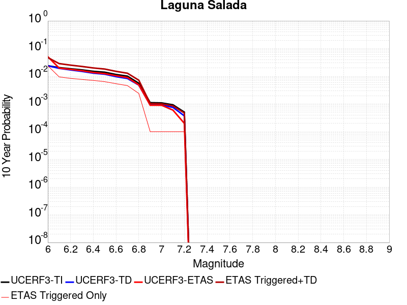 |

| Magnitude | 1 wk TI Prob | 1 wk TD Prob | 1 wk ETAS Prob | 1 wk ETAS/TD Gain | 1 wk ETAS Triggered+TD | 1 wk ETAS Triggered Only | 1 mo TI Prob | 1 mo TD Prob | 1 mo ETAS Prob | 1 mo ETAS/TD Gain | 1 mo ETAS Triggered+TD | 1 mo ETAS Triggered Only | 1 yr TI Prob | 1 yr TD Prob | 1 yr ETAS Prob | 1 yr ETAS/TD Gain | 1 yr ETAS Triggered+TD | 1 yr ETAS Triggered Only | 10 yr TI Prob | 10 yr TD Prob | 10 yr ETAS Prob | 10 yr ETAS/TD Gain | 10 yr ETAS Triggered+TD | 10 yr ETAS Triggered Only |
|-----|-----|-----|-----|-----|-----|-----|-----|-----|-----|-----|-----|-----|-----|-----|-----|-----|-----|-----|-----|-----|-----|-----|-----|-----|
| 6.0 | 4.6465593E-5 | 4.6369827E-5 | 2.0E-4 | 4.3131495 | 2.4636055E-4 | 2.0E-4 | 1.9912305E-4 | 1.9871273E-4 | 5.0E-4 | 2.516195 | 6.9861335E-4 | 5.0E-4 | 0.0024216278 | 0.0024167234 | 0.0032 | 1.3241068 | 0.00560899 | 0.0032 | 0.02395408 | 0.023963805 | 0.0241 | 1.0056833 | 0.04748628 | 0.0241 |
| 6.1 | 3.982297E-5 | 3.7262897E-5 | 1.0E-4 | 2.6836345 | 1.3725917E-4 | 1.0E-4 | 1.706587E-4 | 1.5968905E-4 | 3.0E-4 | 1.878651 | 4.5964113E-4 | 3.0E-4 | 0.0020757897 | 0.0019425765 | 0.0015 | 0.77217036 | 0.0034396625 | 0.0015 | 0.020565065 | 0.019316912 | 0.0095 | 0.49179706 | 0.0286334 | 0.0095 |
| 6.2 | 3.6067784E-5 | 3.2616386E-5 | 1.0E-4 | 3.0659435 | 1.3261313E-4 | 1.0E-4 | 1.5456705E-4 | 1.3977765E-4 | 3.0E-4 | 2.146266 | 4.397357E-4 | 3.0E-4 | 0.0018802295 | 0.0017005588 | 0.0015 | 0.882063 | 0.003198008 | 0.0015 | 0.018644003 | 0.016927674 | 0.0084 | 0.49622884 | 0.02518548 | 0.0084 |
| 6.3 | 3.2859112E-5 | 2.8860068E-5 | 1.0E-4 | 3.4649954 | 1.2885718E-4 | 1.0E-4 | 1.4081717E-4 | 1.2368071E-4 | 3.0E-4 | 2.4256005 | 4.236436E-4 | 3.0E-4 | 0.0017131006 | 0.0015048658 | 0.0014 | 0.9303155 | 0.002902759 | 0.0014 | 0.016999546 | 0.015012787 | 0.0077 | 0.5128961 | 0.022597188 | 0.0077 |
| 6.4 | 2.9132116E-5 | 2.4860557E-5 | 1.0E-4 | 4.022436 | 1.2485807E-4 | 1.0E-4 | 1.2484594E-4 | 1.065414E-4 | 3.0E-4 | 2.8158066 | 4.0650944E-4 | 3.0E-4 | 0.0015189396 | 0.0012964585 | 0.0013 | 1.0027317 | 0.0025947732 | 0.0013 | 0.015085992 | 0.012966847 | 0.0071 | 0.5475502 | 0.019974783 | 0.0071 |
| 6.5 | 2.7075037E-5 | 2.2832137E-5 | 1.0E-4 | 4.3797917 | 1.2282985E-4 | 1.0E-4 | 1.1603071E-4 | 9.784884E-5 | 3.0E-4 | 3.0659535 | 3.9781947E-4 | 3.0E-4 | 0.0014117584 | 0.0011907469 | 0.0011 | 0.9237899 | 0.0022894372 | 0.0011 | 0.014028233 | 0.011917362 | 0.0064 | 0.5370316 | 0.01824109 | 0.0064 |
| 6.6 | 2.2367465E-5 | 1.8578872E-5 | 1.0E-4 | 5.382458 | 1.18577016E-4 | 1.0E-4 | 9.5857045E-5 | 7.962177E-5 | 3.0E-4 | 3.767814 | 3.7959788E-4 | 3.0E-4 | 0.0011664346 | 9.690463E-4 | 0.0011 | 1.1351367 | 0.0020679804 | 0.0011 | 0.011603311 | 0.009714356 | 0.0054 | 0.55587834 | 0.015061898 | 0.0054 |
| 6.7 | 1.9458053E-5 | 1.5919417E-5 | 1.0E-4 | 6.281637 | 1.1591783E-4 | 1.0E-4 | 8.338899E-5 | 6.822474E-5 | 3.0E-4 | 4.3972316 | 3.682043E-4 | 3.0E-4 | 0.001014788 | 8.304001E-4 | 0.001 | 1.2042388 | 0.0018295697 | 0.001 | 0.010101665 | 0.0083213635 | 0.0046 | 0.552794 | 0.012883086 | 0.0046 |
| 6.8 | 1.0767866E-5 | 9.1876245E-6 | 1.0E-4 | 10.884207 | 1.0918671E-4 | 1.0E-4 | 4.614718E-5 | 3.9375325E-5 | 1.0E-4 | 2.5396614 | 1.3937139E-4 | 1.0E-4 | 5.6169706E-4 | 4.7935787E-4 | 4.0E-4 | 0.83444965 | 8.791661E-4 | 4.0E-4 | 0.0056027942 | 0.004810759 | 0.0024 | 0.4988818 | 0.0071992134 | 0.0024 |
| 6.9 | 2.1384765E-6 | 1.7915395E-6 | 0.0 | 0.0 | 1.7915395E-6 | 0.0 | 9.164866E-6 | 7.678006E-6 | 0.0 | 0.0 | 7.678006E-6 | 0.0 | 1.1157654E-4 | 9.34761E-5 | 0.0 | 0.0 | 9.34761E-5 | 0.0 | 0.0011152053 | 9.344061E-4 | 1.0E-4 | 0.10701985 | 0.0010343126 | 1.0E-4 |
| 7.0 | 2.0952946E-6 | 1.7494743E-6 | 0.0 | 0.0 | 1.7494743E-6 | 0.0 | 8.979802E-6 | 7.497728E-6 | 0.0 | 0.0 | 7.497728E-6 | 0.0 | 1.0932361E-4 | 9.12814E-5 | 0.0 | 0.0 | 9.12814E-5 | 0.0 | 0.0010926984 | 9.1247726E-4 | 1.0E-4 | 0.10959177 | 0.001012386 | 1.0E-4 |
| 7.1 | 1.7887576E-6 | 1.4501761E-6 | 0.0 | 0.0 | 1.4501761E-6 | 0.0 | 7.666081E-6 | 6.2150275E-6 | 0.0 | 0.0 | 6.2150275E-6 | 0.0 | 9.333054E-5 | 7.566564E-5 | 0.0 | 0.0 | 7.566564E-5 | 0.0 | 9.329135E-4 | 7.5642916E-4 | 1.0E-4 | 0.13220009 | 8.563535E-4 | 1.0E-4 |
| 7.2 | 9.723109E-7 | 7.1366344E-7 | 0.0 | 0.0 | 7.1366344E-7 | 0.0 | 4.16704E-6 | 3.058555E-6 | 0.0 | 0.0 | 3.058555E-6 | 0.0 | 5.073253E-5 | 3.7237438E-5 | 0.0 | 0.0 | 3.7237438E-5 | 0.0 | 5.072095E-4 | 3.723282E-4 | 1.0E-4 | 0.26858023 | 4.72291E-4 | 1.0E-4 |

## Hayward (So) 2011 CFM
*[(top)](#table-of-contents)*

| 1 Week | 1 Month | 1 Year | 10 Year |
|-----|-----|-----|-----|
|  |  |  |  |

| Magnitude | 1 wk TI Prob | 1 wk TD Prob | 1 wk ETAS Prob | 1 wk ETAS/TD Gain | 1 wk ETAS Triggered+TD | 1 wk ETAS Triggered Only | 1 mo TI Prob | 1 mo TD Prob | 1 mo ETAS Prob | 1 mo ETAS/TD Gain | 1 mo ETAS Triggered+TD | 1 mo ETAS Triggered Only | 1 yr TI Prob | 1 yr TD Prob | 1 yr ETAS Prob | 1 yr ETAS/TD Gain | 1 yr ETAS Triggered+TD | 1 yr ETAS Triggered Only | 10 yr TI Prob | 10 yr TD Prob | 10 yr ETAS Prob | 10 yr ETAS/TD Gain | 10 yr ETAS Triggered+TD | 10 yr ETAS Triggered Only |
|-----|-----|-----|-----|-----|-----|-----|-----|-----|-----|-----|-----|-----|-----|-----|-----|-----|-----|-----|-----|-----|-----|-----|-----|-----|
| 6.0 | 1.8091932E-4 | 3.5640094E-4 | 0.0 | 0.0 | 3.5640094E-4 | 0.0 | 7.751381E-4 | 0.0015265484 | 3.0E-4 | 0.19652177 | 0.0018260905 | 3.0E-4 | 0.00939654 | 0.018429738 | 0.0024 | 0.13022432 | 0.020785507 | 0.0024 | 0.090090066 | 0.16646023 | 0.0192 | 0.11534286 | 0.1824642 | 0.0192 |
| 6.1 | 1.8091932E-4 | 3.5640094E-4 | 0.0 | 0.0 | 3.5640094E-4 | 0.0 | 7.751381E-4 | 0.0015265484 | 3.0E-4 | 0.19652177 | 0.0018260905 | 3.0E-4 | 0.00939654 | 0.018429738 | 0.0024 | 0.13022432 | 0.020785507 | 0.0024 | 0.090090066 | 0.16646023 | 0.0192 | 0.11534286 | 0.1824642 | 0.0192 |
| 6.2 | 1.8091932E-4 | 3.5640094E-4 | 0.0 | 0.0 | 3.5640094E-4 | 0.0 | 7.751381E-4 | 0.0015265484 | 3.0E-4 | 0.19652177 | 0.0018260905 | 3.0E-4 | 0.00939654 | 0.018429738 | 0.0024 | 0.13022432 | 0.020785507 | 0.0024 | 0.090090066 | 0.16646023 | 0.0192 | 0.11534286 | 0.1824642 | 0.0192 |
| 6.3 | 1.7322872E-4 | 3.4199574E-4 | 0.0 | 0.0 | 3.4199574E-4 | 0.0 | 7.4219756E-4 | 0.0014648823 | 2.0E-4 | 0.13652974 | 0.0016645894 | 2.0E-4 | 0.0089988755 | 0.017691355 | 0.0023 | 0.130007 | 0.019950666 | 0.0023 | 0.08643075 | 0.1603871 | 0.0184 | 0.114722446 | 0.17583597 | 0.0184 |
| 6.4 | 1.6334097E-4 | 3.2284248E-4 | 0.0 | 0.0 | 3.2284248E-4 | 0.0 | 6.998449E-4 | 0.0013828856 | 2.0E-4 | 0.14462513 | 0.001582609 | 2.0E-4 | 0.008487372 | 0.016708655 | 0.0022 | 0.13166828 | 0.018871896 | 0.0022 | 0.081704415 | 0.15230216 | 0.0176 | 0.11555976 | 0.16722164 | 0.0176 |
| 6.5 | 1.5600289E-4 | 3.096149E-4 | 0.0 | 0.0 | 3.096149E-4 | 0.0 | 6.684125E-4 | 0.0013262546 | 2.0E-4 | 0.15080062 | 0.0015259893 | 2.0E-4 | 0.008107598 | 0.01602948 | 0.0019 | 0.11853159 | 0.017899025 | 0.0019 | 0.078181036 | 0.14658098 | 0.0163 | 0.11120133 | 0.1604917 | 0.0163 |
| 6.6 | 1.4046066E-4 | 2.7980114E-4 | 0.0 | 0.0 | 2.7980114E-4 | 0.0 | 6.018354E-4 | 0.0011986034 | 2.0E-4 | 0.16686086 | 0.0013983637 | 2.0E-4 | 0.0073027555 | 0.014496846 | 0.0015 | 0.10347078 | 0.0159751 | 0.0015 | 0.07067384 | 0.13368143 | 0.0148 | 0.11071096 | 0.14650294 | 0.0148 |
| 6.7 | 1.14696966E-4 | 2.3226177E-4 | 0.0 | 0.0 | 2.3226177E-4 | 0.0 | 4.914658E-4 | 9.95033E-4 | 1.0E-4 | 0.10049919 | 0.0010949334 | 1.0E-4 | 0.0059671924 | 0.012048291 | 0.0012 | 0.09959919 | 0.013233833 | 0.0012 | 0.058094822 | 0.1125419 | 0.0115 | 0.10218416 | 0.12274767 | 0.0115 |
| 6.8 | 9.3874296E-5 | 1.882694E-4 | 0.0 | 0.0 | 1.882694E-4 | 0.0 | 4.0225635E-4 | 8.06623E-4 | 1.0E-4 | 0.123973645 | 9.065424E-4 | 1.0E-4 | 0.0048864787 | 0.009777145 | 0.0011 | 0.112507276 | 0.010866391 | 0.0011 | 0.047804173 | 0.09246571 | 0.0093 | 0.100577824 | 0.10090578 | 0.0093 |
| 6.9 | 5.551852E-5 | 1.0712456E-4 | 0.0 | 0.0 | 1.0712456E-4 | 0.0 | 2.3791482E-4 | 4.590251E-4 | 1.0E-4 | 0.21785302 | 5.5897917E-4 | 1.0E-4 | 0.0028927654 | 0.0055744275 | 5.0E-4 | 0.089695305 | 0.0060716406 | 5.0E-4 | 0.028553981 | 0.05416259 | 0.0049 | 0.09046835 | 0.058797196 | 0.0049 |
| 7.0 | 4.2662363E-5 | 8.2347935E-5 | 0.0 | 0.0 | 8.2347935E-5 | 0.0 | 1.8282588E-4 | 3.528724E-4 | 1.0E-4 | 0.28338856 | 4.528371E-4 | 1.0E-4 | 0.0022236328 | 0.004287831 | 3.0E-4 | 0.069965445 | 0.004586545 | 3.0E-4 | 0.022015138 | 0.042010333 | 0.0037 | 0.08807357 | 0.045554895 | 0.0037 |
| 7.1 | 3.305886E-5 | 6.2944564E-5 | 0.0 | 0.0 | 6.2944564E-5 | 0.0 | 1.4167312E-4 | 2.6973462E-4 | 0.0 | 0.0 | 2.6973462E-4 | 0.0 | 0.0017235056 | 0.0032790925 | 2.0E-4 | 0.060992487 | 0.0034784367 | 2.0E-4 | 0.017101998 | 0.032416448 | 0.0028 | 0.08637591 | 0.03512568 | 0.0028 |
| 7.2 | 2.9856887E-5 | 5.6947556E-5 | 0.0 | 0.0 | 5.6947556E-5 | 0.0 | 1.2795182E-4 | 2.4403822E-4 | 0.0 | 0.0 | 2.4403822E-4 | 0.0 | 0.0015567001 | 0.002967134 | 1.0E-4 | 0.033702556 | 0.0030668373 | 1.0E-4 | 0.015458403 | 0.029420665 | 0.0022 | 0.07477737 | 0.03155594 | 0.0022 |
| 7.3 | 2.4559737E-5 | 4.5946897E-5 | 0.0 | 0.0 | 4.5946897E-5 | 0.0 | 1.0525176E-4 | 1.969005E-4 | 0.0 | 0.0 | 1.969005E-4 | 0.0 | 0.0012806869 | 0.0023946408 | 1.0E-4 | 0.041759916 | 0.0024944013 | 1.0E-4 | 0.012733313 | 0.023834419 | 0.0017 | 0.07132542 | 0.025493901 | 0.0017 |
| 7.4 | 1.9002231E-5 | 3.5021963E-5 | 0.0 | 0.0 | 3.5021963E-5 | 0.0 | 8.143559E-5 | 1.5008554E-4 | 0.0 | 0.0 | 1.5008554E-4 | 0.0 | 9.910273E-4 | 0.0018257699 | 1.0E-4 | 0.054771416 | 0.0019255873 | 1.0E-4 | 0.009866194 | 0.018243631 | 0.0015 | 0.08222047 | 0.019716267 | 0.0015 |
| 7.5 | 1.2783333E-5 | 2.3320143E-5 | 0.0 | 0.0 | 2.3320143E-5 | 0.0 | 5.4784563E-5 | 9.993967E-5 | 0.0 | 0.0 | 9.993967E-5 | 0.0 | 6.667979E-4 | 0.0012160921 | 0.0 | 0.0 | 0.0012160921 | 0.0 | 0.006648007 | 0.012202825 | 0.001 | 0.081948236 | 0.013190622 | 0.001 |
| 7.6 | 4.8149627E-6 | 8.889395E-6 | 0.0 | 0.0 | 8.889395E-6 | 0.0 | 2.063539E-5 | 3.809686E-5 | 0.0 | 0.0 | 3.809686E-5 | 0.0 | 2.5120692E-4 | 4.6373176E-4 | 0.0 | 0.0 | 4.6373176E-4 | 0.0 | 0.0025092314 | 0.004680689 | 6.0E-4 | 0.12818626 | 0.0052778805 | 6.0E-4 |
| 7.7 | 6.0838227E-7 | 1.2074107E-6 | 0.0 | 0.0 | 1.2074107E-6 | 0.0 | 2.6073499E-6 | 5.1746074E-6 | 0.0 | 0.0 | 5.1746074E-6 | 0.0 | 3.174402E-5 | 6.2999025E-5 | 0.0 | 0.0 | 6.2999025E-5 | 0.0 | 3.1739488E-4 | 6.5376796E-4 | 1.0E-4 | 0.15295947 | 7.537026E-4 | 1.0E-4 |
| 7.8 | 4.5542808E-7 | 9.813815E-7 | 0.0 | 0.0 | 9.813815E-7 | 0.0 | 1.9518332E-6 | 4.2059137E-6 | 0.0 | 0.0 | 4.2059137E-6 | 0.0 | 2.376331E-5 | 5.12058E-5 | 0.0 | 0.0 | 5.12058E-5 | 0.0 | 2.3760769E-4 | 5.3319416E-4 | 1.0E-4 | 0.18754894 | 6.3314085E-4 | 1.0E-4 |
| 7.9 | 3.3016747E-7 | 7.407664E-7 | 0.0 | 0.0 | 7.407664E-7 | 0.0 | 1.4150027E-6 | 3.1747093E-6 | 0.0 | 0.0 | 3.1747093E-6 | 0.0 | 1.7227521E-5 | 3.86514E-5 | 0.0 | 0.0 | 3.86514E-5 | 0.0 | 1.7226185E-4 | 4.0034624E-4 | 0.0 | 0.0 | 4.0034624E-4 | 0.0 |
| 8.0 | 2.347038E-7 | 5.4890984E-7 | 0.0 | 0.0 | 5.4890984E-7 | 0.0 | 1.0058731E-6 | 2.3524685E-6 | 0.0 | 0.0 | 2.3524685E-6 | 0.0 | 1.2246436E-5 | 2.864093E-5 | 0.0 | 0.0 | 2.864093E-5 | 0.0 | 1.2245761E-4 | 2.9441502E-4 | 0.0 | 0.0 | 2.9441502E-4 | 0.0 |
| 8.1 | 1.18822804E-7 | 2.6144045E-7 | 0.0 | 0.0 | 2.6144045E-7 | 0.0 | 5.092405E-7 | 1.1204586E-6 | 0.0 | 0.0 | 1.1204586E-6 | 0.0 | 6.1999854E-6 | 1.3641499E-5 | 0.0 | 0.0 | 1.3641499E-5 | 0.0 | 6.199812E-5 | 1.3960185E-4 | 0.0 | 0.0 | 1.3960185E-4 | 0.0 |

## San Andreas (Offshore) 2011 CFM
*[(top)](#table-of-contents)*

| 1 Week | 1 Month | 1 Year | 10 Year |
|-----|-----|-----|-----|
|  | 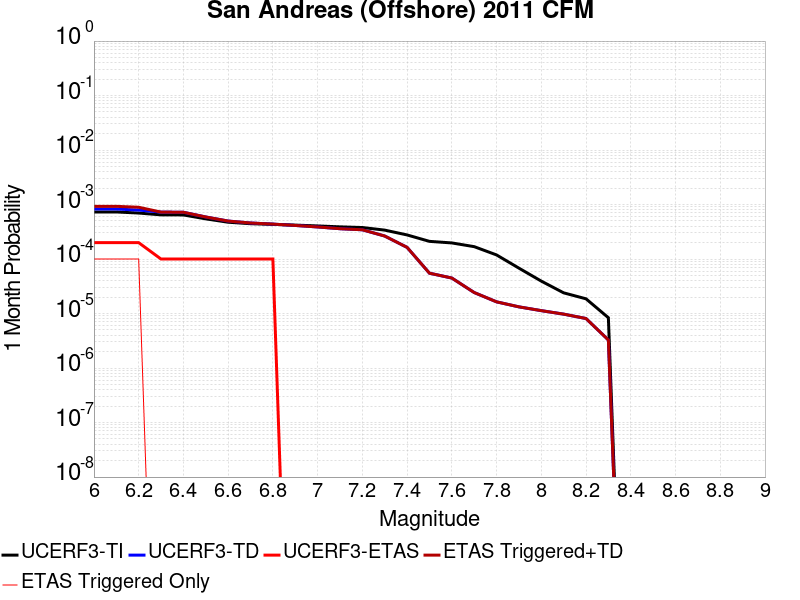 | 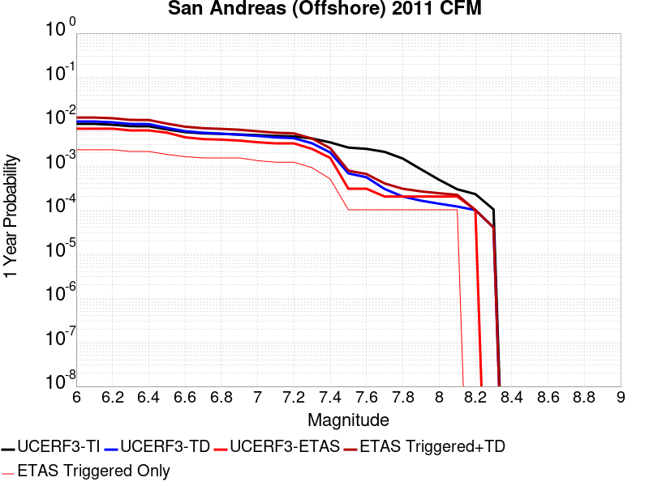 | 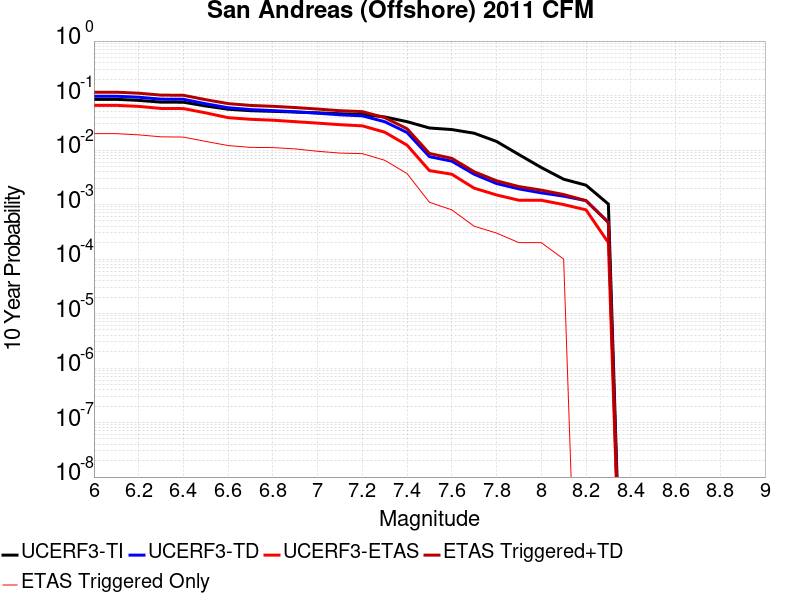 |

| Magnitude | 1 wk TI Prob | 1 wk TD Prob | 1 wk ETAS Prob | 1 wk ETAS/TD Gain | 1 wk ETAS Triggered+TD | 1 wk ETAS Triggered Only | 1 mo TI Prob | 1 mo TD Prob | 1 mo ETAS Prob | 1 mo ETAS/TD Gain | 1 mo ETAS Triggered+TD | 1 mo ETAS Triggered Only | 1 yr TI Prob | 1 yr TD Prob | 1 yr ETAS Prob | 1 yr ETAS/TD Gain | 1 yr ETAS Triggered+TD | 1 yr ETAS Triggered Only | 10 yr TI Prob | 10 yr TD Prob | 10 yr ETAS Prob | 10 yr ETAS/TD Gain | 10 yr ETAS Triggered+TD | 10 yr ETAS Triggered Only |
|-----|-----|-----|-----|-----|-----|-----|-----|-----|-----|-----|-----|-----|-----|-----|-----|-----|-----|-----|-----|-----|-----|-----|-----|-----|
| 6.0 | 1.7072787E-4 | 1.9253696E-4 | 1.0E-4 | 0.5193808 | 2.925177E-4 | 1.0E-4 | 7.3148566E-4 | 8.248998E-4 | 1.0E-4 | 0.12122684 | 9.2481734E-4 | 1.0E-4 | 0.008869528 | 0.009997423 | 0.0023 | 0.23005928 | 0.012274429 | 0.0023 | 0.085237645 | 0.09693257 | 0.02 | 0.206329 | 0.114993915 | 0.02 |
| 6.1 | 1.7072787E-4 | 1.9253696E-4 | 1.0E-4 | 0.5193808 | 2.925177E-4 | 1.0E-4 | 7.3148566E-4 | 8.248998E-4 | 1.0E-4 | 0.12122684 | 9.2481734E-4 | 1.0E-4 | 0.008869528 | 0.009997423 | 0.0023 | 0.23005928 | 0.012274429 | 0.0023 | 0.085237645 | 0.09693257 | 0.02 | 0.206329 | 0.114993915 | 0.02 |
| 6.2 | 1.6312556E-4 | 1.8435305E-4 | 1.0E-4 | 0.5424375 | 2.8433462E-4 | 1.0E-4 | 6.989222E-4 | 7.8984763E-4 | 1.0E-4 | 0.12660669 | 8.8976865E-4 | 1.0E-4 | 0.008476226 | 0.009574493 | 0.0023 | 0.24022159 | 0.011852472 | 0.0023 | 0.08160117 | 0.09295272 | 0.019 | 0.204405 | 0.11018662 | 0.019 |
| 6.3 | 1.5103363E-4 | 1.6908217E-4 | 0.0 | 0.0 | 1.6908217E-4 | 0.0 | 6.471264E-4 | 7.244388E-4 | 0.0 | 0.0 | 7.244388E-4 | 0.0 | 0.007850339 | 0.008784818 | 0.0021 | 0.23904876 | 0.010866371 | 0.0021 | 0.075787395 | 0.085585035 | 0.0175 | 0.204475 | 0.101587296 | 0.0175 |
| 6.4 | 1.5047993E-4 | 1.6794E-4 | 0.0 | 0.0 | 1.6794E-4 | 0.0 | 6.4475456E-4 | 7.195465E-4 | 0.0 | 0.0 | 7.195465E-4 | 0.0 | 0.007821669 | 0.008725733 | 0.0021 | 0.24066748 | 0.010807409 | 0.0021 | 0.0755203 | 0.08506478 | 0.0173 | 0.20337442 | 0.10089316 | 0.0173 |
| 6.5 | 1.2760791E-4 | 1.3761703E-4 | 0.0 | 0.0 | 1.3761703E-4 | 0.0 | 5.467764E-4 | 5.896553E-4 | 0.0 | 0.0 | 5.896553E-4 | 0.0 | 0.0066367025 | 0.0071556973 | 0.0018 | 0.2515478 | 0.008942817 | 0.0018 | 0.064419635 | 0.070366554 | 0.0144 | 0.20464268 | 0.08375327 | 0.0144 |
| 6.6 | 1.1063525E-4 | 1.1583116E-4 | 0.0 | 0.0 | 1.1583116E-4 | 0.0 | 4.740649E-4 | 4.9632584E-4 | 0.0 | 0.0 | 4.9632584E-4 | 0.0 | 0.0057564764 | 0.006026228 | 0.0016 | 0.26550606 | 0.007616586 | 0.0016 | 0.05609626 | 0.05961377 | 0.0121 | 0.20297323 | 0.07099245 | 0.0121 |
| 6.7 | 1.0391049E-4 | 1.06723324E-4 | 0.0 | 0.0 | 1.06723324E-4 | 0.0 | 4.4525467E-4 | 4.573065E-4 | 0.0 | 0.0 | 4.573065E-4 | 0.0 | 0.0054075094 | 0.005553682 | 0.0015 | 0.2700911 | 0.0070453514 | 0.0015 | 0.052778035 | 0.055106163 | 0.0112 | 0.20324406 | 0.065688975 | 0.0112 |
| 6.8 | 1.0096706E-4 | 1.0184292E-4 | 0.0 | 0.0 | 1.0184292E-4 | 0.0 | 4.3264418E-4 | 4.363976E-4 | 0.0 | 0.0 | 4.363976E-4 | 0.0 | 0.0052547283 | 0.005300375 | 0.0015 | 0.28299883 | 0.0067924247 | 0.0015 | 0.051321987 | 0.052803386 | 0.0111 | 0.2102138 | 0.06331727 | 0.0111 |
| 6.9 | 9.800265E-5 | 9.614479E-5 | 0.0 | 0.0 | 9.614479E-5 | 0.0 | 4.1994374E-4 | 4.1198495E-4 | 0.0 | 0.0 | 4.1198495E-4 | 0.0 | 0.0051008356 | 0.0050045503 | 0.0015 | 0.29972723 | 0.0064970437 | 0.0015 | 0.049853306 | 0.05013083 | 0.0105 | 0.20945194 | 0.060104456 | 0.0105 |
| 7.0 | 9.4642375E-5 | 9.0274894E-5 | 0.0 | 0.0 | 9.0274894E-5 | 0.0 | 4.0554712E-4 | 3.8683592E-4 | 0.0 | 0.0 | 3.8683592E-4 | 0.0 | 0.004926363 | 0.00469972 | 0.0013 | 0.27661222 | 0.0059936107 | 0.0013 | 0.048185747 | 0.047309164 | 0.0095 | 0.20080677 | 0.056359727 | 0.0095 |
| 7.1 | 9.0996844E-5 | 8.3790044E-5 | 0.0 | 0.0 | 8.3790044E-5 | 0.0 | 3.8992817E-4 | 3.5905163E-4 | 0.0 | 0.0 | 3.5905163E-4 | 0.0 | 0.004737046 | 0.004362849 | 0.0012 | 0.27504963 | 0.005557614 | 0.0012 | 0.04637333 | 0.044159696 | 0.0088 | 0.19927673 | 0.05257109 | 0.0088 |
| 7.2 | 8.848287E-5 | 8.006074E-5 | 0.0 | 0.0 | 8.006074E-5 | 0.0 | 3.791572E-4 | 3.430732E-4 | 0.0 | 0.0 | 3.430732E-4 | 0.0 | 0.004606472 | 0.0041690716 | 0.0012 | 0.28783387 | 0.0053640683 | 0.0012 | 0.045121472 | 0.04230051 | 0.0086 | 0.20330724 | 0.050536726 | 0.0086 |
| 7.3 | 7.9280784E-5 | 6.1454855E-5 | 0.0 | 0.0 | 6.1454855E-5 | 0.0 | 3.3973053E-4 | 2.6335195E-4 | 0.0 | 0.0 | 2.6335195E-4 | 0.0 | 0.004128377 | 0.0032016991 | 9.0E-4 | 0.28110075 | 0.0040988177 | 9.0E-4 | 0.040525194 | 0.032986052 | 0.0065 | 0.19705299 | 0.03927164 | 0.0065 |
| 7.4 | 6.468038E-5 | 3.803751E-5 | 0.0 | 0.0 | 3.803751E-5 | 0.0 | 2.771722E-4 | 1.6300804E-4 | 0.0 | 0.0 | 1.6300804E-4 | 0.0 | 0.0033693502 | 0.0019828747 | 5.0E-4 | 0.25215915 | 0.0024818832 | 5.0E-4 | 0.0331872 | 0.020869866 | 0.0037 | 0.17728911 | 0.024492647 | 0.0037 |
| 7.5 | 4.930574E-5 | 1.2728355E-5 | 0.0 | 0.0 | 1.2728355E-5 | 0.0 | 2.1129321E-4 | 5.454896E-5 | 0.0 | 0.0 | 5.454896E-5 | 0.0 | 0.0025694598 | 6.639328E-4 | 1.0E-4 | 0.15061764 | 7.638664E-4 | 1.0E-4 | 0.02539953 | 0.007496793 | 0.0011 | 0.14672941 | 0.008588547 | 0.0011 |
| 7.6 | 4.612566E-5 | 1.0358035E-5 | 0.0 | 0.0 | 1.0358035E-5 | 0.0 | 1.9766642E-4 | 4.439083E-5 | 0.0 | 0.0 | 4.439083E-5 | 0.0 | 0.0024039324 | 5.403257E-4 | 1.0E-4 | 0.18507355 | 6.402717E-4 | 1.0E-4 | 0.023780935 | 0.006185609 | 8.0E-4 | 0.12933245 | 0.0069806604 | 8.0E-4 |
| 7.7 | 3.9435414E-5 | 5.591688E-6 | 0.0 | 0.0 | 5.591688E-6 | 0.0 | 1.6899795E-4 | 2.3964158E-5 | 0.0 | 0.0 | 2.3964158E-5 | 0.0 | 0.0020556084 | 2.9172475E-4 | 1.0E-4 | 0.34278888 | 3.9169556E-4 | 1.0E-4 | 0.020366974 | 0.0035522727 | 4.0E-4 | 0.11260397 | 0.003950852 | 4.0E-4 |
| 7.8 | 2.7787428E-5 | 3.767465E-6 | 0.0 | 0.0 | 3.767465E-6 | 0.0 | 1.1908354E-4 | 1.6146178E-5 | 0.0 | 0.0 | 1.6146178E-5 | 0.0 | 0.0014488777 | 1.9656202E-4 | 1.0E-4 | 0.50874525 | 2.9654236E-4 | 1.0E-4 | 0.014394675 | 0.0023949016 | 3.0E-4 | 0.1252661 | 0.002694183 | 3.0E-4 |
| 7.9 | 1.590671E-5 | 3.0513302E-6 | 0.0 | 0.0 | 3.0513302E-6 | 0.0 | 6.816983E-5 | 1.3077064E-5 | 0.0 | 0.0 | 1.3077064E-5 | 0.0 | 8.2965166E-4 | 1.5920165E-4 | 1.0E-4 | 0.6281342 | 2.5918573E-4 | 1.0E-4 | 0.008265611 | 0.0019102963 | 2.0E-4 | 0.104695804 | 0.002109914 | 2.0E-4 |
| 8.0 | 9.193638E-6 | 2.6024331E-6 | 0.0 | 0.0 | 2.6024331E-6 | 0.0 | 3.940071E-5 | 1.1153237E-5 | 0.0 | 0.0 | 1.1153237E-5 | 0.0 | 4.7959806E-4 | 1.3578223E-4 | 1.0E-4 | 0.7364734 | 2.3576866E-4 | 1.0E-4 | 0.0047856434 | 0.0016174557 | 2.0E-4 | 0.12365099 | 0.0018171322 | 2.0E-4 |
| 8.1 | 5.601576E-6 | 2.2451445E-6 | 0.0 | 0.0 | 2.2451445E-6 | 0.0 | 2.4006533E-5 | 9.622012E-6 | 0.0 | 0.0 | 9.622012E-6 | 0.0 | 2.9224035E-4 | 1.1714173E-4 | 1.0E-4 | 0.8536667 | 2.1713001E-4 | 1.0E-4 | 0.0029185633 | 0.0014083291 | 1.0E-4 | 0.07100613 | 0.0015081883 | 1.0E-4 |
| 8.2 | 4.3508785E-6 | 1.866242E-6 | 0.0 | 0.0 | 1.866242E-6 | 0.0 | 1.864649E-5 | 7.9981555E-6 | 0.0 | 0.0 | 7.9981555E-6 | 0.0 | 2.2699735E-4 | 9.737322E-5 | 0.0 | 0.0 | 9.737322E-5 | 0.0 | 0.0022676561 | 0.0011644124 | 0.0 | 0.0 | 0.0011644124 | 0.0 |
| 8.3 | 1.9573292E-6 | 7.5428534E-7 | 0.0 | 0.0 | 7.5428534E-7 | 0.0 | 8.388526E-6 | 3.2326475E-6 | 0.0 | 0.0 | 3.2326475E-6 | 0.0 | 1.0212552E-4 | 3.935679E-5 | 0.0 | 0.0 | 3.935679E-5 | 0.0 | 0.001020786 | 4.657193E-4 | 0.0 | 0.0 | 4.657193E-4 | 0.0 |

## Little Lake
*[(top)](#table-of-contents)*

| 1 Week | 1 Month | 1 Year | 10 Year |
|-----|-----|-----|-----|
|  |  |  |  |

| Magnitude | 1 wk TI Prob | 1 wk TD Prob | 1 wk ETAS Prob | 1 wk ETAS/TD Gain | 1 wk ETAS Triggered+TD | 1 wk ETAS Triggered Only | 1 mo TI Prob | 1 mo TD Prob | 1 mo ETAS Prob | 1 mo ETAS/TD Gain | 1 mo ETAS Triggered+TD | 1 mo ETAS Triggered Only | 1 yr TI Prob | 1 yr TD Prob | 1 yr ETAS Prob | 1 yr ETAS/TD Gain | 1 yr ETAS Triggered+TD | 1 yr ETAS Triggered Only | 10 yr TI Prob | 10 yr TD Prob | 10 yr ETAS Prob | 10 yr ETAS/TD Gain | 10 yr ETAS Triggered+TD | 10 yr ETAS Triggered Only |
|-----|-----|-----|-----|-----|-----|-----|-----|-----|-----|-----|-----|-----|-----|-----|-----|-----|-----|-----|-----|-----|-----|-----|-----|-----|
| 6.0 | 2.8424427E-5 | 3.1212472E-5 | 2.0E-4 | 6.4076953 | 2.3120623E-4 | 2.0E-4 | 1.2181328E-4 | 1.3376163E-4 | 6.0E-4 | 4.4855914 | 7.336814E-4 | 6.0E-4 | 0.0014820677 | 0.0016274644 | 0.0074 | 4.5469503 | 0.009015421 | 0.0074 | 0.014722223 | 0.016168874 | 0.0196 | 1.2122056 | 0.035451964 | 0.0196 |
| 6.1 | 2.8424427E-5 | 3.1212472E-5 | 2.0E-4 | 6.4076953 | 2.3120623E-4 | 2.0E-4 | 1.2181328E-4 | 1.3376163E-4 | 6.0E-4 | 4.4855914 | 7.336814E-4 | 6.0E-4 | 0.0014820677 | 0.0016274644 | 0.0074 | 4.5469503 | 0.009015421 | 0.0074 | 0.014722223 | 0.016168874 | 0.0196 | 1.2122056 | 0.035451964 | 0.0196 |
| 6.2 | 2.8424427E-5 | 3.1212472E-5 | 2.0E-4 | 6.4076953 | 2.3120623E-4 | 2.0E-4 | 1.2181328E-4 | 1.3376163E-4 | 6.0E-4 | 4.4855914 | 7.336814E-4 | 6.0E-4 | 0.0014820677 | 0.0016274644 | 0.0074 | 4.5469503 | 0.009015421 | 0.0074 | 0.014722223 | 0.016168874 | 0.0196 | 1.2122056 | 0.035451964 | 0.0196 |
| 6.3 | 1.48860645E-5 | 1.6084488E-5 | 1.0E-4 | 6.21717 | 1.1608288E-4 | 1.0E-4 | 6.379586E-5 | 6.893186E-5 | 3.0E-4 | 4.3521237 | 3.689112E-4 | 3.0E-4 | 7.7643775E-4 | 8.389505E-4 | 0.0047 | 5.6022377 | 0.0055350075 | 0.0047 | 0.007737305 | 0.008360653 | 0.0132 | 1.578824 | 0.021450292 | 0.0132 |
| 6.4 | 1.48860645E-5 | 1.6084488E-5 | 1.0E-4 | 6.21717 | 1.1608288E-4 | 1.0E-4 | 6.379586E-5 | 6.893186E-5 | 3.0E-4 | 4.3521237 | 3.689112E-4 | 3.0E-4 | 7.7643775E-4 | 8.389505E-4 | 0.0047 | 5.6022377 | 0.0055350075 | 0.0047 | 0.007737305 | 0.008360653 | 0.0132 | 1.578824 | 0.021450292 | 0.0132 |
| 6.5 | 1.2797581E-5 | 1.3768145E-5 | 1.0E-4 | 7.2631426 | 1.1376677E-4 | 1.0E-4 | 5.4845623E-5 | 5.9005146E-5 | 2.0E-4 | 3.3895347 | 2.5899336E-4 | 2.0E-4 | 6.675408E-4 | 7.181766E-4 | 0.0041 | 5.7089024 | 0.004815232 | 0.0041 | 0.006655392 | 0.007161108 | 0.0118 | 1.6477897 | 0.018876607 | 0.0118 |
| 6.6 | 9.661896E-6 | 1.029084E-5 | 1.0E-4 | 9.71738 | 1.1028981E-4 | 1.0E-4 | 4.1407468E-5 | 4.4102944E-5 | 2.0E-4 | 4.5348444 | 2.4409413E-4 | 2.0E-4 | 5.040193E-4 | 5.368373E-4 | 0.0034 | 6.3333898 | 0.003935012 | 0.0034 | 0.005028777 | 0.0053570103 | 0.0101 | 1.8853799 | 0.015402905 | 0.0101 |
| 6.7 | 7.767871E-6 | 8.201045E-6 | 1.0E-4 | 12.193568 | 1.0820023E-4 | 1.0E-4 | 3.329045E-5 | 3.514694E-5 | 2.0E-4 | 5.6903963 | 2.351399E-4 | 2.0E-4 | 4.0523586E-4 | 4.2784368E-4 | 0.0028 | 6.5444465 | 0.0032266458 | 0.0028 | 0.004044977 | 0.004271552 | 0.0083 | 1.9430876 | 0.012536098 | 0.0083 |
| 6.8 | 6.4235196E-6 | 6.736833E-6 | 1.0E-4 | 14.84377 | 1.0673616E-4 | 1.0E-4 | 2.752908E-5 | 2.8871893E-5 | 1.0E-4 | 3.463576 | 1.2886901E-4 | 1.0E-4 | 3.35115E-4 | 3.5147145E-4 | 0.002 | 5.690363 | 0.0023507685 | 0.002 | 0.003346101 | 0.0035104165 | 0.0067 | 1.9086055 | 0.010186897 | 0.0067 |
| 6.9 | 3.1283696E-6 | 3.112522E-6 | 1.0E-4 | 32.12829 | 1.0311221E-4 | 1.0E-4 | 1.3407229E-5 | 1.33393205E-5 | 1.0E-4 | 7.4966335 | 1.13337985E-4 | 1.0E-4 | 1.6322079E-4 | 1.6239563E-4 | 0.0013 | 8.005141 | 0.0014621845 | 0.0013 | 0.0016310095 | 0.001622918 | 0.0037 | 2.279844 | 0.005316913 | 0.0037 |
| 7.0 | 2.290603E-6 | 2.228924E-6 | 1.0E-4 | 44.8647 | 1.022287E-4 | 1.0E-4 | 9.816834E-6 | 9.552501E-6 | 1.0E-4 | 10.468462 | 1.0955155E-4 | 1.0E-4 | 1.19513395E-4 | 1.1629654E-4 | 9.0E-4 | 7.7388372 | 0.0010161919 | 9.0E-4 | 0.0011944914 | 0.001162459 | 0.0027 | 2.3226626 | 0.0038593204 | 0.0027 |
| 7.1 | 1.293693E-6 | 1.1778075E-6 | 0.0 | 0.0 | 1.1778075E-6 | 0.0 | 5.5443866E-6 | 5.0477406E-6 | 0.0 | 0.0 | 5.0477406E-6 | 0.0 | 6.750081E-5 | 6.1455205E-5 | 3.0E-4 | 4.881604 | 3.6143677E-4 | 3.0E-4 | 6.7480316E-4 | 6.144506E-4 | 8.0E-4 | 1.3019761 | 0.0014139591 | 8.0E-4 |
| 7.2 | 4.715842E-7 | 3.0920228E-7 | 0.0 | 0.0 | 3.0920228E-7 | 0.0 | 2.0210737E-6 | 1.325152E-6 | 0.0 | 0.0 | 1.325152E-6 | 0.0 | 2.4606294E-5 | 1.6133612E-5 | 0.0 | 0.0 | 1.6133612E-5 | 0.0 | 2.460357E-4 | 1.6132495E-4 | 0.0 | 0.0 | 1.6132495E-4 | 0.0 |
| 7.3 | 3.9430947E-7 | 2.3099241E-7 | 0.0 | 0.0 | 2.3099241E-7 | 0.0 | 1.6898966E-6 | 9.899671E-7 | 0.0 | 0.0 | 9.899671E-7 | 0.0 | 2.0574296E-5 | 1.2052784E-5 | 0.0 | 0.0 | 1.2052784E-5 | 0.0 | 2.0572392E-4 | 1.2052137E-4 | 0.0 | 0.0 | 1.2052137E-4 | 0.0 |
| 7.4 | 3.547123E-7 | 1.9680667E-7 | 0.0 | 0.0 | 1.9680667E-7 | 0.0 | 1.5201948E-6 | 8.434569E-7 | 0.0 | 0.0 | 8.434569E-7 | 0.0 | 1.8508214E-5 | 1.026904E-5 | 0.0 | 0.0 | 1.026904E-5 | 0.0 | 1.8506673E-4 | 1.0268572E-4 | 0.0 | 0.0 | 1.0268572E-4 | 0.0 |
| 7.5 | 2.6354266E-7 | 1.442422E-7 | 0.0 | 0.0 | 1.442422E-7 | 0.0 | 1.129468E-6 | 6.1818065E-7 | 0.0 | 0.0 | 6.1818065E-7 | 0.0 | 1.3751187E-5 | 7.5263238E-6 | 0.0 | 0.0 | 7.5263238E-6 | 0.0 | 1.3750336E-4 | 7.5260745E-5 | 0.0 | 0.0 | 7.5260745E-5 | 0.0 |
| 7.6 | 1.269913E-7 | 7.573065E-8 | 0.0 | 0.0 | 7.573065E-8 | 0.0 | 5.4424834E-7 | 3.2455986E-7 | 0.0 | 0.0 | 3.2455986E-7 | 0.0 | 6.6262032E-6 | 3.9515094E-6 | 0.0 | 0.0 | 3.9515094E-6 | 0.0 | 6.626006E-5 | 3.951443E-5 | 0.0 | 0.0 | 3.951443E-5 | 0.0 |

## Airport Lake
*[(top)](#table-of-contents)*

| 1 Week | 1 Month | 1 Year | 10 Year |
|-----|-----|-----|-----|
|  |  |  |  |

| Magnitude | 1 wk TI Prob | 1 wk TD Prob | 1 wk ETAS Prob | 1 wk ETAS/TD Gain | 1 wk ETAS Triggered+TD | 1 wk ETAS Triggered Only | 1 mo TI Prob | 1 mo TD Prob | 1 mo ETAS Prob | 1 mo ETAS/TD Gain | 1 mo ETAS Triggered+TD | 1 mo ETAS Triggered Only | 1 yr TI Prob | 1 yr TD Prob | 1 yr ETAS Prob | 1 yr ETAS/TD Gain | 1 yr ETAS Triggered+TD | 1 yr ETAS Triggered Only | 10 yr TI Prob | 10 yr TD Prob | 10 yr ETAS Prob | 10 yr ETAS/TD Gain | 10 yr ETAS Triggered+TD | 10 yr ETAS Triggered Only |
|-----|-----|-----|-----|-----|-----|-----|-----|-----|-----|-----|-----|-----|-----|-----|-----|-----|-----|-----|-----|-----|-----|-----|-----|-----|
| 6.0 | 1.2387061E-5 | 1.3104717E-5 | 3.0E-4 | 22.892519 | 3.1310078E-4 | 3.0E-4 | 5.3086325E-5 | 5.6162025E-5 | 6.0E-4 | 10.683375 | 6.5612834E-4 | 6.0E-4 | 6.461343E-4 | 6.835866E-4 | 0.0058 | 8.48466 | 0.006479622 | 0.0058 | 0.0064425888 | 0.006817649 | 0.0171 | 2.508196 | 0.023801068 | 0.0171 |
| 6.1 | 1.2387061E-5 | 1.3104717E-5 | 3.0E-4 | 22.892519 | 3.1310078E-4 | 3.0E-4 | 5.3086325E-5 | 5.6162025E-5 | 6.0E-4 | 10.683375 | 6.5612834E-4 | 6.0E-4 | 6.461343E-4 | 6.835866E-4 | 0.0058 | 8.48466 | 0.006479622 | 0.0058 | 0.0064425888 | 0.006817649 | 0.0171 | 2.508196 | 0.023801068 | 0.0171 |
| 6.2 | 1.2387061E-5 | 1.3104717E-5 | 3.0E-4 | 22.892519 | 3.1310078E-4 | 3.0E-4 | 5.3086325E-5 | 5.6162025E-5 | 6.0E-4 | 10.683375 | 6.5612834E-4 | 6.0E-4 | 6.461343E-4 | 6.835866E-4 | 0.0058 | 8.48466 | 0.006479622 | 0.0058 | 0.0064425888 | 0.006817649 | 0.0171 | 2.508196 | 0.023801068 | 0.0171 |
| 6.3 | 1.2387061E-5 | 1.3104717E-5 | 3.0E-4 | 22.892519 | 3.1310078E-4 | 3.0E-4 | 5.3086325E-5 | 5.6162025E-5 | 6.0E-4 | 10.683375 | 6.5612834E-4 | 6.0E-4 | 6.461343E-4 | 6.835866E-4 | 0.0058 | 8.48466 | 0.006479622 | 0.0058 | 0.0064425888 | 0.006817649 | 0.0171 | 2.508196 | 0.023801068 | 0.0171 |
| 6.4 | 1.2387061E-5 | 1.3104717E-5 | 3.0E-4 | 22.892519 | 3.1310078E-4 | 3.0E-4 | 5.3086325E-5 | 5.6162025E-5 | 6.0E-4 | 10.683375 | 6.5612834E-4 | 6.0E-4 | 6.461343E-4 | 6.835866E-4 | 0.0058 | 8.48466 | 0.006479622 | 0.0058 | 0.0064425888 | 0.006817649 | 0.0171 | 2.508196 | 0.023801068 | 0.0171 |
| 6.5 | 6.9922594E-6 | 7.3857796E-6 | 2.0E-4 | 27.079065 | 2.073843E-4 | 2.0E-4 | 2.996648E-5 | 3.1652988E-5 | 4.0E-4 | 12.637038 | 4.3164034E-4 | 4.0E-4 | 3.6478083E-4 | 3.853124E-4 | 0.0042 | 10.900247 | 0.004583694 | 0.0042 | 0.003641826 | 0.0038469809 | 0.0126 | 3.2752957 | 0.016398508 | 0.0126 |
| 6.6 | 6.9922594E-6 | 7.3857796E-6 | 2.0E-4 | 27.079065 | 2.073843E-4 | 2.0E-4 | 2.996648E-5 | 3.1652988E-5 | 4.0E-4 | 12.637038 | 4.3164034E-4 | 4.0E-4 | 3.6478083E-4 | 3.853124E-4 | 0.0042 | 10.900247 | 0.004583694 | 0.0042 | 0.003641826 | 0.0038469809 | 0.0126 | 3.2752957 | 0.016398508 | 0.0126 |
| 6.7 | 5.477277E-6 | 5.7867405E-6 | 2.0E-4 | 34.56177 | 2.0578559E-4 | 2.0E-4 | 2.3473833E-5 | 2.4800102E-5 | 3.0E-4 | 12.0967245 | 3.2479267E-4 | 3.0E-4 | 2.8575645E-4 | 3.019033E-4 | 0.0033 | 10.930653 | 0.003600907 | 0.0033 | 0.0028538927 | 0.0030153156 | 0.0101 | 3.3495665 | 0.0130848605 | 0.0101 |
| 6.8 | 3.9950432E-6 | 4.2195743E-6 | 2.0E-4 | 47.398144 | 2.0421873E-4 | 2.0E-4 | 1.7121502E-5 | 1.808378E-5 | 2.0E-4 | 11.059634 | 2.1808017E-4 | 2.0E-4 | 2.0843433E-4 | 2.2015054E-4 | 0.0024 | 10.901631 | 0.0026196223 | 0.0024 | 0.0020823893 | 0.0021995956 | 0.0076 | 3.4551806 | 0.009782879 | 0.0076 |
| 6.9 | 2.95695E-6 | 3.1233856E-6 | 2.0E-4 | 64.03308 | 2.0312276E-4 | 2.0E-4 | 1.2672582E-5 | 1.3385882E-5 | 2.0E-4 | 14.941114 | 2.133832E-4 | 2.0E-4 | 1.5427776E-4 | 1.6296319E-4 | 0.002 | 12.27271 | 0.0021626372 | 0.002 | 0.001541707 | 0.0016286593 | 0.0058 | 3.561211 | 0.007419213 | 0.0058 |
| 7.0 | 1.456072E-6 | 1.5409967E-6 | 1.0E-4 | 64.89307 | 1.0154084E-4 | 1.0E-4 | 6.2402937E-6 | 6.6042603E-6 | 1.0E-4 | 15.141741 | 1.066036E-4 | 1.0E-4 | 7.597293E-5 | 8.040491E-5 | 9.0E-4 | 11.193346 | 9.803325E-4 | 9.0E-4 | 7.594696E-4 | 8.038571E-4 | 0.0025 | 3.1100054 | 0.0033018475 | 0.0025 |
| 7.1 | 6.995192E-7 | 7.409877E-7 | 0.0 | 0.0 | 7.409877E-7 | 0.0 | 2.997936E-6 | 3.1756615E-6 | 0.0 | 0.0 | 3.1756615E-6 | 0.0 | 3.649926E-5 | 3.866368E-5 | 3.0E-4 | 7.75922 | 3.3865208E-4 | 3.0E-4 | 3.6493264E-4 | 3.866368E-4 | 8.0E-4 | 2.0691254 | 0.0011863274 | 8.0E-4 |

## San Andreas (Cholame) rev
*[(top)](#table-of-contents)*

| 1 Week | 1 Month | 1 Year | 10 Year |
|-----|-----|-----|-----|
|  |  | 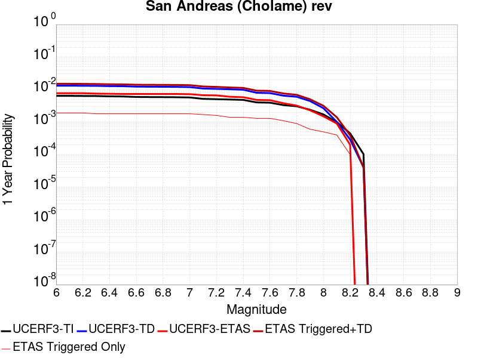 |  |

| Magnitude | 1 wk TI Prob | 1 wk TD Prob | 1 wk ETAS Prob | 1 wk ETAS/TD Gain | 1 wk ETAS Triggered+TD | 1 wk ETAS Triggered Only | 1 mo TI Prob | 1 mo TD Prob | 1 mo ETAS Prob | 1 mo ETAS/TD Gain | 1 mo ETAS Triggered+TD | 1 mo ETAS Triggered Only | 1 yr TI Prob | 1 yr TD Prob | 1 yr ETAS Prob | 1 yr ETAS/TD Gain | 1 yr ETAS Triggered+TD | 1 yr ETAS Triggered Only | 10 yr TI Prob | 10 yr TD Prob | 10 yr ETAS Prob | 10 yr ETAS/TD Gain | 10 yr ETAS Triggered+TD | 10 yr ETAS Triggered Only |
|-----|-----|-----|-----|-----|-----|-----|-----|-----|-----|-----|-----|-----|-----|-----|-----|-----|-----|-----|-----|-----|-----|-----|-----|-----|
| 6.0 | 1.2302514E-4 | 2.5281077E-4 | 0.0 | 0.0 | 2.5281077E-4 | 0.0 | 5.27144E-4 | 0.0010830265 | 1.0E-4 | 0.092333846 | 0.0011829182 | 1.0E-4 | 0.0063991086 | 0.013106638 | 0.0019 | 0.14496471 | 0.014981735 | 0.0019 | 0.06217949 | 0.124673314 | 0.0163 | 0.13074169 | 0.13894114 | 0.0163 |
| 6.1 | 1.2302514E-4 | 2.5281077E-4 | 0.0 | 0.0 | 2.5281077E-4 | 0.0 | 5.27144E-4 | 0.0010830265 | 1.0E-4 | 0.092333846 | 0.0011829182 | 1.0E-4 | 0.0063991086 | 0.013106638 | 0.0019 | 0.14496471 | 0.014981735 | 0.0019 | 0.06217949 | 0.124673314 | 0.0163 | 0.13074169 | 0.13894114 | 0.0163 |
| 6.2 | 1.2203569E-4 | 2.5097685E-4 | 0.0 | 0.0 | 2.5097685E-4 | 0.0 | 5.2290526E-4 | 0.0010751734 | 1.0E-4 | 0.09300826 | 0.0011750659 | 1.0E-4 | 0.006347804 | 0.013012172 | 0.0019 | 0.14601713 | 0.014887448 | 0.0019 | 0.061695136 | 0.12386009 | 0.0163 | 0.1316001 | 0.13814117 | 0.0163 |
| 6.3 | 1.2142645E-4 | 2.4983552E-4 | 0.0 | 0.0 | 2.4983552E-4 | 0.0 | 5.202953E-4 | 0.0010702859 | 1.0E-4 | 0.09343298 | 0.0011701789 | 1.0E-4 | 0.006316212 | 0.012953376 | 0.0018 | 0.13895991 | 0.01473006 | 0.0018 | 0.06139677 | 0.12335308 | 0.0162 | 0.13133033 | 0.13755476 | 0.0162 |
| 6.4 | 1.1865206E-4 | 2.4489136E-4 | 0.0 | 0.0 | 2.4489136E-4 | 0.0 | 5.0840975E-4 | 0.0010491138 | 1.0E-4 | 0.09531854 | 0.001149009 | 1.0E-4 | 0.006172335 | 0.012698635 | 0.0018 | 0.14174752 | 0.014475778 | 0.0018 | 0.060036868 | 0.12115012 | 0.0155 | 0.12794045 | 0.1347723 | 0.0155 |
| 6.5 | 1.17443946E-4 | 2.4282846E-4 | 0.0 | 0.0 | 2.4282846E-4 | 0.0 | 5.032341E-4 | 0.00104028 | 1.0E-4 | 0.09612797 | 0.0011401759 | 1.0E-4 | 0.006109677 | 0.012592328 | 0.0018 | 0.14294419 | 0.014369662 | 0.0018 | 0.059444077 | 0.120223366 | 0.0154 | 0.1280949 | 0.13377193 | 0.0154 |
| 6.6 | 1.13579066E-4 | 2.3592949E-4 | 0.0 | 0.0 | 2.3592949E-4 | 0.0 | 4.866766E-4 | 0.0010107361 | 1.0E-4 | 0.0989378 | 0.001110635 | 1.0E-4 | 0.0059092017 | 0.012236724 | 0.0018 | 0.1470982 | 0.014014698 | 0.0018 | 0.057545185 | 0.11714883 | 0.0148 | 0.12633502 | 0.13021503 | 0.0148 |
| 6.7 | 1.1271412E-4 | 2.343742E-4 | 0.0 | 0.0 | 2.343742E-4 | 0.0 | 4.829711E-4 | 0.0010040756 | 1.0E-4 | 0.09959409 | 0.0011039752 | 1.0E-4 | 0.005864331 | 0.012156541 | 0.0018 | 0.14806843 | 0.01393466 | 0.0018 | 0.057119697 | 0.11645377 | 0.0146 | 0.12537165 | 0.12935354 | 0.0146 |
| 6.8 | 1.1217975E-4 | 2.3325907E-4 | 0.0 | 0.0 | 2.3325907E-4 | 0.0 | 4.8068175E-4 | 9.993003E-4 | 1.0E-4 | 0.10007002 | 0.0010992003 | 1.0E-4 | 0.005836608 | 0.012099048 | 0.0018 | 0.14877203 | 0.01387727 | 0.0018 | 0.056856725 | 0.11595212 | 0.0146 | 0.12591404 | 0.12885922 | 0.0146 |
| 6.9 | 1.1146753E-4 | 2.3174597E-4 | 0.0 | 0.0 | 2.3174597E-4 | 0.0 | 4.7763053E-4 | 9.928205E-4 | 1.0E-4 | 0.10072314 | 0.0010927212 | 1.0E-4 | 0.0057996577 | 0.012021031 | 0.0018 | 0.14973757 | 0.013799393 | 0.0018 | 0.056506127 | 0.115271874 | 0.0143 | 0.12405454 | 0.12792349 | 0.0143 |
| 7.0 | 1.0965793E-4 | 2.2798029E-4 | 0.0 | 0.0 | 2.2798029E-4 | 0.0 | 4.698779E-4 | 9.76694E-4 | 1.0E-4 | 0.10238621 | 0.0010765963 | 1.0E-4 | 0.005705768 | 0.011826839 | 0.0018 | 0.1521962 | 0.013605551 | 0.0018 | 0.055614736 | 0.11357544 | 0.0143 | 0.1259075 | 0.12625131 | 0.0143 |
| 7.1 | 9.927982E-5 | 2.0615415E-4 | 0.0 | 0.0 | 2.0615415E-4 | 0.0 | 4.2541555E-4 | 8.8321965E-4 | 1.0E-4 | 0.11322212 | 9.831314E-4 | 1.0E-4 | 0.0051671406 | 0.010700475 | 0.0017 | 0.15887144 | 0.012382285 | 0.0017 | 0.05048634 | 0.10368645 | 0.0126 | 0.121520214 | 0.114980005 | 0.0126 |
| 7.2 | 9.696786E-5 | 2.0118989E-4 | 0.0 | 0.0 | 2.0118989E-4 | 0.0 | 4.1551032E-4 | 8.619585E-4 | 1.0E-4 | 0.11601487 | 9.618723E-4 | 1.0E-4 | 0.00504711 | 0.010444131 | 0.0016 | 0.15319608 | 0.01202742 | 0.0016 | 0.04934009 | 0.10142094 | 0.0123 | 0.12127673 | 0.112473466 | 0.0123 |
| 7.3 | 9.4727984E-5 | 1.9546975E-4 | 0.0 | 0.0 | 1.9546975E-4 | 0.0 | 4.0591392E-4 | 8.374595E-4 | 1.0E-4 | 0.11940876 | 9.3737576E-4 | 1.0E-4 | 0.0049308087 | 0.010148673 | 0.0014 | 0.13794906 | 0.0115344655 | 0.0014 | 0.048228268 | 0.09878966 | 0.0117 | 0.118433446 | 0.10933382 | 0.0117 |
| 7.4 | 9.220358E-5 | 1.891629E-4 | 0.0 | 0.0 | 1.891629E-4 | 0.0 | 3.9509835E-4 | 8.1044727E-4 | 1.0E-4 | 0.12338866 | 9.103662E-4 | 1.0E-4 | 0.004799717 | 0.009822803 | 0.0014 | 0.14252551 | 0.011209051 | 0.0014 | 0.046973653 | 0.095870085 | 0.0115 | 0.119954 | 0.10626758 | 0.0115 |
| 7.5 | 7.71631E-5 | 1.5246084E-4 | 0.0 | 0.0 | 1.5246084E-4 | 0.0 | 3.306571E-4 | 6.532402E-4 | 1.0E-4 | 0.15308306 | 7.531748E-4 | 1.0E-4 | 0.0040183207 | 0.007924269 | 0.0013 | 0.164053 | 0.009213967 | 0.0013 | 0.03946433 | 0.0785814 | 0.0086 | 0.10944066 | 0.0865056 | 0.0086 |
| 7.6 | 7.5634416E-5 | 1.4904661E-4 | 0.0 | 0.0 | 1.4904661E-4 | 0.0 | 3.241072E-4 | 6.38615E-4 | 1.0E-4 | 0.15658887 | 7.3855114E-4 | 1.0E-4 | 0.0039388672 | 0.007747487 | 0.0013 | 0.16779634 | 0.0090374155 | 0.0013 | 0.038697794 | 0.07694124 | 0.0085 | 0.11047392 | 0.084787235 | 0.0085 |
| 7.7 | 6.3783E-5 | 1.2419635E-4 | 0.0 | 0.0 | 1.2419635E-4 | 0.0 | 2.7332708E-4 | 5.3216156E-4 | 1.0E-4 | 0.18791287 | 6.3210836E-4 | 1.0E-4 | 0.0033226798 | 0.006459846 | 0.0011 | 0.17028269 | 0.0075527406 | 0.0011 | 0.032734364 | 0.064811446 | 0.0061 | 0.094119176 | 0.070516095 | 0.0061 |
| 7.8 | 5.863422E-5 | 1.1471488E-4 | 0.0 | 0.0 | 1.1471488E-4 | 0.0 | 2.512653E-4 | 4.915426E-4 | 1.0E-4 | 0.20344117 | 5.9149344E-4 | 1.0E-4 | 0.003054864 | 0.0059681307 | 9.0E-4 | 0.15080099 | 0.0068627596 | 9.0E-4 | 0.030132094 | 0.059904464 | 0.0052 | 0.08680489 | 0.06479296 | 0.0052 |
| 7.9 | 4.595283E-5 | 8.464536E-5 | 0.0 | 0.0 | 8.464536E-5 | 0.0 | 1.9692584E-4 | 3.6271542E-4 | 0.0 | 0.0 | 3.6271542E-4 | 0.0 | 0.0023949358 | 0.004407125 | 6.0E-4 | 0.13614318 | 0.005004481 | 6.0E-4 | 0.023692891 | 0.044540975 | 0.0035 | 0.07857933 | 0.047885083 | 0.0035 |
| 8.0 | 3.2950178E-5 | 5.0985156E-5 | 0.0 | 0.0 | 5.0985156E-5 | 0.0 | 1.412074E-4 | 2.1848951E-4 | 0.0 | 0.0 | 2.1848951E-4 | 0.0 | 0.0017178444 | 0.0026568666 | 5.0E-4 | 0.18819161 | 0.003155538 | 5.0E-4 | 0.017046256 | 0.02728288 | 0.0021 | 0.076971345 | 0.029325586 | 0.0021 |
| 8.1 | 1.9177472E-5 | 1.9262014E-5 | 0.0 | 0.0 | 1.9262014E-5 | 0.0 | 8.218658E-5 | 8.2548875E-5 | 0.0 | 0.0 | 8.2548875E-5 | 0.0 | 0.0010001622 | 0.0010045698 | 4.0E-4 | 0.3981804 | 0.001404168 | 4.0E-4 | 0.009956728 | 0.010798338 | 9.0E-4 | 0.08334616 | 0.01168862 | 9.0E-4 |
| 8.2 | 8.643924E-6 | 5.4947163E-6 | 0.0 | 0.0 | 5.4947163E-6 | 0.0 | 3.704486E-5 | 2.3548571E-5 | 0.0 | 0.0 | 2.3548571E-5 | 0.0 | 4.5092785E-4 | 2.866662E-4 | 1.0E-4 | 0.34883776 | 3.8663755E-4 | 1.0E-4 | 0.0045001395 | 0.0032596437 | 3.0E-4 | 0.0920346 | 0.0035586657 | 3.0E-4 |
| 8.3 | 1.983087E-6 | 7.6880906E-7 | 0.0 | 0.0 | 7.6880906E-7 | 0.0 | 8.498917E-6 | 3.294892E-6 | 0.0 | 0.0 | 3.294892E-6 | 0.0 | 1.034694E-4 | 4.0114588E-5 | 0.0 | 0.0 | 4.0114588E-5 | 0.0 | 0.0010342124 | 4.7361702E-4 | 0.0 | 0.0 | 4.7361702E-4 | 0.0 |

## San Andreas (Carrizo) rev
*[(top)](#table-of-contents)*

| 1 Week | 1 Month | 1 Year | 10 Year |
|-----|-----|-----|-----|
|  |  |  |  |

| Magnitude | 1 wk TI Prob | 1 wk TD Prob | 1 wk ETAS Prob | 1 wk ETAS/TD Gain | 1 wk ETAS Triggered+TD | 1 wk ETAS Triggered Only | 1 mo TI Prob | 1 mo TD Prob | 1 mo ETAS Prob | 1 mo ETAS/TD Gain | 1 mo ETAS Triggered+TD | 1 mo ETAS Triggered Only | 1 yr TI Prob | 1 yr TD Prob | 1 yr ETAS Prob | 1 yr ETAS/TD Gain | 1 yr ETAS Triggered+TD | 1 yr ETAS Triggered Only | 10 yr TI Prob | 10 yr TD Prob | 10 yr ETAS Prob | 10 yr ETAS/TD Gain | 10 yr ETAS Triggered+TD | 10 yr ETAS Triggered Only |
|-----|-----|-----|-----|-----|-----|-----|-----|-----|-----|-----|-----|-----|-----|-----|-----|-----|-----|-----|-----|-----|-----|-----|-----|-----|
| 6.0 | 1.1674632E-4 | 2.44092E-4 | 0.0 | 0.0 | 2.44092E-4 | 0.0 | 5.002454E-4 | 0.0010456908 | 1.0E-4 | 0.095630564 | 0.0011455863 | 1.0E-4 | 0.006073493 | 0.012657453 | 0.0017 | 0.13430822 | 0.014335936 | 0.0017 | 0.0591016 | 0.12097457 | 0.0153 | 0.12647286 | 0.13442366 | 0.0153 |
| 6.1 | 1.1674632E-4 | 2.44092E-4 | 0.0 | 0.0 | 2.44092E-4 | 0.0 | 5.002454E-4 | 0.0010456908 | 1.0E-4 | 0.095630564 | 0.0011455863 | 1.0E-4 | 0.006073493 | 0.012657453 | 0.0017 | 0.13430822 | 0.014335936 | 0.0017 | 0.0591016 | 0.12097457 | 0.0153 | 0.12647286 | 0.13442366 | 0.0153 |
| 6.2 | 1.1674632E-4 | 2.44092E-4 | 0.0 | 0.0 | 2.44092E-4 | 0.0 | 5.002454E-4 | 0.0010456908 | 1.0E-4 | 0.095630564 | 0.0011455863 | 1.0E-4 | 0.006073493 | 0.012657453 | 0.0017 | 0.13430822 | 0.014335936 | 0.0017 | 0.0591016 | 0.12097457 | 0.0153 | 0.12647286 | 0.13442366 | 0.0153 |
| 6.3 | 1.1674632E-4 | 2.44092E-4 | 0.0 | 0.0 | 2.44092E-4 | 0.0 | 5.002454E-4 | 0.0010456908 | 1.0E-4 | 0.095630564 | 0.0011455863 | 1.0E-4 | 0.006073493 | 0.012657453 | 0.0017 | 0.13430822 | 0.014335936 | 0.0017 | 0.0591016 | 0.12097457 | 0.0153 | 0.12647286 | 0.13442366 | 0.0153 |
| 6.4 | 1.1674632E-4 | 2.44092E-4 | 0.0 | 0.0 | 2.44092E-4 | 0.0 | 5.002454E-4 | 0.0010456908 | 1.0E-4 | 0.095630564 | 0.0011455863 | 1.0E-4 | 0.006073493 | 0.012657453 | 0.0017 | 0.13430822 | 0.014335936 | 0.0017 | 0.0591016 | 0.12097457 | 0.0153 | 0.12647286 | 0.13442366 | 0.0153 |
| 6.5 | 1.13136164E-4 | 2.3728568E-4 | 0.0 | 0.0 | 2.3728568E-4 | 0.0 | 4.847792E-4 | 0.0010165438 | 1.0E-4 | 0.098372534 | 0.0011164423 | 1.0E-4 | 0.0058862255 | 0.012306639 | 0.0017 | 0.13813682 | 0.013985718 | 0.0017 | 0.057327334 | 0.11794804 | 0.0147 | 0.12463115 | 0.13091421 | 0.0147 |
| 6.6 | 1.13136164E-4 | 2.3728568E-4 | 0.0 | 0.0 | 2.3728568E-4 | 0.0 | 4.847792E-4 | 0.0010165438 | 1.0E-4 | 0.098372534 | 0.0011164423 | 1.0E-4 | 0.0058862255 | 0.012306639 | 0.0017 | 0.13813682 | 0.013985718 | 0.0017 | 0.057327334 | 0.11794804 | 0.0147 | 0.12463115 | 0.13091421 | 0.0147 |
| 6.7 | 1.1149675E-4 | 2.3419483E-4 | 0.0 | 0.0 | 2.3419483E-4 | 0.0 | 4.777557E-4 | 0.0010033075 | 1.0E-4 | 0.099670336 | 0.0011032072 | 1.0E-4 | 0.0058011734 | 0.0121472925 | 0.0017 | 0.13994889 | 0.013826642 | 0.0017 | 0.05652051 | 0.11657497 | 0.0144 | 0.12352566 | 0.12929629 | 0.0144 |
| 6.8 | 1.1103589E-4 | 2.3321487E-4 | 0.0 | 0.0 | 2.3321487E-4 | 0.0 | 4.7578133E-4 | 9.99111E-4 | 1.0E-4 | 0.10008898 | 0.001099011 | 1.0E-4 | 0.005777263 | 0.012096767 | 0.0017 | 0.1405334 | 0.013776204 | 0.0017 | 0.056293584 | 0.11613424 | 0.0143 | 0.12313336 | 0.12877353 | 0.0143 |
| 6.9 | 1.1053259E-4 | 2.3213694E-4 | 0.0 | 0.0 | 2.3213694E-4 | 0.0 | 4.7362508E-4 | 9.944948E-4 | 1.0E-4 | 0.100553565 | 0.0010943954 | 1.0E-4 | 0.0057511497 | 0.012041189 | 0.0017 | 0.14118208 | 0.013720718 | 0.0017 | 0.05604569 | 0.11564892 | 0.014 | 0.12105604 | 0.12802984 | 0.014 |
| 7.0 | 1.1005377E-4 | 2.3114355E-4 | 0.0 | 0.0 | 2.3114355E-4 | 0.0 | 4.7157376E-4 | 9.902406E-4 | 1.0E-4 | 0.10098556 | 0.0010901416 | 1.0E-4 | 0.0057263062 | 0.011989965 | 0.0017 | 0.14178523 | 0.013669582 | 0.0017 | 0.055809796 | 0.11520172 | 0.014 | 0.121525966 | 0.1275889 | 0.014 |
| 7.1 | 1.0308142E-4 | 2.1621585E-4 | 0.0 | 0.0 | 2.1621585E-4 | 0.0 | 4.417027E-4 | 9.263113E-4 | 1.0E-4 | 0.10795507 | 0.0010262186 | 1.0E-4 | 0.0053644776 | 0.011219839 | 0.0017 | 0.15151733 | 0.012900765 | 0.0017 | 0.052368138 | 0.108432375 | 0.013 | 0.11989039 | 0.12002275 | 0.013 |
| 7.2 | 1.0027479E-4 | 2.1028465E-4 | 0.0 | 0.0 | 2.1028465E-4 | 0.0 | 4.296783E-4 | 9.0090965E-4 | 1.0E-4 | 0.11099892 | 0.0010008196 | 1.0E-4 | 0.0052187922 | 0.010913711 | 0.0016 | 0.14660457 | 0.01249625 | 0.0016 | 0.050979212 | 0.10572959 | 0.0127 | 0.12011775 | 0.11708683 | 0.0127 |
| 7.3 | 9.816942E-5 | 2.0502326E-4 | 0.0 | 0.0 | 2.0502326E-4 | 0.0 | 4.2065824E-4 | 8.7837625E-4 | 1.0E-4 | 0.11384643 | 9.782884E-4 | 1.0E-4 | 0.005109493 | 0.01064208 | 0.0015 | 0.1409499 | 0.012126116 | 0.0015 | 0.049935985 | 0.10331135 | 0.0121 | 0.11712168 | 0.11416129 | 0.0121 |
| 7.4 | 9.5634205E-5 | 1.9870517E-4 | 0.0 | 0.0 | 1.9870517E-4 | 0.0 | 4.0979648E-4 | 8.5131655E-4 | 1.0E-4 | 0.117465116 | 9.5123146E-4 | 1.0E-4 | 0.0049778637 | 0.010315786 | 0.0015 | 0.14540821 | 0.011800312 | 0.0015 | 0.048678253 | 0.10039997 | 0.0119 | 0.11852594 | 0.11110521 | 0.0119 |
| 7.5 | 8.052417E-5 | 1.6185912E-4 | 0.0 | 0.0 | 1.6185912E-4 | 0.0 | 3.4505792E-4 | 6.9349766E-4 | 1.0E-4 | 0.14419658 | 7.9342833E-4 | 1.0E-4 | 0.0041929903 | 0.008410729 | 0.0014 | 0.16645406 | 0.009798954 | 0.0014 | 0.04114753 | 0.08312781 | 0.0089 | 0.107064046 | 0.09128798 | 0.0089 |
| 7.6 | 7.897024E-5 | 1.5838174E-4 | 0.0 | 0.0 | 1.5838174E-4 | 0.0 | 3.384E-4 | 6.786025E-4 | 1.0E-4 | 0.14736168 | 7.785346E-4 | 1.0E-4 | 0.0041122385 | 0.008230764 | 0.0014 | 0.17009357 | 0.009619242 | 0.0014 | 0.040369697 | 0.08146524 | 0.0088 | 0.108021535 | 0.08954834 | 0.0088 |
| 7.7 | 6.707427E-5 | 1.3342022E-4 | 0.0 | 0.0 | 1.3342022E-4 | 0.0 | 2.8742946E-4 | 5.716757E-4 | 1.0E-4 | 0.17492434 | 6.7161856E-4 | 1.0E-4 | 0.003493839 | 0.0069379727 | 0.0012 | 0.17296119 | 0.008129647 | 0.0012 | 0.034394164 | 0.06934015 | 0.0064 | 0.09229863 | 0.075296365 | 0.0064 |
| 7.8 | 6.147705E-5 | 1.2256952E-4 | 0.0 | 0.0 | 1.2256952E-4 | 0.0 | 2.6344648E-4 | 5.251922E-4 | 1.0E-4 | 0.19040649 | 6.251397E-4 | 1.0E-4 | 0.0032027436 | 0.0063754935 | 0.001 | 0.1568506 | 0.007369118 | 0.001 | 0.031569764 | 0.06377766 | 0.0055 | 0.08623709 | 0.068926886 | 0.0055 |
| 7.9 | 4.7636717E-5 | 8.920005E-5 | 0.0 | 0.0 | 8.920005E-5 | 0.0 | 2.0414138E-4 | 3.8222995E-4 | 0.0 | 0.0 | 3.8222995E-4 | 0.0 | 0.0024825884 | 0.0046437276 | 7.0E-4 | 0.15074097 | 0.005340477 | 7.0E-4 | 0.024550365 | 0.046815984 | 0.0036 | 0.07689682 | 0.050247446 | 0.0036 |
| 8.0 | 3.3554235E-5 | 5.235511E-5 | 0.0 | 0.0 | 5.235511E-5 | 0.0 | 1.4379594E-4 | 2.2435976E-4 | 0.0 | 0.0 | 2.2435976E-4 | 0.0 | 0.0017493097 | 0.00272816 | 5.0E-4 | 0.1832737 | 0.003226796 | 5.0E-4 | 0.017356034 | 0.027986461 | 0.0021 | 0.07503628 | 0.030027691 | 0.0021 |
| 8.1 | 1.9175432E-5 | 1.9261844E-5 | 0.0 | 0.0 | 1.9261844E-5 | 0.0 | 8.217783E-5 | 8.2548155E-5 | 0.0 | 0.0 | 8.2548155E-5 | 0.0 | 0.0010000558 | 0.001004561 | 4.0E-4 | 0.39818388 | 0.0014041592 | 4.0E-4 | 0.009955673 | 0.010798223 | 9.0E-4 | 0.083347045 | 0.011688505 | 9.0E-4 |
| 8.2 | 8.643924E-6 | 5.4947163E-6 | 0.0 | 0.0 | 5.4947163E-6 | 0.0 | 3.704486E-5 | 2.3548571E-5 | 0.0 | 0.0 | 2.3548571E-5 | 0.0 | 4.5092785E-4 | 2.866662E-4 | 1.0E-4 | 0.34883776 | 3.8663755E-4 | 1.0E-4 | 0.0045001395 | 0.0032596437 | 3.0E-4 | 0.0920346 | 0.0035586657 | 3.0E-4 |
| 8.3 | 1.983087E-6 | 7.6880906E-7 | 0.0 | 0.0 | 7.6880906E-7 | 0.0 | 8.498917E-6 | 3.294892E-6 | 0.0 | 0.0 | 3.294892E-6 | 0.0 | 1.034694E-4 | 4.0114588E-5 | 0.0 | 0.0 | 4.0114588E-5 | 0.0 | 0.0010342124 | 4.7361702E-4 | 0.0 | 0.0 | 4.7361702E-4 | 0.0 |

## Owl Lake
*[(top)](#table-of-contents)*

| 1 Week | 1 Month | 1 Year | 10 Year |
|-----|-----|-----|-----|
| 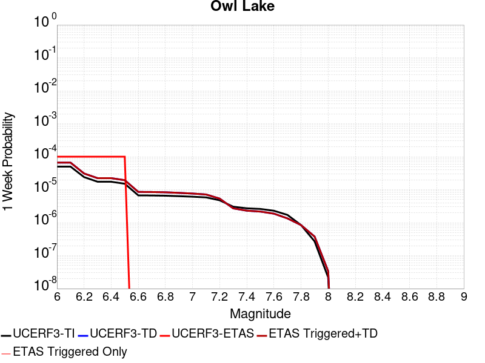 |  |  |  |

| Magnitude | 1 wk TI Prob | 1 wk TD Prob | 1 wk ETAS Prob | 1 wk ETAS/TD Gain | 1 wk ETAS Triggered+TD | 1 wk ETAS Triggered Only | 1 mo TI Prob | 1 mo TD Prob | 1 mo ETAS Prob | 1 mo ETAS/TD Gain | 1 mo ETAS Triggered+TD | 1 mo ETAS Triggered Only | 1 yr TI Prob | 1 yr TD Prob | 1 yr ETAS Prob | 1 yr ETAS/TD Gain | 1 yr ETAS Triggered+TD | 1 yr ETAS Triggered Only | 10 yr TI Prob | 10 yr TD Prob | 10 yr ETAS Prob | 10 yr ETAS/TD Gain | 10 yr ETAS Triggered+TD | 10 yr ETAS Triggered Only |
|-----|-----|-----|-----|-----|-----|-----|-----|-----|-----|-----|-----|-----|-----|-----|-----|-----|-----|-----|-----|-----|-----|-----|-----|-----|
| 6.0 | 5.0320643E-5 | 6.640611E-5 | 0.0 | 0.0 | 6.640611E-5 | 0.0 | 2.1564208E-4 | 2.8457283E-4 | 4.0E-4 | 1.4056156 | 6.84459E-4 | 4.0E-4 | 0.0026222812 | 0.003460077 | 0.0038 | 1.0982414 | 0.0072469288 | 0.0038 | 0.02591553 | 0.034166228 | 0.0133 | 0.3892733 | 0.04701182 | 0.0133 |
| 6.1 | 5.0320643E-5 | 6.640611E-5 | 0.0 | 0.0 | 6.640611E-5 | 0.0 | 2.1564208E-4 | 2.8457283E-4 | 4.0E-4 | 1.4056156 | 6.84459E-4 | 4.0E-4 | 0.0026222812 | 0.003460077 | 0.0038 | 1.0982414 | 0.0072469288 | 0.0038 | 0.02591553 | 0.034166228 | 0.0133 | 0.3892733 | 0.04701182 | 0.0133 |
| 6.2 | 2.4125871E-5 | 3.1005395E-5 | 0.0 | 0.0 | 3.1005395E-5 | 0.0 | 1.0339249E-4 | 1.3287466E-4 | 2.0E-4 | 1.5051779 | 3.3284808E-4 | 2.0E-4 | 0.0012580766 | 0.0016167222 | 0.0027 | 1.6700457 | 0.004312357 | 0.0027 | 0.012509781 | 0.016084054 | 0.0097 | 0.60308176 | 0.025628038 | 0.0097 |
| 6.3 | 1.7433485E-5 | 2.2375434E-5 | 0.0 | 0.0 | 2.2375434E-5 | 0.0 | 7.471279E-5 | 9.589209E-5 | 2.0E-4 | 2.0856779 | 2.9587292E-4 | 2.0E-4 | 9.0924866E-4 | 0.0011669993 | 0.0023 | 1.9708666 | 0.0034643153 | 0.0023 | 0.009055373 | 0.011639947 | 0.0083 | 0.71306163 | 0.019843336 | 0.0083 |
| 6.4 | 1.7433485E-5 | 2.2375434E-5 | 0.0 | 0.0 | 2.2375434E-5 | 0.0 | 7.471279E-5 | 9.589209E-5 | 2.0E-4 | 2.0856779 | 2.9587292E-4 | 2.0E-4 | 9.0924866E-4 | 0.0011669993 | 0.0023 | 1.9708666 | 0.0034643153 | 0.0023 | 0.009055373 | 0.011639947 | 0.0083 | 0.71306163 | 0.019843336 | 0.0083 |
| 6.5 | 1.5182742E-5 | 1.944745E-5 | 0.0 | 0.0 | 1.944745E-5 | 0.0 | 6.506727E-5 | 8.334441E-5 | 2.0E-4 | 2.399681 | 2.8332774E-4 | 2.0E-4 | 7.919061E-4 | 0.0010143825 | 0.0021 | 2.0702252 | 0.0031122523 | 0.0021 | 0.0078909 | 0.010128617 | 0.0079 | 0.77996826 | 0.017948601 | 0.0079 |
| 6.6 | 6.7271576E-6 | 8.559478E-6 | 0.0 | 0.0 | 8.559478E-6 | 0.0 | 2.8830356E-5 | 3.6682995E-5 | 2.0E-4 | 5.4521174 | 2.3667565E-4 | 2.0E-4 | 3.5095305E-4 | 4.4652962E-4 | 0.0018 | 4.0310874 | 0.0022457258 | 0.0018 | 0.0035039932 | 0.004474776 | 0.0059 | 1.3185018 | 0.010348375 | 0.0059 |
| 6.7 | 6.682835E-6 | 8.491905E-6 | 0.0 | 0.0 | 8.491905E-6 | 0.0 | 2.8640408E-5 | 3.63934E-5 | 2.0E-4 | 5.495502 | 2.3638613E-4 | 2.0E-4 | 3.4864116E-4 | 4.4300524E-4 | 0.0018 | 4.0631576 | 0.0022422078 | 0.0018 | 0.003480947 | 0.004439625 | 0.0059 | 1.3289411 | 0.010313432 | 0.0059 |
| 6.8 | 6.5774975E-6 | 8.338318E-6 | 0.0 | 0.0 | 8.338318E-6 | 0.0 | 2.8188972E-5 | 3.5735193E-5 | 2.0E-4 | 5.596724 | 2.3572805E-4 | 2.0E-4 | 3.4314668E-4 | 4.3499476E-4 | 0.0018 | 4.137981 | 0.0022342117 | 0.0018 | 0.0034261728 | 0.004359716 | 0.0059 | 1.3532991 | 0.010233994 | 0.0059 |
| 6.9 | 6.363419E-6 | 8.011328E-6 | 0.0 | 0.0 | 8.011328E-6 | 0.0 | 2.727151E-5 | 3.4333843E-5 | 2.0E-4 | 5.825156 | 2.3432697E-4 | 2.0E-4 | 3.3198006E-4 | 4.1793997E-4 | 0.0018 | 4.3068385 | 0.0022171878 | 0.0018 | 0.0033148455 | 0.0041896203 | 0.0059 | 1.4082421 | 0.010064902 | 0.0059 |
| 7.0 | 6.1342453E-6 | 7.643317E-6 | 0.0 | 0.0 | 7.643317E-6 | 0.0 | 2.6289357E-5 | 3.2756696E-5 | 2.0E-4 | 6.1056223 | 2.3275014E-4 | 2.0E-4 | 3.2002592E-4 | 3.987453E-4 | 0.0018 | 4.51416 | 0.0021980274 | 0.0018 | 0.0031956544 | 0.0039981925 | 0.0057 | 1.4256443 | 0.009675403 | 0.0057 |
| 7.1 | 5.842926E-6 | 7.153562E-6 | 0.0 | 0.0 | 7.153562E-6 | 0.0 | 2.504087E-5 | 3.0657793E-5 | 2.0E-4 | 6.523627 | 2.3065167E-4 | 2.0E-4 | 3.0482994E-4 | 3.7320014E-4 | 0.0018 | 4.823149 | 0.0021725283 | 0.0018 | 0.0030441214 | 0.003743415 | 0.0054 | 1.4425331 | 0.009123201 | 0.0054 |
| 7.2 | 4.77173E-6 | 5.3687386E-6 | 0.0 | 0.0 | 5.3687386E-6 | 0.0 | 2.045011E-5 | 2.3008699E-5 | 1.0E-4 | 4.3461823 | 1.230064E-4 | 1.0E-4 | 2.4895166E-4 | 2.8009896E-4 | 0.0011 | 3.9271834 | 0.0013797908 | 0.0011 | 0.0024867293 | 0.002814522 | 0.0028 | 0.99484026 | 0.0056066415 | 0.0028 |
| 7.3 | 3.0494948E-6 | 2.7178485E-6 | 0.0 | 0.0 | 2.7178485E-6 | 0.0 | 1.3069198E-5 | 1.164787E-5 | 1.0E-4 | 8.58526 | 1.116467E-4 | 1.0E-4 | 1.5910587E-4 | 1.4180376E-4 | 5.0E-4 | 3.5259995 | 6.417329E-4 | 5.0E-4 | 0.0015899199 | 0.0014272854 | 0.0011 | 0.77069384 | 0.0025257154 | 0.0011 |
| 7.4 | 2.7263884E-6 | 2.3125694E-6 | 0.0 | 0.0 | 2.3125694E-6 | 0.0 | 1.1684469E-5 | 9.910975E-6 | 1.0E-4 | 10.089826 | 1.0990998E-4 | 1.0E-4 | 1.4224913E-4 | 1.2065953E-4 | 4.0E-4 | 3.315113 | 5.206113E-4 | 4.0E-4 | 0.0014215811 | 0.0012150317 | 9.0E-4 | 0.7407214 | 0.0021139383 | 9.0E-4 |
| 7.5 | 2.6090431E-6 | 2.1723597E-6 | 0.0 | 0.0 | 2.1723597E-6 | 0.0 | 1.1181565E-5 | 9.310081E-6 | 1.0E-4 | 10.741046 | 1.0930915E-4 | 1.0E-4 | 1.3612706E-4 | 1.13344424E-4 | 4.0E-4 | 3.5290663 | 5.132991E-4 | 4.0E-4 | 0.001360437 | 0.0011417306 | 8.0E-4 | 0.70069075 | 0.0019408171 | 8.0E-4 |
| 7.6 | 2.3008756E-6 | 1.8791399E-6 | 0.0 | 0.0 | 1.8791399E-6 | 0.0 | 9.860858E-6 | 8.053432E-6 | 1.0E-4 | 12.417066 | 1.0805263E-4 | 1.0E-4 | 1.20049335E-4 | 9.804621E-5 | 3.0E-4 | 3.0597818 | 3.980168E-4 | 3.0E-4 | 0.001199845 | 9.884952E-4 | 7.0E-4 | 0.7081471 | 0.0016878033 | 7.0E-4 |
| 7.7 | 1.7184348E-6 | 1.3477594E-6 | 0.0 | 0.0 | 1.3477594E-6 | 0.0 | 7.3646997E-6 | 5.776099E-6 | 1.0E-4 | 17.312723 | 1.0577552E-4 | 1.0E-4 | 8.966153E-5 | 7.0321774E-5 | 3.0E-4 | 4.2661037 | 3.7030067E-4 | 3.0E-4 | 8.962536E-4 | 7.110758E-4 | 7.0E-4 | 0.9844239 | 0.001410578 | 7.0E-4 |
| 7.8 | 8.4612907E-7 | 8.447706E-7 | 0.0 | 0.0 | 8.447706E-7 | 0.0 | 3.6262625E-6 | 3.6204406E-6 | 0.0 | 0.0 | 3.6204406E-6 | 0.0 | 4.4148852E-5 | 4.4077995E-5 | 0.0 | 0.0 | 4.4077995E-5 | 0.0 | 4.414008E-4 | 4.464377E-4 | 3.0E-4 | 0.6719862 | 7.4630376E-4 | 3.0E-4 |
| 7.9 | 2.716738E-7 | 3.7867255E-7 | 0.0 | 0.0 | 3.7867255E-7 | 0.0 | 1.1643157E-6 | 1.6228814E-6 | 0.0 | 0.0 | 1.6228814E-6 | 0.0 | 1.4175452E-5 | 1.9758414E-5 | 0.0 | 0.0 | 1.9758414E-5 | 0.0 | 1.4174548E-4 | 1.996383E-4 | 1.0E-4 | 0.5009059 | 2.9961835E-4 | 1.0E-4 |
| 8.0 | 2.1995428E-8 | 3.3982946E-8 | 0.0 | 0.0 | 3.3982946E-8 | 0.0 | 9.426611E-8 | 1.456412E-7 | 0.0 | 0.0 | 1.456412E-7 | 0.0 | 1.1476893E-6 | 1.7731808E-6 | 0.0 | 0.0 | 1.7731808E-6 | 0.0 | 1.14768345E-5 | 1.8278286E-5 | 0.0 | 0.0 | 1.8278286E-5 | 0.0 |

## Hayward (So) extension 2011 CFM
*[(top)](#table-of-contents)*

| 1 Week | 1 Month | 1 Year | 10 Year |
|-----|-----|-----|-----|
|  | 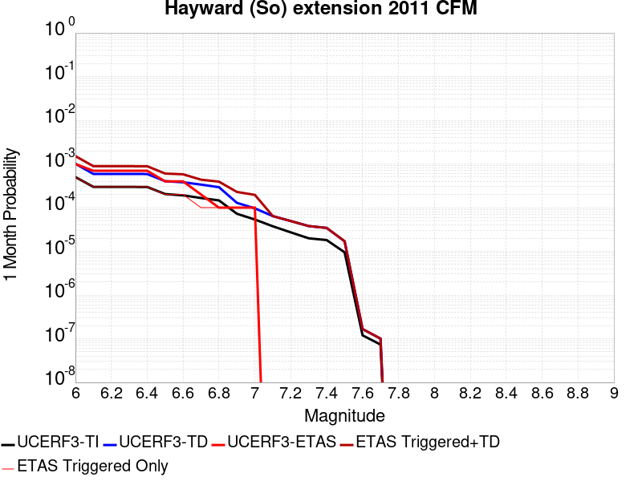 | 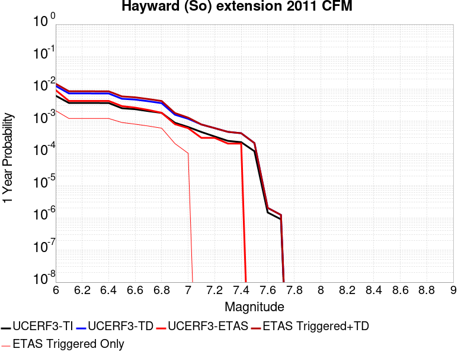 |  |

| Magnitude | 1 wk TI Prob | 1 wk TD Prob | 1 wk ETAS Prob | 1 wk ETAS/TD Gain | 1 wk ETAS Triggered+TD | 1 wk ETAS Triggered Only | 1 mo TI Prob | 1 mo TD Prob | 1 mo ETAS Prob | 1 mo ETAS/TD Gain | 1 mo ETAS Triggered+TD | 1 mo ETAS Triggered Only | 1 yr TI Prob | 1 yr TD Prob | 1 yr ETAS Prob | 1 yr ETAS/TD Gain | 1 yr ETAS Triggered+TD | 1 yr ETAS Triggered Only | 10 yr TI Prob | 10 yr TD Prob | 10 yr ETAS Prob | 10 yr ETAS/TD Gain | 10 yr ETAS Triggered+TD | 10 yr ETAS Triggered Only |
|-----|-----|-----|-----|-----|-----|-----|-----|-----|-----|-----|-----|-----|-----|-----|-----|-----|-----|-----|-----|-----|-----|-----|-----|-----|
| 6.0 | 1.1721256E-4 | 2.3660723E-4 | 1.0E-4 | 0.42264134 | 3.3658356E-4 | 1.0E-4 | 5.022428E-4 | 0.0010134798 | 5.0E-4 | 0.49334976 | 0.001512973 | 5.0E-4 | 0.0060976758 | 0.012245739 | 0.0021 | 0.17148823 | 0.014320023 | 0.0021 | 0.0593305 | 0.11281047 | 0.0133 | 0.117896855 | 0.124610096 | 0.0133 |
| 6.1 | 6.99169E-5 | 1.3793148E-4 | 1.0E-4 | 0.7249977 | 2.3791769E-4 | 1.0E-4 | 2.9960944E-4 | 5.9095264E-4 | 3.0E-4 | 0.5076549 | 8.9077535E-4 | 3.0E-4 | 0.0036416445 | 0.0071650464 | 0.0012 | 0.16747972 | 0.008356448 | 0.0012 | 0.035825435 | 0.06774945 | 0.0073 | 0.107749954 | 0.074554875 | 0.0073 |
| 6.2 | 6.99169E-5 | 1.3793148E-4 | 1.0E-4 | 0.7249977 | 2.3791769E-4 | 1.0E-4 | 2.9960944E-4 | 5.9095264E-4 | 3.0E-4 | 0.5076549 | 8.9077535E-4 | 3.0E-4 | 0.0036416445 | 0.0071650464 | 0.0012 | 0.16747972 | 0.008356448 | 0.0012 | 0.035825435 | 0.06774945 | 0.0073 | 0.107749954 | 0.074554875 | 0.0073 |
| 6.3 | 6.970908E-5 | 1.3761275E-4 | 1.0E-4 | 0.7266769 | 2.3759899E-4 | 1.0E-4 | 2.9871898E-4 | 5.895876E-4 | 3.0E-4 | 0.50883025 | 8.8941073E-4 | 3.0E-4 | 0.0036308395 | 0.0071485755 | 0.0012 | 0.16786562 | 0.008339997 | 0.0012 | 0.035720866 | 0.067598335 | 0.0073 | 0.10799082 | 0.07440487 | 0.0073 |
| 6.4 | 6.9517155E-5 | 1.3728178E-4 | 1.0E-4 | 0.7284288 | 2.3726805E-4 | 1.0E-4 | 2.9789665E-4 | 5.8817E-4 | 3.0E-4 | 0.5100566 | 8.8799355E-4 | 3.0E-4 | 0.0036208609 | 0.007131479 | 0.0012 | 0.16826804 | 0.008322922 | 0.0012 | 0.03562429 | 0.06744229 | 0.0073 | 0.10824069 | 0.07424996 | 0.0073 |
| 6.5 | 4.786248E-5 | 9.398959E-5 | 0.0 | 0.0 | 9.398959E-5 | 0.0 | 2.0510878E-4 | 4.027528E-4 | 2.0E-4 | 0.49658254 | 6.026722E-4 | 2.0E-4 | 0.0024943394 | 0.004892924 | 9.0E-4 | 0.1839391 | 0.00578852 | 9.0E-4 | 0.02466527 | 0.046834912 | 0.0051 | 0.108893126 | 0.051696055 | 0.0051 |
| 6.6 | 4.4662214E-5 | 8.865866E-5 | 0.0 | 0.0 | 8.865866E-5 | 0.0 | 1.9139545E-4 | 3.7991293E-4 | 2.0E-4 | 0.5264364 | 5.7983695E-4 | 2.0E-4 | 0.0023277493 | 0.004616092 | 8.0E-4 | 0.17330678 | 0.005412399 | 8.0E-4 | 0.02303517 | 0.04422703 | 0.005 | 0.11305303 | 0.049005896 | 0.005 |
| 6.7 | 3.884542E-5 | 7.8499506E-5 | 0.0 | 0.0 | 7.8499506E-5 | 0.0 | 1.6646975E-4 | 3.3638556E-4 | 1.0E-4 | 0.2972779 | 4.3635193E-4 | 1.0E-4 | 0.002024885 | 0.004088246 | 7.0E-4 | 0.17122257 | 0.004785384 | 7.0E-4 | 0.020065336 | 0.03927036 | 0.0045 | 0.11459024 | 0.043593645 | 0.0045 |
| 6.8 | 3.4221863E-5 | 6.8429945E-5 | 0.0 | 0.0 | 6.8429945E-5 | 0.0 | 1.4665688E-4 | 2.932406E-4 | 1.0E-4 | 0.34101692 | 3.9321126E-4 | 1.0E-4 | 0.0017840851 | 0.0035647785 | 6.0E-4 | 0.1683134 | 0.00416264 | 6.0E-4 | 0.017698295 | 0.03436741 | 0.0035 | 0.10184067 | 0.037747126 | 0.0035 |
| 6.9 | 1.6927712E-5 | 3.0020747E-5 | 0.0 | 0.0 | 3.0020747E-5 | 0.0 | 7.2545314E-5 | 1.2865433E-4 | 1.0E-4 | 0.77727664 | 2.2864145E-4 | 1.0E-4 | 8.828813E-4 | 0.0015652976 | 2.0E-4 | 0.12777123 | 0.0017649846 | 2.0E-4 | 0.008793819 | 0.015444788 | 0.001 | 0.06474676 | 0.016429342 | 0.001 |
| 7.0 | 1.2509653E-5 | 2.2429243E-5 | 0.0 | 0.0 | 2.2429243E-5 | 0.0 | 5.3611697E-5 | 9.6122036E-5 | 1.0E-4 | 1.0403442 | 1.9611242E-4 | 1.0E-4 | 6.525269E-4 | 0.0011697013 | 1.0E-4 | 0.08549191 | 0.0012695843 | 1.0E-4 | 0.0065061417 | 0.011567494 | 8.0E-4 | 0.069159314 | 0.01235824 | 8.0E-4 |
| 7.1 | 8.751583E-6 | 1.4912038E-5 | 0.0 | 0.0 | 1.4912038E-5 | 0.0 | 3.750624E-5 | 6.39072E-5 | 0.0 | 0.0 | 6.39072E-5 | 0.0 | 4.5654282E-4 | 7.7779824E-4 | 0.0 | 0.0 | 7.7779824E-4 | 0.0 | 0.0045560603 | 0.00775716 | 4.0E-4 | 0.051565263 | 0.008154057 | 4.0E-4 |
| 7.2 | 6.354379E-6 | 1.1488266E-5 | 0.0 | 0.0 | 1.1488266E-5 | 0.0 | 2.7232769E-5 | 4.9234524E-5 | 0.0 | 0.0 | 4.9234524E-5 | 0.0 | 3.3150852E-4 | 5.992703E-4 | 0.0 | 0.0 | 5.992703E-4 | 0.0 | 0.0033101442 | 0.005995379 | 2.0E-4 | 0.033359025 | 0.00619418 | 2.0E-4 |
| 7.3 | 4.645554E-6 | 8.813011E-6 | 0.0 | 0.0 | 8.813011E-6 | 0.0 | 1.9909365E-5 | 3.776952E-5 | 0.0 | 0.0 | 3.776952E-5 | 0.0 | 2.4236954E-4 | 4.5975082E-4 | 0.0 | 0.0 | 4.5975082E-4 | 0.0 | 0.0024210536 | 0.004608166 | 1.0E-4 | 0.021700608 | 0.004707705 | 1.0E-4 |
| 7.4 | 4.23437E-6 | 7.988896E-6 | 0.0 | 0.0 | 7.988896E-6 | 0.0 | 1.8147173E-5 | 3.42377E-5 | 0.0 | 0.0 | 3.42377E-5 | 0.0 | 2.2091944E-4 | 4.1676807E-4 | 0.0 | 0.0 | 4.1676807E-4 | 0.0 | 0.0022069993 | 0.0041801957 | 1.0E-4 | 0.023922324 | 0.004279778 | 1.0E-4 |
| 7.5 | 2.2187417E-6 | 3.9537586E-6 | 0.0 | 0.0 | 3.9537586E-6 | 0.0 | 9.508858E-6 | 1.6944585E-5 | 0.0 | 0.0 | 1.6944585E-5 | 0.0 | 1.157642E-4 | 2.062834E-4 | 0.0 | 0.0 | 2.062834E-4 | 0.0 | 0.0011570391 | 0.0020738041 | 0.0 | 0.0 | 0.0020738041 | 0.0 |
| 7.6 | 2.7952495E-8 | 3.8714994E-8 | 0.0 | 0.0 | 3.8714994E-8 | 0.0 | 1.1979641E-7 | 1.6592138E-7 | 0.0 | 0.0 | 1.6592138E-7 | 0.0 | 1.4585203E-6 | 2.020091E-6 | 0.0 | 0.0 | 2.020091E-6 | 0.0 | 1.4585107E-5 | 2.0284728E-5 | 0.0 | 0.0 | 2.0284728E-5 | 0.0 |
| 7.7 | 1.7192724E-8 | 2.3392525E-8 | 0.0 | 0.0 | 2.3392525E-8 | 0.0 | 7.36831E-8 | 1.0025368E-7 | 0.0 | 0.0 | 1.0025368E-7 | 0.0 | 8.9709135E-7 | 1.2205879E-6 | 0.0 | 0.0 | 1.2205879E-6 | 0.0 | 8.970877E-6 | 1.2267939E-5 | 0.0 | 0.0 | 1.2267939E-5 | 0.0 |

## San Andreas (Coachella) rev
*[(top)](#table-of-contents)*

| 1 Week | 1 Month | 1 Year | 10 Year |
|-----|-----|-----|-----|
| 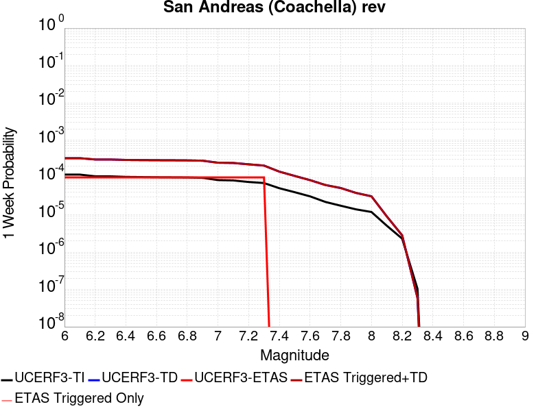 |  |  |  |

| Magnitude | 1 wk TI Prob | 1 wk TD Prob | 1 wk ETAS Prob | 1 wk ETAS/TD Gain | 1 wk ETAS Triggered+TD | 1 wk ETAS Triggered Only | 1 mo TI Prob | 1 mo TD Prob | 1 mo ETAS Prob | 1 mo ETAS/TD Gain | 1 mo ETAS Triggered+TD | 1 mo ETAS Triggered Only | 1 yr TI Prob | 1 yr TD Prob | 1 yr ETAS Prob | 1 yr ETAS/TD Gain | 1 yr ETAS Triggered+TD | 1 yr ETAS Triggered Only | 10 yr TI Prob | 10 yr TD Prob | 10 yr ETAS Prob | 10 yr ETAS/TD Gain | 10 yr ETAS Triggered+TD | 10 yr ETAS Triggered Only |
|-----|-----|-----|-----|-----|-----|-----|-----|-----|-----|-----|-----|-----|-----|-----|-----|-----|-----|-----|-----|-----|-----|-----|-----|-----|
| 6.0 | 1.1925945E-4 | 3.273348E-4 | 0.0 | 0.0 | 3.273348E-4 | 0.0 | 5.110118E-4 | 0.0014021139 | 1.0E-4 | 0.071320884 | 0.0015019737 | 1.0E-4 | 0.0062038354 | 0.016938455 | 0.0013 | 0.07674844 | 0.018216435 | 0.0013 | 0.060334753 | 0.15267272 | 0.0136 | 0.08907943 | 0.16419639 | 0.0136 |
| 6.1 | 1.1925945E-4 | 3.273348E-4 | 0.0 | 0.0 | 3.273348E-4 | 0.0 | 5.110118E-4 | 0.0014021139 | 1.0E-4 | 0.071320884 | 0.0015019737 | 1.0E-4 | 0.0062038354 | 0.016938455 | 0.0013 | 0.07674844 | 0.018216435 | 0.0013 | 0.060334753 | 0.15267272 | 0.0136 | 0.08907943 | 0.16419639 | 0.0136 |
| 6.2 | 1.07432395E-4 | 3.0233705E-4 | 0.0 | 0.0 | 3.0233705E-4 | 0.0 | 4.603433E-4 | 0.0012950908 | 1.0E-4 | 0.077214666 | 0.0013949613 | 1.0E-4 | 0.005590286 | 0.01565483 | 0.0013 | 0.08304146 | 0.01693448 | 0.0013 | 0.05451731 | 0.14184295 | 0.0133 | 0.093765676 | 0.15325645 | 0.0133 |
| 6.3 | 1.0718766E-4 | 3.0179007E-4 | 0.0 | 0.0 | 3.0179007E-4 | 0.0 | 4.592948E-4 | 0.001292749 | 1.0E-4 | 0.077354535 | 0.0013926197 | 1.0E-4 | 0.005577586 | 0.015626729 | 0.0013 | 0.0831908 | 0.016906414 | 0.0013 | 0.054396555 | 0.1416112 | 0.0133 | 0.09391913 | 0.15302777 | 0.0133 |
| 6.4 | 1.0355944E-4 | 2.938699E-4 | 0.0 | 0.0 | 2.938699E-4 | 0.0 | 4.4375064E-4 | 0.0012588385 | 1.0E-4 | 0.07943831 | 0.0013587126 | 1.0E-4 | 0.0053892885 | 0.015219707 | 0.0013 | 0.08541557 | 0.016499922 | 0.0013 | 0.052604496 | 0.13816342 | 0.0131 | 0.094815254 | 0.14945348 | 0.0131 |
| 6.5 | 1.0227914E-4 | 2.9106392E-4 | 0.0 | 0.0 | 2.9106392E-4 | 0.0 | 4.382655E-4 | 0.0012468243 | 1.0E-4 | 0.080203764 | 0.0013466997 | 1.0E-4 | 0.0053228354 | 0.015075468 | 0.0013 | 0.08623281 | 0.01635587 | 0.0013 | 0.051971316 | 0.13693702 | 0.013 | 0.09493415 | 0.14815684 | 0.013 |
| 6.6 | 1.0116757E-4 | 2.8872112E-4 | 0.0 | 0.0 | 2.8872112E-4 | 0.0 | 4.3350324E-4 | 0.0012367934 | 1.0E-4 | 0.08085425 | 0.0013366697 | 1.0E-4 | 0.0052651367 | 0.014955023 | 0.0013 | 0.08692731 | 0.016235583 | 0.0013 | 0.051421247 | 0.1359153 | 0.013 | 0.09564781 | 0.1471484 | 0.013 |
| 6.7 | 1.0050676E-4 | 2.873066E-4 | 0.0 | 0.0 | 2.873066E-4 | 0.0 | 4.3067214E-4 | 0.0012307368 | 1.0E-4 | 0.081252135 | 0.0013306139 | 1.0E-4 | 0.005230834 | 0.014882296 | 0.0013 | 0.08735211 | 0.016162949 | 0.0013 | 0.051094085 | 0.13529967 | 0.013 | 0.096083015 | 0.14654078 | 0.013 |
| 6.8 | 9.976819E-5 | 2.8534303E-4 | 0.0 | 0.0 | 2.8534303E-4 | 0.0 | 4.2750788E-4 | 0.0012223294 | 1.0E-4 | 0.081811 | 0.0013222073 | 1.0E-4 | 0.0051924936 | 0.01478133 | 0.0013 | 0.087948784 | 0.016062114 | 0.0013 | 0.050728295 | 0.13445176 | 0.0129 | 0.095945194 | 0.14561732 | 0.0129 |
| 6.9 | 9.77719E-5 | 2.8031587E-4 | 0.0 | 0.0 | 2.8031587E-4 | 0.0 | 4.1895514E-4 | 0.0012008046 | 1.0E-4 | 0.0832775 | 0.0013006845 | 1.0E-4 | 0.0050888555 | 0.014522787 | 0.0012 | 0.08262877 | 0.01570536 | 0.0012 | 0.049738888 | 0.1322819 | 0.0126 | 0.09525113 | 0.14321515 | 0.0126 |
| 7.0 | 8.500761E-5 | 2.4769624E-4 | 0.0 | 0.0 | 2.4769624E-4 | 0.0 | 3.6426744E-4 | 0.0010611267 | 1.0E-4 | 0.09423945 | 0.0011610206 | 1.0E-4 | 0.0044259406 | 0.012843463 | 0.0012 | 0.09343275 | 0.014028051 | 0.0012 | 0.04338823 | 0.11816433 | 0.0113 | 0.095629536 | 0.12812908 | 0.0113 |
| 7.1 | 8.319876E-5 | 2.4373074E-4 | 0.0 | 0.0 | 2.4373074E-4 | 0.0 | 3.5651738E-4 | 0.0010441453 | 1.0E-4 | 0.09577211 | 0.001144041 | 1.0E-4 | 0.004331963 | 0.012639132 | 0.0012 | 0.094943225 | 0.013823966 | 0.0012 | 0.042484846 | 0.11638745 | 0.0109 | 0.09365271 | 0.12601882 | 0.0109 |
| 7.2 | 7.563917E-5 | 2.2422797E-4 | 0.0 | 0.0 | 2.2422797E-4 | 0.0 | 3.2412758E-4 | 9.606262E-4 | 0.0 | 0.0 | 9.606262E-4 | 0.0 | 0.0039391145 | 0.011633594 | 0.0011 | 0.094553754 | 0.012720797 | 0.0011 | 0.03870018 | 0.10779893 | 0.0099 | 0.091837645 | 0.11663172 | 0.0099 |
| 7.3 | 7.082985E-5 | 2.0739704E-4 | 0.0 | 0.0 | 2.0739704E-4 | 0.0 | 3.0352117E-4 | 8.8854454E-4 | 0.0 | 0.0 | 8.8854454E-4 | 0.0 | 0.0036891096 | 0.010764995 | 0.0011 | 0.10218305 | 0.011853153 | 0.0011 | 0.03628465 | 0.10032484 | 0.0093 | 0.09269888 | 0.10869182 | 0.0093 |
| 7.4 | 5.146215E-5 | 1.4287805E-4 | 0.0 | 0.0 | 1.4287805E-4 | 0.0 | 2.2053342E-4 | 6.121917E-4 | 0.0 | 0.0 | 6.121917E-4 | 0.0 | 0.0026816884 | 0.0074281506 | 6.0E-4 | 0.08077381 | 0.008023694 | 6.0E-4 | 0.02649557 | 0.07091033 | 0.0067 | 0.09448553 | 0.07713523 | 0.0067 |
| 7.5 | 4.0285166E-5 | 1.09578934E-4 | 0.0 | 0.0 | 1.09578934E-4 | 0.0 | 1.7263928E-4 | 4.6953978E-4 | 0.0 | 0.0 | 4.6953978E-4 | 0.0 | 0.002099857 | 0.005701732 | 5.0E-4 | 0.08769265 | 0.006198881 | 5.0E-4 | 0.020801254 | 0.055080835 | 0.005 | 0.090775676 | 0.059805434 | 0.005 |
| 7.6 | 3.1168736E-5 | 8.455639E-5 | 0.0 | 0.0 | 8.455639E-5 | 0.0 | 1.3357346E-4 | 3.6233434E-4 | 0.0 | 0.0 | 3.6233434E-4 | 0.0 | 0.0016250437 | 0.0044025243 | 5.0E-4 | 0.11357121 | 0.0049003228 | 5.0E-4 | 0.016132116 | 0.042882834 | 0.0039 | 0.09094548 | 0.04661559 | 0.0039 |
| 7.7 | 2.2100989E-5 | 6.256016E-5 | 0.0 | 0.0 | 6.256016E-5 | 0.0 | 9.4715084E-5 | 2.6808743E-4 | 0.0 | 0.0 | 2.6808743E-4 | 0.0 | 0.001152546 | 0.003259086 | 4.0E-4 | 0.1227338 | 0.0036577822 | 4.0E-4 | 0.011465867 | 0.031976786 | 0.0029 | 0.09069079 | 0.034784053 | 0.0029 |
| 7.8 | 1.7484861E-5 | 5.1963896E-5 | 0.0 | 0.0 | 5.1963896E-5 | 0.0 | 7.493296E-5 | 2.2268342E-4 | 0.0 | 0.0 | 2.2268342E-4 | 0.0 | 9.1192697E-4 | 0.0027078027 | 4.0E-4 | 0.14772125 | 0.0031067196 | 4.0E-4 | 0.009081938 | 0.02671556 | 0.0027 | 0.1010647 | 0.029343428 | 0.0027 |
| 7.9 | 1.3967285E-5 | 3.8357197E-5 | 0.0 | 0.0 | 3.8357197E-5 | 0.0 | 5.985842E-5 | 1.6437763E-4 | 0.0 | 0.0 | 1.6437763E-4 | 0.0 | 7.2853256E-4 | 0.001999462 | 4.0E-4 | 0.20005381 | 0.0023986623 | 4.0E-4 | 0.0072614877 | 0.01997099 | 0.0018 | 0.09013073 | 0.021735044 | 0.0018 |
| 8.0 | 1.1887396E-5 | 3.11753E-5 | 0.0 | 0.0 | 3.11753E-5 | 0.0 | 5.094499E-5 | 1.3360158E-4 | 0.0 | 0.0 | 1.3360158E-4 | 0.0 | 6.200787E-4 | 0.0016253866 | 3.0E-4 | 0.18457146 | 0.001924899 | 3.0E-4 | 0.006183513 | 0.016330019 | 0.0015 | 0.09185538 | 0.017805522 | 0.0015 |
| 8.1 | 5.100864E-6 | 9.002828E-6 | 0.0 | 0.0 | 9.002828E-6 | 0.0 | 2.1860664E-5 | 3.8582977E-5 | 0.0 | 0.0 | 3.8582977E-5 | 0.0 | 2.6612106E-4 | 4.6964662E-4 | 2.0E-4 | 0.4258521 | 6.695527E-4 | 2.0E-4 | 0.002658026 | 0.0049324404 | 4.0E-4 | 0.08109576 | 0.005330467 | 4.0E-4 |
| 8.2 | 2.3004484E-6 | 2.7959436E-6 | 0.0 | 0.0 | 2.7959436E-6 | 0.0 | 9.859027E-6 | 1.198256E-5 | 0.0 | 0.0 | 1.198256E-5 | 0.0 | 1.2002704E-4 | 1.4587794E-4 | 1.0E-4 | 0.6855046 | 2.4586334E-4 | 1.0E-4 | 0.0011996223 | 0.0016023921 | 2.0E-4 | 0.1248134 | 0.0018020716 | 2.0E-4 |
| 8.3 | 1.0424446E-7 | 5.8351635E-8 | 0.0 | 0.0 | 5.8351635E-8 | 0.0 | 4.4676187E-7 | 2.5007841E-7 | 0.0 | 0.0 | 2.5007841E-7 | 0.0 | 5.439312E-6 | 3.0447006E-6 | 0.0 | 0.0 | 3.0447006E-6 | 0.0 | 5.4391792E-5 | 3.201061E-5 | 0.0 | 0.0 | 3.201061E-5 | 0.0 |

## San Andreas (San Bernardino N)
*[(top)](#table-of-contents)*

| 1 Week | 1 Month | 1 Year | 10 Year |
|-----|-----|-----|-----|
|  | 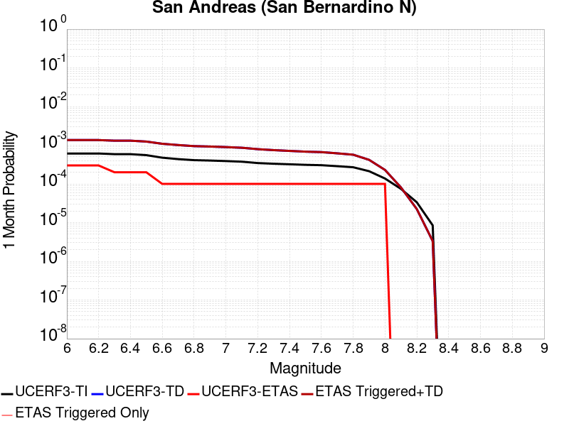 | 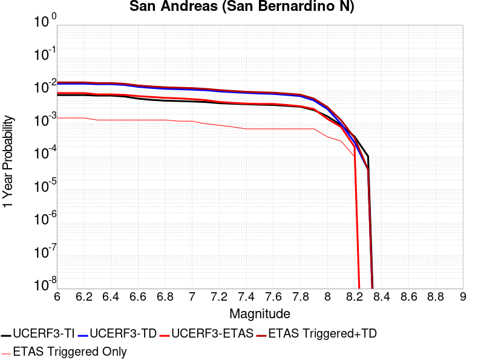 |  |

| Magnitude | 1 wk TI Prob | 1 wk TD Prob | 1 wk ETAS Prob | 1 wk ETAS/TD Gain | 1 wk ETAS Triggered+TD | 1 wk ETAS Triggered Only | 1 mo TI Prob | 1 mo TD Prob | 1 mo ETAS Prob | 1 mo ETAS/TD Gain | 1 mo ETAS Triggered+TD | 1 mo ETAS Triggered Only | 1 yr TI Prob | 1 yr TD Prob | 1 yr ETAS Prob | 1 yr ETAS/TD Gain | 1 yr ETAS Triggered+TD | 1 yr ETAS Triggered Only | 10 yr TI Prob | 10 yr TD Prob | 10 yr ETAS Prob | 10 yr ETAS/TD Gain | 10 yr ETAS Triggered+TD | 10 yr ETAS Triggered Only |
|-----|-----|-----|-----|-----|-----|-----|-----|-----|-----|-----|-----|-----|-----|-----|-----|-----|-----|-----|-----|-----|-----|-----|-----|-----|
| 6.0 | 1.4273766E-4 | 3.1685331E-4 | 0.0 | 0.0 | 3.1685331E-4 | 0.0 | 6.115894E-4 | 0.0013572421 | 0.0 | 0.0 | 0.0013572421 | 0.0 | 0.0074207084 | 0.016400725 | 0.0015 | 0.09145937 | 0.017876124 | 0.0015 | 0.07177748 | 0.1506182 | 0.0123 | 0.08166344 | 0.1610656 | 0.0123 |
| 6.1 | 1.4273766E-4 | 3.1685331E-4 | 0.0 | 0.0 | 3.1685331E-4 | 0.0 | 6.115894E-4 | 0.0013572421 | 0.0 | 0.0 | 0.0013572421 | 0.0 | 0.0074207084 | 0.016400725 | 0.0015 | 0.09145937 | 0.017876124 | 0.0015 | 0.07177748 | 0.1506182 | 0.0123 | 0.08166344 | 0.1610656 | 0.0123 |
| 6.2 | 1.4273766E-4 | 3.1685331E-4 | 0.0 | 0.0 | 3.1685331E-4 | 0.0 | 6.115894E-4 | 0.0013572421 | 0.0 | 0.0 | 0.0013572421 | 0.0 | 0.0074207084 | 0.016400725 | 0.0015 | 0.09145937 | 0.017876124 | 0.0015 | 0.07177748 | 0.1506182 | 0.0123 | 0.08166344 | 0.1610656 | 0.0123 |
| 6.3 | 1.3730655E-4 | 3.05896E-4 | 0.0 | 0.0 | 3.05896E-4 | 0.0 | 5.883239E-4 | 0.0013103299 | 0.0 | 0.0 | 0.0013103299 | 0.0 | 0.0071393442 | 0.015837977 | 0.0013 | 0.08208119 | 0.017117387 | 0.0013 | 0.06914291 | 0.14590286 | 0.0119 | 0.08156112 | 0.15606661 | 0.0119 |
| 6.4 | 1.3730655E-4 | 3.05896E-4 | 0.0 | 0.0 | 3.05896E-4 | 0.0 | 5.883239E-4 | 0.0013103299 | 0.0 | 0.0 | 0.0013103299 | 0.0 | 0.0071393442 | 0.015837977 | 0.0013 | 0.08208119 | 0.017117387 | 0.0013 | 0.06914291 | 0.14590286 | 0.0119 | 0.08156112 | 0.15606661 | 0.0119 |
| 6.5 | 1.2942807E-4 | 2.9003236E-4 | 0.0 | 0.0 | 2.9003236E-4 | 0.0 | 5.545738E-4 | 0.0012424089 | 0.0 | 0.0 | 0.0012424089 | 0.0 | 0.0067310524 | 0.015022668 | 0.0013 | 0.08653589 | 0.016303139 | 0.0013 | 0.06530788 | 0.13902712 | 0.0116 | 0.08343696 | 0.1490144 | 0.0116 |
| 6.6 | 1.1125901E-4 | 2.5439865E-4 | 0.0 | 0.0 | 2.5439865E-4 | 0.0 | 4.767372E-4 | 0.0010898266 | 0.0 | 0.0 | 0.0010898266 | 0.0 | 0.005788839 | 0.01318855 | 0.0013 | 0.09857035 | 0.014471405 | 0.0013 | 0.056403454 | 0.12329011 | 0.0102 | 0.082731694 | 0.13223255 | 0.0102 |
| 6.7 | 1.02209575E-4 | 2.3573951E-4 | 0.0 | 0.0 | 2.3573951E-4 | 0.0 | 4.3796748E-4 | 0.0010099224 | 0.0 | 0.0 | 0.0010099224 | 0.0 | 0.0053192247 | 0.0122269085 | 0.0013 | 0.10632287 | 0.013511014 | 0.0013 | 0.051936906 | 0.11508918 | 0.0093 | 0.0808069 | 0.12331885 | 0.0093 |
| 6.8 | 9.610582E-5 | 2.2098269E-4 | 0.0 | 0.0 | 2.2098269E-4 | 0.0 | 4.1181705E-4 | 9.467256E-4 | 0.0 | 0.0 | 9.467256E-4 | 0.0 | 0.0050023515 | 0.011465735 | 0.0013 | 0.11338131 | 0.012750829 | 0.0013 | 0.048912346 | 0.108496934 | 0.0089 | 0.08202997 | 0.11643131 | 0.0089 |
| 6.9 | 9.3877505E-5 | 2.155332E-4 | 0.0 | 0.0 | 2.155332E-4 | 0.0 | 4.0227012E-4 | 9.233874E-4 | 0.0 | 0.0 | 9.233874E-4 | 0.0 | 0.0048866454 | 0.011184539 | 0.0012 | 0.10729097 | 0.012371117 | 0.0012 | 0.04780577 | 0.10609194 | 0.0086 | 0.081061766 | 0.113779545 | 0.0086 |
| 7.0 | 9.1019785E-5 | 2.0879573E-4 | 0.0 | 0.0 | 2.0879573E-4 | 0.0 | 3.900265E-4 | 8.9453254E-4 | 0.0 | 0.0 | 8.9453254E-4 | 0.0 | 0.0047382377 | 0.0108367745 | 0.0012 | 0.11073405 | 0.01202377 | 0.0012 | 0.046384744 | 0.103052564 | 0.0085 | 0.082482174 | 0.11067662 | 0.0085 |
| 7.1 | 8.771155E-5 | 2.0053326E-4 | 0.0 | 0.0 | 2.0053326E-4 | 0.0 | 3.758525E-4 | 8.591458E-4 | 0.0 | 0.0 | 8.591458E-4 | 0.0 | 0.0045664064 | 0.010410131 | 0.001 | 0.096060276 | 0.011399721 | 0.001 | 0.044737056 | 0.09936683 | 0.008 | 0.08050977 | 0.10657189 | 0.008 |
| 7.2 | 8.0830236E-5 | 1.8457227E-4 | 0.0 | 0.0 | 1.8457227E-4 | 0.0 | 3.4636928E-4 | 7.907844E-4 | 0.0 | 0.0 | 7.907844E-4 | 0.0 | 0.0042088944 | 0.009585406 | 9.0E-4 | 0.09389274 | 0.010476778 | 9.0E-4 | 0.041300658 | 0.09208565 | 0.0077 | 0.08361781 | 0.09907659 | 0.0077 |
| 7.3 | 7.7668235E-5 | 1.7398952E-4 | 0.0 | 0.0 | 1.7398952E-4 | 0.0 | 3.328214E-4 | 7.454564E-4 | 0.0 | 0.0 | 7.454564E-4 | 0.0 | 0.0040445733 | 0.0090382425 | 8.0E-4 | 0.088512786 | 0.009831012 | 8.0E-4 | 0.03971748 | 0.08735462 | 0.0071 | 0.0812779 | 0.09383441 | 0.0071 |
| 7.4 | 7.520177E-5 | 1.6617647E-4 | 0.0 | 0.0 | 1.6617647E-4 | 0.0 | 3.2225347E-4 | 7.119906E-4 | 0.0 | 0.0 | 7.119906E-4 | 0.0 | 0.0039163795 | 0.008634099 | 7.0E-4 | 0.081073895 | 0.009328055 | 7.0E-4 | 0.038480744 | 0.083809614 | 0.0066 | 0.07874991 | 0.089856476 | 0.0066 |
| 7.5 | 7.274697E-5 | 1.5904015E-4 | 0.0 | 0.0 | 1.5904015E-4 | 0.0 | 3.1173544E-4 | 6.8142265E-4 | 0.0 | 0.0 | 6.8142265E-4 | 0.0 | 0.003788775 | 0.008264819 | 7.0E-4 | 0.084696345 | 0.008959034 | 7.0E-4 | 0.03724827 | 0.08052356 | 0.0065 | 0.08072172 | 0.08650015 | 0.0065 |
| 7.6 | 7.1185845E-5 | 1.5473065E-4 | 0.0 | 0.0 | 1.5473065E-4 | 0.0 | 3.0504653E-4 | 6.6296285E-4 | 0.0 | 0.0 | 6.6296285E-4 | 0.0 | 0.0037076178 | 0.008041753 | 7.0E-4 | 0.0870457 | 0.008736124 | 7.0E-4 | 0.036463667 | 0.07851 | 0.0065 | 0.082792 | 0.08449969 | 0.0065 |
| 7.7 | 6.709961E-5 | 1.4380914E-4 | 0.0 | 0.0 | 1.4380914E-4 | 0.0 | 2.8753807E-4 | 6.161794E-4 | 0.0 | 0.0 | 6.161794E-4 | 0.0 | 0.003495157 | 0.007476218 | 7.0E-4 | 0.09363023 | 0.008170985 | 7.0E-4 | 0.034406938 | 0.07333642 | 0.0059 | 0.08045116 | 0.07880373 | 0.0059 |
| 7.8 | 6.300812E-5 | 1.3261341E-4 | 0.0 | 0.0 | 1.3261341E-4 | 0.0 | 2.7000686E-4 | 5.682194E-4 | 0.0 | 0.0 | 5.682194E-4 | 0.0 | 0.0032823787 | 0.006896156 | 7.0E-4 | 0.10150582 | 0.0075913286 | 7.0E-4 | 0.032343175 | 0.067979865 | 0.0056 | 0.08237734 | 0.073199175 | 0.0056 |
| 7.9 | 4.983037E-5 | 9.767259E-5 | 0.0 | 0.0 | 9.767259E-5 | 0.0 | 2.1354125E-4 | 4.1852967E-4 | 0.0 | 0.0 | 4.1852967E-4 | 0.0 | 0.0025967648 | 0.005083704 | 7.0E-4 | 0.13769488 | 0.005780145 | 7.0E-4 | 0.025666296 | 0.05085278 | 0.0041 | 0.0806249 | 0.05474428 | 0.0041 |
| 8.0 | 3.2211527E-5 | 5.3526906E-5 | 0.0 | 0.0 | 5.3526906E-5 | 0.0 | 1.380421E-4 | 2.2938086E-4 | 0.0 | 0.0 | 2.2938086E-4 | 0.0 | 0.0016793669 | 0.0027891372 | 4.0E-4 | 0.14341353 | 0.0031880215 | 4.0E-4 | 0.016667323 | 0.028468601 | 0.0021 | 0.07376548 | 0.030508818 | 0.0021 |
| 8.1 | 1.743376E-5 | 1.8898609E-5 | 0.0 | 0.0 | 1.8898609E-5 | 0.0 | 7.471398E-5 | 8.099152E-5 | 0.0 | 0.0 | 8.099152E-5 | 0.0 | 9.0926304E-4 | 9.856264E-4 | 3.0E-4 | 0.30437496 | 0.0012853307 | 3.0E-4 | 0.009055517 | 0.010522532 | 8.0E-4 | 0.07602733 | 0.011314115 | 8.0E-4 |
| 8.2 | 7.831616E-6 | 5.1732954E-6 | 0.0 | 0.0 | 5.1732954E-6 | 0.0 | 3.3563636E-5 | 2.2171078E-5 | 0.0 | 0.0 | 2.2171078E-5 | 0.0 | 4.0856065E-4 | 2.6989952E-4 | 1.0E-4 | 0.37050825 | 3.6987252E-4 | 1.0E-4 | 0.004078103 | 0.0030517636 | 3.0E-4 | 0.09830381 | 0.003350848 | 3.0E-4 |
| 8.3 | 1.983087E-6 | 7.6880906E-7 | 0.0 | 0.0 | 7.6880906E-7 | 0.0 | 8.498917E-6 | 3.294892E-6 | 0.0 | 0.0 | 3.294892E-6 | 0.0 | 1.034694E-4 | 4.0114588E-5 | 0.0 | 0.0 | 4.0114588E-5 | 0.0 | 0.0010342124 | 4.7361702E-4 | 0.0 | 0.0 | 4.7361702E-4 | 0.0 |

## Calaveras (Central) 2011 CFM
*[(top)](#table-of-contents)*

| 1 Week | 1 Month | 1 Year | 10 Year |
|-----|-----|-----|-----|
|  | 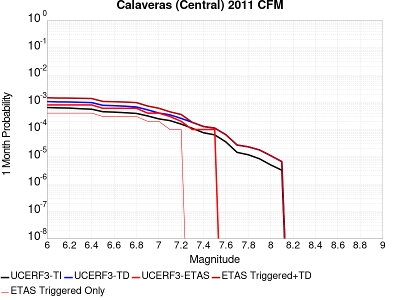 |  | 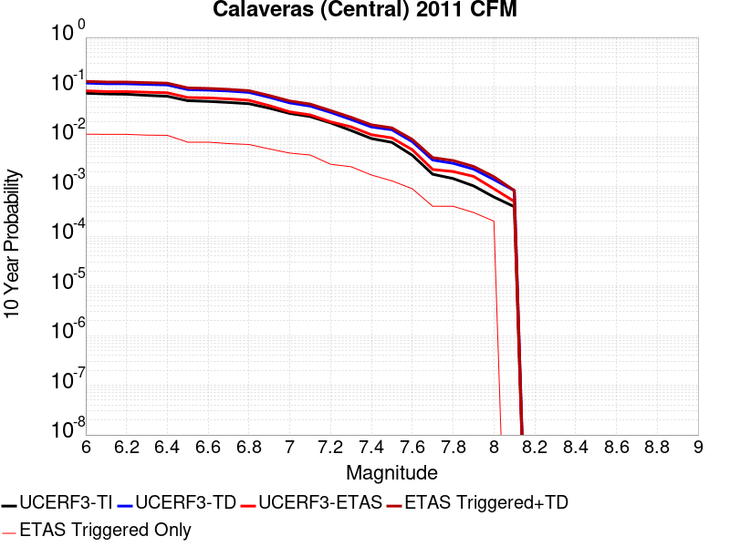 |

| Magnitude | 1 wk TI Prob | 1 wk TD Prob | 1 wk ETAS Prob | 1 wk ETAS/TD Gain | 1 wk ETAS Triggered+TD | 1 wk ETAS Triggered Only | 1 mo TI Prob | 1 mo TD Prob | 1 mo ETAS Prob | 1 mo ETAS/TD Gain | 1 mo ETAS Triggered+TD | 1 mo ETAS Triggered Only | 1 yr TI Prob | 1 yr TD Prob | 1 yr ETAS Prob | 1 yr ETAS/TD Gain | 1 yr ETAS Triggered+TD | 1 yr ETAS Triggered Only | 10 yr TI Prob | 10 yr TD Prob | 10 yr ETAS Prob | 10 yr ETAS/TD Gain | 10 yr ETAS Triggered+TD | 10 yr ETAS Triggered Only |
|-----|-----|-----|-----|-----|-----|-----|-----|-----|-----|-----|-----|-----|-----|-----|-----|-----|-----|-----|-----|-----|-----|-----|-----|-----|
| 6.0 | 1.5010907E-4 | 2.48149E-4 | 2.0E-4 | 0.8059674 | 4.4809937E-4 | 2.0E-4 | 6.4316596E-4 | 0.0010630052 | 4.0E-4 | 0.3762917 | 0.0014625799 | 4.0E-4 | 0.0078024664 | 0.0128565375 | 0.0015 | 0.116672166 | 0.014337253 | 0.0015 | 0.07534136 | 0.1204545 | 0.0113 | 0.093811356 | 0.13039337 | 0.0113 |
| 6.1 | 1.4521465E-4 | 2.3975901E-4 | 2.0E-4 | 0.83417094 | 4.3971106E-4 | 2.0E-4 | 6.222001E-4 | 0.0010270779 | 4.0E-4 | 0.3894544 | 0.0014266671 | 4.0E-4 | 0.0075490056 | 0.012425594 | 0.0015 | 0.120718576 | 0.013906956 | 0.0015 | 0.07297657 | 0.116724186 | 0.0112 | 0.0959527 | 0.12661687 | 0.0112 |
| 6.2 | 1.429998E-4 | 2.3906906E-4 | 2.0E-4 | 0.83657837 | 4.3902124E-4 | 2.0E-4 | 6.127123E-4 | 0.0010241234 | 4.0E-4 | 0.3905779 | 0.0014237138 | 4.0E-4 | 0.007434286 | 0.01239008 | 0.0015 | 0.121064596 | 0.013871495 | 0.0015 | 0.07190444 | 0.11637699 | 0.0112 | 0.096238956 | 0.12627356 | 0.0112 |
| 6.3 | 1.3536277E-4 | 2.3237611E-4 | 2.0E-4 | 0.86067367 | 4.3232963E-4 | 2.0E-4 | 5.799972E-4 | 9.954663E-4 | 4.0E-4 | 0.40182176 | 0.001395068 | 4.0E-4 | 0.0070386264 | 0.012046 | 0.0014 | 0.11622115 | 0.013429136 | 0.0014 | 0.0681982 | 0.11328756 | 0.0108 | 0.09533262 | 0.12286405 | 0.0108 |
| 6.4 | 1.2993296E-4 | 2.2661181E-4 | 2.0E-4 | 0.8825665 | 4.265665E-4 | 2.0E-4 | 5.5673666E-4 | 9.70781E-4 | 4.0E-4 | 0.41203937 | 0.0013703927 | 4.0E-4 | 0.006757223 | 0.011748805 | 0.0014 | 0.11916106 | 0.013132356 | 0.0014 | 0.06555412 | 0.11056562 | 0.0107 | 0.096775115 | 0.120082565 | 0.0107 |
| 6.5 | 1.0498927E-4 | 1.7989917E-4 | 1.0E-4 | 0.55586696 | 2.7988118E-4 | 1.0E-4 | 4.498764E-4 | 7.707678E-4 | 3.0E-4 | 0.3892223 | 0.0010705366 | 3.0E-4 | 0.005463498 | 0.00934363 | 0.0011 | 0.117727265 | 0.010433353 | 0.0011 | 0.053311124 | 0.08923505 | 0.0078 | 0.08740959 | 0.096339025 | 0.0078 |
| 6.6 | 1.0157505E-4 | 1.7477208E-4 | 1.0E-4 | 0.5721738 | 2.747546E-4 | 1.0E-4 | 4.35249E-4 | 7.488075E-4 | 3.0E-4 | 0.400637 | 0.0010485828 | 3.0E-4 | 0.0052862884 | 0.009078558 | 0.0011 | 0.12116462 | 0.010168571 | 0.0011 | 0.05162293 | 0.086811274 | 0.0078 | 0.08985008 | 0.09393415 | 0.0078 |
| 6.7 | 9.660386E-5 | 1.673599E-4 | 1.0E-4 | 0.5975147 | 2.6734316E-4 | 1.0E-4 | 4.1395082E-4 | 7.1705884E-4 | 3.0E-4 | 0.4183757 | 0.0010168437 | 3.0E-4 | 0.0050282106 | 0.008695205 | 0.0011 | 0.12650652 | 0.00978564 | 0.0011 | 0.049159497 | 0.083298504 | 0.0073 | 0.08763663 | 0.08999042 | 0.0073 |
| 6.8 | 9.089927E-5 | 1.5651487E-4 | 1.0E-4 | 0.6389169 | 2.5649922E-4 | 1.0E-4 | 3.8951015E-4 | 6.706054E-4 | 3.0E-4 | 0.44735697 | 9.704042E-4 | 3.0E-4 | 0.0047319788 | 0.0081340205 | 0.0011 | 0.13523448 | 0.009225073 | 0.0011 | 0.046324775 | 0.078197606 | 0.007 | 0.0895168 | 0.084650226 | 0.007 |
| 6.9 | 7.353187E-5 | 1.2306299E-4 | 0.0 | 0.0 | 1.2306299E-4 | 0.0 | 3.150985E-4 | 5.2730675E-4 | 2.0E-4 | 0.37928584 | 7.272013E-4 | 2.0E-4 | 0.0038295772 | 0.006401183 | 0.001 | 0.15622112 | 0.007394782 | 0.001 | 0.037642512 | 0.06224034 | 0.0057 | 0.09158048 | 0.06758557 | 0.0057 |
| 7.0 | 5.746064E-5 | 9.398882E-5 | 0.0 | 0.0 | 9.398882E-5 | 0.0 | 2.4623662E-4 | 4.0274742E-4 | 2.0E-4 | 0.49658915 | 6.0266687E-4 | 2.0E-4 | 0.0029938098 | 0.0048924964 | 6.0E-4 | 0.12263678 | 0.005489561 | 6.0E-4 | 0.02953797 | 0.048035648 | 0.0047 | 0.097844005 | 0.05250988 | 0.0047 |
| 7.1 | 4.9557195E-5 | 8.060512E-5 | 0.0 | 0.0 | 8.060512E-5 | 0.0 | 2.123707E-4 | 3.4540513E-4 | 1.0E-4 | 0.2895151 | 4.453706E-4 | 1.0E-4 | 0.0025825473 | 0.0041972613 | 5.0E-4 | 0.11912529 | 0.0046951626 | 5.0E-4 | 0.0255274 | 0.041412957 | 0.0043 | 0.10383224 | 0.045534883 | 0.0043 |
| 7.2 | 3.687595E-5 | 5.9600043E-5 | 0.0 | 0.0 | 5.9600043E-5 | 0.0 | 1.5803022E-4 | 2.5540392E-4 | 1.0E-4 | 0.39153668 | 3.5537838E-4 | 1.0E-4 | 0.0019223199 | 0.003105138 | 3.0E-4 | 0.09661406 | 0.0034042064 | 3.0E-4 | 0.01905776 | 0.030921506 | 0.0028 | 0.09055187 | 0.033634927 | 0.0028 |
| 7.3 | 2.5846984E-5 | 4.2549356E-5 | 0.0 | 0.0 | 4.2549356E-5 | 0.0 | 1.1076809E-4 | 1.8234173E-4 | 0.0 | 0.0 | 1.8234173E-4 | 0.0 | 0.0013477671 | 0.002217768 | 2.0E-4 | 0.09018076 | 0.0024173243 | 2.0E-4 | 0.013396223 | 0.022213813 | 0.0025 | 0.11254259 | 0.024658278 | 0.0025 |
| 7.4 | 1.7747854E-5 | 2.9946423E-5 | 0.0 | 0.0 | 2.9946423E-5 | 0.0 | 7.6060016E-5 | 1.2833552E-4 | 0.0 | 0.0 | 1.2833552E-4 | 0.0 | 9.2563726E-4 | 0.0015613679 | 0.0 | 0.0 | 0.0015613679 | 0.0 | 0.009217911 | 0.015712492 | 0.0017 | 0.108194165 | 0.01738578 | 0.0017 |
| 7.5 | 1.4883479E-5 | 2.6254495E-5 | 0.0 | 0.0 | 2.6254495E-5 | 0.0 | 6.378478E-5 | 1.12514426E-4 | 0.0 | 0.0 | 1.12514426E-4 | 0.0 | 7.76303E-4 | 0.0013690051 | 0.0 | 0.0 | 0.0013690051 | 0.0 | 0.0077359667 | 0.01380611 | 0.0013 | 0.094161205 | 0.015088162 | 0.0013 |
| 7.6 | 8.166975E-6 | 1.4986061E-5 | 0.0 | 0.0 | 1.4986061E-5 | 0.0 | 3.5000852E-5 | 6.42244E-5 | 0.0 | 0.0 | 6.42244E-5 | 0.0 | 4.2605202E-4 | 7.8165287E-4 | 0.0 | 0.0 | 7.8165287E-4 | 0.0 | 0.004252361 | 0.007949483 | 9.0E-4 | 0.11321491 | 0.008842329 | 9.0E-4 |
| 7.7 | 3.3858064E-6 | 6.275998E-6 | 0.0 | 0.0 | 6.275998E-6 | 0.0 | 1.4510518E-5 | 2.6896858E-5 | 0.0 | 0.0 | 2.6896858E-5 | 0.0 | 1.7665124E-4 | 3.274201E-4 | 0.0 | 0.0 | 3.274201E-4 | 0.0 | 0.0017651088 | 0.0033990694 | 4.0E-4 | 0.11767927 | 0.0037977097 | 4.0E-4 |
| 7.8 | 2.7721615E-6 | 5.387197E-6 | 0.0 | 0.0 | 5.387197E-6 | 0.0 | 1.1880637E-5 | 2.3087783E-5 | 0.0 | 0.0 | 2.3087783E-5 | 0.0 | 1.4463716E-4 | 2.8105755E-4 | 0.0 | 0.0 | 2.8105755E-4 | 0.0 | 0.0014454306 | 0.002917698 | 4.0E-4 | 0.13709438 | 0.003316531 | 4.0E-4 |
| 7.9 | 1.9736292E-6 | 4.145375E-6 | 0.0 | 0.0 | 4.145375E-6 | 0.0 | 8.4583835E-6 | 1.7765771E-5 | 0.0 | 0.0 | 1.7765771E-5 | 0.0 | 1.0297595E-4 | 2.1627685E-4 | 0.0 | 0.0 | 2.1627685E-4 | 0.0 | 0.0010292825 | 0.0022319239 | 3.0E-4 | 0.13441318 | 0.0025312544 | 3.0E-4 |
| 8.0 | 1.1767289E-6 | 2.5649322E-6 | 0.0 | 0.0 | 2.5649322E-6 | 0.0 | 5.0431145E-6 | 1.099252E-5 | 0.0 | 0.0 | 1.099252E-5 | 0.0 | 6.139818E-5 | 1.3382574E-4 | 0.0 | 0.0 | 1.3382574E-4 | 0.0 | 6.1381224E-4 | 0.0013712465 | 2.0E-4 | 0.1458527 | 0.0015709723 | 2.0E-4 |
| 8.1 | 7.5112825E-7 | 1.5472552E-6 | 0.0 | 0.0 | 1.5472552E-6 | 0.0 | 3.2191172E-6 | 6.631077E-6 | 0.0 | 0.0 | 6.631077E-6 | 0.0 | 3.9192048E-5 | 8.0730395E-5 | 0.0 | 0.0 | 8.0730395E-5 | 0.0 | 3.9185135E-4 | 8.266791E-4 | 0.0 | 0.0 | 8.266791E-4 | 0.0 |

## San Andreas (Mojave N)
*[(top)](#table-of-contents)*

| 1 Week | 1 Month | 1 Year | 10 Year |
|-----|-----|-----|-----|
|  |  |  | 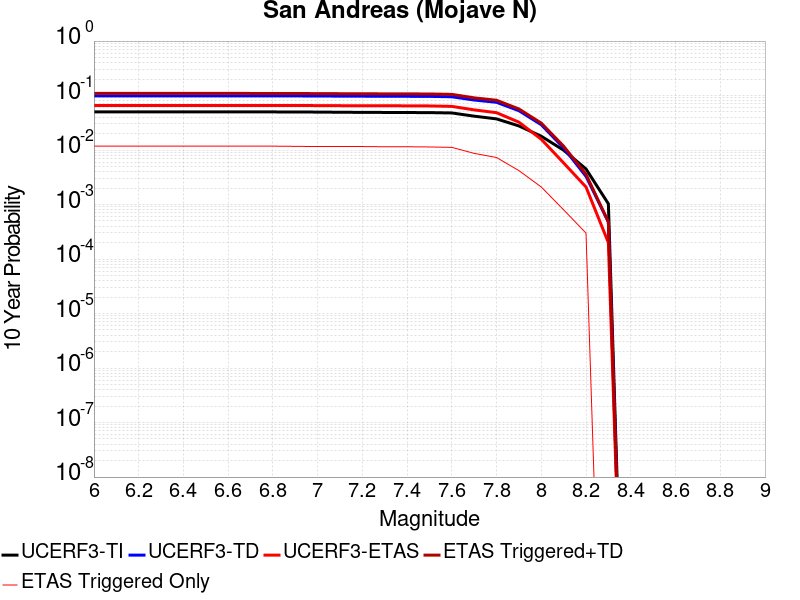 |

| Magnitude | 1 wk TI Prob | 1 wk TD Prob | 1 wk ETAS Prob | 1 wk ETAS/TD Gain | 1 wk ETAS Triggered+TD | 1 wk ETAS Triggered Only | 1 mo TI Prob | 1 mo TD Prob | 1 mo ETAS Prob | 1 mo ETAS/TD Gain | 1 mo ETAS Triggered+TD | 1 mo ETAS Triggered Only | 1 yr TI Prob | 1 yr TD Prob | 1 yr ETAS Prob | 1 yr ETAS/TD Gain | 1 yr ETAS Triggered+TD | 1 yr ETAS Triggered Only | 10 yr TI Prob | 10 yr TD Prob | 10 yr ETAS Prob | 10 yr ETAS/TD Gain | 10 yr ETAS Triggered+TD | 10 yr ETAS Triggered Only |
|-----|-----|-----|-----|-----|-----|-----|-----|-----|-----|-----|-----|-----|-----|-----|-----|-----|-----|-----|-----|-----|-----|-----|-----|-----|
| 6.0 | 9.877682E-5 | 1.9488399E-4 | 0.0 | 0.0 | 1.9488399E-4 | 0.0 | 4.2326056E-4 | 8.3494995E-4 | 2.0E-4 | 0.23953532 | 0.001034783 | 2.0E-4 | 0.0051410277 | 0.010118262 | 0.0017 | 0.16801305 | 0.011801061 | 0.0017 | 0.05023708 | 0.09869135 | 0.0118 | 0.11956468 | 0.109326795 | 0.0118 |
| 6.1 | 9.877682E-5 | 1.9488399E-4 | 0.0 | 0.0 | 1.9488399E-4 | 0.0 | 4.2326056E-4 | 8.3494995E-4 | 2.0E-4 | 0.23953532 | 0.001034783 | 2.0E-4 | 0.0051410277 | 0.010118262 | 0.0017 | 0.16801305 | 0.011801061 | 0.0017 | 0.05023708 | 0.09869135 | 0.0118 | 0.11956468 | 0.109326795 | 0.0118 |
| 6.2 | 9.877682E-5 | 1.9488399E-4 | 0.0 | 0.0 | 1.9488399E-4 | 0.0 | 4.2326056E-4 | 8.3494995E-4 | 2.0E-4 | 0.23953532 | 0.001034783 | 2.0E-4 | 0.0051410277 | 0.010118262 | 0.0017 | 0.16801305 | 0.011801061 | 0.0017 | 0.05023708 | 0.09869135 | 0.0118 | 0.11956468 | 0.109326795 | 0.0118 |
| 6.3 | 9.877682E-5 | 1.9488399E-4 | 0.0 | 0.0 | 1.9488399E-4 | 0.0 | 4.2326056E-4 | 8.3494995E-4 | 2.0E-4 | 0.23953532 | 0.001034783 | 2.0E-4 | 0.0051410277 | 0.010118262 | 0.0017 | 0.16801305 | 0.011801061 | 0.0017 | 0.05023708 | 0.09869135 | 0.0118 | 0.11956468 | 0.109326795 | 0.0118 |
| 6.4 | 9.877682E-5 | 1.9488399E-4 | 0.0 | 0.0 | 1.9488399E-4 | 0.0 | 4.2326056E-4 | 8.3494995E-4 | 2.0E-4 | 0.23953532 | 0.001034783 | 2.0E-4 | 0.0051410277 | 0.010118262 | 0.0017 | 0.16801305 | 0.011801061 | 0.0017 | 0.05023708 | 0.09869135 | 0.0118 | 0.11956468 | 0.109326795 | 0.0118 |
| 6.5 | 9.861474E-5 | 1.9462121E-4 | 0.0 | 0.0 | 1.9462121E-4 | 0.0 | 4.2256617E-4 | 8.338245E-4 | 2.0E-4 | 0.23985863 | 0.0010336577 | 2.0E-4 | 0.0051326132 | 0.010104687 | 0.0017 | 0.16823876 | 0.011787509 | 0.0017 | 0.050156746 | 0.09856942 | 0.0118 | 0.11971258 | 0.109206304 | 0.0118 |
| 6.6 | 9.861474E-5 | 1.9462121E-4 | 0.0 | 0.0 | 1.9462121E-4 | 0.0 | 4.2256617E-4 | 8.338245E-4 | 2.0E-4 | 0.23985863 | 0.0010336577 | 2.0E-4 | 0.0051326132 | 0.010104687 | 0.0017 | 0.16823876 | 0.011787509 | 0.0017 | 0.050156746 | 0.09856942 | 0.0118 | 0.11971258 | 0.109206304 | 0.0118 |
| 6.7 | 9.8552715E-5 | 1.945206E-4 | 0.0 | 0.0 | 1.945206E-4 | 0.0 | 4.223004E-4 | 8.333936E-4 | 2.0E-4 | 0.23998265 | 0.001033227 | 2.0E-4 | 0.0051293927 | 0.010099489 | 0.0017 | 0.16832533 | 0.01178232 | 0.0017 | 0.050125998 | 0.098522596 | 0.0118 | 0.11976948 | 0.10916003 | 0.0118 |
| 6.8 | 9.8464974E-5 | 1.9437188E-4 | 0.0 | 0.0 | 1.9437188E-4 | 0.0 | 4.219245E-4 | 8.327566E-4 | 2.0E-4 | 0.24016622 | 0.00103259 | 2.0E-4 | 0.0051248376 | 0.010091806 | 0.0017 | 0.1684535 | 0.01177465 | 0.0017 | 0.05008251 | 0.0984525 | 0.0118 | 0.11985475 | 0.10909076 | 0.0118 |
| 6.9 | 9.825824E-5 | 1.9405126E-4 | 0.0 | 0.0 | 1.9405126E-4 | 0.0 | 4.2103877E-4 | 8.3138334E-4 | 2.0E-4 | 0.24056292 | 0.001031217 | 2.0E-4 | 0.0051141046 | 0.010075241 | 0.0017 | 0.16873045 | 0.011758113 | 0.0017 | 0.049980022 | 0.09830141 | 0.0117 | 0.11902169 | 0.108851284 | 0.0117 |
| 7.0 | 9.781462E-5 | 1.9336343E-4 | 0.0 | 0.0 | 1.9336343E-4 | 0.0 | 4.1913814E-4 | 8.2843745E-4 | 2.0E-4 | 0.24141835 | 0.0010282717 | 2.0E-4 | 0.005091073 | 0.010039706 | 0.0017 | 0.16932766 | 0.011722638 | 0.0017 | 0.04976007 | 0.097977385 | 0.0116 | 0.118394665 | 0.108440846 | 0.0116 |
| 7.1 | 9.7121134E-5 | 1.9237857E-4 | 0.0 | 0.0 | 1.9237857E-4 | 0.0 | 4.1616702E-4 | 8.2421926E-4 | 2.0E-4 | 0.24265388 | 0.0010240545 | 2.0E-4 | 0.005055068 | 0.009988822 | 0.0017 | 0.17019024 | 0.011671841 | 0.0017 | 0.04941613 | 0.09751313 | 0.0116 | 0.11895834 | 0.10798198 | 0.0116 |
| 7.2 | 9.663819E-5 | 1.9168502E-4 | 0.0 | 0.0 | 1.9168502E-4 | 0.0 | 4.1409794E-4 | 8.2124874E-4 | 2.0E-4 | 0.24353157 | 0.0010210845 | 2.0E-4 | 0.0050299936 | 0.009952987 | 0.0017 | 0.170803 | 0.011636067 | 0.0017 | 0.049176537 | 0.09718585 | 0.0116 | 0.119358934 | 0.1076585 | 0.0116 |
| 7.3 | 9.6277574E-5 | 1.9120841E-4 | 0.0 | 0.0 | 1.9120841E-4 | 0.0 | 4.125529E-4 | 8.1920746E-4 | 2.0E-4 | 0.2441384 | 0.0010190436 | 2.0E-4 | 0.0050112694 | 0.009928361 | 0.0017 | 0.17122665 | 0.011611483 | 0.0017 | 0.04899759 | 0.09695861 | 0.0115 | 0.11860732 | 0.107343584 | 0.0115 |
| 7.4 | 9.593308E-5 | 1.9060425E-4 | 0.0 | 0.0 | 1.9060425E-4 | 0.0 | 4.1107697E-4 | 8.1661984E-4 | 2.0E-4 | 0.24491201 | 0.0010164565 | 2.0E-4 | 0.0049933824 | 0.009897144 | 0.0017 | 0.17176674 | 0.011580318 | 0.0017 | 0.04882661 | 0.09667616 | 0.0115 | 0.11895383 | 0.10706439 | 0.0115 |
| 7.5 | 9.561707E-5 | 1.9006323E-4 | 0.0 | 0.0 | 1.9006323E-4 | 0.0 | 4.0972308E-4 | 8.1430265E-4 | 2.0E-4 | 0.24560894 | 0.0010141397 | 2.0E-4 | 0.0049769743 | 0.009869187 | 0.0017 | 0.1722533 | 0.01155241 | 0.0017 | 0.048669744 | 0.09642165 | 0.0114 | 0.11823071 | 0.106722444 | 0.0114 |
| 7.6 | 9.418194E-5 | 1.8657577E-4 | 0.0 | 0.0 | 1.8657577E-4 | 0.0 | 4.0357444E-4 | 7.993655E-4 | 2.0E-4 | 0.25019842 | 9.992056E-4 | 2.0E-4 | 0.004902454 | 0.009688959 | 0.0017 | 0.17545743 | 0.011372488 | 0.0017 | 0.047957025 | 0.09479908 | 0.0112 | 0.11814461 | 0.10493733 | 0.0112 |
| 7.7 | 8.202141E-5 | 1.60998E-4 | 0.0 | 0.0 | 1.60998E-4 | 0.0 | 3.51473E-4 | 6.89809E-4 | 2.0E-4 | 0.28993532 | 8.8967104E-4 | 2.0E-4 | 0.00427079 | 0.0083661415 | 0.0015 | 0.17929412 | 0.009853592 | 0.0015 | 0.04189639 | 0.082577825 | 0.0087 | 0.105355166 | 0.09055939 | 0.0087 |
| 7.8 | 7.2859846E-5 | 1.4586128E-4 | 0.0 | 0.0 | 1.4586128E-4 | 0.0 | 3.1221908E-4 | 6.2497007E-4 | 1.0E-4 | 0.16000767 | 7.2490756E-4 | 1.0E-4 | 0.003794643 | 0.0075825057 | 0.001 | 0.13188252 | 0.0085749235 | 0.001 | 0.037304975 | 0.07503157 | 0.0073 | 0.09729238 | 0.08178384 | 0.0073 |
| 7.9 | 5.3874453E-5 | 1.009104E-4 | 0.0 | 0.0 | 1.009104E-4 | 0.0 | 2.3087008E-4 | 4.324015E-4 | 0.0 | 0.0 | 4.324015E-4 | 0.0 | 0.0028072202 | 0.005251792 | 7.0E-4 | 0.13328785 | 0.0059481156 | 7.0E-4 | 0.02772022 | 0.052635863 | 0.0042 | 0.079793505 | 0.056614794 | 0.0042 |
| 8.0 | 3.468538E-5 | 5.4487606E-5 | 0.0 | 0.0 | 5.4487606E-5 | 0.0 | 1.4864317E-4 | 2.3349741E-4 | 0.0 | 0.0 | 2.3349741E-4 | 0.0 | 0.0018082283 | 0.0028391269 | 4.0E-4 | 0.14088838 | 0.0032379911 | 4.0E-4 | 0.017935853 | 0.029057508 | 0.0021 | 0.072270475 | 0.031096488 | 0.0021 |
| 8.1 | 1.9152367E-5 | 1.9480029E-5 | 0.0 | 0.0 | 1.9480029E-5 | 0.0 | 8.207899E-5 | 8.3483166E-5 | 0.0 | 0.0 | 8.3483166E-5 | 0.0 | 9.988535E-4 | 0.0010159343 | 3.0E-4 | 0.29529467 | 0.0013156296 | 3.0E-4 | 0.009943757 | 0.010896575 | 8.0E-4 | 0.07341757 | 0.011687857 | 8.0E-4 |
| 8.2 | 8.643924E-6 | 5.4947163E-6 | 0.0 | 0.0 | 5.4947163E-6 | 0.0 | 3.704486E-5 | 2.3548571E-5 | 0.0 | 0.0 | 2.3548571E-5 | 0.0 | 4.5092785E-4 | 2.866662E-4 | 1.0E-4 | 0.34883776 | 3.8663755E-4 | 1.0E-4 | 0.0045001395 | 0.0032596437 | 3.0E-4 | 0.0920346 | 0.0035586657 | 3.0E-4 |
| 8.3 | 1.983087E-6 | 7.6880906E-7 | 0.0 | 0.0 | 7.6880906E-7 | 0.0 | 8.498917E-6 | 3.294892E-6 | 0.0 | 0.0 | 3.294892E-6 | 0.0 | 1.034694E-4 | 4.0114588E-5 | 0.0 | 0.0 | 4.0114588E-5 | 0.0 | 0.0010342124 | 4.7361702E-4 | 0.0 | 0.0 | 4.7361702E-4 | 0.0 |

## Calaveras (So) - Paicines extension 2011 CFM
*[(top)](#table-of-contents)*

| 1 Week | 1 Month | 1 Year | 10 Year |
|-----|-----|-----|-----|
|  |  | 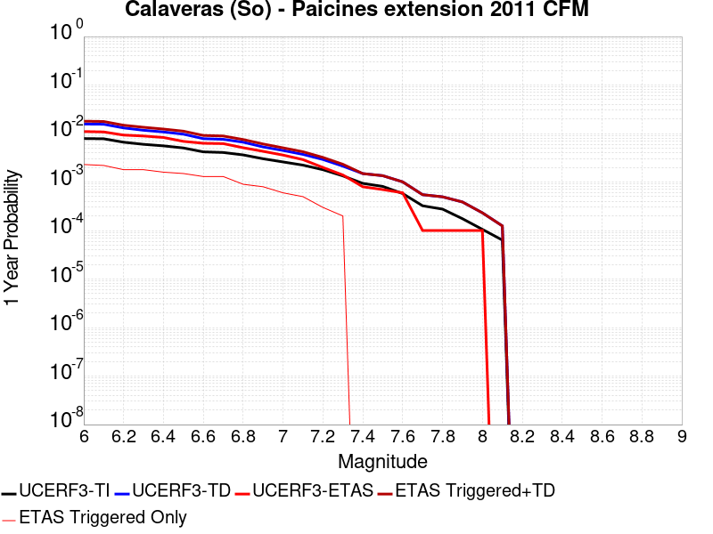 |  |

| Magnitude | 1 wk TI Prob | 1 wk TD Prob | 1 wk ETAS Prob | 1 wk ETAS/TD Gain | 1 wk ETAS Triggered+TD | 1 wk ETAS Triggered Only | 1 mo TI Prob | 1 mo TD Prob | 1 mo ETAS Prob | 1 mo ETAS/TD Gain | 1 mo ETAS Triggered+TD | 1 mo ETAS Triggered Only | 1 yr TI Prob | 1 yr TD Prob | 1 yr ETAS Prob | 1 yr ETAS/TD Gain | 1 yr ETAS Triggered+TD | 1 yr ETAS Triggered Only | 10 yr TI Prob | 10 yr TD Prob | 10 yr ETAS Prob | 10 yr ETAS/TD Gain | 10 yr ETAS Triggered+TD | 10 yr ETAS Triggered Only |
|-----|-----|-----|-----|-----|-----|-----|-----|-----|-----|-----|-----|-----|-----|-----|-----|-----|-----|-----|-----|-----|-----|-----|-----|-----|
| 6.0 | 1.5183659E-4 | 3.054342E-4 | 3.0E-4 | 0.9822083 | 6.0534256E-4 | 3.0E-4 | 6.5056595E-4 | 0.0013077842 | 7.0E-4 | 0.5352565 | 0.0020068688 | 7.0E-4 | 0.007891912 | 0.015707778 | 0.0023 | 0.14642428 | 0.01797165 | 0.0023 | 0.076174594 | 0.1385814 | 0.0112 | 0.08081893 | 0.14822929 | 0.0112 |
| 6.1 | 1.5024997E-4 | 3.0237468E-4 | 3.0E-4 | 0.99214655 | 6.02284E-4 | 3.0E-4 | 6.437695E-4 | 0.0012946858 | 7.0E-4 | 0.54067177 | 0.0019937793 | 7.0E-4 | 0.0078097614 | 0.015551066 | 0.0022 | 0.1414694 | 0.017716855 | 0.0022 | 0.075409345 | 0.13725032 | 0.0109 | 0.07941694 | 0.14665428 | 0.0109 |
| 6.2 | 1.2743923E-4 | 2.5334593E-4 | 3.0E-4 | 1.1841515 | 5.532699E-4 | 3.0E-4 | 5.460538E-4 | 0.0010849063 | 6.0E-4 | 0.5530432 | 0.0016842553 | 6.0E-4 | 0.0066279583 | 0.013057871 | 0.0018 | 0.1378479 | 0.014834367 | 0.0018 | 0.064337276 | 0.11734596 | 0.0097 | 0.082661554 | 0.1259077 | 0.0097 |
| 6.3 | 1.1525114E-4 | 2.2619693E-4 | 3.0E-4 | 1.326278 | 5.261291E-4 | 3.0E-4 | 4.9383997E-4 | 9.6877106E-4 | 6.0E-4 | 0.6193414 | 0.0015681898 | 6.0E-4 | 0.0059959386 | 0.011679007 | 0.0018 | 0.1541227 | 0.013457985 | 0.0018 | 0.058367174 | 0.10646255 | 0.009 | 0.08453677 | 0.11450439 | 0.009 |
| 6.4 | 1.07200925E-4 | 2.0860838E-4 | 2.0E-4 | 0.9587342 | 4.0856667E-4 | 2.0E-4 | 4.5935164E-4 | 8.935047E-4 | 5.0E-4 | 0.55959415 | 0.001393058 | 5.0E-4 | 0.0055782744 | 0.010783806 | 0.0016 | 0.14837062 | 0.012366552 | 0.0016 | 0.0544031 | 0.09928518 | 0.0083 | 0.08359758 | 0.10676111 | 0.0083 |
| 6.5 | 9.69631E-5 | 1.8754073E-4 | 1.0E-4 | 0.5332175 | 2.8752198E-4 | 1.0E-4 | 4.1548995E-4 | 8.033252E-4 | 4.0E-4 | 0.49793035 | 0.0012030038 | 4.0E-4 | 0.0050468626 | 0.009705312 | 0.0015 | 0.15455455 | 0.011190753 | 0.0015 | 0.04933773 | 0.09017472 | 0.0075 | 0.083171874 | 0.09699841 | 0.0075 |
| 6.6 | 8.0552316E-5 | 1.509097E-4 | 1.0E-4 | 0.6626479 | 2.508946E-4 | 1.0E-4 | 3.4517853E-4 | 6.4655195E-4 | 3.0E-4 | 0.4639998 | 9.46358E-4 | 3.0E-4 | 0.0041944524 | 0.007836893 | 0.0013 | 0.16588207 | 0.009126705 | 0.0013 | 0.04116161 | 0.074945115 | 0.0065 | 0.08673014 | 0.08095797 | 0.0065 |
| 6.7 | 7.815757E-5 | 1.4631219E-4 | 1.0E-4 | 0.68347 | 2.4629757E-4 | 1.0E-4 | 3.34918E-4 | 6.268629E-4 | 3.0E-4 | 0.4785735 | 9.2667487E-4 | 3.0E-4 | 0.004070005 | 0.0075995456 | 0.0013 | 0.17106286 | 0.008889666 | 0.0013 | 0.039962657 | 0.07279358 | 0.0062 | 0.08517235 | 0.078542255 | 0.0062 |
| 6.8 | 6.965264E-5 | 1.274037E-4 | 1.0E-4 | 0.7849065 | 2.2739096E-4 | 1.0E-4 | 2.9847719E-4 | 5.458821E-4 | 3.0E-4 | 0.54956925 | 8.457183E-4 | 3.0E-4 | 0.0036279052 | 0.006622643 | 9.0E-4 | 0.13589741 | 0.0075166826 | 9.0E-4 | 0.03569247 | 0.06387969 | 0.0053 | 0.08296847 | 0.06884112 | 0.0053 |
| 6.9 | 5.8000453E-5 | 1.0157569E-4 | 0.0 | 0.0 | 1.0157569E-4 | 0.0 | 2.4854968E-4 | 4.3525227E-4 | 2.0E-4 | 0.45950362 | 6.3516526E-4 | 2.0E-4 | 0.0030218933 | 0.0052864184 | 8.0E-4 | 0.1513312 | 0.0060821893 | 8.0E-4 | 0.029811295 | 0.051569268 | 0.0045 | 0.087261274 | 0.055837207 | 0.0045 |
| 7.0 | 4.9865852E-5 | 8.578852E-5 | 0.0 | 0.0 | 8.578852E-5 | 0.0 | 2.1369329E-4 | 3.6761374E-4 | 2.0E-4 | 0.5440493 | 5.6754024E-4 | 2.0E-4 | 0.0025986114 | 0.004466601 | 6.0E-4 | 0.13433032 | 0.005063921 | 6.0E-4 | 0.025684336 | 0.043836214 | 0.004 | 0.09124876 | 0.04766087 | 0.004 |
| 7.1 | 4.283875E-5 | 7.121611E-5 | 0.0 | 0.0 | 7.121611E-5 | 0.0 | 1.8358172E-4 | 3.051765E-4 | 1.0E-4 | 0.32767922 | 4.05146E-4 | 1.0E-4 | 0.0022328163 | 0.0037092506 | 5.0E-4 | 0.13479812 | 0.004207396 | 5.0E-4 | 0.022105146 | 0.03678266 | 0.0035 | 0.09515353 | 0.04015392 | 0.0035 |
| 7.2 | 3.450115E-5 | 5.586732E-5 | 0.0 | 0.0 | 5.586732E-5 | 0.0 | 1.478537E-4 | 2.3940955E-4 | 1.0E-4 | 0.41769427 | 3.3938562E-4 | 1.0E-4 | 0.0017986323 | 0.0029109444 | 3.0E-4 | 0.10305934 | 0.0032100712 | 3.0E-4 | 0.017841442 | 0.029124515 | 0.0024 | 0.08240481 | 0.031454615 | 0.0024 |
| 7.3 | 2.5709045E-5 | 4.0686176E-5 | 0.0 | 0.0 | 4.0686176E-5 | 0.0 | 1.1017697E-4 | 1.7435776E-4 | 0.0 | 0.0 | 1.7435776E-4 | 0.0 | 0.0013405791 | 0.002120756 | 2.0E-4 | 0.094305985 | 0.002320332 | 2.0E-4 | 0.013325208 | 0.021345448 | 0.0021 | 0.09838163 | 0.023400621 | 0.0021 |
| 7.4 | 1.8003093E-5 | 2.8542057E-5 | 0.0 | 0.0 | 2.8542057E-5 | 0.0 | 7.715383E-5 | 1.2231737E-4 | 0.0 | 0.0 | 1.2231737E-4 | 0.0 | 9.3894306E-4 | 0.0014881991 | 0.0 | 0.0 | 0.0014881991 | 0.0 | 0.009349857 | 0.015065949 | 0.0014 | 0.09292478 | 0.016444856 | 0.0014 |
| 7.5 | 1.5595824E-5 | 2.5856303E-5 | 0.0 | 0.0 | 2.5856303E-5 | 0.0 | 6.683753E-5 | 1.1080804E-4 | 0.0 | 0.0 | 1.1080804E-4 | 0.0 | 8.134431E-4 | 0.0013482552 | 0.0 | 0.0 | 0.0013482552 | 0.0 | 0.008104719 | 0.0136663895 | 0.0011 | 0.080489434 | 0.014751357 | 0.0011 |
| 7.6 | 1.1110309E-5 | 1.926335E-5 | 0.0 | 0.0 | 1.926335E-5 | 0.0 | 4.761474E-5 | 8.2554616E-5 | 0.0 | 0.0 | 8.2554616E-5 | 0.0 | 5.795553E-4 | 0.0010046404 | 0.0 | 0.0 | 0.0010046404 | 0.0 | 0.0057804612 | 0.010222295 | 9.0E-4 | 0.08804285 | 0.011113095 | 9.0E-4 |
| 7.7 | 6.2140443E-6 | 1.0478021E-5 | 0.0 | 0.0 | 1.0478021E-5 | 0.0 | 2.6631347E-5 | 4.490503E-5 | 0.0 | 0.0 | 4.490503E-5 | 0.0 | 3.241884E-4 | 5.465817E-4 | 0.0 | 0.0 | 5.465817E-4 | 0.0 | 0.0032371588 | 0.0056395386 | 4.0E-4 | 0.07092779 | 0.0060372828 | 4.0E-4 |
| 7.8 | 5.305533E-6 | 9.472085E-6 | 0.0 | 0.0 | 9.472085E-6 | 0.0 | 2.27378E-5 | 4.059402E-5 | 0.0 | 0.0 | 4.059402E-5 | 0.0 | 2.7679754E-4 | 4.941202E-4 | 0.0 | 0.0 | 4.941202E-4 | 0.0 | 0.0027645302 | 0.005093134 | 4.0E-4 | 0.07853711 | 0.0054910965 | 4.0E-4 |
| 7.9 | 3.363505E-6 | 7.4162713E-6 | 0.0 | 0.0 | 7.4162713E-6 | 0.0 | 1.4414942E-5 | 3.178363E-5 | 0.0 | 0.0 | 3.178363E-5 | 0.0 | 1.7548777E-4 | 3.868971E-4 | 0.0 | 0.0 | 3.868971E-4 | 0.0 | 0.0017534926 | 0.0039636907 | 3.0E-4 | 0.075687036 | 0.0042625014 | 3.0E-4 |
| 8.0 | 2.0271132E-6 | 4.4312446E-6 | 0.0 | 0.0 | 4.4312446E-6 | 0.0 | 8.687599E-6 | 1.899091E-5 | 0.0 | 0.0 | 1.899091E-5 | 0.0 | 1.05766376E-4 | 2.3118986E-4 | 0.0 | 0.0 | 2.3118986E-4 | 0.0 | 0.0010571606 | 0.002359982 | 2.0E-4 | 0.084746405 | 0.00255951 | 2.0E-4 |
| 8.1 | 1.2206116E-6 | 2.3848943E-6 | 0.0 | 0.0 | 2.3848943E-6 | 0.0 | 5.2311816E-6 | 1.0220935E-5 | 0.0 | 0.0 | 1.0220935E-5 | 0.0 | 6.3687774E-5 | 1.2443282E-4 | 0.0 | 0.0 | 1.2443282E-4 | 0.0 | 6.366953E-4 | 0.0012754233 | 0.0 | 0.0 | 0.0012754233 | 0.0 |

## San Jacinto (Superstition Mtn)
*[(top)](#table-of-contents)*

| 1 Week | 1 Month | 1 Year | 10 Year |
|-----|-----|-----|-----|
|  |  |  |  |

| Magnitude | 1 wk TI Prob | 1 wk TD Prob | 1 wk ETAS Prob | 1 wk ETAS/TD Gain | 1 wk ETAS Triggered+TD | 1 wk ETAS Triggered Only | 1 mo TI Prob | 1 mo TD Prob | 1 mo ETAS Prob | 1 mo ETAS/TD Gain | 1 mo ETAS Triggered+TD | 1 mo ETAS Triggered Only | 1 yr TI Prob | 1 yr TD Prob | 1 yr ETAS Prob | 1 yr ETAS/TD Gain | 1 yr ETAS Triggered+TD | 1 yr ETAS Triggered Only | 10 yr TI Prob | 10 yr TD Prob | 10 yr ETAS Prob | 10 yr ETAS/TD Gain | 10 yr ETAS Triggered+TD | 10 yr ETAS Triggered Only |
|-----|-----|-----|-----|-----|-----|-----|-----|-----|-----|-----|-----|-----|-----|-----|-----|-----|-----|-----|-----|-----|-----|-----|-----|-----|
| 6.0 | 6.4193904E-5 | 9.60619E-5 | 0.0 | 0.0 | 9.60619E-5 | 0.0 | 2.7508775E-4 | 4.1163358E-4 | 2.0E-4 | 0.48586902 | 6.115512E-4 | 2.0E-4 | 0.0033440501 | 0.0050015277 | 0.0021 | 0.4198717 | 0.007091025 | 0.0021 | 0.03294174 | 0.048858702 | 0.0114 | 0.23332588 | 0.059701715 | 0.0114 |
| 6.1 | 6.4193904E-5 | 9.60619E-5 | 0.0 | 0.0 | 9.60619E-5 | 0.0 | 2.7508775E-4 | 4.1163358E-4 | 2.0E-4 | 0.48586902 | 6.115512E-4 | 2.0E-4 | 0.0033440501 | 0.0050015277 | 0.0021 | 0.4198717 | 0.007091025 | 0.0021 | 0.03294174 | 0.048858702 | 0.0114 | 0.23332588 | 0.059701715 | 0.0114 |
| 6.2 | 5.7023593E-5 | 8.3202176E-5 | 0.0 | 0.0 | 8.3202176E-5 | 0.0 | 2.4436394E-4 | 3.565414E-4 | 2.0E-4 | 0.5609447 | 5.5647007E-4 | 2.0E-4 | 0.002971072 | 0.0043338933 | 0.0019 | 0.4384049 | 0.006225659 | 0.0019 | 0.029316625 | 0.042538002 | 0.0099 | 0.23273307 | 0.052016877 | 0.0099 |
| 6.3 | 5.6940098E-5 | 8.304749E-5 | 0.0 | 0.0 | 8.304749E-5 | 0.0 | 2.4400617E-4 | 3.558786E-4 | 2.0E-4 | 0.56198937 | 5.5580743E-4 | 2.0E-4 | 0.002966728 | 0.004325856 | 0.0019 | 0.43921942 | 0.006217637 | 0.0019 | 0.029274331 | 0.042461354 | 0.0099 | 0.2331532 | 0.051940985 | 0.0099 |
| 6.4 | 5.4171585E-5 | 7.7537734E-5 | 0.0 | 0.0 | 7.7537734E-5 | 0.0 | 2.3214328E-4 | 3.3227153E-4 | 2.0E-4 | 0.6019173 | 5.322051E-4 | 2.0E-4 | 0.0028226813 | 0.004039551 | 0.0017 | 0.42083886 | 0.005732684 | 0.0017 | 0.02787096 | 0.039748922 | 0.0092 | 0.23145282 | 0.048583232 | 0.0092 |
| 6.5 | 4.375144E-5 | 5.647212E-5 | 0.0 | 0.0 | 5.647212E-5 | 0.0 | 1.874927E-4 | 2.4200755E-4 | 1.0E-4 | 0.41321024 | 3.4198334E-4 | 1.0E-4 | 0.0022803338 | 0.0029436368 | 7.0E-4 | 0.23780107 | 0.0036415763 | 7.0E-4 | 0.022570757 | 0.0292686 | 0.0062 | 0.21183111 | 0.035287134 | 0.0062 |
| 6.6 | 2.772192E-5 | 2.5535139E-5 | 0.0 | 0.0 | 2.5535139E-5 | 0.0 | 1.1880282E-4 | 1.0943183E-4 | 0.0 | 0.0 | 1.0943183E-4 | 0.0 | 0.0014454646 | 0.0013315375 | 3.0E-4 | 0.22530344 | 0.0016311381 | 3.0E-4 | 0.014360986 | 0.013566042 | 0.0019 | 0.14005558 | 0.015440267 | 0.0019 |
| 6.7 | 2.7124124E-5 | 2.47463E-5 | 0.0 | 0.0 | 2.47463E-5 | 0.0 | 1.1624106E-4 | 1.0605137E-4 | 0.0 | 0.0 | 1.0605137E-4 | 0.0 | 0.0014143161 | 0.0012904298 | 3.0E-4 | 0.23248067 | 0.0015900427 | 3.0E-4 | 0.014053487 | 0.013159544 | 0.0019 | 0.1443819 | 0.0150345415 | 0.0019 |
| 6.8 | 2.5475807E-5 | 2.221164E-5 | 0.0 | 0.0 | 2.221164E-5 | 0.0 | 1.0917746E-4 | 9.518933E-5 | 0.0 | 0.0 | 9.518933E-5 | 0.0 | 0.001328425 | 0.0011583259 | 3.0E-4 | 0.25899446 | 0.0014579784 | 3.0E-4 | 0.0132051185 | 0.011847902 | 0.0017 | 0.14348532 | 0.01352776 | 0.0017 |
| 6.9 | 2.1162023E-5 | 1.7672692E-5 | 0.0 | 0.0 | 1.7672692E-5 | 0.0 | 9.069123E-5 | 7.573793E-5 | 0.0 | 0.0 | 7.573793E-5 | 0.0 | 0.0011036064 | 9.21723E-4 | 3.0E-4 | 0.3254774 | 0.0012214464 | 3.0E-4 | 0.010981417 | 0.009471296 | 0.0015 | 0.15837325 | 0.010957089 | 0.0015 |
| 7.0 | 1.8754288E-5 | 1.6208367E-5 | 0.0 | 0.0 | 1.6208367E-5 | 0.0 | 8.037304E-5 | 6.946259E-5 | 0.0 | 0.0 | 6.946259E-5 | 0.0 | 9.781026E-4 | 8.453814E-4 | 3.0E-4 | 0.3548694 | 0.0011451278 | 3.0E-4 | 0.009738087 | 0.008694859 | 0.0011 | 0.12651153 | 0.009785295 | 0.0011 |
| 7.1 | 1.8678527E-5 | 1.6133481E-5 | 0.0 | 0.0 | 1.6133481E-5 | 0.0 | 8.0048376E-5 | 6.914167E-5 | 0.0 | 0.0 | 6.914167E-5 | 0.0 | 9.7415317E-4 | 8.414772E-4 | 3.0E-4 | 0.35651588 | 0.0011412248 | 3.0E-4 | 0.009698939 | 0.008655792 | 0.0011 | 0.12708253 | 0.009746271 | 0.0011 |
| 7.2 | 1.7804578E-5 | 1.5428062E-5 | 0.0 | 0.0 | 1.5428062E-5 | 0.0 | 7.6303106E-5 | 6.6118606E-5 | 0.0 | 0.0 | 6.6118606E-5 | 0.0 | 9.285943E-4 | 8.0469897E-4 | 2.0E-4 | 0.24854015 | 0.001004538 | 2.0E-4 | 0.009247236 | 0.008287079 | 9.0E-4 | 0.10860281 | 0.00917962 | 9.0E-4 |
| 7.3 | 1.6583685E-5 | 1.4577102E-5 | 0.0 | 0.0 | 1.4577102E-5 | 0.0 | 7.1070994E-5 | 6.247181E-5 | 0.0 | 0.0 | 6.247181E-5 | 0.0 | 8.649459E-4 | 7.603309E-4 | 2.0E-4 | 0.26304337 | 9.601788E-4 | 2.0E-4 | 0.00861587 | 0.007842327 | 9.0E-4 | 0.11476186 | 0.008735268 | 9.0E-4 |
| 7.4 | 1.6387552E-5 | 1.4441985E-5 | 0.0 | 0.0 | 1.4441985E-5 | 0.0 | 7.023047E-5 | 6.189276E-5 | 0.0 | 0.0 | 6.189276E-5 | 0.0 | 8.5472054E-4 | 7.532858E-4 | 2.0E-4 | 0.26550347 | 9.531352E-4 | 2.0E-4 | 0.008514405 | 0.0077716964 | 9.0E-4 | 0.115804836 | 0.008664702 | 9.0E-4 |
| 7.5 | 1.5790754E-5 | 1.4082399E-5 | 0.0 | 0.0 | 1.4082399E-5 | 0.0 | 6.767291E-5 | 6.035175E-5 | 0.0 | 0.0 | 6.035175E-5 | 0.0 | 8.236062E-4 | 7.3453685E-4 | 2.0E-4 | 0.27228042 | 9.3438994E-4 | 2.0E-4 | 0.008205604 | 0.0075821215 | 9.0E-4 | 0.11870029 | 0.008475298 | 9.0E-4 |
| 7.6 | 1.4248672E-5 | 1.30981125E-5 | 0.0 | 0.0 | 1.30981125E-5 | 0.0 | 6.106431E-5 | 5.6133573E-5 | 0.0 | 0.0 | 5.6133573E-5 | 0.0 | 7.432043E-4 | 6.8321364E-4 | 2.0E-4 | 0.2927342 | 8.8307704E-4 | 2.0E-4 | 0.007407237 | 0.007063023 | 9.0E-4 | 0.1274242 | 0.007956666 | 9.0E-4 |
| 7.7 | 1.15449975E-5 | 1.0945004E-5 | 0.0 | 0.0 | 1.0945004E-5 | 0.0 | 4.947762E-5 | 4.690632E-5 | 0.0 | 0.0 | 4.690632E-5 | 0.0 | 6.022235E-4 | 5.7093555E-4 | 2.0E-4 | 0.35030222 | 7.7082135E-4 | 2.0E-4 | 0.006005941 | 0.005932045 | 6.0E-4 | 0.10114556 | 0.006528486 | 6.0E-4 |
| 7.8 | 9.1391985E-6 | 9.5544365E-6 | 0.0 | 0.0 | 9.5544365E-6 | 0.0 | 3.9167408E-5 | 4.0946943E-5 | 0.0 | 0.0 | 4.0946943E-5 | 0.0 | 4.767588E-4 | 4.984156E-4 | 1.0E-4 | 0.20063578 | 5.983658E-4 | 1.0E-4 | 0.0047573727 | 0.005197724 | 4.0E-4 | 0.07695676 | 0.005595645 | 4.0E-4 |
| 7.9 | 6.973017E-6 | 7.416637E-6 | 0.0 | 0.0 | 7.416637E-6 | 0.0 | 2.9884017E-5 | 3.1785203E-5 | 0.0 | 0.0 | 3.1785203E-5 | 0.0 | 3.6377716E-4 | 3.8691665E-4 | 1.0E-4 | 0.25845358 | 4.8687798E-4 | 1.0E-4 | 0.0036318225 | 0.0040699276 | 4.0E-4 | 0.09828184 | 0.0044683 | 4.0E-4 |
| 8.0 | 5.7638235E-6 | 6.290151E-6 | 0.0 | 0.0 | 6.290151E-6 | 0.0 | 2.4701867E-5 | 2.6957514E-5 | 0.0 | 0.0 | 2.6957514E-5 | 0.0 | 3.0070372E-4 | 3.281588E-4 | 1.0E-4 | 0.3047305 | 4.28126E-4 | 1.0E-4 | 0.0030029714 | 0.0034693768 | 4.0E-4 | 0.11529448 | 0.003867989 | 4.0E-4 |
| 8.1 | 5.1124434E-6 | 5.521618E-6 | 0.0 | 0.0 | 5.521618E-6 | 0.0 | 2.1910288E-5 | 2.3663864E-5 | 0.0 | 0.0 | 2.3663864E-5 | 0.0 | 2.6672508E-4 | 2.8806995E-4 | 1.0E-4 | 0.3471379 | 3.8804114E-4 | 1.0E-4 | 0.0026640517 | 0.003054088 | 4.0E-4 | 0.130972 | 0.0034528666 | 4.0E-4 |
| 8.2 | 1.1075938E-6 | 5.351303E-7 | 0.0 | 0.0 | 5.351303E-7 | 0.0 | 4.7468216E-6 | 2.2934137E-6 | 0.0 | 0.0 | 2.2934137E-6 | 0.0 | 5.779102E-5 | 2.7921977E-5 | 0.0 | 0.0 | 2.7921977E-5 | 0.0 | 5.777599E-4 | 3.1429497E-4 | 1.0E-4 | 0.31817243 | 4.1426354E-4 | 1.0E-4 |
| 8.3 | 1.3584393E-8 | 4.485519E-9 | 0.0 | 0.0 | 4.485519E-9 | 0.0 | 5.8218827E-8 | 1.9223654E-8 | 0.0 | 0.0 | 1.9223654E-8 | 0.0 | 7.0881396E-7 | 2.3404799E-7 | 0.0 | 0.0 | 2.3404799E-7 | 0.0 | 7.0881174E-6 | 2.623744E-6 | 0.0 | 0.0 | 2.623744E-6 | 0.0 |

## Panamint Valley
*[(top)](#table-of-contents)*

| 1 Week | 1 Month | 1 Year | 10 Year |
|-----|-----|-----|-----|
|  |  |  | 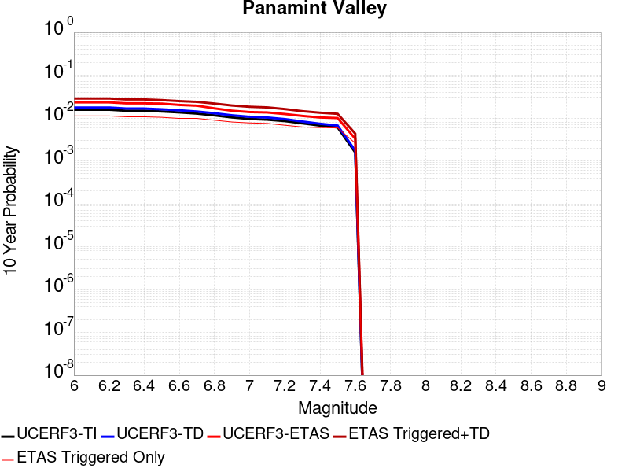 |

| Magnitude | 1 wk TI Prob | 1 wk TD Prob | 1 wk ETAS Prob | 1 wk ETAS/TD Gain | 1 wk ETAS Triggered+TD | 1 wk ETAS Triggered Only | 1 mo TI Prob | 1 mo TD Prob | 1 mo ETAS Prob | 1 mo ETAS/TD Gain | 1 mo ETAS Triggered+TD | 1 mo ETAS Triggered Only | 1 yr TI Prob | 1 yr TD Prob | 1 yr ETAS Prob | 1 yr ETAS/TD Gain | 1 yr ETAS Triggered+TD | 1 yr ETAS Triggered Only | 10 yr TI Prob | 10 yr TD Prob | 10 yr ETAS Prob | 10 yr ETAS/TD Gain | 10 yr ETAS Triggered+TD | 10 yr ETAS Triggered Only |
|-----|-----|-----|-----|-----|-----|-----|-----|-----|-----|-----|-----|-----|-----|-----|-----|-----|-----|-----|-----|-----|-----|-----|-----|-----|
| 6.0 | 3.0211835E-5 | 3.3997854E-5 | 0.0 | 0.0 | 3.3997854E-5 | 0.0 | 1.2947287E-4 | 1.4569712E-4 | 1.0E-4 | 0.68635535 | 2.4568255E-4 | 1.0E-4 | 0.0015751923 | 0.0017724487 | 0.0039 | 2.2003458 | 0.005665536 | 0.0039 | 0.015640736 | 0.017588679 | 0.0112 | 0.6367732 | 0.028591685 | 0.0112 |
| 6.1 | 3.0211835E-5 | 3.3997854E-5 | 0.0 | 0.0 | 3.3997854E-5 | 0.0 | 1.2947287E-4 | 1.4569712E-4 | 1.0E-4 | 0.68635535 | 2.4568255E-4 | 1.0E-4 | 0.0015751923 | 0.0017724487 | 0.0039 | 2.2003458 | 0.005665536 | 0.0039 | 0.015640736 | 0.017588679 | 0.0112 | 0.6367732 | 0.028591685 | 0.0112 |
| 6.2 | 3.0211835E-5 | 3.3997854E-5 | 0.0 | 0.0 | 3.3997854E-5 | 0.0 | 1.2947287E-4 | 1.4569712E-4 | 1.0E-4 | 0.68635535 | 2.4568255E-4 | 1.0E-4 | 0.0015751923 | 0.0017724487 | 0.0039 | 2.2003458 | 0.005665536 | 0.0039 | 0.015640736 | 0.017588679 | 0.0112 | 0.6367732 | 0.028591685 | 0.0112 |
| 6.3 | 2.8573924E-5 | 3.2115317E-5 | 0.0 | 0.0 | 3.2115317E-5 | 0.0 | 1.2245393E-4 | 1.3762998E-4 | 1.0E-4 | 0.7265859 | 2.3761622E-4 | 1.0E-4 | 0.001489857 | 0.0016743848 | 0.0037 | 2.2097669 | 0.0053681894 | 0.0037 | 0.01479908 | 0.016622864 | 0.0107 | 0.6436918 | 0.027144998 | 0.0107 |
| 6.4 | 2.8573924E-5 | 3.2115317E-5 | 0.0 | 0.0 | 3.2115317E-5 | 0.0 | 1.2245393E-4 | 1.3762998E-4 | 1.0E-4 | 0.7265859 | 2.3761622E-4 | 1.0E-4 | 0.001489857 | 0.0016743848 | 0.0037 | 2.2097669 | 0.0053681894 | 0.0037 | 0.01479908 | 0.016622864 | 0.0107 | 0.6436918 | 0.027144998 | 0.0107 |
| 6.5 | 2.7468774E-5 | 3.084056E-5 | 0.0 | 0.0 | 3.084056E-5 | 0.0 | 1.1771801E-4 | 1.3216729E-4 | 1.0E-4 | 0.75661683 | 2.3215408E-4 | 1.0E-4 | 0.0014322745 | 0.0016079765 | 0.0036 | 2.2388387 | 0.0052021877 | 0.0036 | 0.014230782 | 0.015968492 | 0.0104 | 0.65128255 | 0.02620242 | 0.0104 |
| 6.6 | 2.6135967E-5 | 2.9264093E-5 | 0.0 | 0.0 | 2.9264093E-5 | 0.0 | 1.1200648E-4 | 1.2541165E-4 | 1.0E-4 | 0.79737407 | 2.2539911E-4 | 1.0E-4 | 0.0013628257 | 0.001525844 | 0.0036 | 2.35935 | 0.005120351 | 0.0036 | 0.013544982 | 0.015158713 | 0.0098 | 0.64649284 | 0.024810158 | 0.0098 |
| 6.7 | 2.4498746E-5 | 2.7352793E-5 | 0.0 | 0.0 | 2.7352793E-5 | 0.0 | 1.04990395E-4 | 1.17221134E-4 | 1.0E-4 | 0.8530885 | 2.1720941E-4 | 1.0E-4 | 0.0012775084 | 0.001426258 | 0.0036 | 2.5240874 | 0.0050211237 | 0.0036 | 0.012701893 | 0.014175876 | 0.0098 | 0.6913153 | 0.023836952 | 0.0098 |
| 6.8 | 2.2244329E-5 | 2.4946075E-5 | 0.0 | 0.0 | 2.4946075E-5 | 0.0 | 9.532935E-5 | 1.0690749E-4 | 1.0E-4 | 0.93538815 | 2.068968E-4 | 1.0E-4 | 0.0011600169 | 0.0013008433 | 0.0034 | 2.613689 | 0.0046964204 | 0.0034 | 0.011539802 | 0.0129367085 | 0.0089 | 0.6879648 | 0.021721572 | 0.0089 |
| 6.9 | 1.9902658E-5 | 2.2300088E-5 | 0.0 | 0.0 | 2.2300088E-5 | 0.0 | 8.529431E-5 | 9.556841E-5 | 1.0E-4 | 1.0463709 | 1.9555885E-4 | 1.0E-4 | 0.0010379635 | 0.0011629428 | 0.0033 | 2.8376288 | 0.004459105 | 0.0033 | 0.010331288 | 0.011572636 | 0.0081 | 0.69992703 | 0.019578896 | 0.0081 |
| 7.0 | 1.8353881E-5 | 2.0575533E-5 | 0.0 | 0.0 | 2.0575533E-5 | 0.0 | 7.865712E-5 | 8.817798E-5 | 1.0E-4 | 1.13407 | 1.8816916E-4 | 1.0E-4 | 9.5722964E-4 | 0.0010730558 | 0.0033 | 3.0753293 | 0.0043695145 | 0.0033 | 0.009531168 | 0.010682788 | 0.0077 | 0.7207856 | 0.018300531 | 0.0077 |
| 7.1 | 1.7667631E-5 | 1.978174E-5 | 0.0 | 0.0 | 1.978174E-5 | 0.0 | 7.571623E-5 | 8.4776235E-5 | 1.0E-4 | 1.1795759 | 1.8476775E-4 | 1.0E-4 | 9.2145515E-4 | 0.0010316795 | 0.0032 | 3.1017385 | 0.004228378 | 0.0032 | 0.009176437 | 0.0102729015 | 0.0075 | 0.73007613 | 0.017695855 | 0.0075 |
| 7.2 | 1.6381597E-5 | 1.8166602E-5 | 0.0 | 0.0 | 1.8166602E-5 | 0.0 | 7.020495E-5 | 7.785464E-5 | 1.0E-4 | 1.2844449 | 1.7784686E-4 | 1.0E-4 | 8.544101E-4 | 9.474853E-4 | 0.0028 | 2.955191 | 0.0037448325 | 0.0028 | 0.008511325 | 0.009438183 | 0.0068 | 0.72047764 | 0.016174003 | 0.0068 |
| 7.3 | 1.4520491E-5 | 1.5973112E-5 | 0.0 | 0.0 | 1.5973112E-5 | 0.0 | 6.222919E-5 | 6.845449E-5 | 1.0E-4 | 1.4608246 | 1.6844764E-4 | 1.0E-4 | 7.57377E-4 | 8.331309E-4 | 0.0028 | 3.3608162 | 0.003630798 | 0.0028 | 0.0075480095 | 0.008302236 | 0.0062 | 0.7467868 | 0.0144507615 | 0.0062 |
| 7.4 | 1.2852287E-5 | 1.4151222E-5 | 0.0 | 0.0 | 1.4151222E-5 | 0.0 | 5.5080065E-5 | 6.0646773E-5 | 1.0E-4 | 1.6488924 | 1.606407E-4 | 1.0E-4 | 6.7039346E-4 | 7.3814014E-4 | 0.0027 | 3.657842 | 0.0034361472 | 0.0027 | 0.0066837464 | 0.0073588495 | 0.006 | 0.81534487 | 0.013314696 | 0.006 |
| 7.5 | 1.1637851E-5 | 1.2842324E-5 | 0.0 | 0.0 | 1.2842324E-5 | 0.0 | 4.987555E-5 | 5.503746E-5 | 1.0E-4 | 1.8169442 | 1.5503196E-4 | 1.0E-4 | 6.070656E-4 | 6.698908E-4 | 0.0027 | 4.0305076 | 0.003368082 | 0.0027 | 0.006054099 | 0.006680666 | 0.0059 | 0.88314545 | 0.01254125 | 0.0059 |
| 7.6 | 3.0068115E-6 | 3.335209E-6 | 0.0 | 0.0 | 3.335209E-6 | 0.0 | 1.2886271E-5 | 1.4293715E-5 | 1.0E-4 | 6.9960814 | 1.14292285E-4 | 1.0E-4 | 1.5687906E-4 | 1.7401938E-4 | 0.0014 | 8.045081 | 0.0015737758 | 0.0014 | 0.0015676835 | 0.0017395564 | 0.0026 | 1.4946339 | 0.0043350337 | 0.0026 |

## San Andreas (Big Bend)
*[(top)](#table-of-contents)*

| 1 Week | 1 Month | 1 Year | 10 Year |
|-----|-----|-----|-----|
|  |  |  |  |

| Magnitude | 1 wk TI Prob | 1 wk TD Prob | 1 wk ETAS Prob | 1 wk ETAS/TD Gain | 1 wk ETAS Triggered+TD | 1 wk ETAS Triggered Only | 1 mo TI Prob | 1 mo TD Prob | 1 mo ETAS Prob | 1 mo ETAS/TD Gain | 1 mo ETAS Triggered+TD | 1 mo ETAS Triggered Only | 1 yr TI Prob | 1 yr TD Prob | 1 yr ETAS Prob | 1 yr ETAS/TD Gain | 1 yr ETAS Triggered+TD | 1 yr ETAS Triggered Only | 10 yr TI Prob | 10 yr TD Prob | 10 yr ETAS Prob | 10 yr ETAS/TD Gain | 10 yr ETAS Triggered+TD | 10 yr ETAS Triggered Only |
|-----|-----|-----|-----|-----|-----|-----|-----|-----|-----|-----|-----|-----|-----|-----|-----|-----|-----|-----|-----|-----|-----|-----|-----|-----|
| 6.0 | 1.0179969E-4 | 2.0155679E-4 | 0.0 | 0.0 | 2.0155679E-4 | 0.0 | 4.362114E-4 | 8.6352986E-4 | 1.0E-4 | 0.115803756 | 9.634435E-4 | 1.0E-4 | 0.0052979486 | 0.01046308 | 0.0015 | 0.14336123 | 0.011947386 | 0.0015 | 0.051734097 | 0.10184024 | 0.0111 | 0.10899424 | 0.11180982 | 0.0111 |
| 6.1 | 1.0179969E-4 | 2.0155679E-4 | 0.0 | 0.0 | 2.0155679E-4 | 0.0 | 4.362114E-4 | 8.6352986E-4 | 1.0E-4 | 0.115803756 | 9.634435E-4 | 1.0E-4 | 0.0052979486 | 0.01046308 | 0.0015 | 0.14336123 | 0.011947386 | 0.0015 | 0.051734097 | 0.10184024 | 0.0111 | 0.10899424 | 0.11180982 | 0.0111 |
| 6.2 | 1.0179969E-4 | 2.0155679E-4 | 0.0 | 0.0 | 2.0155679E-4 | 0.0 | 4.362114E-4 | 8.6352986E-4 | 1.0E-4 | 0.115803756 | 9.634435E-4 | 1.0E-4 | 0.0052979486 | 0.01046308 | 0.0015 | 0.14336123 | 0.011947386 | 0.0015 | 0.051734097 | 0.10184024 | 0.0111 | 0.10899424 | 0.11180982 | 0.0111 |
| 6.3 | 1.0179969E-4 | 2.0155679E-4 | 0.0 | 0.0 | 2.0155679E-4 | 0.0 | 4.362114E-4 | 8.6352986E-4 | 1.0E-4 | 0.115803756 | 9.634435E-4 | 1.0E-4 | 0.0052979486 | 0.01046308 | 0.0015 | 0.14336123 | 0.011947386 | 0.0015 | 0.051734097 | 0.10184024 | 0.0111 | 0.10899424 | 0.11180982 | 0.0111 |
| 6.4 | 9.1639464E-5 | 1.851074E-4 | 0.0 | 0.0 | 1.851074E-4 | 0.0 | 3.9268145E-4 | 7.9307647E-4 | 1.0E-4 | 0.12609124 | 8.9299714E-4 | 1.0E-4 | 0.0047704205 | 0.009613077 | 0.0014 | 0.14563495 | 0.010999619 | 0.0014 | 0.046693064 | 0.09412048 | 0.0103 | 0.1094342 | 0.10345104 | 0.0103 |
| 6.5 | 9.1639464E-5 | 1.851074E-4 | 0.0 | 0.0 | 1.851074E-4 | 0.0 | 3.9268145E-4 | 7.9307647E-4 | 1.0E-4 | 0.12609124 | 8.9299714E-4 | 1.0E-4 | 0.0047704205 | 0.009613077 | 0.0014 | 0.14563495 | 0.010999619 | 0.0014 | 0.046693064 | 0.09412048 | 0.0103 | 0.1094342 | 0.10345104 | 0.0103 |
| 6.6 | 9.042622E-5 | 1.8317487E-4 | 0.0 | 0.0 | 1.8317487E-4 | 0.0 | 3.8748336E-4 | 7.8479917E-4 | 1.0E-4 | 0.12742114 | 8.847207E-4 | 1.0E-4 | 0.0047074095 | 0.0095131835 | 0.0014 | 0.1471642 | 0.010899864 | 0.0014 | 0.046089325 | 0.09321652 | 0.0102 | 0.10942266 | 0.10246572 | 0.0102 |
| 6.7 | 8.9836685E-5 | 1.8231724E-4 | 0.0 | 0.0 | 1.8231724E-4 | 0.0 | 3.8495753E-4 | 7.811258E-4 | 1.0E-4 | 0.12802035 | 8.810477E-4 | 1.0E-4 | 0.00467679 | 0.009468849 | 0.0014 | 0.14785324 | 0.010855592 | 0.0014 | 0.045795817 | 0.09281048 | 0.0102 | 0.109901376 | 0.10206382 | 0.0102 |
| 6.8 | 8.9471854E-5 | 1.8178394E-4 | 0.0 | 0.0 | 1.8178394E-4 | 0.0 | 3.8339442E-4 | 7.788416E-4 | 1.0E-4 | 0.12839581 | 8.7876373E-4 | 1.0E-4 | 0.004657841 | 0.00944128 | 0.0014 | 0.14828499 | 0.010828062 | 0.0014 | 0.04561414 | 0.09255739 | 0.0101 | 0.10912148 | 0.10172256 | 0.0101 |
| 6.9 | 8.858234E-5 | 1.8060165E-4 | 0.0 | 0.0 | 1.8060165E-4 | 0.0 | 3.7958333E-4 | 7.7377766E-4 | 1.0E-4 | 0.12923609 | 8.737003E-4 | 1.0E-4 | 0.004611638 | 0.009380159 | 0.0014 | 0.14925121 | 0.010767027 | 0.0014 | 0.04517103 | 0.09199717 | 0.0099 | 0.10761201 | 0.1009864 | 0.0099 |
| 7.0 | 8.7433385E-5 | 1.789866E-4 | 0.0 | 0.0 | 1.789866E-4 | 0.0 | 3.746607E-4 | 7.668601E-4 | 1.0E-4 | 0.13040188 | 8.6678343E-4 | 1.0E-4 | 0.004551957 | 0.009296658 | 0.0014 | 0.15059175 | 0.010683644 | 0.0014 | 0.044598386 | 0.09123079 | 0.0099 | 0.108516 | 0.1002276 | 0.0099 |
| 7.1 | 8.684964E-5 | 1.7810427E-4 | 0.0 | 0.0 | 1.7810427E-4 | 0.0 | 3.7215967E-4 | 7.630809E-4 | 1.0E-4 | 0.13104771 | 8.630046E-4 | 1.0E-4 | 0.0045216335 | 0.009251039 | 0.0014 | 0.15133436 | 0.010638087 | 0.0014 | 0.04430731 | 0.09081161 | 0.0099 | 0.109016895 | 0.099812575 | 0.0099 |
| 7.2 | 8.606521E-5 | 1.7700854E-4 | 0.0 | 0.0 | 1.7700854E-4 | 0.0 | 3.6879873E-4 | 7.583877E-4 | 1.0E-4 | 0.13185869 | 8.5831183E-4 | 1.0E-4 | 0.0044808835 | 0.009194382 | 0.0014 | 0.15226689 | 0.01058151 | 0.0014 | 0.043916024 | 0.090291485 | 0.0099 | 0.10964489 | 0.099297605 | 0.0099 |
| 7.3 | 8.568266E-5 | 1.7642629E-4 | 0.0 | 0.0 | 1.7642629E-4 | 0.0 | 3.6715972E-4 | 7.558937E-4 | 1.0E-4 | 0.13229373 | 8.558181E-4 | 1.0E-4 | 0.0044610105 | 0.009164274 | 0.0014 | 0.15276715 | 0.010551444 | 0.0014 | 0.043725148 | 0.09001213 | 0.0098 | 0.10887421 | 0.098930016 | 0.0098 |
| 7.4 | 8.5432206E-5 | 1.7605071E-4 | 0.0 | 0.0 | 1.7605071E-4 | 0.0 | 3.6608664E-4 | 7.5428514E-4 | 1.0E-4 | 0.13257587 | 8.542097E-4 | 1.0E-4 | 0.004447999 | 0.009144854 | 0.0014 | 0.15309156 | 0.010532051 | 0.0014 | 0.043600157 | 0.08983176 | 0.0098 | 0.10909282 | 0.09875141 | 0.0098 |
| 7.5 | 8.4791965E-5 | 1.7473944E-4 | 0.0 | 0.0 | 1.7473944E-4 | 0.0 | 3.633435E-4 | 7.4866856E-4 | 1.0E-4 | 0.13357045 | 8.485937E-4 | 1.0E-4 | 0.0044147377 | 0.009077044 | 0.0014 | 0.15423523 | 0.010464337 | 0.0014 | 0.043280575 | 0.08920718 | 0.0096 | 0.10761466 | 0.097950794 | 0.0096 |
| 7.6 | 8.241105E-5 | 1.691776E-4 | 0.0 | 0.0 | 1.691776E-4 | 0.0 | 3.531424E-4 | 7.2484557E-4 | 1.0E-4 | 0.13796042 | 8.247731E-4 | 1.0E-4 | 0.0042910352 | 0.008789375 | 0.0014 | 0.15928322 | 0.01017707 | 0.0014 | 0.042091176 | 0.086577 | 0.0093 | 0.10741883 | 0.09507183 | 0.0093 |
| 7.7 | 7.00432E-5 | 1.4274757E-4 | 0.0 | 0.0 | 1.4274757E-4 | 0.0 | 3.001506E-4 | 6.1163184E-4 | 1.0E-4 | 0.16349705 | 7.1157067E-4 | 1.0E-4 | 0.0036482112 | 0.0074212328 | 0.0012 | 0.1616982 | 0.008612327 | 0.0012 | 0.035888977 | 0.07382749 | 0.0067 | 0.0907521 | 0.08003284 | 0.0067 |
| 7.8 | 6.415362E-5 | 1.3031646E-4 | 0.0 | 0.0 | 1.3031646E-4 | 0.0 | 2.749151E-4 | 5.5837963E-4 | 1.0E-4 | 0.17908962 | 6.583238E-4 | 1.0E-4 | 0.0033419547 | 0.0067771114 | 0.001 | 0.1475555 | 0.007770334 | 0.001 | 0.03292141 | 0.06752888 | 0.0058 | 0.085889176 | 0.07293721 | 0.0058 |
| 7.9 | 4.939911E-5 | 9.383181E-5 | 0.0 | 0.0 | 9.383181E-5 | 0.0 | 2.116933E-4 | 4.0207437E-4 | 0.0 | 0.0 | 4.0207437E-4 | 0.0 | 0.0025743195 | 0.004884277 | 7.0E-4 | 0.14331701 | 0.005580858 | 7.0E-4 | 0.025447013 | 0.049110156 | 0.0038 | 0.07737707 | 0.052723538 | 0.0038 |
| 8.0 | 3.344983E-5 | 5.244559E-5 | 0.0 | 0.0 | 5.244559E-5 | 0.0 | 1.4334853E-4 | 2.2474746E-4 | 0.0 | 0.0 | 2.2474746E-4 | 0.0 | 0.0017438711 | 0.0027328685 | 5.0E-4 | 0.18295793 | 0.0032315021 | 5.0E-4 | 0.017302496 | 0.02802794 | 0.0021 | 0.07492524 | 0.030069083 | 0.0021 |
| 8.1 | 1.9104898E-5 | 1.9249912E-5 | 0.0 | 0.0 | 1.9249912E-5 | 0.0 | 8.1875565E-5 | 8.249702E-5 | 0.0 | 0.0 | 8.249702E-5 | 0.0 | 9.963791E-4 | 0.0010039391 | 4.0E-4 | 0.3984306 | 0.0014035375 | 4.0E-4 | 0.009919235 | 0.010789983 | 9.0E-4 | 0.083410695 | 0.011680272 | 9.0E-4 |
| 8.2 | 8.643924E-6 | 5.4947163E-6 | 0.0 | 0.0 | 5.4947163E-6 | 0.0 | 3.704486E-5 | 2.3548571E-5 | 0.0 | 0.0 | 2.3548571E-5 | 0.0 | 4.5092785E-4 | 2.866662E-4 | 1.0E-4 | 0.34883776 | 3.8663755E-4 | 1.0E-4 | 0.0045001395 | 0.0032596437 | 3.0E-4 | 0.0920346 | 0.0035586657 | 3.0E-4 |
| 8.3 | 1.983087E-6 | 7.6880906E-7 | 0.0 | 0.0 | 7.6880906E-7 | 0.0 | 8.498917E-6 | 3.294892E-6 | 0.0 | 0.0 | 3.294892E-6 | 0.0 | 1.034694E-4 | 4.0114588E-5 | 0.0 | 0.0 | 4.0114588E-5 | 0.0 | 0.0010342124 | 4.7361702E-4 | 0.0 | 0.0 | 4.7361702E-4 | 0.0 |

## Calaveras (So) 2011 CFM
*[(top)](#table-of-contents)*

| 1 Week | 1 Month | 1 Year | 10 Year |
|-----|-----|-----|-----|
|  |  |  |  |

| Magnitude | 1 wk TI Prob | 1 wk TD Prob | 1 wk ETAS Prob | 1 wk ETAS/TD Gain | 1 wk ETAS Triggered+TD | 1 wk ETAS Triggered Only | 1 mo TI Prob | 1 mo TD Prob | 1 mo ETAS Prob | 1 mo ETAS/TD Gain | 1 mo ETAS Triggered+TD | 1 mo ETAS Triggered Only | 1 yr TI Prob | 1 yr TD Prob | 1 yr ETAS Prob | 1 yr ETAS/TD Gain | 1 yr ETAS Triggered+TD | 1 yr ETAS Triggered Only | 10 yr TI Prob | 10 yr TD Prob | 10 yr ETAS Prob | 10 yr ETAS/TD Gain | 10 yr ETAS Triggered+TD | 10 yr ETAS Triggered Only |
|-----|-----|-----|-----|-----|-----|-----|-----|-----|-----|-----|-----|-----|-----|-----|-----|-----|-----|-----|-----|-----|-----|-----|-----|-----|
| 6.0 | 1.5950744E-4 | 3.0741742E-4 | 1.0E-4 | 0.32529062 | 4.0738666E-4 | 1.0E-4 | 6.834242E-4 | 0.0013166151 | 4.0E-4 | 0.30380934 | 0.0017160885 | 4.0E-4 | 0.00828899 | 0.015872529 | 0.0025 | 0.15750484 | 0.018332846 | 0.0025 | 0.079865426 | 0.14451218 | 0.0106 | 0.07335022 | 0.15358034 | 0.0106 |
| 6.1 | 1.3584697E-4 | 2.6061805E-4 | 1.0E-4 | 0.3837033 | 3.6059198E-4 | 1.0E-4 | 5.8207137E-4 | 0.0011162588 | 4.0E-4 | 0.35833985 | 0.0015158122 | 4.0E-4 | 0.007063716 | 0.013474212 | 0.0024 | 0.17811802 | 0.015841873 | 0.0024 | 0.06843361 | 0.12413191 | 0.0094 | 0.07572589 | 0.13236508 | 0.0094 |
| 6.2 | 1.14676266E-4 | 2.1738849E-4 | 1.0E-4 | 0.46000597 | 3.1736676E-4 | 1.0E-4 | 4.9137714E-4 | 9.3121E-4 | 3.0E-4 | 0.3221615 | 0.0012309307 | 3.0E-4 | 0.0059661185 | 0.011256795 | 0.0017 | 0.15101989 | 0.012937659 | 0.0017 | 0.058084648 | 0.105116084 | 0.0085 | 0.080862984 | 0.1127226 | 0.0085 |
| 6.3 | 8.691518E-5 | 1.600894E-4 | 1.0E-4 | 0.62465096 | 2.600734E-4 | 1.0E-4 | 3.7244044E-4 | 6.8587536E-4 | 3.0E-4 | 0.43739727 | 9.856696E-4 | 3.0E-4 | 0.004525038 | 0.008311901 | 0.0014 | 0.16843317 | 0.009700265 | 0.0014 | 0.044339992 | 0.07942749 | 0.007 | 0.0881307 | 0.085871495 | 0.007 |
| 6.4 | 8.50982E-5 | 1.571535E-4 | 1.0E-4 | 0.6363206 | 2.5713778E-4 | 1.0E-4 | 3.646556E-4 | 6.732994E-4 | 3.0E-4 | 0.445567 | 9.730974E-4 | 3.0E-4 | 0.0044306475 | 0.008159943 | 0.0014 | 0.17156984 | 0.009548519 | 0.0014 | 0.04343345 | 0.078033864 | 0.007 | 0.08970464 | 0.08448763 | 0.007 |
| 6.5 | 8.4062965E-5 | 1.5539737E-4 | 1.0E-4 | 0.64351153 | 2.5538183E-4 | 1.0E-4 | 3.602201E-4 | 6.6577713E-4 | 3.0E-4 | 0.45060125 | 9.655774E-4 | 3.0E-4 | 0.004376863 | 0.008069134 | 0.0014 | 0.17350064 | 0.009457838 | 0.0014 | 0.042916555 | 0.07720499 | 0.007 | 0.090667725 | 0.08366455 | 0.007 |
| 6.6 | 8.194716E-5 | 1.5175436E-4 | 1.0E-4 | 0.6589597 | 2.5173917E-4 | 1.0E-4 | 3.5115483E-4 | 6.5017276E-4 | 3.0E-4 | 0.46141583 | 9.499777E-4 | 3.0E-4 | 0.0042669317 | 0.007880919 | 0.0014 | 0.17764427 | 0.009269885 | 0.0014 | 0.04185927 | 0.07548969 | 0.007 | 0.09272789 | 0.08196127 | 0.007 |
| 6.7 | 8.012326E-5 | 1.4843167E-4 | 1.0E-4 | 0.6737107 | 2.4841682E-4 | 1.0E-4 | 3.433402E-4 | 6.359422E-4 | 3.0E-4 | 0.47174096 | 9.357514E-4 | 3.0E-4 | 0.004172157 | 0.007709323 | 0.0014 | 0.1815983 | 0.00909853 | 0.0014 | 0.040946912 | 0.07393124 | 0.0067 | 0.09062475 | 0.0801359 | 0.0067 |
| 6.8 | 7.119773E-5 | 1.2900186E-4 | 1.0E-4 | 0.77518266 | 2.2898895E-4 | 1.0E-4 | 3.0509746E-4 | 5.527283E-4 | 3.0E-4 | 0.5427621 | 8.525625E-4 | 3.0E-4 | 0.0037082357 | 0.0067054736 | 0.001 | 0.1491319 | 0.0076987683 | 0.001 | 0.036469642 | 0.06476634 | 0.0058 | 0.089552686 | 0.0701907 | 0.0058 |
| 6.9 | 5.7343088E-5 | 9.933611E-5 | 0.0 | 0.0 | 9.933611E-5 | 0.0 | 2.4573295E-4 | 4.256571E-4 | 2.0E-4 | 0.46986178 | 6.25572E-4 | 2.0E-4 | 0.0029876942 | 0.0051701358 | 9.0E-4 | 0.17407666 | 0.0060654827 | 9.0E-4 | 0.02947844 | 0.050578587 | 0.0049 | 0.096878946 | 0.05523075 | 0.0049 |
| 7.0 | 4.8746577E-5 | 8.296541E-5 | 0.0 | 0.0 | 8.296541E-5 | 0.0 | 2.0889717E-4 | 3.5551793E-4 | 2.0E-4 | 0.56255955 | 5.5544684E-4 | 2.0E-4 | 0.0025403565 | 0.0043199067 | 6.0E-4 | 0.13889188 | 0.0049173147 | 6.0E-4 | 0.025115121 | 0.0425413 | 0.0043 | 0.10107825 | 0.04665837 | 0.0043 |
| 7.1 | 4.2998014E-5 | 7.2742594E-5 | 0.0 | 0.0 | 7.2742594E-5 | 0.0 | 1.8426418E-4 | 3.1171707E-4 | 1.0E-4 | 0.32080373 | 4.116859E-4 | 1.0E-4 | 0.002241108 | 0.0037886114 | 5.0E-4 | 0.13197447 | 0.004286717 | 5.0E-4 | 0.022186412 | 0.037468966 | 0.0039 | 0.104086146 | 0.041222837 | 0.0039 |
| 7.2 | 3.221292E-5 | 5.399399E-5 | 0.0 | 0.0 | 5.399399E-5 | 0.0 | 1.3804805E-4 | 2.3138245E-4 | 1.0E-4 | 0.4321849 | 3.313593E-4 | 1.0E-4 | 0.0016794393 | 0.0028134703 | 3.0E-4 | 0.10662988 | 0.0031126263 | 3.0E-4 | 0.016668037 | 0.028079594 | 0.0026 | 0.09259393 | 0.030606586 | 0.0026 |
| 7.3 | 2.3756531E-5 | 3.9561324E-5 | 0.0 | 0.0 | 3.9561324E-5 | 0.0 | 1.0180973E-4 | 1.6953761E-4 | 0.0 | 0.0 | 1.6953761E-4 | 0.0 | 0.0012388286 | 0.0020621836 | 2.0E-4 | 0.09698457 | 0.0022617711 | 2.0E-4 | 0.012319452 | 0.020687392 | 0.0023 | 0.11117883 | 0.02293981 | 0.0023 |
| 7.4 | 1.5997684E-5 | 2.7363038E-5 | 0.0 | 0.0 | 2.7363038E-5 | 0.0 | 6.8559704E-5 | 1.17264906E-4 | 0.0 | 0.0 | 1.17264906E-4 | 0.0 | 8.343947E-4 | 0.0014267677 | 0.0 | 0.0 | 0.0014267677 | 0.0 | 0.008312687 | 0.014385244 | 0.0015 | 0.10427351 | 0.015863666 | 0.0015 |
| 7.5 | 1.3814293E-5 | 2.4804569E-5 | 0.0 | 0.0 | 2.4804569E-5 | 0.0 | 5.9202768E-5 | 1.0630098E-4 | 0.0 | 0.0 | 1.0630098E-4 | 0.0 | 7.205553E-4 | 0.0012934484 | 0.0 | 0.0 | 0.0012934484 | 0.0 | 0.007182234 | 0.013064353 | 0.0012 | 0.091853 | 0.014248676 | 0.0012 |
| 7.6 | 8.817309E-6 | 1.6459642E-5 | 0.0 | 0.0 | 1.6459642E-5 | 0.0 | 3.7787922E-5 | 7.053943E-5 | 0.0 | 0.0 | 7.053943E-5 | 0.0 | 4.5997082E-4 | 8.5848046E-4 | 0.0 | 0.0 | 8.5848046E-4 | 0.0 | 0.004590199 | 0.008732926 | 9.0E-4 | 0.10305824 | 0.009625066 | 9.0E-4 |
| 7.7 | 4.0352206E-6 | 7.736074E-6 | 0.0 | 0.0 | 7.736074E-6 | 0.0 | 1.7293689E-5 | 3.315418E-5 | 0.0 | 0.0 | 3.315418E-5 | 0.0 | 2.1053031E-4 | 4.0357746E-4 | 0.0 | 0.0 | 4.0357746E-4 | 0.0 | 0.0021033096 | 0.004179205 | 4.0E-4 | 0.095711984 | 0.0045775333 | 4.0E-4 |
| 7.8 | 3.413169E-6 | 6.8144236E-6 | 0.0 | 0.0 | 6.8144236E-6 | 0.0 | 1.4627784E-5 | 2.9204346E-5 | 0.0 | 0.0 | 2.9204346E-5 | 0.0 | 1.7807873E-4 | 3.5550498E-4 | 0.0 | 0.0 | 3.5550498E-4 | 0.0 | 0.0017793609 | 0.0036797323 | 4.0E-4 | 0.10870356 | 0.0040782606 | 4.0E-4 |
| 7.9 | 2.4740732E-6 | 5.301018E-6 | 0.0 | 0.0 | 5.301018E-6 | 0.0 | 1.06031275E-5 | 2.271845E-5 | 0.0 | 0.0 | 2.271845E-5 | 0.0 | 1.2908543E-4 | 2.765621E-4 | 0.0 | 0.0 | 2.765621E-4 | 0.0 | 0.0012901047 | 0.0028454263 | 3.0E-4 | 0.10543236 | 0.0031445727 | 3.0E-4 |
| 8.0 | 1.5231818E-6 | 3.3021784E-6 | 0.0 | 0.0 | 3.3021784E-6 | 0.0 | 6.527906E-6 | 1.4152116E-5 | 0.0 | 0.0 | 1.4152116E-5 | 0.0 | 7.9474354E-5 | 1.7228842E-4 | 0.0 | 0.0 | 1.7228842E-4 | 0.0 | 7.944594E-4 | 0.0017629894 | 2.0E-4 | 0.11344367 | 0.0019626368 | 2.0E-4 |
| 8.1 | 1.0104524E-6 | 2.0539162E-6 | 0.0 | 0.0 | 2.0539162E-6 | 0.0 | 4.330503E-6 | 8.802468E-6 | 0.0 | 0.0 | 8.802468E-6 | 0.0 | 5.2722597E-5 | 1.07164815E-4 | 0.0 | 0.0 | 1.07164815E-4 | 0.0 | 5.271009E-4 | 0.0010970259 | 0.0 | 0.0 | 0.0010970259 | 0.0 |

## Garlock (East)
*[(top)](#table-of-contents)*

| 1 Week | 1 Month | 1 Year | 10 Year |
|-----|-----|-----|-----|
|  |  |  |  |

| Magnitude | 1 wk TI Prob | 1 wk TD Prob | 1 wk ETAS Prob | 1 wk ETAS/TD Gain | 1 wk ETAS Triggered+TD | 1 wk ETAS Triggered Only | 1 mo TI Prob | 1 mo TD Prob | 1 mo ETAS Prob | 1 mo ETAS/TD Gain | 1 mo ETAS Triggered+TD | 1 mo ETAS Triggered Only | 1 yr TI Prob | 1 yr TD Prob | 1 yr ETAS Prob | 1 yr ETAS/TD Gain | 1 yr ETAS Triggered+TD | 1 yr ETAS Triggered Only | 10 yr TI Prob | 10 yr TD Prob | 10 yr ETAS Prob | 10 yr ETAS/TD Gain | 10 yr ETAS Triggered+TD | 10 yr ETAS Triggered Only |
|-----|-----|-----|-----|-----|-----|-----|-----|-----|-----|-----|-----|-----|-----|-----|-----|-----|-----|-----|-----|-----|-----|-----|-----|-----|
| 6.0 | 4.5092507E-5 | 6.295945E-5 | 0.0 | 0.0 | 6.295945E-5 | 0.0 | 1.9323928E-4 | 2.6980083E-4 | 2.0E-4 | 0.7412875 | 4.6974688E-4 | 2.0E-4 | 0.0023501497 | 0.003280324 | 0.0028 | 0.8535742 | 0.006071139 | 0.0028 | 0.023254504 | 0.03238905 | 0.009 | 0.2778717 | 0.041097548 | 0.009 |
| 6.1 | 4.5092507E-5 | 6.295945E-5 | 0.0 | 0.0 | 6.295945E-5 | 0.0 | 1.9323928E-4 | 2.6980083E-4 | 2.0E-4 | 0.7412875 | 4.6974688E-4 | 2.0E-4 | 0.0023501497 | 0.003280324 | 0.0028 | 0.8535742 | 0.006071139 | 0.0028 | 0.023254504 | 0.03238905 | 0.009 | 0.2778717 | 0.041097548 | 0.009 |
| 6.2 | 2.6674514E-5 | 3.455424E-5 | 0.0 | 0.0 | 3.455424E-5 | 0.0 | 1.1431433E-4 | 1.4808138E-4 | 1.0E-4 | 0.67530435 | 2.480666E-4 | 1.0E-4 | 0.0013908884 | 0.001801433 | 0.002 | 1.1102272 | 0.0037978303 | 0.002 | 0.01382215 | 0.01787681 | 0.0063 | 0.35241187 | 0.024064185 | 0.0063 |
| 6.3 | 2.6674514E-5 | 3.455424E-5 | 0.0 | 0.0 | 3.455424E-5 | 0.0 | 1.1431433E-4 | 1.4808138E-4 | 1.0E-4 | 0.67530435 | 2.480666E-4 | 1.0E-4 | 0.0013908884 | 0.001801433 | 0.002 | 1.1102272 | 0.0037978303 | 0.002 | 0.01382215 | 0.01787681 | 0.0063 | 0.35241187 | 0.024064185 | 0.0063 |
| 6.4 | 2.5312667E-5 | 3.2382155E-5 | 0.0 | 0.0 | 3.2382155E-5 | 0.0 | 1.0847834E-4 | 1.3877345E-4 | 1.0E-4 | 0.72059894 | 2.3875957E-4 | 1.0E-4 | 0.0013199237 | 0.0016882868 | 0.002 | 1.1846329 | 0.0036849102 | 0.002 | 0.013121112 | 0.01677641 | 0.0063 | 0.37552726 | 0.02297072 | 0.0063 |
| 6.5 | 2.5312667E-5 | 3.2382155E-5 | 0.0 | 0.0 | 3.2382155E-5 | 0.0 | 1.0847834E-4 | 1.3877345E-4 | 1.0E-4 | 0.72059894 | 2.3875957E-4 | 1.0E-4 | 0.0013199237 | 0.0016882868 | 0.002 | 1.1846329 | 0.0036849102 | 0.002 | 0.013121112 | 0.01677641 | 0.0063 | 0.37552726 | 0.02297072 | 0.0063 |
| 6.6 | 2.246556E-5 | 2.817415E-5 | 0.0 | 0.0 | 2.817415E-5 | 0.0 | 9.627742E-5 | 1.207409E-4 | 1.0E-4 | 0.8282198 | 2.2072883E-4 | 1.0E-4 | 0.0011715472 | 0.0014690527 | 0.002 | 1.3614215 | 0.0034661146 | 0.002 | 0.011653901 | 0.014646562 | 0.0062 | 0.42330754 | 0.020755753 | 0.0062 |
| 6.7 | 2.2241198E-5 | 2.7843742E-5 | 0.0 | 0.0 | 2.7843742E-5 | 0.0 | 9.531594E-5 | 1.1932499E-4 | 1.0E-4 | 0.8380474 | 2.1931306E-4 | 1.0E-4 | 0.0011598538 | 0.0014518372 | 0.002 | 1.3775649 | 0.0034489336 | 0.002 | 0.011538187 | 0.014475857 | 0.0062 | 0.42829934 | 0.020586107 | 0.0062 |
| 6.8 | 1.9528685E-5 | 2.3935832E-5 | 0.0 | 0.0 | 2.3935832E-5 | 0.0 | 8.369167E-5 | 1.0257821E-4 | 1.0E-4 | 0.97486585 | 2.0256796E-4 | 1.0E-4 | 0.0010184698 | 0.0012481939 | 0.0019 | 1.5221994 | 0.0031458223 | 0.0019 | 0.010138147 | 0.01245807 | 0.0053 | 0.42542705 | 0.017692043 | 0.0053 |
| 6.9 | 1.3318621E-5 | 1.5230544E-5 | 0.0 | 0.0 | 1.5230544E-5 | 0.0 | 5.7078556E-5 | 6.527216E-5 | 1.0E-4 | 1.5320468 | 1.6526564E-4 | 1.0E-4 | 6.9470983E-4 | 7.944045E-4 | 0.0017 | 2.1399677 | 0.002493054 | 0.0017 | 0.0069254204 | 0.007956109 | 0.0047 | 0.59074104 | 0.012618715 | 0.0047 |
| 7.0 | 1.1760853E-5 | 1.3138219E-5 | 0.0 | 0.0 | 1.3138219E-5 | 0.0 | 5.0402683E-5 | 5.6305467E-5 | 1.0E-4 | 1.7760265 | 1.5629984E-4 | 1.0E-4 | 6.134799E-4 | 6.853085E-4 | 0.0016 | 2.334715 | 0.002284212 | 0.0016 | 0.0061178906 | 0.0068721357 | 0.0045 | 0.65481824 | 0.011341211 | 0.0045 |
| 7.1 | 1.0064758E-5 | 1.0932159E-5 | 0.0 | 0.0 | 1.0932159E-5 | 0.0 | 4.3133965E-5 | 4.685129E-5 | 1.0E-4 | 2.134413 | 1.468466E-4 | 1.0E-4 | 5.2502943E-4 | 5.7026866E-4 | 0.0014 | 2.4549832 | 0.0019694704 | 0.0014 | 0.005237907 | 0.00572802 | 0.0042 | 0.7332377 | 0.009903962 | 0.0042 |
| 7.2 | 9.768808E-6 | 1.0527806E-5 | 0.0 | 0.0 | 1.0527806E-5 | 0.0 | 4.186565E-5 | 4.5118406E-5 | 1.0E-4 | 2.2163904 | 1.451139E-4 | 1.0E-4 | 5.095951E-4 | 5.4918166E-4 | 0.0013 | 2.3671584 | 0.0018484677 | 0.0013 | 0.0050842804 | 0.0055183265 | 0.0041 | 0.7429789 | 0.0095957015 | 0.0041 |
| 7.3 | 9.344516E-6 | 9.972872E-6 | 0.0 | 0.0 | 9.972872E-6 | 0.0 | 4.004731E-5 | 4.27402E-5 | 1.0E-4 | 2.3397176 | 1.4273592E-4 | 1.0E-4 | 4.8746695E-4 | 5.2024116E-4 | 0.0012 | 2.3066225 | 0.0017196168 | 0.0012 | 0.0048639905 | 0.005229682 | 0.004 | 0.76486486 | 0.009208763 | 0.004 |
| 7.4 | 9.023491E-6 | 9.518446E-6 | 0.0 | 0.0 | 9.518446E-6 | 0.0 | 3.867153E-5 | 4.0792722E-5 | 0.0 | 0.0 | 4.0792722E-5 | 0.0 | 4.7072413E-4 | 4.9654156E-4 | 0.0011 | 2.2153232 | 0.0015959954 | 0.0011 | 0.004697283 | 0.00499274 | 0.0035 | 0.7010178 | 0.0084752655 | 0.0035 |
| 7.5 | 7.081253E-6 | 7.1120967E-6 | 0.0 | 0.0 | 7.1120967E-6 | 0.0 | 3.0347876E-5 | 3.0480061E-5 | 0.0 | 0.0 | 3.0480061E-5 | 0.0 | 3.6942272E-4 | 3.710323E-4 | 4.0E-4 | 1.0780733 | 7.7088387E-4 | 4.0E-4 | 0.003688092 | 0.0037369968 | 0.0018 | 0.4816702 | 0.0055302703 | 0.0018 |
| 7.6 | 6.116396E-6 | 5.9823624E-6 | 0.0 | 0.0 | 5.9823624E-6 | 0.0 | 2.6212863E-5 | 2.5638445E-5 | 0.0 | 0.0 | 2.5638445E-5 | 0.0 | 3.1909486E-4 | 3.121036E-4 | 3.0E-4 | 0.96121925 | 6.1200996E-4 | 3.0E-4 | 0.0031863707 | 0.0031476272 | 0.0012 | 0.38123956 | 0.00434385 | 0.0012 |
| 7.7 | 4.797145E-6 | 4.77901E-6 | 0.0 | 0.0 | 4.77901E-6 | 0.0 | 2.055903E-5 | 2.0481311E-5 | 0.0 | 0.0 | 2.0481311E-5 | 0.0 | 2.5027743E-4 | 2.4933156E-4 | 1.0E-4 | 0.40107235 | 3.4930662E-4 | 1.0E-4 | 0.0024999576 | 0.0025205743 | 8.0E-4 | 0.317388 | 0.0033185577 | 8.0E-4 |
| 7.8 | 3.4028885E-6 | 3.997881E-6 | 0.0 | 0.0 | 3.997881E-6 | 0.0 | 1.4583726E-5 | 1.7133663E-5 | 0.0 | 0.0 | 1.7133663E-5 | 0.0 | 1.775424E-4 | 2.0858247E-4 | 1.0E-4 | 0.47942668 | 3.085616E-4 | 1.0E-4 | 0.0017740062 | 0.0021111867 | 6.0E-4 | 0.28420034 | 0.00270992 | 6.0E-4 |
| 7.9 | 2.5928412E-6 | 3.3889198E-6 | 0.0 | 0.0 | 3.3889198E-6 | 0.0 | 1.1112129E-5 | 1.4523862E-5 | 0.0 | 0.0 | 1.4523862E-5 | 0.0 | 1.3528178E-4 | 1.7681373E-4 | 1.0E-4 | 0.56556696 | 2.7679605E-4 | 1.0E-4 | 0.0013519945 | 0.001789579 | 4.0E-4 | 0.22351624 | 0.0021888632 | 4.0E-4 |
| 8.0 | 1.3743648E-6 | 1.6808406E-6 | 0.0 | 0.0 | 1.6808406E-6 | 0.0 | 5.8901214E-6 | 7.2035828E-6 | 0.0 | 0.0 | 7.2035828E-6 | 0.0 | 7.1709874E-5 | 8.7700115E-5 | 0.0 | 0.0 | 8.7700115E-5 | 0.0 | 7.1686733E-4 | 8.8739913E-4 | 1.0E-4 | 0.11268886 | 9.873104E-4 | 1.0E-4 |
| 8.1 | 3.6733252E-7 | 3.1613604E-7 | 0.0 | 0.0 | 3.1613604E-7 | 0.0 | 1.5742813E-6 | 1.3548681E-6 | 0.0 | 0.0 | 1.3548681E-6 | 0.0 | 1.9166706E-5 | 1.649541E-5 | 0.0 | 0.0 | 1.649541E-5 | 0.0 | 1.9165053E-4 | 1.6694514E-4 | 0.0 | 0.0 | 1.6694514E-4 | 0.0 |

## Elsinore (Glen Ivy) rev
*[(top)](#table-of-contents)*

| 1 Week | 1 Month | 1 Year | 10 Year |
|-----|-----|-----|-----|
|  |  | 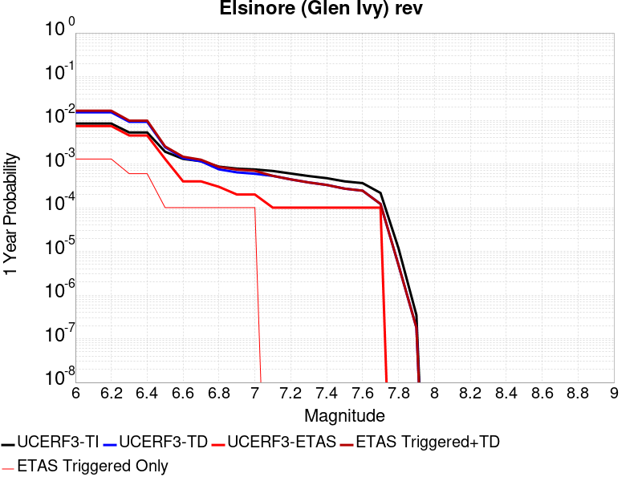 |  |

| Magnitude | 1 wk TI Prob | 1 wk TD Prob | 1 wk ETAS Prob | 1 wk ETAS/TD Gain | 1 wk ETAS Triggered+TD | 1 wk ETAS Triggered Only | 1 mo TI Prob | 1 mo TD Prob | 1 mo ETAS Prob | 1 mo ETAS/TD Gain | 1 mo ETAS Triggered+TD | 1 mo ETAS Triggered Only | 1 yr TI Prob | 1 yr TD Prob | 1 yr ETAS Prob | 1 yr ETAS/TD Gain | 1 yr ETAS Triggered+TD | 1 yr ETAS Triggered Only | 10 yr TI Prob | 10 yr TD Prob | 10 yr ETAS Prob | 10 yr ETAS/TD Gain | 10 yr ETAS Triggered+TD | 10 yr ETAS Triggered Only |
|-----|-----|-----|-----|-----|-----|-----|-----|-----|-----|-----|-----|-----|-----|-----|-----|-----|-----|-----|-----|-----|-----|-----|-----|-----|
| 6.0 | 1.6204086E-4 | 2.9413783E-4 | 0.0 | 0.0 | 2.9413783E-4 | 0.0 | 6.94276E-4 | 0.0012600974 | 1.0E-4 | 0.07935895 | 0.0013599714 | 1.0E-4 | 0.008420097 | 0.015255148 | 0.0013 | 0.08521714 | 0.016535316 | 0.0013 | 0.081081145 | 0.1397831 | 0.0085 | 0.060808495 | 0.14709495 | 0.0085 |
| 6.1 | 1.6204086E-4 | 2.9413783E-4 | 0.0 | 0.0 | 2.9413783E-4 | 0.0 | 6.94276E-4 | 0.0012600974 | 1.0E-4 | 0.07935895 | 0.0013599714 | 1.0E-4 | 0.008420097 | 0.015255148 | 0.0013 | 0.08521714 | 0.016535316 | 0.0013 | 0.081081145 | 0.1397831 | 0.0085 | 0.060808495 | 0.14709495 | 0.0085 |
| 6.2 | 1.6204086E-4 | 2.9413783E-4 | 0.0 | 0.0 | 2.9413783E-4 | 0.0 | 6.94276E-4 | 0.0012600974 | 1.0E-4 | 0.07935895 | 0.0013599714 | 1.0E-4 | 0.008420097 | 0.015255148 | 0.0013 | 0.08521714 | 0.016535316 | 0.0013 | 0.081081145 | 0.1397831 | 0.0085 | 0.060808495 | 0.14709495 | 0.0085 |
| 6.3 | 1.0111737E-4 | 1.7736538E-4 | 0.0 | 0.0 | 1.7736538E-4 | 0.0 | 4.332882E-4 | 7.600331E-4 | 0.0 | 0.0 | 7.600331E-4 | 0.0 | 0.005262531 | 0.009234924 | 6.0E-4 | 0.06497076 | 0.009829382 | 6.0E-4 | 0.0513964 | 0.08721416 | 0.0047 | 0.053890336 | 0.091504246 | 0.0047 |
| 6.4 | 1.0111737E-4 | 1.7736538E-4 | 0.0 | 0.0 | 1.7736538E-4 | 0.0 | 4.332882E-4 | 7.600331E-4 | 0.0 | 0.0 | 7.600331E-4 | 0.0 | 0.005262531 | 0.009234924 | 6.0E-4 | 0.06497076 | 0.009829382 | 6.0E-4 | 0.0513964 | 0.08721416 | 0.0047 | 0.053890336 | 0.091504246 | 0.0047 |
| 6.5 | 3.6624708E-5 | 4.642713E-5 | 0.0 | 0.0 | 4.642713E-5 | 0.0 | 1.569536E-4 | 1.9896026E-4 | 0.0 | 0.0 | 1.9896026E-4 | 0.0 | 0.001909235 | 0.002420011 | 1.0E-4 | 0.041322127 | 0.0025197691 | 1.0E-4 | 0.01892915 | 0.023714775 | 0.0013 | 0.054818146 | 0.024983946 | 0.0013 |
| 6.6 | 2.5051324E-5 | 2.6173879E-5 | 0.0 | 0.0 | 2.6173879E-5 | 0.0 | 1.073584E-4 | 1.121692E-4 | 0.0 | 0.0 | 1.121692E-4 | 0.0 | 0.0013063047 | 0.001364849 | 1.0E-4 | 0.07326818 | 0.0014647125 | 1.0E-4 | 0.012986525 | 0.01358036 | 8.0E-4 | 0.058908597 | 0.014369496 | 8.0E-4 |
| 6.7 | 2.2189772E-5 | 2.2089875E-5 | 0.0 | 0.0 | 2.2089875E-5 | 0.0 | 9.509556E-5 | 9.466766E-5 | 0.0 | 0.0 | 9.466766E-5 | 0.0 | 0.0011571734 | 0.0011520057 | 1.0E-4 | 0.08680512 | 0.0012518906 | 1.0E-4 | 0.011511663 | 0.011476746 | 8.0E-4 | 0.06970617 | 0.012267564 | 8.0E-4 |
| 6.8 | 1.6654378E-5 | 1.444831E-5 | 0.0 | 0.0 | 1.444831E-5 | 0.0 | 7.137396E-5 | 6.191989E-5 | 0.0 | 0.0 | 6.191989E-5 | 0.0 | 8.686314E-4 | 7.5361907E-4 | 1.0E-4 | 0.13269304 | 8.535437E-4 | 1.0E-4 | 0.008652439 | 0.0075156586 | 7.0E-4 | 0.09313887 | 0.008210398 | 7.0E-4 |
| 6.9 | 1.5042909E-5 | 1.2341207E-5 | 0.0 | 0.0 | 1.2341207E-5 | 0.0 | 6.446802E-5 | 5.288983E-5 | 0.0 | 0.0 | 5.288983E-5 | 0.0 | 7.8461546E-4 | 6.437466E-4 | 1.0E-4 | 0.15534063 | 7.436822E-4 | 1.0E-4 | 0.007818509 | 0.0064228065 | 7.0E-4 | 0.10898662 | 0.007118311 | 7.0E-4 |
| 7.0 | 1.4361385E-5 | 1.1459975E-5 | 0.0 | 0.0 | 1.1459975E-5 | 0.0 | 6.154734E-5 | 4.911327E-5 | 0.0 | 0.0 | 4.911327E-5 | 0.0 | 7.490812E-4 | 5.9779297E-4 | 1.0E-4 | 0.167282 | 6.9773314E-4 | 1.0E-4 | 0.007465612 | 0.0059656966 | 7.0E-4 | 0.11733751 | 0.006661521 | 7.0E-4 |
| 7.1 | 1.3265571E-5 | 1.0252637E-5 | 0.0 | 0.0 | 1.0252637E-5 | 0.0 | 5.6851208E-5 | 4.3939148E-5 | 0.0 | 0.0 | 4.3939148E-5 | 0.0 | 6.919436E-4 | 5.348304E-4 | 0.0 | 0.0 | 5.348304E-4 | 0.0 | 0.006897931 | 0.005338733 | 6.0E-4 | 0.11238621 | 0.0059355297 | 6.0E-4 |
| 7.2 | 1.1596403E-5 | 8.511494E-6 | 0.0 | 0.0 | 8.511494E-6 | 0.0 | 4.9697923E-5 | 3.647733E-5 | 0.0 | 0.0 | 3.647733E-5 | 0.0 | 6.049042E-4 | 4.440227E-4 | 0.0 | 0.0 | 4.440227E-4 | 0.0 | 0.006032603 | 0.004432828 | 6.0E-4 | 0.13535376 | 0.0050301687 | 6.0E-4 |
| 7.3 | 1.0150827E-5 | 7.244207E-6 | 0.0 | 0.0 | 7.244207E-6 | 0.0 | 4.3502816E-5 | 3.1046242E-5 | 0.0 | 0.0 | 3.1046242E-5 | 0.0 | 5.2951806E-4 | 3.7792386E-4 | 0.0 | 0.0 | 3.7792386E-4 | 0.0 | 0.005282581 | 0.0037731843 | 3.0E-4 | 0.07950844 | 0.0040720524 | 3.0E-4 |
| 7.4 | 9.080705E-6 | 6.35729E-6 | 0.0 | 0.0 | 6.35729E-6 | 0.0 | 3.8916725E-5 | 2.7245253E-5 | 0.0 | 0.0 | 2.7245253E-5 | 0.0 | 4.7370812E-4 | 3.316618E-4 | 0.0 | 0.0 | 3.316618E-4 | 0.0 | 0.004726996 | 0.0033118185 | 3.0E-4 | 0.09058468 | 0.003610825 | 3.0E-4 |
| 7.5 | 7.671649E-6 | 5.2296386E-6 | 0.0 | 0.0 | 5.2296386E-6 | 0.0 | 3.287808E-5 | 2.2412552E-5 | 0.0 | 0.0 | 2.2412552E-5 | 0.0 | 4.0021708E-4 | 2.728399E-4 | 0.0 | 0.0 | 2.728399E-4 | 0.0 | 0.0039949706 | 0.0027251744 | 3.0E-4 | 0.11008469 | 0.003024357 | 3.0E-4 |
| 7.6 | 6.990086E-6 | 4.691215E-6 | 0.0 | 0.0 | 4.691215E-6 | 0.0 | 2.9957167E-5 | 2.0105059E-5 | 0.0 | 0.0 | 2.0105059E-5 | 0.0 | 3.6466747E-4 | 2.4475277E-4 | 0.0 | 0.0 | 2.4475277E-4 | 0.0 | 0.0036406964 | 0.0024449485 | 3.0E-4 | 0.12270197 | 0.002744215 | 3.0E-4 |
| 7.7 | 4.163505E-6 | 2.3314672E-6 | 0.0 | 0.0 | 2.3314672E-6 | 0.0 | 1.7843471E-5 | 9.991968E-6 | 0.0 | 0.0 | 9.991968E-6 | 0.0 | 2.172226E-4 | 1.2164616E-4 | 0.0 | 0.0 | 1.2164616E-4 | 0.0 | 0.0021701038 | 0.0012158689 | 2.0E-4 | 0.16449142 | 0.0014156257 | 2.0E-4 |
| 7.8 | 2.2692414E-7 | 9.391798E-8 | 0.0 | 0.0 | 9.391798E-8 | 0.0 | 9.725317E-7 | 4.0250558E-7 | 0.0 | 0.0 | 4.0250558E-7 | 0.0 | 1.1840509E-5 | 4.900498E-6 | 0.0 | 0.0 | 4.900498E-6 | 0.0 | 1.1839878E-4 | 4.9004226E-5 | 0.0 | 0.0 | 4.9004226E-5 | 0.0 |
| 7.9 | 6.676829E-9 | 3.4416097E-9 | 0.0 | 0.0 | 3.4416097E-9 | 0.0 | 2.861498E-8 | 1.4749755E-8 | 0.0 | 0.0 | 1.4749755E-8 | 0.0 | 3.4838732E-7 | 1.7957827E-7 | 0.0 | 0.0 | 1.7957827E-7 | 0.0 | 3.4838679E-6 | 1.7957813E-6 | 0.0 | 0.0 | 1.7957813E-6 | 0.0 |

## San Andreas (San Bernardino S)
*[(top)](#table-of-contents)*

| 1 Week | 1 Month | 1 Year | 10 Year |
|-----|-----|-----|-----|
| 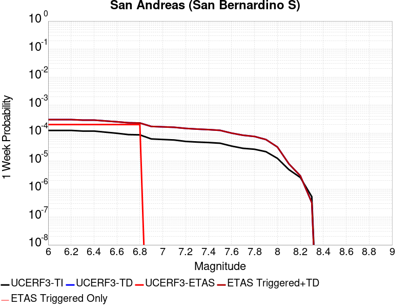 |  |  |  |

| Magnitude | 1 wk TI Prob | 1 wk TD Prob | 1 wk ETAS Prob | 1 wk ETAS/TD Gain | 1 wk ETAS Triggered+TD | 1 wk ETAS Triggered Only | 1 mo TI Prob | 1 mo TD Prob | 1 mo ETAS Prob | 1 mo ETAS/TD Gain | 1 mo ETAS Triggered+TD | 1 mo ETAS Triggered Only | 1 yr TI Prob | 1 yr TD Prob | 1 yr ETAS Prob | 1 yr ETAS/TD Gain | 1 yr ETAS Triggered+TD | 1 yr ETAS Triggered Only | 10 yr TI Prob | 10 yr TD Prob | 10 yr ETAS Prob | 10 yr ETAS/TD Gain | 10 yr ETAS Triggered+TD | 10 yr ETAS Triggered Only |
|-----|-----|-----|-----|-----|-----|-----|-----|-----|-----|-----|-----|-----|-----|-----|-----|-----|-----|-----|-----|-----|-----|-----|-----|-----|
| 6.0 | 1.2336002E-4 | 3.005554E-4 | 0.0 | 0.0 | 3.005554E-4 | 0.0 | 5.2857865E-4 | 0.0012874849 | 1.0E-4 | 0.07767081 | 0.0013873561 | 1.0E-4 | 0.006416472 | 0.015567437 | 0.0014 | 0.08993131 | 0.016945641 | 0.0014 | 0.06234337 | 0.14287741 | 0.0097 | 0.06789037 | 0.1511915 | 0.0097 |
| 6.1 | 1.2336002E-4 | 3.005554E-4 | 0.0 | 0.0 | 3.005554E-4 | 0.0 | 5.2857865E-4 | 0.0012874849 | 1.0E-4 | 0.07767081 | 0.0013873561 | 1.0E-4 | 0.006416472 | 0.015567437 | 0.0014 | 0.08993131 | 0.016945641 | 0.0014 | 0.06234337 | 0.14287741 | 0.0097 | 0.06789037 | 0.1511915 | 0.0097 |
| 6.2 | 1.2336002E-4 | 3.005554E-4 | 0.0 | 0.0 | 3.005554E-4 | 0.0 | 5.2857865E-4 | 0.0012874849 | 1.0E-4 | 0.07767081 | 0.0013873561 | 1.0E-4 | 0.006416472 | 0.015567437 | 0.0014 | 0.08993131 | 0.016945641 | 0.0014 | 0.06234337 | 0.14287741 | 0.0097 | 0.06789037 | 0.1511915 | 0.0097 |
| 6.3 | 1.1712257E-4 | 2.884296E-4 | 0.0 | 0.0 | 2.884296E-4 | 0.0 | 5.018573E-4 | 0.0012355671 | 1.0E-4 | 0.080934495 | 0.0013354436 | 1.0E-4 | 0.006093008 | 0.014944126 | 0.0012 | 0.08029911 | 0.016126193 | 0.0012 | 0.059286322 | 0.13758671 | 0.0094 | 0.06832056 | 0.14569339 | 0.0094 |
| 6.4 | 1.1712257E-4 | 2.884296E-4 | 0.0 | 0.0 | 2.884296E-4 | 0.0 | 5.018573E-4 | 0.0012355671 | 1.0E-4 | 0.080934495 | 0.0013354436 | 1.0E-4 | 0.006093008 | 0.014944126 | 0.0012 | 0.08029911 | 0.016126193 | 0.0012 | 0.059286322 | 0.13758671 | 0.0094 | 0.06832056 | 0.14569339 | 0.0094 |
| 6.5 | 1.0689076E-4 | 2.685451E-4 | 0.0 | 0.0 | 2.685451E-4 | 0.0 | 4.5802278E-4 | 0.0011504247 | 1.0E-4 | 0.08692442 | 0.0012503096 | 1.0E-4 | 0.0055621783 | 0.013921098 | 0.0012 | 0.086200096 | 0.015104393 | 0.0012 | 0.05425003 | 0.12882146 | 0.009 | 0.06986413 | 0.13666207 | 0.009 |
| 6.6 | 9.7648895E-5 | 2.509794E-4 | 0.0 | 0.0 | 2.509794E-4 | 0.0 | 4.1842813E-4 | 0.0010752063 | 1.0E-4 | 0.09300541 | 0.0011750988 | 1.0E-4 | 0.005082469 | 0.01301644 | 0.0012 | 0.09219111 | 0.014200821 | 0.0012 | 0.049677886 | 0.12099371 | 0.0086 | 0.07107808 | 0.12855317 | 0.0086 |
| 6.7 | 8.757013E-5 | 2.3167564E-4 | 0.0 | 0.0 | 2.3167564E-4 | 0.0 | 3.7524657E-4 | 9.925402E-4 | 1.0E-4 | 0.10075159 | 0.0010924409 | 1.0E-4 | 0.00455906 | 0.012021317 | 0.0011 | 0.09150412 | 0.013108093 | 0.0011 | 0.04466656 | 0.112271205 | 0.0083 | 0.073928125 | 0.11963935 | 0.0083 |
| 6.8 | 8.562978E-5 | 2.2726881E-4 | 0.0 | 0.0 | 2.2726881E-4 | 0.0 | 3.6693315E-4 | 9.7366795E-4 | 1.0E-4 | 0.10270442 | 0.0010735706 | 1.0E-4 | 0.004458263 | 0.01179405 | 0.0011 | 0.09326736 | 0.012881077 | 0.0011 | 0.043698758 | 0.11028376 | 0.0083 | 0.0752604 | 0.117668405 | 0.0083 |
| 6.9 | 6.124075E-5 | 1.7104326E-4 | 0.0 | 0.0 | 1.7104326E-4 | 0.0 | 2.6243398E-4 | 7.328374E-4 | 0.0 | 0.0 | 7.328374E-4 | 0.0 | 0.0031904527 | 0.008886003 | 0.001 | 0.11253654 | 0.009877116 | 0.001 | 0.031450346 | 0.08434167 | 0.0072 | 0.085367054 | 0.09093441 | 0.0072 |
| 7.0 | 5.8598747E-5 | 1.6532693E-4 | 0.0 | 0.0 | 1.6532693E-4 | 0.0 | 2.5111332E-4 | 7.0835237E-4 | 0.0 | 0.0 | 7.0835237E-4 | 0.0 | 0.0030530186 | 0.008590283 | 0.001 | 0.1164106 | 0.009581693 | 0.001 | 0.03011414 | 0.0816526 | 0.0071 | 0.08695376 | 0.08817286 | 0.0071 |
| 7.1 | 5.613814E-5 | 1.595059E-4 | 0.0 | 0.0 | 1.595059E-4 | 0.0 | 2.4056983E-4 | 6.834184E-4 | 0.0 | 0.0 | 6.834184E-4 | 0.0 | 0.0029250039 | 0.008289057 | 8.0E-4 | 0.096512794 | 0.009082425 | 8.0E-4 | 0.028868021 | 0.0789573 | 0.0069 | 0.087389015 | 0.085312486 | 0.0069 |
| 7.2 | 4.991222E-5 | 1.4555559E-4 | 0.0 | 0.0 | 1.4555559E-4 | 0.0 | 2.1389198E-4 | 6.236609E-4 | 0.0 | 0.0 | 6.236609E-4 | 0.0 | 0.002601025 | 0.00756674 | 7.0E-4 | 0.09251012 | 0.008261443 | 7.0E-4 | 0.025707912 | 0.07239568 | 0.0067 | 0.092546955 | 0.07861063 | 0.0067 |
| 7.3 | 4.7410045E-5 | 1.3748408E-4 | 0.0 | 0.0 | 1.3748408E-4 | 0.0 | 2.0317009E-4 | 5.8908475E-4 | 0.0 | 0.0 | 5.8908475E-4 | 0.0 | 0.0024707897 | 0.0071486076 | 7.0E-4 | 0.09792117 | 0.007843603 | 7.0E-4 | 0.024434982 | 0.068680055 | 0.0062 | 0.090273656 | 0.07445424 | 0.0062 |
| 7.4 | 4.5556746E-5 | 1.3155272E-4 | 0.0 | 0.0 | 1.3155272E-4 | 0.0 | 1.952286E-4 | 5.636758E-4 | 0.0 | 0.0 | 5.636758E-4 | 0.0 | 0.002374317 | 0.0068412377 | 6.0E-4 | 0.08770343 | 0.0074371328 | 6.0E-4 | 0.023491086 | 0.06593231 | 0.006 | 0.09100242 | 0.07153672 | 0.006 |
| 7.5 | 4.3084514E-5 | 1.2389418E-4 | 0.0 | 0.0 | 1.2389418E-4 | 0.0 | 1.8463485E-4 | 5.308673E-4 | 0.0 | 0.0 | 5.308673E-4 | 0.0 | 0.0022456115 | 0.006444227 | 6.0E-4 | 0.09310659 | 0.0070403605 | 6.0E-4 | 0.022230545 | 0.062329672 | 0.0059 | 0.094657965 | 0.06786192 | 0.0059 |
| 7.6 | 3.408608E-5 | 9.867824E-5 | 0.0 | 0.0 | 9.867824E-5 | 0.0 | 1.4607502E-4 | 4.228383E-4 | 0.0 | 0.0 | 4.228383E-4 | 0.0 | 0.0017770125 | 0.00513593 | 6.0E-4 | 0.116824016 | 0.005732849 | 6.0E-4 | 0.017628696 | 0.050163694 | 0.005 | 0.09967368 | 0.054912876 | 0.005 |
| 7.7 | 2.8315713E-5 | 8.28075E-5 | 0.0 | 0.0 | 8.28075E-5 | 0.0 | 1.2134742E-4 | 3.5484103E-4 | 0.0 | 0.0 | 3.5484103E-4 | 0.0 | 0.0014764034 | 0.0043116407 | 5.0E-4 | 0.11596513 | 0.004809485 | 5.0E-4 | 0.01466633 | 0.04241544 | 0.0041 | 0.09666291 | 0.04634154 | 0.0041 |
| 7.8 | 2.6222975E-5 | 7.4930016E-5 | 0.0 | 0.0 | 7.4930016E-5 | 0.0 | 1.1237934E-4 | 3.2108914E-4 | 0.0 | 0.0 | 3.2108914E-4 | 0.0 | 0.0013673597 | 0.0039022593 | 5.0E-4 | 0.1281309 | 0.0044003082 | 5.0E-4 | 0.013589768 | 0.03857149 | 0.0039 | 0.10111095 | 0.04232106 | 0.0039 |
| 7.9 | 2.1469694E-5 | 5.811888E-5 | 0.0 | 0.0 | 5.811888E-5 | 0.0 | 9.200973E-5 | 2.4905716E-4 | 0.0 | 0.0 | 2.4905716E-4 | 0.0 | 0.0011196428 | 0.0030280577 | 5.0E-4 | 0.16512235 | 0.0035265437 | 5.0E-4 | 0.011140184 | 0.030262055 | 0.0028 | 0.09252511 | 0.03297732 | 0.0028 |
| 8.0 | 1.2420249E-5 | 3.1433803E-5 | 0.0 | 0.0 | 3.1433803E-5 | 0.0 | 5.322855E-5 | 1.3470933E-4 | 0.0 | 0.0 | 1.3470933E-4 | 0.0 | 6.478649E-4 | 0.0016388533 | 3.0E-4 | 0.1830548 | 0.0019383618 | 3.0E-4 | 0.0064597935 | 0.016575415 | 0.0016 | 0.0965285 | 0.018148893 | 0.0016 |
| 8.1 | 4.9197724E-6 | 7.849713E-6 | 0.0 | 0.0 | 7.849713E-6 | 0.0 | 2.1084568E-5 | 3.3641198E-5 | 0.0 | 0.0 | 3.3641198E-5 | 0.0 | 2.566744E-4 | 4.0950472E-4 | 2.0E-4 | 0.48839486 | 6.094228E-4 | 2.0E-4 | 0.002563781 | 0.0043980856 | 3.0E-4 | 0.068211496 | 0.0046967664 | 3.0E-4 |
| 8.2 | 2.5634774E-6 | 2.917882E-6 | 0.0 | 0.0 | 2.917882E-6 | 0.0 | 1.0986286E-5 | 1.2505149E-5 | 0.0 | 0.0 | 1.2505149E-5 | 0.0 | 1.3374983E-4 | 1.5223959E-4 | 1.0E-4 | 0.65685934 | 2.5222436E-4 | 1.0E-4 | 0.0013366934 | 0.0017109638 | 2.0E-4 | 0.11689318 | 0.0019106215 | 2.0E-4 |
| 8.3 | 5.2850464E-7 | 3.223448E-7 | 0.0 | 0.0 | 3.223448E-7 | 0.0 | 2.2650179E-6 | 1.3814771E-6 | 0.0 | 0.0 | 1.3814771E-6 | 0.0 | 2.7576245E-5 | 1.6819366E-5 | 0.0 | 0.0 | 1.6819366E-5 | 0.0 | 2.7572823E-4 | 1.9954889E-4 | 0.0 | 0.0 | 1.9954889E-4 | 0.0 |

## San Andreas (San Gorgonio Pass-Garnet HIll)
*[(top)](#table-of-contents)*

| 1 Week | 1 Month | 1 Year | 10 Year |
|-----|-----|-----|-----|
|  |  |  | 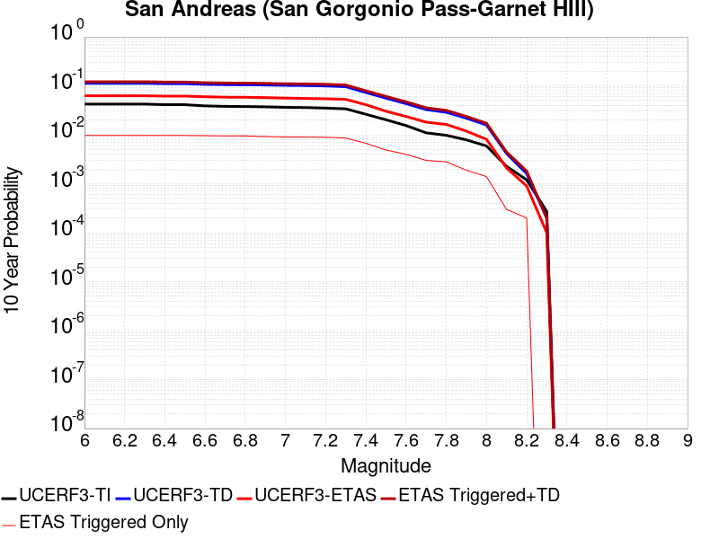 |

| Magnitude | 1 wk TI Prob | 1 wk TD Prob | 1 wk ETAS Prob | 1 wk ETAS/TD Gain | 1 wk ETAS Triggered+TD | 1 wk ETAS Triggered Only | 1 mo TI Prob | 1 mo TD Prob | 1 mo ETAS Prob | 1 mo ETAS/TD Gain | 1 mo ETAS Triggered+TD | 1 mo ETAS Triggered Only | 1 yr TI Prob | 1 yr TD Prob | 1 yr ETAS Prob | 1 yr ETAS/TD Gain | 1 yr ETAS Triggered+TD | 1 yr ETAS Triggered Only | 10 yr TI Prob | 10 yr TD Prob | 10 yr ETAS Prob | 10 yr ETAS/TD Gain | 10 yr ETAS Triggered+TD | 10 yr ETAS Triggered Only |
|-----|-----|-----|-----|-----|-----|-----|-----|-----|-----|-----|-----|-----|-----|-----|-----|-----|-----|-----|-----|-----|-----|-----|-----|-----|
| 6.0 | 8.31567E-5 | 2.340222E-4 | 0.0 | 0.0 | 2.340222E-4 | 0.0 | 3.5633717E-4 | 0.0010025626 | 0.0 | 0.0 | 0.0010025626 | 0.0 | 0.004329778 | 0.012137779 | 0.0013 | 0.10710361 | 0.013422 | 0.0013 | 0.042463828 | 0.11266017 | 0.0097 | 0.08609964 | 0.12126736 | 0.0097 |
| 6.1 | 8.31567E-5 | 2.340222E-4 | 0.0 | 0.0 | 2.340222E-4 | 0.0 | 3.5633717E-4 | 0.0010025626 | 0.0 | 0.0 | 0.0010025626 | 0.0 | 0.004329778 | 0.012137779 | 0.0013 | 0.10710361 | 0.013422 | 0.0013 | 0.042463828 | 0.11266017 | 0.0097 | 0.08609964 | 0.12126736 | 0.0097 |
| 6.2 | 8.31567E-5 | 2.340222E-4 | 0.0 | 0.0 | 2.340222E-4 | 0.0 | 3.5633717E-4 | 0.0010025626 | 0.0 | 0.0 | 0.0010025626 | 0.0 | 0.004329778 | 0.012137779 | 0.0013 | 0.10710361 | 0.013422 | 0.0013 | 0.042463828 | 0.11266017 | 0.0097 | 0.08609964 | 0.12126736 | 0.0097 |
| 6.3 | 8.31567E-5 | 2.340222E-4 | 0.0 | 0.0 | 2.340222E-4 | 0.0 | 3.5633717E-4 | 0.0010025626 | 0.0 | 0.0 | 0.0010025626 | 0.0 | 0.004329778 | 0.012137779 | 0.0013 | 0.10710361 | 0.013422 | 0.0013 | 0.042463828 | 0.11266017 | 0.0097 | 0.08609964 | 0.12126736 | 0.0097 |
| 6.4 | 8.059055E-5 | 2.2959331E-4 | 0.0 | 0.0 | 2.2959331E-4 | 0.0 | 3.4534236E-4 | 9.836018E-4 | 0.0 | 0.0 | 9.836018E-4 | 0.0 | 0.0041964394 | 0.011909795 | 0.0013 | 0.10915385 | 0.013194312 | 0.0013 | 0.041180745 | 0.11063991 | 0.0097 | 0.0876718 | 0.1192667 | 0.0097 |
| 6.5 | 8.059055E-5 | 2.2959331E-4 | 0.0 | 0.0 | 2.2959331E-4 | 0.0 | 3.4534236E-4 | 9.836018E-4 | 0.0 | 0.0 | 9.836018E-4 | 0.0 | 0.0041964394 | 0.011909795 | 0.0013 | 0.10915385 | 0.013194312 | 0.0013 | 0.041180745 | 0.11063991 | 0.0097 | 0.0876718 | 0.1192667 | 0.0097 |
| 6.6 | 7.619237E-5 | 2.2203341E-4 | 0.0 | 0.0 | 2.2203341E-4 | 0.0 | 3.2649786E-4 | 9.5122703E-4 | 0.0 | 0.0 | 9.5122703E-4 | 0.0 | 0.0039678677 | 0.011520238 | 0.0013 | 0.11284489 | 0.012805262 | 0.0013 | 0.03897764 | 0.1071745 | 0.0096 | 0.08957355 | 0.11574563 | 0.0096 |
| 6.7 | 7.440636E-5 | 2.187902E-4 | 0.0 | 0.0 | 2.187902E-4 | 0.0 | 3.188454E-4 | 9.373375E-4 | 0.0 | 0.0 | 9.373375E-4 | 0.0 | 0.0038750346 | 0.011352904 | 0.0013 | 0.114508145 | 0.012638145 | 0.0013 | 0.038081564 | 0.10568253 | 0.0095 | 0.08989187 | 0.114178546 | 0.0095 |
| 6.8 | 7.3735864E-5 | 2.1726104E-4 | 0.0 | 0.0 | 2.1726104E-4 | 0.0 | 3.1597257E-4 | 9.3078875E-4 | 0.0 | 0.0 | 9.3078875E-4 | 0.0 | 0.0038401815 | 0.0112740025 | 0.0013 | 0.11530954 | 0.012559346 | 0.0013 | 0.03774495 | 0.10498381 | 0.0095 | 0.09049015 | 0.11348646 | 0.0095 |
| 6.9 | 7.27575E-5 | 2.1494977E-4 | 0.0 | 0.0 | 2.1494977E-4 | 0.0 | 3.117806E-4 | 9.208903E-4 | 0.0 | 0.0 | 9.208903E-4 | 0.0 | 0.003789323 | 0.01115473 | 0.0012 | 0.10757769 | 0.012341344 | 0.0012 | 0.037253562 | 0.10393128 | 0.0092 | 0.08852003 | 0.112175114 | 0.0092 |
| 7.0 | 7.102591E-5 | 2.1078755E-4 | 0.0 | 0.0 | 2.1078755E-4 | 0.0 | 3.0436125E-4 | 9.030647E-4 | 0.0 | 0.0 | 9.030647E-4 | 0.0 | 0.003699303 | 0.0109399 | 0.0012 | 0.10969022 | 0.012126772 | 0.0012 | 0.03638325 | 0.10203216 | 0.009 | 0.08820748 | 0.110113874 | 0.009 |
| 7.1 | 7.028513E-5 | 2.0914276E-4 | 0.0 | 0.0 | 2.0914276E-4 | 0.0 | 3.0118722E-4 | 8.9602044E-4 | 0.0 | 0.0 | 8.9602044E-4 | 0.0 | 0.0036607897 | 0.010854994 | 0.0012 | 0.11054819 | 0.012041968 | 0.0012 | 0.036010686 | 0.10127477 | 0.009 | 0.08886714 | 0.1093633 | 0.009 |
| 7.2 | 6.8498244E-5 | 2.0521844E-4 | 0.0 | 0.0 | 2.0521844E-4 | 0.0 | 2.9353087E-4 | 8.792134E-4 | 0.0 | 0.0 | 8.792134E-4 | 0.0 | 0.003567883 | 0.010652385 | 0.0012 | 0.112650834 | 0.011839602 | 0.0012 | 0.035111405 | 0.09946566 | 0.0089 | 0.08947811 | 0.10748042 | 0.0089 |
| 7.3 | 6.622592E-5 | 1.9748692E-4 | 0.0 | 0.0 | 1.9748692E-4 | 0.0 | 2.8379448E-4 | 8.461002E-4 | 0.0 | 0.0 | 8.461002E-4 | 0.0 | 0.0034497243 | 0.010253094 | 0.0012 | 0.11703784 | 0.01144079 | 0.0012 | 0.033966612 | 0.095961034 | 0.0086 | 0.08961971 | 0.10373577 | 0.0086 |
| 7.4 | 5.1050705E-5 | 1.4708168E-4 | 0.0 | 0.0 | 1.4708168E-4 | 0.0 | 2.1877038E-4 | 6.301986E-4 | 0.0 | 0.0 | 6.301986E-4 | 0.0 | 0.002660276 | 0.0076458687 | 6.0E-4 | 0.078473754 | 0.008241281 | 6.0E-4 | 0.02628654 | 0.07294578 | 0.0067 | 0.09184904 | 0.07915705 | 0.0067 |
| 7.5 | 3.9302922E-5 | 1.1150517E-4 | 0.0 | 0.0 | 1.1150517E-4 | 0.0 | 1.6843023E-4 | 4.7779208E-4 | 0.0 | 0.0 | 4.7779208E-4 | 0.0 | 0.0020487092 | 0.0058016726 | 5.0E-4 | 0.08618204 | 0.006298772 | 5.0E-4 | 0.020299247 | 0.056099165 | 0.0049 | 0.087345324 | 0.06072428 | 0.0049 |
| 7.6 | 2.9851626E-5 | 8.5157335E-5 | 0.0 | 0.0 | 8.5157335E-5 | 0.0 | 1.2792926E-4 | 3.6490906E-4 | 0.0 | 0.0 | 3.6490906E-4 | 0.0 | 0.0015564259 | 0.004433743 | 5.0E-4 | 0.112771526 | 0.0049315263 | 5.0E-4 | 0.0154556995 | 0.043285225 | 0.004 | 0.09241028 | 0.047112085 | 0.004 |
| 7.7 | 2.1135214E-5 | 6.3741725E-5 | 0.0 | 0.0 | 6.3741725E-5 | 0.0 | 9.0576345E-5 | 2.7315025E-4 | 0.0 | 0.0 | 2.7315025E-4 | 0.0 | 0.0011022091 | 0.0033205384 | 4.0E-4 | 0.120462395 | 0.0037192102 | 4.0E-4 | 0.010967582 | 0.03267799 | 0.003 | 0.091804914 | 0.035579957 | 0.003 |
| 7.8 | 1.883379E-5 | 5.583881E-5 | 0.0 | 0.0 | 5.583881E-5 | 0.0 | 8.0713755E-5 | 2.3928724E-4 | 0.0 | 0.0 | 2.3928724E-4 | 0.0 | 9.822468E-4 | 0.0029094333 | 4.0E-4 | 0.13748382 | 0.0033082694 | 4.0E-4 | 0.0097791655 | 0.028784635 | 0.0028 | 0.09727412 | 0.03150404 | 0.0028 |
| 7.9 | 1.5156185E-5 | 4.181647E-5 | 0.0 | 0.0 | 4.181647E-5 | 0.0 | 6.495346E-5 | 1.7920115E-4 | 0.0 | 0.0 | 1.7920115E-4 | 0.0 | 7.9052144E-4 | 0.0021795921 | 4.0E-4 | 0.18352057 | 0.0025787205 | 4.0E-4 | 0.007877152 | 0.021831838 | 0.0019 | 0.08702885 | 0.02369036 | 0.0019 |
| 8.0 | 1.1405907E-5 | 3.0082441E-5 | 0.0 | 0.0 | 3.0082441E-5 | 0.0 | 4.8881542E-5 | 1.2891839E-4 | 0.0 | 0.0 | 1.2891839E-4 | 0.0 | 5.9497025E-4 | 0.0015684522 | 3.0E-4 | 0.19127136 | 0.0018679817 | 3.0E-4 | 0.005933798 | 0.015822804 | 0.0014 | 0.0884799 | 0.01720065 | 0.0014 |
| 8.1 | 4.3511436E-6 | 7.394106E-6 | 0.0 | 0.0 | 7.394106E-6 | 0.0 | 1.8647626E-5 | 3.168864E-5 | 0.0 | 0.0 | 3.168864E-5 | 0.0 | 2.2701119E-4 | 3.8574103E-4 | 2.0E-4 | 0.51848257 | 5.856639E-4 | 2.0E-4 | 0.0022677942 | 0.004128724 | 3.0E-4 | 0.072661676 | 0.004427485 | 3.0E-4 |
| 8.2 | 2.3042528E-6 | 2.7430626E-6 | 0.0 | 0.0 | 2.7430626E-6 | 0.0 | 9.875332E-6 | 1.1755929E-5 | 0.0 | 0.0 | 1.1755929E-5 | 0.0 | 1.2022553E-4 | 1.4311909E-4 | 1.0E-4 | 0.6987188 | 2.4310478E-4 | 1.0E-4 | 0.0012016051 | 0.0016034031 | 2.0E-4 | 0.12473469 | 0.0018030825 | 2.0E-4 |
| 8.3 | 5.202968E-7 | 3.174221E-7 | 0.0 | 0.0 | 3.174221E-7 | 0.0 | 2.2298414E-6 | 1.3603798E-6 | 0.0 | 0.0 | 1.3603798E-6 | 0.0 | 2.714798E-5 | 1.6562512E-5 | 0.0 | 0.0 | 1.6562512E-5 | 0.0 | 2.7144665E-4 | 1.9647196E-4 | 0.0 | 0.0 | 1.9647196E-4 | 0.0 |

## West Napa 2011 CFM
*[(top)](#table-of-contents)*

| 1 Week | 1 Month | 1 Year | 10 Year |
|-----|-----|-----|-----|
| 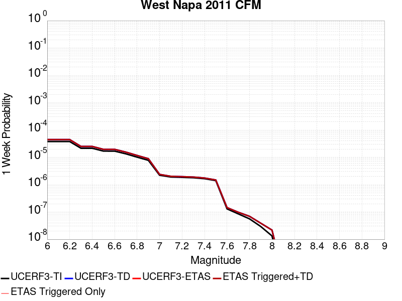 |  |  |  |

| Magnitude | 1 wk TI Prob | 1 wk TD Prob | 1 wk ETAS Prob | 1 wk ETAS/TD Gain | 1 wk ETAS Triggered+TD | 1 wk ETAS Triggered Only | 1 mo TI Prob | 1 mo TD Prob | 1 mo ETAS Prob | 1 mo ETAS/TD Gain | 1 mo ETAS Triggered+TD | 1 mo ETAS Triggered Only | 1 yr TI Prob | 1 yr TD Prob | 1 yr ETAS Prob | 1 yr ETAS/TD Gain | 1 yr ETAS Triggered+TD | 1 yr ETAS Triggered Only | 10 yr TI Prob | 10 yr TD Prob | 10 yr ETAS Prob | 10 yr ETAS/TD Gain | 10 yr ETAS Triggered+TD | 10 yr ETAS Triggered Only |
|-----|-----|-----|-----|-----|-----|-----|-----|-----|-----|-----|-----|-----|-----|-----|-----|-----|-----|-----|-----|-----|-----|-----|-----|-----|
| 6.0 | 3.773104E-5 | 4.4545486E-5 | 0.0 | 0.0 | 4.4545486E-5 | 0.0 | 1.6169442E-4 | 1.9089706E-4 | 0.0 | 0.0 | 1.9089706E-4 | 0.0 | 0.001966852 | 0.0023220119 | 0.0011 | 0.47372714 | 0.0034194577 | 0.0011 | 0.019495348 | 0.023010615 | 0.0087 | 0.3780864 | 0.031510424 | 0.0087 |
| 6.1 | 3.773104E-5 | 4.4545486E-5 | 0.0 | 0.0 | 4.4545486E-5 | 0.0 | 1.6169442E-4 | 1.9089706E-4 | 0.0 | 0.0 | 1.9089706E-4 | 0.0 | 0.001966852 | 0.0023220119 | 0.0011 | 0.47372714 | 0.0034194577 | 0.0011 | 0.019495348 | 0.023010615 | 0.0087 | 0.3780864 | 0.031510424 | 0.0087 |
| 6.2 | 3.773104E-5 | 4.4545486E-5 | 0.0 | 0.0 | 4.4545486E-5 | 0.0 | 1.6169442E-4 | 1.9089706E-4 | 0.0 | 0.0 | 1.9089706E-4 | 0.0 | 0.001966852 | 0.0023220119 | 0.0011 | 0.47372714 | 0.0034194577 | 0.0011 | 0.019495348 | 0.023010615 | 0.0087 | 0.3780864 | 0.031510424 | 0.0087 |
| 6.3 | 2.147964E-5 | 2.499591E-5 | 0.0 | 0.0 | 2.499591E-5 | 0.0 | 9.2052345E-5 | 1.0712145E-4 | 0.0 | 0.0 | 1.0712145E-4 | 0.0 | 0.001120161 | 0.0013035152 | 7.0E-4 | 0.5370095 | 0.0020026027 | 7.0E-4 | 0.011145315 | 0.012968971 | 0.0048 | 0.37011418 | 0.01770672 | 0.0048 |
| 6.4 | 2.147964E-5 | 2.499591E-5 | 0.0 | 0.0 | 2.499591E-5 | 0.0 | 9.2052345E-5 | 1.0712145E-4 | 0.0 | 0.0 | 1.0712145E-4 | 0.0 | 0.001120161 | 0.0013035152 | 7.0E-4 | 0.5370095 | 0.0020026027 | 7.0E-4 | 0.011145315 | 0.012968971 | 0.0048 | 0.37011418 | 0.01770672 | 0.0048 |
| 6.5 | 1.688201E-5 | 1.9554167E-5 | 0.0 | 0.0 | 1.9554167E-5 | 0.0 | 7.234947E-5 | 8.3801286E-5 | 0.0 | 0.0 | 8.3801286E-5 | 0.0 | 8.804988E-4 | 0.0010198759 | 4.0E-4 | 0.39220458 | 0.001419468 | 4.0E-4 | 0.008770182 | 0.010160281 | 0.0037 | 0.36416316 | 0.013822688 | 0.0037 |
| 6.6 | 1.6846381E-5 | 1.9513847E-5 | 0.0 | 0.0 | 1.9513847E-5 | 0.0 | 7.219678E-5 | 8.36285E-5 | 0.0 | 0.0 | 8.36285E-5 | 0.0 | 8.7864127E-4 | 0.0010177742 | 4.0E-4 | 0.39301446 | 0.0014173671 | 4.0E-4 | 0.008751754 | 0.010139456 | 0.0036 | 0.35504863 | 0.013702954 | 0.0036 |
| 6.7 | 1.3396501E-5 | 1.5473046E-5 | 0.0 | 0.0 | 1.5473046E-5 | 0.0 | 5.7412315E-5 | 6.631173E-5 | 0.0 | 0.0 | 6.631173E-5 | 0.0 | 6.9877075E-4 | 8.071098E-4 | 3.0E-4 | 0.37169662 | 0.0011068677 | 3.0E-4 | 0.0069657755 | 0.008049166 | 0.0024 | 0.29816753 | 0.010429848 | 0.0024 |
| 6.8 | 1.0139058E-5 | 1.1676249E-5 | 0.0 | 0.0 | 1.1676249E-5 | 0.0 | 4.3452383E-5 | 5.0040424E-5 | 0.0 | 0.0 | 5.0040424E-5 | 0.0 | 5.289043E-4 | 6.091274E-4 | 3.0E-4 | 0.49250782 | 9.0894464E-4 | 3.0E-4 | 0.005276473 | 0.006081154 | 0.0019 | 0.3124407 | 0.0079696 | 0.0019 |
| 6.9 | 7.761281E-6 | 8.8938195E-6 | 0.0 | 0.0 | 8.8938195E-6 | 0.0 | 3.326221E-5 | 3.8116104E-5 | 0.0 | 0.0 | 3.8116104E-5 | 0.0 | 4.0489217E-4 | 4.640162E-4 | 2.0E-4 | 0.43101946 | 6.639234E-4 | 2.0E-4 | 0.0040415525 | 0.004636641 | 0.0013 | 0.2803754 | 0.0059306133 | 0.0013 |
| 7.0 | 2.2109202E-6 | 2.3673713E-6 | 0.0 | 0.0 | 2.3673713E-6 | 0.0 | 9.475338E-6 | 1.0145838E-5 | 0.0 | 0.0 | 1.0145838E-5 | 0.0 | 1.1535613E-4 | 1.2351865E-4 | 0.0 | 0.0 | 1.2351865E-4 | 0.0 | 0.0011529627 | 0.0012356347 | 0.0 | 0.0 | 0.0012356347 | 0.0 |
| 7.1 | 1.9008926E-6 | 2.0139585E-6 | 0.0 | 0.0 | 2.0139585E-6 | 0.0 | 8.146657E-6 | 8.631222E-6 | 0.0 | 0.0 | 8.631222E-6 | 0.0 | 9.918104E-5 | 1.05080086E-4 | 0.0 | 0.0 | 1.05080086E-4 | 0.0 | 9.913679E-4 | 0.0010514335 | 0.0 | 0.0 | 0.0010514335 | 0.0 |
| 7.2 | 1.8495944E-6 | 1.9567515E-6 | 0.0 | 0.0 | 1.9567515E-6 | 0.0 | 7.926808E-6 | 8.386051E-6 | 0.0 | 0.0 | 8.386051E-6 | 0.0 | 9.650462E-5 | 1.02095415E-4 | 0.0 | 0.0 | 1.02095415E-4 | 0.0 | 9.6462725E-4 | 0.0010216146 | 0.0 | 0.0 | 0.0010216146 | 0.0 |
| 7.3 | 1.7883189E-6 | 1.888701E-6 | 0.0 | 0.0 | 1.888701E-6 | 0.0 | 7.664201E-6 | 8.094408E-6 | 0.0 | 0.0 | 8.094408E-6 | 0.0 | 9.330765E-5 | 9.854499E-5 | 0.0 | 0.0 | 9.854499E-5 | 0.0 | 9.3268487E-4 | 9.86142E-4 | 0.0 | 0.0 | 9.86142E-4 | 0.0 |
| 7.4 | 1.6520572E-6 | 1.7420581E-6 | 0.0 | 0.0 | 1.7420581E-6 | 0.0 | 7.0802257E-6 | 7.465942E-6 | 0.0 | 0.0 | 7.465942E-6 | 0.0 | 8.6198335E-5 | 9.089408E-5 | 0.0 | 0.0 | 9.089408E-5 | 0.0 | 8.616491E-4 | 9.096994E-4 | 0.0 | 0.0 | 9.096994E-4 | 0.0 |
| 7.5 | 1.4040345E-6 | 1.4804591E-6 | 0.0 | 0.0 | 1.4804591E-6 | 0.0 | 6.0172765E-6 | 6.344809E-6 | 0.0 | 0.0 | 6.344809E-6 | 0.0 | 7.325788E-5 | 7.724534E-5 | 0.0 | 0.0 | 7.724534E-5 | 0.0 | 7.3233736E-4 | 7.7328243E-4 | 0.0 | 0.0 | 7.7328243E-4 | 0.0 |
| 7.6 | 1.3013842E-7 | 1.4425748E-7 | 0.0 | 0.0 | 1.4425748E-7 | 0.0 | 5.57736E-7 | 6.1824625E-7 | 0.0 | 0.0 | 6.1824625E-7 | 0.0 | 6.790414E-6 | 7.527122E-6 | 0.0 | 0.0 | 7.527122E-6 | 0.0 | 6.790207E-5 | 7.619636E-5 | 0.0 | 0.0 | 7.619636E-5 | 0.0 |
| 7.7 | 8.541512E-8 | 9.7300216E-8 | 0.0 | 0.0 | 9.7300216E-8 | 0.0 | 3.6606474E-7 | 4.1700085E-7 | 0.0 | 0.0 | 4.1700085E-7 | 0.0 | 4.456829E-6 | 5.0769736E-6 | 0.0 | 0.0 | 5.0769736E-6 | 0.0 | 4.4567398E-5 | 5.1671588E-5 | 0.0 | 0.0 | 5.1671588E-5 | 0.0 |
| 7.8 | 5.6074793E-8 | 6.912836E-8 | 0.0 | 0.0 | 6.912836E-8 | 0.0 | 2.403205E-7 | 2.9626437E-7 | 0.0 | 0.0 | 2.9626437E-7 | 0.0 | 2.9258983E-6 | 3.6070128E-6 | 0.0 | 0.0 | 3.6070128E-6 | 0.0 | 2.9258597E-5 | 3.69014E-5 | 0.0 | 0.0 | 3.69014E-5 | 0.0 |
| 7.9 | 2.9475839E-8 | 3.870525E-8 | 0.0 | 0.0 | 3.870525E-8 | 0.0 | 1.2632502E-7 | 1.6587963E-7 | 0.0 | 0.0 | 1.6587963E-7 | 0.0 | 1.538006E-6 | 2.0195826E-6 | 0.0 | 0.0 | 2.0195826E-6 | 0.0 | 1.5379954E-5 | 2.0735211E-5 | 0.0 | 0.0 | 2.0735211E-5 | 0.0 |
| 8.0 | 1.3337122E-8 | 2.172641E-8 | 0.0 | 0.0 | 2.172641E-8 | 0.0 | 5.7159088E-8 | 9.311318E-8 | 0.0 | 0.0 | 9.311318E-8 | 0.0 | 6.959117E-7 | 1.1336524E-6 | 0.0 | 0.0 | 1.1336524E-6 | 0.0 | 6.959095E-6 | 1.1692443E-5 | 0.0 | 0.0 | 1.1692443E-5 | 0.0 |
| 8.1 | 2.6589986E-10 | 4.8834625E-10 | 0.0 | 0.0 | 4.8834625E-10 | 0.0 | 1.1395708E-9 | 2.0929127E-9 | 0.0 | 0.0 | 2.0929127E-9 | 0.0 | 1.3874274E-8 | 2.5481212E-8 | 0.0 | 0.0 | 2.5481212E-8 | 0.0 | 1.3874273E-7 | 2.6146932E-7 | 0.0 | 0.0 | 2.6146932E-7 | 0.0 |

## Cady
*[(top)](#table-of-contents)*

| 1 Week | 1 Month | 1 Year | 10 Year |
|-----|-----|-----|-----|
| 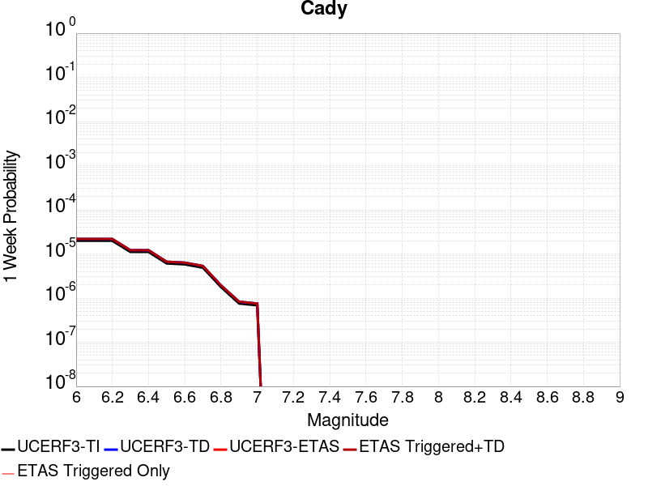 |  | 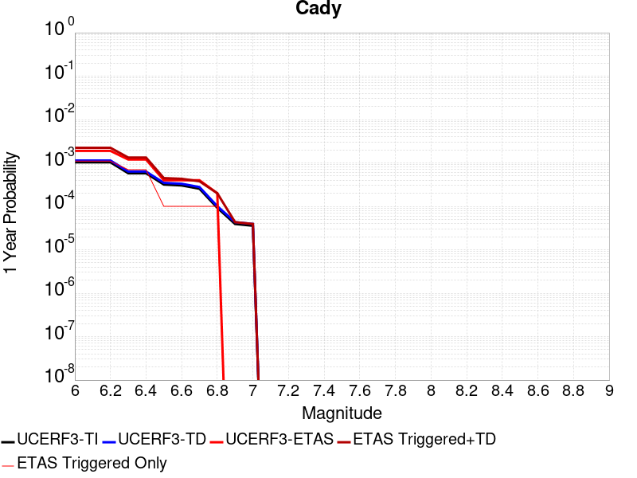 | 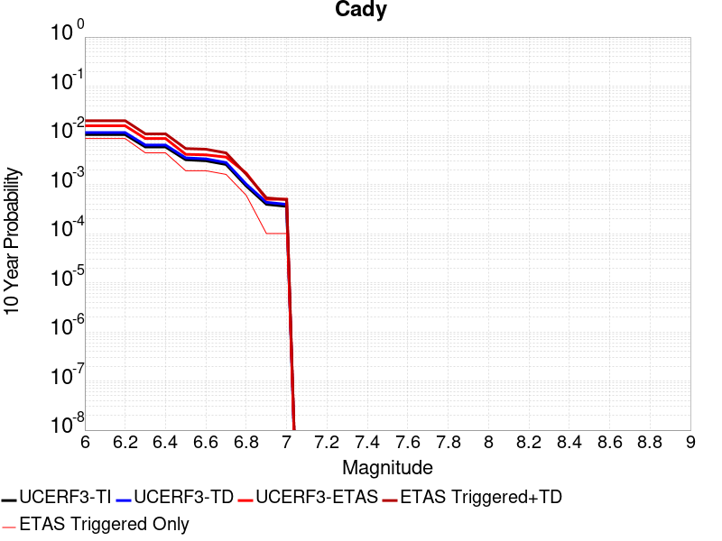 |

| Magnitude | 1 wk TI Prob | 1 wk TD Prob | 1 wk ETAS Prob | 1 wk ETAS/TD Gain | 1 wk ETAS Triggered+TD | 1 wk ETAS Triggered Only | 1 mo TI Prob | 1 mo TD Prob | 1 mo ETAS Prob | 1 mo ETAS/TD Gain | 1 mo ETAS Triggered+TD | 1 mo ETAS Triggered Only | 1 yr TI Prob | 1 yr TD Prob | 1 yr ETAS Prob | 1 yr ETAS/TD Gain | 1 yr ETAS Triggered+TD | 1 yr ETAS Triggered Only | 10 yr TI Prob | 10 yr TD Prob | 10 yr ETAS Prob | 10 yr ETAS/TD Gain | 10 yr ETAS Triggered+TD | 10 yr ETAS Triggered Only |
|-----|-----|-----|-----|-----|-----|-----|-----|-----|-----|-----|-----|-----|-----|-----|-----|-----|-----|-----|-----|-----|-----|-----|-----|-----|
| 6.0 | 1.9892565E-5 | 2.1863181E-5 | 0.0 | 0.0 | 2.1863181E-5 | 0.0 | 8.525106E-5 | 9.369649E-5 | 1.0E-4 | 1.0672758 | 1.9368713E-4 | 1.0E-4 | 0.0010374374 | 0.0011402488 | 0.0011 | 0.9647017 | 0.0022389945 | 0.0011 | 0.010326075 | 0.011353001 | 0.0086 | 0.75750893 | 0.019855365 | 0.0086 |
| 6.1 | 1.9892565E-5 | 2.1863181E-5 | 0.0 | 0.0 | 2.1863181E-5 | 0.0 | 8.525106E-5 | 9.369649E-5 | 1.0E-4 | 1.0672758 | 1.9368713E-4 | 1.0E-4 | 0.0010374374 | 0.0011402488 | 0.0011 | 0.9647017 | 0.0022389945 | 0.0011 | 0.010326075 | 0.011353001 | 0.0086 | 0.75750893 | 0.019855365 | 0.0086 |
| 6.2 | 1.9892565E-5 | 2.1863181E-5 | 0.0 | 0.0 | 2.1863181E-5 | 0.0 | 8.525106E-5 | 9.369649E-5 | 1.0E-4 | 1.0672758 | 1.9368713E-4 | 1.0E-4 | 0.0010374374 | 0.0011402488 | 0.0011 | 0.9647017 | 0.0022389945 | 0.0011 | 0.010326075 | 0.011353001 | 0.0086 | 0.75750893 | 0.019855365 | 0.0086 |
| 6.3 | 1.1117327E-5 | 1.2178974E-5 | 0.0 | 0.0 | 1.2178974E-5 | 0.0 | 4.764482E-5 | 5.2194737E-5 | 1.0E-4 | 1.915902 | 1.5218952E-4 | 1.0E-4 | 5.7992124E-4 | 6.353172E-4 | 7.0E-4 | 1.1018119 | 0.0013348724 | 7.0E-4 | 0.0057841022 | 0.0063381162 | 0.0044 | 0.69421256 | 0.010710228 | 0.0044 |
| 6.4 | 1.1117327E-5 | 1.2178974E-5 | 0.0 | 0.0 | 1.2178974E-5 | 0.0 | 4.764482E-5 | 5.2194737E-5 | 1.0E-4 | 1.915902 | 1.5218952E-4 | 1.0E-4 | 5.7992124E-4 | 6.353172E-4 | 7.0E-4 | 1.1018119 | 0.0013348724 | 7.0E-4 | 0.0057841022 | 0.0063381162 | 0.0044 | 0.69421256 | 0.010710228 | 0.0044 |
| 6.5 | 6.103093E-6 | 6.673303E-6 | 0.0 | 0.0 | 6.673303E-6 | 0.0 | 2.615585E-5 | 2.8599625E-5 | 0.0 | 0.0 | 2.8599625E-5 | 0.0 | 3.1840094E-4 | 3.4815737E-4 | 1.0E-4 | 0.28722644 | 4.4812256E-4 | 1.0E-4 | 0.0031794512 | 0.0034773538 | 0.0019 | 0.5463925 | 0.005370747 | 0.0019 |
| 6.6 | 5.817237E-6 | 6.3668954E-6 | 0.0 | 0.0 | 6.3668954E-6 | 0.0 | 2.4930776E-5 | 2.7286478E-5 | 0.0 | 0.0 | 2.7286478E-5 | 0.0 | 3.034899E-4 | 3.3217468E-4 | 1.0E-4 | 0.30104643 | 4.3214147E-4 | 1.0E-4 | 0.0030307577 | 0.0033180043 | 0.0019 | 0.5726334 | 0.0052117 | 0.0019 |
| 6.7 | 4.8846314E-6 | 5.3415956E-6 | 0.0 | 0.0 | 5.3415956E-6 | 0.0 | 2.0933967E-5 | 2.2892418E-5 | 0.0 | 0.0 | 2.2892418E-5 | 0.0 | 2.5484123E-4 | 2.7869132E-4 | 1.0E-4 | 0.35881993 | 3.7866345E-4 | 1.0E-4 | 0.0025454918 | 0.0027845742 | 0.0016 | 0.57459414 | 0.004380119 | 0.0016 |
| 6.8 | 1.7788773E-6 | 1.9402698E-6 | 0.0 | 0.0 | 1.9402698E-6 | 0.0 | 7.6237375E-6 | 8.315425E-6 | 0.0 | 0.0 | 8.315425E-6 | 0.0 | 9.281505E-5 | 1.0123717E-4 | 1.0E-4 | 0.9877795 | 2.0122704E-4 | 1.0E-4 | 9.2776294E-4 | 0.0010120652 | 6.0E-4 | 0.59284717 | 0.0016114579 | 6.0E-4 |
| 6.9 | 7.5455404E-7 | 8.298794E-7 | 0.0 | 0.0 | 8.298794E-7 | 0.0 | 3.233799E-6 | 3.5566231E-6 | 0.0 | 0.0 | 3.5566231E-6 | 0.0 | 3.937079E-5 | 4.3301363E-5 | 0.0 | 0.0 | 4.3301363E-5 | 0.0 | 3.9363815E-4 | 4.329622E-4 | 1.0E-4 | 0.23096704 | 5.329189E-4 | 1.0E-4 |
| 7.0 | 6.8578805E-7 | 7.543365E-7 | 0.0 | 0.0 | 7.543365E-7 | 0.0 | 2.9390883E-6 | 3.2328687E-6 | 0.0 | 0.0 | 3.2328687E-6 | 0.0 | 3.578281E-5 | 3.9359795E-5 | 0.0 | 0.0 | 3.9359795E-5 | 0.0 | 3.577705E-4 | 3.9356074E-4 | 1.0E-4 | 0.2540904 | 4.935214E-4 | 1.0E-4 |

## Hunting Creek - Berryessa 2011 CFM
*[(top)](#table-of-contents)*

| 1 Week | 1 Month | 1 Year | 10 Year |
|-----|-----|-----|-----|
| 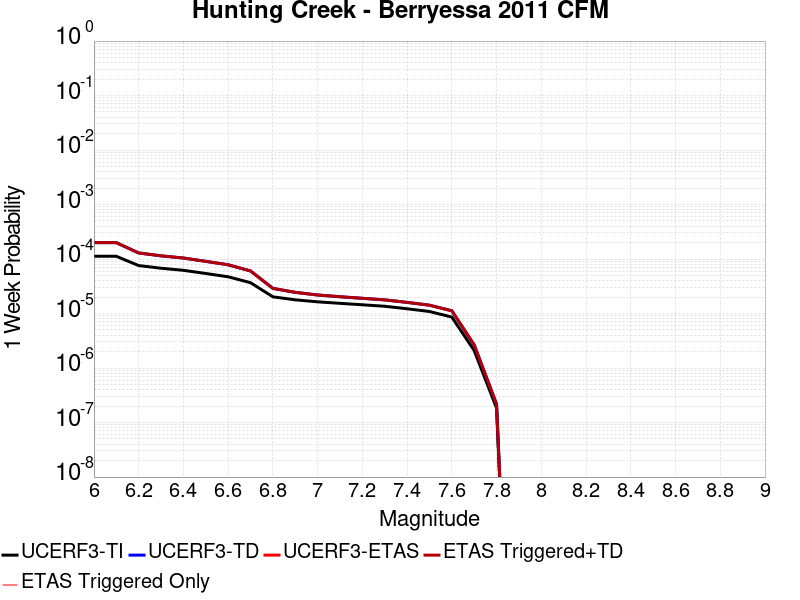 |  |  |  |

| Magnitude | 1 wk TI Prob | 1 wk TD Prob | 1 wk ETAS Prob | 1 wk ETAS/TD Gain | 1 wk ETAS Triggered+TD | 1 wk ETAS Triggered Only | 1 mo TI Prob | 1 mo TD Prob | 1 mo ETAS Prob | 1 mo ETAS/TD Gain | 1 mo ETAS Triggered+TD | 1 mo ETAS Triggered Only | 1 yr TI Prob | 1 yr TD Prob | 1 yr ETAS Prob | 1 yr ETAS/TD Gain | 1 yr ETAS Triggered+TD | 1 yr ETAS Triggered Only | 10 yr TI Prob | 10 yr TD Prob | 10 yr ETAS Prob | 10 yr ETAS/TD Gain | 10 yr ETAS Triggered+TD | 10 yr ETAS Triggered Only |
|-----|-----|-----|-----|-----|-----|-----|-----|-----|-----|-----|-----|-----|-----|-----|-----|-----|-----|-----|-----|-----|-----|-----|-----|-----|
| 6.0 | 1.1270982E-4 | 2.004287E-4 | 0.0 | 0.0 | 2.004287E-4 | 0.0 | 4.8295266E-4 | 8.5867115E-4 | 0.0 | 0.0 | 8.5867115E-4 | 0.0 | 0.0058641075 | 0.010394164 | 0.0014 | 0.13469096 | 0.011779613 | 0.0014 | 0.057117578 | 0.09810744 | 0.0074 | 0.07542751 | 0.10478145 | 0.0074 |
| 6.1 | 1.1239393E-4 | 1.9990969E-4 | 0.0 | 0.0 | 1.9990969E-4 | 0.0 | 4.8159933E-4 | 8.564483E-4 | 0.0 | 0.0 | 8.564483E-4 | 0.0 | 0.0058477195 | 0.010367386 | 0.0012 | 0.11574759 | 0.011554945 | 0.0012 | 0.056962132 | 0.09786574 | 0.0068 | 0.069482945 | 0.104000255 | 0.0068 |
| 6.2 | 7.596265E-5 | 1.2944567E-4 | 0.0 | 0.0 | 1.2944567E-4 | 0.0 | 3.2551357E-4 | 5.5461493E-4 | 0.0 | 0.0 | 5.5461493E-4 | 0.0 | 0.0039559277 | 0.006726943 | 9.0E-4 | 0.13379034 | 0.0076208888 | 9.0E-4 | 0.038862433 | 0.06464084 | 0.0055 | 0.085085526 | 0.06978532 | 0.0055 |
| 6.3 | 6.78794E-5 | 1.14578215E-4 | 0.0 | 0.0 | 1.14578215E-4 | 0.0 | 2.9087928E-4 | 4.9093936E-4 | 0.0 | 0.0 | 4.9093936E-4 | 0.0 | 0.003535705 | 0.0059576654 | 9.0E-4 | 0.15106589 | 0.0068523036 | 9.0E-4 | 0.034799766 | 0.057510164 | 0.0052 | 0.0904188 | 0.06241111 | 0.0052 |
| 6.4 | 6.2165134E-5 | 1.0443753E-4 | 0.0 | 0.0 | 1.0443753E-4 | 0.0 | 2.6639478E-4 | 4.474991E-4 | 0.0 | 0.0 | 4.474991E-4 | 0.0 | 0.0032385332 | 0.0054321135 | 8.0E-4 | 0.14727232 | 0.006227768 | 8.0E-4 | 0.03191742 | 0.052592885 | 0.0046 | 0.0874643 | 0.05695096 | 0.0046 |
| 6.5 | 5.4368087E-5 | 9.078325E-5 | 0.0 | 0.0 | 9.078325E-5 | 0.0 | 2.3298527E-4 | 3.8900654E-4 | 0.0 | 0.0 | 3.8900654E-4 | 0.0 | 0.0028329059 | 0.00472396 | 7.0E-4 | 0.14818077 | 0.005420653 | 7.0E-4 | 0.027970633 | 0.045918517 | 0.0036 | 0.07839974 | 0.049353212 | 0.0036 |
| 6.6 | 4.729947E-5 | 7.85424E-5 | 0.0 | 0.0 | 7.85424E-5 | 0.0 | 2.0269625E-4 | 3.365648E-4 | 0.0 | 0.0 | 3.365648E-4 | 0.0 | 0.002465034 | 0.004088592 | 4.0E-4 | 0.097833194 | 0.0044869566 | 4.0E-4 | 0.02437869 | 0.03988665 | 0.003 | 0.075213134 | 0.04276699 | 0.003 |
| 6.7 | 3.6875328E-5 | 6.0503855E-5 | 0.0 | 0.0 | 6.0503855E-5 | 0.0 | 1.5802756E-4 | 2.5927825E-4 | 0.0 | 0.0 | 2.5927825E-4 | 0.0 | 0.0019222875 | 0.0031515402 | 2.0E-4 | 0.063461035 | 0.0033509098 | 2.0E-4 | 0.019057442 | 0.030922858 | 0.0024 | 0.07761249 | 0.033248644 | 0.0024 |
| 6.8 | 2.0292036E-5 | 2.8991299E-5 | 0.0 | 0.0 | 2.8991299E-5 | 0.0 | 8.6962966E-5 | 1.2424242E-4 | 0.0 | 0.0 | 1.2424242E-4 | 0.0 | 0.0010582599 | 0.0015115893 | 0.0 | 0.0 | 0.0015115893 | 0.0 | 0.010532344 | 0.014986429 | 8.0E-4 | 0.05338163 | 0.01577444 | 8.0E-4 |
| 6.9 | 1.7871042E-5 | 2.4485564E-5 | 0.0 | 0.0 | 2.4485564E-5 | 0.0 | 7.658793E-5 | 1.0493388E-4 | 0.0 | 0.0 | 1.0493388E-4 | 0.0 | 9.320591E-4 | 0.0012768207 | 0.0 | 0.0 | 0.0012768207 | 0.0 | 0.009281595 | 0.01268672 | 7.0E-4 | 0.055175804 | 0.01337784 | 7.0E-4 |
| 7.0 | 1.6415532E-5 | 2.1918755E-5 | 0.0 | 0.0 | 2.1918755E-5 | 0.0 | 7.035038E-5 | 9.3934155E-5 | 0.0 | 0.0 | 9.3934155E-5 | 0.0 | 8.561793E-4 | 0.0011430494 | 0.0 | 0.0 | 0.0011430494 | 0.0 | 0.008528882 | 0.011371024 | 6.0E-4 | 0.052765697 | 0.011964201 | 6.0E-4 |
| 7.1 | 1.5409885E-5 | 2.0358328E-5 | 0.0 | 0.0 | 2.0358328E-5 | 0.0 | 6.6040695E-5 | 8.724708E-5 | 0.0 | 0.0 | 8.724708E-5 | 0.0 | 8.0374884E-4 | 0.0010617182 | 0.0 | 0.0 | 0.0010617182 | 0.0 | 0.00800848 | 0.010566951 | 6.0E-4 | 0.056780808 | 0.011160611 | 6.0E-4 |
| 7.2 | 1.4497423E-5 | 1.9066418E-5 | 0.0 | 0.0 | 1.9066418E-5 | 0.0 | 6.213033E-5 | 8.171068E-5 | 0.0 | 0.0 | 8.171068E-5 | 0.0 | 7.5617427E-4 | 9.943765E-4 | 0.0 | 0.0 | 9.943765E-4 | 0.0 | 0.0075360634 | 0.009900033 | 6.0E-4 | 0.06060586 | 0.0104940925 | 6.0E-4 |
| 7.3 | 1.3615175E-5 | 1.7837188E-5 | 0.0 | 0.0 | 1.7837188E-5 | 0.0 | 5.8349444E-5 | 7.644287E-5 | 0.0 | 0.0 | 7.644287E-5 | 0.0 | 7.101729E-4 | 9.302974E-4 | 0.0 | 0.0 | 9.302974E-4 | 0.0 | 0.0070790765 | 0.009264836 | 5.0E-4 | 0.053967495 | 0.009760204 | 5.0E-4 |
| 7.4 | 1.2252825E-5 | 1.6036516E-5 | 0.0 | 0.0 | 1.6036516E-5 | 0.0 | 5.251105E-5 | 6.872613E-5 | 0.0 | 0.0 | 6.872613E-5 | 0.0 | 6.391345E-4 | 8.3642226E-4 | 0.0 | 0.0 | 8.3642226E-4 | 0.0 | 0.0063729943 | 0.008333439 | 5.0E-4 | 0.05999924 | 0.008829272 | 5.0E-4 |
| 7.5 | 1.0913301E-5 | 1.4250034E-5 | 0.0 | 0.0 | 1.4250034E-5 | 0.0 | 4.6770452E-5 | 6.107016E-5 | 0.0 | 0.0 | 6.107016E-5 | 0.0 | 5.6928146E-4 | 7.4327824E-4 | 0.0 | 0.0 | 7.4327824E-4 | 0.0 | 0.0056782532 | 0.0074085835 | 4.0E-4 | 0.05399143 | 0.00780562 | 4.0E-4 |
| 7.6 | 8.623192E-6 | 1.1242259E-5 | 0.0 | 0.0 | 1.1242259E-5 | 0.0 | 3.6956015E-5 | 4.818023E-5 | 0.0 | 0.0 | 4.818023E-5 | 0.0 | 4.4984656E-4 | 5.86439E-4 | 0.0 | 0.0 | 5.86439E-4 | 0.0 | 0.00448937 | 0.0058494904 | 4.0E-4 | 0.068382025 | 0.0062471507 | 4.0E-4 |
| 7.7 | 2.0993634E-6 | 2.6642563E-6 | 0.0 | 0.0 | 2.6642563E-6 | 0.0 | 8.997241E-6 | 1.1418191E-5 | 0.0 | 0.0 | 1.1418191E-5 | 0.0 | 1.09535904E-4 | 1.3900768E-4 | 0.0 | 0.0 | 1.3900768E-4 | 0.0 | 0.0010948193 | 0.0013892325 | 1.0E-4 | 0.0719822 | 0.0014890935 | 1.0E-4 |
| 7.8 | 1.8428308E-7 | 2.1731857E-7 | 0.0 | 0.0 | 2.1731857E-7 | 0.0 | 7.897844E-7 | 9.31365E-7 | 0.0 | 0.0 | 9.31365E-7 | 0.0 | 9.615583E-6 | 1.13393135E-5 | 0.0 | 0.0 | 1.13393135E-5 | 0.0 | 9.615166E-5 | 1.1338047E-4 | 0.0 | 0.0 | 1.1338047E-4 | 0.0 |

## Green Valley 2011 CFM
*[(top)](#table-of-contents)*

| 1 Week | 1 Month | 1 Year | 10 Year |
|-----|-----|-----|-----|
|  |  | 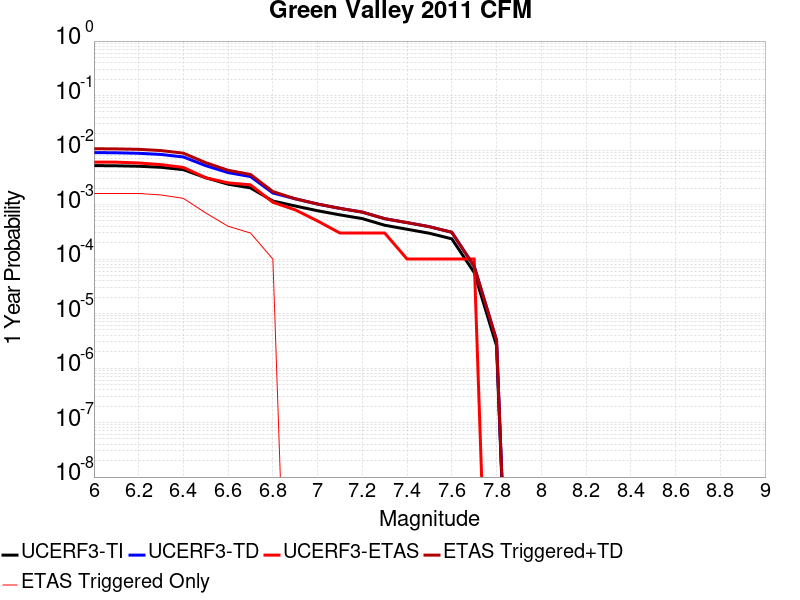 |  |

| Magnitude | 1 wk TI Prob | 1 wk TD Prob | 1 wk ETAS Prob | 1 wk ETAS/TD Gain | 1 wk ETAS Triggered+TD | 1 wk ETAS Triggered Only | 1 mo TI Prob | 1 mo TD Prob | 1 mo ETAS Prob | 1 mo ETAS/TD Gain | 1 mo ETAS Triggered+TD | 1 mo ETAS Triggered Only | 1 yr TI Prob | 1 yr TD Prob | 1 yr ETAS Prob | 1 yr ETAS/TD Gain | 1 yr ETAS Triggered+TD | 1 yr ETAS Triggered Only | 10 yr TI Prob | 10 yr TD Prob | 10 yr ETAS Prob | 10 yr ETAS/TD Gain | 10 yr ETAS Triggered+TD | 10 yr ETAS Triggered Only |
|-----|-----|-----|-----|-----|-----|-----|-----|-----|-----|-----|-----|-----|-----|-----|-----|-----|-----|-----|-----|-----|-----|-----|-----|-----|
| 6.0 | 9.9629346E-5 | 1.7315976E-4 | 2.0E-4 | 1.1550027 | 3.7312513E-4 | 2.0E-4 | 4.2691303E-4 | 7.418932E-4 | 4.0E-4 | 0.5391612 | 0.0011415965 | 4.0E-4 | 0.0051852856 | 0.008993766 | 0.0016 | 0.177901 | 0.0105793765 | 0.0016 | 0.050659515 | 0.085595 | 0.0076 | 0.08879023 | 0.09254447 | 0.0076 |
| 6.1 | 9.88615E-5 | 1.7162993E-4 | 2.0E-4 | 1.1652979 | 3.715956E-4 | 2.0E-4 | 4.2362334E-4 | 7.3534047E-4 | 4.0E-4 | 0.5439657 | 0.0011350464 | 4.0E-4 | 0.0051454236 | 0.008914649 | 0.0016 | 0.17947988 | 0.0105003845 | 0.0016 | 0.050279044 | 0.08488152 | 0.0075 | 0.088358454 | 0.091744915 | 0.0075 |
| 6.2 | 9.696895E-5 | 1.6801653E-4 | 2.0E-4 | 1.190359 | 3.6798292E-4 | 2.0E-4 | 4.15515E-4 | 7.1986346E-4 | 4.0E-4 | 0.55566096 | 0.0011195755 | 4.0E-4 | 0.0050471667 | 0.008727822 | 0.0016 | 0.18332179 | 0.010313858 | 0.0016 | 0.04934063 | 0.083188884 | 0.0074 | 0.08895419 | 0.089973286 | 0.0074 |
| 6.3 | 9.275224E-5 | 1.5980878E-4 | 2.0E-4 | 1.2514956 | 3.5977684E-4 | 2.0E-4 | 3.9744904E-4 | 6.8470614E-4 | 4.0E-4 | 0.5841922 | 0.0010844322 | 4.0E-4 | 0.0048282105 | 0.008303091 | 0.0015 | 0.18065561 | 0.009790637 | 0.0015 | 0.047246475 | 0.07932726 | 0.0072 | 0.09076325 | 0.085956104 | 0.0072 |
| 6.4 | 8.391499E-5 | 1.4374741E-4 | 1.0E-4 | 0.6956647 | 2.4373304E-4 | 1.0E-4 | 3.595861E-4 | 6.1590975E-4 | 3.0E-4 | 0.48708436 | 9.1572496E-4 | 3.0E-4 | 0.004369175 | 0.0074718357 | 0.0013 | 0.1739867 | 0.008762122 | 0.0013 | 0.04284265 | 0.071685664 | 0.0062 | 0.0864887 | 0.077441216 | 0.0062 |
| 6.5 | 5.9519385E-5 | 9.940456E-5 | 0.0 | 0.0 | 9.940456E-5 | 0.0 | 2.5505814E-4 | 4.259467E-4 | 0.0 | 0.0 | 4.259467E-4 | 0.0 | 0.0031009112 | 0.005172481 | 7.0E-4 | 0.13533157 | 0.00586886 | 7.0E-4 | 0.030579966 | 0.05018198 | 0.004 | 0.07970989 | 0.053981252 | 0.004 |
| 6.6 | 4.5361558E-5 | 7.408973E-5 | 0.0 | 0.0 | 7.408973E-5 | 0.0 | 1.9439218E-4 | 3.1748894E-4 | 0.0 | 0.0 | 3.1748894E-4 | 0.0 | 0.0023641558 | 0.0038576422 | 4.0E-4 | 0.10369028 | 0.004256099 | 4.0E-4 | 0.023391623 | 0.03769953 | 0.0032 | 0.08488169 | 0.040778894 | 0.0032 |
| 6.7 | 3.8808106E-5 | 6.2708255E-5 | 0.0 | 0.0 | 6.2708255E-5 | 0.0 | 1.6630985E-4 | 2.6872384E-4 | 0.0 | 0.0 | 2.6872384E-4 | 0.0 | 0.0020229418 | 0.003266214 | 3.0E-4 | 0.09184947 | 0.0035652341 | 3.0E-4 | 0.020046256 | 0.032037325 | 0.0027 | 0.0842767 | 0.034650825 | 0.0027 |
| 6.8 | 2.2284667E-5 | 3.1304608E-5 | 0.0 | 0.0 | 3.1304608E-5 | 0.0 | 9.550222E-5 | 1.3415568E-4 | 0.0 | 0.0 | 1.3415568E-4 | 0.0 | 0.0011621192 | 0.0016321202 | 1.0E-4 | 0.061269995 | 0.001731957 | 1.0E-4 | 0.011560607 | 0.016174946 | 0.0011 | 0.068006404 | 0.017257154 | 0.0011 |
| 6.9 | 1.8050168E-5 | 2.446573E-5 | 0.0 | 0.0 | 2.446573E-5 | 0.0 | 7.735557E-5 | 1.048489E-4 | 0.0 | 0.0 | 1.048489E-4 | 0.0 | 9.4139716E-4 | 0.0012757905 | 0.0 | 0.0 | 0.0012757905 | 0.0 | 0.009374191 | 0.012677226 | 8.0E-4 | 0.063105285 | 0.013467085 | 8.0E-4 |
| 7.0 | 1.4763166E-5 | 1.9596251E-5 | 0.0 | 0.0 | 1.9596251E-5 | 0.0 | 6.326917E-5 | 8.398125E-5 | 0.0 | 0.0 | 8.398125E-5 | 0.0 | 7.7002996E-4 | 0.0010219932 | 0.0 | 0.0 | 0.0010219932 | 0.0 | 0.007673672 | 0.010172821 | 7.0E-4 | 0.068810806 | 0.0108657 | 7.0E-4 |
| 7.1 | 1.2399713E-5 | 1.6315218E-5 | 0.0 | 0.0 | 1.6315218E-5 | 0.0 | 5.3140546E-5 | 6.9920505E-5 | 0.0 | 0.0 | 6.9920505E-5 | 0.0 | 6.467941E-4 | 8.5095165E-4 | 0.0 | 0.0 | 8.5095165E-4 | 0.0 | 0.006449148 | 0.008477493 | 6.0E-4 | 0.070775636 | 0.009072407 | 6.0E-4 |
| 7.2 | 1.0584195E-5 | 1.393259E-5 | 0.0 | 0.0 | 1.393259E-5 | 0.0 | 4.5360044E-5 | 5.9709746E-5 | 0.0 | 0.0 | 5.9709746E-5 | 0.0 | 5.521186E-4 | 7.267253E-4 | 0.0 | 0.0 | 7.267253E-4 | 0.0 | 0.0055074887 | 0.0072441446 | 6.0E-4 | 0.08282551 | 0.007839798 | 6.0E-4 |
| 7.3 | 7.998173E-6 | 1.0550276E-5 | 0.0 | 0.0 | 1.0550276E-5 | 0.0 | 3.4277433E-5 | 4.521469E-5 | 0.0 | 0.0 | 4.521469E-5 | 0.0 | 4.1724785E-4 | 5.503509E-4 | 0.0 | 0.0 | 5.503509E-4 | 0.0 | 0.004164653 | 0.0054905657 | 4.0E-4 | 0.07285224 | 0.0058883694 | 4.0E-4 |
| 7.4 | 6.7571127E-6 | 8.938703E-6 | 0.0 | 0.0 | 8.938703E-6 | 0.0 | 2.8958733E-5 | 3.830817E-5 | 0.0 | 0.0 | 3.830817E-5 | 0.0 | 3.5251552E-4 | 4.663031E-4 | 0.0 | 0.0 | 4.663031E-4 | 0.0 | 0.0035195686 | 0.004653706 | 4.0E-4 | 0.085953005 | 0.0050518443 | 4.0E-4 |
| 7.5 | 5.69878E-6 | 7.521207E-6 | 0.0 | 0.0 | 7.521207E-6 | 0.0 | 2.4423114E-5 | 3.223335E-5 | 0.0 | 0.0 | 3.223335E-5 | 0.0 | 2.9731085E-4 | 3.9237126E-4 | 0.0 | 0.0 | 3.9237126E-4 | 0.0 | 0.002969134 | 0.0039172233 | 4.0E-4 | 0.10211314 | 0.0043156566 | 4.0E-4 |
| 7.6 | 4.503664E-6 | 5.9401614E-6 | 0.0 | 0.0 | 5.9401614E-6 | 0.0 | 1.9301275E-5 | 2.5457592E-5 | 0.0 | 0.0 | 2.5457592E-5 | 0.0 | 2.3496768E-4 | 3.099029E-4 | 0.0 | 0.0 | 3.099029E-4 | 0.0 | 0.002347194 | 0.003095094 | 4.0E-4 | 0.12923679 | 0.0034938562 | 4.0E-4 |
| 7.7 | 1.0873546E-6 | 1.411756E-6 | 0.0 | 0.0 | 1.411756E-6 | 0.0 | 4.6600826E-6 | 6.050369E-6 | 0.0 | 0.0 | 6.050369E-6 | 0.0 | 5.6735033E-5 | 7.366078E-5 | 0.0 | 0.0 | 7.366078E-5 | 0.0 | 5.672055E-4 | 7.3638425E-4 | 1.0E-4 | 0.13579866 | 8.363106E-4 | 1.0E-4 |
| 7.8 | 4.9373917E-8 | 6.230447E-8 | 0.0 | 0.0 | 6.230447E-8 | 0.0 | 2.1160248E-7 | 2.6701915E-7 | 0.0 | 0.0 | 2.6701915E-7 | 0.0 | 2.5762572E-6 | 3.2509547E-6 | 0.0 | 0.0 | 3.2509547E-6 | 0.0 | 2.5762274E-5 | 3.2501965E-5 | 0.0 | 0.0 | 3.2501965E-5 | 0.0 |

## San Andreas (Santa Cruz Mts) 2011 CFM
*[(top)](#table-of-contents)*

| 1 Week | 1 Month | 1 Year | 10 Year |
|-----|-----|-----|-----|
|  |  |  | 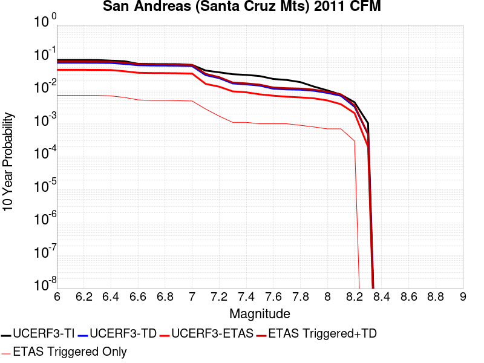 |

| Magnitude | 1 wk TI Prob | 1 wk TD Prob | 1 wk ETAS Prob | 1 wk ETAS/TD Gain | 1 wk ETAS Triggered+TD | 1 wk ETAS Triggered Only | 1 mo TI Prob | 1 mo TD Prob | 1 mo ETAS Prob | 1 mo ETAS/TD Gain | 1 mo ETAS Triggered+TD | 1 mo ETAS Triggered Only | 1 yr TI Prob | 1 yr TD Prob | 1 yr ETAS Prob | 1 yr ETAS/TD Gain | 1 yr ETAS Triggered+TD | 1 yr ETAS Triggered Only | 10 yr TI Prob | 10 yr TD Prob | 10 yr ETAS Prob | 10 yr ETAS/TD Gain | 10 yr ETAS Triggered+TD | 10 yr ETAS Triggered Only |
|-----|-----|-----|-----|-----|-----|-----|-----|-----|-----|-----|-----|-----|-----|-----|-----|-----|-----|-----|-----|-----|-----|-----|-----|-----|
| 6.0 | 1.7221631E-4 | 1.3771832E-4 | 3.0E-4 | 2.1783595 | 4.37677E-4 | 3.0E-4 | 7.378611E-4 | 5.900899E-4 | 4.0E-4 | 0.6778628 | 9.898539E-4 | 4.0E-4 | 0.008946515 | 0.00716105 | 0.0019 | 0.2653242 | 0.009047444 | 0.0019 | 0.08594794 | 0.07042385 | 0.0073 | 0.10365806 | 0.077209756 | 0.0073 |
| 6.1 | 1.7221631E-4 | 1.3771832E-4 | 3.0E-4 | 2.1783595 | 4.37677E-4 | 3.0E-4 | 7.378611E-4 | 5.900899E-4 | 4.0E-4 | 0.6778628 | 9.898539E-4 | 4.0E-4 | 0.008946515 | 0.00716105 | 0.0019 | 0.2653242 | 0.009047444 | 0.0019 | 0.08594794 | 0.07042385 | 0.0073 | 0.10365806 | 0.077209756 | 0.0073 |
| 6.2 | 1.7221631E-4 | 1.3771832E-4 | 3.0E-4 | 2.1783595 | 4.37677E-4 | 3.0E-4 | 7.378611E-4 | 5.900899E-4 | 4.0E-4 | 0.6778628 | 9.898539E-4 | 4.0E-4 | 0.008946515 | 0.00716105 | 0.0019 | 0.2653242 | 0.009047444 | 0.0019 | 0.08594794 | 0.07042385 | 0.0073 | 0.10365806 | 0.077209756 | 0.0073 |
| 6.3 | 1.716926E-4 | 1.3691284E-4 | 3.0E-4 | 2.191175 | 4.3687178E-4 | 3.0E-4 | 7.3561794E-4 | 5.8663945E-4 | 4.0E-4 | 0.68184984 | 9.864048E-4 | 4.0E-4 | 0.008919428 | 0.007119315 | 0.0019 | 0.2668796 | 0.009005789 | 0.0019 | 0.08569809 | 0.07003576 | 0.0073 | 0.10423246 | 0.0768245 | 0.0073 |
| 6.4 | 1.6392978E-4 | 1.3569735E-4 | 3.0E-4 | 2.210802 | 4.3565664E-4 | 3.0E-4 | 7.02367E-4 | 5.8143254E-4 | 4.0E-4 | 0.68795604 | 9.811999E-4 | 4.0E-4 | 0.008517839 | 0.007056332 | 0.0018 | 0.25509003 | 0.008843631 | 0.0018 | 0.08198654 | 0.069288306 | 0.007 | 0.10102715 | 0.07580329 | 0.007 |
| 6.5 | 1.5742714E-4 | 1.2631006E-4 | 3.0E-4 | 2.375108 | 4.2627216E-4 | 3.0E-4 | 6.745133E-4 | 5.412182E-4 | 4.0E-4 | 0.73907346 | 9.410017E-4 | 4.0E-4 | 0.00818132 | 0.00656973 | 0.0017 | 0.2587625 | 0.008258562 | 0.0017 | 0.078865945 | 0.064759746 | 0.0063 | 0.09728266 | 0.070651755 | 0.0063 |
| 6.6 | 1.3038084E-4 | 1.1580908E-4 | 3.0E-4 | 2.5904703 | 4.1577435E-4 | 3.0E-4 | 5.5865536E-4 | 4.9623154E-4 | 4.0E-4 | 0.80607533 | 8.96033E-4 | 4.0E-4 | 0.006780438 | 0.006025107 | 0.0012 | 0.19916658 | 0.007217877 | 0.0012 | 0.0657725 | 0.059293415 | 0.0053 | 0.08938598 | 0.06427916 | 0.0053 |
| 6.7 | 1.2867592E-4 | 1.130783E-4 | 3.0E-4 | 2.653029 | 4.1304438E-4 | 3.0E-4 | 5.5135164E-4 | 4.8453253E-4 | 4.0E-4 | 0.825538 | 8.843387E-4 | 4.0E-4 | 0.0066920654 | 0.0058834488 | 0.0012 | 0.20396201 | 0.007076388 | 0.0012 | 0.06494093 | 0.05800639 | 0.0051 | 0.087921344 | 0.062810555 | 0.0051 |
| 6.8 | 1.2801298E-4 | 1.124545E-4 | 3.0E-4 | 2.6677456 | 4.1242075E-4 | 3.0E-4 | 5.485117E-4 | 4.818601E-4 | 4.0E-4 | 0.83011645 | 8.8166737E-4 | 4.0E-4 | 0.0066577005 | 0.005851104 | 0.0012 | 0.2050895 | 0.007044083 | 0.0012 | 0.06461738 | 0.057720546 | 0.0051 | 0.088356756 | 0.062526174 | 0.0051 |
| 6.9 | 1.269149E-4 | 1.108765E-4 | 3.0E-4 | 2.7057133 | 4.1084323E-4 | 3.0E-4 | 5.4380763E-4 | 4.7509972E-4 | 4.0E-4 | 0.84192854 | 8.749097E-4 | 4.0E-4 | 0.006600777 | 0.005769235 | 0.0012 | 0.20799984 | 0.006962312 | 0.0012 | 0.06408122 | 0.0569924 | 0.005 | 0.087731 | 0.061707437 | 0.005 |
| 7.0 | 1.2030331E-4 | 1.0818742E-4 | 3.0E-4 | 2.7729657 | 4.0815497E-4 | 3.0E-4 | 5.154837E-4 | 4.6357926E-4 | 4.0E-4 | 0.8628514 | 8.633938E-4 | 4.0E-4 | 0.006257969 | 0.005629706 | 0.0012 | 0.21315499 | 0.0068229507 | 0.0012 | 0.06084648 | 0.05567259 | 0.0049 | 0.08801459 | 0.060299795 | 0.0049 |
| 7.1 | 8.049617E-5 | 5.3920678E-5 | 3.0E-4 | 5.5637283 | 3.539045E-4 | 3.0E-4 | 3.4493793E-4 | 2.3106833E-4 | 4.0E-4 | 1.7310896 | 6.3097593E-4 | 4.0E-4 | 0.0041915346 | 0.0028096624 | 9.0E-4 | 0.3203232 | 0.0037071337 | 9.0E-4 | 0.041133516 | 0.029616645 | 0.0028 | 0.09454143 | 0.032333717 | 0.0028 |
| 7.2 | 7.093979E-5 | 4.2970893E-5 | 2.0E-4 | 4.6543136 | 2.429623E-4 | 2.0E-4 | 3.0399222E-4 | 1.841481E-4 | 3.0E-4 | 1.6291236 | 4.8409286E-4 | 3.0E-4 | 0.0036948253 | 0.0022397204 | 7.0E-4 | 0.312539 | 0.0029381528 | 7.0E-4 | 0.03633994 | 0.02395904 | 0.0017 | 0.07095443 | 0.025618311 | 0.0017 |
| 7.3 | 6.193693E-5 | 2.895536E-5 | 1.0E-4 | 3.453592 | 1.2895247E-4 | 1.0E-4 | 2.6541698E-4 | 1.240885E-4 | 1.0E-4 | 0.80587643 | 2.240761E-4 | 1.0E-4 | 0.0032266637 | 0.0015097323 | 5.0E-4 | 0.33118454 | 0.0020089773 | 5.0E-4 | 0.031802133 | 0.016529538 | 0.0011 | 0.066547535 | 0.017611356 | 0.0011 |
| 7.4 | 5.906492E-5 | 2.7086404E-5 | 1.0E-4 | 3.691889 | 1.270837E-4 | 1.0E-4 | 2.5311083E-4 | 1.1607943E-4 | 1.0E-4 | 0.8614791 | 2.1606783E-4 | 1.0E-4 | 0.0030772698 | 0.0014123522 | 5.0E-4 | 0.35401934 | 0.0019116461 | 5.0E-4 | 0.030350044 | 0.01550244 | 0.0011 | 0.07095657 | 0.016585387 | 0.0011 |
| 7.5 | 5.424296E-5 | 2.4744191E-5 | 1.0E-4 | 4.0413527 | 1.2474171E-4 | 1.0E-4 | 2.324491E-4 | 1.0604222E-4 | 1.0E-4 | 0.9430206 | 2.0603162E-4 | 1.0E-4 | 0.002826395 | 0.0012903006 | 4.0E-4 | 0.31000528 | 0.0016897846 | 4.0E-4 | 0.027907165 | 0.014196164 | 0.001 | 0.07044157 | 0.015181968 | 0.001 |
| 7.6 | 4.43084E-5 | 1.997713E-5 | 1.0E-4 | 5.005724 | 1.19975135E-4 | 1.0E-4 | 1.8987931E-4 | 8.561346E-5 | 1.0E-4 | 1.1680406 | 1.856049E-4 | 1.0E-4 | 0.0023093296 | 0.0010418457 | 4.0E-4 | 0.38393402 | 0.001441429 | 4.0E-4 | 0.022854783 | 0.01144926 | 0.001 | 0.08734189 | 0.012437811 | 0.001 |
| 7.7 | 4.118098E-5 | 1.90101E-5 | 1.0E-4 | 5.2603617 | 1.190082E-4 | 1.0E-4 | 1.7647797E-4 | 8.146931E-5 | 1.0E-4 | 1.2274561 | 1.8146116E-4 | 1.0E-4 | 0.002146502 | 9.914377E-4 | 4.0E-4 | 0.40345448 | 0.0013910412 | 4.0E-4 | 0.021258866 | 0.010907629 | 0.001 | 0.091678955 | 0.011896721 | 0.001 |
| 7.8 | 3.5408906E-5 | 1.8637149E-5 | 1.0E-4 | 5.365628 | 1.1863528E-4 | 1.0E-4 | 1.5174363E-4 | 7.987105E-5 | 1.0E-4 | 1.2520181 | 1.7986307E-4 | 1.0E-4 | 0.0018459131 | 9.7199646E-4 | 4.0E-4 | 0.41152415 | 0.0013716077 | 4.0E-4 | 0.018306552 | 0.01068888 | 9.0E-4 | 0.08419965 | 0.01157926 | 9.0E-4 |
| 7.9 | 2.5860836E-5 | 1.738411E-5 | 0.0 | 0.0 | 1.738411E-5 | 0.0 | 1.10827445E-4 | 7.450121E-5 | 0.0 | 0.0 | 7.450121E-5 | 0.0 | 0.001348489 | 9.0667495E-4 | 3.0E-4 | 0.33087933 | 0.001206403 | 3.0E-4 | 0.013403354 | 0.009942366 | 8.0E-4 | 0.080463745 | 0.010734412 | 8.0E-4 |
| 8.0 | 1.9777332E-5 | 1.4895627E-5 | 0.0 | 0.0 | 1.4895627E-5 | 0.0 | 8.4757245E-5 | 6.3836844E-5 | 0.0 | 0.0 | 6.3836844E-5 | 0.0 | 0.0010314309 | 7.769366E-4 | 3.0E-4 | 0.3861319 | 0.0010767035 | 3.0E-4 | 0.010266567 | 0.00853799 | 7.0E-4 | 0.08198651 | 0.0092320135 | 7.0E-4 |
| 8.1 | 1.468494E-5 | 1.2151178E-5 | 0.0 | 0.0 | 1.2151178E-5 | 0.0 | 6.293394E-5 | 5.207544E-5 | 0.0 | 0.0 | 5.207544E-5 | 0.0 | 7.6595135E-4 | 6.338342E-4 | 3.0E-4 | 0.47330987 | 9.3364407E-4 | 3.0E-4 | 0.0076331664 | 0.00699231 | 7.0E-4 | 0.10010998 | 0.007687415 | 7.0E-4 |
| 8.2 | 8.63836E-6 | 5.4888924E-6 | 0.0 | 0.0 | 5.4888924E-6 | 0.0 | 3.7021015E-5 | 2.3523613E-5 | 0.0 | 0.0 | 2.3523613E-5 | 0.0 | 4.5063766E-4 | 2.8636242E-4 | 1.0E-4 | 0.34920782 | 3.863338E-4 | 1.0E-4 | 0.004497249 | 0.0032566148 | 3.0E-4 | 0.09212019 | 0.0035556378 | 3.0E-4 |
| 8.3 | 1.983087E-6 | 7.6880906E-7 | 0.0 | 0.0 | 7.6880906E-7 | 0.0 | 8.498917E-6 | 3.294892E-6 | 0.0 | 0.0 | 3.294892E-6 | 0.0 | 1.034694E-4 | 4.0114588E-5 | 0.0 | 0.0 | 4.0114588E-5 | 0.0 | 0.0010342124 | 4.7361702E-4 | 0.0 | 0.0 | 4.7361702E-4 | 0.0 |

## Ash Hill
*[(top)](#table-of-contents)*

| 1 Week | 1 Month | 1 Year | 10 Year |
|-----|-----|-----|-----|
| 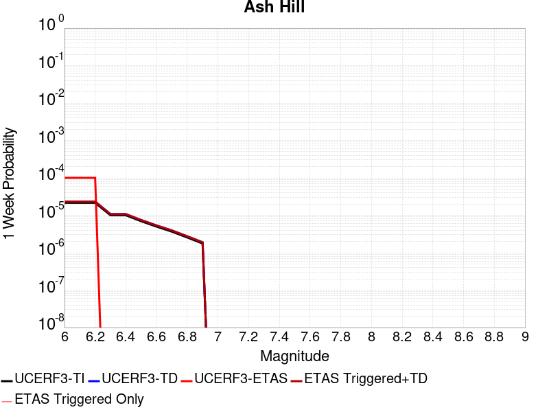 |  | 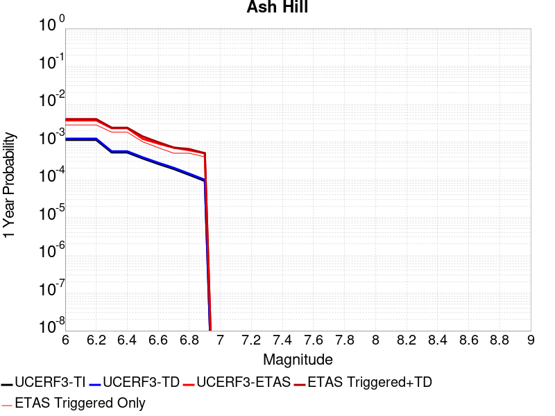 |  |

| Magnitude | 1 wk TI Prob | 1 wk TD Prob | 1 wk ETAS Prob | 1 wk ETAS/TD Gain | 1 wk ETAS Triggered+TD | 1 wk ETAS Triggered Only | 1 mo TI Prob | 1 mo TD Prob | 1 mo ETAS Prob | 1 mo ETAS/TD Gain | 1 mo ETAS Triggered+TD | 1 mo ETAS Triggered Only | 1 yr TI Prob | 1 yr TD Prob | 1 yr ETAS Prob | 1 yr ETAS/TD Gain | 1 yr ETAS Triggered+TD | 1 yr ETAS Triggered Only | 10 yr TI Prob | 10 yr TD Prob | 10 yr ETAS Prob | 10 yr ETAS/TD Gain | 10 yr ETAS Triggered+TD | 10 yr ETAS Triggered Only |
|-----|-----|-----|-----|-----|-----|-----|-----|-----|-----|-----|-----|-----|-----|-----|-----|-----|-----|-----|-----|-----|-----|-----|-----|-----|
| 6.0 | 2.1545662E-5 | 2.3198105E-5 | 0.0 | 0.0 | 2.3198105E-5 | 0.0 | 9.2335285E-5 | 9.941711E-5 | 3.0E-4 | 3.0175893 | 3.993873E-4 | 3.0E-4 | 0.0011236023 | 0.0012098112 | 0.0028 | 2.3144107 | 0.004006424 | 0.0028 | 0.011179381 | 0.012040237 | 0.0068 | 0.5647729 | 0.018758364 | 0.0068 |
| 6.1 | 2.1545662E-5 | 2.3198105E-5 | 0.0 | 0.0 | 2.3198105E-5 | 0.0 | 9.2335285E-5 | 9.941711E-5 | 3.0E-4 | 3.0175893 | 3.993873E-4 | 3.0E-4 | 0.0011236023 | 0.0012098112 | 0.0028 | 2.3144107 | 0.004006424 | 0.0028 | 0.011179381 | 0.012040237 | 0.0068 | 0.5647729 | 0.018758364 | 0.0068 |
| 6.2 | 2.1545662E-5 | 2.3198105E-5 | 0.0 | 0.0 | 2.3198105E-5 | 0.0 | 9.2335285E-5 | 9.941711E-5 | 3.0E-4 | 3.0175893 | 3.993873E-4 | 3.0E-4 | 0.0011236023 | 0.0012098112 | 0.0028 | 2.3144107 | 0.004006424 | 0.0028 | 0.011179381 | 0.012040237 | 0.0068 | 0.5647729 | 0.018758364 | 0.0068 |
| 6.3 | 1.0025529E-5 | 1.0748527E-5 | 0.0 | 0.0 | 1.0748527E-5 | 0.0 | 4.2965847E-5 | 4.606438E-5 | 1.0E-4 | 2.1708748 | 1.4605977E-4 | 1.0E-4 | 5.229836E-4 | 5.607027E-4 | 0.0018 | 3.2102573 | 0.0023596934 | 0.0018 | 0.005217545 | 0.005594193 | 0.0033 | 0.5898974 | 0.008875732 | 0.0033 |
| 6.4 | 1.0025529E-5 | 1.0748527E-5 | 0.0 | 0.0 | 1.0748527E-5 | 0.0 | 4.2965847E-5 | 4.606438E-5 | 1.0E-4 | 2.1708748 | 1.4605977E-4 | 1.0E-4 | 5.229836E-4 | 5.607027E-4 | 0.0018 | 3.2102573 | 0.0023596934 | 0.0018 | 0.005217545 | 0.005594193 | 0.0033 | 0.5898974 | 0.008875732 | 0.0033 |
| 6.5 | 6.9617327E-6 | 7.4577256E-6 | 0.0 | 0.0 | 7.4577256E-6 | 0.0 | 2.9835655E-5 | 3.196134E-5 | 0.0 | 0.0 | 3.196134E-5 | 0.0 | 3.6318856E-4 | 3.890685E-4 | 0.001 | 2.5702415 | 0.0013886794 | 0.001 | 0.0036259557 | 0.003884728 | 0.0019 | 0.48909473 | 0.005777347 | 0.0019 |
| 6.6 | 4.9919777E-6 | 5.3474705E-6 | 0.0 | 0.0 | 5.3474705E-6 | 0.0 | 2.1394015E-5 | 2.2917568E-5 | 0.0 | 0.0 | 2.2917568E-5 | 0.0 | 2.60441E-4 | 2.7899237E-4 | 7.0E-4 | 2.5090292 | 9.787971E-4 | 7.0E-4 | 0.0026013597 | 0.00278708 | 0.001 | 0.35879847 | 0.0037842928 | 0.001 |
| 6.7 | 3.6630722E-6 | 3.925201E-6 | 0.0 | 0.0 | 3.925201E-6 | 0.0 | 1.5698786E-5 | 1.6822212E-5 | 0.0 | 0.0 | 1.6822212E-5 | 0.0 | 1.9111596E-4 | 2.0479693E-4 | 5.0E-4 | 2.4414427 | 7.0469454E-4 | 5.0E-4 | 0.0019095168 | 0.0020466452 | 7.0E-4 | 0.34202313 | 0.0027452125 | 7.0E-4 |
| 6.8 | 2.5599613E-6 | 2.7453334E-6 | 0.0 | 0.0 | 2.7453334E-6 | 0.0 | 1.0971216E-5 | 1.176569E-5 | 0.0 | 0.0 | 1.176569E-5 | 0.0 | 1.3356637E-4 | 1.4324281E-4 | 5.0E-4 | 3.4905767 | 6.431712E-4 | 5.0E-4 | 0.0013348613 | 0.0014319898 | 7.0E-4 | 0.48883027 | 0.0021309874 | 7.0E-4 |
| 6.9 | 1.7684905E-6 | 1.8971543E-6 | 0.0 | 0.0 | 1.8971543E-6 | 0.0 | 7.579223E-6 | 8.130662E-6 | 0.0 | 0.0 | 8.130662E-6 | 0.0 | 9.2273134E-5 | 9.89908E-5 | 4.0E-4 | 4.0407796 | 4.989512E-4 | 4.0E-4 | 9.223483E-4 | 9.89908E-4 | 5.0E-4 | 0.50509745 | 0.0014894131 | 5.0E-4 |

## Hayward (No) 2011 CFM
*[(top)](#table-of-contents)*

| 1 Week | 1 Month | 1 Year | 10 Year |
|-----|-----|-----|-----|
|  |  | 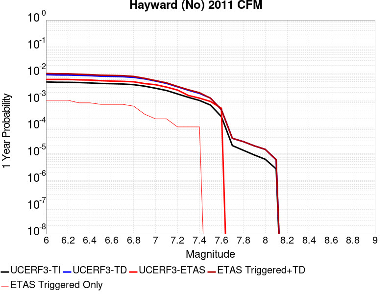 | 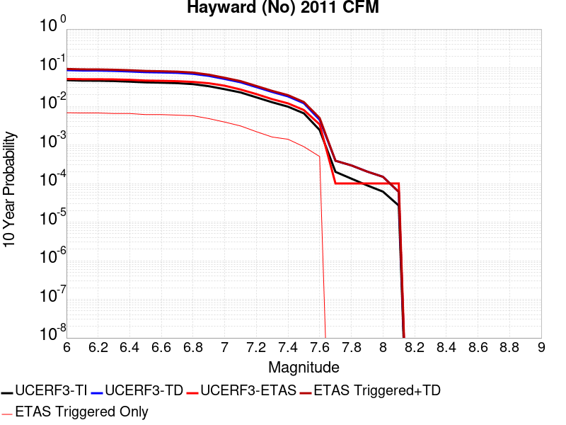 |

| Magnitude | 1 wk TI Prob | 1 wk TD Prob | 1 wk ETAS Prob | 1 wk ETAS/TD Gain | 1 wk ETAS Triggered+TD | 1 wk ETAS Triggered Only | 1 mo TI Prob | 1 mo TD Prob | 1 mo ETAS Prob | 1 mo ETAS/TD Gain | 1 mo ETAS Triggered+TD | 1 mo ETAS Triggered Only | 1 yr TI Prob | 1 yr TD Prob | 1 yr ETAS Prob | 1 yr ETAS/TD Gain | 1 yr ETAS Triggered+TD | 1 yr ETAS Triggered Only | 10 yr TI Prob | 10 yr TD Prob | 10 yr ETAS Prob | 10 yr ETAS/TD Gain | 10 yr ETAS Triggered+TD | 10 yr ETAS Triggered Only |
|-----|-----|-----|-----|-----|-----|-----|-----|-----|-----|-----|-----|-----|-----|-----|-----|-----|-----|-----|-----|-----|-----|-----|-----|-----|
| 6.0 | 9.3068506E-5 | 1.7392369E-4 | 1.0E-4 | 0.5749648 | 2.739063E-4 | 1.0E-4 | 3.9880406E-4 | 7.45174E-4 | 1.0E-4 | 0.13419685 | 8.450995E-4 | 1.0E-4 | 0.0048446343 | 0.00903463 | 0.001 | 0.11068522 | 0.010025595 | 0.001 | 0.047403704 | 0.086339645 | 0.0068 | 0.07875872 | 0.092552535 | 0.0068 |
| 6.1 | 9.055486E-5 | 1.6943265E-4 | 1.0E-4 | 0.590205 | 2.694157E-4 | 1.0E-4 | 3.880345E-4 | 7.2593824E-4 | 1.0E-4 | 0.13775277 | 8.2586566E-4 | 1.0E-4 | 0.0047140904 | 0.008802555 | 0.001 | 0.11360339 | 0.009793752 | 0.001 | 0.046153355 | 0.08423615 | 0.0067 | 0.07953829 | 0.09037177 | 0.0067 |
| 6.2 | 9.006742E-5 | 1.6863794E-4 | 1.0E-4 | 0.59298635 | 2.6862108E-4 | 1.0E-4 | 3.859461E-4 | 7.2253443E-4 | 1.0E-4 | 0.13840172 | 8.2246214E-4 | 1.0E-4 | 0.0046887742 | 0.008761484 | 0.001 | 0.114135906 | 0.009752723 | 0.001 | 0.0459107 | 0.08386006 | 0.0067 | 0.079895005 | 0.0899982 | 0.0067 |
| 6.3 | 8.8336754E-5 | 1.6543233E-4 | 1.0E-4 | 0.6044768 | 2.654158E-4 | 1.0E-4 | 3.7853114E-4 | 7.0880377E-4 | 1.0E-4 | 0.14108278 | 8.087329E-4 | 1.0E-4 | 0.004598882 | 0.008595698 | 8.0E-4 | 0.093069814 | 0.009388821 | 8.0E-4 | 0.04504866 | 0.082351565 | 0.0065 | 0.07892989 | 0.08831628 | 0.0065 |
| 6.4 | 8.526157E-5 | 1.596952E-4 | 1.0E-4 | 0.62619287 | 2.5967925E-4 | 1.0E-4 | 3.6535555E-4 | 6.842292E-4 | 1.0E-4 | 0.14614986 | 7.841608E-4 | 1.0E-4 | 0.0044391346 | 0.00829883 | 8.0E-4 | 0.09639913 | 0.009092191 | 8.0E-4 | 0.043514993 | 0.079659395 | 0.0065 | 0.08159741 | 0.08564161 | 0.0065 |
| 6.5 | 8.152396E-5 | 1.5301949E-4 | 1.0E-4 | 0.6535115 | 2.530042E-4 | 1.0E-4 | 3.493416E-4 | 6.556337E-4 | 1.0E-4 | 0.15252419 | 7.5556815E-4 | 1.0E-4 | 0.0042449418 | 0.007953275 | 7.0E-4 | 0.08801406 | 0.008647707 | 7.0E-4 | 0.04164765 | 0.07649121 | 0.0061 | 0.07974772 | 0.08212461 | 0.0061 |
| 6.6 | 7.987405E-5 | 1.5006079E-4 | 1.0E-4 | 0.6663966 | 2.500458E-4 | 1.0E-4 | 3.4227243E-4 | 6.4295984E-4 | 1.0E-4 | 0.1555307 | 7.428956E-4 | 1.0E-4 | 0.0041592065 | 0.0078000966 | 7.0E-4 | 0.089742474 | 0.008494637 | 7.0E-4 | 0.04082218 | 0.07508345 | 0.0061 | 0.081242934 | 0.08072544 | 0.0061 |
| 6.7 | 7.777665E-5 | 1.464506E-4 | 1.0E-4 | 0.6828241 | 2.4643596E-4 | 1.0E-4 | 3.332859E-4 | 6.274952E-4 | 1.0E-4 | 0.15936378 | 7.2743243E-4 | 1.0E-4 | 0.004050208 | 0.0076131467 | 7.0E-4 | 0.091946214 | 0.008307817 | 7.0E-4 | 0.039771806 | 0.07335845 | 0.0059 | 0.080427006 | 0.07882563 | 0.0059 |
| 6.8 | 7.3284005E-5 | 1.3796339E-4 | 1.0E-4 | 0.72483 | 2.3794959E-4 | 1.0E-4 | 3.140365E-4 | 5.911383E-4 | 1.0E-4 | 0.16916515 | 6.910792E-4 | 1.0E-4 | 0.0038166929 | 0.0071734954 | 6.0E-4 | 0.08364123 | 0.007769191 | 6.0E-4 | 0.037518036 | 0.06927456 | 0.0057 | 0.082281284 | 0.07457969 | 0.0057 |
| 6.9 | 6.458263E-5 | 1.21280194E-4 | 0.0 | 0.0 | 1.21280194E-4 | 0.0 | 2.7675333E-4 | 5.196692E-4 | 0.0 | 0.0 | 5.196692E-4 | 0.0 | 0.0033642664 | 0.006308719 | 3.0E-4 | 0.047553238 | 0.006606826 | 3.0E-4 | 0.033137884 | 0.06120776 | 0.0048 | 0.07842143 | 0.065713964 | 0.0048 |
| 7.0 | 5.3853604E-5 | 1.0022154E-4 | 0.0 | 0.0 | 1.0022154E-4 | 0.0 | 2.3078074E-4 | 4.294505E-4 | 0.0 | 0.0 | 4.294505E-4 | 0.0 | 0.0028061352 | 0.0052160895 | 2.0E-4 | 0.0383429 | 0.005415046 | 2.0E-4 | 0.027709642 | 0.05094187 | 0.0039 | 0.07655785 | 0.054643195 | 0.0039 |
| 7.1 | 4.4308683E-5 | 8.168625E-5 | 0.0 | 0.0 | 8.168625E-5 | 0.0 | 1.8988053E-4 | 3.5003718E-4 | 0.0 | 0.0 | 3.5003718E-4 | 0.0 | 0.0023093442 | 0.0042534163 | 2.0E-4 | 0.047021028 | 0.0044525657 | 2.0E-4 | 0.022854926 | 0.04181224 | 0.0031 | 0.074140966 | 0.044782624 | 0.0031 |
| 7.2 | 3.295973E-5 | 6.07439E-5 | 0.0 | 0.0 | 6.07439E-5 | 0.0 | 1.4124835E-4 | 2.6030515E-4 | 0.0 | 0.0 | 2.6030515E-4 | 0.0 | 0.0017183421 | 0.0031646325 | 1.0E-4 | 0.031599246 | 0.003264316 | 1.0E-4 | 0.017051157 | 0.031353906 | 0.0022 | 0.0701667 | 0.03348493 | 0.0022 |
| 7.3 | 2.452256E-5 | 4.514789E-5 | 0.0 | 0.0 | 4.514789E-5 | 0.0 | 1.05092455E-4 | 1.9347669E-4 | 0.0 | 0.0 | 1.9347669E-4 | 0.0 | 0.0012787496 | 0.0023530477 | 1.0E-4 | 0.042498074 | 0.0024528124 | 1.0E-4 | 0.0127141625 | 0.023423746 | 0.0016 | 0.06830675 | 0.024986269 | 0.0016 |
| 7.4 | 1.8829967E-5 | 3.457427E-5 | 0.0 | 0.0 | 3.457427E-5 | 0.0 | 8.069736E-5 | 1.4816708E-4 | 0.0 | 0.0 | 1.4816708E-4 | 0.0 | 9.820475E-4 | 0.0018024514 | 1.0E-4 | 0.055479996 | 0.0019022712 | 1.0E-4 | 0.009777189 | 0.018004434 | 0.0014 | 0.07775862 | 0.019379228 | 0.0014 |
| 7.5 | 1.26374125E-5 | 2.2910113E-5 | 0.0 | 0.0 | 2.2910113E-5 | 0.0 | 5.4159216E-5 | 9.8182536E-5 | 0.0 | 0.0 | 9.8182536E-5 | 0.0 | 6.5918895E-4 | 0.0011947226 | 0.0 | 0.0 | 0.0011947226 | 0.0 | 0.00657237 | 0.011981598 | 9.0E-4 | 0.07511519 | 0.012870815 | 9.0E-4 |
| 7.6 | 4.666429E-6 | 8.479833E-6 | 0.0 | 0.0 | 8.479833E-6 | 0.0 | 1.9998828E-5 | 3.634164E-5 | 0.0 | 0.0 | 3.634164E-5 | 0.0 | 2.4345852E-4 | 4.423709E-4 | 0.0 | 0.0 | 4.423709E-4 | 0.0 | 0.0024319198 | 0.0044580107 | 5.0E-4 | 0.11215765 | 0.0049557816 | 5.0E-4 |
| 7.7 | 3.8399318E-7 | 7.137999E-7 | 0.0 | 0.0 | 7.137999E-7 | 0.0 | 1.6456839E-6 | 3.0591389E-6 | 0.0 | 0.0 | 3.0591389E-6 | 0.0 | 2.003602E-5 | 3.7244383E-5 | 0.0 | 0.0 | 3.7244383E-5 | 0.0 | 2.0034213E-4 | 3.8634439E-4 | 0.0 | 0.0 | 3.8634439E-4 | 0.0 |
| 7.8 | 2.5637698E-7 | 5.3742724E-7 | 0.0 | 0.0 | 5.3742724E-7 | 0.0 | 1.098758E-6 | 2.3032574E-6 | 0.0 | 0.0 | 2.3032574E-6 | 0.0 | 1.3377297E-5 | 2.80418E-5 | 0.0 | 0.0 | 2.80418E-5 | 0.0 | 1.3376492E-4 | 2.9284446E-4 | 0.0 | 0.0 | 2.9284446E-4 | 0.0 |
| 7.9 | 1.7141245E-7 | 3.737934E-7 | 0.0 | 0.0 | 3.737934E-7 | 0.0 | 7.3462456E-7 | 1.6019707E-6 | 0.0 | 0.0 | 1.6019707E-6 | 0.0 | 8.944017E-6 | 1.950382E-5 | 0.0 | 0.0 | 1.950382E-5 | 0.0 | 8.943657E-5 | 2.0289294E-4 | 0.0 | 0.0 | 2.0289294E-4 | 0.0 |
| 8.0 | 1.1808895E-7 | 2.7586123E-7 | 0.0 | 0.0 | 2.7586123E-7 | 0.0 | 5.060954E-7 | 1.1822618E-6 | 0.0 | 0.0 | 1.1822618E-6 | 0.0 | 6.161694E-6 | 1.4393942E-5 | 0.0 | 0.0 | 1.4393942E-5 | 0.0 | 6.161523E-5 | 1.4854311E-4 | 0.0 | 0.0 | 1.4854311E-4 | 0.0 |
| 8.1 | 5.138535E-8 | 1.1262061E-7 | 0.0 | 0.0 | 1.1262061E-7 | 0.0 | 2.2022292E-7 | 4.826597E-7 | 0.0 | 0.0 | 4.826597E-7 | 0.0 | 2.6812106E-6 | 5.876366E-6 | 0.0 | 0.0 | 5.876366E-6 | 0.0 | 2.6811784E-5 | 6.0323167E-5 | 0.0 | 0.0 | 6.0323167E-5 | 0.0 |

## Hunter Mountain-Saline Valley
*[(top)](#table-of-contents)*

| 1 Week | 1 Month | 1 Year | 10 Year |
|-----|-----|-----|-----|
|  | 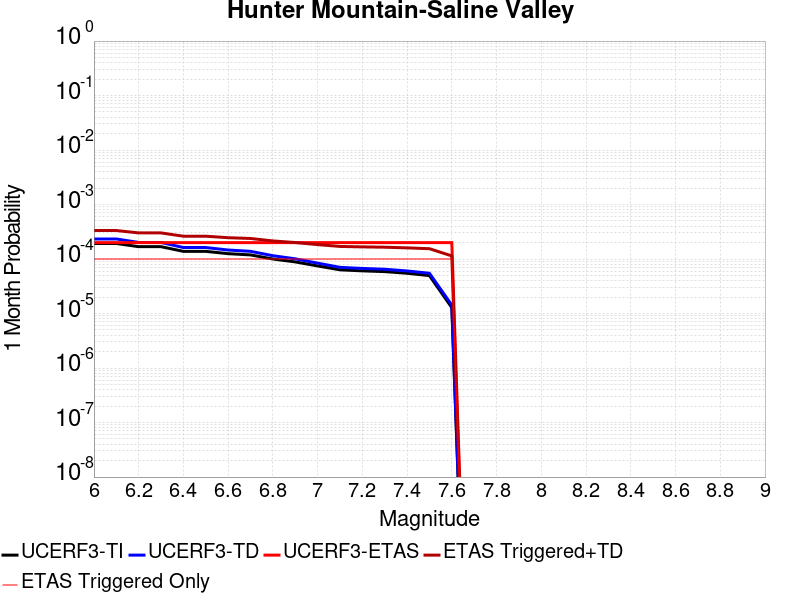 | 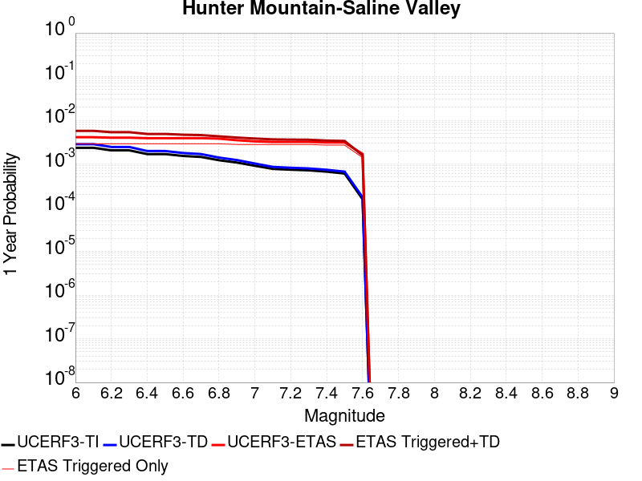 |  |

| Magnitude | 1 wk TI Prob | 1 wk TD Prob | 1 wk ETAS Prob | 1 wk ETAS/TD Gain | 1 wk ETAS Triggered+TD | 1 wk ETAS Triggered Only | 1 mo TI Prob | 1 mo TD Prob | 1 mo ETAS Prob | 1 mo ETAS/TD Gain | 1 mo ETAS Triggered+TD | 1 mo ETAS Triggered Only | 1 yr TI Prob | 1 yr TD Prob | 1 yr ETAS Prob | 1 yr ETAS/TD Gain | 1 yr ETAS Triggered+TD | 1 yr ETAS Triggered Only | 10 yr TI Prob | 10 yr TD Prob | 10 yr ETAS Prob | 10 yr ETAS/TD Gain | 10 yr ETAS Triggered+TD | 10 yr ETAS Triggered Only |
|-----|-----|-----|-----|-----|-----|-----|-----|-----|-----|-----|-----|-----|-----|-----|-----|-----|-----|-----|-----|-----|-----|-----|-----|-----|
| 6.0 | 4.5103672E-5 | 5.459577E-5 | 0.0 | 0.0 | 5.459577E-5 | 0.0 | 1.9328714E-4 | 2.3396156E-4 | 1.0E-4 | 0.42742065 | 3.3393817E-4 | 1.0E-4 | 0.002350731 | 0.002844936 | 0.0029 | 1.019355 | 0.005736686 | 0.0029 | 0.023260195 | 0.028104633 | 0.0067 | 0.23839486 | 0.034616333 | 0.0067 |
| 6.1 | 4.5103672E-5 | 5.459577E-5 | 0.0 | 0.0 | 5.459577E-5 | 0.0 | 1.9328714E-4 | 2.3396156E-4 | 1.0E-4 | 0.42742065 | 3.3393817E-4 | 1.0E-4 | 0.002350731 | 0.002844936 | 0.0029 | 1.019355 | 0.005736686 | 0.0029 | 0.023260195 | 0.028104633 | 0.0067 | 0.23839486 | 0.034616333 | 0.0067 |
| 6.2 | 3.9363465E-5 | 4.7084824E-5 | 0.0 | 0.0 | 4.7084824E-5 | 0.0 | 1.6868966E-4 | 2.0177738E-4 | 1.0E-4 | 0.4955957 | 3.017572E-4 | 1.0E-4 | 0.002051862 | 0.002454005 | 0.0029 | 1.1817417 | 0.005346888 | 0.0029 | 0.020330196 | 0.024283925 | 0.0067 | 0.27590266 | 0.030821223 | 0.0067 |
| 6.3 | 3.9363465E-5 | 4.7084824E-5 | 0.0 | 0.0 | 4.7084824E-5 | 0.0 | 1.6868966E-4 | 2.0177738E-4 | 1.0E-4 | 0.4955957 | 3.017572E-4 | 1.0E-4 | 0.002051862 | 0.002454005 | 0.0029 | 1.1817417 | 0.005346888 | 0.0029 | 0.020330196 | 0.024283925 | 0.0067 | 0.27590266 | 0.030821223 | 0.0067 |
| 6.4 | 3.2311684E-5 | 3.7967904E-5 | 0.0 | 0.0 | 3.7967904E-5 | 0.0 | 1.384713E-4 | 1.6270985E-4 | 1.0E-4 | 0.61459094 | 2.626936E-4 | 1.0E-4 | 0.0016845843 | 0.0019792616 | 0.0029 | 1.4651929 | 0.0048735216 | 0.0029 | 0.016718714 | 0.01962419 | 0.0064 | 0.32612813 | 0.025898594 | 0.0064 |
| 6.5 | 3.2311684E-5 | 3.7967904E-5 | 0.0 | 0.0 | 3.7967904E-5 | 0.0 | 1.384713E-4 | 1.6270985E-4 | 1.0E-4 | 0.61459094 | 2.626936E-4 | 1.0E-4 | 0.0016845843 | 0.0019792616 | 0.0029 | 1.4651929 | 0.0048735216 | 0.0029 | 0.016718714 | 0.01962419 | 0.0064 | 0.32612813 | 0.025898594 | 0.0064 |
| 6.6 | 2.9305844E-5 | 3.4196804E-5 | 0.0 | 0.0 | 3.4196804E-5 | 0.0 | 1.2559042E-4 | 1.4654986E-4 | 1.0E-4 | 0.6823616 | 2.465352E-4 | 1.0E-4 | 0.0015279909 | 0.0017828459 | 0.0029 | 1.6266128 | 0.0046776757 | 0.0029 | 0.015175272 | 0.017692415 | 0.0063 | 0.3560848 | 0.023880953 | 0.0063 |
| 6.7 | 2.7826512E-5 | 3.235829E-5 | 0.0 | 0.0 | 3.235829E-5 | 0.0 | 1.19251024E-4 | 1.3867136E-4 | 1.0E-4 | 0.7211295 | 2.3865748E-4 | 1.0E-4 | 0.0014509142 | 0.0016870765 | 0.0029 | 1.7189499 | 0.004582184 | 0.0029 | 0.014414776 | 0.01674945 | 0.0063 | 0.37613177 | 0.022943929 | 0.0063 |
| 6.8 | 2.3389874E-5 | 2.6878079E-5 | 0.0 | 0.0 | 2.6878079E-5 | 0.0 | 1.0023846E-4 | 1.15186944E-4 | 1.0E-4 | 0.8681539 | 2.1517543E-4 | 1.0E-4 | 0.00121972 | 0.0014015462 | 0.0029 | 2.0691433 | 0.004297482 | 0.0029 | 0.01213047 | 0.01393235 | 0.0063 | 0.45218503 | 0.020144576 | 0.0063 |
| 6.9 | 2.069209E-5 | 2.3579887E-5 | 0.0 | 0.0 | 2.3579887E-5 | 0.0 | 8.867737E-5 | 1.0105295E-4 | 1.0E-4 | 0.9895802 | 2.0104284E-4 | 1.0E-4 | 0.0010791123 | 0.0012296614 | 0.0028 | 2.2770495 | 0.0040262183 | 0.0028 | 0.010738871 | 0.01223267 | 0.0062 | 0.5068395 | 0.018356826 | 0.0062 |
| 7.0 | 1.7462342E-5 | 1.9641626E-5 | 0.0 | 0.0 | 1.9641626E-5 | 0.0 | 7.483646E-5 | 8.417581E-5 | 1.0E-4 | 1.1879898 | 1.841674E-4 | 1.0E-4 | 9.1075303E-4 | 0.0010243813 | 0.0028 | 2.7333572 | 0.003821513 | 0.0028 | 0.009070295 | 0.010199289 | 0.0061 | 0.59808093 | 0.016237073 | 0.0061 |
| 7.1 | 1.4807709E-5 | 1.6448499E-5 | 0.0 | 0.0 | 1.6448499E-5 | 0.0 | 6.3460066E-5 | 7.0491755E-5 | 1.0E-4 | 1.4186057 | 1.7048471E-4 | 1.0E-4 | 7.723524E-4 | 8.579157E-4 | 0.0028 | 3.263724 | 0.0036555135 | 0.0028 | 0.007696735 | 0.008548085 | 0.0061 | 0.7136102 | 0.014595941 | 0.0061 |
| 7.2 | 1.4180048E-5 | 1.5704803E-5 | 0.0 | 0.0 | 1.5704803E-5 | 0.0 | 6.077022E-5 | 6.730466E-5 | 1.0E-4 | 1.4857813 | 1.6729793E-4 | 1.0E-4 | 7.396263E-4 | 8.191423E-4 | 0.0028 | 3.4182093 | 0.0036168487 | 0.0028 | 0.0073716943 | 0.008163241 | 0.0061 | 0.7472522 | 0.014213446 | 0.0061 |
| 7.3 | 1.3730402E-5 | 1.5178356E-5 | 0.0 | 0.0 | 1.5178356E-5 | 0.0 | 5.8843252E-5 | 6.504857E-5 | 1.0E-4 | 1.5373129 | 1.6504206E-4 | 1.0E-4 | 7.161811E-4 | 7.916946E-4 | 0.0028 | 3.5367172 | 0.0035894779 | 0.0028 | 0.007138774 | 0.007890735 | 0.0061 | 0.7730586 | 0.013942601 | 0.0061 |
| 7.4 | 1.2810095E-5 | 1.4115049E-5 | 0.0 | 0.0 | 1.4115049E-5 | 0.0 | 5.489925E-5 | 6.0491755E-5 | 1.0E-4 | 1.6531178 | 1.6048571E-4 | 1.0E-4 | 6.681934E-4 | 7.362541E-4 | 0.0027 | 3.6672122 | 0.0034342662 | 0.0027 | 0.006661878 | 0.007340103 | 0.0059 | 0.80380344 | 0.013196796 | 0.0059 |
| 7.5 | 1.1595659E-5 | 1.2806153E-5 | 0.0 | 0.0 | 1.2806153E-5 | 0.0 | 4.9694736E-5 | 5.4882446E-5 | 1.0E-4 | 1.8220762 | 1.5487695E-4 | 1.0E-4 | 6.0486543E-4 | 6.680046E-4 | 0.0027 | 4.041888 | 0.003366201 | 0.0027 | 0.006032217 | 0.006661907 | 0.0058 | 0.8706216 | 0.012423268 | 0.0058 |
| 7.6 | 2.997694E-6 | 3.327327E-6 | 0.0 | 0.0 | 3.327327E-6 | 0.0 | 1.28471975E-5 | 1.4259936E-5 | 1.0E-4 | 7.0126543 | 1.1425851E-4 | 1.0E-4 | 1.564034E-4 | 1.7360818E-4 | 0.0014 | 8.0641365 | 0.0015733652 | 0.0014 | 0.0015629337 | 0.0017354611 | 0.0026 | 1.498161 | 0.004330949 | 0.0026 |

## San Andreas (North Coast) 2011 CFM
*[(top)](#table-of-contents)*

| 1 Week | 1 Month | 1 Year | 10 Year |
|-----|-----|-----|-----|
|  | 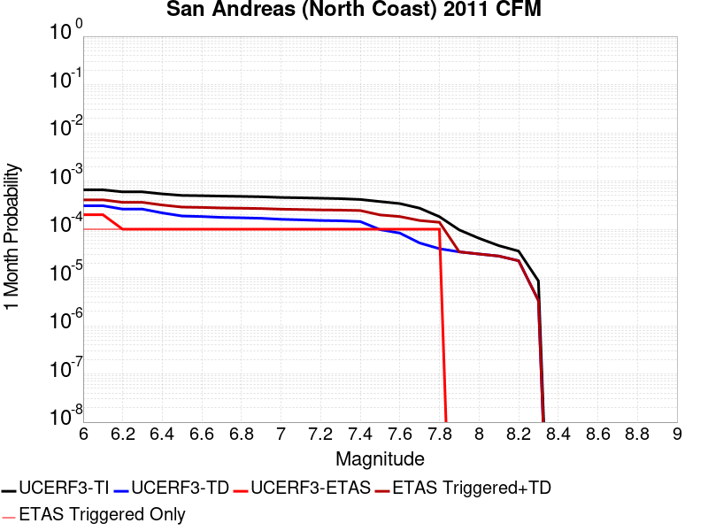 |  |  |

| Magnitude | 1 wk TI Prob | 1 wk TD Prob | 1 wk ETAS Prob | 1 wk ETAS/TD Gain | 1 wk ETAS Triggered+TD | 1 wk ETAS Triggered Only | 1 mo TI Prob | 1 mo TD Prob | 1 mo ETAS Prob | 1 mo ETAS/TD Gain | 1 mo ETAS Triggered+TD | 1 mo ETAS Triggered Only | 1 yr TI Prob | 1 yr TD Prob | 1 yr ETAS Prob | 1 yr ETAS/TD Gain | 1 yr ETAS Triggered+TD | 1 yr ETAS Triggered Only | 10 yr TI Prob | 10 yr TD Prob | 10 yr ETAS Prob | 10 yr ETAS/TD Gain | 10 yr ETAS Triggered+TD | 10 yr ETAS Triggered Only |
|-----|-----|-----|-----|-----|-----|-----|-----|-----|-----|-----|-----|-----|-----|-----|-----|-----|-----|-----|-----|-----|-----|-----|-----|-----|
| 6.0 | 1.5333705E-4 | 7.118066E-5 | 1.0E-4 | 1.4048761 | 1.7117354E-4 | 1.0E-4 | 6.5699324E-4 | 3.0502447E-4 | 1.0E-4 | 0.32784256 | 4.0499397E-4 | 1.0E-4 | 0.007969595 | 0.003707383 | 0.0012 | 0.32367846 | 0.004902934 | 0.0012 | 0.0768977 | 0.039407887 | 0.006 | 0.15225378 | 0.04517144 | 0.006 |
| 6.1 | 1.5333705E-4 | 7.118066E-5 | 1.0E-4 | 1.4048761 | 1.7117354E-4 | 1.0E-4 | 6.5699324E-4 | 3.0502447E-4 | 1.0E-4 | 0.32784256 | 4.0499397E-4 | 1.0E-4 | 0.007969595 | 0.003707383 | 0.0012 | 0.32367846 | 0.004902934 | 0.0012 | 0.0768977 | 0.039407887 | 0.006 | 0.15225378 | 0.04517144 | 0.006 |
| 6.2 | 1.3912938E-4 | 6.0576145E-5 | 1.0E-4 | 1.6508149 | 1.6057008E-4 | 1.0E-4 | 5.961325E-4 | 2.5958635E-4 | 1.0E-4 | 0.38522825 | 3.595604E-4 | 1.0E-4 | 0.007233787 | 0.0031559109 | 0.0011 | 0.34855232 | 0.0042524394 | 0.0011 | 0.07002798 | 0.0337377 | 0.005 | 0.14820217 | 0.03856901 | 0.005 |
| 6.3 | 1.3912938E-4 | 6.0576145E-5 | 1.0E-4 | 1.6508149 | 1.6057008E-4 | 1.0E-4 | 5.961325E-4 | 2.5958635E-4 | 1.0E-4 | 0.38522825 | 3.595604E-4 | 1.0E-4 | 0.007233787 | 0.0031559109 | 0.0011 | 0.34855232 | 0.0042524394 | 0.0011 | 0.07002798 | 0.0337377 | 0.005 | 0.14820217 | 0.03856901 | 0.005 |
| 6.4 | 1.2623647E-4 | 5.0517276E-5 | 1.0E-4 | 1.9795208 | 1.5051222E-4 | 1.0E-4 | 5.4090127E-4 | 2.1648475E-4 | 1.0E-4 | 0.46192628 | 3.1646312E-4 | 1.0E-4 | 0.0065656058 | 0.0026325362 | 7.0E-4 | 0.2659033 | 0.0033306933 | 7.0E-4 | 0.06374981 | 0.028345518 | 0.0038 | 0.13406 | 0.032037806 | 0.0038 |
| 6.5 | 1.1736096E-4 | 4.359937E-5 | 1.0E-4 | 2.293611 | 1.4359501E-4 | 1.0E-4 | 5.028786E-4 | 1.8684115E-4 | 1.0E-4 | 0.535214 | 2.8682247E-4 | 1.0E-4 | 0.006105373 | 0.002272434 | 5.0E-4 | 0.22002839 | 0.002771298 | 5.0E-4 | 0.05940335 | 0.024618996 | 0.0034 | 0.13810474 | 0.027935293 | 0.0034 |
| 6.6 | 1.1586959E-4 | 4.2499287E-5 | 1.0E-4 | 2.3529806 | 1.4249503E-4 | 1.0E-4 | 4.964894E-4 | 1.8212717E-4 | 1.0E-4 | 0.54906684 | 2.8210896E-4 | 1.0E-4 | 0.006028018 | 0.0022151596 | 5.0E-4 | 0.22571737 | 0.002714052 | 5.0E-4 | 0.058671024 | 0.024024095 | 0.0034 | 0.14152458 | 0.027342413 | 0.0034 |
| 6.7 | 1.13693764E-4 | 4.081122E-5 | 1.0E-4 | 2.4503064 | 1.4080714E-4 | 1.0E-4 | 4.87168E-4 | 1.748936E-4 | 1.0E-4 | 0.5717762 | 2.748761E-4 | 1.0E-4 | 0.005915152 | 0.0021272663 | 5.0E-4 | 0.23504345 | 0.0026262025 | 5.0E-4 | 0.057601593 | 0.02311721 | 0.0034 | 0.14707656 | 0.026438612 | 0.0034 |
| 6.8 | 1.1204889E-4 | 4.0028845E-5 | 1.0E-4 | 2.4981985 | 1.4002484E-4 | 1.0E-4 | 4.8012115E-4 | 1.7154099E-4 | 1.0E-4 | 0.58295107 | 2.7152384E-4 | 1.0E-4 | 0.005829819 | 0.002086527 | 4.0E-4 | 0.19170612 | 0.0024856925 | 4.0E-4 | 0.05679232 | 0.02267732 | 0.0033 | 0.14551985 | 0.025902484 | 0.0033 |
| 6.9 | 1.1005794E-4 | 3.9084727E-5 | 1.0E-4 | 2.5585442 | 1.3908082E-4 | 1.0E-4 | 4.7159163E-4 | 1.6749531E-4 | 1.0E-4 | 0.59703165 | 2.6747855E-4 | 1.0E-4 | 0.0057265228 | 0.002037364 | 4.0E-4 | 0.19633211 | 0.0024365492 | 4.0E-4 | 0.055811852 | 0.02214334 | 0.0031 | 0.13999695 | 0.025174694 | 0.0031 |
| 7.0 | 1.0647948E-4 | 3.7240494E-5 | 1.0E-4 | 2.685249 | 1.3723677E-4 | 1.0E-4 | 4.562608E-4 | 1.5959244E-4 | 1.0E-4 | 0.6265961 | 2.5957648E-4 | 1.0E-4 | 0.0055408357 | 0.001941322 | 4.0E-4 | 0.20604515 | 0.0023405454 | 4.0E-4 | 0.054047033 | 0.021100836 | 0.0028 | 0.13269617 | 0.023841754 | 0.0028 |
| 7.1 | 1.04795035E-4 | 3.628962E-5 | 1.0E-4 | 2.7556088 | 1.3628599E-4 | 1.0E-4 | 4.4904428E-4 | 1.5551776E-4 | 1.0E-4 | 0.64301336 | 2.555022E-4 | 1.0E-4 | 0.0054534175 | 0.0018918 | 4.0E-4 | 0.21143883 | 0.0022910433 | 4.0E-4 | 0.053215165 | 0.020569568 | 0.0028 | 0.13612342 | 0.023311974 | 0.0028 |
| 7.2 | 1.02724036E-4 | 3.5198074E-5 | 1.0E-4 | 2.8410645 | 1.3519455E-4 | 1.0E-4 | 4.401716E-4 | 1.5084026E-4 | 1.0E-4 | 0.66295296 | 2.5082516E-4 | 1.0E-4 | 0.0053459285 | 0.0018349487 | 4.0E-4 | 0.21798974 | 0.0022342147 | 4.0E-4 | 0.052191395 | 0.019956838 | 0.0027 | 0.13529198 | 0.022602955 | 0.0027 |
| 7.3 | 1.00650694E-4 | 3.4665776E-5 | 1.0E-4 | 2.8846896 | 1.346623E-4 | 1.0E-4 | 4.312888E-4 | 1.4855924E-4 | 1.0E-4 | 0.6731322 | 2.4854438E-4 | 1.0E-4 | 0.005238306 | 0.0018072237 | 4.0E-4 | 0.22133398 | 0.0022065006 | 4.0E-4 | 0.051165357 | 0.019633656 | 0.0026 | 0.13242567 | 0.022182608 | 0.0026 |
| 7.4 | 9.672919E-5 | 3.3453176E-5 | 1.0E-4 | 2.9892528 | 1.3344982E-4 | 1.0E-4 | 4.144878E-4 | 1.4336295E-4 | 1.0E-4 | 0.69753027 | 2.4334862E-4 | 1.0E-4 | 0.005034718 | 0.0017440618 | 4.0E-4 | 0.22934966 | 0.0021433642 | 4.0E-4 | 0.049221683 | 0.018906774 | 0.0025 | 0.13222773 | 0.021359507 | 0.0025 |
| 7.5 | 8.7600405E-5 | 2.2740962E-5 | 1.0E-4 | 4.3973513 | 1.2273868E-4 | 1.0E-4 | 3.753763E-4 | 9.745763E-5 | 1.0E-4 | 1.0260869 | 1.974479E-4 | 1.0E-4 | 0.0045606326 | 0.0011859026 | 3.0E-4 | 0.25297186 | 0.0014855468 | 3.0E-4 | 0.04468165 | 0.013153855 | 0.0016 | 0.121637344 | 0.014732809 | 0.0016 |
| 7.6 | 7.9562284E-5 | 1.92631E-5 | 1.0E-4 | 5.1912727 | 1.19261174E-4 | 1.0E-4 | 3.4093665E-4 | 8.255354E-5 | 1.0E-4 | 1.2113352 | 1.8254528E-4 | 1.0E-4 | 0.0041430052 | 0.0010046273 | 3.0E-4 | 0.2986182 | 0.001304326 | 3.0E-4 | 0.040666126 | 0.01124345 | 0.0013 | 0.11562287 | 0.012528834 | 0.0013 |
| 7.7 | 6.3866544E-5 | 1.1974806E-5 | 1.0E-4 | 8.350866 | 1.1197361E-4 | 1.0E-4 | 2.7368503E-4 | 5.131959E-5 | 1.0E-4 | 1.9485737 | 1.5131445E-4 | 1.0E-4 | 0.0033270244 | 6.246371E-4 | 3.0E-4 | 0.48027885 | 9.244497E-4 | 3.0E-4 | 0.032776527 | 0.007229183 | 8.0E-4 | 0.11066257 | 0.0080234 | 8.0E-4 |
| 7.8 | 4.2543215E-5 | 9.105301E-6 | 1.0E-4 | 10.982614 | 1.0910439E-4 | 1.0E-4 | 1.8231533E-4 | 3.9022136E-5 | 1.0E-4 | 2.562648 | 1.3901823E-4 | 1.0E-4 | 0.0022174292 | 4.7499101E-4 | 3.0E-4 | 0.6315909 | 7.748485E-4 | 3.0E-4 | 0.021954332 | 0.005506565 | 7.0E-4 | 0.12712099 | 0.0062027103 | 7.0E-4 |
| 7.9 | 2.2636612E-5 | 7.842087E-6 | 0.0 | 0.0 | 7.842087E-6 | 0.0 | 9.7010445E-5 | 3.3608514E-5 | 0.0 | 0.0 | 3.3608514E-5 | 0.0 | 0.0011804621 | 4.091069E-4 | 2.0E-4 | 0.4888698 | 6.0902507E-4 | 2.0E-4 | 0.011742111 | 0.004698608 | 5.0E-4 | 0.1064145 | 0.005196259 | 5.0E-4 |
| 8.0 | 1.5167874E-5 | 7.0767915E-6 | 0.0 | 0.0 | 7.0767915E-6 | 0.0 | 6.500356E-5 | 3.0328754E-5 | 0.0 | 0.0 | 3.0328754E-5 | 0.0 | 7.9113094E-4 | 3.691901E-4 | 2.0E-4 | 0.54172635 | 5.6911627E-4 | 2.0E-4 | 0.007883203 | 0.0042306567 | 5.0E-4 | 0.11818497 | 0.0047285412 | 5.0E-4 |
| 8.1 | 1.0681047E-5 | 6.41334E-6 | 0.0 | 0.0 | 6.41334E-6 | 0.0 | 4.5775112E-5 | 2.7485454E-5 | 0.0 | 0.0 | 2.7485454E-5 | 0.0 | 5.5716943E-4 | 3.345841E-4 | 2.0E-4 | 0.59775704 | 5.3451717E-4 | 2.0E-4 | 0.0055577457 | 0.0038319456 | 4.0E-4 | 0.104385614 | 0.0042304127 | 4.0E-4 |
| 8.2 | 8.226114E-6 | 5.1340303E-6 | 0.0 | 0.0 | 5.1340303E-6 | 0.0 | 3.52543E-5 | 2.2002803E-5 | 0.0 | 0.0 | 2.2002803E-5 | 0.0 | 4.2913653E-4 | 2.6785128E-4 | 1.0E-4 | 0.37334153 | 3.6782448E-4 | 1.0E-4 | 0.004283088 | 0.0030555683 | 3.0E-4 | 0.098181404 | 0.0033546516 | 3.0E-4 |
| 8.3 | 1.983087E-6 | 7.6880906E-7 | 0.0 | 0.0 | 7.6880906E-7 | 0.0 | 8.498917E-6 | 3.294892E-6 | 0.0 | 0.0 | 3.294892E-6 | 0.0 | 1.034694E-4 | 4.0114588E-5 | 0.0 | 0.0 | 4.0114588E-5 | 0.0 | 0.0010342124 | 4.7361702E-4 | 0.0 | 0.0 | 4.7361702E-4 | 0.0 |

## Calico-Hidalgo
*[(top)](#table-of-contents)*

| 1 Week | 1 Month | 1 Year | 10 Year |
|-----|-----|-----|-----|
|  |  |  | 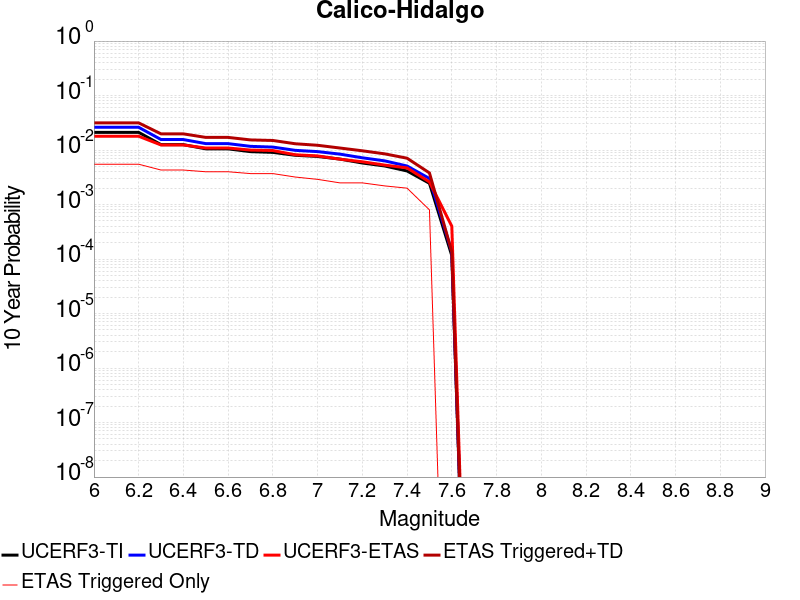 |

| Magnitude | 1 wk TI Prob | 1 wk TD Prob | 1 wk ETAS Prob | 1 wk ETAS/TD Gain | 1 wk ETAS Triggered+TD | 1 wk ETAS Triggered Only | 1 mo TI Prob | 1 mo TD Prob | 1 mo ETAS Prob | 1 mo ETAS/TD Gain | 1 mo ETAS Triggered+TD | 1 mo ETAS Triggered Only | 1 yr TI Prob | 1 yr TD Prob | 1 yr ETAS Prob | 1 yr ETAS/TD Gain | 1 yr ETAS Triggered+TD | 1 yr ETAS Triggered Only | 10 yr TI Prob | 10 yr TD Prob | 10 yr ETAS Prob | 10 yr ETAS/TD Gain | 10 yr ETAS Triggered+TD | 10 yr ETAS Triggered Only |
|-----|-----|-----|-----|-----|-----|-----|-----|-----|-----|-----|-----|-----|-----|-----|-----|-----|-----|-----|-----|-----|-----|-----|-----|-----|
| 6.0 | 4.0906612E-5 | 5.0720013E-5 | 0.0 | 0.0 | 5.0720013E-5 | 0.0 | 1.7530227E-4 | 2.1735553E-4 | 0.0 | 0.0 | 2.1735553E-4 | 0.0 | 0.0021322158 | 0.0026434886 | 6.0E-4 | 0.2269728 | 0.0032419025 | 6.0E-4 | 0.02111873 | 0.026160749 | 0.0055 | 0.21023864 | 0.031516865 | 0.0055 |
| 6.1 | 4.0906612E-5 | 5.0720013E-5 | 0.0 | 0.0 | 5.0720013E-5 | 0.0 | 1.7530227E-4 | 2.1735553E-4 | 0.0 | 0.0 | 2.1735553E-4 | 0.0 | 0.0021322158 | 0.0026434886 | 6.0E-4 | 0.2269728 | 0.0032419025 | 6.0E-4 | 0.02111873 | 0.026160749 | 0.0055 | 0.21023864 | 0.031516865 | 0.0055 |
| 6.2 | 4.0906612E-5 | 5.0720013E-5 | 0.0 | 0.0 | 5.0720013E-5 | 0.0 | 1.7530227E-4 | 2.1735553E-4 | 0.0 | 0.0 | 2.1735553E-4 | 0.0 | 0.0021322158 | 0.0026434886 | 6.0E-4 | 0.2269728 | 0.0032419025 | 6.0E-4 | 0.02111873 | 0.026160749 | 0.0055 | 0.21023864 | 0.031516865 | 0.0055 |
| 6.3 | 2.4242801E-5 | 3.0097268E-5 | 0.0 | 0.0 | 3.0097268E-5 | 0.0 | 1.0389358E-4 | 1.2898211E-4 | 0.0 | 0.0 | 1.2898211E-4 | 0.0 | 0.0012641704 | 0.0015692592 | 5.0E-4 | 0.3186217 | 0.0020684744 | 5.0E-4 | 0.01257003 | 0.0155854635 | 0.0043 | 0.27589813 | 0.019818446 | 0.0043 |
| 6.4 | 2.4242801E-5 | 3.0097268E-5 | 0.0 | 0.0 | 3.0097268E-5 | 0.0 | 1.0389358E-4 | 1.2898211E-4 | 0.0 | 0.0 | 1.2898211E-4 | 0.0 | 0.0012641704 | 0.0015692592 | 5.0E-4 | 0.3186217 | 0.0020684744 | 5.0E-4 | 0.01257003 | 0.0155854635 | 0.0043 | 0.27589813 | 0.019818446 | 0.0043 |
| 6.5 | 2.0286952E-5 | 2.5320547E-5 | 0.0 | 0.0 | 2.5320547E-5 | 0.0 | 8.694118E-5 | 1.0851221E-4 | 0.0 | 0.0 | 1.0851221E-4 | 0.0 | 0.0010579949 | 0.0013203527 | 5.0E-4 | 0.37868673 | 0.0018196924 | 5.0E-4 | 0.010529719 | 0.013127014 | 0.004 | 0.30471513 | 0.017074507 | 0.004 |
| 6.6 | 2.0269223E-5 | 2.5301493E-5 | 0.0 | 0.0 | 2.5301493E-5 | 0.0 | 8.6865206E-5 | 1.0843056E-4 | 0.0 | 0.0 | 1.0843056E-4 | 0.0 | 0.0010570707 | 0.0013193598 | 5.0E-4 | 0.3789717 | 0.0018187001 | 5.0E-4 | 0.010520565 | 0.013117203 | 0.004 | 0.30494305 | 0.017064733 | 0.004 |
| 6.7 | 1.799852E-5 | 2.2544662E-5 | 0.0 | 0.0 | 2.2544662E-5 | 0.0 | 7.713423E-5 | 9.661648E-5 | 0.0 | 0.0 | 9.661648E-5 | 0.0 | 9.3870464E-4 | 0.0011756854 | 5.0E-4 | 0.42528382 | 0.0016750976 | 5.0E-4 | 0.009347493 | 0.011696269 | 0.0037 | 0.3163402 | 0.015352992 | 0.0037 |
| 6.8 | 1.7458793E-5 | 2.1845955E-5 | 0.0 | 0.0 | 2.1845955E-5 | 0.0 | 7.4821255E-5 | 9.362224E-5 | 0.0 | 0.0 | 9.362224E-5 | 0.0 | 9.10568E-4 | 0.0011392693 | 5.0E-4 | 0.43887782 | 0.0016386997 | 5.0E-4 | 0.009068459 | 0.011335872 | 0.0037 | 0.32639748 | 0.014993929 | 0.0037 |
| 6.9 | 1.542884E-5 | 1.9029163E-5 | 0.0 | 0.0 | 1.9029163E-5 | 0.0 | 6.612192E-5 | 8.155108E-5 | 0.0 | 0.0 | 8.155108E-5 | 0.0 | 8.04737E-4 | 9.924453E-4 | 4.0E-4 | 0.40304488 | 0.0013920483 | 4.0E-4 | 0.008018291 | 0.00988153 | 0.0032 | 0.3238365 | 0.013049909 | 0.0032 |
| 7.0 | 1.468253E-5 | 1.8033488E-5 | 0.0 | 0.0 | 1.8033488E-5 | 0.0 | 6.292361E-5 | 7.728416E-5 | 0.0 | 0.0 | 7.728416E-5 | 0.0 | 7.658257E-4 | 9.405415E-4 | 4.0E-4 | 0.42528692 | 0.0013401653 | 4.0E-4 | 0.0076319184 | 0.009366975 | 0.0029 | 0.30959836 | 0.012239811 | 0.0029 |
| 7.1 | 1.3139281E-5 | 1.620346E-5 | 0.0 | 0.0 | 1.620346E-5 | 0.0 | 5.6309986E-5 | 6.9441616E-5 | 0.0 | 0.0 | 6.9441616E-5 | 0.0 | 6.853584E-4 | 8.4513635E-4 | 4.0E-4 | 0.4732964 | 0.0012447983 | 4.0E-4 | 0.0068324856 | 0.00842052 | 0.0025 | 0.29689375 | 0.010899469 | 0.0025 |
| 7.2 | 1.1127404E-5 | 1.38687565E-5 | 0.0 | 0.0 | 1.38687565E-5 | 0.0 | 4.7688E-5 | 5.9436235E-5 | 0.0 | 0.0 | 5.9436235E-5 | 0.0 | 5.8044674E-4 | 7.234068E-4 | 4.0E-4 | 0.55293924 | 0.0011231174 | 4.0E-4 | 0.0057893298 | 0.0072116274 | 0.0025 | 0.3466624 | 0.009693598 | 0.0025 |
| 7.3 | 9.808154E-6 | 1.2177939E-5 | 0.0 | 0.0 | 1.2177939E-5 | 0.0 | 4.2034266E-5 | 5.2190186E-5 | 0.0 | 0.0 | 5.2190186E-5 | 0.0 | 5.11647E-4 | 6.35241E-4 | 4.0E-4 | 0.6296823 | 0.0010349869 | 4.0E-4 | 0.0051047057 | 0.0063353274 | 0.0022 | 0.34725907 | 0.00852139 | 0.0022 |
| 7.4 | 7.942452E-6 | 9.793343E-6 | 0.0 | 0.0 | 9.793343E-6 | 0.0 | 3.4038632E-5 | 4.197085E-5 | 0.0 | 0.0 | 4.197085E-5 | 0.0 | 4.1434157E-4 | 5.1088474E-4 | 3.0E-4 | 0.58721656 | 8.107315E-4 | 3.0E-4 | 0.0041356985 | 0.0050980444 | 0.002 | 0.3923073 | 0.007087848 | 0.002 |
| 7.5 | 4.7121216E-6 | 5.773469E-6 | 0.0 | 0.0 | 5.773469E-6 | 0.0 | 2.019465E-5 | 2.4743247E-5 | 0.0 | 0.0 | 2.4743247E-5 | 0.0 | 2.4584212E-4 | 3.0121504E-4 | 1.0E-4 | 0.33198872 | 4.0118492E-4 | 1.0E-4 | 0.0024557032 | 0.0030088203 | 8.0E-4 | 0.26588494 | 0.0038064134 | 8.0E-4 |
| 7.6 | 2.21172E-7 | 2.6041258E-7 | 0.0 | 0.0 | 2.6041258E-7 | 0.0 | 9.478797E-7 | 1.1160537E-6 | 0.0 | 0.0 | 1.1160537E-6 | 0.0 | 1.1540374E-5 | 1.3587897E-5 | 0.0 | 0.0 | 1.3587897E-5 | 0.0 | 1.1539775E-4 | 1.3587347E-4 | 0.0 | 0.0 | 1.3587347E-4 | 0.0 |

## King Range 2011 CFM
*[(top)](#table-of-contents)*

| 1 Week | 1 Month | 1 Year | 10 Year |
|-----|-----|-----|-----|
|  |  |  |  |

| Magnitude | 1 wk TI Prob | 1 wk TD Prob | 1 wk ETAS Prob | 1 wk ETAS/TD Gain | 1 wk ETAS Triggered+TD | 1 wk ETAS Triggered Only | 1 mo TI Prob | 1 mo TD Prob | 1 mo ETAS Prob | 1 mo ETAS/TD Gain | 1 mo ETAS Triggered+TD | 1 mo ETAS Triggered Only | 1 yr TI Prob | 1 yr TD Prob | 1 yr ETAS Prob | 1 yr ETAS/TD Gain | 1 yr ETAS Triggered+TD | 1 yr ETAS Triggered Only | 10 yr TI Prob | 10 yr TD Prob | 10 yr ETAS Prob | 10 yr ETAS/TD Gain | 10 yr ETAS Triggered+TD | 10 yr ETAS Triggered Only |
|-----|-----|-----|-----|-----|-----|-----|-----|-----|-----|-----|-----|-----|-----|-----|-----|-----|-----|-----|-----|-----|-----|-----|-----|-----|
| 6.0 | 1.2462566E-5 | 1.3023604E-5 | 0.0 | 0.0 | 1.3023604E-5 | 0.0 | 5.34099E-5 | 5.5814446E-5 | 1.0E-4 | 1.7916508 | 1.5580887E-4 | 1.0E-4 | 6.5007154E-4 | 6.7936396E-4 | 7.0E-4 | 1.0303756 | 0.0013788884 | 7.0E-4 | 0.0064817313 | 0.0067772614 | 0.0052 | 0.7672716 | 0.01194202 | 0.0052 |
| 6.1 | 1.2462566E-5 | 1.3023604E-5 | 0.0 | 0.0 | 1.3023604E-5 | 0.0 | 5.34099E-5 | 5.5814446E-5 | 1.0E-4 | 1.7916508 | 1.5580887E-4 | 1.0E-4 | 6.5007154E-4 | 6.7936396E-4 | 7.0E-4 | 1.0303756 | 0.0013788884 | 7.0E-4 | 0.0064817313 | 0.0067772614 | 0.0052 | 0.7672716 | 0.01194202 | 0.0052 |
| 6.2 | 1.2462566E-5 | 1.3023604E-5 | 0.0 | 0.0 | 1.3023604E-5 | 0.0 | 5.34099E-5 | 5.5814446E-5 | 1.0E-4 | 1.7916508 | 1.5580887E-4 | 1.0E-4 | 6.5007154E-4 | 6.7936396E-4 | 7.0E-4 | 1.0303756 | 0.0013788884 | 7.0E-4 | 0.0064817313 | 0.0067772614 | 0.0052 | 0.7672716 | 0.01194202 | 0.0052 |
| 6.3 | 7.988484E-6 | 8.213979E-6 | 0.0 | 0.0 | 8.213979E-6 | 0.0 | 3.423591E-5 | 3.5202364E-5 | 1.0E-4 | 2.8407183 | 1.3519885E-4 | 1.0E-4 | 4.1674246E-4 | 4.285174E-4 | 5.0E-4 | 1.1668137 | 9.2830317E-4 | 5.0E-4 | 0.004159618 | 0.0042791315 | 0.0027 | 0.63096917 | 0.006967578 | 0.0027 |
| 6.4 | 7.988484E-6 | 8.213979E-6 | 0.0 | 0.0 | 8.213979E-6 | 0.0 | 3.423591E-5 | 3.5202364E-5 | 1.0E-4 | 2.8407183 | 1.3519885E-4 | 1.0E-4 | 4.1674246E-4 | 4.285174E-4 | 5.0E-4 | 1.1668137 | 9.2830317E-4 | 5.0E-4 | 0.004159618 | 0.0042791315 | 0.0027 | 0.63096917 | 0.006967578 | 0.0027 |
| 6.5 | 5.0522513E-6 | 5.082016E-6 | 0.0 | 0.0 | 5.082016E-6 | 0.0 | 2.1652326E-5 | 2.1779892E-5 | 1.0E-4 | 4.591391 | 1.2177772E-4 | 1.0E-4 | 2.6358519E-4 | 2.6513886E-4 | 1.0E-4 | 0.37716088 | 3.6511236E-4 | 1.0E-4 | 0.0026327274 | 0.002649267 | 7.0E-4 | 0.26422402 | 0.0033474127 | 7.0E-4 |
| 6.6 | 4.53682E-6 | 4.5386605E-6 | 0.0 | 0.0 | 4.5386605E-6 | 0.0 | 1.944337E-5 | 1.945126E-5 | 1.0E-4 | 5.141055 | 1.19449316E-4 | 1.0E-4 | 2.3669732E-4 | 2.3679396E-4 | 1.0E-4 | 0.42230806 | 3.367703E-4 | 1.0E-4 | 0.0023644536 | 0.002366426 | 6.0E-4 | 0.25354692 | 0.002965006 | 6.0E-4 |
| 6.7 | 4.1144335E-6 | 4.0966515E-6 | 0.0 | 0.0 | 4.0966515E-6 | 0.0 | 1.7633167E-5 | 1.7556962E-5 | 1.0E-4 | 5.6957464 | 1.1755521E-4 | 1.0E-4 | 2.1466266E-4 | 2.1373545E-4 | 1.0E-4 | 0.46786812 | 3.1371406E-4 | 1.0E-4 | 0.0021445542 | 0.0021362873 | 4.0E-4 | 0.18724073 | 0.0025354328 | 4.0E-4 |
| 6.8 | 3.8321214E-6 | 3.8070955E-6 | 0.0 | 0.0 | 3.8070955E-6 | 0.0 | 1.6423275E-5 | 1.6316022E-5 | 1.0E-4 | 6.1289444 | 1.1631439E-4 | 1.0E-4 | 1.9993502E-4 | 1.986298E-4 | 1.0E-4 | 0.50344914 | 2.9860993E-4 | 1.0E-4 | 0.0019975523 | 0.0019855048 | 4.0E-4 | 0.2014601 | 0.0023847106 | 4.0E-4 |
| 6.9 | 3.4999944E-6 | 3.4635152E-6 | 0.0 | 0.0 | 3.4635152E-6 | 0.0 | 1.499989E-5 | 1.4843554E-5 | 1.0E-4 | 6.7369313 | 1.1484207E-4 | 1.0E-4 | 1.8260835E-4 | 1.8070554E-4 | 1.0E-4 | 0.5533865 | 2.8068747E-4 | 1.0E-4 | 0.0018245836 | 0.0018065603 | 4.0E-4 | 0.22141524 | 0.0022058378 | 4.0E-4 |
| 7.0 | 2.9470837E-6 | 2.8865827E-6 | 0.0 | 0.0 | 2.8865827E-6 | 0.0 | 1.26302975E-5 | 1.2371011E-5 | 1.0E-4 | 8.083414 | 1.1236977E-4 | 1.0E-4 | 1.5376302E-4 | 1.5060682E-4 | 1.0E-4 | 0.66398054 | 2.5059175E-4 | 1.0E-4 | 0.0015365666 | 0.0015060119 | 4.0E-4 | 0.26560214 | 0.0019054095 | 4.0E-4 |
| 7.1 | 2.4850247E-6 | 2.3977504E-6 | 0.0 | 0.0 | 2.3977504E-6 | 0.0 | 1.0650062E-5 | 1.0276034E-5 | 1.0E-4 | 9.73138 | 1.10275E-4 | 1.0E-4 | 1.296568E-4 | 1.2510367E-4 | 1.0E-4 | 0.799337 | 2.2509116E-4 | 1.0E-4 | 0.0012958117 | 0.0012512939 | 3.0E-4 | 0.23975183 | 0.0015509186 | 3.0E-4 |
| 7.2 | 2.1800304E-6 | 2.0760244E-6 | 0.0 | 0.0 | 2.0760244E-6 | 0.0 | 9.342954E-6 | 8.897218E-6 | 1.0E-4 | 11.239469 | 1.08896325E-4 | 1.0E-4 | 1.1374453E-4 | 1.0831833E-4 | 1.0E-4 | 0.9232048 | 2.083075E-4 | 1.0E-4 | 0.0011368633 | 0.0010836011 | 3.0E-4 | 0.27685463 | 0.0013832761 | 3.0E-4 |
| 7.3 | 2.0378504E-6 | 1.949605E-6 | 0.0 | 0.0 | 1.949605E-6 | 0.0 | 8.733615E-6 | 8.355423E-6 | 1.0E-4 | 11.968275 | 1.0835459E-4 | 1.0E-4 | 1.0632657E-4 | 1.0172261E-4 | 1.0E-4 | 0.9830656 | 2.0171244E-4 | 1.0E-4 | 0.0010627571 | 0.0010176909 | 3.0E-4 | 0.294785 | 0.0013173856 | 3.0E-4 |
| 7.4 | 1.4577047E-6 | 1.4096648E-6 | 0.0 | 0.0 | 1.4096648E-6 | 0.0 | 6.247291E-6 | 6.0414072E-6 | 1.0E-4 | 16.552435 | 1.060408E-4 | 1.0E-4 | 7.605811E-5 | 7.3551724E-5 | 1.0E-4 | 1.3595874 | 1.7354437E-4 | 1.0E-4 | 7.603208E-4 | 7.361347E-4 | 2.0E-4 | 0.27168941 | 9.359875E-4 | 2.0E-4 |
| 7.5 | 8.0685743E-7 | 6.5345336E-7 | 0.0 | 0.0 | 6.5345336E-7 | 0.0 | 3.457956E-6 | 2.8005115E-6 | 0.0 | 0.0 | 2.8005115E-6 | 0.0 | 4.20998E-5 | 3.409574E-5 | 0.0 | 0.0 | 3.409574E-5 | 0.0 | 4.2091825E-4 | 3.416031E-4 | 0.0 | 0.0 | 3.416031E-4 | 0.0 |
| 7.6 | 3.1239435E-7 | 1.3265097E-7 | 0.0 | 0.0 | 1.3265097E-7 | 0.0 | 1.3388321E-6 | 5.68504E-7 | 0.0 | 0.0 | 5.68504E-7 | 0.0 | 1.630016E-5 | 6.921515E-6 | 0.0 | 0.0 | 6.921515E-6 | 0.0 | 1.6298964E-4 | 6.985001E-5 | 0.0 | 0.0 | 6.985001E-5 | 0.0 |
| 7.7 | 1.7747207E-7 | 4.7724136E-8 | 0.0 | 0.0 | 4.7724136E-8 | 0.0 | 7.605944E-7 | 2.0453199E-7 | 0.0 | 0.0 | 2.0453199E-7 | 0.0 | 9.260198E-6 | 2.4901742E-6 | 0.0 | 0.0 | 2.4901742E-6 | 0.0 | 9.2598115E-5 | 2.5310786E-5 | 0.0 | 0.0 | 2.5310786E-5 | 0.0 |
| 7.8 | 2.1035538E-8 | 2.1985618E-9 | 0.0 | 0.0 | 2.1985618E-9 | 0.0 | 9.0152305E-8 | 9.422409E-9 | 0.0 | 0.0 | 9.422409E-9 | 0.0 | 1.0976038E-6 | 1.1471783E-7 | 0.0 | 0.0 | 1.1471783E-7 | 0.0 | 1.0975983E-5 | 1.1837518E-6 | 0.0 | 0.0 | 1.1837518E-6 | 0.0 |
| 7.9 | 1.4782963E-9 | 8.5642604E-13 | 0.0 | 0.0 | 8.5642604E-13 | 0.0 | 6.335555E-9 | 3.6711745E-12 | 0.0 | 0.0 | 3.6711745E-12 | 0.0 | 7.713538E-8 | 4.469536E-11 | 0.0 | 0.0 | 4.469536E-11 | 0.0 | 7.7135354E-7 | 6.460458E-10 | 0.0 | 0.0 | 6.460458E-10 | 0.0 |

## Elmore Ranch
*[(top)](#table-of-contents)*

| 1 Week | 1 Month | 1 Year | 10 Year |
|-----|-----|-----|-----|
|  | 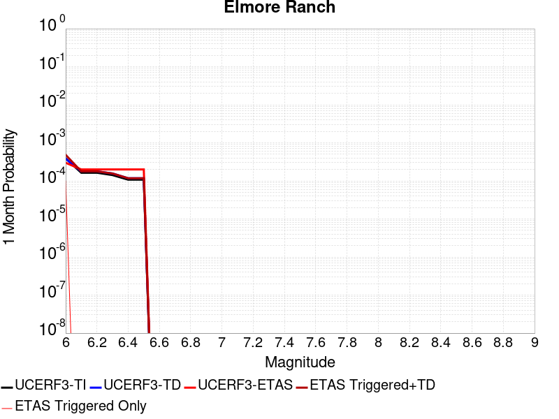 |  | 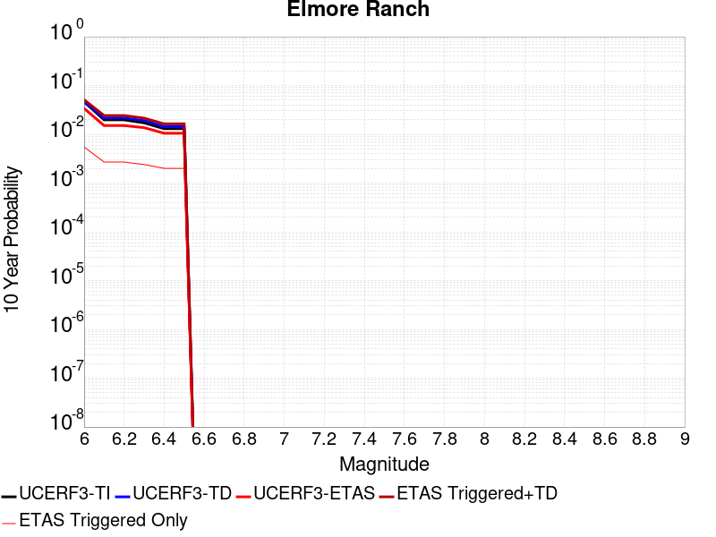 |

| Magnitude | 1 wk TI Prob | 1 wk TD Prob | 1 wk ETAS Prob | 1 wk ETAS/TD Gain | 1 wk ETAS Triggered+TD | 1 wk ETAS Triggered Only | 1 mo TI Prob | 1 mo TD Prob | 1 mo ETAS Prob | 1 mo ETAS/TD Gain | 1 mo ETAS Triggered+TD | 1 mo ETAS Triggered Only | 1 yr TI Prob | 1 yr TD Prob | 1 yr ETAS Prob | 1 yr ETAS/TD Gain | 1 yr ETAS Triggered+TD | 1 yr ETAS Triggered Only | 10 yr TI Prob | 10 yr TD Prob | 10 yr ETAS Prob | 10 yr ETAS/TD Gain | 10 yr ETAS Triggered+TD | 10 yr ETAS Triggered Only |
|-----|-----|-----|-----|-----|-----|-----|-----|-----|-----|-----|-----|-----|-----|-----|-----|-----|-----|-----|-----|-----|-----|-----|-----|-----|
| 6.0 | 9.102099E-5 | 8.962415E-5 | 0.0 | 0.0 | 8.962415E-5 | 0.0 | 3.9003167E-4 | 3.840396E-4 | 1.0E-4 | 0.2603898 | 4.8400118E-4 | 1.0E-4 | 0.0047383 | 0.004666296 | 9.0E-4 | 0.19287246 | 0.0055620964 | 9.0E-4 | 0.046385348 | 0.04588765 | 0.0055 | 0.11985796 | 0.051135268 | 0.0055 |
| 6.1 | 3.8306698E-5 | 4.1531388E-5 | 0.0 | 0.0 | 4.1531388E-5 | 0.0 | 1.6416123E-4 | 1.779829E-4 | 0.0 | 0.0 | 1.779829E-4 | 0.0 | 0.0019968306 | 0.002165234 | 5.0E-4 | 0.23092192 | 0.0026641514 | 5.0E-4 | 0.019789828 | 0.021625664 | 0.0027 | 0.12485166 | 0.024267275 | 0.0027 |
| 6.2 | 3.8306698E-5 | 4.1531388E-5 | 0.0 | 0.0 | 4.1531388E-5 | 0.0 | 1.6416123E-4 | 1.779829E-4 | 0.0 | 0.0 | 1.779829E-4 | 0.0 | 0.0019968306 | 0.002165234 | 5.0E-4 | 0.23092192 | 0.0026641514 | 5.0E-4 | 0.019789828 | 0.021625664 | 0.0027 | 0.12485166 | 0.024267275 | 0.0027 |
| 6.3 | 3.3197924E-5 | 3.6583282E-5 | 0.0 | 0.0 | 3.6583282E-5 | 0.0 | 1.4226905E-4 | 1.5677941E-4 | 0.0 | 0.0 | 1.5677941E-4 | 0.0 | 0.0017307495 | 0.0019076599 | 4.0E-4 | 0.20968097 | 0.002306897 | 4.0E-4 | 0.017173318 | 0.01908142 | 0.0024 | 0.12577681 | 0.021435624 | 0.0024 |
| 6.4 | 2.5148964E-5 | 2.744243E-5 | 0.0 | 0.0 | 2.744243E-5 | 0.0 | 1.0777682E-4 | 1.1760877E-4 | 0.0 | 0.0 | 1.1760877E-4 | 0.0 | 0.0013113929 | 0.0014315953 | 4.0E-4 | 0.27940857 | 0.0018310227 | 4.0E-4 | 0.01303681 | 0.014382674 | 0.002 | 0.1390562 | 0.016353909 | 0.002 |
| 6.5 | 2.5148964E-5 | 2.744243E-5 | 0.0 | 0.0 | 2.744243E-5 | 0.0 | 1.0777682E-4 | 1.1760877E-4 | 0.0 | 0.0 | 1.1760877E-4 | 0.0 | 0.0013113929 | 0.0014315953 | 4.0E-4 | 0.27940857 | 0.0018310227 | 4.0E-4 | 0.01303681 | 0.014382674 | 0.002 | 0.1390562 | 0.016353909 | 0.002 |

## Pisgah-Bullion Mtn-Mesquite Lk
*[(top)](#table-of-contents)*

| 1 Week | 1 Month | 1 Year | 10 Year |
|-----|-----|-----|-----|
|  |  | 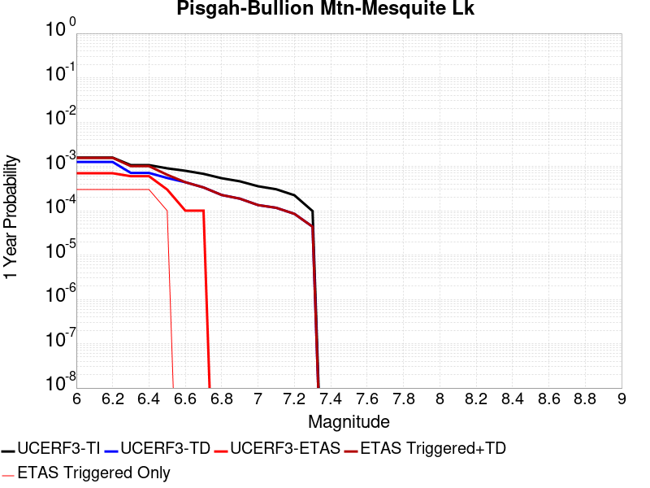 |  |

| Magnitude | 1 wk TI Prob | 1 wk TD Prob | 1 wk ETAS Prob | 1 wk ETAS/TD Gain | 1 wk ETAS Triggered+TD | 1 wk ETAS Triggered Only | 1 mo TI Prob | 1 mo TD Prob | 1 mo ETAS Prob | 1 mo ETAS/TD Gain | 1 mo ETAS Triggered+TD | 1 mo ETAS Triggered Only | 1 yr TI Prob | 1 yr TD Prob | 1 yr ETAS Prob | 1 yr ETAS/TD Gain | 1 yr ETAS Triggered+TD | 1 yr ETAS Triggered Only | 10 yr TI Prob | 10 yr TD Prob | 10 yr ETAS Prob | 10 yr ETAS/TD Gain | 10 yr ETAS Triggered+TD | 10 yr ETAS Triggered Only |
|-----|-----|-----|-----|-----|-----|-----|-----|-----|-----|-----|-----|-----|-----|-----|-----|-----|-----|-----|-----|-----|-----|-----|-----|-----|
| 6.0 | 3.0240792E-5 | 2.4094144E-5 | 0.0 | 0.0 | 2.4094144E-5 | 0.0 | 1.2959696E-4 | 1.032571E-4 | 1.0E-4 | 0.9684564 | 2.0324677E-4 | 1.0E-4 | 0.0015767008 | 0.0012565309 | 3.0E-4 | 0.23875259 | 0.001556154 | 3.0E-4 | 0.015655609 | 0.012504291 | 0.0051 | 0.40786 | 0.017540518 | 0.0051 |
| 6.1 | 3.0240792E-5 | 2.4094144E-5 | 0.0 | 0.0 | 2.4094144E-5 | 0.0 | 1.2959696E-4 | 1.032571E-4 | 1.0E-4 | 0.9684564 | 2.0324677E-4 | 1.0E-4 | 0.0015767008 | 0.0012565309 | 3.0E-4 | 0.23875259 | 0.001556154 | 3.0E-4 | 0.015655609 | 0.012504291 | 0.0051 | 0.40786 | 0.017540518 | 0.0051 |
| 6.2 | 3.0240792E-5 | 2.4094144E-5 | 0.0 | 0.0 | 2.4094144E-5 | 0.0 | 1.2959696E-4 | 1.032571E-4 | 1.0E-4 | 0.9684564 | 2.0324677E-4 | 1.0E-4 | 0.0015767008 | 0.0012565309 | 3.0E-4 | 0.23875259 | 0.001556154 | 3.0E-4 | 0.015655609 | 0.012504291 | 0.0051 | 0.40786 | 0.017540518 | 0.0051 |
| 6.3 | 2.0498217E-5 | 1.3638339E-5 | 0.0 | 0.0 | 1.3638339E-5 | 0.0 | 8.784654E-5 | 5.8448804E-5 | 1.0E-4 | 1.710899 | 1.5844296E-4 | 1.0E-4 | 0.0010690069 | 7.113981E-4 | 3.0E-4 | 0.42170483 | 0.0010111846 | 3.0E-4 | 0.01063879 | 0.0070928345 | 0.0037 | 0.52165323 | 0.010766591 | 0.0037 |
| 6.4 | 2.0498217E-5 | 1.3638339E-5 | 0.0 | 0.0 | 1.3638339E-5 | 0.0 | 8.784654E-5 | 5.8448804E-5 | 1.0E-4 | 1.710899 | 1.5844296E-4 | 1.0E-4 | 0.0010690069 | 7.113981E-4 | 3.0E-4 | 0.42170483 | 0.0010111846 | 3.0E-4 | 0.01063879 | 0.0070928345 | 0.0037 | 0.52165323 | 0.010766591 | 0.0037 |
| 6.5 | 1.7316182E-5 | 1.0476579E-5 | 0.0 | 0.0 | 1.0476579E-5 | 0.0 | 7.42101E-5 | 4.4898905E-5 | 0.0 | 0.0 | 4.4898905E-5 | 0.0 | 9.0313336E-4 | 5.465171E-4 | 1.0E-4 | 0.1829769 | 6.4646243E-4 | 1.0E-4 | 0.008994718 | 0.005452726 | 0.0027 | 0.49516514 | 0.008138004 | 0.0027 |
| 6.6 | 1.5251077E-5 | 8.4133235E-6 | 0.0 | 0.0 | 8.4133235E-6 | 0.0 | 6.536012E-5 | 3.6056645E-5 | 0.0 | 0.0 | 3.6056645E-5 | 0.0 | 7.9546886E-4 | 4.3890844E-4 | 0.0 | 0.0 | 4.3890844E-4 | 0.0 | 0.007926274 | 0.0043811332 | 0.002 | 0.45650288 | 0.0063723708 | 0.002 |
| 6.7 | 1.2997425E-5 | 6.410089E-6 | 0.0 | 0.0 | 6.410089E-6 | 0.0 | 5.570206E-5 | 2.7471546E-5 | 0.0 | 0.0 | 2.7471546E-5 | 0.0 | 6.7796157E-4 | 3.344194E-4 | 0.0 | 0.0 | 3.344194E-4 | 0.0 | 0.0067589693 | 0.0033396217 | 0.0014 | 0.41920915 | 0.0047349464 | 0.0014 |
| 6.8 | 1.035386E-5 | 4.332052E-6 | 0.0 | 0.0 | 4.332052E-6 | 0.0 | 4.437293E-5 | 1.856581E-5 | 0.0 | 0.0 | 1.856581E-5 | 0.0 | 5.401065E-4 | 2.2601616E-4 | 0.0 | 0.0 | 2.2601616E-4 | 0.0 | 0.0053879567 | 0.0022579497 | 0.0012 | 0.53145564 | 0.00345524 | 0.0012 |
| 6.9 | 8.816252E-6 | 3.5794608E-6 | 0.0 | 0.0 | 3.5794608E-6 | 0.0 | 3.778339E-5 | 1.534046E-5 | 0.0 | 0.0 | 1.534046E-5 | 0.0 | 4.5991567E-4 | 1.8675468E-4 | 0.0 | 0.0 | 1.8675468E-4 | 0.0 | 0.00458965 | 0.0018660357 | 0.0011 | 0.58948493 | 0.0029639832 | 0.0011 |
| 7.0 | 6.8232207E-6 | 2.5666518E-6 | 0.0 | 0.0 | 2.5666518E-6 | 0.0 | 2.9242048E-5 | 1.0999892E-5 | 0.0 | 0.0 | 1.0999892E-5 | 0.0 | 3.5596377E-4 | 1.3391576E-4 | 0.0 | 0.0 | 1.3391576E-4 | 0.0 | 0.0035539411 | 0.0013383818 | 8.0E-4 | 0.5977368 | 0.002137311 | 8.0E-4 |
| 7.1 | 5.837013E-6 | 2.2265813E-6 | 0.0 | 0.0 | 2.2265813E-6 | 0.0 | 2.501553E-5 | 9.542458E-6 | 0.0 | 0.0 | 9.542458E-6 | 0.0 | 3.045215E-4 | 1.1617353E-4 | 0.0 | 0.0 | 1.1617353E-4 | 0.0 | 0.0030410455 | 0.001161157 | 8.0E-4 | 0.688968 | 0.001960228 | 8.0E-4 |
| 7.2 | 4.278052E-6 | 1.627012E-6 | 0.0 | 0.0 | 1.627012E-6 | 0.0 | 1.833438E-5 | 6.9728912E-6 | 0.0 | 0.0 | 6.9728912E-6 | 0.0 | 2.231982E-4 | 8.489188E-5 | 0.0 | 0.0 | 8.489188E-5 | 0.0 | 0.0022297418 | 8.486177E-4 | 7.0E-4 | 0.8248708 | 0.0015480237 | 7.0E-4 |
| 7.3 | 1.8803692E-6 | 8.3426227E-7 | 0.0 | 0.0 | 8.3426227E-7 | 0.0 | 8.0587E-6 | 3.5754058E-6 | 0.0 | 0.0 | 3.5754058E-6 | 0.0 | 9.811026E-5 | 4.3529843E-5 | 0.0 | 0.0 | 4.3529843E-5 | 0.0 | 9.806695E-4 | 4.3522762E-4 | 1.0E-4 | 0.22976483 | 5.351841E-4 | 1.0E-4 |

## Mission Ridge-Arroyo Parida-Santa Ana
*[(top)](#table-of-contents)*

| 1 Week | 1 Month | 1 Year | 10 Year |
|-----|-----|-----|-----|
| 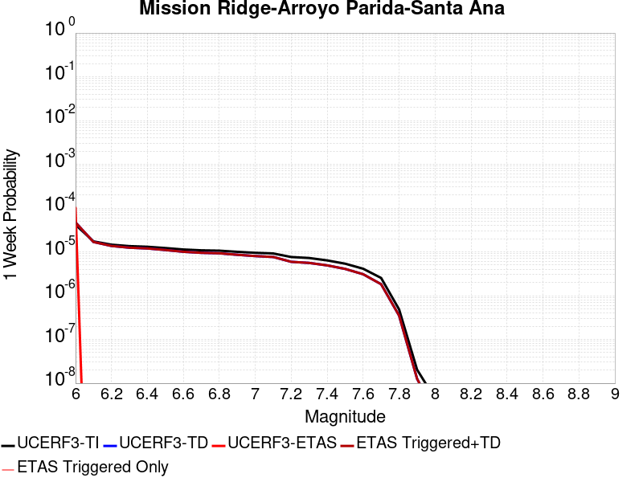 |  |  |  |

| Magnitude | 1 wk TI Prob | 1 wk TD Prob | 1 wk ETAS Prob | 1 wk ETAS/TD Gain | 1 wk ETAS Triggered+TD | 1 wk ETAS Triggered Only | 1 mo TI Prob | 1 mo TD Prob | 1 mo ETAS Prob | 1 mo ETAS/TD Gain | 1 mo ETAS Triggered+TD | 1 mo ETAS Triggered Only | 1 yr TI Prob | 1 yr TD Prob | 1 yr ETAS Prob | 1 yr ETAS/TD Gain | 1 yr ETAS Triggered+TD | 1 yr ETAS Triggered Only | 10 yr TI Prob | 10 yr TD Prob | 10 yr ETAS Prob | 10 yr ETAS/TD Gain | 10 yr ETAS Triggered+TD | 10 yr ETAS Triggered Only |
|-----|-----|-----|-----|-----|-----|-----|-----|-----|-----|-----|-----|-----|-----|-----|-----|-----|-----|-----|-----|-----|-----|-----|-----|-----|
| 6.0 | 4.169034E-5 | 4.7157155E-5 | 0.0 | 0.0 | 4.7157155E-5 | 0.0 | 1.7866064E-4 | 2.0209131E-4 | 0.0 | 0.0 | 2.0209131E-4 | 0.0 | 0.0021730233 | 0.0024585149 | 7.0E-4 | 0.2847247 | 0.003156794 | 7.0E-4 | 0.021518968 | 0.024395002 | 0.0037 | 0.15167041 | 0.02800474 | 0.0037 |
| 6.1 | 1.73813E-5 | 1.6859032E-5 | 0.0 | 0.0 | 1.6859032E-5 | 0.0 | 7.4489166E-5 | 7.225106E-5 | 0.0 | 0.0 | 7.225106E-5 | 0.0 | 9.065282E-4 | 8.7931234E-4 | 3.0E-4 | 0.3411757 | 0.0011790486 | 3.0E-4 | 0.009028391 | 0.00875949 | 0.0016 | 0.18265903 | 0.010345475 | 0.0016 |
| 6.2 | 1.4622182E-5 | 1.3677078E-5 | 0.0 | 0.0 | 1.3677078E-5 | 0.0 | 6.2664985E-5 | 5.861475E-5 | 0.0 | 0.0 | 5.861475E-5 | 0.0 | 7.6267915E-4 | 7.134048E-4 | 2.0E-4 | 0.28034574 | 9.1326213E-4 | 2.0E-4 | 0.007600669 | 0.0071116057 | 0.0012 | 0.16873826 | 0.008303071 | 0.0012 |
| 6.3 | 1.3552434E-5 | 1.2485707E-5 | 0.0 | 0.0 | 1.2485707E-5 | 0.0 | 5.8080568E-5 | 5.350909E-5 | 0.0 | 0.0 | 5.350909E-5 | 0.0 | 7.069015E-4 | 6.512816E-4 | 2.0E-4 | 0.30708683 | 8.5115136E-4 | 2.0E-4 | 0.00704657 | 0.0064941086 | 0.0012 | 0.18478286 | 0.0076863156 | 0.0012 |
| 6.4 | 1.30977305E-5 | 1.1982551E-5 | 0.0 | 0.0 | 1.1982551E-5 | 0.0 | 5.613192E-5 | 5.1352796E-5 | 0.0 | 0.0 | 5.1352796E-5 | 0.0 | 6.831918E-4 | 6.2504393E-4 | 2.0E-4 | 0.3199775 | 8.2491897E-4 | 2.0E-4 | 0.006810953 | 0.006233221 | 0.0011 | 0.17647377 | 0.0073263645 | 0.0011 |
| 6.5 | 1.225205E-5 | 1.1052006E-5 | 0.0 | 0.0 | 1.1052006E-5 | 0.0 | 5.2507727E-5 | 4.7364894E-5 | 0.0 | 0.0 | 4.7364894E-5 | 0.0 | 6.3909404E-4 | 5.765177E-4 | 2.0E-4 | 0.34691042 | 7.764024E-4 | 2.0E-4 | 0.006372592 | 0.0057505467 | 0.001 | 0.1738965 | 0.006744796 | 0.001 |
| 6.6 | 1.1352241E-5 | 1.0066545E-5 | 0.0 | 0.0 | 1.0066545E-5 | 0.0 | 4.8651553E-5 | 4.3141634E-5 | 0.0 | 0.0 | 4.3141634E-5 | 0.0 | 5.921717E-4 | 5.251249E-4 | 1.0E-4 | 0.1904309 | 6.250724E-4 | 1.0E-4 | 0.0059059616 | 0.0052391025 | 9.0E-4 | 0.17178515 | 0.006134387 | 9.0E-4 |
| 6.7 | 1.0864116E-5 | 9.5199E-6 | 0.0 | 0.0 | 9.5199E-6 | 0.0 | 4.6559664E-5 | 4.0798946E-5 | 0.0 | 0.0 | 4.0798946E-5 | 0.0 | 5.667165E-4 | 4.9661595E-4 | 1.0E-4 | 0.20136285 | 5.965663E-4 | 1.0E-4 | 0.005652734 | 0.0049553113 | 7.0E-4 | 0.14126256 | 0.005651843 | 7.0E-4 |
| 6.8 | 1.0666365E-5 | 9.302607E-6 | 0.0 | 0.0 | 9.302607E-6 | 0.0 | 4.571219E-5 | 3.986772E-5 | 0.0 | 0.0 | 3.986772E-5 | 0.0 | 5.564038E-4 | 4.8528338E-4 | 1.0E-4 | 0.20606516 | 5.8523484E-4 | 1.0E-4 | 0.005550127 | 0.004842485 | 7.0E-4 | 0.14455388 | 0.005539095 | 7.0E-4 |
| 6.9 | 1.0038665E-5 | 8.594688E-6 | 0.0 | 0.0 | 8.594688E-6 | 0.0 | 4.302214E-5 | 3.6833866E-5 | 0.0 | 0.0 | 3.6833866E-5 | 0.0 | 5.236687E-4 | 4.4836182E-4 | 1.0E-4 | 0.22303414 | 5.48317E-4 | 1.0E-4 | 0.005224364 | 0.004474799 | 6.0E-4 | 0.13408422 | 0.005072114 | 6.0E-4 |
| 7.0 | 9.5379955E-6 | 8.027552E-6 | 0.0 | 0.0 | 8.027552E-6 | 0.0 | 4.0876483E-5 | 3.440335E-5 | 0.0 | 0.0 | 3.440335E-5 | 0.0 | 4.975576E-4 | 4.1878203E-4 | 1.0E-4 | 0.23878771 | 5.1874015E-4 | 1.0E-4 | 0.00496445 | 0.0041801436 | 6.0E-4 | 0.14353573 | 0.004777636 | 6.0E-4 |
| 7.1 | 9.207389E-6 | 7.654744E-6 | 0.0 | 0.0 | 7.654744E-6 | 0.0 | 3.945964E-5 | 3.280564E-5 | 0.0 | 0.0 | 3.280564E-5 | 0.0 | 4.803152E-4 | 3.9933718E-4 | 1.0E-4 | 0.25041497 | 4.992972E-4 | 1.0E-4 | 0.004792784 | 0.003986408 | 6.0E-4 | 0.15051144 | 0.004584016 | 6.0E-4 |
| 7.2 | 7.638091E-6 | 5.932916E-6 | 0.0 | 0.0 | 5.932916E-6 | 0.0 | 3.2734264E-5 | 2.5426536E-5 | 0.0 | 0.0 | 2.5426536E-5 | 0.0 | 3.984668E-4 | 3.0952442E-4 | 0.0 | 0.0 | 3.0952442E-4 | 0.0 | 0.0039775306 | 0.0030910056 | 4.0E-4 | 0.12940772 | 0.0034897693 | 4.0E-4 |
| 7.3 | 7.2500147E-6 | 5.5978257E-6 | 0.0 | 0.0 | 5.5978257E-6 | 0.0 | 3.1071122E-5 | 2.3990464E-5 | 0.0 | 0.0 | 2.3990464E-5 | 0.0 | 3.7822526E-4 | 2.9204504E-4 | 0.0 | 0.0 | 2.9204504E-4 | 0.0 | 0.0037758215 | 0.0029166837 | 4.0E-4 | 0.13714205 | 0.003315517 | 4.0E-4 |
| 7.4 | 6.3899715E-6 | 4.919931E-6 | 0.0 | 0.0 | 4.919931E-6 | 0.0 | 2.7385306E-5 | 2.108525E-5 | 0.0 | 0.0 | 2.108525E-5 | 0.0 | 3.3336508E-4 | 2.566829E-4 | 0.0 | 0.0 | 2.566829E-4 | 0.0 | 0.0033286542 | 0.0025639243 | 4.0E-4 | 0.15601085 | 0.0029628987 | 4.0E-4 |
| 7.5 | 5.379025E-6 | 4.085013E-6 | 0.0 | 0.0 | 4.085013E-6 | 0.0 | 2.305276E-5 | 1.7507082E-5 | 0.0 | 0.0 | 1.7507082E-5 | 0.0 | 2.806312E-4 | 2.1312799E-4 | 0.0 | 0.0 | 2.1312799E-4 | 0.0 | 0.0028027708 | 0.0021292472 | 2.0E-4 | 0.09392991 | 0.0023288215 | 2.0E-4 |
| 7.6 | 4.1270696E-6 | 3.0891138E-6 | 0.0 | 0.0 | 3.0891138E-6 | 0.0 | 1.768732E-5 | 1.3238992E-5 | 0.0 | 0.0 | 1.3238992E-5 | 0.0 | 2.1532185E-4 | 1.6117288E-4 | 0.0 | 0.0 | 1.6117288E-4 | 0.0 | 0.0021511333 | 0.001610568 | 2.0E-4 | 0.12417979 | 0.0018102459 | 2.0E-4 |
| 7.7 | 2.5406805E-6 | 1.8286655E-6 | 0.0 | 0.0 | 1.8286655E-6 | 0.0 | 1.0888585E-5 | 7.837115E-6 | 0.0 | 0.0 | 7.837115E-6 | 0.0 | 1.3256045E-4 | 9.541275E-5 | 0.0 | 0.0 | 9.541275E-5 | 0.0 | 0.0013248142 | 9.537241E-4 | 2.0E-4 | 0.20970426 | 0.0011535333 | 2.0E-4 |
| 7.8 | 4.8608285E-7 | 3.510486E-7 | 0.0 | 0.0 | 3.510486E-7 | 0.0 | 2.0832106E-6 | 1.5044932E-6 | 0.0 | 0.0 | 1.5044932E-6 | 0.0 | 2.5362791E-5 | 1.8317052E-5 | 0.0 | 0.0 | 1.8317052E-5 | 0.0 | 2.5359896E-4 | 1.8315554E-4 | 1.0E-4 | 0.545984 | 2.8313723E-4 | 1.0E-4 |
| 7.9 | 2.0472514E-8 | 1.2691875E-8 | 0.0 | 0.0 | 1.2691875E-8 | 0.0 | 8.7739345E-8 | 5.4393748E-8 | 0.0 | 0.0 | 5.4393748E-8 | 0.0 | 1.068226E-6 | 6.622437E-7 | 0.0 | 0.0 | 6.622437E-7 | 0.0 | 1.0682209E-5 | 6.6224184E-6 | 0.0 | 0.0 | 6.6224184E-6 | 0.0 |
| 8.0 | 4.443582E-9 | 2.0333868E-9 | 0.0 | 0.0 | 2.0333868E-9 | 0.0 | 1.9043922E-8 | 8.714514E-9 | 0.0 | 0.0 | 8.714514E-9 | 0.0 | 2.3185973E-7 | 1.0609921E-7 | 0.0 | 0.0 | 1.0609921E-7 | 0.0 | 2.3185949E-6 | 1.0609916E-6 | 0.0 | 0.0 | 1.0609916E-6 | 0.0 |

## Blackwater
*[(top)](#table-of-contents)*

| 1 Week | 1 Month | 1 Year | 10 Year |
|-----|-----|-----|-----|
|  |  |  | 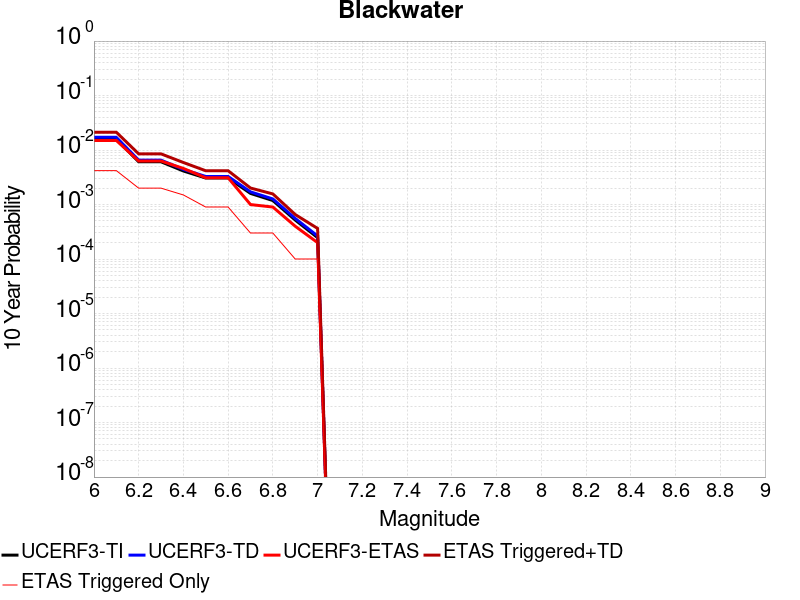 |

| Magnitude | 1 wk TI Prob | 1 wk TD Prob | 1 wk ETAS Prob | 1 wk ETAS/TD Gain | 1 wk ETAS Triggered+TD | 1 wk ETAS Triggered Only | 1 mo TI Prob | 1 mo TD Prob | 1 mo ETAS Prob | 1 mo ETAS/TD Gain | 1 mo ETAS Triggered+TD | 1 mo ETAS Triggered Only | 1 yr TI Prob | 1 yr TD Prob | 1 yr ETAS Prob | 1 yr ETAS/TD Gain | 1 yr ETAS Triggered+TD | 1 yr ETAS Triggered Only | 10 yr TI Prob | 10 yr TD Prob | 10 yr ETAS Prob | 10 yr ETAS/TD Gain | 10 yr ETAS Triggered+TD | 10 yr ETAS Triggered Only |
|-----|-----|-----|-----|-----|-----|-----|-----|-----|-----|-----|-----|-----|-----|-----|-----|-----|-----|-----|-----|-----|-----|-----|-----|-----|
| 6.0 | 3.0708583E-5 | 3.3101154E-5 | 0.0 | 0.0 | 3.3101154E-5 | 0.0 | 1.3160157E-4 | 1.4185515E-4 | 3.0E-4 | 2.1148334 | 4.418126E-4 | 3.0E-4 | 0.0016010714 | 0.0017258549 | 0.0012 | 0.69530755 | 0.0029237838 | 0.0012 | 0.015895851 | 0.01713836 | 0.0042 | 0.24506429 | 0.021266378 | 0.0042 |
| 6.1 | 3.0708583E-5 | 3.3101154E-5 | 0.0 | 0.0 | 3.3101154E-5 | 0.0 | 1.3160157E-4 | 1.4185515E-4 | 3.0E-4 | 2.1148334 | 4.418126E-4 | 3.0E-4 | 0.0016010714 | 0.0017258549 | 0.0012 | 0.69530755 | 0.0029237838 | 0.0012 | 0.015895851 | 0.01713836 | 0.0042 | 0.24506429 | 0.021266378 | 0.0042 |
| 6.2 | 1.1707779E-5 | 1.25469705E-5 | 0.0 | 0.0 | 1.25469705E-5 | 0.0 | 5.017523E-5 | 5.3771677E-5 | 1.0E-4 | 1.8597151 | 1.537663E-4 | 1.0E-4 | 6.107122E-4 | 6.5448316E-4 | 6.0E-4 | 0.91675395 | 0.0012540905 | 6.0E-4 | 0.006090366 | 0.0065265284 | 0.002 | 0.30644163 | 0.008513475 | 0.002 |
| 6.3 | 1.1707779E-5 | 1.25469705E-5 | 0.0 | 0.0 | 1.25469705E-5 | 0.0 | 5.017523E-5 | 5.3771677E-5 | 1.0E-4 | 1.8597151 | 1.537663E-4 | 1.0E-4 | 6.107122E-4 | 6.5448316E-4 | 6.0E-4 | 0.91675395 | 0.0012540905 | 6.0E-4 | 0.006090366 | 0.0065265284 | 0.002 | 0.30644163 | 0.008513475 | 0.002 |
| 6.4 | 7.929244E-6 | 8.481312E-6 | 0.0 | 0.0 | 8.481312E-6 | 0.0 | 3.3982033E-5 | 3.6347996E-5 | 1.0E-4 | 2.7511835 | 1.3634436E-4 | 1.0E-4 | 4.136527E-4 | 4.42451E-4 | 5.0E-4 | 1.1300687 | 9.4222976E-4 | 5.0E-4 | 0.0041288356 | 0.0044161067 | 0.0015 | 0.3396657 | 0.0059094825 | 0.0015 |
| 6.5 | 5.8832115E-6 | 6.286877E-6 | 0.0 | 0.0 | 6.286877E-6 | 0.0 | 2.521352E-5 | 2.6943495E-5 | 0.0 | 0.0 | 2.6943495E-5 | 0.0 | 3.0693135E-4 | 3.2799022E-4 | 3.0E-4 | 0.9146614 | 6.2789186E-4 | 3.0E-4 | 0.0030650778 | 0.0032753148 | 9.0E-4 | 0.27478275 | 0.004172367 | 9.0E-4 |
| 6.6 | 5.8832115E-6 | 6.286877E-6 | 0.0 | 0.0 | 6.286877E-6 | 0.0 | 2.521352E-5 | 2.6943495E-5 | 0.0 | 0.0 | 2.6943495E-5 | 0.0 | 3.0693135E-4 | 3.2799022E-4 | 3.0E-4 | 0.9146614 | 6.2789186E-4 | 3.0E-4 | 0.0030650778 | 0.0032753148 | 9.0E-4 | 0.27478275 | 0.004172367 | 9.0E-4 |
| 6.7 | 3.0715053E-6 | 3.2819282E-6 | 0.0 | 0.0 | 3.2819282E-6 | 0.0 | 1.3163528E-5 | 1.4065337E-5 | 0.0 | 0.0 | 1.4065337E-5 | 0.0 | 1.6025416E-4 | 1.7123319E-4 | 2.0E-4 | 1.167998 | 3.7119893E-4 | 2.0E-4 | 0.0016013865 | 0.001711127 | 3.0E-4 | 0.17532304 | 0.0020106137 | 3.0E-4 |
| 6.8 | 2.2722281E-6 | 2.4290982E-6 | 0.0 | 0.0 | 2.4290982E-6 | 0.0 | 9.738084E-6 | 1.0410385E-5 | 0.0 | 0.0 | 1.0410385E-5 | 0.0 | 1.1855473E-4 | 1.2673998E-4 | 2.0E-4 | 1.578034 | 3.2671462E-4 | 2.0E-4 | 0.001184915 | 0.0012667672 | 3.0E-4 | 0.23682332 | 0.0015663871 | 3.0E-4 |
| 6.9 | 9.952399E-7 | 1.0655034E-6 | 0.0 | 0.0 | 1.0655034E-6 | 0.0 | 4.265307E-6 | 4.5664383E-6 | 0.0 | 0.0 | 4.5664383E-6 | 0.0 | 5.1928873E-5 | 5.5595483E-5 | 0.0 | 0.0 | 5.5595483E-5 | 0.0 | 5.191674E-4 | 5.5586634E-4 | 1.0E-4 | 0.17989935 | 6.5581076E-4 | 1.0E-4 |
| 7.0 | 4.7385504E-7 | 5.0763026E-7 | 0.0 | 0.0 | 5.0763026E-7 | 0.0 | 2.0308057E-6 | 2.1755584E-6 | 0.0 | 0.0 | 2.1755584E-6 | 0.0 | 2.4724779E-5 | 2.6487423E-5 | 0.0 | 0.0 | 2.6487423E-5 | 0.0 | 2.4722028E-4 | 2.6487422E-4 | 1.0E-4 | 0.37753767 | 3.6484774E-4 | 1.0E-4 |

## Goldstone Lake
*[(top)](#table-of-contents)*

| 1 Week | 1 Month | 1 Year | 10 Year |
|-----|-----|-----|-----|
|  |  |  |  |

| Magnitude | 1 wk TI Prob | 1 wk TD Prob | 1 wk ETAS Prob | 1 wk ETAS/TD Gain | 1 wk ETAS Triggered+TD | 1 wk ETAS Triggered Only | 1 mo TI Prob | 1 mo TD Prob | 1 mo ETAS Prob | 1 mo ETAS/TD Gain | 1 mo ETAS Triggered+TD | 1 mo ETAS Triggered Only | 1 yr TI Prob | 1 yr TD Prob | 1 yr ETAS Prob | 1 yr ETAS/TD Gain | 1 yr ETAS Triggered+TD | 1 yr ETAS Triggered Only | 10 yr TI Prob | 10 yr TD Prob | 10 yr ETAS Prob | 10 yr ETAS/TD Gain | 10 yr ETAS Triggered+TD | 10 yr ETAS Triggered Only |
|-----|-----|-----|-----|-----|-----|-----|-----|-----|-----|-----|-----|-----|-----|-----|-----|-----|-----|-----|-----|-----|-----|-----|-----|-----|
| 6.0 | 2.671352E-5 | 3.0384457E-5 | 1.0E-4 | 3.2911565 | 1.3038142E-4 | 1.0E-4 | 1.1448149E-4 | 1.3021371E-4 | 3.0E-4 | 2.303905 | 4.3017464E-4 | 3.0E-4 | 0.001392921 | 0.0015843954 | 9.0E-4 | 0.56804 | 0.0024829695 | 9.0E-4 | 0.013842222 | 0.015750503 | 0.0036 | 0.22856411 | 0.019293802 | 0.0036 |
| 6.1 | 2.671352E-5 | 3.0384457E-5 | 1.0E-4 | 3.2911565 | 1.3038142E-4 | 1.0E-4 | 1.1448149E-4 | 1.3021371E-4 | 3.0E-4 | 2.303905 | 4.3017464E-4 | 3.0E-4 | 0.001392921 | 0.0015843954 | 9.0E-4 | 0.56804 | 0.0024829695 | 9.0E-4 | 0.013842222 | 0.015750503 | 0.0036 | 0.22856411 | 0.019293802 | 0.0036 |
| 6.2 | 1.4197047E-5 | 1.6100461E-5 | 0.0 | 0.0 | 1.6100461E-5 | 0.0 | 6.0843064E-5 | 6.900071E-5 | 0.0 | 0.0 | 6.900071E-5 | 0.0 | 7.4051257E-4 | 8.3985855E-4 | 2.0E-4 | 0.23813534 | 0.0010396906 | 2.0E-4 | 0.007380498 | 0.008376547 | 0.002 | 0.23876187 | 0.010359794 | 0.002 |
| 6.3 | 1.4197047E-5 | 1.6100461E-5 | 0.0 | 0.0 | 1.6100461E-5 | 0.0 | 6.0843064E-5 | 6.900071E-5 | 0.0 | 0.0 | 6.900071E-5 | 0.0 | 7.4051257E-4 | 8.3985855E-4 | 2.0E-4 | 0.23813534 | 0.0010396906 | 2.0E-4 | 0.007380498 | 0.008376547 | 0.002 | 0.23876187 | 0.010359794 | 0.002 |
| 6.4 | 1.3238931E-5 | 1.5012373E-5 | 0.0 | 0.0 | 1.5012373E-5 | 0.0 | 5.6737044E-5 | 6.4337706E-5 | 0.0 | 0.0 | 6.4337706E-5 | 0.0 | 6.9055456E-4 | 7.8312814E-4 | 2.0E-4 | 0.25538605 | 9.829715E-4 | 2.0E-4 | 0.006884126 | 0.007813316 | 0.0017 | 0.21757728 | 0.009500033 | 0.0017 |
| 6.5 | 1.3238931E-5 | 1.5012373E-5 | 0.0 | 0.0 | 1.5012373E-5 | 0.0 | 5.6737044E-5 | 6.4337706E-5 | 0.0 | 0.0 | 6.4337706E-5 | 0.0 | 6.9055456E-4 | 7.8312814E-4 | 2.0E-4 | 0.25538605 | 9.829715E-4 | 2.0E-4 | 0.006884126 | 0.007813316 | 0.0017 | 0.21757728 | 0.009500033 | 0.0017 |
| 6.6 | 1.1328278E-5 | 1.2858516E-5 | 0.0 | 0.0 | 1.2858516E-5 | 0.0 | 4.8548856E-5 | 5.51073E-5 | 0.0 | 0.0 | 5.51073E-5 | 0.0 | 5.90922E-4 | 6.708206E-4 | 2.0E-4 | 0.2981423 | 8.7068643E-4 | 2.0E-4 | 0.0058935313 | 0.0066973506 | 0.0015 | 0.22396916 | 0.008187304 | 0.0015 |
| 6.7 | 8.651175E-6 | 9.82709E-6 | 0.0 | 0.0 | 9.82709E-6 | 0.0 | 3.707594E-5 | 4.211593E-5 | 0.0 | 0.0 | 4.211593E-5 | 0.0 | 4.5130608E-4 | 5.1273144E-4 | 2.0E-4 | 0.3900678 | 7.126289E-4 | 2.0E-4 | 0.0045039062 | 0.005124368 | 0.0011 | 0.21466063 | 0.006218731 | 0.0011 |
| 6.8 | 1.0215377E-6 | 1.1756155E-6 | 0.0 | 0.0 | 1.1756155E-6 | 0.0 | 4.378012E-6 | 5.038343E-6 | 0.0 | 0.0 | 5.038343E-6 | 0.0 | 5.3300988E-5 | 6.134021E-5 | 0.0 | 0.0 | 6.134021E-5 | 0.0 | 5.3288206E-4 | 6.132441E-4 | 0.0 | 0.0 | 6.132441E-4 | 0.0 |
| 6.9 | 7.9360774E-7 | 9.28442E-7 | 0.0 | 0.0 | 9.28442E-7 | 0.0 | 3.4011714E-6 | 3.9790316E-6 | 0.0 | 0.0 | 3.9790316E-6 | 0.0 | 4.1408475E-5 | 4.84437E-5 | 0.0 | 0.0 | 4.84437E-5 | 0.0 | 4.140076E-4 | 4.843384E-4 | 0.0 | 0.0 | 4.843384E-4 | 0.0 |
| 7.0 | 7.4382757E-7 | 8.748267E-7 | 0.0 | 0.0 | 8.748267E-7 | 0.0 | 3.1878285E-6 | 3.7492523E-6 | 0.0 | 0.0 | 3.7492523E-6 | 0.0 | 3.8811122E-5 | 4.564626E-5 | 0.0 | 0.0 | 4.564626E-5 | 0.0 | 3.8804344E-4 | 4.5637548E-4 | 0.0 | 0.0 | 4.5637548E-4 | 0.0 |
| 7.1 | 6.4709513E-7 | 7.712087E-7 | 0.0 | 0.0 | 7.712087E-7 | 0.0 | 2.773262E-6 | 3.3051763E-6 | 0.0 | 0.0 | 3.3051763E-6 | 0.0 | 3.376394E-5 | 4.0239836E-5 | 0.0 | 0.0 | 4.0239836E-5 | 0.0 | 3.375881E-4 | 4.0233147E-4 | 0.0 | 0.0 | 4.0233147E-4 | 0.0 |
| 7.2 | 6.356704E-7 | 7.5891273E-7 | 0.0 | 0.0 | 7.5891273E-7 | 0.0 | 2.7242988E-6 | 3.2524795E-6 | 0.0 | 0.0 | 3.2524795E-6 | 0.0 | 3.3167835E-5 | 3.959828E-5 | 0.0 | 0.0 | 3.959828E-5 | 0.0 | 3.3162883E-4 | 3.9591815E-4 | 0.0 | 0.0 | 3.9591815E-4 | 0.0 |
| 7.3 | 5.7695723E-7 | 6.8972645E-7 | 0.0 | 0.0 | 6.8972645E-7 | 0.0 | 2.4726714E-6 | 2.9559676E-6 | 0.0 | 0.0 | 2.9559676E-6 | 0.0 | 3.0104358E-5 | 3.5988367E-5 | 0.0 | 0.0 | 3.5988367E-5 | 0.0 | 3.0100282E-4 | 3.5983112E-4 | 0.0 | 0.0 | 3.5983112E-4 | 0.0 |
| 7.4 | 5.209647E-7 | 6.1940955E-7 | 0.0 | 0.0 | 6.1940955E-7 | 0.0 | 2.232704E-6 | 2.6546102E-6 | 0.0 | 0.0 | 2.6546102E-6 | 0.0 | 2.718283E-5 | 3.2319454E-5 | 0.0 | 0.0 | 3.2319454E-5 | 0.0 | 2.7179506E-4 | 3.231531E-4 | 0.0 | 0.0 | 3.231531E-4 | 0.0 |
| 7.5 | 4.512955E-7 | 5.3493494E-7 | 0.0 | 0.0 | 5.3493494E-7 | 0.0 | 1.934122E-6 | 2.2925765E-6 | 0.0 | 0.0 | 2.2925765E-6 | 0.0 | 2.3547682E-5 | 2.7911816E-5 | 0.0 | 0.0 | 2.7911816E-5 | 0.0 | 2.3545188E-4 | 2.7908842E-4 | 0.0 | 0.0 | 2.7908842E-4 | 0.0 |
| 7.6 | 2.21172E-7 | 2.6041258E-7 | 0.0 | 0.0 | 2.6041258E-7 | 0.0 | 9.478797E-7 | 1.1160537E-6 | 0.0 | 0.0 | 1.1160537E-6 | 0.0 | 1.1540374E-5 | 1.3587897E-5 | 0.0 | 0.0 | 1.3587897E-5 | 0.0 | 1.1539775E-4 | 1.3587347E-4 | 0.0 | 0.0 | 1.3587347E-4 | 0.0 |

## Pinto Mtn
*[(top)](#table-of-contents)*

| 1 Week | 1 Month | 1 Year | 10 Year |
|-----|-----|-----|-----|
|  | 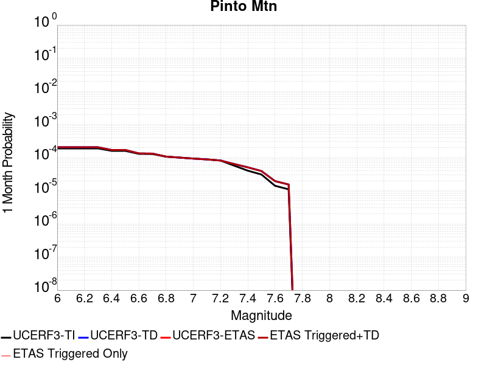 | 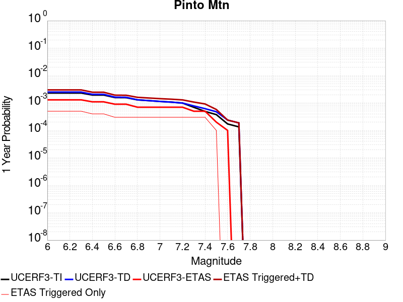 |  |

| Magnitude | 1 wk TI Prob | 1 wk TD Prob | 1 wk ETAS Prob | 1 wk ETAS/TD Gain | 1 wk ETAS Triggered+TD | 1 wk ETAS Triggered Only | 1 mo TI Prob | 1 mo TD Prob | 1 mo ETAS Prob | 1 mo ETAS/TD Gain | 1 mo ETAS Triggered+TD | 1 mo ETAS Triggered Only | 1 yr TI Prob | 1 yr TD Prob | 1 yr ETAS Prob | 1 yr ETAS/TD Gain | 1 yr ETAS Triggered+TD | 1 yr ETAS Triggered Only | 10 yr TI Prob | 10 yr TD Prob | 10 yr ETAS Prob | 10 yr ETAS/TD Gain | 10 yr ETAS Triggered+TD | 10 yr ETAS Triggered Only |
|-----|-----|-----|-----|-----|-----|-----|-----|-----|-----|-----|-----|-----|-----|-----|-----|-----|-----|-----|-----|-----|-----|-----|-----|-----|
| 6.0 | 4.4194956E-5 | 4.786148E-5 | 0.0 | 0.0 | 4.786148E-5 | 0.0 | 1.893932E-4 | 2.0510542E-4 | 0.0 | 0.0 | 2.0510542E-4 | 0.0 | 0.0023034236 | 0.0024944623 | 5.0E-4 | 0.200444 | 0.002993215 | 5.0E-4 | 0.022796938 | 0.024682162 | 0.0039 | 0.15800886 | 0.028485902 | 0.0039 |
| 6.1 | 4.4194956E-5 | 4.786148E-5 | 0.0 | 0.0 | 4.786148E-5 | 0.0 | 1.893932E-4 | 2.0510542E-4 | 0.0 | 0.0 | 2.0510542E-4 | 0.0 | 0.0023034236 | 0.0024944623 | 5.0E-4 | 0.200444 | 0.002993215 | 5.0E-4 | 0.022796938 | 0.024682162 | 0.0039 | 0.15800886 | 0.028485902 | 0.0039 |
| 6.2 | 4.4194956E-5 | 4.786148E-5 | 0.0 | 0.0 | 4.786148E-5 | 0.0 | 1.893932E-4 | 2.0510542E-4 | 0.0 | 0.0 | 2.0510542E-4 | 0.0 | 0.0023034236 | 0.0024944623 | 5.0E-4 | 0.200444 | 0.002993215 | 5.0E-4 | 0.022796938 | 0.024682162 | 0.0039 | 0.15800886 | 0.028485902 | 0.0039 |
| 6.3 | 4.4194956E-5 | 4.786148E-5 | 0.0 | 0.0 | 4.786148E-5 | 0.0 | 1.893932E-4 | 2.0510542E-4 | 0.0 | 0.0 | 2.0510542E-4 | 0.0 | 0.0023034236 | 0.0024944623 | 5.0E-4 | 0.200444 | 0.002993215 | 5.0E-4 | 0.022796938 | 0.024682162 | 0.0039 | 0.15800886 | 0.028485902 | 0.0039 |
| 6.4 | 3.729929E-5 | 3.960771E-5 | 0.0 | 0.0 | 3.960771E-5 | 0.0 | 1.5984432E-4 | 1.6973681E-4 | 0.0 | 0.0 | 1.6973681E-4 | 0.0 | 0.0019443673 | 0.0020646804 | 4.0E-4 | 0.19373459 | 0.0024638544 | 4.0E-4 | 0.019274427 | 0.020465013 | 0.0036 | 0.17590998 | 0.023991337 | 0.0036 |
| 6.5 | 3.729929E-5 | 3.960771E-5 | 0.0 | 0.0 | 3.960771E-5 | 0.0 | 1.5984432E-4 | 1.6973681E-4 | 0.0 | 0.0 | 1.6973681E-4 | 0.0 | 0.0019443673 | 0.0020646804 | 4.0E-4 | 0.19373459 | 0.0024638544 | 4.0E-4 | 0.019274427 | 0.020465013 | 0.0036 | 0.17590998 | 0.023991337 | 0.0036 |
| 6.6 | 3.0204548E-5 | 3.1206644E-5 | 0.0 | 0.0 | 3.1206644E-5 | 0.0 | 1.2944164E-4 | 1.337361E-4 | 0.0 | 0.0 | 1.337361E-4 | 0.0 | 0.0015748127 | 0.0016270556 | 3.0E-4 | 0.18438214 | 0.0019265675 | 3.0E-4 | 0.015636992 | 0.016155303 | 0.003 | 0.18569756 | 0.019106835 | 0.003 |
| 6.7 | 2.9857754E-5 | 3.081593E-5 | 0.0 | 0.0 | 3.081593E-5 | 0.0 | 1.2795553E-4 | 1.3206177E-4 | 0.0 | 0.0 | 1.3206177E-4 | 0.0 | 0.0015567453 | 0.0016067008 | 3.0E-4 | 0.18671802 | 0.0019062188 | 3.0E-4 | 0.015458848 | 0.01595469 | 0.0029 | 0.18176474 | 0.01880842 | 0.0029 |
| 6.8 | 2.4819734E-5 | 2.5008778E-5 | 0.0 | 0.0 | 2.5008778E-5 | 0.0 | 1.0636595E-4 | 1.07176194E-4 | 0.0 | 0.0 | 1.07176194E-4 | 0.0 | 0.0012942362 | 0.0013041107 | 3.0E-4 | 0.23004182 | 0.0016037195 | 3.0E-4 | 0.012867244 | 0.012966947 | 0.0026 | 0.20050982 | 0.015533232 | 0.0026 |
| 6.9 | 2.331124E-5 | 2.3336683E-5 | 0.0 | 0.0 | 2.3336683E-5 | 0.0 | 9.990149E-5 | 1.00010635E-4 | 0.0 | 0.0 | 1.00010635E-4 | 0.0 | 0.001215622 | 0.0012169697 | 3.0E-4 | 0.24651395 | 0.0015166047 | 3.0E-4 | 0.012089936 | 0.012105247 | 0.0024 | 0.19826113 | 0.014476194 | 0.0024 |
| 7.0 | 2.1818534E-5 | 2.1759544E-5 | 0.0 | 0.0 | 2.1759544E-5 | 0.0 | 9.3504656E-5 | 9.325196E-5 | 0.0 | 0.0 | 9.325196E-5 | 0.0 | 0.0011378246 | 0.0011347712 | 3.0E-4 | 0.26437047 | 0.0014344307 | 3.0E-4 | 0.011320163 | 0.01129187 | 0.0023 | 0.20368637 | 0.013565899 | 0.0023 |
| 7.1 | 2.066081E-5 | 2.0538931E-5 | 0.0 | 0.0 | 2.0538931E-5 | 0.0 | 8.854332E-5 | 8.802113E-5 | 0.0 | 0.0 | 8.802113E-5 | 0.0 | 0.0010774818 | 0.00107115 | 3.0E-4 | 0.2800728 | 0.0013708287 | 3.0E-4 | 0.010722724 | 0.010661921 | 0.0023 | 0.21572097 | 0.0129374 | 0.0023 |
| 7.2 | 1.8990233E-5 | 1.9052035E-5 | 0.0 | 0.0 | 1.9052035E-5 | 0.0 | 8.138417E-5 | 8.164914E-5 | 0.0 | 0.0 | 8.164914E-5 | 0.0 | 9.904018E-4 | 9.936442E-4 | 3.0E-4 | 0.30191892 | 0.001293346 | 3.0E-4 | 0.009859995 | 0.009894013 | 0.0022 | 0.22235668 | 0.0120722465 | 0.0022 |
| 7.3 | 1.3335872E-5 | 1.4904039E-5 | 0.0 | 0.0 | 1.4904039E-5 | 0.0 | 5.7152483E-5 | 6.387296E-5 | 0.0 | 0.0 | 6.387296E-5 | 0.0 | 6.956093E-4 | 7.7738863E-4 | 3.0E-4 | 0.38590738 | 0.0010771553 | 3.0E-4 | 0.006934359 | 0.0077479915 | 0.0018 | 0.23231827 | 0.009534045 | 0.0018 |
| 7.4 | 9.414066E-6 | 1.1858011E-5 | 0.0 | 0.0 | 1.1858011E-5 | 0.0 | 4.0345374E-5 | 5.0819108E-5 | 0.0 | 0.0 | 5.0819108E-5 | 0.0 | 4.910942E-4 | 6.1855646E-4 | 3.0E-4 | 0.48500022 | 9.1837085E-4 | 3.0E-4 | 0.0049001034 | 0.006169296 | 0.0014 | 0.22693028 | 0.0075606587 | 0.0014 |
| 7.5 | 7.2101157E-6 | 9.1549E-6 | 0.0 | 0.0 | 9.1549E-6 | 0.0 | 3.090013E-5 | 3.923474E-5 | 0.0 | 0.0 | 3.923474E-5 | 0.0 | 3.7614413E-4 | 4.7758603E-4 | 1.0E-4 | 0.20938635 | 5.775383E-4 | 1.0E-4 | 0.0037550807 | 0.004766372 | 6.0E-4 | 0.12588191 | 0.0053635123 | 6.0E-4 |
| 7.6 | 3.296375E-6 | 4.541762E-6 | 0.0 | 0.0 | 4.541762E-6 | 0.0 | 1.4127245E-5 | 1.9464556E-5 | 0.0 | 0.0 | 1.9464556E-5 | 0.0 | 1.7198564E-4 | 2.3695659E-4 | 0.0 | 0.0 | 2.3695659E-4 | 0.0 | 0.0017185259 | 0.0023671763 | 0.0 | 0.0 | 0.0023671763 | 0.0 |
| 7.7 | 2.5741092E-6 | 3.5801693E-6 | 0.0 | 0.0 | 3.5801693E-6 | 0.0 | 1.103185E-5 | 1.53435E-5 | 0.0 | 0.0 | 1.53435E-5 | 0.0 | 1.3430449E-4 | 1.8679241E-4 | 0.0 | 0.0 | 1.8679241E-4 | 0.0 | 0.0013422335 | 0.0018664836 | 0.0 | 0.0 | 0.0018664836 | 0.0 |

## Ludlow
*[(top)](#table-of-contents)*

| 1 Week | 1 Month | 1 Year | 10 Year |
|-----|-----|-----|-----|
|  |  |  |  |

| Magnitude | 1 wk TI Prob | 1 wk TD Prob | 1 wk ETAS Prob | 1 wk ETAS/TD Gain | 1 wk ETAS Triggered+TD | 1 wk ETAS Triggered Only | 1 mo TI Prob | 1 mo TD Prob | 1 mo ETAS Prob | 1 mo ETAS/TD Gain | 1 mo ETAS Triggered+TD | 1 mo ETAS Triggered Only | 1 yr TI Prob | 1 yr TD Prob | 1 yr ETAS Prob | 1 yr ETAS/TD Gain | 1 yr ETAS Triggered+TD | 1 yr ETAS Triggered Only | 10 yr TI Prob | 10 yr TD Prob | 10 yr ETAS Prob | 10 yr ETAS/TD Gain | 10 yr ETAS Triggered+TD | 10 yr ETAS Triggered Only |
|-----|-----|-----|-----|-----|-----|-----|-----|-----|-----|-----|-----|-----|-----|-----|-----|-----|-----|-----|-----|-----|-----|-----|-----|-----|
| 6.0 | 2.2407607E-5 | 2.3659972E-5 | 0.0 | 0.0 | 2.3659972E-5 | 0.0 | 9.602906E-5 | 1.0139619E-4 | 0.0 | 0.0 | 1.0139619E-4 | 0.0 | 0.0011685267 | 0.0012338436 | 2.0E-4 | 0.1620951 | 0.0014335968 | 2.0E-4 | 0.011624013 | 0.012274444 | 0.0042 | 0.34217435 | 0.016422892 | 0.0042 |
| 6.1 | 2.2407607E-5 | 2.3659972E-5 | 0.0 | 0.0 | 2.3659972E-5 | 0.0 | 9.602906E-5 | 1.0139619E-4 | 0.0 | 0.0 | 1.0139619E-4 | 0.0 | 0.0011685267 | 0.0012338436 | 2.0E-4 | 0.1620951 | 0.0014335968 | 2.0E-4 | 0.011624013 | 0.012274444 | 0.0042 | 0.34217435 | 0.016422892 | 0.0042 |
| 6.2 | 1.0781252E-5 | 1.1366933E-5 | 0.0 | 0.0 | 1.1366933E-5 | 0.0 | 4.620455E-5 | 4.871454E-5 | 0.0 | 0.0 | 4.871454E-5 | 0.0 | 5.623952E-4 | 5.929422E-4 | 2.0E-4 | 0.33730102 | 7.9282356E-4 | 2.0E-4 | 0.00560974 | 0.00591402 | 0.0023 | 0.3889064 | 0.008200417 | 0.0023 |
| 6.3 | 1.0781252E-5 | 1.1366933E-5 | 0.0 | 0.0 | 1.1366933E-5 | 0.0 | 4.620455E-5 | 4.871454E-5 | 0.0 | 0.0 | 4.871454E-5 | 0.0 | 5.623952E-4 | 5.929422E-4 | 2.0E-4 | 0.33730102 | 7.9282356E-4 | 2.0E-4 | 0.00560974 | 0.00591402 | 0.0023 | 0.3889064 | 0.008200417 | 0.0023 |
| 6.4 | 7.814439E-6 | 8.238649E-6 | 0.0 | 0.0 | 8.238649E-6 | 0.0 | 3.3490025E-5 | 3.530802E-5 | 0.0 | 0.0 | 3.530802E-5 | 0.0 | 4.0766477E-4 | 4.2979178E-4 | 1.0E-4 | 0.2326708 | 5.297488E-4 | 1.0E-4 | 0.0040691774 | 0.0042897523 | 0.0014 | 0.32635918 | 0.0056837467 | 0.0014 |
| 6.5 | 6.4986366E-6 | 6.851685E-6 | 0.0 | 0.0 | 6.851685E-6 | 0.0 | 2.7851002E-5 | 2.9364039E-5 | 0.0 | 0.0 | 2.9364039E-5 | 0.0 | 3.390332E-4 | 3.5744946E-4 | 1.0E-4 | 0.27975982 | 4.574137E-4 | 1.0E-4 | 0.003385164 | 0.0035688411 | 0.0013 | 0.3642639 | 0.004864202 | 0.0013 |
| 6.6 | 5.582177E-6 | 5.886666E-6 | 0.0 | 0.0 | 5.886666E-6 | 0.0 | 2.3923398E-5 | 2.5228328E-5 | 0.0 | 0.0 | 2.5228328E-5 | 0.0 | 2.9122844E-4 | 3.0711232E-4 | 1.0E-4 | 0.32561377 | 4.070816E-4 | 1.0E-4 | 0.0029084706 | 0.0030669523 | 0.0011 | 0.35866225 | 0.0041635786 | 0.0011 |
| 6.7 | 4.6858763E-6 | 4.9409805E-6 | 0.0 | 0.0 | 4.9409805E-6 | 0.0 | 2.0082172E-5 | 2.1175461E-5 | 0.0 | 0.0 | 2.1175461E-5 | 0.0 | 2.4447302E-4 | 2.577813E-4 | 0.0 | 0.0 | 2.577813E-4 | 0.0 | 0.0024420423 | 0.0025748792 | 9.0E-4 | 0.34953097 | 0.0034725617 | 9.0E-4 |
| 6.8 | 3.5584908E-6 | 3.7524387E-6 | 0.0 | 0.0 | 3.7524387E-6 | 0.0 | 1.5250586E-5 | 1.6081784E-5 | 0.0 | 0.0 | 1.6081784E-5 | 0.0 | 1.8566006E-4 | 1.9577853E-4 | 0.0 | 0.0 | 1.9577853E-4 | 0.0 | 0.0018550502 | 0.0019561017 | 8.0E-4 | 0.4089767 | 0.0027545367 | 8.0E-4 |
| 6.9 | 2.532834E-6 | 2.6713035E-6 | 0.0 | 0.0 | 2.6713035E-6 | 0.0 | 1.0854958E-5 | 1.14483955E-5 | 0.0 | 0.0 | 1.14483955E-5 | 0.0 | 1.3215111E-4 | 1.3937558E-4 | 0.0 | 0.0 | 1.3937558E-4 | 0.0 | 0.0013207254 | 0.0013929092 | 6.0E-4 | 0.4307531 | 0.0019920736 | 6.0E-4 |
| 7.0 | 1.7083285E-6 | 1.8021473E-6 | 0.0 | 0.0 | 1.8021473E-6 | 0.0 | 7.3213873E-6 | 7.723466E-6 | 0.0 | 0.0 | 7.723466E-6 | 0.0 | 8.913424E-5 | 9.402931E-5 | 0.0 | 0.0 | 9.402931E-5 | 0.0 | 8.9098496E-4 | 9.3991176E-4 | 3.0E-4 | 0.31917888 | 0.0012396298 | 3.0E-4 |
| 7.1 | 1.0905424E-6 | 1.1498905E-6 | 0.0 | 0.0 | 1.1498905E-6 | 0.0 | 4.6737446E-6 | 4.928094E-6 | 0.0 | 0.0 | 4.928094E-6 | 0.0 | 5.6901354E-5 | 5.9997987E-5 | 0.0 | 0.0 | 5.9997987E-5 | 0.0 | 5.6886784E-4 | 5.998277E-4 | 3.0E-4 | 0.50014365 | 8.996477E-4 | 3.0E-4 |
| 7.2 | 6.06668E-7 | 6.3879725E-7 | 0.0 | 0.0 | 6.3879725E-7 | 0.0 | 2.600003E-6 | 2.7377E-6 | 0.0 | 0.0 | 2.7377E-6 | 0.0 | 3.1654577E-5 | 3.333106E-5 | 0.0 | 0.0 | 3.333106E-5 | 0.0 | 3.1650066E-4 | 3.3326744E-4 | 2.0E-4 | 0.60011864 | 5.332008E-4 | 2.0E-4 |

## Rodgers Creek - Healdsburg 2011 CFM
*[(top)](#table-of-contents)*

| 1 Week | 1 Month | 1 Year | 10 Year |
|-----|-----|-----|-----|
|  |  | 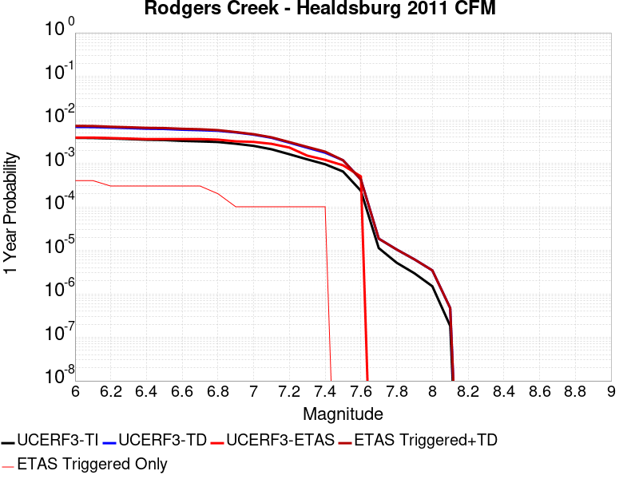 |  |

| Magnitude | 1 wk TI Prob | 1 wk TD Prob | 1 wk ETAS Prob | 1 wk ETAS/TD Gain | 1 wk ETAS Triggered+TD | 1 wk ETAS Triggered Only | 1 mo TI Prob | 1 mo TD Prob | 1 mo ETAS Prob | 1 mo ETAS/TD Gain | 1 mo ETAS Triggered+TD | 1 mo ETAS Triggered Only | 1 yr TI Prob | 1 yr TD Prob | 1 yr ETAS Prob | 1 yr ETAS/TD Gain | 1 yr ETAS Triggered+TD | 1 yr ETAS Triggered Only | 10 yr TI Prob | 10 yr TD Prob | 10 yr ETAS Prob | 10 yr ETAS/TD Gain | 10 yr ETAS Triggered+TD | 10 yr ETAS Triggered Only |
|-----|-----|-----|-----|-----|-----|-----|-----|-----|-----|-----|-----|-----|-----|-----|-----|-----|-----|-----|-----|-----|-----|-----|-----|-----|
| 6.0 | 7.390182E-5 | 1.31417E-4 | 0.0 | 0.0 | 1.31417E-4 | 0.0 | 3.1668364E-4 | 5.630926E-4 | 0.0 | 0.0 | 5.630926E-4 | 0.0 | 0.0038488081 | 0.0068340646 | 4.0E-4 | 0.05853032 | 0.007231331 | 4.0E-4 | 0.037828278 | 0.06620114 | 0.004 | 0.060421914 | 0.06993634 | 0.004 |
| 6.1 | 7.318768E-5 | 1.3039644E-4 | 0.0 | 0.0 | 1.3039644E-4 | 0.0 | 3.1362378E-4 | 5.5872067E-4 | 0.0 | 0.0 | 5.5872067E-4 | 0.0 | 0.0038116854 | 0.006781184 | 4.0E-4 | 0.058986746 | 0.007178472 | 4.0E-4 | 0.037469655 | 0.065705396 | 0.004 | 0.060877804 | 0.06944257 | 0.004 |
| 6.2 | 7.1379836E-5 | 1.2732309E-4 | 0.0 | 0.0 | 1.2732309E-4 | 0.0 | 3.058777E-4 | 5.4555474E-4 | 0.0 | 0.0 | 5.4555474E-4 | 0.0 | 0.003717703 | 0.006621872 | 3.0E-4 | 0.04530441 | 0.0069198855 | 3.0E-4 | 0.0365612 | 0.06422669 | 0.0038 | 0.05916544 | 0.067782626 | 0.0038 |
| 6.3 | 6.9255926E-5 | 1.2386375E-4 | 0.0 | 0.0 | 1.2386375E-4 | 0.0 | 2.9677735E-4 | 5.3073646E-4 | 0.0 | 0.0 | 5.3073646E-4 | 0.0 | 0.0036072785 | 0.006442622 | 3.0E-4 | 0.046564896 | 0.006740689 | 3.0E-4 | 0.035492823 | 0.062556885 | 0.0037 | 0.05914617 | 0.06602542 | 0.0037 |
| 6.4 | 6.6757144E-5 | 1.19628276E-4 | 0.0 | 0.0 | 1.19628276E-4 | 0.0 | 2.8607066E-4 | 5.125921E-4 | 0.0 | 0.0 | 5.125921E-4 | 0.0 | 0.0034773487 | 0.0062230234 | 3.0E-4 | 0.04820808 | 0.0065211565 | 3.0E-4 | 0.034234364 | 0.060505655 | 0.0036 | 0.05949857 | 0.063887835 | 0.0036 |
| 6.5 | 6.5735134E-5 | 1.1811799E-4 | 0.0 | 0.0 | 1.1811799E-4 | 0.0 | 2.8169158E-4 | 5.0612213E-4 | 0.0 | 0.0 | 5.0612213E-4 | 0.0 | 0.003424202 | 0.006144711 | 3.0E-4 | 0.048822474 | 0.0064428677 | 3.0E-4 | 0.03371918 | 0.059769586 | 0.0036 | 0.060231302 | 0.063154414 | 0.0036 |
| 6.6 | 6.289601E-5 | 1.134696E-4 | 0.0 | 0.0 | 1.134696E-4 | 0.0 | 2.6952647E-4 | 4.86208E-4 | 0.0 | 0.0 | 4.86208E-4 | 0.0 | 0.0032765474 | 0.005903596 | 3.0E-4 | 0.050816488 | 0.0062018246 | 3.0E-4 | 0.032286562 | 0.057506252 | 0.0035 | 0.060862947 | 0.06080498 | 0.0035 |
| 6.7 | 6.115274E-5 | 1.1063805E-4 | 0.0 | 0.0 | 1.1063805E-4 | 0.0 | 2.6205686E-4 | 4.740773E-4 | 0.0 | 0.0 | 4.740773E-4 | 0.0 | 0.0031858748 | 0.0057566953 | 3.0E-4 | 0.052113235 | 0.006054968 | 3.0E-4 | 0.031405866 | 0.056123488 | 0.0033 | 0.058798913 | 0.05923828 | 0.0033 |
| 6.8 | 5.9232367E-5 | 1.0730962E-4 | 0.0 | 0.0 | 1.0730962E-4 | 0.0 | 2.538283E-4 | 4.598177E-4 | 0.0 | 0.0 | 4.598177E-4 | 0.0 | 0.0030859804 | 0.005583987 | 2.0E-4 | 0.035816703 | 0.00578287 | 2.0E-4 | 0.030434765 | 0.05448961 | 0.0032 | 0.05872679 | 0.057515245 | 0.0032 |
| 6.9 | 5.4030377E-5 | 9.824696E-5 | 0.0 | 0.0 | 9.824696E-5 | 0.0 | 2.315382E-4 | 4.2099078E-4 | 0.0 | 0.0 | 4.2099078E-4 | 0.0 | 0.0028153337 | 0.005113583 | 1.0E-4 | 0.01955576 | 0.0052130716 | 1.0E-4 | 0.027799325 | 0.05002278 | 0.0029 | 0.057973586 | 0.052777715 | 0.0029 |
| 7.0 | 4.8260714E-5 | 8.741447E-5 | 0.0 | 0.0 | 8.741447E-5 | 0.0 | 2.0681522E-4 | 3.7457992E-4 | 0.0 | 0.0 | 3.7457992E-4 | 0.0 | 0.0025150678 | 0.0045510284 | 1.0E-4 | 0.021973055 | 0.0046505732 | 1.0E-4 | 0.024867928 | 0.04466865 | 0.0027 | 0.060445078 | 0.047248043 | 0.0027 |
| 7.1 | 4.0294493E-5 | 7.3887146E-5 | 0.0 | 0.0 | 7.3887146E-5 | 0.0 | 1.7267925E-4 | 3.1662098E-4 | 0.0 | 0.0 | 3.1662098E-4 | 0.0 | 0.0021003427 | 0.0038480847 | 1.0E-4 | 0.025986955 | 0.0039477 | 1.0E-4 | 0.02080602 | 0.037918217 | 0.0022 | 0.058019605 | 0.040034797 | 0.0022 |
| 7.2 | 3.096388E-5 | 5.6958994E-5 | 0.0 | 0.0 | 5.6958994E-5 | 0.0 | 1.326956E-4 | 2.4408725E-4 | 0.0 | 0.0 | 2.4408725E-4 | 0.0 | 0.0016143717 | 0.0029677346 | 1.0E-4 | 0.033695735 | 0.0030674378 | 1.0E-4 | 0.01602694 | 0.029424941 | 0.0019 | 0.06457107 | 0.031269036 | 0.0019 |
| 7.3 | 2.3615226E-5 | 4.359664E-5 | 0.0 | 0.0 | 4.359664E-5 | 0.0 | 1.0120418E-4 | 1.8682943E-4 | 0.0 | 0.0 | 1.8682943E-4 | 0.0 | 0.0012314644 | 0.0022722892 | 1.0E-4 | 0.044008482 | 0.002372062 | 1.0E-4 | 0.0122466255 | 0.022620123 | 0.0015 | 0.06631264 | 0.024086192 | 0.0015 |
| 7.4 | 1.8251132E-5 | 3.3512937E-5 | 0.0 | 0.0 | 3.3512937E-5 | 0.0 | 7.821679E-5 | 1.4361902E-4 | 0.0 | 0.0 | 1.4361902E-4 | 0.0 | 9.518733E-4 | 0.001747169 | 1.0E-4 | 0.05723545 | 0.0018469942 | 1.0E-4 | 0.009478063 | 0.017450532 | 0.0013 | 0.07449629 | 0.018727846 | 0.0013 |
| 7.5 | 1.2411432E-5 | 2.2448547E-5 | 0.0 | 0.0 | 2.2448547E-5 | 0.0 | 5.3190768E-5 | 9.620454E-5 | 0.0 | 0.0 | 9.620454E-5 | 0.0 | 6.4740516E-4 | 0.0011706668 | 0.0 | 0.0 | 0.0011706668 | 0.0 | 0.006455223 | 0.011735809 | 9.0E-4 | 0.076688364 | 0.012625247 | 9.0E-4 |
| 7.6 | 4.4771446E-6 | 8.084023E-6 | 0.0 | 0.0 | 8.084023E-6 | 0.0 | 1.918762E-5 | 3.4645356E-5 | 0.0 | 0.0 | 3.4645356E-5 | 0.0 | 2.3358424E-4 | 4.217268E-4 | 0.0 | 0.0 | 4.217268E-4 | 0.0 | 0.0023333887 | 0.004244663 | 5.0E-4 | 0.11779499 | 0.0047425404 | 5.0E-4 |
| 7.7 | 2.157941E-7 | 3.532018E-7 | 0.0 | 0.0 | 3.532018E-7 | 0.0 | 9.248315E-7 | 1.5137211E-6 | 0.0 | 0.0 | 1.5137211E-6 | 0.0 | 1.1259765E-5 | 1.8429399E-5 | 0.0 | 0.0 | 1.8429399E-5 | 0.0 | 1.1259195E-4 | 1.9053846E-4 | 0.0 | 0.0 | 1.9053846E-4 | 0.0 |
| 7.8 | 9.9623286E-8 | 1.9907013E-7 | 0.0 | 0.0 | 1.9907013E-7 | 0.0 | 4.269569E-7 | 8.5315736E-7 | 0.0 | 0.0 | 8.5315736E-7 | 0.0 | 5.1981874E-6 | 1.0387142E-5 | 0.0 | 0.0 | 1.0387142E-5 | 0.0 | 5.198066E-5 | 1.09057655E-4 | 0.0 | 0.0 | 1.09057655E-4 | 0.0 |
| 7.9 | 5.6745257E-8 | 1.17917004E-7 | 0.0 | 0.0 | 1.17917004E-7 | 0.0 | 2.4319394E-7 | 5.0535846E-7 | 0.0 | 0.0 | 5.0535846E-7 | 0.0 | 2.960882E-6 | 6.152722E-6 | 0.0 | 0.0 | 6.152722E-6 | 0.0 | 2.9608427E-5 | 6.4796586E-5 | 0.0 | 0.0 | 6.4796586E-5 | 0.0 |
| 8.0 | 2.8614323E-8 | 6.593733E-8 | 0.0 | 0.0 | 6.593733E-8 | 0.0 | 1.2263281E-7 | 2.8258853E-7 | 0.0 | 0.0 | 2.8258853E-7 | 0.0 | 1.4930534E-6 | 3.44051E-6 | 0.0 | 0.0 | 3.44051E-6 | 0.0 | 1.4930434E-5 | 3.5900626E-5 | 0.0 | 0.0 | 3.5900626E-5 | 0.0 |
| 8.1 | 3.5045191E-9 | 8.989806E-9 | 0.0 | 0.0 | 8.989806E-9 | 0.0 | 1.5019367E-8 | 3.852774E-8 | 0.0 | 0.0 | 3.852774E-8 | 0.0 | 1.8286079E-7 | 4.6907513E-7 | 0.0 | 0.0 | 4.6907513E-7 | 0.0 | 1.8286064E-6 | 4.844501E-6 | 0.0 | 0.0 | 4.844501E-6 | 0.0 |

## Garlock (West)
*[(top)](#table-of-contents)*

| 1 Week | 1 Month | 1 Year | 10 Year |
|-----|-----|-----|-----|
|  |  |  |  |

| Magnitude | 1 wk TI Prob | 1 wk TD Prob | 1 wk ETAS Prob | 1 wk ETAS/TD Gain | 1 wk ETAS Triggered+TD | 1 wk ETAS Triggered Only | 1 mo TI Prob | 1 mo TD Prob | 1 mo ETAS Prob | 1 mo ETAS/TD Gain | 1 mo ETAS Triggered+TD | 1 mo ETAS Triggered Only | 1 yr TI Prob | 1 yr TD Prob | 1 yr ETAS Prob | 1 yr ETAS/TD Gain | 1 yr ETAS Triggered+TD | 1 yr ETAS Triggered Only | 10 yr TI Prob | 10 yr TD Prob | 10 yr ETAS Prob | 10 yr ETAS/TD Gain | 10 yr ETAS Triggered+TD | 10 yr ETAS Triggered Only |
|-----|-----|-----|-----|-----|-----|-----|-----|-----|-----|-----|-----|-----|-----|-----|-----|-----|-----|-----|-----|-----|-----|-----|-----|-----|
| 6.0 | 2.5181727E-5 | 2.526945E-5 | 0.0 | 0.0 | 2.526945E-5 | 0.0 | 1.0791722E-4 | 1.0829317E-4 | 1.0E-4 | 0.9234193 | 2.0828233E-4 | 1.0E-4 | 0.0013131002 | 0.0013176753 | 0.001 | 0.7589123 | 0.0023163576 | 0.001 | 0.013053683 | 0.013178895 | 0.0041 | 0.31110346 | 0.017224861 | 0.0041 |
| 6.1 | 2.5077732E-5 | 2.5170477E-5 | 0.0 | 0.0 | 2.5170477E-5 | 0.0 | 1.0747157E-4 | 1.0786903E-4 | 1.0E-4 | 0.9270501 | 2.0785825E-4 | 1.0E-4 | 0.001307681 | 0.0013125177 | 0.001 | 0.76189446 | 0.0023112053 | 0.001 | 0.013000126 | 0.01312793 | 0.0041 | 0.31231123 | 0.017174106 | 0.0041 |
| 6.2 | 2.494612E-5 | 2.5052093E-5 | 0.0 | 0.0 | 2.5052093E-5 | 0.0 | 1.0690756E-4 | 1.0736172E-4 | 1.0E-4 | 0.9314307 | 2.0735098E-4 | 1.0E-4 | 0.0013008224 | 0.0013063486 | 0.001 | 0.7654925 | 0.0023050422 | 0.001 | 0.012932341 | 0.013066965 | 0.0041 | 0.31376833 | 0.017113391 | 0.0041 |
| 6.3 | 2.4733758E-5 | 2.4871402E-5 | 0.0 | 0.0 | 2.4871402E-5 | 0.0 | 1.0599751E-4 | 1.0658739E-4 | 1.0E-4 | 0.9381973 | 2.0657673E-4 | 1.0E-4 | 0.0012897556 | 0.0012969323 | 0.001 | 0.7710502 | 0.0022956354 | 0.001 | 0.012822957 | 0.012973907 | 0.0041 | 0.3160189 | 0.017020714 | 0.0041 |
| 6.4 | 2.3237335E-5 | 2.3250162E-5 | 0.0 | 0.0 | 2.3250162E-5 | 0.0 | 9.958477E-5 | 9.9639765E-5 | 1.0E-4 | 1.0036154 | 1.996298E-4 | 1.0E-4 | 0.0012117702 | 0.0012124418 | 0.001 | 0.82478184 | 0.0022112294 | 0.001 | 0.012051838 | 0.012138504 | 0.004 | 0.3295299 | 0.01608995 | 0.004 |
| 6.5 | 2.2732203E-5 | 2.3064506E-5 | 0.0 | 0.0 | 2.3064506E-5 | 0.0 | 9.742009E-5 | 9.884415E-5 | 1.0E-4 | 1.0116936 | 1.9883427E-4 | 1.0E-4 | 0.0011854442 | 0.001202766 | 0.001 | 0.8314169 | 0.0022015632 | 0.001 | 0.011791403 | 0.012042798 | 0.004 | 0.33214873 | 0.015994627 | 0.004 |
| 6.6 | 2.1319436E-5 | 2.184385E-5 | 0.0 | 0.0 | 2.184385E-5 | 0.0 | 9.136581E-5 | 9.3613155E-5 | 1.0E-4 | 1.0682259 | 1.936038E-4 | 1.0E-4 | 0.001111811 | 0.0011391466 | 0.001 | 0.8778502 | 0.0021380074 | 0.001 | 0.011062649 | 0.011413284 | 0.004 | 0.3504688 | 0.01536763 | 0.004 |
| 6.7 | 1.970802E-5 | 2.046297E-5 | 0.0 | 0.0 | 2.046297E-5 | 0.0 | 8.446021E-5 | 8.76955E-5 | 1.0E-4 | 1.1403093 | 1.8768673E-4 | 1.0E-4 | 0.001027818 | 0.0010671715 | 0.001 | 0.9370565 | 0.0020661044 | 0.001 | 0.010230771 | 0.010700646 | 0.0039 | 0.36446398 | 0.014558913 | 0.0039 |
| 6.8 | 1.8744462E-5 | 1.9970239E-5 | 0.0 | 0.0 | 1.9970239E-5 | 0.0 | 8.033094E-5 | 8.558394E-5 | 1.0E-4 | 1.1684436 | 1.8557538E-4 | 1.0E-4 | 9.775903E-4 | 0.001041488 | 0.001 | 0.96016467 | 0.0020404465 | 0.001 | 0.009733009 | 0.010446246 | 0.0039 | 0.37333986 | 0.014305505 | 0.0039 |
| 6.9 | 1.7559682E-5 | 1.9022138E-5 | 0.0 | 0.0 | 1.9022138E-5 | 0.0 | 7.5253614E-5 | 8.1520906E-5 | 1.0E-4 | 1.2266792 | 1.8151276E-4 | 1.0E-4 | 9.158276E-4 | 9.920666E-4 | 0.001 | 1.0079969 | 0.0019910745 | 0.001 | 0.0091206245 | 0.009956477 | 0.0038 | 0.3816611 | 0.013718642 | 0.0038 |
| 7.0 | 1.6794445E-5 | 1.828446E-5 | 0.0 | 0.0 | 1.828446E-5 | 0.0 | 7.197421E-5 | 7.8359626E-5 | 1.0E-4 | 1.2761674 | 1.783518E-4 | 1.0E-4 | 8.759337E-4 | 9.5361227E-4 | 0.001 | 1.0486442 | 0.0019526586 | 0.001 | 0.008724891 | 0.00957514 | 0.0037 | 0.38641733 | 0.013239712 | 0.0037 |
| 7.1 | 1.6337795E-5 | 1.77849E-5 | 0.0 | 0.0 | 1.77849E-5 | 0.0 | 7.0017246E-5 | 7.6218785E-5 | 1.0E-4 | 1.3120126 | 1.7621116E-4 | 1.0E-4 | 8.521265E-4 | 9.2757E-4 | 0.001 | 1.0780858 | 0.0019266424 | 0.001 | 0.008488664 | 0.009316769 | 0.0036 | 0.3864 | 0.012883229 | 0.0036 |
| 7.2 | 1.5780008E-5 | 1.7233286E-5 | 0.0 | 0.0 | 1.7233286E-5 | 0.0 | 6.762685E-5 | 7.3854855E-5 | 1.0E-4 | 1.3540071 | 1.7384747E-4 | 1.0E-4 | 8.2304585E-4 | 8.9881325E-4 | 0.001 | 1.1125782 | 0.0018979145 | 0.001 | 0.008200042 | 0.009031485 | 0.0036 | 0.39860556 | 0.012598972 | 0.0036 |
| 7.3 | 1.5058865E-5 | 1.6685852E-5 | 0.0 | 0.0 | 1.6685852E-5 | 0.0 | 6.45364E-5 | 7.150884E-5 | 1.0E-4 | 1.3984286 | 1.7150168E-4 | 1.0E-4 | 7.854473E-4 | 8.7027356E-4 | 0.001 | 1.149064 | 0.0018694033 | 0.001 | 0.00782677 | 0.00874793 | 0.0035 | 0.40009466 | 0.012217312 | 0.0035 |
| 7.4 | 1.4887923E-5 | 1.6521597E-5 | 0.0 | 0.0 | 1.6521597E-5 | 0.0 | 6.380382E-5 | 7.0804934E-5 | 1.0E-4 | 1.412331 | 1.7079785E-4 | 1.0E-4 | 7.7653467E-4 | 8.6171034E-4 | 0.001 | 1.1604828 | 0.0018608486 | 0.001 | 0.0077382675 | 0.008662773 | 0.0033 | 0.38094035 | 0.011934186 | 0.0033 |
| 7.5 | 1.4509299E-5 | 1.6113114E-5 | 0.0 | 0.0 | 1.6113114E-5 | 0.0 | 6.218123E-5 | 6.905438E-5 | 1.0E-4 | 1.4481341 | 1.6904747E-4 | 1.0E-4 | 7.567935E-4 | 8.4041397E-4 | 8.0E-4 | 0.95191187 | 0.0016397416 | 8.0E-4 | 0.0075422134 | 0.008450866 | 0.0029 | 0.3431601 | 0.011326359 | 0.0029 |
| 7.6 | 1.2756717E-5 | 1.4114382E-5 | 0.0 | 0.0 | 1.4114382E-5 | 0.0 | 5.4670498E-5 | 6.0488812E-5 | 1.0E-4 | 1.6531984 | 1.6048276E-4 | 1.0E-4 | 6.6541E-4 | 7.362031E-4 | 6.0E-4 | 0.8149925 | 0.0013357614 | 6.0E-4 | 0.006634211 | 0.007414306 | 0.0019 | 0.25626135 | 0.009300219 | 0.0019 |
| 7.7 | 1.0328985E-5 | 1.1520032E-5 | 0.0 | 0.0 | 1.1520032E-5 | 0.0 | 4.4266326E-5 | 4.9370632E-5 | 1.0E-4 | 2.0254955 | 1.493657E-4 | 1.0E-4 | 5.388092E-4 | 6.009221E-4 | 4.0E-4 | 0.6656437 | 0.0010006818 | 4.0E-4 | 0.0053750467 | 0.006069382 | 0.0015 | 0.24714212 | 0.0075602783 | 0.0015 |
| 7.8 | 7.0306583E-6 | 8.94754E-6 | 0.0 | 0.0 | 8.94754E-6 | 0.0 | 3.0131043E-5 | 3.834604E-5 | 0.0 | 0.0 | 3.834604E-5 | 0.0 | 3.667837E-4 | 4.6676316E-4 | 1.0E-4 | 0.21424142 | 5.667165E-4 | 1.0E-4 | 0.003661789 | 0.0047203074 | 9.0E-4 | 0.19066554 | 0.005616059 | 9.0E-4 |
| 7.9 | 4.060633E-6 | 5.49343E-6 | 0.0 | 0.0 | 5.49343E-6 | 0.0 | 1.7402595E-5 | 2.354306E-5 | 0.0 | 0.0 | 2.354306E-5 | 0.0 | 2.11856E-4 | 2.8659916E-4 | 1.0E-4 | 0.3489194 | 3.865705E-4 | 1.0E-4 | 0.0021165414 | 0.0028988484 | 5.0E-4 | 0.17248228 | 0.003397399 | 5.0E-4 |
| 8.0 | 1.6729537E-6 | 2.0866366E-6 | 0.0 | 0.0 | 2.0866366E-6 | 0.0 | 7.169782E-6 | 8.9426985E-6 | 0.0 | 0.0 | 8.9426985E-6 | 0.0 | 8.7288594E-5 | 1.08871944E-4 | 0.0 | 0.0 | 1.08871944E-4 | 0.0 | 8.7254314E-4 | 0.0011017286 | 1.0E-4 | 0.09076645 | 0.0012016185 | 1.0E-4 |
| 8.1 | 3.6733252E-7 | 3.1613604E-7 | 0.0 | 0.0 | 3.1613604E-7 | 0.0 | 1.5742813E-6 | 1.3548681E-6 | 0.0 | 0.0 | 1.3548681E-6 | 0.0 | 1.9166706E-5 | 1.649541E-5 | 0.0 | 0.0 | 1.649541E-5 | 0.0 | 1.9165053E-4 | 1.6694514E-4 | 0.0 | 0.0 | 1.6694514E-4 | 0.0 |

## Garberville - Briceland 2011 CFM
*[(top)](#table-of-contents)*

| 1 Week | 1 Month | 1 Year | 10 Year |
|-----|-----|-----|-----|
| 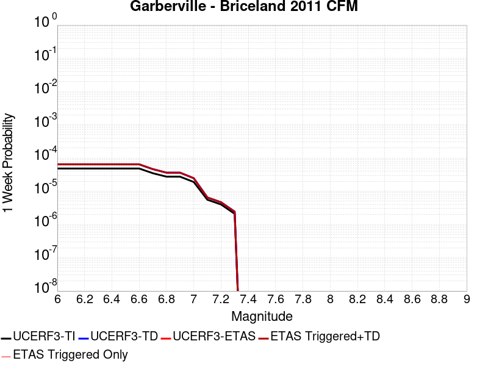 |  | 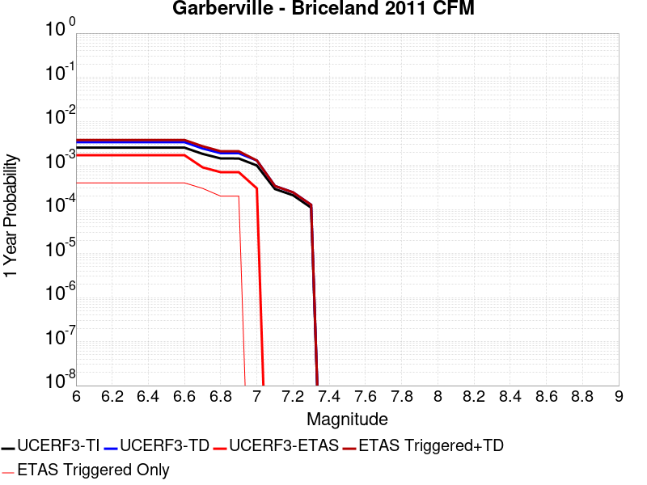 |  |

| Magnitude | 1 wk TI Prob | 1 wk TD Prob | 1 wk ETAS Prob | 1 wk ETAS/TD Gain | 1 wk ETAS Triggered+TD | 1 wk ETAS Triggered Only | 1 mo TI Prob | 1 mo TD Prob | 1 mo ETAS Prob | 1 mo ETAS/TD Gain | 1 mo ETAS Triggered+TD | 1 mo ETAS Triggered Only | 1 yr TI Prob | 1 yr TD Prob | 1 yr ETAS Prob | 1 yr ETAS/TD Gain | 1 yr ETAS Triggered+TD | 1 yr ETAS Triggered Only | 10 yr TI Prob | 10 yr TD Prob | 10 yr ETAS Prob | 10 yr ETAS/TD Gain | 10 yr ETAS Triggered+TD | 10 yr ETAS Triggered Only |
|-----|-----|-----|-----|-----|-----|-----|-----|-----|-----|-----|-----|-----|-----|-----|-----|-----|-----|-----|-----|-----|-----|-----|-----|-----|
| 6.0 | 4.8399295E-5 | 6.457146E-5 | 0.0 | 0.0 | 6.457146E-5 | 0.0 | 2.0740906E-4 | 2.7670868E-4 | 0.0 | 0.0 | 2.7670868E-4 | 0.0 | 0.002522281 | 0.0033643802 | 4.0E-4 | 0.118892625 | 0.0037630345 | 4.0E-4 | 0.024938442 | 0.033200745 | 0.0038 | 0.11445527 | 0.03687458 | 0.0038 |
| 6.1 | 4.8399295E-5 | 6.457146E-5 | 0.0 | 0.0 | 6.457146E-5 | 0.0 | 2.0740906E-4 | 2.7670868E-4 | 0.0 | 0.0 | 2.7670868E-4 | 0.0 | 0.002522281 | 0.0033643802 | 4.0E-4 | 0.118892625 | 0.0037630345 | 4.0E-4 | 0.024938442 | 0.033200745 | 0.0038 | 0.11445527 | 0.03687458 | 0.0038 |
| 6.2 | 4.8399295E-5 | 6.457146E-5 | 0.0 | 0.0 | 6.457146E-5 | 0.0 | 2.0740906E-4 | 2.7670868E-4 | 0.0 | 0.0 | 2.7670868E-4 | 0.0 | 0.002522281 | 0.0033643802 | 4.0E-4 | 0.118892625 | 0.0037630345 | 4.0E-4 | 0.024938442 | 0.033200745 | 0.0038 | 0.11445527 | 0.03687458 | 0.0038 |
| 6.3 | 4.8399295E-5 | 6.457146E-5 | 0.0 | 0.0 | 6.457146E-5 | 0.0 | 2.0740906E-4 | 2.7670868E-4 | 0.0 | 0.0 | 2.7670868E-4 | 0.0 | 0.002522281 | 0.0033643802 | 4.0E-4 | 0.118892625 | 0.0037630345 | 4.0E-4 | 0.024938442 | 0.033200745 | 0.0038 | 0.11445527 | 0.03687458 | 0.0038 |
| 6.4 | 4.8399295E-5 | 6.457146E-5 | 0.0 | 0.0 | 6.457146E-5 | 0.0 | 2.0740906E-4 | 2.7670868E-4 | 0.0 | 0.0 | 2.7670868E-4 | 0.0 | 0.002522281 | 0.0033643802 | 4.0E-4 | 0.118892625 | 0.0037630345 | 4.0E-4 | 0.024938442 | 0.033200745 | 0.0038 | 0.11445527 | 0.03687458 | 0.0038 |
| 6.5 | 4.8399295E-5 | 6.457146E-5 | 0.0 | 0.0 | 6.457146E-5 | 0.0 | 2.0740906E-4 | 2.7670868E-4 | 0.0 | 0.0 | 2.7670868E-4 | 0.0 | 0.002522281 | 0.0033643802 | 4.0E-4 | 0.118892625 | 0.0037630345 | 4.0E-4 | 0.024938442 | 0.033200745 | 0.0038 | 0.11445527 | 0.03687458 | 0.0038 |
| 6.6 | 4.8399295E-5 | 6.457146E-5 | 0.0 | 0.0 | 6.457146E-5 | 0.0 | 2.0740906E-4 | 2.7670868E-4 | 0.0 | 0.0 | 2.7670868E-4 | 0.0 | 0.002522281 | 0.0033643802 | 4.0E-4 | 0.118892625 | 0.0037630345 | 4.0E-4 | 0.024938442 | 0.033200745 | 0.0038 | 0.11445527 | 0.03687458 | 0.0038 |
| 6.7 | 3.495179E-5 | 4.6340243E-5 | 0.0 | 0.0 | 4.6340243E-5 | 0.0 | 1.4978478E-4 | 1.985888E-4 | 0.0 | 0.0 | 1.985888E-4 | 0.0 | 0.0018221042 | 0.0024156687 | 3.0E-4 | 0.12418921 | 0.002714944 | 3.0E-4 | 0.018072363 | 0.02394655 | 0.0031 | 0.12945499 | 0.026972314 | 0.0031 |
| 6.8 | 2.7517597E-5 | 3.6265563E-5 | 0.0 | 0.0 | 3.6265563E-5 | 0.0 | 1.1792722E-4 | 1.554171E-4 | 0.0 | 0.0 | 1.554171E-4 | 0.0 | 0.0014348183 | 0.0018910341 | 2.0E-4 | 0.105762236 | 0.002090656 | 2.0E-4 | 0.014255894 | 0.018795785 | 0.0026 | 0.13832888 | 0.021346916 | 0.0026 |
| 6.9 | 2.74461E-5 | 3.6183264E-5 | 0.0 | 0.0 | 3.6183264E-5 | 0.0 | 1.1762084E-4 | 1.5506442E-4 | 0.0 | 0.0 | 1.5506442E-4 | 0.0 | 0.001431093 | 0.0018867478 | 2.0E-4 | 0.10600251 | 0.0020863705 | 2.0E-4 | 0.014219119 | 0.018753646 | 0.0026 | 0.1386397 | 0.021304887 | 0.0026 |
| 7.0 | 1.9023773E-5 | 2.4723182E-5 | 0.0 | 0.0 | 2.4723182E-5 | 0.0 | 8.152791E-5 | 1.0595425E-4 | 0.0 | 0.0 | 1.0595425E-4 | 0.0 | 9.921503E-4 | 0.0012896302 | 0.0 | 0.0 | 0.0012896302 | 0.0 | 0.009877323 | 0.012860552 | 0.0017 | 0.13218717 | 0.0145386895 | 0.0017 |
| 7.1 | 5.566844E-6 | 6.514434E-6 | 0.0 | 0.0 | 6.514434E-6 | 0.0 | 2.3857683E-5 | 2.7918728E-5 | 0.0 | 0.0 | 2.7918728E-5 | 0.0 | 2.9042858E-4 | 3.3986176E-4 | 0.0 | 0.0 | 3.3986176E-4 | 0.0 | 0.002900493 | 0.0033938407 | 5.0E-4 | 0.14732571 | 0.003892144 | 5.0E-4 |
| 7.2 | 4.011353E-6 | 4.6762148E-6 | 0.0 | 0.0 | 4.6762148E-6 | 0.0 | 1.7191402E-5 | 2.0040785E-5 | 0.0 | 0.0 | 2.0040785E-5 | 0.0 | 2.0928521E-4 | 2.4397267E-4 | 0.0 | 0.0 | 2.4397267E-4 | 0.0 | 0.0020908823 | 0.0024373862 | 2.0E-4 | 0.082055114 | 0.0026368985 | 2.0E-4 |
| 7.3 | 2.0974871E-6 | 2.4404105E-6 | 0.0 | 0.0 | 2.4404105E-6 | 0.0 | 8.989199E-6 | 1.0458874E-5 | 0.0 | 0.0 | 1.0458874E-5 | 0.0 | 1.09438006E-4 | 1.2733186E-4 | 0.0 | 0.0 | 1.2733186E-4 | 0.0 | 0.0010938413 | 0.0012728344 | 0.0 | 0.0 | 0.0012728344 | 0.0 |

## Chino alt 1
*[(top)](#table-of-contents)*

| 1 Week | 1 Month | 1 Year | 10 Year |
|-----|-----|-----|-----|
|  |  |  |  |

| Magnitude | 1 wk TI Prob | 1 wk TD Prob | 1 wk ETAS Prob | 1 wk ETAS/TD Gain | 1 wk ETAS Triggered+TD | 1 wk ETAS Triggered Only | 1 mo TI Prob | 1 mo TD Prob | 1 mo ETAS Prob | 1 mo ETAS/TD Gain | 1 mo ETAS Triggered+TD | 1 mo ETAS Triggered Only | 1 yr TI Prob | 1 yr TD Prob | 1 yr ETAS Prob | 1 yr ETAS/TD Gain | 1 yr ETAS Triggered+TD | 1 yr ETAS Triggered Only | 10 yr TI Prob | 10 yr TD Prob | 10 yr ETAS Prob | 10 yr ETAS/TD Gain | 10 yr ETAS Triggered+TD | 10 yr ETAS Triggered Only |
|-----|-----|-----|-----|-----|-----|-----|-----|-----|-----|-----|-----|-----|-----|-----|-----|-----|-----|-----|-----|-----|-----|-----|-----|-----|
| 6.0 | 3.939946E-5 | 4.8982674E-5 | 0.0 | 0.0 | 4.8982674E-5 | 0.0 | 1.6884391E-4 | 2.0991178E-4 | 0.0 | 0.0 | 2.0991178E-4 | 0.0 | 0.0020537362 | 0.0025531927 | 4.0E-4 | 0.15666659 | 0.0029521715 | 4.0E-4 | 0.020348595 | 0.025298085 | 0.0036 | 0.14230326 | 0.028807012 | 0.0036 |
| 6.1 | 2.1505624E-5 | 2.6902988E-5 | 0.0 | 0.0 | 2.6902988E-5 | 0.0 | 9.2163704E-5 | 1.1529405E-4 | 0.0 | 0.0 | 1.1529405E-4 | 0.0 | 0.0011215154 | 0.0014029113 | 2.0E-4 | 0.14256069 | 0.0016026306 | 2.0E-4 | 0.011158722 | 0.013960096 | 0.0015 | 0.10744912 | 0.0154391555 | 0.0015 |
| 6.2 | 2.1505624E-5 | 2.6902988E-5 | 0.0 | 0.0 | 2.6902988E-5 | 0.0 | 9.2163704E-5 | 1.1529405E-4 | 0.0 | 0.0 | 1.1529405E-4 | 0.0 | 0.0011215154 | 0.0014029113 | 2.0E-4 | 0.14256069 | 0.0016026306 | 2.0E-4 | 0.011158722 | 0.013960096 | 0.0015 | 0.10744912 | 0.0154391555 | 0.0015 |
| 6.3 | 1.4290785E-5 | 1.818528E-5 | 0.0 | 0.0 | 1.818528E-5 | 0.0 | 6.1244784E-5 | 7.7934834E-5 | 0.0 | 0.0 | 7.7934834E-5 | 0.0 | 7.454001E-4 | 9.484889E-4 | 2.0E-4 | 0.21086173 | 0.0011482992 | 2.0E-4 | 0.007429048 | 0.009457541 | 9.0E-4 | 0.09516216 | 0.010349029 | 9.0E-4 |
| 6.4 | 1.4290785E-5 | 1.818528E-5 | 0.0 | 0.0 | 1.818528E-5 | 0.0 | 6.1244784E-5 | 7.7934834E-5 | 0.0 | 0.0 | 7.7934834E-5 | 0.0 | 7.454001E-4 | 9.484889E-4 | 2.0E-4 | 0.21086173 | 0.0011482992 | 2.0E-4 | 0.007429048 | 0.009457541 | 9.0E-4 | 0.09516216 | 0.010349029 | 9.0E-4 |
| 6.5 | 1.3017944E-5 | 1.6671649E-5 | 0.0 | 0.0 | 1.6671649E-5 | 0.0 | 5.5789995E-5 | 7.1448216E-5 | 0.0 | 0.0 | 7.1448216E-5 | 0.0 | 6.790315E-4 | 8.6957874E-4 | 2.0E-4 | 0.22999643 | 0.0010694048 | 2.0E-4 | 0.0067696036 | 0.008674738 | 7.0E-4 | 0.08069409 | 0.0093686655 | 7.0E-4 |
| 6.6 | 9.470016E-6 | 1.2055545E-5 | 0.0 | 0.0 | 1.2055545E-5 | 0.0 | 4.058515E-5 | 5.1665793E-5 | 0.0 | 0.0 | 5.1665793E-5 | 0.0 | 4.940122E-4 | 6.288835E-4 | 1.0E-4 | 0.15901197 | 7.2882057E-4 | 1.0E-4 | 0.004929154 | 0.0062828376 | 5.0E-4 | 0.07958187 | 0.0067796963 | 5.0E-4 |
| 6.7 | 8.314155E-6 | 1.0416415E-5 | 0.0 | 0.0 | 1.0416415E-5 | 0.0 | 3.5631605E-5 | 4.4641198E-5 | 0.0 | 0.0 | 4.4641198E-5 | 0.0 | 4.3372845E-4 | 5.434033E-4 | 0.0 | 0.0 | 5.434033E-4 | 0.0 | 0.004328829 | 0.005432993 | 3.0E-4 | 0.055218183 | 0.005731363 | 3.0E-4 |
| 6.8 | 3.4856364E-6 | 3.8164444E-6 | 0.0 | 0.0 | 3.8164444E-6 | 0.0 | 1.4938357E-5 | 1.63561E-5 | 0.0 | 0.0 | 1.63561E-5 | 0.0 | 1.8185932E-4 | 1.9911939E-4 | 0.0 | 0.0 | 1.9911939E-4 | 0.0 | 0.0018171056 | 0.0019910382 | 2.0E-4 | 0.100450106 | 0.00219064 | 2.0E-4 |
| 6.9 | 2.2645952E-6 | 2.1548387E-6 | 0.0 | 0.0 | 2.1548387E-6 | 0.0 | 9.705372E-6 | 9.234991E-6 | 0.0 | 0.0 | 9.234991E-6 | 0.0 | 1.18156495E-4 | 1.1243043E-4 | 0.0 | 0.0 | 1.1243043E-4 | 0.0 | 0.0011809369 | 0.0011243502 | 2.0E-4 | 0.17788053 | 0.0013241253 | 2.0E-4 |
| 7.0 | 1.7864003E-6 | 1.5447231E-6 | 0.0 | 0.0 | 1.5447231E-6 | 0.0 | 7.655979E-6 | 6.620225E-6 | 0.0 | 0.0 | 6.620225E-6 | 0.0 | 9.3207556E-5 | 8.0598315E-5 | 0.0 | 0.0 | 8.0598315E-5 | 0.0 | 9.316847E-4 | 8.0617744E-4 | 2.0E-4 | 0.24808434 | 0.0010060163 | 2.0E-4 |
| 7.1 | 1.7315456E-6 | 1.4749605E-6 | 0.0 | 0.0 | 1.4749605E-6 | 0.0 | 7.420889E-6 | 6.321244E-6 | 0.0 | 0.0 | 6.321244E-6 | 0.0 | 9.034557E-5 | 7.695849E-5 | 0.0 | 0.0 | 7.695849E-5 | 0.0 | 9.0308854E-4 | 7.697918E-4 | 2.0E-4 | 0.2598105 | 9.696378E-4 | 2.0E-4 |
| 7.2 | 1.6008337E-6 | 1.3589472E-6 | 0.0 | 0.0 | 1.3589472E-6 | 0.0 | 6.860698E-6 | 5.824047E-6 | 0.0 | 0.0 | 5.824047E-6 | 0.0 | 8.352579E-5 | 7.090552E-5 | 0.0 | 0.0 | 7.090552E-5 | 0.0 | 8.34944E-4 | 7.0928765E-4 | 2.0E-4 | 0.28197303 | 9.091458E-4 | 2.0E-4 |
| 7.3 | 1.3320939E-6 | 1.1231415E-6 | 0.0 | 0.0 | 1.1231415E-6 | 0.0 | 5.7089615E-6 | 4.813455E-6 | 0.0 | 0.0 | 4.813455E-6 | 0.0 | 6.9504385E-5 | 5.8602287E-5 | 0.0 | 0.0 | 5.8602287E-5 | 0.0 | 6.9482654E-4 | 5.860052E-4 | 1.0E-4 | 0.17064695 | 6.859466E-4 | 1.0E-4 |
| 7.4 | 1.114294E-6 | 9.249316E-7 | 0.0 | 0.0 | 9.249316E-7 | 0.0 | 4.775537E-6 | 3.9639867E-6 | 0.0 | 0.0 | 3.9639867E-6 | 0.0 | 5.8140613E-5 | 4.826051E-5 | 0.0 | 0.0 | 4.826051E-5 | 0.0 | 5.81254E-4 | 4.8251598E-4 | 1.0E-4 | 0.20724702 | 5.824677E-4 | 1.0E-4 |
| 7.5 | 9.354081E-7 | 7.63455E-7 | 0.0 | 0.0 | 7.63455E-7 | 0.0 | 4.0088858E-6 | 3.271946E-6 | 0.0 | 0.0 | 3.271946E-6 | 0.0 | 4.8807087E-5 | 3.983525E-5 | 0.0 | 0.0 | 3.983525E-5 | 0.0 | 4.879637E-4 | 3.982845E-4 | 1.0E-4 | 0.25107682 | 4.9824466E-4 | 1.0E-4 |
| 7.6 | 8.521771E-7 | 6.8913687E-7 | 0.0 | 0.0 | 6.8913687E-7 | 0.0 | 3.6521824E-6 | 2.9534406E-6 | 0.0 | 0.0 | 2.9534406E-6 | 0.0 | 4.4464414E-5 | 3.595758E-5 | 0.0 | 0.0 | 3.595758E-5 | 0.0 | 4.4455516E-4 | 3.5952078E-4 | 1.0E-4 | 0.27814803 | 4.594848E-4 | 1.0E-4 |
| 7.7 | 2.1803626E-7 | 1.4215239E-7 | 0.0 | 0.0 | 1.4215239E-7 | 0.0 | 9.344408E-7 | 6.0922446E-7 | 0.0 | 0.0 | 6.0922446E-7 | 0.0 | 1.1376757E-5 | 7.417292E-6 | 0.0 | 0.0 | 7.417292E-6 | 0.0 | 1.13761744E-4 | 7.417141E-5 | 1.0E-4 | 1.3482285 | 1.7416399E-4 | 1.0E-4 |

## Honey Lake 2011 CFM
*[(top)](#table-of-contents)*

| 1 Week | 1 Month | 1 Year | 10 Year |
|-----|-----|-----|-----|
| 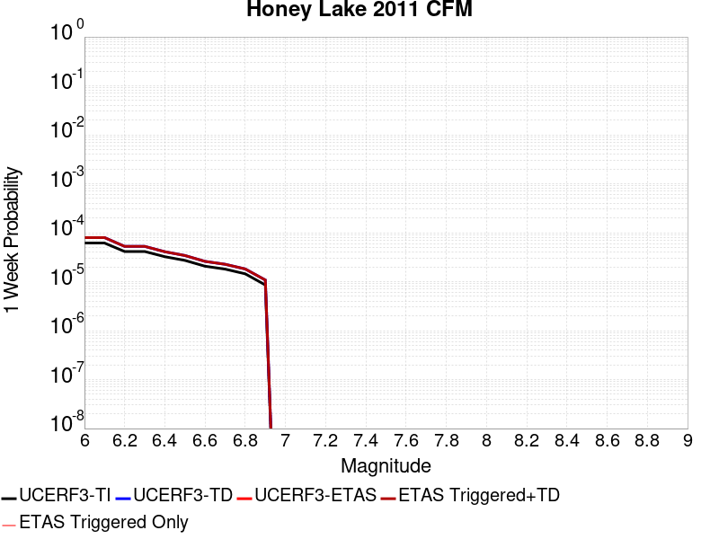 |  |  | 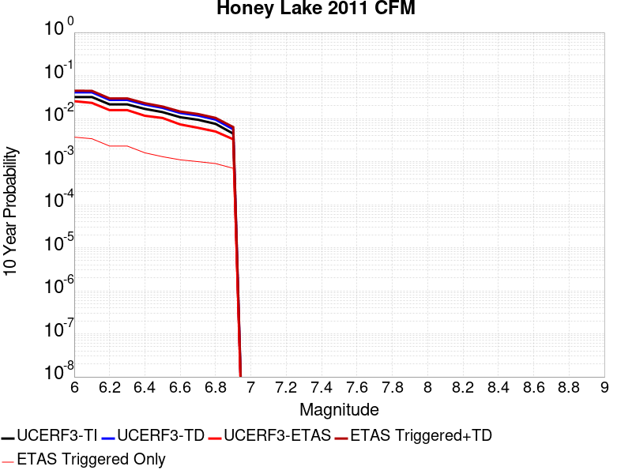 |

| Magnitude | 1 wk TI Prob | 1 wk TD Prob | 1 wk ETAS Prob | 1 wk ETAS/TD Gain | 1 wk ETAS Triggered+TD | 1 wk ETAS Triggered Only | 1 mo TI Prob | 1 mo TD Prob | 1 mo ETAS Prob | 1 mo ETAS/TD Gain | 1 mo ETAS Triggered+TD | 1 mo ETAS Triggered Only | 1 yr TI Prob | 1 yr TD Prob | 1 yr ETAS Prob | 1 yr ETAS/TD Gain | 1 yr ETAS Triggered+TD | 1 yr ETAS Triggered Only | 10 yr TI Prob | 10 yr TD Prob | 10 yr ETAS Prob | 10 yr ETAS/TD Gain | 10 yr ETAS Triggered+TD | 10 yr ETAS Triggered Only |
|-----|-----|-----|-----|-----|-----|-----|-----|-----|-----|-----|-----|-----|-----|-----|-----|-----|-----|-----|-----|-----|-----|-----|-----|-----|
| 6.0 | 6.155506E-5 | 7.959332E-5 | 0.0 | 0.0 | 7.959332E-5 | 0.0 | 2.6378073E-4 | 3.4107253E-4 | 0.0 | 0.0 | 3.4107253E-4 | 0.0 | 0.0032068014 | 0.0041450993 | 5.0E-4 | 0.12062438 | 0.0046430267 | 5.0E-4 | 0.03160919 | 0.040726278 | 0.0037 | 0.090850435 | 0.04427559 | 0.0037 |
| 6.1 | 6.155506E-5 | 7.959332E-5 | 0.0 | 0.0 | 7.959332E-5 | 0.0 | 2.6378073E-4 | 3.4107253E-4 | 0.0 | 0.0 | 3.4107253E-4 | 0.0 | 0.0032068014 | 0.0041450993 | 5.0E-4 | 0.12062438 | 0.0046430267 | 5.0E-4 | 0.03160919 | 0.040726278 | 0.0034 | 0.08348418 | 0.04398781 | 0.0034 |
| 6.2 | 4.1335024E-5 | 5.2605556E-5 | 0.0 | 0.0 | 5.2605556E-5 | 0.0 | 1.7713808E-4 | 2.2543393E-4 | 0.0 | 0.0 | 2.2543393E-4 | 0.0 | 0.0021545228 | 0.0027413552 | 4.0E-4 | 0.14591323 | 0.0031402586 | 4.0E-4 | 0.021337535 | 0.027091501 | 0.0023 | 0.08489747 | 0.029329192 | 0.0023 |
| 6.3 | 4.1335024E-5 | 5.2605556E-5 | 0.0 | 0.0 | 5.2605556E-5 | 0.0 | 1.7713808E-4 | 2.2543393E-4 | 0.0 | 0.0 | 2.2543393E-4 | 0.0 | 0.0021545228 | 0.0027413552 | 4.0E-4 | 0.14591323 | 0.0031402586 | 4.0E-4 | 0.021337535 | 0.027091501 | 0.0023 | 0.08489747 | 0.029329192 | 0.0023 |
| 6.4 | 3.2393702E-5 | 4.0909166E-5 | 0.0 | 0.0 | 4.0909166E-5 | 0.0 | 1.3882275E-4 | 1.7531386E-4 | 0.0 | 0.0 | 1.7531386E-4 | 0.0 | 0.0016888566 | 0.0021324635 | 2.0E-4 | 0.093788244 | 0.002332037 | 2.0E-4 | 0.016760793 | 0.021131031 | 0.0016 | 0.07571803 | 0.022697221 | 0.0016 |
| 6.5 | 2.7205504E-5 | 3.4229823E-5 | 0.0 | 0.0 | 3.4229823E-5 | 0.0 | 1.1658981E-4 | 1.4669151E-4 | 0.0 | 0.0 | 1.4669151E-4 | 0.0 | 0.0014185566 | 0.0017845997 | 2.0E-4 | 0.11206995 | 0.0019842428 | 2.0E-4 | 0.014095354 | 0.017712208 | 0.0013 | 0.07339571 | 0.018989183 | 0.0013 |
| 6.6 | 2.069265E-5 | 2.5968986E-5 | 0.0 | 0.0 | 2.5968986E-5 | 0.0 | 8.867977E-5 | 1.1129139E-4 | 0.0 | 0.0 | 1.1129139E-4 | 0.0 | 0.0010791414 | 0.0013542147 | 2.0E-4 | 0.14768706 | 0.001553944 | 2.0E-4 | 0.010739161 | 0.013468003 | 0.0011 | 0.08167507 | 0.014553188 | 0.0011 |
| 6.7 | 1.8060919E-5 | 2.2668704E-5 | 0.0 | 0.0 | 2.2668704E-5 | 0.0 | 7.7401644E-5 | 9.7148426E-5 | 0.0 | 0.0 | 9.7148426E-5 | 0.0 | 9.419576E-4 | 0.0011822213 | 2.0E-4 | 0.16917305 | 0.0013819849 | 2.0E-4 | 0.009379748 | 0.0117673725 | 0.001 | 0.08498074 | 0.012755605 | 0.001 |
| 6.8 | 1.4474663E-5 | 1.8190862E-5 | 0.0 | 0.0 | 1.8190862E-5 | 0.0 | 6.203279E-5 | 7.795894E-5 | 0.0 | 0.0 | 7.795894E-5 | 0.0 | 7.5498753E-4 | 9.488133E-4 | 2.0E-4 | 0.21078962 | 0.0011486235 | 2.0E-4 | 0.007524277 | 0.009455158 | 9.0E-4 | 0.09518614 | 0.010346648 | 9.0E-4 |
| 6.9 | 8.564552E-6 | 1.0808122E-5 | 0.0 | 0.0 | 1.0808122E-5 | 0.0 | 3.6704707E-5 | 4.6320078E-5 | 0.0 | 0.0 | 4.6320078E-5 | 0.0 | 4.4678818E-4 | 5.638675E-4 | 2.0E-4 | 0.35469326 | 7.637547E-4 | 2.0E-4 | 0.0044589094 | 0.005630872 | 7.0E-4 | 0.124314666 | 0.0063269306 | 7.0E-4 |

## Bullion Mountains
*[(top)](#table-of-contents)*

| 1 Week | 1 Month | 1 Year | 10 Year |
|-----|-----|-----|-----|
|  |  |  |  |

| Magnitude | 1 wk TI Prob | 1 wk TD Prob | 1 wk ETAS Prob | 1 wk ETAS/TD Gain | 1 wk ETAS Triggered+TD | 1 wk ETAS Triggered Only | 1 mo TI Prob | 1 mo TD Prob | 1 mo ETAS Prob | 1 mo ETAS/TD Gain | 1 mo ETAS Triggered+TD | 1 mo ETAS Triggered Only | 1 yr TI Prob | 1 yr TD Prob | 1 yr ETAS Prob | 1 yr ETAS/TD Gain | 1 yr ETAS Triggered+TD | 1 yr ETAS Triggered Only | 10 yr TI Prob | 10 yr TD Prob | 10 yr ETAS Prob | 10 yr ETAS/TD Gain | 10 yr ETAS Triggered+TD | 10 yr ETAS Triggered Only |
|-----|-----|-----|-----|-----|-----|-----|-----|-----|-----|-----|-----|-----|-----|-----|-----|-----|-----|-----|-----|-----|-----|-----|-----|-----|
| 6.0 | 1.6420427E-5 | 1.4693055E-5 | 0.0 | 0.0 | 1.4693055E-5 | 0.0 | 7.037136E-5 | 6.296893E-5 | 2.0E-4 | 3.1761694 | 2.6295634E-4 | 2.0E-4 | 8.5643446E-4 | 7.6641544E-4 | 7.0E-4 | 0.9133428 | 0.0014658789 | 7.0E-4 | 0.008531413 | 0.007641517 | 0.0036 | 0.47111064 | 0.011214008 | 0.0036 |
| 6.1 | 1.6420427E-5 | 1.4693055E-5 | 0.0 | 0.0 | 1.4693055E-5 | 0.0 | 7.037136E-5 | 6.296893E-5 | 2.0E-4 | 3.1761694 | 2.6295634E-4 | 2.0E-4 | 8.5643446E-4 | 7.6641544E-4 | 7.0E-4 | 0.9133428 | 0.0014658789 | 7.0E-4 | 0.008531413 | 0.007641517 | 0.0036 | 0.47111064 | 0.011214008 | 0.0036 |
| 6.2 | 1.6420427E-5 | 1.4693055E-5 | 0.0 | 0.0 | 1.4693055E-5 | 0.0 | 7.037136E-5 | 6.296893E-5 | 2.0E-4 | 3.1761694 | 2.6295634E-4 | 2.0E-4 | 8.5643446E-4 | 7.6641544E-4 | 7.0E-4 | 0.9133428 | 0.0014658789 | 7.0E-4 | 0.008531413 | 0.007641517 | 0.0036 | 0.47111064 | 0.011214008 | 0.0036 |
| 6.3 | 1.2046778E-5 | 9.862262E-6 | 0.0 | 0.0 | 9.862262E-6 | 0.0 | 5.1628023E-5 | 4.2266285E-5 | 2.0E-4 | 4.731904 | 2.4225783E-4 | 2.0E-4 | 6.283899E-4 | 5.1449373E-4 | 6.0E-4 | 1.166195 | 0.001114185 | 6.0E-4 | 0.0062661595 | 0.0051353076 | 0.0027 | 0.5257718 | 0.007821443 | 0.0027 |
| 6.4 | 1.2046778E-5 | 9.862262E-6 | 0.0 | 0.0 | 9.862262E-6 | 0.0 | 5.1628023E-5 | 4.2266285E-5 | 2.0E-4 | 4.731904 | 2.4225783E-4 | 2.0E-4 | 6.283899E-4 | 5.1449373E-4 | 6.0E-4 | 1.166195 | 0.001114185 | 6.0E-4 | 0.0062661595 | 0.0051353076 | 0.0027 | 0.5257718 | 0.007821443 | 0.0027 |
| 6.5 | 1.0244343E-5 | 7.878977E-6 | 0.0 | 0.0 | 7.878977E-6 | 0.0 | 4.390359E-5 | 3.3766722E-5 | 1.0E-4 | 2.9614956 | 1.3376334E-4 | 1.0E-4 | 5.343951E-4 | 4.1105298E-4 | 4.0E-4 | 0.97311056 | 8.108886E-4 | 4.0E-4 | 0.005331118 | 0.004104958 | 0.0018 | 0.43849412 | 0.005897569 | 0.0018 |
| 6.6 | 9.605408E-6 | 7.1768723E-6 | 0.0 | 0.0 | 7.1768723E-6 | 0.0 | 4.1165385E-5 | 3.0757776E-5 | 1.0E-4 | 3.2512102 | 1.307547E-4 | 1.0E-4 | 5.010733E-4 | 3.7443193E-4 | 3.0E-4 | 0.8012137 | 6.743196E-4 | 3.0E-4 | 0.00499945 | 0.003740008 | 0.0014 | 0.37433076 | 0.005134772 | 0.0014 |
| 6.7 | 8.60418E-6 | 6.1231967E-6 | 0.0 | 0.0 | 6.1231967E-6 | 0.0 | 3.687454E-5 | 2.6242118E-5 | 1.0E-4 | 3.810668 | 1.262395E-4 | 1.0E-4 | 4.48855E-4 | 3.1947045E-4 | 3.0E-4 | 0.939054 | 6.193746E-4 | 3.0E-4 | 0.004479495 | 0.0031920238 | 0.0012 | 0.37593704 | 0.0043881936 | 0.0012 |
| 6.8 | 5.187994E-6 | 2.561703E-6 | 0.0 | 0.0 | 2.561703E-6 | 0.0 | 2.223407E-5 | 1.0978703E-5 | 1.0E-4 | 9.108543 | 1.10977606E-4 | 1.0E-4 | 2.7066618E-4 | 1.3366151E-4 | 2.0E-4 | 1.4963171 | 3.3363476E-4 | 2.0E-4 | 0.0027033675 | 0.0013362023 | 7.0E-4 | 0.5238728 | 0.002035267 | 7.0E-4 |
| 6.9 | 4.5302368E-6 | 2.3430473E-6 | 0.0 | 0.0 | 2.3430473E-6 | 0.0 | 1.9415156E-5 | 1.00416155E-5 | 1.0E-4 | 9.958557 | 1.1004061E-4 | 1.0E-4 | 2.3635388E-4 | 1.2225377E-4 | 2.0E-4 | 1.6359414 | 3.2222932E-4 | 2.0E-4 | 0.0023610266 | 0.0012222538 | 7.0E-4 | 0.5727125 | 0.0019213982 | 7.0E-4 |
| 7.0 | 3.431668E-6 | 1.6872452E-6 | 0.0 | 0.0 | 1.6872452E-6 | 0.0 | 1.4707065E-5 | 7.2310513E-6 | 0.0 | 0.0 | 7.2310513E-6 | 0.0 | 1.7904381E-4 | 8.803805E-5 | 1.0E-4 | 1.1358725 | 1.8802924E-4 | 1.0E-4 | 0.0017889962 | 8.8038045E-4 | 5.0E-4 | 0.56793624 | 0.0013799403 | 5.0E-4 |

## Concord 2011 CFM
*[(top)](#table-of-contents)*

| 1 Week | 1 Month | 1 Year | 10 Year |
|-----|-----|-----|-----|
|  |  |  |  |

| Magnitude | 1 wk TI Prob | 1 wk TD Prob | 1 wk ETAS Prob | 1 wk ETAS/TD Gain | 1 wk ETAS Triggered+TD | 1 wk ETAS Triggered Only | 1 mo TI Prob | 1 mo TD Prob | 1 mo ETAS Prob | 1 mo ETAS/TD Gain | 1 mo ETAS Triggered+TD | 1 mo ETAS Triggered Only | 1 yr TI Prob | 1 yr TD Prob | 1 yr ETAS Prob | 1 yr ETAS/TD Gain | 1 yr ETAS Triggered+TD | 1 yr ETAS Triggered Only | 10 yr TI Prob | 10 yr TD Prob | 10 yr ETAS Prob | 10 yr ETAS/TD Gain | 10 yr ETAS Triggered+TD | 10 yr ETAS Triggered Only |
|-----|-----|-----|-----|-----|-----|-----|-----|-----|-----|-----|-----|-----|-----|-----|-----|-----|-----|-----|-----|-----|-----|-----|-----|-----|
| 6.0 | 5.7865112E-5 | 9.766656E-5 | 3.0E-4 | 3.0716758 | 3.9763725E-4 | 3.0E-4 | 2.4796976E-4 | 4.1850482E-4 | 5.0E-4 | 1.1947294 | 9.182955E-4 | 5.0E-4 | 0.0030148525 | 0.0050839344 | 0.0011 | 0.21636787 | 0.006178342 | 0.0011 | 0.029742775 | 0.049301114 | 0.0036 | 0.07302067 | 0.052723628 | 0.0036 |
| 6.1 | 5.7865112E-5 | 9.766656E-5 | 3.0E-4 | 3.0716758 | 3.9763725E-4 | 3.0E-4 | 2.4796976E-4 | 4.1850482E-4 | 5.0E-4 | 1.1947294 | 9.182955E-4 | 5.0E-4 | 0.0030148525 | 0.0050839344 | 0.0011 | 0.21636787 | 0.006178342 | 0.0011 | 0.029742775 | 0.049301114 | 0.0036 | 0.07302067 | 0.052723628 | 0.0036 |
| 6.2 | 5.6789337E-5 | 9.5868025E-5 | 3.0E-4 | 3.129302 | 3.9583925E-4 | 3.0E-4 | 2.4336016E-4 | 4.1079923E-4 | 5.0E-4 | 1.2171396 | 9.1059384E-4 | 5.0E-4 | 0.0029588845 | 0.004990598 | 0.0011 | 0.22041447 | 0.0060851085 | 0.0011 | 0.029197963 | 0.048417203 | 0.0034 | 0.070222974 | 0.051652584 | 0.0034 |
| 6.3 | 5.203322E-5 | 8.81058E-5 | 2.0E-4 | 2.269998 | 2.8808817E-4 | 2.0E-4 | 2.2298045E-4 | 3.7754604E-4 | 4.0E-4 | 1.0594734 | 7.7739503E-4 | 4.0E-4 | 0.0027114071 | 0.004587719 | 0.001 | 0.21797323 | 0.0055831317 | 0.001 | 0.026785625 | 0.044585522 | 0.0033 | 0.07401506 | 0.047738392 | 0.0033 |
| 6.4 | 4.7120942E-5 | 7.9018166E-5 | 1.0E-4 | 1.2655318 | 1.7901027E-4 | 1.0E-4 | 2.0193127E-4 | 3.386095E-4 | 3.0E-4 | 0.88597625 | 6.3850795E-4 | 3.0E-4 | 0.0024557412 | 0.0041155233 | 9.0E-4 | 0.21868423 | 0.0050118193 | 9.0E-4 | 0.024287801 | 0.0400996 | 0.0029 | 0.072319925 | 0.04288331 | 0.0029 |
| 6.5 | 2.9598437E-5 | 4.6715155E-5 | 0.0 | 0.0 | 4.6715155E-5 | 0.0 | 1.2684427E-4 | 2.0019362E-4 | 0.0 | 0.0 | 2.0019362E-4 | 0.0 | 0.001543235 | 0.0024348435 | 4.0E-4 | 0.1642816 | 0.0028338695 | 4.0E-4 | 0.015325619 | 0.023927856 | 0.0016 | 0.06686767 | 0.02548957 | 0.0016 |
| 6.6 | 2.0443718E-5 | 3.0022673E-5 | 0.0 | 0.0 | 3.0022673E-5 | 0.0 | 8.7613E-5 | 1.2866246E-4 | 0.0 | 0.0 | 1.2866246E-4 | 0.0 | 0.0010661662 | 0.0015653762 | 2.0E-4 | 0.12776482 | 0.001765063 | 2.0E-4 | 0.010610655 | 0.015484465 | 0.0012 | 0.07749702 | 0.016665885 | 0.0012 |
| 6.7 | 1.798539E-5 | 2.5595184E-5 | 0.0 | 0.0 | 2.5595184E-5 | 0.0 | 7.7077966E-5 | 1.0968915E-4 | 0.0 | 0.0 | 1.0968915E-4 | 0.0 | 9.380202E-4 | 0.001334669 | 1.0E-4 | 0.074924946 | 0.0014345355 | 1.0E-4 | 0.009340706 | 0.013234968 | 9.0E-4 | 0.06800167 | 0.014123057 | 9.0E-4 |
| 6.8 | 1.613555E-5 | 2.1975748E-5 | 0.0 | 0.0 | 2.1975748E-5 | 0.0 | 6.915052E-5 | 9.417845E-5 | 0.0 | 0.0 | 9.417845E-5 | 0.0 | 8.4158237E-4 | 0.0011460335 | 1.0E-4 | 0.08725748 | 0.0012459189 | 1.0E-4 | 0.008384023 | 0.011385576 | 7.0E-4 | 0.0614813 | 0.012077605 | 7.0E-4 |
| 6.9 | 1.2916435E-5 | 1.7096663E-5 | 0.0 | 0.0 | 1.7096663E-5 | 0.0 | 5.5354973E-5 | 7.326939E-5 | 0.0 | 0.0 | 7.326939E-5 | 0.0 | 6.7373837E-4 | 8.9169556E-4 | 0.0 | 0.0 | 8.9169556E-4 | 0.0 | 0.006716994 | 0.008875474 | 5.0E-4 | 0.056335017 | 0.009371037 | 5.0E-4 |
| 7.0 | 9.81129E-6 | 1.2642283E-5 | 0.0 | 0.0 | 1.2642283E-5 | 0.0 | 4.2047708E-5 | 5.41801E-5 | 0.0 | 0.0 | 5.41801E-5 | 0.0 | 5.118106E-4 | 6.5944466E-4 | 0.0 | 0.0 | 6.5944466E-4 | 0.0 | 0.005106334 | 0.0065757316 | 5.0E-4 | 0.07603717 | 0.0070724436 | 5.0E-4 |
| 7.1 | 8.0889195E-6 | 1.0428023E-5 | 0.0 | 0.0 | 1.0428023E-5 | 0.0 | 3.4666336E-5 | 4.469077E-5 | 0.0 | 0.0 | 4.469077E-5 | 0.0 | 4.219809E-4 | 5.4397533E-4 | 0.0 | 0.0 | 5.4397533E-4 | 0.0 | 0.004211805 | 0.00542693 | 4.0E-4 | 0.0737065 | 0.0058247587 | 4.0E-4 |
| 7.2 | 6.267438E-6 | 8.124628E-6 | 0.0 | 0.0 | 8.124628E-6 | 0.0 | 2.6860173E-5 | 3.4819375E-5 | 0.0 | 0.0 | 3.4819375E-5 | 0.0 | 3.2697353E-4 | 4.2384415E-4 | 0.0 | 0.0 | 4.2384415E-4 | 0.0 | 0.0032649285 | 0.0042308182 | 4.0E-4 | 0.094544366 | 0.004629126 | 4.0E-4 |
| 7.3 | 3.6761196E-6 | 4.8442803E-6 | 0.0 | 0.0 | 4.8442803E-6 | 0.0 | 1.5754704E-5 | 2.0761037E-5 | 0.0 | 0.0 | 2.0761037E-5 | 0.0 | 1.9179663E-4 | 2.5273653E-4 | 0.0 | 0.0 | 2.5273653E-4 | 0.0 | 0.0019163118 | 0.0025249112 | 2.0E-4 | 0.07921071 | 0.002724406 | 2.0E-4 |
| 7.4 | 2.8044356E-6 | 3.7135312E-6 | 0.0 | 0.0 | 3.7135312E-6 | 0.0 | 1.2018954E-5 | 1.5915037E-5 | 0.0 | 0.0 | 1.5915037E-5 | 0.0 | 1.4632095E-4 | 1.9374846E-4 | 0.0 | 0.0 | 1.9374846E-4 | 0.0 | 0.0014622464 | 0.0019360551 | 2.0E-4 | 0.103302844 | 0.002135668 | 2.0E-4 |
| 7.5 | 2.4578699E-6 | 3.2482085E-6 | 0.0 | 0.0 | 3.2482085E-6 | 0.0 | 1.0533685E-5 | 1.392082E-5 | 0.0 | 0.0 | 1.392082E-5 | 0.0 | 1.2824008E-4 | 1.694729E-4 | 0.0 | 0.0 | 1.694729E-4 | 0.0 | 0.0012816609 | 0.001693684 | 2.0E-4 | 0.11808578 | 0.0018933453 | 2.0E-4 |
| 7.6 | 1.7713267E-6 | 2.338305E-6 | 0.0 | 0.0 | 2.338305E-6 | 0.0 | 7.591378E-6 | 1.0021269E-5 | 0.0 | 0.0 | 1.0021269E-5 | 0.0 | 9.2421105E-5 | 1.2200221E-4 | 0.0 | 0.0 | 1.2200221E-4 | 0.0 | 9.2382677E-4 | 0.0012195924 | 2.0E-4 | 0.16398922 | 0.0014193484 | 2.0E-4 |
| 7.7 | 5.1912366E-7 | 6.832634E-7 | 0.0 | 0.0 | 6.832634E-7 | 0.0 | 2.2248137E-6 | 2.9282685E-6 | 0.0 | 0.0 | 2.9282685E-6 | 0.0 | 2.708677E-5 | 3.5651097E-5 | 0.0 | 0.0 | 3.5651097E-5 | 0.0 | 2.708347E-4 | 3.5646665E-4 | 0.0 | 0.0 | 3.5646665E-4 | 0.0 |

## Coyote Canyon
*[(top)](#table-of-contents)*

| 1 Week | 1 Month | 1 Year | 10 Year |
|-----|-----|-----|-----|
| 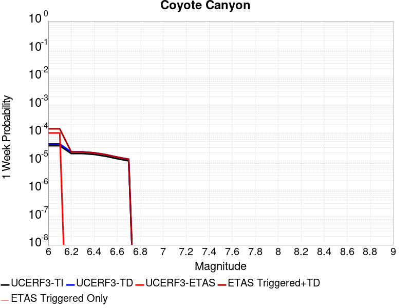 |  |  |  |

| Magnitude | 1 wk TI Prob | 1 wk TD Prob | 1 wk ETAS Prob | 1 wk ETAS/TD Gain | 1 wk ETAS Triggered+TD | 1 wk ETAS Triggered Only | 1 mo TI Prob | 1 mo TD Prob | 1 mo ETAS Prob | 1 mo ETAS/TD Gain | 1 mo ETAS Triggered+TD | 1 mo ETAS Triggered Only | 1 yr TI Prob | 1 yr TD Prob | 1 yr ETAS Prob | 1 yr ETAS/TD Gain | 1 yr ETAS Triggered+TD | 1 yr ETAS Triggered Only | 10 yr TI Prob | 10 yr TD Prob | 10 yr ETAS Prob | 10 yr ETAS/TD Gain | 10 yr ETAS Triggered+TD | 10 yr ETAS Triggered Only |
|-----|-----|-----|-----|-----|-----|-----|-----|-----|-----|-----|-----|-----|-----|-----|-----|-----|-----|-----|-----|-----|-----|-----|-----|-----|
| 6.0 | 3.5090034E-5 | 4.037682E-5 | 1.0E-4 | 2.4766684 | 1.4037278E-4 | 1.0E-4 | 1.503772E-4 | 1.7303349E-4 | 2.0E-4 | 1.1558455 | 3.7299888E-4 | 2.0E-4 | 0.0018293047 | 0.0021049047 | 4.0E-4 | 0.19003235 | 0.0025040628 | 4.0E-4 | 0.018143194 | 0.020875612 | 0.0031 | 0.14849864 | 0.023910897 | 0.0031 |
| 6.1 | 3.5090034E-5 | 4.037682E-5 | 1.0E-4 | 2.4766684 | 1.4037278E-4 | 1.0E-4 | 1.503772E-4 | 1.7303349E-4 | 2.0E-4 | 1.1558455 | 3.7299888E-4 | 2.0E-4 | 0.0018293047 | 0.0021049047 | 4.0E-4 | 0.19003235 | 0.0025040628 | 4.0E-4 | 0.018143194 | 0.020875612 | 0.0031 | 0.14849864 | 0.023910897 | 0.0031 |
| 6.2 | 1.841879E-5 | 2.1066015E-5 | 0.0 | 0.0 | 2.1066015E-5 | 0.0 | 7.8935285E-5 | 9.028037E-5 | 1.0E-4 | 1.1076605 | 1.9027134E-4 | 1.0E-4 | 9.606133E-4 | 0.0010987114 | 1.0E-4 | 0.09101571 | 0.0011986014 | 1.0E-4 | 0.0095647145 | 0.010942885 | 0.0016 | 0.14621373 | 0.012525377 | 0.0016 |
| 6.3 | 1.841879E-5 | 2.1066015E-5 | 0.0 | 0.0 | 2.1066015E-5 | 0.0 | 7.8935285E-5 | 9.028037E-5 | 1.0E-4 | 1.1076605 | 1.9027134E-4 | 1.0E-4 | 9.606133E-4 | 0.0010987114 | 1.0E-4 | 0.09101571 | 0.0011986014 | 1.0E-4 | 0.0095647145 | 0.010942885 | 0.0016 | 0.14621373 | 0.012525377 | 0.0016 |
| 6.4 | 1.712201E-5 | 1.9570964E-5 | 0.0 | 0.0 | 1.9570964E-5 | 0.0 | 7.337798E-5 | 8.387343E-5 | 1.0E-4 | 1.1922727 | 1.8386504E-4 | 1.0E-4 | 8.930107E-4 | 0.0010207812 | 1.0E-4 | 0.09796418 | 0.0011206792 | 1.0E-4 | 0.008894307 | 0.010170848 | 0.0015 | 0.14748032 | 0.011655592 | 0.0015 |
| 6.5 | 1.4744935E-5 | 1.6841894E-5 | 0.0 | 0.0 | 1.6841894E-5 | 0.0 | 6.3191044E-5 | 7.2178074E-5 | 1.0E-4 | 1.3854623 | 1.7217085E-4 | 1.0E-4 | 7.6907943E-4 | 8.7850733E-4 | 1.0E-4 | 0.11382944 | 9.784194E-4 | 1.0E-4 | 0.007664232 | 0.008759546 | 0.0015 | 0.17124175 | 0.010246407 | 0.0015 |
| 6.6 | 1.2017839E-5 | 1.3728104E-5 | 0.0 | 0.0 | 1.3728104E-5 | 0.0 | 5.150401E-5 | 5.8833903E-5 | 1.0E-4 | 1.6997002 | 1.5882801E-4 | 1.0E-4 | 6.268809E-4 | 7.1615604E-4 | 1.0E-4 | 0.13963439 | 8.160844E-4 | 1.0E-4 | 0.0062511545 | 0.0071471795 | 0.0014 | 0.19588147 | 0.008537173 | 0.0014 |
| 6.7 | 1.00956095E-5 | 1.1536901E-5 | 0.0 | 0.0 | 1.1536901E-5 | 0.0 | 4.326618E-5 | 4.9443417E-5 | 1.0E-4 | 2.0225139 | 1.4943848E-4 | 1.0E-4 | 5.266384E-4 | 6.0189434E-4 | 1.0E-4 | 0.1661421 | 7.0183416E-4 | 1.0E-4 | 0.005253921 | 0.0060111736 | 0.0012 | 0.19962823 | 0.0072039603 | 0.0012 |

## Calaveras (No) 2011 CFM
*[(top)](#table-of-contents)*

| 1 Week | 1 Month | 1 Year | 10 Year |
|-----|-----|-----|-----|
|  |  |  | 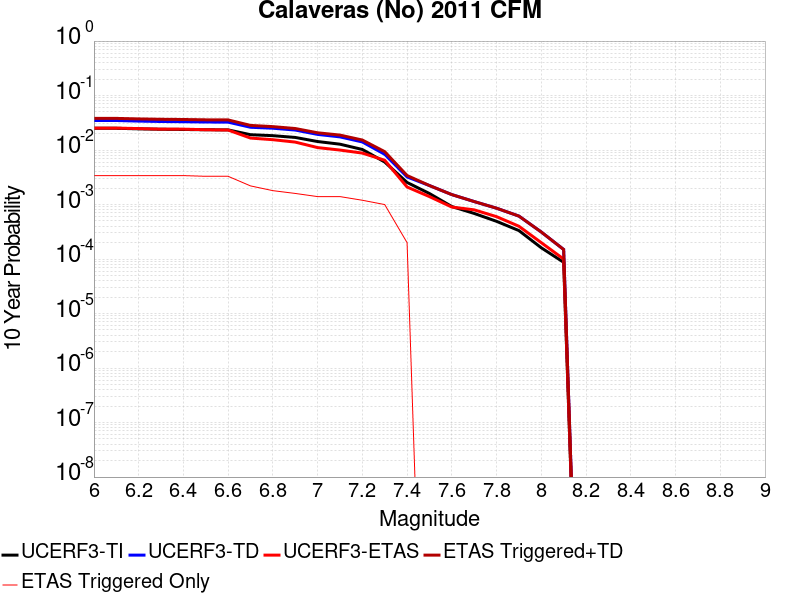 |

| Magnitude | 1 wk TI Prob | 1 wk TD Prob | 1 wk ETAS Prob | 1 wk ETAS/TD Gain | 1 wk ETAS Triggered+TD | 1 wk ETAS Triggered Only | 1 mo TI Prob | 1 mo TD Prob | 1 mo ETAS Prob | 1 mo ETAS/TD Gain | 1 mo ETAS Triggered+TD | 1 mo ETAS Triggered Only | 1 yr TI Prob | 1 yr TD Prob | 1 yr ETAS Prob | 1 yr ETAS/TD Gain | 1 yr ETAS Triggered+TD | 1 yr ETAS Triggered Only | 10 yr TI Prob | 10 yr TD Prob | 10 yr ETAS Prob | 10 yr ETAS/TD Gain | 10 yr ETAS Triggered+TD | 10 yr ETAS Triggered Only |
|-----|-----|-----|-----|-----|-----|-----|-----|-----|-----|-----|-----|-----|-----|-----|-----|-----|-----|-----|-----|-----|-----|-----|-----|-----|
| 6.0 | 4.8694856E-5 | 6.758575E-5 | 1.0E-4 | 1.4796017 | 1.67579E-4 | 1.0E-4 | 2.0867554E-4 | 2.8962165E-4 | 2.0E-4 | 0.6905561 | 4.8956374E-4 | 2.0E-4 | 0.0025376645 | 0.003520438 | 8.0E-4 | 0.22724445 | 0.0043176217 | 8.0E-4 | 0.02508881 | 0.034826558 | 0.0034 | 0.09762665 | 0.038108148 | 0.0034 |
| 6.1 | 4.8694856E-5 | 6.758575E-5 | 1.0E-4 | 1.4796017 | 1.67579E-4 | 1.0E-4 | 2.0867554E-4 | 2.8962165E-4 | 2.0E-4 | 0.6905561 | 4.8956374E-4 | 2.0E-4 | 0.0025376645 | 0.003520438 | 8.0E-4 | 0.22724445 | 0.0043176217 | 8.0E-4 | 0.02508881 | 0.034826558 | 0.0034 | 0.09762665 | 0.038108148 | 0.0034 |
| 6.2 | 4.7541962E-5 | 6.591561E-5 | 1.0E-4 | 1.5170914 | 1.6590902E-4 | 1.0E-4 | 2.0373536E-4 | 2.8246548E-4 | 2.0E-4 | 0.7080511 | 4.82409E-4 | 2.0E-4 | 0.0024776561 | 0.0034336117 | 8.0E-4 | 0.23299082 | 0.004230865 | 8.0E-4 | 0.024502134 | 0.033987388 | 0.0034 | 0.100037105 | 0.03727183 | 0.0034 |
| 6.3 | 4.6717287E-5 | 6.474834E-5 | 1.0E-4 | 1.5444412 | 1.6474187E-4 | 1.0E-4 | 2.0020158E-4 | 2.7746416E-4 | 2.0E-4 | 0.7208138 | 4.7740867E-4 | 2.0E-4 | 0.0024347296 | 0.0033729197 | 8.0E-4 | 0.23718323 | 0.0041702213 | 8.0E-4 | 0.024082264 | 0.033399504 | 0.0034 | 0.10179792 | 0.036685944 | 0.0034 |
| 6.4 | 4.6276386E-5 | 6.410952E-5 | 1.0E-4 | 1.5598308 | 1.6410311E-4 | 1.0E-4 | 1.983123E-4 | 2.7472695E-4 | 2.0E-4 | 0.7279956 | 4.74672E-4 | 2.0E-4 | 0.0024117786 | 0.0033397044 | 8.0E-4 | 0.23954216 | 0.0041370327 | 8.0E-4 | 0.02385771 | 0.03307815 | 0.0034 | 0.10278689 | 0.03636568 | 0.0034 |
| 6.5 | 4.5720994E-5 | 6.330963E-5 | 1.0E-4 | 1.5795386 | 1.633033E-4 | 1.0E-4 | 1.9593239E-4 | 2.7129982E-4 | 2.0E-4 | 0.7371918 | 4.7124556E-4 | 2.0E-4 | 0.002382867 | 0.0032981143 | 8.0E-4 | 0.24256285 | 0.0040954757 | 8.0E-4 | 0.023574775 | 0.03267548 | 0.0033 | 0.10099316 | 0.03586765 | 0.0033 |
| 6.6 | 4.549134E-5 | 6.296237E-5 | 1.0E-4 | 1.5882503 | 1.6295607E-4 | 1.0E-4 | 1.949483E-4 | 2.698119E-4 | 2.0E-4 | 0.7412572 | 4.697579E-4 | 2.0E-4 | 0.0023709119 | 0.0032800531 | 8.0E-4 | 0.24389848 | 0.0040774294 | 8.0E-4 | 0.023457756 | 0.032500718 | 0.0033 | 0.10153622 | 0.035693463 | 0.0033 |
| 6.7 | 3.701047E-5 | 5.045918E-5 | 1.0E-4 | 1.9818 | 1.5045413E-4 | 1.0E-4 | 1.5860666E-4 | 2.1623595E-4 | 2.0E-4 | 0.9249156 | 4.161927E-4 | 2.0E-4 | 0.0019293258 | 0.0026295378 | 6.0E-4 | 0.22817698 | 0.00322796 | 6.0E-4 | 0.019126613 | 0.026175035 | 0.0022 | 0.08404955 | 0.02831745 | 0.0022 |
| 6.8 | 3.5523568E-5 | 4.8440746E-5 | 0.0 | 0.0 | 4.8440746E-5 | 0.0 | 1.5223498E-4 | 2.0758693E-4 | 1.0E-4 | 0.4817259 | 3.0756617E-4 | 1.0E-4 | 0.0018518851 | 0.0025244846 | 4.0E-4 | 0.15844817 | 0.0029234749 | 4.0E-4 | 0.018365284 | 0.025147654 | 0.0018 | 0.07157725 | 0.026902389 | 0.0018 |
| 6.9 | 3.2946147E-5 | 4.475964E-5 | 0.0 | 0.0 | 4.475964E-5 | 0.0 | 1.4119013E-4 | 1.9181316E-4 | 1.0E-4 | 0.52134067 | 2.91794E-4 | 1.0E-4 | 0.0017176344 | 0.0023328664 | 4.0E-4 | 0.17146288 | 0.0027319333 | 4.0E-4 | 0.017044188 | 0.023268567 | 0.0016 | 0.06876229 | 0.024831338 | 0.0016 |
| 7.0 | 2.7682381E-5 | 3.7118367E-5 | 0.0 | 0.0 | 3.7118367E-5 | 0.0 | 1.1863338E-4 | 1.5906918E-4 | 1.0E-4 | 0.6286573 | 2.5905328E-4 | 1.0E-4 | 0.0014434044 | 0.0019349774 | 3.0E-4 | 0.15504058 | 0.002234397 | 3.0E-4 | 0.01434065 | 0.019359592 | 0.0014 | 0.072315566 | 0.02073249 | 0.0014 |
| 7.1 | 2.471967E-5 | 3.3381217E-5 | 0.0 | 0.0 | 3.3381217E-5 | 0.0 | 1.05937135E-4 | 1.4305467E-4 | 1.0E-4 | 0.69903344 | 2.4304037E-4 | 1.0E-4 | 0.0012890215 | 0.0017403284 | 3.0E-4 | 0.17238125 | 0.0020398065 | 3.0E-4 | 0.0128157 | 0.017434238 | 0.0014 | 0.08030176 | 0.01880983 | 0.0014 |
| 7.2 | 1.9748062E-5 | 2.686821E-5 | 0.0 | 0.0 | 2.686821E-5 | 0.0 | 8.463181E-5 | 1.15144525E-4 | 1.0E-4 | 0.86847377 | 2.1513301E-4 | 1.0E-4 | 0.0010299052 | 0.0014010067 | 3.0E-4 | 0.21413173 | 0.0017005864 | 3.0E-4 | 0.01025145 | 0.014078869 | 0.0012 | 0.08523412 | 0.015261974 | 0.0012 |
| 7.3 | 1.1603734E-5 | 1.5866823E-5 | 0.0 | 0.0 | 1.5866823E-5 | 0.0 | 4.9729337E-5 | 6.7998975E-5 | 0.0 | 0.0 | 6.7998975E-5 | 0.0 | 6.052865E-4 | 8.2758756E-4 | 2.0E-4 | 0.24166627 | 0.001027422 | 2.0E-4 | 0.0060364045 | 0.008351619 | 0.001 | 0.11973725 | 0.009343268 | 0.001 |
| 7.4 | 4.885381E-6 | 6.045286E-6 | 0.0 | 0.0 | 6.045286E-6 | 0.0 | 2.0937177E-5 | 2.5908113E-5 | 0.0 | 0.0 | 2.5908113E-5 | 0.0 | 2.5488032E-4 | 3.153858E-4 | 0.0 | 0.0 | 3.153858E-4 | 0.0 | 0.0025458818 | 0.0032058668 | 2.0E-4 | 0.062385622 | 0.0034052257 | 2.0E-4 |
| 7.5 | 3.0571264E-6 | 4.164333E-6 | 0.0 | 0.0 | 4.164333E-6 | 0.0 | 1.3101904E-5 | 1.7847018E-5 | 0.0 | 0.0 | 1.7847018E-5 | 0.0 | 1.5950401E-4 | 2.1726589E-4 | 0.0 | 0.0 | 2.1726589E-4 | 0.0 | 0.0015938957 | 0.0022253077 | 0.0 | 0.0 | 0.0022253077 | 0.0 |
| 7.6 | 1.764948E-6 | 2.8042434E-6 | 0.0 | 0.0 | 2.8042434E-6 | 0.0 | 7.564041E-6 | 1.2018131E-5 | 0.0 | 0.0 | 1.2018131E-5 | 0.0 | 9.208831E-5 | 1.46311E-4 | 0.0 | 0.0 | 1.46311E-4 | 0.0 | 9.205016E-4 | 0.0015167074 | 0.0 | 0.0 | 0.0015167074 | 0.0 |
| 7.7 | 1.3173734E-6 | 2.0670598E-6 | 0.0 | 0.0 | 2.0670598E-6 | 0.0 | 5.645874E-6 | 8.858798E-6 | 0.0 | 0.0 | 8.858798E-6 | 0.0 | 6.873634E-5 | 1.07850545E-4 | 0.0 | 0.0 | 1.07850545E-4 | 0.0 | 6.8715087E-4 | 0.0011304341 | 0.0 | 0.0 | 0.0011304341 | 0.0 |
| 7.8 | 9.4429885E-7 | 1.5565751E-6 | 0.0 | 0.0 | 1.5565751E-6 | 0.0 | 4.0469886E-6 | 6.671019E-6 | 0.0 | 0.0 | 6.671019E-6 | 0.0 | 4.9270973E-5 | 8.121664E-5 | 0.0 | 0.0 | 8.121664E-5 | 0.0 | 4.926005E-4 | 8.539768E-4 | 0.0 | 0.0 | 8.539768E-4 | 0.0 |
| 7.9 | 6.388233E-7 | 1.1208131E-6 | 0.0 | 0.0 | 1.1208131E-6 | 0.0 | 2.7378112E-6 | 4.803476E-6 | 0.0 | 0.0 | 4.803476E-6 | 0.0 | 3.3332344E-5 | 5.848076E-5 | 0.0 | 0.0 | 5.848076E-5 | 0.0 | 3.3327343E-4 | 6.126247E-4 | 0.0 | 0.0 | 6.126247E-4 | 0.0 |
| 8.0 | 3.087986E-7 | 5.7889963E-7 | 0.0 | 0.0 | 5.7889963E-7 | 0.0 | 1.323422E-6 | 2.4809958E-6 | 0.0 | 0.0 | 2.4809958E-6 | 0.0 | 1.6112543E-5 | 3.020571E-5 | 0.0 | 0.0 | 3.020571E-5 | 0.0 | 1.6111376E-4 | 3.1278687E-4 | 0.0 | 0.0 | 3.1278687E-4 | 0.0 |
| 8.1 | 1.6725647E-7 | 2.7604614E-7 | 0.0 | 0.0 | 2.7604614E-7 | 0.0 | 7.168133E-7 | 1.1830543E-6 | 0.0 | 0.0 | 1.1830543E-6 | 0.0 | 8.7271665E-6 | 1.4403593E-5 | 0.0 | 0.0 | 1.4403593E-5 | 0.0 | 8.726824E-5 | 1.494958E-4 | 0.0 | 0.0 | 1.494958E-4 | 0.0 |

## San Clemente
*[(top)](#table-of-contents)*

| 1 Week | 1 Month | 1 Year | 10 Year |
|-----|-----|-----|-----|
|  |  |  |  |

| Magnitude | 1 wk TI Prob | 1 wk TD Prob | 1 wk ETAS Prob | 1 wk ETAS/TD Gain | 1 wk ETAS Triggered+TD | 1 wk ETAS Triggered Only | 1 mo TI Prob | 1 mo TD Prob | 1 mo ETAS Prob | 1 mo ETAS/TD Gain | 1 mo ETAS Triggered+TD | 1 mo ETAS Triggered Only | 1 yr TI Prob | 1 yr TD Prob | 1 yr ETAS Prob | 1 yr ETAS/TD Gain | 1 yr ETAS Triggered+TD | 1 yr ETAS Triggered Only | 10 yr TI Prob | 10 yr TD Prob | 10 yr ETAS Prob | 10 yr ETAS/TD Gain | 10 yr ETAS Triggered+TD | 10 yr ETAS Triggered Only |
|-----|-----|-----|-----|-----|-----|-----|-----|-----|-----|-----|-----|-----|-----|-----|-----|-----|-----|-----|-----|-----|-----|-----|-----|-----|
| 6.0 | 6.681379E-5 | 8.167568E-5 | 0.0 | 0.0 | 8.167568E-5 | 0.0 | 2.8631336E-4 | 3.499949E-4 | 0.0 | 0.0 | 3.499949E-4 | 0.0 | 0.003480294 | 0.0042533497 | 3.0E-4 | 0.07053265 | 0.0045520733 | 3.0E-4 | 0.03426291 | 0.041774645 | 0.0033 | 0.07899529 | 0.044936787 | 0.0033 |
| 6.1 | 6.681379E-5 | 8.167568E-5 | 0.0 | 0.0 | 8.167568E-5 | 0.0 | 2.8631336E-4 | 3.499949E-4 | 0.0 | 0.0 | 3.499949E-4 | 0.0 | 0.003480294 | 0.0042533497 | 3.0E-4 | 0.07053265 | 0.0045520733 | 3.0E-4 | 0.03426291 | 0.041774645 | 0.0024 | 0.057451118 | 0.044074386 | 0.0024 |
| 6.2 | 3.9400576E-5 | 4.6469635E-5 | 0.0 | 0.0 | 4.6469635E-5 | 0.0 | 1.6884868E-4 | 1.9914069E-4 | 0.0 | 0.0 | 1.9914069E-4 | 0.0 | 0.0020537945 | 0.002421897 | 1.0E-4 | 0.041289948 | 0.0025216548 | 1.0E-4 | 0.020349167 | 0.02396168 | 0.0014 | 0.05842662 | 0.025328135 | 0.0014 |
| 6.3 | 3.2590255E-5 | 3.7942005E-5 | 0.0 | 0.0 | 3.7942005E-5 | 0.0 | 1.3966505E-4 | 1.6259862E-4 | 0.0 | 0.0 | 1.6259862E-4 | 0.0 | 0.0016990956 | 0.001977871 | 1.0E-4 | 0.050559416 | 0.002077673 | 1.0E-4 | 0.01686163 | 0.01960647 | 0.0012 | 0.061204292 | 0.02078294 | 0.0012 |
| 6.4 | 2.9454652E-5 | 3.41089E-5 | 0.0 | 0.0 | 3.41089E-5 | 0.0 | 1.2622811E-4 | 1.4617296E-4 | 0.0 | 0.0 | 1.4617296E-4 | 0.0 | 0.0015357438 | 0.001778229 | 1.0E-4 | 0.056235727 | 0.0018780512 | 1.0E-4 | 0.015251739 | 0.017643174 | 9.0E-4 | 0.05101123 | 0.018527295 | 9.0E-4 |
| 6.5 | 2.790836E-5 | 3.2257845E-5 | 0.0 | 0.0 | 3.2257845E-5 | 0.0 | 1.1960178E-4 | 1.3824072E-4 | 0.0 | 0.0 | 1.3824072E-4 | 0.0 | 0.001455179 | 0.0016818069 | 1.0E-4 | 0.05945986 | 0.0017816387 | 1.0E-4 | 0.014456868 | 0.016693808 | 9.0E-4 | 0.053912204 | 0.017578784 | 9.0E-4 |
| 6.6 | 2.2492153E-5 | 2.577044E-5 | 0.0 | 0.0 | 2.577044E-5 | 0.0 | 9.639138E-5 | 1.10440145E-4 | 0.0 | 0.0 | 1.10440145E-4 | 0.0 | 0.0011729331 | 0.0013437942 | 0.0 | 0.0 | 0.0013437942 | 0.0 | 0.011667615 | 0.0133584 | 6.0E-4 | 0.044915557 | 0.013950385 | 6.0E-4 |
| 6.7 | 1.9862755E-5 | 2.2673024E-5 | 0.0 | 0.0 | 2.2673024E-5 | 0.0 | 8.512331E-5 | 9.716655E-5 | 0.0 | 0.0 | 9.716655E-5 | 0.0 | 0.0010358836 | 0.001182372 | 0.0 | 0.0 | 0.001182372 | 0.0 | 0.010310682 | 0.011762106 | 6.0E-4 | 0.051011276 | 0.012355048 | 6.0E-4 |
| 6.8 | 1.6697575E-5 | 1.8983052E-5 | 0.0 | 0.0 | 1.8983052E-5 | 0.0 | 7.155907E-5 | 8.135345E-5 | 0.0 | 0.0 | 8.135345E-5 | 0.0 | 8.7088346E-4 | 9.900376E-4 | 0.0 | 0.0 | 9.900376E-4 | 0.0 | 0.008674784 | 0.009857297 | 6.0E-4 | 0.060868613 | 0.010451383 | 6.0E-4 |
| 6.9 | 1.5218415E-5 | 1.7274197E-5 | 0.0 | 0.0 | 1.7274197E-5 | 0.0 | 6.522015E-5 | 7.403022E-5 | 0.0 | 0.0 | 7.403022E-5 | 0.0 | 7.93766E-4 | 9.00954E-4 | 0.0 | 0.0 | 9.00954E-4 | 0.0 | 0.007909367 | 0.008973961 | 6.0E-4 | 0.06686011 | 0.009568577 | 6.0E-4 |
| 7.0 | 1.2392958E-5 | 1.4036841E-5 | 0.0 | 0.0 | 1.4036841E-5 | 0.0 | 5.3111595E-5 | 6.0156544E-5 | 0.0 | 0.0 | 6.0156544E-5 | 0.0 | 6.4644177E-4 | 7.321674E-4 | 0.0 | 0.0 | 7.321674E-4 | 0.0 | 0.0064456454 | 0.0072983387 | 4.0E-4 | 0.054806992 | 0.0076954192 | 4.0E-4 |
| 7.1 | 1.0934128E-5 | 1.2378498E-5 | 0.0 | 0.0 | 1.2378498E-5 | 0.0 | 4.6859706E-5 | 5.3049665E-5 | 0.0 | 0.0 | 5.3049665E-5 | 0.0 | 5.7036756E-4 | 6.456956E-4 | 0.0 | 0.0 | 6.456956E-4 | 0.0 | 0.0056890585 | 0.0064389417 | 4.0E-4 | 0.06212201 | 0.0068363664 | 4.0E-4 |
| 7.2 | 9.5798805E-6 | 1.0847885E-5 | 0.0 | 0.0 | 1.0847885E-5 | 0.0 | 4.1055984E-5 | 4.649015E-5 | 0.0 | 0.0 | 4.649015E-5 | 0.0 | 4.9974193E-4 | 5.6587777E-4 | 0.0 | 0.0 | 5.6587777E-4 | 0.0 | 0.0049861963 | 0.0056450926 | 3.0E-4 | 0.053143505 | 0.005943399 | 3.0E-4 |
| 7.3 | 8.0167365E-6 | 9.086408E-6 | 0.0 | 0.0 | 9.086408E-6 | 0.0 | 3.4356988E-5 | 3.894121E-5 | 0.0 | 0.0 | 3.894121E-5 | 0.0 | 4.1821605E-4 | 4.7401313E-4 | 0.0 | 0.0 | 4.7401313E-4 | 0.0 | 0.0041742986 | 0.004730724 | 3.0E-4 | 0.063415244 | 0.0050293044 | 3.0E-4 |
| 7.4 | 2.9581017E-6 | 3.3633257E-6 | 0.0 | 0.0 | 3.3633257E-6 | 0.0 | 1.2677518E-5 | 1.4414201E-5 | 0.0 | 0.0 | 1.4414201E-5 | 0.0 | 1.5433785E-4 | 1.7548382E-4 | 0.0 | 0.0 | 1.7548382E-4 | 0.0 | 0.001542307 | 0.0017539478 | 1.0E-4 | 0.057014238 | 0.0018537724 | 1.0E-4 |

## Red Mountain
*[(top)](#table-of-contents)*

| 1 Week | 1 Month | 1 Year | 10 Year |
|-----|-----|-----|-----|
|  |  |  |  |

| Magnitude | 1 wk TI Prob | 1 wk TD Prob | 1 wk ETAS Prob | 1 wk ETAS/TD Gain | 1 wk ETAS Triggered+TD | 1 wk ETAS Triggered Only | 1 mo TI Prob | 1 mo TD Prob | 1 mo ETAS Prob | 1 mo ETAS/TD Gain | 1 mo ETAS Triggered+TD | 1 mo ETAS Triggered Only | 1 yr TI Prob | 1 yr TD Prob | 1 yr ETAS Prob | 1 yr ETAS/TD Gain | 1 yr ETAS Triggered+TD | 1 yr ETAS Triggered Only | 10 yr TI Prob | 10 yr TD Prob | 10 yr ETAS Prob | 10 yr ETAS/TD Gain | 10 yr ETAS Triggered+TD | 10 yr ETAS Triggered Only |
|-----|-----|-----|-----|-----|-----|-----|-----|-----|-----|-----|-----|-----|-----|-----|-----|-----|-----|-----|-----|-----|-----|-----|-----|-----|
| 6.0 | 4.1810763E-5 | 4.760645E-5 | 0.0 | 0.0 | 4.760645E-5 | 0.0 | 1.7917668E-4 | 2.0401261E-4 | 0.0 | 0.0 | 2.0401261E-4 | 0.0 | 0.0021792934 | 0.002481189 | 8.0E-4 | 0.32242605 | 0.003279204 | 8.0E-4 | 0.021580452 | 0.024552487 | 0.0028 | 0.114041395 | 0.027283741 | 0.0028 |
| 6.1 | 4.1810763E-5 | 4.760645E-5 | 0.0 | 0.0 | 4.760645E-5 | 0.0 | 1.7917668E-4 | 2.0401261E-4 | 0.0 | 0.0 | 2.0401261E-4 | 0.0 | 0.0021792934 | 0.002481189 | 8.0E-4 | 0.32242605 | 0.003279204 | 8.0E-4 | 0.021580452 | 0.024552487 | 0.0028 | 0.114041395 | 0.027283741 | 0.0028 |
| 6.2 | 4.1810763E-5 | 4.760645E-5 | 0.0 | 0.0 | 4.760645E-5 | 0.0 | 1.7917668E-4 | 2.0401261E-4 | 0.0 | 0.0 | 2.0401261E-4 | 0.0 | 0.0021792934 | 0.002481189 | 8.0E-4 | 0.32242605 | 0.003279204 | 8.0E-4 | 0.021580452 | 0.024552487 | 0.0028 | 0.114041395 | 0.027283741 | 0.0028 |
| 6.3 | 4.1810763E-5 | 4.760645E-5 | 0.0 | 0.0 | 4.760645E-5 | 0.0 | 1.7917668E-4 | 2.0401261E-4 | 0.0 | 0.0 | 2.0401261E-4 | 0.0 | 0.0021792934 | 0.002481189 | 8.0E-4 | 0.32242605 | 0.003279204 | 8.0E-4 | 0.021580452 | 0.024552487 | 0.0028 | 0.114041395 | 0.027283741 | 0.0028 |
| 6.4 | 4.1810763E-5 | 4.760645E-5 | 0.0 | 0.0 | 4.760645E-5 | 0.0 | 1.7917668E-4 | 2.0401261E-4 | 0.0 | 0.0 | 2.0401261E-4 | 0.0 | 0.0021792934 | 0.002481189 | 8.0E-4 | 0.32242605 | 0.003279204 | 8.0E-4 | 0.021580452 | 0.024552487 | 0.0028 | 0.114041395 | 0.027283741 | 0.0028 |
| 6.5 | 3.154503E-5 | 3.5371377E-5 | 0.0 | 0.0 | 3.5371377E-5 | 0.0 | 1.3518598E-4 | 1.5158333E-4 | 0.0 | 0.0 | 1.5158333E-4 | 0.0 | 0.0016446467 | 0.001844057 | 7.0E-4 | 0.3795978 | 0.002542766 | 7.0E-4 | 0.01632528 | 0.018297203 | 0.0025 | 0.1366329 | 0.020751461 | 0.0025 |
| 6.6 | 3.1535834E-5 | 3.5360757E-5 | 0.0 | 0.0 | 3.5360757E-5 | 0.0 | 1.3514658E-4 | 1.5153781E-4 | 0.0 | 0.0 | 1.5153781E-4 | 0.0 | 0.0016441676 | 0.0018435038 | 7.0E-4 | 0.37971172 | 0.0025422133 | 7.0E-4 | 0.01632056 | 0.018291762 | 0.0025 | 0.13667354 | 0.020746034 | 0.0025 |
| 6.7 | 2.8267326E-5 | 3.1479478E-5 | 0.0 | 0.0 | 3.1479478E-5 | 0.0 | 1.2114006E-4 | 1.3490555E-4 | 0.0 | 0.0 | 1.3490555E-4 | 0.0 | 0.0014738824 | 0.0016413227 | 7.0E-4 | 0.42648527 | 0.0023401738 | 7.0E-4 | 0.014641452 | 0.016300775 | 0.0024 | 0.14723226 | 0.018661652 | 0.0024 |
| 6.8 | 2.8212884E-5 | 3.1417345E-5 | 0.0 | 0.0 | 3.1417345E-5 | 0.0 | 1.20906756E-4 | 1.346393E-4 | 0.0 | 0.0 | 1.346393E-4 | 0.0 | 0.0014710457 | 0.001638086 | 7.0E-4 | 0.427328 | 0.0023369393 | 7.0E-4 | 0.014613459 | 0.016268881 | 0.0024 | 0.1475209 | 0.018629836 | 0.0024 |
| 6.9 | 2.4227871E-5 | 2.671536E-5 | 0.0 | 0.0 | 2.671536E-5 | 0.0 | 1.03829596E-4 | 1.14489805E-4 | 0.0 | 0.0 | 1.14489805E-4 | 0.0 | 0.0012633923 | 0.001393098 | 6.0E-4 | 0.43069476 | 0.0019922622 | 6.0E-4 | 0.012562336 | 0.013851345 | 0.0021 | 0.15160984 | 0.015922256 | 0.0021 |
| 7.0 | 2.348524E-5 | 2.5843832E-5 | 0.0 | 0.0 | 2.5843832E-5 | 0.0 | 1.0064714E-4 | 1.1075501E-4 | 0.0 | 0.0 | 1.1075501E-4 | 0.0 | 0.0012246901 | 0.0013476838 | 6.0E-4 | 0.44520828 | 0.0019468752 | 6.0E-4 | 0.012179627 | 0.01340275 | 0.0021 | 0.15668426 | 0.015474604 | 0.0021 |
| 7.1 | 2.2311642E-5 | 2.4470417E-5 | 0.0 | 0.0 | 2.4470417E-5 | 0.0 | 9.561782E-5 | 1.0486942E-4 | 0.0 | 0.0 | 1.0486942E-4 | 0.0 | 0.0011635252 | 0.0012761123 | 5.0E-4 | 0.39181507 | 0.0017754742 | 5.0E-4 | 0.01157452 | 0.0126953665 | 0.002 | 0.1575378 | 0.014669975 | 0.002 |
| 7.2 | 1.6533986E-5 | 1.7675475E-5 | 0.0 | 0.0 | 1.7675475E-5 | 0.0 | 7.085802E-5 | 7.575019E-5 | 0.0 | 0.0 | 7.575019E-5 | 0.0 | 8.623549E-4 | 9.219319E-4 | 3.0E-4 | 0.32540366 | 0.0012216553 | 3.0E-4 | 0.008590161 | 0.009187355 | 0.0015 | 0.16326788 | 0.010673574 | 0.0015 |
| 7.3 | 1.4703092E-5 | 1.5563977E-5 | 0.0 | 0.0 | 1.5563977E-5 | 0.0 | 6.301173E-5 | 6.67014E-5 | 0.0 | 0.0 | 6.67014E-5 | 0.0 | 7.668978E-4 | 8.118487E-4 | 2.0E-4 | 0.24635132 | 0.0010116863 | 2.0E-4 | 0.0076425658 | 0.008094908 | 0.0014 | 0.17294824 | 0.009483575 | 0.0014 |
| 7.4 | 6.1331984E-6 | 5.5297974E-6 | 0.0 | 0.0 | 5.5297974E-6 | 0.0 | 2.6284872E-5 | 2.369892E-5 | 0.0 | 0.0 | 2.369892E-5 | 0.0 | 3.199713E-4 | 2.8849667E-4 | 0.0 | 0.0 | 2.8849667E-4 | 0.0 | 0.0031951098 | 0.002881276 | 5.0E-4 | 0.17353423 | 0.0033798353 | 5.0E-4 |
| 7.5 | 5.954766E-6 | 5.3393937E-6 | 0.0 | 0.0 | 5.3393937E-6 | 0.0 | 2.5520176E-5 | 2.2882918E-5 | 0.0 | 0.0 | 2.2882918E-5 | 0.0 | 3.1066386E-4 | 2.7856443E-4 | 0.0 | 0.0 | 2.7856443E-4 | 0.0 | 0.003102299 | 0.0027822065 | 5.0E-4 | 0.17971347 | 0.0032808154 | 5.0E-4 |
| 7.6 | 4.9726646E-6 | 4.316023E-6 | 0.0 | 0.0 | 4.316023E-6 | 0.0 | 2.1311245E-5 | 1.8497112E-5 | 0.0 | 0.0 | 1.8497112E-5 | 0.0 | 2.5943352E-4 | 2.251794E-4 | 0.0 | 0.0 | 2.251794E-4 | 0.0 | 0.0025913084 | 0.002249547 | 4.0E-4 | 0.17781357 | 0.0026486472 | 4.0E-4 |
| 7.7 | 3.3613894E-6 | 2.8531495E-6 | 0.0 | 0.0 | 2.8531495E-6 | 0.0 | 1.4405875E-5 | 1.2227728E-5 | 0.0 | 0.0 | 1.2227728E-5 | 0.0 | 1.7537741E-4 | 1.4886267E-4 | 0.0 | 0.0 | 1.4886267E-4 | 0.0 | 0.0017523908 | 0.0014876559 | 2.0E-4 | 0.13443969 | 0.0016873584 | 2.0E-4 |
| 7.8 | 1.1828961E-6 | 1.0124169E-6 | 0.0 | 0.0 | 1.0124169E-6 | 0.0 | 5.069545E-6 | 4.3389227E-6 | 0.0 | 0.0 | 4.3389227E-6 | 0.0 | 6.171996E-5 | 5.2825133E-5 | 0.0 | 0.0 | 5.2825133E-5 | 0.0 | 6.170282E-4 | 5.281287E-4 | 1.0E-4 | 0.18934779 | 6.2807585E-4 | 1.0E-4 |
| 7.9 | 2.2967266E-7 | 1.8621559E-7 | 0.0 | 0.0 | 1.8621559E-7 | 0.0 | 9.843111E-7 | 7.9806654E-7 | 0.0 | 0.0 | 7.9806654E-7 | 0.0 | 1.19839215E-5 | 9.71642E-6 | 0.0 | 0.0 | 9.71642E-6 | 0.0 | 1.1983275E-4 | 9.716024E-5 | 0.0 | 0.0 | 9.716024E-5 | 0.0 |

## Whittier alt 1
*[(top)](#table-of-contents)*

| 1 Week | 1 Month | 1 Year | 10 Year |
|-----|-----|-----|-----|
|  |  |  | 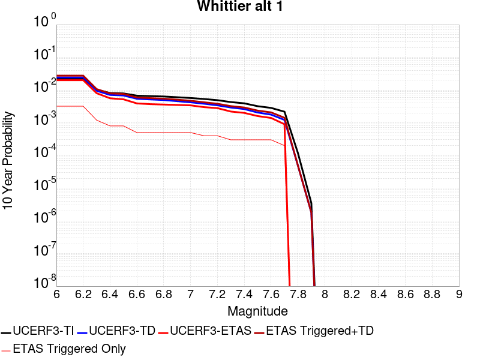 |

| Magnitude | 1 wk TI Prob | 1 wk TD Prob | 1 wk ETAS Prob | 1 wk ETAS/TD Gain | 1 wk ETAS Triggered+TD | 1 wk ETAS Triggered Only | 1 mo TI Prob | 1 mo TD Prob | 1 mo ETAS Prob | 1 mo ETAS/TD Gain | 1 mo ETAS Triggered+TD | 1 mo ETAS Triggered Only | 1 yr TI Prob | 1 yr TD Prob | 1 yr ETAS Prob | 1 yr ETAS/TD Gain | 1 yr ETAS Triggered+TD | 1 yr ETAS Triggered Only | 10 yr TI Prob | 10 yr TD Prob | 10 yr ETAS Prob | 10 yr ETAS/TD Gain | 10 yr ETAS Triggered+TD | 10 yr ETAS Triggered Only |
|-----|-----|-----|-----|-----|-----|-----|-----|-----|-----|-----|-----|-----|-----|-----|-----|-----|-----|-----|-----|-----|-----|-----|-----|-----|
| 6.0 | 4.2554693E-5 | 4.7270623E-5 | 0.0 | 0.0 | 4.7270623E-5 | 0.0 | 1.8236451E-4 | 2.0257448E-4 | 2.0E-4 | 0.9872912 | 4.0253397E-4 | 2.0E-4 | 0.002218027 | 0.0024638765 | 5.0E-4 | 0.20293225 | 0.0029626444 | 5.0E-4 | 0.02196019 | 0.024399554 | 0.0032 | 0.13114993 | 0.027521476 | 0.0032 |
| 6.1 | 4.2554693E-5 | 4.7270623E-5 | 0.0 | 0.0 | 4.7270623E-5 | 0.0 | 1.8236451E-4 | 2.0257448E-4 | 2.0E-4 | 0.9872912 | 4.0253397E-4 | 2.0E-4 | 0.002218027 | 0.0024638765 | 5.0E-4 | 0.20293225 | 0.0029626444 | 5.0E-4 | 0.02196019 | 0.024399554 | 0.0032 | 0.13114993 | 0.027521476 | 0.0032 |
| 6.2 | 4.2554693E-5 | 4.7270623E-5 | 0.0 | 0.0 | 4.7270623E-5 | 0.0 | 1.8236451E-4 | 2.0257448E-4 | 2.0E-4 | 0.9872912 | 4.0253397E-4 | 2.0E-4 | 0.002218027 | 0.0024638765 | 5.0E-4 | 0.20293225 | 0.0029626444 | 5.0E-4 | 0.02196019 | 0.024399554 | 0.0032 | 0.13114993 | 0.027521476 | 0.0032 |
| 6.3 | 1.9617712E-5 | 1.8278539E-5 | 0.0 | 0.0 | 1.8278539E-5 | 0.0 | 8.40732E-5 | 7.833435E-5 | 0.0 | 0.0 | 7.833435E-5 | 0.0 | 0.0010231105 | 9.533224E-4 | 1.0E-4 | 0.10489631 | 0.0010532271 | 1.0E-4 | 0.01018413 | 0.009495515 | 0.0012 | 0.12637544 | 0.010684121 | 0.0012 |
| 6.4 | 1.5611336E-5 | 1.3612679E-5 | 0.0 | 0.0 | 1.3612679E-5 | 0.0 | 6.690401E-5 | 5.833878E-5 | 0.0 | 0.0 | 5.833878E-5 | 0.0 | 8.142519E-4 | 7.100492E-4 | 1.0E-4 | 0.14083531 | 8.0997817E-4 | 1.0E-4 | 0.008112748 | 0.0070796683 | 8.0E-4 | 0.11299964 | 0.007874005 | 8.0E-4 |
| 6.5 | 1.5150166E-5 | 1.3109235E-5 | 0.0 | 0.0 | 1.3109235E-5 | 0.0 | 6.492767E-5 | 5.618126E-5 | 0.0 | 0.0 | 5.618126E-5 | 0.0 | 7.9020765E-4 | 6.8379805E-4 | 1.0E-4 | 0.14624201 | 7.8372966E-4 | 1.0E-4 | 0.007874036 | 0.0068187886 | 8.0E-4 | 0.11732289 | 0.0076133334 | 8.0E-4 |
| 6.6 | 1.295588E-5 | 1.0387536E-5 | 0.0 | 0.0 | 1.0387536E-5 | 0.0 | 5.552402E-5 | 4.4517266E-5 | 0.0 | 0.0 | 4.4517266E-5 | 0.0 | 6.7579525E-4 | 5.4186484E-4 | 1.0E-4 | 0.18454786 | 6.4181065E-4 | 1.0E-4 | 0.006737438 | 0.0054068887 | 5.0E-4 | 0.092474625 | 0.005904185 | 5.0E-4 |
| 6.7 | 1.2542085E-5 | 9.9059625E-6 | 0.0 | 0.0 | 9.9059625E-6 | 0.0 | 5.3750682E-5 | 4.2453445E-5 | 0.0 | 0.0 | 4.2453445E-5 | 0.0 | 6.542181E-4 | 5.1675E-4 | 1.0E-4 | 0.19351718 | 6.166983E-4 | 1.0E-4 | 0.006522954 | 0.005156937 | 5.0E-4 | 0.096956775 | 0.005654359 | 5.0E-4 |
| 6.8 | 1.2195878E-5 | 9.501777E-6 | 0.0 | 0.0 | 9.501777E-6 | 0.0 | 5.2267E-5 | 4.0721276E-5 | 0.0 | 0.0 | 4.0721276E-5 | 0.0 | 6.36165E-4 | 4.956706E-4 | 1.0E-4 | 0.20174688 | 5.9562107E-4 | 1.0E-4 | 0.0063434686 | 0.004946992 | 5.0E-4 | 0.10107152 | 0.0054445183 | 5.0E-4 |
| 6.9 | 1.1580298E-5 | 8.77887E-6 | 0.0 | 0.0 | 8.77887E-6 | 0.0 | 4.9628903E-5 | 3.7623195E-5 | 0.0 | 0.0 | 3.7623195E-5 | 0.0 | 6.040644E-4 | 4.579678E-4 | 1.0E-4 | 0.21835597 | 5.57922E-4 | 1.0E-4 | 0.00602425 | 0.004571536 | 5.0E-4 | 0.10937243 | 0.0050692502 | 5.0E-4 |
| 7.0 | 1.0964795E-5 | 8.089608E-6 | 0.0 | 0.0 | 8.089608E-6 | 0.0 | 4.6991136E-5 | 3.4669294E-5 | 0.0 | 0.0 | 3.4669294E-5 | 0.0 | 5.7196687E-4 | 4.2201846E-4 | 1.0E-4 | 0.23695646 | 5.2197627E-4 | 1.0E-4 | 0.0057049696 | 0.004213462 | 5.0E-4 | 0.11866727 | 0.004711355 | 5.0E-4 |
| 7.1 | 1.0230601E-5 | 7.331623E-6 | 0.0 | 0.0 | 7.331623E-6 | 0.0 | 4.3844695E-5 | 3.142087E-5 | 0.0 | 0.0 | 3.142087E-5 | 0.0 | 5.336784E-4 | 3.8248324E-4 | 0.0 | 0.0 | 3.8248324E-4 | 0.0 | 0.005323986 | 0.0038194344 | 4.0E-4 | 0.104727544 | 0.004217907 | 4.0E-4 |
| 7.2 | 9.40865E-6 | 6.5478125E-6 | 0.0 | 0.0 | 6.5478125E-6 | 0.0 | 4.032216E-5 | 2.8061759E-5 | 0.0 | 0.0 | 2.8061759E-5 | 0.0 | 4.908117E-4 | 3.4159957E-4 | 0.0 | 0.0 | 3.4159957E-4 | 0.0 | 0.0048972913 | 0.0034118628 | 4.0E-4 | 0.11723801 | 0.0038104982 | 4.0E-4 |
| 7.3 | 8.237384E-6 | 5.6016415E-6 | 0.0 | 0.0 | 5.6016415E-6 | 0.0 | 3.5302593E-5 | 2.400682E-5 | 0.0 | 0.0 | 2.400682E-5 | 0.0 | 4.2972428E-4 | 2.922449E-4 | 0.0 | 0.0 | 2.922449E-4 | 0.0 | 0.0042889426 | 0.002918923 | 3.0E-4 | 0.10277764 | 0.0032180473 | 3.0E-4 |
| 7.4 | 7.5316966E-6 | 5.0313497E-6 | 0.0 | 0.0 | 5.0313497E-6 | 0.0 | 3.2278298E-5 | 2.1562753E-5 | 0.0 | 0.0 | 2.1562753E-5 | 0.0 | 3.9291743E-4 | 2.6249592E-4 | 0.0 | 0.0 | 2.6249592E-4 | 0.0 | 0.0039222343 | 0.002621969 | 3.0E-4 | 0.114417836 | 0.0029211824 | 3.0E-4 |
| 7.5 | 6.149649E-6 | 3.9366464E-6 | 0.0 | 0.0 | 3.9366464E-6 | 0.0 | 2.6355372E-5 | 1.6871238E-5 | 0.0 | 0.0 | 1.6871238E-5 | 0.0 | 3.208294E-4 | 2.0538887E-4 | 0.0 | 0.0 | 2.0538887E-4 | 0.0 | 0.003203666 | 0.00205208 | 3.0E-4 | 0.14619315 | 0.0023514642 | 3.0E-4 |
| 7.6 | 5.457711E-6 | 3.3978574E-6 | 0.0 | 0.0 | 3.3978574E-6 | 0.0 | 2.338998E-5 | 1.4562169E-5 | 0.0 | 0.0 | 1.4562169E-5 | 0.0 | 2.8473578E-4 | 1.772808E-4 | 0.0 | 0.0 | 1.772808E-4 | 0.0 | 0.0028437122 | 0.0017714747 | 3.0E-4 | 0.16935043 | 0.0020709431 | 3.0E-4 |
| 7.7 | 4.1676276E-6 | 2.3351286E-6 | 0.0 | 0.0 | 2.3351286E-6 | 0.0 | 1.7861139E-5 | 1.00076595E-5 | 0.0 | 0.0 | 1.00076595E-5 | 0.0 | 2.1743766E-4 | 1.2183719E-4 | 0.0 | 0.0 | 1.2183719E-4 | 0.0 | 0.0021722503 | 0.0012177771 | 2.0E-4 | 0.16423367 | 0.0014175335 | 2.0E-4 |
| 7.8 | 2.2692414E-7 | 9.391798E-8 | 0.0 | 0.0 | 9.391798E-8 | 0.0 | 9.725317E-7 | 4.0250558E-7 | 0.0 | 0.0 | 4.0250558E-7 | 0.0 | 1.1840509E-5 | 4.900498E-6 | 0.0 | 0.0 | 4.900498E-6 | 0.0 | 1.1839878E-4 | 4.9004226E-5 | 0.0 | 0.0 | 4.9004226E-5 | 0.0 |
| 7.9 | 6.676829E-9 | 3.4416097E-9 | 0.0 | 0.0 | 3.4416097E-9 | 0.0 | 2.861498E-8 | 1.4749755E-8 | 0.0 | 0.0 | 1.4749755E-8 | 0.0 | 3.4838732E-7 | 1.7957827E-7 | 0.0 | 0.0 | 1.7957827E-7 | 0.0 | 3.4838679E-6 | 1.7957813E-6 | 0.0 | 0.0 | 1.7957813E-6 | 0.0 |

## Gravel Hills-Harper Lk
*[(top)](#table-of-contents)*

| 1 Week | 1 Month | 1 Year | 10 Year |
|-----|-----|-----|-----|
| 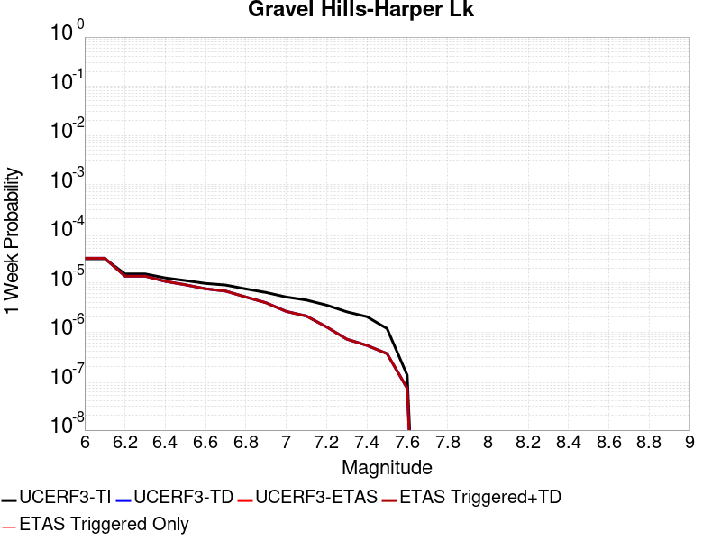 | 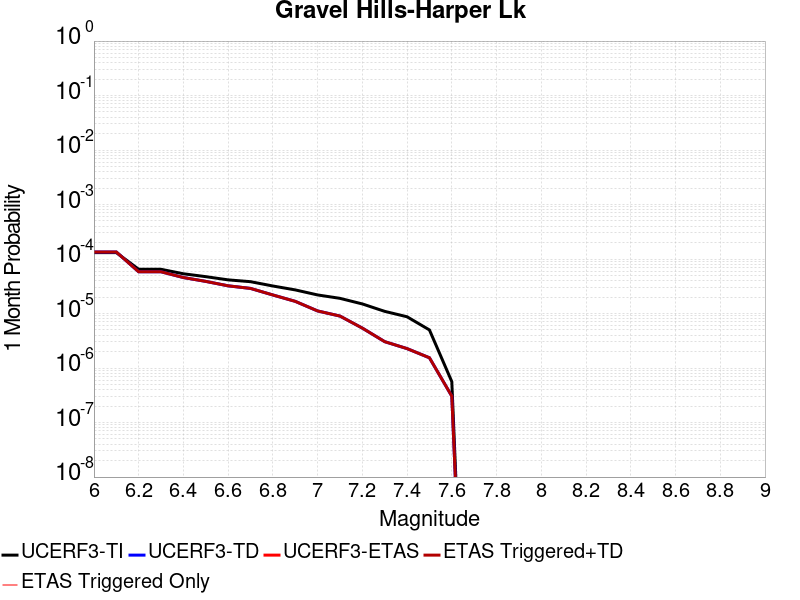 | 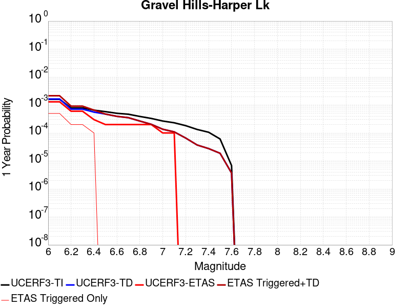 | 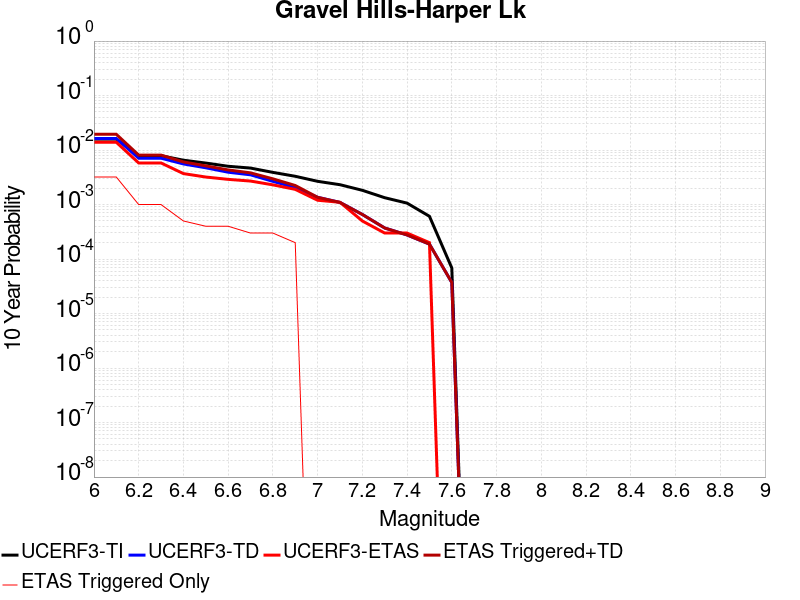 |

| Magnitude | 1 wk TI Prob | 1 wk TD Prob | 1 wk ETAS Prob | 1 wk ETAS/TD Gain | 1 wk ETAS Triggered+TD | 1 wk ETAS Triggered Only | 1 mo TI Prob | 1 mo TD Prob | 1 mo ETAS Prob | 1 mo ETAS/TD Gain | 1 mo ETAS Triggered+TD | 1 mo ETAS Triggered Only | 1 yr TI Prob | 1 yr TD Prob | 1 yr ETAS Prob | 1 yr ETAS/TD Gain | 1 yr ETAS Triggered+TD | 1 yr ETAS Triggered Only | 10 yr TI Prob | 10 yr TD Prob | 10 yr ETAS Prob | 10 yr ETAS/TD Gain | 10 yr ETAS Triggered+TD | 10 yr ETAS Triggered Only |
|-----|-----|-----|-----|-----|-----|-----|-----|-----|-----|-----|-----|-----|-----|-----|-----|-----|-----|-----|-----|-----|-----|-----|-----|-----|
| 6.0 | 3.0679566E-5 | 3.147248E-5 | 0.0 | 0.0 | 3.147248E-5 | 0.0 | 1.3147724E-4 | 1.348763E-4 | 0.0 | 0.0 | 1.348763E-4 | 0.0 | 0.0015995599 | 0.0016410992 | 5.0E-4 | 0.30467382 | 0.0021402787 | 5.0E-4 | 0.015880952 | 0.016311385 | 0.0032 | 0.196182 | 0.019459188 | 0.0032 |
| 6.1 | 3.0679566E-5 | 3.147248E-5 | 0.0 | 0.0 | 3.147248E-5 | 0.0 | 1.3147724E-4 | 1.348763E-4 | 0.0 | 0.0 | 1.348763E-4 | 0.0 | 0.0015995599 | 0.0016410992 | 5.0E-4 | 0.30467382 | 0.0021402787 | 5.0E-4 | 0.015880952 | 0.016311385 | 0.0032 | 0.196182 | 0.019459188 | 0.0032 |
| 6.2 | 1.514536E-5 | 1.3637574E-5 | 0.0 | 0.0 | 1.3637574E-5 | 0.0 | 6.490707E-5 | 5.8445505E-5 | 0.0 | 0.0 | 5.8445505E-5 | 0.0 | 7.8995706E-4 | 7.1135355E-4 | 2.0E-4 | 0.28115413 | 9.112113E-4 | 2.0E-4 | 0.007871548 | 0.0070919674 | 0.001 | 0.14100459 | 0.0080848755 | 0.001 |
| 6.3 | 1.514536E-5 | 1.3637574E-5 | 0.0 | 0.0 | 1.3637574E-5 | 0.0 | 6.490707E-5 | 5.8445505E-5 | 0.0 | 0.0 | 5.8445505E-5 | 0.0 | 7.8995706E-4 | 7.1135355E-4 | 2.0E-4 | 0.28115413 | 9.112113E-4 | 2.0E-4 | 0.007871548 | 0.0070919674 | 0.001 | 0.14100459 | 0.0080848755 | 0.001 |
| 6.4 | 1.2532521E-5 | 1.069128E-5 | 0.0 | 0.0 | 1.069128E-5 | 0.0 | 5.37097E-5 | 4.5819E-5 | 0.0 | 0.0 | 4.5819E-5 | 0.0 | 6.537194E-4 | 5.5770937E-4 | 1.0E-4 | 0.17930485 | 6.576536E-4 | 1.0E-4 | 0.0065179965 | 0.005563688 | 5.0E-4 | 0.08986845 | 0.006060906 | 5.0E-4 |
| 6.5 | 1.1094058E-5 | 9.084866E-6 | 0.0 | 0.0 | 9.084866E-6 | 0.0 | 4.7545094E-5 | 3.8934584E-5 | 0.0 | 0.0 | 3.8934584E-5 | 0.0 | 5.787078E-4 | 4.7392948E-4 | 0.0 | 0.0 | 4.7392948E-4 | 0.0 | 0.0057720304 | 0.0047295955 | 4.0E-4 | 0.084573835 | 0.0051277033 | 4.0E-4 |
| 6.6 | 9.688328E-6 | 7.5325643E-6 | 0.0 | 0.0 | 7.5325643E-6 | 0.0 | 4.1520743E-5 | 3.228203E-5 | 0.0 | 0.0 | 3.228203E-5 | 0.0 | 5.053978E-4 | 3.9296542E-4 | 0.0 | 0.0 | 3.9296542E-4 | 0.0 | 0.0050424994 | 0.003922962 | 4.0E-4 | 0.101963766 | 0.004321393 | 4.0E-4 |
| 6.7 | 8.974824E-6 | 6.750126E-6 | 0.0 | 0.0 | 6.750126E-6 | 0.0 | 3.8462964E-5 | 2.8928804E-5 | 0.0 | 0.0 | 2.8928804E-5 | 0.0 | 4.6818596E-4 | 3.5215347E-4 | 0.0 | 0.0 | 3.5215347E-4 | 0.0 | 0.004672008 | 0.0035161753 | 3.0E-4 | 0.08531997 | 0.0038151206 | 3.0E-4 |
| 6.8 | 7.4780046E-6 | 5.1165994E-6 | 0.0 | 0.0 | 5.1165994E-6 | 0.0 | 3.20482E-5 | 2.1928106E-5 | 0.0 | 0.0 | 2.1928106E-5 | 0.0 | 3.9011694E-4 | 2.669434E-4 | 0.0 | 0.0 | 2.669434E-4 | 0.0 | 0.0038943281 | 0.0026663656 | 3.0E-4 | 0.11251271 | 0.0029655655 | 3.0E-4 |
| 6.9 | 6.3409307E-6 | 3.907706E-6 | 0.0 | 0.0 | 3.907706E-6 | 0.0 | 2.7175134E-5 | 1.6747208E-5 | 0.0 | 0.0 | 1.6747208E-5 | 0.0 | 3.3080703E-4 | 2.0387917E-4 | 0.0 | 0.0 | 2.0387917E-4 | 0.0 | 0.0033031502 | 0.0020370195 | 2.0E-4 | 0.09818266 | 0.0022366121 | 2.0E-4 |
| 7.0 | 5.1239335E-6 | 2.6058547E-6 | 0.0 | 0.0 | 2.6058547E-6 | 0.0 | 2.195953E-5 | 1.1167902E-5 | 0.0 | 0.0 | 1.1167902E-5 | 0.0 | 2.6732447E-4 | 1.3596097E-4 | 0.0 | 0.0 | 1.3596097E-4 | 0.0 | 0.0026700313 | 0.0013588032 | 0.0 | 0.0 | 0.0013588032 | 0.0 |
| 7.1 | 4.438899E-6 | 2.0984419E-6 | 0.0 | 0.0 | 2.0984419E-6 | 0.0 | 1.9023713E-5 | 8.993293E-6 | 0.0 | 0.0 | 8.993293E-6 | 0.0 | 2.315891E-4 | 1.0948806E-4 | 0.0 | 0.0 | 1.0948806E-4 | 0.0 | 0.002313479 | 0.001094363 | 0.0 | 0.0 | 0.001094363 | 0.0 |
| 7.2 | 3.50367E-6 | 1.2614724E-6 | 0.0 | 0.0 | 1.2614724E-6 | 0.0 | 1.5015643E-5 | 5.4063E-6 | 0.0 | 0.0 | 5.4063E-6 | 0.0 | 1.8280011E-4 | 6.58198E-5 | 0.0 | 0.0 | 6.58198E-5 | 0.0 | 0.0018264982 | 6.5801124E-4 | 0.0 | 0.0 | 6.5801124E-4 | 0.0 |
| 7.3 | 2.561638E-6 | 7.117863E-7 | 0.0 | 0.0 | 7.117863E-7 | 0.0 | 1.0978401E-5 | 3.0505093E-6 | 0.0 | 0.0 | 3.0505093E-6 | 0.0 | 1.3365384E-4 | 3.713934E-5 | 0.0 | 0.0 | 3.713934E-5 | 0.0 | 0.0013357349 | 3.7133333E-4 | 0.0 | 0.0 | 3.7133333E-4 | 0.0 |
| 7.4 | 2.0368864E-6 | 5.303765E-7 | 0.0 | 0.0 | 5.303765E-7 | 0.0 | 8.729483E-6 | 2.2730403E-6 | 0.0 | 0.0 | 2.2730403E-6 | 0.0 | 1.06276275E-4 | 2.767392E-5 | 0.0 | 0.0 | 2.767392E-5 | 0.0 | 0.0010622547 | 2.7670525E-4 | 0.0 | 0.0 | 2.7670525E-4 | 0.0 |
| 7.5 | 1.1681728E-6 | 3.6024338E-7 | 0.0 | 0.0 | 3.6024338E-7 | 0.0 | 5.0064455E-6 | 1.5438993E-6 | 0.0 | 0.0 | 1.5438993E-6 | 0.0 | 6.0951766E-5 | 1.8796816E-5 | 0.0 | 0.0 | 1.8796816E-5 | 0.0 | 6.093505E-4 | 1.8795273E-4 | 0.0 | 0.0 | 1.8795273E-4 | 0.0 |
| 7.6 | 1.3154387E-7 | 7.1193504E-8 | 0.0 | 0.0 | 7.1193504E-8 | 0.0 | 5.6375933E-7 | 3.0511498E-7 | 0.0 | 0.0 | 3.0511498E-7 | 0.0 | 6.863748E-6 | 3.7147702E-6 | 0.0 | 0.0 | 3.7147702E-6 | 0.0 | 6.863536E-5 | 3.7147238E-5 | 0.0 | 0.0 | 3.7147238E-5 | 0.0 |

## Maacama 2011 CFM
*[(top)](#table-of-contents)*

| 1 Week | 1 Month | 1 Year | 10 Year |
|-----|-----|-----|-----|
|  |  |  | 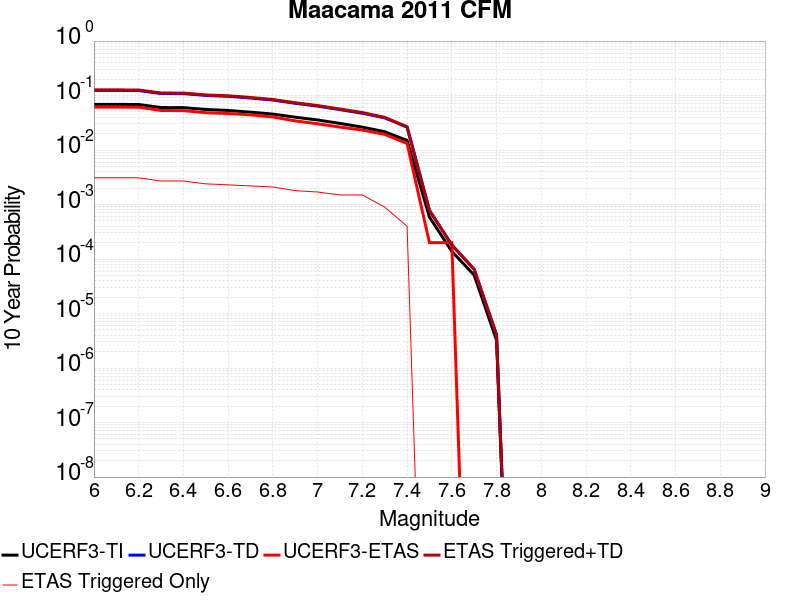 |

| Magnitude | 1 wk TI Prob | 1 wk TD Prob | 1 wk ETAS Prob | 1 wk ETAS/TD Gain | 1 wk ETAS Triggered+TD | 1 wk ETAS Triggered Only | 1 mo TI Prob | 1 mo TD Prob | 1 mo ETAS Prob | 1 mo ETAS/TD Gain | 1 mo ETAS Triggered+TD | 1 mo ETAS Triggered Only | 1 yr TI Prob | 1 yr TD Prob | 1 yr ETAS Prob | 1 yr ETAS/TD Gain | 1 yr ETAS Triggered+TD | 1 yr ETAS Triggered Only | 10 yr TI Prob | 10 yr TD Prob | 10 yr ETAS Prob | 10 yr ETAS/TD Gain | 10 yr ETAS Triggered+TD | 10 yr ETAS Triggered Only |
|-----|-----|-----|-----|-----|-----|-----|-----|-----|-----|-----|-----|-----|-----|-----|-----|-----|-----|-----|-----|-----|-----|-----|-----|-----|
| 6.0 | 1.368203E-4 | 2.582179E-4 | 0.0 | 0.0 | 2.582179E-4 | 0.0 | 5.862409E-4 | 0.0011060815 | 0.0 | 0.0 | 0.0011060815 | 0.0 | 0.0071141496 | 0.013366065 | 4.0E-4 | 0.029926535 | 0.0137607185 | 4.0E-4 | 0.06890667 | 0.1243228 | 0.0031 | 0.024935087 | 0.1270374 | 0.0031 |
| 6.1 | 1.368203E-4 | 2.582179E-4 | 0.0 | 0.0 | 2.582179E-4 | 0.0 | 5.862409E-4 | 0.0011060815 | 0.0 | 0.0 | 0.0011060815 | 0.0 | 0.0071141496 | 0.013366065 | 4.0E-4 | 0.029926535 | 0.0137607185 | 4.0E-4 | 0.06890667 | 0.1243228 | 0.0031 | 0.024935087 | 0.1270374 | 0.0031 |
| 6.2 | 1.360743E-4 | 2.5696383E-4 | 0.0 | 0.0 | 2.5696383E-4 | 0.0 | 5.8304524E-4 | 0.0011007119 | 0.0 | 0.0 | 0.0011007119 | 0.0 | 0.007075496 | 0.013301563 | 4.0E-4 | 0.030071653 | 0.013696243 | 4.0E-4 | 0.06854413 | 0.12375683 | 0.0031 | 0.025049122 | 0.12647319 | 0.0031 |
| 6.3 | 1.1917239E-4 | 2.2389033E-4 | 0.0 | 0.0 | 2.2389033E-4 | 0.0 | 5.1063887E-4 | 9.5910195E-4 | 0.0 | 0.0 | 9.5910195E-4 | 0.0 | 0.0061993203 | 0.011601979 | 4.0E-4 | 0.034476876 | 0.011997338 | 4.0E-4 | 0.060292065 | 0.1089707 | 0.0027 | 0.0247773 | 0.11137649 | 0.0027 |
| 6.4 | 1.1859289E-4 | 2.2292539E-4 | 0.0 | 0.0 | 2.2292539E-4 | 0.0 | 5.0815626E-4 | 9.549698E-4 | 0.0 | 0.0 | 9.549698E-4 | 0.0 | 0.006169266 | 0.011552259 | 4.0E-4 | 0.034625262 | 0.011947638 | 4.0E-4 | 0.06000784 | 0.108527265 | 0.0027 | 0.024878541 | 0.11093424 | 0.0027 |
| 6.5 | 1.09512424E-4 | 2.0544916E-4 | 0.0 | 0.0 | 2.0544916E-4 | 0.0 | 4.6925453E-4 | 8.8015577E-4 | 0.0 | 0.0 | 8.8015577E-4 | 0.0 | 0.005698218 | 0.010653216 | 2.0E-4 | 0.018773671 | 0.010851086 | 2.0E-4 | 0.055543028 | 0.10061594 | 0.0024 | 0.023853078 | 0.10277446 | 0.0024 |
| 6.6 | 1.0502928E-4 | 1.970169E-4 | 0.0 | 0.0 | 1.970169E-4 | 0.0 | 4.500478E-4 | 8.4405387E-4 | 0.0 | 0.0 | 8.4405387E-4 | 0.0 | 0.0054655746 | 0.010219051 | 2.0E-4 | 0.01957129 | 0.010417007 | 2.0E-4 | 0.053330887 | 0.0967666 | 0.0023 | 0.023768533 | 0.09884403 | 0.0023 |
| 6.7 | 9.739358E-5 | 1.8284796E-4 | 0.0 | 0.0 | 1.8284796E-4 | 0.0 | 4.173343E-4 | 7.833676E-4 | 0.0 | 0.0 | 7.833676E-4 | 0.0 | 0.0050692135 | 0.009488595 | 2.0E-4 | 0.021077937 | 0.009686697 | 2.0E-4 | 0.049551267 | 0.090235926 | 0.0022 | 0.024380533 | 0.09223741 | 0.0022 |
| 6.8 | 8.969524E-5 | 1.6681655E-4 | 0.0 | 0.0 | 1.6681655E-4 | 0.0 | 3.8435153E-4 | 7.147166E-4 | 0.0 | 0.0 | 7.147166E-4 | 0.0 | 0.0046694432 | 0.008661341 | 2.0E-4 | 0.023091111 | 0.008859609 | 2.0E-4 | 0.045725387 | 0.082760766 | 0.0021 | 0.025374342 | 0.08468697 | 0.0021 |
| 6.9 | 7.838291E-5 | 1.4439644E-4 | 0.0 | 0.0 | 1.4439644E-4 | 0.0 | 3.358835E-4 | 6.186792E-4 | 0.0 | 0.0 | 6.186792E-4 | 0.0 | 0.0040817154 | 0.0075025624 | 2.0E-4 | 0.026657559 | 0.0077010617 | 2.0E-4 | 0.04007554 | 0.07215032 | 0.0018 | 0.024947915 | 0.07382045 | 0.0018 |
| 7.0 | 6.961957E-5 | 1.2726923E-4 | 0.0 | 0.0 | 1.2726923E-4 | 0.0 | 2.9833548E-4 | 5.453183E-4 | 0.0 | 0.0 | 5.453183E-4 | 0.0 | 0.0036261857 | 0.0066164536 | 2.0E-4 | 0.030227672 | 0.0068151304 | 2.0E-4 | 0.035675827 | 0.06396059 | 0.0017 | 0.026578868 | 0.065551855 | 0.0017 |
| 7.1 | 5.999398E-5 | 1.0922018E-4 | 0.0 | 0.0 | 1.0922018E-4 | 0.0 | 2.570917E-4 | 4.6799766E-4 | 0.0 | 0.0 | 4.6799766E-4 | 0.0 | 0.0031255994 | 0.005681464 | 2.0E-4 | 0.035202194 | 0.005880328 | 2.0E-4 | 0.030820016 | 0.055218738 | 0.0015 | 0.027164692 | 0.05663591 | 0.0015 |
| 7.2 | 5.116532E-5 | 9.320132E-5 | 0.0 | 0.0 | 9.320132E-5 | 0.0 | 2.1926152E-4 | 3.9937044E-4 | 0.0 | 0.0 | 3.9937044E-4 | 0.0 | 0.002666241 | 0.004850771 | 2.0E-4 | 0.04123056 | 0.005049801 | 2.0E-4 | 0.026344774 | 0.04737473 | 0.0015 | 0.031662453 | 0.048803665 | 0.0015 |
| 7.3 | 4.2087835E-5 | 7.6289485E-5 | 0.0 | 0.0 | 7.6289485E-5 | 0.0 | 1.8036396E-4 | 3.2691236E-4 | 0.0 | 0.0 | 3.2691236E-4 | 0.0 | 0.0021937196 | 0.0039724344 | 0.0 | 0.0 | 0.0039724344 | 0.0 | 0.0217219 | 0.03896335 | 9.0E-4 | 0.023098629 | 0.039828286 | 9.0E-4 |
| 7.4 | 2.8991652E-5 | 5.1240204E-5 | 0.0 | 0.0 | 5.1240204E-5 | 0.0 | 1.2424402E-4 | 2.1958313E-4 | 0.0 | 0.0 | 2.1958313E-4 | 0.0 | 0.0015116213 | 0.0026701 | 0.0 | 0.0 | 0.0026701 | 0.0 | 0.015013801 | 0.026370278 | 4.0E-4 | 0.015168592 | 0.02675973 | 4.0E-4 |
| 7.5 | 1.1292299E-6 | 1.4954974E-6 | 0.0 | 0.0 | 1.4954974E-6 | 0.0 | 4.8395473E-6 | 6.409266E-6 | 0.0 | 0.0 | 6.409266E-6 | 0.0 | 5.8919897E-5 | 7.803127E-5 | 0.0 | 0.0 | 7.803127E-5 | 0.0 | 5.890428E-4 | 7.8074355E-4 | 0.0 | 0.0 | 7.8074355E-4 | 0.0 |
| 7.6 | 2.6535366E-7 | 3.469931E-7 | 0.0 | 0.0 | 3.469931E-7 | 0.0 | 1.1372296E-6 | 1.4871124E-6 | 0.0 | 0.0 | 1.4871124E-6 | 0.0 | 1.3845682E-5 | 1.8105444E-5 | 0.0 | 0.0 | 1.8105444E-5 | 0.0 | 1.3844819E-4 | 1.8157646E-4 | 0.0 | 0.0 | 1.8157646E-4 | 0.0 |
| 7.7 | 9.727789E-8 | 1.2280148E-7 | 0.0 | 0.0 | 1.2280148E-7 | 0.0 | 4.1690518E-7 | 5.2629196E-7 | 0.0 | 0.0 | 5.2629196E-7 | 0.0 | 5.0758085E-6 | 6.4075857E-6 | 0.0 | 0.0 | 6.4075857E-6 | 0.0 | 5.0756928E-5 | 6.4450345E-5 | 0.0 | 0.0 | 6.4450345E-5 | 0.0 |
| 7.8 | 6.1939325E-9 | 7.699782E-9 | 0.0 | 0.0 | 7.699782E-9 | 0.0 | 2.6545425E-8 | 3.2999065E-8 | 0.0 | 0.0 | 3.2999065E-8 | 0.0 | 3.231905E-7 | 4.0176354E-7 | 0.0 | 0.0 | 4.0176354E-7 | 0.0 | 3.2319003E-6 | 4.053493E-6 | 0.0 | 0.0 | 4.053493E-6 | 0.0 |

## Santa Ynez (West)
*[(top)](#table-of-contents)*

| 1 Week | 1 Month | 1 Year | 10 Year |
|-----|-----|-----|-----|
|  | 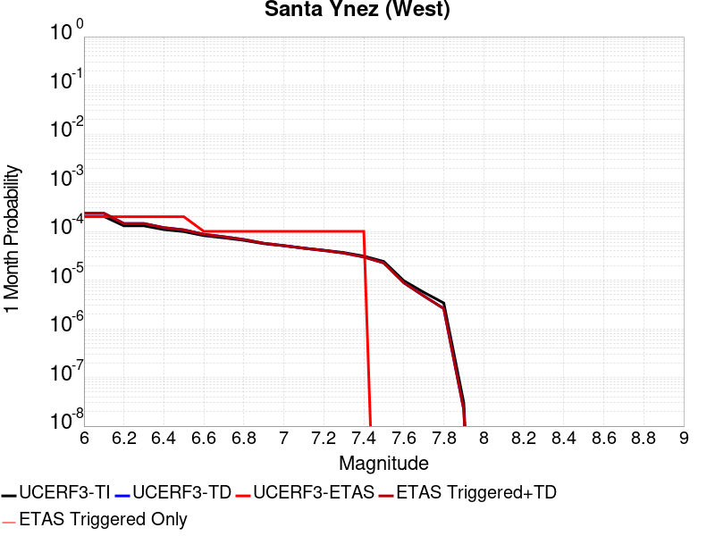 |  | 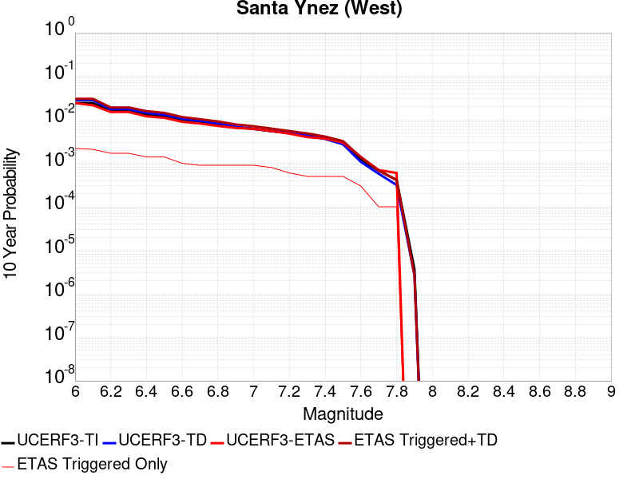 |

| Magnitude | 1 wk TI Prob | 1 wk TD Prob | 1 wk ETAS Prob | 1 wk ETAS/TD Gain | 1 wk ETAS Triggered+TD | 1 wk ETAS Triggered Only | 1 mo TI Prob | 1 mo TD Prob | 1 mo ETAS Prob | 1 mo ETAS/TD Gain | 1 mo ETAS Triggered+TD | 1 mo ETAS Triggered Only | 1 yr TI Prob | 1 yr TD Prob | 1 yr ETAS Prob | 1 yr ETAS/TD Gain | 1 yr ETAS Triggered+TD | 1 yr ETAS Triggered Only | 10 yr TI Prob | 10 yr TD Prob | 10 yr ETAS Prob | 10 yr ETAS/TD Gain | 10 yr ETAS Triggered+TD | 10 yr ETAS Triggered Only |
|-----|-----|-----|-----|-----|-----|-----|-----|-----|-----|-----|-----|-----|-----|-----|-----|-----|-----|-----|-----|-----|-----|-----|-----|-----|
| 6.0 | 4.7352758E-5 | 5.49924E-5 | 0.0 | 0.0 | 5.49924E-5 | 0.0 | 2.0292461E-4 | 2.3566207E-4 | 0.0 | 0.0 | 2.3566207E-4 | 0.0 | 0.0024678076 | 0.0028656805 | 5.0E-4 | 0.17447862 | 0.0033642477 | 5.0E-4 | 0.024405818 | 0.028315386 | 0.0022 | 0.07769627 | 0.030453091 | 0.0022 |
| 6.1 | 4.7352758E-5 | 5.49924E-5 | 0.0 | 0.0 | 5.49924E-5 | 0.0 | 2.0292461E-4 | 2.3566207E-4 | 0.0 | 0.0 | 2.3566207E-4 | 0.0 | 0.0024678076 | 0.0028656805 | 5.0E-4 | 0.17447862 | 0.0033642477 | 5.0E-4 | 0.024405818 | 0.028315386 | 0.0021 | 0.07416463 | 0.030355923 | 0.0021 |
| 6.2 | 3.0415853E-5 | 3.3936118E-5 | 0.0 | 0.0 | 3.3936118E-5 | 0.0 | 1.3034715E-4 | 1.4543258E-4 | 0.0 | 0.0 | 1.4543258E-4 | 0.0 | 0.0015858212 | 0.001769238 | 2.0E-4 | 0.11304302 | 0.0019688841 | 2.0E-4 | 0.015745522 | 0.017555472 | 0.0017 | 0.096835904 | 0.019225627 | 0.0017 |
| 6.3 | 3.0415853E-5 | 3.3936118E-5 | 0.0 | 0.0 | 3.3936118E-5 | 0.0 | 1.3034715E-4 | 1.4543258E-4 | 0.0 | 0.0 | 1.4543258E-4 | 0.0 | 0.0015858212 | 0.001769238 | 2.0E-4 | 0.11304302 | 0.0019688841 | 2.0E-4 | 0.015745522 | 0.017555472 | 0.0017 | 0.096835904 | 0.019225627 | 0.0017 |
| 6.4 | 2.5452082E-5 | 2.7920809E-5 | 0.0 | 0.0 | 2.7920809E-5 | 0.0 | 1.09075794E-4 | 1.19655204E-4 | 0.0 | 0.0 | 1.19655204E-4 | 0.0 | 0.0013271887 | 0.0014558476 | 1.0E-4 | 0.068688504 | 0.0015557021 | 1.0E-4 | 0.013192902 | 0.014465272 | 0.0014 | 0.096783526 | 0.015845021 | 0.0014 |
| 6.5 | 2.3143784E-5 | 2.513543E-5 | 0.0 | 0.0 | 2.513543E-5 | 0.0 | 9.9183875E-5 | 1.0771891E-4 | 0.0 | 0.0 | 1.0771891E-4 | 0.0 | 0.0012068948 | 0.0013107033 | 1.0E-4 | 0.076294914 | 0.0014105722 | 1.0E-4 | 0.012003611 | 0.013031397 | 0.0014 | 0.10743284 | 0.014413153 | 0.0014 |
| 6.6 | 1.9118515E-5 | 2.0359706E-5 | 0.0 | 0.0 | 2.0359706E-5 | 0.0 | 8.193392E-5 | 8.7253014E-5 | 0.0 | 0.0 | 8.7253014E-5 | 0.0 | 9.97089E-4 | 0.0010617956 | 1.0E-4 | 0.094180085 | 0.0011616894 | 1.0E-4 | 0.00992627 | 0.010568136 | 0.001 | 0.094624065 | 0.011557568 | 0.001 |
| 6.7 | 1.722807E-5 | 1.8150944E-5 | 0.0 | 0.0 | 1.8150944E-5 | 0.0 | 7.3832496E-5 | 7.7787474E-5 | 0.0 | 0.0 | 7.7787474E-5 | 0.0 | 8.985399E-4 | 9.4665657E-4 | 0.0 | 0.0 | 9.4665657E-4 | 0.0 | 0.008949154 | 0.009426886 | 9.0E-4 | 0.095471606 | 0.010318402 | 9.0E-4 |
| 6.8 | 1.5317364E-5 | 1.5930336E-5 | 0.0 | 0.0 | 1.5930336E-5 | 0.0 | 6.56442E-5 | 6.827111E-5 | 0.0 | 0.0 | 6.827111E-5 | 0.0 | 7.98925E-4 | 8.3088805E-4 | 0.0 | 0.0 | 8.3088805E-4 | 0.0 | 0.007960589 | 0.008278303 | 9.0E-4 | 0.10871793 | 0.009170853 | 9.0E-4 |
| 6.9 | 1.3071226E-5 | 1.3332635E-5 | 0.0 | 0.0 | 1.3332635E-5 | 0.0 | 5.6018336E-5 | 5.7138626E-5 | 0.0 | 0.0 | 5.7138626E-5 | 0.0 | 6.8180985E-4 | 6.9544296E-4 | 0.0 | 0.0 | 6.9544296E-4 | 0.0 | 0.0067972173 | 0.0069329273 | 9.0E-4 | 0.1298153 | 0.007826688 | 9.0E-4 |
| 7.0 | 1.1836986E-5 | 1.193541E-5 | 0.0 | 0.0 | 1.193541E-5 | 0.0 | 5.0728955E-5 | 5.1150764E-5 | 0.0 | 0.0 | 5.1150764E-5 | 0.0 | 6.1745E-4 | 6.225843E-4 | 0.0 | 0.0 | 6.225843E-4 | 0.0 | 0.006157372 | 0.006208594 | 9.0E-4 | 0.14496036 | 0.0071030064 | 9.0E-4 |
| 7.1 | 1.0597169E-5 | 1.0544478E-5 | 0.0 | 0.0 | 1.0544478E-5 | 0.0 | 4.541565E-5 | 4.518984E-5 | 0.0 | 0.0 | 4.518984E-5 | 0.0 | 5.5279525E-4 | 5.5004854E-4 | 0.0 | 0.0 | 5.5004854E-4 | 0.0 | 0.0055142213 | 0.0054870024 | 8.0E-4 | 0.1457991 | 0.0062826127 | 8.0E-4 |
| 7.2 | 9.59113E-6 | 9.461248E-6 | 0.0 | 0.0 | 9.461248E-6 | 0.0 | 4.11042E-5 | 4.054758E-5 | 0.0 | 0.0 | 4.054758E-5 | 0.0 | 5.0032866E-4 | 4.93556E-4 | 0.0 | 0.0 | 4.93556E-4 | 0.0 | 0.004992037 | 0.0049247174 | 6.0E-4 | 0.1218344 | 0.0055217627 | 6.0E-4 |
| 7.3 | 8.586084E-6 | 8.381521E-6 | 0.0 | 0.0 | 8.381521E-6 | 0.0 | 3.679698E-5 | 3.5920315E-5 | 0.0 | 0.0 | 3.5920315E-5 | 0.0 | 4.4791115E-4 | 4.372431E-4 | 0.0 | 0.0 | 4.372431E-4 | 0.0 | 0.004470094 | 0.0043639396 | 5.0E-4 | 0.11457537 | 0.0048617576 | 5.0E-4 |
| 7.4 | 7.2622997E-6 | 6.953241E-6 | 0.0 | 0.0 | 6.953241E-6 | 0.0 | 3.112377E-5 | 2.979927E-5 | 0.0 | 0.0 | 2.979927E-5 | 0.0 | 3.78866E-4 | 3.6274668E-4 | 0.0 | 0.0 | 3.6274668E-4 | 0.0 | 0.0037822074 | 0.0036216462 | 5.0E-4 | 0.13805877 | 0.0041198353 | 5.0E-4 |
| 7.5 | 5.627296E-6 | 5.2526993E-6 | 0.0 | 0.0 | 5.2526993E-6 | 0.0 | 2.411676E-5 | 2.2511378E-5 | 0.0 | 0.0 | 2.2511378E-5 | 0.0 | 2.9358198E-4 | 2.7404228E-4 | 0.0 | 0.0 | 2.7404228E-4 | 0.0 | 0.0029319443 | 0.0027371154 | 5.0E-4 | 0.18267407 | 0.0032357469 | 5.0E-4 |
| 7.6 | 2.265244E-6 | 2.0611435E-6 | 0.0 | 0.0 | 2.0611435E-6 | 0.0 | 9.708152E-6 | 8.833443E-6 | 0.0 | 0.0 | 8.833443E-6 | 0.0 | 1.18190335E-4 | 1.0754194E-4 | 0.0 | 0.0 | 1.0754194E-4 | 0.0 | 0.001181275 | 0.0010749076 | 3.0E-4 | 0.27909374 | 0.0013745852 | 3.0E-4 |
| 7.7 | 1.3099874E-6 | 1.1017686E-6 | 0.0 | 0.0 | 1.1017686E-6 | 0.0 | 5.61422E-6 | 4.721857E-6 | 0.0 | 0.0 | 4.721857E-6 | 0.0 | 6.8350986E-5 | 5.7487116E-5 | 0.0 | 0.0 | 5.7487116E-5 | 0.0 | 6.832996E-4 | 5.747248E-4 | 1.0E-4 | 0.17399631 | 6.7466736E-4 | 1.0E-4 |
| 7.8 | 7.903951E-7 | 6.07184E-7 | 0.0 | 0.0 | 6.07184E-7 | 0.0 | 3.3874032E-6 | 2.6022149E-6 | 0.0 | 0.0 | 2.6022149E-6 | 0.0 | 4.1240855E-5 | 3.1681517E-5 | 0.0 | 0.0 | 3.1681517E-5 | 0.0 | 4.12332E-4 | 3.1677133E-4 | 1.0E-4 | 0.31568512 | 4.1673967E-4 | 1.0E-4 |
| 7.9 | 7.0753297E-9 | 5.0903286E-9 | 0.0 | 0.0 | 5.0903286E-9 | 0.0 | 3.032284E-8 | 2.1815694E-8 | 0.0 | 0.0 | 2.1815694E-8 | 0.0 | 3.6918053E-7 | 2.6560605E-7 | 0.0 | 0.0 | 2.6560605E-7 | 0.0 | 3.691799E-6 | 2.6560583E-6 | 0.0 | 0.0 | 2.6560583E-6 | 0.0 |

## Sargent 2011 CFM
*[(top)](#table-of-contents)*

| 1 Week | 1 Month | 1 Year | 10 Year |
|-----|-----|-----|-----|
|  |  |  |  |

| Magnitude | 1 wk TI Prob | 1 wk TD Prob | 1 wk ETAS Prob | 1 wk ETAS/TD Gain | 1 wk ETAS Triggered+TD | 1 wk ETAS Triggered Only | 1 mo TI Prob | 1 mo TD Prob | 1 mo ETAS Prob | 1 mo ETAS/TD Gain | 1 mo ETAS Triggered+TD | 1 mo ETAS Triggered Only | 1 yr TI Prob | 1 yr TD Prob | 1 yr ETAS Prob | 1 yr ETAS/TD Gain | 1 yr ETAS Triggered+TD | 1 yr ETAS Triggered Only | 10 yr TI Prob | 10 yr TD Prob | 10 yr ETAS Prob | 10 yr ETAS/TD Gain | 10 yr ETAS Triggered+TD | 10 yr ETAS Triggered Only |
|-----|-----|-----|-----|-----|-----|-----|-----|-----|-----|-----|-----|-----|-----|-----|-----|-----|-----|-----|-----|-----|-----|-----|-----|-----|
| 6.0 | 3.7327867E-5 | 3.6669644E-5 | 0.0 | 0.0 | 3.6669644E-5 | 0.0 | 1.5996677E-4 | 1.5714794E-4 | 0.0 | 0.0 | 1.5714794E-4 | 0.0 | 0.0019458556 | 0.0019120136 | 6.0E-4 | 0.31380528 | 0.0025108664 | 6.0E-4 | 0.01928905 | 0.019027673 | 0.003 | 0.1576651 | 0.02197059 | 0.003 |
| 6.1 | 2.3771476E-5 | 1.8485613E-5 | 0.0 | 0.0 | 1.8485613E-5 | 0.0 | 1.01873775E-4 | 7.922215E-5 | 0.0 | 0.0 | 7.922215E-5 | 0.0 | 0.0012396075 | 9.641837E-4 | 2.0E-4 | 0.20742935 | 0.0011639908 | 2.0E-4 | 0.012327154 | 0.009639476 | 0.0017 | 0.17635812 | 0.01132309 | 0.0017 |
| 6.2 | 2.3112721E-5 | 1.7716708E-5 | 0.0 | 0.0 | 1.7716708E-5 | 0.0 | 9.9050754E-5 | 7.5927026E-5 | 0.0 | 0.0 | 7.5927026E-5 | 0.0 | 0.0012052758 | 9.240998E-4 | 2.0E-4 | 0.21642683 | 0.0011239151 | 2.0E-4 | 0.011987597 | 0.009241994 | 0.0016 | 0.17312282 | 0.010827206 | 0.0016 |
| 6.3 | 1.728509E-5 | 1.04615265E-5 | 0.0 | 0.0 | 1.04615265E-5 | 0.0 | 7.407686E-5 | 4.4834607E-5 | 0.0 | 0.0 | 4.4834607E-5 | 0.0 | 9.015125E-4 | 5.4577104E-4 | 1.0E-4 | 0.18322702 | 6.4571644E-4 | 1.0E-4 | 0.008978641 | 0.005480489 | 9.0E-4 | 0.16421892 | 0.0063755563 | 9.0E-4 |
| 6.4 | 1.48395575E-5 | 7.4571935E-6 | 0.0 | 0.0 | 7.4571935E-6 | 0.0 | 6.3596555E-5 | 3.1959225E-5 | 0.0 | 0.0 | 3.1959225E-5 | 0.0 | 7.7401294E-4 | 3.8907173E-4 | 1.0E-4 | 0.257022 | 4.890328E-4 | 1.0E-4 | 0.0077132257 | 0.003919303 | 6.0E-4 | 0.15308844 | 0.0045169513 | 6.0E-4 |
| 6.5 | 1.4358964E-5 | 6.895773E-6 | 0.0 | 0.0 | 6.895773E-6 | 0.0 | 6.1536964E-5 | 2.9553192E-5 | 0.0 | 0.0 | 2.9553192E-5 | 0.0 | 7.48955E-4 | 3.5978822E-4 | 1.0E-4 | 0.2779413 | 4.5975225E-4 | 1.0E-4 | 0.0074643586 | 0.0036274502 | 6.0E-4 | 0.16540544 | 0.0042252736 | 6.0E-4 |
| 6.6 | 9.772591E-6 | 1.3723455E-6 | 0.0 | 0.0 | 1.3723455E-6 | 0.0 | 4.188186E-5 | 5.8814676E-6 | 0.0 | 0.0 | 5.8814676E-6 | 0.0 | 5.097923E-4 | 7.160455E-5 | 0.0 | 0.0 | 7.160455E-5 | 0.0 | 0.005086244 | 7.4763305E-4 | 1.0E-4 | 0.13375546 | 8.475583E-4 | 1.0E-4 |
| 6.7 | 9.752745E-6 | 1.3510336E-6 | 0.0 | 0.0 | 1.3510336E-6 | 0.0 | 4.179681E-5 | 5.790131E-6 | 0.0 | 0.0 | 5.790131E-6 | 0.0 | 5.0875737E-4 | 7.04926E-5 | 0.0 | 0.0 | 7.04926E-5 | 0.0 | 0.005075942 | 7.3652103E-4 | 1.0E-4 | 0.13577345 | 8.364474E-4 | 1.0E-4 |
| 6.8 | 9.608213E-6 | 1.234963E-6 | 0.0 | 0.0 | 1.234963E-6 | 0.0 | 4.1177405E-5 | 5.2926875E-6 | 0.0 | 0.0 | 5.2926875E-6 | 0.0 | 5.012196E-4 | 6.4436594E-5 | 0.0 | 0.0 | 6.4436594E-5 | 0.0 | 0.005000906 | 6.756958E-4 | 1.0E-4 | 0.14799559 | 7.756282E-4 | 1.0E-4 |
| 6.9 | 9.427164E-6 | 1.119923E-6 | 0.0 | 0.0 | 1.119923E-6 | 0.0 | 4.04015E-5 | 4.799661E-6 | 0.0 | 0.0 | 4.799661E-6 | 0.0 | 4.9177726E-4 | 5.8434325E-5 | 0.0 | 0.0 | 5.8434325E-5 | 0.0 | 0.004906904 | 6.1496516E-4 | 1.0E-4 | 0.16261084 | 7.1490364E-4 | 1.0E-4 |
| 7.0 | 9.247601E-6 | 9.864829E-7 | 0.0 | 0.0 | 9.864829E-7 | 0.0 | 3.9631974E-5 | 4.227777E-6 | 0.0 | 0.0 | 4.227777E-6 | 0.0 | 4.8241246E-4 | 5.1471983E-5 | 0.0 | 0.0 | 5.1471983E-5 | 0.0 | 0.0048136655 | 5.448761E-4 | 1.0E-4 | 0.18352798 | 6.4482156E-4 | 1.0E-4 |
| 7.1 | 8.995454E-6 | 8.261438E-7 | 0.0 | 0.0 | 8.261438E-7 | 0.0 | 3.8551374E-5 | 3.5406115E-6 | 0.0 | 0.0 | 3.5406115E-6 | 0.0 | 4.6926187E-4 | 4.3106105E-5 | 0.0 | 0.0 | 4.3106105E-5 | 0.0 | 0.004682722 | 4.6032976E-4 | 1.0E-4 | 0.21723557 | 5.602837E-4 | 1.0E-4 |
| 7.2 | 8.520861E-6 | 5.2697646E-7 | 0.0 | 0.0 | 5.2697646E-7 | 0.0 | 3.6517464E-5 | 2.2584686E-6 | 0.0 | 0.0 | 2.2584686E-6 | 0.0 | 4.445094E-4 | 2.7496517E-5 | 0.0 | 0.0 | 2.7496517E-5 | 0.0 | 0.004436213 | 3.0254349E-4 | 0.0 | 0.0 | 3.0254349E-4 | 0.0 |
| 7.3 | 8.043592E-6 | 3.449521E-7 | 0.0 | 0.0 | 3.449521E-7 | 0.0 | 3.4472083E-5 | 1.4783652E-6 | 0.0 | 0.0 | 1.4783652E-6 | 0.0 | 4.196168E-4 | 1.799895E-5 | 0.0 | 0.0 | 1.799895E-5 | 0.0 | 0.004188253 | 2.0626654E-4 | 0.0 | 0.0 | 2.0626654E-4 | 0.0 |
| 7.4 | 7.662316E-6 | 2.9228886E-7 | 0.0 | 0.0 | 2.9228886E-7 | 0.0 | 3.2838085E-5 | 1.2526659E-6 | 0.0 | 0.0 | 1.2526659E-6 | 0.0 | 3.9973034E-4 | 1.5251102E-5 | 0.0 | 0.0 | 1.5251102E-5 | 0.0 | 0.0039901207 | 1.7698976E-4 | 0.0 | 0.0 | 1.7698976E-4 | 0.0 |
| 7.5 | 6.961638E-6 | 2.3526941E-7 | 0.0 | 0.0 | 2.3526941E-7 | 0.0 | 2.9835252E-5 | 1.0082971E-6 | 0.0 | 0.0 | 1.0082971E-6 | 0.0 | 3.6318362E-4 | 1.2275948E-5 | 0.0 | 0.0 | 1.2275948E-5 | 0.0 | 0.0036259065 | 1.4381456E-4 | 0.0 | 0.0 | 1.4381456E-4 | 0.0 |
| 7.6 | 6.282332E-6 | 1.6858614E-7 | 0.0 | 0.0 | 1.6858614E-7 | 0.0 | 2.6924003E-5 | 7.225118E-7 | 0.0 | 0.0 | 7.225118E-7 | 0.0 | 3.2775043E-4 | 8.796546E-6 | 0.0 | 0.0 | 8.796546E-6 | 0.0 | 0.0032726745 | 1.0483865E-4 | 0.0 | 0.0 | 1.0483865E-4 | 0.0 |
| 7.7 | 4.934408E-6 | 4.9922978E-8 | 0.0 | 0.0 | 4.9922978E-8 | 0.0 | 2.114729E-5 | 2.1395562E-7 | 0.0 | 0.0 | 2.1395562E-7 | 0.0 | 2.5743784E-4 | 2.6049065E-6 | 0.0 | 0.0 | 2.6049065E-6 | 0.0 | 0.0025713982 | 3.2485554E-5 | 0.0 | 0.0 | 3.2485554E-5 | 0.0 |
| 7.8 | 2.373212E-6 | 3.510896E-8 | 0.0 | 0.0 | 3.510896E-8 | 0.0 | 1.0170869E-5 | 1.5046696E-7 | 0.0 | 0.0 | 1.5046696E-7 | 0.0 | 1.238233E-4 | 1.8319338E-6 | 0.0 | 0.0 | 1.8319338E-6 | 0.0 | 0.0012375432 | 2.4083169E-5 | 0.0 | 0.0 | 2.4083169E-5 | 0.0 |
| 7.9 | 1.8227792E-6 | 3.056549E-8 | 0.0 | 0.0 | 3.056549E-8 | 0.0 | 7.811887E-6 | 1.3099496E-7 | 0.0 | 0.0 | 1.3099496E-7 | 0.0 | 9.510558E-5 | 1.5948625E-6 | 0.0 | 0.0 | 1.5948625E-6 | 0.0 | 9.5064886E-4 | 2.1375576E-5 | 0.0 | 0.0 | 2.1375576E-5 | 0.0 |
| 8.0 | 1.9095137E-7 | 1.325895E-8 | 0.0 | 0.0 | 1.325895E-8 | 0.0 | 8.1836276E-7 | 5.6824074E-8 | 0.0 | 0.0 | 5.6824074E-8 | 0.0 | 9.963521E-6 | 6.9183284E-7 | 0.0 | 0.0 | 6.9183284E-7 | 0.0 | 9.963074E-5 | 8.460368E-6 | 0.0 | 0.0 | 8.460368E-6 | 0.0 |

## Great Valley 04b Gordon Valley
*[(top)](#table-of-contents)*

| 1 Week | 1 Month | 1 Year | 10 Year |
|-----|-----|-----|-----|
|  |  |  | 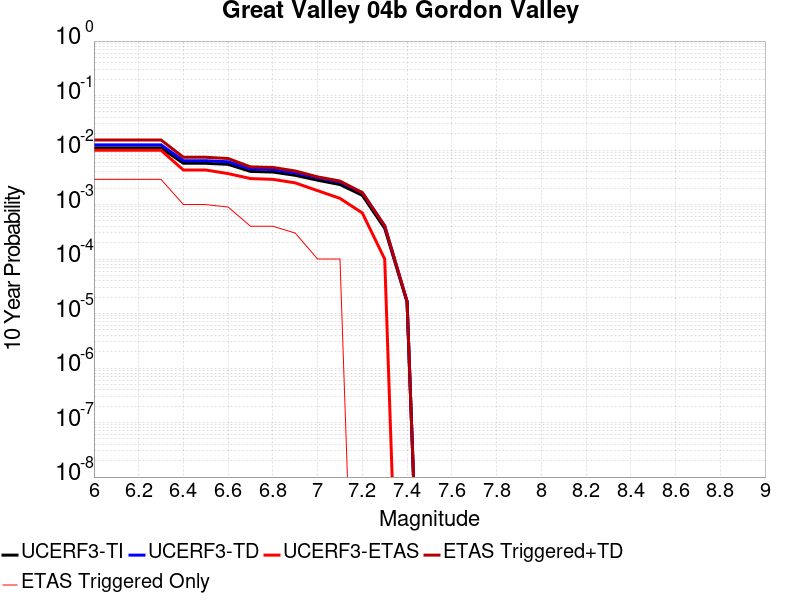 |

| Magnitude | 1 wk TI Prob | 1 wk TD Prob | 1 wk ETAS Prob | 1 wk ETAS/TD Gain | 1 wk ETAS Triggered+TD | 1 wk ETAS Triggered Only | 1 mo TI Prob | 1 mo TD Prob | 1 mo ETAS Prob | 1 mo ETAS/TD Gain | 1 mo ETAS Triggered+TD | 1 mo ETAS Triggered Only | 1 yr TI Prob | 1 yr TD Prob | 1 yr ETAS Prob | 1 yr ETAS/TD Gain | 1 yr ETAS Triggered+TD | 1 yr ETAS Triggered Only | 10 yr TI Prob | 10 yr TD Prob | 10 yr ETAS Prob | 10 yr ETAS/TD Gain | 10 yr ETAS Triggered+TD | 10 yr ETAS Triggered Only |
|-----|-----|-----|-----|-----|-----|-----|-----|-----|-----|-----|-----|-----|-----|-----|-----|-----|-----|-----|-----|-----|-----|-----|-----|-----|
| 6.0 | 2.1181217E-5 | 2.3988501E-5 | 0.0 | 0.0 | 2.3988501E-5 | 0.0 | 9.077348E-5 | 1.02804755E-4 | 0.0 | 0.0 | 1.02804755E-4 | 0.0 | 0.0011046068 | 0.0012510959 | 3.0E-4 | 0.23978975 | 0.0015507207 | 3.0E-4 | 0.010991322 | 0.012456987 | 0.0029 | 0.23280108 | 0.015320862 | 0.0029 |
| 6.1 | 2.1181217E-5 | 2.3988501E-5 | 0.0 | 0.0 | 2.3988501E-5 | 0.0 | 9.077348E-5 | 1.02804755E-4 | 0.0 | 0.0 | 1.02804755E-4 | 0.0 | 0.0011046068 | 0.0012510959 | 3.0E-4 | 0.23978975 | 0.0015507207 | 3.0E-4 | 0.010991322 | 0.012456987 | 0.0029 | 0.23280108 | 0.015320862 | 0.0029 |
| 6.2 | 2.1181217E-5 | 2.3988501E-5 | 0.0 | 0.0 | 2.3988501E-5 | 0.0 | 9.077348E-5 | 1.02804755E-4 | 0.0 | 0.0 | 1.02804755E-4 | 0.0 | 0.0011046068 | 0.0012510959 | 3.0E-4 | 0.23978975 | 0.0015507207 | 3.0E-4 | 0.010991322 | 0.012456987 | 0.0029 | 0.23280108 | 0.015320862 | 0.0029 |
| 6.3 | 2.1181217E-5 | 2.3988501E-5 | 0.0 | 0.0 | 2.3988501E-5 | 0.0 | 9.077348E-5 | 1.02804755E-4 | 0.0 | 0.0 | 1.02804755E-4 | 0.0 | 0.0011046068 | 0.0012510959 | 3.0E-4 | 0.23978975 | 0.0015507207 | 3.0E-4 | 0.010991322 | 0.012456987 | 0.0029 | 0.23280108 | 0.015320862 | 0.0029 |
| 6.4 | 1.0988268E-5 | 1.2257408E-5 | 0.0 | 0.0 | 1.2257408E-5 | 0.0 | 4.7091726E-5 | 5.2530784E-5 | 0.0 | 0.0 | 5.2530784E-5 | 0.0 | 5.731909E-4 | 6.3939055E-4 | 1.0E-4 | 0.15639892 | 7.3932664E-4 | 1.0E-4 | 0.005717147 | 0.006377097 | 0.001 | 0.15681116 | 0.00737072 | 0.001 |
| 6.5 | 1.0988268E-5 | 1.2257408E-5 | 0.0 | 0.0 | 1.2257408E-5 | 0.0 | 4.7091726E-5 | 5.2530784E-5 | 0.0 | 0.0 | 5.2530784E-5 | 0.0 | 5.731909E-4 | 6.3939055E-4 | 1.0E-4 | 0.15639892 | 7.3932664E-4 | 1.0E-4 | 0.005717147 | 0.006377097 | 0.001 | 0.15681116 | 0.00737072 | 0.001 |
| 6.6 | 1.0517822E-5 | 1.1726833E-5 | 0.0 | 0.0 | 1.1726833E-5 | 0.0 | 4.5075605E-5 | 5.0256975E-5 | 0.0 | 0.0 | 5.0256975E-5 | 0.0 | 5.4865726E-4 | 6.117225E-4 | 1.0E-4 | 0.16347282 | 7.1166136E-4 | 1.0E-4 | 0.0054730466 | 0.006101941 | 9.0E-4 | 0.14749405 | 0.006996449 | 9.0E-4 |
| 6.7 | 7.789219E-6 | 8.6796845E-6 | 0.0 | 0.0 | 8.6796845E-6 | 0.0 | 3.3381937E-5 | 3.7198148E-5 | 0.0 | 0.0 | 3.7198148E-5 | 0.0 | 4.063493E-4 | 4.527985E-4 | 0.0 | 0.0 | 4.527985E-4 | 0.0 | 0.004056071 | 0.0045192763 | 4.0E-4 | 0.08850974 | 0.004917469 | 4.0E-4 |
| 6.8 | 7.5850853E-6 | 8.454381E-6 | 0.0 | 0.0 | 8.454381E-6 | 0.0 | 3.2507105E-5 | 3.6232588E-5 | 0.0 | 0.0 | 3.6232588E-5 | 0.0 | 3.957021E-4 | 4.410476E-4 | 0.0 | 0.0 | 4.410476E-4 | 0.0 | 0.0039499826 | 0.0044022356 | 4.0E-4 | 0.09086293 | 0.0048004747 | 4.0E-4 |
| 6.9 | 6.604105E-6 | 7.3602823E-6 | 0.0 | 0.0 | 7.3602823E-6 | 0.0 | 2.8303E-5 | 3.1543706E-5 | 0.0 | 0.0 | 3.1543706E-5 | 0.0 | 3.4453452E-4 | 3.8398083E-4 | 0.0 | 0.0 | 3.8398083E-4 | 0.0 | 0.0034400085 | 0.0038335605 | 3.0E-4 | 0.078256235 | 0.0041324105 | 3.0E-4 |
| 7.0 | 5.3701115E-6 | 5.98984E-6 | 0.0 | 0.0 | 5.98984E-6 | 0.0 | 2.301456E-5 | 2.5670506E-5 | 0.0 | 0.0 | 2.5670506E-5 | 0.0 | 2.8016625E-4 | 3.124965E-4 | 0.0 | 0.0 | 3.124965E-4 | 0.0 | 0.0027981328 | 0.0031208594 | 1.0E-4 | 0.032042455 | 0.0032205475 | 1.0E-4 |
| 7.1 | 4.4685607E-6 | 4.98767E-6 | 0.0 | 0.0 | 4.98767E-6 | 0.0 | 1.9150835E-5 | 2.1375567E-5 | 0.0 | 0.0 | 2.1375567E-5 | 0.0 | 2.3313647E-4 | 2.6021895E-4 | 0.0 | 0.0 | 2.6021895E-4 | 0.0 | 0.0023289204 | 0.0025993872 | 1.0E-4 | 0.038470604 | 0.0026991274 | 1.0E-4 |
| 7.2 | 2.833378E-6 | 3.165182E-6 | 0.0 | 0.0 | 3.165182E-6 | 0.0 | 1.2142991E-5 | 1.3565005E-5 | 0.0 | 0.0 | 1.3565005E-5 | 0.0 | 1.4783088E-4 | 1.6514318E-4 | 0.0 | 0.0 | 1.6514318E-4 | 0.0 | 0.0014773258 | 0.0016503765 | 0.0 | 0.0 | 0.0016503765 | 0.0 |
| 7.3 | 7.0087293E-7 | 7.774574E-7 | 0.0 | 0.0 | 7.774574E-7 | 0.0 | 3.0037377E-6 | 3.3319586E-6 | 0.0 | 0.0 | 3.3319586E-6 | 0.0 | 3.656989E-5 | 4.0566298E-5 | 0.0 | 0.0 | 4.0566298E-5 | 0.0 | 3.6563876E-4 | 4.0563394E-4 | 0.0 | 0.0 | 4.0563394E-4 | 0.0 |
| 7.4 | 3.112171E-8 | 3.2070375E-8 | 0.0 | 0.0 | 3.2070375E-8 | 0.0 | 1.3337875E-7 | 1.3744446E-7 | 0.0 | 0.0 | 1.3744446E-7 | 0.0 | 1.6238852E-6 | 1.6733851E-6 | 0.0 | 0.0 | 1.6733851E-6 | 0.0 | 1.6238733E-5 | 1.6733733E-5 | 0.0 | 0.0 | 1.6733733E-5 | 0.0 |

## McLean Lake
*[(top)](#table-of-contents)*

| 1 Week | 1 Month | 1 Year | 10 Year |
|-----|-----|-----|-----|
|  | 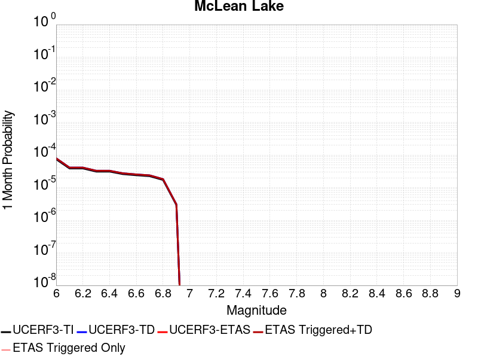 |  |  |

| Magnitude | 1 wk TI Prob | 1 wk TD Prob | 1 wk ETAS Prob | 1 wk ETAS/TD Gain | 1 wk ETAS Triggered+TD | 1 wk ETAS Triggered Only | 1 mo TI Prob | 1 mo TD Prob | 1 mo ETAS Prob | 1 mo ETAS/TD Gain | 1 mo ETAS Triggered+TD | 1 mo ETAS Triggered Only | 1 yr TI Prob | 1 yr TD Prob | 1 yr ETAS Prob | 1 yr ETAS/TD Gain | 1 yr ETAS Triggered+TD | 1 yr ETAS Triggered Only | 10 yr TI Prob | 10 yr TD Prob | 10 yr ETAS Prob | 10 yr ETAS/TD Gain | 10 yr ETAS Triggered+TD | 10 yr ETAS Triggered Only |
|-----|-----|-----|-----|-----|-----|-----|-----|-----|-----|-----|-----|-----|-----|-----|-----|-----|-----|-----|-----|-----|-----|-----|-----|-----|
| 6.0 | 1.7360222E-5 | 1.8504137E-5 | 0.0 | 0.0 | 1.8504137E-5 | 0.0 | 7.439883E-5 | 7.930131E-5 | 0.0 | 0.0 | 7.930131E-5 | 0.0 | 9.0542925E-4 | 9.651144E-4 | 5.0E-4 | 0.5180733 | 0.0014646319 | 5.0E-4 | 0.009017491 | 0.009614073 | 0.0028 | 0.29123974 | 0.012387154 | 0.0028 |
| 6.1 | 9.062689E-6 | 9.593349E-6 | 0.0 | 0.0 | 9.593349E-6 | 0.0 | 3.8839516E-5 | 4.1113755E-5 | 0.0 | 0.0 | 4.1113755E-5 | 0.0 | 4.727685E-4 | 5.0045387E-4 | 2.0E-4 | 0.39963722 | 7.0035376E-4 | 2.0E-4 | 0.0047176396 | 0.0049941516 | 0.0016 | 0.32037473 | 0.006586161 | 0.0016 |
| 6.2 | 9.062689E-6 | 9.593349E-6 | 0.0 | 0.0 | 9.593349E-6 | 0.0 | 3.8839516E-5 | 4.1113755E-5 | 0.0 | 0.0 | 4.1113755E-5 | 0.0 | 4.727685E-4 | 5.0045387E-4 | 2.0E-4 | 0.39963722 | 7.0035376E-4 | 2.0E-4 | 0.0047176396 | 0.0049941516 | 0.0016 | 0.32037473 | 0.006586161 | 0.0016 |
| 6.3 | 7.2575485E-6 | 7.668603E-6 | 0.0 | 0.0 | 7.668603E-6 | 0.0 | 3.110341E-5 | 3.2865064E-5 | 0.0 | 0.0 | 3.2865064E-5 | 0.0 | 3.786182E-4 | 4.0006585E-4 | 2.0E-4 | 0.49991772 | 5.999858E-4 | 2.0E-4 | 0.0037797375 | 0.0039941613 | 0.0013 | 0.3254751 | 0.005288969 | 0.0013 |
| 6.4 | 7.2575485E-6 | 7.668603E-6 | 0.0 | 0.0 | 7.668603E-6 | 0.0 | 3.110341E-5 | 3.2865064E-5 | 0.0 | 0.0 | 3.2865064E-5 | 0.0 | 3.786182E-4 | 4.0006585E-4 | 2.0E-4 | 0.49991772 | 5.999858E-4 | 2.0E-4 | 0.0037797375 | 0.0039941613 | 0.0013 | 0.3254751 | 0.005288969 | 0.0013 |
| 6.5 | 6.06582E-6 | 6.4046126E-6 | 0.0 | 0.0 | 6.4046126E-6 | 0.0 | 2.5996113E-5 | 2.7448088E-5 | 0.0 | 0.0 | 2.7448088E-5 | 0.0 | 3.164567E-4 | 3.3413572E-4 | 1.0E-4 | 0.2992796 | 4.341023E-4 | 1.0E-4 | 0.0031600643 | 0.0033369719 | 0.001 | 0.29967287 | 0.004333635 | 0.001 |
| 6.6 | 5.598744E-6 | 5.9109398E-6 | 0.0 | 0.0 | 5.9109398E-6 | 0.0 | 2.3994397E-5 | 2.533239E-5 | 0.0 | 0.0 | 2.533239E-5 | 0.0 | 2.9209262E-4 | 3.083846E-4 | 1.0E-4 | 0.32427043 | 4.0835375E-4 | 1.0E-4 | 0.0029170897 | 0.0030801957 | 9.0E-4 | 0.2921892 | 0.0039774235 | 9.0E-4 |
| 6.7 | 5.246996E-6 | 5.5397977E-6 | 0.0 | 0.0 | 5.5397977E-6 | 0.0 | 2.2486933E-5 | 2.374181E-5 | 0.0 | 0.0 | 2.374181E-5 | 0.0 | 2.73744E-4 | 2.8902455E-4 | 1.0E-4 | 0.34599137 | 3.8899563E-4 | 1.0E-4 | 0.0027340704 | 0.0028871105 | 9.0E-4 | 0.31173036 | 0.0037845122 | 9.0E-4 |
| 6.8 | 4.02324E-6 | 4.247391E-6 | 0.0 | 0.0 | 4.247391E-6 | 0.0 | 1.7242342E-5 | 1.820301E-5 | 0.0 | 0.0 | 1.820301E-5 | 0.0 | 2.099053E-4 | 2.2160508E-4 | 0.0 | 0.0 | 2.2160508E-4 | 0.0 | 0.0020970714 | 0.0022144255 | 8.0E-4 | 0.3612675 | 0.003012654 | 8.0E-4 |
| 6.9 | 6.835972E-7 | 7.140582E-7 | 0.0 | 0.0 | 7.140582E-7 | 0.0 | 2.9296991E-6 | 3.0602475E-6 | 0.0 | 0.0 | 3.0602475E-6 | 0.0 | 3.56685E-5 | 3.7258196E-5 | 0.0 | 0.0 | 3.7258196E-5 | 0.0 | 3.5662777E-4 | 3.7255077E-4 | 0.0 | 0.0 | 3.7255077E-4 | 0.0 |

## White Mountains
*[(top)](#table-of-contents)*

| 1 Week | 1 Month | 1 Year | 10 Year |
|-----|-----|-----|-----|
| 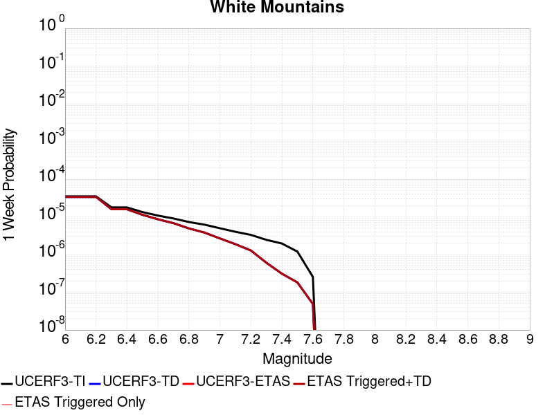 | 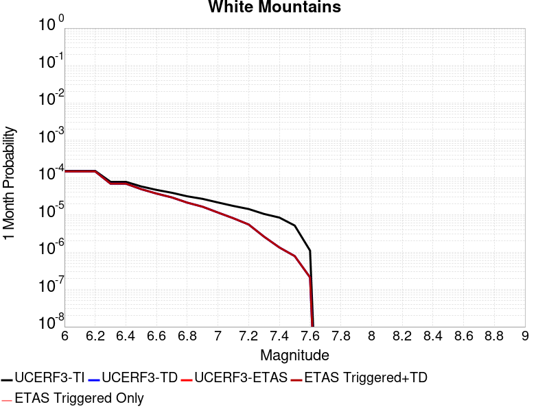 |  |  |

| Magnitude | 1 wk TI Prob | 1 wk TD Prob | 1 wk ETAS Prob | 1 wk ETAS/TD Gain | 1 wk ETAS Triggered+TD | 1 wk ETAS Triggered Only | 1 mo TI Prob | 1 mo TD Prob | 1 mo ETAS Prob | 1 mo ETAS/TD Gain | 1 mo ETAS Triggered+TD | 1 mo ETAS Triggered Only | 1 yr TI Prob | 1 yr TD Prob | 1 yr ETAS Prob | 1 yr ETAS/TD Gain | 1 yr ETAS Triggered+TD | 1 yr ETAS Triggered Only | 10 yr TI Prob | 10 yr TD Prob | 10 yr ETAS Prob | 10 yr ETAS/TD Gain | 10 yr ETAS Triggered+TD | 10 yr ETAS Triggered Only |
|-----|-----|-----|-----|-----|-----|-----|-----|-----|-----|-----|-----|-----|-----|-----|-----|-----|-----|-----|-----|-----|-----|-----|-----|-----|
| 6.0 | 3.503579E-5 | 3.378971E-5 | 0.0 | 0.0 | 3.378971E-5 | 0.0 | 1.5014476E-4 | 1.448057E-4 | 0.0 | 0.0 | 1.448057E-4 | 0.0 | 0.0018264796 | 0.0017617046 | 3.0E-4 | 0.17028962 | 0.002061176 | 3.0E-4 | 0.018115403 | 0.017489726 | 0.0029 | 0.16581163 | 0.020339007 | 0.0029 |
| 6.1 | 3.503579E-5 | 3.378971E-5 | 0.0 | 0.0 | 3.378971E-5 | 0.0 | 1.5014476E-4 | 1.448057E-4 | 0.0 | 0.0 | 1.448057E-4 | 0.0 | 0.0018264796 | 0.0017617046 | 3.0E-4 | 0.17028962 | 0.002061176 | 3.0E-4 | 0.018115403 | 0.017489726 | 0.0029 | 0.16581163 | 0.020339007 | 0.0029 |
| 6.2 | 3.503579E-5 | 3.378971E-5 | 0.0 | 0.0 | 3.378971E-5 | 0.0 | 1.5014476E-4 | 1.448057E-4 | 0.0 | 0.0 | 1.448057E-4 | 0.0 | 0.0018264796 | 0.0017617046 | 3.0E-4 | 0.17028962 | 0.002061176 | 3.0E-4 | 0.018115403 | 0.017489726 | 0.0029 | 0.16581163 | 0.020339007 | 0.0029 |
| 6.3 | 1.7818425E-5 | 1.5918458E-5 | 0.0 | 0.0 | 1.5918458E-5 | 0.0 | 7.636245E-5 | 6.8220266E-5 | 0.0 | 0.0 | 6.8220266E-5 | 0.0 | 9.293162E-4 | 8.302795E-4 | 0.0 | 0.0 | 8.302795E-4 | 0.0 | 0.009254395 | 0.008273234 | 0.0012 | 0.14504607 | 0.009463306 | 0.0012 |
| 6.4 | 1.7818425E-5 | 1.5918458E-5 | 0.0 | 0.0 | 1.5918458E-5 | 0.0 | 7.636245E-5 | 6.8220266E-5 | 0.0 | 0.0 | 6.8220266E-5 | 0.0 | 9.293162E-4 | 8.302795E-4 | 0.0 | 0.0 | 8.302795E-4 | 0.0 | 0.009254395 | 0.008273234 | 0.0012 | 0.14504607 | 0.009463306 | 0.0012 |
| 6.5 | 1.3397557E-5 | 1.1337919E-5 | 0.0 | 0.0 | 1.1337919E-5 | 0.0 | 5.741684E-5 | 4.8590216E-5 | 0.0 | 0.0 | 4.8590216E-5 | 0.0 | 6.988258E-4 | 5.9143227E-4 | 0.0 | 0.0 | 5.9143227E-4 | 0.0 | 0.006966323 | 0.005899288 | 7.0E-4 | 0.11865838 | 0.006595159 | 7.0E-4 |
| 6.6 | 1.0818695E-5 | 8.626485E-6 | 0.0 | 0.0 | 8.626485E-6 | 0.0 | 4.6365014E-5 | 3.6970156E-5 | 0.0 | 0.0 | 3.6970156E-5 | 0.0 | 5.6434784E-4 | 4.50023E-4 | 0.0 | 0.0 | 4.50023E-4 | 0.0 | 0.005629168 | 0.0044915536 | 5.0E-4 | 0.11132005 | 0.004989308 | 5.0E-4 |
| 6.7 | 9.067908E-6 | 6.803223E-6 | 0.0 | 0.0 | 6.803223E-6 | 0.0 | 3.8861883E-5 | 2.9156363E-5 | 0.0 | 0.0 | 2.9156363E-5 | 0.0 | 4.7304068E-4 | 3.549241E-4 | 0.0 | 0.0 | 3.549241E-4 | 0.0 | 0.00472035 | 0.0035438896 | 4.0E-4 | 0.112870336 | 0.003942472 | 4.0E-4 |
| 6.8 | 7.295947E-6 | 4.936881E-6 | 0.0 | 0.0 | 4.936881E-6 | 0.0 | 3.126797E-5 | 2.1157895E-5 | 0.0 | 0.0 | 2.1157895E-5 | 0.0 | 3.8062103E-4 | 2.5756806E-4 | 0.0 | 0.0 | 2.5756806E-4 | 0.0 | 0.0037996976 | 0.0025728084 | 2.0E-4 | 0.077736065 | 0.0027722938 | 2.0E-4 |
| 6.9 | 6.2243444E-6 | 3.8325697E-6 | 0.0 | 0.0 | 3.8325697E-6 | 0.0 | 2.6675489E-5 | 1.6425198E-5 | 0.0 | 0.0 | 1.6425198E-5 | 0.0 | 3.2472567E-4 | 1.9995896E-4 | 0.0 | 0.0 | 1.9995896E-4 | 0.0 | 0.0032425157 | 0.0019978432 | 1.0E-4 | 0.05005398 | 0.0020976434 | 1.0E-4 |
| 7.0 | 4.9878413E-6 | 2.6798043E-6 | 0.0 | 0.0 | 2.6798043E-6 | 0.0 | 2.1376287E-5 | 1.1484826E-5 | 0.0 | 0.0 | 1.1484826E-5 | 0.0 | 2.602252E-4 | 1.3981905E-4 | 0.0 | 0.0 | 1.3981905E-4 | 0.0 | 0.002599207 | 0.0013973371 | 0.0 | 0.0 | 0.0013973371 | 0.0 |
| 7.1 | 4.0252844E-6 | 1.8859266E-6 | 0.0 | 0.0 | 1.8859266E-6 | 0.0 | 1.7251105E-5 | 8.082518E-6 | 0.0 | 0.0 | 8.082518E-6 | 0.0 | 2.1001195E-4 | 9.840034E-5 | 0.0 | 0.0 | 9.840034E-5 | 0.0 | 0.0020981359 | 9.835805E-4 | 0.0 | 0.0 | 9.835805E-4 | 0.0 |
| 7.2 | 3.3284066E-6 | 1.2819861E-6 | 0.0 | 0.0 | 1.2819861E-6 | 0.0 | 1.4264522E-5 | 5.4942147E-6 | 0.0 | 0.0 | 5.4942147E-6 | 0.0 | 1.736567E-4 | 6.689011E-5 | 0.0 | 0.0 | 6.689011E-5 | 0.0 | 0.0017352107 | 6.6870986E-4 | 0.0 | 0.0 | 6.6870986E-4 | 0.0 |
| 7.3 | 2.458226E-6 | 6.0574973E-7 | 0.0 | 0.0 | 6.0574973E-7 | 0.0 | 1.0535211E-5 | 2.596068E-6 | 0.0 | 0.0 | 2.596068E-6 | 0.0 | 1.2825865E-4 | 3.160671E-5 | 0.0 | 0.0 | 3.160671E-5 | 0.0 | 0.0012818464 | 3.1602586E-4 | 0.0 | 0.0 | 3.1602586E-4 | 0.0 |
| 7.4 | 1.965953E-6 | 3.1091878E-7 | 0.0 | 0.0 | 3.1091878E-7 | 0.0 | 8.425486E-6 | 1.3325084E-6 | 0.0 | 0.0 | 1.3325084E-6 | 0.0 | 1.0257547E-4 | 1.622317E-5 | 0.0 | 0.0 | 1.622317E-5 | 0.0 | 0.0010252813 | 1.6221999E-4 | 0.0 | 0.0 | 1.6221999E-4 | 0.0 |
| 7.5 | 1.2014192E-6 | 1.8246173E-7 | 0.0 | 0.0 | 1.8246173E-7 | 0.0 | 5.148929E-6 | 7.819786E-7 | 0.0 | 0.0 | 7.819786E-7 | 0.0 | 6.2686406E-5 | 9.520549E-6 | 0.0 | 0.0 | 9.520549E-6 | 0.0 | 6.266873E-4 | 9.520149E-5 | 0.0 | 0.0 | 9.520149E-5 | 0.0 |
| 7.6 | 2.5612175E-7 | 4.8953687E-8 | 0.0 | 0.0 | 4.8953687E-8 | 0.0 | 1.0976642E-6 | 2.098015E-7 | 0.0 | 0.0 | 2.098015E-7 | 0.0 | 1.3363979E-5 | 2.5543306E-6 | 0.0 | 0.0 | 2.5543306E-6 | 0.0 | 1.3363175E-4 | 2.554305E-5 | 0.0 | 0.0 | 2.554305E-5 | 0.0 |

## Pleito
*[(top)](#table-of-contents)*

| 1 Week | 1 Month | 1 Year | 10 Year |
|-----|-----|-----|-----|
| 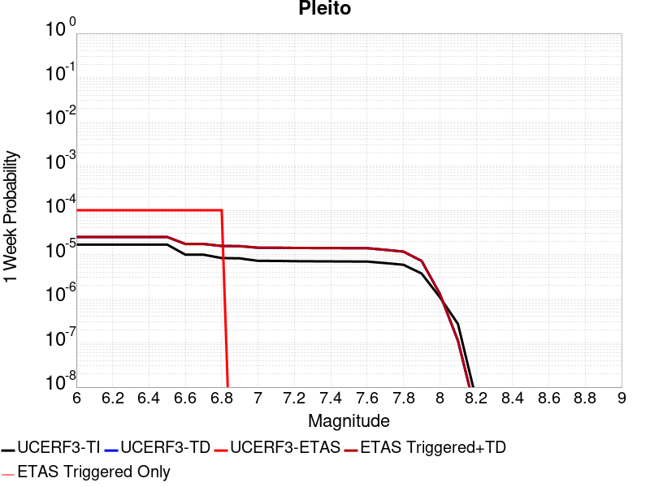 | 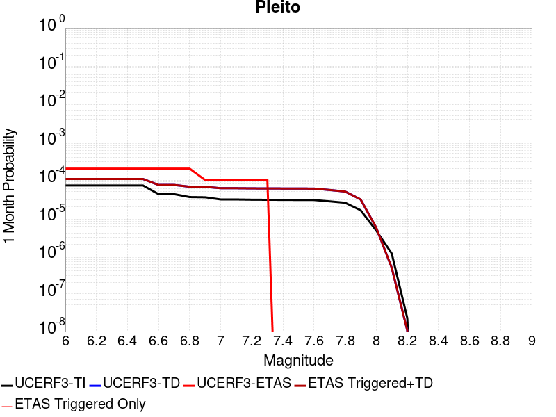 |  | 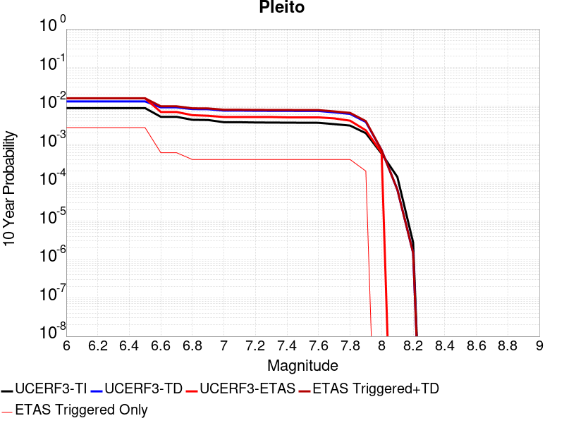 |

| Magnitude | 1 wk TI Prob | 1 wk TD Prob | 1 wk ETAS Prob | 1 wk ETAS/TD Gain | 1 wk ETAS Triggered+TD | 1 wk ETAS Triggered Only | 1 mo TI Prob | 1 mo TD Prob | 1 mo ETAS Prob | 1 mo ETAS/TD Gain | 1 mo ETAS Triggered+TD | 1 mo ETAS Triggered Only | 1 yr TI Prob | 1 yr TD Prob | 1 yr ETAS Prob | 1 yr ETAS/TD Gain | 1 yr ETAS Triggered+TD | 1 yr ETAS Triggered Only | 10 yr TI Prob | 10 yr TD Prob | 10 yr ETAS Prob | 10 yr ETAS/TD Gain | 10 yr ETAS Triggered+TD | 10 yr ETAS Triggered Only |
|-----|-----|-----|-----|-----|-----|-----|-----|-----|-----|-----|-----|-----|-----|-----|-----|-----|-----|-----|-----|-----|-----|-----|-----|-----|
| 6.0 | 1.6763008E-5 | 2.4836781E-5 | 0.0 | 0.0 | 2.4836781E-5 | 0.0 | 7.183948E-5 | 1.0643942E-4 | 0.0 | 0.0 | 1.0643942E-4 | 0.0 | 8.742947E-4 | 0.0012952016 | 4.0E-4 | 0.30883223 | 0.0016946835 | 4.0E-4 | 0.00870863 | 0.012990664 | 0.0027 | 0.20784158 | 0.015655588 | 0.0027 |
| 6.1 | 1.6763008E-5 | 2.4836781E-5 | 0.0 | 0.0 | 2.4836781E-5 | 0.0 | 7.183948E-5 | 1.0643942E-4 | 0.0 | 0.0 | 1.0643942E-4 | 0.0 | 8.742947E-4 | 0.0012952016 | 4.0E-4 | 0.30883223 | 0.0016946835 | 4.0E-4 | 0.00870863 | 0.012990664 | 0.0027 | 0.20784158 | 0.015655588 | 0.0027 |
| 6.2 | 1.6763008E-5 | 2.4836781E-5 | 0.0 | 0.0 | 2.4836781E-5 | 0.0 | 7.183948E-5 | 1.0643942E-4 | 0.0 | 0.0 | 1.0643942E-4 | 0.0 | 8.742947E-4 | 0.0012952016 | 4.0E-4 | 0.30883223 | 0.0016946835 | 4.0E-4 | 0.00870863 | 0.012990664 | 0.0027 | 0.20784158 | 0.015655588 | 0.0027 |
| 6.3 | 1.6763008E-5 | 2.4836781E-5 | 0.0 | 0.0 | 2.4836781E-5 | 0.0 | 7.183948E-5 | 1.0643942E-4 | 0.0 | 0.0 | 1.0643942E-4 | 0.0 | 8.742947E-4 | 0.0012952016 | 4.0E-4 | 0.30883223 | 0.0016946835 | 4.0E-4 | 0.00870863 | 0.012990664 | 0.0027 | 0.20784158 | 0.015655588 | 0.0027 |
| 6.4 | 1.6763008E-5 | 2.4836781E-5 | 0.0 | 0.0 | 2.4836781E-5 | 0.0 | 7.183948E-5 | 1.0643942E-4 | 0.0 | 0.0 | 1.0643942E-4 | 0.0 | 8.742947E-4 | 0.0012952016 | 4.0E-4 | 0.30883223 | 0.0016946835 | 4.0E-4 | 0.00870863 | 0.012990664 | 0.0027 | 0.20784158 | 0.015655588 | 0.0027 |
| 6.5 | 1.6763008E-5 | 2.4836781E-5 | 0.0 | 0.0 | 2.4836781E-5 | 0.0 | 7.183948E-5 | 1.0643942E-4 | 0.0 | 0.0 | 1.0643942E-4 | 0.0 | 8.742947E-4 | 0.0012952016 | 4.0E-4 | 0.30883223 | 0.0016946835 | 4.0E-4 | 0.00870863 | 0.012990664 | 0.0027 | 0.20784158 | 0.015655588 | 0.0027 |
| 6.6 | 9.910213E-6 | 1.7285987E-5 | 0.0 | 0.0 | 1.7285987E-5 | 0.0 | 4.247165E-5 | 7.4080715E-5 | 0.0 | 0.0 | 7.4080715E-5 | 0.0 | 5.169696E-4 | 9.0156327E-4 | 1.0E-4 | 0.110918455 | 0.001001473 | 1.0E-4 | 0.0051576863 | 0.009086801 | 6.0E-4 | 0.06602984 | 0.009681349 | 6.0E-4 |
| 6.7 | 9.910213E-6 | 1.7285987E-5 | 0.0 | 0.0 | 1.7285987E-5 | 0.0 | 4.247165E-5 | 7.4080715E-5 | 0.0 | 0.0 | 7.4080715E-5 | 0.0 | 5.169696E-4 | 9.0156327E-4 | 1.0E-4 | 0.110918455 | 0.001001473 | 1.0E-4 | 0.0051576863 | 0.009086801 | 6.0E-4 | 0.06602984 | 0.009681349 | 6.0E-4 |
| 6.8 | 8.300162E-6 | 1.5545305E-5 | 0.0 | 0.0 | 1.5545305E-5 | 0.0 | 3.557164E-5 | 6.662104E-5 | 0.0 | 0.0 | 6.662104E-5 | 0.0 | 4.3299864E-4 | 8.108108E-4 | 1.0E-4 | 0.123333335 | 9.107297E-4 | 1.0E-4 | 0.004321559 | 0.00818612 | 4.0E-4 | 0.0488632 | 0.008582845 | 4.0E-4 |
| 6.9 | 8.183114E-6 | 1.5416475E-5 | 0.0 | 0.0 | 1.5416475E-5 | 0.0 | 3.5070017E-5 | 6.606895E-5 | 0.0 | 0.0 | 6.606895E-5 | 0.0 | 4.2689382E-4 | 8.0409396E-4 | 1.0E-4 | 0.12436357 | 9.040136E-4 | 1.0E-4 | 0.0042607468 | 0.008119444 | 4.0E-4 | 0.049264457 | 0.008516196 | 4.0E-4 |
| 7.0 | 7.1748823E-6 | 1.4202265E-5 | 0.0 | 0.0 | 1.4202265E-5 | 0.0 | 3.0749135E-5 | 6.0865437E-5 | 0.0 | 0.0 | 6.0865437E-5 | 0.0 | 3.743064E-4 | 7.4078527E-4 | 1.0E-4 | 0.13499188 | 8.407112E-4 | 1.0E-4 | 0.0037367654 | 0.0074903043 | 4.0E-4 | 0.053402368 | 0.0078873085 | 4.0E-4 |
| 7.1 | 7.1671807E-6 | 1.4192624E-5 | 0.0 | 0.0 | 1.4192624E-5 | 0.0 | 3.0716128E-5 | 6.0824117E-5 | 0.0 | 0.0 | 6.0824117E-5 | 0.0 | 3.7390468E-4 | 7.402825E-4 | 1.0E-4 | 0.13508356 | 8.402085E-4 | 1.0E-4 | 0.0037327618 | 0.007485311 | 4.0E-4 | 0.053437993 | 0.0078823175 | 4.0E-4 |
| 7.2 | 7.0649667E-6 | 1.4039603E-5 | 0.0 | 0.0 | 1.4039603E-5 | 0.0 | 3.0278077E-5 | 6.0168342E-5 | 0.0 | 0.0 | 6.0168342E-5 | 0.0 | 3.6857324E-4 | 7.323039E-4 | 1.0E-4 | 0.13655533 | 8.3223067E-4 | 1.0E-4 | 0.0036796255 | 0.0074059106 | 4.0E-4 | 0.054010917 | 0.007802948 | 4.0E-4 |
| 7.3 | 7.02082E-6 | 1.398288E-5 | 0.0 | 0.0 | 1.398288E-5 | 0.0 | 3.008888E-5 | 5.9925253E-5 | 0.0 | 0.0 | 5.9925253E-5 | 0.0 | 3.6627054E-4 | 7.2934624E-4 | 1.0E-4 | 0.13710909 | 8.292733E-4 | 1.0E-4 | 0.0036566744 | 0.0073763146 | 4.0E-4 | 0.05422762 | 0.0077733644 | 4.0E-4 |
| 7.4 | 6.987146E-6 | 1.3942341E-5 | 0.0 | 0.0 | 1.3942341E-5 | 0.0 | 2.9944567E-5 | 5.9751525E-5 | 0.0 | 0.0 | 5.9751525E-5 | 0.0 | 3.6451413E-4 | 7.272325E-4 | 1.0E-4 | 0.1375076 | 8.271598E-4 | 1.0E-4 | 0.0036391679 | 0.007355198 | 4.0E-4 | 0.05438331 | 0.0077522555 | 4.0E-4 |
| 7.5 | 6.9494554E-6 | 1.389917E-5 | 0.0 | 0.0 | 1.389917E-5 | 0.0 | 2.9783041E-5 | 5.9566515E-5 | 0.0 | 0.0 | 5.9566515E-5 | 0.0 | 3.625482E-4 | 7.2498154E-4 | 1.0E-4 | 0.13793455 | 8.24909E-4 | 1.0E-4 | 0.0036195726 | 0.0073327865 | 4.0E-4 | 0.054549523 | 0.0077298535 | 4.0E-4 |
| 7.6 | 6.92694E-6 | 1.385814E-5 | 0.0 | 0.0 | 1.385814E-5 | 0.0 | 2.9686547E-5 | 5.939068E-5 | 0.0 | 0.0 | 5.939068E-5 | 0.0 | 3.6137376E-4 | 7.228422E-4 | 1.0E-4 | 0.1383428 | 8.227699E-4 | 1.0E-4 | 0.0036078666 | 0.007311468 | 4.0E-4 | 0.054708578 | 0.0077085434 | 4.0E-4 |
| 7.7 | 6.395867E-6 | 1.2734072E-5 | 0.0 | 0.0 | 1.2734072E-5 | 0.0 | 2.741057E-5 | 5.457345E-5 | 0.0 | 0.0 | 5.457345E-5 | 0.0 | 3.336726E-4 | 6.6422956E-4 | 1.0E-4 | 0.15055037 | 7.641631E-4 | 1.0E-4 | 0.0033317201 | 0.0067285537 | 4.0E-4 | 0.059448138 | 0.0071258624 | 4.0E-4 |
| 7.8 | 5.8664327E-6 | 1.1595145E-5 | 0.0 | 0.0 | 1.1595145E-5 | 0.0 | 2.5141611E-5 | 4.9692535E-5 | 0.0 | 0.0 | 4.9692535E-5 | 0.0 | 3.060561E-4 | 6.048389E-4 | 1.0E-4 | 0.16533329 | 7.047784E-4 | 1.0E-4 | 0.0030563495 | 0.006130675 | 4.0E-4 | 0.06524567 | 0.0065282225 | 4.0E-4 |
| 7.9 | 3.7167474E-6 | 7.1484014E-6 | 0.0 | 0.0 | 7.1484014E-6 | 0.0 | 1.592882E-5 | 3.0635645E-5 | 0.0 | 0.0 | 3.0635645E-5 | 0.0 | 1.9391612E-4 | 3.729253E-4 | 0.0 | 0.0 | 3.729253E-4 | 0.0 | 0.0019374699 | 0.0037849997 | 2.0E-4 | 0.052840162 | 0.0039842427 | 2.0E-4 |
| 8.0 | 1.0903841E-6 | 1.2938924E-6 | 0.0 | 0.0 | 1.2938924E-6 | 0.0 | 4.6730665E-6 | 5.5452415E-6 | 0.0 | 0.0 | 5.5452415E-6 | 0.0 | 5.68931E-5 | 6.751124E-5 | 0.0 | 0.0 | 6.751124E-5 | 0.0 | 5.6878536E-4 | 6.97286E-4 | 0.0 | 0.0 | 6.97286E-4 | 0.0 |
| 8.1 | 2.6894583E-7 | 1.109596E-7 | 0.0 | 0.0 | 1.109596E-7 | 0.0 | 1.1526245E-6 | 4.7554104E-7 | 0.0 | 0.0 | 4.7554104E-7 | 0.0 | 1.4033113E-5 | 5.789697E-6 | 0.0 | 0.0 | 5.789697E-6 | 0.0 | 1.4032227E-4 | 6.476587E-5 | 0.0 | 0.0 | 6.476587E-5 | 0.0 |
| 8.2 | 5.2967013E-9 | 2.4669302E-9 | 0.0 | 0.0 | 2.4669302E-9 | 0.0 | 2.2700148E-8 | 1.0572556E-8 | 0.0 | 0.0 | 1.0572556E-8 | 0.0 | 2.7637427E-7 | 1.2872087E-7 | 0.0 | 0.0 | 1.2872087E-7 | 0.0 | 2.7637393E-6 | 1.4643357E-6 | 0.0 | 0.0 | 1.4643357E-6 | 0.0 |

## Keddie Ridge 2011 CFM
*[(top)](#table-of-contents)*

| 1 Week | 1 Month | 1 Year | 10 Year |
|-----|-----|-----|-----|
|  |  | 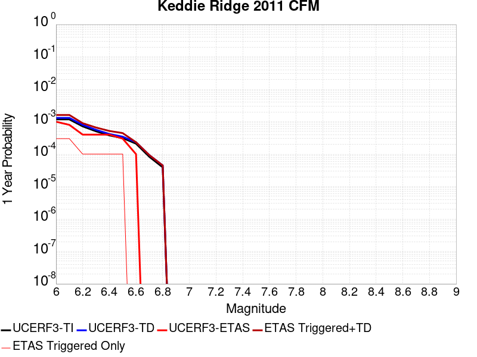 |  |

| Magnitude | 1 wk TI Prob | 1 wk TD Prob | 1 wk ETAS Prob | 1 wk ETAS/TD Gain | 1 wk ETAS Triggered+TD | 1 wk ETAS Triggered Only | 1 mo TI Prob | 1 mo TD Prob | 1 mo ETAS Prob | 1 mo ETAS/TD Gain | 1 mo ETAS Triggered+TD | 1 mo ETAS Triggered Only | 1 yr TI Prob | 1 yr TD Prob | 1 yr ETAS Prob | 1 yr ETAS/TD Gain | 1 yr ETAS Triggered+TD | 1 yr ETAS Triggered Only | 10 yr TI Prob | 10 yr TD Prob | 10 yr ETAS Prob | 10 yr ETAS/TD Gain | 10 yr ETAS Triggered+TD | 10 yr ETAS Triggered Only |
|-----|-----|-----|-----|-----|-----|-----|-----|-----|-----|-----|-----|-----|-----|-----|-----|-----|-----|-----|-----|-----|-----|-----|-----|-----|
| 6.0 | 2.2591947E-5 | 2.519519E-5 | 0.0 | 0.0 | 2.519519E-5 | 0.0 | 9.6819036E-5 | 1.07975364E-4 | 0.0 | 0.0 | 1.07975364E-4 | 0.0 | 0.0011781343 | 0.0013138864 | 3.0E-4 | 0.22833025 | 0.0016134921 | 3.0E-4 | 0.011719079 | 0.013069131 | 0.0027 | 0.20659368 | 0.015733846 | 0.0027 |
| 6.1 | 2.2591947E-5 | 2.519519E-5 | 0.0 | 0.0 | 2.519519E-5 | 0.0 | 9.6819036E-5 | 1.07975364E-4 | 0.0 | 0.0 | 1.07975364E-4 | 0.0 | 0.0011781343 | 0.0013138864 | 3.0E-4 | 0.22833025 | 0.0016134921 | 3.0E-4 | 0.011719079 | 0.013069131 | 0.0025 | 0.19129044 | 0.015536459 | 0.0025 |
| 6.2 | 1.3775145E-5 | 1.5326394E-5 | 0.0 | 0.0 | 1.5326394E-5 | 0.0 | 5.9035E-5 | 6.568303E-5 | 0.0 | 0.0 | 6.568303E-5 | 0.0 | 7.185141E-4 | 7.994217E-4 | 1.0E-4 | 0.12509044 | 8.993417E-4 | 1.0E-4 | 0.0071619535 | 0.00796788 | 0.0015 | 0.18825586 | 0.009455928 | 0.0015 |
| 6.3 | 9.705435E-6 | 1.07708065E-5 | 0.0 | 0.0 | 1.07708065E-5 | 0.0 | 4.1594063E-5 | 4.6159854E-5 | 0.0 | 0.0 | 4.6159854E-5 | 0.0 | 5.0629E-4 | 5.618637E-4 | 1.0E-4 | 0.17797911 | 6.6180754E-4 | 1.0E-4 | 0.005051381 | 0.0056056627 | 0.001 | 0.17839104 | 0.0066000572 | 0.001 |
| 6.4 | 7.2549733E-6 | 8.029053E-6 | 0.0 | 0.0 | 8.029053E-6 | 0.0 | 3.109237E-5 | 3.4409815E-5 | 0.0 | 0.0 | 3.4409815E-5 | 0.0 | 3.7848388E-4 | 4.1886696E-4 | 1.0E-4 | 0.2387393 | 5.188251E-4 | 1.0E-4 | 0.003778399 | 0.004181562 | 0.001 | 0.23914509 | 0.0051773805 | 0.001 |
| 6.5 | 5.983293E-6 | 6.61448E-6 | 0.0 | 0.0 | 6.61448E-6 | 0.0 | 2.5642432E-5 | 2.8347502E-5 | 0.0 | 0.0 | 2.8347502E-5 | 0.0 | 3.1215188E-4 | 3.450829E-4 | 1.0E-4 | 0.28978544 | 4.4504838E-4 | 1.0E-4 | 0.0031171376 | 0.0034461333 | 9.0E-4 | 0.26116228 | 0.004343032 | 9.0E-4 |
| 6.6 | 4.0336154E-6 | 4.45879E-6 | 0.0 | 0.0 | 4.45879E-6 | 0.0 | 1.728681E-5 | 1.9108984E-5 | 0.0 | 0.0 | 1.9108984E-5 | 0.0 | 2.1044657E-4 | 2.3263106E-4 | 0.0 | 0.0 | 2.3263106E-4 | 0.0 | 0.002102474 | 0.0023242715 | 2.0E-4 | 0.08604847 | 0.0025238066 | 2.0E-4 |
| 6.7 | 1.5832104E-6 | 1.7820788E-6 | 0.0 | 0.0 | 1.7820788E-6 | 0.0 | 6.7851697E-6 | 7.63746E-6 | 0.0 | 0.0 | 7.63746E-6 | 0.0 | 8.260631E-5 | 9.298237E-5 | 0.0 | 0.0 | 9.298237E-5 | 0.0 | 8.2575605E-4 | 9.294614E-4 | 1.0E-4 | 0.10758919 | 0.0010293684 | 1.0E-4 |
| 6.8 | 7.5177275E-7 | 8.592854E-7 | 0.0 | 0.0 | 8.592854E-7 | 0.0 | 3.221879E-6 | 3.6826475E-6 | 0.0 | 0.0 | 3.6826475E-6 | 0.0 | 3.9225673E-5 | 4.483548E-5 | 0.0 | 0.0 | 4.483548E-5 | 0.0 | 3.921875E-4 | 4.482809E-4 | 1.0E-4 | 0.22307442 | 5.482361E-4 | 1.0E-4 |

## Monte Vista - Shannon 2011 CFM
*[(top)](#table-of-contents)*

| 1 Week | 1 Month | 1 Year | 10 Year |
|-----|-----|-----|-----|
|  |  |  |  |

| Magnitude | 1 wk TI Prob | 1 wk TD Prob | 1 wk ETAS Prob | 1 wk ETAS/TD Gain | 1 wk ETAS Triggered+TD | 1 wk ETAS Triggered Only | 1 mo TI Prob | 1 mo TD Prob | 1 mo ETAS Prob | 1 mo ETAS/TD Gain | 1 mo ETAS Triggered+TD | 1 mo ETAS Triggered Only | 1 yr TI Prob | 1 yr TD Prob | 1 yr ETAS Prob | 1 yr ETAS/TD Gain | 1 yr ETAS Triggered+TD | 1 yr ETAS Triggered Only | 10 yr TI Prob | 10 yr TD Prob | 10 yr ETAS Prob | 10 yr ETAS/TD Gain | 10 yr ETAS Triggered+TD | 10 yr ETAS Triggered Only |
|-----|-----|-----|-----|-----|-----|-----|-----|-----|-----|-----|-----|-----|-----|-----|-----|-----|-----|-----|-----|-----|-----|-----|-----|-----|
| 6.0 | 2.7907707E-5 | 2.7588927E-5 | 0.0 | 0.0 | 2.7588927E-5 | 0.0 | 1.19598975E-4 | 1.182336E-4 | 0.0 | 0.0 | 1.182336E-4 | 0.0 | 0.0014551448 | 0.0014386673 | 3.0E-4 | 0.20852631 | 0.0017382357 | 3.0E-4 | 0.014456532 | 0.014322591 | 0.0025 | 0.17454942 | 0.016786784 | 0.0025 |
| 6.1 | 2.7907707E-5 | 2.7588927E-5 | 0.0 | 0.0 | 2.7588927E-5 | 0.0 | 1.19598975E-4 | 1.182336E-4 | 0.0 | 0.0 | 1.182336E-4 | 0.0 | 0.0014551448 | 0.0014386673 | 3.0E-4 | 0.20852631 | 0.0017382357 | 3.0E-4 | 0.014456532 | 0.014322591 | 0.0025 | 0.17454942 | 0.016786784 | 0.0025 |
| 6.2 | 2.7907707E-5 | 2.7588927E-5 | 0.0 | 0.0 | 2.7588927E-5 | 0.0 | 1.19598975E-4 | 1.182336E-4 | 0.0 | 0.0 | 1.182336E-4 | 0.0 | 0.0014551448 | 0.0014386673 | 3.0E-4 | 0.20852631 | 0.0017382357 | 3.0E-4 | 0.014456532 | 0.014322591 | 0.0025 | 0.17454942 | 0.016786784 | 0.0025 |
| 6.3 | 2.7907707E-5 | 2.7588927E-5 | 0.0 | 0.0 | 2.7588927E-5 | 0.0 | 1.19598975E-4 | 1.182336E-4 | 0.0 | 0.0 | 1.182336E-4 | 0.0 | 0.0014551448 | 0.0014386673 | 3.0E-4 | 0.20852631 | 0.0017382357 | 3.0E-4 | 0.014456532 | 0.014322591 | 0.0025 | 0.17454942 | 0.016786784 | 0.0025 |
| 6.4 | 2.7907707E-5 | 2.7588927E-5 | 0.0 | 0.0 | 2.7588927E-5 | 0.0 | 1.19598975E-4 | 1.182336E-4 | 0.0 | 0.0 | 1.182336E-4 | 0.0 | 0.0014551448 | 0.0014386673 | 3.0E-4 | 0.20852631 | 0.0017382357 | 3.0E-4 | 0.014456532 | 0.014322591 | 0.0025 | 0.17454942 | 0.016786784 | 0.0025 |
| 6.5 | 1.7990213E-5 | 1.6642267E-5 | 0.0 | 0.0 | 1.6642267E-5 | 0.0 | 7.709863E-5 | 7.132242E-5 | 0.0 | 0.0 | 7.132242E-5 | 0.0 | 9.382716E-4 | 8.680709E-4 | 2.0E-4 | 0.23039593 | 0.0010678973 | 2.0E-4 | 0.0093431985 | 0.00867014 | 0.0016 | 0.18454143 | 0.010256267 | 0.0016 |
| 6.6 | 9.650407E-6 | 7.4576133E-6 | 0.0 | 0.0 | 7.4576133E-6 | 0.0 | 4.135823E-5 | 3.196085E-5 | 0.0 | 0.0 | 3.196085E-5 | 0.0 | 5.0342013E-4 | 3.8906172E-4 | 1.0E-4 | 0.2570286 | 4.890228E-4 | 1.0E-4 | 0.005022812 | 0.0039014497 | 7.0E-4 | 0.17942049 | 0.0045987186 | 7.0E-4 |
| 6.7 | 9.62828E-6 | 7.4355266E-6 | 0.0 | 0.0 | 7.4355266E-6 | 0.0 | 4.1263404E-5 | 3.1866195E-5 | 0.0 | 0.0 | 3.1866195E-5 | 0.0 | 5.022661E-4 | 3.879097E-4 | 1.0E-4 | 0.25779194 | 4.8787092E-4 | 1.0E-4 | 0.0050113243 | 0.0038899698 | 7.0E-4 | 0.17994998 | 0.004587247 | 7.0E-4 |
| 6.8 | 6.887523E-6 | 4.4615085E-6 | 0.0 | 0.0 | 4.4615085E-6 | 0.0 | 2.9517621E-5 | 1.9120624E-5 | 0.0 | 0.0 | 1.9120624E-5 | 0.0 | 3.5931775E-4 | 2.3277095E-4 | 1.0E-4 | 0.42960688 | 3.3274767E-4 | 1.0E-4 | 0.0035873733 | 0.0023423878 | 6.0E-4 | 0.25614887 | 0.0029409823 | 6.0E-4 |
| 6.9 | 6.2722347E-6 | 3.803275E-6 | 0.0 | 0.0 | 3.803275E-6 | 0.0 | 2.6880729E-5 | 1.629966E-5 | 0.0 | 0.0 | 1.629966E-5 | 0.0 | 3.2722374E-4 | 1.9843232E-4 | 1.0E-4 | 0.5039502 | 2.9841246E-4 | 1.0E-4 | 0.003267423 | 0.0019996539 | 6.0E-4 | 0.30005193 | 0.002598454 | 6.0E-4 |
| 7.0 | 5.5320347E-6 | 3.0303258E-6 | 0.0 | 0.0 | 3.0303258E-6 | 0.0 | 2.3708504E-5 | 1.2987056E-5 | 0.0 | 0.0 | 1.2987056E-5 | 0.0 | 2.8861282E-4 | 1.5810777E-4 | 0.0 | 0.0 | 1.5810777E-4 | 0.0 | 0.0028823826 | 0.001597042 | 3.0E-4 | 0.18784729 | 0.0018965629 | 3.0E-4 |
| 7.1 | 3.8794055E-6 | 1.2831408E-6 | 0.0 | 0.0 | 1.2831408E-6 | 0.0 | 1.6625918E-5 | 5.4991633E-6 | 0.0 | 0.0 | 5.4991633E-6 | 0.0 | 2.0240174E-4 | 6.695027E-5 | 0.0 | 0.0 | 6.695027E-5 | 0.0 | 0.002022175 | 6.862145E-4 | 1.0E-4 | 0.14572704 | 7.8614586E-4 | 1.0E-4 |
| 7.2 | 3.4813652E-6 | 9.666037E-7 | 0.0 | 0.0 | 9.666037E-7 | 0.0 | 1.49200505E-5 | 4.142581E-6 | 0.0 | 0.0 | 4.142581E-6 | 0.0 | 1.8163648E-4 | 5.0434763E-5 | 0.0 | 0.0 | 5.0434763E-5 | 0.0 | 0.0018148809 | 5.211329E-4 | 0.0 | 0.0 | 5.211329E-4 | 0.0 |
| 7.3 | 3.1682148E-6 | 7.713228E-7 | 0.0 | 0.0 | 7.713228E-7 | 0.0 | 1.3577992E-5 | 3.3056647E-6 | 0.0 | 0.0 | 3.3056647E-6 | 0.0 | 1.6529951E-4 | 4.0245726E-5 | 0.0 | 0.0 | 4.0245726E-5 | 0.0 | 0.0016517661 | 4.1925983E-4 | 0.0 | 0.0 | 4.1925983E-4 | 0.0 |
| 7.4 | 2.9707667E-6 | 7.34178E-7 | 0.0 | 0.0 | 7.34178E-7 | 0.0 | 1.2731795E-5 | 3.1464733E-6 | 0.0 | 0.0 | 3.1464733E-6 | 0.0 | 1.5499859E-4 | 3.830764E-5 | 0.0 | 0.0 | 3.830764E-5 | 0.0 | 0.0015489052 | 3.9968136E-4 | 0.0 | 0.0 | 3.9968136E-4 | 0.0 |
| 7.5 | 2.3462758E-6 | 6.014859E-7 | 0.0 | 0.0 | 6.014859E-7 | 0.0 | 1.0055429E-5 | 2.577794E-6 | 0.0 | 0.0 | 2.577794E-6 | 0.0 | 1.2241797E-4 | 3.1384192E-5 | 0.0 | 0.0 | 3.1384192E-5 | 0.0 | 0.0012235056 | 3.2872832E-4 | 0.0 | 0.0 | 3.2872832E-4 | 0.0 |
| 7.6 | 2.112783E-6 | 5.259155E-7 | 0.0 | 0.0 | 5.259155E-7 | 0.0 | 9.054753E-6 | 2.2539214E-6 | 0.0 | 0.0 | 2.2539214E-6 | 0.0 | 1.1023604E-4 | 2.744115E-5 | 0.0 | 0.0 | 2.744115E-5 | 0.0 | 0.0011018137 | 2.8887865E-4 | 0.0 | 0.0 | 2.8887865E-4 | 0.0 |
| 7.7 | 1.7022471E-6 | 4.2402493E-7 | 0.0 | 0.0 | 4.2402493E-7 | 0.0 | 7.2953244E-6 | 1.8172484E-6 | 0.0 | 0.0 | 1.8172484E-6 | 0.0 | 8.881695E-5 | 2.2124776E-5 | 0.0 | 0.0 | 2.2124776E-5 | 0.0 | 8.878146E-4 | 2.3441079E-4 | 0.0 | 0.0 | 2.3441079E-4 | 0.0 |
| 7.8 | 7.230914E-7 | 3.7378462E-7 | 0.0 | 0.0 | 3.7378462E-7 | 0.0 | 3.0989595E-6 | 1.601933E-6 | 0.0 | 0.0 | 1.601933E-6 | 0.0 | 3.772918E-5 | 1.950336E-5 | 0.0 | 0.0 | 1.950336E-5 | 0.0 | 3.7722773E-4 | 2.0773575E-4 | 0.0 | 0.0 | 2.0773575E-4 | 0.0 |
| 7.9 | 4.3588446E-7 | 3.4406045E-7 | 0.0 | 0.0 | 3.4406045E-7 | 0.0 | 1.868075E-6 | 1.474544E-6 | 0.0 | 0.0 | 1.474544E-6 | 0.0 | 2.2743576E-5 | 1.7952427E-5 | 0.0 | 0.0 | 1.7952427E-5 | 0.0 | 2.2741247E-4 | 1.9046414E-4 | 0.0 | 0.0 | 1.9046414E-4 | 0.0 |
| 8.0 | 2.3317523E-7 | 3.161341E-7 | 0.0 | 0.0 | 3.161341E-7 | 0.0 | 9.99322E-7 | 1.3548597E-6 | 0.0 | 0.0 | 1.3548597E-6 | 0.0 | 1.2166677E-5 | 1.6495294E-5 | 0.0 | 0.0 | 1.6495294E-5 | 0.0 | 1.21660116E-4 | 1.7450287E-4 | 0.0 | 0.0 | 1.7450287E-4 | 0.0 |
| 8.1 | 1.4662456E-7 | 2.0367149E-7 | 0.0 | 0.0 | 2.0367149E-7 | 0.0 | 6.283908E-7 | 8.7287754E-7 | 0.0 | 0.0 | 8.7287754E-7 | 0.0 | 7.650631E-6 | 1.0627234E-5 | 0.0 | 0.0 | 1.0627234E-5 | 0.0 | 7.650368E-5 | 1.1162149E-4 | 0.0 | 0.0 | 1.1162149E-4 | 0.0 |
| 8.2 | 5.4931775E-9 | 5.0867826E-9 | 0.0 | 0.0 | 5.0867826E-9 | 0.0 | 2.3542189E-8 | 2.1800497E-8 | 0.0 | 0.0 | 2.1800497E-8 | 0.0 | 2.8662612E-7 | 2.6542102E-7 | 0.0 | 0.0 | 2.6542102E-7 | 0.0 | 2.8662573E-6 | 2.7599776E-6 | 0.0 | 0.0 | 2.7599776E-6 | 0.0 |

## Ortigalita (North)
*[(top)](#table-of-contents)*

| 1 Week | 1 Month | 1 Year | 10 Year |
|-----|-----|-----|-----|
|  | 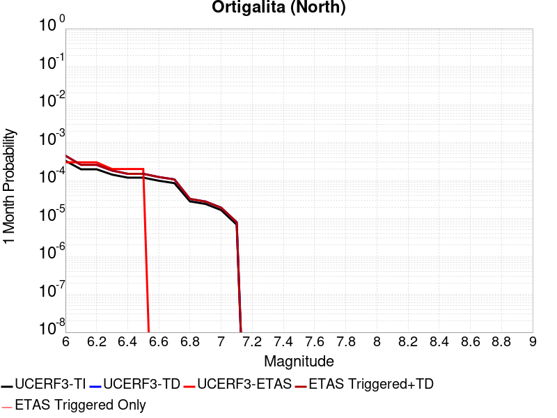 |  |  |

| Magnitude | 1 wk TI Prob | 1 wk TD Prob | 1 wk ETAS Prob | 1 wk ETAS/TD Gain | 1 wk ETAS Triggered+TD | 1 wk ETAS Triggered Only | 1 mo TI Prob | 1 mo TD Prob | 1 mo ETAS Prob | 1 mo ETAS/TD Gain | 1 mo ETAS Triggered+TD | 1 mo ETAS Triggered Only | 1 yr TI Prob | 1 yr TD Prob | 1 yr ETAS Prob | 1 yr ETAS/TD Gain | 1 yr ETAS Triggered+TD | 1 yr ETAS Triggered Only | 10 yr TI Prob | 10 yr TD Prob | 10 yr ETAS Prob | 10 yr ETAS/TD Gain | 10 yr ETAS Triggered+TD | 10 yr ETAS Triggered Only |
|-----|-----|-----|-----|-----|-----|-----|-----|-----|-----|-----|-----|-----|-----|-----|-----|-----|-----|-----|-----|-----|-----|-----|-----|-----|
| 6.0 | 7.711876E-5 | 1.05127336E-4 | 0.0 | 0.0 | 1.05127336E-4 | 0.0 | 3.3046713E-4 | 4.504637E-4 | 0.0 | 0.0 | 4.504637E-4 | 0.0 | 0.004016016 | 0.0054717897 | 2.0E-4 | 0.03655111 | 0.0056706956 | 2.0E-4 | 0.039442103 | 0.053490758 | 0.0021 | 0.039259117 | 0.055478428 | 0.0021 |
| 6.1 | 4.607858E-5 | 6.0277285E-5 | 0.0 | 0.0 | 6.0277285E-5 | 0.0 | 1.9746469E-4 | 2.5830677E-4 | 0.0 | 0.0 | 2.5830677E-4 | 0.0 | 0.0024014818 | 0.0031406668 | 1.0E-4 | 0.031840373 | 0.0032403527 | 1.0E-4 | 0.023756953 | 0.030993918 | 0.0014 | 0.045170154 | 0.032350525 | 0.0014 |
| 6.2 | 4.607858E-5 | 6.0277285E-5 | 0.0 | 0.0 | 6.0277285E-5 | 0.0 | 1.9746469E-4 | 2.5830677E-4 | 0.0 | 0.0 | 2.5830677E-4 | 0.0 | 0.0024014818 | 0.0031406668 | 1.0E-4 | 0.031840373 | 0.0032403527 | 1.0E-4 | 0.023756953 | 0.030993918 | 0.0014 | 0.045170154 | 0.032350525 | 0.0014 |
| 6.3 | 3.327423E-5 | 4.2500396E-5 | 0.0 | 0.0 | 4.2500396E-5 | 0.0 | 1.4259605E-4 | 1.8213355E-4 | 0.0 | 0.0 | 1.8213355E-4 | 0.0 | 0.0017347244 | 0.0022154674 | 1.0E-4 | 0.0451372 | 0.0023152458 | 1.0E-4 | 0.017212452 | 0.021958055 | 9.0E-4 | 0.04098724 | 0.022838293 | 9.0E-4 |
| 6.4 | 2.7732503E-5 | 3.5018194E-5 | 0.0 | 0.0 | 3.5018194E-5 | 0.0 | 1.1884817E-4 | 1.500708E-4 | 0.0 | 0.0 | 1.500708E-4 | 0.0 | 0.001446016 | 0.0018258144 | 1.0E-4 | 0.05477008 | 0.0019256318 | 1.0E-4 | 0.014366428 | 0.018131105 | 7.0E-4 | 0.038607683 | 0.018818414 | 7.0E-4 |
| 6.5 | 2.7689714E-5 | 3.496799E-5 | 0.0 | 0.0 | 3.496799E-5 | 0.0 | 1.186648E-4 | 1.4985567E-4 | 0.0 | 0.0 | 1.4985567E-4 | 0.0 | 0.0014437864 | 0.0018231996 | 1.0E-4 | 0.054848634 | 0.0019230172 | 1.0E-4 | 0.014344421 | 0.018105384 | 7.0E-4 | 0.038662534 | 0.01879271 | 7.0E-4 |
| 6.6 | 2.2976905E-5 | 2.8733499E-5 | 0.0 | 0.0 | 2.8733499E-5 | 0.0 | 9.846873E-5 | 1.2313918E-4 | 0.0 | 0.0 | 1.2313918E-4 | 0.0 | 0.0011981975 | 0.0014984269 | 1.0E-4 | 0.06673665 | 0.001598277 | 1.0E-4 | 0.011917574 | 0.014906555 | 6.0E-4 | 0.04025075 | 0.015497612 | 6.0E-4 |
| 6.7 | 1.9871539E-5 | 2.4918034E-5 | 0.0 | 0.0 | 2.4918034E-5 | 0.0 | 8.516096E-5 | 1.06788604E-4 | 0.0 | 0.0 | 1.06788604E-4 | 0.0 | 0.0010363415 | 0.001299618 | 1.0E-4 | 0.076945685 | 0.0013994881 | 1.0E-4 | 0.010315218 | 0.0129438555 | 5.0E-4 | 0.03862837 | 0.013437383 | 5.0E-4 |
| 6.8 | 6.5640475E-6 | 7.6079823E-6 | 0.0 | 0.0 | 7.6079823E-6 | 0.0 | 2.813133E-5 | 3.2605247E-5 | 0.0 | 0.0 | 3.2605247E-5 | 0.0 | 3.424451E-4 | 3.9689944E-4 | 0.0 | 0.0 | 3.9689944E-4 | 0.0 | 0.0034191788 | 0.003962193 | 1.0E-4 | 0.025238547 | 0.004061797 | 1.0E-4 |
| 6.9 | 5.6219683E-6 | 6.5039367E-6 | 0.0 | 0.0 | 6.5039367E-6 | 0.0 | 2.4093928E-5 | 2.787373E-5 | 0.0 | 0.0 | 2.787373E-5 | 0.0 | 2.933041E-4 | 3.393124E-4 | 0.0 | 0.0 | 3.393124E-4 | 0.0 | 0.0029291727 | 0.0033882004 | 1.0E-4 | 0.029514192 | 0.0034878617 | 1.0E-4 |
| 7.0 | 3.875591E-6 | 4.4862086E-6 | 0.0 | 0.0 | 4.4862086E-6 | 0.0 | 1.6609569E-5 | 1.9226478E-5 | 0.0 | 0.0 | 1.9226478E-5 | 0.0 | 2.0220275E-4 | 2.3405933E-4 | 0.0 | 0.0 | 2.3405933E-4 | 0.0 | 0.0020201886 | 0.0023383365 | 1.0E-4 | 0.042765442 | 0.0024381028 | 1.0E-4 |
| 7.1 | 1.6017933E-6 | 1.8576521E-6 | 0.0 | 0.0 | 1.8576521E-6 | 0.0 | 6.8648105E-6 | 7.961348E-6 | 0.0 | 0.0 | 7.961348E-6 | 0.0 | 8.357586E-5 | 9.692617E-5 | 0.0 | 0.0 | 9.692617E-5 | 0.0 | 8.3544437E-4 | 9.689437E-4 | 0.0 | 0.0 | 9.689437E-4 | 0.0 |

## Manix-Afton Hills
*[(top)](#table-of-contents)*

| 1 Week | 1 Month | 1 Year | 10 Year |
|-----|-----|-----|-----|
|  |  |  |  |

| Magnitude | 1 wk TI Prob | 1 wk TD Prob | 1 wk ETAS Prob | 1 wk ETAS/TD Gain | 1 wk ETAS Triggered+TD | 1 wk ETAS Triggered Only | 1 mo TI Prob | 1 mo TD Prob | 1 mo ETAS Prob | 1 mo ETAS/TD Gain | 1 mo ETAS Triggered+TD | 1 mo ETAS Triggered Only | 1 yr TI Prob | 1 yr TD Prob | 1 yr ETAS Prob | 1 yr ETAS/TD Gain | 1 yr ETAS Triggered+TD | 1 yr ETAS Triggered Only | 10 yr TI Prob | 10 yr TD Prob | 10 yr ETAS Prob | 10 yr ETAS/TD Gain | 10 yr ETAS Triggered+TD | 10 yr ETAS Triggered Only |
|-----|-----|-----|-----|-----|-----|-----|-----|-----|-----|-----|-----|-----|-----|-----|-----|-----|-----|-----|-----|-----|-----|-----|-----|-----|
| 6.0 | 1.3783202E-5 | 1.4713133E-5 | 0.0 | 0.0 | 1.4713133E-5 | 0.0 | 5.906953E-5 | 6.305486E-5 | 0.0 | 0.0 | 6.305486E-5 | 0.0 | 7.189342E-4 | 7.6744E-4 | 2.0E-4 | 0.2606067 | 9.672865E-4 | 2.0E-4 | 0.0071661277 | 0.0076496545 | 0.0024 | 0.31373966 | 0.010031295 | 0.0024 |
| 6.1 | 1.3783202E-5 | 1.4713133E-5 | 0.0 | 0.0 | 1.4713133E-5 | 0.0 | 5.906953E-5 | 6.305486E-5 | 0.0 | 0.0 | 6.305486E-5 | 0.0 | 7.189342E-4 | 7.6744E-4 | 2.0E-4 | 0.2606067 | 9.672865E-4 | 2.0E-4 | 0.0071661277 | 0.0076496545 | 0.0024 | 0.31373966 | 0.010031295 | 0.0024 |
| 6.2 | 1.3783202E-5 | 1.4713133E-5 | 0.0 | 0.0 | 1.4713133E-5 | 0.0 | 5.906953E-5 | 6.305486E-5 | 0.0 | 0.0 | 6.305486E-5 | 0.0 | 7.189342E-4 | 7.6744E-4 | 2.0E-4 | 0.2606067 | 9.672865E-4 | 2.0E-4 | 0.0071661277 | 0.0076496545 | 0.0024 | 0.31373966 | 0.010031295 | 0.0024 |
| 6.3 | 1.10494875E-5 | 1.1794774E-5 | 0.0 | 0.0 | 1.1794774E-5 | 0.0 | 4.7354086E-5 | 5.054811E-5 | 0.0 | 0.0 | 5.054811E-5 | 0.0 | 5.763835E-4 | 6.152598E-4 | 1.0E-4 | 0.16253296 | 7.151983E-4 | 1.0E-4 | 0.005748908 | 0.0061366055 | 0.0021 | 0.34220874 | 0.008223718 | 0.0021 |
| 6.4 | 1.10494875E-5 | 1.1794774E-5 | 0.0 | 0.0 | 1.1794774E-5 | 0.0 | 4.7354086E-5 | 5.054811E-5 | 0.0 | 0.0 | 5.054811E-5 | 0.0 | 5.763835E-4 | 6.152598E-4 | 1.0E-4 | 0.16253296 | 7.151983E-4 | 1.0E-4 | 0.005748908 | 0.0061366055 | 0.0021 | 0.34220874 | 0.008223718 | 0.0021 |
| 6.5 | 9.788949E-6 | 1.0455787E-5 | 0.0 | 0.0 | 1.0455787E-5 | 0.0 | 4.1951964E-5 | 4.4809796E-5 | 0.0 | 0.0 | 4.4809796E-5 | 0.0 | 5.1064545E-4 | 5.45432E-4 | 1.0E-4 | 0.1833409 | 6.4537744E-4 | 1.0E-4 | 0.0050947363 | 0.0054418603 | 0.0018 | 0.33076924 | 0.007232065 | 0.0018 |
| 6.6 | 8.810006E-6 | 9.41496E-6 | 0.0 | 0.0 | 9.41496E-6 | 0.0 | 3.775662E-5 | 4.0349252E-5 | 0.0 | 0.0 | 4.0349252E-5 | 0.0 | 4.5958988E-4 | 4.911503E-4 | 1.0E-4 | 0.20360366 | 5.911012E-4 | 1.0E-4 | 0.0045864056 | 0.0049015307 | 0.0018 | 0.3672322 | 0.006692708 | 0.0018 |
| 6.7 | 8.80128E-6 | 9.405438E-6 | 0.0 | 0.0 | 9.405438E-6 | 0.0 | 3.7719226E-5 | 4.0308445E-5 | 0.0 | 0.0 | 4.0308445E-5 | 0.0 | 4.591348E-4 | 4.9065374E-4 | 1.0E-4 | 0.20380972 | 5.906047E-4 | 1.0E-4 | 0.004581874 | 0.0048965868 | 0.0018 | 0.367603 | 0.006687773 | 0.0018 |
| 6.8 | 6.8994877E-6 | 7.3811375E-6 | 0.0 | 0.0 | 7.3811375E-6 | 0.0 | 2.9568899E-5 | 3.163311E-5 | 0.0 | 0.0 | 3.163311E-5 | 0.0 | 3.5994186E-4 | 3.8507322E-4 | 1.0E-4 | 0.25969088 | 4.850347E-4 | 1.0E-4 | 0.003593594 | 0.003844865 | 0.0013 | 0.3381133 | 0.0051398664 | 0.0013 |
| 6.9 | 4.9328037E-6 | 5.271708E-6 | 0.0 | 0.0 | 5.271708E-6 | 0.0 | 2.1140417E-5 | 2.2592872E-5 | 0.0 | 0.0 | 2.2592872E-5 | 0.0 | 2.5735417E-4 | 2.7503967E-4 | 0.0 | 0.0 | 2.7503967E-4 | 0.0 | 0.0025705635 | 0.0027475979 | 6.0E-4 | 0.21837257 | 0.0033459493 | 6.0E-4 |
| 7.0 | 3.347973E-6 | 3.5905662E-6 | 0.0 | 0.0 | 3.5905662E-6 | 0.0 | 1.4348378E-5 | 1.5388072E-5 | 0.0 | 0.0 | 1.5388072E-5 | 0.0 | 1.746775E-4 | 1.8733778E-4 | 0.0 | 0.0 | 1.8733778E-4 | 0.0 | 0.0017454025 | 0.0018722013 | 3.0E-4 | 0.16023917 | 0.0021716396 | 3.0E-4 |
| 7.1 | 1.2073567E-6 | 1.2936721E-6 | 0.0 | 0.0 | 1.2936721E-6 | 0.0 | 5.1743755E-6 | 5.544306E-6 | 0.0 | 0.0 | 5.544306E-6 | 0.0 | 6.29962E-5 | 6.7501474E-5 | 0.0 | 0.0 | 6.7501474E-5 | 0.0 | 6.297835E-4 | 6.7496987E-4 | 1.0E-4 | 0.14815477 | 7.749024E-4 | 1.0E-4 |

## Great Valley 05 Pittsburg - Kirby Hills alt1
*[(top)](#table-of-contents)*

| 1 Week | 1 Month | 1 Year | 10 Year |
|-----|-----|-----|-----|
|  |  |  |  |

| Magnitude | 1 wk TI Prob | 1 wk TD Prob | 1 wk ETAS Prob | 1 wk ETAS/TD Gain | 1 wk ETAS Triggered+TD | 1 wk ETAS Triggered Only | 1 mo TI Prob | 1 mo TD Prob | 1 mo ETAS Prob | 1 mo ETAS/TD Gain | 1 mo ETAS Triggered+TD | 1 mo ETAS Triggered Only | 1 yr TI Prob | 1 yr TD Prob | 1 yr ETAS Prob | 1 yr ETAS/TD Gain | 1 yr ETAS Triggered+TD | 1 yr ETAS Triggered Only | 10 yr TI Prob | 10 yr TD Prob | 10 yr ETAS Prob | 10 yr ETAS/TD Gain | 10 yr ETAS Triggered+TD | 10 yr ETAS Triggered Only |
|-----|-----|-----|-----|-----|-----|-----|-----|-----|-----|-----|-----|-----|-----|-----|-----|-----|-----|-----|-----|-----|-----|-----|-----|-----|
| 6.0 | 4.187212E-5 | 5.347264E-5 | 0.0 | 0.0 | 5.347264E-5 | 0.0 | 1.794396E-4 | 2.2915407E-4 | 0.0 | 0.0 | 2.2915407E-4 | 0.0 | 0.002182488 | 0.002787352 | 2.0E-4 | 0.07175269 | 0.0029867946 | 2.0E-4 | 0.021611776 | 0.027618373 | 0.0021 | 0.07603634 | 0.029660376 | 0.0021 |
| 6.1 | 4.187212E-5 | 5.347264E-5 | 0.0 | 0.0 | 5.347264E-5 | 0.0 | 1.794396E-4 | 2.2915407E-4 | 0.0 | 0.0 | 2.2915407E-4 | 0.0 | 0.002182488 | 0.002787352 | 2.0E-4 | 0.07175269 | 0.0029867946 | 2.0E-4 | 0.021611776 | 0.027618373 | 0.0021 | 0.07603634 | 0.029660376 | 0.0021 |
| 6.2 | 1.7353306E-5 | 2.2167018E-5 | 0.0 | 0.0 | 2.2167018E-5 | 0.0 | 7.436919E-5 | 9.500037E-5 | 0.0 | 0.0 | 9.500037E-5 | 0.0 | 9.050688E-4 | 0.0011564026 | 1.0E-4 | 0.086475074 | 0.001256287 | 1.0E-4 | 0.009013915 | 0.011541593 | 9.0E-4 | 0.07797884 | 0.012431205 | 9.0E-4 |
| 6.3 | 1.7353306E-5 | 2.2167018E-5 | 0.0 | 0.0 | 2.2167018E-5 | 0.0 | 7.436919E-5 | 9.500037E-5 | 0.0 | 0.0 | 9.500037E-5 | 0.0 | 9.050688E-4 | 0.0011564026 | 1.0E-4 | 0.086475074 | 0.001256287 | 1.0E-4 | 0.009013915 | 0.011541593 | 9.0E-4 | 0.07797884 | 0.012431205 | 9.0E-4 |
| 6.4 | 1.4028824E-5 | 1.7911016E-5 | 0.0 | 0.0 | 1.7911016E-5 | 0.0 | 6.0122147E-5 | 7.67615E-5 | 0.0 | 0.0 | 7.67615E-5 | 0.0 | 7.3174125E-4 | 9.345508E-4 | 1.0E-4 | 0.10700329 | 0.0010344574 | 1.0E-4 | 0.0072933645 | 0.009343386 | 9.0E-4 | 0.09632483 | 0.010234976 | 9.0E-4 |

## Paradise
*[(top)](#table-of-contents)*

| 1 Week | 1 Month | 1 Year | 10 Year |
|-----|-----|-----|-----|
|  |  |  |  |

| Magnitude | 1 wk TI Prob | 1 wk TD Prob | 1 wk ETAS Prob | 1 wk ETAS/TD Gain | 1 wk ETAS Triggered+TD | 1 wk ETAS Triggered Only | 1 mo TI Prob | 1 mo TD Prob | 1 mo ETAS Prob | 1 mo ETAS/TD Gain | 1 mo ETAS Triggered+TD | 1 mo ETAS Triggered Only | 1 yr TI Prob | 1 yr TD Prob | 1 yr ETAS Prob | 1 yr ETAS/TD Gain | 1 yr ETAS Triggered+TD | 1 yr ETAS Triggered Only | 10 yr TI Prob | 10 yr TD Prob | 10 yr ETAS Prob | 10 yr ETAS/TD Gain | 10 yr ETAS Triggered+TD | 10 yr ETAS Triggered Only |
|-----|-----|-----|-----|-----|-----|-----|-----|-----|-----|-----|-----|-----|-----|-----|-----|-----|-----|-----|-----|-----|-----|-----|-----|-----|
| 6.0 | 1.4851273E-5 | 1.6697657E-5 | 0.0 | 0.0 | 1.6697657E-5 | 0.0 | 6.364676E-5 | 7.155956E-5 | 0.0 | 0.0 | 7.155956E-5 | 0.0 | 7.7462377E-4 | 8.70913E-4 | 1.0E-4 | 0.11482203 | 9.708259E-4 | 1.0E-4 | 0.0077192914 | 0.008677379 | 0.0023 | 0.265057 | 0.010957422 | 0.0023 |
| 6.1 | 1.4851273E-5 | 1.6697657E-5 | 0.0 | 0.0 | 1.6697657E-5 | 0.0 | 6.364676E-5 | 7.155956E-5 | 0.0 | 0.0 | 7.155956E-5 | 0.0 | 7.7462377E-4 | 8.70913E-4 | 1.0E-4 | 0.11482203 | 9.708259E-4 | 1.0E-4 | 0.0077192914 | 0.008677379 | 0.0023 | 0.265057 | 0.010957422 | 0.0023 |
| 6.2 | 1.4851273E-5 | 1.6697657E-5 | 0.0 | 0.0 | 1.6697657E-5 | 0.0 | 6.364676E-5 | 7.155956E-5 | 0.0 | 0.0 | 7.155956E-5 | 0.0 | 7.7462377E-4 | 8.70913E-4 | 1.0E-4 | 0.11482203 | 9.708259E-4 | 1.0E-4 | 0.0077192914 | 0.008677379 | 0.0023 | 0.265057 | 0.010957422 | 0.0023 |
| 6.3 | 1.0426831E-5 | 1.1890731E-5 | 0.0 | 0.0 | 1.1890731E-5 | 0.0 | 4.4685654E-5 | 5.0959316E-5 | 0.0 | 0.0 | 5.0959316E-5 | 0.0 | 5.43912E-4 | 6.20259E-4 | 0.0 | 0.0 | 6.20259E-4 | 0.0 | 0.0054258266 | 0.0061858865 | 0.0015 | 0.24248748 | 0.0076766075 | 0.0015 |
| 6.4 | 1.0426831E-5 | 1.1890731E-5 | 0.0 | 0.0 | 1.1890731E-5 | 0.0 | 4.4685654E-5 | 5.0959316E-5 | 0.0 | 0.0 | 5.0959316E-5 | 0.0 | 5.43912E-4 | 6.20259E-4 | 0.0 | 0.0 | 6.20259E-4 | 0.0 | 0.0054258266 | 0.0061858865 | 0.0015 | 0.24248748 | 0.0076766075 | 0.0015 |
| 6.5 | 9.25027E-6 | 1.0621866E-5 | 0.0 | 0.0 | 1.0621866E-5 | 0.0 | 3.964341E-5 | 4.5521516E-5 | 0.0 | 0.0 | 4.5521516E-5 | 0.0 | 4.8255164E-4 | 5.540884E-4 | 0.0 | 0.0 | 5.540884E-4 | 0.0 | 0.0048150513 | 0.0055275685 | 0.0013 | 0.23518479 | 0.0068203826 | 0.0013 |
| 6.6 | 7.904275E-6 | 9.161175E-6 | 0.0 | 0.0 | 9.161175E-6 | 0.0 | 3.3875025E-5 | 3.926161E-5 | 0.0 | 0.0 | 3.926161E-5 | 0.0 | 4.1235037E-4 | 4.7790917E-4 | 0.0 | 0.0 | 4.7790917E-4 | 0.0 | 0.0041158604 | 0.004769211 | 0.0012 | 0.25161394 | 0.005963488 | 0.0012 |
| 6.7 | 7.2061953E-6 | 8.408778E-6 | 0.0 | 0.0 | 8.408778E-6 | 0.0 | 3.088333E-5 | 3.603714E-5 | 0.0 | 0.0 | 3.603714E-5 | 0.0 | 3.7593965E-4 | 4.386675E-4 | 0.0 | 0.0 | 4.386675E-4 | 0.0 | 0.003753043 | 0.0043783854 | 0.0012 | 0.27407363 | 0.005573131 | 0.0012 |
| 6.8 | 6.6948724E-6 | 7.843609E-6 | 0.0 | 0.0 | 7.843609E-6 | 0.0 | 2.8691995E-5 | 3.361505E-5 | 0.0 | 0.0 | 3.361505E-5 | 0.0 | 3.4926904E-4 | 4.0918996E-4 | 0.0 | 0.0 | 4.0918996E-4 | 0.0 | 0.003487206 | 0.004084723 | 0.0012 | 0.29377759 | 0.0052798213 | 0.0012 |
| 6.9 | 6.0421025E-6 | 7.1319555E-6 | 0.0 | 0.0 | 7.1319555E-6 | 0.0 | 2.5894467E-5 | 3.0565185E-5 | 0.0 | 0.0 | 3.0565185E-5 | 0.0 | 3.1521954E-4 | 3.7207096E-4 | 0.0 | 0.0 | 3.7207096E-4 | 0.0 | 0.0031477278 | 0.0037148185 | 0.001 | 0.26919216 | 0.0047111036 | 0.001 |
| 7.0 | 4.134091E-6 | 5.0813696E-6 | 0.0 | 0.0 | 5.0813696E-6 | 0.0 | 1.7717413E-5 | 2.1777127E-5 | 0.0 | 0.0 | 2.1777127E-5 | 0.0 | 2.1568815E-4 | 2.651058E-4 | 0.0 | 0.0 | 2.651058E-4 | 0.0 | 0.0021547892 | 0.0026480486 | 8.0E-4 | 0.30210927 | 0.00344593 | 8.0E-4 |
| 7.1 | 3.7674888E-6 | 4.6328596E-6 | 0.0 | 0.0 | 4.6328596E-6 | 0.0 | 1.6146281E-5 | 1.985497E-5 | 0.0 | 0.0 | 1.985497E-5 | 0.0 | 1.9656324E-4 | 2.4170897E-4 | 0.0 | 0.0 | 2.4170897E-4 | 0.0 | 0.0019638946 | 0.0024146114 | 7.0E-4 | 0.28990173 | 0.0031129213 | 7.0E-4 |
| 7.2 | 3.4065345E-6 | 4.1576454E-6 | 0.0 | 0.0 | 4.1576454E-6 | 0.0 | 1.4599351E-5 | 1.7818367E-5 | 0.0 | 0.0 | 1.7818367E-5 | 0.0 | 1.777326E-4 | 2.1691853E-4 | 0.0 | 0.0 | 2.1691853E-4 | 0.0 | 0.0017759053 | 0.0021672163 | 7.0E-4 | 0.322995 | 0.0028656991 | 7.0E-4 |
| 7.3 | 2.9934936E-6 | 3.6299518E-6 | 0.0 | 0.0 | 3.6299518E-6 | 0.0 | 1.2829195E-5 | 1.5556852E-5 | 0.0 | 0.0 | 1.5556852E-5 | 0.0 | 1.5618425E-4 | 1.8938968E-4 | 0.0 | 0.0 | 1.8938968E-4 | 0.0 | 0.0015607453 | 0.0018924283 | 7.0E-4 | 0.36989513 | 0.0025911035 | 7.0E-4 |
| 7.4 | 2.4049796E-6 | 2.8893344E-6 | 0.0 | 0.0 | 2.8893344E-6 | 0.0 | 1.0307015E-5 | 1.2382811E-5 | 0.0 | 0.0 | 1.2382811E-5 | 0.0 | 1.2548068E-4 | 1.5075174E-4 | 0.0 | 0.0 | 1.5075174E-4 | 0.0 | 0.0012540985 | 0.0015066363 | 6.0E-4 | 0.39823812 | 0.0021057322 | 6.0E-4 |
| 7.5 | 1.2710091E-6 | 1.5136369E-6 | 0.0 | 0.0 | 1.5136369E-6 | 0.0 | 5.44717E-6 | 6.4870064E-6 | 0.0 | 0.0 | 6.4870064E-6 | 0.0 | 6.631728E-5 | 7.897769E-5 | 0.0 | 0.0 | 7.897769E-5 | 0.0 | 6.6297496E-4 | 7.896189E-4 | 2.0E-4 | 0.25328675 | 9.89461E-4 | 2.0E-4 |
| 7.6 | 2.21172E-7 | 2.6041258E-7 | 0.0 | 0.0 | 2.6041258E-7 | 0.0 | 9.478797E-7 | 1.1160537E-6 | 0.0 | 0.0 | 1.1160537E-6 | 0.0 | 1.1540374E-5 | 1.3587897E-5 | 0.0 | 0.0 | 1.3587897E-5 | 0.0 | 1.1539775E-4 | 1.3587347E-4 | 0.0 | 0.0 | 1.3587347E-4 | 0.0 |

## Mount Diablo Thrust South
*[(top)](#table-of-contents)*

| 1 Week | 1 Month | 1 Year | 10 Year |
|-----|-----|-----|-----|
|  |  |  |  |

| Magnitude | 1 wk TI Prob | 1 wk TD Prob | 1 wk ETAS Prob | 1 wk ETAS/TD Gain | 1 wk ETAS Triggered+TD | 1 wk ETAS Triggered Only | 1 mo TI Prob | 1 mo TD Prob | 1 mo ETAS Prob | 1 mo ETAS/TD Gain | 1 mo ETAS Triggered+TD | 1 mo ETAS Triggered Only | 1 yr TI Prob | 1 yr TD Prob | 1 yr ETAS Prob | 1 yr ETAS/TD Gain | 1 yr ETAS Triggered+TD | 1 yr ETAS Triggered Only | 10 yr TI Prob | 10 yr TD Prob | 10 yr ETAS Prob | 10 yr ETAS/TD Gain | 10 yr ETAS Triggered+TD | 10 yr ETAS Triggered Only |
|-----|-----|-----|-----|-----|-----|-----|-----|-----|-----|-----|-----|-----|-----|-----|-----|-----|-----|-----|-----|-----|-----|-----|-----|-----|
| 6.0 | 2.2377444E-5 | 2.6966321E-5 | 2.0E-4 | 7.416659 | 2.2696092E-4 | 2.0E-4 | 9.5899806E-5 | 1.1556595E-4 | 3.0E-4 | 2.5959203 | 4.1553128E-4 | 3.0E-4 | 0.0011669548 | 0.0014063054 | 5.0E-4 | 0.35554156 | 0.0019056023 | 5.0E-4 | 0.011608457 | 0.013993892 | 0.0024 | 0.1715034 | 0.016360307 | 0.0024 |
| 6.1 | 2.2377444E-5 | 2.6966321E-5 | 2.0E-4 | 7.416659 | 2.2696092E-4 | 2.0E-4 | 9.5899806E-5 | 1.1556595E-4 | 3.0E-4 | 2.5959203 | 4.1553128E-4 | 3.0E-4 | 0.0011669548 | 0.0014063054 | 5.0E-4 | 0.35554156 | 0.0019056023 | 5.0E-4 | 0.011608457 | 0.013993892 | 0.0024 | 0.1715034 | 0.016360307 | 0.0024 |
| 6.2 | 2.2377444E-5 | 2.6966321E-5 | 2.0E-4 | 7.416659 | 2.2696092E-4 | 2.0E-4 | 9.5899806E-5 | 1.1556595E-4 | 3.0E-4 | 2.5959203 | 4.1553128E-4 | 3.0E-4 | 0.0011669548 | 0.0014063054 | 5.0E-4 | 0.35554156 | 0.0019056023 | 5.0E-4 | 0.011608457 | 0.013993892 | 0.0024 | 0.1715034 | 0.016360307 | 0.0024 |
| 6.3 | 2.2377444E-5 | 2.6966321E-5 | 2.0E-4 | 7.416659 | 2.2696092E-4 | 2.0E-4 | 9.5899806E-5 | 1.1556595E-4 | 3.0E-4 | 2.5959203 | 4.1553128E-4 | 3.0E-4 | 0.0011669548 | 0.0014063054 | 5.0E-4 | 0.35554156 | 0.0019056023 | 5.0E-4 | 0.011608457 | 0.013993892 | 0.0024 | 0.1715034 | 0.016360307 | 0.0024 |
| 6.4 | 1.2228463E-5 | 1.4752696E-5 | 1.0E-4 | 6.778422 | 1.1475122E-4 | 1.0E-4 | 5.2406645E-5 | 6.322438E-5 | 2.0E-4 | 3.1633365 | 2.6321172E-4 | 2.0E-4 | 6.378641E-4 | 7.694979E-4 | 2.0E-4 | 0.25990975 | 9.69344E-4 | 2.0E-4 | 0.0063603627 | 0.007669932 | 7.0E-4 | 0.09126548 | 0.008364563 | 7.0E-4 |
| 6.5 | 1.2228463E-5 | 1.4752696E-5 | 1.0E-4 | 6.778422 | 1.1475122E-4 | 1.0E-4 | 5.2406645E-5 | 6.322438E-5 | 2.0E-4 | 3.1633365 | 2.6321172E-4 | 2.0E-4 | 6.378641E-4 | 7.694979E-4 | 2.0E-4 | 0.25990975 | 9.69344E-4 | 2.0E-4 | 0.0063603627 | 0.007669932 | 7.0E-4 | 0.09126548 | 0.008364563 | 7.0E-4 |
| 6.6 | 1.2068118E-5 | 1.4557408E-5 | 1.0E-4 | 6.8693547 | 1.1455595E-4 | 1.0E-4 | 5.1719482E-5 | 6.238747E-5 | 1.0E-4 | 1.602886 | 1.6238123E-4 | 1.0E-4 | 6.2950276E-4 | 7.593156E-4 | 1.0E-4 | 0.13169755 | 8.5923966E-4 | 1.0E-4 | 0.006277225 | 0.0075688073 | 5.0E-4 | 0.0660606 | 0.008065023 | 5.0E-4 |
| 6.7 | 1.1499428E-5 | 1.3879802E-5 | 0.0 | 0.0 | 1.3879802E-5 | 0.0 | 4.9282335E-5 | 5.9483584E-5 | 0.0 | 0.0 | 5.9483584E-5 | 0.0 | 5.9984723E-4 | 7.2398473E-4 | 0.0 | 0.0 | 7.2398473E-4 | 0.0 | 0.0059823063 | 0.0072178426 | 3.0E-4 | 0.041563667 | 0.0075156773 | 3.0E-4 |
| 6.8 | 8.82118E-6 | 1.0834225E-5 | 0.0 | 0.0 | 1.0834225E-5 | 0.0 | 3.780451E-5 | 4.6431596E-5 | 0.0 | 0.0 | 4.6431596E-5 | 0.0 | 4.601727E-4 | 5.651637E-4 | 0.0 | 0.0 | 5.651637E-4 | 0.0 | 0.0045922096 | 0.0056381267 | 3.0E-4 | 0.053209163 | 0.0059364354 | 3.0E-4 |
| 6.9 | 8.047112E-6 | 9.942913E-6 | 0.0 | 0.0 | 9.942913E-6 | 0.0 | 3.4487166E-5 | 4.2611817E-5 | 0.0 | 0.0 | 4.2611817E-5 | 0.0 | 4.1980037E-4 | 5.1868067E-4 | 0.0 | 0.0 | 5.1868067E-4 | 0.0 | 0.004190082 | 0.0051755277 | 3.0E-4 | 0.057965107 | 0.0054739746 | 3.0E-4 |
| 7.0 | 6.2574763E-6 | 7.751429E-6 | 0.0 | 0.0 | 7.751429E-6 | 0.0 | 2.681748E-5 | 3.3220007E-5 | 0.0 | 0.0 | 3.3220007E-5 | 0.0 | 3.264539E-4 | 4.043822E-4 | 0.0 | 0.0 | 4.043822E-4 | 0.0 | 0.0032597475 | 0.0040373355 | 3.0E-4 | 0.074306436 | 0.0043361243 | 3.0E-4 |
| 7.1 | 3.6485903E-6 | 4.5143206E-6 | 0.0 | 0.0 | 4.5143206E-6 | 0.0 | 1.5636722E-5 | 1.9346948E-5 | 0.0 | 0.0 | 1.9346948E-5 | 0.0 | 1.9036046E-4 | 2.3552404E-4 | 0.0 | 0.0 | 2.3552404E-4 | 0.0 | 0.0019019748 | 0.0023528351 | 1.0E-4 | 0.042501915 | 0.0024525998 | 1.0E-4 |
| 7.2 | 2.3034274E-6 | 2.9060986E-6 | 0.0 | 0.0 | 2.9060986E-6 | 0.0 | 9.871795E-6 | 1.24546505E-5 | 0.0 | 0.0 | 1.24546505E-5 | 0.0 | 1.2018247E-4 | 1.5162506E-4 | 0.0 | 0.0 | 1.5162506E-4 | 0.0 | 0.0012011749 | 0.0015153716 | 1.0E-4 | 0.06599041 | 0.0016152201 | 1.0E-4 |
| 7.3 | 1.224035E-6 | 1.5682665E-6 | 0.0 | 0.0 | 1.5682665E-6 | 0.0 | 5.245854E-6 | 6.7211254E-6 | 0.0 | 0.0 | 6.7211254E-6 | 0.0 | 6.38664E-5 | 8.1826736E-5 | 0.0 | 0.0 | 8.1826736E-5 | 0.0 | 6.384805E-4 | 8.181049E-4 | 0.0 | 0.0 | 8.181049E-4 | 0.0 |
| 7.4 | 5.1601154E-7 | 6.724704E-7 | 0.0 | 0.0 | 6.724704E-7 | 0.0 | 2.2114762E-6 | 2.8820127E-6 | 0.0 | 0.0 | 2.8820127E-6 | 0.0 | 2.6924388E-5 | 3.5087956E-5 | 0.0 | 0.0 | 3.5087956E-5 | 0.0 | 2.6921128E-4 | 3.5079857E-4 | 0.0 | 0.0 | 3.5079857E-4 | 0.0 |
| 7.5 | 3.552894E-7 | 4.6658042E-7 | 0.0 | 0.0 | 4.6658042E-7 | 0.0 | 1.5226678E-6 | 1.999629E-6 | 0.0 | 0.0 | 1.999629E-6 | 0.0 | 1.8538323E-5 | 2.4345225E-5 | 0.0 | 0.0 | 2.4345225E-5 | 0.0 | 1.8536777E-4 | 2.4344347E-4 | 0.0 | 0.0 | 2.4344347E-4 | 0.0 |
| 7.6 | 1.3124082E-7 | 1.7192495E-7 | 0.0 | 0.0 | 1.7192495E-7 | 0.0 | 5.6246057E-7 | 7.3682105E-7 | 0.0 | 0.0 | 7.3682105E-7 | 0.0 | 6.8479358E-6 | 8.970768E-6 | 0.0 | 0.0 | 8.970768E-6 | 0.0 | 6.8477246E-5 | 8.9709305E-5 | 0.0 | 0.0 | 8.9709305E-5 | 0.0 |
| 7.7 | 3.6193022E-8 | 4.7337167E-8 | 0.0 | 0.0 | 4.7337167E-8 | 0.0 | 1.5511293E-7 | 2.0287355E-7 | 0.0 | 0.0 | 2.0287355E-7 | 0.0 | 1.8884983E-6 | 2.4699839E-6 | 0.0 | 0.0 | 2.4699839E-6 | 0.0 | 1.8884823E-5 | 2.470406E-5 | 0.0 | 0.0 | 2.470406E-5 | 0.0 |

## Rose Canyon
*[(top)](#table-of-contents)*

| 1 Week | 1 Month | 1 Year | 10 Year |
|-----|-----|-----|-----|
|  | 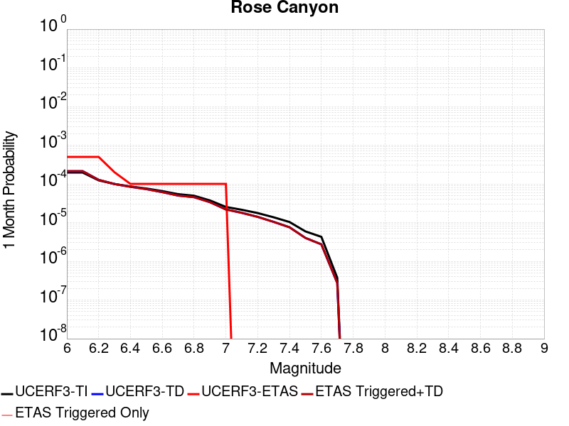 |  |  |

| Magnitude | 1 wk TI Prob | 1 wk TD Prob | 1 wk ETAS Prob | 1 wk ETAS/TD Gain | 1 wk ETAS Triggered+TD | 1 wk ETAS Triggered Only | 1 mo TI Prob | 1 mo TD Prob | 1 mo ETAS Prob | 1 mo ETAS/TD Gain | 1 mo ETAS Triggered+TD | 1 mo ETAS Triggered Only | 1 yr TI Prob | 1 yr TD Prob | 1 yr ETAS Prob | 1 yr ETAS/TD Gain | 1 yr ETAS Triggered+TD | 1 yr ETAS Triggered Only | 10 yr TI Prob | 10 yr TD Prob | 10 yr ETAS Prob | 10 yr ETAS/TD Gain | 10 yr ETAS Triggered+TD | 10 yr ETAS Triggered Only |
|-----|-----|-----|-----|-----|-----|-----|-----|-----|-----|-----|-----|-----|-----|-----|-----|-----|-----|-----|-----|-----|-----|-----|-----|-----|
| 6.0 | 4.5923203E-5 | 4.980451E-5 | 0.0 | 0.0 | 4.980451E-5 | 0.0 | 1.9679888E-4 | 2.1343178E-4 | 0.0 | 0.0 | 2.1343178E-4 | 0.0 | 0.0023933933 | 0.0025956263 | 1.0E-4 | 0.03852635 | 0.0026953667 | 1.0E-4 | 0.023677798 | 0.025676679 | 0.0023 | 0.08957545 | 0.027917624 | 0.0023 |
| 6.1 | 4.5923203E-5 | 4.980451E-5 | 0.0 | 0.0 | 4.980451E-5 | 0.0 | 1.9679888E-4 | 2.1343178E-4 | 0.0 | 0.0 | 2.1343178E-4 | 0.0 | 0.0023933933 | 0.0025956263 | 1.0E-4 | 0.03852635 | 0.0026953667 | 1.0E-4 | 0.023677798 | 0.025676679 | 0.0013 | 0.0506296 | 0.0269433 | 0.0013 |
| 6.2 | 2.8844734E-5 | 2.9746487E-5 | 0.0 | 0.0 | 2.9746487E-5 | 0.0 | 1.2361443E-4 | 1.2747891E-4 | 0.0 | 0.0 | 1.2747891E-4 | 0.0 | 0.0015039665 | 0.001550978 | 1.0E-4 | 0.06447545 | 0.0016508229 | 1.0E-4 | 0.0149382865 | 0.015403759 | 0.001 | 0.06491922 | 0.016388355 | 0.001 |
| 6.3 | 2.3171577E-5 | 2.323495E-5 | 0.0 | 0.0 | 2.323495E-5 | 0.0 | 9.9302975E-5 | 9.957463E-5 | 0.0 | 0.0 | 9.957463E-5 | 0.0 | 0.0012083431 | 0.0012116604 | 1.0E-4 | 0.08253138 | 0.0013115392 | 1.0E-4 | 0.012017938 | 0.012058009 | 5.0E-4 | 0.041466214 | 0.01255198 | 5.0E-4 |
| 6.4 | 2.0066604E-5 | 1.9713538E-5 | 0.0 | 0.0 | 1.9713538E-5 | 0.0 | 8.599689E-5 | 8.448391E-5 | 0.0 | 0.0 | 8.448391E-5 | 0.0 | 0.0010465092 | 0.0010281163 | 0.0 | 0.0 | 0.0010281163 | 0.0 | 0.010415946 | 0.010238743 | 2.0E-4 | 0.019533647 | 0.010436696 | 2.0E-4 |
| 6.5 | 1.776989E-5 | 1.714261E-5 | 0.0 | 0.0 | 1.714261E-5 | 0.0 | 7.615444E-5 | 7.3466304E-5 | 0.0 | 0.0 | 7.3466304E-5 | 0.0 | 9.267859E-4 | 8.940922E-4 | 0.0 | 0.0 | 8.940922E-4 | 0.0 | 0.009229303 | 0.008910711 | 2.0E-4 | 0.022444898 | 0.009108929 | 2.0E-4 |
| 6.6 | 1.5227364E-5 | 1.4350723E-5 | 0.0 | 0.0 | 1.4350723E-5 | 0.0 | 6.52585E-5 | 6.1501676E-5 | 0.0 | 0.0 | 6.1501676E-5 | 0.0 | 7.942326E-4 | 7.485309E-4 | 0.0 | 0.0 | 7.485309E-4 | 0.0 | 0.007914 | 0.0074576507 | 2.0E-4 | 0.026818097 | 0.0076561593 | 2.0E-4 |
| 6.7 | 1.2703898E-5 | 1.1676745E-5 | 0.0 | 0.0 | 1.1676745E-5 | 0.0 | 5.4444143E-5 | 5.0042257E-5 | 0.0 | 0.0 | 5.0042257E-5 | 0.0 | 6.626558E-4 | 6.090984E-4 | 0.0 | 0.0 | 6.090984E-4 | 0.0 | 0.006606833 | 0.0060706865 | 1.0E-4 | 0.016472602 | 0.0061700796 | 1.0E-4 |
| 6.8 | 1.1554917E-5 | 1.0612665E-5 | 0.0 | 0.0 | 1.0612665E-5 | 0.0 | 4.9520135E-5 | 4.548208E-5 | 0.0 | 0.0 | 4.548208E-5 | 0.0 | 6.0274085E-4 | 5.536077E-4 | 0.0 | 0.0 | 5.536077E-4 | 0.0 | 0.0060110865 | 0.0055118864 | 1.0E-4 | 0.018142609 | 0.005611335 | 1.0E-4 |
| 6.9 | 8.732078E-6 | 7.883436E-6 | 0.0 | 0.0 | 7.883436E-6 | 0.0 | 3.7422655E-5 | 3.3785735E-5 | 0.0 | 0.0 | 3.3785735E-5 | 0.0 | 4.5552556E-4 | 4.112666E-4 | 0.0 | 0.0 | 4.112666E-4 | 0.0 | 0.0045459294 | 0.004090113 | 1.0E-4 | 0.024449203 | 0.004189704 | 1.0E-4 |
| 7.0 | 5.9337494E-6 | 5.1083043E-6 | 0.0 | 0.0 | 5.1083043E-6 | 0.0 | 2.5430107E-5 | 2.189255E-5 | 0.0 | 0.0 | 2.189255E-5 | 0.0 | 3.0956755E-4 | 2.6650933E-4 | 0.0 | 0.0 | 2.6650933E-4 | 0.0 | 0.0030913667 | 0.002661913 | 0.0 | 0.0 | 0.002661913 | 0.0 |
| 7.1 | 5.013409E-6 | 4.178061E-6 | 0.0 | 0.0 | 4.178061E-6 | 0.0 | 2.1485863E-5 | 1.7905852E-5 | 0.0 | 0.0 | 1.7905852E-5 | 0.0 | 2.6155898E-4 | 2.1798204E-4 | 0.0 | 0.0 | 2.1798204E-4 | 0.0 | 0.0026125133 | 0.002177694 | 0.0 | 0.0 | 0.002177694 | 0.0 |
| 7.2 | 4.120763E-6 | 3.2826563E-6 | 0.0 | 0.0 | 3.2826563E-6 | 0.0 | 1.7660293E-5 | 1.40684515E-5 | 0.0 | 0.0 | 1.40684515E-5 | 0.0 | 2.1499286E-4 | 1.7127002E-4 | 0.0 | 0.0 | 1.7127002E-4 | 0.0 | 0.0021478499 | 0.0017113897 | 0.0 | 0.0 | 0.0017113897 | 0.0 |
| 7.3 | 3.2081239E-6 | 2.440912E-6 | 0.0 | 0.0 | 2.440912E-6 | 0.0 | 1.374903E-5 | 1.046101E-5 | 0.0 | 0.0 | 1.046101E-5 | 0.0 | 1.6738157E-4 | 1.2735542E-4 | 0.0 | 0.0 | 1.2735542E-4 | 0.0 | 0.0016725556 | 0.0012728313 | 0.0 | 0.0 | 0.0012728313 | 0.0 |
| 7.4 | 2.4194755E-6 | 1.768307E-6 | 0.0 | 0.0 | 1.768307E-6 | 0.0 | 1.0369139E-5 | 7.578437E-6 | 0.0 | 0.0 | 7.578437E-6 | 0.0 | 1.2623696E-4 | 9.226362E-5 | 0.0 | 0.0 | 9.226362E-5 | 0.0 | 0.0012616527 | 9.222585E-4 | 0.0 | 0.0 | 9.222585E-4 | 0.0 |
| 7.5 | 1.3842889E-6 | 9.3803186E-7 | 0.0 | 0.0 | 9.3803186E-7 | 0.0 | 5.9326535E-6 | 4.0201307E-6 | 0.0 | 0.0 | 4.0201307E-6 | 0.0 | 7.222766E-5 | 4.8944028E-5 | 0.0 | 0.0 | 4.8944028E-5 | 0.0 | 7.220419E-4 | 4.8933603E-4 | 0.0 | 0.0 | 4.8933603E-4 | 0.0 |
| 7.6 | 1.0021575E-6 | 6.4124623E-7 | 0.0 | 0.0 | 6.4124623E-7 | 0.0 | 4.2949537E-6 | 2.7481954E-6 | 0.0 | 0.0 | 2.7481954E-6 | 0.0 | 5.2289808E-5 | 3.3458786E-5 | 0.0 | 0.0 | 3.3458786E-5 | 0.0 | 5.2277505E-4 | 3.3453963E-4 | 0.0 | 0.0 | 3.3453963E-4 | 0.0 |
| 7.7 | 8.7620116E-8 | 6.449837E-8 | 0.0 | 0.0 | 6.449837E-8 | 0.0 | 3.7551473E-7 | 2.7642156E-7 | 0.0 | 0.0 | 2.7642156E-7 | 0.0 | 4.5718825E-6 | 3.3654276E-6 | 0.0 | 0.0 | 3.3654276E-6 | 0.0 | 4.5717883E-5 | 3.3653796E-5 | 0.0 | 0.0 | 3.3653796E-5 | 0.0 |

## Elysian Park (Upper)
*[(top)](#table-of-contents)*

| 1 Week | 1 Month | 1 Year | 10 Year |
|-----|-----|-----|-----|
| 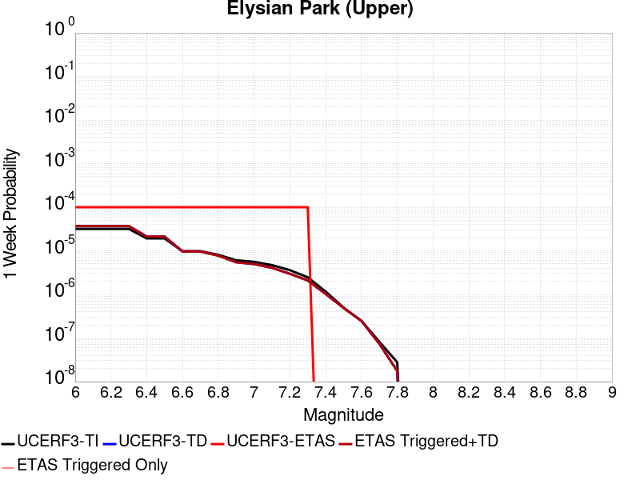 |  |  |  |

| Magnitude | 1 wk TI Prob | 1 wk TD Prob | 1 wk ETAS Prob | 1 wk ETAS/TD Gain | 1 wk ETAS Triggered+TD | 1 wk ETAS Triggered Only | 1 mo TI Prob | 1 mo TD Prob | 1 mo ETAS Prob | 1 mo ETAS/TD Gain | 1 mo ETAS Triggered+TD | 1 mo ETAS Triggered Only | 1 yr TI Prob | 1 yr TD Prob | 1 yr ETAS Prob | 1 yr ETAS/TD Gain | 1 yr ETAS Triggered+TD | 1 yr ETAS Triggered Only | 10 yr TI Prob | 10 yr TD Prob | 10 yr ETAS Prob | 10 yr ETAS/TD Gain | 10 yr ETAS Triggered+TD | 10 yr ETAS Triggered Only |
|-----|-----|-----|-----|-----|-----|-----|-----|-----|-----|-----|-----|-----|-----|-----|-----|-----|-----|-----|-----|-----|-----|-----|-----|-----|
| 6.0 | 3.1876025E-5 | 3.7050857E-5 | 0.0 | 0.0 | 3.7050857E-5 | 0.0 | 1.3660437E-4 | 1.587824E-4 | 1.0E-4 | 0.62979275 | 2.5876652E-4 | 1.0E-4 | 0.0016618895 | 0.0019319337 | 2.0E-4 | 0.103523225 | 0.0021315473 | 2.0E-4 | 0.016495159 | 0.01919786 | 0.0022 | 0.1145961 | 0.021355625 | 0.0022 |
| 6.1 | 3.1876025E-5 | 3.7050857E-5 | 0.0 | 0.0 | 3.7050857E-5 | 0.0 | 1.3660437E-4 | 1.587824E-4 | 1.0E-4 | 0.62979275 | 2.5876652E-4 | 1.0E-4 | 0.0016618895 | 0.0019319337 | 2.0E-4 | 0.103523225 | 0.0021315473 | 2.0E-4 | 0.016495159 | 0.01919786 | 0.0022 | 0.1145961 | 0.021355625 | 0.0022 |
| 6.2 | 3.1876025E-5 | 3.7050857E-5 | 0.0 | 0.0 | 3.7050857E-5 | 0.0 | 1.3660437E-4 | 1.587824E-4 | 1.0E-4 | 0.62979275 | 2.5876652E-4 | 1.0E-4 | 0.0016618895 | 0.0019319337 | 2.0E-4 | 0.103523225 | 0.0021315473 | 2.0E-4 | 0.016495159 | 0.01919786 | 0.0022 | 0.1145961 | 0.021355625 | 0.0022 |
| 6.3 | 3.1876025E-5 | 3.7050857E-5 | 0.0 | 0.0 | 3.7050857E-5 | 0.0 | 1.3660437E-4 | 1.587824E-4 | 1.0E-4 | 0.62979275 | 2.5876652E-4 | 1.0E-4 | 0.0016618895 | 0.0019319337 | 2.0E-4 | 0.103523225 | 0.0021315473 | 2.0E-4 | 0.016495159 | 0.01919786 | 0.0022 | 0.1145961 | 0.021355625 | 0.0022 |
| 6.4 | 1.9273462E-5 | 2.1209791E-5 | 0.0 | 0.0 | 2.1209791E-5 | 0.0 | 8.259794E-5 | 9.089684E-5 | 1.0E-4 | 1.1001482 | 1.9088776E-4 | 1.0E-4 | 0.001005166 | 0.0011062786 | 1.0E-4 | 0.09039314 | 0.001206168 | 1.0E-4 | 0.010006315 | 0.011024536 | 0.001 | 0.09070677 | 0.012013511 | 0.001 |
| 6.5 | 1.9273462E-5 | 2.1209791E-5 | 0.0 | 0.0 | 2.1209791E-5 | 0.0 | 8.259794E-5 | 9.089684E-5 | 1.0E-4 | 1.1001482 | 1.9088776E-4 | 1.0E-4 | 0.001005166 | 0.0011062786 | 1.0E-4 | 0.09039314 | 0.001206168 | 1.0E-4 | 0.010006315 | 0.011024536 | 0.001 | 0.09070677 | 0.012013511 | 0.001 |
| 6.6 | 9.813258E-6 | 9.66772E-6 | 0.0 | 0.0 | 9.66772E-6 | 0.0 | 4.205614E-5 | 4.1432468E-5 | 0.0 | 0.0 | 4.1432468E-5 | 0.0 | 5.119132E-4 | 5.043308E-4 | 0.0 | 0.0 | 5.043308E-4 | 0.0 | 0.005107356 | 0.005032587 | 4.0E-4 | 0.07948199 | 0.0054305736 | 4.0E-4 |
| 6.7 | 9.801478E-6 | 9.655288E-6 | 0.0 | 0.0 | 9.655288E-6 | 0.0 | 4.2005657E-5 | 4.137919E-5 | 0.0 | 0.0 | 4.137919E-5 | 0.0 | 5.112989E-4 | 5.036824E-4 | 0.0 | 0.0 | 5.036824E-4 | 0.0 | 0.0051012407 | 0.0050261323 | 4.0E-4 | 0.079584055 | 0.005424122 | 4.0E-4 |
| 6.8 | 8.102489E-6 | 7.774709E-6 | 0.0 | 0.0 | 7.774709E-6 | 0.0 | 3.4724493E-5 | 3.3319786E-5 | 0.0 | 0.0 | 3.3319786E-5 | 0.0 | 4.2268867E-4 | 4.0559785E-4 | 0.0 | 0.0 | 4.0559785E-4 | 0.0 | 0.004218856 | 0.00404907 | 4.0E-4 | 0.09878812 | 0.0044474504 | 4.0E-4 |
| 6.9 | 6.08275E-6 | 5.482521E-6 | 0.0 | 0.0 | 5.482521E-6 | 0.0 | 2.6068668E-5 | 2.3496312E-5 | 0.0 | 0.0 | 2.3496312E-5 | 0.0 | 3.173398E-4 | 2.8603082E-4 | 0.0 | 0.0 | 2.8603082E-4 | 0.0 | 0.0031688702 | 0.0028567044 | 1.0E-4 | 0.035005372 | 0.0029564186 | 1.0E-4 |
| 7.0 | 5.5995934E-6 | 4.983757E-6 | 0.0 | 0.0 | 4.983757E-6 | 0.0 | 2.3998036E-5 | 2.1358788E-5 | 0.0 | 0.0 | 2.1358788E-5 | 0.0 | 2.9213692E-4 | 2.600129E-4 | 0.0 | 0.0 | 2.600129E-4 | 0.0 | 0.0029175316 | 0.0025971541 | 1.0E-4 | 0.038503684 | 0.0026968943 | 1.0E-4 |
| 7.1 | 4.709881E-6 | 4.088219E-6 | 0.0 | 0.0 | 4.088219E-6 | 0.0 | 2.0185047E-5 | 1.7520824E-5 | 0.0 | 0.0 | 1.7520824E-5 | 0.0 | 2.4572524E-4 | 2.1329556E-4 | 0.0 | 0.0 | 2.1329556E-4 | 0.0 | 0.002454537 | 0.0021309499 | 0.0 | 0.0 | 0.0021309499 | 0.0 |
| 7.2 | 3.6063436E-6 | 2.9785654E-6 | 0.0 | 0.0 | 2.9785654E-6 | 0.0 | 1.5455667E-5 | 1.2765218E-5 | 0.0 | 0.0 | 1.2765218E-5 | 0.0 | 1.881565E-4 | 1.5540556E-4 | 0.0 | 0.0 | 1.5540556E-4 | 0.0 | 0.0018799726 | 0.0015529802 | 0.0 | 0.0 | 0.0015529802 | 0.0 |
| 7.3 | 2.471135E-6 | 2.0959314E-6 | 0.0 | 0.0 | 2.0959314E-6 | 0.0 | 1.0590536E-5 | 8.982533E-6 | 0.0 | 0.0 | 8.982533E-6 | 0.0 | 1.2893214E-4 | 1.0935692E-4 | 0.0 | 0.0 | 1.0935692E-4 | 0.0 | 0.0012885736 | 0.0010930382 | 0.0 | 0.0 | 0.0010930382 | 0.0 |
| 7.4 | 1.163943E-6 | 1.0278163E-6 | 0.0 | 0.0 | 1.0278163E-6 | 0.0 | 4.988318E-6 | 4.4049198E-6 | 0.0 | 0.0 | 4.4049198E-6 | 0.0 | 6.0731076E-5 | 5.362861E-5 | 0.0 | 0.0 | 5.362861E-5 | 0.0 | 6.071448E-4 | 5.3615967E-4 | 0.0 | 0.0 | 5.3615967E-4 | 0.0 |
| 7.5 | 4.99459E-7 | 4.918723E-7 | 0.0 | 0.0 | 4.918723E-7 | 0.0 | 2.140537E-6 | 2.1080225E-6 | 0.0 | 0.0 | 2.1080225E-6 | 0.0 | 2.6060725E-5 | 2.5664887E-5 | 0.0 | 0.0 | 2.5664887E-5 | 0.0 | 2.605767E-4 | 2.5662078E-4 | 0.0 | 0.0 | 2.5662078E-4 | 0.0 |
| 7.6 | 2.4667852E-7 | 2.4782557E-7 | 0.0 | 0.0 | 2.4782557E-7 | 0.0 | 1.0571932E-6 | 1.0621092E-6 | 0.0 | 0.0 | 1.0621092E-6 | 0.0 | 1.2871251E-5 | 1.2931106E-5 | 0.0 | 0.0 | 1.2931106E-5 | 0.0 | 1.2870505E-4 | 1.2930391E-4 | 0.0 | 0.0 | 1.2930391E-4 | 0.0 |
| 7.7 | 8.2312795E-8 | 7.388262E-8 | 0.0 | 0.0 | 7.388262E-8 | 0.0 | 3.527691E-7 | 3.1663973E-7 | 0.0 | 0.0 | 3.1663973E-7 | 0.0 | 4.294955E-6 | 3.8550834E-6 | 0.0 | 0.0 | 3.8550834E-6 | 0.0 | 4.2948723E-5 | 3.855028E-5 | 0.0 | 0.0 | 3.855028E-5 | 0.0 |
| 7.8 | 2.7819295E-8 | 1.7577259E-8 | 0.0 | 0.0 | 1.7577259E-8 | 0.0 | 1.1922555E-7 | 7.533111E-8 | 0.0 | 0.0 | 7.533111E-8 | 0.0 | 1.45157E-6 | 9.17156E-7 | 0.0 | 0.0 | 9.17156E-7 | 0.0 | 1.45156055E-5 | 9.171537E-6 | 0.0 | 0.0 | 9.171537E-6 | 0.0 |

## So Sierra Nevada
*[(top)](#table-of-contents)*

| 1 Week | 1 Month | 1 Year | 10 Year |
|-----|-----|-----|-----|
|  |  |  |  |

| Magnitude | 1 wk TI Prob | 1 wk TD Prob | 1 wk ETAS Prob | 1 wk ETAS/TD Gain | 1 wk ETAS Triggered+TD | 1 wk ETAS Triggered Only | 1 mo TI Prob | 1 mo TD Prob | 1 mo ETAS Prob | 1 mo ETAS/TD Gain | 1 mo ETAS Triggered+TD | 1 mo ETAS Triggered Only | 1 yr TI Prob | 1 yr TD Prob | 1 yr ETAS Prob | 1 yr ETAS/TD Gain | 1 yr ETAS Triggered+TD | 1 yr ETAS Triggered Only | 10 yr TI Prob | 10 yr TD Prob | 10 yr ETAS Prob | 10 yr ETAS/TD Gain | 10 yr ETAS Triggered+TD | 10 yr ETAS Triggered Only |
|-----|-----|-----|-----|-----|-----|-----|-----|-----|-----|-----|-----|-----|-----|-----|-----|-----|-----|-----|-----|-----|-----|-----|-----|-----|
| 6.0 | 1.15488665E-5 | 1.1080568E-5 | 0.0 | 0.0 | 1.1080568E-5 | 0.0 | 4.9494203E-5 | 4.7487352E-5 | 1.0E-4 | 2.1058238 | 1.474826E-4 | 1.0E-4 | 6.024253E-4 | 5.780179E-4 | 7.0E-4 | 1.2110351 | 0.0012776133 | 7.0E-4 | 0.006007948 | 0.005766414 | 0.0022 | 0.3815196 | 0.007953729 | 0.0022 |
| 6.1 | 1.15488665E-5 | 1.1080568E-5 | 0.0 | 0.0 | 1.1080568E-5 | 0.0 | 4.9494203E-5 | 4.7487352E-5 | 1.0E-4 | 2.1058238 | 1.474826E-4 | 1.0E-4 | 6.024253E-4 | 5.780179E-4 | 7.0E-4 | 1.2110351 | 0.0012776133 | 7.0E-4 | 0.006007948 | 0.005766414 | 0.0022 | 0.3815196 | 0.007953729 | 0.0022 |
| 6.2 | 1.15488665E-5 | 1.1080568E-5 | 0.0 | 0.0 | 1.1080568E-5 | 0.0 | 4.9494203E-5 | 4.7487352E-5 | 1.0E-4 | 2.1058238 | 1.474826E-4 | 1.0E-4 | 6.024253E-4 | 5.780179E-4 | 7.0E-4 | 1.2110351 | 0.0012776133 | 7.0E-4 | 0.006007948 | 0.005766414 | 0.0022 | 0.3815196 | 0.007953729 | 0.0022 |
| 6.3 | 1.15488665E-5 | 1.1080568E-5 | 0.0 | 0.0 | 1.1080568E-5 | 0.0 | 4.9494203E-5 | 4.7487352E-5 | 1.0E-4 | 2.1058238 | 1.474826E-4 | 1.0E-4 | 6.024253E-4 | 5.780179E-4 | 7.0E-4 | 1.2110351 | 0.0012776133 | 7.0E-4 | 0.006007948 | 0.005766414 | 0.0022 | 0.3815196 | 0.007953729 | 0.0022 |
| 6.4 | 1.15488665E-5 | 1.1080568E-5 | 0.0 | 0.0 | 1.1080568E-5 | 0.0 | 4.9494203E-5 | 4.7487352E-5 | 1.0E-4 | 2.1058238 | 1.474826E-4 | 1.0E-4 | 6.024253E-4 | 5.780179E-4 | 7.0E-4 | 1.2110351 | 0.0012776133 | 7.0E-4 | 0.006007948 | 0.005766414 | 0.0022 | 0.3815196 | 0.007953729 | 0.0022 |
| 6.5 | 1.15488665E-5 | 1.1080568E-5 | 0.0 | 0.0 | 1.1080568E-5 | 0.0 | 4.9494203E-5 | 4.7487352E-5 | 1.0E-4 | 2.1058238 | 1.474826E-4 | 1.0E-4 | 6.024253E-4 | 5.780179E-4 | 7.0E-4 | 1.2110351 | 0.0012776133 | 7.0E-4 | 0.006007948 | 0.005766414 | 0.0022 | 0.3815196 | 0.007953729 | 0.0022 |
| 6.6 | 7.587044E-6 | 6.9361668E-6 | 0.0 | 0.0 | 6.9361668E-6 | 0.0 | 3.2515498E-5 | 2.9726107E-5 | 1.0E-4 | 3.3640463 | 1.2972314E-4 | 1.0E-4 | 3.9580427E-4 | 3.6185817E-4 | 4.0E-4 | 1.1054054 | 7.617134E-4 | 4.0E-4 | 0.003951 | 0.0036129812 | 0.0014 | 0.38749164 | 0.005007923 | 0.0014 |
| 6.7 | 7.587044E-6 | 6.9361668E-6 | 0.0 | 0.0 | 6.9361668E-6 | 0.0 | 3.2515498E-5 | 2.9726107E-5 | 1.0E-4 | 3.3640463 | 1.2972314E-4 | 1.0E-4 | 3.9580427E-4 | 3.6185817E-4 | 4.0E-4 | 1.1054054 | 7.617134E-4 | 4.0E-4 | 0.003951 | 0.0036129812 | 0.0014 | 0.38749164 | 0.005007923 | 0.0014 |
| 6.8 | 5.9026956E-6 | 5.1797697E-6 | 0.0 | 0.0 | 5.1797697E-6 | 0.0 | 2.5297022E-5 | 2.219883E-5 | 0.0 | 0.0 | 2.219883E-5 | 0.0 | 3.0794772E-4 | 2.702384E-4 | 2.0E-4 | 0.7400873 | 4.7018437E-4 | 2.0E-4 | 0.0030752132 | 0.0026992143 | 0.0011 | 0.40752602 | 0.003796245 | 0.0011 |
| 6.9 | 5.0118915E-6 | 4.252725E-6 | 0.0 | 0.0 | 4.252725E-6 | 0.0 | 2.1479358E-5 | 1.822584E-5 | 0.0 | 0.0 | 1.822584E-5 | 0.0 | 2.614798E-4 | 2.2187774E-4 | 2.0E-4 | 0.90139735 | 4.2183336E-4 | 2.0E-4 | 0.0026117235 | 0.0022166346 | 0.001 | 0.45113432 | 0.003214418 | 0.001 |
| 7.0 | 4.4924795E-6 | 3.7141758E-6 | 0.0 | 0.0 | 3.7141758E-6 | 0.0 | 1.925334E-5 | 1.5917803E-5 | 0.0 | 0.0 | 1.5917803E-5 | 0.0 | 2.3438422E-4 | 1.9378265E-4 | 2.0E-4 | 1.0320841 | 3.937439E-4 | 2.0E-4 | 0.0023413717 | 0.0019361997 | 8.0E-4 | 0.41318053 | 0.0027346506 | 8.0E-4 |
| 7.1 | 3.9118436E-6 | 3.1121874E-6 | 0.0 | 0.0 | 3.1121874E-6 | 0.0 | 1.6764936E-5 | 1.3337881E-5 | 0.0 | 0.0 | 1.3337881E-5 | 0.0 | 2.0409399E-4 | 1.6237717E-4 | 1.0E-4 | 0.61585015 | 2.6236093E-4 | 1.0E-4 | 0.0020390663 | 0.0016226413 | 4.0E-4 | 0.24651165 | 0.0020219923 | 4.0E-4 |
| 7.2 | 3.4200818E-6 | 2.6056266E-6 | 0.0 | 0.0 | 2.6056266E-6 | 0.0 | 1.4657411E-5 | 1.1166926E-5 | 0.0 | 0.0 | 1.1166926E-5 | 0.0 | 1.7843937E-4 | 1.3594935E-4 | 1.0E-4 | 0.73556805 | 2.3593576E-4 | 1.0E-4 | 0.0017829615 | 0.0013587115 | 3.0E-4 | 0.22079742 | 0.0016583039 | 3.0E-4 |
| 7.3 | 2.6593618E-6 | 1.8285373E-6 | 0.0 | 0.0 | 1.8285373E-6 | 0.0 | 1.13972155E-5 | 7.8365665E-6 | 0.0 | 0.0 | 7.8365665E-6 | 0.0 | 1.3875226E-4 | 9.5406314E-5 | 1.0E-4 | 1.0481486 | 1.9539677E-4 | 1.0E-4 | 0.0013866565 | 9.536825E-4 | 2.0E-4 | 0.2097134 | 0.0011534918 | 2.0E-4 |
| 7.4 | 2.2577992E-6 | 1.4365288E-6 | 0.0 | 0.0 | 1.4365288E-6 | 0.0 | 9.676246E-6 | 6.1565393E-6 | 0.0 | 0.0 | 6.1565393E-6 | 0.0 | 1.1780193E-4 | 7.495354E-5 | 1.0E-4 | 1.3341599 | 1.7494605E-4 | 1.0E-4 | 0.001177395 | 7.493076E-4 | 2.0E-4 | 0.26691306 | 9.491578E-4 | 2.0E-4 |
| 7.5 | 1.489319E-6 | 7.354387E-7 | 0.0 | 0.0 | 7.354387E-7 | 0.0 | 6.3827797E-6 | 3.1518764E-6 | 0.0 | 0.0 | 3.1518764E-6 | 0.0 | 7.770758E-5 | 3.8373422E-5 | 0.0 | 0.0 | 3.8373422E-5 | 0.0 | 7.7680405E-4 | 3.836684E-4 | 0.0 | 0.0 | 3.836684E-4 | 0.0 |
| 7.6 | 1.0680322E-6 | 4.659923E-7 | 0.0 | 0.0 | 4.659923E-7 | 0.0 | 4.577273E-6 | 1.9971083E-6 | 0.0 | 0.0 | 1.9971083E-6 | 0.0 | 5.5726876E-5 | 2.4314524E-5 | 0.0 | 0.0 | 2.4314524E-5 | 0.0 | 5.5712904E-4 | 2.431189E-4 | 0.0 | 0.0 | 2.431189E-4 | 0.0 |
| 7.7 | 5.509146E-7 | 1.5580983E-7 | 0.0 | 0.0 | 1.5580983E-7 | 0.0 | 2.3610605E-6 | 6.677563E-7 | 0.0 | 0.0 | 6.677563E-7 | 0.0 | 2.8745531E-5 | 8.129903E-6 | 0.0 | 0.0 | 8.129903E-6 | 0.0 | 2.8741814E-4 | 8.129617E-5 | 0.0 | 0.0 | 8.129617E-5 | 0.0 |

## Death Valley (So)
*[(top)](#table-of-contents)*

| 1 Week | 1 Month | 1 Year | 10 Year |
|-----|-----|-----|-----|
|  |  | 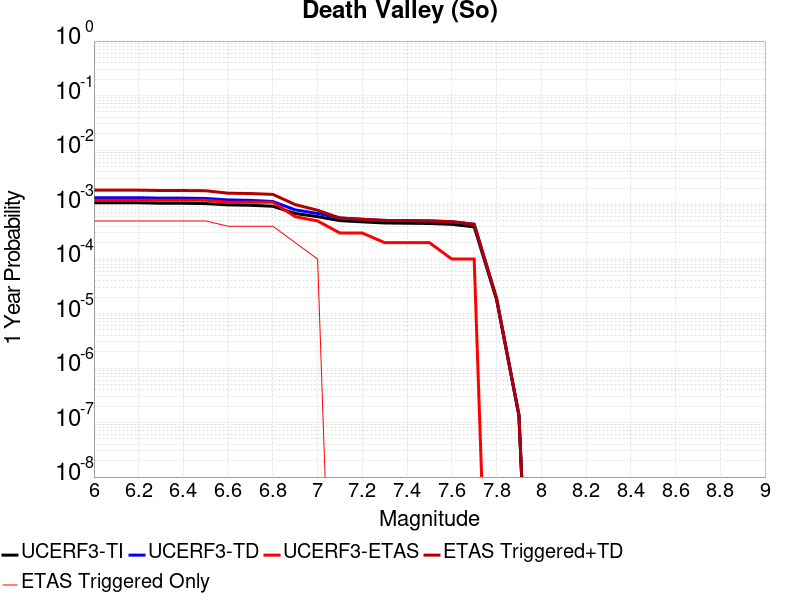 |  |

| Magnitude | 1 wk TI Prob | 1 wk TD Prob | 1 wk ETAS Prob | 1 wk ETAS/TD Gain | 1 wk ETAS Triggered+TD | 1 wk ETAS Triggered Only | 1 mo TI Prob | 1 mo TD Prob | 1 mo ETAS Prob | 1 mo ETAS/TD Gain | 1 mo ETAS Triggered+TD | 1 mo ETAS Triggered Only | 1 yr TI Prob | 1 yr TD Prob | 1 yr ETAS Prob | 1 yr ETAS/TD Gain | 1 yr ETAS Triggered+TD | 1 yr ETAS Triggered Only | 10 yr TI Prob | 10 yr TD Prob | 10 yr ETAS Prob | 10 yr ETAS/TD Gain | 10 yr ETAS Triggered+TD | 10 yr ETAS Triggered Only |
|-----|-----|-----|-----|-----|-----|-----|-----|-----|-----|-----|-----|-----|-----|-----|-----|-----|-----|-----|-----|-----|-----|-----|-----|-----|
| 6.0 | 2.0684236E-5 | 2.5628186E-5 | 0.0 | 0.0 | 2.5628186E-5 | 0.0 | 8.864371E-5 | 1.0983055E-4 | 0.0 | 0.0 | 1.0983055E-4 | 0.0 | 0.0010787029 | 0.0013363836 | 5.0E-4 | 0.37414405 | 0.0018357155 | 5.0E-4 | 0.010734817 | 0.01328906 | 0.0022 | 0.1655497 | 0.015459825 | 0.0022 |
| 6.1 | 2.0684236E-5 | 2.5628186E-5 | 0.0 | 0.0 | 2.5628186E-5 | 0.0 | 8.864371E-5 | 1.0983055E-4 | 0.0 | 0.0 | 1.0983055E-4 | 0.0 | 0.0010787029 | 0.0013363836 | 5.0E-4 | 0.37414405 | 0.0018357155 | 5.0E-4 | 0.010734817 | 0.01328906 | 0.0022 | 0.1655497 | 0.015459825 | 0.0022 |
| 6.2 | 2.0684236E-5 | 2.5628186E-5 | 0.0 | 0.0 | 2.5628186E-5 | 0.0 | 8.864371E-5 | 1.0983055E-4 | 0.0 | 0.0 | 1.0983055E-4 | 0.0 | 0.0010787029 | 0.0013363836 | 5.0E-4 | 0.37414405 | 0.0018357155 | 5.0E-4 | 0.010734817 | 0.01328906 | 0.0022 | 0.1655497 | 0.015459825 | 0.0022 |
| 6.3 | 2.0240292E-5 | 2.512814E-5 | 0.0 | 0.0 | 2.512814E-5 | 0.0 | 8.6741224E-5 | 1.0768768E-4 | 0.0 | 0.0 | 1.0768768E-4 | 0.0 | 0.0010555626 | 0.0013103257 | 5.0E-4 | 0.38158453 | 0.0018096705 | 5.0E-4 | 0.010505628 | 0.013031555 | 0.0022 | 0.16882099 | 0.0152028855 | 0.0022 |
| 6.4 | 2.0240292E-5 | 2.512814E-5 | 0.0 | 0.0 | 2.512814E-5 | 0.0 | 8.6741224E-5 | 1.0768768E-4 | 0.0 | 0.0 | 1.0768768E-4 | 0.0 | 0.0010555626 | 0.0013103257 | 5.0E-4 | 0.38158453 | 0.0018096705 | 5.0E-4 | 0.010505628 | 0.013031555 | 0.0022 | 0.16882099 | 0.0152028855 | 0.0022 |
| 6.5 | 1.9962767E-5 | 2.4817316E-5 | 0.0 | 0.0 | 2.4817316E-5 | 0.0 | 8.55519E-5 | 1.06355685E-4 | 0.0 | 0.0 | 1.06355685E-4 | 0.0 | 0.0010410968 | 0.001294128 | 5.0E-4 | 0.38636053 | 0.001793481 | 5.0E-4 | 0.010362327 | 0.012871464 | 0.0022 | 0.17092073 | 0.015043146 | 0.0022 |
| 6.6 | 1.8937297E-5 | 2.332067E-5 | 0.0 | 0.0 | 2.332067E-5 | 0.0 | 8.115732E-5 | 9.994198E-5 | 0.0 | 0.0 | 9.994198E-5 | 0.0 | 9.876423E-4 | 0.0012161289 | 4.0E-4 | 0.3289125 | 0.0016156426 | 4.0E-4 | 0.009832645 | 0.01210046 | 0.0021 | 0.17354712 | 0.014175049 | 0.0021 |
| 6.7 | 1.8621096E-5 | 2.2921204E-5 | 0.0 | 0.0 | 2.2921204E-5 | 0.0 | 7.980225E-5 | 9.823011E-5 | 0.0 | 0.0 | 9.823011E-5 | 0.0 | 9.711593E-4 | 0.00119531 | 4.0E-4 | 0.33464122 | 0.0015948318 | 4.0E-4 | 0.009669261 | 0.0118945325 | 0.0021 | 0.17655171 | 0.013969554 | 0.0021 |
| 6.8 | 1.7830353E-5 | 2.1814734E-5 | 0.0 | 0.0 | 2.1814734E-5 | 0.0 | 7.641356E-5 | 9.3488445E-5 | 0.0 | 0.0 | 9.3488445E-5 | 0.0 | 9.29938E-4 | 0.0011376415 | 4.0E-4 | 0.3516046 | 0.0015371864 | 4.0E-4 | 0.009260561 | 0.01132318 | 0.0019 | 0.16779739 | 0.013201666 | 0.0019 |
| 6.9 | 1.3135183E-5 | 1.5309017E-5 | 0.0 | 0.0 | 1.5309017E-5 | 0.0 | 5.6292425E-5 | 6.560846E-5 | 0.0 | 0.0 | 6.560846E-5 | 0.0 | 6.8514474E-4 | 7.984967E-4 | 2.0E-4 | 0.25047067 | 9.98337E-4 | 2.0E-4 | 0.006830362 | 0.007957112 | 0.0013 | 0.16337585 | 0.009246768 | 0.0013 |
| 7.0 | 1.1507512E-5 | 1.315811E-5 | 0.0 | 0.0 | 1.315811E-5 | 0.0 | 4.9316975E-5 | 5.6390712E-5 | 0.0 | 0.0 | 5.6390712E-5 | 0.0 | 6.002687E-4 | 6.8634644E-4 | 1.0E-4 | 0.14569901 | 7.862778E-4 | 1.0E-4 | 0.0059864987 | 0.0068428116 | 0.001 | 0.14613876 | 0.007835969 | 0.001 |
| 7.1 | 9.715903E-6 | 1.0868022E-5 | 0.0 | 0.0 | 1.0868022E-5 | 0.0 | 4.1638916E-5 | 4.657643E-5 | 0.0 | 0.0 | 4.657643E-5 | 0.0 | 5.068359E-4 | 5.6692475E-4 | 0.0 | 0.0 | 5.6692475E-4 | 0.0 | 0.0050568148 | 0.0056550754 | 8.0E-4 | 0.14146584 | 0.006450551 | 8.0E-4 |
| 7.2 | 9.233269E-6 | 1.0288838E-5 | 0.0 | 0.0 | 1.0288838E-5 | 0.0 | 3.9570554E-5 | 4.4094297E-5 | 0.0 | 0.0 | 4.4094297E-5 | 0.0 | 4.81665E-4 | 5.367201E-4 | 0.0 | 0.0 | 5.367201E-4 | 0.0 | 0.0048062233 | 0.00535467 | 8.0E-4 | 0.1494023 | 0.006150386 | 8.0E-4 |
| 7.3 | 8.8041315E-6 | 9.810479E-6 | 0.0 | 0.0 | 9.810479E-6 | 0.0 | 3.7731446E-5 | 4.2044256E-5 | 0.0 | 0.0 | 4.2044256E-5 | 0.0 | 4.592835E-4 | 5.117728E-4 | 0.0 | 0.0 | 5.117728E-4 | 0.0 | 0.0045833546 | 0.005106369 | 7.0E-4 | 0.13708371 | 0.005802795 | 7.0E-4 |
| 7.4 | 8.708749E-6 | 9.709477E-6 | 0.0 | 0.0 | 9.709477E-6 | 0.0 | 3.7322676E-5 | 4.1611405E-5 | 0.0 | 0.0 | 4.1611405E-5 | 0.0 | 4.5430884E-4 | 5.065053E-4 | 0.0 | 0.0 | 5.065053E-4 | 0.0 | 0.004533812 | 0.005053935 | 7.0E-4 | 0.13850594 | 0.0057503977 | 7.0E-4 |
| 7.5 | 8.612678E-6 | 9.607105E-6 | 0.0 | 0.0 | 9.607105E-6 | 0.0 | 3.6910955E-5 | 4.1172683E-5 | 0.0 | 0.0 | 4.1172683E-5 | 0.0 | 4.492982E-4 | 5.0116633E-4 | 0.0 | 0.0 | 5.0116633E-4 | 0.0 | 0.004483909 | 0.005000787 | 7.0E-4 | 0.13997796 | 0.005697286 | 7.0E-4 |
| 7.6 | 8.319024E-6 | 9.286143E-6 | 0.0 | 0.0 | 9.286143E-6 | 0.0 | 3.5652476E-5 | 3.979717E-5 | 0.0 | 0.0 | 3.979717E-5 | 0.0 | 4.3398244E-4 | 4.8442703E-4 | 0.0 | 0.0 | 4.8442703E-4 | 0.0 | 0.0043313587 | 0.0048341346 | 7.0E-4 | 0.14480358 | 0.005530751 | 7.0E-4 |
| 7.7 | 7.4718328E-6 | 8.347186E-6 | 0.0 | 0.0 | 8.347186E-6 | 0.0 | 3.2021748E-5 | 3.5773184E-5 | 0.0 | 0.0 | 3.5773184E-5 | 0.0 | 3.8979502E-4 | 4.3545553E-4 | 0.0 | 0.0 | 4.3545553E-4 | 0.0 | 0.00389112 | 0.004346428 | 5.0E-4 | 0.11503699 | 0.004844255 | 5.0E-4 |
| 7.8 | 3.4586725E-7 | 3.6486753E-7 | 0.0 | 0.0 | 3.6486753E-7 | 0.0 | 1.4822873E-6 | 1.5637171E-6 | 0.0 | 0.0 | 1.5637171E-6 | 0.0 | 1.80467E-5 | 1.9038094E-5 | 0.0 | 0.0 | 1.9038094E-5 | 0.0 | 1.8045233E-4 | 1.9036507E-4 | 0.0 | 0.0 | 1.9036507E-4 | 0.0 |
| 7.9 | 2.5591178E-9 | 2.6699092E-9 | 0.0 | 0.0 | 2.6699092E-9 | 0.0 | 1.0967647E-8 | 1.1442468E-8 | 0.0 | 0.0 | 1.1442468E-8 | 0.0 | 1.335311E-7 | 1.3931205E-7 | 0.0 | 0.0 | 1.3931205E-7 | 0.0 | 1.3353102E-6 | 1.3931206E-6 | 0.0 | 0.0 | 1.3931206E-6 | 0.0 |

## San Diego Trough north alt1
*[(top)](#table-of-contents)*

| 1 Week | 1 Month | 1 Year | 10 Year |
|-----|-----|-----|-----|
|  |  |  |  |

| Magnitude | 1 wk TI Prob | 1 wk TD Prob | 1 wk ETAS Prob | 1 wk ETAS/TD Gain | 1 wk ETAS Triggered+TD | 1 wk ETAS Triggered Only | 1 mo TI Prob | 1 mo TD Prob | 1 mo ETAS Prob | 1 mo ETAS/TD Gain | 1 mo ETAS Triggered+TD | 1 mo ETAS Triggered Only | 1 yr TI Prob | 1 yr TD Prob | 1 yr ETAS Prob | 1 yr ETAS/TD Gain | 1 yr ETAS Triggered+TD | 1 yr ETAS Triggered Only | 10 yr TI Prob | 10 yr TD Prob | 10 yr ETAS Prob | 10 yr ETAS/TD Gain | 10 yr ETAS Triggered+TD | 10 yr ETAS Triggered Only |
|-----|-----|-----|-----|-----|-----|-----|-----|-----|-----|-----|-----|-----|-----|-----|-----|-----|-----|-----|-----|-----|-----|-----|-----|-----|
| 6.0 | 7.329252E-5 | 8.8249995E-5 | 0.0 | 0.0 | 8.8249995E-5 | 0.0 | 3.14073E-4 | 3.7816292E-4 | 1.0E-4 | 0.2644363 | 4.781251E-4 | 1.0E-4 | 0.0038171355 | 0.004594981 | 3.0E-4 | 0.06528862 | 0.004893603 | 3.0E-4 | 0.03752231 | 0.04506364 | 0.002 | 0.044381678 | 0.04697351 | 0.002 |
| 6.1 | 3.7940346E-5 | 4.4902074E-5 | 0.0 | 0.0 | 4.4902074E-5 | 0.0 | 1.6259136E-4 | 1.9242366E-4 | 0.0 | 0.0 | 1.9242366E-4 | 0.0 | 0.0019777524 | 0.0023403226 | 1.0E-4 | 0.04272915 | 0.0024400887 | 1.0E-4 | 0.019602431 | 0.023165442 | 0.001 | 0.04316775 | 0.024142276 | 0.001 |
| 6.2 | 2.8645263E-5 | 3.330801E-5 | 0.0 | 0.0 | 3.330801E-5 | 0.0 | 1.2275964E-4 | 1.4274092E-4 | 0.0 | 0.0 | 1.4274092E-4 | 0.0 | 0.0014935739 | 0.0017365083 | 1.0E-4 | 0.057586823 | 0.0018363347 | 1.0E-4 | 0.0148357535 | 0.017232046 | 9.0E-4 | 0.052228272 | 0.018116537 | 9.0E-4 |
| 6.3 | 2.8645263E-5 | 3.330801E-5 | 0.0 | 0.0 | 3.330801E-5 | 0.0 | 1.2275964E-4 | 1.4274092E-4 | 0.0 | 0.0 | 1.4274092E-4 | 0.0 | 0.0014935739 | 0.0017365083 | 1.0E-4 | 0.057586823 | 0.0018363347 | 1.0E-4 | 0.0148357535 | 0.017232046 | 9.0E-4 | 0.052228272 | 0.018116537 | 9.0E-4 |
| 6.4 | 2.2204576E-5 | 2.5456064E-5 | 0.0 | 0.0 | 2.5456064E-5 | 0.0 | 9.5159E-5 | 1.090929E-4 | 0.0 | 0.0 | 1.090929E-4 | 0.0 | 0.001157945 | 0.0013274061 | 1.0E-4 | 0.07533489 | 0.0014272734 | 1.0E-4 | 0.011519298 | 0.013195943 | 7.0E-4 | 0.053046606 | 0.013886706 | 7.0E-4 |
| 6.5 | 2.1004838E-5 | 2.4031884E-5 | 0.0 | 0.0 | 2.4031884E-5 | 0.0 | 9.0017624E-5 | 1.0298977E-4 | 0.0 | 0.0 | 1.0298977E-4 | 0.0 | 0.0010954136 | 0.0012531881 | 1.0E-4 | 0.079796486 | 0.0013530628 | 1.0E-4 | 0.010900296 | 0.012462295 | 7.0E-4 | 0.056169428 | 0.013153572 | 7.0E-4 |
| 6.6 | 1.820557E-5 | 2.07107E-5 | 0.0 | 0.0 | 2.07107E-5 | 0.0 | 7.802154E-5 | 8.8757144E-5 | 0.0 | 0.0 | 8.8757144E-5 | 0.0 | 9.4949827E-4 | 0.001080088 | 1.0E-4 | 0.09258506 | 0.0011799799 | 1.0E-4 | 0.009454516 | 0.010749055 | 6.0E-4 | 0.05581886 | 0.011342606 | 6.0E-4 |
| 6.7 | 1.5884485E-5 | 1.7988585E-5 | 0.0 | 0.0 | 1.7988585E-5 | 0.0 | 6.807459E-5 | 7.709167E-5 | 0.0 | 0.0 | 7.709167E-5 | 0.0 | 8.284929E-4 | 9.381896E-4 | 1.0E-4 | 0.10658826 | 0.0010380958 | 1.0E-4 | 0.008254109 | 0.009342656 | 6.0E-4 | 0.06422157 | 0.00993705 | 6.0E-4 |
| 6.8 | 1.4331171E-5 | 1.6205453E-5 | 0.0 | 0.0 | 1.6205453E-5 | 0.0 | 6.141786E-5 | 6.94501E-5 | 0.0 | 0.0 | 6.94501E-5 | 0.0 | 7.4750587E-4 | 8.4522896E-4 | 0.0 | 0.0 | 8.4522896E-4 | 0.0 | 0.0074499645 | 0.00842041 | 5.0E-4 | 0.059379537 | 0.008916199 | 5.0E-4 |
| 6.9 | 1.2574203E-5 | 1.4209658E-5 | 0.0 | 0.0 | 1.4209658E-5 | 0.0 | 5.3888325E-5 | 6.089712E-5 | 0.0 | 0.0 | 6.089712E-5 | 0.0 | 6.558929E-4 | 7.4117165E-4 | 0.0 | 0.0 | 7.4117165E-4 | 0.0 | 0.0065396037 | 0.0073871836 | 4.0E-4 | 0.054147836 | 0.0077842283 | 4.0E-4 |
| 7.0 | 1.0883844E-5 | 1.2292552E-5 | 0.0 | 0.0 | 1.2292552E-5 | 0.0 | 4.664421E-5 | 5.268131E-5 | 0.0 | 0.0 | 5.268131E-5 | 0.0 | 5.677453E-4 | 6.4120715E-4 | 0.0 | 0.0 | 6.4120715E-4 | 0.0 | 0.00566297 | 0.006393699 | 3.0E-4 | 0.046921194 | 0.006691781 | 3.0E-4 |
| 7.1 | 9.393088E-6 | 1.0609864E-5 | 0.0 | 0.0 | 1.0609864E-5 | 0.0 | 4.025547E-5 | 4.547006E-5 | 0.0 | 0.0 | 4.547006E-5 | 0.0 | 4.900001E-4 | 5.534581E-4 | 0.0 | 0.0 | 5.534581E-4 | 0.0 | 0.0048892107 | 0.005520894 | 3.0E-4 | 0.054339025 | 0.005819238 | 3.0E-4 |
| 7.2 | 8.190791E-6 | 9.261131E-6 | 0.0 | 0.0 | 9.261131E-6 | 0.0 | 3.510292E-5 | 3.9689963E-5 | 0.0 | 0.0 | 3.9689963E-5 | 0.0 | 4.2729423E-4 | 4.8311884E-4 | 0.0 | 0.0 | 4.8311884E-4 | 0.0 | 0.0042647356 | 0.004820766 | 2.0E-4 | 0.041487183 | 0.0050198017 | 2.0E-4 |
| 7.3 | 6.268162E-6 | 7.091643E-6 | 0.0 | 0.0 | 7.091643E-6 | 0.0 | 2.6863276E-5 | 3.0392404E-5 | 0.0 | 0.0 | 3.0392404E-5 | 0.0 | 3.2701128E-4 | 3.699651E-4 | 0.0 | 0.0 | 3.699651E-4 | 0.0 | 0.003265305 | 0.003693538 | 1.0E-4 | 0.027074313 | 0.0037931686 | 1.0E-4 |
| 7.4 | 4.985186E-6 | 5.6442245E-6 | 0.0 | 0.0 | 5.6442245E-6 | 0.0 | 2.1364907E-5 | 2.4189312E-5 | 0.0 | 0.0 | 2.4189312E-5 | 0.0 | 2.600867E-4 | 2.9446546E-4 | 0.0 | 0.0 | 2.9446546E-4 | 0.0 | 0.002597825 | 0.0029407942 | 1.0E-4 | 0.03400442 | 0.0030405002 | 1.0E-4 |
| 7.5 | 1.7489613E-6 | 1.9701965E-6 | 0.0 | 0.0 | 1.9701965E-6 | 0.0 | 7.495527E-6 | 8.443673E-6 | 0.0 | 0.0 | 8.443673E-6 | 0.0 | 9.125422E-5 | 1.027971E-4 | 0.0 | 0.0 | 1.027971E-4 | 0.0 | 9.1216754E-4 | 0.0010275175 | 1.0E-4 | 0.09732194 | 0.0011274148 | 1.0E-4 |
| 7.6 | 1.6988751E-7 | 1.7534983E-7 | 0.0 | 0.0 | 1.7534983E-7 | 0.0 | 7.2808916E-7 | 7.5149904E-7 | 0.0 | 0.0 | 7.5149904E-7 | 0.0 | 8.864449E-6 | 9.149464E-6 | 0.0 | 0.0 | 9.149464E-6 | 0.0 | 8.8640954E-5 | 9.149107E-5 | 0.0 | 0.0 | 9.149107E-5 | 0.0 |

## San Gregorio (North) 2011 CFM
*[(top)](#table-of-contents)*

| 1 Week | 1 Month | 1 Year | 10 Year |
|-----|-----|-----|-----|
|  |  |  |  |

| Magnitude | 1 wk TI Prob | 1 wk TD Prob | 1 wk ETAS Prob | 1 wk ETAS/TD Gain | 1 wk ETAS Triggered+TD | 1 wk ETAS Triggered Only | 1 mo TI Prob | 1 mo TD Prob | 1 mo ETAS Prob | 1 mo ETAS/TD Gain | 1 mo ETAS Triggered+TD | 1 mo ETAS Triggered Only | 1 yr TI Prob | 1 yr TD Prob | 1 yr ETAS Prob | 1 yr ETAS/TD Gain | 1 yr ETAS Triggered+TD | 1 yr ETAS Triggered Only | 10 yr TI Prob | 10 yr TD Prob | 10 yr ETAS Prob | 10 yr ETAS/TD Gain | 10 yr ETAS Triggered+TD | 10 yr ETAS Triggered Only |
|-----|-----|-----|-----|-----|-----|-----|-----|-----|-----|-----|-----|-----|-----|-----|-----|-----|-----|-----|-----|-----|-----|-----|-----|-----|
| 6.0 | 5.0283932E-5 | 4.307945E-5 | 0.0 | 0.0 | 4.307945E-5 | 0.0 | 2.1548476E-4 | 1.8461327E-4 | 0.0 | 0.0 | 1.8461327E-4 | 0.0 | 0.0026203706 | 0.002245363 | 1.0E-4 | 0.044536225 | 0.0023451387 | 1.0E-4 | 0.02589687 | 0.022301348 | 0.002 | 0.08968068 | 0.024256745 | 0.002 |
| 6.1 | 5.0283932E-5 | 4.307945E-5 | 0.0 | 0.0 | 4.307945E-5 | 0.0 | 2.1548476E-4 | 1.8461327E-4 | 0.0 | 0.0 | 1.8461327E-4 | 0.0 | 0.0026203706 | 0.002245363 | 1.0E-4 | 0.044536225 | 0.0023451387 | 1.0E-4 | 0.02589687 | 0.022301348 | 0.002 | 0.08968068 | 0.024256745 | 0.002 |
| 6.2 | 4.2998647E-5 | 3.4458142E-5 | 0.0 | 0.0 | 3.4458142E-5 | 0.0 | 1.842669E-4 | 1.4766947E-4 | 0.0 | 0.0 | 1.4766947E-4 | 0.0 | 0.0022411412 | 0.0017964056 | 1.0E-4 | 0.055666715 | 0.0018962261 | 1.0E-4 | 0.022186736 | 0.017892975 | 0.0013 | 0.07265421 | 0.019169714 | 0.0013 |
| 6.3 | 4.2998647E-5 | 3.4458142E-5 | 0.0 | 0.0 | 3.4458142E-5 | 0.0 | 1.842669E-4 | 1.4766947E-4 | 0.0 | 0.0 | 1.4766947E-4 | 0.0 | 0.0022411412 | 0.0017964056 | 1.0E-4 | 0.055666715 | 0.0018962261 | 1.0E-4 | 0.022186736 | 0.017892975 | 0.0013 | 0.07265421 | 0.019169714 | 0.0013 |
| 6.4 | 4.1101295E-5 | 3.2342014E-5 | 0.0 | 0.0 | 3.2342014E-5 | 0.0 | 1.7613651E-4 | 1.3860135E-4 | 0.0 | 0.0 | 1.3860135E-4 | 0.0 | 0.0021423528 | 0.0016861785 | 1.0E-4 | 0.0593057 | 0.0017860099 | 1.0E-4 | 0.02121817 | 0.016808305 | 0.0013 | 0.07734272 | 0.018086454 | 0.0013 |
| 6.5 | 4.1032585E-5 | 3.2260017E-5 | 0.0 | 0.0 | 3.2260017E-5 | 0.0 | 1.7584208E-4 | 1.3824996E-4 | 0.0 | 0.0 | 1.3824996E-4 | 0.0 | 0.0021387753 | 0.0016819071 | 1.0E-4 | 0.05945632 | 0.0017817388 | 1.0E-4 | 0.021183075 | 0.01676624 | 0.0013 | 0.07753676 | 0.018044446 | 0.0013 |
| 6.6 | 4.011629E-5 | 3.1281073E-5 | 0.0 | 0.0 | 3.1281073E-5 | 0.0 | 1.7191563E-4 | 1.3405494E-4 | 0.0 | 0.0 | 1.3405494E-4 | 0.0 | 0.0020910634 | 0.0016309107 | 1.0E-4 | 0.06131544 | 0.0017307475 | 1.0E-4 | 0.020714961 | 0.016263364 | 0.0013 | 0.07993426 | 0.017542223 | 0.0013 |
| 6.7 | 3.8583938E-5 | 2.9467183E-5 | 0.0 | 0.0 | 2.9467183E-5 | 0.0 | 1.6534925E-4 | 1.2628188E-4 | 0.0 | 0.0 | 1.2628188E-4 | 0.0 | 0.0020112682 | 0.001536412 | 1.0E-4 | 0.06508671 | 0.0016362583 | 1.0E-4 | 0.019931622 | 0.015333216 | 0.0012 | 0.07826147 | 0.016514815 | 0.0012 |
| 6.8 | 3.44341E-5 | 2.4461882E-5 | 0.0 | 0.0 | 2.4461882E-5 | 0.0 | 1.4756636E-4 | 1.0483248E-4 | 0.0 | 0.0 | 1.0483248E-4 | 0.0 | 0.0017951399 | 0.0012755987 | 1.0E-4 | 0.07839456 | 0.0013754711 | 1.0E-4 | 0.017807078 | 0.01275727 | 0.0011 | 0.08622535 | 0.0138432365 | 0.0011 |
| 6.9 | 3.221199E-5 | 2.1784357E-5 | 0.0 | 0.0 | 2.1784357E-5 | 0.0 | 1.3804408E-4 | 9.335824E-5 | 0.0 | 0.0 | 9.335824E-5 | 0.0 | 0.0016793909 | 0.0011360521 | 0.0 | 0.0 | 0.0011360521 | 0.0 | 0.01666756 | 0.011376056 | 0.001 | 0.087903924 | 0.01236468 | 0.001 |
| 7.0 | 2.9186718E-5 | 1.814969E-5 | 0.0 | 0.0 | 1.814969E-5 | 0.0 | 1.2507994E-4 | 7.778209E-5 | 0.0 | 0.0 | 7.778209E-5 | 0.0 | 0.0015217843 | 9.4659E-4 | 0.0 | 0.0 | 9.4659E-4 | 0.0 | 0.015114053 | 0.009498471 | 8.0E-4 | 0.084224075 | 0.010290873 | 8.0E-4 |
| 7.1 | 2.6840138E-5 | 1.5285574E-5 | 0.0 | 0.0 | 1.5285574E-5 | 0.0 | 1.1502409E-4 | 6.550797E-5 | 0.0 | 0.0 | 6.550797E-5 | 0.0 | 0.0013995186 | 7.9726963E-4 | 0.0 | 0.0 | 7.9726963E-4 | 0.0 | 0.013907375 | 0.008016429 | 6.0E-4 | 0.07484629 | 0.0086116195 | 6.0E-4 |
| 7.2 | 2.453002E-5 | 1.2606664E-5 | 0.0 | 0.0 | 1.2606664E-5 | 0.0 | 1.05124425E-4 | 5.4027445E-5 | 0.0 | 0.0 | 5.4027445E-5 | 0.0 | 0.0012791384 | 6.575862E-4 | 0.0 | 0.0 | 6.575862E-4 | 0.0 | 0.012718005 | 0.0066276784 | 5.0E-4 | 0.0754412 | 0.0071243644 | 5.0E-4 |
| 7.3 | 2.3330727E-5 | 1.1488253E-5 | 0.0 | 0.0 | 1.1488253E-5 | 0.0 | 9.9985E-5 | 4.9234444E-5 | 0.0 | 0.0 | 4.9234444E-5 | 0.0 | 0.0012166376 | 5.992649E-4 | 0.0 | 0.0 | 5.992649E-4 | 0.0 | 0.012099981 | 0.006046514 | 4.0E-4 | 0.066153824 | 0.006444095 | 4.0E-4 |
| 7.4 | 2.2136466E-5 | 1.0368107E-5 | 0.0 | 0.0 | 1.0368107E-5 | 0.0 | 9.486712E-5 | 4.443399E-5 | 0.0 | 0.0 | 4.443399E-5 | 0.0 | 0.0011543952 | 5.4084975E-4 | 0.0 | 0.0 | 5.4084975E-4 | 0.0 | 0.011484168 | 0.0054638567 | 3.0E-4 | 0.05490627 | 0.0057622176 | 3.0E-4 |
| 7.5 | 2.0994974E-5 | 9.426137E-6 | 0.0 | 0.0 | 9.426137E-6 | 0.0 | 8.997535E-5 | 4.0397106E-5 | 0.0 | 0.0 | 4.0397106E-5 | 0.0 | 0.0010948994 | 4.91724E-4 | 0.0 | 0.0 | 4.91724E-4 | 0.0 | 0.010895205 | 0.004972981 | 3.0E-4 | 0.060325995 | 0.005271489 | 3.0E-4 |
| 7.6 | 1.7091823E-5 | 6.8939585E-6 | 0.0 | 0.0 | 6.8939585E-6 | 0.0 | 7.3248615E-5 | 2.9545201E-5 | 0.0 | 0.0 | 2.9545201E-5 | 0.0 | 8.9143694E-4 | 3.5965355E-4 | 0.0 | 0.0 | 3.5965355E-4 | 0.0 | 0.008878695 | 0.0036486138 | 3.0E-4 | 0.082223006 | 0.003947519 | 3.0E-4 |
| 7.7 | 1.2772179E-5 | 4.021135E-6 | 0.0 | 0.0 | 4.021135E-6 | 0.0 | 5.473676E-5 | 1.7233322E-5 | 0.0 | 0.0 | 1.7233322E-5 | 0.0 | 6.6621625E-4 | 2.0979551E-4 | 0.0 | 0.0 | 2.0979551E-4 | 0.0 | 0.006642225 | 0.0021370722 | 2.0E-4 | 0.09358598 | 0.0023366448 | 2.0E-4 |
| 7.8 | 7.041923E-6 | 1.9409542E-6 | 0.0 | 0.0 | 1.9409542E-6 | 0.0 | 3.017932E-5 | 8.318349E-6 | 0.0 | 0.0 | 8.318349E-6 | 0.0 | 3.6737128E-4 | 1.0127119E-4 | 0.0 | 0.0 | 1.0127119E-4 | 0.0 | 0.0036676454 | 0.0010380741 | 2.0E-4 | 0.19266446 | 0.0012378666 | 2.0E-4 |
| 7.9 | 2.946768E-6 | 1.0039251E-6 | 0.0 | 0.0 | 1.0039251E-6 | 0.0 | 1.2628945E-5 | 4.3025293E-6 | 0.0 | 0.0 | 4.3025293E-6 | 0.0 | 1.5374656E-4 | 5.2382034E-5 | 0.0 | 0.0 | 5.2382034E-5 | 0.0 | 0.0015364023 | 5.342893E-4 | 1.0E-4 | 0.18716453 | 6.3423585E-4 | 1.0E-4 |
| 8.0 | 1.1433375E-6 | 5.187914E-7 | 0.0 | 0.0 | 5.187914E-7 | 0.0 | 4.9000087E-6 | 2.2233899E-6 | 0.0 | 0.0 | 2.2233899E-6 | 0.0 | 5.965597E-5 | 2.7069435E-5 | 0.0 | 0.0 | 2.7069435E-5 | 0.0 | 5.963996E-4 | 2.7432106E-4 | 1.0E-4 | 0.36453637 | 3.7429362E-4 | 1.0E-4 |
| 8.1 | 2.6675295E-7 | 1.632465E-7 | 0.0 | 0.0 | 1.632465E-7 | 0.0 | 1.1432264E-6 | 6.9962766E-7 | 0.0 | 0.0 | 6.9962766E-7 | 0.0 | 1.3918692E-5 | 8.517934E-6 | 0.0 | 0.0 | 8.517934E-6 | 0.0 | 1.391782E-4 | 8.656131E-5 | 0.0 | 0.0 | 8.656131E-5 | 0.0 |
| 8.2 | 1.2704569E-8 | 9.468593E-9 | 0.0 | 0.0 | 9.468593E-9 | 0.0 | 5.444815E-8 | 4.0579685E-8 | 0.0 | 0.0 | 4.0579685E-8 | 0.0 | 6.629061E-7 | 4.940576E-7 | 0.0 | 0.0 | 4.940576E-7 | 0.0 | 6.629041E-6 | 5.1324814E-6 | 0.0 | 0.0 | 5.1324814E-6 | 0.0 |

## Quien Sabe 2011 CFM
*[(top)](#table-of-contents)*

| 1 Week | 1 Month | 1 Year | 10 Year |
|-----|-----|-----|-----|
|  |  |  | 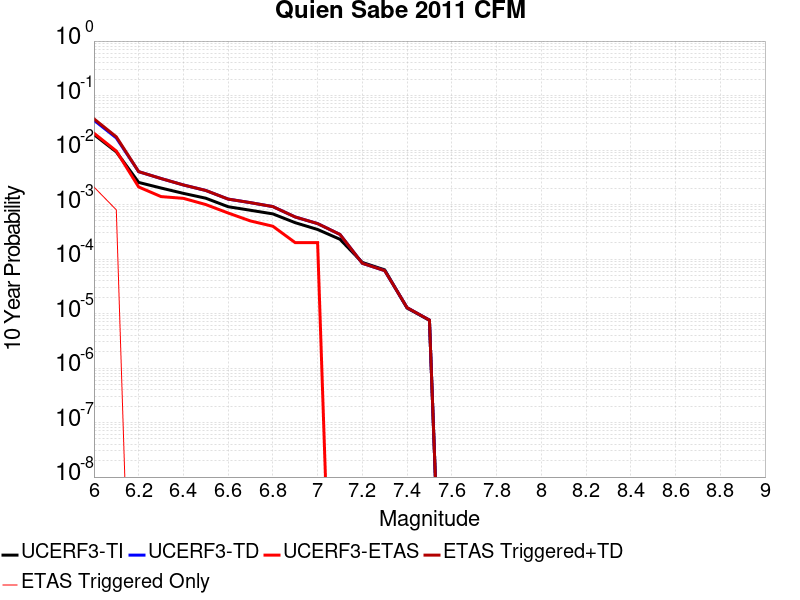 |

| Magnitude | 1 wk TI Prob | 1 wk TD Prob | 1 wk ETAS Prob | 1 wk ETAS/TD Gain | 1 wk ETAS Triggered+TD | 1 wk ETAS Triggered Only | 1 mo TI Prob | 1 mo TD Prob | 1 mo ETAS Prob | 1 mo ETAS/TD Gain | 1 mo ETAS Triggered+TD | 1 mo ETAS Triggered Only | 1 yr TI Prob | 1 yr TD Prob | 1 yr ETAS Prob | 1 yr ETAS/TD Gain | 1 yr ETAS Triggered+TD | 1 yr ETAS Triggered Only | 10 yr TI Prob | 10 yr TD Prob | 10 yr ETAS Prob | 10 yr ETAS/TD Gain | 10 yr ETAS Triggered+TD | 10 yr ETAS Triggered Only |
|-----|-----|-----|-----|-----|-----|-----|-----|-----|-----|-----|-----|-----|-----|-----|-----|-----|-----|-----|-----|-----|-----|-----|-----|-----|
| 6.0 | 3.729899E-5 | 7.098739E-5 | 0.0 | 0.0 | 7.098739E-5 | 0.0 | 1.5984301E-4 | 3.0414053E-4 | 1.0E-4 | 0.32879537 | 4.0411012E-4 | 1.0E-4 | 0.0019443515 | 0.0036873198 | 9.0E-4 | 0.24407972 | 0.0045840014 | 9.0E-4 | 0.019274272 | 0.03536942 | 0.0021 | 0.059373323 | 0.037395146 | 0.0021 |
| 6.1 | 1.7825725E-5 | 3.3230805E-5 | 0.0 | 0.0 | 3.3230805E-5 | 0.0 | 7.639373E-5 | 1.4236379E-4 | 1.0E-4 | 0.70242584 | 2.4234955E-4 | 1.0E-4 | 9.296967E-4 | 0.0017275817 | 7.0E-4 | 0.40519068 | 0.0024263724 | 7.0E-4 | 0.009258169 | 0.016707644 | 8.0E-4 | 0.047882274 | 0.017494278 | 8.0E-4 |
| 6.2 | 4.8865336E-6 | 7.80965E-6 | 0.0 | 0.0 | 7.80965E-6 | 0.0 | 2.0942118E-5 | 3.346749E-5 | 0.0 | 0.0 | 3.346749E-5 | 0.0 | 2.5494045E-4 | 4.0704603E-4 | 0.0 | 0.0 | 4.0704603E-4 | 0.0 | 0.0025464818 | 0.0040151067 | 0.0 | 0.0 | 0.0040151067 | 0.0 |
| 6.3 | 3.858491E-6 | 5.790842E-6 | 0.0 | 0.0 | 5.790842E-6 | 0.0 | 1.6536285E-5 | 2.4817684E-5 | 0.0 | 0.0 | 2.4817684E-5 | 0.0 | 2.0131067E-4 | 3.0211807E-4 | 0.0 | 0.0 | 3.0211807E-4 | 0.0 | 0.002011284 | 0.0030030143 | 0.0 | 0.0 | 0.0030030143 | 0.0 |
| 6.4 | 3.0771805E-6 | 4.3860605E-6 | 0.0 | 0.0 | 4.3860605E-6 | 0.0 | 1.318785E-5 | 1.879728E-5 | 0.0 | 0.0 | 1.879728E-5 | 0.0 | 1.6055023E-4 | 2.2883528E-4 | 0.0 | 0.0 | 2.2883528E-4 | 0.0 | 0.001604343 | 0.002287506 | 0.0 | 0.0 | 0.002287506 | 0.0 |
| 6.5 | 2.5081235E-6 | 3.4647874E-6 | 0.0 | 0.0 | 3.4647874E-6 | 0.0 | 1.0749056E-5 | 1.4849013E-5 | 0.0 | 0.0 | 1.4849013E-5 | 0.0 | 1.308619E-4 | 1.807732E-4 | 0.0 | 0.0 | 1.807732E-4 | 0.0 | 0.0013078486 | 0.0018132726 | 0.0 | 0.0 | 0.0018132726 | 0.0 |
| 6.6 | 1.7505364E-6 | 2.4036335E-6 | 0.0 | 0.0 | 2.4036335E-6 | 0.0 | 7.502277E-6 | 1.0301249E-5 | 0.0 | 0.0 | 1.0301249E-5 | 0.0 | 9.13364E-5 | 1.2541121E-4 | 0.0 | 0.0 | 1.2541121E-4 | 0.0 | 9.129886E-4 | 0.0012590034 | 0.0 | 0.0 | 0.0012590034 | 0.0 |
| 6.7 | 1.505737E-6 | 2.065058E-6 | 0.0 | 0.0 | 2.065058E-6 | 0.0 | 6.4531428E-6 | 8.850222E-6 | 0.0 | 0.0 | 8.850222E-6 | 0.0 | 7.8564175E-5 | 1.0774672E-4 | 0.0 | 0.0 | 1.0774672E-4 | 0.0 | 7.853641E-4 | 0.0010825392 | 0.0 | 0.0 | 0.0010825392 | 0.0 |
| 6.8 | 1.2924105E-6 | 1.7497356E-6 | 0.0 | 0.0 | 1.7497356E-6 | 0.0 | 5.5388905E-6 | 7.4988484E-6 | 0.0 | 0.0 | 7.4988484E-6 | 0.0 | 6.74339E-5 | 9.12952E-5 | 0.0 | 0.0 | 9.12952E-5 | 0.0 | 6.741344E-4 | 9.1682636E-4 | 0.0 | 0.0 | 9.1682636E-4 | 0.0 |
| 6.9 | 8.9075286E-7 | 1.1259069E-6 | 0.0 | 0.0 | 1.1259069E-6 | 0.0 | 3.8175067E-6 | 4.8253078E-6 | 0.0 | 0.0 | 4.8253078E-6 | 0.0 | 4.6477155E-5 | 5.8746762E-5 | 0.0 | 0.0 | 5.8746762E-5 | 0.0 | 4.6467435E-4 | 5.909275E-4 | 0.0 | 0.0 | 5.909275E-4 | 0.0 |
| 7.0 | 6.6891175E-7 | 8.525484E-7 | 0.0 | 0.0 | 8.525484E-7 | 0.0 | 2.8667614E-6 | 3.6537747E-6 | 0.0 | 0.0 | 3.6537747E-6 | 0.0 | 3.4902263E-5 | 4.4483997E-5 | 0.0 | 0.0 | 4.4483997E-5 | 0.0 | 3.4896782E-4 | 4.4729837E-4 | 0.0 | 0.0 | 4.4729837E-4 | 0.0 |
| 7.1 | 4.4205015E-7 | 5.392396E-7 | 0.0 | 0.0 | 5.392396E-7 | 0.0 | 1.8944993E-6 | 2.3110256E-6 | 0.0 | 0.0 | 2.3110256E-6 | 0.0 | 2.3065284E-5 | 2.8136545E-5 | 0.0 | 0.0 | 2.8136545E-5 | 0.0 | 2.3062891E-4 | 2.8275262E-4 | 0.0 | 0.0 | 2.8275262E-4 | 0.0 |
| 7.2 | 1.6620965E-7 | 1.5991051E-7 | 0.0 | 0.0 | 1.5991051E-7 | 0.0 | 7.123269E-7 | 6.853306E-7 | 0.0 | 0.0 | 6.853306E-7 | 0.0 | 8.672545E-6 | 8.343872E-6 | 0.0 | 0.0 | 8.343872E-6 | 0.0 | 8.6722066E-5 | 8.360408E-5 | 0.0 | 0.0 | 8.360408E-5 | 0.0 |
| 7.3 | 1.2142488E-7 | 1.17240766E-7 | 0.0 | 0.0 | 1.17240766E-7 | 0.0 | 5.2039223E-7 | 5.0246035E-7 | 0.0 | 0.0 | 5.0246035E-7 | 0.0 | 6.335757E-6 | 6.1174414E-6 | 0.0 | 0.0 | 6.1174414E-6 | 0.0 | 6.3355765E-5 | 6.117933E-5 | 0.0 | 0.0 | 6.117933E-5 | 0.0 |
| 7.4 | 2.4192937E-8 | 2.4538101E-8 | 0.0 | 0.0 | 2.4538101E-8 | 0.0 | 1.0368401E-7 | 1.0516329E-7 | 0.0 | 0.0 | 1.0516329E-7 | 0.0 | 1.2623522E-6 | 1.2803624E-6 | 0.0 | 0.0 | 1.2803624E-6 | 0.0 | 1.2623449E-5 | 1.2763848E-5 | 0.0 | 0.0 | 1.2763848E-5 | 0.0 |
| 7.5 | 1.4432802E-8 | 1.4509079E-8 | 0.0 | 0.0 | 1.4509079E-8 | 0.0 | 6.185486E-8 | 6.218177E-8 | 0.0 | 0.0 | 6.218177E-8 | 0.0 | 7.530827E-7 | 7.570628E-7 | 0.0 | 0.0 | 7.570628E-7 | 0.0 | 7.530801E-6 | 7.52881E-6 | 0.0 | 0.0 | 7.52881E-6 | 0.0 |

## Hunting Creek - Bartlett Springs connector 2011
*[(top)](#table-of-contents)*

| 1 Week | 1 Month | 1 Year | 10 Year |
|-----|-----|-----|-----|
|  |  |  |  |

| Magnitude | 1 wk TI Prob | 1 wk TD Prob | 1 wk ETAS Prob | 1 wk ETAS/TD Gain | 1 wk ETAS Triggered+TD | 1 wk ETAS Triggered Only | 1 mo TI Prob | 1 mo TD Prob | 1 mo ETAS Prob | 1 mo ETAS/TD Gain | 1 mo ETAS Triggered+TD | 1 mo ETAS Triggered Only | 1 yr TI Prob | 1 yr TD Prob | 1 yr ETAS Prob | 1 yr ETAS/TD Gain | 1 yr ETAS Triggered+TD | 1 yr ETAS Triggered Only | 10 yr TI Prob | 10 yr TD Prob | 10 yr ETAS Prob | 10 yr ETAS/TD Gain | 10 yr ETAS Triggered+TD | 10 yr ETAS Triggered Only |
|-----|-----|-----|-----|-----|-----|-----|-----|-----|-----|-----|-----|-----|-----|-----|-----|-----|-----|-----|-----|-----|-----|-----|-----|-----|
| 6.0 | 4.940016E-5 | 6.791604E-5 | 0.0 | 0.0 | 6.791604E-5 | 0.0 | 2.1169778E-4 | 2.9103426E-4 | 0.0 | 0.0 | 2.9103426E-4 | 0.0 | 0.002574374 | 0.0035374467 | 3.0E-4 | 0.08480693 | 0.0038363854 | 3.0E-4 | 0.025447546 | 0.034797058 | 0.0021 | 0.06034993 | 0.036823984 | 0.0021 |
| 6.1 | 4.940016E-5 | 6.791604E-5 | 0.0 | 0.0 | 6.791604E-5 | 0.0 | 2.1169778E-4 | 2.9103426E-4 | 0.0 | 0.0 | 2.9103426E-4 | 0.0 | 0.002574374 | 0.0035374467 | 3.0E-4 | 0.08480693 | 0.0038363854 | 3.0E-4 | 0.025447546 | 0.034797058 | 0.0021 | 0.06034993 | 0.036823984 | 0.0021 |
| 6.2 | 4.472471E-5 | 6.104605E-5 | 0.0 | 0.0 | 6.104605E-5 | 0.0 | 1.9166325E-4 | 2.6159745E-4 | 0.0 | 0.0 | 2.6159745E-4 | 0.0 | 0.0023310026 | 0.0031802026 | 2.0E-4 | 0.06288908 | 0.0033795666 | 2.0E-4 | 0.02306703 | 0.031337492 | 0.0019 | 0.060630247 | 0.033177953 | 0.0019 |
| 6.3 | 4.472471E-5 | 6.104605E-5 | 0.0 | 0.0 | 6.104605E-5 | 0.0 | 1.9166325E-4 | 2.6159745E-4 | 0.0 | 0.0 | 2.6159745E-4 | 0.0 | 0.0023310026 | 0.0031802026 | 2.0E-4 | 0.06288908 | 0.0033795666 | 2.0E-4 | 0.02306703 | 0.031337492 | 0.0019 | 0.060630247 | 0.033177953 | 0.0019 |
| 6.4 | 4.0001003E-5 | 5.4139648E-5 | 0.0 | 0.0 | 5.4139648E-5 | 0.0 | 1.714216E-4 | 2.3200619E-4 | 0.0 | 0.0 | 2.3200619E-4 | 0.0 | 0.0020850603 | 0.0028209654 | 1.0E-4 | 0.035448857 | 0.0029206832 | 1.0E-4 | 0.02065605 | 0.027846247 | 0.0015 | 0.053867225 | 0.029304478 | 0.0015 |
| 6.5 | 3.8033053E-5 | 5.129897E-5 | 0.0 | 0.0 | 5.129897E-5 | 0.0 | 1.6298861E-4 | 2.1983392E-4 | 0.0 | 0.0 | 2.1983392E-4 | 0.0 | 0.0019825802 | 0.0026731663 | 1.0E-4 | 0.03740882 | 0.0027728989 | 1.0E-4 | 0.019649856 | 0.026407251 | 0.0014 | 0.053015742 | 0.02777028 | 0.0014 |
| 6.6 | 3.653754E-5 | 4.9160328E-5 | 0.0 | 0.0 | 4.9160328E-5 | 0.0 | 1.5658008E-4 | 2.1067017E-4 | 0.0 | 0.0 | 2.1067017E-4 | 0.0 | 0.0019046954 | 0.002561885 | 1.0E-4 | 0.03903376 | 0.0026616286 | 1.0E-4 | 0.018884527 | 0.025322381 | 0.0014 | 0.05528706 | 0.02668693 | 0.0014 |
| 6.7 | 3.372024E-5 | 4.5167893E-5 | 0.0 | 0.0 | 4.5167893E-5 | 0.0 | 1.4450731E-4 | 1.9356233E-4 | 0.0 | 0.0 | 1.9356233E-4 | 0.0 | 0.0017579567 | 0.002354093 | 1.0E-4 | 0.042479206 | 0.0024538576 | 1.0E-4 | 0.017441148 | 0.023292575 | 0.0013 | 0.055811778 | 0.024562294 | 0.0013 |
| 6.8 | 2.9650024E-5 | 3.9434588E-5 | 0.0 | 0.0 | 3.9434588E-5 | 0.0 | 1.2706534E-4 | 1.6899435E-4 | 0.0 | 0.0 | 1.6899435E-4 | 0.0 | 0.0015459227 | 0.0020555549 | 1.0E-4 | 0.048648667 | 0.0021553491 | 1.0E-4 | 0.015352124 | 0.020363314 | 0.0012 | 0.058929503 | 0.021538878 | 0.0012 |
| 6.9 | 2.860775E-5 | 3.783438E-5 | 0.0 | 0.0 | 3.783438E-5 | 0.0 | 1.2259888E-4 | 1.6213725E-4 | 0.0 | 0.0 | 1.6213725E-4 | 0.0 | 0.0014916194 | 0.0019722404 | 1.0E-4 | 0.05070376 | 0.002072043 | 1.0E-4 | 0.014816469 | 0.019547187 | 0.0012 | 0.06138991 | 0.02072373 | 0.0012 |
| 7.0 | 2.6696067E-5 | 3.5087312E-5 | 0.0 | 0.0 | 3.5087312E-5 | 0.0 | 1.144067E-4 | 1.503656E-4 | 0.0 | 0.0 | 1.503656E-4 | 0.0 | 0.0013920115 | 0.0018291721 | 1.0E-4 | 0.05466954 | 0.0019289892 | 1.0E-4 | 0.013833242 | 0.018141728 | 0.0011 | 0.060633693 | 0.019221773 | 0.0011 |
| 7.1 | 2.456087E-5 | 3.2031647E-5 | 0.0 | 0.0 | 3.2031647E-5 | 0.0 | 1.0525662E-4 | 1.3727132E-4 | 0.0 | 0.0 | 1.3727132E-4 | 0.0 | 0.001280746 | 0.0016700061 | 1.0E-4 | 0.059880022 | 0.0017698391 | 1.0E-4 | 0.012733897 | 0.01657608 | 0.0011 | 0.06636069 | 0.017657846 | 0.0011 |
| 7.2 | 2.295761E-5 | 2.9840372E-5 | 0.0 | 0.0 | 2.9840372E-5 | 0.0 | 9.8386045E-5 | 1.278811E-4 | 0.0 | 0.0 | 1.278811E-4 | 0.0 | 0.0011971919 | 0.0015558496 | 1.0E-4 | 0.064273566 | 0.001655694 | 1.0E-4 | 0.011907627 | 0.015451252 | 0.0011 | 0.07119164 | 0.016534256 | 0.0011 |
| 7.3 | 2.1256936E-5 | 2.7558272E-5 | 0.0 | 0.0 | 2.7558272E-5 | 0.0 | 9.109797E-5 | 1.18101576E-4 | 0.0 | 0.0 | 1.18101576E-4 | 0.0 | 0.0011085535 | 0.0014369471 | 1.0E-4 | 0.069591984 | 0.0015368034 | 1.0E-4 | 0.011030397 | 0.014278199 | 0.001 | 0.07003684 | 0.015263921 | 0.001 |
| 7.4 | 1.8784336E-5 | 2.43214E-5 | 0.0 | 0.0 | 2.43214E-5 | 0.0 | 8.050181E-5 | 1.0423045E-4 | 0.0 | 0.0 | 1.0423045E-4 | 0.0 | 9.796688E-4 | 0.0012682746 | 1.0E-4 | 0.07884728 | 0.0013681478 | 1.0E-4 | 0.009753612 | 0.012611715 | 0.001 | 0.07929136 | 0.013599103 | 0.001 |
| 7.5 | 1.7248298E-5 | 2.2282242E-5 | 0.0 | 0.0 | 2.2282242E-5 | 0.0 | 7.391918E-5 | 9.549187E-5 | 0.0 | 0.0 | 9.549187E-5 | 0.0 | 8.9959445E-4 | 0.0011620009 | 1.0E-4 | 0.08605845 | 0.0012618847 | 1.0E-4 | 0.008959615 | 0.011560513 | 9.0E-4 | 0.07785122 | 0.012450108 | 9.0E-4 |
| 7.6 | 1.0653709E-5 | 1.3730895E-5 | 0.0 | 0.0 | 1.3730895E-5 | 0.0 | 4.5657955E-5 | 5.8845384E-5 | 0.0 | 0.0 | 5.8845384E-5 | 0.0 | 5.557438E-4 | 7.1620976E-4 | 1.0E-4 | 0.13962391 | 8.161381E-4 | 1.0E-4 | 0.0055435603 | 0.0071396246 | 5.0E-4 | 0.070031695 | 0.0076360544 | 5.0E-4 |
| 7.7 | 3.286316E-6 | 4.0926175E-6 | 0.0 | 0.0 | 4.0926175E-6 | 0.0 | 1.4084137E-5 | 1.753967E-5 | 0.0 | 0.0 | 1.753967E-5 | 0.0 | 1.7146087E-4 | 2.1352473E-4 | 1.0E-4 | 0.46832982 | 3.1350338E-4 | 1.0E-4 | 0.0017132863 | 0.00213323 | 2.0E-4 | 0.093754545 | 0.0023328033 | 2.0E-4 |
| 7.8 | 5.1855085E-7 | 5.978903E-7 | 0.0 | 0.0 | 5.978903E-7 | 0.0 | 2.222359E-6 | 2.5623845E-6 | 0.0 | 0.0 | 2.5623845E-6 | 0.0 | 2.7056883E-5 | 3.1196592E-5 | 1.0E-4 | 3.2054782 | 1.3119348E-4 | 1.0E-4 | 2.705359E-4 | 3.1191588E-4 | 1.0E-4 | 0.32059926 | 4.1188468E-4 | 1.0E-4 |

## Ventura-Pitas Point
*[(top)](#table-of-contents)*

| 1 Week | 1 Month | 1 Year | 10 Year |
|-----|-----|-----|-----|
| 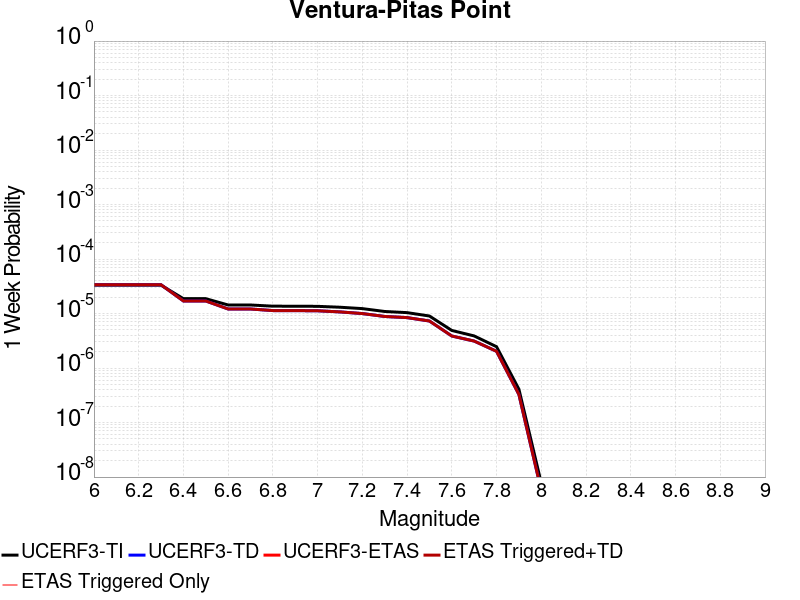 |  |  |  |

| Magnitude | 1 wk TI Prob | 1 wk TD Prob | 1 wk ETAS Prob | 1 wk ETAS/TD Gain | 1 wk ETAS Triggered+TD | 1 wk ETAS Triggered Only | 1 mo TI Prob | 1 mo TD Prob | 1 mo ETAS Prob | 1 mo ETAS/TD Gain | 1 mo ETAS Triggered+TD | 1 mo ETAS Triggered Only | 1 yr TI Prob | 1 yr TD Prob | 1 yr ETAS Prob | 1 yr ETAS/TD Gain | 1 yr ETAS Triggered+TD | 1 yr ETAS Triggered Only | 10 yr TI Prob | 10 yr TD Prob | 10 yr ETAS Prob | 10 yr ETAS/TD Gain | 10 yr ETAS Triggered+TD | 10 yr ETAS Triggered Only |
|-----|-----|-----|-----|-----|-----|-----|-----|-----|-----|-----|-----|-----|-----|-----|-----|-----|-----|-----|-----|-----|-----|-----|-----|-----|
| 6.0 | 3.3179622E-5 | 3.3746295E-5 | 0.0 | 0.0 | 3.3746295E-5 | 0.0 | 1.4219063E-4 | 1.4462043E-4 | 0.0 | 0.0 | 1.4462043E-4 | 0.0 | 0.0017297962 | 0.0017595884 | 3.0E-4 | 0.17049442 | 0.0020590606 | 3.0E-4 | 0.017163932 | 0.01748212 | 0.002 | 0.1144026 | 0.019447157 | 0.002 |
| 6.1 | 3.3179622E-5 | 3.3746295E-5 | 0.0 | 0.0 | 3.3746295E-5 | 0.0 | 1.4219063E-4 | 1.4462043E-4 | 0.0 | 0.0 | 1.4462043E-4 | 0.0 | 0.0017297962 | 0.0017595884 | 3.0E-4 | 0.17049442 | 0.0020590606 | 3.0E-4 | 0.017163932 | 0.01748212 | 0.002 | 0.1144026 | 0.019447157 | 0.002 |
| 6.2 | 3.3179622E-5 | 3.3746295E-5 | 0.0 | 0.0 | 3.3746295E-5 | 0.0 | 1.4219063E-4 | 1.4462043E-4 | 0.0 | 0.0 | 1.4462043E-4 | 0.0 | 0.0017297962 | 0.0017595884 | 3.0E-4 | 0.17049442 | 0.0020590606 | 3.0E-4 | 0.017163932 | 0.01748212 | 0.002 | 0.1144026 | 0.019447157 | 0.002 |
| 6.3 | 3.3179622E-5 | 3.3746295E-5 | 0.0 | 0.0 | 3.3746295E-5 | 0.0 | 1.4219063E-4 | 1.4462043E-4 | 0.0 | 0.0 | 1.4462043E-4 | 0.0 | 0.0017297962 | 0.0017595884 | 3.0E-4 | 0.17049442 | 0.0020590606 | 3.0E-4 | 0.017163932 | 0.01748212 | 0.002 | 0.1144026 | 0.019447157 | 0.002 |
| 6.4 | 1.8754668E-5 | 1.702522E-5 | 0.0 | 0.0 | 1.702522E-5 | 0.0 | 8.037467E-5 | 7.296332E-5 | 0.0 | 0.0 | 7.296332E-5 | 0.0 | 9.781223E-4 | 8.879895E-4 | 2.0E-4 | 0.22522789 | 0.0010878119 | 2.0E-4 | 0.009738282 | 0.0088467635 | 6.0E-4 | 0.06782141 | 0.009441456 | 6.0E-4 |
| 6.5 | 1.8754668E-5 | 1.702522E-5 | 0.0 | 0.0 | 1.702522E-5 | 0.0 | 8.037467E-5 | 7.296332E-5 | 0.0 | 0.0 | 7.296332E-5 | 0.0 | 9.781223E-4 | 8.879895E-4 | 2.0E-4 | 0.22522789 | 0.0010878119 | 2.0E-4 | 0.009738282 | 0.0088467635 | 6.0E-4 | 0.06782141 | 0.009441456 | 6.0E-4 |
| 6.6 | 1.4361558E-5 | 1.2126727E-5 | 0.0 | 0.0 | 1.2126727E-5 | 0.0 | 6.154808E-5 | 5.1970663E-5 | 0.0 | 0.0 | 5.1970663E-5 | 0.0 | 7.490902E-4 | 6.325614E-4 | 1.0E-4 | 0.15808742 | 7.324982E-4 | 1.0E-4 | 0.0074657016 | 0.0063078795 | 4.0E-4 | 0.063412756 | 0.0067053563 | 4.0E-4 |
| 6.7 | 1.4361558E-5 | 1.2126727E-5 | 0.0 | 0.0 | 1.2126727E-5 | 0.0 | 6.154808E-5 | 5.1970663E-5 | 0.0 | 0.0 | 5.1970663E-5 | 0.0 | 7.490902E-4 | 6.325614E-4 | 1.0E-4 | 0.15808742 | 7.324982E-4 | 1.0E-4 | 0.0074657016 | 0.0063078795 | 4.0E-4 | 0.063412756 | 0.0067053563 | 4.0E-4 |
| 6.8 | 1.3663846E-5 | 1.1348686E-5 | 0.0 | 0.0 | 1.1348686E-5 | 0.0 | 5.8558027E-5 | 4.8636328E-5 | 0.0 | 0.0 | 4.8636328E-5 | 0.0 | 7.127108E-4 | 5.919883E-4 | 1.0E-4 | 0.16892225 | 6.9192913E-4 | 1.0E-4 | 0.007104293 | 0.0059043434 | 4.0E-4 | 0.067746736 | 0.006301982 | 4.0E-4 |
| 6.9 | 1.3644157E-5 | 1.1326781E-5 | 0.0 | 0.0 | 1.1326781E-5 | 0.0 | 5.8473648E-5 | 4.8542453E-5 | 0.0 | 0.0 | 4.8542453E-5 | 0.0 | 7.116841E-4 | 5.9084606E-4 | 1.0E-4 | 0.16924882 | 6.90787E-4 | 1.0E-4 | 0.007094092 | 0.0058929813 | 4.0E-4 | 0.06787736 | 0.006290624 | 4.0E-4 |
| 7.0 | 1.3568845E-5 | 1.1246325E-5 | 0.0 | 0.0 | 1.1246325E-5 | 0.0 | 5.8150898E-5 | 4.8197657E-5 | 0.0 | 0.0 | 4.8197657E-5 | 0.0 | 7.077572E-4 | 5.866504E-4 | 1.0E-4 | 0.17045927 | 6.865917E-4 | 1.0E-4 | 0.007055073 | 0.0058512464 | 4.0E-4 | 0.068361506 | 0.006248906 | 4.0E-4 |
| 7.1 | 1.306572E-5 | 1.0724634E-5 | 0.0 | 0.0 | 1.0724634E-5 | 0.0 | 5.599474E-5 | 4.596192E-5 | 0.0 | 0.0 | 4.596192E-5 | 0.0 | 6.815227E-4 | 5.5944454E-4 | 1.0E-4 | 0.17874873 | 6.593886E-4 | 1.0E-4 | 0.0067943637 | 0.0055805803 | 4.0E-4 | 0.07167713 | 0.005978348 | 4.0E-4 |
| 7.2 | 1.232604E-5 | 9.998982E-6 | 0.0 | 0.0 | 9.998982E-6 | 0.0 | 5.2824813E-5 | 4.2852087E-5 | 0.0 | 0.0 | 4.2852087E-5 | 0.0 | 6.429523E-4 | 5.2160106E-4 | 1.0E-4 | 0.19171742 | 6.2154885E-4 | 1.0E-4 | 0.0064109527 | 0.0052039735 | 4.0E-4 | 0.07686435 | 0.005601892 | 4.0E-4 |
| 7.3 | 1.0917261E-5 | 8.845936E-6 | 0.0 | 0.0 | 8.845936E-6 | 0.0 | 4.678742E-5 | 3.791061E-5 | 0.0 | 0.0 | 3.791061E-5 | 0.0 | 5.69488E-4 | 4.614655E-4 | 1.0E-4 | 0.21670093 | 5.6141935E-4 | 1.0E-4 | 0.0056803077 | 0.004605252 | 4.0E-4 | 0.086857356 | 0.00500341 | 4.0E-4 |
| 7.4 | 1.039959E-5 | 8.425517E-6 | 0.0 | 0.0 | 8.425517E-6 | 0.0 | 4.456891E-5 | 3.6108868E-5 | 0.0 | 0.0 | 3.6108868E-5 | 0.0 | 5.424914E-4 | 4.395383E-4 | 1.0E-4 | 0.22751147 | 5.3949433E-4 | 1.0E-4 | 0.0054116896 | 0.0043868646 | 4.0E-4 | 0.09118129 | 0.00478511 | 4.0E-4 |
| 7.5 | 9.015877E-6 | 7.2990624E-6 | 0.0 | 0.0 | 7.2990624E-6 | 0.0 | 3.86389E-5 | 3.1281328E-5 | 0.0 | 0.0 | 3.1281328E-5 | 0.0 | 4.7032707E-4 | 3.8078503E-4 | 1.0E-4 | 0.26261538 | 4.8074694E-4 | 1.0E-4 | 0.004693329 | 0.0038014844 | 4.0E-4 | 0.10522206 | 0.0041999635 | 4.0E-4 |
| 7.6 | 4.900162E-6 | 3.8747467E-6 | 0.0 | 0.0 | 3.8747467E-6 | 0.0 | 2.1000526E-5 | 1.6605953E-5 | 0.0 | 0.0 | 1.6605953E-5 | 0.0 | 2.556514E-4 | 2.0215884E-4 | 1.0E-4 | 0.49466053 | 3.0213862E-4 | 1.0E-4 | 0.0025535747 | 0.002019763 | 2.0E-4 | 0.09902152 | 0.0022193592 | 2.0E-4 |
| 7.7 | 3.8850626E-6 | 3.1272446E-6 | 0.0 | 0.0 | 3.1272446E-6 | 0.0 | 1.6650163E-5 | 1.34024085E-5 | 0.0 | 0.0 | 1.34024085E-5 | 0.0 | 2.0269687E-4 | 1.6316219E-4 | 1.0E-4 | 0.6128871 | 2.6314586E-4 | 1.0E-4 | 0.002025121 | 0.0016304333 | 2.0E-4 | 0.122666776 | 0.0018301072 | 2.0E-4 |
| 7.8 | 2.4654719E-6 | 2.030226E-6 | 0.0 | 0.0 | 2.030226E-6 | 0.0 | 1.0566265E-5 | 8.700939E-6 | 0.0 | 0.0 | 8.700939E-6 | 0.0 | 1.2863669E-4 | 1.0592883E-4 | 1.0E-4 | 0.94403005 | 2.0591824E-4 | 1.0E-4 | 0.0012856225 | 0.0010587882 | 2.0E-4 | 0.18889521 | 0.0012585764 | 2.0E-4 |
| 7.9 | 4.095894E-7 | 3.2769515E-7 | 0.0 | 0.0 | 3.2769515E-7 | 0.0 | 1.7553821E-6 | 1.404407E-6 | 0.0 | 0.0 | 1.404407E-6 | 0.0 | 2.1371567E-5 | 1.7098524E-5 | 0.0 | 0.0 | 1.7098524E-5 | 0.0 | 2.1369511E-4 | 1.709724E-4 | 0.0 | 0.0 | 1.709724E-4 | 0.0 |
| 8.0 | 7.791402E-9 | 5.684373E-9 | 0.0 | 0.0 | 5.684373E-9 | 0.0 | 3.3391725E-8 | 2.43616E-8 | 0.0 | 0.0 | 2.43616E-8 | 0.0 | 4.0654416E-7 | 2.9660245E-7 | 0.0 | 0.0 | 2.9660245E-7 | 0.0 | 4.065434E-6 | 2.9660227E-6 | 0.0 | 0.0 | 2.9660227E-6 | 0.0 |

## Mission (connected) 2011 CFM
*[(top)](#table-of-contents)*

| 1 Week | 1 Month | 1 Year | 10 Year |
|-----|-----|-----|-----|
|  |  | 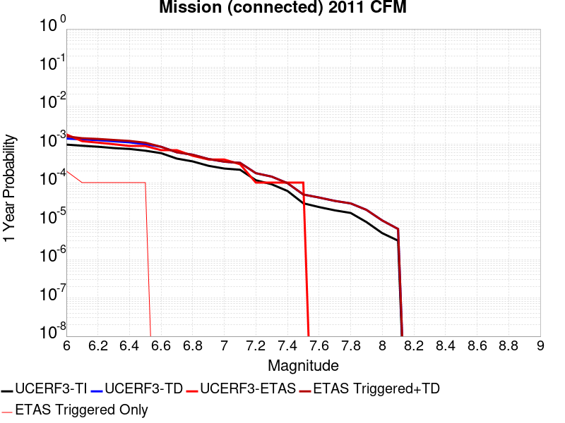 | 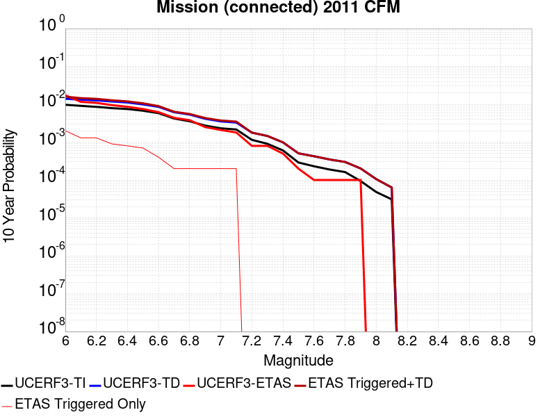 |

| Magnitude | 1 wk TI Prob | 1 wk TD Prob | 1 wk ETAS Prob | 1 wk ETAS/TD Gain | 1 wk ETAS Triggered+TD | 1 wk ETAS Triggered Only | 1 mo TI Prob | 1 mo TD Prob | 1 mo ETAS Prob | 1 mo ETAS/TD Gain | 1 mo ETAS Triggered+TD | 1 mo ETAS Triggered Only | 1 yr TI Prob | 1 yr TD Prob | 1 yr ETAS Prob | 1 yr ETAS/TD Gain | 1 yr ETAS Triggered+TD | 1 yr ETAS Triggered Only | 10 yr TI Prob | 10 yr TD Prob | 10 yr ETAS Prob | 10 yr ETAS/TD Gain | 10 yr ETAS Triggered+TD | 10 yr ETAS Triggered Only |
|-----|-----|-----|-----|-----|-----|-----|-----|-----|-----|-----|-----|-----|-----|-----|-----|-----|-----|-----|-----|-----|-----|-----|-----|-----|
| 6.0 | 1.8735573E-5 | 2.687239E-5 | 0.0 | 0.0 | 2.687239E-5 | 0.0 | 8.029284E-5 | 1.1516131E-4 | 1.0E-4 | 0.8683472 | 2.1514979E-4 | 1.0E-4 | 9.771269E-4 | 0.0014010908 | 2.0E-4 | 0.14274593 | 0.0016008106 | 2.0E-4 | 0.009728416 | 0.01393252 | 0.002 | 0.14354905 | 0.015904654 | 0.002 |
| 6.1 | 1.7515964E-5 | 2.551335E-5 | 0.0 | 0.0 | 2.551335E-5 | 0.0 | 7.506625E-5 | 1.09337336E-4 | 0.0 | 0.0 | 1.09337336E-4 | 0.0 | 9.135484E-4 | 0.0013302723 | 1.0E-4 | 0.07517257 | 0.0014301393 | 1.0E-4 | 0.009098019 | 0.013232956 | 0.0013 | 0.09823958 | 0.014515753 | 0.0013 |
| 6.2 | 1.6486343E-5 | 2.4357729E-5 | 0.0 | 0.0 | 2.4357729E-5 | 0.0 | 7.065384E-5 | 1.043851E-4 | 0.0 | 0.0 | 1.043851E-4 | 0.0 | 8.5987104E-4 | 0.001270051 | 1.0E-4 | 0.078737 | 0.0013699239 | 1.0E-4 | 0.008565514 | 0.012637778 | 0.0013 | 0.10286618 | 0.013921349 | 0.0013 |
| 6.3 | 1.5229385E-5 | 2.2787364E-5 | 0.0 | 0.0 | 2.2787364E-5 | 0.0 | 6.526716E-5 | 9.765549E-5 | 0.0 | 0.0 | 9.765549E-5 | 0.0 | 7.9433795E-4 | 0.0011882104 | 1.0E-4 | 0.08416018 | 0.0012880916 | 1.0E-4 | 0.007915046 | 0.011831057 | 9.0E-4 | 0.07607097 | 0.012720409 | 9.0E-4 |
| 6.4 | 1.4435828E-5 | 2.1389516E-5 | 0.0 | 0.0 | 2.1389516E-5 | 0.0 | 6.186637E-5 | 9.1665155E-5 | 0.0 | 0.0 | 9.1665155E-5 | 0.0 | 7.529627E-4 | 0.0011153563 | 1.0E-4 | 0.08965744 | 0.0012152449 | 1.0E-4 | 0.007504165 | 0.011114995 | 8.0E-4 | 0.071974844 | 0.011906102 | 8.0E-4 |
| 6.5 | 1.30127955E-5 | 1.9027068E-5 | 0.0 | 0.0 | 1.9027068E-5 | 0.0 | 5.576793E-5 | 8.154185E-5 | 0.0 | 0.0 | 8.154185E-5 | 0.0 | 6.78763E-4 | 9.922847E-4 | 1.0E-4 | 0.10077752 | 0.0010921855 | 1.0E-4 | 0.0067669353 | 0.009907339 | 7.0E-4 | 0.0706547 | 0.010600404 | 7.0E-4 |
| 6.6 | 1.1220718E-5 | 1.6382686E-5 | 0.0 | 0.0 | 1.6382686E-5 | 0.0 | 4.8087906E-5 | 7.020962E-5 | 0.0 | 0.0 | 7.020962E-5 | 0.0 | 5.8531296E-4 | 8.544664E-4 | 0.0 | 0.0 | 8.544664E-4 | 0.0 | 0.005837737 | 0.008544901 | 4.0E-4 | 0.04681154 | 0.008941484 | 4.0E-4 |
| 6.7 | 8.086152E-6 | 1.174535E-5 | 0.0 | 0.0 | 1.174535E-5 | 0.0 | 3.4654473E-5 | 5.0336246E-5 | 0.0 | 0.0 | 5.0336246E-5 | 0.0 | 4.2183654E-4 | 6.1267224E-4 | 0.0 | 0.0 | 6.1267224E-4 | 0.0 | 0.004210367 | 0.0061472566 | 2.0E-4 | 0.032534838 | 0.006346027 | 2.0E-4 |
| 6.8 | 6.8361655E-6 | 1.0193467E-5 | 0.0 | 0.0 | 1.0193467E-5 | 0.0 | 2.9297524E-5 | 4.368556E-5 | 0.0 | 0.0 | 4.368556E-5 | 0.0 | 3.5663895E-4 | 5.317425E-4 | 0.0 | 0.0 | 5.317425E-4 | 0.0 | 0.0035606713 | 0.005337633 | 2.0E-4 | 0.03746979 | 0.005536566 | 2.0E-4 |
| 6.9 | 5.2517353E-6 | 7.871252E-6 | 0.0 | 0.0 | 7.871252E-6 | 0.0 | 2.2507242E-5 | 3.3733504E-5 | 0.0 | 0.0 | 3.3733504E-5 | 0.0 | 2.739912E-4 | 4.1062824E-4 | 0.0 | 0.0 | 4.1062824E-4 | 0.0 | 0.0027365363 | 0.0041307677 | 2.0E-4 | 0.048417147 | 0.0043299417 | 2.0E-4 |
| 7.0 | 4.4602784E-6 | 6.705857E-6 | 0.0 | 0.0 | 6.705857E-6 | 0.0 | 1.911534E-5 | 2.8739072E-5 | 0.0 | 0.0 | 2.8739072E-5 | 0.0 | 2.327044E-4 | 3.498422E-4 | 0.0 | 0.0 | 3.498422E-4 | 0.0 | 0.0023246086 | 0.0035241733 | 2.0E-4 | 0.056750897 | 0.0037234686 | 2.0E-4 |
| 7.1 | 4.1492594E-6 | 6.254851E-6 | 0.0 | 0.0 | 6.254851E-6 | 0.0 | 1.7782419E-5 | 2.680623E-5 | 0.0 | 0.0 | 2.680623E-5 | 0.0 | 2.1647944E-4 | 3.2631712E-4 | 0.0 | 0.0 | 3.2631712E-4 | 0.0 | 0.0021626868 | 0.003289116 | 2.0E-4 | 0.06080661 | 0.0034884582 | 2.0E-4 |
| 7.2 | 2.213247E-6 | 3.3633294E-6 | 0.0 | 0.0 | 3.3633294E-6 | 0.0 | 9.485309E-6 | 1.44141895E-5 | 0.0 | 0.0 | 1.44141895E-5 | 0.0 | 1.15477524E-4 | 1.7547865E-4 | 0.0 | 0.0 | 1.7547865E-4 | 0.0 | 0.0011541754 | 0.0017820409 | 0.0 | 0.0 | 0.0017820409 | 0.0 |
| 7.3 | 1.7362703E-6 | 2.7394185E-6 | 0.0 | 0.0 | 2.7394185E-6 | 0.0 | 7.4411373E-6 | 1.17403115E-5 | 0.0 | 0.0 | 1.17403115E-5 | 0.0 | 9.0592075E-5 | 1.4292894E-4 | 0.0 | 0.0 | 1.4292894E-4 | 0.0 | 9.0555154E-4 | 0.0014536399 | 0.0 | 0.0 | 0.0014536399 | 0.0 |
| 7.4 | 1.1628409E-6 | 1.8511946E-6 | 0.0 | 0.0 | 1.8511946E-6 | 0.0 | 4.9835944E-6 | 7.933667E-6 | 0.0 | 0.0 | 7.933667E-6 | 0.0 | 6.0673574E-5 | 9.6588126E-5 | 0.0 | 0.0 | 9.6588126E-5 | 0.0 | 6.065701E-4 | 9.86192E-4 | 0.0 | 0.0 | 9.86192E-4 | 0.0 |
| 7.5 | 5.5610667E-7 | 9.367062E-7 | 0.0 | 0.0 | 9.367062E-7 | 0.0 | 2.3833122E-6 | 4.0144487E-6 | 0.0 | 0.0 | 4.0144487E-6 | 0.0 | 2.9016439E-5 | 4.8874823E-5 | 0.0 | 0.0 | 4.8874823E-5 | 0.0 | 2.901265E-4 | 5.0526846E-4 | 0.0 | 0.0 | 5.0526846E-4 | 0.0 |
| 7.6 | 4.4307663E-7 | 7.809272E-7 | 0.0 | 0.0 | 7.809272E-7 | 0.0 | 1.8988985E-6 | 3.3468266E-6 | 0.0 | 0.0 | 3.3468266E-6 | 0.0 | 2.3118844E-5 | 4.0746854E-5 | 0.0 | 0.0 | 4.0746854E-5 | 0.0 | 2.3116439E-4 | 4.2333922E-4 | 0.0 | 0.0 | 4.2333922E-4 | 0.0 |
| 7.7 | 3.639119E-7 | 6.3791094E-7 | 0.0 | 0.0 | 6.3791094E-7 | 0.0 | 1.5596215E-6 | 2.7339013E-6 | 0.0 | 0.0 | 2.7339013E-6 | 0.0 | 1.8988227E-5 | 3.328474E-5 | 0.0 | 0.0 | 3.328474E-5 | 0.0 | 1.8986604E-4 | 3.4810795E-4 | 0.0 | 0.0 | 3.4810795E-4 | 0.0 |
| 7.8 | 3.1152942E-7 | 5.497069E-7 | 0.0 | 0.0 | 5.497069E-7 | 0.0 | 1.3351254E-6 | 2.3558846E-6 | 0.0 | 0.0 | 2.3558846E-6 | 0.0 | 1.6255031E-5 | 2.8682518E-5 | 0.0 | 0.0 | 2.8682518E-5 | 0.0 | 1.6253842E-4 | 2.9882343E-4 | 0.0 | 0.0 | 2.9882343E-4 | 0.0 |
| 7.9 | 1.8035962E-7 | 3.734494E-7 | 0.0 | 0.0 | 3.734494E-7 | 0.0 | 7.729696E-7 | 1.6004965E-6 | 0.0 | 0.0 | 1.6004965E-6 | 0.0 | 9.410865E-6 | 1.9485871E-5 | 0.0 | 0.0 | 1.9485871E-5 | 0.0 | 9.410465E-5 | 2.0150236E-4 | 0.0 | 0.0 | 2.0150236E-4 | 0.0 |
| 8.0 | 9.279334E-8 | 1.977881E-7 | 0.0 | 0.0 | 1.977881E-7 | 0.0 | 3.976857E-7 | 8.47663E-7 | 0.0 | 0.0 | 8.47663E-7 | 0.0 | 4.841813E-6 | 1.0320248E-5 | 0.0 | 0.0 | 1.0320248E-5 | 0.0 | 4.841707E-5 | 1.05710176E-4 | 0.0 | 0.0 | 1.05710176E-4 | 0.0 |
| 8.1 | 5.9253985E-8 | 1.1898414E-7 | 0.0 | 0.0 | 1.1898414E-7 | 0.0 | 2.5394561E-7 | 5.099319E-7 | 0.0 | 0.0 | 5.099319E-7 | 0.0 | 3.0917836E-6 | 6.208404E-6 | 0.0 | 0.0 | 6.208404E-6 | 0.0 | 3.0917407E-5 | 6.346739E-5 | 0.0 | 0.0 | 6.346739E-5 | 0.0 |

## San Diego Trough south
*[(top)](#table-of-contents)*

| 1 Week | 1 Month | 1 Year | 10 Year |
|-----|-----|-----|-----|
| 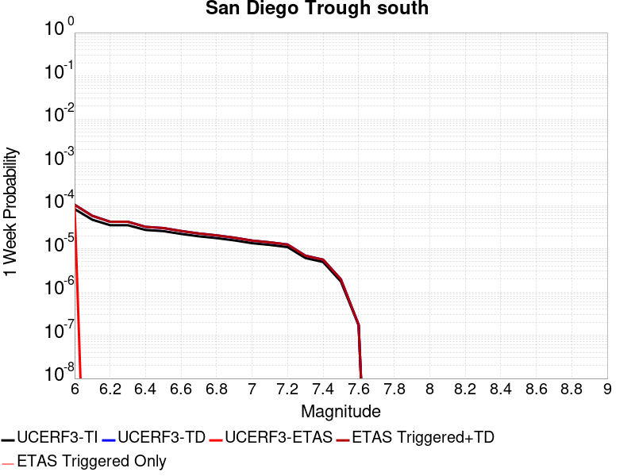 | 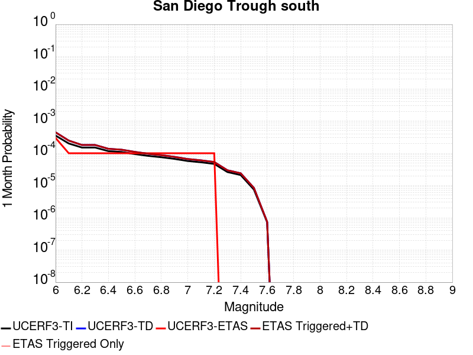 |  |  |

| Magnitude | 1 wk TI Prob | 1 wk TD Prob | 1 wk ETAS Prob | 1 wk ETAS/TD Gain | 1 wk ETAS Triggered+TD | 1 wk ETAS Triggered Only | 1 mo TI Prob | 1 mo TD Prob | 1 mo ETAS Prob | 1 mo ETAS/TD Gain | 1 mo ETAS Triggered+TD | 1 mo ETAS Triggered Only | 1 yr TI Prob | 1 yr TD Prob | 1 yr ETAS Prob | 1 yr ETAS/TD Gain | 1 yr ETAS Triggered+TD | 1 yr ETAS Triggered Only | 10 yr TI Prob | 10 yr TD Prob | 10 yr ETAS Prob | 10 yr ETAS/TD Gain | 10 yr ETAS Triggered+TD | 10 yr ETAS Triggered Only |
|-----|-----|-----|-----|-----|-----|-----|-----|-----|-----|-----|-----|-----|-----|-----|-----|-----|-----|-----|-----|-----|-----|-----|-----|-----|
| 6.0 | 8.279495E-5 | 1.043094E-4 | 0.0 | 0.0 | 1.043094E-4 | 0.0 | 3.5478722E-4 | 4.4696842E-4 | 0.0 | 0.0 | 4.4696842E-4 | 0.0 | 0.004310982 | 0.0054287077 | 1.0E-4 | 0.01842059 | 0.0055281646 | 1.0E-4 | 0.042283054 | 0.053019337 | 0.0017 | 0.03206377 | 0.054629207 | 0.0017 |
| 6.1 | 4.6961468E-5 | 5.7756482E-5 | 0.0 | 0.0 | 5.7756482E-5 | 0.0 | 2.0124791E-4 | 2.4750523E-4 | 0.0 | 0.0 | 2.4750523E-4 | 0.0 | 0.00244744 | 0.0030092895 | 1.0E-4 | 0.033230435 | 0.0031089887 | 1.0E-4 | 0.024206603 | 0.029693196 | 0.0012 | 0.0404133 | 0.030857563 | 0.0012 |
| 6.2 | 3.5079658E-5 | 4.2160005E-5 | 0.0 | 0.0 | 4.2160005E-5 | 0.0 | 1.5033272E-4 | 1.8067344E-4 | 0.0 | 0.0 | 1.8067344E-4 | 0.0 | 0.0018287642 | 0.0021974999 | 1.0E-4 | 0.04550626 | 0.0022972801 | 1.0E-4 | 0.018137876 | 0.0217601 | 8.0E-4 | 0.036764536 | 0.022542693 | 8.0E-4 |
| 6.3 | 3.5079658E-5 | 4.2160005E-5 | 0.0 | 0.0 | 4.2160005E-5 | 0.0 | 1.5033272E-4 | 1.8067344E-4 | 0.0 | 0.0 | 1.8067344E-4 | 0.0 | 0.0018287642 | 0.0021974999 | 1.0E-4 | 0.04550626 | 0.0022972801 | 1.0E-4 | 0.018137876 | 0.0217601 | 8.0E-4 | 0.036764536 | 0.022542693 | 8.0E-4 |
| 6.4 | 2.7196904E-5 | 3.2099113E-5 | 0.0 | 0.0 | 3.2099113E-5 | 0.0 | 1.16552954E-4 | 1.3756043E-4 | 0.0 | 0.0 | 1.3756043E-4 | 0.0 | 0.0014181085 | 0.0016735229 | 1.0E-4 | 0.059754185 | 0.0017733555 | 1.0E-4 | 0.014090929 | 0.0166108 | 6.0E-4 | 0.036121078 | 0.017200833 | 6.0E-4 |
| 6.5 | 2.5584688E-5 | 3.0112651E-5 | 0.0 | 0.0 | 3.0112651E-5 | 0.0 | 1.0964406E-4 | 1.2904788E-4 | 0.0 | 0.0 | 1.2904788E-4 | 0.0 | 0.0013340989 | 0.001570037 | 1.0E-4 | 0.06369276 | 0.00166988 | 1.0E-4 | 0.013261181 | 0.01559099 | 4.0E-4 | 0.025655843 | 0.015984753 | 4.0E-4 |
| 6.6 | 2.2034688E-5 | 2.5751691E-5 | 0.0 | 0.0 | 2.5751691E-5 | 0.0 | 9.443096E-5 | 1.10359775E-4 | 0.0 | 0.0 | 1.10359775E-4 | 0.0 | 0.0011490905 | 0.0013428094 | 1.0E-4 | 0.074470736 | 0.0014426751 | 1.0E-4 | 0.011431668 | 0.013347949 | 4.0E-4 | 0.029967152 | 0.013742609 | 4.0E-4 |
| 6.7 | 1.9394853E-5 | 2.2549344E-5 | 0.0 | 0.0 | 2.2549344E-5 | 0.0 | 8.311815E-5 | 9.663649E-5 | 0.0 | 0.0 | 9.663649E-5 | 0.0 | 0.0010114936 | 0.0011759195 | 1.0E-4 | 0.08503983 | 0.0012758019 | 1.0E-4 | 0.01006902 | 0.011697677 | 4.0E-4 | 0.034194823 | 0.012092997 | 4.0E-4 |
| 6.8 | 1.7615313E-5 | 2.040987E-5 | 0.0 | 0.0 | 2.040987E-5 | 0.0 | 7.549201E-5 | 8.746796E-5 | 0.0 | 0.0 | 8.746796E-5 | 0.0 | 9.1872766E-4 | 0.0010644066 | 1.0E-4 | 0.093949065 | 0.0011643001 | 1.0E-4 | 0.009149387 | 0.010593651 | 4.0E-4 | 0.037758466 | 0.010989414 | 4.0E-4 |
| 6.9 | 1.5621423E-5 | 1.8031857E-5 | 0.0 | 0.0 | 1.8031857E-5 | 0.0 | 6.6947236E-5 | 7.7277116E-5 | 0.0 | 0.0 | 7.7277116E-5 | 0.0 | 8.147778E-4 | 9.4044633E-4 | 1.0E-4 | 0.10633249 | 0.0010403523 | 1.0E-4 | 0.008117969 | 0.00936511 | 3.0E-4 | 0.032033794 | 0.0096623 | 3.0E-4 |
| 7.0 | 1.3444376E-5 | 1.545285E-5 | 0.0 | 0.0 | 1.545285E-5 | 0.0 | 5.7617483E-5 | 6.622483E-5 | 0.0 | 0.0 | 6.622483E-5 | 0.0 | 7.0126704E-4 | 8.059918E-4 | 1.0E-4 | 0.12407074 | 9.059112E-4 | 1.0E-4 | 0.006990582 | 0.008031019 | 3.0E-4 | 0.03735516 | 0.00832861 | 3.0E-4 |
| 7.1 | 1.2268361E-5 | 1.407731E-5 | 0.0 | 0.0 | 1.407731E-5 | 0.0 | 5.2577634E-5 | 6.032995E-5 | 0.0 | 0.0 | 6.032995E-5 | 0.0 | 6.399447E-4 | 7.3427224E-4 | 1.0E-4 | 0.13618927 | 8.341988E-4 | 1.0E-4 | 0.0063810493 | 0.0073187663 | 3.0E-4 | 0.040990517 | 0.0076165707 | 3.0E-4 |
| 7.2 | 1.0922655E-5 | 1.2517332E-5 | 0.0 | 0.0 | 1.2517332E-5 | 0.0 | 4.681054E-5 | 5.364462E-5 | 0.0 | 0.0 | 5.364462E-5 | 0.0 | 5.697693E-4 | 6.5293006E-4 | 1.0E-4 | 0.15315576 | 7.5286475E-4 | 1.0E-4 | 0.0056831064 | 0.006510398 | 3.0E-4 | 0.046080135 | 0.006808445 | 3.0E-4 |
| 7.3 | 6.1106753E-6 | 6.9308453E-6 | 0.0 | 0.0 | 6.9308453E-6 | 0.0 | 2.6188345E-5 | 2.9703288E-5 | 0.0 | 0.0 | 2.9703288E-5 | 0.0 | 3.1879646E-4 | 3.6157793E-4 | 0.0 | 0.0 | 3.6157793E-4 | 0.0 | 0.0031833951 | 0.0036099416 | 1.0E-4 | 0.027701281 | 0.0037095805 | 1.0E-4 |
| 7.4 | 4.933187E-6 | 5.591093E-6 | 0.0 | 0.0 | 5.591093E-6 | 0.0 | 2.114206E-5 | 2.3961611E-5 | 0.0 | 0.0 | 2.3961611E-5 | 0.0 | 2.5737417E-4 | 2.9169396E-4 | 0.0 | 0.0 | 2.9169396E-4 | 0.0 | 0.002570763 | 0.0029131519 | 1.0E-4 | 0.03432708 | 0.0030128607 | 1.0E-4 |
| 7.5 | 1.7489613E-6 | 1.9701965E-6 | 0.0 | 0.0 | 1.9701965E-6 | 0.0 | 7.495527E-6 | 8.443673E-6 | 0.0 | 0.0 | 8.443673E-6 | 0.0 | 9.125422E-5 | 1.027971E-4 | 0.0 | 0.0 | 1.027971E-4 | 0.0 | 9.1216754E-4 | 0.0010275175 | 1.0E-4 | 0.09732194 | 0.0011274148 | 1.0E-4 |
| 7.6 | 1.6988751E-7 | 1.7534983E-7 | 0.0 | 0.0 | 1.7534983E-7 | 0.0 | 7.2808916E-7 | 7.5149904E-7 | 0.0 | 0.0 | 7.5149904E-7 | 0.0 | 8.864449E-6 | 9.149464E-6 | 0.0 | 0.0 | 9.149464E-6 | 0.0 | 8.8640954E-5 | 9.149107E-5 | 0.0 | 0.0 | 9.149107E-5 | 0.0 |

## Coronado Bank alt1
*[(top)](#table-of-contents)*

| 1 Week | 1 Month | 1 Year | 10 Year |
|-----|-----|-----|-----|
| 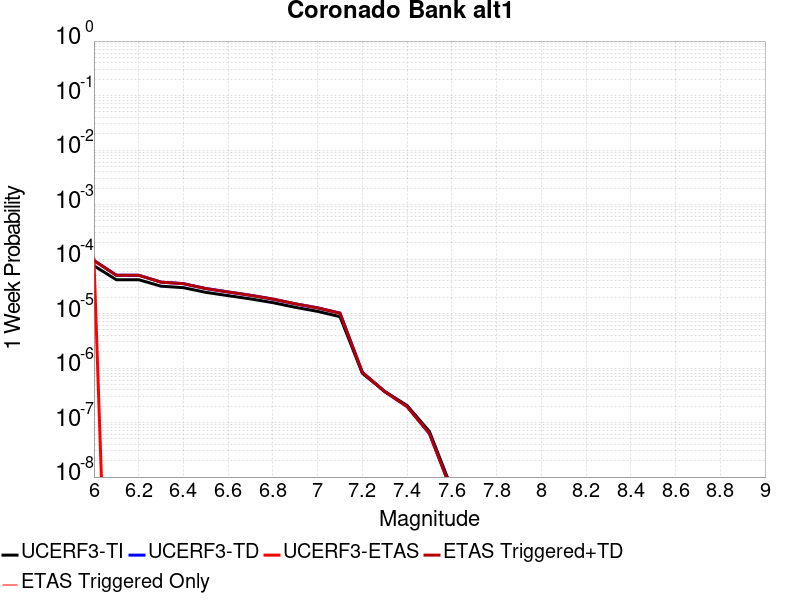 |  |  |  |

| Magnitude | 1 wk TI Prob | 1 wk TD Prob | 1 wk ETAS Prob | 1 wk ETAS/TD Gain | 1 wk ETAS Triggered+TD | 1 wk ETAS Triggered Only | 1 mo TI Prob | 1 mo TD Prob | 1 mo ETAS Prob | 1 mo ETAS/TD Gain | 1 mo ETAS Triggered+TD | 1 mo ETAS Triggered Only | 1 yr TI Prob | 1 yr TD Prob | 1 yr ETAS Prob | 1 yr ETAS/TD Gain | 1 yr ETAS Triggered+TD | 1 yr ETAS Triggered Only | 10 yr TI Prob | 10 yr TD Prob | 10 yr ETAS Prob | 10 yr ETAS/TD Gain | 10 yr ETAS Triggered+TD | 10 yr ETAS Triggered Only |
|-----|-----|-----|-----|-----|-----|-----|-----|-----|-----|-----|-----|-----|-----|-----|-----|-----|-----|-----|-----|-----|-----|-----|-----|-----|
| 6.0 | 7.533492E-5 | 9.3999E-5 | 0.0 | 0.0 | 9.3999E-5 | 0.0 | 3.22824E-4 | 4.027924E-4 | 0.0 | 0.0 | 4.027924E-4 | 0.0 | 0.0039233007 | 0.0048935795 | 5.0E-4 | 0.1021747 | 0.0053911326 | 5.0E-4 | 0.03854755 | 0.047927424 | 0.002 | 0.04172976 | 0.04983157 | 0.002 |
| 6.1 | 4.1807285E-5 | 5.0514824E-5 | 0.0 | 0.0 | 5.0514824E-5 | 0.0 | 1.7916178E-4 | 2.164745E-4 | 0.0 | 0.0 | 2.164745E-4 | 0.0 | 0.0021791123 | 0.0026324673 | 2.0E-4 | 0.07597435 | 0.0028319408 | 2.0E-4 | 0.021578677 | 0.026022138 | 9.0E-4 | 0.034585934 | 0.026898718 | 9.0E-4 |
| 6.2 | 4.1807285E-5 | 5.0514824E-5 | 0.0 | 0.0 | 5.0514824E-5 | 0.0 | 1.7916178E-4 | 2.164745E-4 | 0.0 | 0.0 | 2.164745E-4 | 0.0 | 0.0021791123 | 0.0026324673 | 2.0E-4 | 0.07597435 | 0.0028319408 | 2.0E-4 | 0.021578677 | 0.026022138 | 9.0E-4 | 0.034585934 | 0.026898718 | 9.0E-4 |
| 6.3 | 3.1793104E-5 | 3.7725724E-5 | 0.0 | 0.0 | 3.7725724E-5 | 0.0 | 1.3624904E-4 | 1.6167184E-4 | 0.0 | 0.0 | 1.6167184E-4 | 0.0 | 0.0016575698 | 0.0019666094 | 1.0E-4 | 0.050848935 | 0.002066413 | 1.0E-4 | 0.016452603 | 0.019495958 | 8.0E-4 | 0.041034143 | 0.020280363 | 8.0E-4 |
| 6.4 | 2.9878007E-5 | 3.534923E-5 | 0.0 | 0.0 | 3.534923E-5 | 0.0 | 1.2804232E-4 | 1.5148809E-4 | 0.0 | 0.0 | 1.5148809E-4 | 0.0 | 0.0015578003 | 0.0018428392 | 1.0E-4 | 0.054264095 | 0.0019426548 | 1.0E-4 | 0.015469253 | 0.018279342 | 7.0E-4 | 0.038294595 | 0.018966546 | 7.0E-4 |
| 6.5 | 2.4512565E-5 | 2.87745E-5 | 0.0 | 0.0 | 2.87745E-5 | 0.0 | 1.0504962E-4 | 1.2331361E-4 | 0.0 | 0.0 | 1.2331361E-4 | 0.0 | 0.0012782287 | 0.0015003361 | 1.0E-4 | 0.06665173 | 0.001600186 | 1.0E-4 | 0.012709012 | 0.014905037 | 6.0E-4 | 0.040254846 | 0.015496095 | 6.0E-4 |
| 6.6 | 2.1317413E-5 | 2.491542E-5 | 0.0 | 0.0 | 2.491542E-5 | 0.0 | 9.135714E-5 | 1.06776126E-4 | 0.0 | 0.0 | 1.06776126E-4 | 0.0 | 0.0011117056 | 0.0012992463 | 0.0 | 0.0 | 0.0012992463 | 0.0 | 0.011061605 | 0.012918915 | 5.0E-4 | 0.038702942 | 0.013412455 | 5.0E-4 |
| 6.7 | 1.8585655E-5 | 2.1642296E-5 | 0.0 | 0.0 | 2.1642296E-5 | 0.0 | 7.9650374E-5 | 9.274951E-5 | 0.0 | 0.0 | 9.274951E-5 | 0.0 | 9.6931186E-4 | 0.0011286609 | 0.0 | 0.0 | 0.0011286609 | 0.0 | 0.0096509475 | 0.011231449 | 5.0E-4 | 0.04451785 | 0.011725834 | 5.0E-4 |
| 6.8 | 1.5862879E-5 | 1.8425686E-5 | 0.0 | 0.0 | 1.8425686E-5 | 0.0 | 6.798199E-5 | 7.896494E-5 | 0.0 | 0.0 | 7.896494E-5 | 0.0 | 8.273665E-4 | 9.609934E-4 | 0.0 | 0.0 | 9.609934E-4 | 0.0 | 0.008242928 | 0.009570361 | 5.0E-4 | 0.05224463 | 0.010065576 | 5.0E-4 |
| 6.9 | 1.3021509E-5 | 1.5100307E-5 | 0.0 | 0.0 | 1.5100307E-5 | 0.0 | 5.5805274E-5 | 6.47141E-5 | 0.0 | 0.0 | 6.47141E-5 | 0.0 | 6.792174E-4 | 7.876275E-4 | 0.0 | 0.0 | 7.876275E-4 | 0.0 | 0.006771452 | 0.007850184 | 3.0E-4 | 0.038215663 | 0.008147829 | 3.0E-4 |
| 7.0 | 1.0974371E-5 | 1.2724358E-5 | 0.0 | 0.0 | 1.2724358E-5 | 0.0 | 4.7032172E-5 | 5.4531924E-5 | 0.0 | 0.0 | 5.4531924E-5 | 0.0 | 5.7246623E-4 | 6.637415E-4 | 0.0 | 0.0 | 6.637415E-4 | 0.0 | 0.0057099373 | 0.0066193417 | 2.0E-4 | 0.030214487 | 0.0068180175 | 2.0E-4 |
| 7.1 | 8.766221E-6 | 1.0167253E-5 | 0.0 | 0.0 | 1.0167253E-5 | 0.0 | 3.7568978E-5 | 4.3573313E-5 | 0.0 | 0.0 | 4.3573313E-5 | 0.0 | 4.573063E-4 | 5.3039315E-4 | 0.0 | 0.0 | 5.3039315E-4 | 0.0 | 0.0045636636 | 0.0052929735 | 2.0E-4 | 0.037785944 | 0.005491915 | 2.0E-4 |
| 7.2 | 8.026024E-7 | 8.332907E-7 | 0.0 | 0.0 | 8.332907E-7 | 0.0 | 3.43972E-6 | 3.571241E-6 | 0.0 | 0.0 | 3.571241E-6 | 0.0 | 4.1877785E-5 | 4.3479E-5 | 0.0 | 0.0 | 4.3479E-5 | 0.0 | 4.1869894E-4 | 4.3470605E-4 | 0.0 | 0.0 | 4.3470605E-4 | 0.0 |
| 7.3 | 3.7293114E-7 | 3.7004818E-7 | 0.0 | 0.0 | 3.7004818E-7 | 0.0 | 1.5982754E-6 | 1.5859198E-6 | 0.0 | 0.0 | 1.5859198E-6 | 0.0 | 1.9458828E-5 | 1.9308403E-5 | 0.0 | 0.0 | 1.9308403E-5 | 0.0 | 1.9457124E-4 | 1.9306732E-4 | 0.0 | 0.0 | 1.9306732E-4 | 0.0 |
| 7.4 | 2.0557036E-7 | 1.967614E-7 | 0.0 | 0.0 | 1.967614E-7 | 0.0 | 8.810155E-7 | 8.432629E-7 | 0.0 | 0.0 | 8.432629E-7 | 0.0 | 1.0726311E-5 | 1.0266678E-5 | 0.0 | 0.0 | 1.0266678E-5 | 0.0 | 1.0725793E-4 | 1.0266207E-4 | 0.0 | 0.0 | 1.0266207E-4 | 0.0 |
| 7.5 | 6.845446E-8 | 6.27996E-8 | 0.0 | 0.0 | 6.27996E-8 | 0.0 | 2.9337625E-7 | 2.691411E-7 | 0.0 | 0.0 | 2.691411E-7 | 0.0 | 3.5718497E-6 | 3.2767882E-6 | 0.0 | 0.0 | 3.2767882E-6 | 0.0 | 3.5717923E-5 | 3.2767406E-5 | 0.0 | 0.0 | 3.2767406E-5 | 0.0 |
| 7.6 | 6.0975145E-9 | 5.5319433E-9 | 0.0 | 0.0 | 5.5319433E-9 | 0.0 | 2.6132206E-8 | 2.3708328E-8 | 0.0 | 0.0 | 2.3708328E-8 | 0.0 | 3.1815955E-7 | 2.8864886E-7 | 0.0 | 0.0 | 2.8864886E-7 | 0.0 | 3.181591E-6 | 2.8864858E-6 | 0.0 | 0.0 | 2.8864858E-6 | 0.0 |

## Almanor 2011 CFM
*[(top)](#table-of-contents)*

| 1 Week | 1 Month | 1 Year | 10 Year |
|-----|-----|-----|-----|
|  |  | 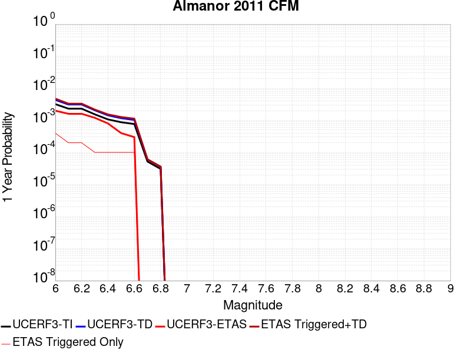 |  |

| Magnitude | 1 wk TI Prob | 1 wk TD Prob | 1 wk ETAS Prob | 1 wk ETAS/TD Gain | 1 wk ETAS Triggered+TD | 1 wk ETAS Triggered Only | 1 mo TI Prob | 1 mo TD Prob | 1 mo ETAS Prob | 1 mo ETAS/TD Gain | 1 mo ETAS Triggered+TD | 1 mo ETAS Triggered Only | 1 yr TI Prob | 1 yr TD Prob | 1 yr ETAS Prob | 1 yr ETAS/TD Gain | 1 yr ETAS Triggered+TD | 1 yr ETAS Triggered Only | 10 yr TI Prob | 10 yr TD Prob | 10 yr ETAS Prob | 10 yr ETAS/TD Gain | 10 yr ETAS Triggered+TD | 10 yr ETAS Triggered Only |
|-----|-----|-----|-----|-----|-----|-----|-----|-----|-----|-----|-----|-----|-----|-----|-----|-----|-----|-----|-----|-----|-----|-----|-----|-----|
| 6.0 | 6.1479834E-5 | 8.332903E-5 | 0.0 | 0.0 | 8.332903E-5 | 0.0 | 2.6345838E-4 | 3.5707868E-4 | 0.0 | 0.0 | 3.5707868E-4 | 0.0 | 0.0032028882 | 0.0043394454 | 4.0E-4 | 0.092177674 | 0.0047377096 | 4.0E-4 | 0.031571172 | 0.042614624 | 0.0019 | 0.044585634 | 0.044433657 | 0.0019 |
| 6.1 | 4.4387216E-5 | 5.980776E-5 | 0.0 | 0.0 | 5.980776E-5 | 0.0 | 1.9021705E-4 | 2.5629523E-4 | 0.0 | 0.0 | 2.5629523E-4 | 0.0 | 0.0023134327 | 0.0031164363 | 2.0E-4 | 0.06417587 | 0.0033158131 | 2.0E-4 | 0.022894967 | 0.030775648 | 0.0011 | 0.035742547 | 0.031841796 | 0.0011 |
| 6.2 | 4.4387216E-5 | 5.980776E-5 | 0.0 | 0.0 | 5.980776E-5 | 0.0 | 1.9021705E-4 | 2.5629523E-4 | 0.0 | 0.0 | 2.5629523E-4 | 0.0 | 0.0023134327 | 0.0031164363 | 2.0E-4 | 0.06417587 | 0.0033158131 | 2.0E-4 | 0.022894967 | 0.030775648 | 0.0011 | 0.035742547 | 0.031841796 | 0.0011 |
| 6.3 | 2.9523822E-5 | 3.957319E-5 | 0.0 | 0.0 | 3.957319E-5 | 0.0 | 1.2652454E-4 | 1.695885E-4 | 0.0 | 0.0 | 1.695885E-4 | 0.0 | 0.0015393476 | 0.0020631524 | 1.0E-4 | 0.048469517 | 0.0021629462 | 1.0E-4 | 0.015287281 | 0.020474333 | 5.0E-4 | 0.024420818 | 0.020964097 | 5.0E-4 |
| 6.4 | 2.0512744E-5 | 2.7448714E-5 | 0.0 | 0.0 | 2.7448714E-5 | 0.0 | 8.79088E-5 | 1.1763221E-4 | 0.0 | 0.0 | 1.1763221E-4 | 0.0 | 0.001069764 | 0.0014315551 | 1.0E-4 | 0.0698541 | 0.0015314119 | 1.0E-4 | 0.010646289 | 0.014253764 | 5.0E-4 | 0.03507845 | 0.014746637 | 5.0E-4 |
| 6.5 | 1.6750226E-5 | 2.2405091E-5 | 0.0 | 0.0 | 2.2405091E-5 | 0.0 | 7.178471E-5 | 9.6018375E-5 | 0.0 | 0.0 | 9.6018375E-5 | 0.0 | 8.7362836E-4 | 0.0011687252 | 1.0E-4 | 0.08556332 | 0.0012686083 | 1.0E-4 | 0.008702018 | 0.011656708 | 5.0E-4 | 0.042893756 | 0.01215088 | 5.0E-4 |
| 6.6 | 1.4745303E-5 | 1.9719859E-5 | 0.0 | 0.0 | 1.9719859E-5 | 0.0 | 6.319262E-5 | 8.451101E-5 | 0.0 | 0.0 | 8.451101E-5 | 0.0 | 7.690986E-4 | 0.0010287712 | 1.0E-4 | 0.09720335 | 0.0011286682 | 1.0E-4 | 0.0076644225 | 0.010271754 | 4.0E-4 | 0.038941745 | 0.010667645 | 4.0E-4 |
| 6.7 | 9.951145E-7 | 1.1620355E-6 | 0.0 | 0.0 | 1.1620355E-6 | 0.0 | 4.26477E-6 | 4.980144E-6 | 0.0 | 0.0 | 4.980144E-6 | 0.0 | 5.1922336E-5 | 6.0631737E-5 | 0.0 | 0.0 | 6.0631737E-5 | 0.0 | 5.1910203E-4 | 6.061692E-4 | 1.0E-4 | 0.16497044 | 7.061086E-4 | 1.0E-4 |
| 6.8 | 5.866312E-7 | 6.8517494E-7 | 0.0 | 0.0 | 6.8517494E-7 | 0.0 | 2.5141312E-6 | 2.9364614E-6 | 0.0 | 0.0 | 2.9364614E-6 | 0.0 | 3.0609117E-5 | 3.575096E-5 | 0.0 | 0.0 | 3.575096E-5 | 0.0 | 3.06049E-4 | 3.5746495E-4 | 1.0E-4 | 0.27974772 | 4.5742918E-4 | 1.0E-4 |

## Greenville (No) 2011 CFM
*[(top)](#table-of-contents)*

| 1 Week | 1 Month | 1 Year | 10 Year |
|-----|-----|-----|-----|
|  |  |  |  |

| Magnitude | 1 wk TI Prob | 1 wk TD Prob | 1 wk ETAS Prob | 1 wk ETAS/TD Gain | 1 wk ETAS Triggered+TD | 1 wk ETAS Triggered Only | 1 mo TI Prob | 1 mo TD Prob | 1 mo ETAS Prob | 1 mo ETAS/TD Gain | 1 mo ETAS Triggered+TD | 1 mo ETAS Triggered Only | 1 yr TI Prob | 1 yr TD Prob | 1 yr ETAS Prob | 1 yr ETAS/TD Gain | 1 yr ETAS Triggered+TD | 1 yr ETAS Triggered Only | 10 yr TI Prob | 10 yr TD Prob | 10 yr ETAS Prob | 10 yr ETAS/TD Gain | 10 yr ETAS Triggered+TD | 10 yr ETAS Triggered Only |
|-----|-----|-----|-----|-----|-----|-----|-----|-----|-----|-----|-----|-----|-----|-----|-----|-----|-----|-----|-----|-----|-----|-----|-----|-----|
| 6.0 | 3.286654E-5 | 4.0391333E-5 | 1.0E-4 | 2.4757786 | 1.4038729E-4 | 1.0E-4 | 1.4084899E-4 | 1.7309445E-4 | 2.0E-4 | 1.1554385 | 3.7305983E-4 | 2.0E-4 | 0.0017134876 | 0.0021054256 | 4.0E-4 | 0.18998535 | 0.0025045834 | 4.0E-4 | 0.017003356 | 0.020859862 | 0.0018 | 0.08629012 | 0.022622313 | 0.0018 |
| 6.1 | 3.286654E-5 | 4.0391333E-5 | 1.0E-4 | 2.4757786 | 1.4038729E-4 | 1.0E-4 | 1.4084899E-4 | 1.7309445E-4 | 2.0E-4 | 1.1554385 | 3.7305983E-4 | 2.0E-4 | 0.0017134876 | 0.0021054256 | 3.0E-4 | 0.14248902 | 0.0024047939 | 3.0E-4 | 0.017003356 | 0.020859862 | 0.0013 | 0.062320642 | 0.022132743 | 0.0013 |
| 6.2 | 3.1697953E-5 | 3.8953563E-5 | 1.0E-4 | 2.5671592 | 1.3894966E-4 | 1.0E-4 | 1.358413E-4 | 1.6693337E-4 | 2.0E-4 | 1.1980828 | 3.669E-4 | 2.0E-4 | 0.0016526132 | 0.002030556 | 3.0E-4 | 0.14774278 | 0.002329947 | 3.0E-4 | 0.01640377 | 0.020124918 | 0.0013 | 0.064596534 | 0.021398757 | 0.0013 |
| 6.3 | 3.1363317E-5 | 3.8542243E-5 | 1.0E-4 | 2.5945556 | 1.385384E-4 | 1.0E-4 | 1.344073E-4 | 1.651708E-4 | 2.0E-4 | 1.2108678 | 3.6513776E-4 | 2.0E-4 | 0.0016351803 | 0.0020091364 | 3.0E-4 | 0.14931788 | 0.0023085338 | 3.0E-4 | 0.016232004 | 0.01991459 | 0.0013 | 0.06527877 | 0.0211887 | 0.0013 |
| 6.4 | 3.0228604E-5 | 3.714872E-5 | 1.0E-4 | 2.6918828 | 1.37145E-4 | 1.0E-4 | 1.2954473E-4 | 1.5919929E-4 | 2.0E-4 | 1.2562871 | 3.5916743E-4 | 2.0E-4 | 0.0015760659 | 0.0019365643 | 3.0E-4 | 0.15491351 | 0.0022359835 | 3.0E-4 | 0.015649348 | 0.019201608 | 0.0012 | 0.062494766 | 0.020378565 | 0.0012 |
| 6.5 | 2.9537814E-5 | 3.630378E-5 | 1.0E-4 | 2.754534 | 1.3630015E-4 | 1.0E-4 | 1.2658449E-4 | 1.5557856E-4 | 2.0E-4 | 1.2855241 | 3.5554744E-4 | 2.0E-4 | 0.0015400766 | 0.0018925595 | 3.0E-4 | 0.1585155 | 0.0021919915 | 3.0E-4 | 0.01529447 | 0.018769076 | 0.0011 | 0.058607038 | 0.01984843 | 0.0011 |
| 6.6 | 2.7345395E-5 | 3.3611846E-5 | 1.0E-4 | 2.9751418 | 1.3360848E-4 | 1.0E-4 | 1.1718928E-4 | 1.4404299E-4 | 1.0E-4 | 0.69423723 | 2.4402858E-4 | 1.0E-4 | 0.0014258457 | 0.0017523437 | 2.0E-4 | 0.11413286 | 0.0019519933 | 2.0E-4 | 0.014167317 | 0.017389275 | 9.0E-4 | 0.05175604 | 0.018273624 | 9.0E-4 |
| 6.7 | 2.5615784E-5 | 3.1588028E-5 | 0.0 | 0.0 | 3.1588028E-5 | 0.0 | 1.09777306E-4 | 1.3537041E-4 | 0.0 | 0.0 | 1.3537041E-4 | 0.0 | 0.0013357193 | 0.0016469195 | 1.0E-4 | 0.060719423 | 0.0017467547 | 1.0E-4 | 0.013277191 | 0.016351013 | 7.0E-4 | 0.042810805 | 0.017039567 | 7.0E-4 |
| 6.8 | 2.0059057E-5 | 2.4729703E-5 | 0.0 | 0.0 | 2.4729703E-5 | 0.0 | 8.596455E-5 | 1.0598023E-4 | 0.0 | 0.0 | 1.0598023E-4 | 0.0 | 0.0010461159 | 0.0012895619 | 1.0E-4 | 0.07754572 | 0.0013894328 | 1.0E-4 | 0.0104120495 | 0.012823002 | 6.0E-4 | 0.046790913 | 0.013415309 | 6.0E-4 |
| 6.9 | 1.6321746E-5 | 2.020031E-5 | 0.0 | 0.0 | 2.020031E-5 | 0.0 | 6.9948466E-5 | 8.6569955E-5 | 0.0 | 0.0 | 8.6569955E-5 | 0.0 | 8.5128983E-4 | 0.001053492 | 0.0 | 0.0 | 0.001053492 | 0.0 | 0.008480361 | 0.010486704 | 5.0E-4 | 0.04767942 | 0.010981461 | 5.0E-4 |
| 7.0 | 1.22527645E-5 | 1.5145989E-5 | 0.0 | 0.0 | 1.5145989E-5 | 0.0 | 5.2510793E-5 | 6.490979E-5 | 0.0 | 0.0 | 6.490979E-5 | 0.0 | 6.3913135E-4 | 7.8999443E-4 | 0.0 | 0.0 | 7.8999443E-4 | 0.0 | 0.0063729626 | 0.007872799 | 4.0E-4 | 0.050807845 | 0.008269651 | 4.0E-4 |
| 7.1 | 8.996482E-6 | 1.1173037E-5 | 0.0 | 0.0 | 1.1173037E-5 | 0.0 | 3.8555783E-5 | 4.7883572E-5 | 0.0 | 0.0 | 4.7883572E-5 | 0.0 | 4.6931554E-4 | 5.828278E-4 | 0.0 | 0.0 | 5.828278E-4 | 0.0 | 0.004683256 | 0.0058136396 | 2.0E-4 | 0.034401856 | 0.006012477 | 2.0E-4 |
| 7.2 | 6.0273087E-6 | 7.576308E-6 | 0.0 | 0.0 | 7.576308E-6 | 0.0 | 2.5831067E-5 | 3.2469492E-5 | 0.0 | 0.0 | 3.2469492E-5 | 0.0 | 3.1444785E-4 | 3.9524504E-4 | 0.0 | 0.0 | 3.9524504E-4 | 0.0 | 0.0031400328 | 0.003945924 | 2.0E-4 | 0.05068522 | 0.0041451347 | 2.0E-4 |
| 7.3 | 3.1209995E-6 | 3.968426E-6 | 0.0 | 0.0 | 3.968426E-6 | 0.0 | 1.3375643E-5 | 1.7007429E-5 | 0.0 | 0.0 | 1.7007429E-5 | 0.0 | 1.6283628E-4 | 2.0704594E-4 | 0.0 | 0.0 | 2.0704594E-4 | 0.0 | 0.0016271701 | 0.0020689964 | 1.0E-4 | 0.048332613 | 0.0021687895 | 1.0E-4 |
| 7.4 | 2.0254208E-6 | 2.6114044E-6 | 0.0 | 0.0 | 2.6114044E-6 | 0.0 | 8.680347E-6 | 1.1191685E-5 | 0.0 | 0.0 | 1.1191685E-5 | 0.0 | 1.0567809E-4 | 1.3625031E-4 | 0.0 | 0.0 | 1.3625031E-4 | 0.0 | 0.0010562785 | 0.0013619753 | 1.0E-4 | 0.073422775 | 0.0014618391 | 1.0E-4 |
| 7.5 | 1.6763418E-6 | 2.1747574E-6 | 0.0 | 0.0 | 2.1747574E-6 | 0.0 | 7.184302E-6 | 9.320356E-6 | 0.0 | 0.0 | 9.320356E-6 | 0.0 | 8.746537E-5 | 1.1346948E-4 | 0.0 | 0.0 | 1.1346948E-4 | 0.0 | 8.743095E-4 | 0.001134425 | 1.0E-4 | 0.088150375 | 0.0012343116 | 1.0E-4 |
| 7.6 | 1.1935462E-6 | 1.5471528E-6 | 0.0 | 0.0 | 1.5471528E-6 | 0.0 | 5.115188E-6 | 6.6306384E-6 | 0.0 | 0.0 | 6.6306384E-6 | 0.0 | 6.2275634E-5 | 8.0725076E-5 | 0.0 | 0.0 | 8.0725076E-5 | 0.0 | 6.2258187E-4 | 8.0725725E-4 | 1.0E-4 | 0.12387625 | 9.071765E-4 | 1.0E-4 |
| 7.7 | 3.0464201E-7 | 3.9880095E-7 | 0.0 | 0.0 | 3.9880095E-7 | 0.0 | 1.3056081E-6 | 1.7091459E-6 | 0.0 | 0.0 | 1.7091459E-6 | 0.0 | 1.589566E-5 | 2.0808657E-5 | 0.0 | 0.0 | 2.0808657E-5 | 0.0 | 1.5894524E-4 | 2.0806972E-4 | 0.0 | 0.0 | 2.0806972E-4 | 0.0 |

## South Klamath Lake West
*[(top)](#table-of-contents)*

| 1 Week | 1 Month | 1 Year | 10 Year |
|-----|-----|-----|-----|
|  |  |  | 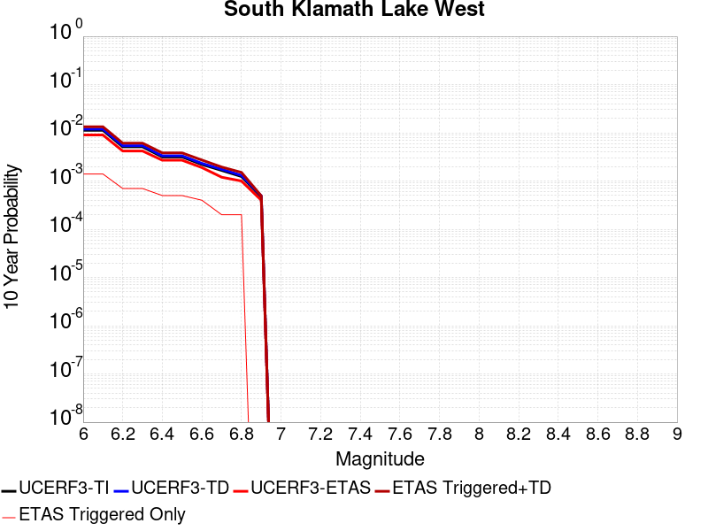 |

| Magnitude | 1 wk TI Prob | 1 wk TD Prob | 1 wk ETAS Prob | 1 wk ETAS/TD Gain | 1 wk ETAS Triggered+TD | 1 wk ETAS Triggered Only | 1 mo TI Prob | 1 mo TD Prob | 1 mo ETAS Prob | 1 mo ETAS/TD Gain | 1 mo ETAS Triggered+TD | 1 mo ETAS Triggered Only | 1 yr TI Prob | 1 yr TD Prob | 1 yr ETAS Prob | 1 yr ETAS/TD Gain | 1 yr ETAS Triggered+TD | 1 yr ETAS Triggered Only | 10 yr TI Prob | 10 yr TD Prob | 10 yr ETAS Prob | 10 yr ETAS/TD Gain | 10 yr ETAS Triggered+TD | 10 yr ETAS Triggered Only |
|-----|-----|-----|-----|-----|-----|-----|-----|-----|-----|-----|-----|-----|-----|-----|-----|-----|-----|-----|-----|-----|-----|-----|-----|-----|
| 6.0 | 2.174025E-5 | 2.3044868E-5 | 0.0 | 0.0 | 2.3044868E-5 | 0.0 | 9.3169176E-5 | 9.8760356E-5 | 0.0 | 0.0 | 9.8760356E-5 | 0.0 | 0.0011337444 | 0.0012018098 | 1.0E-4 | 0.08320784 | 0.0013016897 | 1.0E-4 | 0.011279777 | 0.011959708 | 0.0014 | 0.117059715 | 0.013342964 | 0.0014 |
| 6.1 | 2.174025E-5 | 2.3044868E-5 | 0.0 | 0.0 | 2.3044868E-5 | 0.0 | 9.3169176E-5 | 9.8760356E-5 | 0.0 | 0.0 | 9.8760356E-5 | 0.0 | 0.0011337444 | 0.0012018098 | 1.0E-4 | 0.08320784 | 0.0013016897 | 1.0E-4 | 0.011279777 | 0.011959708 | 0.0014 | 0.117059715 | 0.013342964 | 0.0014 |
| 6.2 | 9.834929E-6 | 1.0395058E-5 | 0.0 | 0.0 | 1.0395058E-5 | 0.0 | 4.2149015E-5 | 4.454954E-5 | 0.0 | 0.0 | 4.454954E-5 | 0.0 | 5.1304343E-4 | 5.422647E-4 | 1.0E-4 | 0.18441178 | 6.422105E-4 | 1.0E-4 | 0.0051186057 | 0.0054103173 | 7.0E-4 | 0.12938243 | 0.00610653 | 7.0E-4 |
| 6.3 | 9.834929E-6 | 1.0395058E-5 | 0.0 | 0.0 | 1.0395058E-5 | 0.0 | 4.2149015E-5 | 4.454954E-5 | 0.0 | 0.0 | 4.454954E-5 | 0.0 | 5.1304343E-4 | 5.422647E-4 | 1.0E-4 | 0.18441178 | 6.422105E-4 | 1.0E-4 | 0.0051186057 | 0.0054103173 | 7.0E-4 | 0.12938243 | 0.00610653 | 7.0E-4 |
| 6.4 | 6.066321E-6 | 6.4011556E-6 | 0.0 | 0.0 | 6.4011556E-6 | 0.0 | 2.5998259E-5 | 2.7433252E-5 | 0.0 | 0.0 | 2.7433252E-5 | 0.0 | 3.1648282E-4 | 3.3395138E-4 | 1.0E-4 | 0.2994448 | 4.3391797E-4 | 1.0E-4 | 0.0031603249 | 0.0033347658 | 5.0E-4 | 0.14993557 | 0.0038330983 | 5.0E-4 |
| 6.5 | 6.066321E-6 | 6.4011556E-6 | 0.0 | 0.0 | 6.4011556E-6 | 0.0 | 2.5998259E-5 | 2.7433252E-5 | 0.0 | 0.0 | 2.7433252E-5 | 0.0 | 3.1648282E-4 | 3.3395138E-4 | 1.0E-4 | 0.2994448 | 4.3391797E-4 | 1.0E-4 | 0.0031603249 | 0.0033347658 | 5.0E-4 | 0.14993557 | 0.0038330983 | 5.0E-4 |
| 6.6 | 4.2321803E-6 | 4.4617886E-6 | 0.0 | 0.0 | 4.4617886E-6 | 0.0 | 1.8137789E-5 | 1.9121817E-5 | 0.0 | 0.0 | 1.9121817E-5 | 0.0 | 2.208052E-4 | 2.3278427E-4 | 1.0E-4 | 0.4295823 | 3.32761E-4 | 1.0E-4 | 0.0022058594 | 0.0023255062 | 4.0E-4 | 0.17200556 | 0.002724576 | 4.0E-4 |
| 6.7 | 3.186646E-6 | 3.3606823E-6 | 0.0 | 0.0 | 3.3606823E-6 | 0.0 | 1.3656982E-5 | 1.4402848E-5 | 0.0 | 0.0 | 1.4402848E-5 | 0.0 | 1.6626107E-4 | 1.7534125E-4 | 1.0E-4 | 0.5703165 | 2.7532372E-4 | 1.0E-4 | 0.0016613674 | 0.0017520961 | 2.0E-4 | 0.11414899 | 0.0019517457 | 2.0E-4 |
| 6.8 | 2.380121E-6 | 2.511191E-6 | 0.0 | 0.0 | 2.511191E-6 | 0.0 | 1.0200479E-5 | 1.0762206E-5 | 0.0 | 0.0 | 1.0762206E-5 | 0.0 | 1.2418375E-4 | 1.3102245E-4 | 1.0E-4 | 0.763228 | 2.3100934E-4 | 1.0E-4 | 0.0012411437 | 0.0013094977 | 2.0E-4 | 0.15273032 | 0.0015092358 | 2.0E-4 |
| 6.9 | 8.928287E-7 | 9.431342E-7 | 0.0 | 0.0 | 9.431342E-7 | 0.0 | 3.826403E-6 | 4.0419986E-6 | 0.0 | 0.0 | 4.0419986E-6 | 0.0 | 4.658546E-5 | 4.9210445E-5 | 0.0 | 0.0 | 4.9210445E-5 | 0.0 | 4.6575698E-4 | 4.920171E-4 | 0.0 | 0.0 | 4.920171E-4 | 0.0 |

## Cleghorn Pass
*[(top)](#table-of-contents)*

| 1 Week | 1 Month | 1 Year | 10 Year |
|-----|-----|-----|-----|
| 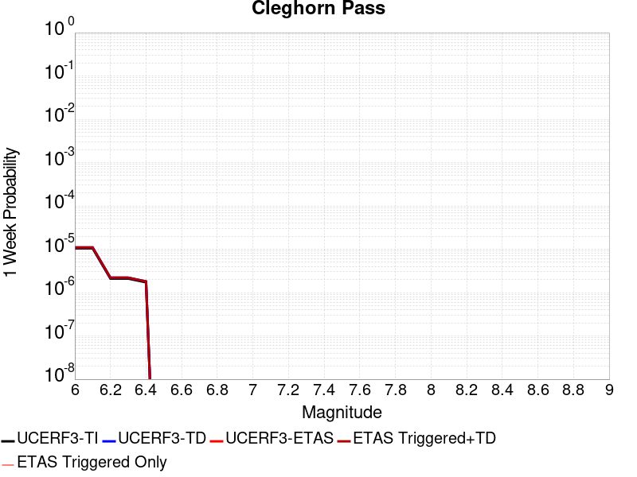 |  | 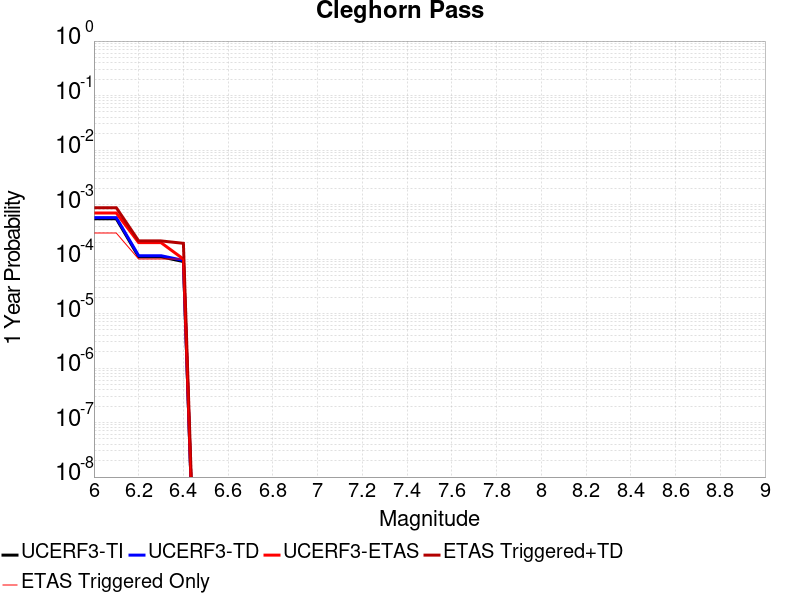 | 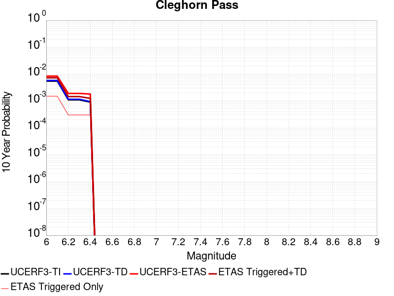 |

| Magnitude | 1 wk TI Prob | 1 wk TD Prob | 1 wk ETAS Prob | 1 wk ETAS/TD Gain | 1 wk ETAS Triggered+TD | 1 wk ETAS Triggered Only | 1 mo TI Prob | 1 mo TD Prob | 1 mo ETAS Prob | 1 mo ETAS/TD Gain | 1 mo ETAS Triggered+TD | 1 mo ETAS Triggered Only | 1 yr TI Prob | 1 yr TD Prob | 1 yr ETAS Prob | 1 yr ETAS/TD Gain | 1 yr ETAS Triggered+TD | 1 yr ETAS Triggered Only | 10 yr TI Prob | 10 yr TD Prob | 10 yr ETAS Prob | 10 yr ETAS/TD Gain | 10 yr ETAS Triggered+TD | 10 yr ETAS Triggered Only |
|-----|-----|-----|-----|-----|-----|-----|-----|-----|-----|-----|-----|-----|-----|-----|-----|-----|-----|-----|-----|-----|-----|-----|-----|-----|
| 6.0 | 1.0522846E-5 | 1.104176E-5 | 0.0 | 0.0 | 1.104176E-5 | 0.0 | 4.509713E-5 | 4.7321268E-5 | 0.0 | 0.0 | 4.7321268E-5 | 0.0 | 5.4891926E-4 | 5.760368E-4 | 3.0E-4 | 0.52080005 | 8.75864E-4 | 3.0E-4 | 0.0054756533 | 0.0057506035 | 0.0015 | 0.2608422 | 0.0072419774 | 0.0015 |
| 6.1 | 1.0522846E-5 | 1.104176E-5 | 0.0 | 0.0 | 1.104176E-5 | 0.0 | 4.509713E-5 | 4.7321268E-5 | 0.0 | 0.0 | 4.7321268E-5 | 0.0 | 5.4891926E-4 | 5.760368E-4 | 3.0E-4 | 0.52080005 | 8.75864E-4 | 3.0E-4 | 0.0054756533 | 0.0057506035 | 0.0015 | 0.2608422 | 0.0072419774 | 0.0015 |
| 6.2 | 2.1045846E-6 | 2.2084264E-6 | 0.0 | 0.0 | 2.2084264E-6 | 0.0 | 9.019617E-6 | 9.464674E-6 | 0.0 | 0.0 | 9.464674E-6 | 0.0 | 1.098083E-4 | 1.15230505E-4 | 1.0E-4 | 0.86782575 | 2.1521898E-4 | 1.0E-4 | 0.0010975406 | 0.001152119 | 3.0E-4 | 0.26038978 | 0.0014517735 | 3.0E-4 |
| 6.3 | 2.1045846E-6 | 2.2084264E-6 | 0.0 | 0.0 | 2.2084264E-6 | 0.0 | 9.019617E-6 | 9.464674E-6 | 0.0 | 0.0 | 9.464674E-6 | 0.0 | 1.098083E-4 | 1.15230505E-4 | 1.0E-4 | 0.86782575 | 2.1521898E-4 | 1.0E-4 | 0.0010975406 | 0.001152119 | 3.0E-4 | 0.26038978 | 0.0014517735 | 3.0E-4 |
| 6.4 | 1.7259927E-6 | 1.8110604E-6 | 0.0 | 0.0 | 1.8110604E-6 | 0.0 | 7.3970905E-6 | 7.761688E-6 | 0.0 | 0.0 | 7.761688E-6 | 0.0 | 9.005586E-5 | 9.449855E-5 | 1.0E-4 | 1.0582173 | 1.944891E-4 | 1.0E-4 | 9.001937E-4 | 9.449855E-4 | 3.0E-4 | 0.3174652 | 0.001244702 | 3.0E-4 |

## South Klamath Lake East
*[(top)](#table-of-contents)*

| 1 Week | 1 Month | 1 Year | 10 Year |
|-----|-----|-----|-----|
| 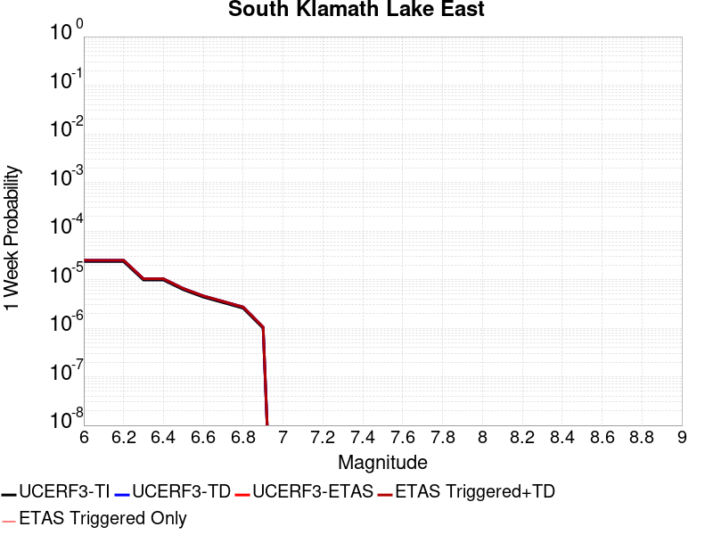 | 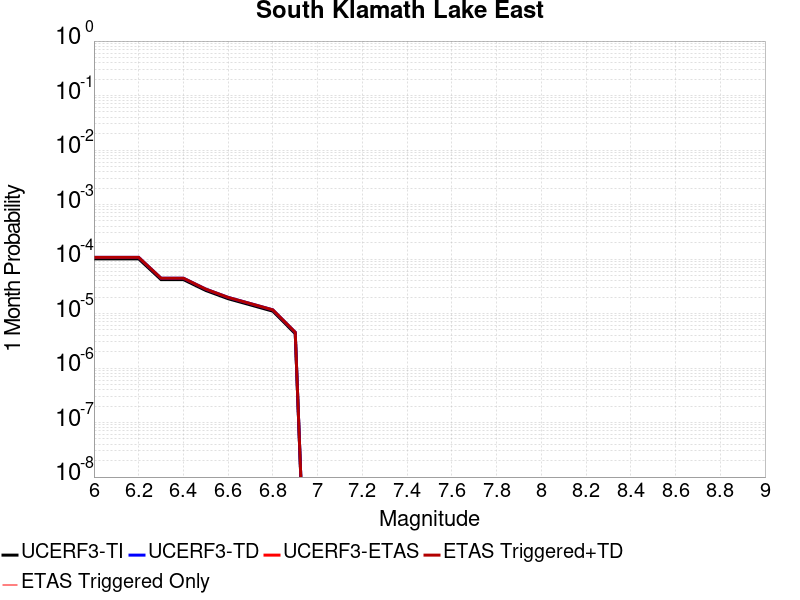 |  |  |

| Magnitude | 1 wk TI Prob | 1 wk TD Prob | 1 wk ETAS Prob | 1 wk ETAS/TD Gain | 1 wk ETAS Triggered+TD | 1 wk ETAS Triggered Only | 1 mo TI Prob | 1 mo TD Prob | 1 mo ETAS Prob | 1 mo ETAS/TD Gain | 1 mo ETAS Triggered+TD | 1 mo ETAS Triggered Only | 1 yr TI Prob | 1 yr TD Prob | 1 yr ETAS Prob | 1 yr ETAS/TD Gain | 1 yr ETAS Triggered+TD | 1 yr ETAS Triggered Only | 10 yr TI Prob | 10 yr TD Prob | 10 yr ETAS Prob | 10 yr ETAS/TD Gain | 10 yr ETAS Triggered+TD | 10 yr ETAS Triggered Only |
|-----|-----|-----|-----|-----|-----|-----|-----|-----|-----|-----|-----|-----|-----|-----|-----|-----|-----|-----|-----|-----|-----|-----|-----|-----|
| 6.0 | 2.3539369E-5 | 2.5050615E-5 | 0.0 | 0.0 | 2.5050615E-5 | 0.0 | 1.0087911E-4 | 1.0735582E-4 | 0.0 | 0.0 | 1.0735582E-4 | 0.0 | 0.0012275111 | 0.0013063567 | 1.0E-4 | 0.07654877 | 0.0014062261 | 1.0E-4 | 0.012207527 | 0.012995123 | 0.0011 | 0.08464714 | 0.014080828 | 0.0011 |
| 6.1 | 2.3539369E-5 | 2.5050615E-5 | 0.0 | 0.0 | 2.5050615E-5 | 0.0 | 1.0087911E-4 | 1.0735582E-4 | 0.0 | 0.0 | 1.0735582E-4 | 0.0 | 0.0012275111 | 0.0013063567 | 1.0E-4 | 0.07654877 | 0.0014062261 | 1.0E-4 | 0.012207527 | 0.012995123 | 0.0011 | 0.08464714 | 0.014080828 | 0.0011 |
| 6.2 | 2.3539369E-5 | 2.5050615E-5 | 0.0 | 0.0 | 2.5050615E-5 | 0.0 | 1.0087911E-4 | 1.0735582E-4 | 0.0 | 0.0 | 1.0735582E-4 | 0.0 | 0.0012275111 | 0.0013063567 | 1.0E-4 | 0.07654877 | 0.0014062261 | 1.0E-4 | 0.012207527 | 0.012995123 | 0.0011 | 0.08464714 | 0.014080828 | 0.0011 |
| 6.3 | 9.807823E-6 | 1.0397328E-5 | 0.0 | 0.0 | 1.0397328E-5 | 0.0 | 4.2032847E-5 | 4.4559263E-5 | 0.0 | 0.0 | 4.4559263E-5 | 0.0 | 5.1162974E-4 | 5.4238236E-4 | 1.0E-4 | 0.18437178 | 6.423281E-4 | 1.0E-4 | 0.005104534 | 0.005411423 | 5.0E-4 | 0.09239714 | 0.0059087174 | 5.0E-4 |
| 6.4 | 9.807823E-6 | 1.0397328E-5 | 0.0 | 0.0 | 1.0397328E-5 | 0.0 | 4.2032847E-5 | 4.4559263E-5 | 0.0 | 0.0 | 4.4559263E-5 | 0.0 | 5.1162974E-4 | 5.4238236E-4 | 1.0E-4 | 0.18437178 | 6.423281E-4 | 1.0E-4 | 0.005104534 | 0.005411423 | 5.0E-4 | 0.09239714 | 0.0059087174 | 5.0E-4 |
| 6.5 | 6.191981E-6 | 6.551622E-6 | 0.0 | 0.0 | 6.551622E-6 | 0.0 | 2.653679E-5 | 2.8078093E-5 | 0.0 | 0.0 | 2.8078093E-5 | 0.0 | 3.2303753E-4 | 3.4179995E-4 | 1.0E-4 | 0.2925688 | 4.417658E-4 | 1.0E-4 | 0.0032256835 | 0.0034130206 | 3.0E-4 | 0.08789867 | 0.0037119968 | 3.0E-4 |
| 6.6 | 4.3693776E-6 | 4.6170953E-6 | 0.0 | 0.0 | 4.6170953E-6 | 0.0 | 1.8725768E-5 | 1.9787407E-5 | 0.0 | 0.0 | 1.9787407E-5 | 0.0 | 2.2796239E-4 | 2.4088619E-4 | 1.0E-4 | 0.4151338 | 3.408621E-4 | 1.0E-4 | 0.0022772867 | 0.0024063634 | 2.0E-4 | 0.08311297 | 0.002605882 | 2.0E-4 |
| 6.7 | 3.360834E-6 | 3.5516546E-6 | 0.0 | 0.0 | 3.5516546E-6 | 0.0 | 1.4403494E-5 | 1.5221292E-5 | 0.0 | 0.0 | 1.5221292E-5 | 0.0 | 1.7534842E-4 | 1.8530429E-4 | 1.0E-4 | 0.53965294 | 2.8528576E-4 | 1.0E-4 | 0.0017521014 | 0.0018515777 | 2.0E-4 | 0.10801599 | 0.0020512072 | 2.0E-4 |
| 6.8 | 2.57873E-6 | 2.7254896E-6 | 0.0 | 0.0 | 2.7254896E-6 | 0.0 | 1.1051653E-5 | 1.168062E-5 | 0.0 | 0.0 | 1.168062E-5 | 0.0 | 1.3454557E-4 | 1.4220289E-4 | 1.0E-4 | 0.7032206 | 2.4218867E-4 | 1.0E-4 | 0.0013446413 | 0.0014211796 | 2.0E-4 | 0.14072816 | 0.0016208955 | 2.0E-4 |
| 6.9 | 9.987825E-7 | 1.0567472E-6 | 0.0 | 0.0 | 1.0567472E-6 | 0.0 | 4.2804895E-6 | 4.5289107E-6 | 0.0 | 0.0 | 4.5289107E-6 | 0.0 | 5.211371E-5 | 5.5138422E-5 | 1.0E-4 | 1.8136173 | 1.551329E-4 | 1.0E-4 | 5.210149E-4 | 5.512796E-4 | 1.0E-4 | 0.18139616 | 6.5122446E-4 | 1.0E-4 |

## San Jacinto (Borrego)
*[(top)](#table-of-contents)*

| 1 Week | 1 Month | 1 Year | 10 Year |
|-----|-----|-----|-----|
|  |  |  | 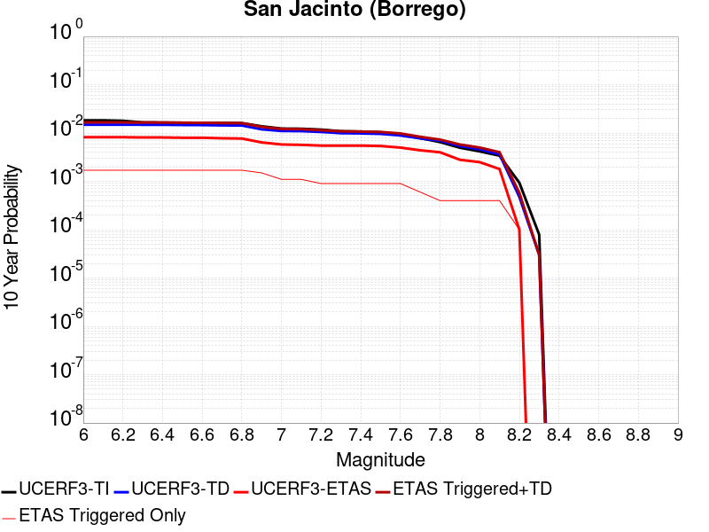 |

| Magnitude | 1 wk TI Prob | 1 wk TD Prob | 1 wk ETAS Prob | 1 wk ETAS/TD Gain | 1 wk ETAS Triggered+TD | 1 wk ETAS Triggered Only | 1 mo TI Prob | 1 mo TD Prob | 1 mo ETAS Prob | 1 mo ETAS/TD Gain | 1 mo ETAS Triggered+TD | 1 mo ETAS Triggered Only | 1 yr TI Prob | 1 yr TD Prob | 1 yr ETAS Prob | 1 yr ETAS/TD Gain | 1 yr ETAS Triggered+TD | 1 yr ETAS Triggered Only | 10 yr TI Prob | 10 yr TD Prob | 10 yr ETAS Prob | 10 yr ETAS/TD Gain | 10 yr ETAS Triggered+TD | 10 yr ETAS Triggered Only |
|-----|-----|-----|-----|-----|-----|-----|-----|-----|-----|-----|-----|-----|-----|-----|-----|-----|-----|-----|-----|-----|-----|-----|-----|-----|
| 6.0 | 3.543992E-5 | 2.798888E-5 | 0.0 | 0.0 | 2.798888E-5 | 0.0 | 1.5187653E-4 | 1.19946904E-4 | 0.0 | 0.0 | 1.19946904E-4 | 0.0 | 0.0018475284 | 0.0014593875 | 3.0E-4 | 0.20556569 | 0.0017589497 | 3.0E-4 | 0.018322436 | 0.014902439 | 0.0017 | 0.11407529 | 0.016577104 | 0.0017 |
| 6.1 | 3.542281E-5 | 2.798888E-5 | 0.0 | 0.0 | 2.798888E-5 | 0.0 | 1.5180321E-4 | 1.19946904E-4 | 0.0 | 0.0 | 1.19946904E-4 | 0.0 | 0.0018466372 | 0.0014593875 | 3.0E-4 | 0.20556569 | 0.0017589497 | 3.0E-4 | 0.018313672 | 0.014902439 | 0.0017 | 0.11407529 | 0.016577104 | 0.0017 |
| 6.2 | 3.4688688E-5 | 2.798888E-5 | 0.0 | 0.0 | 2.798888E-5 | 0.0 | 1.4865733E-4 | 1.199469E-4 | 0.0 | 0.0 | 1.199469E-4 | 0.0 | 0.0018084005 | 0.0014593875 | 3.0E-4 | 0.20556569 | 0.0017589497 | 3.0E-4 | 0.017937548 | 0.014902438 | 0.0017 | 0.11407529 | 0.016577104 | 0.0017 |
| 6.3 | 3.2087122E-5 | 2.7834181E-5 | 0.0 | 0.0 | 2.7834181E-5 | 0.0 | 1.3750899E-4 | 1.1928396E-4 | 0.0 | 0.0 | 1.1928396E-4 | 0.0 | 0.0016728862 | 0.001451327 | 3.0E-4 | 0.20670737 | 0.0017508916 | 3.0E-4 | 0.016603488 | 0.014823575 | 0.0017 | 0.11468219 | 0.016498374 | 0.0017 |
| 6.4 | 3.1828724E-5 | 2.7801158E-5 | 0.0 | 0.0 | 2.7801158E-5 | 0.0 | 1.364017E-4 | 1.1914245E-4 | 0.0 | 0.0 | 1.1914245E-4 | 0.0 | 0.0016594254 | 0.0014496064 | 3.0E-4 | 0.20695274 | 0.0017491714 | 3.0E-4 | 0.016470885 | 0.014806351 | 0.0017 | 0.1148156 | 0.01648118 | 0.0017 |
| 6.5 | 3.1563577E-5 | 2.7540464E-5 | 0.0 | 0.0 | 2.7540464E-5 | 0.0 | 1.3526545E-4 | 1.1802529E-4 | 0.0 | 0.0 | 1.1802529E-4 | 0.0 | 0.0016456128 | 0.0014360229 | 3.0E-4 | 0.20891032 | 0.001735592 | 3.0E-4 | 0.0163348 | 0.014673581 | 0.0017 | 0.11585447 | 0.016348636 | 0.0017 |
| 6.6 | 3.1467625E-5 | 2.7384565E-5 | 0.0 | 0.0 | 2.7384565E-5 | 0.0 | 1.3485427E-4 | 1.1735722E-4 | 0.0 | 0.0 | 1.1735722E-4 | 0.0 | 0.0016406142 | 0.0014278998 | 3.0E-4 | 0.21009879 | 0.0017274714 | 3.0E-4 | 0.016285548 | 0.01459388 | 0.0017 | 0.11648719 | 0.01626907 | 0.0017 |
| 6.7 | 3.1223695E-5 | 2.7002414E-5 | 0.0 | 0.0 | 2.7002414E-5 | 0.0 | 1.3380898E-4 | 1.15719566E-4 | 0.0 | 0.0 | 1.15719566E-4 | 0.0 | 0.0016279068 | 0.0014079873 | 3.0E-4 | 0.21307011 | 0.0017075649 | 3.0E-4 | 0.01616033 | 0.014398112 | 0.0017 | 0.118071035 | 0.016073635 | 0.0017 |
| 6.8 | 3.1015585E-5 | 2.6823283E-5 | 0.0 | 0.0 | 2.6823283E-5 | 0.0 | 1.3291716E-4 | 1.1495194E-4 | 0.0 | 0.0 | 1.1495194E-4 | 0.0 | 0.001617065 | 0.0013986534 | 3.0E-4 | 0.21449202 | 0.0016982338 | 3.0E-4 | 0.016053487 | 0.014305327 | 0.0017 | 0.11883685 | 0.015981007 | 0.0017 |
| 6.9 | 2.6641965E-5 | 2.224498E-5 | 0.0 | 0.0 | 2.224498E-5 | 0.0 | 1.1417485E-4 | 9.5332165E-5 | 0.0 | 0.0 | 9.5332165E-5 | 0.0 | 0.0013891924 | 0.001160055 | 3.0E-4 | 0.25860843 | 0.001459707 | 3.0E-4 | 0.0138054015 | 0.011914211 | 0.0015 | 0.12590007 | 0.0133963395 | 0.0015 |
| 7.0 | 2.3854353E-5 | 2.0540108E-5 | 0.0 | 0.0 | 2.0540108E-5 | 0.0 | 1.02228936E-4 | 8.802608E-5 | 0.0 | 0.0 | 8.802608E-5 | 0.0 | 0.0012439266 | 0.0010711931 | 3.0E-4 | 0.28006154 | 0.0013708718 | 3.0E-4 | 0.012369866 | 0.011014959 | 0.0011 | 0.0998642 | 0.012102842 | 0.0011 |
| 7.1 | 2.3672901E-5 | 2.0376565E-5 | 0.0 | 0.0 | 2.0376565E-5 | 0.0 | 1.0145135E-4 | 8.732522E-5 | 0.0 | 0.0 | 8.732522E-5 | 0.0 | 0.0012344702 | 0.0010626686 | 3.0E-4 | 0.28230813 | 0.0013623498 | 3.0E-4 | 0.0122763505 | 0.010930113 | 0.0011 | 0.1006394 | 0.012018089 | 0.0011 |
| 7.2 | 2.2717244E-5 | 1.9603945E-5 | 0.0 | 0.0 | 1.9603945E-5 | 0.0 | 9.735599E-5 | 8.401422E-5 | 0.0 | 0.0 | 8.401422E-5 | 0.0 | 0.0011846646 | 0.0010223954 | 2.0E-4 | 0.19561903 | 0.0012221909 | 2.0E-4 | 0.01178369 | 0.010527455 | 9.0E-4 | 0.08549075 | 0.01141798 | 9.0E-4 |
| 7.3 | 2.1016205E-5 | 1.8445206E-5 | 0.0 | 0.0 | 1.8445206E-5 | 0.0 | 9.006634E-5 | 7.90485E-5 | 0.0 | 0.0 | 7.90485E-5 | 0.0 | 0.001096006 | 9.619926E-4 | 2.0E-4 | 0.2079018 | 0.0011618002 | 2.0E-4 | 0.010906163 | 0.009922839 | 9.0E-4 | 0.09069985 | 0.010813909 | 9.0E-4 |
| 7.4 | 2.0683625E-5 | 1.8247665E-5 | 0.0 | 0.0 | 1.8247665E-5 | 0.0 | 8.86411E-5 | 7.820195E-5 | 0.0 | 0.0 | 7.820195E-5 | 0.0 | 0.001078671 | 9.516949E-4 | 2.0E-4 | 0.21015139 | 0.0011515046 | 2.0E-4 | 0.010734501 | 0.009819519 | 9.0E-4 | 0.09165418 | 0.010710682 | 9.0E-4 |
| 7.5 | 1.9993966E-5 | 1.7842387E-5 | 0.0 | 0.0 | 1.7842387E-5 | 0.0 | 8.568561E-5 | 7.646514E-5 | 0.0 | 0.0 | 7.646514E-5 | 0.0 | 0.001042723 | 9.305675E-4 | 2.0E-4 | 0.2149226 | 0.0011303814 | 2.0E-4 | 0.010378438 | 0.00960629 | 9.0E-4 | 0.09368862 | 0.010497644 | 9.0E-4 |
| 7.6 | 1.788966E-5 | 1.6492168E-5 | 0.0 | 0.0 | 1.6492168E-5 | 0.0 | 7.666772E-5 | 7.067881E-5 | 0.0 | 0.0 | 7.067881E-5 | 0.0 | 9.3302975E-4 | 8.601766E-4 | 2.0E-4 | 0.2325104 | 0.0010600046 | 2.0E-4 | 0.00929122 | 0.008896398 | 9.0E-4 | 0.10116454 | 0.009788391 | 9.0E-4 |
| 7.7 | 1.5125781E-5 | 1.4292381E-5 | 0.0 | 0.0 | 1.4292381E-5 | 0.0 | 6.4823165E-5 | 6.125162E-5 | 0.0 | 0.0 | 6.125162E-5 | 0.0 | 7.889362E-4 | 7.454842E-4 | 2.0E-4 | 0.268282 | 9.4533514E-4 | 2.0E-4 | 0.007861412 | 0.0077431244 | 6.0E-4 | 0.0774881 | 0.008338478 | 6.0E-4 |
| 7.8 | 1.250089E-5 | 1.2683783E-5 | 0.0 | 0.0 | 1.2683783E-5 | 0.0 | 5.3574146E-5 | 5.435794E-5 | 0.0 | 0.0 | 5.435794E-5 | 0.0 | 6.5207E-4 | 6.616076E-4 | 1.0E-4 | 0.151147 | 7.615415E-4 | 1.0E-4 | 0.006501599 | 0.0068955924 | 4.0E-4 | 0.058008067 | 0.0072928346 | 4.0E-4 |
| 7.9 | 9.561E-6 | 9.800045E-6 | 0.0 | 0.0 | 9.800045E-6 | 0.0 | 4.0975072E-5 | 4.199952E-5 | 0.0 | 0.0 | 4.199952E-5 | 0.0 | 4.987573E-4 | 5.1122473E-4 | 1.0E-4 | 0.19560869 | 6.1117363E-4 | 1.0E-4 | 0.0049763937 | 0.0053761406 | 4.0E-4 | 0.07440282 | 0.00577399 | 4.0E-4 |
| 8.0 | 8.01699E-6 | 8.333046E-6 | 0.0 | 0.0 | 8.333046E-6 | 0.0 | 3.4358076E-5 | 3.571257E-5 | 0.0 | 0.0 | 3.571257E-5 | 0.0 | 4.1822926E-4 | 4.347143E-4 | 1.0E-4 | 0.23003614 | 5.3467083E-4 | 1.0E-4 | 0.0041744304 | 0.004594098 | 4.0E-4 | 0.08706824 | 0.00499226 | 4.0E-4 |
| 8.1 | 6.541947E-6 | 6.49168E-6 | 0.0 | 0.0 | 6.49168E-6 | 0.0 | 2.8036617E-5 | 2.782119E-5 | 0.0 | 0.0 | 2.782119E-5 | 0.0 | 3.4129233E-4 | 3.3867086E-4 | 1.0E-4 | 0.29527193 | 4.3863698E-4 | 1.0E-4 | 0.0034076865 | 0.003596238 | 4.0E-4 | 0.11122734 | 0.0039947997 | 4.0E-4 |
| 8.2 | 1.7968189E-6 | 7.993346E-7 | 0.0 | 0.0 | 7.993346E-7 | 0.0 | 7.70063E-6 | 3.4257152E-6 | 0.0 | 0.0 | 3.4257152E-6 | 0.0 | 9.3751136E-5 | 4.170731E-5 | 0.0 | 0.0 | 4.170731E-5 | 0.0 | 9.371159E-4 | 4.7245334E-4 | 1.0E-4 | 0.21166112 | 5.724061E-4 | 1.0E-4 |
| 8.3 | 1.5167889E-7 | 4.910695E-8 | 0.0 | 0.0 | 4.910695E-8 | 0.0 | 6.500522E-7 | 2.1045834E-7 | 0.0 | 0.0 | 2.1045834E-7 | 0.0 | 7.9143565E-6 | 2.5623278E-6 | 0.0 | 0.0 | 2.5623278E-6 | 0.0 | 7.914075E-5 | 2.9772098E-5 | 0.0 | 0.0 | 2.9772098E-5 | 0.0 |

## Nelson Lake
*[(top)](#table-of-contents)*

| 1 Week | 1 Month | 1 Year | 10 Year |
|-----|-----|-----|-----|
|  | 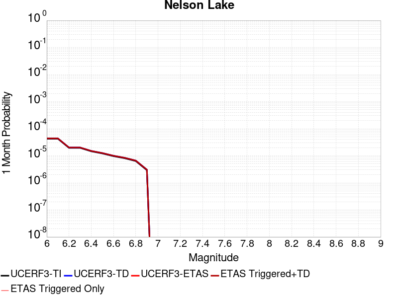 |  |  |

| Magnitude | 1 wk TI Prob | 1 wk TD Prob | 1 wk ETAS Prob | 1 wk ETAS/TD Gain | 1 wk ETAS Triggered+TD | 1 wk ETAS Triggered Only | 1 mo TI Prob | 1 mo TD Prob | 1 mo ETAS Prob | 1 mo ETAS/TD Gain | 1 mo ETAS Triggered+TD | 1 mo ETAS Triggered Only | 1 yr TI Prob | 1 yr TD Prob | 1 yr ETAS Prob | 1 yr ETAS/TD Gain | 1 yr ETAS Triggered+TD | 1 yr ETAS Triggered Only | 10 yr TI Prob | 10 yr TD Prob | 10 yr ETAS Prob | 10 yr ETAS/TD Gain | 10 yr ETAS Triggered+TD | 10 yr ETAS Triggered Only |
|-----|-----|-----|-----|-----|-----|-----|-----|-----|-----|-----|-----|-----|-----|-----|-----|-----|-----|-----|-----|-----|-----|-----|-----|-----|
| 6.0 | 9.913453E-6 | 1.0192846E-5 | 0.0 | 0.0 | 1.0192846E-5 | 0.0 | 4.2485535E-5 | 4.3682954E-5 | 0.0 | 0.0 | 4.3682954E-5 | 0.0 | 5.1713863E-4 | 5.317205E-4 | 2.0E-4 | 0.37613744 | 7.316142E-4 | 2.0E-4 | 0.0051593683 | 0.005305511 | 0.0015 | 0.2827249 | 0.0067975526 | 0.0015 |
| 6.1 | 9.913453E-6 | 1.0192846E-5 | 0.0 | 0.0 | 1.0192846E-5 | 0.0 | 4.2485535E-5 | 4.3682954E-5 | 0.0 | 0.0 | 4.3682954E-5 | 0.0 | 5.1713863E-4 | 5.317205E-4 | 2.0E-4 | 0.37613744 | 7.316142E-4 | 2.0E-4 | 0.0051593683 | 0.005305511 | 0.0015 | 0.2827249 | 0.0067975526 | 0.0015 |
| 6.2 | 4.5596407E-6 | 4.6966034E-6 | 0.0 | 0.0 | 4.6966034E-6 | 0.0 | 1.954117E-5 | 2.0128153E-5 | 0.0 | 0.0 | 2.0128153E-5 | 0.0 | 2.3788778E-4 | 2.4503397E-4 | 0.0 | 0.0 | 2.4503397E-4 | 0.0 | 0.0023763329 | 0.002447764 | 5.0E-4 | 0.20426805 | 0.0029465402 | 5.0E-4 |
| 6.3 | 4.5596407E-6 | 4.6966034E-6 | 0.0 | 0.0 | 4.6966034E-6 | 0.0 | 1.954117E-5 | 2.0128153E-5 | 0.0 | 0.0 | 2.0128153E-5 | 0.0 | 2.3788778E-4 | 2.4503397E-4 | 0.0 | 0.0 | 2.4503397E-4 | 0.0 | 0.0023763329 | 0.002447764 | 5.0E-4 | 0.20426805 | 0.0029465402 | 5.0E-4 |
| 6.4 | 3.4025713E-6 | 3.5101257E-6 | 0.0 | 0.0 | 3.5101257E-6 | 0.0 | 1.4582367E-5 | 1.5043314E-5 | 0.0 | 0.0 | 1.5043314E-5 | 0.0 | 1.7752586E-4 | 1.8313779E-4 | 0.0 | 0.0 | 1.8313779E-4 | 0.0 | 0.001773841 | 0.0018299517 | 3.0E-4 | 0.16393876 | 0.0021294027 | 3.0E-4 |
| 6.5 | 2.8352947E-6 | 2.9280534E-6 | 0.0 | 0.0 | 2.9280534E-6 | 0.0 | 1.2151207E-5 | 1.2548744E-5 | 0.0 | 0.0 | 1.2548744E-5 | 0.0 | 1.479309E-4 | 1.52771E-4 | 0.0 | 0.0 | 1.52771E-4 | 0.0 | 0.0014783246 | 0.0015267336 | 3.0E-4 | 0.19649793 | 0.0018262756 | 3.0E-4 |
| 6.6 | 2.251518E-6 | 2.3292332E-6 | 0.0 | 0.0 | 2.3292332E-6 | 0.0 | 9.649328E-6 | 9.982393E-6 | 0.0 | 0.0 | 9.982393E-6 | 0.0 | 1.1747423E-4 | 1.2152948E-4 | 0.0 | 0.0 | 1.2152948E-4 | 0.0 | 0.0011741214 | 0.001214692 | 3.0E-4 | 0.24697618 | 0.0015143276 | 3.0E-4 |
| 6.7 | 1.8911853E-6 | 1.9592849E-6 | 0.0 | 0.0 | 1.9592849E-6 | 0.0 | 8.105055E-6 | 8.396912E-6 | 0.0 | 0.0 | 8.396912E-6 | 0.0 | 9.867457E-5 | 1.0222819E-4 | 0.0 | 0.0 | 1.0222819E-4 | 0.0 | 9.863076E-4 | 0.0010218691 | 3.0E-4 | 0.29357967 | 0.0013215626 | 3.0E-4 |
| 6.8 | 1.4874814E-6 | 1.5439512E-6 | 0.0 | 0.0 | 1.5439512E-6 | 0.0 | 6.374905E-6 | 6.6169196E-6 | 0.0 | 0.0 | 6.6169196E-6 | 0.0 | 7.76117E-5 | 8.055854E-5 | 0.0 | 0.0 | 8.055854E-5 | 0.0 | 7.75846E-4 | 8.0534443E-4 | 3.0E-4 | 0.37251142 | 0.0011051028 | 3.0E-4 |
| 6.9 | 6.835972E-7 | 7.140582E-7 | 0.0 | 0.0 | 7.140582E-7 | 0.0 | 2.9296991E-6 | 3.0602475E-6 | 0.0 | 0.0 | 3.0602475E-6 | 0.0 | 3.56685E-5 | 3.7258196E-5 | 0.0 | 0.0 | 3.7258196E-5 | 0.0 | 3.5662777E-4 | 3.7255077E-4 | 0.0 | 0.0 | 3.7255077E-4 | 0.0 |

## Santa Susana East (connector)
*[(top)](#table-of-contents)*

| 1 Week | 1 Month | 1 Year | 10 Year |
|-----|-----|-----|-----|
|  | 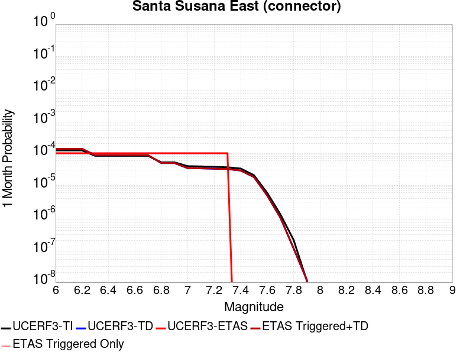 |  |  |

| Magnitude | 1 wk TI Prob | 1 wk TD Prob | 1 wk ETAS Prob | 1 wk ETAS/TD Gain | 1 wk ETAS Triggered+TD | 1 wk ETAS Triggered Only | 1 mo TI Prob | 1 mo TD Prob | 1 mo ETAS Prob | 1 mo ETAS/TD Gain | 1 mo ETAS Triggered+TD | 1 mo ETAS Triggered Only | 1 yr TI Prob | 1 yr TD Prob | 1 yr ETAS Prob | 1 yr ETAS/TD Gain | 1 yr ETAS Triggered+TD | 1 yr ETAS Triggered Only | 10 yr TI Prob | 10 yr TD Prob | 10 yr ETAS Prob | 10 yr ETAS/TD Gain | 10 yr ETAS Triggered+TD | 10 yr ETAS Triggered Only |
|-----|-----|-----|-----|-----|-----|-----|-----|-----|-----|-----|-----|-----|-----|-----|-----|-----|-----|-----|-----|-----|-----|-----|-----|-----|
| 6.0 | 2.858397E-5 | 3.2035638E-5 | 0.0 | 0.0 | 3.2035638E-5 | 0.0 | 1.2249697E-4 | 1.3728955E-4 | 0.0 | 0.0 | 1.3728955E-4 | 0.0 | 0.0014903803 | 0.0016704911 | 1.0E-4 | 0.059862636 | 0.0017703241 | 1.0E-4 | 0.014804244 | 0.016606191 | 0.0016 | 0.096349604 | 0.018179622 | 0.0016 |
| 6.1 | 2.858397E-5 | 3.2035638E-5 | 0.0 | 0.0 | 3.2035638E-5 | 0.0 | 1.2249697E-4 | 1.3728955E-4 | 0.0 | 0.0 | 1.3728955E-4 | 0.0 | 0.0014903803 | 0.0016704911 | 1.0E-4 | 0.059862636 | 0.0017703241 | 1.0E-4 | 0.014804244 | 0.016606191 | 0.0016 | 0.096349604 | 0.018179622 | 0.0016 |
| 6.2 | 2.858397E-5 | 3.2035638E-5 | 0.0 | 0.0 | 3.2035638E-5 | 0.0 | 1.2249697E-4 | 1.3728955E-4 | 0.0 | 0.0 | 1.3728955E-4 | 0.0 | 0.0014903803 | 0.0016704911 | 1.0E-4 | 0.059862636 | 0.0017703241 | 1.0E-4 | 0.014804244 | 0.016606191 | 0.0016 | 0.096349604 | 0.018179622 | 0.0016 |
| 6.3 | 1.943582E-5 | 2.037473E-5 | 0.0 | 0.0 | 2.037473E-5 | 0.0 | 8.329371E-5 | 8.731798E-5 | 0.0 | 0.0 | 8.731798E-5 | 0.0 | 0.001013629 | 0.00106269 | 1.0E-4 | 0.09410081 | 0.0011625838 | 1.0E-4 | 0.010090181 | 0.010587438 | 9.0E-4 | 0.0850064 | 0.011477909 | 9.0E-4 |
| 6.4 | 1.943582E-5 | 2.037473E-5 | 0.0 | 0.0 | 2.037473E-5 | 0.0 | 8.329371E-5 | 8.731798E-5 | 0.0 | 0.0 | 8.731798E-5 | 0.0 | 0.001013629 | 0.00106269 | 1.0E-4 | 0.09410081 | 0.0011625838 | 1.0E-4 | 0.010090181 | 0.010587438 | 9.0E-4 | 0.0850064 | 0.011477909 | 9.0E-4 |
| 6.5 | 1.943582E-5 | 2.037473E-5 | 0.0 | 0.0 | 2.037473E-5 | 0.0 | 8.329371E-5 | 8.731798E-5 | 0.0 | 0.0 | 8.731798E-5 | 0.0 | 0.001013629 | 0.00106269 | 1.0E-4 | 0.09410081 | 0.0011625838 | 1.0E-4 | 0.010090181 | 0.010587438 | 9.0E-4 | 0.0850064 | 0.011477909 | 9.0E-4 |
| 6.6 | 1.943582E-5 | 2.037473E-5 | 0.0 | 0.0 | 2.037473E-5 | 0.0 | 8.329371E-5 | 8.731798E-5 | 0.0 | 0.0 | 8.731798E-5 | 0.0 | 0.001013629 | 0.00106269 | 1.0E-4 | 0.09410081 | 0.0011625838 | 1.0E-4 | 0.010090181 | 0.010587438 | 9.0E-4 | 0.0850064 | 0.011477909 | 9.0E-4 |
| 6.7 | 1.9404439E-5 | 2.0362148E-5 | 0.0 | 0.0 | 2.0362148E-5 | 0.0 | 8.3159226E-5 | 8.726406E-5 | 0.0 | 0.0 | 8.726406E-5 | 0.0 | 0.0010119933 | 0.0010620343 | 1.0E-4 | 0.094158925 | 0.001161928 | 1.0E-4 | 0.010073971 | 0.010580942 | 9.0E-4 | 0.08505859 | 0.011471419 | 9.0E-4 |
| 6.8 | 1.2217526E-5 | 1.1596006E-5 | 0.0 | 0.0 | 1.1596006E-5 | 0.0 | 5.2359774E-5 | 4.9696315E-5 | 0.0 | 0.0 | 4.9696315E-5 | 0.0 | 6.372938E-4 | 6.0490146E-4 | 1.0E-4 | 0.16531618 | 7.04841E-4 | 1.0E-4 | 0.0063546924 | 0.006034512 | 5.0E-4 | 0.082856745 | 0.0065314947 | 5.0E-4 |
| 6.9 | 1.2217526E-5 | 1.1596006E-5 | 0.0 | 0.0 | 1.1596006E-5 | 0.0 | 5.2359774E-5 | 4.9696315E-5 | 0.0 | 0.0 | 4.9696315E-5 | 0.0 | 6.372938E-4 | 6.0490146E-4 | 1.0E-4 | 0.16531618 | 7.04841E-4 | 1.0E-4 | 0.0063546924 | 0.006034512 | 5.0E-4 | 0.082856745 | 0.0065314947 | 5.0E-4 |
| 7.0 | 9.276017E-6 | 8.060582E-6 | 0.0 | 0.0 | 8.060582E-6 | 0.0 | 3.9753755E-5 | 3.4544915E-5 | 0.0 | 0.0 | 3.4544915E-5 | 0.0 | 4.8389446E-4 | 4.205066E-4 | 1.0E-4 | 0.23780839 | 5.2046456E-4 | 1.0E-4 | 0.0048284214 | 0.0041977493 | 3.0E-4 | 0.07146687 | 0.0044964897 | 3.0E-4 |
| 7.1 | 9.130355E-6 | 7.94373E-6 | 0.0 | 0.0 | 7.94373E-6 | 0.0 | 3.9129503E-5 | 3.4044137E-5 | 0.0 | 0.0 | 3.4044137E-5 | 0.0 | 4.7629757E-4 | 4.1441197E-4 | 1.0E-4 | 0.24130577 | 5.143705E-4 | 1.0E-4 | 0.00475278 | 0.004137031 | 3.0E-4 | 0.07251577 | 0.00443579 | 3.0E-4 |
| 7.2 | 8.851015E-6 | 7.742867E-6 | 0.0 | 0.0 | 7.742867E-6 | 0.0 | 3.7932372E-5 | 3.318331E-5 | 0.0 | 0.0 | 3.318331E-5 | 0.0 | 4.6172875E-4 | 4.0393535E-4 | 1.0E-4 | 0.24756438 | 5.0389493E-4 | 1.0E-4 | 0.0046077054 | 0.0040326477 | 3.0E-4 | 0.07439281 | 0.004331438 | 3.0E-4 |
| 7.3 | 8.573006E-6 | 7.551555E-6 | 0.0 | 0.0 | 7.551555E-6 | 0.0 | 3.6740938E-5 | 3.2363427E-5 | 0.0 | 0.0 | 3.2363427E-5 | 0.0 | 4.472291E-4 | 3.9395687E-4 | 1.0E-4 | 0.2538349 | 4.939175E-4 | 1.0E-4 | 0.004463301 | 0.003933213 | 3.0E-4 | 0.076273516 | 0.004232033 | 3.0E-4 |
| 7.4 | 7.852282E-6 | 6.8188347E-6 | 0.0 | 0.0 | 6.8188347E-6 | 0.0 | 3.36522E-5 | 2.9223267E-5 | 0.0 | 0.0 | 2.9223267E-5 | 0.0 | 4.096385E-4 | 3.5573822E-4 | 1.0E-4 | 0.28110558 | 4.5570263E-4 | 1.0E-4 | 0.0040888423 | 0.0035522694 | 3.0E-4 | 0.084453054 | 0.0038512037 | 3.0E-4 |
| 7.5 | 4.8869324E-6 | 4.2797797E-6 | 0.0 | 0.0 | 4.2797797E-6 | 0.0 | 2.0943828E-5 | 1.8341794E-5 | 0.0 | 0.0 | 1.8341794E-5 | 0.0 | 2.5496128E-4 | 2.232901E-4 | 1.0E-4 | 0.44784787 | 3.2326777E-4 | 1.0E-4 | 0.0025466895 | 0.0022308354 | 2.0E-4 | 0.08965251 | 0.0024303894 | 2.0E-4 |
| 7.6 | 1.3894544E-6 | 1.156984E-6 | 0.0 | 0.0 | 1.156984E-6 | 0.0 | 5.954791E-6 | 4.9584946E-6 | 0.0 | 0.0 | 4.9584946E-6 | 0.0 | 7.249717E-5 | 6.0368224E-5 | 1.0E-4 | 1.6565006 | 1.603622E-4 | 1.0E-4 | 7.247352E-4 | 6.0354004E-4 | 1.0E-4 | 0.16568908 | 7.034797E-4 | 1.0E-4 |
| 7.7 | 2.9924632E-7 | 2.3728435E-7 | 0.0 | 0.0 | 2.3728435E-7 | 0.0 | 1.2824837E-6 | 1.0169326E-6 | 0.0 | 0.0 | 1.0169326E-6 | 0.0 | 1.5614127E-5 | 1.2381091E-5 | 1.0E-4 | 8.076832 | 1.1237985E-4 | 1.0E-4 | 1.5613029E-4 | 1.2380474E-4 | 1.0E-4 | 0.8077235 | 2.2379236E-4 | 1.0E-4 |
| 7.8 | 4.8188564E-8 | 2.63873E-8 | 0.0 | 0.0 | 2.63873E-8 | 0.0 | 2.065224E-7 | 1.1308842E-7 | 0.0 | 0.0 | 1.1308842E-7 | 0.0 | 2.5144072E-6 | 1.3768507E-6 | 1.0E-4 | 72.62952 | 1.0137671E-4 | 1.0E-4 | 2.5143789E-5 | 1.376843E-5 | 1.0E-4 | 7.262992 | 1.13767055E-4 | 1.0E-4 |
| 7.9 | 2.6127251E-9 | 2.768449E-9 | 0.0 | 0.0 | 2.768449E-9 | 0.0 | 1.1197393E-8 | 1.1864782E-8 | 0.0 | 0.0 | 1.1864782E-8 | 0.0 | 1.3632825E-7 | 1.4445372E-7 | 0.0 | 0.0 | 1.4445372E-7 | 0.0 | 1.3632817E-6 | 1.4445372E-6 | 0.0 | 0.0 | 1.4445372E-6 | 0.0 |

## Owens Valley Keough Hot Springs
*[(top)](#table-of-contents)*

| 1 Week | 1 Month | 1 Year | 10 Year |
|-----|-----|-----|-----|
| 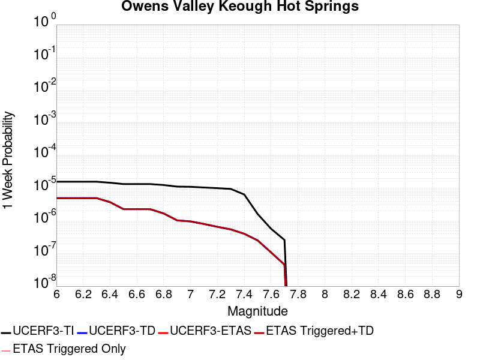 |  |  |  |

| Magnitude | 1 wk TI Prob | 1 wk TD Prob | 1 wk ETAS Prob | 1 wk ETAS/TD Gain | 1 wk ETAS Triggered+TD | 1 wk ETAS Triggered Only | 1 mo TI Prob | 1 mo TD Prob | 1 mo ETAS Prob | 1 mo ETAS/TD Gain | 1 mo ETAS Triggered+TD | 1 mo ETAS Triggered Only | 1 yr TI Prob | 1 yr TD Prob | 1 yr ETAS Prob | 1 yr ETAS/TD Gain | 1 yr ETAS Triggered+TD | 1 yr ETAS Triggered Only | 10 yr TI Prob | 10 yr TD Prob | 10 yr ETAS Prob | 10 yr ETAS/TD Gain | 10 yr ETAS Triggered+TD | 10 yr ETAS Triggered Only |
|-----|-----|-----|-----|-----|-----|-----|-----|-----|-----|-----|-----|-----|-----|-----|-----|-----|-----|-----|-----|-----|-----|-----|-----|-----|
| 6.0 | 1.5708529E-5 | 4.951555E-6 | 0.0 | 0.0 | 4.951555E-6 | 0.0 | 6.7320536E-5 | 2.1220807E-5 | 0.0 | 0.0 | 2.1220807E-5 | 0.0 | 8.193192E-4 | 2.5833782E-4 | 0.0 | 0.0 | 2.5833782E-4 | 0.0 | 0.008163051 | 0.0025810846 | 0.0016 | 0.6198944 | 0.004176955 | 0.0016 |
| 6.1 | 1.5708529E-5 | 4.951555E-6 | 0.0 | 0.0 | 4.951555E-6 | 0.0 | 6.7320536E-5 | 2.1220807E-5 | 0.0 | 0.0 | 2.1220807E-5 | 0.0 | 8.193192E-4 | 2.5833782E-4 | 0.0 | 0.0 | 2.5833782E-4 | 0.0 | 0.008163051 | 0.0025810846 | 0.0016 | 0.6198944 | 0.004176955 | 0.0016 |
| 6.2 | 1.5708529E-5 | 4.951555E-6 | 0.0 | 0.0 | 4.951555E-6 | 0.0 | 6.7320536E-5 | 2.1220807E-5 | 0.0 | 0.0 | 2.1220807E-5 | 0.0 | 8.193192E-4 | 2.5833782E-4 | 0.0 | 0.0 | 2.5833782E-4 | 0.0 | 0.008163051 | 0.0025810846 | 0.0016 | 0.6198944 | 0.004176955 | 0.0016 |
| 6.3 | 1.5708529E-5 | 4.951555E-6 | 0.0 | 0.0 | 4.951555E-6 | 0.0 | 6.7320536E-5 | 2.1220807E-5 | 0.0 | 0.0 | 2.1220807E-5 | 0.0 | 8.193192E-4 | 2.5833782E-4 | 0.0 | 0.0 | 2.5833782E-4 | 0.0 | 0.008163051 | 0.0025810846 | 0.0016 | 0.6198944 | 0.004176955 | 0.0016 |
| 6.4 | 1.4622509E-5 | 3.7270993E-6 | 0.0 | 0.0 | 3.7270993E-6 | 0.0 | 6.266639E-5 | 1.5973203E-5 | 0.0 | 0.0 | 1.5973203E-5 | 0.0 | 7.626962E-4 | 1.944597E-4 | 0.0 | 0.0 | 1.944597E-4 | 0.0 | 0.007600839 | 0.001943426 | 0.0013 | 0.6689218 | 0.0032408994 | 0.0013 |
| 6.5 | 1.3335527E-5 | 2.2779207E-6 | 0.0 | 0.0 | 2.2779207E-6 | 0.0 | 5.7151006E-5 | 9.762484E-6 | 0.0 | 0.0 | 9.762484E-6 | 0.0 | 6.955913E-4 | 1.1885245E-4 | 0.0 | 0.0 | 1.1885245E-4 | 0.0 | 0.0069341804 | 0.0011881621 | 8.0E-4 | 0.6733088 | 0.0019872116 | 8.0E-4 |
| 6.6 | 1.3332855E-5 | 2.2750694E-6 | 0.0 | 0.0 | 2.2750694E-6 | 0.0 | 5.7139558E-5 | 9.750265E-6 | 0.0 | 0.0 | 9.750265E-6 | 0.0 | 6.9545204E-4 | 1.187037E-4 | 0.0 | 0.0 | 1.187037E-4 | 0.0 | 0.0069327964 | 0.0011866762 | 8.0E-4 | 0.6741519 | 0.0019857269 | 8.0E-4 |
| 6.7 | 1.3318214E-5 | 2.264299E-6 | 0.0 | 0.0 | 2.264299E-6 | 0.0 | 5.707681E-5 | 9.704106E-6 | 0.0 | 0.0 | 9.704106E-6 | 0.0 | 6.946886E-4 | 1.1814176E-4 | 0.0 | 0.0 | 1.1814176E-4 | 0.0 | 0.0069252094 | 0.0011810628 | 8.0E-4 | 0.677356 | 0.001980118 | 8.0E-4 |
| 6.8 | 1.2441338E-5 | 1.6779351E-6 | 0.0 | 0.0 | 1.6779351E-6 | 0.0 | 5.331893E-5 | 7.1911318E-6 | 0.0 | 0.0 | 7.1911318E-6 | 0.0 | 6.489646E-4 | 8.754881E-5 | 0.0 | 0.0 | 8.754881E-5 | 0.0 | 0.0064707273 | 8.7537884E-4 | 3.0E-4 | 0.34270877 | 0.0011751163 | 3.0E-4 |
| 6.9 | 1.1130476E-5 | 1.0304408E-6 | 0.0 | 0.0 | 1.0304408E-6 | 0.0 | 4.7701167E-5 | 4.4161675E-6 | 0.0 | 0.0 | 4.4161675E-6 | 0.0 | 5.806069E-4 | 5.376553E-5 | 0.0 | 0.0 | 5.376553E-5 | 0.0 | 0.0057909233 | 5.377312E-4 | 1.0E-4 | 0.18596652 | 6.3767744E-4 | 1.0E-4 |
| 7.0 | 1.0986073E-5 | 9.579884E-7 | 0.0 | 0.0 | 9.579884E-7 | 0.0 | 4.7082318E-5 | 4.1056583E-6 | 0.0 | 0.0 | 4.1056583E-6 | 0.0 | 5.730765E-4 | 4.9985254E-5 | 0.0 | 0.0 | 4.9985254E-5 | 0.0 | 0.0057160086 | 4.999449E-4 | 0.0 | 0.0 | 4.999449E-4 | 0.0 |
| 7.1 | 1.0451338E-5 | 8.0005015E-7 | 0.0 | 0.0 | 8.0005015E-7 | 0.0 | 4.4790682E-5 | 3.4287818E-6 | 0.0 | 0.0 | 3.4287818E-6 | 0.0 | 5.451901E-4 | 4.1744624E-5 | 0.0 | 0.0 | 4.1744624E-5 | 0.0 | 0.005438545 | 4.1756872E-4 | 0.0 | 0.0 | 4.1756872E-4 | 0.0 |
| 7.2 | 9.989061E-6 | 6.545053E-7 | 0.0 | 0.0 | 6.545053E-7 | 0.0 | 4.280956E-5 | 2.80502E-6 | 0.0 | 0.0 | 2.80502E-6 | 0.0 | 5.2108173E-4 | 3.4150584E-5 | 0.0 | 0.0 | 3.4150584E-5 | 0.0 | 0.0051986156 | 3.416434E-4 | 0.0 | 0.0 | 3.416434E-4 | 0.0 |
| 7.3 | 9.465365E-6 | 5.4600986E-7 | 0.0 | 0.0 | 5.4600986E-7 | 0.0 | 4.056522E-5 | 2.34004E-6 | 0.0 | 0.0 | 2.34004E-6 | 0.0 | 4.937696E-4 | 2.848962E-5 | 0.0 | 0.0 | 2.848962E-5 | 0.0 | 0.0049267393 | 2.8504492E-4 | 0.0 | 0.0 | 2.8504492E-4 | 0.0 |
| 7.4 | 6.3824805E-6 | 4.0163908E-7 | 0.0 | 0.0 | 4.0163908E-7 | 0.0 | 2.73532E-5 | 1.7213092E-6 | 0.0 | 0.0 | 1.7213092E-6 | 0.0 | 3.3297433E-4 | 2.095674E-5 | 0.0 | 0.0 | 2.095674E-5 | 0.0 | 0.0033247585 | 2.0969073E-4 | 0.0 | 0.0 | 2.0969073E-4 | 0.0 |
| 7.5 | 1.6192645E-6 | 2.5163476E-7 | 0.0 | 0.0 | 2.5163476E-7 | 0.0 | 6.9396865E-6 | 1.0784343E-6 | 0.0 | 0.0 | 1.0784343E-6 | 0.0 | 8.448741E-5 | 1.3129859E-5 | 0.0 | 0.0 | 1.3129859E-5 | 0.0 | 8.4455294E-4 | 1.3129096E-4 | 0.0 | 0.0 | 1.3129096E-4 | 0.0 |
| 7.6 | 5.7062545E-7 | 1.0793294E-7 | 0.0 | 0.0 | 1.0793294E-7 | 0.0 | 2.4455355E-6 | 4.6256966E-7 | 0.0 | 0.0 | 4.6256966E-7 | 0.0 | 2.9773988E-5 | 5.631772E-6 | 0.0 | 0.0 | 5.631772E-6 | 0.0 | 2.977E-4 | 5.6316374E-5 | 0.0 | 0.0 | 5.6316374E-5 | 0.0 |
| 7.7 | 2.5988817E-7 | 4.5457746E-8 | 0.0 | 0.0 | 4.5457746E-8 | 0.0 | 1.113806E-6 | 1.948189E-7 | 0.0 | 0.0 | 1.948189E-7 | 0.0 | 1.3560503E-5 | 2.3719178E-6 | 0.0 | 0.0 | 2.3719178E-6 | 0.0 | 1.3559677E-4 | 2.371897E-5 | 0.0 | 0.0 | 2.371897E-5 | 0.0 |

## Bartlett Springs 2011 CFM
*[(top)](#table-of-contents)*

| 1 Week | 1 Month | 1 Year | 10 Year |
|-----|-----|-----|-----|
| 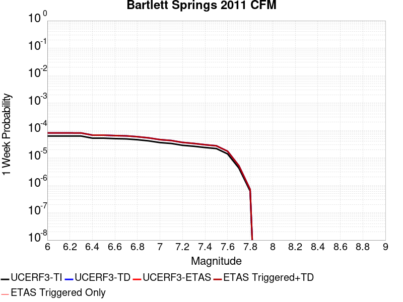 |  | 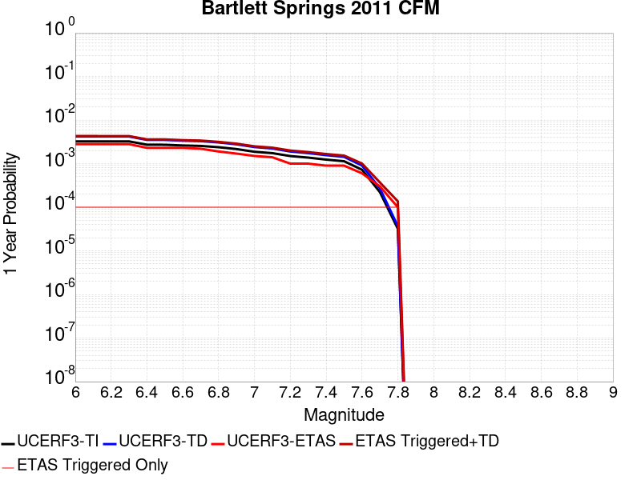 |  |

| Magnitude | 1 wk TI Prob | 1 wk TD Prob | 1 wk ETAS Prob | 1 wk ETAS/TD Gain | 1 wk ETAS Triggered+TD | 1 wk ETAS Triggered Only | 1 mo TI Prob | 1 mo TD Prob | 1 mo ETAS Prob | 1 mo ETAS/TD Gain | 1 mo ETAS Triggered+TD | 1 mo ETAS Triggered Only | 1 yr TI Prob | 1 yr TD Prob | 1 yr ETAS Prob | 1 yr ETAS/TD Gain | 1 yr ETAS Triggered+TD | 1 yr ETAS Triggered Only | 10 yr TI Prob | 10 yr TD Prob | 10 yr ETAS Prob | 10 yr ETAS/TD Gain | 10 yr ETAS Triggered+TD | 10 yr ETAS Triggered Only |
|-----|-----|-----|-----|-----|-----|-----|-----|-----|-----|-----|-----|-----|-----|-----|-----|-----|-----|-----|-----|-----|-----|-----|-----|-----|
| 6.0 | 6.2326144E-5 | 8.0653714E-5 | 0.0 | 0.0 | 8.0653714E-5 | 0.0 | 2.6708472E-4 | 3.4561334E-4 | 0.0 | 0.0 | 3.4561334E-4 | 0.0 | 0.003246908 | 0.004199817 | 1.0E-4 | 0.023810562 | 0.004299397 | 1.0E-4 | 0.031998757 | 0.04122155 | 0.0015 | 0.036388732 | 0.04265972 | 0.0015 |
| 6.1 | 6.227657E-5 | 8.0591184E-5 | 0.0 | 0.0 | 8.0591184E-5 | 0.0 | 2.668723E-4 | 3.453454E-4 | 0.0 | 0.0 | 3.453454E-4 | 0.0 | 0.0032443295 | 0.0041965675 | 1.0E-4 | 0.023828998 | 0.004296148 | 1.0E-4 | 0.031973712 | 0.04119027 | 0.0015 | 0.036416367 | 0.042628486 | 0.0015 |
| 6.2 | 6.22452E-5 | 8.055176E-5 | 0.0 | 0.0 | 8.055176E-5 | 0.0 | 2.6673786E-4 | 3.4517655E-4 | 0.0 | 0.0 | 3.4517655E-4 | 0.0 | 0.0032426978 | 0.0041945195 | 1.0E-4 | 0.023840632 | 0.0042941 | 1.0E-4 | 0.03195787 | 0.041170552 | 0.0015 | 0.03643381 | 0.042608798 | 0.0015 |
| 6.3 | 6.219006E-5 | 8.0481565E-5 | 0.0 | 0.0 | 8.0481565E-5 | 0.0 | 2.6650162E-4 | 3.4487576E-4 | 0.0 | 0.0 | 3.4487576E-4 | 0.0 | 0.00323983 | 0.0041908715 | 1.0E-4 | 0.023861386 | 0.0042904527 | 1.0E-4 | 0.031930014 | 0.041135434 | 0.0015 | 0.03646491 | 0.04257373 | 0.0015 |
| 6.4 | 5.2175856E-5 | 6.729268E-5 | 0.0 | 0.0 | 6.729268E-5 | 0.0 | 2.2359163E-4 | 2.883656E-4 | 0.0 | 0.0 | 2.883656E-4 | 0.0 | 0.0027188298 | 0.0035052474 | 1.0E-4 | 0.028528657 | 0.0036048968 | 1.0E-4 | 0.026858058 | 0.03450902 | 0.0015 | 0.043466892 | 0.03595726 | 0.0015 |
| 6.5 | 5.205166E-5 | 6.713527E-5 | 0.0 | 0.0 | 6.713527E-5 | 0.0 | 2.2305945E-4 | 2.876911E-4 | 0.0 | 0.0 | 2.876911E-4 | 0.0 | 0.0027123666 | 0.0034970618 | 1.0E-4 | 0.028595433 | 0.0035967121 | 1.0E-4 | 0.026794989 | 0.034429725 | 0.0015 | 0.043567006 | 0.03587808 | 0.0015 |
| 6.6 | 5.0085426E-5 | 6.452997E-5 | 0.0 | 0.0 | 6.452997E-5 | 0.0 | 2.1463417E-4 | 2.7652795E-4 | 0.0 | 0.0 | 2.7652795E-4 | 0.0 | 0.0026100394 | 0.0033615802 | 1.0E-4 | 0.029747915 | 0.003461244 | 1.0E-4 | 0.025795965 | 0.03311651 | 0.0014 | 0.04227499 | 0.034470145 | 0.0014 |
| 6.7 | 4.8930866E-5 | 6.3053805E-5 | 0.0 | 0.0 | 6.3053805E-5 | 0.0 | 2.0968684E-4 | 2.7020287E-4 | 0.0 | 0.0 | 2.7020287E-4 | 0.0 | 0.0025499484 | 0.0032848073 | 1.0E-4 | 0.030443186 | 0.0033844789 | 1.0E-4 | 0.025208864 | 0.03237147 | 0.0012 | 0.037069682 | 0.033532623 | 0.0012 |
| 6.8 | 4.5679535E-5 | 5.8775466E-5 | 0.0 | 0.0 | 5.8775466E-5 | 0.0 | 1.9575475E-4 | 2.5187072E-4 | 0.0 | 0.0 | 2.5187072E-4 | 0.0 | 0.002380709 | 0.0030622517 | 1.0E-4 | 0.03265571 | 0.0031619456 | 1.0E-4 | 0.023553653 | 0.030207586 | 0.0012 | 0.03972512 | 0.031371336 | 0.0012 |
| 6.9 | 4.1439176E-5 | 5.325024E-5 | 0.0 | 0.0 | 5.325024E-5 | 0.0 | 1.7758438E-4 | 2.2819548E-4 | 0.0 | 0.0 | 2.2819548E-4 | 0.0 | 0.002159946 | 0.0027747657 | 1.0E-4 | 0.036039077 | 0.0028744882 | 1.0E-4 | 0.021390721 | 0.027406242 | 0.0012 | 0.043785647 | 0.028573355 | 0.0012 |
| 7.0 | 3.5920104E-5 | 4.6034307E-5 | 0.0 | 0.0 | 4.6034307E-5 | 0.0 | 1.5393422E-4 | 1.9727505E-4 | 0.0 | 0.0 | 1.9727505E-4 | 0.0 | 0.001872538 | 0.002399194 | 1.0E-4 | 0.041680664 | 0.002498954 | 1.0E-4 | 0.018568378 | 0.02373621 | 0.0012 | 0.05055567 | 0.024907727 | 0.0012 |
| 7.1 | 3.338812E-5 | 4.2713036E-5 | 0.0 | 0.0 | 4.2713036E-5 | 0.0 | 1.430841E-4 | 1.8304311E-4 | 0.0 | 0.0 | 1.8304311E-4 | 0.0 | 0.0017406568 | 0.0022262866 | 1.0E-4 | 0.044917848 | 0.002326064 | 1.0E-4 | 0.017270854 | 0.022042684 | 0.0012 | 0.05443983 | 0.023216233 | 0.0012 |
| 7.2 | 2.8619615E-5 | 3.6421425E-5 | 0.0 | 0.0 | 3.6421425E-5 | 0.0 | 1.2264973E-4 | 1.5608253E-4 | 0.0 | 0.0 | 1.5608253E-4 | 0.0 | 0.0014922376 | 0.0018986582 | 1.0E-4 | 0.052668773 | 0.0019984683 | 1.0E-4 | 0.014822568 | 0.018826444 | 0.0011 | 0.05842845 | 0.019905735 | 0.0011 |
| 7.3 | 2.6376783E-5 | 3.3441032E-5 | 0.0 | 0.0 | 3.3441032E-5 | 0.0 | 1.13038455E-4 | 1.4331088E-4 | 0.0 | 0.0 | 1.4331088E-4 | 0.0 | 0.0013753743 | 0.0017434228 | 1.0E-4 | 0.057358433 | 0.0018432485 | 1.0E-4 | 0.01366893 | 0.01729939 | 0.001 | 0.05780551 | 0.018282091 | 0.001 |
| 7.4 | 2.3738676E-5 | 2.9995399E-5 | 0.0 | 0.0 | 2.9995399E-5 | 0.0 | 1.0173322E-4 | 1.2854542E-4 | 0.0 | 0.0 | 1.2854542E-4 | 0.0 | 0.0012378981 | 0.0015639251 | 1.0E-4 | 0.06394169 | 0.0016637687 | 1.0E-4 | 0.012310251 | 0.01553077 | 0.001 | 0.06438831 | 0.016515238 | 0.001 |
| 7.5 | 2.1789481E-5 | 2.7454264E-5 | 0.0 | 0.0 | 2.7454264E-5 | 0.0 | 9.338015E-5 | 1.17655865E-4 | 0.0 | 0.0 | 1.17655865E-4 | 0.0 | 0.0011363103 | 0.0014315267 | 1.0E-4 | 0.06985549 | 0.0015313836 | 1.0E-4 | 0.011305175 | 0.014224509 | 9.0E-4 | 0.06327108 | 0.015111706 | 9.0E-4 |
| 7.6 | 1.3895281E-5 | 1.737815E-5 | 0.0 | 0.0 | 1.737815E-5 | 0.0 | 5.9549846E-5 | 7.4475676E-5 | 0.0 | 0.0 | 7.4475676E-5 | 0.0 | 7.2477816E-4 | 9.0636703E-4 | 1.0E-4 | 0.11033058 | 0.0010062763 | 1.0E-4 | 0.0072241887 | 0.009027373 | 5.0E-4 | 0.0553871 | 0.00952286 | 5.0E-4 |
| 7.7 | 4.245981E-6 | 5.165001E-6 | 0.0 | 0.0 | 5.165001E-6 | 0.0 | 1.8196934E-5 | 2.2135531E-5 | 0.0 | 0.0 | 2.2135531E-5 | 0.0 | 2.2152514E-4 | 2.6946695E-4 | 1.0E-4 | 0.37110302 | 3.6944E-4 | 1.0E-4 | 0.0022130446 | 0.0026914403 | 2.0E-4 | 0.074309655 | 0.0028909019 | 2.0E-4 |
| 7.8 | 6.145192E-7 | 7.054105E-7 | 0.0 | 0.0 | 7.054105E-7 | 0.0 | 2.633651E-6 | 3.0231845E-6 | 0.0 | 0.0 | 3.0231845E-6 | 0.0 | 3.206423E-5 | 3.680666E-5 | 1.0E-4 | 2.7168994 | 1.3680298E-4 | 1.0E-4 | 3.2059604E-4 | 3.679996E-4 | 1.0E-4 | 0.27173942 | 4.679628E-4 | 1.0E-4 |

## Ortigalita (South)
*[(top)](#table-of-contents)*

| 1 Week | 1 Month | 1 Year | 10 Year |
|-----|-----|-----|-----|
|  | 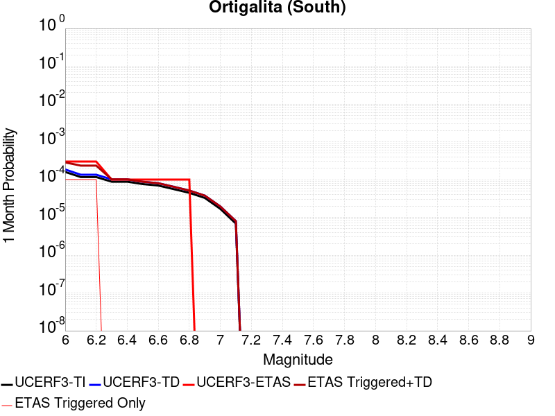 | 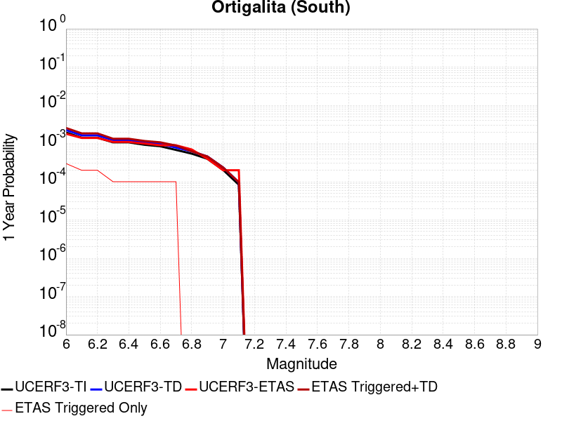 |  |

| Magnitude | 1 wk TI Prob | 1 wk TD Prob | 1 wk ETAS Prob | 1 wk ETAS/TD Gain | 1 wk ETAS Triggered+TD | 1 wk ETAS Triggered Only | 1 mo TI Prob | 1 mo TD Prob | 1 mo ETAS Prob | 1 mo ETAS/TD Gain | 1 mo ETAS Triggered+TD | 1 mo ETAS Triggered Only | 1 yr TI Prob | 1 yr TD Prob | 1 yr ETAS Prob | 1 yr ETAS/TD Gain | 1 yr ETAS Triggered+TD | 1 yr ETAS Triggered Only | 10 yr TI Prob | 10 yr TD Prob | 10 yr ETAS Prob | 10 yr ETAS/TD Gain | 10 yr ETAS Triggered+TD | 10 yr ETAS Triggered Only |
|-----|-----|-----|-----|-----|-----|-----|-----|-----|-----|-----|-----|-----|-----|-----|-----|-----|-----|-----|-----|-----|-----|-----|-----|-----|
| 6.0 | 3.72394E-5 | 4.3270058E-5 | 0.0 | 0.0 | 4.3270058E-5 | 0.0 | 1.5958765E-4 | 1.8543082E-4 | 1.0E-4 | 0.5392847 | 2.8541227E-4 | 1.0E-4 | 0.0019412481 | 0.0022554388 | 3.0E-4 | 0.1330118 | 0.0025547622 | 3.0E-4 | 0.019243775 | 0.022341885 | 0.0015 | 0.06713847 | 0.023808371 | 0.0015 |
| 6.1 | 2.7299884E-5 | 3.1502026E-5 | 0.0 | 0.0 | 3.1502026E-5 | 0.0 | 1.16994255E-4 | 1.3500202E-4 | 1.0E-4 | 0.7407297 | 2.3498852E-4 | 1.0E-4 | 0.0014234743 | 0.0016424663 | 2.0E-4 | 0.1217681 | 0.0018421378 | 2.0E-4 | 0.014143906 | 0.016309205 | 0.001 | 0.061315067 | 0.017292896 | 0.001 |
| 6.2 | 2.7299884E-5 | 3.1502026E-5 | 0.0 | 0.0 | 3.1502026E-5 | 0.0 | 1.16994255E-4 | 1.3500202E-4 | 1.0E-4 | 0.7407297 | 2.3498852E-4 | 1.0E-4 | 0.0014234743 | 0.0016424663 | 2.0E-4 | 0.1217681 | 0.0018421378 | 2.0E-4 | 0.014143906 | 0.016309205 | 0.001 | 0.061315067 | 0.017292896 | 0.001 |
| 6.3 | 2.0546433E-5 | 2.3638784E-5 | 0.0 | 0.0 | 2.3638784E-5 | 0.0 | 8.805317E-5 | 1.01305246E-4 | 0.0 | 0.0 | 1.01305246E-4 | 0.0 | 0.00107152 | 0.0012327125 | 1.0E-4 | 0.081121914 | 0.0013325892 | 1.0E-4 | 0.010663681 | 0.0122608105 | 6.0E-4 | 0.048936404 | 0.012853454 | 6.0E-4 |
| 6.4 | 2.0546433E-5 | 2.3638784E-5 | 0.0 | 0.0 | 2.3638784E-5 | 0.0 | 8.805317E-5 | 1.01305246E-4 | 0.0 | 0.0 | 1.01305246E-4 | 0.0 | 0.00107152 | 0.0012327125 | 1.0E-4 | 0.081121914 | 0.0013325892 | 1.0E-4 | 0.010663681 | 0.0122608105 | 6.0E-4 | 0.048936404 | 0.012853454 | 6.0E-4 |
| 6.5 | 1.7779594E-5 | 2.0453313E-5 | 0.0 | 0.0 | 2.0453313E-5 | 0.0 | 7.619603E-5 | 8.7654196E-5 | 0.0 | 0.0 | 8.7654196E-5 | 0.0 | 9.272918E-4 | 0.0010666809 | 1.0E-4 | 0.09374875 | 0.0011665743 | 1.0E-4 | 0.009234319 | 0.010617077 | 5.0E-4 | 0.04709394 | 0.011111769 | 5.0E-4 |
| 6.6 | 1.6272212E-5 | 1.8720775E-5 | 0.0 | 0.0 | 1.8720775E-5 | 0.0 | 6.973618E-5 | 8.022949E-5 | 0.0 | 0.0 | 8.022949E-5 | 0.0 | 8.487073E-4 | 9.763686E-4 | 1.0E-4 | 0.10242034 | 0.001076271 | 1.0E-4 | 0.008454733 | 0.009722092 | 3.0E-4 | 0.030857557 | 0.010019175 | 3.0E-4 |
| 6.7 | 1.3051484E-5 | 1.5043493E-5 | 0.0 | 0.0 | 1.5043493E-5 | 0.0 | 5.593373E-5 | 6.447057E-5 | 0.0 | 0.0 | 6.447057E-5 | 0.0 | 6.807804E-4 | 7.8465603E-4 | 1.0E-4 | 0.12744437 | 8.845776E-4 | 1.0E-4 | 0.006786986 | 0.00781984 | 3.0E-4 | 0.03836396 | 0.008117493 | 3.0E-4 |
| 6.8 | 1.04277415E-5 | 1.19909355E-5 | 0.0 | 0.0 | 1.19909355E-5 | 0.0 | 4.4689557E-5 | 5.1388753E-5 | 0.0 | 0.0 | 5.1388753E-5 | 0.0 | 5.439595E-4 | 6.254859E-4 | 0.0 | 0.0 | 6.254859E-4 | 0.0 | 0.0054262993 | 0.0062380093 | 1.0E-4 | 0.016030755 | 0.0063373856 | 1.0E-4 |
| 6.9 | 7.639968E-6 | 8.794237E-6 | 0.0 | 0.0 | 8.794237E-6 | 0.0 | 3.274231E-5 | 3.7689075E-5 | 0.0 | 0.0 | 3.7689075E-5 | 0.0 | 3.9856473E-4 | 4.5877378E-4 | 0.0 | 0.0 | 4.5877378E-4 | 0.0 | 0.003978506 | 0.0045788535 | 1.0E-4 | 0.02183953 | 0.0046783956 | 1.0E-4 |
| 7.0 | 3.919831E-6 | 4.5348647E-6 | 0.0 | 0.0 | 4.5348647E-6 | 0.0 | 1.679917E-5 | 1.9435001E-5 | 0.0 | 0.0 | 1.9435001E-5 | 0.0 | 2.045107E-4 | 2.3659757E-4 | 0.0 | 0.0 | 2.3659757E-4 | 0.0 | 0.0020432258 | 0.0023636655 | 1.0E-4 | 0.042307172 | 0.002463429 | 1.0E-4 |
| 7.1 | 1.6017933E-6 | 1.8576521E-6 | 0.0 | 0.0 | 1.8576521E-6 | 0.0 | 6.8648105E-6 | 7.961348E-6 | 0.0 | 0.0 | 7.961348E-6 | 0.0 | 8.357586E-5 | 9.692617E-5 | 0.0 | 0.0 | 9.692617E-5 | 0.0 | 8.3544437E-4 | 9.689437E-4 | 0.0 | 0.0 | 9.689437E-4 | 0.0 |

## Santa Ynez (East)
*[(top)](#table-of-contents)*

| 1 Week | 1 Month | 1 Year | 10 Year |
|-----|-----|-----|-----|
|  |  |  |  |

| Magnitude | 1 wk TI Prob | 1 wk TD Prob | 1 wk ETAS Prob | 1 wk ETAS/TD Gain | 1 wk ETAS Triggered+TD | 1 wk ETAS Triggered Only | 1 mo TI Prob | 1 mo TD Prob | 1 mo ETAS Prob | 1 mo ETAS/TD Gain | 1 mo ETAS Triggered+TD | 1 mo ETAS Triggered Only | 1 yr TI Prob | 1 yr TD Prob | 1 yr ETAS Prob | 1 yr ETAS/TD Gain | 1 yr ETAS Triggered+TD | 1 yr ETAS Triggered Only | 10 yr TI Prob | 10 yr TD Prob | 10 yr ETAS Prob | 10 yr ETAS/TD Gain | 10 yr ETAS Triggered+TD | 10 yr ETAS Triggered Only |
|-----|-----|-----|-----|-----|-----|-----|-----|-----|-----|-----|-----|-----|-----|-----|-----|-----|-----|-----|-----|-----|-----|-----|-----|-----|
| 6.0 | 3.2269712E-5 | 3.6764442E-5 | 0.0 | 0.0 | 3.6764442E-5 | 0.0 | 1.3829143E-4 | 1.5755571E-4 | 0.0 | 0.0 | 1.5755571E-4 | 0.0 | 0.0016823979 | 0.0019171385 | 2.0E-4 | 0.10432214 | 0.0021167551 | 2.0E-4 | 0.016697178 | 0.019063491 | 0.0013 | 0.068193175 | 0.020338709 | 0.0013 |
| 6.1 | 3.2269712E-5 | 3.6764442E-5 | 0.0 | 0.0 | 3.6764442E-5 | 0.0 | 1.3829143E-4 | 1.5755571E-4 | 0.0 | 0.0 | 1.5755571E-4 | 0.0 | 0.0016823979 | 0.0019171385 | 2.0E-4 | 0.10432214 | 0.0021167551 | 2.0E-4 | 0.016697178 | 0.019063491 | 0.0013 | 0.068193175 | 0.020338709 | 0.0013 |
| 6.2 | 3.2269712E-5 | 3.6764442E-5 | 0.0 | 0.0 | 3.6764442E-5 | 0.0 | 1.3829143E-4 | 1.5755571E-4 | 0.0 | 0.0 | 1.5755571E-4 | 0.0 | 0.0016823979 | 0.0019171385 | 2.0E-4 | 0.10432214 | 0.0021167551 | 2.0E-4 | 0.016697178 | 0.019063491 | 0.0013 | 0.068193175 | 0.020338709 | 0.0013 |
| 6.3 | 3.2269712E-5 | 3.6764442E-5 | 0.0 | 0.0 | 3.6764442E-5 | 0.0 | 1.3829143E-4 | 1.5755571E-4 | 0.0 | 0.0 | 1.5755571E-4 | 0.0 | 0.0016823979 | 0.0019171385 | 2.0E-4 | 0.10432214 | 0.0021167551 | 2.0E-4 | 0.016697178 | 0.019063491 | 0.0013 | 0.068193175 | 0.020338709 | 0.0013 |
| 6.4 | 1.4404779E-5 | 1.4852838E-5 | 0.0 | 0.0 | 1.4852838E-5 | 0.0 | 6.1733306E-5 | 6.36535E-5 | 0.0 | 0.0 | 6.36535E-5 | 0.0 | 7.513438E-4 | 7.7471085E-4 | 0.0 | 0.0 | 7.7471085E-4 | 0.0 | 0.0074880854 | 0.007720652 | 5.0E-4 | 0.06476137 | 0.008216792 | 5.0E-4 |
| 6.5 | 1.4404779E-5 | 1.4852838E-5 | 0.0 | 0.0 | 1.4852838E-5 | 0.0 | 6.1733306E-5 | 6.36535E-5 | 0.0 | 0.0 | 6.36535E-5 | 0.0 | 7.513438E-4 | 7.7471085E-4 | 0.0 | 0.0 | 7.7471085E-4 | 0.0 | 0.0074880854 | 0.007720652 | 5.0E-4 | 0.06476137 | 0.008216792 | 5.0E-4 |
| 6.6 | 1.280208E-5 | 1.3014847E-5 | 0.0 | 0.0 | 1.3014847E-5 | 0.0 | 5.4864904E-5 | 5.5776734E-5 | 0.0 | 0.0 | 5.5776734E-5 | 0.0 | 6.6777546E-4 | 6.7887193E-4 | 0.0 | 0.0 | 6.7887193E-4 | 0.0 | 0.006657724 | 0.0067681917 | 5.0E-4 | 0.07387497 | 0.007264808 | 5.0E-4 |
| 6.7 | 1.2457027E-5 | 1.263128E-5 | 0.0 | 0.0 | 1.263128E-5 | 0.0 | 5.3386164E-5 | 5.4132943E-5 | 0.0 | 0.0 | 5.4132943E-5 | 0.0 | 6.497827E-4 | 6.5887097E-4 | 0.0 | 0.0 | 6.5887097E-4 | 0.0 | 0.00647886 | 0.006569373 | 5.0E-4 | 0.076110765 | 0.0070660883 | 5.0E-4 |
| 6.8 | 1.2095134E-5 | 1.2233646E-5 | 0.0 | 0.0 | 1.2233646E-5 | 0.0 | 5.1835254E-5 | 5.2428866E-5 | 0.0 | 0.0 | 5.2428866E-5 | 0.0 | 6.309115E-4 | 6.381361E-4 | 0.0 | 0.0 | 6.381361E-4 | 0.0 | 0.0062912325 | 0.006363225 | 5.0E-4 | 0.078576505 | 0.0068600434 | 5.0E-4 |
| 6.9 | 1.1104036E-5 | 1.1159892E-5 | 0.0 | 0.0 | 1.1159892E-5 | 0.0 | 4.758786E-5 | 4.7827238E-5 | 0.0 | 0.0 | 4.7827238E-5 | 0.0 | 5.7922816E-4 | 5.8214227E-4 | 0.0 | 0.0 | 5.8214227E-4 | 0.0 | 0.005777207 | 0.0058063194 | 5.0E-4 | 0.08611307 | 0.006303416 | 5.0E-4 |
| 7.0 | 1.0577444E-5 | 1.0584114E-5 | 0.0 | 0.0 | 1.0584114E-5 | 0.0 | 4.5331115E-5 | 4.5359706E-5 | 0.0 | 0.0 | 4.5359706E-5 | 0.0 | 5.5176654E-4 | 5.5211567E-4 | 0.0 | 0.0 | 5.5211567E-4 | 0.0 | 0.0055039856 | 0.0055075786 | 5.0E-4 | 0.090784 | 0.006004825 | 5.0E-4 |
| 7.1 | 1.0021775E-5 | 9.98332E-6 | 0.0 | 0.0 | 9.98332E-6 | 0.0 | 4.294976E-5 | 4.278496E-5 | 0.0 | 0.0 | 4.278496E-5 | 0.0 | 5.2278786E-4 | 5.207836E-4 | 0.0 | 0.0 | 5.207836E-4 | 0.0 | 0.0052155964 | 0.005195764 | 5.0E-4 | 0.096232235 | 0.005693166 | 5.0E-4 |
| 7.2 | 8.874109E-6 | 8.7509125E-6 | 0.0 | 0.0 | 8.7509125E-6 | 0.0 | 3.8031343E-5 | 3.7503378E-5 | 0.0 | 0.0 | 3.7503378E-5 | 0.0 | 4.629332E-4 | 4.5650906E-4 | 0.0 | 0.0 | 4.5650906E-4 | 0.0 | 0.0046197 | 0.0045558307 | 5.0E-4 | 0.109749466 | 0.0050535533 | 5.0E-4 |
| 7.3 | 7.5504267E-6 | 7.506954E-6 | 0.0 | 0.0 | 7.506954E-6 | 0.0 | 3.235857E-5 | 3.217227E-5 | 0.0 | 0.0 | 3.217227E-5 | 0.0 | 3.9389438E-4 | 3.9162798E-4 | 0.0 | 0.0 | 3.9162798E-4 | 0.0 | 0.0039319694 | 0.0039094854 | 4.0E-4 | 0.102315255 | 0.0043079215 | 4.0E-4 |
| 7.4 | 6.309394E-6 | 6.184751E-6 | 0.0 | 0.0 | 6.184751E-6 | 0.0 | 2.703998E-5 | 2.6505812E-5 | 0.0 | 0.0 | 2.6505812E-5 | 0.0 | 3.2916202E-4 | 3.2266142E-4 | 0.0 | 0.0 | 3.2266142E-4 | 0.0 | 0.003286749 | 0.0032220266 | 4.0E-4 | 0.12414546 | 0.003620738 | 4.0E-4 |
| 7.5 | 4.6103073E-6 | 4.441871E-6 | 0.0 | 0.0 | 4.441871E-6 | 0.0 | 1.975831E-5 | 1.9036455E-5 | 0.0 | 0.0 | 1.9036455E-5 | 0.0 | 2.4053088E-4 | 2.317449E-4 | 0.0 | 0.0 | 2.317449E-4 | 0.0 | 0.002402707 | 0.0023151017 | 4.0E-4 | 0.17277859 | 0.0027141757 | 4.0E-4 |
| 7.6 | 1.2858658E-6 | 1.3009684E-6 | 0.0 | 0.0 | 1.3009684E-6 | 0.0 | 5.5108417E-6 | 5.5755672E-6 | 0.0 | 0.0 | 5.5755672E-6 | 0.0 | 6.7092435E-5 | 6.7880486E-5 | 0.0 | 0.0 | 6.7880486E-5 | 0.0 | 6.707218E-4 | 6.786044E-4 | 2.0E-4 | 0.29472253 | 8.784687E-4 | 2.0E-4 |
| 7.7 | 5.3302307E-7 | 5.6127533E-7 | 0.0 | 0.0 | 5.6127533E-7 | 0.0 | 2.2843826E-6 | 2.4054636E-6 | 0.0 | 0.0 | 2.4054636E-6 | 0.0 | 2.7812002E-5 | 2.9286162E-5 | 0.0 | 0.0 | 2.9286162E-5 | 0.0 | 2.7808524E-4 | 2.928266E-4 | 1.0E-4 | 0.34149903 | 3.9279732E-4 | 1.0E-4 |
| 7.8 | 4.613933E-8 | 4.8034153E-8 | 0.0 | 0.0 | 4.8034153E-8 | 0.0 | 1.9773998E-7 | 2.0586064E-7 | 0.0 | 0.0 | 2.0586064E-7 | 0.0 | 2.4074816E-6 | 2.5063505E-6 | 0.0 | 0.0 | 2.5063505E-6 | 0.0 | 2.4074554E-5 | 2.5063231E-5 | 0.0 | 0.0 | 2.5063231E-5 | 0.0 |

## Blue Cut
*[(top)](#table-of-contents)*

| 1 Week | 1 Month | 1 Year | 10 Year |
|-----|-----|-----|-----|
|  |  |  |  |

| Magnitude | 1 wk TI Prob | 1 wk TD Prob | 1 wk ETAS Prob | 1 wk ETAS/TD Gain | 1 wk ETAS Triggered+TD | 1 wk ETAS Triggered Only | 1 mo TI Prob | 1 mo TD Prob | 1 mo ETAS Prob | 1 mo ETAS/TD Gain | 1 mo ETAS Triggered+TD | 1 mo ETAS Triggered Only | 1 yr TI Prob | 1 yr TD Prob | 1 yr ETAS Prob | 1 yr ETAS/TD Gain | 1 yr ETAS Triggered+TD | 1 yr ETAS Triggered Only | 10 yr TI Prob | 10 yr TD Prob | 10 yr ETAS Prob | 10 yr ETAS/TD Gain | 10 yr ETAS Triggered+TD | 10 yr ETAS Triggered Only |
|-----|-----|-----|-----|-----|-----|-----|-----|-----|-----|-----|-----|-----|-----|-----|-----|-----|-----|-----|-----|-----|-----|-----|-----|-----|
| 6.0 | 2.1227985E-5 | 2.2722867E-5 | 0.0 | 0.0 | 2.2722867E-5 | 0.0 | 9.097391E-5 | 9.738041E-5 | 0.0 | 0.0 | 9.738041E-5 | 0.0 | 0.0011070445 | 0.0011850197 | 0.0 | 0.0 | 0.0011850197 | 0.0 | 0.011015458 | 0.011792852 | 0.0014 | 0.11871599 | 0.013176342 | 0.0014 |
| 6.1 | 2.1227985E-5 | 2.2722867E-5 | 0.0 | 0.0 | 2.2722867E-5 | 0.0 | 9.097391E-5 | 9.738041E-5 | 0.0 | 0.0 | 9.738041E-5 | 0.0 | 0.0011070445 | 0.0011850197 | 0.0 | 0.0 | 0.0011850197 | 0.0 | 0.011015458 | 0.011792852 | 0.0014 | 0.11871599 | 0.013176342 | 0.0014 |
| 6.2 | 2.1227985E-5 | 2.2722867E-5 | 0.0 | 0.0 | 2.2722867E-5 | 0.0 | 9.097391E-5 | 9.738041E-5 | 0.0 | 0.0 | 9.738041E-5 | 0.0 | 0.0011070445 | 0.0011850197 | 0.0 | 0.0 | 0.0011850197 | 0.0 | 0.011015458 | 0.011792852 | 0.0014 | 0.11871599 | 0.013176342 | 0.0014 |
| 6.3 | 1.1613981E-5 | 1.2355163E-5 | 0.0 | 0.0 | 1.2355163E-5 | 0.0 | 4.9773254E-5 | 5.2949694E-5 | 0.0 | 0.0 | 5.2949694E-5 | 0.0 | 6.0582085E-4 | 6.444843E-4 | 0.0 | 0.0 | 6.444843E-4 | 0.0 | 0.0060417196 | 0.0064274 | 0.0011 | 0.1711423 | 0.0075203297 | 0.0011 |
| 6.4 | 1.1613981E-5 | 1.2355163E-5 | 0.0 | 0.0 | 1.2355163E-5 | 0.0 | 4.9773254E-5 | 5.2949694E-5 | 0.0 | 0.0 | 5.2949694E-5 | 0.0 | 6.0582085E-4 | 6.444843E-4 | 0.0 | 0.0 | 6.444843E-4 | 0.0 | 0.0060417196 | 0.0064274 | 0.0011 | 0.1711423 | 0.0075203297 | 0.0011 |
| 6.5 | 8.931326E-6 | 9.482803E-6 | 0.0 | 0.0 | 9.482803E-6 | 0.0 | 3.8276554E-5 | 4.0640003E-5 | 0.0 | 0.0 | 4.0640003E-5 | 0.0 | 4.6591737E-4 | 4.9468887E-4 | 0.0 | 0.0 | 4.9468887E-4 | 0.0 | 0.0046494175 | 0.004936786 | 8.0E-4 | 0.16204874 | 0.0057328367 | 8.0E-4 |
| 6.6 | 7.345353E-6 | 7.791251E-6 | 0.0 | 0.0 | 7.791251E-6 | 0.0 | 3.1479703E-5 | 3.3390694E-5 | 0.0 | 0.0 | 3.3390694E-5 | 0.0 | 3.83198E-4 | 4.0646386E-4 | 0.0 | 0.0 | 4.0646386E-4 | 0.0 | 0.0038253788 | 0.004057996 | 6.0E-4 | 0.14785624 | 0.0046555614 | 6.0E-4 |
| 6.7 | 6.2775666E-6 | 6.6559733E-6 | 0.0 | 0.0 | 6.6559733E-6 | 0.0 | 2.690358E-5 | 2.852533E-5 | 0.0 | 0.0 | 2.852533E-5 | 0.0 | 3.2750185E-4 | 3.4724807E-4 | 0.0 | 0.0 | 3.4724807E-4 | 0.0 | 0.0032701963 | 0.003467796 | 4.0E-4 | 0.11534704 | 0.0038664087 | 4.0E-4 |
| 6.8 | 5.5234095E-6 | 5.8558353E-6 | 0.0 | 0.0 | 5.8558353E-6 | 0.0 | 2.367154E-5 | 2.5096237E-5 | 0.0 | 0.0 | 2.5096237E-5 | 0.0 | 2.8816288E-4 | 3.0551112E-4 | 0.0 | 0.0 | 3.0551112E-4 | 0.0 | 0.002877895 | 0.0030516274 | 2.0E-4 | 0.0655388 | 0.003251017 | 2.0E-4 |
| 6.9 | 4.7780054E-6 | 5.066048E-6 | 0.0 | 0.0 | 5.066048E-6 | 0.0 | 2.0477004E-5 | 2.1711494E-5 | 0.0 | 0.0 | 2.1711494E-5 | 0.0 | 2.4927902E-4 | 2.643124E-4 | 0.0 | 0.0 | 2.643124E-4 | 0.0 | 0.0024899957 | 0.002640673 | 2.0E-4 | 0.07573827 | 0.0028401448 | 2.0E-4 |
| 7.0 | 3.883171E-6 | 4.119001E-6 | 0.0 | 0.0 | 4.119001E-6 | 0.0 | 1.6642054E-5 | 1.7652781E-5 | 0.0 | 0.0 | 1.7652781E-5 | 0.0 | 2.0259817E-4 | 2.149083E-4 | 0.0 | 0.0 | 2.149083E-4 | 0.0 | 0.0020241356 | 0.0021476806 | 2.0E-4 | 0.09312372 | 0.0023472512 | 2.0E-4 |
| 7.1 | 2.8358215E-6 | 3.010096E-6 | 0.0 | 0.0 | 3.010096E-6 | 0.0 | 1.2153464E-5 | 1.2900385E-5 | 0.0 | 0.0 | 1.2900385E-5 | 0.0 | 1.4795837E-4 | 1.5705744E-4 | 0.0 | 0.0 | 1.5705744E-4 | 0.0 | 0.001478599 | 0.0015701097 | 2.0E-4 | 0.12737963 | 0.0017697958 | 2.0E-4 |

## San Jacinto (Anza) rev
*[(top)](#table-of-contents)*

| 1 Week | 1 Month | 1 Year | 10 Year |
|-----|-----|-----|-----|
|  |  | 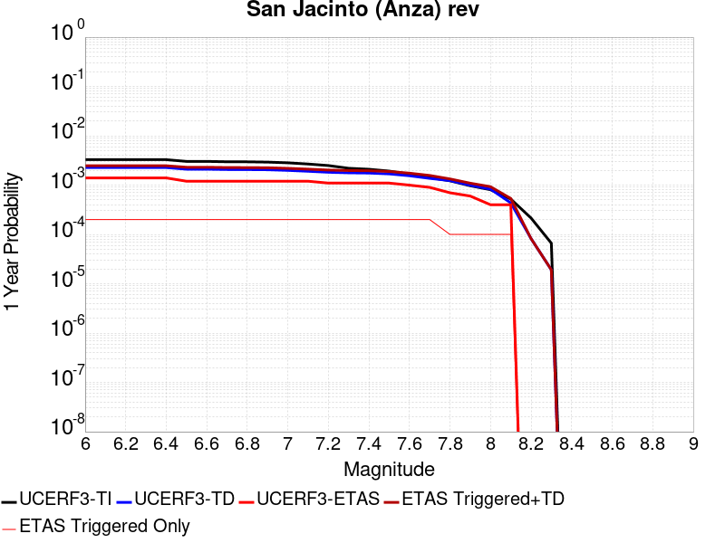 |  |

| Magnitude | 1 wk TI Prob | 1 wk TD Prob | 1 wk ETAS Prob | 1 wk ETAS/TD Gain | 1 wk ETAS Triggered+TD | 1 wk ETAS Triggered Only | 1 mo TI Prob | 1 mo TD Prob | 1 mo ETAS Prob | 1 mo ETAS/TD Gain | 1 mo ETAS Triggered+TD | 1 mo ETAS Triggered Only | 1 yr TI Prob | 1 yr TD Prob | 1 yr ETAS Prob | 1 yr ETAS/TD Gain | 1 yr ETAS Triggered+TD | 1 yr ETAS Triggered Only | 10 yr TI Prob | 10 yr TD Prob | 10 yr ETAS Prob | 10 yr ETAS/TD Gain | 10 yr ETAS Triggered+TD | 10 yr ETAS Triggered Only |
|-----|-----|-----|-----|-----|-----|-----|-----|-----|-----|-----|-----|-----|-----|-----|-----|-----|-----|-----|-----|-----|-----|-----|-----|-----|
| 6.0 | 6.3015636E-5 | 4.3467673E-5 | 0.0 | 0.0 | 4.3467673E-5 | 0.0 | 2.7003905E-4 | 1.862768E-4 | 0.0 | 0.0 | 1.862768E-4 | 0.0 | 0.0032827691 | 0.002265573 | 2.0E-4 | 0.08827789 | 0.0024651198 | 2.0E-4 | 0.032346968 | 0.023385275 | 0.0014 | 0.059866734 | 0.024752535 | 0.0014 |
| 6.1 | 6.3015636E-5 | 4.3467673E-5 | 0.0 | 0.0 | 4.3467673E-5 | 0.0 | 2.7003905E-4 | 1.862768E-4 | 0.0 | 0.0 | 1.862768E-4 | 0.0 | 0.0032827691 | 0.002265573 | 2.0E-4 | 0.08827789 | 0.0024651198 | 2.0E-4 | 0.032346968 | 0.023385275 | 0.0014 | 0.059866734 | 0.024752535 | 0.0014 |
| 6.2 | 6.3015636E-5 | 4.3467673E-5 | 0.0 | 0.0 | 4.3467673E-5 | 0.0 | 2.7003905E-4 | 1.862768E-4 | 0.0 | 0.0 | 1.862768E-4 | 0.0 | 0.0032827691 | 0.002265573 | 2.0E-4 | 0.08827789 | 0.0024651198 | 2.0E-4 | 0.032346968 | 0.023385275 | 0.0014 | 0.059866734 | 0.024752535 | 0.0014 |
| 6.3 | 6.3015636E-5 | 4.3467673E-5 | 0.0 | 0.0 | 4.3467673E-5 | 0.0 | 2.7003905E-4 | 1.862768E-4 | 0.0 | 0.0 | 1.862768E-4 | 0.0 | 0.0032827691 | 0.002265573 | 2.0E-4 | 0.08827789 | 0.0024651198 | 2.0E-4 | 0.032346968 | 0.023385275 | 0.0014 | 0.059866734 | 0.024752535 | 0.0014 |
| 6.4 | 6.3015636E-5 | 4.3467673E-5 | 0.0 | 0.0 | 4.3467673E-5 | 0.0 | 2.7003905E-4 | 1.862768E-4 | 0.0 | 0.0 | 1.862768E-4 | 0.0 | 0.0032827691 | 0.002265573 | 2.0E-4 | 0.08827789 | 0.0024651198 | 2.0E-4 | 0.032346968 | 0.023385275 | 0.0014 | 0.059866734 | 0.024752535 | 0.0014 |
| 6.5 | 5.811017E-5 | 4.0244293E-5 | 0.0 | 0.0 | 4.0244293E-5 | 0.0 | 2.4901982E-4 | 1.7246416E-4 | 0.0 | 0.0 | 1.7246416E-4 | 0.0 | 0.0030276014 | 0.0020977347 | 2.0E-4 | 0.09534094 | 0.0022973153 | 2.0E-4 | 0.02986684 | 0.021680059 | 0.0013 | 0.05996294 | 0.022951875 | 0.0013 |
| 6.6 | 5.811017E-5 | 4.0244293E-5 | 0.0 | 0.0 | 4.0244293E-5 | 0.0 | 2.4901982E-4 | 1.7246416E-4 | 0.0 | 0.0 | 1.7246416E-4 | 0.0 | 0.0030276014 | 0.0020977347 | 2.0E-4 | 0.09534094 | 0.0022973153 | 2.0E-4 | 0.02986684 | 0.021680059 | 0.0013 | 0.05996294 | 0.022951875 | 0.0013 |
| 6.7 | 5.712442E-5 | 3.9666622E-5 | 0.0 | 0.0 | 3.9666622E-5 | 0.0 | 2.4479596E-4 | 1.6998877E-4 | 0.0 | 0.0 | 1.6998877E-4 | 0.0 | 0.0029763177 | 0.0020676542 | 2.0E-4 | 0.096727975 | 0.0022672408 | 2.0E-4 | 0.029367693 | 0.02136956 | 0.0013 | 0.060834195 | 0.02264178 | 0.0013 |
| 6.8 | 5.6967532E-5 | 3.9522463E-5 | 0.0 | 0.0 | 3.9522463E-5 | 0.0 | 2.4412372E-4 | 1.6937102E-4 | 0.0 | 0.0 | 1.6937102E-4 | 0.0 | 0.0029681553 | 0.0020601475 | 2.0E-4 | 0.09708043 | 0.0022597355 | 2.0E-4 | 0.029288229 | 0.021293497 | 0.0013 | 0.061051507 | 0.022565816 | 0.0013 |
| 6.9 | 5.6211324E-5 | 3.9226798E-5 | 0.0 | 0.0 | 3.9226798E-5 | 0.0 | 2.4088343E-4 | 1.6810404E-4 | 0.0 | 0.0 | 1.6810404E-4 | 0.0 | 0.0029288116 | 0.002044751 | 2.0E-4 | 0.097811416 | 0.0022443421 | 2.0E-4 | 0.028905109 | 0.021132657 | 0.0013 | 0.061516166 | 0.022405185 | 0.0013 |
| 7.0 | 5.4383527E-5 | 3.808249E-5 | 0.0 | 0.0 | 3.808249E-5 | 0.0 | 2.3305144E-4 | 1.6320049E-4 | 0.0 | 0.0 | 1.6320049E-4 | 0.0 | 0.0028337094 | 0.00198516 | 2.0E-4 | 0.10074755 | 0.0021847629 | 2.0E-4 | 0.027978465 | 0.020528644 | 0.0013 | 0.06332615 | 0.021801956 | 0.0013 |
| 7.1 | 5.1393665E-5 | 3.6538015E-5 | 0.0 | 0.0 | 3.6538015E-5 | 0.0 | 2.2023996E-4 | 1.5658211E-4 | 0.0 | 0.0 | 1.5658211E-4 | 0.0 | 0.0026781242 | 0.0019047245 | 2.0E-4 | 0.10500206 | 0.0021043436 | 2.0E-4 | 0.026460782 | 0.019693589 | 0.0012 | 0.060933534 | 0.020869957 | 0.0012 |
| 7.2 | 4.785222E-5 | 3.488217E-5 | 0.0 | 0.0 | 3.488217E-5 | 0.0 | 2.0506482E-4 | 1.4948647E-4 | 0.0 | 0.0 | 1.4948647E-4 | 0.0 | 0.0024938055 | 0.0018184821 | 2.0E-4 | 0.109981835 | 0.0020181183 | 2.0E-4 | 0.024660049 | 0.018802855 | 0.0011 | 0.058501758 | 0.01988217 | 0.0011 |
| 7.3 | 4.2143256E-5 | 3.3972254E-5 | 0.0 | 0.0 | 3.3972254E-5 | 0.0 | 1.8060145E-4 | 1.4558726E-4 | 0.0 | 0.0 | 1.4558726E-4 | 0.0 | 0.002196605 | 0.0017710873 | 2.0E-4 | 0.112924986 | 0.001970733 | 2.0E-4 | 0.02175019 | 0.018307805 | 0.0011 | 0.060083665 | 0.019387666 | 0.0011 |
| 7.4 | 4.0264713E-5 | 3.3609183E-5 | 0.0 | 0.0 | 3.3609183E-5 | 0.0 | 1.7255165E-4 | 1.4403144E-4 | 0.0 | 0.0 | 1.4403144E-4 | 0.0 | 0.002098792 | 0.0017521756 | 2.0E-4 | 0.11414381 | 0.0019518252 | 2.0E-4 | 0.020790804 | 0.018111574 | 0.0011 | 0.060734645 | 0.01919165 | 0.0011 |
| 7.5 | 3.694492E-5 | 3.231942E-5 | 0.0 | 0.0 | 3.231942E-5 | 0.0 | 1.5832575E-4 | 1.3850446E-4 | 0.0 | 0.0 | 1.3850446E-4 | 0.0 | 0.0019259118 | 0.0016849907 | 2.0E-4 | 0.11869502 | 0.0018846537 | 2.0E-4 | 0.01909306 | 0.017426096 | 0.0011 | 0.063123725 | 0.018506927 | 0.0011 |
| 7.6 | 3.200565E-5 | 2.96235E-5 | 0.0 | 0.0 | 2.96235E-5 | 0.0 | 1.3715986E-4 | 1.2695168E-4 | 0.0 | 0.0 | 1.2695168E-4 | 0.0 | 0.001668642 | 0.0015445432 | 2.0E-4 | 0.12948813 | 0.0017442342 | 2.0E-4 | 0.01656168 | 0.016008196 | 0.0011 | 0.0687148 | 0.017090587 | 0.0011 |
| 7.7 | 2.731642E-5 | 2.6208778E-5 | 0.0 | 0.0 | 2.6208778E-5 | 0.0 | 1.1706512E-4 | 1.1231851E-4 | 0.0 | 0.0 | 1.1231851E-4 | 0.0 | 0.001424336 | 0.001366621 | 2.0E-4 | 0.14634636 | 0.0015663477 | 2.0E-4 | 0.014152412 | 0.014227226 | 8.0E-4 | 0.056230213 | 0.015015845 | 8.0E-4 |
| 7.8 | 2.3466424E-5 | 2.3615627E-5 | 0.0 | 0.0 | 2.3615627E-5 | 0.0 | 1.0056651E-4 | 1.0120591E-4 | 0.0 | 0.0 | 1.0120591E-4 | 0.0 | 0.0012237094 | 0.0012314862 | 1.0E-4 | 0.08120269 | 0.0013313631 | 1.0E-4 | 0.012169928 | 0.012866298 | 6.0E-4 | 0.04663346 | 0.013458578 | 6.0E-4 |
| 7.9 | 1.8611925E-5 | 1.9004528E-5 | 0.0 | 0.0 | 1.9004528E-5 | 0.0 | 7.9762955E-5 | 8.144545E-5 | 0.0 | 0.0 | 8.144545E-5 | 0.0 | 9.7068126E-4 | 9.91148E-4 | 1.0E-4 | 0.10089312 | 0.0010910488 | 1.0E-4 | 0.0096645225 | 0.010443882 | 5.0E-4 | 0.047874916 | 0.01093866 | 5.0E-4 |
| 8.0 | 1.5460775E-5 | 1.5821648E-5 | 0.0 | 0.0 | 1.5821648E-5 | 0.0 | 6.6258784E-5 | 6.7805304E-5 | 0.0 | 0.0 | 6.7805304E-5 | 0.0 | 8.0640207E-4 | 8.252176E-4 | 1.0E-4 | 0.12118016 | 9.251351E-4 | 1.0E-4 | 0.008034821 | 0.008744785 | 4.0E-4 | 0.04574155 | 0.009141287 | 4.0E-4 |
| 8.1 | 9.983884E-6 | 8.306781E-6 | 0.0 | 0.0 | 8.306781E-6 | 0.0 | 4.2787375E-5 | 3.560001E-5 | 0.0 | 0.0 | 3.560001E-5 | 0.0 | 5.2081177E-4 | 4.3334442E-4 | 1.0E-4 | 0.23076333 | 5.333011E-4 | 1.0E-4 | 0.0051959283 | 0.0046595796 | 4.0E-4 | 0.08584465 | 0.005057716 | 4.0E-4 |
| 8.2 | 4.1226E-6 | 1.5576493E-6 | 0.0 | 0.0 | 1.5576493E-6 | 0.0 | 1.7668166E-5 | 6.675623E-6 | 0.0 | 0.0 | 6.675623E-6 | 0.0 | 2.1508869E-4 | 8.12727E-5 | 0.0 | 0.0 | 8.12727E-5 | 0.0 | 0.0021488064 | 9.4317505E-4 | 1.0E-4 | 0.106024854 | 0.0010430807 | 1.0E-4 |
| 8.3 | 1.2750878E-6 | 3.623392E-7 | 0.0 | 0.0 | 3.623392E-7 | 0.0 | 5.4646503E-6 | 1.5528813E-6 | 0.0 | 0.0 | 1.5528813E-6 | 0.0 | 6.653009E-5 | 1.890617E-5 | 0.0 | 0.0 | 1.890617E-5 | 0.0 | 6.6510175E-4 | 2.2801879E-4 | 0.0 | 0.0 | 2.2801879E-4 | 0.0 |

## Mission Hills 2011
*[(top)](#table-of-contents)*

| 1 Week | 1 Month | 1 Year | 10 Year |
|-----|-----|-----|-----|
|  |  | 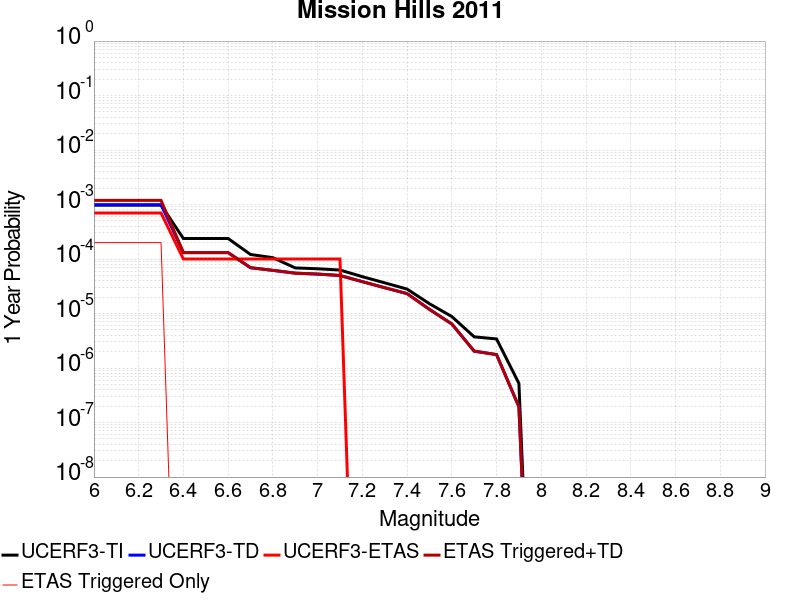 |  |

| Magnitude | 1 wk TI Prob | 1 wk TD Prob | 1 wk ETAS Prob | 1 wk ETAS/TD Gain | 1 wk ETAS Triggered+TD | 1 wk ETAS Triggered Only | 1 mo TI Prob | 1 mo TD Prob | 1 mo ETAS Prob | 1 mo ETAS/TD Gain | 1 mo ETAS Triggered+TD | 1 mo ETAS Triggered Only | 1 yr TI Prob | 1 yr TD Prob | 1 yr ETAS Prob | 1 yr ETAS/TD Gain | 1 yr ETAS Triggered+TD | 1 yr ETAS Triggered Only | 10 yr TI Prob | 10 yr TD Prob | 10 yr ETAS Prob | 10 yr ETAS/TD Gain | 10 yr ETAS Triggered+TD | 10 yr ETAS Triggered Only |
|-----|-----|-----|-----|-----|-----|-----|-----|-----|-----|-----|-----|-----|-----|-----|-----|-----|-----|-----|-----|-----|-----|-----|-----|-----|
| 6.0 | 1.8765717E-5 | 1.9060852E-5 | 0.0 | 0.0 | 1.9060852E-5 | 0.0 | 8.0422025E-5 | 8.168874E-5 | 0.0 | 0.0 | 8.168874E-5 | 0.0 | 9.786983E-4 | 9.944501E-4 | 2.0E-4 | 0.20111617 | 0.0011942512 | 2.0E-4 | 0.009743992 | 0.009933688 | 0.0014 | 0.14093457 | 0.011319781 | 0.0014 |
| 6.1 | 1.8765717E-5 | 1.9060852E-5 | 0.0 | 0.0 | 1.9060852E-5 | 0.0 | 8.0422025E-5 | 8.168874E-5 | 0.0 | 0.0 | 8.168874E-5 | 0.0 | 9.786983E-4 | 9.944501E-4 | 2.0E-4 | 0.20111617 | 0.0011942512 | 2.0E-4 | 0.009743992 | 0.009933688 | 0.0014 | 0.14093457 | 0.011319781 | 0.0014 |
| 6.2 | 1.8765717E-5 | 1.9060852E-5 | 0.0 | 0.0 | 1.9060852E-5 | 0.0 | 8.0422025E-5 | 8.168874E-5 | 0.0 | 0.0 | 8.168874E-5 | 0.0 | 9.786983E-4 | 9.944501E-4 | 2.0E-4 | 0.20111617 | 0.0011942512 | 2.0E-4 | 0.009743992 | 0.009933688 | 0.0014 | 0.14093457 | 0.011319781 | 0.0014 |
| 6.3 | 1.8765717E-5 | 1.9060852E-5 | 0.0 | 0.0 | 1.9060852E-5 | 0.0 | 8.0422025E-5 | 8.168874E-5 | 0.0 | 0.0 | 8.168874E-5 | 0.0 | 9.786983E-4 | 9.944501E-4 | 2.0E-4 | 0.20111617 | 0.0011942512 | 2.0E-4 | 0.009743992 | 0.009933688 | 0.0014 | 0.14093457 | 0.011319781 | 0.0014 |
| 6.4 | 4.566357E-6 | 2.5154293E-6 | 0.0 | 0.0 | 2.5154293E-6 | 0.0 | 1.9569954E-5 | 1.0780377E-5 | 0.0 | 0.0 | 1.0780377E-5 | 0.0 | 2.3823815E-4 | 1.31245E-4 | 0.0 | 0.0 | 1.31245E-4 | 0.0 | 0.002379829 | 0.0013118533 | 3.0E-4 | 0.22868411 | 0.0016114597 | 3.0E-4 |
| 6.5 | 4.566357E-6 | 2.5154293E-6 | 0.0 | 0.0 | 2.5154293E-6 | 0.0 | 1.9569954E-5 | 1.0780377E-5 | 0.0 | 0.0 | 1.0780377E-5 | 0.0 | 2.3823815E-4 | 1.31245E-4 | 0.0 | 0.0 | 1.31245E-4 | 0.0 | 0.002379829 | 0.0013118533 | 3.0E-4 | 0.22868411 | 0.0016114597 | 3.0E-4 |
| 6.6 | 4.566357E-6 | 2.5154293E-6 | 0.0 | 0.0 | 2.5154293E-6 | 0.0 | 1.9569954E-5 | 1.0780377E-5 | 0.0 | 0.0 | 1.0780377E-5 | 0.0 | 2.3823815E-4 | 1.31245E-4 | 0.0 | 0.0 | 1.31245E-4 | 0.0 | 0.002379829 | 0.0013118533 | 3.0E-4 | 0.22868411 | 0.0016114597 | 3.0E-4 |
| 6.7 | 2.3266773E-6 | 1.3298364E-6 | 0.0 | 0.0 | 1.3298364E-6 | 0.0 | 9.971435E-6 | 5.6992867E-6 | 0.0 | 0.0 | 5.6992867E-6 | 0.0 | 1.2139547E-4 | 6.938667E-5 | 0.0 | 0.0 | 6.938667E-5 | 0.0 | 0.0012132917 | 6.936561E-4 | 2.0E-4 | 0.2883273 | 8.935174E-4 | 2.0E-4 |
| 6.8 | 2.032735E-6 | 1.1896078E-6 | 0.0 | 0.0 | 1.1896078E-6 | 0.0 | 8.711692E-6 | 5.0983094E-6 | 0.0 | 0.0 | 5.0983094E-6 | 0.0 | 1.06059684E-4 | 6.20702E-5 | 0.0 | 0.0 | 6.20702E-5 | 0.0 | 0.0010600908 | 6.205335E-4 | 2.0E-4 | 0.3223033 | 8.204094E-4 | 2.0E-4 |
| 6.9 | 1.3186259E-6 | 1.0563386E-6 | 0.0 | 0.0 | 1.0563386E-6 | 0.0 | 5.6512413E-6 | 4.527158E-6 | 0.0 | 0.0 | 4.527158E-6 | 0.0 | 6.8801695E-5 | 5.5116787E-5 | 0.0 | 0.0 | 5.5116787E-5 | 0.0 | 6.8780396E-4 | 5.510341E-4 | 2.0E-4 | 0.36295393 | 7.5092394E-4 | 2.0E-4 |
| 7.0 | 1.2726016E-6 | 1.0160641E-6 | 0.0 | 0.0 | 1.0160641E-6 | 0.0 | 5.4539955E-6 | 4.3545533E-6 | 0.0 | 0.0 | 4.3545533E-6 | 0.0 | 6.6400375E-5 | 5.3015425E-5 | 0.0 | 0.0 | 5.3015425E-5 | 0.0 | 6.6380535E-4 | 5.3003064E-4 | 2.0E-4 | 0.37733668 | 7.299246E-4 | 2.0E-4 |
| 7.1 | 1.2063913E-6 | 9.571562E-7 | 0.0 | 0.0 | 9.571562E-7 | 0.0 | 5.170238E-6 | 4.1020917E-6 | 0.0 | 0.0 | 4.1020917E-6 | 0.0 | 6.294583E-5 | 4.9941846E-5 | 0.0 | 0.0 | 4.9941846E-5 | 0.0 | 6.2928005E-4 | 4.9930875E-4 | 2.0E-4 | 0.40055373 | 6.9920893E-4 | 2.0E-4 |
| 7.2 | 9.105806E-7 | 7.377826E-7 | 0.0 | 0.0 | 7.377826E-7 | 0.0 | 3.9024826E-6 | 3.1619218E-6 | 0.0 | 0.0 | 3.1619218E-6 | 0.0 | 4.7511687E-5 | 3.8495735E-5 | 0.0 | 0.0 | 3.8495735E-5 | 0.0 | 4.7501532E-4 | 3.848922E-4 | 1.0E-4 | 0.259813 | 4.8485372E-4 | 1.0E-4 |
| 7.3 | 7.020432E-7 | 5.7112135E-7 | 0.0 | 0.0 | 5.7112135E-7 | 0.0 | 3.0087533E-6 | 2.4476608E-6 | 0.0 | 0.0 | 2.4476608E-6 | 0.0 | 3.6630954E-5 | 2.9799876E-5 | 0.0 | 0.0 | 2.9799876E-5 | 0.0 | 3.6624918E-4 | 2.9796013E-4 | 0.0 | 0.0 | 2.9796013E-4 | 0.0 |
| 7.4 | 5.3900635E-7 | 4.4491102E-7 | 0.0 | 0.0 | 4.4491102E-7 | 0.0 | 2.3100251E-6 | 1.9067602E-6 | 0.0 | 0.0 | 1.9067602E-6 | 0.0 | 2.8124194E-5 | 2.321457E-5 | 0.0 | 0.0 | 2.321457E-5 | 0.0 | 2.8120633E-4 | 2.3212266E-4 | 0.0 | 0.0 | 2.3212266E-4 | 0.0 |
| 7.5 | 2.907075E-7 | 2.2880361E-7 | 0.0 | 0.0 | 2.2880361E-7 | 0.0 | 1.2458887E-6 | 9.805866E-7 | 0.0 | 0.0 | 9.805866E-7 | 0.0 | 1.5168589E-5 | 1.1938578E-5 | 0.0 | 0.0 | 1.1938578E-5 | 0.0 | 1.5167553E-4 | 1.1937954E-4 | 0.0 | 0.0 | 1.1937954E-4 | 0.0 |
| 7.6 | 1.6903675E-7 | 1.2356674E-7 | 0.0 | 0.0 | 1.2356674E-7 | 0.0 | 7.2444305E-7 | 5.295716E-7 | 0.0 | 0.0 | 5.295716E-7 | 0.0 | 8.820059E-6 | 6.4475166E-6 | 0.0 | 0.0 | 6.4475166E-6 | 0.0 | 8.8197085E-5 | 6.447342E-5 | 0.0 | 0.0 | 6.447342E-5 | 0.0 |
| 7.7 | 7.168073E-8 | 3.9152237E-8 | 0.0 | 0.0 | 3.9152237E-8 | 0.0 | 3.072031E-7 | 1.6779529E-7 | 0.0 | 0.0 | 1.6779529E-7 | 0.0 | 3.7401915E-6 | 2.0429059E-6 | 0.0 | 0.0 | 2.0429059E-6 | 0.0 | 3.7401285E-5 | 2.0428883E-5 | 0.0 | 0.0 | 2.0428883E-5 | 0.0 |
| 7.8 | 6.564101E-8 | 3.385203E-8 | 0.0 | 0.0 | 3.385203E-8 | 0.0 | 2.813186E-7 | 1.4508011E-7 | 0.0 | 0.0 | 1.4508011E-7 | 0.0 | 3.4250486E-6 | 1.7663491E-6 | 0.0 | 0.0 | 1.7663491E-6 | 0.0 | 3.424996E-5 | 1.766336E-5 | 0.0 | 0.0 | 1.766336E-5 | 0.0 |
| 7.9 | 1.0029074E-8 | 3.7321795E-9 | 0.0 | 0.0 | 3.7321795E-9 | 0.0 | 4.2981743E-8 | 1.5995054E-8 | 0.0 | 0.0 | 1.5995054E-8 | 0.0 | 5.2330256E-7 | 1.9473978E-7 | 0.0 | 0.0 | 1.9473978E-7 | 0.0 | 5.2330133E-6 | 1.9473973E-6 | 0.0 | 0.0 | 1.9473973E-6 | 0.0 |

## Eaton Roughs 2011 CFM
*[(top)](#table-of-contents)*

| 1 Week | 1 Month | 1 Year | 10 Year |
|-----|-----|-----|-----|
|  | 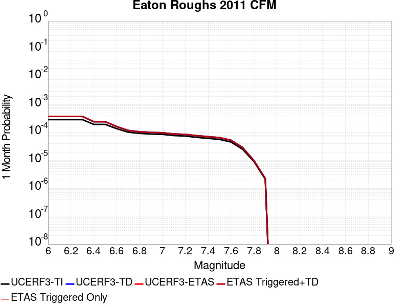 | 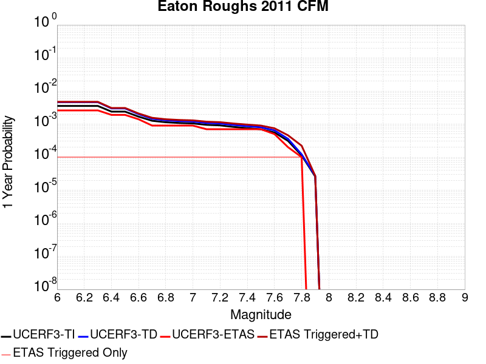 |  |

| Magnitude | 1 wk TI Prob | 1 wk TD Prob | 1 wk ETAS Prob | 1 wk ETAS/TD Gain | 1 wk ETAS Triggered+TD | 1 wk ETAS Triggered Only | 1 mo TI Prob | 1 mo TD Prob | 1 mo ETAS Prob | 1 mo ETAS/TD Gain | 1 mo ETAS Triggered+TD | 1 mo ETAS Triggered Only | 1 yr TI Prob | 1 yr TD Prob | 1 yr ETAS Prob | 1 yr ETAS/TD Gain | 1 yr ETAS Triggered+TD | 1 yr ETAS Triggered Only | 10 yr TI Prob | 10 yr TD Prob | 10 yr ETAS Prob | 10 yr ETAS/TD Gain | 10 yr ETAS Triggered+TD | 10 yr ETAS Triggered Only |
|-----|-----|-----|-----|-----|-----|-----|-----|-----|-----|-----|-----|-----|-----|-----|-----|-----|-----|-----|-----|-----|-----|-----|-----|-----|
| 6.0 | 6.8044945E-5 | 8.848742E-5 | 0.0 | 0.0 | 8.848742E-5 | 0.0 | 2.9158857E-4 | 3.7917588E-4 | 0.0 | 0.0 | 3.7917588E-4 | 0.0 | 0.0035443127 | 0.0046073813 | 1.0E-4 | 0.021704303 | 0.0047069206 | 1.0E-4 | 0.03488314 | 0.045189325 | 0.001 | 0.02212912 | 0.046144135 | 0.001 |
| 6.1 | 6.8044945E-5 | 8.848742E-5 | 0.0 | 0.0 | 8.848742E-5 | 0.0 | 2.9158857E-4 | 3.7917588E-4 | 0.0 | 0.0 | 3.7917588E-4 | 0.0 | 0.0035443127 | 0.0046073813 | 1.0E-4 | 0.021704303 | 0.0047069206 | 1.0E-4 | 0.03488314 | 0.045189325 | 0.001 | 0.02212912 | 0.046144135 | 0.001 |
| 6.2 | 6.8044945E-5 | 8.848742E-5 | 0.0 | 0.0 | 8.848742E-5 | 0.0 | 2.9158857E-4 | 3.7917588E-4 | 0.0 | 0.0 | 3.7917588E-4 | 0.0 | 0.0035443127 | 0.0046073813 | 1.0E-4 | 0.021704303 | 0.0047069206 | 1.0E-4 | 0.03488314 | 0.045189325 | 0.001 | 0.02212912 | 0.046144135 | 0.001 |
| 6.3 | 6.8044945E-5 | 8.848742E-5 | 0.0 | 0.0 | 8.848742E-5 | 0.0 | 2.9158857E-4 | 3.7917588E-4 | 0.0 | 0.0 | 3.7917588E-4 | 0.0 | 0.0035443127 | 0.0046073813 | 1.0E-4 | 0.021704303 | 0.0047069206 | 1.0E-4 | 0.03488314 | 0.045189325 | 0.001 | 0.02212912 | 0.046144135 | 0.001 |
| 6.4 | 4.5830013E-5 | 5.718445E-5 | 0.0 | 0.0 | 5.718445E-5 | 0.0 | 1.9639956E-4 | 2.4505623E-4 | 0.0 | 0.0 | 2.4505623E-4 | 0.0 | 0.0023885423 | 0.0029798436 | 1.0E-4 | 0.03355881 | 0.0030795457 | 1.0E-4 | 0.023630321 | 0.029436499 | 8.0E-4 | 0.027177146 | 0.03021295 | 8.0E-4 |
| 6.5 | 4.5830013E-5 | 5.718445E-5 | 0.0 | 0.0 | 5.718445E-5 | 0.0 | 1.9639956E-4 | 2.4505623E-4 | 0.0 | 0.0 | 2.4505623E-4 | 0.0 | 0.0023885423 | 0.0029798436 | 1.0E-4 | 0.03355881 | 0.0030795457 | 1.0E-4 | 0.023630321 | 0.029436499 | 8.0E-4 | 0.027177146 | 0.03021295 | 8.0E-4 |
| 6.6 | 3.222194E-5 | 3.8278125E-5 | 0.0 | 0.0 | 3.8278125E-5 | 0.0 | 1.3808672E-4 | 1.6403943E-4 | 0.0 | 0.0 | 1.6403943E-4 | 0.0 | 0.0016799092 | 0.0019954378 | 1.0E-4 | 0.050114315 | 0.0020952383 | 1.0E-4 | 0.016672665 | 0.01978453 | 5.0E-4 | 0.02527227 | 0.020274637 | 5.0E-4 |
| 6.7 | 2.4155654E-5 | 2.7795184E-5 | 0.0 | 0.0 | 2.7795184E-5 | 0.0 | 1.0352012E-4 | 1.1911683E-4 | 0.0 | 0.0 | 1.1911683E-4 | 0.0 | 0.0012596287 | 0.0014492908 | 1.0E-4 | 0.06899927 | 0.0015491459 | 1.0E-4 | 0.012525126 | 0.014399617 | 3.0E-4 | 0.020833887 | 0.014695297 | 3.0E-4 |
| 6.8 | 2.1814667E-5 | 2.494854E-5 | 0.0 | 0.0 | 2.494854E-5 | 0.0 | 9.348808E-5 | 1.06917956E-4 | 0.0 | 0.0 | 1.06917956E-4 | 0.0 | 0.001137623 | 0.0013009525 | 1.0E-4 | 0.07686675 | 0.0014008224 | 1.0E-4 | 0.011318169 | 0.012934064 | 3.0E-4 | 0.023194568 | 0.013230183 | 3.0E-4 |
| 6.9 | 2.0700467E-5 | 2.3636123E-5 | 0.0 | 0.0 | 2.3636123E-5 | 0.0 | 8.871327E-5 | 1.0129375E-4 | 0.0 | 0.0 | 1.0129375E-4 | 0.0 | 0.0010795488 | 0.0012325569 | 1.0E-4 | 0.08113216 | 0.0013324337 | 1.0E-4 | 0.010743194 | 0.012257813 | 3.0E-4 | 0.024474187 | 0.012554135 | 3.0E-4 |
| 7.0 | 2.0104066E-5 | 2.2943455E-5 | 0.0 | 0.0 | 2.2943455E-5 | 0.0 | 8.615744E-5 | 9.832541E-5 | 0.0 | 0.0 | 9.832541E-5 | 0.0 | 0.0010484619 | 0.0011964574 | 1.0E-4 | 0.08358007 | 0.0012963378 | 1.0E-4 | 0.010435291 | 0.011900731 | 3.0E-4 | 0.025208535 | 0.012197161 | 3.0E-4 |
| 7.1 | 1.8225232E-5 | 2.0779322E-5 | 0.0 | 0.0 | 2.0779322E-5 | 0.0 | 7.81058E-5 | 8.905121E-5 | 0.0 | 0.0 | 8.905121E-5 | 0.0 | 9.5052324E-4 | 0.0010836608 | 1.0E-4 | 0.09227981 | 0.0011835523 | 1.0E-4 | 0.009464677 | 0.010784137 | 3.0E-4 | 0.027818637 | 0.011080902 | 3.0E-4 |
| 7.2 | 1.7526572E-5 | 1.9999572E-5 | 0.0 | 0.0 | 1.9999572E-5 | 0.0 | 7.511172E-5 | 8.5709646E-5 | 0.0 | 0.0 | 8.5709646E-5 | 0.0 | 9.141015E-4 | 0.0010430169 | 1.0E-4 | 0.095875725 | 0.0011429125 | 1.0E-4 | 0.009103506 | 0.010381565 | 2.0E-4 | 0.019264918 | 0.010579489 | 2.0E-4 |
| 7.3 | 1.5727232E-5 | 1.802719E-5 | 0.0 | 0.0 | 1.802719E-5 | 0.0 | 6.740067E-5 | 7.725711E-5 | 0.0 | 0.0 | 7.725711E-5 | 0.0 | 8.2029426E-4 | 9.4020064E-4 | 1.0E-4 | 0.10636027 | 0.0010401066 | 1.0E-4 | 0.008172729 | 0.009362522 | 2.0E-4 | 0.021361766 | 0.009560649 | 2.0E-4 |
| 7.4 | 1.4457361E-5 | 1.660368E-5 | 0.0 | 0.0 | 1.660368E-5 | 0.0 | 6.195865E-5 | 7.115669E-5 | 0.0 | 0.0 | 7.115669E-5 | 0.0 | 7.540854E-4 | 8.659893E-4 | 1.0E-4 | 0.11547487 | 9.659027E-4 | 1.0E-4 | 0.007515317 | 0.00862638 | 2.0E-4 | 0.023184694 | 0.008824655 | 2.0E-4 |
| 7.5 | 1.33280955E-5 | 1.5350464E-5 | 0.0 | 0.0 | 1.5350464E-5 | 0.0 | 5.711916E-5 | 6.578605E-5 | 0.0 | 0.0 | 6.578605E-5 | 0.0 | 6.9520384E-4 | 8.006517E-4 | 1.0E-4 | 0.124898255 | 9.0057164E-4 | 1.0E-4 | 0.00693033 | 0.007977884 | 2.0E-4 | 0.025069302 | 0.008176289 | 2.0E-4 |
| 7.6 | 1.0699478E-5 | 1.2392059E-5 | 0.0 | 0.0 | 1.2392059E-5 | 0.0 | 4.5854096E-5 | 5.3107746E-5 | 0.0 | 0.0 | 5.3107746E-5 | 0.0 | 5.581306E-4 | 6.4639555E-4 | 1.0E-4 | 0.15470403 | 7.463309E-4 | 1.0E-4 | 0.005567309 | 0.0064453078 | 2.0E-4 | 0.031030325 | 0.006644019 | 2.0E-4 |
| 7.7 | 5.9390236E-6 | 6.8553813E-6 | 0.0 | 0.0 | 6.8553813E-6 | 0.0 | 2.545271E-5 | 2.9379877E-5 | 0.0 | 0.0 | 2.9379877E-5 | 0.0 | 3.0984267E-4 | 3.5764152E-4 | 1.0E-4 | 0.2796096 | 4.5760575E-4 | 1.0E-4 | 0.0030941102 | 0.003570697 | 2.0E-4 | 0.056011472 | 0.0037699828 | 2.0E-4 |
| 7.8 | 2.1622036E-6 | 2.3305765E-6 | 0.0 | 0.0 | 2.3305765E-6 | 0.0 | 9.266554E-6 | 9.988147E-6 | 0.0 | 0.0 | 9.988147E-6 | 0.0 | 1.1281446E-4 | 1.2159898E-4 | 1.0E-4 | 0.8223753 | 2.2158683E-4 | 1.0E-4 | 0.001127572 | 0.0012153247 | 1.0E-4 | 0.082282536 | 0.0013152031 | 1.0E-4 |
| 7.9 | 4.9586197E-7 | 5.2194855E-7 | 0.0 | 0.0 | 5.2194855E-7 | 0.0 | 2.125121E-6 | 2.2369206E-6 | 0.0 | 0.0 | 2.2369206E-6 | 0.0 | 2.5873042E-5 | 2.723419E-5 | 0.0 | 0.0 | 2.723419E-5 | 0.0 | 2.5870028E-4 | 2.723106E-4 | 0.0 | 0.0 | 2.723106E-4 | 0.0 |

## Death Valley (Fish Lake Valley)
*[(top)](#table-of-contents)*

| 1 Week | 1 Month | 1 Year | 10 Year |
|-----|-----|-----|-----|
|  |  |  | 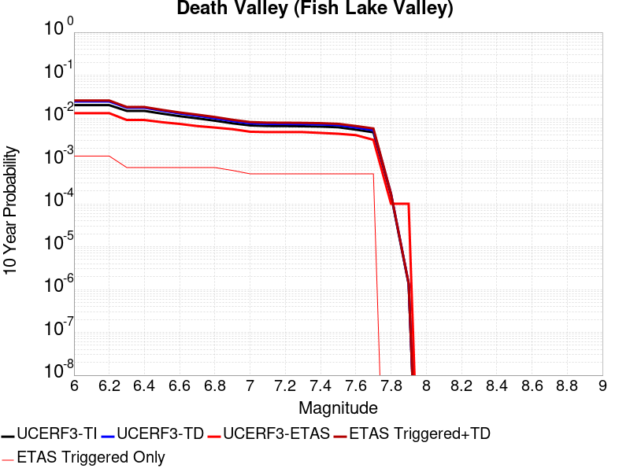 |

| Magnitude | 1 wk TI Prob | 1 wk TD Prob | 1 wk ETAS Prob | 1 wk ETAS/TD Gain | 1 wk ETAS Triggered+TD | 1 wk ETAS Triggered Only | 1 mo TI Prob | 1 mo TD Prob | 1 mo ETAS Prob | 1 mo ETAS/TD Gain | 1 mo ETAS Triggered+TD | 1 mo ETAS Triggered Only | 1 yr TI Prob | 1 yr TD Prob | 1 yr ETAS Prob | 1 yr ETAS/TD Gain | 1 yr ETAS Triggered+TD | 1 yr ETAS Triggered Only | 10 yr TI Prob | 10 yr TD Prob | 10 yr ETAS Prob | 10 yr ETAS/TD Gain | 10 yr ETAS Triggered+TD | 10 yr ETAS Triggered Only |
|-----|-----|-----|-----|-----|-----|-----|-----|-----|-----|-----|-----|-----|-----|-----|-----|-----|-----|-----|-----|-----|-----|-----|-----|-----|
| 6.0 | 3.872328E-5 | 4.7287267E-5 | 0.0 | 0.0 | 4.7287267E-5 | 0.0 | 1.6594635E-4 | 2.0264558E-4 | 0.0 | 0.0 | 2.0264558E-4 | 0.0 | 0.0020185246 | 0.0024646816 | 0.0 | 0.0 | 0.0024646816 | 0.0 | 0.02000288 | 0.024399271 | 0.0013 | 0.053280283 | 0.025667552 | 0.0013 |
| 6.1 | 3.872328E-5 | 4.7287267E-5 | 0.0 | 0.0 | 4.7287267E-5 | 0.0 | 1.6594635E-4 | 2.0264558E-4 | 0.0 | 0.0 | 2.0264558E-4 | 0.0 | 0.0020185246 | 0.0024646816 | 0.0 | 0.0 | 0.0024646816 | 0.0 | 0.02000288 | 0.024399271 | 0.0013 | 0.053280283 | 0.025667552 | 0.0013 |
| 6.2 | 3.872328E-5 | 4.7287267E-5 | 0.0 | 0.0 | 4.7287267E-5 | 0.0 | 1.6594635E-4 | 2.0264558E-4 | 0.0 | 0.0 | 2.0264558E-4 | 0.0 | 0.0020185246 | 0.0024646816 | 0.0 | 0.0 | 0.0024646816 | 0.0 | 0.02000288 | 0.024399271 | 0.0013 | 0.053280283 | 0.025667552 | 0.0013 |
| 6.3 | 2.8356371E-5 | 3.362278E-5 | 0.0 | 0.0 | 3.362278E-5 | 0.0 | 1.2152165E-4 | 1.4409002E-4 | 0.0 | 0.0 | 1.4409002E-4 | 0.0 | 0.0014785219 | 0.0017529542 | 0.0 | 0.0 | 0.0017529542 | 0.0 | 0.014687235 | 0.017398456 | 7.0E-4 | 0.040233456 | 0.018086277 | 7.0E-4 |
| 6.4 | 2.8356371E-5 | 3.362278E-5 | 0.0 | 0.0 | 3.362278E-5 | 0.0 | 1.2152165E-4 | 1.4409002E-4 | 0.0 | 0.0 | 1.4409002E-4 | 0.0 | 0.0014785219 | 0.0017529542 | 0.0 | 0.0 | 0.0017529542 | 0.0 | 0.014687235 | 0.017398456 | 7.0E-4 | 0.040233456 | 0.018086277 | 7.0E-4 |
| 6.5 | 2.4448687E-5 | 2.8617755E-5 | 0.0 | 0.0 | 2.8617755E-5 | 0.0 | 1.0477588E-4 | 1.2264196E-4 | 0.0 | 0.0 | 1.2264196E-4 | 0.0 | 0.0012748998 | 0.0014921901 | 0.0 | 0.0 | 0.0014921901 | 0.0 | 0.012676105 | 0.014826603 | 7.0E-4 | 0.047212433 | 0.015516224 | 7.0E-4 |
| 6.6 | 2.1298161E-5 | 2.4668188E-5 | 0.0 | 0.0 | 2.4668188E-5 | 0.0 | 9.127464E-5 | 1.0571672E-4 | 0.0 | 0.0 | 1.0571672E-4 | 0.0 | 0.0011107022 | 0.0012863738 | 0.0 | 0.0 | 0.0012863738 | 0.0 | 0.011051672 | 0.012792707 | 7.0E-4 | 0.054718673 | 0.0134837525 | 7.0E-4 |
| 6.7 | 1.8959729E-5 | 2.178777E-5 | 0.0 | 0.0 | 2.178777E-5 | 0.0 | 8.125345E-5 | 9.337296E-5 | 0.0 | 0.0 | 9.337296E-5 | 0.0 | 9.888117E-4 | 0.0011362485 | 0.0 | 0.0 | 0.0011362485 | 0.0 | 0.009844234 | 0.011307051 | 7.0E-4 | 0.06190827 | 0.011999137 | 7.0E-4 |
| 6.8 | 1.6691629E-5 | 1.9023853E-5 | 0.0 | 0.0 | 1.9023853E-5 | 0.0 | 7.153359E-5 | 8.152835E-5 | 0.0 | 0.0 | 8.152835E-5 | 0.0 | 8.7057345E-4 | 9.921725E-4 | 0.0 | 0.0 | 9.921725E-4 | 0.0 | 0.008671708 | 0.009879188 | 7.0E-4 | 0.07085603 | 0.010572272 | 7.0E-4 |
| 6.9 | 1.450505E-5 | 1.6393946E-5 | 0.0 | 0.0 | 1.6393946E-5 | 0.0 | 6.216302E-5 | 7.025793E-5 | 0.0 | 0.0 | 7.025793E-5 | 0.0 | 7.5657194E-4 | 8.550634E-4 | 0.0 | 0.0 | 8.550634E-4 | 0.0 | 0.007540013 | 0.008518666 | 6.0E-4 | 0.070433564 | 0.009113555 | 6.0E-4 |
| 7.0 | 1.2940855E-5 | 1.4541677E-5 | 0.0 | 0.0 | 1.4541677E-5 | 0.0 | 5.545963E-5 | 6.232002E-5 | 0.0 | 0.0 | 6.232002E-5 | 0.0 | 6.750118E-4 | 7.584879E-4 | 0.0 | 0.0 | 7.584879E-4 | 0.0 | 0.006729651 | 0.007559609 | 5.0E-4 | 0.06614099 | 0.008055829 | 5.0E-4 |
| 7.1 | 1.2544658E-5 | 1.4081761E-5 | 0.0 | 0.0 | 1.4081761E-5 | 0.0 | 5.3761712E-5 | 6.034904E-5 | 0.0 | 0.0 | 6.034904E-5 | 0.0 | 6.5435225E-4 | 7.3450746E-4 | 0.0 | 0.0 | 7.3450746E-4 | 0.0 | 0.006524288 | 0.0073213917 | 5.0E-4 | 0.06829303 | 0.007817731 | 5.0E-4 |
| 7.2 | 1.2489416E-5 | 1.40192105E-5 | 0.0 | 0.0 | 1.40192105E-5 | 0.0 | 5.3524967E-5 | 6.008098E-5 | 0.0 | 0.0 | 6.008098E-5 | 0.0 | 6.514716E-4 | 7.31246E-4 | 0.0 | 0.0 | 7.31246E-4 | 0.0 | 0.006495651 | 0.007288992 | 5.0E-4 | 0.068596594 | 0.0077853473 | 5.0E-4 |
| 7.3 | 1.2368307E-5 | 1.3883315E-5 | 0.0 | 0.0 | 1.3883315E-5 | 0.0 | 5.3005948E-5 | 5.9498594E-5 | 0.0 | 0.0 | 5.9498594E-5 | 0.0 | 6.451563E-4 | 7.241602E-4 | 0.0 | 0.0 | 7.241602E-4 | 0.0 | 0.0064328653 | 0.007218596 | 5.0E-4 | 0.069265544 | 0.007714987 | 5.0E-4 |
| 7.4 | 1.2161707E-5 | 1.3651311E-5 | 0.0 | 0.0 | 1.3651311E-5 | 0.0 | 5.212056E-5 | 5.8504338E-5 | 0.0 | 0.0 | 5.8504338E-5 | 0.0 | 6.3438306E-4 | 7.120631E-4 | 0.0 | 0.0 | 7.120631E-4 | 0.0 | 0.006325751 | 0.0070984047 | 5.0E-4 | 0.07043836 | 0.0075948555 | 5.0E-4 |
| 7.5 | 1.1707948E-5 | 1.3148846E-5 | 0.0 | 0.0 | 1.3148846E-5 | 0.0 | 5.0175953E-5 | 5.635101E-5 | 0.0 | 0.0 | 5.635101E-5 | 0.0 | 6.10721E-4 | 6.8586314E-4 | 0.0 | 0.0 | 6.8586314E-4 | 0.0 | 0.0060904534 | 0.0068380474 | 5.0E-4 | 0.07312029 | 0.0073346286 | 5.0E-4 |
| 7.6 | 1.0319538E-5 | 1.1582539E-5 | 0.0 | 0.0 | 1.1582539E-5 | 0.0 | 4.4225842E-5 | 4.9638536E-5 | 0.0 | 0.0 | 4.9638536E-5 | 0.0 | 5.383166E-4 | 6.0418673E-4 | 0.0 | 0.0 | 6.0418673E-4 | 0.0 | 0.0053701443 | 0.0060259732 | 5.0E-4 | 0.08297415 | 0.00652296 | 5.0E-4 |
| 7.7 | 8.937764E-6 | 1.0025289E-5 | 0.0 | 0.0 | 1.0025289E-5 | 0.0 | 3.830414E-5 | 4.2964846E-5 | 0.0 | 0.0 | 4.2964846E-5 | 0.0 | 4.6625308E-4 | 5.2297645E-4 | 0.0 | 0.0 | 5.2297645E-4 | 0.0 | 0.0046527605 | 0.005217967 | 5.0E-4 | 0.09582275 | 0.005715358 | 5.0E-4 |
| 7.8 | 3.108007E-7 | 3.2850403E-7 | 0.0 | 0.0 | 3.2850403E-7 | 0.0 | 1.3320023E-6 | 1.4078737E-6 | 0.0 | 0.0 | 1.4078737E-6 | 0.0 | 1.6217007E-5 | 1.7140732E-5 | 0.0 | 0.0 | 1.7140732E-5 | 0.0 | 1.6215823E-4 | 1.7139447E-4 | 0.0 | 0.0 | 1.7139447E-4 | 0.0 |
| 7.9 | 2.5591178E-9 | 2.6699092E-9 | 0.0 | 0.0 | 2.6699092E-9 | 0.0 | 1.0967647E-8 | 1.1442468E-8 | 0.0 | 0.0 | 1.1442468E-8 | 0.0 | 1.335311E-7 | 1.3931205E-7 | 0.0 | 0.0 | 1.3931205E-7 | 0.0 | 1.3353102E-6 | 1.3931206E-6 | 0.0 | 0.0 | 1.3931206E-6 | 0.0 |

## Cleghorn Lake
*[(top)](#table-of-contents)*

| 1 Week | 1 Month | 1 Year | 10 Year |
|-----|-----|-----|-----|
|  |  |  |  |

| Magnitude | 1 wk TI Prob | 1 wk TD Prob | 1 wk ETAS Prob | 1 wk ETAS/TD Gain | 1 wk ETAS Triggered+TD | 1 wk ETAS Triggered Only | 1 mo TI Prob | 1 mo TD Prob | 1 mo ETAS Prob | 1 mo ETAS/TD Gain | 1 mo ETAS Triggered+TD | 1 mo ETAS Triggered Only | 1 yr TI Prob | 1 yr TD Prob | 1 yr ETAS Prob | 1 yr ETAS/TD Gain | 1 yr ETAS Triggered+TD | 1 yr ETAS Triggered Only | 10 yr TI Prob | 10 yr TD Prob | 10 yr ETAS Prob | 10 yr ETAS/TD Gain | 10 yr ETAS Triggered+TD | 10 yr ETAS Triggered Only |
|-----|-----|-----|-----|-----|-----|-----|-----|-----|-----|-----|-----|-----|-----|-----|-----|-----|-----|-----|-----|-----|-----|-----|-----|-----|
| 6.0 | 1.5467183E-5 | 1.6797181E-5 | 0.0 | 0.0 | 1.6797181E-5 | 0.0 | 6.6286244E-5 | 7.1986244E-5 | 0.0 | 0.0 | 7.1986244E-5 | 0.0 | 8.067362E-4 | 8.7613496E-4 | 2.0E-4 | 0.22827533 | 0.0010759598 | 2.0E-4 | 0.008038137 | 0.008732238 | 0.0012 | 0.13742182 | 0.009921759 | 0.0012 |
| 6.1 | 1.5467183E-5 | 1.6797181E-5 | 0.0 | 0.0 | 1.6797181E-5 | 0.0 | 6.6286244E-5 | 7.1986244E-5 | 0.0 | 0.0 | 7.1986244E-5 | 0.0 | 8.067362E-4 | 8.7613496E-4 | 2.0E-4 | 0.22827533 | 0.0010759598 | 2.0E-4 | 0.008038137 | 0.008732238 | 0.0012 | 0.13742182 | 0.009921759 | 0.0012 |
| 6.2 | 1.2624631E-5 | 1.3683913E-5 | 0.0 | 0.0 | 1.3683913E-5 | 0.0 | 5.410444E-5 | 5.8644295E-5 | 0.0 | 0.0 | 5.8644295E-5 | 0.0 | 6.585225E-4 | 7.138091E-4 | 2.0E-4 | 0.28018695 | 9.136663E-4 | 2.0E-4 | 0.0065657445 | 0.0071199606 | 9.0E-4 | 0.1264052 | 0.008013553 | 9.0E-4 |
| 6.3 | 1.2624631E-5 | 1.3683913E-5 | 0.0 | 0.0 | 1.3683913E-5 | 0.0 | 5.410444E-5 | 5.8644295E-5 | 0.0 | 0.0 | 5.8644295E-5 | 0.0 | 6.585225E-4 | 7.138091E-4 | 2.0E-4 | 0.28018695 | 9.136663E-4 | 2.0E-4 | 0.0065657445 | 0.0071199606 | 9.0E-4 | 0.1264052 | 0.008013553 | 9.0E-4 |
| 6.4 | 9.417684E-6 | 1.0171799E-5 | 0.0 | 0.0 | 1.0171799E-5 | 0.0 | 4.036088E-5 | 4.359293E-5 | 0.0 | 0.0 | 4.359293E-5 | 0.0 | 4.912829E-4 | 5.306557E-4 | 1.0E-4 | 0.18844609 | 6.306027E-4 | 1.0E-4 | 0.004901982 | 0.0052979235 | 8.0E-4 | 0.15100256 | 0.006093685 | 8.0E-4 |
| 6.5 | 9.368219E-6 | 1.0119219E-5 | 0.0 | 0.0 | 1.0119219E-5 | 0.0 | 4.014889E-5 | 4.3367592E-5 | 0.0 | 0.0 | 4.3367592E-5 | 0.0 | 4.8870314E-4 | 5.279136E-4 | 1.0E-4 | 0.18942493 | 6.2786083E-4 | 1.0E-4 | 0.004876298 | 0.0052706324 | 8.0E-4 | 0.15178445 | 0.006066416 | 8.0E-4 |
| 6.6 | 7.803798E-6 | 8.443258E-6 | 0.0 | 0.0 | 8.443258E-6 | 0.0 | 3.3444423E-5 | 3.6185113E-5 | 0.0 | 0.0 | 3.6185113E-5 | 0.0 | 4.0710976E-4 | 4.4050463E-4 | 1.0E-4 | 0.22701237 | 5.404606E-4 | 1.0E-4 | 0.0040636472 | 0.0044002333 | 8.0E-4 | 0.18180855 | 0.005196713 | 8.0E-4 |
| 6.7 | 2.3108669E-6 | 2.4441235E-6 | 0.0 | 0.0 | 2.4441235E-6 | 0.0 | 9.903678E-6 | 1.0474774E-5 | 0.0 | 0.0 | 1.0474774E-5 | 0.0 | 1.205706E-4 | 1.275231E-4 | 0.0 | 0.0 | 1.275231E-4 | 0.0 | 0.001205052 | 0.0012745179 | 4.0E-4 | 0.31384417 | 0.0016740081 | 4.0E-4 |
| 6.8 | 2.0882828E-6 | 2.206539E-6 | 0.0 | 0.0 | 2.206539E-6 | 0.0 | 8.949753E-6 | 9.456563E-6 | 0.0 | 0.0 | 9.456563E-6 | 0.0 | 1.08957785E-4 | 1.1512774E-4 | 0.0 | 0.0 | 1.1512774E-4 | 0.0 | 0.0010890438 | 0.0011506978 | 3.0E-4 | 0.26071137 | 0.0014503526 | 3.0E-4 |
| 6.9 | 1.876935E-6 | 1.9812774E-6 | 0.0 | 0.0 | 1.9812774E-6 | 0.0 | 8.043982E-6 | 8.491162E-6 | 0.0 | 0.0 | 8.491162E-6 | 0.0 | 9.7931086E-5 | 1.03375154E-4 | 0.0 | 0.0 | 1.03375154E-4 | 0.0 | 9.788794E-4 | 0.0010332867 | 3.0E-4 | 0.29033569 | 0.0013329766 | 3.0E-4 |
| 7.0 | 1.5357559E-6 | 1.6204644E-6 | 0.0 | 0.0 | 1.6204644E-6 | 0.0 | 6.5817944E-6 | 6.9448297E-6 | 0.0 | 0.0 | 6.9448297E-6 | 0.0 | 8.01304E-5 | 8.455015E-5 | 0.0 | 0.0 | 8.455015E-5 | 0.0 | 8.010151E-4 | 8.4519223E-4 | 3.0E-4 | 0.35494885 | 0.0011449386 | 3.0E-4 |
| 7.1 | 1.0905424E-6 | 1.1498905E-6 | 0.0 | 0.0 | 1.1498905E-6 | 0.0 | 4.6737446E-6 | 4.928094E-6 | 0.0 | 0.0 | 4.928094E-6 | 0.0 | 5.6901354E-5 | 5.9997987E-5 | 0.0 | 0.0 | 5.9997987E-5 | 0.0 | 5.6886784E-4 | 5.998277E-4 | 3.0E-4 | 0.50014365 | 8.996477E-4 | 3.0E-4 |
| 7.2 | 6.06668E-7 | 6.3879725E-7 | 0.0 | 0.0 | 6.3879725E-7 | 0.0 | 2.600003E-6 | 2.7377E-6 | 0.0 | 0.0 | 2.7377E-6 | 0.0 | 3.1654577E-5 | 3.333106E-5 | 0.0 | 0.0 | 3.333106E-5 | 0.0 | 3.1650066E-4 | 3.3326744E-4 | 2.0E-4 | 0.60011864 | 5.332008E-4 | 2.0E-4 |

## Pitas Point (Lower West)
*[(top)](#table-of-contents)*

| 1 Week | 1 Month | 1 Year | 10 Year |
|-----|-----|-----|-----|
|  |  |  | 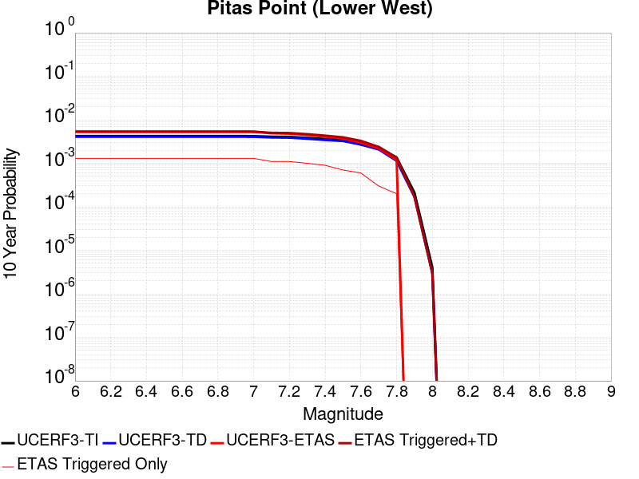 |

| Magnitude | 1 wk TI Prob | 1 wk TD Prob | 1 wk ETAS Prob | 1 wk ETAS/TD Gain | 1 wk ETAS Triggered+TD | 1 wk ETAS Triggered Only | 1 mo TI Prob | 1 mo TD Prob | 1 mo ETAS Prob | 1 mo ETAS/TD Gain | 1 mo ETAS Triggered+TD | 1 mo ETAS Triggered Only | 1 yr TI Prob | 1 yr TD Prob | 1 yr ETAS Prob | 1 yr ETAS/TD Gain | 1 yr ETAS Triggered+TD | 1 yr ETAS Triggered Only | 10 yr TI Prob | 10 yr TD Prob | 10 yr ETAS Prob | 10 yr ETAS/TD Gain | 10 yr ETAS Triggered+TD | 10 yr ETAS Triggered Only |
|-----|-----|-----|-----|-----|-----|-----|-----|-----|-----|-----|-----|-----|-----|-----|-----|-----|-----|-----|-----|-----|-----|-----|-----|-----|
| 6.0 | 8.151497E-6 | 7.856924E-6 | 0.0 | 0.0 | 7.856924E-6 | 0.0 | 3.493452E-5 | 3.36721E-5 | 0.0 | 0.0 | 3.36721E-5 | 0.0 | 4.252448E-4 | 4.0988144E-4 | 4.0E-4 | 0.975892 | 8.0971746E-4 | 4.0E-4 | 0.0042443196 | 0.004091335 | 0.0013 | 0.3177447 | 0.0053860163 | 0.0013 |
| 6.1 | 8.151497E-6 | 7.856924E-6 | 0.0 | 0.0 | 7.856924E-6 | 0.0 | 3.493452E-5 | 3.36721E-5 | 0.0 | 0.0 | 3.36721E-5 | 0.0 | 4.252448E-4 | 4.0988144E-4 | 4.0E-4 | 0.975892 | 8.0971746E-4 | 4.0E-4 | 0.0042443196 | 0.004091335 | 0.0013 | 0.3177447 | 0.0053860163 | 0.0013 |
| 6.2 | 8.151497E-6 | 7.856924E-6 | 0.0 | 0.0 | 7.856924E-6 | 0.0 | 3.493452E-5 | 3.36721E-5 | 0.0 | 0.0 | 3.36721E-5 | 0.0 | 4.252448E-4 | 4.0988144E-4 | 4.0E-4 | 0.975892 | 8.0971746E-4 | 4.0E-4 | 0.0042443196 | 0.004091335 | 0.0013 | 0.3177447 | 0.0053860163 | 0.0013 |
| 6.3 | 8.151497E-6 | 7.856924E-6 | 0.0 | 0.0 | 7.856924E-6 | 0.0 | 3.493452E-5 | 3.36721E-5 | 0.0 | 0.0 | 3.36721E-5 | 0.0 | 4.252448E-4 | 4.0988144E-4 | 4.0E-4 | 0.975892 | 8.0971746E-4 | 4.0E-4 | 0.0042443196 | 0.004091335 | 0.0013 | 0.3177447 | 0.0053860163 | 0.0013 |
| 6.4 | 8.151497E-6 | 7.856924E-6 | 0.0 | 0.0 | 7.856924E-6 | 0.0 | 3.493452E-5 | 3.36721E-5 | 0.0 | 0.0 | 3.36721E-5 | 0.0 | 4.252448E-4 | 4.0988144E-4 | 4.0E-4 | 0.975892 | 8.0971746E-4 | 4.0E-4 | 0.0042443196 | 0.004091335 | 0.0013 | 0.3177447 | 0.0053860163 | 0.0013 |
| 6.5 | 8.151497E-6 | 7.856924E-6 | 0.0 | 0.0 | 7.856924E-6 | 0.0 | 3.493452E-5 | 3.36721E-5 | 0.0 | 0.0 | 3.36721E-5 | 0.0 | 4.252448E-4 | 4.0988144E-4 | 4.0E-4 | 0.975892 | 8.0971746E-4 | 4.0E-4 | 0.0042443196 | 0.004091335 | 0.0013 | 0.3177447 | 0.0053860163 | 0.0013 |
| 6.6 | 8.151497E-6 | 7.856924E-6 | 0.0 | 0.0 | 7.856924E-6 | 0.0 | 3.493452E-5 | 3.36721E-5 | 0.0 | 0.0 | 3.36721E-5 | 0.0 | 4.252448E-4 | 4.0988144E-4 | 4.0E-4 | 0.975892 | 8.0971746E-4 | 4.0E-4 | 0.0042443196 | 0.004091335 | 0.0013 | 0.3177447 | 0.0053860163 | 0.0013 |
| 6.7 | 8.151497E-6 | 7.856924E-6 | 0.0 | 0.0 | 7.856924E-6 | 0.0 | 3.493452E-5 | 3.36721E-5 | 0.0 | 0.0 | 3.36721E-5 | 0.0 | 4.252448E-4 | 4.0988144E-4 | 4.0E-4 | 0.975892 | 8.0971746E-4 | 4.0E-4 | 0.0042443196 | 0.004091335 | 0.0013 | 0.3177447 | 0.0053860163 | 0.0013 |
| 6.8 | 8.151497E-6 | 7.856924E-6 | 0.0 | 0.0 | 7.856924E-6 | 0.0 | 3.493452E-5 | 3.36721E-5 | 0.0 | 0.0 | 3.36721E-5 | 0.0 | 4.252448E-4 | 4.0988144E-4 | 4.0E-4 | 0.975892 | 8.0971746E-4 | 4.0E-4 | 0.0042443196 | 0.004091335 | 0.0013 | 0.3177447 | 0.0053860163 | 0.0013 |
| 6.9 | 8.151497E-6 | 7.856924E-6 | 0.0 | 0.0 | 7.856924E-6 | 0.0 | 3.493452E-5 | 3.36721E-5 | 0.0 | 0.0 | 3.36721E-5 | 0.0 | 4.252448E-4 | 4.0988144E-4 | 4.0E-4 | 0.975892 | 8.0971746E-4 | 4.0E-4 | 0.0042443196 | 0.004091335 | 0.0013 | 0.3177447 | 0.0053860163 | 0.0013 |
| 7.0 | 8.103535E-6 | 7.806348E-6 | 0.0 | 0.0 | 7.806348E-6 | 0.0 | 3.4728975E-5 | 3.345535E-5 | 0.0 | 0.0 | 3.345535E-5 | 0.0 | 4.2274324E-4 | 4.072435E-4 | 4.0E-4 | 0.9822133 | 8.070806E-4 | 4.0E-4 | 0.0042193993 | 0.0040650526 | 0.0013 | 0.31979907 | 0.005359768 | 0.0013 |
| 7.1 | 7.853298E-6 | 7.542008E-6 | 0.0 | 0.0 | 7.542008E-6 | 0.0 | 3.3656554E-5 | 3.2322496E-5 | 0.0 | 0.0 | 3.2322496E-5 | 0.0 | 4.096915E-4 | 3.9345602E-4 | 2.0E-4 | 0.50831604 | 5.9337734E-4 | 2.0E-4 | 0.00408937 | 0.0039276704 | 0.0011 | 0.28006425 | 0.00502335 | 0.0011 |
| 7.2 | 7.771102E-6 | 7.4542777E-6 | 0.0 | 0.0 | 7.4542777E-6 | 0.0 | 3.33043E-5 | 3.1946518E-5 | 0.0 | 0.0 | 3.1946518E-5 | 0.0 | 4.0540437E-4 | 3.8888014E-4 | 2.0E-4 | 0.5142973 | 5.8880233E-4 | 2.0E-4 | 0.0040466557 | 0.003882072 | 0.0011 | 0.28335384 | 0.004977802 | 0.0011 |
| 7.3 | 7.3945344E-6 | 7.050322E-6 | 0.0 | 0.0 | 7.050322E-6 | 0.0 | 3.1690477E-5 | 3.0215318E-5 | 0.0 | 0.0 | 3.0215318E-5 | 0.0 | 3.8576324E-4 | 3.6781005E-4 | 1.0E-4 | 0.27187946 | 4.6777326E-4 | 1.0E-4 | 0.0038509427 | 0.0036720806 | 0.001 | 0.2723252 | 0.0046684085 | 0.001 |
| 7.4 | 6.964645E-6 | 6.5911067E-6 | 0.0 | 0.0 | 6.5911067E-6 | 0.0 | 2.9848137E-5 | 2.8247297E-5 | 0.0 | 0.0 | 2.8247297E-5 | 0.0 | 3.6334046E-4 | 3.4385707E-4 | 1.0E-4 | 0.2908185 | 4.4382268E-4 | 1.0E-4 | 0.0036274698 | 0.0034333034 | 9.0E-4 | 0.26213822 | 0.004330213 | 9.0E-4 |
| 7.5 | 6.6525035E-6 | 6.2600984E-6 | 0.0 | 0.0 | 6.2600984E-6 | 0.0 | 2.851042E-5 | 2.682872E-5 | 0.0 | 0.0 | 2.682872E-5 | 0.0 | 3.4705905E-4 | 3.265912E-4 | 1.0E-4 | 0.3061932 | 4.2655854E-4 | 1.0E-4 | 0.0034651754 | 0.0032611638 | 7.0E-4 | 0.2146473 | 0.003958881 | 7.0E-4 |
| 7.6 | 5.613338E-6 | 5.1521597E-6 | 0.0 | 0.0 | 5.1521597E-6 | 0.0 | 2.405694E-5 | 2.20805E-5 | 0.0 | 0.0 | 2.20805E-5 | 0.0 | 2.928539E-4 | 2.6879722E-4 | 1.0E-4 | 0.37202767 | 3.6877033E-4 | 1.0E-4 | 0.0029246826 | 0.0026847525 | 6.0E-4 | 0.22348428 | 0.0032831416 | 6.0E-4 |
| 7.7 | 4.494704E-6 | 3.997525E-6 | 0.0 | 0.0 | 3.997525E-6 | 0.0 | 1.9262876E-5 | 1.7132139E-5 | 0.0 | 0.0 | 1.7132139E-5 | 0.0 | 2.3450027E-4 | 2.0856404E-4 | 1.0E-4 | 0.479469 | 3.0854318E-4 | 1.0E-4 | 0.0023425296 | 0.0020837071 | 3.0E-4 | 0.14397417 | 0.0023830822 | 3.0E-4 |
| 7.8 | 2.6075882E-6 | 2.1840044E-6 | 0.0 | 0.0 | 2.1840044E-6 | 0.0 | 1.117533E-5 | 9.359986E-6 | 0.0 | 0.0 | 9.359986E-6 | 0.0 | 1.3605114E-4 | 1.13951915E-4 | 1.0E-4 | 0.8775632 | 2.1394051E-4 | 1.0E-4 | 0.0013596788 | 0.0011389395 | 2.0E-4 | 0.17560194 | 0.0013387117 | 2.0E-4 |
| 7.9 | 4.045984E-7 | 3.242808E-7 | 0.0 | 0.0 | 3.242808E-7 | 0.0 | 1.733992E-6 | 1.3897741E-6 | 0.0 | 0.0 | 1.3897741E-6 | 0.0 | 2.1111147E-5 | 1.6920372E-5 | 0.0 | 0.0 | 1.6920372E-5 | 0.0 | 2.1109142E-4 | 1.6919115E-4 | 0.0 | 0.0 | 1.6919115E-4 | 0.0 |
| 8.0 | 7.791402E-9 | 5.684373E-9 | 0.0 | 0.0 | 5.684373E-9 | 0.0 | 3.3391725E-8 | 2.43616E-8 | 0.0 | 0.0 | 2.43616E-8 | 0.0 | 4.0654416E-7 | 2.9660245E-7 | 0.0 | 0.0 | 2.9660245E-7 | 0.0 | 4.065434E-6 | 2.9660227E-6 | 0.0 | 0.0 | 2.9660227E-6 | 0.0 |

## Little Salmon (Offshore)
*[(top)](#table-of-contents)*

| 1 Week | 1 Month | 1 Year | 10 Year |
|-----|-----|-----|-----|
|  |  |  |  |

| Magnitude | 1 wk TI Prob | 1 wk TD Prob | 1 wk ETAS Prob | 1 wk ETAS/TD Gain | 1 wk ETAS Triggered+TD | 1 wk ETAS Triggered Only | 1 mo TI Prob | 1 mo TD Prob | 1 mo ETAS Prob | 1 mo ETAS/TD Gain | 1 mo ETAS Triggered+TD | 1 mo ETAS Triggered Only | 1 yr TI Prob | 1 yr TD Prob | 1 yr ETAS Prob | 1 yr ETAS/TD Gain | 1 yr ETAS Triggered+TD | 1 yr ETAS Triggered Only | 10 yr TI Prob | 10 yr TD Prob | 10 yr ETAS Prob | 10 yr ETAS/TD Gain | 10 yr ETAS Triggered+TD | 10 yr ETAS Triggered Only |
|-----|-----|-----|-----|-----|-----|-----|-----|-----|-----|-----|-----|-----|-----|-----|-----|-----|-----|-----|-----|-----|-----|-----|-----|-----|
| 6.0 | 2.3052053E-5 | 2.1625294E-5 | 0.0 | 0.0 | 2.1625294E-5 | 0.0 | 9.879077E-5 | 9.267718E-5 | 0.0 | 0.0 | 9.267718E-5 | 0.0 | 0.0012021139 | 0.0011278758 | 0.0 | 0.0 | 0.0011278758 | 0.0 | 0.011956319 | 0.011255429 | 0.0013 | 0.11549982 | 0.012540797 | 0.0013 |
| 6.1 | 2.3052053E-5 | 2.1625294E-5 | 0.0 | 0.0 | 2.1625294E-5 | 0.0 | 9.879077E-5 | 9.267718E-5 | 0.0 | 0.0 | 9.267718E-5 | 0.0 | 0.0012021139 | 0.0011278758 | 0.0 | 0.0 | 0.0011278758 | 0.0 | 0.011956319 | 0.011255429 | 0.0013 | 0.11549982 | 0.012540797 | 0.0013 |
| 6.2 | 2.3052053E-5 | 2.1625294E-5 | 0.0 | 0.0 | 2.1625294E-5 | 0.0 | 9.879077E-5 | 9.267718E-5 | 0.0 | 0.0 | 9.267718E-5 | 0.0 | 0.0012021139 | 0.0011278758 | 0.0 | 0.0 | 0.0011278758 | 0.0 | 0.011956319 | 0.011255429 | 0.0013 | 0.11549982 | 0.012540797 | 0.0013 |
| 6.3 | 2.3052053E-5 | 2.1625294E-5 | 0.0 | 0.0 | 2.1625294E-5 | 0.0 | 9.879077E-5 | 9.267718E-5 | 0.0 | 0.0 | 9.267718E-5 | 0.0 | 0.0012021139 | 0.0011278758 | 0.0 | 0.0 | 0.0011278758 | 0.0 | 0.011956319 | 0.011255429 | 0.0013 | 0.11549982 | 0.012540797 | 0.0013 |
| 6.4 | 2.3052053E-5 | 2.1625294E-5 | 0.0 | 0.0 | 2.1625294E-5 | 0.0 | 9.879077E-5 | 9.267718E-5 | 0.0 | 0.0 | 9.267718E-5 | 0.0 | 0.0012021139 | 0.0011278758 | 0.0 | 0.0 | 0.0011278758 | 0.0 | 0.011956319 | 0.011255429 | 0.0013 | 0.11549982 | 0.012540797 | 0.0013 |
| 6.5 | 2.3052053E-5 | 2.1625294E-5 | 0.0 | 0.0 | 2.1625294E-5 | 0.0 | 9.879077E-5 | 9.267718E-5 | 0.0 | 0.0 | 9.267718E-5 | 0.0 | 0.0012021139 | 0.0011278758 | 0.0 | 0.0 | 0.0011278758 | 0.0 | 0.011956319 | 0.011255429 | 0.0013 | 0.11549982 | 0.012540797 | 0.0013 |
| 6.6 | 2.3052053E-5 | 2.1625294E-5 | 0.0 | 0.0 | 2.1625294E-5 | 0.0 | 9.879077E-5 | 9.267718E-5 | 0.0 | 0.0 | 9.267718E-5 | 0.0 | 0.0012021139 | 0.0011278758 | 0.0 | 0.0 | 0.0011278758 | 0.0 | 0.011956319 | 0.011255429 | 0.0013 | 0.11549982 | 0.012540797 | 0.0013 |
| 6.7 | 2.3052053E-5 | 2.1625294E-5 | 0.0 | 0.0 | 2.1625294E-5 | 0.0 | 9.879077E-5 | 9.267718E-5 | 0.0 | 0.0 | 9.267718E-5 | 0.0 | 0.0012021139 | 0.0011278758 | 0.0 | 0.0 | 0.0011278758 | 0.0 | 0.011956319 | 0.011255429 | 0.0013 | 0.11549982 | 0.012540797 | 0.0013 |
| 6.8 | 1.683878E-5 | 1.4402086E-5 | 0.0 | 0.0 | 1.4402086E-5 | 0.0 | 7.21642E-5 | 6.172206E-5 | 0.0 | 0.0 | 6.172206E-5 | 0.0 | 8.78245E-4 | 7.51258E-4 | 0.0 | 0.0 | 7.51258E-4 | 0.0 | 0.008747822 | 0.0075148502 | 7.0E-4 | 0.093148895 | 0.00820959 | 7.0E-4 |
| 6.9 | 1.683878E-5 | 1.4402086E-5 | 0.0 | 0.0 | 1.4402086E-5 | 0.0 | 7.21642E-5 | 6.172206E-5 | 0.0 | 0.0 | 6.172206E-5 | 0.0 | 8.78245E-4 | 7.51258E-4 | 0.0 | 0.0 | 7.51258E-4 | 0.0 | 0.008747822 | 0.0075148502 | 7.0E-4 | 0.093148895 | 0.00820959 | 7.0E-4 |
| 7.0 | 1.5051273E-5 | 1.2349455E-5 | 0.0 | 0.0 | 1.2349455E-5 | 0.0 | 6.450386E-5 | 5.292542E-5 | 0.0 | 0.0 | 5.292542E-5 | 0.0 | 7.8505155E-4 | 6.4422254E-4 | 0.0 | 0.0 | 6.4422254E-4 | 0.0 | 0.00782284 | 0.0064507425 | 4.0E-4 | 0.062008366 | 0.006848162 | 4.0E-4 |
| 7.1 | 1.5051273E-5 | 1.2349455E-5 | 0.0 | 0.0 | 1.2349455E-5 | 0.0 | 6.450386E-5 | 5.292542E-5 | 0.0 | 0.0 | 5.292542E-5 | 0.0 | 7.8505155E-4 | 6.4422254E-4 | 0.0 | 0.0 | 6.4422254E-4 | 0.0 | 0.00782284 | 0.0064507425 | 4.0E-4 | 0.062008366 | 0.006848162 | 4.0E-4 |
| 7.2 | 1.24301405E-5 | 9.919218E-6 | 0.0 | 0.0 | 9.919218E-6 | 0.0 | 5.3270942E-5 | 4.251047E-5 | 0.0 | 0.0 | 4.251047E-5 | 0.0 | 6.483807E-4 | 5.1748217E-4 | 0.0 | 0.0 | 5.1748217E-4 | 0.0 | 0.006464922 | 0.0051888674 | 3.0E-4 | 0.057816084 | 0.0054873107 | 3.0E-4 |
| 7.3 | 9.3599865E-6 | 7.70572E-6 | 0.0 | 0.0 | 7.70572E-6 | 0.0 | 4.011361E-5 | 3.30243E-5 | 0.0 | 0.0 | 3.30243E-5 | 0.0 | 4.8827377E-4 | 4.020324E-4 | 0.0 | 0.0 | 4.020324E-4 | 0.0 | 0.004872023 | 0.0040295757 | 3.0E-4 | 0.074449524 | 0.004328367 | 3.0E-4 |
| 7.4 | 5.941556E-6 | 4.9581654E-6 | 0.0 | 0.0 | 4.9581654E-6 | 0.0 | 2.5463563E-5 | 2.124928E-5 | 0.0 | 0.0 | 2.124928E-5 | 0.0 | 3.0997477E-4 | 2.5870997E-4 | 0.0 | 0.0 | 2.5870997E-4 | 0.0 | 0.0030954275 | 0.0025958095 | 1.0E-4 | 0.03852363 | 0.0026955497 | 1.0E-4 |

## Bennett Valley 2011 CFM
*[(top)](#table-of-contents)*

| 1 Week | 1 Month | 1 Year | 10 Year |
|-----|-----|-----|-----|
|  |  |  |  |

| Magnitude | 1 wk TI Prob | 1 wk TD Prob | 1 wk ETAS Prob | 1 wk ETAS/TD Gain | 1 wk ETAS Triggered+TD | 1 wk ETAS Triggered Only | 1 mo TI Prob | 1 mo TD Prob | 1 mo ETAS Prob | 1 mo ETAS/TD Gain | 1 mo ETAS Triggered+TD | 1 mo ETAS Triggered Only | 1 yr TI Prob | 1 yr TD Prob | 1 yr ETAS Prob | 1 yr ETAS/TD Gain | 1 yr ETAS Triggered+TD | 1 yr ETAS Triggered Only | 10 yr TI Prob | 10 yr TD Prob | 10 yr ETAS Prob | 10 yr ETAS/TD Gain | 10 yr ETAS Triggered+TD | 10 yr ETAS Triggered Only |
|-----|-----|-----|-----|-----|-----|-----|-----|-----|-----|-----|-----|-----|-----|-----|-----|-----|-----|-----|-----|-----|-----|-----|-----|-----|
| 6.0 | 2.3893934E-5 | 2.8245993E-5 | 0.0 | 0.0 | 2.8245993E-5 | 0.0 | 1.0239855E-4 | 1.2104968E-4 | 1.0E-4 | 0.8261071 | 2.2103757E-4 | 1.0E-4 | 0.0012459893 | 0.0014729685 | 2.0E-4 | 0.13578023 | 0.001672674 | 2.0E-4 | 0.012390262 | 0.01465482 | 0.0013 | 0.08870801 | 0.01593577 | 0.0013 |
| 6.1 | 2.3893934E-5 | 2.8245993E-5 | 0.0 | 0.0 | 2.8245993E-5 | 0.0 | 1.0239855E-4 | 1.2104968E-4 | 1.0E-4 | 0.8261071 | 2.2103757E-4 | 1.0E-4 | 0.0012459893 | 0.0014729685 | 2.0E-4 | 0.13578023 | 0.001672674 | 2.0E-4 | 0.012390262 | 0.01465482 | 0.0012 | 0.081884325 | 0.015837234 | 0.0012 |
| 6.2 | 1.6657146E-5 | 1.9858135E-5 | 0.0 | 0.0 | 1.9858135E-5 | 0.0 | 7.138582E-5 | 8.5104315E-5 | 1.0E-4 | 1.1750286 | 1.850958E-4 | 1.0E-4 | 8.6877577E-4 | 0.001035794 | 2.0E-4 | 0.19308858 | 0.0012355869 | 2.0E-4 | 0.008653872 | 0.010328044 | 9.0E-4 | 0.08714138 | 0.011218749 | 9.0E-4 |
| 6.3 | 1.6657146E-5 | 1.9858135E-5 | 0.0 | 0.0 | 1.9858135E-5 | 0.0 | 7.138582E-5 | 8.5104315E-5 | 1.0E-4 | 1.1750286 | 1.850958E-4 | 1.0E-4 | 8.6877577E-4 | 0.001035794 | 2.0E-4 | 0.19308858 | 0.0012355869 | 2.0E-4 | 0.008653872 | 0.010328044 | 9.0E-4 | 0.08714138 | 0.011218749 | 9.0E-4 |
| 6.4 | 1.29418495E-5 | 1.5570497E-5 | 0.0 | 0.0 | 1.5570497E-5 | 0.0 | 5.546389E-5 | 6.672973E-5 | 1.0E-4 | 1.4985825 | 1.6672305E-4 | 1.0E-4 | 6.7506364E-4 | 8.1226195E-4 | 2.0E-4 | 0.24622598 | 0.0010120996 | 2.0E-4 | 0.0067301663 | 0.008110185 | 8.0E-4 | 0.098641396 | 0.008903697 | 8.0E-4 |
| 6.5 | 1.2582504E-5 | 1.5137379E-5 | 0.0 | 0.0 | 1.5137379E-5 | 0.0 | 5.39239E-5 | 6.48736E-5 | 1.0E-4 | 1.541459 | 1.6486712E-4 | 1.0E-4 | 6.563257E-4 | 7.8968017E-4 | 2.0E-4 | 0.2532671 | 9.895222E-4 | 2.0E-4 | 0.006543907 | 0.007886019 | 8.0E-4 | 0.101445355 | 0.00867971 | 8.0E-4 |
| 6.6 | 1.0846706E-5 | 1.30389135E-5 | 0.0 | 0.0 | 1.30389135E-5 | 0.0 | 4.6485053E-5 | 5.5880588E-5 | 1.0E-4 | 1.7895303 | 1.55875E-4 | 1.0E-4 | 5.6580856E-4 | 6.8026216E-4 | 2.0E-4 | 0.2940043 | 8.8012614E-4 | 2.0E-4 | 0.005643701 | 0.0067989733 | 7.0E-4 | 0.10295672 | 0.007494214 | 7.0E-4 |
| 6.7 | 1.6803231E-6 | 2.3765926E-6 | 0.0 | 0.0 | 2.3765926E-6 | 0.0 | 7.2013645E-6 | 1.01853575E-5 | 0.0 | 0.0 | 1.01853575E-5 | 0.0 | 8.7673085E-5 | 1.2399981E-4 | 0.0 | 0.0 | 1.2399981E-4 | 0.0 | 8.76385E-4 | 0.0012437751 | 1.0E-4 | 0.080400385 | 0.0013436509 | 1.0E-4 |
| 6.8 | 1.4609833E-6 | 2.0925681E-6 | 0.0 | 0.0 | 2.0925681E-6 | 0.0 | 6.261342E-6 | 8.968119E-6 | 0.0 | 0.0 | 8.968119E-6 | 0.0 | 7.6229175E-5 | 1.0918144E-4 | 0.0 | 0.0 | 1.0918144E-4 | 0.0 | 7.620303E-4 | 0.0010956634 | 0.0 | 0.0 | 0.0010956634 | 0.0 |
| 6.9 | 1.3492396E-6 | 1.9444687E-6 | 0.0 | 0.0 | 1.9444687E-6 | 0.0 | 5.7824427E-6 | 8.333411E-6 | 0.0 | 0.0 | 8.333411E-6 | 0.0 | 7.0398964E-5 | 1.0145462E-4 | 0.0 | 0.0 | 1.0145462E-4 | 0.0 | 7.037667E-4 | 0.0010184417 | 0.0 | 0.0 | 0.0010184417 | 0.0 |
| 7.0 | 1.2347921E-6 | 1.7874142E-6 | 0.0 | 0.0 | 1.7874142E-6 | 0.0 | 5.291955E-6 | 7.660325E-6 | 0.0 | 0.0 | 7.660325E-6 | 0.0 | 6.442765E-5 | 9.326051E-5 | 0.0 | 0.0 | 9.326051E-5 | 0.0 | 6.440897E-4 | 9.3657186E-4 | 0.0 | 0.0 | 9.3657186E-4 | 0.0 |
| 7.1 | 1.1262973E-6 | 1.6341381E-6 | 0.0 | 0.0 | 1.6341381E-6 | 0.0 | 4.8269794E-6 | 7.0034303E-6 | 0.0 | 0.0 | 7.0034303E-6 | 0.0 | 5.876689E-5 | 8.526348E-5 | 0.0 | 0.0 | 8.526348E-5 | 0.0 | 5.875135E-4 | 8.566444E-4 | 0.0 | 0.0 | 8.566444E-4 | 0.0 |
| 7.2 | 9.351744E-7 | 1.3593113E-6 | 0.0 | 0.0 | 1.3593113E-6 | 0.0 | 4.007884E-6 | 5.825607E-6 | 0.0 | 0.0 | 5.825607E-6 | 0.0 | 4.8794896E-5 | 7.092448E-5 | 0.0 | 0.0 | 7.092448E-5 | 0.0 | 4.878418E-4 | 7.133161E-4 | 0.0 | 0.0 | 7.133161E-4 | 0.0 |
| 7.3 | 8.5039534E-7 | 1.236884E-6 | 0.0 | 0.0 | 1.236884E-6 | 0.0 | 3.6445463E-6 | 5.3009207E-6 | 0.0 | 0.0 | 5.3009207E-6 | 0.0 | 4.437145E-5 | 6.453682E-5 | 0.0 | 0.0 | 6.453682E-5 | 0.0 | 4.436259E-4 | 6.4918865E-4 | 0.0 | 0.0 | 6.4918865E-4 | 0.0 |
| 7.4 | 6.7875015E-7 | 9.588935E-7 | 0.0 | 0.0 | 9.588935E-7 | 0.0 | 2.908926E-6 | 4.109537E-6 | 0.0 | 0.0 | 4.109537E-6 | 0.0 | 3.54156E-5 | 5.003247E-5 | 0.0 | 0.0 | 5.003247E-5 | 0.0 | 3.5409955E-4 | 5.035108E-4 | 0.0 | 0.0 | 5.035108E-4 | 0.0 |
| 7.5 | 5.826867E-7 | 8.179282E-7 | 0.0 | 0.0 | 8.179282E-7 | 0.0 | 2.4972264E-6 | 3.5054018E-6 | 0.0 | 0.0 | 3.5054018E-6 | 0.0 | 3.0403306E-5 | 4.2677442E-5 | 0.0 | 0.0 | 4.2677442E-5 | 0.0 | 3.0399146E-4 | 4.2956346E-4 | 0.0 | 0.0 | 4.2956346E-4 | 0.0 |
| 7.6 | 2.7734902E-7 | 3.6798144E-7 | 0.0 | 0.0 | 3.6798144E-7 | 0.0 | 1.1886381E-6 | 1.5770623E-6 | 0.0 | 0.0 | 1.5770623E-6 | 0.0 | 1.4471572E-5 | 1.9200566E-5 | 0.0 | 0.0 | 1.9200566E-5 | 0.0 | 1.447063E-4 | 1.9301148E-4 | 0.0 | 0.0 | 1.9301148E-4 | 0.0 |
| 7.7 | 1.0530888E-7 | 1.3726441E-7 | 0.0 | 0.0 | 1.3726441E-7 | 0.0 | 4.513237E-7 | 5.882759E-7 | 0.0 | 0.0 | 5.882759E-7 | 0.0 | 5.4948523E-6 | 7.1622353E-6 | 0.0 | 0.0 | 7.1622353E-6 | 0.0 | 5.4947162E-5 | 7.243964E-5 | 0.0 | 0.0 | 7.243964E-5 | 0.0 |
| 7.8 | 1.2714258E-8 | 1.9627281E-8 | 0.0 | 0.0 | 1.9627281E-8 | 0.0 | 5.448968E-8 | 8.411693E-8 | 0.0 | 0.0 | 8.411693E-8 | 0.0 | 6.6341164E-7 | 1.0241231E-6 | 0.0 | 0.0 | 1.0241231E-6 | 0.0 | 6.6340967E-6 | 1.0654835E-5 | 0.0 | 0.0 | 1.0654835E-5 | 0.0 |
| 7.9 | 4.075888E-9 | 7.57162E-9 | 0.0 | 0.0 | 7.57162E-9 | 0.0 | 1.7468091E-8 | 3.24498E-8 | 0.0 | 0.0 | 3.24498E-8 | 0.0 | 2.12674E-7 | 3.9507626E-7 | 0.0 | 0.0 | 3.9507626E-7 | 0.0 | 2.1267379E-6 | 4.2008924E-6 | 0.0 | 0.0 | 4.2008924E-6 | 0.0 |
| 8.0 | 1.9126138E-9 | 4.004576E-9 | 0.0 | 0.0 | 4.004576E-9 | 0.0 | 8.196917E-9 | 1.7162469E-8 | 0.0 | 0.0 | 1.7162469E-8 | 0.0 | 9.9797454E-8 | 2.0895304E-7 | 0.0 | 0.0 | 2.0895304E-7 | 0.0 | 9.979741E-7 | 2.2024726E-6 | 0.0 | 0.0 | 2.2024726E-6 | 0.0 |

## Trinidad (alt1)
*[(top)](#table-of-contents)*

| 1 Week | 1 Month | 1 Year | 10 Year |
|-----|-----|-----|-----|
|  |  |  |  |

| Magnitude | 1 wk TI Prob | 1 wk TD Prob | 1 wk ETAS Prob | 1 wk ETAS/TD Gain | 1 wk ETAS Triggered+TD | 1 wk ETAS Triggered Only | 1 mo TI Prob | 1 mo TD Prob | 1 mo ETAS Prob | 1 mo ETAS/TD Gain | 1 mo ETAS Triggered+TD | 1 mo ETAS Triggered Only | 1 yr TI Prob | 1 yr TD Prob | 1 yr ETAS Prob | 1 yr ETAS/TD Gain | 1 yr ETAS Triggered+TD | 1 yr ETAS Triggered Only | 10 yr TI Prob | 10 yr TD Prob | 10 yr ETAS Prob | 10 yr ETAS/TD Gain | 10 yr ETAS Triggered+TD | 10 yr ETAS Triggered Only |
|-----|-----|-----|-----|-----|-----|-----|-----|-----|-----|-----|-----|-----|-----|-----|-----|-----|-----|-----|-----|-----|-----|-----|-----|-----|
| 6.0 | 3.0167168E-5 | 3.4042183E-5 | 0.0 | 0.0 | 3.4042183E-5 | 0.0 | 1.2928146E-4 | 1.4588785E-4 | 0.0 | 0.0 | 1.4588785E-4 | 0.0 | 0.0015728653 | 0.0017749061 | 3.0E-4 | 0.16902302 | 0.0020743737 | 3.0E-4 | 0.0156177925 | 0.017624268 | 0.0012 | 0.068087935 | 0.01880312 | 0.0012 |
| 6.1 | 3.0167168E-5 | 3.4042183E-5 | 0.0 | 0.0 | 3.4042183E-5 | 0.0 | 1.2928146E-4 | 1.4588785E-4 | 0.0 | 0.0 | 1.4588785E-4 | 0.0 | 0.0015728653 | 0.0017749061 | 3.0E-4 | 0.16902302 | 0.0020743737 | 3.0E-4 | 0.0156177925 | 0.017624268 | 0.0012 | 0.068087935 | 0.01880312 | 0.0012 |
| 6.2 | 3.0167168E-5 | 3.4042183E-5 | 0.0 | 0.0 | 3.4042183E-5 | 0.0 | 1.2928146E-4 | 1.4588785E-4 | 0.0 | 0.0 | 1.4588785E-4 | 0.0 | 0.0015728653 | 0.0017749061 | 3.0E-4 | 0.16902302 | 0.0020743737 | 3.0E-4 | 0.0156177925 | 0.017624268 | 0.0012 | 0.068087935 | 0.01880312 | 0.0012 |
| 6.3 | 3.0167168E-5 | 3.4042183E-5 | 0.0 | 0.0 | 3.4042183E-5 | 0.0 | 1.2928146E-4 | 1.4588785E-4 | 0.0 | 0.0 | 1.4588785E-4 | 0.0 | 0.0015728653 | 0.0017749061 | 3.0E-4 | 0.16902302 | 0.0020743737 | 3.0E-4 | 0.0156177925 | 0.017624268 | 0.0012 | 0.068087935 | 0.01880312 | 0.0012 |
| 6.4 | 3.0167168E-5 | 3.4042183E-5 | 0.0 | 0.0 | 3.4042183E-5 | 0.0 | 1.2928146E-4 | 1.4588785E-4 | 0.0 | 0.0 | 1.4588785E-4 | 0.0 | 0.0015728653 | 0.0017749061 | 3.0E-4 | 0.16902302 | 0.0020743737 | 3.0E-4 | 0.0156177925 | 0.017624268 | 0.0012 | 0.068087935 | 0.01880312 | 0.0012 |
| 6.5 | 3.0167168E-5 | 3.4042183E-5 | 0.0 | 0.0 | 3.4042183E-5 | 0.0 | 1.2928146E-4 | 1.4588785E-4 | 0.0 | 0.0 | 1.4588785E-4 | 0.0 | 0.0015728653 | 0.0017749061 | 3.0E-4 | 0.16902302 | 0.0020743737 | 3.0E-4 | 0.0156177925 | 0.017624268 | 0.0012 | 0.068087935 | 0.01880312 | 0.0012 |
| 6.6 | 3.0167168E-5 | 3.4042183E-5 | 0.0 | 0.0 | 3.4042183E-5 | 0.0 | 1.2928146E-4 | 1.4588785E-4 | 0.0 | 0.0 | 1.4588785E-4 | 0.0 | 0.0015728653 | 0.0017749061 | 3.0E-4 | 0.16902302 | 0.0020743737 | 3.0E-4 | 0.0156177925 | 0.017624268 | 0.0012 | 0.068087935 | 0.01880312 | 0.0012 |
| 6.7 | 3.0167168E-5 | 3.4042183E-5 | 0.0 | 0.0 | 3.4042183E-5 | 0.0 | 1.2928146E-4 | 1.4588785E-4 | 0.0 | 0.0 | 1.4588785E-4 | 0.0 | 0.0015728653 | 0.0017749061 | 3.0E-4 | 0.16902302 | 0.0020743737 | 3.0E-4 | 0.0156177925 | 0.017624268 | 0.0012 | 0.068087935 | 0.01880312 | 0.0012 |
| 6.8 | 1.717077E-5 | 1.920035E-5 | 0.0 | 0.0 | 1.920035E-5 | 0.0 | 7.358694E-5 | 8.2284874E-5 | 0.0 | 0.0 | 8.2284874E-5 | 0.0 | 8.9555274E-4 | 0.0010014024 | 3.0E-4 | 0.29957986 | 0.001301102 | 3.0E-4 | 0.008919522 | 0.009973352 | 9.0E-4 | 0.09024047 | 0.010864376 | 9.0E-4 |
| 6.9 | 1.717077E-5 | 1.920035E-5 | 0.0 | 0.0 | 1.920035E-5 | 0.0 | 7.358694E-5 | 8.2284874E-5 | 0.0 | 0.0 | 8.2284874E-5 | 0.0 | 8.9555274E-4 | 0.0010014024 | 3.0E-4 | 0.29957986 | 0.001301102 | 3.0E-4 | 0.008919522 | 0.009973352 | 9.0E-4 | 0.09024047 | 0.010864376 | 9.0E-4 |
| 7.0 | 1.2858572E-5 | 1.434077E-5 | 0.0 | 0.0 | 1.434077E-5 | 0.0 | 5.5107E-5 | 6.145918E-5 | 0.0 | 0.0 | 6.145918E-5 | 0.0 | 6.707212E-4 | 7.480407E-4 | 3.0E-4 | 0.4010477 | 0.0010478162 | 3.0E-4 | 0.006687004 | 0.007458408 | 9.0E-4 | 0.120669186 | 0.008351695 | 9.0E-4 |
| 7.1 | 1.0588431E-5 | 1.1804055E-5 | 0.0 | 0.0 | 1.1804055E-5 | 0.0 | 4.53782E-5 | 5.058799E-5 | 0.0 | 0.0 | 5.058799E-5 | 0.0 | 5.5233954E-4 | 6.1576365E-4 | 3.0E-4 | 0.4871999 | 9.155789E-4 | 3.0E-4 | 0.005509687 | 0.0061434256 | 8.0E-4 | 0.1302205 | 0.006938511 | 8.0E-4 |
| 7.2 | 8.138061E-6 | 9.069348E-6 | 0.0 | 0.0 | 9.069348E-6 | 0.0 | 3.487694E-5 | 3.8868195E-5 | 0.0 | 0.0 | 3.8868195E-5 | 0.0 | 4.2454398E-4 | 4.7314237E-4 | 2.0E-4 | 0.42270574 | 6.7304773E-4 | 2.0E-4 | 0.0042373384 | 0.0047237924 | 7.0E-4 | 0.14818603 | 0.0054204855 | 7.0E-4 |
| 7.3 | 5.787542E-6 | 6.461868E-6 | 0.0 | 0.0 | 6.461868E-6 | 0.0 | 2.4803514E-5 | 2.7693548E-5 | 0.0 | 0.0 | 2.7693548E-5 | 0.0 | 3.0194095E-4 | 3.371383E-4 | 2.0E-4 | 0.59322834 | 5.3707085E-4 | 2.0E-4 | 0.00301531 | 0.0033683805 | 7.0E-4 | 0.207815 | 0.0040660226 | 7.0E-4 |
| 7.4 | 4.303563E-6 | 4.8019947E-6 | 0.0 | 0.0 | 4.8019947E-6 | 0.0 | 1.844371E-5 | 2.0579926E-5 | 0.0 | 0.0 | 2.0579926E-5 | 0.0 | 2.2452902E-4 | 2.5055156E-4 | 2.0E-4 | 0.7982389 | 4.5050145E-4 | 2.0E-4 | 0.0022430231 | 0.00250463 | 5.0E-4 | 0.19963028 | 0.0030033777 | 5.0E-4 |
| 7.5 | 5.6063425E-7 | 6.144194E-7 | 0.0 | 0.0 | 6.144194E-7 | 0.0 | 2.402716E-6 | 2.6332234E-6 | 0.0 | 0.0 | 2.6332234E-6 | 0.0 | 2.9252675E-5 | 3.2059037E-5 | 0.0 | 0.0 | 3.2059037E-5 | 0.0 | 2.9248823E-4 | 3.205457E-4 | 0.0 | 0.0 | 3.205457E-4 | 0.0 |
| 7.6 | 4.6699128E-7 | 5.12683E-7 | 0.0 | 0.0 | 5.12683E-7 | 0.0 | 2.0013897E-6 | 2.1972112E-6 | 0.0 | 0.0 | 2.1972112E-6 | 0.0 | 2.4366647E-5 | 2.6750733E-5 | 0.0 | 0.0 | 2.6750733E-5 | 0.0 | 2.4363975E-4 | 2.6747654E-4 | 0.0 | 0.0 | 2.6747654E-4 | 0.0 |
| 7.7 | 2.2080937E-7 | 2.4352042E-7 | 0.0 | 0.0 | 2.4352042E-7 | 0.0 | 9.4632554E-7 | 1.0436586E-6 | 0.0 | 0.0 | 1.0436586E-6 | 0.0 | 1.15214525E-5 | 1.2706476E-5 | 0.0 | 0.0 | 1.2706476E-5 | 0.0 | 1.1520855E-4 | 1.2705808E-4 | 0.0 | 0.0 | 1.2705808E-4 | 0.0 |
| 7.8 | 1.1438307E-8 | 1.2685805E-8 | 0.0 | 0.0 | 1.2685805E-8 | 0.0 | 4.9021317E-8 | 5.4367735E-8 | 0.0 | 0.0 | 5.4367735E-8 | 0.0 | 5.9683435E-7 | 6.619272E-7 | 0.0 | 0.0 | 6.619272E-7 | 0.0 | 5.9683275E-6 | 6.619272E-6 | 0.0 | 0.0 | 6.619272E-6 | 0.0 |

## Superstition Hills
*[(top)](#table-of-contents)*

| 1 Week | 1 Month | 1 Year | 10 Year |
|-----|-----|-----|-----|
|  |  |  |  |

| Magnitude | 1 wk TI Prob | 1 wk TD Prob | 1 wk ETAS Prob | 1 wk ETAS/TD Gain | 1 wk ETAS Triggered+TD | 1 wk ETAS Triggered Only | 1 mo TI Prob | 1 mo TD Prob | 1 mo ETAS Prob | 1 mo ETAS/TD Gain | 1 mo ETAS Triggered+TD | 1 mo ETAS Triggered Only | 1 yr TI Prob | 1 yr TD Prob | 1 yr ETAS Prob | 1 yr ETAS/TD Gain | 1 yr ETAS Triggered+TD | 1 yr ETAS Triggered Only | 10 yr TI Prob | 10 yr TD Prob | 10 yr ETAS Prob | 10 yr ETAS/TD Gain | 10 yr ETAS Triggered+TD | 10 yr ETAS Triggered Only |
|-----|-----|-----|-----|-----|-----|-----|-----|-----|-----|-----|-----|-----|-----|-----|-----|-----|-----|-----|-----|-----|-----|-----|-----|-----|
| 6.0 | 6.6865185E-5 | 1.415581E-5 | 0.0 | 0.0 | 1.415581E-5 | 0.0 | 2.8653358E-4 | 6.066644E-5 | 0.0 | 0.0 | 6.066644E-5 | 0.0 | 0.0034829667 | 7.383798E-4 | 0.0 | 0.0 | 7.383798E-4 | 0.0 | 0.03428881 | 0.007530428 | 0.0012 | 0.1593535 | 0.008721392 | 0.0012 |
| 6.1 | 6.544851E-5 | 1.415581E-5 | 0.0 | 0.0 | 1.415581E-5 | 0.0 | 2.8046346E-4 | 6.066644E-5 | 0.0 | 0.0 | 6.066644E-5 | 0.0 | 0.0034092965 | 7.383798E-4 | 0.0 | 0.0 | 7.383798E-4 | 0.0 | 0.033574644 | 0.0075304275 | 0.0012 | 0.1593535 | 0.008721391 | 0.0012 |
| 6.2 | 6.544851E-5 | 1.415581E-5 | 0.0 | 0.0 | 1.415581E-5 | 0.0 | 2.8046346E-4 | 6.066644E-5 | 0.0 | 0.0 | 6.066644E-5 | 0.0 | 0.0034092965 | 7.383798E-4 | 0.0 | 0.0 | 7.383798E-4 | 0.0 | 0.033574644 | 0.0075304275 | 0.0012 | 0.1593535 | 0.008721391 | 0.0012 |
| 6.3 | 5.2402065E-5 | 1.4155809E-5 | 0.0 | 0.0 | 1.4155809E-5 | 0.0 | 2.2456095E-4 | 6.0666436E-5 | 0.0 | 0.0 | 6.0666436E-5 | 0.0 | 0.0027306017 | 7.383798E-4 | 0.0 | 0.0 | 7.383798E-4 | 0.0 | 0.02697292 | 0.007530424 | 0.0012 | 0.15935358 | 0.008721387 | 0.0012 |
| 6.4 | 4.542238E-5 | 1.4155809E-5 | 0.0 | 0.0 | 1.4155809E-5 | 0.0 | 1.9465282E-4 | 6.0666436E-5 | 0.0 | 0.0 | 6.0666436E-5 | 0.0 | 0.0023673223 | 7.383797E-4 | 0.0 | 0.0 | 7.383797E-4 | 0.0 | 0.023422617 | 0.007530422 | 0.0012 | 0.15935361 | 0.008721386 | 0.0012 |
| 6.5 | 2.9672969E-5 | 1.41558085E-5 | 0.0 | 0.0 | 1.41558085E-5 | 0.0 | 1.2716366E-4 | 6.0666433E-5 | 0.0 | 0.0 | 6.0666433E-5 | 0.0 | 0.0015471181 | 7.383797E-4 | 0.0 | 0.0 | 7.383797E-4 | 0.0 | 0.015363912 | 0.007530418 | 0.0012 | 0.1593537 | 0.008721381 | 0.0012 |
| 6.6 | 2.6056105E-5 | 1.3822274E-5 | 0.0 | 0.0 | 1.3822274E-5 | 0.0 | 1.1166424E-4 | 5.9237063E-5 | 0.0 | 0.0 | 5.9237063E-5 | 0.0 | 0.0013586642 | 7.2098867E-4 | 0.0 | 0.0 | 7.2098867E-4 | 0.0 | 0.013503874 | 0.0073552607 | 0.0012 | 0.16314854 | 0.008546434 | 0.0012 |
| 6.7 | 1.4611248E-5 | 1.34024785E-5 | 0.0 | 0.0 | 1.34024785E-5 | 0.0 | 6.261813E-5 | 5.743802E-5 | 0.0 | 0.0 | 5.743802E-5 | 0.0 | 7.6210906E-4 | 6.9909944E-4 | 0.0 | 0.0 | 6.9909944E-4 | 0.0 | 0.0075950073 | 0.0071366383 | 0.0012 | 0.16814639 | 0.008328075 | 0.0012 |
| 6.8 | 1.30607E-5 | 1.0998312E-5 | 0.0 | 0.0 | 1.0998312E-5 | 0.0 | 5.597323E-5 | 4.713482E-5 | 0.0 | 0.0 | 4.713482E-5 | 0.0 | 6.8126095E-4 | 5.7372404E-4 | 0.0 | 0.0 | 5.7372404E-4 | 0.0 | 0.006791762 | 0.0058851596 | 0.001 | 0.16991892 | 0.0068792743 | 0.001 |
| 6.9 | 1.0443096E-5 | 8.215546E-6 | 0.0 | 0.0 | 8.215546E-6 | 0.0 | 4.4755358E-5 | 3.520902E-5 | 0.0 | 0.0 | 3.520902E-5 | 0.0 | 5.447602E-4 | 4.2858787E-4 | 0.0 | 0.0 | 4.2858787E-4 | 0.0 | 0.005434267 | 0.004419795 | 8.0E-4 | 0.18100387 | 0.005216259 | 8.0E-4 |
| 7.0 | 8.045912E-6 | 6.7602546E-6 | 0.0 | 0.0 | 6.7602546E-6 | 0.0 | 3.4482026E-5 | 2.8972205E-5 | 0.0 | 0.0 | 2.8972205E-5 | 0.0 | 4.197378E-4 | 3.5268054E-4 | 0.0 | 0.0 | 3.5268054E-4 | 0.0 | 0.0041894587 | 0.0036441481 | 4.0E-4 | 0.10976502 | 0.0040426906 | 4.0E-4 |
| 7.1 | 8.045912E-6 | 6.7602546E-6 | 0.0 | 0.0 | 6.7602546E-6 | 0.0 | 3.4482026E-5 | 2.8972205E-5 | 0.0 | 0.0 | 2.8972205E-5 | 0.0 | 4.197378E-4 | 3.5268054E-4 | 0.0 | 0.0 | 3.5268054E-4 | 0.0 | 0.0041894587 | 0.0036441481 | 4.0E-4 | 0.10976502 | 0.0040426906 | 4.0E-4 |
| 7.2 | 7.375506E-6 | 6.2672684E-6 | 0.0 | 0.0 | 6.2672684E-6 | 0.0 | 3.1608928E-5 | 2.685945E-5 | 0.0 | 0.0 | 2.685945E-5 | 0.0 | 3.8477074E-4 | 3.269656E-4 | 0.0 | 0.0 | 3.269656E-4 | 0.0 | 0.003841052 | 0.0033846304 | 3.0E-4 | 0.088635966 | 0.003683615 | 3.0E-4 |
| 7.3 | 6.6063913E-6 | 5.819776E-6 | 0.0 | 0.0 | 5.819776E-6 | 0.0 | 2.8312797E-5 | 2.4941663E-5 | 0.0 | 0.0 | 2.4941663E-5 | 0.0 | 3.446538E-4 | 3.0362315E-4 | 0.0 | 0.0 | 3.0362315E-4 | 0.0 | 0.0034411973 | 0.0031489483 | 3.0E-4 | 0.0952699 | 0.0034480037 | 3.0E-4 |
| 7.4 | 6.4313126E-6 | 5.701215E-6 | 0.0 | 0.0 | 5.701215E-6 | 0.0 | 2.7562477E-5 | 2.4433553E-5 | 0.0 | 0.0 | 2.4433553E-5 | 0.0 | 3.355215E-4 | 2.9743862E-4 | 0.0 | 0.0 | 2.9743862E-4 | 0.0 | 0.0033501536 | 0.0030867073 | 3.0E-4 | 0.09719094 | 0.0033857813 | 3.0E-4 |
| 7.5 | 6.0742927E-6 | 5.4969287E-6 | 0.0 | 0.0 | 5.4969287E-6 | 0.0 | 2.6032423E-5 | 2.3558057E-5 | 0.0 | 0.0 | 2.3558057E-5 | 0.0 | 3.1689866E-4 | 2.8678228E-4 | 0.0 | 0.0 | 2.8678228E-4 | 0.0 | 0.0031644711 | 0.002978491 | 3.0E-4 | 0.10072214 | 0.0032775975 | 3.0E-4 |
| 7.6 | 5.6987187E-6 | 5.315046E-6 | 0.0 | 0.0 | 5.315046E-6 | 0.0 | 2.4422852E-5 | 2.2778575E-5 | 0.0 | 0.0 | 2.2778575E-5 | 0.0 | 2.9730765E-4 | 2.7729452E-4 | 0.0 | 0.0 | 2.7729452E-4 | 0.0 | 0.002969102 | 0.002881692 | 3.0E-4 | 0.10410551 | 0.0031808275 | 3.0E-4 |
| 7.7 | 5.1658035E-6 | 4.9454047E-6 | 0.0 | 0.0 | 4.9454047E-6 | 0.0 | 2.2138971E-5 | 2.1194424E-5 | 0.0 | 0.0 | 2.1194424E-5 | 0.0 | 2.6950863E-4 | 2.5801215E-4 | 0.0 | 0.0 | 2.5801215E-4 | 0.0 | 0.00269182 | 0.002686428 | 2.0E-4 | 0.07444831 | 0.0028858904 | 2.0E-4 |
| 7.8 | 3.6864697E-6 | 4.2159936E-6 | 0.0 | 0.0 | 4.2159936E-6 | 0.0 | 1.579906E-5 | 1.8068422E-5 | 0.0 | 0.0 | 1.8068422E-5 | 0.0 | 1.9233658E-4 | 2.199613E-4 | 0.0 | 0.0 | 2.199613E-4 | 0.0 | 0.0019217018 | 0.0022994212 | 2.0E-4 | 0.086978406 | 0.0024989613 | 2.0E-4 |
| 7.9 | 3.0265903E-6 | 3.5815071E-6 | 0.0 | 0.0 | 3.5815071E-6 | 0.0 | 1.2971037E-5 | 1.5349227E-5 | 0.0 | 0.0 | 1.5349227E-5 | 0.0 | 1.5791094E-4 | 1.8686127E-4 | 0.0 | 0.0 | 1.8686127E-4 | 0.0 | 0.0015779877 | 0.0019628524 | 2.0E-4 | 0.10189253 | 0.0021624598 | 2.0E-4 |
| 8.0 | 2.5271493E-6 | 3.1025977E-6 | 0.0 | 0.0 | 3.1025977E-6 | 0.0 | 1.0830595E-5 | 1.32967825E-5 | 0.0 | 0.0 | 1.32967825E-5 | 0.0 | 1.3185451E-4 | 1.6187671E-4 | 0.0 | 0.0 | 1.6187671E-4 | 0.0 | 0.0013177631 | 0.001705749 | 2.0E-4 | 0.11725055 | 0.0019054079 | 2.0E-4 |
| 8.1 | 2.3749135E-6 | 2.9322352E-6 | 0.0 | 0.0 | 2.9322352E-6 | 0.0 | 1.0178161E-5 | 1.2566665E-5 | 0.0 | 0.0 | 1.2566665E-5 | 0.0 | 1.2391206E-4 | 1.5298882E-4 | 0.0 | 0.0 | 1.5298882E-4 | 0.0 | 0.0012384299 | 0.0016128735 | 2.0E-4 | 0.124002285 | 0.0018125509 | 2.0E-4 |
| 8.2 | 1.7186406E-9 | 1.1471715E-9 | 0.0 | 0.0 | 1.1471715E-9 | 0.0 | 7.3656024E-9 | 4.9164495E-9 | 0.0 | 0.0 | 4.9164495E-9 | 0.0 | 8.9676206E-8 | 5.985777E-8 | 0.0 | 0.0 | 5.985777E-8 | 0.0 | 8.9676166E-7 | 6.404796E-7 | 0.0 | 0.0 | 6.404796E-7 | 0.0 |

## San Jacinto (Stepovers Combined)
*[(top)](#table-of-contents)*

| 1 Week | 1 Month | 1 Year | 10 Year |
|-----|-----|-----|-----|
| 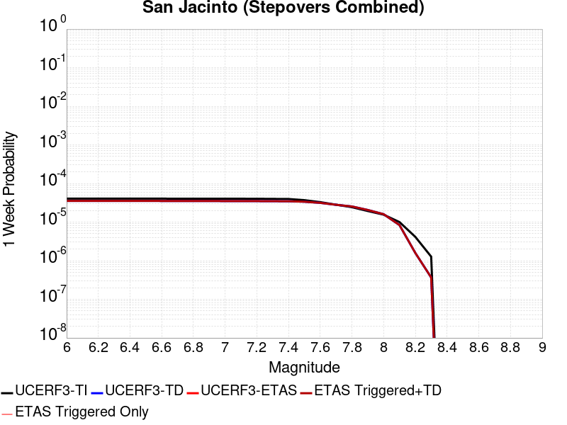 |  | 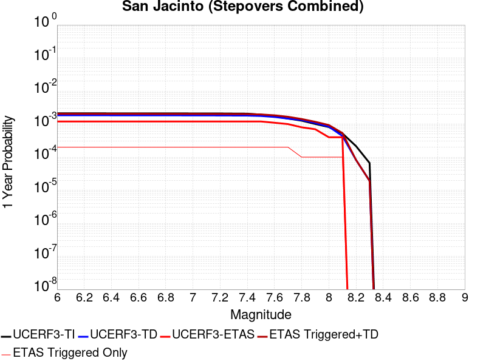 |  |

| Magnitude | 1 wk TI Prob | 1 wk TD Prob | 1 wk ETAS Prob | 1 wk ETAS/TD Gain | 1 wk ETAS Triggered+TD | 1 wk ETAS Triggered Only | 1 mo TI Prob | 1 mo TD Prob | 1 mo ETAS Prob | 1 mo ETAS/TD Gain | 1 mo ETAS Triggered+TD | 1 mo ETAS Triggered Only | 1 yr TI Prob | 1 yr TD Prob | 1 yr ETAS Prob | 1 yr ETAS/TD Gain | 1 yr ETAS Triggered+TD | 1 yr ETAS Triggered Only | 10 yr TI Prob | 10 yr TD Prob | 10 yr ETAS Prob | 10 yr ETAS/TD Gain | 10 yr ETAS Triggered+TD | 10 yr ETAS Triggered Only |
|-----|-----|-----|-----|-----|-----|-----|-----|-----|-----|-----|-----|-----|-----|-----|-----|-----|-----|-----|-----|-----|-----|-----|-----|-----|
| 6.0 | 4.0667746E-5 | 3.5418747E-5 | 0.0 | 0.0 | 3.5418747E-5 | 0.0 | 1.742787E-4 | 1.5178579E-4 | 0.0 | 0.0 | 1.5178579E-4 | 0.0 | 0.0021197782 | 0.0018464269 | 2.0E-4 | 0.108317316 | 0.0020460575 | 2.0E-4 | 0.020996714 | 0.019062206 | 0.0012 | 0.06295179 | 0.02023933 | 0.0012 |
| 6.1 | 4.0667746E-5 | 3.5418747E-5 | 0.0 | 0.0 | 3.5418747E-5 | 0.0 | 1.742787E-4 | 1.5178579E-4 | 0.0 | 0.0 | 1.5178579E-4 | 0.0 | 0.0021197782 | 0.0018464269 | 2.0E-4 | 0.108317316 | 0.0020460575 | 2.0E-4 | 0.020996714 | 0.019062206 | 0.0012 | 0.06295179 | 0.02023933 | 0.0012 |
| 6.2 | 4.0667746E-5 | 3.5418747E-5 | 0.0 | 0.0 | 3.5418747E-5 | 0.0 | 1.742787E-4 | 1.5178579E-4 | 0.0 | 0.0 | 1.5178579E-4 | 0.0 | 0.0021197782 | 0.0018464269 | 2.0E-4 | 0.108317316 | 0.0020460575 | 2.0E-4 | 0.020996714 | 0.019062206 | 0.0012 | 0.06295179 | 0.02023933 | 0.0012 |
| 6.3 | 4.0667746E-5 | 3.5418747E-5 | 0.0 | 0.0 | 3.5418747E-5 | 0.0 | 1.742787E-4 | 1.5178579E-4 | 0.0 | 0.0 | 1.5178579E-4 | 0.0 | 0.0021197782 | 0.0018464269 | 2.0E-4 | 0.108317316 | 0.0020460575 | 2.0E-4 | 0.020996714 | 0.019062206 | 0.0012 | 0.06295179 | 0.02023933 | 0.0012 |
| 6.4 | 4.0577226E-5 | 3.529056E-5 | 0.0 | 0.0 | 3.529056E-5 | 0.0 | 1.738908E-4 | 1.512365E-4 | 0.0 | 0.0 | 1.512365E-4 | 0.0 | 0.0021150648 | 0.0018397516 | 2.0E-4 | 0.108710326 | 0.0020393836 | 2.0E-4 | 0.020950472 | 0.01899673 | 0.0012 | 0.063168764 | 0.020173933 | 0.0012 |
| 6.5 | 4.0577226E-5 | 3.529056E-5 | 0.0 | 0.0 | 3.529056E-5 | 0.0 | 1.738908E-4 | 1.512365E-4 | 0.0 | 0.0 | 1.512365E-4 | 0.0 | 0.0021150648 | 0.0018397516 | 2.0E-4 | 0.108710326 | 0.0020393836 | 2.0E-4 | 0.020950472 | 0.01899673 | 0.0012 | 0.063168764 | 0.020173933 | 0.0012 |
| 6.6 | 4.053861E-5 | 3.523586E-5 | 0.0 | 0.0 | 3.523586E-5 | 0.0 | 1.7372532E-4 | 1.510021E-4 | 0.0 | 0.0 | 1.510021E-4 | 0.0 | 0.0021130538 | 0.001836903 | 2.0E-4 | 0.1088789 | 0.0020365356 | 2.0E-4 | 0.020930743 | 0.018968789 | 0.0012 | 0.063261814 | 0.020146027 | 0.0012 |
| 6.7 | 4.0516545E-5 | 3.5204906E-5 | 0.0 | 0.0 | 3.5204906E-5 | 0.0 | 1.7363077E-4 | 1.5086947E-4 | 0.0 | 0.0 | 1.5086947E-4 | 0.0 | 0.002111905 | 0.0018352914 | 2.0E-4 | 0.108974524 | 0.0020349242 | 2.0E-4 | 0.020919468 | 0.018952975 | 0.0012 | 0.063314594 | 0.020130232 | 0.0012 |
| 6.8 | 4.049434E-5 | 3.517634E-5 | 0.0 | 0.0 | 3.517634E-5 | 0.0 | 1.7353562E-4 | 1.5074704E-4 | 0.0 | 0.0 | 1.5074704E-4 | 0.0 | 0.0021107488 | 0.0018338035 | 2.0E-4 | 0.10906294 | 0.0020334367 | 2.0E-4 | 0.020908125 | 0.018938322 | 0.0012 | 0.06336359 | 0.020115595 | 0.0012 |
| 6.9 | 4.046386E-5 | 3.5138804E-5 | 0.0 | 0.0 | 3.5138804E-5 | 0.0 | 1.73405E-4 | 1.5058619E-4 | 0.0 | 0.0 | 1.5058619E-4 | 0.0 | 0.0021091616 | 0.0018318484 | 2.0E-4 | 0.10917934 | 0.002031482 | 2.0E-4 | 0.020892553 | 0.018919047 | 0.0012 | 0.06342815 | 0.020096343 | 0.0012 |
| 7.0 | 4.036382E-5 | 3.501907E-5 | 0.0 | 0.0 | 3.501907E-5 | 0.0 | 1.7297632E-4 | 1.5007312E-4 | 0.0 | 0.0 | 1.5007312E-4 | 0.0 | 0.0021039525 | 0.0018256122 | 2.0E-4 | 0.109552294 | 0.002025247 | 2.0E-4 | 0.02084144 | 0.018857509 | 0.0012 | 0.063635126 | 0.02003488 | 0.0012 |
| 7.1 | 4.0343282E-5 | 3.4997498E-5 | 0.0 | 0.0 | 3.4997498E-5 | 0.0 | 1.7288832E-4 | 1.4998067E-4 | 0.0 | 0.0 | 1.4998067E-4 | 0.0 | 0.002102883 | 0.0018244886 | 2.0E-4 | 0.10961976 | 0.0020241237 | 2.0E-4 | 0.020830948 | 0.018846361 | 0.0012 | 0.063672766 | 0.020023746 | 0.0012 |
| 7.2 | 4.0257353E-5 | 3.4901845E-5 | 0.0 | 0.0 | 3.4901845E-5 | 0.0 | 1.725201E-4 | 1.4957078E-4 | 0.0 | 0.0 | 1.4957078E-4 | 0.0 | 0.0020984085 | 0.0018195065 | 2.0E-4 | 0.10991991 | 0.0020191427 | 2.0E-4 | 0.020787042 | 0.018797027 | 0.0012 | 0.06383988 | 0.019974472 | 0.0012 |
| 7.3 | 3.9940667E-5 | 3.4728106E-5 | 0.0 | 0.0 | 3.4728106E-5 | 0.0 | 1.7116306E-4 | 1.4882628E-4 | 0.0 | 0.0 | 1.4882628E-4 | 0.0 | 0.0020819185 | 0.0018104572 | 2.0E-4 | 0.11046933 | 0.0020100952 | 2.0E-4 | 0.020625217 | 0.018704923 | 0.0012 | 0.06415424 | 0.019882476 | 0.0012 |
| 7.4 | 3.9721202E-5 | 3.461309E-5 | 0.0 | 0.0 | 3.461309E-5 | 0.0 | 1.7022261E-4 | 1.483334E-4 | 0.0 | 0.0 | 1.483334E-4 | 0.0 | 0.0020704903 | 0.0018044666 | 2.0E-4 | 0.11083608 | 0.0020041056 | 2.0E-4 | 0.020513052 | 0.01864382 | 0.0012 | 0.064364485 | 0.019821448 | 0.0012 |
| 7.5 | 3.7036873E-5 | 3.3676995E-5 | 0.0 | 0.0 | 3.3676995E-5 | 0.0 | 1.5871979E-4 | 1.4432201E-4 | 0.0 | 0.0 | 1.4432201E-4 | 0.0 | 0.0019307006 | 0.0017557073 | 2.0E-4 | 0.11391421 | 0.0019553562 | 2.0E-4 | 0.019140124 | 0.018143568 | 0.0012 | 0.06613914 | 0.019321796 | 0.0012 |
| 7.6 | 3.2940967E-5 | 3.1446565E-5 | 0.0 | 0.0 | 3.1446565E-5 | 0.0 | 1.4116794E-4 | 1.3476405E-4 | 0.0 | 0.0 | 1.3476405E-4 | 0.0 | 0.0017173645 | 0.0016395197 | 2.0E-4 | 0.12198695 | 0.0018391918 | 2.0E-4 | 0.01704153 | 0.016970731 | 0.0012 | 0.07070997 | 0.018150367 | 0.0012 |
| 7.7 | 2.8236149E-5 | 2.8009039E-5 | 0.0 | 0.0 | 2.8009039E-5 | 0.0 | 1.2100645E-4 | 1.2003322E-4 | 0.0 | 0.0 | 1.2003322E-4 | 0.0 | 0.0014722579 | 0.0014604258 | 2.0E-4 | 0.13694637 | 0.0016601337 | 2.0E-4 | 0.014625421 | 0.015179796 | 9.0E-4 | 0.059289332 | 0.016066134 | 9.0E-4 |
| 7.8 | 2.4329287E-5 | 2.5327177E-5 | 0.0 | 0.0 | 2.5327177E-5 | 0.0 | 1.042642E-4 | 1.0854053E-4 | 0.0 | 0.0 | 1.0854053E-4 | 0.0 | 0.0012686774 | 0.0013206807 | 1.0E-4 | 0.07571853 | 0.0014205487 | 1.0E-4 | 0.012614589 | 0.013774082 | 7.0E-4 | 0.050820082 | 0.014464441 | 7.0E-4 |
| 7.9 | 1.9370926E-5 | 2.0525627E-5 | 0.0 | 0.0 | 2.0525627E-5 | 0.0 | 8.301561E-5 | 8.7964014E-5 | 0.0 | 0.0 | 8.7964014E-5 | 0.0 | 0.0010102465 | 0.0010704364 | 1.0E-4 | 0.093419835 | 0.0011703294 | 1.0E-4 | 0.0100566605 | 0.011253308 | 5.0E-4 | 0.04443138 | 0.011747682 | 5.0E-4 |
| 8.0 | 1.5583017E-5 | 1.5967726E-5 | 0.0 | 0.0 | 1.5967726E-5 | 0.0 | 6.6782646E-5 | 6.843132E-5 | 0.0 | 0.0 | 6.843132E-5 | 0.0 | 8.127754E-4 | 8.328335E-4 | 1.0E-4 | 0.120072015 | 9.3275023E-4 | 1.0E-4 | 0.008098091 | 0.008823993 | 4.0E-4 | 0.045330953 | 0.009220463 | 4.0E-4 |
| 8.1 | 1.0024873E-5 | 8.329301E-6 | 0.0 | 0.0 | 8.329301E-6 | 0.0 | 4.2963035E-5 | 3.5696517E-5 | 0.0 | 0.0 | 3.5696517E-5 | 0.0 | 5.229494E-4 | 4.3451897E-4 | 1.0E-4 | 0.23013955 | 5.3447555E-4 | 1.0E-4 | 0.0052172043 | 0.004673005 | 4.0E-4 | 0.08559803 | 0.0050711357 | 4.0E-4 |
| 8.2 | 4.142796E-6 | 1.5656984E-6 | 0.0 | 0.0 | 1.5656984E-6 | 0.0 | 1.775472E-5 | 6.710119E-6 | 0.0 | 0.0 | 6.710119E-6 | 0.0 | 2.1614227E-4 | 8.169266E-5 | 0.0 | 0.0 | 8.169266E-5 | 0.0 | 0.0021593217 | 9.4815175E-4 | 1.0E-4 | 0.10546835 | 0.0010480569 | 1.0E-4 |
| 8.3 | 1.2750878E-6 | 3.623392E-7 | 0.0 | 0.0 | 3.623392E-7 | 0.0 | 5.4646503E-6 | 1.5528813E-6 | 0.0 | 0.0 | 1.5528813E-6 | 0.0 | 6.653009E-5 | 1.890617E-5 | 0.0 | 0.0 | 1.890617E-5 | 0.0 | 6.6510175E-4 | 2.2801879E-4 | 0.0 | 0.0 | 2.2801879E-4 | 0.0 |

## Santa Cruz Island
*[(top)](#table-of-contents)*

| 1 Week | 1 Month | 1 Year | 10 Year |
|-----|-----|-----|-----|
|  |  |  |  |

| Magnitude | 1 wk TI Prob | 1 wk TD Prob | 1 wk ETAS Prob | 1 wk ETAS/TD Gain | 1 wk ETAS Triggered+TD | 1 wk ETAS Triggered Only | 1 mo TI Prob | 1 mo TD Prob | 1 mo ETAS Prob | 1 mo ETAS/TD Gain | 1 mo ETAS Triggered+TD | 1 mo ETAS Triggered Only | 1 yr TI Prob | 1 yr TD Prob | 1 yr ETAS Prob | 1 yr ETAS/TD Gain | 1 yr ETAS Triggered+TD | 1 yr ETAS Triggered Only | 10 yr TI Prob | 10 yr TD Prob | 10 yr ETAS Prob | 10 yr ETAS/TD Gain | 10 yr ETAS Triggered+TD | 10 yr ETAS Triggered Only |
|-----|-----|-----|-----|-----|-----|-----|-----|-----|-----|-----|-----|-----|-----|-----|-----|-----|-----|-----|-----|-----|-----|-----|-----|-----|
| 6.0 | 2.9164563E-5 | 3.160522E-5 | 1.0E-4 | 3.1640344 | 1.3160206E-4 | 1.0E-4 | 1.2498499E-4 | 1.3544467E-4 | 1.0E-4 | 0.7383088 | 2.3543113E-4 | 1.0E-4 | 0.0015206301 | 0.0016479279 | 2.0E-4 | 0.121364534 | 0.0018475984 | 2.0E-4 | 0.015102667 | 0.016370816 | 0.001 | 0.061084308 | 0.017354446 | 0.001 |
| 6.1 | 2.9164563E-5 | 3.160522E-5 | 1.0E-4 | 3.1640344 | 1.3160206E-4 | 1.0E-4 | 1.2498499E-4 | 1.3544467E-4 | 1.0E-4 | 0.7383088 | 2.3543113E-4 | 1.0E-4 | 0.0015206301 | 0.0016479279 | 2.0E-4 | 0.121364534 | 0.0018475984 | 2.0E-4 | 0.015102667 | 0.016370816 | 0.001 | 0.061084308 | 0.017354446 | 0.001 |
| 6.2 | 2.9164563E-5 | 3.160522E-5 | 1.0E-4 | 3.1640344 | 1.3160206E-4 | 1.0E-4 | 1.2498499E-4 | 1.3544467E-4 | 1.0E-4 | 0.7383088 | 2.3543113E-4 | 1.0E-4 | 0.0015206301 | 0.0016479279 | 2.0E-4 | 0.121364534 | 0.0018475984 | 2.0E-4 | 0.015102667 | 0.016370816 | 0.001 | 0.061084308 | 0.017354446 | 0.001 |
| 6.3 | 1.6635553E-5 | 1.7806959E-5 | 1.0E-4 | 5.6157823 | 1.17805175E-4 | 1.0E-4 | 7.1293274E-5 | 7.63134E-5 | 1.0E-4 | 1.3103858 | 1.7630577E-4 | 1.0E-4 | 8.6765E-4 | 9.287379E-4 | 2.0E-4 | 0.21534601 | 0.0011285521 | 2.0E-4 | 0.008642701 | 0.009250438 | 6.0E-4 | 0.0648618 | 0.009844888 | 6.0E-4 |
| 6.4 | 1.6635553E-5 | 1.7806959E-5 | 1.0E-4 | 5.6157823 | 1.17805175E-4 | 1.0E-4 | 7.1293274E-5 | 7.63134E-5 | 1.0E-4 | 1.3103858 | 1.7630577E-4 | 1.0E-4 | 8.6765E-4 | 9.287379E-4 | 2.0E-4 | 0.21534601 | 0.0011285521 | 2.0E-4 | 0.008642701 | 0.009250438 | 6.0E-4 | 0.0648618 | 0.009844888 | 6.0E-4 |
| 6.5 | 1.2238748E-5 | 1.3044782E-5 | 1.0E-4 | 7.6659007 | 1.13043476E-4 | 1.0E-4 | 5.2450723E-5 | 5.5905028E-5 | 1.0E-4 | 1.7887479 | 1.5589944E-4 | 1.0E-4 | 6.3840044E-4 | 6.8043487E-4 | 2.0E-4 | 0.29392967 | 8.802988E-4 | 2.0E-4 | 0.0063656955 | 0.0067839134 | 4.0E-4 | 0.058963016 | 0.0071811997 | 4.0E-4 |
| 6.6 | 1.0489767E-5 | 1.1158117E-5 | 1.0E-4 | 8.962086 | 1.11157E-4 | 1.0E-4 | 4.495537E-5 | 4.7819634E-5 | 1.0E-4 | 2.0911913 | 1.4781485E-4 | 1.0E-4 | 5.4719415E-4 | 5.8205076E-4 | 1.0E-4 | 0.17180632 | 6.8199256E-4 | 1.0E-4 | 0.005458487 | 0.005805504 | 3.0E-4 | 0.0516751 | 0.0061037624 | 3.0E-4 |
| 6.7 | 8.699222E-6 | 9.237977E-6 | 1.0E-4 | 10.824881 | 1.0923705E-4 | 1.0E-4 | 3.7281847E-5 | 3.959073E-5 | 1.0E-4 | 2.5258436 | 1.3958677E-4 | 1.0E-4 | 4.5381195E-4 | 4.819111E-4 | 1.0E-4 | 0.20750715 | 5.818629E-4 | 1.0E-4 | 0.0045288634 | 0.004808728 | 3.0E-4 | 0.062386557 | 0.005107286 | 3.0E-4 |
| 6.8 | 8.307732E-6 | 8.818036E-6 | 0.0 | 0.0 | 8.818036E-6 | 0.0 | 3.560408E-5 | 3.779104E-5 | 0.0 | 0.0 | 3.779104E-5 | 0.0 | 4.3339343E-4 | 4.6000918E-4 | 0.0 | 0.0 | 4.6000918E-4 | 0.0 | 0.004325492 | 0.004590623 | 2.0E-4 | 0.04356707 | 0.0047897054 | 2.0E-4 |
| 6.9 | 8.073121E-6 | 8.566032E-6 | 0.0 | 0.0 | 8.566032E-6 | 0.0 | 3.459863E-5 | 3.6711055E-5 | 0.0 | 0.0 | 3.6711055E-5 | 0.0 | 4.2115687E-4 | 4.4686583E-4 | 0.0 | 0.0 | 4.4686583E-4 | 0.0 | 0.004203596 | 0.0044597243 | 2.0E-4 | 0.044845823 | 0.004658832 | 2.0E-4 |
| 7.0 | 7.617019E-6 | 8.075682E-6 | 0.0 | 0.0 | 8.075682E-6 | 0.0 | 3.264396E-5 | 3.4609606E-5 | 0.0 | 0.0 | 3.4609606E-5 | 0.0 | 3.9736772E-4 | 4.2129087E-4 | 0.0 | 0.0 | 4.2129087E-4 | 0.0 | 0.003966579 | 0.00420497 | 2.0E-4 | 0.047562767 | 0.0044041285 | 2.0E-4 |
| 7.1 | 7.1224836E-6 | 7.5467287E-6 | 0.0 | 0.0 | 7.5467287E-6 | 0.0 | 3.052457E-5 | 3.2342723E-5 | 0.0 | 0.0 | 3.2342723E-5 | 0.0 | 3.715733E-4 | 3.937019E-4 | 0.0 | 0.0 | 3.937019E-4 | 0.0 | 0.003709526 | 0.003930087 | 2.0E-4 | 0.05088946 | 0.004129301 | 2.0E-4 |
| 7.2 | 6.441115E-6 | 6.8282434E-6 | 0.0 | 0.0 | 6.8282434E-6 | 0.0 | 2.7604487E-5 | 2.9263574E-5 | 0.0 | 0.0 | 2.9263574E-5 | 0.0 | 3.360328E-4 | 3.56226E-4 | 0.0 | 0.0 | 3.56226E-4 | 0.0 | 0.0033552512 | 0.0035565782 | 2.0E-4 | 0.056233827 | 0.0037558668 | 2.0E-4 |
| 7.3 | 5.494274E-6 | 5.820721E-6 | 0.0 | 0.0 | 5.820721E-6 | 0.0 | 2.3546674E-5 | 2.4945712E-5 | 0.0 | 0.0 | 2.4945712E-5 | 0.0 | 2.8664304E-4 | 3.036719E-4 | 0.0 | 0.0 | 3.036719E-4 | 0.0 | 0.002862736 | 0.0030325926 | 2.0E-4 | 0.06595017 | 0.003231986 | 2.0E-4 |
| 7.4 | 4.0802624E-6 | 4.312777E-6 | 0.0 | 0.0 | 4.312777E-6 | 0.0 | 1.7486722E-5 | 1.8483199E-5 | 0.0 | 0.0 | 1.8483199E-5 | 0.0 | 2.1288003E-4 | 2.2500979E-4 | 0.0 | 0.0 | 2.2500979E-4 | 0.0 | 0.0021267622 | 0.0022478285 | 0.0 | 0.0 | 0.0022478285 | 0.0 |
| 7.5 | 2.3584746E-6 | 2.4755766E-6 | 0.0 | 0.0 | 2.4755766E-6 | 0.0 | 1.0107709E-5 | 1.0609571E-5 | 0.0 | 0.0 | 1.0609571E-5 | 0.0 | 1.2305441E-4 | 1.2916392E-4 | 0.0 | 0.0 | 1.2916392E-4 | 0.0 | 0.0012298629 | 0.0012908935 | 0.0 | 0.0 | 0.0012908935 | 0.0 |
| 7.6 | 9.4981914E-7 | 9.86183E-7 | 0.0 | 0.0 | 9.86183E-7 | 0.0 | 4.0706473E-6 | 4.2264915E-6 | 0.0 | 0.0 | 4.2264915E-6 | 0.0 | 4.9559E-5 | 5.1456333E-5 | 0.0 | 0.0 | 5.1456333E-5 | 0.0 | 4.954795E-4 | 5.144455E-4 | 0.0 | 0.0 | 5.144455E-4 | 0.0 |
| 7.7 | 2.6013532E-7 | 2.6418425E-7 | 0.0 | 0.0 | 2.6418425E-7 | 0.0 | 1.1148652E-6 | 1.1322178E-6 | 0.0 | 0.0 | 1.1322178E-6 | 0.0 | 1.3573399E-5 | 1.3784665E-5 | 0.0 | 0.0 | 1.3784665E-5 | 0.0 | 1.357257E-4 | 1.3783817E-4 | 0.0 | 0.0 | 1.3783817E-4 | 0.0 |
| 7.8 | 4.1522263E-8 | 3.9658982E-8 | 0.0 | 0.0 | 3.9658982E-8 | 0.0 | 1.7795254E-7 | 1.6996705E-7 | 0.0 | 0.0 | 1.6996705E-7 | 0.0 | 2.16657E-6 | 2.0693471E-6 | 0.0 | 0.0 | 2.0693471E-6 | 0.0 | 2.1665488E-5 | 2.06933E-5 | 0.0 | 0.0 | 2.06933E-5 | 0.0 |
| 7.9 | 7.7242046E-10 | 5.948063E-10 | 0.0 | 0.0 | 5.948063E-10 | 0.0 | 3.3103735E-9 | 2.5491702E-9 | 0.0 | 0.0 | 2.5491702E-9 | 0.0 | 4.0303796E-8 | 3.1036144E-8 | 0.0 | 0.0 | 3.1036144E-8 | 0.0 | 4.030379E-7 | 3.1036143E-7 | 0.0 | 0.0 | 3.1036143E-7 | 0.0 |

## Towne Pass
*[(top)](#table-of-contents)*

| 1 Week | 1 Month | 1 Year | 10 Year |
|-----|-----|-----|-----|
|  |  |  | 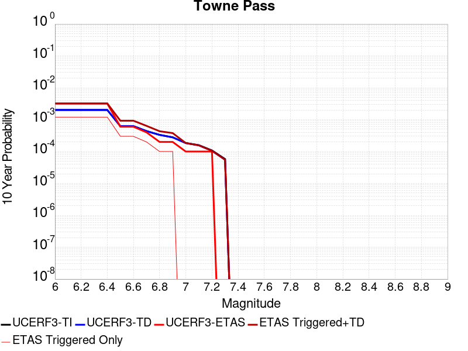 |

| Magnitude | 1 wk TI Prob | 1 wk TD Prob | 1 wk ETAS Prob | 1 wk ETAS/TD Gain | 1 wk ETAS Triggered+TD | 1 wk ETAS Triggered Only | 1 mo TI Prob | 1 mo TD Prob | 1 mo ETAS Prob | 1 mo ETAS/TD Gain | 1 mo ETAS Triggered+TD | 1 mo ETAS Triggered Only | 1 yr TI Prob | 1 yr TD Prob | 1 yr ETAS Prob | 1 yr ETAS/TD Gain | 1 yr ETAS Triggered+TD | 1 yr ETAS Triggered Only | 10 yr TI Prob | 10 yr TD Prob | 10 yr ETAS Prob | 10 yr ETAS/TD Gain | 10 yr ETAS Triggered+TD | 10 yr ETAS Triggered Only |
|-----|-----|-----|-----|-----|-----|-----|-----|-----|-----|-----|-----|-----|-----|-----|-----|-----|-----|-----|-----|-----|-----|-----|-----|-----|
| 6.0 | 3.849728E-6 | 3.8946687E-6 | 0.0 | 0.0 | 3.8946687E-6 | 0.0 | 1.649873E-5 | 1.6691356E-5 | 0.0 | 0.0 | 1.6691356E-5 | 0.0 | 2.0085352E-4 | 2.0320267E-4 | 4.0E-4 | 1.9684781 | 6.031214E-4 | 4.0E-4 | 0.0020067208 | 0.0020305978 | 0.0012 | 0.59095895 | 0.003228161 | 0.0012 |
| 6.1 | 3.849728E-6 | 3.8946687E-6 | 0.0 | 0.0 | 3.8946687E-6 | 0.0 | 1.649873E-5 | 1.6691356E-5 | 0.0 | 0.0 | 1.6691356E-5 | 0.0 | 2.0085352E-4 | 2.0320267E-4 | 4.0E-4 | 1.9684781 | 6.031214E-4 | 4.0E-4 | 0.0020067208 | 0.0020305978 | 0.0012 | 0.59095895 | 0.003228161 | 0.0012 |
| 6.2 | 3.849728E-6 | 3.8946687E-6 | 0.0 | 0.0 | 3.8946687E-6 | 0.0 | 1.649873E-5 | 1.6691356E-5 | 0.0 | 0.0 | 1.6691356E-5 | 0.0 | 2.0085352E-4 | 2.0320267E-4 | 4.0E-4 | 1.9684781 | 6.031214E-4 | 4.0E-4 | 0.0020067208 | 0.0020305978 | 0.0012 | 0.59095895 | 0.003228161 | 0.0012 |
| 6.3 | 3.849728E-6 | 3.8946687E-6 | 0.0 | 0.0 | 3.8946687E-6 | 0.0 | 1.649873E-5 | 1.6691356E-5 | 0.0 | 0.0 | 1.6691356E-5 | 0.0 | 2.0085352E-4 | 2.0320267E-4 | 4.0E-4 | 1.9684781 | 6.031214E-4 | 4.0E-4 | 0.0020067208 | 0.0020305978 | 0.0012 | 0.59095895 | 0.003228161 | 0.0012 |
| 6.4 | 3.849728E-6 | 3.8946687E-6 | 0.0 | 0.0 | 3.8946687E-6 | 0.0 | 1.649873E-5 | 1.6691356E-5 | 0.0 | 0.0 | 1.6691356E-5 | 0.0 | 2.0085352E-4 | 2.0320267E-4 | 4.0E-4 | 1.9684781 | 6.031214E-4 | 4.0E-4 | 0.0020067208 | 0.0020305978 | 0.0012 | 0.59095895 | 0.003228161 | 0.0012 |
| 6.5 | 1.1953545E-6 | 1.2031019E-6 | 0.0 | 0.0 | 1.2031019E-6 | 0.0 | 5.1229376E-6 | 5.1561415E-6 | 0.0 | 0.0 | 5.1561415E-6 | 0.0 | 6.236998E-5 | 6.277433E-5 | 1.0E-4 | 1.5930078 | 1.6276805E-4 | 1.0E-4 | 6.235248E-4 | 6.275777E-4 | 3.0E-4 | 0.47802845 | 9.273894E-4 | 3.0E-4 |
| 6.6 | 1.1953545E-6 | 1.2031019E-6 | 0.0 | 0.0 | 1.2031019E-6 | 0.0 | 5.1229376E-6 | 5.1561415E-6 | 0.0 | 0.0 | 5.1561415E-6 | 0.0 | 6.236998E-5 | 6.277433E-5 | 1.0E-4 | 1.5930078 | 1.6276805E-4 | 1.0E-4 | 6.235248E-4 | 6.275777E-4 | 3.0E-4 | 0.47802845 | 9.273894E-4 | 3.0E-4 |
| 6.7 | 8.375951E-7 | 8.411081E-7 | 0.0 | 0.0 | 8.411081E-7 | 0.0 | 3.5896885E-6 | 3.6047443E-6 | 0.0 | 0.0 | 3.6047443E-6 | 0.0 | 4.370358E-5 | 4.3886936E-5 | 1.0E-4 | 2.2785826 | 1.4388254E-4 | 1.0E-4 | 4.3694986E-4 | 4.3878838E-4 | 2.0E-4 | 0.45580056 | 6.387006E-4 | 2.0E-4 |
| 6.8 | 6.38041E-7 | 6.392519E-7 | 0.0 | 0.0 | 6.392519E-7 | 0.0 | 2.7344586E-6 | 2.7396482E-6 | 0.0 | 0.0 | 2.7396482E-6 | 0.0 | 3.3291526E-5 | 3.3354747E-5 | 1.0E-4 | 2.998074 | 1.3335141E-4 | 1.0E-4 | 3.3286537E-4 | 3.335012E-4 | 1.0E-4 | 0.299849 | 4.3346785E-4 | 1.0E-4 |
| 6.9 | 5.3460053E-7 | 5.3456694E-7 | 0.0 | 0.0 | 5.3456694E-7 | 0.0 | 2.2911431E-6 | 2.2909994E-6 | 0.0 | 0.0 | 2.2909994E-6 | 0.0 | 2.789431E-5 | 2.7892595E-5 | 1.0E-4 | 3.585181 | 1.2788981E-4 | 1.0E-4 | 2.789081E-4 | 2.7889427E-4 | 1.0E-4 | 0.35855883 | 3.7886636E-4 | 1.0E-4 |
| 7.0 | 3.557783E-7 | 3.5327074E-7 | 0.0 | 0.0 | 3.5327074E-7 | 0.0 | 1.5247632E-6 | 1.5140166E-6 | 0.0 | 0.0 | 1.5140166E-6 | 0.0 | 1.8563835E-5 | 1.8433006E-5 | 0.0 | 0.0 | 1.8433006E-5 | 0.0 | 1.8562283E-4 | 1.843156E-4 | 0.0 | 0.0 | 1.843156E-4 | 0.0 |
| 7.1 | 3.037942E-7 | 3.0004807E-7 | 0.0 | 0.0 | 3.0004807E-7 | 0.0 | 1.3019744E-6 | 1.2859197E-6 | 0.0 | 0.0 | 1.2859197E-6 | 0.0 | 1.5851423E-5 | 1.5655967E-5 | 0.0 | 0.0 | 1.5655967E-5 | 0.0 | 1.5850292E-4 | 1.5654939E-4 | 0.0 | 0.0 | 1.5654939E-4 | 0.0 |
| 7.2 | 2.0808248E-7 | 2.0219805E-7 | 0.0 | 0.0 | 2.0219805E-7 | 0.0 | 8.917818E-7 | 8.6656286E-7 | 0.0 | 0.0 | 8.6656286E-7 | 0.0 | 1.0857389E-5 | 1.0550356E-5 | 0.0 | 0.0 | 1.0550356E-5 | 0.0 | 1.0856859E-4 | 1.0549901E-4 | 0.0 | 0.0 | 1.0549901E-4 | 0.0 |
| 7.3 | 1.1162073E-7 | 1.06381556E-7 | 0.0 | 0.0 | 1.06381556E-7 | 0.0 | 4.7837443E-7 | 4.5592088E-7 | 0.0 | 0.0 | 4.5592088E-7 | 0.0 | 5.8241935E-6 | 5.5508244E-6 | 0.0 | 0.0 | 5.5508244E-6 | 0.0 | 5.8240406E-5 | 5.550706E-5 | 0.0 | 0.0 | 5.550706E-5 | 0.0 |

## Santa Susana alt 1
*[(top)](#table-of-contents)*

| 1 Week | 1 Month | 1 Year | 10 Year |
|-----|-----|-----|-----|
|  | 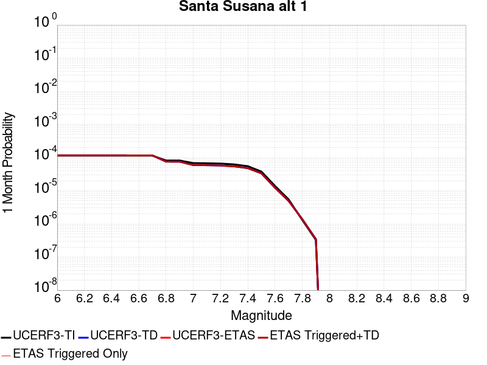 | 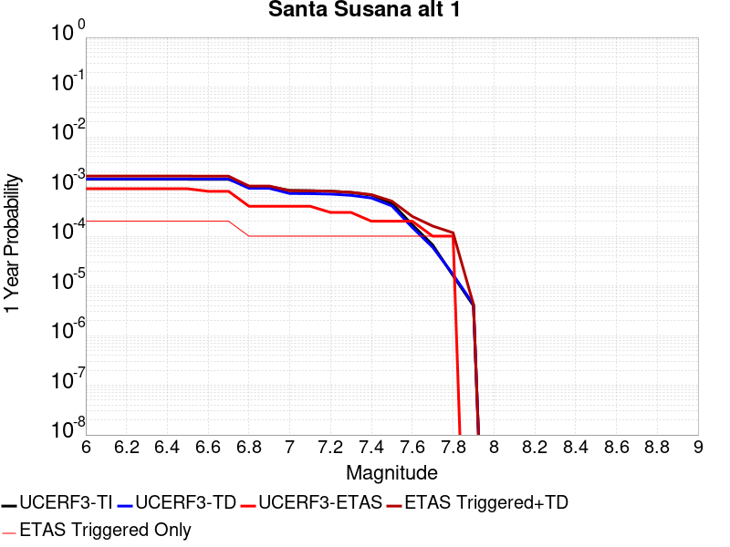 |  |

| Magnitude | 1 wk TI Prob | 1 wk TD Prob | 1 wk ETAS Prob | 1 wk ETAS/TD Gain | 1 wk ETAS Triggered+TD | 1 wk ETAS Triggered Only | 1 mo TI Prob | 1 mo TD Prob | 1 mo ETAS Prob | 1 mo ETAS/TD Gain | 1 mo ETAS Triggered+TD | 1 mo ETAS Triggered Only | 1 yr TI Prob | 1 yr TD Prob | 1 yr ETAS Prob | 1 yr ETAS/TD Gain | 1 yr ETAS Triggered+TD | 1 yr ETAS Triggered Only | 10 yr TI Prob | 10 yr TD Prob | 10 yr ETAS Prob | 10 yr ETAS/TD Gain | 10 yr ETAS Triggered+TD | 10 yr ETAS Triggered Only |
|-----|-----|-----|-----|-----|-----|-----|-----|-----|-----|-----|-----|-----|-----|-----|-----|-----|-----|-----|-----|-----|-----|-----|-----|-----|
| 6.0 | 2.674877E-5 | 2.720761E-5 | 0.0 | 0.0 | 2.720761E-5 | 0.0 | 1.1463255E-4 | 1.1659947E-4 | 0.0 | 0.0 | 1.1659947E-4 | 0.0 | 0.0013947578 | 0.0014187879 | 2.0E-4 | 0.1409654 | 0.0016185041 | 2.0E-4 | 0.013860362 | 0.014108988 | 0.0012 | 0.08505216 | 0.015292058 | 0.0012 |
| 6.1 | 2.674877E-5 | 2.720761E-5 | 0.0 | 0.0 | 2.720761E-5 | 0.0 | 1.1463255E-4 | 1.1659947E-4 | 0.0 | 0.0 | 1.1659947E-4 | 0.0 | 0.0013947578 | 0.0014187879 | 2.0E-4 | 0.1409654 | 0.0016185041 | 2.0E-4 | 0.013860362 | 0.014108988 | 0.0012 | 0.08505216 | 0.015292058 | 0.0012 |
| 6.2 | 2.674877E-5 | 2.720761E-5 | 0.0 | 0.0 | 2.720761E-5 | 0.0 | 1.1463255E-4 | 1.1659947E-4 | 0.0 | 0.0 | 1.1659947E-4 | 0.0 | 0.0013947578 | 0.0014187879 | 2.0E-4 | 0.1409654 | 0.0016185041 | 2.0E-4 | 0.013860362 | 0.014108988 | 0.0012 | 0.08505216 | 0.015292058 | 0.0012 |
| 6.3 | 2.674877E-5 | 2.720761E-5 | 0.0 | 0.0 | 2.720761E-5 | 0.0 | 1.1463255E-4 | 1.1659947E-4 | 0.0 | 0.0 | 1.1659947E-4 | 0.0 | 0.0013947578 | 0.0014187879 | 2.0E-4 | 0.1409654 | 0.0016185041 | 2.0E-4 | 0.013860362 | 0.014108988 | 0.0012 | 0.08505216 | 0.015292058 | 0.0012 |
| 6.4 | 2.674877E-5 | 2.720761E-5 | 0.0 | 0.0 | 2.720761E-5 | 0.0 | 1.1463255E-4 | 1.1659947E-4 | 0.0 | 0.0 | 1.1659947E-4 | 0.0 | 0.0013947578 | 0.0014187879 | 2.0E-4 | 0.1409654 | 0.0016185041 | 2.0E-4 | 0.013860362 | 0.014108988 | 0.0012 | 0.08505216 | 0.015292058 | 0.0012 |
| 6.5 | 2.674877E-5 | 2.720761E-5 | 0.0 | 0.0 | 2.720761E-5 | 0.0 | 1.1463255E-4 | 1.1659947E-4 | 0.0 | 0.0 | 1.1659947E-4 | 0.0 | 0.0013947578 | 0.0014187879 | 2.0E-4 | 0.1409654 | 0.0016185041 | 2.0E-4 | 0.013860362 | 0.014108988 | 0.0012 | 0.08505216 | 0.015292058 | 0.0012 |
| 6.6 | 2.6647976E-5 | 2.7083892E-5 | 0.0 | 0.0 | 2.7083892E-5 | 0.0 | 1.14200615E-4 | 1.160693E-4 | 0.0 | 0.0 | 1.160693E-4 | 0.0 | 0.0013895056 | 0.0014123414 | 2.0E-4 | 0.14160882 | 0.001612059 | 2.0E-4 | 0.013808494 | 0.014045345 | 0.0012 | 0.08543756 | 0.01522849 | 0.0012 |
| 6.7 | 2.6647976E-5 | 2.7083892E-5 | 0.0 | 0.0 | 2.7083892E-5 | 0.0 | 1.14200615E-4 | 1.160693E-4 | 0.0 | 0.0 | 1.160693E-4 | 0.0 | 0.0013895056 | 0.0014123414 | 2.0E-4 | 0.14160882 | 0.001612059 | 2.0E-4 | 0.013808494 | 0.014045345 | 0.0012 | 0.08543756 | 0.01522849 | 0.0012 |
| 6.8 | 1.9073179E-5 | 1.7642022E-5 | 0.0 | 0.0 | 1.7642022E-5 | 0.0 | 8.1739636E-5 | 7.560658E-5 | 0.0 | 0.0 | 7.560658E-5 | 0.0 | 9.947256E-4 | 9.201394E-4 | 1.0E-4 | 0.108679175 | 0.0010200475 | 1.0E-4 | 0.009902848 | 0.009165472 | 7.0E-4 | 0.07637359 | 0.009859056 | 7.0E-4 |
| 6.9 | 1.9041876E-5 | 1.7624148E-5 | 0.0 | 0.0 | 1.7624148E-5 | 0.0 | 8.160549E-5 | 7.552998E-5 | 0.0 | 0.0 | 7.552998E-5 | 0.0 | 9.930939E-4 | 9.192077E-4 | 1.0E-4 | 0.10878934 | 0.0010191158 | 1.0E-4 | 0.0098866755 | 0.009156232 | 7.0E-4 | 0.07645067 | 0.009849822 | 7.0E-4 |
| 7.0 | 1.5917482E-5 | 1.3866938E-5 | 0.0 | 0.0 | 1.3866938E-5 | 0.0 | 6.8215995E-5 | 5.942841E-5 | 0.0 | 0.0 | 5.942841E-5 | 0.0 | 8.302132E-4 | 7.2330533E-4 | 1.0E-4 | 0.1382542 | 8.23233E-4 | 1.0E-4 | 0.008271185 | 0.0072103245 | 5.0E-4 | 0.069345005 | 0.0077067195 | 5.0E-4 |
| 7.1 | 1.577788E-5 | 1.3746917E-5 | 0.0 | 0.0 | 1.3746917E-5 | 0.0 | 6.761774E-5 | 5.8914055E-5 | 0.0 | 0.0 | 5.8914055E-5 | 0.0 | 8.2293496E-4 | 7.170472E-4 | 1.0E-4 | 0.13946083 | 8.169755E-4 | 1.0E-4 | 0.008198941 | 0.007148147 | 5.0E-4 | 0.0699482 | 0.0076445728 | 5.0E-4 |
| 7.2 | 1.5416446E-5 | 1.3472924E-5 | 0.0 | 0.0 | 1.3472924E-5 | 0.0 | 6.606882E-5 | 5.7739853E-5 | 0.0 | 0.0 | 5.7739853E-5 | 0.0 | 8.0409093E-4 | 7.027606E-4 | 1.0E-4 | 0.14229597 | 8.0269034E-4 | 1.0E-4 | 0.008011877 | 0.007006185 | 5.0E-4 | 0.07136551 | 0.007502682 | 5.0E-4 |
| 7.3 | 1.4534083E-5 | 1.2720633E-5 | 0.0 | 0.0 | 1.2720633E-5 | 0.0 | 6.228744E-5 | 5.4515887E-5 | 0.0 | 0.0 | 5.4515887E-5 | 0.0 | 7.580857E-4 | 6.635332E-4 | 1.0E-4 | 0.15070835 | 7.634669E-4 | 1.0E-4 | 0.007555048 | 0.0066162823 | 5.0E-4 | 0.07557114 | 0.0071129743 | 5.0E-4 |
| 7.4 | 1.2858995E-5 | 1.1231866E-5 | 0.0 | 0.0 | 1.1231866E-5 | 0.0 | 5.5108816E-5 | 4.8135702E-5 | 0.0 | 0.0 | 4.8135702E-5 | 0.0 | 6.7074323E-4 | 5.858985E-4 | 1.0E-4 | 0.17067802 | 6.8584E-4 | 1.0E-4 | 0.0066872234 | 0.0058442303 | 5.0E-4 | 0.085554466 | 0.006341308 | 5.0E-4 |
| 7.5 | 8.827668E-6 | 7.8068315E-6 | 0.0 | 0.0 | 7.8068315E-6 | 0.0 | 3.7832317E-5 | 3.3457436E-5 | 0.0 | 0.0 | 3.3457436E-5 | 0.0 | 4.605111E-4 | 4.072706E-4 | 1.0E-4 | 0.24553701 | 5.072299E-4 | 1.0E-4 | 0.0045955796 | 0.0040655043 | 4.0E-4 | 0.098388776 | 0.004463878 | 4.0E-4 |
| 7.6 | 3.2533426E-6 | 2.8723055E-6 | 0.0 | 0.0 | 2.8723055E-6 | 0.0 | 1.3942822E-5 | 1.2309824E-5 | 0.0 | 0.0 | 1.2309824E-5 | 0.0 | 1.6974064E-4 | 1.4986219E-4 | 1.0E-4 | 0.6672798 | 2.498472E-4 | 1.0E-4 | 0.0016961104 | 0.0014976481 | 2.0E-4 | 0.13354273 | 0.0016973485 | 2.0E-4 |
| 7.7 | 1.2751709E-6 | 1.1492841E-6 | 0.0 | 0.0 | 1.1492841E-6 | 0.0 | 5.4650063E-6 | 4.9254945E-6 | 0.0 | 0.0 | 4.9254945E-6 | 0.0 | 6.653442E-5 | 5.9966336E-5 | 1.0E-4 | 1.6676023 | 1.5996034E-4 | 1.0E-4 | 6.6514505E-4 | 5.995105E-4 | 2.0E-4 | 0.33360553 | 7.9939055E-4 | 2.0E-4 |
| 7.8 | 3.067544E-7 | 3.2404924E-7 | 0.0 | 0.0 | 3.2404924E-7 | 0.0 | 1.3146611E-6 | 1.3887817E-6 | 0.0 | 0.0 | 1.3887817E-6 | 0.0 | 1.600588E-5 | 1.6908298E-5 | 1.0E-4 | 5.914256 | 1.1690661E-4 | 1.0E-4 | 1.6004729E-4 | 1.6907114E-4 | 1.0E-4 | 0.591467 | 2.6905423E-4 | 1.0E-4 |
| 7.9 | 7.622999E-8 | 8.0890274E-8 | 0.0 | 0.0 | 8.0890274E-8 | 0.0 | 3.2669993E-7 | 3.4667258E-7 | 0.0 | 0.0 | 3.4667258E-7 | 0.0 | 3.977564E-6 | 4.2207325E-6 | 0.0 | 0.0 | 4.2207325E-6 | 0.0 | 3.977493E-5 | 4.220673E-5 | 0.0 | 0.0 | 4.220673E-5 | 0.0 |

## Elsinore (Coyote Mountains)
*[(top)](#table-of-contents)*

| 1 Week | 1 Month | 1 Year | 10 Year |
|-----|-----|-----|-----|
|  |  | 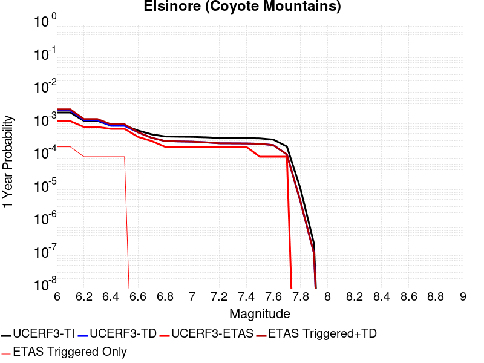 |  |

| Magnitude | 1 wk TI Prob | 1 wk TD Prob | 1 wk ETAS Prob | 1 wk ETAS/TD Gain | 1 wk ETAS Triggered+TD | 1 wk ETAS Triggered Only | 1 mo TI Prob | 1 mo TD Prob | 1 mo ETAS Prob | 1 mo ETAS/TD Gain | 1 mo ETAS Triggered+TD | 1 mo ETAS Triggered Only | 1 yr TI Prob | 1 yr TD Prob | 1 yr ETAS Prob | 1 yr ETAS/TD Gain | 1 yr ETAS Triggered+TD | 1 yr ETAS Triggered Only | 10 yr TI Prob | 10 yr TD Prob | 10 yr ETAS Prob | 10 yr ETAS/TD Gain | 10 yr ETAS Triggered+TD | 10 yr ETAS Triggered Only |
|-----|-----|-----|-----|-----|-----|-----|-----|-----|-----|-----|-----|-----|-----|-----|-----|-----|-----|-----|-----|-----|-----|-----|-----|-----|
| 6.0 | 4.20513E-5 | 4.8657297E-5 | 0.0 | 0.0 | 4.8657297E-5 | 0.0 | 1.8020741E-4 | 2.0851784E-4 | 0.0 | 0.0 | 2.0851784E-4 | 0.0 | 0.0021918174 | 0.002536278 | 2.0E-4 | 0.07885571 | 0.0027357708 | 2.0E-4 | 0.021703249 | 0.0251246 | 0.0012 | 0.047761954 | 0.026294451 | 0.0012 |
| 6.1 | 4.20513E-5 | 4.8657297E-5 | 0.0 | 0.0 | 4.8657297E-5 | 0.0 | 1.8020741E-4 | 2.0851784E-4 | 0.0 | 0.0 | 2.0851784E-4 | 0.0 | 0.0021918174 | 0.002536278 | 2.0E-4 | 0.07885571 | 0.0027357708 | 2.0E-4 | 0.021703249 | 0.0251246 | 0.0012 | 0.047761954 | 0.026294451 | 0.0012 |
| 6.2 | 2.3413893E-5 | 2.4708097E-5 | 0.0 | 0.0 | 2.4708097E-5 | 0.0 | 1.0034139E-4 | 1.0588809E-4 | 0.0 | 0.0 | 1.0588809E-4 | 0.0 | 0.0012209718 | 0.0012885133 | 1.0E-4 | 0.077608824 | 0.0013883844 | 1.0E-4 | 0.012142851 | 0.012819097 | 8.0E-4 | 0.06240689 | 0.013608842 | 8.0E-4 |
| 6.3 | 2.3413893E-5 | 2.4708097E-5 | 0.0 | 0.0 | 2.4708097E-5 | 0.0 | 1.0034139E-4 | 1.0588809E-4 | 0.0 | 0.0 | 1.0588809E-4 | 0.0 | 0.0012209718 | 0.0012885133 | 1.0E-4 | 0.077608824 | 0.0013883844 | 1.0E-4 | 0.012142851 | 0.012819097 | 8.0E-4 | 0.06240689 | 0.013608842 | 8.0E-4 |
| 6.4 | 1.6894814E-5 | 1.6576801E-5 | 0.0 | 0.0 | 1.6576801E-5 | 0.0 | 7.240433E-5 | 7.1041715E-5 | 0.0 | 0.0 | 7.1041715E-5 | 0.0 | 8.811662E-4 | 8.6462655E-4 | 1.0E-4 | 0.11565687 | 9.645401E-4 | 1.0E-4 | 0.0087768035 | 0.0086162845 | 6.0E-4 | 0.069635585 | 0.009211115 | 6.0E-4 |
| 6.5 | 1.6894814E-5 | 1.6576801E-5 | 0.0 | 0.0 | 1.6576801E-5 | 0.0 | 7.240433E-5 | 7.1041715E-5 | 0.0 | 0.0 | 7.1041715E-5 | 0.0 | 8.811662E-4 | 8.6462655E-4 | 1.0E-4 | 0.11565687 | 9.645401E-4 | 1.0E-4 | 0.0087768035 | 0.0086162845 | 6.0E-4 | 0.069635585 | 0.009211115 | 6.0E-4 |
| 6.6 | 1.1910969E-5 | 1.05365025E-5 | 0.0 | 0.0 | 1.05365025E-5 | 0.0 | 5.1046012E-5 | 4.515573E-5 | 0.0 | 0.0 | 4.515573E-5 | 0.0 | 6.21308E-4 | 5.4964545E-4 | 0.0 | 0.0 | 5.4964545E-4 | 0.0 | 0.0061957375 | 0.0054841614 | 5.0E-4 | 0.09117164 | 0.0059814197 | 5.0E-4 |
| 6.7 | 9.1486E-6 | 7.2072066E-6 | 0.0 | 0.0 | 7.2072066E-6 | 0.0 | 3.9207694E-5 | 3.0887684E-5 | 0.0 | 0.0 | 3.0887684E-5 | 0.0 | 4.7724912E-4 | 3.759965E-4 | 0.0 | 0.0 | 3.759965E-4 | 0.0 | 0.0047622547 | 0.003753983 | 5.0E-4 | 0.13319187 | 0.004252106 | 5.0E-4 |
| 6.8 | 7.90441E-6 | 5.7328134E-6 | 0.0 | 0.0 | 5.7328134E-6 | 0.0 | 3.3875604E-5 | 2.4568977E-5 | 0.0 | 0.0 | 2.4568977E-5 | 0.0 | 4.1235742E-4 | 2.9908752E-4 | 0.0 | 0.0 | 2.9908752E-4 | 0.0 | 0.0041159308 | 0.0029869787 | 4.0E-4 | 0.13391457 | 0.0033857839 | 4.0E-4 |
| 6.9 | 7.77015E-6 | 5.5867413E-6 | 0.0 | 0.0 | 5.5867413E-6 | 0.0 | 3.3300217E-5 | 2.3942965E-5 | 0.0 | 0.0 | 2.3942965E-5 | 0.0 | 4.0535472E-4 | 2.9146788E-4 | 0.0 | 0.0 | 2.9146788E-4 | 0.0 | 0.004046161 | 0.0029109833 | 4.0E-4 | 0.13741061 | 0.003309819 | 4.0E-4 |
| 7.0 | 7.675798E-6 | 5.48358E-6 | 0.0 | 0.0 | 5.48358E-6 | 0.0 | 3.289586E-5 | 2.3500854E-5 | 0.0 | 0.0 | 2.3500854E-5 | 0.0 | 4.004335E-4 | 2.8608658E-4 | 0.0 | 0.0 | 2.8608658E-4 | 0.0 | 0.003997127 | 0.0028573095 | 4.0E-4 | 0.13999183 | 0.0032561666 | 4.0E-4 |
| 7.1 | 7.447814E-6 | 5.242422E-6 | 0.0 | 0.0 | 5.242422E-6 | 0.0 | 3.191881E-5 | 2.2467337E-5 | 0.0 | 0.0 | 2.2467337E-5 | 0.0 | 3.8854225E-4 | 2.7350674E-4 | 0.0 | 0.0 | 2.7350674E-4 | 0.0 | 0.003878636 | 0.002731826 | 3.0E-4 | 0.10981666 | 0.0030310063 | 3.0E-4 |
| 7.2 | 7.128185E-6 | 4.909057E-6 | 0.0 | 0.0 | 4.909057E-6 | 0.0 | 3.0549007E-5 | 2.1038653E-5 | 0.0 | 0.0 | 2.1038653E-5 | 0.0 | 3.7187067E-4 | 2.561167E-4 | 0.0 | 0.0 | 2.561167E-4 | 0.0 | 0.00371249 | 0.0025583338 | 3.0E-4 | 0.117263824 | 0.0028575663 | 3.0E-4 |
| 7.3 | 7.0913875E-6 | 4.877727E-6 | 0.0 | 0.0 | 4.877727E-6 | 0.0 | 3.0391306E-5 | 2.0904383E-5 | 0.0 | 0.0 | 2.0904383E-5 | 0.0 | 3.6995133E-4 | 2.5448232E-4 | 0.0 | 0.0 | 2.5448232E-4 | 0.0 | 0.0036933604 | 0.0025420275 | 3.0E-4 | 0.11801603 | 0.002841265 | 3.0E-4 |
| 7.4 | 7.051521E-6 | 4.8415745E-6 | 0.0 | 0.0 | 4.8415745E-6 | 0.0 | 3.0220453E-5 | 2.0749447E-5 | 0.0 | 0.0 | 2.0749447E-5 | 0.0 | 3.6787192E-4 | 2.5259642E-4 | 0.0 | 0.0 | 2.5259642E-4 | 0.0 | 0.0036726352 | 0.0025232115 | 3.0E-4 | 0.1188961 | 0.0028224546 | 3.0E-4 |
| 7.5 | 6.910666E-6 | 4.7370213E-6 | 0.0 | 0.0 | 4.7370213E-6 | 0.0 | 2.9616802E-5 | 2.030137E-5 | 0.0 | 0.0 | 2.030137E-5 | 0.0 | 3.605249E-4 | 2.471423E-4 | 0.0 | 0.0 | 2.471423E-4 | 0.0 | 0.0035994058 | 0.002468793 | 3.0E-4 | 0.121516876 | 0.0027680523 | 3.0E-4 |
| 7.6 | 6.341753E-6 | 4.309983E-6 | 0.0 | 0.0 | 4.309983E-6 | 0.0 | 2.7178658E-5 | 1.8471232E-5 | 0.0 | 0.0 | 1.8471232E-5 | 0.0 | 3.3084993E-4 | 2.2486519E-4 | 0.0 | 0.0 | 2.2486519E-4 | 0.0 | 0.0033035777 | 0.002246492 | 3.0E-4 | 0.13354154 | 0.0025458182 | 3.0E-4 |
| 7.7 | 3.9205916E-6 | 2.2458037E-6 | 0.0 | 0.0 | 2.2458037E-6 | 0.0 | 1.6802427E-5 | 9.624841E-6 | 0.0 | 0.0 | 9.624841E-6 | 0.0 | 2.0455034E-4 | 1.1717689E-4 | 0.0 | 0.0 | 1.1717689E-4 | 0.0 | 0.0020436216 | 0.001171224 | 2.0E-4 | 0.17076151 | 0.0013709898 | 2.0E-4 |
| 7.8 | 2.0846227E-7 | 8.4922256E-8 | 0.0 | 0.0 | 8.4922256E-8 | 0.0 | 8.9340944E-7 | 3.639525E-7 | 0.0 | 0.0 | 3.639525E-7 | 0.0 | 1.0877206E-5 | 4.431116E-6 | 0.0 | 0.0 | 4.431116E-6 | 0.0 | 1.0876673E-4 | 4.4310604E-5 | 0.0 | 0.0 | 4.4310604E-5 | 0.0 |
| 7.9 | 4.4969806E-9 | 2.2703612E-9 | 0.0 | 0.0 | 2.2703612E-9 | 0.0 | 1.9272775E-8 | 9.73012E-9 | 0.0 | 0.0 | 9.73012E-9 | 0.0 | 2.3464601E-7 | 1.184642E-7 | 0.0 | 0.0 | 1.184642E-7 | 0.0 | 2.3464577E-6 | 1.1846415E-6 | 0.0 | 0.0 | 1.1846415E-6 | 0.0 |

## Lenwood-Lockhart-Old Woman Springs
*[(top)](#table-of-contents)*

| 1 Week | 1 Month | 1 Year | 10 Year |
|-----|-----|-----|-----|
|  |  | 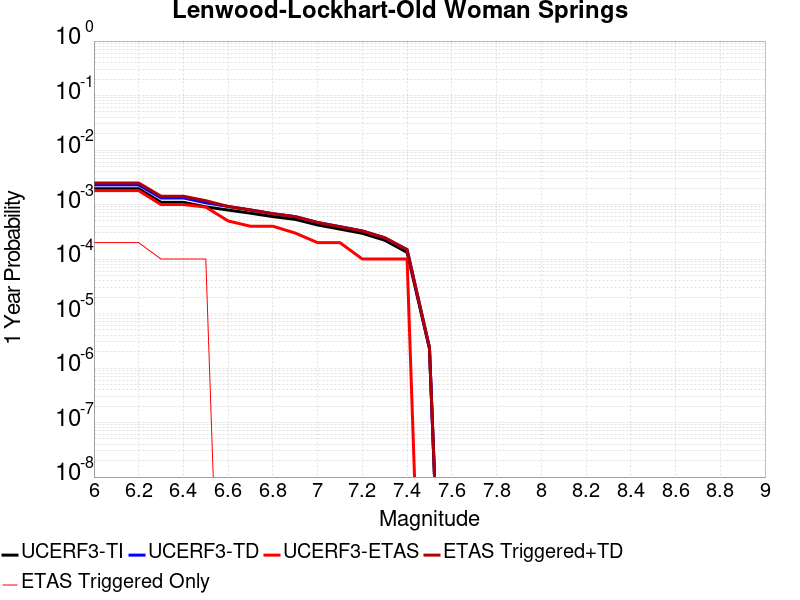 |  |

| Magnitude | 1 wk TI Prob | 1 wk TD Prob | 1 wk ETAS Prob | 1 wk ETAS/TD Gain | 1 wk ETAS Triggered+TD | 1 wk ETAS Triggered Only | 1 mo TI Prob | 1 mo TD Prob | 1 mo ETAS Prob | 1 mo ETAS/TD Gain | 1 mo ETAS Triggered+TD | 1 mo ETAS Triggered Only | 1 yr TI Prob | 1 yr TD Prob | 1 yr ETAS Prob | 1 yr ETAS/TD Gain | 1 yr ETAS Triggered+TD | 1 yr ETAS Triggered Only | 10 yr TI Prob | 10 yr TD Prob | 10 yr ETAS Prob | 10 yr ETAS/TD Gain | 10 yr ETAS Triggered+TD | 10 yr ETAS Triggered Only |
|-----|-----|-----|-----|-----|-----|-----|-----|-----|-----|-----|-----|-----|-----|-----|-----|-----|-----|-----|-----|-----|-----|-----|-----|-----|
| 6.0 | 3.744542E-5 | 4.3969783E-5 | 0.0 | 0.0 | 4.3969783E-5 | 0.0 | 1.604705E-4 | 1.8842929E-4 | 0.0 | 0.0 | 1.8842929E-4 | 0.0 | 0.0019519776 | 0.002291885 | 2.0E-4 | 0.08726441 | 0.0024914267 | 2.0E-4 | 0.019349206 | 0.0227005 | 0.0012 | 0.05286227 | 0.02387326 | 0.0012 |
| 6.1 | 3.744542E-5 | 4.3969783E-5 | 0.0 | 0.0 | 4.3969783E-5 | 0.0 | 1.604705E-4 | 1.8842929E-4 | 0.0 | 0.0 | 1.8842929E-4 | 0.0 | 0.0019519776 | 0.002291885 | 2.0E-4 | 0.08726441 | 0.0024914267 | 2.0E-4 | 0.019349206 | 0.0227005 | 0.0012 | 0.05286227 | 0.02387326 | 0.0012 |
| 6.2 | 3.744542E-5 | 4.3969783E-5 | 0.0 | 0.0 | 4.3969783E-5 | 0.0 | 1.604705E-4 | 1.8842929E-4 | 0.0 | 0.0 | 1.8842929E-4 | 0.0 | 0.0019519776 | 0.002291885 | 2.0E-4 | 0.08726441 | 0.0024914267 | 2.0E-4 | 0.019349206 | 0.0227005 | 0.0012 | 0.05286227 | 0.02387326 | 0.0012 |
| 6.3 | 2.1079984E-5 | 2.5356305E-5 | 0.0 | 0.0 | 2.5356305E-5 | 0.0 | 9.0339665E-5 | 1.0866546E-4 | 0.0 | 0.0 | 1.0866546E-4 | 0.0 | 0.0010993304 | 0.001322219 | 1.0E-4 | 0.075630434 | 0.0014220868 | 1.0E-4 | 0.010939079 | 0.013145736 | 6.0E-4 | 0.045642175 | 0.013737849 | 6.0E-4 |
| 6.4 | 2.1079984E-5 | 2.5356305E-5 | 0.0 | 0.0 | 2.5356305E-5 | 0.0 | 9.0339665E-5 | 1.0866546E-4 | 0.0 | 0.0 | 1.0866546E-4 | 0.0 | 0.0010993304 | 0.001322219 | 1.0E-4 | 0.075630434 | 0.0014220868 | 1.0E-4 | 0.010939079 | 0.013145736 | 6.0E-4 | 0.045642175 | 0.013737849 | 6.0E-4 |
| 6.5 | 1.7397282E-5 | 2.066477E-5 | 0.0 | 0.0 | 2.066477E-5 | 0.0 | 7.455765E-5 | 8.856036E-5 | 0.0 | 0.0 | 8.856036E-5 | 0.0 | 9.073613E-4 | 0.0010777008 | 1.0E-4 | 0.092790134 | 0.001177593 | 1.0E-4 | 0.009036654 | 0.010726039 | 6.0E-4 | 0.055938635 | 0.011319604 | 6.0E-4 |
| 6.6 | 1.52050325E-5 | 1.7681405E-5 | 0.0 | 0.0 | 1.7681405E-5 | 0.0 | 6.51628E-5 | 7.577529E-5 | 0.0 | 0.0 | 7.577529E-5 | 0.0 | 7.9306826E-4 | 9.221816E-4 | 0.0 | 0.0 | 9.221816E-4 | 0.0 | 0.007902439 | 0.009184411 | 5.0E-4 | 0.054440074 | 0.0096798185 | 5.0E-4 |
| 6.7 | 1.332523E-5 | 1.5265548E-5 | 0.0 | 0.0 | 1.5265548E-5 | 0.0 | 5.7106878E-5 | 6.542217E-5 | 0.0 | 0.0 | 6.542217E-5 | 0.0 | 6.950544E-4 | 7.962297E-4 | 0.0 | 0.0 | 7.962297E-4 | 0.0 | 0.006928845 | 0.007934399 | 5.0E-4 | 0.06301674 | 0.0084304325 | 5.0E-4 |
| 6.8 | 1.1525329E-5 | 1.3032384E-5 | 0.0 | 0.0 | 1.3032384E-5 | 0.0 | 4.9393333E-5 | 5.5851906E-5 | 0.0 | 0.0 | 5.5851906E-5 | 0.0 | 6.011979E-4 | 6.7978905E-4 | 0.0 | 0.0 | 6.7978905E-4 | 0.0 | 0.00599574 | 0.0067775478 | 5.0E-4 | 0.073773 | 0.0072741588 | 5.0E-4 |
| 6.9 | 1.0253909E-5 | 1.1515628E-5 | 0.0 | 0.0 | 1.1515628E-5 | 0.0 | 4.3944583E-5 | 4.935178E-5 | 0.0 | 0.0 | 4.935178E-5 | 0.0 | 5.3489394E-4 | 6.006959E-4 | 0.0 | 0.0 | 6.006959E-4 | 0.0 | 0.0053360825 | 0.0059911013 | 3.0E-4 | 0.050074264 | 0.0062893042 | 3.0E-4 |
| 7.0 | 8.104563E-6 | 8.992018E-6 | 0.0 | 0.0 | 8.992018E-6 | 0.0 | 3.4733377E-5 | 3.8536666E-5 | 0.0 | 0.0 | 3.8536666E-5 | 0.0 | 4.2279682E-4 | 4.690853E-4 | 0.0 | 0.0 | 4.690853E-4 | 0.0 | 0.0042199334 | 0.0046811993 | 1.0E-4 | 0.021362046 | 0.0047807316 | 1.0E-4 |
| 7.1 | 6.7986157E-6 | 7.516444E-6 | 0.0 | 0.0 | 7.516444E-6 | 0.0 | 2.91366E-5 | 3.2212945E-5 | 0.0 | 0.0 | 3.2212945E-5 | 0.0 | 3.5468035E-4 | 3.9212417E-4 | 0.0 | 0.0 | 3.9212417E-4 | 0.0 | 0.003541148 | 0.0039145392 | 1.0E-4 | 0.02554579 | 0.004014148 | 1.0E-4 |
| 7.2 | 5.6893327E-6 | 6.280491E-6 | 0.0 | 0.0 | 6.280491E-6 | 0.0 | 2.4382627E-5 | 2.6916125E-5 | 0.0 | 0.0 | 2.6916125E-5 | 0.0 | 2.9681803E-4 | 3.276565E-4 | 0.0 | 0.0 | 3.276565E-4 | 0.0 | 0.002964219 | 0.003271933 | 1.0E-4 | 0.030562975 | 0.0033716056 | 1.0E-4 |
| 7.3 | 4.253348E-6 | 4.707337E-6 | 0.0 | 0.0 | 4.707337E-6 | 0.0 | 1.8228506E-5 | 2.0174155E-5 | 0.0 | 0.0 | 2.0174155E-5 | 0.0 | 2.2190946E-4 | 2.455945E-4 | 0.0 | 0.0 | 2.455945E-4 | 0.0 | 0.00221688 | 0.0024534117 | 1.0E-4 | 0.040759567 | 0.0025531664 | 1.0E-4 |
| 7.4 | 2.5448119E-6 | 2.8521993E-6 | 0.0 | 0.0 | 2.8521993E-6 | 0.0 | 1.0906291E-5 | 1.2223662E-5 | 0.0 | 0.0 | 1.2223662E-5 | 0.0 | 1.3277601E-4 | 1.4881458E-4 | 0.0 | 0.0 | 1.4881458E-4 | 0.0 | 0.001326967 | 0.0014873114 | 1.0E-4 | 0.06723541 | 0.0015871627 | 1.0E-4 |
| 7.5 | 4.3706837E-8 | 4.5633225E-8 | 0.0 | 0.0 | 4.5633225E-8 | 0.0 | 1.8731501E-7 | 1.9557095E-7 | 0.0 | 0.0 | 1.9557095E-7 | 0.0 | 2.2805577E-6 | 2.3810742E-6 | 0.0 | 0.0 | 2.3810742E-6 | 0.0 | 2.2805343E-5 | 2.3810542E-5 | 0.0 | 0.0 | 2.3810542E-5 | 0.0 |

## San Jacinto (Coyote Creek)
*[(top)](#table-of-contents)*

| 1 Week | 1 Month | 1 Year | 10 Year |
|-----|-----|-----|-----|
|  |  | 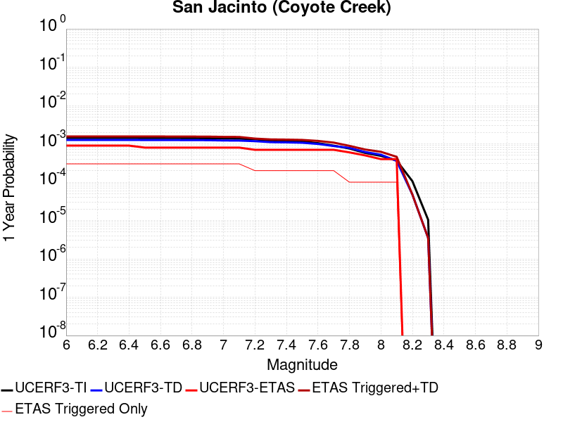 | 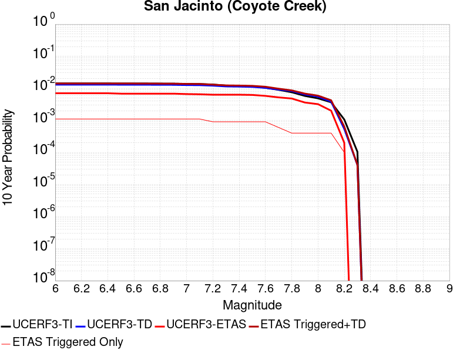 |

| Magnitude | 1 wk TI Prob | 1 wk TD Prob | 1 wk ETAS Prob | 1 wk ETAS/TD Gain | 1 wk ETAS Triggered+TD | 1 wk ETAS Triggered Only | 1 mo TI Prob | 1 mo TD Prob | 1 mo ETAS Prob | 1 mo ETAS/TD Gain | 1 mo ETAS Triggered+TD | 1 mo ETAS Triggered Only | 1 yr TI Prob | 1 yr TD Prob | 1 yr ETAS Prob | 1 yr ETAS/TD Gain | 1 yr ETAS Triggered+TD | 1 yr ETAS Triggered Only | 10 yr TI Prob | 10 yr TD Prob | 10 yr ETAS Prob | 10 yr ETAS/TD Gain | 10 yr ETAS Triggered+TD | 10 yr ETAS Triggered Only |
|-----|-----|-----|-----|-----|-----|-----|-----|-----|-----|-----|-----|-----|-----|-----|-----|-----|-----|-----|-----|-----|-----|-----|-----|-----|
| 6.0 | 2.7374346E-5 | 2.4218009E-5 | 0.0 | 0.0 | 2.4218009E-5 | 0.0 | 1.1731335E-4 | 1.0378735E-4 | 0.0 | 0.0 | 1.0378735E-4 | 0.0 | 0.0014273542 | 0.0012628811 | 3.0E-4 | 0.23755205 | 0.0015625022 | 3.0E-4 | 0.01418221 | 0.012966439 | 0.0011 | 0.08483439 | 0.014052176 | 0.0011 |
| 6.1 | 2.7374346E-5 | 2.4218009E-5 | 0.0 | 0.0 | 2.4218009E-5 | 0.0 | 1.1731335E-4 | 1.0378735E-4 | 0.0 | 0.0 | 1.0378735E-4 | 0.0 | 0.0014273542 | 0.0012628811 | 3.0E-4 | 0.23755205 | 0.0015625022 | 3.0E-4 | 0.01418221 | 0.012966439 | 0.0011 | 0.08483439 | 0.014052176 | 0.0011 |
| 6.2 | 2.7374346E-5 | 2.4218009E-5 | 0.0 | 0.0 | 2.4218009E-5 | 0.0 | 1.1731335E-4 | 1.0378735E-4 | 0.0 | 0.0 | 1.0378735E-4 | 0.0 | 0.0014273542 | 0.0012628811 | 3.0E-4 | 0.23755205 | 0.0015625022 | 3.0E-4 | 0.01418221 | 0.012966439 | 0.0011 | 0.08483439 | 0.014052176 | 0.0011 |
| 6.3 | 2.7374346E-5 | 2.4218009E-5 | 0.0 | 0.0 | 2.4218009E-5 | 0.0 | 1.1731335E-4 | 1.0378735E-4 | 0.0 | 0.0 | 1.0378735E-4 | 0.0 | 0.0014273542 | 0.0012628811 | 3.0E-4 | 0.23755205 | 0.0015625022 | 3.0E-4 | 0.01418221 | 0.012966439 | 0.0011 | 0.08483439 | 0.014052176 | 0.0011 |
| 6.4 | 2.7374346E-5 | 2.4218009E-5 | 0.0 | 0.0 | 2.4218009E-5 | 0.0 | 1.1731335E-4 | 1.0378735E-4 | 0.0 | 0.0 | 1.0378735E-4 | 0.0 | 0.0014273542 | 0.0012628811 | 3.0E-4 | 0.23755205 | 0.0015625022 | 3.0E-4 | 0.01418221 | 0.012966439 | 0.0011 | 0.08483439 | 0.014052176 | 0.0011 |
| 6.5 | 2.7282445E-5 | 2.410403E-5 | 0.0 | 0.0 | 2.410403E-5 | 0.0 | 1.16919524E-4 | 1.0329892E-4 | 0.0 | 0.0 | 1.0329892E-4 | 0.0 | 0.0014225657 | 0.0012569414 | 3.0E-4 | 0.23867463 | 0.0015565642 | 3.0E-4 | 0.014134934 | 0.012907741 | 0.0011 | 0.08522018 | 0.013993542 | 0.0011 |
| 6.6 | 2.7282445E-5 | 2.410403E-5 | 0.0 | 0.0 | 2.410403E-5 | 0.0 | 1.16919524E-4 | 1.0329892E-4 | 0.0 | 0.0 | 1.0329892E-4 | 0.0 | 0.0014225657 | 0.0012569414 | 3.0E-4 | 0.23867463 | 0.0015565642 | 3.0E-4 | 0.014134934 | 0.012907741 | 0.0011 | 0.08522018 | 0.013993542 | 0.0011 |
| 6.7 | 2.7216198E-5 | 2.4029121E-5 | 0.0 | 0.0 | 2.4029121E-5 | 0.0 | 1.1663563E-4 | 1.02977894E-4 | 0.0 | 0.0 | 1.02977894E-4 | 0.0 | 0.0014191137 | 0.0012530375 | 3.0E-4 | 0.23941822 | 0.0015526615 | 3.0E-4 | 0.014100855 | 0.012869136 | 0.0011 | 0.08547582 | 0.01395498 | 0.0011 |
| 6.8 | 2.7078617E-5 | 2.3946313E-5 | 0.0 | 0.0 | 2.3946313E-5 | 0.0 | 1.1604605E-4 | 1.0262303E-4 | 0.0 | 0.0 | 1.0262303E-4 | 0.0 | 0.001411945 | 0.001248722 | 3.0E-4 | 0.24024564 | 0.0015483473 | 3.0E-4 | 0.014030075 | 0.012826261 | 0.0011 | 0.08576155 | 0.0139121525 | 0.0011 |
| 6.9 | 2.6982952E-5 | 2.3865785E-5 | 0.0 | 0.0 | 2.3865785E-5 | 0.0 | 1.15636096E-4 | 1.0227794E-4 | 0.0 | 0.0 | 1.0227794E-4 | 0.0 | 0.0014069602 | 0.0012445252 | 3.0E-4 | 0.24105579 | 0.0015441519 | 3.0E-4 | 0.013980856 | 0.01278453 | 0.0011 | 0.08604149 | 0.013870467 | 0.0011 |
| 7.0 | 2.6449972E-5 | 2.3442697E-5 | 0.0 | 0.0 | 2.3442697E-5 | 0.0 | 1.1335209E-4 | 1.00464844E-4 | 0.0 | 0.0 | 1.00464844E-4 | 0.0 | 0.001379188 | 0.0012224758 | 3.0E-4 | 0.24540365 | 0.001522109 | 3.0E-4 | 0.0137065975 | 0.012565823 | 0.0011 | 0.08753903 | 0.0136520015 | 0.0011 |
| 7.1 | 2.6257849E-5 | 2.3268693E-5 | 0.0 | 0.0 | 2.3268693E-5 | 0.0 | 1.1252879E-4 | 9.971917E-5 | 0.0 | 0.0 | 9.971917E-5 | 0.0 | 0.0013691769 | 0.0012134073 | 3.0E-4 | 0.24723768 | 0.0015130433 | 3.0E-4 | 0.013607717 | 0.01247566 | 0.0011 | 0.08817168 | 0.013561937 | 0.0011 |
| 7.2 | 2.5270041E-5 | 2.2463431E-5 | 0.0 | 0.0 | 2.2463431E-5 | 0.0 | 1.0829568E-4 | 9.6268304E-5 | 0.0 | 0.0 | 9.6268304E-5 | 0.0 | 0.0013177024 | 0.0011714388 | 2.0E-4 | 0.17073022 | 0.0013712045 | 2.0E-4 | 0.013099162 | 0.012056662 | 9.0E-4 | 0.07464753 | 0.01294581 | 9.0E-4 |
| 7.3 | 2.339701E-5 | 2.1194783E-5 | 0.0 | 0.0 | 2.1194783E-5 | 0.0 | 1.0026905E-4 | 9.0831636E-5 | 0.0 | 0.0 | 9.0831636E-5 | 0.0 | 0.001220092 | 0.0011053162 | 2.0E-4 | 0.1809437 | 0.0013050952 | 2.0E-4 | 0.012134149 | 0.0113953315 | 9.0E-4 | 0.078979716 | 0.012285075 | 9.0E-4 |
| 7.4 | 2.296333E-5 | 2.0925016E-5 | 0.0 | 0.0 | 2.0925016E-5 | 0.0 | 9.841056E-5 | 8.967557E-5 | 0.0 | 0.0 | 8.967557E-5 | 0.0 | 0.0011974899 | 0.0010912552 | 2.0E-4 | 0.18327518 | 0.001291037 | 2.0E-4 | 0.011910575 | 0.011254364 | 9.0E-4 | 0.07996898 | 0.012144235 | 9.0E-4 |
| 7.5 | 2.2188895E-5 | 2.0447598E-5 | 0.0 | 0.0 | 2.0447598E-5 | 0.0 | 9.50918E-5 | 8.762963E-5 | 0.0 | 0.0 | 8.762963E-5 | 0.0 | 0.0011571277 | 0.0010663706 | 2.0E-4 | 0.18755205 | 0.0012661574 | 2.0E-4 | 0.011511209 | 0.011003808 | 9.0E-4 | 0.081789866 | 0.011893905 | 9.0E-4 |
| 7.6 | 2.0013189E-5 | 1.9030398E-5 | 0.0 | 0.0 | 1.9030398E-5 | 0.0 | 8.5767984E-5 | 8.155631E-5 | 0.0 | 0.0 | 8.155631E-5 | 0.0 | 0.001043725 | 9.924975E-4 | 2.0E-4 | 0.20151183 | 0.0011922991 | 2.0E-4 | 0.010388365 | 0.010260041 | 9.0E-4 | 0.08771895 | 0.011150807 | 9.0E-4 |
| 7.7 | 1.7230794E-5 | 1.6809852E-5 | 0.0 | 0.0 | 1.6809852E-5 | 0.0 | 7.384417E-5 | 7.204024E-5 | 0.0 | 0.0 | 7.204024E-5 | 0.0 | 8.986819E-4 | 8.7673776E-4 | 2.0E-4 | 0.22811837 | 0.0010765624 | 2.0E-4 | 0.008950562 | 0.009097574 | 6.0E-4 | 0.065951645 | 0.009692116 | 6.0E-4 |
| 7.8 | 1.4478809E-5 | 1.5055025E-5 | 0.0 | 0.0 | 1.5055025E-5 | 0.0 | 6.205057E-5 | 6.451995E-5 | 0.0 | 0.0 | 6.451995E-5 | 0.0 | 7.552038E-4 | 7.8524783E-4 | 1.0E-4 | 0.12734832 | 8.851693E-4 | 1.0E-4 | 0.0075264242 | 0.0081747295 | 4.0E-4 | 0.048931282 | 0.00857146 | 4.0E-4 |
| 7.9 | 1.1114467E-5 | 1.1699789E-5 | 0.0 | 0.0 | 1.1699789E-5 | 0.0 | 4.7632562E-5 | 5.0140992E-5 | 0.0 | 0.0 | 5.0140992E-5 | 0.0 | 5.797721E-4 | 6.1029615E-4 | 1.0E-4 | 0.16385488 | 7.1023515E-4 | 1.0E-4 | 0.0057826187 | 0.006408866 | 4.0E-4 | 0.062413536 | 0.0068063024 | 4.0E-4 |
| 8.0 | 9.327402E-6 | 9.946609E-6 | 0.0 | 0.0 | 9.946609E-6 | 0.0 | 3.9973966E-5 | 4.2627627E-5 | 0.0 | 0.0 | 4.2627627E-5 | 0.0 | 4.8657437E-4 | 5.188683E-4 | 1.0E-4 | 0.19272712 | 6.188164E-4 | 1.0E-4 | 0.0048551033 | 0.0054747183 | 4.0E-4 | 0.07306312 | 0.0058725285 | 4.0E-4 |
| 8.1 | 7.0235833E-6 | 6.858304E-6 | 0.0 | 0.0 | 6.858304E-6 | 0.0 | 3.0100724E-5 | 2.9392404E-5 | 0.0 | 0.0 | 2.9392404E-5 | 0.0 | 3.664147E-4 | 3.5779426E-4 | 1.0E-4 | 0.27949023 | 4.577585E-4 | 1.0E-4 | 0.003658111 | 0.0038038618 | 4.0E-4 | 0.105156295 | 0.0042023403 | 4.0E-4 |
| 8.2 | 2.0358202E-6 | 9.0193413E-7 | 0.0 | 0.0 | 9.0193413E-7 | 0.0 | 8.724915E-6 | 3.8654266E-6 | 0.0 | 0.0 | 3.8654266E-6 | 0.0 | 1.06220665E-4 | 4.7060574E-5 | 0.0 | 0.0 | 4.7060574E-5 | 0.0 | 0.001061699 | 5.339522E-4 | 1.0E-4 | 0.18728268 | 6.338988E-4 | 1.0E-4 |
| 8.3 | 2.0051264E-7 | 6.634659E-8 | 0.0 | 0.0 | 6.634659E-8 | 0.0 | 8.5933965E-7 | 2.843425E-7 | 0.0 | 0.0 | 2.843425E-7 | 0.0 | 1.046241E-5 | 3.461865E-6 | 0.0 | 0.0 | 3.461865E-6 | 0.0 | 1.0461917E-4 | 4.0242638E-5 | 0.0 | 0.0 | 4.0242638E-5 | 0.0 |

## Independence rev 2011
*[(top)](#table-of-contents)*

| 1 Week | 1 Month | 1 Year | 10 Year |
|-----|-----|-----|-----|
|  | 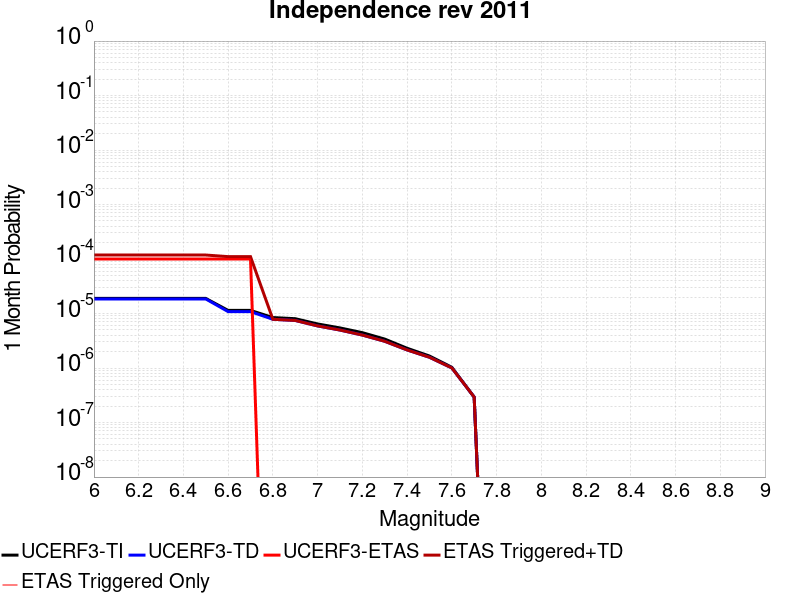 |  |  |

| Magnitude | 1 wk TI Prob | 1 wk TD Prob | 1 wk ETAS Prob | 1 wk ETAS/TD Gain | 1 wk ETAS Triggered+TD | 1 wk ETAS Triggered Only | 1 mo TI Prob | 1 mo TD Prob | 1 mo ETAS Prob | 1 mo ETAS/TD Gain | 1 mo ETAS Triggered+TD | 1 mo ETAS Triggered Only | 1 yr TI Prob | 1 yr TD Prob | 1 yr ETAS Prob | 1 yr ETAS/TD Gain | 1 yr ETAS Triggered+TD | 1 yr ETAS Triggered Only | 10 yr TI Prob | 10 yr TD Prob | 10 yr ETAS Prob | 10 yr ETAS/TD Gain | 10 yr ETAS Triggered+TD | 10 yr ETAS Triggered Only |
|-----|-----|-----|-----|-----|-----|-----|-----|-----|-----|-----|-----|-----|-----|-----|-----|-----|-----|-----|-----|-----|-----|-----|-----|-----|
| 6.0 | 4.422171E-6 | 4.326409E-6 | 0.0 | 0.0 | 4.326409E-6 | 0.0 | 1.8952025E-5 | 1.854164E-5 | 1.0E-4 | 5.3932667 | 1.18539785E-4 | 1.0E-4 | 2.3071647E-4 | 2.2572406E-4 | 1.0E-4 | 0.44301882 | 3.257015E-4 | 1.0E-4 | 0.0023047708 | 0.0022552414 | 0.0011 | 0.48775268 | 0.0033527606 | 0.0011 |
| 6.1 | 4.422171E-6 | 4.326409E-6 | 0.0 | 0.0 | 4.326409E-6 | 0.0 | 1.8952025E-5 | 1.854164E-5 | 1.0E-4 | 5.3932667 | 1.18539785E-4 | 1.0E-4 | 2.3071647E-4 | 2.2572406E-4 | 1.0E-4 | 0.44301882 | 3.257015E-4 | 1.0E-4 | 0.0023047708 | 0.0022552414 | 0.0011 | 0.48775268 | 0.0033527606 | 0.0011 |
| 6.2 | 4.422171E-6 | 4.326409E-6 | 0.0 | 0.0 | 4.326409E-6 | 0.0 | 1.8952025E-5 | 1.854164E-5 | 1.0E-4 | 5.3932667 | 1.18539785E-4 | 1.0E-4 | 2.3071647E-4 | 2.2572406E-4 | 1.0E-4 | 0.44301882 | 3.257015E-4 | 1.0E-4 | 0.0023047708 | 0.0022552414 | 0.0011 | 0.48775268 | 0.0033527606 | 0.0011 |
| 6.3 | 4.422171E-6 | 4.326409E-6 | 0.0 | 0.0 | 4.326409E-6 | 0.0 | 1.8952025E-5 | 1.854164E-5 | 1.0E-4 | 5.3932667 | 1.18539785E-4 | 1.0E-4 | 2.3071647E-4 | 2.2572406E-4 | 1.0E-4 | 0.44301882 | 3.257015E-4 | 1.0E-4 | 0.0023047708 | 0.0022552414 | 0.0011 | 0.48775268 | 0.0033527606 | 0.0011 |
| 6.4 | 4.422171E-6 | 4.326409E-6 | 0.0 | 0.0 | 4.326409E-6 | 0.0 | 1.8952025E-5 | 1.854164E-5 | 1.0E-4 | 5.3932667 | 1.18539785E-4 | 1.0E-4 | 2.3071647E-4 | 2.2572406E-4 | 1.0E-4 | 0.44301882 | 3.257015E-4 | 1.0E-4 | 0.0023047708 | 0.0022552414 | 0.0011 | 0.48775268 | 0.0033527606 | 0.0011 |
| 6.5 | 4.422171E-6 | 4.326409E-6 | 0.0 | 0.0 | 4.326409E-6 | 0.0 | 1.8952025E-5 | 1.854164E-5 | 1.0E-4 | 5.3932667 | 1.18539785E-4 | 1.0E-4 | 2.3071647E-4 | 2.2572406E-4 | 1.0E-4 | 0.44301882 | 3.257015E-4 | 1.0E-4 | 0.0023047708 | 0.0022552414 | 0.0011 | 0.48775268 | 0.0033527606 | 0.0011 |
| 6.6 | 2.663744E-6 | 2.532093E-6 | 0.0 | 0.0 | 2.532093E-6 | 0.0 | 1.1415996E-5 | 1.0851785E-5 | 1.0E-4 | 9.215074 | 1.108507E-4 | 1.0E-4 | 1.3898089E-4 | 1.3211297E-4 | 1.0E-4 | 0.756928 | 2.3209974E-4 | 1.0E-4 | 0.0013889399 | 0.0013203925 | 5.0E-4 | 0.37867528 | 0.0018197322 | 5.0E-4 |
| 6.7 | 2.663744E-6 | 2.532093E-6 | 0.0 | 0.0 | 2.532093E-6 | 0.0 | 1.1415996E-5 | 1.0851785E-5 | 1.0E-4 | 9.215074 | 1.108507E-4 | 1.0E-4 | 1.3898089E-4 | 1.3211297E-4 | 1.0E-4 | 0.756928 | 2.3209974E-4 | 1.0E-4 | 0.0013889399 | 0.0013203925 | 5.0E-4 | 0.37867528 | 0.0018197322 | 5.0E-4 |
| 6.8 | 1.9716529E-6 | 1.8323382E-6 | 0.0 | 0.0 | 1.8323382E-6 | 0.0 | 8.449913E-6 | 7.852855E-6 | 0.0 | 0.0 | 7.852855E-6 | 0.0 | 1.0287284E-4 | 9.5604446E-5 | 0.0 | 0.0 | 9.5604446E-5 | 0.0 | 0.0010282523 | 9.5564604E-4 | 2.0E-4 | 0.2092825 | 0.0011554549 | 2.0E-4 |
| 6.9 | 1.8788617E-6 | 1.7430754E-6 | 0.0 | 0.0 | 1.7430754E-6 | 0.0 | 8.0522395E-6 | 7.470302E-6 | 0.0 | 0.0 | 7.470302E-6 | 0.0 | 9.80316E-5 | 9.094725E-5 | 0.0 | 0.0 | 9.094725E-5 | 0.0 | 9.798837E-4 | 9.091124E-4 | 2.0E-4 | 0.21999481 | 0.0011089306 | 2.0E-4 |
| 7.0 | 1.5045488E-6 | 1.3850116E-6 | 0.0 | 0.0 | 1.3850116E-6 | 0.0 | 6.44805E-6 | 5.9357512E-6 | 0.0 | 0.0 | 5.9357512E-6 | 0.0 | 7.8502184E-5 | 7.226542E-5 | 0.0 | 0.0 | 7.226542E-5 | 0.0 | 7.8474457E-4 | 7.2242436E-4 | 2.0E-4 | 0.27684557 | 9.222799E-4 | 2.0E-4 |
| 7.1 | 1.272341E-6 | 1.1625621E-6 | 0.0 | 0.0 | 1.1625621E-6 | 0.0 | 5.4528787E-6 | 4.9824E-6 | 0.0 | 0.0 | 4.9824E-6 | 0.0 | 6.6386776E-5 | 6.065906E-5 | 0.0 | 0.0 | 6.065906E-5 | 0.0 | 6.636695E-4 | 6.064282E-4 | 1.0E-4 | 0.16489998 | 7.063676E-4 | 1.0E-4 |
| 7.2 | 1.0416892E-6 | 9.410321E-7 | 0.0 | 0.0 | 9.410321E-7 | 0.0 | 4.464375E-6 | 4.0329887E-6 | 0.0 | 0.0 | 4.0329887E-6 | 0.0 | 5.4352407E-5 | 4.910055E-5 | 0.0 | 0.0 | 4.910055E-5 | 0.0 | 5.4339116E-4 | 4.9089885E-4 | 1.0E-4 | 0.20370795 | 5.908498E-4 | 1.0E-4 |
| 7.3 | 7.9450155E-7 | 7.2353475E-7 | 0.0 | 0.0 | 7.2353475E-7 | 0.0 | 3.4050022E-6 | 3.1008597E-6 | 0.0 | 0.0 | 3.1008597E-6 | 0.0 | 4.1455114E-5 | 3.775232E-5 | 0.0 | 0.0 | 3.775232E-5 | 0.0 | 4.144738E-4 | 3.774602E-4 | 1.0E-4 | 0.26492858 | 4.7742247E-4 | 1.0E-4 |
| 7.4 | 5.3893444E-7 | 5.0197417E-7 | 0.0 | 0.0 | 5.0197417E-7 | 0.0 | 2.309717E-6 | 2.151316E-6 | 0.0 | 0.0 | 2.151316E-6 | 0.0 | 2.8120441E-5 | 2.6191963E-5 | 0.0 | 0.0 | 2.6191963E-5 | 0.0 | 2.8116882E-4 | 2.6188922E-4 | 1.0E-4 | 0.38184085 | 3.6186303E-4 | 1.0E-4 |
| 7.5 | 3.8852085E-7 | 3.6827265E-7 | 0.0 | 0.0 | 3.6827265E-7 | 0.0 | 1.6650882E-6 | 1.5783105E-6 | 0.0 | 0.0 | 1.5783105E-6 | 0.0 | 2.027226E-5 | 1.9215762E-5 | 0.0 | 0.0 | 1.9215762E-5 | 0.0 | 2.0270412E-4 | 1.9214122E-4 | 0.0 | 0.0 | 1.9214122E-4 | 0.0 |
| 7.6 | 2.414929E-7 | 2.3458637E-7 | 0.0 | 0.0 | 2.3458637E-7 | 0.0 | 1.0349692E-6 | 1.0053698E-6 | 0.0 | 0.0 | 1.0053698E-6 | 0.0 | 1.2600677E-5 | 1.224031E-5 | 0.0 | 0.0 | 1.224031E-5 | 0.0 | 1.2599962E-4 | 1.2239648E-4 | 0.0 | 0.0 | 1.2239648E-4 | 0.0 |
| 7.7 | 6.8298014E-8 | 6.859275E-8 | 0.0 | 0.0 | 6.859275E-8 | 0.0 | 2.9270575E-7 | 2.939689E-7 | 0.0 | 0.0 | 2.939689E-7 | 0.0 | 3.5636867E-6 | 3.5790658E-6 | 0.0 | 0.0 | 3.5790658E-6 | 0.0 | 3.5636294E-5 | 3.579013E-5 | 0.0 | 0.0 | 3.579013E-5 | 0.0 |

## Round Valley
*[(top)](#table-of-contents)*

| 1 Week | 1 Month | 1 Year | 10 Year |
|-----|-----|-----|-----|
|  |  |  |  |

| Magnitude | 1 wk TI Prob | 1 wk TD Prob | 1 wk ETAS Prob | 1 wk ETAS/TD Gain | 1 wk ETAS Triggered+TD | 1 wk ETAS Triggered Only | 1 mo TI Prob | 1 mo TD Prob | 1 mo ETAS Prob | 1 mo ETAS/TD Gain | 1 mo ETAS Triggered+TD | 1 mo ETAS Triggered Only | 1 yr TI Prob | 1 yr TD Prob | 1 yr ETAS Prob | 1 yr ETAS/TD Gain | 1 yr ETAS Triggered+TD | 1 yr ETAS Triggered Only | 10 yr TI Prob | 10 yr TD Prob | 10 yr ETAS Prob | 10 yr ETAS/TD Gain | 10 yr ETAS Triggered+TD | 10 yr ETAS Triggered Only |
|-----|-----|-----|-----|-----|-----|-----|-----|-----|-----|-----|-----|-----|-----|-----|-----|-----|-----|-----|-----|-----|-----|-----|-----|-----|
| 6.0 | 1.588152E-5 | 1.36724775E-5 | 0.0 | 0.0 | 1.36724775E-5 | 0.0 | 6.806188E-5 | 5.8595237E-5 | 0.0 | 0.0 | 5.8595237E-5 | 0.0 | 8.283384E-4 | 7.132029E-4 | 0.0 | 0.0 | 7.132029E-4 | 0.0 | 0.008252576 | 0.0071130292 | 0.0011 | 0.15464579 | 0.008205205 | 0.0011 |
| 6.1 | 1.588152E-5 | 1.36724775E-5 | 0.0 | 0.0 | 1.36724775E-5 | 0.0 | 6.806188E-5 | 5.8595237E-5 | 0.0 | 0.0 | 5.8595237E-5 | 0.0 | 8.283384E-4 | 7.132029E-4 | 0.0 | 0.0 | 7.132029E-4 | 0.0 | 0.008252576 | 0.0071130292 | 0.0011 | 0.15464579 | 0.008205205 | 0.0011 |
| 6.2 | 1.588152E-5 | 1.36724775E-5 | 0.0 | 0.0 | 1.36724775E-5 | 0.0 | 6.806188E-5 | 5.8595237E-5 | 0.0 | 0.0 | 5.8595237E-5 | 0.0 | 8.283384E-4 | 7.132029E-4 | 0.0 | 0.0 | 7.132029E-4 | 0.0 | 0.008252576 | 0.0071130292 | 0.0011 | 0.15464579 | 0.008205205 | 0.0011 |
| 6.3 | 1.588152E-5 | 1.36724775E-5 | 0.0 | 0.0 | 1.36724775E-5 | 0.0 | 6.806188E-5 | 5.8595237E-5 | 0.0 | 0.0 | 5.8595237E-5 | 0.0 | 8.283384E-4 | 7.132029E-4 | 0.0 | 0.0 | 7.132029E-4 | 0.0 | 0.008252576 | 0.0071130292 | 0.0011 | 0.15464579 | 0.008205205 | 0.0011 |
| 6.4 | 1.588152E-5 | 1.36724775E-5 | 0.0 | 0.0 | 1.36724775E-5 | 0.0 | 6.806188E-5 | 5.8595237E-5 | 0.0 | 0.0 | 5.8595237E-5 | 0.0 | 8.283384E-4 | 7.132029E-4 | 0.0 | 0.0 | 7.132029E-4 | 0.0 | 0.008252576 | 0.0071130292 | 0.0011 | 0.15464579 | 0.008205205 | 0.0011 |
| 6.5 | 1.0646776E-5 | 7.953712E-6 | 0.0 | 0.0 | 7.953712E-6 | 0.0 | 4.5628243E-5 | 3.408694E-5 | 0.0 | 0.0 | 3.408694E-5 | 0.0 | 5.553823E-4 | 4.1493785E-4 | 0.0 | 0.0 | 4.1493785E-4 | 0.0 | 0.005539963 | 0.00414246 | 6.0E-4 | 0.14484148 | 0.0047399746 | 6.0E-4 |
| 6.6 | 8.632956E-6 | 5.769036E-6 | 0.0 | 0.0 | 5.769036E-6 | 0.0 | 3.6997862E-5 | 2.4724228E-5 | 0.0 | 0.0 | 2.4724228E-5 | 0.0 | 4.5035584E-4 | 3.009797E-4 | 0.0 | 0.0 | 3.009797E-4 | 0.0 | 0.0044944426 | 0.0030060988 | 3.0E-4 | 0.099797115 | 0.003305197 | 3.0E-4 |
| 6.7 | 8.632956E-6 | 5.769036E-6 | 0.0 | 0.0 | 5.769036E-6 | 0.0 | 3.6997862E-5 | 2.4724228E-5 | 0.0 | 0.0 | 2.4724228E-5 | 0.0 | 4.5035584E-4 | 3.009797E-4 | 0.0 | 0.0 | 3.009797E-4 | 0.0 | 0.0044944426 | 0.0030060988 | 3.0E-4 | 0.099797115 | 0.003305197 | 3.0E-4 |
| 6.8 | 7.143895E-6 | 4.201891E-6 | 0.0 | 0.0 | 4.201891E-6 | 0.0 | 3.0616335E-5 | 1.8007988E-5 | 0.0 | 0.0 | 1.8007988E-5 | 0.0 | 3.726901E-4 | 2.1922687E-4 | 0.0 | 0.0 | 2.1922687E-4 | 0.0 | 0.0037206567 | 0.002190271 | 0.0 | 0.0 | 0.002190271 | 0.0 |
| 6.9 | 6.5120694E-6 | 3.664492E-6 | 0.0 | 0.0 | 3.664492E-6 | 0.0 | 2.790857E-5 | 1.570488E-5 | 0.0 | 0.0 | 1.570488E-5 | 0.0 | 3.3973387E-4 | 1.9119165E-4 | 0.0 | 0.0 | 1.9119165E-4 | 0.0 | 0.0033921495 | 0.0019104206 | 0.0 | 0.0 | 0.0019104206 | 0.0 |
| 7.0 | 5.0614435E-6 | 2.6836976E-6 | 0.0 | 0.0 | 2.6836976E-6 | 0.0 | 2.169172E-5 | 1.1501516E-5 | 0.0 | 0.0 | 1.1501516E-5 | 0.0 | 2.6406467E-4 | 1.40023E-4 | 0.0 | 0.0 | 1.40023E-4 | 0.0 | 0.0026375111 | 0.001399449 | 0.0 | 0.0 | 0.001399449 | 0.0 |
| 7.1 | 4.41728E-6 | 2.3576063E-6 | 0.0 | 0.0 | 2.3576063E-6 | 0.0 | 1.8931061E-5 | 1.0103993E-5 | 0.0 | 0.0 | 1.0103993E-5 | 0.0 | 2.304613E-4 | 1.2301015E-4 | 0.0 | 0.0 | 1.2301015E-4 | 0.0 | 0.0023022245 | 0.0012295172 | 0.0 | 0.0 | 0.0012295172 | 0.0 |
| 7.2 | 2.535495E-6 | 1.1211786E-6 | 0.0 | 0.0 | 1.1211786E-6 | 0.0 | 1.0866362E-5 | 4.805045E-6 | 0.0 | 0.0 | 4.805045E-6 | 0.0 | 1.3228992E-4 | 5.8500376E-5 | 0.0 | 0.0 | 5.8500376E-5 | 0.0 | 0.0013221119 | 5.8490096E-4 | 0.0 | 0.0 | 5.8490096E-4 | 0.0 |
| 7.3 | 7.900015E-7 | 4.0883947E-7 | 0.0 | 0.0 | 4.0883947E-7 | 0.0 | 3.3857161E-6 | 1.7521692E-6 | 0.0 | 0.0 | 1.7521692E-6 | 0.0 | 4.1220315E-5 | 2.1332658E-5 | 0.0 | 0.0 | 2.1332658E-5 | 0.0 | 4.121267E-4 | 2.133266E-4 | 0.0 | 0.0 | 2.133266E-4 | 0.0 |

## Raymond
*[(top)](#table-of-contents)*

| 1 Week | 1 Month | 1 Year | 10 Year |
|-----|-----|-----|-----|
|  |  |  |  |

| Magnitude | 1 wk TI Prob | 1 wk TD Prob | 1 wk ETAS Prob | 1 wk ETAS/TD Gain | 1 wk ETAS Triggered+TD | 1 wk ETAS Triggered Only | 1 mo TI Prob | 1 mo TD Prob | 1 mo ETAS Prob | 1 mo ETAS/TD Gain | 1 mo ETAS Triggered+TD | 1 mo ETAS Triggered Only | 1 yr TI Prob | 1 yr TD Prob | 1 yr ETAS Prob | 1 yr ETAS/TD Gain | 1 yr ETAS Triggered+TD | 1 yr ETAS Triggered Only | 10 yr TI Prob | 10 yr TD Prob | 10 yr ETAS Prob | 10 yr ETAS/TD Gain | 10 yr ETAS Triggered+TD | 10 yr ETAS Triggered Only |
|-----|-----|-----|-----|-----|-----|-----|-----|-----|-----|-----|-----|-----|-----|-----|-----|-----|-----|-----|-----|-----|-----|-----|-----|-----|
| 6.0 | 1.5157413E-5 | 1.5813917E-5 | 0.0 | 0.0 | 1.5813917E-5 | 0.0 | 6.4958724E-5 | 6.777231E-5 | 0.0 | 0.0 | 6.777231E-5 | 0.0 | 7.905855E-4 | 8.2484056E-4 | 0.0 | 0.0 | 8.2484056E-4 | 0.0 | 0.007877788 | 0.0082202945 | 0.0011 | 0.13381515 | 0.009311252 | 0.0011 |
| 6.1 | 1.5157413E-5 | 1.5813917E-5 | 0.0 | 0.0 | 1.5813917E-5 | 0.0 | 6.4958724E-5 | 6.777231E-5 | 0.0 | 0.0 | 6.777231E-5 | 0.0 | 7.905855E-4 | 8.2484056E-4 | 0.0 | 0.0 | 8.2484056E-4 | 0.0 | 0.007877788 | 0.0082202945 | 0.0011 | 0.13381515 | 0.009311252 | 0.0011 |
| 6.2 | 1.5157413E-5 | 1.5813917E-5 | 0.0 | 0.0 | 1.5813917E-5 | 0.0 | 6.4958724E-5 | 6.777231E-5 | 0.0 | 0.0 | 6.777231E-5 | 0.0 | 7.905855E-4 | 8.2484056E-4 | 0.0 | 0.0 | 8.2484056E-4 | 0.0 | 0.007877788 | 0.0082202945 | 0.0011 | 0.13381515 | 0.009311252 | 0.0011 |
| 6.3 | 1.5157413E-5 | 1.5813917E-5 | 0.0 | 0.0 | 1.5813917E-5 | 0.0 | 6.4958724E-5 | 6.777231E-5 | 0.0 | 0.0 | 6.777231E-5 | 0.0 | 7.905855E-4 | 8.2484056E-4 | 0.0 | 0.0 | 8.2484056E-4 | 0.0 | 0.007877788 | 0.0082202945 | 0.0011 | 0.13381515 | 0.009311252 | 0.0011 |
| 6.4 | 1.3941944E-5 | 1.4458158E-5 | 0.0 | 0.0 | 1.4458158E-5 | 0.0 | 5.9749822E-5 | 6.196219E-5 | 0.0 | 0.0 | 6.196219E-5 | 0.0 | 7.2721124E-4 | 7.541519E-4 | 0.0 | 0.0 | 7.541519E-4 | 0.0 | 0.007248361 | 0.0075182463 | 0.0011 | 0.14631072 | 0.008609977 | 0.0011 |
| 6.5 | 1.3941944E-5 | 1.4458158E-5 | 0.0 | 0.0 | 1.4458158E-5 | 0.0 | 5.9749822E-5 | 6.196219E-5 | 0.0 | 0.0 | 6.196219E-5 | 0.0 | 7.2721124E-4 | 7.541519E-4 | 0.0 | 0.0 | 7.541519E-4 | 0.0 | 0.007248361 | 0.0075182463 | 0.0011 | 0.14631072 | 0.008609977 | 0.0011 |
| 6.6 | 1.0542609E-5 | 1.0673699E-5 | 0.0 | 0.0 | 1.0673699E-5 | 0.0 | 4.5181827E-5 | 4.5743654E-5 | 0.0 | 0.0 | 4.5743654E-5 | 0.0 | 5.499499E-4 | 5.5679213E-4 | 0.0 | 0.0 | 5.5679213E-4 | 0.0 | 0.005485909 | 0.0055545173 | 5.0E-4 | 0.09001682 | 0.00605174 | 5.0E-4 |
| 6.7 | 1.0542609E-5 | 1.0673699E-5 | 0.0 | 0.0 | 1.0673699E-5 | 0.0 | 4.5181827E-5 | 4.5743654E-5 | 0.0 | 0.0 | 4.5743654E-5 | 0.0 | 5.499499E-4 | 5.5679213E-4 | 0.0 | 0.0 | 5.5679213E-4 | 0.0 | 0.005485909 | 0.0055545173 | 5.0E-4 | 0.09001682 | 0.00605174 | 5.0E-4 |
| 6.8 | 1.0079132E-5 | 1.0179163E-5 | 0.0 | 0.0 | 1.0179163E-5 | 0.0 | 4.3195567E-5 | 4.3624284E-5 | 0.0 | 0.0 | 4.3624284E-5 | 0.0 | 5.257791E-4 | 5.310016E-4 | 0.0 | 0.0 | 5.310016E-4 | 0.0 | 0.0052453685 | 0.0052978625 | 5.0E-4 | 0.09437769 | 0.0057952134 | 5.0E-4 |
| 6.9 | 7.721598E-6 | 7.5507946E-6 | 0.0 | 0.0 | 7.5507946E-6 | 0.0 | 3.3092143E-5 | 3.2360153E-5 | 0.0 | 0.0 | 3.2360153E-5 | 0.0 | 4.0282236E-4 | 3.9391487E-4 | 0.0 | 0.0 | 3.9391487E-4 | 0.0 | 0.0040209293 | 0.0039322847 | 1.0E-4 | 0.02543051 | 0.0040318915 | 1.0E-4 |
| 7.0 | 7.137566E-6 | 6.9130742E-6 | 0.0 | 0.0 | 6.9130742E-6 | 0.0 | 3.058921E-5 | 2.962713E-5 | 0.0 | 0.0 | 2.962713E-5 | 0.0 | 3.7236E-4 | 3.606517E-4 | 0.0 | 0.0 | 3.606517E-4 | 0.0 | 0.0037173668 | 0.0036007669 | 1.0E-4 | 0.02777186 | 0.003700407 | 1.0E-4 |
| 7.1 | 5.654976E-6 | 5.3010185E-6 | 0.0 | 0.0 | 5.3010185E-6 | 0.0 | 2.4235387E-5 | 2.2718456E-5 | 0.0 | 0.0 | 2.2718456E-5 | 0.0 | 2.9502588E-4 | 2.765623E-4 | 0.0 | 0.0 | 2.765623E-4 | 0.0 | 0.0029463451 | 0.0027621968 | 1.0E-4 | 0.036203068 | 0.0028619207 | 1.0E-4 |
| 7.2 | 4.9358455E-6 | 4.528003E-6 | 0.0 | 0.0 | 4.528003E-6 | 0.0 | 2.1153453E-5 | 1.9405583E-5 | 0.0 | 0.0 | 1.9405583E-5 | 0.0 | 2.5751285E-4 | 2.362375E-4 | 0.0 | 0.0 | 2.362375E-4 | 0.0 | 0.0025721465 | 0.0023598706 | 1.0E-4 | 0.042375207 | 0.0024596346 | 1.0E-4 |
| 7.3 | 4.2368597E-6 | 3.806848E-6 | 0.0 | 0.0 | 3.806848E-6 | 0.0 | 1.8157843E-5 | 1.6314962E-5 | 0.0 | 0.0 | 1.6314962E-5 | 0.0 | 2.2104931E-4 | 1.9861666E-4 | 0.0 | 0.0 | 1.9861666E-4 | 0.0 | 0.0022082955 | 0.0019843949 | 1.0E-4 | 0.050393198 | 0.0020841963 | 1.0E-4 |
| 7.4 | 3.4999923E-6 | 3.044836E-6 | 0.0 | 0.0 | 3.044836E-6 | 0.0 | 1.49998805E-5 | 1.3049233E-5 | 0.0 | 0.0 | 1.3049233E-5 | 0.0 | 1.8260824E-4 | 1.588629E-4 | 0.0 | 0.0 | 1.588629E-4 | 0.0 | 0.0018245826 | 0.0015874937 | 1.0E-4 | 0.06299238 | 0.001687335 | 1.0E-4 |
| 7.5 | 2.738017E-6 | 2.3028788E-6 | 0.0 | 0.0 | 2.3028788E-6 | 0.0 | 1.1734306E-5 | 9.869444E-6 | 0.0 | 0.0 | 9.869444E-6 | 0.0 | 1.428558E-4 | 1.2015392E-4 | 0.0 | 0.0 | 1.2015392E-4 | 0.0 | 0.0014276401 | 0.0012008885 | 1.0E-4 | 0.083271675 | 0.0013007685 | 1.0E-4 |
| 7.6 | 1.8186392E-6 | 1.4428483E-6 | 0.0 | 0.0 | 1.4428483E-6 | 0.0 | 7.794145E-6 | 6.1836213E-6 | 0.0 | 0.0 | 6.1836213E-6 | 0.0 | 9.488958E-5 | 7.528303E-5 | 0.0 | 0.0 | 7.528303E-5 | 0.0 | 9.4849075E-4 | 7.525714E-4 | 1.0E-4 | 0.13287775 | 8.5249613E-4 | 1.0E-4 |
| 7.7 | 1.0660348E-6 | 7.647856E-7 | 0.0 | 0.0 | 7.647856E-7 | 0.0 | 4.5687125E-6 | 3.2776488E-6 | 0.0 | 0.0 | 3.2776488E-6 | 0.0 | 5.5622655E-5 | 3.990466E-5 | 0.0 | 0.0 | 3.990466E-5 | 0.0 | 5.5608735E-4 | 3.9896867E-4 | 1.0E-4 | 0.25064623 | 4.9892877E-4 | 1.0E-4 |
| 7.8 | 6.913602E-7 | 4.3237588E-7 | 0.0 | 0.0 | 4.3237588E-7 | 0.0 | 2.962969E-6 | 1.8530382E-6 | 0.0 | 0.0 | 1.8530382E-6 | 0.0 | 3.607355E-5 | 2.2560513E-5 | 0.0 | 0.0 | 2.2560513E-5 | 0.0 | 3.6067693E-4 | 2.2557467E-4 | 1.0E-4 | 0.4433122 | 3.255521E-4 | 1.0E-4 |
| 7.9 | 7.425201E-8 | 5.3242E-8 | 0.0 | 0.0 | 5.3242E-8 | 0.0 | 3.1822285E-7 | 2.2818E-7 | 0.0 | 0.0 | 2.2818E-7 | 0.0 | 3.874356E-6 | 2.7780893E-6 | 0.0 | 0.0 | 2.7780893E-6 | 0.0 | 3.8742884E-5 | 2.7780676E-5 | 0.0 | 0.0 | 2.7780676E-5 | 0.0 |

## Oceanic - West Huasna
*[(top)](#table-of-contents)*

| 1 Week | 1 Month | 1 Year | 10 Year |
|-----|-----|-----|-----|
|  |  | 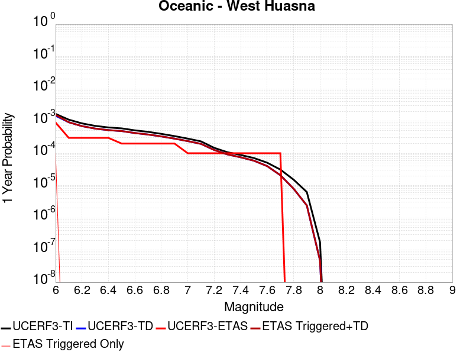 |  |

| Magnitude | 1 wk TI Prob | 1 wk TD Prob | 1 wk ETAS Prob | 1 wk ETAS/TD Gain | 1 wk ETAS Triggered+TD | 1 wk ETAS Triggered Only | 1 mo TI Prob | 1 mo TD Prob | 1 mo ETAS Prob | 1 mo ETAS/TD Gain | 1 mo ETAS Triggered+TD | 1 mo ETAS Triggered Only | 1 yr TI Prob | 1 yr TD Prob | 1 yr ETAS Prob | 1 yr ETAS/TD Gain | 1 yr ETAS Triggered+TD | 1 yr ETAS Triggered Only | 10 yr TI Prob | 10 yr TD Prob | 10 yr ETAS Prob | 10 yr ETAS/TD Gain | 10 yr ETAS Triggered+TD | 10 yr ETAS Triggered Only |
|-----|-----|-----|-----|-----|-----|-----|-----|-----|-----|-----|-----|-----|-----|-----|-----|-----|-----|-----|-----|-----|-----|-----|-----|-----|
| 6.0 | 3.195567E-5 | 2.7928514E-5 | 0.0 | 0.0 | 2.7928514E-5 | 0.0 | 1.3694567E-4 | 1.1968838E-4 | 0.0 | 0.0 | 1.1968838E-4 | 0.0 | 0.0016660384 | 0.0014562751 | 1.0E-4 | 0.06866834 | 0.0015561295 | 1.0E-4 | 0.016536033 | 0.0144718755 | 0.0011 | 0.0760095 | 0.015555956 | 0.0011 |
| 6.1 | 2.1156782E-5 | 1.7573595E-5 | 0.0 | 0.0 | 1.7573595E-5 | 0.0 | 9.066878E-5 | 7.5313284E-5 | 0.0 | 0.0 | 7.5313284E-5 | 0.0 | 0.0011033333 | 9.165629E-4 | 0.0 | 0.0 | 9.165629E-4 | 0.0 | 0.010978713 | 0.009128835 | 5.0E-4 | 0.054771505 | 0.009624271 | 5.0E-4 |
| 6.2 | 1.6195117E-5 | 1.3327151E-5 | 0.0 | 0.0 | 1.3327151E-5 | 0.0 | 6.9405796E-5 | 5.711512E-5 | 0.0 | 0.0 | 5.711512E-5 | 0.0 | 8.44688E-4 | 6.9515733E-4 | 0.0 | 0.0 | 6.9515733E-4 | 0.0 | 0.008414844 | 0.006930122 | 3.0E-4 | 0.04328928 | 0.007228043 | 3.0E-4 |
| 6.3 | 1.3559345E-5 | 1.11791405E-5 | 0.0 | 0.0 | 1.11791405E-5 | 0.0 | 5.811018E-5 | 4.790973E-5 | 0.0 | 0.0 | 4.790973E-5 | 0.0 | 7.072618E-4 | 5.8314577E-4 | 0.0 | 0.0 | 5.8314577E-4 | 0.0 | 0.0070501505 | 0.0058162743 | 2.0E-4 | 0.034386273 | 0.0060151108 | 2.0E-4 |
| 6.4 | 1.2120619E-5 | 1.0000911E-5 | 0.0 | 0.0 | 1.0000911E-5 | 0.0 | 5.1944477E-5 | 4.286035E-5 | 0.0 | 0.0 | 4.286035E-5 | 0.0 | 6.322405E-4 | 5.217003E-4 | 0.0 | 0.0 | 5.217003E-4 | 0.0 | 0.006304447 | 0.005204823 | 2.0E-4 | 0.038425896 | 0.0054037822 | 2.0E-4 |
| 6.5 | 1.13511915E-5 | 9.367369E-6 | 0.0 | 0.0 | 9.367369E-6 | 0.0 | 4.8647056E-5 | 4.014525E-5 | 0.0 | 0.0 | 4.014525E-5 | 0.0 | 5.9211696E-4 | 4.8865925E-4 | 0.0 | 0.0 | 4.8865925E-4 | 0.0 | 0.0059054173 | 0.0048759063 | 2.0E-4 | 0.041018017 | 0.0050749313 | 2.0E-4 |
| 6.6 | 9.850605E-6 | 8.135258E-6 | 0.0 | 0.0 | 8.135258E-6 | 0.0 | 4.2216197E-5 | 3.4864926E-5 | 0.0 | 0.0 | 3.4864926E-5 | 0.0 | 5.1386096E-4 | 4.2439805E-4 | 0.0 | 0.0 | 4.2439805E-4 | 0.0 | 0.0051267436 | 0.004235908 | 1.0E-4 | 0.02360769 | 0.0043354845 | 1.0E-4 |
| 6.7 | 8.8558645E-6 | 7.3182514E-6 | 0.0 | 0.0 | 7.3182514E-6 | 0.0 | 3.7953152E-5 | 3.1363557E-5 | 0.0 | 0.0 | 3.1363557E-5 | 0.0 | 4.6198163E-4 | 3.817846E-4 | 0.0 | 0.0 | 3.817846E-4 | 0.0 | 0.004610224 | 0.0038113124 | 1.0E-4 | 0.026237682 | 0.0039109313 | 1.0E-4 |
| 6.8 | 7.67136E-6 | 6.391606E-6 | 0.0 | 0.0 | 6.391606E-6 | 0.0 | 3.2876844E-5 | 2.739231E-5 | 0.0 | 0.0 | 2.739231E-5 | 0.0 | 4.0020206E-4 | 3.334505E-4 | 0.0 | 0.0 | 3.334505E-4 | 0.0 | 0.003994821 | 0.0033295227 | 1.0E-4 | 0.030034335 | 0.0034291898 | 1.0E-4 |
| 6.9 | 6.534529E-6 | 5.4582006E-6 | 0.0 | 0.0 | 5.4582006E-6 | 0.0 | 2.8004823E-5 | 2.3392078E-5 | 0.0 | 0.0 | 2.3392078E-5 | 0.0 | 3.4090536E-4 | 2.8476148E-4 | 0.0 | 0.0 | 2.8476148E-4 | 0.0 | 0.0034038287 | 0.0028439825 | 1.0E-4 | 0.03516196 | 0.002943698 | 1.0E-4 |
| 7.0 | 5.460525E-6 | 4.569869E-6 | 0.0 | 0.0 | 4.569869E-6 | 0.0 | 2.3402039E-5 | 1.9585006E-5 | 0.0 | 0.0 | 1.9585006E-5 | 0.0 | 2.8488258E-4 | 2.3842146E-4 | 0.0 | 0.0 | 2.3842146E-4 | 0.0 | 0.0028451765 | 0.0023816705 | 1.0E-4 | 0.041987333 | 0.0024814324 | 1.0E-4 |
| 7.1 | 4.4825083E-6 | 3.7524171E-6 | 0.0 | 0.0 | 3.7524171E-6 | 0.0 | 1.9210609E-5 | 1.6081689E-5 | 0.0 | 0.0 | 1.6081689E-5 | 0.0 | 2.3386406E-4 | 1.9577707E-4 | 0.0 | 0.0 | 1.9577707E-4 | 0.0 | 0.002336181 | 0.001956058 | 1.0E-4 | 0.051123228 | 0.0020558625 | 1.0E-4 |
| 7.2 | 2.821708E-6 | 2.4250035E-6 | 0.0 | 0.0 | 2.4250035E-6 | 0.0 | 1.2092979E-5 | 1.03928305E-5 | 0.0 | 0.0 | 1.03928305E-5 | 0.0 | 1.4722206E-4 | 1.2652538E-4 | 0.0 | 0.0 | 1.2652538E-4 | 0.0 | 0.0014712457 | 0.0012645358 | 0.0 | 0.0 | 0.0012645358 | 0.0 |
| 7.3 | 2.0644757E-6 | 1.7688261E-6 | 0.0 | 0.0 | 1.7688261E-6 | 0.0 | 8.847723E-6 | 7.5806615E-6 | 0.0 | 0.0 | 7.5806615E-6 | 0.0 | 1.0771569E-4 | 9.229065E-5 | 0.0 | 0.0 | 9.229065E-5 | 0.0 | 0.001076635 | 9.2252495E-4 | 0.0 | 0.0 | 9.2252495E-4 | 0.0 |
| 7.4 | 1.6980367E-6 | 1.4380407E-6 | 0.0 | 0.0 | 1.4380407E-6 | 0.0 | 7.27728E-6 | 6.163017E-6 | 0.0 | 0.0 | 6.163017E-6 | 0.0 | 8.8597284E-5 | 7.503215E-5 | 0.0 | 0.0 | 7.503215E-5 | 0.0 | 8.8561967E-4 | 7.500698E-4 | 0.0 | 0.0 | 7.500698E-4 | 0.0 |
| 7.5 | 1.3637683E-6 | 1.1303163E-6 | 0.0 | 0.0 | 1.1303163E-6 | 0.0 | 5.844708E-6 | 4.8442034E-6 | 0.0 | 0.0 | 4.8442034E-6 | 0.0 | 7.1156996E-5 | 5.897658E-5 | 0.0 | 0.0 | 5.897658E-5 | 0.0 | 7.1134215E-4 | 5.8961083E-4 | 0.0 | 0.0 | 5.8961083E-4 | 0.0 |
| 7.6 | 9.802994E-7 | 7.677764E-7 | 0.0 | 0.0 | 7.677764E-7 | 0.0 | 4.2012766E-6 | 3.290466E-6 | 0.0 | 0.0 | 3.290466E-6 | 0.0 | 5.1149345E-5 | 4.0060688E-5 | 0.0 | 0.0 | 4.0060688E-5 | 0.0 | 5.113757E-4 | 4.0053608E-4 | 0.0 | 0.0 | 4.0053608E-4 | 0.0 |
| 7.7 | 5.986191E-7 | 4.005219E-7 | 0.0 | 0.0 | 4.005219E-7 | 0.0 | 2.5655079E-6 | 1.7165213E-6 | 0.0 | 0.0 | 1.7165213E-6 | 0.0 | 3.1234613E-5 | 2.0898447E-5 | 0.0 | 0.0 | 2.0898447E-5 | 0.0 | 3.123022E-4 | 2.0896617E-4 | 0.0 | 0.0 | 2.0896617E-4 | 0.0 |
| 7.8 | 2.9189815E-7 | 1.5285704E-7 | 0.0 | 0.0 | 1.5285704E-7 | 0.0 | 1.2509914E-6 | 6.551014E-7 | 0.0 | 0.0 | 6.551014E-7 | 0.0 | 1.5230714E-5 | 7.97583E-6 | 0.0 | 0.0 | 7.97583E-6 | 0.0 | 1.522967E-4 | 7.9756755E-5 | 0.0 | 0.0 | 7.9756755E-5 | 0.0 |
| 7.9 | 1.2057845E-7 | 4.620958E-8 | 0.0 | 0.0 | 4.620958E-8 | 0.0 | 5.1676466E-7 | 1.9804102E-7 | 0.0 | 0.0 | 1.9804102E-7 | 0.0 | 6.2915915E-6 | 2.4111469E-6 | 0.0 | 0.0 | 2.4111469E-6 | 0.0 | 6.2914136E-5 | 2.4112509E-5 | 0.0 | 0.0 | 2.4112509E-5 | 0.0 |
| 8.0 | 3.3806387E-9 | 9.010169E-10 | 0.0 | 0.0 | 9.010169E-10 | 0.0 | 1.4488451E-8 | 3.8615013E-9 | 0.0 | 0.0 | 3.8615013E-9 | 0.0 | 1.7639688E-7 | 4.7013778E-8 | 0.0 | 0.0 | 4.7013778E-8 | 0.0 | 1.7639674E-6 | 4.7124328E-7 | 0.0 | 0.0 | 4.7124328E-7 | 0.0 |

## San Andreas (Peninsula) 2011 CFM
*[(top)](#table-of-contents)*

| 1 Week | 1 Month | 1 Year | 10 Year |
|-----|-----|-----|-----|
|  | 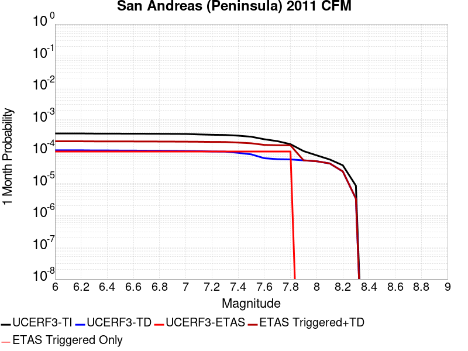 | 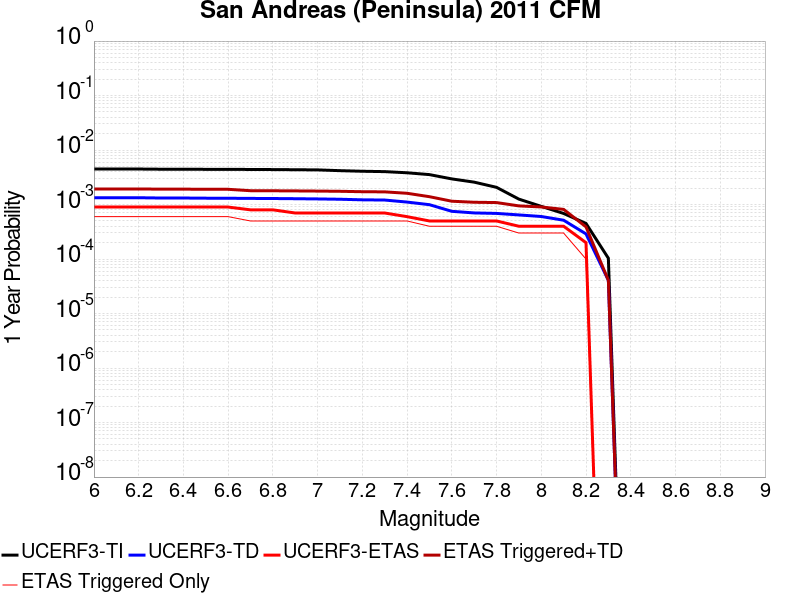 |  |

| Magnitude | 1 wk TI Prob | 1 wk TD Prob | 1 wk ETAS Prob | 1 wk ETAS/TD Gain | 1 wk ETAS Triggered+TD | 1 wk ETAS Triggered Only | 1 mo TI Prob | 1 mo TD Prob | 1 mo ETAS Prob | 1 mo ETAS/TD Gain | 1 mo ETAS Triggered+TD | 1 mo ETAS Triggered Only | 1 yr TI Prob | 1 yr TD Prob | 1 yr ETAS Prob | 1 yr ETAS/TD Gain | 1 yr ETAS Triggered+TD | 1 yr ETAS Triggered Only | 10 yr TI Prob | 10 yr TD Prob | 10 yr ETAS Prob | 10 yr ETAS/TD Gain | 10 yr ETAS Triggered+TD | 10 yr ETAS Triggered Only |
|-----|-----|-----|-----|-----|-----|-----|-----|-----|-----|-----|-----|-----|-----|-----|-----|-----|-----|-----|-----|-----|-----|-----|-----|-----|
| 6.0 | 8.6200685E-5 | 2.5248477E-5 | 1.0E-4 | 3.960635 | 1.2524595E-4 | 1.0E-4 | 3.6937918E-4 | 1.0820328E-4 | 1.0E-4 | 0.9241864 | 2.0819246E-4 | 1.0E-4 | 0.0044879215 | 0.0013165805 | 6.0E-4 | 0.45572606 | 0.0019157905 | 6.0E-4 | 0.043983612 | 0.014793489 | 0.0011 | 0.07435703 | 0.015877217 | 0.0011 |
| 6.1 | 8.6200685E-5 | 2.5248477E-5 | 1.0E-4 | 3.960635 | 1.2524595E-4 | 1.0E-4 | 3.6937918E-4 | 1.0820328E-4 | 1.0E-4 | 0.9241864 | 2.0819246E-4 | 1.0E-4 | 0.0044879215 | 0.0013165805 | 6.0E-4 | 0.45572606 | 0.0019157905 | 6.0E-4 | 0.043983612 | 0.014793489 | 0.0011 | 0.07435703 | 0.015877217 | 0.0011 |
| 6.2 | 8.6200685E-5 | 2.5248477E-5 | 1.0E-4 | 3.960635 | 1.2524595E-4 | 1.0E-4 | 3.6937918E-4 | 1.0820328E-4 | 1.0E-4 | 0.9241864 | 2.0819246E-4 | 1.0E-4 | 0.0044879215 | 0.0013165805 | 6.0E-4 | 0.45572606 | 0.0019157905 | 6.0E-4 | 0.043983612 | 0.014793489 | 0.0011 | 0.07435703 | 0.015877217 | 0.0011 |
| 6.3 | 8.551163E-5 | 2.4940406E-5 | 1.0E-4 | 4.0095577 | 1.2493791E-4 | 1.0E-4 | 3.6642692E-4 | 1.0688308E-4 | 1.0E-4 | 0.9356018 | 2.0687238E-4 | 1.0E-4 | 0.004452125 | 0.0013005263 | 6.0E-4 | 0.4613517 | 0.001899746 | 6.0E-4 | 0.043639794 | 0.014620234 | 0.0011 | 0.07523819 | 0.015704151 | 0.0011 |
| 6.4 | 8.551163E-5 | 2.4940406E-5 | 1.0E-4 | 4.0095577 | 1.2493791E-4 | 1.0E-4 | 3.6642692E-4 | 1.0688308E-4 | 1.0E-4 | 0.9356018 | 2.0687238E-4 | 1.0E-4 | 0.004452125 | 0.0013005263 | 6.0E-4 | 0.4613517 | 0.001899746 | 6.0E-4 | 0.043639794 | 0.014620234 | 0.0011 | 0.07523819 | 0.015704151 | 0.0011 |
| 6.5 | 8.511146E-5 | 2.4761806E-5 | 1.0E-4 | 4.0384774 | 1.2475933E-4 | 1.0E-4 | 3.647124E-4 | 1.0611772E-4 | 1.0E-4 | 0.9423497 | 2.0610711E-4 | 1.0E-4 | 0.004431336 | 0.0012912191 | 6.0E-4 | 0.46467713 | 0.0018904444 | 6.0E-4 | 0.04344007 | 0.014520279 | 0.0011 | 0.07575612 | 0.015604307 | 0.0011 |
| 6.6 | 8.4985084E-5 | 2.4692488E-5 | 1.0E-4 | 4.0498147 | 1.2469002E-4 | 1.0E-4 | 3.6417096E-4 | 1.0582067E-4 | 1.0E-4 | 0.944995 | 2.0581008E-4 | 1.0E-4 | 0.0044247704 | 0.0012876068 | 6.0E-4 | 0.46598077 | 0.0018868343 | 6.0E-4 | 0.043376986 | 0.014482249 | 0.0011 | 0.075955056 | 0.015566318 | 0.0011 |
| 6.7 | 8.462618E-5 | 2.4521032E-5 | 1.0E-4 | 4.0781317 | 1.2451858E-4 | 1.0E-4 | 3.6263323E-4 | 1.05085914E-4 | 1.0E-4 | 0.95160234 | 2.050754E-4 | 1.0E-4 | 0.004406125 | 0.0012786717 | 5.0E-4 | 0.3910308 | 0.0017780324 | 5.0E-4 | 0.043197807 | 0.01438696 | 0.001 | 0.06950738 | 0.015372573 | 0.001 |
| 6.8 | 8.42337E-5 | 2.4416902E-5 | 1.0E-4 | 4.095524 | 1.2441447E-4 | 1.0E-4 | 3.6095164E-4 | 1.0463967E-4 | 1.0E-4 | 0.95566046 | 2.046292E-4 | 1.0E-4 | 0.004385734 | 0.0012732451 | 5.0E-4 | 0.39269736 | 0.0017726085 | 5.0E-4 | 0.043001823 | 0.014327644 | 0.001 | 0.06979515 | 0.015313317 | 0.001 |
| 6.9 | 8.365989E-5 | 2.422171E-5 | 1.0E-4 | 4.1285276 | 1.2421928E-4 | 1.0E-4 | 3.5849313E-4 | 1.03803206E-4 | 1.0E-4 | 0.9633614 | 2.0379282E-4 | 1.0E-4 | 0.004355922 | 0.001263073 | 5.0E-4 | 0.39585996 | 0.0017624415 | 5.0E-4 | 0.04271523 | 0.0142202135 | 0.001 | 0.07032243 | 0.015205993 | 0.001 |
| 7.0 | 8.30936E-5 | 2.398336E-5 | 1.0E-4 | 4.169557 | 1.2398096E-4 | 1.0E-4 | 3.560668E-4 | 1.0278179E-4 | 1.0E-4 | 0.97293496 | 2.0277151E-4 | 1.0E-4 | 0.004326499 | 0.0012506515 | 5.0E-4 | 0.3997916 | 0.0017500262 | 5.0E-4 | 0.042432297 | 0.01409132 | 0.001 | 0.07096567 | 0.01507723 | 0.001 |
| 7.1 | 8.041264E-5 | 2.3670416E-5 | 1.0E-4 | 4.224683 | 1.2366805E-4 | 1.0E-4 | 3.4458007E-4 | 1.0144071E-4 | 1.0E-4 | 0.9857975 | 2.0143056E-4 | 1.0E-4 | 0.0041871946 | 0.0012343425 | 5.0E-4 | 0.40507397 | 0.0017337253 | 5.0E-4 | 0.041091725 | 0.013914853 | 0.001 | 0.07186565 | 0.014900939 | 0.001 |
| 7.2 | 7.8427016E-5 | 2.3094855E-5 | 1.0E-4 | 4.3299685 | 1.2309254E-4 | 1.0E-4 | 3.3607247E-4 | 9.8974204E-5 | 1.0E-4 | 1.0103643 | 1.989643E-4 | 1.0E-4 | 0.004084008 | 0.0012043464 | 5.0E-4 | 0.41516292 | 0.0017037443 | 5.0E-4 | 0.040097635 | 0.013599129 | 9.0E-4 | 0.066180706 | 0.01448689 | 9.0E-4 |
| 7.3 | 7.721087E-5 | 2.28798E-5 | 1.0E-4 | 4.3706675 | 1.228775E-4 | 1.0E-4 | 3.3086175E-4 | 9.805261E-5 | 1.0E-4 | 1.0198606 | 1.980428E-4 | 1.0E-4 | 0.004020803 | 0.0011931383 | 5.0E-4 | 0.41906288 | 0.0016925418 | 5.0E-4 | 0.03948827 | 0.013482906 | 9.0E-4 | 0.06675119 | 0.014370771 | 9.0E-4 |
| 7.4 | 7.3536525E-5 | 2.0999081E-5 | 1.0E-4 | 4.762113 | 1.2099698E-4 | 1.0E-4 | 3.1511846E-4 | 8.9992966E-5 | 1.0E-4 | 1.111198 | 1.8998397E-4 | 1.0E-4 | 0.0038298194 | 0.0010951149 | 5.0E-4 | 0.4565731 | 0.0015945673 | 5.0E-4 | 0.037644852 | 0.012440719 | 9.0E-4 | 0.07234309 | 0.013329522 | 9.0E-4 |
| 7.5 | 6.806207E-5 | 1.8808578E-5 | 1.0E-4 | 5.316723 | 1.18806696E-4 | 1.0E-4 | 2.9166197E-4 | 8.060571E-5 | 1.0E-4 | 1.2406069 | 1.8059765E-4 | 1.0E-4 | 0.0035452035 | 9.809338E-4 | 4.0E-4 | 0.40777475 | 0.0013805414 | 4.0E-4 | 0.034891766 | 0.011195327 | 8.0E-4 | 0.071458384 | 0.01198637 | 8.0E-4 |
| 7.6 | 5.6731416E-5 | 1.422578E-5 | 1.0E-4 | 7.0294914 | 1.1422436E-4 | 1.0E-4 | 2.43112E-4 | 6.0966206E-5 | 1.0E-4 | 1.6402531 | 1.609601E-4 | 1.0E-4 | 0.0029558712 | 7.420109E-4 | 4.0E-4 | 0.5390756 | 0.001141714 | 4.0E-4 | 0.02916862 | 0.008511447 | 8.0E-4 | 0.09399107 | 0.009304638 | 8.0E-4 |
| 7.7 | 4.946994E-5 | 1.3295981E-5 | 1.0E-4 | 7.5210695 | 1.1329465E-4 | 1.0E-4 | 2.1199681E-4 | 5.6981535E-5 | 1.0E-4 | 1.7549546 | 1.5697583E-4 | 1.0E-4 | 0.002578006 | 6.935295E-4 | 4.0E-4 | 0.5767599 | 0.0010932521 | 4.0E-4 | 0.02548303 | 0.007934556 | 7.0E-4 | 0.0882217 | 0.008629002 | 7.0E-4 |
| 7.8 | 3.9718198E-5 | 1.3031774E-5 | 1.0E-4 | 7.6735525 | 1.1303047E-4 | 1.0E-4 | 1.7020974E-4 | 5.5849265E-5 | 1.0E-4 | 1.7905339 | 1.5584368E-4 | 1.0E-4 | 0.0020703338 | 6.797528E-4 | 4.0E-4 | 0.58844924 | 0.0010794809 | 4.0E-4 | 0.020511515 | 0.007744739 | 7.0E-4 | 0.09038394 | 0.008439317 | 7.0E-4 |
| 7.9 | 2.4115114E-5 | 1.2232501E-5 | 0.0 | 0.0 | 1.2232501E-5 | 0.0 | 1.0334639E-4 | 5.2423948E-5 | 0.0 | 0.0 | 5.2423948E-5 | 0.0 | 0.001257516 | 6.380748E-4 | 3.0E-4 | 0.4701643 | 9.378834E-4 | 3.0E-4 | 0.012504238 | 0.0071839397 | 6.0E-4 | 0.08351963 | 0.0077796294 | 6.0E-4 |
| 8.0 | 1.7756569E-5 | 1.1454125E-5 | 0.0 | 0.0 | 1.1454125E-5 | 0.0 | 7.6097356E-5 | 4.9088187E-5 | 0.0 | 0.0 | 4.9088187E-5 | 0.0 | 9.260915E-4 | 5.9748493E-4 | 3.0E-4 | 0.50210476 | 8.9730567E-4 | 3.0E-4 | 0.009222416 | 0.0066828746 | 6.0E-4 | 0.089781724 | 0.0072788647 | 6.0E-4 |
| 8.1 | 1.3159258E-5 | 9.7831735E-6 | 0.0 | 0.0 | 9.7831735E-6 | 0.0 | 5.6395602E-5 | 4.192721E-5 | 0.0 | 0.0 | 4.192721E-5 | 0.0 | 6.864001E-4 | 5.103444E-4 | 3.0E-4 | 0.58783835 | 8.1019127E-4 | 3.0E-4 | 0.0068428386 | 0.005709398 | 6.0E-4 | 0.10508989 | 0.006305972 | 6.0E-4 |
| 8.2 | 8.635426E-6 | 5.486735E-6 | 0.0 | 0.0 | 5.486735E-6 | 0.0 | 3.700844E-5 | 2.3514367E-5 | 0.0 | 0.0 | 2.3514367E-5 | 0.0 | 4.5048463E-4 | 2.862499E-4 | 1.0E-4 | 0.3493451 | 3.8622128E-4 | 1.0E-4 | 0.004495725 | 0.003255422 | 3.0E-4 | 0.09215395 | 0.0035544455 | 3.0E-4 |
| 8.3 | 1.983087E-6 | 7.6880906E-7 | 0.0 | 0.0 | 7.6880906E-7 | 0.0 | 8.498917E-6 | 3.294892E-6 | 0.0 | 0.0 | 3.294892E-6 | 0.0 | 1.034694E-4 | 4.0114588E-5 | 0.0 | 0.0 | 4.0114588E-5 | 0.0 | 0.0010342124 | 4.7361702E-4 | 0.0 | 0.0 | 4.7361702E-4 | 0.0 |

## Newport-Inglewood alt 1
*[(top)](#table-of-contents)*

| 1 Week | 1 Month | 1 Year | 10 Year |
|-----|-----|-----|-----|
| 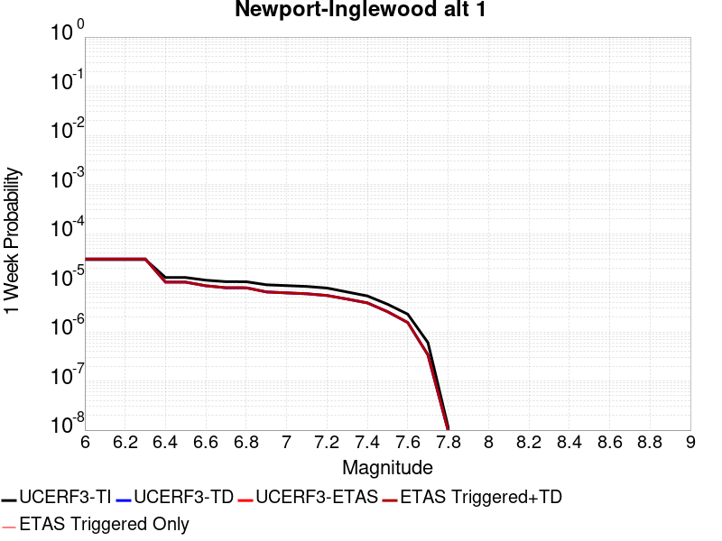 | 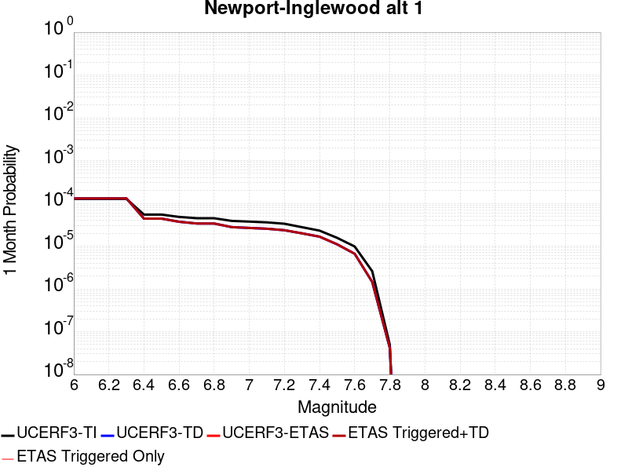 |  |  |

| Magnitude | 1 wk TI Prob | 1 wk TD Prob | 1 wk ETAS Prob | 1 wk ETAS/TD Gain | 1 wk ETAS Triggered+TD | 1 wk ETAS Triggered Only | 1 mo TI Prob | 1 mo TD Prob | 1 mo ETAS Prob | 1 mo ETAS/TD Gain | 1 mo ETAS Triggered+TD | 1 mo ETAS Triggered Only | 1 yr TI Prob | 1 yr TD Prob | 1 yr ETAS Prob | 1 yr ETAS/TD Gain | 1 yr ETAS Triggered+TD | 1 yr ETAS Triggered Only | 10 yr TI Prob | 10 yr TD Prob | 10 yr ETAS Prob | 10 yr ETAS/TD Gain | 10 yr ETAS Triggered+TD | 10 yr ETAS Triggered Only |
|-----|-----|-----|-----|-----|-----|-----|-----|-----|-----|-----|-----|-----|-----|-----|-----|-----|-----|-----|-----|-----|-----|-----|-----|-----|
| 6.0 | 2.9668912E-5 | 3.0414796E-5 | 0.0 | 0.0 | 3.0414796E-5 | 0.0 | 1.2714628E-4 | 1.3034533E-4 | 0.0 | 0.0 | 1.3034533E-4 | 0.0 | 0.0015469068 | 0.001586284 | 1.0E-4 | 0.06304041 | 0.0016861254 | 1.0E-4 | 0.015361829 | 0.015797256 | 0.0011 | 0.069632344 | 0.016879879 | 0.0011 |
| 6.1 | 2.9668912E-5 | 3.0414796E-5 | 0.0 | 0.0 | 3.0414796E-5 | 0.0 | 1.2714628E-4 | 1.3034533E-4 | 0.0 | 0.0 | 1.3034533E-4 | 0.0 | 0.0015469068 | 0.001586284 | 1.0E-4 | 0.06304041 | 0.0016861254 | 1.0E-4 | 0.015361829 | 0.015797256 | 0.0011 | 0.069632344 | 0.016879879 | 0.0011 |
| 6.2 | 2.9668912E-5 | 3.0414796E-5 | 0.0 | 0.0 | 3.0414796E-5 | 0.0 | 1.2714628E-4 | 1.3034533E-4 | 0.0 | 0.0 | 1.3034533E-4 | 0.0 | 0.0015469068 | 0.001586284 | 1.0E-4 | 0.06304041 | 0.0016861254 | 1.0E-4 | 0.015361829 | 0.015797256 | 0.0011 | 0.069632344 | 0.016879879 | 0.0011 |
| 6.3 | 2.9668912E-5 | 3.0414796E-5 | 0.0 | 0.0 | 3.0414796E-5 | 0.0 | 1.2714628E-4 | 1.3034533E-4 | 0.0 | 0.0 | 1.3034533E-4 | 0.0 | 0.0015469068 | 0.001586284 | 1.0E-4 | 0.06304041 | 0.0016861254 | 1.0E-4 | 0.015361829 | 0.015797256 | 0.0011 | 0.069632344 | 0.016879879 | 0.0011 |
| 6.4 | 1.275942E-5 | 1.0274204E-5 | 0.0 | 0.0 | 1.0274204E-5 | 0.0 | 5.4682085E-5 | 4.403158E-5 | 0.0 | 0.0 | 4.403158E-5 | 0.0 | 6.65551E-4 | 5.359568E-4 | 0.0 | 0.0 | 5.359568E-4 | 0.0 | 0.0066356123 | 0.005347067 | 1.0E-4 | 0.01870184 | 0.0054465327 | 1.0E-4 |
| 6.5 | 1.275942E-5 | 1.0274204E-5 | 0.0 | 0.0 | 1.0274204E-5 | 0.0 | 5.4682085E-5 | 4.403158E-5 | 0.0 | 0.0 | 4.403158E-5 | 0.0 | 6.65551E-4 | 5.359568E-4 | 0.0 | 0.0 | 5.359568E-4 | 0.0 | 0.0066356123 | 0.005347067 | 1.0E-4 | 0.01870184 | 0.0054465327 | 1.0E-4 |
| 6.6 | 1.1255358E-5 | 8.6631635E-6 | 0.0 | 0.0 | 8.6631635E-6 | 0.0 | 4.8236358E-5 | 3.7127324E-5 | 0.0 | 0.0 | 3.7127324E-5 | 0.0 | 5.871194E-4 | 4.519331E-4 | 0.0 | 0.0 | 4.519331E-4 | 0.0 | 0.005855706 | 0.0045103175 | 1.0E-4 | 0.022171387 | 0.0046098665 | 1.0E-4 |
| 6.7 | 1.0504745E-5 | 7.900939E-6 | 0.0 | 0.0 | 7.900939E-6 | 0.0 | 4.5019555E-5 | 3.3860735E-5 | 0.0 | 0.0 | 3.3860735E-5 | 0.0 | 5.4797524E-4 | 4.121777E-4 | 0.0 | 0.0 | 4.121777E-4 | 0.0 | 0.0054662596 | 0.0041142623 | 1.0E-4 | 0.024305696 | 0.0042138505 | 1.0E-4 |
| 6.8 | 1.0476007E-5 | 7.88232E-6 | 0.0 | 0.0 | 7.88232E-6 | 0.0 | 4.4896402E-5 | 3.378094E-5 | 0.0 | 0.0 | 3.378094E-5 | 0.0 | 5.464766E-4 | 4.1120654E-4 | 0.0 | 0.0 | 4.1120654E-4 | 0.0 | 0.005451347 | 0.004104587 | 1.0E-4 | 0.024362989 | 0.0042041764 | 1.0E-4 |
| 6.9 | 9.076797E-6 | 6.490506E-6 | 0.0 | 0.0 | 6.490506E-6 | 0.0 | 3.889998E-5 | 2.7816159E-5 | 0.0 | 0.0 | 2.7816159E-5 | 0.0 | 4.7350433E-4 | 3.3860945E-4 | 0.0 | 0.0 | 3.3860945E-4 | 0.0 | 0.004724967 | 0.0033809727 | 1.0E-4 | 0.029577289 | 0.0034806344 | 1.0E-4 |
| 7.0 | 8.73795E-6 | 6.212897E-6 | 0.0 | 0.0 | 6.212897E-6 | 0.0 | 3.7447822E-5 | 2.6626432E-5 | 0.0 | 0.0 | 2.6626432E-5 | 0.0 | 4.5583185E-4 | 3.2412887E-4 | 0.0 | 0.0 | 3.2412887E-4 | 0.0 | 0.0045489795 | 0.0032365927 | 1.0E-4 | 0.03089669 | 0.0033362692 | 1.0E-4 |
| 7.1 | 8.391299E-6 | 5.956592E-6 | 0.0 | 0.0 | 5.956592E-6 | 0.0 | 3.5962214E-5 | 2.5528003E-5 | 0.0 | 0.0 | 2.5528003E-5 | 0.0 | 4.37752E-4 | 3.1075935E-4 | 0.0 | 0.0 | 3.1075935E-4 | 0.0 | 0.004368907 | 0.0031032776 | 1.0E-4 | 0.032223992 | 0.0032029673 | 1.0E-4 |
| 7.2 | 7.796882E-6 | 5.4972493E-6 | 0.0 | 0.0 | 5.4972493E-6 | 0.0 | 3.341478E-5 | 2.3559429E-5 | 0.0 | 0.0 | 2.3559429E-5 | 0.0 | 4.06749E-4 | 2.8679852E-4 | 0.0 | 0.0 | 2.8679852E-4 | 0.0 | 0.0040600533 | 0.0028643077 | 0.0 | 0.0 | 0.0028643077 | 0.0 |
| 7.3 | 6.4738833E-6 | 4.6483287E-6 | 0.0 | 0.0 | 4.6483287E-6 | 0.0 | 2.774492E-5 | 1.9921257E-5 | 0.0 | 0.0 | 1.9921257E-5 | 0.0 | 3.3774204E-4 | 2.4251446E-4 | 0.0 | 0.0 | 2.4251446E-4 | 0.0 | 0.0033722918 | 0.0024225148 | 0.0 | 0.0 | 0.0024225148 | 0.0 |
| 7.4 | 5.382145E-6 | 3.8861363E-6 | 0.0 | 0.0 | 3.8861363E-6 | 0.0 | 2.3066134E-5 | 1.6654763E-5 | 0.0 | 0.0 | 1.6654763E-5 | 0.0 | 2.8079396E-4 | 2.0275301E-4 | 0.0 | 0.0 | 2.0275301E-4 | 0.0 | 0.0028043943 | 0.0020256948 | 0.0 | 0.0 | 0.0020256948 | 0.0 |
| 7.5 | 3.648244E-6 | 2.5740726E-6 | 0.0 | 0.0 | 2.5740726E-6 | 0.0 | 1.5635238E-5 | 1.1031694E-5 | 0.0 | 0.0 | 1.1031694E-5 | 0.0 | 1.9034238E-4 | 1.343027E-4 | 0.0 | 0.0 | 1.343027E-4 | 0.0 | 0.0019017943 | 0.0013422258 | 0.0 | 0.0 | 0.0013422258 | 0.0 |
| 7.6 | 2.2906888E-6 | 1.548158E-6 | 0.0 | 0.0 | 1.548158E-6 | 0.0 | 9.817201E-6 | 6.6349467E-6 | 0.0 | 0.0 | 6.6349467E-6 | 0.0 | 1.1951787E-4 | 8.077754E-5 | 0.0 | 0.0 | 8.077754E-5 | 0.0 | 0.0011945361 | 8.0748857E-4 | 0.0 | 0.0 | 8.0748857E-4 | 0.0 |
| 7.7 | 6.0479874E-7 | 3.39789E-7 | 0.0 | 0.0 | 3.39789E-7 | 0.0 | 2.5919921E-6 | 1.4562379E-6 | 0.0 | 0.0 | 1.4562379E-6 | 0.0 | 3.1557047E-5 | 1.7729566E-5 | 0.0 | 0.0 | 1.7729566E-5 | 0.0 | 3.1552566E-4 | 1.7728288E-4 | 0.0 | 0.0 | 1.7728288E-4 | 0.0 |
| 7.8 | 1.16056995E-8 | 9.783043E-9 | 0.0 | 0.0 | 9.783043E-9 | 0.0 | 4.9738713E-8 | 4.1927326E-8 | 0.0 | 0.0 | 4.1927326E-8 | 0.0 | 6.0556863E-7 | 5.104652E-7 | 0.0 | 0.0 | 5.104652E-7 | 0.0 | 6.05567E-6 | 5.1046522E-6 | 0.0 | 0.0 | 5.1046522E-6 | 0.0 |

## Table Bluff
*[(top)](#table-of-contents)*

| 1 Week | 1 Month | 1 Year | 10 Year |
|-----|-----|-----|-----|
| 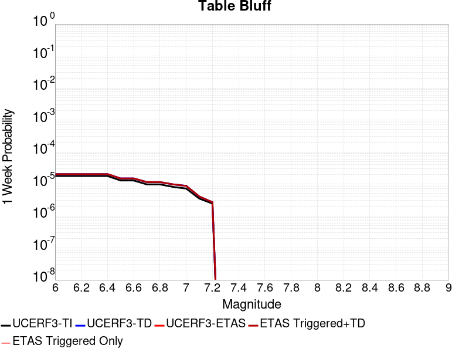 | 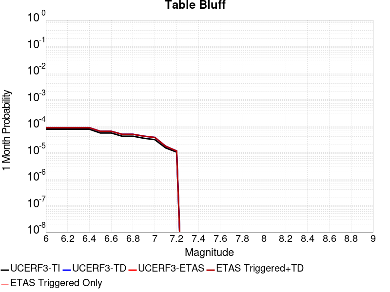 |  | 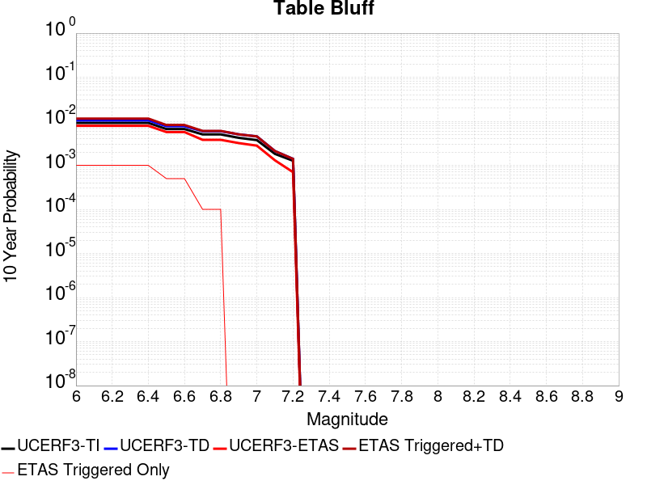 |

| Magnitude | 1 wk TI Prob | 1 wk TD Prob | 1 wk ETAS Prob | 1 wk ETAS/TD Gain | 1 wk ETAS Triggered+TD | 1 wk ETAS Triggered Only | 1 mo TI Prob | 1 mo TD Prob | 1 mo ETAS Prob | 1 mo ETAS/TD Gain | 1 mo ETAS Triggered+TD | 1 mo ETAS Triggered Only | 1 yr TI Prob | 1 yr TD Prob | 1 yr ETAS Prob | 1 yr ETAS/TD Gain | 1 yr ETAS Triggered+TD | 1 yr ETAS Triggered Only | 10 yr TI Prob | 10 yr TD Prob | 10 yr ETAS Prob | 10 yr ETAS/TD Gain | 10 yr ETAS Triggered+TD | 10 yr ETAS Triggered Only |
|-----|-----|-----|-----|-----|-----|-----|-----|-----|-----|-----|-----|-----|-----|-----|-----|-----|-----|-----|-----|-----|-----|-----|-----|-----|
| 6.0 | 1.7744695E-5 | 2.0291396E-5 | 0.0 | 0.0 | 2.0291396E-5 | 0.0 | 7.6046475E-5 | 8.6960565E-5 | 0.0 | 0.0 | 8.6960565E-5 | 0.0 | 9.2547253E-4 | 0.0010582904 | 1.0E-4 | 0.094492026 | 0.0011581845 | 1.0E-4 | 0.009216278 | 0.010538451 | 0.001 | 0.0948906 | 0.011527914 | 0.001 |
| 6.1 | 1.7744695E-5 | 2.0291396E-5 | 0.0 | 0.0 | 2.0291396E-5 | 0.0 | 7.6046475E-5 | 8.6960565E-5 | 0.0 | 0.0 | 8.6960565E-5 | 0.0 | 9.2547253E-4 | 0.0010582904 | 1.0E-4 | 0.094492026 | 0.0011581845 | 1.0E-4 | 0.009216278 | 0.010538451 | 0.001 | 0.0948906 | 0.011527914 | 0.001 |
| 6.2 | 1.7744695E-5 | 2.0291396E-5 | 0.0 | 0.0 | 2.0291396E-5 | 0.0 | 7.6046475E-5 | 8.6960565E-5 | 0.0 | 0.0 | 8.6960565E-5 | 0.0 | 9.2547253E-4 | 0.0010582904 | 1.0E-4 | 0.094492026 | 0.0011581845 | 1.0E-4 | 0.009216278 | 0.010538451 | 0.001 | 0.0948906 | 0.011527914 | 0.001 |
| 6.3 | 1.7744695E-5 | 2.0291396E-5 | 0.0 | 0.0 | 2.0291396E-5 | 0.0 | 7.6046475E-5 | 8.6960565E-5 | 0.0 | 0.0 | 8.6960565E-5 | 0.0 | 9.2547253E-4 | 0.0010582904 | 1.0E-4 | 0.094492026 | 0.0011581845 | 1.0E-4 | 0.009216278 | 0.010538451 | 0.001 | 0.0948906 | 0.011527914 | 0.001 |
| 6.4 | 1.7744695E-5 | 2.0291396E-5 | 0.0 | 0.0 | 2.0291396E-5 | 0.0 | 7.6046475E-5 | 8.6960565E-5 | 0.0 | 0.0 | 8.6960565E-5 | 0.0 | 9.2547253E-4 | 0.0010582904 | 1.0E-4 | 0.094492026 | 0.0011581845 | 1.0E-4 | 0.009216278 | 0.010538451 | 0.001 | 0.0948906 | 0.011527914 | 0.001 |
| 6.5 | 1.2822383E-5 | 1.4864563E-5 | 0.0 | 0.0 | 1.4864563E-5 | 0.0 | 5.4951914E-5 | 6.370388E-5 | 0.0 | 0.0 | 6.370388E-5 | 0.0 | 6.6883414E-4 | 7.753485E-4 | 1.0E-4 | 0.12897426 | 8.75271E-4 | 1.0E-4 | 0.0066682473 | 0.00772939 | 5.0E-4 | 0.06468815 | 0.008225526 | 5.0E-4 |
| 6.6 | 1.2822383E-5 | 1.4864563E-5 | 0.0 | 0.0 | 1.4864563E-5 | 0.0 | 5.4951914E-5 | 6.370388E-5 | 0.0 | 0.0 | 6.370388E-5 | 0.0 | 6.6883414E-4 | 7.753485E-4 | 1.0E-4 | 0.12897426 | 8.75271E-4 | 1.0E-4 | 0.0066682473 | 0.00772939 | 5.0E-4 | 0.06468815 | 0.008225526 | 5.0E-4 |
| 6.7 | 9.690175E-6 | 1.1440468E-5 | 0.0 | 0.0 | 1.1440468E-5 | 0.0 | 4.1528663E-5 | 4.9029768E-5 | 0.0 | 0.0 | 4.9029768E-5 | 0.0 | 5.054941E-4 | 5.967941E-4 | 0.0 | 0.0 | 5.967941E-4 | 0.0 | 0.005043458 | 0.005953909 | 1.0E-4 | 0.01679569 | 0.006053313 | 1.0E-4 |
| 6.8 | 9.690175E-6 | 1.1440468E-5 | 0.0 | 0.0 | 1.1440468E-5 | 0.0 | 4.1528663E-5 | 4.9029768E-5 | 0.0 | 0.0 | 4.9029768E-5 | 0.0 | 5.054941E-4 | 5.967941E-4 | 0.0 | 0.0 | 5.967941E-4 | 0.0 | 0.005043458 | 0.005953909 | 1.0E-4 | 0.01679569 | 0.006053313 | 1.0E-4 |
| 6.9 | 8.096043E-6 | 9.704539E-6 | 0.0 | 0.0 | 9.704539E-6 | 0.0 | 3.4696863E-5 | 4.1590316E-5 | 0.0 | 0.0 | 4.1590316E-5 | 0.0 | 4.223524E-4 | 5.062619E-4 | 0.0 | 0.0 | 5.062619E-4 | 0.0 | 0.004215506 | 0.0050528077 | 0.0 | 0.0 | 0.0050528077 | 0.0 |
| 7.0 | 7.185906E-6 | 8.715786E-6 | 0.0 | 0.0 | 8.715786E-6 | 0.0 | 3.0796375E-5 | 3.735293E-5 | 0.0 | 0.0 | 3.735293E-5 | 0.0 | 3.7488135E-4 | 4.546936E-4 | 0.0 | 0.0 | 4.546936E-4 | 0.0 | 0.0037424958 | 0.0045392644 | 0.0 | 0.0 | 0.0045392644 | 0.0 |
| 7.1 | 3.4937343E-6 | 4.047375E-6 | 0.0 | 0.0 | 4.047375E-6 | 0.0 | 1.497306E-5 | 1.734582E-5 | 0.0 | 0.0 | 1.734582E-5 | 0.0 | 1.8228177E-4 | 2.111723E-4 | 0.0 | 0.0 | 2.111723E-4 | 0.0 | 0.0018213232 | 0.002110444 | 0.0 | 0.0 | 0.002110444 | 0.0 |
| 7.2 | 2.4388776E-6 | 2.6861462E-6 | 0.0 | 0.0 | 2.6861462E-6 | 0.0 | 1.0452291E-5 | 1.1512034E-5 | 0.0 | 0.0 | 1.1512034E-5 | 0.0 | 1.2724921E-4 | 1.401551E-4 | 0.0 | 0.0 | 1.401551E-4 | 0.0 | 0.0012717636 | 0.0014011676 | 0.0 | 0.0 | 0.0014011676 | 0.0 |

## San Jacinto (San Jacinto Valley) rev
*[(top)](#table-of-contents)*

| 1 Week | 1 Month | 1 Year | 10 Year |
|-----|-----|-----|-----|
|  |  | 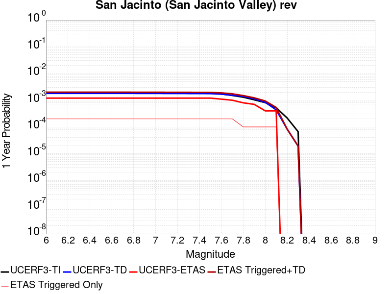 |  |

| Magnitude | 1 wk TI Prob | 1 wk TD Prob | 1 wk ETAS Prob | 1 wk ETAS/TD Gain | 1 wk ETAS Triggered+TD | 1 wk ETAS Triggered Only | 1 mo TI Prob | 1 mo TD Prob | 1 mo ETAS Prob | 1 mo ETAS/TD Gain | 1 mo ETAS Triggered+TD | 1 mo ETAS Triggered Only | 1 yr TI Prob | 1 yr TD Prob | 1 yr ETAS Prob | 1 yr ETAS/TD Gain | 1 yr ETAS Triggered+TD | 1 yr ETAS Triggered Only | 10 yr TI Prob | 10 yr TD Prob | 10 yr ETAS Prob | 10 yr ETAS/TD Gain | 10 yr ETAS Triggered+TD | 10 yr ETAS Triggered Only |
|-----|-----|-----|-----|-----|-----|-----|-----|-----|-----|-----|-----|-----|-----|-----|-----|-----|-----|-----|-----|-----|-----|-----|-----|-----|
| 6.0 | 3.652694E-5 | 3.454744E-5 | 0.0 | 0.0 | 3.454744E-5 | 0.0 | 1.5653463E-4 | 1.4805206E-4 | 0.0 | 0.0 | 1.4805206E-4 | 0.0 | 0.0019041431 | 0.0018010454 | 2.0E-4 | 0.11104662 | 0.002000685 | 2.0E-4 | 0.018879099 | 0.018601155 | 0.001 | 0.053760104 | 0.019582553 | 0.001 |
| 6.1 | 3.652694E-5 | 3.454744E-5 | 0.0 | 0.0 | 3.454744E-5 | 0.0 | 1.5653463E-4 | 1.4805206E-4 | 0.0 | 0.0 | 1.4805206E-4 | 0.0 | 0.0019041431 | 0.0018010454 | 2.0E-4 | 0.11104662 | 0.002000685 | 2.0E-4 | 0.018879099 | 0.018601155 | 0.001 | 0.053760104 | 0.019582553 | 0.001 |
| 6.2 | 3.652694E-5 | 3.454744E-5 | 0.0 | 0.0 | 3.454744E-5 | 0.0 | 1.5653463E-4 | 1.4805206E-4 | 0.0 | 0.0 | 1.4805206E-4 | 0.0 | 0.0019041431 | 0.0018010454 | 2.0E-4 | 0.11104662 | 0.002000685 | 2.0E-4 | 0.018879099 | 0.018601155 | 0.001 | 0.053760104 | 0.019582553 | 0.001 |
| 6.3 | 3.652694E-5 | 3.454744E-5 | 0.0 | 0.0 | 3.454744E-5 | 0.0 | 1.5653463E-4 | 1.4805206E-4 | 0.0 | 0.0 | 1.4805206E-4 | 0.0 | 0.0019041431 | 0.0018010454 | 2.0E-4 | 0.11104662 | 0.002000685 | 2.0E-4 | 0.018879099 | 0.018601155 | 0.001 | 0.053760104 | 0.019582553 | 0.001 |
| 6.4 | 3.646941E-5 | 3.4468958E-5 | 0.0 | 0.0 | 3.4468958E-5 | 0.0 | 1.5628811E-4 | 1.4771575E-4 | 0.0 | 0.0 | 1.4771575E-4 | 0.0 | 0.0019011468 | 0.001796958 | 2.0E-4 | 0.1112992 | 0.0019965987 | 2.0E-4 | 0.018849645 | 0.018561011 | 0.001 | 0.053876378 | 0.01954245 | 0.001 |
| 6.5 | 3.646941E-5 | 3.4468958E-5 | 0.0 | 0.0 | 3.4468958E-5 | 0.0 | 1.5628811E-4 | 1.4771575E-4 | 0.0 | 0.0 | 1.4771575E-4 | 0.0 | 0.0019011468 | 0.001796958 | 2.0E-4 | 0.1112992 | 0.0019965987 | 2.0E-4 | 0.018849645 | 0.018561011 | 0.001 | 0.053876378 | 0.01954245 | 0.001 |
| 6.6 | 3.6442503E-5 | 3.443232E-5 | 0.0 | 0.0 | 3.443232E-5 | 0.0 | 1.561728E-4 | 1.4755875E-4 | 0.0 | 0.0 | 1.4755875E-4 | 0.0 | 0.0018997455 | 0.0017950499 | 2.0E-4 | 0.11141752 | 0.0019946909 | 2.0E-4 | 0.018835869 | 0.01854227 | 0.001 | 0.053930834 | 0.019523727 | 0.001 |
| 6.7 | 3.6432113E-5 | 3.4417884E-5 | 0.0 | 0.0 | 3.4417884E-5 | 0.0 | 1.5612828E-4 | 1.474969E-4 | 0.0 | 0.0 | 1.474969E-4 | 0.0 | 0.0018992044 | 0.0017942981 | 2.0E-4 | 0.1114642 | 0.0019939393 | 2.0E-4 | 0.018830549 | 0.018534888 | 0.001 | 0.05395231 | 0.019516353 | 0.001 |
| 6.8 | 3.6409598E-5 | 3.4386918E-5 | 0.0 | 0.0 | 3.4386918E-5 | 0.0 | 1.560318E-4 | 1.4736419E-4 | 0.0 | 0.0 | 1.4736419E-4 | 0.0 | 0.0018980318 | 0.0017926851 | 2.0E-4 | 0.111564495 | 0.0019923265 | 2.0E-4 | 0.018819023 | 0.01851903 | 0.001 | 0.053998508 | 0.019500513 | 0.001 |
| 6.9 | 3.638078E-5 | 3.434731E-5 | 0.0 | 0.0 | 3.434731E-5 | 0.0 | 1.5590832E-4 | 1.4719447E-4 | 0.0 | 0.0 | 1.4719447E-4 | 0.0 | 0.0018965311 | 0.0017906221 | 2.0E-4 | 0.111693025 | 0.001990264 | 2.0E-4 | 0.018804269 | 0.01849875 | 0.001 | 0.054057702 | 0.019480253 | 0.001 |
| 7.0 | 3.6294874E-5 | 3.422924E-5 | 0.0 | 0.0 | 3.422924E-5 | 0.0 | 1.5554018E-4 | 1.466885E-4 | 0.0 | 0.0 | 1.466885E-4 | 0.0 | 0.0018920569 | 0.0017844723 | 2.0E-4 | 0.11207796 | 0.0019841155 | 2.0E-4 | 0.018760284 | 0.01843829 | 0.001 | 0.05423496 | 0.019419853 | 0.001 |
| 7.1 | 3.6260717E-5 | 3.4185497E-5 | 0.0 | 0.0 | 3.4185497E-5 | 0.0 | 1.5539382E-4 | 1.4650107E-4 | 0.0 | 0.0 | 1.4650107E-4 | 0.0 | 0.001890278 | 0.0017821939 | 2.0E-4 | 0.11222123 | 0.0019818374 | 2.0E-4 | 0.018742796 | 0.018415876 | 0.001 | 0.054300975 | 0.01939746 | 0.001 |
| 7.2 | 3.6210204E-5 | 3.41196E-5 | 0.0 | 0.0 | 3.41196E-5 | 0.0 | 1.5517735E-4 | 1.4621868E-4 | 0.0 | 0.0 | 1.4621868E-4 | 0.0 | 0.001887647 | 0.0017787615 | 2.0E-4 | 0.112437785 | 0.0019784058 | 2.0E-4 | 0.01871693 | 0.01838211 | 0.001 | 0.05440072 | 0.019363727 | 0.001 |
| 7.3 | 3.6119454E-5 | 3.4007648E-5 | 0.0 | 0.0 | 3.4007648E-5 | 0.0 | 1.5478847E-4 | 1.4573893E-4 | 0.0 | 0.0 | 1.4573893E-4 | 0.0 | 0.0018829206 | 0.0017729301 | 2.0E-4 | 0.11280761 | 0.0019725754 | 2.0E-4 | 0.018670462 | 0.018324545 | 0.001 | 0.054571614 | 0.01930622 | 0.001 |
| 7.4 | 3.607848E-5 | 3.3955057E-5 | 0.0 | 0.0 | 3.3955057E-5 | 0.0 | 1.5461289E-4 | 1.4551358E-4 | 0.0 | 0.0 | 1.4551358E-4 | 0.0 | 0.0018807866 | 0.0017701908 | 2.0E-4 | 0.11298217 | 0.001969837 | 2.0E-4 | 0.018649481 | 0.018297493 | 0.001 | 0.054652296 | 0.019279195 | 0.001 |
| 7.5 | 3.5856774E-5 | 3.3763783E-5 | 0.0 | 0.0 | 3.3763783E-5 | 0.0 | 1.5366284E-4 | 1.4469391E-4 | 0.0 | 0.0 | 1.4469391E-4 | 0.0 | 0.0018692396 | 0.0017602276 | 2.0E-4 | 0.113621674 | 0.0019598755 | 2.0E-4 | 0.018535944 | 0.018198045 | 0.001 | 0.054950956 | 0.019179847 | 0.001 |
| 7.6 | 3.286655E-5 | 3.227851E-5 | 0.0 | 0.0 | 3.227851E-5 | 0.0 | 1.4084904E-4 | 1.3832915E-4 | 0.0 | 0.0 | 1.3832915E-4 | 0.0 | 0.001713488 | 0.0016828584 | 2.0E-4 | 0.11884541 | 0.0018825219 | 2.0E-4 | 0.017003361 | 0.01741347 | 0.001 | 0.057426803 | 0.018396057 | 0.001 |
| 7.7 | 2.8882527E-5 | 2.9368752E-5 | 0.0 | 0.0 | 2.9368752E-5 | 0.0 | 1.237764E-4 | 1.2586001E-4 | 0.0 | 0.0 | 1.2586001E-4 | 0.0 | 0.0015059357 | 0.0015312696 | 2.0E-4 | 0.13061057 | 0.0017309635 | 2.0E-4 | 0.014957713 | 0.015898697 | 9.0E-4 | 0.05660841 | 0.016784389 | 9.0E-4 |
| 7.8 | 2.4950225E-5 | 2.6654045E-5 | 0.0 | 0.0 | 2.6654045E-5 | 0.0 | 1.0692515E-4 | 1.1422662E-4 | 0.0 | 0.0 | 1.1422662E-4 | 0.0 | 0.0013010362 | 0.0013898228 | 1.0E-4 | 0.07195162 | 0.0014896839 | 1.0E-4 | 0.012934455 | 0.0144769335 | 7.0E-4 | 0.04835278 | 0.0151668 | 7.0E-4 |
| 7.9 | 1.9881603E-5 | 2.1617367E-5 | 0.0 | 0.0 | 2.1617367E-5 | 0.0 | 8.520408E-5 | 9.264257E-5 | 0.0 | 0.0 | 9.264257E-5 | 0.0 | 0.001036866 | 0.0011273405 | 1.0E-4 | 0.08870435 | 0.0012272277 | 1.0E-4 | 0.010320415 | 0.011833643 | 5.0E-4 | 0.042252418 | 0.012327725 | 5.0E-4 |
| 8.0 | 1.563292E-5 | 1.6018794E-5 | 0.0 | 0.0 | 1.6018794E-5 | 0.0 | 6.6996516E-5 | 6.8650166E-5 | 0.0 | 0.0 | 6.8650166E-5 | 0.0 | 8.153773E-4 | 8.3549594E-4 | 1.0E-4 | 0.11968939 | 9.354124E-4 | 1.0E-4 | 0.00812392 | 0.008852788 | 4.0E-4 | 0.045183506 | 0.009249247 | 4.0E-4 |
| 8.1 | 1.0045313E-5 | 8.338735E-6 | 0.0 | 0.0 | 8.338735E-6 | 0.0 | 4.305063E-5 | 3.5736946E-5 | 0.0 | 0.0 | 3.5736946E-5 | 0.0 | 5.2401534E-4 | 4.35011E-4 | 1.0E-4 | 0.22987926 | 5.3496746E-4 | 1.0E-4 | 0.0052278144 | 0.0046787276 | 4.0E-4 | 0.085493326 | 0.0050768564 | 4.0E-4 |
| 8.2 | 4.1554413E-6 | 1.5702686E-6 | 0.0 | 0.0 | 1.5702686E-6 | 0.0 | 1.7808914E-5 | 6.7297055E-6 | 0.0 | 0.0 | 6.7297055E-6 | 0.0 | 2.1680194E-4 | 8.193111E-5 | 0.0 | 0.0 | 8.193111E-5 | 0.0 | 0.0021659054 | 9.509855E-4 | 1.0E-4 | 0.10515408 | 0.0010508903 | 1.0E-4 |
| 8.3 | 1.2758221E-6 | 3.6262597E-7 | 0.0 | 0.0 | 3.6262597E-7 | 0.0 | 5.4677976E-6 | 1.5541103E-6 | 0.0 | 0.0 | 1.5541103E-6 | 0.0 | 6.65684E-5 | 1.8921133E-5 | 0.0 | 0.0 | 1.8921133E-5 | 0.0 | 6.6548464E-4 | 2.2818957E-4 | 0.0 | 0.0 | 2.2818957E-4 | 0.0 |

## Santa Ynez River
*[(top)](#table-of-contents)*

| 1 Week | 1 Month | 1 Year | 10 Year |
|-----|-----|-----|-----|
|  |  | 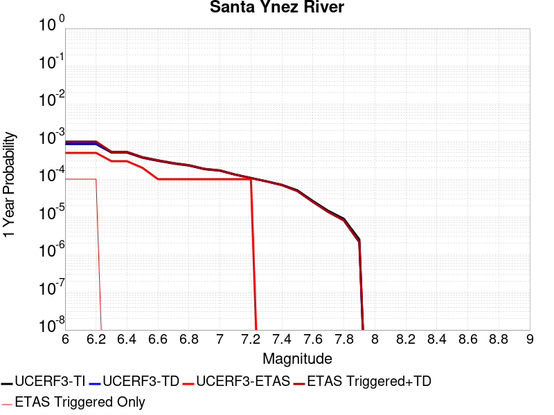 |  |

| Magnitude | 1 wk TI Prob | 1 wk TD Prob | 1 wk ETAS Prob | 1 wk ETAS/TD Gain | 1 wk ETAS Triggered+TD | 1 wk ETAS Triggered Only | 1 mo TI Prob | 1 mo TD Prob | 1 mo ETAS Prob | 1 mo ETAS/TD Gain | 1 mo ETAS Triggered+TD | 1 mo ETAS Triggered Only | 1 yr TI Prob | 1 yr TD Prob | 1 yr ETAS Prob | 1 yr ETAS/TD Gain | 1 yr ETAS Triggered+TD | 1 yr ETAS Triggered Only | 10 yr TI Prob | 10 yr TD Prob | 10 yr ETAS Prob | 10 yr ETAS/TD Gain | 10 yr ETAS Triggered+TD | 10 yr ETAS Triggered Only |
|-----|-----|-----|-----|-----|-----|-----|-----|-----|-----|-----|-----|-----|-----|-----|-----|-----|-----|-----|-----|-----|-----|-----|-----|-----|
| 6.0 | 1.6396456E-5 | 1.7211487E-5 | 0.0 | 0.0 | 1.7211487E-5 | 0.0 | 7.026863E-5 | 7.376163E-5 | 0.0 | 0.0 | 7.376163E-5 | 0.0 | 8.551848E-4 | 8.977134E-4 | 1.0E-4 | 0.11139413 | 9.976237E-4 | 1.0E-4 | 0.0085190125 | 0.00894442 | 8.0E-4 | 0.08944124 | 0.009737264 | 8.0E-4 |
| 6.1 | 1.6396456E-5 | 1.7211487E-5 | 0.0 | 0.0 | 1.7211487E-5 | 0.0 | 7.026863E-5 | 7.376163E-5 | 0.0 | 0.0 | 7.376163E-5 | 0.0 | 8.551848E-4 | 8.977134E-4 | 1.0E-4 | 0.11139413 | 9.976237E-4 | 1.0E-4 | 0.0085190125 | 0.00894442 | 8.0E-4 | 0.08944124 | 0.009737264 | 8.0E-4 |
| 6.2 | 1.6396456E-5 | 1.7211487E-5 | 0.0 | 0.0 | 1.7211487E-5 | 0.0 | 7.026863E-5 | 7.376163E-5 | 0.0 | 0.0 | 7.376163E-5 | 0.0 | 8.551848E-4 | 8.977134E-4 | 1.0E-4 | 0.11139413 | 9.976237E-4 | 1.0E-4 | 0.0085190125 | 0.00894442 | 8.0E-4 | 0.08944124 | 0.009737264 | 8.0E-4 |
| 6.3 | 9.736976E-6 | 1.0123441E-5 | 0.0 | 0.0 | 1.0123441E-5 | 0.0 | 4.172923E-5 | 4.3385484E-5 | 0.0 | 0.0 | 4.3385484E-5 | 0.0 | 5.0793495E-4 | 5.2809523E-4 | 0.0 | 0.0 | 5.2809523E-4 | 0.0 | 0.005067755 | 0.0052689086 | 7.0E-4 | 0.13285483 | 0.0059652207 | 7.0E-4 |
| 6.4 | 9.736976E-6 | 1.0123441E-5 | 0.0 | 0.0 | 1.0123441E-5 | 0.0 | 4.172923E-5 | 4.3385484E-5 | 0.0 | 0.0 | 4.3385484E-5 | 0.0 | 5.0793495E-4 | 5.2809523E-4 | 0.0 | 0.0 | 5.2809523E-4 | 0.0 | 0.005067755 | 0.0052689086 | 7.0E-4 | 0.13285483 | 0.0059652207 | 7.0E-4 |
| 6.5 | 7.081964E-6 | 7.3307087E-6 | 0.0 | 0.0 | 7.3307087E-6 | 0.0 | 3.035092E-5 | 3.1416956E-5 | 0.0 | 0.0 | 3.1416956E-5 | 0.0 | 3.694598E-4 | 3.8243586E-4 | 0.0 | 0.0 | 3.8243586E-4 | 0.0 | 0.0036884616 | 0.0038179392 | 2.0E-4 | 0.052384283 | 0.0040171756 | 2.0E-4 |
| 6.6 | 5.873247E-6 | 6.0604225E-6 | 0.0 | 0.0 | 6.0604225E-6 | 0.0 | 2.5170815E-5 | 2.5972984E-5 | 0.0 | 0.0 | 2.5972984E-5 | 0.0 | 3.064116E-4 | 3.1617607E-4 | 0.0 | 0.0 | 3.1617607E-4 | 0.0 | 0.0030598943 | 0.0031573498 | 2.0E-4 | 0.06334427 | 0.0033567182 | 2.0E-4 |
| 6.7 | 4.973277E-6 | 5.1164857E-6 | 0.0 | 0.0 | 5.1164857E-6 | 0.0 | 2.1313872E-5 | 2.1927613E-5 | 0.0 | 0.0 | 2.1927613E-5 | 0.0 | 2.5946548E-4 | 2.6693646E-4 | 0.0 | 0.0 | 2.6693646E-4 | 0.0 | 0.0025916274 | 0.0026662073 | 2.0E-4 | 0.07501292 | 0.002865674 | 2.0E-4 |
| 6.8 | 4.396492E-6 | 4.511501E-6 | 0.0 | 0.0 | 4.511501E-6 | 0.0 | 1.884197E-5 | 1.9334864E-5 | 0.0 | 0.0 | 1.9334864E-5 | 0.0 | 2.2937685E-4 | 2.353769E-4 | 0.0 | 0.0 | 2.353769E-4 | 0.0 | 0.0022914023 | 0.0023513113 | 2.0E-4 | 0.08505892 | 0.002550841 | 2.0E-4 |
| 6.9 | 3.5255632E-6 | 3.6017736E-6 | 0.0 | 0.0 | 3.6017736E-6 | 0.0 | 1.5109469E-5 | 1.5436082E-5 | 0.0 | 0.0 | 1.5436082E-5 | 0.0 | 1.8394225E-4 | 1.8791825E-4 | 0.0 | 0.0 | 1.8791825E-4 | 0.0 | 0.0018379007 | 0.0018776096 | 1.0E-4 | 0.05325921 | 0.0019774218 | 1.0E-4 |
| 7.0 | 3.211603E-6 | 3.2740647E-6 | 0.0 | 0.0 | 3.2740647E-6 | 0.0 | 1.376394E-5 | 1.40316315E-5 | 0.0 | 0.0 | 1.40316315E-5 | 0.0 | 1.6756308E-4 | 1.7082186E-4 | 0.0 | 0.0 | 1.7082186E-4 | 0.0 | 0.0016743679 | 0.0017069197 | 1.0E-4 | 0.058585063 | 0.001806749 | 1.0E-4 |
| 7.1 | 2.5094619E-6 | 2.5412655E-6 | 0.0 | 0.0 | 2.5412655E-6 | 0.0 | 1.0754793E-5 | 1.0891093E-5 | 0.0 | 0.0 | 1.0891093E-5 | 0.0 | 1.3093173E-4 | 1.3259104E-4 | 0.0 | 0.0 | 1.3259104E-4 | 0.0 | 0.0013085462 | 0.0013251253 | 1.0E-4 | 0.07546456 | 0.0014249928 | 1.0E-4 |
| 7.2 | 2.0515774E-6 | 2.062237E-6 | 0.0 | 0.0 | 2.062237E-6 | 0.0 | 8.792445E-6 | 8.838128E-6 | 0.0 | 0.0 | 8.838128E-6 | 0.0 | 1.0704277E-4 | 1.0759895E-4 | 0.0 | 0.0 | 1.0759895E-4 | 0.0 | 0.0010699122 | 0.0010754728 | 0.0 | 0.0 | 0.0010754728 | 0.0 |
| 7.3 | 1.6845745E-6 | 1.6776522E-6 | 0.0 | 0.0 | 1.6776522E-6 | 0.0 | 7.219585E-6 | 7.189918E-6 | 0.0 | 0.0 | 7.189918E-6 | 0.0 | 8.78949E-5 | 8.7533765E-5 | 0.0 | 0.0 | 8.7533765E-5 | 0.0 | 8.7860145E-4 | 8.749957E-4 | 0.0 | 0.0 | 8.749957E-4 | 0.0 |
| 7.4 | 1.3600285E-6 | 1.3335546E-6 | 0.0 | 0.0 | 1.3335546E-6 | 0.0 | 5.82868E-6 | 5.7152215E-6 | 0.0 | 0.0 | 5.7152215E-6 | 0.0 | 7.096187E-5 | 6.958062E-5 | 0.0 | 0.0 | 6.958062E-5 | 0.0 | 7.0939213E-4 | 6.9559057E-4 | 0.0 | 0.0 | 6.9559057E-4 | 0.0 |
| 7.5 | 9.735342E-7 | 9.2918145E-7 | 0.0 | 0.0 | 9.2918145E-7 | 0.0 | 4.172283E-6 | 3.9822003E-6 | 0.0 | 0.0 | 3.9822003E-6 | 0.0 | 5.079636E-5 | 4.8482227E-5 | 0.0 | 0.0 | 4.8482227E-5 | 0.0 | 5.0784746E-4 | 4.8471818E-4 | 0.0 | 0.0 | 4.8471818E-4 | 0.0 |
| 7.6 | 5.067187E-7 | 4.779177E-7 | 0.0 | 0.0 | 4.779177E-7 | 0.0 | 2.1716498E-6 | 2.048217E-6 | 0.0 | 0.0 | 2.048217E-6 | 0.0 | 2.6439517E-5 | 2.4936766E-5 | 0.0 | 0.0 | 2.4936766E-5 | 0.0 | 2.643637E-4 | 2.4934043E-4 | 0.0 | 0.0 | 2.4934043E-4 | 0.0 |
| 7.7 | 2.769089E-7 | 2.576219E-7 | 0.0 | 0.0 | 2.576219E-7 | 0.0 | 1.1867519E-6 | 1.1040934E-6 | 0.0 | 0.0 | 1.1040934E-6 | 0.0 | 1.4448608E-5 | 1.3442255E-5 | 0.0 | 0.0 | 1.3442255E-5 | 0.0 | 1.444767E-4 | 1.3441445E-4 | 0.0 | 0.0 | 1.3441445E-4 | 0.0 |
| 7.8 | 1.7044663E-7 | 1.5450921E-7 | 0.0 | 0.0 | 1.5450921E-7 | 0.0 | 7.3048534E-7 | 6.621822E-7 | 0.0 | 0.0 | 6.621822E-7 | 0.0 | 8.893623E-6 | 8.062038E-6 | 0.0 | 0.0 | 8.062038E-6 | 0.0 | 8.893267E-5 | 8.061748E-5 | 0.0 | 0.0 | 8.061748E-5 | 0.0 |
| 7.9 | 4.8344287E-8 | 4.0916387E-8 | 0.0 | 0.0 | 4.0916387E-8 | 0.0 | 2.0718979E-7 | 1.7535592E-7 | 0.0 | 0.0 | 1.7535592E-7 | 0.0 | 2.5225327E-6 | 2.1349563E-6 | 0.0 | 0.0 | 2.1349563E-6 | 0.0 | 2.5225041E-5 | 2.1349362E-5 | 0.0 | 0.0 | 2.1349362E-5 | 0.0 |

## Sierra Nevada  (No Extension)
*[(top)](#table-of-contents)*

| 1 Week | 1 Month | 1 Year | 10 Year |
|-----|-----|-----|-----|
|  |  |  |  |

| Magnitude | 1 wk TI Prob | 1 wk TD Prob | 1 wk ETAS Prob | 1 wk ETAS/TD Gain | 1 wk ETAS Triggered+TD | 1 wk ETAS Triggered Only | 1 mo TI Prob | 1 mo TD Prob | 1 mo ETAS Prob | 1 mo ETAS/TD Gain | 1 mo ETAS Triggered+TD | 1 mo ETAS Triggered Only | 1 yr TI Prob | 1 yr TD Prob | 1 yr ETAS Prob | 1 yr ETAS/TD Gain | 1 yr ETAS Triggered+TD | 1 yr ETAS Triggered Only | 10 yr TI Prob | 10 yr TD Prob | 10 yr ETAS Prob | 10 yr ETAS/TD Gain | 10 yr ETAS Triggered+TD | 10 yr ETAS Triggered Only |
|-----|-----|-----|-----|-----|-----|-----|-----|-----|-----|-----|-----|-----|-----|-----|-----|-----|-----|-----|-----|-----|-----|-----|-----|-----|
| 6.0 | 7.7690465E-6 | 6.9769403E-6 | 0.0 | 0.0 | 6.9769403E-6 | 0.0 | 3.329549E-5 | 2.9901032E-5 | 0.0 | 0.0 | 2.9901032E-5 | 0.0 | 4.0529718E-4 | 3.6402012E-4 | 0.0 | 0.0 | 3.6402012E-4 | 0.0 | 0.004045588 | 0.003637755 | 0.001 | 0.2748948 | 0.0046341172 | 0.001 |
| 6.1 | 7.7690465E-6 | 6.9769403E-6 | 0.0 | 0.0 | 6.9769403E-6 | 0.0 | 3.329549E-5 | 2.9901032E-5 | 0.0 | 0.0 | 2.9901032E-5 | 0.0 | 4.0529718E-4 | 3.6402012E-4 | 0.0 | 0.0 | 3.6402012E-4 | 0.0 | 0.004045588 | 0.003637755 | 0.001 | 0.2748948 | 0.0046341172 | 0.001 |
| 6.2 | 7.7690465E-6 | 6.9769403E-6 | 0.0 | 0.0 | 6.9769403E-6 | 0.0 | 3.329549E-5 | 2.9901032E-5 | 0.0 | 0.0 | 2.9901032E-5 | 0.0 | 4.0529718E-4 | 3.6402012E-4 | 0.0 | 0.0 | 3.6402012E-4 | 0.0 | 0.004045588 | 0.003637755 | 0.001 | 0.2748948 | 0.0046341172 | 0.001 |
| 6.3 | 7.7690465E-6 | 6.9769403E-6 | 0.0 | 0.0 | 6.9769403E-6 | 0.0 | 3.329549E-5 | 2.9901032E-5 | 0.0 | 0.0 | 2.9901032E-5 | 0.0 | 4.0529718E-4 | 3.6402012E-4 | 0.0 | 0.0 | 3.6402012E-4 | 0.0 | 0.004045588 | 0.003637755 | 0.001 | 0.2748948 | 0.0046341172 | 0.001 |
| 6.4 | 7.7690465E-6 | 6.9769403E-6 | 0.0 | 0.0 | 6.9769403E-6 | 0.0 | 3.329549E-5 | 2.9901032E-5 | 0.0 | 0.0 | 2.9901032E-5 | 0.0 | 4.0529718E-4 | 3.6402012E-4 | 0.0 | 0.0 | 3.6402012E-4 | 0.0 | 0.004045588 | 0.003637755 | 0.001 | 0.2748948 | 0.0046341172 | 0.001 |
| 6.5 | 7.7690465E-6 | 6.9769403E-6 | 0.0 | 0.0 | 6.9769403E-6 | 0.0 | 3.329549E-5 | 2.9901032E-5 | 0.0 | 0.0 | 2.9901032E-5 | 0.0 | 4.0529718E-4 | 3.6402012E-4 | 0.0 | 0.0 | 3.6402012E-4 | 0.0 | 0.004045588 | 0.003637755 | 0.001 | 0.2748948 | 0.0046341172 | 0.001 |
| 6.6 | 2.653E-6 | 1.614943E-6 | 0.0 | 0.0 | 1.614943E-6 | 0.0 | 1.136995E-5 | 6.921166E-6 | 0.0 | 0.0 | 6.921166E-6 | 0.0 | 1.3842035E-4 | 8.426197E-5 | 0.0 | 0.0 | 8.426197E-5 | 0.0 | 0.0013833415 | 8.423037E-4 | 1.0E-4 | 0.11872203 | 9.4221946E-4 | 1.0E-4 |
| 6.7 | 2.5902466E-6 | 1.5502725E-6 | 0.0 | 0.0 | 1.5502725E-6 | 0.0 | 1.11010095E-5 | 6.644008E-6 | 0.0 | 0.0 | 6.644008E-6 | 0.0 | 1.351464E-4 | 8.0887825E-5 | 0.0 | 0.0 | 8.0887825E-5 | 0.0 | 0.0013506424 | 8.0858683E-4 | 1.0E-4 | 0.12367256 | 9.08506E-4 | 1.0E-4 |
| 6.8 | 2.5853892E-6 | 1.5470723E-6 | 0.0 | 0.0 | 1.5470723E-6 | 0.0 | 1.1080193E-5 | 6.6302932E-6 | 0.0 | 0.0 | 6.6302932E-6 | 0.0 | 1.34893E-4 | 8.072086E-5 | 0.0 | 0.0 | 8.072086E-5 | 0.0 | 0.0013481114 | 8.0691837E-4 | 1.0E-4 | 0.12392827 | 9.068377E-4 | 1.0E-4 |
| 6.9 | 2.458257E-6 | 1.422141E-6 | 0.0 | 0.0 | 1.422141E-6 | 0.0 | 1.0535345E-5 | 6.094876E-6 | 0.0 | 0.0 | 6.094876E-6 | 0.0 | 1.2826028E-4 | 7.420261E-5 | 0.0 | 0.0 | 7.420261E-5 | 0.0 | 0.0012818627 | 7.4178027E-4 | 1.0E-4 | 0.1348108 | 8.417061E-4 | 1.0E-4 |
| 7.0 | 2.4341468E-6 | 1.3991038E-6 | 0.0 | 0.0 | 1.3991038E-6 | 0.0 | 1.0432016E-5 | 5.9961453E-6 | 0.0 | 0.0 | 5.9961453E-6 | 0.0 | 1.270024E-4 | 7.300064E-5 | 0.0 | 0.0 | 7.300064E-5 | 0.0 | 0.0012692984 | 7.2976854E-4 | 1.0E-4 | 0.13702975 | 8.2969555E-4 | 1.0E-4 |
| 7.1 | 2.3652476E-6 | 1.3340505E-6 | 0.0 | 0.0 | 1.3340505E-6 | 0.0 | 1.0136736E-5 | 5.717347E-6 | 0.0 | 0.0 | 5.717347E-6 | 0.0 | 1.2340778E-4 | 6.960649E-5 | 0.0 | 0.0 | 6.960649E-5 | 0.0 | 0.0012333926 | 6.958486E-4 | 1.0E-4 | 0.14370942 | 7.95779E-4 | 1.0E-4 |
| 7.2 | 2.272158E-6 | 1.2503536E-6 | 0.0 | 0.0 | 1.2503536E-6 | 0.0 | 9.737784E-6 | 5.3586473E-6 | 0.0 | 0.0 | 5.3586473E-6 | 0.0 | 1.1855107E-4 | 6.52396E-5 | 0.0 | 0.0 | 6.52396E-5 | 0.0 | 0.0011848784 | 6.5220596E-4 | 1.0E-4 | 0.15332581 | 7.521407E-4 | 1.0E-4 |
| 7.3 | 2.1382127E-6 | 1.1420369E-6 | 0.0 | 0.0 | 1.1420369E-6 | 0.0 | 9.163737E-6 | 4.894435E-6 | 0.0 | 0.0 | 4.894435E-6 | 0.0 | 1.1156279E-4 | 5.9588125E-5 | 0.0 | 0.0 | 5.9588125E-5 | 0.0 | 0.001115068 | 5.9572264E-4 | 1.0E-4 | 0.16786335 | 6.956631E-4 | 1.0E-4 |
| 7.4 | 1.9048055E-6 | 9.575826E-7 | 0.0 | 0.0 | 9.575826E-7 | 0.0 | 8.163426E-6 | 4.1039193E-6 | 0.0 | 0.0 | 4.1039193E-6 | 0.0 | 9.9385186E-5 | 4.9964077E-5 | 0.0 | 0.0 | 4.9964077E-5 | 0.0 | 9.934074E-4 | 4.995291E-4 | 1.0E-4 | 0.20018853 | 5.994792E-4 | 1.0E-4 |
| 7.5 | 1.5373403E-6 | 7.560512E-7 | 0.0 | 0.0 | 7.560512E-7 | 0.0 | 6.5885843E-6 | 3.2402154E-6 | 0.0 | 0.0 | 3.2402154E-6 | 0.0 | 8.021306E-5 | 3.944891E-5 | 0.0 | 0.0 | 3.944891E-5 | 0.0 | 8.0184115E-4 | 3.9441956E-4 | 0.0 | 0.0 | 3.9441956E-4 | 0.0 |
| 7.6 | 1.0680322E-6 | 4.659923E-7 | 0.0 | 0.0 | 4.659923E-7 | 0.0 | 4.577273E-6 | 1.9971083E-6 | 0.0 | 0.0 | 1.9971083E-6 | 0.0 | 5.5726876E-5 | 2.4314524E-5 | 0.0 | 0.0 | 2.4314524E-5 | 0.0 | 5.5712904E-4 | 2.431189E-4 | 0.0 | 0.0 | 2.431189E-4 | 0.0 |
| 7.7 | 5.509146E-7 | 1.5580983E-7 | 0.0 | 0.0 | 1.5580983E-7 | 0.0 | 2.3610605E-6 | 6.677563E-7 | 0.0 | 0.0 | 6.677563E-7 | 0.0 | 2.8745531E-5 | 8.129903E-6 | 0.0 | 0.0 | 8.129903E-6 | 0.0 | 2.8741814E-4 | 8.129617E-5 | 0.0 | 0.0 | 8.129617E-5 | 0.0 |

## Death Valley (Black Mtns Frontal)
*[(top)](#table-of-contents)*

| 1 Week | 1 Month | 1 Year | 10 Year |
|-----|-----|-----|-----|
|  |  | 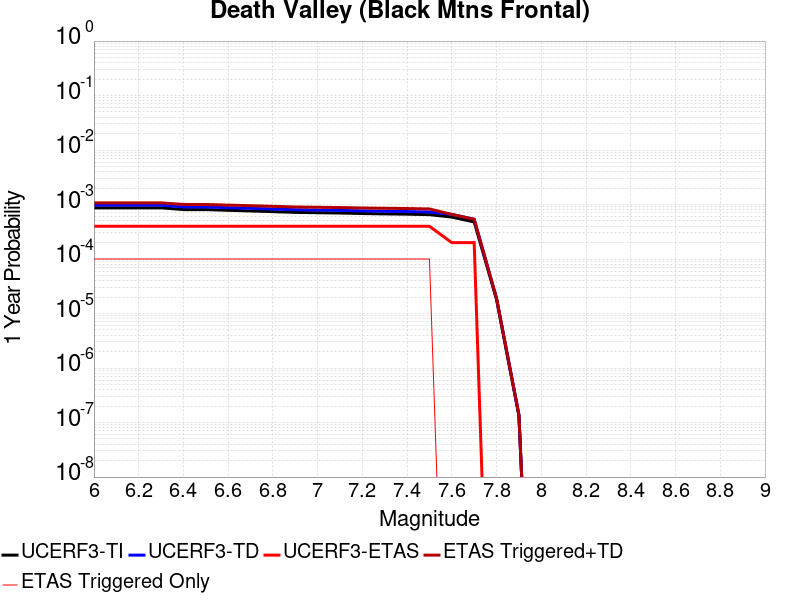 |  |

| Magnitude | 1 wk TI Prob | 1 wk TD Prob | 1 wk ETAS Prob | 1 wk ETAS/TD Gain | 1 wk ETAS Triggered+TD | 1 wk ETAS Triggered Only | 1 mo TI Prob | 1 mo TD Prob | 1 mo ETAS Prob | 1 mo ETAS/TD Gain | 1 mo ETAS Triggered+TD | 1 mo ETAS Triggered Only | 1 yr TI Prob | 1 yr TD Prob | 1 yr ETAS Prob | 1 yr ETAS/TD Gain | 1 yr ETAS Triggered+TD | 1 yr ETAS Triggered Only | 10 yr TI Prob | 10 yr TD Prob | 10 yr ETAS Prob | 10 yr ETAS/TD Gain | 10 yr ETAS Triggered+TD | 10 yr ETAS Triggered Only |
|-----|-----|-----|-----|-----|-----|-----|-----|-----|-----|-----|-----|-----|-----|-----|-----|-----|-----|-----|-----|-----|-----|-----|-----|-----|
| 6.0 | 1.6707214E-5 | 1.8674798E-5 | 0.0 | 0.0 | 1.8674798E-5 | 0.0 | 7.160038E-5 | 8.003244E-5 | 0.0 | 0.0 | 8.003244E-5 | 0.0 | 8.71386E-4 | 9.73967E-4 | 1.0E-4 | 0.10267288 | 0.0010738696 | 1.0E-4 | 0.00867977 | 0.009697839 | 0.001 | 0.10311577 | 0.01068814 | 0.001 |
| 6.1 | 1.6707214E-5 | 1.8674798E-5 | 0.0 | 0.0 | 1.8674798E-5 | 0.0 | 7.160038E-5 | 8.003244E-5 | 0.0 | 0.0 | 8.003244E-5 | 0.0 | 8.71386E-4 | 9.73967E-4 | 1.0E-4 | 0.10267288 | 0.0010738696 | 1.0E-4 | 0.00867977 | 0.009697839 | 0.001 | 0.10311577 | 0.01068814 | 0.001 |
| 6.2 | 1.6707214E-5 | 1.8674798E-5 | 0.0 | 0.0 | 1.8674798E-5 | 0.0 | 7.160038E-5 | 8.003244E-5 | 0.0 | 0.0 | 8.003244E-5 | 0.0 | 8.71386E-4 | 9.73967E-4 | 1.0E-4 | 0.10267288 | 0.0010738696 | 1.0E-4 | 0.00867977 | 0.009697839 | 0.001 | 0.10311577 | 0.01068814 | 0.001 |
| 6.3 | 1.6707214E-5 | 1.8674798E-5 | 0.0 | 0.0 | 1.8674798E-5 | 0.0 | 7.160038E-5 | 8.003244E-5 | 0.0 | 0.0 | 8.003244E-5 | 0.0 | 8.71386E-4 | 9.73967E-4 | 1.0E-4 | 0.10267288 | 0.0010738696 | 1.0E-4 | 0.00867977 | 0.009697839 | 0.001 | 0.10311577 | 0.01068814 | 0.001 |
| 6.4 | 1.5515609E-5 | 1.734242E-5 | 0.0 | 0.0 | 1.734242E-5 | 0.0 | 6.649377E-5 | 7.4322576E-5 | 0.0 | 0.0 | 7.4322576E-5 | 0.0 | 8.0926094E-4 | 9.045078E-4 | 1.0E-4 | 0.11055736 | 0.0010044174 | 1.0E-4 | 0.008063202 | 0.009008949 | 9.0E-4 | 0.09990067 | 0.009900841 | 9.0E-4 |
| 6.5 | 1.5515609E-5 | 1.734242E-5 | 0.0 | 0.0 | 1.734242E-5 | 0.0 | 6.649377E-5 | 7.4322576E-5 | 0.0 | 0.0 | 7.4322576E-5 | 0.0 | 8.0926094E-4 | 9.045078E-4 | 1.0E-4 | 0.11055736 | 0.0010044174 | 1.0E-4 | 0.008063202 | 0.009008949 | 9.0E-4 | 0.09990067 | 0.009900841 | 9.0E-4 |
| 6.6 | 1.5041828E-5 | 1.6813225E-5 | 0.0 | 0.0 | 1.6813225E-5 | 0.0 | 6.4463384E-5 | 7.205472E-5 | 0.0 | 0.0 | 7.205472E-5 | 0.0 | 7.8455906E-4 | 8.76919E-4 | 1.0E-4 | 0.114035614 | 9.768313E-4 | 1.0E-4 | 0.00781795 | 0.008735243 | 9.0E-4 | 0.103030905 | 0.009627381 | 9.0E-4 |
| 6.7 | 1.4634985E-5 | 1.635999E-5 | 0.0 | 0.0 | 1.635999E-5 | 0.0 | 6.271985E-5 | 7.011239E-5 | 0.0 | 0.0 | 7.011239E-5 | 0.0 | 7.6334673E-4 | 8.5328985E-4 | 1.0E-4 | 0.117193475 | 9.532045E-4 | 1.0E-4 | 0.007607299 | 0.008500772 | 9.0E-4 | 0.10587274 | 0.009393121 | 9.0E-4 |
| 6.8 | 1.4209158E-5 | 1.5885911E-5 | 0.0 | 0.0 | 1.5885911E-5 | 0.0 | 6.089497E-5 | 6.808073E-5 | 0.0 | 0.0 | 6.808073E-5 | 0.0 | 7.4114406E-4 | 8.285733E-4 | 1.0E-4 | 0.120689385 | 9.284904E-4 | 1.0E-4 | 0.007386771 | 0.008255456 | 9.0E-4 | 0.10901882 | 0.009148026 | 9.0E-4 |
| 6.9 | 1.3780098E-5 | 1.5408345E-5 | 0.0 | 0.0 | 1.5408345E-5 | 0.0 | 5.9056227E-5 | 6.6034125E-5 | 0.0 | 0.0 | 6.6034125E-5 | 0.0 | 7.1877235E-4 | 8.036744E-4 | 1.0E-4 | 0.1244285 | 9.03594E-4 | 1.0E-4 | 0.0071645193 | 0.008008275 | 9.0E-4 | 0.112383746 | 0.008901068 | 9.0E-4 |
| 7.0 | 1.3585064E-5 | 1.5191858E-5 | 0.0 | 0.0 | 1.5191858E-5 | 0.0 | 5.8220405E-5 | 6.5106375E-5 | 0.0 | 0.0 | 6.5106375E-5 | 0.0 | 7.086029E-4 | 7.923873E-4 | 1.0E-4 | 0.12620091 | 8.92308E-4 | 1.0E-4 | 0.007063476 | 0.007896211 | 9.0E-4 | 0.113978714 | 0.008789104 | 9.0E-4 |
| 7.1 | 1.3398601E-5 | 1.4984997E-5 | 0.0 | 0.0 | 1.4984997E-5 | 0.0 | 5.742131E-5 | 6.4219865E-5 | 0.0 | 0.0 | 6.4219865E-5 | 0.0 | 6.9888023E-4 | 7.816018E-4 | 1.0E-4 | 0.12794238 | 8.8152365E-4 | 1.0E-4 | 0.0069668638 | 0.0077891177 | 9.0E-4 | 0.115545824 | 0.008682108 | 9.0E-4 |
| 7.2 | 1.3126312E-5 | 1.468315E-5 | 0.0 | 0.0 | 1.468315E-5 | 0.0 | 5.6254412E-5 | 6.29263E-5 | 0.0 | 0.0 | 6.29263E-5 | 0.0 | 6.846822E-4 | 7.6586386E-4 | 1.0E-4 | 0.13057151 | 8.6578727E-4 | 1.0E-4 | 0.006825765 | 0.0076328292 | 9.0E-4 | 0.11791172 | 0.008525959 | 9.0E-4 |
| 7.3 | 1.2922429E-5 | 1.4457328E-5 | 0.0 | 0.0 | 1.4457328E-5 | 0.0 | 5.5380664E-5 | 6.195853E-5 | 0.0 | 0.0 | 6.195853E-5 | 0.0 | 6.74051E-4 | 7.540895E-4 | 1.0E-4 | 0.13261025 | 8.540141E-4 | 1.0E-4 | 0.006720101 | 0.007515888 | 8.0E-4 | 0.10644118 | 0.008309876 | 8.0E-4 |
| 7.4 | 1.2768878E-5 | 1.4287273E-5 | 0.0 | 0.0 | 1.4287273E-5 | 0.0 | 5.4722615E-5 | 6.1229766E-5 | 0.0 | 0.0 | 6.1229766E-5 | 0.0 | 6.660441E-4 | 7.4522285E-4 | 1.0E-4 | 0.13418806 | 8.451483E-4 | 1.0E-4 | 0.0066405144 | 0.007427817 | 8.0E-4 | 0.10770324 | 0.008221875 | 8.0E-4 |
| 7.5 | 1.2521929E-5 | 1.401546E-5 | 0.0 | 0.0 | 1.401546E-5 | 0.0 | 5.366431E-5 | 6.0064904E-5 | 0.0 | 0.0 | 6.0064904E-5 | 0.0 | 6.531671E-4 | 7.3105027E-4 | 1.0E-4 | 0.1367895 | 8.3097717E-4 | 1.0E-4 | 0.006512506 | 0.0072870306 | 8.0E-4 | 0.10978409 | 0.0080812005 | 8.0E-4 |
| 7.6 | 1.1301089E-5 | 1.2651263E-5 | 0.0 | 0.0 | 1.2651263E-5 | 0.0 | 4.8432343E-5 | 5.4218603E-5 | 0.0 | 0.0 | 5.4218603E-5 | 0.0 | 5.895042E-4 | 6.5991684E-4 | 0.0 | 0.0 | 6.5991684E-4 | 0.0 | 0.0058794282 | 0.006580125 | 7.0E-4 | 0.10638096 | 0.007275519 | 7.0E-4 |
| 7.7 | 9.189108E-6 | 1.0285888E-5 | 0.0 | 0.0 | 1.0285888E-5 | 0.0 | 3.93813E-5 | 4.408166E-5 | 0.0 | 0.0 | 4.408166E-5 | 0.0 | 4.7936183E-4 | 5.3656707E-4 | 0.0 | 0.0 | 5.3656707E-4 | 0.0 | 0.004783291 | 0.005353227 | 5.0E-4 | 0.0934016 | 0.0058505503 | 5.0E-4 |
| 7.8 | 3.4586725E-7 | 3.6486753E-7 | 0.0 | 0.0 | 3.6486753E-7 | 0.0 | 1.4822873E-6 | 1.5637171E-6 | 0.0 | 0.0 | 1.5637171E-6 | 0.0 | 1.80467E-5 | 1.9038094E-5 | 0.0 | 0.0 | 1.9038094E-5 | 0.0 | 1.8045233E-4 | 1.9036507E-4 | 0.0 | 0.0 | 1.9036507E-4 | 0.0 |
| 7.9 | 2.5591178E-9 | 2.6699092E-9 | 0.0 | 0.0 | 2.6699092E-9 | 0.0 | 1.0967647E-8 | 1.1442468E-8 | 0.0 | 0.0 | 1.1442468E-8 | 0.0 | 1.335311E-7 | 1.3931205E-7 | 0.0 | 0.0 | 1.3931205E-7 | 0.0 | 1.3353102E-6 | 1.3931206E-6 | 0.0 | 0.0 | 1.3931206E-6 | 0.0 |

## San Juan
*[(top)](#table-of-contents)*

| 1 Week | 1 Month | 1 Year | 10 Year |
|-----|-----|-----|-----|
|  |  |  |  |

| Magnitude | 1 wk TI Prob | 1 wk TD Prob | 1 wk ETAS Prob | 1 wk ETAS/TD Gain | 1 wk ETAS Triggered+TD | 1 wk ETAS Triggered Only | 1 mo TI Prob | 1 mo TD Prob | 1 mo ETAS Prob | 1 mo ETAS/TD Gain | 1 mo ETAS Triggered+TD | 1 mo ETAS Triggered Only | 1 yr TI Prob | 1 yr TD Prob | 1 yr ETAS Prob | 1 yr ETAS/TD Gain | 1 yr ETAS Triggered+TD | 1 yr ETAS Triggered Only | 10 yr TI Prob | 10 yr TD Prob | 10 yr ETAS Prob | 10 yr ETAS/TD Gain | 10 yr ETAS Triggered+TD | 10 yr ETAS Triggered Only |
|-----|-----|-----|-----|-----|-----|-----|-----|-----|-----|-----|-----|-----|-----|-----|-----|-----|-----|-----|-----|-----|-----|-----|-----|-----|
| 6.0 | 8.682808E-6 | 8.741695E-6 | 0.0 | 0.0 | 8.741695E-6 | 0.0 | 3.72115E-5 | 3.7463895E-5 | 0.0 | 0.0 | 3.7463895E-5 | 0.0 | 4.5295584E-4 | 4.5603229E-4 | 1.0E-4 | 0.21928272 | 5.5598665E-4 | 1.0E-4 | 0.004520337 | 0.0045515043 | 0.001 | 0.21970758 | 0.005546953 | 0.001 |
| 6.1 | 8.682808E-6 | 8.741695E-6 | 0.0 | 0.0 | 8.741695E-6 | 0.0 | 3.72115E-5 | 3.7463895E-5 | 0.0 | 0.0 | 3.7463895E-5 | 0.0 | 4.5295584E-4 | 4.5603229E-4 | 1.0E-4 | 0.21928272 | 5.5598665E-4 | 1.0E-4 | 0.004520337 | 0.0045515043 | 0.001 | 0.21970758 | 0.005546953 | 0.001 |
| 6.2 | 8.682808E-6 | 8.741695E-6 | 0.0 | 0.0 | 8.741695E-6 | 0.0 | 3.72115E-5 | 3.7463895E-5 | 0.0 | 0.0 | 3.7463895E-5 | 0.0 | 4.5295584E-4 | 4.5603229E-4 | 1.0E-4 | 0.21928272 | 5.5598665E-4 | 1.0E-4 | 0.004520337 | 0.0045515043 | 0.001 | 0.21970758 | 0.005546953 | 0.001 |
| 6.3 | 6.3054235E-6 | 6.2749255E-6 | 0.0 | 0.0 | 6.2749255E-6 | 0.0 | 2.7022963E-5 | 2.6892269E-5 | 0.0 | 0.0 | 2.6892269E-5 | 0.0 | 3.2895492E-4 | 3.273656E-4 | 1.0E-4 | 0.3054689 | 4.2733285E-4 | 1.0E-4 | 0.003284684 | 0.003269032 | 9.0E-4 | 0.27531084 | 0.00416609 | 9.0E-4 |
| 6.4 | 6.1490473E-6 | 6.1080377E-6 | 0.0 | 0.0 | 6.1080377E-6 | 0.0 | 2.6352795E-5 | 2.617705E-5 | 0.0 | 0.0 | 2.617705E-5 | 0.0 | 3.2079802E-4 | 3.1866034E-4 | 1.0E-4 | 0.31381375 | 4.1862848E-4 | 1.0E-4 | 0.0032033534 | 0.0031822291 | 9.0E-4 | 0.2828206 | 0.004079365 | 9.0E-4 |
| 6.5 | 5.204848E-6 | 5.1308857E-6 | 0.0 | 0.0 | 5.1308857E-6 | 0.0 | 2.23063E-5 | 2.198933E-5 | 0.0 | 0.0 | 2.198933E-5 | 0.0 | 2.7154534E-4 | 2.6768816E-4 | 1.0E-4 | 0.373569 | 3.6766139E-4 | 1.0E-4 | 0.0027121378 | 0.0026738099 | 6.0E-4 | 0.2243989 | 0.0032722056 | 6.0E-4 |
| 6.6 | 4.5179986E-6 | 4.410469E-6 | 0.0 | 0.0 | 4.410469E-6 | 0.0 | 1.9362706E-5 | 1.8901877E-5 | 0.0 | 0.0 | 1.8901877E-5 | 0.0 | 2.3571544E-4 | 2.3010685E-4 | 0.0 | 0.0 | 2.3010685E-4 | 0.0 | 0.0023546559 | 0.0022988215 | 3.0E-4 | 0.13050164 | 0.002598132 | 3.0E-4 |
| 6.7 | 3.9442616E-6 | 3.815779E-6 | 0.0 | 0.0 | 3.815779E-6 | 0.0 | 1.6903869E-5 | 1.635324E-5 | 0.0 | 0.0 | 1.635324E-5 | 0.0 | 2.0578515E-4 | 1.990832E-4 | 0.0 | 0.0 | 1.990832E-4 | 0.0 | 0.002055947 | 0.001989172 | 2.0E-4 | 0.10054434 | 0.0021887743 | 2.0E-4 |
| 6.8 | 3.4536245E-6 | 3.3124313E-6 | 0.0 | 0.0 | 3.3124313E-6 | 0.0 | 1.4801163E-5 | 1.419606E-5 | 0.0 | 0.0 | 1.419606E-5 | 0.0 | 1.8018926E-4 | 1.7282394E-4 | 0.0 | 0.0 | 1.7282394E-4 | 0.0 | 0.0018004322 | 0.0017270129 | 2.0E-4 | 0.11580689 | 0.0019266675 | 2.0E-4 |
| 6.9 | 3.059865E-6 | 2.9082921E-6 | 0.0 | 0.0 | 2.9082921E-6 | 0.0 | 1.3113641E-5 | 1.2464053E-5 | 0.0 | 0.0 | 1.2464053E-5 | 0.0 | 1.596469E-4 | 1.5173985E-4 | 0.0 | 0.0 | 1.5173985E-4 | 0.0 | 0.0015953224 | 0.0015164758 | 2.0E-4 | 0.13188472 | 0.0017161726 | 2.0E-4 |
| 7.0 | 2.6504351E-6 | 2.488467E-6 | 0.0 | 0.0 | 2.488467E-6 | 0.0 | 1.1358958E-5 | 1.0664819E-5 | 0.0 | 0.0 | 1.0664819E-5 | 0.0 | 1.3828653E-4 | 1.2983698E-4 | 0.0 | 0.0 | 1.2983698E-4 | 0.0 | 0.0013820052 | 0.0012977218 | 2.0E-4 | 0.15411624 | 0.0014974623 | 2.0E-4 |
| 7.1 | 2.2039317E-6 | 2.0310363E-6 | 0.0 | 0.0 | 2.0310363E-6 | 0.0 | 9.445387E-6 | 8.704415E-6 | 0.0 | 0.0 | 8.704415E-6 | 0.0 | 1.1499152E-4 | 1.0597163E-4 | 0.0 | 0.0 | 1.0597163E-4 | 0.0 | 0.0011493203 | 0.0010593198 | 2.0E-4 | 0.1888004 | 0.001259108 | 2.0E-4 |
| 7.2 | 1.0786707E-6 | 8.7457755E-7 | 0.0 | 0.0 | 8.7457755E-7 | 0.0 | 4.622866E-6 | 3.748184E-6 | 0.0 | 0.0 | 3.748184E-6 | 0.0 | 5.628194E-5 | 4.5633198E-5 | 0.0 | 0.0 | 4.5633198E-5 | 0.0 | 5.6267687E-4 | 4.562961E-4 | 0.0 | 0.0 | 4.562961E-4 | 0.0 |
| 7.3 | 6.846433E-7 | 4.8524794E-7 | 0.0 | 0.0 | 4.8524794E-7 | 0.0 | 2.9341822E-6 | 2.0796322E-6 | 0.0 | 0.0 | 2.0796322E-6 | 0.0 | 3.5723086E-5 | 2.531923E-5 | 0.0 | 0.0 | 2.531923E-5 | 0.0 | 3.571734E-4 | 2.5319683E-4 | 0.0 | 0.0 | 2.5319683E-4 | 0.0 |
| 7.4 | 5.23043E-7 | 3.2513054E-7 | 0.0 | 0.0 | 3.2513054E-7 | 0.0 | 2.2416111E-6 | 1.3934158E-6 | 0.0 | 0.0 | 1.3934158E-6 | 0.0 | 2.7291273E-5 | 1.6964706E-5 | 0.0 | 0.0 | 1.6964706E-5 | 0.0 | 2.7287923E-4 | 1.696661E-4 | 0.0 | 0.0 | 1.696661E-4 | 0.0 |
| 7.5 | 4.648444E-7 | 2.7138037E-7 | 0.0 | 0.0 | 2.7138037E-7 | 0.0 | 1.9921886E-6 | 1.1630583E-6 | 0.0 | 0.0 | 1.1630583E-6 | 0.0 | 2.4254627E-5 | 1.4160143E-5 | 0.0 | 0.0 | 1.4160143E-5 | 0.0 | 2.425198E-4 | 1.4162206E-4 | 0.0 | 0.0 | 1.4162206E-4 | 0.0 |
| 7.6 | 3.9906567E-7 | 2.2006654E-7 | 0.0 | 0.0 | 2.2006654E-7 | 0.0 | 1.7102802E-6 | 9.4314197E-7 | 0.0 | 0.0 | 9.4314197E-7 | 0.0 | 2.0822463E-5 | 1.14826935E-5 | 0.0 | 0.0 | 1.14826935E-5 | 0.0 | 2.0820512E-4 | 1.1484549E-4 | 0.0 | 0.0 | 1.1484549E-4 | 0.0 |
| 7.7 | 1.8784601E-7 | 5.340911E-8 | 0.0 | 0.0 | 5.340911E-8 | 0.0 | 8.0505407E-7 | 2.2889617E-7 | 0.0 | 0.0 | 2.2889617E-7 | 0.0 | 9.80149E-6 | 2.786807E-6 | 0.0 | 0.0 | 2.786807E-6 | 0.0 | 9.801057E-5 | 2.7876666E-5 | 0.0 | 0.0 | 2.7876666E-5 | 0.0 |
| 7.8 | 1.00154914E-7 | 1.235197E-8 | 0.0 | 0.0 | 1.235197E-8 | 0.0 | 4.2923529E-7 | 5.2937015E-8 | 0.0 | 0.0 | 5.2937015E-8 | 0.0 | 5.225927E-6 | 6.4450796E-7 | 0.0 | 0.0 | 6.4450796E-7 | 0.0 | 5.225804E-5 | 6.450899E-6 | 0.0 | 0.0 | 6.450899E-6 | 0.0 |
| 7.9 | 6.171429E-8 | 4.269328E-9 | 0.0 | 0.0 | 4.269328E-9 | 0.0 | 2.6448978E-7 | 1.829712E-8 | 0.0 | 0.0 | 1.829712E-8 | 0.0 | 3.2201583E-6 | 2.2276741E-7 | 0.0 | 0.0 | 2.2276741E-7 | 0.0 | 3.2201115E-5 | 2.2329289E-6 | 0.0 | 0.0 | 2.2329289E-6 | 0.0 |
| 8.0 | 1.3974572E-8 | 3.3388414E-10 | 0.0 | 0.0 | 3.3388414E-10 | 0.0 | 5.989102E-8 | 1.4309338E-9 | 0.0 | 0.0 | 1.4309338E-9 | 0.0 | 7.2917294E-7 | 1.742162E-8 | 0.0 | 0.0 | 1.742162E-8 | 0.0 | 7.2917055E-6 | 1.7850087E-7 | 0.0 | 0.0 | 1.7850087E-7 | 0.0 |
| 8.1 | 1.8403477E-9 | 1.12093E-10 | 0.0 | 0.0 | 1.12093E-10 | 0.0 | 7.887204E-9 | 4.8040005E-10 | 0.0 | 0.0 | 4.8040005E-10 | 0.0 | 9.602671E-8 | 5.848874E-9 | 0.0 | 0.0 | 5.848874E-9 | 0.0 | 9.602667E-7 | 5.97637E-8 | 0.0 | 0.0 | 5.97637E-8 | 0.0 |

## Great Valley 07 (Orestimba)
*[(top)](#table-of-contents)*

| 1 Week | 1 Month | 1 Year | 10 Year |
|-----|-----|-----|-----|
|  |  | 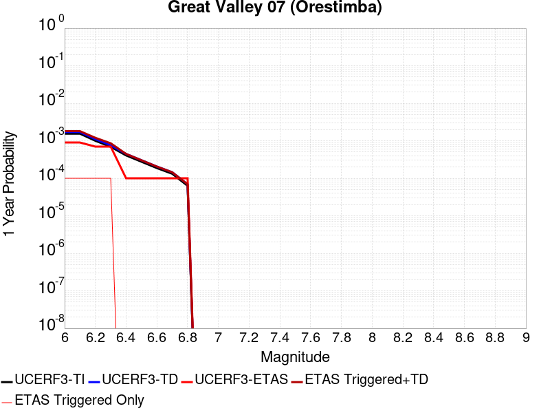 | 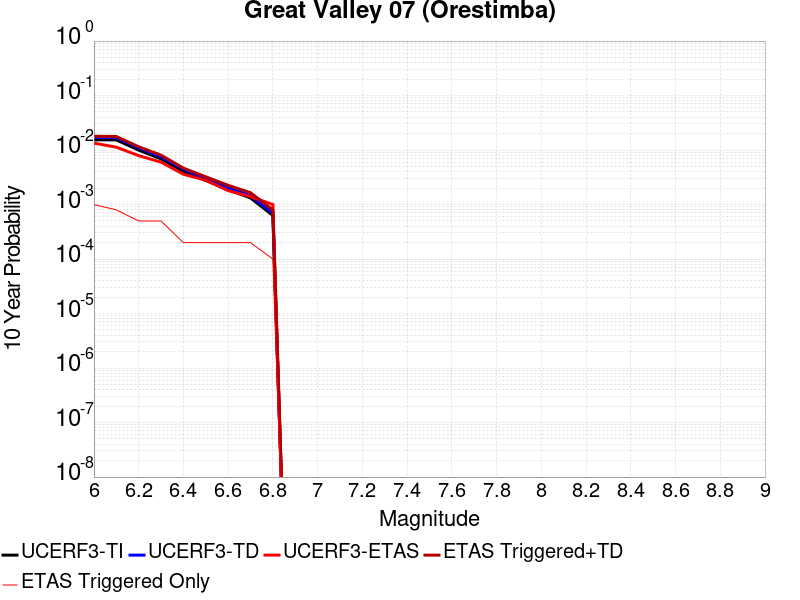 |

| Magnitude | 1 wk TI Prob | 1 wk TD Prob | 1 wk ETAS Prob | 1 wk ETAS/TD Gain | 1 wk ETAS Triggered+TD | 1 wk ETAS Triggered Only | 1 mo TI Prob | 1 mo TD Prob | 1 mo ETAS Prob | 1 mo ETAS/TD Gain | 1 mo ETAS Triggered+TD | 1 mo ETAS Triggered Only | 1 yr TI Prob | 1 yr TD Prob | 1 yr ETAS Prob | 1 yr ETAS/TD Gain | 1 yr ETAS Triggered+TD | 1 yr ETAS Triggered Only | 10 yr TI Prob | 10 yr TD Prob | 10 yr ETAS Prob | 10 yr ETAS/TD Gain | 10 yr ETAS Triggered+TD | 10 yr ETAS Triggered Only |
|-----|-----|-----|-----|-----|-----|-----|-----|-----|-----|-----|-----|-----|-----|-----|-----|-----|-----|-----|-----|-----|-----|-----|-----|-----|
| 6.0 | 2.9687902E-5 | 3.276448E-5 | 0.0 | 0.0 | 3.276448E-5 | 0.0 | 1.2722766E-4 | 1.4041206E-4 | 0.0 | 0.0 | 1.4041206E-4 | 0.0 | 0.0015478961 | 0.0017082482 | 1.0E-4 | 0.058539506 | 0.0018080773 | 1.0E-4 | 0.015371585 | 0.016958721 | 0.001 | 0.05896671 | 0.017941762 | 0.001 |
| 6.1 | 2.9687902E-5 | 3.276448E-5 | 0.0 | 0.0 | 3.276448E-5 | 0.0 | 1.2722766E-4 | 1.4041206E-4 | 0.0 | 0.0 | 1.4041206E-4 | 0.0 | 0.0015478961 | 0.0017082482 | 1.0E-4 | 0.058539506 | 0.0018080773 | 1.0E-4 | 0.015371585 | 0.016958721 | 8.0E-4 | 0.04717337 | 0.017745154 | 8.0E-4 |
| 6.2 | 1.9231524E-5 | 2.1163536E-5 | 0.0 | 0.0 | 2.1163536E-5 | 0.0 | 8.2418206E-5 | 9.0697846E-5 | 0.0 | 0.0 | 9.0697846E-5 | 0.0 | 0.0010029797 | 0.00110371 | 1.0E-4 | 0.09060351 | 0.0012035997 | 1.0E-4 | 0.00998465 | 0.010984696 | 5.0E-4 | 0.04551787 | 0.0114792045 | 5.0E-4 |
| 6.3 | 1.324766E-5 | 1.4551477E-5 | 0.0 | 0.0 | 1.4551477E-5 | 0.0 | 5.6774446E-5 | 6.236203E-5 | 0.0 | 0.0 | 6.236203E-5 | 0.0 | 6.910097E-4 | 7.590024E-4 | 1.0E-4 | 0.13175188 | 8.589265E-4 | 1.0E-4 | 0.006888649 | 0.007565048 | 5.0E-4 | 0.06609343 | 0.008061266 | 5.0E-4 |
| 6.4 | 7.818645E-6 | 8.574543E-6 | 0.0 | 0.0 | 8.574543E-6 | 0.0 | 3.3508048E-5 | 3.6747544E-5 | 0.0 | 0.0 | 3.6747544E-5 | 0.0 | 4.078841E-4 | 4.4731286E-4 | 0.0 | 0.0 | 4.4731286E-4 | 0.0 | 0.004071363 | 0.0044644657 | 2.0E-4 | 0.044798195 | 0.0046635726 | 2.0E-4 |
| 6.5 | 5.3076565E-6 | 5.8189526E-6 | 0.0 | 0.0 | 5.8189526E-6 | 0.0 | 2.27469E-5 | 2.4938141E-5 | 0.0 | 0.0 | 2.4938141E-5 | 0.0 | 2.7690834E-4 | 3.0358168E-4 | 0.0 | 0.0 | 3.0358168E-4 | 0.0 | 0.0027656353 | 0.003031879 | 2.0E-4 | 0.06596569 | 0.0032312728 | 2.0E-4 |
| 6.6 | 3.6003578E-6 | 3.9492816E-6 | 0.0 | 0.0 | 3.9492816E-6 | 0.0 | 1.5430012E-5 | 1.6925393E-5 | 0.0 | 0.0 | 1.6925393E-5 | 0.0 | 1.8784421E-4 | 2.0604873E-4 | 0.0 | 0.0 | 2.0604873E-4 | 0.0 | 0.0018768552 | 0.002058731 | 2.0E-4 | 0.09714723 | 0.0022583192 | 2.0E-4 |
| 6.7 | 2.5361826E-6 | 2.784027E-6 | 0.0 | 0.0 | 2.784027E-6 | 0.0 | 1.0869308E-5 | 1.1931496E-5 | 0.0 | 0.0 | 1.1931496E-5 | 0.0 | 1.3232579E-4 | 1.4525761E-4 | 0.0 | 0.0 | 1.4525761E-4 | 0.0 | 0.0013224703 | 0.0014517566 | 2.0E-4 | 0.13776414 | 0.0016514662 | 2.0E-4 |
| 6.8 | 1.2115831E-6 | 1.3316509E-6 | 0.0 | 0.0 | 1.3316509E-6 | 0.0 | 5.1924885E-6 | 5.7070683E-6 | 0.0 | 0.0 | 5.7070683E-6 | 0.0 | 6.3216714E-5 | 6.948231E-5 | 0.0 | 0.0 | 6.948231E-5 | 0.0 | 6.3198735E-4 | 6.94701E-4 | 1.0E-4 | 0.14394681 | 7.9463155E-4 | 1.0E-4 |

## San Jacinto (San Bernardino)
*[(top)](#table-of-contents)*

| 1 Week | 1 Month | 1 Year | 10 Year |
|-----|-----|-----|-----|
|  |  |  |  |

| Magnitude | 1 wk TI Prob | 1 wk TD Prob | 1 wk ETAS Prob | 1 wk ETAS/TD Gain | 1 wk ETAS Triggered+TD | 1 wk ETAS Triggered Only | 1 mo TI Prob | 1 mo TD Prob | 1 mo ETAS Prob | 1 mo ETAS/TD Gain | 1 mo ETAS Triggered+TD | 1 mo ETAS Triggered Only | 1 yr TI Prob | 1 yr TD Prob | 1 yr ETAS Prob | 1 yr ETAS/TD Gain | 1 yr ETAS Triggered+TD | 1 yr ETAS Triggered Only | 10 yr TI Prob | 10 yr TD Prob | 10 yr ETAS Prob | 10 yr ETAS/TD Gain | 10 yr ETAS Triggered+TD | 10 yr ETAS Triggered Only |
|-----|-----|-----|-----|-----|-----|-----|-----|-----|-----|-----|-----|-----|-----|-----|-----|-----|-----|-----|-----|-----|-----|-----|-----|-----|
| 6.0 | 3.409352E-5 | 3.613959E-5 | 0.0 | 0.0 | 3.613959E-5 | 0.0 | 1.461069E-4 | 1.5487478E-4 | 0.0 | 0.0 | 1.5487478E-4 | 0.0 | 0.0017774 | 0.0018839714 | 2.0E-4 | 0.106158726 | 0.0020835947 | 2.0E-4 | 0.01763251 | 0.01942775 | 0.001 | 0.05147276 | 0.020408323 | 0.001 |
| 6.1 | 3.409352E-5 | 3.613959E-5 | 0.0 | 0.0 | 3.613959E-5 | 0.0 | 1.461069E-4 | 1.5487478E-4 | 0.0 | 0.0 | 1.5487478E-4 | 0.0 | 0.0017774 | 0.0018839714 | 2.0E-4 | 0.106158726 | 0.0020835947 | 2.0E-4 | 0.01763251 | 0.01942775 | 0.001 | 0.05147276 | 0.020408323 | 0.001 |
| 6.2 | 3.409352E-5 | 3.613959E-5 | 0.0 | 0.0 | 3.613959E-5 | 0.0 | 1.461069E-4 | 1.5487478E-4 | 0.0 | 0.0 | 1.5487478E-4 | 0.0 | 0.0017774 | 0.0018839714 | 2.0E-4 | 0.106158726 | 0.0020835947 | 2.0E-4 | 0.01763251 | 0.01942775 | 0.001 | 0.05147276 | 0.020408323 | 0.001 |
| 6.3 | 3.409352E-5 | 3.613959E-5 | 0.0 | 0.0 | 3.613959E-5 | 0.0 | 1.461069E-4 | 1.5487478E-4 | 0.0 | 0.0 | 1.5487478E-4 | 0.0 | 0.0017774 | 0.0018839714 | 2.0E-4 | 0.106158726 | 0.0020835947 | 2.0E-4 | 0.01763251 | 0.01942775 | 0.001 | 0.05147276 | 0.020408323 | 0.001 |
| 6.4 | 3.400795E-5 | 3.60322E-5 | 0.0 | 0.0 | 3.60322E-5 | 0.0 | 1.4574021E-4 | 1.5441459E-4 | 0.0 | 0.0 | 1.5441459E-4 | 0.0 | 0.0017729428 | 0.0018783783 | 2.0E-4 | 0.106474824 | 0.0020780026 | 2.0E-4 | 0.017588645 | 0.019372808 | 0.001 | 0.05161874 | 0.020353436 | 0.001 |
| 6.5 | 3.341482E-5 | 3.529246E-5 | 0.0 | 0.0 | 3.529246E-5 | 0.0 | 1.4319851E-4 | 1.5124465E-4 | 0.0 | 0.0 | 1.5124465E-4 | 0.0 | 0.0017420477 | 0.0018398496 | 2.0E-4 | 0.10870454 | 0.0020394817 | 2.0E-4 | 0.017284546 | 0.01899419 | 0.001 | 0.052647676 | 0.019975197 | 0.001 |
| 6.6 | 3.3364955E-5 | 3.5229645E-5 | 0.0 | 0.0 | 3.5229645E-5 | 0.0 | 1.4298483E-4 | 1.5097547E-4 | 0.0 | 0.0 | 1.5097547E-4 | 0.0 | 0.0017394501 | 0.001836578 | 2.0E-4 | 0.10889818 | 0.0020362106 | 2.0E-4 | 0.017258976 | 0.01896204 | 0.001 | 0.052736938 | 0.019943079 | 0.001 |
| 6.7 | 3.335922E-5 | 3.5219415E-5 | 0.0 | 0.0 | 3.5219415E-5 | 0.0 | 1.4296026E-4 | 1.5093162E-4 | 0.0 | 0.0 | 1.5093162E-4 | 0.0 | 0.0017391514 | 0.0018360451 | 2.0E-4 | 0.10892978 | 0.002035678 | 2.0E-4 | 0.017256035 | 0.01895683 | 0.001 | 0.052751433 | 0.019937875 | 0.001 |
| 6.8 | 3.327683E-5 | 3.5113422E-5 | 0.0 | 0.0 | 3.5113422E-5 | 0.0 | 1.4260718E-4 | 1.5047741E-4 | 0.0 | 0.0 | 1.5047741E-4 | 0.0 | 0.0017348597 | 0.0018305244 | 2.0E-4 | 0.10925831 | 0.0020301584 | 2.0E-4 | 0.017213784 | 0.018902577 | 0.001 | 0.05290284 | 0.019883676 | 0.001 |
| 6.9 | 3.3235785E-5 | 3.5054338E-5 | 0.0 | 0.0 | 3.5054338E-5 | 0.0 | 1.4243131E-4 | 1.5022424E-4 | 0.0 | 0.0 | 1.5022424E-4 | 0.0 | 0.0017327217 | 0.0018274471 | 2.0E-4 | 0.10944229 | 0.0020270816 | 2.0E-4 | 0.017192734 | 0.018872429 | 0.001 | 0.052987352 | 0.019853557 | 0.001 |
| 7.0 | 3.3197095E-5 | 3.4994224E-5 | 0.0 | 0.0 | 3.4994224E-5 | 0.0 | 1.422655E-4 | 1.4996664E-4 | 0.0 | 0.0 | 1.4996664E-4 | 0.0 | 0.0017307063 | 0.0018243161 | 2.0E-4 | 0.10963012 | 0.0020239514 | 2.0E-4 | 0.017172894 | 0.018841786 | 0.001 | 0.05307352 | 0.019822946 | 0.001 |
| 7.1 | 3.3129716E-5 | 3.487434E-5 | 0.0 | 0.0 | 3.487434E-5 | 0.0 | 1.4197677E-4 | 1.4945291E-4 | 0.0 | 0.0 | 1.4945291E-4 | 0.0 | 0.0017271966 | 0.0018180719 | 2.0E-4 | 0.110006645 | 0.0020177083 | 2.0E-4 | 0.017138338 | 0.018780824 | 0.001 | 0.053245798 | 0.019762043 | 0.001 |
| 7.2 | 3.3034008E-5 | 3.474171E-5 | 0.0 | 0.0 | 3.474171E-5 | 0.0 | 1.4156665E-4 | 1.4888456E-4 | 0.0 | 0.0 | 1.4888456E-4 | 0.0 | 0.0017222111 | 0.001811164 | 2.0E-4 | 0.110426225 | 0.0020108018 | 2.0E-4 | 0.017089253 | 0.018713197 | 0.001 | 0.053438228 | 0.019694483 | 0.001 |
| 7.3 | 3.2956614E-5 | 3.4609333E-5 | 0.0 | 0.0 | 3.4609333E-5 | 0.0 | 1.4123498E-4 | 1.483173E-4 | 0.0 | 0.0 | 1.483173E-4 | 0.0 | 0.0017181796 | 0.0018042688 | 2.0E-4 | 0.110848226 | 0.002003908 | 2.0E-4 | 0.017049557 | 0.018645877 | 0.001 | 0.05363116 | 0.019627232 | 0.001 |
| 7.4 | 3.2915937E-5 | 3.4530927E-5 | 0.0 | 0.0 | 3.4530927E-5 | 0.0 | 1.4106068E-4 | 1.4798129E-4 | 0.0 | 0.0 | 1.4798129E-4 | 0.0 | 0.0017160608 | 0.0018001848 | 2.0E-4 | 0.111099705 | 0.0019998248 | 2.0E-4 | 0.017028693 | 0.018606089 | 0.001 | 0.053745843 | 0.019587483 | 0.001 |
| 7.5 | 3.281791E-5 | 3.4395707E-5 | 0.0 | 0.0 | 3.4395707E-5 | 0.0 | 1.406406E-4 | 1.4740185E-4 | 0.0 | 0.0 | 1.4740185E-4 | 0.0 | 0.0017109542 | 0.0017931417 | 2.0E-4 | 0.111536086 | 0.001992783 | 2.0E-4 | 0.016978411 | 0.018536916 | 0.001 | 0.053946406 | 0.01951838 | 0.001 |
| 7.6 | 3.2521442E-5 | 3.4120338E-5 | 0.0 | 0.0 | 3.4120338E-5 | 0.0 | 1.3937015E-4 | 1.4622184E-4 | 0.0 | 0.0 | 1.4622184E-4 | 0.0 | 0.0016955109 | 0.0017787986 | 2.0E-4 | 0.11243544 | 0.0019784428 | 2.0E-4 | 0.016826328 | 0.018394392 | 0.001 | 0.054364394 | 0.019375999 | 0.001 |
| 7.7 | 3.0287873E-5 | 3.2602602E-5 | 0.0 | 0.0 | 3.2602602E-5 | 0.0 | 1.297987E-4 | 1.3971796E-4 | 0.0 | 0.0 | 1.3971796E-4 | 0.0 | 0.0015791537 | 0.0016997401 | 2.0E-4 | 0.11766505 | 0.0018994 | 2.0E-4 | 0.01567979 | 0.017604426 | 0.001 | 0.056803897 | 0.018586822 | 0.001 |
| 7.8 | 2.6316151E-5 | 2.9807332E-5 | 0.0 | 0.0 | 2.9807332E-5 | 0.0 | 1.1277862E-4 | 1.2773946E-4 | 0.0 | 0.0 | 1.2773946E-4 | 0.0 | 0.0013722149 | 0.0015541194 | 1.0E-4 | 0.06434512 | 0.0016539639 | 1.0E-4 | 0.013637724 | 0.016142689 | 8.0E-4 | 0.04955804 | 0.016929774 | 8.0E-4 |
| 7.9 | 2.0761147E-5 | 2.3537597E-5 | 0.0 | 0.0 | 2.3537597E-5 | 0.0 | 8.897331E-5 | 1.0087152E-4 | 0.0 | 0.0 | 1.0087152E-4 | 0.0 | 0.0010827117 | 0.0012274197 | 1.0E-4 | 0.08147173 | 0.001327297 | 1.0E-4 | 0.010774517 | 0.012854228 | 6.0E-4 | 0.046677247 | 0.013446515 | 6.0E-4 |
| 8.0 | 1.5738568E-5 | 1.611542E-5 | 0.0 | 0.0 | 1.611542E-5 | 0.0 | 6.744926E-5 | 6.906426E-5 | 0.0 | 0.0 | 6.906426E-5 | 0.0 | 8.2088535E-4 | 8.405337E-4 | 1.0E-4 | 0.11897203 | 9.404496E-4 | 1.0E-4 | 0.008178596 | 0.008908407 | 4.0E-4 | 0.044901405 | 0.009304844 | 4.0E-4 |
| 8.1 | 1.0105832E-5 | 8.36753E-6 | 0.0 | 0.0 | 8.36753E-6 | 0.0 | 4.3309992E-5 | 3.5860354E-5 | 0.0 | 0.0 | 3.5860354E-5 | 0.0 | 5.2717153E-4 | 4.3651284E-4 | 1.0E-4 | 0.22908834 | 5.364692E-4 | 1.0E-4 | 0.005259227 | 0.0046969033 | 4.0E-4 | 0.08516249 | 0.0050950246 | 4.0E-4 |
| 8.2 | 4.189207E-6 | 1.583189E-6 | 0.0 | 0.0 | 1.583189E-6 | 0.0 | 1.7953622E-5 | 6.7850783E-6 | 0.0 | 0.0 | 6.7850783E-6 | 0.0 | 2.1856341E-4 | 8.260522E-5 | 0.0 | 0.0 | 8.260522E-5 | 0.0 | 0.0021834858 | 9.5930934E-4 | 1.0E-4 | 0.10424166 | 0.0010592134 | 1.0E-4 |
| 8.3 | 1.2758221E-6 | 3.6262597E-7 | 0.0 | 0.0 | 3.6262597E-7 | 0.0 | 5.4677976E-6 | 1.5541103E-6 | 0.0 | 0.0 | 1.5541103E-6 | 0.0 | 6.65684E-5 | 1.8921133E-5 | 0.0 | 0.0 | 1.8921133E-5 | 0.0 | 6.6548464E-4 | 2.2818957E-4 | 0.0 | 0.0 | 2.2818957E-4 | 0.0 |

## Bicycle Lake
*[(top)](#table-of-contents)*

| 1 Week | 1 Month | 1 Year | 10 Year |
|-----|-----|-----|-----|
| 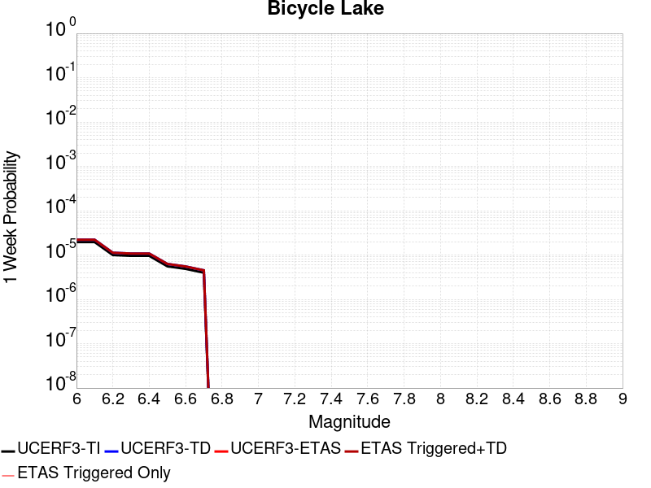 |  |  | 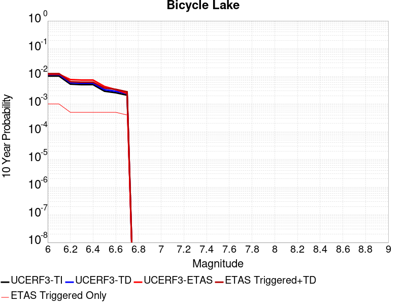 |

| Magnitude | 1 wk TI Prob | 1 wk TD Prob | 1 wk ETAS Prob | 1 wk ETAS/TD Gain | 1 wk ETAS Triggered+TD | 1 wk ETAS Triggered Only | 1 mo TI Prob | 1 mo TD Prob | 1 mo ETAS Prob | 1 mo ETAS/TD Gain | 1 mo ETAS Triggered+TD | 1 mo ETAS Triggered Only | 1 yr TI Prob | 1 yr TD Prob | 1 yr ETAS Prob | 1 yr ETAS/TD Gain | 1 yr ETAS Triggered+TD | 1 yr ETAS Triggered Only | 10 yr TI Prob | 10 yr TD Prob | 10 yr ETAS Prob | 10 yr ETAS/TD Gain | 10 yr ETAS Triggered+TD | 10 yr ETAS Triggered Only |
|-----|-----|-----|-----|-----|-----|-----|-----|-----|-----|-----|-----|-----|-----|-----|-----|-----|-----|-----|-----|-----|-----|-----|-----|-----|
| 6.0 | 1.9621975E-5 | 2.2102822E-5 | 0.0 | 0.0 | 2.2102822E-5 | 0.0 | 8.4091465E-5 | 9.4723706E-5 | 0.0 | 0.0 | 9.4723706E-5 | 0.0 | 0.0010233327 | 0.001152786 | 0.0 | 0.0 | 0.001152786 | 0.0 | 0.01018633 | 0.011481379 | 0.001 | 0.087097555 | 0.012469897 | 0.001 |
| 6.1 | 1.9621975E-5 | 2.2102822E-5 | 0.0 | 0.0 | 2.2102822E-5 | 0.0 | 8.4091465E-5 | 9.4723706E-5 | 0.0 | 0.0 | 9.4723706E-5 | 0.0 | 0.0010233327 | 0.001152786 | 0.0 | 0.0 | 0.001152786 | 0.0 | 0.01018633 | 0.011481379 | 0.001 | 0.087097555 | 0.012469897 | 0.001 |
| 6.2 | 9.9971285E-6 | 1.12585585E-5 | 0.0 | 0.0 | 1.12585585E-5 | 0.0 | 4.2844134E-5 | 4.8250367E-5 | 0.0 | 0.0 | 4.8250367E-5 | 0.0 | 5.2150246E-4 | 5.873419E-4 | 0.0 | 0.0 | 5.873419E-4 | 0.0 | 0.0052028033 | 0.005863004 | 5.0E-4 | 0.08528052 | 0.006360072 | 5.0E-4 |
| 6.3 | 9.589428E-6 | 1.080115E-5 | 0.0 | 0.0 | 1.080115E-5 | 0.0 | 4.10969E-5 | 4.6290115E-5 | 0.0 | 0.0 | 4.6290115E-5 | 0.0 | 5.002399E-4 | 5.6348834E-4 | 0.0 | 0.0 | 5.6348834E-4 | 0.0 | 0.0049911533 | 0.0056256875 | 5.0E-4 | 0.08887803 | 0.0061228746 | 5.0E-4 |
| 6.4 | 9.589428E-6 | 1.080115E-5 | 0.0 | 0.0 | 1.080115E-5 | 0.0 | 4.10969E-5 | 4.6290115E-5 | 0.0 | 0.0 | 4.6290115E-5 | 0.0 | 5.002399E-4 | 5.6348834E-4 | 0.0 | 0.0 | 5.6348834E-4 | 0.0 | 0.0049911533 | 0.0056256875 | 5.0E-4 | 0.08887803 | 0.0061228746 | 5.0E-4 |
| 6.5 | 5.557707E-6 | 6.287297E-6 | 0.0 | 0.0 | 6.287297E-6 | 0.0 | 2.3818526E-5 | 2.6945432E-5 | 0.0 | 0.0 | 2.6945432E-5 | 0.0 | 2.8995197E-4 | 3.2803815E-4 | 0.0 | 0.0 | 3.2803815E-4 | 0.0 | 0.0028957394 | 0.0032781768 | 5.0E-4 | 0.1525238 | 0.0037765377 | 5.0E-4 |
| 6.6 | 4.8742945E-6 | 5.5147784E-6 | 0.0 | 0.0 | 5.5147784E-6 | 0.0 | 2.0889667E-5 | 2.3634697E-5 | 0.0 | 0.0 | 2.3634697E-5 | 0.0 | 2.54302E-4 | 2.8774067E-4 | 0.0 | 0.0 | 2.8774067E-4 | 0.0 | 0.002540112 | 0.0028762512 | 5.0E-4 | 0.1738374 | 0.0033748131 | 5.0E-4 |
| 6.7 | 3.991108E-6 | 4.517133E-6 | 0.0 | 0.0 | 4.517133E-6 | 0.0 | 1.7104636E-5 | 1.9359142E-5 | 0.0 | 0.0 | 1.9359142E-5 | 0.0 | 2.0822904E-4 | 2.3569756E-4 | 0.0 | 0.0 | 2.3569756E-4 | 0.0 | 0.0020803404 | 0.0023569756 | 4.0E-4 | 0.16970901 | 0.0027560329 | 4.0E-4 |

## San Gabriel
*[(top)](#table-of-contents)*

| 1 Week | 1 Month | 1 Year | 10 Year |
|-----|-----|-----|-----|
| 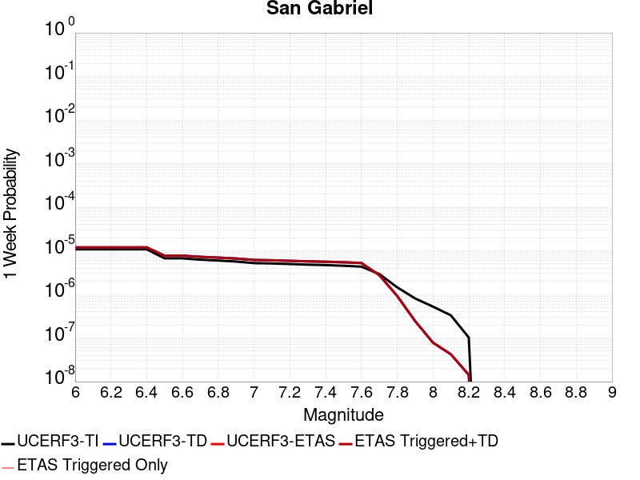 |  |  | 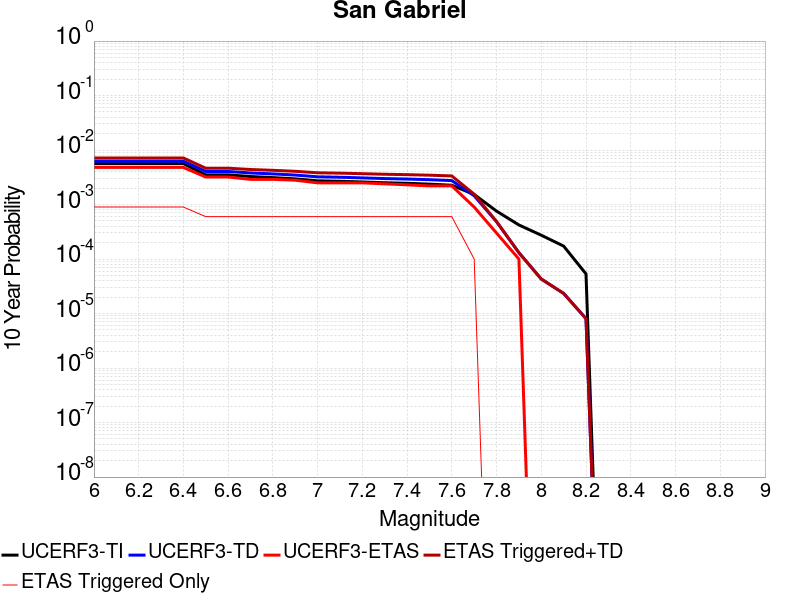 |

| Magnitude | 1 wk TI Prob | 1 wk TD Prob | 1 wk ETAS Prob | 1 wk ETAS/TD Gain | 1 wk ETAS Triggered+TD | 1 wk ETAS Triggered Only | 1 mo TI Prob | 1 mo TD Prob | 1 mo ETAS Prob | 1 mo ETAS/TD Gain | 1 mo ETAS Triggered+TD | 1 mo ETAS Triggered Only | 1 yr TI Prob | 1 yr TD Prob | 1 yr ETAS Prob | 1 yr ETAS/TD Gain | 1 yr ETAS Triggered+TD | 1 yr ETAS Triggered Only | 10 yr TI Prob | 10 yr TD Prob | 10 yr ETAS Prob | 10 yr ETAS/TD Gain | 10 yr ETAS Triggered+TD | 10 yr ETAS Triggered Only |
|-----|-----|-----|-----|-----|-----|-----|-----|-----|-----|-----|-----|-----|-----|-----|-----|-----|-----|-----|-----|-----|-----|-----|-----|-----|
| 6.0 | 1.083775E-5 | 1.2001559E-5 | 0.0 | 0.0 | 1.2001559E-5 | 0.0 | 4.6446676E-5 | 5.14343E-5 | 0.0 | 0.0 | 5.14343E-5 | 0.0 | 5.653415E-4 | 6.2604406E-4 | 0.0 | 0.0 | 6.2604406E-4 | 0.0 | 0.0056390543 | 0.0062546968 | 9.0E-4 | 0.14389187 | 0.0071490672 | 9.0E-4 |
| 6.1 | 1.083775E-5 | 1.2001559E-5 | 0.0 | 0.0 | 1.2001559E-5 | 0.0 | 4.6446676E-5 | 5.14343E-5 | 0.0 | 0.0 | 5.14343E-5 | 0.0 | 5.653415E-4 | 6.2604406E-4 | 0.0 | 0.0 | 6.2604406E-4 | 0.0 | 0.0056390543 | 0.0062546968 | 9.0E-4 | 0.14389187 | 0.0071490672 | 9.0E-4 |
| 6.2 | 1.083775E-5 | 1.2001559E-5 | 0.0 | 0.0 | 1.2001559E-5 | 0.0 | 4.6446676E-5 | 5.14343E-5 | 0.0 | 0.0 | 5.14343E-5 | 0.0 | 5.653415E-4 | 6.2604406E-4 | 0.0 | 0.0 | 6.2604406E-4 | 0.0 | 0.0056390543 | 0.0062546968 | 9.0E-4 | 0.14389187 | 0.0071490672 | 9.0E-4 |
| 6.3 | 1.083775E-5 | 1.2001559E-5 | 0.0 | 0.0 | 1.2001559E-5 | 0.0 | 4.6446676E-5 | 5.14343E-5 | 0.0 | 0.0 | 5.14343E-5 | 0.0 | 5.653415E-4 | 6.2604406E-4 | 0.0 | 0.0 | 6.2604406E-4 | 0.0 | 0.0056390543 | 0.0062546968 | 9.0E-4 | 0.14389187 | 0.0071490672 | 9.0E-4 |
| 6.4 | 1.083775E-5 | 1.2001559E-5 | 0.0 | 0.0 | 1.2001559E-5 | 0.0 | 4.6446676E-5 | 5.14343E-5 | 0.0 | 0.0 | 5.14343E-5 | 0.0 | 5.653415E-4 | 6.2604406E-4 | 0.0 | 0.0 | 6.2604406E-4 | 0.0 | 0.0056390543 | 0.0062546968 | 9.0E-4 | 0.14389187 | 0.0071490672 | 9.0E-4 |
| 6.5 | 6.7317824E-6 | 7.732969E-6 | 0.0 | 0.0 | 7.732969E-6 | 0.0 | 2.8850178E-5 | 3.3140877E-5 | 0.0 | 0.0 | 3.3140877E-5 | 0.0 | 3.511943E-4 | 4.0341655E-4 | 0.0 | 0.0 | 4.0341655E-4 | 0.0 | 0.003506398 | 0.0040377346 | 6.0E-4 | 0.14859818 | 0.004635312 | 6.0E-4 |
| 6.6 | 6.7317824E-6 | 7.732969E-6 | 0.0 | 0.0 | 7.732969E-6 | 0.0 | 2.8850178E-5 | 3.3140877E-5 | 0.0 | 0.0 | 3.3140877E-5 | 0.0 | 3.511943E-4 | 4.0341655E-4 | 0.0 | 0.0 | 4.0341655E-4 | 0.0 | 0.003506398 | 0.0040377346 | 6.0E-4 | 0.14859818 | 0.004635312 | 6.0E-4 |
| 6.7 | 6.274881E-6 | 7.2618586E-6 | 0.0 | 0.0 | 7.2618586E-6 | 0.0 | 2.6892068E-5 | 3.1121886E-5 | 0.0 | 0.0 | 3.1121886E-5 | 0.0 | 3.2736175E-4 | 3.7884404E-4 | 0.0 | 0.0 | 3.7884404E-4 | 0.0 | 0.0032687993 | 0.0037928678 | 6.0E-4 | 0.15819165 | 0.004390592 | 6.0E-4 |
| 6.8 | 5.996209E-6 | 6.9745606E-6 | 0.0 | 0.0 | 6.9745606E-6 | 0.0 | 2.5697784E-5 | 2.9890636E-5 | 0.0 | 0.0 | 2.9890636E-5 | 0.0 | 3.128256E-4 | 3.6385865E-4 | 0.0 | 0.0 | 3.6385865E-4 | 0.0 | 0.003123856 | 0.0036435125 | 6.0E-4 | 0.16467626 | 0.0042413264 | 6.0E-4 |
| 6.9 | 5.686331E-6 | 6.639484E-6 | 0.0 | 0.0 | 6.639484E-6 | 0.0 | 2.4369761E-5 | 2.8454626E-5 | 0.0 | 0.0 | 2.8454626E-5 | 0.0 | 2.9666146E-4 | 3.4638093E-4 | 0.0 | 0.0 | 3.4638093E-4 | 0.0 | 0.0029626573 | 0.003469292 | 6.0E-4 | 0.17294595 | 0.0040672105 | 6.0E-4 |
| 7.0 | 5.2329838E-6 | 6.163286E-6 | 0.0 | 0.0 | 6.163286E-6 | 0.0 | 2.242688E-5 | 2.641382E-5 | 0.0 | 0.0 | 2.641382E-5 | 0.0 | 2.7301308E-4 | 3.2154156E-4 | 0.0 | 0.0 | 3.2154156E-4 | 0.0 | 0.002726779 | 0.0032216327 | 6.0E-4 | 0.18624097 | 0.0038196996 | 6.0E-4 |
| 7.1 | 5.135671E-6 | 6.0533316E-6 | 0.0 | 0.0 | 6.0533316E-6 | 0.0 | 2.2009834E-5 | 2.5942596E-5 | 0.0 | 0.0 | 2.5942596E-5 | 0.0 | 2.6793676E-4 | 3.158061E-4 | 0.0 | 0.0 | 3.158061E-4 | 0.0 | 0.0026761394 | 0.0031644427 | 6.0E-4 | 0.18960685 | 0.003762544 | 6.0E-4 |
| 7.2 | 4.989062E-6 | 5.8865753E-6 | 0.0 | 0.0 | 5.8865753E-6 | 0.0 | 2.1381518E-5 | 2.522794E-5 | 0.0 | 0.0 | 2.522794E-5 | 0.0 | 2.6028889E-4 | 3.0710764E-4 | 0.0 | 0.0 | 3.0710764E-4 | 0.0 | 0.0025998424 | 0.003077702 | 6.0E-4 | 0.19495066 | 0.0036758552 | 6.0E-4 |
| 7.3 | 4.8219395E-6 | 5.7180087E-6 | 0.0 | 0.0 | 5.7180087E-6 | 0.0 | 2.0665291E-5 | 2.4505525E-5 | 0.0 | 0.0 | 2.4505525E-5 | 0.0 | 2.5157086E-4 | 2.983147E-4 | 0.0 | 0.0 | 2.983147E-4 | 0.0 | 0.0025128627 | 0.0029900123 | 6.0E-4 | 0.20066807 | 0.0035882182 | 6.0E-4 |
| 7.4 | 4.7118383E-6 | 5.6064573E-6 | 0.0 | 0.0 | 5.6064573E-6 | 0.0 | 2.0193436E-5 | 2.4027458E-5 | 0.0 | 0.0 | 2.4027458E-5 | 0.0 | 2.4582737E-4 | 2.924958E-4 | 0.0 | 0.0 | 2.924958E-4 | 0.0 | 0.002455556 | 0.0029319762 | 6.0E-4 | 0.20464014 | 0.003530217 | 6.0E-4 |
| 7.5 | 4.5506545E-6 | 5.4516718E-6 | 0.0 | 0.0 | 5.4516718E-6 | 0.0 | 1.9502659E-5 | 2.3364104E-5 | 0.0 | 0.0 | 2.3364104E-5 | 0.0 | 2.37419E-4 | 2.8442158E-4 | 0.0 | 0.0 | 2.8442158E-4 | 0.0 | 0.002371655 | 0.0028514431 | 6.0E-4 | 0.21041977 | 0.0034497322 | 6.0E-4 |
| 7.6 | 4.343636E-6 | 5.244302E-6 | 0.0 | 0.0 | 5.244302E-6 | 0.0 | 1.861545E-5 | 2.247539E-5 | 0.0 | 0.0 | 2.247539E-5 | 0.0 | 2.2661954E-4 | 2.7360427E-4 | 0.0 | 0.0 | 2.7360427E-4 | 0.0 | 0.0022638857 | 0.0027435343 | 6.0E-4 | 0.21869601 | 0.003341888 | 6.0E-4 |
| 7.7 | 2.936235E-6 | 2.7522608E-6 | 0.0 | 0.0 | 2.7522608E-6 | 0.0 | 1.2583803E-5 | 1.17953505E-5 | 0.0 | 0.0 | 1.17953505E-5 | 0.0 | 1.5319703E-4 | 1.4359897E-4 | 0.0 | 0.0 | 1.4359897E-4 | 0.0 | 0.0015309147 | 0.0014423524 | 1.0E-4 | 0.069331184 | 0.0015422081 | 1.0E-4 |
| 7.8 | 1.4541639E-6 | 9.1413625E-7 | 0.0 | 0.0 | 9.1413625E-7 | 0.0 | 6.232116E-6 | 3.9177207E-6 | 0.0 | 0.0 | 3.9177207E-6 | 0.0 | 7.587337E-5 | 4.769721E-5 | 0.0 | 0.0 | 4.769721E-5 | 0.0 | 7.584747E-4 | 4.817711E-4 | 0.0 | 0.0 | 4.817711E-4 | 0.0 |
| 7.9 | 8.098958E-7 | 2.4173968E-7 | 0.0 | 0.0 | 2.4173968E-7 | 0.0 | 3.4709774E-6 | 1.0360268E-6 | 0.0 | 0.0 | 1.0360268E-6 | 0.0 | 4.225833E-5 | 1.2613553E-5 | 0.0 | 0.0 | 1.2613553E-5 | 0.0 | 4.2250296E-4 | 1.2920298E-4 | 0.0 | 0.0 | 1.2920298E-4 | 0.0 |
| 8.0 | 5.2473234E-7 | 7.666491E-8 | 0.0 | 0.0 | 7.666491E-8 | 0.0 | 2.248851E-6 | 3.2856386E-7 | 0.0 | 0.0 | 3.2856386E-7 | 0.0 | 2.7379416E-5 | 4.0002574E-6 | 0.0 | 0.0 | 4.0002574E-6 | 0.0 | 2.7376044E-4 | 4.2121443E-5 | 0.0 | 0.0 | 4.2121443E-5 | 0.0 |
| 8.1 | 3.3162388E-7 | 4.1427942E-8 | 0.0 | 0.0 | 4.1427942E-8 | 0.0 | 1.4212444E-6 | 1.7754832E-7 | 0.0 | 0.0 | 1.7754832E-7 | 0.0 | 1.7303513E-5 | 2.1616484E-6 | 0.0 | 0.0 | 2.1616484E-6 | 0.0 | 1.7302166E-4 | 2.2926402E-5 | 0.0 | 0.0 | 2.2926402E-5 | 0.0 |
| 8.2 | 1.0235345E-7 | 1.4024879E-8 | 0.0 | 0.0 | 1.4024879E-8 | 0.0 | 4.3865757E-7 | 6.010663E-8 | 0.0 | 0.0 | 6.010663E-8 | 0.0 | 5.340643E-6 | 7.317979E-7 | 0.0 | 0.0 | 7.317979E-7 | 0.0 | 5.3405143E-5 | 7.916959E-6 | 0.0 | 0.0 | 7.916959E-6 | 0.0 |

## Channel Islands Thrust
*[(top)](#table-of-contents)*

| 1 Week | 1 Month | 1 Year | 10 Year |
|-----|-----|-----|-----|
|  |  | 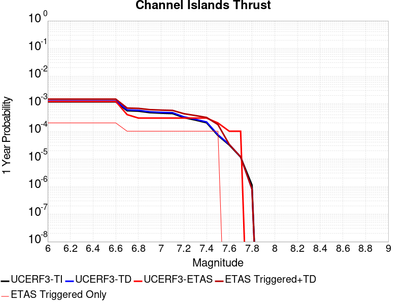 |  |

| Magnitude | 1 wk TI Prob | 1 wk TD Prob | 1 wk ETAS Prob | 1 wk ETAS/TD Gain | 1 wk ETAS Triggered+TD | 1 wk ETAS Triggered Only | 1 mo TI Prob | 1 mo TD Prob | 1 mo ETAS Prob | 1 mo ETAS/TD Gain | 1 mo ETAS Triggered+TD | 1 mo ETAS Triggered Only | 1 yr TI Prob | 1 yr TD Prob | 1 yr ETAS Prob | 1 yr ETAS/TD Gain | 1 yr ETAS Triggered+TD | 1 yr ETAS Triggered Only | 10 yr TI Prob | 10 yr TD Prob | 10 yr ETAS Prob | 10 yr ETAS/TD Gain | 10 yr ETAS Triggered+TD | 10 yr ETAS Triggered Only |
|-----|-----|-----|-----|-----|-----|-----|-----|-----|-----|-----|-----|-----|-----|-----|-----|-----|-----|-----|-----|-----|-----|-----|-----|-----|
| 6.0 | 2.2156251E-5 | 2.409639E-5 | 0.0 | 0.0 | 2.409639E-5 | 0.0 | 9.495191E-5 | 1.0326675E-4 | 0.0 | 0.0 | 1.0326675E-4 | 0.0 | 0.0011554264 | 0.0012566542 | 2.0E-4 | 0.15915278 | 0.0014564028 | 2.0E-4 | 0.011494373 | 0.012506075 | 8.0E-4 | 0.06396891 | 0.0132960705 | 8.0E-4 |
| 6.1 | 2.2156251E-5 | 2.409639E-5 | 0.0 | 0.0 | 2.409639E-5 | 0.0 | 9.495191E-5 | 1.0326675E-4 | 0.0 | 0.0 | 1.0326675E-4 | 0.0 | 0.0011554264 | 0.0012566542 | 2.0E-4 | 0.15915278 | 0.0014564028 | 2.0E-4 | 0.011494373 | 0.012506075 | 8.0E-4 | 0.06396891 | 0.0132960705 | 8.0E-4 |
| 6.2 | 2.2156251E-5 | 2.409639E-5 | 0.0 | 0.0 | 2.409639E-5 | 0.0 | 9.495191E-5 | 1.0326675E-4 | 0.0 | 0.0 | 1.0326675E-4 | 0.0 | 0.0011554264 | 0.0012566542 | 2.0E-4 | 0.15915278 | 0.0014564028 | 2.0E-4 | 0.011494373 | 0.012506075 | 8.0E-4 | 0.06396891 | 0.0132960705 | 8.0E-4 |
| 6.3 | 2.2156251E-5 | 2.409639E-5 | 0.0 | 0.0 | 2.409639E-5 | 0.0 | 9.495191E-5 | 1.0326675E-4 | 0.0 | 0.0 | 1.0326675E-4 | 0.0 | 0.0011554264 | 0.0012566542 | 2.0E-4 | 0.15915278 | 0.0014564028 | 2.0E-4 | 0.011494373 | 0.012506075 | 8.0E-4 | 0.06396891 | 0.0132960705 | 8.0E-4 |
| 6.4 | 2.2156251E-5 | 2.409639E-5 | 0.0 | 0.0 | 2.409639E-5 | 0.0 | 9.495191E-5 | 1.0326675E-4 | 0.0 | 0.0 | 1.0326675E-4 | 0.0 | 0.0011554264 | 0.0012566542 | 2.0E-4 | 0.15915278 | 0.0014564028 | 2.0E-4 | 0.011494373 | 0.012506075 | 8.0E-4 | 0.06396891 | 0.0132960705 | 8.0E-4 |
| 6.5 | 2.2156251E-5 | 2.409639E-5 | 0.0 | 0.0 | 2.409639E-5 | 0.0 | 9.495191E-5 | 1.0326675E-4 | 0.0 | 0.0 | 1.0326675E-4 | 0.0 | 0.0011554264 | 0.0012566542 | 2.0E-4 | 0.15915278 | 0.0014564028 | 2.0E-4 | 0.011494373 | 0.012506075 | 8.0E-4 | 0.06396891 | 0.0132960705 | 8.0E-4 |
| 6.6 | 2.2156251E-5 | 2.409639E-5 | 0.0 | 0.0 | 2.409639E-5 | 0.0 | 9.495191E-5 | 1.0326675E-4 | 0.0 | 0.0 | 1.0326675E-4 | 0.0 | 0.0011554264 | 0.0012566542 | 2.0E-4 | 0.15915278 | 0.0014564028 | 2.0E-4 | 0.011494373 | 0.012506075 | 8.0E-4 | 0.06396891 | 0.0132960705 | 8.0E-4 |
| 6.7 | 1.0601296E-5 | 1.1381288E-5 | 0.0 | 0.0 | 1.1381288E-5 | 0.0 | 4.5433335E-5 | 4.8776063E-5 | 0.0 | 0.0 | 4.8776063E-5 | 0.0 | 5.5301044E-4 | 5.9369166E-4 | 1.0E-4 | 0.16843762 | 6.936323E-4 | 1.0E-4 | 0.005516363 | 0.005921558 | 3.0E-4 | 0.050662342 | 0.0062197815 | 3.0E-4 |
| 6.8 | 1.0246747E-5 | 1.0998349E-5 | 0.0 | 0.0 | 1.0998349E-5 | 0.0 | 4.391389E-5 | 4.713496E-5 | 0.0 | 0.0 | 4.713496E-5 | 0.0 | 5.345204E-4 | 5.7372183E-4 | 1.0E-4 | 0.17430049 | 6.7366444E-4 | 1.0E-4 | 0.0053323656 | 0.005722897 | 3.0E-4 | 0.052421004 | 0.00602118 | 3.0E-4 |
| 6.9 | 9.049551E-6 | 9.7011025E-6 | 0.0 | 0.0 | 9.7011025E-6 | 0.0 | 3.878322E-5 | 4.1575513E-5 | 0.0 | 0.0 | 4.1575513E-5 | 0.0 | 4.7208337E-4 | 5.060684E-4 | 1.0E-4 | 0.19760174 | 6.060178E-4 | 1.0E-4 | 0.0047108172 | 0.0050495774 | 3.0E-4 | 0.05941091 | 0.0053480626 | 3.0E-4 |
| 7.0 | 8.6542195E-6 | 9.275996E-6 | 0.0 | 0.0 | 9.275996E-6 | 0.0 | 3.7088983E-5 | 3.9753682E-5 | 0.0 | 0.0 | 3.9753682E-5 | 0.0 | 4.5146482E-4 | 4.838977E-4 | 1.0E-4 | 0.20665526 | 5.8384927E-4 | 1.0E-4 | 0.004505487 | 0.004828852 | 3.0E-4 | 0.062126566 | 0.0051274034 | 3.0E-4 |
| 7.1 | 8.391028E-6 | 8.994277E-6 | 0.0 | 0.0 | 8.994277E-6 | 0.0 | 3.5961057E-5 | 3.8546354E-5 | 0.0 | 0.0 | 3.8546354E-5 | 0.0 | 4.3773788E-4 | 4.6920485E-4 | 1.0E-4 | 0.21312653 | 5.6915794E-4 | 1.0E-4 | 0.004368766 | 0.0046825525 | 3.0E-4 | 0.064067625 | 0.0049811476 | 3.0E-4 |
| 7.2 | 5.965188E-6 | 6.372611E-6 | 0.0 | 0.0 | 6.372611E-6 | 0.0 | 2.556484E-5 | 2.7310909E-5 | 0.0 | 0.0 | 2.7310909E-5 | 0.0 | 3.1120746E-4 | 3.3246013E-4 | 1.0E-4 | 0.30078796 | 4.3242687E-4 | 1.0E-4 | 0.00310772 | 0.0033196856 | 1.0E-4 | 0.030123334 | 0.0034193536 | 1.0E-4 |
| 7.3 | 4.877518E-6 | 5.2067503E-6 | 0.0 | 0.0 | 5.2067503E-6 | 0.0 | 2.0903482E-5 | 2.2314454E-5 | 0.0 | 0.0 | 2.2314454E-5 | 0.0 | 2.5447016E-4 | 2.7164505E-4 | 1.0E-4 | 0.36812744 | 3.716179E-4 | 1.0E-4 | 0.0025417898 | 0.0027131764 | 1.0E-4 | 0.03685717 | 0.0028129052 | 1.0E-4 |
| 7.4 | 3.8829853E-6 | 4.142453E-6 | 0.0 | 0.0 | 4.142453E-6 | 0.0 | 1.664126E-5 | 1.7753251E-5 | 0.0 | 0.0 | 1.7753251E-5 | 0.0 | 2.0258849E-4 | 2.1612481E-4 | 1.0E-4 | 0.46269563 | 3.161032E-4 | 1.0E-4 | 0.002024039 | 0.002159188 | 1.0E-4 | 0.046313707 | 0.002258972 | 1.0E-4 |
| 7.5 | 1.3489616E-6 | 1.4279827E-6 | 0.0 | 0.0 | 1.4279827E-6 | 0.0 | 5.7812517E-6 | 6.1199116E-6 | 0.0 | 0.0 | 6.1199116E-6 | 0.0 | 7.038446E-5 | 7.4507414E-5 | 1.0E-4 | 1.3421483 | 1.7449996E-4 | 1.0E-4 | 7.036218E-4 | 7.448283E-4 | 1.0E-4 | 0.13425912 | 8.447539E-4 | 1.0E-4 |
| 7.6 | 6.058192E-7 | 6.3546156E-7 | 0.0 | 0.0 | 6.3546156E-7 | 0.0 | 2.5963652E-6 | 2.723404E-6 | 0.0 | 0.0 | 2.723404E-6 | 0.0 | 3.161029E-5 | 3.3156954E-5 | 0.0 | 0.0 | 3.3156954E-5 | 0.0 | 3.1605794E-4 | 3.3152167E-4 | 0.0 | 0.0 | 3.3152167E-4 | 0.0 |
| 7.7 | 2.2170494E-7 | 2.2610651E-7 | 0.0 | 0.0 | 2.2610651E-7 | 0.0 | 9.5016367E-7 | 9.690276E-7 | 0.0 | 0.0 | 9.690276E-7 | 0.0 | 1.1568181E-5 | 1.1797859E-5 | 0.0 | 0.0 | 1.1797859E-5 | 0.0 | 1.1567579E-4 | 1.1797343E-4 | 0.0 | 0.0 | 1.1797343E-4 | 0.0 |
| 7.8 | 2.1613102E-8 | 1.5468313E-8 | 0.0 | 0.0 | 1.5468313E-8 | 0.0 | 9.262757E-8 | 6.629277E-8 | 0.0 | 0.0 | 6.629277E-8 | 0.0 | 1.1277401E-6 | 8.0711425E-7 | 0.0 | 0.0 | 8.0711425E-7 | 0.0 | 1.1277344E-5 | 8.071121E-6 | 0.0 | 0.0 | 8.071121E-6 | 0.0 |

## Mission Creek
*[(top)](#table-of-contents)*

| 1 Week | 1 Month | 1 Year | 10 Year |
|-----|-----|-----|-----|
| 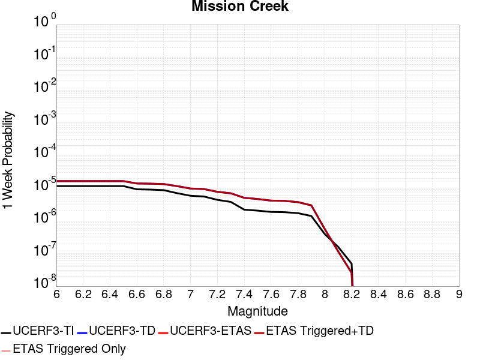 |  |  |  |

| Magnitude | 1 wk TI Prob | 1 wk TD Prob | 1 wk ETAS Prob | 1 wk ETAS/TD Gain | 1 wk ETAS Triggered+TD | 1 wk ETAS Triggered Only | 1 mo TI Prob | 1 mo TD Prob | 1 mo ETAS Prob | 1 mo ETAS/TD Gain | 1 mo ETAS Triggered+TD | 1 mo ETAS Triggered Only | 1 yr TI Prob | 1 yr TD Prob | 1 yr ETAS Prob | 1 yr ETAS/TD Gain | 1 yr ETAS Triggered+TD | 1 yr ETAS Triggered Only | 10 yr TI Prob | 10 yr TD Prob | 10 yr ETAS Prob | 10 yr ETAS/TD Gain | 10 yr ETAS Triggered+TD | 10 yr ETAS Triggered Only |
|-----|-----|-----|-----|-----|-----|-----|-----|-----|-----|-----|-----|-----|-----|-----|-----|-----|-----|-----|-----|-----|-----|-----|-----|-----|
| 6.0 | 1.1549387E-5 | 1.6352325E-5 | 0.0 | 0.0 | 1.6352325E-5 | 0.0 | 4.9496433E-5 | 7.007959E-5 | 0.0 | 0.0 | 7.007959E-5 | 0.0 | 6.0245243E-4 | 8.529001E-4 | 0.0 | 0.0 | 8.529001E-4 | 0.0 | 0.006008218 | 0.008524864 | 9.0E-4 | 0.105573535 | 0.009417191 | 9.0E-4 |
| 6.1 | 1.1549387E-5 | 1.6352325E-5 | 0.0 | 0.0 | 1.6352325E-5 | 0.0 | 4.9496433E-5 | 7.007959E-5 | 0.0 | 0.0 | 7.007959E-5 | 0.0 | 6.0245243E-4 | 8.529001E-4 | 0.0 | 0.0 | 8.529001E-4 | 0.0 | 0.006008218 | 0.008524864 | 9.0E-4 | 0.105573535 | 0.009417191 | 9.0E-4 |
| 6.2 | 1.1549387E-5 | 1.6352325E-5 | 0.0 | 0.0 | 1.6352325E-5 | 0.0 | 4.9496433E-5 | 7.007959E-5 | 0.0 | 0.0 | 7.007959E-5 | 0.0 | 6.0245243E-4 | 8.529001E-4 | 0.0 | 0.0 | 8.529001E-4 | 0.0 | 0.006008218 | 0.008524864 | 9.0E-4 | 0.105573535 | 0.009417191 | 9.0E-4 |
| 6.3 | 1.1549387E-5 | 1.6352325E-5 | 0.0 | 0.0 | 1.6352325E-5 | 0.0 | 4.9496433E-5 | 7.007959E-5 | 0.0 | 0.0 | 7.007959E-5 | 0.0 | 6.0245243E-4 | 8.529001E-4 | 0.0 | 0.0 | 8.529001E-4 | 0.0 | 0.006008218 | 0.008524864 | 9.0E-4 | 0.105573535 | 0.009417191 | 9.0E-4 |
| 6.4 | 1.1549387E-5 | 1.6352325E-5 | 0.0 | 0.0 | 1.6352325E-5 | 0.0 | 4.9496433E-5 | 7.007959E-5 | 0.0 | 0.0 | 7.007959E-5 | 0.0 | 6.0245243E-4 | 8.529001E-4 | 0.0 | 0.0 | 8.529001E-4 | 0.0 | 0.006008218 | 0.008524864 | 9.0E-4 | 0.105573535 | 0.009417191 | 9.0E-4 |
| 6.5 | 1.1549387E-5 | 1.6352325E-5 | 0.0 | 0.0 | 1.6352325E-5 | 0.0 | 4.9496433E-5 | 7.007959E-5 | 0.0 | 0.0 | 7.007959E-5 | 0.0 | 6.0245243E-4 | 8.529001E-4 | 0.0 | 0.0 | 8.529001E-4 | 0.0 | 0.006008218 | 0.008524864 | 9.0E-4 | 0.105573535 | 0.009417191 | 9.0E-4 |
| 6.6 | 9.202681E-6 | 1.38753185E-5 | 0.0 | 0.0 | 1.38753185E-5 | 0.0 | 3.9439463E-5 | 5.9464346E-5 | 0.0 | 0.0 | 5.9464346E-5 | 0.0 | 4.800697E-4 | 7.23747E-4 | 0.0 | 0.0 | 7.23747E-4 | 0.0 | 0.004790339 | 0.0072419196 | 8.0E-4 | 0.11046795 | 0.008036126 | 8.0E-4 |
| 6.7 | 9.019164E-6 | 1.3680965E-5 | 0.0 | 0.0 | 1.3680965E-5 | 0.0 | 3.8652986E-5 | 5.8631438E-5 | 0.0 | 0.0 | 5.8631438E-5 | 0.0 | 4.7049852E-4 | 7.13613E-4 | 0.0 | 0.0 | 7.13613E-4 | 0.0 | 0.004695036 | 0.0071412334 | 8.0E-4 | 0.11202547 | 0.00793552 | 8.0E-4 |
| 6.8 | 8.673558E-6 | 1.3302998E-5 | 0.0 | 0.0 | 1.3302998E-5 | 0.0 | 3.717186E-5 | 5.7011654E-5 | 0.0 | 0.0 | 5.7011654E-5 | 0.0 | 4.524734E-4 | 6.9390464E-4 | 0.0 | 0.0 | 6.9390464E-4 | 0.0 | 0.0045155324 | 0.006945384 | 8.0E-4 | 0.11518441 | 0.007739828 | 8.0E-4 |
| 6.9 | 7.002255E-6 | 1.1506949E-5 | 0.0 | 0.0 | 1.1506949E-5 | 0.0 | 3.000932E-5 | 4.93146E-5 | 0.0 | 0.0 | 4.93146E-5 | 0.0 | 3.653022E-4 | 6.002467E-4 | 0.0 | 0.0 | 6.002467E-4 | 0.0 | 0.0036470229 | 0.0060140765 | 7.0E-4 | 0.116393596 | 0.0067098667 | 7.0E-4 |
| 7.0 | 5.84644E-6 | 9.702393E-6 | 0.0 | 0.0 | 9.702393E-6 | 0.0 | 2.5055931E-5 | 4.1581046E-5 | 0.0 | 0.0 | 4.1581046E-5 | 0.0 | 3.0501327E-4 | 5.061362E-4 | 0.0 | 0.0 | 5.061362E-4 | 0.0 | 0.0030459496 | 0.005077449 | 7.0E-4 | 0.1378645 | 0.005773895 | 7.0E-4 |
| 7.1 | 5.54703E-6 | 9.356745E-6 | 0.0 | 0.0 | 9.356745E-6 | 0.0 | 2.377277E-5 | 4.0099745E-5 | 0.0 | 0.0 | 4.0099745E-5 | 0.0 | 2.8939504E-4 | 4.8810948E-4 | 0.0 | 0.0 | 4.8810948E-4 | 0.0 | 0.0028901845 | 0.004897981 | 7.0E-4 | 0.14291602 | 0.0055945525 | 7.0E-4 |
| 7.2 | 4.384709E-6 | 7.707337E-6 | 0.0 | 0.0 | 7.707337E-6 | 0.0 | 1.8791474E-5 | 3.3031047E-5 | 0.0 | 0.0 | 3.3031047E-5 | 0.0 | 2.2876218E-4 | 4.0208246E-4 | 0.0 | 0.0 | 4.0208246E-4 | 0.0 | 0.0022852682 | 0.0040411525 | 7.0E-4 | 0.17321791 | 0.004738324 | 7.0E-4 |
| 7.3 | 3.7888456E-6 | 6.94057E-6 | 0.0 | 0.0 | 6.94057E-6 | 0.0 | 1.623781E-5 | 2.974498E-5 | 0.0 | 0.0 | 2.974498E-5 | 0.0 | 1.9767738E-4 | 3.6208832E-4 | 0.0 | 0.0 | 3.6208832E-4 | 0.0 | 0.0019750162 | 0.0036425844 | 7.0E-4 | 0.19217125 | 0.0043400344 | 7.0E-4 |
| 7.4 | 2.1982462E-6 | 5.047949E-6 | 0.0 | 0.0 | 5.047949E-6 | 0.0 | 9.421021E-6 | 2.1633889E-5 | 0.0 | 0.0 | 2.1633889E-5 | 0.0 | 1.1469489E-4 | 2.6336094E-4 | 0.0 | 0.0 | 2.6336094E-4 | 0.0 | 0.0011463572 | 0.0026578717 | 4.0E-4 | 0.15049635 | 0.0030568086 | 4.0E-4 |
| 7.5 | 2.051923E-6 | 4.6383648E-6 | 0.0 | 0.0 | 4.6383648E-6 | 0.0 | 8.793926E-6 | 1.9878556E-5 | 0.0 | 0.0 | 1.9878556E-5 | 0.0 | 1.0706078E-4 | 2.4199468E-4 | 0.0 | 0.0 | 2.4199468E-4 | 0.0 | 0.0010700922 | 0.002445178 | 4.0E-4 | 0.16358726 | 0.0028442002 | 4.0E-4 |
| 7.6 | 1.8733427E-6 | 4.145728E-6 | 0.0 | 0.0 | 4.145728E-6 | 0.0 | 8.028587E-6 | 1.7767285E-5 | 0.0 | 0.0 | 1.7767285E-5 | 0.0 | 9.774366E-5 | 2.162953E-4 | 0.0 | 0.0 | 2.162953E-4 | 0.0 | 9.770069E-4 | 0.0021891429 | 4.0E-4 | 0.18271992 | 0.0025882672 | 4.0E-4 |
| 7.7 | 1.8411953E-6 | 4.0652167E-6 | 0.0 | 0.0 | 4.0652167E-6 | 0.0 | 7.890813E-6 | 1.7422242E-5 | 0.0 | 0.0 | 1.7422242E-5 | 0.0 | 9.606641E-5 | 2.1209524E-4 | 0.0 | 0.0 | 2.1209524E-4 | 0.0 | 9.6024893E-4 | 0.002147335 | 4.0E-4 | 0.1862774 | 0.002546476 | 4.0E-4 |
| 7.8 | 1.7194251E-6 | 3.73072E-6 | 0.0 | 0.0 | 3.73072E-6 | 0.0 | 7.368944E-6 | 1.5988702E-5 | 0.0 | 0.0 | 1.5988702E-5 | 0.0 | 8.97132E-5 | 1.9464514E-4 | 0.0 | 0.0 | 1.9464514E-4 | 0.0 | 8.967699E-4 | 0.0019723685 | 4.0E-4 | 0.20280185 | 0.0023715796 | 4.0E-4 |
| 7.9 | 1.4035052E-6 | 2.9657979E-6 | 0.0 | 0.0 | 2.9657979E-6 | 0.0 | 6.0150082E-6 | 1.2710501E-5 | 0.0 | 0.0 | 1.2710501E-5 | 0.0 | 7.3230265E-5 | 1.5473942E-4 | 0.0 | 0.0 | 1.5473942E-4 | 0.0 | 7.3206134E-4 | 0.0015707907 | 4.0E-4 | 0.25464883 | 0.0019701624 | 4.0E-4 |
| 8.0 | 3.9318823E-7 | 5.5541796E-7 | 0.0 | 0.0 | 5.5541796E-7 | 0.0 | 1.6850913E-6 | 2.3803607E-6 | 0.0 | 0.0 | 2.3803607E-6 | 0.0 | 2.0515794E-5 | 2.898051E-5 | 0.0 | 0.0 | 2.898051E-5 | 0.0 | 2.0513899E-4 | 3.0021137E-4 | 1.0E-4 | 0.33309865 | 4.0018134E-4 | 1.0E-4 |
| 8.1 | 1.596793E-7 | 1.14277E-7 | 0.0 | 0.0 | 1.14277E-7 | 0.0 | 6.8433974E-7 | 4.8975846E-7 | 0.0 | 0.0 | 4.8975846E-7 | 0.0 | 8.331805E-6 | 5.9627932E-6 | 0.0 | 0.0 | 5.9627932E-6 | 0.0 | 8.331492E-5 | 6.576203E-5 | 0.0 | 0.0 | 6.576203E-5 | 0.0 |
| 8.2 | 4.9003038E-8 | 2.5551671E-8 | 0.0 | 0.0 | 2.5551671E-8 | 0.0 | 2.10013E-7 | 1.09507155E-7 | 0.0 | 0.0 | 1.09507155E-7 | 0.0 | 2.5569052E-6 | 1.3332489E-6 | 0.0 | 0.0 | 1.3332489E-6 | 0.0 | 2.556876E-5 | 1.5017495E-5 | 0.0 | 0.0 | 1.5017495E-5 | 0.0 |

## Garlic Springs
*[(top)](#table-of-contents)*

| 1 Week | 1 Month | 1 Year | 10 Year |
|-----|-----|-----|-----|
|  |  | 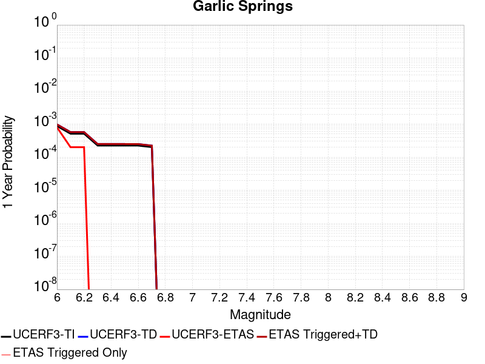 |  |

| Magnitude | 1 wk TI Prob | 1 wk TD Prob | 1 wk ETAS Prob | 1 wk ETAS/TD Gain | 1 wk ETAS Triggered+TD | 1 wk ETAS Triggered Only | 1 mo TI Prob | 1 mo TD Prob | 1 mo ETAS Prob | 1 mo ETAS/TD Gain | 1 mo ETAS Triggered+TD | 1 mo ETAS Triggered Only | 1 yr TI Prob | 1 yr TD Prob | 1 yr ETAS Prob | 1 yr ETAS/TD Gain | 1 yr ETAS Triggered+TD | 1 yr ETAS Triggered Only | 10 yr TI Prob | 10 yr TD Prob | 10 yr ETAS Prob | 10 yr ETAS/TD Gain | 10 yr ETAS Triggered+TD | 10 yr ETAS Triggered Only |
|-----|-----|-----|-----|-----|-----|-----|-----|-----|-----|-----|-----|-----|-----|-----|-----|-----|-----|-----|-----|-----|-----|-----|-----|-----|
| 6.0 | 1.6760017E-5 | 1.878149E-5 | 0.0 | 0.0 | 1.878149E-5 | 0.0 | 7.182667E-5 | 8.0490274E-5 | 0.0 | 0.0 | 8.0490274E-5 | 0.0 | 8.7413884E-4 | 9.79646E-4 | 0.0 | 0.0 | 9.79646E-4 | 0.0 | 0.008707083 | 0.009764826 | 9.0E-4 | 0.09216754 | 0.010656037 | 9.0E-4 |
| 6.1 | 9.852767E-6 | 1.0976159E-5 | 0.0 | 0.0 | 1.0976159E-5 | 0.0 | 4.222546E-5 | 4.704023E-5 | 0.0 | 0.0 | 4.704023E-5 | 0.0 | 5.139737E-4 | 5.726353E-4 | 0.0 | 0.0 | 5.726353E-4 | 0.0 | 0.005127866 | 0.005718559 | 3.0E-4 | 0.052460767 | 0.0060168435 | 3.0E-4 |
| 6.2 | 9.852767E-6 | 1.0976159E-5 | 0.0 | 0.0 | 1.0976159E-5 | 0.0 | 4.222546E-5 | 4.704023E-5 | 0.0 | 0.0 | 4.704023E-5 | 0.0 | 5.139737E-4 | 5.726353E-4 | 0.0 | 0.0 | 5.726353E-4 | 0.0 | 0.005127866 | 0.005718559 | 3.0E-4 | 0.052460767 | 0.0060168435 | 3.0E-4 |
| 6.3 | 4.3167724E-6 | 4.77908E-6 | 0.0 | 0.0 | 4.77908E-6 | 0.0 | 1.8500323E-5 | 2.048174E-5 | 0.0 | 0.0 | 2.048174E-5 | 0.0 | 2.2521814E-4 | 2.493597E-4 | 0.0 | 0.0 | 2.493597E-4 | 0.0 | 0.0022499003 | 0.0024930583 | 2.0E-4 | 0.080222756 | 0.0026925597 | 2.0E-4 |
| 6.4 | 4.3167724E-6 | 4.77908E-6 | 0.0 | 0.0 | 4.77908E-6 | 0.0 | 1.8500323E-5 | 2.048174E-5 | 0.0 | 0.0 | 2.048174E-5 | 0.0 | 2.2521814E-4 | 2.493597E-4 | 0.0 | 0.0 | 2.493597E-4 | 0.0 | 0.0022499003 | 0.0024930583 | 2.0E-4 | 0.080222756 | 0.0026925597 | 2.0E-4 |
| 6.5 | 4.3167724E-6 | 4.77908E-6 | 0.0 | 0.0 | 4.77908E-6 | 0.0 | 1.8500323E-5 | 2.048174E-5 | 0.0 | 0.0 | 2.048174E-5 | 0.0 | 2.2521814E-4 | 2.493597E-4 | 0.0 | 0.0 | 2.493597E-4 | 0.0 | 0.0022499003 | 0.0024930583 | 2.0E-4 | 0.080222756 | 0.0026925597 | 2.0E-4 |
| 6.6 | 4.301311E-6 | 4.7619446E-6 | 0.0 | 0.0 | 4.7619446E-6 | 0.0 | 1.8434059E-5 | 2.0408304E-5 | 0.0 | 0.0 | 2.0408304E-5 | 0.0 | 2.2441156E-4 | 2.484658E-4 | 0.0 | 0.0 | 2.484658E-4 | 0.0 | 0.0022418506 | 0.0024841395 | 2.0E-4 | 0.08051078 | 0.0026836426 | 2.0E-4 |
| 6.7 | 3.8599724E-6 | 4.2719967E-6 | 0.0 | 0.0 | 4.2719967E-6 | 0.0 | 1.6542634E-5 | 1.8308558E-5 | 0.0 | 0.0 | 1.8308558E-5 | 0.0 | 2.0138794E-4 | 2.2290667E-4 | 0.0 | 0.0 | 2.2290667E-4 | 0.0 | 0.0020120554 | 0.0022290668 | 2.0E-4 | 0.08972365 | 0.002428621 | 2.0E-4 |

## San Pedro Basin
*[(top)](#table-of-contents)*

| 1 Week | 1 Month | 1 Year | 10 Year |
|-----|-----|-----|-----|
|  |  |  |  |

| Magnitude | 1 wk TI Prob | 1 wk TD Prob | 1 wk ETAS Prob | 1 wk ETAS/TD Gain | 1 wk ETAS Triggered+TD | 1 wk ETAS Triggered Only | 1 mo TI Prob | 1 mo TD Prob | 1 mo ETAS Prob | 1 mo ETAS/TD Gain | 1 mo ETAS Triggered+TD | 1 mo ETAS Triggered Only | 1 yr TI Prob | 1 yr TD Prob | 1 yr ETAS Prob | 1 yr ETAS/TD Gain | 1 yr ETAS Triggered+TD | 1 yr ETAS Triggered Only | 10 yr TI Prob | 10 yr TD Prob | 10 yr ETAS Prob | 10 yr ETAS/TD Gain | 10 yr ETAS Triggered+TD | 10 yr ETAS Triggered Only |
|-----|-----|-----|-----|-----|-----|-----|-----|-----|-----|-----|-----|-----|-----|-----|-----|-----|-----|-----|-----|-----|-----|-----|-----|-----|
| 6.0 | 5.3449043E-5 | 6.339467E-5 | 0.0 | 0.0 | 6.339467E-5 | 0.0 | 2.2904722E-4 | 2.716666E-4 | 1.0E-4 | 0.36809826 | 3.7163944E-4 | 1.0E-4 | 0.0027850836 | 0.0033031267 | 2.0E-4 | 0.06054869 | 0.0035024663 | 2.0E-4 | 0.027504366 | 0.032601893 | 7.0E-4 | 0.021471146 | 0.033279072 | 7.0E-4 |
| 6.1 | 5.3449043E-5 | 6.339467E-5 | 0.0 | 0.0 | 6.339467E-5 | 0.0 | 2.2904722E-4 | 2.716666E-4 | 1.0E-4 | 0.36809826 | 3.7163944E-4 | 1.0E-4 | 0.0027850836 | 0.0033031267 | 2.0E-4 | 0.06054869 | 0.0035024663 | 2.0E-4 | 0.027504366 | 0.032601893 | 7.0E-4 | 0.021471146 | 0.033279072 | 7.0E-4 |
| 6.2 | 2.3189454E-5 | 2.6651174E-5 | 0.0 | 0.0 | 2.6651174E-5 | 0.0 | 9.9379584E-5 | 1.1421458E-4 | 1.0E-4 | 0.87554497 | 2.1420316E-4 | 1.0E-4 | 0.0012092749 | 0.0013897225 | 2.0E-4 | 0.14391363 | 0.0015894445 | 2.0E-4 | 0.012027155 | 0.013815186 | 4.0E-4 | 0.028953645 | 0.01420966 | 4.0E-4 |
| 6.3 | 2.3189454E-5 | 2.6651174E-5 | 0.0 | 0.0 | 2.6651174E-5 | 0.0 | 9.9379584E-5 | 1.1421458E-4 | 1.0E-4 | 0.87554497 | 2.1420316E-4 | 1.0E-4 | 0.0012092749 | 0.0013897225 | 2.0E-4 | 0.14391363 | 0.0015894445 | 2.0E-4 | 0.012027155 | 0.013815186 | 4.0E-4 | 0.028953645 | 0.01420966 | 4.0E-4 |
| 6.4 | 1.966056E-5 | 2.2470176E-5 | 0.0 | 0.0 | 2.2470176E-5 | 0.0 | 8.425682E-5 | 9.629742E-5 | 1.0E-4 | 1.0384494 | 1.962878E-4 | 1.0E-4 | 0.001025344 | 0.0011718307 | 2.0E-4 | 0.17067312 | 0.0013715964 | 2.0E-4 | 0.010206259 | 0.011660605 | 3.0E-4 | 0.025727654 | 0.011957107 | 3.0E-4 |
| 6.5 | 1.7342953E-5 | 1.9750938E-5 | 0.0 | 0.0 | 1.9750938E-5 | 0.0 | 7.4324824E-5 | 8.4644336E-5 | 1.0E-4 | 1.1814139 | 1.8463588E-4 | 1.0E-4 | 9.04529E-4 | 0.0010300946 | 2.0E-4 | 0.19415693 | 0.0012298885 | 2.0E-4 | 0.009008561 | 0.010256923 | 3.0E-4 | 0.029248537 | 0.010553846 | 3.0E-4 |
| 6.6 | 1.439804E-5 | 1.6327358E-5 | 0.0 | 0.0 | 1.6327358E-5 | 0.0 | 6.170443E-5 | 6.9972695E-5 | 1.0E-4 | 1.4291289 | 1.699657E-4 | 1.0E-4 | 7.509924E-4 | 8.516167E-4 | 2.0E-4 | 0.23484743 | 0.0010514464 | 2.0E-4 | 0.0074845953 | 0.008486737 | 3.0E-4 | 0.035349276 | 0.008784191 | 3.0E-4 |
| 6.7 | 1.2634884E-5 | 1.4289286E-5 | 0.0 | 0.0 | 1.4289286E-5 | 0.0 | 5.414838E-5 | 6.1238534E-5 | 1.0E-4 | 1.6329588 | 1.6123241E-4 | 1.0E-4 | 6.590571E-4 | 7.4535457E-4 | 2.0E-4 | 0.26832867 | 9.452055E-4 | 2.0E-4 | 0.006571059 | 0.0074315695 | 3.0E-4 | 0.040368322 | 0.00772934 | 3.0E-4 |
| 6.8 | 1.146091E-5 | 1.2936758E-5 | 0.0 | 0.0 | 1.2936758E-5 | 0.0 | 4.911726E-5 | 5.544224E-5 | 1.0E-4 | 1.803679 | 1.5543669E-4 | 1.0E-4 | 5.9783855E-4 | 6.7483E-4 | 2.0E-4 | 0.29637095 | 8.74695E-4 | 2.0E-4 | 0.0059623276 | 0.0067307497 | 3.0E-4 | 0.04457156 | 0.0070287306 | 3.0E-4 |
| 6.9 | 9.109035E-6 | 1.0237759E-5 | 0.0 | 0.0 | 1.0237759E-5 | 0.0 | 3.9038136E-5 | 4.387553E-5 | 0.0 | 0.0 | 4.387553E-5 | 0.0 | 4.7518566E-4 | 5.3408166E-4 | 1.0E-4 | 0.18723729 | 6.340282E-4 | 1.0E-4 | 0.0047417083 | 0.0053307367 | 2.0E-4 | 0.037518267 | 0.0055296705 | 2.0E-4 |
| 7.0 | 5.9351028E-6 | 6.5855797E-6 | 0.0 | 0.0 | 6.5855797E-6 | 0.0 | 2.5435906E-5 | 2.8223742E-5 | 0.0 | 0.0 | 2.8223742E-5 | 0.0 | 3.0963816E-4 | 3.435935E-4 | 0.0 | 0.0 | 3.435935E-4 | 0.0 | 0.0030920706 | 0.003432941 | 0.0 | 0.0 | 0.003432941 | 0.0 |
| 7.1 | 2.1557585E-6 | 2.2098443E-6 | 0.0 | 0.0 | 2.2098443E-6 | 0.0 | 9.238933E-6 | 9.4707275E-6 | 0.0 | 0.0 | 9.4707275E-6 | 0.0 | 1.1247819E-4 | 1.15300165E-4 | 0.0 | 0.0 | 1.15300165E-4 | 0.0 | 0.0011242128 | 0.0011524188 | 0.0 | 0.0 | 0.0011524188 | 0.0 |
| 7.2 | 2.1251979E-6 | 2.1781882E-6 | 0.0 | 0.0 | 2.1781882E-6 | 0.0 | 9.107958E-6 | 9.33506E-6 | 0.0 | 0.0 | 9.33506E-6 | 0.0 | 1.1088375E-4 | 1.1364858E-4 | 0.0 | 0.0 | 1.1364858E-4 | 0.0 | 0.0011082845 | 0.0011359199 | 0.0 | 0.0 | 0.0011359199 | 0.0 |
| 7.3 | 1.7145798E-6 | 1.7444308E-6 | 0.0 | 0.0 | 1.7444308E-6 | 0.0 | 7.3481783E-6 | 7.4761115E-6 | 0.0 | 0.0 | 7.4761115E-6 | 0.0 | 8.94604E-5 | 9.1017944E-5 | 0.0 | 0.0 | 9.1017944E-5 | 0.0 | 8.9424395E-4 | 9.0981583E-4 | 0.0 | 0.0 | 9.0981583E-4 | 0.0 |
| 7.4 | 1.4467993E-6 | 1.4643035E-6 | 0.0 | 0.0 | 1.4643035E-6 | 0.0 | 6.200554E-6 | 6.275572E-6 | 0.0 | 0.0 | 6.275572E-6 | 0.0 | 7.548913E-5 | 7.640249E-5 | 0.0 | 0.0 | 7.640249E-5 | 0.0 | 7.546349E-4 | 7.637695E-4 | 0.0 | 0.0 | 7.637695E-4 | 0.0 |
| 7.5 | 1.2803735E-6 | 1.2932526E-6 | 0.0 | 0.0 | 1.2932526E-6 | 0.0 | 5.487303E-6 | 5.5425E-6 | 0.0 | 0.0 | 5.5425E-6 | 0.0 | 6.680587E-5 | 6.7477915E-5 | 0.0 | 0.0 | 6.7477915E-5 | 0.0 | 6.678579E-4 | 6.7458133E-4 | 0.0 | 0.0 | 6.7458133E-4 | 0.0 |
| 7.6 | 6.755009E-7 | 6.7700057E-7 | 0.0 | 0.0 | 6.7700057E-7 | 0.0 | 2.8950008E-6 | 2.9014282E-6 | 0.0 | 0.0 | 2.9014282E-6 | 0.0 | 3.5246063E-5 | 3.5324374E-5 | 0.0 | 0.0 | 3.5324374E-5 | 0.0 | 3.5240475E-4 | 3.5319332E-4 | 0.0 | 0.0 | 3.5319332E-4 | 0.0 |
| 7.7 | 6.211885E-8 | 4.5704002E-8 | 0.0 | 0.0 | 4.5704002E-8 | 0.0 | 2.6622362E-7 | 1.9587428E-7 | 0.0 | 0.0 | 1.9587428E-7 | 0.0 | 3.2412677E-6 | 2.384767E-6 | 0.0 | 0.0 | 2.384767E-6 | 0.0 | 3.2412205E-5 | 2.3847435E-5 | 0.0 | 0.0 | 2.3847435E-5 | 0.0 |
| 7.8 | 2.6580573E-9 | 1.5145799E-9 | 0.0 | 0.0 | 1.5145799E-9 | 0.0 | 1.1391674E-8 | 6.4910566E-9 | 0.0 | 0.0 | 6.4910566E-9 | 0.0 | 1.3869362E-7 | 7.902862E-8 | 0.0 | 0.0 | 7.902862E-8 | 0.0 | 1.3869354E-6 | 7.9028615E-7 | 0.0 | 0.0 | 7.9028615E-7 | 0.0 |

## Owens Valley
*[(top)](#table-of-contents)*

| 1 Week | 1 Month | 1 Year | 10 Year |
|-----|-----|-----|-----|
|  |  |  |  |

| Magnitude | 1 wk TI Prob | 1 wk TD Prob | 1 wk ETAS Prob | 1 wk ETAS/TD Gain | 1 wk ETAS Triggered+TD | 1 wk ETAS Triggered Only | 1 mo TI Prob | 1 mo TD Prob | 1 mo ETAS Prob | 1 mo ETAS/TD Gain | 1 mo ETAS Triggered+TD | 1 mo ETAS Triggered Only | 1 yr TI Prob | 1 yr TD Prob | 1 yr ETAS Prob | 1 yr ETAS/TD Gain | 1 yr ETAS Triggered+TD | 1 yr ETAS Triggered Only | 10 yr TI Prob | 10 yr TD Prob | 10 yr ETAS Prob | 10 yr ETAS/TD Gain | 10 yr ETAS Triggered+TD | 10 yr ETAS Triggered Only |
|-----|-----|-----|-----|-----|-----|-----|-----|-----|-----|-----|-----|-----|-----|-----|-----|-----|-----|-----|-----|-----|-----|-----|-----|-----|
| 6.0 | 4.83821E-5 | 3.6304634E-6 | 0.0 | 0.0 | 3.6304634E-6 | 0.0 | 2.0733538E-4 | 1.5559042E-5 | 0.0 | 0.0 | 1.5559042E-5 | 0.0 | 0.002521386 | 1.8941586E-4 | 0.0 | 0.0 | 1.8941586E-4 | 0.0 | 0.024929691 | 0.001920397 | 9.0E-4 | 0.46865308 | 0.0028186687 | 9.0E-4 |
| 6.1 | 4.83821E-5 | 3.6304634E-6 | 0.0 | 0.0 | 3.6304634E-6 | 0.0 | 2.0733538E-4 | 1.5559042E-5 | 0.0 | 0.0 | 1.5559042E-5 | 0.0 | 0.002521386 | 1.8941586E-4 | 0.0 | 0.0 | 1.8941586E-4 | 0.0 | 0.024929691 | 0.001920397 | 9.0E-4 | 0.46865308 | 0.0028186687 | 9.0E-4 |
| 6.2 | 4.83821E-5 | 3.6304634E-6 | 0.0 | 0.0 | 3.6304634E-6 | 0.0 | 2.0733538E-4 | 1.5559042E-5 | 0.0 | 0.0 | 1.5559042E-5 | 0.0 | 0.002521386 | 1.8941586E-4 | 0.0 | 0.0 | 1.8941586E-4 | 0.0 | 0.024929691 | 0.001920397 | 9.0E-4 | 0.46865308 | 0.0028186687 | 9.0E-4 |
| 6.3 | 3.953008E-5 | 3.156843E-6 | 0.0 | 0.0 | 3.156843E-6 | 0.0 | 1.6940363E-4 | 1.3529261E-5 | 0.0 | 0.0 | 1.3529261E-5 | 0.0 | 0.002060538 | 1.6470703E-4 | 0.0 | 0.0 | 1.6470703E-4 | 0.0 | 0.020415364 | 0.0016592047 | 8.0E-4 | 0.48215872 | 0.0024578774 | 8.0E-4 |
| 6.4 | 3.953008E-5 | 3.156843E-6 | 0.0 | 0.0 | 3.156843E-6 | 0.0 | 1.6940363E-4 | 1.3529261E-5 | 0.0 | 0.0 | 1.3529261E-5 | 0.0 | 0.002060538 | 1.6470703E-4 | 0.0 | 0.0 | 1.6470703E-4 | 0.0 | 0.020415364 | 0.0016592047 | 8.0E-4 | 0.48215872 | 0.0024578774 | 8.0E-4 |
| 6.5 | 3.457342E-5 | 2.9721223E-6 | 0.0 | 0.0 | 2.9721223E-6 | 0.0 | 1.4816338E-4 | 1.2737609E-5 | 0.0 | 0.0 | 1.2737609E-5 | 0.0 | 0.0018023965 | 1.5507005E-4 | 0.0 | 0.0 | 1.5507005E-4 | 0.0 | 0.017878477 | 0.0015558436 | 8.0E-4 | 0.5141905 | 0.002354599 | 8.0E-4 |
| 6.6 | 3.1127765E-5 | 2.8749932E-6 | 0.0 | 0.0 | 2.8749932E-6 | 0.0 | 1.3339789E-4 | 1.2321345E-5 | 0.0 | 0.0 | 1.2321345E-5 | 0.0 | 0.0016229092 | 1.5000274E-4 | 0.0 | 0.0 | 1.5000274E-4 | 0.0 | 0.016111081 | 0.0015009542 | 8.0E-4 | 0.5329943 | 0.0022997535 | 8.0E-4 |
| 6.7 | 2.806885E-5 | 2.8106297E-6 | 0.0 | 0.0 | 2.8106297E-6 | 0.0 | 1.2028952E-4 | 1.2045504E-5 | 0.0 | 0.0 | 1.2045504E-5 | 0.0 | 0.001463541 | 1.4664483E-4 | 0.0 | 0.0 | 1.4664483E-4 | 0.0 | 0.014539397 | 0.001465944 | 8.0E-4 | 0.54572344 | 0.0022647711 | 8.0E-4 |
| 6.8 | 2.524524E-5 | 2.2355543E-6 | 0.0 | 0.0 | 2.2355543E-6 | 0.0 | 1.0818939E-4 | 9.580914E-6 | 0.0 | 0.0 | 9.580914E-6 | 0.0 | 0.0013164099 | 1.1664168E-4 | 0.0 | 0.0 | 1.1664168E-4 | 0.0 | 0.01308639 | 0.0011661344 | 3.0E-4 | 0.25726023 | 0.0014657845 | 3.0E-4 |
| 6.9 | 2.2704568E-5 | 1.6082632E-6 | 0.0 | 0.0 | 1.6082632E-6 | 0.0 | 9.730166E-5 | 6.8925387E-6 | 0.0 | 0.0 | 6.8925387E-6 | 0.0 | 0.0011840039 | 8.3913445E-5 | 0.0 | 0.0 | 8.3913445E-5 | 0.0 | 0.011777153 | 8.390813E-4 | 1.0E-4 | 0.11917796 | 9.3899743E-4 | 1.0E-4 |
| 7.0 | 2.0871712E-5 | 1.5396384E-6 | 0.0 | 0.0 | 1.5396384E-6 | 0.0 | 8.944713E-5 | 6.598434E-6 | 0.0 | 0.0 | 6.598434E-6 | 0.0 | 0.0010884746 | 8.033299E-5 | 0.0 | 0.0 | 8.033299E-5 | 0.0 | 0.010831586 | 8.032609E-4 | 0.0 | 0.0 | 8.032609E-4 | 0.0 |
| 7.1 | 1.944928E-5 | 1.3864889E-6 | 0.0 | 0.0 | 1.3864889E-6 | 0.0 | 8.335139E-5 | 5.9420818E-6 | 0.0 | 0.0 | 5.9420818E-6 | 0.0 | 0.0010143308 | 7.234245E-5 | 0.0 | 0.0 | 7.234245E-5 | 0.0 | 0.010097133 | 7.2339695E-4 | 0.0 | 0.0 | 7.2339695E-4 | 0.0 |
| 7.2 | 1.7876306E-5 | 1.2489726E-6 | 0.0 | 0.0 | 1.2489726E-6 | 0.0 | 7.6610486E-5 | 5.3527287E-6 | 0.0 | 0.0 | 5.3527287E-6 | 0.0 | 9.3233347E-4 | 6.516753E-5 | 0.0 | 0.0 | 6.516753E-5 | 0.0 | 0.009284316 | 6.5167475E-4 | 0.0 | 0.0 | 6.5167475E-4 | 0.0 |
| 7.3 | 1.2618672E-5 | 1.1115718E-6 | 0.0 | 0.0 | 1.1115718E-6 | 0.0 | 5.40789E-5 | 4.763871E-6 | 0.0 | 0.0 | 4.763871E-6 | 0.0 | 6.582117E-4 | 5.799859E-5 | 0.0 | 0.0 | 5.799859E-5 | 0.0 | 0.0065626553 | 5.8002025E-4 | 0.0 | 0.0 | 5.8002025E-4 | 0.0 |
| 7.4 | 7.4874442E-6 | 8.5490717E-7 | 0.0 | 0.0 | 8.5490717E-7 | 0.0 | 3.208865E-5 | 3.6638828E-6 | 0.0 | 0.0 | 3.6638828E-6 | 0.0 | 3.906093E-4 | 4.4606863E-5 | 0.0 | 0.0 | 4.4606863E-5 | 0.0 | 0.003899234 | 4.4612243E-4 | 0.0 | 0.0 | 4.4612243E-4 | 0.0 |
| 7.5 | 2.4734156E-6 | 6.0691343E-7 | 0.0 | 0.0 | 6.0691343E-7 | 0.0 | 1.060031E-5 | 2.601055E-6 | 0.0 | 0.0 | 2.601055E-6 | 0.0 | 1.2905113E-4 | 3.166739E-5 | 0.0 | 0.0 | 3.166739E-5 | 0.0 | 0.0012897621 | 3.166291E-4 | 0.0 | 0.0 | 3.166291E-4 | 0.0 |
| 7.6 | 1.1328841E-6 | 3.1967866E-7 | 0.0 | 0.0 | 3.1967866E-7 | 0.0 | 4.8552088E-6 | 1.3700507E-6 | 0.0 | 0.0 | 1.3700507E-6 | 0.0 | 5.9110564E-5 | 1.6680242E-5 | 0.0 | 0.0 | 1.6680242E-5 | 0.0 | 5.9094845E-4 | 1.6679008E-4 | 0.0 | 0.0 | 1.6679008E-4 | 0.0 |
| 7.7 | 4.8613185E-7 | 8.964898E-8 | 0.0 | 0.0 | 8.964898E-8 | 0.0 | 2.0834207E-6 | 3.8420984E-7 | 0.0 | 0.0 | 3.8420984E-7 | 0.0 | 2.536535E-5 | 4.6777454E-6 | 0.0 | 0.0 | 4.6777454E-6 | 0.0 | 2.5362454E-4 | 4.677654E-5 | 0.0 | 0.0 | 4.677654E-5 | 0.0 |

## Death Valley (No)
*[(top)](#table-of-contents)*

| 1 Week | 1 Month | 1 Year | 10 Year |
|-----|-----|-----|-----|
|  |  |  |  |

| Magnitude | 1 wk TI Prob | 1 wk TD Prob | 1 wk ETAS Prob | 1 wk ETAS/TD Gain | 1 wk ETAS Triggered+TD | 1 wk ETAS Triggered Only | 1 mo TI Prob | 1 mo TD Prob | 1 mo ETAS Prob | 1 mo ETAS/TD Gain | 1 mo ETAS Triggered+TD | 1 mo ETAS Triggered Only | 1 yr TI Prob | 1 yr TD Prob | 1 yr ETAS Prob | 1 yr ETAS/TD Gain | 1 yr ETAS Triggered+TD | 1 yr ETAS Triggered Only | 10 yr TI Prob | 10 yr TD Prob | 10 yr ETAS Prob | 10 yr ETAS/TD Gain | 10 yr ETAS Triggered+TD | 10 yr ETAS Triggered Only |
|-----|-----|-----|-----|-----|-----|-----|-----|-----|-----|-----|-----|-----|-----|-----|-----|-----|-----|-----|-----|-----|-----|-----|-----|-----|
| 6.0 | 2.0074807E-5 | 2.2505708E-5 | 0.0 | 0.0 | 2.2505708E-5 | 0.0 | 8.603206E-5 | 9.644951E-5 | 0.0 | 0.0 | 9.644951E-5 | 0.0 | 0.001046937 | 0.0011736476 | 2.0E-4 | 0.1704089 | 0.0013734129 | 2.0E-4 | 0.010420183 | 0.011675408 | 9.0E-4 | 0.0770851 | 0.012564899 | 9.0E-4 |
| 6.1 | 2.0074807E-5 | 2.2505708E-5 | 0.0 | 0.0 | 2.2505708E-5 | 0.0 | 8.603206E-5 | 9.644951E-5 | 0.0 | 0.0 | 9.644951E-5 | 0.0 | 0.001046937 | 0.0011736476 | 2.0E-4 | 0.1704089 | 0.0013734129 | 2.0E-4 | 0.010420183 | 0.011675408 | 9.0E-4 | 0.0770851 | 0.012564899 | 9.0E-4 |
| 6.2 | 2.0074807E-5 | 2.2505708E-5 | 0.0 | 0.0 | 2.2505708E-5 | 0.0 | 8.603206E-5 | 9.644951E-5 | 0.0 | 0.0 | 9.644951E-5 | 0.0 | 0.001046937 | 0.0011736476 | 2.0E-4 | 0.1704089 | 0.0013734129 | 2.0E-4 | 0.010420183 | 0.011675408 | 9.0E-4 | 0.0770851 | 0.012564899 | 9.0E-4 |
| 6.3 | 1.9050609E-5 | 2.1342246E-5 | 0.0 | 0.0 | 2.1342246E-5 | 0.0 | 8.164292E-5 | 9.1463604E-5 | 0.0 | 0.0 | 9.1463604E-5 | 0.0 | 9.935491E-4 | 0.0011130073 | 2.0E-4 | 0.17969334 | 0.0013127847 | 2.0E-4 | 0.009891188 | 0.011075154 | 9.0E-4 | 0.081262976 | 0.011965186 | 9.0E-4 |
| 6.4 | 1.9050609E-5 | 2.1342246E-5 | 0.0 | 0.0 | 2.1342246E-5 | 0.0 | 8.164292E-5 | 9.1463604E-5 | 0.0 | 0.0 | 9.1463604E-5 | 0.0 | 9.935491E-4 | 0.0011130073 | 2.0E-4 | 0.17969334 | 0.0013127847 | 2.0E-4 | 0.009891188 | 0.011075154 | 9.0E-4 | 0.081262976 | 0.011965186 | 9.0E-4 |
| 6.5 | 1.8367004E-5 | 2.0566093E-5 | 0.0 | 0.0 | 2.0566093E-5 | 0.0 | 7.8713354E-5 | 8.813746E-5 | 0.0 | 0.0 | 8.813746E-5 | 0.0 | 9.5791375E-4 | 0.0010725518 | 2.0E-4 | 0.18647118 | 0.0012723373 | 2.0E-4 | 0.009537951 | 0.01067454 | 9.0E-4 | 0.08431277 | 0.011564933 | 9.0E-4 |
| 6.6 | 1.779439E-5 | 1.9915831E-5 | 0.0 | 0.0 | 1.9915831E-5 | 0.0 | 7.625944E-5 | 8.53508E-5 | 0.0 | 0.0 | 8.53508E-5 | 0.0 | 9.280632E-4 | 0.001038657 | 1.0E-4 | 0.09627817 | 0.0011385531 | 1.0E-4 | 0.009241969 | 0.010338785 | 8.0E-4 | 0.077378534 | 0.011130514 | 8.0E-4 |
| 6.7 | 1.7025437E-5 | 1.9048099E-5 | 0.0 | 0.0 | 1.9048099E-5 | 0.0 | 7.296412E-5 | 8.1632184E-5 | 0.0 | 0.0 | 8.1632184E-5 | 0.0 | 8.87976E-4 | 9.934249E-4 | 1.0E-4 | 0.10066187 | 0.0010933256 | 1.0E-4 | 0.008844362 | 0.00989056 | 8.0E-4 | 0.08088521 | 0.010682647 | 8.0E-4 |
| 6.8 | 1.6545107E-5 | 1.8517101E-5 | 0.0 | 0.0 | 1.8517101E-5 | 0.0 | 7.090568E-5 | 7.935662E-5 | 0.0 | 0.0 | 7.935662E-5 | 0.0 | 8.629347E-4 | 9.657447E-4 | 1.0E-4 | 0.10354703 | 0.0010656482 | 1.0E-4 | 0.008595915 | 0.009616183 | 8.0E-4 | 0.08319309 | 0.01040849 | 8.0E-4 |
| 6.9 | 1.615478E-5 | 1.8092069E-5 | 0.0 | 0.0 | 1.8092069E-5 | 0.0 | 6.9232934E-5 | 7.753517E-5 | 0.0 | 0.0 | 7.753517E-5 | 0.0 | 8.4258494E-4 | 9.43588E-4 | 1.0E-4 | 0.10597846 | 0.0010434936 | 1.0E-4 | 0.008393973 | 0.009396509 | 8.0E-4 | 0.085138 | 0.010188992 | 8.0E-4 |
| 7.0 | 1.5894311E-5 | 1.7809976E-5 | 0.0 | 0.0 | 1.7809976E-5 | 0.0 | 6.81167E-5 | 7.6326265E-5 | 0.0 | 0.0 | 7.6326265E-5 | 0.0 | 8.2900526E-4 | 9.288822E-4 | 1.0E-4 | 0.10765628 | 0.0010287893 | 1.0E-4 | 0.008259195 | 0.009250686 | 8.0E-4 | 0.08648007 | 0.010043285 | 8.0E-4 |
| 7.1 | 1.5602263E-5 | 1.748786E-5 | 0.0 | 0.0 | 1.748786E-5 | 0.0 | 6.6865134E-5 | 7.494585E-5 | 0.0 | 0.0 | 7.494585E-5 | 0.0 | 8.137789E-4 | 9.1208983E-4 | 1.0E-4 | 0.109638326 | 0.0010119986 | 1.0E-4 | 0.008108052 | 0.0090841465 | 8.0E-4 | 0.088065505 | 0.00987688 | 8.0E-4 |
| 7.2 | 1.5323829E-5 | 1.7174907E-5 | 0.0 | 0.0 | 1.7174907E-5 | 0.0 | 6.56719E-5 | 7.36047E-5 | 0.0 | 0.0 | 7.36047E-5 | 0.0 | 7.99262E-4 | 8.9577487E-4 | 1.0E-4 | 0.11163519 | 9.956852E-4 | 1.0E-4 | 0.007963934 | 0.008922318 | 8.0E-4 | 0.0896628 | 0.009715181 | 8.0E-4 |
| 7.3 | 1.4556212E-5 | 1.6306496E-5 | 0.0 | 0.0 | 1.6306496E-5 | 0.0 | 6.238227E-5 | 6.988315E-5 | 0.0 | 0.0 | 6.988315E-5 | 0.0 | 7.592395E-4 | 8.5050106E-4 | 1.0E-4 | 0.11757775 | 9.50416E-4 | 1.0E-4 | 0.0075665074 | 0.008473106 | 8.0E-4 | 0.09441638 | 0.009266327 | 8.0E-4 |
| 7.4 | 1.411725E-5 | 1.5811873E-5 | 0.0 | 0.0 | 1.5811873E-5 | 0.0 | 6.0501097E-5 | 6.776344E-5 | 0.0 | 0.0 | 6.776344E-5 | 0.0 | 7.363519E-4 | 8.2471344E-4 | 1.0E-4 | 0.12125424 | 9.2463096E-4 | 1.0E-4 | 0.0073391674 | 0.008217163 | 8.0E-4 | 0.0973572 | 0.00901059 | 8.0E-4 |
| 7.5 | 1.3503312E-5 | 1.5130045E-5 | 0.0 | 0.0 | 1.5130045E-5 | 0.0 | 5.7870053E-5 | 6.484147E-5 | 0.0 | 0.0 | 6.484147E-5 | 0.0 | 7.043401E-4 | 7.891648E-4 | 1.0E-4 | 0.12671626 | 8.890859E-4 | 1.0E-4 | 0.007021119 | 0.007864249 | 8.0E-4 | 0.10172618 | 0.008657957 | 8.0E-4 |
| 7.6 | 1.1279839E-5 | 1.262944E-5 | 0.0 | 0.0 | 1.262944E-5 | 0.0 | 4.834127E-5 | 5.4125077E-5 | 0.0 | 0.0 | 5.4125077E-5 | 0.0 | 5.88396E-4 | 6.587789E-4 | 0.0 | 0.0 | 6.587789E-4 | 0.0 | 0.005868405 | 0.0065688123 | 7.0E-4 | 0.106564164 | 0.0072642146 | 7.0E-4 |
| 7.7 | 9.189108E-6 | 1.0285888E-5 | 0.0 | 0.0 | 1.0285888E-5 | 0.0 | 3.93813E-5 | 4.408166E-5 | 0.0 | 0.0 | 4.408166E-5 | 0.0 | 4.7936183E-4 | 5.3656707E-4 | 0.0 | 0.0 | 5.3656707E-4 | 0.0 | 0.004783291 | 0.005353227 | 5.0E-4 | 0.0934016 | 0.0058505503 | 5.0E-4 |
| 7.8 | 3.4586725E-7 | 3.6486753E-7 | 0.0 | 0.0 | 3.6486753E-7 | 0.0 | 1.4822873E-6 | 1.5637171E-6 | 0.0 | 0.0 | 1.5637171E-6 | 0.0 | 1.80467E-5 | 1.9038094E-5 | 0.0 | 0.0 | 1.9038094E-5 | 0.0 | 1.8045233E-4 | 1.9036507E-4 | 0.0 | 0.0 | 1.9036507E-4 | 0.0 |
| 7.9 | 2.5591178E-9 | 2.6699092E-9 | 0.0 | 0.0 | 2.6699092E-9 | 0.0 | 1.0967647E-8 | 1.1442468E-8 | 0.0 | 0.0 | 1.1442468E-8 | 0.0 | 1.335311E-7 | 1.3931205E-7 | 0.0 | 0.0 | 1.3931205E-7 | 0.0 | 1.3353102E-6 | 1.3931206E-6 | 0.0 | 0.0 | 1.3931206E-6 | 0.0 |

## Greenville (So) 2011 CFM
*[(top)](#table-of-contents)*

| 1 Week | 1 Month | 1 Year | 10 Year |
|-----|-----|-----|-----|
|  |  |  | 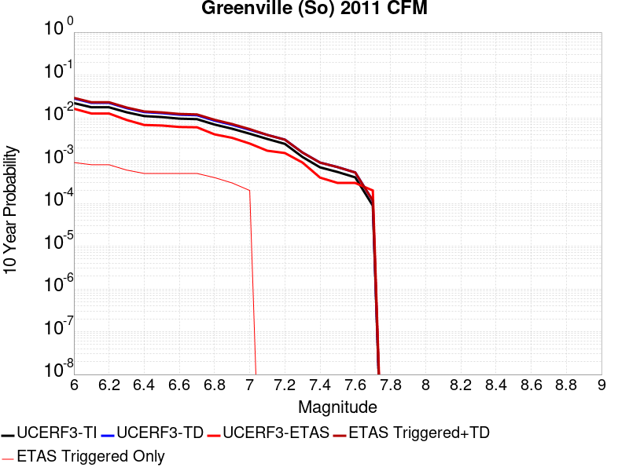 |

| Magnitude | 1 wk TI Prob | 1 wk TD Prob | 1 wk ETAS Prob | 1 wk ETAS/TD Gain | 1 wk ETAS Triggered+TD | 1 wk ETAS Triggered Only | 1 mo TI Prob | 1 mo TD Prob | 1 mo ETAS Prob | 1 mo ETAS/TD Gain | 1 mo ETAS Triggered+TD | 1 mo ETAS Triggered Only | 1 yr TI Prob | 1 yr TD Prob | 1 yr ETAS Prob | 1 yr ETAS/TD Gain | 1 yr ETAS Triggered+TD | 1 yr ETAS Triggered Only | 10 yr TI Prob | 10 yr TD Prob | 10 yr ETAS Prob | 10 yr ETAS/TD Gain | 10 yr ETAS Triggered+TD | 10 yr ETAS Triggered Only |
|-----|-----|-----|-----|-----|-----|-----|-----|-----|-----|-----|-----|-----|-----|-----|-----|-----|-----|-----|-----|-----|-----|-----|-----|-----|
| 6.0 | 4.279693E-5 | 5.507511E-5 | 0.0 | 0.0 | 5.507511E-5 | 0.0 | 1.8340252E-4 | 2.3601645E-4 | 0.0 | 0.0 | 2.3601645E-4 | 0.0 | 0.0022306389 | 0.0028699618 | 1.0E-4 | 0.034843672 | 0.0029696748 | 1.0E-4 | 0.022083808 | 0.028356064 | 9.0E-4 | 0.031739242 | 0.029230544 | 9.0E-4 |
| 6.1 | 3.4037297E-5 | 4.3218803E-5 | 0.0 | 0.0 | 4.3218803E-5 | 0.0 | 1.4586597E-4 | 1.8521107E-4 | 0.0 | 0.0 | 1.8521107E-4 | 0.0 | 0.0017744715 | 0.0022527738 | 1.0E-4 | 0.04438972 | 0.0023525485 | 1.0E-4 | 0.01760369 | 0.022316497 | 8.0E-4 | 0.035847917 | 0.023098644 | 8.0E-4 |
| 6.2 | 3.4037297E-5 | 4.3218803E-5 | 0.0 | 0.0 | 4.3218803E-5 | 0.0 | 1.4586597E-4 | 1.8521107E-4 | 0.0 | 0.0 | 1.8521107E-4 | 0.0 | 0.0017744715 | 0.0022527738 | 1.0E-4 | 0.04438972 | 0.0023525485 | 1.0E-4 | 0.01760369 | 0.022316497 | 8.0E-4 | 0.035847917 | 0.023098644 | 8.0E-4 |
| 6.3 | 2.5956324E-5 | 3.2448792E-5 | 0.0 | 0.0 | 3.2448792E-5 | 0.0 | 1.11236644E-4 | 1.3905928E-4 | 0.0 | 0.0 | 1.3905928E-4 | 0.0 | 0.0013534647 | 0.001691796 | 1.0E-4 | 0.059108783 | 0.0017916268 | 1.0E-4 | 0.013452509 | 0.016796283 | 6.0E-4 | 0.03572219 | 0.017386205 | 6.0E-4 |
| 6.4 | 2.1145053E-5 | 2.621352E-5 | 0.0 | 0.0 | 2.621352E-5 | 0.0 | 9.061851E-5 | 1.12339E-4 | 0.0 | 0.0 | 1.12339E-4 | 0.0 | 0.0011027219 | 0.0013669004 | 1.0E-4 | 0.07315822 | 0.0014667637 | 1.0E-4 | 0.01097266 | 0.013588691 | 5.0E-4 | 0.036795303 | 0.014081897 | 5.0E-4 |
| 6.5 | 2.0030959E-5 | 2.4810914E-5 | 0.0 | 0.0 | 2.4810914E-5 | 0.0 | 8.584414E-5 | 1.06328334E-4 | 0.0 | 0.0 | 1.06328334E-4 | 0.0 | 0.0010446513 | 0.0012938097 | 1.0E-4 | 0.077291116 | 0.0013936803 | 1.0E-4 | 0.010397541 | 0.012866475 | 5.0E-4 | 0.038860682 | 0.013360041 | 5.0E-4 |
| 6.6 | 1.8395405E-5 | 2.2768541E-5 | 0.0 | 0.0 | 2.2768541E-5 | 0.0 | 7.8835066E-5 | 9.7575976E-5 | 0.0 | 0.0 | 9.7575976E-5 | 0.0 | 9.5939427E-4 | 0.0011873686 | 1.0E-4 | 0.08421984 | 0.0012872498 | 1.0E-4 | 0.009552629 | 0.011813652 | 5.0E-4 | 0.042323917 | 0.012307745 | 5.0E-4 |
| 6.7 | 1.7883482E-5 | 2.2139291E-5 | 0.0 | 0.0 | 2.2139291E-5 | 0.0 | 7.664124E-5 | 9.487939E-5 | 0.0 | 0.0 | 9.487939E-5 | 0.0 | 9.3270757E-4 | 0.001154573 | 1.0E-4 | 0.086612105 | 0.0012544575 | 1.0E-4 | 0.009288026 | 0.011489149 | 5.0E-4 | 0.04351932 | 0.011983405 | 5.0E-4 |
| 6.8 | 1.3373564E-5 | 1.6516899E-5 | 0.0 | 0.0 | 1.6516899E-5 | 0.0 | 5.7314013E-5 | 7.078487E-5 | 0.0 | 0.0 | 7.078487E-5 | 0.0 | 6.975747E-4 | 8.6147984E-4 | 1.0E-4 | 0.11607932 | 9.613937E-4 | 1.0E-4 | 0.0069538904 | 0.008583365 | 4.0E-4 | 0.046601772 | 0.0089799315 | 4.0E-4 |
| 6.9 | 1.06692905E-5 | 1.3161855E-5 | 0.0 | 0.0 | 1.3161855E-5 | 0.0 | 4.5724726E-5 | 5.6406796E-5 | 0.0 | 0.0 | 5.6406796E-5 | 0.0 | 5.5655633E-4 | 6.865476E-4 | 0.0 | 0.0 | 6.865476E-4 | 0.0 | 0.005551645 | 0.0068458514 | 3.0E-4 | 0.04382216 | 0.0071437974 | 3.0E-4 |
| 7.0 | 8.157512E-6 | 1.0070446E-5 | 0.0 | 0.0 | 1.0070446E-5 | 0.0 | 3.4960296E-5 | 4.3158358E-5 | 0.0 | 0.0 | 4.3158358E-5 | 0.0 | 4.2555845E-4 | 5.2533E-4 | 0.0 | 0.0 | 5.2533E-4 | 0.0 | 0.004247444 | 0.005241711 | 2.0E-4 | 0.03815548 | 0.0054406626 | 2.0E-4 |
| 7.1 | 6.1467113E-6 | 7.634174E-6 | 0.0 | 0.0 | 7.634174E-6 | 0.0 | 2.6342783E-5 | 3.2717486E-5 | 0.0 | 0.0 | 3.2717486E-5 | 0.0 | 3.206762E-4 | 3.9826342E-4 | 0.0 | 0.0 | 3.9826342E-4 | 0.0 | 0.0032021382 | 0.003976037 | 0.0 | 0.0 | 0.003976037 | 0.0 |
| 7.2 | 4.713467E-6 | 5.92041E-6 | 0.0 | 0.0 | 5.92041E-6 | 0.0 | 2.0200418E-5 | 2.5372941E-5 | 0.0 | 0.0 | 2.5372941E-5 | 0.0 | 2.4591232E-4 | 3.0887238E-4 | 0.0 | 0.0 | 3.0887238E-4 | 0.0 | 0.0024564038 | 0.0030849103 | 0.0 | 0.0 | 0.0030849103 | 0.0 |
| 7.3 | 2.3266216E-6 | 2.955584E-6 | 0.0 | 0.0 | 2.955584E-6 | 0.0 | 9.971197E-6 | 1.2666728E-5 | 0.0 | 0.0 | 1.2666728E-5 | 0.0 | 1.2139256E-4 | 1.5420665E-4 | 0.0 | 0.0 | 1.5420665E-4 | 0.0 | 0.0012132627 | 0.0015414488 | 0.0 | 0.0 | 0.0015414488 | 0.0 |
| 7.4 | 1.3314E-6 | 1.7193568E-6 | 0.0 | 0.0 | 1.7193568E-6 | 0.0 | 5.7059874E-6 | 7.3686515E-6 | 0.0 | 0.0 | 7.3686515E-6 | 0.0 | 6.946818E-5 | 8.970968E-5 | 0.0 | 0.0 | 8.970968E-5 | 0.0 | 6.9446466E-4 | 8.970301E-4 | 0.0 | 0.0 | 8.970301E-4 | 0.0 |
| 7.5 | 1.0362941E-6 | 1.3479154E-6 | 0.0 | 0.0 | 1.3479154E-6 | 0.0 | 4.4412527E-6 | 5.7767675E-6 | 0.0 | 0.0 | 5.7767675E-6 | 0.0 | 5.407091E-5 | 7.032992E-5 | 0.0 | 0.0 | 7.032992E-5 | 0.0 | 5.405776E-4 | 7.033727E-4 | 0.0 | 0.0 | 7.033727E-4 | 0.0 |
| 7.6 | 7.764784E-7 | 1.0098323E-6 | 0.0 | 0.0 | 1.0098323E-6 | 0.0 | 3.3277602E-6 | 4.327846E-6 | 0.0 | 0.0 | 4.327846E-6 | 0.0 | 4.0514726E-5 | 5.2690288E-5 | 0.0 | 0.0 | 5.2690288E-5 | 0.0 | 4.050734E-4 | 5.2709697E-4 | 0.0 | 0.0 | 5.2709697E-4 | 0.0 |
| 7.7 | 1.6927763E-7 | 2.214161E-7 | 0.0 | 0.0 | 2.214161E-7 | 0.0 | 7.2547533E-7 | 9.4892584E-7 | 0.0 | 0.0 | 9.4892584E-7 | 0.0 | 8.832627E-6 | 1.1553114E-5 | 0.0 | 0.0 | 1.1553114E-5 | 0.0 | 8.8322755E-5 | 1.1554341E-4 | 0.0 | 0.0 | 1.1554341E-4 | 0.0 |

## Carson Range (Genoa)
*[(top)](#table-of-contents)*

| 1 Week | 1 Month | 1 Year | 10 Year |
|-----|-----|-----|-----|
|  |  |  |  |

| Magnitude | 1 wk TI Prob | 1 wk TD Prob | 1 wk ETAS Prob | 1 wk ETAS/TD Gain | 1 wk ETAS Triggered+TD | 1 wk ETAS Triggered Only | 1 mo TI Prob | 1 mo TD Prob | 1 mo ETAS Prob | 1 mo ETAS/TD Gain | 1 mo ETAS Triggered+TD | 1 mo ETAS Triggered Only | 1 yr TI Prob | 1 yr TD Prob | 1 yr ETAS Prob | 1 yr ETAS/TD Gain | 1 yr ETAS Triggered+TD | 1 yr ETAS Triggered Only | 10 yr TI Prob | 10 yr TD Prob | 10 yr ETAS Prob | 10 yr ETAS/TD Gain | 10 yr ETAS Triggered+TD | 10 yr ETAS Triggered Only |
|-----|-----|-----|-----|-----|-----|-----|-----|-----|-----|-----|-----|-----|-----|-----|-----|-----|-----|-----|-----|-----|-----|-----|-----|-----|
| 6.0 | 4.1268457E-5 | 5.0169125E-5 | 0.0 | 0.0 | 5.0169125E-5 | 0.0 | 1.7685282E-4 | 2.1499503E-4 | 0.0 | 0.0 | 2.1499503E-4 | 0.0 | 0.0021510567 | 0.0026148132 | 2.0E-4 | 0.076487295 | 0.0028142903 | 2.0E-4 | 0.02130354 | 0.025880156 | 9.0E-4 | 0.034775678 | 0.026756864 | 9.0E-4 |
| 6.1 | 4.1268457E-5 | 5.0169125E-5 | 0.0 | 0.0 | 5.0169125E-5 | 0.0 | 1.7685282E-4 | 2.1499503E-4 | 0.0 | 0.0 | 2.1499503E-4 | 0.0 | 0.0021510567 | 0.0026148132 | 2.0E-4 | 0.076487295 | 0.0028142903 | 2.0E-4 | 0.02130354 | 0.025880156 | 9.0E-4 | 0.034775678 | 0.026756864 | 9.0E-4 |
| 6.2 | 4.1268457E-5 | 5.0169125E-5 | 0.0 | 0.0 | 5.0169125E-5 | 0.0 | 1.7685282E-4 | 2.1499503E-4 | 0.0 | 0.0 | 2.1499503E-4 | 0.0 | 0.0021510567 | 0.0026148132 | 2.0E-4 | 0.076487295 | 0.0028142903 | 2.0E-4 | 0.02130354 | 0.025880156 | 9.0E-4 | 0.034775678 | 0.026756864 | 9.0E-4 |
| 6.3 | 4.1268457E-5 | 5.0169125E-5 | 0.0 | 0.0 | 5.0169125E-5 | 0.0 | 1.7685282E-4 | 2.1499503E-4 | 0.0 | 0.0 | 2.1499503E-4 | 0.0 | 0.0021510567 | 0.0026148132 | 2.0E-4 | 0.076487295 | 0.0028142903 | 2.0E-4 | 0.02130354 | 0.025880156 | 9.0E-4 | 0.034775678 | 0.026756864 | 9.0E-4 |
| 6.4 | 4.1268457E-5 | 5.0169125E-5 | 0.0 | 0.0 | 5.0169125E-5 | 0.0 | 1.7685282E-4 | 2.1499503E-4 | 0.0 | 0.0 | 2.1499503E-4 | 0.0 | 0.0021510567 | 0.0026148132 | 2.0E-4 | 0.076487295 | 0.0028142903 | 2.0E-4 | 0.02130354 | 0.025880156 | 9.0E-4 | 0.034775678 | 0.026756864 | 9.0E-4 |
| 6.5 | 2.5677185E-5 | 3.0991472E-5 | 0.0 | 0.0 | 3.0991472E-5 | 0.0 | 1.1004044E-4 | 1.3281484E-4 | 0.0 | 0.0 | 1.3281484E-4 | 0.0 | 0.0013389189 | 0.0016160012 | 0.0 | 0.0 | 0.0016160012 | 0.0 | 0.0133088045 | 0.016060432 | 2.0E-4 | 0.012452965 | 0.01625722 | 2.0E-4 |
| 6.6 | 2.5677185E-5 | 3.0991472E-5 | 0.0 | 0.0 | 3.0991472E-5 | 0.0 | 1.1004044E-4 | 1.3281484E-4 | 0.0 | 0.0 | 1.3281484E-4 | 0.0 | 0.0013389189 | 0.0016160012 | 0.0 | 0.0 | 0.0016160012 | 0.0 | 0.0133088045 | 0.016060432 | 2.0E-4 | 0.012452965 | 0.01625722 | 2.0E-4 |
| 6.7 | 1.9969408E-5 | 2.4073635E-5 | 0.0 | 0.0 | 2.4073635E-5 | 0.0 | 8.558037E-5 | 1.0316951E-4 | 0.0 | 0.0 | 1.0316951E-4 | 0.0 | 0.0010414429 | 0.0012555186 | 0.0 | 0.0 | 0.0012555186 | 0.0 | 0.010365757 | 0.012499425 | 1.0E-4 | 0.008000368 | 0.012598175 | 1.0E-4 |
| 6.8 | 1.4783156E-5 | 1.7825103E-5 | 0.0 | 0.0 | 1.7825103E-5 | 0.0 | 6.335485E-5 | 7.639179E-5 | 0.0 | 0.0 | 7.639179E-5 | 0.0 | 7.710722E-4 | 9.2980353E-4 | 0.0 | 0.0 | 9.2980353E-4 | 0.0 | 0.0076840227 | 0.009271931 | 1.0E-4 | 0.010785241 | 0.009371003 | 1.0E-4 |
| 6.9 | 1.06660555E-5 | 1.2882526E-5 | 0.0 | 0.0 | 1.2882526E-5 | 0.0 | 4.5710865E-5 | 5.5210305E-5 | 0.0 | 0.0 | 5.5210305E-5 | 0.0 | 5.5638765E-4 | 6.720935E-4 | 0.0 | 0.0 | 6.720935E-4 | 0.0 | 0.005549967 | 0.0067119165 | 1.0E-4 | 0.014898874 | 0.0068112453 | 1.0E-4 |
| 7.0 | 7.664838E-6 | 9.262271E-6 | 0.0 | 0.0 | 9.262271E-6 | 0.0 | 3.2848893E-5 | 3.969545E-5 | 0.0 | 0.0 | 3.969545E-5 | 0.0 | 3.998619E-4 | 4.8329207E-4 | 0.0 | 0.0 | 4.8329207E-4 | 0.0 | 0.0039914316 | 0.0048329183 | 1.0E-4 | 0.020691432 | 0.004932435 | 1.0E-4 |

## Mono Lake 2011 CFM
*[(top)](#table-of-contents)*

| 1 Week | 1 Month | 1 Year | 10 Year |
|-----|-----|-----|-----|
|  |  |  | 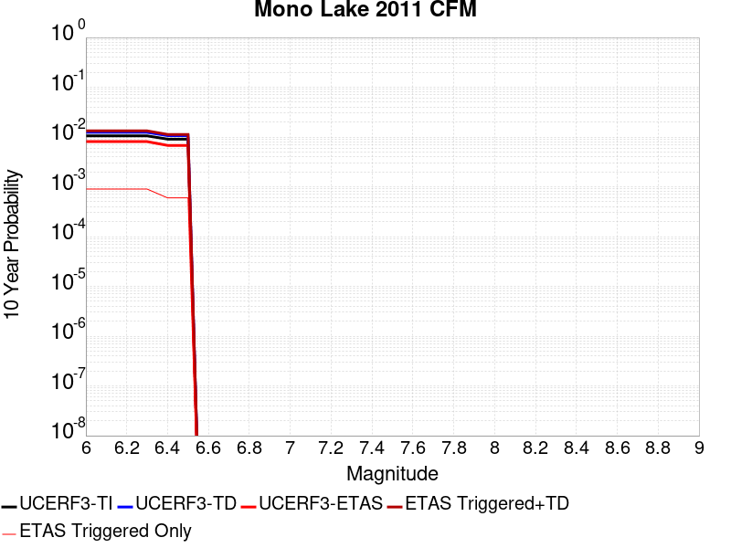 |

| Magnitude | 1 wk TI Prob | 1 wk TD Prob | 1 wk ETAS Prob | 1 wk ETAS/TD Gain | 1 wk ETAS Triggered+TD | 1 wk ETAS Triggered Only | 1 mo TI Prob | 1 mo TD Prob | 1 mo ETAS Prob | 1 mo ETAS/TD Gain | 1 mo ETAS Triggered+TD | 1 mo ETAS Triggered Only | 1 yr TI Prob | 1 yr TD Prob | 1 yr ETAS Prob | 1 yr ETAS/TD Gain | 1 yr ETAS Triggered+TD | 1 yr ETAS Triggered Only | 10 yr TI Prob | 10 yr TD Prob | 10 yr ETAS Prob | 10 yr ETAS/TD Gain | 10 yr ETAS Triggered+TD | 10 yr ETAS Triggered Only |
|-----|-----|-----|-----|-----|-----|-----|-----|-----|-----|-----|-----|-----|-----|-----|-----|-----|-----|-----|-----|-----|-----|-----|-----|-----|
| 6.0 | 2.0341662E-5 | 2.3836601E-5 | 0.0 | 0.0 | 2.3836601E-5 | 0.0 | 8.717564E-5 | 1.02155864E-4 | 0.0 | 0.0 | 1.02155864E-4 | 0.0 | 0.0010608466 | 0.0012435693 | 0.0 | 0.0 | 0.0012435693 | 0.0 | 0.010557966 | 0.012418213 | 9.0E-4 | 0.0724742 | 0.013307037 | 9.0E-4 |
| 6.1 | 2.0341662E-5 | 2.3836601E-5 | 0.0 | 0.0 | 2.3836601E-5 | 0.0 | 8.717564E-5 | 1.02155864E-4 | 0.0 | 0.0 | 1.02155864E-4 | 0.0 | 0.0010608466 | 0.0012435693 | 0.0 | 0.0 | 0.0012435693 | 0.0 | 0.010557966 | 0.012418213 | 9.0E-4 | 0.0724742 | 0.013307037 | 9.0E-4 |
| 6.2 | 2.0341662E-5 | 2.3836601E-5 | 0.0 | 0.0 | 2.3836601E-5 | 0.0 | 8.717564E-5 | 1.02155864E-4 | 0.0 | 0.0 | 1.02155864E-4 | 0.0 | 0.0010608466 | 0.0012435693 | 0.0 | 0.0 | 0.0012435693 | 0.0 | 0.010557966 | 0.012418213 | 9.0E-4 | 0.0724742 | 0.013307037 | 9.0E-4 |
| 6.3 | 2.0341662E-5 | 2.3836601E-5 | 0.0 | 0.0 | 2.3836601E-5 | 0.0 | 8.717564E-5 | 1.02155864E-4 | 0.0 | 0.0 | 1.02155864E-4 | 0.0 | 0.0010608466 | 0.0012435693 | 0.0 | 0.0 | 0.0012435693 | 0.0 | 0.010557966 | 0.012418213 | 9.0E-4 | 0.0724742 | 0.013307037 | 9.0E-4 |
| 6.4 | 1.749821E-5 | 2.0498228E-5 | 0.0 | 0.0 | 2.0498228E-5 | 0.0 | 7.499018E-5 | 8.784955E-5 | 0.0 | 0.0 | 8.784955E-5 | 0.0 | 9.1262296E-4 | 0.0010695679 | 0.0 | 0.0 | 0.0010695679 | 0.0 | 0.009088841 | 0.0106956335 | 6.0E-4 | 0.05609766 | 0.011289217 | 6.0E-4 |
| 6.5 | 1.749821E-5 | 2.0498228E-5 | 0.0 | 0.0 | 2.0498228E-5 | 0.0 | 7.499018E-5 | 8.784955E-5 | 0.0 | 0.0 | 8.784955E-5 | 0.0 | 9.1262296E-4 | 0.0010695679 | 0.0 | 0.0 | 0.0010695679 | 0.0 | 0.009088841 | 0.0106956335 | 6.0E-4 | 0.05609766 | 0.011289217 | 6.0E-4 |

## Bear River fault zone
*[(top)](#table-of-contents)*

| 1 Week | 1 Month | 1 Year | 10 Year |
|-----|-----|-----|-----|
|  |  |  |  |

| Magnitude | 1 wk TI Prob | 1 wk TD Prob | 1 wk ETAS Prob | 1 wk ETAS/TD Gain | 1 wk ETAS Triggered+TD | 1 wk ETAS Triggered Only | 1 mo TI Prob | 1 mo TD Prob | 1 mo ETAS Prob | 1 mo ETAS/TD Gain | 1 mo ETAS Triggered+TD | 1 mo ETAS Triggered Only | 1 yr TI Prob | 1 yr TD Prob | 1 yr ETAS Prob | 1 yr ETAS/TD Gain | 1 yr ETAS Triggered+TD | 1 yr ETAS Triggered Only | 10 yr TI Prob | 10 yr TD Prob | 10 yr ETAS Prob | 10 yr ETAS/TD Gain | 10 yr ETAS Triggered+TD | 10 yr ETAS Triggered Only |
|-----|-----|-----|-----|-----|-----|-----|-----|-----|-----|-----|-----|-----|-----|-----|-----|-----|-----|-----|-----|-----|-----|-----|-----|-----|
| 6.0 | 2.3773342E-5 | 2.6988197E-5 | 0.0 | 0.0 | 2.6988197E-5 | 0.0 | 1.0188177E-4 | 1.156591E-4 | 0.0 | 0.0 | 1.156591E-4 | 0.0 | 0.0012397047 | 0.0014073335 | 0.0 | 0.0 | 0.0014073335 | 0.0 | 0.012328116 | 0.013993624 | 9.0E-4 | 0.064315006 | 0.01488103 | 9.0E-4 |
| 6.1 | 2.3773342E-5 | 2.6988197E-5 | 0.0 | 0.0 | 2.6988197E-5 | 0.0 | 1.0188177E-4 | 1.156591E-4 | 0.0 | 0.0 | 1.156591E-4 | 0.0 | 0.0012397047 | 0.0014073335 | 0.0 | 0.0 | 0.0014073335 | 0.0 | 0.012328116 | 0.013993624 | 9.0E-4 | 0.064315006 | 0.01488103 | 9.0E-4 |
| 6.2 | 1.5973403E-5 | 1.8067005E-5 | 0.0 | 0.0 | 1.8067005E-5 | 0.0 | 6.845564E-5 | 7.742786E-5 | 0.0 | 0.0 | 7.742786E-5 | 0.0 | 8.3312875E-4 | 9.423001E-4 | 0.0 | 0.0 | 9.423001E-4 | 0.0 | 0.008300122 | 0.0093854405 | 8.0E-4 | 0.085238405 | 0.010177933 | 8.0E-4 |
| 6.3 | 1.5973403E-5 | 1.8067005E-5 | 0.0 | 0.0 | 1.8067005E-5 | 0.0 | 6.845564E-5 | 7.742786E-5 | 0.0 | 0.0 | 7.742786E-5 | 0.0 | 8.3312875E-4 | 9.423001E-4 | 0.0 | 0.0 | 9.423001E-4 | 0.0 | 0.008300122 | 0.0093854405 | 8.0E-4 | 0.085238405 | 0.010177933 | 8.0E-4 |
| 6.4 | 1.3027338E-5 | 1.474503E-5 | 0.0 | 0.0 | 1.474503E-5 | 0.0 | 5.5830256E-5 | 6.319153E-5 | 0.0 | 0.0 | 6.319153E-5 | 0.0 | 6.7952136E-4 | 7.6909916E-4 | 0.0 | 0.0 | 7.6909916E-4 | 0.0 | 0.0067744725 | 0.007665776 | 8.0E-4 | 0.10435995 | 0.008459643 | 8.0E-4 |
| 6.5 | 1.2489152E-5 | 1.4147573E-5 | 0.0 | 0.0 | 1.4147573E-5 | 0.0 | 5.352384E-5 | 6.0631122E-5 | 0.0 | 0.0 | 6.0631122E-5 | 0.0 | 6.514579E-4 | 7.379475E-4 | 0.0 | 0.0 | 7.379475E-4 | 0.0 | 0.0064955144 | 0.0073563466 | 8.0E-4 | 0.108749636 | 0.008150461 | 8.0E-4 |
| 6.6 | 1.1662849E-5 | 1.3231817E-5 | 0.0 | 0.0 | 1.3231817E-5 | 0.0 | 4.9982682E-5 | 5.6706627E-5 | 0.0 | 0.0 | 5.6706627E-5 | 0.0 | 6.083692E-4 | 6.9019746E-4 | 0.0 | 0.0 | 6.9019746E-4 | 0.0 | 0.006067064 | 0.006881839 | 7.0E-4 | 0.101716995 | 0.007577022 | 7.0E-4 |
| 6.7 | 1.0667623E-5 | 1.2131494E-5 | 0.0 | 0.0 | 1.2131494E-5 | 0.0 | 4.5717585E-5 | 5.199115E-5 | 0.0 | 0.0 | 5.199115E-5 | 0.0 | 5.5646943E-4 | 6.328202E-4 | 0.0 | 0.0 | 6.328202E-4 | 0.0 | 0.0055507803 | 0.006311364 | 7.0E-4 | 0.11091104 | 0.0070069465 | 7.0E-4 |
| 6.8 | 9.154534E-6 | 1.04624005E-5 | 0.0 | 0.0 | 1.04624005E-5 | 0.0 | 3.923313E-5 | 4.4838147E-5 | 0.0 | 0.0 | 4.4838147E-5 | 0.0 | 4.7755867E-4 | 5.4577825E-4 | 0.0 | 0.0 | 5.4577825E-4 | 0.0 | 0.004765337 | 0.005445426 | 7.0E-4 | 0.12854825 | 0.006141614 | 7.0E-4 |
| 6.9 | 7.68501E-6 | 8.848682E-6 | 0.0 | 0.0 | 8.848682E-6 | 0.0 | 3.2935342E-5 | 3.7922426E-5 | 0.0 | 0.0 | 3.7922426E-5 | 0.0 | 4.0091402E-4 | 4.6161705E-4 | 0.0 | 0.0 | 4.6161705E-4 | 0.0 | 0.004001915 | 0.004607504 | 6.0E-4 | 0.13022237 | 0.005204739 | 6.0E-4 |
| 7.0 | 5.7315733E-6 | 6.7060328E-6 | 0.0 | 0.0 | 6.7060328E-6 | 0.0 | 2.4563653E-5 | 2.8739847E-5 | 0.0 | 0.0 | 2.8739847E-5 | 0.0 | 2.9902143E-4 | 3.4985572E-4 | 0.0 | 0.0 | 3.4985572E-4 | 0.0 | 0.0029861939 | 0.0034934713 | 5.0E-4 | 0.14312412 | 0.0039917245 | 5.0E-4 |
| 7.1 | 5.566844E-6 | 6.514434E-6 | 0.0 | 0.0 | 6.514434E-6 | 0.0 | 2.3857683E-5 | 2.7918728E-5 | 0.0 | 0.0 | 2.7918728E-5 | 0.0 | 2.9042858E-4 | 3.3986176E-4 | 0.0 | 0.0 | 3.3986176E-4 | 0.0 | 0.002900493 | 0.0033938407 | 5.0E-4 | 0.14732571 | 0.003892144 | 5.0E-4 |
| 7.2 | 4.011353E-6 | 4.6762148E-6 | 0.0 | 0.0 | 4.6762148E-6 | 0.0 | 1.7191402E-5 | 2.0040785E-5 | 0.0 | 0.0 | 2.0040785E-5 | 0.0 | 2.0928521E-4 | 2.4397267E-4 | 0.0 | 0.0 | 2.4397267E-4 | 0.0 | 0.0020908823 | 0.0024373862 | 2.0E-4 | 0.082055114 | 0.0026368985 | 2.0E-4 |
| 7.3 | 2.0974871E-6 | 2.4404105E-6 | 0.0 | 0.0 | 2.4404105E-6 | 0.0 | 8.989199E-6 | 1.0458874E-5 | 0.0 | 0.0 | 1.0458874E-5 | 0.0 | 1.09438006E-4 | 1.2733186E-4 | 0.0 | 0.0 | 1.2733186E-4 | 0.0 | 0.0010938413 | 0.0012728344 | 0.0 | 0.0 | 0.0012728344 | 0.0 |

## Hosgri
*[(top)](#table-of-contents)*

| 1 Week | 1 Month | 1 Year | 10 Year |
|-----|-----|-----|-----|
|  |  |  |  |

| Magnitude | 1 wk TI Prob | 1 wk TD Prob | 1 wk ETAS Prob | 1 wk ETAS/TD Gain | 1 wk ETAS Triggered+TD | 1 wk ETAS Triggered Only | 1 mo TI Prob | 1 mo TD Prob | 1 mo ETAS Prob | 1 mo ETAS/TD Gain | 1 mo ETAS Triggered+TD | 1 mo ETAS Triggered Only | 1 yr TI Prob | 1 yr TD Prob | 1 yr ETAS Prob | 1 yr ETAS/TD Gain | 1 yr ETAS Triggered+TD | 1 yr ETAS Triggered Only | 10 yr TI Prob | 10 yr TD Prob | 10 yr ETAS Prob | 10 yr ETAS/TD Gain | 10 yr ETAS Triggered+TD | 10 yr ETAS Triggered Only |
|-----|-----|-----|-----|-----|-----|-----|-----|-----|-----|-----|-----|-----|-----|-----|-----|-----|-----|-----|-----|-----|-----|-----|-----|-----|
| 6.0 | 2.883978E-5 | 2.9132376E-5 | 0.0 | 0.0 | 2.9132376E-5 | 0.0 | 1.235932E-4 | 1.2484721E-4 | 0.0 | 0.0 | 1.2484721E-4 | 0.0 | 0.0015037085 | 0.0015189822 | 0.0 | 0.0 | 0.0015189822 | 0.0 | 0.01493574 | 0.015089778 | 9.0E-4 | 0.059643026 | 0.015976198 | 9.0E-4 |
| 6.1 | 2.883978E-5 | 2.9132376E-5 | 0.0 | 0.0 | 2.9132376E-5 | 0.0 | 1.235932E-4 | 1.2484721E-4 | 0.0 | 0.0 | 1.2484721E-4 | 0.0 | 0.0015037085 | 0.0015189822 | 0.0 | 0.0 | 0.0015189822 | 0.0 | 0.01493574 | 0.015089778 | 9.0E-4 | 0.059643026 | 0.015976198 | 9.0E-4 |
| 6.2 | 2.883978E-5 | 2.9132376E-5 | 0.0 | 0.0 | 2.9132376E-5 | 0.0 | 1.235932E-4 | 1.2484721E-4 | 0.0 | 0.0 | 1.2484721E-4 | 0.0 | 0.0015037085 | 0.0015189822 | 0.0 | 0.0 | 0.0015189822 | 0.0 | 0.01493574 | 0.015089778 | 9.0E-4 | 0.059643026 | 0.015976198 | 9.0E-4 |
| 6.3 | 2.2914428E-5 | 2.264466E-5 | 0.0 | 0.0 | 2.264466E-5 | 0.0 | 9.8200995E-5 | 9.7044955E-5 | 0.0 | 0.0 | 9.7044955E-5 | 0.0 | 0.0011949413 | 0.0011808869 | 0.0 | 0.0 | 0.0011808869 | 0.0 | 0.011885363 | 0.011747522 | 6.0E-4 | 0.051074598 | 0.012340474 | 6.0E-4 |
| 6.4 | 2.0195741E-5 | 1.9698742E-5 | 0.0 | 0.0 | 1.9698742E-5 | 0.0 | 8.65503E-5 | 8.442046E-5 | 0.0 | 0.0 | 8.442046E-5 | 0.0 | 0.0010532405 | 0.0010273365 | 0.0 | 0.0 | 0.0010273365 | 0.0 | 0.010482626 | 0.010226922 | 4.0E-4 | 0.039112452 | 0.010622831 | 4.0E-4 |
| 6.5 | 1.9924333E-5 | 1.9411127E-5 | 0.0 | 0.0 | 1.9411127E-5 | 0.0 | 8.53872E-5 | 8.31879E-5 | 0.0 | 0.0 | 8.31879E-5 | 0.0 | 0.0010390934 | 0.001012344 | 0.0 | 0.0 | 0.001012344 | 0.0 | 0.010342481 | 0.010078364 | 4.0E-4 | 0.039688982 | 0.010474333 | 4.0E-4 |
| 6.6 | 1.809694E-5 | 1.7460165E-5 | 0.0 | 0.0 | 1.7460165E-5 | 0.0 | 7.7556004E-5 | 7.4827134E-5 | 0.0 | 0.0 | 7.4827134E-5 | 0.0 | 9.438353E-4 | 9.106409E-4 | 0.0 | 0.0 | 9.106409E-4 | 0.0 | 0.009398366 | 0.009070039 | 3.0E-4 | 0.033075932 | 0.009367318 | 3.0E-4 |
| 6.7 | 1.675989E-5 | 1.604444E-5 | 0.0 | 0.0 | 1.604444E-5 | 0.0 | 7.182612E-5 | 6.8760084E-5 | 0.0 | 0.0 | 6.8760084E-5 | 0.0 | 8.7413215E-4 | 8.3683355E-4 | 0.0 | 0.0 | 8.3683355E-4 | 0.0 | 0.008707017 | 0.008337732 | 3.0E-4 | 0.035981007 | 0.008635231 | 3.0E-4 |
| 6.8 | 1.5401129E-5 | 1.4615573E-5 | 0.0 | 0.0 | 1.4615573E-5 | 0.0 | 6.6003166E-5 | 6.263667E-5 | 0.0 | 0.0 | 6.263667E-5 | 0.0 | 8.032922E-4 | 7.623355E-4 | 0.0 | 0.0 | 7.623355E-4 | 0.0 | 0.008003947 | 0.0075980704 | 3.0E-4 | 0.03948371 | 0.007895791 | 3.0E-4 |
| 6.9 | 1.356559E-5 | 1.2691212E-5 | 0.0 | 0.0 | 1.2691212E-5 | 0.0 | 5.8136946E-5 | 5.4389777E-5 | 0.0 | 0.0 | 5.4389777E-5 | 0.0 | 7.0758746E-4 | 6.619948E-4 | 0.0 | 0.0 | 6.619948E-4 | 0.0 | 0.007053386 | 0.006601035 | 1.0E-4 | 0.015149139 | 0.006700375 | 1.0E-4 |
| 7.0 | 1.2030819E-5 | 1.1097019E-5 | 0.0 | 0.0 | 1.1097019E-5 | 0.0 | 5.155963E-5 | 4.7557784E-5 | 0.0 | 0.0 | 4.7557784E-5 | 0.0 | 6.275577E-4 | 5.788623E-4 | 0.0 | 0.0 | 5.788623E-4 | 0.0 | 0.006257884 | 0.005774308 | 1.0E-4 | 0.017318092 | 0.0058737304 | 1.0E-4 |
| 7.1 | 1.0972698E-5 | 1.0023136E-5 | 0.0 | 0.0 | 1.0023136E-5 | 0.0 | 4.7025E-5 | 4.295559E-5 | 0.0 | 0.0 | 4.295559E-5 | 0.0 | 5.72379E-4 | 5.2285887E-4 | 0.0 | 0.0 | 5.2285887E-4 | 0.0 | 0.0057090693 | 0.0052170414 | 1.0E-4 | 0.019167952 | 0.0053165196 | 1.0E-4 |
| 7.2 | 9.961926E-6 | 9.035639E-6 | 0.0 | 0.0 | 9.035639E-6 | 0.0 | 4.2693267E-5 | 3.8723592E-5 | 0.0 | 0.0 | 3.8723592E-5 | 0.0 | 5.1966653E-4 | 4.7135778E-4 | 0.0 | 0.0 | 4.7135778E-4 | 0.0 | 0.00518453 | 0.0047043287 | 1.0E-4 | 0.021257019 | 0.004803858 | 1.0E-4 |
| 7.3 | 8.700929E-6 | 7.828925E-6 | 0.0 | 0.0 | 7.828925E-6 | 0.0 | 3.7289166E-5 | 3.3552104E-5 | 0.0 | 0.0 | 3.3552104E-5 | 0.0 | 4.53901E-4 | 4.084203E-4 | 0.0 | 0.0 | 4.084203E-4 | 0.0 | 0.00452975 | 0.0040774387 | 1.0E-4 | 0.0245252 | 0.004177031 | 1.0E-4 |
| 7.4 | 7.866285E-6 | 6.999472E-6 | 0.0 | 0.0 | 6.999472E-6 | 0.0 | 3.3712215E-5 | 2.9997393E-5 | 0.0 | 0.0 | 2.9997393E-5 | 0.0 | 4.103689E-4 | 3.651571E-4 | 0.0 | 0.0 | 3.651571E-4 | 0.0 | 0.004096119 | 0.0036463102 | 1.0E-4 | 0.027424984 | 0.0037459456 | 1.0E-4 |
| 7.5 | 6.8381305E-6 | 5.960348E-6 | 0.0 | 0.0 | 5.960348E-6 | 0.0 | 2.9305946E-5 | 2.55441E-5 | 0.0 | 0.0 | 2.55441E-5 | 0.0 | 3.5674145E-4 | 3.1095505E-4 | 0.0 | 0.0 | 3.1095505E-4 | 0.0 | 0.0035616932 | 0.0031059363 | 1.0E-4 | 0.03219641 | 0.0032056258 | 1.0E-4 |
| 7.6 | 5.503376E-6 | 4.595782E-6 | 0.0 | 0.0 | 4.595782E-6 | 0.0 | 2.3585684E-5 | 1.969606E-5 | 0.0 | 0.0 | 1.969606E-5 | 0.0 | 2.8711787E-4 | 2.3977314E-4 | 0.0 | 0.0 | 2.3977314E-4 | 0.0 | 0.002867472 | 0.0023958797 | 1.0E-4 | 0.041738324 | 0.00249564 | 1.0E-4 |
| 7.7 | 3.6144982E-6 | 2.652537E-6 | 0.0 | 0.0 | 2.652537E-6 | 0.0 | 1.5490614E-5 | 1.1367965E-5 | 0.0 | 0.0 | 1.1367965E-5 | 0.0 | 1.8858191E-4 | 1.383962E-4 | 0.0 | 0.0 | 1.383962E-4 | 0.0 | 0.0018842196 | 0.0013838334 | 1.0E-4 | 0.07226303 | 0.001483695 | 1.0E-4 |
| 7.8 | 1.9853494E-6 | 1.1362597E-6 | 0.0 | 0.0 | 1.1362597E-6 | 0.0 | 8.508612E-6 | 4.869675E-6 | 0.0 | 0.0 | 4.869675E-6 | 0.0 | 1.0358743E-4 | 5.928668E-5 | 0.0 | 0.0 | 5.928668E-5 | 0.0 | 0.0010353916 | 5.9344235E-4 | 1.0E-4 | 0.16850837 | 6.93383E-4 | 1.0E-4 |
| 7.9 | 1.1818757E-6 | 5.2956636E-7 | 0.0 | 0.0 | 5.2956636E-7 | 0.0 | 5.0651715E-6 | 2.2695679E-6 | 0.0 | 0.0 | 2.2695679E-6 | 0.0 | 6.1666724E-5 | 2.763164E-5 | 0.0 | 0.0 | 2.763164E-5 | 0.0 | 6.1649614E-4 | 2.7696206E-4 | 1.0E-4 | 0.36106026 | 3.7693436E-4 | 1.0E-4 |
| 8.0 | 6.962958E-7 | 2.7143403E-7 | 0.0 | 0.0 | 2.7143403E-7 | 0.0 | 2.9841215E-6 | 1.1632882E-6 | 0.0 | 0.0 | 1.1632882E-6 | 0.0 | 3.6331072E-5 | 1.4162941E-5 | 0.0 | 0.0 | 1.4162941E-5 | 0.0 | 3.6325134E-4 | 1.4218516E-4 | 1.0E-4 | 0.7033082 | 2.4217095E-4 | 1.0E-4 |
| 8.1 | 1.5033264E-7 | 6.527341E-8 | 0.0 | 0.0 | 6.527341E-8 | 0.0 | 6.442826E-7 | 2.7974318E-7 | 0.0 | 0.0 | 2.7974318E-7 | 0.0 | 7.844113E-6 | 3.405868E-6 | 0.0 | 0.0 | 3.405868E-6 | 0.0 | 7.843835E-5 | 3.407332E-5 | 0.0 | 0.0 | 3.407332E-5 | 0.0 |

## Homestead Valley 2011
*[(top)](#table-of-contents)*

| 1 Week | 1 Month | 1 Year | 10 Year |
|-----|-----|-----|-----|
|  |  |  |  |

| Magnitude | 1 wk TI Prob | 1 wk TD Prob | 1 wk ETAS Prob | 1 wk ETAS/TD Gain | 1 wk ETAS Triggered+TD | 1 wk ETAS Triggered Only | 1 mo TI Prob | 1 mo TD Prob | 1 mo ETAS Prob | 1 mo ETAS/TD Gain | 1 mo ETAS Triggered+TD | 1 mo ETAS Triggered Only | 1 yr TI Prob | 1 yr TD Prob | 1 yr ETAS Prob | 1 yr ETAS/TD Gain | 1 yr ETAS Triggered+TD | 1 yr ETAS Triggered Only | 10 yr TI Prob | 10 yr TD Prob | 10 yr ETAS Prob | 10 yr ETAS/TD Gain | 10 yr ETAS Triggered+TD | 10 yr ETAS Triggered Only |
|-----|-----|-----|-----|-----|-----|-----|-----|-----|-----|-----|-----|-----|-----|-----|-----|-----|-----|-----|-----|-----|-----|-----|-----|-----|
| 6.0 | 1.539795E-5 | 6.286866E-6 | 0.0 | 0.0 | 6.286866E-6 | 0.0 | 6.5989545E-5 | 2.694355E-5 | 0.0 | 0.0 | 2.694355E-5 | 0.0 | 8.0312655E-4 | 3.2800896E-4 | 1.0E-4 | 0.30486974 | 4.2797613E-4 | 1.0E-4 | 0.008002302 | 0.0032772697 | 9.0E-4 | 0.27461886 | 0.00417432 | 9.0E-4 |
| 6.1 | 1.539795E-5 | 6.286866E-6 | 0.0 | 0.0 | 6.286866E-6 | 0.0 | 6.5989545E-5 | 2.694355E-5 | 0.0 | 0.0 | 2.694355E-5 | 0.0 | 8.0312655E-4 | 3.2800896E-4 | 1.0E-4 | 0.30486974 | 4.2797613E-4 | 1.0E-4 | 0.008002302 | 0.0032772697 | 9.0E-4 | 0.27461886 | 0.00417432 | 9.0E-4 |
| 6.2 | 1.539795E-5 | 6.286866E-6 | 0.0 | 0.0 | 6.286866E-6 | 0.0 | 6.5989545E-5 | 2.694355E-5 | 0.0 | 0.0 | 2.694355E-5 | 0.0 | 8.0312655E-4 | 3.2800896E-4 | 1.0E-4 | 0.30486974 | 4.2797613E-4 | 1.0E-4 | 0.008002302 | 0.0032772697 | 9.0E-4 | 0.27461886 | 0.00417432 | 9.0E-4 |
| 6.3 | 1.539795E-5 | 6.286866E-6 | 0.0 | 0.0 | 6.286866E-6 | 0.0 | 6.5989545E-5 | 2.694355E-5 | 0.0 | 0.0 | 2.694355E-5 | 0.0 | 8.0312655E-4 | 3.2800896E-4 | 1.0E-4 | 0.30486974 | 4.2797613E-4 | 1.0E-4 | 0.008002302 | 0.0032772697 | 9.0E-4 | 0.27461886 | 0.00417432 | 9.0E-4 |
| 6.4 | 1.539795E-5 | 6.286866E-6 | 0.0 | 0.0 | 6.286866E-6 | 0.0 | 6.5989545E-5 | 2.694355E-5 | 0.0 | 0.0 | 2.694355E-5 | 0.0 | 8.0312655E-4 | 3.2800896E-4 | 1.0E-4 | 0.30486974 | 4.2797613E-4 | 1.0E-4 | 0.008002302 | 0.0032772697 | 9.0E-4 | 0.27461886 | 0.00417432 | 9.0E-4 |
| 6.5 | 1.0265258E-5 | 2.8785744E-6 | 0.0 | 0.0 | 2.8785744E-6 | 0.0 | 4.3993223E-5 | 1.2336728E-5 | 0.0 | 0.0 | 1.2336728E-5 | 0.0 | 5.3548586E-4 | 1.5019627E-4 | 0.0 | 0.0 | 1.5019627E-4 | 0.0 | 0.005341973 | 0.0015016296 | 2.0E-4 | 0.13318864 | 0.0017013293 | 2.0E-4 |
| 6.6 | 6.664671E-6 | 5.3427266E-7 | 0.0 | 0.0 | 5.3427266E-7 | 0.0 | 2.8562565E-5 | 2.2897384E-6 | 0.0 | 0.0 | 2.2897384E-6 | 0.0 | 3.476937E-4 | 2.7877328E-5 | 0.0 | 0.0 | 2.7877328E-5 | 0.0 | 0.003471502 | 2.7874994E-4 | 0.0 | 0.0 | 2.7874994E-4 | 0.0 |
| 6.7 | 6.5954046E-6 | 5.3427266E-7 | 0.0 | 0.0 | 5.3427266E-7 | 0.0 | 2.8265715E-5 | 2.2897384E-6 | 0.0 | 0.0 | 2.2897384E-6 | 0.0 | 3.4408073E-4 | 2.7877328E-5 | 0.0 | 0.0 | 2.7877328E-5 | 0.0 | 0.0034354846 | 2.7874994E-4 | 0.0 | 0.0 | 2.7874994E-4 | 0.0 |
| 6.8 | 4.648189E-6 | 2.3245913E-7 | 0.0 | 0.0 | 2.3245913E-7 | 0.0 | 1.9920659E-5 | 9.962531E-7 | 0.0 | 0.0 | 9.962531E-7 | 0.0 | 2.4250703E-4 | 1.2129319E-5 | 0.0 | 0.0 | 1.2129319E-5 | 0.0 | 0.0024224254 | 1.2128704E-4 | 0.0 | 0.0 | 1.2128704E-4 | 0.0 |
| 6.9 | 4.1428534E-6 | 1.9331452E-7 | 0.0 | 0.0 | 1.9331452E-7 | 0.0 | 1.7754966E-5 | 8.2849056E-7 | 0.0 | 0.0 | 8.2849056E-7 | 0.0 | 2.1614527E-4 | 1.0086829E-5 | 0.0 | 0.0 | 1.0086829E-5 | 0.0 | 0.0021593515 | 1.0086401E-4 | 0.0 | 0.0 | 1.0086401E-4 | 0.0 |
| 7.0 | 3.0673707E-6 | 1.5358722E-7 | 0.0 | 0.0 | 1.5358722E-7 | 0.0 | 1.3145808E-5 | 6.582308E-7 | 0.0 | 0.0 | 6.582308E-7 | 0.0 | 1.6003846E-4 | 8.013932E-6 | 0.0 | 0.0 | 8.013932E-6 | 0.0 | 0.0015992324 | 8.013653E-5 | 0.0 | 0.0 | 8.013653E-5 | 0.0 |
| 7.1 | 2.340854E-6 | 1.4679391E-7 | 0.0 | 0.0 | 1.4679391E-7 | 0.0 | 1.0032193E-5 | 6.291166E-7 | 0.0 | 0.0 | 6.291166E-7 | 0.0 | 1.221351E-4 | 7.659469E-6 | 0.0 | 0.0 | 7.659469E-6 | 0.0 | 0.00122068 | 7.659214E-5 | 0.0 | 0.0 | 7.659214E-5 | 0.0 |
| 7.2 | 1.3754182E-6 | 1.3915253E-7 | 0.0 | 0.0 | 1.3915253E-7 | 0.0 | 5.8946357E-6 | 5.963679E-7 | 0.0 | 0.0 | 5.963679E-7 | 0.0 | 7.176483E-5 | 7.260756E-6 | 0.0 | 0.0 | 7.260756E-6 | 0.0 | 7.174166E-4 | 7.2605275E-5 | 0.0 | 0.0 | 7.2605275E-5 | 0.0 |
| 7.3 | 1.2573237E-6 | 1.3819877E-7 | 0.0 | 0.0 | 1.3819877E-7 | 0.0 | 5.388519E-6 | 5.9228034E-7 | 0.0 | 0.0 | 5.9228034E-7 | 0.0 | 6.560324E-5 | 7.21099E-6 | 0.0 | 0.0 | 7.21099E-6 | 0.0 | 6.558388E-4 | 7.210765E-5 | 0.0 | 0.0 | 7.210765E-5 | 0.0 |
| 7.4 | 1.0994207E-6 | 1.3099377E-7 | 0.0 | 0.0 | 1.3099377E-7 | 0.0 | 4.7117946E-6 | 5.6140175E-7 | 0.0 | 0.0 | 5.6140175E-7 | 0.0 | 5.736459E-5 | 6.835046E-6 | 0.0 | 0.0 | 6.835046E-6 | 0.0 | 5.734978E-4 | 6.834845E-5 | 0.0 | 0.0 | 6.834845E-5 | 0.0 |
| 7.5 | 5.5569126E-7 | 6.769257E-8 | 0.0 | 0.0 | 6.769257E-8 | 0.0 | 2.3815317E-6 | 2.9011096E-7 | 0.0 | 0.0 | 2.9011096E-7 | 0.0 | 2.8994764E-5 | 3.5320961E-6 | 0.0 | 0.0 | 3.5320961E-6 | 0.0 | 2.899098E-4 | 3.5320463E-5 | 0.0 | 0.0 | 3.5320463E-5 | 0.0 |

## Palos Verdes
*[(top)](#table-of-contents)*

| 1 Week | 1 Month | 1 Year | 10 Year |
|-----|-----|-----|-----|
|  |  |  |  |

| Magnitude | 1 wk TI Prob | 1 wk TD Prob | 1 wk ETAS Prob | 1 wk ETAS/TD Gain | 1 wk ETAS Triggered+TD | 1 wk ETAS Triggered Only | 1 mo TI Prob | 1 mo TD Prob | 1 mo ETAS Prob | 1 mo ETAS/TD Gain | 1 mo ETAS Triggered+TD | 1 mo ETAS Triggered Only | 1 yr TI Prob | 1 yr TD Prob | 1 yr ETAS Prob | 1 yr ETAS/TD Gain | 1 yr ETAS Triggered+TD | 1 yr ETAS Triggered Only | 10 yr TI Prob | 10 yr TD Prob | 10 yr ETAS Prob | 10 yr ETAS/TD Gain | 10 yr ETAS Triggered+TD | 10 yr ETAS Triggered Only |
|-----|-----|-----|-----|-----|-----|-----|-----|-----|-----|-----|-----|-----|-----|-----|-----|-----|-----|-----|-----|-----|-----|-----|-----|-----|
| 6.0 | 6.126063E-5 | 7.626379E-5 | 0.0 | 0.0 | 7.626379E-5 | 0.0 | 2.6251914E-4 | 3.268072E-4 | 0.0 | 0.0 | 3.268072E-4 | 0.0 | 0.0031914865 | 0.0039721546 | 0.0 | 0.0 | 0.0039721546 | 0.0 | 0.031460393 | 0.039068162 | 8.0E-4 | 0.020477032 | 0.039836906 | 8.0E-4 |
| 6.1 | 6.126063E-5 | 7.626379E-5 | 0.0 | 0.0 | 7.626379E-5 | 0.0 | 2.6251914E-4 | 3.268072E-4 | 0.0 | 0.0 | 3.268072E-4 | 0.0 | 0.0031914865 | 0.0039721546 | 0.0 | 0.0 | 0.0039721546 | 0.0 | 0.031460393 | 0.039068162 | 8.0E-4 | 0.020477032 | 0.039836906 | 8.0E-4 |
| 6.2 | 6.126063E-5 | 7.626379E-5 | 0.0 | 0.0 | 7.626379E-5 | 0.0 | 2.6251914E-4 | 3.268072E-4 | 0.0 | 0.0 | 3.268072E-4 | 0.0 | 0.0031914865 | 0.0039721546 | 0.0 | 0.0 | 0.0039721546 | 0.0 | 0.031460393 | 0.039068162 | 8.0E-4 | 0.020477032 | 0.039836906 | 8.0E-4 |
| 6.3 | 4.0838047E-5 | 4.9771388E-5 | 0.0 | 0.0 | 4.9771388E-5 | 0.0 | 1.7500846E-4 | 2.132898E-4 | 0.0 | 0.0 | 2.132898E-4 | 0.0 | 0.0021286458 | 0.0025939206 | 0.0 | 0.0 | 0.0025939206 | 0.0 | 0.021083709 | 0.025658133 | 6.0E-4 | 0.0233844 | 0.026242737 | 6.0E-4 |
| 6.4 | 4.0838047E-5 | 4.9771388E-5 | 0.0 | 0.0 | 4.9771388E-5 | 0.0 | 1.7500846E-4 | 2.132898E-4 | 0.0 | 0.0 | 2.132898E-4 | 0.0 | 0.0021286458 | 0.0025939206 | 0.0 | 0.0 | 0.0025939206 | 0.0 | 0.021083709 | 0.025658133 | 6.0E-4 | 0.0233844 | 0.026242737 | 6.0E-4 |
| 6.5 | 3.0512005E-5 | 3.6576617E-5 | 0.0 | 0.0 | 3.6576617E-5 | 0.0 | 1.3075917E-4 | 1.567482E-4 | 0.0 | 0.0 | 1.567482E-4 | 0.0 | 0.0015908304 | 0.001906855 | 0.0 | 0.0 | 0.001906855 | 0.0 | 0.015794903 | 0.018916871 | 6.0E-4 | 0.031717718 | 0.019505521 | 6.0E-4 |
| 6.6 | 2.9255087E-5 | 3.516907E-5 | 0.0 | 0.0 | 3.516907E-5 | 0.0 | 1.2537291E-4 | 1.5071653E-4 | 0.0 | 0.0 | 1.5071653E-4 | 0.0 | 0.0015253464 | 0.0018335432 | 0.0 | 0.0 | 0.0018335432 | 0.0 | 0.015149189 | 0.01819577 | 6.0E-4 | 0.032974694 | 0.018784855 | 6.0E-4 |
| 6.7 | 2.287198E-5 | 2.7259108E-5 | 0.0 | 0.0 | 2.7259108E-5 | 0.0 | 9.801909E-5 | 1.1682003E-4 | 0.0 | 0.0 | 1.1682003E-4 | 0.0 | 0.001192729 | 0.0014214477 | 0.0 | 0.0 | 0.0014214477 | 0.0 | 0.011863477 | 0.014132796 | 5.0E-4 | 0.035378702 | 0.01462573 | 5.0E-4 |
| 6.8 | 2.1325764E-5 | 2.5442045E-5 | 0.0 | 0.0 | 2.5442045E-5 | 0.0 | 9.139293E-5 | 1.0903329E-4 | 0.0 | 0.0 | 1.0903329E-4 | 0.0 | 0.001112141 | 0.0013267621 | 0.0 | 0.0 | 0.0013267621 | 0.0 | 0.011065915 | 0.013197455 | 5.0E-4 | 0.037886094 | 0.013690855 | 5.0E-4 |
| 6.9 | 1.9009392E-5 | 2.2622457E-5 | 0.0 | 0.0 | 2.2622457E-5 | 0.0 | 8.1466285E-5 | 9.695027E-5 | 0.0 | 0.0 | 9.695027E-5 | 0.0 | 9.914007E-4 | 0.0011798178 | 0.0 | 0.0 | 0.0011798178 | 0.0 | 0.009869894 | 0.011744234 | 4.0E-4 | 0.034059267 | 0.012139536 | 4.0E-4 |
| 7.0 | 1.7098473E-5 | 2.0327316E-5 | 0.0 | 0.0 | 2.0327316E-5 | 0.0 | 7.3277115E-5 | 8.711463E-5 | 0.0 | 0.0 | 8.711463E-5 | 0.0 | 8.917837E-4 | 0.0010601899 | 0.0 | 0.0 | 0.0010601899 | 0.0 | 0.008882134 | 0.010559764 | 4.0E-4 | 0.037879635 | 0.0109555395 | 4.0E-4 |
| 7.1 | 1.5982785E-5 | 1.9002204E-5 | 0.0 | 0.0 | 1.9002204E-5 | 0.0 | 6.849585E-5 | 8.143596E-5 | 0.0 | 0.0 | 8.143596E-5 | 0.0 | 8.336179E-4 | 9.911165E-4 | 0.0 | 0.0 | 9.911165E-4 | 0.0 | 0.008304977 | 0.009875333 | 4.0E-4 | 0.040504962 | 0.010271383 | 4.0E-4 |
| 7.2 | 1.4468002E-5 | 1.7203985E-5 | 0.0 | 0.0 | 1.7203985E-5 | 0.0 | 6.200425E-5 | 7.372976E-5 | 0.0 | 0.0 | 7.372976E-5 | 0.0 | 7.546402E-4 | 8.973742E-4 | 0.0 | 0.0 | 8.973742E-4 | 0.0 | 0.007520827 | 0.008945782 | 3.0E-4 | 0.033535358 | 0.009243098 | 3.0E-4 |
| 7.3 | 5.288233E-6 | 6.2059435E-6 | 0.0 | 0.0 | 6.2059435E-6 | 0.0 | 2.2663658E-5 | 2.6596825E-5 | 0.0 | 0.0 | 2.6596825E-5 | 0.0 | 2.7589512E-4 | 3.2380316E-4 | 0.0 | 0.0 | 3.2380316E-4 | 0.0 | 0.0027555283 | 0.0032367392 | 1.0E-4 | 0.03089529 | 0.0033364156 | 1.0E-4 |
| 7.4 | 8.279556E-7 | 8.408616E-7 | 0.0 | 0.0 | 8.408616E-7 | 0.0 | 3.5483763E-6 | 3.603688E-6 | 0.0 | 0.0 | 3.603688E-6 | 0.0 | 4.3200624E-5 | 4.387409E-5 | 0.0 | 0.0 | 4.387409E-5 | 0.0 | 4.3192226E-4 | 4.3866152E-4 | 0.0 | 0.0 | 4.3866152E-4 | 0.0 |
| 7.5 | 6.559831E-7 | 6.6674534E-7 | 0.0 | 0.0 | 6.6674534E-7 | 0.0 | 2.8113532E-6 | 2.8574773E-6 | 0.0 | 0.0 | 2.8574773E-6 | 0.0 | 3.4227687E-5 | 3.47893E-5 | 0.0 | 0.0 | 3.47893E-5 | 0.0 | 3.4222414E-4 | 3.4784517E-4 | 0.0 | 0.0 | 3.4784517E-4 | 0.0 |
| 7.6 | 3.5018968E-7 | 3.5621287E-7 | 0.0 | 0.0 | 3.5621287E-7 | 0.0 | 1.500812E-6 | 1.526626E-6 | 0.0 | 0.0 | 1.526626E-6 | 0.0 | 1.8272232E-5 | 1.858656E-5 | 0.0 | 0.0 | 1.858656E-5 | 0.0 | 1.8270731E-4 | 1.8585465E-4 | 0.0 | 0.0 | 1.8585465E-4 | 0.0 |
| 7.7 | 1.1986104E-7 | 1.2198822E-7 | 0.0 | 0.0 | 1.2198822E-7 | 0.0 | 5.1369005E-7 | 5.2280654E-7 | 0.0 | 0.0 | 5.2280654E-7 | 0.0 | 6.2541585E-6 | 6.3651514E-6 | 0.0 | 0.0 | 6.3651514E-6 | 0.0 | 6.2539824E-5 | 6.364973E-5 | 0.0 | 0.0 | 6.364973E-5 | 0.0 |
| 7.8 | 3.0445005E-8 | 3.1028808E-8 | 0.0 | 0.0 | 3.1028808E-8 | 0.0 | 1.3047858E-7 | 1.3298059E-7 | 0.0 | 0.0 | 1.3298059E-7 | 0.0 | 1.5885756E-6 | 1.6190377E-6 | 0.0 | 0.0 | 1.6190377E-6 | 0.0 | 1.5885644E-5 | 1.619028E-5 | 0.0 | 0.0 | 1.619028E-5 | 0.0 |

## Elsinore (Temecula) rev
*[(top)](#table-of-contents)*

| 1 Week | 1 Month | 1 Year | 10 Year |
|-----|-----|-----|-----|
|  |  |  |  |

| Magnitude | 1 wk TI Prob | 1 wk TD Prob | 1 wk ETAS Prob | 1 wk ETAS/TD Gain | 1 wk ETAS Triggered+TD | 1 wk ETAS Triggered Only | 1 mo TI Prob | 1 mo TD Prob | 1 mo ETAS Prob | 1 mo ETAS/TD Gain | 1 mo ETAS Triggered+TD | 1 mo ETAS Triggered Only | 1 yr TI Prob | 1 yr TD Prob | 1 yr ETAS Prob | 1 yr ETAS/TD Gain | 1 yr ETAS Triggered+TD | 1 yr ETAS Triggered Only | 10 yr TI Prob | 10 yr TD Prob | 10 yr ETAS Prob | 10 yr ETAS/TD Gain | 10 yr ETAS Triggered+TD | 10 yr ETAS Triggered Only |
|-----|-----|-----|-----|-----|-----|-----|-----|-----|-----|-----|-----|-----|-----|-----|-----|-----|-----|-----|-----|-----|-----|-----|-----|-----|
| 6.0 | 2.9514995E-5 | 2.2532806E-5 | 0.0 | 0.0 | 2.2532806E-5 | 0.0 | 1.264867E-4 | 9.656571E-5 | 0.0 | 0.0 | 9.656571E-5 | 0.0 | 0.0015388876 | 0.0011750754 | 0.0 | 0.0 | 0.0011750754 | 0.0 | 0.015282745 | 0.01172293 | 8.0E-4 | 0.06824233 | 0.012513551 | 8.0E-4 |
| 6.1 | 2.9514995E-5 | 2.2532806E-5 | 0.0 | 0.0 | 2.2532806E-5 | 0.0 | 1.264867E-4 | 9.656571E-5 | 0.0 | 0.0 | 9.656571E-5 | 0.0 | 0.0015388876 | 0.0011750754 | 0.0 | 0.0 | 0.0011750754 | 0.0 | 0.015282745 | 0.01172293 | 8.0E-4 | 0.06824233 | 0.012513551 | 8.0E-4 |
| 6.2 | 2.9514995E-5 | 2.2532806E-5 | 0.0 | 0.0 | 2.2532806E-5 | 0.0 | 1.264867E-4 | 9.656571E-5 | 0.0 | 0.0 | 9.656571E-5 | 0.0 | 0.0015388876 | 0.0011750754 | 0.0 | 0.0 | 0.0011750754 | 0.0 | 0.015282745 | 0.01172293 | 8.0E-4 | 0.06824233 | 0.012513551 | 8.0E-4 |
| 6.3 | 2.3223649E-5 | 1.8419245E-5 | 0.0 | 0.0 | 1.8419245E-5 | 0.0 | 9.952613E-5 | 7.893732E-5 | 0.0 | 0.0 | 7.893732E-5 | 0.0 | 0.001211057 | 9.606554E-4 | 0.0 | 0.0 | 9.606554E-4 | 0.0 | 0.012044783 | 0.0095795 | 7.0E-4 | 0.0730727 | 0.010272794 | 7.0E-4 |
| 6.4 | 2.3223649E-5 | 1.8419245E-5 | 0.0 | 0.0 | 1.8419245E-5 | 0.0 | 9.952613E-5 | 7.893732E-5 | 0.0 | 0.0 | 7.893732E-5 | 0.0 | 0.001211057 | 9.606554E-4 | 0.0 | 0.0 | 9.606554E-4 | 0.0 | 0.012044783 | 0.0095795 | 7.0E-4 | 0.0730727 | 0.010272794 | 7.0E-4 |
| 6.5 | 1.8338875E-5 | 1.4759841E-5 | 0.0 | 0.0 | 1.4759841E-5 | 0.0 | 7.8592806E-5 | 6.325498E-5 | 0.0 | 0.0 | 6.325498E-5 | 0.0 | 9.5644733E-4 | 7.6986605E-4 | 0.0 | 0.0 | 7.6986605E-4 | 0.0 | 0.009523412 | 0.007681081 | 7.0E-4 | 0.091133006 | 0.008375704 | 7.0E-4 |
| 6.6 | 1.8223333E-5 | 1.4622344E-5 | 0.0 | 0.0 | 1.4622344E-5 | 0.0 | 7.809766E-5 | 6.2665735E-5 | 0.0 | 0.0 | 6.2665735E-5 | 0.0 | 9.504242E-4 | 7.62697E-4 | 0.0 | 0.0 | 7.62697E-4 | 0.0 | 0.009463696 | 0.007609883 | 7.0E-4 | 0.09198565 | 0.008304556 | 7.0E-4 |
| 6.7 | 1.7512752E-5 | 1.40366765E-5 | 0.0 | 0.0 | 1.40366765E-5 | 0.0 | 7.505249E-5 | 6.0155846E-5 | 0.0 | 0.0 | 6.0155846E-5 | 0.0 | 9.13381E-4 | 7.3215994E-4 | 0.0 | 0.0 | 7.3215994E-4 | 0.0 | 0.00909636 | 0.0073028617 | 7.0E-4 | 0.09585284 | 0.007997749 | 7.0E-4 |
| 6.8 | 1.7417142E-5 | 1.3960629E-5 | 0.0 | 0.0 | 1.3960629E-5 | 0.0 | 7.4642754E-5 | 5.982994E-5 | 0.0 | 0.0 | 5.982994E-5 | 0.0 | 9.083966E-4 | 7.2819466E-4 | 0.0 | 0.0 | 7.2819466E-4 | 0.0 | 0.009046922 | 0.0072634085 | 7.0E-4 | 0.09637348 | 0.007958325 | 7.0E-4 |
| 6.9 | 1.6402591E-5 | 1.2997676E-5 | 0.0 | 0.0 | 1.2997676E-5 | 0.0 | 7.0294926E-5 | 5.570318E-5 | 0.0 | 0.0 | 5.570318E-5 | 0.0 | 8.5550465E-4 | 6.7798287E-4 | 0.0 | 0.0 | 6.7798287E-4 | 0.0 | 0.008522186 | 0.0067645847 | 7.0E-4 | 0.103480116 | 0.0074598496 | 7.0E-4 |
| 7.0 | 1.3912486E-5 | 1.0886317E-5 | 0.0 | 0.0 | 1.0886317E-5 | 0.0 | 5.9623577E-5 | 4.6654823E-5 | 0.0 | 0.0 | 4.6654823E-5 | 0.0 | 7.2567526E-4 | 5.6787714E-4 | 0.0 | 0.0 | 5.6787714E-4 | 0.0 | 0.0072331014 | 0.0056679756 | 6.0E-4 | 0.1058579 | 0.006264575 | 6.0E-4 |
| 7.1 | 1.3405147E-5 | 1.03350885E-5 | 0.0 | 0.0 | 1.03350885E-5 | 0.0 | 5.7449364E-5 | 4.4292497E-5 | 0.0 | 0.0 | 4.4292497E-5 | 0.0 | 6.9922156E-4 | 5.391303E-4 | 0.0 | 0.0 | 5.391303E-4 | 0.0 | 0.0069702556 | 0.0053815013 | 6.0E-4 | 0.11149305 | 0.0059782723 | 6.0E-4 |
| 7.2 | 1.21402E-5 | 9.003382E-6 | 0.0 | 0.0 | 9.003382E-6 | 0.0 | 5.202839E-5 | 3.858536E-5 | 0.0 | 0.0 | 3.858536E-5 | 0.0 | 6.332616E-4 | 4.696773E-4 | 0.0 | 0.0 | 4.696773E-4 | 0.0 | 0.0063146 | 0.0046883295 | 6.0E-4 | 0.12797736 | 0.0052855164 | 6.0E-4 |
| 7.3 | 1.05047775E-5 | 7.57735E-6 | 0.0 | 0.0 | 7.57735E-6 | 0.0 | 4.5019697E-5 | 3.247396E-5 | 0.0 | 0.0 | 3.247396E-5 | 0.0 | 5.4797693E-4 | 3.9530022E-4 | 0.0 | 0.0 | 3.9530022E-4 | 0.0 | 0.005466277 | 0.0039463458 | 3.0E-4 | 0.07601969 | 0.004245162 | 3.0E-4 |
| 7.4 | 9.624483E-6 | 6.791847E-6 | 0.0 | 0.0 | 6.791847E-6 | 0.0 | 4.124713E-5 | 2.91076E-5 | 0.0 | 0.0 | 2.91076E-5 | 0.0 | 5.0206814E-4 | 3.5432877E-4 | 0.0 | 0.0 | 3.5432877E-4 | 0.0 | 0.005009353 | 0.0035377913 | 3.0E-4 | 0.08479867 | 0.00383673 | 3.0E-4 |
| 7.5 | 8.215151E-6 | 5.6396816E-6 | 0.0 | 0.0 | 5.6396816E-6 | 0.0 | 3.5207315E-5 | 2.4169847E-5 | 0.0 | 0.0 | 2.4169847E-5 | 0.0 | 4.2856473E-4 | 2.9422945E-4 | 0.0 | 0.0 | 2.9422945E-4 | 0.0 | 0.004277392 | 0.002938527 | 3.0E-4 | 0.10209197 | 0.0032376454 | 3.0E-4 |
| 7.6 | 6.975058E-6 | 4.6797113E-6 | 0.0 | 0.0 | 4.6797113E-6 | 0.0 | 2.9892764E-5 | 2.0055759E-5 | 0.0 | 0.0 | 2.0055759E-5 | 0.0 | 3.6388362E-4 | 2.4415267E-4 | 0.0 | 0.0 | 2.4415267E-4 | 0.0 | 0.0036328835 | 0.0024389606 | 3.0E-4 | 0.123003215 | 0.002738229 | 3.0E-4 |
| 7.7 | 4.159604E-6 | 2.3289242E-6 | 0.0 | 0.0 | 2.3289242E-6 | 0.0 | 1.7826753E-5 | 9.9810695E-6 | 0.0 | 0.0 | 9.9810695E-6 | 0.0 | 2.1701909E-4 | 1.2151349E-4 | 0.0 | 0.0 | 1.2151349E-4 | 0.0 | 0.0021680726 | 0.0012145436 | 2.0E-4 | 0.1646709 | 0.0014143008 | 2.0E-4 |
| 7.8 | 2.2692414E-7 | 9.391798E-8 | 0.0 | 0.0 | 9.391798E-8 | 0.0 | 9.725317E-7 | 4.0250558E-7 | 0.0 | 0.0 | 4.0250558E-7 | 0.0 | 1.1840509E-5 | 4.900498E-6 | 0.0 | 0.0 | 4.900498E-6 | 0.0 | 1.1839878E-4 | 4.9004226E-5 | 0.0 | 0.0 | 4.9004226E-5 | 0.0 |
| 7.9 | 6.676829E-9 | 3.4416097E-9 | 0.0 | 0.0 | 3.4416097E-9 | 0.0 | 2.861498E-8 | 1.4749755E-8 | 0.0 | 0.0 | 1.4749755E-8 | 0.0 | 3.4838732E-7 | 1.7957827E-7 | 0.0 | 0.0 | 1.7957827E-7 | 0.0 | 3.4838679E-6 | 1.7957813E-6 | 0.0 | 0.0 | 1.7957813E-6 | 0.0 |

## Great Valley 06 (Midland) 2011 CFM alt1
*[(top)](#table-of-contents)*

| 1 Week | 1 Month | 1 Year | 10 Year |
|-----|-----|-----|-----|
| 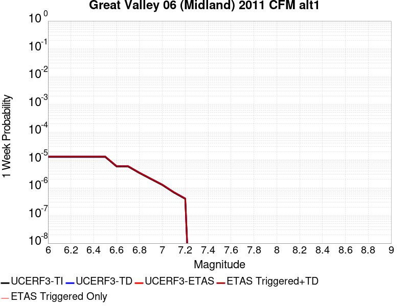 |  |  |  |

| Magnitude | 1 wk TI Prob | 1 wk TD Prob | 1 wk ETAS Prob | 1 wk ETAS/TD Gain | 1 wk ETAS Triggered+TD | 1 wk ETAS Triggered Only | 1 mo TI Prob | 1 mo TD Prob | 1 mo ETAS Prob | 1 mo ETAS/TD Gain | 1 mo ETAS Triggered+TD | 1 mo ETAS Triggered Only | 1 yr TI Prob | 1 yr TD Prob | 1 yr ETAS Prob | 1 yr ETAS/TD Gain | 1 yr ETAS Triggered+TD | 1 yr ETAS Triggered Only | 10 yr TI Prob | 10 yr TD Prob | 10 yr ETAS Prob | 10 yr ETAS/TD Gain | 10 yr ETAS Triggered+TD | 10 yr ETAS Triggered Only |
|-----|-----|-----|-----|-----|-----|-----|-----|-----|-----|-----|-----|-----|-----|-----|-----|-----|-----|-----|-----|-----|-----|-----|-----|-----|
| 6.0 | 1.2712525E-5 | 1.3211642E-5 | 0.0 | 0.0 | 1.3211642E-5 | 0.0 | 5.4481112E-5 | 5.6620236E-5 | 0.0 | 0.0 | 5.6620236E-5 | 0.0 | 6.6310563E-4 | 6.8915874E-4 | 0.0 | 0.0 | 6.8915874E-4 | 0.0 | 0.0066113044 | 0.0068727317 | 8.0E-4 | 0.11640204 | 0.0076672337 | 8.0E-4 |
| 6.1 | 1.2712525E-5 | 1.3211642E-5 | 0.0 | 0.0 | 1.3211642E-5 | 0.0 | 5.4481112E-5 | 5.6620236E-5 | 0.0 | 0.0 | 5.6620236E-5 | 0.0 | 6.6310563E-4 | 6.8915874E-4 | 0.0 | 0.0 | 6.8915874E-4 | 0.0 | 0.0066113044 | 0.0068727317 | 8.0E-4 | 0.11640204 | 0.0076672337 | 8.0E-4 |
| 6.2 | 1.2712525E-5 | 1.3211642E-5 | 0.0 | 0.0 | 1.3211642E-5 | 0.0 | 5.4481112E-5 | 5.6620236E-5 | 0.0 | 0.0 | 5.6620236E-5 | 0.0 | 6.6310563E-4 | 6.8915874E-4 | 0.0 | 0.0 | 6.8915874E-4 | 0.0 | 0.0066113044 | 0.0068727317 | 8.0E-4 | 0.11640204 | 0.0076672337 | 8.0E-4 |
| 6.3 | 1.2712525E-5 | 1.3211642E-5 | 0.0 | 0.0 | 1.3211642E-5 | 0.0 | 5.4481112E-5 | 5.6620236E-5 | 0.0 | 0.0 | 5.6620236E-5 | 0.0 | 6.6310563E-4 | 6.8915874E-4 | 0.0 | 0.0 | 6.8915874E-4 | 0.0 | 0.0066113044 | 0.0068727317 | 8.0E-4 | 0.11640204 | 0.0076672337 | 8.0E-4 |
| 6.4 | 1.2712525E-5 | 1.3211642E-5 | 0.0 | 0.0 | 1.3211642E-5 | 0.0 | 5.4481112E-5 | 5.6620236E-5 | 0.0 | 0.0 | 5.6620236E-5 | 0.0 | 6.6310563E-4 | 6.8915874E-4 | 0.0 | 0.0 | 6.8915874E-4 | 0.0 | 0.0066113044 | 0.0068727317 | 8.0E-4 | 0.11640204 | 0.0076672337 | 8.0E-4 |
| 6.5 | 1.2712525E-5 | 1.3211642E-5 | 0.0 | 0.0 | 1.3211642E-5 | 0.0 | 5.4481112E-5 | 5.6620236E-5 | 0.0 | 0.0 | 5.6620236E-5 | 0.0 | 6.6310563E-4 | 6.8915874E-4 | 0.0 | 0.0 | 6.8915874E-4 | 0.0 | 0.0066113044 | 0.0068727317 | 8.0E-4 | 0.11640204 | 0.0076672337 | 8.0E-4 |
| 6.6 | 5.7574384E-6 | 5.9711015E-6 | 0.0 | 0.0 | 5.9711015E-6 | 0.0 | 2.4674504E-5 | 2.5590207E-5 | 0.0 | 0.0 | 2.5590207E-5 | 0.0 | 3.0037065E-4 | 3.1152013E-4 | 0.0 | 0.0 | 3.1152013E-4 | 0.0 | 0.0029996498 | 0.0031112211 | 1.0E-4 | 0.03214172 | 0.0032109101 | 1.0E-4 |
| 6.7 | 5.7574384E-6 | 5.9711015E-6 | 0.0 | 0.0 | 5.9711015E-6 | 0.0 | 2.4674504E-5 | 2.5590207E-5 | 0.0 | 0.0 | 2.5590207E-5 | 0.0 | 3.0037065E-4 | 3.1152013E-4 | 0.0 | 0.0 | 3.1152013E-4 | 0.0 | 0.0029996498 | 0.0031112211 | 1.0E-4 | 0.03214172 | 0.0032109101 | 1.0E-4 |
| 6.8 | 3.3474828E-6 | 3.469645E-6 | 0.0 | 0.0 | 3.469645E-6 | 0.0 | 1.4346277E-5 | 1.486983E-5 | 0.0 | 0.0 | 1.486983E-5 | 0.0 | 1.7465191E-4 | 1.8102664E-4 | 0.0 | 0.0 | 1.8102664E-4 | 0.0 | 0.0017451472 | 0.0018089388 | 1.0E-4 | 0.05528103 | 0.001908758 | 1.0E-4 |
| 6.9 | 2.035106E-6 | 2.1091935E-6 | 0.0 | 0.0 | 2.1091935E-6 | 0.0 | 8.721853E-6 | 9.039373E-6 | 0.0 | 0.0 | 9.039373E-6 | 0.0 | 1.0618339E-4 | 1.1004954E-4 | 0.0 | 0.0 | 1.1004954E-4 | 0.0 | 0.0010613267 | 0.0011000227 | 0.0 | 0.0 | 0.0011000227 | 0.0 |
| 7.0 | 1.2424716E-6 | 1.2879731E-6 | 0.0 | 0.0 | 1.2879731E-6 | 0.0 | 5.3248673E-6 | 5.5198757E-6 | 0.0 | 0.0 | 5.5198757E-6 | 0.0 | 6.482833E-5 | 6.720286E-5 | 0.0 | 0.0 | 6.720286E-5 | 0.0 | 6.480942E-4 | 6.718697E-4 | 0.0 | 0.0 | 6.718697E-4 | 0.0 |
| 7.1 | 6.6904556E-7 | 6.9395657E-7 | 0.0 | 0.0 | 6.9395657E-7 | 0.0 | 2.867335E-6 | 2.9740975E-6 | 0.0 | 0.0 | 2.9740975E-6 | 0.0 | 3.4909244E-5 | 3.6209298E-5 | 0.0 | 0.0 | 3.6209298E-5 | 0.0 | 3.490376E-4 | 3.6205948E-4 | 0.0 | 0.0 | 3.6205948E-4 | 0.0 |
| 7.2 | 3.948168E-7 | 4.09602E-7 | 0.0 | 0.0 | 4.09602E-7 | 0.0 | 1.6920709E-6 | 1.7554372E-6 | 0.0 | 0.0 | 1.7554372E-6 | 0.0 | 2.0600768E-5 | 2.1372447E-5 | 0.0 | 0.0 | 2.1372447E-5 | 0.0 | 2.0598859E-4 | 2.1372447E-4 | 0.0 | 0.0 | 2.1372447E-4 | 0.0 |

## Robinson Creek
*[(top)](#table-of-contents)*

| 1 Week | 1 Month | 1 Year | 10 Year |
|-----|-----|-----|-----|
|  |  |  |  |

| Magnitude | 1 wk TI Prob | 1 wk TD Prob | 1 wk ETAS Prob | 1 wk ETAS/TD Gain | 1 wk ETAS Triggered+TD | 1 wk ETAS Triggered Only | 1 mo TI Prob | 1 mo TD Prob | 1 mo ETAS Prob | 1 mo ETAS/TD Gain | 1 mo ETAS Triggered+TD | 1 mo ETAS Triggered Only | 1 yr TI Prob | 1 yr TD Prob | 1 yr ETAS Prob | 1 yr ETAS/TD Gain | 1 yr ETAS Triggered+TD | 1 yr ETAS Triggered Only | 10 yr TI Prob | 10 yr TD Prob | 10 yr ETAS Prob | 10 yr ETAS/TD Gain | 10 yr ETAS Triggered+TD | 10 yr ETAS Triggered Only |
|-----|-----|-----|-----|-----|-----|-----|-----|-----|-----|-----|-----|-----|-----|-----|-----|-----|-----|-----|-----|-----|-----|-----|-----|-----|
| 6.0 | 1.3705327E-5 | 1.528864E-5 | 0.0 | 0.0 | 1.528864E-5 | 0.0 | 5.8735794E-5 | 6.552275E-5 | 0.0 | 0.0 | 6.552275E-5 | 0.0 | 7.1487366E-4 | 7.977395E-4 | 1.0E-4 | 0.12535422 | 8.976597E-4 | 1.0E-4 | 0.0071257832 | 0.007977394 | 8.0E-4 | 0.10028337 | 0.008771013 | 8.0E-4 |
| 6.1 | 1.3705327E-5 | 1.528864E-5 | 0.0 | 0.0 | 1.528864E-5 | 0.0 | 5.8735794E-5 | 6.552275E-5 | 0.0 | 0.0 | 6.552275E-5 | 0.0 | 7.1487366E-4 | 7.977395E-4 | 1.0E-4 | 0.12535422 | 8.976597E-4 | 1.0E-4 | 0.0071257832 | 0.007977394 | 8.0E-4 | 0.10028337 | 0.008771013 | 8.0E-4 |
| 6.2 | 1.3705327E-5 | 1.528864E-5 | 0.0 | 0.0 | 1.528864E-5 | 0.0 | 5.8735794E-5 | 6.552275E-5 | 0.0 | 0.0 | 6.552275E-5 | 0.0 | 7.1487366E-4 | 7.977395E-4 | 1.0E-4 | 0.12535422 | 8.976597E-4 | 1.0E-4 | 0.0071257832 | 0.007977394 | 8.0E-4 | 0.10028337 | 0.008771013 | 8.0E-4 |
| 6.3 | 1.3705327E-5 | 1.528864E-5 | 0.0 | 0.0 | 1.528864E-5 | 0.0 | 5.8735794E-5 | 6.552275E-5 | 0.0 | 0.0 | 6.552275E-5 | 0.0 | 7.1487366E-4 | 7.977395E-4 | 1.0E-4 | 0.12535422 | 8.976597E-4 | 1.0E-4 | 0.0071257832 | 0.007977394 | 8.0E-4 | 0.10028337 | 0.008771013 | 8.0E-4 |
| 6.4 | 1.3705327E-5 | 1.528864E-5 | 0.0 | 0.0 | 1.528864E-5 | 0.0 | 5.8735794E-5 | 6.552275E-5 | 0.0 | 0.0 | 6.552275E-5 | 0.0 | 7.1487366E-4 | 7.977395E-4 | 1.0E-4 | 0.12535422 | 8.976597E-4 | 1.0E-4 | 0.0071257832 | 0.007977394 | 8.0E-4 | 0.10028337 | 0.008771013 | 8.0E-4 |

## Franklin 2011 CFM
*[(top)](#table-of-contents)*

| 1 Week | 1 Month | 1 Year | 10 Year |
|-----|-----|-----|-----|
|  |  |  |  |

| Magnitude | 1 wk TI Prob | 1 wk TD Prob | 1 wk ETAS Prob | 1 wk ETAS/TD Gain | 1 wk ETAS Triggered+TD | 1 wk ETAS Triggered Only | 1 mo TI Prob | 1 mo TD Prob | 1 mo ETAS Prob | 1 mo ETAS/TD Gain | 1 mo ETAS Triggered+TD | 1 mo ETAS Triggered Only | 1 yr TI Prob | 1 yr TD Prob | 1 yr ETAS Prob | 1 yr ETAS/TD Gain | 1 yr ETAS Triggered+TD | 1 yr ETAS Triggered Only | 10 yr TI Prob | 10 yr TD Prob | 10 yr ETAS Prob | 10 yr ETAS/TD Gain | 10 yr ETAS Triggered+TD | 10 yr ETAS Triggered Only |
|-----|-----|-----|-----|-----|-----|-----|-----|-----|-----|-----|-----|-----|-----|-----|-----|-----|-----|-----|-----|-----|-----|-----|-----|-----|
| 6.0 | 1.845602E-5 | 2.0219493E-5 | 1.0E-4 | 4.9457226 | 1.2021747E-4 | 1.0E-4 | 7.9094825E-5 | 8.665225E-5 | 1.0E-4 | 1.1540381 | 1.8664359E-4 | 1.0E-4 | 9.6255407E-4 | 0.0010545095 | 1.0E-4 | 0.09483081 | 0.0011544041 | 1.0E-4 | 0.009583955 | 0.010512416 | 6.0E-4 | 0.057075363 | 0.011106109 | 6.0E-4 |
| 6.1 | 1.845602E-5 | 2.0219493E-5 | 1.0E-4 | 4.9457226 | 1.2021747E-4 | 1.0E-4 | 7.9094825E-5 | 8.665225E-5 | 1.0E-4 | 1.1540381 | 1.8664359E-4 | 1.0E-4 | 9.6255407E-4 | 0.0010545095 | 1.0E-4 | 0.09483081 | 0.0011544041 | 1.0E-4 | 0.009583955 | 0.010512416 | 6.0E-4 | 0.057075363 | 0.011106109 | 6.0E-4 |
| 6.2 | 1.845602E-5 | 2.0219493E-5 | 1.0E-4 | 4.9457226 | 1.2021747E-4 | 1.0E-4 | 7.9094825E-5 | 8.665225E-5 | 1.0E-4 | 1.1540381 | 1.8664359E-4 | 1.0E-4 | 9.6255407E-4 | 0.0010545095 | 1.0E-4 | 0.09483081 | 0.0011544041 | 1.0E-4 | 0.009583955 | 0.010512416 | 6.0E-4 | 0.057075363 | 0.011106109 | 6.0E-4 |
| 6.3 | 1.3813506E-5 | 1.5160768E-5 | 1.0E-4 | 6.595972 | 1.1515925E-4 | 1.0E-4 | 5.9199396E-5 | 6.4973145E-5 | 1.0E-4 | 1.5390974 | 1.6496665E-4 | 1.0E-4 | 7.205143E-4 | 7.9076865E-4 | 1.0E-4 | 0.12645924 | 8.9068955E-4 | 1.0E-4 | 0.007181826 | 0.00789479 | 4.0E-4 | 0.050666325 | 0.008291632 | 4.0E-4 |
| 6.4 | 1.3813506E-5 | 1.5160768E-5 | 1.0E-4 | 6.595972 | 1.1515925E-4 | 1.0E-4 | 5.9199396E-5 | 6.4973145E-5 | 1.0E-4 | 1.5390974 | 1.6496665E-4 | 1.0E-4 | 7.205143E-4 | 7.9076865E-4 | 1.0E-4 | 0.12645924 | 8.9068955E-4 | 1.0E-4 | 0.007181826 | 0.00789479 | 4.0E-4 | 0.050666325 | 0.008291632 | 4.0E-4 |
| 6.5 | 1.1308949E-5 | 1.2423217E-5 | 1.0E-4 | 8.049444 | 1.1242198E-4 | 1.0E-4 | 4.8466023E-5 | 5.3241285E-5 | 1.0E-4 | 1.8782417 | 1.5323596E-4 | 1.0E-4 | 5.899141E-4 | 6.4802193E-4 | 1.0E-4 | 0.15431577 | 7.479571E-4 | 1.0E-4 | 0.0058835056 | 0.0064760093 | 3.0E-4 | 0.046324823 | 0.0067740665 | 3.0E-4 |
| 6.6 | 1.0813164E-5 | 1.1881337E-5 | 1.0E-4 | 8.416561 | 1.1188015E-4 | 1.0E-4 | 4.6341313E-5 | 5.0919032E-5 | 1.0E-4 | 1.9639022 | 1.5091394E-4 | 1.0E-4 | 5.640594E-4 | 6.1976473E-4 | 1.0E-4 | 0.16135155 | 7.197028E-4 | 1.0E-4 | 0.005626298 | 0.006195034 | 3.0E-4 | 0.048425883 | 0.0064931754 | 3.0E-4 |
| 6.7 | 1.0706348E-5 | 1.1763074E-5 | 1.0E-4 | 8.501179 | 1.11761896E-4 | 1.0E-4 | 4.5883542E-5 | 5.0412214E-5 | 1.0E-4 | 1.9836463 | 1.5040717E-4 | 1.0E-4 | 5.5848894E-4 | 6.1359775E-4 | 1.0E-4 | 0.16297323 | 7.135364E-4 | 1.0E-4 | 0.005570874 | 0.006133706 | 3.0E-4 | 0.048910074 | 0.0064318655 | 3.0E-4 |
| 6.8 | 9.443655E-6 | 1.0354058E-5 | 0.0 | 0.0 | 1.0354058E-5 | 0.0 | 4.0472176E-5 | 4.4373788E-5 | 0.0 | 0.0 | 4.4373788E-5 | 0.0 | 4.9263734E-4 | 5.401183E-4 | 0.0 | 0.0 | 5.401183E-4 | 0.0 | 0.0049154665 | 0.0054026763 | 2.0E-4 | 0.03701869 | 0.005601596 | 2.0E-4 |
| 6.9 | 8.7001645E-6 | 9.526937E-6 | 0.0 | 0.0 | 9.526937E-6 | 0.0 | 3.728589E-5 | 4.0829098E-5 | 0.0 | 0.0 | 4.0829098E-5 | 0.0 | 4.538611E-4 | 4.9698213E-4 | 0.0 | 0.0 | 4.9698213E-4 | 0.0 | 0.0045293528 | 0.0049733142 | 2.0E-4 | 0.04021463 | 0.0051723197 | 2.0E-4 |
| 7.0 | 8.074731E-6 | 8.820358E-6 | 0.0 | 0.0 | 8.820358E-6 | 0.0 | 3.460553E-5 | 3.7800994E-5 | 0.0 | 0.0 | 3.7800994E-5 | 0.0 | 4.212409E-4 | 4.60131E-4 | 0.0 | 0.0 | 4.60131E-4 | 0.0 | 0.004204433 | 0.0046063787 | 2.0E-4 | 0.043418054 | 0.0048054573 | 2.0E-4 |
| 7.1 | 7.3370957E-6 | 7.966025E-6 | 0.0 | 0.0 | 7.966025E-6 | 0.0 | 3.1444317E-5 | 3.4139663E-5 | 0.0 | 0.0 | 3.4139663E-5 | 0.0 | 3.8276732E-4 | 4.1557214E-4 | 0.0 | 0.0 | 4.1557214E-4 | 0.0 | 0.0038210868 | 0.004162401 | 2.0E-4 | 0.04804919 | 0.0043615685 | 2.0E-4 |
| 7.2 | 5.1750103E-6 | 5.461149E-6 | 0.0 | 0.0 | 5.461149E-6 | 0.0 | 2.2178427E-5 | 2.3404717E-5 | 0.0 | 0.0 | 2.3404717E-5 | 0.0 | 2.699889E-4 | 2.8491547E-4 | 0.0 | 0.0 | 2.8491547E-4 | 0.0 | 0.002696611 | 0.0028593997 | 2.0E-4 | 0.069944754 | 0.0030588277 | 2.0E-4 |
| 7.3 | 3.5221371E-6 | 3.7996622E-6 | 0.0 | 0.0 | 3.7996622E-6 | 0.0 | 1.5094786E-5 | 1.6284166E-5 | 0.0 | 0.0 | 1.6284166E-5 | 0.0 | 1.8376352E-4 | 1.9824177E-4 | 0.0 | 0.0 | 1.9824177E-4 | 0.0 | 0.0018361164 | 0.0019939577 | 2.0E-4 | 0.10030303 | 0.002193559 | 2.0E-4 |
| 7.4 | 2.5749775E-6 | 2.8211373E-6 | 0.0 | 0.0 | 2.8211373E-6 | 0.0 | 1.1035571E-5 | 1.2090533E-5 | 0.0 | 0.0 | 1.2090533E-5 | 0.0 | 1.343498E-4 | 1.4719236E-4 | 0.0 | 0.0 | 1.4719236E-4 | 0.0 | 0.001342686 | 0.0014829185 | 1.0E-4 | 0.06743459 | 0.0015827703 | 1.0E-4 |
| 7.5 | 1.3642131E-6 | 1.5517062E-6 | 0.0 | 0.0 | 1.5517062E-6 | 0.0 | 5.8466144E-6 | 6.6501525E-6 | 0.0 | 0.0 | 6.6501525E-6 | 0.0 | 7.1180206E-5 | 8.0962614E-5 | 0.0 | 0.0 | 8.0962614E-5 | 0.0 | 7.115741E-4 | 8.1984774E-4 | 0.0 | 0.0 | 8.1984774E-4 | 0.0 |
| 7.6 | 5.329124E-7 | 6.7181816E-7 | 0.0 | 0.0 | 6.7181816E-7 | 0.0 | 2.2839083E-6 | 2.8792174E-6 | 0.0 | 0.0 | 2.8792174E-6 | 0.0 | 2.7806227E-5 | 3.5053912E-5 | 0.0 | 0.0 | 3.5053912E-5 | 0.0 | 2.780275E-4 | 3.6085772E-4 | 0.0 | 0.0 | 3.6085772E-4 | 0.0 |
| 7.7 | 4.199127E-7 | 5.504395E-7 | 0.0 | 0.0 | 5.504395E-7 | 0.0 | 1.7996247E-6 | 2.3590242E-6 | 0.0 | 0.0 | 2.3590242E-6 | 0.0 | 2.191021E-5 | 2.8720744E-5 | 0.0 | 0.0 | 2.8720744E-5 | 0.0 | 2.190805E-4 | 2.97355E-4 | 0.0 | 0.0 | 2.97355E-4 | 0.0 |
| 7.8 | 2.2586491E-7 | 3.078913E-7 | 0.0 | 0.0 | 3.078913E-7 | 0.0 | 9.67992E-7 | 1.3195335E-6 | 0.0 | 0.0 | 1.3195335E-6 | 0.0 | 1.178524E-5 | 1.6065202E-5 | 0.0 | 0.0 | 1.6065202E-5 | 0.0 | 1.17846146E-4 | 1.6694491E-4 | 0.0 | 0.0 | 1.6694491E-4 | 0.0 |
| 7.9 | 1.4568845E-7 | 2.1301783E-7 | 0.0 | 0.0 | 2.1301783E-7 | 0.0 | 6.243789E-7 | 9.129332E-7 | 0.0 | 0.0 | 9.129332E-7 | 0.0 | 7.601787E-6 | 1.1114906E-5 | 0.0 | 0.0 | 1.1114906E-5 | 0.0 | 7.601527E-5 | 1.1558851E-4 | 0.0 | 0.0 | 1.1558851E-4 | 0.0 |
| 8.0 | 5.2868224E-8 | 1.0045834E-7 | 0.0 | 0.0 | 1.0045834E-7 | 0.0 | 2.2657808E-7 | 4.3053566E-7 | 0.0 | 0.0 | 4.3053566E-7 | 0.0 | 2.7585847E-6 | 5.241759E-6 | 0.0 | 0.0 | 5.241759E-6 | 0.0 | 2.7585504E-5 | 5.4262346E-5 | 0.0 | 0.0 | 5.4262346E-5 | 0.0 |
| 8.1 | 2.654434E-9 | 4.7424265E-9 | 0.0 | 0.0 | 4.7424265E-9 | 0.0 | 1.1376145E-8 | 2.0324686E-8 | 0.0 | 0.0 | 2.0324686E-8 | 0.0 | 1.3850456E-7 | 2.4745302E-7 | 0.0 | 0.0 | 2.4745302E-7 | 0.0 | 1.3850448E-6 | 2.543893E-6 | 0.0 | 0.0 | 2.543893E-6 | 0.0 |

## Hector Mine
*[(top)](#table-of-contents)*

| 1 Week | 1 Month | 1 Year | 10 Year |
|-----|-----|-----|-----|
|  |  |  | 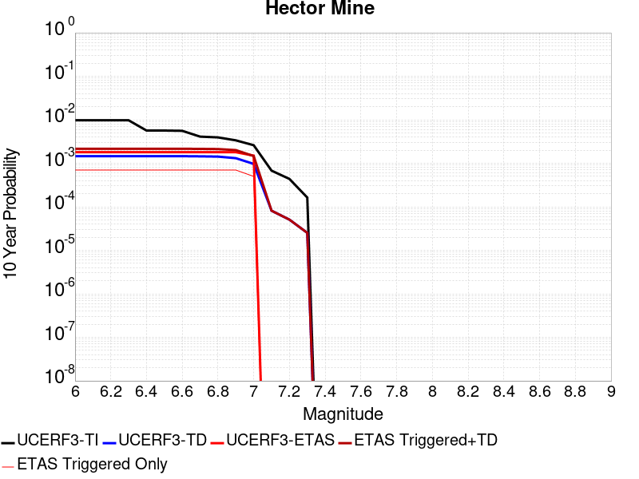 |

| Magnitude | 1 wk TI Prob | 1 wk TD Prob | 1 wk ETAS Prob | 1 wk ETAS/TD Gain | 1 wk ETAS Triggered+TD | 1 wk ETAS Triggered Only | 1 mo TI Prob | 1 mo TD Prob | 1 mo ETAS Prob | 1 mo ETAS/TD Gain | 1 mo ETAS Triggered+TD | 1 mo ETAS Triggered Only | 1 yr TI Prob | 1 yr TD Prob | 1 yr ETAS Prob | 1 yr ETAS/TD Gain | 1 yr ETAS Triggered+TD | 1 yr ETAS Triggered Only | 10 yr TI Prob | 10 yr TD Prob | 10 yr ETAS Prob | 10 yr ETAS/TD Gain | 10 yr ETAS Triggered+TD | 10 yr ETAS Triggered Only |
|-----|-----|-----|-----|-----|-----|-----|-----|-----|-----|-----|-----|-----|-----|-----|-----|-----|-----|-----|-----|-----|-----|-----|-----|-----|
| 6.0 | 1.8760093E-5 | 2.794615E-6 | 0.0 | 0.0 | 2.794615E-6 | 0.0 | 8.039792E-5 | 1.1976889E-5 | 1.0E-4 | 8.349413 | 1.1197569E-4 | 1.0E-4 | 9.78405E-4 | 1.4581287E-4 | 2.0E-4 | 1.3716211 | 3.4578372E-4 | 2.0E-4 | 0.009741086 | 0.0014575637 | 7.0E-4 | 0.48025346 | 0.0021565433 | 7.0E-4 |
| 6.1 | 1.8760093E-5 | 2.794615E-6 | 0.0 | 0.0 | 2.794615E-6 | 0.0 | 8.039792E-5 | 1.1976889E-5 | 1.0E-4 | 8.349413 | 1.1197569E-4 | 1.0E-4 | 9.78405E-4 | 1.4581287E-4 | 2.0E-4 | 1.3716211 | 3.4578372E-4 | 2.0E-4 | 0.009741086 | 0.0014575637 | 7.0E-4 | 0.48025346 | 0.0021565433 | 7.0E-4 |
| 6.2 | 1.8760093E-5 | 2.794615E-6 | 0.0 | 0.0 | 2.794615E-6 | 0.0 | 8.039792E-5 | 1.1976889E-5 | 1.0E-4 | 8.349413 | 1.1197569E-4 | 1.0E-4 | 9.78405E-4 | 1.4581287E-4 | 2.0E-4 | 1.3716211 | 3.4578372E-4 | 2.0E-4 | 0.009741086 | 0.0014575637 | 7.0E-4 | 0.48025346 | 0.0021565433 | 7.0E-4 |
| 6.3 | 1.8760093E-5 | 2.794615E-6 | 0.0 | 0.0 | 2.794615E-6 | 0.0 | 8.039792E-5 | 1.1976889E-5 | 1.0E-4 | 8.349413 | 1.1197569E-4 | 1.0E-4 | 9.78405E-4 | 1.4581287E-4 | 2.0E-4 | 1.3716211 | 3.4578372E-4 | 2.0E-4 | 0.009741086 | 0.0014575637 | 7.0E-4 | 0.48025346 | 0.0021565433 | 7.0E-4 |
| 6.4 | 1.0888055E-5 | 2.794615E-6 | 0.0 | 0.0 | 2.794615E-6 | 0.0 | 4.666226E-5 | 1.1976889E-5 | 1.0E-4 | 8.349413 | 1.1197569E-4 | 1.0E-4 | 5.679649E-4 | 1.4581287E-4 | 2.0E-4 | 1.3716211 | 3.4578372E-4 | 2.0E-4 | 0.0056651547 | 0.0014575637 | 7.0E-4 | 0.48025346 | 0.0021565433 | 7.0E-4 |
| 6.5 | 1.0888055E-5 | 2.794615E-6 | 0.0 | 0.0 | 2.794615E-6 | 0.0 | 4.666226E-5 | 1.1976889E-5 | 1.0E-4 | 8.349413 | 1.1197569E-4 | 1.0E-4 | 5.679649E-4 | 1.4581287E-4 | 2.0E-4 | 1.3716211 | 3.4578372E-4 | 2.0E-4 | 0.0056651547 | 0.0014575637 | 7.0E-4 | 0.48025346 | 0.0021565433 | 7.0E-4 |
| 6.6 | 1.0730738E-5 | 2.794615E-6 | 0.0 | 0.0 | 2.794615E-6 | 0.0 | 4.5988065E-5 | 1.1976889E-5 | 1.0E-4 | 8.349413 | 1.1197569E-4 | 1.0E-4 | 5.5976084E-4 | 1.4581287E-4 | 2.0E-4 | 1.3716211 | 3.4578372E-4 | 2.0E-4 | 0.0055835294 | 0.0014575637 | 7.0E-4 | 0.48025346 | 0.0021565433 | 7.0E-4 |
| 6.7 | 7.881326E-6 | 2.7693209E-6 | 0.0 | 0.0 | 2.7693209E-6 | 0.0 | 3.3776672E-5 | 1.1868486E-5 | 1.0E-4 | 8.425674 | 1.118673E-4 | 1.0E-4 | 4.111534E-4 | 1.4449323E-4 | 2.0E-4 | 1.3841479 | 3.4446432E-4 | 2.0E-4 | 0.0041039353 | 0.0014443845 | 7.0E-4 | 0.4846355 | 0.0021433735 | 7.0E-4 |
| 6.8 | 7.5683483E-6 | 2.7311175E-6 | 0.0 | 0.0 | 2.7311175E-6 | 0.0 | 3.2435375E-5 | 1.1704759E-5 | 1.0E-4 | 8.543533 | 1.11703586E-4 | 1.0E-4 | 3.9482914E-4 | 1.4250012E-4 | 2.0E-4 | 1.4035076 | 3.424716E-4 | 2.0E-4 | 0.0039412836 | 0.001424479 | 7.0E-4 | 0.49140772 | 0.0021234818 | 7.0E-4 |
| 6.9 | 6.473048E-6 | 2.5123934E-6 | 0.0 | 0.0 | 2.5123934E-6 | 0.0 | 2.7741338E-5 | 1.0767379E-5 | 1.0E-4 | 9.287312 | 1.10766305E-4 | 1.0E-4 | 3.3769844E-4 | 1.310889E-4 | 2.0E-4 | 1.5256821 | 3.310627E-4 | 2.0E-4 | 0.0033718573 | 0.001310505 | 7.0E-4 | 0.53414524 | 0.0020095876 | 7.0E-4 |
| 7.0 | 4.9959954E-6 | 1.8552897E-6 | 0.0 | 0.0 | 1.8552897E-6 | 0.0 | 2.1411232E-5 | 7.951237E-6 | 0.0 | 0.0 | 7.951237E-6 | 0.0 | 2.6065056E-4 | 9.6805576E-5 | 1.0E-4 | 1.0329983 | 1.967959E-4 | 1.0E-4 | 0.0026034506 | 9.679832E-4 | 5.0E-4 | 0.5165379 | 0.0014674992 | 5.0E-4 |
| 7.1 | 1.2997541E-6 | 1.5581438E-7 | 0.0 | 0.0 | 1.5581438E-7 | 0.0 | 5.5703626E-6 | 6.6777574E-7 | 0.0 | 0.0 | 6.6777574E-7 | 0.0 | 6.7817055E-5 | 8.130143E-6 | 0.0 | 0.0 | 8.130143E-6 | 0.0 | 6.779636E-4 | 8.129885E-5 | 0.0 | 0.0 | 8.129885E-5 | 0.0 |
| 7.2 | 8.392699E-7 | 9.7146454E-8 | 0.0 | 0.0 | 9.7146454E-8 | 0.0 | 3.596866E-6 | 4.163419E-7 | 0.0 | 0.0 | 4.163419E-7 | 0.0 | 4.3790962E-5 | 5.0689528E-6 | 0.0 | 0.0 | 5.0689528E-6 | 0.0 | 4.3782333E-4 | 5.0688563E-5 | 0.0 | 0.0 | 5.0688563E-5 | 0.0 |
| 7.3 | 3.13015E-7 | 4.8238544E-8 | 0.0 | 0.0 | 4.8238544E-8 | 0.0 | 1.3414921E-6 | 2.067366E-7 | 0.0 | 0.0 | 2.067366E-7 | 0.0 | 1.6332544E-5 | 2.5170161E-6 | 0.0 | 0.0 | 2.5170161E-6 | 0.0 | 1.6331344E-4 | 2.516996E-5 | 0.0 | 0.0 | 2.516996E-5 | 0.0 |

## Simi-Santa Rosa
*[(top)](#table-of-contents)*

| 1 Week | 1 Month | 1 Year | 10 Year |
|-----|-----|-----|-----|
|  | 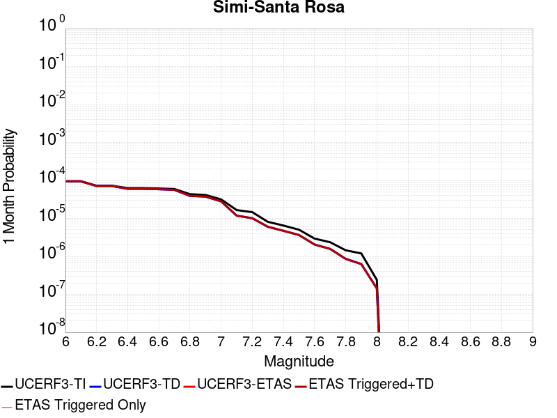 |  |  |

| Magnitude | 1 wk TI Prob | 1 wk TD Prob | 1 wk ETAS Prob | 1 wk ETAS/TD Gain | 1 wk ETAS Triggered+TD | 1 wk ETAS Triggered Only | 1 mo TI Prob | 1 mo TD Prob | 1 mo ETAS Prob | 1 mo ETAS/TD Gain | 1 mo ETAS Triggered+TD | 1 mo ETAS Triggered Only | 1 yr TI Prob | 1 yr TD Prob | 1 yr ETAS Prob | 1 yr ETAS/TD Gain | 1 yr ETAS Triggered+TD | 1 yr ETAS Triggered Only | 10 yr TI Prob | 10 yr TD Prob | 10 yr ETAS Prob | 10 yr ETAS/TD Gain | 10 yr ETAS Triggered+TD | 10 yr ETAS Triggered Only |
|-----|-----|-----|-----|-----|-----|-----|-----|-----|-----|-----|-----|-----|-----|-----|-----|-----|-----|-----|-----|-----|-----|-----|-----|-----|
| 6.0 | 2.198912E-5 | 2.228143E-5 | 0.0 | 0.0 | 2.228143E-5 | 0.0 | 9.4235686E-5 | 9.54886E-5 | 0.0 | 0.0 | 9.54886E-5 | 0.0 | 0.0011467156 | 0.0011619976 | 2.0E-4 | 0.1721174 | 0.0013617651 | 2.0E-4 | 0.011408163 | 0.011563666 | 7.0E-4 | 0.060534433 | 0.012255572 | 7.0E-4 |
| 6.1 | 2.198912E-5 | 2.228143E-5 | 0.0 | 0.0 | 2.228143E-5 | 0.0 | 9.4235686E-5 | 9.54886E-5 | 0.0 | 0.0 | 9.54886E-5 | 0.0 | 0.0011467156 | 0.0011619976 | 2.0E-4 | 0.1721174 | 0.0013617651 | 2.0E-4 | 0.011408163 | 0.011563666 | 7.0E-4 | 0.060534433 | 0.012255572 | 7.0E-4 |
| 6.2 | 1.69983E-5 | 1.6673122E-5 | 0.0 | 0.0 | 1.6673122E-5 | 0.0 | 7.284782E-5 | 7.1454444E-5 | 0.0 | 0.0 | 7.1454444E-5 | 0.0 | 8.865613E-4 | 8.6963986E-4 | 2.0E-4 | 0.22998026 | 0.0010694659 | 2.0E-4 | 0.008830327 | 0.00866529 | 7.0E-4 | 0.08078206 | 0.009359224 | 7.0E-4 |
| 6.3 | 1.69983E-5 | 1.6673122E-5 | 0.0 | 0.0 | 1.6673122E-5 | 0.0 | 7.284782E-5 | 7.1454444E-5 | 0.0 | 0.0 | 7.1454444E-5 | 0.0 | 8.865613E-4 | 8.6963986E-4 | 2.0E-4 | 0.22998026 | 0.0010694659 | 2.0E-4 | 0.008830327 | 0.00866529 | 7.0E-4 | 0.08078206 | 0.009359224 | 7.0E-4 |
| 6.4 | 1.4666188E-5 | 1.405645E-5 | 0.0 | 0.0 | 1.405645E-5 | 0.0 | 6.285358E-5 | 6.024068E-5 | 0.0 | 0.0 | 6.024068E-5 | 0.0 | 7.6497364E-4 | 7.332084E-4 | 1.0E-4 | 0.13638687 | 8.3313504E-4 | 1.0E-4 | 0.0076234564 | 0.0073103695 | 5.0E-4 | 0.068395995 | 0.007806714 | 5.0E-4 |
| 6.5 | 1.4666188E-5 | 1.405645E-5 | 0.0 | 0.0 | 1.405645E-5 | 0.0 | 6.285358E-5 | 6.024068E-5 | 0.0 | 0.0 | 6.024068E-5 | 0.0 | 7.6497364E-4 | 7.332084E-4 | 1.0E-4 | 0.13638687 | 8.3313504E-4 | 1.0E-4 | 0.0076234564 | 0.0073103695 | 5.0E-4 | 0.068395995 | 0.007806714 | 5.0E-4 |
| 6.6 | 1.4377586E-5 | 1.3733411E-5 | 0.0 | 0.0 | 1.3733411E-5 | 0.0 | 6.1616774E-5 | 5.8856287E-5 | 0.0 | 0.0 | 5.8856287E-5 | 0.0 | 7.4992597E-4 | 7.163646E-4 | 1.0E-4 | 0.13959372 | 8.1629294E-4 | 1.0E-4 | 0.007474003 | 0.007143023 | 5.0E-4 | 0.069998376 | 0.0076394514 | 5.0E-4 |
| 6.7 | 1.3881404E-5 | 1.321125E-5 | 0.0 | 0.0 | 1.321125E-5 | 0.0 | 5.9490372E-5 | 5.661855E-5 | 0.0 | 0.0 | 5.661855E-5 | 0.0 | 7.240546E-4 | 6.891376E-4 | 1.0E-4 | 0.14510891 | 7.890687E-4 | 1.0E-4 | 0.007217 | 0.0068724565 | 5.0E-4 | 0.07275419 | 0.0073690205 | 5.0E-4 |
| 6.8 | 1.0176516E-5 | 9.156797E-6 | 0.0 | 0.0 | 9.156797E-6 | 0.0 | 4.3612912E-5 | 3.9242917E-5 | 0.0 | 0.0 | 3.9242917E-5 | 0.0 | 5.308578E-4 | 4.7769438E-4 | 1.0E-4 | 0.20933887 | 5.776466E-4 | 1.0E-4 | 0.0052959146 | 0.0047683096 | 3.0E-4 | 0.06291538 | 0.005066879 | 3.0E-4 |
| 6.9 | 9.699797E-6 | 8.777248E-6 | 0.0 | 0.0 | 8.777248E-6 | 0.0 | 4.15699E-5 | 3.7616326E-5 | 0.0 | 0.0 | 3.7616326E-5 | 0.0 | 5.05996E-4 | 4.57899E-4 | 1.0E-4 | 0.21838878 | 5.578532E-4 | 1.0E-4 | 0.005048454 | 0.004571174 | 3.0E-4 | 0.065628655 | 0.0048698024 | 3.0E-4 |
| 7.0 | 7.4049476E-6 | 6.561196E-6 | 0.0 | 0.0 | 6.561196E-6 | 0.0 | 3.1735104E-5 | 2.811918E-5 | 0.0 | 0.0 | 2.811918E-5 | 0.0 | 3.8630638E-4 | 3.4230988E-4 | 1.0E-4 | 0.29213294 | 4.4227566E-4 | 1.0E-4 | 0.0038563553 | 0.0034190693 | 3.0E-4 | 0.08774318 | 0.0037180434 | 3.0E-4 |
| 7.1 | 3.873439E-6 | 2.7602723E-6 | 0.0 | 0.0 | 2.7602723E-6 | 0.0 | 1.6600346E-5 | 1.1829686E-5 | 0.0 | 0.0 | 1.1829686E-5 | 0.0 | 2.0209046E-4 | 1.4401715E-4 | 0.0 | 0.0 | 1.4401715E-4 | 0.0 | 0.0020190678 | 0.0014392617 | 2.0E-4 | 0.13896014 | 0.0016389738 | 2.0E-4 |
| 7.2 | 3.417706E-6 | 2.3683253E-6 | 0.0 | 0.0 | 2.3683253E-6 | 0.0 | 1.4647229E-5 | 1.0149928E-5 | 0.0 | 0.0 | 1.0149928E-5 | 0.0 | 1.7831543E-4 | 1.2356859E-4 | 0.0 | 0.0 | 1.2356859E-4 | 0.0 | 0.0017817242 | 0.001235021 | 2.0E-4 | 0.16194056 | 0.001434774 | 2.0E-4 |
| 7.3 | 1.90225E-6 | 1.407873E-6 | 0.0 | 0.0 | 1.407873E-6 | 0.0 | 8.152474E-6 | 6.0337275E-6 | 0.0 | 0.0 | 6.0337275E-6 | 0.0 | 9.9251854E-5 | 7.345818E-5 | 0.0 | 0.0 | 7.345818E-5 | 0.0 | 9.920754E-4 | 7.343412E-4 | 1.0E-4 | 0.13617648 | 8.3426776E-4 | 1.0E-4 |
| 7.4 | 1.5170556E-6 | 1.1029315E-6 | 0.0 | 0.0 | 1.1029315E-6 | 0.0 | 6.5016507E-6 | 4.726841E-6 | 0.0 | 0.0 | 4.726841E-6 | 0.0 | 7.915472E-5 | 5.754778E-5 | 0.0 | 0.0 | 5.754778E-5 | 0.0 | 7.9126534E-4 | 5.753299E-4 | 1.0E-4 | 0.17381331 | 6.752724E-4 | 1.0E-4 |
| 7.5 | 1.178732E-6 | 8.5393754E-7 | 0.0 | 0.0 | 8.5393754E-7 | 0.0 | 5.0516987E-6 | 3.659727E-6 | 0.0 | 0.0 | 3.659727E-6 | 0.0 | 6.1502695E-5 | 4.4556276E-5 | 0.0 | 0.0 | 4.4556276E-5 | 0.0 | 6.148568E-4 | 4.4547438E-4 | 1.0E-4 | 0.2244798 | 5.454298E-4 | 1.0E-4 |
| 7.6 | 6.8722386E-7 | 4.797057E-7 | 0.0 | 0.0 | 4.797057E-7 | 0.0 | 2.9452417E-6 | 2.05588E-6 | 0.0 | 0.0 | 2.05588E-6 | 0.0 | 3.5857727E-5 | 2.5030053E-5 | 0.0 | 0.0 | 2.5030053E-5 | 0.0 | 3.5851944E-4 | 2.5027245E-4 | 1.0E-4 | 0.39956453 | 3.5024743E-4 | 1.0E-4 |
| 7.7 | 5.5126515E-7 | 3.6767992E-7 | 0.0 | 0.0 | 3.6767992E-7 | 0.0 | 2.3625628E-6 | 1.5757702E-6 | 0.0 | 0.0 | 1.5757702E-6 | 0.0 | 2.8763823E-5 | 1.9184834E-5 | 0.0 | 0.0 | 1.9184834E-5 | 0.0 | 2.87601E-4 | 1.9183189E-4 | 1.0E-4 | 0.52128977 | 2.918127E-4 | 1.0E-4 |
| 7.8 | 3.3860243E-7 | 2.009849E-7 | 0.0 | 0.0 | 2.009849E-7 | 0.0 | 1.4511525E-6 | 8.613636E-7 | 0.0 | 0.0 | 8.613636E-7 | 0.0 | 1.7667637E-5 | 1.0487051E-5 | 0.0 | 0.0 | 1.0487051E-5 | 0.0 | 1.7666233E-4 | 1.0486563E-4 | 0.0 | 0.0 | 1.0486563E-4 | 0.0 |
| 7.9 | 2.7955386E-7 | 1.4669513E-7 | 0.0 | 0.0 | 1.4669513E-7 | 0.0 | 1.1980875E-6 | 6.286932E-7 | 0.0 | 0.0 | 6.286932E-7 | 0.0 | 1.4586617E-5 | 7.654314E-6 | 0.0 | 0.0 | 7.654314E-6 | 0.0 | 1.458566E-4 | 7.654054E-5 | 0.0 | 0.0 | 7.654054E-5 | 0.0 |
| 8.0 | 5.6259015E-8 | 3.336812E-8 | 0.0 | 0.0 | 3.336812E-8 | 0.0 | 2.4111003E-7 | 1.4300622E-7 | 0.0 | 0.0 | 1.4300622E-7 | 0.0 | 2.9355108E-6 | 1.7410995E-6 | 0.0 | 0.0 | 1.7410995E-6 | 0.0 | 2.935472E-5 | 1.7410872E-5 | 0.0 | 0.0 | 1.7410872E-5 | 0.0 |

## Swain Ravine - Spenceville
*[(top)](#table-of-contents)*

| 1 Week | 1 Month | 1 Year | 10 Year |
|-----|-----|-----|-----|
|  | 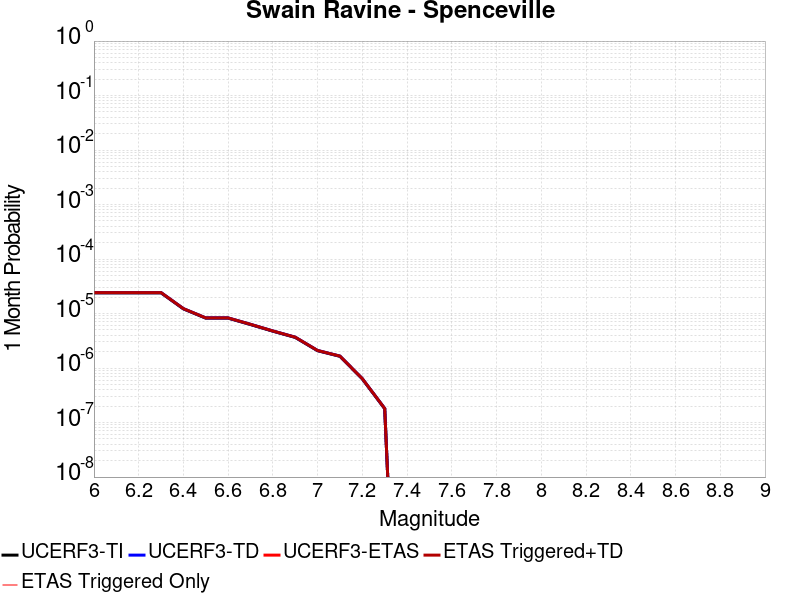 | 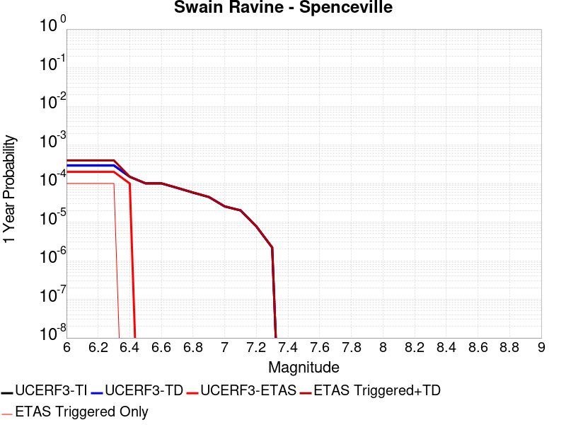 |  |

| Magnitude | 1 wk TI Prob | 1 wk TD Prob | 1 wk ETAS Prob | 1 wk ETAS/TD Gain | 1 wk ETAS Triggered+TD | 1 wk ETAS Triggered Only | 1 mo TI Prob | 1 mo TD Prob | 1 mo ETAS Prob | 1 mo ETAS/TD Gain | 1 mo ETAS Triggered+TD | 1 mo ETAS Triggered Only | 1 yr TI Prob | 1 yr TD Prob | 1 yr ETAS Prob | 1 yr ETAS/TD Gain | 1 yr ETAS Triggered+TD | 1 yr ETAS Triggered Only | 10 yr TI Prob | 10 yr TD Prob | 10 yr ETAS Prob | 10 yr ETAS/TD Gain | 10 yr ETAS Triggered+TD | 10 yr ETAS Triggered Only |
|-----|-----|-----|-----|-----|-----|-----|-----|-----|-----|-----|-----|-----|-----|-----|-----|-----|-----|-----|-----|-----|-----|-----|-----|-----|
| 6.0 | 5.596169E-6 | 5.663935E-6 | 0.0 | 0.0 | 5.663935E-6 | 0.0 | 2.398336E-5 | 2.4273799E-5 | 0.0 | 0.0 | 2.4273799E-5 | 0.0 | 2.9195828E-4 | 2.9549614E-4 | 1.0E-4 | 0.3384139 | 3.9546657E-4 | 1.0E-4 | 0.00291575 | 0.0029513014 | 7.0E-4 | 0.2371835 | 0.0036492355 | 7.0E-4 |
| 6.1 | 5.596169E-6 | 5.663935E-6 | 0.0 | 0.0 | 5.663935E-6 | 0.0 | 2.398336E-5 | 2.4273799E-5 | 0.0 | 0.0 | 2.4273799E-5 | 0.0 | 2.9195828E-4 | 2.9549614E-4 | 1.0E-4 | 0.3384139 | 3.9546657E-4 | 1.0E-4 | 0.00291575 | 0.0029513014 | 7.0E-4 | 0.2371835 | 0.0036492355 | 7.0E-4 |
| 6.2 | 5.596169E-6 | 5.663935E-6 | 0.0 | 0.0 | 5.663935E-6 | 0.0 | 2.398336E-5 | 2.4273799E-5 | 0.0 | 0.0 | 2.4273799E-5 | 0.0 | 2.9195828E-4 | 2.9549614E-4 | 1.0E-4 | 0.3384139 | 3.9546657E-4 | 1.0E-4 | 0.00291575 | 0.0029513014 | 7.0E-4 | 0.2371835 | 0.0036492355 | 7.0E-4 |
| 6.3 | 5.596169E-6 | 5.663935E-6 | 0.0 | 0.0 | 5.663935E-6 | 0.0 | 2.398336E-5 | 2.4273799E-5 | 0.0 | 0.0 | 2.4273799E-5 | 0.0 | 2.9195828E-4 | 2.9549614E-4 | 1.0E-4 | 0.3384139 | 3.9546657E-4 | 1.0E-4 | 0.00291575 | 0.0029513014 | 7.0E-4 | 0.2371835 | 0.0036492355 | 7.0E-4 |
| 6.4 | 2.8426775E-6 | 2.8742095E-6 | 0.0 | 0.0 | 2.8742095E-6 | 0.0 | 1.2182847E-5 | 1.2317984E-5 | 0.0 | 0.0 | 1.2317984E-5 | 0.0 | 1.4831607E-4 | 1.4996153E-4 | 0.0 | 0.0 | 1.4996153E-4 | 0.0 | 0.0014821711 | 0.0014986418 | 2.0E-4 | 0.13345417 | 0.001698342 | 2.0E-4 |
| 6.5 | 1.9210793E-6 | 1.941457E-6 | 0.0 | 0.0 | 1.941457E-6 | 0.0 | 8.233172E-6 | 8.320504E-6 | 0.0 | 0.0 | 8.320504E-6 | 0.0 | 1.0023425E-4 | 1.0129757E-4 | 0.0 | 0.0 | 1.0129757E-4 | 0.0 | 0.0010018905 | 0.0010125274 | 0.0 | 0.0 | 0.0010125274 | 0.0 |
| 6.6 | 1.9210793E-6 | 1.941457E-6 | 0.0 | 0.0 | 1.941457E-6 | 0.0 | 8.233172E-6 | 8.320504E-6 | 0.0 | 0.0 | 8.320504E-6 | 0.0 | 1.0023425E-4 | 1.0129757E-4 | 0.0 | 0.0 | 1.0129757E-4 | 0.0 | 0.0010018905 | 0.0010125274 | 0.0 | 0.0 | 0.0010125274 | 0.0 |
| 6.7 | 1.4667394E-6 | 1.4819249E-6 | 0.0 | 0.0 | 1.4819249E-6 | 0.0 | 6.286011E-6 | 6.3510915E-6 | 0.0 | 0.0 | 6.3510915E-6 | 0.0 | 7.65295E-5 | 7.732187E-5 | 0.0 | 0.0 | 7.732187E-5 | 0.0 | 7.6503144E-4 | 7.7295746E-4 | 0.0 | 0.0 | 7.7295746E-4 | 0.0 |
| 6.8 | 1.1076943E-6 | 1.1189769E-6 | 0.0 | 0.0 | 1.1189769E-6 | 0.0 | 4.747252E-6 | 4.795607E-6 | 0.0 | 0.0 | 4.795607E-6 | 0.0 | 5.7796264E-5 | 5.838499E-5 | 0.0 | 0.0 | 5.838499E-5 | 0.0 | 5.778124E-4 | 5.8370095E-4 | 0.0 | 0.0 | 5.8370095E-4 | 0.0 |
| 6.9 | 8.514296E-7 | 8.6002734E-7 | 0.0 | 0.0 | 8.6002734E-7 | 0.0 | 3.648979E-6 | 3.6858264E-6 | 0.0 | 0.0 | 3.6858264E-6 | 0.0 | 4.442541E-5 | 4.487404E-5 | 0.0 | 0.0 | 4.487404E-5 | 0.0 | 4.441653E-4 | 4.4865266E-4 | 0.0 | 0.0 | 4.4865266E-4 | 0.0 |
| 7.0 | 4.8544706E-7 | 4.903402E-7 | 0.0 | 0.0 | 4.903402E-7 | 0.0 | 2.0804857E-6 | 2.1014564E-6 | 0.0 | 0.0 | 2.1014564E-6 | 0.0 | 2.532962E-5 | 2.5584943E-5 | 0.0 | 0.0 | 2.5584943E-5 | 0.0 | 2.5326732E-4 | 2.5582127E-4 | 0.0 | 0.0 | 2.5582127E-4 | 0.0 |
| 7.1 | 3.829186E-7 | 3.8679588E-7 | 0.0 | 0.0 | 3.8679588E-7 | 0.0 | 1.6410787E-6 | 1.6576956E-6 | 0.0 | 0.0 | 1.6576956E-6 | 0.0 | 1.997995E-5 | 2.0182268E-5 | 0.0 | 0.0 | 2.0182268E-5 | 0.0 | 1.9978154E-4 | 2.0180541E-4 | 0.0 | 0.0 | 2.0180541E-4 | 0.0 |
| 7.2 | 1.4726595E-7 | 1.4879755E-7 | 0.0 | 0.0 | 1.4879755E-7 | 0.0 | 6.3113964E-7 | 6.377037E-7 | 0.0 | 0.0 | 6.377037E-7 | 0.0 | 7.684098E-6 | 7.76402E-6 | 0.0 | 0.0 | 7.76402E-6 | 0.0 | 7.6838325E-5 | 7.7638026E-5 | 0.0 | 0.0 | 7.7638026E-5 | 0.0 |
| 7.3 | 4.1880604E-8 | 4.232523E-8 | 0.0 | 0.0 | 4.232523E-8 | 0.0 | 1.7948828E-7 | 1.8139384E-7 | 0.0 | 0.0 | 1.8139384E-7 | 0.0 | 2.1852677E-6 | 2.20847E-6 | 0.0 | 0.0 | 2.20847E-6 | 0.0 | 2.1852462E-5 | 2.20847E-5 | 0.0 | 0.0 | 2.20847E-5 | 0.0 |

## Burnt Mtn
*[(top)](#table-of-contents)*

| 1 Week | 1 Month | 1 Year | 10 Year |
|-----|-----|-----|-----|
| 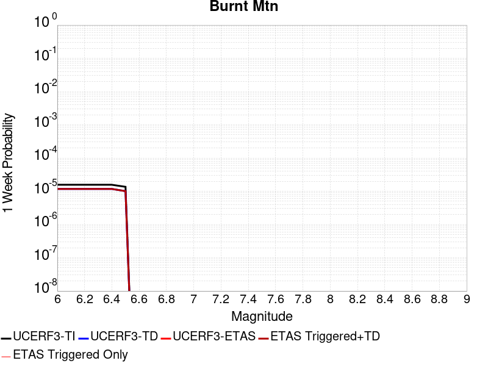 |  | 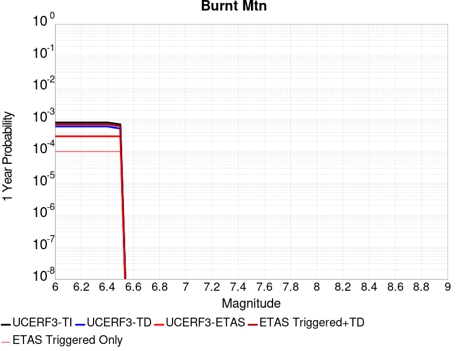 |  |

| Magnitude | 1 wk TI Prob | 1 wk TD Prob | 1 wk ETAS Prob | 1 wk ETAS/TD Gain | 1 wk ETAS Triggered+TD | 1 wk ETAS Triggered Only | 1 mo TI Prob | 1 mo TD Prob | 1 mo ETAS Prob | 1 mo ETAS/TD Gain | 1 mo ETAS Triggered+TD | 1 mo ETAS Triggered Only | 1 yr TI Prob | 1 yr TD Prob | 1 yr ETAS Prob | 1 yr ETAS/TD Gain | 1 yr ETAS Triggered+TD | 1 yr ETAS Triggered Only | 10 yr TI Prob | 10 yr TD Prob | 10 yr ETAS Prob | 10 yr ETAS/TD Gain | 10 yr ETAS Triggered+TD | 10 yr ETAS Triggered Only |
|-----|-----|-----|-----|-----|-----|-----|-----|-----|-----|-----|-----|-----|-----|-----|-----|-----|-----|-----|-----|-----|-----|-----|-----|-----|
| 6.0 | 1.5673151E-5 | 1.1749558E-5 | 0.0 | 0.0 | 1.1749558E-5 | 0.0 | 6.716892E-5 | 5.0355004E-5 | 0.0 | 0.0 | 5.0355004E-5 | 0.0 | 8.1747473E-4 | 6.1302865E-4 | 1.0E-4 | 0.16312452 | 7.129673E-4 | 1.0E-4 | 0.008144741 | 0.006126016 | 7.0E-4 | 0.11426676 | 0.006821728 | 7.0E-4 |
| 6.1 | 1.5673151E-5 | 1.1749558E-5 | 0.0 | 0.0 | 1.1749558E-5 | 0.0 | 6.716892E-5 | 5.0355004E-5 | 0.0 | 0.0 | 5.0355004E-5 | 0.0 | 8.1747473E-4 | 6.1302865E-4 | 1.0E-4 | 0.16312452 | 7.129673E-4 | 1.0E-4 | 0.008144741 | 0.006126016 | 7.0E-4 | 0.11426676 | 0.006821728 | 7.0E-4 |
| 6.2 | 1.5673151E-5 | 1.1749558E-5 | 0.0 | 0.0 | 1.1749558E-5 | 0.0 | 6.716892E-5 | 5.0355004E-5 | 0.0 | 0.0 | 5.0355004E-5 | 0.0 | 8.1747473E-4 | 6.1302865E-4 | 1.0E-4 | 0.16312452 | 7.129673E-4 | 1.0E-4 | 0.008144741 | 0.006126016 | 7.0E-4 | 0.11426676 | 0.006821728 | 7.0E-4 |
| 6.3 | 1.5673151E-5 | 1.1749558E-5 | 0.0 | 0.0 | 1.1749558E-5 | 0.0 | 6.716892E-5 | 5.0355004E-5 | 0.0 | 0.0 | 5.0355004E-5 | 0.0 | 8.1747473E-4 | 6.1302865E-4 | 1.0E-4 | 0.16312452 | 7.129673E-4 | 1.0E-4 | 0.008144741 | 0.006126016 | 7.0E-4 | 0.11426676 | 0.006821728 | 7.0E-4 |
| 6.4 | 1.5673151E-5 | 1.1749558E-5 | 0.0 | 0.0 | 1.1749558E-5 | 0.0 | 6.716892E-5 | 5.0355004E-5 | 0.0 | 0.0 | 5.0355004E-5 | 0.0 | 8.1747473E-4 | 6.1302865E-4 | 1.0E-4 | 0.16312452 | 7.129673E-4 | 1.0E-4 | 0.008144741 | 0.006126016 | 7.0E-4 | 0.11426676 | 0.006821728 | 7.0E-4 |
| 6.5 | 1.36191375E-5 | 1.007816E-5 | 0.0 | 0.0 | 1.007816E-5 | 0.0 | 5.8366426E-5 | 4.319211E-5 | 0.0 | 0.0 | 4.319211E-5 | 0.0 | 7.103795E-4 | 5.2586396E-4 | 1.0E-4 | 0.19016325 | 6.258114E-4 | 1.0E-4 | 0.0070811296 | 0.00525864 | 6.0E-4 | 0.114097945 | 0.0058554844 | 6.0E-4 |

## Hat Creek-McArthur-Mayfield
*[(top)](#table-of-contents)*

| 1 Week | 1 Month | 1 Year | 10 Year |
|-----|-----|-----|-----|
|  |  |  |  |

| Magnitude | 1 wk TI Prob | 1 wk TD Prob | 1 wk ETAS Prob | 1 wk ETAS/TD Gain | 1 wk ETAS Triggered+TD | 1 wk ETAS Triggered Only | 1 mo TI Prob | 1 mo TD Prob | 1 mo ETAS Prob | 1 mo ETAS/TD Gain | 1 mo ETAS Triggered+TD | 1 mo ETAS Triggered Only | 1 yr TI Prob | 1 yr TD Prob | 1 yr ETAS Prob | 1 yr ETAS/TD Gain | 1 yr ETAS Triggered+TD | 1 yr ETAS Triggered Only | 10 yr TI Prob | 10 yr TD Prob | 10 yr ETAS Prob | 10 yr ETAS/TD Gain | 10 yr ETAS Triggered+TD | 10 yr ETAS Triggered Only |
|-----|-----|-----|-----|-----|-----|-----|-----|-----|-----|-----|-----|-----|-----|-----|-----|-----|-----|-----|-----|-----|-----|-----|-----|-----|
| 6.0 | 3.967457E-5 | 4.316615E-5 | 0.0 | 0.0 | 4.316615E-5 | 0.0 | 1.7002279E-4 | 1.8498531E-4 | 0.0 | 0.0 | 1.8498531E-4 | 0.0 | 0.002068062 | 0.002249984 | 0.0 | 0.0 | 0.002249984 | 0.0 | 0.02048922 | 0.022284403 | 6.0E-4 | 0.02692466 | 0.022871032 | 6.0E-4 |
| 6.1 | 2.5044013E-5 | 2.707569E-5 | 0.0 | 0.0 | 2.707569E-5 | 0.0 | 1.0732707E-4 | 1.1603369E-4 | 0.0 | 0.0 | 1.1603369E-4 | 0.0 | 0.0013059238 | 0.0014118265 | 0.0 | 0.0 | 0.0014118265 | 0.0 | 0.01298276 | 0.01403199 | 6.0E-4 | 0.042759433 | 0.014623571 | 6.0E-4 |
| 6.2 | 2.5044013E-5 | 2.707569E-5 | 0.0 | 0.0 | 2.707569E-5 | 0.0 | 1.0732707E-4 | 1.1603369E-4 | 0.0 | 0.0 | 1.1603369E-4 | 0.0 | 0.0013059238 | 0.0014118265 | 0.0 | 0.0 | 0.0014118265 | 0.0 | 0.01298276 | 0.01403199 | 6.0E-4 | 0.042759433 | 0.014623571 | 6.0E-4 |
| 6.3 | 1.6624012E-5 | 1.7893884E-5 | 0.0 | 0.0 | 1.7893884E-5 | 0.0 | 7.124382E-5 | 7.668587E-5 | 0.0 | 0.0 | 7.668587E-5 | 0.0 | 8.670483E-4 | 9.3325914E-4 | 0.0 | 0.0 | 9.3325914E-4 | 0.0 | 0.008636732 | 0.009294334 | 3.0E-4 | 0.03227773 | 0.009591546 | 3.0E-4 |
| 6.4 | 1.6624012E-5 | 1.7893884E-5 | 0.0 | 0.0 | 1.7893884E-5 | 0.0 | 7.124382E-5 | 7.668587E-5 | 0.0 | 0.0 | 7.668587E-5 | 0.0 | 8.670483E-4 | 9.3325914E-4 | 0.0 | 0.0 | 9.3325914E-4 | 0.0 | 0.008636732 | 0.009294334 | 3.0E-4 | 0.03227773 | 0.009591546 | 3.0E-4 |
| 6.5 | 1.3394842E-5 | 1.4394346E-5 | 0.0 | 0.0 | 1.4394346E-5 | 0.0 | 5.7405203E-5 | 6.168863E-5 | 0.0 | 0.0 | 6.168863E-5 | 0.0 | 6.986842E-4 | 7.5080583E-4 | 0.0 | 0.0 | 7.5080583E-4 | 0.0 | 0.006964916 | 0.007483285 | 3.0E-4 | 0.040089346 | 0.00778104 | 3.0E-4 |
| 6.6 | 1.1137514E-5 | 1.1956354E-5 | 0.0 | 0.0 | 1.1956354E-5 | 0.0 | 4.7731326E-5 | 5.124053E-5 | 0.0 | 0.0 | 5.124053E-5 | 0.0 | 5.809739E-4 | 6.236789E-4 | 0.0 | 0.0 | 6.236789E-4 | 0.0 | 0.005794574 | 0.006219708 | 3.0E-4 | 0.048233777 | 0.006517842 | 3.0E-4 |
| 6.7 | 7.0200663E-6 | 7.5254034E-6 | 0.0 | 0.0 | 7.5254034E-6 | 0.0 | 3.008565E-5 | 3.2251337E-5 | 0.0 | 0.0 | 3.2251337E-5 | 0.0 | 3.6623122E-4 | 3.9259088E-4 | 0.0 | 0.0 | 3.9259088E-4 | 0.0 | 0.0036562826 | 0.0039191362 | 3.0E-4 | 0.07654748 | 0.0042179604 | 3.0E-4 |
| 6.8 | 5.940172E-6 | 6.3664156E-6 | 0.0 | 0.0 | 6.3664156E-6 | 0.0 | 2.545763E-5 | 2.7284359E-5 | 0.0 | 0.0 | 2.7284359E-5 | 0.0 | 3.0990256E-4 | 3.3213772E-4 | 0.0 | 0.0 | 3.3213772E-4 | 0.0 | 0.0030947074 | 0.003316542 | 3.0E-4 | 0.090455666 | 0.003615547 | 3.0E-4 |
| 6.9 | 4.129831E-6 | 4.424195E-6 | 0.0 | 0.0 | 4.424195E-6 | 0.0 | 1.7699154E-5 | 1.8960704E-5 | 0.0 | 0.0 | 1.8960704E-5 | 0.0 | 2.154659E-4 | 2.308229E-4 | 0.0 | 0.0 | 2.308229E-4 | 0.0 | 0.002152571 | 0.0023059098 | 2.0E-4 | 0.08673366 | 0.0025054486 | 2.0E-4 |
| 7.0 | 2.6512955E-6 | 2.8378104E-6 | 0.0 | 0.0 | 2.8378104E-6 | 0.0 | 1.1362646E-5 | 1.216199E-5 | 0.0 | 0.0 | 1.216199E-5 | 0.0 | 1.3833142E-4 | 1.480626E-4 | 0.0 | 0.0 | 1.480626E-4 | 0.0 | 0.0013824535 | 0.001479682 | 2.0E-4 | 0.13516417 | 0.0016793861 | 2.0E-4 |
| 7.1 | 1.2992575E-6 | 1.3911339E-6 | 0.0 | 0.0 | 1.3911339E-6 | 0.0 | 5.568235E-6 | 5.96199E-6 | 0.0 | 0.0 | 5.96199E-6 | 0.0 | 6.779115E-5 | 7.258503E-5 | 0.0 | 0.0 | 7.258503E-5 | 0.0 | 6.7770475E-4 | 7.2563486E-4 | 1.0E-4 | 0.13781036 | 8.255623E-4 | 1.0E-4 |
| 7.2 | 4.968191E-7 | 5.3279405E-7 | 0.0 | 0.0 | 5.3279405E-7 | 0.0 | 2.1292228E-6 | 2.2834017E-6 | 0.0 | 0.0 | 2.2834017E-6 | 0.0 | 2.592298E-5 | 2.7800188E-5 | 0.0 | 0.0 | 2.7800188E-5 | 0.0 | 2.5919956E-4 | 2.7797944E-4 | 1.0E-4 | 0.3597388 | 3.7795166E-4 | 1.0E-4 |

## Oak Ridge (Onshore)
*[(top)](#table-of-contents)*

| 1 Week | 1 Month | 1 Year | 10 Year |
|-----|-----|-----|-----|
|  |  |  |  |

| Magnitude | 1 wk TI Prob | 1 wk TD Prob | 1 wk ETAS Prob | 1 wk ETAS/TD Gain | 1 wk ETAS Triggered+TD | 1 wk ETAS Triggered Only | 1 mo TI Prob | 1 mo TD Prob | 1 mo ETAS Prob | 1 mo ETAS/TD Gain | 1 mo ETAS Triggered+TD | 1 mo ETAS Triggered Only | 1 yr TI Prob | 1 yr TD Prob | 1 yr ETAS Prob | 1 yr ETAS/TD Gain | 1 yr ETAS Triggered+TD | 1 yr ETAS Triggered Only | 10 yr TI Prob | 10 yr TD Prob | 10 yr ETAS Prob | 10 yr ETAS/TD Gain | 10 yr ETAS Triggered+TD | 10 yr ETAS Triggered Only |
|-----|-----|-----|-----|-----|-----|-----|-----|-----|-----|-----|-----|-----|-----|-----|-----|-----|-----|-----|-----|-----|-----|-----|-----|-----|
| 6.0 | 3.155064E-5 | 2.9534907E-5 | 0.0 | 0.0 | 2.9534907E-5 | 0.0 | 1.3521002E-4 | 1.2657224E-4 | 0.0 | 0.0 | 1.2657224E-4 | 0.0 | 0.001644939 | 0.0015399659 | 2.0E-4 | 0.12987301 | 0.0017396578 | 2.0E-4 | 0.01632816 | 0.01529737 | 7.0E-4 | 0.0457595 | 0.015986662 | 7.0E-4 |
| 6.1 | 3.155064E-5 | 2.9534907E-5 | 0.0 | 0.0 | 2.9534907E-5 | 0.0 | 1.3521002E-4 | 1.2657224E-4 | 0.0 | 0.0 | 1.2657224E-4 | 0.0 | 0.001644939 | 0.0015399659 | 2.0E-4 | 0.12987301 | 0.0017396578 | 2.0E-4 | 0.01632816 | 0.01529737 | 7.0E-4 | 0.0457595 | 0.015986662 | 7.0E-4 |
| 6.2 | 3.155064E-5 | 2.9534907E-5 | 0.0 | 0.0 | 2.9534907E-5 | 0.0 | 1.3521002E-4 | 1.2657224E-4 | 0.0 | 0.0 | 1.2657224E-4 | 0.0 | 0.001644939 | 0.0015399659 | 2.0E-4 | 0.12987301 | 0.0017396578 | 2.0E-4 | 0.01632816 | 0.01529737 | 7.0E-4 | 0.0457595 | 0.015986662 | 7.0E-4 |
| 6.3 | 3.155064E-5 | 2.9534907E-5 | 0.0 | 0.0 | 2.9534907E-5 | 0.0 | 1.3521002E-4 | 1.2657224E-4 | 0.0 | 0.0 | 1.2657224E-4 | 0.0 | 0.001644939 | 0.0015399659 | 2.0E-4 | 0.12987301 | 0.0017396578 | 2.0E-4 | 0.01632816 | 0.01529737 | 7.0E-4 | 0.0457595 | 0.015986662 | 7.0E-4 |
| 6.4 | 3.155064E-5 | 2.9534907E-5 | 0.0 | 0.0 | 2.9534907E-5 | 0.0 | 1.3521002E-4 | 1.2657224E-4 | 0.0 | 0.0 | 1.2657224E-4 | 0.0 | 0.001644939 | 0.0015399659 | 2.0E-4 | 0.12987301 | 0.0017396578 | 2.0E-4 | 0.01632816 | 0.01529737 | 7.0E-4 | 0.0457595 | 0.015986662 | 7.0E-4 |
| 6.5 | 3.155064E-5 | 2.9534907E-5 | 0.0 | 0.0 | 2.9534907E-5 | 0.0 | 1.3521002E-4 | 1.2657224E-4 | 0.0 | 0.0 | 1.2657224E-4 | 0.0 | 0.001644939 | 0.0015399659 | 2.0E-4 | 0.12987301 | 0.0017396578 | 2.0E-4 | 0.01632816 | 0.01529737 | 7.0E-4 | 0.0457595 | 0.015986662 | 7.0E-4 |
| 6.6 | 3.155064E-5 | 2.9534907E-5 | 0.0 | 0.0 | 2.9534907E-5 | 0.0 | 1.3521002E-4 | 1.2657224E-4 | 0.0 | 0.0 | 1.2657224E-4 | 0.0 | 0.001644939 | 0.0015399659 | 2.0E-4 | 0.12987301 | 0.0017396578 | 2.0E-4 | 0.01632816 | 0.01529737 | 7.0E-4 | 0.0457595 | 0.015986662 | 7.0E-4 |
| 6.7 | 3.098897E-5 | 2.8872864E-5 | 0.0 | 0.0 | 2.8872864E-5 | 0.0 | 1.328031E-4 | 1.237352E-4 | 0.0 | 0.0 | 1.237352E-4 | 0.0 | 0.0016156785 | 0.0015054727 | 2.0E-4 | 0.13284865 | 0.0017051715 | 2.0E-4 | 0.016039822 | 0.014957102 | 7.0E-4 | 0.04680051 | 0.01564663 | 7.0E-4 |
| 6.8 | 3.0449872E-5 | 2.8247858E-5 | 0.0 | 0.0 | 2.8247858E-5 | 0.0 | 1.3049292E-4 | 1.21056844E-4 | 0.0 | 0.0 | 1.21056844E-4 | 0.0 | 0.0015875935 | 0.0014729078 | 2.0E-4 | 0.13578582 | 0.0016726132 | 2.0E-4 | 0.015762992 | 0.014635746 | 7.0E-4 | 0.047828104 | 0.015325501 | 7.0E-4 |
| 6.9 | 2.697928E-5 | 2.4226945E-5 | 0.0 | 0.0 | 2.4226945E-5 | 0.0 | 1.15620365E-4 | 1.03825754E-4 | 0.0 | 0.0 | 1.03825754E-4 | 0.0 | 0.0014067689 | 0.0012633671 | 2.0E-4 | 0.15830712 | 0.0014631144 | 2.0E-4 | 0.0139789665 | 0.012564485 | 6.0E-4 | 0.047753647 | 0.013156947 | 6.0E-4 |
| 7.0 | 2.4893961E-5 | 2.1868498E-5 | 0.0 | 0.0 | 2.1868498E-5 | 0.0 | 1.0668404E-4 | 9.371887E-5 | 0.0 | 0.0 | 9.371887E-5 | 0.0 | 0.0012981043 | 0.0011404477 | 2.0E-4 | 0.17536974 | 0.0013402195 | 2.0E-4 | 0.012905477 | 0.011348155 | 6.0E-4 | 0.05287203 | 0.011941346 | 6.0E-4 |
| 7.1 | 2.0945363E-5 | 1.7359598E-5 | 0.0 | 0.0 | 1.7359598E-5 | 0.0 | 8.976275E-5 | 7.439619E-5 | 0.0 | 0.0 | 7.439619E-5 | 0.0 | 0.0010923136 | 9.054019E-4 | 1.0E-4 | 0.11044819 | 0.0010053114 | 1.0E-4 | 0.0108696 | 0.009017985 | 5.0E-4 | 0.05544476 | 0.009513476 | 5.0E-4 |
| 7.2 | 2.0439404E-5 | 1.6814385E-5 | 0.0 | 0.0 | 1.6814385E-5 | 0.0 | 8.7594504E-5 | 7.205969E-5 | 0.0 | 0.0 | 7.205969E-5 | 0.0 | 0.0010659413 | 8.769783E-4 | 1.0E-4 | 0.11402791 | 9.768906E-4 | 1.0E-4 | 0.010608427 | 0.008736012 | 5.0E-4 | 0.057234358 | 0.009231644 | 5.0E-4 |
| 7.3 | 1.8463334E-5 | 1.5385009E-5 | 0.0 | 0.0 | 1.5385009E-5 | 0.0 | 7.912617E-5 | 6.593411E-5 | 0.0 | 0.0 | 6.593411E-5 | 0.0 | 9.6293533E-4 | 8.0245646E-4 | 1.0E-4 | 0.12461735 | 9.0237625E-4 | 1.0E-4 | 0.009587734 | 0.00799637 | 5.0E-4 | 0.06252837 | 0.008492372 | 5.0E-4 |
| 7.4 | 1.763139E-5 | 1.4519665E-5 | 0.0 | 0.0 | 1.4519665E-5 | 0.0 | 7.556091E-5 | 6.222567E-5 | 0.0 | 0.0 | 6.222567E-5 | 0.0 | 9.1956573E-4 | 7.573382E-4 | 1.0E-4 | 0.13204141 | 8.5726246E-4 | 1.0E-4 | 0.009157699 | 0.0075482936 | 5.0E-4 | 0.06624014 | 0.008044519 | 5.0E-4 |
| 7.5 | 1.3594944E-5 | 1.116537E-5 | 0.0 | 0.0 | 1.116537E-5 | 0.0 | 5.8262744E-5 | 4.785072E-5 | 0.0 | 0.0 | 4.785072E-5 | 0.0 | 7.0911803E-4 | 5.8242935E-4 | 1.0E-4 | 0.17169465 | 6.823711E-4 | 1.0E-4 | 0.007068595 | 0.005809314 | 4.0E-4 | 0.06885495 | 0.00620699 | 4.0E-4 |
| 7.6 | 6.9889534E-6 | 5.6374583E-6 | 0.0 | 0.0 | 5.6374583E-6 | 0.0 | 2.9952313E-5 | 2.4160316E-5 | 0.0 | 0.0 | 2.4160316E-5 | 0.0 | 3.646084E-4 | 2.9411254E-4 | 1.0E-4 | 0.3400059 | 3.9408315E-4 | 1.0E-4 | 0.0036401073 | 0.002937277 | 2.0E-4 | 0.068090275 | 0.0031366895 | 2.0E-4 |
| 7.7 | 4.0824193E-6 | 3.2837024E-6 | 0.0 | 0.0 | 3.2837024E-6 | 0.0 | 1.7495966E-5 | 1.4072935E-5 | 0.0 | 0.0 | 1.4072935E-5 | 0.0 | 2.1299256E-4 | 1.7132465E-4 | 1.0E-4 | 0.5836872 | 2.713075E-4 | 1.0E-4 | 0.0021278851 | 0.0017119391 | 2.0E-4 | 0.11682659 | 0.0019115967 | 2.0E-4 |
| 7.8 | 1.7023609E-6 | 1.4372135E-6 | 0.0 | 0.0 | 1.4372135E-6 | 0.0 | 7.295812E-6 | 6.1594724E-6 | 0.0 | 0.0 | 6.1594724E-6 | 0.0 | 8.882289E-5 | 7.4989024E-5 | 1.0E-4 | 1.3335285 | 1.7498153E-4 | 1.0E-4 | 8.8787393E-4 | 7.4964E-4 | 1.0E-4 | 0.13339737 | 8.49565E-4 | 1.0E-4 |
| 7.9 | 2.721225E-7 | 2.2619803E-7 | 0.0 | 0.0 | 2.2619803E-7 | 0.0 | 1.1662388E-6 | 9.694197E-7 | 0.0 | 0.0 | 9.694197E-7 | 0.0 | 1.4198865E-5 | 1.1802625E-5 | 0.0 | 0.0 | 1.1802625E-5 | 0.0 | 1.4197957E-4 | 1.1802026E-4 | 0.0 | 0.0 | 1.1802026E-4 | 0.0 |
| 8.0 | 9.364255E-9 | 5.1229705E-9 | 0.0 | 0.0 | 5.1229705E-9 | 0.0 | 4.0132523E-8 | 2.1955588E-8 | 0.0 | 0.0 | 2.1955588E-8 | 0.0 | 4.8861335E-7 | 2.6730925E-7 | 0.0 | 0.0 | 2.6730925E-7 | 0.0 | 4.8861225E-6 | 2.6730897E-6 | 0.0 | 0.0 | 2.6730897E-6 | 0.0 |

## Earthquake Valley (So Extension)
*[(top)](#table-of-contents)*

| 1 Week | 1 Month | 1 Year | 10 Year |
|-----|-----|-----|-----|
|  |  |  |  |

| Magnitude | 1 wk TI Prob | 1 wk TD Prob | 1 wk ETAS Prob | 1 wk ETAS/TD Gain | 1 wk ETAS Triggered+TD | 1 wk ETAS Triggered Only | 1 mo TI Prob | 1 mo TD Prob | 1 mo ETAS Prob | 1 mo ETAS/TD Gain | 1 mo ETAS Triggered+TD | 1 mo ETAS Triggered Only | 1 yr TI Prob | 1 yr TD Prob | 1 yr ETAS Prob | 1 yr ETAS/TD Gain | 1 yr ETAS Triggered+TD | 1 yr ETAS Triggered Only | 10 yr TI Prob | 10 yr TD Prob | 10 yr ETAS Prob | 10 yr ETAS/TD Gain | 10 yr ETAS Triggered+TD | 10 yr ETAS Triggered Only |
|-----|-----|-----|-----|-----|-----|-----|-----|-----|-----|-----|-----|-----|-----|-----|-----|-----|-----|-----|-----|-----|-----|-----|-----|-----|
| 6.0 | 3.0194888E-5 | 3.7089554E-5 | 0.0 | 0.0 | 3.7089554E-5 | 0.0 | 1.2940024E-4 | 1.5894862E-4 | 0.0 | 0.0 | 1.5894862E-4 | 0.0 | 0.0015743093 | 0.0019339989 | 0.0 | 0.0 | 0.0019339989 | 0.0 | 0.01563203 | 0.019222068 | 7.0E-4 | 0.03641648 | 0.019908613 | 7.0E-4 |
| 6.1 | 3.0194888E-5 | 3.7089554E-5 | 0.0 | 0.0 | 3.7089554E-5 | 0.0 | 1.2940024E-4 | 1.5894862E-4 | 0.0 | 0.0 | 1.5894862E-4 | 0.0 | 0.0015743093 | 0.0019339989 | 0.0 | 0.0 | 0.0019339989 | 0.0 | 0.01563203 | 0.019222068 | 7.0E-4 | 0.03641648 | 0.019908613 | 7.0E-4 |
| 6.2 | 3.0194888E-5 | 3.7089554E-5 | 0.0 | 0.0 | 3.7089554E-5 | 0.0 | 1.2940024E-4 | 1.5894862E-4 | 0.0 | 0.0 | 1.5894862E-4 | 0.0 | 0.0015743093 | 0.0019339989 | 0.0 | 0.0 | 0.0019339989 | 0.0 | 0.01563203 | 0.019222068 | 7.0E-4 | 0.03641648 | 0.019908613 | 7.0E-4 |
| 6.3 | 1.5795305E-5 | 1.8453153E-5 | 0.0 | 0.0 | 1.8453153E-5 | 0.0 | 6.769241E-5 | 7.908317E-5 | 0.0 | 0.0 | 7.908317E-5 | 0.0 | 8.238434E-4 | 9.6252305E-4 | 0.0 | 0.0 | 9.6252305E-4 | 0.0 | 0.008207959 | 0.009594448 | 5.0E-4 | 0.052113473 | 0.010089651 | 5.0E-4 |
| 6.4 | 1.5795305E-5 | 1.8453153E-5 | 0.0 | 0.0 | 1.8453153E-5 | 0.0 | 6.769241E-5 | 7.908317E-5 | 0.0 | 0.0 | 7.908317E-5 | 0.0 | 8.238434E-4 | 9.6252305E-4 | 0.0 | 0.0 | 9.6252305E-4 | 0.0 | 0.008207959 | 0.009594448 | 5.0E-4 | 0.052113473 | 0.010089651 | 5.0E-4 |
| 6.5 | 1.5795305E-5 | 1.8453153E-5 | 0.0 | 0.0 | 1.8453153E-5 | 0.0 | 6.769241E-5 | 7.908317E-5 | 0.0 | 0.0 | 7.908317E-5 | 0.0 | 8.238434E-4 | 9.6252305E-4 | 0.0 | 0.0 | 9.6252305E-4 | 0.0 | 0.008207959 | 0.009594448 | 5.0E-4 | 0.052113473 | 0.010089651 | 5.0E-4 |
| 6.6 | 1.5795305E-5 | 1.8453153E-5 | 0.0 | 0.0 | 1.8453153E-5 | 0.0 | 6.769241E-5 | 7.908317E-5 | 0.0 | 0.0 | 7.908317E-5 | 0.0 | 8.238434E-4 | 9.6252305E-4 | 0.0 | 0.0 | 9.6252305E-4 | 0.0 | 0.008207959 | 0.009594448 | 5.0E-4 | 0.052113473 | 0.010089651 | 5.0E-4 |
| 6.7 | 1.1363076E-5 | 1.3142666E-5 | 0.0 | 0.0 | 1.3142666E-5 | 0.0 | 4.8697988E-5 | 5.6324923E-5 | 0.0 | 0.0 | 5.6324923E-5 | 0.0 | 5.927367E-4 | 6.8561634E-4 | 0.0 | 0.0 | 6.8561634E-4 | 0.0 | 0.0059115817 | 0.0068424894 | 5.0E-4 | 0.07307282 | 0.0073390678 | 5.0E-4 |
| 6.8 | 1.0049611E-5 | 1.15981475E-5 | 0.0 | 0.0 | 1.15981475E-5 | 0.0 | 4.306905E-5 | 4.970581E-5 | 0.0 | 0.0 | 4.970581E-5 | 0.0 | 5.242395E-4 | 6.050734E-4 | 0.0 | 0.0 | 6.050734E-4 | 0.0 | 0.0052300454 | 0.006041441 | 4.0E-4 | 0.06620937 | 0.0064390246 | 4.0E-4 |
| 6.9 | 1.0049611E-5 | 1.15981475E-5 | 0.0 | 0.0 | 1.15981475E-5 | 0.0 | 4.306905E-5 | 4.970581E-5 | 0.0 | 0.0 | 4.970581E-5 | 0.0 | 5.242395E-4 | 6.050734E-4 | 0.0 | 0.0 | 6.050734E-4 | 0.0 | 0.0052300454 | 0.006041441 | 4.0E-4 | 0.06620937 | 0.0064390246 | 4.0E-4 |
| 7.0 | 1.0049611E-5 | 1.15981475E-5 | 0.0 | 0.0 | 1.15981475E-5 | 0.0 | 4.306905E-5 | 4.970581E-5 | 0.0 | 0.0 | 4.970581E-5 | 0.0 | 5.242395E-4 | 6.050734E-4 | 0.0 | 0.0 | 6.050734E-4 | 0.0 | 0.0052300454 | 0.006041441 | 4.0E-4 | 0.06620937 | 0.0064390246 | 4.0E-4 |
| 7.1 | 8.140254E-6 | 9.386552E-6 | 0.0 | 0.0 | 9.386552E-6 | 0.0 | 3.4886336E-5 | 4.022784E-5 | 0.0 | 0.0 | 4.022784E-5 | 0.0 | 4.2465836E-4 | 4.8973097E-4 | 0.0 | 0.0 | 4.8973097E-4 | 0.0 | 0.0042384774 | 0.004893098 | 4.0E-4 | 0.0817478 | 0.0052911406 | 4.0E-4 |
| 7.2 | 1.673835E-7 | 1.4160625E-7 | 0.0 | 0.0 | 1.4160625E-7 | 0.0 | 7.173577E-7 | 6.068838E-7 | 0.0 | 0.0 | 6.068838E-7 | 0.0 | 8.733795E-6 | 7.388789E-6 | 0.0 | 0.0 | 7.388789E-6 | 0.0 | 8.733451E-5 | 7.3885785E-5 | 0.0 | 0.0 | 7.3885785E-5 | 0.0 |
| 7.3 | 1.6632116E-7 | 1.4058833E-7 | 0.0 | 0.0 | 1.4058833E-7 | 0.0 | 7.1280476E-7 | 6.025213E-7 | 0.0 | 0.0 | 6.025213E-7 | 0.0 | 8.678364E-6 | 7.3356755E-6 | 0.0 | 0.0 | 7.3356755E-6 | 0.0 | 8.6780245E-5 | 7.335469E-5 | 0.0 | 0.0 | 7.335469E-5 | 0.0 |
| 7.4 | 1.6569169E-7 | 1.4003444E-7 | 0.0 | 0.0 | 1.4003444E-7 | 0.0 | 7.1010703E-7 | 6.0014753E-7 | 0.0 | 0.0 | 6.0014753E-7 | 0.0 | 8.645519E-6 | 7.306775E-6 | 0.0 | 0.0 | 7.306775E-6 | 0.0 | 8.645182E-5 | 7.3065705E-5 | 0.0 | 0.0 | 7.3065705E-5 | 0.0 |
| 7.5 | 1.1764555E-7 | 1.01010464E-7 | 0.0 | 0.0 | 1.01010464E-7 | 0.0 | 5.041951E-7 | 4.3290194E-7 | 0.0 | 0.0 | 4.3290194E-7 | 0.0 | 6.138558E-6 | 5.2705705E-6 | 0.0 | 0.0 | 5.2705705E-6 | 0.0 | 6.1383886E-5 | 5.270467E-5 | 0.0 | 0.0 | 5.270467E-5 | 0.0 |
| 7.6 | 1.07927605E-7 | 9.2655846E-8 | 0.0 | 0.0 | 9.2655846E-8 | 0.0 | 4.6254678E-7 | 3.9709644E-7 | 0.0 | 0.0 | 3.9709644E-7 | 0.0 | 5.6314925E-6 | 4.8346405E-6 | 0.0 | 0.0 | 4.8346405E-6 | 0.0 | 5.63135E-5 | 4.8345562E-5 | 0.0 | 0.0 | 4.8345562E-5 | 0.0 |
| 7.7 | 2.1826905E-8 | 1.1188581E-8 | 0.0 | 0.0 | 1.1188581E-8 | 0.0 | 9.3543875E-8 | 4.795106E-8 | 0.0 | 0.0 | 4.795106E-8 | 0.0 | 1.1388961E-6 | 5.83804E-7 | 0.0 | 0.0 | 5.83804E-7 | 0.0 | 1.1388902E-5 | 5.8380306E-6 | 0.0 | 0.0 | 5.8380306E-6 | 0.0 |
| 7.8 | 2.6169649E-9 | 1.1977435E-9 | 0.0 | 0.0 | 1.1977435E-9 | 0.0 | 1.1215564E-8 | 5.1331863E-9 | 0.0 | 0.0 | 5.1331863E-9 | 0.0 | 1.3654947E-7 | 6.249654E-8 | 0.0 | 0.0 | 6.249654E-8 | 0.0 | 1.365494E-6 | 6.249654E-7 | 0.0 | 0.0 | 6.249654E-7 | 0.0 |

## Helendale-So Lockhart
*[(top)](#table-of-contents)*

| 1 Week | 1 Month | 1 Year | 10 Year |
|-----|-----|-----|-----|
|  |  |  |  |

| Magnitude | 1 wk TI Prob | 1 wk TD Prob | 1 wk ETAS Prob | 1 wk ETAS/TD Gain | 1 wk ETAS Triggered+TD | 1 wk ETAS Triggered Only | 1 mo TI Prob | 1 mo TD Prob | 1 mo ETAS Prob | 1 mo ETAS/TD Gain | 1 mo ETAS Triggered+TD | 1 mo ETAS Triggered Only | 1 yr TI Prob | 1 yr TD Prob | 1 yr ETAS Prob | 1 yr ETAS/TD Gain | 1 yr ETAS Triggered+TD | 1 yr ETAS Triggered Only | 10 yr TI Prob | 10 yr TD Prob | 10 yr ETAS Prob | 10 yr ETAS/TD Gain | 10 yr ETAS Triggered+TD | 10 yr ETAS Triggered Only |
|-----|-----|-----|-----|-----|-----|-----|-----|-----|-----|-----|-----|-----|-----|-----|-----|-----|-----|-----|-----|-----|-----|-----|-----|-----|
| 6.0 | 1.7296055E-5 | 1.8105475E-5 | 0.0 | 0.0 | 1.8105475E-5 | 0.0 | 7.412385E-5 | 7.75927E-5 | 0.0 | 0.0 | 7.75927E-5 | 0.0 | 9.0208417E-4 | 9.443024E-4 | 0.0 | 0.0 | 9.443024E-4 | 0.0 | 0.008984311 | 0.009405019 | 7.0E-4 | 0.07442835 | 0.010098435 | 7.0E-4 |
| 6.1 | 1.7296055E-5 | 1.8105475E-5 | 0.0 | 0.0 | 1.8105475E-5 | 0.0 | 7.412385E-5 | 7.75927E-5 | 0.0 | 0.0 | 7.75927E-5 | 0.0 | 9.0208417E-4 | 9.443024E-4 | 0.0 | 0.0 | 9.443024E-4 | 0.0 | 0.008984311 | 0.009405019 | 7.0E-4 | 0.07442835 | 0.010098435 | 7.0E-4 |
| 6.2 | 1.7296055E-5 | 1.8105475E-5 | 0.0 | 0.0 | 1.8105475E-5 | 0.0 | 7.412385E-5 | 7.75927E-5 | 0.0 | 0.0 | 7.75927E-5 | 0.0 | 9.0208417E-4 | 9.443024E-4 | 0.0 | 0.0 | 9.443024E-4 | 0.0 | 0.008984311 | 0.009405019 | 7.0E-4 | 0.07442835 | 0.010098435 | 7.0E-4 |
| 6.3 | 1.0669118E-5 | 1.1136428E-5 | 0.0 | 0.0 | 1.1136428E-5 | 0.0 | 4.5723988E-5 | 4.772669E-5 | 0.0 | 0.0 | 4.772669E-5 | 0.0 | 5.5654737E-4 | 5.809204E-4 | 0.0 | 0.0 | 5.809204E-4 | 0.0 | 0.0055515557 | 0.005794314 | 2.0E-4 | 0.034516595 | 0.0059931553 | 2.0E-4 |
| 6.4 | 1.0669118E-5 | 1.1136428E-5 | 0.0 | 0.0 | 1.1136428E-5 | 0.0 | 4.5723988E-5 | 4.772669E-5 | 0.0 | 0.0 | 4.772669E-5 | 0.0 | 5.5654737E-4 | 5.809204E-4 | 0.0 | 0.0 | 5.809204E-4 | 0.0 | 0.0055515557 | 0.005794314 | 2.0E-4 | 0.034516595 | 0.0059931553 | 2.0E-4 |
| 6.5 | 8.790038E-6 | 9.171014E-6 | 0.0 | 0.0 | 9.171014E-6 | 0.0 | 3.767105E-5 | 3.9303766E-5 | 0.0 | 0.0 | 3.9303766E-5 | 0.0 | 4.585485E-4 | 4.7841982E-4 | 0.0 | 0.0 | 4.7841982E-4 | 0.0 | 0.0045760344 | 0.0047740634 | 2.0E-4 | 0.041893035 | 0.0049731084 | 2.0E-4 |
| 6.6 | 7.396949E-6 | 7.716222E-6 | 0.0 | 0.0 | 7.716222E-6 | 0.0 | 3.1700827E-5 | 3.306911E-5 | 0.0 | 0.0 | 3.306911E-5 | 0.0 | 3.858892E-4 | 4.0254305E-4 | 0.0 | 0.0 | 4.0254305E-4 | 0.0 | 0.003852198 | 0.004018246 | 2.0E-4 | 0.04977296 | 0.004217442 | 2.0E-4 |
| 6.7 | 6.4600285E-6 | 6.738629E-6 | 0.0 | 0.0 | 6.738629E-6 | 0.0 | 2.7685543E-5 | 2.8879524E-5 | 0.0 | 0.0 | 2.8879524E-5 | 0.0 | 3.3701936E-4 | 3.5155224E-4 | 0.0 | 0.0 | 3.5155224E-4 | 0.0 | 0.0033650869 | 0.003510043 | 2.0E-4 | 0.056979362 | 0.003709341 | 2.0E-4 |
| 6.8 | 5.600104E-6 | 5.8365163E-6 | 0.0 | 0.0 | 5.8365163E-6 | 0.0 | 2.4000226E-5 | 2.5013404E-5 | 0.0 | 0.0 | 2.5013404E-5 | 0.0 | 2.9216358E-4 | 3.0449624E-4 | 0.0 | 0.0 | 3.0449624E-4 | 0.0 | 0.0029177975 | 0.0030408518 | 2.0E-4 | 0.06577105 | 0.0032402435 | 2.0E-4 |
| 6.9 | 4.839122E-6 | 5.0399394E-6 | 0.0 | 0.0 | 5.0399394E-6 | 0.0 | 2.0738931E-5 | 2.1599564E-5 | 0.0 | 0.0 | 2.1599564E-5 | 0.0 | 2.5246723E-4 | 2.6294342E-4 | 0.0 | 0.0 | 2.6294342E-4 | 0.0 | 0.002521806 | 0.0026263706 | 2.0E-4 | 0.076150715 | 0.0028258453 | 2.0E-4 |
| 7.0 | 3.6937633E-6 | 3.845533E-6 | 0.0 | 0.0 | 3.845533E-6 | 0.0 | 1.5830317E-5 | 1.6480753E-5 | 0.0 | 0.0 | 1.6480753E-5 | 0.0 | 1.9271708E-4 | 2.00635E-4 | 0.0 | 0.0 | 2.00635E-4 | 0.0 | 0.0019255003 | 0.00200457 | 0.0 | 0.0 | 0.00200457 | 0.0 |
| 7.1 | 2.7858857E-6 | 2.8980937E-6 | 0.0 | 0.0 | 2.8980937E-6 | 0.0 | 1.1939455E-5 | 1.2420343E-5 | 0.0 | 0.0 | 1.2420343E-5 | 0.0 | 1.4535317E-4 | 1.5120741E-4 | 0.0 | 0.0 | 1.5120741E-4 | 0.0 | 0.0014525814 | 0.0015110667 | 0.0 | 0.0 | 0.0015110667 | 0.0 |
| 7.2 | 2.1672065E-6 | 2.2541988E-6 | 0.0 | 0.0 | 2.2541988E-6 | 0.0 | 9.2879945E-6 | 9.660817E-6 | 0.0 | 0.0 | 9.660817E-6 | 0.0 | 1.1307546E-4 | 1.1761428E-4 | 0.0 | 0.0 | 1.1761428E-4 | 0.0 | 0.0011301794 | 0.0011755385 | 0.0 | 0.0 | 0.0011755385 | 0.0 |
| 7.3 | 1.4823496E-6 | 1.5423385E-6 | 0.0 | 0.0 | 1.5423385E-6 | 0.0 | 6.3529114E-6 | 6.610006E-6 | 0.0 | 0.0 | 6.610006E-6 | 0.0 | 7.734395E-5 | 8.0474005E-5 | 0.0 | 0.0 | 8.0474005E-5 | 0.0 | 7.731704E-4 | 8.0446375E-4 | 0.0 | 0.0 | 8.0446375E-4 | 0.0 |
| 7.4 | 4.2321457E-7 | 4.4112602E-7 | 0.0 | 0.0 | 4.4112602E-7 | 0.0 | 1.8137755E-6 | 1.8905389E-6 | 0.0 | 0.0 | 1.8905389E-6 | 0.0 | 2.2082493E-5 | 2.3017115E-5 | 0.0 | 0.0 | 2.3017115E-5 | 0.0 | 2.2080299E-4 | 2.3015184E-4 | 0.0 | 0.0 | 2.3015184E-4 | 0.0 |
| 7.5 | 5.6942316E-8 | 5.942096E-8 | 0.0 | 0.0 | 5.942096E-8 | 0.0 | 2.440385E-7 | 2.5466124E-7 | 0.0 | 0.0 | 2.5466124E-7 | 0.0 | 2.9711643E-6 | 3.100497E-6 | 0.0 | 0.0 | 3.100497E-6 | 0.0 | 2.9711247E-5 | 3.1004616E-5 | 0.0 | 0.0 | 3.1004616E-5 | 0.0 |

## Elsinore (Stepovers Combined)
*[(top)](#table-of-contents)*

| 1 Week | 1 Month | 1 Year | 10 Year |
|-----|-----|-----|-----|
|  |  |  |  |

| Magnitude | 1 wk TI Prob | 1 wk TD Prob | 1 wk ETAS Prob | 1 wk ETAS/TD Gain | 1 wk ETAS Triggered+TD | 1 wk ETAS Triggered Only | 1 mo TI Prob | 1 mo TD Prob | 1 mo ETAS Prob | 1 mo ETAS/TD Gain | 1 mo ETAS Triggered+TD | 1 mo ETAS Triggered Only | 1 yr TI Prob | 1 yr TD Prob | 1 yr ETAS Prob | 1 yr ETAS/TD Gain | 1 yr ETAS Triggered+TD | 1 yr ETAS Triggered Only | 10 yr TI Prob | 10 yr TD Prob | 10 yr ETAS Prob | 10 yr ETAS/TD Gain | 10 yr ETAS Triggered+TD | 10 yr ETAS Triggered Only |
|-----|-----|-----|-----|-----|-----|-----|-----|-----|-----|-----|-----|-----|-----|-----|-----|-----|-----|-----|-----|-----|-----|-----|-----|-----|
| 6.0 | 2.144392E-5 | 1.9773091E-5 | 0.0 | 0.0 | 1.9773091E-5 | 0.0 | 9.189928E-5 | 8.473916E-5 | 0.0 | 0.0 | 8.473916E-5 | 0.0 | 0.0011182994 | 0.0010312302 | 0.0 | 0.0 | 0.0010312302 | 0.0 | 0.011126885 | 0.010271067 | 7.0E-4 | 0.068152614 | 0.010963877 | 7.0E-4 |
| 6.1 | 2.144392E-5 | 1.9773091E-5 | 0.0 | 0.0 | 1.9773091E-5 | 0.0 | 9.189928E-5 | 8.473916E-5 | 0.0 | 0.0 | 8.473916E-5 | 0.0 | 0.0011182994 | 0.0010312302 | 0.0 | 0.0 | 0.0010312302 | 0.0 | 0.011126885 | 0.010271067 | 7.0E-4 | 0.068152614 | 0.010963877 | 7.0E-4 |
| 6.2 | 2.144392E-5 | 1.9773091E-5 | 0.0 | 0.0 | 1.9773091E-5 | 0.0 | 9.189928E-5 | 8.473916E-5 | 0.0 | 0.0 | 8.473916E-5 | 0.0 | 0.0011182994 | 0.0010312302 | 0.0 | 0.0 | 0.0010312302 | 0.0 | 0.011126885 | 0.010271067 | 7.0E-4 | 0.068152614 | 0.010963877 | 7.0E-4 |
| 6.3 | 1.9751555E-5 | 1.7753548E-5 | 0.0 | 0.0 | 1.7753548E-5 | 0.0 | 8.4646774E-5 | 7.608447E-5 | 0.0 | 0.0 | 7.608447E-5 | 0.0 | 0.0010300872 | 9.25949E-4 | 0.0 | 0.0 | 9.25949E-4 | 0.0 | 0.010253254 | 0.009227017 | 7.0E-4 | 0.07586417 | 0.009920558 | 7.0E-4 |
| 6.4 | 1.9751555E-5 | 1.7753548E-5 | 0.0 | 0.0 | 1.7753548E-5 | 0.0 | 8.4646774E-5 | 7.608447E-5 | 0.0 | 0.0 | 7.608447E-5 | 0.0 | 0.0010300872 | 9.25949E-4 | 0.0 | 0.0 | 9.25949E-4 | 0.0 | 0.010253254 | 0.009227017 | 7.0E-4 | 0.07586417 | 0.009920558 | 7.0E-4 |
| 6.5 | 1.9751555E-5 | 1.7753548E-5 | 0.0 | 0.0 | 1.7753548E-5 | 0.0 | 8.4646774E-5 | 7.608447E-5 | 0.0 | 0.0 | 7.608447E-5 | 0.0 | 0.0010300872 | 9.25949E-4 | 0.0 | 0.0 | 9.25949E-4 | 0.0 | 0.010253254 | 0.009227017 | 7.0E-4 | 0.07586417 | 0.009920558 | 7.0E-4 |
| 6.6 | 1.9188685E-5 | 1.7015012E-5 | 0.0 | 0.0 | 1.7015012E-5 | 0.0 | 8.2234634E-5 | 7.291954E-5 | 0.0 | 0.0 | 7.291954E-5 | 0.0 | 0.0010007467 | 8.8744995E-4 | 0.0 | 0.0 | 8.8744995E-4 | 0.0 | 0.00996252 | 0.008845359 | 7.0E-4 | 0.07913755 | 0.009539167 | 7.0E-4 |
| 6.7 | 1.7608272E-5 | 1.4742688E-5 | 0.0 | 0.0 | 1.4742688E-5 | 0.0 | 7.546184E-5 | 6.318148E-5 | 0.0 | 0.0 | 6.318148E-5 | 0.0 | 9.183606E-4 | 7.6897274E-4 | 0.0 | 0.0 | 7.6897274E-4 | 0.0 | 0.009145746 | 0.007669744 | 7.0E-4 | 0.09126771 | 0.008364375 | 7.0E-4 |
| 6.8 | 1.697165E-5 | 1.3792716E-5 | 0.0 | 0.0 | 1.3792716E-5 | 0.0 | 7.273361E-5 | 5.911035E-5 | 0.0 | 0.0 | 5.911035E-5 | 0.0 | 8.8517193E-4 | 7.194396E-4 | 0.0 | 0.0 | 7.194396E-4 | 0.0 | 0.008816543 | 0.0071770456 | 7.0E-4 | 0.09753317 | 0.007872022 | 7.0E-4 |
| 6.9 | 1.600365E-5 | 1.2855703E-5 | 0.0 | 0.0 | 1.2855703E-5 | 0.0 | 6.858527E-5 | 5.5094748E-5 | 0.0 | 0.0 | 5.5094748E-5 | 0.0 | 8.347058E-4 | 6.705799E-4 | 0.0 | 0.0 | 6.705799E-4 | 0.0 | 0.008315775 | 0.006691119 | 7.0E-4 | 0.104616284 | 0.0073864353 | 7.0E-4 |
| 7.0 | 1.3314581E-5 | 1.0455437E-5 | 0.0 | 0.0 | 1.0455437E-5 | 0.0 | 5.7061243E-5 | 4.4808265E-5 | 0.0 | 0.0 | 4.4808265E-5 | 0.0 | 6.944992E-4 | 5.454068E-4 | 0.0 | 0.0 | 5.454068E-4 | 0.0 | 0.006923327 | 0.0054443954 | 6.0E-4 | 0.11020507 | 0.0060411287 | 6.0E-4 |
| 7.1 | 1.2865345E-5 | 9.944958E-6 | 0.0 | 0.0 | 9.944958E-6 | 0.0 | 5.5136024E-5 | 4.2620566E-5 | 0.0 | 0.0 | 4.2620566E-5 | 0.0 | 6.710743E-4 | 5.187844E-4 | 0.0 | 0.0 | 5.187844E-4 | 0.0 | 0.0066905143 | 0.005179007 | 6.0E-4 | 0.11585232 | 0.0057758996 | 6.0E-4 |
| 7.2 | 1.1650051E-5 | 8.640239E-6 | 0.0 | 0.0 | 8.640239E-6 | 0.0 | 4.9927836E-5 | 3.702908E-5 | 0.0 | 0.0 | 3.702908E-5 | 0.0 | 6.0770183E-4 | 4.5073757E-4 | 0.0 | 0.0 | 4.5073757E-4 | 0.0 | 0.0060604266 | 0.0044997153 | 6.0E-4 | 0.13334177 | 0.0050970153 | 6.0E-4 |
| 7.3 | 1.0008533E-5 | 7.2064026E-6 | 0.0 | 0.0 | 7.2064026E-6 | 0.0 | 4.2893007E-5 | 3.0884225E-5 | 0.0 | 0.0 | 3.0884225E-5 | 0.0 | 5.220972E-4 | 3.7595202E-4 | 0.0 | 0.0 | 3.7595202E-4 | 0.0 | 0.005208723 | 0.0037535334 | 3.0E-4 | 0.079924695 | 0.004052407 | 3.0E-4 |
| 7.4 | 9.116759E-6 | 6.4148244E-6 | 0.0 | 0.0 | 6.4148244E-6 | 0.0 | 3.907124E-5 | 2.7491822E-5 | 0.0 | 0.0 | 2.7491822E-5 | 0.0 | 4.7558855E-4 | 3.346629E-4 | 0.0 | 0.0 | 3.346629E-4 | 0.0 | 0.00474572 | 0.0033417405 | 3.0E-4 | 0.08977358 | 0.0036407379 | 3.0E-4 |
| 7.5 | 7.870524E-6 | 5.3865906E-6 | 0.0 | 0.0 | 5.3865906E-6 | 0.0 | 3.3730383E-5 | 2.3085191E-5 | 0.0 | 0.0 | 2.3085191E-5 | 0.0 | 4.1059E-4 | 2.810272E-4 | 0.0 | 0.0 | 2.810272E-4 | 0.0 | 0.0040983222 | 0.0028068451 | 3.0E-4 | 0.10688157 | 0.003106003 | 3.0E-4 |
| 7.6 | 6.9774537E-6 | 4.681274E-6 | 0.0 | 0.0 | 4.681274E-6 | 0.0 | 2.990303E-5 | 2.0062454E-5 | 0.0 | 0.0 | 2.0062454E-5 | 0.0 | 3.640086E-4 | 2.4423416E-4 | 0.0 | 0.0 | 2.4423416E-4 | 0.0 | 0.003634129 | 0.0024397739 | 3.0E-4 | 0.12296221 | 0.002739042 | 3.0E-4 |
| 7.7 | 4.1616954E-6 | 2.3302725E-6 | 0.0 | 0.0 | 2.3302725E-6 | 0.0 | 1.7835715E-5 | 9.986848E-6 | 0.0 | 0.0 | 9.986848E-6 | 0.0 | 2.171282E-4 | 1.21583835E-4 | 0.0 | 0.0 | 1.21583835E-4 | 0.0 | 0.0021691616 | 0.0012152464 | 2.0E-4 | 0.16457568 | 0.0014150033 | 2.0E-4 |
| 7.8 | 2.2692414E-7 | 9.391798E-8 | 0.0 | 0.0 | 9.391798E-8 | 0.0 | 9.725317E-7 | 4.0250558E-7 | 0.0 | 0.0 | 4.0250558E-7 | 0.0 | 1.1840509E-5 | 4.900498E-6 | 0.0 | 0.0 | 4.900498E-6 | 0.0 | 1.1839878E-4 | 4.9004226E-5 | 0.0 | 0.0 | 4.9004226E-5 | 0.0 |
| 7.9 | 6.676829E-9 | 3.4416097E-9 | 0.0 | 0.0 | 3.4416097E-9 | 0.0 | 2.861498E-8 | 1.4749755E-8 | 0.0 | 0.0 | 1.4749755E-8 | 0.0 | 3.4838732E-7 | 1.7957827E-7 | 0.0 | 0.0 | 1.7957827E-7 | 0.0 | 3.4838679E-6 | 1.7957813E-6 | 0.0 | 0.0 | 1.7957813E-6 | 0.0 |

## Skinner Flat 2011 CFM
*[(top)](#table-of-contents)*

| 1 Week | 1 Month | 1 Year | 10 Year |
|-----|-----|-----|-----|
|  | 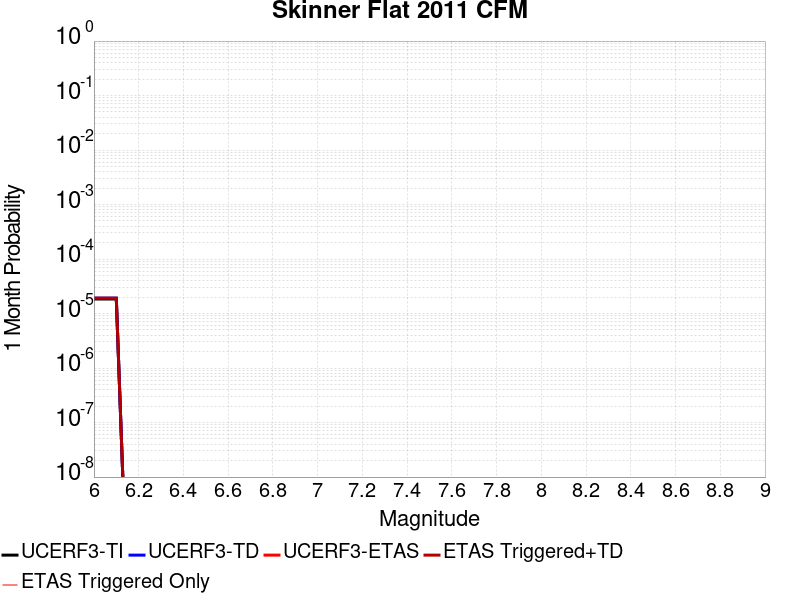 | 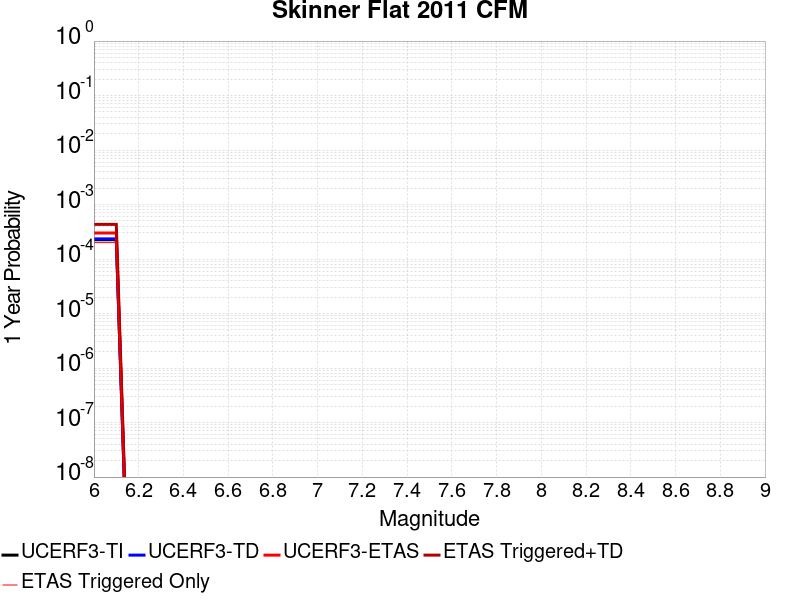 |  |

| Magnitude | 1 wk TI Prob | 1 wk TD Prob | 1 wk ETAS Prob | 1 wk ETAS/TD Gain | 1 wk ETAS Triggered+TD | 1 wk ETAS Triggered Only | 1 mo TI Prob | 1 mo TD Prob | 1 mo ETAS Prob | 1 mo ETAS/TD Gain | 1 mo ETAS Triggered+TD | 1 mo ETAS Triggered Only | 1 yr TI Prob | 1 yr TD Prob | 1 yr ETAS Prob | 1 yr ETAS/TD Gain | 1 yr ETAS Triggered+TD | 1 yr ETAS Triggered Only | 10 yr TI Prob | 10 yr TD Prob | 10 yr ETAS Prob | 10 yr ETAS/TD Gain | 10 yr ETAS Triggered+TD | 10 yr ETAS Triggered Only |
|-----|-----|-----|-----|-----|-----|-----|-----|-----|-----|-----|-----|-----|-----|-----|-----|-----|-----|-----|-----|-----|-----|-----|-----|-----|
| 6.0 | 4.3279074E-6 | 4.485288E-6 | 0.0 | 0.0 | 4.485288E-6 | 0.0 | 1.8548042E-5 | 1.9222663E-5 | 0.0 | 0.0 | 1.9222663E-5 | 0.0 | 2.2579901E-4 | 2.3403592E-4 | 2.0E-4 | 0.8545697 | 4.339891E-4 | 2.0E-4 | 0.002255697 | 0.0023403591 | 7.0E-4 | 0.2990994 | 0.003038721 | 7.0E-4 |
| 6.1 | 4.3279074E-6 | 4.485288E-6 | 0.0 | 0.0 | 4.485288E-6 | 0.0 | 1.8548042E-5 | 1.9222663E-5 | 0.0 | 0.0 | 1.9222663E-5 | 0.0 | 2.2579901E-4 | 2.3403592E-4 | 2.0E-4 | 0.8545697 | 4.339891E-4 | 2.0E-4 | 0.002255697 | 0.0023403591 | 7.0E-4 | 0.2990994 | 0.003038721 | 7.0E-4 |

## Earthquake Valley (No  Extension)
*[(top)](#table-of-contents)*

| 1 Week | 1 Month | 1 Year | 10 Year |
|-----|-----|-----|-----|
|  |  |  |  |

| Magnitude | 1 wk TI Prob | 1 wk TD Prob | 1 wk ETAS Prob | 1 wk ETAS/TD Gain | 1 wk ETAS Triggered+TD | 1 wk ETAS Triggered Only | 1 mo TI Prob | 1 mo TD Prob | 1 mo ETAS Prob | 1 mo ETAS/TD Gain | 1 mo ETAS Triggered+TD | 1 mo ETAS Triggered Only | 1 yr TI Prob | 1 yr TD Prob | 1 yr ETAS Prob | 1 yr ETAS/TD Gain | 1 yr ETAS Triggered+TD | 1 yr ETAS Triggered Only | 10 yr TI Prob | 10 yr TD Prob | 10 yr ETAS Prob | 10 yr ETAS/TD Gain | 10 yr ETAS Triggered+TD | 10 yr ETAS Triggered Only |
|-----|-----|-----|-----|-----|-----|-----|-----|-----|-----|-----|-----|-----|-----|-----|-----|-----|-----|-----|-----|-----|-----|-----|-----|-----|
| 6.0 | 2.1859703E-5 | 2.5206498E-5 | 0.0 | 0.0 | 2.5206498E-5 | 0.0 | 9.3681076E-5 | 1.0802419E-4 | 0.0 | 0.0 | 1.0802419E-4 | 0.0 | 0.0011399703 | 0.0013145463 | 0.0 | 0.0 | 0.0013145463 | 0.0 | 0.011341401 | 0.013082075 | 7.0E-4 | 0.053508334 | 0.013772917 | 7.0E-4 |
| 6.1 | 2.1859703E-5 | 2.5206498E-5 | 0.0 | 0.0 | 2.5206498E-5 | 0.0 | 9.3681076E-5 | 1.0802419E-4 | 0.0 | 0.0 | 1.0802419E-4 | 0.0 | 0.0011399703 | 0.0013145463 | 0.0 | 0.0 | 0.0013145463 | 0.0 | 0.011341401 | 0.013082075 | 7.0E-4 | 0.053508334 | 0.013772917 | 7.0E-4 |
| 6.2 | 2.1859703E-5 | 2.5206498E-5 | 0.0 | 0.0 | 2.5206498E-5 | 0.0 | 9.3681076E-5 | 1.0802419E-4 | 0.0 | 0.0 | 1.0802419E-4 | 0.0 | 0.0011399703 | 0.0013145463 | 0.0 | 0.0 | 0.0013145463 | 0.0 | 0.011341401 | 0.013082075 | 7.0E-4 | 0.053508334 | 0.013772917 | 7.0E-4 |
| 6.3 | 2.1859703E-5 | 2.5206498E-5 | 0.0 | 0.0 | 2.5206498E-5 | 0.0 | 9.3681076E-5 | 1.0802419E-4 | 0.0 | 0.0 | 1.0802419E-4 | 0.0 | 0.0011399703 | 0.0013145463 | 0.0 | 0.0 | 0.0013145463 | 0.0 | 0.011341401 | 0.013082075 | 7.0E-4 | 0.053508334 | 0.013772917 | 7.0E-4 |
| 6.4 | 2.1859703E-5 | 2.5206498E-5 | 0.0 | 0.0 | 2.5206498E-5 | 0.0 | 9.3681076E-5 | 1.0802419E-4 | 0.0 | 0.0 | 1.0802419E-4 | 0.0 | 0.0011399703 | 0.0013145463 | 0.0 | 0.0 | 0.0013145463 | 0.0 | 0.011341401 | 0.013082075 | 7.0E-4 | 0.053508334 | 0.013772917 | 7.0E-4 |
| 6.5 | 2.1859703E-5 | 2.5206498E-5 | 0.0 | 0.0 | 2.5206498E-5 | 0.0 | 9.3681076E-5 | 1.0802419E-4 | 0.0 | 0.0 | 1.0802419E-4 | 0.0 | 0.0011399703 | 0.0013145463 | 0.0 | 0.0 | 0.0013145463 | 0.0 | 0.011341401 | 0.013082075 | 7.0E-4 | 0.053508334 | 0.013772917 | 7.0E-4 |
| 6.6 | 1.597E-5 | 1.8362138E-5 | 0.0 | 0.0 | 1.8362138E-5 | 0.0 | 6.8441055E-5 | 7.8692996E-5 | 0.0 | 0.0 | 7.8692996E-5 | 0.0 | 8.329513E-4 | 9.5775345E-4 | 0.0 | 0.0 | 9.5775345E-4 | 0.0 | 0.008298361 | 0.009544872 | 6.0E-4 | 0.06286098 | 0.010139145 | 6.0E-4 |
| 6.7 | 1.597E-5 | 1.8362138E-5 | 0.0 | 0.0 | 1.8362138E-5 | 0.0 | 6.8441055E-5 | 7.8692996E-5 | 0.0 | 0.0 | 7.8692996E-5 | 0.0 | 8.329513E-4 | 9.5775345E-4 | 0.0 | 0.0 | 9.5775345E-4 | 0.0 | 0.008298361 | 0.009544872 | 6.0E-4 | 0.06286098 | 0.010139145 | 6.0E-4 |
| 6.8 | 1.5315149E-5 | 1.760772E-5 | 0.0 | 0.0 | 1.760772E-5 | 0.0 | 6.5634704E-5 | 7.545996E-5 | 0.0 | 0.0 | 7.545996E-5 | 0.0 | 7.988095E-4 | 9.184245E-4 | 0.0 | 0.0 | 9.184245E-4 | 0.0 | 0.007959441 | 0.009154834 | 5.0E-4 | 0.054615956 | 0.0096502565 | 5.0E-4 |
| 6.9 | 1.3634728E-5 | 1.5680867E-5 | 0.0 | 0.0 | 1.5680867E-5 | 0.0 | 5.8433237E-5 | 6.720245E-5 | 0.0 | 0.0 | 6.720245E-5 | 0.0 | 7.1119244E-4 | 8.179648E-4 | 0.0 | 0.0 | 8.179648E-4 | 0.0 | 0.007089207 | 0.008157617 | 4.0E-4 | 0.049033925 | 0.008554354 | 4.0E-4 |
| 7.0 | 1.3496271E-5 | 1.5522854E-5 | 0.0 | 0.0 | 1.5522854E-5 | 0.0 | 5.783988E-5 | 6.652528E-5 | 0.0 | 0.0 | 6.652528E-5 | 0.0 | 7.03973E-4 | 8.097264E-4 | 0.0 | 0.0 | 8.097264E-4 | 0.0 | 0.007017471 | 0.008075834 | 4.0E-4 | 0.049530488 | 0.008472604 | 4.0E-4 |
| 7.1 | 8.242798E-6 | 9.475722E-6 | 0.0 | 0.0 | 9.475722E-6 | 0.0 | 3.53258E-5 | 4.0609986E-5 | 0.0 | 0.0 | 4.0609986E-5 | 0.0 | 4.300067E-4 | 4.9438153E-4 | 0.0 | 0.0 | 4.9438153E-4 | 0.0 | 0.004291756 | 0.004939398 | 4.0E-4 | 0.08098154 | 0.005337422 | 4.0E-4 |
| 7.2 | 2.6506527E-7 | 2.2569479E-7 | 0.0 | 0.0 | 2.2569479E-7 | 0.0 | 1.1359936E-6 | 9.672631E-7 | 0.0 | 0.0 | 9.672631E-7 | 0.0 | 1.3830633E-5 | 1.1776368E-5 | 0.0 | 0.0 | 1.1776368E-5 | 0.0 | 1.3829772E-4 | 1.1775785E-4 | 0.0 | 0.0 | 1.1775785E-4 | 0.0 |
| 7.3 | 2.5810488E-7 | 2.1964487E-7 | 0.0 | 0.0 | 2.1964487E-7 | 0.0 | 1.1061633E-6 | 9.4133486E-7 | 0.0 | 0.0 | 9.4133486E-7 | 0.0 | 1.3467455E-5 | 1.14606955E-5 | 0.0 | 0.0 | 1.14606955E-5 | 0.0 | 1.3466639E-4 | 1.14601455E-4 | 0.0 | 0.0 | 1.14601455E-4 | 0.0 |
| 7.4 | 2.2676066E-7 | 1.9119335E-7 | 0.0 | 0.0 | 1.9119335E-7 | 0.0 | 9.71831E-7 | 8.193998E-7 | 0.0 | 0.0 | 8.193998E-7 | 0.0 | 1.1831979E-5 | 9.976151E-6 | 0.0 | 0.0 | 9.976151E-6 | 0.0 | 1.1831349E-4 | 9.9757424E-5 | 0.0 | 0.0 | 9.9757424E-5 | 0.0 |
| 7.5 | 1.5553917E-7 | 1.3119126E-7 | 0.0 | 0.0 | 1.3119126E-7 | 0.0 | 6.6659624E-7 | 5.6224815E-7 | 0.0 | 0.0 | 5.6224815E-7 | 0.0 | 8.115779E-6 | 6.845352E-6 | 0.0 | 0.0 | 6.845352E-6 | 0.0 | 8.115482E-5 | 6.845163E-5 | 0.0 | 0.0 | 6.845163E-5 | 0.0 |
| 7.6 | 1.3448629E-7 | 1.1294585E-7 | 0.0 | 0.0 | 1.1294585E-7 | 0.0 | 5.7636964E-7 | 4.8405354E-7 | 0.0 | 0.0 | 4.8405354E-7 | 0.0 | 7.017278E-6 | 5.8933383E-6 | 0.0 | 0.0 | 5.8933383E-6 | 0.0 | 7.0170565E-5 | 5.8932033E-5 | 0.0 | 0.0 | 5.8932033E-5 | 0.0 |
| 7.7 | 2.9719402E-8 | 1.4592342E-8 | 0.0 | 0.0 | 1.4592342E-8 | 0.0 | 1.2736886E-7 | 6.2538604E-8 | 0.0 | 0.0 | 6.2538604E-8 | 0.0 | 1.5507147E-6 | 7.614073E-7 | 0.0 | 0.0 | 7.614073E-7 | 0.0 | 1.550704E-5 | 7.6140523E-6 | 0.0 | 0.0 | 7.6140523E-6 | 0.0 |
| 7.8 | 7.4390196E-9 | 3.2521985E-9 | 0.0 | 0.0 | 3.2521985E-9 | 0.0 | 3.1881513E-8 | 1.3937994E-8 | 0.0 | 0.0 | 1.3937994E-8 | 0.0 | 3.8815733E-7 | 1.6969507E-7 | 0.0 | 0.0 | 1.6969507E-7 | 0.0 | 3.8815665E-6 | 1.6969497E-6 | 0.0 | 0.0 | 1.6969497E-6 | 0.0 |
| 7.9 | 1.5373532E-9 | 8.444304E-10 | 0.0 | 0.0 | 8.444304E-10 | 0.0 | 6.5886567E-9 | 3.6189878E-9 | 0.0 | 0.0 | 3.6189878E-9 | 0.0 | 8.021689E-8 | 4.4061174E-8 | 0.0 | 0.0 | 4.4061174E-8 | 0.0 | 8.0216864E-7 | 4.4061173E-7 | 0.0 | 0.0 | 4.4061173E-7 | 0.0 |

## Reliz 2011 CFM
*[(top)](#table-of-contents)*

| 1 Week | 1 Month | 1 Year | 10 Year |
|-----|-----|-----|-----|
|  |  |  |  |

| Magnitude | 1 wk TI Prob | 1 wk TD Prob | 1 wk ETAS Prob | 1 wk ETAS/TD Gain | 1 wk ETAS Triggered+TD | 1 wk ETAS Triggered Only | 1 mo TI Prob | 1 mo TD Prob | 1 mo ETAS Prob | 1 mo ETAS/TD Gain | 1 mo ETAS Triggered+TD | 1 mo ETAS Triggered Only | 1 yr TI Prob | 1 yr TD Prob | 1 yr ETAS Prob | 1 yr ETAS/TD Gain | 1 yr ETAS Triggered+TD | 1 yr ETAS Triggered Only | 10 yr TI Prob | 10 yr TD Prob | 10 yr ETAS Prob | 10 yr ETAS/TD Gain | 10 yr ETAS Triggered+TD | 10 yr ETAS Triggered Only |
|-----|-----|-----|-----|-----|-----|-----|-----|-----|-----|-----|-----|-----|-----|-----|-----|-----|-----|-----|-----|-----|-----|-----|-----|-----|
| 6.0 | 1.6002472E-5 | 1.6283899E-5 | 0.0 | 0.0 | 1.6283899E-5 | 0.0 | 6.8580215E-5 | 6.978638E-5 | 0.0 | 0.0 | 6.978638E-5 | 0.0 | 8.3464425E-4 | 8.493378E-4 | 0.0 | 0.0 | 8.493378E-4 | 0.0 | 0.008315164 | 0.008463114 | 7.0E-4 | 0.082711875 | 0.00915719 | 7.0E-4 |
| 6.1 | 1.6002472E-5 | 1.6283899E-5 | 0.0 | 0.0 | 1.6283899E-5 | 0.0 | 6.8580215E-5 | 6.978638E-5 | 0.0 | 0.0 | 6.978638E-5 | 0.0 | 8.3464425E-4 | 8.493378E-4 | 0.0 | 0.0 | 8.493378E-4 | 0.0 | 0.008315164 | 0.008463114 | 7.0E-4 | 0.082711875 | 0.00915719 | 7.0E-4 |
| 6.2 | 1.6002472E-5 | 1.6283899E-5 | 0.0 | 0.0 | 1.6283899E-5 | 0.0 | 6.8580215E-5 | 6.978638E-5 | 0.0 | 0.0 | 6.978638E-5 | 0.0 | 8.3464425E-4 | 8.493378E-4 | 0.0 | 0.0 | 8.493378E-4 | 0.0 | 0.008315164 | 0.008463114 | 7.0E-4 | 0.082711875 | 0.00915719 | 7.0E-4 |
| 6.3 | 7.792404E-6 | 7.804323E-6 | 0.0 | 0.0 | 7.804323E-6 | 0.0 | 3.339559E-5 | 3.3446675E-5 | 0.0 | 0.0 | 3.3446675E-5 | 0.0 | 4.0651546E-4 | 4.0713794E-4 | 0.0 | 0.0 | 4.0713794E-4 | 0.0 | 0.0040577264 | 0.0040641967 | 3.0E-4 | 0.07381532 | 0.0043629776 | 3.0E-4 |
| 6.4 | 7.792404E-6 | 7.804323E-6 | 0.0 | 0.0 | 7.804323E-6 | 0.0 | 3.339559E-5 | 3.3446675E-5 | 0.0 | 0.0 | 3.3446675E-5 | 0.0 | 4.0651546E-4 | 4.0713794E-4 | 0.0 | 0.0 | 4.0713794E-4 | 0.0 | 0.0040577264 | 0.0040641967 | 3.0E-4 | 0.07381532 | 0.0043629776 | 3.0E-4 |
| 6.5 | 5.9659374E-6 | 5.9291565E-6 | 0.0 | 0.0 | 5.9291565E-6 | 0.0 | 2.5568053E-5 | 2.5410423E-5 | 0.0 | 0.0 | 2.5410423E-5 | 0.0 | 3.1124658E-4 | 3.093282E-4 | 0.0 | 0.0 | 3.093282E-4 | 0.0 | 0.00310811 | 0.0030891942 | 2.0E-4 | 0.064741805 | 0.0032885764 | 2.0E-4 |
| 6.6 | 5.2350692E-6 | 5.179364E-6 | 0.0 | 0.0 | 5.179364E-6 | 0.0 | 2.2435817E-5 | 2.2197088E-5 | 0.0 | 0.0 | 2.2197088E-5 | 0.0 | 2.7312184E-4 | 2.7021617E-4 | 0.0 | 0.0 | 2.7021617E-4 | 0.0 | 0.002727864 | 0.002699086 | 1.0E-4 | 0.03704958 | 0.002798816 | 1.0E-4 |
| 6.7 | 4.580206E-6 | 4.5064603E-6 | 0.0 | 0.0 | 4.5064603E-6 | 0.0 | 1.9629308E-5 | 1.931326E-5 | 0.0 | 0.0 | 1.931326E-5 | 0.0 | 2.389606E-4 | 2.3511364E-4 | 0.0 | 0.0 | 2.3511364E-4 | 0.0 | 0.002387038 | 0.0023488507 | 1.0E-4 | 0.042574015 | 0.0024486156 | 1.0E-4 |
| 6.8 | 4.0765017E-6 | 3.988548E-6 | 0.0 | 0.0 | 3.988548E-6 | 0.0 | 1.7470604E-5 | 1.7093666E-5 | 0.0 | 0.0 | 1.7093666E-5 | 0.0 | 2.1268385E-4 | 2.0809555E-4 | 0.0 | 0.0 | 2.0809555E-4 | 0.0 | 0.002124804 | 0.002079205 | 1.0E-4 | 0.048095312 | 0.0021789968 | 1.0E-4 |
| 6.9 | 3.5752896E-6 | 3.4727966E-6 | 0.0 | 0.0 | 3.4727966E-6 | 0.0 | 1.532258E-5 | 1.488333E-5 | 0.0 | 0.0 | 1.488333E-5 | 0.0 | 1.8653645E-4 | 1.8118949E-4 | 0.0 | 0.0 | 1.8118949E-4 | 0.0 | 0.0018637994 | 0.0018106139 | 0.0 | 0.0 | 0.0018106139 | 0.0 |
| 7.0 | 3.0259848E-6 | 2.9081884E-6 | 0.0 | 0.0 | 2.9081884E-6 | 0.0 | 1.2968442E-5 | 1.2463604E-5 | 0.0 | 0.0 | 1.2463604E-5 | 0.0 | 1.5787935E-4 | 1.5173384E-4 | 0.0 | 0.0 | 1.5173384E-4 | 0.0 | 0.0015776722 | 0.0015164973 | 0.0 | 0.0 | 0.0015164973 | 0.0 |
| 7.1 | 2.5861116E-6 | 2.4553863E-6 | 0.0 | 0.0 | 2.4553863E-6 | 0.0 | 1.1083288E-5 | 1.0523041E-5 | 0.0 | 0.0 | 1.0523041E-5 | 0.0 | 1.3493067E-4 | 1.281105E-4 | 0.0 | 0.0 | 1.281105E-4 | 0.0 | 0.0013484878 | 0.0012805611 | 0.0 | 0.0 | 0.0012805611 | 0.0 |
| 7.2 | 2.1482588E-6 | 2.0034258E-6 | 0.0 | 0.0 | 2.0034258E-6 | 0.0 | 9.20679E-6 | 8.586083E-6 | 0.0 | 0.0 | 8.586083E-6 | 0.0 | 1.12086906E-4 | 1.0453055E-4 | 0.0 | 0.0 | 1.0453055E-4 | 0.0 | 0.0011203039 | 0.0010450078 | 0.0 | 0.0 | 0.0010450078 | 0.0 |
| 7.3 | 1.7194744E-6 | 1.5612845E-6 | 0.0 | 0.0 | 1.5612845E-6 | 0.0 | 7.3691554E-6 | 6.691202E-6 | 0.0 | 0.0 | 6.691202E-6 | 0.0 | 8.971577E-5 | 8.146234E-5 | 0.0 | 0.0 | 8.146234E-5 | 0.0 | 8.967956E-4 | 8.145186E-4 | 0.0 | 0.0 | 8.145186E-4 | 0.0 |
| 7.4 | 1.2755178E-6 | 1.1057606E-6 | 0.0 | 0.0 | 1.1057606E-6 | 0.0 | 5.4664933E-6 | 4.7389653E-6 | 0.0 | 0.0 | 4.7389653E-6 | 0.0 | 6.655252E-5 | 5.7695375E-5 | 0.0 | 0.0 | 5.7695375E-5 | 0.0 | 6.6532596E-4 | 5.7699764E-4 | 0.0 | 0.0 | 5.7699764E-4 | 0.0 |
| 7.5 | 8.8463224E-7 | 7.059078E-7 | 0.0 | 0.0 | 7.059078E-7 | 0.0 | 3.7912755E-6 | 3.0253157E-6 | 0.0 | 0.0 | 3.0253157E-6 | 0.0 | 4.6157802E-5 | 3.6832596E-5 | 0.0 | 0.0 | 3.6832596E-5 | 0.0 | 4.6148215E-4 | 3.6845848E-4 | 0.0 | 0.0 | 3.6845848E-4 | 0.0 |
| 7.6 | 5.291355E-7 | 3.5013613E-7 | 0.0 | 0.0 | 3.5013613E-7 | 0.0 | 2.2677216E-6 | 1.5005825E-6 | 0.0 | 0.0 | 1.5005825E-6 | 0.0 | 2.760916E-5 | 1.826944E-5 | 0.0 | 0.0 | 1.826944E-5 | 0.0 | 2.760573E-4 | 1.828725E-4 | 0.0 | 0.0 | 1.828725E-4 | 0.0 |
| 7.7 | 2.9663357E-7 | 1.3513048E-7 | 0.0 | 0.0 | 1.3513048E-7 | 0.0 | 1.2712861E-6 | 5.7913053E-7 | 0.0 | 0.0 | 5.7913053E-7 | 0.0 | 1.5477797E-5 | 7.0508913E-6 | 0.0 | 0.0 | 7.0508913E-6 | 0.0 | 1.547672E-4 | 7.06922E-5 | 0.0 | 0.0 | 7.06922E-5 | 0.0 |
| 7.8 | 1.2509386E-7 | 2.7158325E-8 | 0.0 | 0.0 | 2.7158325E-8 | 0.0 | 5.3611643E-7 | 1.1639282E-7 | 0.0 | 0.0 | 1.1639282E-7 | 0.0 | 6.527198E-6 | 1.4170816E-6 | 0.0 | 0.0 | 1.4170816E-6 | 0.0 | 6.527006E-5 | 1.4327969E-5 | 0.0 | 0.0 | 1.4327969E-5 | 0.0 |
| 7.9 | 6.213493E-8 | 1.1482901E-8 | 0.0 | 0.0 | 1.1482901E-8 | 0.0 | 2.6629255E-7 | 4.9212435E-8 | 0.0 | 0.0 | 4.9212435E-8 | 0.0 | 3.242107E-6 | 5.9916124E-7 | 0.0 | 0.0 | 5.9916124E-7 | 0.0 | 3.2420594E-5 | 6.1237997E-6 | 0.0 | 0.0 | 6.1237997E-6 | 0.0 |
| 8.0 | 5.92383E-9 | 1.6780953E-9 | 0.0 | 0.0 | 1.6780953E-9 | 0.0 | 2.5387841E-8 | 7.191837E-9 | 0.0 | 0.0 | 7.191837E-9 | 0.0 | 3.0909692E-7 | 8.756061E-8 | 0.0 | 0.0 | 8.756061E-8 | 0.0 | 3.090965E-6 | 9.004134E-7 | 0.0 | 0.0 | 9.004134E-7 | 0.0 |

## Cucamonga
*[(top)](#table-of-contents)*

| 1 Week | 1 Month | 1 Year | 10 Year |
|-----|-----|-----|-----|
|  |  |  |  |

| Magnitude | 1 wk TI Prob | 1 wk TD Prob | 1 wk ETAS Prob | 1 wk ETAS/TD Gain | 1 wk ETAS Triggered+TD | 1 wk ETAS Triggered Only | 1 mo TI Prob | 1 mo TD Prob | 1 mo ETAS Prob | 1 mo ETAS/TD Gain | 1 mo ETAS Triggered+TD | 1 mo ETAS Triggered Only | 1 yr TI Prob | 1 yr TD Prob | 1 yr ETAS Prob | 1 yr ETAS/TD Gain | 1 yr ETAS Triggered+TD | 1 yr ETAS Triggered Only | 10 yr TI Prob | 10 yr TD Prob | 10 yr ETAS Prob | 10 yr ETAS/TD Gain | 10 yr ETAS Triggered+TD | 10 yr ETAS Triggered Only |
|-----|-----|-----|-----|-----|-----|-----|-----|-----|-----|-----|-----|-----|-----|-----|-----|-----|-----|-----|-----|-----|-----|-----|-----|-----|
| 6.0 | 1.1848348E-5 | 1.1746098E-5 | 0.0 | 0.0 | 1.1746098E-5 | 0.0 | 5.0777642E-5 | 5.0339462E-5 | 0.0 | 0.0 | 5.0339462E-5 | 0.0 | 6.180424E-4 | 6.1271334E-4 | 0.0 | 0.0 | 6.1271334E-4 | 0.0 | 0.0061632637 | 0.006111557 | 7.0E-4 | 0.11453709 | 0.0068072793 | 7.0E-4 |
| 6.1 | 1.1848348E-5 | 1.1746098E-5 | 0.0 | 0.0 | 1.1746098E-5 | 0.0 | 5.0777642E-5 | 5.0339462E-5 | 0.0 | 0.0 | 5.0339462E-5 | 0.0 | 6.180424E-4 | 6.1271334E-4 | 0.0 | 0.0 | 6.1271334E-4 | 0.0 | 0.0061632637 | 0.006111557 | 7.0E-4 | 0.11453709 | 0.0068072793 | 7.0E-4 |
| 6.2 | 1.1848348E-5 | 1.1746098E-5 | 0.0 | 0.0 | 1.1746098E-5 | 0.0 | 5.0777642E-5 | 5.0339462E-5 | 0.0 | 0.0 | 5.0339462E-5 | 0.0 | 6.180424E-4 | 6.1271334E-4 | 0.0 | 0.0 | 6.1271334E-4 | 0.0 | 0.0061632637 | 0.006111557 | 7.0E-4 | 0.11453709 | 0.0068072793 | 7.0E-4 |
| 6.3 | 1.1848348E-5 | 1.1746098E-5 | 0.0 | 0.0 | 1.1746098E-5 | 0.0 | 5.0777642E-5 | 5.0339462E-5 | 0.0 | 0.0 | 5.0339462E-5 | 0.0 | 6.180424E-4 | 6.1271334E-4 | 0.0 | 0.0 | 6.1271334E-4 | 0.0 | 0.0061632637 | 0.006111557 | 7.0E-4 | 0.11453709 | 0.0068072793 | 7.0E-4 |
| 6.4 | 1.1848348E-5 | 1.1746098E-5 | 0.0 | 0.0 | 1.1746098E-5 | 0.0 | 5.0777642E-5 | 5.0339462E-5 | 0.0 | 0.0 | 5.0339462E-5 | 0.0 | 6.180424E-4 | 6.1271334E-4 | 0.0 | 0.0 | 6.1271334E-4 | 0.0 | 0.0061632637 | 0.006111557 | 7.0E-4 | 0.11453709 | 0.0068072793 | 7.0E-4 |
| 6.5 | 1.16988695E-5 | 1.1585103E-5 | 0.0 | 0.0 | 1.1585103E-5 | 0.0 | 5.013705E-5 | 4.9649512E-5 | 0.0 | 0.0 | 4.9649512E-5 | 0.0 | 6.102476E-4 | 6.043178E-4 | 0.0 | 0.0 | 6.043178E-4 | 0.0 | 0.006085745 | 0.006028059 | 7.0E-4 | 0.11612362 | 0.0067238393 | 7.0E-4 |
| 6.6 | 1.16988695E-5 | 1.1585103E-5 | 0.0 | 0.0 | 1.1585103E-5 | 0.0 | 5.013705E-5 | 4.9649512E-5 | 0.0 | 0.0 | 4.9649512E-5 | 0.0 | 6.102476E-4 | 6.043178E-4 | 0.0 | 0.0 | 6.043178E-4 | 0.0 | 0.006085745 | 0.006028059 | 7.0E-4 | 0.11612362 | 0.0067238393 | 7.0E-4 |
| 6.7 | 1.1397107E-5 | 1.1123735E-5 | 0.0 | 0.0 | 1.1123735E-5 | 0.0 | 4.884383E-5 | 4.7672293E-5 | 0.0 | 0.0 | 4.7672293E-5 | 0.0 | 5.9451134E-4 | 5.802581E-4 | 0.0 | 0.0 | 5.802581E-4 | 0.0 | 0.005929234 | 0.0057887235 | 6.0E-4 | 0.103649795 | 0.00638525 | 6.0E-4 |
| 6.8 | 1.058387E-5 | 9.792531E-6 | 0.0 | 0.0 | 9.792531E-6 | 0.0 | 4.5358654E-5 | 4.1967323E-5 | 0.0 | 0.0 | 4.1967323E-5 | 0.0 | 5.521017E-4 | 5.1083346E-4 | 0.0 | 0.0 | 5.1083346E-4 | 0.0 | 0.00550732 | 0.0050977436 | 6.0E-4 | 0.11769914 | 0.005694685 | 6.0E-4 |
| 6.9 | 9.690046E-6 | 8.586194E-6 | 0.0 | 0.0 | 8.586194E-6 | 0.0 | 4.1528107E-5 | 3.6797457E-5 | 0.0 | 0.0 | 3.6797457E-5 | 0.0 | 5.054874E-4 | 4.4791735E-4 | 0.0 | 0.0 | 4.4791735E-4 | 0.0 | 0.005043391 | 0.004471223 | 5.0E-4 | 0.111826226 | 0.0049689873 | 5.0E-4 |
| 7.0 | 9.381461E-6 | 8.193595E-6 | 0.0 | 0.0 | 8.193595E-6 | 0.0 | 4.020564E-5 | 3.511494E-5 | 0.0 | 0.0 | 3.511494E-5 | 0.0 | 4.893937E-4 | 4.2744086E-4 | 0.0 | 0.0 | 4.2744086E-4 | 0.0 | 0.0048831734 | 0.0042672614 | 5.0E-4 | 0.11717117 | 0.004765128 | 5.0E-4 |
| 7.1 | 8.946492E-6 | 7.788219E-6 | 0.0 | 0.0 | 7.788219E-6 | 0.0 | 3.8341543E-5 | 3.3377655E-5 | 0.0 | 0.0 | 3.3377655E-5 | 0.0 | 4.667083E-4 | 4.062975E-4 | 0.0 | 0.0 | 4.062975E-4 | 0.0 | 0.0046572937 | 0.004056623 | 4.0E-4 | 0.09860418 | 0.0044550006 | 4.0E-4 |
| 7.2 | 8.251016E-6 | 6.9810753E-6 | 0.0 | 0.0 | 6.9810753E-6 | 0.0 | 3.5361016E-5 | 2.9918552E-5 | 0.0 | 0.0 | 2.9918552E-5 | 0.0 | 4.3043532E-4 | 3.6419774E-4 | 0.0 | 0.0 | 3.6419774E-4 | 0.0 | 0.0042960253 | 0.003637083 | 3.0E-4 | 0.08248368 | 0.003935992 | 3.0E-4 |
| 7.3 | 7.717881E-6 | 6.4919122E-6 | 0.0 | 0.0 | 6.4919122E-6 | 0.0 | 3.3076216E-5 | 2.7822185E-5 | 0.0 | 0.0 | 2.7822185E-5 | 0.0 | 4.026285E-4 | 3.3868267E-4 | 0.0 | 0.0 | 3.3868267E-4 | 0.0 | 0.004018998 | 0.0033827447 | 3.0E-4 | 0.088685386 | 0.0036817298 | 3.0E-4 |
| 7.4 | 7.275623E-6 | 6.0372745E-6 | 0.0 | 0.0 | 6.0372745E-6 | 0.0 | 3.118087E-5 | 2.5873776E-5 | 0.0 | 0.0 | 2.5873776E-5 | 0.0 | 3.7956095E-4 | 3.149679E-4 | 0.0 | 0.0 | 3.149679E-4 | 0.0 | 0.0037891332 | 0.0031462943 | 3.0E-4 | 0.095350266 | 0.0034453506 | 3.0E-4 |
| 7.5 | 6.5109502E-6 | 5.105107E-6 | 0.0 | 0.0 | 5.105107E-6 | 0.0 | 2.7903774E-5 | 2.1878848E-5 | 0.0 | 0.0 | 2.1878848E-5 | 0.0 | 3.3967546E-4 | 2.6634257E-4 | 0.0 | 0.0 | 2.6634257E-4 | 0.0 | 0.0033915674 | 0.0026613038 | 3.0E-4 | 0.1127267 | 0.0029605054 | 3.0E-4 |
| 7.6 | 5.4495326E-6 | 3.9123893E-6 | 0.0 | 0.0 | 3.9123893E-6 | 0.0 | 2.335493E-5 | 1.6767273E-5 | 0.0 | 0.0 | 1.6767273E-5 | 0.0 | 2.8430918E-4 | 2.0412251E-4 | 0.0 | 0.0 | 2.0412251E-4 | 0.0 | 0.0028394572 | 0.002040419 | 3.0E-4 | 0.14702863 | 0.0023398069 | 3.0E-4 |
| 7.7 | 4.7997164E-6 | 3.2035778E-6 | 0.0 | 0.0 | 3.2035778E-6 | 0.0 | 2.057005E-5 | 1.37295465E-5 | 0.0 | 0.0 | 1.37295465E-5 | 0.0 | 2.504116E-4 | 1.6714445E-4 | 0.0 | 0.0 | 1.6714445E-4 | 0.0 | 0.002501296 | 0.0016712672 | 2.0E-4 | 0.119669676 | 0.0018709329 | 2.0E-4 |
| 7.8 | 3.3941733E-6 | 2.0657815E-6 | 0.0 | 0.0 | 2.0657815E-6 | 0.0 | 1.4546376E-5 | 8.853319E-6 | 0.0 | 0.0 | 8.853319E-6 | 0.0 | 1.7708774E-4 | 1.0778384E-4 | 0.0 | 0.0 | 1.0778384E-4 | 0.0 | 0.0017694668 | 0.0010776225 | 1.0E-4 | 0.09279687 | 0.0011775148 | 1.0E-4 |
| 7.9 | 9.750552E-7 | 5.160268E-7 | 0.0 | 0.0 | 5.160268E-7 | 0.0 | 4.178801E-6 | 2.2115414E-6 | 0.0 | 0.0 | 2.2115414E-6 | 0.0 | 5.0875715E-5 | 2.6925189E-5 | 0.0 | 0.0 | 2.6925189E-5 | 0.0 | 5.086407E-4 | 2.6921966E-4 | 0.0 | 0.0 | 2.6921966E-4 | 0.0 |
| 8.0 | 1.133857E-7 | 6.056362E-8 | 0.0 | 0.0 | 6.056362E-8 | 0.0 | 4.8593864E-7 | 2.5955836E-7 | 0.0 | 0.0 | 2.5955836E-7 | 0.0 | 5.9162867E-6 | 3.1601185E-6 | 0.0 | 0.0 | 3.1601185E-6 | 0.0 | 5.916129E-5 | 3.1600754E-5 | 0.0 | 0.0 | 3.1600754E-5 | 0.0 |

## Cedar Mtn-Mahogany Mtn
*[(top)](#table-of-contents)*

| 1 Week | 1 Month | 1 Year | 10 Year |
|-----|-----|-----|-----|
|  |  | 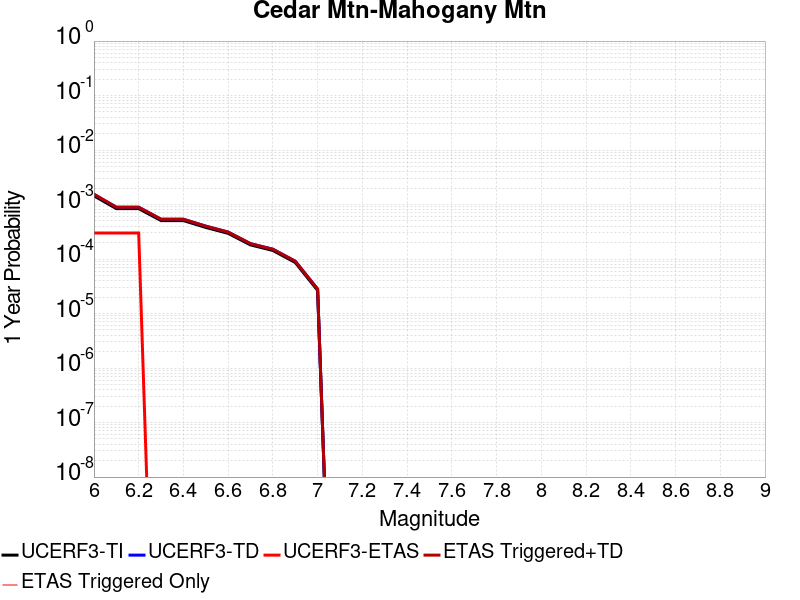 |  |

| Magnitude | 1 wk TI Prob | 1 wk TD Prob | 1 wk ETAS Prob | 1 wk ETAS/TD Gain | 1 wk ETAS Triggered+TD | 1 wk ETAS Triggered Only | 1 mo TI Prob | 1 mo TD Prob | 1 mo ETAS Prob | 1 mo ETAS/TD Gain | 1 mo ETAS Triggered+TD | 1 mo ETAS Triggered Only | 1 yr TI Prob | 1 yr TD Prob | 1 yr ETAS Prob | 1 yr ETAS/TD Gain | 1 yr ETAS Triggered+TD | 1 yr ETAS Triggered Only | 10 yr TI Prob | 10 yr TD Prob | 10 yr ETAS Prob | 10 yr ETAS/TD Gain | 10 yr ETAS Triggered+TD | 10 yr ETAS Triggered Only |
|-----|-----|-----|-----|-----|-----|-----|-----|-----|-----|-----|-----|-----|-----|-----|-----|-----|-----|-----|-----|-----|-----|-----|-----|-----|
| 6.0 | 2.7763876E-5 | 2.9592878E-5 | 0.0 | 0.0 | 2.9592878E-5 | 0.0 | 1.1898261E-4 | 1.2682086E-4 | 0.0 | 0.0 | 1.2682086E-4 | 0.0 | 0.0014476506 | 0.0015430204 | 0.0 | 0.0 | 0.0015430204 | 0.0 | 0.0143825635 | 0.0153302895 | 5.0E-4 | 0.03261517 | 0.015822625 | 5.0E-4 |
| 6.1 | 1.6162443E-5 | 1.714511E-5 | 0.0 | 0.0 | 1.714511E-5 | 0.0 | 6.926578E-5 | 7.347707E-5 | 0.0 | 0.0 | 7.347707E-5 | 0.0 | 8.4298453E-4 | 8.9423393E-4 | 0.0 | 0.0 | 8.9423393E-4 | 0.0 | 0.008397939 | 0.008908168 | 3.0E-4 | 0.033676956 | 0.009205496 | 3.0E-4 |
| 6.2 | 1.6162443E-5 | 1.714511E-5 | 0.0 | 0.0 | 1.714511E-5 | 0.0 | 6.926578E-5 | 7.347707E-5 | 0.0 | 0.0 | 7.347707E-5 | 0.0 | 8.4298453E-4 | 8.9423393E-4 | 0.0 | 0.0 | 8.9423393E-4 | 0.0 | 0.008397939 | 0.008908168 | 3.0E-4 | 0.033676956 | 0.009205496 | 3.0E-4 |
| 6.3 | 9.746053E-6 | 1.0304366E-5 | 0.0 | 0.0 | 1.0304366E-5 | 0.0 | 4.1768133E-5 | 4.4160843E-5 | 0.0 | 0.0 | 4.4160843E-5 | 0.0 | 5.0840835E-4 | 5.375297E-4 | 0.0 | 0.0 | 5.375297E-4 | 0.0 | 0.0050724675 | 0.005362714 | 2.0E-4 | 0.037294548 | 0.005561642 | 2.0E-4 |
| 6.4 | 9.746053E-6 | 1.0304366E-5 | 0.0 | 0.0 | 1.0304366E-5 | 0.0 | 4.1768133E-5 | 4.4160843E-5 | 0.0 | 0.0 | 4.4160843E-5 | 0.0 | 5.0840835E-4 | 5.375297E-4 | 0.0 | 0.0 | 5.375297E-4 | 0.0 | 0.0050724675 | 0.005362714 | 2.0E-4 | 0.037294548 | 0.005561642 | 2.0E-4 |
| 6.5 | 7.290083E-6 | 7.696206E-6 | 0.0 | 0.0 | 7.696206E-6 | 0.0 | 3.124284E-5 | 3.2983335E-5 | 0.0 | 0.0 | 3.2983335E-5 | 0.0 | 3.8031515E-4 | 4.0150026E-4 | 0.0 | 0.0 | 4.0150026E-4 | 0.0 | 0.0037966494 | 0.004007969 | 0.0 | 0.0 | 0.004007969 | 0.0 |
| 6.6 | 5.67907E-6 | 5.989826E-6 | 0.0 | 0.0 | 5.989826E-6 | 0.0 | 2.4338644E-5 | 2.5670439E-5 | 0.0 | 0.0 | 2.5670439E-5 | 0.0 | 2.962827E-4 | 3.124941E-4 | 0.0 | 0.0 | 3.124941E-4 | 0.0 | 0.0029588798 | 0.0031206831 | 0.0 | 0.0 | 0.0031206831 | 0.0 |
| 6.7 | 3.4853963E-6 | 3.6730373E-6 | 0.0 | 0.0 | 3.6730373E-6 | 0.0 | 1.4937327E-5 | 1.5741498E-5 | 0.0 | 0.0 | 1.5741498E-5 | 0.0 | 1.8184677E-4 | 1.916365E-4 | 0.0 | 0.0 | 1.916365E-4 | 0.0 | 0.0018169804 | 0.0019147744 | 0.0 | 0.0 | 0.0019147744 | 0.0 |
| 6.8 | 2.7535168E-6 | 2.9018977E-6 | 0.0 | 0.0 | 2.9018977E-6 | 0.0 | 1.1800733E-5 | 1.2436648E-5 | 0.0 | 0.0 | 1.2436648E-5 | 0.0 | 1.4366445E-4 | 1.5140614E-4 | 0.0 | 0.0 | 1.5140614E-4 | 0.0 | 0.0014357162 | 0.0015130772 | 0.0 | 0.0 | 0.0015130772 | 0.0 |
| 6.9 | 1.6594106E-6 | 1.7498946E-6 | 0.0 | 0.0 | 1.7498946E-6 | 0.0 | 7.1117406E-6 | 7.4995287E-6 | 0.0 | 0.0 | 7.4995287E-6 | 0.0 | 8.6582E-5 | 9.130324E-5 | 0.0 | 0.0 | 9.130324E-5 | 0.0 | 8.654827E-4 | 9.126878E-4 | 0.0 | 0.0 | 9.126878E-4 | 0.0 |
| 7.0 | 5.10215E-7 | 5.389878E-7 | 0.0 | 0.0 | 5.389878E-7 | 0.0 | 2.186634E-6 | 2.3099465E-6 | 0.0 | 0.0 | 2.3099465E-6 | 0.0 | 2.6621943E-5 | 2.8123364E-5 | 0.0 | 0.0 | 2.8123364E-5 | 0.0 | 2.6618753E-4 | 2.812106E-4 | 0.0 | 0.0 | 2.812106E-4 | 0.0 |

## Big Lagoon - Bald Mtn 2011 CFM
*[(top)](#table-of-contents)*

| 1 Week | 1 Month | 1 Year | 10 Year |
|-----|-----|-----|-----|
|  |  |  |  |

| Magnitude | 1 wk TI Prob | 1 wk TD Prob | 1 wk ETAS Prob | 1 wk ETAS/TD Gain | 1 wk ETAS Triggered+TD | 1 wk ETAS Triggered Only | 1 mo TI Prob | 1 mo TD Prob | 1 mo ETAS Prob | 1 mo ETAS/TD Gain | 1 mo ETAS Triggered+TD | 1 mo ETAS Triggered Only | 1 yr TI Prob | 1 yr TD Prob | 1 yr ETAS Prob | 1 yr ETAS/TD Gain | 1 yr ETAS Triggered+TD | 1 yr ETAS Triggered Only | 10 yr TI Prob | 10 yr TD Prob | 10 yr ETAS Prob | 10 yr ETAS/TD Gain | 10 yr ETAS Triggered+TD | 10 yr ETAS Triggered Only |
|-----|-----|-----|-----|-----|-----|-----|-----|-----|-----|-----|-----|-----|-----|-----|-----|-----|-----|-----|-----|-----|-----|-----|-----|-----|
| 6.0 | 1.8699735E-5 | 1.9852707E-5 | 0.0 | 0.0 | 1.9852707E-5 | 0.0 | 8.013926E-5 | 8.5080464E-5 | 0.0 | 0.0 | 8.5080464E-5 | 0.0 | 9.752587E-4 | 0.0010354003 | 1.0E-4 | 0.096581005 | 0.0011352968 | 1.0E-4 | 0.009709897 | 0.01030958 | 6.0E-4 | 0.0581983 | 0.010903394 | 6.0E-4 |
| 6.1 | 1.8699735E-5 | 1.9852707E-5 | 0.0 | 0.0 | 1.9852707E-5 | 0.0 | 8.013926E-5 | 8.5080464E-5 | 0.0 | 0.0 | 8.5080464E-5 | 0.0 | 9.752587E-4 | 0.0010354003 | 1.0E-4 | 0.096581005 | 0.0011352968 | 1.0E-4 | 0.009709897 | 0.01030958 | 6.0E-4 | 0.0581983 | 0.010903394 | 6.0E-4 |
| 6.2 | 1.8699735E-5 | 1.9852707E-5 | 0.0 | 0.0 | 1.9852707E-5 | 0.0 | 8.013926E-5 | 8.5080464E-5 | 0.0 | 0.0 | 8.5080464E-5 | 0.0 | 9.752587E-4 | 0.0010354003 | 1.0E-4 | 0.096581005 | 0.0011352968 | 1.0E-4 | 0.009709897 | 0.01030958 | 6.0E-4 | 0.0581983 | 0.010903394 | 6.0E-4 |
| 6.3 | 1.8699735E-5 | 1.9852707E-5 | 0.0 | 0.0 | 1.9852707E-5 | 0.0 | 8.013926E-5 | 8.5080464E-5 | 0.0 | 0.0 | 8.5080464E-5 | 0.0 | 9.752587E-4 | 0.0010354003 | 1.0E-4 | 0.096581005 | 0.0011352968 | 1.0E-4 | 0.009709897 | 0.01030958 | 6.0E-4 | 0.0581983 | 0.010903394 | 6.0E-4 |
| 6.4 | 1.8699735E-5 | 1.9852707E-5 | 0.0 | 0.0 | 1.9852707E-5 | 0.0 | 8.013926E-5 | 8.5080464E-5 | 0.0 | 0.0 | 8.5080464E-5 | 0.0 | 9.752587E-4 | 0.0010354003 | 1.0E-4 | 0.096581005 | 0.0011352968 | 1.0E-4 | 0.009709897 | 0.01030958 | 6.0E-4 | 0.0581983 | 0.010903394 | 6.0E-4 |
| 6.5 | 1.8699735E-5 | 1.9852707E-5 | 0.0 | 0.0 | 1.9852707E-5 | 0.0 | 8.013926E-5 | 8.5080464E-5 | 0.0 | 0.0 | 8.5080464E-5 | 0.0 | 9.752587E-4 | 0.0010354003 | 1.0E-4 | 0.096581005 | 0.0011352968 | 1.0E-4 | 0.009709897 | 0.01030958 | 6.0E-4 | 0.0581983 | 0.010903394 | 6.0E-4 |
| 6.6 | 1.8699735E-5 | 1.9852707E-5 | 0.0 | 0.0 | 1.9852707E-5 | 0.0 | 8.013926E-5 | 8.5080464E-5 | 0.0 | 0.0 | 8.5080464E-5 | 0.0 | 9.752587E-4 | 0.0010354003 | 1.0E-4 | 0.096581005 | 0.0011352968 | 1.0E-4 | 0.009709897 | 0.01030958 | 6.0E-4 | 0.0581983 | 0.010903394 | 6.0E-4 |
| 6.7 | 1.8699735E-5 | 1.9852707E-5 | 0.0 | 0.0 | 1.9852707E-5 | 0.0 | 8.013926E-5 | 8.5080464E-5 | 0.0 | 0.0 | 8.5080464E-5 | 0.0 | 9.752587E-4 | 0.0010354003 | 1.0E-4 | 0.096581005 | 0.0011352968 | 1.0E-4 | 0.009709897 | 0.01030958 | 6.0E-4 | 0.0581983 | 0.010903394 | 6.0E-4 |
| 6.8 | 1.18505095E-5 | 1.2501218E-5 | 0.0 | 0.0 | 1.2501218E-5 | 0.0 | 5.078691E-5 | 5.3575575E-5 | 0.0 | 0.0 | 5.3575575E-5 | 0.0 | 6.181552E-4 | 6.520923E-4 | 0.0 | 0.0 | 6.520923E-4 | 0.0 | 0.006164385 | 0.006502292 | 2.0E-4 | 0.030758385 | 0.0067009917 | 2.0E-4 |
| 6.9 | 1.18505095E-5 | 1.2501218E-5 | 0.0 | 0.0 | 1.2501218E-5 | 0.0 | 5.078691E-5 | 5.3575575E-5 | 0.0 | 0.0 | 5.3575575E-5 | 0.0 | 6.181552E-4 | 6.520923E-4 | 0.0 | 0.0 | 6.520923E-4 | 0.0 | 0.006164385 | 0.006502292 | 2.0E-4 | 0.030758385 | 0.0067009917 | 2.0E-4 |
| 7.0 | 9.719786E-6 | 1.0236608E-5 | 0.0 | 0.0 | 1.0236608E-5 | 0.0 | 4.1655563E-5 | 4.3870456E-5 | 0.0 | 0.0 | 4.3870456E-5 | 0.0 | 5.0703844E-4 | 5.339942E-4 | 0.0 | 0.0 | 5.339942E-4 | 0.0 | 0.005058831 | 0.0053273574 | 1.0E-4 | 0.018771032 | 0.0054268246 | 1.0E-4 |
| 7.1 | 8.523418E-6 | 8.970433E-6 | 0.0 | 0.0 | 8.970433E-6 | 0.0 | 3.652842E-5 | 3.8444152E-5 | 0.0 | 0.0 | 3.8444152E-5 | 0.0 | 4.4464276E-4 | 4.6795857E-4 | 0.0 | 0.0 | 4.6795857E-4 | 0.0 | 0.0044375416 | 0.0046698954 | 1.0E-4 | 0.021413757 | 0.0047694286 | 1.0E-4 |
| 7.2 | 7.378894E-6 | 7.7619425E-6 | 0.0 | 0.0 | 7.7619425E-6 | 0.0 | 3.162345E-5 | 3.326505E-5 | 0.0 | 0.0 | 3.326505E-5 | 0.0 | 3.8494746E-4 | 4.049276E-4 | 0.0 | 0.0 | 4.049276E-4 | 0.0 | 0.0038428132 | 0.0040419935 | 1.0E-4 | 0.024740268 | 0.004141589 | 1.0E-4 |
| 7.3 | 6.4640294E-6 | 6.7931555E-6 | 0.0 | 0.0 | 6.7931555E-6 | 0.0 | 2.7702688E-5 | 2.9113204E-5 | 0.0 | 0.0 | 2.9113204E-5 | 0.0 | 3.3722803E-4 | 3.5439627E-4 | 0.0 | 0.0 | 3.5439627E-4 | 0.0 | 0.0033671674 | 0.003538381 | 1.0E-4 | 0.028261513 | 0.0036380272 | 1.0E-4 |
| 7.4 | 5.9959093E-6 | 6.299457E-6 | 0.0 | 0.0 | 6.299457E-6 | 0.0 | 2.5696501E-5 | 2.6997395E-5 | 0.0 | 0.0 | 2.6997395E-5 | 0.0 | 3.1280998E-4 | 3.286443E-4 | 0.0 | 0.0 | 3.286443E-4 | 0.0 | 0.0031237002 | 0.003281645 | 1.0E-4 | 0.030472523 | 0.0033813168 | 1.0E-4 |
| 7.5 | 4.929265E-6 | 5.176931E-6 | 0.0 | 0.0 | 5.176931E-6 | 0.0 | 2.112525E-5 | 2.2186661E-5 | 0.0 | 0.0 | 2.2186661E-5 | 0.0 | 2.5716957E-4 | 2.700895E-4 | 0.0 | 0.0 | 2.700895E-4 | 0.0 | 0.0025687215 | 0.0026976534 | 0.0 | 0.0 | 0.0026976534 | 0.0 |
| 7.6 | 3.8982403E-6 | 4.089339E-6 | 0.0 | 0.0 | 4.089339E-6 | 0.0 | 1.6706637E-5 | 1.7525623E-5 | 0.0 | 0.0 | 1.7525623E-5 | 0.0 | 2.0338432E-4 | 2.1335384E-4 | 0.0 | 0.0 | 2.1335384E-4 | 0.0 | 0.0020319829 | 0.0021315177 | 0.0 | 0.0 | 0.0021315177 | 0.0 |
| 7.7 | 2.820968E-6 | 2.9575058E-6 | 0.0 | 0.0 | 2.9575058E-6 | 0.0 | 1.2089806E-5 | 1.2674965E-5 | 0.0 | 0.0 | 1.2674965E-5 | 0.0 | 1.4718344E-4 | 1.5430694E-4 | 0.0 | 0.0 | 1.5430694E-4 | 0.0 | 0.00147086 | 0.0015420157 | 0.0 | 0.0 | 0.0015420157 | 0.0 |
| 7.8 | 1.9314455E-6 | 2.0262228E-6 | 0.0 | 0.0 | 2.0262228E-6 | 0.0 | 8.277597E-6 | 8.683784E-6 | 0.0 | 0.0 | 8.683784E-6 | 0.0 | 1.0077508E-4 | 1.0572007E-4 | 0.0 | 0.0 | 1.0572007E-4 | 0.0 | 0.0010072939 | 0.0010567106 | 0.0 | 0.0 | 0.0010567106 | 0.0 |
| 7.9 | 4.9586197E-7 | 5.2194855E-7 | 0.0 | 0.0 | 5.2194855E-7 | 0.0 | 2.125121E-6 | 2.2369206E-6 | 0.0 | 0.0 | 2.2369206E-6 | 0.0 | 2.5873042E-5 | 2.723419E-5 | 0.0 | 0.0 | 2.723419E-5 | 0.0 | 2.5870028E-4 | 2.723106E-4 | 0.0 | 0.0 | 2.723106E-4 | 0.0 |

## Santa Rosa Island
*[(top)](#table-of-contents)*

| 1 Week | 1 Month | 1 Year | 10 Year |
|-----|-----|-----|-----|
|  |  |  |  |

| Magnitude | 1 wk TI Prob | 1 wk TD Prob | 1 wk ETAS Prob | 1 wk ETAS/TD Gain | 1 wk ETAS Triggered+TD | 1 wk ETAS Triggered Only | 1 mo TI Prob | 1 mo TD Prob | 1 mo ETAS Prob | 1 mo ETAS/TD Gain | 1 mo ETAS Triggered+TD | 1 mo ETAS Triggered Only | 1 yr TI Prob | 1 yr TD Prob | 1 yr ETAS Prob | 1 yr ETAS/TD Gain | 1 yr ETAS Triggered+TD | 1 yr ETAS Triggered Only | 10 yr TI Prob | 10 yr TD Prob | 10 yr ETAS Prob | 10 yr ETAS/TD Gain | 10 yr ETAS Triggered+TD | 10 yr ETAS Triggered Only |
|-----|-----|-----|-----|-----|-----|-----|-----|-----|-----|-----|-----|-----|-----|-----|-----|-----|-----|-----|-----|-----|-----|-----|-----|-----|
| 6.0 | 4.1143165E-5 | 4.7105223E-5 | 0.0 | 0.0 | 4.7105223E-5 | 0.0 | 1.7631594E-4 | 2.0186501E-4 | 0.0 | 0.0 | 2.0186501E-4 | 0.0 | 0.002144533 | 0.002455133 | 0.0 | 0.0 | 0.002455133 | 0.0 | 0.021239553 | 0.024300747 | 5.0E-4 | 0.0205755 | 0.024788596 | 5.0E-4 |
| 6.1 | 2.1061249E-5 | 2.3871538E-5 | 0.0 | 0.0 | 2.3871538E-5 | 0.0 | 9.0259375E-5 | 1.0230275E-4 | 0.0 | 0.0 | 1.0230275E-4 | 0.0 | 0.0010983539 | 0.0012448533 | 0.0 | 0.0 | 0.0012448533 | 0.0 | 0.01092941 | 0.012381842 | 2.0E-4 | 0.016152686 | 0.012579367 | 2.0E-4 |
| 6.2 | 2.1061249E-5 | 2.3871538E-5 | 0.0 | 0.0 | 2.3871538E-5 | 0.0 | 9.0259375E-5 | 1.0230275E-4 | 0.0 | 0.0 | 1.0230275E-4 | 0.0 | 0.0010983539 | 0.0012448533 | 0.0 | 0.0 | 0.0012448533 | 0.0 | 0.01092941 | 0.012381842 | 2.0E-4 | 0.016152686 | 0.012579367 | 2.0E-4 |
| 6.3 | 1.5158236E-5 | 1.707889E-5 | 0.0 | 0.0 | 1.707889E-5 | 0.0 | 6.496225E-5 | 7.319326E-5 | 0.0 | 0.0 | 7.319326E-5 | 0.0 | 7.906284E-4 | 8.9077564E-4 | 0.0 | 0.0 | 8.9077564E-4 | 0.0 | 0.007878214 | 0.008873303 | 2.0E-4 | 0.022539519 | 0.009071529 | 2.0E-4 |
| 6.4 | 1.2341918E-5 | 1.3856433E-5 | 0.0 | 0.0 | 1.3856433E-5 | 0.0 | 5.2892858E-5 | 5.9383405E-5 | 0.0 | 0.0 | 5.9383405E-5 | 0.0 | 6.437803E-4 | 7.2276127E-4 | 0.0 | 0.0 | 7.2276127E-4 | 0.0 | 0.006419184 | 0.0072049433 | 2.0E-4 | 0.02775872 | 0.0074035027 | 2.0E-4 |
| 6.5 | 9.061158E-6 | 1.0119479E-5 | 0.0 | 0.0 | 1.0119479E-5 | 0.0 | 3.883296E-5 | 4.3368505E-5 | 0.0 | 0.0 | 4.3368505E-5 | 0.0 | 4.726887E-4 | 5.2788894E-4 | 0.0 | 0.0 | 5.2788894E-4 | 0.0 | 0.004716845 | 0.0052668885 | 0.0 | 0.0 | 0.0052668885 | 0.0 |
| 6.6 | 7.5461685E-6 | 8.4027115E-6 | 0.0 | 0.0 | 8.4027115E-6 | 0.0 | 3.2340322E-5 | 3.6011148E-5 | 0.0 | 0.0 | 3.6011148E-5 | 0.0 | 3.936723E-4 | 4.3835182E-4 | 0.0 | 0.0 | 4.3835182E-4 | 0.0 | 0.003929756 | 0.0043753018 | 0.0 | 0.0 | 0.0043753018 | 0.0 |
| 6.7 | 5.5023775E-6 | 6.08873E-6 | 0.0 | 0.0 | 6.08873E-6 | 0.0 | 2.3581404E-5 | 2.6094314E-5 | 0.0 | 0.0 | 2.6094314E-5 | 0.0 | 2.8706578E-4 | 3.176552E-4 | 0.0 | 0.0 | 3.176552E-4 | 0.0 | 0.0028669522 | 0.0031723336 | 0.0 | 0.0 | 0.0031723336 | 0.0 |
| 6.8 | 3.7351679E-6 | 4.083936E-6 | 0.0 | 0.0 | 4.083936E-6 | 0.0 | 1.6007763E-5 | 1.750248E-5 | 0.0 | 0.0 | 1.750248E-5 | 0.0 | 1.948771E-4 | 2.1307435E-4 | 0.0 | 0.0 | 2.1307435E-4 | 0.0 | 0.0019470629 | 0.002128946 | 0.0 | 0.0 | 0.002128946 | 0.0 |
| 6.9 | 2.456366E-6 | 2.6296561E-6 | 0.0 | 0.0 | 2.6296561E-6 | 0.0 | 1.0527241E-5 | 1.1269906E-5 | 0.0 | 0.0 | 1.1269906E-5 | 0.0 | 1.2816161E-4 | 1.372025E-4 | 0.0 | 0.0 | 1.372025E-4 | 0.0 | 0.0012808773 | 0.0013711809 | 0.0 | 0.0 | 0.0013711809 | 0.0 |
| 7.0 | 2.3245157E-6 | 2.4831304E-6 | 0.0 | 0.0 | 2.4831304E-6 | 0.0 | 9.962172E-6 | 1.0641944E-5 | 0.0 | 0.0 | 1.0641944E-5 | 0.0 | 1.2128269E-4 | 1.2955799E-4 | 0.0 | 0.0 | 1.2955799E-4 | 0.0 | 0.0012121652 | 0.0012948269 | 0.0 | 0.0 | 0.0012948269 | 0.0 |
| 7.1 | 2.2248344E-6 | 2.3735797E-6 | 0.0 | 0.0 | 2.3735797E-6 | 0.0 | 9.53497E-6 | 1.0172445E-5 | 0.0 | 0.0 | 1.0172445E-5 | 0.0 | 1.1608207E-4 | 1.238425E-4 | 0.0 | 0.0 | 1.238425E-4 | 0.0 | 0.0011602144 | 0.0012377368 | 0.0 | 0.0 | 0.0012377368 | 0.0 |
| 7.2 | 2.1350402E-6 | 2.2764675E-6 | 0.0 | 0.0 | 2.2764675E-6 | 0.0 | 9.150141E-6 | 9.756252E-6 | 0.0 | 0.0 | 9.756252E-6 | 0.0 | 1.1139726E-4 | 1.1877592E-4 | 0.0 | 0.0 | 1.1877592E-4 | 0.0 | 0.0011134144 | 0.0011871263 | 0.0 | 0.0 | 0.0011871263 | 0.0 |
| 7.3 | 1.9793572E-6 | 2.1090063E-6 | 0.0 | 0.0 | 2.1090063E-6 | 0.0 | 8.482932E-6 | 9.038567E-6 | 0.0 | 0.0 | 9.038567E-6 | 0.0 | 1.032748E-4 | 1.1003902E-4 | 0.0 | 0.0 | 1.1003902E-4 | 0.0 | 0.0010322682 | 0.0010998471 | 0.0 | 0.0 | 0.0010998471 | 0.0 |
| 7.4 | 1.6951194E-6 | 1.8048167E-6 | 0.0 | 0.0 | 1.8048167E-6 | 0.0 | 7.264777E-6 | 7.734906E-6 | 0.0 | 0.0 | 7.734906E-6 | 0.0 | 8.844508E-5 | 9.416843E-5 | 0.0 | 0.0 | 9.416843E-5 | 0.0 | 8.840988E-4 | 9.412869E-4 | 0.0 | 0.0 | 9.412869E-4 | 0.0 |
| 7.5 | 8.987207E-7 | 9.51339E-7 | 0.0 | 0.0 | 9.51339E-7 | 0.0 | 3.8516546E-6 | 4.0771606E-6 | 0.0 | 0.0 | 4.0771606E-6 | 0.0 | 4.6892885E-5 | 4.9638315E-5 | 0.0 | 0.0 | 4.9638315E-5 | 0.0 | 4.688299E-4 | 4.9627345E-4 | 0.0 | 0.0 | 4.9627345E-4 | 0.0 |
| 7.6 | 3.8783037E-7 | 4.053334E-7 | 0.0 | 0.0 | 4.053334E-7 | 0.0 | 1.6621291E-6 | 1.737142E-6 | 0.0 | 0.0 | 1.737142E-6 | 0.0 | 2.0236233E-5 | 2.1149506E-5 | 0.0 | 0.0 | 2.1149506E-5 | 0.0 | 2.023439E-4 | 2.1147558E-4 | 0.0 | 0.0 | 2.1147558E-4 | 0.0 |
| 7.7 | 6.181804E-8 | 6.339532E-8 | 0.0 | 0.0 | 6.339532E-8 | 0.0 | 2.6493444E-7 | 2.7169418E-7 | 0.0 | 0.0 | 2.7169418E-7 | 0.0 | 3.225572E-6 | 3.3078718E-6 | 0.0 | 0.0 | 3.3078718E-6 | 0.0 | 3.225525E-5 | 3.307823E-5 | 0.0 | 0.0 | 3.307823E-5 | 0.0 |
| 7.8 | 1.3704449E-9 | 1.3964698E-9 | 0.0 | 0.0 | 1.3964698E-9 | 0.0 | 5.873335E-9 | 5.9848704E-9 | 0.0 | 0.0 | 5.9848704E-9 | 0.0 | 7.1507856E-8 | 7.2865795E-8 | 0.0 | 0.0 | 7.2865795E-8 | 0.0 | 7.1507833E-7 | 7.286578E-7 | 0.0 | 0.0 | 7.286578E-7 | 0.0 |

## Great Valley 09 (Laguna Seca)
*[(top)](#table-of-contents)*

| 1 Week | 1 Month | 1 Year | 10 Year |
|-----|-----|-----|-----|
|  | 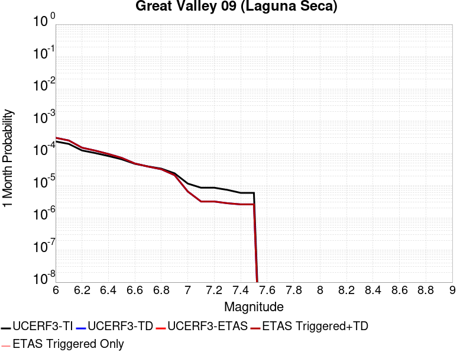 |  |  |

| Magnitude | 1 wk TI Prob | 1 wk TD Prob | 1 wk ETAS Prob | 1 wk ETAS/TD Gain | 1 wk ETAS Triggered+TD | 1 wk ETAS Triggered Only | 1 mo TI Prob | 1 mo TD Prob | 1 mo ETAS Prob | 1 mo ETAS/TD Gain | 1 mo ETAS Triggered+TD | 1 mo ETAS Triggered Only | 1 yr TI Prob | 1 yr TD Prob | 1 yr ETAS Prob | 1 yr ETAS/TD Gain | 1 yr ETAS Triggered+TD | 1 yr ETAS Triggered Only | 10 yr TI Prob | 10 yr TD Prob | 10 yr ETAS Prob | 10 yr ETAS/TD Gain | 10 yr ETAS Triggered+TD | 10 yr ETAS Triggered Only |
|-----|-----|-----|-----|-----|-----|-----|-----|-----|-----|-----|-----|-----|-----|-----|-----|-----|-----|-----|-----|-----|-----|-----|-----|-----|
| 6.0 | 5.4353277E-5 | 7.0545706E-5 | 0.0 | 0.0 | 7.0545706E-5 | 0.0 | 2.3292181E-4 | 3.0230382E-4 | 0.0 | 0.0 | 3.0230382E-4 | 0.0 | 0.0028321352 | 0.003674334 | 2.0E-4 | 0.054431636 | 0.003873599 | 2.0E-4 | 0.02796312 | 0.036137998 | 6.0E-4 | 0.016603023 | 0.036716316 | 6.0E-4 |
| 6.1 | 4.5578287E-5 | 5.825677E-5 | 0.0 | 0.0 | 5.825677E-5 | 0.0 | 1.953209E-4 | 2.4964742E-4 | 0.0 | 0.0 | 2.4964742E-4 | 0.0 | 0.0023754383 | 0.003035215 | 0.0 | 0.0 | 0.003035215 | 0.0 | 0.023502063 | 0.029937718 | 3.0E-4 | 0.010020804 | 0.030228736 | 3.0E-4 |
| 6.2 | 2.8536782E-5 | 3.4755616E-5 | 0.0 | 0.0 | 3.4755616E-5 | 0.0 | 1.2229476E-4 | 1.4894335E-4 | 0.0 | 0.0 | 1.4894335E-4 | 0.0 | 0.0014879217 | 0.0018118527 | 0.0 | 0.0 | 0.0018118527 | 0.0 | 0.014779986 | 0.017967949 | 2.0E-4 | 0.011130931 | 0.018164355 | 2.0E-4 |
| 6.3 | 2.3698774E-5 | 2.8228114E-5 | 0.0 | 0.0 | 2.8228114E-5 | 0.0 | 1.01562226E-4 | 1.209711E-4 | 0.0 | 0.0 | 1.209711E-4 | 0.0 | 0.0012358186 | 0.0014718192 | 0.0 | 0.0 | 0.0014718192 | 0.0 | 0.012289686 | 0.014618955 | 2.0E-4 | 0.013680869 | 0.014816031 | 2.0E-4 |
| 6.4 | 1.9191197E-5 | 2.2133576E-5 | 0.0 | 0.0 | 2.2133576E-5 | 0.0 | 8.2245395E-5 | 9.4854375E-5 | 0.0 | 0.0 | 9.4854375E-5 | 0.0 | 0.0010008777 | 0.0011542451 | 0.0 | 0.0 | 0.0011542451 | 0.0 | 0.009963818 | 0.011482463 | 2.0E-4 | 0.017417865 | 0.011680166 | 2.0E-4 |
| 6.5 | 1.5203241E-5 | 1.6808493E-5 | 0.0 | 0.0 | 1.6808493E-5 | 0.0 | 6.5155116E-5 | 7.203399E-5 | 0.0 | 0.0 | 7.203399E-5 | 0.0 | 7.9297484E-4 | 8.76675E-4 | 0.0 | 0.0 | 8.76675E-4 | 0.0 | 0.007901512 | 0.008733272 | 2.0E-4 | 0.022900926 | 0.008931525 | 2.0E-4 |
| 6.6 | 1.0984925E-5 | 1.1246259E-5 | 0.0 | 0.0 | 1.1246259E-5 | 0.0 | 4.70774E-5 | 4.8197388E-5 | 0.0 | 0.0 | 4.8197388E-5 | 0.0 | 5.730166E-4 | 5.86649E-4 | 0.0 | 0.0 | 5.86649E-4 | 0.0 | 0.005715413 | 0.0058513945 | 2.0E-4 | 0.03417989 | 0.006050224 | 2.0E-4 |
| 6.7 | 9.134616E-6 | 9.022647E-6 | 0.0 | 0.0 | 9.022647E-6 | 0.0 | 3.9147766E-5 | 3.8667928E-5 | 0.0 | 0.0 | 3.8667928E-5 | 0.0 | 4.7651984E-4 | 4.706827E-4 | 0.0 | 0.0 | 4.706827E-4 | 0.0 | 0.004754993 | 0.004697103 | 2.0E-4 | 0.042579435 | 0.0048961635 | 2.0E-4 |
| 6.8 | 7.785589E-6 | 7.4541726E-6 | 0.0 | 0.0 | 7.4541726E-6 | 0.0 | 3.3366385E-5 | 3.1946074E-5 | 0.0 | 0.0 | 3.1946074E-5 | 0.0 | 4.0616E-4 | 3.8887604E-4 | 0.0 | 0.0 | 3.8887604E-4 | 0.0 | 0.0040541845 | 0.0038821597 | 1.0E-4 | 0.025758857 | 0.0039817714 | 1.0E-4 |
| 6.9 | 5.579095E-6 | 4.899893E-6 | 0.0 | 0.0 | 4.899893E-6 | 0.0 | 2.3910188E-5 | 2.099938E-5 | 0.0 | 0.0 | 2.099938E-5 | 0.0 | 2.9106764E-4 | 2.5563885E-4 | 0.0 | 0.0 | 2.5563885E-4 | 0.0 | 0.002906867 | 0.0025535852 | 1.0E-4 | 0.039160628 | 0.0026533299 | 1.0E-4 |
| 7.0 | 2.6816688E-6 | 1.5218607E-6 | 0.0 | 0.0 | 1.5218607E-6 | 0.0 | 1.1492816E-5 | 6.522244E-6 | 0.0 | 0.0 | 6.522244E-6 | 0.0 | 1.3991605E-4 | 7.9405516E-5 | 0.0 | 0.0 | 7.9405516E-5 | 0.0 | 0.0013982799 | 7.9378014E-4 | 0.0 | 0.0 | 7.9378014E-4 | 0.0 |
| 7.1 | 1.9951021E-6 | 7.454217E-7 | 0.0 | 0.0 | 7.454217E-7 | 0.0 | 8.55041E-6 | 3.1946608E-6 | 0.0 | 0.0 | 3.1946608E-6 | 0.0 | 1.0409627E-4 | 3.889434E-5 | 0.0 | 0.0 | 3.889434E-5 | 0.0 | 0.0010404752 | 3.888795E-4 | 0.0 | 0.0 | 3.888795E-4 | 0.0 |
| 7.2 | 1.9951021E-6 | 7.454217E-7 | 0.0 | 0.0 | 7.454217E-7 | 0.0 | 8.55041E-6 | 3.1946608E-6 | 0.0 | 0.0 | 3.1946608E-6 | 0.0 | 1.0409627E-4 | 3.889434E-5 | 0.0 | 0.0 | 3.889434E-5 | 0.0 | 0.0010404752 | 3.888795E-4 | 0.0 | 0.0 | 3.888795E-4 | 0.0 |
| 7.3 | 1.7087556E-6 | 6.578776E-7 | 0.0 | 0.0 | 6.578776E-7 | 0.0 | 7.3232177E-6 | 2.8194725E-6 | 0.0 | 0.0 | 2.8194725E-6 | 0.0 | 8.915652E-5 | 3.432658E-5 | 0.0 | 0.0 | 3.432658E-5 | 0.0 | 8.9120766E-4 | 3.4321682E-4 | 0.0 | 0.0 | 3.4321682E-4 | 0.0 |
| 7.4 | 1.3804846E-6 | 6.073515E-7 | 0.0 | 0.0 | 6.073515E-7 | 0.0 | 5.916349E-6 | 2.602933E-6 | 0.0 | 0.0 | 2.602933E-6 | 0.0 | 7.2029165E-5 | 3.1690288E-5 | 0.0 | 0.0 | 3.1690288E-5 | 0.0 | 7.200583E-4 | 3.168617E-4 | 0.0 | 0.0 | 3.168617E-4 | 0.0 |
| 7.5 | 1.3804846E-6 | 6.073515E-7 | 0.0 | 0.0 | 6.073515E-7 | 0.0 | 5.916349E-6 | 2.602933E-6 | 0.0 | 0.0 | 2.602933E-6 | 0.0 | 7.2029165E-5 | 3.1690288E-5 | 0.0 | 0.0 | 3.1690288E-5 | 0.0 | 7.200583E-4 | 3.168617E-4 | 0.0 | 0.0 | 3.168617E-4 | 0.0 |

## Sheephole
*[(top)](#table-of-contents)*

| 1 Week | 1 Month | 1 Year | 10 Year |
|-----|-----|-----|-----|
| 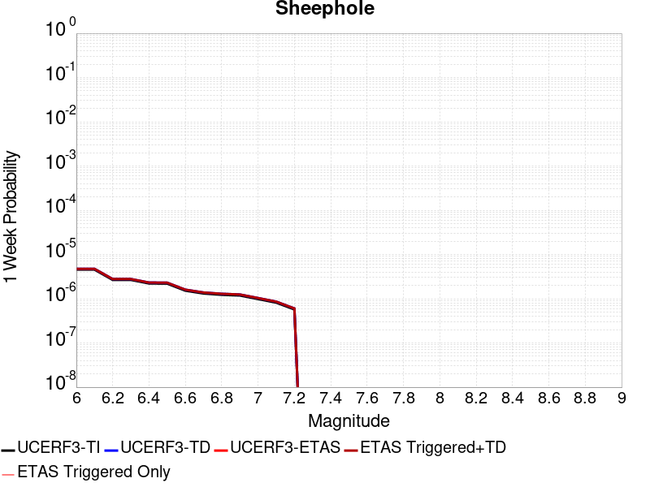 |  |  |  |

| Magnitude | 1 wk TI Prob | 1 wk TD Prob | 1 wk ETAS Prob | 1 wk ETAS/TD Gain | 1 wk ETAS Triggered+TD | 1 wk ETAS Triggered Only | 1 mo TI Prob | 1 mo TD Prob | 1 mo ETAS Prob | 1 mo ETAS/TD Gain | 1 mo ETAS Triggered+TD | 1 mo ETAS Triggered Only | 1 yr TI Prob | 1 yr TD Prob | 1 yr ETAS Prob | 1 yr ETAS/TD Gain | 1 yr ETAS Triggered+TD | 1 yr ETAS Triggered Only | 10 yr TI Prob | 10 yr TD Prob | 10 yr ETAS Prob | 10 yr ETAS/TD Gain | 10 yr ETAS Triggered+TD | 10 yr ETAS Triggered Only |
|-----|-----|-----|-----|-----|-----|-----|-----|-----|-----|-----|-----|-----|-----|-----|-----|-----|-----|-----|-----|-----|-----|-----|-----|-----|
| 6.0 | 4.5579695E-6 | 4.741656E-6 | 0.0 | 0.0 | 4.741656E-6 | 0.0 | 1.9534009E-5 | 2.0321255E-5 | 0.0 | 0.0 | 2.0321255E-5 | 0.0 | 2.3780059E-4 | 2.4738873E-4 | 1.0E-4 | 0.40422213 | 3.47364E-4 | 1.0E-4 | 0.0023754628 | 0.002471678 | 6.0E-4 | 0.24275006 | 0.003070195 | 6.0E-4 |
| 6.1 | 4.5579695E-6 | 4.741656E-6 | 0.0 | 0.0 | 4.741656E-6 | 0.0 | 1.9534009E-5 | 2.0321255E-5 | 0.0 | 0.0 | 2.0321255E-5 | 0.0 | 2.3780059E-4 | 2.4738873E-4 | 1.0E-4 | 0.40422213 | 3.47364E-4 | 1.0E-4 | 0.0023754628 | 0.002471678 | 6.0E-4 | 0.24275006 | 0.003070195 | 6.0E-4 |
| 6.2 | 2.6677674E-6 | 2.787652E-6 | 0.0 | 0.0 | 2.787652E-6 | 0.0 | 1.1433239E-5 | 1.1947031E-5 | 0.0 | 0.0 | 1.1947031E-5 | 0.0 | 1.3919079E-4 | 1.4544648E-4 | 0.0 | 0.0 | 1.4544648E-4 | 0.0 | 0.0013910364 | 0.0014536188 | 5.0E-4 | 0.34396914 | 0.0019528919 | 5.0E-4 |
| 6.3 | 2.6677674E-6 | 2.787652E-6 | 0.0 | 0.0 | 2.787652E-6 | 0.0 | 1.1433239E-5 | 1.1947031E-5 | 0.0 | 0.0 | 1.1947031E-5 | 0.0 | 1.3919079E-4 | 1.4544648E-4 | 0.0 | 0.0 | 1.4544648E-4 | 0.0 | 0.0013910364 | 0.0014536188 | 5.0E-4 | 0.34396914 | 0.0019528919 | 5.0E-4 |
| 6.4 | 2.2159759E-6 | 2.3231096E-6 | 0.0 | 0.0 | 2.3231096E-6 | 0.0 | 9.497005E-6 | 9.95615E-6 | 0.0 | 0.0 | 9.95615E-6 | 0.0 | 1.156199E-4 | 1.212102E-4 | 0.0 | 0.0 | 1.212102E-4 | 0.0 | 0.0011555976 | 0.0012115203 | 3.0E-4 | 0.24762277 | 0.0015111568 | 3.0E-4 |
| 6.5 | 2.1986082E-6 | 2.3049884E-6 | 0.0 | 0.0 | 2.3049884E-6 | 0.0 | 9.4225725E-6 | 9.8784885E-6 | 0.0 | 0.0 | 9.8784885E-6 | 0.0 | 1.1471378E-4 | 1.2026477E-4 | 0.0 | 0.0 | 1.2026477E-4 | 0.0 | 0.0011465458 | 0.0012020762 | 3.0E-4 | 0.24956821 | 0.0015017155 | 3.0E-4 |
| 6.6 | 1.5232331E-6 | 1.6020622E-6 | 0.0 | 0.0 | 1.6020622E-6 | 0.0 | 6.5281256E-6 | 6.8659638E-6 | 0.0 | 0.0 | 6.8659638E-6 | 0.0 | 7.947703E-5 | 8.3590094E-5 | 0.0 | 0.0 | 8.3590094E-5 | 0.0 | 7.9448614E-4 | 8.3560526E-4 | 3.0E-4 | 0.35902122 | 0.0011353545 | 3.0E-4 |
| 6.7 | 1.3137362E-6 | 1.3829688E-6 | 0.0 | 0.0 | 1.3829688E-6 | 0.0 | 5.6302856E-6 | 5.9269964E-6 | 0.0 | 0.0 | 5.9269964E-6 | 0.0 | 6.854657E-5 | 7.215893E-5 | 0.0 | 0.0 | 7.215893E-5 | 0.0 | 6.8525434E-4 | 7.2136894E-4 | 3.0E-4 | 0.41587597 | 0.0010211525 | 3.0E-4 |
| 6.8 | 1.2275751E-6 | 1.2924249E-6 | 0.0 | 0.0 | 1.2924249E-6 | 0.0 | 5.2610258E-6 | 5.538953E-6 | 0.0 | 0.0 | 5.538953E-6 | 0.0 | 6.4051106E-5 | 6.74348E-5 | 0.0 | 0.0 | 6.74348E-5 | 0.0 | 6.4032647E-4 | 6.7415676E-4 | 2.0E-4 | 0.29666692 | 8.740219E-4 | 2.0E-4 |
| 6.9 | 1.1837088E-6 | 1.2462373E-6 | 0.0 | 0.0 | 1.2462373E-6 | 0.0 | 5.0730278E-6 | 5.3410067E-6 | 0.0 | 0.0 | 5.3410067E-6 | 0.0 | 6.176237E-5 | 6.502495E-5 | 0.0 | 0.0 | 6.502495E-5 | 0.0 | 6.17452E-4 | 6.500724E-4 | 2.0E-4 | 0.30765805 | 8.499424E-4 | 2.0E-4 |
| 7.0 | 9.849371E-7 | 1.0367409E-6 | 0.0 | 0.0 | 1.0367409E-6 | 0.0 | 4.2211523E-6 | 4.443168E-6 | 0.0 | 0.0 | 4.443168E-6 | 0.0 | 5.1391315E-5 | 5.409433E-5 | 0.0 | 0.0 | 5.409433E-5 | 0.0 | 5.137943E-4 | 5.408217E-4 | 2.0E-4 | 0.36980763 | 7.4071356E-4 | 2.0E-4 |
| 7.1 | 8.1643645E-7 | 8.592595E-7 | 0.0 | 0.0 | 8.592595E-7 | 0.0 | 3.4990085E-6 | 3.682536E-6 | 0.0 | 0.0 | 3.682536E-6 | 0.0 | 4.2599597E-5 | 4.483404E-5 | 0.0 | 0.0 | 4.483404E-5 | 0.0 | 4.259143E-4 | 4.482586E-4 | 2.0E-4 | 0.44617105 | 6.4816896E-4 | 2.0E-4 |
| 7.2 | 5.7295756E-7 | 6.0301517E-7 | 0.0 | 0.0 | 6.0301517E-7 | 0.0 | 2.45553E-6 | 2.5843485E-6 | 0.0 | 0.0 | 2.5843485E-6 | 0.0 | 2.9895667E-5 | 3.1464057E-5 | 0.0 | 0.0 | 3.1464057E-5 | 0.0 | 2.9891645E-4 | 3.1460272E-4 | 2.0E-4 | 0.6357224 | 5.145398E-4 | 2.0E-4 |

## McKinleyville (alt1)
*[(top)](#table-of-contents)*

| 1 Week | 1 Month | 1 Year | 10 Year |
|-----|-----|-----|-----|
| 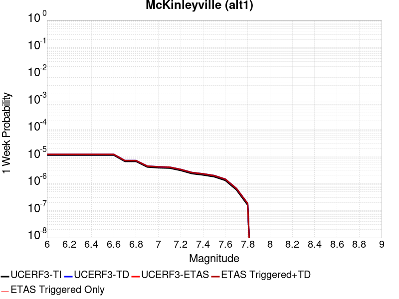 |  |  |  |

| Magnitude | 1 wk TI Prob | 1 wk TD Prob | 1 wk ETAS Prob | 1 wk ETAS/TD Gain | 1 wk ETAS Triggered+TD | 1 wk ETAS Triggered Only | 1 mo TI Prob | 1 mo TD Prob | 1 mo ETAS Prob | 1 mo ETAS/TD Gain | 1 mo ETAS Triggered+TD | 1 mo ETAS Triggered Only | 1 yr TI Prob | 1 yr TD Prob | 1 yr ETAS Prob | 1 yr ETAS/TD Gain | 1 yr ETAS Triggered+TD | 1 yr ETAS Triggered Only | 10 yr TI Prob | 10 yr TD Prob | 10 yr ETAS Prob | 10 yr ETAS/TD Gain | 10 yr ETAS Triggered+TD | 10 yr ETAS Triggered Only |
|-----|-----|-----|-----|-----|-----|-----|-----|-----|-----|-----|-----|-----|-----|-----|-----|-----|-----|-----|-----|-----|-----|-----|-----|-----|
| 6.0 | 1.1028524E-5 | 1.1729296E-5 | 0.0 | 0.0 | 1.1729296E-5 | 0.0 | 4.7264242E-5 | 5.0267583E-5 | 0.0 | 0.0 | 5.0267583E-5 | 0.0 | 5.7529024E-4 | 6.118614E-4 | 1.0E-4 | 0.1634357 | 7.1180024E-4 | 1.0E-4 | 0.005738032 | 0.0061042774 | 5.0E-4 | 0.081909776 | 0.0066012256 | 5.0E-4 |
| 6.1 | 1.1028524E-5 | 1.1729296E-5 | 0.0 | 0.0 | 1.1729296E-5 | 0.0 | 4.7264242E-5 | 5.0267583E-5 | 0.0 | 0.0 | 5.0267583E-5 | 0.0 | 5.7529024E-4 | 6.118614E-4 | 1.0E-4 | 0.1634357 | 7.1180024E-4 | 1.0E-4 | 0.005738032 | 0.0061042774 | 5.0E-4 | 0.081909776 | 0.0066012256 | 5.0E-4 |
| 6.2 | 1.1028524E-5 | 1.1729296E-5 | 0.0 | 0.0 | 1.1729296E-5 | 0.0 | 4.7264242E-5 | 5.0267583E-5 | 0.0 | 0.0 | 5.0267583E-5 | 0.0 | 5.7529024E-4 | 6.118614E-4 | 1.0E-4 | 0.1634357 | 7.1180024E-4 | 1.0E-4 | 0.005738032 | 0.0061042774 | 5.0E-4 | 0.081909776 | 0.0066012256 | 5.0E-4 |
| 6.3 | 1.1028524E-5 | 1.1729296E-5 | 0.0 | 0.0 | 1.1729296E-5 | 0.0 | 4.7264242E-5 | 5.0267583E-5 | 0.0 | 0.0 | 5.0267583E-5 | 0.0 | 5.7529024E-4 | 6.118614E-4 | 1.0E-4 | 0.1634357 | 7.1180024E-4 | 1.0E-4 | 0.005738032 | 0.0061042774 | 5.0E-4 | 0.081909776 | 0.0066012256 | 5.0E-4 |
| 6.4 | 1.1028524E-5 | 1.1729296E-5 | 0.0 | 0.0 | 1.1729296E-5 | 0.0 | 4.7264242E-5 | 5.0267583E-5 | 0.0 | 0.0 | 5.0267583E-5 | 0.0 | 5.7529024E-4 | 6.118614E-4 | 1.0E-4 | 0.1634357 | 7.1180024E-4 | 1.0E-4 | 0.005738032 | 0.0061042774 | 5.0E-4 | 0.081909776 | 0.0066012256 | 5.0E-4 |
| 6.5 | 1.1028524E-5 | 1.1729296E-5 | 0.0 | 0.0 | 1.1729296E-5 | 0.0 | 4.7264242E-5 | 5.0267583E-5 | 0.0 | 0.0 | 5.0267583E-5 | 0.0 | 5.7529024E-4 | 6.118614E-4 | 1.0E-4 | 0.1634357 | 7.1180024E-4 | 1.0E-4 | 0.005738032 | 0.0061042774 | 5.0E-4 | 0.081909776 | 0.0066012256 | 5.0E-4 |
| 6.6 | 1.1028524E-5 | 1.1729296E-5 | 0.0 | 0.0 | 1.1729296E-5 | 0.0 | 4.7264242E-5 | 5.0267583E-5 | 0.0 | 0.0 | 5.0267583E-5 | 0.0 | 5.7529024E-4 | 6.118614E-4 | 1.0E-4 | 0.1634357 | 7.1180024E-4 | 1.0E-4 | 0.005738032 | 0.0061042774 | 5.0E-4 | 0.081909776 | 0.0066012256 | 5.0E-4 |
| 6.7 | 6.483374E-6 | 6.918042E-6 | 0.0 | 0.0 | 6.918042E-6 | 0.0 | 2.7785592E-5 | 2.9648449E-5 | 0.0 | 0.0 | 2.9648449E-5 | 0.0 | 3.3823706E-4 | 3.6091628E-4 | 1.0E-4 | 0.27707255 | 4.608802E-4 | 1.0E-4 | 0.003377227 | 0.0036039143 | 3.0E-4 | 0.083242826 | 0.0039028332 | 3.0E-4 |
| 6.8 | 6.483374E-6 | 6.918042E-6 | 0.0 | 0.0 | 6.918042E-6 | 0.0 | 2.7785592E-5 | 2.9648449E-5 | 0.0 | 0.0 | 2.9648449E-5 | 0.0 | 3.3823706E-4 | 3.6091628E-4 | 1.0E-4 | 0.27707255 | 4.608802E-4 | 1.0E-4 | 0.003377227 | 0.0036039143 | 3.0E-4 | 0.083242826 | 0.0039028332 | 3.0E-4 |
| 6.9 | 4.0394048E-6 | 4.3460254E-6 | 0.0 | 0.0 | 4.3460254E-6 | 0.0 | 1.731162E-5 | 1.8625693E-5 | 0.0 | 0.0 | 1.8625693E-5 | 0.0 | 2.1074859E-4 | 2.2674476E-4 | 1.0E-4 | 0.4410245 | 3.2672207E-4 | 1.0E-4 | 0.0021054882 | 0.002265189 | 2.0E-4 | 0.08829285 | 0.0024647359 | 2.0E-4 |
| 7.0 | 3.7791233E-6 | 4.0728537E-6 | 0.0 | 0.0 | 4.0728537E-6 | 0.0 | 1.6196142E-5 | 1.7454973E-5 | 0.0 | 0.0 | 1.7454973E-5 | 0.0 | 1.9717019E-4 | 2.1249408E-4 | 1.0E-4 | 0.47060135 | 3.1247284E-4 | 1.0E-4 | 0.0019699533 | 0.002122959 | 2.0E-4 | 0.094208136 | 0.0023225343 | 2.0E-4 |
| 7.1 | 3.675443E-6 | 3.964143E-6 | 0.0 | 0.0 | 3.964143E-6 | 0.0 | 1.5751802E-5 | 1.6989077E-5 | 0.0 | 0.0 | 1.6989077E-5 | 0.0 | 1.9176133E-4 | 2.0682288E-4 | 1.0E-4 | 0.48350552 | 3.068022E-4 | 1.0E-4 | 0.0019159593 | 0.0020663536 | 2.0E-4 | 0.09678886 | 0.0022659402 | 2.0E-4 |
| 7.2 | 3.0165843E-6 | 3.2726737E-6 | 0.0 | 0.0 | 3.2726737E-6 | 0.0 | 1.2928153E-5 | 1.4025671E-5 | 0.0 | 0.0 | 1.4025671E-5 | 0.0 | 1.573889E-4 | 1.7074934E-4 | 1.0E-4 | 0.5856538 | 2.7073227E-4 | 1.0E-4 | 0.0015727748 | 0.0017062003 | 1.0E-4 | 0.05860977 | 0.0018060297 | 1.0E-4 |
| 7.3 | 2.307633E-6 | 2.5193915E-6 | 0.0 | 0.0 | 2.5193915E-6 | 0.0 | 9.889818E-6 | 1.0797348E-5 | 0.0 | 0.0 | 1.0797348E-5 | 0.0 | 1.2040188E-4 | 1.3144987E-4 | 1.0E-4 | 0.7607463 | 2.3143672E-4 | 1.0E-4 | 0.0012033667 | 0.0013137296 | 1.0E-4 | 0.07611917 | 0.0014135982 | 1.0E-4 |
| 7.4 | 2.0568484E-6 | 2.2521642E-6 | 0.0 | 0.0 | 2.2521642E-6 | 0.0 | 8.8150355E-6 | 9.652097E-6 | 0.0 | 0.0 | 9.652097E-6 | 0.0 | 1.0731777E-4 | 1.17508025E-4 | 1.0E-4 | 0.85100573 | 2.1749627E-4 | 1.0E-4 | 0.0010726595 | 0.0011744666 | 1.0E-4 | 0.08514504 | 0.001274349 | 1.0E-4 |
| 7.5 | 1.7674889E-6 | 1.9418203E-6 | 0.0 | 0.0 | 1.9418203E-6 | 0.0 | 7.5749304E-6 | 8.322061E-6 | 0.0 | 0.0 | 8.322061E-6 | 0.0 | 9.222087E-5 | 1.01316444E-4 | 1.0E-4 | 0.9870066 | 2.0130632E-4 | 1.0E-4 | 9.218261E-4 | 0.0010127092 | 1.0E-4 | 0.09874503 | 0.0011126079 | 1.0E-4 |
| 7.6 | 1.2944297E-6 | 1.4299469E-6 | 0.0 | 0.0 | 1.4299469E-6 | 0.0 | 5.547544E-6 | 6.12833E-6 | 0.0 | 0.0 | 6.12833E-6 | 0.0 | 6.753925E-5 | 7.460991E-5 | 1.0E-4 | 1.3403045 | 1.7460245E-4 | 1.0E-4 | 6.7518733E-4 | 7.4585347E-4 | 1.0E-4 | 0.1340746 | 8.4577885E-4 | 1.0E-4 |
| 7.7 | 5.806243E-7 | 6.4625124E-7 | 0.0 | 0.0 | 6.4625124E-7 | 0.0 | 2.4883875E-6 | 2.7696453E-6 | 0.0 | 0.0 | 2.7696453E-6 | 0.0 | 3.0295698E-5 | 3.3719927E-5 | 1.0E-4 | 2.9656055 | 1.3371656E-4 | 1.0E-4 | 3.0291567E-4 | 3.371498E-4 | 1.0E-4 | 0.29660407 | 4.3711608E-4 | 1.0E-4 |
| 7.8 | 1.6121008E-7 | 1.8188292E-7 | 0.0 | 0.0 | 1.8188292E-7 | 0.0 | 6.909002E-7 | 7.79498E-7 | 0.0 | 0.0 | 7.79498E-7 | 0.0 | 8.411677E-6 | 9.49035E-6 | 1.0E-4 | 10.53702 | 1.094894E-4 | 1.0E-4 | 8.411359E-5 | 9.489969E-5 | 1.0E-4 | 1.0537442 | 1.948902E-4 | 1.0E-4 |

## Pitas Point (Lower)-Montalvo
*[(top)](#table-of-contents)*

| 1 Week | 1 Month | 1 Year | 10 Year |
|-----|-----|-----|-----|
|  |  |  | 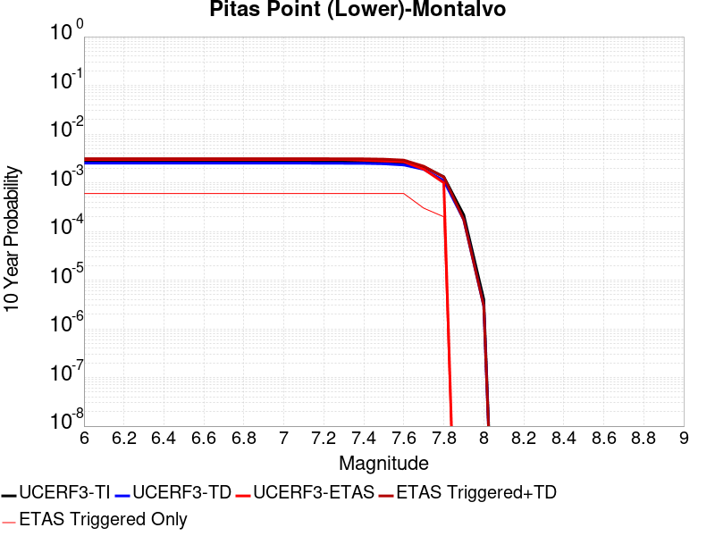 |

| Magnitude | 1 wk TI Prob | 1 wk TD Prob | 1 wk ETAS Prob | 1 wk ETAS/TD Gain | 1 wk ETAS Triggered+TD | 1 wk ETAS Triggered Only | 1 mo TI Prob | 1 mo TD Prob | 1 mo ETAS Prob | 1 mo ETAS/TD Gain | 1 mo ETAS Triggered+TD | 1 mo ETAS Triggered Only | 1 yr TI Prob | 1 yr TD Prob | 1 yr ETAS Prob | 1 yr ETAS/TD Gain | 1 yr ETAS Triggered+TD | 1 yr ETAS Triggered Only | 10 yr TI Prob | 10 yr TD Prob | 10 yr ETAS Prob | 10 yr ETAS/TD Gain | 10 yr ETAS Triggered+TD | 10 yr ETAS Triggered Only |
|-----|-----|-----|-----|-----|-----|-----|-----|-----|-----|-----|-----|-----|-----|-----|-----|-----|-----|-----|-----|-----|-----|-----|-----|-----|
| 6.0 | 5.2543637E-6 | 4.83857E-6 | 0.0 | 0.0 | 4.83857E-6 | 0.0 | 2.2518509E-5 | 2.0736565E-5 | 0.0 | 0.0 | 2.0736565E-5 | 0.0 | 2.7412834E-4 | 2.5243874E-4 | 1.0E-4 | 0.39613572 | 3.524135E-4 | 1.0E-4 | 0.0027379042 | 0.0025215524 | 6.0E-4 | 0.23794866 | 0.0031200396 | 6.0E-4 |
| 6.1 | 5.2543637E-6 | 4.83857E-6 | 0.0 | 0.0 | 4.83857E-6 | 0.0 | 2.2518509E-5 | 2.0736565E-5 | 0.0 | 0.0 | 2.0736565E-5 | 0.0 | 2.7412834E-4 | 2.5243874E-4 | 1.0E-4 | 0.39613572 | 3.524135E-4 | 1.0E-4 | 0.0027379042 | 0.0025215524 | 6.0E-4 | 0.23794866 | 0.0031200396 | 6.0E-4 |
| 6.2 | 5.2543637E-6 | 4.83857E-6 | 0.0 | 0.0 | 4.83857E-6 | 0.0 | 2.2518509E-5 | 2.0736565E-5 | 0.0 | 0.0 | 2.0736565E-5 | 0.0 | 2.7412834E-4 | 2.5243874E-4 | 1.0E-4 | 0.39613572 | 3.524135E-4 | 1.0E-4 | 0.0027379042 | 0.0025215524 | 6.0E-4 | 0.23794866 | 0.0031200396 | 6.0E-4 |
| 6.3 | 5.2543637E-6 | 4.83857E-6 | 0.0 | 0.0 | 4.83857E-6 | 0.0 | 2.2518509E-5 | 2.0736565E-5 | 0.0 | 0.0 | 2.0736565E-5 | 0.0 | 2.7412834E-4 | 2.5243874E-4 | 1.0E-4 | 0.39613572 | 3.524135E-4 | 1.0E-4 | 0.0027379042 | 0.0025215524 | 6.0E-4 | 0.23794866 | 0.0031200396 | 6.0E-4 |
| 6.4 | 5.2543637E-6 | 4.83857E-6 | 0.0 | 0.0 | 4.83857E-6 | 0.0 | 2.2518509E-5 | 2.0736565E-5 | 0.0 | 0.0 | 2.0736565E-5 | 0.0 | 2.7412834E-4 | 2.5243874E-4 | 1.0E-4 | 0.39613572 | 3.524135E-4 | 1.0E-4 | 0.0027379042 | 0.0025215524 | 6.0E-4 | 0.23794866 | 0.0031200396 | 6.0E-4 |
| 6.5 | 5.2543637E-6 | 4.83857E-6 | 0.0 | 0.0 | 4.83857E-6 | 0.0 | 2.2518509E-5 | 2.0736565E-5 | 0.0 | 0.0 | 2.0736565E-5 | 0.0 | 2.7412834E-4 | 2.5243874E-4 | 1.0E-4 | 0.39613572 | 3.524135E-4 | 1.0E-4 | 0.0027379042 | 0.0025215524 | 6.0E-4 | 0.23794866 | 0.0031200396 | 6.0E-4 |
| 6.6 | 5.2543637E-6 | 4.83857E-6 | 0.0 | 0.0 | 4.83857E-6 | 0.0 | 2.2518509E-5 | 2.0736565E-5 | 0.0 | 0.0 | 2.0736565E-5 | 0.0 | 2.7412834E-4 | 2.5243874E-4 | 1.0E-4 | 0.39613572 | 3.524135E-4 | 1.0E-4 | 0.0027379042 | 0.0025215524 | 6.0E-4 | 0.23794866 | 0.0031200396 | 6.0E-4 |
| 6.7 | 5.2543637E-6 | 4.83857E-6 | 0.0 | 0.0 | 4.83857E-6 | 0.0 | 2.2518509E-5 | 2.0736565E-5 | 0.0 | 0.0 | 2.0736565E-5 | 0.0 | 2.7412834E-4 | 2.5243874E-4 | 1.0E-4 | 0.39613572 | 3.524135E-4 | 1.0E-4 | 0.0027379042 | 0.0025215524 | 6.0E-4 | 0.23794866 | 0.0031200396 | 6.0E-4 |
| 6.8 | 5.2543637E-6 | 4.83857E-6 | 0.0 | 0.0 | 4.83857E-6 | 0.0 | 2.2518509E-5 | 2.0736565E-5 | 0.0 | 0.0 | 2.0736565E-5 | 0.0 | 2.7412834E-4 | 2.5243874E-4 | 1.0E-4 | 0.39613572 | 3.524135E-4 | 1.0E-4 | 0.0027379042 | 0.0025215524 | 6.0E-4 | 0.23794866 | 0.0031200396 | 6.0E-4 |
| 6.9 | 5.2543637E-6 | 4.83857E-6 | 0.0 | 0.0 | 4.83857E-6 | 0.0 | 2.2518509E-5 | 2.0736565E-5 | 0.0 | 0.0 | 2.0736565E-5 | 0.0 | 2.7412834E-4 | 2.5243874E-4 | 1.0E-4 | 0.39613572 | 3.524135E-4 | 1.0E-4 | 0.0027379042 | 0.0025215524 | 6.0E-4 | 0.23794866 | 0.0031200396 | 6.0E-4 |
| 7.0 | 5.2543637E-6 | 4.83857E-6 | 0.0 | 0.0 | 4.83857E-6 | 0.0 | 2.2518509E-5 | 2.0736565E-5 | 0.0 | 0.0 | 2.0736565E-5 | 0.0 | 2.7412834E-4 | 2.5243874E-4 | 1.0E-4 | 0.39613572 | 3.524135E-4 | 1.0E-4 | 0.0027379042 | 0.0025215524 | 6.0E-4 | 0.23794866 | 0.0031200396 | 6.0E-4 |
| 7.1 | 5.2543637E-6 | 4.83857E-6 | 0.0 | 0.0 | 4.83857E-6 | 0.0 | 2.2518509E-5 | 2.0736565E-5 | 0.0 | 0.0 | 2.0736565E-5 | 0.0 | 2.7412834E-4 | 2.5243874E-4 | 1.0E-4 | 0.39613572 | 3.524135E-4 | 1.0E-4 | 0.0027379042 | 0.0025215524 | 6.0E-4 | 0.23794866 | 0.0031200396 | 6.0E-4 |
| 7.2 | 5.2458695E-6 | 4.829723E-6 | 0.0 | 0.0 | 4.829723E-6 | 0.0 | 2.2482105E-5 | 2.069865E-5 | 0.0 | 0.0 | 2.069865E-5 | 0.0 | 2.7368523E-4 | 2.5197724E-4 | 1.0E-4 | 0.39686126 | 3.5195204E-4 | 1.0E-4 | 0.0027334841 | 0.0025169477 | 6.0E-4 | 0.23838396 | 0.0031154377 | 6.0E-4 |
| 7.3 | 5.22665E-6 | 4.8096385E-6 | 0.0 | 0.0 | 4.8096385E-6 | 0.0 | 2.2399736E-5 | 2.0612575E-5 | 0.0 | 0.0 | 2.0612575E-5 | 0.0 | 2.7268266E-4 | 2.509295E-4 | 1.0E-4 | 0.3985183 | 3.5090442E-4 | 1.0E-4 | 0.002723483 | 0.0025064943 | 6.0E-4 | 0.23937817 | 0.0031049903 | 6.0E-4 |
| 7.4 | 5.210642E-6 | 4.7928493E-6 | 0.0 | 0.0 | 4.7928493E-6 | 0.0 | 2.233113E-5 | 2.0540621E-5 | 0.0 | 0.0 | 2.0540621E-5 | 0.0 | 2.718476E-4 | 2.5005368E-4 | 1.0E-4 | 0.39991412 | 3.5002868E-4 | 1.0E-4 | 0.002715153 | 0.0024977557 | 6.0E-4 | 0.24021564 | 0.003096257 | 6.0E-4 |
| 7.5 | 5.1226016E-6 | 4.700727E-6 | 0.0 | 0.0 | 4.700727E-6 | 0.0 | 2.1953823E-5 | 2.0145819E-5 | 0.0 | 0.0 | 2.0145819E-5 | 0.0 | 2.67255E-4 | 2.4524805E-4 | 1.0E-4 | 0.40775046 | 3.4522353E-4 | 1.0E-4 | 0.0026693381 | 0.0024498056 | 6.0E-4 | 0.2449174 | 0.0030483357 | 6.0E-4 |
| 7.6 | 4.8796987E-6 | 4.4455996E-6 | 0.0 | 0.0 | 4.4455996E-6 | 0.0 | 2.0912828E-5 | 1.9052432E-5 | 0.0 | 0.0 | 1.9052432E-5 | 0.0 | 2.5458392E-4 | 2.3193896E-4 | 1.0E-4 | 0.4311479 | 3.3191577E-4 | 1.0E-4 | 0.0025429246 | 0.0023169995 | 6.0E-4 | 0.2589556 | 0.0029156094 | 6.0E-4 |
| 7.7 | 4.0834398E-6 | 3.6096746E-6 | 0.0 | 0.0 | 3.6096746E-6 | 0.0 | 1.7500339E-5 | 1.5469945E-5 | 0.0 | 0.0 | 1.5469945E-5 | 0.0 | 2.1304579E-4 | 1.8833052E-4 | 1.0E-4 | 0.53098136 | 2.8831168E-4 | 1.0E-4 | 0.0021284167 | 0.001881733 | 3.0E-4 | 0.15942751 | 0.0021811684 | 3.0E-4 |
| 7.8 | 2.5445438E-6 | 2.1215892E-6 | 0.0 | 0.0 | 2.1215892E-6 | 0.0 | 1.0905142E-5 | 9.092493E-6 | 0.0 | 0.0 | 9.092493E-6 | 0.0 | 1.3276201E-4 | 1.1069553E-4 | 1.0E-4 | 0.90337884 | 2.1068446E-4 | 1.0E-4 | 0.0013268272 | 0.0011064087 | 2.0E-4 | 0.18076505 | 0.0013061874 | 2.0E-4 |
| 7.9 | 4.1677114E-7 | 3.3298514E-7 | 0.0 | 0.0 | 3.3298514E-7 | 0.0 | 1.7861609E-6 | 1.4270784E-6 | 0.0 | 0.0 | 1.4270784E-6 | 0.0 | 2.1746291E-5 | 1.7374545E-5 | 0.0 | 0.0 | 1.7374545E-5 | 0.0 | 2.1744163E-4 | 1.7373217E-4 | 0.0 | 0.0 | 1.7373217E-4 | 0.0 |
| 8.0 | 7.791402E-9 | 5.684373E-9 | 0.0 | 0.0 | 5.684373E-9 | 0.0 | 3.3391725E-8 | 2.43616E-8 | 0.0 | 0.0 | 2.43616E-8 | 0.0 | 4.0654416E-7 | 2.9660245E-7 | 0.0 | 0.0 | 2.9660245E-7 | 0.0 | 4.065434E-6 | 2.9660227E-6 | 0.0 | 0.0 | 2.9660227E-6 | 0.0 |

## Monterey Bay-Tularcitos
*[(top)](#table-of-contents)*

| 1 Week | 1 Month | 1 Year | 10 Year |
|-----|-----|-----|-----|
|  |  |  |  |

| Magnitude | 1 wk TI Prob | 1 wk TD Prob | 1 wk ETAS Prob | 1 wk ETAS/TD Gain | 1 wk ETAS Triggered+TD | 1 wk ETAS Triggered Only | 1 mo TI Prob | 1 mo TD Prob | 1 mo ETAS Prob | 1 mo ETAS/TD Gain | 1 mo ETAS Triggered+TD | 1 mo ETAS Triggered Only | 1 yr TI Prob | 1 yr TD Prob | 1 yr ETAS Prob | 1 yr ETAS/TD Gain | 1 yr ETAS Triggered+TD | 1 yr ETAS Triggered Only | 10 yr TI Prob | 10 yr TD Prob | 10 yr ETAS Prob | 10 yr ETAS/TD Gain | 10 yr ETAS Triggered+TD | 10 yr ETAS Triggered Only |
|-----|-----|-----|-----|-----|-----|-----|-----|-----|-----|-----|-----|-----|-----|-----|-----|-----|-----|-----|-----|-----|-----|-----|-----|-----|
| 6.0 | 3.0131365E-5 | 3.2804863E-5 | 0.0 | 0.0 | 3.2804863E-5 | 0.0 | 1.2912804E-4 | 1.4058528E-4 | 0.0 | 0.0 | 1.4058528E-4 | 0.0 | 0.001571 | 0.0017103876 | 1.0E-4 | 0.058466278 | 0.0018102166 | 1.0E-4 | 0.015599402 | 0.016983047 | 6.0E-4 | 0.03532935 | 0.017572857 | 6.0E-4 |
| 6.1 | 3.0131365E-5 | 3.2804863E-5 | 0.0 | 0.0 | 3.2804863E-5 | 0.0 | 1.2912804E-4 | 1.4058528E-4 | 0.0 | 0.0 | 1.4058528E-4 | 0.0 | 0.001571 | 0.0017103876 | 1.0E-4 | 0.058466278 | 0.0018102166 | 1.0E-4 | 0.015599402 | 0.016983047 | 6.0E-4 | 0.03532935 | 0.017572857 | 6.0E-4 |
| 6.2 | 3.0131365E-5 | 3.2804863E-5 | 0.0 | 0.0 | 3.2804863E-5 | 0.0 | 1.2912804E-4 | 1.4058528E-4 | 0.0 | 0.0 | 1.4058528E-4 | 0.0 | 0.001571 | 0.0017103876 | 1.0E-4 | 0.058466278 | 0.0018102166 | 1.0E-4 | 0.015599402 | 0.016983047 | 6.0E-4 | 0.03532935 | 0.017572857 | 6.0E-4 |
| 6.3 | 1.6998249E-5 | 1.8333854E-5 | 0.0 | 0.0 | 1.8333854E-5 | 0.0 | 7.28476E-5 | 7.85714E-5 | 0.0 | 0.0 | 7.85714E-5 | 0.0 | 8.865586E-4 | 9.562057E-4 | 0.0 | 0.0 | 9.562057E-4 | 0.0 | 0.0088303005 | 0.0095228385 | 4.0E-4 | 0.04200428 | 0.00991903 | 4.0E-4 |
| 6.4 | 1.6998249E-5 | 1.8333854E-5 | 0.0 | 0.0 | 1.8333854E-5 | 0.0 | 7.28476E-5 | 7.85714E-5 | 0.0 | 0.0 | 7.85714E-5 | 0.0 | 8.865586E-4 | 9.562057E-4 | 0.0 | 0.0 | 9.562057E-4 | 0.0 | 0.0088303005 | 0.0095228385 | 4.0E-4 | 0.04200428 | 0.00991903 | 4.0E-4 |
| 6.5 | 1.27470785E-5 | 1.36955005E-5 | 0.0 | 0.0 | 1.36955005E-5 | 0.0 | 5.4629192E-5 | 5.8693742E-5 | 0.0 | 0.0 | 5.8693742E-5 | 0.0 | 6.649074E-4 | 7.143724E-4 | 0.0 | 0.0 | 7.143724E-4 | 0.0 | 0.0066292146 | 0.0071218126 | 3.0E-4 | 0.042124107 | 0.007419676 | 3.0E-4 |
| 6.6 | 1.2739422E-5 | 1.3687587E-5 | 0.0 | 0.0 | 1.3687587E-5 | 0.0 | 5.4596385E-5 | 5.865983E-5 | 0.0 | 0.0 | 5.865983E-5 | 0.0 | 6.645082E-4 | 7.1395974E-4 | 0.0 | 0.0 | 7.1395974E-4 | 0.0 | 0.0066252467 | 0.0071177124 | 3.0E-4 | 0.042148374 | 0.0074155773 | 3.0E-4 |
| 6.7 | 1.0160109E-5 | 1.0887449E-5 | 0.0 | 0.0 | 1.0887449E-5 | 0.0 | 4.35426E-5 | 4.66597E-5 | 0.0 | 0.0 | 4.66597E-5 | 0.0 | 5.300022E-4 | 5.679409E-4 | 0.0 | 0.0 | 5.679409E-4 | 0.0 | 0.005287399 | 0.0056656054 | 3.0E-4 | 0.05295109 | 0.005963906 | 3.0E-4 |
| 6.8 | 8.349859E-6 | 8.933964E-6 | 0.0 | 0.0 | 8.933964E-6 | 0.0 | 3.578462E-5 | 3.8287886E-5 | 0.0 | 0.0 | 3.8287886E-5 | 0.0 | 4.3559066E-4 | 4.6606097E-4 | 0.0 | 0.0 | 4.6606097E-4 | 0.0 | 0.004347378 | 0.0046514003 | 3.0E-4 | 0.0644967 | 0.004950005 | 3.0E-4 |
| 6.9 | 5.193639E-6 | 5.537275E-6 | 0.0 | 0.0 | 5.537275E-6 | 0.0 | 2.2258262E-5 | 2.373098E-5 | 0.0 | 0.0 | 2.373098E-5 | 0.0 | 2.7096065E-4 | 2.8888963E-4 | 0.0 | 0.0 | 2.8888963E-4 | 0.0 | 0.0027063051 | 0.002885462 | 2.0E-4 | 0.06931299 | 0.003084885 | 2.0E-4 |
| 7.0 | 4.359381E-6 | 4.644081E-6 | 0.0 | 0.0 | 4.644081E-6 | 0.0 | 1.8682927E-5 | 1.990307E-5 | 0.0 | 0.0 | 1.990307E-5 | 0.0 | 2.274409E-4 | 2.422959E-4 | 0.0 | 0.0 | 2.422959E-4 | 0.0 | 0.0022720827 | 0.0024206103 | 2.0E-4 | 0.082623795 | 0.0026201261 | 2.0E-4 |
| 7.1 | 3.0398533E-6 | 3.2315527E-6 | 0.0 | 0.0 | 3.2315527E-6 | 0.0 | 1.3027877E-5 | 1.3849453E-5 | 0.0 | 0.0 | 1.3849453E-5 | 0.0 | 1.5860285E-4 | 1.6860667E-4 | 0.0 | 0.0 | 1.6860667E-4 | 0.0 | 0.001584897 | 0.0016850452 | 1.0E-4 | 0.059345588 | 0.0017848767 | 1.0E-4 |
| 7.2 | 1.642335E-6 | 1.733604E-6 | 0.0 | 0.0 | 1.733604E-6 | 0.0 | 7.0385595E-6 | 7.429722E-6 | 0.0 | 0.0 | 7.429722E-6 | 0.0 | 8.569109E-5 | 9.045518E-5 | 0.0 | 0.0 | 9.045518E-5 | 0.0 | 8.5658056E-4 | 9.0438634E-4 | 0.0 | 0.0 | 9.0438634E-4 | 0.0 |
| 7.3 | 3.356842E-7 | 3.2959713E-7 | 0.0 | 0.0 | 3.2959713E-7 | 0.0 | 1.4386458E-6 | 1.4125584E-6 | 0.0 | 0.0 | 1.4125584E-6 | 0.0 | 1.7515373E-5 | 1.7197763E-5 | 0.0 | 0.0 | 1.7197763E-5 | 0.0 | 1.7513991E-4 | 1.7196442E-4 | 0.0 | 0.0 | 1.7196442E-4 | 0.0 |
| 7.4 | 2.1973483E-7 | 2.1012988E-7 | 0.0 | 0.0 | 2.1012988E-7 | 0.0 | 9.417204E-7 | 9.0055636E-7 | 0.0 | 0.0 | 9.0055636E-7 | 0.0 | 1.1465385E-5 | 1.0964219E-5 | 0.0 | 0.0 | 1.0964219E-5 | 0.0 | 1.1464794E-4 | 1.09636814E-4 | 0.0 | 0.0 | 1.09636814E-4 | 0.0 |
| 7.5 | 1.1944135E-7 | 1.0701926E-7 | 0.0 | 0.0 | 1.0701926E-7 | 0.0 | 5.118914E-7 | 4.586539E-7 | 0.0 | 0.0 | 4.586539E-7 | 0.0 | 6.23226E-6 | 5.584097E-6 | 0.0 | 0.0 | 5.584097E-6 | 0.0 | 6.2320854E-5 | 5.583958E-5 | 0.0 | 0.0 | 5.583958E-5 | 0.0 |
| 7.6 | 4.636058E-8 | 3.339616E-8 | 0.0 | 0.0 | 3.339616E-8 | 0.0 | 1.9868818E-7 | 1.4312639E-7 | 0.0 | 0.0 | 1.4312639E-7 | 0.0 | 2.419026E-6 | 1.7425623E-6 | 0.0 | 0.0 | 1.7425623E-6 | 0.0 | 2.4189996E-5 | 1.742549E-5 | 0.0 | 0.0 | 1.742549E-5 | 0.0 |
| 7.7 | 1.8588572E-8 | 8.013827E-9 | 0.0 | 0.0 | 8.013827E-9 | 0.0 | 7.9665305E-8 | 3.434497E-8 | 0.0 | 0.0 | 3.434497E-8 | 0.0 | 9.699246E-7 | 4.1814994E-7 | 0.0 | 0.0 | 4.1814994E-7 | 0.0 | 9.699204E-6 | 4.181492E-6 | 0.0 | 0.0 | 4.181492E-6 | 0.0 |
| 7.8 | 2.7960154E-9 | 7.6233675E-10 | 0.0 | 0.0 | 7.6233675E-10 | 0.0 | 1.1982923E-8 | 3.2671579E-9 | 0.0 | 0.0 | 3.2671579E-9 | 0.0 | 1.4589209E-7 | 3.9777646E-8 | 0.0 | 0.0 | 3.9777646E-8 | 0.0 | 1.4589199E-6 | 3.977764E-7 | 0.0 | 0.0 | 3.977764E-7 | 0.0 |

## San Andreas (North Branch Mill Creek)
*[(top)](#table-of-contents)*

| 1 Week | 1 Month | 1 Year | 10 Year |
|-----|-----|-----|-----|
|  |  |  | 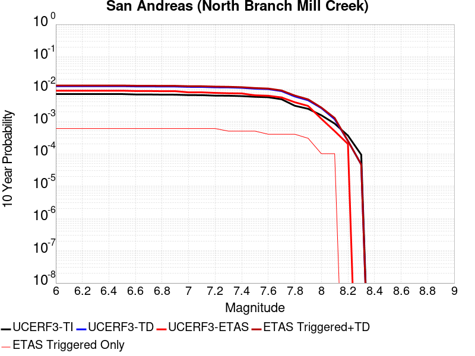 |

| Magnitude | 1 wk TI Prob | 1 wk TD Prob | 1 wk ETAS Prob | 1 wk ETAS/TD Gain | 1 wk ETAS Triggered+TD | 1 wk ETAS Triggered Only | 1 mo TI Prob | 1 mo TD Prob | 1 mo ETAS Prob | 1 mo ETAS/TD Gain | 1 mo ETAS Triggered+TD | 1 mo ETAS Triggered Only | 1 yr TI Prob | 1 yr TD Prob | 1 yr ETAS Prob | 1 yr ETAS/TD Gain | 1 yr ETAS Triggered+TD | 1 yr ETAS Triggered Only | 10 yr TI Prob | 10 yr TD Prob | 10 yr ETAS Prob | 10 yr ETAS/TD Gain | 10 yr ETAS Triggered+TD | 10 yr ETAS Triggered Only |
|-----|-----|-----|-----|-----|-----|-----|-----|-----|-----|-----|-----|-----|-----|-----|-----|-----|-----|-----|-----|-----|-----|-----|-----|-----|
| 6.0 | 1.3461156E-5 | 2.3544324E-5 | 0.0 | 0.0 | 2.3544324E-5 | 0.0 | 5.7689394E-5 | 1.0090036E-4 | 0.0 | 0.0 | 1.0090036E-4 | 0.0 | 7.02142E-4 | 0.0012277729 | 1.0E-4 | 0.08144829 | 0.0013276502 | 1.0E-4 | 0.0069992766 | 0.012253273 | 6.0E-4 | 0.04896651 | 0.012845921 | 6.0E-4 |
| 6.1 | 1.3461156E-5 | 2.3544324E-5 | 0.0 | 0.0 | 2.3544324E-5 | 0.0 | 5.7689394E-5 | 1.0090036E-4 | 0.0 | 0.0 | 1.0090036E-4 | 0.0 | 7.02142E-4 | 0.0012277729 | 1.0E-4 | 0.08144829 | 0.0013276502 | 1.0E-4 | 0.0069992766 | 0.012253273 | 6.0E-4 | 0.04896651 | 0.012845921 | 6.0E-4 |
| 6.2 | 1.3461156E-5 | 2.3544324E-5 | 0.0 | 0.0 | 2.3544324E-5 | 0.0 | 5.7689394E-5 | 1.0090036E-4 | 0.0 | 0.0 | 1.0090036E-4 | 0.0 | 7.02142E-4 | 0.0012277729 | 1.0E-4 | 0.08144829 | 0.0013276502 | 1.0E-4 | 0.0069992766 | 0.012253273 | 6.0E-4 | 0.04896651 | 0.012845921 | 6.0E-4 |
| 6.3 | 1.3461156E-5 | 2.3544324E-5 | 0.0 | 0.0 | 2.3544324E-5 | 0.0 | 5.7689394E-5 | 1.0090036E-4 | 0.0 | 0.0 | 1.0090036E-4 | 0.0 | 7.02142E-4 | 0.0012277729 | 1.0E-4 | 0.08144829 | 0.0013276502 | 1.0E-4 | 0.0069992766 | 0.012253273 | 6.0E-4 | 0.04896651 | 0.012845921 | 6.0E-4 |
| 6.4 | 1.3461156E-5 | 2.3544324E-5 | 0.0 | 0.0 | 2.3544324E-5 | 0.0 | 5.7689394E-5 | 1.0090036E-4 | 0.0 | 0.0 | 1.0090036E-4 | 0.0 | 7.02142E-4 | 0.0012277729 | 1.0E-4 | 0.08144829 | 0.0013276502 | 1.0E-4 | 0.0069992766 | 0.012253273 | 6.0E-4 | 0.04896651 | 0.012845921 | 6.0E-4 |
| 6.5 | 1.3450706E-5 | 2.3533283E-5 | 0.0 | 0.0 | 2.3533283E-5 | 0.0 | 5.764461E-5 | 1.00853045E-4 | 0.0 | 0.0 | 1.00853045E-4 | 0.0 | 7.0159714E-4 | 0.0012271975 | 1.0E-4 | 0.08148648 | 0.0013270748 | 1.0E-4 | 0.006993862 | 0.012247583 | 6.0E-4 | 0.04898926 | 0.012840234 | 6.0E-4 |
| 6.6 | 1.3074523E-5 | 2.3147528E-5 | 0.0 | 0.0 | 2.3147528E-5 | 0.0 | 5.6032466E-5 | 9.919994E-5 | 0.0 | 0.0 | 9.919994E-5 | 0.0 | 6.8198174E-4 | 0.0012070934 | 1.0E-4 | 0.08284364 | 0.0013069726 | 1.0E-4 | 0.006798926 | 0.012048733 | 6.0E-4 | 0.049797766 | 0.0126415035 | 6.0E-4 |
| 6.7 | 1.3050216E-5 | 2.3122817E-5 | 0.0 | 0.0 | 2.3122817E-5 | 0.0 | 5.59283E-5 | 9.909404E-5 | 0.0 | 0.0 | 9.909404E-5 | 0.0 | 6.8071426E-4 | 0.0012058055 | 1.0E-4 | 0.082932115 | 0.0013056849 | 1.0E-4 | 0.0067863287 | 0.012035994 | 6.0E-4 | 0.049850475 | 0.012628772 | 6.0E-4 |
| 6.8 | 1.29049395E-5 | 2.2971204E-5 | 0.0 | 0.0 | 2.2971204E-5 | 0.0 | 5.530571E-5 | 9.844432E-5 | 0.0 | 0.0 | 9.844432E-5 | 0.0 | 6.73139E-4 | 0.0011979038 | 1.0E-4 | 0.08347916 | 0.001297784 | 1.0E-4 | 0.0067110364 | 0.011957829 | 6.0E-4 | 0.05017633 | 0.012550655 | 6.0E-4 |
| 6.9 | 1.2867369E-5 | 2.293059E-5 | 0.0 | 0.0 | 2.293059E-5 | 0.0 | 5.51447E-5 | 9.827028E-5 | 0.0 | 0.0 | 9.827028E-5 | 0.0 | 6.711799E-4 | 0.0011957871 | 1.0E-4 | 0.083626926 | 0.0012956675 | 1.0E-4 | 0.006691564 | 0.01193689 | 6.0E-4 | 0.050264347 | 0.012529728 | 6.0E-4 |
| 7.0 | 1.2495996E-5 | 2.232993E-5 | 0.0 | 0.0 | 2.232993E-5 | 0.0 | 5.3553173E-5 | 9.56962E-5 | 0.0 | 0.0 | 9.56962E-5 | 0.0 | 6.518148E-4 | 0.0011644814 | 1.0E-4 | 0.08587514 | 0.0012643649 | 1.0E-4 | 0.0064990623 | 0.011627121 | 6.0E-4 | 0.05160349 | 0.012220144 | 6.0E-4 |
| 7.1 | 1.2452067E-5 | 2.227497E-5 | 0.0 | 0.0 | 2.227497E-5 | 0.0 | 5.3364907E-5 | 9.546068E-5 | 0.0 | 0.0 | 9.546068E-5 | 0.0 | 6.4952404E-4 | 0.0011616169 | 1.0E-4 | 0.0860869 | 0.0012615008 | 1.0E-4 | 0.0064762887 | 0.011598775 | 6.0E-4 | 0.051729597 | 0.012191816 | 6.0E-4 |
| 7.2 | 1.2002777E-5 | 2.165293E-5 | 0.0 | 0.0 | 2.165293E-5 | 0.0 | 5.143946E-5 | 9.279498E-5 | 0.0 | 0.0 | 9.279498E-5 | 0.0 | 6.2609545E-4 | 0.001129196 | 1.0E-4 | 0.088558584 | 0.001229083 | 1.0E-4 | 0.006243344 | 0.011277877 | 6.0E-4 | 0.0532015 | 0.011871111 | 6.0E-4 |
| 7.3 | 1.1923425E-5 | 2.1522656E-5 | 0.0 | 0.0 | 2.1522656E-5 | 0.0 | 5.109939E-5 | 9.22367E-5 | 0.0 | 0.0 | 9.22367E-5 | 0.0 | 6.219575E-4 | 0.001122406 | 0.0 | 0.0 | 0.001122406 | 0.0 | 0.0062021962 | 0.0112106865 | 5.0E-4 | 0.0446003 | 0.011705081 | 5.0E-4 |
| 7.4 | 1.16105175E-5 | 2.0896801E-5 | 0.0 | 0.0 | 2.0896801E-5 | 0.0 | 4.975841E-5 | 8.955466E-5 | 0.0 | 0.0 | 8.955466E-5 | 0.0 | 6.0564023E-4 | 0.0010897852 | 0.0 | 0.0 | 0.0010897852 | 0.0 | 0.006039923 | 0.010888631 | 5.0E-4 | 0.04591945 | 0.011383187 | 5.0E-4 |
| 7.5 | 1.1037265E-5 | 1.9598265E-5 | 0.0 | 0.0 | 1.9598265E-5 | 0.0 | 4.7301706E-5 | 8.398987E-5 | 0.0 | 0.0 | 8.398987E-5 | 0.0 | 5.757461E-4 | 0.0010220992 | 0.0 | 0.0 | 0.0010220992 | 0.0 | 0.005742567 | 0.0102180885 | 5.0E-4 | 0.048932828 | 0.010712979 | 5.0E-4 |
| 7.6 | 1.0720915E-5 | 1.9040284E-5 | 0.0 | 0.0 | 1.9040284E-5 | 0.0 | 4.5945973E-5 | 8.159868E-5 | 0.0 | 0.0 | 8.159868E-5 | 0.0 | 5.592486E-4 | 9.930133E-4 | 0.0 | 0.0 | 9.930133E-4 | 0.0 | 0.005578433 | 0.009929876 | 4.0E-4 | 0.040282477 | 0.010325904 | 4.0E-4 |
| 7.7 | 9.276279E-6 | 1.6486878E-5 | 0.0 | 0.0 | 1.6486878E-5 | 0.0 | 3.9754876E-5 | 7.065615E-5 | 0.0 | 0.0 | 7.065615E-5 | 0.0 | 4.839081E-4 | 8.599007E-4 | 0.0 | 0.0 | 8.599007E-4 | 0.0 | 0.0048285574 | 0.008609581 | 4.0E-4 | 0.046459872 | 0.009006137 | 4.0E-4 |
| 7.8 | 5.8346777E-6 | 1.1203463E-5 | 0.0 | 0.0 | 1.1203463E-5 | 0.0 | 2.5005522E-5 | 4.8013957E-5 | 0.0 | 0.0 | 4.8013957E-5 | 0.0 | 3.043997E-4 | 5.844133E-4 | 0.0 | 0.0 | 5.844133E-4 | 0.0 | 0.0030398308 | 0.005872212 | 4.0E-4 | 0.06811743 | 0.006269863 | 4.0E-4 |
| 7.9 | 4.690204E-6 | 8.547639E-6 | 0.0 | 0.0 | 8.547639E-6 | 0.0 | 2.0100719E-5 | 3.663222E-5 | 0.0 | 0.0 | 3.663222E-5 | 0.0 | 2.4469878E-4 | 4.4590613E-4 | 0.0 | 0.0 | 4.4590613E-4 | 0.0 | 0.002444295 | 0.0044909324 | 3.0E-4 | 0.06680127 | 0.004789585 | 3.0E-4 |
| 8.0 | 2.9570454E-6 | 4.8664906E-6 | 0.0 | 0.0 | 4.8664906E-6 | 0.0 | 1.267299E-5 | 2.0856221E-5 | 0.0 | 0.0 | 2.0856221E-5 | 0.0 | 1.5428272E-4 | 2.5389495E-4 | 0.0 | 0.0 | 2.5389495E-4 | 0.0 | 0.0015417566 | 0.0025600777 | 1.0E-4 | 0.039061315 | 0.0026598217 | 1.0E-4 |
| 8.1 | 1.6376824E-6 | 2.203925E-6 | 0.0 | 0.0 | 2.203925E-6 | 0.0 | 7.01862E-6 | 9.445359E-6 | 0.0 | 0.0 | 9.445359E-6 | 0.0 | 8.544835E-5 | 1.149912E-4 | 0.0 | 0.0 | 1.149912E-4 | 0.0 | 8.54155E-4 | 0.0011644119 | 1.0E-4 | 0.085880265 | 0.0012642954 | 1.0E-4 |
| 8.2 | 6.9631557E-7 | 4.5471847E-7 | 0.0 | 0.0 | 4.5471847E-7 | 0.0 | 2.984206E-6 | 1.948792E-6 | 0.0 | 0.0 | 1.948792E-6 | 0.0 | 3.63321E-5 | 2.3726285E-5 | 0.0 | 0.0 | 2.3726285E-5 | 0.0 | 3.6326164E-4 | 2.4574524E-4 | 0.0 | 0.0 | 2.4574524E-4 | 0.0 |
| 8.3 | 1.7876137E-7 | 8.3838465E-8 | 0.0 | 0.0 | 8.3838465E-8 | 0.0 | 7.661199E-7 | 3.5930768E-7 | 0.0 | 0.0 | 3.5930768E-7 | 0.0 | 9.32747E-6 | 4.374562E-6 | 0.0 | 0.0 | 4.374562E-6 | 0.0 | 9.3270784E-5 | 4.5943747E-5 | 0.0 | 0.0 | 4.5943747E-5 | 0.0 |

## Scodie Lineament
*[(top)](#table-of-contents)*

| 1 Week | 1 Month | 1 Year | 10 Year |
|-----|-----|-----|-----|
|  |  |  |  |

| Magnitude | 1 wk TI Prob | 1 wk TD Prob | 1 wk ETAS Prob | 1 wk ETAS/TD Gain | 1 wk ETAS Triggered+TD | 1 wk ETAS Triggered Only | 1 mo TI Prob | 1 mo TD Prob | 1 mo ETAS Prob | 1 mo ETAS/TD Gain | 1 mo ETAS Triggered+TD | 1 mo ETAS Triggered Only | 1 yr TI Prob | 1 yr TD Prob | 1 yr ETAS Prob | 1 yr ETAS/TD Gain | 1 yr ETAS Triggered+TD | 1 yr ETAS Triggered Only | 10 yr TI Prob | 10 yr TD Prob | 10 yr ETAS Prob | 10 yr ETAS/TD Gain | 10 yr ETAS Triggered+TD | 10 yr ETAS Triggered Only |
|-----|-----|-----|-----|-----|-----|-----|-----|-----|-----|-----|-----|-----|-----|-----|-----|-----|-----|-----|-----|-----|-----|-----|-----|-----|
| 6.0 | 3.2919327E-6 | 3.0134645E-6 | 0.0 | 0.0 | 3.0134645E-6 | 0.0 | 1.4108206E-5 | 1.2914801E-5 | 0.0 | 0.0 | 1.2914801E-5 | 0.0 | 1.7175387E-4 | 1.5722954E-4 | 1.0E-4 | 0.6360128 | 2.572138E-4 | 1.0E-4 | 0.0017162118 | 0.0015714946 | 6.0E-4 | 0.38180214 | 0.0021705518 | 6.0E-4 |
| 6.1 | 1.8663811E-6 | 1.5490901E-6 | 0.0 | 0.0 | 1.5490901E-6 | 0.0 | 7.998751E-6 | 6.638944E-6 | 0.0 | 0.0 | 6.638944E-6 | 0.0 | 9.738045E-5 | 8.082664E-5 | 0.0 | 0.0 | 8.082664E-5 | 0.0 | 9.7337784E-4 | 8.080212E-4 | 1.0E-4 | 0.12375912 | 9.0794044E-4 | 1.0E-4 |
| 6.2 | 1.8663811E-6 | 1.5490901E-6 | 0.0 | 0.0 | 1.5490901E-6 | 0.0 | 7.998751E-6 | 6.638944E-6 | 0.0 | 0.0 | 6.638944E-6 | 0.0 | 9.738045E-5 | 8.082664E-5 | 0.0 | 0.0 | 8.082664E-5 | 0.0 | 9.7337784E-4 | 8.080212E-4 | 1.0E-4 | 0.12375912 | 9.0794044E-4 | 1.0E-4 |
| 6.3 | 1.8663811E-6 | 1.5490901E-6 | 0.0 | 0.0 | 1.5490901E-6 | 0.0 | 7.998751E-6 | 6.638944E-6 | 0.0 | 0.0 | 6.638944E-6 | 0.0 | 9.738045E-5 | 8.082664E-5 | 0.0 | 0.0 | 8.082664E-5 | 0.0 | 9.7337784E-4 | 8.080212E-4 | 1.0E-4 | 0.12375912 | 9.0794044E-4 | 1.0E-4 |
| 6.4 | 1.8663811E-6 | 1.5490901E-6 | 0.0 | 0.0 | 1.5490901E-6 | 0.0 | 7.998751E-6 | 6.638944E-6 | 0.0 | 0.0 | 6.638944E-6 | 0.0 | 9.738045E-5 | 8.082664E-5 | 0.0 | 0.0 | 8.082664E-5 | 0.0 | 9.7337784E-4 | 8.080212E-4 | 1.0E-4 | 0.12375912 | 9.0794044E-4 | 1.0E-4 |
| 6.5 | 1.8106311E-6 | 1.4910192E-6 | 0.0 | 0.0 | 1.4910192E-6 | 0.0 | 7.759824E-6 | 6.3900698E-6 | 0.0 | 0.0 | 6.3900698E-6 | 0.0 | 9.447177E-5 | 7.7796816E-5 | 0.0 | 0.0 | 7.7796816E-5 | 0.0 | 9.4431615E-4 | 7.7774446E-4 | 1.0E-4 | 0.12857693 | 8.776667E-4 | 1.0E-4 |
| 6.6 | 1.2414679E-6 | 8.9974384E-7 | 0.0 | 0.0 | 8.9974384E-7 | 0.0 | 5.320566E-6 | 3.8560397E-6 | 0.0 | 0.0 | 3.8560397E-6 | 0.0 | 6.477596E-5 | 4.6946363E-5 | 0.0 | 0.0 | 4.6946363E-5 | 0.0 | 6.475708E-4 | 4.693731E-4 | 1.0E-4 | 0.21305013 | 5.6932616E-4 | 1.0E-4 |
| 6.7 | 1.1062215E-6 | 7.5940835E-7 | 0.0 | 0.0 | 7.5940835E-7 | 0.0 | 4.7409408E-6 | 3.2546036E-6 | 0.0 | 0.0 | 3.2546036E-6 | 0.0 | 5.7719422E-5 | 3.962415E-5 | 0.0 | 0.0 | 3.962415E-5 | 0.0 | 5.770443E-4 | 3.961778E-4 | 1.0E-4 | 0.2524119 | 4.961382E-4 | 1.0E-4 |
| 6.8 | 1.0006736E-6 | 6.500087E-7 | 0.0 | 0.0 | 6.500087E-7 | 0.0 | 4.288594E-6 | 2.785749E-6 | 0.0 | 0.0 | 2.785749E-6 | 0.0 | 5.221238E-5 | 3.391603E-5 | 0.0 | 0.0 | 3.391603E-5 | 0.0 | 5.220012E-4 | 3.391146E-4 | 1.0E-4 | 0.29488558 | 4.3908067E-4 | 1.0E-4 |
| 6.9 | 9.167364E-7 | 5.6312524E-7 | 0.0 | 0.0 | 5.6312524E-7 | 0.0 | 3.9288643E-6 | 2.413392E-6 | 0.0 | 0.0 | 2.413392E-6 | 0.0 | 4.7832873E-5 | 2.9382709E-5 | 0.0 | 0.0 | 2.9382709E-5 | 0.0 | 4.782258E-4 | 2.937939E-4 | 1.0E-4 | 0.34037465 | 3.9376452E-4 | 1.0E-4 |
| 7.0 | 7.6987664E-7 | 4.112905E-7 | 0.0 | 0.0 | 4.112905E-7 | 0.0 | 3.2994672E-6 | 1.7626726E-6 | 0.0 | 0.0 | 1.7626726E-6 | 0.0 | 4.0170275E-5 | 2.1460366E-5 | 0.0 | 0.0 | 2.1460366E-5 | 0.0 | 4.0163012E-4 | 2.145868E-4 | 1.0E-4 | 0.46601188 | 3.1456535E-4 | 1.0E-4 |
| 7.1 | 7.1038727E-7 | 3.5206386E-7 | 0.0 | 0.0 | 3.5206386E-7 | 0.0 | 3.0445133E-6 | 1.5088444E-6 | 0.0 | 0.0 | 1.5088444E-6 | 0.0 | 3.706632E-5 | 1.8370063E-5 | 0.0 | 0.0 | 1.8370063E-5 | 0.0 | 3.7060137E-4 | 1.8368893E-4 | 1.0E-4 | 0.5443986 | 2.8367055E-4 | 1.0E-4 |
| 7.2 | 2.0799602E-7 | 3.116971E-8 | 0.0 | 0.0 | 3.116971E-8 | 0.0 | 8.914113E-7 | 1.3358445E-7 | 0.0 | 0.0 | 1.3358445E-7 | 0.0 | 1.0852878E-5 | 1.6263896E-6 | 0.0 | 0.0 | 1.6263896E-6 | 0.0 | 1.08523476E-4 | 1.6263784E-5 | 0.0 | 0.0 | 1.6263784E-5 | 0.0 |
| 7.3 | 1.5048182E-7 | 1.5933326E-8 | 0.0 | 0.0 | 1.5933326E-8 | 0.0 | 6.449219E-7 | 6.828568E-8 | 0.0 | 0.0 | 6.828568E-8 | 0.0 | 7.851896E-6 | 8.3137786E-7 | 0.0 | 0.0 | 8.3137786E-7 | 0.0 | 7.851618E-5 | 8.31375E-6 | 0.0 | 0.0 | 8.31375E-6 | 0.0 |
| 7.4 | 5.9334678E-8 | 4.8625504E-9 | 0.0 | 0.0 | 4.8625504E-9 | 0.0 | 2.5429145E-7 | 2.08395E-8 | 0.0 | 0.0 | 2.08395E-8 | 0.0 | 3.095994E-6 | 2.537209E-7 | 0.0 | 0.0 | 2.537209E-7 | 0.0 | 3.095951E-5 | 2.5372074E-6 | 0.0 | 0.0 | 2.5372074E-6 | 0.0 |

## Collayami 2011 CFM
*[(top)](#table-of-contents)*

| 1 Week | 1 Month | 1 Year | 10 Year |
|-----|-----|-----|-----|
| 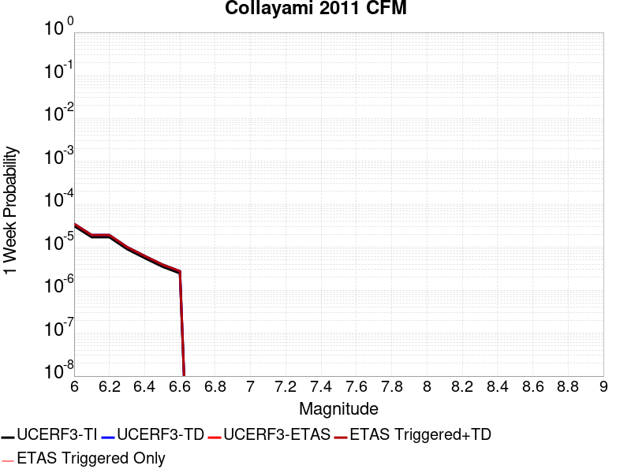 |  |  |  |

| Magnitude | 1 wk TI Prob | 1 wk TD Prob | 1 wk ETAS Prob | 1 wk ETAS/TD Gain | 1 wk ETAS Triggered+TD | 1 wk ETAS Triggered Only | 1 mo TI Prob | 1 mo TD Prob | 1 mo ETAS Prob | 1 mo ETAS/TD Gain | 1 mo ETAS Triggered+TD | 1 mo ETAS Triggered Only | 1 yr TI Prob | 1 yr TD Prob | 1 yr ETAS Prob | 1 yr ETAS/TD Gain | 1 yr ETAS Triggered+TD | 1 yr ETAS Triggered Only | 10 yr TI Prob | 10 yr TD Prob | 10 yr ETAS Prob | 10 yr ETAS/TD Gain | 10 yr ETAS Triggered+TD | 10 yr ETAS Triggered Only |
|-----|-----|-----|-----|-----|-----|-----|-----|-----|-----|-----|-----|-----|-----|-----|-----|-----|-----|-----|-----|-----|-----|-----|-----|-----|
| 6.0 | 3.112429E-5 | 3.4947392E-5 | 0.0 | 0.0 | 3.4947392E-5 | 0.0 | 1.33383E-4 | 1.4976693E-4 | 0.0 | 0.0 | 1.4976693E-4 | 0.0 | 0.0016227282 | 0.0018220613 | 2.0E-4 | 0.10976579 | 0.002021697 | 2.0E-4 | 0.016109297 | 0.018088762 | 6.0E-4 | 0.033169765 | 0.018677909 | 6.0E-4 |
| 6.1 | 1.7119446E-5 | 1.9161313E-5 | 0.0 | 0.0 | 1.9161313E-5 | 0.0 | 7.336699E-5 | 8.211766E-5 | 0.0 | 0.0 | 8.211766E-5 | 0.0 | 8.92877E-4 | 9.993832E-4 | 1.0E-4 | 0.10006172 | 0.0010992832 | 1.0E-4 | 0.00889298 | 0.00995477 | 3.0E-4 | 0.030136306 | 0.010251784 | 3.0E-4 |
| 6.2 | 1.7119446E-5 | 1.9161313E-5 | 0.0 | 0.0 | 1.9161313E-5 | 0.0 | 7.336699E-5 | 8.211766E-5 | 0.0 | 0.0 | 8.211766E-5 | 0.0 | 8.92877E-4 | 9.993832E-4 | 1.0E-4 | 0.10006172 | 0.0010992832 | 1.0E-4 | 0.00889298 | 0.00995477 | 3.0E-4 | 0.030136306 | 0.010251784 | 3.0E-4 |
| 6.3 | 9.041288E-6 | 1.0108547E-5 | 0.0 | 0.0 | 1.0108547E-5 | 0.0 | 3.87478E-5 | 4.332175E-5 | 0.0 | 0.0 | 4.332175E-5 | 0.0 | 4.7165234E-4 | 5.273366E-4 | 1.0E-4 | 0.1896322 | 6.272838E-4 | 1.0E-4 | 0.0047065257 | 0.0052630114 | 3.0E-4 | 0.057001587 | 0.0055614323 | 3.0E-4 |
| 6.4 | 5.5972064E-6 | 6.2595686E-6 | 0.0 | 0.0 | 6.2595686E-6 | 0.0 | 2.3987806E-5 | 2.6826523E-5 | 0.0 | 0.0 | 2.6826523E-5 | 0.0 | 2.920124E-4 | 3.2657757E-4 | 1.0E-4 | 0.30620596 | 4.265449E-4 | 1.0E-4 | 0.0029162897 | 0.0032623115 | 3.0E-4 | 0.09195934 | 0.0035613326 | 3.0E-4 |
| 6.5 | 3.530659E-6 | 3.95302E-6 | 0.0 | 0.0 | 3.95302E-6 | 0.0 | 1.5131307E-5 | 1.6941463E-5 | 0.0 | 0.0 | 1.6941463E-5 | 0.0 | 1.842081E-4 | 2.0625319E-4 | 0.0 | 0.0 | 2.0625319E-4 | 0.0 | 0.0018405546 | 0.002061637 | 1.0E-4 | 0.04850515 | 0.0021614307 | 1.0E-4 |
| 6.6 | 2.4625563E-6 | 2.7579454E-6 | 0.0 | 0.0 | 2.7579454E-6 | 0.0 | 1.0553769E-5 | 1.1819766E-5 | 0.0 | 0.0 | 1.1819766E-5 | 0.0 | 1.2848456E-4 | 1.4390565E-4 | 0.0 | 0.0 | 1.4390565E-4 | 0.0 | 0.001284103 | 0.0014390565 | 1.0E-4 | 0.06948998 | 0.0015389125 | 1.0E-4 |

## Eureka Peak
*[(top)](#table-of-contents)*

| 1 Week | 1 Month | 1 Year | 10 Year |
|-----|-----|-----|-----|
|  |  |  | 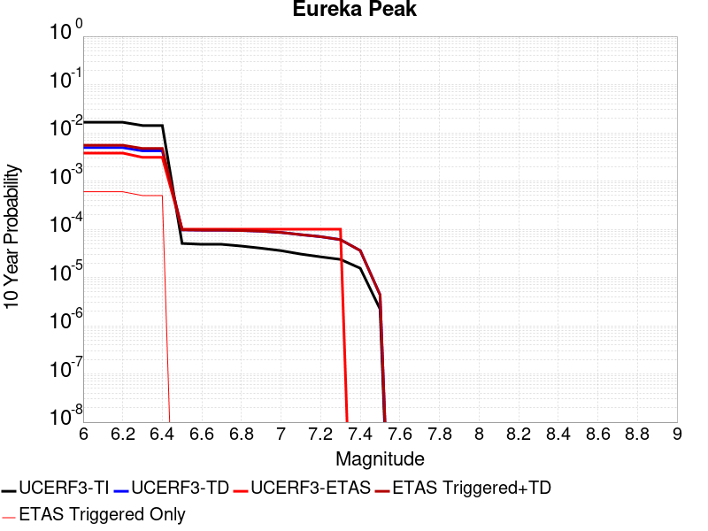 |

| Magnitude | 1 wk TI Prob | 1 wk TD Prob | 1 wk ETAS Prob | 1 wk ETAS/TD Gain | 1 wk ETAS Triggered+TD | 1 wk ETAS Triggered Only | 1 mo TI Prob | 1 mo TD Prob | 1 mo ETAS Prob | 1 mo ETAS/TD Gain | 1 mo ETAS Triggered+TD | 1 mo ETAS Triggered Only | 1 yr TI Prob | 1 yr TD Prob | 1 yr ETAS Prob | 1 yr ETAS/TD Gain | 1 yr ETAS Triggered+TD | 1 yr ETAS Triggered Only | 10 yr TI Prob | 10 yr TD Prob | 10 yr ETAS Prob | 10 yr ETAS/TD Gain | 10 yr ETAS Triggered+TD | 10 yr ETAS Triggered Only |
|-----|-----|-----|-----|-----|-----|-----|-----|-----|-----|-----|-----|-----|-----|-----|-----|-----|-----|-----|-----|-----|-----|-----|-----|-----|
| 6.0 | 3.1949054E-5 | 9.310977E-6 | 0.0 | 0.0 | 9.310977E-6 | 0.0 | 1.3691733E-4 | 3.990402E-5 | 0.0 | 0.0 | 3.990402E-5 | 0.0 | 0.0016656938 | 4.858012E-4 | 0.0 | 0.0 | 4.858012E-4 | 0.0 | 0.016532637 | 0.004921292 | 6.0E-4 | 0.1219192 | 0.005518339 | 6.0E-4 |
| 6.1 | 3.1949054E-5 | 9.310977E-6 | 0.0 | 0.0 | 9.310977E-6 | 0.0 | 1.3691733E-4 | 3.990402E-5 | 0.0 | 0.0 | 3.990402E-5 | 0.0 | 0.0016656938 | 4.858012E-4 | 0.0 | 0.0 | 4.858012E-4 | 0.0 | 0.016532637 | 0.004921292 | 6.0E-4 | 0.1219192 | 0.005518339 | 6.0E-4 |
| 6.2 | 3.1949054E-5 | 9.310977E-6 | 0.0 | 0.0 | 9.310977E-6 | 0.0 | 1.3691733E-4 | 3.990402E-5 | 0.0 | 0.0 | 3.990402E-5 | 0.0 | 0.0016656938 | 4.858012E-4 | 0.0 | 0.0 | 4.858012E-4 | 0.0 | 0.016532637 | 0.004921292 | 6.0E-4 | 0.1219192 | 0.005518339 | 6.0E-4 |
| 6.3 | 2.7339745E-5 | 7.980819E-6 | 0.0 | 0.0 | 7.980819E-6 | 0.0 | 1.1716507E-4 | 3.4203487E-5 | 0.0 | 0.0 | 3.4203487E-5 | 0.0 | 0.0014255513 | 4.1642378E-4 | 0.0 | 0.0 | 4.1642378E-4 | 0.0 | 0.0141644105 | 0.0042259945 | 5.0E-4 | 0.11831535 | 0.0047238814 | 5.0E-4 |
| 6.4 | 2.7339745E-5 | 7.980819E-6 | 0.0 | 0.0 | 7.980819E-6 | 0.0 | 1.1716507E-4 | 3.4203487E-5 | 0.0 | 0.0 | 3.4203487E-5 | 0.0 | 0.0014255513 | 4.1642378E-4 | 0.0 | 0.0 | 4.1642378E-4 | 0.0 | 0.0141644105 | 0.0042259945 | 5.0E-4 | 0.11831535 | 0.0047238814 | 5.0E-4 |
| 6.5 | 9.738388E-8 | 1.8619826E-7 | 0.0 | 0.0 | 1.8619826E-7 | 0.0 | 4.1735944E-7 | 7.9799236E-7 | 0.0 | 0.0 | 7.9799236E-7 | 0.0 | 5.081339E-6 | 9.715514E-6 | 0.0 | 0.0 | 9.715514E-6 | 0.0 | 5.0812232E-5 | 9.715097E-5 | 0.0 | 0.0 | 9.715097E-5 | 0.0 |
| 6.6 | 9.3495956E-8 | 1.8328656E-7 | 0.0 | 0.0 | 1.8328656E-7 | 0.0 | 4.0069688E-7 | 7.855136E-7 | 0.0 | 0.0 | 7.855136E-7 | 0.0 | 4.8784736E-6 | 9.563587E-6 | 0.0 | 0.0 | 9.563587E-6 | 0.0 | 4.8783666E-5 | 9.563183E-5 | 0.0 | 0.0 | 9.563183E-5 | 0.0 |
| 6.7 | 9.3495956E-8 | 1.8328656E-7 | 0.0 | 0.0 | 1.8328656E-7 | 0.0 | 4.0069688E-7 | 7.855136E-7 | 0.0 | 0.0 | 7.855136E-7 | 0.0 | 4.8784736E-6 | 9.563587E-6 | 0.0 | 0.0 | 9.563587E-6 | 0.0 | 4.8783666E-5 | 9.563183E-5 | 0.0 | 0.0 | 9.563183E-5 | 0.0 |
| 6.8 | 8.591428E-8 | 1.8021642E-7 | 0.0 | 0.0 | 1.8021642E-7 | 0.0 | 3.68204E-7 | 7.7235586E-7 | 0.0 | 0.0 | 7.7235586E-7 | 0.0 | 4.4828744E-6 | 9.403393E-6 | 0.0 | 0.0 | 9.403393E-6 | 0.0 | 4.482784E-5 | 9.403003E-5 | 0.0 | 0.0 | 9.403003E-5 | 0.0 |
| 6.9 | 7.749723E-8 | 1.7439666E-7 | 0.0 | 0.0 | 1.7439666E-7 | 0.0 | 3.3213098E-7 | 7.4741405E-7 | 0.0 | 0.0 | 7.4741405E-7 | 0.0 | 4.043687E-6 | 9.099729E-6 | 0.0 | 0.0 | 9.099729E-6 | 0.0 | 4.0436134E-5 | 9.099364E-5 | 0.0 | 0.0 | 9.099364E-5 | 0.0 |
| 7.0 | 6.897872E-8 | 1.6415227E-7 | 0.0 | 0.0 | 1.6415227E-7 | 0.0 | 2.9562307E-7 | 7.035095E-7 | 0.0 | 0.0 | 7.035095E-7 | 0.0 | 3.5992048E-6 | 8.5651955E-6 | 0.0 | 0.0 | 8.5651955E-6 | 0.0 | 3.5991467E-5 | 8.5648724E-5 | 0.0 | 0.0 | 8.5648724E-5 | 0.0 |
| 7.1 | 5.859318E-8 | 1.4785843E-7 | 0.0 | 0.0 | 1.4785843E-7 | 0.0 | 2.5111362E-7 | 6.3367884E-7 | 0.0 | 0.0 | 6.3367884E-7 | 0.0 | 3.057304E-6 | 7.7150125E-6 | 0.0 | 0.0 | 7.7150125E-6 | 0.0 | 3.0572617E-5 | 7.714752E-5 | 0.0 | 0.0 | 7.714752E-5 | 0.0 |
| 7.2 | 5.1375338E-8 | 1.3418608E-7 | 0.0 | 0.0 | 1.3418608E-7 | 0.0 | 2.2018E-7 | 5.750831E-7 | 0.0 | 0.0 | 5.750831E-7 | 0.0 | 2.680688E-6 | 7.001615E-6 | 0.0 | 0.0 | 7.001615E-6 | 0.0 | 2.6806558E-5 | 7.0014E-5 | 0.0 | 0.0 | 7.0014E-5 | 0.0 |
| 7.3 | 4.5441396E-8 | 1.1632017E-7 | 0.0 | 0.0 | 1.1632017E-7 | 0.0 | 1.9474882E-7 | 4.9851496E-7 | 0.0 | 0.0 | 4.9851496E-7 | 0.0 | 2.3710643E-6 | 6.0694033E-6 | 0.0 | 0.0 | 6.0694033E-6 | 0.0 | 2.371039E-5 | 6.069243E-5 | 0.0 | 0.0 | 6.069243E-5 | 0.0 |
| 7.4 | 2.981918E-8 | 6.903377E-8 | 0.0 | 0.0 | 6.903377E-8 | 0.0 | 1.2779647E-7 | 2.95859E-7 | 0.0 | 0.0 | 2.95859E-7 | 0.0 | 1.5559209E-6 | 3.6020776E-6 | 0.0 | 0.0 | 3.6020776E-6 | 0.0 | 1.55591E-5 | 3.6020236E-5 | 0.0 | 0.0 | 3.6020236E-5 | 0.0 |
| 7.5 | 4.24214E-9 | 8.32973E-9 | 0.0 | 0.0 | 8.32973E-9 | 0.0 | 1.81806E-8 | 3.5698843E-8 | 0.0 | 0.0 | 3.5698843E-8 | 0.0 | 2.213488E-7 | 4.346334E-7 | 0.0 | 0.0 | 4.346334E-7 | 0.0 | 2.2134857E-6 | 4.346332E-6 | 0.0 | 0.0 | 4.346332E-6 | 0.0 |

## Coyote Lake
*[(top)](#table-of-contents)*

| 1 Week | 1 Month | 1 Year | 10 Year |
|-----|-----|-----|-----|
|  |  |  |  |

| Magnitude | 1 wk TI Prob | 1 wk TD Prob | 1 wk ETAS Prob | 1 wk ETAS/TD Gain | 1 wk ETAS Triggered+TD | 1 wk ETAS Triggered Only | 1 mo TI Prob | 1 mo TD Prob | 1 mo ETAS Prob | 1 mo ETAS/TD Gain | 1 mo ETAS Triggered+TD | 1 mo ETAS Triggered Only | 1 yr TI Prob | 1 yr TD Prob | 1 yr ETAS Prob | 1 yr ETAS/TD Gain | 1 yr ETAS Triggered+TD | 1 yr ETAS Triggered Only | 10 yr TI Prob | 10 yr TD Prob | 10 yr ETAS Prob | 10 yr ETAS/TD Gain | 10 yr ETAS Triggered+TD | 10 yr ETAS Triggered Only |
|-----|-----|-----|-----|-----|-----|-----|-----|-----|-----|-----|-----|-----|-----|-----|-----|-----|-----|-----|-----|-----|-----|-----|-----|-----|
| 6.0 | 1.980352E-5 | 2.1711043E-5 | 0.0 | 0.0 | 2.1711043E-5 | 0.0 | 8.486947E-5 | 9.3044415E-5 | 0.0 | 0.0 | 9.3044415E-5 | 0.0 | 0.0010327959 | 0.0011322991 | 2.0E-4 | 0.17663178 | 0.0013320727 | 2.0E-4 | 0.010280091 | 0.011272479 | 6.0E-4 | 0.05322698 | 0.011865715 | 6.0E-4 |
| 6.1 | 1.980352E-5 | 2.1711043E-5 | 0.0 | 0.0 | 2.1711043E-5 | 0.0 | 8.486947E-5 | 9.3044415E-5 | 0.0 | 0.0 | 9.3044415E-5 | 0.0 | 0.0010327959 | 0.0011322991 | 2.0E-4 | 0.17663178 | 0.0013320727 | 2.0E-4 | 0.010280091 | 0.011272479 | 6.0E-4 | 0.05322698 | 0.011865715 | 6.0E-4 |
| 6.2 | 1.980352E-5 | 2.1711043E-5 | 0.0 | 0.0 | 2.1711043E-5 | 0.0 | 8.486947E-5 | 9.3044415E-5 | 0.0 | 0.0 | 9.3044415E-5 | 0.0 | 0.0010327959 | 0.0011322991 | 2.0E-4 | 0.17663178 | 0.0013320727 | 2.0E-4 | 0.010280091 | 0.011272479 | 6.0E-4 | 0.05322698 | 0.011865715 | 6.0E-4 |
| 6.3 | 1.5344787E-5 | 1.6824002E-5 | 0.0 | 0.0 | 1.6824002E-5 | 0.0 | 6.576172E-5 | 7.210122E-5 | 0.0 | 0.0 | 7.210122E-5 | 0.0 | 8.003548E-4 | 8.7754003E-4 | 2.0E-4 | 0.22790983 | 0.0010773645 | 2.0E-4 | 0.007974784 | 0.008746796 | 6.0E-4 | 0.06859655 | 0.009341548 | 6.0E-4 |
| 6.4 | 1.5344787E-5 | 1.6824002E-5 | 0.0 | 0.0 | 1.6824002E-5 | 0.0 | 6.576172E-5 | 7.210122E-5 | 0.0 | 0.0 | 7.210122E-5 | 0.0 | 8.003548E-4 | 8.7754003E-4 | 2.0E-4 | 0.22790983 | 0.0010773645 | 2.0E-4 | 0.007974784 | 0.008746796 | 6.0E-4 | 0.06859655 | 0.009341548 | 6.0E-4 |
| 6.5 | 1.4189697E-5 | 1.5561078E-5 | 0.0 | 0.0 | 1.5561078E-5 | 0.0 | 6.081157E-5 | 6.668897E-5 | 0.0 | 0.0 | 6.668897E-5 | 0.0 | 7.401293E-4 | 8.1169605E-4 | 2.0E-4 | 0.24639764 | 0.0010115337 | 2.0E-4 | 0.0073766913 | 0.008093258 | 6.0E-4 | 0.07413578 | 0.008688402 | 6.0E-4 |
| 6.6 | 1.3469301E-5 | 1.47745195E-5 | 0.0 | 0.0 | 1.47745195E-5 | 0.0 | 5.7724297E-5 | 6.331817E-5 | 0.0 | 0.0 | 6.331817E-5 | 0.0 | 7.025667E-4 | 7.706861E-4 | 2.0E-4 | 0.25950903 | 9.7053195E-4 | 2.0E-4 | 0.0070034964 | 0.0076860404 | 6.0E-4 | 0.0780636 | 0.008281428 | 6.0E-4 |
| 6.7 | 1.3027966E-5 | 1.42845765E-5 | 0.0 | 0.0 | 1.42845765E-5 | 0.0 | 5.5832945E-5 | 6.121852E-5 | 0.0 | 0.0 | 6.121852E-5 | 0.0 | 6.7955407E-4 | 7.451403E-4 | 2.0E-4 | 0.26840582 | 9.4499125E-4 | 2.0E-4 | 0.006774798 | 0.007432298 | 6.0E-4 | 0.08072873 | 0.008027839 | 6.0E-4 |
| 6.8 | 5.695434E-6 | 6.225608E-6 | 0.0 | 0.0 | 6.225608E-6 | 0.0 | 2.4408775E-5 | 2.6681075E-5 | 0.0 | 0.0 | 2.6681075E-5 | 0.0 | 2.971363E-4 | 3.2482366E-4 | 2.0E-4 | 0.61571866 | 5.247587E-4 | 2.0E-4 | 0.0029673933 | 0.0032464308 | 3.0E-4 | 0.09240918 | 0.003545457 | 3.0E-4 |
| 6.9 | 4.385688E-6 | 4.793972E-6 | 0.0 | 0.0 | 4.793972E-6 | 0.0 | 1.879567E-5 | 2.0545594E-5 | 0.0 | 0.0 | 2.0545594E-5 | 0.0 | 2.2881327E-4 | 2.5014262E-4 | 2.0E-4 | 0.79954386 | 4.500926E-4 | 2.0E-4 | 0.002285778 | 0.0025014263 | 3.0E-4 | 0.11993158 | 0.0028006758 | 3.0E-4 |

## Great Valley 11
*[(top)](#table-of-contents)*

| 1 Week | 1 Month | 1 Year | 10 Year |
|-----|-----|-----|-----|
|  |  |  |  |

| Magnitude | 1 wk TI Prob | 1 wk TD Prob | 1 wk ETAS Prob | 1 wk ETAS/TD Gain | 1 wk ETAS Triggered+TD | 1 wk ETAS Triggered Only | 1 mo TI Prob | 1 mo TD Prob | 1 mo ETAS Prob | 1 mo ETAS/TD Gain | 1 mo ETAS Triggered+TD | 1 mo ETAS Triggered Only | 1 yr TI Prob | 1 yr TD Prob | 1 yr ETAS Prob | 1 yr ETAS/TD Gain | 1 yr ETAS Triggered+TD | 1 yr ETAS Triggered Only | 10 yr TI Prob | 10 yr TD Prob | 10 yr ETAS Prob | 10 yr ETAS/TD Gain | 10 yr ETAS Triggered+TD | 10 yr ETAS Triggered Only |
|-----|-----|-----|-----|-----|-----|-----|-----|-----|-----|-----|-----|-----|-----|-----|-----|-----|-----|-----|-----|-----|-----|-----|-----|-----|
| 6.0 | 2.8099583E-5 | 2.9842686E-5 | 0.0 | 0.0 | 2.9842686E-5 | 0.0 | 1.20421224E-4 | 1.2789137E-4 | 0.0 | 0.0 | 1.2789137E-4 | 0.0 | 0.0014651422 | 0.0015560386 | 1.0E-4 | 0.06426576 | 0.001655883 | 1.0E-4 | 0.0145552 | 0.015458964 | 6.0E-4 | 0.038812432 | 0.016049689 | 6.0E-4 |
| 6.1 | 2.483194E-5 | 2.5916062E-5 | 0.0 | 0.0 | 2.5916062E-5 | 0.0 | 1.0641825E-4 | 1.1106447E-4 | 0.0 | 0.0 | 1.1106447E-4 | 0.0 | 0.0012948721 | 0.0013514345 | 0.0 | 0.0 | 0.0013514345 | 0.0 | 0.012873529 | 0.013438572 | 5.0E-4 | 0.037206333 | 0.013931853 | 5.0E-4 |
| 6.2 | 2.483194E-5 | 2.5916062E-5 | 0.0 | 0.0 | 2.5916062E-5 | 0.0 | 1.0641825E-4 | 1.1106447E-4 | 0.0 | 0.0 | 1.1106447E-4 | 0.0 | 0.0012948721 | 0.0013514345 | 0.0 | 0.0 | 0.0013514345 | 0.0 | 0.012873529 | 0.013438572 | 5.0E-4 | 0.037206333 | 0.013931853 | 5.0E-4 |
| 6.3 | 2.0257901E-5 | 2.0405523E-5 | 0.0 | 0.0 | 2.0405523E-5 | 0.0 | 8.681669E-5 | 8.7449545E-5 | 0.0 | 0.0 | 8.7449545E-5 | 0.0 | 0.0010564806 | 0.0010642197 | 0.0 | 0.0 | 0.0010642197 | 0.0 | 0.01051472 | 0.010595406 | 4.0E-4 | 0.03775221 | 0.010991168 | 4.0E-4 |
| 6.4 | 1.8054898E-5 | 1.7786442E-5 | 0.0 | 0.0 | 1.7786442E-5 | 0.0 | 7.737584E-5 | 7.6225595E-5 | 0.0 | 0.0 | 7.6225595E-5 | 0.0 | 9.416436E-4 | 9.2768896E-4 | 0.0 | 0.0 | 9.2768896E-4 | 0.0 | 0.009376635 | 0.009241906 | 2.0E-4 | 0.021640558 | 0.009440057 | 2.0E-4 |
| 6.5 | 1.34804895E-5 | 1.2324416E-5 | 0.0 | 0.0 | 1.2324416E-5 | 0.0 | 5.777225E-5 | 5.281788E-5 | 0.0 | 0.0 | 5.281788E-5 | 0.0 | 7.031501E-4 | 6.428721E-4 | 0.0 | 0.0 | 6.428721E-4 | 0.0 | 0.007009294 | 0.0064105615 | 1.0E-4 | 0.015599258 | 0.00650992 | 1.0E-4 |
| 6.6 | 1.294883E-5 | 1.1735542E-5 | 0.0 | 0.0 | 1.1735542E-5 | 0.0 | 5.5493805E-5 | 5.0294235E-5 | 0.0 | 0.0 | 5.0294235E-5 | 0.0 | 6.754276E-4 | 6.121643E-4 | 0.0 | 0.0 | 6.121643E-4 | 0.0 | 0.006733784 | 0.0061052064 | 1.0E-4 | 0.016379463 | 0.006204596 | 1.0E-4 |
| 6.7 | 1.1272237E-5 | 9.81454E-6 | 0.0 | 0.0 | 9.81454E-6 | 0.0 | 4.8308695E-5 | 4.206165E-5 | 0.0 | 0.0 | 4.206165E-5 | 0.0 | 5.879996E-4 | 5.11983E-4 | 0.0 | 0.0 | 5.11983E-4 | 0.0 | 0.005864462 | 0.005108319 | 1.0E-4 | 0.01957591 | 0.005207808 | 1.0E-4 |
| 6.8 | 9.8337505E-6 | 8.196006E-6 | 0.0 | 0.0 | 8.196006E-6 | 0.0 | 4.2143965E-5 | 3.5125282E-5 | 0.0 | 0.0 | 3.5125282E-5 | 0.0 | 5.1298196E-4 | 4.2756842E-4 | 0.0 | 0.0 | 4.2756842E-4 | 0.0 | 0.005117994 | 0.004267668 | 1.0E-4 | 0.023432001 | 0.004367241 | 1.0E-4 |
| 6.9 | 7.4224813E-6 | 5.414493E-6 | 0.0 | 0.0 | 5.414493E-6 | 0.0 | 3.1810247E-5 | 2.3204771E-5 | 0.0 | 0.0 | 2.3204771E-5 | 0.0 | 3.872209E-4 | 2.8248288E-4 | 0.0 | 0.0 | 2.8248288E-4 | 0.0 | 0.0038654688 | 0.0028213789 | 1.0E-4 | 0.035443664 | 0.0029210967 | 1.0E-4 |
| 7.0 | 4.4628923E-6 | 2.0112823E-6 | 0.0 | 0.0 | 2.0112823E-6 | 0.0 | 1.912654E-5 | 8.619753E-6 | 0.0 | 0.0 | 8.619753E-6 | 0.0 | 2.3284076E-4 | 1.0494056E-4 | 0.0 | 0.0 | 1.0494056E-4 | 0.0 | 0.0023259693 | 0.0010489216 | 0.0 | 0.0 | 0.0010489216 | 0.0 |
| 7.1 | 3.5546527E-6 | 1.1855852E-6 | 0.0 | 0.0 | 1.1855852E-6 | 0.0 | 1.5234136E-5 | 5.08107E-6 | 0.0 | 0.0 | 5.08107E-6 | 0.0 | 1.8545982E-4 | 6.186034E-5 | 0.0 | 0.0 | 6.186034E-5 | 0.0 | 0.0018530512 | 6.18438E-4 | 0.0 | 0.0 | 6.18438E-4 | 0.0 |
| 7.2 | 3.2039936E-6 | 1.1254251E-6 | 0.0 | 0.0 | 1.1254251E-6 | 0.0 | 1.3731329E-5 | 4.8232423E-6 | 0.0 | 0.0 | 4.8232423E-6 | 0.0 | 1.671661E-4 | 5.872146E-5 | 0.0 | 0.0 | 5.872146E-5 | 0.0 | 0.0016704041 | 5.8706617E-4 | 0.0 | 0.0 | 5.8706617E-4 | 0.0 |
| 7.3 | 2.8120473E-6 | 1.030527E-6 | 0.0 | 0.0 | 1.030527E-6 | 0.0 | 1.2051575E-5 | 4.416537E-6 | 0.0 | 0.0 | 4.416537E-6 | 0.0 | 1.4671806E-4 | 5.377008E-5 | 0.0 | 0.0 | 5.377008E-5 | 0.0 | 0.0014662122 | 5.375773E-4 | 0.0 | 0.0 | 5.375773E-4 | 0.0 |
| 7.4 | 2.4837766E-6 | 9.80001E-7 | 0.0 | 0.0 | 9.80001E-7 | 0.0 | 1.0644713E-5 | 4.199998E-6 | 0.0 | 0.0 | 4.199998E-6 | 0.0 | 1.2959167E-4 | 5.113384E-5 | 0.0 | 0.0 | 5.113384E-5 | 0.0 | 0.0012951613 | 5.1122735E-4 | 0.0 | 0.0 | 5.1122735E-4 | 0.0 |
| 7.5 | 1.5002679E-6 | 6.5457795E-7 | 0.0 | 0.0 | 6.5457795E-7 | 0.0 | 6.4297037E-6 | 2.8053314E-6 | 0.0 | 0.0 | 2.8053314E-6 | 0.0 | 7.827883E-5 | 3.4154415E-5 | 0.0 | 0.0 | 3.4154415E-5 | 0.0 | 7.825126E-4 | 3.4149582E-4 | 0.0 | 0.0 | 3.4149582E-4 | 0.0 |

## Santa Cruz Catalina Ridge alt1
*[(top)](#table-of-contents)*

| 1 Week | 1 Month | 1 Year | 10 Year |
|-----|-----|-----|-----|
|  |  |  |  |

| Magnitude | 1 wk TI Prob | 1 wk TD Prob | 1 wk ETAS Prob | 1 wk ETAS/TD Gain | 1 wk ETAS Triggered+TD | 1 wk ETAS Triggered Only | 1 mo TI Prob | 1 mo TD Prob | 1 mo ETAS Prob | 1 mo ETAS/TD Gain | 1 mo ETAS Triggered+TD | 1 mo ETAS Triggered Only | 1 yr TI Prob | 1 yr TD Prob | 1 yr ETAS Prob | 1 yr ETAS/TD Gain | 1 yr ETAS Triggered+TD | 1 yr ETAS Triggered Only | 10 yr TI Prob | 10 yr TD Prob | 10 yr ETAS Prob | 10 yr ETAS/TD Gain | 10 yr ETAS Triggered+TD | 10 yr ETAS Triggered Only |
|-----|-----|-----|-----|-----|-----|-----|-----|-----|-----|-----|-----|-----|-----|-----|-----|-----|-----|-----|-----|-----|-----|-----|-----|-----|
| 6.0 | 3.2833184E-5 | 3.6567068E-5 | 0.0 | 0.0 | 3.6567068E-5 | 0.0 | 1.4070606E-4 | 1.5670754E-4 | 0.0 | 0.0 | 1.5670754E-4 | 0.0 | 0.00171175 | 0.0019064111 | 0.0 | 0.0 | 0.0019064111 | 0.0 | 0.016986247 | 0.018917482 | 6.0E-4 | 0.031716693 | 0.019506132 | 6.0E-4 |
| 6.1 | 1.9835548E-5 | 2.1663642E-5 | 0.0 | 0.0 | 2.1663642E-5 | 0.0 | 8.500672E-5 | 9.2840986E-5 | 0.0 | 0.0 | 9.2840986E-5 | 0.0 | 0.0010344655 | 0.0011297731 | 0.0 | 0.0 | 0.0011297731 | 0.0 | 0.010296632 | 0.011242431 | 4.0E-4 | 0.035579495 | 0.011637934 | 4.0E-4 |
| 6.2 | 1.9835548E-5 | 2.1663642E-5 | 0.0 | 0.0 | 2.1663642E-5 | 0.0 | 8.500672E-5 | 9.2840986E-5 | 0.0 | 0.0 | 9.2840986E-5 | 0.0 | 0.0010344655 | 0.0011297731 | 0.0 | 0.0 | 0.0011297731 | 0.0 | 0.010296632 | 0.011242431 | 4.0E-4 | 0.035579495 | 0.011637934 | 4.0E-4 |
| 6.3 | 1.5728183E-5 | 1.7036875E-5 | 0.0 | 0.0 | 1.7036875E-5 | 0.0 | 6.7404755E-5 | 7.301317E-5 | 0.0 | 0.0 | 7.301317E-5 | 0.0 | 8.2034385E-4 | 8.8857894E-4 | 0.0 | 0.0 | 8.8857894E-4 | 0.0 | 0.008173222 | 0.0088509405 | 4.0E-4 | 0.04519294 | 0.0092474 | 4.0E-4 |
| 6.4 | 1.5728183E-5 | 1.7036875E-5 | 0.0 | 0.0 | 1.7036875E-5 | 0.0 | 6.7404755E-5 | 7.301317E-5 | 0.0 | 0.0 | 7.301317E-5 | 0.0 | 8.2034385E-4 | 8.8857894E-4 | 0.0 | 0.0 | 8.8857894E-4 | 0.0 | 0.008173222 | 0.0088509405 | 4.0E-4 | 0.04519294 | 0.0092474 | 4.0E-4 |
| 6.5 | 1.3707734E-5 | 1.4796945E-5 | 0.0 | 0.0 | 1.4796945E-5 | 0.0 | 5.8746107E-5 | 6.341396E-5 | 0.0 | 0.0 | 6.341396E-5 | 0.0 | 7.1499916E-4 | 7.71795E-4 | 0.0 | 0.0 | 7.71795E-4 | 0.0 | 0.0071270303 | 0.0076915445 | 3.0E-4 | 0.03900387 | 0.007989237 | 3.0E-4 |
| 6.6 | 1.2539813E-5 | 1.3512378E-5 | 0.0 | 0.0 | 1.3512378E-5 | 0.0 | 5.3740947E-5 | 5.790892E-5 | 0.0 | 0.0 | 5.790892E-5 | 0.0 | 6.540996E-4 | 7.048157E-4 | 0.0 | 0.0 | 7.048157E-4 | 0.0 | 0.0065217763 | 0.007026107 | 3.0E-4 | 0.0426979 | 0.0073239994 | 3.0E-4 |
| 6.7 | 1.1504083E-5 | 1.2379314E-5 | 0.0 | 0.0 | 1.2379314E-5 | 0.0 | 4.930228E-5 | 5.3053136E-5 | 0.0 | 0.0 | 5.3053136E-5 | 0.0 | 6.0008996E-4 | 6.457325E-4 | 0.0 | 0.0 | 6.457325E-4 | 0.0 | 0.005984721 | 0.0064387913 | 2.0E-4 | 0.03106173 | 0.006637504 | 2.0E-4 |
| 6.8 | 1.012739E-5 | 1.0878733E-5 | 0.0 | 0.0 | 1.0878733E-5 | 0.0 | 4.340238E-5 | 4.6622317E-5 | 0.0 | 0.0 | 4.6622317E-5 | 0.0 | 5.282958E-4 | 5.6748034E-4 | 0.0 | 0.0 | 5.6748034E-4 | 0.0 | 0.0052704164 | 0.0056604818 | 2.0E-4 | 0.035332683 | 0.0058593494 | 2.0E-4 |
| 6.9 | 8.9607865E-6 | 9.610551E-6 | 0.0 | 0.0 | 9.610551E-6 | 0.0 | 3.8402806E-5 | 4.1187435E-5 | 0.0 | 0.0 | 4.1187435E-5 | 0.0 | 4.6745385E-4 | 5.013427E-4 | 0.0 | 0.0 | 5.013427E-4 | 0.0 | 0.0046647177 | 0.0050022365 | 2.0E-4 | 0.039982118 | 0.005201236 | 2.0E-4 |
| 7.0 | 8.046829E-6 | 8.621012E-6 | 0.0 | 0.0 | 8.621012E-6 | 0.0 | 3.4485955E-5 | 3.6946676E-5 | 0.0 | 0.0 | 3.6946676E-5 | 0.0 | 4.1978562E-4 | 4.4973375E-4 | 0.0 | 0.0 | 4.4973375E-4 | 0.0 | 0.004189935 | 0.0044883266 | 2.0E-4 | 0.044560038 | 0.004687429 | 2.0E-4 |
| 7.1 | 7.136131E-6 | 7.638763E-6 | 0.0 | 0.0 | 7.638763E-6 | 0.0 | 3.0583058E-5 | 3.273715E-5 | 0.0 | 0.0 | 3.273715E-5 | 0.0 | 3.7228514E-4 | 3.9850263E-4 | 0.0 | 0.0 | 3.9850263E-4 | 0.0 | 0.0037166206 | 0.0039779567 | 2.0E-4 | 0.05027707 | 0.004177161 | 2.0E-4 |
| 7.2 | 6.362014E-6 | 6.805936E-6 | 0.0 | 0.0 | 6.805936E-6 | 0.0 | 2.726549E-5 | 2.9167975E-5 | 0.0 | 0.0 | 2.9167975E-5 | 0.0 | 3.3190678E-4 | 3.5506286E-4 | 0.0 | 0.0 | 3.5506286E-4 | 0.0 | 0.0033141149 | 0.0035450242 | 2.0E-4 | 0.056417104 | 0.0037443154 | 2.0E-4 |
| 7.3 | 5.004101E-6 | 5.352482E-6 | 0.0 | 0.0 | 5.352482E-6 | 0.0 | 2.1445969E-5 | 2.293901E-5 | 0.0 | 0.0 | 2.293901E-5 | 0.0 | 2.6107338E-4 | 2.7924718E-4 | 0.0 | 0.0 | 2.7924718E-4 | 0.0 | 0.002607669 | 0.0027890177 | 2.0E-4 | 0.071709834 | 0.00298846 | 2.0E-4 |
| 7.4 | 3.4901443E-6 | 3.7325865E-6 | 0.0 | 0.0 | 3.7325865E-6 | 0.0 | 1.4957676E-5 | 1.5996702E-5 | 0.0 | 0.0 | 1.5996702E-5 | 0.0 | 1.8209449E-4 | 1.9474284E-4 | 0.0 | 0.0 | 1.9474284E-4 | 0.0 | 0.0018194534 | 0.0019457605 | 0.0 | 0.0 | 0.0019457605 | 0.0 |
| 7.5 | 1.1215045E-6 | 1.1895359E-6 | 0.0 | 0.0 | 1.1895359E-6 | 0.0 | 4.806439E-6 | 5.098001E-6 | 0.0 | 0.0 | 5.098001E-6 | 0.0 | 5.851682E-5 | 6.206643E-5 | 0.0 | 0.0 | 6.206643E-5 | 0.0 | 5.850142E-4 | 6.2049396E-4 | 0.0 | 0.0 | 6.2049396E-4 | 0.0 |
| 7.6 | 2.8599047E-7 | 2.9954913E-7 | 0.0 | 0.0 | 2.9954913E-7 | 0.0 | 1.2256729E-6 | 1.2837813E-6 | 0.0 | 0.0 | 1.2837813E-6 | 0.0 | 1.4922465E-5 | 1.5629927E-5 | 0.0 | 0.0 | 1.5629927E-5 | 0.0 | 1.4921463E-4 | 1.5628841E-4 | 0.0 | 0.0 | 1.5628841E-4 | 0.0 |
| 7.7 | 2.0781519E-7 | 2.1746399E-7 | 0.0 | 0.0 | 2.1746399E-7 | 0.0 | 8.906362E-7 | 9.319882E-7 | 0.0 | 0.0 | 9.319882E-7 | 0.0 | 1.08434415E-5 | 1.1346898E-5 | 0.0 | 0.0 | 1.1346898E-5 | 0.0 | 1.0842913E-4 | 1.1346328E-4 | 0.0 | 0.0 | 1.1346328E-4 | 0.0 |
| 7.8 | 3.614776E-8 | 3.764422E-8 | 0.0 | 0.0 | 3.764422E-8 | 0.0 | 1.5491896E-7 | 1.6133237E-7 | 0.0 | 0.0 | 1.6133237E-7 | 0.0 | 1.8861368E-6 | 1.9642198E-6 | 0.0 | 0.0 | 1.9642198E-6 | 0.0 | 1.8861208E-5 | 1.9642037E-5 | 0.0 | 0.0 | 1.9642037E-5 | 0.0 |

## Little Salmon (Onshore)
*[(top)](#table-of-contents)*

| 1 Week | 1 Month | 1 Year | 10 Year |
|-----|-----|-----|-----|
|  |  |  |  |

| Magnitude | 1 wk TI Prob | 1 wk TD Prob | 1 wk ETAS Prob | 1 wk ETAS/TD Gain | 1 wk ETAS Triggered+TD | 1 wk ETAS Triggered Only | 1 mo TI Prob | 1 mo TD Prob | 1 mo ETAS Prob | 1 mo ETAS/TD Gain | 1 mo ETAS Triggered+TD | 1 mo ETAS Triggered Only | 1 yr TI Prob | 1 yr TD Prob | 1 yr ETAS Prob | 1 yr ETAS/TD Gain | 1 yr ETAS Triggered+TD | 1 yr ETAS Triggered Only | 10 yr TI Prob | 10 yr TD Prob | 10 yr ETAS Prob | 10 yr ETAS/TD Gain | 10 yr ETAS Triggered+TD | 10 yr ETAS Triggered Only |
|-----|-----|-----|-----|-----|-----|-----|-----|-----|-----|-----|-----|-----|-----|-----|-----|-----|-----|-----|-----|-----|-----|-----|-----|-----|
| 6.0 | 4.1582247E-5 | 5.1888077E-5 | 0.0 | 0.0 | 5.1888077E-5 | 0.0 | 1.7819746E-4 | 2.223632E-4 | 0.0 | 0.0 | 2.223632E-4 | 0.0 | 0.0021673953 | 0.0027047398 | 0.0 | 0.0 | 0.0027047398 | 0.0 | 0.021463778 | 0.02707001 | 5.0E-4 | 0.018470624 | 0.027556475 | 5.0E-4 |
| 6.1 | 4.1582247E-5 | 5.1888077E-5 | 0.0 | 0.0 | 5.1888077E-5 | 0.0 | 1.7819746E-4 | 2.223632E-4 | 0.0 | 0.0 | 2.223632E-4 | 0.0 | 0.0021673953 | 0.0027047398 | 0.0 | 0.0 | 0.0027047398 | 0.0 | 0.021463778 | 0.02707001 | 5.0E-4 | 0.018470624 | 0.027556475 | 5.0E-4 |
| 6.2 | 4.1582247E-5 | 5.1888077E-5 | 0.0 | 0.0 | 5.1888077E-5 | 0.0 | 1.7819746E-4 | 2.223632E-4 | 0.0 | 0.0 | 2.223632E-4 | 0.0 | 0.0021673953 | 0.0027047398 | 0.0 | 0.0 | 0.0027047398 | 0.0 | 0.021463778 | 0.02707001 | 5.0E-4 | 0.018470624 | 0.027556475 | 5.0E-4 |
| 6.3 | 4.1582247E-5 | 5.1888077E-5 | 0.0 | 0.0 | 5.1888077E-5 | 0.0 | 1.7819746E-4 | 2.223632E-4 | 0.0 | 0.0 | 2.223632E-4 | 0.0 | 0.0021673953 | 0.0027047398 | 0.0 | 0.0 | 0.0027047398 | 0.0 | 0.021463778 | 0.02707001 | 5.0E-4 | 0.018470624 | 0.027556475 | 5.0E-4 |
| 6.4 | 4.1582247E-5 | 5.1888077E-5 | 0.0 | 0.0 | 5.1888077E-5 | 0.0 | 1.7819746E-4 | 2.223632E-4 | 0.0 | 0.0 | 2.223632E-4 | 0.0 | 0.0021673953 | 0.0027047398 | 0.0 | 0.0 | 0.0027047398 | 0.0 | 0.021463778 | 0.02707001 | 5.0E-4 | 0.018470624 | 0.027556475 | 5.0E-4 |
| 6.5 | 4.1582247E-5 | 5.1888077E-5 | 0.0 | 0.0 | 5.1888077E-5 | 0.0 | 1.7819746E-4 | 2.223632E-4 | 0.0 | 0.0 | 2.223632E-4 | 0.0 | 0.0021673953 | 0.0027047398 | 0.0 | 0.0 | 0.0027047398 | 0.0 | 0.021463778 | 0.02707001 | 5.0E-4 | 0.018470624 | 0.027556475 | 5.0E-4 |
| 6.6 | 4.1582247E-5 | 5.1888077E-5 | 0.0 | 0.0 | 5.1888077E-5 | 0.0 | 1.7819746E-4 | 2.223632E-4 | 0.0 | 0.0 | 2.223632E-4 | 0.0 | 0.0021673953 | 0.0027047398 | 0.0 | 0.0 | 0.0027047398 | 0.0 | 0.021463778 | 0.02707001 | 5.0E-4 | 0.018470624 | 0.027556475 | 5.0E-4 |
| 6.7 | 4.1582247E-5 | 5.1888077E-5 | 0.0 | 0.0 | 5.1888077E-5 | 0.0 | 1.7819746E-4 | 2.223632E-4 | 0.0 | 0.0 | 2.223632E-4 | 0.0 | 0.0021673953 | 0.0027047398 | 0.0 | 0.0 | 0.0027047398 | 0.0 | 0.021463778 | 0.02707001 | 5.0E-4 | 0.018470624 | 0.027556475 | 5.0E-4 |
| 6.8 | 3.4607925E-5 | 4.099939E-5 | 0.0 | 0.0 | 4.099939E-5 | 0.0 | 1.4831126E-4 | 1.7570409E-4 | 0.0 | 0.0 | 1.7570409E-4 | 0.0 | 0.001804194 | 0.0021378524 | 0.0 | 0.0 | 0.0021378524 | 0.0 | 0.01789616 | 0.021483688 | 3.0E-4 | 0.013964083 | 0.021777242 | 3.0E-4 |
| 6.9 | 3.4607925E-5 | 4.099939E-5 | 0.0 | 0.0 | 4.099939E-5 | 0.0 | 1.4831126E-4 | 1.7570409E-4 | 0.0 | 0.0 | 1.7570409E-4 | 0.0 | 0.001804194 | 0.0021378524 | 0.0 | 0.0 | 0.0021378524 | 0.0 | 0.01789616 | 0.021483688 | 3.0E-4 | 0.013964083 | 0.021777242 | 3.0E-4 |
| 7.0 | 1.8411014E-5 | 1.7309576E-5 | 0.0 | 0.0 | 1.7309576E-5 | 0.0 | 7.8901954E-5 | 7.418209E-5 | 0.0 | 0.0 | 7.418209E-5 | 0.0 | 9.6020795E-4 | 9.028464E-4 | 0.0 | 0.0 | 9.028464E-4 | 0.0 | 0.009560696 | 0.009019697 | 3.0E-4 | 0.03326054 | 0.009316991 | 3.0E-4 |
| 7.1 | 1.6183103E-5 | 1.4226926E-5 | 0.0 | 0.0 | 1.4226926E-5 | 0.0 | 6.935431E-5 | 6.0971386E-5 | 0.0 | 0.0 | 6.0971386E-5 | 0.0 | 8.440616E-4 | 7.421214E-4 | 0.0 | 0.0 | 7.421214E-4 | 0.0 | 0.008408628 | 0.007423763 | 3.0E-4 | 0.040410772 | 0.0077215363 | 3.0E-4 |
| 7.2 | 1.4868988E-5 | 1.2605338E-5 | 0.0 | 0.0 | 1.2605338E-5 | 0.0 | 6.372268E-5 | 5.4022014E-5 | 0.0 | 0.0 | 5.4022014E-5 | 0.0 | 7.755474E-4 | 6.575648E-4 | 0.0 | 0.0 | 6.575648E-4 | 0.0 | 0.0077284635 | 0.0065827644 | 3.0E-4 | 0.04557356 | 0.0068807895 | 3.0E-4 |
| 7.3 | 9.3599865E-6 | 7.70572E-6 | 0.0 | 0.0 | 7.70572E-6 | 0.0 | 4.011361E-5 | 3.30243E-5 | 0.0 | 0.0 | 3.30243E-5 | 0.0 | 4.8827377E-4 | 4.020324E-4 | 0.0 | 0.0 | 4.020324E-4 | 0.0 | 0.004872023 | 0.0040295757 | 3.0E-4 | 0.074449524 | 0.004328367 | 3.0E-4 |
| 7.4 | 5.941556E-6 | 4.9581654E-6 | 0.0 | 0.0 | 4.9581654E-6 | 0.0 | 2.5463563E-5 | 2.124928E-5 | 0.0 | 0.0 | 2.124928E-5 | 0.0 | 3.0997477E-4 | 2.5870997E-4 | 0.0 | 0.0 | 2.5870997E-4 | 0.0 | 0.0030954275 | 0.0025958095 | 1.0E-4 | 0.03852363 | 0.0026955497 | 1.0E-4 |

## Point Reyes 2011 CFM
*[(top)](#table-of-contents)*

| 1 Week | 1 Month | 1 Year | 10 Year |
|-----|-----|-----|-----|
|  |  |  |  |

| Magnitude | 1 wk TI Prob | 1 wk TD Prob | 1 wk ETAS Prob | 1 wk ETAS/TD Gain | 1 wk ETAS Triggered+TD | 1 wk ETAS Triggered Only | 1 mo TI Prob | 1 mo TD Prob | 1 mo ETAS Prob | 1 mo ETAS/TD Gain | 1 mo ETAS Triggered+TD | 1 mo ETAS Triggered Only | 1 yr TI Prob | 1 yr TD Prob | 1 yr ETAS Prob | 1 yr ETAS/TD Gain | 1 yr ETAS Triggered+TD | 1 yr ETAS Triggered Only | 10 yr TI Prob | 10 yr TD Prob | 10 yr ETAS Prob | 10 yr ETAS/TD Gain | 10 yr ETAS Triggered+TD | 10 yr ETAS Triggered Only |
|-----|-----|-----|-----|-----|-----|-----|-----|-----|-----|-----|-----|-----|-----|-----|-----|-----|-----|-----|-----|-----|-----|-----|-----|-----|
| 6.0 | 8.8644965E-6 | 8.967476E-6 | 0.0 | 0.0 | 8.967476E-6 | 0.0 | 3.7990147E-5 | 3.8431506E-5 | 0.0 | 0.0 | 3.8431506E-5 | 0.0 | 4.624319E-4 | 4.6780944E-4 | 0.0 | 0.0 | 4.6780944E-4 | 0.0 | 0.0046147075 | 0.0046688747 | 4.0E-4 | 0.08567375 | 0.005067007 | 4.0E-4 |
| 6.1 | 4.526405E-6 | 4.5393417E-6 | 0.0 | 0.0 | 4.5393417E-6 | 0.0 | 1.9398734E-5 | 1.9454183E-5 | 0.0 | 0.0 | 1.9454183E-5 | 0.0 | 2.36154E-4 | 2.3682998E-4 | 0.0 | 0.0 | 2.3682998E-4 | 0.0 | 0.002359032 | 0.0023658818 | 3.0E-4 | 0.12680262 | 0.0026651719 | 3.0E-4 |
| 6.2 | 4.526405E-6 | 4.5393417E-6 | 0.0 | 0.0 | 4.5393417E-6 | 0.0 | 1.9398734E-5 | 1.9454183E-5 | 0.0 | 0.0 | 1.9454183E-5 | 0.0 | 2.36154E-4 | 2.3682998E-4 | 0.0 | 0.0 | 2.3682998E-4 | 0.0 | 0.002359032 | 0.0023658818 | 3.0E-4 | 0.12680262 | 0.0026651719 | 3.0E-4 |
| 6.3 | 2.6842322E-6 | 2.6607229E-6 | 0.0 | 0.0 | 2.6607229E-6 | 0.0 | 1.1503801E-5 | 1.1403049E-5 | 0.0 | 0.0 | 1.1403049E-5 | 0.0 | 1.4004979E-4 | 1.3882348E-4 | 0.0 | 0.0 | 1.3882348E-4 | 0.0 | 0.0013996155 | 0.0013873891 | 3.0E-4 | 0.21623349 | 0.0016869729 | 3.0E-4 |
| 6.4 | 2.6842322E-6 | 2.6607229E-6 | 0.0 | 0.0 | 2.6607229E-6 | 0.0 | 1.1503801E-5 | 1.1403049E-5 | 0.0 | 0.0 | 1.1403049E-5 | 0.0 | 1.4004979E-4 | 1.3882348E-4 | 0.0 | 0.0 | 1.3882348E-4 | 0.0 | 0.0013996155 | 0.0013873891 | 3.0E-4 | 0.21623349 | 0.0016869729 | 3.0E-4 |
| 6.5 | 1.9281833E-6 | 1.8906437E-6 | 0.0 | 0.0 | 1.8906437E-6 | 0.0 | 8.263617E-6 | 8.102735E-6 | 0.0 | 0.0 | 8.102735E-6 | 0.0 | 1.0060489E-4 | 9.864641E-5 | 0.0 | 0.0 | 9.864641E-5 | 0.0 | 0.0010055936 | 9.860367E-4 | 2.0E-4 | 0.20283219 | 0.0011858395 | 2.0E-4 |
| 6.6 | 1.4726726E-6 | 1.4269581E-6 | 0.0 | 0.0 | 1.4269581E-6 | 0.0 | 6.3114385E-6 | 6.1155206E-6 | 0.0 | 0.0 | 6.1155206E-6 | 0.0 | 7.683905E-5 | 7.4453965E-5 | 0.0 | 0.0 | 7.4453965E-5 | 0.0 | 7.6812494E-4 | 7.442971E-4 | 1.0E-4 | 0.13435495 | 8.4422267E-4 | 1.0E-4 |
| 6.7 | 8.572307E-7 | 8.0069896E-7 | 0.0 | 0.0 | 8.0069896E-7 | 0.0 | 3.6738406E-6 | 3.4315626E-6 | 0.0 | 0.0 | 3.4315626E-6 | 0.0 | 4.472809E-5 | 4.177849E-5 | 0.0 | 0.0 | 4.177849E-5 | 0.0 | 4.471909E-4 | 4.1771E-4 | 0.0 | 0.0 | 4.1771E-4 | 0.0 |
| 6.8 | 6.6745434E-7 | 6.07701E-7 | 0.0 | 0.0 | 6.07701E-7 | 0.0 | 2.8605155E-6 | 2.6044304E-6 | 0.0 | 0.0 | 2.6044304E-6 | 0.0 | 3.482622E-5 | 3.170849E-5 | 0.0 | 0.0 | 3.170849E-5 | 0.0 | 3.4820763E-4 | 3.1704266E-4 | 0.0 | 0.0 | 3.1704266E-4 | 0.0 |
| 6.9 | 4.291521E-7 | 3.6532188E-7 | 0.0 | 0.0 | 3.6532188E-7 | 0.0 | 1.839222E-6 | 1.5656643E-6 | 0.0 | 0.0 | 1.5656643E-6 | 0.0 | 2.2392298E-5 | 1.90618E-5 | 0.0 | 0.0 | 1.90618E-5 | 0.0 | 2.2390042E-4 | 1.9060404E-4 | 0.0 | 0.0 | 1.9060404E-4 | 0.0 |
| 7.0 | 2.6812808E-7 | 2.0183123E-7 | 0.0 | 0.0 | 2.0183123E-7 | 0.0 | 1.1491198E-6 | 8.649907E-7 | 0.0 | 0.0 | 8.649907E-7 | 0.0 | 1.3990444E-5 | 1.0531211E-5 | 0.0 | 0.0 | 1.0531211E-5 | 0.0 | 1.3989564E-4 | 1.0530921E-4 | 0.0 | 0.0 | 1.0530921E-4 | 0.0 |
| 7.1 | 1.9451231E-7 | 1.2720963E-7 | 0.0 | 0.0 | 1.2720963E-7 | 0.0 | 8.336239E-7 | 5.4518404E-7 | 0.0 | 0.0 | 5.4518404E-7 | 0.0 | 1.0149324E-5 | 6.637595E-6 | 0.0 | 0.0 | 6.637595E-6 | 0.0 | 1.014886E-4 | 6.637599E-5 | 0.0 | 0.0 | 6.637599E-5 | 0.0 |
| 7.2 | 1.6715143E-7 | 1.00382316E-7 | 0.0 | 0.0 | 1.00382316E-7 | 0.0 | 7.1636305E-7 | 4.3020984E-7 | 0.0 | 0.0 | 4.3020984E-7 | 0.0 | 8.721685E-6 | 5.2377923E-6 | 0.0 | 0.0 | 5.2377923E-6 | 0.0 | 8.721343E-5 | 5.23787E-5 | 0.0 | 0.0 | 5.23787E-5 | 0.0 |
| 7.3 | 1.5503173E-7 | 9.008426E-8 | 0.0 | 0.0 | 9.008426E-8 | 0.0 | 6.644215E-7 | 3.860753E-7 | 0.0 | 0.0 | 3.860753E-7 | 0.0 | 8.089301E-6 | 4.7004564E-6 | 0.0 | 0.0 | 4.7004564E-6 | 0.0 | 8.089007E-5 | 4.7005586E-5 | 0.0 | 0.0 | 4.7005586E-5 | 0.0 |
| 7.4 | 1.4251614E-7 | 8.092861E-8 | 0.0 | 0.0 | 8.092861E-8 | 0.0 | 6.1078333E-7 | 3.4683683E-7 | 0.0 | 0.0 | 3.4683683E-7 | 0.0 | 7.4362615E-6 | 4.2227302E-6 | 0.0 | 0.0 | 4.2227302E-6 | 0.0 | 7.436013E-5 | 4.2228512E-5 | 0.0 | 0.0 | 4.2228512E-5 | 0.0 |
| 7.5 | 1.2710186E-7 | 7.0248895E-8 | 0.0 | 0.0 | 7.0248895E-8 | 0.0 | 5.447221E-7 | 3.0106665E-7 | 0.0 | 0.0 | 3.0106665E-7 | 0.0 | 6.6319717E-6 | 3.66548E-6 | 0.0 | 0.0 | 3.66548E-6 | 0.0 | 6.6317734E-5 | 3.665621E-5 | 0.0 | 0.0 | 3.665621E-5 | 0.0 |
| 7.6 | 1.0144708E-7 | 5.490974E-8 | 0.0 | 0.0 | 5.490974E-8 | 0.0 | 4.347731E-7 | 2.3532743E-7 | 0.0 | 0.0 | 2.3532743E-7 | 0.0 | 5.2933497E-6 | 2.8651077E-6 | 0.0 | 0.0 | 2.8651077E-6 | 0.0 | 5.293224E-5 | 2.865272E-5 | 0.0 | 0.0 | 2.865272E-5 | 0.0 |
| 7.7 | 7.090527E-8 | 3.9810296E-8 | 0.0 | 0.0 | 3.9810296E-8 | 0.0 | 3.038797E-7 | 1.7061554E-7 | 0.0 | 0.0 | 1.7061554E-7 | 0.0 | 3.699729E-6 | 2.077242E-6 | 0.0 | 0.0 | 2.077242E-6 | 0.0 | 3.6996673E-5 | 2.077424E-5 | 0.0 | 0.0 | 2.077424E-5 | 0.0 |
| 7.8 | 3.8712045E-8 | 2.7448975E-8 | 0.0 | 0.0 | 2.7448975E-8 | 0.0 | 1.6590876E-7 | 1.1763846E-7 | 0.0 | 0.0 | 1.1763846E-7 | 0.0 | 2.0199373E-6 | 1.4322472E-6 | 0.0 | 0.0 | 1.4322472E-6 | 0.0 | 2.0199188E-5 | 1.4324392E-5 | 0.0 | 0.0 | 1.4324392E-5 | 0.0 |
| 7.9 | 1.7068782E-8 | 1.1853744E-8 | 0.0 | 0.0 | 1.1853744E-8 | 0.0 | 7.315192E-8 | 5.080175E-8 | 0.0 | 0.0 | 5.080175E-8 | 0.0 | 8.906242E-7 | 6.1851114E-7 | 0.0 | 0.0 | 6.1851114E-7 | 0.0 | 8.906207E-6 | 6.1871065E-6 | 0.0 | 0.0 | 6.1871065E-6 | 0.0 |
| 8.0 | 1.0172592E-8 | 7.0493735E-9 | 0.0 | 0.0 | 7.0493735E-9 | 0.0 | 4.359682E-8 | 3.0211595E-8 | 0.0 | 0.0 | 3.0211595E-8 | 0.0 | 5.3079117E-7 | 3.6782612E-7 | 0.0 | 0.0 | 3.6782612E-7 | 0.0 | 5.307899E-6 | 3.6802674E-6 | 0.0 | 0.0 | 3.6802674E-6 | 0.0 |
| 8.1 | 3.7861243E-9 | 3.558743E-9 | 0.0 | 0.0 | 3.558743E-9 | 0.0 | 1.6226247E-8 | 1.5251757E-8 | 0.0 | 0.0 | 1.5251757E-8 | 0.0 | 1.9755454E-7 | 1.8569011E-7 | 0.0 | 0.0 | 1.8569011E-7 | 0.0 | 1.9755437E-6 | 1.8588595E-6 | 0.0 | 0.0 | 1.8588595E-6 | 0.0 |

## Sierra Madre (San Fernando)
*[(top)](#table-of-contents)*

| 1 Week | 1 Month | 1 Year | 10 Year |
|-----|-----|-----|-----|
|  |  |  |  |

| Magnitude | 1 wk TI Prob | 1 wk TD Prob | 1 wk ETAS Prob | 1 wk ETAS/TD Gain | 1 wk ETAS Triggered+TD | 1 wk ETAS Triggered Only | 1 mo TI Prob | 1 mo TD Prob | 1 mo ETAS Prob | 1 mo ETAS/TD Gain | 1 mo ETAS Triggered+TD | 1 mo ETAS Triggered Only | 1 yr TI Prob | 1 yr TD Prob | 1 yr ETAS Prob | 1 yr ETAS/TD Gain | 1 yr ETAS Triggered+TD | 1 yr ETAS Triggered Only | 10 yr TI Prob | 10 yr TD Prob | 10 yr ETAS Prob | 10 yr ETAS/TD Gain | 10 yr ETAS Triggered+TD | 10 yr ETAS Triggered Only |
|-----|-----|-----|-----|-----|-----|-----|-----|-----|-----|-----|-----|-----|-----|-----|-----|-----|-----|-----|-----|-----|-----|-----|-----|-----|
| 6.0 | 1.0346413E-5 | 6.2890886E-6 | 0.0 | 0.0 | 6.2890886E-6 | 0.0 | 4.4341014E-5 | 2.6952963E-5 | 0.0 | 0.0 | 2.6952963E-5 | 0.0 | 5.3971814E-4 | 3.2810404E-4 | 0.0 | 0.0 | 3.2810404E-4 | 0.0 | 0.0053840918 | 0.0032763088 | 5.0E-4 | 0.15261078 | 0.0037746704 | 5.0E-4 |
| 6.1 | 1.0346413E-5 | 6.2890886E-6 | 0.0 | 0.0 | 6.2890886E-6 | 0.0 | 4.4341014E-5 | 2.6952963E-5 | 0.0 | 0.0 | 2.6952963E-5 | 0.0 | 5.3971814E-4 | 3.2810404E-4 | 0.0 | 0.0 | 3.2810404E-4 | 0.0 | 0.0053840918 | 0.0032763088 | 5.0E-4 | 0.15261078 | 0.0037746704 | 5.0E-4 |
| 6.2 | 1.0346413E-5 | 6.2890886E-6 | 0.0 | 0.0 | 6.2890886E-6 | 0.0 | 4.4341014E-5 | 2.6952963E-5 | 0.0 | 0.0 | 2.6952963E-5 | 0.0 | 5.3971814E-4 | 3.2810404E-4 | 0.0 | 0.0 | 3.2810404E-4 | 0.0 | 0.0053840918 | 0.0032763088 | 5.0E-4 | 0.15261078 | 0.0037746704 | 5.0E-4 |
| 6.3 | 1.0346413E-5 | 6.2890886E-6 | 0.0 | 0.0 | 6.2890886E-6 | 0.0 | 4.4341014E-5 | 2.6952963E-5 | 0.0 | 0.0 | 2.6952963E-5 | 0.0 | 5.3971814E-4 | 3.2810404E-4 | 0.0 | 0.0 | 3.2810404E-4 | 0.0 | 0.0053840918 | 0.0032763088 | 5.0E-4 | 0.15261078 | 0.0037746704 | 5.0E-4 |
| 6.4 | 1.0249558E-5 | 6.2890886E-6 | 0.0 | 0.0 | 6.2890886E-6 | 0.0 | 4.392594E-5 | 2.6952963E-5 | 0.0 | 0.0 | 2.6952963E-5 | 0.0 | 5.3466705E-4 | 3.2810404E-4 | 0.0 | 0.0 | 3.2810404E-4 | 0.0 | 0.0053338245 | 0.0032763088 | 5.0E-4 | 0.15261078 | 0.0037746704 | 5.0E-4 |
| 6.5 | 1.0249558E-5 | 6.2890886E-6 | 0.0 | 0.0 | 6.2890886E-6 | 0.0 | 4.392594E-5 | 2.6952963E-5 | 0.0 | 0.0 | 2.6952963E-5 | 0.0 | 5.3466705E-4 | 3.2810404E-4 | 0.0 | 0.0 | 3.2810404E-4 | 0.0 | 0.0053338245 | 0.0032763088 | 5.0E-4 | 0.15261078 | 0.0037746704 | 5.0E-4 |
| 6.6 | 9.9035515E-6 | 6.2890886E-6 | 0.0 | 0.0 | 6.2890886E-6 | 0.0 | 4.2443102E-5 | 2.6952963E-5 | 0.0 | 0.0 | 2.6952963E-5 | 0.0 | 5.166222E-4 | 3.2810404E-4 | 0.0 | 0.0 | 3.2810404E-4 | 0.0 | 0.0051542283 | 0.0032763088 | 5.0E-4 | 0.15261078 | 0.0037746704 | 5.0E-4 |
| 6.7 | 9.87217E-6 | 6.276506E-6 | 0.0 | 0.0 | 6.276506E-6 | 0.0 | 4.2308613E-5 | 2.689904E-5 | 0.0 | 0.0 | 2.689904E-5 | 0.0 | 5.149856E-4 | 3.2744772E-4 | 0.0 | 0.0 | 3.2744772E-4 | 0.0 | 0.005137938 | 0.0032697648 | 5.0E-4 | 0.1529162 | 0.00376813 | 5.0E-4 |
| 6.8 | 9.4359175E-6 | 6.1804617E-6 | 0.0 | 0.0 | 6.1804617E-6 | 0.0 | 4.043902E-5 | 2.648743E-5 | 0.0 | 0.0 | 2.648743E-5 | 0.0 | 4.9223384E-4 | 3.2243785E-4 | 0.0 | 0.0 | 3.2243785E-4 | 0.0 | 0.0049114493 | 0.0032198117 | 5.0E-4 | 0.15528858 | 0.003718202 | 5.0E-4 |
| 6.9 | 8.700447E-6 | 6.041535E-6 | 0.0 | 0.0 | 6.041535E-6 | 0.0 | 3.72871E-5 | 2.589204E-5 | 0.0 | 0.0 | 2.589204E-5 | 0.0 | 4.5387587E-4 | 3.1519108E-4 | 0.0 | 0.0 | 3.1519108E-4 | 0.0 | 0.0045295 | 0.00314755 | 5.0E-4 | 0.15885371 | 0.003645976 | 5.0E-4 |
| 7.0 | 8.648878E-6 | 6.0164143E-6 | 0.0 | 0.0 | 6.0164143E-6 | 0.0 | 3.7066096E-5 | 2.5784384E-5 | 0.0 | 0.0 | 2.5784384E-5 | 0.0 | 4.5118626E-4 | 3.1388074E-4 | 0.0 | 0.0 | 3.1388074E-4 | 0.0 | 0.004502713 | 0.0031344835 | 5.0E-4 | 0.15951592 | 0.0036329164 | 5.0E-4 |
| 7.1 | 8.505786E-6 | 5.926035E-6 | 0.0 | 0.0 | 5.926035E-6 | 0.0 | 3.645286E-5 | 2.5397052E-5 | 0.0 | 0.0 | 2.5397052E-5 | 0.0 | 4.437232E-4 | 3.091663E-4 | 0.0 | 0.0 | 3.091663E-4 | 0.0 | 0.0044283825 | 0.003087471 | 5.0E-4 | 0.16194484 | 0.0035859272 | 5.0E-4 |
| 7.2 | 8.139752E-6 | 5.7003076E-6 | 0.0 | 0.0 | 5.7003076E-6 | 0.0 | 3.4884186E-5 | 2.4429666E-5 | 0.0 | 0.0 | 2.4429666E-5 | 0.0 | 4.246322E-4 | 2.9739164E-4 | 0.0 | 0.0 | 2.9739164E-4 | 0.0 | 0.004238217 | 0.0029700426 | 4.0E-4 | 0.1346782 | 0.0033688548 | 4.0E-4 |
| 7.3 | 7.8816E-6 | 5.5536098E-6 | 0.0 | 0.0 | 5.5536098E-6 | 0.0 | 3.3777847E-5 | 2.3800972E-5 | 0.0 | 0.0 | 2.3800972E-5 | 0.0 | 4.111677E-4 | 2.8973937E-4 | 0.0 | 0.0 | 2.8973937E-4 | 0.0 | 0.004104078 | 0.0028937217 | 3.0E-4 | 0.10367272 | 0.0031928534 | 3.0E-4 |
| 7.4 | 7.5810603E-6 | 5.35783E-6 | 0.0 | 0.0 | 5.35783E-6 | 0.0 | 3.2489854E-5 | 2.2961933E-5 | 0.0 | 0.0 | 2.2961933E-5 | 0.0 | 3.9549218E-4 | 2.7952672E-4 | 0.0 | 0.0 | 2.7952672E-4 | 0.0 | 0.0039478904 | 0.0027918562 | 3.0E-4 | 0.10745539 | 0.0030910186 | 3.0E-4 |
| 7.5 | 6.349153E-6 | 4.4090293E-6 | 0.0 | 0.0 | 4.4090293E-6 | 0.0 | 2.7210372E-5 | 1.8895707E-5 | 0.0 | 0.0 | 1.8895707E-5 | 0.0 | 3.312359E-4 | 2.3003177E-4 | 0.0 | 0.0 | 2.3003177E-4 | 0.0 | 0.0033074263 | 0.0022980187 | 2.0E-4 | 0.0870315 | 0.002497559 | 2.0E-4 |
| 7.6 | 4.430576E-6 | 2.8919326E-6 | 0.0 | 0.0 | 2.8919326E-6 | 0.0 | 1.8988047E-5 | 1.239394E-5 | 0.0 | 0.0 | 1.239394E-5 | 0.0 | 2.3115493E-4 | 1.5088599E-4 | 0.0 | 0.0 | 1.5088599E-4 | 0.0 | 0.0023091463 | 0.001507858 | 2.0E-4 | 0.13263848 | 0.0017075564 | 2.0E-4 |
| 7.7 | 3.005066E-6 | 1.752221E-6 | 0.0 | 0.0 | 1.752221E-6 | 0.0 | 1.2878791E-5 | 7.5094968E-6 | 0.0 | 0.0 | 7.5094968E-6 | 0.0 | 1.56788E-4 | 9.14243E-5 | 0.0 | 0.0 | 9.14243E-5 | 0.0 | 0.0015667742 | 9.138681E-4 | 2.0E-4 | 0.21884997 | 0.0011136853 | 2.0E-4 |
| 7.8 | 1.8459098E-6 | 1.0590211E-6 | 0.0 | 0.0 | 1.0590211E-6 | 0.0 | 7.911018E-6 | 4.538654E-6 | 0.0 | 0.0 | 4.538654E-6 | 0.0 | 9.631238E-5 | 5.5256718E-5 | 0.0 | 0.0 | 5.5256718E-5 | 0.0 | 9.627065E-4 | 5.524302E-4 | 1.0E-4 | 0.18101834 | 6.52375E-4 | 1.0E-4 |
| 7.9 | 9.839262E-7 | 5.2384434E-7 | 0.0 | 0.0 | 5.2384434E-7 | 0.0 | 4.2168194E-6 | 2.2450452E-6 | 0.0 | 0.0 | 2.2450452E-6 | 0.0 | 5.1338568E-5 | 2.7333086E-5 | 0.0 | 0.0 | 2.7333086E-5 | 0.0 | 5.132671E-4 | 2.732975E-4 | 0.0 | 0.0 | 2.732975E-4 | 0.0 |
| 8.0 | 1.210983E-7 | 6.616563E-8 | 0.0 | 0.0 | 6.616563E-8 | 0.0 | 5.1899264E-7 | 2.8356698E-7 | 0.0 | 0.0 | 2.8356698E-7 | 0.0 | 6.3187167E-6 | 3.4524226E-6 | 0.0 | 0.0 | 3.4524226E-6 | 0.0 | 6.318537E-5 | 3.452371E-5 | 0.0 | 0.0 | 3.452371E-5 | 0.0 |

## Elsinore (Julian)
*[(top)](#table-of-contents)*

| 1 Week | 1 Month | 1 Year | 10 Year |
|-----|-----|-----|-----|
|  |  | 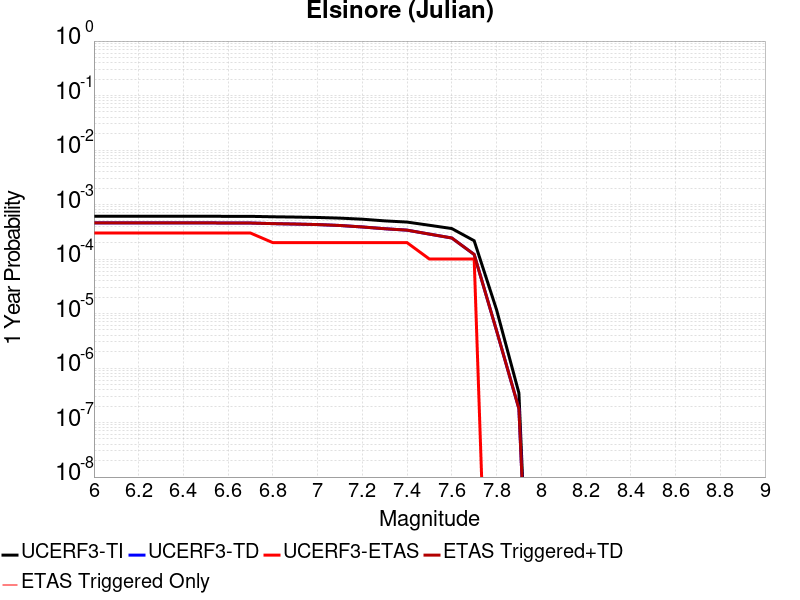 |  |

| Magnitude | 1 wk TI Prob | 1 wk TD Prob | 1 wk ETAS Prob | 1 wk ETAS/TD Gain | 1 wk ETAS Triggered+TD | 1 wk ETAS Triggered Only | 1 mo TI Prob | 1 mo TD Prob | 1 mo ETAS Prob | 1 mo ETAS/TD Gain | 1 mo ETAS Triggered+TD | 1 mo ETAS Triggered Only | 1 yr TI Prob | 1 yr TD Prob | 1 yr ETAS Prob | 1 yr ETAS/TD Gain | 1 yr ETAS Triggered+TD | 1 yr ETAS Triggered Only | 10 yr TI Prob | 10 yr TD Prob | 10 yr ETAS Prob | 10 yr ETAS/TD Gain | 10 yr ETAS Triggered+TD | 10 yr ETAS Triggered Only |
|-----|-----|-----|-----|-----|-----|-----|-----|-----|-----|-----|-----|-----|-----|-----|-----|-----|-----|-----|-----|-----|-----|-----|-----|-----|
| 6.0 | 1.1710231E-5 | 8.851412E-6 | 0.0 | 0.0 | 8.851412E-6 | 0.0 | 5.0185736E-5 | 3.793408E-5 | 0.0 | 0.0 | 3.793408E-5 | 0.0 | 6.1084004E-4 | 4.6175125E-4 | 0.0 | 0.0 | 4.6175125E-4 | 0.0 | 0.006091637 | 0.0046081105 | 5.0E-4 | 0.10850435 | 0.005105806 | 5.0E-4 |
| 6.1 | 1.1710231E-5 | 8.851412E-6 | 0.0 | 0.0 | 8.851412E-6 | 0.0 | 5.0185736E-5 | 3.793408E-5 | 0.0 | 0.0 | 3.793408E-5 | 0.0 | 6.1084004E-4 | 4.6175125E-4 | 0.0 | 0.0 | 4.6175125E-4 | 0.0 | 0.006091637 | 0.0046081105 | 5.0E-4 | 0.10850435 | 0.005105806 | 5.0E-4 |
| 6.2 | 1.1710231E-5 | 8.851412E-6 | 0.0 | 0.0 | 8.851412E-6 | 0.0 | 5.0185736E-5 | 3.793408E-5 | 0.0 | 0.0 | 3.793408E-5 | 0.0 | 6.1084004E-4 | 4.6175125E-4 | 0.0 | 0.0 | 4.6175125E-4 | 0.0 | 0.006091637 | 0.0046081105 | 5.0E-4 | 0.10850435 | 0.005105806 | 5.0E-4 |
| 6.3 | 1.1710231E-5 | 8.851412E-6 | 0.0 | 0.0 | 8.851412E-6 | 0.0 | 5.0185736E-5 | 3.793408E-5 | 0.0 | 0.0 | 3.793408E-5 | 0.0 | 6.1084004E-4 | 4.6175125E-4 | 0.0 | 0.0 | 4.6175125E-4 | 0.0 | 0.006091637 | 0.0046081105 | 5.0E-4 | 0.10850435 | 0.005105806 | 5.0E-4 |
| 6.4 | 1.1710231E-5 | 8.851412E-6 | 0.0 | 0.0 | 8.851412E-6 | 0.0 | 5.0185736E-5 | 3.793408E-5 | 0.0 | 0.0 | 3.793408E-5 | 0.0 | 6.1084004E-4 | 4.6175125E-4 | 0.0 | 0.0 | 4.6175125E-4 | 0.0 | 0.006091637 | 0.0046081105 | 5.0E-4 | 0.10850435 | 0.005105806 | 5.0E-4 |
| 6.5 | 1.1710231E-5 | 8.851412E-6 | 0.0 | 0.0 | 8.851412E-6 | 0.0 | 5.0185736E-5 | 3.793408E-5 | 0.0 | 0.0 | 3.793408E-5 | 0.0 | 6.1084004E-4 | 4.6175125E-4 | 0.0 | 0.0 | 4.6175125E-4 | 0.0 | 0.006091637 | 0.0046081105 | 5.0E-4 | 0.10850435 | 0.005105806 | 5.0E-4 |
| 6.6 | 1.1650619E-5 | 8.783769E-6 | 0.0 | 0.0 | 8.783769E-6 | 0.0 | 4.993027E-5 | 3.764419E-5 | 0.0 | 0.0 | 3.764419E-5 | 0.0 | 6.0773146E-4 | 4.5822334E-4 | 0.0 | 0.0 | 4.5822334E-4 | 0.0 | 0.0060607214 | 0.004572977 | 5.0E-4 | 0.10933797 | 0.0050706905 | 5.0E-4 |
| 6.7 | 1.1650619E-5 | 8.783769E-6 | 0.0 | 0.0 | 8.783769E-6 | 0.0 | 4.993027E-5 | 3.764419E-5 | 0.0 | 0.0 | 3.764419E-5 | 0.0 | 6.0773146E-4 | 4.5822334E-4 | 0.0 | 0.0 | 4.5822334E-4 | 0.0 | 0.0060607214 | 0.004572977 | 5.0E-4 | 0.10933797 | 0.0050706905 | 5.0E-4 |
| 6.8 | 1.1442698E-5 | 8.566879E-6 | 0.0 | 0.0 | 8.566879E-6 | 0.0 | 4.9039216E-5 | 3.6714686E-5 | 0.0 | 0.0 | 3.6714686E-5 | 0.0 | 5.968889E-4 | 4.469113E-4 | 0.0 | 0.0 | 4.469113E-4 | 0.0 | 0.0059528816 | 0.0044603148 | 5.0E-4 | 0.11209971 | 0.004958085 | 5.0E-4 |
| 6.9 | 1.1300589E-5 | 8.414713E-6 | 0.0 | 0.0 | 8.414713E-6 | 0.0 | 4.8430196E-5 | 3.6062567E-5 | 0.0 | 0.0 | 3.6062567E-5 | 0.0 | 5.894781E-4 | 4.38975E-4 | 0.0 | 0.0 | 4.38975E-4 | 0.0 | 0.005879169 | 0.0043812664 | 5.0E-4 | 0.11412226 | 0.0048790756 | 5.0E-4 |
| 7.0 | 1.1117729E-5 | 8.231819E-6 | 0.0 | 0.0 | 8.231819E-6 | 0.0 | 4.764654E-5 | 3.5278757E-5 | 0.0 | 0.0 | 3.5278757E-5 | 0.0 | 5.799422E-4 | 4.294359E-4 | 0.0 | 0.0 | 4.294359E-4 | 0.0 | 0.0057843104 | 0.004286247 | 5.0E-4 | 0.11665217 | 0.0047841035 | 5.0E-4 |
| 7.1 | 1.08053955E-5 | 7.917396E-6 | 0.0 | 0.0 | 7.917396E-6 | 0.0 | 4.6308014E-5 | 3.3931265E-5 | 0.0 | 0.0 | 3.3931265E-5 | 0.0 | 5.6365423E-4 | 4.1303647E-4 | 0.0 | 0.0 | 4.1303647E-4 | 0.0 | 0.005622267 | 0.0041228714 | 4.0E-4 | 0.09701976 | 0.0045212223 | 4.0E-4 |
| 7.2 | 1.032804E-5 | 7.4385644E-6 | 0.0 | 0.0 | 7.4385644E-6 | 0.0 | 4.4262277E-5 | 3.187918E-5 | 0.0 | 0.0 | 3.187918E-5 | 0.0 | 5.387599E-4 | 3.8806148E-4 | 0.0 | 0.0 | 3.8806148E-4 | 0.0 | 0.0053745564 | 0.0038740134 | 4.0E-4 | 0.1032521 | 0.0042724637 | 4.0E-4 |
| 7.3 | 9.622426E-6 | 6.9029716E-6 | 0.0 | 0.0 | 6.9029716E-6 | 0.0 | 4.1238312E-5 | 2.9583836E-5 | 0.0 | 0.0 | 2.9583836E-5 | 0.0 | 5.019608E-4 | 3.601251E-4 | 0.0 | 0.0 | 3.601251E-4 | 0.0 | 0.005008285 | 0.0035955745 | 3.0E-4 | 0.0834359 | 0.003894496 | 3.0E-4 |
| 7.4 | 9.144434E-6 | 6.501177E-6 | 0.0 | 0.0 | 6.501177E-6 | 0.0 | 3.9189843E-5 | 2.7861895E-5 | 0.0 | 0.0 | 2.7861895E-5 | 0.0 | 4.7703186E-4 | 3.3916716E-4 | 0.0 | 0.0 | 3.3916716E-4 | 0.0 | 0.0047600917 | 0.0033866377 | 3.0E-4 | 0.08858344 | 0.0036856215 | 3.0E-4 |
| 7.5 | 7.988981E-6 | 5.5023957E-6 | 0.0 | 0.0 | 5.5023957E-6 | 0.0 | 3.4238044E-5 | 2.358149E-5 | 0.0 | 0.0 | 2.358149E-5 | 0.0 | 4.1676845E-4 | 2.8706808E-4 | 0.0 | 0.0 | 2.8706808E-4 | 0.0 | 0.0041598766 | 0.0028671 | 3.0E-4 | 0.10463534 | 0.00316624 | 3.0E-4 |
| 7.6 | 6.9554876E-6 | 4.6661944E-6 | 0.0 | 0.0 | 4.6661944E-6 | 0.0 | 2.9808893E-5 | 1.999783E-5 | 0.0 | 0.0 | 1.999783E-5 | 0.0 | 3.6286283E-4 | 2.4344755E-4 | 0.0 | 0.0 | 2.4344755E-4 | 0.0 | 0.0036227088 | 0.002431925 | 3.0E-4 | 0.12335907 | 0.0027311954 | 3.0E-4 |
| 7.7 | 4.1557314E-6 | 2.3265768E-6 | 0.0 | 0.0 | 2.3265768E-6 | 0.0 | 1.7810156E-5 | 9.97101E-6 | 0.0 | 0.0 | 9.97101E-6 | 0.0 | 2.1681708E-4 | 1.2139102E-4 | 0.0 | 0.0 | 1.2139102E-4 | 0.0 | 0.0021660565 | 0.0012133203 | 2.0E-4 | 0.16483694 | 0.0014130776 | 2.0E-4 |
| 7.8 | 2.2597293E-7 | 9.339217E-8 | 0.0 | 0.0 | 9.339217E-8 | 0.0 | 9.684551E-7 | 4.002521E-7 | 0.0 | 0.0 | 4.002521E-7 | 0.0 | 1.1790877E-5 | 4.8730617E-6 | 0.0 | 0.0 | 4.8730617E-6 | 0.0 | 1.17902506E-4 | 4.8729875E-5 | 0.0 | 0.0 | 4.8729875E-5 | 0.0 |
| 7.9 | 6.676829E-9 | 3.4416097E-9 | 0.0 | 0.0 | 3.4416097E-9 | 0.0 | 2.861498E-8 | 1.4749755E-8 | 0.0 | 0.0 | 1.4749755E-8 | 0.0 | 3.4838732E-7 | 1.7957827E-7 | 0.0 | 0.0 | 1.7957827E-7 | 0.0 | 3.4838679E-6 | 1.7957813E-6 | 0.0 | 0.0 | 1.7957813E-6 | 0.0 |

## Hartley Springs 2011 CFM
*[(top)](#table-of-contents)*

| 1 Week | 1 Month | 1 Year | 10 Year |
|-----|-----|-----|-----|
|  |  |  | 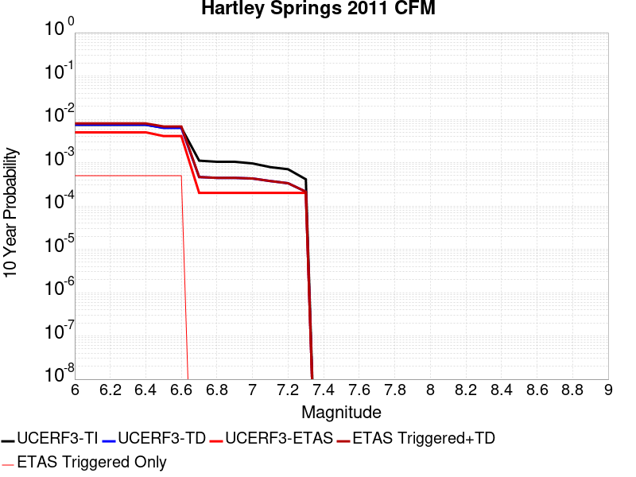 |

| Magnitude | 1 wk TI Prob | 1 wk TD Prob | 1 wk ETAS Prob | 1 wk ETAS/TD Gain | 1 wk ETAS Triggered+TD | 1 wk ETAS Triggered Only | 1 mo TI Prob | 1 mo TD Prob | 1 mo ETAS Prob | 1 mo ETAS/TD Gain | 1 mo ETAS Triggered+TD | 1 mo ETAS Triggered Only | 1 yr TI Prob | 1 yr TD Prob | 1 yr ETAS Prob | 1 yr ETAS/TD Gain | 1 yr ETAS Triggered+TD | 1 yr ETAS Triggered Only | 10 yr TI Prob | 10 yr TD Prob | 10 yr ETAS Prob | 10 yr ETAS/TD Gain | 10 yr ETAS Triggered+TD | 10 yr ETAS Triggered Only |
|-----|-----|-----|-----|-----|-----|-----|-----|-----|-----|-----|-----|-----|-----|-----|-----|-----|-----|-----|-----|-----|-----|-----|-----|-----|
| 6.0 | 1.4352418E-5 | 1.4437544E-5 | 0.0 | 0.0 | 1.4437544E-5 | 0.0 | 6.1508916E-5 | 6.187465E-5 | 0.0 | 0.0 | 6.187465E-5 | 0.0 | 7.486137E-4 | 7.532279E-4 | 0.0 | 0.0 | 7.532279E-4 | 0.0 | 0.007460968 | 0.007522878 | 5.0E-4 | 0.06646393 | 0.008019116 | 5.0E-4 |
| 6.1 | 1.4352418E-5 | 1.4437544E-5 | 0.0 | 0.0 | 1.4437544E-5 | 0.0 | 6.1508916E-5 | 6.187465E-5 | 0.0 | 0.0 | 6.187465E-5 | 0.0 | 7.486137E-4 | 7.532279E-4 | 0.0 | 0.0 | 7.532279E-4 | 0.0 | 0.007460968 | 0.007522878 | 5.0E-4 | 0.06646393 | 0.008019116 | 5.0E-4 |
| 6.2 | 1.4352418E-5 | 1.4437544E-5 | 0.0 | 0.0 | 1.4437544E-5 | 0.0 | 6.1508916E-5 | 6.187465E-5 | 0.0 | 0.0 | 6.187465E-5 | 0.0 | 7.486137E-4 | 7.532279E-4 | 0.0 | 0.0 | 7.532279E-4 | 0.0 | 0.007460968 | 0.007522878 | 5.0E-4 | 0.06646393 | 0.008019116 | 5.0E-4 |
| 6.3 | 1.4352418E-5 | 1.4437544E-5 | 0.0 | 0.0 | 1.4437544E-5 | 0.0 | 6.1508916E-5 | 6.187465E-5 | 0.0 | 0.0 | 6.187465E-5 | 0.0 | 7.486137E-4 | 7.532279E-4 | 0.0 | 0.0 | 7.532279E-4 | 0.0 | 0.007460968 | 0.007522878 | 5.0E-4 | 0.06646393 | 0.008019116 | 5.0E-4 |
| 6.4 | 1.4352418E-5 | 1.4437544E-5 | 0.0 | 0.0 | 1.4437544E-5 | 0.0 | 6.1508916E-5 | 6.187465E-5 | 0.0 | 0.0 | 6.187465E-5 | 0.0 | 7.486137E-4 | 7.532279E-4 | 0.0 | 0.0 | 7.532279E-4 | 0.0 | 0.007460968 | 0.007522878 | 5.0E-4 | 0.06646393 | 0.008019116 | 5.0E-4 |
| 6.5 | 1.2279858E-5 | 1.2135946E-5 | 0.0 | 0.0 | 1.2135946E-5 | 0.0 | 5.26269E-5 | 5.201105E-5 | 0.0 | 0.0 | 5.201105E-5 | 0.0 | 6.4054417E-4 | 6.3320884E-4 | 0.0 | 0.0 | 6.3320884E-4 | 0.0 | 0.0063870098 | 0.006329565 | 5.0E-4 | 0.07899437 | 0.0068264 | 5.0E-4 |
| 6.6 | 1.2279858E-5 | 1.2135946E-5 | 0.0 | 0.0 | 1.2135946E-5 | 0.0 | 5.26269E-5 | 5.201105E-5 | 0.0 | 0.0 | 5.201105E-5 | 0.0 | 6.4054417E-4 | 6.3320884E-4 | 0.0 | 0.0 | 6.3320884E-4 | 0.0 | 0.0063870098 | 0.006329565 | 5.0E-4 | 0.07899437 | 0.0068264 | 5.0E-4 |
| 6.7 | 2.1282601E-6 | 8.8983217E-7 | 0.0 | 0.0 | 8.8983217E-7 | 0.0 | 9.121083E-6 | 3.8135624E-6 | 0.0 | 0.0 | 3.8135624E-6 | 0.0 | 1.11043526E-4 | 4.642939E-5 | 0.0 | 0.0 | 4.642939E-5 | 0.0 | 0.0011098806 | 4.6422222E-4 | 0.0 | 0.0 | 4.6422222E-4 | 0.0 |
| 6.8 | 2.00516E-6 | 8.521239E-7 | 0.0 | 0.0 | 8.521239E-7 | 0.0 | 8.593515E-6 | 3.651956E-6 | 0.0 | 0.0 | 3.651956E-6 | 0.0 | 1.04621024E-4 | 4.4461915E-5 | 0.0 | 0.0 | 4.4461915E-5 | 0.0 | 0.0010457177 | 4.4455533E-4 | 0.0 | 0.0 | 4.4455533E-4 | 0.0 |
| 6.9 | 2.00516E-6 | 8.521239E-7 | 0.0 | 0.0 | 8.521239E-7 | 0.0 | 8.593515E-6 | 3.651956E-6 | 0.0 | 0.0 | 3.651956E-6 | 0.0 | 1.04621024E-4 | 4.4461915E-5 | 0.0 | 0.0 | 4.4461915E-5 | 0.0 | 0.0010457177 | 4.4455533E-4 | 0.0 | 0.0 | 4.4455533E-4 | 0.0 |
| 7.0 | 1.8366732E-6 | 8.2411475E-7 | 0.0 | 0.0 | 8.2411475E-7 | 0.0 | 7.871433E-6 | 3.531917E-6 | 0.0 | 0.0 | 3.531917E-6 | 0.0 | 9.583048E-5 | 4.3000495E-5 | 0.0 | 0.0 | 4.3000495E-5 | 0.0 | 9.5789164E-4 | 4.299468E-4 | 0.0 | 0.0 | 4.299468E-4 | 0.0 |
| 7.1 | 1.5097997E-6 | 7.194524E-7 | 0.0 | 0.0 | 7.194524E-7 | 0.0 | 6.470554E-6 | 3.083365E-6 | 0.0 | 0.0 | 3.083365E-6 | 0.0 | 7.877615E-5 | 3.7539565E-5 | 0.0 | 0.0 | 3.7539565E-5 | 0.0 | 7.874823E-4 | 3.7535594E-4 | 0.0 | 0.0 | 3.7535594E-4 | 0.0 |
| 7.2 | 1.3490993E-6 | 6.4097145E-7 | 0.0 | 0.0 | 6.4097145E-7 | 0.0 | 5.7818415E-6 | 2.747019E-6 | 0.0 | 0.0 | 2.747019E-6 | 0.0 | 7.0391645E-5 | 3.3444674E-5 | 0.0 | 0.0 | 3.3444674E-5 | 0.0 | 7.0369354E-4 | 3.3441937E-4 | 0.0 | 0.0 | 3.3441937E-4 | 0.0 |
| 7.3 | 7.900015E-7 | 4.0883947E-7 | 0.0 | 0.0 | 4.0883947E-7 | 0.0 | 3.3857161E-6 | 1.7521692E-6 | 0.0 | 0.0 | 1.7521692E-6 | 0.0 | 4.1220315E-5 | 2.1332658E-5 | 0.0 | 0.0 | 2.1332658E-5 | 0.0 | 4.121267E-4 | 2.133266E-4 | 0.0 | 0.0 | 2.133266E-4 | 0.0 |

## Channel Islands Western Deep Ramp
*[(top)](#table-of-contents)*

| 1 Week | 1 Month | 1 Year | 10 Year |
|-----|-----|-----|-----|
|  |  |  | 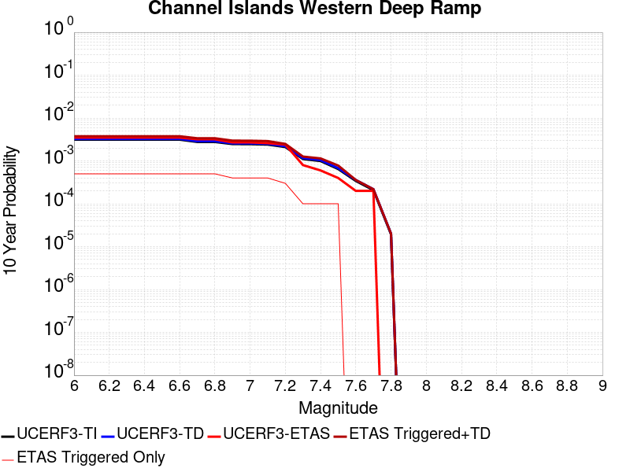 |

| Magnitude | 1 wk TI Prob | 1 wk TD Prob | 1 wk ETAS Prob | 1 wk ETAS/TD Gain | 1 wk ETAS Triggered+TD | 1 wk ETAS Triggered Only | 1 mo TI Prob | 1 mo TD Prob | 1 mo ETAS Prob | 1 mo ETAS/TD Gain | 1 mo ETAS Triggered+TD | 1 mo ETAS Triggered Only | 1 yr TI Prob | 1 yr TD Prob | 1 yr ETAS Prob | 1 yr ETAS/TD Gain | 1 yr ETAS Triggered+TD | 1 yr ETAS Triggered Only | 10 yr TI Prob | 10 yr TD Prob | 10 yr ETAS Prob | 10 yr ETAS/TD Gain | 10 yr ETAS Triggered+TD | 10 yr ETAS Triggered Only |
|-----|-----|-----|-----|-----|-----|-----|-----|-----|-----|-----|-----|-----|-----|-----|-----|-----|-----|-----|-----|-----|-----|-----|-----|-----|
| 6.0 | 6.0213506E-6 | 6.255369E-6 | 0.0 | 0.0 | 6.255369E-6 | 0.0 | 2.5805533E-5 | 2.6808475E-5 | 0.0 | 0.0 | 2.6808475E-5 | 0.0 | 3.1413708E-4 | 3.2634876E-4 | 2.0E-4 | 0.6128413 | 5.262835E-4 | 2.0E-4 | 0.0031369338 | 0.0032591368 | 5.0E-4 | 0.15341486 | 0.0037575073 | 5.0E-4 |
| 6.1 | 6.0213506E-6 | 6.255369E-6 | 0.0 | 0.0 | 6.255369E-6 | 0.0 | 2.5805533E-5 | 2.6808475E-5 | 0.0 | 0.0 | 2.6808475E-5 | 0.0 | 3.1413708E-4 | 3.2634876E-4 | 2.0E-4 | 0.6128413 | 5.262835E-4 | 2.0E-4 | 0.0031369338 | 0.0032591368 | 5.0E-4 | 0.15341486 | 0.0037575073 | 5.0E-4 |
| 6.2 | 6.0213506E-6 | 6.255369E-6 | 0.0 | 0.0 | 6.255369E-6 | 0.0 | 2.5805533E-5 | 2.6808475E-5 | 0.0 | 0.0 | 2.6808475E-5 | 0.0 | 3.1413708E-4 | 3.2634876E-4 | 2.0E-4 | 0.6128413 | 5.262835E-4 | 2.0E-4 | 0.0031369338 | 0.0032591368 | 5.0E-4 | 0.15341486 | 0.0037575073 | 5.0E-4 |
| 6.3 | 6.0213506E-6 | 6.255369E-6 | 0.0 | 0.0 | 6.255369E-6 | 0.0 | 2.5805533E-5 | 2.6808475E-5 | 0.0 | 0.0 | 2.6808475E-5 | 0.0 | 3.1413708E-4 | 3.2634876E-4 | 2.0E-4 | 0.6128413 | 5.262835E-4 | 2.0E-4 | 0.0031369338 | 0.0032591368 | 5.0E-4 | 0.15341486 | 0.0037575073 | 5.0E-4 |
| 6.4 | 6.0213506E-6 | 6.255369E-6 | 0.0 | 0.0 | 6.255369E-6 | 0.0 | 2.5805533E-5 | 2.6808475E-5 | 0.0 | 0.0 | 2.6808475E-5 | 0.0 | 3.1413708E-4 | 3.2634876E-4 | 2.0E-4 | 0.6128413 | 5.262835E-4 | 2.0E-4 | 0.0031369338 | 0.0032591368 | 5.0E-4 | 0.15341486 | 0.0037575073 | 5.0E-4 |
| 6.5 | 6.0213506E-6 | 6.255369E-6 | 0.0 | 0.0 | 6.255369E-6 | 0.0 | 2.5805533E-5 | 2.6808475E-5 | 0.0 | 0.0 | 2.6808475E-5 | 0.0 | 3.1413708E-4 | 3.2634876E-4 | 2.0E-4 | 0.6128413 | 5.262835E-4 | 2.0E-4 | 0.0031369338 | 0.0032591368 | 5.0E-4 | 0.15341486 | 0.0037575073 | 5.0E-4 |
| 6.6 | 6.0213506E-6 | 6.255369E-6 | 0.0 | 0.0 | 6.255369E-6 | 0.0 | 2.5805533E-5 | 2.6808475E-5 | 0.0 | 0.0 | 2.6808475E-5 | 0.0 | 3.1413708E-4 | 3.2634876E-4 | 2.0E-4 | 0.6128413 | 5.262835E-4 | 2.0E-4 | 0.0031369338 | 0.0032591368 | 5.0E-4 | 0.15341486 | 0.0037575073 | 5.0E-4 |
| 6.7 | 5.313309E-6 | 5.5256955E-6 | 0.0 | 0.0 | 5.5256955E-6 | 0.0 | 2.2771126E-5 | 2.368136E-5 | 0.0 | 0.0 | 2.368136E-5 | 0.0 | 2.772032E-4 | 2.882865E-4 | 2.0E-4 | 0.6937543 | 4.8822883E-4 | 2.0E-4 | 0.0027685766 | 0.0028795283 | 5.0E-4 | 0.17363954 | 0.0033780886 | 5.0E-4 |
| 6.8 | 5.313309E-6 | 5.5256955E-6 | 0.0 | 0.0 | 5.5256955E-6 | 0.0 | 2.2771126E-5 | 2.368136E-5 | 0.0 | 0.0 | 2.368136E-5 | 0.0 | 2.772032E-4 | 2.882865E-4 | 2.0E-4 | 0.6937543 | 4.8822883E-4 | 2.0E-4 | 0.0027685766 | 0.0028795283 | 5.0E-4 | 0.17363954 | 0.0033780886 | 5.0E-4 |
| 6.9 | 4.744377E-6 | 4.9398495E-6 | 0.0 | 0.0 | 4.9398495E-6 | 0.0 | 2.0332885E-5 | 2.1170634E-5 | 0.0 | 0.0 | 2.1170634E-5 | 0.0 | 2.4752476E-4 | 2.577257E-4 | 1.0E-4 | 0.3880094 | 3.5769993E-4 | 1.0E-4 | 0.0024724922 | 0.0025746357 | 4.0E-4 | 0.15536179 | 0.0029736059 | 4.0E-4 |
| 7.0 | 4.722209E-6 | 4.9168907E-6 | 0.0 | 0.0 | 4.9168907E-6 | 0.0 | 2.0237881E-5 | 2.107224E-5 | 0.0 | 0.0 | 2.107224E-5 | 0.0 | 2.4636835E-4 | 2.5652803E-4 | 1.0E-4 | 0.38982093 | 3.565024E-4 | 1.0E-4 | 0.002460954 | 0.0025626866 | 4.0E-4 | 0.15608619 | 0.0029616617 | 4.0E-4 |
| 7.1 | 4.611174E-6 | 4.801818E-6 | 0.0 | 0.0 | 4.801818E-6 | 0.0 | 1.9762025E-5 | 2.0579078E-5 | 0.0 | 0.0 | 2.0579078E-5 | 0.0 | 2.4057609E-4 | 2.505252E-4 | 1.0E-4 | 0.39916143 | 3.5050014E-4 | 1.0E-4 | 0.002403158 | 0.0025027948 | 4.0E-4 | 0.15982133 | 0.0029017937 | 4.0E-4 |
| 7.2 | 4.043994E-6 | 4.212388E-6 | 0.0 | 0.0 | 4.212388E-6 | 0.0 | 1.7331287E-5 | 1.8052986E-5 | 0.0 | 0.0 | 1.8052986E-5 | 0.0 | 2.10988E-4 | 2.1977651E-4 | 1.0E-4 | 0.45500767 | 3.1975453E-4 | 1.0E-4 | 0.002107878 | 0.0021959424 | 3.0E-4 | 0.1366156 | 0.0024952837 | 3.0E-4 |
| 7.3 | 2.1233036E-6 | 2.230018E-6 | 0.0 | 0.0 | 2.230018E-6 | 0.0 | 9.099841E-6 | 9.557185E-6 | 0.0 | 0.0 | 9.557185E-6 | 0.0 | 1.1078493E-4 | 1.1635257E-4 | 1.0E-4 | 0.8594567 | 2.1634094E-4 | 1.0E-4 | 0.0011072971 | 0.0011629221 | 1.0E-4 | 0.08599029 | 0.0012628058 | 1.0E-4 |
| 7.4 | 1.9051884E-6 | 2.0017058E-6 | 0.0 | 0.0 | 2.0017058E-6 | 0.0 | 8.165067E-6 | 8.5787115E-6 | 0.0 | 0.0 | 8.5787115E-6 | 0.0 | 9.940516E-5 | 1.0444086E-4 | 1.0E-4 | 0.9574797 | 2.0443041E-4 | 1.0E-4 | 9.93607E-4 | 0.001043923 | 1.0E-4 | 0.0957925 | 0.0011438186 | 1.0E-4 |
| 7.5 | 1.2408497E-6 | 1.3040204E-6 | 0.0 | 0.0 | 1.3040204E-6 | 0.0 | 5.317916E-6 | 5.5886476E-6 | 0.0 | 0.0 | 5.5886476E-6 | 0.0 | 6.4743705E-5 | 6.803968E-5 | 1.0E-4 | 1.4697306 | 1.6803287E-4 | 1.0E-4 | 6.4724847E-4 | 6.801906E-4 | 1.0E-4 | 0.1470176 | 7.8012265E-4 | 1.0E-4 |
| 7.6 | 6.5440025E-7 | 6.887462E-7 | 0.0 | 0.0 | 6.887462E-7 | 0.0 | 2.8045695E-6 | 2.9517662E-6 | 0.0 | 0.0 | 2.9517662E-6 | 0.0 | 3.4145098E-5 | 3.5937173E-5 | 0.0 | 0.0 | 3.5937173E-5 | 0.0 | 3.4139853E-4 | 3.5931505E-4 | 0.0 | 0.0 | 3.5931505E-4 | 0.0 |
| 7.7 | 3.985963E-7 | 4.193528E-7 | 0.0 | 0.0 | 4.193528E-7 | 0.0 | 1.7082689E-6 | 1.7972251E-6 | 0.0 | 0.0 | 1.7972251E-6 | 0.0 | 2.0797976E-5 | 2.1881007E-5 | 0.0 | 0.0 | 2.1881007E-5 | 0.0 | 2.0796029E-4 | 2.187897E-4 | 0.0 | 0.0 | 2.187897E-4 | 0.0 |
| 7.8 | 3.706329E-8 | 3.8595072E-8 | 0.0 | 0.0 | 3.8595072E-8 | 0.0 | 1.5884267E-7 | 1.6540744E-7 | 0.0 | 0.0 | 1.6540744E-7 | 0.0 | 1.9339077E-6 | 2.0138339E-6 | 0.0 | 0.0 | 2.0138339E-6 | 0.0 | 1.933891E-5 | 2.0138168E-5 | 0.0 | 0.0 | 2.0138168E-5 | 0.0 |

## Mount Diablo Thrust North CFM
*[(top)](#table-of-contents)*

| 1 Week | 1 Month | 1 Year | 10 Year |
|-----|-----|-----|-----|
|  |  | 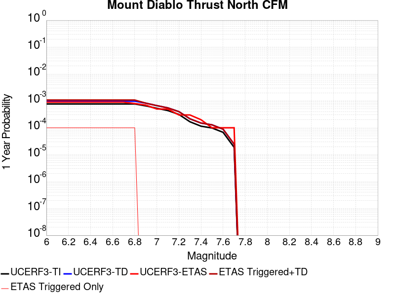 | 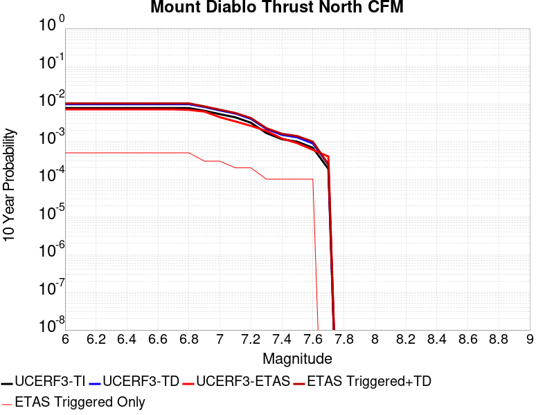 |

| Magnitude | 1 wk TI Prob | 1 wk TD Prob | 1 wk ETAS Prob | 1 wk ETAS/TD Gain | 1 wk ETAS Triggered+TD | 1 wk ETAS Triggered Only | 1 mo TI Prob | 1 mo TD Prob | 1 mo ETAS Prob | 1 mo ETAS/TD Gain | 1 mo ETAS Triggered+TD | 1 mo ETAS Triggered Only | 1 yr TI Prob | 1 yr TD Prob | 1 yr ETAS Prob | 1 yr ETAS/TD Gain | 1 yr ETAS Triggered+TD | 1 yr ETAS Triggered Only | 10 yr TI Prob | 10 yr TD Prob | 10 yr ETAS Prob | 10 yr ETAS/TD Gain | 10 yr ETAS Triggered+TD | 10 yr ETAS Triggered Only |
|-----|-----|-----|-----|-----|-----|-----|-----|-----|-----|-----|-----|-----|-----|-----|-----|-----|-----|-----|-----|-----|-----|-----|-----|-----|
| 6.0 | 1.479628E-5 | 1.878381E-5 | 0.0 | 0.0 | 1.878381E-5 | 0.0 | 6.341109E-5 | 8.0499616E-5 | 0.0 | 0.0 | 8.0499616E-5 | 0.0 | 7.717565E-4 | 9.796517E-4 | 1.0E-4 | 0.1020771 | 0.0010795537 | 1.0E-4 | 0.007690818 | 0.009753633 | 5.0E-4 | 0.05126295 | 0.010248756 | 5.0E-4 |
| 6.1 | 1.479628E-5 | 1.878381E-5 | 0.0 | 0.0 | 1.878381E-5 | 0.0 | 6.341109E-5 | 8.0499616E-5 | 0.0 | 0.0 | 8.0499616E-5 | 0.0 | 7.717565E-4 | 9.796517E-4 | 1.0E-4 | 0.1020771 | 0.0010795537 | 1.0E-4 | 0.007690818 | 0.009753633 | 5.0E-4 | 0.05126295 | 0.010248756 | 5.0E-4 |
| 6.2 | 1.479628E-5 | 1.878381E-5 | 0.0 | 0.0 | 1.878381E-5 | 0.0 | 6.341109E-5 | 8.0499616E-5 | 0.0 | 0.0 | 8.0499616E-5 | 0.0 | 7.717565E-4 | 9.796517E-4 | 1.0E-4 | 0.1020771 | 0.0010795537 | 1.0E-4 | 0.007690818 | 0.009753633 | 5.0E-4 | 0.05126295 | 0.010248756 | 5.0E-4 |
| 6.3 | 1.479628E-5 | 1.878381E-5 | 0.0 | 0.0 | 1.878381E-5 | 0.0 | 6.341109E-5 | 8.0499616E-5 | 0.0 | 0.0 | 8.0499616E-5 | 0.0 | 7.717565E-4 | 9.796517E-4 | 1.0E-4 | 0.1020771 | 0.0010795537 | 1.0E-4 | 0.007690818 | 0.009753633 | 5.0E-4 | 0.05126295 | 0.010248756 | 5.0E-4 |
| 6.4 | 1.479628E-5 | 1.878381E-5 | 0.0 | 0.0 | 1.878381E-5 | 0.0 | 6.341109E-5 | 8.0499616E-5 | 0.0 | 0.0 | 8.0499616E-5 | 0.0 | 7.717565E-4 | 9.796517E-4 | 1.0E-4 | 0.1020771 | 0.0010795537 | 1.0E-4 | 0.007690818 | 0.009753633 | 5.0E-4 | 0.05126295 | 0.010248756 | 5.0E-4 |
| 6.5 | 1.479628E-5 | 1.878381E-5 | 0.0 | 0.0 | 1.878381E-5 | 0.0 | 6.341109E-5 | 8.0499616E-5 | 0.0 | 0.0 | 8.0499616E-5 | 0.0 | 7.717565E-4 | 9.796517E-4 | 1.0E-4 | 0.1020771 | 0.0010795537 | 1.0E-4 | 0.007690818 | 0.009753633 | 5.0E-4 | 0.05126295 | 0.010248756 | 5.0E-4 |
| 6.6 | 1.479016E-5 | 1.877692E-5 | 0.0 | 0.0 | 1.877692E-5 | 0.0 | 6.338486E-5 | 8.047008E-5 | 0.0 | 0.0 | 8.047008E-5 | 0.0 | 7.714374E-4 | 9.792924E-4 | 1.0E-4 | 0.102114536 | 0.0010791946 | 1.0E-4 | 0.007687649 | 0.009750073 | 5.0E-4 | 0.05128167 | 0.010245197 | 5.0E-4 |
| 6.7 | 1.479016E-5 | 1.877692E-5 | 0.0 | 0.0 | 1.877692E-5 | 0.0 | 6.338486E-5 | 8.047008E-5 | 0.0 | 0.0 | 8.047008E-5 | 0.0 | 7.714374E-4 | 9.792924E-4 | 1.0E-4 | 0.102114536 | 0.0010791946 | 1.0E-4 | 0.007687649 | 0.009750073 | 5.0E-4 | 0.05128167 | 0.010245197 | 5.0E-4 |
| 6.8 | 1.4771667E-5 | 1.8755683E-5 | 0.0 | 0.0 | 1.8755683E-5 | 0.0 | 6.330561E-5 | 8.0379075E-5 | 0.0 | 0.0 | 8.0379075E-5 | 0.0 | 7.704732E-4 | 9.781854E-4 | 1.0E-4 | 0.1022301 | 0.0010780876 | 1.0E-4 | 0.007678074 | 0.0097391 | 5.0E-4 | 0.051339447 | 0.01023423 | 5.0E-4 |
| 6.9 | 1.2548234E-5 | 1.583552E-5 | 0.0 | 0.0 | 1.583552E-5 | 0.0 | 5.3777036E-5 | 6.786476E-5 | 0.0 | 0.0 | 6.786476E-5 | 0.0 | 6.545387E-4 | 8.259439E-4 | 0.0 | 0.0 | 8.259439E-4 | 0.0 | 0.006526142 | 0.008229812 | 3.0E-4 | 0.03645284 | 0.008527342 | 3.0E-4 |
| 7.0 | 1.01754185E-5 | 1.2818516E-5 | 0.0 | 0.0 | 1.2818516E-5 | 0.0 | 4.360821E-5 | 5.493535E-5 | 0.0 | 0.0 | 5.493535E-5 | 0.0 | 5.308006E-4 | 6.686343E-4 | 0.0 | 0.0 | 6.686343E-4 | 0.0 | 0.005295345 | 0.006667354 | 3.0E-4 | 0.04499536 | 0.006965354 | 3.0E-4 |
| 7.1 | 8.398341E-6 | 1.0562533E-5 | 0.0 | 0.0 | 1.0562533E-5 | 0.0 | 3.5992394E-5 | 4.526722E-5 | 0.0 | 0.0 | 4.526722E-5 | 0.0 | 4.3811928E-4 | 5.5099017E-4 | 0.0 | 0.0 | 5.5099017E-4 | 0.0 | 0.0043725655 | 0.005496894 | 2.0E-4 | 0.036384184 | 0.0056957947 | 2.0E-4 |
| 7.2 | 6.024759E-6 | 7.655191E-6 | 0.0 | 0.0 | 7.655191E-6 | 0.0 | 2.582014E-5 | 3.2807555E-5 | 0.0 | 0.0 | 3.2807555E-5 | 0.0 | 3.1431485E-4 | 3.9935947E-4 | 0.0 | 0.0 | 3.9935947E-4 | 0.0 | 0.0031387066 | 0.0039869426 | 2.0E-4 | 0.050163753 | 0.004186145 | 2.0E-4 |
| 7.3 | 3.2099704E-6 | 4.1376225E-6 | 0.0 | 0.0 | 4.1376225E-6 | 0.0 | 1.3756943E-5 | 1.7732547E-5 | 0.0 | 0.0 | 1.7732547E-5 | 0.0 | 1.674779E-4 | 2.1587255E-4 | 0.0 | 0.0 | 2.1587255E-4 | 0.0 | 0.0016735174 | 0.0021571163 | 1.0E-4 | 0.046358187 | 0.0022569005 | 1.0E-4 |
| 7.4 | 2.2041513E-6 | 2.875226E-6 | 0.0 | 0.0 | 2.875226E-6 | 0.0 | 9.4463285E-6 | 1.232234E-5 | 0.0 | 0.0 | 1.232234E-5 | 0.0 | 1.1500298E-4 | 1.5001424E-4 | 0.0 | 0.0 | 1.5001424E-4 | 0.0 | 0.0011494348 | 0.0014994598 | 1.0E-4 | 0.06669068 | 0.0015993098 | 1.0E-4 |
| 7.5 | 1.8869501E-6 | 2.4710619E-6 | 0.0 | 0.0 | 2.4710619E-6 | 0.0 | 8.086904E-6 | 1.0590223E-5 | 0.0 | 0.0 | 1.0590223E-5 | 0.0 | 9.845361E-5 | 1.289284E-4 | 0.0 | 0.0 | 1.289284E-4 | 0.0 | 9.841E-4 | 0.001288866 | 1.0E-4 | 0.07758758 | 0.0013887371 | 1.0E-4 |
| 7.6 | 1.3012458E-6 | 1.7018185E-6 | 0.0 | 0.0 | 1.7018185E-6 | 0.0 | 5.576756E-6 | 7.2934877E-6 | 0.0 | 0.0 | 7.2934877E-6 | 0.0 | 6.7894885E-5 | 8.8794644E-5 | 0.0 | 0.0 | 8.8794644E-5 | 0.0 | 6.787415E-4 | 8.8790123E-4 | 1.0E-4 | 0.112625144 | 9.878124E-4 | 1.0E-4 |
| 7.7 | 3.603383E-7 | 4.7198654E-7 | 0.0 | 0.0 | 4.7198654E-7 | 0.0 | 1.5443061E-6 | 2.0227978E-6 | 0.0 | 0.0 | 2.0227978E-6 | 0.0 | 1.8801764E-5 | 2.4627294E-5 | 0.0 | 0.0 | 2.4627294E-5 | 0.0 | 1.8800174E-4 | 2.4625662E-4 | 0.0 | 0.0 | 2.4625662E-4 | 0.0 |

## Great Valley 03 Mysterious Ridge
*[(top)](#table-of-contents)*

| 1 Week | 1 Month | 1 Year | 10 Year |
|-----|-----|-----|-----|
|  | 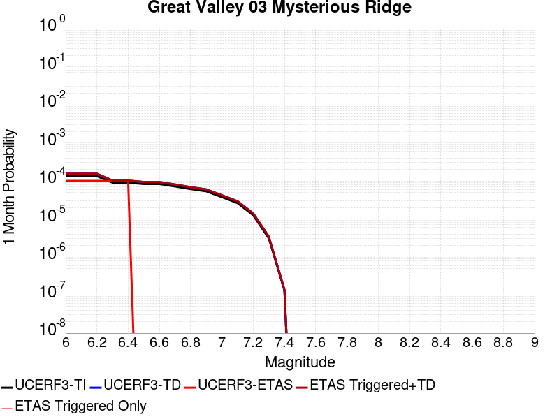 |  |  |

| Magnitude | 1 wk TI Prob | 1 wk TD Prob | 1 wk ETAS Prob | 1 wk ETAS/TD Gain | 1 wk ETAS Triggered+TD | 1 wk ETAS Triggered Only | 1 mo TI Prob | 1 mo TD Prob | 1 mo ETAS Prob | 1 mo ETAS/TD Gain | 1 mo ETAS Triggered+TD | 1 mo ETAS Triggered Only | 1 yr TI Prob | 1 yr TD Prob | 1 yr ETAS Prob | 1 yr ETAS/TD Gain | 1 yr ETAS Triggered+TD | 1 yr ETAS Triggered Only | 10 yr TI Prob | 10 yr TD Prob | 10 yr ETAS Prob | 10 yr ETAS/TD Gain | 10 yr ETAS Triggered+TD | 10 yr ETAS Triggered Only |
|-----|-----|-----|-----|-----|-----|-----|-----|-----|-----|-----|-----|-----|-----|-----|-----|-----|-----|-----|-----|-----|-----|-----|-----|-----|
| 6.0 | 3.1182444E-5 | 3.604578E-5 | 0.0 | 0.0 | 3.604578E-5 | 0.0 | 1.336322E-4 | 1.5447383E-4 | 0.0 | 0.0 | 1.5447383E-4 | 0.0 | 0.0016257578 | 0.0018792824 | 0.0 | 0.0 | 0.0018792824 | 0.0 | 0.016139153 | 0.018652653 | 5.0E-4 | 0.026805839 | 0.019143326 | 5.0E-4 |
| 6.1 | 3.1182444E-5 | 3.604578E-5 | 0.0 | 0.0 | 3.604578E-5 | 0.0 | 1.336322E-4 | 1.5447383E-4 | 0.0 | 0.0 | 1.5447383E-4 | 0.0 | 0.0016257578 | 0.0018792824 | 0.0 | 0.0 | 0.0018792824 | 0.0 | 0.016139153 | 0.018652653 | 5.0E-4 | 0.026805839 | 0.019143326 | 5.0E-4 |
| 6.2 | 3.1182444E-5 | 3.604578E-5 | 0.0 | 0.0 | 3.604578E-5 | 0.0 | 1.336322E-4 | 1.5447383E-4 | 0.0 | 0.0 | 1.5447383E-4 | 0.0 | 0.0016257578 | 0.0018792824 | 0.0 | 0.0 | 0.0018792824 | 0.0 | 0.016139153 | 0.018652653 | 5.0E-4 | 0.026805839 | 0.019143326 | 5.0E-4 |
| 6.3 | 2.106934E-5 | 2.3856826E-5 | 0.0 | 0.0 | 2.3856826E-5 | 0.0 | 9.0294045E-5 | 1.0223971E-4 | 0.0 | 0.0 | 1.0223971E-4 | 0.0 | 0.0010987755 | 0.0012440889 | 0.0 | 0.0 | 0.0012440889 | 0.0 | 0.010933585 | 0.012374491 | 4.0E-4 | 0.03232456 | 0.012769542 | 4.0E-4 |
| 6.4 | 2.106934E-5 | 2.3856826E-5 | 0.0 | 0.0 | 2.3856826E-5 | 0.0 | 9.0294045E-5 | 1.0223971E-4 | 0.0 | 0.0 | 1.0223971E-4 | 0.0 | 0.0010987755 | 0.0012440889 | 0.0 | 0.0 | 0.0012440889 | 0.0 | 0.010933585 | 0.012374491 | 4.0E-4 | 0.03232456 | 0.012769542 | 4.0E-4 |
| 6.5 | 1.9389783E-5 | 2.1890814E-5 | 0.0 | 0.0 | 2.1890814E-5 | 0.0 | 8.309642E-5 | 9.381456E-5 | 0.0 | 0.0 | 9.381456E-5 | 0.0 | 0.0010112294 | 0.0011416215 | 0.0 | 0.0 | 0.0011416215 | 0.0 | 0.010066401 | 0.011360445 | 4.0E-4 | 0.03520989 | 0.0117559 | 4.0E-4 |
| 6.6 | 1.9370193E-5 | 2.1870734E-5 | 0.0 | 0.0 | 2.1870734E-5 | 0.0 | 8.301247E-5 | 9.372851E-5 | 0.0 | 0.0 | 9.372851E-5 | 0.0 | 0.0010102082 | 0.0011405749 | 0.0 | 0.0 | 0.0011405749 | 0.0 | 0.010056281 | 0.011350086 | 4.0E-4 | 0.035242025 | 0.011745546 | 4.0E-4 |
| 6.7 | 1.6723505E-5 | 1.8804109E-5 | 0.0 | 0.0 | 1.8804109E-5 | 0.0 | 7.16702E-5 | 8.058666E-5 | 0.0 | 0.0 | 8.058666E-5 | 0.0 | 8.722353E-4 | 9.807204E-4 | 0.0 | 0.0 | 9.807204E-4 | 0.0 | 0.008688197 | 0.009765935 | 4.0E-4 | 0.0409587 | 0.0101620285 | 4.0E-4 |
| 6.8 | 1.426937E-5 | 1.6001215E-5 | 0.0 | 0.0 | 1.6001215E-5 | 0.0 | 6.115301E-5 | 6.857491E-5 | 0.0 | 0.0 | 6.857491E-5 | 0.0 | 7.4428355E-4 | 8.3459425E-4 | 0.0 | 0.0 | 8.3459425E-4 | 0.0 | 0.007417957 | 0.008316078 | 4.0E-4 | 0.048099596 | 0.008712752 | 4.0E-4 |
| 6.9 | 1.2469891E-5 | 1.3960368E-5 | 0.0 | 0.0 | 1.3960368E-5 | 0.0 | 5.3441294E-5 | 5.9828846E-5 | 0.0 | 0.0 | 5.9828846E-5 | 0.0 | 6.504535E-4 | 7.281848E-4 | 0.0 | 0.0 | 7.281848E-4 | 0.0 | 0.006485529 | 0.0072592124 | 3.0E-4 | 0.041326795 | 0.007557035 | 3.0E-4 |
| 7.0 | 8.7746275E-6 | 9.794079E-6 | 0.0 | 0.0 | 9.794079E-6 | 0.0 | 3.7605005E-5 | 4.1973988E-5 | 0.0 | 0.0 | 4.1973988E-5 | 0.0 | 4.5774475E-4 | 5.109208E-4 | 0.0 | 0.0 | 5.109208E-4 | 0.0 | 0.00456803 | 0.005098195 | 1.0E-4 | 0.019614786 | 0.005197685 | 1.0E-4 |
| 7.1 | 6.1067153E-6 | 6.8153554E-6 | 0.0 | 0.0 | 6.8153554E-6 | 0.0 | 2.6171374E-5 | 2.920837E-5 | 0.0 | 0.0 | 2.920837E-5 | 0.0 | 3.1858988E-4 | 3.5555946E-4 | 0.0 | 0.0 | 3.5555946E-4 | 0.0 | 0.0031813353 | 0.0035504568 | 1.0E-4 | 0.02816539 | 0.0036501018 | 1.0E-4 |
| 7.2 | 2.939283E-6 | 3.274877E-6 | 0.0 | 0.0 | 3.274877E-6 | 0.0 | 1.2596866E-5 | 1.4035121E-5 | 0.0 | 0.0 | 1.4035121E-5 | 0.0 | 1.5335606E-4 | 1.7086595E-4 | 0.0 | 0.0 | 1.7086595E-4 | 0.0 | 0.0015325027 | 0.0017075179 | 0.0 | 0.0 | 0.0017075179 | 0.0 |
| 7.3 | 7.2387763E-7 | 8.010275E-7 | 0.0 | 0.0 | 8.010275E-7 | 0.0 | 3.102329E-6 | 3.4329732E-6 | 0.0 | 0.0 | 3.4329732E-6 | 0.0 | 3.77702E-5 | 4.1796106E-5 | 0.0 | 0.0 | 4.1796106E-5 | 0.0 | 3.7763783E-4 | 4.1792745E-4 | 0.0 | 0.0 | 4.1792745E-4 | 0.0 |
| 7.4 | 3.112171E-8 | 3.2070375E-8 | 0.0 | 0.0 | 3.2070375E-8 | 0.0 | 1.3337875E-7 | 1.3744446E-7 | 0.0 | 0.0 | 1.3744446E-7 | 0.0 | 1.6238852E-6 | 1.6733851E-6 | 0.0 | 0.0 | 1.6733851E-6 | 0.0 | 1.6238733E-5 | 1.6733733E-5 | 0.0 | 0.0 | 1.6733733E-5 | 0.0 |

## Lost Hills
*[(top)](#table-of-contents)*

| 1 Week | 1 Month | 1 Year | 10 Year |
|-----|-----|-----|-----|
|  | 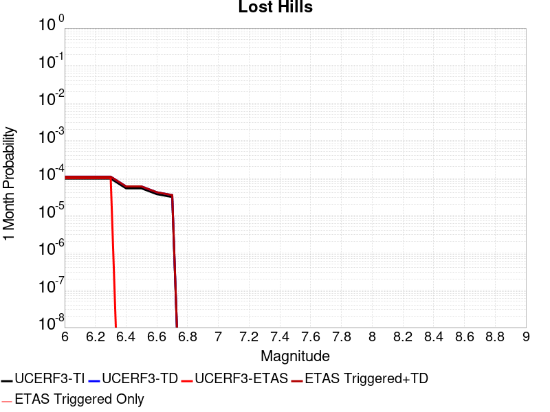 |  | 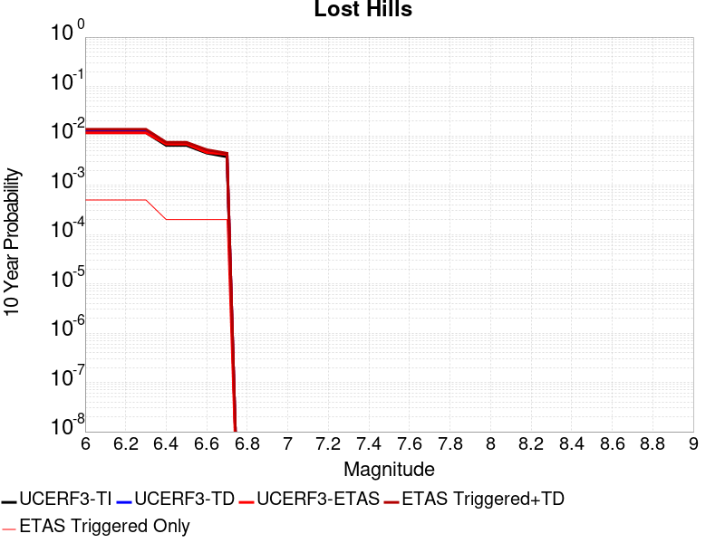 |

| Magnitude | 1 wk TI Prob | 1 wk TD Prob | 1 wk ETAS Prob | 1 wk ETAS/TD Gain | 1 wk ETAS Triggered+TD | 1 wk ETAS Triggered Only | 1 mo TI Prob | 1 mo TD Prob | 1 mo ETAS Prob | 1 mo ETAS/TD Gain | 1 mo ETAS Triggered+TD | 1 mo ETAS Triggered Only | 1 yr TI Prob | 1 yr TD Prob | 1 yr ETAS Prob | 1 yr ETAS/TD Gain | 1 yr ETAS Triggered+TD | 1 yr ETAS Triggered Only | 10 yr TI Prob | 10 yr TD Prob | 10 yr ETAS Prob | 10 yr ETAS/TD Gain | 10 yr ETAS Triggered+TD | 10 yr ETAS Triggered Only |
|-----|-----|-----|-----|-----|-----|-----|-----|-----|-----|-----|-----|-----|-----|-----|-----|-----|-----|-----|-----|-----|-----|-----|-----|-----|
| 6.0 | 2.233523E-5 | 2.5112999E-5 | 0.0 | 0.0 | 2.5112999E-5 | 0.0 | 9.571891E-5 | 1.07623644E-4 | 0.0 | 0.0 | 1.07623644E-4 | 0.0 | 0.0011647546 | 0.0013096984 | 0.0 | 0.0 | 0.0013096984 | 0.0 | 0.011586686 | 0.013036405 | 5.0E-4 | 0.038354132 | 0.0135298865 | 5.0E-4 |
| 6.1 | 2.233523E-5 | 2.5112999E-5 | 0.0 | 0.0 | 2.5112999E-5 | 0.0 | 9.571891E-5 | 1.07623644E-4 | 0.0 | 0.0 | 1.07623644E-4 | 0.0 | 0.0011647546 | 0.0013096984 | 0.0 | 0.0 | 0.0013096984 | 0.0 | 0.011586686 | 0.013036405 | 5.0E-4 | 0.038354132 | 0.0135298865 | 5.0E-4 |
| 6.2 | 2.233523E-5 | 2.5112999E-5 | 0.0 | 0.0 | 2.5112999E-5 | 0.0 | 9.571891E-5 | 1.07623644E-4 | 0.0 | 0.0 | 1.07623644E-4 | 0.0 | 0.0011647546 | 0.0013096984 | 0.0 | 0.0 | 0.0013096984 | 0.0 | 0.011586686 | 0.013036405 | 5.0E-4 | 0.038354132 | 0.0135298865 | 5.0E-4 |
| 6.3 | 2.233523E-5 | 2.5112999E-5 | 0.0 | 0.0 | 2.5112999E-5 | 0.0 | 9.571891E-5 | 1.07623644E-4 | 0.0 | 0.0 | 1.07623644E-4 | 0.0 | 0.0011647546 | 0.0013096984 | 0.0 | 0.0 | 0.0013096984 | 0.0 | 0.011586686 | 0.013036405 | 5.0E-4 | 0.038354132 | 0.0135298865 | 5.0E-4 |
| 6.4 | 1.2288092E-5 | 1.3784555E-5 | 0.0 | 0.0 | 1.3784555E-5 | 0.0 | 5.2662188E-5 | 5.907586E-5 | 0.0 | 0.0 | 5.907586E-5 | 0.0 | 6.409735E-4 | 7.1910507E-4 | 0.0 | 0.0 | 7.1910507E-4 | 0.0 | 0.006391279 | 0.0071769925 | 2.0E-4 | 0.027866827 | 0.007375557 | 2.0E-4 |
| 6.5 | 1.2288092E-5 | 1.3784555E-5 | 0.0 | 0.0 | 1.3784555E-5 | 0.0 | 5.2662188E-5 | 5.907586E-5 | 0.0 | 0.0 | 5.907586E-5 | 0.0 | 6.409735E-4 | 7.1910507E-4 | 0.0 | 0.0 | 7.1910507E-4 | 0.0 | 0.006391279 | 0.0071769925 | 2.0E-4 | 0.027866827 | 0.007375557 | 2.0E-4 |
| 6.6 | 8.58281E-6 | 9.636199E-6 | 0.0 | 0.0 | 9.636199E-6 | 0.0 | 3.6782953E-5 | 4.129781E-5 | 0.0 | 0.0 | 4.129781E-5 | 0.0 | 4.4774043E-4 | 5.0276815E-4 | 0.0 | 0.0 | 5.0276815E-4 | 0.0 | 0.0044683935 | 0.005024471 | 2.0E-4 | 0.039805185 | 0.005223466 | 2.0E-4 |
| 6.7 | 7.205685E-6 | 8.090342E-6 | 0.0 | 0.0 | 8.090342E-6 | 0.0 | 3.088114E-5 | 3.4672896E-5 | 0.0 | 0.0 | 3.4672896E-5 | 0.0 | 3.7591302E-4 | 4.221425E-4 | 0.0 | 0.0 | 4.221425E-4 | 0.0 | 0.0037527776 | 0.004221425 | 2.0E-4 | 0.047377367 | 0.004420581 | 2.0E-4 |

## Earthquake Valley
*[(top)](#table-of-contents)*

| 1 Week | 1 Month | 1 Year | 10 Year |
|-----|-----|-----|-----|
|  |  |  | 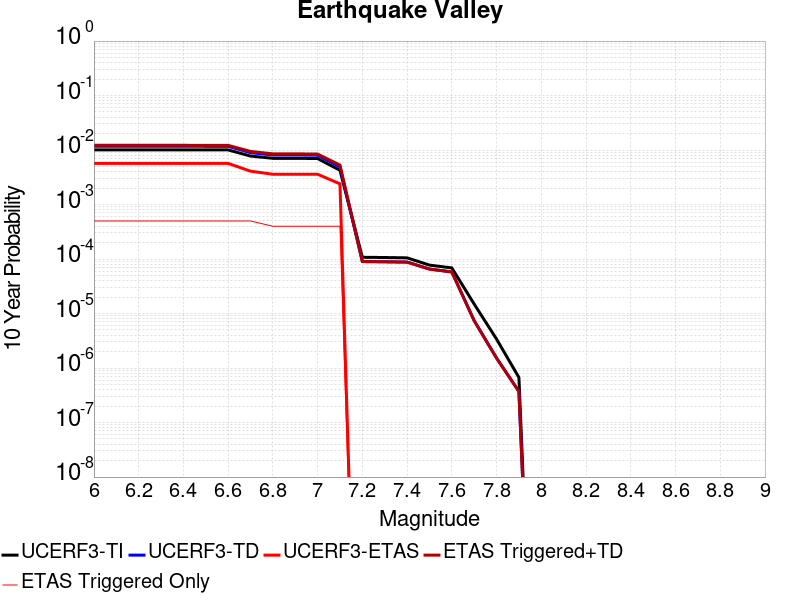 |

| Magnitude | 1 wk TI Prob | 1 wk TD Prob | 1 wk ETAS Prob | 1 wk ETAS/TD Gain | 1 wk ETAS Triggered+TD | 1 wk ETAS Triggered Only | 1 mo TI Prob | 1 mo TD Prob | 1 mo ETAS Prob | 1 mo ETAS/TD Gain | 1 mo ETAS Triggered+TD | 1 mo ETAS Triggered Only | 1 yr TI Prob | 1 yr TD Prob | 1 yr ETAS Prob | 1 yr ETAS/TD Gain | 1 yr ETAS Triggered+TD | 1 yr ETAS Triggered Only | 10 yr TI Prob | 10 yr TD Prob | 10 yr ETAS Prob | 10 yr ETAS/TD Gain | 10 yr ETAS Triggered+TD | 10 yr ETAS Triggered Only |
|-----|-----|-----|-----|-----|-----|-----|-----|-----|-----|-----|-----|-----|-----|-----|-----|-----|-----|-----|-----|-----|-----|-----|-----|-----|
| 6.0 | 1.9416384E-5 | 2.2591908E-5 | 0.0 | 0.0 | 2.2591908E-5 | 0.0 | 8.321042E-5 | 9.6819545E-5 | 0.0 | 0.0 | 9.6819545E-5 | 0.0 | 0.001012616 | 0.0011782603 | 0.0 | 0.0 | 0.0011782603 | 0.0 | 0.010080142 | 0.011731971 | 5.0E-4 | 0.042618584 | 0.012226106 | 5.0E-4 |
| 6.1 | 1.9416384E-5 | 2.2591908E-5 | 0.0 | 0.0 | 2.2591908E-5 | 0.0 | 8.321042E-5 | 9.6819545E-5 | 0.0 | 0.0 | 9.6819545E-5 | 0.0 | 0.001012616 | 0.0011782603 | 0.0 | 0.0 | 0.0011782603 | 0.0 | 0.010080142 | 0.011731971 | 5.0E-4 | 0.042618584 | 0.012226106 | 5.0E-4 |
| 6.2 | 1.9416384E-5 | 2.2591908E-5 | 0.0 | 0.0 | 2.2591908E-5 | 0.0 | 8.321042E-5 | 9.6819545E-5 | 0.0 | 0.0 | 9.6819545E-5 | 0.0 | 0.001012616 | 0.0011782603 | 0.0 | 0.0 | 0.0011782603 | 0.0 | 0.010080142 | 0.011731971 | 5.0E-4 | 0.042618584 | 0.012226106 | 5.0E-4 |
| 6.3 | 1.9416384E-5 | 2.2591908E-5 | 0.0 | 0.0 | 2.2591908E-5 | 0.0 | 8.321042E-5 | 9.6819545E-5 | 0.0 | 0.0 | 9.6819545E-5 | 0.0 | 0.001012616 | 0.0011782603 | 0.0 | 0.0 | 0.0011782603 | 0.0 | 0.010080142 | 0.011731971 | 5.0E-4 | 0.042618584 | 0.012226106 | 5.0E-4 |
| 6.4 | 1.9416384E-5 | 2.2591908E-5 | 0.0 | 0.0 | 2.2591908E-5 | 0.0 | 8.321042E-5 | 9.6819545E-5 | 0.0 | 0.0 | 9.6819545E-5 | 0.0 | 0.001012616 | 0.0011782603 | 0.0 | 0.0 | 0.0011782603 | 0.0 | 0.010080142 | 0.011731971 | 5.0E-4 | 0.042618584 | 0.012226106 | 5.0E-4 |
| 6.5 | 1.9389157E-5 | 2.2560487E-5 | 0.0 | 0.0 | 2.2560487E-5 | 0.0 | 8.309374E-5 | 9.66849E-5 | 0.0 | 0.0 | 9.66849E-5 | 0.0 | 0.0010111968 | 0.0011766227 | 0.0 | 0.0 | 0.0011766227 | 0.0 | 0.010066078 | 0.011715768 | 5.0E-4 | 0.042677525 | 0.01220991 | 5.0E-4 |
| 6.6 | 1.9389157E-5 | 2.2560487E-5 | 0.0 | 0.0 | 2.2560487E-5 | 0.0 | 8.309374E-5 | 9.66849E-5 | 0.0 | 0.0 | 9.66849E-5 | 0.0 | 0.0010111968 | 0.0011766227 | 0.0 | 0.0 | 0.0011766227 | 0.0 | 0.010066078 | 0.011715768 | 5.0E-4 | 0.042677525 | 0.01220991 | 5.0E-4 |
| 6.7 | 1.4925434E-5 | 1.7213835E-5 | 0.0 | 0.0 | 1.7213835E-5 | 0.0 | 6.396457E-5 | 7.3771975E-5 | 0.0 | 0.0 | 7.3771975E-5 | 0.0 | 7.7849044E-4 | 8.9788873E-4 | 0.0 | 0.0 | 8.9788873E-4 | 0.0 | 0.007757689 | 0.008950991 | 5.0E-4 | 0.055859737 | 0.009446515 | 5.0E-4 |
| 6.8 | 1.3570335E-5 | 1.562188E-5 | 0.0 | 0.0 | 1.562188E-5 | 0.0 | 5.8157282E-5 | 6.694966E-5 | 0.0 | 0.0 | 6.694966E-5 | 0.0 | 7.0783484E-4 | 8.148894E-4 | 0.0 | 0.0 | 8.148894E-4 | 0.0 | 0.0070558446 | 0.008127089 | 4.0E-4 | 0.04921812 | 0.008523838 | 4.0E-4 |
| 6.9 | 1.3570335E-5 | 1.562188E-5 | 0.0 | 0.0 | 1.562188E-5 | 0.0 | 5.8157282E-5 | 6.694966E-5 | 0.0 | 0.0 | 6.694966E-5 | 0.0 | 7.0783484E-4 | 8.148894E-4 | 0.0 | 0.0 | 8.148894E-4 | 0.0 | 0.0070558446 | 0.008127089 | 4.0E-4 | 0.04921812 | 0.008523838 | 4.0E-4 |
| 7.0 | 1.3433392E-5 | 1.5465377E-5 | 0.0 | 0.0 | 1.5465377E-5 | 0.0 | 5.757041E-5 | 6.627897E-5 | 0.0 | 0.0 | 6.627897E-5 | 0.0 | 7.0069433E-4 | 8.067298E-4 | 0.0 | 0.0 | 8.067298E-4 | 0.0 | 0.006984891 | 0.008046085 | 4.0E-4 | 0.04971362 | 0.008442867 | 4.0E-4 |
| 7.1 | 8.181609E-6 | 9.419964E-6 | 0.0 | 0.0 | 9.419964E-6 | 0.0 | 3.5063567E-5 | 4.037103E-5 | 0.0 | 0.0 | 4.037103E-5 | 0.0 | 4.268153E-4 | 4.9147353E-4 | 0.0 | 0.0 | 4.9147353E-4 | 0.0 | 0.0042599645 | 0.0049104467 | 4.0E-4 | 0.081458986 | 0.0053084823 | 4.0E-4 |
| 7.2 | 2.0663983E-7 | 1.7271272E-7 | 0.0 | 0.0 | 1.7271272E-7 | 0.0 | 8.855989E-7 | 7.4019715E-7 | 0.0 | 0.0 | 7.4019715E-7 | 0.0 | 1.0782113E-5 | 9.0118665E-6 | 0.0 | 0.0 | 9.0118665E-6 | 0.0 | 1.07815904E-4 | 9.011537E-5 | 0.0 | 0.0 | 9.011537E-5 | 0.0 |
| 7.3 | 2.0462376E-7 | 1.708672E-7 | 0.0 | 0.0 | 1.708672E-7 | 0.0 | 8.7695867E-7 | 7.322878E-7 | 0.0 | 0.0 | 7.322878E-7 | 0.0 | 1.0676919E-5 | 8.915571E-6 | 0.0 | 0.0 | 8.915571E-6 | 0.0 | 1.0676406E-4 | 8.915249E-5 | 0.0 | 0.0 | 8.915249E-5 | 0.0 |
| 7.4 | 2.0171088E-7 | 1.6869102E-7 | 0.0 | 0.0 | 1.6869102E-7 | 0.0 | 8.644749E-7 | 7.229613E-7 | 0.0 | 0.0 | 7.229613E-7 | 0.0 | 1.0524931E-5 | 8.802022E-6 | 0.0 | 0.0 | 8.802022E-6 | 0.0 | 1.05244326E-4 | 8.80171E-5 | 0.0 | 0.0 | 8.80171E-5 | 0.0 |
| 7.5 | 1.4847944E-7 | 1.2565965E-7 | 0.0 | 0.0 | 1.2565965E-7 | 0.0 | 6.363403E-7 | 5.385413E-7 | 0.0 | 0.0 | 5.385413E-7 | 0.0 | 7.747416E-6 | 6.556723E-6 | 0.0 | 0.0 | 6.556723E-6 | 0.0 | 7.747146E-5 | 6.556551E-5 | 0.0 | 0.0 | 6.556551E-5 | 0.0 |
| 7.6 | 1.3185847E-7 | 1.1129282E-7 | 0.0 | 0.0 | 1.1129282E-7 | 0.0 | 5.6510765E-7 | 4.7696915E-7 | 0.0 | 0.0 | 4.7696915E-7 | 0.0 | 6.8801637E-6 | 5.8070864E-6 | 0.0 | 0.0 | 5.8070864E-6 | 0.0 | 6.8799505E-5 | 5.8069556E-5 | 0.0 | 0.0 | 5.8069556E-5 | 0.0 |
| 7.7 | 2.8609954E-8 | 1.4180901E-8 | 0.0 | 0.0 | 1.4180901E-8 | 0.0 | 1.2261408E-7 | 6.077529E-8 | 0.0 | 0.0 | 6.077529E-8 | 0.0 | 1.4928254E-6 | 7.3993897E-7 | 0.0 | 0.0 | 7.3993897E-7 | 0.0 | 1.4928154E-5 | 7.39937E-6 | 0.0 | 0.0 | 7.39937E-6 | 0.0 |
| 7.8 | 6.527266E-9 | 2.9251286E-9 | 0.0 | 0.0 | 2.9251286E-9 | 0.0 | 2.7973995E-8 | 1.2536266E-8 | 0.0 | 0.0 | 1.2536266E-8 | 0.0 | 3.4058334E-7 | 1.5262903E-7 | 0.0 | 0.0 | 1.5262903E-7 | 0.0 | 3.4058282E-6 | 1.5262896E-6 | 0.0 | 0.0 | 1.5262896E-6 | 0.0 |
| 7.9 | 1.2898267E-9 | 7.131178E-10 | 0.0 | 0.0 | 7.131178E-10 | 0.0 | 5.527829E-9 | 3.0562193E-9 | 0.0 | 0.0 | 3.0562193E-9 | 0.0 | 6.7301315E-8 | 3.7209468E-8 | 0.0 | 0.0 | 3.7209468E-8 | 0.0 | 6.7301295E-7 | 3.720947E-7 | 0.0 | 0.0 | 3.720947E-7 | 0.0 |

## Contra Costa Shear Zone (connector) 2011 CFM
*[(top)](#table-of-contents)*

| 1 Week | 1 Month | 1 Year | 10 Year |
|-----|-----|-----|-----|
| 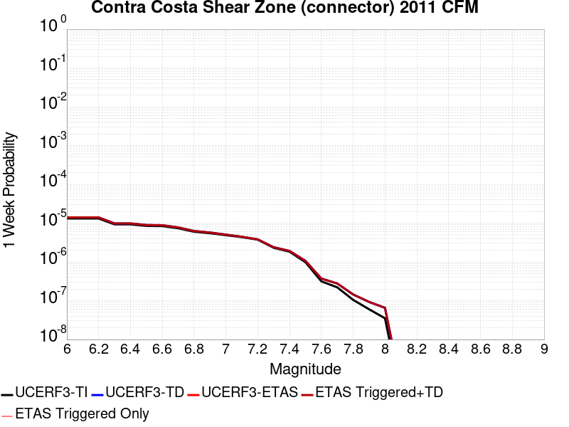 |  | 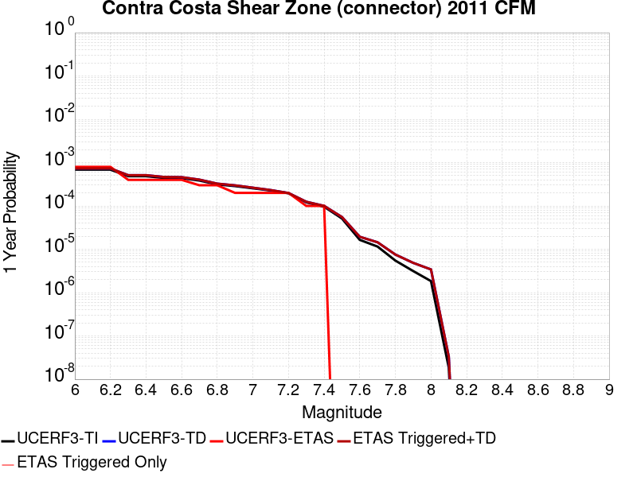 |  |

| Magnitude | 1 wk TI Prob | 1 wk TD Prob | 1 wk ETAS Prob | 1 wk ETAS/TD Gain | 1 wk ETAS Triggered+TD | 1 wk ETAS Triggered Only | 1 mo TI Prob | 1 mo TD Prob | 1 mo ETAS Prob | 1 mo ETAS/TD Gain | 1 mo ETAS Triggered+TD | 1 mo ETAS Triggered Only | 1 yr TI Prob | 1 yr TD Prob | 1 yr ETAS Prob | 1 yr ETAS/TD Gain | 1 yr ETAS Triggered+TD | 1 yr ETAS Triggered Only | 10 yr TI Prob | 10 yr TD Prob | 10 yr ETAS Prob | 10 yr ETAS/TD Gain | 10 yr ETAS Triggered+TD | 10 yr ETAS Triggered Only |
|-----|-----|-----|-----|-----|-----|-----|-----|-----|-----|-----|-----|-----|-----|-----|-----|-----|-----|-----|-----|-----|-----|-----|-----|-----|
| 6.0 | 1.3187427E-5 | 1.4045369E-5 | 0.0 | 0.0 | 1.4045369E-5 | 0.0 | 5.6516317E-5 | 6.0193182E-5 | 0.0 | 0.0 | 6.0193182E-5 | 0.0 | 6.878689E-4 | 7.326284E-4 | 0.0 | 0.0 | 7.326284E-4 | 0.0 | 0.006857436 | 0.0073084785 | 5.0E-4 | 0.0684137 | 0.007804824 | 5.0E-4 |
| 6.1 | 1.3187427E-5 | 1.4045369E-5 | 0.0 | 0.0 | 1.4045369E-5 | 0.0 | 5.6516317E-5 | 6.0193182E-5 | 0.0 | 0.0 | 6.0193182E-5 | 0.0 | 6.878689E-4 | 7.326284E-4 | 0.0 | 0.0 | 7.326284E-4 | 0.0 | 0.006857436 | 0.0073084785 | 5.0E-4 | 0.0684137 | 0.007804824 | 5.0E-4 |
| 6.2 | 1.3187427E-5 | 1.4045369E-5 | 0.0 | 0.0 | 1.4045369E-5 | 0.0 | 5.6516317E-5 | 6.0193182E-5 | 0.0 | 0.0 | 6.0193182E-5 | 0.0 | 6.878689E-4 | 7.326284E-4 | 0.0 | 0.0 | 7.326284E-4 | 0.0 | 0.006857436 | 0.0073084785 | 5.0E-4 | 0.0684137 | 0.007804824 | 5.0E-4 |
| 6.3 | 9.315374E-6 | 9.827525E-6 | 0.0 | 0.0 | 9.827525E-6 | 0.0 | 3.992242E-5 | 4.2117306E-5 | 0.0 | 0.0 | 4.2117306E-5 | 0.0 | 4.8594706E-4 | 5.126617E-4 | 0.0 | 0.0 | 5.126617E-4 | 0.0 | 0.004848858 | 0.005119292 | 5.0E-4 | 0.09766976 | 0.0056167324 | 5.0E-4 |
| 6.4 | 9.315374E-6 | 9.827525E-6 | 0.0 | 0.0 | 9.827525E-6 | 0.0 | 3.992242E-5 | 4.2117306E-5 | 0.0 | 0.0 | 4.2117306E-5 | 0.0 | 4.8594706E-4 | 5.126617E-4 | 0.0 | 0.0 | 5.126617E-4 | 0.0 | 0.004848858 | 0.005119292 | 5.0E-4 | 0.09766976 | 0.0056167324 | 5.0E-4 |
| 6.5 | 8.492638E-6 | 8.941066E-6 | 0.0 | 0.0 | 8.941066E-6 | 0.0 | 3.639651E-5 | 3.831831E-5 | 0.0 | 0.0 | 3.831831E-5 | 0.0 | 4.430374E-4 | 4.6642893E-4 | 0.0 | 0.0 | 4.6642893E-4 | 0.0 | 0.0044215517 | 0.0046589253 | 4.0E-4 | 0.085856706 | 0.005057062 | 4.0E-4 |
| 6.6 | 8.402072E-6 | 8.8418465E-6 | 0.0 | 0.0 | 8.8418465E-6 | 0.0 | 3.6008387E-5 | 3.7893096E-5 | 0.0 | 0.0 | 3.7893096E-5 | 0.0 | 4.383139E-4 | 4.6125412E-4 | 0.0 | 0.0 | 4.6125412E-4 | 0.0 | 0.0043745036 | 0.004607393 | 3.0E-4 | 0.06511274 | 0.004906011 | 3.0E-4 |
| 6.7 | 7.383587E-6 | 7.74928E-6 | 0.0 | 0.0 | 7.74928E-6 | 0.0 | 3.164356E-5 | 3.3210785E-5 | 0.0 | 0.0 | 3.3210785E-5 | 0.0 | 3.8519225E-4 | 4.042684E-4 | 0.0 | 0.0 | 4.042684E-4 | 0.0 | 0.0038452526 | 0.00403963 | 3.0E-4 | 0.07426423 | 0.0043384177 | 3.0E-4 |
| 6.8 | 6.004921E-6 | 6.2667277E-6 | 0.0 | 0.0 | 6.2667277E-6 | 0.0 | 2.5735122E-5 | 2.6857131E-5 | 0.0 | 0.0 | 2.6857131E-5 | 0.0 | 3.1328006E-4 | 3.2693704E-4 | 0.0 | 0.0 | 3.2693704E-4 | 0.0 | 0.0031283877 | 0.0032687068 | 3.0E-4 | 0.09177942 | 0.0035677261 | 3.0E-4 |
| 6.9 | 5.505255E-6 | 5.719028E-6 | 0.0 | 0.0 | 5.719028E-6 | 0.0 | 2.3593739E-5 | 2.4509893E-5 | 0.0 | 0.0 | 2.4509893E-5 | 0.0 | 2.872159E-4 | 2.9836752E-4 | 0.0 | 0.0 | 2.9836752E-4 | 0.0 | 0.0028684495 | 0.0029838067 | 2.0E-4 | 0.06702847 | 0.0031832098 | 2.0E-4 |
| 7.0 | 4.891922E-6 | 5.0495773E-6 | 0.0 | 0.0 | 5.0495773E-6 | 0.0 | 2.096521E-5 | 2.1640868E-5 | 0.0 | 0.0 | 2.1640868E-5 | 0.0 | 2.5522153E-4 | 2.6344607E-4 | 0.0 | 0.0 | 2.6344607E-4 | 0.0 | 0.0025492862 | 0.0026354669 | 2.0E-4 | 0.07588788 | 0.0028349399 | 2.0E-4 |
| 7.1 | 4.3599E-6 | 4.4534518E-6 | 0.0 | 0.0 | 4.4534518E-6 | 0.0 | 1.868515E-5 | 1.9086085E-5 | 0.0 | 0.0 | 1.9086085E-5 | 0.0 | 2.2746796E-4 | 2.3234857E-4 | 0.0 | 0.0 | 2.3234857E-4 | 0.0 | 0.0022723526 | 0.002325179 | 2.0E-4 | 0.08601488 | 0.002524714 | 2.0E-4 |
| 7.2 | 3.7647926E-6 | 3.80438E-6 | 0.0 | 0.0 | 3.80438E-6 | 0.0 | 1.6134725E-5 | 1.6304386E-5 | 0.0 | 0.0 | 1.6304386E-5 | 0.0 | 1.9642258E-4 | 1.9848807E-4 | 0.0 | 0.0 | 1.9848807E-4 | 0.0 | 0.0019624906 | 0.001987224 | 2.0E-4 | 0.100642905 | 0.0021868267 | 2.0E-4 |
| 7.3 | 2.3179882E-6 | 2.3922623E-6 | 0.0 | 0.0 | 2.3922623E-6 | 0.0 | 9.934198E-6 | 1.0252513E-5 | 0.0 | 0.0 | 1.0252513E-5 | 0.0 | 1.20942146E-4 | 1.2481725E-4 | 0.0 | 0.0 | 1.2481725E-4 | 0.0 | 0.0012087635 | 0.0012515506 | 2.0E-4 | 0.15980177 | 0.0014513003 | 2.0E-4 |
| 7.4 | 1.8378355E-6 | 1.9193876E-6 | 0.0 | 0.0 | 1.9193876E-6 | 0.0 | 7.876414E-6 | 8.225921E-6 | 0.0 | 0.0 | 8.225921E-6 | 0.0 | 9.5891126E-5 | 1.00146026E-4 | 0.0 | 0.0 | 1.00146026E-4 | 0.0 | 9.584976E-4 | 0.0010049498 | 2.0E-4 | 0.1990149 | 0.0012047489 | 2.0E-4 |
| 7.5 | 9.840493E-7 | 1.0631026E-6 | 0.0 | 0.0 | 1.0631026E-6 | 0.0 | 4.2173474E-6 | 4.556146E-6 | 0.0 | 0.0 | 4.556146E-6 | 0.0 | 5.1344992E-5 | 5.546968E-5 | 0.0 | 0.0 | 5.546968E-5 | 0.0 | 5.133313E-4 | 5.58209E-4 | 0.0 | 0.0 | 5.58209E-4 | 0.0 |
| 7.6 | 3.1602997E-7 | 3.7080514E-7 | 0.0 | 0.0 | 3.7080514E-7 | 0.0 | 1.3544135E-6 | 1.589164E-6 | 0.0 | 0.0 | 1.589164E-6 | 0.0 | 1.648986E-5 | 1.93479E-5 | 0.0 | 0.0 | 1.93479E-5 | 0.0 | 1.6488635E-4 | 1.9697164E-4 | 0.0 | 0.0 | 1.9697164E-4 | 0.0 |
| 7.7 | 2.2125788E-7 | 2.7638123E-7 | 0.0 | 0.0 | 2.7638123E-7 | 0.0 | 9.482477E-7 | 1.1844904E-6 | 0.0 | 0.0 | 1.1844904E-6 | 0.0 | 1.1544855E-5 | 1.4421076E-5 | 0.0 | 0.0 | 1.4421076E-5 | 0.0 | 1.1544255E-4 | 1.4767371E-4 | 0.0 | 0.0 | 1.4767371E-4 | 0.0 |
| 7.8 | 1.0509553E-7 | 1.4424394E-7 | 0.0 | 0.0 | 1.4424394E-7 | 0.0 | 4.5040935E-7 | 6.1818815E-7 | 0.0 | 0.0 | 6.1818815E-7 | 0.0 | 5.48372E-6 | 7.526415E-6 | 0.0 | 0.0 | 7.526415E-6 | 0.0 | 5.4835844E-5 | 7.755616E-5 | 0.0 | 0.0 | 7.755616E-5 | 0.0 |
| 7.9 | 6.029319E-8 | 9.278125E-8 | 0.0 | 0.0 | 9.278125E-8 | 0.0 | 2.5839938E-7 | 3.9763384E-7 | 0.0 | 0.0 | 3.9763384E-7 | 0.0 | 3.1460077E-6 | 4.841181E-6 | 0.0 | 0.0 | 4.841181E-6 | 0.0 | 3.1459633E-5 | 4.998485E-5 | 0.0 | 0.0 | 4.998485E-5 | 0.0 |
| 8.0 | 3.531068E-8 | 6.53831E-8 | 0.0 | 0.0 | 6.53831E-8 | 0.0 | 1.5133148E-7 | 2.8021324E-7 | 0.0 | 0.0 | 2.8021324E-7 | 0.0 | 1.8424593E-6 | 3.4115913E-6 | 0.0 | 0.0 | 3.4115913E-6 | 0.0 | 1.842444E-5 | 3.524893E-5 | 0.0 | 0.0 | 3.524893E-5 | 0.0 |
| 8.1 | 3.5238246E-10 | 6.285037E-10 | 0.0 | 0.0 | 6.285037E-10 | 0.0 | 1.5102107E-9 | 2.6935871E-9 | 0.0 | 0.0 | 2.6935871E-9 | 0.0 | 1.8386816E-8 | 3.279443E-8 | 0.0 | 0.0 | 3.279443E-8 | 0.0 | 1.8386814E-7 | 3.3586792E-7 | 0.0 | 0.0 | 3.3586792E-7 | 0.0 |

## Fish Slough 2011 CFM
*[(top)](#table-of-contents)*

| 1 Week | 1 Month | 1 Year | 10 Year |
|-----|-----|-----|-----|
|  |  |  | 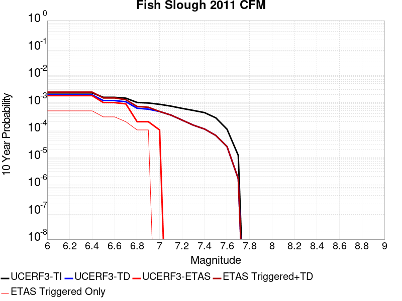 |

| Magnitude | 1 wk TI Prob | 1 wk TD Prob | 1 wk ETAS Prob | 1 wk ETAS/TD Gain | 1 wk ETAS Triggered+TD | 1 wk ETAS Triggered Only | 1 mo TI Prob | 1 mo TD Prob | 1 mo ETAS Prob | 1 mo ETAS/TD Gain | 1 mo ETAS Triggered+TD | 1 mo ETAS Triggered Only | 1 yr TI Prob | 1 yr TD Prob | 1 yr ETAS Prob | 1 yr ETAS/TD Gain | 1 yr ETAS Triggered+TD | 1 yr ETAS Triggered Only | 10 yr TI Prob | 10 yr TD Prob | 10 yr ETAS Prob | 10 yr ETAS/TD Gain | 10 yr ETAS Triggered+TD | 10 yr ETAS Triggered Only |
|-----|-----|-----|-----|-----|-----|-----|-----|-----|-----|-----|-----|-----|-----|-----|-----|-----|-----|-----|-----|-----|-----|-----|-----|-----|
| 6.0 | 4.3629925E-6 | 3.6774973E-6 | 0.0 | 0.0 | 3.6774973E-6 | 0.0 | 1.8698405E-5 | 1.576062E-5 | 0.0 | 0.0 | 1.576062E-5 | 0.0 | 2.276293E-4 | 1.9187076E-4 | 2.0E-4 | 1.0423683 | 3.9183238E-4 | 2.0E-4 | 0.0022739628 | 0.00191726 | 5.0E-4 | 0.26078883 | 0.0024163013 | 5.0E-4 |
| 6.1 | 4.3629925E-6 | 3.6774973E-6 | 0.0 | 0.0 | 3.6774973E-6 | 0.0 | 1.8698405E-5 | 1.576062E-5 | 0.0 | 0.0 | 1.576062E-5 | 0.0 | 2.276293E-4 | 1.9187076E-4 | 2.0E-4 | 1.0423683 | 3.9183238E-4 | 2.0E-4 | 0.0022739628 | 0.00191726 | 5.0E-4 | 0.26078883 | 0.0024163013 | 5.0E-4 |
| 6.2 | 4.3629925E-6 | 3.6774973E-6 | 0.0 | 0.0 | 3.6774973E-6 | 0.0 | 1.8698405E-5 | 1.576062E-5 | 0.0 | 0.0 | 1.576062E-5 | 0.0 | 2.276293E-4 | 1.9187076E-4 | 2.0E-4 | 1.0423683 | 3.9183238E-4 | 2.0E-4 | 0.0022739628 | 0.00191726 | 5.0E-4 | 0.26078883 | 0.0024163013 | 5.0E-4 |
| 6.3 | 4.3629925E-6 | 3.6774973E-6 | 0.0 | 0.0 | 3.6774973E-6 | 0.0 | 1.8698405E-5 | 1.576062E-5 | 0.0 | 0.0 | 1.576062E-5 | 0.0 | 2.276293E-4 | 1.9187076E-4 | 2.0E-4 | 1.0423683 | 3.9183238E-4 | 2.0E-4 | 0.0022739628 | 0.00191726 | 5.0E-4 | 0.26078883 | 0.0024163013 | 5.0E-4 |
| 6.4 | 4.3629925E-6 | 3.6774973E-6 | 0.0 | 0.0 | 3.6774973E-6 | 0.0 | 1.8698405E-5 | 1.576062E-5 | 0.0 | 0.0 | 1.576062E-5 | 0.0 | 2.276293E-4 | 1.9187076E-4 | 2.0E-4 | 1.0423683 | 3.9183238E-4 | 2.0E-4 | 0.0022739628 | 0.00191726 | 5.0E-4 | 0.26078883 | 0.0024163013 | 5.0E-4 |
| 6.5 | 2.991715E-6 | 2.270542E-6 | 0.0 | 0.0 | 2.270542E-6 | 0.0 | 1.2821573E-5 | 9.730863E-6 | 0.0 | 0.0 | 9.730863E-6 | 0.0 | 1.5609147E-4 | 1.1846773E-4 | 0.0 | 0.0 | 1.1846773E-4 | 0.0 | 0.0015598187 | 0.0011841359 | 3.0E-4 | 0.2533493 | 0.0014837807 | 3.0E-4 |
| 6.6 | 2.991715E-6 | 2.270542E-6 | 0.0 | 0.0 | 2.270542E-6 | 0.0 | 1.2821573E-5 | 9.730863E-6 | 0.0 | 0.0 | 9.730863E-6 | 0.0 | 1.5609147E-4 | 1.1846773E-4 | 0.0 | 0.0 | 1.1846773E-4 | 0.0 | 0.0015598187 | 0.0011841359 | 3.0E-4 | 0.2533493 | 0.0014837807 | 3.0E-4 |
| 6.7 | 2.7890346E-6 | 2.0623258E-6 | 0.0 | 0.0 | 2.0623258E-6 | 0.0 | 1.1952951E-5 | 8.838514E-6 | 0.0 | 0.0 | 8.838514E-6 | 0.0 | 1.4551746E-4 | 1.07604494E-4 | 0.0 | 0.0 | 1.07604494E-4 | 0.0 | 0.0014542221 | 0.0010756123 | 2.0E-4 | 0.18594062 | 0.0012753971 | 2.0E-4 |
| 6.8 | 1.9416723E-6 | 1.1926485E-6 | 0.0 | 0.0 | 1.1926485E-6 | 0.0 | 8.321425E-6 | 5.111341E-6 | 0.0 | 0.0 | 5.111341E-6 | 0.0 | 1.01308644E-4 | 6.222884E-5 | 0.0 | 0.0 | 6.222884E-5 | 0.0 | 0.0010126247 | 6.2211824E-4 | 1.0E-4 | 0.16074115 | 7.22056E-4 | 1.0E-4 |
| 6.9 | 1.8567416E-6 | 1.1047838E-6 | 0.0 | 0.0 | 1.1047838E-6 | 0.0 | 7.957439E-6 | 4.7347794E-6 | 0.0 | 0.0 | 4.7347794E-6 | 0.0 | 9.687752E-5 | 5.764445E-5 | 0.0 | 0.0 | 5.764445E-5 | 0.0 | 9.6835295E-4 | 5.7629886E-4 | 1.0E-4 | 0.17352107 | 6.7624124E-4 | 1.0E-4 |
| 7.0 | 1.6634067E-6 | 9.0747164E-7 | 0.0 | 0.0 | 9.0747164E-7 | 0.0 | 7.1288664E-6 | 3.8891585E-6 | 0.0 | 0.0 | 3.8891585E-6 | 0.0 | 8.679049E-5 | 4.7349506E-5 | 0.0 | 0.0 | 4.7349506E-5 | 0.0 | 8.6756604E-4 | 4.7339709E-4 | 0.0 | 0.0 | 4.7339709E-4 | 0.0 |
| 7.1 | 1.4281054E-6 | 6.7371985E-7 | 0.0 | 0.0 | 6.7371985E-7 | 0.0 | 6.1204373E-6 | 2.8873676E-6 | 0.0 | 0.0 | 2.8873676E-6 | 0.0 | 7.451377E-5 | 3.5153153E-5 | 0.0 | 0.0 | 3.5153153E-5 | 0.0 | 7.44888E-4 | 3.514777E-4 | 0.0 | 0.0 | 3.514777E-4 | 0.0 |
| 7.2 | 1.1810387E-6 | 4.408762E-7 | 0.0 | 0.0 | 4.408762E-7 | 0.0 | 5.0615845E-6 | 1.8894681E-6 | 0.0 | 0.0 | 1.8894681E-6 | 0.0 | 6.1623046E-5 | 2.300404E-5 | 0.0 | 0.0 | 2.300404E-5 | 0.0 | 6.160596E-4 | 2.300175E-4 | 0.0 | 0.0 | 2.300175E-4 | 0.0 |
| 7.3 | 9.918052E-7 | 2.8736375E-7 | 0.0 | 0.0 | 2.8736375E-7 | 0.0 | 4.2505867E-6 | 1.2315584E-6 | 0.0 | 0.0 | 1.2315584E-6 | 0.0 | 5.1749663E-5 | 1.4994121E-5 | 0.0 | 0.0 | 1.4994121E-5 | 0.0 | 5.173762E-4 | 1.499312E-4 | 0.0 | 0.0 | 1.499312E-4 | 0.0 |
| 7.4 | 8.25252E-7 | 2.0697148E-7 | 0.0 | 0.0 | 2.0697148E-7 | 0.0 | 3.5367896E-6 | 8.8702035E-7 | 0.0 | 0.0 | 8.8702035E-7 | 0.0 | 4.3059565E-5 | 1.079942E-5 | 0.0 | 0.0 | 1.079942E-5 | 0.0 | 4.305122E-4 | 1.0798902E-4 | 0.0 | 0.0 | 1.0798902E-4 | 0.0 |
| 7.5 | 5.3248567E-7 | 1.2074366E-7 | 0.0 | 0.0 | 1.2074366E-7 | 0.0 | 2.2820795E-6 | 5.1747276E-7 | 0.0 | 0.0 | 5.1747276E-7 | 0.0 | 2.7783964E-5 | 6.300213E-6 | 0.0 | 0.0 | 6.300213E-6 | 0.0 | 2.778049E-4 | 6.3000385E-5 | 0.0 | 0.0 | 6.3000385E-5 | 0.0 |
| 7.6 | 2.037542E-7 | 4.713582E-8 | 0.0 | 0.0 | 4.713582E-8 | 0.0 | 8.73232E-7 | 2.0201064E-7 | 0.0 | 0.0 | 2.0201064E-7 | 0.0 | 1.0631547E-5 | 2.459477E-6 | 0.0 | 0.0 | 2.459477E-6 | 0.0 | 1.0631039E-4 | 2.459452E-5 | 0.0 | 0.0 | 2.459452E-5 | 0.0 |
| 7.7 | 2.2501226E-8 | 3.1515268E-9 | 0.0 | 0.0 | 3.1515268E-9 | 0.0 | 9.6433816E-8 | 1.3506543E-8 | 0.0 | 0.0 | 1.3506543E-8 | 0.0 | 1.1740811E-6 | 1.6444216E-7 | 0.0 | 0.0 | 1.6444216E-7 | 0.0 | 1.1740749E-5 | 1.6444204E-6 | 0.0 | 0.0 | 1.6444204E-6 | 0.0 |

## Los Alamos extension
*[(top)](#table-of-contents)*

| 1 Week | 1 Month | 1 Year | 10 Year |
|-----|-----|-----|-----|
|  |  |  |  |

| Magnitude | 1 wk TI Prob | 1 wk TD Prob | 1 wk ETAS Prob | 1 wk ETAS/TD Gain | 1 wk ETAS Triggered+TD | 1 wk ETAS Triggered Only | 1 mo TI Prob | 1 mo TD Prob | 1 mo ETAS Prob | 1 mo ETAS/TD Gain | 1 mo ETAS Triggered+TD | 1 mo ETAS Triggered Only | 1 yr TI Prob | 1 yr TD Prob | 1 yr ETAS Prob | 1 yr ETAS/TD Gain | 1 yr ETAS Triggered+TD | 1 yr ETAS Triggered Only | 10 yr TI Prob | 10 yr TD Prob | 10 yr ETAS Prob | 10 yr ETAS/TD Gain | 10 yr ETAS Triggered+TD | 10 yr ETAS Triggered Only |
|-----|-----|-----|-----|-----|-----|-----|-----|-----|-----|-----|-----|-----|-----|-----|-----|-----|-----|-----|-----|-----|-----|-----|-----|-----|
| 6.0 | 4.0146506E-6 | 4.086487E-6 | 0.0 | 0.0 | 4.086487E-6 | 0.0 | 1.7205533E-5 | 1.7513405E-5 | 0.0 | 0.0 | 1.7513405E-5 | 0.0 | 2.0945723E-4 | 2.1320595E-4 | 0.0 | 0.0 | 2.1320595E-4 | 0.0 | 0.0020925992 | 0.002130123 | 5.0E-4 | 0.23472822 | 0.002629058 | 5.0E-4 |
| 6.1 | 4.0146506E-6 | 4.086487E-6 | 0.0 | 0.0 | 4.086487E-6 | 0.0 | 1.7205533E-5 | 1.7513405E-5 | 0.0 | 0.0 | 1.7513405E-5 | 0.0 | 2.0945723E-4 | 2.1320595E-4 | 0.0 | 0.0 | 2.1320595E-4 | 0.0 | 0.0020925992 | 0.002130123 | 5.0E-4 | 0.23472822 | 0.002629058 | 5.0E-4 |
| 6.2 | 4.0146506E-6 | 4.086487E-6 | 0.0 | 0.0 | 4.086487E-6 | 0.0 | 1.7205533E-5 | 1.7513405E-5 | 0.0 | 0.0 | 1.7513405E-5 | 0.0 | 2.0945723E-4 | 2.1320595E-4 | 0.0 | 0.0 | 2.1320595E-4 | 0.0 | 0.0020925992 | 0.002130123 | 5.0E-4 | 0.23472822 | 0.002629058 | 5.0E-4 |
| 6.3 | 4.0146506E-6 | 4.086487E-6 | 0.0 | 0.0 | 4.086487E-6 | 0.0 | 1.7205533E-5 | 1.7513405E-5 | 0.0 | 0.0 | 1.7513405E-5 | 0.0 | 2.0945723E-4 | 2.1320595E-4 | 0.0 | 0.0 | 2.1320595E-4 | 0.0 | 0.0020925992 | 0.002130123 | 5.0E-4 | 0.23472822 | 0.002629058 | 5.0E-4 |
| 6.4 | 4.0146506E-6 | 4.086487E-6 | 0.0 | 0.0 | 4.086487E-6 | 0.0 | 1.7205533E-5 | 1.7513405E-5 | 0.0 | 0.0 | 1.7513405E-5 | 0.0 | 2.0945723E-4 | 2.1320595E-4 | 0.0 | 0.0 | 2.1320595E-4 | 0.0 | 0.0020925992 | 0.002130123 | 5.0E-4 | 0.23472822 | 0.002629058 | 5.0E-4 |
| 6.5 | 4.0146506E-6 | 4.086487E-6 | 0.0 | 0.0 | 4.086487E-6 | 0.0 | 1.7205533E-5 | 1.7513405E-5 | 0.0 | 0.0 | 1.7513405E-5 | 0.0 | 2.0945723E-4 | 2.1320595E-4 | 0.0 | 0.0 | 2.1320595E-4 | 0.0 | 0.0020925992 | 0.002130123 | 5.0E-4 | 0.23472822 | 0.002629058 | 5.0E-4 |
| 6.6 | 4.0146506E-6 | 4.086487E-6 | 0.0 | 0.0 | 4.086487E-6 | 0.0 | 1.7205533E-5 | 1.7513405E-5 | 0.0 | 0.0 | 1.7513405E-5 | 0.0 | 2.0945723E-4 | 2.1320595E-4 | 0.0 | 0.0 | 2.1320595E-4 | 0.0 | 0.0020925992 | 0.002130123 | 5.0E-4 | 0.23472822 | 0.002629058 | 5.0E-4 |
| 6.7 | 4.0146506E-6 | 4.086487E-6 | 0.0 | 0.0 | 4.086487E-6 | 0.0 | 1.7205533E-5 | 1.7513405E-5 | 0.0 | 0.0 | 1.7513405E-5 | 0.0 | 2.0945723E-4 | 2.1320595E-4 | 0.0 | 0.0 | 2.1320595E-4 | 0.0 | 0.0020925992 | 0.002130123 | 5.0E-4 | 0.23472822 | 0.002629058 | 5.0E-4 |
| 6.8 | 3.6584688E-6 | 3.7191628E-6 | 0.0 | 0.0 | 3.7191628E-6 | 0.0 | 1.5679057E-5 | 1.5939177E-5 | 0.0 | 0.0 | 1.5939177E-5 | 0.0 | 1.9087581E-4 | 1.9404312E-4 | 0.0 | 0.0 | 1.9404312E-4 | 0.0 | 0.0019071194 | 0.0019388294 | 5.0E-4 | 0.25788757 | 0.00243786 | 5.0E-4 |
| 6.9 | 3.644631E-6 | 3.7048717E-6 | 0.0 | 0.0 | 3.7048717E-6 | 0.0 | 1.5619753E-5 | 1.587793E-5 | 0.0 | 0.0 | 1.587793E-5 | 0.0 | 1.901539E-4 | 1.9329759E-4 | 0.0 | 0.0 | 1.9329759E-4 | 0.0 | 0.0018999127 | 0.001931387 | 5.0E-4 | 0.25888133 | 0.0024304213 | 5.0E-4 |
| 7.0 | 3.6318522E-6 | 3.6916313E-6 | 0.0 | 0.0 | 3.6916313E-6 | 0.0 | 1.5564989E-5 | 1.5821186E-5 | 0.0 | 0.0 | 1.5821186E-5 | 0.0 | 1.8948725E-4 | 1.9260685E-4 | 0.0 | 0.0 | 1.9260685E-4 | 0.0 | 0.0018932576 | 0.0019244916 | 5.0E-4 | 0.25980887 | 0.0024235293 | 5.0E-4 |
| 7.1 | 3.5001724E-6 | 3.555693E-6 | 0.0 | 0.0 | 3.555693E-6 | 0.0 | 1.5000653E-5 | 1.52386E-5 | 0.0 | 0.0 | 1.52386E-5 | 0.0 | 1.8261763E-4 | 1.8551508E-4 | 0.0 | 0.0 | 1.8551508E-4 | 0.0 | 0.0018246764 | 0.0018536928 | 5.0E-4 | 0.26973185 | 0.002352766 | 5.0E-4 |
| 7.2 | 2.5204702E-6 | 2.543919E-6 | 0.0 | 0.0 | 2.543919E-6 | 0.0 | 1.080197E-5 | 1.0902465E-5 | 0.0 | 0.0 | 1.0902465E-5 | 0.0 | 1.3150605E-4 | 1.3272947E-4 | 0.0 | 0.0 | 1.3272947E-4 | 0.0 | 0.0013142825 | 0.0013265077 | 3.0E-4 | 0.22615775 | 0.0016261097 | 3.0E-4 |
| 7.3 | 2.1399692E-6 | 2.1503286E-6 | 0.0 | 0.0 | 2.1503286E-6 | 0.0 | 9.1712645E-6 | 9.2156615E-6 | 0.0 | 0.0 | 9.2156615E-6 | 0.0 | 1.1165442E-4 | 1.1219493E-4 | 0.0 | 0.0 | 1.1219493E-4 | 0.0 | 0.0011159834 | 0.0011213862 | 2.0E-4 | 0.17835069 | 0.0013211619 | 2.0E-4 |
| 7.4 | 1.9660122E-6 | 1.9704205E-6 | 0.0 | 0.0 | 1.9704205E-6 | 0.0 | 8.42574E-6 | 8.444633E-6 | 0.0 | 0.0 | 8.444633E-6 | 0.0 | 1.0257855E-4 | 1.0280858E-4 | 0.0 | 0.0 | 1.0280858E-4 | 0.0 | 0.0010253121 | 0.0010276133 | 2.0E-4 | 0.19462574 | 0.0012274078 | 2.0E-4 |
| 7.5 | 1.7204633E-6 | 1.715262E-6 | 0.0 | 0.0 | 1.715262E-6 | 0.0 | 7.373393E-6 | 7.3511023E-6 | 0.0 | 0.0 | 7.3511023E-6 | 0.0 | 8.976737E-5 | 8.9496025E-5 | 0.0 | 0.0 | 8.9496025E-5 | 0.0 | 8.9731114E-4 | 8.946028E-4 | 0.0 | 0.0 | 8.946028E-4 | 0.0 |
| 7.6 | 1.3717638E-6 | 1.3537156E-6 | 0.0 | 0.0 | 1.3537156E-6 | 0.0 | 5.878974E-6 | 5.8016253E-6 | 0.0 | 0.0 | 5.8016253E-6 | 0.0 | 7.157416E-5 | 7.063252E-5 | 0.0 | 0.0 | 7.063252E-5 | 0.0 | 7.1551115E-4 | 7.061034E-4 | 0.0 | 0.0 | 7.061034E-4 | 0.0 |
| 7.7 | 8.272564E-7 | 7.9584595E-7 | 0.0 | 0.0 | 7.9584595E-7 | 0.0 | 3.5453797E-6 | 3.4107638E-6 | 0.0 | 0.0 | 3.4107638E-6 | 0.0 | 4.3164142E-5 | 4.152526E-5 | 0.0 | 0.0 | 4.152526E-5 | 0.0 | 4.315576E-4 | 4.1517522E-4 | 0.0 | 0.0 | 4.1517522E-4 | 0.0 |
| 7.8 | 3.9708277E-7 | 3.6723213E-7 | 0.0 | 0.0 | 3.6723213E-7 | 0.0 | 1.7017821E-6 | 1.573851E-6 | 0.0 | 0.0 | 1.573851E-6 | 0.0 | 2.0719E-5 | 1.9161467E-5 | 0.0 | 0.0 | 1.9161467E-5 | 0.0 | 2.071707E-4 | 1.9159823E-4 | 0.0 | 0.0 | 1.9159823E-4 | 0.0 |
| 7.9 | 9.292528E-8 | 7.890079E-8 | 0.0 | 0.0 | 7.890079E-8 | 0.0 | 3.9825116E-7 | 3.3814618E-7 | 0.0 | 0.0 | 3.3814618E-7 | 0.0 | 4.848697E-6 | 4.116922E-6 | 0.0 | 0.0 | 4.116922E-6 | 0.0 | 4.8485912E-5 | 4.1168467E-5 | 0.0 | 0.0 | 4.1168467E-5 | 0.0 |
| 8.0 | 7.880441E-11 | 8.2360785E-11 | 0.0 | 0.0 | 8.2360785E-11 | 0.0 | 3.3773329E-10 | 3.5297476E-10 | 0.0 | 0.0 | 3.5297476E-10 | 0.0 | 4.1119033E-9 | 4.297468E-9 | 0.0 | 0.0 | 4.297468E-9 | 0.0 | 4.1119034E-8 | 4.297468E-8 | 0.0 | 0.0 | 4.297468E-8 | 0.0 |

## Great Valley 04a Trout Creek
*[(top)](#table-of-contents)*

| 1 Week | 1 Month | 1 Year | 10 Year |
|-----|-----|-----|-----|
|  |  |  |  |

| Magnitude | 1 wk TI Prob | 1 wk TD Prob | 1 wk ETAS Prob | 1 wk ETAS/TD Gain | 1 wk ETAS Triggered+TD | 1 wk ETAS Triggered Only | 1 mo TI Prob | 1 mo TD Prob | 1 mo ETAS Prob | 1 mo ETAS/TD Gain | 1 mo ETAS Triggered+TD | 1 mo ETAS Triggered Only | 1 yr TI Prob | 1 yr TD Prob | 1 yr ETAS Prob | 1 yr ETAS/TD Gain | 1 yr ETAS Triggered+TD | 1 yr ETAS Triggered Only | 10 yr TI Prob | 10 yr TD Prob | 10 yr ETAS Prob | 10 yr ETAS/TD Gain | 10 yr ETAS Triggered+TD | 10 yr ETAS Triggered Only |
|-----|-----|-----|-----|-----|-----|-----|-----|-----|-----|-----|-----|-----|-----|-----|-----|-----|-----|-----|-----|-----|-----|-----|-----|-----|
| 6.0 | 1.4088538E-5 | 1.5723306E-5 | 0.0 | 0.0 | 1.5723306E-5 | 0.0 | 6.037805E-5 | 6.7383924E-5 | 0.0 | 0.0 | 6.7383924E-5 | 0.0 | 7.3485484E-4 | 8.20103E-4 | 0.0 | 0.0 | 8.20103E-4 | 0.0 | 0.007324295 | 0.00817205 | 4.0E-4 | 0.048947323 | 0.008568781 | 4.0E-4 |
| 6.1 | 1.4088538E-5 | 1.5723306E-5 | 0.0 | 0.0 | 1.5723306E-5 | 0.0 | 6.037805E-5 | 6.7383924E-5 | 0.0 | 0.0 | 6.7383924E-5 | 0.0 | 7.3485484E-4 | 8.20103E-4 | 0.0 | 0.0 | 8.20103E-4 | 0.0 | 0.007324295 | 0.00817205 | 4.0E-4 | 0.048947323 | 0.008568781 | 4.0E-4 |
| 6.2 | 1.4088538E-5 | 1.5723306E-5 | 0.0 | 0.0 | 1.5723306E-5 | 0.0 | 6.037805E-5 | 6.7383924E-5 | 0.0 | 0.0 | 6.7383924E-5 | 0.0 | 7.3485484E-4 | 8.20103E-4 | 0.0 | 0.0 | 8.20103E-4 | 0.0 | 0.007324295 | 0.00817205 | 4.0E-4 | 0.048947323 | 0.008568781 | 4.0E-4 |
| 6.3 | 1.2882862E-5 | 1.4382045E-5 | 0.0 | 0.0 | 1.4382045E-5 | 0.0 | 5.5211098E-5 | 6.163594E-5 | 0.0 | 0.0 | 6.163594E-5 | 0.0 | 6.7198783E-4 | 7.5016957E-4 | 0.0 | 0.0 | 7.5016957E-4 | 0.0 | 0.0066995937 | 0.007477436 | 4.0E-4 | 0.05349427 | 0.007874445 | 4.0E-4 |
| 6.4 | 1.2882862E-5 | 1.4382045E-5 | 0.0 | 0.0 | 1.4382045E-5 | 0.0 | 5.5211098E-5 | 6.163594E-5 | 0.0 | 0.0 | 6.163594E-5 | 0.0 | 6.7198783E-4 | 7.5016957E-4 | 0.0 | 0.0 | 7.5016957E-4 | 0.0 | 0.0066995937 | 0.007477436 | 4.0E-4 | 0.05349427 | 0.007874445 | 4.0E-4 |
| 6.5 | 1.2762329E-5 | 1.4248572E-5 | 0.0 | 0.0 | 1.4248572E-5 | 0.0 | 5.469455E-5 | 6.106394E-5 | 0.0 | 0.0 | 6.106394E-5 | 0.0 | 6.657027E-4 | 7.4321026E-4 | 0.0 | 0.0 | 7.4321026E-4 | 0.0 | 0.00663712 | 0.0074083074 | 4.0E-4 | 0.05399344 | 0.0078053437 | 4.0E-4 |
| 6.6 | 1.2762329E-5 | 1.4248572E-5 | 0.0 | 0.0 | 1.4248572E-5 | 0.0 | 5.469455E-5 | 6.106394E-5 | 0.0 | 0.0 | 6.106394E-5 | 0.0 | 6.657027E-4 | 7.4321026E-4 | 0.0 | 0.0 | 7.4321026E-4 | 0.0 | 0.00663712 | 0.0074083074 | 4.0E-4 | 0.05399344 | 0.0078053437 | 4.0E-4 |
| 6.7 | 1.2557959E-5 | 1.4022759E-5 | 0.0 | 0.0 | 1.4022759E-5 | 0.0 | 5.3818712E-5 | 6.0096212E-5 | 0.0 | 0.0 | 6.0096212E-5 | 0.0 | 6.5504585E-4 | 7.314361E-4 | 0.0 | 0.0 | 7.314361E-4 | 0.0 | 0.006531183 | 0.0072913417 | 4.0E-4 | 0.05485959 | 0.007688425 | 4.0E-4 |
| 6.8 | 1.1871544E-5 | 1.3262018E-5 | 0.0 | 0.0 | 1.3262018E-5 | 0.0 | 5.0877054E-5 | 5.6836037E-5 | 0.0 | 0.0 | 5.6836037E-5 | 0.0 | 6.1925204E-4 | 6.917691E-4 | 0.0 | 0.0 | 6.917691E-4 | 0.0 | 0.0061752927 | 0.0068971748 | 4.0E-4 | 0.05799476 | 0.007294416 | 4.0E-4 |
| 6.9 | 1.0500373E-5 | 1.1734097E-5 | 0.0 | 0.0 | 1.1734097E-5 | 0.0 | 4.5000823E-5 | 5.028807E-5 | 0.0 | 0.0 | 5.028807E-5 | 0.0 | 5.4774724E-4 | 6.1209383E-4 | 0.0 | 0.0 | 6.1209383E-4 | 0.0 | 0.005463991 | 0.006104945 | 4.0E-4 | 0.06552065 | 0.006502503 | 4.0E-4 |
| 7.0 | 8.524332E-6 | 9.535812E-6 | 0.0 | 0.0 | 9.535812E-6 | 0.0 | 3.653234E-5 | 4.0867166E-5 | 0.0 | 0.0 | 4.0867166E-5 | 0.0 | 4.4469046E-4 | 4.974515E-4 | 0.0 | 0.0 | 4.974515E-4 | 0.0 | 0.0044380166 | 0.0049641114 | 1.0E-4 | 0.020144593 | 0.005063615 | 1.0E-4 |
| 7.1 | 6.006849E-6 | 6.713184E-6 | 0.0 | 0.0 | 6.713184E-6 | 0.0 | 2.5743384E-5 | 2.8770502E-5 | 0.0 | 0.0 | 2.8770502E-5 | 0.0 | 3.1338062E-4 | 3.5023014E-4 | 0.0 | 0.0 | 3.5023014E-4 | 0.0 | 0.0031293905 | 0.0034973328 | 1.0E-4 | 0.028593218 | 0.003596983 | 1.0E-4 |
| 7.2 | 2.9122193E-6 | 3.2473006E-6 | 0.0 | 0.0 | 3.2473006E-6 | 0.0 | 1.248088E-5 | 1.3916938E-5 | 0.0 | 0.0 | 1.3916938E-5 | 0.0 | 1.5194413E-4 | 1.694273E-4 | 0.0 | 0.0 | 1.694273E-4 | 0.0 | 0.0015184027 | 0.0016931533 | 0.0 | 0.0 | 0.0016931533 | 0.0 |
| 7.3 | 7.2194007E-7 | 7.9905305E-7 | 0.0 | 0.0 | 7.9905305E-7 | 0.0 | 3.0940253E-6 | 3.4245113E-6 | 0.0 | 0.0 | 3.4245113E-6 | 0.0 | 3.7669106E-5 | 4.1693085E-5 | 0.0 | 0.0 | 4.1693085E-5 | 0.0 | 3.766272E-4 | 4.1689762E-4 | 0.0 | 0.0 | 4.1689762E-4 | 0.0 |
| 7.4 | 3.112171E-8 | 3.2070375E-8 | 0.0 | 0.0 | 3.2070375E-8 | 0.0 | 1.3337875E-7 | 1.3744446E-7 | 0.0 | 0.0 | 1.3744446E-7 | 0.0 | 1.6238852E-6 | 1.6733851E-6 | 0.0 | 0.0 | 1.6733851E-6 | 0.0 | 1.6238733E-5 | 1.6733733E-5 | 0.0 | 0.0 | 1.6733733E-5 | 0.0 |

## Puente Hills
*[(top)](#table-of-contents)*

| 1 Week | 1 Month | 1 Year | 10 Year |
|-----|-----|-----|-----|
|  | 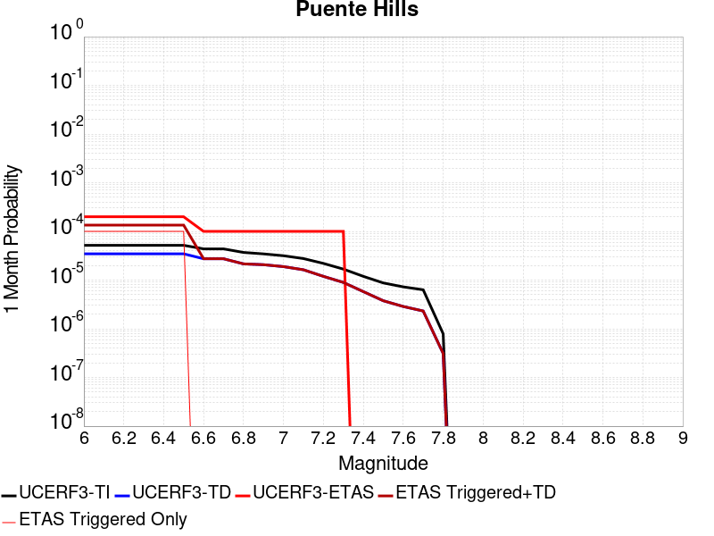 |  |  |

| Magnitude | 1 wk TI Prob | 1 wk TD Prob | 1 wk ETAS Prob | 1 wk ETAS/TD Gain | 1 wk ETAS Triggered+TD | 1 wk ETAS Triggered Only | 1 mo TI Prob | 1 mo TD Prob | 1 mo ETAS Prob | 1 mo ETAS/TD Gain | 1 mo ETAS Triggered+TD | 1 mo ETAS Triggered Only | 1 yr TI Prob | 1 yr TD Prob | 1 yr ETAS Prob | 1 yr ETAS/TD Gain | 1 yr ETAS Triggered+TD | 1 yr ETAS Triggered Only | 10 yr TI Prob | 10 yr TD Prob | 10 yr ETAS Prob | 10 yr ETAS/TD Gain | 10 yr ETAS Triggered+TD | 10 yr ETAS Triggered Only |
|-----|-----|-----|-----|-----|-----|-----|-----|-----|-----|-----|-----|-----|-----|-----|-----|-----|-----|-----|-----|-----|-----|-----|-----|-----|
| 6.0 | 1.2101656E-5 | 8.101092E-6 | 0.0 | 0.0 | 8.101092E-6 | 0.0 | 5.1863204E-5 | 3.4718534E-5 | 1.0E-4 | 2.880306 | 1.3471507E-4 | 1.0E-4 | 6.312516E-4 | 4.2262182E-4 | 1.0E-4 | 0.23661818 | 5.2257953E-4 | 1.0E-4 | 0.0062946146 | 0.0042187413 | 5.0E-4 | 0.11851876 | 0.004716632 | 5.0E-4 |
| 6.1 | 1.2101656E-5 | 8.101092E-6 | 0.0 | 0.0 | 8.101092E-6 | 0.0 | 5.1863204E-5 | 3.4718534E-5 | 1.0E-4 | 2.880306 | 1.3471507E-4 | 1.0E-4 | 6.312516E-4 | 4.2262182E-4 | 1.0E-4 | 0.23661818 | 5.2257953E-4 | 1.0E-4 | 0.0062946146 | 0.0042187413 | 5.0E-4 | 0.11851876 | 0.004716632 | 5.0E-4 |
| 6.2 | 1.2101656E-5 | 8.101092E-6 | 0.0 | 0.0 | 8.101092E-6 | 0.0 | 5.1863204E-5 | 3.4718534E-5 | 1.0E-4 | 2.880306 | 1.3471507E-4 | 1.0E-4 | 6.312516E-4 | 4.2262182E-4 | 1.0E-4 | 0.23661818 | 5.2257953E-4 | 1.0E-4 | 0.0062946146 | 0.0042187413 | 5.0E-4 | 0.11851876 | 0.004716632 | 5.0E-4 |
| 6.3 | 1.2101656E-5 | 8.101092E-6 | 0.0 | 0.0 | 8.101092E-6 | 0.0 | 5.1863204E-5 | 3.4718534E-5 | 1.0E-4 | 2.880306 | 1.3471507E-4 | 1.0E-4 | 6.312516E-4 | 4.2262182E-4 | 1.0E-4 | 0.23661818 | 5.2257953E-4 | 1.0E-4 | 0.0062946146 | 0.0042187413 | 5.0E-4 | 0.11851876 | 0.004716632 | 5.0E-4 |
| 6.4 | 1.2101656E-5 | 8.101092E-6 | 0.0 | 0.0 | 8.101092E-6 | 0.0 | 5.1863204E-5 | 3.4718534E-5 | 1.0E-4 | 2.880306 | 1.3471507E-4 | 1.0E-4 | 6.312516E-4 | 4.2262182E-4 | 1.0E-4 | 0.23661818 | 5.2257953E-4 | 1.0E-4 | 0.0062946146 | 0.0042187413 | 5.0E-4 | 0.11851876 | 0.004716632 | 5.0E-4 |
| 6.5 | 1.2101656E-5 | 8.101092E-6 | 0.0 | 0.0 | 8.101092E-6 | 0.0 | 5.1863204E-5 | 3.4718534E-5 | 1.0E-4 | 2.880306 | 1.3471507E-4 | 1.0E-4 | 6.312516E-4 | 4.2262182E-4 | 1.0E-4 | 0.23661818 | 5.2257953E-4 | 1.0E-4 | 0.0062946146 | 0.0042187413 | 5.0E-4 | 0.11851876 | 0.004716632 | 5.0E-4 |
| 6.6 | 1.0222488E-5 | 6.4015044E-6 | 0.0 | 0.0 | 6.4015044E-6 | 0.0 | 4.3809923E-5 | 2.7434744E-5 | 0.0 | 0.0 | 2.7434744E-5 | 0.0 | 5.332553E-4 | 3.3396928E-4 | 0.0 | 0.0 | 3.3396928E-4 | 0.0 | 0.0053197746 | 0.003334919 | 3.0E-4 | 0.08995721 | 0.0036339185 | 3.0E-4 |
| 6.7 | 1.0222488E-5 | 6.4015044E-6 | 0.0 | 0.0 | 6.4015044E-6 | 0.0 | 4.3809923E-5 | 2.7434744E-5 | 0.0 | 0.0 | 2.7434744E-5 | 0.0 | 5.332553E-4 | 3.3396928E-4 | 0.0 | 0.0 | 3.3396928E-4 | 0.0 | 0.0053197746 | 0.003334919 | 3.0E-4 | 0.08995721 | 0.0036339185 | 3.0E-4 |
| 6.8 | 8.6367845E-6 | 5.0303092E-6 | 0.0 | 0.0 | 5.0303092E-6 | 0.0 | 3.7014266E-5 | 2.1558293E-5 | 0.0 | 0.0 | 2.1558293E-5 | 0.0 | 4.505555E-4 | 2.6244117E-4 | 0.0 | 0.0 | 2.6244117E-4 | 0.0 | 0.004496431 | 0.0026213687 | 3.0E-4 | 0.11444403 | 0.0029205824 | 3.0E-4 |
| 6.9 | 8.066481E-6 | 4.8381576E-6 | 0.0 | 0.0 | 4.8381576E-6 | 0.0 | 3.4570177E-5 | 2.07348E-5 | 0.0 | 0.0 | 2.07348E-5 | 0.0 | 4.2081063E-4 | 2.5241746E-4 | 0.0 | 0.0 | 2.5241746E-4 | 0.0 | 0.0042001465 | 0.0025213615 | 3.0E-4 | 0.118983336 | 0.0028206052 | 3.0E-4 |
| 7.0 | 7.393828E-6 | 4.4192134E-6 | 0.0 | 0.0 | 4.4192134E-6 | 0.0 | 3.168745E-5 | 1.8939352E-5 | 0.0 | 0.0 | 1.8939352E-5 | 0.0 | 3.857264E-4 | 2.3056265E-4 | 0.0 | 0.0 | 2.3056265E-4 | 0.0 | 0.0038505755 | 0.00230328 | 3.0E-4 | 0.13024904 | 0.002602589 | 3.0E-4 |
| 7.1 | 6.4660953E-6 | 3.806027E-6 | 0.0 | 0.0 | 3.806027E-6 | 0.0 | 2.7711543E-5 | 1.6311444E-5 | 0.0 | 0.0 | 1.6311444E-5 | 0.0 | 3.373358E-4 | 1.985741E-4 | 0.0 | 0.0 | 1.985741E-4 | 0.0 | 0.0033682417 | 0.0019840025 | 1.0E-4 | 0.050403163 | 0.002083804 | 1.0E-4 |
| 7.2 | 5.143232E-6 | 2.787785E-6 | 0.0 | 0.0 | 2.787785E-6 | 0.0 | 2.2042237E-5 | 1.1947595E-5 | 0.0 | 0.0 | 1.1947595E-5 | 0.0 | 2.6833118E-4 | 1.4545236E-4 | 0.0 | 0.0 | 1.4545236E-4 | 0.0 | 0.002680074 | 0.0014535814 | 0.0 | 0.0 | 0.0014535814 | 0.0 |
| 7.3 | 3.928255E-6 | 2.0924595E-6 | 0.0 | 0.0 | 2.0924595E-6 | 0.0 | 1.683527E-5 | 8.967652E-6 | 0.0 | 0.0 | 8.967652E-6 | 0.0 | 2.0495013E-4 | 1.09175766E-4 | 0.0 | 0.0 | 1.09175766E-4 | 0.0 | 0.002047612 | 0.001091228 | 0.0 | 0.0 | 0.001091228 | 0.0 |
| 7.4 | 2.7894434E-6 | 1.3556086E-6 | 0.0 | 0.0 | 1.3556086E-6 | 0.0 | 1.1954703E-5 | 5.8097385E-6 | 0.0 | 0.0 | 5.8097385E-6 | 0.0 | 1.4553878E-4 | 7.073131E-5 | 0.0 | 0.0 | 7.073131E-5 | 0.0 | 0.001454435 | 7.070924E-4 | 0.0 | 0.0 | 7.070924E-4 | 0.0 |
| 7.5 | 2.041735E-6 | 8.7938787E-7 | 0.0 | 0.0 | 8.7938787E-7 | 0.0 | 8.750263E-6 | 3.7687998E-6 | 0.0 | 0.0 | 3.7687998E-6 | 0.0 | 1.06529245E-4 | 4.5884208E-5 | 0.0 | 0.0 | 4.5884208E-5 | 0.0 | 0.0010647819 | 4.587507E-4 | 0.0 | 0.0 | 4.587507E-4 | 0.0 |
| 7.6 | 1.6959062E-6 | 6.7038155E-7 | 0.0 | 0.0 | 6.7038155E-7 | 0.0 | 7.268149E-6 | 2.8730608E-6 | 0.0 | 0.0 | 2.8730608E-6 | 0.0 | 8.848612E-5 | 3.4978984E-5 | 0.0 | 0.0 | 3.4978984E-5 | 0.0 | 8.84509E-4 | 3.4973767E-4 | 0.0 | 0.0 | 3.4973767E-4 | 0.0 |
| 7.7 | 1.4767965E-6 | 5.4119664E-7 | 0.0 | 0.0 | 5.4119664E-7 | 0.0 | 6.3291122E-6 | 2.3194123E-6 | 0.0 | 0.0 | 2.3194123E-6 | 0.0 | 7.705422E-5 | 2.8238506E-5 | 0.0 | 0.0 | 2.8238506E-5 | 0.0 | 7.702751E-4 | 2.8235174E-4 | 0.0 | 0.0 | 2.8235174E-4 | 0.0 |
| 7.8 | 1.8432911E-7 | 7.287068E-8 | 0.0 | 0.0 | 7.287068E-8 | 0.0 | 7.8998164E-7 | 3.123029E-7 | 0.0 | 0.0 | 3.123029E-7 | 0.0 | 9.617985E-6 | 3.8022843E-6 | 0.0 | 0.0 | 3.8022843E-6 | 0.0 | 9.617568E-5 | 3.8022517E-5 | 0.0 | 0.0 | 3.8022517E-5 | 0.0 |

## San Cayetano
*[(top)](#table-of-contents)*

| 1 Week | 1 Month | 1 Year | 10 Year |
|-----|-----|-----|-----|
|  |  |  | 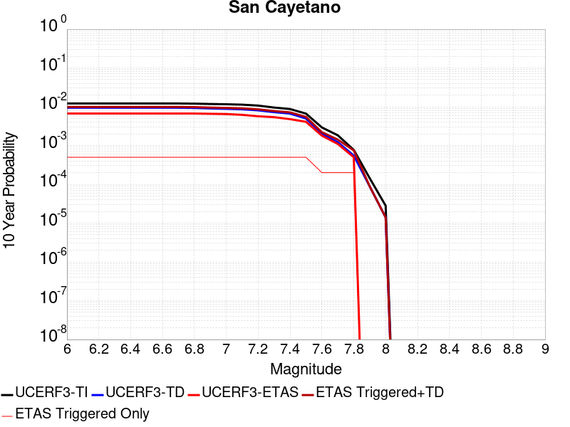 |

| Magnitude | 1 wk TI Prob | 1 wk TD Prob | 1 wk ETAS Prob | 1 wk ETAS/TD Gain | 1 wk ETAS Triggered+TD | 1 wk ETAS Triggered Only | 1 mo TI Prob | 1 mo TD Prob | 1 mo ETAS Prob | 1 mo ETAS/TD Gain | 1 mo ETAS Triggered+TD | 1 mo ETAS Triggered Only | 1 yr TI Prob | 1 yr TD Prob | 1 yr ETAS Prob | 1 yr ETAS/TD Gain | 1 yr ETAS Triggered+TD | 1 yr ETAS Triggered Only | 10 yr TI Prob | 10 yr TD Prob | 10 yr ETAS Prob | 10 yr ETAS/TD Gain | 10 yr ETAS Triggered+TD | 10 yr ETAS Triggered Only |
|-----|-----|-----|-----|-----|-----|-----|-----|-----|-----|-----|-----|-----|-----|-----|-----|-----|-----|-----|-----|-----|-----|-----|-----|-----|
| 6.0 | 2.3476267E-5 | 1.8176803E-5 | 0.0 | 0.0 | 1.8176803E-5 | 0.0 | 1.0060869E-4 | 7.789828E-5 | 0.0 | 0.0 | 7.789828E-5 | 0.0 | 0.0012242225 | 9.4800256E-4 | 0.0 | 0.0 | 9.4800256E-4 | 0.0 | 0.012175002 | 0.009440432 | 5.0E-4 | 0.052963678 | 0.0099357115 | 5.0E-4 |
| 6.1 | 2.3476267E-5 | 1.8176803E-5 | 0.0 | 0.0 | 1.8176803E-5 | 0.0 | 1.0060869E-4 | 7.789828E-5 | 0.0 | 0.0 | 7.789828E-5 | 0.0 | 0.0012242225 | 9.4800256E-4 | 0.0 | 0.0 | 9.4800256E-4 | 0.0 | 0.012175002 | 0.009440432 | 5.0E-4 | 0.052963678 | 0.0099357115 | 5.0E-4 |
| 6.2 | 2.3476267E-5 | 1.8176803E-5 | 0.0 | 0.0 | 1.8176803E-5 | 0.0 | 1.0060869E-4 | 7.789828E-5 | 0.0 | 0.0 | 7.789828E-5 | 0.0 | 0.0012242225 | 9.4800256E-4 | 0.0 | 0.0 | 9.4800256E-4 | 0.0 | 0.012175002 | 0.009440432 | 5.0E-4 | 0.052963678 | 0.0099357115 | 5.0E-4 |
| 6.3 | 2.3476267E-5 | 1.8176803E-5 | 0.0 | 0.0 | 1.8176803E-5 | 0.0 | 1.0060869E-4 | 7.789828E-5 | 0.0 | 0.0 | 7.789828E-5 | 0.0 | 0.0012242225 | 9.4800256E-4 | 0.0 | 0.0 | 9.4800256E-4 | 0.0 | 0.012175002 | 0.009440432 | 5.0E-4 | 0.052963678 | 0.0099357115 | 5.0E-4 |
| 6.4 | 2.3476267E-5 | 1.8176803E-5 | 0.0 | 0.0 | 1.8176803E-5 | 0.0 | 1.0060869E-4 | 7.789828E-5 | 0.0 | 0.0 | 7.789828E-5 | 0.0 | 0.0012242225 | 9.4800256E-4 | 0.0 | 0.0 | 9.4800256E-4 | 0.0 | 0.012175002 | 0.009440432 | 5.0E-4 | 0.052963678 | 0.0099357115 | 5.0E-4 |
| 6.5 | 2.3476267E-5 | 1.8176803E-5 | 0.0 | 0.0 | 1.8176803E-5 | 0.0 | 1.0060869E-4 | 7.789828E-5 | 0.0 | 0.0 | 7.789828E-5 | 0.0 | 0.0012242225 | 9.4800256E-4 | 0.0 | 0.0 | 9.4800256E-4 | 0.0 | 0.012175002 | 0.009440432 | 5.0E-4 | 0.052963678 | 0.0099357115 | 5.0E-4 |
| 6.6 | 2.3476267E-5 | 1.8176803E-5 | 0.0 | 0.0 | 1.8176803E-5 | 0.0 | 1.0060869E-4 | 7.789828E-5 | 0.0 | 0.0 | 7.789828E-5 | 0.0 | 0.0012242225 | 9.4800256E-4 | 0.0 | 0.0 | 9.4800256E-4 | 0.0 | 0.012175002 | 0.009440432 | 5.0E-4 | 0.052963678 | 0.0099357115 | 5.0E-4 |
| 6.7 | 2.3476267E-5 | 1.8176803E-5 | 0.0 | 0.0 | 1.8176803E-5 | 0.0 | 1.0060869E-4 | 7.789828E-5 | 0.0 | 0.0 | 7.789828E-5 | 0.0 | 0.0012242225 | 9.4800256E-4 | 0.0 | 0.0 | 9.4800256E-4 | 0.0 | 0.012175002 | 0.009440432 | 5.0E-4 | 0.052963678 | 0.0099357115 | 5.0E-4 |
| 6.8 | 2.3241924E-5 | 1.7944416E-5 | 0.0 | 0.0 | 1.7944416E-5 | 0.0 | 9.960445E-5 | 7.690239E-5 | 0.0 | 0.0 | 7.690239E-5 | 0.0 | 0.0012120095 | 9.3588803E-4 | 0.0 | 0.0 | 9.3588803E-4 | 0.0 | 0.012054204 | 0.0093202405 | 5.0E-4 | 0.053646684 | 0.00981558 | 5.0E-4 |
| 6.9 | 2.2761007E-5 | 1.7439694E-5 | 0.0 | 0.0 | 1.7439694E-5 | 0.0 | 9.7543525E-5 | 7.473942E-5 | 0.0 | 0.0 | 7.473942E-5 | 0.0 | 0.0011869454 | 9.095761E-4 | 0.0 | 0.0 | 9.095761E-4 | 0.0 | 0.011806256 | 0.009059281 | 5.0E-4 | 0.055192016 | 0.009554752 | 5.0E-4 |
| 7.0 | 2.240283E-5 | 1.7073331E-5 | 0.0 | 0.0 | 1.7073331E-5 | 0.0 | 9.600859E-5 | 7.316938E-5 | 0.0 | 0.0 | 7.316938E-5 | 0.0 | 0.0011682777 | 8.904766E-4 | 0.0 | 0.0 | 8.904766E-4 | 0.0 | 0.011621549 | 0.008869817 | 5.0E-4 | 0.05637095 | 0.009365382 | 5.0E-4 |
| 7.1 | 2.1871154E-5 | 1.6593105E-5 | 0.0 | 0.0 | 1.6593105E-5 | 0.0 | 9.373015E-5 | 7.111139E-5 | 0.0 | 0.0 | 7.111139E-5 | 0.0 | 0.0011405671 | 8.654406E-4 | 0.0 | 0.0 | 8.654406E-4 | 0.0 | 0.011347309 | 0.008621423 | 5.0E-4 | 0.05799507 | 0.009117112 | 5.0E-4 |
| 7.2 | 2.0714133E-5 | 1.5571291E-5 | 0.0 | 0.0 | 1.5571291E-5 | 0.0 | 8.8771834E-5 | 6.673242E-5 | 0.0 | 0.0 | 6.673242E-5 | 0.0 | 0.0010802611 | 8.1216765E-4 | 0.0 | 0.0 | 8.1216765E-4 | 0.0 | 0.010750249 | 0.0080926865 | 5.0E-4 | 0.061784178 | 0.00858864 | 5.0E-4 |
| 7.3 | 1.8408395E-5 | 1.400156E-5 | 0.0 | 0.0 | 1.400156E-5 | 0.0 | 7.8890735E-5 | 6.0005324E-5 | 0.0 | 0.0 | 6.0005324E-5 | 0.0 | 9.600714E-4 | 7.303229E-4 | 0.0 | 0.0 | 7.303229E-4 | 0.0 | 0.009559342 | 0.007279858 | 5.0E-4 | 0.06868266 | 0.007776218 | 5.0E-4 |
| 7.4 | 1.6856795E-5 | 1.2854248E-5 | 0.0 | 0.0 | 1.2854248E-5 | 0.0 | 7.2241404E-5 | 5.5088487E-5 | 0.0 | 0.0 | 5.5088487E-5 | 0.0 | 8.7918417E-4 | 6.704988E-4 | 0.0 | 0.0 | 6.704988E-4 | 0.0 | 0.00875714 | 0.006685355 | 5.0E-4 | 0.07479034 | 0.0071820123 | 5.0E-4 |
| 7.5 | 1.2822778E-5 | 9.580454E-6 | 0.0 | 0.0 | 9.580454E-6 | 0.0 | 5.495361E-5 | 4.105845E-5 | 0.0 | 0.0 | 4.105845E-5 | 0.0 | 6.688548E-4 | 4.997736E-4 | 0.0 | 0.0 | 4.997736E-4 | 0.0 | 0.006668452 | 0.004986681 | 5.0E-4 | 0.10026709 | 0.0054841875 | 5.0E-4 |
| 7.6 | 5.6272684E-6 | 3.8560597E-6 | 0.0 | 0.0 | 3.8560597E-6 | 0.0 | 2.4116642E-5 | 1.6525864E-5 | 0.0 | 0.0 | 1.6525864E-5 | 0.0 | 2.9358055E-4 | 2.0118394E-4 | 0.0 | 0.0 | 2.0118394E-4 | 0.0 | 0.0029319301 | 0.0020100288 | 2.0E-4 | 0.09950106 | 0.0022096268 | 2.0E-4 |
| 7.7 | 3.5261346E-6 | 2.3414625E-6 | 0.0 | 0.0 | 2.3414625E-6 | 0.0 | 1.5111918E-5 | 1.0034801E-5 | 0.0 | 0.0 | 1.0034801E-5 | 0.0 | 1.8397206E-4 | 1.2216692E-4 | 0.0 | 0.0 | 1.2216692E-4 | 0.0 | 0.0018381984 | 0.001221005 | 2.0E-4 | 0.1637995 | 0.0014207608 | 2.0E-4 |
| 7.8 | 1.4826929E-6 | 1.0567617E-6 | 0.0 | 0.0 | 1.0567617E-6 | 0.0 | 6.354383E-6 | 4.5289707E-6 | 0.0 | 0.0 | 4.5289707E-6 | 0.0 | 7.736187E-5 | 5.5138844E-5 | 0.0 | 0.0 | 5.5138844E-5 | 0.0 | 7.733494E-4 | 5.512537E-4 | 2.0E-4 | 0.36280936 | 7.5114344E-4 | 2.0E-4 |
| 7.9 | 2.7568166E-7 | 1.698268E-7 | 0.0 | 0.0 | 1.698268E-7 | 0.0 | 1.1814923E-6 | 7.2782893E-7 | 0.0 | 0.0 | 7.2782893E-7 | 0.0 | 1.4384574E-5 | 8.8612815E-6 | 0.0 | 0.0 | 8.8612815E-6 | 0.0 | 1.4383643E-4 | 8.860932E-5 | 0.0 | 0.0 | 8.860932E-5 | 0.0 |
| 8.0 | 5.407832E-8 | 2.6899812E-8 | 0.0 | 0.0 | 2.6899812E-8 | 0.0 | 2.3176422E-7 | 1.15284905E-7 | 0.0 | 0.0 | 1.15284905E-7 | 0.0 | 2.8217257E-6 | 1.4035928E-6 | 0.0 | 0.0 | 1.4035928E-6 | 0.0 | 2.8216898E-5 | 1.4035844E-5 | 0.0 | 0.0 | 1.4035844E-5 | 0.0 |

## North Frontal  (East)
*[(top)](#table-of-contents)*

| 1 Week | 1 Month | 1 Year | 10 Year |
|-----|-----|-----|-----|
| 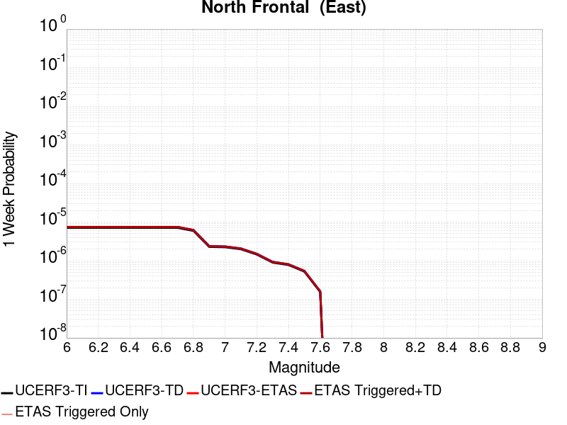 |  | 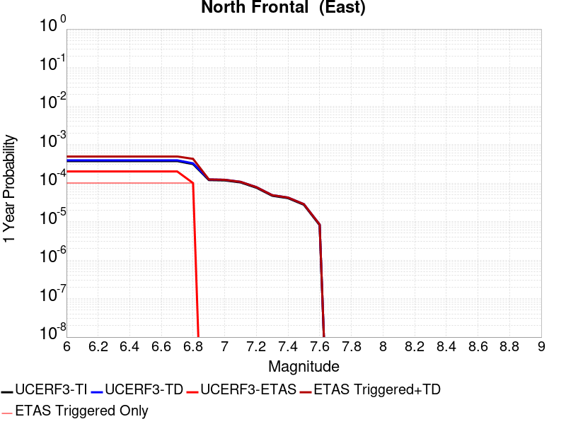 |  |

| Magnitude | 1 wk TI Prob | 1 wk TD Prob | 1 wk ETAS Prob | 1 wk ETAS/TD Gain | 1 wk ETAS Triggered+TD | 1 wk ETAS Triggered Only | 1 mo TI Prob | 1 mo TD Prob | 1 mo ETAS Prob | 1 mo ETAS/TD Gain | 1 mo ETAS Triggered+TD | 1 mo ETAS Triggered Only | 1 yr TI Prob | 1 yr TD Prob | 1 yr ETAS Prob | 1 yr ETAS/TD Gain | 1 yr ETAS Triggered+TD | 1 yr ETAS Triggered Only | 10 yr TI Prob | 10 yr TD Prob | 10 yr ETAS Prob | 10 yr ETAS/TD Gain | 10 yr ETAS Triggered+TD | 10 yr ETAS Triggered Only |
|-----|-----|-----|-----|-----|-----|-----|-----|-----|-----|-----|-----|-----|-----|-----|-----|-----|-----|-----|-----|-----|-----|-----|-----|-----|
| 6.0 | 7.135738E-6 | 7.477914E-6 | 0.0 | 0.0 | 7.477914E-6 | 0.0 | 3.0581377E-5 | 3.2047923E-5 | 1.0E-4 | 3.120327 | 1.3204472E-4 | 1.0E-4 | 3.7226462E-4 | 3.9013353E-4 | 1.0E-4 | 0.2563225 | 4.9009454E-4 | 1.0E-4 | 0.0037164164 | 0.0038964446 | 5.0E-4 | 0.12832211 | 0.0043944963 | 5.0E-4 |
| 6.1 | 7.135738E-6 | 7.477914E-6 | 0.0 | 0.0 | 7.477914E-6 | 0.0 | 3.0581377E-5 | 3.2047923E-5 | 1.0E-4 | 3.120327 | 1.3204472E-4 | 1.0E-4 | 3.7226462E-4 | 3.9013353E-4 | 1.0E-4 | 0.2563225 | 4.9009454E-4 | 1.0E-4 | 0.0037164164 | 0.0038964446 | 5.0E-4 | 0.12832211 | 0.0043944963 | 5.0E-4 |
| 6.2 | 7.135738E-6 | 7.477914E-6 | 0.0 | 0.0 | 7.477914E-6 | 0.0 | 3.0581377E-5 | 3.2047923E-5 | 1.0E-4 | 3.120327 | 1.3204472E-4 | 1.0E-4 | 3.7226462E-4 | 3.9013353E-4 | 1.0E-4 | 0.2563225 | 4.9009454E-4 | 1.0E-4 | 0.0037164164 | 0.0038964446 | 5.0E-4 | 0.12832211 | 0.0043944963 | 5.0E-4 |
| 6.3 | 7.135738E-6 | 7.477914E-6 | 0.0 | 0.0 | 7.477914E-6 | 0.0 | 3.0581377E-5 | 3.2047923E-5 | 1.0E-4 | 3.120327 | 1.3204472E-4 | 1.0E-4 | 3.7226462E-4 | 3.9013353E-4 | 1.0E-4 | 0.2563225 | 4.9009454E-4 | 1.0E-4 | 0.0037164164 | 0.0038964446 | 5.0E-4 | 0.12832211 | 0.0043944963 | 5.0E-4 |
| 6.4 | 7.135738E-6 | 7.477914E-6 | 0.0 | 0.0 | 7.477914E-6 | 0.0 | 3.0581377E-5 | 3.2047923E-5 | 1.0E-4 | 3.120327 | 1.3204472E-4 | 1.0E-4 | 3.7226462E-4 | 3.9013353E-4 | 1.0E-4 | 0.2563225 | 4.9009454E-4 | 1.0E-4 | 0.0037164164 | 0.0038964446 | 5.0E-4 | 0.12832211 | 0.0043944963 | 5.0E-4 |
| 6.5 | 7.135738E-6 | 7.477914E-6 | 0.0 | 0.0 | 7.477914E-6 | 0.0 | 3.0581377E-5 | 3.2047923E-5 | 1.0E-4 | 3.120327 | 1.3204472E-4 | 1.0E-4 | 3.7226462E-4 | 3.9013353E-4 | 1.0E-4 | 0.2563225 | 4.9009454E-4 | 1.0E-4 | 0.0037164164 | 0.0038964446 | 5.0E-4 | 0.12832211 | 0.0043944963 | 5.0E-4 |
| 6.6 | 7.135738E-6 | 7.477914E-6 | 0.0 | 0.0 | 7.477914E-6 | 0.0 | 3.0581377E-5 | 3.2047923E-5 | 1.0E-4 | 3.120327 | 1.3204472E-4 | 1.0E-4 | 3.7226462E-4 | 3.9013353E-4 | 1.0E-4 | 0.2563225 | 4.9009454E-4 | 1.0E-4 | 0.0037164164 | 0.0038964446 | 5.0E-4 | 0.12832211 | 0.0043944963 | 5.0E-4 |
| 6.7 | 7.135738E-6 | 7.477914E-6 | 0.0 | 0.0 | 7.477914E-6 | 0.0 | 3.0581377E-5 | 3.2047923E-5 | 1.0E-4 | 3.120327 | 1.3204472E-4 | 1.0E-4 | 3.7226462E-4 | 3.9013353E-4 | 1.0E-4 | 0.2563225 | 4.9009454E-4 | 1.0E-4 | 0.0037164164 | 0.0038964446 | 5.0E-4 | 0.12832211 | 0.0043944963 | 5.0E-4 |
| 6.8 | 5.959142E-6 | 6.237282E-6 | 0.0 | 0.0 | 6.237282E-6 | 0.0 | 2.553893E-5 | 2.6731035E-5 | 1.0E-4 | 3.74097 | 1.2672837E-4 | 1.0E-4 | 3.108921E-4 | 3.2541982E-4 | 1.0E-4 | 0.30729535 | 4.253873E-4 | 1.0E-4 | 0.0031045752 | 0.0032512066 | 5.0E-4 | 0.15378906 | 0.003749581 | 5.0E-4 |
| 6.9 | 2.2946929E-6 | 2.3826483E-6 | 0.0 | 0.0 | 2.3826483E-6 | 0.0 | 9.834361E-6 | 1.0211313E-5 | 0.0 | 0.0 | 1.0211313E-5 | 0.0 | 1.1972676E-4 | 1.2431611E-4 | 0.0 | 0.0 | 1.2431611E-4 | 0.0 | 0.0011966228 | 0.0012425123 | 0.0 | 0.0 | 0.0012425123 | 0.0 |
| 7.0 | 2.2468673E-6 | 2.3323362E-6 | 0.0 | 0.0 | 2.3323362E-6 | 0.0 | 9.629396E-6 | 9.9956915E-6 | 0.0 | 0.0 | 9.9956915E-6 | 0.0 | 1.1723159E-4 | 1.2169121E-4 | 0.0 | 0.0 | 1.2169121E-4 | 0.0 | 0.0011716976 | 0.0012162921 | 0.0 | 0.0 | 0.0012162921 | 0.0 |
| 7.1 | 1.9921076E-6 | 2.064758E-6 | 0.0 | 0.0 | 2.064758E-6 | 0.0 | 8.537577E-6 | 8.848935E-6 | 0.0 | 0.0 | 8.848935E-6 | 0.0 | 1.0394004E-4 | 1.077309E-4 | 0.0 | 0.0 | 1.077309E-4 | 0.0 | 0.0010389143 | 0.0010768295 | 0.0 | 0.0 | 0.0010768295 | 0.0 |
| 7.2 | 1.4524545E-6 | 1.5046259E-6 | 0.0 | 0.0 | 1.5046259E-6 | 0.0 | 6.2247905E-6 | 6.448382E-6 | 0.0 | 0.0 | 6.448382E-6 | 0.0 | 7.5784184E-5 | 7.850648E-5 | 0.0 | 0.0 | 7.850648E-5 | 0.0 | 7.575835E-4 | 7.8481185E-4 | 0.0 | 0.0 | 7.8481185E-4 | 0.0 |
| 7.3 | 8.9802575E-7 | 9.309429E-7 | 0.0 | 0.0 | 9.309429E-7 | 0.0 | 3.848676E-6 | 3.98975E-6 | 0.0 | 0.0 | 3.98975E-6 | 0.0 | 4.685662E-5 | 4.857424E-5 | 0.0 | 0.0 | 4.857424E-5 | 0.0 | 4.6846745E-4 | 4.8564753E-4 | 0.0 | 0.0 | 4.8564753E-4 | 0.0 |
| 7.4 | 7.776139E-7 | 8.061082E-7 | 0.0 | 0.0 | 8.061082E-7 | 0.0 | 3.3326266E-6 | 3.4547454E-6 | 0.0 | 0.0 | 3.4547454E-6 | 0.0 | 4.0573974E-5 | 4.2060823E-5 | 0.0 | 0.0 | 4.2060823E-5 | 0.0 | 4.0566566E-4 | 4.2053938E-4 | 0.0 | 0.0 | 4.2053938E-4 | 0.0 |
| 7.5 | 5.244417E-7 | 5.44164E-7 | 0.0 | 0.0 | 5.44164E-7 | 0.0 | 2.2476054E-6 | 2.3321297E-6 | 0.0 | 0.0 | 2.3321297E-6 | 0.0 | 2.7364253E-5 | 2.8393375E-5 | 0.0 | 0.0 | 2.8393375E-5 | 0.0 | 2.7360884E-4 | 2.83904E-4 | 0.0 | 0.0 | 2.83904E-4 | 0.0 |
| 7.6 | 1.5489647E-7 | 1.6090787E-7 | 0.0 | 0.0 | 1.6090787E-7 | 0.0 | 6.6384183E-7 | 6.896051E-7 | 0.0 | 0.0 | 6.896051E-7 | 0.0 | 8.082245E-6 | 8.39593E-6 | 0.0 | 0.0 | 8.39593E-6 | 0.0 | 8.08195E-5 | 8.3958126E-5 | 0.0 | 0.0 | 8.3958126E-5 | 0.0 |

## Surprise Valley 2011 CFM
*[(top)](#table-of-contents)*

| 1 Week | 1 Month | 1 Year | 10 Year |
|-----|-----|-----|-----|
|  |  | 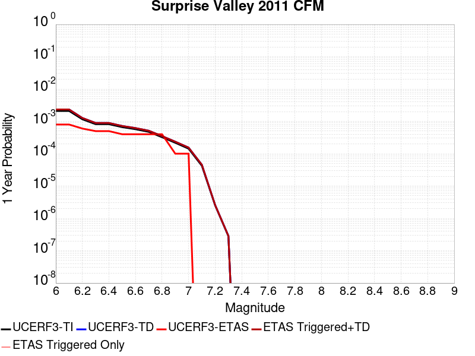 |  |

| Magnitude | 1 wk TI Prob | 1 wk TD Prob | 1 wk ETAS Prob | 1 wk ETAS/TD Gain | 1 wk ETAS Triggered+TD | 1 wk ETAS Triggered Only | 1 mo TI Prob | 1 mo TD Prob | 1 mo ETAS Prob | 1 mo ETAS/TD Gain | 1 mo ETAS Triggered+TD | 1 mo ETAS Triggered Only | 1 yr TI Prob | 1 yr TD Prob | 1 yr ETAS Prob | 1 yr ETAS/TD Gain | 1 yr ETAS Triggered+TD | 1 yr ETAS Triggered Only | 10 yr TI Prob | 10 yr TD Prob | 10 yr ETAS Prob | 10 yr ETAS/TD Gain | 10 yr ETAS Triggered+TD | 10 yr ETAS Triggered Only |
|-----|-----|-----|-----|-----|-----|-----|-----|-----|-----|-----|-----|-----|-----|-----|-----|-----|-----|-----|-----|-----|-----|-----|-----|-----|
| 6.0 | 4.0396248E-5 | 4.486156E-5 | 0.0 | 0.0 | 4.486156E-5 | 0.0 | 1.7311527E-4 | 1.9225085E-4 | 0.0 | 0.0 | 1.9225085E-4 | 0.0 | 0.002105641 | 0.0023383514 | 0.0 | 0.0 | 0.0023383514 | 0.0 | 0.020858008 | 0.023159204 | 4.0E-4 | 0.01727175 | 0.02354994 | 4.0E-4 |
| 6.1 | 4.0396248E-5 | 4.486156E-5 | 0.0 | 0.0 | 4.486156E-5 | 0.0 | 1.7311527E-4 | 1.9225085E-4 | 0.0 | 0.0 | 1.9225085E-4 | 0.0 | 0.002105641 | 0.0023383514 | 0.0 | 0.0 | 0.0023383514 | 0.0 | 0.020858008 | 0.023159204 | 4.0E-4 | 0.01727175 | 0.02354994 | 4.0E-4 |
| 6.2 | 2.2295266E-5 | 2.4406017E-5 | 0.0 | 0.0 | 2.4406017E-5 | 0.0 | 9.554764E-5 | 1.0459319E-4 | 0.0 | 0.0 | 1.0459319E-4 | 0.0 | 0.0011626717 | 0.001272709 | 0.0 | 0.0 | 0.001272709 | 0.0 | 0.011566074 | 0.012657438 | 3.0E-4 | 0.023701478 | 0.012953641 | 3.0E-4 |
| 6.3 | 1.572643E-5 | 1.7099885E-5 | 0.0 | 0.0 | 1.7099885E-5 | 0.0 | 6.7397246E-5 | 7.328322E-5 | 0.0 | 0.0 | 7.328322E-5 | 0.0 | 8.202525E-4 | 8.918685E-4 | 0.0 | 0.0 | 8.918685E-4 | 0.0 | 0.008172315 | 0.008884 | 3.0E-4 | 0.033768576 | 0.009181334 | 3.0E-4 |
| 6.4 | 1.5714395E-5 | 1.7087707E-5 | 0.0 | 0.0 | 1.7087707E-5 | 0.0 | 6.734567E-5 | 7.323103E-5 | 0.0 | 0.0 | 7.323103E-5 | 0.0 | 8.1962504E-4 | 8.912336E-4 | 0.0 | 0.0 | 8.912336E-4 | 0.0 | 0.008166086 | 0.008877701 | 3.0E-4 | 0.033792533 | 0.009175038 | 3.0E-4 |
| 6.5 | 1.2733495E-5 | 1.3803991E-5 | 0.0 | 0.0 | 1.3803991E-5 | 0.0 | 5.457098E-5 | 5.915866E-5 | 0.0 | 0.0 | 5.915866E-5 | 0.0 | 6.641992E-4 | 7.2002533E-4 | 0.0 | 0.0 | 7.2002533E-4 | 0.0 | 0.0066221743 | 0.007177619 | 3.0E-4 | 0.04179659 | 0.0074754655 | 3.0E-4 |
| 6.6 | 1.0983784E-5 | 1.1888572E-5 | 0.0 | 0.0 | 1.1888572E-5 | 0.0 | 4.7072506E-5 | 5.0950057E-5 | 0.0 | 0.0 | 5.0950057E-5 | 0.0 | 5.7295704E-4 | 6.201457E-4 | 0.0 | 0.0 | 6.201457E-4 | 0.0 | 0.0057148207 | 0.0061847013 | 2.0E-4 | 0.03233786 | 0.006383464 | 2.0E-4 |
| 6.7 | 9.104806E-6 | 9.841131E-6 | 0.0 | 0.0 | 9.841131E-6 | 0.0 | 3.902001E-5 | 4.2175616E-5 | 0.0 | 0.0 | 4.2175616E-5 | 0.0 | 4.7496508E-4 | 5.133711E-4 | 0.0 | 0.0 | 5.133711E-4 | 0.0 | 0.004739512 | 0.0051222485 | 1.0E-4 | 0.019522676 | 0.005221736 | 1.0E-4 |
| 6.8 | 6.2162403E-6 | 6.7052215E-6 | 0.0 | 0.0 | 6.7052215E-6 | 0.0 | 2.6640759E-5 | 2.873636E-5 | 0.0 | 0.0 | 2.873636E-5 | 0.0 | 3.2430296E-4 | 3.4981125E-4 | 0.0 | 0.0 | 3.4981125E-4 | 0.0 | 0.003238301 | 0.0034928294 | 1.0E-4 | 0.028630083 | 0.0035924802 | 1.0E-4 |
| 6.9 | 4.1792696E-6 | 4.5039524E-6 | 0.0 | 0.0 | 4.5039524E-6 | 0.0 | 1.7911032E-5 | 1.9302519E-5 | 0.0 | 0.0 | 1.9302519E-5 | 0.0 | 2.1804498E-4 | 2.3498437E-4 | 0.0 | 0.0 | 2.3498437E-4 | 0.0 | 0.0021783116 | 0.0023475122 | 1.0E-4 | 0.04259829 | 0.0024472775 | 1.0E-4 |
| 7.0 | 2.7478413E-6 | 2.962721E-6 | 0.0 | 0.0 | 2.962721E-6 | 0.0 | 1.177641E-5 | 1.2697321E-5 | 0.0 | 0.0 | 1.2697321E-5 | 0.0 | 1.4336836E-4 | 1.5458016E-4 | 0.0 | 0.0 | 1.5458016E-4 | 0.0 | 0.001432759 | 0.0015448489 | 1.0E-4 | 0.064731255 | 0.0016446944 | 1.0E-4 |
| 7.1 | 8.128648E-7 | 8.726253E-7 | 0.0 | 0.0 | 8.726253E-7 | 0.0 | 3.4837017E-6 | 3.7398208E-6 | 0.0 | 0.0 | 3.7398208E-6 | 0.0 | 4.2413245E-5 | 4.5531968E-5 | 0.0 | 0.0 | 4.5531968E-5 | 0.0 | 4.2405148E-4 | 4.5528522E-4 | 0.0 | 0.0 | 4.5528522E-4 | 0.0 |
| 7.2 | 4.8641045E-8 | 4.940366E-8 | 0.0 | 0.0 | 4.940366E-8 | 0.0 | 2.084616E-7 | 2.1172994E-7 | 0.0 | 0.0 | 2.1172994E-7 | 0.0 | 2.538017E-6 | 2.5778093E-6 | 0.0 | 0.0 | 2.5778093E-6 | 0.0 | 2.537988E-5 | 2.5777805E-5 | 0.0 | 0.0 | 2.5777805E-5 | 0.0 |
| 7.3 | 5.3911844E-9 | 5.475991E-9 | 0.0 | 0.0 | 5.475991E-9 | 0.0 | 2.3105075E-8 | 2.3468534E-8 | 0.0 | 0.0 | 2.3468534E-8 | 0.0 | 2.8130427E-7 | 2.8572939E-7 | 0.0 | 0.0 | 2.8572939E-7 | 0.0 | 2.8130391E-6 | 2.8572917E-6 | 0.0 | 0.0 | 2.8572917E-6 | 0.0 |

## Cleghorn
*[(top)](#table-of-contents)*

| 1 Week | 1 Month | 1 Year | 10 Year |
|-----|-----|-----|-----|
|  |  |  |  |

| Magnitude | 1 wk TI Prob | 1 wk TD Prob | 1 wk ETAS Prob | 1 wk ETAS/TD Gain | 1 wk ETAS Triggered+TD | 1 wk ETAS Triggered Only | 1 mo TI Prob | 1 mo TD Prob | 1 mo ETAS Prob | 1 mo ETAS/TD Gain | 1 mo ETAS Triggered+TD | 1 mo ETAS Triggered Only | 1 yr TI Prob | 1 yr TD Prob | 1 yr ETAS Prob | 1 yr ETAS/TD Gain | 1 yr ETAS Triggered+TD | 1 yr ETAS Triggered Only | 10 yr TI Prob | 10 yr TD Prob | 10 yr ETAS Prob | 10 yr ETAS/TD Gain | 10 yr ETAS Triggered+TD | 10 yr ETAS Triggered Only |
|-----|-----|-----|-----|-----|-----|-----|-----|-----|-----|-----|-----|-----|-----|-----|-----|-----|-----|-----|-----|-----|-----|-----|-----|-----|
| 6.0 | 7.9267165E-6 | 9.845541E-6 | 0.0 | 0.0 | 9.845541E-6 | 0.0 | 3.39712E-5 | 4.219455E-5 | 0.0 | 0.0 | 4.219455E-5 | 0.0 | 4.1352084E-4 | 5.136082E-4 | 0.0 | 0.0 | 5.136082E-4 | 0.0 | 0.004127522 | 0.0051391204 | 5.0E-4 | 0.097292915 | 0.0056365505 | 5.0E-4 |
| 6.1 | 7.9267165E-6 | 9.845541E-6 | 0.0 | 0.0 | 9.845541E-6 | 0.0 | 3.39712E-5 | 4.219455E-5 | 0.0 | 0.0 | 4.219455E-5 | 0.0 | 4.1352084E-4 | 5.136082E-4 | 0.0 | 0.0 | 5.136082E-4 | 0.0 | 0.004127522 | 0.0051391204 | 5.0E-4 | 0.097292915 | 0.0056365505 | 5.0E-4 |
| 6.2 | 7.9267165E-6 | 9.845541E-6 | 0.0 | 0.0 | 9.845541E-6 | 0.0 | 3.39712E-5 | 4.219455E-5 | 0.0 | 0.0 | 4.219455E-5 | 0.0 | 4.1352084E-4 | 5.136082E-4 | 0.0 | 0.0 | 5.136082E-4 | 0.0 | 0.004127522 | 0.0051391204 | 5.0E-4 | 0.097292915 | 0.0056365505 | 5.0E-4 |
| 6.3 | 7.9267165E-6 | 9.845541E-6 | 0.0 | 0.0 | 9.845541E-6 | 0.0 | 3.39712E-5 | 4.219455E-5 | 0.0 | 0.0 | 4.219455E-5 | 0.0 | 4.1352084E-4 | 5.136082E-4 | 0.0 | 0.0 | 5.136082E-4 | 0.0 | 0.004127522 | 0.0051391204 | 5.0E-4 | 0.097292915 | 0.0056365505 | 5.0E-4 |
| 6.4 | 4.3445207E-6 | 6.105062E-6 | 0.0 | 0.0 | 6.105062E-6 | 0.0 | 1.8619241E-5 | 2.6164294E-5 | 0.0 | 0.0 | 2.6164294E-5 | 0.0 | 2.2666567E-4 | 3.1850475E-4 | 0.0 | 0.0 | 3.1850475E-4 | 0.0 | 0.0022643462 | 0.0031944672 | 2.0E-4 | 0.06260825 | 0.0033938284 | 2.0E-4 |
| 6.5 | 4.3445207E-6 | 6.105062E-6 | 0.0 | 0.0 | 6.105062E-6 | 0.0 | 1.8619241E-5 | 2.6164294E-5 | 0.0 | 0.0 | 2.6164294E-5 | 0.0 | 2.2666567E-4 | 3.1850475E-4 | 0.0 | 0.0 | 3.1850475E-4 | 0.0 | 0.0022643462 | 0.0031944672 | 2.0E-4 | 0.06260825 | 0.0033938284 | 2.0E-4 |
| 6.6 | 4.040109E-6 | 5.7874413E-6 | 0.0 | 0.0 | 5.7874413E-6 | 0.0 | 1.7314638E-5 | 2.480309E-5 | 0.0 | 0.0 | 2.480309E-5 | 0.0 | 2.1078532E-4 | 3.019367E-4 | 0.0 | 0.0 | 3.019367E-4 | 0.0 | 0.002105855 | 0.0030292433 | 1.0E-4 | 0.033011544 | 0.0031289405 | 1.0E-4 |
| 6.7 | 3.3632055E-6 | 5.080876E-6 | 0.0 | 0.0 | 5.080876E-6 | 0.0 | 1.4413658E-5 | 2.1775E-5 | 0.0 | 0.0 | 2.1775E-5 | 0.0 | 1.7547216E-4 | 2.650787E-4 | 0.0 | 0.0 | 2.650787E-4 | 0.0 | 0.0017533366 | 0.0026615474 | 1.0E-4 | 0.037572127 | 0.0027612813 | 1.0E-4 |
| 6.8 | 3.2902772E-6 | 5.002771E-6 | 0.0 | 0.0 | 5.002771E-6 | 0.0 | 1.4101111E-5 | 2.1440273E-5 | 0.0 | 0.0 | 2.1440273E-5 | 0.0 | 1.716675E-4 | 2.6100437E-4 | 0.0 | 0.0 | 2.6100437E-4 | 0.0 | 0.0017153495 | 0.0026209005 | 1.0E-4 | 0.038154826 | 0.0027206384 | 1.0E-4 |
| 6.9 | 3.031547E-6 | 4.7042513E-6 | 0.0 | 0.0 | 4.7042513E-6 | 0.0 | 1.299228E-5 | 2.0160922E-5 | 0.0 | 0.0 | 2.0160922E-5 | 0.0 | 1.5816953E-4 | 2.4543185E-4 | 0.0 | 0.0 | 2.4543185E-4 | 0.0 | 0.00158057 | 0.002465528 | 1.0E-4 | 0.040559266 | 0.0025652812 | 1.0E-4 |
| 7.0 | 2.8259715E-6 | 4.3830896E-6 | 0.0 | 0.0 | 4.3830896E-6 | 0.0 | 1.211125E-5 | 1.8784534E-5 | 0.0 | 0.0 | 1.8784534E-5 | 0.0 | 1.4744449E-4 | 2.2867795E-4 | 0.0 | 0.0 | 2.2867795E-4 | 0.0 | 0.001473467 | 0.002298345 | 1.0E-4 | 0.04350957 | 0.0023981151 | 1.0E-4 |
| 7.1 | 2.5962665E-6 | 4.0779846E-6 | 0.0 | 0.0 | 4.0779846E-6 | 0.0 | 1.1126809E-5 | 1.7476961E-5 | 0.0 | 0.0 | 1.7476961E-5 | 0.0 | 1.3546048E-4 | 2.1276144E-4 | 0.0 | 0.0 | 2.1276144E-4 | 0.0 | 0.0013537793 | 0.0021394996 | 1.0E-4 | 0.046739902 | 0.0022392857 | 1.0E-4 |
| 7.2 | 2.3247253E-6 | 3.6881313E-6 | 0.0 | 0.0 | 3.6881313E-6 | 0.0 | 9.96307E-6 | 1.5806183E-5 | 0.0 | 0.0 | 1.5806183E-5 | 0.0 | 1.21293626E-4 | 1.9242347E-4 | 0.0 | 0.0 | 1.9242347E-4 | 0.0 | 0.0012122744 | 0.0019365073 | 1.0E-4 | 0.05163936 | 0.0020363138 | 1.0E-4 |
| 7.3 | 2.056928E-6 | 3.246004E-6 | 0.0 | 0.0 | 3.246004E-6 | 0.0 | 8.815376E-6 | 1.3911373E-5 | 0.0 | 0.0 | 1.3911373E-5 | 0.0 | 1.0732192E-4 | 1.6935797E-4 | 0.0 | 0.0 | 1.6935797E-4 | 0.0 | 0.001072701 | 0.0017062953 | 1.0E-4 | 0.058606505 | 0.0018061246 | 1.0E-4 |
| 7.4 | 1.8055999E-6 | 2.8356114E-6 | 0.0 | 0.0 | 2.8356114E-6 | 0.0 | 7.738263E-6 | 1.21525645E-5 | 0.0 | 0.0 | 1.21525645E-5 | 0.0 | 9.4209274E-5 | 1.4794758E-4 | 0.0 | 0.0 | 1.4794758E-4 | 0.0 | 9.4169343E-4 | 0.0014926419 | 1.0E-4 | 0.06699531 | 0.0015924927 | 1.0E-4 |
| 7.5 | 1.4683443E-6 | 2.4344956E-6 | 0.0 | 0.0 | 2.4344956E-6 | 0.0 | 6.292889E-6 | 1.0433511E-5 | 0.0 | 0.0 | 1.0433511E-5 | 0.0 | 7.661323E-5 | 1.270207E-4 | 0.0 | 0.0 | 1.270207E-4 | 0.0 | 7.658682E-4 | 0.0012836995 | 1.0E-4 | 0.07789985 | 0.0013835711 | 1.0E-4 |
| 7.6 | 9.804088E-7 | 1.909817E-6 | 0.0 | 0.0 | 1.909817E-6 | 0.0 | 4.201745E-6 | 8.184905E-6 | 0.0 | 0.0 | 8.184905E-6 | 0.0 | 5.1155046E-5 | 9.9646706E-5 | 0.0 | 0.0 | 9.9646706E-5 | 0.0 | 5.114327E-4 | 0.0010102689 | 1.0E-4 | 0.09898354 | 0.0011101679 | 1.0E-4 |
| 7.7 | 7.3434086E-7 | 1.63778E-6 | 0.0 | 0.0 | 1.63778E-6 | 0.0 | 3.1471714E-6 | 7.019038E-6 | 0.0 | 0.0 | 7.019038E-6 | 0.0 | 3.831614E-5 | 8.545347E-5 | 0.0 | 0.0 | 8.545347E-5 | 0.0 | 3.8309532E-4 | 8.684953E-4 | 1.0E-4 | 0.11514167 | 9.684085E-4 | 1.0E-4 |
| 7.8 | 6.434184E-7 | 1.53084E-6 | 0.0 | 0.0 | 1.53084E-6 | 0.0 | 2.7575045E-6 | 6.5607264E-6 | 0.0 | 0.0 | 6.5607264E-6 | 0.0 | 3.35721E-5 | 7.987394E-5 | 0.0 | 0.0 | 7.987394E-5 | 0.0 | 3.3567028E-4 | 8.124023E-4 | 1.0E-4 | 0.12309173 | 9.1232103E-4 | 1.0E-4 |
| 7.9 | 3.4943926E-7 | 7.613421E-7 | 0.0 | 0.0 | 7.613421E-7 | 0.0 | 1.497596E-6 | 3.2628907E-6 | 0.0 | 0.0 | 3.2628907E-6 | 0.0 | 1.8233079E-5 | 3.972498E-5 | 0.0 | 0.0 | 3.972498E-5 | 0.0 | 1.8231584E-4 | 4.0596837E-4 | 1.0E-4 | 0.24632461 | 5.059278E-4 | 1.0E-4 |
| 8.0 | 6.717524E-8 | 5.8611096E-8 | 0.0 | 0.0 | 5.8611096E-8 | 0.0 | 2.8789387E-7 | 2.511904E-7 | 0.0 | 0.0 | 2.511904E-7 | 0.0 | 3.505102E-6 | 3.058239E-6 | 0.0 | 0.0 | 3.058239E-6 | 0.0 | 3.5050467E-5 | 3.284727E-5 | 0.0 | 0.0 | 3.284727E-5 | 0.0 |
| 8.1 | 3.1984914E-8 | 1.3001392E-8 | 0.0 | 0.0 | 1.3001392E-8 | 0.0 | 1.370782E-7 | 5.5720253E-8 | 0.0 | 0.0 | 5.5720253E-8 | 0.0 | 1.6689258E-6 | 6.7839386E-7 | 0.0 | 0.0 | 6.7839386E-7 | 0.0 | 1.6689133E-5 | 7.769193E-6 | 0.0 | 0.0 | 7.769193E-6 | 0.0 |
| 8.2 | 1.21887656E-8 | 3.6610397E-9 | 0.0 | 0.0 | 3.6610397E-9 | 0.0 | 5.2237567E-8 | 1.5690171E-8 | 0.0 | 0.0 | 1.5690171E-8 | 0.0 | 6.359922E-7 | 1.9102782E-7 | 0.0 | 0.0 | 1.9102782E-7 | 0.0 | 6.3599036E-6 | 2.2538468E-6 | 0.0 | 0.0 | 2.2538468E-6 | 0.0 |

## Sierra Madre
*[(top)](#table-of-contents)*

| 1 Week | 1 Month | 1 Year | 10 Year |
|-----|-----|-----|-----|
|  |  |  |  |

| Magnitude | 1 wk TI Prob | 1 wk TD Prob | 1 wk ETAS Prob | 1 wk ETAS/TD Gain | 1 wk ETAS Triggered+TD | 1 wk ETAS Triggered Only | 1 mo TI Prob | 1 mo TD Prob | 1 mo ETAS Prob | 1 mo ETAS/TD Gain | 1 mo ETAS Triggered+TD | 1 mo ETAS Triggered Only | 1 yr TI Prob | 1 yr TD Prob | 1 yr ETAS Prob | 1 yr ETAS/TD Gain | 1 yr ETAS Triggered+TD | 1 yr ETAS Triggered Only | 10 yr TI Prob | 10 yr TD Prob | 10 yr ETAS Prob | 10 yr ETAS/TD Gain | 10 yr ETAS Triggered+TD | 10 yr ETAS Triggered Only |
|-----|-----|-----|-----|-----|-----|-----|-----|-----|-----|-----|-----|-----|-----|-----|-----|-----|-----|-----|-----|-----|-----|-----|-----|-----|
| 6.0 | 1.3379373E-5 | 1.1004847E-5 | 0.0 | 0.0 | 1.1004847E-5 | 0.0 | 5.7338908E-5 | 4.7162786E-5 | 0.0 | 0.0 | 4.7162786E-5 | 0.0 | 6.978776E-4 | 5.740571E-4 | 1.0E-4 | 0.17419869 | 6.739997E-4 | 1.0E-4 | 0.0069569005 | 0.005726163 | 5.0E-4 | 0.08731851 | 0.0062232995 | 5.0E-4 |
| 6.1 | 1.3379373E-5 | 1.1004847E-5 | 0.0 | 0.0 | 1.1004847E-5 | 0.0 | 5.7338908E-5 | 4.7162786E-5 | 0.0 | 0.0 | 4.7162786E-5 | 0.0 | 6.978776E-4 | 5.740571E-4 | 1.0E-4 | 0.17419869 | 6.739997E-4 | 1.0E-4 | 0.0069569005 | 0.005726163 | 5.0E-4 | 0.08731851 | 0.0062232995 | 5.0E-4 |
| 6.2 | 1.3379373E-5 | 1.1004847E-5 | 0.0 | 0.0 | 1.1004847E-5 | 0.0 | 5.7338908E-5 | 4.7162786E-5 | 0.0 | 0.0 | 4.7162786E-5 | 0.0 | 6.978776E-4 | 5.740571E-4 | 1.0E-4 | 0.17419869 | 6.739997E-4 | 1.0E-4 | 0.0069569005 | 0.005726163 | 5.0E-4 | 0.08731851 | 0.0062232995 | 5.0E-4 |
| 6.3 | 1.3379373E-5 | 1.1004847E-5 | 0.0 | 0.0 | 1.1004847E-5 | 0.0 | 5.7338908E-5 | 4.7162786E-5 | 0.0 | 0.0 | 4.7162786E-5 | 0.0 | 6.978776E-4 | 5.740571E-4 | 1.0E-4 | 0.17419869 | 6.739997E-4 | 1.0E-4 | 0.0069569005 | 0.005726163 | 5.0E-4 | 0.08731851 | 0.0062232995 | 5.0E-4 |
| 6.4 | 1.3379373E-5 | 1.1004847E-5 | 0.0 | 0.0 | 1.1004847E-5 | 0.0 | 5.7338908E-5 | 4.7162786E-5 | 0.0 | 0.0 | 4.7162786E-5 | 0.0 | 6.978776E-4 | 5.740571E-4 | 1.0E-4 | 0.17419869 | 6.739997E-4 | 1.0E-4 | 0.0069569005 | 0.005726163 | 5.0E-4 | 0.08731851 | 0.0062232995 | 5.0E-4 |
| 6.5 | 1.26563245E-5 | 1.0234199E-5 | 0.0 | 0.0 | 1.0234199E-5 | 0.0 | 5.4240263E-5 | 4.386012E-5 | 0.0 | 0.0 | 4.386012E-5 | 0.0 | 6.601751E-4 | 5.338672E-4 | 1.0E-4 | 0.1873125 | 6.3381385E-4 | 1.0E-4 | 0.006582173 | 0.005326225 | 5.0E-4 | 0.09387512 | 0.005823562 | 5.0E-4 |
| 6.6 | 1.26563245E-5 | 1.0234199E-5 | 0.0 | 0.0 | 1.0234199E-5 | 0.0 | 5.4240263E-5 | 4.386012E-5 | 0.0 | 0.0 | 4.386012E-5 | 0.0 | 6.601751E-4 | 5.338672E-4 | 1.0E-4 | 0.1873125 | 6.3381385E-4 | 1.0E-4 | 0.006582173 | 0.005326225 | 5.0E-4 | 0.09387512 | 0.005823562 | 5.0E-4 |
| 6.7 | 1.2502474E-5 | 1.0070321E-5 | 0.0 | 0.0 | 1.0070321E-5 | 0.0 | 5.3580934E-5 | 4.3157812E-5 | 0.0 | 0.0 | 4.3157812E-5 | 0.0 | 6.521526E-4 | 5.253207E-4 | 1.0E-4 | 0.19035989 | 6.252682E-4 | 1.0E-4 | 0.0065024206 | 0.005241165 | 5.0E-4 | 0.095398635 | 0.0057385443 | 5.0E-4 |
| 6.8 | 1.2454966E-5 | 1.00226E-5 | 0.0 | 0.0 | 1.00226E-5 | 0.0 | 5.3377335E-5 | 4.2953296E-5 | 0.0 | 0.0 | 4.2953296E-5 | 0.0 | 6.4967526E-4 | 5.22832E-4 | 1.0E-4 | 0.19126604 | 6.2277965E-4 | 1.0E-4 | 0.006477792 | 0.005216394 | 5.0E-4 | 0.09585165 | 0.005713786 | 5.0E-4 |
| 6.9 | 1.2225574E-5 | 9.796394E-6 | 0.0 | 0.0 | 9.796394E-6 | 0.0 | 5.2394265E-5 | 4.1983876E-5 | 0.0 | 0.0 | 4.1983876E-5 | 0.0 | 6.3771347E-4 | 5.1103486E-4 | 1.0E-4 | 0.19568138 | 6.1098376E-4 | 1.0E-4 | 0.006358865 | 0.005098969 | 5.0E-4 | 0.098059036 | 0.00559642 | 5.0E-4 |
| 7.0 | 1.182946E-5 | 9.402853E-6 | 0.0 | 0.0 | 9.402853E-6 | 0.0 | 5.06967E-5 | 4.0297324E-5 | 0.0 | 0.0 | 4.0297324E-5 | 0.0 | 6.1705755E-4 | 4.905105E-4 | 0.0 | 0.0 | 4.905105E-4 | 0.0 | 0.006153469 | 0.0048946464 | 4.0E-4 | 0.08172195 | 0.0052926885 | 4.0E-4 |
| 7.1 | 1.14369095E-5 | 8.989741E-6 | 0.0 | 0.0 | 8.989741E-6 | 0.0 | 4.9014405E-5 | 3.8526898E-5 | 0.0 | 0.0 | 3.8526898E-5 | 0.0 | 5.9658696E-4 | 4.68965E-4 | 0.0 | 0.0 | 4.68965E-4 | 0.0 | 0.005949879 | 0.0046801157 | 4.0E-4 | 0.08546797 | 0.0050782436 | 4.0E-4 |
| 7.2 | 1.0836419E-5 | 8.4030025E-6 | 0.0 | 0.0 | 8.4030025E-6 | 0.0 | 4.644097E-5 | 3.6012378E-5 | 0.0 | 0.0 | 3.6012378E-5 | 0.0 | 5.652721E-4 | 4.383634E-4 | 0.0 | 0.0 | 4.383634E-4 | 0.0 | 0.0056383642 | 0.004375341 | 3.0E-4 | 0.06856609 | 0.004674028 | 3.0E-4 |
| 7.3 | 1.0403439E-5 | 8.024192E-6 | 0.0 | 0.0 | 8.024192E-6 | 0.0 | 4.4585406E-5 | 3.4388944E-5 | 0.0 | 0.0 | 3.4388944E-5 | 0.0 | 5.426921E-4 | 4.186059E-4 | 0.0 | 0.0 | 4.186059E-4 | 0.0 | 0.005413687 | 0.0041785254 | 3.0E-4 | 0.071795665 | 0.004477272 | 3.0E-4 |
| 7.4 | 9.768864E-6 | 7.4176837E-6 | 0.0 | 0.0 | 7.4176837E-6 | 0.0 | 4.186589E-5 | 3.1789692E-5 | 0.0 | 0.0 | 3.1789692E-5 | 0.0 | 5.09598E-4 | 3.8697163E-4 | 0.0 | 0.0 | 3.8697163E-4 | 0.0 | 0.0050843097 | 0.003863326 | 3.0E-4 | 0.0776533 | 0.004162167 | 3.0E-4 |
| 7.5 | 8.687089E-6 | 6.4530955E-6 | 0.0 | 0.0 | 6.4530955E-6 | 0.0 | 3.722985E-5 | 2.7655835E-5 | 0.0 | 0.0 | 2.7655835E-5 | 0.0 | 4.5317915E-4 | 3.3665865E-4 | 0.0 | 0.0 | 3.3665865E-4 | 0.0 | 0.004522561 | 0.00336183 | 3.0E-4 | 0.08923712 | 0.0036608214 | 3.0E-4 |
| 7.6 | 6.3506063E-6 | 4.4328735E-6 | 0.0 | 0.0 | 4.4328735E-6 | 0.0 | 2.72166E-5 | 1.8997893E-5 | 0.0 | 0.0 | 1.8997893E-5 | 0.0 | 3.3131172E-4 | 2.3127504E-4 | 0.0 | 0.0 | 2.3127504E-4 | 0.0 | 0.003308182 | 0.0023106248 | 3.0E-4 | 0.12983501 | 0.0026099316 | 3.0E-4 |
| 7.7 | 4.62223E-6 | 2.9352834E-6 | 0.0 | 0.0 | 2.9352834E-6 | 0.0 | 1.9809406E-5 | 1.2579725E-5 | 0.0 | 0.0 | 1.2579725E-5 | 0.0 | 2.4115283E-4 | 1.5314741E-4 | 0.0 | 0.0 | 1.5314741E-4 | 0.0 | 0.0024089129 | 0.0015306751 | 3.0E-4 | 0.19599195 | 0.0018302159 | 3.0E-4 |
| 7.8 | 3.2145008E-6 | 1.9509193E-6 | 0.0 | 0.0 | 1.9509193E-6 | 0.0 | 1.3776359E-5 | 8.361057E-6 | 0.0 | 0.0 | 8.361057E-6 | 0.0 | 1.6771426E-4 | 1.0179112E-4 | 0.0 | 0.0 | 1.0179112E-4 | 0.0 | 0.0016758774 | 0.0010176392 | 2.0E-4 | 0.1965333 | 0.0012174357 | 2.0E-4 |
| 7.9 | 1.0391769E-6 | 5.607062E-7 | 0.0 | 0.0 | 5.607062E-7 | 0.0 | 4.4536077E-6 | 2.4030244E-6 | 0.0 | 0.0 | 2.4030244E-6 | 0.0 | 5.4221324E-5 | 2.9256433E-5 | 0.0 | 0.0 | 2.9256433E-5 | 0.0 | 5.4208096E-4 | 2.9252624E-4 | 0.0 | 0.0 | 2.9252624E-4 | 0.0 |
| 8.0 | 1.210983E-7 | 6.616563E-8 | 0.0 | 0.0 | 6.616563E-8 | 0.0 | 5.1899264E-7 | 2.8356698E-7 | 0.0 | 0.0 | 2.8356698E-7 | 0.0 | 6.3187167E-6 | 3.4524226E-6 | 0.0 | 0.0 | 3.4524226E-6 | 0.0 | 6.318537E-5 | 3.452371E-5 | 0.0 | 0.0 | 3.452371E-5 | 0.0 |

## White Wolf (Extension)
*[(top)](#table-of-contents)*

| 1 Week | 1 Month | 1 Year | 10 Year |
|-----|-----|-----|-----|
|  | 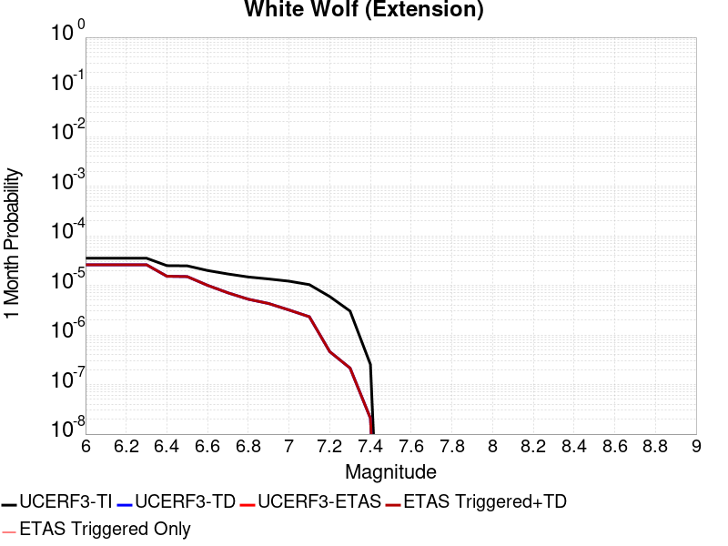 |  | 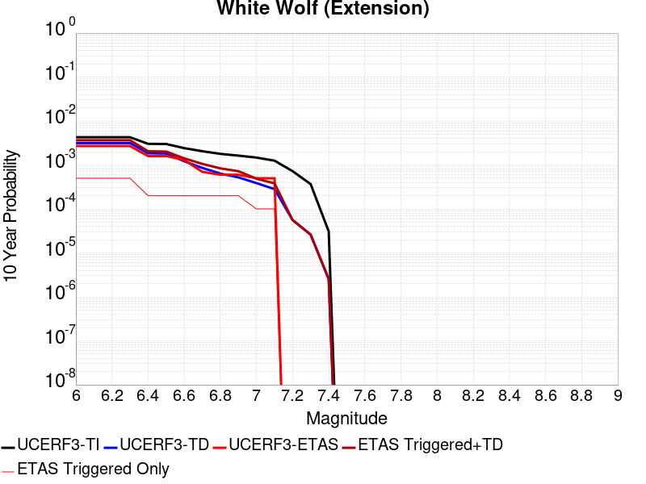 |

| Magnitude | 1 wk TI Prob | 1 wk TD Prob | 1 wk ETAS Prob | 1 wk ETAS/TD Gain | 1 wk ETAS Triggered+TD | 1 wk ETAS Triggered Only | 1 mo TI Prob | 1 mo TD Prob | 1 mo ETAS Prob | 1 mo ETAS/TD Gain | 1 mo ETAS Triggered+TD | 1 mo ETAS Triggered Only | 1 yr TI Prob | 1 yr TD Prob | 1 yr ETAS Prob | 1 yr ETAS/TD Gain | 1 yr ETAS Triggered+TD | 1 yr ETAS Triggered Only | 10 yr TI Prob | 10 yr TD Prob | 10 yr ETAS Prob | 10 yr ETAS/TD Gain | 10 yr ETAS Triggered+TD | 10 yr ETAS Triggered Only |
|-----|-----|-----|-----|-----|-----|-----|-----|-----|-----|-----|-----|-----|-----|-----|-----|-----|-----|-----|-----|-----|-----|-----|-----|-----|
| 6.0 | 8.222555E-6 | 6.0669136E-6 | 0.0 | 0.0 | 6.0669136E-6 | 0.0 | 3.5239045E-5 | 2.6000836E-5 | 0.0 | 0.0 | 2.6000836E-5 | 0.0 | 4.289509E-4 | 3.1652083E-4 | 0.0 | 0.0 | 3.1652083E-4 | 0.0 | 0.0042812387 | 0.0031613521 | 5.0E-4 | 0.15816016 | 0.0036597715 | 5.0E-4 |
| 6.1 | 8.222555E-6 | 6.0669136E-6 | 0.0 | 0.0 | 6.0669136E-6 | 0.0 | 3.5239045E-5 | 2.6000836E-5 | 0.0 | 0.0 | 2.6000836E-5 | 0.0 | 4.289509E-4 | 3.1652083E-4 | 0.0 | 0.0 | 3.1652083E-4 | 0.0 | 0.0042812387 | 0.0031613521 | 5.0E-4 | 0.15816016 | 0.0036597715 | 5.0E-4 |
| 6.2 | 8.222555E-6 | 6.0669136E-6 | 0.0 | 0.0 | 6.0669136E-6 | 0.0 | 3.5239045E-5 | 2.6000836E-5 | 0.0 | 0.0 | 2.6000836E-5 | 0.0 | 4.289509E-4 | 3.1652083E-4 | 0.0 | 0.0 | 3.1652083E-4 | 0.0 | 0.0042812387 | 0.0031613521 | 5.0E-4 | 0.15816016 | 0.0036597715 | 5.0E-4 |
| 6.3 | 8.222555E-6 | 6.0669136E-6 | 0.0 | 0.0 | 6.0669136E-6 | 0.0 | 3.5239045E-5 | 2.6000836E-5 | 0.0 | 0.0 | 2.6000836E-5 | 0.0 | 4.289509E-4 | 3.1652083E-4 | 0.0 | 0.0 | 3.1652083E-4 | 0.0 | 0.0042812387 | 0.0031613521 | 5.0E-4 | 0.15816016 | 0.0036597715 | 5.0E-4 |
| 6.4 | 5.821773E-6 | 3.5571904E-6 | 0.0 | 0.0 | 3.5571904E-6 | 0.0 | 2.4950215E-5 | 1.5245019E-5 | 0.0 | 0.0 | 1.5245019E-5 | 0.0 | 3.0372653E-4 | 1.855934E-4 | 0.0 | 0.0 | 1.855934E-4 | 0.0 | 0.0030331176 | 0.0018544924 | 2.0E-4 | 0.10784622 | 0.0020541213 | 2.0E-4 |
| 6.5 | 5.766023E-6 | 3.4991197E-6 | 0.0 | 0.0 | 3.4991197E-6 | 0.0 | 2.4711293E-5 | 1.4996147E-5 | 0.0 | 0.0 | 1.4996147E-5 | 0.0 | 3.0081844E-4 | 1.8256389E-4 | 0.0 | 0.0 | 1.8256389E-4 | 0.0 | 0.0030041158 | 0.0018242473 | 2.0E-4 | 0.10963426 | 0.0020238825 | 2.0E-4 |
| 6.6 | 4.643576E-6 | 2.3325388E-6 | 0.0 | 0.0 | 2.3325388E-6 | 0.0 | 1.9900888E-5 | 9.996559E-6 | 0.0 | 0.0 | 9.996559E-6 | 0.0 | 2.4226638E-4 | 1.2170174E-4 | 0.0 | 0.0 | 1.2170174E-4 | 0.0 | 0.0024200242 | 0.0012163933 | 2.0E-4 | 0.1644205 | 0.00141615 | 2.0E-4 |
| 6.7 | 3.9529173E-6 | 1.6482173E-6 | 0.0 | 0.0 | 1.6482173E-6 | 0.0 | 1.6940963E-5 | 7.0637707E-6 | 0.0 | 0.0 | 7.0637707E-6 | 0.0 | 2.0623671E-4 | 8.59982E-5 | 0.0 | 0.0 | 8.59982E-5 | 0.0 | 0.002060454 | 8.596677E-4 | 2.0E-4 | 0.23264803 | 0.0010594957 | 2.0E-4 |
| 6.8 | 3.4377522E-6 | 1.2243755E-6 | 0.0 | 0.0 | 1.2243755E-6 | 0.0 | 1.473314E-5 | 5.2473138E-6 | 0.0 | 0.0 | 5.2473138E-6 | 0.0 | 1.7936122E-4 | 6.388426E-5 | 0.0 | 0.0 | 6.388426E-5 | 0.0 | 0.0017921652 | 6.386681E-4 | 2.0E-4 | 0.31315172 | 8.385403E-4 | 2.0E-4 |
| 6.9 | 3.1367306E-6 | 1.0032264E-6 | 0.0 | 0.0 | 1.0032264E-6 | 0.0 | 1.3443062E-5 | 4.299535E-6 | 0.0 | 0.0 | 4.299535E-6 | 0.0 | 1.63657E-4 | 5.234566E-5 | 0.0 | 0.0 | 5.234566E-5 | 0.0 | 0.0016353652 | 5.2334095E-4 | 2.0E-4 | 0.38216007 | 7.2323624E-4 | 2.0E-4 |
| 7.0 | 2.8298145E-6 | 7.4270844E-7 | 0.0 | 0.0 | 7.4270844E-7 | 0.0 | 1.2127721E-5 | 3.1830325E-6 | 0.0 | 0.0 | 3.1830325E-6 | 0.0 | 1.47645E-4 | 3.8752783E-5 | 0.0 | 0.0 | 3.8752783E-5 | 0.0 | 0.0014754693 | 3.8746523E-4 | 1.0E-4 | 0.25808766 | 4.874265E-4 | 1.0E-4 |
| 7.1 | 2.4091064E-6 | 5.4213916E-7 | 0.0 | 0.0 | 5.4213916E-7 | 0.0 | 1.03247E-5 | 2.3234516E-6 | 0.0 | 0.0 | 2.3234516E-6 | 0.0 | 1.2569598E-4 | 2.8287697E-5 | 0.0 | 0.0 | 2.8287697E-5 | 0.0 | 0.001256249 | 2.82845E-4 | 1.0E-4 | 0.35355052 | 3.828167E-4 | 1.0E-4 |
| 7.2 | 1.3875518E-6 | 1.0735688E-7 | 0.0 | 0.0 | 1.0735688E-7 | 0.0 | 5.9466374E-6 | 4.6010084E-7 | 0.0 | 0.0 | 4.6010084E-7 | 0.0 | 7.23979E-5 | 5.6017143E-6 | 0.0 | 0.0 | 5.6017143E-6 | 0.0 | 7.2374323E-4 | 5.6015848E-5 | 0.0 | 0.0 | 5.6015848E-5 | 0.0 |
| 7.3 | 7.056077E-7 | 4.9976467E-8 | 0.0 | 0.0 | 4.9976467E-8 | 0.0 | 3.0240296E-6 | 2.1418485E-7 | 0.0 | 0.0 | 2.1418485E-7 | 0.0 | 3.681694E-5 | 2.607698E-6 | 0.0 | 0.0 | 2.607698E-6 | 0.0 | 3.681084E-4 | 2.607672E-5 | 0.0 | 0.0 | 2.607672E-5 | 0.0 |
| 7.4 | 5.9334678E-8 | 4.8625504E-9 | 0.0 | 0.0 | 4.8625504E-9 | 0.0 | 2.5429145E-7 | 2.08395E-8 | 0.0 | 0.0 | 2.08395E-8 | 0.0 | 3.095994E-6 | 2.537209E-7 | 0.0 | 0.0 | 2.537209E-7 | 0.0 | 3.095951E-5 | 2.5372074E-6 | 0.0 | 0.0 | 2.5372074E-6 | 0.0 |

## Antelope Valley 2011
*[(top)](#table-of-contents)*

| 1 Week | 1 Month | 1 Year | 10 Year |
|-----|-----|-----|-----|
|  |  | 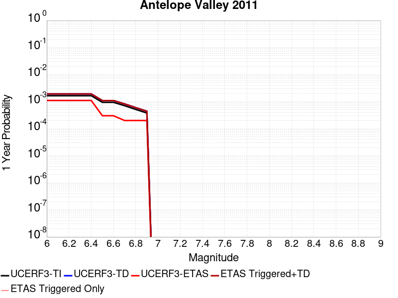 | 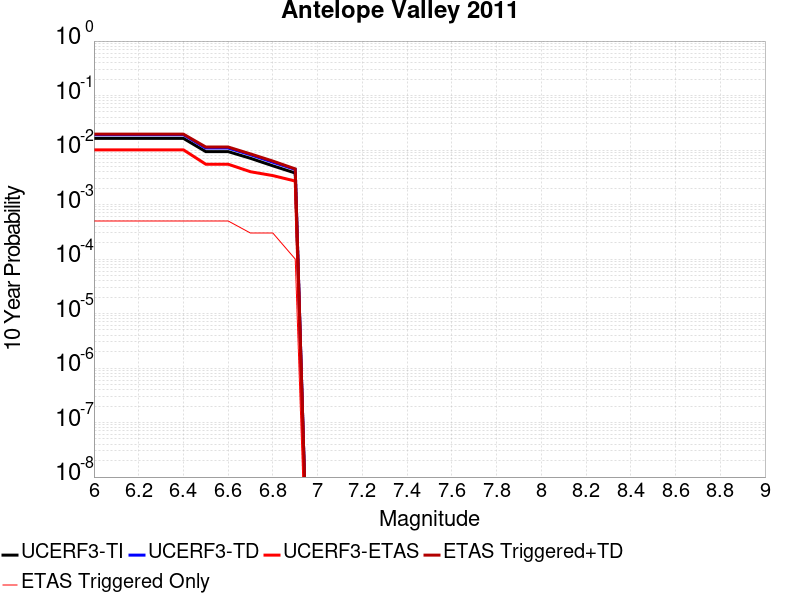 |

| Magnitude | 1 wk TI Prob | 1 wk TD Prob | 1 wk ETAS Prob | 1 wk ETAS/TD Gain | 1 wk ETAS Triggered+TD | 1 wk ETAS Triggered Only | 1 mo TI Prob | 1 mo TD Prob | 1 mo ETAS Prob | 1 mo ETAS/TD Gain | 1 mo ETAS Triggered+TD | 1 mo ETAS Triggered Only | 1 yr TI Prob | 1 yr TD Prob | 1 yr ETAS Prob | 1 yr ETAS/TD Gain | 1 yr ETAS Triggered+TD | 1 yr ETAS Triggered Only | 10 yr TI Prob | 10 yr TD Prob | 10 yr ETAS Prob | 10 yr ETAS/TD Gain | 10 yr ETAS Triggered+TD | 10 yr ETAS Triggered Only |
|-----|-----|-----|-----|-----|-----|-----|-----|-----|-----|-----|-----|-----|-----|-----|-----|-----|-----|-----|-----|-----|-----|-----|-----|-----|
| 6.0 | 3.1646934E-5 | 3.6917016E-5 | 0.0 | 0.0 | 3.6917016E-5 | 0.0 | 1.3562266E-4 | 1.582077E-4 | 0.0 | 0.0 | 1.582077E-4 | 0.0 | 0.0016499552 | 0.0019247418 | 0.0 | 0.0 | 0.0019247418 | 0.0 | 0.016377583 | 0.019107137 | 5.0E-4 | 0.02616823 | 0.019597584 | 5.0E-4 |
| 6.1 | 3.1646934E-5 | 3.6917016E-5 | 0.0 | 0.0 | 3.6917016E-5 | 0.0 | 1.3562266E-4 | 1.582077E-4 | 0.0 | 0.0 | 1.582077E-4 | 0.0 | 0.0016499552 | 0.0019247418 | 0.0 | 0.0 | 0.0019247418 | 0.0 | 0.016377583 | 0.019107137 | 5.0E-4 | 0.02616823 | 0.019597584 | 5.0E-4 |
| 6.2 | 3.1646934E-5 | 3.6917016E-5 | 0.0 | 0.0 | 3.6917016E-5 | 0.0 | 1.3562266E-4 | 1.582077E-4 | 0.0 | 0.0 | 1.582077E-4 | 0.0 | 0.0016499552 | 0.0019247418 | 0.0 | 0.0 | 0.0019247418 | 0.0 | 0.016377583 | 0.019107137 | 5.0E-4 | 0.02616823 | 0.019597584 | 5.0E-4 |
| 6.3 | 3.1646934E-5 | 3.6917016E-5 | 0.0 | 0.0 | 3.6917016E-5 | 0.0 | 1.3562266E-4 | 1.582077E-4 | 0.0 | 0.0 | 1.582077E-4 | 0.0 | 0.0016499552 | 0.0019247418 | 0.0 | 0.0 | 0.0019247418 | 0.0 | 0.016377583 | 0.019107137 | 5.0E-4 | 0.02616823 | 0.019597584 | 5.0E-4 |
| 6.4 | 3.1646934E-5 | 3.6917016E-5 | 0.0 | 0.0 | 3.6917016E-5 | 0.0 | 1.3562266E-4 | 1.582077E-4 | 0.0 | 0.0 | 1.582077E-4 | 0.0 | 0.0016499552 | 0.0019247418 | 0.0 | 0.0 | 0.0019247418 | 0.0 | 0.016377583 | 0.019107137 | 5.0E-4 | 0.02616823 | 0.019597584 | 5.0E-4 |
| 6.5 | 1.8034107E-5 | 2.0947908E-5 | 0.0 | 0.0 | 2.0947908E-5 | 0.0 | 7.7286735E-5 | 8.9774345E-5 | 0.0 | 0.0 | 8.9774345E-5 | 0.0 | 9.405598E-4 | 0.0010925771 | 0.0 | 0.0 | 0.0010925771 | 0.0 | 0.009365888 | 0.010884139 | 5.0E-4 | 0.045938406 | 0.011378697 | 5.0E-4 |
| 6.6 | 1.8034107E-5 | 2.0947908E-5 | 0.0 | 0.0 | 2.0947908E-5 | 0.0 | 7.7286735E-5 | 8.9774345E-5 | 0.0 | 0.0 | 8.9774345E-5 | 0.0 | 9.405598E-4 | 0.0010925771 | 0.0 | 0.0 | 0.0010925771 | 0.0 | 0.009365888 | 0.010884139 | 5.0E-4 | 0.045938406 | 0.011378697 | 5.0E-4 |
| 6.7 | 1.3567667E-5 | 1.5754726E-5 | 0.0 | 0.0 | 1.5754726E-5 | 0.0 | 5.814585E-5 | 6.7519104E-5 | 0.0 | 0.0 | 6.7519104E-5 | 0.0 | 7.076958E-4 | 8.2184136E-4 | 0.0 | 0.0 | 8.2184136E-4 | 0.0 | 0.007054463 | 0.0081984615 | 3.0E-4 | 0.03659223 | 0.008496002 | 3.0E-4 |
| 6.8 | 9.867387E-6 | 1.1471766E-5 | 0.0 | 0.0 | 1.1471766E-5 | 0.0 | 4.2288117E-5 | 4.9164322E-5 | 0.0 | 0.0 | 4.9164322E-5 | 0.0 | 5.1473617E-4 | 5.9850625E-4 | 0.0 | 0.0 | 5.9850625E-4 | 0.0 | 0.005135455 | 0.005978262 | 3.0E-4 | 0.050181806 | 0.0062764687 | 3.0E-4 |
| 6.9 | 7.273233E-6 | 8.457692E-6 | 0.0 | 0.0 | 8.457692E-6 | 0.0 | 3.1170628E-5 | 3.6247253E-5 | 0.0 | 0.0 | 3.6247253E-5 | 0.0 | 3.794363E-4 | 4.4131032E-4 | 0.0 | 0.0 | 4.4131032E-4 | 0.0 | 0.0037878908 | 0.004413103 | 1.0E-4 | 0.022659792 | 0.004512662 | 1.0E-4 |

## Rinconada 2011 CFM
*[(top)](#table-of-contents)*

| 1 Week | 1 Month | 1 Year | 10 Year |
|-----|-----|-----|-----|
|  | 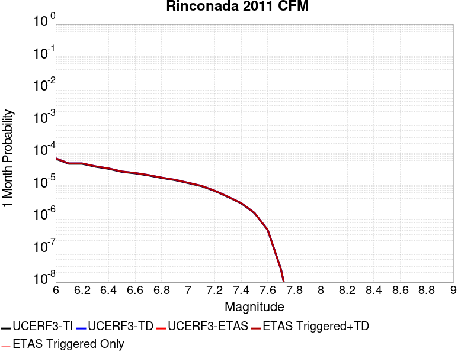 |  |  |

| Magnitude | 1 wk TI Prob | 1 wk TD Prob | 1 wk ETAS Prob | 1 wk ETAS/TD Gain | 1 wk ETAS Triggered+TD | 1 wk ETAS Triggered Only | 1 mo TI Prob | 1 mo TD Prob | 1 mo ETAS Prob | 1 mo ETAS/TD Gain | 1 mo ETAS Triggered+TD | 1 mo ETAS Triggered Only | 1 yr TI Prob | 1 yr TD Prob | 1 yr ETAS Prob | 1 yr ETAS/TD Gain | 1 yr ETAS Triggered+TD | 1 yr ETAS Triggered Only | 10 yr TI Prob | 10 yr TD Prob | 10 yr ETAS Prob | 10 yr ETAS/TD Gain | 10 yr ETAS Triggered+TD | 10 yr ETAS Triggered Only |
|-----|-----|-----|-----|-----|-----|-----|-----|-----|-----|-----|-----|-----|-----|-----|-----|-----|-----|-----|-----|-----|-----|-----|-----|-----|
| 6.0 | 1.5752368E-5 | 1.6275832E-5 | 0.0 | 0.0 | 1.6275832E-5 | 0.0 | 6.75084E-5 | 6.975172E-5 | 0.0 | 0.0 | 6.975172E-5 | 0.0 | 8.2160486E-4 | 8.488994E-4 | 0.0 | 0.0 | 8.488994E-4 | 0.0 | 0.008185739 | 0.008456947 | 4.0E-4 | 0.04729839 | 0.008853565 | 4.0E-4 |
| 6.1 | 1.0966133E-5 | 1.1323793E-5 | 0.0 | 0.0 | 1.1323793E-5 | 0.0 | 4.6996865E-5 | 4.8529644E-5 | 0.0 | 0.0 | 4.8529644E-5 | 0.0 | 5.720366E-4 | 5.9068896E-4 | 0.0 | 0.0 | 5.9068896E-4 | 0.0 | 0.0057056635 | 0.005891285 | 2.0E-4 | 0.03394845 | 0.006090107 | 2.0E-4 |
| 6.2 | 1.0966133E-5 | 1.1323793E-5 | 0.0 | 0.0 | 1.1323793E-5 | 0.0 | 4.6996865E-5 | 4.8529644E-5 | 0.0 | 0.0 | 4.8529644E-5 | 0.0 | 5.720366E-4 | 5.9068896E-4 | 0.0 | 0.0 | 5.9068896E-4 | 0.0 | 0.0057056635 | 0.005891285 | 2.0E-4 | 0.03394845 | 0.006090107 | 2.0E-4 |
| 6.3 | 8.926149E-6 | 9.213386E-6 | 0.0 | 0.0 | 9.213386E-6 | 0.0 | 3.8254362E-5 | 3.9485345E-5 | 0.0 | 0.0 | 3.9485345E-5 | 0.0 | 4.6564735E-4 | 4.8062834E-4 | 0.0 | 0.0 | 4.8062834E-4 | 0.0 | 0.0046467283 | 0.0047959336 | 1.0E-4 | 0.020850997 | 0.004895454 | 1.0E-4 |
| 6.4 | 7.676955E-6 | 7.920713E-6 | 0.0 | 0.0 | 7.920713E-6 | 0.0 | 3.290082E-5 | 3.394547E-5 | 0.0 | 0.0 | 3.394547E-5 | 0.0 | 4.0049385E-4 | 4.1320792E-4 | 0.0 | 0.0 | 4.1320792E-4 | 0.0 | 0.0039977287 | 0.004124422 | 1.0E-4 | 0.024245821 | 0.00422401 | 1.0E-4 |
| 6.5 | 6.1671026E-6 | 6.359367E-6 | 0.0 | 0.0 | 6.359367E-6 | 0.0 | 2.6430173E-5 | 2.7254146E-5 | 0.0 | 0.0 | 2.7254146E-5 | 0.0 | 3.2173982E-4 | 3.317688E-4 | 0.0 | 0.0 | 3.317688E-4 | 0.0 | 0.003212744 | 0.003312747 | 1.0E-4 | 0.03018643 | 0.0034124157 | 1.0E-4 |
| 6.6 | 5.553456E-6 | 5.7251814E-6 | 0.0 | 0.0 | 5.7251814E-6 | 0.0 | 2.3800309E-5 | 2.453626E-5 | 0.0 | 0.0 | 2.453626E-5 | 0.0 | 2.897302E-4 | 2.9868807E-4 | 0.0 | 0.0 | 2.9868807E-4 | 0.0 | 0.0028935277 | 0.0029828749 | 1.0E-4 | 0.033524703 | 0.0030825767 | 1.0E-4 |
| 6.7 | 4.787857E-6 | 4.933623E-6 | 0.0 | 0.0 | 4.933623E-6 | 0.0 | 2.0519226E-5 | 2.1143927E-5 | 0.0 | 0.0 | 2.1143927E-5 | 0.0 | 2.4979294E-4 | 2.5739695E-4 | 0.0 | 0.0 | 2.5739695E-4 | 0.0 | 0.0024951235 | 0.002570994 | 1.0E-4 | 0.038895465 | 0.0026707368 | 1.0E-4 |
| 6.8 | 3.9955166E-6 | 4.113731E-6 | 0.0 | 0.0 | 4.113731E-6 | 0.0 | 1.7123532E-5 | 1.7630156E-5 | 0.0 | 0.0 | 1.7630156E-5 | 0.0 | 2.0845905E-4 | 2.1462602E-4 | 0.0 | 0.0 | 2.1462602E-4 | 0.0 | 0.002082636 | 0.0021441912 | 1.0E-4 | 0.046637636 | 0.0022439766 | 1.0E-4 |
| 6.9 | 3.4250072E-6 | 3.5226572E-6 | 0.0 | 0.0 | 3.5226572E-6 | 0.0 | 1.46785205E-5 | 1.50970145E-5 | 0.0 | 0.0 | 1.50970145E-5 | 0.0 | 1.7869633E-4 | 1.8379066E-4 | 0.0 | 0.0 | 1.8379066E-4 | 0.0 | 0.001785527 | 0.0018363892 | 1.0E-4 | 0.054454688 | 0.0019362055 | 1.0E-4 |
| 7.0 | 2.7712713E-6 | 2.8468637E-6 | 0.0 | 0.0 | 2.8468637E-6 | 0.0 | 1.1876823E-5 | 1.2200788E-5 | 0.0 | 0.0 | 1.2200788E-5 | 0.0 | 1.4459073E-4 | 1.4853447E-4 | 0.0 | 0.0 | 1.4853447E-4 | 0.0 | 0.0014449668 | 0.0014843536 | 0.0 | 0.0 | 0.0014843536 | 0.0 |
| 7.1 | 2.227358E-6 | 2.285826E-6 | 0.0 | 0.0 | 2.285826E-6 | 0.0 | 9.545785E-6 | 9.79636E-6 | 0.0 | 0.0 | 9.79636E-6 | 0.0 | 1.16213734E-4 | 1.19264165E-4 | 0.0 | 0.0 | 1.19264165E-4 | 0.0 | 0.0011615298 | 0.0011920027 | 0.0 | 0.0 | 0.0011920027 | 0.0 |
| 7.2 | 1.581796E-6 | 1.6209876E-6 | 0.0 | 0.0 | 1.6209876E-6 | 0.0 | 6.779108E-6 | 6.9470716E-6 | 0.0 | 0.0 | 6.9470716E-6 | 0.0 | 8.253252E-5 | 8.457732E-5 | 0.0 | 0.0 | 8.457732E-5 | 0.0 | 8.250187E-4 | 8.4545184E-4 | 0.0 | 0.0 | 8.4545184E-4 | 0.0 |
| 7.3 | 1.0306567E-6 | 1.0547021E-6 | 0.0 | 0.0 | 1.0547021E-6 | 0.0 | 4.4170924E-6 | 4.520144E-6 | 0.0 | 0.0 | 4.520144E-6 | 0.0 | 5.3776774E-5 | 5.5031367E-5 | 0.0 | 0.0 | 5.5031367E-5 | 0.0 | 5.376376E-4 | 5.5017765E-4 | 0.0 | 0.0 | 5.5017765E-4 | 0.0 |
| 7.4 | 6.535541E-7 | 6.68309E-7 | 0.0 | 0.0 | 6.68309E-7 | 0.0 | 2.800943E-6 | 2.8641782E-6 | 0.0 | 0.0 | 2.8641782E-6 | 0.0 | 3.4100947E-5 | 3.4870813E-5 | 0.0 | 0.0 | 3.4870813E-5 | 0.0 | 3.4095717E-4 | 3.4865353E-4 | 0.0 | 0.0 | 3.4865353E-4 | 0.0 |
| 7.5 | 3.2656962E-7 | 3.3318452E-7 | 0.0 | 0.0 | 3.3318452E-7 | 0.0 | 1.3995833E-6 | 1.4279327E-6 | 0.0 | 0.0 | 1.4279327E-6 | 0.0 | 1.7039794E-5 | 1.7384944E-5 | 0.0 | 0.0 | 1.7384944E-5 | 0.0 | 1.7038487E-4 | 1.7383587E-4 | 0.0 | 0.0 | 1.7383587E-4 | 0.0 |
| 7.6 | 9.754343E-8 | 9.8214976E-8 | 0.0 | 0.0 | 9.8214976E-8 | 0.0 | 4.180432E-7 | 4.2092125E-7 | 0.0 | 0.0 | 4.2092125E-7 | 0.0 | 5.089664E-6 | 5.1247043E-6 | 0.0 | 0.0 | 5.1247043E-6 | 0.0 | 5.0895473E-5 | 5.124587E-5 | 0.0 | 0.0 | 5.124587E-5 | 0.0 |
| 7.7 | 6.0001453E-9 | 5.8493224E-9 | 0.0 | 0.0 | 5.8493224E-9 | 0.0 | 2.5714908E-8 | 2.5068523E-8 | 0.0 | 0.0 | 2.5068523E-8 | 0.0 | 3.1307894E-7 | 3.0520923E-7 | 0.0 | 0.0 | 3.0520923E-7 | 0.0 | 3.1307852E-6 | 3.0520882E-6 | 0.0 | 0.0 | 3.0520882E-6 | 0.0 |
| 7.8 | 7.400003E-11 | 7.465584E-11 | 0.0 | 0.0 | 7.465584E-11 | 0.0 | 3.171432E-10 | 3.199535E-10 | 0.0 | 0.0 | 3.199535E-10 | 0.0 | 3.861218E-9 | 3.895434E-9 | 0.0 | 0.0 | 3.895434E-9 | 0.0 | 3.861218E-8 | 3.895434E-8 | 0.0 | 0.0 | 3.895434E-8 | 0.0 |

## Big Pine (East)
*[(top)](#table-of-contents)*

| 1 Week | 1 Month | 1 Year | 10 Year |
|-----|-----|-----|-----|
|  | 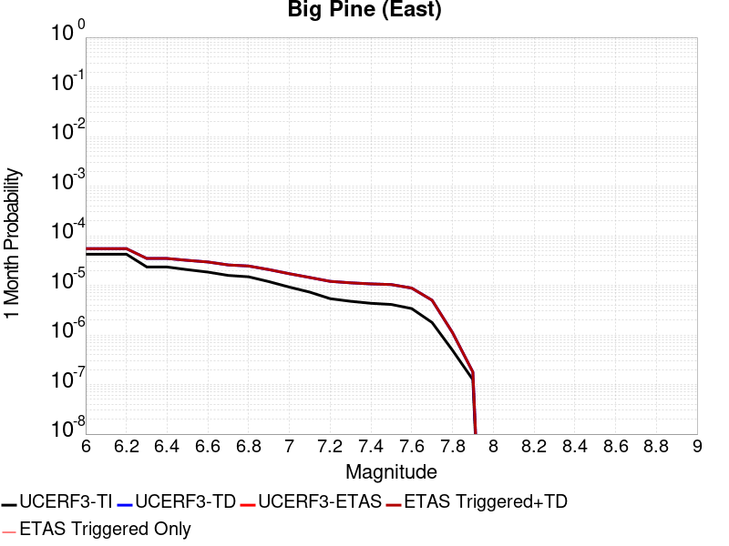 | 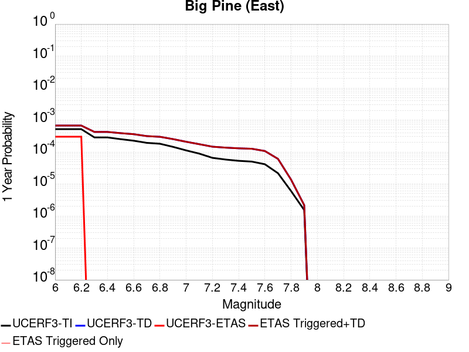 | 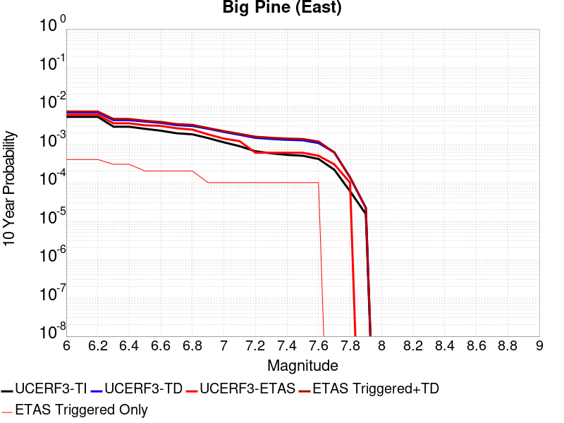 |

| Magnitude | 1 wk TI Prob | 1 wk TD Prob | 1 wk ETAS Prob | 1 wk ETAS/TD Gain | 1 wk ETAS Triggered+TD | 1 wk ETAS Triggered Only | 1 mo TI Prob | 1 mo TD Prob | 1 mo ETAS Prob | 1 mo ETAS/TD Gain | 1 mo ETAS Triggered+TD | 1 mo ETAS Triggered Only | 1 yr TI Prob | 1 yr TD Prob | 1 yr ETAS Prob | 1 yr ETAS/TD Gain | 1 yr ETAS Triggered+TD | 1 yr ETAS Triggered Only | 10 yr TI Prob | 10 yr TD Prob | 10 yr ETAS Prob | 10 yr ETAS/TD Gain | 10 yr ETAS Triggered+TD | 10 yr ETAS Triggered Only |
|-----|-----|-----|-----|-----|-----|-----|-----|-----|-----|-----|-----|-----|-----|-----|-----|-----|-----|-----|-----|-----|-----|-----|-----|-----|
| 6.0 | 9.916913E-6 | 1.28351785E-5 | 0.0 | 0.0 | 1.28351785E-5 | 0.0 | 4.250036E-5 | 5.5006873E-5 | 0.0 | 0.0 | 5.5006873E-5 | 0.0 | 5.173191E-4 | 6.69525E-4 | 0.0 | 0.0 | 6.69525E-4 | 0.0 | 0.0051611643 | 0.0066797864 | 4.0E-4 | 0.059882153 | 0.0070771147 | 4.0E-4 |
| 6.1 | 9.916913E-6 | 1.28351785E-5 | 0.0 | 0.0 | 1.28351785E-5 | 0.0 | 4.250036E-5 | 5.5006873E-5 | 0.0 | 0.0 | 5.5006873E-5 | 0.0 | 5.173191E-4 | 6.69525E-4 | 0.0 | 0.0 | 6.69525E-4 | 0.0 | 0.0051611643 | 0.0066797864 | 4.0E-4 | 0.059882153 | 0.0070771147 | 4.0E-4 |
| 6.2 | 9.916913E-6 | 1.28351785E-5 | 0.0 | 0.0 | 1.28351785E-5 | 0.0 | 4.250036E-5 | 5.5006873E-5 | 0.0 | 0.0 | 5.5006873E-5 | 0.0 | 5.173191E-4 | 6.69525E-4 | 0.0 | 0.0 | 6.69525E-4 | 0.0 | 0.0051611643 | 0.0066797864 | 4.0E-4 | 0.059882153 | 0.0070771147 | 4.0E-4 |
| 6.3 | 5.479711E-6 | 8.1305625E-6 | 0.0 | 0.0 | 8.1305625E-6 | 0.0 | 2.3484265E-5 | 3.4844823E-5 | 0.0 | 0.0 | 3.4844823E-5 | 0.0 | 2.858834E-4 | 4.2415631E-4 | 0.0 | 0.0 | 4.2415631E-4 | 0.0 | 0.0028551589 | 0.004236309 | 3.0E-4 | 0.07081637 | 0.0045350376 | 3.0E-4 |
| 6.4 | 5.465009E-6 | 8.114854E-6 | 0.0 | 0.0 | 8.114854E-6 | 0.0 | 2.3421257E-5 | 3.47775E-5 | 0.0 | 0.0 | 3.47775E-5 | 0.0 | 2.851165E-4 | 4.23337E-4 | 0.0 | 0.0 | 4.23337E-4 | 0.0 | 0.0028475097 | 0.0042281467 | 3.0E-4 | 0.07095307 | 0.0045268782 | 3.0E-4 |
| 6.5 | 4.826767E-6 | 7.4398304E-6 | 0.0 | 0.0 | 7.4398304E-6 | 0.0 | 2.068598E-5 | 3.1884614E-5 | 0.0 | 0.0 | 3.1884614E-5 | 0.0 | 2.518227E-4 | 3.881288E-4 | 0.0 | 0.0 | 3.881288E-4 | 0.0 | 0.0025153751 | 0.0038773085 | 2.0E-4 | 0.051582173 | 0.004076533 | 2.0E-4 |
| 6.6 | 4.3146847E-6 | 6.8997056E-6 | 0.0 | 0.0 | 6.8997056E-6 | 0.0 | 1.8491375E-5 | 2.9569846E-5 | 0.0 | 0.0 | 2.9569846E-5 | 0.0 | 2.2510924E-4 | 3.5995585E-4 | 0.0 | 0.0 | 3.5995585E-4 | 0.0 | 0.0022488134 | 0.0035964951 | 2.0E-4 | 0.055609696 | 0.0037957758 | 2.0E-4 |
| 6.7 | 3.6968106E-6 | 6.011944E-6 | 0.0 | 0.0 | 6.011944E-6 | 0.0 | 1.5843378E-5 | 2.5765228E-5 | 0.0 | 0.0 | 2.5765228E-5 | 0.0 | 1.9287605E-4 | 3.1364805E-4 | 0.0 | 0.0 | 3.1364805E-4 | 0.0 | 0.0019270873 | 0.00313473 | 2.0E-4 | 0.06380135 | 0.0033341032 | 2.0E-4 |
| 6.8 | 3.4671132E-6 | 5.7182065E-6 | 0.0 | 0.0 | 5.7182065E-6 | 0.0 | 1.4858972E-5 | 2.4506378E-5 | 0.0 | 0.0 | 2.4506378E-5 | 0.0 | 1.8089297E-4 | 2.9832576E-4 | 0.0 | 0.0 | 2.9832576E-4 | 0.0 | 0.0018074579 | 0.0029819205 | 2.0E-4 | 0.06707087 | 0.003181324 | 2.0E-4 |
| 6.9 | 2.7686972E-6 | 4.8400416E-6 | 0.0 | 0.0 | 4.8400416E-6 | 0.0 | 1.1865792E-5 | 2.0742875E-5 | 0.0 | 0.0 | 2.0742875E-5 | 0.0 | 1.4445644E-4 | 2.52516E-4 | 0.0 | 0.0 | 2.52516E-4 | 0.0 | 0.0014436257 | 0.0025248902 | 1.0E-4 | 0.03960568 | 0.002624638 | 1.0E-4 |
| 7.0 | 2.1472624E-6 | 3.998523E-6 | 0.0 | 0.0 | 3.998523E-6 | 0.0 | 9.20252E-6 | 1.7136417E-5 | 0.0 | 0.0 | 1.7136417E-5 | 0.0 | 1.12034926E-4 | 2.0861645E-4 | 0.0 | 0.0 | 2.0861645E-4 | 0.0 | 0.0011197845 | 0.0020867933 | 1.0E-4 | 0.047920417 | 0.0021865845 | 1.0E-4 |
| 7.1 | 1.7018335E-6 | 3.3571353E-6 | 0.0 | 0.0 | 3.3571353E-6 | 0.0 | 7.293552E-6 | 1.4387646E-5 | 0.0 | 0.0 | 1.4387646E-5 | 0.0 | 8.879537E-5 | 1.7515586E-4 | 0.0 | 0.0 | 1.7515586E-4 | 0.0 | 8.87599E-4 | 0.0017527334 | 1.0E-4 | 0.057053745 | 0.001852558 | 1.0E-4 |
| 7.2 | 1.25603E-6 | 2.8060726E-6 | 0.0 | 0.0 | 2.8060726E-6 | 0.0 | 5.3829745E-6 | 1.2025972E-5 | 0.0 | 0.0 | 1.2025972E-5 | 0.0 | 6.553574E-5 | 1.464066E-4 | 0.0 | 0.0 | 1.464066E-4 | 0.0 | 6.551642E-4 | 0.0014656329 | 1.0E-4 | 0.06822991 | 0.0015654863 | 1.0E-4 |
| 7.3 | 1.112297E-6 | 2.621288E-6 | 0.0 | 0.0 | 2.621288E-6 | 0.0 | 4.7669787E-6 | 1.1234045E-5 | 0.0 | 0.0 | 1.1234045E-5 | 0.0 | 5.803642E-5 | 1.3676613E-4 | 0.0 | 0.0 | 1.3676613E-4 | 0.0 | 5.802127E-4 | 0.0013692146 | 1.0E-4 | 0.07303457 | 0.0014690777 | 1.0E-4 |
| 7.4 | 1.0137181E-6 | 2.493985E-6 | 0.0 | 0.0 | 2.493985E-6 | 0.0 | 4.3444993E-6 | 1.06884645E-5 | 0.0 | 0.0 | 1.06884645E-5 | 0.0 | 5.2892992E-5 | 1.3012449E-4 | 0.0 | 0.0 | 1.3012449E-4 | 0.0 | 5.288041E-4 | 0.0013026608 | 1.0E-4 | 0.076765954 | 0.0014025305 | 1.0E-4 |
| 7.5 | 9.598608E-7 | 2.4173355E-6 | 0.0 | 0.0 | 2.4173355E-6 | 0.0 | 4.1136827E-6 | 1.035997E-5 | 0.0 | 0.0 | 1.035997E-5 | 0.0 | 5.0082934E-5 | 1.2612554E-4 | 0.0 | 0.0 | 1.2612554E-4 | 0.0 | 5.007165E-4 | 0.0012625239 | 1.0E-4 | 0.07920642 | 0.0013623977 | 1.0E-4 |
| 7.6 | 7.929459E-7 | 2.0538762E-6 | 0.0 | 0.0 | 2.0538762E-6 | 0.0 | 3.3983351E-6 | 8.802298E-6 | 0.0 | 0.0 | 8.802298E-6 | 0.0 | 4.1373947E-5 | 1.0716288E-4 | 0.0 | 0.0 | 1.0716288E-4 | 0.0 | 4.1366243E-4 | 0.0010731514 | 1.0E-4 | 0.0931835 | 0.001173044 | 1.0E-4 |
| 7.7 | 4.155788E-7 | 1.1669864E-6 | 0.0 | 0.0 | 1.1669864E-6 | 0.0 | 1.7810507E-6 | 5.001361E-6 | 0.0 | 0.0 | 5.001361E-6 | 0.0 | 2.1684076E-5 | 6.088991E-5 | 0.0 | 0.0 | 6.088991E-5 | 0.0 | 2.1681961E-4 | 6.11907E-4 | 0.0 | 0.0 | 6.11907E-4 | 0.0 |
| 7.8 | 1.14666925E-7 | 2.6063242E-7 | 0.0 | 0.0 | 2.6063242E-7 | 0.0 | 4.914296E-7 | 1.1169956E-6 | 0.0 | 0.0 | 1.1169956E-6 | 0.0 | 5.9831386E-6 | 1.3599341E-5 | 0.0 | 0.0 | 1.3599341E-5 | 0.0 | 5.9829777E-5 | 1.37089E-4 | 0.0 | 0.0 | 1.37089E-4 | 0.0 |
| 7.9 | 2.9231824E-8 | 4.168944E-8 | 0.0 | 0.0 | 4.168944E-8 | 0.0 | 1.2527924E-7 | 1.7866901E-7 | 0.0 | 0.0 | 1.7866901E-7 | 0.0 | 1.5252737E-6 | 2.1752933E-6 | 0.0 | 0.0 | 2.1752933E-6 | 0.0 | 1.5252632E-5 | 2.2097778E-5 | 0.0 | 0.0 | 2.2097778E-5 | 0.0 |

## San Jose
*[(top)](#table-of-contents)*

| 1 Week | 1 Month | 1 Year | 10 Year |
|-----|-----|-----|-----|
|  |  |  | 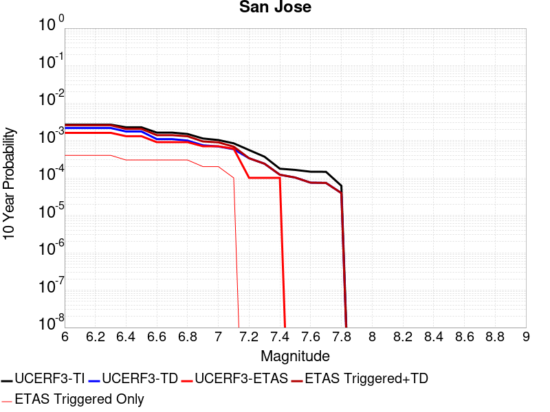 |

| Magnitude | 1 wk TI Prob | 1 wk TD Prob | 1 wk ETAS Prob | 1 wk ETAS/TD Gain | 1 wk ETAS Triggered+TD | 1 wk ETAS Triggered Only | 1 mo TI Prob | 1 mo TD Prob | 1 mo ETAS Prob | 1 mo ETAS/TD Gain | 1 mo ETAS Triggered+TD | 1 mo ETAS Triggered Only | 1 yr TI Prob | 1 yr TD Prob | 1 yr ETAS Prob | 1 yr ETAS/TD Gain | 1 yr ETAS Triggered+TD | 1 yr ETAS Triggered Only | 10 yr TI Prob | 10 yr TD Prob | 10 yr ETAS Prob | 10 yr ETAS/TD Gain | 10 yr ETAS Triggered+TD | 10 yr ETAS Triggered Only |
|-----|-----|-----|-----|-----|-----|-----|-----|-----|-----|-----|-----|-----|-----|-----|-----|-----|-----|-----|-----|-----|-----|-----|-----|-----|
| 6.0 | 5.0851277E-6 | 4.1267604E-6 | 0.0 | 0.0 | 4.1267604E-6 | 0.0 | 2.1793223E-5 | 1.768601E-5 | 0.0 | 0.0 | 1.768601E-5 | 0.0 | 2.653002E-4 | 2.1530854E-4 | 0.0 | 0.0 | 2.1530854E-4 | 0.0 | 0.0026498367 | 0.0021513298 | 4.0E-4 | 0.18593152 | 0.0025504692 | 4.0E-4 |
| 6.1 | 5.0851277E-6 | 4.1267604E-6 | 0.0 | 0.0 | 4.1267604E-6 | 0.0 | 2.1793223E-5 | 1.768601E-5 | 0.0 | 0.0 | 1.768601E-5 | 0.0 | 2.653002E-4 | 2.1530854E-4 | 0.0 | 0.0 | 2.1530854E-4 | 0.0 | 0.0026498367 | 0.0021513298 | 4.0E-4 | 0.18593152 | 0.0025504692 | 4.0E-4 |
| 6.2 | 5.0851277E-6 | 4.1267604E-6 | 0.0 | 0.0 | 4.1267604E-6 | 0.0 | 2.1793223E-5 | 1.768601E-5 | 0.0 | 0.0 | 1.768601E-5 | 0.0 | 2.653002E-4 | 2.1530854E-4 | 0.0 | 0.0 | 2.1530854E-4 | 0.0 | 0.0026498367 | 0.0021513298 | 4.0E-4 | 0.18593152 | 0.0025504692 | 4.0E-4 |
| 6.3 | 5.0851277E-6 | 4.1267604E-6 | 0.0 | 0.0 | 4.1267604E-6 | 0.0 | 2.1793223E-5 | 1.768601E-5 | 0.0 | 0.0 | 1.768601E-5 | 0.0 | 2.653002E-4 | 2.1530854E-4 | 0.0 | 0.0 | 2.1530854E-4 | 0.0 | 0.0026498367 | 0.0021513298 | 4.0E-4 | 0.18593152 | 0.0025504692 | 4.0E-4 |
| 6.4 | 4.3115124E-6 | 3.3248105E-6 | 0.0 | 0.0 | 3.3248105E-6 | 0.0 | 1.8477778E-5 | 1.4249123E-5 | 0.0 | 0.0 | 1.4249123E-5 | 0.0 | 2.2494372E-4 | 1.7347146E-4 | 0.0 | 0.0 | 1.7347146E-4 | 0.0 | 0.0022471617 | 0.0017336496 | 3.0E-4 | 0.17304535 | 0.0020331296 | 3.0E-4 |
| 6.5 | 4.3115124E-6 | 3.3248105E-6 | 0.0 | 0.0 | 3.3248105E-6 | 0.0 | 1.8477778E-5 | 1.4249123E-5 | 0.0 | 0.0 | 1.4249123E-5 | 0.0 | 2.2494372E-4 | 1.7347146E-4 | 0.0 | 0.0 | 1.7347146E-4 | 0.0 | 0.0022471617 | 0.0017336496 | 3.0E-4 | 0.17304535 | 0.0020331296 | 3.0E-4 |
| 6.6 | 3.110396E-6 | 2.080923E-6 | 0.0 | 0.0 | 2.080923E-6 | 0.0 | 1.33302E-5 | 8.918212E-6 | 0.0 | 0.0 | 8.918212E-6 | 0.0 | 1.622831E-4 | 1.085741E-4 | 0.0 | 0.0 | 1.085741E-4 | 0.0 | 0.0016216465 | 0.0010853099 | 3.0E-4 | 0.27641875 | 0.0013849844 | 3.0E-4 |
| 6.7 | 3.110396E-6 | 2.080923E-6 | 0.0 | 0.0 | 2.080923E-6 | 0.0 | 1.33302E-5 | 8.918212E-6 | 0.0 | 0.0 | 8.918212E-6 | 0.0 | 1.622831E-4 | 1.085741E-4 | 0.0 | 0.0 | 1.085741E-4 | 0.0 | 0.0016216465 | 0.0010853099 | 3.0E-4 | 0.27641875 | 0.0013849844 | 3.0E-4 |
| 6.8 | 2.856651E-6 | 1.9033455E-6 | 0.0 | 0.0 | 1.9033455E-6 | 0.0 | 1.2242733E-5 | 8.157171E-6 | 0.0 | 0.0 | 8.157171E-6 | 0.0 | 1.4904508E-4 | 9.9309276E-5 | 0.0 | 0.0 | 9.9309276E-5 | 0.0 | 0.0014894515 | 9.927454E-4 | 3.0E-4 | 0.3021923 | 0.0012924476 | 3.0E-4 |
| 6.9 | 2.1618725E-6 | 1.4195114E-6 | 0.0 | 0.0 | 1.4195114E-6 | 0.0 | 9.265135E-6 | 6.0836064E-6 | 0.0 | 0.0 | 6.0836064E-6 | 0.0 | 1.12797185E-4 | 7.406548E-5 | 0.0 | 0.0 | 7.406548E-5 | 0.0 | 0.0011273995 | 7.404885E-4 | 2.0E-4 | 0.27009195 | 9.4034045E-4 | 2.0E-4 |
| 7.0 | 1.9684312E-6 | 1.3264636E-6 | 0.0 | 0.0 | 1.3264636E-6 | 0.0 | 8.436106E-6 | 5.684832E-6 | 0.0 | 0.0 | 5.684832E-6 | 0.0 | 1.02704755E-4 | 6.921071E-5 | 0.0 | 0.0 | 6.921071E-5 | 0.0 | 0.001026573 | 6.919716E-4 | 2.0E-4 | 0.28902918 | 8.918332E-4 | 2.0E-4 |
| 7.1 | 1.6070337E-6 | 1.1162927E-6 | 0.0 | 0.0 | 1.1162927E-6 | 0.0 | 6.887269E-6 | 4.7841027E-6 | 0.0 | 0.0 | 4.7841027E-6 | 0.0 | 8.384928E-5 | 5.8244957E-5 | 0.0 | 0.0 | 5.8244957E-5 | 0.0 | 8.3817646E-4 | 5.82375E-4 | 1.0E-4 | 0.17171068 | 6.823167E-4 | 1.0E-4 |
| 7.2 | 1.0631658E-6 | 6.4092836E-7 | 0.0 | 0.0 | 6.4092836E-7 | 0.0 | 4.556417E-6 | 2.746833E-6 | 0.0 | 0.0 | 2.746833E-6 | 0.0 | 5.5472963E-5 | 3.3442193E-5 | 0.0 | 0.0 | 3.3442193E-5 | 0.0 | 5.545912E-4 | 3.3444483E-4 | 0.0 | 0.0 | 3.3444483E-4 | 0.0 |
| 7.3 | 7.060711E-7 | 4.586743E-7 | 0.0 | 0.0 | 4.586743E-7 | 0.0 | 3.0260155E-6 | 1.9657455E-6 | 0.0 | 0.0 | 1.9657455E-6 | 0.0 | 3.6841117E-5 | 2.3932698E-5 | 0.0 | 0.0 | 2.3932698E-5 | 0.0 | 3.6835007E-4 | 2.3937396E-4 | 0.0 | 0.0 | 2.3937396E-4 | 0.0 |
| 7.4 | 3.3677085E-7 | 2.3260817E-7 | 0.0 | 0.0 | 2.3260817E-7 | 0.0 | 1.4433028E-6 | 9.968918E-7 | 0.0 | 0.0 | 9.968918E-7 | 0.0 | 1.757207E-5 | 1.2137093E-5 | 0.0 | 0.0 | 1.2137093E-5 | 0.0 | 1.7570681E-4 | 1.2143645E-4 | 0.0 | 0.0 | 1.2143645E-4 | 0.0 |
| 7.5 | 3.129161E-7 | 1.9551406E-7 | 0.0 | 0.0 | 1.9551406E-7 | 0.0 | 1.3410682E-6 | 8.379171E-7 | 0.0 | 0.0 | 8.379171E-7 | 0.0 | 1.6327383E-5 | 1.0201596E-5 | 0.0 | 0.0 | 1.0201596E-5 | 0.0 | 1.6326184E-4 | 1.0208338E-4 | 0.0 | 0.0 | 1.0208338E-4 | 0.0 |
| 7.6 | 2.8008668E-7 | 1.4252876E-7 | 0.0 | 0.0 | 1.4252876E-7 | 0.0 | 1.2003709E-6 | 6.1083745E-7 | 0.0 | 0.0 | 6.1083745E-7 | 0.0 | 1.46144175E-5 | 7.436922E-6 | 0.0 | 0.0 | 7.436922E-6 | 0.0 | 1.4613457E-4 | 7.443883E-5 | 0.0 | 0.0 | 7.443883E-5 | 0.0 |
| 7.7 | 2.7852005E-7 | 1.4027157E-7 | 0.0 | 0.0 | 1.4027157E-7 | 0.0 | 1.1936568E-6 | 6.011638E-7 | 0.0 | 0.0 | 6.011638E-7 | 0.0 | 1.4532674E-5 | 7.319146E-6 | 0.0 | 0.0 | 7.319146E-6 | 0.0 | 1.4531724E-4 | 7.326115E-5 | 0.0 | 0.0 | 7.326115E-5 | 0.0 |
| 7.8 | 1.1810797E-7 | 7.522609E-8 | 0.0 | 0.0 | 7.522609E-8 | 0.0 | 5.0617695E-7 | 3.2239748E-7 | 0.0 | 0.0 | 3.2239748E-7 | 0.0 | 6.1626865E-6 | 3.925183E-6 | 0.0 | 0.0 | 3.925183E-6 | 0.0 | 6.162516E-5 | 3.9293063E-5 | 0.0 | 0.0 | 3.9293063E-5 | 0.0 |

## San Jacinto (Clark) rev
*[(top)](#table-of-contents)*

| 1 Week | 1 Month | 1 Year | 10 Year |
|-----|-----|-----|-----|
|  | 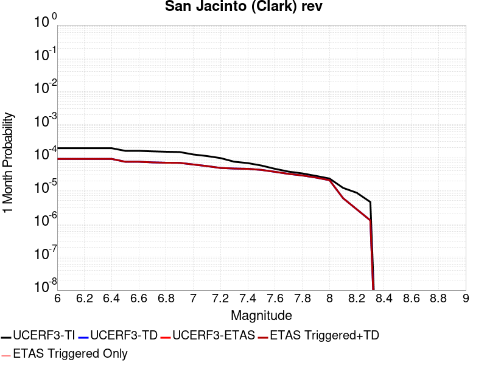 |  | 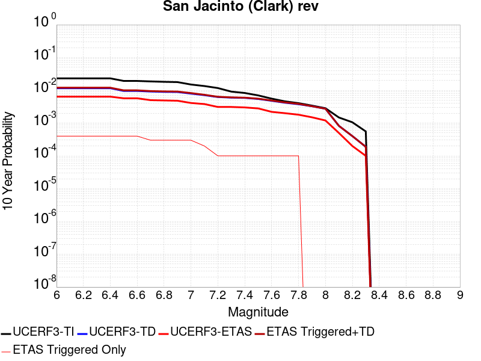 |

| Magnitude | 1 wk TI Prob | 1 wk TD Prob | 1 wk ETAS Prob | 1 wk ETAS/TD Gain | 1 wk ETAS Triggered+TD | 1 wk ETAS Triggered Only | 1 mo TI Prob | 1 mo TD Prob | 1 mo ETAS Prob | 1 mo ETAS/TD Gain | 1 mo ETAS Triggered+TD | 1 mo ETAS Triggered Only | 1 yr TI Prob | 1 yr TD Prob | 1 yr ETAS Prob | 1 yr ETAS/TD Gain | 1 yr ETAS Triggered+TD | 1 yr ETAS Triggered Only | 10 yr TI Prob | 10 yr TD Prob | 10 yr ETAS Prob | 10 yr ETAS/TD Gain | 10 yr ETAS Triggered+TD | 10 yr ETAS Triggered Only |
|-----|-----|-----|-----|-----|-----|-----|-----|-----|-----|-----|-----|-----|-----|-----|-----|-----|-----|-----|-----|-----|-----|-----|-----|-----|
| 6.0 | 4.482615E-5 | 2.1256179E-5 | 0.0 | 0.0 | 2.1256179E-5 | 0.0 | 1.9209793E-4 | 9.109478E-5 | 0.0 | 0.0 | 9.109478E-5 | 0.0 | 0.0023362834 | 0.0011085239 | 0.0 | 0.0 | 0.0011085239 | 0.0 | 0.02311874 | 0.011564337 | 4.0E-4 | 0.0345891 | 0.011959711 | 4.0E-4 |
| 6.1 | 4.482615E-5 | 2.1256179E-5 | 0.0 | 0.0 | 2.1256179E-5 | 0.0 | 1.9209793E-4 | 9.109478E-5 | 0.0 | 0.0 | 9.109478E-5 | 0.0 | 0.0023362834 | 0.0011085239 | 0.0 | 0.0 | 0.0011085239 | 0.0 | 0.02311874 | 0.011564337 | 4.0E-4 | 0.0345891 | 0.011959711 | 4.0E-4 |
| 6.2 | 4.482615E-5 | 2.1256179E-5 | 0.0 | 0.0 | 2.1256179E-5 | 0.0 | 1.9209793E-4 | 9.109478E-5 | 0.0 | 0.0 | 9.109478E-5 | 0.0 | 0.0023362834 | 0.0011085239 | 0.0 | 0.0 | 0.0011085239 | 0.0 | 0.02311874 | 0.011564337 | 4.0E-4 | 0.0345891 | 0.011959711 | 4.0E-4 |
| 6.3 | 4.482615E-5 | 2.1256179E-5 | 0.0 | 0.0 | 2.1256179E-5 | 0.0 | 1.9209793E-4 | 9.109478E-5 | 0.0 | 0.0 | 9.109478E-5 | 0.0 | 0.0023362834 | 0.0011085239 | 0.0 | 0.0 | 0.0011085239 | 0.0 | 0.02311874 | 0.011564337 | 4.0E-4 | 0.0345891 | 0.011959711 | 4.0E-4 |
| 6.4 | 4.482615E-5 | 2.1256179E-5 | 0.0 | 0.0 | 2.1256179E-5 | 0.0 | 1.9209793E-4 | 9.109478E-5 | 0.0 | 0.0 | 9.109478E-5 | 0.0 | 0.0023362834 | 0.0011085239 | 0.0 | 0.0 | 0.0011085239 | 0.0 | 0.02311874 | 0.011564337 | 4.0E-4 | 0.0345891 | 0.011959711 | 4.0E-4 |
| 6.5 | 3.7294863E-5 | 1.744414E-5 | 0.0 | 0.0 | 1.744414E-5 | 0.0 | 1.5982533E-4 | 7.4758485E-5 | 0.0 | 0.0 | 7.4758485E-5 | 0.0 | 0.0019441366 | 9.0980896E-4 | 0.0 | 0.0 | 9.0980896E-4 | 0.0 | 0.01927216 | 0.009537829 | 4.0E-4 | 0.041938264 | 0.009934014 | 4.0E-4 |
| 6.6 | 3.7294863E-5 | 1.744414E-5 | 0.0 | 0.0 | 1.744414E-5 | 0.0 | 1.5982533E-4 | 7.4758485E-5 | 0.0 | 0.0 | 7.4758485E-5 | 0.0 | 0.0019441366 | 9.0980896E-4 | 0.0 | 0.0 | 9.0980896E-4 | 0.0 | 0.01927216 | 0.009537829 | 4.0E-4 | 0.041938264 | 0.009934014 | 4.0E-4 |
| 6.7 | 3.6039248E-5 | 1.668976E-5 | 0.0 | 0.0 | 1.668976E-5 | 0.0 | 1.5444479E-4 | 7.15256E-5 | 0.0 | 0.0 | 7.15256E-5 | 0.0 | 0.0018787434 | 8.704805E-4 | 0.0 | 0.0 | 8.704805E-4 | 0.0 | 0.01862939 | 0.009137532 | 3.0E-4 | 0.03283162 | 0.009434791 | 3.0E-4 |
| 6.8 | 3.5031844E-5 | 1.6316451E-5 | 0.0 | 0.0 | 1.6316451E-5 | 0.0 | 1.5012783E-4 | 6.9925794E-5 | 0.0 | 0.0 | 6.9925794E-5 | 0.0 | 0.0018262739 | 8.510182E-4 | 0.0 | 0.0 | 8.510182E-4 | 0.0 | 0.01811338 | 0.00893576 | 3.0E-4 | 0.03357297 | 0.009233079 | 3.0E-4 |
| 6.9 | 3.435112E-5 | 1.614587E-5 | 0.0 | 0.0 | 1.614587E-5 | 0.0 | 1.4721078E-4 | 6.919478E-5 | 0.0 | 0.0 | 6.919478E-5 | 0.0 | 0.0017908178 | 8.421249E-4 | 0.0 | 0.0 | 8.421249E-4 | 0.0 | 0.017764548 | 0.008842117 | 3.0E-4 | 0.033928525 | 0.009139464 | 3.0E-4 |
| 7.0 | 2.8959772E-5 | 1.4409511E-5 | 0.0 | 0.0 | 1.4409511E-5 | 0.0 | 1.241074E-4 | 6.1753606E-5 | 0.0 | 0.0 | 6.1753606E-5 | 0.0 | 0.0015099603 | 7.5159356E-4 | 0.0 | 0.0 | 7.5159356E-4 | 0.0 | 0.014997416 | 0.007913837 | 3.0E-4 | 0.037908282 | 0.008211464 | 3.0E-4 |
| 7.1 | 2.6002877E-5 | 1.2894397E-5 | 0.0 | 0.0 | 1.2894397E-5 | 0.0 | 1.11436144E-4 | 5.526054E-5 | 0.0 | 0.0 | 5.526054E-5 | 0.0 | 0.0013558907 | 6.725915E-4 | 0.0 | 0.0 | 6.725915E-4 | 0.0 | 0.013476475 | 0.0070835412 | 2.0E-4 | 0.028234465 | 0.0072821244 | 2.0E-4 |
| 7.2 | 2.2544838E-5 | 1.1320359E-5 | 0.0 | 0.0 | 1.1320359E-5 | 0.0 | 9.661716E-5 | 4.851493E-5 | 0.0 | 0.0 | 4.851493E-5 | 0.0 | 0.001175679 | 5.905106E-4 | 0.0 | 0.0 | 5.905106E-4 | 0.0 | 0.011694785 | 0.0062243044 | 1.0E-4 | 0.016066052 | 0.006323682 | 1.0E-4 |
| 7.3 | 1.75334E-5 | 1.0865722E-5 | 0.0 | 0.0 | 1.0865722E-5 | 0.0 | 7.514098E-5 | 4.6566558E-5 | 0.0 | 0.0 | 4.6566558E-5 | 0.0 | 9.144575E-4 | 5.6680175E-4 | 0.0 | 0.0 | 5.6680175E-4 | 0.0 | 0.009107036 | 0.0059622475 | 1.0E-4 | 0.0167722 | 0.0060616513 | 1.0E-4 |
| 7.4 | 1.5924552E-5 | 1.066444E-5 | 0.0 | 0.0 | 1.066444E-5 | 0.0 | 6.82463E-5 | 4.570395E-5 | 0.0 | 0.0 | 4.570395E-5 | 0.0 | 8.305819E-4 | 5.563049E-4 | 0.0 | 0.0 | 5.563049E-4 | 0.0 | 0.008274844 | 0.005848773 | 1.0E-4 | 0.017097604 | 0.005948188 | 1.0E-4 |
| 7.5 | 1.3428931E-5 | 9.901407E-6 | 0.0 | 0.0 | 9.901407E-6 | 0.0 | 5.7551293E-5 | 4.2433916E-5 | 0.0 | 0.0 | 4.2433916E-5 | 0.0 | 7.004617E-4 | 5.1651156E-4 | 0.0 | 0.0 | 5.1651156E-4 | 0.0 | 0.006982579 | 0.0054325443 | 1.0E-4 | 0.018407581 | 0.0055320007 | 1.0E-4 |
| 7.6 | 1.0688787E-5 | 8.656296E-6 | 0.0 | 0.0 | 8.656296E-6 | 0.0 | 4.5808283E-5 | 3.7097885E-5 | 0.0 | 0.0 | 3.7097885E-5 | 0.0 | 5.5757316E-4 | 4.5157364E-4 | 0.0 | 0.0 | 4.5157364E-4 | 0.0 | 0.005561762 | 0.004763349 | 1.0E-4 | 0.020993633 | 0.0048628724 | 1.0E-4 |
| 7.7 | 8.81236E-6 | 7.5080475E-6 | 0.0 | 0.0 | 7.5080475E-6 | 0.0 | 3.776671E-5 | 3.217695E-5 | 0.0 | 0.0 | 3.217695E-5 | 0.0 | 4.597127E-4 | 3.9168415E-4 | 0.0 | 0.0 | 3.9168415E-4 | 0.0 | 0.0045876284 | 0.004155637 | 1.0E-4 | 0.024063697 | 0.0042552217 | 1.0E-4 |
| 7.8 | 7.780431E-6 | 6.7336423E-6 | 0.0 | 0.0 | 6.7336423E-6 | 0.0 | 3.3344273E-5 | 2.8858149E-5 | 0.0 | 0.0 | 2.8858149E-5 | 0.0 | 4.0589093E-4 | 3.512915E-4 | 0.0 | 0.0 | 3.512915E-4 | 0.0 | 0.0040515037 | 0.0037422315 | 1.0E-4 | 0.026722023 | 0.0038418574 | 1.0E-4 |
| 7.9 | 6.5437994E-6 | 5.8139935E-6 | 0.0 | 0.0 | 5.8139935E-6 | 0.0 | 2.8044553E-5 | 2.4916877E-5 | 0.0 | 0.0 | 2.4916877E-5 | 0.0 | 3.4138895E-4 | 3.0332094E-4 | 0.0 | 0.0 | 3.0332094E-4 | 0.0 | 0.0034086495 | 0.0032521454 | 0.0 | 0.0 | 0.0032521454 | 0.0 |
| 8.0 | 5.4488164E-6 | 4.8412617E-6 | 0.0 | 0.0 | 4.8412617E-6 | 0.0 | 2.3351862E-5 | 2.0748099E-5 | 0.0 | 0.0 | 2.0748099E-5 | 0.0 | 2.8427184E-4 | 2.52579E-4 | 0.0 | 0.0 | 2.52579E-4 | 0.0 | 0.0028390845 | 0.0027254736 | 0.0 | 0.0 | 0.0027254736 | 0.0 |
| 8.1 | 2.8397242E-6 | 1.3728097E-6 | 0.0 | 0.0 | 1.3728097E-6 | 0.0 | 1.217019E-5 | 5.883457E-6 | 0.0 | 0.0 | 5.883457E-6 | 0.0 | 1.4816198E-4 | 7.162875E-5 | 0.0 | 0.0 | 7.162875E-5 | 0.0 | 0.0014806325 | 8.147239E-4 | 0.0 | 0.0 | 8.147239E-4 | 0.0 |
| 8.2 | 2.030244E-6 | 6.340222E-7 | 0.0 | 0.0 | 6.340222E-7 | 0.0 | 8.701017E-6 | 2.717235E-6 | 0.0 | 0.0 | 2.717235E-6 | 0.0 | 1.05929736E-4 | 3.308184E-5 | 0.0 | 0.0 | 3.308184E-5 | 0.0 | 0.0010587925 | 3.960933E-4 | 0.0 | 0.0 | 3.960933E-4 | 0.0 |
| 8.3 | 1.0659804E-6 | 2.9344508E-7 | 0.0 | 0.0 | 2.9344508E-7 | 0.0 | 4.568479E-6 | 1.2576212E-6 | 0.0 | 0.0 | 1.2576212E-6 | 0.0 | 5.5619817E-5 | 1.5311434E-5 | 0.0 | 0.0 | 1.5311434E-5 | 0.0 | 5.5605895E-4 | 1.8623023E-4 | 0.0 | 0.0 | 1.8623023E-4 | 0.0 |

## Los Alamos 2011 CFM
*[(top)](#table-of-contents)*

| 1 Week | 1 Month | 1 Year | 10 Year |
|-----|-----|-----|-----|
|  |  |  |  |

| Magnitude | 1 wk TI Prob | 1 wk TD Prob | 1 wk ETAS Prob | 1 wk ETAS/TD Gain | 1 wk ETAS Triggered+TD | 1 wk ETAS Triggered Only | 1 mo TI Prob | 1 mo TD Prob | 1 mo ETAS Prob | 1 mo ETAS/TD Gain | 1 mo ETAS Triggered+TD | 1 mo ETAS Triggered Only | 1 yr TI Prob | 1 yr TD Prob | 1 yr ETAS Prob | 1 yr ETAS/TD Gain | 1 yr ETAS Triggered+TD | 1 yr ETAS Triggered Only | 10 yr TI Prob | 10 yr TD Prob | 10 yr ETAS Prob | 10 yr ETAS/TD Gain | 10 yr ETAS Triggered+TD | 10 yr ETAS Triggered Only |
|-----|-----|-----|-----|-----|-----|-----|-----|-----|-----|-----|-----|-----|-----|-----|-----|-----|-----|-----|-----|-----|-----|-----|-----|-----|
| 6.0 | 4.6284417E-6 | 4.752074E-6 | 0.0 | 0.0 | 4.752074E-6 | 0.0 | 1.9836029E-5 | 2.0365882E-5 | 0.0 | 0.0 | 2.0365882E-5 | 0.0 | 2.4147688E-4 | 2.4792817E-4 | 0.0 | 0.0 | 2.4792817E-4 | 0.0 | 0.0024121467 | 0.0024766896 | 4.0E-4 | 0.1615059 | 0.002875699 | 4.0E-4 |
| 6.1 | 4.6284417E-6 | 4.752074E-6 | 0.0 | 0.0 | 4.752074E-6 | 0.0 | 1.9836029E-5 | 2.0365882E-5 | 0.0 | 0.0 | 2.0365882E-5 | 0.0 | 2.4147688E-4 | 2.4792817E-4 | 0.0 | 0.0 | 2.4792817E-4 | 0.0 | 0.0024121467 | 0.0024766896 | 4.0E-4 | 0.1615059 | 0.002875699 | 4.0E-4 |
| 6.2 | 4.6284417E-6 | 4.752074E-6 | 0.0 | 0.0 | 4.752074E-6 | 0.0 | 1.9836029E-5 | 2.0365882E-5 | 0.0 | 0.0 | 2.0365882E-5 | 0.0 | 2.4147688E-4 | 2.4792817E-4 | 0.0 | 0.0 | 2.4792817E-4 | 0.0 | 0.0024121467 | 0.0024766896 | 4.0E-4 | 0.1615059 | 0.002875699 | 4.0E-4 |
| 6.3 | 4.6284417E-6 | 4.752074E-6 | 0.0 | 0.0 | 4.752074E-6 | 0.0 | 1.9836029E-5 | 2.0365882E-5 | 0.0 | 0.0 | 2.0365882E-5 | 0.0 | 2.4147688E-4 | 2.4792817E-4 | 0.0 | 0.0 | 2.4792817E-4 | 0.0 | 0.0024121467 | 0.0024766896 | 4.0E-4 | 0.1615059 | 0.002875699 | 4.0E-4 |
| 6.4 | 4.6284417E-6 | 4.752074E-6 | 0.0 | 0.0 | 4.752074E-6 | 0.0 | 1.9836029E-5 | 2.0365882E-5 | 0.0 | 0.0 | 2.0365882E-5 | 0.0 | 2.4147688E-4 | 2.4792817E-4 | 0.0 | 0.0 | 2.4792817E-4 | 0.0 | 0.0024121467 | 0.0024766896 | 4.0E-4 | 0.1615059 | 0.002875699 | 4.0E-4 |
| 6.5 | 4.6284417E-6 | 4.752074E-6 | 0.0 | 0.0 | 4.752074E-6 | 0.0 | 1.9836029E-5 | 2.0365882E-5 | 0.0 | 0.0 | 2.0365882E-5 | 0.0 | 2.4147688E-4 | 2.4792817E-4 | 0.0 | 0.0 | 2.4792817E-4 | 0.0 | 0.0024121467 | 0.0024766896 | 4.0E-4 | 0.1615059 | 0.002875699 | 4.0E-4 |
| 6.6 | 4.6284417E-6 | 4.752074E-6 | 0.0 | 0.0 | 4.752074E-6 | 0.0 | 1.9836029E-5 | 2.0365882E-5 | 0.0 | 0.0 | 2.0365882E-5 | 0.0 | 2.4147688E-4 | 2.4792817E-4 | 0.0 | 0.0 | 2.4792817E-4 | 0.0 | 0.0024121467 | 0.0024766896 | 4.0E-4 | 0.1615059 | 0.002875699 | 4.0E-4 |
| 6.7 | 4.062321E-6 | 4.1666503E-6 | 0.0 | 0.0 | 4.1666503E-6 | 0.0 | 1.7409831E-5 | 1.7856959E-5 | 0.0 | 0.0 | 1.7856959E-5 | 0.0 | 2.1194408E-4 | 2.1738831E-4 | 0.0 | 0.0 | 2.1738831E-4 | 0.0 | 0.0021174205 | 0.0021719062 | 4.0E-4 | 0.18417001 | 0.0025710375 | 4.0E-4 |
| 6.8 | 4.062321E-6 | 4.1666503E-6 | 0.0 | 0.0 | 4.1666503E-6 | 0.0 | 1.7409831E-5 | 1.7856959E-5 | 0.0 | 0.0 | 1.7856959E-5 | 0.0 | 2.1194408E-4 | 2.1738831E-4 | 0.0 | 0.0 | 2.1738831E-4 | 0.0 | 0.0021174205 | 0.0021719062 | 4.0E-4 | 0.18417001 | 0.0025710375 | 4.0E-4 |
| 6.9 | 3.2936077E-6 | 3.373207E-6 | 0.0 | 0.0 | 3.373207E-6 | 0.0 | 1.4115385E-5 | 1.44565265E-5 | 0.0 | 0.0 | 1.44565265E-5 | 0.0 | 1.7184127E-4 | 1.7599494E-4 | 0.0 | 0.0 | 1.7599494E-4 | 0.0 | 0.0017170844 | 0.0017586482 | 4.0E-4 | 0.22744742 | 0.0021579447 | 4.0E-4 |
| 7.0 | 3.1687898E-6 | 3.2450578E-6 | 0.0 | 0.0 | 3.2450578E-6 | 0.0 | 1.3580457E-5 | 1.3907321E-5 | 0.0 | 0.0 | 1.3907321E-5 | 0.0 | 1.6532952E-4 | 1.6930941E-4 | 0.0 | 0.0 | 1.6930941E-4 | 0.0 | 0.0016520657 | 0.0016918958 | 4.0E-4 | 0.23642118 | 0.002091219 | 4.0E-4 |
| 7.1 | 2.9379228E-6 | 3.007554E-6 | 0.0 | 0.0 | 3.007554E-6 | 0.0 | 1.25910365E-5 | 1.2889458E-5 | 0.0 | 0.0 | 1.2889458E-5 | 0.0 | 1.5328509E-4 | 1.5691876E-4 | 0.0 | 0.0 | 1.5691876E-4 | 0.0 | 0.001531794 | 0.0015681688 | 4.0E-4 | 0.2550746 | 0.0019675414 | 4.0E-4 |
| 7.2 | 2.0020686E-6 | 2.0417945E-6 | 0.0 | 0.0 | 2.0417945E-6 | 0.0 | 8.580266E-6 | 8.750519E-6 | 0.0 | 0.0 | 8.750519E-6 | 0.0 | 1.0445973E-4 | 1.065324E-4 | 0.0 | 0.0 | 1.065324E-4 | 0.0 | 0.0010441064 | 0.0010648178 | 3.0E-4 | 0.28173834 | 0.0013644983 | 3.0E-4 |
| 7.3 | 1.7364243E-6 | 1.7680277E-6 | 0.0 | 0.0 | 1.7680277E-6 | 0.0 | 7.441797E-6 | 7.5772396E-6 | 0.0 | 0.0 | 7.5772396E-6 | 0.0 | 9.0600115E-5 | 9.224902E-5 | 0.0 | 0.0 | 9.224902E-5 | 0.0 | 9.0563187E-4 | 9.221104E-4 | 2.0E-4 | 0.21689376 | 0.001121926 | 2.0E-4 |
| 7.4 | 1.5718434E-6 | 1.5984546E-6 | 0.0 | 0.0 | 1.5984546E-6 | 0.0 | 6.7364545E-6 | 6.8505014E-6 | 0.0 | 0.0 | 6.8505014E-6 | 0.0 | 8.201325E-5 | 8.34017E-5 | 0.0 | 0.0 | 8.34017E-5 | 0.0 | 8.198299E-4 | 8.3370693E-4 | 2.0E-4 | 0.23989245 | 0.0010335402 | 2.0E-4 |
| 7.5 | 1.3841119E-6 | 1.4044027E-6 | 0.0 | 0.0 | 1.4044027E-6 | 0.0 | 5.9318945E-6 | 6.018855E-6 | 0.0 | 0.0 | 6.018855E-6 | 0.0 | 7.221842E-5 | 7.327712E-5 | 0.0 | 0.0 | 7.327712E-5 | 0.0 | 7.2194956E-4 | 7.3253247E-4 | 0.0 | 0.0 | 7.3253247E-4 | 0.0 |
| 7.6 | 1.0843726E-6 | 1.0935418E-6 | 0.0 | 0.0 | 1.0935418E-6 | 0.0 | 4.647303E-6 | 4.6865994E-6 | 0.0 | 0.0 | 4.6865994E-6 | 0.0 | 5.6579443E-5 | 5.705788E-5 | 0.0 | 0.0 | 5.705788E-5 | 0.0 | 5.656504E-4 | 5.704349E-4 | 0.0 | 0.0 | 5.704349E-4 | 0.0 |
| 7.7 | 5.544814E-7 | 5.5023827E-7 | 0.0 | 0.0 | 5.5023827E-7 | 0.0 | 2.3763469E-6 | 2.358162E-6 | 0.0 | 0.0 | 2.358162E-6 | 0.0 | 2.8931638E-5 | 2.8710245E-5 | 0.0 | 0.0 | 2.8710245E-5 | 0.0 | 2.8927872E-4 | 2.8706552E-4 | 0.0 | 0.0 | 2.8706552E-4 | 0.0 |
| 7.8 | 2.0707465E-7 | 1.9780511E-7 | 0.0 | 0.0 | 1.9780511E-7 | 0.0 | 8.874625E-7 | 8.477359E-7 | 0.0 | 0.0 | 8.477359E-7 | 0.0 | 1.08048025E-5 | 1.0321136E-5 | 0.0 | 0.0 | 1.0321136E-5 | 0.0 | 1.0804277E-4 | 1.03206614E-4 | 0.0 | 0.0 | 1.03206614E-4 | 0.0 |
| 7.9 | 3.9821284E-8 | 3.4335034E-8 | 0.0 | 0.0 | 3.4335034E-8 | 0.0 | 1.7066264E-7 | 1.4715013E-7 | 0.0 | 0.0 | 1.4715013E-7 | 0.0 | 2.0778157E-6 | 1.7915514E-6 | 0.0 | 0.0 | 1.7915514E-6 | 0.0 | 2.0777963E-5 | 1.7915376E-5 | 0.0 | 0.0 | 1.7915376E-5 | 0.0 |
| 8.0 | 7.880441E-11 | 8.2360785E-11 | 0.0 | 0.0 | 8.2360785E-11 | 0.0 | 3.3773329E-10 | 3.5297476E-10 | 0.0 | 0.0 | 3.5297476E-10 | 0.0 | 4.1119033E-9 | 4.297468E-9 | 0.0 | 0.0 | 4.297468E-9 | 0.0 | 4.1119034E-8 | 4.297468E-8 | 0.0 | 0.0 | 4.297468E-8 | 0.0 |

## Johnson Valley (No) 2011 rev
*[(top)](#table-of-contents)*

| 1 Week | 1 Month | 1 Year | 10 Year |
|-----|-----|-----|-----|
|  |  | 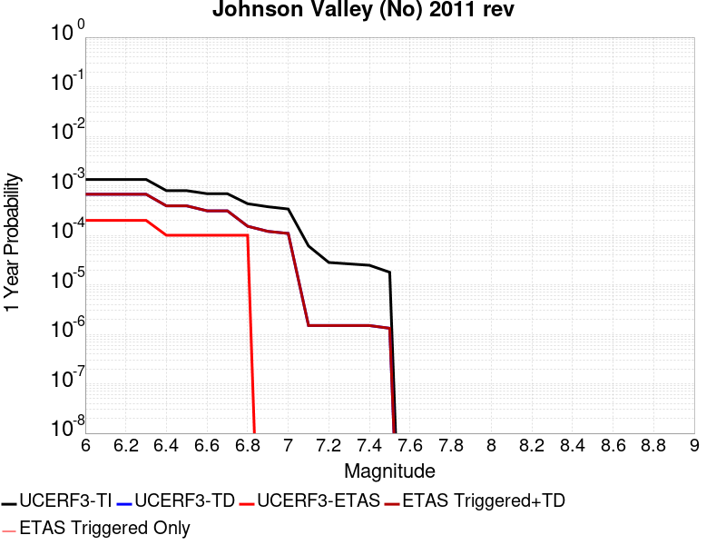 |  |

| Magnitude | 1 wk TI Prob | 1 wk TD Prob | 1 wk ETAS Prob | 1 wk ETAS/TD Gain | 1 wk ETAS Triggered+TD | 1 wk ETAS Triggered Only | 1 mo TI Prob | 1 mo TD Prob | 1 mo ETAS Prob | 1 mo ETAS/TD Gain | 1 mo ETAS Triggered+TD | 1 mo ETAS Triggered Only | 1 yr TI Prob | 1 yr TD Prob | 1 yr ETAS Prob | 1 yr ETAS/TD Gain | 1 yr ETAS Triggered+TD | 1 yr ETAS Triggered Only | 10 yr TI Prob | 10 yr TD Prob | 10 yr ETAS Prob | 10 yr ETAS/TD Gain | 10 yr ETAS Triggered+TD | 10 yr ETAS Triggered Only |
|-----|-----|-----|-----|-----|-----|-----|-----|-----|-----|-----|-----|-----|-----|-----|-----|-----|-----|-----|-----|-----|-----|-----|-----|-----|
| 6.0 | 2.577707E-5 | 1.2902424E-5 | 0.0 | 0.0 | 1.2902424E-5 | 0.0 | 1.1046848E-4 | 5.5295153E-5 | 0.0 | 0.0 | 5.5295153E-5 | 0.0 | 0.0013441239 | 6.7305024E-4 | 0.0 | 0.0 | 6.7305024E-4 | 0.0 | 0.013360229 | 0.0067140283 | 4.0E-4 | 0.05957675 | 0.007111343 | 4.0E-4 |
| 6.1 | 2.577707E-5 | 1.2902424E-5 | 0.0 | 0.0 | 1.2902424E-5 | 0.0 | 1.1046848E-4 | 5.5295153E-5 | 0.0 | 0.0 | 5.5295153E-5 | 0.0 | 0.0013441239 | 6.7305024E-4 | 0.0 | 0.0 | 6.7305024E-4 | 0.0 | 0.013360229 | 0.0067140283 | 4.0E-4 | 0.05957675 | 0.007111343 | 4.0E-4 |
| 6.2 | 2.577707E-5 | 1.2902424E-5 | 0.0 | 0.0 | 1.2902424E-5 | 0.0 | 1.1046848E-4 | 5.5295153E-5 | 0.0 | 0.0 | 5.5295153E-5 | 0.0 | 0.0013441239 | 6.7305024E-4 | 0.0 | 0.0 | 6.7305024E-4 | 0.0 | 0.013360229 | 0.0067140283 | 4.0E-4 | 0.05957675 | 0.007111343 | 4.0E-4 |
| 6.3 | 2.577707E-5 | 1.2902424E-5 | 0.0 | 0.0 | 1.2902424E-5 | 0.0 | 1.1046848E-4 | 5.5295153E-5 | 0.0 | 0.0 | 5.5295153E-5 | 0.0 | 0.0013441239 | 6.7305024E-4 | 0.0 | 0.0 | 6.7305024E-4 | 0.0 | 0.013360229 | 0.0067140283 | 4.0E-4 | 0.05957675 | 0.007111343 | 4.0E-4 |
| 6.4 | 1.5296591E-5 | 7.537033E-6 | 0.0 | 0.0 | 7.537033E-6 | 0.0 | 6.555518E-5 | 3.2301275E-5 | 0.0 | 0.0 | 3.2301275E-5 | 0.0 | 7.97842E-4 | 3.9321583E-4 | 0.0 | 0.0 | 3.9321583E-4 | 0.0 | 0.007949836 | 0.0039270422 | 0.0 | 0.0 | 0.0039270422 | 0.0 |
| 6.5 | 1.5296591E-5 | 7.537033E-6 | 0.0 | 0.0 | 7.537033E-6 | 0.0 | 6.555518E-5 | 3.2301275E-5 | 0.0 | 0.0 | 3.2301275E-5 | 0.0 | 7.97842E-4 | 3.9321583E-4 | 0.0 | 0.0 | 3.9321583E-4 | 0.0 | 0.007949836 | 0.0039270422 | 0.0 | 0.0 | 0.0039270422 | 0.0 |
| 6.6 | 1.3289383E-5 | 5.99183E-6 | 0.0 | 0.0 | 5.99183E-6 | 0.0 | 5.6953253E-5 | 2.5679115E-5 | 0.0 | 0.0 | 2.5679115E-5 | 0.0 | 6.9318525E-4 | 3.1261536E-4 | 0.0 | 0.0 | 3.1261536E-4 | 0.0 | 0.0069102696 | 0.0031234205 | 0.0 | 0.0 | 0.0031234205 | 0.0 |
| 6.7 | 1.3289383E-5 | 5.99183E-6 | 0.0 | 0.0 | 5.99183E-6 | 0.0 | 5.6953253E-5 | 2.5679115E-5 | 0.0 | 0.0 | 2.5679115E-5 | 0.0 | 6.9318525E-4 | 3.1261536E-4 | 0.0 | 0.0 | 3.1261536E-4 | 0.0 | 0.0069102696 | 0.0031234205 | 0.0 | 0.0 | 0.0031234205 | 0.0 |
| 6.8 | 8.330789E-6 | 2.9207124E-6 | 0.0 | 0.0 | 2.9207124E-6 | 0.0 | 3.570289E-5 | 1.2517311E-5 | 0.0 | 0.0 | 1.2517311E-5 | 0.0 | 4.34596E-4 | 1.523933E-4 | 0.0 | 0.0 | 1.523933E-4 | 0.0 | 0.0043374705 | 0.0015234477 | 0.0 | 0.0 | 0.0015234477 | 0.0 |
| 6.9 | 7.2359003E-6 | 2.3007246E-6 | 0.0 | 0.0 | 2.3007246E-6 | 0.0 | 3.1010633E-5 | 9.860241E-6 | 0.0 | 0.0 | 9.860241E-6 | 0.0 | 3.7748902E-4 | 1.2004715E-4 | 0.0 | 0.0 | 1.2004715E-4 | 0.0 | 0.0037684843 | 0.0012003457 | 0.0 | 0.0 | 0.0012003457 | 0.0 |
| 7.0 | 6.5149957E-6 | 2.087979E-6 | 0.0 | 0.0 | 2.087979E-6 | 0.0 | 2.792111E-5 | 8.948481E-6 | 0.0 | 0.0 | 8.948481E-6 | 0.0 | 3.398865E-4 | 1.08947606E-4 | 0.0 | 0.0 | 1.08947606E-4 | 0.0 | 0.003393671 | 0.0010894615 | 0.0 | 0.0 | 0.0010894615 | 0.0 |
| 7.1 | 1.1662233E-6 | 2.8774064E-8 | 0.0 | 0.0 | 2.8774064E-8 | 0.0 | 4.9980904E-6 | 1.233174E-7 | 0.0 | 0.0 | 1.233174E-7 | 0.0 | 6.0850052E-5 | 1.5013886E-6 | 0.0 | 0.0 | 1.5013886E-6 | 0.0 | 6.083339E-4 | 1.50138E-5 | 0.0 | 0.0 | 1.50138E-5 | 0.0 |
| 7.2 | 5.413881E-7 | 2.8774064E-8 | 0.0 | 0.0 | 2.8774064E-8 | 0.0 | 2.3202326E-6 | 1.233174E-7 | 0.0 | 0.0 | 1.233174E-7 | 0.0 | 2.8248465E-5 | 1.5013886E-6 | 0.0 | 0.0 | 1.5013886E-6 | 0.0 | 2.8244875E-4 | 1.50138E-5 | 0.0 | 0.0 | 1.50138E-5 | 0.0 |
| 7.3 | 5.076821E-7 | 2.8774064E-8 | 0.0 | 0.0 | 2.8774064E-8 | 0.0 | 2.1757785E-6 | 1.233174E-7 | 0.0 | 0.0 | 1.233174E-7 | 0.0 | 2.648978E-5 | 1.5013886E-6 | 0.0 | 0.0 | 1.5013886E-6 | 0.0 | 2.6486625E-4 | 1.50138E-5 | 0.0 | 0.0 | 1.50138E-5 | 0.0 |
| 7.4 | 4.7568687E-7 | 2.8756043E-8 | 0.0 | 0.0 | 2.8756043E-8 | 0.0 | 2.0386565E-6 | 1.2324018E-7 | 0.0 | 0.0 | 1.2324018E-7 | 0.0 | 2.482036E-5 | 1.5004483E-6 | 0.0 | 0.0 | 1.5004483E-6 | 0.0 | 2.4817587E-4 | 1.5004398E-5 | 0.0 | 0.0 | 1.5004398E-5 | 0.0 |
| 7.5 | 3.435626E-7 | 2.5334263E-8 | 0.0 | 0.0 | 2.5334263E-8 | 0.0 | 1.4724103E-6 | 1.08575406E-7 | 0.0 | 0.0 | 1.08575406E-7 | 0.0 | 1.7926448E-5 | 1.321905E-6 | 0.0 | 0.0 | 1.321905E-6 | 0.0 | 1.7925001E-4 | 1.3218987E-5 | 0.0 | 0.0 | 1.3218987E-5 | 0.0 |

## Goose Lake 2011 CFM
*[(top)](#table-of-contents)*

| 1 Week | 1 Month | 1 Year | 10 Year |
|-----|-----|-----|-----|
|  | 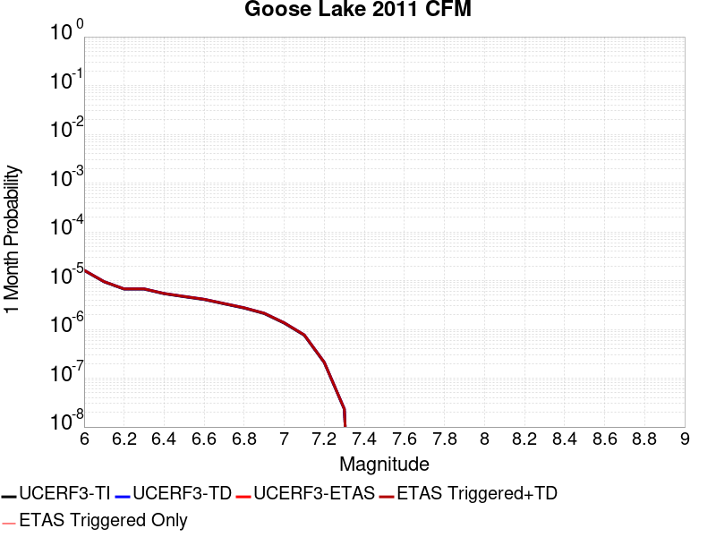 |  |  |

| Magnitude | 1 wk TI Prob | 1 wk TD Prob | 1 wk ETAS Prob | 1 wk ETAS/TD Gain | 1 wk ETAS Triggered+TD | 1 wk ETAS Triggered Only | 1 mo TI Prob | 1 mo TD Prob | 1 mo ETAS Prob | 1 mo ETAS/TD Gain | 1 mo ETAS Triggered+TD | 1 mo ETAS Triggered Only | 1 yr TI Prob | 1 yr TD Prob | 1 yr ETAS Prob | 1 yr ETAS/TD Gain | 1 yr ETAS Triggered+TD | 1 yr ETAS Triggered Only | 10 yr TI Prob | 10 yr TD Prob | 10 yr ETAS Prob | 10 yr ETAS/TD Gain | 10 yr ETAS Triggered+TD | 10 yr ETAS Triggered Only |
|-----|-----|-----|-----|-----|-----|-----|-----|-----|-----|-----|-----|-----|-----|-----|-----|-----|-----|-----|-----|-----|-----|-----|-----|-----|
| 6.0 | 3.780968E-6 | 3.82311E-6 | 0.0 | 0.0 | 3.82311E-6 | 0.0 | 1.6204049E-5 | 1.638466E-5 | 0.0 | 0.0 | 1.638466E-5 | 0.0 | 1.9726643E-4 | 1.9946607E-4 | 0.0 | 0.0 | 1.9946607E-4 | 0.0 | 0.001970914 | 0.0019929786 | 4.0E-4 | 0.2007046 | 0.0023921814 | 4.0E-4 |
| 6.1 | 2.2035124E-6 | 2.2298561E-6 | 0.0 | 0.0 | 2.2298561E-6 | 0.0 | 9.443591E-6 | 9.556492E-6 | 0.0 | 0.0 | 9.556492E-6 | 0.0 | 1.1496965E-4 | 1.16344265E-4 | 0.0 | 0.0 | 1.16344265E-4 | 0.0 | 0.0011491019 | 0.0011628518 | 4.0E-4 | 0.3439819 | 0.0015623868 | 4.0E-4 |
| 6.2 | 1.5624689E-6 | 1.5827346E-6 | 0.0 | 0.0 | 1.5827346E-6 | 0.0 | 6.6962784E-6 | 6.783131E-6 | 0.0 | 0.0 | 6.783131E-6 | 0.0 | 8.152414E-5 | 8.258154E-5 | 0.0 | 0.0 | 8.258154E-5 | 0.0 | 8.1494235E-4 | 8.255129E-4 | 2.0E-4 | 0.24227361 | 0.0010253479 | 2.0E-4 |
| 6.3 | 1.5624689E-6 | 1.5827346E-6 | 0.0 | 0.0 | 1.5827346E-6 | 0.0 | 6.6962784E-6 | 6.783131E-6 | 0.0 | 0.0 | 6.783131E-6 | 0.0 | 8.152414E-5 | 8.258154E-5 | 0.0 | 0.0 | 8.258154E-5 | 0.0 | 8.1494235E-4 | 8.255129E-4 | 2.0E-4 | 0.24227361 | 0.0010253479 | 2.0E-4 |
| 6.4 | 1.256464E-6 | 1.2739059E-6 | 0.0 | 0.0 | 1.2739059E-6 | 0.0 | 5.3848344E-6 | 5.4595857E-6 | 0.0 | 0.0 | 5.4595857E-6 | 0.0 | 6.5558386E-5 | 6.646845E-5 | 0.0 | 0.0 | 6.646845E-5 | 0.0 | 6.553905E-4 | 6.6448766E-4 | 1.0E-4 | 0.15049188 | 7.6442125E-4 | 1.0E-4 |
| 6.5 | 1.0910911E-6 | 1.1069736E-6 | 0.0 | 0.0 | 1.1069736E-6 | 0.0 | 4.6760965E-6 | 4.744164E-6 | 0.0 | 0.0 | 4.744164E-6 | 0.0 | 5.692999E-5 | 5.775868E-5 | 0.0 | 0.0 | 5.775868E-5 | 0.0 | 5.6915404E-4 | 5.774379E-4 | 1.0E-4 | 0.17317879 | 6.773802E-4 | 1.0E-4 |
| 6.6 | 9.546601E-7 | 9.691549E-7 | 0.0 | 0.0 | 9.691549E-7 | 0.0 | 4.091394E-6 | 4.1535145E-6 | 0.0 | 0.0 | 4.1535145E-6 | 0.0 | 4.9811584E-5 | 5.0567873E-5 | 0.0 | 0.0 | 5.0567873E-5 | 0.0 | 4.980042E-4 | 5.0556456E-4 | 1.0E-4 | 0.19779867 | 6.05514E-4 | 1.0E-4 |
| 6.7 | 7.790316E-7 | 7.916227E-7 | 0.0 | 0.0 | 7.916227E-7 | 0.0 | 3.3387028E-6 | 3.3926644E-6 | 0.0 | 0.0 | 3.3926644E-6 | 0.0 | 4.0647945E-5 | 4.1304913E-5 | 0.0 | 0.0 | 4.1304913E-5 | 0.0 | 4.0640513E-4 | 4.1297294E-4 | 0.0 | 0.0 | 4.1297294E-4 | 0.0 |
| 6.8 | 6.3714384E-7 | 6.4789646E-7 | 0.0 | 0.0 | 6.4789646E-7 | 0.0 | 2.7306137E-6 | 2.7766962E-6 | 0.0 | 0.0 | 2.7766962E-6 | 0.0 | 3.3244716E-5 | 3.3805758E-5 | 0.0 | 0.0 | 3.3805758E-5 | 0.0 | 3.323974E-4 | 3.3800662E-4 | 0.0 | 0.0 | 3.3800662E-4 | 0.0 |
| 6.9 | 4.92586E-7 | 5.0141E-7 | 0.0 | 0.0 | 5.0141E-7 | 0.0 | 2.1110811E-6 | 2.1488981E-6 | 0.0 | 0.0 | 2.1488981E-6 | 0.0 | 2.5702111E-5 | 2.6162525E-5 | 0.0 | 0.0 | 2.6162525E-5 | 0.0 | 2.569914E-4 | 2.6159483E-4 | 0.0 | 0.0 | 2.6159483E-4 | 0.0 |
| 7.0 | 3.130245E-7 | 3.1904804E-7 | 0.0 | 0.0 | 3.1904804E-7 | 0.0 | 1.3415328E-6 | 1.3673481E-6 | 0.0 | 0.0 | 1.3673481E-6 | 0.0 | 1.6333039E-5 | 1.6647338E-5 | 0.0 | 0.0 | 1.6647338E-5 | 0.0 | 1.6331839E-4 | 1.664611E-4 | 0.0 | 0.0 | 1.664611E-4 | 0.0 |
| 7.1 | 1.7680084E-7 | 1.8024646E-7 | 0.0 | 0.0 | 1.8024646E-7 | 0.0 | 7.5771766E-7 | 7.724846E-7 | 0.0 | 0.0 | 7.724846E-7 | 0.0 | 9.225173E-6 | 9.40496E-6 | 0.0 | 0.0 | 9.40496E-6 | 0.0 | 9.22479E-5 | 9.404573E-5 | 0.0 | 0.0 | 9.404573E-5 | 0.0 |
| 7.2 | 4.8641045E-8 | 4.940366E-8 | 0.0 | 0.0 | 4.940366E-8 | 0.0 | 2.084616E-7 | 2.1172994E-7 | 0.0 | 0.0 | 2.1172994E-7 | 0.0 | 2.538017E-6 | 2.5778093E-6 | 0.0 | 0.0 | 2.5778093E-6 | 0.0 | 2.537988E-5 | 2.5777805E-5 | 0.0 | 0.0 | 2.5777805E-5 | 0.0 |
| 7.3 | 5.3911844E-9 | 5.475991E-9 | 0.0 | 0.0 | 5.475991E-9 | 0.0 | 2.3105075E-8 | 2.3468534E-8 | 0.0 | 0.0 | 2.3468534E-8 | 0.0 | 2.8130427E-7 | 2.8572939E-7 | 0.0 | 0.0 | 2.8572939E-7 | 0.0 | 2.8130391E-6 | 2.8572917E-6 | 0.0 | 0.0 | 2.8572917E-6 | 0.0 |

## Great Valley 08 (Quinto)
*[(top)](#table-of-contents)*

| 1 Week | 1 Month | 1 Year | 10 Year |
|-----|-----|-----|-----|
|  |  |  | 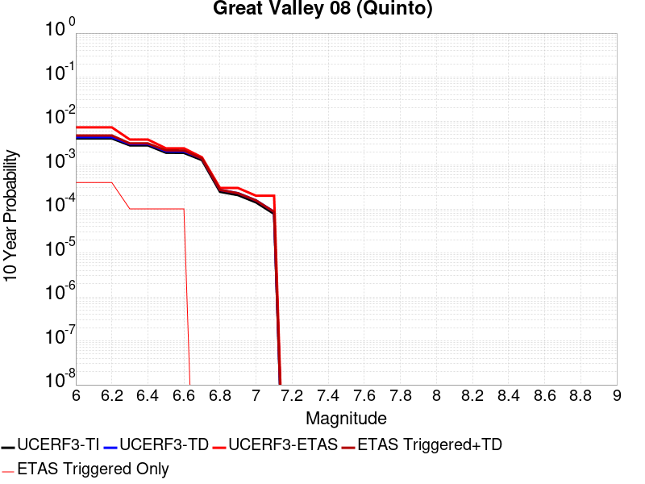 |

| Magnitude | 1 wk TI Prob | 1 wk TD Prob | 1 wk ETAS Prob | 1 wk ETAS/TD Gain | 1 wk ETAS Triggered+TD | 1 wk ETAS Triggered Only | 1 mo TI Prob | 1 mo TD Prob | 1 mo ETAS Prob | 1 mo ETAS/TD Gain | 1 mo ETAS Triggered+TD | 1 mo ETAS Triggered Only | 1 yr TI Prob | 1 yr TD Prob | 1 yr ETAS Prob | 1 yr ETAS/TD Gain | 1 yr ETAS Triggered+TD | 1 yr ETAS Triggered Only | 10 yr TI Prob | 10 yr TD Prob | 10 yr ETAS Prob | 10 yr ETAS/TD Gain | 10 yr ETAS Triggered+TD | 10 yr ETAS Triggered Only |
|-----|-----|-----|-----|-----|-----|-----|-----|-----|-----|-----|-----|-----|-----|-----|-----|-----|-----|-----|-----|-----|-----|-----|-----|-----|
| 6.0 | 7.737697E-6 | 8.254173E-6 | 0.0 | 0.0 | 8.254173E-6 | 0.0 | 3.3161137E-5 | 3.5374655E-5 | 0.0 | 0.0 | 3.5374655E-5 | 0.0 | 4.0366207E-4 | 4.3062016E-4 | 2.0E-4 | 0.46444646 | 6.30534E-4 | 2.0E-4 | 0.004029296 | 0.0042997105 | 4.0E-4 | 0.093029514 | 0.004697991 | 4.0E-4 |
| 6.1 | 7.737697E-6 | 8.254173E-6 | 0.0 | 0.0 | 8.254173E-6 | 0.0 | 3.3161137E-5 | 3.5374655E-5 | 0.0 | 0.0 | 3.5374655E-5 | 0.0 | 4.0366207E-4 | 4.3062016E-4 | 2.0E-4 | 0.46444646 | 6.30534E-4 | 2.0E-4 | 0.004029296 | 0.0042997105 | 4.0E-4 | 0.093029514 | 0.004697991 | 4.0E-4 |
| 6.2 | 7.737697E-6 | 8.254173E-6 | 0.0 | 0.0 | 8.254173E-6 | 0.0 | 3.3161137E-5 | 3.5374655E-5 | 0.0 | 0.0 | 3.5374655E-5 | 0.0 | 4.0366207E-4 | 4.3062016E-4 | 2.0E-4 | 0.46444646 | 6.30534E-4 | 2.0E-4 | 0.004029296 | 0.0042997105 | 4.0E-4 | 0.093029514 | 0.004697991 | 4.0E-4 |
| 6.3 | 5.374012E-6 | 5.7514058E-6 | 0.0 | 0.0 | 5.7514058E-6 | 0.0 | 2.3031276E-5 | 2.4648712E-5 | 0.0 | 0.0 | 2.4648712E-5 | 0.0 | 2.803697E-4 | 3.0006788E-4 | 1.0E-4 | 0.3332579 | 4.0003788E-4 | 1.0E-4 | 0.0028001624 | 0.0029977208 | 1.0E-4 | 0.03335868 | 0.003097421 | 1.0E-4 |
| 6.4 | 5.374012E-6 | 5.7514058E-6 | 0.0 | 0.0 | 5.7514058E-6 | 0.0 | 2.3031276E-5 | 2.4648712E-5 | 0.0 | 0.0 | 2.4648712E-5 | 0.0 | 2.803697E-4 | 3.0006788E-4 | 1.0E-4 | 0.3332579 | 4.0003788E-4 | 1.0E-4 | 0.0028001624 | 0.0029977208 | 1.0E-4 | 0.03335868 | 0.003097421 | 1.0E-4 |
| 6.5 | 3.65427E-6 | 3.9419624E-6 | 0.0 | 0.0 | 3.9419624E-6 | 0.0 | 1.5661062E-5 | 1.6894055E-5 | 0.0 | 0.0 | 1.6894055E-5 | 0.0 | 1.9065675E-4 | 2.0567275E-4 | 1.0E-4 | 0.48620927 | 3.0565218E-4 | 1.0E-4 | 0.0019049325 | 0.002055516 | 1.0E-4 | 0.048649587 | 0.0021553105 | 1.0E-4 |
| 6.6 | 3.6143538E-6 | 3.8991425E-6 | 0.0 | 0.0 | 3.8991425E-6 | 0.0 | 1.5489995E-5 | 1.6710543E-5 | 0.0 | 0.0 | 1.6710543E-5 | 0.0 | 1.8857437E-4 | 2.0343893E-4 | 1.0E-4 | 0.491548 | 3.0341858E-4 | 1.0E-4 | 0.0018841444 | 0.0020332187 | 1.0E-4 | 0.0491831 | 0.0021330153 | 1.0E-4 |
| 6.7 | 2.4821015E-6 | 2.686161E-6 | 0.0 | 0.0 | 2.686161E-6 | 0.0 | 1.0637535E-5 | 1.15121E-5 | 0.0 | 0.0 | 1.15121E-5 | 0.0 | 1.2950429E-4 | 1.4015647E-4 | 0.0 | 0.0 | 1.4015647E-4 | 0.0 | 0.0012942884 | 0.0014012357 | 0.0 | 0.0 | 0.0014012357 | 0.0 |
| 6.8 | 4.7110538E-7 | 5.1941157E-7 | 0.0 | 0.0 | 5.1941157E-7 | 0.0 | 2.0190216E-6 | 2.2260476E-6 | 0.0 | 0.0 | 2.2260476E-6 | 0.0 | 2.458131E-5 | 2.7101813E-5 | 0.0 | 0.0 | 2.7101813E-5 | 0.0 | 2.457859E-4 | 2.7098687E-4 | 0.0 | 0.0 | 2.7098687E-4 | 0.0 |
| 6.9 | 3.958685E-7 | 4.3712816E-7 | 0.0 | 0.0 | 4.3712816E-7 | 0.0 | 1.6965782E-6 | 1.8734052E-6 | 0.0 | 0.0 | 1.8734052E-6 | 0.0 | 2.0655643E-5 | 2.2808485E-5 | 0.0 | 0.0 | 2.2808485E-5 | 0.0 | 2.0653724E-4 | 2.2806306E-4 | 0.0 | 0.0 | 2.2806306E-4 | 0.0 |
| 7.0 | 2.70294E-7 | 2.99266E-7 | 0.0 | 0.0 | 2.99266E-7 | 0.0 | 1.1584025E-6 | 1.282568E-6 | 0.0 | 0.0 | 1.282568E-6 | 0.0 | 1.4103458E-5 | 1.5615165E-5 | 0.0 | 0.0 | 1.5615165E-5 | 0.0 | 1.4102564E-4 | 1.5614198E-4 | 0.0 | 0.0 | 1.5614198E-4 | 0.0 |
| 7.1 | 1.4828602E-7 | 1.6472859E-7 | 0.0 | 0.0 | 1.6472859E-7 | 0.0 | 6.3551136E-7 | 7.059796E-7 | 0.0 | 0.0 | 7.059796E-7 | 0.0 | 7.737323E-6 | 8.595275E-6 | 0.0 | 0.0 | 8.595275E-6 | 0.0 | 7.737054E-5 | 8.595023E-5 | 0.0 | 0.0 | 8.595023E-5 | 0.0 |

## Great Valley 03a Dunnigan Hills
*[(top)](#table-of-contents)*

| 1 Week | 1 Month | 1 Year | 10 Year |
|-----|-----|-----|-----|
| 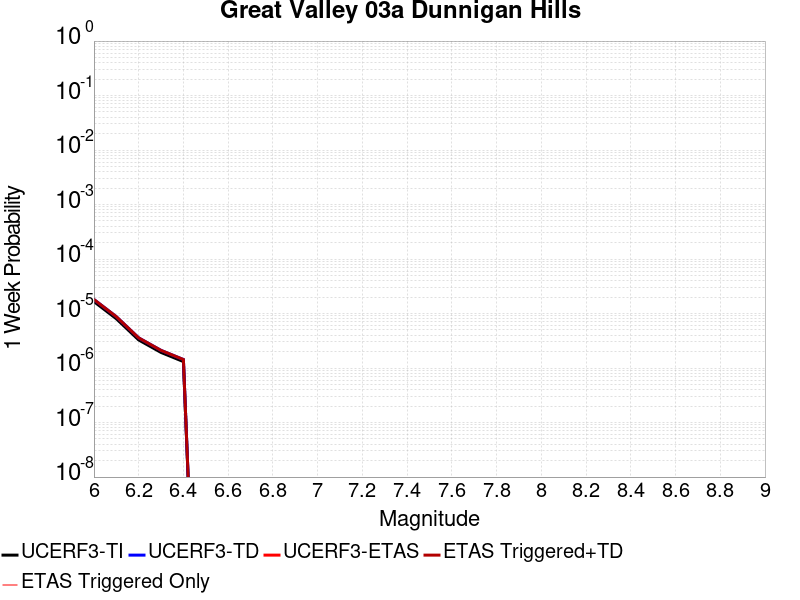 |  |  | 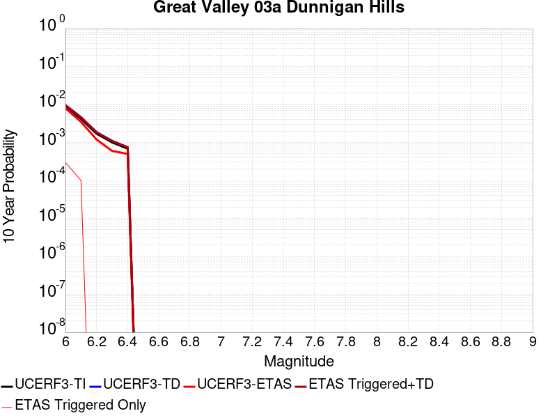 |

| Magnitude | 1 wk TI Prob | 1 wk TD Prob | 1 wk ETAS Prob | 1 wk ETAS/TD Gain | 1 wk ETAS Triggered+TD | 1 wk ETAS Triggered Only | 1 mo TI Prob | 1 mo TD Prob | 1 mo ETAS Prob | 1 mo ETAS/TD Gain | 1 mo ETAS Triggered+TD | 1 mo ETAS Triggered Only | 1 yr TI Prob | 1 yr TD Prob | 1 yr ETAS Prob | 1 yr ETAS/TD Gain | 1 yr ETAS Triggered+TD | 1 yr ETAS Triggered Only | 10 yr TI Prob | 10 yr TD Prob | 10 yr ETAS Prob | 10 yr ETAS/TD Gain | 10 yr ETAS Triggered+TD | 10 yr ETAS Triggered Only |
|-----|-----|-----|-----|-----|-----|-----|-----|-----|-----|-----|-----|-----|-----|-----|-----|-----|-----|-----|-----|-----|-----|-----|-----|-----|
| 6.0 | 1.6591328E-5 | 1.8111363E-5 | 0.0 | 0.0 | 1.8111363E-5 | 0.0 | 7.110376E-5 | 7.7618206E-5 | 0.0 | 0.0 | 7.7618206E-5 | 0.0 | 8.6534437E-4 | 9.446611E-4 | 0.0 | 0.0 | 9.446611E-4 | 0.0 | 0.008619824 | 0.00941329 | 3.0E-4 | 0.031869836 | 0.009710466 | 3.0E-4 |
| 6.1 | 8.041125E-6 | 8.771363E-6 | 0.0 | 0.0 | 8.771363E-6 | 0.0 | 3.4461507E-5 | 3.759113E-5 | 0.0 | 0.0 | 3.759113E-5 | 0.0 | 4.194881E-4 | 4.575962E-4 | 0.0 | 0.0 | 4.575962E-4 | 0.0 | 0.004186971 | 0.0045685377 | 1.0E-4 | 0.021888841 | 0.004668081 | 1.0E-4 |
| 6.2 | 3.2807004E-6 | 3.5802404E-6 | 0.0 | 0.0 | 3.5802404E-6 | 0.0 | 1.4060069E-5 | 1.534382E-5 | 0.0 | 0.0 | 1.534382E-5 | 0.0 | 1.7116789E-4 | 1.8679915E-4 | 0.0 | 0.0 | 1.8679915E-4 | 0.0 | 0.0017103611 | 0.0018668296 | 0.0 | 0.0 | 0.0018668296 | 0.0 |
| 6.3 | 1.9339366E-6 | 2.1107771E-6 | 0.0 | 0.0 | 2.1107771E-6 | 0.0 | 8.288273E-6 | 9.046173E-6 | 0.0 | 0.0 | 9.046173E-6 | 0.0 | 1.00905054E-4 | 1.10134446E-4 | 0.0 | 0.0 | 1.10134446E-4 | 0.0 | 0.0010085925 | 0.0011010787 | 0.0 | 0.0 | 0.0011010787 | 0.0 |
| 6.4 | 1.3142635E-6 | 1.4342556E-6 | 0.0 | 0.0 | 1.4342556E-6 | 0.0 | 5.6325457E-6 | 6.14681E-6 | 0.0 | 0.0 | 6.14681E-6 | 0.0 | 6.857408E-5 | 7.483741E-5 | 0.0 | 0.0 | 7.483741E-5 | 0.0 | 6.8552926E-4 | 7.483741E-4 | 0.0 | 0.0 | 7.483741E-4 | 0.0 |

## West Tahoe
*[(top)](#table-of-contents)*

| 1 Week | 1 Month | 1 Year | 10 Year |
|-----|-----|-----|-----|
| 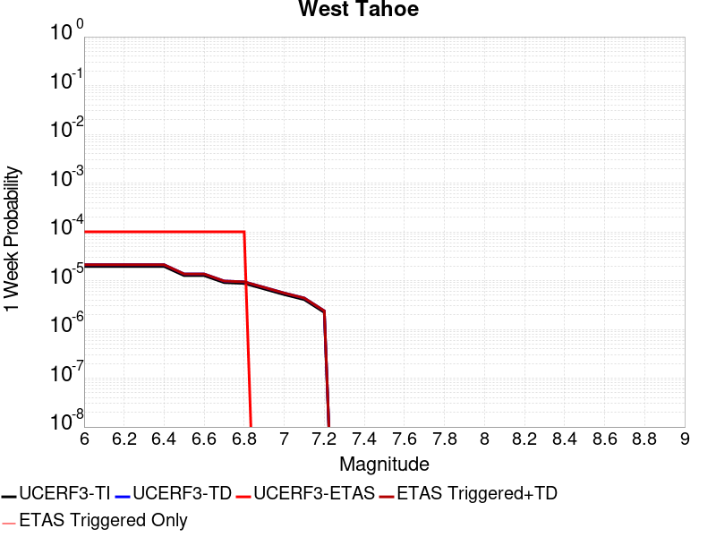 |  |  |  |

| Magnitude | 1 wk TI Prob | 1 wk TD Prob | 1 wk ETAS Prob | 1 wk ETAS/TD Gain | 1 wk ETAS Triggered+TD | 1 wk ETAS Triggered Only | 1 mo TI Prob | 1 mo TD Prob | 1 mo ETAS Prob | 1 mo ETAS/TD Gain | 1 mo ETAS Triggered+TD | 1 mo ETAS Triggered Only | 1 yr TI Prob | 1 yr TD Prob | 1 yr ETAS Prob | 1 yr ETAS/TD Gain | 1 yr ETAS Triggered+TD | 1 yr ETAS Triggered Only | 10 yr TI Prob | 10 yr TD Prob | 10 yr ETAS Prob | 10 yr ETAS/TD Gain | 10 yr ETAS Triggered+TD | 10 yr ETAS Triggered Only |
|-----|-----|-----|-----|-----|-----|-----|-----|-----|-----|-----|-----|-----|-----|-----|-----|-----|-----|-----|-----|-----|-----|-----|-----|-----|
| 6.0 | 1.952444E-5 | 2.1186883E-5 | 0.0 | 0.0 | 2.1186883E-5 | 0.0 | 8.367348E-5 | 9.079808E-5 | 0.0 | 0.0 | 9.079808E-5 | 0.0 | 0.0010182485 | 0.0011049607 | 1.0E-4 | 0.09050095 | 0.0012048503 | 1.0E-4 | 0.010135954 | 0.011000155 | 4.0E-4 | 0.036363125 | 0.011395754 | 4.0E-4 |
| 6.1 | 1.952444E-5 | 2.1186883E-5 | 0.0 | 0.0 | 2.1186883E-5 | 0.0 | 8.367348E-5 | 9.079808E-5 | 0.0 | 0.0 | 9.079808E-5 | 0.0 | 0.0010182485 | 0.0011049607 | 1.0E-4 | 0.09050095 | 0.0012048503 | 1.0E-4 | 0.010135954 | 0.011000155 | 4.0E-4 | 0.036363125 | 0.011395754 | 4.0E-4 |
| 6.2 | 1.952444E-5 | 2.1186883E-5 | 0.0 | 0.0 | 2.1186883E-5 | 0.0 | 8.367348E-5 | 9.079808E-5 | 0.0 | 0.0 | 9.079808E-5 | 0.0 | 0.0010182485 | 0.0011049607 | 1.0E-4 | 0.09050095 | 0.0012048503 | 1.0E-4 | 0.010135954 | 0.011000155 | 4.0E-4 | 0.036363125 | 0.011395754 | 4.0E-4 |
| 6.3 | 1.952444E-5 | 2.1186883E-5 | 0.0 | 0.0 | 2.1186883E-5 | 0.0 | 8.367348E-5 | 9.079808E-5 | 0.0 | 0.0 | 9.079808E-5 | 0.0 | 0.0010182485 | 0.0011049607 | 1.0E-4 | 0.09050095 | 0.0012048503 | 1.0E-4 | 0.010135954 | 0.011000155 | 4.0E-4 | 0.036363125 | 0.011395754 | 4.0E-4 |
| 6.4 | 1.952444E-5 | 2.1186883E-5 | 0.0 | 0.0 | 2.1186883E-5 | 0.0 | 8.367348E-5 | 9.079808E-5 | 0.0 | 0.0 | 9.079808E-5 | 0.0 | 0.0010182485 | 0.0011049607 | 1.0E-4 | 0.09050095 | 0.0012048503 | 1.0E-4 | 0.010135954 | 0.011000155 | 4.0E-4 | 0.036363125 | 0.011395754 | 4.0E-4 |
| 6.5 | 1.2685271E-5 | 1.3692865E-5 | 0.0 | 0.0 | 1.3692865E-5 | 0.0 | 5.4364315E-5 | 5.868248E-5 | 0.0 | 0.0 | 5.868248E-5 | 0.0 | 6.616845E-4 | 7.1424147E-4 | 1.0E-4 | 0.14000867 | 8.1417E-4 | 1.0E-4 | 0.0065971776 | 0.0071211094 | 3.0E-4 | 0.04212827 | 0.007418973 | 3.0E-4 |
| 6.6 | 1.2685271E-5 | 1.3692865E-5 | 0.0 | 0.0 | 1.3692865E-5 | 0.0 | 5.4364315E-5 | 5.868248E-5 | 0.0 | 0.0 | 5.868248E-5 | 0.0 | 6.616845E-4 | 7.1424147E-4 | 1.0E-4 | 0.14000867 | 8.1417E-4 | 1.0E-4 | 0.0065971776 | 0.0071211094 | 3.0E-4 | 0.04212827 | 0.007418973 | 3.0E-4 |
| 6.7 | 9.117886E-6 | 9.811381E-6 | 0.0 | 0.0 | 9.811381E-6 | 0.0 | 3.9076072E-5 | 4.2048137E-5 | 0.0 | 0.0 | 4.2048137E-5 | 0.0 | 4.756473E-4 | 5.11823E-4 | 1.0E-4 | 0.19538005 | 6.1177183E-4 | 1.0E-4 | 0.0047463053 | 0.00510716 | 3.0E-4 | 0.05874106 | 0.005405628 | 3.0E-4 |
| 6.8 | 8.786828E-6 | 9.4593515E-6 | 0.0 | 0.0 | 9.4593515E-6 | 0.0 | 3.7657293E-5 | 4.0539486E-5 | 0.0 | 0.0 | 4.0539486E-5 | 0.0 | 4.5838108E-4 | 4.934635E-4 | 1.0E-4 | 0.20264924 | 5.934142E-4 | 1.0E-4 | 0.0045743673 | 0.0049243793 | 3.0E-4 | 0.060921386 | 0.0052229017 | 3.0E-4 |
| 6.9 | 6.7562123E-6 | 7.2649327E-6 | 0.0 | 0.0 | 7.2649327E-6 | 0.0 | 2.8954875E-5 | 3.113508E-5 | 0.0 | 0.0 | 3.113508E-5 | 0.0 | 3.5246857E-4 | 3.7900844E-4 | 0.0 | 0.0 | 3.7900844E-4 | 0.0 | 0.0035191004 | 0.0037840926 | 2.0E-4 | 0.052852828 | 0.003983336 | 2.0E-4 |
| 7.0 | 5.1792854E-6 | 5.5681976E-6 | 0.0 | 0.0 | 5.5681976E-6 | 0.0 | 2.2196748E-5 | 2.3863506E-5 | 0.0 | 0.0 | 2.3863506E-5 | 0.0 | 2.702119E-4 | 2.9050326E-4 | 0.0 | 0.0 | 2.9050326E-4 | 0.0 | 0.0026988357 | 0.0029016105 | 2.0E-4 | 0.06892724 | 0.0031010301 | 2.0E-4 |
| 7.1 | 4.090765E-6 | 4.3981013E-6 | 0.0 | 0.0 | 4.3981013E-6 | 0.0 | 1.7531731E-5 | 1.884889E-5 | 0.0 | 0.0 | 1.884889E-5 | 0.0 | 2.134279E-4 | 2.2946447E-4 | 0.0 | 0.0 | 2.2946447E-4 | 0.0 | 0.0021322304 | 0.0022926098 | 2.0E-4 | 0.08723682 | 0.0024921512 | 2.0E-4 |
| 7.2 | 2.2356758E-6 | 2.4027372E-6 | 0.0 | 0.0 | 2.4027372E-6 | 0.0 | 9.581432E-6 | 1.0297415E-5 | 0.0 | 0.0 | 1.0297415E-5 | 0.0 | 1.1664769E-4 | 1.2536571E-4 | 0.0 | 0.0 | 1.2536571E-4 | 0.0 | 0.0011658648 | 0.0012531357 | 2.0E-4 | 0.15959963 | 0.0014528851 | 2.0E-4 |

## Mad River (alt1)
*[(top)](#table-of-contents)*

| 1 Week | 1 Month | 1 Year | 10 Year |
|-----|-----|-----|-----|
|  |  |  |  |

| Magnitude | 1 wk TI Prob | 1 wk TD Prob | 1 wk ETAS Prob | 1 wk ETAS/TD Gain | 1 wk ETAS Triggered+TD | 1 wk ETAS Triggered Only | 1 mo TI Prob | 1 mo TD Prob | 1 mo ETAS Prob | 1 mo ETAS/TD Gain | 1 mo ETAS Triggered+TD | 1 mo ETAS Triggered Only | 1 yr TI Prob | 1 yr TD Prob | 1 yr ETAS Prob | 1 yr ETAS/TD Gain | 1 yr ETAS Triggered+TD | 1 yr ETAS Triggered Only | 10 yr TI Prob | 10 yr TD Prob | 10 yr ETAS Prob | 10 yr ETAS/TD Gain | 10 yr ETAS Triggered+TD | 10 yr ETAS Triggered Only |
|-----|-----|-----|-----|-----|-----|-----|-----|-----|-----|-----|-----|-----|-----|-----|-----|-----|-----|-----|-----|-----|-----|-----|-----|-----|
| 6.0 | 1.1255216E-5 | 1.2041404E-5 | 0.0 | 0.0 | 1.2041404E-5 | 0.0 | 4.8235746E-5 | 5.160508E-5 | 0.0 | 0.0 | 5.160508E-5 | 0.0 | 5.87112E-4 | 6.2812516E-4 | 1.0E-4 | 0.15920395 | 7.280623E-4 | 1.0E-4 | 0.0058556325 | 0.0062649366 | 4.0E-4 | 0.063847415 | 0.0066624307 | 4.0E-4 |
| 6.1 | 1.1255216E-5 | 1.2041404E-5 | 0.0 | 0.0 | 1.2041404E-5 | 0.0 | 4.8235746E-5 | 5.160508E-5 | 0.0 | 0.0 | 5.160508E-5 | 0.0 | 5.87112E-4 | 6.2812516E-4 | 1.0E-4 | 0.15920395 | 7.280623E-4 | 1.0E-4 | 0.0058556325 | 0.0062649366 | 4.0E-4 | 0.063847415 | 0.0066624307 | 4.0E-4 |
| 6.2 | 1.1255216E-5 | 1.2041404E-5 | 0.0 | 0.0 | 1.2041404E-5 | 0.0 | 4.8235746E-5 | 5.160508E-5 | 0.0 | 0.0 | 5.160508E-5 | 0.0 | 5.87112E-4 | 6.2812516E-4 | 1.0E-4 | 0.15920395 | 7.280623E-4 | 1.0E-4 | 0.0058556325 | 0.0062649366 | 4.0E-4 | 0.063847415 | 0.0066624307 | 4.0E-4 |
| 6.3 | 1.1255216E-5 | 1.2041404E-5 | 0.0 | 0.0 | 1.2041404E-5 | 0.0 | 4.8235746E-5 | 5.160508E-5 | 0.0 | 0.0 | 5.160508E-5 | 0.0 | 5.87112E-4 | 6.2812516E-4 | 1.0E-4 | 0.15920395 | 7.280623E-4 | 1.0E-4 | 0.0058556325 | 0.0062649366 | 4.0E-4 | 0.063847415 | 0.0066624307 | 4.0E-4 |
| 6.4 | 1.1255216E-5 | 1.2041404E-5 | 0.0 | 0.0 | 1.2041404E-5 | 0.0 | 4.8235746E-5 | 5.160508E-5 | 0.0 | 0.0 | 5.160508E-5 | 0.0 | 5.87112E-4 | 6.2812516E-4 | 1.0E-4 | 0.15920395 | 7.280623E-4 | 1.0E-4 | 0.0058556325 | 0.0062649366 | 4.0E-4 | 0.063847415 | 0.0066624307 | 4.0E-4 |
| 6.5 | 1.1255216E-5 | 1.2041404E-5 | 0.0 | 0.0 | 1.2041404E-5 | 0.0 | 4.8235746E-5 | 5.160508E-5 | 0.0 | 0.0 | 5.160508E-5 | 0.0 | 5.87112E-4 | 6.2812516E-4 | 1.0E-4 | 0.15920395 | 7.280623E-4 | 1.0E-4 | 0.0058556325 | 0.0062649366 | 4.0E-4 | 0.063847415 | 0.0066624307 | 4.0E-4 |
| 6.6 | 1.1255216E-5 | 1.2041404E-5 | 0.0 | 0.0 | 1.2041404E-5 | 0.0 | 4.8235746E-5 | 5.160508E-5 | 0.0 | 0.0 | 5.160508E-5 | 0.0 | 5.87112E-4 | 6.2812516E-4 | 1.0E-4 | 0.15920395 | 7.280623E-4 | 1.0E-4 | 0.0058556325 | 0.0062649366 | 4.0E-4 | 0.063847415 | 0.0066624307 | 4.0E-4 |
| 6.7 | 7.0564884E-6 | 7.606666E-6 | 0.0 | 0.0 | 7.606666E-6 | 0.0 | 3.0241743E-5 | 3.25996E-5 | 0.0 | 0.0 | 3.25996E-5 | 0.0 | 3.68131E-4 | 3.9683006E-4 | 0.0 | 0.0 | 3.9683006E-4 | 0.0 | 0.0036752177 | 0.0039614365 | 1.0E-4 | 0.025243366 | 0.0040610405 | 1.0E-4 |
| 6.8 | 7.0564884E-6 | 7.606666E-6 | 0.0 | 0.0 | 7.606666E-6 | 0.0 | 3.0241743E-5 | 3.25996E-5 | 0.0 | 0.0 | 3.25996E-5 | 0.0 | 3.68131E-4 | 3.9683006E-4 | 0.0 | 0.0 | 3.9683006E-4 | 0.0 | 0.0036752177 | 0.0039614365 | 1.0E-4 | 0.025243366 | 0.0040610405 | 1.0E-4 |
| 6.9 | 6.727494E-6 | 7.258476E-6 | 0.0 | 0.0 | 7.258476E-6 | 0.0 | 2.8831799E-5 | 3.1107396E-5 | 0.0 | 0.0 | 3.1107396E-5 | 0.0 | 3.509706E-4 | 3.7866886E-4 | 0.0 | 0.0 | 3.7866886E-4 | 0.0 | 0.003504168 | 0.0037804518 | 1.0E-4 | 0.026451865 | 0.0038800738 | 1.0E-4 |
| 7.0 | 6.7021124E-6 | 7.2313123E-6 | 0.0 | 0.0 | 7.2313123E-6 | 0.0 | 2.8723021E-5 | 3.099098E-5 | 0.0 | 0.0 | 3.099098E-5 | 0.0 | 3.4964667E-4 | 3.7725203E-4 | 0.0 | 0.0 | 3.7725203E-4 | 0.0 | 0.0034909705 | 0.0037663314 | 1.0E-4 | 0.026551036 | 0.0038659547 | 1.0E-4 |
| 7.1 | 5.2784667E-6 | 5.7332663E-6 | 0.0 | 0.0 | 5.7332663E-6 | 0.0 | 2.2621804E-5 | 2.4570916E-5 | 0.0 | 0.0 | 2.4570916E-5 | 0.0 | 2.7538565E-4 | 2.9911075E-4 | 0.0 | 0.0 | 2.9911075E-4 | 0.0 | 0.0027504463 | 0.0029871739 | 1.0E-4 | 0.033476457 | 0.0030868752 | 1.0E-4 |
| 7.2 | 4.4085446E-6 | 4.820481E-6 | 0.0 | 0.0 | 4.820481E-6 | 0.0 | 1.8893625E-5 | 2.0659045E-5 | 0.0 | 0.0 | 2.0659045E-5 | 0.0 | 2.3000561E-4 | 2.5149522E-4 | 0.0 | 0.0 | 2.5149522E-4 | 0.0 | 0.0022976769 | 0.002512147 | 0.0 | 0.0 | 0.002512147 | 0.0 |
| 7.3 | 3.4060627E-6 | 3.753969E-6 | 0.0 | 0.0 | 3.753969E-6 | 0.0 | 1.459733E-5 | 1.608834E-5 | 0.0 | 0.0 | 1.608834E-5 | 0.0 | 1.77708E-4 | 1.9585817E-4 | 0.0 | 0.0 | 1.9585817E-4 | 0.0 | 0.0017756595 | 0.001956879 | 0.0 | 0.0 | 0.001956879 | 0.0 |
| 7.4 | 3.0570902E-6 | 3.3810377E-6 | 0.0 | 0.0 | 3.3810377E-6 | 0.0 | 1.310175E-5 | 1.4490082E-5 | 0.0 | 0.0 | 1.4490082E-5 | 0.0 | 1.5950213E-4 | 1.7640268E-4 | 0.0 | 0.0 | 1.7640268E-4 | 0.0 | 0.0015938769 | 0.0017626481 | 0.0 | 0.0 | 0.0017626481 | 0.0 |
| 7.5 | 2.674048E-6 | 2.9699468E-6 | 0.0 | 0.0 | 2.9699468E-6 | 0.0 | 1.1460155E-5 | 1.2728282E-5 | 0.0 | 0.0 | 1.2728282E-5 | 0.0 | 1.3951845E-4 | 1.5495601E-4 | 0.0 | 0.0 | 1.5495601E-4 | 0.0 | 0.0013943089 | 0.0015484992 | 0.0 | 0.0 | 0.0015484992 | 0.0 |
| 7.6 | 1.8806261E-6 | 2.1051244E-6 | 0.0 | 0.0 | 2.1051244E-6 | 0.0 | 8.059801E-6 | 9.021932E-6 | 0.0 | 0.0 | 9.021932E-6 | 0.0 | 9.812366E-5 | 1.09836605E-4 | 0.0 | 0.0 | 1.09836605E-4 | 0.0 | 9.808034E-4 | 0.0010978356 | 0.0 | 0.0 | 0.0010978356 | 0.0 |
| 7.7 | 6.461283E-7 | 7.342846E-7 | 0.0 | 0.0 | 7.342846E-7 | 0.0 | 2.7691183E-6 | 3.1469303E-6 | 0.0 | 0.0 | 3.1469303E-6 | 0.0 | 3.371349E-5 | 3.8313217E-5 | 0.0 | 0.0 | 3.8313217E-5 | 0.0 | 3.370838E-4 | 3.8306764E-4 | 0.0 | 0.0 | 3.8306764E-4 | 0.0 |
| 7.8 | 3.0785324E-7 | 3.5300658E-7 | 0.0 | 0.0 | 3.5300658E-7 | 0.0 | 1.3193703E-6 | 1.5128845E-6 | 0.0 | 0.0 | 1.5128845E-6 | 0.0 | 1.6063215E-5 | 1.841922E-5 | 0.0 | 0.0 | 1.841922E-5 | 0.0 | 1.6062055E-4 | 1.8417757E-4 | 0.0 | 0.0 | 1.8417757E-4 | 0.0 |

## Peralta Hills
*[(top)](#table-of-contents)*

| 1 Week | 1 Month | 1 Year | 10 Year |
|-----|-----|-----|-----|
|  |  | 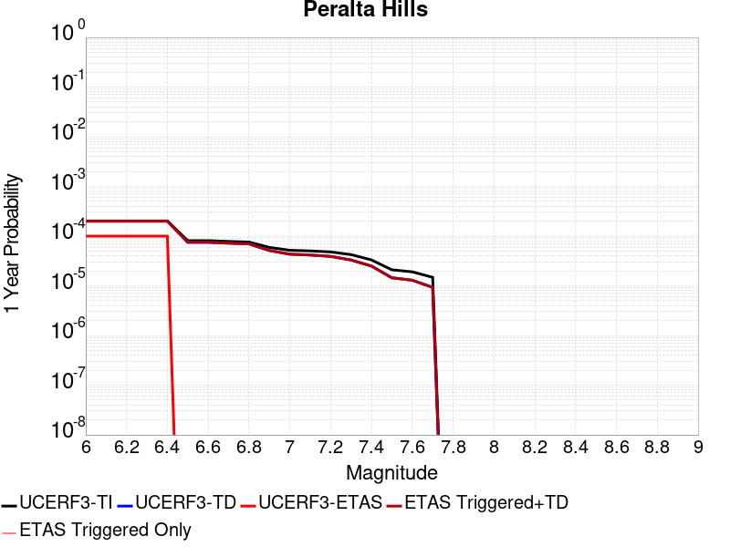 | 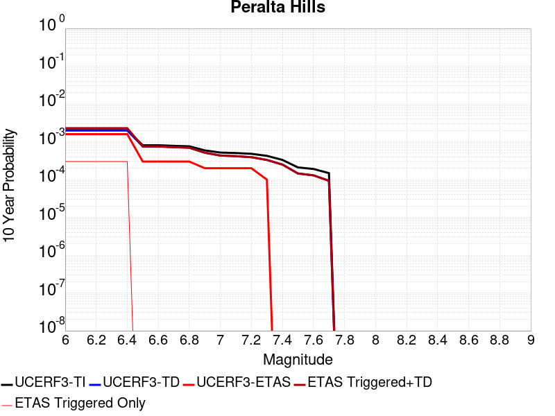 |

| Magnitude | 1 wk TI Prob | 1 wk TD Prob | 1 wk ETAS Prob | 1 wk ETAS/TD Gain | 1 wk ETAS Triggered+TD | 1 wk ETAS Triggered Only | 1 mo TI Prob | 1 mo TD Prob | 1 mo ETAS Prob | 1 mo ETAS/TD Gain | 1 mo ETAS Triggered+TD | 1 mo ETAS Triggered Only | 1 yr TI Prob | 1 yr TD Prob | 1 yr ETAS Prob | 1 yr ETAS/TD Gain | 1 yr ETAS Triggered+TD | 1 yr ETAS Triggered Only | 10 yr TI Prob | 10 yr TD Prob | 10 yr ETAS Prob | 10 yr ETAS/TD Gain | 10 yr ETAS Triggered+TD | 10 yr ETAS Triggered Only |
|-----|-----|-----|-----|-----|-----|-----|-----|-----|-----|-----|-----|-----|-----|-----|-----|-----|-----|-----|-----|-----|-----|-----|-----|-----|
| 6.0 | 3.8850067E-6 | 3.840453E-6 | 0.0 | 0.0 | 3.840453E-6 | 0.0 | 1.6649923E-5 | 1.6459022E-5 | 0.0 | 0.0 | 1.6459022E-5 | 0.0 | 2.0269395E-4 | 2.0037757E-4 | 0.0 | 0.0 | 2.0037757E-4 | 0.0 | 0.0020250916 | 0.0020026967 | 3.0E-4 | 0.149798 | 0.002302096 | 3.0E-4 |
| 6.1 | 3.8850067E-6 | 3.840453E-6 | 0.0 | 0.0 | 3.840453E-6 | 0.0 | 1.6649923E-5 | 1.6459022E-5 | 0.0 | 0.0 | 1.6459022E-5 | 0.0 | 2.0269395E-4 | 2.0037757E-4 | 0.0 | 0.0 | 2.0037757E-4 | 0.0 | 0.0020250916 | 0.0020026967 | 3.0E-4 | 0.149798 | 0.002302096 | 3.0E-4 |
| 6.2 | 3.8850067E-6 | 3.840453E-6 | 0.0 | 0.0 | 3.840453E-6 | 0.0 | 1.6649923E-5 | 1.6459022E-5 | 0.0 | 0.0 | 1.6459022E-5 | 0.0 | 2.0269395E-4 | 2.0037757E-4 | 0.0 | 0.0 | 2.0037757E-4 | 0.0 | 0.0020250916 | 0.0020026967 | 3.0E-4 | 0.149798 | 0.002302096 | 3.0E-4 |
| 6.3 | 3.8850067E-6 | 3.840453E-6 | 0.0 | 0.0 | 3.840453E-6 | 0.0 | 1.6649923E-5 | 1.6459022E-5 | 0.0 | 0.0 | 1.6459022E-5 | 0.0 | 2.0269395E-4 | 2.0037757E-4 | 0.0 | 0.0 | 2.0037757E-4 | 0.0 | 0.0020250916 | 0.0020026967 | 3.0E-4 | 0.149798 | 0.002302096 | 3.0E-4 |
| 6.4 | 3.8850067E-6 | 3.840453E-6 | 0.0 | 0.0 | 3.840453E-6 | 0.0 | 1.6649923E-5 | 1.6459022E-5 | 0.0 | 0.0 | 1.6459022E-5 | 0.0 | 2.0269395E-4 | 2.0037757E-4 | 0.0 | 0.0 | 2.0037757E-4 | 0.0 | 0.0020250916 | 0.0020026967 | 3.0E-4 | 0.149798 | 0.002302096 | 3.0E-4 |
| 6.5 | 1.5587785E-6 | 1.4438716E-6 | 0.0 | 0.0 | 1.4438716E-6 | 0.0 | 6.6804623E-6 | 6.1880082E-6 | 0.0 | 0.0 | 6.1880082E-6 | 0.0 | 8.133159E-5 | 7.533664E-5 | 0.0 | 0.0 | 7.533664E-5 | 0.0 | 8.1301836E-4 | 7.53135E-4 | 0.0 | 0.0 | 7.53135E-4 | 0.0 |
| 6.6 | 1.5587785E-6 | 1.4438716E-6 | 0.0 | 0.0 | 1.4438716E-6 | 0.0 | 6.6804623E-6 | 6.1880082E-6 | 0.0 | 0.0 | 6.1880082E-6 | 0.0 | 8.133159E-5 | 7.533664E-5 | 0.0 | 0.0 | 7.533664E-5 | 0.0 | 8.1301836E-4 | 7.53135E-4 | 0.0 | 0.0 | 7.53135E-4 | 0.0 |
| 6.7 | 1.5018579E-6 | 1.384489E-6 | 0.0 | 0.0 | 1.384489E-6 | 0.0 | 6.436518E-6 | 5.933512E-6 | 0.0 | 0.0 | 5.933512E-6 | 0.0 | 7.836179E-5 | 7.2238356E-5 | 0.0 | 0.0 | 7.2238356E-5 | 0.0 | 7.833416E-4 | 7.221723E-4 | 0.0 | 0.0 | 7.221723E-4 | 0.0 |
| 6.8 | 1.4584314E-6 | 1.3389165E-6 | 0.0 | 0.0 | 1.3389165E-6 | 0.0 | 6.250405E-6 | 5.738202E-6 | 0.0 | 0.0 | 5.738202E-6 | 0.0 | 7.6096025E-5 | 6.986061E-5 | 0.0 | 0.0 | 6.986061E-5 | 0.0 | 7.6069974E-4 | 6.984099E-4 | 0.0 | 0.0 | 6.984099E-4 | 0.0 |
| 6.9 | 1.1382393E-6 | 9.867929E-7 | 0.0 | 0.0 | 9.867929E-7 | 0.0 | 4.8781594E-6 | 4.229106E-6 | 0.0 | 0.0 | 4.229106E-6 | 0.0 | 5.9389975E-5 | 5.148823E-5 | 0.0 | 0.0 | 5.148823E-5 | 0.0 | 5.93741E-4 | 5.1477127E-4 | 0.0 | 0.0 | 5.1477127E-4 | 0.0 |
| 7.0 | 9.970413E-7 | 8.314404E-7 | 0.0 | 0.0 | 8.314404E-7 | 0.0 | 4.273027E-6 | 3.5633113E-6 | 0.0 | 0.0 | 3.5633113E-6 | 0.0 | 5.2022864E-5 | 4.3382523E-5 | 0.0 | 0.0 | 4.3382523E-5 | 0.0 | 5.2010687E-4 | 4.3374734E-4 | 0.0 | 0.0 | 4.3374734E-4 | 0.0 |
| 7.1 | 9.684443E-7 | 7.998684E-7 | 0.0 | 0.0 | 7.998684E-7 | 0.0 | 4.150469E-6 | 3.4280035E-6 | 0.0 | 0.0 | 3.4280035E-6 | 0.0 | 5.053079E-5 | 4.1735213E-5 | 0.0 | 0.0 | 4.1735213E-5 | 0.0 | 5.05193E-4 | 4.1728048E-4 | 0.0 | 0.0 | 4.1728048E-4 | 0.0 |
| 7.2 | 9.240811E-7 | 7.5075496E-7 | 0.0 | 0.0 | 7.5075496E-7 | 0.0 | 3.960342E-6 | 3.2175178E-6 | 0.0 | 0.0 | 3.2175178E-6 | 0.0 | 4.8216094E-5 | 3.917264E-5 | 0.0 | 0.0 | 3.917264E-5 | 0.0 | 4.8205635E-4 | 3.916639E-4 | 0.0 | 0.0 | 3.916639E-4 | 0.0 |
| 7.3 | 8.158643E-7 | 6.3539034E-7 | 0.0 | 0.0 | 6.3539034E-7 | 0.0 | 3.4965567E-6 | 2.723099E-6 | 0.0 | 0.0 | 2.723099E-6 | 0.0 | 4.2569747E-5 | 3.315329E-5 | 0.0 | 0.0 | 3.315329E-5 | 0.0 | 4.2561593E-4 | 3.3148957E-4 | 0.0 | 0.0 | 3.3148957E-4 | 0.0 |
| 7.4 | 6.3822824E-7 | 4.798663E-7 | 0.0 | 0.0 | 4.798663E-7 | 0.0 | 2.7352612E-6 | 2.0565685E-6 | 0.0 | 0.0 | 2.0565685E-6 | 0.0 | 3.3301294E-5 | 2.5038486E-5 | 0.0 | 0.0 | 2.5038486E-5 | 0.0 | 3.3296304E-4 | 2.5036177E-4 | 0.0 | 0.0 | 2.5036177E-4 | 0.0 |
| 7.5 | 4.0292628E-7 | 2.7863E-7 | 0.0 | 0.0 | 2.7863E-7 | 0.0 | 1.7268258E-6 | 1.1941282E-6 | 0.0 | 0.0 | 1.1941282E-6 | 0.0 | 2.1023901E-5 | 1.4538442E-5 | 0.0 | 0.0 | 1.4538442E-5 | 0.0 | 2.1021912E-4 | 1.4537771E-4 | 0.0 | 0.0 | 1.4537771E-4 | 0.0 |
| 7.6 | 3.672993E-7 | 2.4869996E-7 | 0.0 | 0.0 | 2.4869996E-7 | 0.0 | 1.5741389E-6 | 1.0658567E-6 | 0.0 | 0.0 | 1.0658567E-6 | 0.0 | 1.9164972E-5 | 1.2976756E-5 | 0.0 | 0.0 | 1.2976756E-5 | 0.0 | 1.916332E-4 | 1.297627E-4 | 0.0 | 0.0 | 1.297627E-4 | 0.0 |
| 7.7 | 2.8466823E-7 | 1.787142E-7 | 0.0 | 0.0 | 1.787142E-7 | 0.0 | 1.2200061E-6 | 7.659179E-7 | 0.0 | 0.0 | 7.659179E-7 | 0.0 | 1.4853474E-5 | 9.325037E-6 | 0.0 | 0.0 | 9.325037E-6 | 0.0 | 1.485248E-4 | 9.324906E-5 | 0.0 | 0.0 | 9.324906E-5 | 0.0 |

## Russ 2011 CFM
*[(top)](#table-of-contents)*

| 1 Week | 1 Month | 1 Year | 10 Year |
|-----|-----|-----|-----|
| 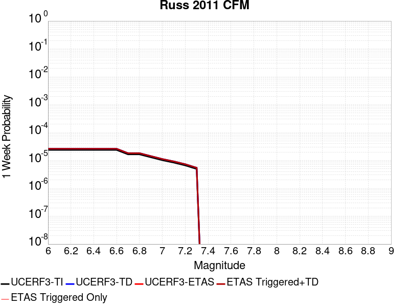 |  |  |  |

| Magnitude | 1 wk TI Prob | 1 wk TD Prob | 1 wk ETAS Prob | 1 wk ETAS/TD Gain | 1 wk ETAS Triggered+TD | 1 wk ETAS Triggered Only | 1 mo TI Prob | 1 mo TD Prob | 1 mo ETAS Prob | 1 mo ETAS/TD Gain | 1 mo ETAS Triggered+TD | 1 mo ETAS Triggered Only | 1 yr TI Prob | 1 yr TD Prob | 1 yr ETAS Prob | 1 yr ETAS/TD Gain | 1 yr ETAS Triggered+TD | 1 yr ETAS Triggered Only | 10 yr TI Prob | 10 yr TD Prob | 10 yr ETAS Prob | 10 yr ETAS/TD Gain | 10 yr ETAS Triggered+TD | 10 yr ETAS Triggered Only |
|-----|-----|-----|-----|-----|-----|-----|-----|-----|-----|-----|-----|-----|-----|-----|-----|-----|-----|-----|-----|-----|-----|-----|-----|-----|
| 6.0 | 2.3806366E-5 | 2.6259715E-5 | 0.0 | 0.0 | 2.6259715E-5 | 0.0 | 1.0202329E-4 | 1.1253714E-4 | 0.0 | 0.0 | 1.1253714E-4 | 0.0 | 0.0012414258 | 0.0013693422 | 0.0 | 0.0 | 0.0013693422 | 0.0 | 0.012345135 | 0.013615528 | 3.0E-4 | 0.022033665 | 0.013911444 | 3.0E-4 |
| 6.1 | 2.3806366E-5 | 2.6259715E-5 | 0.0 | 0.0 | 2.6259715E-5 | 0.0 | 1.0202329E-4 | 1.1253714E-4 | 0.0 | 0.0 | 1.1253714E-4 | 0.0 | 0.0012414258 | 0.0013693422 | 0.0 | 0.0 | 0.0013693422 | 0.0 | 0.012345135 | 0.013615528 | 3.0E-4 | 0.022033665 | 0.013911444 | 3.0E-4 |
| 6.2 | 2.3806366E-5 | 2.6259715E-5 | 0.0 | 0.0 | 2.6259715E-5 | 0.0 | 1.0202329E-4 | 1.1253714E-4 | 0.0 | 0.0 | 1.1253714E-4 | 0.0 | 0.0012414258 | 0.0013693422 | 0.0 | 0.0 | 0.0013693422 | 0.0 | 0.012345135 | 0.013615528 | 3.0E-4 | 0.022033665 | 0.013911444 | 3.0E-4 |
| 6.3 | 2.3806366E-5 | 2.6259715E-5 | 0.0 | 0.0 | 2.6259715E-5 | 0.0 | 1.0202329E-4 | 1.1253714E-4 | 0.0 | 0.0 | 1.1253714E-4 | 0.0 | 0.0012414258 | 0.0013693422 | 0.0 | 0.0 | 0.0013693422 | 0.0 | 0.012345135 | 0.013615528 | 3.0E-4 | 0.022033665 | 0.013911444 | 3.0E-4 |
| 6.4 | 2.3806366E-5 | 2.6259715E-5 | 0.0 | 0.0 | 2.6259715E-5 | 0.0 | 1.0202329E-4 | 1.1253714E-4 | 0.0 | 0.0 | 1.1253714E-4 | 0.0 | 0.0012414258 | 0.0013693422 | 0.0 | 0.0 | 0.0013693422 | 0.0 | 0.012345135 | 0.013615528 | 3.0E-4 | 0.022033665 | 0.013911444 | 3.0E-4 |
| 6.5 | 2.3806366E-5 | 2.6259715E-5 | 0.0 | 0.0 | 2.6259715E-5 | 0.0 | 1.0202329E-4 | 1.1253714E-4 | 0.0 | 0.0 | 1.1253714E-4 | 0.0 | 0.0012414258 | 0.0013693422 | 0.0 | 0.0 | 0.0013693422 | 0.0 | 0.012345135 | 0.013615528 | 3.0E-4 | 0.022033665 | 0.013911444 | 3.0E-4 |
| 6.6 | 2.3806366E-5 | 2.6259715E-5 | 0.0 | 0.0 | 2.6259715E-5 | 0.0 | 1.0202329E-4 | 1.1253714E-4 | 0.0 | 0.0 | 1.1253714E-4 | 0.0 | 0.0012414258 | 0.0013693422 | 0.0 | 0.0 | 0.0013693422 | 0.0 | 0.012345135 | 0.013615528 | 3.0E-4 | 0.022033665 | 0.013911444 | 3.0E-4 |
| 6.7 | 1.6515693E-5 | 1.8191738E-5 | 0.0 | 0.0 | 1.8191738E-5 | 0.0 | 7.077962E-5 | 7.796245E-5 | 0.0 | 0.0 | 7.796245E-5 | 0.0 | 8.6140115E-4 | 9.4881334E-4 | 0.0 | 0.0 | 9.4881334E-4 | 0.0 | 0.008580698 | 0.009451018 | 2.0E-4 | 0.021161743 | 0.009649128 | 2.0E-4 |
| 6.8 | 1.6515693E-5 | 1.8191738E-5 | 0.0 | 0.0 | 1.8191738E-5 | 0.0 | 7.077962E-5 | 7.796245E-5 | 0.0 | 0.0 | 7.796245E-5 | 0.0 | 8.6140115E-4 | 9.4881334E-4 | 0.0 | 0.0 | 9.4881334E-4 | 0.0 | 0.008580698 | 0.009451018 | 2.0E-4 | 0.021161743 | 0.009649128 | 2.0E-4 |
| 6.9 | 1.2971182E-5 | 1.4276783E-5 | 0.0 | 0.0 | 1.4276783E-5 | 0.0 | 5.5589593E-5 | 6.1184925E-5 | 0.0 | 0.0 | 6.1184925E-5 | 0.0 | 6.765931E-4 | 7.4469775E-4 | 0.0 | 0.0 | 7.4469775E-4 | 0.0 | 0.0067453682 | 0.0074245976 | 2.0E-4 | 0.026937487 | 0.0076231128 | 2.0E-4 |
| 7.0 | 1.0201805E-5 | 1.1224222E-5 | 0.0 | 0.0 | 1.1224222E-5 | 0.0 | 4.3721288E-5 | 4.810304E-5 | 0.0 | 0.0 | 4.810304E-5 | 0.0 | 5.3217664E-4 | 5.855179E-4 | 0.0 | 0.0 | 5.855179E-4 | 0.0 | 0.00530904 | 0.005841805 | 1.0E-4 | 0.017117998 | 0.005941221 | 1.0E-4 |
| 7.1 | 8.3744935E-6 | 9.2145665E-6 | 0.0 | 0.0 | 9.2145665E-6 | 0.0 | 3.5890193E-5 | 3.9490504E-5 | 0.0 | 0.0 | 3.9490504E-5 | 0.0 | 4.368755E-4 | 4.807094E-4 | 0.0 | 0.0 | 4.807094E-4 | 0.0 | 0.004360176 | 0.0047985218 | 1.0E-4 | 0.020839753 | 0.0048980415 | 1.0E-4 |
| 7.2 | 6.649391E-6 | 7.3185224E-6 | 0.0 | 0.0 | 7.3185224E-6 | 0.0 | 2.8497077E-5 | 3.1364812E-5 | 0.0 | 0.0 | 3.1364812E-5 | 0.0 | 3.4689668E-4 | 3.8181627E-4 | 0.0 | 0.0 | 3.8181627E-4 | 0.0 | 0.0034635565 | 0.0038132337 | 1.0E-4 | 0.02622446 | 0.0039128526 | 1.0E-4 |
| 7.3 | 4.9549312E-6 | 5.455726E-6 | 0.0 | 0.0 | 5.455726E-6 | 0.0 | 2.1235246E-5 | 2.3381555E-5 | 0.0 | 0.0 | 2.3381555E-5 | 0.0 | 2.5850846E-4 | 2.8464798E-4 | 0.0 | 0.0 | 2.8464798E-4 | 0.0 | 0.0025820795 | 0.0028442782 | 1.0E-4 | 0.035158303 | 0.0029439938 | 1.0E-4 |

## San Gorgonio Pass
*[(top)](#table-of-contents)*

| 1 Week | 1 Month | 1 Year | 10 Year |
|-----|-----|-----|-----|
| 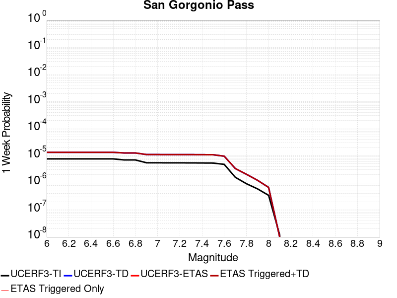 |  |  |  |

| Magnitude | 1 wk TI Prob | 1 wk TD Prob | 1 wk ETAS Prob | 1 wk ETAS/TD Gain | 1 wk ETAS Triggered+TD | 1 wk ETAS Triggered Only | 1 mo TI Prob | 1 mo TD Prob | 1 mo ETAS Prob | 1 mo ETAS/TD Gain | 1 mo ETAS Triggered+TD | 1 mo ETAS Triggered Only | 1 yr TI Prob | 1 yr TD Prob | 1 yr ETAS Prob | 1 yr ETAS/TD Gain | 1 yr ETAS Triggered+TD | 1 yr ETAS Triggered Only | 10 yr TI Prob | 10 yr TD Prob | 10 yr ETAS Prob | 10 yr ETAS/TD Gain | 10 yr ETAS Triggered+TD | 10 yr ETAS Triggered Only |
|-----|-----|-----|-----|-----|-----|-----|-----|-----|-----|-----|-----|-----|-----|-----|-----|-----|-----|-----|-----|-----|-----|-----|-----|-----|
| 6.0 | 7.644328E-6 | 1.3318641E-5 | 0.0 | 0.0 | 1.3318641E-5 | 0.0 | 3.2760996E-5 | 5.707869E-5 | 0.0 | 0.0 | 5.707869E-5 | 0.0 | 3.987921E-4 | 6.9472E-4 | 0.0 | 0.0 | 6.9472E-4 | 0.0 | 0.003980772 | 0.006932417 | 3.0E-4 | 0.04327495 | 0.0072303372 | 3.0E-4 |
| 6.1 | 7.644328E-6 | 1.3318641E-5 | 0.0 | 0.0 | 1.3318641E-5 | 0.0 | 3.2760996E-5 | 5.707869E-5 | 0.0 | 0.0 | 5.707869E-5 | 0.0 | 3.987921E-4 | 6.9472E-4 | 0.0 | 0.0 | 6.9472E-4 | 0.0 | 0.003980772 | 0.006932417 | 3.0E-4 | 0.04327495 | 0.0072303372 | 3.0E-4 |
| 6.2 | 7.644328E-6 | 1.3318641E-5 | 0.0 | 0.0 | 1.3318641E-5 | 0.0 | 3.2760996E-5 | 5.707869E-5 | 0.0 | 0.0 | 5.707869E-5 | 0.0 | 3.987921E-4 | 6.9472E-4 | 0.0 | 0.0 | 6.9472E-4 | 0.0 | 0.003980772 | 0.006932417 | 3.0E-4 | 0.04327495 | 0.0072303372 | 3.0E-4 |
| 6.3 | 7.644328E-6 | 1.3318641E-5 | 0.0 | 0.0 | 1.3318641E-5 | 0.0 | 3.2760996E-5 | 5.707869E-5 | 0.0 | 0.0 | 5.707869E-5 | 0.0 | 3.987921E-4 | 6.9472E-4 | 0.0 | 0.0 | 6.9472E-4 | 0.0 | 0.003980772 | 0.006932417 | 3.0E-4 | 0.04327495 | 0.0072303372 | 3.0E-4 |
| 6.4 | 7.644328E-6 | 1.3318641E-5 | 0.0 | 0.0 | 1.3318641E-5 | 0.0 | 3.2760996E-5 | 5.707869E-5 | 0.0 | 0.0 | 5.707869E-5 | 0.0 | 3.987921E-4 | 6.9472E-4 | 0.0 | 0.0 | 6.9472E-4 | 0.0 | 0.003980772 | 0.006932417 | 3.0E-4 | 0.04327495 | 0.0072303372 | 3.0E-4 |
| 6.5 | 7.644328E-6 | 1.3318641E-5 | 0.0 | 0.0 | 1.3318641E-5 | 0.0 | 3.2760996E-5 | 5.707869E-5 | 0.0 | 0.0 | 5.707869E-5 | 0.0 | 3.987921E-4 | 6.9472E-4 | 0.0 | 0.0 | 6.9472E-4 | 0.0 | 0.003980772 | 0.006932417 | 3.0E-4 | 0.04327495 | 0.0072303372 | 3.0E-4 |
| 6.6 | 7.644328E-6 | 1.3318641E-5 | 0.0 | 0.0 | 1.3318641E-5 | 0.0 | 3.2760996E-5 | 5.707869E-5 | 0.0 | 0.0 | 5.707869E-5 | 0.0 | 3.987921E-4 | 6.9472E-4 | 0.0 | 0.0 | 6.9472E-4 | 0.0 | 0.003980772 | 0.006932417 | 3.0E-4 | 0.04327495 | 0.0072303372 | 3.0E-4 |
| 6.7 | 6.987586E-6 | 1.262283E-5 | 0.0 | 0.0 | 1.262283E-5 | 0.0 | 2.9946454E-5 | 5.4096767E-5 | 0.0 | 0.0 | 5.4096767E-5 | 0.0 | 3.645371E-4 | 6.584372E-4 | 0.0 | 0.0 | 6.584372E-4 | 0.0 | 0.0036393967 | 0.0065717497 | 3.0E-4 | 0.045649942 | 0.006869778 | 3.0E-4 |
| 6.8 | 6.987586E-6 | 1.262283E-5 | 0.0 | 0.0 | 1.262283E-5 | 0.0 | 2.9946454E-5 | 5.4096767E-5 | 0.0 | 0.0 | 5.4096767E-5 | 0.0 | 3.645371E-4 | 6.584372E-4 | 0.0 | 0.0 | 6.584372E-4 | 0.0 | 0.0036393967 | 0.0065717497 | 3.0E-4 | 0.045649942 | 0.006869778 | 3.0E-4 |
| 6.9 | 5.504702E-6 | 1.1053506E-5 | 0.0 | 0.0 | 1.1053506E-5 | 0.0 | 2.3591367E-5 | 4.7371333E-5 | 0.0 | 0.0 | 4.7371333E-5 | 0.0 | 2.8718702E-4 | 5.765984E-4 | 0.0 | 0.0 | 5.765984E-4 | 0.0 | 0.0028681618 | 0.0057576066 | 2.0E-4 | 0.034736656 | 0.005956455 | 2.0E-4 |
| 7.0 | 5.4825764E-6 | 1.1029842E-5 | 0.0 | 0.0 | 1.1029842E-5 | 0.0 | 2.3496545E-5 | 4.726993E-5 | 0.0 | 0.0 | 4.726993E-5 | 0.0 | 2.8603288E-4 | 5.7536445E-4 | 0.0 | 0.0 | 5.7536445E-4 | 0.0 | 0.00285665 | 0.005745331 | 2.0E-4 | 0.03481088 | 0.0059441817 | 2.0E-4 |
| 7.1 | 5.4692787E-6 | 1.1015551E-5 | 0.0 | 0.0 | 1.1015551E-5 | 0.0 | 2.3439556E-5 | 4.7208676E-5 | 0.0 | 0.0 | 4.7208676E-5 | 0.0 | 2.8533922E-4 | 5.746191E-4 | 0.0 | 0.0 | 5.746191E-4 | 0.0 | 0.0028497311 | 0.005737916 | 2.0E-4 | 0.03485586 | 0.0059367684 | 2.0E-4 |
| 7.2 | 5.453661E-6 | 1.0998574E-5 | 0.0 | 0.0 | 1.0998574E-5 | 0.0 | 2.3372622E-5 | 4.7135924E-5 | 0.0 | 0.0 | 4.7135924E-5 | 0.0 | 2.8452452E-4 | 5.737338E-4 | 0.0 | 0.0 | 5.737338E-4 | 0.0 | 0.002841605 | 0.0057291086 | 2.0E-4 | 0.034909446 | 0.0059279627 | 2.0E-4 |
| 7.3 | 5.4422303E-6 | 1.0985492E-5 | 0.0 | 0.0 | 1.0985492E-5 | 0.0 | 2.3323635E-5 | 4.707986E-5 | 0.0 | 0.0 | 4.707986E-5 | 0.0 | 2.8392827E-4 | 5.7305157E-4 | 0.0 | 0.0 | 5.7305157E-4 | 0.0 | 0.0028356577 | 0.0057223216 | 2.0E-4 | 0.03495085 | 0.005921177 | 2.0E-4 |
| 7.4 | 5.398595E-6 | 1.09328375E-5 | 0.0 | 0.0 | 1.09328375E-5 | 0.0 | 2.313663E-5 | 4.6854202E-5 | 0.0 | 0.0 | 4.6854202E-5 | 0.0 | 2.8165206E-4 | 5.703057E-4 | 0.0 | 0.0 | 5.703057E-4 | 0.0 | 0.0028129534 | 0.0056950036 | 2.0E-4 | 0.0351185 | 0.0058938647 | 2.0E-4 |
| 7.5 | 5.3578788E-6 | 1.08593185E-5 | 0.0 | 0.0 | 1.08593185E-5 | 0.0 | 2.2962136E-5 | 4.653913E-5 | 0.0 | 0.0 | 4.653913E-5 | 0.0 | 2.7952815E-4 | 5.6647166E-4 | 0.0 | 0.0 | 5.6647166E-4 | 0.0 | 0.002791768 | 0.0056568948 | 2.0E-4 | 0.035355087 | 0.0058557633 | 2.0E-4 |
| 7.6 | 4.8091474E-6 | 9.60744E-6 | 0.0 | 0.0 | 9.60744E-6 | 0.0 | 2.0610469E-5 | 4.117412E-5 | 0.0 | 0.0 | 4.117412E-5 | 0.0 | 2.5090357E-4 | 5.011844E-4 | 0.0 | 0.0 | 5.011844E-4 | 0.0 | 0.0025062046 | 0.005007428 | 2.0E-4 | 0.039940663 | 0.0052064266 | 2.0E-4 |
| 7.7 | 1.5991155E-6 | 3.3621932E-6 | 0.0 | 0.0 | 3.3621932E-6 | 0.0 | 6.853334E-6 | 1.4409321E-5 | 0.0 | 0.0 | 1.4409321E-5 | 0.0 | 8.343615E-5 | 1.7541961E-4 | 0.0 | 0.0 | 1.7541961E-4 | 0.0 | 8.340483E-4 | 0.0017584452 | 1.0E-4 | 0.056868423 | 0.0018582693 | 1.0E-4 |
| 7.8 | 9.258398E-7 | 2.0677485E-6 | 0.0 | 0.0 | 2.0677485E-6 | 0.0 | 3.967879E-6 | 8.861749E-6 | 0.0 | 0.0 | 8.861749E-6 | 0.0 | 4.8307855E-5 | 1.0788647E-4 | 0.0 | 0.0 | 1.0788647E-4 | 0.0 | 4.8297356E-4 | 0.0010839511 | 1.0E-4 | 0.09225508 | 0.0011838428 | 1.0E-4 |
| 7.9 | 5.975575E-7 | 1.2356768E-6 | 0.0 | 0.0 | 1.2356768E-6 | 0.0 | 2.5609581E-6 | 5.295747E-6 | 0.0 | 0.0 | 5.295747E-6 | 0.0 | 3.117922E-5 | 6.4473825E-5 | 0.0 | 0.0 | 6.4473825E-5 | 0.0 | 3.1174847E-4 | 6.498928E-4 | 1.0E-4 | 0.15387154 | 7.498278E-4 | 1.0E-4 |
| 8.0 | 3.4413725E-7 | 6.7492994E-7 | 0.0 | 0.0 | 6.7492994E-7 | 0.0 | 1.4748731E-6 | 2.8925535E-6 | 0.0 | 0.0 | 2.8925535E-6 | 0.0 | 1.7956432E-5 | 3.5216275E-5 | 0.0 | 0.0 | 3.5216275E-5 | 0.0 | 1.7954981E-4 | 3.557084E-4 | 0.0 | 0.0 | 3.557084E-4 | 0.0 |
| 8.1 | 1.1787731E-8 | 9.667264E-9 | 0.0 | 0.0 | 9.667264E-9 | 0.0 | 5.0518846E-8 | 4.1431132E-8 | 0.0 | 0.0 | 4.1431132E-8 | 0.0 | 6.1506677E-7 | 5.0442395E-7 | 0.0 | 0.0 | 5.0442395E-7 | 0.0 | 6.1506507E-6 | 5.261328E-6 | 0.0 | 0.0 | 5.261328E-6 | 0.0 |

## Las Positas
*[(top)](#table-of-contents)*

| 1 Week | 1 Month | 1 Year | 10 Year |
|-----|-----|-----|-----|
|  |  |  | 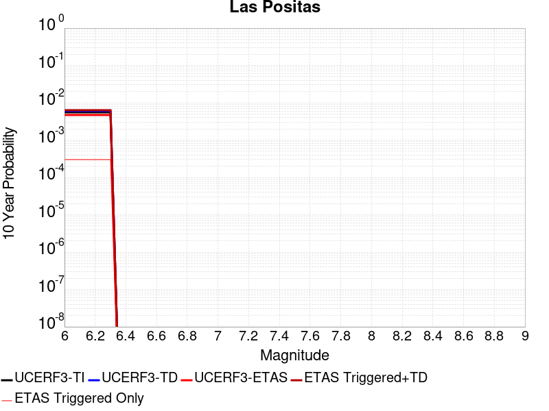 |

| Magnitude | 1 wk TI Prob | 1 wk TD Prob | 1 wk ETAS Prob | 1 wk ETAS/TD Gain | 1 wk ETAS Triggered+TD | 1 wk ETAS Triggered Only | 1 mo TI Prob | 1 mo TD Prob | 1 mo ETAS Prob | 1 mo ETAS/TD Gain | 1 mo ETAS Triggered+TD | 1 mo ETAS Triggered Only | 1 yr TI Prob | 1 yr TD Prob | 1 yr ETAS Prob | 1 yr ETAS/TD Gain | 1 yr ETAS Triggered+TD | 1 yr ETAS Triggered Only | 10 yr TI Prob | 10 yr TD Prob | 10 yr ETAS Prob | 10 yr ETAS/TD Gain | 10 yr ETAS Triggered+TD | 10 yr ETAS Triggered Only |
|-----|-----|-----|-----|-----|-----|-----|-----|-----|-----|-----|-----|-----|-----|-----|-----|-----|-----|-----|-----|-----|-----|-----|-----|-----|
| 6.0 | 1.0659424E-5 | 1.1593209E-5 | 0.0 | 0.0 | 1.1593209E-5 | 0.0 | 4.568245E-5 | 4.968518E-5 | 0.0 | 0.0 | 4.968518E-5 | 0.0 | 5.560419E-4 | 6.0491706E-4 | 0.0 | 0.0 | 6.0491706E-4 | 0.0 | 0.005546526 | 0.0060491706 | 3.0E-4 | 0.049593575 | 0.006347356 | 3.0E-4 |
| 6.1 | 1.0659424E-5 | 1.1593209E-5 | 0.0 | 0.0 | 1.1593209E-5 | 0.0 | 4.568245E-5 | 4.968518E-5 | 0.0 | 0.0 | 4.968518E-5 | 0.0 | 5.560419E-4 | 6.0491706E-4 | 0.0 | 0.0 | 6.0491706E-4 | 0.0 | 0.005546526 | 0.0060491706 | 3.0E-4 | 0.049593575 | 0.006347356 | 3.0E-4 |
| 6.2 | 1.0659424E-5 | 1.1593209E-5 | 0.0 | 0.0 | 1.1593209E-5 | 0.0 | 4.568245E-5 | 4.968518E-5 | 0.0 | 0.0 | 4.968518E-5 | 0.0 | 5.560419E-4 | 6.0491706E-4 | 0.0 | 0.0 | 6.0491706E-4 | 0.0 | 0.005546526 | 0.0060491706 | 3.0E-4 | 0.049593575 | 0.006347356 | 3.0E-4 |
| 6.3 | 1.0659424E-5 | 1.1593209E-5 | 0.0 | 0.0 | 1.1593209E-5 | 0.0 | 4.568245E-5 | 4.968518E-5 | 0.0 | 0.0 | 4.968518E-5 | 0.0 | 5.560419E-4 | 6.0491706E-4 | 0.0 | 0.0 | 6.0491706E-4 | 0.0 | 0.005546526 | 0.0060491706 | 3.0E-4 | 0.049593575 | 0.006347356 | 3.0E-4 |

## Fickle Hill (alt1)
*[(top)](#table-of-contents)*

| 1 Week | 1 Month | 1 Year | 10 Year |
|-----|-----|-----|-----|
|  |  | 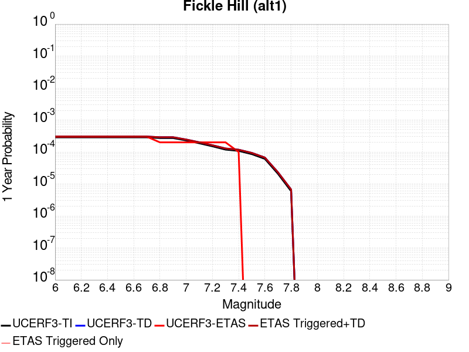 |  |

| Magnitude | 1 wk TI Prob | 1 wk TD Prob | 1 wk ETAS Prob | 1 wk ETAS/TD Gain | 1 wk ETAS Triggered+TD | 1 wk ETAS Triggered Only | 1 mo TI Prob | 1 mo TD Prob | 1 mo ETAS Prob | 1 mo ETAS/TD Gain | 1 mo ETAS Triggered+TD | 1 mo ETAS Triggered Only | 1 yr TI Prob | 1 yr TD Prob | 1 yr ETAS Prob | 1 yr ETAS/TD Gain | 1 yr ETAS Triggered+TD | 1 yr ETAS Triggered Only | 10 yr TI Prob | 10 yr TD Prob | 10 yr ETAS Prob | 10 yr ETAS/TD Gain | 10 yr ETAS Triggered+TD | 10 yr ETAS Triggered Only |
|-----|-----|-----|-----|-----|-----|-----|-----|-----|-----|-----|-----|-----|-----|-----|-----|-----|-----|-----|-----|-----|-----|-----|-----|-----|
| 6.0 | 5.491893E-6 | 5.8277365E-6 | 0.0 | 0.0 | 5.8277365E-6 | 0.0 | 2.3536471E-5 | 2.4975787E-5 | 0.0 | 0.0 | 2.4975787E-5 | 0.0 | 2.8651886E-4 | 3.0404003E-4 | 0.0 | 0.0 | 3.0404003E-4 | 0.0 | 0.0028614972 | 0.003036465 | 3.0E-4 | 0.098799095 | 0.0033355542 | 3.0E-4 |
| 6.1 | 5.491893E-6 | 5.8277365E-6 | 0.0 | 0.0 | 5.8277365E-6 | 0.0 | 2.3536471E-5 | 2.4975787E-5 | 0.0 | 0.0 | 2.4975787E-5 | 0.0 | 2.8651886E-4 | 3.0404003E-4 | 0.0 | 0.0 | 3.0404003E-4 | 0.0 | 0.0028614972 | 0.003036465 | 3.0E-4 | 0.098799095 | 0.0033355542 | 3.0E-4 |
| 6.2 | 5.491893E-6 | 5.8277365E-6 | 0.0 | 0.0 | 5.8277365E-6 | 0.0 | 2.3536471E-5 | 2.4975787E-5 | 0.0 | 0.0 | 2.4975787E-5 | 0.0 | 2.8651886E-4 | 3.0404003E-4 | 0.0 | 0.0 | 3.0404003E-4 | 0.0 | 0.0028614972 | 0.003036465 | 3.0E-4 | 0.098799095 | 0.0033355542 | 3.0E-4 |
| 6.3 | 5.491893E-6 | 5.8277365E-6 | 0.0 | 0.0 | 5.8277365E-6 | 0.0 | 2.3536471E-5 | 2.4975787E-5 | 0.0 | 0.0 | 2.4975787E-5 | 0.0 | 2.8651886E-4 | 3.0404003E-4 | 0.0 | 0.0 | 3.0404003E-4 | 0.0 | 0.0028614972 | 0.003036465 | 3.0E-4 | 0.098799095 | 0.0033355542 | 3.0E-4 |
| 6.4 | 5.491893E-6 | 5.8277365E-6 | 0.0 | 0.0 | 5.8277365E-6 | 0.0 | 2.3536471E-5 | 2.4975787E-5 | 0.0 | 0.0 | 2.4975787E-5 | 0.0 | 2.8651886E-4 | 3.0404003E-4 | 0.0 | 0.0 | 3.0404003E-4 | 0.0 | 0.0028614972 | 0.003036465 | 3.0E-4 | 0.098799095 | 0.0033355542 | 3.0E-4 |
| 6.5 | 5.491893E-6 | 5.8277365E-6 | 0.0 | 0.0 | 5.8277365E-6 | 0.0 | 2.3536471E-5 | 2.4975787E-5 | 0.0 | 0.0 | 2.4975787E-5 | 0.0 | 2.8651886E-4 | 3.0404003E-4 | 0.0 | 0.0 | 3.0404003E-4 | 0.0 | 0.0028614972 | 0.003036465 | 3.0E-4 | 0.098799095 | 0.0033355542 | 3.0E-4 |
| 6.6 | 5.491893E-6 | 5.8277365E-6 | 0.0 | 0.0 | 5.8277365E-6 | 0.0 | 2.3536471E-5 | 2.4975787E-5 | 0.0 | 0.0 | 2.4975787E-5 | 0.0 | 2.8651886E-4 | 3.0404003E-4 | 0.0 | 0.0 | 3.0404003E-4 | 0.0 | 0.0028614972 | 0.003036465 | 3.0E-4 | 0.098799095 | 0.0033355542 | 3.0E-4 |
| 6.7 | 5.491893E-6 | 5.8277365E-6 | 0.0 | 0.0 | 5.8277365E-6 | 0.0 | 2.3536471E-5 | 2.4975787E-5 | 0.0 | 0.0 | 2.4975787E-5 | 0.0 | 2.8651886E-4 | 3.0404003E-4 | 0.0 | 0.0 | 3.0404003E-4 | 0.0 | 0.0028614972 | 0.003036465 | 3.0E-4 | 0.098799095 | 0.0033355542 | 3.0E-4 |
| 6.8 | 5.2207747E-6 | 5.5464434E-6 | 0.0 | 0.0 | 5.5464434E-6 | 0.0 | 2.2374557E-5 | 2.3770268E-5 | 0.0 | 0.0 | 2.3770268E-5 | 0.0 | 2.7237617E-4 | 2.8936678E-4 | 0.0 | 0.0 | 2.8936678E-4 | 0.0 | 0.0027204256 | 0.002890118 | 3.0E-4 | 0.10380199 | 0.003189251 | 3.0E-4 |
| 6.9 | 5.2186956E-6 | 5.5442633E-6 | 0.0 | 0.0 | 5.5442633E-6 | 0.0 | 2.2365646E-5 | 2.3760926E-5 | 0.0 | 0.0 | 2.3760926E-5 | 0.0 | 2.722677E-4 | 2.8925305E-4 | 0.0 | 0.0 | 2.8925305E-4 | 0.0 | 0.0027193436 | 0.0028889838 | 3.0E-4 | 0.103842735 | 0.0031881172 | 3.0E-4 |
| 7.0 | 4.403045E-6 | 4.699134E-6 | 0.0 | 0.0 | 4.699134E-6 | 0.0 | 1.8870056E-5 | 2.0139E-5 | 0.0 | 0.0 | 2.0139E-5 | 0.0 | 2.297187E-4 | 2.4516604E-4 | 0.0 | 0.0 | 2.4516604E-4 | 0.0 | 0.0022948137 | 0.002449086 | 3.0E-4 | 0.122494675 | 0.0027483513 | 3.0E-4 |
| 7.1 | 3.5911396E-6 | 3.8485255E-6 | 0.0 | 0.0 | 3.8485255E-6 | 0.0 | 1.5390508E-5 | 1.6493581E-5 | 0.0 | 0.0 | 1.6493581E-5 | 0.0 | 1.8736332E-4 | 2.0079159E-4 | 0.0 | 0.0 | 2.0079159E-4 | 0.0 | 0.0018720542 | 0.002006175 | 2.0E-4 | 0.099692196 | 0.002205774 | 2.0E-4 |
| 7.2 | 2.888171E-6 | 3.1146626E-6 | 0.0 | 0.0 | 3.1146626E-6 | 0.0 | 1.2377816E-5 | 1.3348487E-5 | 0.0 | 0.0 | 1.3348487E-5 | 0.0 | 1.5068949E-4 | 1.6250595E-4 | 0.0 | 0.0 | 1.6250595E-4 | 0.0 | 0.0015058735 | 0.001623896 | 0.0 | 0.0 | 0.001623896 | 0.0 |
| 7.3 | 2.275019E-6 | 2.4679528E-6 | 0.0 | 0.0 | 2.4679528E-6 | 0.0 | 9.750045E-6 | 1.0576899E-5 | 0.0 | 0.0 | 1.0576899E-5 | 0.0 | 1.1870033E-4 | 1.2876627E-4 | 0.0 | 0.0 | 1.2876627E-4 | 0.0 | 0.0011863695 | 0.0012869305 | 0.0 | 0.0 | 0.0012869305 | 0.0 |
| 7.4 | 2.076662E-6 | 2.2580182E-6 | 0.0 | 0.0 | 2.2580182E-6 | 0.0 | 8.8999495E-6 | 9.6771855E-6 | 0.0 | 0.0 | 9.6771855E-6 | 0.0 | 1.08351494E-4 | 1.178135E-4 | 0.0 | 0.0 | 1.178135E-4 | 0.0 | 0.0010829868 | 0.0011775235 | 0.0 | 0.0 | 0.0011775235 | 0.0 |
| 7.5 | 1.6450799E-6 | 1.7957491E-6 | 0.0 | 0.0 | 1.7957491E-6 | 0.0 | 7.0503233E-6 | 7.696045E-6 | 0.0 | 0.0 | 7.696045E-6 | 0.0 | 8.5834305E-5 | 9.3695395E-5 | 0.0 | 0.0 | 9.3695395E-5 | 0.0 | 8.580116E-4 | 9.365666E-4 | 0.0 | 0.0 | 9.365666E-4 | 0.0 |
| 7.6 | 1.168891E-6 | 1.2832104E-6 | 0.0 | 0.0 | 1.2832104E-6 | 0.0 | 5.009523E-6 | 5.4994616E-6 | 0.0 | 0.0 | 5.4994616E-6 | 0.0 | 6.098924E-5 | 6.6953944E-5 | 0.0 | 0.0 | 6.6953944E-5 | 0.0 | 6.09725E-4 | 6.693434E-4 | 0.0 | 0.0 | 6.693434E-4 | 0.0 |
| 7.7 | 3.9871026E-7 | 4.4281518E-7 | 0.0 | 0.0 | 4.4281518E-7 | 0.0 | 1.708757E-6 | 1.897778E-6 | 0.0 | 0.0 | 1.897778E-6 | 0.0 | 2.0803918E-5 | 2.310521E-5 | 0.0 | 0.0 | 2.310521E-5 | 0.0 | 2.0801972E-4 | 2.3102891E-4 | 0.0 | 0.0 | 2.3102891E-4 | 0.0 |
| 7.8 | 1.14295965E-7 | 1.2857119E-7 | 0.0 | 0.0 | 1.2857119E-7 | 0.0 | 4.8983975E-7 | 5.5101924E-7 | 0.0 | 0.0 | 5.5101924E-7 | 0.0 | 5.9637828E-6 | 6.7086403E-6 | 0.0 | 0.0 | 6.7086403E-6 | 0.0 | 5.9636226E-5 | 6.708453E-5 | 0.0 | 0.0 | 6.708453E-5 | 0.0 |

## Polaris 2011 CFM
*[(top)](#table-of-contents)*

| 1 Week | 1 Month | 1 Year | 10 Year |
|-----|-----|-----|-----|
| 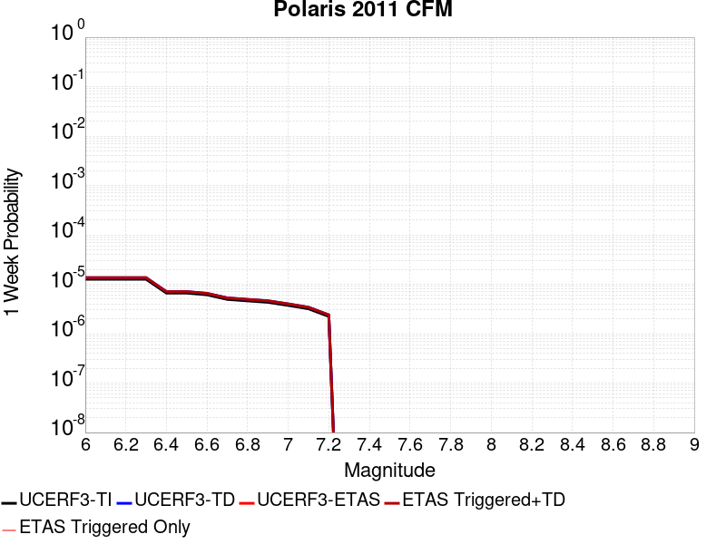 | 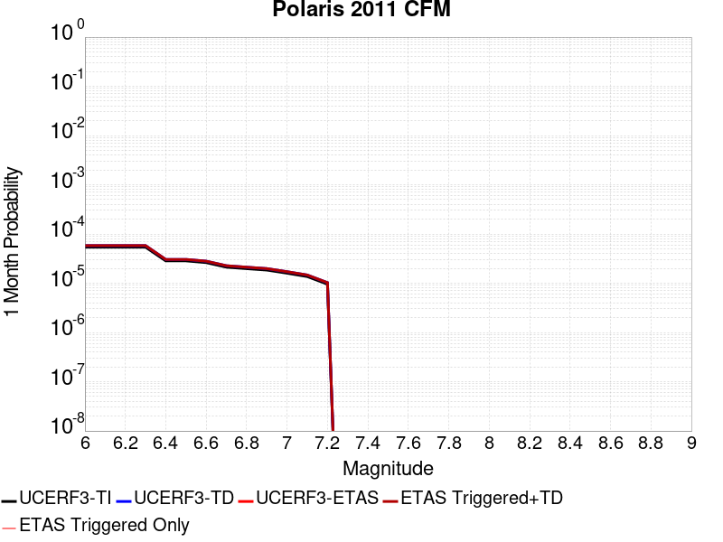 | 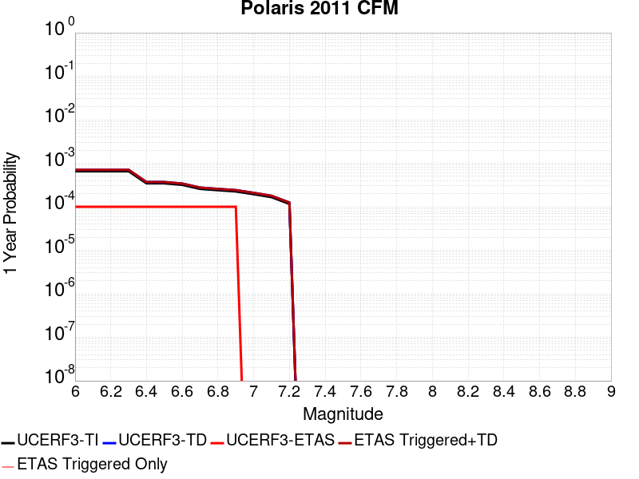 |  |

| Magnitude | 1 wk TI Prob | 1 wk TD Prob | 1 wk ETAS Prob | 1 wk ETAS/TD Gain | 1 wk ETAS Triggered+TD | 1 wk ETAS Triggered Only | 1 mo TI Prob | 1 mo TD Prob | 1 mo ETAS Prob | 1 mo ETAS/TD Gain | 1 mo ETAS Triggered+TD | 1 mo ETAS Triggered Only | 1 yr TI Prob | 1 yr TD Prob | 1 yr ETAS Prob | 1 yr ETAS/TD Gain | 1 yr ETAS Triggered+TD | 1 yr ETAS Triggered Only | 10 yr TI Prob | 10 yr TD Prob | 10 yr ETAS Prob | 10 yr ETAS/TD Gain | 10 yr ETAS Triggered+TD | 10 yr ETAS Triggered Only |
|-----|-----|-----|-----|-----|-----|-----|-----|-----|-----|-----|-----|-----|-----|-----|-----|-----|-----|-----|-----|-----|-----|-----|-----|-----|
| 6.0 | 1.2630823E-5 | 1.3585026E-5 | 0.0 | 0.0 | 1.3585026E-5 | 0.0 | 5.413098E-5 | 5.8220536E-5 | 0.0 | 0.0 | 5.8220536E-5 | 0.0 | 6.5884535E-4 | 7.086564E-4 | 0.0 | 0.0 | 7.086564E-4 | 0.0 | 0.0065689543 | 0.0070690764 | 3.0E-4 | 0.042438358 | 0.0073669557 | 3.0E-4 |
| 6.1 | 1.2630823E-5 | 1.3585026E-5 | 0.0 | 0.0 | 1.3585026E-5 | 0.0 | 5.413098E-5 | 5.8220536E-5 | 0.0 | 0.0 | 5.8220536E-5 | 0.0 | 6.5884535E-4 | 7.086564E-4 | 0.0 | 0.0 | 7.086564E-4 | 0.0 | 0.0065689543 | 0.0070690764 | 3.0E-4 | 0.042438358 | 0.0073669557 | 3.0E-4 |
| 6.2 | 1.2630823E-5 | 1.3585026E-5 | 0.0 | 0.0 | 1.3585026E-5 | 0.0 | 5.413098E-5 | 5.8220536E-5 | 0.0 | 0.0 | 5.8220536E-5 | 0.0 | 6.5884535E-4 | 7.086564E-4 | 0.0 | 0.0 | 7.086564E-4 | 0.0 | 0.0065689543 | 0.0070690764 | 3.0E-4 | 0.042438358 | 0.0073669557 | 3.0E-4 |
| 6.3 | 1.2630823E-5 | 1.3585026E-5 | 0.0 | 0.0 | 1.3585026E-5 | 0.0 | 5.413098E-5 | 5.8220536E-5 | 0.0 | 0.0 | 5.8220536E-5 | 0.0 | 6.5884535E-4 | 7.086564E-4 | 0.0 | 0.0 | 7.086564E-4 | 0.0 | 0.0065689543 | 0.0070690764 | 3.0E-4 | 0.042438358 | 0.0073669557 | 3.0E-4 |
| 6.4 | 6.642994E-6 | 7.1080826E-6 | 0.0 | 0.0 | 7.1080826E-6 | 0.0 | 2.8469662E-5 | 3.0462885E-5 | 0.0 | 0.0 | 3.0462885E-5 | 0.0 | 3.46563E-4 | 3.7082765E-4 | 0.0 | 0.0 | 3.7082765E-4 | 0.0 | 0.0034602303 | 0.0037025996 | 2.0E-4 | 0.054016102 | 0.003901859 | 2.0E-4 |
| 6.5 | 6.642994E-6 | 7.1080826E-6 | 0.0 | 0.0 | 7.1080826E-6 | 0.0 | 2.8469662E-5 | 3.0462885E-5 | 0.0 | 0.0 | 3.0462885E-5 | 0.0 | 3.46563E-4 | 3.7082765E-4 | 0.0 | 0.0 | 3.7082765E-4 | 0.0 | 0.0034602303 | 0.0037025996 | 2.0E-4 | 0.054016102 | 0.003901859 | 2.0E-4 |
| 6.6 | 6.1286296E-6 | 6.5571135E-6 | 0.0 | 0.0 | 6.5571135E-6 | 0.0 | 2.626529E-5 | 2.810164E-5 | 0.0 | 0.0 | 2.810164E-5 | 0.0 | 3.19733E-4 | 3.4208855E-4 | 0.0 | 0.0 | 3.4208855E-4 | 0.0 | 0.0031927335 | 0.003416095 | 2.0E-4 | 0.058546383 | 0.0036154117 | 2.0E-4 |
| 6.7 | 4.9474666E-6 | 5.2990226E-6 | 0.0 | 0.0 | 5.2990226E-6 | 0.0 | 2.1203256E-5 | 2.2709915E-5 | 0.0 | 0.0 | 2.2709915E-5 | 0.0 | 2.5811905E-4 | 2.7646098E-4 | 0.0 | 0.0 | 2.7646098E-4 | 0.0 | 0.0025781945 | 0.0027614506 | 2.0E-4 | 0.0724257 | 0.0029608982 | 2.0E-4 |
| 6.8 | 4.616407E-6 | 4.946992E-6 | 0.0 | 0.0 | 4.946992E-6 | 0.0 | 1.978445E-5 | 2.1201236E-5 | 0.0 | 0.0 | 2.1201236E-5 | 0.0 | 2.4084905E-4 | 2.5809716E-4 | 0.0 | 0.0 | 2.5809716E-4 | 0.0 | 0.0024058819 | 0.0025782385 | 2.0E-4 | 0.07757234 | 0.002777723 | 2.0E-4 |
| 6.9 | 4.320343E-6 | 4.6315718E-6 | 0.0 | 0.0 | 4.6315718E-6 | 0.0 | 1.8515624E-5 | 1.9849456E-5 | 0.0 | 0.0 | 1.9849456E-5 | 0.0 | 2.2540441E-4 | 2.4164293E-4 | 0.0 | 0.0 | 2.4164293E-4 | 0.0 | 0.0022517592 | 0.0024140587 | 2.0E-4 | 0.08284803 | 0.002613576 | 2.0E-4 |
| 7.0 | 3.7382292E-6 | 4.010152E-6 | 0.0 | 0.0 | 4.010152E-6 | 0.0 | 1.6020884E-5 | 1.7186267E-5 | 0.0 | 0.0 | 1.7186267E-5 | 0.0 | 1.950368E-4 | 2.092251E-4 | 0.0 | 0.0 | 2.092251E-4 | 0.0 | 0.0019486571 | 0.0020905167 | 2.0E-4 | 0.095670134 | 0.0022900985 | 2.0E-4 |
| 7.1 | 3.193576E-6 | 3.4282166E-6 | 0.0 | 0.0 | 3.4282166E-6 | 0.0 | 1.3686683E-5 | 1.4692287E-5 | 0.0 | 0.0 | 1.4692287E-5 | 0.0 | 1.6662262E-4 | 1.7886613E-4 | 0.0 | 0.0 | 1.7886613E-4 | 0.0 | 0.0016649774 | 0.0017874406 | 2.0E-4 | 0.11189183 | 0.0019870831 | 2.0E-4 |
| 7.2 | 2.2356758E-6 | 2.4027372E-6 | 0.0 | 0.0 | 2.4027372E-6 | 0.0 | 9.581432E-6 | 1.0297415E-5 | 0.0 | 0.0 | 1.0297415E-5 | 0.0 | 1.1664769E-4 | 1.2536571E-4 | 0.0 | 0.0 | 1.2536571E-4 | 0.0 | 0.0011658648 | 0.0012531357 | 2.0E-4 | 0.15959963 | 0.0014528851 | 2.0E-4 |

## Thirty Mile Bank
*[(top)](#table-of-contents)*

| 1 Week | 1 Month | 1 Year | 10 Year |
|-----|-----|-----|-----|
| 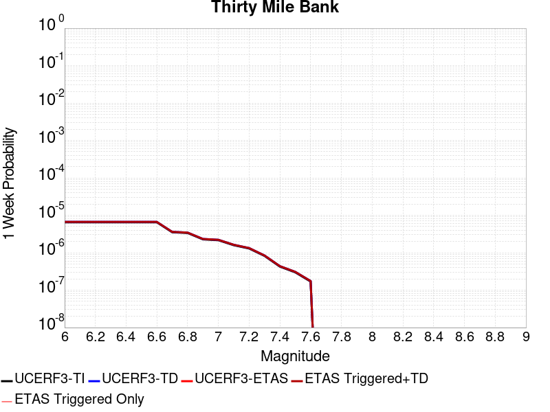 |  |  |  |

| Magnitude | 1 wk TI Prob | 1 wk TD Prob | 1 wk ETAS Prob | 1 wk ETAS/TD Gain | 1 wk ETAS Triggered+TD | 1 wk ETAS Triggered Only | 1 mo TI Prob | 1 mo TD Prob | 1 mo ETAS Prob | 1 mo ETAS/TD Gain | 1 mo ETAS Triggered+TD | 1 mo ETAS Triggered Only | 1 yr TI Prob | 1 yr TD Prob | 1 yr ETAS Prob | 1 yr ETAS/TD Gain | 1 yr ETAS Triggered+TD | 1 yr ETAS Triggered Only | 10 yr TI Prob | 10 yr TD Prob | 10 yr ETAS Prob | 10 yr ETAS/TD Gain | 10 yr ETAS Triggered+TD | 10 yr ETAS Triggered Only |
|-----|-----|-----|-----|-----|-----|-----|-----|-----|-----|-----|-----|-----|-----|-----|-----|-----|-----|-----|-----|-----|-----|-----|-----|-----|
| 6.0 | 6.5124755E-6 | 6.659574E-6 | 0.0 | 0.0 | 6.659574E-6 | 0.0 | 2.791031E-5 | 2.8540742E-5 | 0.0 | 0.0 | 2.8540742E-5 | 0.0 | 3.3975503E-4 | 3.474325E-4 | 0.0 | 0.0 | 3.474325E-4 | 0.0 | 0.0033923604 | 0.0034693251 | 3.0E-4 | 0.08647215 | 0.0037682843 | 3.0E-4 |
| 6.1 | 6.5124755E-6 | 6.659574E-6 | 0.0 | 0.0 | 6.659574E-6 | 0.0 | 2.791031E-5 | 2.8540742E-5 | 0.0 | 0.0 | 2.8540742E-5 | 0.0 | 3.3975503E-4 | 3.474325E-4 | 0.0 | 0.0 | 3.474325E-4 | 0.0 | 0.0033923604 | 0.0034693251 | 3.0E-4 | 0.08647215 | 0.0037682843 | 3.0E-4 |
| 6.2 | 6.5124755E-6 | 6.659574E-6 | 0.0 | 0.0 | 6.659574E-6 | 0.0 | 2.791031E-5 | 2.8540742E-5 | 0.0 | 0.0 | 2.8540742E-5 | 0.0 | 3.3975503E-4 | 3.474325E-4 | 0.0 | 0.0 | 3.474325E-4 | 0.0 | 0.0033923604 | 0.0034693251 | 3.0E-4 | 0.08647215 | 0.0037682843 | 3.0E-4 |
| 6.3 | 6.5124755E-6 | 6.659574E-6 | 0.0 | 0.0 | 6.659574E-6 | 0.0 | 2.791031E-5 | 2.8540742E-5 | 0.0 | 0.0 | 2.8540742E-5 | 0.0 | 3.3975503E-4 | 3.474325E-4 | 0.0 | 0.0 | 3.474325E-4 | 0.0 | 0.0033923604 | 0.0034693251 | 3.0E-4 | 0.08647215 | 0.0037682843 | 3.0E-4 |
| 6.4 | 6.5124755E-6 | 6.659574E-6 | 0.0 | 0.0 | 6.659574E-6 | 0.0 | 2.791031E-5 | 2.8540742E-5 | 0.0 | 0.0 | 2.8540742E-5 | 0.0 | 3.3975503E-4 | 3.474325E-4 | 0.0 | 0.0 | 3.474325E-4 | 0.0 | 0.0033923604 | 0.0034693251 | 3.0E-4 | 0.08647215 | 0.0037682843 | 3.0E-4 |
| 6.5 | 6.5124755E-6 | 6.659574E-6 | 0.0 | 0.0 | 6.659574E-6 | 0.0 | 2.791031E-5 | 2.8540742E-5 | 0.0 | 0.0 | 2.8540742E-5 | 0.0 | 3.3975503E-4 | 3.474325E-4 | 0.0 | 0.0 | 3.474325E-4 | 0.0 | 0.0033923604 | 0.0034693251 | 3.0E-4 | 0.08647215 | 0.0037682843 | 3.0E-4 |
| 6.6 | 6.5124755E-6 | 6.659574E-6 | 0.0 | 0.0 | 6.659574E-6 | 0.0 | 2.791031E-5 | 2.8540742E-5 | 0.0 | 0.0 | 2.8540742E-5 | 0.0 | 3.3975503E-4 | 3.474325E-4 | 0.0 | 0.0 | 3.474325E-4 | 0.0 | 0.0033923604 | 0.0034693251 | 3.0E-4 | 0.08647215 | 0.0037682843 | 3.0E-4 |
| 6.7 | 3.5261137E-6 | 3.6100766E-6 | 0.0 | 0.0 | 3.6100766E-6 | 0.0 | 1.5111828E-5 | 1.5471669E-5 | 0.0 | 0.0 | 1.5471669E-5 | 0.0 | 1.8397097E-4 | 1.8835194E-4 | 0.0 | 0.0 | 1.8835194E-4 | 0.0 | 0.0018381875 | 0.001881988 | 3.0E-4 | 0.1594059 | 0.0021814234 | 3.0E-4 |
| 6.8 | 3.370743E-6 | 3.451105E-6 | 0.0 | 0.0 | 3.451105E-6 | 0.0 | 1.4445961E-5 | 1.479037E-5 | 0.0 | 0.0 | 1.479037E-5 | 0.0 | 1.7586538E-4 | 1.800585E-4 | 0.0 | 0.0 | 1.800585E-4 | 0.0 | 0.0017572626 | 0.0017991879 | 3.0E-4 | 0.1667419 | 0.002098648 | 3.0E-4 |
| 6.9 | 2.2756835E-6 | 2.3332827E-6 | 0.0 | 0.0 | 2.3332827E-6 | 0.0 | 9.752893E-6 | 9.999747E-6 | 0.0 | 0.0 | 9.999747E-6 | 0.0 | 1.18735006E-4 | 1.2174036E-4 | 0.0 | 0.0 | 1.2174036E-4 | 0.0 | 0.0011867158 | 0.0012167613 | 2.0E-4 | 0.16437078 | 0.001416518 | 2.0E-4 |
| 7.0 | 2.1617404E-6 | 2.2160948E-6 | 0.0 | 0.0 | 2.2160948E-6 | 0.0 | 9.264569E-6 | 9.497516E-6 | 0.0 | 0.0 | 9.497516E-6 | 0.0 | 1.1279029E-4 | 1.1562637E-4 | 0.0 | 0.0 | 1.1562637E-4 | 0.0 | 0.0011273306 | 0.0011556861 | 2.0E-4 | 0.17305736 | 0.001355455 | 2.0E-4 |
| 7.1 | 1.5900777E-6 | 1.6327919E-6 | 0.0 | 0.0 | 1.6327919E-6 | 0.0 | 6.814601E-6 | 6.9976613E-6 | 0.0 | 0.0 | 6.9976613E-6 | 0.0 | 8.296461E-5 | 8.519332E-5 | 0.0 | 0.0 | 8.519332E-5 | 0.0 | 8.293364E-4 | 8.516194E-4 | 1.0E-4 | 0.11742335 | 9.5153425E-4 | 1.0E-4 |
| 7.2 | 1.2971728E-6 | 1.332975E-6 | 0.0 | 0.0 | 1.332975E-6 | 0.0 | 5.5593005E-6 | 5.712738E-6 | 0.0 | 0.0 | 5.712738E-6 | 0.0 | 6.768238E-5 | 6.955047E-5 | 0.0 | 0.0 | 6.955047E-5 | 0.0 | 6.7661767E-4 | 6.952974E-4 | 1.0E-4 | 0.14382336 | 7.952278E-4 | 1.0E-4 |
| 7.3 | 8.2454284E-7 | 8.449321E-7 | 0.0 | 0.0 | 8.449321E-7 | 0.0 | 3.5337503E-6 | 3.621133E-6 | 0.0 | 0.0 | 3.621133E-6 | 0.0 | 4.302256E-5 | 4.408646E-5 | 0.0 | 0.0 | 4.408646E-5 | 0.0 | 4.301423E-4 | 4.4078322E-4 | 0.0 | 0.0 | 4.4078322E-4 | 0.0 |
| 7.4 | 4.2619024E-7 | 4.3866106E-7 | 0.0 | 0.0 | 4.3866106E-7 | 0.0 | 1.8265283E-6 | 1.8799747E-6 | 0.0 | 0.0 | 1.8799747E-6 | 0.0 | 2.2237757E-5 | 2.2888455E-5 | 0.0 | 0.0 | 2.2888455E-5 | 0.0 | 2.223553E-4 | 2.2886136E-4 | 0.0 | 0.0 | 2.2886136E-4 | 0.0 |
| 7.5 | 2.993922E-7 | 3.0866497E-7 | 0.0 | 0.0 | 3.0866497E-7 | 0.0 | 1.2831089E-6 | 1.3228491E-6 | 0.0 | 0.0 | 1.3228491E-6 | 0.0 | 1.5621737E-5 | 1.6105572E-5 | 0.0 | 0.0 | 1.6105572E-5 | 0.0 | 1.562064E-4 | 1.610443E-4 | 0.0 | 0.0 | 1.610443E-4 | 0.0 |
| 7.6 | 1.6988751E-7 | 1.7534983E-7 | 0.0 | 0.0 | 1.7534983E-7 | 0.0 | 7.2808916E-7 | 7.5149904E-7 | 0.0 | 0.0 | 7.5149904E-7 | 0.0 | 8.864449E-6 | 9.149464E-6 | 0.0 | 0.0 | 9.149464E-6 | 0.0 | 8.8640954E-5 | 9.149107E-5 | 0.0 | 0.0 | 9.149107E-5 | 0.0 |

## Gillem - Big Crack 2011 CFM
*[(top)](#table-of-contents)*

| 1 Week | 1 Month | 1 Year | 10 Year |
|-----|-----|-----|-----|
|  |  |  |  |

| Magnitude | 1 wk TI Prob | 1 wk TD Prob | 1 wk ETAS Prob | 1 wk ETAS/TD Gain | 1 wk ETAS Triggered+TD | 1 wk ETAS Triggered Only | 1 mo TI Prob | 1 mo TD Prob | 1 mo ETAS Prob | 1 mo ETAS/TD Gain | 1 mo ETAS Triggered+TD | 1 mo ETAS Triggered Only | 1 yr TI Prob | 1 yr TD Prob | 1 yr ETAS Prob | 1 yr ETAS/TD Gain | 1 yr ETAS Triggered+TD | 1 yr ETAS Triggered Only | 10 yr TI Prob | 10 yr TD Prob | 10 yr ETAS Prob | 10 yr ETAS/TD Gain | 10 yr ETAS Triggered+TD | 10 yr ETAS Triggered Only |
|-----|-----|-----|-----|-----|-----|-----|-----|-----|-----|-----|-----|-----|-----|-----|-----|-----|-----|-----|-----|-----|-----|-----|-----|-----|
| 6.0 | 2.196852E-5 | 2.3608107E-5 | 0.0 | 0.0 | 2.3608107E-5 | 0.0 | 9.4147406E-5 | 1.0117418E-4 | 0.0 | 0.0 | 1.0117418E-4 | 0.0 | 0.0011456419 | 0.0012311885 | 0.0 | 0.0 | 0.0012311885 | 0.0 | 0.011397537 | 0.012252538 | 2.0E-4 | 0.016323147 | 0.012450088 | 2.0E-4 |
| 6.1 | 9.992795E-6 | 1.0713477E-5 | 0.0 | 0.0 | 1.0713477E-5 | 0.0 | 4.2825563E-5 | 4.59142E-5 | 0.0 | 0.0 | 4.59142E-5 | 0.0 | 5.2127644E-4 | 5.5888033E-4 | 0.0 | 0.0 | 5.5888033E-4 | 0.0 | 0.0052005537 | 0.005576559 | 1.0E-4 | 0.017932206 | 0.0056760013 | 1.0E-4 |
| 6.2 | 9.992795E-6 | 1.0713477E-5 | 0.0 | 0.0 | 1.0713477E-5 | 0.0 | 4.2825563E-5 | 4.59142E-5 | 0.0 | 0.0 | 4.59142E-5 | 0.0 | 5.2127644E-4 | 5.5888033E-4 | 0.0 | 0.0 | 5.5888033E-4 | 0.0 | 0.0052005537 | 0.005576559 | 1.0E-4 | 0.017932206 | 0.0056760013 | 1.0E-4 |
| 6.3 | 4.6127884E-6 | 4.9433847E-6 | 0.0 | 0.0 | 4.9433847E-6 | 0.0 | 1.9768944E-5 | 2.1185788E-5 | 0.0 | 0.0 | 2.1185788E-5 | 0.0 | 2.406603E-4 | 2.579109E-4 | 0.0 | 0.0 | 2.579109E-4 | 0.0 | 0.0024039985 | 0.0025765542 | 1.0E-4 | 0.038811527 | 0.0026762965 | 1.0E-4 |
| 6.4 | 4.6127884E-6 | 4.9433847E-6 | 0.0 | 0.0 | 4.9433847E-6 | 0.0 | 1.9768944E-5 | 2.1185788E-5 | 0.0 | 0.0 | 2.1185788E-5 | 0.0 | 2.406603E-4 | 2.579109E-4 | 0.0 | 0.0 | 2.579109E-4 | 0.0 | 0.0024039985 | 0.0025765542 | 1.0E-4 | 0.038811527 | 0.0026762965 | 1.0E-4 |
| 6.5 | 2.716712E-6 | 2.9115404E-6 | 0.0 | 0.0 | 2.9115404E-6 | 0.0 | 1.1643E-5 | 1.24779845E-5 | 0.0 | 0.0 | 1.24779845E-5 | 0.0 | 1.417443E-4 | 1.5191128E-4 | 0.0 | 0.0 | 1.5191128E-4 | 0.0 | 0.0014165393 | 0.0015183126 | 1.0E-4 | 0.06586259 | 0.0016181607 | 1.0E-4 |
| 6.6 | 1.3818255E-6 | 1.4822903E-6 | 0.0 | 0.0 | 1.4822903E-6 | 0.0 | 5.922096E-6 | 6.352664E-6 | 0.0 | 0.0 | 6.352664E-6 | 0.0 | 7.209913E-5 | 7.734218E-5 | 0.0 | 0.0 | 7.734218E-5 | 0.0 | 7.2075747E-4 | 7.732735E-4 | 1.0E-4 | 0.12932035 | 8.731962E-4 | 1.0E-4 |

## Great Valley 10 (Panoche)
*[(top)](#table-of-contents)*

| 1 Week | 1 Month | 1 Year | 10 Year |
|-----|-----|-----|-----|
|  | 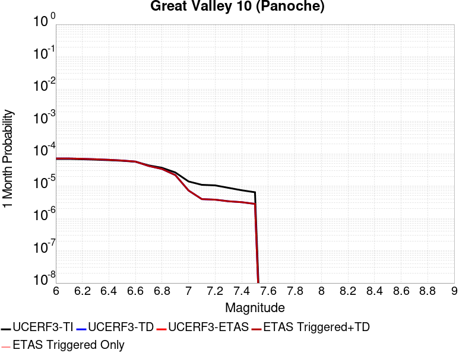 |  |  |

| Magnitude | 1 wk TI Prob | 1 wk TD Prob | 1 wk ETAS Prob | 1 wk ETAS/TD Gain | 1 wk ETAS Triggered+TD | 1 wk ETAS Triggered Only | 1 mo TI Prob | 1 mo TD Prob | 1 mo ETAS Prob | 1 mo ETAS/TD Gain | 1 mo ETAS Triggered+TD | 1 mo ETAS Triggered Only | 1 yr TI Prob | 1 yr TD Prob | 1 yr ETAS Prob | 1 yr ETAS/TD Gain | 1 yr ETAS Triggered+TD | 1 yr ETAS Triggered Only | 10 yr TI Prob | 10 yr TD Prob | 10 yr ETAS Prob | 10 yr ETAS/TD Gain | 10 yr ETAS Triggered+TD | 10 yr ETAS Triggered Only |
|-----|-----|-----|-----|-----|-----|-----|-----|-----|-----|-----|-----|-----|-----|-----|-----|-----|-----|-----|-----|-----|-----|-----|-----|-----|
| 6.0 | 1.6014626E-5 | 1.6580665E-5 | 0.0 | 0.0 | 1.6580665E-5 | 0.0 | 6.863231E-5 | 7.1058086E-5 | 0.0 | 0.0 | 7.1058086E-5 | 0.0 | 8.35278E-4 | 8.647944E-4 | 0.0 | 0.0 | 8.647944E-4 | 0.0 | 0.008321454 | 0.008614904 | 3.0E-4 | 0.034823373 | 0.008912319 | 3.0E-4 |
| 6.1 | 1.6014626E-5 | 1.6580665E-5 | 0.0 | 0.0 | 1.6580665E-5 | 0.0 | 6.863231E-5 | 7.1058086E-5 | 0.0 | 0.0 | 7.1058086E-5 | 0.0 | 8.35278E-4 | 8.647944E-4 | 0.0 | 0.0 | 8.647944E-4 | 0.0 | 0.008321454 | 0.008614904 | 3.0E-4 | 0.034823373 | 0.008912319 | 3.0E-4 |
| 6.2 | 1.56782E-5 | 1.620362E-5 | 0.0 | 0.0 | 1.620362E-5 | 0.0 | 6.719056E-5 | 6.944226E-5 | 0.0 | 0.0 | 6.944226E-5 | 0.0 | 8.17738E-4 | 8.451371E-4 | 0.0 | 0.0 | 8.451371E-4 | 0.0 | 0.008147354 | 0.008419831 | 3.0E-4 | 0.035630167 | 0.008717305 | 3.0E-4 |
| 6.3 | 1.5263338E-5 | 1.5728545E-5 | 0.0 | 0.0 | 1.5728545E-5 | 0.0 | 6.541267E-5 | 6.740634E-5 | 0.0 | 0.0 | 6.740634E-5 | 0.0 | 7.961082E-4 | 8.203686E-4 | 0.0 | 0.0 | 8.203686E-4 | 0.0 | 0.007932622 | 0.008173988 | 3.0E-4 | 0.03670179 | 0.008471536 | 3.0E-4 |
| 6.4 | 1.4720723E-5 | 1.5104213E-5 | 0.0 | 0.0 | 1.5104213E-5 | 0.0 | 6.308728E-5 | 6.473077E-5 | 0.0 | 0.0 | 6.473077E-5 | 0.0 | 7.67817E-4 | 7.878174E-4 | 0.0 | 0.0 | 7.878174E-4 | 0.0 | 0.007651695 | 0.007850815 | 2.0E-4 | 0.025475062 | 0.008049245 | 2.0E-4 |
| 6.5 | 1.408264E-5 | 1.4360555E-5 | 0.0 | 0.0 | 1.4360555E-5 | 0.0 | 6.0352773E-5 | 6.154381E-5 | 0.0 | 0.0 | 6.154381E-5 | 0.0 | 7.3454727E-4 | 7.490435E-4 | 0.0 | 0.0 | 7.490435E-4 | 0.0 | 0.0073212404 | 0.0074657374 | 2.0E-4 | 0.026789049 | 0.007664244 | 2.0E-4 |
| 6.6 | 1.3197086E-5 | 1.3326114E-5 | 0.0 | 0.0 | 1.3326114E-5 | 0.0 | 5.6557717E-5 | 5.711069E-5 | 0.0 | 0.0 | 5.711069E-5 | 0.0 | 6.8837265E-4 | 6.95106E-4 | 0.0 | 0.0 | 6.95106E-4 | 0.0 | 0.006862442 | 0.0069298507 | 2.0E-4 | 0.028860651 | 0.0071284645 | 2.0E-4 |
| 6.7 | 1.017583E-5 | 9.748259E-6 | 0.0 | 0.0 | 9.748259E-6 | 0.0 | 4.360997E-5 | 4.17776E-5 | 0.0 | 0.0 | 4.17776E-5 | 0.0 | 5.30822E-4 | 5.08526E-4 | 0.0 | 0.0 | 5.08526E-4 | 0.0 | 0.0052955584 | 0.0050738757 | 2.0E-4 | 0.0394176 | 0.0052728606 | 2.0E-4 |
| 6.8 | 8.557912E-6 | 7.874976E-6 | 0.0 | 0.0 | 7.874976E-6 | 0.0 | 3.667625E-5 | 3.374947E-5 | 0.0 | 0.0 | 3.374947E-5 | 0.0 | 4.4644187E-4 | 4.1082437E-4 | 0.0 | 0.0 | 4.1082437E-4 | 0.0 | 0.0044554602 | 0.004100856 | 1.0E-4 | 0.024385152 | 0.004200446 | 1.0E-4 |
| 6.9 | 6.14664E-6 | 5.0934614E-6 | 0.0 | 0.0 | 5.0934614E-6 | 0.0 | 2.6342475E-5 | 2.1828946E-5 | 0.0 | 0.0 | 2.1828946E-5 | 0.0 | 3.2067244E-4 | 2.657364E-4 | 0.0 | 0.0 | 2.657364E-4 | 0.0 | 0.003202101 | 0.0026543248 | 1.0E-4 | 0.037674367 | 0.0027540592 | 1.0E-4 |
| 7.0 | 3.2310581E-6 | 1.6953546E-6 | 0.0 | 0.0 | 1.6953546E-6 | 0.0 | 1.3847319E-5 | 7.265786E-6 | 0.0 | 0.0 | 7.265786E-6 | 0.0 | 1.6857806E-4 | 8.845745E-5 | 0.0 | 0.0 | 8.845745E-5 | 0.0 | 0.0016845023 | 8.8423176E-4 | 0.0 | 0.0 | 8.8423176E-4 | 0.0 |
| 7.1 | 2.544492E-6 | 9.189159E-7 | 0.0 | 0.0 | 9.189159E-7 | 0.0 | 1.090492E-5 | 3.9382053E-6 | 0.0 | 0.0 | 3.9382053E-6 | 0.0 | 1.327593E-4 | 4.794664E-5 | 0.0 | 0.0 | 4.794664E-5 | 0.0 | 0.0013268003 | 4.7936774E-4 | 0.0 | 0.0 | 4.7936774E-4 | 0.0 |
| 7.2 | 2.4479045E-6 | 8.841581E-7 | 0.0 | 0.0 | 8.841581E-7 | 0.0 | 1.0490977E-5 | 3.789244E-6 | 0.0 | 0.0 | 3.789244E-6 | 0.0 | 1.2772017E-4 | 4.6133115E-5 | 0.0 | 0.0 | 4.6133115E-5 | 0.0 | 0.0012764678 | 4.6124012E-4 | 0.0 | 0.0 | 4.6124012E-4 | 0.0 |
| 7.3 | 2.0559578E-6 | 7.8925996E-7 | 0.0 | 0.0 | 7.8925996E-7 | 0.0 | 8.811218E-6 | 3.3825386E-6 | 0.0 | 0.0 | 3.3825386E-6 | 0.0 | 1.072713E-4 | 4.1181676E-5 | 0.0 | 0.0 | 4.1181676E-5 | 0.0 | 0.0010721954 | 4.1174507E-4 | 0.0 | 0.0 | 4.1174507E-4 | 0.0 |
| 7.4 | 1.727687E-6 | 7.387339E-7 | 0.0 | 0.0 | 7.387339E-7 | 0.0 | 7.404352E-6 | 3.1659988E-6 | 0.0 | 0.0 | 3.1659988E-6 | 0.0 | 9.0144255E-5 | 3.85454E-5 | 0.0 | 0.0 | 3.85454E-5 | 0.0 | 9.0107694E-4 | 3.8539176E-4 | 0.0 | 0.0 | 3.8539176E-4 | 0.0 |
| 7.5 | 1.5002679E-6 | 6.5457795E-7 | 0.0 | 0.0 | 6.5457795E-7 | 0.0 | 6.4297037E-6 | 2.8053314E-6 | 0.0 | 0.0 | 2.8053314E-6 | 0.0 | 7.827883E-5 | 3.4154415E-5 | 0.0 | 0.0 | 3.4154415E-5 | 0.0 | 7.825126E-4 | 3.4149582E-4 | 0.0 | 0.0 | 3.4149582E-4 | 0.0 |

## Fontana (Seismicity)
*[(top)](#table-of-contents)*

| 1 Week | 1 Month | 1 Year | 10 Year |
|-----|-----|-----|-----|
| 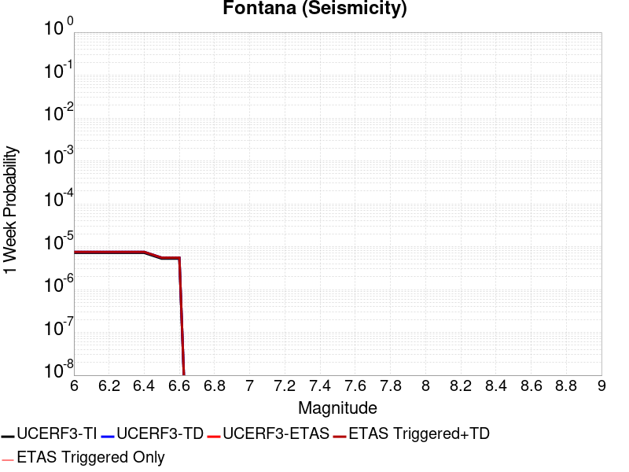 |  |  |  |

| Magnitude | 1 wk TI Prob | 1 wk TD Prob | 1 wk ETAS Prob | 1 wk ETAS/TD Gain | 1 wk ETAS Triggered+TD | 1 wk ETAS Triggered Only | 1 mo TI Prob | 1 mo TD Prob | 1 mo ETAS Prob | 1 mo ETAS/TD Gain | 1 mo ETAS Triggered+TD | 1 mo ETAS Triggered Only | 1 yr TI Prob | 1 yr TD Prob | 1 yr ETAS Prob | 1 yr ETAS/TD Gain | 1 yr ETAS Triggered+TD | 1 yr ETAS Triggered Only | 10 yr TI Prob | 10 yr TD Prob | 10 yr ETAS Prob | 10 yr ETAS/TD Gain | 10 yr ETAS Triggered+TD | 10 yr ETAS Triggered Only |
|-----|-----|-----|-----|-----|-----|-----|-----|-----|-----|-----|-----|-----|-----|-----|-----|-----|-----|-----|-----|-----|-----|-----|-----|-----|
| 6.0 | 7.1789214E-6 | 7.5528087E-6 | 0.0 | 0.0 | 7.5528087E-6 | 0.0 | 3.076644E-5 | 3.236901E-5 | 0.0 | 0.0 | 3.236901E-5 | 0.0 | 3.7451705E-4 | 3.9406223E-4 | 0.0 | 0.0 | 3.9406223E-4 | 0.0 | 0.003738865 | 0.003937635 | 3.0E-4 | 0.076187864 | 0.0042364537 | 3.0E-4 |
| 6.1 | 7.1789214E-6 | 7.5528087E-6 | 0.0 | 0.0 | 7.5528087E-6 | 0.0 | 3.076644E-5 | 3.236901E-5 | 0.0 | 0.0 | 3.236901E-5 | 0.0 | 3.7451705E-4 | 3.9406223E-4 | 0.0 | 0.0 | 3.9406223E-4 | 0.0 | 0.003738865 | 0.003937635 | 3.0E-4 | 0.076187864 | 0.0042364537 | 3.0E-4 |
| 6.2 | 7.1789214E-6 | 7.5528087E-6 | 0.0 | 0.0 | 7.5528087E-6 | 0.0 | 3.076644E-5 | 3.236901E-5 | 0.0 | 0.0 | 3.236901E-5 | 0.0 | 3.7451705E-4 | 3.9406223E-4 | 0.0 | 0.0 | 3.9406223E-4 | 0.0 | 0.003738865 | 0.003937635 | 3.0E-4 | 0.076187864 | 0.0042364537 | 3.0E-4 |
| 6.3 | 7.1789214E-6 | 7.5528087E-6 | 0.0 | 0.0 | 7.5528087E-6 | 0.0 | 3.076644E-5 | 3.236901E-5 | 0.0 | 0.0 | 3.236901E-5 | 0.0 | 3.7451705E-4 | 3.9406223E-4 | 0.0 | 0.0 | 3.9406223E-4 | 0.0 | 0.003738865 | 0.003937635 | 3.0E-4 | 0.076187864 | 0.0042364537 | 3.0E-4 |
| 6.4 | 7.1789214E-6 | 7.5528087E-6 | 0.0 | 0.0 | 7.5528087E-6 | 0.0 | 3.076644E-5 | 3.236901E-5 | 0.0 | 0.0 | 3.236901E-5 | 0.0 | 3.7451705E-4 | 3.9406223E-4 | 0.0 | 0.0 | 3.9406223E-4 | 0.0 | 0.003738865 | 0.003937635 | 3.0E-4 | 0.076187864 | 0.0042364537 | 3.0E-4 |
| 6.5 | 5.2611317E-6 | 5.533314E-6 | 0.0 | 0.0 | 5.533314E-6 | 0.0 | 2.2547512E-5 | 2.3714203E-5 | 0.0 | 0.0 | 2.3714203E-5 | 0.0 | 2.744814E-4 | 2.8872042E-4 | 0.0 | 0.0 | 2.8872042E-4 | 0.0 | 0.002741426 | 0.002887204 | 2.0E-4 | 0.06927117 | 0.0030866268 | 2.0E-4 |
| 6.6 | 5.2611317E-6 | 5.533314E-6 | 0.0 | 0.0 | 5.533314E-6 | 0.0 | 2.2547512E-5 | 2.3714203E-5 | 0.0 | 0.0 | 2.3714203E-5 | 0.0 | 2.744814E-4 | 2.8872042E-4 | 0.0 | 0.0 | 2.8872042E-4 | 0.0 | 0.002741426 | 0.002887204 | 2.0E-4 | 0.06927117 | 0.0030866268 | 2.0E-4 |

## Mohawk Valley 2011 CFM
*[(top)](#table-of-contents)*

| 1 Week | 1 Month | 1 Year | 10 Year |
|-----|-----|-----|-----|
|  |  |  |  |

| Magnitude | 1 wk TI Prob | 1 wk TD Prob | 1 wk ETAS Prob | 1 wk ETAS/TD Gain | 1 wk ETAS Triggered+TD | 1 wk ETAS Triggered Only | 1 mo TI Prob | 1 mo TD Prob | 1 mo ETAS Prob | 1 mo ETAS/TD Gain | 1 mo ETAS Triggered+TD | 1 mo ETAS Triggered Only | 1 yr TI Prob | 1 yr TD Prob | 1 yr ETAS Prob | 1 yr ETAS/TD Gain | 1 yr ETAS Triggered+TD | 1 yr ETAS Triggered Only | 10 yr TI Prob | 10 yr TD Prob | 10 yr ETAS Prob | 10 yr ETAS/TD Gain | 10 yr ETAS Triggered+TD | 10 yr ETAS Triggered Only |
|-----|-----|-----|-----|-----|-----|-----|-----|-----|-----|-----|-----|-----|-----|-----|-----|-----|-----|-----|-----|-----|-----|-----|-----|-----|
| 6.0 | 2.5425423E-5 | 2.7649752E-5 | 0.0 | 0.0 | 2.7649752E-5 | 0.0 | 1.0896155E-4 | 1.18494165E-4 | 0.0 | 0.0 | 1.18494165E-4 | 0.0 | 0.0013257994 | 0.0014418203 | 1.0E-4 | 0.06935677 | 0.0015416761 | 1.0E-4 | 0.013179175 | 0.014335543 | 3.0E-4 | 0.020927006 | 0.0146312425 | 3.0E-4 |
| 6.1 | 2.5425423E-5 | 2.7649752E-5 | 0.0 | 0.0 | 2.7649752E-5 | 0.0 | 1.0896155E-4 | 1.18494165E-4 | 0.0 | 0.0 | 1.18494165E-4 | 0.0 | 0.0013257994 | 0.0014418203 | 1.0E-4 | 0.06935677 | 0.0015416761 | 1.0E-4 | 0.013179175 | 0.014335543 | 3.0E-4 | 0.020927006 | 0.0146312425 | 3.0E-4 |
| 6.2 | 2.5425423E-5 | 2.7649752E-5 | 0.0 | 0.0 | 2.7649752E-5 | 0.0 | 1.0896155E-4 | 1.18494165E-4 | 0.0 | 0.0 | 1.18494165E-4 | 0.0 | 0.0013257994 | 0.0014418203 | 1.0E-4 | 0.06935677 | 0.0015416761 | 1.0E-4 | 0.013179175 | 0.014335543 | 3.0E-4 | 0.020927006 | 0.0146312425 | 3.0E-4 |
| 6.3 | 2.5425423E-5 | 2.7649752E-5 | 0.0 | 0.0 | 2.7649752E-5 | 0.0 | 1.0896155E-4 | 1.18494165E-4 | 0.0 | 0.0 | 1.18494165E-4 | 0.0 | 0.0013257994 | 0.0014418203 | 1.0E-4 | 0.06935677 | 0.0015416761 | 1.0E-4 | 0.013179175 | 0.014335543 | 3.0E-4 | 0.020927006 | 0.0146312425 | 3.0E-4 |
| 6.4 | 1.1812642E-5 | 1.2765702E-5 | 0.0 | 0.0 | 1.2765702E-5 | 0.0 | 5.0624625E-5 | 5.470909E-5 | 0.0 | 0.0 | 5.470909E-5 | 0.0 | 6.161805E-4 | 6.658943E-4 | 1.0E-4 | 0.15017398 | 7.658277E-4 | 1.0E-4 | 0.0061447476 | 0.0066404636 | 2.0E-4 | 0.030118378 | 0.0068391357 | 2.0E-4 |
| 6.5 | 1.1812642E-5 | 1.2765702E-5 | 0.0 | 0.0 | 1.2765702E-5 | 0.0 | 5.0624625E-5 | 5.470909E-5 | 0.0 | 0.0 | 5.470909E-5 | 0.0 | 6.161805E-4 | 6.658943E-4 | 1.0E-4 | 0.15017398 | 7.658277E-4 | 1.0E-4 | 0.0061447476 | 0.0066404636 | 2.0E-4 | 0.030118378 | 0.0068391357 | 2.0E-4 |
| 6.6 | 9.34204E-6 | 1.0086842E-5 | 0.0 | 0.0 | 1.0086842E-5 | 0.0 | 4.0036703E-5 | 4.3228672E-5 | 0.0 | 0.0 | 4.3228672E-5 | 0.0 | 4.873378E-4 | 5.2619376E-4 | 1.0E-4 | 0.19004406 | 6.2614115E-4 | 1.0E-4 | 0.0048627043 | 0.005250647 | 1.0E-4 | 0.019045271 | 0.005350122 | 1.0E-4 |
| 6.7 | 7.0661854E-6 | 7.6254405E-6 | 0.0 | 0.0 | 7.6254405E-6 | 0.0 | 3.02833E-5 | 3.2680102E-5 | 0.0 | 0.0 | 3.2680102E-5 | 0.0 | 3.686368E-4 | 3.9781665E-4 | 1.0E-4 | 0.25137207 | 4.977769E-4 | 1.0E-4 | 0.0036802588 | 0.003971941 | 1.0E-4 | 0.025176607 | 0.004071544 | 1.0E-4 |
| 6.8 | 4.806676E-6 | 5.188062E-6 | 0.0 | 0.0 | 5.188062E-6 | 0.0 | 2.0599877E-5 | 2.2234397E-5 | 0.0 | 0.0 | 2.2234397E-5 | 0.0 | 2.507746E-4 | 2.7067654E-4 | 1.0E-4 | 0.36944467 | 3.7064948E-4 | 1.0E-4 | 0.0025049183 | 0.0027040953 | 1.0E-4 | 0.036980946 | 0.0028038248 | 1.0E-4 |
| 6.9 | 3.4163209E-6 | 3.6895037E-6 | 0.0 | 0.0 | 3.6895037E-6 | 0.0 | 1.4641293E-5 | 1.5812093E-5 | 0.0 | 0.0 | 1.5812093E-5 | 0.0 | 1.7824316E-4 | 1.9250065E-4 | 0.0 | 0.0 | 1.9250065E-4 | 0.0 | 0.0017810026 | 0.0019238712 | 0.0 | 0.0 | 0.0019238712 | 0.0 |
| 7.0 | 2.5271734E-6 | 2.7314663E-6 | 0.0 | 0.0 | 2.7314663E-6 | 0.0 | 1.0830699E-5 | 1.1706259E-5 | 0.0 | 0.0 | 1.1706259E-5 | 0.0 | 1.3185578E-4 | 1.4251932E-4 | 0.0 | 0.0 | 1.4251932E-4 | 0.0 | 0.0013177756 | 0.001424763 | 0.0 | 0.0 | 0.001424763 | 0.0 |

## Emerson-Copper Mtn 2011
*[(top)](#table-of-contents)*

| 1 Week | 1 Month | 1 Year | 10 Year |
|-----|-----|-----|-----|
|  |  | 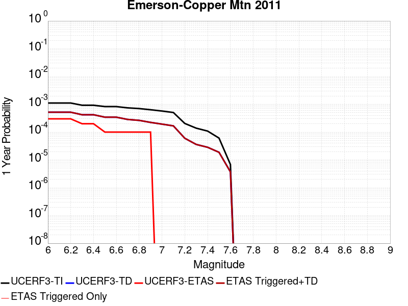 |  |

| Magnitude | 1 wk TI Prob | 1 wk TD Prob | 1 wk ETAS Prob | 1 wk ETAS/TD Gain | 1 wk ETAS Triggered+TD | 1 wk ETAS Triggered Only | 1 mo TI Prob | 1 mo TD Prob | 1 mo ETAS Prob | 1 mo ETAS/TD Gain | 1 mo ETAS Triggered+TD | 1 mo ETAS Triggered Only | 1 yr TI Prob | 1 yr TD Prob | 1 yr ETAS Prob | 1 yr ETAS/TD Gain | 1 yr ETAS Triggered+TD | 1 yr ETAS Triggered Only | 10 yr TI Prob | 10 yr TD Prob | 10 yr ETAS Prob | 10 yr ETAS/TD Gain | 10 yr ETAS Triggered+TD | 10 yr ETAS Triggered Only |
|-----|-----|-----|-----|-----|-----|-----|-----|-----|-----|-----|-----|-----|-----|-----|-----|-----|-----|-----|-----|-----|-----|-----|-----|-----|
| 6.0 | 2.1364202E-5 | 9.96916E-6 | 0.0 | 0.0 | 9.96916E-6 | 0.0 | 9.1557646E-5 | 4.2724318E-5 | 0.0 | 0.0 | 4.2724318E-5 | 0.0 | 0.0011141442 | 5.2005315E-4 | 0.0 | 0.0 | 5.2005315E-4 | 0.0 | 0.011085749 | 0.005189231 | 3.0E-4 | 0.05781203 | 0.0054876744 | 3.0E-4 |
| 6.1 | 2.1364202E-5 | 9.96916E-6 | 0.0 | 0.0 | 9.96916E-6 | 0.0 | 9.1557646E-5 | 4.2724318E-5 | 0.0 | 0.0 | 4.2724318E-5 | 0.0 | 0.0011141442 | 5.2005315E-4 | 0.0 | 0.0 | 5.2005315E-4 | 0.0 | 0.011085749 | 0.005189231 | 3.0E-4 | 0.05781203 | 0.0054876744 | 3.0E-4 |
| 6.2 | 2.1364202E-5 | 9.96916E-6 | 0.0 | 0.0 | 9.96916E-6 | 0.0 | 9.1557646E-5 | 4.2724318E-5 | 0.0 | 0.0 | 4.2724318E-5 | 0.0 | 0.0011141442 | 5.2005315E-4 | 0.0 | 0.0 | 5.2005315E-4 | 0.0 | 0.011085749 | 0.005189231 | 3.0E-4 | 0.05781203 | 0.0054876744 | 3.0E-4 |
| 6.3 | 1.7751237E-5 | 8.089886E-6 | 0.0 | 0.0 | 8.089886E-6 | 0.0 | 7.607452E-5 | 3.4670513E-5 | 0.0 | 0.0 | 3.4670513E-5 | 0.0 | 9.258136E-4 | 4.2203802E-4 | 0.0 | 0.0 | 4.2203802E-4 | 0.0 | 0.00921966 | 0.004212988 | 3.0E-4 | 0.071208365 | 0.004511724 | 3.0E-4 |
| 6.4 | 1.7751237E-5 | 8.089886E-6 | 0.0 | 0.0 | 8.089886E-6 | 0.0 | 7.607452E-5 | 3.4670513E-5 | 0.0 | 0.0 | 3.4670513E-5 | 0.0 | 9.258136E-4 | 4.2203802E-4 | 0.0 | 0.0 | 4.2203802E-4 | 0.0 | 0.00921966 | 0.004212988 | 3.0E-4 | 0.071208365 | 0.004511724 | 3.0E-4 |
| 6.5 | 1.5886664E-5 | 6.6041575E-6 | 0.0 | 0.0 | 6.6041575E-6 | 0.0 | 6.808392E-5 | 2.8303251E-5 | 0.0 | 0.0 | 2.8303251E-5 | 0.0 | 8.286065E-4 | 3.445423E-4 | 0.0 | 0.0 | 3.445423E-4 | 0.0 | 0.008255237 | 0.0034405454 | 2.0E-4 | 0.058130316 | 0.0036398573 | 2.0E-4 |
| 6.6 | 1.5886664E-5 | 6.6041575E-6 | 0.0 | 0.0 | 6.6041575E-6 | 0.0 | 6.808392E-5 | 2.8303251E-5 | 0.0 | 0.0 | 2.8303251E-5 | 0.0 | 8.286065E-4 | 3.445423E-4 | 0.0 | 0.0 | 3.445423E-4 | 0.0 | 0.008255237 | 0.0034405454 | 2.0E-4 | 0.058130316 | 0.0036398573 | 2.0E-4 |
| 6.7 | 1.428471E-5 | 5.470501E-6 | 0.0 | 0.0 | 5.470501E-6 | 0.0 | 6.121875E-5 | 2.3444816E-5 | 0.0 | 0.0 | 2.3444816E-5 | 0.0 | 7.450834E-4 | 2.8540718E-4 | 0.0 | 0.0 | 2.8540718E-4 | 0.0 | 0.007425902 | 0.0028507942 | 1.0E-4 | 0.035077944 | 0.002950509 | 1.0E-4 |
| 6.8 | 1.3490684E-5 | 5.0737035E-6 | 0.0 | 0.0 | 5.0737035E-6 | 0.0 | 5.7815934E-5 | 2.1744283E-5 | 0.0 | 0.0 | 2.1744283E-5 | 0.0 | 7.0368167E-4 | 2.6470836E-4 | 0.0 | 0.0 | 2.6470836E-4 | 0.0 | 0.007014576 | 0.0026443114 | 1.0E-4 | 0.037817027 | 0.002744047 | 1.0E-4 |
| 6.9 | 1.2235421E-5 | 4.2895667E-6 | 0.0 | 0.0 | 4.2895667E-6 | 0.0 | 5.2436466E-5 | 1.838375E-5 | 0.0 | 0.0 | 1.838375E-5 | 0.0 | 6.38227E-4 | 2.2380275E-4 | 0.0 | 0.0 | 2.2380275E-4 | 0.0 | 0.0063639707 | 0.0022361279 | 0.0 | 0.0 | 0.0022361279 | 0.0 |
| 7.0 | 1.1009851E-5 | 3.7188138E-6 | 0.0 | 0.0 | 3.7188138E-6 | 0.0 | 4.7184225E-5 | 1.5937696E-5 | 0.0 | 0.0 | 1.5937696E-5 | 0.0 | 5.743165E-4 | 1.940276E-4 | 0.0 | 0.0 | 1.940276E-4 | 0.0 | 0.005728345 | 0.0019389198 | 0.0 | 0.0 | 0.0019389198 | 0.0 |
| 7.1 | 9.726373E-6 | 3.2115315E-6 | 0.0 | 0.0 | 3.2115315E-6 | 0.0 | 4.168379E-5 | 1.37636525E-5 | 0.0 | 0.0 | 1.37636525E-5 | 0.0 | 5.07382E-4 | 1.6756296E-4 | 0.0 | 0.0 | 1.6756296E-4 | 0.0 | 0.0050622504 | 0.0016746974 | 0.0 | 0.0 | 0.0016746974 | 0.0 |
| 7.2 | 3.9335127E-6 | 1.1523288E-6 | 0.0 | 0.0 | 1.1523288E-6 | 0.0 | 1.6857803E-5 | 4.9385426E-6 | 0.0 | 0.0 | 4.9385426E-6 | 0.0 | 2.0522442E-4 | 6.012516E-5 | 0.0 | 0.0 | 6.012516E-5 | 0.0 | 0.00205035 | 6.0109486E-4 | 0.0 | 0.0 | 6.0109486E-4 | 0.0 |
| 7.3 | 2.661632E-6 | 6.91012E-7 | 0.0 | 0.0 | 6.91012E-7 | 0.0 | 1.14069435E-5 | 2.9614769E-6 | 0.0 | 0.0 | 2.9614769E-6 | 0.0 | 1.3887069E-4 | 3.6055397E-5 | 0.0 | 0.0 | 3.6055397E-5 | 0.0 | 0.0013878393 | 3.604965E-4 | 0.0 | 0.0 | 3.604965E-4 | 0.0 |
| 7.4 | 2.0893426E-6 | 5.4607443E-7 | 0.0 | 0.0 | 5.4607443E-7 | 0.0 | 8.954295E-6 | 2.340317E-6 | 0.0 | 0.0 | 2.340317E-6 | 0.0 | 1.0901308E-4 | 2.849299E-5 | 0.0 | 0.0 | 2.849299E-5 | 0.0 | 0.0010895962 | 2.8489393E-4 | 0.0 | 0.0 | 2.8489393E-4 | 0.0 |
| 7.5 | 1.1681728E-6 | 3.6024338E-7 | 0.0 | 0.0 | 3.6024338E-7 | 0.0 | 5.0064455E-6 | 1.5438993E-6 | 0.0 | 0.0 | 1.5438993E-6 | 0.0 | 6.0951766E-5 | 1.8796816E-5 | 0.0 | 0.0 | 1.8796816E-5 | 0.0 | 6.093505E-4 | 1.8795273E-4 | 0.0 | 0.0 | 1.8795273E-4 | 0.0 |
| 7.6 | 1.3154387E-7 | 7.1193504E-8 | 0.0 | 0.0 | 7.1193504E-8 | 0.0 | 5.6375933E-7 | 3.0511498E-7 | 0.0 | 0.0 | 3.0511498E-7 | 0.0 | 6.863748E-6 | 3.7147702E-6 | 0.0 | 0.0 | 3.7147702E-6 | 0.0 | 6.863536E-5 | 3.7147238E-5 | 0.0 | 0.0 | 3.7147238E-5 | 0.0 |

## Northridge Hills
*[(top)](#table-of-contents)*

| 1 Week | 1 Month | 1 Year | 10 Year |
|-----|-----|-----|-----|
| 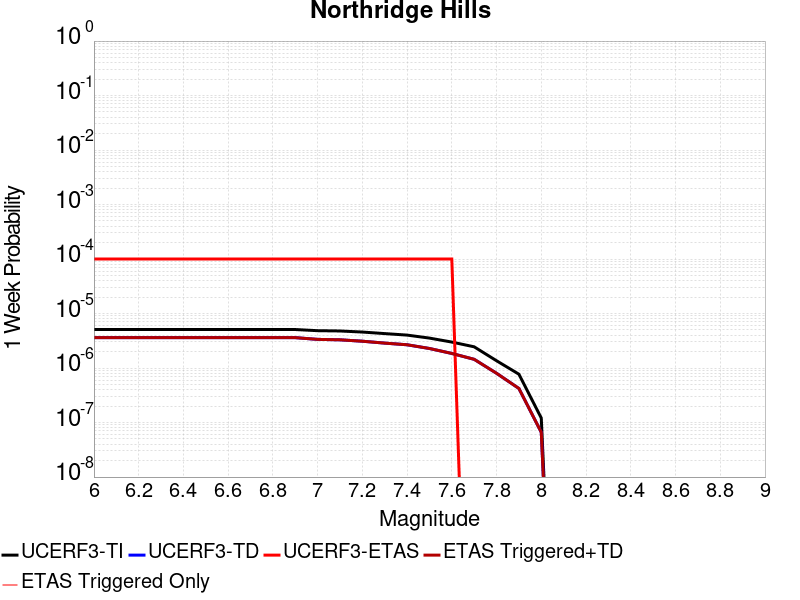 |  | 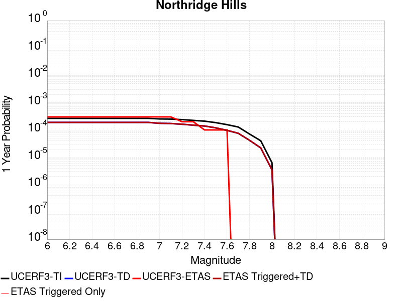 | 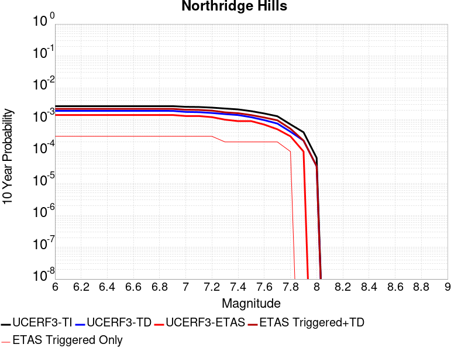 |

| Magnitude | 1 wk TI Prob | 1 wk TD Prob | 1 wk ETAS Prob | 1 wk ETAS/TD Gain | 1 wk ETAS Triggered+TD | 1 wk ETAS Triggered Only | 1 mo TI Prob | 1 mo TD Prob | 1 mo ETAS Prob | 1 mo ETAS/TD Gain | 1 mo ETAS Triggered+TD | 1 mo ETAS Triggered Only | 1 yr TI Prob | 1 yr TD Prob | 1 yr ETAS Prob | 1 yr ETAS/TD Gain | 1 yr ETAS Triggered+TD | 1 yr ETAS Triggered Only | 10 yr TI Prob | 10 yr TD Prob | 10 yr ETAS Prob | 10 yr ETAS/TD Gain | 10 yr ETAS Triggered+TD | 10 yr ETAS Triggered Only |
|-----|-----|-----|-----|-----|-----|-----|-----|-----|-----|-----|-----|-----|-----|-----|-----|-----|-----|-----|-----|-----|-----|-----|-----|-----|
| 6.0 | 5.095982E-6 | 3.616419E-6 | 0.0 | 0.0 | 3.616419E-6 | 0.0 | 2.183974E-5 | 1.5498847E-5 | 0.0 | 0.0 | 1.5498847E-5 | 0.0 | 2.658664E-4 | 1.8868224E-4 | 0.0 | 0.0 | 1.8868224E-4 | 0.0 | 0.0026554854 | 0.0018852329 | 3.0E-4 | 0.15913154 | 0.0021846672 | 3.0E-4 |
| 6.1 | 5.095982E-6 | 3.616419E-6 | 0.0 | 0.0 | 3.616419E-6 | 0.0 | 2.183974E-5 | 1.5498847E-5 | 0.0 | 0.0 | 1.5498847E-5 | 0.0 | 2.658664E-4 | 1.8868224E-4 | 0.0 | 0.0 | 1.8868224E-4 | 0.0 | 0.0026554854 | 0.0018852329 | 3.0E-4 | 0.15913154 | 0.0021846672 | 3.0E-4 |
| 6.2 | 5.095982E-6 | 3.616419E-6 | 0.0 | 0.0 | 3.616419E-6 | 0.0 | 2.183974E-5 | 1.5498847E-5 | 0.0 | 0.0 | 1.5498847E-5 | 0.0 | 2.658664E-4 | 1.8868224E-4 | 0.0 | 0.0 | 1.8868224E-4 | 0.0 | 0.0026554854 | 0.0018852329 | 3.0E-4 | 0.15913154 | 0.0021846672 | 3.0E-4 |
| 6.3 | 5.095982E-6 | 3.616419E-6 | 0.0 | 0.0 | 3.616419E-6 | 0.0 | 2.183974E-5 | 1.5498847E-5 | 0.0 | 0.0 | 1.5498847E-5 | 0.0 | 2.658664E-4 | 1.8868224E-4 | 0.0 | 0.0 | 1.8868224E-4 | 0.0 | 0.0026554854 | 0.0018852329 | 3.0E-4 | 0.15913154 | 0.0021846672 | 3.0E-4 |
| 6.4 | 5.095982E-6 | 3.616419E-6 | 0.0 | 0.0 | 3.616419E-6 | 0.0 | 2.183974E-5 | 1.5498847E-5 | 0.0 | 0.0 | 1.5498847E-5 | 0.0 | 2.658664E-4 | 1.8868224E-4 | 0.0 | 0.0 | 1.8868224E-4 | 0.0 | 0.0026554854 | 0.0018852329 | 3.0E-4 | 0.15913154 | 0.0021846672 | 3.0E-4 |
| 6.5 | 5.095982E-6 | 3.616419E-6 | 0.0 | 0.0 | 3.616419E-6 | 0.0 | 2.183974E-5 | 1.5498847E-5 | 0.0 | 0.0 | 1.5498847E-5 | 0.0 | 2.658664E-4 | 1.8868224E-4 | 0.0 | 0.0 | 1.8868224E-4 | 0.0 | 0.0026554854 | 0.0018852329 | 3.0E-4 | 0.15913154 | 0.0021846672 | 3.0E-4 |
| 6.6 | 5.095982E-6 | 3.616419E-6 | 0.0 | 0.0 | 3.616419E-6 | 0.0 | 2.183974E-5 | 1.5498847E-5 | 0.0 | 0.0 | 1.5498847E-5 | 0.0 | 2.658664E-4 | 1.8868224E-4 | 0.0 | 0.0 | 1.8868224E-4 | 0.0 | 0.0026554854 | 0.0018852329 | 3.0E-4 | 0.15913154 | 0.0021846672 | 3.0E-4 |
| 6.7 | 5.095982E-6 | 3.616419E-6 | 0.0 | 0.0 | 3.616419E-6 | 0.0 | 2.183974E-5 | 1.5498847E-5 | 0.0 | 0.0 | 1.5498847E-5 | 0.0 | 2.658664E-4 | 1.8868224E-4 | 0.0 | 0.0 | 1.8868224E-4 | 0.0 | 0.0026554854 | 0.0018852329 | 3.0E-4 | 0.15913154 | 0.0021846672 | 3.0E-4 |
| 6.8 | 5.095982E-6 | 3.616419E-6 | 0.0 | 0.0 | 3.616419E-6 | 0.0 | 2.183974E-5 | 1.5498847E-5 | 0.0 | 0.0 | 1.5498847E-5 | 0.0 | 2.658664E-4 | 1.8868224E-4 | 0.0 | 0.0 | 1.8868224E-4 | 0.0 | 0.0026554854 | 0.0018852329 | 3.0E-4 | 0.15913154 | 0.0021846672 | 3.0E-4 |
| 6.9 | 5.0942654E-6 | 3.6146337E-6 | 0.0 | 0.0 | 3.6146337E-6 | 0.0 | 2.1832384E-5 | 1.5491196E-5 | 0.0 | 0.0 | 1.5491196E-5 | 0.0 | 2.6577685E-4 | 1.8858911E-4 | 0.0 | 0.0 | 1.8858911E-4 | 0.0 | 0.002654592 | 0.001884303 | 3.0E-4 | 0.15921006 | 0.0021837377 | 3.0E-4 |
| 7.0 | 4.851143E-6 | 3.3599238E-6 | 0.0 | 0.0 | 3.3599238E-6 | 0.0 | 2.0790447E-5 | 1.4399594E-5 | 0.0 | 0.0 | 1.4399594E-5 | 0.0 | 2.5309427E-4 | 1.7530099E-4 | 0.0 | 0.0 | 1.7530099E-4 | 0.0 | 0.0025280623 | 0.0017516315 | 3.0E-4 | 0.1712689 | 0.002051106 | 3.0E-4 |
| 7.1 | 4.7910607E-6 | 3.2981989E-6 | 0.0 | 0.0 | 3.2981989E-6 | 0.0 | 2.0532956E-5 | 1.4135061E-5 | 0.0 | 0.0 | 1.4135061E-5 | 0.0 | 2.4996005E-4 | 1.7208082E-4 | 0.0 | 0.0 | 1.7208082E-4 | 0.0 | 0.0024967908 | 0.0017194798 | 3.0E-4 | 0.17447138 | 0.002018964 | 3.0E-4 |
| 7.2 | 4.580079E-6 | 3.1079576E-6 | 0.0 | 0.0 | 3.1079576E-6 | 0.0 | 1.9628762E-5 | 1.3319751E-5 | 0.0 | 0.0 | 1.3319751E-5 | 0.0 | 2.3895396E-4 | 1.6215592E-4 | 0.0 | 0.0 | 1.6215592E-4 | 0.0 | 0.0023869718 | 0.0016203795 | 3.0E-4 | 0.18514182 | 0.0019198934 | 3.0E-4 |
| 7.3 | 4.290062E-6 | 2.8693662E-6 | 0.0 | 0.0 | 2.8693662E-6 | 0.0 | 1.838585E-5 | 1.2297226E-5 | 0.0 | 0.0 | 1.2297226E-5 | 0.0 | 2.2382473E-4 | 1.4970847E-4 | 0.0 | 0.0 | 1.4970847E-4 | 0.0 | 0.0022359942 | 0.0014960791 | 2.0E-4 | 0.13368276 | 0.00169578 | 2.0E-4 |
| 7.4 | 4.0259683E-6 | 2.6750263E-6 | 0.0 | 0.0 | 2.6750263E-6 | 0.0 | 1.7254037E-5 | 1.1464348E-5 | 0.0 | 0.0 | 1.1464348E-5 | 0.0 | 2.1004764E-4 | 1.3956953E-4 | 0.0 | 0.0 | 1.3956953E-4 | 0.0 | 0.002098492 | 0.0013948216 | 2.0E-4 | 0.14338753 | 0.0015945425 | 2.0E-4 |
| 7.5 | 3.5477108E-6 | 2.2862635E-6 | 0.0 | 0.0 | 2.2862635E-6 | 0.0 | 1.5204386E-5 | 9.798235E-6 | 0.0 | 0.0 | 9.798235E-6 | 0.0 | 1.8509767E-4 | 1.1928699E-4 | 0.0 | 0.0 | 1.1928699E-4 | 0.0 | 0.0018494357 | 0.0011922312 | 2.0E-4 | 0.1677527 | 0.0013919928 | 2.0E-4 |
| 7.6 | 2.9990608E-6 | 1.8538159E-6 | 0.0 | 0.0 | 1.8538159E-6 | 0.0 | 1.2853055E-5 | 7.944901E-6 | 0.0 | 0.0 | 7.944901E-6 | 0.0 | 1.564747E-4 | 9.6724885E-5 | 0.0 | 0.0 | 9.6724885E-5 | 0.0 | 0.0015636457 | 9.6682867E-4 | 2.0E-4 | 0.20686188 | 0.0011666353 | 2.0E-4 |
| 7.7 | 2.4542855E-6 | 1.447015E-6 | 0.0 | 0.0 | 1.447015E-6 | 0.0 | 1.05183235E-5 | 6.2014783E-6 | 0.0 | 0.0 | 6.2014783E-6 | 0.0 | 1.2805307E-4 | 7.550039E-5 | 0.0 | 0.0 | 7.550039E-5 | 0.0 | 0.001279793 | 7.5474795E-4 | 2.0E-4 | 0.2649891 | 9.54597E-4 | 2.0E-4 |
| 7.8 | 1.3623128E-6 | 8.021376E-7 | 0.0 | 0.0 | 8.021376E-7 | 0.0 | 5.8384703E-6 | 3.437728E-6 | 0.0 | 0.0 | 3.437728E-6 | 0.0 | 7.108106E-5 | 4.1853535E-5 | 0.0 | 0.0 | 4.1853535E-5 | 0.0 | 7.1058323E-4 | 4.1845677E-4 | 1.0E-4 | 0.23897332 | 5.184149E-4 | 1.0E-4 |
| 7.9 | 7.716622E-7 | 4.222584E-7 | 0.0 | 0.0 | 4.222584E-7 | 0.0 | 3.3071194E-6 | 1.8096777E-6 | 0.0 | 0.0 | 1.8096777E-6 | 0.0 | 4.0263436E-5 | 2.2032604E-5 | 0.0 | 0.0 | 2.2032604E-5 | 0.0 | 4.0256142E-4 | 2.203043E-4 | 0.0 | 0.0 | 2.203043E-4 | 0.0 |
| 8.0 | 1.2117711E-7 | 6.624799E-8 | 0.0 | 0.0 | 6.624799E-8 | 0.0 | 5.1933034E-7 | 2.8391995E-7 | 0.0 | 0.0 | 2.8391995E-7 | 0.0 | 6.3228285E-6 | 3.4567202E-6 | 0.0 | 0.0 | 3.4567202E-6 | 0.0 | 6.3226486E-5 | 3.456668E-5 | 0.0 | 0.0 | 3.456668E-5 | 0.0 |

## Baker
*[(top)](#table-of-contents)*

| 1 Week | 1 Month | 1 Year | 10 Year |
|-----|-----|-----|-----|
|  |  |  | 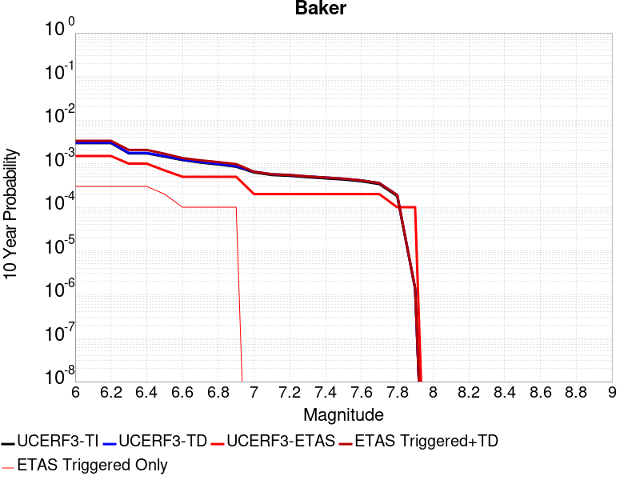 |

| Magnitude | 1 wk TI Prob | 1 wk TD Prob | 1 wk ETAS Prob | 1 wk ETAS/TD Gain | 1 wk ETAS Triggered+TD | 1 wk ETAS Triggered Only | 1 mo TI Prob | 1 mo TD Prob | 1 mo ETAS Prob | 1 mo ETAS/TD Gain | 1 mo ETAS Triggered+TD | 1 mo ETAS Triggered Only | 1 yr TI Prob | 1 yr TD Prob | 1 yr ETAS Prob | 1 yr ETAS/TD Gain | 1 yr ETAS Triggered+TD | 1 yr ETAS Triggered Only | 10 yr TI Prob | 10 yr TD Prob | 10 yr ETAS Prob | 10 yr ETAS/TD Gain | 10 yr ETAS Triggered+TD | 10 yr ETAS Triggered Only |
|-----|-----|-----|-----|-----|-----|-----|-----|-----|-----|-----|-----|-----|-----|-----|-----|-----|-----|-----|-----|-----|-----|-----|-----|-----|
| 6.0 | 5.695525E-6 | 5.835133E-6 | 0.0 | 0.0 | 5.835133E-6 | 0.0 | 2.4409164E-5 | 2.5007495E-5 | 1.0E-4 | 3.9988012 | 1.25005E-4 | 1.0E-4 | 2.9714106E-4 | 3.0442773E-4 | 1.0E-4 | 0.3284852 | 4.043973E-4 | 1.0E-4 | 0.0029674405 | 0.0030405025 | 3.0E-4 | 0.0986679 | 0.0033395905 | 3.0E-4 |
| 6.1 | 5.695525E-6 | 5.835133E-6 | 0.0 | 0.0 | 5.835133E-6 | 0.0 | 2.4409164E-5 | 2.5007495E-5 | 1.0E-4 | 3.9988012 | 1.25005E-4 | 1.0E-4 | 2.9714106E-4 | 3.0442773E-4 | 1.0E-4 | 0.3284852 | 4.043973E-4 | 1.0E-4 | 0.0029674405 | 0.0030405025 | 3.0E-4 | 0.0986679 | 0.0033395905 | 3.0E-4 |
| 6.2 | 5.695525E-6 | 5.835133E-6 | 0.0 | 0.0 | 5.835133E-6 | 0.0 | 2.4409164E-5 | 2.5007495E-5 | 1.0E-4 | 3.9988012 | 1.25005E-4 | 1.0E-4 | 2.9714106E-4 | 3.0442773E-4 | 1.0E-4 | 0.3284852 | 4.043973E-4 | 1.0E-4 | 0.0029674405 | 0.0030405025 | 3.0E-4 | 0.0986679 | 0.0033395905 | 3.0E-4 |
| 6.3 | 3.2995713E-6 | 3.3838462E-6 | 0.0 | 0.0 | 3.3838462E-6 | 0.0 | 1.4140943E-5 | 1.450212E-5 | 1.0E-4 | 6.8955436 | 1.1450067E-4 | 1.0E-4 | 1.7215237E-4 | 1.7654948E-4 | 1.0E-4 | 0.56641346 | 2.7653182E-4 | 1.0E-4 | 0.0017201907 | 0.0017641394 | 3.0E-4 | 0.1700546 | 0.0020636101 | 3.0E-4 |
| 6.4 | 3.2995713E-6 | 3.3838462E-6 | 0.0 | 0.0 | 3.3838462E-6 | 0.0 | 1.4140943E-5 | 1.450212E-5 | 1.0E-4 | 6.8955436 | 1.1450067E-4 | 1.0E-4 | 1.7215237E-4 | 1.7654948E-4 | 1.0E-4 | 0.56641346 | 2.7653182E-4 | 1.0E-4 | 0.0017201907 | 0.0017641394 | 3.0E-4 | 0.1700546 | 0.0020636101 | 3.0E-4 |
| 6.5 | 2.782202E-6 | 2.8559975E-6 | 0.0 | 0.0 | 2.8559975E-6 | 0.0 | 1.1923668E-5 | 1.2239934E-5 | 1.0E-4 | 8.169978 | 1.1223871E-4 | 1.0E-4 | 1.4516099E-4 | 1.4901134E-4 | 1.0E-4 | 0.6710899 | 2.4899642E-4 | 1.0E-4 | 0.001450662 | 0.001489147 | 2.0E-4 | 0.13430507 | 0.0016888492 | 2.0E-4 |
| 6.6 | 2.3163404E-6 | 2.381058E-6 | 0.0 | 0.0 | 2.381058E-6 | 0.0 | 9.927136E-6 | 1.0204496E-5 | 1.0E-4 | 9.799602 | 1.1020347E-4 | 1.0E-4 | 1.20856166E-4 | 1.2423286E-4 | 1.0E-4 | 0.80494 | 2.2422044E-4 | 1.0E-4 | 0.0012079047 | 0.0012416543 | 1.0E-4 | 0.080537714 | 0.0013415301 | 1.0E-4 |
| 6.7 | 2.037056E-6 | 2.096628E-6 | 0.0 | 0.0 | 2.096628E-6 | 0.0 | 8.7302105E-6 | 8.9855175E-6 | 1.0E-4 | 11.129019 | 1.0898462E-4 | 1.0E-4 | 1.0628513E-4 | 1.0939335E-4 | 1.0E-4 | 0.91413236 | 2.0938242E-4 | 1.0E-4 | 0.0010623431 | 0.0010934111 | 1.0E-4 | 0.091456905 | 0.0011933018 | 1.0E-4 |
| 6.8 | 1.8356744E-6 | 1.8916485E-6 | 0.0 | 0.0 | 1.8916485E-6 | 0.0 | 7.867153E-6 | 8.107041E-6 | 1.0E-4 | 12.334957 | 1.0810623E-4 | 1.0E-4 | 9.577837E-5 | 9.869889E-5 | 1.0E-4 | 1.0131826 | 1.9868903E-4 | 1.0E-4 | 9.57371E-4 | 9.865646E-4 | 1.0E-4 | 0.10136185 | 0.0010864659 | 1.0E-4 |
| 6.9 | 1.6310546E-6 | 1.6833193E-6 | 0.0 | 0.0 | 1.6833193E-6 | 0.0 | 6.9902153E-6 | 7.214206E-6 | 1.0E-4 | 13.861539 | 1.07213484E-4 | 1.0E-4 | 8.510255E-5 | 8.782953E-5 | 1.0E-4 | 1.1385691 | 1.8782075E-4 | 1.0E-4 | 8.5069967E-4 | 8.779595E-4 | 1.0E-4 | 0.113900475 | 9.778717E-4 | 1.0E-4 |
| 7.0 | 1.2058036E-6 | 1.2509638E-6 | 0.0 | 0.0 | 1.2509638E-6 | 0.0 | 5.1677193E-6 | 5.3612625E-6 | 0.0 | 0.0 | 5.3612625E-6 | 0.0 | 6.291517E-5 | 6.527144E-5 | 0.0 | 0.0 | 6.527144E-5 | 0.0 | 6.289736E-4 | 6.52525E-4 | 0.0 | 0.0 | 6.52525E-4 | 0.0 |
| 7.1 | 1.052382E-6 | 1.0952533E-6 | 0.0 | 0.0 | 1.0952533E-6 | 0.0 | 4.5102006E-6 | 4.6939344E-6 | 0.0 | 0.0 | 4.6939344E-6 | 0.0 | 5.491031E-5 | 5.714716E-5 | 0.0 | 0.0 | 5.714716E-5 | 0.0 | 5.4896745E-4 | 5.7132554E-4 | 0.0 | 0.0 | 5.7132554E-4 | 0.0 |
| 7.2 | 1.0067454E-6 | 1.0488619E-6 | 0.0 | 0.0 | 1.0488619E-6 | 0.0 | 4.3146156E-6 | 4.495115E-6 | 0.0 | 0.0 | 4.495115E-6 | 0.0 | 5.252918E-5 | 5.4726657E-5 | 0.0 | 0.0 | 5.4726657E-5 | 0.0 | 5.251676E-4 | 5.471327E-4 | 0.0 | 0.0 | 5.471327E-4 | 0.0 |
| 7.3 | 9.3596316E-7 | 9.768606E-7 | 0.0 | 0.0 | 9.768606E-7 | 0.0 | 4.0112645E-6 | 4.186539E-6 | 0.0 | 0.0 | 4.186539E-6 | 0.0 | 4.8836053E-5 | 5.0969928E-5 | 0.0 | 0.0 | 5.0969928E-5 | 0.0 | 4.8825322E-4 | 5.0958316E-4 | 0.0 | 0.0 | 5.0958316E-4 | 0.0 |
| 7.4 | 8.8117395E-7 | 9.208521E-7 | 0.0 | 0.0 | 9.208521E-7 | 0.0 | 3.7764542E-6 | 3.946503E-6 | 0.0 | 0.0 | 3.946503E-6 | 0.0 | 4.5977362E-5 | 4.8047623E-5 | 0.0 | 0.0 | 4.8047623E-5 | 0.0 | 4.596785E-4 | 4.803731E-4 | 0.0 | 0.0 | 4.803731E-4 | 0.0 |
| 7.5 | 8.292386E-7 | 8.6754244E-7 | 0.0 | 0.0 | 8.6754244E-7 | 0.0 | 3.5538749E-6 | 3.7180337E-6 | 0.0 | 0.0 | 3.7180337E-6 | 0.0 | 4.326757E-5 | 4.5266126E-5 | 0.0 | 0.0 | 4.5266126E-5 | 0.0 | 4.3259145E-4 | 4.525698E-4 | 0.0 | 0.0 | 4.525698E-4 | 0.0 |
| 7.6 | 7.553842E-7 | 7.9152534E-7 | 0.0 | 0.0 | 7.9152534E-7 | 0.0 | 3.2373566E-6 | 3.392247E-6 | 0.0 | 0.0 | 3.392247E-6 | 0.0 | 3.9414106E-5 | 4.129983E-5 | 0.0 | 0.0 | 4.129983E-5 | 0.0 | 3.9407116E-4 | 4.1292227E-4 | 0.0 | 0.0 | 4.1292227E-4 | 0.0 |
| 7.7 | 6.5285366E-7 | 6.8535013E-7 | 0.0 | 0.0 | 6.8535013E-7 | 0.0 | 2.797941E-6 | 2.9372118E-6 | 0.0 | 0.0 | 2.9372118E-6 | 0.0 | 3.40644E-5 | 3.575997E-5 | 0.0 | 0.0 | 3.575997E-5 | 0.0 | 3.405918E-4 | 3.5754283E-4 | 0.0 | 0.0 | 3.5754283E-4 | 0.0 |
| 7.8 | 3.4586725E-7 | 3.6486753E-7 | 0.0 | 0.0 | 3.6486753E-7 | 0.0 | 1.4822873E-6 | 1.5637171E-6 | 0.0 | 0.0 | 1.5637171E-6 | 0.0 | 1.80467E-5 | 1.9038094E-5 | 0.0 | 0.0 | 1.9038094E-5 | 0.0 | 1.8045233E-4 | 1.9036507E-4 | 0.0 | 0.0 | 1.9036507E-4 | 0.0 |
| 7.9 | 2.5591178E-9 | 2.6699092E-9 | 0.0 | 0.0 | 2.6699092E-9 | 0.0 | 1.0967647E-8 | 1.1442468E-8 | 0.0 | 0.0 | 1.1442468E-8 | 0.0 | 1.335311E-7 | 1.3931205E-7 | 0.0 | 0.0 | 1.3931205E-7 | 0.0 | 1.3353102E-6 | 1.3931206E-6 | 0.0 | 0.0 | 1.3931206E-6 | 0.0 |

## Lake Isabella (Seismicity)
*[(top)](#table-of-contents)*

| 1 Week | 1 Month | 1 Year | 10 Year |
|-----|-----|-----|-----|
|  |  | 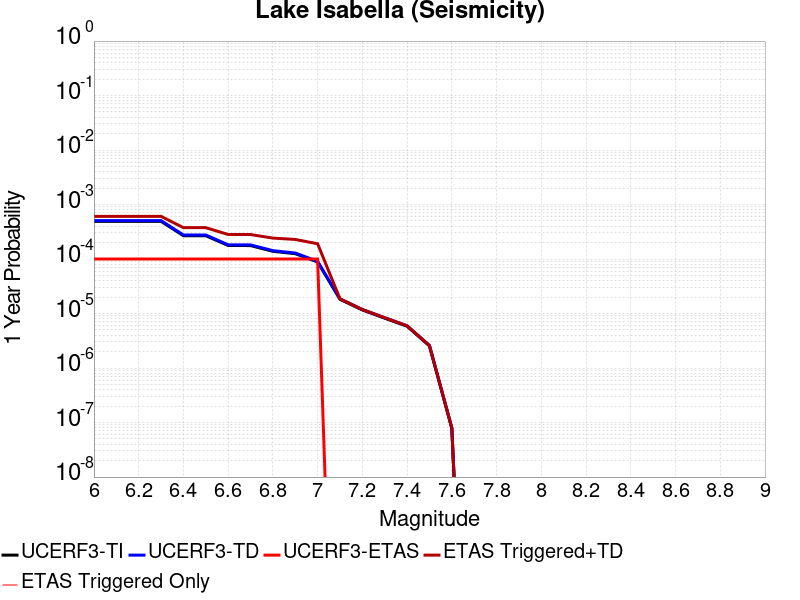 |  |

| Magnitude | 1 wk TI Prob | 1 wk TD Prob | 1 wk ETAS Prob | 1 wk ETAS/TD Gain | 1 wk ETAS Triggered+TD | 1 wk ETAS Triggered Only | 1 mo TI Prob | 1 mo TD Prob | 1 mo ETAS Prob | 1 mo ETAS/TD Gain | 1 mo ETAS Triggered+TD | 1 mo ETAS Triggered Only | 1 yr TI Prob | 1 yr TD Prob | 1 yr ETAS Prob | 1 yr ETAS/TD Gain | 1 yr ETAS Triggered+TD | 1 yr ETAS Triggered Only | 10 yr TI Prob | 10 yr TD Prob | 10 yr ETAS Prob | 10 yr ETAS/TD Gain | 10 yr ETAS Triggered+TD | 10 yr ETAS Triggered Only |
|-----|-----|-----|-----|-----|-----|-----|-----|-----|-----|-----|-----|-----|-----|-----|-----|-----|-----|-----|-----|-----|-----|-----|-----|-----|
| 6.0 | 9.431637E-6 | 9.742312E-6 | 0.0 | 0.0 | 9.742312E-6 | 0.0 | 4.0420677E-5 | 4.175217E-5 | 0.0 | 0.0 | 4.175217E-5 | 0.0 | 4.920106E-4 | 5.0822715E-4 | 1.0E-4 | 0.19676241 | 6.0817634E-4 | 1.0E-4 | 0.004909227 | 0.0050719418 | 3.0E-4 | 0.059148945 | 0.00537042 | 3.0E-4 |
| 6.1 | 9.431637E-6 | 9.742312E-6 | 0.0 | 0.0 | 9.742312E-6 | 0.0 | 4.0420677E-5 | 4.175217E-5 | 0.0 | 0.0 | 4.175217E-5 | 0.0 | 4.920106E-4 | 5.0822715E-4 | 1.0E-4 | 0.19676241 | 6.0817634E-4 | 1.0E-4 | 0.004909227 | 0.0050719418 | 3.0E-4 | 0.059148945 | 0.00537042 | 3.0E-4 |
| 6.2 | 9.431637E-6 | 9.742312E-6 | 0.0 | 0.0 | 9.742312E-6 | 0.0 | 4.0420677E-5 | 4.175217E-5 | 0.0 | 0.0 | 4.175217E-5 | 0.0 | 4.920106E-4 | 5.0822715E-4 | 1.0E-4 | 0.19676241 | 6.0817634E-4 | 1.0E-4 | 0.004909227 | 0.0050719418 | 3.0E-4 | 0.059148945 | 0.00537042 | 3.0E-4 |
| 6.3 | 9.431637E-6 | 9.742312E-6 | 0.0 | 0.0 | 9.742312E-6 | 0.0 | 4.0420677E-5 | 4.175217E-5 | 0.0 | 0.0 | 4.175217E-5 | 0.0 | 4.920106E-4 | 5.0822715E-4 | 1.0E-4 | 0.19676241 | 6.0817634E-4 | 1.0E-4 | 0.004909227 | 0.0050719418 | 3.0E-4 | 0.059148945 | 0.00537042 | 3.0E-4 |
| 6.4 | 5.144063E-6 | 5.3004073E-6 | 0.0 | 0.0 | 5.3004073E-6 | 0.0 | 2.2045799E-5 | 2.2715853E-5 | 0.0 | 0.0 | 2.2715853E-5 | 0.0 | 2.6837454E-4 | 2.7653386E-4 | 1.0E-4 | 0.36161935 | 3.765062E-4 | 1.0E-4 | 0.0026805066 | 0.002762238 | 1.0E-4 | 0.036202528 | 0.002861962 | 1.0E-4 |
| 6.5 | 5.144063E-6 | 5.3004073E-6 | 0.0 | 0.0 | 5.3004073E-6 | 0.0 | 2.2045799E-5 | 2.2715853E-5 | 0.0 | 0.0 | 2.2715853E-5 | 0.0 | 2.6837454E-4 | 2.7653386E-4 | 1.0E-4 | 0.36161935 | 3.765062E-4 | 1.0E-4 | 0.0026805066 | 0.002762238 | 1.0E-4 | 0.036202528 | 0.002861962 | 1.0E-4 |
| 6.6 | 3.4009804E-6 | 3.4989935E-6 | 0.0 | 0.0 | 3.4989935E-6 | 0.0 | 1.4575549E-5 | 1.49956095E-5 | 0.0 | 0.0 | 1.49956095E-5 | 0.0 | 1.7744285E-4 | 1.8255785E-4 | 1.0E-4 | 0.5477716 | 2.8253958E-4 | 1.0E-4 | 0.0017730123 | 0.0018242366 | 1.0E-4 | 0.054817453 | 0.0019240541 | 1.0E-4 |
| 6.7 | 3.3880428E-6 | 3.4858597E-6 | 0.0 | 0.0 | 3.4858597E-6 | 0.0 | 1.4520103E-5 | 1.4939322E-5 | 0.0 | 0.0 | 1.4939322E-5 | 0.0 | 1.767679E-4 | 1.8187267E-4 | 1.0E-4 | 0.5498352 | 2.8185447E-4 | 1.0E-4 | 0.0017662736 | 0.001817396 | 1.0E-4 | 0.055023782 | 0.0019172142 | 1.0E-4 |
| 6.8 | 2.6582E-6 | 2.7338601E-6 | 0.0 | 0.0 | 2.7338601E-6 | 0.0 | 1.1392236E-5 | 1.1716498E-5 | 0.0 | 0.0 | 1.1716498E-5 | 0.0 | 1.3869164E-4 | 1.4264038E-4 | 1.0E-4 | 0.70106375 | 2.4262612E-4 | 1.0E-4 | 0.0013860512 | 0.0014256203 | 1.0E-4 | 0.07014491 | 0.0015254777 | 1.0E-4 |
| 6.9 | 2.406011E-6 | 2.4744736E-6 | 0.0 | 0.0 | 2.4744736E-6 | 0.0 | 1.0311434E-5 | 1.0604851E-5 | 0.0 | 0.0 | 1.0604851E-5 | 0.0 | 1.2553448E-4 | 1.2910774E-4 | 1.0E-4 | 0.7745469 | 2.2909482E-4 | 1.0E-4 | 0.0012546359 | 0.0012904569 | 1.0E-4 | 0.07749193 | 0.0013903278 | 1.0E-4 |
| 7.0 | 1.6953097E-6 | 1.7430381E-6 | 0.0 | 0.0 | 1.7430381E-6 | 0.0 | 7.265593E-6 | 7.4701475E-6 | 0.0 | 0.0 | 7.4701475E-6 | 0.0 | 8.8455E-5 | 9.09463E-5 | 1.0E-4 | 1.09955 | 1.9093721E-4 | 1.0E-4 | 8.84198E-4 | 9.091936E-4 | 1.0E-4 | 0.10998758 | 0.0010091027 | 1.0E-4 |
| 7.1 | 3.5013824E-7 | 3.5716295E-7 | 0.0 | 0.0 | 3.5716295E-7 | 0.0 | 1.5005916E-6 | 1.5306975E-6 | 0.0 | 0.0 | 1.5306975E-6 | 0.0 | 1.826955E-5 | 1.8636085E-5 | 0.0 | 0.0 | 1.8636085E-5 | 0.0 | 1.8268047E-4 | 1.8634548E-4 | 0.0 | 0.0 | 1.8634548E-4 | 0.0 |
| 7.2 | 2.2321095E-7 | 2.2751475E-7 | 0.0 | 0.0 | 2.2751475E-7 | 0.0 | 9.56618E-7 | 9.750629E-7 | 0.0 | 0.0 | 9.750629E-7 | 0.0 | 1.1646762E-5 | 1.1871327E-5 | 0.0 | 0.0 | 1.1871327E-5 | 0.0 | 1.1646151E-4 | 1.1870702E-4 | 0.0 | 0.0 | 1.1870702E-4 | 0.0 |
| 7.3 | 1.5760406E-7 | 1.6061553E-7 | 0.0 | 0.0 | 1.6061553E-7 | 0.0 | 6.7544585E-7 | 6.883521E-7 | 0.0 | 0.0 | 6.883521E-7 | 0.0 | 8.223522E-6 | 8.380655E-6 | 0.0 | 0.0 | 8.380655E-6 | 0.0 | 8.2232174E-5 | 8.3803454E-5 | 0.0 | 0.0 | 8.3803454E-5 | 0.0 |
| 7.4 | 1.1216497E-7 | 1.1432158E-7 | 0.0 | 0.0 | 1.1432158E-7 | 0.0 | 4.8070694E-7 | 4.899495E-7 | 0.0 | 0.0 | 4.899495E-7 | 0.0 | 5.852591E-6 | 5.9651197E-6 | 0.0 | 0.0 | 5.9651197E-6 | 0.0 | 5.8524372E-5 | 5.964964E-5 | 0.0 | 0.0 | 5.964964E-5 | 0.0 |
| 7.5 | 4.885185E-8 | 4.97897E-8 | 0.0 | 0.0 | 4.97897E-8 | 0.0 | 2.0936506E-7 | 2.1338442E-7 | 0.0 | 0.0 | 2.1338442E-7 | 0.0 | 2.5490165E-6 | 2.5979523E-6 | 0.0 | 0.0 | 2.5979523E-6 | 0.0 | 2.5489873E-5 | 2.5979238E-5 | 0.0 | 0.0 | 2.5979238E-5 | 0.0 |
| 7.6 | 1.504641E-9 | 1.5318472E-9 | 0.0 | 0.0 | 1.5318472E-9 | 0.0 | 6.4484613E-9 | 6.5650596E-9 | 0.0 | 0.0 | 6.5650596E-9 | 0.0 | 7.851001E-8 | 7.99296E-8 | 0.0 | 0.0 | 7.99296E-8 | 0.0 | 7.8509987E-7 | 7.99296E-7 | 0.0 | 0.0 | 7.99296E-7 | 0.0 |

## Del Valle
*[(top)](#table-of-contents)*

| 1 Week | 1 Month | 1 Year | 10 Year |
|-----|-----|-----|-----|
|  |  |  |  |

| Magnitude | 1 wk TI Prob | 1 wk TD Prob | 1 wk ETAS Prob | 1 wk ETAS/TD Gain | 1 wk ETAS Triggered+TD | 1 wk ETAS Triggered Only | 1 mo TI Prob | 1 mo TD Prob | 1 mo ETAS Prob | 1 mo ETAS/TD Gain | 1 mo ETAS Triggered+TD | 1 mo ETAS Triggered Only | 1 yr TI Prob | 1 yr TD Prob | 1 yr ETAS Prob | 1 yr ETAS/TD Gain | 1 yr ETAS Triggered+TD | 1 yr ETAS Triggered Only | 10 yr TI Prob | 10 yr TD Prob | 10 yr ETAS Prob | 10 yr ETAS/TD Gain | 10 yr ETAS Triggered+TD | 10 yr ETAS Triggered Only |
|-----|-----|-----|-----|-----|-----|-----|-----|-----|-----|-----|-----|-----|-----|-----|-----|-----|-----|-----|-----|-----|-----|-----|-----|-----|
| 6.0 | 1.0716125E-5 | 8.770538E-6 | 0.0 | 0.0 | 8.770538E-6 | 0.0 | 4.592544E-5 | 3.7587593E-5 | 0.0 | 0.0 | 3.7587593E-5 | 0.0 | 5.589988E-4 | 4.575526E-4 | 1.0E-4 | 0.21855411 | 5.5750686E-4 | 1.0E-4 | 0.0055759475 | 0.0045680595 | 3.0E-4 | 0.065673396 | 0.0048666894 | 3.0E-4 |
| 6.1 | 1.0716125E-5 | 8.770538E-6 | 0.0 | 0.0 | 8.770538E-6 | 0.0 | 4.592544E-5 | 3.7587593E-5 | 0.0 | 0.0 | 3.7587593E-5 | 0.0 | 5.589988E-4 | 4.575526E-4 | 1.0E-4 | 0.21855411 | 5.5750686E-4 | 1.0E-4 | 0.0055759475 | 0.0045680595 | 3.0E-4 | 0.065673396 | 0.0048666894 | 3.0E-4 |
| 6.2 | 1.0716125E-5 | 8.770538E-6 | 0.0 | 0.0 | 8.770538E-6 | 0.0 | 4.592544E-5 | 3.7587593E-5 | 0.0 | 0.0 | 3.7587593E-5 | 0.0 | 5.589988E-4 | 4.575526E-4 | 1.0E-4 | 0.21855411 | 5.5750686E-4 | 1.0E-4 | 0.0055759475 | 0.0045680595 | 3.0E-4 | 0.065673396 | 0.0048666894 | 3.0E-4 |
| 6.3 | 7.1293784E-6 | 4.8677734E-6 | 0.0 | 0.0 | 4.8677734E-6 | 0.0 | 3.055412E-5 | 2.0861722E-5 | 0.0 | 0.0 | 2.0861722E-5 | 0.0 | 3.7193293E-4 | 2.5396261E-4 | 1.0E-4 | 0.39375874 | 3.539372E-4 | 1.0E-4 | 0.0037131102 | 0.0025368086 | 3.0E-4 | 0.11825883 | 0.0028360474 | 3.0E-4 |
| 6.4 | 7.1293784E-6 | 4.8677734E-6 | 0.0 | 0.0 | 4.8677734E-6 | 0.0 | 3.055412E-5 | 2.0861722E-5 | 0.0 | 0.0 | 2.0861722E-5 | 0.0 | 3.7193293E-4 | 2.5396261E-4 | 1.0E-4 | 0.39375874 | 3.539372E-4 | 1.0E-4 | 0.0037131102 | 0.0025368086 | 3.0E-4 | 0.11825883 | 0.0028360474 | 3.0E-4 |
| 6.5 | 7.1293784E-6 | 4.8677734E-6 | 0.0 | 0.0 | 4.8677734E-6 | 0.0 | 3.055412E-5 | 2.0861722E-5 | 0.0 | 0.0 | 2.0861722E-5 | 0.0 | 3.7193293E-4 | 2.5396261E-4 | 1.0E-4 | 0.39375874 | 3.539372E-4 | 1.0E-4 | 0.0037131102 | 0.0025368086 | 3.0E-4 | 0.11825883 | 0.0028360474 | 3.0E-4 |
| 6.6 | 7.1293784E-6 | 4.8677734E-6 | 0.0 | 0.0 | 4.8677734E-6 | 0.0 | 3.055412E-5 | 2.0861722E-5 | 0.0 | 0.0 | 2.0861722E-5 | 0.0 | 3.7193293E-4 | 2.5396261E-4 | 1.0E-4 | 0.39375874 | 3.539372E-4 | 1.0E-4 | 0.0037131102 | 0.0025368086 | 3.0E-4 | 0.11825883 | 0.0028360474 | 3.0E-4 |
| 6.7 | 7.12272E-6 | 4.865148E-6 | 0.0 | 0.0 | 4.865148E-6 | 0.0 | 3.0525585E-5 | 2.0850472E-5 | 0.0 | 0.0 | 2.0850472E-5 | 0.0 | 3.7158563E-4 | 2.5382565E-4 | 1.0E-4 | 0.3939712 | 3.5380028E-4 | 1.0E-4 | 0.003709649 | 0.0025354421 | 3.0E-4 | 0.11832255 | 0.0028346817 | 3.0E-4 |
| 6.8 | 6.7558703E-6 | 4.561259E-6 | 0.0 | 0.0 | 4.561259E-6 | 0.0 | 2.895341E-5 | 1.9548112E-5 | 0.0 | 0.0 | 1.9548112E-5 | 0.0 | 3.5245073E-4 | 2.3797288E-4 | 0.0 | 0.0 | 2.3797288E-4 | 0.0 | 0.0035189227 | 0.0023772547 | 2.0E-4 | 0.08413066 | 0.002576779 | 2.0E-4 |
| 6.9 | 6.6700386E-6 | 4.5043557E-6 | 0.0 | 0.0 | 4.5043557E-6 | 0.0 | 2.8585566E-5 | 1.9304243E-5 | 0.0 | 0.0 | 1.9304243E-5 | 0.0 | 3.479737E-4 | 2.3500444E-4 | 0.0 | 0.0 | 2.3500444E-4 | 0.0 | 0.003474293 | 0.002347633 | 2.0E-4 | 0.08519219 | 0.0025471635 | 2.0E-4 |
| 7.0 | 6.3181424E-6 | 4.1003896E-6 | 0.0 | 0.0 | 4.1003896E-6 | 0.0 | 2.7077473E-5 | 1.7572982E-5 | 0.0 | 0.0 | 1.7572982E-5 | 0.0 | 3.2961834E-4 | 2.1393047E-4 | 0.0 | 0.0 | 2.1393047E-4 | 0.0 | 0.0032912986 | 0.002137299 | 2.0E-4 | 0.09357606 | 0.0023368713 | 2.0E-4 |
| 7.1 | 6.248759E-6 | 4.035554E-6 | 0.0 | 0.0 | 4.035554E-6 | 0.0 | 2.678012E-5 | 1.7295119E-5 | 0.0 | 0.0 | 1.7295119E-5 | 0.0 | 3.2599916E-4 | 2.1054815E-4 | 0.0 | 0.0 | 2.1054815E-4 | 0.0 | 0.0032552136 | 0.0021035399 | 2.0E-4 | 0.09507782 | 0.0023031193 | 2.0E-4 |
| 7.2 | 6.0411944E-6 | 3.8714743E-6 | 0.0 | 0.0 | 3.8714743E-6 | 0.0 | 2.5890577E-5 | 1.659193E-5 | 0.0 | 0.0 | 1.659193E-5 | 0.0 | 3.1517216E-4 | 2.0198844E-4 | 0.0 | 0.0 | 2.0198844E-4 | 0.0 | 0.0031472554 | 0.0020181006 | 2.0E-4 | 0.099103086 | 0.002217697 | 2.0E-4 |
| 7.3 | 4.7691183E-6 | 3.0793174E-6 | 0.0 | 0.0 | 3.0793174E-6 | 0.0 | 2.0438918E-5 | 1.3197008E-5 | 0.0 | 0.0 | 1.3197008E-5 | 0.0 | 2.488154E-4 | 1.6066195E-4 | 0.0 | 0.0 | 1.6066195E-4 | 0.0 | 0.00248537 | 0.001605476 | 2.0E-4 | 0.12457365 | 0.001805155 | 2.0E-4 |
| 7.4 | 3.5524722E-6 | 2.1901772E-6 | 0.0 | 0.0 | 2.1901772E-6 | 0.0 | 1.5224792E-5 | 9.38644E-6 | 0.0 | 0.0 | 9.38644E-6 | 0.0 | 1.8534607E-4 | 1.14274E-4 | 0.0 | 0.0 | 1.14274E-4 | 0.0 | 0.0018519156 | 0.0011421606 | 2.0E-4 | 0.17510672 | 0.0013419322 | 2.0E-4 |
| 7.5 | 2.7133442E-6 | 1.5922482E-6 | 0.0 | 0.0 | 1.5922482E-6 | 0.0 | 1.1628566E-5 | 6.8239033E-6 | 0.0 | 0.0 | 6.8239033E-6 | 0.0 | 1.415686E-4 | 8.307787E-5 | 0.0 | 0.0 | 8.307787E-5 | 0.0 | 0.0014147845 | 8.3047006E-4 | 2.0E-4 | 0.24082746 | 0.001030304 | 2.0E-4 |
| 7.6 | 1.915338E-6 | 1.1743593E-6 | 0.0 | 0.0 | 1.1743593E-6 | 0.0 | 8.208566E-6 | 5.032959E-6 | 0.0 | 0.0 | 5.032959E-6 | 0.0 | 9.993471E-5 | 6.1274564E-5 | 0.0 | 0.0 | 6.1274564E-5 | 0.0 | 9.988978E-4 | 6.125776E-4 | 2.0E-4 | 0.32648924 | 8.124551E-4 | 2.0E-4 |
| 7.7 | 1.2120448E-6 | 7.183367E-7 | 0.0 | 0.0 | 7.183367E-7 | 0.0 | 5.194467E-6 | 3.0785823E-6 | 0.0 | 0.0 | 3.0785823E-6 | 0.0 | 6.3240805E-5 | 3.74811E-5 | 0.0 | 0.0 | 3.74811E-5 | 0.0 | 6.322281E-4 | 3.7474817E-4 | 2.0E-4 | 0.53369176 | 5.746732E-4 | 2.0E-4 |
| 7.8 | 6.272381E-7 | 3.9338858E-7 | 0.0 | 0.0 | 3.9338858E-7 | 0.0 | 2.6881603E-6 | 1.68595E-6 | 0.0 | 0.0 | 1.68595E-6 | 0.0 | 3.272786E-5 | 2.052625E-5 | 0.0 | 0.0 | 2.052625E-5 | 0.0 | 3.272304E-4 | 2.0524369E-4 | 2.0E-4 | 0.9744514 | 4.0520265E-4 | 2.0E-4 |
| 7.9 | 2.0292627E-7 | 1.200809E-7 | 0.0 | 0.0 | 1.200809E-7 | 0.0 | 8.6968373E-7 | 5.146323E-7 | 0.0 | 0.0 | 5.146323E-7 | 0.0 | 1.0588348E-5 | 6.265631E-6 | 0.0 | 0.0 | 6.265631E-6 | 0.0 | 1.0587843E-4 | 6.265456E-5 | 0.0 | 0.0 | 6.265456E-5 | 0.0 |
| 8.0 | 4.374492E-8 | 2.1909308E-8 | 0.0 | 0.0 | 2.1909308E-8 | 0.0 | 1.8747821E-7 | 9.389703E-8 | 0.0 | 0.0 | 9.389703E-8 | 0.0 | 2.2825448E-6 | 1.1431957E-6 | 0.0 | 0.0 | 1.1431957E-6 | 0.0 | 2.2825214E-5 | 1.1431903E-5 | 0.0 | 0.0 | 1.1431903E-5 | 0.0 |

## Great Valley 14 (Kettleman Hills)
*[(top)](#table-of-contents)*

| 1 Week | 1 Month | 1 Year | 10 Year |
|-----|-----|-----|-----|
| 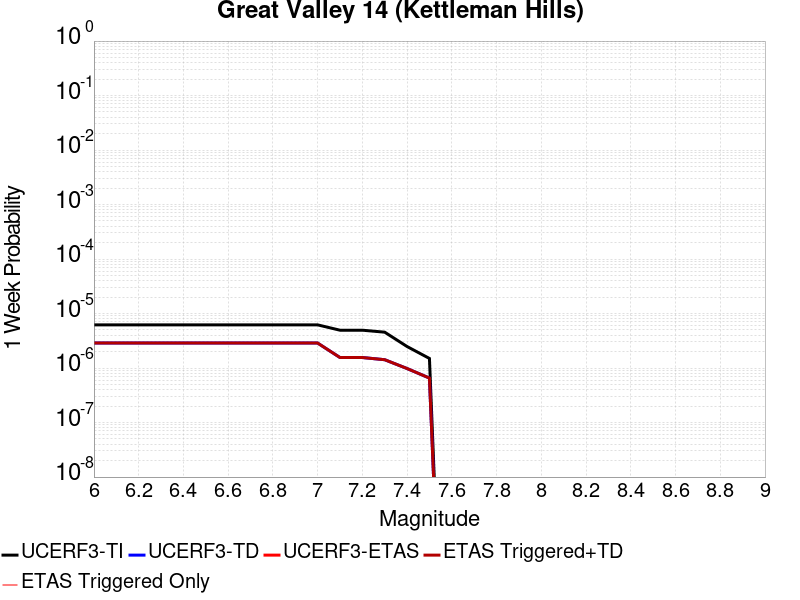 | 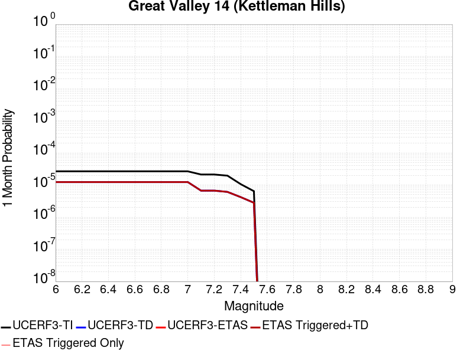 |  |  |

| Magnitude | 1 wk TI Prob | 1 wk TD Prob | 1 wk ETAS Prob | 1 wk ETAS/TD Gain | 1 wk ETAS Triggered+TD | 1 wk ETAS Triggered Only | 1 mo TI Prob | 1 mo TD Prob | 1 mo ETAS Prob | 1 mo ETAS/TD Gain | 1 mo ETAS Triggered+TD | 1 mo ETAS Triggered Only | 1 yr TI Prob | 1 yr TD Prob | 1 yr ETAS Prob | 1 yr ETAS/TD Gain | 1 yr ETAS Triggered+TD | 1 yr ETAS Triggered Only | 10 yr TI Prob | 10 yr TD Prob | 10 yr ETAS Prob | 10 yr ETAS/TD Gain | 10 yr ETAS Triggered+TD | 10 yr ETAS Triggered Only |
|-----|-----|-----|-----|-----|-----|-----|-----|-----|-----|-----|-----|-----|-----|-----|-----|-----|-----|-----|-----|-----|-----|-----|-----|-----|
| 6.0 | 6.2057843E-6 | 2.8769296E-6 | 0.0 | 0.0 | 2.8769296E-6 | 0.0 | 2.6595946E-5 | 1.2329652E-5 | 0.0 | 0.0 | 1.2329652E-5 | 0.0 | 3.2375753E-4 | 1.5010554E-4 | 0.0 | 0.0 | 1.5010554E-4 | 0.0 | 0.0032328626 | 0.0015002728 | 3.0E-4 | 0.19996363 | 0.0017998228 | 3.0E-4 |
| 6.1 | 6.2057843E-6 | 2.8769296E-6 | 0.0 | 0.0 | 2.8769296E-6 | 0.0 | 2.6595946E-5 | 1.2329652E-5 | 0.0 | 0.0 | 1.2329652E-5 | 0.0 | 3.2375753E-4 | 1.5010554E-4 | 0.0 | 0.0 | 1.5010554E-4 | 0.0 | 0.0032328626 | 0.0015002728 | 3.0E-4 | 0.19996363 | 0.0017998228 | 3.0E-4 |
| 6.2 | 6.2057843E-6 | 2.8769296E-6 | 0.0 | 0.0 | 2.8769296E-6 | 0.0 | 2.6595946E-5 | 1.2329652E-5 | 0.0 | 0.0 | 1.2329652E-5 | 0.0 | 3.2375753E-4 | 1.5010554E-4 | 0.0 | 0.0 | 1.5010554E-4 | 0.0 | 0.0032328626 | 0.0015002728 | 3.0E-4 | 0.19996363 | 0.0017998228 | 3.0E-4 |
| 6.3 | 6.2057843E-6 | 2.8769296E-6 | 0.0 | 0.0 | 2.8769296E-6 | 0.0 | 2.6595946E-5 | 1.2329652E-5 | 0.0 | 0.0 | 1.2329652E-5 | 0.0 | 3.2375753E-4 | 1.5010554E-4 | 0.0 | 0.0 | 1.5010554E-4 | 0.0 | 0.0032328626 | 0.0015002728 | 3.0E-4 | 0.19996363 | 0.0017998228 | 3.0E-4 |
| 6.4 | 6.2057843E-6 | 2.8769296E-6 | 0.0 | 0.0 | 2.8769296E-6 | 0.0 | 2.6595946E-5 | 1.2329652E-5 | 0.0 | 0.0 | 1.2329652E-5 | 0.0 | 3.2375753E-4 | 1.5010554E-4 | 0.0 | 0.0 | 1.5010554E-4 | 0.0 | 0.0032328626 | 0.0015002728 | 3.0E-4 | 0.19996363 | 0.0017998228 | 3.0E-4 |
| 6.5 | 6.2057843E-6 | 2.8769296E-6 | 0.0 | 0.0 | 2.8769296E-6 | 0.0 | 2.6595946E-5 | 1.2329652E-5 | 0.0 | 0.0 | 1.2329652E-5 | 0.0 | 3.2375753E-4 | 1.5010554E-4 | 0.0 | 0.0 | 1.5010554E-4 | 0.0 | 0.0032328626 | 0.0015002728 | 3.0E-4 | 0.19996363 | 0.0017998228 | 3.0E-4 |
| 6.6 | 6.2057843E-6 | 2.8769296E-6 | 0.0 | 0.0 | 2.8769296E-6 | 0.0 | 2.6595946E-5 | 1.2329652E-5 | 0.0 | 0.0 | 1.2329652E-5 | 0.0 | 3.2375753E-4 | 1.5010554E-4 | 0.0 | 0.0 | 1.5010554E-4 | 0.0 | 0.0032328626 | 0.0015002728 | 3.0E-4 | 0.19996363 | 0.0017998228 | 3.0E-4 |
| 6.7 | 6.2057843E-6 | 2.8769296E-6 | 0.0 | 0.0 | 2.8769296E-6 | 0.0 | 2.6595946E-5 | 1.2329652E-5 | 0.0 | 0.0 | 1.2329652E-5 | 0.0 | 3.2375753E-4 | 1.5010554E-4 | 0.0 | 0.0 | 1.5010554E-4 | 0.0 | 0.0032328626 | 0.0015002728 | 3.0E-4 | 0.19996363 | 0.0017998228 | 3.0E-4 |
| 6.8 | 6.2057843E-6 | 2.8769296E-6 | 0.0 | 0.0 | 2.8769296E-6 | 0.0 | 2.6595946E-5 | 1.2329652E-5 | 0.0 | 0.0 | 1.2329652E-5 | 0.0 | 3.2375753E-4 | 1.5010554E-4 | 0.0 | 0.0 | 1.5010554E-4 | 0.0 | 0.0032328626 | 0.0015002728 | 3.0E-4 | 0.19996363 | 0.0017998228 | 3.0E-4 |
| 6.9 | 6.2057843E-6 | 2.8769296E-6 | 0.0 | 0.0 | 2.8769296E-6 | 0.0 | 2.6595946E-5 | 1.2329652E-5 | 0.0 | 0.0 | 1.2329652E-5 | 0.0 | 3.2375753E-4 | 1.5010554E-4 | 0.0 | 0.0 | 1.5010554E-4 | 0.0 | 0.0032328626 | 0.0015002728 | 3.0E-4 | 0.19996363 | 0.0017998228 | 3.0E-4 |
| 7.0 | 6.2057843E-6 | 2.8769296E-6 | 0.0 | 0.0 | 2.8769296E-6 | 0.0 | 2.6595946E-5 | 1.2329652E-5 | 0.0 | 0.0 | 1.2329652E-5 | 0.0 | 3.2375753E-4 | 1.5010554E-4 | 0.0 | 0.0 | 1.5010554E-4 | 0.0 | 0.0032328626 | 0.0015002728 | 3.0E-4 | 0.19996363 | 0.0017998228 | 3.0E-4 |
| 7.1 | 4.95113E-6 | 1.5605451E-6 | 0.0 | 0.0 | 1.5605451E-6 | 0.0 | 2.1218955E-5 | 6.688035E-6 | 0.0 | 0.0 | 6.688035E-6 | 0.0 | 2.5831014E-4 | 8.142397E-5 | 0.0 | 0.0 | 8.142397E-5 | 0.0 | 0.0025801011 | 8.1396033E-4 | 2.0E-4 | 0.24571222 | 0.0010137975 | 2.0E-4 |
| 7.2 | 4.95113E-6 | 1.5605451E-6 | 0.0 | 0.0 | 1.5605451E-6 | 0.0 | 2.1218955E-5 | 6.688035E-6 | 0.0 | 0.0 | 6.688035E-6 | 0.0 | 2.5831014E-4 | 8.142397E-5 | 0.0 | 0.0 | 8.142397E-5 | 0.0 | 0.0025801011 | 8.1396033E-4 | 2.0E-4 | 0.24571222 | 0.0010137975 | 2.0E-4 |
| 7.3 | 4.5549086E-6 | 1.4225209E-6 | 0.0 | 0.0 | 1.4225209E-6 | 0.0 | 1.9520892E-5 | 6.096505E-6 | 0.0 | 0.0 | 6.096505E-6 | 0.0 | 2.3764092E-4 | 7.422259E-5 | 0.0 | 0.0 | 7.422259E-5 | 0.0 | 0.0023738695 | 7.419946E-4 | 2.0E-4 | 0.26954377 | 9.4184617E-4 | 2.0E-4 |
| 7.4 | 2.4837766E-6 | 9.80001E-7 | 0.0 | 0.0 | 9.80001E-7 | 0.0 | 1.0644713E-5 | 4.199998E-6 | 0.0 | 0.0 | 4.199998E-6 | 0.0 | 1.2959167E-4 | 5.113384E-5 | 0.0 | 0.0 | 5.113384E-5 | 0.0 | 0.0012951613 | 5.1122735E-4 | 0.0 | 0.0 | 5.1122735E-4 | 0.0 |
| 7.5 | 1.5002679E-6 | 6.5457795E-7 | 0.0 | 0.0 | 6.5457795E-7 | 0.0 | 6.4297037E-6 | 2.8053314E-6 | 0.0 | 0.0 | 2.8053314E-6 | 0.0 | 7.827883E-5 | 3.4154415E-5 | 0.0 | 0.0 | 3.4154415E-5 | 0.0 | 7.825126E-4 | 3.4149582E-4 | 0.0 | 0.0 | 3.4149582E-4 | 0.0 |

## Red Pass
*[(top)](#table-of-contents)*

| 1 Week | 1 Month | 1 Year | 10 Year |
|-----|-----|-----|-----|
| 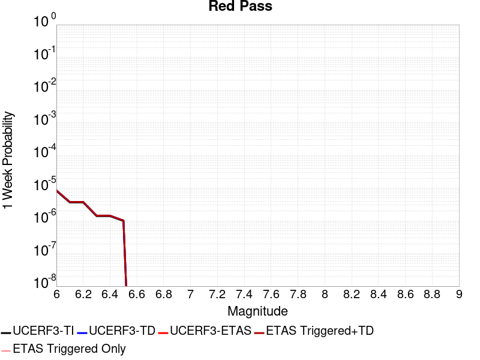 |  |  |  |

| Magnitude | 1 wk TI Prob | 1 wk TD Prob | 1 wk ETAS Prob | 1 wk ETAS/TD Gain | 1 wk ETAS Triggered+TD | 1 wk ETAS Triggered Only | 1 mo TI Prob | 1 mo TD Prob | 1 mo ETAS Prob | 1 mo ETAS/TD Gain | 1 mo ETAS Triggered+TD | 1 mo ETAS Triggered Only | 1 yr TI Prob | 1 yr TD Prob | 1 yr ETAS Prob | 1 yr ETAS/TD Gain | 1 yr ETAS Triggered+TD | 1 yr ETAS Triggered Only | 10 yr TI Prob | 10 yr TD Prob | 10 yr ETAS Prob | 10 yr ETAS/TD Gain | 10 yr ETAS Triggered+TD | 10 yr ETAS Triggered Only |
|-----|-----|-----|-----|-----|-----|-----|-----|-----|-----|-----|-----|-----|-----|-----|-----|-----|-----|-----|-----|-----|-----|-----|-----|-----|
| 6.0 | 8.258278E-6 | 8.55189E-6 | 0.0 | 0.0 | 8.55189E-6 | 0.0 | 3.539214E-5 | 3.665054E-5 | 0.0 | 0.0 | 3.665054E-5 | 0.0 | 4.308141E-4 | 4.4614685E-4 | 0.0 | 0.0 | 4.4614685E-4 | 0.0 | 0.0042997985 | 0.0044542695 | 2.0E-4 | 0.044900738 | 0.004653379 | 2.0E-4 |
| 6.1 | 3.649988E-6 | 3.775583E-6 | 0.0 | 0.0 | 3.775583E-6 | 0.0 | 1.5642712E-5 | 1.6180997E-5 | 0.0 | 0.0 | 1.6180997E-5 | 0.0 | 1.9043336E-4 | 1.9699059E-4 | 0.0 | 0.0 | 1.9699059E-4 | 0.0 | 0.0019027026 | 0.001968627 | 2.0E-4 | 0.10159364 | 0.0021682333 | 2.0E-4 |
| 6.2 | 3.649988E-6 | 3.775583E-6 | 0.0 | 0.0 | 3.775583E-6 | 0.0 | 1.5642712E-5 | 1.6180997E-5 | 0.0 | 0.0 | 1.6180997E-5 | 0.0 | 1.9043336E-4 | 1.9699059E-4 | 0.0 | 0.0 | 1.9699059E-4 | 0.0 | 0.0019027026 | 0.001968627 | 2.0E-4 | 0.10159364 | 0.0021682333 | 2.0E-4 |
| 6.3 | 1.3924937E-6 | 1.4412202E-6 | 0.0 | 0.0 | 1.4412202E-6 | 0.0 | 5.9678164E-6 | 6.1766514E-6 | 0.0 | 0.0 | 6.1766514E-6 | 0.0 | 7.265574E-5 | 7.5199554E-5 | 0.0 | 0.0 | 7.5199554E-5 | 0.0 | 7.263199E-4 | 7.518798E-4 | 2.0E-4 | 0.26599994 | 9.517295E-4 | 2.0E-4 |
| 6.4 | 1.3924937E-6 | 1.4412202E-6 | 0.0 | 0.0 | 1.4412202E-6 | 0.0 | 5.9678164E-6 | 6.1766514E-6 | 0.0 | 0.0 | 6.1766514E-6 | 0.0 | 7.265574E-5 | 7.5199554E-5 | 0.0 | 0.0 | 7.5199554E-5 | 0.0 | 7.263199E-4 | 7.518798E-4 | 2.0E-4 | 0.26599994 | 9.517295E-4 | 2.0E-4 |
| 6.5 | 9.876812E-7 | 1.0222648E-6 | 0.0 | 0.0 | 1.0222648E-6 | 0.0 | 4.2329125E-6 | 4.3811347E-6 | 0.0 | 0.0 | 4.3811347E-6 | 0.0 | 5.153449E-5 | 5.3340314E-5 | 0.0 | 0.0 | 5.3340314E-5 | 0.0 | 5.1522546E-4 | 5.3340313E-4 | 1.0E-4 | 0.18747546 | 6.333498E-4 | 1.0E-4 |

## North Tahoe 2011 CFM
*[(top)](#table-of-contents)*

| 1 Week | 1 Month | 1 Year | 10 Year |
|-----|-----|-----|-----|
|  |  |  | 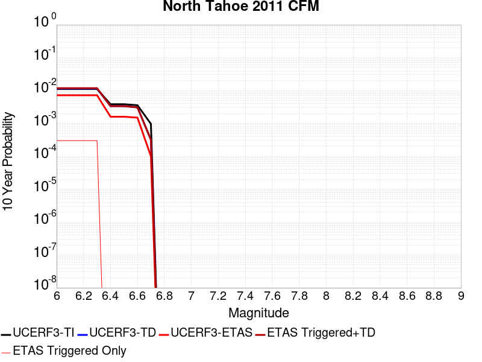 |

| Magnitude | 1 wk TI Prob | 1 wk TD Prob | 1 wk ETAS Prob | 1 wk ETAS/TD Gain | 1 wk ETAS Triggered+TD | 1 wk ETAS Triggered Only | 1 mo TI Prob | 1 mo TD Prob | 1 mo ETAS Prob | 1 mo ETAS/TD Gain | 1 mo ETAS Triggered+TD | 1 mo ETAS Triggered Only | 1 yr TI Prob | 1 yr TD Prob | 1 yr ETAS Prob | 1 yr ETAS/TD Gain | 1 yr ETAS Triggered+TD | 1 yr ETAS Triggered Only | 10 yr TI Prob | 10 yr TD Prob | 10 yr ETAS Prob | 10 yr ETAS/TD Gain | 10 yr ETAS Triggered+TD | 10 yr ETAS Triggered Only |
|-----|-----|-----|-----|-----|-----|-----|-----|-----|-----|-----|-----|-----|-----|-----|-----|-----|-----|-----|-----|-----|-----|-----|-----|-----|
| 6.0 | 2.150391E-5 | 2.2170227E-5 | 0.0 | 0.0 | 2.2170227E-5 | 0.0 | 9.215636E-5 | 9.50129E-5 | 0.0 | 0.0 | 9.50129E-5 | 0.0 | 0.0011214261 | 0.0011563642 | 0.0 | 0.0 | 0.0011563642 | 0.0 | 0.011157839 | 0.0115227355 | 3.0E-4 | 0.026035484 | 0.011819279 | 3.0E-4 |
| 6.1 | 2.150391E-5 | 2.2170227E-5 | 0.0 | 0.0 | 2.2170227E-5 | 0.0 | 9.215636E-5 | 9.50129E-5 | 0.0 | 0.0 | 9.50129E-5 | 0.0 | 0.0011214261 | 0.0011563642 | 0.0 | 0.0 | 0.0011563642 | 0.0 | 0.011157839 | 0.0115227355 | 3.0E-4 | 0.026035484 | 0.011819279 | 3.0E-4 |
| 6.2 | 2.150391E-5 | 2.2170227E-5 | 0.0 | 0.0 | 2.2170227E-5 | 0.0 | 9.215636E-5 | 9.50129E-5 | 0.0 | 0.0 | 9.50129E-5 | 0.0 | 0.0011214261 | 0.0011563642 | 0.0 | 0.0 | 0.0011563642 | 0.0 | 0.011157839 | 0.0115227355 | 3.0E-4 | 0.026035484 | 0.011819279 | 3.0E-4 |
| 6.3 | 2.150391E-5 | 2.2170227E-5 | 0.0 | 0.0 | 2.2170227E-5 | 0.0 | 9.215636E-5 | 9.50129E-5 | 0.0 | 0.0 | 9.50129E-5 | 0.0 | 0.0011214261 | 0.0011563642 | 0.0 | 0.0 | 0.0011563642 | 0.0 | 0.011157839 | 0.0115227355 | 3.0E-4 | 0.026035484 | 0.011819279 | 3.0E-4 |
| 6.4 | 7.3563056E-6 | 6.446491E-6 | 0.0 | 0.0 | 6.446491E-6 | 0.0 | 3.1526644E-5 | 2.7627699E-5 | 0.0 | 0.0 | 2.7627699E-5 | 0.0 | 3.8376928E-4 | 3.363459E-4 | 0.0 | 0.0 | 3.363459E-4 | 0.0 | 0.003831072 | 0.0033613662 | 0.0 | 0.0 | 0.0033613662 | 0.0 |
| 6.5 | 7.3563056E-6 | 6.446491E-6 | 0.0 | 0.0 | 6.446491E-6 | 0.0 | 3.1526644E-5 | 2.7627699E-5 | 0.0 | 0.0 | 2.7627699E-5 | 0.0 | 3.8376928E-4 | 3.363459E-4 | 0.0 | 0.0 | 3.363459E-4 | 0.0 | 0.003831072 | 0.0033613662 | 0.0 | 0.0 | 0.0033613662 | 0.0 |
| 6.6 | 6.8508816E-6 | 5.8855353E-6 | 0.0 | 0.0 | 5.8855353E-6 | 0.0 | 2.936059E-5 | 2.522365E-5 | 0.0 | 0.0 | 2.522365E-5 | 0.0 | 3.5740656E-4 | 3.0708505E-4 | 0.0 | 0.0 | 3.0708505E-4 | 0.0 | 0.0035683226 | 0.0030695854 | 0.0 | 0.0 | 0.0030695854 | 0.0 |
| 6.7 | 1.8511148E-6 | 6.1028277E-7 | 0.0 | 0.0 | 6.1028277E-7 | 0.0 | 7.933325E-6 | 2.6154976E-6 | 0.0 | 0.0 | 2.6154976E-6 | 0.0 | 9.658395E-5 | 3.1843683E-5 | 0.0 | 0.0 | 3.1843683E-5 | 0.0 | 9.6541987E-4 | 3.1843683E-4 | 0.0 | 0.0 | 3.1843683E-4 | 0.0 |

## Rocky Ledge 2011 CFM
*[(top)](#table-of-contents)*

| 1 Week | 1 Month | 1 Year | 10 Year |
|-----|-----|-----|-----|
|  | 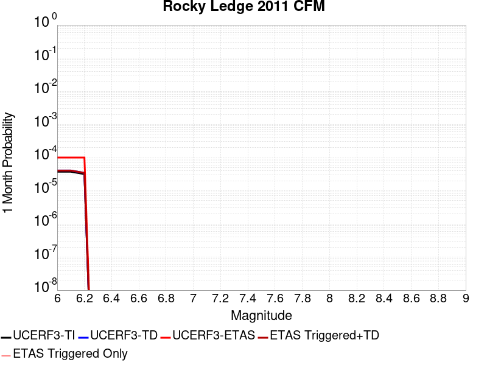 |  |  |

| Magnitude | 1 wk TI Prob | 1 wk TD Prob | 1 wk ETAS Prob | 1 wk ETAS/TD Gain | 1 wk ETAS Triggered+TD | 1 wk ETAS Triggered Only | 1 mo TI Prob | 1 mo TD Prob | 1 mo ETAS Prob | 1 mo ETAS/TD Gain | 1 mo ETAS Triggered+TD | 1 mo ETAS Triggered Only | 1 yr TI Prob | 1 yr TD Prob | 1 yr ETAS Prob | 1 yr ETAS/TD Gain | 1 yr ETAS Triggered+TD | 1 yr ETAS Triggered Only | 10 yr TI Prob | 10 yr TD Prob | 10 yr ETAS Prob | 10 yr ETAS/TD Gain | 10 yr ETAS Triggered+TD | 10 yr ETAS Triggered Only |
|-----|-----|-----|-----|-----|-----|-----|-----|-----|-----|-----|-----|-----|-----|-----|-----|-----|-----|-----|-----|-----|-----|-----|-----|-----|
| 6.0 | 8.7550525E-6 | 9.488238E-6 | 0.0 | 0.0 | 9.488238E-6 | 0.0 | 3.7521113E-5 | 4.066371E-5 | 0.0 | 0.0 | 4.066371E-5 | 0.0 | 4.567238E-4 | 4.950507E-4 | 0.0 | 0.0 | 4.950507E-4 | 0.0 | 0.0045578624 | 0.0049475697 | 3.0E-4 | 0.06063583 | 0.0052460856 | 3.0E-4 |
| 6.1 | 8.7550525E-6 | 9.488238E-6 | 0.0 | 0.0 | 9.488238E-6 | 0.0 | 3.7521113E-5 | 4.066371E-5 | 0.0 | 0.0 | 4.066371E-5 | 0.0 | 4.567238E-4 | 4.950507E-4 | 0.0 | 0.0 | 4.950507E-4 | 0.0 | 0.0045578624 | 0.0049475697 | 3.0E-4 | 0.06063583 | 0.0052460856 | 3.0E-4 |
| 6.2 | 7.442295E-6 | 8.064425E-6 | 0.0 | 0.0 | 8.064425E-6 | 0.0 | 3.189516E-5 | 3.456182E-5 | 0.0 | 0.0 | 3.456182E-5 | 0.0 | 3.8825438E-4 | 4.2079017E-4 | 0.0 | 0.0 | 4.2079017E-4 | 0.0 | 0.0038757676 | 0.0042079017 | 3.0E-4 | 0.07129444 | 0.004506639 | 3.0E-4 |

## Newport-Inglewood (Offshore)
*[(top)](#table-of-contents)*

| 1 Week | 1 Month | 1 Year | 10 Year |
|-----|-----|-----|-----|
|  |  |  | 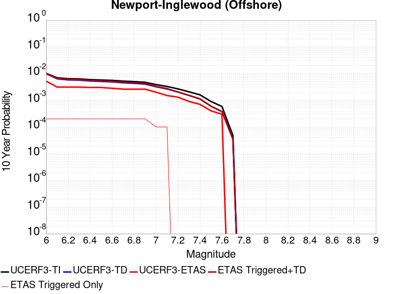 |

| Magnitude | 1 wk TI Prob | 1 wk TD Prob | 1 wk ETAS Prob | 1 wk ETAS/TD Gain | 1 wk ETAS Triggered+TD | 1 wk ETAS Triggered Only | 1 mo TI Prob | 1 mo TD Prob | 1 mo ETAS Prob | 1 mo ETAS/TD Gain | 1 mo ETAS Triggered+TD | 1 mo ETAS Triggered Only | 1 yr TI Prob | 1 yr TD Prob | 1 yr ETAS Prob | 1 yr ETAS/TD Gain | 1 yr ETAS Triggered+TD | 1 yr ETAS Triggered Only | 10 yr TI Prob | 10 yr TD Prob | 10 yr ETAS Prob | 10 yr ETAS/TD Gain | 10 yr ETAS Triggered+TD | 10 yr ETAS Triggered Only |
|-----|-----|-----|-----|-----|-----|-----|-----|-----|-----|-----|-----|-----|-----|-----|-----|-----|-----|-----|-----|-----|-----|-----|-----|-----|
| 6.0 | 1.9626508E-5 | 1.8968274E-5 | 0.0 | 0.0 | 1.8968274E-5 | 0.0 | 8.411089E-5 | 8.129014E-5 | 0.0 | 0.0 | 8.129014E-5 | 0.0 | 0.001023569 | 9.892707E-4 | 0.0 | 0.0 | 9.892707E-4 | 0.0 | 0.010188672 | 0.009850012 | 2.0E-4 | 0.020304544 | 0.010048042 | 2.0E-4 |
| 6.1 | 1.331886E-5 | 1.2220042E-5 | 0.0 | 0.0 | 1.2220042E-5 | 0.0 | 5.707958E-5 | 5.2370564E-5 | 0.0 | 0.0 | 5.2370564E-5 | 0.0 | 6.947222E-4 | 6.3742656E-4 | 0.0 | 0.0 | 6.3742656E-4 | 0.0 | 0.006925544 | 0.0063561597 | 2.0E-4 | 0.031465538 | 0.0065548886 | 2.0E-4 |
| 6.2 | 1.2250852E-5 | 1.10778155E-5 | 0.0 | 0.0 | 1.10778155E-5 | 0.0 | 5.2502597E-5 | 4.7475496E-5 | 0.0 | 0.0 | 4.7475496E-5 | 0.0 | 6.3903164E-4 | 5.7786185E-4 | 0.0 | 0.0 | 5.7786185E-4 | 0.0 | 0.006371971 | 0.0057637137 | 2.0E-4 | 0.03469985 | 0.005962561 | 2.0E-4 |
| 6.3 | 1.2106258E-5 | 1.0920649E-5 | 0.0 | 0.0 | 1.0920649E-5 | 0.0 | 5.1882926E-5 | 4.680195E-5 | 0.0 | 0.0 | 4.680195E-5 | 0.0 | 6.3149154E-4 | 5.6966575E-4 | 0.0 | 0.0 | 5.6966575E-4 | 0.0 | 0.0062970007 | 0.0056821713 | 2.0E-4 | 0.035197813 | 0.0058810352 | 2.0E-4 |
| 6.4 | 1.1348758E-5 | 1.0111005E-5 | 0.0 | 0.0 | 1.0111005E-5 | 0.0 | 4.8636626E-5 | 4.3332166E-5 | 0.0 | 0.0 | 4.3332166E-5 | 0.0 | 5.919901E-4 | 5.274422E-4 | 0.0 | 0.0 | 5.274422E-4 | 0.0 | 0.005904155 | 0.0052619996 | 2.0E-4 | 0.038008366 | 0.0054609473 | 2.0E-4 |
| 6.5 | 1.100837E-5 | 9.7449765E-6 | 0.0 | 0.0 | 9.7449765E-6 | 0.0 | 4.7177873E-5 | 4.176352E-5 | 0.0 | 0.0 | 4.176352E-5 | 0.0 | 5.7423924E-4 | 5.08353E-4 | 0.0 | 0.0 | 5.08353E-4 | 0.0 | 0.005727576 | 0.0050719925 | 2.0E-4 | 0.039432235 | 0.0052709784 | 2.0E-4 |
| 6.6 | 1.0634696E-5 | 9.347068E-6 | 0.0 | 0.0 | 9.347068E-6 | 0.0 | 4.557647E-5 | 4.0058254E-5 | 0.0 | 0.0 | 4.0058254E-5 | 0.0 | 5.5475225E-4 | 4.8760083E-4 | 0.0 | 0.0 | 4.8760083E-4 | 0.0 | 0.0055336943 | 0.0048653963 | 2.0E-4 | 0.04110662 | 0.0050644237 | 2.0E-4 |
| 6.7 | 9.9780855E-6 | 8.669332E-6 | 0.0 | 0.0 | 8.669332E-6 | 0.0 | 4.276252E-5 | 3.7153754E-5 | 0.0 | 0.0 | 3.7153754E-5 | 0.0 | 5.205093E-4 | 4.5225376E-4 | 0.0 | 0.0 | 4.5225376E-4 | 0.0 | 0.0051929182 | 0.004513413 | 2.0E-4 | 0.044312365 | 0.0047125104 | 2.0E-4 |
| 6.8 | 9.59546E-6 | 8.274316E-6 | 0.0 | 0.0 | 8.274316E-6 | 0.0 | 4.1122752E-5 | 3.546088E-5 | 0.0 | 0.0 | 3.546088E-5 | 0.0 | 5.0055445E-4 | 4.3165134E-4 | 0.0 | 0.0 | 4.3165134E-4 | 0.0 | 0.004994285 | 0.0043082046 | 2.0E-4 | 0.046423048 | 0.0045073433 | 2.0E-4 |
| 6.9 | 9.000614E-6 | 7.70811E-6 | 0.0 | 0.0 | 7.70811E-6 | 0.0 | 3.857349E-5 | 3.3034343E-5 | 0.0 | 0.0 | 3.3034343E-5 | 0.0 | 4.6953102E-4 | 4.0211956E-4 | 0.0 | 0.0 | 4.0211956E-4 | 0.0 | 0.004685402 | 0.004013991 | 2.0E-4 | 0.049825724 | 0.004213188 | 2.0E-4 |
| 7.0 | 7.4070194E-6 | 6.1498567E-6 | 0.0 | 0.0 | 6.1498567E-6 | 0.0 | 3.1743984E-5 | 2.6356263E-5 | 0.0 | 0.0 | 2.6356263E-5 | 0.0 | 3.8641447E-4 | 3.2084042E-4 | 0.0 | 0.0 | 3.2084042E-4 | 0.0 | 0.0038574322 | 0.0032037918 | 1.0E-4 | 0.031213015 | 0.0033034715 | 1.0E-4 |
| 7.1 | 6.299615E-6 | 5.057396E-6 | 0.0 | 0.0 | 5.057396E-6 | 0.0 | 2.699807E-5 | 2.1674374E-5 | 0.0 | 0.0 | 2.1674374E-5 | 0.0 | 3.2865192E-4 | 2.6385367E-4 | 0.0 | 0.0 | 2.6385367E-4 | 0.0 | 0.003281663 | 0.002635419 | 1.0E-4 | 0.037944634 | 0.0027351554 | 1.0E-4 |
| 7.2 | 5.096653E-6 | 3.8933954E-6 | 0.0 | 0.0 | 3.8933954E-6 | 0.0 | 2.1842614E-5 | 1.6685874E-5 | 0.0 | 0.0 | 1.6685874E-5 | 0.0 | 2.6590136E-4 | 2.0313167E-4 | 0.0 | 0.0 | 2.0313167E-4 | 0.0 | 0.0026558342 | 0.002029471 | 0.0 | 0.0 | 0.002029471 | 0.0 |
| 7.3 | 3.9753018E-6 | 2.9103478E-6 | 0.0 | 0.0 | 2.9103478E-6 | 0.0 | 1.7036897E-5 | 1.2472859E-5 | 0.0 | 0.0 | 1.2472859E-5 | 0.0 | 2.0740448E-4 | 1.5184656E-4 | 0.0 | 0.0 | 1.5184656E-4 | 0.0 | 0.00207211 | 0.0015174362 | 0.0 | 0.0 | 0.0015174362 | 0.0 |
| 7.4 | 3.0568392E-6 | 2.1453009E-6 | 0.0 | 0.0 | 2.1453009E-6 | 0.0 | 1.3100675E-5 | 9.194115E-6 | 0.0 | 0.0 | 9.194115E-6 | 0.0 | 1.5948903E-4 | 1.11932655E-4 | 0.0 | 0.0 | 1.11932655E-4 | 0.0 | 0.0015937461 | 0.001118769 | 0.0 | 0.0 | 0.001118769 | 0.0 |
| 7.5 | 1.7279019E-6 | 1.1471943E-6 | 0.0 | 0.0 | 1.1471943E-6 | 0.0 | 7.405273E-6 | 4.9165383E-6 | 0.0 | 0.0 | 4.9165383E-6 | 0.0 | 9.015547E-5 | 5.9857248E-5 | 0.0 | 0.0 | 5.9857248E-5 | 0.0 | 9.01189E-4 | 5.9841515E-4 | 0.0 | 0.0 | 5.9841515E-4 | 0.0 |
| 7.6 | 1.1156416E-6 | 7.2241494E-7 | 0.0 | 0.0 | 7.2241494E-7 | 0.0 | 4.7813123E-6 | 3.0960605E-6 | 0.0 | 0.0 | 3.0960605E-6 | 0.0 | 5.821092E-5 | 3.7693906E-5 | 0.0 | 0.0 | 3.7693906E-5 | 0.0 | 5.8195676E-4 | 3.768775E-4 | 0.0 | 0.0 | 3.768775E-4 | 0.0 |
| 7.7 | 9.117973E-8 | 6.734766E-8 | 0.0 | 0.0 | 6.734766E-8 | 0.0 | 3.907702E-7 | 2.886328E-7 | 0.0 | 0.0 | 2.886328E-7 | 0.0 | 4.757617E-6 | 3.514099E-6 | 0.0 | 0.0 | 3.514099E-6 | 0.0 | 4.7575148E-5 | 3.5140463E-5 | 0.0 | 0.0 | 3.5140463E-5 | 0.0 |

## Butano 2011 CFM
*[(top)](#table-of-contents)*

| 1 Week | 1 Month | 1 Year | 10 Year |
|-----|-----|-----|-----|
|  |  |  |  |

| Magnitude | 1 wk TI Prob | 1 wk TD Prob | 1 wk ETAS Prob | 1 wk ETAS/TD Gain | 1 wk ETAS Triggered+TD | 1 wk ETAS Triggered Only | 1 mo TI Prob | 1 mo TD Prob | 1 mo ETAS Prob | 1 mo ETAS/TD Gain | 1 mo ETAS Triggered+TD | 1 mo ETAS Triggered Only | 1 yr TI Prob | 1 yr TD Prob | 1 yr ETAS Prob | 1 yr ETAS/TD Gain | 1 yr ETAS Triggered+TD | 1 yr ETAS Triggered Only | 10 yr TI Prob | 10 yr TD Prob | 10 yr ETAS Prob | 10 yr ETAS/TD Gain | 10 yr ETAS Triggered+TD | 10 yr ETAS Triggered Only |
|-----|-----|-----|-----|-----|-----|-----|-----|-----|-----|-----|-----|-----|-----|-----|-----|-----|-----|-----|-----|-----|-----|-----|-----|-----|
| 6.0 | 9.561135E-6 | 6.2209815E-6 | 0.0 | 0.0 | 6.2209815E-6 | 0.0 | 4.097565E-5 | 2.6661088E-5 | 0.0 | 0.0 | 2.6661088E-5 | 0.0 | 4.9876433E-4 | 3.2455262E-4 | 1.0E-4 | 0.30811647 | 4.2452014E-4 | 1.0E-4 | 0.004976464 | 0.0032584318 | 2.0E-4 | 0.06137922 | 0.00345778 | 2.0E-4 |
| 6.1 | 9.561135E-6 | 6.2209815E-6 | 0.0 | 0.0 | 6.2209815E-6 | 0.0 | 4.097565E-5 | 2.6661088E-5 | 0.0 | 0.0 | 2.6661088E-5 | 0.0 | 4.9876433E-4 | 3.2455262E-4 | 1.0E-4 | 0.30811647 | 4.2452014E-4 | 1.0E-4 | 0.004976464 | 0.0032584318 | 2.0E-4 | 0.06137922 | 0.00345778 | 2.0E-4 |
| 6.2 | 8.364741E-6 | 4.9739583E-6 | 0.0 | 0.0 | 4.9739583E-6 | 0.0 | 3.5848396E-5 | 2.1316799E-5 | 0.0 | 0.0 | 2.1316799E-5 | 0.0 | 4.3636683E-4 | 2.5950267E-4 | 1.0E-4 | 0.3853525 | 3.5947672E-4 | 1.0E-4 | 0.0043551093 | 0.00260959 | 2.0E-4 | 0.07664039 | 0.0028090682 | 2.0E-4 |
| 6.3 | 8.364741E-6 | 4.9739583E-6 | 0.0 | 0.0 | 4.9739583E-6 | 0.0 | 3.5848396E-5 | 2.1316799E-5 | 0.0 | 0.0 | 2.1316799E-5 | 0.0 | 4.3636683E-4 | 2.5950267E-4 | 1.0E-4 | 0.3853525 | 3.5947672E-4 | 1.0E-4 | 0.0043551093 | 0.00260959 | 2.0E-4 | 0.07664039 | 0.0028090682 | 2.0E-4 |
| 6.4 | 7.768282E-6 | 4.3518507E-6 | 0.0 | 0.0 | 4.3518507E-6 | 0.0 | 3.329221E-5 | 1.8650664E-5 | 0.0 | 0.0 | 1.8650664E-5 | 0.0 | 4.0525728E-4 | 2.2704953E-4 | 1.0E-4 | 0.44043252 | 3.2702682E-4 | 1.0E-4 | 0.0040451903 | 0.002285754 | 2.0E-4 | 0.08749848 | 0.002485297 | 2.0E-4 |
| 6.5 | 7.673437E-6 | 4.251402E-6 | 0.0 | 0.0 | 4.251402E-6 | 0.0 | 3.2885746E-5 | 1.8220173E-5 | 0.0 | 0.0 | 1.8220173E-5 | 0.0 | 4.0031038E-4 | 2.2180939E-4 | 1.0E-4 | 0.45083755 | 3.217872E-4 | 1.0E-4 | 0.0039959005 | 0.002233458 | 2.0E-4 | 0.08954725 | 0.0024330113 | 2.0E-4 |
| 6.6 | 7.5244197E-6 | 4.096351E-6 | 0.0 | 0.0 | 4.096351E-6 | 0.0 | 3.2247113E-5 | 1.755568E-5 | 0.0 | 0.0 | 1.755568E-5 | 0.0 | 3.9253788E-4 | 2.1372076E-4 | 1.0E-4 | 0.46790025 | 3.136994E-4 | 1.0E-4 | 0.003918452 | 0.0021527302 | 2.0E-4 | 0.092905276 | 0.0023522999 | 2.0E-4 |
| 6.7 | 6.4921405E-6 | 3.0364133E-6 | 0.0 | 0.0 | 3.0364133E-6 | 0.0 | 2.7823162E-5 | 1.3013135E-5 | 0.0 | 0.0 | 1.3013135E-5 | 0.0 | 3.3869434E-4 | 1.5842349E-4 | 1.0E-4 | 0.63121957 | 2.5840764E-4 | 1.0E-4 | 0.003381786 | 0.0016005697 | 2.0E-4 | 0.12495551 | 0.0018002496 | 2.0E-4 |
| 6.8 | 6.2890294E-6 | 2.8231561E-6 | 0.0 | 0.0 | 2.8231561E-6 | 0.0 | 2.6952705E-5 | 1.20991845E-5 | 0.0 | 0.0 | 1.20991845E-5 | 0.0 | 3.2809976E-4 | 1.4729769E-4 | 1.0E-4 | 0.67889726 | 2.4728297E-4 | 1.0E-4 | 0.0032761577 | 0.0014894658 | 2.0E-4 | 0.13427632 | 0.0016891679 | 2.0E-4 |
| 6.9 | 6.0965517E-6 | 2.6296575E-6 | 0.0 | 0.0 | 2.6296575E-6 | 0.0 | 2.6127816E-5 | 1.1269912E-5 | 0.0 | 0.0 | 1.1269912E-5 | 0.0 | 3.1805973E-4 | 1.372026E-4 | 1.0E-4 | 0.7288492 | 2.3718888E-4 | 1.0E-4 | 0.0031760489 | 0.0013886447 | 2.0E-4 | 0.14402533 | 0.0015883669 | 2.0E-4 |
| 7.0 | 5.566252E-6 | 2.1470962E-6 | 0.0 | 0.0 | 2.1470962E-6 | 0.0 | 2.3855147E-5 | 9.201809E-6 | 0.0 | 0.0 | 9.201809E-6 | 0.0 | 2.9039773E-4 | 1.12026304E-4 | 1.0E-4 | 0.8926475 | 2.120151E-4 | 1.0E-4 | 0.0029001853 | 0.001137161 | 1.0E-4 | 0.087938294 | 0.0012370473 | 1.0E-4 |
| 7.1 | 3.878588E-6 | 1.6018379E-6 | 0.0 | 0.0 | 1.6018379E-6 | 0.0 | 1.6622414E-5 | 6.865001E-6 | 0.0 | 0.0 | 6.865001E-6 | 0.0 | 2.023591E-4 | 8.357819E-5 | 1.0E-4 | 1.1964844 | 1.8356983E-4 | 1.0E-4 | 0.0020217493 | 8.525455E-4 | 1.0E-4 | 0.117295794 | 9.524603E-4 | 1.0E-4 |
| 7.2 | 3.7038085E-6 | 1.4830734E-6 | 0.0 | 0.0 | 1.4830734E-6 | 0.0 | 1.587337E-5 | 6.3560133E-6 | 0.0 | 0.0 | 6.3560133E-6 | 0.0 | 1.9324113E-4 | 7.7381716E-5 | 1.0E-4 | 1.292295 | 1.7737398E-4 | 1.0E-4 | 0.0019307317 | 7.905945E-4 | 1.0E-4 | 0.12648709 | 8.9051545E-4 | 1.0E-4 |
| 7.3 | 3.5277278E-6 | 1.3913545E-6 | 0.0 | 0.0 | 1.3913545E-6 | 0.0 | 1.5118746E-5 | 5.962934E-6 | 0.0 | 0.0 | 5.962934E-6 | 0.0 | 1.8405518E-4 | 7.259631E-5 | 1.0E-4 | 1.3774805 | 1.7258905E-4 | 1.0E-4 | 0.0018390282 | 7.426875E-4 | 1.0E-4 | 0.13464613 | 8.426132E-4 | 1.0E-4 |
| 7.4 | 3.3711294E-6 | 1.3288158E-6 | 0.0 | 0.0 | 1.3288158E-6 | 0.0 | 1.4447617E-5 | 5.694912E-6 | 0.0 | 0.0 | 5.694912E-6 | 0.0 | 1.7588554E-4 | 6.933335E-5 | 1.0E-4 | 1.4423074 | 1.6932642E-4 | 1.0E-4 | 0.0017574639 | 7.100274E-4 | 1.0E-4 | 0.14083964 | 8.099564E-4 | 1.0E-4 |
| 7.5 | 3.0496426E-6 | 1.2184046E-6 | 0.0 | 0.0 | 1.2184046E-6 | 0.0 | 1.3069831E-5 | 5.2217233E-6 | 0.0 | 0.0 | 5.2217233E-6 | 0.0 | 1.5911358E-4 | 6.357263E-5 | 1.0E-4 | 1.573004 | 1.6356628E-4 | 1.0E-4 | 0.001589997 | 6.523839E-4 | 1.0E-4 | 0.15328398 | 7.5231865E-4 | 1.0E-4 |
| 7.6 | 2.2179781E-6 | 8.880951E-7 | 0.0 | 0.0 | 8.880951E-7 | 0.0 | 9.505586E-6 | 3.8061162E-6 | 0.0 | 0.0 | 3.8061162E-6 | 0.0 | 1.1572436E-4 | 4.633848E-5 | 1.0E-4 | 2.1580338 | 1.4633384E-4 | 1.0E-4 | 0.0011566412 | 4.8002246E-4 | 1.0E-4 | 0.20832358 | 5.7997444E-4 | 1.0E-4 |
| 7.7 | 1.7519328E-6 | 6.944644E-7 | 0.0 | 0.0 | 6.944644E-7 | 0.0 | 7.508262E-6 | 2.9762725E-6 | 0.0 | 0.0 | 2.9762725E-6 | 0.0 | 9.140925E-5 | 3.6235517E-5 | 1.0E-4 | 2.7597234 | 1.3623189E-4 | 1.0E-4 | 9.137166E-4 | 3.7829604E-4 | 1.0E-4 | 0.26434323 | 4.782582E-4 | 1.0E-4 |
| 7.8 | 1.1478974E-6 | 6.1893735E-7 | 0.0 | 0.0 | 6.1893735E-7 | 0.0 | 4.9195505E-6 | 2.6525859E-6 | 0.0 | 0.0 | 2.6525859E-6 | 0.0 | 5.9893882E-5 | 3.2294753E-5 | 1.0E-4 | 3.0964782 | 1.3229152E-4 | 1.0E-4 | 5.9877743E-4 | 3.3857214E-4 | 1.0E-4 | 0.29535803 | 4.3853826E-4 | 1.0E-4 |
| 7.9 | 6.1154634E-7 | 5.5990597E-7 | 0.0 | 0.0 | 5.5990597E-7 | 0.0 | 2.6209104E-6 | 2.3995947E-6 | 0.0 | 0.0 | 2.3995947E-6 | 0.0 | 3.1909116E-5 | 2.9214672E-5 | 1.0E-4 | 3.4229374 | 1.2921175E-4 | 1.0E-4 | 3.1904536E-4 | 3.065353E-4 | 1.0E-4 | 0.3262267 | 4.0650464E-4 | 1.0E-4 |
| 8.0 | 4.6520046E-7 | 5.20655E-7 | 0.0 | 0.0 | 5.20655E-7 | 0.0 | 1.9937147E-6 | 2.2313768E-6 | 0.0 | 0.0 | 2.2313768E-6 | 0.0 | 2.4273206E-5 | 2.7166674E-5 | 1.0E-4 | 3.6809807 | 1.2716396E-4 | 1.0E-4 | 2.4270554E-4 | 2.850854E-4 | 1.0E-4 | 0.35077208 | 3.850569E-4 | 1.0E-4 |
| 8.1 | 2.8425194E-7 | 3.066767E-7 | 0.0 | 0.0 | 3.066767E-7 | 0.0 | 1.218222E-6 | 1.3143281E-6 | 0.0 | 0.0 | 1.3143281E-6 | 0.0 | 1.4831752E-5 | 1.6001826E-5 | 1.0E-4 | 6.2492867 | 1.1600023E-4 | 1.0E-4 | 1.4830762E-4 | 1.6791219E-4 | 1.0E-4 | 0.5955494 | 2.678954E-4 | 1.0E-4 |
| 8.2 | 5.585778E-8 | 4.067512E-8 | 0.0 | 0.0 | 4.067512E-8 | 0.0 | 2.3939046E-7 | 1.7432193E-7 | 0.0 | 0.0 | 1.7432193E-7 | 0.0 | 2.914575E-6 | 2.1223673E-6 | 0.0 | 0.0 | 2.1223673E-6 | 0.0 | 2.9145367E-5 | 2.305762E-5 | 0.0 | 0.0 | 2.305762E-5 | 0.0 |
| 8.3 | 1.0371215E-10 | 5.3755556E-11 | 0.0 | 0.0 | 5.3755556E-11 | 0.0 | 4.4448079E-10 | 2.3038105E-10 | 0.0 | 0.0 | 2.3038105E-10 | 0.0 | 5.4115543E-9 | 2.8048899E-9 | 0.0 | 0.0 | 2.8048899E-9 | 0.0 | 5.4115542E-8 | 3.2247765E-8 | 0.0 | 0.0 | 3.2247765E-8 | 0.0 |

## Silver Creek 2011 CFM
*[(top)](#table-of-contents)*

| 1 Week | 1 Month | 1 Year | 10 Year |
|-----|-----|-----|-----|
|  |  |  | 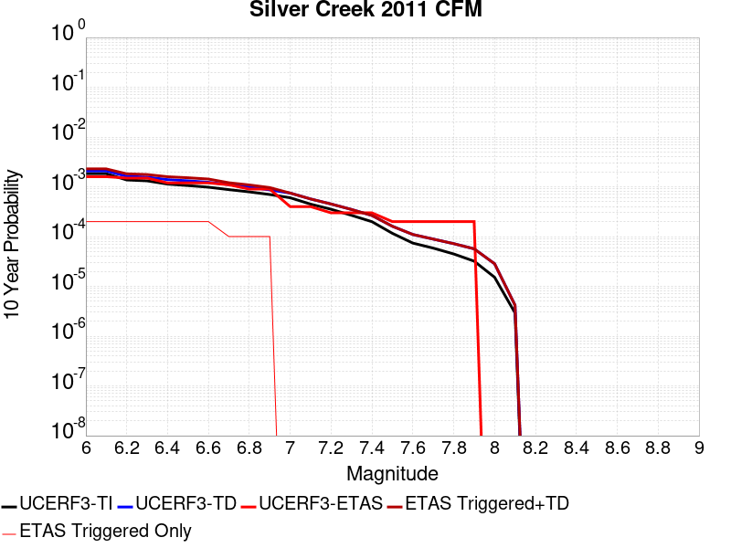 |

| Magnitude | 1 wk TI Prob | 1 wk TD Prob | 1 wk ETAS Prob | 1 wk ETAS/TD Gain | 1 wk ETAS Triggered+TD | 1 wk ETAS Triggered Only | 1 mo TI Prob | 1 mo TD Prob | 1 mo ETAS Prob | 1 mo ETAS/TD Gain | 1 mo ETAS Triggered+TD | 1 mo ETAS Triggered Only | 1 yr TI Prob | 1 yr TD Prob | 1 yr ETAS Prob | 1 yr ETAS/TD Gain | 1 yr ETAS Triggered+TD | 1 yr ETAS Triggered Only | 10 yr TI Prob | 10 yr TD Prob | 10 yr ETAS Prob | 10 yr ETAS/TD Gain | 10 yr ETAS Triggered+TD | 10 yr ETAS Triggered Only |
|-----|-----|-----|-----|-----|-----|-----|-----|-----|-----|-----|-----|-----|-----|-----|-----|-----|-----|-----|-----|-----|-----|-----|-----|-----|
| 6.0 | 3.5229125E-6 | 4.0042355E-6 | 0.0 | 0.0 | 4.0042355E-6 | 0.0 | 1.5098109E-5 | 1.7160899E-5 | 0.0 | 0.0 | 1.7160899E-5 | 0.0 | 1.8380396E-4 | 2.0891428E-4 | 0.0 | 0.0 | 2.0891428E-4 | 0.0 | 0.0018365202 | 0.0020875402 | 2.0E-4 | 0.09580654 | 0.0022871227 | 2.0E-4 |
| 6.1 | 3.5229125E-6 | 4.0042355E-6 | 0.0 | 0.0 | 4.0042355E-6 | 0.0 | 1.5098109E-5 | 1.7160899E-5 | 0.0 | 0.0 | 1.7160899E-5 | 0.0 | 1.8380396E-4 | 2.0891428E-4 | 0.0 | 0.0 | 2.0891428E-4 | 0.0 | 0.0018365202 | 0.0020875402 | 2.0E-4 | 0.09580654 | 0.0022871227 | 2.0E-4 |
| 6.2 | 2.6363234E-6 | 3.1065986E-6 | 0.0 | 0.0 | 3.1065986E-6 | 0.0 | 1.129848E-5 | 1.33139265E-5 | 0.0 | 0.0 | 1.33139265E-5 | 0.0 | 1.375503E-4 | 1.6208507E-4 | 0.0 | 0.0 | 1.6208507E-4 | 0.0 | 0.0013746519 | 0.001619999 | 2.0E-4 | 0.123456866 | 0.001819675 | 2.0E-4 |
| 6.3 | 2.5275126E-6 | 2.9962343E-6 | 0.0 | 0.0 | 2.9962343E-6 | 0.0 | 1.0832152E-5 | 1.2840941E-5 | 0.0 | 0.0 | 1.2840941E-5 | 0.0 | 1.3187347E-4 | 1.563273E-4 | 0.0 | 0.0 | 1.563273E-4 | 0.0 | 0.0013179524 | 0.0015625029 | 2.0E-4 | 0.12799975 | 0.0017621905 | 2.0E-4 |
| 6.4 | 2.178732E-6 | 2.6667967E-6 | 0.0 | 0.0 | 2.6667967E-6 | 0.0 | 9.337389E-6 | 1.1429079E-5 | 0.0 | 0.0 | 1.1429079E-5 | 0.0 | 1.1367678E-4 | 1.3914017E-4 | 0.0 | 0.0 | 1.3914017E-4 | 0.0 | 0.0011361865 | 0.0013908579 | 2.0E-4 | 0.14379615 | 0.0015905797 | 2.0E-4 |
| 6.5 | 2.0341574E-6 | 2.5258853E-6 | 0.0 | 0.0 | 2.5258853E-6 | 0.0 | 8.717788E-6 | 1.0825177E-5 | 0.0 | 0.0 | 1.0825177E-5 | 0.0 | 1.061339E-4 | 1.3178859E-4 | 0.0 | 0.0 | 1.3178859E-4 | 0.0 | 0.0010608323 | 0.0013174311 | 2.0E-4 | 0.15181059 | 0.0015171677 | 2.0E-4 |
| 6.6 | 1.8856827E-6 | 2.3575665E-6 | 0.0 | 0.0 | 2.3575665E-6 | 0.0 | 8.0814725E-6 | 1.0103817E-5 | 0.0 | 0.0 | 1.0103817E-5 | 0.0 | 9.838748E-5 | 1.2300705E-4 | 0.0 | 0.0 | 1.2300705E-4 | 0.0 | 9.834393E-4 | 0.001229716 | 2.0E-4 | 0.16263917 | 0.00142947 | 2.0E-4 |
| 6.7 | 1.6844668E-6 | 2.1161545E-6 | 0.0 | 0.0 | 2.1161545E-6 | 0.0 | 7.2191233E-6 | 9.069202E-6 | 0.0 | 0.0 | 9.069202E-6 | 0.0 | 8.788928E-5 | 1.1041196E-4 | 0.0 | 0.0 | 1.1041196E-4 | 0.0 | 8.785453E-4 | 0.0011038966 | 1.0E-4 | 0.09058819 | 0.0012037862 | 1.0E-4 |
| 6.8 | 1.5177161E-6 | 1.8921917E-6 | 0.0 | 0.0 | 1.8921917E-6 | 0.0 | 6.504481E-6 | 8.109368E-6 | 0.0 | 0.0 | 8.109368E-6 | 0.0 | 7.918918E-5 | 9.872709E-5 | 0.0 | 0.0 | 9.872709E-5 | 0.0 | 7.9160964E-4 | 9.871575E-4 | 1.0E-4 | 0.10130096 | 0.0010870587 | 1.0E-4 |
| 6.9 | 1.3437394E-6 | 1.6535429E-6 | 0.0 | 0.0 | 1.6535429E-6 | 0.0 | 5.7588704E-6 | 7.0865926E-6 | 0.0 | 0.0 | 7.0865926E-6 | 0.0 | 7.011199E-5 | 8.627586E-5 | 0.0 | 0.0 | 8.627586E-5 | 0.0 | 7.0089876E-4 | 8.627483E-4 | 1.0E-4 | 0.11590866 | 9.6266204E-4 | 1.0E-4 |
| 7.0 | 1.1563575E-6 | 1.4291451E-6 | 0.0 | 0.0 | 1.4291451E-6 | 0.0 | 4.9558084E-6 | 6.124893E-6 | 0.0 | 0.0 | 6.124893E-6 | 0.0 | 6.03353E-5 | 7.456802E-5 | 0.0 | 0.0 | 7.456802E-5 | 0.0 | 6.0318917E-4 | 7.457546E-4 | 0.0 | 0.0 | 7.457546E-4 | 0.0 |
| 7.1 | 8.602183E-7 | 1.087474E-6 | 0.0 | 0.0 | 1.087474E-6 | 0.0 | 3.6866445E-6 | 4.660594E-6 | 0.0 | 0.0 | 4.660594E-6 | 0.0 | 4.4883975E-5 | 5.674126E-5 | 0.0 | 0.0 | 5.674126E-5 | 0.0 | 4.4874908E-4 | 5.675921E-4 | 0.0 | 0.0 | 5.675921E-4 | 0.0 |
| 7.2 | 6.788407E-7 | 8.6099993E-7 | 0.0 | 0.0 | 8.6099993E-7 | 0.0 | 2.9093142E-6 | 3.6899944E-6 | 0.0 | 0.0 | 3.6899944E-6 | 0.0 | 3.5420322E-5 | 4.4924756E-5 | 0.0 | 0.0 | 4.4924756E-5 | 0.0 | 3.541468E-4 | 4.494811E-4 | 0.0 | 0.0 | 4.494811E-4 | 0.0 |
| 7.3 | 5.1292045E-7 | 6.6876015E-7 | 0.0 | 0.0 | 6.6876015E-7 | 0.0 | 2.1982287E-6 | 2.8661116E-6 | 0.0 | 0.0 | 2.8661116E-6 | 0.0 | 2.6763106E-5 | 3.489435E-5 | 0.0 | 0.0 | 3.489435E-5 | 0.0 | 2.6759884E-4 | 3.4921305E-4 | 0.0 | 0.0 | 3.4921305E-4 | 0.0 |
| 7.4 | 3.820994E-7 | 5.0611493E-7 | 0.0 | 0.0 | 5.0611493E-7 | 0.0 | 1.6375678E-6 | 2.169062E-6 | 0.0 | 0.0 | 2.169062E-6 | 0.0 | 1.9937206E-5 | 2.640801E-5 | 0.0 | 0.0 | 2.640801E-5 | 0.0 | 1.9935417E-4 | 2.6437305E-4 | 0.0 | 0.0 | 2.6437305E-4 | 0.0 |
| 7.5 | 2.2292595E-7 | 3.070098E-7 | 0.0 | 0.0 | 3.070098E-7 | 0.0 | 9.553966E-7 | 1.3157555E-6 | 0.0 | 0.0 | 1.3157555E-6 | 0.0 | 1.16318915E-5 | 1.6019205E-5 | 0.0 | 0.0 | 1.6019205E-5 | 0.0 | 1.16312825E-4 | 1.6050483E-4 | 0.0 | 0.0 | 1.6050483E-4 | 0.0 |
| 7.6 | 1.420587E-7 | 2.0967245E-7 | 0.0 | 0.0 | 2.0967245E-7 | 0.0 | 6.088228E-7 | 8.985959E-7 | 0.0 | 0.0 | 8.985959E-7 | 0.0 | 7.4123927E-6 | 1.094035E-5 | 0.0 | 0.0 | 1.094035E-5 | 0.0 | 7.412145E-5 | 1.0972265E-4 | 0.0 | 0.0 | 1.0972265E-4 | 0.0 |
| 7.7 | 1.1250075E-7 | 1.6928819E-7 | 0.0 | 0.0 | 1.6928819E-7 | 0.0 | 4.82146E-7 | 7.255206E-7 | 0.0 | 0.0 | 7.255206E-7 | 0.0 | 5.8701116E-6 | 8.833177E-6 | 0.0 | 0.0 | 8.833177E-6 | 0.0 | 5.8699567E-5 | 8.8647794E-5 | 0.0 | 0.0 | 8.8647794E-5 | 0.0 |
| 7.8 | 8.592761E-8 | 1.3706148E-7 | 0.0 | 0.0 | 1.3706148E-7 | 0.0 | 3.682611E-7 | 5.874062E-7 | 0.0 | 0.0 | 5.874062E-7 | 0.0 | 4.48357E-6 | 7.151647E-6 | 0.0 | 0.0 | 7.151647E-6 | 0.0 | 4.4834796E-5 | 7.182203E-5 | 0.0 | 0.0 | 7.182203E-5 | 0.0 |
| 7.9 | 6.156529E-8 | 1.0790073E-7 | 0.0 | 0.0 | 1.0790073E-7 | 0.0 | 2.638512E-7 | 4.6243161E-7 | 0.0 | 0.0 | 4.6243161E-7 | 0.0 | 3.212384E-6 | 5.6300905E-6 | 0.0 | 0.0 | 5.6300905E-6 | 0.0 | 3.2123375E-5 | 5.656209E-5 | 0.0 | 0.0 | 5.656209E-5 | 0.0 |
| 8.0 | 2.9230547E-8 | 5.4132798E-8 | 0.0 | 0.0 | 5.4132798E-8 | 0.0 | 1.2527377E-7 | 2.3199769E-7 | 0.0 | 0.0 | 2.3199769E-7 | 0.0 | 1.525207E-6 | 2.8245681E-6 | 0.0 | 0.0 | 2.8245681E-6 | 0.0 | 1.5251966E-5 | 2.8384266E-5 | 0.0 | 0.0 | 2.8384266E-5 | 0.0 |
| 8.1 | 5.6062213E-9 | 7.940612E-9 | 0.0 | 0.0 | 7.940612E-9 | 0.0 | 2.4026663E-8 | 3.4031196E-8 | 0.0 | 0.0 | 3.4031196E-8 | 0.0 | 2.925246E-7 | 4.1432975E-7 | 0.0 | 0.0 | 4.1432975E-7 | 0.0 | 2.925242E-6 | 4.1819467E-6 | 0.0 | 0.0 | 4.1819467E-6 | 0.0 |

## Zayante-Vergeles 2011 CFM
*[(top)](#table-of-contents)*

| 1 Week | 1 Month | 1 Year | 10 Year |
|-----|-----|-----|-----|
|  | 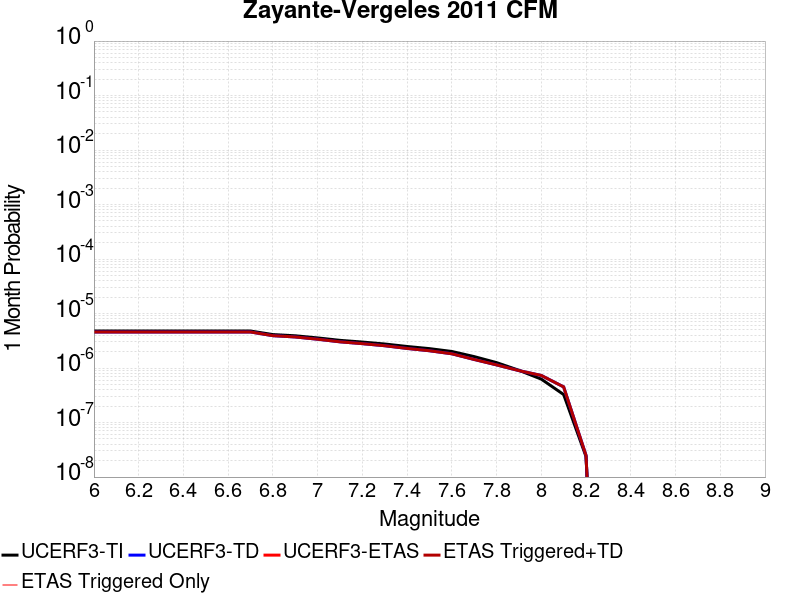 |  |  |

| Magnitude | 1 wk TI Prob | 1 wk TD Prob | 1 wk ETAS Prob | 1 wk ETAS/TD Gain | 1 wk ETAS Triggered+TD | 1 wk ETAS Triggered Only | 1 mo TI Prob | 1 mo TD Prob | 1 mo ETAS Prob | 1 mo ETAS/TD Gain | 1 mo ETAS Triggered+TD | 1 mo ETAS Triggered Only | 1 yr TI Prob | 1 yr TD Prob | 1 yr ETAS Prob | 1 yr ETAS/TD Gain | 1 yr ETAS Triggered+TD | 1 yr ETAS Triggered Only | 10 yr TI Prob | 10 yr TD Prob | 10 yr ETAS Prob | 10 yr ETAS/TD Gain | 10 yr ETAS Triggered+TD | 10 yr ETAS Triggered Only |
|-----|-----|-----|-----|-----|-----|-----|-----|-----|-----|-----|-----|-----|-----|-----|-----|-----|-----|-----|-----|-----|-----|-----|-----|-----|
| 6.0 | 1.11522E-6 | 1.0703427E-6 | 0.0 | 0.0 | 1.0703427E-6 | 0.0 | 4.7795056E-6 | 4.5871748E-6 | 0.0 | 0.0 | 4.5871748E-6 | 0.0 | 5.8188925E-5 | 5.5847435E-5 | 0.0 | 0.0 | 5.5847435E-5 | 0.0 | 5.817369E-4 | 5.583353E-4 | 2.0E-4 | 0.35820773 | 7.582236E-4 | 2.0E-4 |
| 6.1 | 1.11522E-6 | 1.0703427E-6 | 0.0 | 0.0 | 1.0703427E-6 | 0.0 | 4.7795056E-6 | 4.5871748E-6 | 0.0 | 0.0 | 4.5871748E-6 | 0.0 | 5.8188925E-5 | 5.5847435E-5 | 0.0 | 0.0 | 5.5847435E-5 | 0.0 | 5.817369E-4 | 5.583353E-4 | 2.0E-4 | 0.35820773 | 7.582236E-4 | 2.0E-4 |
| 6.2 | 1.11522E-6 | 1.0703427E-6 | 0.0 | 0.0 | 1.0703427E-6 | 0.0 | 4.7795056E-6 | 4.5871748E-6 | 0.0 | 0.0 | 4.5871748E-6 | 0.0 | 5.8188925E-5 | 5.5847435E-5 | 0.0 | 0.0 | 5.5847435E-5 | 0.0 | 5.817369E-4 | 5.583353E-4 | 2.0E-4 | 0.35820773 | 7.582236E-4 | 2.0E-4 |
| 6.3 | 1.11522E-6 | 1.0703427E-6 | 0.0 | 0.0 | 1.0703427E-6 | 0.0 | 4.7795056E-6 | 4.5871748E-6 | 0.0 | 0.0 | 4.5871748E-6 | 0.0 | 5.8188925E-5 | 5.5847435E-5 | 0.0 | 0.0 | 5.5847435E-5 | 0.0 | 5.817369E-4 | 5.583353E-4 | 2.0E-4 | 0.35820773 | 7.582236E-4 | 2.0E-4 |
| 6.4 | 1.11522E-6 | 1.0703427E-6 | 0.0 | 0.0 | 1.0703427E-6 | 0.0 | 4.7795056E-6 | 4.5871748E-6 | 0.0 | 0.0 | 4.5871748E-6 | 0.0 | 5.8188925E-5 | 5.5847435E-5 | 0.0 | 0.0 | 5.5847435E-5 | 0.0 | 5.817369E-4 | 5.583353E-4 | 2.0E-4 | 0.35820773 | 7.582236E-4 | 2.0E-4 |
| 6.5 | 1.11522E-6 | 1.0703427E-6 | 0.0 | 0.0 | 1.0703427E-6 | 0.0 | 4.7795056E-6 | 4.5871748E-6 | 0.0 | 0.0 | 4.5871748E-6 | 0.0 | 5.8188925E-5 | 5.5847435E-5 | 0.0 | 0.0 | 5.5847435E-5 | 0.0 | 5.817369E-4 | 5.583353E-4 | 2.0E-4 | 0.35820773 | 7.582236E-4 | 2.0E-4 |
| 6.6 | 1.11522E-6 | 1.0703427E-6 | 0.0 | 0.0 | 1.0703427E-6 | 0.0 | 4.7795056E-6 | 4.5871748E-6 | 0.0 | 0.0 | 4.5871748E-6 | 0.0 | 5.8188925E-5 | 5.5847435E-5 | 0.0 | 0.0 | 5.5847435E-5 | 0.0 | 5.817369E-4 | 5.583353E-4 | 2.0E-4 | 0.35820773 | 7.582236E-4 | 2.0E-4 |
| 6.7 | 1.11522E-6 | 1.0703427E-6 | 0.0 | 0.0 | 1.0703427E-6 | 0.0 | 4.7795056E-6 | 4.5871748E-6 | 0.0 | 0.0 | 4.5871748E-6 | 0.0 | 5.8188925E-5 | 5.5847435E-5 | 0.0 | 0.0 | 5.5847435E-5 | 0.0 | 5.817369E-4 | 5.583353E-4 | 2.0E-4 | 0.35820773 | 7.582236E-4 | 2.0E-4 |
| 6.8 | 9.608091E-7 | 9.1521474E-7 | 0.0 | 0.0 | 9.1521474E-7 | 0.0 | 4.1177464E-6 | 3.922343E-6 | 0.0 | 0.0 | 3.922343E-6 | 0.0 | 5.013241E-5 | 4.775348E-5 | 0.0 | 0.0 | 4.775348E-5 | 0.0 | 5.0121103E-4 | 4.7743256E-4 | 2.0E-4 | 0.4189073 | 6.7733706E-4 | 2.0E-4 |
| 6.9 | 9.126062E-7 | 8.667282E-7 | 0.0 | 0.0 | 8.667282E-7 | 0.0 | 3.9111637E-6 | 3.7145442E-6 | 0.0 | 0.0 | 3.7145442E-6 | 0.0 | 4.7617377E-5 | 4.5223638E-5 | 0.0 | 0.0 | 4.5223638E-5 | 0.0 | 4.7607176E-4 | 4.5214454E-4 | 1.0E-4 | 0.22116822 | 5.520993E-4 | 1.0E-4 |
| 7.0 | 8.3412164E-7 | 7.8781056E-7 | 0.0 | 0.0 | 7.8781056E-7 | 0.0 | 3.5748021E-6 | 3.3763263E-6 | 0.0 | 0.0 | 3.3763263E-6 | 0.0 | 4.3522345E-5 | 4.1106E-5 | 0.0 | 0.0 | 4.1106E-5 | 0.0 | 4.3513824E-4 | 4.1098407E-4 | 1.0E-4 | 0.24331844 | 5.1094295E-4 | 1.0E-4 |
| 7.1 | 7.5248664E-7 | 7.056472E-7 | 0.0 | 0.0 | 7.056472E-7 | 0.0 | 3.2249386E-6 | 3.0241986E-6 | 0.0 | 0.0 | 3.0241986E-6 | 0.0 | 3.9262923E-5 | 3.6818998E-5 | 0.0 | 0.0 | 3.6818998E-5 | 0.0 | 3.9255986E-4 | 3.6812903E-4 | 0.0 | 0.0 | 3.6812903E-4 | 0.0 |
| 7.2 | 7.0037134E-7 | 6.5322644E-7 | 0.0 | 0.0 | 6.5322644E-7 | 0.0 | 3.001588E-6 | 2.7995388E-6 | 0.0 | 0.0 | 2.7995388E-6 | 0.0 | 3.6543723E-5 | 3.4083852E-5 | 0.0 | 0.0 | 3.4083852E-5 | 0.0 | 3.653771E-4 | 3.407863E-4 | 0.0 | 0.0 | 3.407863E-4 | 0.0 |
| 7.3 | 6.45065E-7 | 5.9812515E-7 | 0.0 | 0.0 | 5.9812515E-7 | 0.0 | 2.764561E-6 | 2.563391E-6 | 0.0 | 0.0 | 2.563391E-6 | 0.0 | 3.3658012E-5 | 3.1208838E-5 | 0.0 | 0.0 | 3.1208838E-5 | 0.0 | 3.3652913E-4 | 3.1204458E-4 | 0.0 | 0.0 | 3.1204458E-4 | 0.0 |
| 7.4 | 5.8052325E-7 | 5.3353796E-7 | 0.0 | 0.0 | 5.3353796E-7 | 0.0 | 2.4879546E-6 | 2.2865893E-6 | 0.0 | 0.0 | 2.2865893E-6 | 0.0 | 3.0290425E-5 | 2.7838867E-5 | 0.0 | 0.0 | 2.7838867E-5 | 0.0 | 3.0286296E-4 | 2.7835384E-4 | 0.0 | 0.0 | 2.7835384E-4 | 0.0 |
| 7.5 | 5.3032613E-7 | 4.8360147E-7 | 0.0 | 0.0 | 4.8360147E-7 | 0.0 | 2.2728243E-6 | 2.072576E-6 | 0.0 | 0.0 | 2.072576E-6 | 0.0 | 2.7671285E-5 | 2.5233321E-5 | 0.0 | 0.0 | 2.5233321E-5 | 0.0 | 2.766784E-4 | 2.523046E-4 | 0.0 | 0.0 | 2.523046E-4 | 0.0 |
| 7.6 | 4.7034268E-7 | 4.2548027E-7 | 0.0 | 0.0 | 4.2548027E-7 | 0.0 | 2.015753E-6 | 1.8234855E-6 | 0.0 | 0.0 | 1.8234855E-6 | 0.0 | 2.4541514E-5 | 2.220071E-5 | 0.0 | 0.0 | 2.220071E-5 | 0.0 | 2.4538804E-4 | 2.2198493E-4 | 0.0 | 0.0 | 2.2198493E-4 | 0.0 |
| 7.7 | 3.7871462E-7 | 3.3439892E-7 | 0.0 | 0.0 | 3.3439892E-7 | 0.0 | 1.6230616E-6 | 1.4331374E-6 | 0.0 | 0.0 | 1.4331374E-6 | 0.0 | 1.9760595E-5 | 1.7448308E-5 | 0.0 | 0.0 | 1.7448308E-5 | 0.0 | 1.9758838E-4 | 1.7446939E-4 | 0.0 | 0.0 | 1.7446939E-4 | 0.0 |
| 7.8 | 2.9379848E-7 | 2.66063E-7 | 0.0 | 0.0 | 2.66063E-7 | 0.0 | 1.2591357E-6 | 1.1402695E-6 | 0.0 | 0.0 | 1.1402695E-6 | 0.0 | 1.532987E-5 | 1.3882694E-5 | 0.0 | 0.0 | 1.3882694E-5 | 0.0 | 1.5328811E-4 | 1.3881827E-4 | 0.0 | 0.0 | 1.3881827E-4 | 0.0 |
| 7.9 | 2.125013E-7 | 2.0878815E-7 | 0.0 | 0.0 | 2.0878815E-7 | 0.0 | 9.1071956E-7 | 8.94806E-7 | 0.0 | 0.0 | 8.94806E-7 | 0.0 | 1.1087954E-5 | 1.0894209E-5 | 0.0 | 0.0 | 1.0894209E-5 | 0.0 | 1.1087401E-4 | 1.0893676E-4 | 0.0 | 0.0 | 1.0893676E-4 | 0.0 |
| 8.0 | 1.4631894E-7 | 1.7017747E-7 | 0.0 | 0.0 | 1.7017747E-7 | 0.0 | 6.2708096E-7 | 7.293318E-7 | 0.0 | 0.0 | 7.293318E-7 | 0.0 | 7.634684E-6 | 8.879579E-6 | 0.0 | 0.0 | 8.879579E-6 | 0.0 | 7.634422E-5 | 8.879225E-5 | 0.0 | 0.0 | 8.879225E-5 | 0.0 |
| 8.1 | 7.624931E-8 | 1.049602E-7 | 0.0 | 0.0 | 1.049602E-7 | 0.0 | 3.2678273E-7 | 4.4982934E-7 | 0.0 | 0.0 | 4.4982934E-7 | 0.0 | 3.9785723E-6 | 5.4766583E-6 | 0.0 | 0.0 | 5.4766583E-6 | 0.0 | 3.9785013E-5 | 5.476524E-5 | 0.0 | 0.0 | 5.476524E-5 | 0.0 |
| 8.2 | 5.5641607E-9 | 5.8237775E-9 | 0.0 | 0.0 | 5.8237775E-9 | 0.0 | 2.3846402E-8 | 2.495905E-8 | 0.0 | 0.0 | 2.495905E-8 | 0.0 | 2.9032992E-7 | 3.038764E-7 | 0.0 | 0.0 | 3.038764E-7 | 0.0 | 2.9032954E-6 | 3.0387598E-6 | 0.0 | 0.0 | 3.0387598E-6 | 0.0 |

## Davis Creek
*[(top)](#table-of-contents)*

| 1 Week | 1 Month | 1 Year | 10 Year |
|-----|-----|-----|-----|
|  |  |  |  |

| Magnitude | 1 wk TI Prob | 1 wk TD Prob | 1 wk ETAS Prob | 1 wk ETAS/TD Gain | 1 wk ETAS Triggered+TD | 1 wk ETAS Triggered Only | 1 mo TI Prob | 1 mo TD Prob | 1 mo ETAS Prob | 1 mo ETAS/TD Gain | 1 mo ETAS Triggered+TD | 1 mo ETAS Triggered Only | 1 yr TI Prob | 1 yr TD Prob | 1 yr ETAS Prob | 1 yr ETAS/TD Gain | 1 yr ETAS Triggered+TD | 1 yr ETAS Triggered Only | 10 yr TI Prob | 10 yr TD Prob | 10 yr ETAS Prob | 10 yr ETAS/TD Gain | 10 yr ETAS Triggered+TD | 10 yr ETAS Triggered Only |
|-----|-----|-----|-----|-----|-----|-----|-----|-----|-----|-----|-----|-----|-----|-----|-----|-----|-----|-----|-----|-----|-----|-----|-----|-----|
| 6.0 | 2.331472E-5 | 2.5421938E-5 | 0.0 | 0.0 | 2.5421938E-5 | 0.0 | 9.99164E-5 | 1.0894728E-4 | 0.0 | 0.0 | 1.0894728E-4 | 0.0 | 0.0012158032 | 0.0013257446 | 0.0 | 0.0 | 0.0013257446 | 0.0 | 0.01209173 | 0.013190141 | 1.0E-4 | 0.00758142 | 0.013288822 | 1.0E-4 |
| 6.1 | 1.0407654E-5 | 1.1319025E-5 | 0.0 | 0.0 | 1.1319025E-5 | 0.0 | 4.4603472E-5 | 4.8509362E-5 | 0.0 | 0.0 | 4.8509362E-5 | 0.0 | 5.4291193E-4 | 5.904686E-4 | 0.0 | 0.0 | 5.904686E-4 | 0.0 | 0.0054158745 | 0.00589167 | 0.0 | 0.0 | 0.00589167 | 0.0 |
| 6.2 | 1.0407654E-5 | 1.1319025E-5 | 0.0 | 0.0 | 1.1319025E-5 | 0.0 | 4.4603472E-5 | 4.8509362E-5 | 0.0 | 0.0 | 4.8509362E-5 | 0.0 | 5.4291193E-4 | 5.904686E-4 | 0.0 | 0.0 | 5.904686E-4 | 0.0 | 0.0054158745 | 0.00589167 | 0.0 | 0.0 | 0.00589167 | 0.0 |
| 6.3 | 5.1323277E-6 | 5.569533E-6 | 0.0 | 0.0 | 5.569533E-6 | 0.0 | 2.1995505E-5 | 2.386926E-5 | 0.0 | 0.0 | 2.386926E-5 | 0.0 | 2.6776237E-4 | 2.905781E-4 | 0.0 | 0.0 | 2.905781E-4 | 0.0 | 0.0026743996 | 0.002902828 | 0.0 | 0.0 | 0.002902828 | 0.0 |
| 6.4 | 2.4985154E-6 | 2.705E-6 | 0.0 | 0.0 | 2.705E-6 | 0.0 | 1.07078795E-5 | 1.1592826E-5 | 0.0 | 0.0 | 1.1592826E-5 | 0.0 | 1.3036063E-4 | 1.4113713E-4 | 0.0 | 0.0 | 1.4113713E-4 | 0.0 | 0.0013028418 | 0.0014108298 | 0.0 | 0.0 | 0.0014108298 | 0.0 |
| 6.5 | 2.4846438E-6 | 2.6909338E-6 | 0.0 | 0.0 | 2.6909338E-6 | 0.0 | 1.064843E-5 | 1.1532542E-5 | 0.0 | 0.0 | 1.1532542E-5 | 0.0 | 1.2963692E-4 | 1.4040328E-4 | 0.0 | 0.0 | 1.4040328E-4 | 0.0 | 0.0012956132 | 0.0014035006 | 0.0 | 0.0 | 0.0014035006 | 0.0 |
| 6.6 | 2.072566E-7 | 2.1018698E-7 | 0.0 | 0.0 | 2.1018698E-7 | 0.0 | 8.882423E-7 | 9.0080107E-7 | 0.0 | 0.0 | 9.0080107E-7 | 0.0 | 1.0814296E-5 | 1.0967199E-5 | 0.0 | 0.0 | 1.0967199E-5 | 0.0 | 1.081377E-4 | 1.0966677E-4 | 0.0 | 0.0 | 1.0966677E-4 | 0.0 |
| 6.7 | 1.7544528E-7 | 1.779134E-7 | 0.0 | 0.0 | 1.779134E-7 | 0.0 | 7.5190815E-7 | 7.624858E-7 | 0.0 | 0.0 | 7.624858E-7 | 0.0 | 9.154443E-6 | 9.283227E-6 | 0.0 | 0.0 | 9.283227E-6 | 0.0 | 9.1540656E-5 | 9.2828544E-5 | 0.0 | 0.0 | 9.2828544E-5 | 0.0 |
| 6.8 | 1.2320395E-7 | 1.2481473E-7 | 0.0 | 0.0 | 1.2481473E-7 | 0.0 | 5.280168E-7 | 5.3492016E-7 | 0.0 | 0.0 | 5.3492016E-7 | 0.0 | 6.428586E-6 | 6.5126346E-6 | 0.0 | 0.0 | 6.5126346E-6 | 0.0 | 6.4284E-5 | 6.512455E-5 | 0.0 | 0.0 | 6.512455E-5 | 0.0 |
| 6.9 | 6.399997E-8 | 6.486238E-8 | 0.0 | 0.0 | 6.486238E-8 | 0.0 | 2.7428555E-7 | 2.7798157E-7 | 0.0 | 0.0 | 2.7798157E-7 | 0.0 | 3.3394215E-6 | 3.384421E-6 | 0.0 | 0.0 | 3.384421E-6 | 0.0 | 3.3393713E-5 | 3.384376E-5 | 0.0 | 0.0 | 3.384376E-5 | 0.0 |
| 7.0 | 6.4455685E-9 | 6.5354513E-9 | 0.0 | 0.0 | 6.5354513E-9 | 0.0 | 2.7623864E-8 | 2.8009078E-8 | 0.0 | 0.0 | 2.8009078E-8 | 0.0 | 3.3632048E-7 | 3.4101052E-7 | 0.0 | 0.0 | 3.4101052E-7 | 0.0 | 3.3631998E-6 | 3.4101051E-6 | 0.0 | 0.0 | 3.4101051E-6 | 0.0 |

## Pilarcitos 2011 CFM
*[(top)](#table-of-contents)*

| 1 Week | 1 Month | 1 Year | 10 Year |
|-----|-----|-----|-----|
|  |  |  |  |

| Magnitude | 1 wk TI Prob | 1 wk TD Prob | 1 wk ETAS Prob | 1 wk ETAS/TD Gain | 1 wk ETAS Triggered+TD | 1 wk ETAS Triggered Only | 1 mo TI Prob | 1 mo TD Prob | 1 mo ETAS Prob | 1 mo ETAS/TD Gain | 1 mo ETAS Triggered+TD | 1 mo ETAS Triggered Only | 1 yr TI Prob | 1 yr TD Prob | 1 yr ETAS Prob | 1 yr ETAS/TD Gain | 1 yr ETAS Triggered+TD | 1 yr ETAS Triggered Only | 10 yr TI Prob | 10 yr TD Prob | 10 yr ETAS Prob | 10 yr ETAS/TD Gain | 10 yr ETAS Triggered+TD | 10 yr ETAS Triggered Only |
|-----|-----|-----|-----|-----|-----|-----|-----|-----|-----|-----|-----|-----|-----|-----|-----|-----|-----|-----|-----|-----|-----|-----|-----|-----|
| 6.0 | 4.9150476E-6 | 3.2013413E-6 | 0.0 | 0.0 | 3.2013413E-6 | 0.0 | 2.1064321E-5 | 1.3719963E-5 | 0.0 | 0.0 | 1.3719963E-5 | 0.0 | 2.564279E-4 | 1.6702806E-4 | 0.0 | 0.0 | 1.6702806E-4 | 0.0 | 0.0025613222 | 0.0016815006 | 2.0E-4 | 0.11894138 | 0.0018811643 | 2.0E-4 |
| 6.1 | 4.9150476E-6 | 3.2013413E-6 | 0.0 | 0.0 | 3.2013413E-6 | 0.0 | 2.1064321E-5 | 1.3719963E-5 | 0.0 | 0.0 | 1.3719963E-5 | 0.0 | 2.564279E-4 | 1.6702806E-4 | 0.0 | 0.0 | 1.6702806E-4 | 0.0 | 0.0025613222 | 0.0016815006 | 2.0E-4 | 0.11894138 | 0.0018811643 | 2.0E-4 |
| 6.2 | 4.162343E-6 | 2.4296914E-6 | 0.0 | 0.0 | 2.4296914E-6 | 0.0 | 1.783849E-5 | 1.0412922E-5 | 0.0 | 0.0 | 1.0412922E-5 | 0.0 | 2.1716199E-4 | 1.2677003E-4 | 0.0 | 0.0 | 1.2677003E-4 | 0.0 | 0.002169499 | 0.0012794345 | 2.0E-4 | 0.15631907 | 0.0014791786 | 2.0E-4 |
| 6.3 | 4.162343E-6 | 2.4296914E-6 | 0.0 | 0.0 | 2.4296914E-6 | 0.0 | 1.783849E-5 | 1.0412922E-5 | 0.0 | 0.0 | 1.0412922E-5 | 0.0 | 2.1716199E-4 | 1.2677003E-4 | 0.0 | 0.0 | 1.2677003E-4 | 0.0 | 0.002169499 | 0.0012794345 | 2.0E-4 | 0.15631907 | 0.0014791786 | 2.0E-4 |
| 6.4 | 3.8768926E-6 | 2.1370959E-6 | 0.0 | 0.0 | 2.1370959E-6 | 0.0 | 1.6615148E-5 | 9.158951E-6 | 0.0 | 0.0 | 9.158951E-6 | 0.0 | 2.0227065E-4 | 1.1150456E-4 | 0.0 | 0.0 | 1.1150456E-4 | 0.0 | 0.0020208664 | 0.0011269416 | 2.0E-4 | 0.17747149 | 0.0013267163 | 2.0E-4 |
| 6.5 | 3.7137002E-6 | 1.9704464E-6 | 0.0 | 0.0 | 1.9704464E-6 | 0.0 | 1.591576E-5 | 8.444743E-6 | 0.0 | 0.0 | 8.444743E-6 | 0.0 | 1.9375715E-4 | 1.0280992E-4 | 0.0 | 0.0 | 1.0280992E-4 | 0.0 | 0.001935883 | 0.001040079 | 2.0E-4 | 0.19229306 | 0.001239871 | 2.0E-4 |
| 6.6 | 3.5048733E-6 | 1.7553873E-6 | 0.0 | 0.0 | 1.7553873E-6 | 0.0 | 1.5020799E-5 | 7.523067E-6 | 0.0 | 0.0 | 7.523067E-6 | 0.0 | 1.8286289E-4 | 9.1589514E-5 | 0.0 | 0.0 | 9.1589514E-5 | 0.0 | 0.0018271249 | 9.2797366E-4 | 2.0E-4 | 0.21552335 | 0.0011277881 | 2.0E-4 |
| 6.7 | 3.3908584E-6 | 1.6390723E-6 | 0.0 | 0.0 | 1.6390723E-6 | 0.0 | 1.453217E-5 | 7.0245765E-6 | 0.0 | 0.0 | 7.0245765E-6 | 0.0 | 1.7691481E-4 | 8.552088E-5 | 0.0 | 0.0 | 8.552088E-5 | 0.0 | 0.0017677402 | 8.67336E-4 | 2.0E-4 | 0.23059115 | 0.0010671625 | 2.0E-4 |
| 6.8 | 3.2451449E-6 | 1.4922852E-6 | 0.0 | 0.0 | 1.4922852E-6 | 0.0 | 1.3907689E-5 | 6.395492E-6 | 0.0 | 0.0 | 6.395492E-6 | 0.0 | 1.6931296E-4 | 7.786234E-5 | 0.0 | 0.0 | 7.786234E-5 | 0.0 | 0.0016918402 | 7.908072E-4 | 2.0E-4 | 0.25290614 | 9.90649E-4 | 2.0E-4 |
| 6.9 | 3.1239128E-6 | 1.3688015E-6 | 0.0 | 0.0 | 1.3688015E-6 | 0.0 | 1.3388129E-5 | 5.866279E-6 | 0.0 | 0.0 | 5.866279E-6 | 0.0 | 1.6298829E-4 | 7.1419614E-5 | 0.0 | 0.0 | 7.1419614E-5 | 0.0 | 0.001628688 | 7.2642363E-4 | 2.0E-4 | 0.27532142 | 9.2627836E-4 | 2.0E-4 |
| 7.0 | 2.9940109E-6 | 1.2401097E-6 | 0.0 | 0.0 | 1.2401097E-6 | 0.0 | 1.2831412E-5 | 5.3147446E-6 | 0.0 | 0.0 | 5.3147446E-6 | 0.0 | 1.5621124E-4 | 6.47051E-5 | 0.0 | 0.0 | 6.47051E-5 | 0.0 | 0.0015610148 | 6.5931986E-4 | 2.0E-4 | 0.3033429 | 8.59188E-4 | 2.0E-4 |
| 7.1 | 2.7471217E-6 | 1.1520442E-6 | 0.0 | 0.0 | 1.1520442E-6 | 0.0 | 1.1773326E-5 | 4.937323E-6 | 0.0 | 0.0 | 4.937323E-6 | 0.0 | 1.4333082E-4 | 6.0110247E-5 | 0.0 | 0.0 | 6.0110247E-5 | 0.0 | 0.001432384 | 6.133461E-4 | 2.0E-4 | 0.32608014 | 8.132235E-4 | 2.0E-4 |
| 7.2 | 2.592675E-6 | 1.0181253E-6 | 0.0 | 0.0 | 1.0181253E-6 | 0.0 | 1.1111417E-5 | 4.363387E-6 | 0.0 | 0.0 | 4.363387E-6 | 0.0 | 1.3527309E-4 | 5.3122938E-5 | 0.0 | 0.0 | 5.3122938E-5 | 0.0 | 0.0013519078 | 5.435094E-4 | 2.0E-4 | 0.36797896 | 7.4340065E-4 | 2.0E-4 |
| 7.3 | 2.4518663E-6 | 9.091007E-7 | 0.0 | 0.0 | 9.091007E-7 | 0.0 | 1.0507956E-5 | 3.8961402E-6 | 0.0 | 0.0 | 3.8961402E-6 | 0.0 | 1.2792686E-4 | 4.7434474E-5 | 0.0 | 0.0 | 4.7434474E-5 | 0.0 | 0.0012785323 | 4.8664908E-4 | 1.0E-4 | 0.20548688 | 5.866004E-4 | 1.0E-4 |
| 7.4 | 2.3349535E-6 | 8.7134396E-7 | 0.0 | 0.0 | 8.7134396E-7 | 0.0 | 1.0006905E-5 | 3.734326E-6 | 0.0 | 0.0 | 3.734326E-6 | 0.0 | 1.2182725E-4 | 4.546447E-5 | 0.0 | 0.0 | 4.546447E-5 | 0.0 | 0.0012176048 | 4.6693254E-4 | 1.0E-4 | 0.2141637 | 5.6688586E-4 | 1.0E-4 |
| 7.5 | 2.1358665E-6 | 8.23667E-7 | 0.0 | 0.0 | 8.23667E-7 | 0.0 | 9.15368E-6 | 3.5299965E-6 | 0.0 | 0.0 | 3.5299965E-6 | 0.0 | 1.11440364E-4 | 4.2976862E-5 | 0.0 | 0.0 | 4.2976862E-5 | 0.0 | 0.0011138449 | 4.41973E-4 | 1.0E-4 | 0.22625816 | 5.419288E-4 | 1.0E-4 |
| 7.6 | 1.6445446E-6 | 6.786769E-7 | 0.0 | 0.0 | 6.786769E-7 | 0.0 | 7.048029E-6 | 2.9086118E-6 | 0.0 | 0.0 | 2.9086118E-6 | 0.0 | 8.580638E-5 | 3.5411776E-5 | 0.0 | 0.0 | 3.5411776E-5 | 0.0 | 8.5773255E-4 | 3.6628058E-4 | 1.0E-4 | 0.27301475 | 4.6624395E-4 | 1.0E-4 |
| 7.7 | 1.3650961E-6 | 5.782588E-7 | 0.0 | 0.0 | 5.782588E-7 | 0.0 | 5.850399E-6 | 2.4782494E-6 | 0.0 | 0.0 | 2.4782494E-6 | 0.0 | 7.122628E-5 | 3.017227E-5 | 0.0 | 0.0 | 3.017227E-5 | 0.0 | 7.120345E-4 | 3.137827E-4 | 0.0 | 0.0 | 3.137827E-4 | 0.0 |
| 7.8 | 1.0500993E-6 | 5.4996866E-7 | 0.0 | 0.0 | 5.4996866E-7 | 0.0 | 4.5004176E-6 | 2.3570065E-6 | 0.0 | 0.0 | 2.3570065E-6 | 0.0 | 5.4791206E-5 | 2.8696177E-5 | 0.0 | 0.0 | 2.8696177E-5 | 0.0 | 5.47777E-4 | 2.9889523E-4 | 0.0 | 0.0 | 2.9889523E-4 | 0.0 |
| 7.9 | 5.856431E-7 | 5.143154E-7 | 0.0 | 0.0 | 5.143154E-7 | 0.0 | 2.5098966E-6 | 2.2042068E-6 | 0.0 | 0.0 | 2.2042068E-6 | 0.0 | 3.0557563E-5 | 2.6835889E-5 | 0.0 | 0.0 | 2.6835889E-5 | 0.0 | 3.055336E-4 | 2.7955713E-4 | 0.0 | 0.0 | 2.7955713E-4 | 0.0 |
| 8.0 | 4.4768265E-7 | 4.8499487E-7 | 0.0 | 0.0 | 4.8499487E-7 | 0.0 | 1.9186384E-6 | 2.0785478E-6 | 0.0 | 0.0 | 2.0785478E-6 | 0.0 | 2.3359173E-5 | 2.5306028E-5 | 0.0 | 0.0 | 2.5306028E-5 | 0.0 | 2.3356717E-4 | 2.637275E-4 | 0.0 | 0.0 | 2.637275E-4 | 0.0 |
| 8.1 | 2.6692538E-7 | 3.3670003E-7 | 0.0 | 0.0 | 3.3670003E-7 | 0.0 | 1.1439654E-6 | 1.4429993E-6 | 0.0 | 0.0 | 1.4429993E-6 | 0.0 | 1.392769E-5 | 1.7568374E-5 | 0.0 | 0.0 | 1.7568374E-5 | 0.0 | 1.3926817E-4 | 1.8304161E-4 | 0.0 | 0.0 | 1.8304161E-4 | 0.0 |
| 8.2 | 1.3198862E-8 | 1.0854748E-8 | 0.0 | 0.0 | 1.0854748E-8 | 0.0 | 5.656655E-8 | 4.652035E-8 | 0.0 | 0.0 | 4.652035E-8 | 0.0 | 6.886975E-7 | 5.663851E-7 | 0.0 | 0.0 | 5.663851E-7 | 0.0 | 6.8869535E-6 | 5.8971013E-6 | 0.0 | 0.0 | 5.8971013E-6 | 0.0 |

## Casmalia 2011 CFM
*[(top)](#table-of-contents)*

| 1 Week | 1 Month | 1 Year | 10 Year |
|-----|-----|-----|-----|
|  |  | 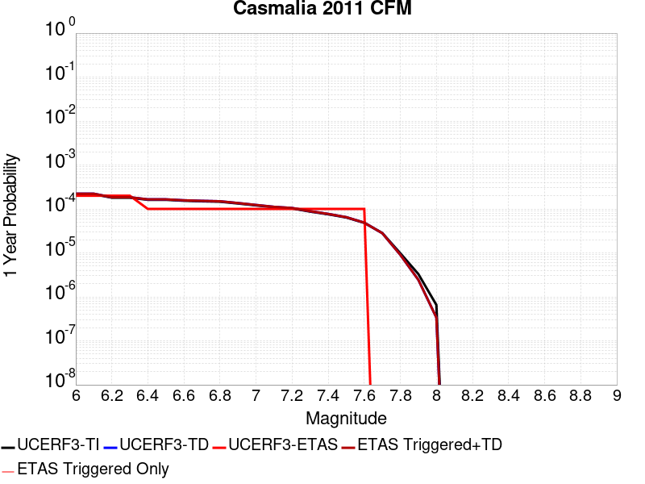 |  |

| Magnitude | 1 wk TI Prob | 1 wk TD Prob | 1 wk ETAS Prob | 1 wk ETAS/TD Gain | 1 wk ETAS Triggered+TD | 1 wk ETAS Triggered Only | 1 mo TI Prob | 1 mo TD Prob | 1 mo ETAS Prob | 1 mo ETAS/TD Gain | 1 mo ETAS Triggered+TD | 1 mo ETAS Triggered Only | 1 yr TI Prob | 1 yr TD Prob | 1 yr ETAS Prob | 1 yr ETAS/TD Gain | 1 yr ETAS Triggered+TD | 1 yr ETAS Triggered Only | 10 yr TI Prob | 10 yr TD Prob | 10 yr ETAS Prob | 10 yr ETAS/TD Gain | 10 yr ETAS Triggered+TD | 10 yr ETAS Triggered Only |
|-----|-----|-----|-----|-----|-----|-----|-----|-----|-----|-----|-----|-----|-----|-----|-----|-----|-----|-----|-----|-----|-----|-----|-----|-----|
| 6.0 | 4.1704893E-6 | 4.2627353E-6 | 0.0 | 0.0 | 4.2627353E-6 | 0.0 | 1.7873403E-5 | 1.8268738E-5 | 0.0 | 0.0 | 1.8268738E-5 | 0.0 | 2.1758694E-4 | 2.2239938E-4 | 0.0 | 0.0 | 2.2239938E-4 | 0.0 | 0.0021737402 | 0.0022217892 | 2.0E-4 | 0.09001754 | 0.0024213449 | 2.0E-4 |
| 6.1 | 4.1704893E-6 | 4.2627353E-6 | 0.0 | 0.0 | 4.2627353E-6 | 0.0 | 1.7873403E-5 | 1.8268738E-5 | 0.0 | 0.0 | 1.8268738E-5 | 0.0 | 2.1758694E-4 | 2.2239938E-4 | 0.0 | 0.0 | 2.2239938E-4 | 0.0 | 0.0021737402 | 0.0022217892 | 2.0E-4 | 0.09001754 | 0.0024213449 | 2.0E-4 |
| 6.2 | 3.457312E-6 | 3.5372484E-6 | 0.0 | 0.0 | 3.5372484E-6 | 0.0 | 1.4816967E-5 | 1.5159549E-5 | 0.0 | 0.0 | 1.5159549E-5 | 0.0 | 1.8038164E-4 | 1.8455196E-4 | 0.0 | 0.0 | 1.8455196E-4 | 0.0 | 0.001802353 | 0.0018439963 | 2.0E-4 | 0.10846008 | 0.0020436277 | 2.0E-4 |
| 6.3 | 3.457312E-6 | 3.5372484E-6 | 0.0 | 0.0 | 3.5372484E-6 | 0.0 | 1.4816967E-5 | 1.5159549E-5 | 0.0 | 0.0 | 1.5159549E-5 | 0.0 | 1.8038164E-4 | 1.8455196E-4 | 0.0 | 0.0 | 1.8455196E-4 | 0.0 | 0.001802353 | 0.0018439963 | 2.0E-4 | 0.10846008 | 0.0020436277 | 2.0E-4 |
| 6.4 | 3.0957337E-6 | 3.1694392E-6 | 0.0 | 0.0 | 3.1694392E-6 | 0.0 | 1.3267363E-5 | 1.3583241E-5 | 0.0 | 0.0 | 1.3583241E-5 | 0.0 | 1.6151817E-4 | 1.6536347E-4 | 0.0 | 0.0 | 1.6536347E-4 | 0.0 | 0.0016140083 | 0.0016524104 | 2.0E-4 | 0.121035315 | 0.0018520799 | 2.0E-4 |
| 6.5 | 3.0957337E-6 | 3.1694392E-6 | 0.0 | 0.0 | 3.1694392E-6 | 0.0 | 1.3267363E-5 | 1.3583241E-5 | 0.0 | 0.0 | 1.3583241E-5 | 0.0 | 1.6151817E-4 | 1.6536347E-4 | 0.0 | 0.0 | 1.6536347E-4 | 0.0 | 0.0016140083 | 0.0016524104 | 2.0E-4 | 0.121035315 | 0.0018520799 | 2.0E-4 |
| 6.6 | 2.9459152E-6 | 3.0167828E-6 | 0.0 | 0.0 | 3.0167828E-6 | 0.0 | 1.262529E-5 | 1.2929005E-5 | 0.0 | 0.0 | 1.2929005E-5 | 0.0 | 1.5370206E-4 | 1.5739932E-4 | 0.0 | 0.0 | 1.5739932E-4 | 0.0 | 0.0015359579 | 0.0015728839 | 2.0E-4 | 0.12715496 | 0.0017725694 | 2.0E-4 |
| 6.7 | 2.8634809E-6 | 2.9326768E-6 | 0.0 | 0.0 | 2.9326768E-6 | 0.0 | 1.2272003E-5 | 1.2568554E-5 | 0.0 | 0.0 | 1.2568554E-5 | 0.0 | 1.4940138E-4 | 1.5301145E-4 | 0.0 | 0.0 | 1.5301145E-4 | 0.0 | 0.0014930099 | 0.0015290665 | 2.0E-4 | 0.13079877 | 0.0017287607 | 2.0E-4 |
| 6.8 | 2.7999822E-6 | 2.867798E-6 | 0.0 | 0.0 | 2.867798E-6 | 0.0 | 1.1999869E-5 | 1.2290505E-5 | 0.0 | 0.0 | 1.2290505E-5 | 0.0 | 1.460886E-4 | 1.4962668E-4 | 0.0 | 0.0 | 1.4962668E-4 | 0.0 | 0.001459926 | 0.0014952646 | 2.0E-4 | 0.1337556 | 0.0016949655 | 2.0E-4 |
| 6.9 | 2.551052E-6 | 2.6121518E-6 | 0.0 | 0.0 | 2.6121518E-6 | 0.0 | 1.0933034E-5 | 1.1194888E-5 | 0.0 | 0.0 | 1.1194888E-5 | 0.0 | 1.3310155E-4 | 1.3628928E-4 | 0.0 | 0.0 | 1.3628928E-4 | 0.0 | 0.0013302186 | 0.001362061 | 2.0E-4 | 0.1468363 | 0.0015617886 | 2.0E-4 |
| 7.0 | 2.3081875E-6 | 2.3625817E-6 | 0.0 | 0.0 | 2.3625817E-6 | 0.0 | 9.892195E-6 | 1.0125311E-5 | 0.0 | 0.0 | 1.0125311E-5 | 0.0 | 1.20430814E-4 | 1.2326872E-4 | 0.0 | 0.0 | 1.2326872E-4 | 0.0 | 0.0012036557 | 0.0012320062 | 2.0E-4 | 0.16233684 | 0.0014317598 | 2.0E-4 |
| 7.1 | 2.093245E-6 | 2.141885E-6 | 0.0 | 0.0 | 2.141885E-6 | 0.0 | 8.971019E-6 | 9.179475E-6 | 0.0 | 0.0 | 9.179475E-6 | 0.0 | 1.09216686E-4 | 1.11754394E-4 | 0.0 | 0.0 | 1.11754394E-4 | 0.0 | 0.0010916302 | 0.0011169839 | 2.0E-4 | 0.17905359 | 0.0013167606 | 2.0E-4 |
| 7.2 | 1.9714576E-6 | 2.0166626E-6 | 0.0 | 0.0 | 2.0166626E-6 | 0.0 | 8.449076E-6 | 8.642811E-6 | 0.0 | 0.0 | 8.642811E-6 | 0.0 | 1.0286264E-4 | 1.0522116E-4 | 0.0 | 0.0 | 1.0522116E-4 | 0.0 | 0.0010281504 | 0.0010517152 | 2.0E-4 | 0.19016555 | 0.0012515049 | 2.0E-4 |
| 7.3 | 1.6689512E-6 | 1.7048467E-6 | 0.0 | 0.0 | 1.7048467E-6 | 0.0 | 7.1526288E-6 | 7.3064657E-6 | 0.0 | 0.0 | 7.3064657E-6 | 0.0 | 8.7079774E-5 | 8.895259E-5 | 0.0 | 0.0 | 8.895259E-5 | 0.0 | 8.7045657E-4 | 8.891707E-4 | 1.0E-4 | 0.112464346 | 9.890818E-4 | 1.0E-4 |
| 7.4 | 1.4490954E-6 | 1.4780096E-6 | 0.0 | 0.0 | 1.4780096E-6 | 0.0 | 6.210394E-6 | 6.3343114E-6 | 0.0 | 0.0 | 6.3343114E-6 | 0.0 | 7.560892E-5 | 7.711752E-5 | 0.0 | 0.0 | 7.711752E-5 | 0.0 | 7.55832E-4 | 7.709082E-4 | 1.0E-4 | 0.12971713 | 8.7083114E-4 | 1.0E-4 |
| 7.5 | 1.226873E-6 | 1.248273E-6 | 0.0 | 0.0 | 1.248273E-6 | 0.0 | 5.2580162E-6 | 5.34973E-6 | 0.0 | 0.0 | 5.34973E-6 | 0.0 | 6.401447E-5 | 6.5131026E-5 | 0.0 | 0.0 | 6.5131026E-5 | 0.0 | 6.399603E-4 | 6.5111986E-4 | 0.0 | 0.0 | 6.5111986E-4 | 0.0 |
| 7.6 | 9.2561345E-7 | 9.362722E-7 | 0.0 | 0.0 | 9.362722E-7 | 0.0 | 3.966909E-6 | 4.012589E-6 | 0.0 | 0.0 | 4.012589E-6 | 0.0 | 4.8296046E-5 | 4.885218E-5 | 0.0 | 0.0 | 4.885218E-5 | 0.0 | 4.828555E-4 | 4.8841484E-4 | 0.0 | 0.0 | 4.8841484E-4 | 0.0 |
| 7.7 | 5.4367933E-7 | 5.3933667E-7 | 0.0 | 0.0 | 5.3933667E-7 | 0.0 | 2.3300522E-6 | 2.3114408E-6 | 0.0 | 0.0 | 2.3114408E-6 | 0.0 | 2.8368017E-5 | 2.8141429E-5 | 0.0 | 0.0 | 2.8141429E-5 | 0.0 | 2.8364395E-4 | 2.8137877E-4 | 0.0 | 0.0 | 2.8137877E-4 | 0.0 |
| 7.8 | 1.8825742E-7 | 1.7343818E-7 | 0.0 | 0.0 | 1.7343818E-7 | 0.0 | 8.068173E-7 | 7.4330626E-7 | 0.0 | 0.0 | 7.4330626E-7 | 0.0 | 9.822956E-6 | 9.049717E-6 | 0.0 | 0.0 | 9.049717E-6 | 0.0 | 9.822522E-5 | 9.04935E-5 | 0.0 | 0.0 | 9.04935E-5 | 0.0 |
| 7.9 | 6.342771E-8 | 4.6793904E-8 | 0.0 | 0.0 | 4.6793904E-8 | 0.0 | 2.7183304E-7 | 2.0054529E-7 | 0.0 | 0.0 | 2.0054529E-7 | 0.0 | 3.3095623E-6 | 2.4416363E-6 | 0.0 | 0.0 | 2.4416363E-6 | 0.0 | 3.309513E-5 | 2.4416098E-5 | 0.0 | 0.0 | 2.4416098E-5 | 0.0 |
| 8.0 | 1.2574819E-8 | 6.473129E-9 | 0.0 | 0.0 | 6.473129E-9 | 0.0 | 5.3892084E-8 | 2.7741983E-8 | 0.0 | 0.0 | 2.7741983E-8 | 0.0 | 6.561359E-7 | 3.377586E-7 | 0.0 | 0.0 | 3.377586E-7 | 0.0 | 6.56134E-6 | 3.377581E-6 | 0.0 | 0.0 | 3.377581E-6 | 0.0 |

## White Wolf
*[(top)](#table-of-contents)*

| 1 Week | 1 Month | 1 Year | 10 Year |
|-----|-----|-----|-----|
|  | 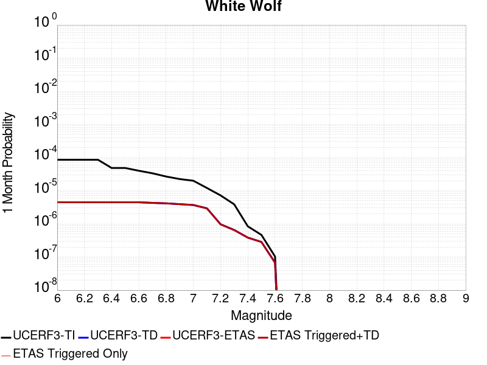 |  |  |

| Magnitude | 1 wk TI Prob | 1 wk TD Prob | 1 wk ETAS Prob | 1 wk ETAS/TD Gain | 1 wk ETAS Triggered+TD | 1 wk ETAS Triggered Only | 1 mo TI Prob | 1 mo TD Prob | 1 mo ETAS Prob | 1 mo ETAS/TD Gain | 1 mo ETAS Triggered+TD | 1 mo ETAS Triggered Only | 1 yr TI Prob | 1 yr TD Prob | 1 yr ETAS Prob | 1 yr ETAS/TD Gain | 1 yr ETAS Triggered+TD | 1 yr ETAS Triggered Only | 10 yr TI Prob | 10 yr TD Prob | 10 yr ETAS Prob | 10 yr ETAS/TD Gain | 10 yr ETAS Triggered+TD | 10 yr ETAS Triggered Only |
|-----|-----|-----|-----|-----|-----|-----|-----|-----|-----|-----|-----|-----|-----|-----|-----|-----|-----|-----|-----|-----|-----|-----|-----|-----|
| 6.0 | 2.0037822E-5 | 1.0466729E-6 | 0.0 | 0.0 | 1.0466729E-6 | 0.0 | 8.587355E-5 | 4.4857334E-6 | 0.0 | 0.0 | 4.4857334E-6 | 0.0 | 0.001045009 | 5.4612487E-5 | 0.0 | 0.0 | 5.4612487E-5 | 0.0 | 0.010401085 | 5.459957E-4 | 2.0E-4 | 0.36630324 | 7.4588653E-4 | 2.0E-4 |
| 6.1 | 2.0037822E-5 | 1.0466729E-6 | 0.0 | 0.0 | 1.0466729E-6 | 0.0 | 8.587355E-5 | 4.4857334E-6 | 0.0 | 0.0 | 4.4857334E-6 | 0.0 | 0.001045009 | 5.4612487E-5 | 0.0 | 0.0 | 5.4612487E-5 | 0.0 | 0.010401085 | 5.459957E-4 | 2.0E-4 | 0.36630324 | 7.4588653E-4 | 2.0E-4 |
| 6.2 | 2.0037822E-5 | 1.0466729E-6 | 0.0 | 0.0 | 1.0466729E-6 | 0.0 | 8.587355E-5 | 4.4857334E-6 | 0.0 | 0.0 | 4.4857334E-6 | 0.0 | 0.001045009 | 5.4612487E-5 | 0.0 | 0.0 | 5.4612487E-5 | 0.0 | 0.010401085 | 5.459957E-4 | 2.0E-4 | 0.36630324 | 7.4588653E-4 | 2.0E-4 |
| 6.3 | 2.0037822E-5 | 1.0466729E-6 | 0.0 | 0.0 | 1.0466729E-6 | 0.0 | 8.587355E-5 | 4.4857334E-6 | 0.0 | 0.0 | 4.4857334E-6 | 0.0 | 0.001045009 | 5.4612487E-5 | 0.0 | 0.0 | 5.4612487E-5 | 0.0 | 0.010401085 | 5.459957E-4 | 2.0E-4 | 0.36630324 | 7.4588653E-4 | 2.0E-4 |
| 6.4 | 1.132487E-5 | 1.0466729E-6 | 0.0 | 0.0 | 1.0466729E-6 | 0.0 | 4.8534253E-5 | 4.4857334E-6 | 0.0 | 0.0 | 4.4857334E-6 | 0.0 | 5.907443E-4 | 5.4612487E-5 | 0.0 | 0.0 | 5.4612487E-5 | 0.0 | 0.005891764 | 5.459957E-4 | 2.0E-4 | 0.36630324 | 7.4588653E-4 | 2.0E-4 |
| 6.5 | 1.132487E-5 | 1.0466729E-6 | 0.0 | 0.0 | 1.0466729E-6 | 0.0 | 4.8534253E-5 | 4.4857334E-6 | 0.0 | 0.0 | 4.4857334E-6 | 0.0 | 5.907443E-4 | 5.4612487E-5 | 0.0 | 0.0 | 5.4612487E-5 | 0.0 | 0.005891764 | 5.459957E-4 | 2.0E-4 | 0.36630324 | 7.4588653E-4 | 2.0E-4 |
| 6.6 | 9.347473E-6 | 1.0466729E-6 | 0.0 | 0.0 | 1.0466729E-6 | 0.0 | 4.0059982E-5 | 4.4857334E-6 | 0.0 | 0.0 | 4.4857334E-6 | 0.0 | 4.8762115E-4 | 5.4612487E-5 | 0.0 | 0.0 | 5.4612487E-5 | 0.0 | 0.0048655253 | 5.459957E-4 | 2.0E-4 | 0.36630324 | 7.4588653E-4 | 2.0E-4 |
| 6.7 | 7.842647E-6 | 1.0046019E-6 | 0.0 | 0.0 | 1.0046019E-6 | 0.0 | 3.361091E-5 | 4.30543E-6 | 0.0 | 0.0 | 4.30543E-6 | 0.0 | 4.0913603E-4 | 5.2417403E-5 | 0.0 | 0.0 | 5.2417403E-5 | 0.0 | 0.004083836 | 5.2405533E-4 | 2.0E-4 | 0.3816391 | 7.239505E-4 | 2.0E-4 |
| 6.8 | 6.26597E-6 | 9.732639E-7 | 0.0 | 0.0 | 9.732639E-7 | 0.0 | 2.685388E-5 | 4.171125E-6 | 0.0 | 0.0 | 4.171125E-6 | 0.0 | 3.2689696E-4 | 5.0782313E-5 | 0.0 | 0.0 | 5.0782313E-5 | 0.0 | 0.003264165 | 5.0771196E-4 | 2.0E-4 | 0.39392412 | 7.0761045E-4 | 2.0E-4 |
| 6.9 | 5.258436E-6 | 9.181205E-7 | 0.0 | 0.0 | 9.181205E-7 | 0.0 | 2.2535958E-5 | 3.9347965E-6 | 0.0 | 0.0 | 3.9347965E-6 | 0.0 | 2.7434074E-4 | 4.7905145E-5 | 0.0 | 0.0 | 4.7905145E-5 | 0.0 | 0.0027400232 | 4.7895298E-4 | 2.0E-4 | 0.41757753 | 6.788572E-4 | 2.0E-4 |
| 7.0 | 4.675028E-6 | 8.659276E-7 | 0.0 | 0.0 | 8.659276E-7 | 0.0 | 2.003568E-5 | 3.711113E-6 | 0.0 | 0.0 | 3.711113E-6 | 0.0 | 2.4390711E-4 | 4.5181914E-5 | 0.0 | 0.0 | 4.5181914E-5 | 0.0 | 0.0024363957 | 4.51732E-4 | 1.0E-4 | 0.22137019 | 5.516868E-4 | 1.0E-4 |
| 7.1 | 2.8270078E-6 | 6.8725956E-7 | 0.0 | 0.0 | 6.8725956E-7 | 0.0 | 1.2115692E-5 | 2.945395E-6 | 0.0 | 0.0 | 2.945395E-6 | 0.0 | 1.4749856E-4 | 3.5859633E-5 | 0.0 | 0.0 | 3.5859633E-5 | 0.0 | 0.001474007 | 3.5854257E-4 | 1.0E-4 | 0.2789069 | 4.5850672E-4 | 1.0E-4 |
| 7.2 | 1.6881406E-6 | 2.2697533E-7 | 0.0 | 0.0 | 2.2697533E-7 | 0.0 | 7.2348685E-6 | 9.727511E-7 | 0.0 | 0.0 | 9.727511E-7 | 0.0 | 8.808096E-5 | 1.1843182E-5 | 0.0 | 0.0 | 1.1843182E-5 | 0.0 | 8.8046055E-4 | 1.18425654E-4 | 0.0 | 0.0 | 1.18425654E-4 | 0.0 |
| 7.3 | 9.086107E-7 | 1.5260913E-7 | 0.0 | 0.0 | 1.5260913E-7 | 0.0 | 3.8940398E-6 | 6.54039E-7 | 0.0 | 0.0 | 6.54039E-7 | 0.0 | 4.7408903E-5 | 7.962896E-6 | 0.0 | 0.0 | 7.962896E-6 | 0.0 | 4.739879E-4 | 7.9626196E-5 | 0.0 | 0.0 | 7.9626196E-5 | 0.0 |
| 7.4 | 1.9717383E-7 | 9.002599E-8 | 0.0 | 0.0 | 9.002599E-8 | 0.0 | 8.450304E-7 | 3.8582564E-7 | 0.0 | 0.0 | 3.8582564E-7 | 0.0 | 1.0288197E-5 | 4.6974174E-6 | 0.0 | 0.0 | 4.6974174E-6 | 0.0 | 1.028772E-4 | 4.697321E-5 | 0.0 | 0.0 | 4.697321E-5 | 0.0 |
| 7.5 | 1.086975E-7 | 6.659119E-8 | 0.0 | 0.0 | 6.659119E-8 | 0.0 | 4.6584634E-7 | 2.8539077E-7 | 0.0 | 0.0 | 2.8539077E-7 | 0.0 | 5.6716644E-6 | 3.4746274E-6 | 0.0 | 0.0 | 3.4746274E-6 | 0.0 | 5.6715195E-5 | 3.4745754E-5 | 0.0 | 0.0 | 3.4745754E-5 | 0.0 |
| 7.6 | 2.4217808E-8 | 1.581973E-8 | 0.0 | 0.0 | 1.581973E-8 | 0.0 | 1.03790605E-7 | 6.779884E-8 | 0.0 | 0.0 | 6.779884E-8 | 0.0 | 1.2636499E-6 | 8.2545057E-7 | 0.0 | 0.0 | 8.2545057E-7 | 0.0 | 1.2636427E-5 | 8.25448E-6 | 0.0 | 0.0 | 8.25448E-6 | 0.0 |

## Deep Springs
*[(top)](#table-of-contents)*

| 1 Week | 1 Month | 1 Year | 10 Year |
|-----|-----|-----|-----|
|  |  |  | 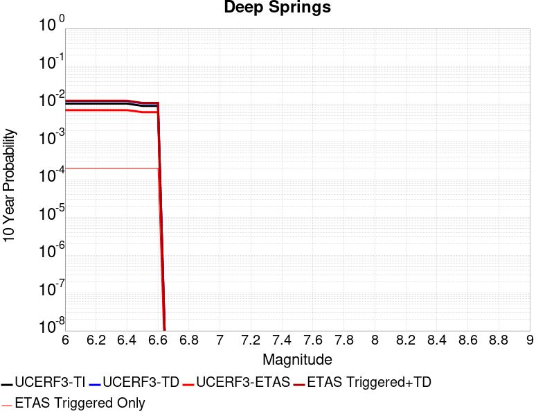 |

| Magnitude | 1 wk TI Prob | 1 wk TD Prob | 1 wk ETAS Prob | 1 wk ETAS/TD Gain | 1 wk ETAS Triggered+TD | 1 wk ETAS Triggered Only | 1 mo TI Prob | 1 mo TD Prob | 1 mo ETAS Prob | 1 mo ETAS/TD Gain | 1 mo ETAS Triggered+TD | 1 mo ETAS Triggered Only | 1 yr TI Prob | 1 yr TD Prob | 1 yr ETAS Prob | 1 yr ETAS/TD Gain | 1 yr ETAS Triggered+TD | 1 yr ETAS Triggered Only | 10 yr TI Prob | 10 yr TD Prob | 10 yr ETAS Prob | 10 yr ETAS/TD Gain | 10 yr ETAS Triggered+TD | 10 yr ETAS Triggered Only |
|-----|-----|-----|-----|-----|-----|-----|-----|-----|-----|-----|-----|-----|-----|-----|-----|-----|-----|-----|-----|-----|-----|-----|-----|-----|
| 6.0 | 1.9810619E-5 | 2.3120454E-5 | 0.0 | 0.0 | 2.3120454E-5 | 0.0 | 8.489989E-5 | 9.9086756E-5 | 0.0 | 0.0 | 9.9086756E-5 | 0.0 | 0.001033166 | 0.0012062215 | 0.0 | 0.0 | 0.0012062215 | 0.0 | 0.010283757 | 0.012046555 | 2.0E-4 | 0.016602257 | 0.012244146 | 2.0E-4 |
| 6.1 | 1.9810619E-5 | 2.3120454E-5 | 0.0 | 0.0 | 2.3120454E-5 | 0.0 | 8.489989E-5 | 9.9086756E-5 | 0.0 | 0.0 | 9.9086756E-5 | 0.0 | 0.001033166 | 0.0012062215 | 0.0 | 0.0 | 0.0012062215 | 0.0 | 0.010283757 | 0.012046555 | 2.0E-4 | 0.016602257 | 0.012244146 | 2.0E-4 |
| 6.2 | 1.9810619E-5 | 2.3120454E-5 | 0.0 | 0.0 | 2.3120454E-5 | 0.0 | 8.489989E-5 | 9.9086756E-5 | 0.0 | 0.0 | 9.9086756E-5 | 0.0 | 0.001033166 | 0.0012062215 | 0.0 | 0.0 | 0.0012062215 | 0.0 | 0.010283757 | 0.012046555 | 2.0E-4 | 0.016602257 | 0.012244146 | 2.0E-4 |
| 6.3 | 1.9810619E-5 | 2.3120454E-5 | 0.0 | 0.0 | 2.3120454E-5 | 0.0 | 8.489989E-5 | 9.9086756E-5 | 0.0 | 0.0 | 9.9086756E-5 | 0.0 | 0.001033166 | 0.0012062215 | 0.0 | 0.0 | 0.0012062215 | 0.0 | 0.010283757 | 0.012046555 | 2.0E-4 | 0.016602257 | 0.012244146 | 2.0E-4 |
| 6.4 | 1.9810619E-5 | 2.3120454E-5 | 0.0 | 0.0 | 2.3120454E-5 | 0.0 | 8.489989E-5 | 9.9086756E-5 | 0.0 | 0.0 | 9.9086756E-5 | 0.0 | 0.001033166 | 0.0012062215 | 0.0 | 0.0 | 0.0012062215 | 0.0 | 0.010283757 | 0.012046555 | 2.0E-4 | 0.016602257 | 0.012244146 | 2.0E-4 |
| 6.5 | 1.7190405E-5 | 2.0057429E-5 | 0.0 | 0.0 | 2.0057429E-5 | 0.0 | 7.367108E-5 | 8.5960404E-5 | 0.0 | 0.0 | 8.5960404E-5 | 0.0 | 8.9657627E-4 | 0.0010465676 | 0.0 | 0.0 | 0.0010465676 | 0.0 | 0.008929676 | 0.010465643 | 2.0E-4 | 0.019110149 | 0.01066355 | 2.0E-4 |
| 6.6 | 1.7190405E-5 | 2.0057429E-5 | 0.0 | 0.0 | 2.0057429E-5 | 0.0 | 7.367108E-5 | 8.5960404E-5 | 0.0 | 0.0 | 8.5960404E-5 | 0.0 | 8.9657627E-4 | 0.0010465676 | 0.0 | 0.0 | 0.0010465676 | 0.0 | 0.008929676 | 0.010465643 | 2.0E-4 | 0.019110149 | 0.01066355 | 2.0E-4 |

## Sisar
*[(top)](#table-of-contents)*

| 1 Week | 1 Month | 1 Year | 10 Year |
|-----|-----|-----|-----|
|  |  | 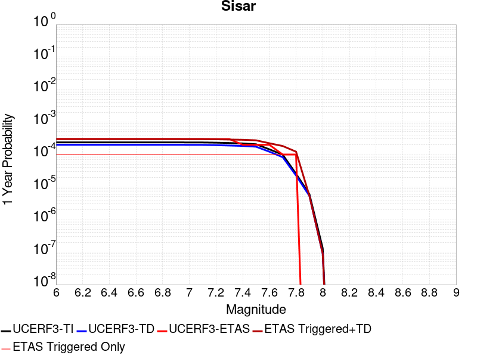 |  |

| Magnitude | 1 wk TI Prob | 1 wk TD Prob | 1 wk ETAS Prob | 1 wk ETAS/TD Gain | 1 wk ETAS Triggered+TD | 1 wk ETAS Triggered Only | 1 mo TI Prob | 1 mo TD Prob | 1 mo ETAS Prob | 1 mo ETAS/TD Gain | 1 mo ETAS Triggered+TD | 1 mo ETAS Triggered Only | 1 yr TI Prob | 1 yr TD Prob | 1 yr ETAS Prob | 1 yr ETAS/TD Gain | 1 yr ETAS Triggered+TD | 1 yr ETAS Triggered Only | 10 yr TI Prob | 10 yr TD Prob | 10 yr ETAS Prob | 10 yr ETAS/TD Gain | 10 yr ETAS Triggered+TD | 10 yr ETAS Triggered Only |
|-----|-----|-----|-----|-----|-----|-----|-----|-----|-----|-----|-----|-----|-----|-----|-----|-----|-----|-----|-----|-----|-----|-----|-----|-----|
| 6.0 | 4.544193E-6 | 3.8402613E-6 | 0.0 | 0.0 | 3.8402613E-6 | 0.0 | 1.9474966E-5 | 1.645816E-5 | 0.0 | 0.0 | 1.645816E-5 | 0.0 | 2.3708193E-4 | 2.0036001E-4 | 1.0E-4 | 0.49910158 | 3.0033998E-4 | 1.0E-4 | 0.0023682916 | 0.0020018276 | 2.0E-4 | 0.09990871 | 0.0022014272 | 2.0E-4 |
| 6.1 | 4.544193E-6 | 3.8402613E-6 | 0.0 | 0.0 | 3.8402613E-6 | 0.0 | 1.9474966E-5 | 1.645816E-5 | 0.0 | 0.0 | 1.645816E-5 | 0.0 | 2.3708193E-4 | 2.0036001E-4 | 1.0E-4 | 0.49910158 | 3.0033998E-4 | 1.0E-4 | 0.0023682916 | 0.0020018276 | 2.0E-4 | 0.09990871 | 0.0022014272 | 2.0E-4 |
| 6.2 | 4.544193E-6 | 3.8402613E-6 | 0.0 | 0.0 | 3.8402613E-6 | 0.0 | 1.9474966E-5 | 1.645816E-5 | 0.0 | 0.0 | 1.645816E-5 | 0.0 | 2.3708193E-4 | 2.0036001E-4 | 1.0E-4 | 0.49910158 | 3.0033998E-4 | 1.0E-4 | 0.0023682916 | 0.0020018276 | 2.0E-4 | 0.09990871 | 0.0022014272 | 2.0E-4 |
| 6.3 | 4.544193E-6 | 3.8402613E-6 | 0.0 | 0.0 | 3.8402613E-6 | 0.0 | 1.9474966E-5 | 1.645816E-5 | 0.0 | 0.0 | 1.645816E-5 | 0.0 | 2.3708193E-4 | 2.0036001E-4 | 1.0E-4 | 0.49910158 | 3.0033998E-4 | 1.0E-4 | 0.0023682916 | 0.0020018276 | 2.0E-4 | 0.09990871 | 0.0022014272 | 2.0E-4 |
| 6.4 | 4.544193E-6 | 3.8402613E-6 | 0.0 | 0.0 | 3.8402613E-6 | 0.0 | 1.9474966E-5 | 1.645816E-5 | 0.0 | 0.0 | 1.645816E-5 | 0.0 | 2.3708193E-4 | 2.0036001E-4 | 1.0E-4 | 0.49910158 | 3.0033998E-4 | 1.0E-4 | 0.0023682916 | 0.0020018276 | 2.0E-4 | 0.09990871 | 0.0022014272 | 2.0E-4 |
| 6.5 | 4.544193E-6 | 3.8402613E-6 | 0.0 | 0.0 | 3.8402613E-6 | 0.0 | 1.9474966E-5 | 1.645816E-5 | 0.0 | 0.0 | 1.645816E-5 | 0.0 | 2.3708193E-4 | 2.0036001E-4 | 1.0E-4 | 0.49910158 | 3.0033998E-4 | 1.0E-4 | 0.0023682916 | 0.0020018276 | 2.0E-4 | 0.09990871 | 0.0022014272 | 2.0E-4 |
| 6.6 | 4.544193E-6 | 3.8402613E-6 | 0.0 | 0.0 | 3.8402613E-6 | 0.0 | 1.9474966E-5 | 1.645816E-5 | 0.0 | 0.0 | 1.645816E-5 | 0.0 | 2.3708193E-4 | 2.0036001E-4 | 1.0E-4 | 0.49910158 | 3.0033998E-4 | 1.0E-4 | 0.0023682916 | 0.0020018276 | 2.0E-4 | 0.09990871 | 0.0022014272 | 2.0E-4 |
| 6.7 | 4.544193E-6 | 3.8402613E-6 | 0.0 | 0.0 | 3.8402613E-6 | 0.0 | 1.9474966E-5 | 1.645816E-5 | 0.0 | 0.0 | 1.645816E-5 | 0.0 | 2.3708193E-4 | 2.0036001E-4 | 1.0E-4 | 0.49910158 | 3.0033998E-4 | 1.0E-4 | 0.0023682916 | 0.0020018276 | 2.0E-4 | 0.09990871 | 0.0022014272 | 2.0E-4 |
| 6.8 | 4.544193E-6 | 3.8402613E-6 | 0.0 | 0.0 | 3.8402613E-6 | 0.0 | 1.9474966E-5 | 1.645816E-5 | 0.0 | 0.0 | 1.645816E-5 | 0.0 | 2.3708193E-4 | 2.0036001E-4 | 1.0E-4 | 0.49910158 | 3.0033998E-4 | 1.0E-4 | 0.0023682916 | 0.0020018276 | 2.0E-4 | 0.09990871 | 0.0022014272 | 2.0E-4 |
| 6.9 | 4.542225E-6 | 3.838223E-6 | 0.0 | 0.0 | 3.838223E-6 | 0.0 | 1.9466532E-5 | 1.6449425E-5 | 0.0 | 0.0 | 1.6449425E-5 | 0.0 | 2.3697925E-4 | 2.0025368E-4 | 1.0E-4 | 0.49936658 | 3.0023366E-4 | 1.0E-4 | 0.002367267 | 0.002000766 | 2.0E-4 | 0.099961706 | 0.002200366 | 2.0E-4 |
| 7.0 | 4.5278484E-6 | 3.823286E-6 | 0.0 | 0.0 | 3.823286E-6 | 0.0 | 1.940492E-5 | 1.638541E-5 | 0.0 | 0.0 | 1.638541E-5 | 0.0 | 2.3622929E-4 | 1.9947444E-4 | 1.0E-4 | 0.5013174 | 2.994545E-4 | 1.0E-4 | 0.0023597833 | 0.0019929877 | 2.0E-4 | 0.10035185 | 0.002192589 | 2.0E-4 |
| 7.1 | 4.5132488E-6 | 3.808072E-6 | 0.0 | 0.0 | 3.808072E-6 | 0.0 | 1.9342351E-5 | 1.6320208E-5 | 0.0 | 0.0 | 1.6320208E-5 | 0.0 | 2.3546767E-4 | 1.9868076E-4 | 1.0E-4 | 0.50332004 | 2.986609E-4 | 1.0E-4 | 0.0023521832 | 0.001985065 | 2.0E-4 | 0.10075237 | 0.002184668 | 2.0E-4 |
| 7.2 | 4.448859E-6 | 3.7405257E-6 | 0.0 | 0.0 | 3.7405257E-6 | 0.0 | 1.9066398E-5 | 1.6030728E-5 | 0.0 | 0.0 | 1.6030728E-5 | 0.0 | 2.3210866E-4 | 1.9515696E-4 | 1.0E-4 | 0.5124081 | 2.9513746E-4 | 1.0E-4 | 0.0023186638 | 0.0019498895 | 2.0E-4 | 0.102569915 | 0.0021494995 | 2.0E-4 |
| 7.3 | 4.3424366E-6 | 3.6343474E-6 | 0.0 | 0.0 | 3.6343474E-6 | 0.0 | 1.861031E-5 | 1.5575682E-5 | 0.0 | 0.0 | 1.5575682E-5 | 0.0 | 2.2655698E-4 | 1.8961777E-4 | 1.0E-4 | 0.5273767 | 2.895988E-4 | 1.0E-4 | 0.0022632615 | 0.0018945934 | 2.0E-4 | 0.10556355 | 0.0020942143 | 2.0E-4 |
| 7.4 | 4.218641E-6 | 3.5336805E-6 | 0.0 | 0.0 | 3.5336805E-6 | 0.0 | 1.8079765E-5 | 1.5144259E-5 | 0.0 | 0.0 | 1.5144259E-5 | 0.0 | 2.2009891E-4 | 1.8436609E-4 | 1.0E-4 | 0.5423991 | 2.8434765E-4 | 1.0E-4 | 0.0021988105 | 0.0018421647 | 2.0E-4 | 0.10856793 | 0.0020417962 | 2.0E-4 |
| 7.5 | 3.983779E-6 | 3.348415E-6 | 0.0 | 0.0 | 3.348415E-6 | 0.0 | 1.7073227E-5 | 1.4350273E-5 | 0.0 | 0.0 | 1.4350273E-5 | 0.0 | 2.0784672E-4 | 1.747009E-4 | 1.0E-4 | 0.5724069 | 2.7468344E-4 | 1.0E-4 | 0.0020765243 | 0.0017456686 | 2.0E-4 | 0.114569284 | 0.0019453195 | 2.0E-4 |
| 7.6 | 2.777393E-6 | 2.352595E-6 | 0.0 | 0.0 | 2.352595E-6 | 0.0 | 1.1903058E-5 | 1.0082512E-5 | 0.0 | 0.0 | 1.0082512E-5 | 0.0 | 1.449101E-4 | 1.2274773E-4 | 1.0E-4 | 0.81467897 | 2.2273547E-4 | 1.0E-4 | 0.0014481564 | 0.0012268071 | 2.0E-4 | 0.16302481 | 0.0014265619 | 2.0E-4 |
| 7.7 | 1.9028433E-6 | 1.5940916E-6 | 0.0 | 0.0 | 1.5940916E-6 | 0.0 | 8.155017E-6 | 6.8318036E-6 | 0.0 | 0.0 | 6.8318036E-6 | 0.0 | 9.928281E-5 | 8.317408E-5 | 1.0E-4 | 1.2022977 | 1.8316576E-4 | 1.0E-4 | 9.923846E-4 | 8.3143427E-4 | 2.0E-4 | 0.24054818 | 0.0010312679 | 2.0E-4 |
| 7.8 | 4.9095956E-7 | 4.3588358E-7 | 0.0 | 0.0 | 4.3588358E-7 | 0.0 | 2.1041105E-6 | 1.8680712E-6 | 0.0 | 0.0 | 1.8680712E-6 | 0.0 | 2.5617246E-5 | 2.274353E-5 | 1.0E-4 | 4.396855 | 1.2274126E-4 | 1.0E-4 | 2.5614293E-4 | 2.2741221E-4 | 1.0E-4 | 0.43973014 | 3.2738945E-4 | 1.0E-4 |
| 7.9 | 1.16657894E-7 | 1.0336868E-7 | 0.0 | 0.0 | 1.0336868E-7 | 0.0 | 4.999623E-7 | 4.4300853E-7 | 0.0 | 0.0 | 4.4300853E-7 | 0.0 | 6.087024E-6 | 5.393616E-6 | 0.0 | 0.0 | 5.393616E-6 | 0.0 | 6.0868573E-5 | 5.393488E-5 | 0.0 | 0.0 | 5.393488E-5 | 0.0 |
| 8.0 | 2.5100346E-9 | 1.7072155E-9 | 0.0 | 0.0 | 1.7072155E-9 | 0.0 | 1.0757291E-8 | 7.3166384E-9 | 0.0 | 0.0 | 7.3166384E-9 | 0.0 | 1.3097001E-7 | 8.908007E-8 | 0.0 | 0.0 | 8.908007E-8 | 0.0 | 1.3096993E-6 | 8.908004E-7 | 0.0 | 0.0 | 8.908004E-7 | 0.0 |

## Kern Canyon (North Kern) 2011
*[(top)](#table-of-contents)*

| 1 Week | 1 Month | 1 Year | 10 Year |
|-----|-----|-----|-----|
|  |  |  |  |

| Magnitude | 1 wk TI Prob | 1 wk TD Prob | 1 wk ETAS Prob | 1 wk ETAS/TD Gain | 1 wk ETAS Triggered+TD | 1 wk ETAS Triggered Only | 1 mo TI Prob | 1 mo TD Prob | 1 mo ETAS Prob | 1 mo ETAS/TD Gain | 1 mo ETAS Triggered+TD | 1 mo ETAS Triggered Only | 1 yr TI Prob | 1 yr TD Prob | 1 yr ETAS Prob | 1 yr ETAS/TD Gain | 1 yr ETAS Triggered+TD | 1 yr ETAS Triggered Only | 10 yr TI Prob | 10 yr TD Prob | 10 yr ETAS Prob | 10 yr ETAS/TD Gain | 10 yr ETAS Triggered+TD | 10 yr ETAS Triggered Only |
|-----|-----|-----|-----|-----|-----|-----|-----|-----|-----|-----|-----|-----|-----|-----|-----|-----|-----|-----|-----|-----|-----|-----|-----|-----|
| 6.0 | 6.6264497E-6 | 6.7576557E-6 | 0.0 | 0.0 | 6.7576557E-6 | 0.0 | 2.8398761E-5 | 2.8961105E-5 | 0.0 | 0.0 | 2.8961105E-5 | 0.0 | 3.4570007E-4 | 3.5255242E-4 | 0.0 | 0.0 | 3.5255242E-4 | 0.0 | 0.0034516277 | 0.0035207197 | 2.0E-4 | 0.056806568 | 0.0037200155 | 2.0E-4 |
| 6.1 | 6.6264497E-6 | 6.7576557E-6 | 0.0 | 0.0 | 6.7576557E-6 | 0.0 | 2.8398761E-5 | 2.8961105E-5 | 0.0 | 0.0 | 2.8961105E-5 | 0.0 | 3.4570007E-4 | 3.5255242E-4 | 0.0 | 0.0 | 3.5255242E-4 | 0.0 | 0.0034516277 | 0.0035207197 | 2.0E-4 | 0.056806568 | 0.0037200155 | 2.0E-4 |
| 6.2 | 6.6264497E-6 | 6.7576557E-6 | 0.0 | 0.0 | 6.7576557E-6 | 0.0 | 2.8398761E-5 | 2.8961105E-5 | 0.0 | 0.0 | 2.8961105E-5 | 0.0 | 3.4570007E-4 | 3.5255242E-4 | 0.0 | 0.0 | 3.5255242E-4 | 0.0 | 0.0034516277 | 0.0035207197 | 2.0E-4 | 0.056806568 | 0.0037200155 | 2.0E-4 |
| 6.3 | 6.6264497E-6 | 6.7576557E-6 | 0.0 | 0.0 | 6.7576557E-6 | 0.0 | 2.8398761E-5 | 2.8961105E-5 | 0.0 | 0.0 | 2.8961105E-5 | 0.0 | 3.4570007E-4 | 3.5255242E-4 | 0.0 | 0.0 | 3.5255242E-4 | 0.0 | 0.0034516277 | 0.0035207197 | 2.0E-4 | 0.056806568 | 0.0037200155 | 2.0E-4 |
| 6.4 | 6.6264497E-6 | 6.7576557E-6 | 0.0 | 0.0 | 6.7576557E-6 | 0.0 | 2.8398761E-5 | 2.8961105E-5 | 0.0 | 0.0 | 2.8961105E-5 | 0.0 | 3.4570007E-4 | 3.5255242E-4 | 0.0 | 0.0 | 3.5255242E-4 | 0.0 | 0.0034516277 | 0.0035207197 | 2.0E-4 | 0.056806568 | 0.0037200155 | 2.0E-4 |
| 6.5 | 3.2162225E-6 | 3.2572268E-6 | 0.0 | 0.0 | 3.2572268E-6 | 0.0 | 1.3783738E-5 | 1.3959473E-5 | 0.0 | 0.0 | 1.3959473E-5 | 0.0 | 1.6780409E-4 | 1.6994413E-4 | 0.0 | 0.0 | 1.6994413E-4 | 0.0 | 0.0016767744 | 0.0016982215 | 2.0E-4 | 0.11777027 | 0.0018978819 | 2.0E-4 |
| 6.6 | 3.2162225E-6 | 3.2572268E-6 | 0.0 | 0.0 | 3.2572268E-6 | 0.0 | 1.3783738E-5 | 1.3959473E-5 | 0.0 | 0.0 | 1.3959473E-5 | 0.0 | 1.6780409E-4 | 1.6994413E-4 | 0.0 | 0.0 | 1.6994413E-4 | 0.0 | 0.0016767744 | 0.0016982215 | 2.0E-4 | 0.11777027 | 0.0018978819 | 2.0E-4 |
| 6.7 | 2.1908265E-6 | 2.2072056E-6 | 0.0 | 0.0 | 2.2072056E-6 | 0.0 | 9.389223E-6 | 9.45942E-6 | 0.0 | 0.0 | 9.45942E-6 | 0.0 | 1.1430779E-4 | 1.1516254E-4 | 0.0 | 0.0 | 1.1516254E-4 | 0.0 | 0.0011424901 | 0.001151048 | 0.0 | 0.0 | 0.001151048 | 0.0 |
| 6.8 | 1.7303895E-6 | 1.7366151E-6 | 0.0 | 0.0 | 1.7366151E-6 | 0.0 | 7.415934E-6 | 7.4426152E-6 | 0.0 | 0.0 | 7.4426152E-6 | 0.0 | 9.028525E-5 | 9.061017E-5 | 0.0 | 0.0 | 9.061017E-5 | 0.0 | 9.024858E-4 | 9.05742E-4 | 0.0 | 0.0 | 9.05742E-4 | 0.0 |
| 6.9 | 1.3700314E-6 | 1.368909E-6 | 0.0 | 0.0 | 1.368909E-6 | 0.0 | 5.87155E-6 | 5.8667397E-6 | 0.0 | 0.0 | 5.8667397E-6 | 0.0 | 7.148377E-5 | 7.142526E-5 | 0.0 | 0.0 | 7.142526E-5 | 0.0 | 7.146078E-4 | 7.140276E-4 | 0.0 | 0.0 | 7.140276E-4 | 0.0 |
| 7.0 | 1.1467797E-6 | 1.1414184E-6 | 0.0 | 0.0 | 1.1414184E-6 | 0.0 | 4.9147607E-6 | 4.8917836E-6 | 0.0 | 0.0 | 4.8917836E-6 | 0.0 | 5.983557E-5 | 5.955587E-5 | 0.0 | 0.0 | 5.955587E-5 | 0.0 | 5.981946E-4 | 5.9540226E-4 | 0.0 | 0.0 | 5.9540226E-4 | 0.0 |
| 7.1 | 9.3952065E-7 | 9.302988E-7 | 0.0 | 0.0 | 9.302988E-7 | 0.0 | 4.026511E-6 | 3.986989E-6 | 0.0 | 0.0 | 3.986989E-6 | 0.0 | 4.9021666E-5 | 4.854053E-5 | 0.0 | 0.0 | 4.854053E-5 | 0.0 | 4.901085E-4 | 4.8530102E-4 | 0.0 | 0.0 | 4.8530102E-4 | 0.0 |
| 7.2 | 6.858055E-7 | 6.7195015E-7 | 0.0 | 0.0 | 6.7195015E-7 | 0.0 | 2.939163E-6 | 2.8797833E-6 | 0.0 | 0.0 | 2.8797833E-6 | 0.0 | 3.5783723E-5 | 3.5060806E-5 | 0.0 | 0.0 | 3.5060806E-5 | 0.0 | 3.5777962E-4 | 3.5055363E-4 | 0.0 | 0.0 | 3.5055363E-4 | 0.0 |
| 7.3 | 5.1101983E-7 | 4.9394333E-7 | 0.0 | 0.0 | 4.9394333E-7 | 0.0 | 2.1900833E-6 | 2.1168983E-6 | 0.0 | 0.0 | 2.1168983E-6 | 0.0 | 2.6663936E-5 | 2.5772937E-5 | 0.0 | 0.0 | 2.5772937E-5 | 0.0 | 2.6660739E-4 | 2.5769995E-4 | 0.0 | 0.0 | 2.5769995E-4 | 0.0 |
| 7.4 | 3.4999414E-7 | 3.2996624E-7 | 0.0 | 0.0 | 3.2996624E-7 | 0.0 | 1.499974E-6 | 1.4141403E-6 | 0.0 | 0.0 | 1.4141403E-6 | 0.0 | 1.8262032E-5 | 1.7217024E-5 | 0.0 | 0.0 | 1.7217024E-5 | 0.0 | 1.826053E-4 | 1.7215715E-4 | 0.0 | 0.0 | 1.7215715E-4 | 0.0 |
| 7.5 | 1.7021522E-7 | 1.4750081E-7 | 0.0 | 0.0 | 1.4750081E-7 | 0.0 | 7.2949354E-7 | 6.3214617E-7 | 0.0 | 0.0 | 6.3214617E-7 | 0.0 | 8.881548E-6 | 7.696353E-6 | 0.0 | 0.0 | 7.696353E-6 | 0.0 | 8.8811925E-5 | 7.696095E-5 | 0.0 | 0.0 | 7.696095E-5 | 0.0 |
| 7.6 | 2.572245E-8 | 1.7351576E-8 | 0.0 | 0.0 | 1.7351576E-8 | 0.0 | 1.10239064E-7 | 7.4363896E-8 | 0.0 | 0.0 | 7.4363896E-8 | 0.0 | 1.3421597E-6 | 9.053801E-7 | 0.0 | 0.0 | 9.053801E-7 | 0.0 | 1.3421517E-5 | 9.05377E-6 | 0.0 | 0.0 | 9.05377E-6 | 0.0 |

## Malibu Coast alt 1
*[(top)](#table-of-contents)*

| 1 Week | 1 Month | 1 Year | 10 Year |
|-----|-----|-----|-----|
|  | 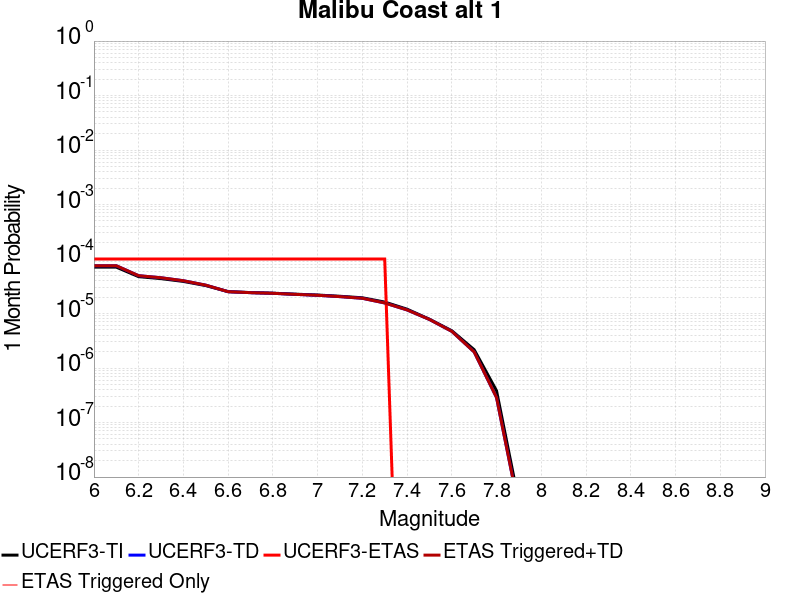 | 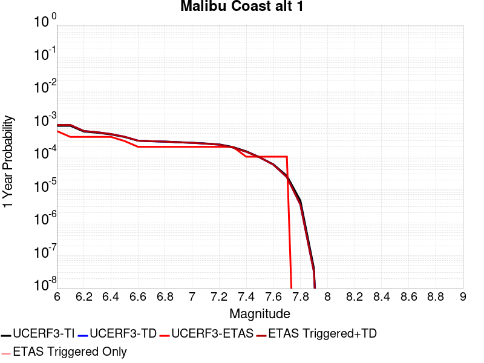 |  |

| Magnitude | 1 wk TI Prob | 1 wk TD Prob | 1 wk ETAS Prob | 1 wk ETAS/TD Gain | 1 wk ETAS Triggered+TD | 1 wk ETAS Triggered Only | 1 mo TI Prob | 1 mo TD Prob | 1 mo ETAS Prob | 1 mo ETAS/TD Gain | 1 mo ETAS Triggered+TD | 1 mo ETAS Triggered Only | 1 yr TI Prob | 1 yr TD Prob | 1 yr ETAS Prob | 1 yr ETAS/TD Gain | 1 yr ETAS Triggered+TD | 1 yr ETAS Triggered Only | 10 yr TI Prob | 10 yr TD Prob | 10 yr ETAS Prob | 10 yr ETAS/TD Gain | 10 yr ETAS Triggered+TD | 10 yr ETAS Triggered Only |
|-----|-----|-----|-----|-----|-----|-----|-----|-----|-----|-----|-----|-----|-----|-----|-----|-----|-----|-----|-----|-----|-----|-----|-----|-----|
| 6.0 | 1.6572556E-5 | 1.760133E-5 | 0.0 | 0.0 | 1.760133E-5 | 0.0 | 7.102331E-5 | 7.5432195E-5 | 0.0 | 0.0 | 7.5432195E-5 | 0.0 | 8.6436566E-4 | 9.180189E-4 | 0.0 | 0.0 | 9.180189E-4 | 0.0 | 0.0086101135 | 0.009144201 | 2.0E-4 | 0.021871785 | 0.009342372 | 2.0E-4 |
| 6.1 | 1.6572556E-5 | 1.760133E-5 | 0.0 | 0.0 | 1.760133E-5 | 0.0 | 7.102331E-5 | 7.5432195E-5 | 0.0 | 0.0 | 7.5432195E-5 | 0.0 | 8.6436566E-4 | 9.180189E-4 | 0.0 | 0.0 | 9.180189E-4 | 0.0 | 0.0086101135 | 0.009144201 | 1.0E-4 | 0.010935892 | 0.009243286 | 1.0E-4 |
| 6.2 | 1.1085717E-5 | 1.155915E-5 | 0.0 | 0.0 | 1.155915E-5 | 0.0 | 4.750935E-5 | 4.9538296E-5 | 0.0 | 0.0 | 4.9538296E-5 | 0.0 | 5.782728E-4 | 6.0296536E-4 | 0.0 | 0.0 | 6.0296536E-4 | 0.0 | 0.0057677035 | 0.006013665 | 1.0E-4 | 0.016628794 | 0.0061130635 | 1.0E-4 |
| 6.3 | 1.0208568E-5 | 1.0594041E-5 | 0.0 | 0.0 | 1.0594041E-5 | 0.0 | 4.375027E-5 | 4.540226E-5 | 0.0 | 0.0 | 4.540226E-5 | 0.0 | 5.325294E-4 | 5.5263523E-4 | 0.0 | 0.0 | 5.5263523E-4 | 0.0 | 0.0053125503 | 0.0055129174 | 1.0E-4 | 0.018139215 | 0.0056123664 | 1.0E-4 |
| 6.4 | 9.0682315E-6 | 9.344194E-6 | 0.0 | 0.0 | 9.344194E-6 | 0.0 | 3.8863272E-5 | 4.004594E-5 | 0.0 | 0.0 | 4.004594E-5 | 0.0 | 4.730576E-4 | 4.874523E-4 | 0.0 | 0.0 | 4.874523E-4 | 0.0 | 0.0047205184 | 0.0048640445 | 1.0E-4 | 0.020559022 | 0.004963558 | 1.0E-4 |
| 6.5 | 7.605796E-6 | 7.749847E-6 | 0.0 | 0.0 | 7.749847E-6 | 0.0 | 3.259586E-5 | 3.3213215E-5 | 0.0 | 0.0 | 3.3213215E-5 | 0.0 | 3.9678233E-4 | 4.042972E-4 | 0.0 | 0.0 | 4.042972E-4 | 0.0 | 0.0039607463 | 0.0040357546 | 1.0E-4 | 0.024778513 | 0.004135351 | 1.0E-4 |
| 6.6 | 5.889873E-6 | 5.8804544E-6 | 0.0 | 0.0 | 5.8804544E-6 | 0.0 | 2.5242069E-5 | 2.5201705E-5 | 0.0 | 0.0 | 2.5201705E-5 | 0.0 | 3.0727885E-4 | 3.0678764E-4 | 0.0 | 0.0 | 3.0678764E-4 | 0.0 | 0.003068543 | 0.003063654 | 0.0 | 0.0 | 0.003063654 | 0.0 |
| 6.7 | 5.66586E-6 | 5.6425265E-6 | 0.0 | 0.0 | 5.6425265E-6 | 0.0 | 2.428203E-5 | 2.4182034E-5 | 0.0 | 0.0 | 2.4182034E-5 | 0.0 | 2.955936E-4 | 2.9437657E-4 | 0.0 | 0.0 | 2.9437657E-4 | 0.0 | 0.0029520073 | 0.0029398783 | 0.0 | 0.0 | 0.0029398783 | 0.0 |
| 6.8 | 5.521556E-6 | 5.4902953E-6 | 0.0 | 0.0 | 5.4902953E-6 | 0.0 | 2.3663597E-5 | 2.3529625E-5 | 0.0 | 0.0 | 2.3529625E-5 | 0.0 | 2.880662E-4 | 2.8643562E-4 | 0.0 | 0.0 | 2.8643562E-4 | 0.0 | 0.0028769306 | 0.0028606758 | 0.0 | 0.0 | 0.0028606758 | 0.0 |
| 6.9 | 5.29752E-6 | 5.2507653E-6 | 0.0 | 0.0 | 5.2507653E-6 | 0.0 | 2.270346E-5 | 2.2503087E-5 | 0.0 | 0.0 | 2.2503087E-5 | 0.0 | 2.7637955E-4 | 2.739407E-4 | 0.0 | 0.0 | 2.739407E-4 | 0.0 | 0.0027603607 | 0.0027360406 | 0.0 | 0.0 | 0.0027360406 | 0.0 |
| 7.0 | 5.106743E-6 | 5.0484873E-6 | 0.0 | 0.0 | 5.0484873E-6 | 0.0 | 2.1885859E-5 | 2.1636195E-5 | 0.0 | 0.0 | 2.1636195E-5 | 0.0 | 2.6642776E-4 | 2.633889E-4 | 0.0 | 0.0 | 2.633889E-4 | 0.0 | 0.0026610855 | 0.002630777 | 0.0 | 0.0 | 0.002630777 | 0.0 |
| 7.1 | 4.8469647E-6 | 4.771143E-6 | 0.0 | 0.0 | 4.771143E-6 | 0.0 | 2.0772539E-5 | 2.0447595E-5 | 0.0 | 0.0 | 2.0447595E-5 | 0.0 | 2.528763E-4 | 2.489211E-4 | 0.0 | 0.0 | 2.489211E-4 | 0.0 | 0.0025258875 | 0.0024864308 | 0.0 | 0.0 | 0.0024864308 | 0.0 |
| 7.2 | 4.545514E-6 | 4.448917E-6 | 0.0 | 0.0 | 4.448917E-6 | 0.0 | 1.9480629E-5 | 1.9066649E-5 | 0.0 | 0.0 | 1.9066649E-5 | 0.0 | 2.3715083E-4 | 2.3211178E-4 | 0.0 | 0.0 | 2.3211178E-4 | 0.0 | 0.0023689792 | 0.002318701 | 0.0 | 0.0 | 0.002318701 | 0.0 |
| 7.3 | 3.794097E-6 | 3.6525316E-6 | 0.0 | 0.0 | 3.6525316E-6 | 0.0 | 1.6260314E-5 | 1.5653613E-5 | 0.0 | 0.0 | 1.5653613E-5 | 0.0 | 1.9795135E-4 | 1.9056612E-4 | 0.0 | 0.0 | 1.9056612E-4 | 0.0 | 0.001977751 | 0.0019040317 | 0.0 | 0.0 | 0.0019040317 | 0.0 |
| 7.4 | 2.808217E-6 | 2.7195535E-6 | 0.0 | 0.0 | 2.7195535E-6 | 0.0 | 1.203516E-5 | 1.1655177E-5 | 0.0 | 0.0 | 1.1655177E-5 | 0.0 | 1.4651821E-4 | 1.4189257E-4 | 0.0 | 0.0 | 1.4189257E-4 | 0.0 | 0.0014642165 | 0.0014180224 | 0.0 | 0.0 | 0.0014180224 | 0.0 |
| 7.5 | 1.83809E-6 | 1.8193379E-6 | 0.0 | 0.0 | 1.8193379E-6 | 0.0 | 7.877505E-6 | 7.797139E-6 | 0.0 | 0.0 | 7.797139E-6 | 0.0 | 9.59044E-5 | 9.492605E-5 | 0.0 | 0.0 | 9.492605E-5 | 0.0 | 9.5863023E-4 | 9.4885705E-4 | 0.0 | 0.0 | 9.4885705E-4 | 0.0 |
| 7.6 | 1.1292672E-6 | 1.1002905E-6 | 0.0 | 0.0 | 1.1002905E-6 | 0.0 | 4.839708E-6 | 4.715522E-6 | 0.0 | 0.0 | 4.715522E-6 | 0.0 | 5.8921847E-5 | 5.7409987E-5 | 0.0 | 0.0 | 5.7409987E-5 | 0.0 | 5.890623E-4 | 5.739532E-4 | 0.0 | 0.0 | 5.739532E-4 | 0.0 |
| 7.7 | 5.065272E-7 | 4.6098086E-7 | 0.0 | 0.0 | 4.6098086E-7 | 0.0 | 2.170829E-6 | 1.9756308E-6 | 0.0 | 0.0 | 1.9756308E-6 | 0.0 | 2.6429525E-5 | 2.4053052E-5 | 0.0 | 0.0 | 2.4053052E-5 | 0.0 | 2.642638E-4 | 2.405056E-4 | 0.0 | 0.0 | 2.405056E-4 | 0.0 |
| 7.8 | 8.952991E-8 | 6.709508E-8 | 0.0 | 0.0 | 6.709508E-8 | 0.0 | 3.8369956E-7 | 2.875503E-7 | 0.0 | 0.0 | 2.875503E-7 | 0.0 | 4.671532E-6 | 3.5009193E-6 | 0.0 | 0.0 | 3.5009193E-6 | 0.0 | 4.671434E-5 | 3.5008663E-5 | 0.0 | 0.0 | 3.5008663E-5 | 0.0 |
| 7.9 | 8.007447E-10 | 6.1623595E-10 | 0.0 | 0.0 | 6.1623595E-10 | 0.0 | 3.4317629E-9 | 2.6410114E-9 | 0.0 | 0.0 | 2.6410114E-9 | 0.0 | 4.1781714E-8 | 3.215431E-8 | 0.0 | 0.0 | 3.215431E-8 | 0.0 | 4.1781706E-7 | 3.215431E-7 | 0.0 | 0.0 | 3.215431E-7 | 0.0 |

## Pittville 2011 CFM
*[(top)](#table-of-contents)*

| 1 Week | 1 Month | 1 Year | 10 Year |
|-----|-----|-----|-----|
|  | 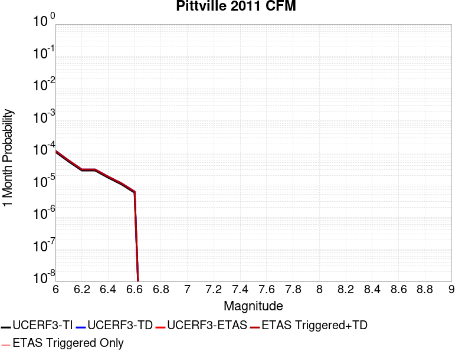 |  | 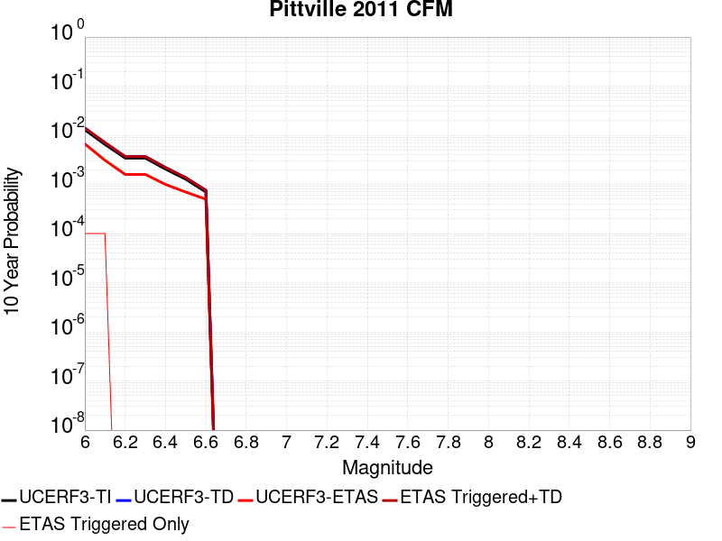 |

| Magnitude | 1 wk TI Prob | 1 wk TD Prob | 1 wk ETAS Prob | 1 wk ETAS/TD Gain | 1 wk ETAS Triggered+TD | 1 wk ETAS Triggered Only | 1 mo TI Prob | 1 mo TD Prob | 1 mo ETAS Prob | 1 mo ETAS/TD Gain | 1 mo ETAS Triggered+TD | 1 mo ETAS Triggered Only | 1 yr TI Prob | 1 yr TD Prob | 1 yr ETAS Prob | 1 yr ETAS/TD Gain | 1 yr ETAS Triggered+TD | 1 yr ETAS Triggered Only | 10 yr TI Prob | 10 yr TD Prob | 10 yr ETAS Prob | 10 yr ETAS/TD Gain | 10 yr ETAS Triggered+TD | 10 yr ETAS Triggered Only |
|-----|-----|-----|-----|-----|-----|-----|-----|-----|-----|-----|-----|-----|-----|-----|-----|-----|-----|-----|-----|-----|-----|-----|-----|-----|
| 6.0 | 2.5031832E-5 | 2.7061478E-5 | 0.0 | 0.0 | 2.7061478E-5 | 0.0 | 1.0727487E-4 | 1.1597316E-4 | 0.0 | 0.0 | 1.1597316E-4 | 0.0 | 0.001305289 | 0.0014111561 | 0.0 | 0.0 | 0.0014111561 | 0.0 | 0.012976485 | 0.01403174 | 1.0E-4 | 0.0071267 | 0.014130336 | 1.0E-4 |
| 6.1 | 1.2540113E-5 | 1.3515226E-5 | 0.0 | 0.0 | 1.3515226E-5 | 0.0 | 5.3742235E-5 | 5.7921236E-5 | 0.0 | 0.0 | 5.7921236E-5 | 0.0 | 6.541153E-4 | 7.049854E-4 | 0.0 | 0.0 | 7.049854E-4 | 0.0 | 0.0065219323 | 0.007029724 | 1.0E-4 | 0.01422531 | 0.007129021 | 1.0E-4 |
| 6.2 | 6.603218E-6 | 7.1083064E-6 | 0.0 | 0.0 | 7.1083064E-6 | 0.0 | 2.8299199E-5 | 3.046385E-5 | 0.0 | 0.0 | 3.046385E-5 | 0.0 | 3.4448825E-4 | 3.7084075E-4 | 0.0 | 0.0 | 3.7084075E-4 | 0.0 | 0.0034395473 | 0.00370286 | 0.0 | 0.0 | 0.00370286 | 0.0 |
| 6.3 | 6.603218E-6 | 7.1083064E-6 | 0.0 | 0.0 | 7.1083064E-6 | 0.0 | 2.8299199E-5 | 3.046385E-5 | 0.0 | 0.0 | 3.046385E-5 | 0.0 | 3.4448825E-4 | 3.7084075E-4 | 0.0 | 0.0 | 3.7084075E-4 | 0.0 | 0.0034395473 | 0.00370286 | 0.0 | 0.0 | 0.00370286 | 0.0 |
| 6.4 | 3.9389015E-6 | 4.2398406E-6 | 0.0 | 0.0 | 4.2398406E-6 | 0.0 | 1.6880897E-5 | 1.8170636E-5 | 0.0 | 0.0 | 1.8170636E-5 | 0.0 | 2.0550552E-4 | 2.2120815E-4 | 0.0 | 0.0 | 2.2120815E-4 | 0.0 | 0.0020531558 | 0.0022101845 | 0.0 | 0.0 | 0.0022101845 | 0.0 |
| 6.5 | 2.4533072E-6 | 2.6416853E-6 | 0.0 | 0.0 | 2.6416853E-6 | 0.0 | 1.0514132E-5 | 1.132147E-5 | 0.0 | 0.0 | 1.132147E-5 | 0.0 | 1.2800204E-4 | 1.3783212E-4 | 0.0 | 0.0 | 1.3783212E-4 | 0.0 | 0.0012792832 | 0.0013776566 | 0.0 | 0.0 | 0.0013776566 | 0.0 |
| 6.6 | 1.3482367E-6 | 1.4532255E-6 | 0.0 | 0.0 | 1.4532255E-6 | 0.0 | 5.778144E-6 | 6.228101E-6 | 0.0 | 0.0 | 6.228101E-6 | 0.0 | 7.0346636E-5 | 7.582563E-5 | 0.0 | 0.0 | 7.582563E-5 | 0.0 | 7.032437E-4 | 7.581087E-4 | 0.0 | 0.0 | 7.581087E-4 | 0.0 |

## Clamshell-Sawpit
*[(top)](#table-of-contents)*

| 1 Week | 1 Month | 1 Year | 10 Year |
|-----|-----|-----|-----|
|  |  |  |  |

| Magnitude | 1 wk TI Prob | 1 wk TD Prob | 1 wk ETAS Prob | 1 wk ETAS/TD Gain | 1 wk ETAS Triggered+TD | 1 wk ETAS Triggered Only | 1 mo TI Prob | 1 mo TD Prob | 1 mo ETAS Prob | 1 mo ETAS/TD Gain | 1 mo ETAS Triggered+TD | 1 mo ETAS Triggered Only | 1 yr TI Prob | 1 yr TD Prob | 1 yr ETAS Prob | 1 yr ETAS/TD Gain | 1 yr ETAS Triggered+TD | 1 yr ETAS Triggered Only | 10 yr TI Prob | 10 yr TD Prob | 10 yr ETAS Prob | 10 yr ETAS/TD Gain | 10 yr ETAS Triggered+TD | 10 yr ETAS Triggered Only |
|-----|-----|-----|-----|-----|-----|-----|-----|-----|-----|-----|-----|-----|-----|-----|-----|-----|-----|-----|-----|-----|-----|-----|-----|-----|
| 6.0 | 3.202998E-6 | 3.0130402E-6 | 1.0E-4 | 33.18907 | 1.0301274E-4 | 1.0E-4 | 1.3727062E-5 | 1.2912969E-5 | 1.0E-4 | 7.744152 | 1.1291168E-4 | 1.0E-4 | 1.6711417E-4 | 1.5720486E-4 | 1.0E-4 | 0.63611263 | 2.5718915E-4 | 1.0E-4 | 0.0016698855 | 0.001571016 | 2.0E-4 | 0.12730615 | 0.0017707018 | 2.0E-4 |
| 6.1 | 3.202998E-6 | 3.0130402E-6 | 1.0E-4 | 33.18907 | 1.0301274E-4 | 1.0E-4 | 1.3727062E-5 | 1.2912969E-5 | 1.0E-4 | 7.744152 | 1.1291168E-4 | 1.0E-4 | 1.6711417E-4 | 1.5720486E-4 | 1.0E-4 | 0.63611263 | 2.5718915E-4 | 1.0E-4 | 0.0016698855 | 0.001571016 | 2.0E-4 | 0.12730615 | 0.0017707018 | 2.0E-4 |
| 6.2 | 3.202998E-6 | 3.0130402E-6 | 1.0E-4 | 33.18907 | 1.0301274E-4 | 1.0E-4 | 1.3727062E-5 | 1.2912969E-5 | 1.0E-4 | 7.744152 | 1.1291168E-4 | 1.0E-4 | 1.6711417E-4 | 1.5720486E-4 | 1.0E-4 | 0.63611263 | 2.5718915E-4 | 1.0E-4 | 0.0016698855 | 0.001571016 | 2.0E-4 | 0.12730615 | 0.0017707018 | 2.0E-4 |
| 6.3 | 3.202998E-6 | 3.0130402E-6 | 1.0E-4 | 33.18907 | 1.0301274E-4 | 1.0E-4 | 1.3727062E-5 | 1.2912969E-5 | 1.0E-4 | 7.744152 | 1.1291168E-4 | 1.0E-4 | 1.6711417E-4 | 1.5720486E-4 | 1.0E-4 | 0.63611263 | 2.5718915E-4 | 1.0E-4 | 0.0016698855 | 0.001571016 | 2.0E-4 | 0.12730615 | 0.0017707018 | 2.0E-4 |
| 6.4 | 3.202998E-6 | 3.0130402E-6 | 1.0E-4 | 33.18907 | 1.0301274E-4 | 1.0E-4 | 1.3727062E-5 | 1.2912969E-5 | 1.0E-4 | 7.744152 | 1.1291168E-4 | 1.0E-4 | 1.6711417E-4 | 1.5720486E-4 | 1.0E-4 | 0.63611263 | 2.5718915E-4 | 1.0E-4 | 0.0016698855 | 0.001571016 | 2.0E-4 | 0.12730615 | 0.0017707018 | 2.0E-4 |
| 6.5 | 2.5862723E-6 | 2.3810185E-6 | 0.0 | 0.0 | 2.3810185E-6 | 0.0 | 1.1083977E-5 | 1.0204327E-5 | 0.0 | 0.0 | 1.0204327E-5 | 0.0 | 1.3493907E-4 | 1.2423091E-4 | 0.0 | 0.0 | 1.2423091E-4 | 0.0 | 0.0013485716 | 0.0012416448 | 1.0E-4 | 0.080538325 | 0.0013415207 | 1.0E-4 |
| 6.6 | 2.5862723E-6 | 2.3810185E-6 | 0.0 | 0.0 | 2.3810185E-6 | 0.0 | 1.1083977E-5 | 1.0204327E-5 | 0.0 | 0.0 | 1.0204327E-5 | 0.0 | 1.3493907E-4 | 1.2423091E-4 | 0.0 | 0.0 | 1.2423091E-4 | 0.0 | 0.0013485716 | 0.0012416448 | 1.0E-4 | 0.080538325 | 0.0013415207 | 1.0E-4 |
| 6.7 | 2.5862723E-6 | 2.3810185E-6 | 0.0 | 0.0 | 2.3810185E-6 | 0.0 | 1.1083977E-5 | 1.0204327E-5 | 0.0 | 0.0 | 1.0204327E-5 | 0.0 | 1.3493907E-4 | 1.2423091E-4 | 0.0 | 0.0 | 1.2423091E-4 | 0.0 | 0.0013485716 | 0.0012416448 | 1.0E-4 | 0.080538325 | 0.0013415207 | 1.0E-4 |
| 6.8 | 2.4098806E-6 | 2.1979602E-6 | 0.0 | 0.0 | 2.1979602E-6 | 0.0 | 1.0328019E-5 | 9.419797E-6 | 0.0 | 0.0 | 9.419797E-6 | 0.0 | 1.2573638E-4 | 1.1468026E-4 | 0.0 | 0.0 | 1.1468026E-4 | 0.0 | 0.0012566525 | 0.0011462374 | 1.0E-4 | 0.08724196 | 0.0012461228 | 1.0E-4 |
| 6.9 | 2.0073985E-6 | 1.7786181E-6 | 0.0 | 0.0 | 1.7786181E-6 | 0.0 | 8.603109E-6 | 7.6226274E-6 | 0.0 | 0.0 | 7.6226274E-6 | 0.0 | 1.0473781E-4 | 9.280165E-5 | 0.0 | 0.0 | 9.280165E-5 | 0.0 | 0.0010468846 | 9.276409E-4 | 0.0 | 0.0 | 9.276409E-4 | 0.0 |
| 7.0 | 1.8166766E-6 | 1.5808879E-6 | 0.0 | 0.0 | 1.5808879E-6 | 0.0 | 7.785734E-6 | 6.7752167E-6 | 0.0 | 0.0 | 6.7752167E-6 | 0.0 | 9.478718E-5 | 8.248525E-5 | 0.0 | 0.0 | 8.248525E-5 | 0.0 | 9.4746763E-4 | 8.2455634E-4 | 0.0 | 0.0 | 8.2455634E-4 | 0.0 |
| 7.1 | 1.5471421E-6 | 1.3054463E-6 | 0.0 | 0.0 | 1.3054463E-6 | 0.0 | 6.6305925E-6 | 5.594758E-6 | 0.0 | 0.0 | 5.594758E-6 | 0.0 | 8.072447E-5 | 6.81141E-5 | 0.0 | 0.0 | 6.81141E-5 | 0.0 | 8.0695155E-4 | 6.809377E-4 | 0.0 | 0.0 | 6.809377E-4 | 0.0 |
| 7.2 | 1.3608037E-6 | 1.1154754E-6 | 0.0 | 0.0 | 1.1154754E-6 | 0.0 | 5.8320024E-6 | 4.7806E-6 | 0.0 | 0.0 | 4.7806E-6 | 0.0 | 7.1002316E-5 | 5.82023E-5 | 0.0 | 0.0 | 5.82023E-5 | 0.0 | 7.097964E-4 | 5.8187515E-4 | 0.0 | 0.0 | 5.8187515E-4 | 0.0 |
| 7.3 | 1.0749634E-6 | 8.3852564E-7 | 0.0 | 0.0 | 8.3852564E-7 | 0.0 | 4.6069777E-6 | 3.5936764E-6 | 0.0 | 0.0 | 3.5936764E-6 | 0.0 | 5.608851E-5 | 4.375216E-5 | 0.0 | 0.0 | 4.375216E-5 | 0.0 | 5.6074356E-4 | 4.3743828E-4 | 0.0 | 0.0 | 4.3743828E-4 | 0.0 |
| 7.4 | 8.416856E-7 | 6.200787E-7 | 0.0 | 0.0 | 6.200787E-7 | 0.0 | 3.607219E-6 | 2.6574776E-6 | 0.0 | 0.0 | 2.6574776E-6 | 0.0 | 4.3917007E-5 | 3.235433E-5 | 0.0 | 0.0 | 3.235433E-5 | 0.0 | 4.390833E-4 | 3.2349819E-4 | 0.0 | 0.0 | 3.2349819E-4 | 0.0 |
| 7.5 | 6.2779594E-7 | 4.4974553E-7 | 0.0 | 0.0 | 4.4974553E-7 | 0.0 | 2.6905511E-6 | 1.9274796E-6 | 0.0 | 0.0 | 1.9274796E-6 | 0.0 | 3.275697E-5 | 2.346683E-5 | 0.0 | 0.0 | 2.346683E-5 | 0.0 | 3.275214E-4 | 2.346454E-4 | 0.0 | 0.0 | 2.346454E-4 | 0.0 |
| 7.6 | 4.3822078E-7 | 3.06E-7 | 0.0 | 0.0 | 3.06E-7 | 0.0 | 1.8780877E-6 | 1.3114279E-6 | 0.0 | 0.0 | 1.3114279E-6 | 0.0 | 2.2865479E-5 | 1.5966534E-5 | 0.0 | 0.0 | 1.5966534E-5 | 0.0 | 2.2863125E-4 | 1.5965542E-4 | 0.0 | 0.0 | 1.5965542E-4 | 0.0 |
| 7.7 | 1.8704569E-7 | 1.1240875E-7 | 0.0 | 0.0 | 1.1240875E-7 | 0.0 | 8.0162414E-7 | 4.8175167E-7 | 0.0 | 0.0 | 4.8175167E-7 | 0.0 | 9.75973E-6 | 5.865312E-6 | 0.0 | 0.0 | 5.865312E-6 | 0.0 | 9.7593016E-5 | 5.8651633E-5 | 0.0 | 0.0 | 5.8651633E-5 | 0.0 |
| 7.8 | 3.5378733E-8 | 2.1842554E-8 | 0.0 | 0.0 | 2.1842554E-8 | 0.0 | 1.5162313E-7 | 9.361094E-8 | 0.0 | 0.0 | 9.361094E-8 | 0.0 | 1.84601E-6 | 1.1397127E-6 | 0.0 | 0.0 | 1.1397127E-6 | 0.0 | 1.8459947E-5 | 1.1397071E-5 | 0.0 | 0.0 | 1.1397071E-5 | 0.0 |
| 7.9 | 7.504945E-9 | 5.1929434E-9 | 0.0 | 0.0 | 5.1929434E-9 | 0.0 | 3.2164053E-8 | 2.2255472E-8 | 0.0 | 0.0 | 2.2255472E-8 | 0.0 | 3.9159727E-7 | 2.7096033E-7 | 0.0 | 0.0 | 2.7096033E-7 | 0.0 | 3.915966E-6 | 2.7096007E-6 | 0.0 | 0.0 | 2.7096007E-6 | 0.0 |
| 8.0 | 1.6554036E-10 | 1.4181911E-10 | 0.0 | 0.0 | 1.4181911E-10 | 0.0 | 7.0945894E-10 | 6.0779637E-10 | 0.0 | 0.0 | 6.0779637E-10 | 0.0 | 8.637662E-9 | 7.3999207E-9 | 0.0 | 0.0 | 7.3999207E-9 | 0.0 | 8.6376616E-8 | 7.39992E-8 | 0.0 | 0.0 | 7.39992E-8 | 0.0 |

## Elysian Park (Lower CFM)
*[(top)](#table-of-contents)*

| 1 Week | 1 Month | 1 Year | 10 Year |
|-----|-----|-----|-----|
|  |  |  |  |

| Magnitude | 1 wk TI Prob | 1 wk TD Prob | 1 wk ETAS Prob | 1 wk ETAS/TD Gain | 1 wk ETAS Triggered+TD | 1 wk ETAS Triggered Only | 1 mo TI Prob | 1 mo TD Prob | 1 mo ETAS Prob | 1 mo ETAS/TD Gain | 1 mo ETAS Triggered+TD | 1 mo ETAS Triggered Only | 1 yr TI Prob | 1 yr TD Prob | 1 yr ETAS Prob | 1 yr ETAS/TD Gain | 1 yr ETAS Triggered+TD | 1 yr ETAS Triggered Only | 10 yr TI Prob | 10 yr TD Prob | 10 yr ETAS Prob | 10 yr ETAS/TD Gain | 10 yr ETAS Triggered+TD | 10 yr ETAS Triggered Only |
|-----|-----|-----|-----|-----|-----|-----|-----|-----|-----|-----|-----|-----|-----|-----|-----|-----|-----|-----|-----|-----|-----|-----|-----|-----|
| 6.0 | 2.1766498E-6 | 2.1039184E-6 | 0.0 | 0.0 | 2.1039184E-6 | 0.0 | 9.328466E-6 | 9.01677E-6 | 0.0 | 0.0 | 9.01677E-6 | 0.0 | 1.1356815E-4 | 1.0977509E-4 | 1.0E-4 | 0.9109535 | 2.0976411E-4 | 1.0E-4 | 0.0011351013 | 0.0010973505 | 2.0E-4 | 0.18225716 | 0.0012971311 | 2.0E-4 |
| 6.1 | 2.1766498E-6 | 2.1039184E-6 | 0.0 | 0.0 | 2.1039184E-6 | 0.0 | 9.328466E-6 | 9.01677E-6 | 0.0 | 0.0 | 9.01677E-6 | 0.0 | 1.1356815E-4 | 1.0977509E-4 | 1.0E-4 | 0.9109535 | 2.0976411E-4 | 1.0E-4 | 0.0011351013 | 0.0010973505 | 2.0E-4 | 0.18225716 | 0.0012971311 | 2.0E-4 |
| 6.2 | 1.0031182E-6 | 9.18726E-7 | 0.0 | 0.0 | 9.18726E-7 | 0.0 | 4.299071E-6 | 3.9373917E-6 | 0.0 | 0.0 | 3.9373917E-6 | 0.0 | 5.2339932E-5 | 4.793679E-5 | 0.0 | 0.0 | 4.793679E-5 | 0.0 | 5.2327604E-4 | 4.7927428E-4 | 0.0 | 0.0 | 4.7927428E-4 | 0.0 |
| 6.3 | 1.0031182E-6 | 9.18726E-7 | 0.0 | 0.0 | 9.18726E-7 | 0.0 | 4.299071E-6 | 3.9373917E-6 | 0.0 | 0.0 | 3.9373917E-6 | 0.0 | 5.2339932E-5 | 4.793679E-5 | 0.0 | 0.0 | 4.793679E-5 | 0.0 | 5.2327604E-4 | 4.7927428E-4 | 0.0 | 0.0 | 4.7927428E-4 | 0.0 |
| 6.4 | 6.9606244E-7 | 6.09294E-7 | 0.0 | 0.0 | 6.09294E-7 | 0.0 | 2.9831212E-6 | 2.6112573E-6 | 0.0 | 0.0 | 2.6112573E-6 | 0.0 | 3.6318896E-5 | 3.1791595E-5 | 0.0 | 0.0 | 3.1791595E-5 | 0.0 | 3.6312963E-4 | 3.1787073E-4 | 0.0 | 0.0 | 3.1787073E-4 | 0.0 |
| 6.5 | 6.901879E-7 | 6.033622E-7 | 0.0 | 0.0 | 6.033622E-7 | 0.0 | 2.9579448E-6 | 2.5858355E-6 | 0.0 | 0.0 | 2.5858355E-6 | 0.0 | 3.6012385E-5 | 3.1482094E-5 | 0.0 | 0.0 | 3.1482094E-5 | 0.0 | 3.600655E-4 | 3.1477658E-4 | 0.0 | 0.0 | 3.1477658E-4 | 0.0 |
| 6.6 | 6.4198554E-7 | 5.5475965E-7 | 0.0 | 0.0 | 5.5475965E-7 | 0.0 | 2.7513638E-6 | 2.3775392E-6 | 0.0 | 0.0 | 2.3775392E-6 | 0.0 | 3.3497337E-5 | 2.8946157E-5 | 0.0 | 0.0 | 2.8946157E-5 | 0.0 | 3.349229E-4 | 2.89424E-4 | 0.0 | 0.0 | 2.89424E-4 | 0.0 |
| 6.7 | 6.138733E-7 | 5.2644E-7 | 0.0 | 0.0 | 5.2644E-7 | 0.0 | 2.6308828E-6 | 2.2561692E-6 | 0.0 | 0.0 | 2.2561692E-6 | 0.0 | 3.203053E-5 | 2.7468515E-5 | 0.0 | 0.0 | 2.7468515E-5 | 0.0 | 3.2025913E-4 | 2.7465133E-4 | 0.0 | 0.0 | 2.7465133E-4 | 0.0 |
| 6.8 | 5.84778E-7 | 5.003913E-7 | 0.0 | 0.0 | 5.003913E-7 | 0.0 | 2.506189E-6 | 2.1445323E-6 | 0.0 | 0.0 | 2.1445323E-6 | 0.0 | 3.0512423E-5 | 2.6109368E-5 | 0.0 | 0.0 | 2.6109368E-5 | 0.0 | 3.0508233E-4 | 2.6106313E-4 | 0.0 | 0.0 | 2.6106313E-4 | 0.0 |
| 6.9 | 5.322785E-7 | 4.5810378E-7 | 0.0 | 0.0 | 4.5810378E-7 | 0.0 | 2.2811914E-6 | 1.9633003E-6 | 0.0 | 0.0 | 1.9633003E-6 | 0.0 | 2.7773152E-5 | 2.390292E-5 | 0.0 | 0.0 | 2.390292E-5 | 0.0 | 2.7769682E-4 | 2.390036E-4 | 0.0 | 0.0 | 2.390036E-4 | 0.0 |
| 7.0 | 4.8147206E-7 | 4.1133512E-7 | 0.0 | 0.0 | 4.1133512E-7 | 0.0 | 2.06345E-6 | 1.7628635E-6 | 0.0 | 0.0 | 1.7628635E-6 | 0.0 | 2.5122214E-5 | 2.1462653E-5 | 0.0 | 0.0 | 2.1462653E-5 | 0.0 | 2.5119373E-4 | 2.1460588E-4 | 0.0 | 0.0 | 2.1460588E-4 | 0.0 |
| 7.1 | 4.1932955E-7 | 3.546424E-7 | 0.0 | 0.0 | 3.546424E-7 | 0.0 | 1.7971255E-6 | 1.5198949E-6 | 0.0 | 0.0 | 1.5198949E-6 | 0.0 | 2.1879783E-5 | 1.8504565E-5 | 0.0 | 0.0 | 1.8504565E-5 | 0.0 | 2.1877629E-4 | 1.850303E-4 | 0.0 | 0.0 | 1.850303E-4 | 0.0 |
| 7.2 | 3.426051E-7 | 2.7817467E-7 | 0.0 | 0.0 | 2.7817467E-7 | 0.0 | 1.4683067E-6 | 1.1921765E-6 | 0.0 | 0.0 | 1.1921765E-6 | 0.0 | 1.7876488E-5 | 1.4514652E-5 | 0.0 | 0.0 | 1.4514652E-5 | 0.0 | 1.787505E-4 | 1.4513706E-4 | 0.0 | 0.0 | 1.4513706E-4 | 0.0 |
| 7.3 | 2.7771645E-7 | 2.2102631E-7 | 0.0 | 0.0 | 2.2102631E-7 | 0.0 | 1.1902127E-6 | 9.472552E-7 | 0.0 | 0.0 | 9.472552E-7 | 0.0 | 1.4490744E-5 | 1.1532771E-5 | 0.0 | 0.0 | 1.1532771E-5 | 0.0 | 1.4489799E-4 | 1.15321745E-4 | 0.0 | 0.0 | 1.15321745E-4 | 0.0 |
| 7.4 | 2.2756493E-7 | 1.7845181E-7 | 0.0 | 0.0 | 1.7845181E-7 | 0.0 | 9.752779E-7 | 7.6479324E-7 | 0.0 | 0.0 | 7.6479324E-7 | 0.0 | 1.1873944E-5 | 9.311318E-6 | 0.0 | 0.0 | 9.311318E-6 | 0.0 | 1.18733085E-4 | 9.3109295E-5 | 0.0 | 0.0 | 9.3109295E-5 | 0.0 |
| 7.5 | 1.7874558E-7 | 1.3547229E-7 | 0.0 | 0.0 | 1.3547229E-7 | 0.0 | 7.660522E-7 | 5.805954E-7 | 0.0 | 0.0 | 5.805954E-7 | 0.0 | 9.326646E-6 | 7.068726E-6 | 0.0 | 0.0 | 7.068726E-6 | 0.0 | 9.326255E-5 | 7.0685026E-5 | 0.0 | 0.0 | 7.0685026E-5 | 0.0 |
| 7.6 | 1.3124549E-7 | 9.254279E-8 | 0.0 | 0.0 | 9.254279E-8 | 0.0 | 5.624805E-7 | 3.966119E-7 | 0.0 | 0.0 | 3.966119E-7 | 0.0 | 6.8481786E-6 | 4.8287393E-6 | 0.0 | 0.0 | 4.8287393E-6 | 0.0 | 6.8479676E-5 | 4.8286358E-5 | 0.0 | 0.0 | 4.8286358E-5 | 0.0 |
| 7.7 | 8.439993E-8 | 5.0926886E-8 | 0.0 | 0.0 | 5.0926886E-8 | 0.0 | 3.6171392E-7 | 2.1825807E-7 | 0.0 | 0.0 | 2.1825807E-7 | 0.0 | 4.403858E-6 | 2.6572889E-6 | 0.0 | 0.0 | 2.6572889E-6 | 0.0 | 4.4037708E-5 | 2.6572583E-5 | 0.0 | 0.0 | 2.6572583E-5 | 0.0 |
| 7.8 | 1.2591407E-8 | 7.2316606E-9 | 0.0 | 0.0 | 7.2316606E-9 | 0.0 | 5.3963173E-8 | 3.099283E-8 | 0.0 | 0.0 | 3.099283E-8 | 0.0 | 6.570014E-7 | 3.773376E-7 | 0.0 | 0.0 | 3.773376E-7 | 0.0 | 6.5699946E-6 | 3.77337E-6 | 0.0 | 0.0 | 3.77337E-6 | 0.0 |
| 7.9 | 2.8324232E-11 | 2.1429636E-11 | 0.0 | 0.0 | 2.1429636E-11 | 0.0 | 1.2138957E-10 | 9.184142E-11 | 0.0 | 0.0 | 9.184142E-11 | 0.0 | 1.4779177E-9 | 1.1181684E-9 | 0.0 | 0.0 | 1.1181684E-9 | 0.0 | 1.4779177E-8 | 1.1181684E-8 | 0.0 | 0.0 | 1.1181684E-8 | 0.0 |

## Hollywood
*[(top)](#table-of-contents)*

| 1 Week | 1 Month | 1 Year | 10 Year |
|-----|-----|-----|-----|
|  |  |  | 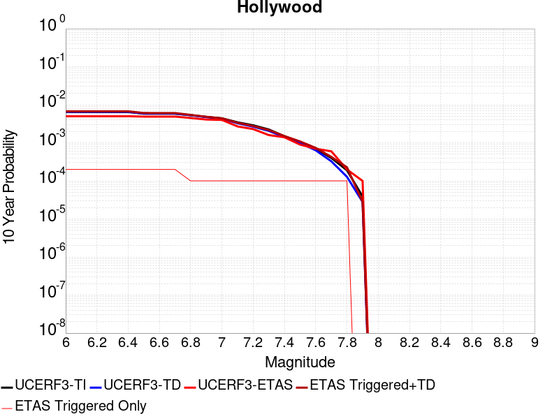 |

| Magnitude | 1 wk TI Prob | 1 wk TD Prob | 1 wk ETAS Prob | 1 wk ETAS/TD Gain | 1 wk ETAS Triggered+TD | 1 wk ETAS Triggered Only | 1 mo TI Prob | 1 mo TD Prob | 1 mo ETAS Prob | 1 mo ETAS/TD Gain | 1 mo ETAS Triggered+TD | 1 mo ETAS Triggered Only | 1 yr TI Prob | 1 yr TD Prob | 1 yr ETAS Prob | 1 yr ETAS/TD Gain | 1 yr ETAS Triggered+TD | 1 yr ETAS Triggered Only | 10 yr TI Prob | 10 yr TD Prob | 10 yr ETAS Prob | 10 yr ETAS/TD Gain | 10 yr ETAS Triggered+TD | 10 yr ETAS Triggered Only |
|-----|-----|-----|-----|-----|-----|-----|-----|-----|-----|-----|-----|-----|-----|-----|-----|-----|-----|-----|-----|-----|-----|-----|-----|-----|
| 6.0 | 1.24487615E-5 | 1.2595674E-5 | 0.0 | 0.0 | 1.2595674E-5 | 0.0 | 5.3350745E-5 | 5.398037E-5 | 0.0 | 0.0 | 5.398037E-5 | 0.0 | 6.4935174E-4 | 6.5701746E-4 | 1.0E-4 | 0.15220295 | 7.5695175E-4 | 1.0E-4 | 0.0064745755 | 0.0065512382 | 2.0E-4 | 0.03052858 | 0.006749928 | 2.0E-4 |
| 6.1 | 1.24487615E-5 | 1.2595674E-5 | 0.0 | 0.0 | 1.2595674E-5 | 0.0 | 5.3350745E-5 | 5.398037E-5 | 0.0 | 0.0 | 5.398037E-5 | 0.0 | 6.4935174E-4 | 6.5701746E-4 | 1.0E-4 | 0.15220295 | 7.5695175E-4 | 1.0E-4 | 0.0064745755 | 0.0065512382 | 2.0E-4 | 0.03052858 | 0.006749928 | 2.0E-4 |
| 6.2 | 1.24487615E-5 | 1.2595674E-5 | 0.0 | 0.0 | 1.2595674E-5 | 0.0 | 5.3350745E-5 | 5.398037E-5 | 0.0 | 0.0 | 5.398037E-5 | 0.0 | 6.4935174E-4 | 6.5701746E-4 | 1.0E-4 | 0.15220295 | 7.5695175E-4 | 1.0E-4 | 0.0064745755 | 0.0065512382 | 2.0E-4 | 0.03052858 | 0.006749928 | 2.0E-4 |
| 6.3 | 1.24487615E-5 | 1.2595674E-5 | 0.0 | 0.0 | 1.2595674E-5 | 0.0 | 5.3350745E-5 | 5.398037E-5 | 0.0 | 0.0 | 5.398037E-5 | 0.0 | 6.4935174E-4 | 6.5701746E-4 | 1.0E-4 | 0.15220295 | 7.5695175E-4 | 1.0E-4 | 0.0064745755 | 0.0065512382 | 2.0E-4 | 0.03052858 | 0.006749928 | 2.0E-4 |
| 6.4 | 1.2431024E-5 | 1.2576284E-5 | 0.0 | 0.0 | 1.2576284E-5 | 0.0 | 5.327473E-5 | 5.389727E-5 | 0.0 | 0.0 | 5.389727E-5 | 0.0 | 6.4842677E-4 | 6.5600633E-4 | 1.0E-4 | 0.15243755 | 7.5594074E-4 | 1.0E-4 | 0.0064653796 | 0.0065411865 | 2.0E-4 | 0.030575491 | 0.0067398786 | 2.0E-4 |
| 6.5 | 1.1242222E-5 | 1.1320099E-5 | 0.0 | 0.0 | 1.1320099E-5 | 0.0 | 4.8180063E-5 | 4.851382E-5 | 0.0 | 0.0 | 4.851382E-5 | 0.0 | 5.864344E-4 | 5.904984E-4 | 1.0E-4 | 0.16934848 | 6.904393E-4 | 1.0E-4 | 0.0058488925 | 0.00588958 | 2.0E-4 | 0.03395828 | 0.006088402 | 2.0E-4 |
| 6.6 | 1.1234066E-5 | 1.1311211E-5 | 0.0 | 0.0 | 1.1311211E-5 | 0.0 | 4.8145106E-5 | 4.847573E-5 | 0.0 | 0.0 | 4.847573E-5 | 0.0 | 5.86009E-4 | 5.900349E-4 | 1.0E-4 | 0.1694815 | 6.8997586E-4 | 1.0E-4 | 0.005844661 | 0.0058849696 | 2.0E-4 | 0.03398488 | 0.006083793 | 2.0E-4 |
| 6.7 | 1.12294E-5 | 1.1305952E-5 | 0.0 | 0.0 | 1.1305952E-5 | 0.0 | 4.812511E-5 | 4.84532E-5 | 0.0 | 0.0 | 4.84532E-5 | 0.0 | 5.857657E-4 | 5.8976066E-4 | 1.0E-4 | 0.1695603 | 6.897017E-4 | 1.0E-4 | 0.0058422405 | 0.005882242 | 2.0E-4 | 0.03400064 | 0.006081066 | 2.0E-4 |
| 6.8 | 1.0252819E-5 | 1.02204895E-5 | 0.0 | 0.0 | 1.02204895E-5 | 0.0 | 4.3939912E-5 | 4.3801374E-5 | 0.0 | 0.0 | 4.3801374E-5 | 0.0 | 5.3483713E-4 | 5.3315336E-4 | 0.0 | 0.0 | 5.3315336E-4 | 0.0 | 0.005335517 | 0.005318969 | 1.0E-4 | 0.018800637 | 0.005418437 | 1.0E-4 |
| 6.9 | 9.252289E-6 | 9.112105E-6 | 0.0 | 0.0 | 9.112105E-6 | 0.0 | 3.9652066E-5 | 3.90513E-5 | 0.0 | 0.0 | 3.90513E-5 | 0.0 | 4.8265693E-4 | 4.753475E-4 | 0.0 | 0.0 | 4.753475E-4 | 0.0 | 0.0048161 | 0.004743481 | 1.0E-4 | 0.021081565 | 0.004843007 | 1.0E-4 |
| 7.0 | 8.474604E-6 | 8.259887E-6 | 0.0 | 0.0 | 8.259887E-6 | 0.0 | 3.6319227E-5 | 3.5399044E-5 | 0.0 | 0.0 | 3.5399044E-5 | 0.0 | 4.4209688E-4 | 4.3089958E-4 | 0.0 | 0.0 | 4.3089958E-4 | 0.0 | 0.004412184 | 0.004300791 | 1.0E-4 | 0.023251537 | 0.004400361 | 1.0E-4 |
| 7.1 | 6.643643E-6 | 6.269612E-6 | 0.0 | 0.0 | 6.269612E-6 | 0.0 | 2.8472443E-5 | 2.6869493E-5 | 0.0 | 0.0 | 2.6869493E-5 | 0.0 | 3.4659685E-4 | 3.270874E-4 | 0.0 | 0.0 | 3.270874E-4 | 0.0 | 0.0034605677 | 0.0032661057 | 1.0E-4 | 0.030617502 | 0.003365779 | 1.0E-4 |
| 7.2 | 5.549002E-6 | 5.1097486E-6 | 0.0 | 0.0 | 5.1097486E-6 | 0.0 | 2.378122E-5 | 2.1898739E-5 | 0.0 | 0.0 | 2.1898739E-5 | 0.0 | 2.8949787E-4 | 2.6658468E-4 | 0.0 | 0.0 | 2.6658468E-4 | 0.0 | 0.0028912104 | 0.0026626652 | 1.0E-4 | 0.037556354 | 0.002762399 | 1.0E-4 |
| 7.3 | 4.3059727E-6 | 3.9607526E-6 | 0.0 | 0.0 | 3.9607526E-6 | 0.0 | 1.8454039E-5 | 1.6974544E-5 | 0.0 | 0.0 | 1.6974544E-5 | 0.0 | 2.2465475E-4 | 2.0664556E-4 | 0.0 | 0.0 | 2.0664556E-4 | 0.0 | 0.0022442779 | 0.0020645442 | 1.0E-4 | 0.048436843 | 0.0021643378 | 1.0E-4 |
| 7.4 | 2.8550733E-6 | 2.701985E-6 | 0.0 | 0.0 | 2.701985E-6 | 0.0 | 1.2235971E-5 | 1.1579885E-5 | 0.0 | 0.0 | 1.1579885E-5 | 0.0 | 1.4896276E-4 | 1.4097603E-4 | 0.0 | 0.0 | 1.4097603E-4 | 0.0 | 0.0014886294 | 0.001408871 | 1.0E-4 | 0.07097882 | 0.0015087301 | 1.0E-4 |
| 7.5 | 1.9927045E-6 | 1.8980887E-6 | 0.0 | 0.0 | 1.8980887E-6 | 0.0 | 8.540134E-6 | 8.134641E-6 | 0.0 | 0.0 | 8.134641E-6 | 0.0 | 1.0397117E-4 | 9.903478E-5 | 0.0 | 0.0 | 9.903478E-5 | 0.0 | 0.0010392254 | 9.899101E-4 | 1.0E-4 | 0.10101927 | 0.0010898111 | 1.0E-4 |
| 7.6 | 1.345084E-6 | 1.2218574E-6 | 0.0 | 0.0 | 1.2218574E-6 | 0.0 | 5.764633E-6 | 5.2365212E-6 | 0.0 | 0.0 | 5.2365212E-6 | 0.0 | 7.018215E-5 | 6.37528E-5 | 0.0 | 0.0 | 6.37528E-5 | 0.0 | 7.0159987E-4 | 6.373471E-4 | 1.0E-4 | 0.15690038 | 7.372834E-4 | 1.0E-4 |
| 7.7 | 7.6835164E-7 | 6.279354E-7 | 0.0 | 0.0 | 6.279354E-7 | 0.0 | 3.2929315E-6 | 2.691149E-6 | 0.0 | 0.0 | 2.691149E-6 | 0.0 | 4.00907E-5 | 3.276426E-5 | 0.0 | 0.0 | 3.276426E-5 | 0.0 | 4.0083472E-4 | 3.2759577E-4 | 1.0E-4 | 0.30525425 | 4.27563E-4 | 1.0E-4 |
| 7.8 | 3.6562128E-7 | 2.4546665E-7 | 0.0 | 0.0 | 2.4546665E-7 | 0.0 | 1.5669474E-6 | 1.0519996E-6 | 0.0 | 0.0 | 1.0519996E-6 | 0.0 | 1.9077417E-5 | 1.2808024E-5 | 0.0 | 0.0 | 1.2808024E-5 | 0.0 | 1.907578E-4 | 1.2807322E-4 | 1.0E-4 | 0.7808033 | 2.2806041E-4 | 1.0E-4 |
| 7.9 | 7.5024424E-8 | 5.383681E-8 | 0.0 | 0.0 | 5.383681E-8 | 0.0 | 3.215332E-7 | 2.3072917E-7 | 0.0 | 0.0 | 2.3072917E-7 | 0.0 | 3.91466E-6 | 2.8091254E-6 | 0.0 | 0.0 | 2.8091254E-6 | 0.0 | 3.9145907E-5 | 2.8091028E-5 | 0.0 | 0.0 | 2.8091028E-5 | 0.0 |

## Big Pine (Central)
*[(top)](#table-of-contents)*

| 1 Week | 1 Month | 1 Year | 10 Year |
|-----|-----|-----|-----|
| 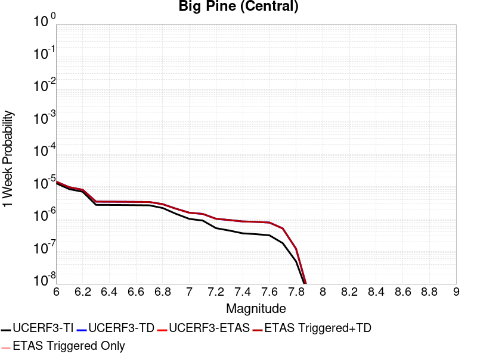 |  |  |  |

| Magnitude | 1 wk TI Prob | 1 wk TD Prob | 1 wk ETAS Prob | 1 wk ETAS/TD Gain | 1 wk ETAS Triggered+TD | 1 wk ETAS Triggered Only | 1 mo TI Prob | 1 mo TD Prob | 1 mo ETAS Prob | 1 mo ETAS/TD Gain | 1 mo ETAS Triggered+TD | 1 mo ETAS Triggered Only | 1 yr TI Prob | 1 yr TD Prob | 1 yr ETAS Prob | 1 yr ETAS/TD Gain | 1 yr ETAS Triggered+TD | 1 yr ETAS Triggered Only | 10 yr TI Prob | 10 yr TD Prob | 10 yr ETAS Prob | 10 yr ETAS/TD Gain | 10 yr ETAS Triggered+TD | 10 yr ETAS Triggered Only |
|-----|-----|-----|-----|-----|-----|-----|-----|-----|-----|-----|-----|-----|-----|-----|-----|-----|-----|-----|-----|-----|-----|-----|-----|-----|
| 6.0 | 1.2706755E-5 | 1.42577055E-5 | 0.0 | 0.0 | 1.42577055E-5 | 0.0 | 5.4456385E-5 | 6.110323E-5 | 0.0 | 0.0 | 6.110323E-5 | 0.0 | 6.628048E-4 | 7.4371445E-4 | 0.0 | 0.0 | 7.4371445E-4 | 0.0 | 0.006608314 | 0.0074172122 | 2.0E-4 | 0.026964309 | 0.007615729 | 2.0E-4 |
| 6.1 | 8.342579E-6 | 9.517099E-6 | 0.0 | 0.0 | 9.517099E-6 | 0.0 | 3.5753423E-5 | 4.078705E-5 | 0.0 | 0.0 | 4.078705E-5 | 0.0 | 4.3521097E-4 | 4.964909E-4 | 0.0 | 0.0 | 4.964909E-4 | 0.0 | 0.0043435963 | 0.0049573 | 1.0E-4 | 0.020172272 | 0.005056804 | 1.0E-4 |
| 6.2 | 6.923899E-6 | 7.973204E-6 | 0.0 | 0.0 | 7.973204E-6 | 0.0 | 2.9673516E-5 | 3.4170538E-5 | 0.0 | 0.0 | 3.4170538E-5 | 0.0 | 3.6121515E-4 | 4.1596612E-4 | 0.0 | 0.0 | 4.1596612E-4 | 0.0 | 0.003606286 | 0.0041551115 | 1.0E-4 | 0.024066744 | 0.004254696 | 1.0E-4 |
| 6.3 | 2.728396E-6 | 3.4295733E-6 | 0.0 | 0.0 | 3.4295733E-6 | 0.0 | 1.1693074E-5 | 1.4698093E-5 | 0.0 | 0.0 | 1.4698093E-5 | 0.0 | 1.4235388E-4 | 1.7893546E-4 | 0.0 | 0.0 | 1.7893546E-4 | 0.0 | 0.0014226272 | 0.0017893483 | 0.0 | 0.0 | 0.0017893483 | 0.0 |
| 6.4 | 2.7136944E-6 | 3.4138643E-6 | 0.0 | 0.0 | 3.4138643E-6 | 0.0 | 1.1630066E-5 | 1.463077E-5 | 0.0 | 0.0 | 1.463077E-5 | 0.0 | 1.4158686E-4 | 1.7811594E-4 | 0.0 | 0.0 | 1.7811594E-4 | 0.0 | 0.0014149669 | 0.0017811662 | 0.0 | 0.0 | 0.0017811662 | 0.0 |
| 6.5 | 2.6971882E-6 | 3.396207E-6 | 0.0 | 0.0 | 3.396207E-6 | 0.0 | 1.1559327E-5 | 1.4555097E-5 | 0.0 | 0.0 | 1.4555097E-5 | 0.0 | 1.4072572E-4 | 1.7719476E-4 | 0.0 | 0.0 | 1.7719476E-4 | 0.0 | 0.0014063664 | 0.0017719691 | 0.0 | 0.0 | 0.0017719691 | 0.0 |
| 6.6 | 2.669092E-6 | 3.3662234E-6 | 0.0 | 0.0 | 3.3662234E-6 | 0.0 | 1.1438916E-5 | 1.4426596E-5 | 0.0 | 0.0 | 1.4426596E-5 | 0.0 | 1.3925991E-4 | 1.7563053E-4 | 0.0 | 0.0 | 1.7563053E-4 | 0.0 | 0.0013917267 | 0.0017563516 | 0.0 | 0.0 | 0.0017563516 | 0.0 |
| 6.7 | 2.6408059E-6 | 3.3362453E-6 | 0.0 | 0.0 | 3.3362453E-6 | 0.0 | 1.1317691E-5 | 1.4298121E-5 | 0.0 | 0.0 | 1.4298121E-5 | 0.0 | 1.3778417E-4 | 1.7406658E-4 | 0.0 | 0.0 | 1.7406658E-4 | 0.0 | 0.0013769877 | 0.0017407367 | 0.0 | 0.0 | 0.0017407367 | 0.0 |
| 6.8 | 2.1786943E-6 | 2.859672E-6 | 0.0 | 0.0 | 2.859672E-6 | 0.0 | 9.337228E-6 | 1.2255683E-5 | 0.0 | 0.0 | 1.2255683E-5 | 0.0 | 1.1367482E-4 | 1.4920345E-4 | 0.0 | 0.0 | 1.4920345E-4 | 0.0 | 0.0011361669 | 0.0014924536 | 0.0 | 0.0 | 0.0014924536 | 0.0 |
| 6.9 | 1.4411696E-6 | 2.0735026E-6 | 0.0 | 0.0 | 2.0735026E-6 | 0.0 | 6.1764263E-6 | 8.886411E-6 | 0.0 | 0.0 | 8.886411E-6 | 0.0 | 7.51954E-5 | 1.0818695E-4 | 0.0 | 0.0 | 1.0818695E-4 | 0.0 | 7.5169955E-4 | 0.001082719 | 0.0 | 0.0 | 0.001082719 | 0.0 |
| 7.0 | 1.0073411E-6 | 1.558739E-6 | 0.0 | 0.0 | 1.558739E-6 | 0.0 | 4.317169E-6 | 6.680294E-6 | 0.0 | 0.0 | 6.680294E-6 | 0.0 | 5.2560266E-5 | 8.1329694E-5 | 0.0 | 0.0 | 8.1329694E-5 | 0.0 | 5.2547833E-4 | 8.143642E-4 | 0.0 | 0.0 | 8.143642E-4 | 0.0 |
| 7.1 | 8.947104E-7 | 1.4346634E-6 | 0.0 | 0.0 | 1.4346634E-6 | 0.0 | 3.834468E-6 | 6.148544E-6 | 0.0 | 0.0 | 6.148544E-6 | 0.0 | 4.6683643E-5 | 7.48561E-5 | 0.0 | 0.0 | 7.48561E-5 | 0.0 | 4.6673836E-4 | 7.496735E-4 | 0.0 | 0.0 | 7.496735E-4 | 0.0 |
| 7.2 | 5.215166E-7 | 1.0152901E-6 | 0.0 | 0.0 | 1.0152901E-6 | 0.0 | 2.2350691E-6 | 4.3512364E-6 | 0.0 | 0.0 | 4.3512364E-6 | 0.0 | 2.7211627E-5 | 5.297506E-5 | 0.0 | 0.0 | 5.297506E-5 | 0.0 | 2.7208295E-4 | 5.309788E-4 | 0.0 | 0.0 | 5.309788E-4 | 0.0 |
| 7.3 | 4.4024807E-7 | 9.259608E-7 | 0.0 | 0.0 | 9.259608E-7 | 0.0 | 1.8867761E-6 | 3.968398E-6 | 0.0 | 0.0 | 3.968398E-6 | 0.0 | 2.2971257E-5 | 4.831421E-5 | 0.0 | 0.0 | 4.831421E-5 | 0.0 | 2.2968883E-4 | 4.8439126E-4 | 0.0 | 0.0 | 4.8439126E-4 | 0.0 |
| 7.4 | 3.6130905E-7 | 8.397333E-7 | 0.0 | 0.0 | 8.397333E-7 | 0.0 | 1.5484665E-6 | 3.5988521E-6 | 0.0 | 0.0 | 3.5988521E-6 | 0.0 | 1.8852415E-5 | 4.381518E-5 | 0.0 | 0.0 | 4.381518E-5 | 0.0 | 1.8850817E-4 | 4.3940963E-4 | 0.0 | 0.0 | 4.3940963E-4 | 0.0 |
| 7.5 | 3.408184E-7 | 8.146126E-7 | 0.0 | 0.0 | 8.146126E-7 | 0.0 | 1.4606494E-6 | 3.4911923E-6 | 0.0 | 0.0 | 3.4911923E-6 | 0.0 | 1.7783263E-5 | 4.2504475E-5 | 0.0 | 0.0 | 4.2504475E-5 | 0.0 | 1.778184E-4 | 4.262885E-4 | 0.0 | 0.0 | 4.262885E-4 | 0.0 |
| 7.6 | 3.1428627E-7 | 7.7682597E-7 | 0.0 | 0.0 | 7.7682597E-7 | 0.0 | 1.3469405E-6 | 3.3292501E-6 | 0.0 | 0.0 | 3.3292501E-6 | 0.0 | 1.6398877E-5 | 4.0532905E-5 | 0.0 | 0.0 | 4.0532905E-5 | 0.0 | 1.6397667E-4 | 4.0655155E-4 | 0.0 | 0.0 | 4.0655155E-4 | 0.0 |
| 7.7 | 1.7972785E-7 | 5.106051E-7 | 0.0 | 0.0 | 5.106051E-7 | 0.0 | 7.70262E-7 | 2.1883059E-6 | 0.0 | 0.0 | 2.1883059E-6 | 0.0 | 9.377899E-6 | 2.6642309E-5 | 0.0 | 0.0 | 2.6642309E-5 | 0.0 | 9.377503E-5 | 2.6770026E-4 | 0.0 | 0.0 | 2.6770026E-4 | 0.0 |
| 7.8 | 4.9230927E-8 | 1.2047433E-7 | 0.0 | 0.0 | 1.2047433E-7 | 0.0 | 2.1098968E-7 | 5.1631844E-7 | 0.0 | 0.0 | 5.1631844E-7 | 0.0 | 2.5687964E-6 | 6.2861604E-6 | 0.0 | 0.0 | 6.2861604E-6 | 0.0 | 2.5687666E-5 | 6.328456E-5 | 0.0 | 0.0 | 6.328456E-5 | 0.0 |
| 7.9 | 3.6805972E-9 | 4.130219E-9 | 0.0 | 0.0 | 4.130219E-9 | 0.0 | 1.5773987E-8 | 1.7700938E-8 | 0.0 | 0.0 | 1.7700938E-8 | 0.0 | 1.9204828E-7 | 2.1550889E-7 | 0.0 | 0.0 | 2.1550889E-7 | 0.0 | 1.920481E-6 | 2.2033728E-6 | 0.0 | 0.0 | 2.2033728E-6 | 0.0 |

## Tin Mountain
*[(top)](#table-of-contents)*

| 1 Week | 1 Month | 1 Year | 10 Year |
|-----|-----|-----|-----|
| 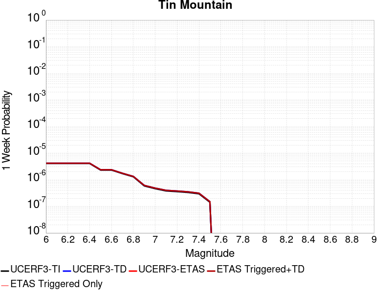 |  |  | 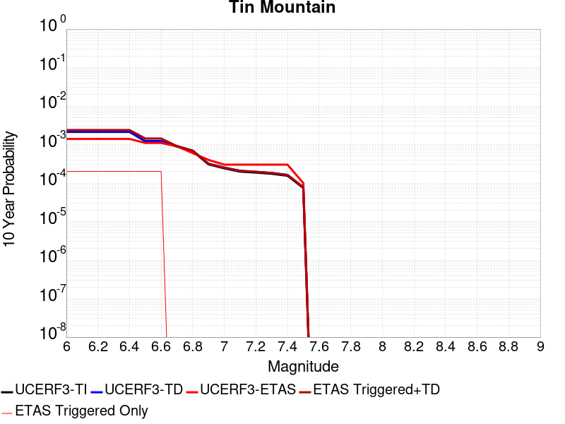 |

| Magnitude | 1 wk TI Prob | 1 wk TD Prob | 1 wk ETAS Prob | 1 wk ETAS/TD Gain | 1 wk ETAS Triggered+TD | 1 wk ETAS Triggered Only | 1 mo TI Prob | 1 mo TD Prob | 1 mo ETAS Prob | 1 mo ETAS/TD Gain | 1 mo ETAS Triggered+TD | 1 mo ETAS Triggered Only | 1 yr TI Prob | 1 yr TD Prob | 1 yr ETAS Prob | 1 yr ETAS/TD Gain | 1 yr ETAS Triggered+TD | 1 yr ETAS Triggered Only | 10 yr TI Prob | 10 yr TD Prob | 10 yr ETAS Prob | 10 yr ETAS/TD Gain | 10 yr ETAS Triggered+TD | 10 yr ETAS Triggered Only |
|-----|-----|-----|-----|-----|-----|-----|-----|-----|-----|-----|-----|-----|-----|-----|-----|-----|-----|-----|-----|-----|-----|-----|-----|-----|
| 6.0 | 4.083776E-6 | 4.1817434E-6 | 0.0 | 0.0 | 4.1817434E-6 | 0.0 | 1.750178E-5 | 1.7921655E-5 | 0.0 | 0.0 | 1.7921655E-5 | 0.0 | 2.1306332E-4 | 2.1817803E-4 | 0.0 | 0.0 | 2.1817803E-4 | 0.0 | 0.0021285915 | 0.002180004 | 2.0E-4 | 0.09174295 | 0.002379568 | 2.0E-4 |
| 6.1 | 4.083776E-6 | 4.1817434E-6 | 0.0 | 0.0 | 4.1817434E-6 | 0.0 | 1.750178E-5 | 1.7921655E-5 | 0.0 | 0.0 | 1.7921655E-5 | 0.0 | 2.1306332E-4 | 2.1817803E-4 | 0.0 | 0.0 | 2.1817803E-4 | 0.0 | 0.0021285915 | 0.002180004 | 2.0E-4 | 0.09174295 | 0.002379568 | 2.0E-4 |
| 6.2 | 4.083776E-6 | 4.1817434E-6 | 0.0 | 0.0 | 4.1817434E-6 | 0.0 | 1.750178E-5 | 1.7921655E-5 | 0.0 | 0.0 | 1.7921655E-5 | 0.0 | 2.1306332E-4 | 2.1817803E-4 | 0.0 | 0.0 | 2.1817803E-4 | 0.0 | 0.0021285915 | 0.002180004 | 2.0E-4 | 0.09174295 | 0.002379568 | 2.0E-4 |
| 6.3 | 4.083776E-6 | 4.1817434E-6 | 0.0 | 0.0 | 4.1817434E-6 | 0.0 | 1.750178E-5 | 1.7921655E-5 | 0.0 | 0.0 | 1.7921655E-5 | 0.0 | 2.1306332E-4 | 2.1817803E-4 | 0.0 | 0.0 | 2.1817803E-4 | 0.0 | 0.0021285915 | 0.002180004 | 2.0E-4 | 0.09174295 | 0.002379568 | 2.0E-4 |
| 6.4 | 4.083776E-6 | 4.1817434E-6 | 0.0 | 0.0 | 4.1817434E-6 | 0.0 | 1.750178E-5 | 1.7921655E-5 | 0.0 | 0.0 | 1.7921655E-5 | 0.0 | 2.1306332E-4 | 2.1817803E-4 | 0.0 | 0.0 | 2.1817803E-4 | 0.0 | 0.0021285915 | 0.002180004 | 2.0E-4 | 0.09174295 | 0.002379568 | 2.0E-4 |
| 6.5 | 2.3143427E-6 | 2.3732819E-6 | 0.0 | 0.0 | 2.3732819E-6 | 0.0 | 9.9185745E-6 | 1.0171173E-5 | 0.0 | 0.0 | 1.0171173E-5 | 0.0 | 1.2075195E-4 | 1.2382776E-4 | 0.0 | 0.0 | 1.2382776E-4 | 0.0 | 0.0012068636 | 0.0012376637 | 2.0E-4 | 0.1615948 | 0.0014374161 | 2.0E-4 |
| 6.6 | 2.3143427E-6 | 2.3732819E-6 | 0.0 | 0.0 | 2.3732819E-6 | 0.0 | 9.9185745E-6 | 1.0171173E-5 | 0.0 | 0.0 | 1.0171173E-5 | 0.0 | 1.2075195E-4 | 1.2382776E-4 | 0.0 | 0.0 | 1.2382776E-4 | 0.0 | 0.0012068636 | 0.0012376637 | 2.0E-4 | 0.1615948 | 0.0014374161 | 2.0E-4 |
| 6.7 | 1.7029532E-6 | 1.7498911E-6 | 0.0 | 0.0 | 1.7498911E-6 | 0.0 | 7.2983503E-6 | 7.499515E-6 | 0.0 | 0.0 | 7.499515E-6 | 0.0 | 8.885379E-5 | 9.13033E-5 | 0.0 | 0.0 | 9.13033E-5 | 0.0 | 8.881827E-4 | 9.1271056E-4 | 0.0 | 0.0 | 9.1271056E-4 | 0.0 |
| 6.8 | 1.2914646E-6 | 1.3300199E-6 | 0.0 | 0.0 | 1.3300199E-6 | 0.0 | 5.534837E-6 | 5.7000752E-6 | 0.0 | 0.0 | 5.7000752E-6 | 0.0 | 6.738455E-5 | 6.939665E-5 | 0.0 | 0.0 | 6.939665E-5 | 0.0 | 6.736412E-4 | 6.937931E-4 | 0.0 | 0.0 | 6.937931E-4 | 0.0 |
| 6.9 | 5.8708974E-7 | 6.117523E-7 | 0.0 | 0.0 | 6.117523E-7 | 0.0 | 2.5160964E-6 | 2.621793E-6 | 0.0 | 0.0 | 2.621793E-6 | 0.0 | 3.0633044E-5 | 3.1919906E-5 | 0.0 | 0.0 | 3.1919906E-5 | 0.0 | 3.0628822E-4 | 3.1915732E-4 | 0.0 | 0.0 | 3.1915732E-4 | 0.0 |
| 7.0 | 4.6248786E-7 | 4.832462E-7 | 0.0 | 0.0 | 4.832462E-7 | 0.0 | 1.9820893E-6 | 2.0710536E-6 | 0.0 | 0.0 | 2.0710536E-6 | 0.0 | 2.413167E-5 | 2.5214824E-5 | 0.0 | 0.0 | 2.5214824E-5 | 0.0 | 2.412905E-4 | 2.521233E-4 | 0.0 | 0.0 | 2.521233E-4 | 0.0 |
| 7.1 | 3.804606E-7 | 3.9875414E-7 | 0.0 | 0.0 | 3.9875414E-7 | 0.0 | 1.6305444E-6 | 1.7089453E-6 | 0.0 | 0.0 | 1.7089453E-6 | 0.0 | 1.9851697E-5 | 2.0806245E-5 | 0.0 | 0.0 | 2.0806245E-5 | 0.0 | 1.9849923E-4 | 2.0804633E-4 | 0.0 | 0.0 | 2.0804633E-4 | 0.0 |
| 7.2 | 3.5864858E-7 | 3.762065E-7 | 0.0 | 0.0 | 3.762065E-7 | 0.0 | 1.5370645E-6 | 1.6123128E-6 | 0.0 | 0.0 | 1.6123128E-6 | 0.0 | 1.87136E-5 | 1.9629764E-5 | 0.0 | 0.0 | 1.9629764E-5 | 0.0 | 1.8712023E-4 | 1.9628362E-4 | 0.0 | 0.0 | 1.9628362E-4 | 0.0 |
| 7.3 | 3.342063E-7 | 3.5067023E-7 | 0.0 | 0.0 | 3.5067023E-7 | 0.0 | 1.4323119E-6 | 1.5028718E-6 | 0.0 | 0.0 | 1.5028718E-6 | 0.0 | 1.7438259E-5 | 1.8297344E-5 | 0.0 | 0.0 | 1.8297344E-5 | 0.0 | 1.743689E-4 | 1.8296167E-4 | 0.0 | 0.0 | 1.8296167E-4 | 0.0 |
| 7.4 | 2.971242E-7 | 3.1168958E-7 | 0.0 | 0.0 | 3.1168958E-7 | 0.0 | 1.2733886E-6 | 1.335812E-6 | 0.0 | 0.0 | 1.335812E-6 | 0.0 | 1.5503398E-5 | 1.6263424E-5 | 0.0 | 0.0 | 1.6263424E-5 | 0.0 | 1.5502315E-4 | 1.6262561E-4 | 0.0 | 0.0 | 1.6262561E-4 | 0.0 |
| 7.5 | 1.4326713E-7 | 1.5014004E-7 | 0.0 | 0.0 | 1.5014004E-7 | 0.0 | 6.140018E-7 | 6.434573E-7 | 0.0 | 0.0 | 6.434573E-7 | 0.0 | 7.4754466E-6 | 7.834093E-6 | 0.0 | 0.0 | 7.834093E-6 | 0.0 | 7.475195E-5 | 7.834093E-5 | 0.0 | 0.0 | 7.834093E-5 | 0.0 |

## San Gregorio (South) 2011 CFM
*[(top)](#table-of-contents)*

| 1 Week | 1 Month | 1 Year | 10 Year |
|-----|-----|-----|-----|
| 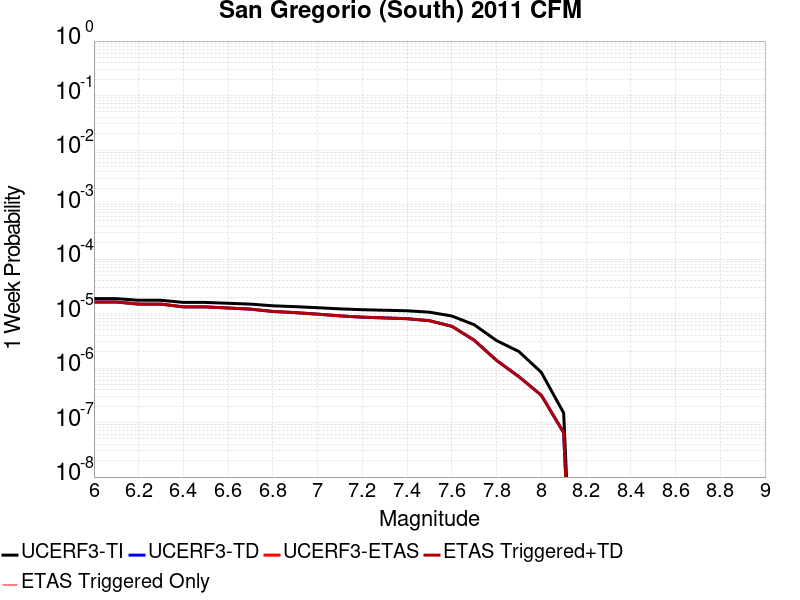 |  |  |  |

| Magnitude | 1 wk TI Prob | 1 wk TD Prob | 1 wk ETAS Prob | 1 wk ETAS/TD Gain | 1 wk ETAS Triggered+TD | 1 wk ETAS Triggered Only | 1 mo TI Prob | 1 mo TD Prob | 1 mo ETAS Prob | 1 mo ETAS/TD Gain | 1 mo ETAS Triggered+TD | 1 mo ETAS Triggered Only | 1 yr TI Prob | 1 yr TD Prob | 1 yr ETAS Prob | 1 yr ETAS/TD Gain | 1 yr ETAS Triggered+TD | 1 yr ETAS Triggered Only | 10 yr TI Prob | 10 yr TD Prob | 10 yr ETAS Prob | 10 yr ETAS/TD Gain | 10 yr ETAS Triggered+TD | 10 yr ETAS Triggered Only |
|-----|-----|-----|-----|-----|-----|-----|-----|-----|-----|-----|-----|-----|-----|-----|-----|-----|-----|-----|-----|-----|-----|-----|-----|-----|
| 6.0 | 1.8770423E-5 | 1.6282711E-5 | 0.0 | 0.0 | 1.6282711E-5 | 0.0 | 8.044219E-5 | 6.978121E-5 | 0.0 | 0.0 | 6.978121E-5 | 0.0 | 9.789435E-4 | 8.492588E-4 | 0.0 | 0.0 | 8.492588E-4 | 0.0 | 0.009746423 | 0.008473027 | 2.0E-4 | 0.023604317 | 0.008671332 | 2.0E-4 |
| 6.1 | 1.8770423E-5 | 1.6282711E-5 | 0.0 | 0.0 | 1.6282711E-5 | 0.0 | 8.044219E-5 | 6.978121E-5 | 0.0 | 0.0 | 6.978121E-5 | 0.0 | 9.789435E-4 | 8.492588E-4 | 0.0 | 0.0 | 8.492588E-4 | 0.0 | 0.009746423 | 0.008473027 | 2.0E-4 | 0.023604317 | 0.008671332 | 2.0E-4 |
| 6.2 | 1.7508692E-5 | 1.490195E-5 | 0.0 | 0.0 | 1.490195E-5 | 0.0 | 7.5035096E-5 | 6.386395E-5 | 0.0 | 0.0 | 6.386395E-5 | 0.0 | 9.1316935E-4 | 7.7726925E-4 | 0.0 | 0.0 | 7.7726925E-4 | 0.0 | 0.00909426 | 0.007758317 | 2.0E-4 | 0.025778785 | 0.007956766 | 2.0E-4 |
| 6.3 | 1.7508692E-5 | 1.490195E-5 | 0.0 | 0.0 | 1.490195E-5 | 0.0 | 7.5035096E-5 | 6.386395E-5 | 0.0 | 0.0 | 6.386395E-5 | 0.0 | 9.1316935E-4 | 7.7726925E-4 | 0.0 | 0.0 | 7.7726925E-4 | 0.0 | 0.00909426 | 0.007758317 | 2.0E-4 | 0.025778785 | 0.007956766 | 2.0E-4 |
| 6.4 | 1.6004591E-5 | 1.3251456E-5 | 0.0 | 0.0 | 1.3251456E-5 | 0.0 | 6.85893E-5 | 5.6790726E-5 | 0.0 | 0.0 | 5.6790726E-5 | 0.0 | 8.347548E-4 | 6.9120876E-4 | 0.0 | 0.0 | 6.9120876E-4 | 0.0 | 0.008316261 | 0.0069031985 | 2.0E-4 | 0.028972076 | 0.007101818 | 2.0E-4 |
| 6.5 | 1.6004591E-5 | 1.3251456E-5 | 0.0 | 0.0 | 1.3251456E-5 | 0.0 | 6.85893E-5 | 5.6790726E-5 | 0.0 | 0.0 | 5.6790726E-5 | 0.0 | 8.347548E-4 | 6.9120876E-4 | 0.0 | 0.0 | 6.9120876E-4 | 0.0 | 0.008316261 | 0.0069031985 | 2.0E-4 | 0.028972076 | 0.007101818 | 2.0E-4 |
| 6.6 | 1.5442201E-5 | 1.2635968E-5 | 0.0 | 0.0 | 1.2635968E-5 | 0.0 | 6.617918E-5 | 5.4153028E-5 | 0.0 | 0.0 | 5.4153028E-5 | 0.0 | 8.0543366E-4 | 6.5911456E-4 | 0.0 | 0.0 | 6.5911456E-4 | 0.0 | 0.008025207 | 0.0065841884 | 1.0E-4 | 0.0151879005 | 0.0066835303 | 1.0E-4 |
| 6.7 | 1.489921E-5 | 1.2044368E-5 | 0.0 | 0.0 | 1.2044368E-5 | 0.0 | 6.3852196E-5 | 5.1617702E-5 | 0.0 | 0.0 | 5.1617702E-5 | 0.0 | 7.7712315E-4 | 6.28265E-4 | 0.0 | 0.0 | 6.28265E-4 | 0.0 | 0.0077441116 | 0.0062774657 | 1.0E-4 | 0.015929995 | 0.006376838 | 1.0E-4 |
| 6.8 | 1.3876024E-5 | 1.0923096E-5 | 0.0 | 0.0 | 1.0923096E-5 | 0.0 | 5.9467322E-5 | 4.681243E-5 | 0.0 | 0.0 | 4.681243E-5 | 0.0 | 7.237741E-4 | 5.697927E-4 | 0.0 | 0.0 | 5.697927E-4 | 0.0 | 0.0072142133 | 0.0056958604 | 1.0E-4 | 0.01755661 | 0.0057952907 | 1.0E-4 |
| 6.9 | 1.33922495E-5 | 1.0394497E-5 | 0.0 | 0.0 | 1.0394497E-5 | 0.0 | 5.7394092E-5 | 4.4547087E-5 | 0.0 | 0.0 | 4.4547087E-5 | 0.0 | 6.9854903E-4 | 5.422261E-4 | 0.0 | 0.0 | 5.422261E-4 | 0.0 | 0.0069635725 | 0.0054215654 | 1.0E-4 | 0.018444858 | 0.005521023 | 1.0E-4 |
| 7.0 | 1.2807324E-5 | 9.754333E-6 | 0.0 | 0.0 | 9.754333E-6 | 0.0 | 5.4887376E-5 | 4.1803618E-5 | 0.0 | 0.0 | 4.1803618E-5 | 0.0 | 6.680489E-4 | 5.0884037E-4 | 0.0 | 0.0 | 5.0884037E-4 | 0.0 | 0.006660442 | 0.005089279 | 1.0E-4 | 0.01964915 | 0.00518877 | 1.0E-4 |
| 7.1 | 1.2191438E-5 | 9.063044E-6 | 0.0 | 0.0 | 9.063044E-6 | 0.0 | 5.224797E-5 | 3.8841037E-5 | 0.0 | 0.0 | 3.8841037E-5 | 0.0 | 6.3593336E-4 | 4.727871E-4 | 0.0 | 0.0 | 4.727871E-4 | 0.0 | 0.0063411663 | 0.004730331 | 1.0E-4 | 0.02114017 | 0.004829858 | 1.0E-4 |
| 7.2 | 1.1769438E-5 | 8.5831E-6 | 0.0 | 0.0 | 8.5831E-6 | 0.0 | 5.0439474E-5 | 3.6784193E-5 | 0.0 | 0.0 | 3.6784193E-5 | 0.0 | 6.1392755E-4 | 4.477556E-4 | 0.0 | 0.0 | 4.477556E-4 | 0.0 | 0.0061223423 | 0.004481052 | 1.0E-4 | 0.02231619 | 0.004580604 | 1.0E-4 |
| 7.3 | 1.150374E-5 | 8.298482E-6 | 0.0 | 0.0 | 8.298482E-6 | 0.0 | 4.9300812E-5 | 3.5564437E-5 | 0.0 | 0.0 | 3.5564437E-5 | 0.0 | 6.0007203E-4 | 4.3291107E-4 | 0.0 | 0.0 | 4.3291107E-4 | 0.0 | 0.0059845424 | 0.0043331734 | 1.0E-4 | 0.023077773 | 0.00443274 | 1.0E-4 |
| 7.4 | 1.12514E-5 | 8.044155E-6 | 0.0 | 0.0 | 8.044155E-6 | 0.0 | 4.8219394E-5 | 3.447449E-5 | 0.0 | 0.0 | 3.447449E-5 | 0.0 | 5.8691297E-4 | 4.1964618E-4 | 0.0 | 0.0 | 4.1964618E-4 | 0.0 | 0.005853653 | 0.0042010252 | 1.0E-4 | 0.023803713 | 0.0043006055 | 1.0E-4 |
| 7.5 | 1.059696E-5 | 7.3941424E-6 | 0.0 | 0.0 | 7.3941424E-6 | 0.0 | 4.5414752E-5 | 3.1688796E-5 | 0.0 | 0.0 | 3.1688796E-5 | 0.0 | 5.5278436E-4 | 3.8574284E-4 | 0.0 | 0.0 | 3.8574284E-4 | 0.0 | 0.0055141128 | 0.003863177 | 1.0E-4 | 0.025885431 | 0.0039627906 | 1.0E-4 |
| 7.6 | 9.018592E-6 | 5.8375704E-6 | 0.0 | 0.0 | 5.8375704E-6 | 0.0 | 3.8650534E-5 | 2.501792E-5 | 0.0 | 0.0 | 2.501792E-5 | 0.0 | 4.7046866E-4 | 3.0455063E-4 | 0.0 | 0.0 | 3.0455063E-4 | 0.0 | 0.004694739 | 0.0030534118 | 1.0E-4 | 0.03275025 | 0.0031531067 | 1.0E-4 |
| 7.7 | 6.243489E-6 | 3.2398657E-6 | 0.0 | 0.0 | 3.2398657E-6 | 0.0 | 2.6757538E-5 | 1.3885065E-5 | 0.0 | 0.0 | 1.3885065E-5 | 0.0 | 3.257243E-4 | 1.6903756E-4 | 0.0 | 0.0 | 1.6903756E-4 | 0.0 | 0.003252473 | 0.0016993223 | 1.0E-4 | 0.058846988 | 0.0017991523 | 1.0E-4 |
| 7.8 | 3.1941963E-6 | 1.3811406E-6 | 0.0 | 0.0 | 1.3811406E-6 | 0.0 | 1.368934E-5 | 5.9191602E-6 | 0.0 | 0.0 | 5.9191602E-6 | 0.0 | 1.6665498E-4 | 7.20634E-5 | 0.0 | 0.0 | 7.20634E-5 | 0.0 | 0.0016653005 | 7.2639034E-4 | 1.0E-4 | 0.13766703 | 8.263177E-4 | 1.0E-4 |
| 7.9 | 2.0098398E-6 | 6.9166066E-7 | 0.0 | 0.0 | 6.9166066E-7 | 0.0 | 8.6135715E-6 | 2.9642565E-6 | 0.0 | 0.0 | 2.9642565E-6 | 0.0 | 1.0486518E-4 | 3.6089226E-5 | 0.0 | 0.0 | 3.6089226E-5 | 0.0 | 0.0010481571 | 3.6573687E-4 | 1.0E-4 | 0.2734206 | 4.6570032E-4 | 1.0E-4 |
| 8.0 | 8.353119E-7 | 3.1628966E-7 | 0.0 | 0.0 | 3.1628966E-7 | 0.0 | 3.579903E-6 | 1.3555264E-6 | 0.0 | 0.0 | 1.3555264E-6 | 0.0 | 4.358445E-5 | 1.6503409E-5 | 0.0 | 0.0 | 1.6503409E-5 | 0.0 | 4.3575902E-4 | 1.6621781E-4 | 1.0E-4 | 0.60162026 | 2.6620118E-4 | 1.0E-4 |
| 8.1 | 1.5033264E-7 | 6.527341E-8 | 0.0 | 0.0 | 6.527341E-8 | 0.0 | 6.442826E-7 | 2.7974318E-7 | 0.0 | 0.0 | 2.7974318E-7 | 0.0 | 7.844113E-6 | 3.405868E-6 | 0.0 | 0.0 | 3.405868E-6 | 0.0 | 7.843835E-5 | 3.407332E-5 | 0.0 | 0.0 | 3.407332E-5 | 0.0 |

## Morales (East)
*[(top)](#table-of-contents)*

| 1 Week | 1 Month | 1 Year | 10 Year |
|-----|-----|-----|-----|
| 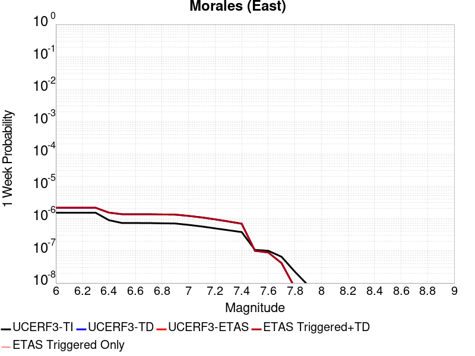 |  |  |  |

| Magnitude | 1 wk TI Prob | 1 wk TD Prob | 1 wk ETAS Prob | 1 wk ETAS/TD Gain | 1 wk ETAS Triggered+TD | 1 wk ETAS Triggered Only | 1 mo TI Prob | 1 mo TD Prob | 1 mo ETAS Prob | 1 mo ETAS/TD Gain | 1 mo ETAS Triggered+TD | 1 mo ETAS Triggered Only | 1 yr TI Prob | 1 yr TD Prob | 1 yr ETAS Prob | 1 yr ETAS/TD Gain | 1 yr ETAS Triggered+TD | 1 yr ETAS Triggered Only | 10 yr TI Prob | 10 yr TD Prob | 10 yr ETAS Prob | 10 yr ETAS/TD Gain | 10 yr ETAS Triggered+TD | 10 yr ETAS Triggered Only |
|-----|-----|-----|-----|-----|-----|-----|-----|-----|-----|-----|-----|-----|-----|-----|-----|-----|-----|-----|-----|-----|-----|-----|-----|-----|
| 6.0 | 1.4942771E-6 | 2.1254696E-6 | 0.0 | 0.0 | 2.1254696E-6 | 0.0 | 6.404029E-6 | 9.109127E-6 | 0.0 | 0.0 | 9.109127E-6 | 0.0 | 7.7966266E-5 | 1.1089855E-4 | 0.0 | 0.0 | 1.1089855E-4 | 0.0 | 7.793892E-4 | 0.0011084919 | 2.0E-4 | 0.18042532 | 0.0013082701 | 2.0E-4 |
| 6.1 | 1.4942771E-6 | 2.1254696E-6 | 0.0 | 0.0 | 2.1254696E-6 | 0.0 | 6.404029E-6 | 9.109127E-6 | 0.0 | 0.0 | 9.109127E-6 | 0.0 | 7.7966266E-5 | 1.1089855E-4 | 0.0 | 0.0 | 1.1089855E-4 | 0.0 | 7.793892E-4 | 0.0011084919 | 2.0E-4 | 0.18042532 | 0.0013082701 | 2.0E-4 |
| 6.2 | 1.4942771E-6 | 2.1254696E-6 | 0.0 | 0.0 | 2.1254696E-6 | 0.0 | 6.404029E-6 | 9.109127E-6 | 0.0 | 0.0 | 9.109127E-6 | 0.0 | 7.7966266E-5 | 1.1089855E-4 | 0.0 | 0.0 | 1.1089855E-4 | 0.0 | 7.793892E-4 | 0.0011084919 | 2.0E-4 | 0.18042532 | 0.0013082701 | 2.0E-4 |
| 6.3 | 1.4942771E-6 | 2.1254696E-6 | 0.0 | 0.0 | 2.1254696E-6 | 0.0 | 6.404029E-6 | 9.109127E-6 | 0.0 | 0.0 | 9.109127E-6 | 0.0 | 7.7966266E-5 | 1.1089855E-4 | 0.0 | 0.0 | 1.1089855E-4 | 0.0 | 7.793892E-4 | 0.0011084919 | 2.0E-4 | 0.18042532 | 0.0013082701 | 2.0E-4 |
| 6.4 | 8.798845E-7 | 1.5042494E-6 | 0.0 | 0.0 | 1.5042494E-6 | 0.0 | 3.7709283E-6 | 6.446768E-6 | 0.0 | 0.0 | 6.446768E-6 | 0.0 | 4.5910085E-5 | 7.8486686E-5 | 0.0 | 0.0 | 7.8486686E-5 | 0.0 | 4.59006E-4 | 7.846031E-4 | 1.0E-4 | 0.12745297 | 8.8452466E-4 | 1.0E-4 |
| 6.5 | 7.1751725E-7 | 1.3403962E-6 | 0.0 | 0.0 | 1.3403962E-6 | 0.0 | 3.0750705E-6 | 5.7445427E-6 | 0.0 | 0.0 | 5.7445427E-6 | 0.0 | 3.7438338E-5 | 6.993764E-5 | 0.0 | 0.0 | 6.993764E-5 | 0.0 | 3.743203E-4 | 6.9916644E-4 | 1.0E-4 | 0.14302745 | 7.9909654E-4 | 1.0E-4 |
| 6.6 | 7.1751725E-7 | 1.3403962E-6 | 0.0 | 0.0 | 1.3403962E-6 | 0.0 | 3.0750705E-6 | 5.7445427E-6 | 0.0 | 0.0 | 5.7445427E-6 | 0.0 | 3.7438338E-5 | 6.993764E-5 | 0.0 | 0.0 | 6.993764E-5 | 0.0 | 3.743203E-4 | 6.9916644E-4 | 1.0E-4 | 0.14302745 | 7.9909654E-4 | 1.0E-4 |
| 6.7 | 7.159057E-7 | 1.3378595E-6 | 0.0 | 0.0 | 1.3378595E-6 | 0.0 | 3.0681638E-6 | 5.7336715E-6 | 0.0 | 0.0 | 5.7336715E-6 | 0.0 | 3.7354253E-5 | 6.980529E-5 | 0.0 | 0.0 | 6.980529E-5 | 0.0 | 3.7347974E-4 | 6.978438E-4 | 1.0E-4 | 0.14329855 | 7.97774E-4 | 1.0E-4 |
| 6.8 | 7.032203E-7 | 1.3193846E-6 | 0.0 | 0.0 | 1.3193846E-6 | 0.0 | 3.0137978E-6 | 5.6544936E-6 | 0.0 | 0.0 | 5.6544936E-6 | 0.0 | 3.669237E-5 | 6.8841364E-5 | 0.0 | 0.0 | 6.8841364E-5 | 0.0 | 3.6686313E-4 | 6.882105E-4 | 1.0E-4 | 0.14530438 | 7.881417E-4 | 1.0E-4 |
| 6.9 | 6.941549E-7 | 1.3044196E-6 | 0.0 | 0.0 | 1.3044196E-6 | 0.0 | 2.974946E-6 | 5.590358E-6 | 0.0 | 0.0 | 5.590358E-6 | 0.0 | 3.6219368E-5 | 6.806056E-5 | 0.0 | 0.0 | 6.806056E-5 | 0.0 | 3.6213463E-4 | 6.804072E-4 | 1.0E-4 | 0.14697081 | 7.803392E-4 | 1.0E-4 |
| 7.0 | 6.2932247E-7 | 1.1894463E-6 | 0.0 | 0.0 | 1.1894463E-6 | 0.0 | 2.6970936E-6 | 5.0976173E-6 | 0.0 | 0.0 | 5.0976173E-6 | 0.0 | 3.283662E-5 | 6.206179E-5 | 0.0 | 0.0 | 6.206179E-5 | 0.0 | 3.283177E-4 | 6.204534E-4 | 1.0E-4 | 0.16117246 | 7.2039134E-4 | 1.0E-4 |
| 7.1 | 5.6200963E-7 | 1.0655207E-6 | 0.0 | 0.0 | 1.0655207E-6 | 0.0 | 2.4086105E-6 | 4.5665097E-6 | 0.0 | 0.0 | 4.5665097E-6 | 0.0 | 2.9324437E-5 | 5.5595883E-5 | 0.0 | 0.0 | 5.5595883E-5 | 0.0 | 2.9320567E-4 | 5.5582693E-4 | 1.0E-4 | 0.1799121 | 6.5577135E-4 | 1.0E-4 |
| 7.2 | 4.91044E-7 | 9.29813E-7 | 0.0 | 0.0 | 9.29813E-7 | 0.0 | 2.1044725E-6 | 3.984907E-6 | 0.0 | 0.0 | 3.984907E-6 | 0.0 | 2.5621652E-5 | 4.8515198E-5 | 0.0 | 0.0 | 4.8515198E-5 | 0.0 | 2.56187E-4 | 4.8505235E-4 | 1.0E-4 | 0.20616332 | 5.850039E-4 | 1.0E-4 |
| 7.3 | 4.2978448E-7 | 7.982181E-7 | 0.0 | 0.0 | 7.982181E-7 | 0.0 | 1.8419321E-6 | 3.4209304E-6 | 0.0 | 0.0 | 3.4209304E-6 | 0.0 | 2.2425293E-5 | 4.1649062E-5 | 0.0 | 0.0 | 4.1649062E-5 | 0.0 | 2.242303E-4 | 4.1641816E-4 | 1.0E-4 | 0.24014322 | 5.163765E-4 | 1.0E-4 |
| 7.4 | 3.774317E-7 | 6.8112377E-7 | 0.0 | 0.0 | 6.8112377E-7 | 0.0 | 1.6175634E-6 | 2.9190987E-6 | 0.0 | 0.0 | 2.9190987E-6 | 0.0 | 1.9693656E-5 | 3.5539473E-5 | 0.0 | 0.0 | 3.5539473E-5 | 0.0 | 1.969191E-4 | 3.5534316E-4 | 1.0E-4 | 0.2814181 | 4.5530763E-4 | 1.0E-4 |
| 7.5 | 1.0603232E-7 | 9.8324854E-8 | 0.0 | 0.0 | 9.8324854E-8 | 0.0 | 4.5442414E-7 | 4.2139214E-7 | 0.0 | 0.0 | 4.2139214E-7 | 0.0 | 5.5326E-6 | 5.1304373E-6 | 0.0 | 0.0 | 5.1304373E-6 | 0.0 | 5.532462E-5 | 5.130572E-5 | 0.0 | 0.0 | 5.130572E-5 | 0.0 |
| 7.6 | 9.960384E-8 | 8.746906E-8 | 0.0 | 0.0 | 8.746906E-8 | 0.0 | 4.2687353E-7 | 3.7486734E-7 | 0.0 | 0.0 | 3.7486734E-7 | 0.0 | 5.197173E-6 | 4.5640004E-6 | 0.0 | 0.0 | 4.5640004E-6 | 0.0 | 5.1970514E-5 | 4.5641595E-5 | 0.0 | 0.0 | 4.5641595E-5 | 0.0 |
| 7.7 | 6.499468E-8 | 4.0971727E-8 | 0.0 | 0.0 | 4.0971727E-8 | 0.0 | 2.785486E-7 | 1.755931E-7 | 0.0 | 0.0 | 1.755931E-7 | 0.0 | 3.3913238E-6 | 2.137844E-6 | 0.0 | 0.0 | 2.137844E-6 | 0.0 | 3.3912722E-5 | 2.1380754E-5 | 0.0 | 0.0 | 2.1380754E-5 | 0.0 |
| 7.8 | 2.2517119E-8 | 7.113174E-9 | 0.0 | 0.0 | 7.113174E-9 | 0.0 | 9.6501935E-8 | 3.0485033E-8 | 0.0 | 0.0 | 3.0485033E-8 | 0.0 | 1.1749105E-6 | 3.7115524E-7 | 0.0 | 0.0 | 3.7115524E-7 | 0.0 | 1.1749043E-5 | 3.7140474E-6 | 0.0 | 0.0 | 3.7140474E-6 | 0.0 |
| 7.9 | 8.493023E-9 | 9.921594E-10 | 0.0 | 0.0 | 9.921594E-10 | 0.0 | 3.639867E-8 | 4.2521147E-9 | 0.0 | 0.0 | 4.2521147E-9 | 0.0 | 4.4315374E-7 | 5.1769497E-8 | 0.0 | 0.0 | 5.1769497E-8 | 0.0 | 4.4315284E-6 | 5.1976923E-7 | 0.0 | 0.0 | 5.1976923E-7 | 0.0 |
| 8.0 | 1.4971842E-9 | 5.49627E-11 | 0.0 | 0.0 | 5.49627E-11 | 0.0 | 6.4165038E-9 | 2.3555502E-10 | 0.0 | 0.0 | 2.3555502E-10 | 0.0 | 7.812093E-8 | 2.8678802E-9 | 0.0 | 0.0 | 2.8678802E-9 | 0.0 | 7.81209E-7 | 2.9920063E-8 | 0.0 | 0.0 | 2.9920063E-8 | 0.0 |

## San Gabriel (Extension)
*[(top)](#table-of-contents)*

| 1 Week | 1 Month | 1 Year | 10 Year |
|-----|-----|-----|-----|
|  |  |  | 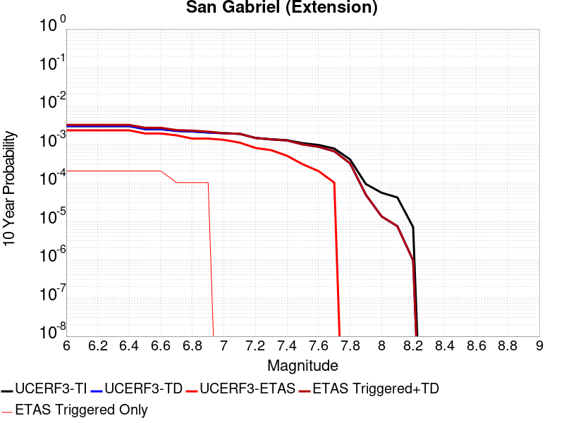 |

| Magnitude | 1 wk TI Prob | 1 wk TD Prob | 1 wk ETAS Prob | 1 wk ETAS/TD Gain | 1 wk ETAS Triggered+TD | 1 wk ETAS Triggered Only | 1 mo TI Prob | 1 mo TD Prob | 1 mo ETAS Prob | 1 mo ETAS/TD Gain | 1 mo ETAS Triggered+TD | 1 mo ETAS Triggered Only | 1 yr TI Prob | 1 yr TD Prob | 1 yr ETAS Prob | 1 yr ETAS/TD Gain | 1 yr ETAS Triggered+TD | 1 yr ETAS Triggered Only | 10 yr TI Prob | 10 yr TD Prob | 10 yr ETAS Prob | 10 yr ETAS/TD Gain | 10 yr ETAS Triggered+TD | 10 yr ETAS Triggered Only |
|-----|-----|-----|-----|-----|-----|-----|-----|-----|-----|-----|-----|-----|-----|-----|-----|-----|-----|-----|-----|-----|-----|-----|-----|-----|
| 6.0 | 5.6486106E-6 | 5.7199945E-6 | 0.0 | 0.0 | 5.7199945E-6 | 0.0 | 2.4208108E-5 | 2.451404E-5 | 0.0 | 0.0 | 2.451404E-5 | 0.0 | 2.9469383E-4 | 2.9841883E-4 | 0.0 | 0.0 | 2.9841883E-4 | 0.0 | 0.0029430336 | 0.0029803114 | 2.0E-4 | 0.06710708 | 0.0031797152 | 2.0E-4 |
| 6.1 | 5.6486106E-6 | 5.7199945E-6 | 0.0 | 0.0 | 5.7199945E-6 | 0.0 | 2.4208108E-5 | 2.451404E-5 | 0.0 | 0.0 | 2.451404E-5 | 0.0 | 2.9469383E-4 | 2.9841883E-4 | 0.0 | 0.0 | 2.9841883E-4 | 0.0 | 0.0029430336 | 0.0029803114 | 2.0E-4 | 0.06710708 | 0.0031797152 | 2.0E-4 |
| 6.2 | 5.6486106E-6 | 5.7199945E-6 | 0.0 | 0.0 | 5.7199945E-6 | 0.0 | 2.4208108E-5 | 2.451404E-5 | 0.0 | 0.0 | 2.451404E-5 | 0.0 | 2.9469383E-4 | 2.9841883E-4 | 0.0 | 0.0 | 2.9841883E-4 | 0.0 | 0.0029430336 | 0.0029803114 | 2.0E-4 | 0.06710708 | 0.0031797152 | 2.0E-4 |
| 6.3 | 5.6486106E-6 | 5.7199945E-6 | 0.0 | 0.0 | 5.7199945E-6 | 0.0 | 2.4208108E-5 | 2.451404E-5 | 0.0 | 0.0 | 2.451404E-5 | 0.0 | 2.9469383E-4 | 2.9841883E-4 | 0.0 | 0.0 | 2.9841883E-4 | 0.0 | 0.0029430336 | 0.0029803114 | 2.0E-4 | 0.06710708 | 0.0031797152 | 2.0E-4 |
| 6.4 | 5.6486106E-6 | 5.7199945E-6 | 0.0 | 0.0 | 5.7199945E-6 | 0.0 | 2.4208108E-5 | 2.451404E-5 | 0.0 | 0.0 | 2.451404E-5 | 0.0 | 2.9469383E-4 | 2.9841883E-4 | 0.0 | 0.0 | 2.9841883E-4 | 0.0 | 0.0029430336 | 0.0029803114 | 2.0E-4 | 0.06710708 | 0.0031797152 | 2.0E-4 |
| 6.5 | 4.7134554E-6 | 4.7573603E-6 | 0.0 | 0.0 | 4.7573603E-6 | 0.0 | 2.0200367E-5 | 2.0388534E-5 | 0.0 | 0.0 | 2.0388534E-5 | 0.0 | 2.459117E-4 | 2.4820297E-4 | 0.0 | 0.0 | 2.4820297E-4 | 0.0 | 0.0024563975 | 0.0024793458 | 2.0E-4 | 0.08066644 | 0.00267885 | 2.0E-4 |
| 6.6 | 4.7134554E-6 | 4.7573603E-6 | 0.0 | 0.0 | 4.7573603E-6 | 0.0 | 2.0200367E-5 | 2.0388534E-5 | 0.0 | 0.0 | 2.0388534E-5 | 0.0 | 2.459117E-4 | 2.4820297E-4 | 0.0 | 0.0 | 2.4820297E-4 | 0.0 | 0.0024563975 | 0.0024793458 | 2.0E-4 | 0.08066644 | 0.00267885 | 2.0E-4 |
| 6.7 | 4.2468837E-6 | 4.277149E-6 | 0.0 | 0.0 | 4.277149E-6 | 0.0 | 1.8200803E-5 | 1.8330515E-5 | 0.0 | 0.0 | 1.8330515E-5 | 0.0 | 2.2157225E-4 | 2.2315187E-4 | 0.0 | 0.0 | 2.2315187E-4 | 0.0 | 0.0022135144 | 0.0022293539 | 1.0E-4 | 0.044856045 | 0.0023291311 | 1.0E-4 |
| 6.8 | 4.1180615E-6 | 4.1445305E-6 | 0.0 | 0.0 | 4.1445305E-6 | 0.0 | 1.7648716E-5 | 1.7762157E-5 | 0.0 | 0.0 | 1.7762157E-5 | 0.0 | 2.1485193E-4 | 2.1623351E-4 | 0.0 | 0.0 | 2.1623351E-4 | 0.0 | 0.0021464431 | 0.0021603063 | 1.0E-4 | 0.04628973 | 0.0022600903 | 1.0E-4 |
| 6.9 | 3.863861E-6 | 3.88283E-6 | 0.0 | 0.0 | 3.88283E-6 | 0.0 | 1.65593E-5 | 1.6640597E-5 | 0.0 | 0.0 | 1.6640597E-5 | 0.0 | 2.0159081E-4 | 2.0258113E-4 | 0.0 | 0.0 | 2.0258113E-4 | 0.0 | 0.0020140803 | 0.0020240361 | 1.0E-4 | 0.049406234 | 0.0021238336 | 1.0E-4 |
| 7.0 | 3.6947372E-6 | 3.7087186E-6 | 0.0 | 0.0 | 3.7087186E-6 | 0.0 | 1.5834492E-5 | 1.5894415E-5 | 0.0 | 0.0 | 1.5894415E-5 | 0.0 | 1.9276788E-4 | 1.93498E-4 | 0.0 | 0.0 | 1.93498E-4 | 0.0 | 0.0019260074 | 0.0019333655 | 0.0 | 0.0 | 0.0019333655 | 0.0 |
| 7.1 | 3.5686835E-6 | 3.5759226E-6 | 0.0 | 0.0 | 3.5759226E-6 | 0.0 | 1.5294268E-5 | 1.5325297E-5 | 0.0 | 0.0 | 1.5325297E-5 | 0.0 | 1.861918E-4 | 1.8657018E-4 | 0.0 | 0.0 | 1.8657018E-4 | 0.0 | 0.0018603588 | 0.0018642051 | 0.0 | 0.0 | 0.0018642051 | 0.0 |
| 7.2 | 2.8023446E-6 | 2.7797441E-6 | 0.0 | 0.0 | 2.7797441E-6 | 0.0 | 1.2009994E-5 | 1.19131355E-5 | 0.0 | 0.0 | 1.19131355E-5 | 0.0 | 1.4621185E-4 | 1.4503289E-4 | 0.0 | 0.0 | 1.4503289E-4 | 0.0 | 0.001461157 | 0.001449397 | 0.0 | 0.0 | 0.001449397 | 0.0 |
| 7.3 | 2.5843012E-6 | 2.5488728E-6 | 0.0 | 0.0 | 2.5488728E-6 | 0.0 | 1.1075529E-5 | 1.0923695E-5 | 0.0 | 0.0 | 1.0923695E-5 | 0.0 | 1.3483623E-4 | 1.3298797E-4 | 0.0 | 0.0 | 1.3298797E-4 | 0.0 | 0.0013475444 | 0.0013290974 | 0.0 | 0.0 | 0.0013290974 | 0.0 |
| 7.4 | 2.4464468E-6 | 2.399506E-6 | 0.0 | 0.0 | 2.399506E-6 | 0.0 | 1.04847295E-5 | 1.02835575E-5 | 0.0 | 0.0 | 1.02835575E-5 | 0.0 | 1.276441E-4 | 1.2519522E-4 | 0.0 | 0.0 | 1.2519522E-4 | 0.0 | 0.0012757082 | 0.0012512603 | 0.0 | 0.0 | 0.0012512603 | 0.0 |
| 7.5 | 2.0420266E-6 | 1.8933426E-6 | 0.0 | 0.0 | 1.8933426E-6 | 0.0 | 8.751514E-6 | 8.114301E-6 | 0.0 | 0.0 | 8.114301E-6 | 0.0 | 1.0654447E-4 | 9.878717E-5 | 0.0 | 0.0 | 9.878717E-5 | 0.0 | 0.001064934 | 9.874398E-4 | 0.0 | 0.0 | 9.874398E-4 | 0.0 |
| 7.6 | 1.8326596E-6 | 1.6418614E-6 | 0.0 | 0.0 | 1.6418614E-6 | 0.0 | 7.854232E-6 | 7.0365304E-6 | 0.0 | 0.0 | 7.0365304E-6 | 0.0 | 9.562107E-5 | 8.566641E-5 | 0.0 | 0.0 | 8.566641E-5 | 0.0 | 9.5579936E-4 | 8.563399E-4 | 0.0 | 0.0 | 8.563399E-4 | 0.0 |
| 7.7 | 1.4786998E-6 | 1.2541004E-6 | 0.0 | 0.0 | 1.2541004E-6 | 0.0 | 6.3372695E-6 | 5.3747053E-6 | 0.0 | 0.0 | 5.3747053E-6 | 0.0 | 7.715353E-5 | 6.543508E-5 | 0.0 | 0.0 | 6.543508E-5 | 0.0 | 7.7126746E-4 | 6.541668E-4 | 0.0 | 0.0 | 6.541668E-4 | 0.0 |
| 7.8 | 7.6975533E-7 | 6.081518E-7 | 0.0 | 0.0 | 6.081518E-7 | 0.0 | 3.2989474E-6 | 2.6063622E-6 | 0.0 | 0.0 | 2.6063622E-6 | 0.0 | 4.0163945E-5 | 3.1732E-5 | 0.0 | 0.0 | 3.1732E-5 | 0.0 | 4.0156685E-4 | 3.1728146E-4 | 0.0 | 0.0 | 3.1728146E-4 | 0.0 |
| 7.9 | 1.7645915E-7 | 9.221684E-8 | 0.0 | 0.0 | 9.221684E-8 | 0.0 | 7.562533E-7 | 3.9521493E-7 | 0.0 | 0.0 | 3.9521493E-7 | 0.0 | 9.207345E-6 | 4.8117313E-6 | 0.0 | 0.0 | 4.8117313E-6 | 0.0 | 9.206964E-5 | 4.812091E-5 | 0.0 | 0.0 | 4.812091E-5 | 0.0 |
| 8.0 | 1.0463461E-7 | 2.4921281E-8 | 0.0 | 0.0 | 2.4921281E-8 | 0.0 | 4.4843398E-7 | 1.0680548E-7 | 0.0 | 0.0 | 1.0680548E-7 | 0.0 | 5.45967E-6 | 1.300356E-6 | 0.0 | 0.0 | 1.300356E-6 | 0.0 | 5.459536E-5 | 1.3008118E-5 | 0.0 | 0.0 | 1.3008118E-5 | 0.0 |
| 8.1 | 7.875717E-8 | 1.3847007E-8 | 0.0 | 0.0 | 1.3847007E-8 | 0.0 | 3.3753068E-7 | 5.9344313E-8 | 0.0 | 0.0 | 5.9344313E-8 | 0.0 | 4.109428E-6 | 7.2251675E-7 | 0.0 | 0.0 | 7.2251675E-7 | 0.0 | 4.109352E-5 | 7.229779E-6 | 0.0 | 0.0 | 7.229779E-6 | 0.0 |
| 8.2 | 1.33163E-8 | 1.770835E-9 | 0.0 | 0.0 | 1.770835E-9 | 0.0 | 5.7069855E-8 | 7.589293E-9 | 0.0 | 0.0 | 7.589293E-9 | 0.0 | 6.9482525E-7 | 9.2399624E-8 | 0.0 | 0.0 | 9.2399624E-8 | 0.0 | 6.9482307E-6 | 9.259028E-7 | 0.0 | 0.0 | 9.259028E-7 | 0.0 |

## Kern Canyon (South Kern) 2011
*[(top)](#table-of-contents)*

| 1 Week | 1 Month | 1 Year | 10 Year |
|-----|-----|-----|-----|
|  |  |  | 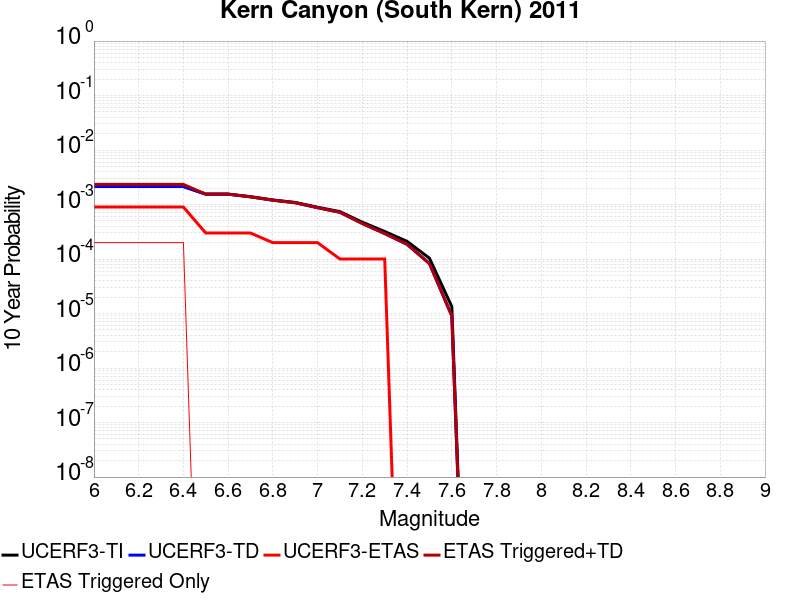 |

| Magnitude | 1 wk TI Prob | 1 wk TD Prob | 1 wk ETAS Prob | 1 wk ETAS/TD Gain | 1 wk ETAS Triggered+TD | 1 wk ETAS Triggered Only | 1 mo TI Prob | 1 mo TD Prob | 1 mo ETAS Prob | 1 mo ETAS/TD Gain | 1 mo ETAS Triggered+TD | 1 mo ETAS Triggered Only | 1 yr TI Prob | 1 yr TD Prob | 1 yr ETAS Prob | 1 yr ETAS/TD Gain | 1 yr ETAS Triggered+TD | 1 yr ETAS Triggered Only | 10 yr TI Prob | 10 yr TD Prob | 10 yr ETAS Prob | 10 yr ETAS/TD Gain | 10 yr ETAS Triggered+TD | 10 yr ETAS Triggered Only |
|-----|-----|-----|-----|-----|-----|-----|-----|-----|-----|-----|-----|-----|-----|-----|-----|-----|-----|-----|-----|-----|-----|-----|-----|-----|
| 6.0 | 4.105075E-6 | 4.1138683E-6 | 0.0 | 0.0 | 4.1138683E-6 | 0.0 | 1.7593058E-5 | 1.7630748E-5 | 0.0 | 0.0 | 1.7630748E-5 | 0.0 | 2.1417443E-4 | 2.1463387E-4 | 0.0 | 0.0 | 2.1463387E-4 | 0.0 | 0.0021396813 | 0.0021443295 | 2.0E-4 | 0.093269244 | 0.0023439007 | 2.0E-4 |
| 6.1 | 4.105075E-6 | 4.1138683E-6 | 0.0 | 0.0 | 4.1138683E-6 | 0.0 | 1.7593058E-5 | 1.7630748E-5 | 0.0 | 0.0 | 1.7630748E-5 | 0.0 | 2.1417443E-4 | 2.1463387E-4 | 0.0 | 0.0 | 2.1463387E-4 | 0.0 | 0.0021396813 | 0.0021443295 | 2.0E-4 | 0.093269244 | 0.0023439007 | 2.0E-4 |
| 6.2 | 4.105075E-6 | 4.1138683E-6 | 0.0 | 0.0 | 4.1138683E-6 | 0.0 | 1.7593058E-5 | 1.7630748E-5 | 0.0 | 0.0 | 1.7630748E-5 | 0.0 | 2.1417443E-4 | 2.1463387E-4 | 0.0 | 0.0 | 2.1463387E-4 | 0.0 | 0.0021396813 | 0.0021443295 | 2.0E-4 | 0.093269244 | 0.0023439007 | 2.0E-4 |
| 6.3 | 4.105075E-6 | 4.1138683E-6 | 0.0 | 0.0 | 4.1138683E-6 | 0.0 | 1.7593058E-5 | 1.7630748E-5 | 0.0 | 0.0 | 1.7630748E-5 | 0.0 | 2.1417443E-4 | 2.1463387E-4 | 0.0 | 0.0 | 2.1463387E-4 | 0.0 | 0.0021396813 | 0.0021443295 | 2.0E-4 | 0.093269244 | 0.0023439007 | 2.0E-4 |
| 6.4 | 4.105075E-6 | 4.1138683E-6 | 0.0 | 0.0 | 4.1138683E-6 | 0.0 | 1.7593058E-5 | 1.7630748E-5 | 0.0 | 0.0 | 1.7630748E-5 | 0.0 | 2.1417443E-4 | 2.1463387E-4 | 0.0 | 0.0 | 2.1463387E-4 | 0.0 | 0.0021396813 | 0.0021443295 | 2.0E-4 | 0.093269244 | 0.0023439007 | 2.0E-4 |
| 6.5 | 2.9849807E-6 | 2.9732537E-6 | 0.0 | 0.0 | 2.9732537E-6 | 0.0 | 1.2792712E-5 | 1.2742455E-5 | 0.0 | 0.0 | 1.2742455E-5 | 0.0 | 1.5574014E-4 | 1.5512848E-4 | 0.0 | 0.0 | 1.5512848E-4 | 0.0 | 0.0015563103 | 0.0015502172 | 0.0 | 0.0 | 0.0015502172 | 0.0 |
| 6.6 | 2.9849807E-6 | 2.9732537E-6 | 0.0 | 0.0 | 2.9732537E-6 | 0.0 | 1.2792712E-5 | 1.2742455E-5 | 0.0 | 0.0 | 1.2742455E-5 | 0.0 | 1.5574014E-4 | 1.5512848E-4 | 0.0 | 0.0 | 1.5512848E-4 | 0.0 | 0.0015563103 | 0.0015502172 | 0.0 | 0.0 | 0.0015502172 | 0.0 |
| 6.7 | 2.6756725E-6 | 2.658308E-6 | 0.0 | 0.0 | 2.658308E-6 | 0.0 | 1.1467117E-5 | 1.1392699E-5 | 0.0 | 0.0 | 1.1392699E-5 | 0.0 | 1.396032E-4 | 1.3869739E-4 | 0.0 | 0.0 | 1.3869739E-4 | 0.0 | 0.0013951553 | 0.0013861192 | 0.0 | 0.0 | 0.0013861192 | 0.0 |
| 6.8 | 2.3283721E-6 | 2.304853E-6 | 0.0 | 0.0 | 2.304853E-6 | 0.0 | 9.9787E-6 | 9.877905E-6 | 0.0 | 0.0 | 9.877905E-6 | 0.0 | 1.214839E-4 | 1.20256926E-4 | 0.0 | 0.0 | 1.20256926E-4 | 0.0 | 0.001214175 | 0.001201926 | 0.0 | 0.0 | 0.001201926 | 0.0 |
| 6.9 | 2.0972677E-6 | 2.0697069E-6 | 0.0 | 0.0 | 2.0697069E-6 | 0.0 | 8.988259E-6 | 8.870143E-6 | 0.0 | 0.0 | 8.870143E-6 | 0.0 | 1.0942656E-4 | 1.0798869E-4 | 0.0 | 0.0 | 1.0798869E-4 | 0.0 | 0.0010937268 | 0.001079368 | 0.0 | 0.0 | 0.001079368 | 0.0 |
| 7.0 | 1.7132242E-6 | 1.6787549E-6 | 0.0 | 0.0 | 1.6787549E-6 | 0.0 | 7.3423685E-6 | 7.1946442E-6 | 0.0 | 0.0 | 7.1946442E-6 | 0.0 | 8.938967E-5 | 8.759131E-5 | 0.0 | 0.0 | 8.759131E-5 | 0.0 | 8.935372E-4 | 8.7557174E-4 | 0.0 | 0.0 | 8.7557174E-4 | 0.0 |
| 7.1 | 1.4215541E-6 | 1.3816151E-6 | 0.0 | 0.0 | 1.3816151E-6 | 0.0 | 6.0923603E-6 | 5.9211943E-6 | 0.0 | 0.0 | 5.9211943E-6 | 0.0 | 7.417196E-5 | 7.208818E-5 | 0.0 | 0.0 | 7.208818E-5 | 0.0 | 7.414721E-4 | 7.2065066E-4 | 0.0 | 0.0 | 7.2065066E-4 | 0.0 |
| 7.2 | 9.097853E-7 | 8.603977E-7 | 0.0 | 0.0 | 8.603977E-7 | 0.0 | 3.899074E-6 | 3.6874135E-6 | 0.0 | 0.0 | 3.6874135E-6 | 0.0 | 4.7470192E-5 | 4.4893346E-5 | 0.0 | 0.0 | 4.4893346E-5 | 0.0 | 4.7460053E-4 | 4.4884384E-4 | 0.0 | 0.0 | 4.4884384E-4 | 0.0 |
| 7.3 | 6.144169E-7 | 5.6283E-7 | 0.0 | 0.0 | 5.6283E-7 | 0.0 | 2.6332125E-6 | 2.4121262E-6 | 0.0 | 0.0 | 2.4121262E-6 | 0.0 | 3.205889E-5 | 2.9367246E-5 | 0.0 | 0.0 | 2.9367246E-5 | 0.0 | 3.2054266E-4 | 2.9363416E-4 | 0.0 | 0.0 | 2.9363416E-4 | 0.0 |
| 7.4 | 4.049844E-7 | 3.572862E-7 | 0.0 | 0.0 | 3.572862E-7 | 0.0 | 1.7356463E-6 | 1.5312257E-6 | 0.0 | 0.0 | 1.5312257E-6 | 0.0 | 2.1131287E-5 | 1.8642517E-5 | 0.0 | 0.0 | 1.8642517E-5 | 0.0 | 2.1129279E-4 | 1.8640977E-4 | 0.0 | 0.0 | 1.8640977E-4 | 0.0 |
| 7.5 | 1.9871162E-7 | 1.5830194E-7 | 0.0 | 0.0 | 1.5830194E-7 | 0.0 | 8.5162094E-7 | 6.784367E-7 | 0.0 | 0.0 | 6.784367E-7 | 0.0 | 1.0368436E-5 | 8.259937E-6 | 0.0 | 0.0 | 8.259937E-6 | 0.0 | 1.0367952E-4 | 8.259638E-5 | 0.0 | 0.0 | 8.259638E-5 | 0.0 |
| 7.6 | 2.572245E-8 | 1.7351576E-8 | 0.0 | 0.0 | 1.7351576E-8 | 0.0 | 1.10239064E-7 | 7.4363896E-8 | 0.0 | 0.0 | 7.4363896E-8 | 0.0 | 1.3421597E-6 | 9.053801E-7 | 0.0 | 0.0 | 9.053801E-7 | 0.0 | 1.3421517E-5 | 9.05377E-6 | 0.0 | 0.0 | 9.05377E-6 | 0.0 |

## Oceanside alt1
*[(top)](#table-of-contents)*

| 1 Week | 1 Month | 1 Year | 10 Year |
|-----|-----|-----|-----|
|  |  |  |  |

| Magnitude | 1 wk TI Prob | 1 wk TD Prob | 1 wk ETAS Prob | 1 wk ETAS/TD Gain | 1 wk ETAS Triggered+TD | 1 wk ETAS Triggered Only | 1 mo TI Prob | 1 mo TD Prob | 1 mo ETAS Prob | 1 mo ETAS/TD Gain | 1 mo ETAS Triggered+TD | 1 mo ETAS Triggered Only | 1 yr TI Prob | 1 yr TD Prob | 1 yr ETAS Prob | 1 yr ETAS/TD Gain | 1 yr ETAS Triggered+TD | 1 yr ETAS Triggered Only | 10 yr TI Prob | 10 yr TD Prob | 10 yr ETAS Prob | 10 yr ETAS/TD Gain | 10 yr ETAS Triggered+TD | 10 yr ETAS Triggered Only |
|-----|-----|-----|-----|-----|-----|-----|-----|-----|-----|-----|-----|-----|-----|-----|-----|-----|-----|-----|-----|-----|-----|-----|-----|-----|
| 6.0 | 1.1617542E-5 | 1.1424564E-5 | 0.0 | 0.0 | 1.1424564E-5 | 0.0 | 4.9788516E-5 | 4.8961592E-5 | 0.0 | 0.0 | 4.8961592E-5 | 0.0 | 6.060066E-4 | 5.959604E-4 | 2.0E-4 | 0.33559275 | 7.958412E-4 | 2.0E-4 | 0.0060435664 | 0.0059452206 | 2.0E-4 | 0.033640467 | 0.006144032 | 2.0E-4 |
| 6.1 | 1.1617542E-5 | 1.1424564E-5 | 0.0 | 0.0 | 1.1424564E-5 | 0.0 | 4.9788516E-5 | 4.8961592E-5 | 0.0 | 0.0 | 4.8961592E-5 | 0.0 | 6.060066E-4 | 5.959604E-4 | 2.0E-4 | 0.33559275 | 7.958412E-4 | 2.0E-4 | 0.0060435664 | 0.0059452206 | 2.0E-4 | 0.033640467 | 0.006144032 | 2.0E-4 |
| 6.2 | 1.1617542E-5 | 1.1424564E-5 | 0.0 | 0.0 | 1.1424564E-5 | 0.0 | 4.9788516E-5 | 4.8961592E-5 | 0.0 | 0.0 | 4.8961592E-5 | 0.0 | 6.060066E-4 | 5.959604E-4 | 2.0E-4 | 0.33559275 | 7.958412E-4 | 2.0E-4 | 0.0060435664 | 0.0059452206 | 2.0E-4 | 0.033640467 | 0.006144032 | 2.0E-4 |
| 6.3 | 1.1617542E-5 | 1.1424564E-5 | 0.0 | 0.0 | 1.1424564E-5 | 0.0 | 4.9788516E-5 | 4.8961592E-5 | 0.0 | 0.0 | 4.8961592E-5 | 0.0 | 6.060066E-4 | 5.959604E-4 | 2.0E-4 | 0.33559275 | 7.958412E-4 | 2.0E-4 | 0.0060435664 | 0.0059452206 | 2.0E-4 | 0.033640467 | 0.006144032 | 2.0E-4 |
| 6.4 | 1.1617542E-5 | 1.1424564E-5 | 0.0 | 0.0 | 1.1424564E-5 | 0.0 | 4.9788516E-5 | 4.8961592E-5 | 0.0 | 0.0 | 4.8961592E-5 | 0.0 | 6.060066E-4 | 5.959604E-4 | 2.0E-4 | 0.33559275 | 7.958412E-4 | 2.0E-4 | 0.0060435664 | 0.0059452206 | 2.0E-4 | 0.033640467 | 0.006144032 | 2.0E-4 |
| 6.5 | 1.1617542E-5 | 1.1424564E-5 | 0.0 | 0.0 | 1.1424564E-5 | 0.0 | 4.9788516E-5 | 4.8961592E-5 | 0.0 | 0.0 | 4.8961592E-5 | 0.0 | 6.060066E-4 | 5.959604E-4 | 2.0E-4 | 0.33559275 | 7.958412E-4 | 2.0E-4 | 0.0060435664 | 0.0059452206 | 2.0E-4 | 0.033640467 | 0.006144032 | 2.0E-4 |
| 6.6 | 7.561768E-6 | 7.134177E-6 | 0.0 | 0.0 | 7.134177E-6 | 0.0 | 3.2407173E-5 | 3.057469E-5 | 0.0 | 0.0 | 3.057469E-5 | 0.0 | 3.9448592E-4 | 3.7218435E-4 | 0.0 | 0.0 | 3.7218435E-4 | 0.0 | 0.0039378637 | 0.003715722 | 0.0 | 0.0 | 0.003715722 | 0.0 |
| 6.7 | 7.1042605E-6 | 6.6562034E-6 | 0.0 | 0.0 | 6.6562034E-6 | 0.0 | 3.0446476E-5 | 2.8526278E-5 | 0.0 | 0.0 | 2.8526278E-5 | 0.0 | 3.706228E-4 | 3.4725288E-4 | 0.0 | 0.0 | 3.4725288E-4 | 0.0 | 0.0037000529 | 0.0034671861 | 0.0 | 0.0 | 0.0034671861 | 0.0 |
| 6.8 | 6.285554E-6 | 5.8001433E-6 | 0.0 | 0.0 | 5.8001433E-6 | 0.0 | 2.693781E-5 | 2.4857522E-5 | 0.0 | 0.0 | 2.4857522E-5 | 0.0 | 3.2791847E-4 | 3.0259887E-4 | 0.0 | 0.0 | 3.0259887E-4 | 0.0 | 0.0032743502 | 0.0030219257 | 0.0 | 0.0 | 0.0030219257 | 0.0 |
| 6.9 | 6.148883E-6 | 5.6569675E-6 | 0.0 | 0.0 | 5.6569675E-6 | 0.0 | 2.635209E-5 | 2.4243926E-5 | 0.0 | 0.0 | 2.4243926E-5 | 0.0 | 3.2078946E-4 | 2.9513036E-4 | 0.0 | 0.0 | 2.9513036E-4 | 0.0 | 0.003203268 | 0.002947441 | 0.0 | 0.0 | 0.002947441 | 0.0 |
| 7.0 | 5.253857E-6 | 4.7227422E-6 | 0.0 | 0.0 | 4.7227422E-6 | 0.0 | 2.2516335E-5 | 2.0240168E-5 | 0.0 | 0.0 | 2.0240168E-5 | 0.0 | 2.7410188E-4 | 2.463965E-4 | 0.0 | 0.0 | 2.463965E-4 | 0.0 | 0.0027376404 | 0.0024612644 | 0.0 | 0.0 | 0.0024612644 | 0.0 |
| 7.1 | 4.730754E-6 | 4.1787966E-6 | 0.0 | 0.0 | 4.1787966E-6 | 0.0 | 2.0274503E-5 | 1.7909008E-5 | 0.0 | 0.0 | 1.7909008E-5 | 0.0 | 2.468141E-4 | 2.180206E-4 | 0.0 | 0.0 | 2.180206E-4 | 0.0 | 0.0024654015 | 0.0021780937 | 0.0 | 0.0 | 0.0021780937 | 0.0 |
| 7.2 | 3.7998386E-6 | 3.2142207E-6 | 0.0 | 0.0 | 3.2142207E-6 | 0.0 | 1.6284921E-5 | 1.37751595E-5 | 0.0 | 0.0 | 1.37751595E-5 | 0.0 | 1.9825088E-4 | 1.6769978E-4 | 0.0 | 0.0 | 1.6769978E-4 | 0.0 | 0.001980741 | 0.0016757445 | 0.0 | 0.0 | 0.0016757445 | 0.0 |
| 7.3 | 3.2656465E-6 | 2.69853E-6 | 0.0 | 0.0 | 2.69853E-6 | 0.0 | 1.3995553E-5 | 1.1565078E-5 | 0.0 | 0.0 | 1.1565078E-5 | 0.0 | 1.7038253E-4 | 1.4079583E-4 | 0.0 | 0.0 | 1.4079583E-4 | 0.0 | 0.0017025196 | 0.0014070774 | 0.0 | 0.0 | 0.0014070774 | 0.0 |
| 7.4 | 2.593703E-6 | 2.0681252E-6 | 0.0 | 0.0 | 2.0681252E-6 | 0.0 | 1.1115822E-5 | 8.863364E-6 | 0.0 | 0.0 | 8.863364E-6 | 0.0 | 1.3532673E-4 | 1.079062E-4 | 0.0 | 0.0 | 1.079062E-4 | 0.0 | 0.0013524436 | 0.001078547 | 0.0 | 0.0 | 0.001078547 | 0.0 |
| 7.5 | 1.8715585E-6 | 1.4137997E-6 | 0.0 | 0.0 | 1.4137997E-6 | 0.0 | 8.020941E-6 | 6.0591283E-6 | 0.0 | 0.0 | 6.0591283E-6 | 0.0 | 9.7650576E-5 | 7.376745E-5 | 0.0 | 0.0 | 7.376745E-5 | 0.0 | 9.7607676E-4 | 7.374357E-4 | 0.0 | 0.0 | 7.374357E-4 | 0.0 |
| 7.6 | 1.2246786E-6 | 8.527535E-7 | 0.0 | 0.0 | 8.527535E-7 | 0.0 | 5.248612E-6 | 3.654653E-6 | 0.0 | 0.0 | 3.654653E-6 | 0.0 | 6.389998E-5 | 4.4494536E-5 | 0.0 | 0.0 | 4.4494536E-5 | 0.0 | 6.3881604E-4 | 4.4486078E-4 | 0.0 | 0.0 | 4.4486078E-4 | 0.0 |
| 7.7 | 5.140719E-7 | 2.735014E-7 | 0.0 | 0.0 | 2.735014E-7 | 0.0 | 2.2031636E-6 | 1.1721484E-6 | 0.0 | 0.0 | 1.1721484E-6 | 0.0 | 2.6823185E-5 | 1.4270827E-5 | 0.0 | 0.0 | 1.4270827E-5 | 0.0 | 2.6819948E-4 | 1.4270045E-4 | 0.0 | 0.0 | 1.4270045E-4 | 0.0 |
| 7.8 | 1.16056995E-8 | 9.783043E-9 | 0.0 | 0.0 | 9.783043E-9 | 0.0 | 4.9738713E-8 | 4.1927326E-8 | 0.0 | 0.0 | 4.1927326E-8 | 0.0 | 6.0556863E-7 | 5.104652E-7 | 0.0 | 0.0 | 5.104652E-7 | 0.0 | 6.05567E-6 | 5.1046522E-6 | 0.0 | 0.0 | 5.1046522E-6 | 0.0 |

## San Jacinto (Lytle Creek connector)
*[(top)](#table-of-contents)*

| 1 Week | 1 Month | 1 Year | 10 Year |
|-----|-----|-----|-----|
|  | 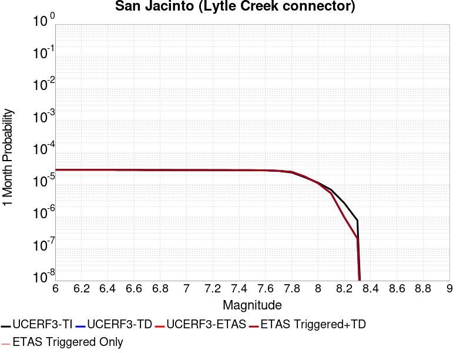 | 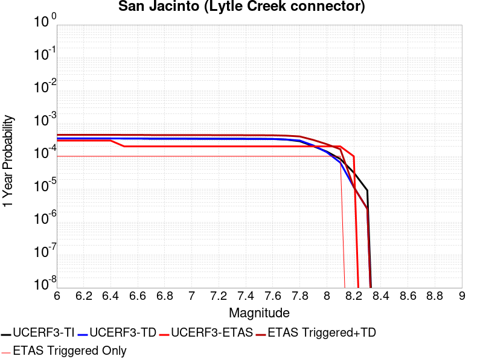 |  |

| Magnitude | 1 wk TI Prob | 1 wk TD Prob | 1 wk ETAS Prob | 1 wk ETAS/TD Gain | 1 wk ETAS Triggered+TD | 1 wk ETAS Triggered Only | 1 mo TI Prob | 1 mo TD Prob | 1 mo ETAS Prob | 1 mo ETAS/TD Gain | 1 mo ETAS Triggered+TD | 1 mo ETAS Triggered Only | 1 yr TI Prob | 1 yr TD Prob | 1 yr ETAS Prob | 1 yr ETAS/TD Gain | 1 yr ETAS Triggered+TD | 1 yr ETAS Triggered Only | 10 yr TI Prob | 10 yr TD Prob | 10 yr ETAS Prob | 10 yr ETAS/TD Gain | 10 yr ETAS Triggered+TD | 10 yr ETAS Triggered Only |
|-----|-----|-----|-----|-----|-----|-----|-----|-----|-----|-----|-----|-----|-----|-----|-----|-----|-----|-----|-----|-----|-----|-----|-----|-----|
| 6.0 | 6.693995E-6 | 6.687003E-6 | 0.0 | 0.0 | 6.687003E-6 | 0.0 | 2.8688235E-5 | 2.8658269E-5 | 0.0 | 0.0 | 2.8658269E-5 | 0.0 | 3.492233E-4 | 3.4885865E-4 | 1.0E-4 | 0.28664905 | 4.4882376E-4 | 1.0E-4 | 0.00348675 | 0.0035631761 | 2.0E-4 | 0.056129698 | 0.0037624633 | 2.0E-4 |
| 6.1 | 6.693995E-6 | 6.687003E-6 | 0.0 | 0.0 | 6.687003E-6 | 0.0 | 2.8688235E-5 | 2.8658269E-5 | 0.0 | 0.0 | 2.8658269E-5 | 0.0 | 3.492233E-4 | 3.4885865E-4 | 1.0E-4 | 0.28664905 | 4.4882376E-4 | 1.0E-4 | 0.00348675 | 0.0035631761 | 2.0E-4 | 0.056129698 | 0.0037624633 | 2.0E-4 |
| 6.2 | 6.693995E-6 | 6.687003E-6 | 0.0 | 0.0 | 6.687003E-6 | 0.0 | 2.8688235E-5 | 2.8658269E-5 | 0.0 | 0.0 | 2.8658269E-5 | 0.0 | 3.492233E-4 | 3.4885865E-4 | 1.0E-4 | 0.28664905 | 4.4882376E-4 | 1.0E-4 | 0.00348675 | 0.0035631761 | 2.0E-4 | 0.056129698 | 0.0037624633 | 2.0E-4 |
| 6.3 | 6.693995E-6 | 6.687003E-6 | 0.0 | 0.0 | 6.687003E-6 | 0.0 | 2.8688235E-5 | 2.8658269E-5 | 0.0 | 0.0 | 2.8658269E-5 | 0.0 | 3.492233E-4 | 3.4885865E-4 | 1.0E-4 | 0.28664905 | 4.4882376E-4 | 1.0E-4 | 0.00348675 | 0.0035631761 | 2.0E-4 | 0.056129698 | 0.0037624633 | 2.0E-4 |
| 6.4 | 6.693995E-6 | 6.687003E-6 | 0.0 | 0.0 | 6.687003E-6 | 0.0 | 2.8688235E-5 | 2.8658269E-5 | 0.0 | 0.0 | 2.8658269E-5 | 0.0 | 3.492233E-4 | 3.4885865E-4 | 1.0E-4 | 0.28664905 | 4.4882376E-4 | 1.0E-4 | 0.00348675 | 0.0035631761 | 2.0E-4 | 0.056129698 | 0.0037624633 | 2.0E-4 |
| 6.5 | 6.6561875E-6 | 6.6472167E-6 | 0.0 | 0.0 | 6.6472167E-6 | 0.0 | 2.8526205E-5 | 2.848776E-5 | 0.0 | 0.0 | 2.848776E-5 | 0.0 | 3.472512E-4 | 3.4678337E-4 | 1.0E-4 | 0.28836447 | 4.467487E-4 | 1.0E-4 | 0.0034670907 | 0.0035424896 | 2.0E-4 | 0.05645747 | 0.0037417812 | 2.0E-4 |
| 6.6 | 6.6561875E-6 | 6.6472167E-6 | 0.0 | 0.0 | 6.6472167E-6 | 0.0 | 2.8526205E-5 | 2.848776E-5 | 0.0 | 0.0 | 2.848776E-5 | 0.0 | 3.472512E-4 | 3.4678337E-4 | 1.0E-4 | 0.28836447 | 4.467487E-4 | 1.0E-4 | 0.0034670907 | 0.0035424896 | 2.0E-4 | 0.05645747 | 0.0037417812 | 2.0E-4 |
| 6.7 | 6.5802237E-6 | 6.5663835E-6 | 0.0 | 0.0 | 6.5663835E-6 | 0.0 | 2.8200653E-5 | 2.814134E-5 | 0.0 | 0.0 | 2.814134E-5 | 0.0 | 3.4328885E-4 | 3.4256701E-4 | 1.0E-4 | 0.2919137 | 4.4253276E-4 | 1.0E-4 | 0.0034275902 | 0.0035004593 | 2.0E-4 | 0.05713536 | 0.0036997593 | 2.0E-4 |
| 6.8 | 6.575632E-6 | 6.5608706E-6 | 0.0 | 0.0 | 6.5608706E-6 | 0.0 | 2.8180975E-5 | 2.8117714E-5 | 0.0 | 0.0 | 2.8117714E-5 | 0.0 | 3.4304935E-4 | 3.4227947E-4 | 1.0E-4 | 0.29215893 | 4.4224525E-4 | 1.0E-4 | 0.0034252026 | 0.0034975929 | 2.0E-4 | 0.05718218 | 0.0036968933 | 2.0E-4 |
| 6.9 | 6.570433E-6 | 6.552259E-6 | 0.0 | 0.0 | 6.552259E-6 | 0.0 | 2.8158694E-5 | 2.8080807E-5 | 0.0 | 0.0 | 2.8080807E-5 | 0.0 | 3.4277816E-4 | 3.4183028E-4 | 1.0E-4 | 0.29254285 | 4.417961E-4 | 1.0E-4 | 0.0034224992 | 0.003493115 | 2.0E-4 | 0.057255484 | 0.0036924165 | 2.0E-4 |
| 7.0 | 6.5643826E-6 | 6.5423733E-6 | 0.0 | 0.0 | 6.5423733E-6 | 0.0 | 2.8132765E-5 | 2.8038441E-5 | 0.0 | 0.0 | 2.8038441E-5 | 0.0 | 3.424626E-4 | 3.4131462E-4 | 1.0E-4 | 0.2929848 | 4.4128048E-4 | 1.0E-4 | 0.0034193532 | 0.0034879749 | 2.0E-4 | 0.057339862 | 0.0036872772 | 2.0E-4 |
| 7.1 | 6.557402E-6 | 6.5310783E-6 | 0.0 | 0.0 | 6.5310783E-6 | 0.0 | 2.8102848E-5 | 2.7990034E-5 | 0.0 | 0.0 | 2.7990034E-5 | 0.0 | 3.4209844E-4 | 3.4072547E-4 | 1.0E-4 | 0.29349142 | 4.406914E-4 | 1.0E-4 | 0.0034157229 | 0.0034821029 | 2.0E-4 | 0.05743656 | 0.0036814064 | 2.0E-4 |
| 7.2 | 6.546394E-6 | 6.513031E-6 | 0.0 | 0.0 | 6.513031E-6 | 0.0 | 2.8055672E-5 | 2.7912693E-5 | 0.0 | 0.0 | 2.7912693E-5 | 0.0 | 3.4152428E-4 | 3.397841E-4 | 1.0E-4 | 0.29430452 | 4.3975012E-4 | 1.0E-4 | 0.0034099987 | 0.003472723 | 2.0E-4 | 0.05759169 | 0.0036720287 | 2.0E-4 |
| 7.3 | 6.5364216E-6 | 6.4937913E-6 | 0.0 | 0.0 | 6.4937913E-6 | 0.0 | 2.8012933E-5 | 2.7830238E-5 | 0.0 | 0.0 | 2.7830238E-5 | 0.0 | 3.4100408E-4 | 3.3878055E-4 | 1.0E-4 | 0.29517633 | 4.3874668E-4 | 1.0E-4 | 0.003404813 | 0.0034627344 | 2.0E-4 | 0.057757825 | 0.0036620419 | 2.0E-4 |
| 7.4 | 6.5269523E-6 | 6.4748497E-6 | 0.0 | 0.0 | 6.4748497E-6 | 0.0 | 2.7972354E-5 | 2.774906E-5 | 0.0 | 0.0 | 2.774906E-5 | 0.0 | 3.4051016E-4 | 3.377925E-4 | 1.0E-4 | 0.29603973 | 4.3775872E-4 | 1.0E-4 | 0.0033998888 | 0.0034529034 | 2.0E-4 | 0.05792227 | 0.0036522127 | 2.0E-4 |
| 7.5 | 6.5111835E-6 | 6.4510946E-6 | 0.0 | 0.0 | 6.4510946E-6 | 0.0 | 2.7904773E-5 | 2.7647255E-5 | 0.0 | 0.0 | 2.7647255E-5 | 0.0 | 3.3968766E-4 | 3.365534E-4 | 1.0E-4 | 0.29712966 | 4.3651977E-4 | 1.0E-4 | 0.0033916887 | 0.0034405622 | 2.0E-4 | 0.058130033 | 0.003639874 | 2.0E-4 |
| 7.6 | 6.4768806E-6 | 6.410161E-6 | 0.0 | 0.0 | 6.410161E-6 | 0.0 | 2.7757764E-5 | 2.747183E-5 | 0.0 | 0.0 | 2.747183E-5 | 0.0 | 3.3789838E-4 | 3.3441826E-4 | 1.0E-4 | 0.29902673 | 4.3438483E-4 | 1.0E-4 | 0.0033738504 | 0.003419271 | 2.0E-4 | 0.058491997 | 0.0036185873 | 2.0E-4 |
| 7.7 | 6.1655364E-6 | 6.2024196E-6 | 0.0 | 0.0 | 6.2024196E-6 | 0.0 | 2.642346E-5 | 2.6581529E-5 | 0.0 | 0.0 | 2.6581529E-5 | 0.0 | 3.2165812E-4 | 3.2358212E-4 | 1.0E-4 | 0.30904058 | 4.2354976E-4 | 1.0E-4 | 0.0032119295 | 0.0033107887 | 2.0E-4 | 0.060408566 | 0.0035101266 | 2.0E-4 |
| 7.8 | 5.5043524E-6 | 5.7625866E-6 | 0.0 | 0.0 | 5.7625866E-6 | 0.0 | 2.3589868E-5 | 2.4696565E-5 | 0.0 | 0.0 | 2.4696565E-5 | 0.0 | 2.871688E-4 | 3.0063925E-4 | 1.0E-4 | 0.33262455 | 4.006092E-4 | 1.0E-4 | 0.0028679797 | 0.0030804225 | 1.0E-4 | 0.03246308 | 0.0031801146 | 1.0E-4 |
| 7.9 | 3.889249E-6 | 4.0961695E-6 | 0.0 | 0.0 | 4.0961695E-6 | 0.0 | 1.6668104E-5 | 1.7554896E-5 | 0.0 | 0.0 | 1.7554896E-5 | 0.0 | 2.0291525E-4 | 2.1370992E-4 | 1.0E-4 | 0.467924 | 3.1368856E-4 | 1.0E-4 | 0.0020273007 | 0.0022043025 | 1.0E-4 | 0.045365825 | 0.002304082 | 1.0E-4 |
| 8.0 | 2.668535E-6 | 2.5438846E-6 | 0.0 | 0.0 | 2.5438846E-6 | 0.0 | 1.1436528E-5 | 1.0902317E-5 | 0.0 | 0.0 | 1.0902317E-5 | 0.0 | 1.3923083E-4 | 1.3272766E-4 | 1.0E-4 | 0.7534225 | 2.3271437E-4 | 1.0E-4 | 0.0013914363 | 0.001382191 | 1.0E-4 | 0.07234891 | 0.0014820527 | 1.0E-4 |
| 8.1 | 1.5911459E-6 | 1.2238971E-6 | 0.0 | 0.0 | 1.2238971E-6 | 0.0 | 6.8191785E-6 | 5.245263E-6 | 0.0 | 0.0 | 5.245263E-6 | 0.0 | 8.3020335E-5 | 6.3859225E-5 | 1.0E-4 | 1.5659444 | 1.6385283E-4 | 1.0E-4 | 8.298933E-4 | 6.7202485E-4 | 1.0E-4 | 0.14880402 | 7.719577E-4 | 1.0E-4 |
| 8.2 | 6.1294963E-7 | 2.1878014E-7 | 0.0 | 0.0 | 2.1878014E-7 | 0.0 | 2.6269242E-6 | 9.3762884E-7 | 0.0 | 0.0 | 9.3762884E-7 | 0.0 | 3.1982334E-5 | 1.1415571E-5 | 0.0 | 0.0 | 1.1415571E-5 | 0.0 | 3.1977732E-4 | 1.2822516E-4 | 0.0 | 0.0 | 1.2822516E-4 | 0.0 |
| 8.3 | 1.762871E-7 | 4.7693955E-8 | 0.0 | 0.0 | 4.7693955E-8 | 0.0 | 7.5551594E-7 | 2.0440265E-7 | 0.0 | 0.0 | 2.0440265E-7 | 0.0 | 9.1983675E-6 | 2.4885994E-6 | 0.0 | 0.0 | 2.4885994E-6 | 0.0 | 9.197987E-5 | 2.877397E-5 | 0.0 | 0.0 | 2.877397E-5 | 0.0 |

## Great Valley 13 (Coalinga)
*[(top)](#table-of-contents)*

| 1 Week | 1 Month | 1 Year | 10 Year |
|-----|-----|-----|-----|
|  |  |  |  |

| Magnitude | 1 wk TI Prob | 1 wk TD Prob | 1 wk ETAS Prob | 1 wk ETAS/TD Gain | 1 wk ETAS Triggered+TD | 1 wk ETAS Triggered Only | 1 mo TI Prob | 1 mo TD Prob | 1 mo ETAS Prob | 1 mo ETAS/TD Gain | 1 mo ETAS Triggered+TD | 1 mo ETAS Triggered Only | 1 yr TI Prob | 1 yr TD Prob | 1 yr ETAS Prob | 1 yr ETAS/TD Gain | 1 yr ETAS Triggered+TD | 1 yr ETAS Triggered Only | 10 yr TI Prob | 10 yr TD Prob | 10 yr ETAS Prob | 10 yr ETAS/TD Gain | 10 yr ETAS Triggered+TD | 10 yr ETAS Triggered Only |
|-----|-----|-----|-----|-----|-----|-----|-----|-----|-----|-----|-----|-----|-----|-----|-----|-----|-----|-----|-----|-----|-----|-----|-----|-----|
| 6.0 | 1.25701345E-5 | 1.8250299E-6 | 0.0 | 0.0 | 1.8250299E-6 | 0.0 | 5.3870892E-5 | 7.821534E-6 | 0.0 | 0.0 | 7.821534E-6 | 0.0 | 6.556807E-4 | 9.5223215E-5 | 0.0 | 0.0 | 9.5223215E-5 | 0.0 | 0.006537495 | 9.518434E-4 | 2.0E-4 | 0.21011859 | 0.001151653 | 2.0E-4 |
| 6.1 | 1.25701345E-5 | 1.8250299E-6 | 0.0 | 0.0 | 1.8250299E-6 | 0.0 | 5.3870892E-5 | 7.821534E-6 | 0.0 | 0.0 | 7.821534E-6 | 0.0 | 6.556807E-4 | 9.5223215E-5 | 0.0 | 0.0 | 9.5223215E-5 | 0.0 | 0.006537495 | 9.518434E-4 | 2.0E-4 | 0.21011859 | 0.001151653 | 2.0E-4 |
| 6.2 | 1.25701345E-5 | 1.8250299E-6 | 0.0 | 0.0 | 1.8250299E-6 | 0.0 | 5.3870892E-5 | 7.821534E-6 | 0.0 | 0.0 | 7.821534E-6 | 0.0 | 6.556807E-4 | 9.5223215E-5 | 0.0 | 0.0 | 9.5223215E-5 | 0.0 | 0.006537495 | 9.518434E-4 | 2.0E-4 | 0.21011859 | 0.001151653 | 2.0E-4 |
| 6.3 | 1.25701345E-5 | 1.8250299E-6 | 0.0 | 0.0 | 1.8250299E-6 | 0.0 | 5.3870892E-5 | 7.821534E-6 | 0.0 | 0.0 | 7.821534E-6 | 0.0 | 6.556807E-4 | 9.5223215E-5 | 0.0 | 0.0 | 9.5223215E-5 | 0.0 | 0.006537495 | 9.518434E-4 | 2.0E-4 | 0.21011859 | 0.001151653 | 2.0E-4 |
| 6.4 | 1.25701345E-5 | 1.8250299E-6 | 0.0 | 0.0 | 1.8250299E-6 | 0.0 | 5.3870892E-5 | 7.821534E-6 | 0.0 | 0.0 | 7.821534E-6 | 0.0 | 6.556807E-4 | 9.5223215E-5 | 0.0 | 0.0 | 9.5223215E-5 | 0.0 | 0.006537495 | 9.518434E-4 | 2.0E-4 | 0.21011859 | 0.001151653 | 2.0E-4 |
| 6.5 | 1.25701345E-5 | 1.8250299E-6 | 0.0 | 0.0 | 1.8250299E-6 | 0.0 | 5.3870892E-5 | 7.821534E-6 | 0.0 | 0.0 | 7.821534E-6 | 0.0 | 6.556807E-4 | 9.5223215E-5 | 0.0 | 0.0 | 9.5223215E-5 | 0.0 | 0.006537495 | 9.518434E-4 | 2.0E-4 | 0.21011859 | 0.001151653 | 2.0E-4 |
| 6.6 | 1.25701345E-5 | 1.8250299E-6 | 0.0 | 0.0 | 1.8250299E-6 | 0.0 | 5.3870892E-5 | 7.821534E-6 | 0.0 | 0.0 | 7.821534E-6 | 0.0 | 6.556807E-4 | 9.5223215E-5 | 0.0 | 0.0 | 9.5223215E-5 | 0.0 | 0.006537495 | 9.518434E-4 | 2.0E-4 | 0.21011859 | 0.001151653 | 2.0E-4 |
| 6.7 | 1.25701345E-5 | 1.8250299E-6 | 0.0 | 0.0 | 1.8250299E-6 | 0.0 | 5.3870892E-5 | 7.821534E-6 | 0.0 | 0.0 | 7.821534E-6 | 0.0 | 6.556807E-4 | 9.5223215E-5 | 0.0 | 0.0 | 9.5223215E-5 | 0.0 | 0.006537495 | 9.518434E-4 | 2.0E-4 | 0.21011859 | 0.001151653 | 2.0E-4 |
| 6.8 | 1.0720415E-5 | 1.8250299E-6 | 0.0 | 0.0 | 1.8250299E-6 | 0.0 | 4.5943823E-5 | 7.821534E-6 | 0.0 | 0.0 | 7.821534E-6 | 0.0 | 5.592225E-4 | 9.5223215E-5 | 0.0 | 0.0 | 9.5223215E-5 | 0.0 | 0.005578173 | 9.518434E-4 | 2.0E-4 | 0.21011859 | 0.001151653 | 2.0E-4 |
| 6.9 | 1.0485409E-5 | 1.820944E-6 | 0.0 | 0.0 | 1.820944E-6 | 0.0 | 4.4936693E-5 | 7.804024E-6 | 0.0 | 0.0 | 7.804024E-6 | 0.0 | 5.469669E-4 | 9.5010044E-5 | 0.0 | 0.0 | 9.5010044E-5 | 0.0 | 0.005456226 | 9.497135E-4 | 2.0E-4 | 0.21058983 | 0.0011495235 | 2.0E-4 |
| 7.0 | 6.3302773E-6 | 1.8158178E-6 | 0.0 | 0.0 | 1.8158178E-6 | 0.0 | 2.7129478E-5 | 7.782054E-6 | 0.0 | 0.0 | 7.782054E-6 | 0.0 | 3.3025132E-4 | 9.474258E-5 | 0.0 | 0.0 | 9.474258E-5 | 0.0 | 0.0032976097 | 9.470412E-4 | 2.0E-4 | 0.21118405 | 0.0011468518 | 2.0E-4 |
| 7.1 | 6.022003E-6 | 1.7661292E-6 | 0.0 | 0.0 | 1.7661292E-6 | 0.0 | 2.5808331E-5 | 7.5691046E-6 | 0.0 | 0.0 | 7.5691046E-6 | 0.0 | 3.141711E-4 | 9.215015E-5 | 0.0 | 0.0 | 9.215015E-5 | 0.0 | 0.0031372732 | 9.211385E-4 | 2.0E-4 | 0.21712261 | 0.0011209543 | 2.0E-4 |
| 7.2 | 5.671345E-6 | 1.7059692E-6 | 0.0 | 0.0 | 1.7059692E-6 | 0.0 | 2.4305538E-5 | 7.3112774E-6 | 0.0 | 0.0 | 7.3112774E-6 | 0.0 | 2.9587973E-4 | 8.901136E-5 | 0.0 | 0.0 | 8.901136E-5 | 0.0 | 0.002954861 | 8.8977616E-4 | 2.0E-4 | 0.22477563 | 0.0010895982 | 2.0E-4 |
| 7.3 | 4.8831785E-6 | 1.473047E-6 | 0.0 | 0.0 | 1.473047E-6 | 0.0 | 2.092774E-5 | 6.3130437E-6 | 0.0 | 0.0 | 6.3130437E-6 | 0.0 | 2.5476544E-4 | 7.685877E-5 | 0.0 | 0.0 | 7.685877E-5 | 0.0 | 0.0025447358 | 7.6833845E-4 | 2.0E-4 | 0.26030195 | 9.681848E-4 | 2.0E-4 |
| 7.4 | 2.4837766E-6 | 9.80001E-7 | 0.0 | 0.0 | 9.80001E-7 | 0.0 | 1.0644713E-5 | 4.199998E-6 | 0.0 | 0.0 | 4.199998E-6 | 0.0 | 1.2959167E-4 | 5.113384E-5 | 0.0 | 0.0 | 5.113384E-5 | 0.0 | 0.0012951613 | 5.1122735E-4 | 0.0 | 0.0 | 5.1122735E-4 | 0.0 |
| 7.5 | 1.5002679E-6 | 6.5457795E-7 | 0.0 | 0.0 | 6.5457795E-7 | 0.0 | 6.4297037E-6 | 2.8053314E-6 | 0.0 | 0.0 | 2.8053314E-6 | 0.0 | 7.827883E-5 | 3.4154415E-5 | 0.0 | 0.0 | 3.4154415E-5 | 0.0 | 7.825126E-4 | 3.4149582E-4 | 0.0 | 0.0 | 3.4149582E-4 | 0.0 |

## La Panza 2011
*[(top)](#table-of-contents)*

| 1 Week | 1 Month | 1 Year | 10 Year |
|-----|-----|-----|-----|
|  |  |  |  |

| Magnitude | 1 wk TI Prob | 1 wk TD Prob | 1 wk ETAS Prob | 1 wk ETAS/TD Gain | 1 wk ETAS Triggered+TD | 1 wk ETAS Triggered Only | 1 mo TI Prob | 1 mo TD Prob | 1 mo ETAS Prob | 1 mo ETAS/TD Gain | 1 mo ETAS Triggered+TD | 1 mo ETAS Triggered Only | 1 yr TI Prob | 1 yr TD Prob | 1 yr ETAS Prob | 1 yr ETAS/TD Gain | 1 yr ETAS Triggered+TD | 1 yr ETAS Triggered Only | 10 yr TI Prob | 10 yr TD Prob | 10 yr ETAS Prob | 10 yr ETAS/TD Gain | 10 yr ETAS Triggered+TD | 10 yr ETAS Triggered Only |
|-----|-----|-----|-----|-----|-----|-----|-----|-----|-----|-----|-----|-----|-----|-----|-----|-----|-----|-----|-----|-----|-----|-----|-----|-----|
| 6.0 | 4.6754544E-6 | 4.7174053E-6 | 0.0 | 0.0 | 4.7174053E-6 | 0.0 | 2.0037509E-5 | 2.0217305E-5 | 0.0 | 0.0 | 2.0217305E-5 | 0.0 | 2.4392935E-4 | 2.4611986E-4 | 0.0 | 0.0 | 2.4611986E-4 | 0.0 | 0.0024366176 | 0.0024586674 | 1.0E-4 | 0.04067244 | 0.0025584213 | 1.0E-4 |
| 6.1 | 4.6754544E-6 | 4.7174053E-6 | 0.0 | 0.0 | 4.7174053E-6 | 0.0 | 2.0037509E-5 | 2.0217305E-5 | 0.0 | 0.0 | 2.0217305E-5 | 0.0 | 2.4392935E-4 | 2.4611986E-4 | 0.0 | 0.0 | 2.4611986E-4 | 0.0 | 0.0024366176 | 0.0024586674 | 1.0E-4 | 0.04067244 | 0.0025584213 | 1.0E-4 |
| 6.2 | 4.6754544E-6 | 4.7174053E-6 | 0.0 | 0.0 | 4.7174053E-6 | 0.0 | 2.0037509E-5 | 2.0217305E-5 | 0.0 | 0.0 | 2.0217305E-5 | 0.0 | 2.4392935E-4 | 2.4611986E-4 | 0.0 | 0.0 | 2.4611986E-4 | 0.0 | 0.0024366176 | 0.0024586674 | 1.0E-4 | 0.04067244 | 0.0025584213 | 1.0E-4 |
| 6.3 | 4.6754544E-6 | 4.7174053E-6 | 0.0 | 0.0 | 4.7174053E-6 | 0.0 | 2.0037509E-5 | 2.0217305E-5 | 0.0 | 0.0 | 2.0217305E-5 | 0.0 | 2.4392935E-4 | 2.4611986E-4 | 0.0 | 0.0 | 2.4611986E-4 | 0.0 | 0.0024366176 | 0.0024586674 | 1.0E-4 | 0.04067244 | 0.0025584213 | 1.0E-4 |
| 6.4 | 4.6754544E-6 | 4.7174053E-6 | 0.0 | 0.0 | 4.7174053E-6 | 0.0 | 2.0037509E-5 | 2.0217305E-5 | 0.0 | 0.0 | 2.0217305E-5 | 0.0 | 2.4392935E-4 | 2.4611986E-4 | 0.0 | 0.0 | 2.4611986E-4 | 0.0 | 0.0024366176 | 0.0024586674 | 1.0E-4 | 0.04067244 | 0.0025584213 | 1.0E-4 |
| 6.5 | 2.485343E-6 | 2.500361E-6 | 0.0 | 0.0 | 2.500361E-6 | 0.0 | 1.0651426E-5 | 1.0715791E-5 | 0.0 | 0.0 | 1.0715791E-5 | 0.0 | 1.296734E-4 | 1.3045734E-4 | 0.0 | 0.0 | 1.3045734E-4 | 0.0 | 0.0012959775 | 0.0013038459 | 1.0E-4 | 0.07669618 | 0.0014037156 | 1.0E-4 |
| 6.6 | 2.485343E-6 | 2.500361E-6 | 0.0 | 0.0 | 2.500361E-6 | 0.0 | 1.0651426E-5 | 1.0715791E-5 | 0.0 | 0.0 | 1.0715791E-5 | 0.0 | 1.296734E-4 | 1.3045734E-4 | 0.0 | 0.0 | 1.3045734E-4 | 0.0 | 0.0012959775 | 0.0013038459 | 1.0E-4 | 0.07669618 | 0.0014037156 | 1.0E-4 |
| 6.7 | 1.5108508E-6 | 1.5143758E-6 | 0.0 | 0.0 | 1.5143758E-6 | 0.0 | 6.4750584E-6 | 6.490166E-6 | 0.0 | 0.0 | 6.490166E-6 | 0.0 | 7.8830984E-5 | 7.9015015E-5 | 0.0 | 0.0 | 7.9015015E-5 | 0.0 | 7.880303E-4 | 7.8988005E-4 | 1.0E-4 | 0.1266015 | 8.898011E-4 | 1.0E-4 |
| 6.8 | 1.3865837E-6 | 1.3882445E-6 | 0.0 | 0.0 | 1.3882445E-6 | 0.0 | 5.942488E-6 | 5.9496065E-6 | 0.0 | 0.0 | 5.9496065E-6 | 0.0 | 7.234739E-5 | 7.243415E-5 | 0.0 | 0.0 | 7.243415E-5 | 0.0 | 7.232384E-4 | 7.2411523E-4 | 1.0E-4 | 0.13809957 | 8.240428E-4 | 1.0E-4 |
| 6.9 | 9.826583E-7 | 9.793526E-7 | 0.0 | 0.0 | 9.793526E-7 | 0.0 | 4.2113857E-6 | 4.1972194E-6 | 0.0 | 0.0 | 4.1972194E-6 | 0.0 | 5.1272415E-5 | 5.11E-5 | 0.0 | 0.0 | 5.11E-5 | 0.0 | 5.126059E-4 | 5.108879E-4 | 1.0E-4 | 0.19573766 | 6.108368E-4 | 1.0E-4 |
| 7.0 | 6.7797646E-7 | 6.7073734E-7 | 0.0 | 0.0 | 6.7073734E-7 | 0.0 | 2.9056102E-6 | 2.8745856E-6 | 0.0 | 0.0 | 2.8745856E-6 | 0.0 | 3.537523E-5 | 3.499755E-5 | 0.0 | 0.0 | 3.499755E-5 | 0.0 | 3.5369597E-4 | 3.4992347E-4 | 1.0E-4 | 0.28577676 | 4.4988847E-4 | 1.0E-4 |
| 7.1 | 3.4979826E-7 | 3.3844609E-7 | 0.0 | 0.0 | 3.3844609E-7 | 0.0 | 1.4991346E-6 | 1.4504825E-6 | 0.0 | 0.0 | 1.4504825E-6 | 0.0 | 1.825181E-5 | 1.7659493E-5 | 0.0 | 0.0 | 1.7659493E-5 | 0.0 | 1.825031E-4 | 1.7658206E-4 | 1.0E-4 | 0.5663089 | 2.7656442E-4 | 1.0E-4 |
| 7.2 | 2.5088332E-7 | 2.3802313E-7 | 0.0 | 0.0 | 2.3802313E-7 | 0.0 | 1.0752137E-6 | 1.0200988E-6 | 0.0 | 0.0 | 1.0200988E-6 | 0.0 | 1.3090649E-5 | 1.241964E-5 | 0.0 | 0.0 | 1.241964E-5 | 0.0 | 1.3089878E-4 | 1.2419032E-4 | 0.0 | 0.0 | 1.2419032E-4 | 0.0 |
| 7.3 | 1.0159086E-7 | 8.614493E-8 | 0.0 | 0.0 | 8.614493E-8 | 0.0 | 4.3538932E-7 | 3.6919252E-7 | 0.0 | 0.0 | 3.6919252E-7 | 0.0 | 5.300852E-6 | 4.49491E-6 | 0.0 | 0.0 | 4.49491E-6 | 0.0 | 5.3007258E-5 | 4.4948232E-5 | 0.0 | 0.0 | 4.4948232E-5 | 0.0 |
| 7.4 | 3.5006252E-8 | 1.9315284E-8 | 0.0 | 0.0 | 1.9315284E-8 | 0.0 | 1.5002678E-7 | 8.2779785E-8 | 0.0 | 0.0 | 8.2779785E-8 | 0.0 | 1.8265745E-6 | 1.0078434E-6 | 0.0 | 0.0 | 1.0078434E-6 | 0.0 | 1.8265595E-5 | 1.0078391E-5 | 0.0 | 0.0 | 1.0078391E-5 | 0.0 |
| 7.5 | 2.592274E-8 | 1.0174766E-8 | 0.0 | 0.0 | 1.0174766E-8 | 0.0 | 1.1109746E-7 | 4.360614E-8 | 0.0 | 0.0 | 4.360614E-8 | 0.0 | 1.3526106E-6 | 5.3090463E-7 | 0.0 | 0.0 | 5.3090463E-7 | 0.0 | 1.3526024E-5 | 5.3090343E-6 | 0.0 | 0.0 | 5.3090343E-6 | 0.0 |
| 7.6 | 1.9016717E-8 | 5.204863E-9 | 0.0 | 0.0 | 5.204863E-9 | 0.0 | 8.150022E-8 | 2.2306558E-8 | 0.0 | 0.0 | 2.2306558E-8 | 0.0 | 9.922647E-7 | 2.715823E-7 | 0.0 | 0.0 | 2.715823E-7 | 0.0 | 9.922603E-6 | 2.7158198E-6 | 0.0 | 0.0 | 2.7158198E-6 | 0.0 |
| 7.7 | 1.17738495E-8 | 1.2244634E-9 | 0.0 | 0.0 | 1.2244634E-9 | 0.0 | 5.0459356E-8 | 5.2476987E-9 | 0.0 | 0.0 | 5.2476987E-9 | 0.0 | 6.1434247E-7 | 6.389074E-8 | 0.0 | 0.0 | 6.389074E-8 | 0.0 | 6.143408E-6 | 6.389072E-7 | 0.0 | 0.0 | 6.389072E-7 | 0.0 |
| 7.8 | 5.489079E-9 | 1.9810742E-10 | 0.0 | 0.0 | 1.9810742E-10 | 0.0 | 2.3524624E-8 | 8.490303E-10 | 0.0 | 0.0 | 8.490303E-10 | 0.0 | 2.8641225E-7 | 1.0336945E-8 | 0.0 | 0.0 | 1.0336945E-8 | 0.0 | 2.8641189E-6 | 1.03369445E-7 | 0.0 | 0.0 | 1.03369445E-7 | 0.0 |
| 7.9 | 2.5081048E-9 | 6.583134E-11 | 0.0 | 0.0 | 6.583134E-11 | 0.0 | 1.0749021E-8 | 2.821341E-10 | 0.0 | 0.0 | 2.821341E-10 | 0.0 | 1.3086932E-7 | 3.4349834E-9 | 0.0 | 0.0 | 3.4349834E-9 | 0.0 | 1.3086925E-6 | 3.434983E-8 | 0.0 | 0.0 | 3.434983E-8 | 0.0 |

## Pine Mtn
*[(top)](#table-of-contents)*

| 1 Week | 1 Month | 1 Year | 10 Year |
|-----|-----|-----|-----|
|  | 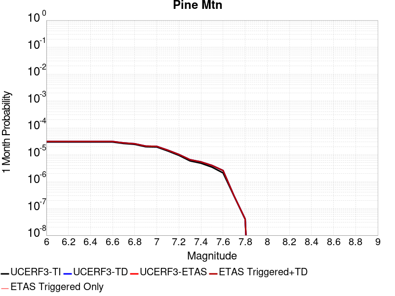 |  |  |

| Magnitude | 1 wk TI Prob | 1 wk TD Prob | 1 wk ETAS Prob | 1 wk ETAS/TD Gain | 1 wk ETAS Triggered+TD | 1 wk ETAS Triggered Only | 1 mo TI Prob | 1 mo TD Prob | 1 mo ETAS Prob | 1 mo ETAS/TD Gain | 1 mo ETAS Triggered+TD | 1 mo ETAS Triggered Only | 1 yr TI Prob | 1 yr TD Prob | 1 yr ETAS Prob | 1 yr ETAS/TD Gain | 1 yr ETAS Triggered+TD | 1 yr ETAS Triggered Only | 10 yr TI Prob | 10 yr TD Prob | 10 yr ETAS Prob | 10 yr ETAS/TD Gain | 10 yr ETAS Triggered+TD | 10 yr ETAS Triggered Only |
|-----|-----|-----|-----|-----|-----|-----|-----|-----|-----|-----|-----|-----|-----|-----|-----|-----|-----|-----|-----|-----|-----|-----|-----|-----|
| 6.0 | 6.894797E-6 | 7.2269495E-6 | 0.0 | 0.0 | 7.2269495E-6 | 0.0 | 2.9548795E-5 | 3.097229E-5 | 0.0 | 0.0 | 3.097229E-5 | 0.0 | 3.596972E-4 | 3.7702534E-4 | 0.0 | 0.0 | 3.7702534E-4 | 0.0 | 0.0035911554 | 0.0037641546 | 2.0E-4 | 0.05313278 | 0.003963402 | 2.0E-4 |
| 6.1 | 6.894797E-6 | 7.2269495E-6 | 0.0 | 0.0 | 7.2269495E-6 | 0.0 | 2.9548795E-5 | 3.097229E-5 | 0.0 | 0.0 | 3.097229E-5 | 0.0 | 3.596972E-4 | 3.7702534E-4 | 0.0 | 0.0 | 3.7702534E-4 | 0.0 | 0.0035911554 | 0.0037641546 | 2.0E-4 | 0.05313278 | 0.003963402 | 2.0E-4 |
| 6.2 | 6.894797E-6 | 7.2269495E-6 | 0.0 | 0.0 | 7.2269495E-6 | 0.0 | 2.9548795E-5 | 3.097229E-5 | 0.0 | 0.0 | 3.097229E-5 | 0.0 | 3.596972E-4 | 3.7702534E-4 | 0.0 | 0.0 | 3.7702534E-4 | 0.0 | 0.0035911554 | 0.0037641546 | 2.0E-4 | 0.05313278 | 0.003963402 | 2.0E-4 |
| 6.3 | 6.894797E-6 | 7.2269495E-6 | 0.0 | 0.0 | 7.2269495E-6 | 0.0 | 2.9548795E-5 | 3.097229E-5 | 0.0 | 0.0 | 3.097229E-5 | 0.0 | 3.596972E-4 | 3.7702534E-4 | 0.0 | 0.0 | 3.7702534E-4 | 0.0 | 0.0035911554 | 0.0037641546 | 2.0E-4 | 0.05313278 | 0.003963402 | 2.0E-4 |
| 6.4 | 6.894797E-6 | 7.2269495E-6 | 0.0 | 0.0 | 7.2269495E-6 | 0.0 | 2.9548795E-5 | 3.097229E-5 | 0.0 | 0.0 | 3.097229E-5 | 0.0 | 3.596972E-4 | 3.7702534E-4 | 0.0 | 0.0 | 3.7702534E-4 | 0.0 | 0.0035911554 | 0.0037641546 | 2.0E-4 | 0.05313278 | 0.003963402 | 2.0E-4 |
| 6.5 | 6.894797E-6 | 7.2269495E-6 | 0.0 | 0.0 | 7.2269495E-6 | 0.0 | 2.9548795E-5 | 3.097229E-5 | 0.0 | 0.0 | 3.097229E-5 | 0.0 | 3.596972E-4 | 3.7702534E-4 | 0.0 | 0.0 | 3.7702534E-4 | 0.0 | 0.0035911554 | 0.0037641546 | 2.0E-4 | 0.05313278 | 0.003963402 | 2.0E-4 |
| 6.6 | 6.894797E-6 | 7.2269495E-6 | 0.0 | 0.0 | 7.2269495E-6 | 0.0 | 2.9548795E-5 | 3.097229E-5 | 0.0 | 0.0 | 3.097229E-5 | 0.0 | 3.596972E-4 | 3.7702534E-4 | 0.0 | 0.0 | 3.7702534E-4 | 0.0 | 0.0035911554 | 0.0037641546 | 2.0E-4 | 0.05313278 | 0.003963402 | 2.0E-4 |
| 6.7 | 6.0867933E-6 | 6.3985585E-6 | 0.0 | 0.0 | 6.3985585E-6 | 0.0 | 2.6085996E-5 | 2.7422117E-5 | 0.0 | 0.0 | 2.7422117E-5 | 0.0 | 3.1755073E-4 | 3.3381532E-4 | 0.0 | 0.0 | 3.3381532E-4 | 0.0 | 0.0031709734 | 0.003333358 | 1.0E-4 | 0.029999778 | 0.0034330247 | 1.0E-4 |
| 6.8 | 5.6530425E-6 | 5.9520135E-6 | 0.0 | 0.0 | 5.9520135E-6 | 0.0 | 2.42271E-5 | 2.5508392E-5 | 0.0 | 0.0 | 2.5508392E-5 | 0.0 | 2.94925E-4 | 3.1052248E-4 | 0.0 | 0.0 | 3.1052248E-4 | 0.0 | 0.002945339 | 0.0031010904 | 1.0E-4 | 0.03224672 | 0.0032007804 | 1.0E-4 |
| 6.9 | 4.6015225E-6 | 4.8651773E-6 | 0.0 | 0.0 | 4.8651773E-6 | 0.0 | 1.9720663E-5 | 2.08506E-5 | 0.0 | 0.0 | 2.08506E-5 | 0.0 | 2.4007261E-4 | 2.5382795E-4 | 0.0 | 0.0 | 2.5382795E-4 | 0.0 | 0.0023981342 | 0.0025355245 | 1.0E-4 | 0.03943957 | 0.002635271 | 1.0E-4 |
| 7.0 | 4.4875965E-6 | 4.748811E-6 | 0.0 | 0.0 | 4.748811E-6 | 0.0 | 1.9232413E-5 | 2.0351896E-5 | 0.0 | 0.0 | 2.0351896E-5 | 0.0 | 2.3412947E-4 | 2.4775762E-4 | 0.0 | 0.0 | 2.4775762E-4 | 0.0 | 0.0023388295 | 0.0024749578 | 1.0E-4 | 0.04040473 | 0.0025747104 | 1.0E-4 |
| 7.1 | 3.203907E-6 | 3.4306747E-6 | 0.0 | 0.0 | 3.4306747E-6 | 0.0 | 1.3730958E-5 | 1.4702812E-5 | 0.0 | 0.0 | 1.4702812E-5 | 0.0 | 1.6716159E-4 | 1.789927E-4 | 0.0 | 0.0 | 1.789927E-4 | 0.0 | 0.0016703589 | 0.0017885516 | 1.0E-4 | 0.055911165 | 0.0018883727 | 1.0E-4 |
| 7.2 | 2.2060601E-6 | 2.3795114E-6 | 0.0 | 0.0 | 2.3795114E-6 | 0.0 | 9.4545085E-6 | 1.0197869E-5 | 0.0 | 0.0 | 1.0197869E-5 | 0.0 | 1.15102564E-4 | 1.2415243E-4 | 0.0 | 0.0 | 1.2415243E-4 | 0.0 | 0.0011504296 | 0.0012408756 | 1.0E-4 | 0.08058825 | 0.0013407515 | 1.0E-4 |
| 7.3 | 1.3765207E-6 | 1.5225703E-6 | 0.0 | 0.0 | 1.5225703E-6 | 0.0 | 5.899361E-6 | 6.5252852E-6 | 0.0 | 0.0 | 6.5252852E-6 | 0.0 | 7.182235E-5 | 7.944254E-5 | 0.0 | 0.0 | 7.944254E-5 | 0.0 | 7.1799144E-4 | 7.941506E-4 | 1.0E-4 | 0.1259207 | 8.940712E-4 | 1.0E-4 |
| 7.4 | 1.1245983E-6 | 1.2595369E-6 | 0.0 | 0.0 | 1.2595369E-6 | 0.0 | 4.819698E-6 | 5.3980048E-6 | 0.0 | 0.0 | 5.3980048E-6 | 0.0 | 5.8678244E-5 | 6.5718814E-5 | 0.0 | 0.0 | 6.5718814E-5 | 0.0 | 5.866275E-4 | 6.570021E-4 | 1.0E-4 | 0.15220653 | 7.569364E-4 | 1.0E-4 |
| 7.5 | 8.031682E-7 | 9.284681E-7 | 0.0 | 0.0 | 9.284681E-7 | 0.0 | 3.4421448E-6 | 3.9791435E-6 | 0.0 | 0.0 | 3.9791435E-6 | 0.0 | 4.1907308E-5 | 4.8445065E-5 | 0.0 | 0.0 | 4.8445065E-5 | 0.0 | 4.1899405E-4 | 4.843518E-4 | 1.0E-4 | 0.2064615 | 5.8430334E-4 | 1.0E-4 |
| 7.6 | 4.8953444E-7 | 6.0098466E-7 | 0.0 | 0.0 | 6.0098466E-7 | 0.0 | 2.098003E-6 | 2.5756462E-6 | 0.0 | 0.0 | 2.5756462E-6 | 0.0 | 2.5542888E-5 | 3.1358093E-5 | 0.0 | 0.0 | 3.1358093E-5 | 0.0 | 2.5539953E-4 | 3.1354156E-4 | 0.0 | 0.0 | 3.1354156E-4 | 0.0 |
| 7.7 | 6.634529E-8 | 6.789154E-8 | 0.0 | 0.0 | 6.789154E-8 | 0.0 | 2.843369E-7 | 2.9096373E-7 | 0.0 | 0.0 | 2.9096373E-7 | 0.0 | 3.4617963E-6 | 3.5424782E-6 | 0.0 | 0.0 | 3.5424782E-6 | 0.0 | 3.4617424E-5 | 3.5424266E-5 | 0.0 | 0.0 | 3.5424266E-5 | 0.0 |
| 7.8 | 9.235578E-9 | 9.48911E-9 | 0.0 | 0.0 | 9.48911E-9 | 0.0 | 3.9581046E-8 | 4.0667615E-8 | 0.0 | 0.0 | 4.0667615E-8 | 0.0 | 4.818991E-7 | 4.951281E-7 | 0.0 | 0.0 | 4.951281E-7 | 0.0 | 4.8189804E-6 | 4.951272E-6 | 0.0 | 0.0 | 4.951272E-6 | 0.0 |

## Walker Spring 2011 CFM
*[(top)](#table-of-contents)*

| 1 Week | 1 Month | 1 Year | 10 Year |
|-----|-----|-----|-----|
|  | 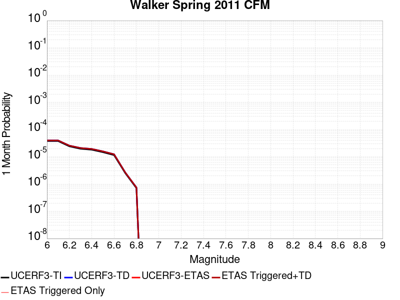 |  |  |

| Magnitude | 1 wk TI Prob | 1 wk TD Prob | 1 wk ETAS Prob | 1 wk ETAS/TD Gain | 1 wk ETAS Triggered+TD | 1 wk ETAS Triggered Only | 1 mo TI Prob | 1 mo TD Prob | 1 mo ETAS Prob | 1 mo ETAS/TD Gain | 1 mo ETAS Triggered+TD | 1 mo ETAS Triggered Only | 1 yr TI Prob | 1 yr TD Prob | 1 yr ETAS Prob | 1 yr ETAS/TD Gain | 1 yr ETAS Triggered+TD | 1 yr ETAS Triggered Only | 10 yr TI Prob | 10 yr TD Prob | 10 yr ETAS Prob | 10 yr ETAS/TD Gain | 10 yr ETAS Triggered+TD | 10 yr ETAS Triggered Only |
|-----|-----|-----|-----|-----|-----|-----|-----|-----|-----|-----|-----|-----|-----|-----|-----|-----|-----|-----|-----|-----|-----|-----|-----|-----|
| 6.0 | 8.791276E-6 | 9.265121E-6 | 0.0 | 0.0 | 9.265121E-6 | 0.0 | 3.767635E-5 | 3.9707116E-5 | 0.0 | 0.0 | 3.9707116E-5 | 0.0 | 4.58613E-4 | 4.8333776E-4 | 0.0 | 0.0 | 4.8333776E-4 | 0.0 | 0.004576677 | 0.004823939 | 1.0E-4 | 0.020729948 | 0.004923457 | 1.0E-4 |
| 6.1 | 8.791276E-6 | 9.265121E-6 | 0.0 | 0.0 | 9.265121E-6 | 0.0 | 3.767635E-5 | 3.9707116E-5 | 0.0 | 0.0 | 3.9707116E-5 | 0.0 | 4.58613E-4 | 4.8333776E-4 | 0.0 | 0.0 | 4.8333776E-4 | 0.0 | 0.004576677 | 0.004823939 | 1.0E-4 | 0.020729948 | 0.004923457 | 1.0E-4 |
| 6.2 | 5.654515E-6 | 5.9995164E-6 | 0.0 | 0.0 | 5.9995164E-6 | 0.0 | 2.4233412E-5 | 2.5711988E-5 | 0.0 | 0.0 | 2.5711988E-5 | 0.0 | 2.9500184E-4 | 3.1300352E-4 | 0.0 | 0.0 | 3.1300352E-4 | 0.0 | 0.0029461053 | 0.0031261214 | 1.0E-4 | 0.03198852 | 0.0032258087 | 1.0E-4 |
| 6.3 | 4.591685E-6 | 4.895395E-6 | 0.0 | 0.0 | 4.895395E-6 | 0.0 | 1.96785E-5 | 2.098012E-5 | 0.0 | 0.0 | 2.098012E-5 | 0.0 | 2.395594E-4 | 2.554074E-4 | 0.0 | 0.0 | 2.554074E-4 | 0.0 | 0.002393013 | 0.0025515687 | 1.0E-4 | 0.039191578 | 0.0026513136 | 1.0E-4 |
| 6.4 | 4.243283E-6 | 4.5232764E-6 | 0.0 | 0.0 | 4.5232764E-6 | 0.0 | 1.8185372E-5 | 1.938535E-5 | 0.0 | 0.0 | 1.938535E-5 | 0.0 | 2.2138441E-4 | 2.359953E-4 | 0.0 | 0.0 | 2.359953E-4 | 0.0 | 0.00221164 | 0.0023578627 | 1.0E-4 | 0.04241129 | 0.0024576269 | 1.0E-4 |
| 6.5 | 3.4445666E-6 | 3.6866265E-6 | 0.0 | 0.0 | 3.6866265E-6 | 0.0 | 1.4762345E-5 | 1.5799755E-5 | 0.0 | 0.0 | 1.5799755E-5 | 0.0 | 1.7971672E-4 | 1.9234906E-4 | 0.0 | 0.0 | 1.9234906E-4 | 0.0 | 0.0017957145 | 0.0019222207 | 1.0E-4 | 0.052023165 | 0.0020220284 | 1.0E-4 |
| 6.6 | 2.68766E-6 | 2.879859E-6 | 0.0 | 0.0 | 2.879859E-6 | 0.0 | 1.1518492E-5 | 1.2342216E-5 | 0.0 | 0.0 | 1.2342216E-5 | 0.0 | 1.4022861E-4 | 1.5025993E-4 | 0.0 | 0.0 | 1.5025993E-4 | 0.0 | 0.0014014016 | 0.0015019573 | 1.0E-4 | 0.06657979 | 0.0016018072 | 1.0E-4 |
| 6.7 | 5.880964E-7 | 6.20044E-7 | 0.0 | 0.0 | 6.20044E-7 | 0.0 | 2.5204106E-6 | 2.657329E-6 | 0.0 | 0.0 | 2.657329E-6 | 0.0 | 3.0685565E-5 | 3.2352596E-5 | 0.0 | 0.0 | 3.2352596E-5 | 0.0 | 3.068133E-4 | 3.2348826E-4 | 0.0 | 0.0 | 3.2348826E-4 | 0.0 |
| 6.8 | 1.6514163E-7 | 1.741106E-7 | 0.0 | 0.0 | 1.741106E-7 | 0.0 | 7.077497E-7 | 7.461883E-7 | 0.0 | 0.0 | 7.461883E-7 | 0.0 | 8.616818E-6 | 9.0848425E-6 | 0.0 | 0.0 | 9.0848425E-6 | 0.0 | 8.616484E-5 | 9.084842E-5 | 0.0 | 0.0 | 9.084842E-5 | 0.0 |

## Clayton
*[(top)](#table-of-contents)*

| 1 Week | 1 Month | 1 Year | 10 Year |
|-----|-----|-----|-----|
|  |  |  |  |

| Magnitude | 1 wk TI Prob | 1 wk TD Prob | 1 wk ETAS Prob | 1 wk ETAS/TD Gain | 1 wk ETAS Triggered+TD | 1 wk ETAS Triggered Only | 1 mo TI Prob | 1 mo TD Prob | 1 mo ETAS Prob | 1 mo ETAS/TD Gain | 1 mo ETAS Triggered+TD | 1 mo ETAS Triggered Only | 1 yr TI Prob | 1 yr TD Prob | 1 yr ETAS Prob | 1 yr ETAS/TD Gain | 1 yr ETAS Triggered+TD | 1 yr ETAS Triggered Only | 10 yr TI Prob | 10 yr TD Prob | 10 yr ETAS Prob | 10 yr ETAS/TD Gain | 10 yr ETAS Triggered+TD | 10 yr ETAS Triggered Only |
|-----|-----|-----|-----|-----|-----|-----|-----|-----|-----|-----|-----|-----|-----|-----|-----|-----|-----|-----|-----|-----|-----|-----|-----|-----|
| 6.0 | 1.1413061E-5 | 1.266993E-5 | 0.0 | 0.0 | 1.266993E-5 | 0.0 | 4.89122E-5 | 5.4298693E-5 | 0.0 | 0.0 | 5.4298693E-5 | 0.0 | 5.953433E-4 | 6.609083E-4 | 0.0 | 0.0 | 6.609083E-4 | 0.0 | 0.005937509 | 0.006591631 | 1.0E-4 | 0.015170751 | 0.006690972 | 1.0E-4 |
| 6.1 | 1.1413061E-5 | 1.266993E-5 | 0.0 | 0.0 | 1.266993E-5 | 0.0 | 4.89122E-5 | 5.4298693E-5 | 0.0 | 0.0 | 5.4298693E-5 | 0.0 | 5.953433E-4 | 6.609083E-4 | 0.0 | 0.0 | 6.609083E-4 | 0.0 | 0.005937509 | 0.006591631 | 1.0E-4 | 0.015170751 | 0.006690972 | 1.0E-4 |
| 6.2 | 1.1413061E-5 | 1.266993E-5 | 0.0 | 0.0 | 1.266993E-5 | 0.0 | 4.89122E-5 | 5.4298693E-5 | 0.0 | 0.0 | 5.4298693E-5 | 0.0 | 5.953433E-4 | 6.609083E-4 | 0.0 | 0.0 | 6.609083E-4 | 0.0 | 0.005937509 | 0.006591631 | 1.0E-4 | 0.015170751 | 0.006690972 | 1.0E-4 |
| 6.3 | 8.538689E-6 | 9.53504E-6 | 0.0 | 0.0 | 9.53504E-6 | 0.0 | 3.659387E-5 | 4.0863877E-5 | 0.0 | 0.0 | 4.0863877E-5 | 0.0 | 4.4543925E-4 | 4.974149E-4 | 0.0 | 0.0 | 4.974149E-4 | 0.0 | 0.0044454746 | 0.0049640816 | 1.0E-4 | 0.020144712 | 0.005063585 | 1.0E-4 |
| 6.4 | 8.538689E-6 | 9.53504E-6 | 0.0 | 0.0 | 9.53504E-6 | 0.0 | 3.659387E-5 | 4.0863877E-5 | 0.0 | 0.0 | 4.0863877E-5 | 0.0 | 4.4543925E-4 | 4.974149E-4 | 0.0 | 0.0 | 4.974149E-4 | 0.0 | 0.0044454746 | 0.0049640816 | 1.0E-4 | 0.020144712 | 0.005063585 | 1.0E-4 |
| 6.5 | 7.197462E-6 | 8.082992E-6 | 0.0 | 0.0 | 8.082992E-6 | 0.0 | 3.08459E-5 | 3.4640983E-5 | 0.0 | 0.0 | 3.4640983E-5 | 0.0 | 3.7548412E-4 | 4.2168054E-4 | 0.0 | 0.0 | 4.2168054E-4 | 0.0 | 0.003748503 | 0.0042096167 | 1.0E-4 | 0.023755133 | 0.0043091956 | 1.0E-4 |
| 6.6 | 7.1760483E-6 | 8.0590025E-6 | 0.0 | 0.0 | 8.0590025E-6 | 0.0 | 3.075413E-5 | 3.453817E-5 | 0.0 | 0.0 | 3.453817E-5 | 0.0 | 3.743672E-4 | 4.204293E-4 | 0.0 | 0.0 | 4.204293E-4 | 0.0 | 0.0037373714 | 0.0041971514 | 1.0E-4 | 0.023825683 | 0.0042967317 | 1.0E-4 |
| 6.7 | 6.202582E-6 | 6.9784837E-6 | 0.0 | 0.0 | 6.9784837E-6 | 0.0 | 2.6582224E-5 | 2.9907487E-5 | 0.0 | 0.0 | 2.9907487E-5 | 0.0 | 3.235905E-4 | 3.640705E-4 | 0.0 | 0.0 | 3.640705E-4 | 0.0 | 0.0032311971 | 0.0036354966 | 1.0E-4 | 0.027506558 | 0.0037351332 | 1.0E-4 |
| 6.8 | 3.6417277E-6 | 4.1224093E-6 | 0.0 | 0.0 | 4.1224093E-6 | 0.0 | 1.5607311E-5 | 1.7667353E-5 | 0.0 | 0.0 | 1.7667353E-5 | 0.0 | 1.9000245E-4 | 2.1507956E-4 | 0.0 | 0.0 | 2.1507956E-4 | 0.0 | 0.0018984007 | 0.0021487905 | 1.0E-4 | 0.04653781 | 0.0022485754 | 1.0E-4 |
| 6.9 | 2.6498485E-6 | 3.0003316E-6 | 0.0 | 0.0 | 3.0003316E-6 | 0.0 | 1.1356444E-5 | 1.28585025E-5 | 0.0 | 0.0 | 1.28585025E-5 | 0.0 | 1.3825593E-4 | 1.5654143E-4 | 0.0 | 0.0 | 1.5654143E-4 | 0.0 | 0.0013816995 | 0.0015643511 | 1.0E-4 | 0.06392427 | 0.0016641947 | 1.0E-4 |
| 7.0 | 2.070442E-6 | 2.3413565E-6 | 0.0 | 0.0 | 2.3413565E-6 | 0.0 | 8.873292E-6 | 1.0034349E-5 | 0.0 | 0.0 | 1.0034349E-5 | 0.0 | 1.0802698E-4 | 1.2216164E-4 | 0.0 | 0.0 | 1.2216164E-4 | 0.0 | 0.0010797448 | 0.0012209747 | 1.0E-4 | 0.081901774 | 0.0013208527 | 1.0E-4 |
| 7.1 | 1.2111691E-6 | 1.3592228E-6 | 0.0 | 0.0 | 1.3592228E-6 | 0.0 | 5.190714E-6 | 5.8252285E-6 | 0.0 | 0.0 | 5.8252285E-6 | 0.0 | 6.319511E-5 | 7.092002E-5 | 0.0 | 0.0 | 7.092002E-5 | 0.0 | 6.3177146E-4 | 7.089902E-4 | 0.0 | 0.0 | 7.089902E-4 | 0.0 |
| 7.2 | 3.9541607E-7 | 4.2234976E-7 | 0.0 | 0.0 | 4.2234976E-7 | 0.0 | 1.6946392E-6 | 1.8100692E-6 | 0.0 | 0.0 | 1.8100692E-6 | 0.0 | 2.0632036E-5 | 2.2037371E-5 | 0.0 | 0.0 | 2.2037371E-5 | 0.0 | 2.063012E-4 | 2.2035201E-4 | 0.0 | 0.0 | 2.2035201E-4 | 0.0 |
| 7.3 | 2.5685637E-7 | 2.746245E-7 | 0.0 | 0.0 | 2.746245E-7 | 0.0 | 1.1008126E-6 | 1.1769617E-6 | 0.0 | 0.0 | 1.1769617E-6 | 0.0 | 1.3402311E-5 | 1.43294155E-5 | 0.0 | 0.0 | 1.43294155E-5 | 0.0 | 1.3401502E-4 | 1.4328498E-4 | 0.0 | 0.0 | 1.4328498E-4 | 0.0 |
| 7.4 | 1.482299E-7 | 1.5811554E-7 | 0.0 | 0.0 | 1.5811554E-7 | 0.0 | 6.3527085E-7 | 6.7763784E-7 | 0.0 | 0.0 | 6.7763784E-7 | 0.0 | 7.734395E-6 | 8.250209E-6 | 0.0 | 0.0 | 8.250209E-6 | 0.0 | 7.734126E-5 | 8.2499064E-5 | 0.0 | 0.0 | 8.2499064E-5 | 0.0 |
| 7.5 | 9.7969505E-8 | 1.0441284E-7 | 0.0 | 0.0 | 1.0441284E-7 | 0.0 | 4.1986925E-7 | 4.474835E-7 | 0.0 | 0.0 | 4.474835E-7 | 0.0 | 5.111896E-6 | 5.4480984E-6 | 0.0 | 0.0 | 5.4480984E-6 | 0.0 | 5.1117782E-5 | 5.4479664E-5 | 0.0 | 0.0 | 5.4479664E-5 | 0.0 |
| 7.6 | 6.125415E-8 | 6.523577E-8 | 0.0 | 0.0 | 6.523577E-8 | 0.0 | 2.6251774E-7 | 2.7958183E-7 | 0.0 | 0.0 | 2.7958183E-7 | 0.0 | 3.196149E-6 | 3.4039033E-6 | 0.0 | 0.0 | 3.4039033E-6 | 0.0 | 3.196103E-5 | 3.4038523E-5 | 0.0 | 0.0 | 3.4038523E-5 | 0.0 |

## Contra Costa (Lafayette) 2011 CFM
*[(top)](#table-of-contents)*

| 1 Week | 1 Month | 1 Year | 10 Year |
|-----|-----|-----|-----|
|  | 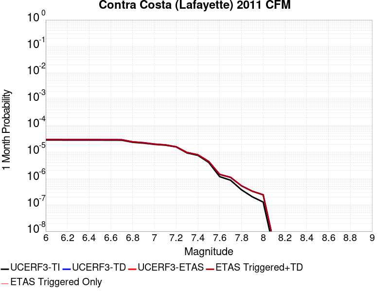 |  | 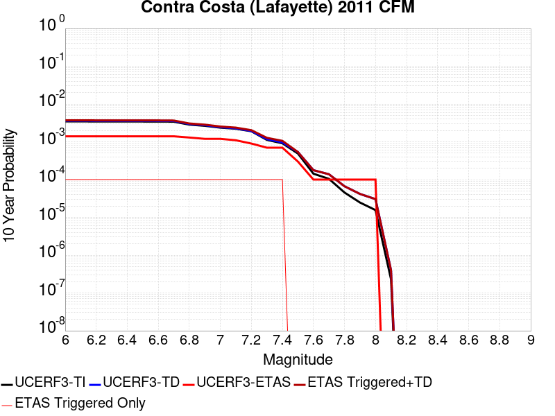 |

| Magnitude | 1 wk TI Prob | 1 wk TD Prob | 1 wk ETAS Prob | 1 wk ETAS/TD Gain | 1 wk ETAS Triggered+TD | 1 wk ETAS Triggered Only | 1 mo TI Prob | 1 mo TD Prob | 1 mo ETAS Prob | 1 mo ETAS/TD Gain | 1 mo ETAS Triggered+TD | 1 mo ETAS Triggered Only | 1 yr TI Prob | 1 yr TD Prob | 1 yr ETAS Prob | 1 yr ETAS/TD Gain | 1 yr ETAS Triggered+TD | 1 yr ETAS Triggered Only | 10 yr TI Prob | 10 yr TD Prob | 10 yr ETAS Prob | 10 yr ETAS/TD Gain | 10 yr ETAS Triggered+TD | 10 yr ETAS Triggered Only |
|-----|-----|-----|-----|-----|-----|-----|-----|-----|-----|-----|-----|-----|-----|-----|-----|-----|-----|-----|-----|-----|-----|-----|-----|-----|
| 6.0 | 6.655419E-6 | 6.938182E-6 | 0.0 | 0.0 | 6.938182E-6 | 0.0 | 2.8522913E-5 | 2.973474E-5 | 0.0 | 0.0 | 2.973474E-5 | 0.0 | 3.472111E-4 | 3.6196227E-4 | 0.0 | 0.0 | 3.6196227E-4 | 0.0 | 0.0034666911 | 0.0036185854 | 1.0E-4 | 0.027635109 | 0.0037182234 | 1.0E-4 |
| 6.1 | 6.655419E-6 | 6.938182E-6 | 0.0 | 0.0 | 6.938182E-6 | 0.0 | 2.8522913E-5 | 2.973474E-5 | 0.0 | 0.0 | 2.973474E-5 | 0.0 | 3.472111E-4 | 3.6196227E-4 | 0.0 | 0.0 | 3.6196227E-4 | 0.0 | 0.0034666911 | 0.0036185854 | 1.0E-4 | 0.027635109 | 0.0037182234 | 1.0E-4 |
| 6.2 | 6.6254133E-6 | 6.906588E-6 | 0.0 | 0.0 | 6.906588E-6 | 0.0 | 2.839432E-5 | 2.9599338E-5 | 0.0 | 0.0 | 2.9599338E-5 | 0.0 | 3.45646E-4 | 3.6031433E-4 | 0.0 | 0.0 | 3.6031433E-4 | 0.0 | 0.003451089 | 0.0036021592 | 1.0E-4 | 0.027761128 | 0.0037017989 | 1.0E-4 |
| 6.3 | 6.6254133E-6 | 6.906588E-6 | 0.0 | 0.0 | 6.906588E-6 | 0.0 | 2.839432E-5 | 2.9599338E-5 | 0.0 | 0.0 | 2.9599338E-5 | 0.0 | 3.45646E-4 | 3.6031433E-4 | 0.0 | 0.0 | 3.6031433E-4 | 0.0 | 0.003451089 | 0.0036021592 | 1.0E-4 | 0.027761128 | 0.0037017989 | 1.0E-4 |
| 6.4 | 6.6254133E-6 | 6.906588E-6 | 0.0 | 0.0 | 6.906588E-6 | 0.0 | 2.839432E-5 | 2.9599338E-5 | 0.0 | 0.0 | 2.9599338E-5 | 0.0 | 3.45646E-4 | 3.6031433E-4 | 0.0 | 0.0 | 3.6031433E-4 | 0.0 | 0.003451089 | 0.0036021592 | 1.0E-4 | 0.027761128 | 0.0037017989 | 1.0E-4 |
| 6.5 | 6.606445E-6 | 6.886133E-6 | 0.0 | 0.0 | 6.886133E-6 | 0.0 | 2.8313027E-5 | 2.9511677E-5 | 0.0 | 0.0 | 2.9511677E-5 | 0.0 | 3.4465658E-4 | 3.5924738E-4 | 0.0 | 0.0 | 3.5924738E-4 | 0.0 | 0.0034412253 | 0.0035915244 | 1.0E-4 | 0.02784333 | 0.0036911652 | 1.0E-4 |
| 6.6 | 6.59966E-6 | 6.8786694E-6 | 0.0 | 0.0 | 6.8786694E-6 | 0.0 | 2.828395E-5 | 2.947969E-5 | 0.0 | 0.0 | 2.947969E-5 | 0.0 | 3.4430268E-4 | 3.588581E-4 | 0.0 | 0.0 | 3.588581E-4 | 0.0 | 0.0034376972 | 0.0035876438 | 1.0E-4 | 0.027873447 | 0.0036872851 | 1.0E-4 |
| 6.7 | 6.5570975E-6 | 6.8326526E-6 | 0.0 | 0.0 | 6.8326526E-6 | 0.0 | 2.8101544E-5 | 2.928248E-5 | 0.0 | 0.0 | 2.928248E-5 | 0.0 | 3.4208258E-4 | 3.5645784E-4 | 0.0 | 0.0 | 3.5645784E-4 | 0.0 | 0.0034155648 | 0.0035637186 | 1.0E-4 | 0.028060576 | 0.0036633622 | 1.0E-4 |
| 6.8 | 5.472255E-6 | 5.675494E-6 | 0.0 | 0.0 | 5.675494E-6 | 0.0 | 2.345231E-5 | 2.432332E-5 | 0.0 | 0.0 | 2.432332E-5 | 0.0 | 2.8549446E-4 | 2.9609664E-4 | 0.0 | 0.0 | 2.9609664E-4 | 0.0 | 0.0028512797 | 0.0029617313 | 1.0E-4 | 0.033764035 | 0.0030614352 | 1.0E-4 |
| 6.9 | 5.092346E-6 | 5.26579E-6 | 0.0 | 0.0 | 5.26579E-6 | 0.0 | 2.1824157E-5 | 2.2567478E-5 | 0.0 | 0.0 | 2.2567478E-5 | 0.0 | 2.656767E-4 | 2.747248E-4 | 0.0 | 0.0 | 2.747248E-4 | 0.0 | 0.002653593 | 0.002748554 | 1.0E-4 | 0.03638277 | 0.0028482792 | 1.0E-4 |
| 7.0 | 4.5525762E-6 | 4.678997E-6 | 0.0 | 0.0 | 4.678997E-6 | 0.0 | 1.9510895E-5 | 2.005269E-5 | 0.0 | 0.0 | 2.005269E-5 | 0.0 | 2.3751926E-4 | 2.4411446E-4 | 0.0 | 0.0 | 2.4411446E-4 | 0.0 | 0.0023726553 | 0.0024431548 | 1.0E-4 | 0.040930685 | 0.0025429106 | 1.0E-4 |
| 7.1 | 4.261504E-6 | 4.358108E-6 | 0.0 | 0.0 | 4.358108E-6 | 0.0 | 1.826346E-5 | 1.8677474E-5 | 0.0 | 0.0 | 1.8677474E-5 | 0.0 | 2.2233493E-4 | 2.2737478E-4 | 0.0 | 0.0 | 2.2737478E-4 | 0.0 | 0.002221126 | 0.0022761067 | 1.0E-4 | 0.04393467 | 0.002375879 | 1.0E-4 |
| 7.2 | 3.654114E-6 | 3.6987378E-6 | 0.0 | 0.0 | 3.6987378E-6 | 0.0 | 1.5660395E-5 | 1.585164E-5 | 0.0 | 0.0 | 1.585164E-5 | 0.0 | 1.9064861E-4 | 1.9297686E-4 | 0.0 | 0.0 | 1.9297686E-4 | 0.0 | 0.0019048514 | 0.0019327322 | 1.0E-4 | 0.051740225 | 0.0020325389 | 1.0E-4 |
| 7.3 | 2.1595129E-6 | 2.2453803E-6 | 0.0 | 0.0 | 2.2453803E-6 | 0.0 | 9.255023E-6 | 9.623023E-6 | 0.0 | 0.0 | 9.623023E-6 | 0.0 | 1.1267407E-4 | 1.1715406E-4 | 0.0 | 0.0 | 1.1715406E-4 | 0.0 | 0.0011261696 | 0.0011753718 | 1.0E-4 | 0.08507946 | 0.0012752543 | 1.0E-4 |
| 7.4 | 1.7532738E-6 | 1.8344895E-6 | 0.0 | 0.0 | 1.8344895E-6 | 0.0 | 7.5140088E-6 | 7.862074E-6 | 0.0 | 0.0 | 7.862074E-6 | 0.0 | 9.147922E-5 | 9.571659E-5 | 0.0 | 0.0 | 9.571659E-5 | 0.0 | 9.144157E-4 | 9.610136E-4 | 1.0E-4 | 0.1040568 | 0.0010609175 | 1.0E-4 |
| 7.5 | 9.387875E-7 | 1.0199176E-6 | 0.0 | 0.0 | 1.0199176E-6 | 0.0 | 4.0233685E-6 | 4.3710684E-6 | 0.0 | 0.0 | 4.3710684E-6 | 0.0 | 4.8983413E-5 | 5.321647E-5 | 0.0 | 0.0 | 5.321647E-5 | 0.0 | 4.897262E-4 | 5.360159E-4 | 0.0 | 0.0 | 5.360159E-4 | 0.0 |
| 7.6 | 2.7471893E-7 | 3.315097E-7 | 0.0 | 0.0 | 3.315097E-7 | 0.0 | 1.1773664E-6 | 1.4207551E-6 | 0.0 | 0.0 | 1.4207551E-6 | 0.0 | 1.433434E-5 | 1.7297558E-5 | 0.0 | 0.0 | 1.7297558E-5 | 0.0 | 1.4333417E-4 | 1.7680935E-4 | 0.0 | 0.0 | 1.7680935E-4 | 0.0 |
| 7.7 | 2.0057985E-7 | 2.569433E-7 | 0.0 | 0.0 | 2.569433E-7 | 0.0 | 8.596276E-7 | 1.101185E-6 | 0.0 | 0.0 | 1.101185E-6 | 0.0 | 1.0465916E-5 | 1.3406847E-5 | 0.0 | 0.0 | 1.3406847E-5 | 0.0 | 1.0465423E-4 | 1.3786323E-4 | 0.0 | 0.0 | 1.3786323E-4 | 0.0 |
| 7.8 | 8.7403905E-8 | 1.2304868E-7 | 0.0 | 0.0 | 1.2304868E-7 | 0.0 | 3.745881E-7 | 5.2735135E-7 | 0.0 | 0.0 | 5.2735135E-7 | 0.0 | 4.5606007E-6 | 6.4204837E-6 | 0.0 | 0.0 | 6.4204837E-6 | 0.0 | 4.560507E-5 | 6.6463246E-5 | 0.0 | 0.0 | 6.6463246E-5 | 0.0 |
| 7.9 | 4.740233E-8 | 7.68326E-8 | 0.0 | 0.0 | 7.68326E-8 | 0.0 | 2.0315284E-7 | 3.292825E-7 | 0.0 | 0.0 | 3.292825E-7 | 0.0 | 2.473383E-6 | 4.009007E-6 | 0.0 | 0.0 | 4.009007E-6 | 0.0 | 2.4733554E-5 | 4.1621694E-5 | 0.0 | 0.0 | 4.1621694E-5 | 0.0 |
| 8.0 | 2.99164E-8 | 5.618871E-8 | 0.0 | 0.0 | 5.618871E-8 | 0.0 | 1.2821314E-7 | 2.4080873E-7 | 0.0 | 0.0 | 2.4080873E-7 | 0.0 | 1.5609938E-6 | 2.9318426E-6 | 0.0 | 0.0 | 2.9318426E-6 | 0.0 | 1.5609829E-5 | 3.0337837E-5 | 0.0 | 0.0 | 3.0337837E-5 | 0.0 |
| 8.1 | 4.431212E-10 | 7.457286E-10 | 0.0 | 0.0 | 7.457286E-10 | 0.0 | 1.899091E-9 | 3.195979E-9 | 0.0 | 0.0 | 3.195979E-9 | 0.0 | 2.3121432E-8 | 3.8911043E-8 | 0.0 | 0.0 | 3.8911043E-8 | 0.0 | 2.312143E-7 | 3.978863E-7 | 0.0 | 0.0 | 3.978863E-7 | 0.0 |

## Great Valley 12
*[(top)](#table-of-contents)*

| 1 Week | 1 Month | 1 Year | 10 Year |
|-----|-----|-----|-----|
| 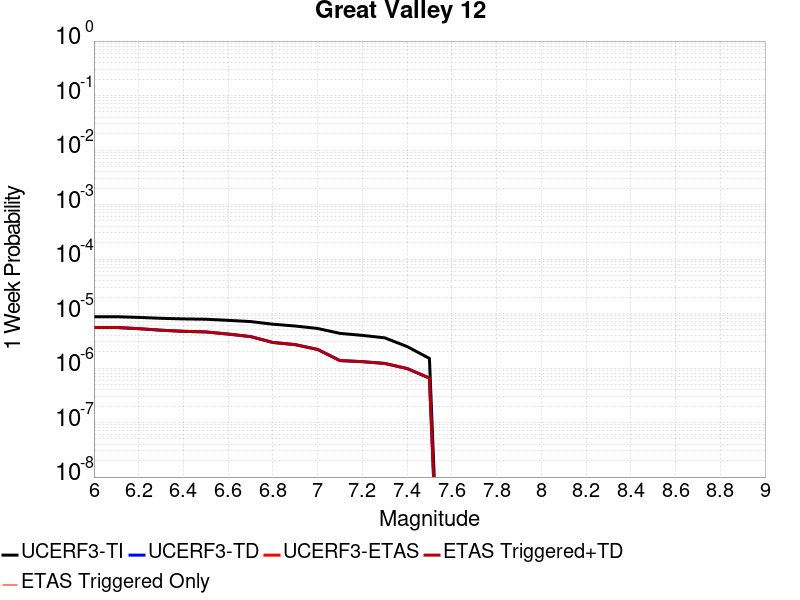 | 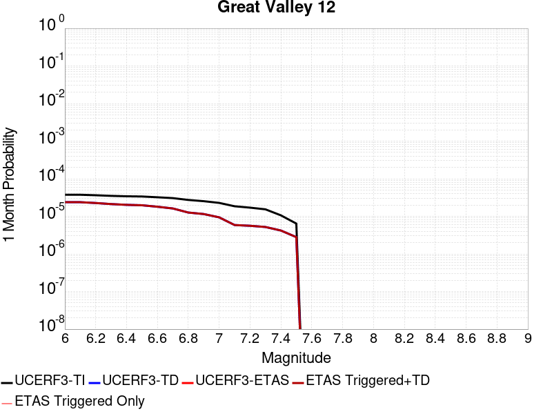 | 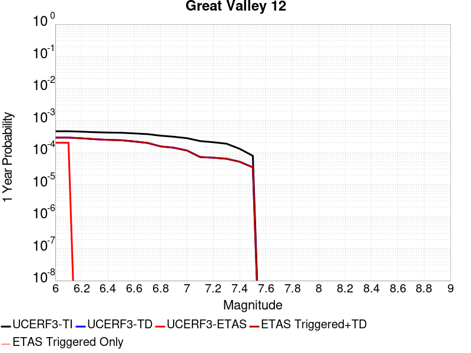 |  |

| Magnitude | 1 wk TI Prob | 1 wk TD Prob | 1 wk ETAS Prob | 1 wk ETAS/TD Gain | 1 wk ETAS Triggered+TD | 1 wk ETAS Triggered Only | 1 mo TI Prob | 1 mo TD Prob | 1 mo ETAS Prob | 1 mo ETAS/TD Gain | 1 mo ETAS Triggered+TD | 1 mo ETAS Triggered Only | 1 yr TI Prob | 1 yr TD Prob | 1 yr ETAS Prob | 1 yr ETAS/TD Gain | 1 yr ETAS Triggered+TD | 1 yr ETAS Triggered Only | 10 yr TI Prob | 10 yr TD Prob | 10 yr ETAS Prob | 10 yr ETAS/TD Gain | 10 yr ETAS Triggered+TD | 10 yr ETAS Triggered Only |
|-----|-----|-----|-----|-----|-----|-----|-----|-----|-----|-----|-----|-----|-----|-----|-----|-----|-----|-----|-----|-----|-----|-----|-----|-----|
| 6.0 | 8.757157E-6 | 5.555922E-6 | 0.0 | 0.0 | 5.555922E-6 | 0.0 | 3.7530135E-5 | 2.3810884E-5 | 0.0 | 0.0 | 2.3810884E-5 | 0.0 | 4.5683357E-4 | 2.8986018E-4 | 0.0 | 0.0 | 2.8986018E-4 | 0.0 | 0.004558956 | 0.002894942 | 1.0E-4 | 0.034543008 | 0.0029946524 | 1.0E-4 |
| 6.1 | 8.757157E-6 | 5.555922E-6 | 0.0 | 0.0 | 5.555922E-6 | 0.0 | 3.7530135E-5 | 2.3810884E-5 | 0.0 | 0.0 | 2.3810884E-5 | 0.0 | 4.5683357E-4 | 2.8986018E-4 | 0.0 | 0.0 | 2.8986018E-4 | 0.0 | 0.004558956 | 0.002894942 | 1.0E-4 | 0.034543008 | 0.0029946524 | 1.0E-4 |
| 6.2 | 8.499136E-6 | 5.281555E-6 | 0.0 | 0.0 | 5.281555E-6 | 0.0 | 3.642436E-5 | 2.2635046E-5 | 0.0 | 0.0 | 2.2635046E-5 | 0.0 | 4.4337637E-4 | 2.7554797E-4 | 0.0 | 0.0 | 2.7554797E-4 | 0.0 | 0.0044249278 | 0.0027521777 | 1.0E-4 | 0.03633486 | 0.0028519025 | 1.0E-4 |
| 6.3 | 8.186883E-6 | 4.949657E-6 | 0.0 | 0.0 | 4.949657E-6 | 0.0 | 3.508617E-5 | 2.121265E-5 | 0.0 | 0.0 | 2.121265E-5 | 0.0 | 4.270904E-4 | 2.5823442E-4 | 0.0 | 0.0 | 2.5823442E-4 | 0.0 | 0.004262705 | 0.002579444 | 1.0E-4 | 0.038768042 | 0.0026791862 | 1.0E-4 |
| 6.4 | 7.979878E-6 | 4.721613E-6 | 0.0 | 0.0 | 4.721613E-6 | 0.0 | 3.419903E-5 | 2.0235333E-5 | 0.0 | 0.0 | 2.0235333E-5 | 0.0 | 4.1629362E-4 | 2.4633826E-4 | 0.0 | 0.0 | 2.4633826E-4 | 0.0 | 0.0041551464 | 0.002460746 | 1.0E-4 | 0.04063808 | 0.0025605 | 1.0E-4 |
| 6.5 | 7.871003E-6 | 4.6015625E-6 | 0.0 | 0.0 | 4.6015625E-6 | 0.0 | 3.373243E-5 | 1.9720837E-5 | 0.0 | 0.0 | 1.9720837E-5 | 0.0 | 4.1061494E-4 | 2.4007568E-4 | 0.0 | 0.0 | 2.4007568E-4 | 0.0 | 0.0040985704 | 0.0023982564 | 1.0E-4 | 0.04169696 | 0.0024980167 | 1.0E-4 |
| 6.6 | 7.508221E-6 | 4.204871E-6 | 0.0 | 0.0 | 4.204871E-6 | 0.0 | 3.2177693E-5 | 1.8020755E-5 | 0.0 | 0.0 | 1.8020755E-5 | 0.0 | 3.91693E-4 | 2.1938147E-4 | 0.0 | 0.0 | 2.1938147E-4 | 0.0 | 0.003910033 | 0.0021917354 | 1.0E-4 | 0.045625944 | 0.0022915162 | 1.0E-4 |
| 6.7 | 7.1297914E-6 | 3.782492E-6 | 0.0 | 0.0 | 3.782492E-6 | 0.0 | 3.055589E-5 | 1.6210584E-5 | 0.0 | 0.0 | 1.6210584E-5 | 0.0 | 3.7195446E-4 | 1.9734677E-4 | 0.0 | 0.0 | 1.9734677E-4 | 0.0 | 0.0037133251 | 0.0019717943 | 1.0E-4 | 0.050715234 | 0.002071597 | 1.0E-4 |
| 6.8 | 6.376581E-6 | 2.9488826E-6 | 0.0 | 0.0 | 2.9488826E-6 | 0.0 | 2.7327918E-5 | 1.2638008E-5 | 0.0 | 0.0 | 1.2638008E-5 | 0.0 | 3.326666E-4 | 1.5385705E-4 | 0.0 | 0.0 | 1.5385705E-4 | 0.0 | 0.0033216903 | 0.001537522 | 1.0E-4 | 0.065039724 | 0.0016373681 | 1.0E-4 |
| 6.9 | 5.9095E-6 | 2.6868927E-6 | 0.0 | 0.0 | 2.6868927E-6 | 0.0 | 2.5326184E-5 | 1.1515204E-5 | 0.0 | 0.0 | 1.1515204E-5 | 0.0 | 3.0830267E-4 | 1.4018874E-4 | 0.0 | 0.0 | 1.4018874E-4 | 0.0 | 0.003078753 | 0.0014010186 | 1.0E-4 | 0.07137664 | 0.0015008785 | 1.0E-4 |
| 7.0 | 5.3239864E-6 | 2.1969024E-6 | 0.0 | 0.0 | 2.1969024E-6 | 0.0 | 2.2816885E-5 | 9.415263E-6 | 0.0 | 0.0 | 9.415263E-6 | 0.0 | 2.7776015E-4 | 1.14624934E-4 | 0.0 | 0.0 | 1.14624934E-4 | 0.0 | 0.0027741324 | 0.0011456716 | 1.0E-4 | 0.08728505 | 0.001245557 | 1.0E-4 |
| 7.1 | 4.329147E-6 | 1.3707755E-6 | 0.0 | 0.0 | 1.3707755E-6 | 0.0 | 1.8553355E-5 | 5.8747396E-6 | 0.0 | 0.0 | 5.8747396E-6 | 0.0 | 2.2586368E-4 | 7.15227E-5 | 0.0 | 0.0 | 7.15227E-5 | 0.0 | 0.0022563424 | 7.1500544E-4 | 1.0E-4 | 0.13985908 | 8.1493397E-4 | 1.0E-4 |
| 7.2 | 3.978488E-6 | 1.3106155E-6 | 0.0 | 0.0 | 1.3106155E-6 | 0.0 | 1.7050552E-5 | 5.616912E-6 | 0.0 | 0.0 | 5.616912E-6 | 0.0 | 2.075707E-4 | 6.8383844E-5 | 0.0 | 0.0 | 6.8383844E-5 | 0.0 | 0.0020737692 | 6.8363664E-4 | 1.0E-4 | 0.14627653 | 7.8356825E-4 | 1.0E-4 |
| 7.3 | 3.586542E-6 | 1.2157174E-6 | 0.0 | 0.0 | 1.2157174E-6 | 0.0 | 1.5370804E-5 | 5.2102073E-6 | 0.0 | 0.0 | 5.2102073E-6 | 0.0 | 1.8712347E-4 | 6.343252E-5 | 0.0 | 0.0 | 6.343252E-5 | 0.0 | 0.0018696598 | 6.341526E-4 | 1.0E-4 | 0.15769075 | 7.340892E-4 | 1.0E-4 |
| 7.4 | 2.4837766E-6 | 9.80001E-7 | 0.0 | 0.0 | 9.80001E-7 | 0.0 | 1.0644713E-5 | 4.199998E-6 | 0.0 | 0.0 | 4.199998E-6 | 0.0 | 1.2959167E-4 | 5.113384E-5 | 0.0 | 0.0 | 5.113384E-5 | 0.0 | 0.0012951613 | 5.1122735E-4 | 0.0 | 0.0 | 5.1122735E-4 | 0.0 |
| 7.5 | 1.5002679E-6 | 6.5457795E-7 | 0.0 | 0.0 | 6.5457795E-7 | 0.0 | 6.4297037E-6 | 2.8053314E-6 | 0.0 | 0.0 | 2.8053314E-6 | 0.0 | 7.827883E-5 | 3.4154415E-5 | 0.0 | 0.0 | 3.4154415E-5 | 0.0 | 7.825126E-4 | 3.4149582E-4 | 0.0 | 0.0 | 3.4149582E-4 | 0.0 |

## Compton
*[(top)](#table-of-contents)*

| 1 Week | 1 Month | 1 Year | 10 Year |
|-----|-----|-----|-----|
|  |  |  |  |

| Magnitude | 1 wk TI Prob | 1 wk TD Prob | 1 wk ETAS Prob | 1 wk ETAS/TD Gain | 1 wk ETAS Triggered+TD | 1 wk ETAS Triggered Only | 1 mo TI Prob | 1 mo TD Prob | 1 mo ETAS Prob | 1 mo ETAS/TD Gain | 1 mo ETAS Triggered+TD | 1 mo ETAS Triggered Only | 1 yr TI Prob | 1 yr TD Prob | 1 yr ETAS Prob | 1 yr ETAS/TD Gain | 1 yr ETAS Triggered+TD | 1 yr ETAS Triggered Only | 10 yr TI Prob | 10 yr TD Prob | 10 yr ETAS Prob | 10 yr ETAS/TD Gain | 10 yr ETAS Triggered+TD | 10 yr ETAS Triggered Only |
|-----|-----|-----|-----|-----|-----|-----|-----|-----|-----|-----|-----|-----|-----|-----|-----|-----|-----|-----|-----|-----|-----|-----|-----|-----|
| 6.0 | 1.06050875E-5 | 6.3601415E-6 | 0.0 | 0.0 | 6.3601415E-6 | 0.0 | 4.5449582E-5 | 2.725748E-5 | 0.0 | 0.0 | 2.725748E-5 | 0.0 | 5.5320817E-4 | 3.3181216E-4 | 0.0 | 0.0 | 3.3181216E-4 | 0.0 | 0.0055183303 | 0.003313451 | 1.0E-4 | 0.030180013 | 0.0034131198 | 1.0E-4 |
| 6.1 | 1.06050875E-5 | 6.3601415E-6 | 0.0 | 0.0 | 6.3601415E-6 | 0.0 | 4.5449582E-5 | 2.725748E-5 | 0.0 | 0.0 | 2.725748E-5 | 0.0 | 5.5320817E-4 | 3.3181216E-4 | 0.0 | 0.0 | 3.3181216E-4 | 0.0 | 0.0055183303 | 0.003313451 | 1.0E-4 | 0.030180013 | 0.0034131198 | 1.0E-4 |
| 6.2 | 1.06050875E-5 | 6.3601415E-6 | 0.0 | 0.0 | 6.3601415E-6 | 0.0 | 4.5449582E-5 | 2.725748E-5 | 0.0 | 0.0 | 2.725748E-5 | 0.0 | 5.5320817E-4 | 3.3181216E-4 | 0.0 | 0.0 | 3.3181216E-4 | 0.0 | 0.0055183303 | 0.003313451 | 1.0E-4 | 0.030180013 | 0.0034131198 | 1.0E-4 |
| 6.3 | 1.06050875E-5 | 6.3601415E-6 | 0.0 | 0.0 | 6.3601415E-6 | 0.0 | 4.5449582E-5 | 2.725748E-5 | 0.0 | 0.0 | 2.725748E-5 | 0.0 | 5.5320817E-4 | 3.3181216E-4 | 0.0 | 0.0 | 3.3181216E-4 | 0.0 | 0.0055183303 | 0.003313451 | 1.0E-4 | 0.030180013 | 0.0034131198 | 1.0E-4 |
| 6.4 | 1.06050875E-5 | 6.3601415E-6 | 0.0 | 0.0 | 6.3601415E-6 | 0.0 | 4.5449582E-5 | 2.725748E-5 | 0.0 | 0.0 | 2.725748E-5 | 0.0 | 5.5320817E-4 | 3.3181216E-4 | 0.0 | 0.0 | 3.3181216E-4 | 0.0 | 0.0055183303 | 0.003313451 | 1.0E-4 | 0.030180013 | 0.0034131198 | 1.0E-4 |
| 6.5 | 1.06050875E-5 | 6.3601415E-6 | 0.0 | 0.0 | 6.3601415E-6 | 0.0 | 4.5449582E-5 | 2.725748E-5 | 0.0 | 0.0 | 2.725748E-5 | 0.0 | 5.5320817E-4 | 3.3181216E-4 | 0.0 | 0.0 | 3.3181216E-4 | 0.0 | 0.0055183303 | 0.003313451 | 1.0E-4 | 0.030180013 | 0.0034131198 | 1.0E-4 |
| 6.6 | 1.06050875E-5 | 6.3601415E-6 | 0.0 | 0.0 | 6.3601415E-6 | 0.0 | 4.5449582E-5 | 2.725748E-5 | 0.0 | 0.0 | 2.725748E-5 | 0.0 | 5.5320817E-4 | 3.3181216E-4 | 0.0 | 0.0 | 3.3181216E-4 | 0.0 | 0.0055183303 | 0.003313451 | 1.0E-4 | 0.030180013 | 0.0034131198 | 1.0E-4 |
| 6.7 | 1.06050875E-5 | 6.3601415E-6 | 0.0 | 0.0 | 6.3601415E-6 | 0.0 | 4.5449582E-5 | 2.725748E-5 | 0.0 | 0.0 | 2.725748E-5 | 0.0 | 5.5320817E-4 | 3.3181216E-4 | 0.0 | 0.0 | 3.3181216E-4 | 0.0 | 0.0055183303 | 0.003313451 | 1.0E-4 | 0.030180013 | 0.0034131198 | 1.0E-4 |
| 6.8 | 1.06050875E-5 | 6.3601415E-6 | 0.0 | 0.0 | 6.3601415E-6 | 0.0 | 4.5449582E-5 | 2.725748E-5 | 0.0 | 0.0 | 2.725748E-5 | 0.0 | 5.5320817E-4 | 3.3181216E-4 | 0.0 | 0.0 | 3.3181216E-4 | 0.0 | 0.0055183303 | 0.003313451 | 1.0E-4 | 0.030180013 | 0.0034131198 | 1.0E-4 |
| 6.9 | 1.06050875E-5 | 6.3601415E-6 | 0.0 | 0.0 | 6.3601415E-6 | 0.0 | 4.5449582E-5 | 2.725748E-5 | 0.0 | 0.0 | 2.725748E-5 | 0.0 | 5.5320817E-4 | 3.3181216E-4 | 0.0 | 0.0 | 3.3181216E-4 | 0.0 | 0.0055183303 | 0.003313451 | 1.0E-4 | 0.030180013 | 0.0034131198 | 1.0E-4 |
| 7.0 | 7.672486E-6 | 4.2729125E-6 | 0.0 | 0.0 | 4.2729125E-6 | 0.0 | 3.288167E-5 | 1.8312357E-5 | 0.0 | 0.0 | 1.8312357E-5 | 0.0 | 4.0026082E-4 | 2.2293077E-4 | 0.0 | 0.0 | 2.2293077E-4 | 0.0 | 0.0039954064 | 0.0022271336 | 1.0E-4 | 0.044900768 | 0.0023269108 | 1.0E-4 |
| 7.1 | 7.163992E-6 | 3.884557E-6 | 0.0 | 0.0 | 3.884557E-6 | 0.0 | 3.0702464E-5 | 1.6647999E-5 | 0.0 | 0.0 | 1.6647999E-5 | 0.0 | 3.7373835E-4 | 2.0267109E-4 | 0.0 | 0.0 | 2.0267109E-4 | 0.0 | 0.0037311043 | 0.0020249195 | 1.0E-4 | 0.049384676 | 0.002124717 | 1.0E-4 |
| 7.2 | 6.3689185E-6 | 3.3108513E-6 | 0.0 | 0.0 | 3.3108513E-6 | 0.0 | 2.729508E-5 | 1.4189289E-5 | 0.0 | 0.0 | 1.4189289E-5 | 0.0 | 3.322669E-4 | 1.7274132E-4 | 0.0 | 0.0 | 1.7274132E-4 | 0.0 | 0.0033177056 | 0.0017261122 | 1.0E-4 | 0.057933662 | 0.0018259395 | 1.0E-4 |
| 7.3 | 4.4987873E-6 | 2.4484923E-6 | 0.0 | 0.0 | 2.4484923E-6 | 0.0 | 1.9280375E-5 | 1.0493498E-5 | 0.0 | 0.0 | 1.0493498E-5 | 0.0 | 2.3471327E-4 | 1.2775116E-4 | 0.0 | 0.0 | 1.2775116E-4 | 0.0 | 0.002344655 | 0.0012768074 | 1.0E-4 | 0.07832035 | 0.0013766797 | 1.0E-4 |
| 7.4 | 2.987296E-6 | 1.7397848E-6 | 0.0 | 0.0 | 1.7397848E-6 | 0.0 | 1.2802635E-5 | 7.4561995E-6 | 0.0 | 0.0 | 7.4561995E-6 | 0.0 | 1.5586092E-4 | 9.077551E-5 | 0.0 | 0.0 | 9.077551E-5 | 0.0 | 0.0015575165 | 9.0739003E-4 | 0.0 | 0.0 | 9.0739003E-4 | 0.0 |
| 7.5 | 2.4111696E-6 | 1.4474817E-6 | 0.0 | 0.0 | 1.4474817E-6 | 0.0 | 1.0333543E-5 | 6.2034787E-6 | 0.0 | 0.0 | 6.2034787E-6 | 0.0 | 1.2580362E-4 | 7.552478E-5 | 0.0 | 0.0 | 7.552478E-5 | 0.0 | 0.0012573242 | 7.5499585E-4 | 0.0 | 0.0 | 7.5499585E-4 | 0.0 |
| 7.6 | 1.8783096E-6 | 1.1362355E-6 | 0.0 | 0.0 | 1.1362355E-6 | 0.0 | 8.049874E-6 | 4.8695715E-6 | 0.0 | 0.0 | 4.8695715E-6 | 0.0 | 9.8002805E-5 | 5.9285463E-5 | 0.0 | 0.0 | 5.9285463E-5 | 0.0 | 9.795959E-4 | 5.9270044E-4 | 0.0 | 0.0 | 5.9270044E-4 | 0.0 |
| 7.7 | 6.6646817E-7 | 3.5608275E-7 | 0.0 | 0.0 | 3.5608275E-7 | 0.0 | 2.856289E-6 | 1.5260681E-6 | 0.0 | 0.0 | 1.5260681E-6 | 0.0 | 3.4774763E-5 | 1.8579734E-5 | 0.0 | 0.0 | 1.8579734E-5 | 0.0 | 3.4769322E-4 | 1.8578315E-4 | 0.0 | 0.0 | 1.8578315E-4 | 0.0 |
| 7.8 | 7.054689E-8 | 4.1356305E-8 | 0.0 | 0.0 | 4.1356305E-8 | 0.0 | 3.0234378E-7 | 1.7724129E-7 | 0.0 | 0.0 | 1.7724129E-7 | 0.0 | 3.6810293E-6 | 2.1579106E-6 | 0.0 | 0.0 | 2.1579106E-6 | 0.0 | 3.6809684E-5 | 2.1578906E-5 | 0.0 | 0.0 | 2.1578906E-5 | 0.0 |
| 7.9 | 7.420925E-9 | 4.014986E-9 | 0.0 | 0.0 | 4.014986E-9 | 0.0 | 3.1803964E-8 | 1.7207084E-8 | 0.0 | 0.0 | 1.7207084E-8 | 0.0 | 3.872132E-7 | 2.0949624E-7 | 0.0 | 0.0 | 2.0949624E-7 | 0.0 | 3.872125E-6 | 2.0949606E-6 | 0.0 | 0.0 | 2.0949606E-6 | 0.0 |

## Point Reyes 2011 connector
*[(top)](#table-of-contents)*

| 1 Week | 1 Month | 1 Year | 10 Year |
|-----|-----|-----|-----|
|  |  |  |  |

| Magnitude | 1 wk TI Prob | 1 wk TD Prob | 1 wk ETAS Prob | 1 wk ETAS/TD Gain | 1 wk ETAS Triggered+TD | 1 wk ETAS Triggered Only | 1 mo TI Prob | 1 mo TD Prob | 1 mo ETAS Prob | 1 mo ETAS/TD Gain | 1 mo ETAS Triggered+TD | 1 mo ETAS Triggered Only | 1 yr TI Prob | 1 yr TD Prob | 1 yr ETAS Prob | 1 yr ETAS/TD Gain | 1 yr ETAS Triggered+TD | 1 yr ETAS Triggered Only | 10 yr TI Prob | 10 yr TD Prob | 10 yr ETAS Prob | 10 yr ETAS/TD Gain | 10 yr ETAS Triggered+TD | 10 yr ETAS Triggered Only |
|-----|-----|-----|-----|-----|-----|-----|-----|-----|-----|-----|-----|-----|-----|-----|-----|-----|-----|-----|-----|-----|-----|-----|-----|-----|
| 6.0 | 3.7893044E-6 | 3.4190562E-6 | 0.0 | 0.0 | 3.4190562E-6 | 0.0 | 1.6239776E-5 | 1.4653027E-5 | 0.0 | 0.0 | 1.4653027E-5 | 0.0 | 1.9770133E-4 | 1.7838813E-4 | 1.0E-4 | 0.5605754 | 2.783703E-4 | 1.0E-4 | 0.0019752553 | 0.0017829085 | 1.0E-4 | 0.05608813 | 0.0018827302 | 1.0E-4 |
| 6.1 | 1.7449562E-6 | 1.3500546E-6 | 0.0 | 0.0 | 1.3500546E-6 | 0.0 | 7.478362E-6 | 5.7859356E-6 | 0.0 | 0.0 | 5.7859356E-6 | 0.0 | 9.104525E-5 | 7.044154E-5 | 0.0 | 0.0 | 7.044154E-5 | 0.0 | 9.1007963E-4 | 7.044473E-4 | 0.0 | 0.0 | 7.044473E-4 | 0.0 |
| 6.2 | 1.7449562E-6 | 1.3500546E-6 | 0.0 | 0.0 | 1.3500546E-6 | 0.0 | 7.478362E-6 | 5.7859356E-6 | 0.0 | 0.0 | 5.7859356E-6 | 0.0 | 9.104525E-5 | 7.044154E-5 | 0.0 | 0.0 | 7.044154E-5 | 0.0 | 9.1007963E-4 | 7.044473E-4 | 0.0 | 0.0 | 7.044473E-4 | 0.0 |
| 6.3 | 1.5739171E-6 | 1.1772911E-6 | 0.0 | 0.0 | 1.1772911E-6 | 0.0 | 6.7453416E-6 | 5.0455237E-6 | 0.0 | 0.0 | 5.0455237E-6 | 0.0 | 8.212144E-5 | 6.142756E-5 | 0.0 | 0.0 | 6.142756E-5 | 0.0 | 8.2091097E-4 | 6.143595E-4 | 0.0 | 0.0 | 6.143595E-4 | 0.0 |
| 6.4 | 1.5138507E-6 | 1.1166445E-6 | 0.0 | 0.0 | 1.1166445E-6 | 0.0 | 6.4879155E-6 | 4.7856106E-6 | 0.0 | 0.0 | 4.7856106E-6 | 0.0 | 7.898751E-5 | 5.826329E-5 | 0.0 | 0.0 | 5.826329E-5 | 0.0 | 7.8959437E-4 | 5.827337E-4 | 0.0 | 0.0 | 5.827337E-4 | 0.0 |
| 6.5 | 1.3662817E-6 | 9.670863E-7 | 0.0 | 0.0 | 9.670863E-7 | 0.0 | 5.8554797E-6 | 4.144649E-6 | 0.0 | 0.0 | 4.144649E-6 | 0.0 | 7.128814E-5 | 5.0459956E-5 | 0.0 | 0.0 | 5.0459956E-5 | 0.0 | 7.126527E-4 | 5.047364E-4 | 0.0 | 0.0 | 5.047364E-4 | 0.0 |
| 6.6 | 1.2022703E-6 | 8.0697504E-7 | 0.0 | 0.0 | 8.0697504E-7 | 0.0 | 5.1525767E-6 | 3.45846E-6 | 0.0 | 0.0 | 3.45846E-6 | 0.0 | 6.273081E-5 | 4.2105945E-5 | 0.0 | 0.0 | 4.2105945E-5 | 0.0 | 6.271311E-4 | 4.2123027E-4 | 0.0 | 0.0 | 4.2123027E-4 | 0.0 |
| 6.7 | 1.0194848E-6 | 6.265373E-7 | 0.0 | 0.0 | 6.265373E-7 | 0.0 | 4.3692135E-6 | 2.685157E-6 | 0.0 | 0.0 | 2.685157E-6 | 0.0 | 5.319387E-5 | 3.26913E-5 | 0.0 | 0.0 | 3.26913E-5 | 0.0 | 5.3181144E-4 | 3.2711498E-4 | 0.0 | 0.0 | 3.2711498E-4 | 0.0 |
| 6.8 | 9.212307E-7 | 5.3639315E-7 | 0.0 | 0.0 | 5.3639315E-7 | 0.0 | 3.9481256E-6 | 2.2988258E-6 | 0.0 | 0.0 | 2.2988258E-6 | 0.0 | 4.806737E-5 | 2.7987848E-5 | 0.0 | 0.0 | 2.7987848E-5 | 0.0 | 4.8056975E-4 | 2.800931E-4 | 0.0 | 0.0 | 2.800931E-4 | 0.0 |
| 6.9 | 8.1306075E-7 | 4.3493878E-7 | 0.0 | 0.0 | 4.3493878E-7 | 0.0 | 3.4845416E-6 | 1.864022E-6 | 0.0 | 0.0 | 1.864022E-6 | 0.0 | 4.2423468E-5 | 2.2694232E-5 | 0.0 | 0.0 | 2.2694232E-5 | 0.0 | 4.241537E-4 | 2.2716893E-4 | 0.0 | 0.0 | 2.2716893E-4 | 0.0 |
| 7.0 | 6.773335E-7 | 3.106682E-7 | 0.0 | 0.0 | 3.106682E-7 | 0.0 | 2.9028547E-6 | 1.3314344E-6 | 0.0 | 0.0 | 1.3314344E-6 | 0.0 | 3.5341684E-5 | 1.6210093E-5 | 0.0 | 0.0 | 1.6210093E-5 | 0.0 | 3.5336064E-4 | 1.6233877E-4 | 0.0 | 0.0 | 1.6233877E-4 | 0.0 |
| 7.1 | 5.7279397E-7 | 2.1735656E-7 | 0.0 | 0.0 | 2.1735656E-7 | 0.0 | 2.454829E-6 | 9.315277E-7 | 0.0 | 0.0 | 9.315277E-7 | 0.0 | 2.9887131E-5 | 1.1341291E-5 | 0.0 | 0.0 | 1.1341291E-5 | 0.0 | 2.9883112E-4 | 1.136567E-4 | 0.0 | 0.0 | 1.136567E-4 | 0.0 |
| 7.2 | 5.185539E-7 | 1.7421947E-7 | 0.0 | 0.0 | 1.7421947E-7 | 0.0 | 2.222372E-6 | 7.466546E-7 | 0.0 | 0.0 | 7.466546E-7 | 0.0 | 2.7057044E-5 | 9.090481E-6 | 0.0 | 0.0 | 9.090481E-6 | 0.0 | 2.7053748E-4 | 9.115067E-5 | 0.0 | 0.0 | 9.115067E-5 | 0.0 |
| 7.3 | 4.7599846E-7 | 1.5513363E-7 | 0.0 | 0.0 | 1.5513363E-7 | 0.0 | 2.0399918E-6 | 6.6485825E-7 | 0.0 | 0.0 | 6.6485825E-7 | 0.0 | 2.4836616E-5 | 8.094618E-6 | 0.0 | 0.0 | 8.094618E-6 | 0.0 | 2.4833842E-4 | 8.119282E-5 | 0.0 | 0.0 | 8.119282E-5 | 0.0 |
| 7.4 | 4.3987393E-7 | 1.388628E-7 | 0.0 | 0.0 | 1.388628E-7 | 0.0 | 1.8851727E-6 | 5.9512615E-7 | 0.0 | 0.0 | 5.9512615E-7 | 0.0 | 2.2951735E-5 | 7.2456364E-6 | 0.0 | 0.0 | 7.2456364E-6 | 0.0 | 2.2949366E-4 | 7.2703595E-5 | 0.0 | 0.0 | 7.2703595E-5 | 0.0 |
| 7.5 | 3.980054E-7 | 1.2179166E-7 | 0.0 | 0.0 | 1.2179166E-7 | 0.0 | 1.7057363E-6 | 5.219641E-7 | 0.0 | 0.0 | 5.219641E-7 | 0.0 | 2.0767142E-5 | 6.354894E-6 | 0.0 | 0.0 | 6.354894E-6 | 0.0 | 2.0765202E-4 | 6.379125E-5 | 0.0 | 0.0 | 6.379125E-5 | 0.0 |
| 7.6 | 3.4188398E-7 | 9.852344E-8 | 0.0 | 0.0 | 9.852344E-8 | 0.0 | 1.4652163E-6 | 4.222432E-7 | 0.0 | 0.0 | 4.222432E-7 | 0.0 | 1.7838862E-5 | 5.1407987E-6 | 0.0 | 0.0 | 5.1407987E-6 | 0.0 | 1.783743E-4 | 5.163451E-5 | 0.0 | 0.0 | 5.163451E-5 | 0.0 |
| 7.7 | 2.6611437E-7 | 7.2127094E-8 | 0.0 | 0.0 | 7.2127094E-8 | 0.0 | 1.1404896E-6 | 3.0911605E-7 | 0.0 | 0.0 | 3.0911605E-7 | 0.0 | 1.3885373E-5 | 3.7634813E-6 | 0.0 | 0.0 | 3.7634813E-6 | 0.0 | 1.3884505E-4 | 3.7819016E-5 | 0.0 | 0.0 | 3.7819016E-5 | 0.0 |
| 7.8 | 1.5107078E-7 | 5.007453E-8 | 0.0 | 0.0 | 5.007453E-8 | 0.0 | 6.474461E-7 | 2.146051E-7 | 0.0 | 0.0 | 2.146051E-7 | 0.0 | 7.882627E-6 | 2.612814E-6 | 0.0 | 0.0 | 2.612814E-6 | 0.0 | 7.8823476E-5 | 2.6291169E-5 | 0.0 | 0.0 | 2.6291169E-5 | 0.0 |
| 7.9 | 4.3228205E-8 | 2.1856797E-8 | 0.0 | 0.0 | 2.1856797E-8 | 0.0 | 1.8526373E-7 | 9.367197E-8 | 0.0 | 0.0 | 9.367197E-8 | 0.0 | 2.2555835E-6 | 1.1404557E-6 | 0.0 | 0.0 | 1.1404557E-6 | 0.0 | 2.2555607E-5 | 1.1481559E-5 | 0.0 | 0.0 | 1.1481559E-5 | 0.0 |
| 8.0 | 1.9149928E-8 | 1.3090123E-8 | 0.0 | 0.0 | 1.3090123E-8 | 0.0 | 8.207112E-8 | 5.6100518E-8 | 0.0 | 0.0 | 5.6100518E-8 | 0.0 | 9.992154E-7 | 6.8302364E-7 | 0.0 | 0.0 | 6.8302364E-7 | 0.0 | 9.992109E-6 | 6.8783065E-6 | 0.0 | 0.0 | 6.8783065E-6 | 0.0 |
| 8.1 | 6.7792816E-9 | 6.432691E-9 | 0.0 | 0.0 | 6.432691E-9 | 0.0 | 2.9054062E-8 | 2.7568676E-8 | 0.0 | 0.0 | 2.7568676E-8 | 0.0 | 3.5373316E-7 | 3.3564856E-7 | 0.0 | 0.0 | 3.3564856E-7 | 0.0 | 3.537326E-6 | 3.382088E-6 | 0.0 | 0.0 | 3.382088E-6 | 0.0 |

## Big Pine (West)
*[(top)](#table-of-contents)*

| 1 Week | 1 Month | 1 Year | 10 Year |
|-----|-----|-----|-----|
|  |  |  |  |

| Magnitude | 1 wk TI Prob | 1 wk TD Prob | 1 wk ETAS Prob | 1 wk ETAS/TD Gain | 1 wk ETAS Triggered+TD | 1 wk ETAS Triggered Only | 1 mo TI Prob | 1 mo TD Prob | 1 mo ETAS Prob | 1 mo ETAS/TD Gain | 1 mo ETAS Triggered+TD | 1 mo ETAS Triggered Only | 1 yr TI Prob | 1 yr TD Prob | 1 yr ETAS Prob | 1 yr ETAS/TD Gain | 1 yr ETAS Triggered+TD | 1 yr ETAS Triggered Only | 10 yr TI Prob | 10 yr TD Prob | 10 yr ETAS Prob | 10 yr ETAS/TD Gain | 10 yr ETAS Triggered+TD | 10 yr ETAS Triggered Only |
|-----|-----|-----|-----|-----|-----|-----|-----|-----|-----|-----|-----|-----|-----|-----|-----|-----|-----|-----|-----|-----|-----|-----|-----|-----|
| 6.0 | 6.8306974E-7 | 6.8819367E-7 | 0.0 | 0.0 | 6.8819367E-7 | 0.0 | 2.9274386E-6 | 2.9493985E-6 | 0.0 | 0.0 | 2.9493985E-6 | 0.0 | 3.564098E-5 | 3.590843E-5 | 0.0 | 0.0 | 3.590843E-5 | 0.0 | 3.5635266E-4 | 3.5903568E-4 | 1.0E-4 | 0.27852386 | 4.5899977E-4 | 1.0E-4 |
| 6.1 | 6.8306974E-7 | 6.8819367E-7 | 0.0 | 0.0 | 6.8819367E-7 | 0.0 | 2.9274386E-6 | 2.9493985E-6 | 0.0 | 0.0 | 2.9493985E-6 | 0.0 | 3.564098E-5 | 3.590843E-5 | 0.0 | 0.0 | 3.590843E-5 | 0.0 | 3.5635266E-4 | 3.5903568E-4 | 1.0E-4 | 0.27852386 | 4.5899977E-4 | 1.0E-4 |
| 6.2 | 6.8306974E-7 | 6.8819367E-7 | 0.0 | 0.0 | 6.8819367E-7 | 0.0 | 2.9274386E-6 | 2.9493985E-6 | 0.0 | 0.0 | 2.9493985E-6 | 0.0 | 3.564098E-5 | 3.590843E-5 | 0.0 | 0.0 | 3.590843E-5 | 0.0 | 3.5635266E-4 | 3.5903568E-4 | 1.0E-4 | 0.27852386 | 4.5899977E-4 | 1.0E-4 |
| 6.3 | 4.227652E-7 | 4.2666414E-7 | 0.0 | 0.0 | 4.2666414E-7 | 0.0 | 1.8118495E-6 | 1.8285594E-6 | 0.0 | 0.0 | 1.8285594E-6 | 0.0 | 2.2059045E-5 | 2.2262502E-5 | 0.0 | 0.0 | 2.2262502E-5 | 0.0 | 2.2056856E-4 | 2.2260455E-4 | 0.0 | 0.0 | 2.2260455E-4 | 0.0 |
| 6.4 | 4.227652E-7 | 4.2666414E-7 | 0.0 | 0.0 | 4.2666414E-7 | 0.0 | 1.8118495E-6 | 1.8285594E-6 | 0.0 | 0.0 | 1.8285594E-6 | 0.0 | 2.2059045E-5 | 2.2262502E-5 | 0.0 | 0.0 | 2.2262502E-5 | 0.0 | 2.2056856E-4 | 2.2260455E-4 | 0.0 | 0.0 | 2.2260455E-4 | 0.0 |
| 6.5 | 3.1538403E-7 | 3.1885247E-7 | 0.0 | 0.0 | 3.1885247E-7 | 0.0 | 1.3516451E-6 | 1.36651E-6 | 0.0 | 0.0 | 1.36651E-6 | 0.0 | 1.6456155E-5 | 1.6637136E-5 | 0.0 | 0.0 | 1.6637136E-5 | 0.0 | 1.6454936E-4 | 1.663593E-4 | 0.0 | 0.0 | 1.663593E-4 | 0.0 |
| 6.6 | 3.1538403E-7 | 3.1885247E-7 | 0.0 | 0.0 | 3.1885247E-7 | 0.0 | 1.3516451E-6 | 1.36651E-6 | 0.0 | 0.0 | 1.36651E-6 | 0.0 | 1.6456155E-5 | 1.6637136E-5 | 0.0 | 0.0 | 1.6637136E-5 | 0.0 | 1.6454936E-4 | 1.663593E-4 | 0.0 | 0.0 | 1.663593E-4 | 0.0 |
| 6.7 | 3.1538403E-7 | 3.1885247E-7 | 0.0 | 0.0 | 3.1885247E-7 | 0.0 | 1.3516451E-6 | 1.36651E-6 | 0.0 | 0.0 | 1.36651E-6 | 0.0 | 1.6456155E-5 | 1.6637136E-5 | 0.0 | 0.0 | 1.6637136E-5 | 0.0 | 1.6454936E-4 | 1.663593E-4 | 0.0 | 0.0 | 1.663593E-4 | 0.0 |
| 6.8 | 3.1538403E-7 | 3.1885247E-7 | 0.0 | 0.0 | 3.1885247E-7 | 0.0 | 1.3516451E-6 | 1.36651E-6 | 0.0 | 0.0 | 1.36651E-6 | 0.0 | 1.6456155E-5 | 1.6637136E-5 | 0.0 | 0.0 | 1.6637136E-5 | 0.0 | 1.6454936E-4 | 1.663593E-4 | 0.0 | 0.0 | 1.663593E-4 | 0.0 |
| 6.9 | 3.0402092E-7 | 3.07405E-7 | 0.0 | 0.0 | 3.07405E-7 | 0.0 | 1.3029462E-6 | 1.3174493E-6 | 0.0 | 0.0 | 1.3174493E-6 | 0.0 | 1.5863254E-5 | 1.6039832E-5 | 0.0 | 0.0 | 1.6039832E-5 | 0.0 | 1.5862122E-4 | 1.6038714E-4 | 0.0 | 0.0 | 1.6038714E-4 | 0.0 |
| 7.0 | 2.3673063E-7 | 2.394488E-7 | 0.0 | 0.0 | 2.394488E-7 | 0.0 | 1.0145594E-6 | 1.0262088E-6 | 0.0 | 0.0 | 1.0262088E-6 | 0.0 | 1.235219E-5 | 1.24940225E-5 | 0.0 | 0.0 | 1.24940225E-5 | 0.0 | 1.2351504E-4 | 1.2493347E-4 | 0.0 | 0.0 | 1.2493347E-4 | 0.0 |
| 7.1 | 1.632138E-7 | 1.6514915E-7 | 0.0 | 0.0 | 1.6514915E-7 | 0.0 | 6.9948754E-7 | 7.0778185E-7 | 0.0 | 0.0 | 7.0778185E-7 | 0.0 | 8.516227E-6 | 8.617212E-6 | 0.0 | 0.0 | 8.617212E-6 | 0.0 | 8.5159016E-5 | 8.616895E-5 | 0.0 | 0.0 | 8.616895E-5 | 0.0 |
| 7.2 | 1.1523723E-7 | 1.1657443E-7 | 0.0 | 0.0 | 1.1657443E-7 | 0.0 | 4.9387376E-7 | 4.996046E-7 | 0.0 | 0.0 | 4.996046E-7 | 0.0 | 6.0128964E-6 | 6.08267E-6 | 0.0 | 0.0 | 6.08267E-6 | 0.0 | 6.0127335E-5 | 6.0825147E-5 | 0.0 | 0.0 | 6.0825147E-5 | 0.0 |
| 7.3 | 7.777805E-8 | 7.862622E-8 | 0.0 | 0.0 | 7.862622E-8 | 0.0 | 3.3333444E-7 | 3.369695E-7 | 0.0 | 0.0 | 3.369695E-7 | 0.0 | 4.0583395E-6 | 4.1025964E-6 | 0.0 | 0.0 | 4.1025964E-6 | 0.0 | 4.0582654E-5 | 4.102526E-5 | 0.0 | 0.0 | 4.102526E-5 | 0.0 |
| 7.4 | 4.609946E-8 | 4.6523013E-8 | 0.0 | 0.0 | 4.6523013E-8 | 0.0 | 1.975691E-7 | 1.9938433E-7 | 0.0 | 0.0 | 1.9938433E-7 | 0.0 | 2.4054011E-6 | 2.4275016E-6 | 0.0 | 0.0 | 2.4275016E-6 | 0.0 | 2.405375E-5 | 2.4274768E-5 | 0.0 | 0.0 | 2.4274768E-5 | 0.0 |
| 7.5 | 2.3439137E-8 | 2.3608635E-8 | 0.0 | 0.0 | 2.3608635E-8 | 0.0 | 1.00453434E-7 | 1.0117986E-7 | 0.0 | 0.0 | 1.0117986E-7 | 0.0 | 1.2230199E-6 | 1.2318641E-6 | 0.0 | 0.0 | 1.2318641E-6 | 0.0 | 1.2230132E-5 | 1.23185755E-5 | 0.0 | 0.0 | 1.23185755E-5 | 0.0 |
| 7.6 | 1.6699769E-8 | 1.6817316E-8 | 0.0 | 0.0 | 1.6817316E-8 | 0.0 | 7.157044E-8 | 7.207421E-8 | 0.0 | 0.0 | 7.207421E-8 | 0.0 | 8.713697E-7 | 8.775031E-7 | 0.0 | 0.0 | 8.775031E-7 | 0.0 | 8.713663E-6 | 8.774999E-6 | 0.0 | 0.0 | 8.774999E-6 | 0.0 |
| 7.7 | 7.4061512E-9 | 7.454263E-9 | 0.0 | 0.0 | 7.454263E-9 | 0.0 | 3.1740647E-8 | 3.1946843E-8 | 0.0 | 0.0 | 3.1946843E-8 | 0.0 | 3.864423E-7 | 3.8895274E-7 | 0.0 | 0.0 | 3.8895274E-7 | 0.0 | 3.8644166E-6 | 3.8895214E-6 | 0.0 | 0.0 | 3.8895214E-6 | 0.0 |
| 7.8 | 1.2189427E-9 | 1.2270932E-9 | 0.0 | 0.0 | 1.2270932E-9 | 0.0 | 5.2240403E-9 | 5.2589706E-9 | 0.0 | 0.0 | 5.2589706E-9 | 0.0 | 6.3602684E-8 | 6.4027965E-8 | 0.0 | 0.0 | 6.4027965E-8 | 0.0 | 6.360267E-7 | 6.4027955E-7 | 0.0 | 0.0 | 6.4027955E-7 | 0.0 |

## Jess Valley
*[(top)](#table-of-contents)*

| 1 Week | 1 Month | 1 Year | 10 Year |
|-----|-----|-----|-----|
|  |  | 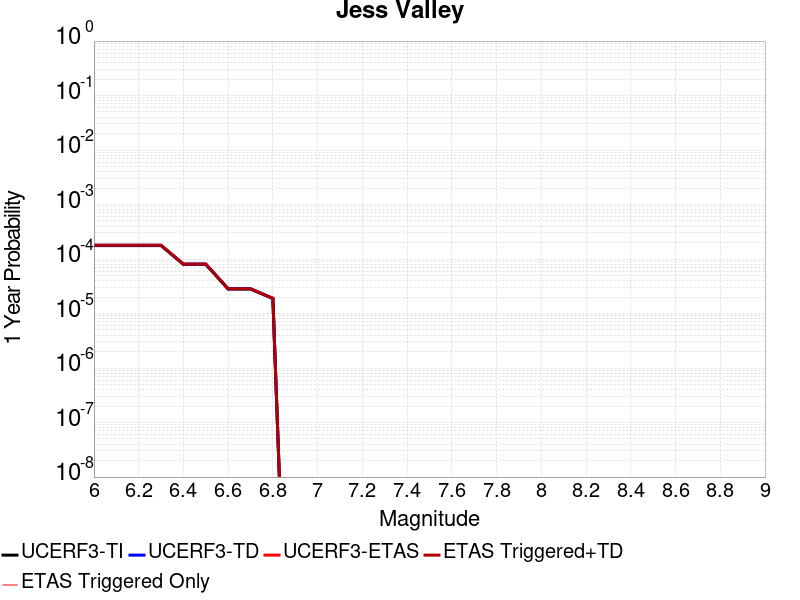 |  |

| Magnitude | 1 wk TI Prob | 1 wk TD Prob | 1 wk ETAS Prob | 1 wk ETAS/TD Gain | 1 wk ETAS Triggered+TD | 1 wk ETAS Triggered Only | 1 mo TI Prob | 1 mo TD Prob | 1 mo ETAS Prob | 1 mo ETAS/TD Gain | 1 mo ETAS Triggered+TD | 1 mo ETAS Triggered Only | 1 yr TI Prob | 1 yr TD Prob | 1 yr ETAS Prob | 1 yr ETAS/TD Gain | 1 yr ETAS Triggered+TD | 1 yr ETAS Triggered Only | 10 yr TI Prob | 10 yr TD Prob | 10 yr ETAS Prob | 10 yr ETAS/TD Gain | 10 yr ETAS Triggered+TD | 10 yr ETAS Triggered Only |
|-----|-----|-----|-----|-----|-----|-----|-----|-----|-----|-----|-----|-----|-----|-----|-----|-----|-----|-----|-----|-----|-----|-----|-----|-----|
| 6.0 | 3.3861274E-6 | 3.4341592E-6 | 0.0 | 0.0 | 3.4341592E-6 | 0.0 | 1.4511894E-5 | 1.4717759E-5 | 0.0 | 0.0 | 1.4717759E-5 | 0.0 | 1.7666799E-4 | 1.7917679E-4 | 0.0 | 0.0 | 1.7917679E-4 | 0.0 | 0.001765276 | 0.0017905998 | 1.0E-4 | 0.05584721 | 0.0018904207 | 1.0E-4 |
| 6.1 | 3.3861274E-6 | 3.4341592E-6 | 0.0 | 0.0 | 3.4341592E-6 | 0.0 | 1.4511894E-5 | 1.4717759E-5 | 0.0 | 0.0 | 1.4717759E-5 | 0.0 | 1.7666799E-4 | 1.7917679E-4 | 0.0 | 0.0 | 1.7917679E-4 | 0.0 | 0.001765276 | 0.0017905998 | 1.0E-4 | 0.05584721 | 0.0018904207 | 1.0E-4 |
| 6.2 | 3.3861274E-6 | 3.4341592E-6 | 0.0 | 0.0 | 3.4341592E-6 | 0.0 | 1.4511894E-5 | 1.4717759E-5 | 0.0 | 0.0 | 1.4717759E-5 | 0.0 | 1.7666799E-4 | 1.7917679E-4 | 0.0 | 0.0 | 1.7917679E-4 | 0.0 | 0.001765276 | 0.0017905998 | 1.0E-4 | 0.05584721 | 0.0018904207 | 1.0E-4 |
| 6.3 | 3.3861274E-6 | 3.4341592E-6 | 0.0 | 0.0 | 3.4341592E-6 | 0.0 | 1.4511894E-5 | 1.4717759E-5 | 0.0 | 0.0 | 1.4717759E-5 | 0.0 | 1.7666799E-4 | 1.7917679E-4 | 0.0 | 0.0 | 1.7917679E-4 | 0.0 | 0.001765276 | 0.0017905998 | 1.0E-4 | 0.05584721 | 0.0018904207 | 1.0E-4 |
| 6.4 | 1.5291708E-6 | 1.5503225E-6 | 0.0 | 0.0 | 1.5503225E-6 | 0.0 | 6.553573E-6 | 6.6442267E-6 | 0.0 | 0.0 | 6.6442267E-6 | 0.0 | 7.978683E-5 | 8.089125E-5 | 0.0 | 0.0 | 8.089125E-5 | 0.0 | 7.975819E-4 | 8.086963E-4 | 0.0 | 0.0 | 8.086963E-4 | 0.0 |
| 6.5 | 1.5291708E-6 | 1.5503225E-6 | 0.0 | 0.0 | 1.5503225E-6 | 0.0 | 6.553573E-6 | 6.6442267E-6 | 0.0 | 0.0 | 6.6442267E-6 | 0.0 | 7.978683E-5 | 8.089125E-5 | 0.0 | 0.0 | 8.089125E-5 | 0.0 | 7.975819E-4 | 8.086963E-4 | 0.0 | 0.0 | 8.086963E-4 | 0.0 |
| 6.6 | 5.396423E-7 | 5.4721534E-7 | 0.0 | 0.0 | 5.4721534E-7 | 0.0 | 2.312751E-6 | 2.3452076E-6 | 0.0 | 0.0 | 2.3452076E-6 | 0.0 | 2.8157378E-5 | 2.8552715E-5 | 0.0 | 0.0 | 2.8552715E-5 | 0.0 | 2.8153812E-4 | 2.8550887E-4 | 0.0 | 0.0 | 2.8550887E-4 | 0.0 |
| 6.7 | 5.396423E-7 | 5.4721534E-7 | 0.0 | 0.0 | 5.4721534E-7 | 0.0 | 2.312751E-6 | 2.3452076E-6 | 0.0 | 0.0 | 2.3452076E-6 | 0.0 | 2.8157378E-5 | 2.8552715E-5 | 0.0 | 0.0 | 2.8552715E-5 | 0.0 | 2.8153812E-4 | 2.8550887E-4 | 0.0 | 0.0 | 2.8550887E-4 | 0.0 |
| 6.8 | 3.6058395E-7 | 3.656412E-7 | 0.0 | 0.0 | 3.656412E-7 | 0.0 | 1.5453588E-6 | 1.5670338E-6 | 0.0 | 0.0 | 1.5670338E-6 | 0.0 | 1.8814582E-5 | 1.9078636E-5 | 0.0 | 0.0 | 1.9078636E-5 | 0.0 | 1.8812988E-4 | 1.9078636E-4 | 0.0 | 0.0 | 1.9078636E-4 | 0.0 |

## Malibu Coast (Extension) alt 1
*[(top)](#table-of-contents)*

| 1 Week | 1 Month | 1 Year | 10 Year |
|-----|-----|-----|-----|
| 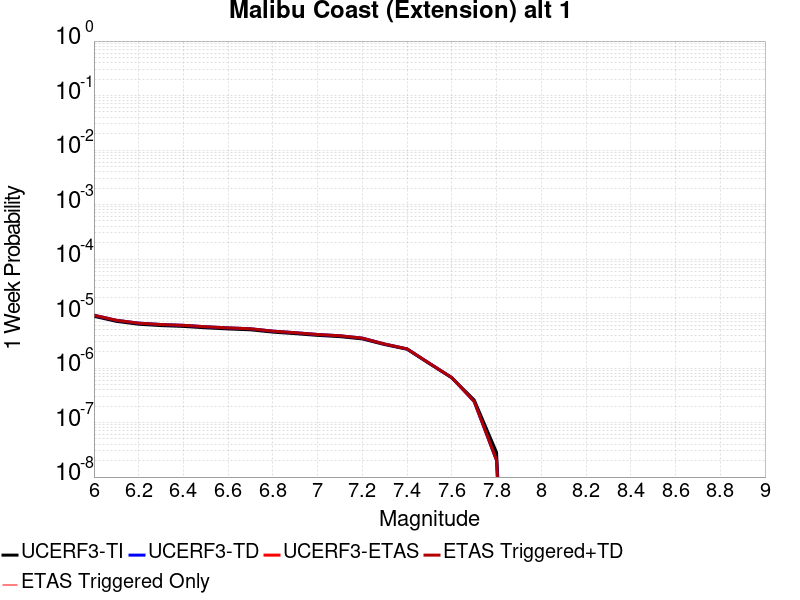 | 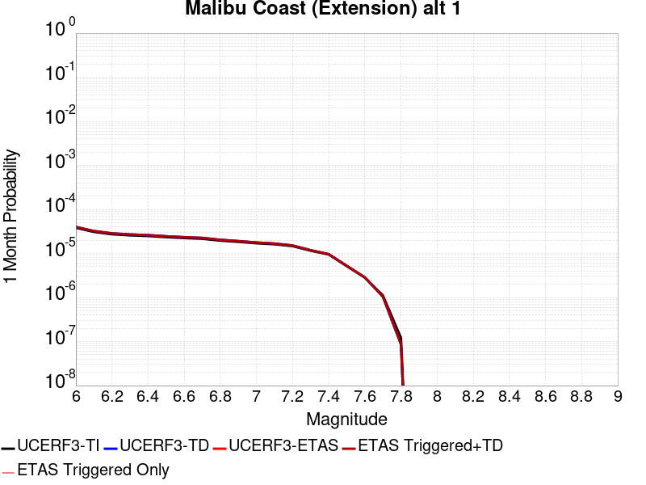 | 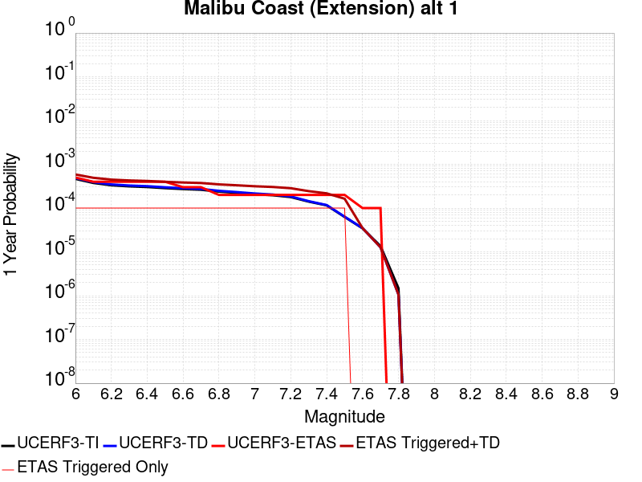 |  |

| Magnitude | 1 wk TI Prob | 1 wk TD Prob | 1 wk ETAS Prob | 1 wk ETAS/TD Gain | 1 wk ETAS Triggered+TD | 1 wk ETAS Triggered Only | 1 mo TI Prob | 1 mo TD Prob | 1 mo ETAS Prob | 1 mo ETAS/TD Gain | 1 mo ETAS Triggered+TD | 1 mo ETAS Triggered Only | 1 yr TI Prob | 1 yr TD Prob | 1 yr ETAS Prob | 1 yr ETAS/TD Gain | 1 yr ETAS Triggered+TD | 1 yr ETAS Triggered Only | 10 yr TI Prob | 10 yr TD Prob | 10 yr ETAS Prob | 10 yr ETAS/TD Gain | 10 yr ETAS Triggered+TD | 10 yr ETAS Triggered Only |
|-----|-----|-----|-----|-----|-----|-----|-----|-----|-----|-----|-----|-----|-----|-----|-----|-----|-----|-----|-----|-----|-----|-----|-----|-----|
| 6.0 | 8.930738E-6 | 9.330492E-6 | 0.0 | 0.0 | 9.330492E-6 | 0.0 | 3.827403E-5 | 3.9987215E-5 | 0.0 | 0.0 | 3.9987215E-5 | 0.0 | 4.6588664E-4 | 4.8673732E-4 | 1.0E-4 | 0.20544963 | 5.8668863E-4 | 1.0E-4 | 0.0046491115 | 0.004856895 | 1.0E-4 | 0.020589285 | 0.0049564093 | 1.0E-4 |
| 6.1 | 7.199952E-6 | 7.531366E-6 | 0.0 | 0.0 | 7.531366E-6 | 0.0 | 3.0856572E-5 | 3.2276886E-5 | 0.0 | 0.0 | 3.2276886E-5 | 0.0 | 3.75614E-4 | 3.9290084E-4 | 1.0E-4 | 0.25451714 | 4.9286155E-4 | 1.0E-4 | 0.0037497976 | 0.003922128 | 1.0E-4 | 0.025496362 | 0.004021736 | 1.0E-4 |
| 6.2 | 6.3721413E-6 | 6.6677844E-6 | 0.0 | 0.0 | 6.6677844E-6 | 0.0 | 2.7308892E-5 | 2.8575907E-5 | 0.0 | 0.0 | 2.8575907E-5 | 0.0 | 3.3243504E-4 | 3.478565E-4 | 1.0E-4 | 0.28747487 | 4.478217E-4 | 1.0E-4 | 0.0033193815 | 0.0034731599 | 1.0E-4 | 0.028792225 | 0.0035728125 | 1.0E-4 |
| 6.3 | 6.016345E-6 | 6.2961167E-6 | 0.0 | 0.0 | 6.2961167E-6 | 0.0 | 2.578408E-5 | 2.698308E-5 | 0.0 | 0.0 | 2.698308E-5 | 0.0 | 3.1387596E-4 | 3.2846982E-4 | 1.0E-4 | 0.304442 | 4.2843696E-4 | 1.0E-4 | 0.00313433 | 0.0032798792 | 1.0E-4 | 0.030488927 | 0.0033795512 | 1.0E-4 |
| 6.4 | 5.8104883E-6 | 6.080482E-6 | 0.0 | 0.0 | 6.080482E-6 | 0.0 | 2.4901856E-5 | 2.605895E-5 | 0.0 | 0.0 | 2.605895E-5 | 0.0 | 3.031379E-4 | 3.1722186E-4 | 1.0E-4 | 0.3152368 | 4.171901E-4 | 1.0E-4 | 0.0030272473 | 0.003167725 | 1.0E-4 | 0.031568397 | 0.003267408 | 1.0E-4 |
| 6.5 | 5.476925E-6 | 5.7284105E-6 | 0.0 | 0.0 | 5.7284105E-6 | 0.0 | 2.3472323E-5 | 2.4550101E-5 | 0.0 | 0.0 | 2.4550101E-5 | 0.0 | 2.8573806E-4 | 2.988568E-4 | 1.0E-4 | 0.33460844 | 3.988269E-4 | 1.0E-4 | 0.0028537093 | 0.0029845806 | 1.0E-4 | 0.033505544 | 0.0030842822 | 1.0E-4 |
| 6.6 | 5.222387E-6 | 5.4594457E-6 | 0.0 | 0.0 | 5.4594457E-6 | 0.0 | 2.2381464E-5 | 2.3397415E-5 | 0.0 | 0.0 | 2.3397415E-5 | 0.0 | 2.7246025E-4 | 2.848266E-4 | 1.0E-4 | 0.35109082 | 3.847981E-4 | 1.0E-4 | 0.0027212645 | 0.002844646 | 1.0E-4 | 0.035153758 | 0.0029443617 | 1.0E-4 |
| 6.7 | 5.0337076E-6 | 5.2599453E-6 | 0.0 | 0.0 | 5.2599453E-6 | 0.0 | 2.1572854E-5 | 2.254243E-5 | 0.0 | 0.0 | 2.254243E-5 | 0.0 | 2.6261783E-4 | 2.744198E-4 | 1.0E-4 | 0.36440518 | 3.7439237E-4 | 1.0E-4 | 0.002623077 | 0.0027408395 | 1.0E-4 | 0.036485173 | 0.0028405653 | 1.0E-4 |
| 6.8 | 4.5675624E-6 | 4.759483E-6 | 0.0 | 0.0 | 4.759483E-6 | 0.0 | 1.9575122E-5 | 2.0397625E-5 | 0.0 | 0.0 | 2.0397625E-5 | 0.0 | 2.3830103E-4 | 2.4831298E-4 | 1.0E-4 | 0.4027176 | 3.4828813E-4 | 1.0E-4 | 0.0023804565 | 0.0024803749 | 1.0E-4 | 0.040316485 | 0.002580127 | 1.0E-4 |
| 6.9 | 4.2802412E-6 | 4.4527446E-6 | 0.0 | 0.0 | 4.4527446E-6 | 0.0 | 1.8343762E-5 | 1.9083052E-5 | 0.0 | 0.0 | 1.9083052E-5 | 0.0 | 2.2331243E-4 | 2.3231153E-4 | 1.0E-4 | 0.43045646 | 3.322883E-4 | 1.0E-4 | 0.0022308815 | 0.0023207036 | 1.0E-4 | 0.04309038 | 0.0024204715 | 1.0E-4 |
| 7.0 | 3.9794063E-6 | 4.1307762E-6 | 0.0 | 0.0 | 4.1307762E-6 | 0.0 | 1.7054486E-5 | 1.7703207E-5 | 0.0 | 0.0 | 1.7703207E-5 | 0.0 | 2.0761859E-4 | 2.1551536E-4 | 1.0E-4 | 0.46400404 | 3.1549382E-4 | 1.0E-4 | 0.0020742472 | 0.0021530772 | 1.0E-4 | 0.046445154 | 0.0022528619 | 1.0E-4 |
| 7.1 | 3.7730424E-6 | 3.9118668E-6 | 0.0 | 0.0 | 3.9118668E-6 | 0.0 | 1.6170083E-5 | 1.6765036E-5 | 0.0 | 0.0 | 1.6765036E-5 | 0.0 | 1.9685295E-4 | 2.0409533E-4 | 1.0E-4 | 0.48996714 | 3.0407493E-4 | 1.0E-4 | 0.0019667868 | 0.0020390917 | 1.0E-4 | 0.049041443 | 0.0021388878 | 1.0E-4 |
| 7.2 | 3.424985E-6 | 3.541939E-6 | 0.0 | 0.0 | 3.541939E-6 | 0.0 | 1.4678424E-5 | 1.517965E-5 | 0.0 | 0.0 | 1.517965E-5 | 0.0 | 1.7869516E-4 | 1.8479669E-4 | 1.0E-4 | 0.54113525 | 2.8477822E-4 | 1.0E-4 | 0.0017855153 | 0.0018464422 | 1.0E-4 | 0.054158207 | 0.0019462577 | 1.0E-4 |
| 7.3 | 2.6966375E-6 | 2.760137E-6 | 0.0 | 0.0 | 2.760137E-6 | 0.0 | 1.15569665E-5 | 1.18291055E-5 | 0.0 | 0.0 | 1.18291055E-5 | 0.0 | 1.4069698E-4 | 1.4400989E-4 | 1.0E-4 | 0.6943968 | 2.4399548E-4 | 1.0E-4 | 0.0014060794 | 0.0014391697 | 1.0E-4 | 0.06948451 | 0.0015390258 | 1.0E-4 |
| 7.4 | 2.215957E-6 | 2.2497932E-6 | 0.0 | 0.0 | 2.2497932E-6 | 0.0 | 9.496924E-6 | 9.641935E-6 | 0.0 | 0.0 | 9.641935E-6 | 0.0 | 1.1561892E-4 | 1.17384276E-4 | 1.0E-4 | 0.8519029 | 2.1737254E-4 | 1.0E-4 | 0.0011555878 | 0.0011732264 | 1.0E-4 | 0.085235044 | 0.0012731091 | 1.0E-4 |
| 7.5 | 1.2040218E-6 | 1.2221014E-6 | 0.0 | 0.0 | 1.2221014E-6 | 0.0 | 5.160083E-6 | 5.237567E-6 | 0.0 | 0.0 | 5.237567E-6 | 0.0 | 6.2822204E-5 | 6.376553E-5 | 1.0E-4 | 1.5682453 | 1.6375916E-4 | 1.0E-4 | 6.280445E-4 | 6.3747424E-4 | 1.0E-4 | 0.15686908 | 7.374105E-4 | 1.0E-4 |
| 7.6 | 6.6157446E-7 | 6.679887E-7 | 0.0 | 0.0 | 6.679887E-7 | 0.0 | 2.835316E-6 | 2.8628056E-6 | 0.0 | 0.0 | 2.8628056E-6 | 0.0 | 3.4519428E-5 | 3.4854114E-5 | 0.0 | 0.0 | 3.4854114E-5 | 0.0 | 3.4514067E-4 | 3.48488E-4 | 0.0 | 0.0 | 3.48488E-4 | 0.0 |
| 7.7 | 2.6012302E-7 | 2.436076E-7 | 0.0 | 0.0 | 2.436076E-7 | 0.0 | 1.1148124E-6 | 1.0440322E-6 | 0.0 | 0.0 | 1.0440322E-6 | 0.0 | 1.3572758E-5 | 1.2711029E-5 | 0.0 | 0.0 | 1.2711029E-5 | 0.0 | 1.3571928E-4 | 1.2710408E-4 | 0.0 | 0.0 | 1.2710408E-4 | 0.0 |
| 7.8 | 2.8323132E-8 | 2.0269256E-8 | 0.0 | 0.0 | 2.0269256E-8 | 0.0 | 1.2138484E-7 | 8.686823E-8 | 0.0 | 0.0 | 8.686823E-8 | 0.0 | 1.4778595E-6 | 1.0576204E-6 | 0.0 | 0.0 | 1.0576204E-6 | 0.0 | 1.4778497E-5 | 1.0576161E-5 | 0.0 | 0.0 | 1.0576161E-5 | 0.0 |

## Ozena
*[(top)](#table-of-contents)*

| 1 Week | 1 Month | 1 Year | 10 Year |
|-----|-----|-----|-----|
|  |  |  |  |

| Magnitude | 1 wk TI Prob | 1 wk TD Prob | 1 wk ETAS Prob | 1 wk ETAS/TD Gain | 1 wk ETAS Triggered+TD | 1 wk ETAS Triggered Only | 1 mo TI Prob | 1 mo TD Prob | 1 mo ETAS Prob | 1 mo ETAS/TD Gain | 1 mo ETAS Triggered+TD | 1 mo ETAS Triggered Only | 1 yr TI Prob | 1 yr TD Prob | 1 yr ETAS Prob | 1 yr ETAS/TD Gain | 1 yr ETAS Triggered+TD | 1 yr ETAS Triggered Only | 10 yr TI Prob | 10 yr TD Prob | 10 yr ETAS Prob | 10 yr ETAS/TD Gain | 10 yr ETAS Triggered+TD | 10 yr ETAS Triggered Only |
|-----|-----|-----|-----|-----|-----|-----|-----|-----|-----|-----|-----|-----|-----|-----|-----|-----|-----|-----|-----|-----|-----|-----|-----|-----|
| 6.0 | 1.4377547E-6 | 1.4514067E-6 | 0.0 | 0.0 | 1.4514067E-6 | 0.0 | 6.161791E-6 | 6.2203007E-6 | 0.0 | 0.0 | 6.2203007E-6 | 0.0 | 7.5017226E-5 | 7.5729804E-5 | 0.0 | 0.0 | 7.5729804E-5 | 0.0 | 7.4991904E-4 | 7.570666E-4 | 1.0E-4 | 0.13208878 | 8.5699087E-4 | 1.0E-4 |
| 6.1 | 1.4377547E-6 | 1.4514067E-6 | 0.0 | 0.0 | 1.4514067E-6 | 0.0 | 6.161791E-6 | 6.2203007E-6 | 0.0 | 0.0 | 6.2203007E-6 | 0.0 | 7.5017226E-5 | 7.5729804E-5 | 0.0 | 0.0 | 7.5729804E-5 | 0.0 | 7.4991904E-4 | 7.570666E-4 | 1.0E-4 | 0.13208878 | 8.5699087E-4 | 1.0E-4 |
| 6.2 | 1.4377547E-6 | 1.4514067E-6 | 0.0 | 0.0 | 1.4514067E-6 | 0.0 | 6.161791E-6 | 6.2203007E-6 | 0.0 | 0.0 | 6.2203007E-6 | 0.0 | 7.5017226E-5 | 7.5729804E-5 | 0.0 | 0.0 | 7.5729804E-5 | 0.0 | 7.4991904E-4 | 7.570666E-4 | 1.0E-4 | 0.13208878 | 8.5699087E-4 | 1.0E-4 |
| 6.3 | 1.4377547E-6 | 1.4514067E-6 | 0.0 | 0.0 | 1.4514067E-6 | 0.0 | 6.161791E-6 | 6.2203007E-6 | 0.0 | 0.0 | 6.2203007E-6 | 0.0 | 7.5017226E-5 | 7.5729804E-5 | 0.0 | 0.0 | 7.5729804E-5 | 0.0 | 7.4991904E-4 | 7.570666E-4 | 1.0E-4 | 0.13208878 | 8.5699087E-4 | 1.0E-4 |
| 6.4 | 1.4377547E-6 | 1.4514067E-6 | 0.0 | 0.0 | 1.4514067E-6 | 0.0 | 6.161791E-6 | 6.2203007E-6 | 0.0 | 0.0 | 6.2203007E-6 | 0.0 | 7.5017226E-5 | 7.5729804E-5 | 0.0 | 0.0 | 7.5729804E-5 | 0.0 | 7.4991904E-4 | 7.570666E-4 | 1.0E-4 | 0.13208878 | 8.5699087E-4 | 1.0E-4 |
| 6.5 | 1.4377547E-6 | 1.4514067E-6 | 0.0 | 0.0 | 1.4514067E-6 | 0.0 | 6.161791E-6 | 6.2203007E-6 | 0.0 | 0.0 | 6.2203007E-6 | 0.0 | 7.5017226E-5 | 7.5729804E-5 | 0.0 | 0.0 | 7.5729804E-5 | 0.0 | 7.4991904E-4 | 7.570666E-4 | 1.0E-4 | 0.13208878 | 8.5699087E-4 | 1.0E-4 |
| 6.6 | 1.4377547E-6 | 1.4514067E-6 | 0.0 | 0.0 | 1.4514067E-6 | 0.0 | 6.161791E-6 | 6.2203007E-6 | 0.0 | 0.0 | 6.2203007E-6 | 0.0 | 7.5017226E-5 | 7.5729804E-5 | 0.0 | 0.0 | 7.5729804E-5 | 0.0 | 7.4991904E-4 | 7.570666E-4 | 1.0E-4 | 0.13208878 | 8.5699087E-4 | 1.0E-4 |
| 6.7 | 1.4377547E-6 | 1.4514067E-6 | 0.0 | 0.0 | 1.4514067E-6 | 0.0 | 6.161791E-6 | 6.2203007E-6 | 0.0 | 0.0 | 6.2203007E-6 | 0.0 | 7.5017226E-5 | 7.5729804E-5 | 0.0 | 0.0 | 7.5729804E-5 | 0.0 | 7.4991904E-4 | 7.570666E-4 | 1.0E-4 | 0.13208878 | 8.5699087E-4 | 1.0E-4 |
| 6.8 | 9.223257E-7 | 9.31782E-7 | 0.0 | 0.0 | 9.31782E-7 | 0.0 | 3.9528186E-6 | 3.9933457E-6 | 0.0 | 0.0 | 3.9933457E-6 | 0.0 | 4.81245E-5 | 4.8617938E-5 | 0.0 | 0.0 | 4.8617938E-5 | 0.0 | 4.811408E-4 | 4.8607704E-4 | 1.0E-4 | 0.2057287 | 5.8602844E-4 | 1.0E-4 |
| 6.9 | 9.141515E-7 | 9.235566E-7 | 0.0 | 0.0 | 9.235566E-7 | 0.0 | 3.917786E-6 | 3.958094E-6 | 0.0 | 0.0 | 3.958094E-6 | 0.0 | 4.7698002E-5 | 4.818877E-5 | 0.0 | 0.0 | 4.818877E-5 | 0.0 | 4.7687767E-4 | 4.8178722E-4 | 1.0E-4 | 0.20756051 | 5.8173906E-4 | 1.0E-4 |
| 7.0 | 8.767648E-7 | 8.8587666E-7 | 0.0 | 0.0 | 8.8587666E-7 | 0.0 | 3.757558E-6 | 3.7966088E-6 | 0.0 | 0.0 | 3.7966088E-6 | 0.0 | 4.5747307E-5 | 4.6222773E-5 | 0.0 | 0.0 | 4.6222773E-5 | 0.0 | 4.5737892E-4 | 4.621355E-4 | 1.0E-4 | 0.21638675 | 5.620893E-4 | 1.0E-4 |
| 7.1 | 8.199402E-7 | 8.2855775E-7 | 0.0 | 0.0 | 8.2855775E-7 | 0.0 | 3.5140247E-6 | 3.5509572E-6 | 0.0 | 0.0 | 3.5509572E-6 | 0.0 | 4.2782412E-5 | 4.3232085E-5 | 0.0 | 0.0 | 4.3232085E-5 | 0.0 | 4.2774176E-4 | 4.3224046E-4 | 1.0E-4 | 0.2313527 | 5.3219724E-4 | 1.0E-4 |
| 7.2 | 7.38705E-7 | 7.464423E-7 | 0.0 | 0.0 | 7.464423E-7 | 0.0 | 3.1658747E-6 | 3.1990348E-6 | 0.0 | 0.0 | 3.1990348E-6 | 0.0 | 3.8543843E-5 | 3.8947586E-5 | 0.0 | 0.0 | 3.8947586E-5 | 0.0 | 3.853716E-4 | 3.8941114E-4 | 1.0E-4 | 0.256798 | 4.893722E-4 | 1.0E-4 |
| 7.3 | 6.490017E-7 | 6.557943E-7 | 0.0 | 0.0 | 6.557943E-7 | 0.0 | 2.7814328E-6 | 2.8105442E-6 | 0.0 | 0.0 | 2.8105442E-6 | 0.0 | 3.386342E-5 | 3.4217872E-5 | 0.0 | 0.0 | 3.4217872E-5 | 0.0 | 3.3858258E-4 | 3.4212938E-4 | 1.0E-4 | 0.29228708 | 4.420952E-4 | 1.0E-4 |
| 7.4 | 5.346736E-7 | 5.4023764E-7 | 0.0 | 0.0 | 5.4023764E-7 | 0.0 | 2.291456E-6 | 2.3153023E-6 | 0.0 | 0.0 | 2.3153023E-6 | 0.0 | 2.789812E-5 | 2.8188471E-5 | 0.0 | 0.0 | 2.8188471E-5 | 0.0 | 2.789462E-4 | 2.81852E-4 | 1.0E-4 | 0.35479614 | 3.818238E-4 | 1.0E-4 |
| 7.5 | 2.939325E-7 | 2.9666626E-7 | 0.0 | 0.0 | 2.9666626E-7 | 0.0 | 1.25971E-6 | 1.2714263E-6 | 0.0 | 0.0 | 1.2714263E-6 | 0.0 | 1.5336862E-5 | 1.5479522E-5 | 0.0 | 0.0 | 1.5479522E-5 | 0.0 | 1.5335804E-4 | 1.5478604E-4 | 1.0E-4 | 0.6460531 | 2.5477057E-4 | 1.0E-4 |
| 7.6 | 1.4151905E-7 | 1.4253476E-7 | 0.0 | 0.0 | 1.4253476E-7 | 0.0 | 6.065101E-7 | 6.108631E-7 | 0.0 | 0.0 | 6.108631E-7 | 0.0 | 7.3842357E-6 | 7.4372333E-6 | 0.0 | 0.0 | 7.4372333E-6 | 0.0 | 7.38399E-5 | 7.436992E-5 | 0.0 | 0.0 | 7.436992E-5 | 0.0 |
| 7.7 | 4.4957577E-8 | 4.5252854E-8 | 0.0 | 0.0 | 4.5252854E-8 | 0.0 | 1.9267533E-7 | 1.9394079E-7 | 0.0 | 0.0 | 1.9394079E-7 | 0.0 | 2.3458194E-6 | 2.3612267E-6 | 0.0 | 0.0 | 2.3612267E-6 | 0.0 | 2.3457947E-5 | 2.3612025E-5 | 0.0 | 0.0 | 2.3612025E-5 | 0.0 |
| 7.8 | 5.9993255E-9 | 6.0413843E-9 | 0.0 | 0.0 | 6.0413843E-9 | 0.0 | 2.5711394E-8 | 2.5891648E-8 | 0.0 | 0.0 | 2.5891648E-8 | 0.0 | 3.1303617E-7 | 3.1523078E-7 | 0.0 | 0.0 | 3.1523078E-7 | 0.0 | 3.1303573E-6 | 3.1523043E-6 | 0.0 | 0.0 | 3.1523043E-6 | 0.0 |

## Joshua Tree (Seismicity)
*[(top)](#table-of-contents)*

| 1 Week | 1 Month | 1 Year | 10 Year |
|-----|-----|-----|-----|
|  |  |  |  |

| Magnitude | 1 wk TI Prob | 1 wk TD Prob | 1 wk ETAS Prob | 1 wk ETAS/TD Gain | 1 wk ETAS Triggered+TD | 1 wk ETAS Triggered Only | 1 mo TI Prob | 1 mo TD Prob | 1 mo ETAS Prob | 1 mo ETAS/TD Gain | 1 mo ETAS Triggered+TD | 1 mo ETAS Triggered Only | 1 yr TI Prob | 1 yr TD Prob | 1 yr ETAS Prob | 1 yr ETAS/TD Gain | 1 yr ETAS Triggered+TD | 1 yr ETAS Triggered Only | 10 yr TI Prob | 10 yr TD Prob | 10 yr ETAS Prob | 10 yr ETAS/TD Gain | 10 yr ETAS Triggered+TD | 10 yr ETAS Triggered Only |
|-----|-----|-----|-----|-----|-----|-----|-----|-----|-----|-----|-----|-----|-----|-----|-----|-----|-----|-----|-----|-----|-----|-----|-----|-----|
| 6.0 | 1.4025588E-6 | 2.278233E-6 | 0.0 | 0.0 | 2.278233E-6 | 0.0 | 6.0109523E-6 | 9.763823E-6 | 0.0 | 0.0 | 9.763823E-6 | 0.0 | 7.318089E-5 | 1.1886872E-4 | 0.0 | 0.0 | 1.1886872E-4 | 0.0 | 7.315679E-4 | 0.0011881156 | 1.0E-4 | 0.0841669 | 0.0012879967 | 1.0E-4 |
| 6.1 | 1.4025588E-6 | 2.278233E-6 | 0.0 | 0.0 | 2.278233E-6 | 0.0 | 6.0109523E-6 | 9.763823E-6 | 0.0 | 0.0 | 9.763823E-6 | 0.0 | 7.318089E-5 | 1.1886872E-4 | 0.0 | 0.0 | 1.1886872E-4 | 0.0 | 7.315679E-4 | 0.0011881156 | 1.0E-4 | 0.0841669 | 0.0012879967 | 1.0E-4 |
| 6.2 | 1.4025588E-6 | 2.278233E-6 | 0.0 | 0.0 | 2.278233E-6 | 0.0 | 6.0109523E-6 | 9.763823E-6 | 0.0 | 0.0 | 9.763823E-6 | 0.0 | 7.318089E-5 | 1.1886872E-4 | 0.0 | 0.0 | 1.1886872E-4 | 0.0 | 7.315679E-4 | 0.0011881156 | 1.0E-4 | 0.0841669 | 0.0012879967 | 1.0E-4 |
| 6.3 | 7.3325685E-7 | 1.6022501E-6 | 0.0 | 0.0 | 1.6022501E-6 | 0.0 | 3.1425257E-6 | 6.8667687E-6 | 0.0 | 0.0 | 6.8667687E-6 | 0.0 | 3.825958E-5 | 8.3599785E-5 | 0.0 | 0.0 | 8.3599785E-5 | 0.0 | 3.8252992E-4 | 8.356919E-4 | 0.0 | 0.0 | 8.356919E-4 | 0.0 |
| 6.4 | 6.38256E-7 | 1.5064975E-6 | 0.0 | 0.0 | 1.5064975E-6 | 0.0 | 2.7353801E-6 | 6.456402E-6 | 0.0 | 0.0 | 6.456402E-6 | 0.0 | 3.3302742E-5 | 7.860394E-5 | 0.0 | 0.0 | 7.860394E-5 | 0.0 | 3.3297754E-4 | 7.8576873E-4 | 0.0 | 0.0 | 7.8576873E-4 | 0.0 |
| 6.5 | 6.38256E-7 | 1.5064975E-6 | 0.0 | 0.0 | 1.5064975E-6 | 0.0 | 2.7353801E-6 | 6.456402E-6 | 0.0 | 0.0 | 6.456402E-6 | 0.0 | 3.3302742E-5 | 7.860394E-5 | 0.0 | 0.0 | 7.860394E-5 | 0.0 | 3.3297754E-4 | 7.8576873E-4 | 0.0 | 0.0 | 7.8576873E-4 | 0.0 |
| 6.6 | 6.3436806E-7 | 1.5035857E-6 | 0.0 | 0.0 | 1.5035857E-6 | 0.0 | 2.7187175E-6 | 6.443923E-6 | 0.0 | 0.0 | 6.443923E-6 | 0.0 | 3.3099885E-5 | 7.8452016E-5 | 0.0 | 0.0 | 7.8452016E-5 | 0.0 | 3.3094952E-4 | 7.842506E-4 | 0.0 | 0.0 | 7.842506E-4 | 0.0 |
| 6.7 | 6.094856E-7 | 1.4782754E-6 | 0.0 | 0.0 | 1.4782754E-6 | 0.0 | 2.6120786E-6 | 6.335451E-6 | 0.0 | 0.0 | 6.335451E-6 | 0.0 | 3.1801592E-5 | 7.713146E-5 | 0.0 | 0.0 | 7.713146E-5 | 0.0 | 3.179704E-4 | 7.7105424E-4 | 0.0 | 0.0 | 7.7105424E-4 | 0.0 |
| 6.8 | 5.984801E-7 | 1.4695498E-6 | 0.0 | 0.0 | 1.4695498E-6 | 0.0 | 2.564912E-6 | 6.298056E-6 | 0.0 | 0.0 | 6.298056E-6 | 0.0 | 3.1227355E-5 | 7.667621E-5 | 0.0 | 0.0 | 7.667621E-5 | 0.0 | 3.1222968E-4 | 7.6650485E-4 | 0.0 | 0.0 | 7.6650485E-4 | 0.0 |
| 6.9 | 4.94631E-7 | 1.3038972E-6 | 0.0 | 0.0 | 1.3038972E-6 | 0.0 | 2.1198455E-6 | 5.588119E-6 | 0.0 | 0.0 | 5.588119E-6 | 0.0 | 2.5808813E-5 | 6.803328E-5 | 0.0 | 0.0 | 6.803328E-5 | 0.0 | 2.5805813E-4 | 6.8013056E-4 | 0.0 | 0.0 | 6.8013056E-4 | 0.0 |
| 7.0 | 4.250375E-7 | 1.1675102E-6 | 0.0 | 0.0 | 1.1675102E-6 | 0.0 | 1.8215881E-6 | 5.0036056E-6 | 0.0 | 0.0 | 5.0036056E-6 | 0.0 | 2.2177608E-5 | 6.0917246E-5 | 0.0 | 0.0 | 6.0917246E-5 | 0.0 | 2.2175396E-4 | 6.090105E-4 | 0.0 | 0.0 | 6.090105E-4 | 0.0 |
| 7.1 | 3.6888565E-7 | 1.0458934E-6 | 0.0 | 0.0 | 1.0458934E-6 | 0.0 | 1.5809376E-6 | 4.482393E-6 | 0.0 | 0.0 | 4.482393E-6 | 0.0 | 1.9247746E-5 | 5.457181E-5 | 0.0 | 0.0 | 5.457181E-5 | 0.0 | 1.9246078E-4 | 5.455885E-4 | 0.0 | 0.0 | 5.455885E-4 | 0.0 |
| 7.2 | 3.2473773E-7 | 9.4067155E-7 | 0.0 | 0.0 | 9.4067155E-7 | 0.0 | 1.3917323E-6 | 4.0314435E-6 | 0.0 | 0.0 | 4.0314435E-6 | 0.0 | 1.694421E-5 | 4.9081762E-5 | 0.0 | 0.0 | 4.9081762E-5 | 0.0 | 1.6942917E-4 | 4.9071334E-4 | 0.0 | 0.0 | 4.9071334E-4 | 0.0 |
| 7.3 | 2.465367E-7 | 6.6388594E-7 | 0.0 | 0.0 | 6.6388594E-7 | 0.0 | 1.0565853E-6 | 2.8452225E-6 | 0.0 | 0.0 | 2.8452225E-6 | 0.0 | 1.2863851E-5 | 3.464007E-5 | 0.0 | 0.0 | 3.464007E-5 | 0.0 | 1.2863107E-4 | 3.4635013E-4 | 0.0 | 0.0 | 3.4635013E-4 | 0.0 |
| 7.4 | 1.6654941E-7 | 4.1806945E-7 | 0.0 | 0.0 | 4.1806945E-7 | 0.0 | 7.13783E-7 | 1.7917251E-6 | 0.0 | 0.0 | 1.7917251E-6 | 0.0 | 8.690274E-6 | 2.1814063E-5 | 0.0 | 0.0 | 2.1814063E-5 | 0.0 | 8.689934E-5 | 2.1812196E-4 | 0.0 | 0.0 | 2.1812196E-4 | 0.0 |
| 7.5 | 4.24214E-9 | 8.32973E-9 | 0.0 | 0.0 | 8.32973E-9 | 0.0 | 1.81806E-8 | 3.5698843E-8 | 0.0 | 0.0 | 3.5698843E-8 | 0.0 | 2.213488E-7 | 4.346334E-7 | 0.0 | 0.0 | 4.346334E-7 | 0.0 | 2.2134857E-6 | 4.346332E-6 | 0.0 | 0.0 | 4.346332E-6 | 0.0 |

## Santa Monica Bay
*[(top)](#table-of-contents)*

| 1 Week | 1 Month | 1 Year | 10 Year |
|-----|-----|-----|-----|
|  |  |  |  |

| Magnitude | 1 wk TI Prob | 1 wk TD Prob | 1 wk ETAS Prob | 1 wk ETAS/TD Gain | 1 wk ETAS Triggered+TD | 1 wk ETAS Triggered Only | 1 mo TI Prob | 1 mo TD Prob | 1 mo ETAS Prob | 1 mo ETAS/TD Gain | 1 mo ETAS Triggered+TD | 1 mo ETAS Triggered Only | 1 yr TI Prob | 1 yr TD Prob | 1 yr ETAS Prob | 1 yr ETAS/TD Gain | 1 yr ETAS Triggered+TD | 1 yr ETAS Triggered Only | 10 yr TI Prob | 10 yr TD Prob | 10 yr ETAS Prob | 10 yr ETAS/TD Gain | 10 yr ETAS Triggered+TD | 10 yr ETAS Triggered Only |
|-----|-----|-----|-----|-----|-----|-----|-----|-----|-----|-----|-----|-----|-----|-----|-----|-----|-----|-----|-----|-----|-----|-----|-----|-----|
| 6.0 | 6.493459E-7 | 6.571066E-7 | 0.0 | 0.0 | 6.571066E-7 | 0.0 | 2.782908E-6 | 2.8161685E-6 | 0.0 | 0.0 | 2.8161685E-6 | 0.0 | 3.388138E-5 | 3.4286328E-5 | 0.0 | 0.0 | 3.4286328E-5 | 0.0 | 3.3876215E-4 | 3.4281219E-4 | 1.0E-4 | 0.29170492 | 4.427779E-4 | 1.0E-4 |
| 6.1 | 6.493459E-7 | 6.571066E-7 | 0.0 | 0.0 | 6.571066E-7 | 0.0 | 2.782908E-6 | 2.8161685E-6 | 0.0 | 0.0 | 2.8161685E-6 | 0.0 | 3.388138E-5 | 3.4286328E-5 | 0.0 | 0.0 | 3.4286328E-5 | 0.0 | 3.3876215E-4 | 3.4281219E-4 | 1.0E-4 | 0.29170492 | 4.427779E-4 | 1.0E-4 |
| 6.2 | 6.493459E-7 | 6.571066E-7 | 0.0 | 0.0 | 6.571066E-7 | 0.0 | 2.782908E-6 | 2.8161685E-6 | 0.0 | 0.0 | 2.8161685E-6 | 0.0 | 3.388138E-5 | 3.4286328E-5 | 0.0 | 0.0 | 3.4286328E-5 | 0.0 | 3.3876215E-4 | 3.4281219E-4 | 1.0E-4 | 0.29170492 | 4.427779E-4 | 1.0E-4 |
| 6.3 | 6.493459E-7 | 6.571066E-7 | 0.0 | 0.0 | 6.571066E-7 | 0.0 | 2.782908E-6 | 2.8161685E-6 | 0.0 | 0.0 | 2.8161685E-6 | 0.0 | 3.388138E-5 | 3.4286328E-5 | 0.0 | 0.0 | 3.4286328E-5 | 0.0 | 3.3876215E-4 | 3.4281219E-4 | 1.0E-4 | 0.29170492 | 4.427779E-4 | 1.0E-4 |
| 6.4 | 6.493459E-7 | 6.571066E-7 | 0.0 | 0.0 | 6.571066E-7 | 0.0 | 2.782908E-6 | 2.8161685E-6 | 0.0 | 0.0 | 2.8161685E-6 | 0.0 | 3.388138E-5 | 3.4286328E-5 | 0.0 | 0.0 | 3.4286328E-5 | 0.0 | 3.3876215E-4 | 3.4281219E-4 | 1.0E-4 | 0.29170492 | 4.427779E-4 | 1.0E-4 |
| 6.5 | 6.493459E-7 | 6.571066E-7 | 0.0 | 0.0 | 6.571066E-7 | 0.0 | 2.782908E-6 | 2.8161685E-6 | 0.0 | 0.0 | 2.8161685E-6 | 0.0 | 3.388138E-5 | 3.4286328E-5 | 0.0 | 0.0 | 3.4286328E-5 | 0.0 | 3.3876215E-4 | 3.4281219E-4 | 1.0E-4 | 0.29170492 | 4.427779E-4 | 1.0E-4 |
| 6.6 | 6.493459E-7 | 6.571066E-7 | 0.0 | 0.0 | 6.571066E-7 | 0.0 | 2.782908E-6 | 2.8161685E-6 | 0.0 | 0.0 | 2.8161685E-6 | 0.0 | 3.388138E-5 | 3.4286328E-5 | 0.0 | 0.0 | 3.4286328E-5 | 0.0 | 3.3876215E-4 | 3.4281219E-4 | 1.0E-4 | 0.29170492 | 4.427779E-4 | 1.0E-4 |
| 6.7 | 6.493459E-7 | 6.571066E-7 | 0.0 | 0.0 | 6.571066E-7 | 0.0 | 2.782908E-6 | 2.8161685E-6 | 0.0 | 0.0 | 2.8161685E-6 | 0.0 | 3.388138E-5 | 3.4286328E-5 | 0.0 | 0.0 | 3.4286328E-5 | 0.0 | 3.3876215E-4 | 3.4281219E-4 | 1.0E-4 | 0.29170492 | 4.427779E-4 | 1.0E-4 |
| 6.8 | 6.493459E-7 | 6.571066E-7 | 0.0 | 0.0 | 6.571066E-7 | 0.0 | 2.782908E-6 | 2.8161685E-6 | 0.0 | 0.0 | 2.8161685E-6 | 0.0 | 3.388138E-5 | 3.4286328E-5 | 0.0 | 0.0 | 3.4286328E-5 | 0.0 | 3.3876215E-4 | 3.4281219E-4 | 1.0E-4 | 0.29170492 | 4.427779E-4 | 1.0E-4 |
| 6.9 | 6.493459E-7 | 6.571066E-7 | 0.0 | 0.0 | 6.571066E-7 | 0.0 | 2.782908E-6 | 2.8161685E-6 | 0.0 | 0.0 | 2.8161685E-6 | 0.0 | 3.388138E-5 | 3.4286328E-5 | 0.0 | 0.0 | 3.4286328E-5 | 0.0 | 3.3876215E-4 | 3.4281219E-4 | 1.0E-4 | 0.29170492 | 4.427779E-4 | 1.0E-4 |
| 7.0 | 6.3621707E-7 | 6.439131E-7 | 0.0 | 0.0 | 6.439131E-7 | 0.0 | 2.726642E-6 | 2.7596247E-6 | 0.0 | 0.0 | 2.7596247E-6 | 0.0 | 3.319636E-5 | 3.359793E-5 | 0.0 | 0.0 | 3.359793E-5 | 0.0 | 3.31914E-4 | 3.359303E-4 | 1.0E-4 | 0.29768082 | 4.3589668E-4 | 1.0E-4 |
| 7.1 | 5.796316E-7 | 5.869651E-7 | 0.0 | 0.0 | 5.869651E-7 | 0.0 | 2.4841331E-6 | 2.5155623E-6 | 0.0 | 0.0 | 2.5155623E-6 | 0.0 | 3.0243902E-5 | 3.0626557E-5 | 0.0 | 0.0 | 3.0626557E-5 | 0.0 | 3.0239785E-4 | 3.0622495E-4 | 1.0E-4 | 0.32655734 | 4.061943E-4 | 1.0E-4 |
| 7.2 | 5.2654514E-7 | 5.33487E-7 | 0.0 | 0.0 | 5.33487E-7 | 0.0 | 2.25662E-6 | 2.286371E-6 | 0.0 | 0.0 | 2.286371E-6 | 0.0 | 2.7474003E-5 | 2.7836226E-5 | 0.0 | 0.0 | 2.7836226E-5 | 0.0 | 2.7470608E-4 | 2.7832878E-4 | 1.0E-4 | 0.3592873 | 3.7830096E-4 | 1.0E-4 |
| 7.3 | 4.582996E-7 | 4.6464518E-7 | 0.0 | 0.0 | 4.6464518E-7 | 0.0 | 1.9641398E-6 | 1.991335E-6 | 0.0 | 0.0 | 1.991335E-6 | 0.0 | 2.3913139E-5 | 2.4244247E-5 | 0.0 | 0.0 | 2.4244247E-5 | 0.0 | 2.3910566E-4 | 2.4241727E-4 | 0.0 | 0.0 | 2.4241727E-4 | 0.0 |
| 7.4 | 3.9690556E-7 | 4.026237E-7 | 0.0 | 0.0 | 4.026237E-7 | 0.0 | 1.7010227E-6 | 1.725529E-6 | 0.0 | 0.0 | 1.725529E-6 | 0.0 | 2.0709755E-5 | 2.1008125E-5 | 0.0 | 0.0 | 2.1008125E-5 | 0.0 | 2.0707825E-4 | 2.1006254E-4 | 0.0 | 0.0 | 2.1006254E-4 | 0.0 |
| 7.5 | 2.514765E-7 | 2.554168E-7 | 0.0 | 0.0 | 2.554168E-7 | 0.0 | 1.077756E-6 | 1.0946429E-6 | 0.0 | 0.0 | 1.0946429E-6 | 0.0 | 1.31216E-5 | 1.3327202E-5 | 0.0 | 0.0 | 1.3327202E-5 | 0.0 | 1.3120825E-4 | 1.332646E-4 | 0.0 | 0.0 | 1.332646E-4 | 0.0 |
| 7.6 | 1.6412821E-7 | 1.6690714E-7 | 0.0 | 0.0 | 1.6690714E-7 | 0.0 | 7.0340644E-7 | 7.153161E-7 | 0.0 | 0.0 | 7.153161E-7 | 0.0 | 8.563939E-6 | 8.708939E-6 | 0.0 | 0.0 | 8.708939E-6 | 0.0 | 8.56361E-5 | 8.708603E-5 | 0.0 | 0.0 | 8.708603E-5 | 0.0 |
| 7.7 | 1.2030355E-7 | 1.2243736E-7 | 0.0 | 0.0 | 1.2243736E-7 | 0.0 | 5.155865E-7 | 5.2473143E-7 | 0.0 | 0.0 | 5.2473143E-7 | 0.0 | 6.277248E-6 | 6.388587E-6 | 0.0 | 0.0 | 6.388587E-6 | 0.0 | 6.2770705E-5 | 6.388407E-5 | 0.0 | 0.0 | 6.388407E-5 | 0.0 |
| 7.8 | 3.0539674E-8 | 3.112509E-8 | 0.0 | 0.0 | 3.112509E-8 | 0.0 | 1.308843E-7 | 1.3339324E-7 | 0.0 | 0.0 | 1.3339324E-7 | 0.0 | 1.5935152E-6 | 1.6240617E-6 | 0.0 | 0.0 | 1.6240617E-6 | 0.0 | 1.5935038E-5 | 1.624052E-5 | 0.0 | 0.0 | 1.624052E-5 | 0.0 |

## San Luis Range 2011 CFM
*[(top)](#table-of-contents)*

| 1 Week | 1 Month | 1 Year | 10 Year |
|-----|-----|-----|-----|
|  |  |  |  |

| Magnitude | 1 wk TI Prob | 1 wk TD Prob | 1 wk ETAS Prob | 1 wk ETAS/TD Gain | 1 wk ETAS Triggered+TD | 1 wk ETAS Triggered Only | 1 mo TI Prob | 1 mo TD Prob | 1 mo ETAS Prob | 1 mo ETAS/TD Gain | 1 mo ETAS Triggered+TD | 1 mo ETAS Triggered Only | 1 yr TI Prob | 1 yr TD Prob | 1 yr ETAS Prob | 1 yr ETAS/TD Gain | 1 yr ETAS Triggered+TD | 1 yr ETAS Triggered Only | 10 yr TI Prob | 10 yr TD Prob | 10 yr ETAS Prob | 10 yr ETAS/TD Gain | 10 yr ETAS Triggered+TD | 10 yr ETAS Triggered Only |
|-----|-----|-----|-----|-----|-----|-----|-----|-----|-----|-----|-----|-----|-----|-----|-----|-----|-----|-----|-----|-----|-----|-----|-----|-----|
| 6.0 | 8.8368415E-6 | 8.9657915E-6 | 0.0 | 0.0 | 8.9657915E-6 | 0.0 | 3.787163E-5 | 3.84243E-5 | 0.0 | 0.0 | 3.84243E-5 | 0.0 | 4.609895E-4 | 4.677233E-4 | 0.0 | 0.0 | 4.677233E-4 | 0.0 | 0.0046003438 | 0.0046681715 | 1.0E-4 | 0.021421663 | 0.0047677048 | 1.0E-4 |
| 6.1 | 8.8368415E-6 | 8.9657915E-6 | 0.0 | 0.0 | 8.9657915E-6 | 0.0 | 3.787163E-5 | 3.84243E-5 | 0.0 | 0.0 | 3.84243E-5 | 0.0 | 4.609895E-4 | 4.677233E-4 | 0.0 | 0.0 | 4.677233E-4 | 0.0 | 0.0046003438 | 0.0046681715 | 1.0E-4 | 0.021421663 | 0.0047677048 | 1.0E-4 |
| 6.2 | 8.8368415E-6 | 8.9657915E-6 | 0.0 | 0.0 | 8.9657915E-6 | 0.0 | 3.787163E-5 | 3.84243E-5 | 0.0 | 0.0 | 3.84243E-5 | 0.0 | 4.609895E-4 | 4.677233E-4 | 0.0 | 0.0 | 4.677233E-4 | 0.0 | 0.0046003438 | 0.0046681715 | 1.0E-4 | 0.021421663 | 0.0047677048 | 1.0E-4 |
| 6.3 | 8.8368415E-6 | 8.9657915E-6 | 0.0 | 0.0 | 8.9657915E-6 | 0.0 | 3.787163E-5 | 3.84243E-5 | 0.0 | 0.0 | 3.84243E-5 | 0.0 | 4.609895E-4 | 4.677233E-4 | 0.0 | 0.0 | 4.677233E-4 | 0.0 | 0.0046003438 | 0.0046681715 | 1.0E-4 | 0.021421663 | 0.0047677048 | 1.0E-4 |
| 6.4 | 3.9094193E-6 | 3.9413367E-6 | 0.0 | 0.0 | 3.9413367E-6 | 0.0 | 1.6754546E-5 | 1.6891336E-5 | 0.0 | 0.0 | 1.6891336E-5 | 0.0 | 2.039675E-4 | 2.0563288E-4 | 0.0 | 0.0 | 2.0563288E-4 | 0.0 | 0.0020378039 | 0.002054455 | 0.0 | 0.0 | 0.002054455 | 0.0 |
| 6.5 | 3.9094193E-6 | 3.9413367E-6 | 0.0 | 0.0 | 3.9413367E-6 | 0.0 | 1.6754546E-5 | 1.6891336E-5 | 0.0 | 0.0 | 1.6891336E-5 | 0.0 | 2.039675E-4 | 2.0563288E-4 | 0.0 | 0.0 | 2.0563288E-4 | 0.0 | 0.0020378039 | 0.002054455 | 0.0 | 0.0 | 0.002054455 | 0.0 |
| 6.6 | 3.0587726E-6 | 3.0754907E-6 | 0.0 | 0.0 | 3.0754907E-6 | 0.0 | 1.3108959E-5 | 1.3180608E-5 | 0.0 | 0.0 | 1.3180608E-5 | 0.0 | 1.595899E-4 | 1.604622E-4 | 0.0 | 0.0 | 1.604622E-4 | 0.0 | 0.0015947534 | 0.0016034754 | 0.0 | 0.0 | 0.0016034754 | 0.0 |
| 6.7 | 2.6160574E-6 | 2.6252137E-6 | 0.0 | 0.0 | 2.6252137E-6 | 0.0 | 1.1211626E-5 | 1.1250868E-5 | 0.0 | 0.0 | 1.1250868E-5 | 0.0 | 1.3649299E-4 | 1.3697078E-4 | 0.0 | 0.0 | 1.3697078E-4 | 0.0 | 0.0013640919 | 0.0013688697 | 0.0 | 0.0 | 0.0013688697 | 0.0 |
| 6.8 | 2.5110312E-6 | 2.5182226E-6 | 0.0 | 0.0 | 2.5182226E-6 | 0.0 | 1.0761518E-5 | 1.0792338E-5 | 0.0 | 0.0 | 1.0792338E-5 | 0.0 | 1.310136E-4 | 1.3138885E-4 | 0.0 | 0.0 | 1.3138885E-4 | 0.0 | 0.0013093639 | 0.0013131176 | 0.0 | 0.0 | 0.0013131176 | 0.0 |
| 6.9 | 1.8564405E-6 | 1.8525461E-6 | 0.0 | 0.0 | 1.8525461E-6 | 0.0 | 7.95615E-6 | 7.9394595E-6 | 0.0 | 0.0 | 7.9394595E-6 | 0.0 | 9.686181E-5 | 9.665865E-5 | 0.0 | 0.0 | 9.665865E-5 | 0.0 | 9.68196E-4 | 9.661681E-4 | 0.0 | 0.0 | 9.661681E-4 | 0.0 |
| 7.0 | 1.546127E-6 | 1.537002E-6 | 0.0 | 0.0 | 1.537002E-6 | 0.0 | 6.626242E-6 | 6.587135E-6 | 0.0 | 0.0 | 6.587135E-6 | 0.0 | 8.06715E-5 | 8.019542E-5 | 0.0 | 0.0 | 8.019542E-5 | 0.0 | 8.0642226E-4 | 8.0166553E-4 | 0.0 | 0.0 | 8.0166553E-4 | 0.0 |
| 7.1 | 1.3368208E-6 | 1.3235722E-6 | 0.0 | 0.0 | 1.3235722E-6 | 0.0 | 5.7292195E-6 | 5.67244E-6 | 0.0 | 0.0 | 5.67244E-6 | 0.0 | 6.975101E-5 | 6.905977E-5 | 0.0 | 0.0 | 6.905977E-5 | 0.0 | 6.972912E-4 | 6.903836E-4 | 0.0 | 0.0 | 6.903836E-4 | 0.0 |
| 7.2 | 1.0623363E-6 | 1.045466E-6 | 0.0 | 0.0 | 1.045466E-6 | 0.0 | 4.5528623E-6 | 4.480561E-6 | 0.0 | 0.0 | 4.480561E-6 | 0.0 | 5.5429686E-5 | 5.4549466E-5 | 0.0 | 0.0 | 5.4549466E-5 | 0.0 | 5.5415864E-4 | 5.45361E-4 | 0.0 | 0.0 | 5.45361E-4 | 0.0 |
| 7.3 | 7.831679E-7 | 7.7276246E-7 | 0.0 | 0.0 | 7.7276246E-7 | 0.0 | 3.3564295E-6 | 3.311835E-6 | 0.0 | 0.0 | 3.311835E-6 | 0.0 | 4.086376E-5 | 4.0320847E-5 | 0.0 | 0.0 | 4.0320847E-5 | 0.0 | 4.0856248E-4 | 4.0313543E-4 | 0.0 | 0.0 | 4.0313543E-4 | 0.0 |
| 7.4 | 5.9558846E-7 | 5.910842E-7 | 0.0 | 0.0 | 5.910842E-7 | 0.0 | 2.5525194E-6 | 2.5332156E-6 | 0.0 | 0.0 | 2.5332156E-6 | 0.0 | 3.107648E-5 | 3.0841464E-5 | 0.0 | 0.0 | 3.0841464E-5 | 0.0 | 3.1072134E-4 | 3.083719E-4 | 0.0 | 0.0 | 3.083719E-4 | 0.0 |
| 7.5 | 4.1616502E-7 | 4.1197842E-7 | 0.0 | 0.0 | 4.1197842E-7 | 0.0 | 1.7835631E-6 | 1.7656205E-6 | 0.0 | 0.0 | 1.7656205E-6 | 0.0 | 2.1714664E-5 | 2.1496218E-5 | 0.0 | 0.0 | 2.1496218E-5 | 0.0 | 2.1712543E-4 | 2.1494144E-4 | 0.0 | 0.0 | 2.1494144E-4 | 0.0 |
| 7.6 | 2.3816014E-7 | 2.3377581E-7 | 0.0 | 0.0 | 2.3377581E-7 | 0.0 | 1.0206859E-6 | 1.001896E-6 | 0.0 | 0.0 | 1.001896E-6 | 0.0 | 1.242678E-5 | 1.2198015E-5 | 0.0 | 0.0 | 1.2198015E-5 | 0.0 | 1.2426086E-4 | 1.2197347E-4 | 0.0 | 0.0 | 1.2197347E-4 | 0.0 |
| 7.7 | 9.918777E-8 | 9.387304E-8 | 0.0 | 0.0 | 9.387304E-8 | 0.0 | 4.2509038E-7 | 4.0231296E-7 | 0.0 | 0.0 | 4.0231296E-7 | 0.0 | 5.1754632E-6 | 4.898149E-6 | 0.0 | 0.0 | 4.898149E-6 | 0.0 | 5.1753424E-5 | 4.898042E-5 | 0.0 | 0.0 | 4.898042E-5 | 0.0 |
| 7.8 | 3.4982556E-8 | 2.96893E-8 | 0.0 | 0.0 | 2.96893E-8 | 0.0 | 1.4992524E-7 | 1.2723984E-7 | 0.0 | 0.0 | 1.2723984E-7 | 0.0 | 1.8253382E-6 | 1.549144E-6 | 0.0 | 0.0 | 1.549144E-6 | 0.0 | 1.8253233E-5 | 1.5491332E-5 | 0.0 | 0.0 | 1.5491332E-5 | 0.0 |
| 7.9 | 1.6624908E-8 | 1.147824E-8 | 0.0 | 0.0 | 1.147824E-8 | 0.0 | 7.12496E-8 | 4.9192455E-8 | 0.0 | 0.0 | 4.9192455E-8 | 0.0 | 8.6746354E-7 | 5.9891795E-7 | 0.0 | 0.0 | 5.9891795E-7 | 0.0 | 8.674601E-6 | 5.9891636E-6 | 0.0 | 0.0 | 5.9891636E-6 | 0.0 |
| 8.0 | 6.3352315E-9 | 3.0889136E-9 | 0.0 | 0.0 | 3.0889136E-9 | 0.0 | 2.715099E-8 | 1.3238198E-8 | 0.0 | 0.0 | 1.3238198E-8 | 0.0 | 3.3056327E-7 | 1.6117505E-7 | 0.0 | 0.0 | 1.6117505E-7 | 0.0 | 3.3056278E-6 | 1.6117493E-6 | 0.0 | 0.0 | 1.6117493E-6 | 0.0 |

## Camp Rock 2011
*[(top)](#table-of-contents)*

| 1 Week | 1 Month | 1 Year | 10 Year |
|-----|-----|-----|-----|
|  |  |  |  |

| Magnitude | 1 wk TI Prob | 1 wk TD Prob | 1 wk ETAS Prob | 1 wk ETAS/TD Gain | 1 wk ETAS Triggered+TD | 1 wk ETAS Triggered Only | 1 mo TI Prob | 1 mo TD Prob | 1 mo ETAS Prob | 1 mo ETAS/TD Gain | 1 mo ETAS Triggered+TD | 1 mo ETAS Triggered Only | 1 yr TI Prob | 1 yr TD Prob | 1 yr ETAS Prob | 1 yr ETAS/TD Gain | 1 yr ETAS Triggered+TD | 1 yr ETAS Triggered Only | 10 yr TI Prob | 10 yr TD Prob | 10 yr ETAS Prob | 10 yr ETAS/TD Gain | 10 yr ETAS Triggered+TD | 10 yr ETAS Triggered Only |
|-----|-----|-----|-----|-----|-----|-----|-----|-----|-----|-----|-----|-----|-----|-----|-----|-----|-----|-----|-----|-----|-----|-----|-----|-----|
| 6.0 | 1.6710783E-5 | 4.2501047E-6 | 0.0 | 0.0 | 4.2501047E-6 | 0.0 | 7.161568E-5 | 1.821461E-5 | 0.0 | 0.0 | 1.821461E-5 | 0.0 | 8.7157206E-4 | 2.2174083E-4 | 0.0 | 0.0 | 2.2174083E-4 | 0.0 | 0.008681616 | 0.0022152488 | 1.0E-4 | 0.04514166 | 0.0023150272 | 1.0E-4 |
| 6.1 | 1.6710783E-5 | 4.2501047E-6 | 0.0 | 0.0 | 4.2501047E-6 | 0.0 | 7.161568E-5 | 1.821461E-5 | 0.0 | 0.0 | 1.821461E-5 | 0.0 | 8.7157206E-4 | 2.2174083E-4 | 0.0 | 0.0 | 2.2174083E-4 | 0.0 | 0.008681616 | 0.0022152488 | 1.0E-4 | 0.04514166 | 0.0023150272 | 1.0E-4 |
| 6.2 | 1.6710783E-5 | 4.2501047E-6 | 0.0 | 0.0 | 4.2501047E-6 | 0.0 | 7.161568E-5 | 1.821461E-5 | 0.0 | 0.0 | 1.821461E-5 | 0.0 | 8.7157206E-4 | 2.2174083E-4 | 0.0 | 0.0 | 2.2174083E-4 | 0.0 | 0.008681616 | 0.0022152488 | 1.0E-4 | 0.04514166 | 0.0023150272 | 1.0E-4 |
| 6.3 | 1.6710783E-5 | 4.2501047E-6 | 0.0 | 0.0 | 4.2501047E-6 | 0.0 | 7.161568E-5 | 1.821461E-5 | 0.0 | 0.0 | 1.821461E-5 | 0.0 | 8.7157206E-4 | 2.2174083E-4 | 0.0 | 0.0 | 2.2174083E-4 | 0.0 | 0.008681616 | 0.0022152488 | 1.0E-4 | 0.04514166 | 0.0023150272 | 1.0E-4 |
| 6.4 | 7.982846E-6 | 3.6821073E-6 | 0.0 | 0.0 | 3.6821073E-6 | 0.0 | 3.421175E-5 | 1.5780366E-5 | 0.0 | 0.0 | 1.5780366E-5 | 0.0 | 4.1644843E-4 | 1.9210936E-4 | 0.0 | 0.0 | 1.9210936E-4 | 0.0 | 0.0041566887 | 0.0019194678 | 1.0E-4 | 0.052097775 | 0.002019276 | 1.0E-4 |
| 6.5 | 7.982846E-6 | 3.6821073E-6 | 0.0 | 0.0 | 3.6821073E-6 | 0.0 | 3.421175E-5 | 1.5780366E-5 | 0.0 | 0.0 | 1.5780366E-5 | 0.0 | 4.1644843E-4 | 1.9210936E-4 | 0.0 | 0.0 | 1.9210936E-4 | 0.0 | 0.0041566887 | 0.0019194678 | 1.0E-4 | 0.052097775 | 0.002019276 | 1.0E-4 |
| 6.6 | 7.048869E-6 | 3.4243467E-6 | 0.0 | 0.0 | 3.4243467E-6 | 0.0 | 3.0209088E-5 | 1.467569E-5 | 0.0 | 0.0 | 1.467569E-5 | 0.0 | 3.677336E-4 | 1.786622E-4 | 0.0 | 0.0 | 1.786622E-4 | 0.0 | 0.0036712566 | 0.0017852173 | 1.0E-4 | 0.056015592 | 0.0018850388 | 1.0E-4 |
| 6.7 | 6.987307E-6 | 3.3623166E-6 | 0.0 | 0.0 | 3.3623166E-6 | 0.0 | 2.9945259E-5 | 1.4409851E-5 | 0.0 | 0.0 | 1.4409851E-5 | 0.0 | 3.6452254E-4 | 1.7542612E-4 | 0.0 | 0.0 | 1.7542612E-4 | 0.0 | 0.0036392517 | 0.0017529075 | 1.0E-4 | 0.057048075 | 0.0018527323 | 1.0E-4 |
| 6.8 | 6.3737602E-6 | 3.1178927E-6 | 0.0 | 0.0 | 3.1178927E-6 | 0.0 | 2.731583E-5 | 1.3362331E-5 | 0.0 | 0.0 | 1.3362331E-5 | 0.0 | 3.3251947E-4 | 1.6267452E-4 | 0.0 | 0.0 | 1.6267452E-4 | 0.0 | 0.0033202237 | 0.001625583 | 1.0E-4 | 0.061516393 | 0.0017254205 | 1.0E-4 |
| 6.9 | 6.112211E-6 | 2.933093E-6 | 0.0 | 0.0 | 2.933093E-6 | 0.0 | 2.6194928E-5 | 1.2570339E-5 | 0.0 | 0.0 | 1.2570339E-5 | 0.0 | 3.1887658E-4 | 1.5303341E-4 | 0.0 | 0.0 | 1.5303341E-4 | 0.0 | 0.003184194 | 0.001529308 | 1.0E-4 | 0.06538905 | 0.0016291551 | 1.0E-4 |
| 7.0 | 5.5140117E-6 | 2.6419107E-6 | 0.0 | 0.0 | 2.6419107E-6 | 0.0 | 2.3631264E-5 | 1.1322426E-5 | 0.0 | 0.0 | 1.1322426E-5 | 0.0 | 2.8767265E-4 | 1.3784207E-4 | 0.0 | 0.0 | 1.3784207E-4 | 0.0 | 0.0028730053 | 0.001377591 | 0.0 | 0.0 | 0.001377591 | 0.0 |
| 7.1 | 4.8151105E-6 | 2.1342291E-6 | 0.0 | 0.0 | 2.1342291E-6 | 0.0 | 2.0636026E-5 | 9.146665E-6 | 0.0 | 0.0 | 9.146665E-6 | 0.0 | 2.5121463E-4 | 1.11355184E-4 | 0.0 | 0.0 | 1.11355184E-4 | 0.0 | 0.0025093083 | 0.0011130158 | 0.0 | 0.0 | 0.0011130158 | 0.0 |
| 7.2 | 3.818335E-6 | 1.2936346E-6 | 0.0 | 0.0 | 1.2936346E-6 | 0.0 | 1.6364189E-5 | 5.544137E-6 | 0.0 | 0.0 | 5.544137E-6 | 0.0 | 1.9921579E-4 | 6.749786E-5 | 0.0 | 0.0 | 6.749786E-5 | 0.0 | 0.0019903728 | 6.7478186E-4 | 0.0 | 0.0 | 6.7478186E-4 | 0.0 |
| 7.3 | 2.7166698E-6 | 7.38223E-7 | 0.0 | 0.0 | 7.38223E-7 | 0.0 | 1.1642818E-5 | 3.1638092E-6 | 0.0 | 0.0 | 3.1638092E-6 | 0.0 | 1.4174209E-4 | 3.8518716E-5 | 0.0 | 0.0 | 3.8518716E-5 | 0.0 | 0.0014165172 | 3.851224E-4 | 0.0 | 0.0 | 3.851224E-4 | 0.0 |
| 7.4 | 2.0893426E-6 | 5.4607443E-7 | 0.0 | 0.0 | 5.4607443E-7 | 0.0 | 8.954295E-6 | 2.340317E-6 | 0.0 | 0.0 | 2.340317E-6 | 0.0 | 1.0901308E-4 | 2.849299E-5 | 0.0 | 0.0 | 2.849299E-5 | 0.0 | 0.0010895962 | 2.8489393E-4 | 0.0 | 0.0 | 2.8489393E-4 | 0.0 |
| 7.5 | 1.1681728E-6 | 3.6024338E-7 | 0.0 | 0.0 | 3.6024338E-7 | 0.0 | 5.0064455E-6 | 1.5438993E-6 | 0.0 | 0.0 | 1.5438993E-6 | 0.0 | 6.0951766E-5 | 1.8796816E-5 | 0.0 | 0.0 | 1.8796816E-5 | 0.0 | 6.093505E-4 | 1.8795273E-4 | 0.0 | 0.0 | 1.8795273E-4 | 0.0 |
| 7.6 | 1.3154387E-7 | 7.1193504E-8 | 0.0 | 0.0 | 7.1193504E-8 | 0.0 | 5.6375933E-7 | 3.0511498E-7 | 0.0 | 0.0 | 3.0511498E-7 | 0.0 | 6.863748E-6 | 3.7147702E-6 | 0.0 | 0.0 | 3.7147702E-6 | 0.0 | 6.863536E-5 | 3.7147238E-5 | 0.0 | 0.0 | 3.7147238E-5 | 0.0 |

## Dog Valley
*[(top)](#table-of-contents)*

| 1 Week | 1 Month | 1 Year | 10 Year |
|-----|-----|-----|-----|
|  |  |  |  |

| Magnitude | 1 wk TI Prob | 1 wk TD Prob | 1 wk ETAS Prob | 1 wk ETAS/TD Gain | 1 wk ETAS Triggered+TD | 1 wk ETAS Triggered Only | 1 mo TI Prob | 1 mo TD Prob | 1 mo ETAS Prob | 1 mo ETAS/TD Gain | 1 mo ETAS Triggered+TD | 1 mo ETAS Triggered Only | 1 yr TI Prob | 1 yr TD Prob | 1 yr ETAS Prob | 1 yr ETAS/TD Gain | 1 yr ETAS Triggered+TD | 1 yr ETAS Triggered Only | 10 yr TI Prob | 10 yr TD Prob | 10 yr ETAS Prob | 10 yr ETAS/TD Gain | 10 yr ETAS Triggered+TD | 10 yr ETAS Triggered Only |
|-----|-----|-----|-----|-----|-----|-----|-----|-----|-----|-----|-----|-----|-----|-----|-----|-----|-----|-----|-----|-----|-----|-----|-----|-----|
| 6.0 | 7.949598E-6 | 8.276426E-6 | 0.0 | 0.0 | 8.276426E-6 | 0.0 | 3.4069257E-5 | 3.5470028E-5 | 0.0 | 0.0 | 3.5470028E-5 | 0.0 | 4.1471425E-4 | 4.3178166E-4 | 0.0 | 0.0 | 4.3178166E-4 | 0.0 | 0.0041394117 | 0.004311358 | 1.0E-4 | 0.023194548 | 0.0044109267 | 1.0E-4 |
| 6.1 | 7.949598E-6 | 8.276426E-6 | 0.0 | 0.0 | 8.276426E-6 | 0.0 | 3.4069257E-5 | 3.5470028E-5 | 0.0 | 0.0 | 3.5470028E-5 | 0.0 | 4.1471425E-4 | 4.3178166E-4 | 0.0 | 0.0 | 4.3178166E-4 | 0.0 | 0.0041394117 | 0.004311358 | 1.0E-4 | 0.023194548 | 0.0044109267 | 1.0E-4 |
| 6.2 | 7.949598E-6 | 8.276426E-6 | 0.0 | 0.0 | 8.276426E-6 | 0.0 | 3.4069257E-5 | 3.5470028E-5 | 0.0 | 0.0 | 3.5470028E-5 | 0.0 | 4.1471425E-4 | 4.3178166E-4 | 0.0 | 0.0 | 4.3178166E-4 | 0.0 | 0.0041394117 | 0.004311358 | 1.0E-4 | 0.023194548 | 0.0044109267 | 1.0E-4 |
| 6.3 | 7.949598E-6 | 8.276426E-6 | 0.0 | 0.0 | 8.276426E-6 | 0.0 | 3.4069257E-5 | 3.5470028E-5 | 0.0 | 0.0 | 3.5470028E-5 | 0.0 | 4.1471425E-4 | 4.3178166E-4 | 0.0 | 0.0 | 4.3178166E-4 | 0.0 | 0.0041394117 | 0.004311358 | 1.0E-4 | 0.023194548 | 0.0044109267 | 1.0E-4 |
| 6.4 | 4.462132E-6 | 4.6235073E-6 | 0.0 | 0.0 | 4.6235073E-6 | 0.0 | 1.9123283E-5 | 1.9814932E-5 | 0.0 | 0.0 | 1.9814932E-5 | 0.0 | 2.328011E-4 | 2.4122902E-4 | 0.0 | 0.0 | 2.4122902E-4 | 0.0 | 0.0023255737 | 0.002410549 | 1.0E-4 | 0.041484326 | 0.002510308 | 1.0E-4 |
| 6.5 | 4.462132E-6 | 4.6235073E-6 | 0.0 | 0.0 | 4.6235073E-6 | 0.0 | 1.9123283E-5 | 1.9814932E-5 | 0.0 | 0.0 | 1.9814932E-5 | 0.0 | 2.328011E-4 | 2.4122902E-4 | 0.0 | 0.0 | 2.4122902E-4 | 0.0 | 0.0023255737 | 0.002410549 | 1.0E-4 | 0.041484326 | 0.002510308 | 1.0E-4 |
| 6.6 | 4.074213E-6 | 4.2176816E-6 | 0.0 | 0.0 | 4.2176816E-6 | 0.0 | 1.7460794E-5 | 1.8075703E-5 | 0.0 | 0.0 | 1.8075703E-5 | 0.0 | 2.1256444E-4 | 2.2005825E-4 | 0.0 | 0.0 | 2.2005825E-4 | 0.0 | 0.0021236122 | 0.0021992652 | 1.0E-4 | 0.04546973 | 0.0022990452 | 1.0E-4 |
| 6.7 | 4.074213E-6 | 4.2176816E-6 | 0.0 | 0.0 | 4.2176816E-6 | 0.0 | 1.7460794E-5 | 1.8075703E-5 | 0.0 | 0.0 | 1.8075703E-5 | 0.0 | 2.1256444E-4 | 2.2005825E-4 | 0.0 | 0.0 | 2.2005825E-4 | 0.0 | 0.0021236122 | 0.0021992652 | 1.0E-4 | 0.04546973 | 0.0022990452 | 1.0E-4 |
| 6.8 | 1.6159543E-6 | 1.6504129E-6 | 0.0 | 0.0 | 1.6504129E-6 | 0.0 | 6.9255E-6 | 7.073182E-6 | 0.0 | 0.0 | 7.073182E-6 | 0.0 | 8.43147E-5 | 8.611314E-5 | 0.0 | 0.0 | 8.611314E-5 | 0.0 | 8.4282714E-4 | 8.6085196E-4 | 0.0 | 0.0 | 8.6085196E-4 | 0.0 |
| 6.9 | 1.3952654E-6 | 1.4253508E-6 | 0.0 | 0.0 | 1.4253508E-6 | 0.0 | 5.9796953E-6 | 6.1086344E-6 | 0.0 | 0.0 | 6.1086344E-6 | 0.0 | 7.280036E-5 | 7.4370575E-5 | 0.0 | 0.0 | 7.4370575E-5 | 0.0 | 7.2776515E-4 | 7.4350485E-4 | 0.0 | 0.0 | 7.4350485E-4 | 0.0 |
| 7.0 | 1.1619308E-6 | 1.1870053E-6 | 0.0 | 0.0 | 1.1870053E-6 | 0.0 | 4.979694E-6 | 5.087158E-6 | 0.0 | 0.0 | 5.087158E-6 | 0.0 | 6.0626087E-5 | 6.1934836E-5 | 0.0 | 0.0 | 6.1934836E-5 | 0.0 | 6.060955E-4 | 6.1921944E-4 | 0.0 | 0.0 | 6.1921944E-4 | 0.0 |
| 7.1 | 7.8723247E-7 | 8.0473643E-7 | 0.0 | 0.0 | 8.0473643E-7 | 0.0 | 3.373849E-6 | 3.4488676E-6 | 0.0 | 0.0 | 3.4488676E-6 | 0.0 | 4.107584E-5 | 4.198946E-5 | 0.0 | 0.0 | 4.198946E-5 | 0.0 | 4.1068246E-4 | 4.1984514E-4 | 0.0 | 0.0 | 4.1984514E-4 | 0.0 |

## Richfield
*[(top)](#table-of-contents)*

| 1 Week | 1 Month | 1 Year | 10 Year |
|-----|-----|-----|-----|
|  |  |  |  |

| Magnitude | 1 wk TI Prob | 1 wk TD Prob | 1 wk ETAS Prob | 1 wk ETAS/TD Gain | 1 wk ETAS Triggered+TD | 1 wk ETAS Triggered Only | 1 mo TI Prob | 1 mo TD Prob | 1 mo ETAS Prob | 1 mo ETAS/TD Gain | 1 mo ETAS Triggered+TD | 1 mo ETAS Triggered Only | 1 yr TI Prob | 1 yr TD Prob | 1 yr ETAS Prob | 1 yr ETAS/TD Gain | 1 yr ETAS Triggered+TD | 1 yr ETAS Triggered Only | 10 yr TI Prob | 10 yr TD Prob | 10 yr ETAS Prob | 10 yr ETAS/TD Gain | 10 yr ETAS Triggered+TD | 10 yr ETAS Triggered Only |
|-----|-----|-----|-----|-----|-----|-----|-----|-----|-----|-----|-----|-----|-----|-----|-----|-----|-----|-----|-----|-----|-----|-----|-----|-----|
| 6.0 | 1.5166896E-6 | 1.5393172E-6 | 0.0 | 0.0 | 1.5393172E-6 | 0.0 | 6.5000822E-6 | 6.597063E-6 | 0.0 | 0.0 | 6.597063E-6 | 0.0 | 7.913562E-5 | 8.031738E-5 | 0.0 | 0.0 | 8.031738E-5 | 0.0 | 7.910745E-4 | 8.0299133E-4 | 1.0E-4 | 0.124534346 | 9.02911E-4 | 1.0E-4 |
| 6.1 | 1.5166896E-6 | 1.5393172E-6 | 0.0 | 0.0 | 1.5393172E-6 | 0.0 | 6.5000822E-6 | 6.597063E-6 | 0.0 | 0.0 | 6.597063E-6 | 0.0 | 7.913562E-5 | 8.031738E-5 | 0.0 | 0.0 | 8.031738E-5 | 0.0 | 7.910745E-4 | 8.0299133E-4 | 1.0E-4 | 0.124534346 | 9.02911E-4 | 1.0E-4 |
| 6.2 | 6.473272E-7 | 6.598762E-7 | 0.0 | 0.0 | 6.598762E-7 | 0.0 | 2.7742565E-6 | 2.8280385E-6 | 0.0 | 0.0 | 2.8280385E-6 | 0.0 | 3.377605E-5 | 3.443096E-5 | 0.0 | 0.0 | 3.443096E-5 | 0.0 | 3.3770915E-4 | 3.4426927E-4 | 1.0E-4 | 0.2904703 | 4.4423484E-4 | 1.0E-4 |
| 6.3 | 6.473272E-7 | 6.598762E-7 | 0.0 | 0.0 | 6.598762E-7 | 0.0 | 2.7742565E-6 | 2.8280385E-6 | 0.0 | 0.0 | 2.8280385E-6 | 0.0 | 3.377605E-5 | 3.443096E-5 | 0.0 | 0.0 | 3.443096E-5 | 0.0 | 3.3770915E-4 | 3.4426927E-4 | 1.0E-4 | 0.2904703 | 4.4423484E-4 | 1.0E-4 |
| 6.4 | 6.473272E-7 | 6.598762E-7 | 0.0 | 0.0 | 6.598762E-7 | 0.0 | 2.7742565E-6 | 2.8280385E-6 | 0.0 | 0.0 | 2.8280385E-6 | 0.0 | 3.377605E-5 | 3.443096E-5 | 0.0 | 0.0 | 3.443096E-5 | 0.0 | 3.3770915E-4 | 3.4426927E-4 | 1.0E-4 | 0.2904703 | 4.4423484E-4 | 1.0E-4 |
| 6.5 | 2.7954403E-7 | 2.8533015E-7 | 0.0 | 0.0 | 2.8533015E-7 | 0.0 | 1.1980452E-6 | 1.2228431E-6 | 0.0 | 0.0 | 1.2228431E-6 | 0.0 | 1.4586103E-5 | 1.4888057E-5 | 0.0 | 0.0 | 1.4888057E-5 | 0.0 | 1.4585146E-4 | 1.4887484E-4 | 0.0 | 0.0 | 1.4887484E-4 | 0.0 |
| 6.6 | 2.7954403E-7 | 2.8533015E-7 | 0.0 | 0.0 | 2.8533015E-7 | 0.0 | 1.1980452E-6 | 1.2228431E-6 | 0.0 | 0.0 | 1.2228431E-6 | 0.0 | 1.4586103E-5 | 1.4888057E-5 | 0.0 | 0.0 | 1.4888057E-5 | 0.0 | 1.4585146E-4 | 1.4887484E-4 | 0.0 | 0.0 | 1.4887484E-4 | 0.0 |
| 6.7 | 1.0777299E-7 | 1.0879217E-7 | 0.0 | 0.0 | 1.0879217E-7 | 0.0 | 4.6188418E-7 | 4.6625212E-7 | 0.0 | 0.0 | 4.6625212E-7 | 0.0 | 5.6234253E-6 | 5.676609E-6 | 0.0 | 0.0 | 5.676609E-6 | 0.0 | 5.623283E-5 | 5.676507E-5 | 0.0 | 0.0 | 5.676507E-5 | 0.0 |
| 6.8 | 2.1301874E-8 | 2.066675E-8 | 0.0 | 0.0 | 2.066675E-8 | 0.0 | 9.129375E-8 | 8.857178E-8 | 0.0 | 0.0 | 8.857178E-8 | 0.0 | 1.1115008E-6 | 1.0783609E-6 | 0.0 | 0.0 | 1.0783609E-6 | 0.0 | 1.1114952E-5 | 1.0783561E-5 | 0.0 | 0.0 | 1.0783561E-5 | 0.0 |
| 6.9 | 1.8413502E-8 | 1.775166E-8 | 0.0 | 0.0 | 1.775166E-8 | 0.0 | 7.891501E-8 | 7.6078535E-8 | 0.0 | 0.0 | 7.6078535E-8 | 0.0 | 9.607899E-7 | 9.262558E-7 | 0.0 | 0.0 | 9.262558E-7 | 0.0 | 9.607857E-6 | 9.262522E-6 | 0.0 | 0.0 | 9.262522E-6 | 0.0 |
| 7.0 | 1.2290541E-8 | 1.1574766E-8 | 0.0 | 0.0 | 1.1574766E-8 | 0.0 | 5.2673748E-8 | 4.9606136E-8 | 0.0 | 0.0 | 4.9606136E-8 | 0.0 | 6.413027E-7 | 6.0395456E-7 | 0.0 | 0.0 | 6.0395456E-7 | 0.0 | 6.4130086E-6 | 6.0395305E-6 | 0.0 | 0.0 | 6.0395305E-6 | 0.0 |
| 7.1 | 6.373573E-9 | 6.1559815E-9 | 0.0 | 0.0 | 6.1559815E-9 | 0.0 | 2.7315311E-8 | 2.6382777E-8 | 0.0 | 0.0 | 2.6382777E-8 | 0.0 | 3.3256384E-7 | 3.2121028E-7 | 0.0 | 0.0 | 3.2121028E-7 | 0.0 | 3.3256335E-6 | 3.2120986E-6 | 0.0 | 0.0 | 3.2120986E-6 | 0.0 |
| 7.2 | 3.6989944E-9 | 3.736092E-9 | 0.0 | 0.0 | 3.736092E-9 | 0.0 | 1.5852834E-8 | 1.6011821E-8 | 0.0 | 0.0 | 1.6011821E-8 | 0.0 | 1.9300822E-7 | 1.9494391E-7 | 0.0 | 0.0 | 1.9494391E-7 | 0.0 | 1.9300805E-6 | 1.9494375E-6 | 0.0 | 0.0 | 1.9494375E-6 | 0.0 |
| 7.3 | 2.097397E-9 | 2.1200974E-9 | 0.0 | 0.0 | 2.1200974E-9 | 0.0 | 8.9888434E-9 | 9.086131E-9 | 0.0 | 0.0 | 9.086131E-9 | 0.0 | 1.0943917E-7 | 1.10623645E-7 | 0.0 | 0.0 | 1.10623645E-7 | 0.0 | 1.0943911E-6 | 1.106236E-6 | 0.0 | 0.0 | 1.106236E-6 | 0.0 |
| 7.4 | 5.8314464E-12 | 5.8919536E-12 | 0.0 | 0.0 | 5.8919536E-12 | 0.0 | 2.4991786E-11 | 2.5251468E-11 | 0.0 | 0.0 | 2.5251468E-11 | 0.0 | 3.0427527E-10 | 3.074363E-10 | 0.0 | 0.0 | 3.074363E-10 | 0.0 | 3.0427532E-9 | 3.074363E-9 | 0.0 | 0.0 | 3.074363E-9 | 0.0 |

## Dry Mountain
*[(top)](#table-of-contents)*

| 1 Week | 1 Month | 1 Year | 10 Year |
|-----|-----|-----|-----|
|  | 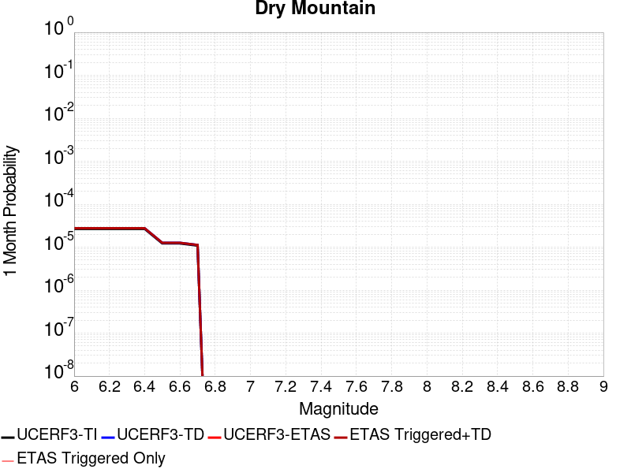 |  | 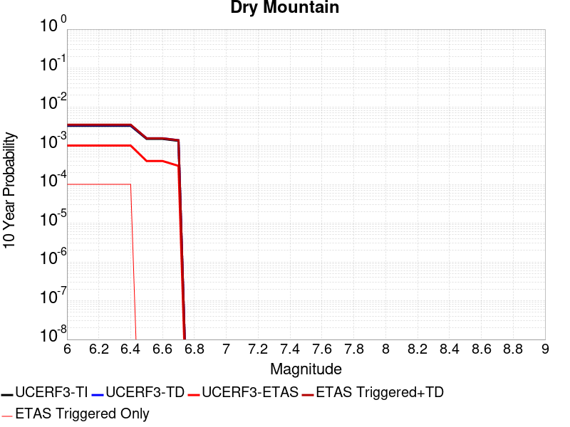 |

| Magnitude | 1 wk TI Prob | 1 wk TD Prob | 1 wk ETAS Prob | 1 wk ETAS/TD Gain | 1 wk ETAS Triggered+TD | 1 wk ETAS Triggered Only | 1 mo TI Prob | 1 mo TD Prob | 1 mo ETAS Prob | 1 mo ETAS/TD Gain | 1 mo ETAS Triggered+TD | 1 mo ETAS Triggered Only | 1 yr TI Prob | 1 yr TD Prob | 1 yr ETAS Prob | 1 yr ETAS/TD Gain | 1 yr ETAS Triggered+TD | 1 yr ETAS Triggered Only | 10 yr TI Prob | 10 yr TD Prob | 10 yr ETAS Prob | 10 yr ETAS/TD Gain | 10 yr ETAS Triggered+TD | 10 yr ETAS Triggered Only |
|-----|-----|-----|-----|-----|-----|-----|-----|-----|-----|-----|-----|-----|-----|-----|-----|-----|-----|-----|-----|-----|-----|-----|-----|-----|
| 6.0 | 6.222801E-6 | 6.4398428E-6 | 0.0 | 0.0 | 6.4398428E-6 | 0.0 | 2.6668875E-5 | 2.7599124E-5 | 0.0 | 0.0 | 2.7599124E-5 | 0.0 | 3.2464517E-4 | 3.3598344E-4 | 0.0 | 0.0 | 3.3598344E-4 | 0.0 | 0.0032417132 | 0.003356317 | 1.0E-4 | 0.029794563 | 0.0034559814 | 1.0E-4 |
| 6.1 | 6.222801E-6 | 6.4398428E-6 | 0.0 | 0.0 | 6.4398428E-6 | 0.0 | 2.6668875E-5 | 2.7599124E-5 | 0.0 | 0.0 | 2.7599124E-5 | 0.0 | 3.2464517E-4 | 3.3598344E-4 | 0.0 | 0.0 | 3.3598344E-4 | 0.0 | 0.0032417132 | 0.003356317 | 1.0E-4 | 0.029794563 | 0.0034559814 | 1.0E-4 |
| 6.2 | 6.222801E-6 | 6.4398428E-6 | 0.0 | 0.0 | 6.4398428E-6 | 0.0 | 2.6668875E-5 | 2.7599124E-5 | 0.0 | 0.0 | 2.7599124E-5 | 0.0 | 3.2464517E-4 | 3.3598344E-4 | 0.0 | 0.0 | 3.3598344E-4 | 0.0 | 0.0032417132 | 0.003356317 | 1.0E-4 | 0.029794563 | 0.0034559814 | 1.0E-4 |
| 6.3 | 6.222801E-6 | 6.4398428E-6 | 0.0 | 0.0 | 6.4398428E-6 | 0.0 | 2.6668875E-5 | 2.7599124E-5 | 0.0 | 0.0 | 2.7599124E-5 | 0.0 | 3.2464517E-4 | 3.3598344E-4 | 0.0 | 0.0 | 3.3598344E-4 | 0.0 | 0.0032417132 | 0.003356317 | 1.0E-4 | 0.029794563 | 0.0034559814 | 1.0E-4 |
| 6.4 | 6.222801E-6 | 6.4398428E-6 | 0.0 | 0.0 | 6.4398428E-6 | 0.0 | 2.6668875E-5 | 2.7599124E-5 | 0.0 | 0.0 | 2.7599124E-5 | 0.0 | 3.2464517E-4 | 3.3598344E-4 | 0.0 | 0.0 | 3.3598344E-4 | 0.0 | 0.0032417132 | 0.003356317 | 1.0E-4 | 0.029794563 | 0.0034559814 | 1.0E-4 |
| 6.5 | 2.8528623E-6 | 2.9523799E-6 | 0.0 | 0.0 | 2.9523799E-6 | 0.0 | 1.22264955E-5 | 1.2653045E-5 | 0.0 | 0.0 | 1.2653045E-5 | 0.0 | 1.4884741E-4 | 1.5404863E-4 | 0.0 | 0.0 | 1.5404863E-4 | 0.0 | 0.0014874774 | 0.001540272 | 0.0 | 0.0 | 0.001540272 | 0.0 |
| 6.6 | 2.8528623E-6 | 2.9523799E-6 | 0.0 | 0.0 | 2.9523799E-6 | 0.0 | 1.22264955E-5 | 1.2653045E-5 | 0.0 | 0.0 | 1.2653045E-5 | 0.0 | 1.4884741E-4 | 1.5404863E-4 | 0.0 | 0.0 | 1.5404863E-4 | 0.0 | 0.0014874774 | 0.001540272 | 0.0 | 0.0 | 0.001540272 | 0.0 |
| 6.7 | 2.541E-6 | 2.629546E-6 | 0.0 | 0.0 | 2.629546E-6 | 0.0 | 1.0889954E-5 | 1.1269483E-5 | 0.0 | 0.0 | 1.1269483E-5 | 0.0 | 1.3257713E-4 | 1.3720596E-4 | 0.0 | 0.0 | 1.3720596E-4 | 0.0 | 0.0013249806 | 0.0013720596 | 0.0 | 0.0 | 0.0013720596 | 0.0 |

## Anacapa-Dume alt 1
*[(top)](#table-of-contents)*

| 1 Week | 1 Month | 1 Year | 10 Year |
|-----|-----|-----|-----|
|  |  |  |  |

| Magnitude | 1 wk TI Prob | 1 wk TD Prob | 1 wk ETAS Prob | 1 wk ETAS/TD Gain | 1 wk ETAS Triggered+TD | 1 wk ETAS Triggered Only | 1 mo TI Prob | 1 mo TD Prob | 1 mo ETAS Prob | 1 mo ETAS/TD Gain | 1 mo ETAS Triggered+TD | 1 mo ETAS Triggered Only | 1 yr TI Prob | 1 yr TD Prob | 1 yr ETAS Prob | 1 yr ETAS/TD Gain | 1 yr ETAS Triggered+TD | 1 yr ETAS Triggered Only | 10 yr TI Prob | 10 yr TD Prob | 10 yr ETAS Prob | 10 yr ETAS/TD Gain | 10 yr ETAS Triggered+TD | 10 yr ETAS Triggered Only |
|-----|-----|-----|-----|-----|-----|-----|-----|-----|-----|-----|-----|-----|-----|-----|-----|-----|-----|-----|-----|-----|-----|-----|-----|-----|
| 6.0 | 5.1871802E-6 | 5.367827E-6 | 0.0 | 0.0 | 5.367827E-6 | 0.0 | 2.2230583E-5 | 2.3004774E-5 | 0.0 | 0.0 | 2.3004774E-5 | 0.0 | 2.7062374E-4 | 2.8004797E-4 | 0.0 | 0.0 | 2.8004797E-4 | 0.0 | 0.002702944 | 0.002797036 | 1.0E-4 | 0.035752133 | 0.0028967562 | 1.0E-4 |
| 6.1 | 5.1871802E-6 | 5.367827E-6 | 0.0 | 0.0 | 5.367827E-6 | 0.0 | 2.2230583E-5 | 2.3004774E-5 | 0.0 | 0.0 | 2.3004774E-5 | 0.0 | 2.7062374E-4 | 2.8004797E-4 | 0.0 | 0.0 | 2.8004797E-4 | 0.0 | 0.002702944 | 0.002797036 | 1.0E-4 | 0.035752133 | 0.0028967562 | 1.0E-4 |
| 6.2 | 5.1871802E-6 | 5.367827E-6 | 0.0 | 0.0 | 5.367827E-6 | 0.0 | 2.2230583E-5 | 2.3004774E-5 | 0.0 | 0.0 | 2.3004774E-5 | 0.0 | 2.7062374E-4 | 2.8004797E-4 | 0.0 | 0.0 | 2.8004797E-4 | 0.0 | 0.002702944 | 0.002797036 | 1.0E-4 | 0.035752133 | 0.0028967562 | 1.0E-4 |
| 6.3 | 5.1871802E-6 | 5.367827E-6 | 0.0 | 0.0 | 5.367827E-6 | 0.0 | 2.2230583E-5 | 2.3004774E-5 | 0.0 | 0.0 | 2.3004774E-5 | 0.0 | 2.7062374E-4 | 2.8004797E-4 | 0.0 | 0.0 | 2.8004797E-4 | 0.0 | 0.002702944 | 0.002797036 | 1.0E-4 | 0.035752133 | 0.0028967562 | 1.0E-4 |
| 6.4 | 5.1871802E-6 | 5.367827E-6 | 0.0 | 0.0 | 5.367827E-6 | 0.0 | 2.2230583E-5 | 2.3004774E-5 | 0.0 | 0.0 | 2.3004774E-5 | 0.0 | 2.7062374E-4 | 2.8004797E-4 | 0.0 | 0.0 | 2.8004797E-4 | 0.0 | 0.002702944 | 0.002797036 | 1.0E-4 | 0.035752133 | 0.0028967562 | 1.0E-4 |
| 6.5 | 5.1871802E-6 | 5.367827E-6 | 0.0 | 0.0 | 5.367827E-6 | 0.0 | 2.2230583E-5 | 2.3004774E-5 | 0.0 | 0.0 | 2.3004774E-5 | 0.0 | 2.7062374E-4 | 2.8004797E-4 | 0.0 | 0.0 | 2.8004797E-4 | 0.0 | 0.002702944 | 0.002797036 | 1.0E-4 | 0.035752133 | 0.0028967562 | 1.0E-4 |
| 6.6 | 5.1871802E-6 | 5.367827E-6 | 0.0 | 0.0 | 5.367827E-6 | 0.0 | 2.2230583E-5 | 2.3004774E-5 | 0.0 | 0.0 | 2.3004774E-5 | 0.0 | 2.7062374E-4 | 2.8004797E-4 | 0.0 | 0.0 | 2.8004797E-4 | 0.0 | 0.002702944 | 0.002797036 | 1.0E-4 | 0.035752133 | 0.0028967562 | 1.0E-4 |
| 6.7 | 4.7693475E-6 | 4.9371E-6 | 0.0 | 0.0 | 4.9371E-6 | 0.0 | 2.04399E-5 | 2.1158834E-5 | 0.0 | 0.0 | 2.1158834E-5 | 0.0 | 2.4882736E-4 | 2.5757911E-4 | 0.0 | 0.0 | 2.5757911E-4 | 0.0 | 0.0024854892 | 0.0025728815 | 1.0E-4 | 0.038866926 | 0.0026726243 | 1.0E-4 |
| 6.8 | 4.753408E-6 | 4.9206474E-6 | 0.0 | 0.0 | 4.9206474E-6 | 0.0 | 2.037159E-5 | 2.1088323E-5 | 0.0 | 0.0 | 2.1088323E-5 | 0.0 | 2.4799586E-4 | 2.5672084E-4 | 0.0 | 0.0 | 2.5672084E-4 | 0.0 | 0.002477193 | 0.0025643187 | 1.0E-4 | 0.03899671 | 0.0026640622 | 1.0E-4 |
| 6.9 | 3.800069E-6 | 3.9374704E-6 | 0.0 | 0.0 | 3.9374704E-6 | 0.0 | 1.6285909E-5 | 1.6874765E-5 | 0.0 | 0.0 | 1.6874765E-5 | 0.0 | 1.9826289E-4 | 2.0543113E-4 | 0.0 | 0.0 | 2.0543113E-4 | 0.0 | 0.001980861 | 0.0020524361 | 1.0E-4 | 0.04872259 | 0.0021522308 | 1.0E-4 |
| 7.0 | 3.6671938E-6 | 3.8002534E-6 | 0.0 | 0.0 | 3.8002534E-6 | 0.0 | 1.571645E-5 | 1.62867E-5 | 0.0 | 0.0 | 1.62867E-5 | 0.0 | 1.9133097E-4 | 1.9827276E-4 | 0.0 | 0.0 | 1.9827276E-4 | 0.0 | 0.0019116632 | 0.0019809818 | 1.0E-4 | 0.05048002 | 0.0020807837 | 1.0E-4 |
| 7.1 | 3.2394885E-6 | 3.3590998E-6 | 0.0 | 0.0 | 3.3590998E-6 | 0.0 | 1.3883448E-5 | 1.4396063E-5 | 0.0 | 0.0 | 1.4396063E-5 | 0.0 | 1.6901788E-4 | 1.7525809E-4 | 0.0 | 0.0 | 1.7525809E-4 | 0.0 | 0.0016888938 | 0.0017512098 | 1.0E-4 | 0.05710338 | 0.0018510347 | 1.0E-4 |
| 7.2 | 3.0935948E-6 | 3.2082219E-6 | 0.0 | 0.0 | 3.2082219E-6 | 0.0 | 1.3258196E-5 | 1.3749451E-5 | 0.0 | 0.0 | 1.3749451E-5 | 0.0 | 1.6140658E-4 | 1.6738681E-4 | 0.0 | 0.0 | 1.6738681E-4 | 0.0 | 0.001612894 | 0.0016726183 | 1.0E-4 | 0.059786502 | 0.0017724511 | 1.0E-4 |
| 7.3 | 2.5604163E-6 | 2.647309E-6 | 0.0 | 0.0 | 2.647309E-6 | 0.0 | 1.0973167E-5 | 1.1345561E-5 | 0.0 | 0.0 | 1.1345561E-5 | 0.0 | 1.3359012E-4 | 1.3812349E-4 | 0.0 | 0.0 | 1.3812349E-4 | 0.0 | 0.0013350984 | 0.0013803809 | 0.0 | 0.0 | 0.0013803809 | 0.0 |
| 7.4 | 2.1429005E-6 | 2.2107977E-6 | 0.0 | 0.0 | 2.2107977E-6 | 0.0 | 9.1838265E-6 | 9.474813E-6 | 0.0 | 0.0 | 9.474813E-6 | 0.0 | 1.11807356E-4 | 1.15349765E-4 | 0.0 | 0.0 | 1.15349765E-4 | 0.0 | 0.0011175112 | 0.0011529016 | 0.0 | 0.0 | 0.0011529016 | 0.0 |
| 7.5 | 1.7237151E-6 | 1.7763023E-6 | 0.0 | 0.0 | 1.7763023E-6 | 0.0 | 7.3873293E-6 | 7.6127017E-6 | 0.0 | 0.0 | 7.6127017E-6 | 0.0 | 8.993702E-5 | 9.2680726E-5 | 0.0 | 0.0 | 9.2680726E-5 | 0.0 | 8.990063E-4 | 9.2642306E-4 | 0.0 | 0.0 | 9.2642306E-4 | 0.0 |
| 7.6 | 9.541696E-7 | 9.824075E-7 | 0.0 | 0.0 | 9.824075E-7 | 0.0 | 4.089292E-6 | 4.210311E-6 | 0.0 | 0.0 | 4.210311E-6 | 0.0 | 4.9785995E-5 | 5.1259343E-5 | 0.0 | 0.0 | 5.1259343E-5 | 0.0 | 4.9774844E-4 | 5.124765E-4 | 0.0 | 0.0 | 5.124765E-4 | 0.0 |
| 7.7 | 2.7226676E-7 | 2.7174357E-7 | 0.0 | 0.0 | 2.7174357E-7 | 0.0 | 1.166857E-6 | 1.1646148E-6 | 0.0 | 0.0 | 1.1646148E-6 | 0.0 | 1.4206392E-5 | 1.4179093E-5 | 0.0 | 0.0 | 1.4179093E-5 | 0.0 | 1.4205484E-4 | 1.4178196E-4 | 0.0 | 0.0 | 1.4178196E-4 | 0.0 |
| 7.8 | 4.5017995E-8 | 4.216042E-8 | 0.0 | 0.0 | 4.216042E-8 | 0.0 | 1.9293425E-7 | 1.8068751E-7 | 0.0 | 0.0 | 1.8068751E-7 | 0.0 | 2.348972E-6 | 2.1998683E-6 | 0.0 | 0.0 | 2.1998683E-6 | 0.0 | 2.348947E-5 | 2.1998487E-5 | 0.0 | 0.0 | 2.1998487E-5 | 0.0 |
| 7.9 | 8.007447E-10 | 6.1623595E-10 | 0.0 | 0.0 | 6.1623595E-10 | 0.0 | 3.4317629E-9 | 2.6410114E-9 | 0.0 | 0.0 | 2.6410114E-9 | 0.0 | 4.1781714E-8 | 3.215431E-8 | 0.0 | 0.0 | 3.215431E-8 | 0.0 | 4.1781706E-7 | 3.215431E-7 | 0.0 | 0.0 | 3.215431E-7 | 0.0 |

## Holser alt 1
*[(top)](#table-of-contents)*

| 1 Week | 1 Month | 1 Year | 10 Year |
|-----|-----|-----|-----|
| 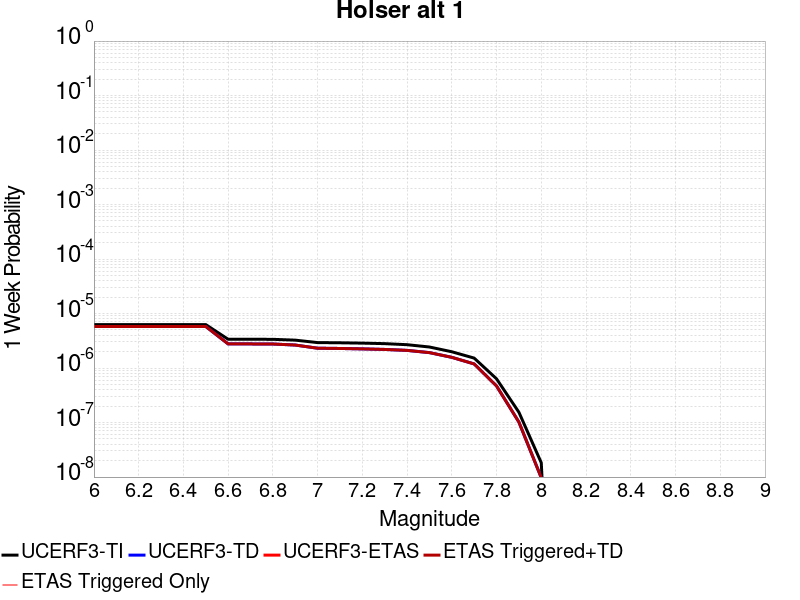 | 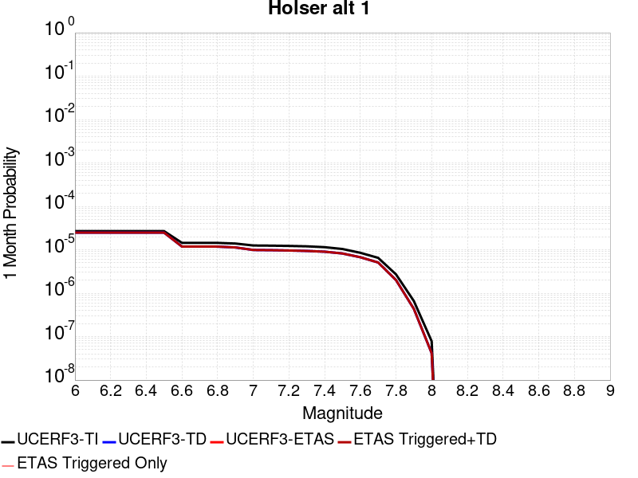 |  |  |

| Magnitude | 1 wk TI Prob | 1 wk TD Prob | 1 wk ETAS Prob | 1 wk ETAS/TD Gain | 1 wk ETAS Triggered+TD | 1 wk ETAS Triggered Only | 1 mo TI Prob | 1 mo TD Prob | 1 mo ETAS Prob | 1 mo ETAS/TD Gain | 1 mo ETAS Triggered+TD | 1 mo ETAS Triggered Only | 1 yr TI Prob | 1 yr TD Prob | 1 yr ETAS Prob | 1 yr ETAS/TD Gain | 1 yr ETAS Triggered+TD | 1 yr ETAS Triggered Only | 10 yr TI Prob | 10 yr TD Prob | 10 yr ETAS Prob | 10 yr ETAS/TD Gain | 10 yr ETAS Triggered+TD | 10 yr ETAS Triggered Only |
|-----|-----|-----|-----|-----|-----|-----|-----|-----|-----|-----|-----|-----|-----|-----|-----|-----|-----|-----|-----|-----|-----|-----|-----|-----|
| 6.0 | 6.2746653E-6 | 5.7909665E-6 | 0.0 | 0.0 | 5.7909665E-6 | 0.0 | 2.6891146E-5 | 2.4818257E-5 | 0.0 | 0.0 | 2.4818257E-5 | 0.0 | 3.273505E-4 | 3.021319E-4 | 1.0E-4 | 0.33098125 | 4.021017E-4 | 1.0E-4 | 0.0032686873 | 0.0030183445 | 1.0E-4 | 0.033130743 | 0.0031180428 | 1.0E-4 |
| 6.1 | 6.2746653E-6 | 5.7909665E-6 | 0.0 | 0.0 | 5.7909665E-6 | 0.0 | 2.6891146E-5 | 2.4818257E-5 | 0.0 | 0.0 | 2.4818257E-5 | 0.0 | 3.273505E-4 | 3.021319E-4 | 1.0E-4 | 0.33098125 | 4.021017E-4 | 1.0E-4 | 0.0032686873 | 0.0030183445 | 1.0E-4 | 0.033130743 | 0.0031180428 | 1.0E-4 |
| 6.2 | 6.2746653E-6 | 5.7909665E-6 | 0.0 | 0.0 | 5.7909665E-6 | 0.0 | 2.6891146E-5 | 2.4818257E-5 | 0.0 | 0.0 | 2.4818257E-5 | 0.0 | 3.273505E-4 | 3.021319E-4 | 1.0E-4 | 0.33098125 | 4.021017E-4 | 1.0E-4 | 0.0032686873 | 0.0030183445 | 1.0E-4 | 0.033130743 | 0.0031180428 | 1.0E-4 |
| 6.3 | 6.2746653E-6 | 5.7909665E-6 | 0.0 | 0.0 | 5.7909665E-6 | 0.0 | 2.6891146E-5 | 2.4818257E-5 | 0.0 | 0.0 | 2.4818257E-5 | 0.0 | 3.273505E-4 | 3.021319E-4 | 1.0E-4 | 0.33098125 | 4.021017E-4 | 1.0E-4 | 0.0032686873 | 0.0030183445 | 1.0E-4 | 0.033130743 | 0.0031180428 | 1.0E-4 |
| 6.4 | 6.2746653E-6 | 5.7909665E-6 | 0.0 | 0.0 | 5.7909665E-6 | 0.0 | 2.6891146E-5 | 2.4818257E-5 | 0.0 | 0.0 | 2.4818257E-5 | 0.0 | 3.273505E-4 | 3.021319E-4 | 1.0E-4 | 0.33098125 | 4.021017E-4 | 1.0E-4 | 0.0032686873 | 0.0030183445 | 1.0E-4 | 0.033130743 | 0.0031180428 | 1.0E-4 |
| 6.5 | 6.2746653E-6 | 5.7909665E-6 | 0.0 | 0.0 | 5.7909665E-6 | 0.0 | 2.6891146E-5 | 2.4818257E-5 | 0.0 | 0.0 | 2.4818257E-5 | 0.0 | 3.273505E-4 | 3.021319E-4 | 1.0E-4 | 0.33098125 | 4.021017E-4 | 1.0E-4 | 0.0032686873 | 0.0030183445 | 1.0E-4 | 0.033130743 | 0.0031180428 | 1.0E-4 |
| 6.6 | 3.375825E-6 | 2.7719339E-6 | 0.0 | 0.0 | 2.7719339E-6 | 0.0 | 1.4467741E-5 | 1.1879663E-5 | 0.0 | 0.0 | 1.1879663E-5 | 0.0 | 1.761305E-4 | 1.4462548E-4 | 0.0 | 0.0 | 1.4462548E-4 | 0.0 | 0.0017599097 | 0.0014453304 | 0.0 | 0.0 | 0.0014453304 | 0.0 |
| 6.7 | 3.375825E-6 | 2.7719339E-6 | 0.0 | 0.0 | 2.7719339E-6 | 0.0 | 1.4467741E-5 | 1.1879663E-5 | 0.0 | 0.0 | 1.1879663E-5 | 0.0 | 1.761305E-4 | 1.4462548E-4 | 0.0 | 0.0 | 1.4462548E-4 | 0.0 | 0.0017599097 | 0.0014453304 | 0.0 | 0.0 | 0.0014453304 | 0.0 |
| 6.8 | 3.366533E-6 | 2.7623328E-6 | 0.0 | 0.0 | 2.7623328E-6 | 0.0 | 1.4427919E-5 | 1.1838516E-5 | 0.0 | 0.0 | 1.1838516E-5 | 0.0 | 1.7564575E-4 | 1.4412457E-4 | 0.0 | 0.0 | 1.4412457E-4 | 0.0 | 0.0017550698 | 0.001440328 | 0.0 | 0.0 | 0.001440328 | 0.0 |
| 6.9 | 3.253174E-6 | 2.6445455E-6 | 0.0 | 0.0 | 2.6445455E-6 | 0.0 | 1.39421E-5 | 1.1333718E-5 | 0.0 | 0.0 | 1.1333718E-5 | 0.0 | 1.6973184E-4 | 1.3797944E-4 | 0.0 | 0.0 | 1.3797944E-4 | 0.0 | 0.0016960226 | 0.0013789536 | 0.0 | 0.0 | 0.0013789536 | 0.0 |
| 7.0 | 2.9336593E-6 | 2.312506E-6 | 0.0 | 0.0 | 2.312506E-6 | 0.0 | 1.2572766E-5 | 9.910702E-6 | 0.0 | 0.0 | 9.910702E-6 | 0.0 | 1.5306266E-4 | 1.2065614E-4 | 0.0 | 0.0 | 1.2065614E-4 | 0.0 | 0.0015295728 | 0.0012059088 | 0.0 | 0.0 | 0.0012059088 | 0.0 |
| 7.1 | 2.9087812E-6 | 2.2883548E-6 | 0.0 | 0.0 | 2.2883548E-6 | 0.0 | 1.2466146E-5 | 9.807198E-6 | 0.0 | 0.0 | 9.807198E-6 | 0.0 | 1.5176475E-4 | 1.19396114E-4 | 0.0 | 0.0 | 1.19396114E-4 | 0.0 | 0.0015166114 | 0.0011933221 | 0.0 | 0.0 | 0.0011933221 | 0.0 |
| 7.2 | 2.8674524E-6 | 2.2482393E-6 | 0.0 | 0.0 | 2.2482393E-6 | 0.0 | 1.2289024E-5 | 9.635276E-6 | 0.0 | 0.0 | 9.635276E-6 | 0.0 | 1.4960859E-4 | 1.1730319E-4 | 0.0 | 0.0 | 1.1730319E-4 | 0.0 | 0.0014950791 | 0.0011724151 | 0.0 | 0.0 | 0.0011724151 | 0.0 |
| 7.3 | 2.8057775E-6 | 2.1961168E-6 | 0.0 | 0.0 | 2.1961168E-6 | 0.0 | 1.2024705E-5 | 9.411896E-6 | 0.0 | 0.0 | 9.411896E-6 | 0.0 | 1.4639096E-4 | 1.14583825E-4 | 0.0 | 0.0 | 1.14583825E-4 | 0.0 | 0.0014629456 | 0.0011452497 | 0.0 | 0.0 | 0.0011452497 | 0.0 |
| 7.4 | 2.683666E-6 | 2.1098851E-6 | 0.0 | 0.0 | 2.1098851E-6 | 0.0 | 1.1501375E-5 | 9.042334E-6 | 0.0 | 0.0 | 9.042334E-6 | 0.0 | 1.4002025E-4 | 1.1008487E-4 | 0.0 | 0.0 | 1.1008487E-4 | 0.0 | 0.0013993206 | 0.0011003056 | 0.0 | 0.0 | 0.0011003056 | 0.0 |
| 7.5 | 2.434495E-6 | 1.9201113E-6 | 0.0 | 0.0 | 1.9201113E-6 | 0.0 | 1.0433508E-5 | 8.229023E-6 | 0.0 | 0.0 | 8.229023E-6 | 0.0 | 1.2702055E-4 | 1.0018376E-4 | 0.0 | 0.0 | 1.0018376E-4 | 0.0 | 0.0012694797 | 0.001001388 | 0.0 | 0.0 | 0.001001388 | 0.0 |
| 7.6 | 1.9914562E-6 | 1.5735392E-6 | 0.0 | 0.0 | 1.5735392E-6 | 0.0 | 8.534785E-6 | 6.743722E-6 | 0.0 | 0.0 | 6.743722E-6 | 0.0 | 1.03906044E-4 | 8.210174E-5 | 0.0 | 0.0 | 8.210174E-5 | 0.0 | 0.0010385747 | 8.207156E-4 | 0.0 | 0.0 | 8.207156E-4 | 0.0 |
| 7.7 | 1.5229501E-6 | 1.1899206E-6 | 0.0 | 0.0 | 1.1899206E-6 | 0.0 | 6.526913E-6 | 5.0996496E-6 | 0.0 | 0.0 | 5.0996496E-6 | 0.0 | 7.946226E-5 | 6.2086474E-5 | 0.0 | 0.0 | 6.2086474E-5 | 0.0 | 7.943385E-4 | 6.2069256E-4 | 0.0 | 0.0 | 6.2069256E-4 | 0.0 |
| 7.8 | 6.3489426E-7 | 4.6895488E-7 | 0.0 | 0.0 | 4.6895488E-7 | 0.0 | 2.7209726E-6 | 2.009805E-6 | 0.0 | 0.0 | 2.009805E-6 | 0.0 | 3.312734E-5 | 2.4469104E-5 | 0.0 | 0.0 | 2.4469104E-5 | 0.0 | 3.31224E-4 | 2.4466426E-4 | 0.0 | 0.0 | 2.4466426E-4 | 0.0 |
| 7.9 | 1.5459432E-7 | 1.01963465E-7 | 0.0 | 0.0 | 1.01963465E-7 | 0.0 | 6.6254694E-7 | 4.369862E-7 | 0.0 | 0.0 | 4.369862E-7 | 0.0 | 8.066479E-6 | 5.3202943E-6 | 0.0 | 0.0 | 5.3202943E-6 | 0.0 | 8.066186E-5 | 5.3201686E-5 | 0.0 | 0.0 | 5.3201686E-5 | 0.0 |
| 8.0 | 1.8307812E-8 | 9.694547E-9 | 0.0 | 0.0 | 9.694547E-9 | 0.0 | 7.846205E-8 | 4.154806E-8 | 0.0 | 0.0 | 4.154806E-8 | 0.0 | 9.55275E-7 | 5.0584754E-7 | 0.0 | 0.0 | 5.0584754E-7 | 0.0 | 9.552709E-6 | 5.058464E-6 | 0.0 | 0.0 | 5.058464E-6 | 0.0 |

## Santa Monica alt 1
*[(top)](#table-of-contents)*

| 1 Week | 1 Month | 1 Year | 10 Year |
|-----|-----|-----|-----|
|  |  | 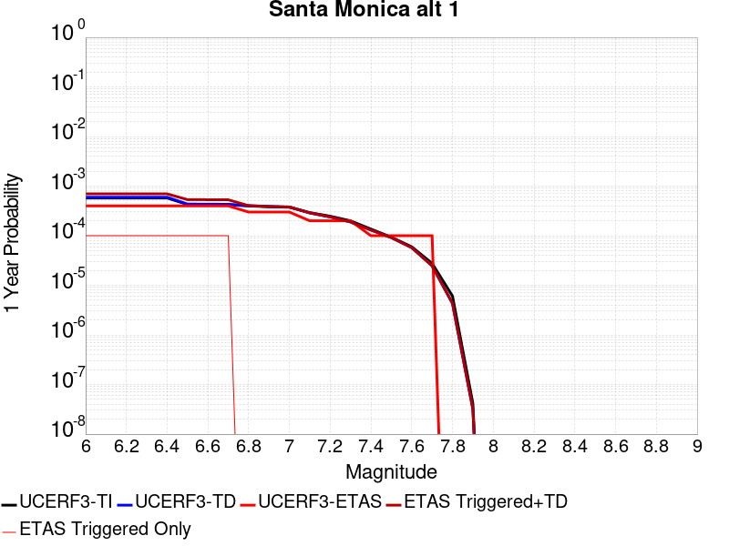 | 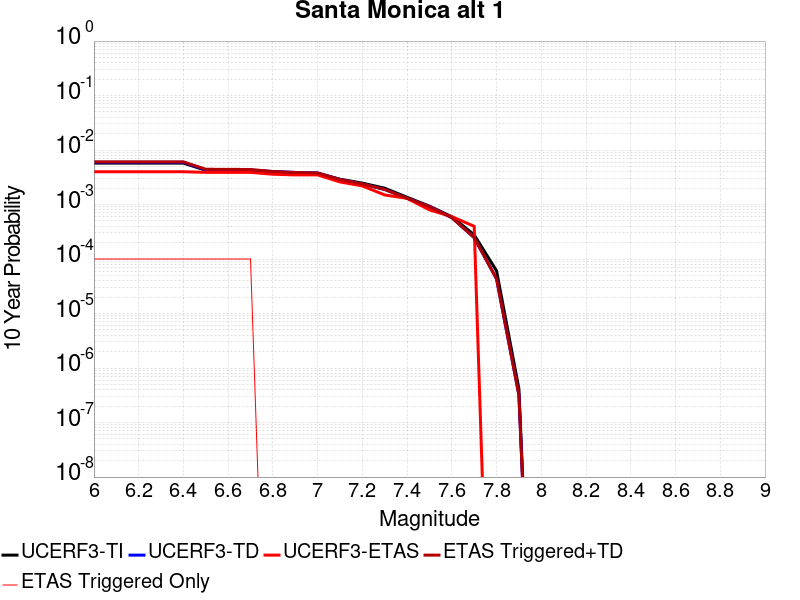 |

| Magnitude | 1 wk TI Prob | 1 wk TD Prob | 1 wk ETAS Prob | 1 wk ETAS/TD Gain | 1 wk ETAS Triggered+TD | 1 wk ETAS Triggered Only | 1 mo TI Prob | 1 mo TD Prob | 1 mo ETAS Prob | 1 mo ETAS/TD Gain | 1 mo ETAS Triggered+TD | 1 mo ETAS Triggered Only | 1 yr TI Prob | 1 yr TD Prob | 1 yr ETAS Prob | 1 yr ETAS/TD Gain | 1 yr ETAS Triggered+TD | 1 yr ETAS Triggered Only | 10 yr TI Prob | 10 yr TD Prob | 10 yr ETAS Prob | 10 yr ETAS/TD Gain | 10 yr ETAS Triggered+TD | 10 yr ETAS Triggered Only |
|-----|-----|-----|-----|-----|-----|-----|-----|-----|-----|-----|-----|-----|-----|-----|-----|-----|-----|-----|-----|-----|-----|-----|-----|-----|
| 6.0 | 1.1066008E-5 | 1.1482373E-5 | 0.0 | 0.0 | 1.1482373E-5 | 0.0 | 4.742488E-5 | 4.920932E-5 | 0.0 | 0.0 | 4.920932E-5 | 0.0 | 5.7724497E-4 | 5.989727E-4 | 1.0E-4 | 0.1669525 | 6.9891283E-4 | 1.0E-4 | 0.005757478 | 0.0059749708 | 1.0E-4 | 0.016736483 | 0.006074373 | 1.0E-4 |
| 6.1 | 1.1066008E-5 | 1.1482373E-5 | 0.0 | 0.0 | 1.1482373E-5 | 0.0 | 4.742488E-5 | 4.920932E-5 | 0.0 | 0.0 | 4.920932E-5 | 0.0 | 5.7724497E-4 | 5.989727E-4 | 1.0E-4 | 0.1669525 | 6.9891283E-4 | 1.0E-4 | 0.005757478 | 0.0059749708 | 1.0E-4 | 0.016736483 | 0.006074373 | 1.0E-4 |
| 6.2 | 1.1066008E-5 | 1.1482373E-5 | 0.0 | 0.0 | 1.1482373E-5 | 0.0 | 4.742488E-5 | 4.920932E-5 | 0.0 | 0.0 | 4.920932E-5 | 0.0 | 5.7724497E-4 | 5.989727E-4 | 1.0E-4 | 0.1669525 | 6.9891283E-4 | 1.0E-4 | 0.005757478 | 0.0059749708 | 1.0E-4 | 0.016736483 | 0.006074373 | 1.0E-4 |
| 6.3 | 1.1066008E-5 | 1.1482373E-5 | 0.0 | 0.0 | 1.1482373E-5 | 0.0 | 4.742488E-5 | 4.920932E-5 | 0.0 | 0.0 | 4.920932E-5 | 0.0 | 5.7724497E-4 | 5.989727E-4 | 1.0E-4 | 0.1669525 | 6.9891283E-4 | 1.0E-4 | 0.005757478 | 0.0059749708 | 1.0E-4 | 0.016736483 | 0.006074373 | 1.0E-4 |
| 6.4 | 1.1066008E-5 | 1.1482373E-5 | 0.0 | 0.0 | 1.1482373E-5 | 0.0 | 4.742488E-5 | 4.920932E-5 | 0.0 | 0.0 | 4.920932E-5 | 0.0 | 5.7724497E-4 | 5.989727E-4 | 1.0E-4 | 0.1669525 | 6.9891283E-4 | 1.0E-4 | 0.005757478 | 0.0059749708 | 1.0E-4 | 0.016736483 | 0.006074373 | 1.0E-4 |
| 6.5 | 8.183544E-6 | 8.336905E-6 | 0.0 | 0.0 | 8.336905E-6 | 0.0 | 3.5071862E-5 | 3.572911E-5 | 0.0 | 0.0 | 3.572911E-5 | 0.0 | 4.2691626E-4 | 4.349167E-4 | 1.0E-4 | 0.22992909 | 5.348732E-4 | 1.0E-4 | 0.0042609703 | 0.004340821 | 1.0E-4 | 0.023037115 | 0.0044403872 | 1.0E-4 |
| 6.6 | 8.1543285E-6 | 8.305114E-6 | 0.0 | 0.0 | 8.305114E-6 | 0.0 | 3.4946657E-5 | 3.5592868E-5 | 0.0 | 0.0 | 3.5592868E-5 | 0.0 | 4.2539247E-4 | 4.3325857E-4 | 1.0E-4 | 0.23080905 | 5.3321524E-4 | 1.0E-4 | 0.0042457907 | 0.0043243044 | 1.0E-4 | 0.023125106 | 0.004423872 | 1.0E-4 |
| 6.7 | 8.110878E-6 | 8.258503E-6 | 0.0 | 0.0 | 8.258503E-6 | 0.0 | 3.4760444E-5 | 3.5393114E-5 | 0.0 | 0.0 | 3.5393114E-5 | 0.0 | 4.231262E-4 | 4.3082752E-4 | 1.0E-4 | 0.23211144 | 5.307844E-4 | 1.0E-4 | 0.0042232145 | 0.004300088 | 1.0E-4 | 0.023255335 | 0.004399658 | 1.0E-4 |
| 6.8 | 7.644036E-6 | 7.752434E-6 | 0.0 | 0.0 | 7.752434E-6 | 0.0 | 3.275974E-5 | 3.32243E-5 | 0.0 | 0.0 | 3.32243E-5 | 0.0 | 3.9877684E-4 | 4.0443218E-4 | 0.0 | 0.0 | 4.0443218E-4 | 0.0 | 0.00398062 | 0.004037108 | 0.0 | 0.0 | 0.004037108 | 0.0 |
| 6.9 | 7.3698293E-6 | 7.457045E-6 | 0.0 | 0.0 | 7.457045E-6 | 0.0 | 3.15846E-5 | 3.195838E-5 | 0.0 | 0.0 | 3.195838E-5 | 0.0 | 3.8447464E-4 | 3.890252E-4 | 0.0 | 0.0 | 3.890252E-4 | 0.0 | 0.0038381014 | 0.0038835856 | 0.0 | 0.0 | 0.0038835856 | 0.0 |
| 7.0 | 7.209872E-6 | 7.286929E-6 | 0.0 | 0.0 | 7.286929E-6 | 0.0 | 3.0899086E-5 | 3.122933E-5 | 0.0 | 0.0 | 3.122933E-5 | 0.0 | 3.7613141E-4 | 3.8015214E-4 | 0.0 | 0.0 | 3.8015214E-4 | 0.0 | 0.0037549543 | 0.0037951611 | 0.0 | 0.0 | 0.0037951611 | 0.0 |
| 7.1 | 5.603456E-6 | 5.5248443E-6 | 0.0 | 0.0 | 5.5248443E-6 | 0.0 | 2.4014591E-5 | 2.367769E-5 | 0.0 | 0.0 | 2.367769E-5 | 0.0 | 2.923384E-4 | 2.8823817E-4 | 0.0 | 0.0 | 2.8823817E-4 | 0.0 | 0.0029195412 | 0.0028786848 | 0.0 | 0.0 | 0.0028786848 | 0.0 |
| 7.2 | 4.7483613E-6 | 4.591909E-6 | 0.0 | 0.0 | 4.591909E-6 | 0.0 | 2.0349962E-5 | 1.9679463E-5 | 0.0 | 0.0 | 1.9679463E-5 | 0.0 | 2.4773262E-4 | 2.3957124E-4 | 0.0 | 0.0 | 2.3957124E-4 | 0.0 | 0.0024745662 | 0.002393144 | 0.0 | 0.0 | 0.002393144 | 0.0 |
| 7.3 | 3.829015E-6 | 3.6348574E-6 | 0.0 | 0.0 | 3.6348574E-6 | 0.0 | 1.6409962E-5 | 1.5577867E-5 | 0.0 | 0.0 | 1.5577867E-5 | 0.0 | 1.9977297E-4 | 1.8964411E-4 | 0.0 | 0.0 | 1.8964411E-4 | 0.0 | 0.0019959346 | 0.0018948317 | 0.0 | 0.0 | 0.0018948317 | 0.0 |
| 7.4 | 2.610755E-6 | 2.5000463E-6 | 0.0 | 0.0 | 2.5000463E-6 | 0.0 | 1.1188902E-5 | 1.0714441E-5 | 0.0 | 0.0 | 1.0714441E-5 | 0.0 | 1.3621636E-4 | 1.3044055E-4 | 0.0 | 0.0 | 1.3044055E-4 | 0.0 | 0.001361329 | 0.0013036443 | 0.0 | 0.0 | 0.0013036443 | 0.0 |
| 7.5 | 1.792146E-6 | 1.7587E-6 | 0.0 | 0.0 | 1.7587E-6 | 0.0 | 7.680603E-6 | 7.537264E-6 | 0.0 | 0.0 | 7.537264E-6 | 0.0 | 9.3507326E-5 | 9.1762355E-5 | 0.0 | 0.0 | 9.1762355E-5 | 0.0 | 9.3467993E-4 | 9.1724785E-4 | 0.0 | 0.0 | 9.1724785E-4 | 0.0 |
| 7.6 | 1.1473018E-6 | 1.1030714E-6 | 0.0 | 0.0 | 1.1030714E-6 | 0.0 | 4.9169985E-6 | 4.7274402E-6 | 0.0 | 0.0 | 4.7274402E-6 | 0.0 | 5.986281E-5 | 5.7555084E-5 | 0.0 | 0.0 | 5.7555084E-5 | 0.0 | 5.984669E-4 | 5.7540345E-4 | 0.0 | 0.0 | 5.7540345E-4 | 0.0 |
| 7.7 | 5.330919E-7 | 4.7460264E-7 | 0.0 | 0.0 | 4.7460264E-7 | 0.0 | 2.2846775E-6 | 2.0340099E-6 | 0.0 | 0.0 | 2.0340099E-6 | 0.0 | 2.7815593E-5 | 2.47638E-5 | 0.0 | 0.0 | 2.47638E-5 | 0.0 | 2.7812112E-4 | 2.4761155E-4 | 0.0 | 0.0 | 2.4761155E-4 | 0.0 |
| 7.8 | 1.1668574E-7 | 8.299329E-8 | 0.0 | 0.0 | 8.299329E-8 | 0.0 | 5.000816E-7 | 3.5568547E-7 | 0.0 | 0.0 | 3.5568547E-7 | 0.0 | 6.0884768E-6 | 4.330462E-6 | 0.0 | 0.0 | 4.330462E-6 | 0.0 | 6.08831E-5 | 4.3303808E-5 | 0.0 | 0.0 | 4.3303808E-5 | 0.0 |
| 7.9 | 8.007447E-10 | 6.1623595E-10 | 0.0 | 0.0 | 6.1623595E-10 | 0.0 | 3.4317629E-9 | 2.6410114E-9 | 0.0 | 0.0 | 2.6410114E-9 | 0.0 | 4.1781714E-8 | 3.215431E-8 | 0.0 | 0.0 | 3.215431E-8 | 0.0 | 4.1781706E-7 | 3.215431E-7 | 0.0 | 0.0 | 3.215431E-7 | 0.0 |

## Canada David (Detachment)
*[(top)](#table-of-contents)*

| 1 Week | 1 Month | 1 Year | 10 Year |
|-----|-----|-----|-----|
|  |  |  |  |

| Magnitude | 1 wk TI Prob | 1 wk TD Prob | 1 wk ETAS Prob | 1 wk ETAS/TD Gain | 1 wk ETAS Triggered+TD | 1 wk ETAS Triggered Only | 1 mo TI Prob | 1 mo TD Prob | 1 mo ETAS Prob | 1 mo ETAS/TD Gain | 1 mo ETAS Triggered+TD | 1 mo ETAS Triggered Only | 1 yr TI Prob | 1 yr TD Prob | 1 yr ETAS Prob | 1 yr ETAS/TD Gain | 1 yr ETAS Triggered+TD | 1 yr ETAS Triggered Only | 10 yr TI Prob | 10 yr TD Prob | 10 yr ETAS Prob | 10 yr ETAS/TD Gain | 10 yr ETAS Triggered+TD | 10 yr ETAS Triggered Only |
|-----|-----|-----|-----|-----|-----|-----|-----|-----|-----|-----|-----|-----|-----|-----|-----|-----|-----|-----|-----|-----|-----|-----|-----|-----|
| 6.0 | 3.2736298E-6 | 2.9536525E-6 | 0.0 | 0.0 | 2.9536525E-6 | 0.0 | 1.4029766E-5 | 1.2658456E-5 | 0.0 | 0.0 | 1.2658456E-5 | 0.0 | 1.7079902E-4 | 1.541071E-4 | 0.0 | 0.0 | 1.541071E-4 | 0.0 | 0.001706678 | 0.0015401285 | 1.0E-4 | 0.06492965 | 0.0016399744 | 1.0E-4 |
| 6.1 | 3.2736298E-6 | 2.9536525E-6 | 0.0 | 0.0 | 2.9536525E-6 | 0.0 | 1.4029766E-5 | 1.2658456E-5 | 0.0 | 0.0 | 1.2658456E-5 | 0.0 | 1.7079902E-4 | 1.541071E-4 | 0.0 | 0.0 | 1.541071E-4 | 0.0 | 0.001706678 | 0.0015401285 | 1.0E-4 | 0.06492965 | 0.0016399744 | 1.0E-4 |
| 6.2 | 3.2736298E-6 | 2.9536525E-6 | 0.0 | 0.0 | 2.9536525E-6 | 0.0 | 1.4029766E-5 | 1.2658456E-5 | 0.0 | 0.0 | 1.2658456E-5 | 0.0 | 1.7079902E-4 | 1.541071E-4 | 0.0 | 0.0 | 1.541071E-4 | 0.0 | 0.001706678 | 0.0015401285 | 1.0E-4 | 0.06492965 | 0.0016399744 | 1.0E-4 |
| 6.3 | 3.2736298E-6 | 2.9536525E-6 | 0.0 | 0.0 | 2.9536525E-6 | 0.0 | 1.4029766E-5 | 1.2658456E-5 | 0.0 | 0.0 | 1.2658456E-5 | 0.0 | 1.7079902E-4 | 1.541071E-4 | 0.0 | 0.0 | 1.541071E-4 | 0.0 | 0.001706678 | 0.0015401285 | 1.0E-4 | 0.06492965 | 0.0016399744 | 1.0E-4 |
| 6.4 | 3.2736298E-6 | 2.9536525E-6 | 0.0 | 0.0 | 2.9536525E-6 | 0.0 | 1.4029766E-5 | 1.2658456E-5 | 0.0 | 0.0 | 1.2658456E-5 | 0.0 | 1.7079902E-4 | 1.541071E-4 | 0.0 | 0.0 | 1.541071E-4 | 0.0 | 0.001706678 | 0.0015401285 | 1.0E-4 | 0.06492965 | 0.0016399744 | 1.0E-4 |
| 6.5 | 3.2736298E-6 | 2.9536525E-6 | 0.0 | 0.0 | 2.9536525E-6 | 0.0 | 1.4029766E-5 | 1.2658456E-5 | 0.0 | 0.0 | 1.2658456E-5 | 0.0 | 1.7079902E-4 | 1.541071E-4 | 0.0 | 0.0 | 1.541071E-4 | 0.0 | 0.001706678 | 0.0015401285 | 1.0E-4 | 0.06492965 | 0.0016399744 | 1.0E-4 |
| 6.6 | 3.2736298E-6 | 2.9536525E-6 | 0.0 | 0.0 | 2.9536525E-6 | 0.0 | 1.4029766E-5 | 1.2658456E-5 | 0.0 | 0.0 | 1.2658456E-5 | 0.0 | 1.7079902E-4 | 1.541071E-4 | 0.0 | 0.0 | 1.541071E-4 | 0.0 | 0.001706678 | 0.0015401285 | 1.0E-4 | 0.06492965 | 0.0016399744 | 1.0E-4 |
| 6.7 | 3.2736298E-6 | 2.9536525E-6 | 0.0 | 0.0 | 2.9536525E-6 | 0.0 | 1.4029766E-5 | 1.2658456E-5 | 0.0 | 0.0 | 1.2658456E-5 | 0.0 | 1.7079902E-4 | 1.541071E-4 | 0.0 | 0.0 | 1.541071E-4 | 0.0 | 0.001706678 | 0.0015401285 | 1.0E-4 | 0.06492965 | 0.0016399744 | 1.0E-4 |
| 6.8 | 3.2736298E-6 | 2.9536525E-6 | 0.0 | 0.0 | 2.9536525E-6 | 0.0 | 1.4029766E-5 | 1.2658456E-5 | 0.0 | 0.0 | 1.2658456E-5 | 0.0 | 1.7079902E-4 | 1.541071E-4 | 0.0 | 0.0 | 1.541071E-4 | 0.0 | 0.001706678 | 0.0015401285 | 1.0E-4 | 0.06492965 | 0.0016399744 | 1.0E-4 |
| 6.9 | 2.4914223E-6 | 2.1524306E-6 | 0.0 | 0.0 | 2.1524306E-6 | 0.0 | 1.067748E-5 | 9.224673E-6 | 0.0 | 0.0 | 9.224673E-6 | 0.0 | 1.2999057E-4 | 1.12305155E-4 | 0.0 | 0.0 | 1.12305155E-4 | 0.0 | 0.0012991455 | 0.0011225382 | 1.0E-4 | 0.08908382 | 0.0012224261 | 1.0E-4 |
| 7.0 | 2.4482404E-6 | 2.1103654E-6 | 0.0 | 0.0 | 2.1103654E-6 | 0.0 | 1.0492417E-5 | 9.0443955E-6 | 0.0 | 0.0 | 9.0443955E-6 | 0.0 | 1.2773767E-4 | 1.101105E-4 | 0.0 | 0.0 | 1.101105E-4 | 0.0 | 0.0012766428 | 0.0011006136 | 1.0E-4 | 0.09085841 | 0.0012005036 | 1.0E-4 |
| 7.1 | 1.7887576E-6 | 1.4501761E-6 | 0.0 | 0.0 | 1.4501761E-6 | 0.0 | 7.666081E-6 | 6.2150275E-6 | 0.0 | 0.0 | 6.2150275E-6 | 0.0 | 9.333054E-5 | 7.566564E-5 | 0.0 | 0.0 | 7.566564E-5 | 0.0 | 9.329135E-4 | 7.5642916E-4 | 1.0E-4 | 0.13220009 | 8.563535E-4 | 1.0E-4 |
| 7.2 | 9.723109E-7 | 7.1366344E-7 | 0.0 | 0.0 | 7.1366344E-7 | 0.0 | 4.16704E-6 | 3.058555E-6 | 0.0 | 0.0 | 3.058555E-6 | 0.0 | 5.073253E-5 | 3.7237438E-5 | 0.0 | 0.0 | 3.7237438E-5 | 0.0 | 5.072095E-4 | 3.723282E-4 | 1.0E-4 | 0.26858023 | 4.72291E-4 | 1.0E-4 |

## Northridge
*[(top)](#table-of-contents)*

| 1 Week | 1 Month | 1 Year | 10 Year |
|-----|-----|-----|-----|
|  |  |  |  |

| Magnitude | 1 wk TI Prob | 1 wk TD Prob | 1 wk ETAS Prob | 1 wk ETAS/TD Gain | 1 wk ETAS Triggered+TD | 1 wk ETAS Triggered Only | 1 mo TI Prob | 1 mo TD Prob | 1 mo ETAS Prob | 1 mo ETAS/TD Gain | 1 mo ETAS Triggered+TD | 1 mo ETAS Triggered Only | 1 yr TI Prob | 1 yr TD Prob | 1 yr ETAS Prob | 1 yr ETAS/TD Gain | 1 yr ETAS Triggered+TD | 1 yr ETAS Triggered Only | 10 yr TI Prob | 10 yr TD Prob | 10 yr ETAS Prob | 10 yr ETAS/TD Gain | 10 yr ETAS Triggered+TD | 10 yr ETAS Triggered Only |
|-----|-----|-----|-----|-----|-----|-----|-----|-----|-----|-----|-----|-----|-----|-----|-----|-----|-----|-----|-----|-----|-----|-----|-----|-----|
| 6.0 | 1.8340852E-5 | 7.590352E-6 | 0.0 | 0.0 | 7.590352E-6 | 0.0 | 7.860128E-5 | 3.2529686E-5 | 0.0 | 0.0 | 3.2529686E-5 | 0.0 | 9.565505E-4 | 3.9597915E-4 | 0.0 | 0.0 | 3.9597915E-4 | 0.0 | 0.009524435 | 0.00395296 | 1.0E-4 | 0.025297498 | 0.004052565 | 1.0E-4 |
| 6.1 | 1.8340852E-5 | 7.590352E-6 | 0.0 | 0.0 | 7.590352E-6 | 0.0 | 7.860128E-5 | 3.2529686E-5 | 0.0 | 0.0 | 3.2529686E-5 | 0.0 | 9.565505E-4 | 3.9597915E-4 | 0.0 | 0.0 | 3.9597915E-4 | 0.0 | 0.009524435 | 0.00395296 | 1.0E-4 | 0.025297498 | 0.004052565 | 1.0E-4 |
| 6.2 | 1.8340852E-5 | 7.590352E-6 | 0.0 | 0.0 | 7.590352E-6 | 0.0 | 7.860128E-5 | 3.2529686E-5 | 0.0 | 0.0 | 3.2529686E-5 | 0.0 | 9.565505E-4 | 3.9597915E-4 | 0.0 | 0.0 | 3.9597915E-4 | 0.0 | 0.009524435 | 0.00395296 | 1.0E-4 | 0.025297498 | 0.004052565 | 1.0E-4 |
| 6.3 | 1.8340852E-5 | 7.590352E-6 | 0.0 | 0.0 | 7.590352E-6 | 0.0 | 7.860128E-5 | 3.2529686E-5 | 0.0 | 0.0 | 3.2529686E-5 | 0.0 | 9.565505E-4 | 3.9597915E-4 | 0.0 | 0.0 | 3.9597915E-4 | 0.0 | 0.009524435 | 0.00395296 | 1.0E-4 | 0.025297498 | 0.004052565 | 1.0E-4 |
| 6.4 | 1.7361892E-5 | 7.590352E-6 | 0.0 | 0.0 | 7.590352E-6 | 0.0 | 7.440598E-5 | 3.2529686E-5 | 0.0 | 0.0 | 3.2529686E-5 | 0.0 | 9.055163E-4 | 3.9597915E-4 | 0.0 | 0.0 | 3.9597915E-4 | 0.0 | 0.009018354 | 0.00395296 | 1.0E-4 | 0.025297498 | 0.004052565 | 1.0E-4 |
| 6.5 | 1.7361892E-5 | 7.590352E-6 | 0.0 | 0.0 | 7.590352E-6 | 0.0 | 7.440598E-5 | 3.2529686E-5 | 0.0 | 0.0 | 3.2529686E-5 | 0.0 | 9.055163E-4 | 3.9597915E-4 | 0.0 | 0.0 | 3.9597915E-4 | 0.0 | 0.009018354 | 0.00395296 | 1.0E-4 | 0.025297498 | 0.004052565 | 1.0E-4 |
| 6.6 | 1.5458201E-5 | 7.590352E-6 | 0.0 | 0.0 | 7.590352E-6 | 0.0 | 6.624775E-5 | 3.2529686E-5 | 0.0 | 0.0 | 3.2529686E-5 | 0.0 | 8.0626784E-4 | 3.9597915E-4 | 0.0 | 0.0 | 3.9597915E-4 | 0.0 | 0.008033488 | 0.00395296 | 1.0E-4 | 0.025297498 | 0.004052565 | 1.0E-4 |
| 6.7 | 1.2538368E-5 | 6.383567E-6 | 0.0 | 0.0 | 6.383567E-6 | 0.0 | 5.3734755E-5 | 2.7357859E-5 | 0.0 | 0.0 | 2.7357859E-5 | 0.0 | 6.5402425E-4 | 3.3303146E-4 | 0.0 | 0.0 | 3.3303146E-4 | 0.0 | 0.0065210275 | 0.0033253734 | 0.0 | 0.0 | 0.0033253734 | 0.0 |
| 6.8 | 1.1438097E-5 | 6.352206E-6 | 0.0 | 0.0 | 6.352206E-6 | 0.0 | 4.9019498E-5 | 2.722346E-5 | 0.0 | 0.0 | 2.722346E-5 | 0.0 | 5.9664896E-4 | 3.3139565E-4 | 0.0 | 0.0 | 3.3139565E-4 | 0.0 | 0.005950495 | 0.003309064 | 0.0 | 0.0 | 0.003309064 | 0.0 |
| 6.9 | 1.1204891E-5 | 6.28864E-6 | 0.0 | 0.0 | 6.28864E-6 | 0.0 | 4.8020076E-5 | 2.6951038E-5 | 0.0 | 0.0 | 2.6951038E-5 | 0.0 | 5.8448757E-4 | 3.280799E-4 | 0.0 | 0.0 | 3.280799E-4 | 0.0 | 0.0058295266 | 0.003276005 | 0.0 | 0.0 | 0.003276005 | 0.0 |
| 7.0 | 1.061046E-5 | 6.117252E-6 | 0.0 | 0.0 | 6.117252E-6 | 0.0 | 4.5472607E-5 | 2.6216532E-5 | 0.0 | 0.0 | 2.6216532E-5 | 0.0 | 5.534883E-4 | 3.1913997E-4 | 0.0 | 0.0 | 3.1913997E-4 | 0.0 | 0.0055211177 | 0.0031868625 | 0.0 | 0.0 | 0.0031868625 | 0.0 |
| 7.1 | 1.0266979E-5 | 6.0061343E-6 | 0.0 | 0.0 | 6.0061343E-6 | 0.0 | 4.40006E-5 | 2.5740324E-5 | 0.0 | 0.0 | 2.5740324E-5 | 0.0 | 5.355756E-4 | 3.133438E-4 | 0.0 | 0.0 | 3.133438E-4 | 0.0 | 0.0053428668 | 0.0031290653 | 0.0 | 0.0 | 0.0031290653 | 0.0 |
| 7.2 | 9.91273E-6 | 5.821811E-6 | 0.0 | 0.0 | 5.821811E-6 | 0.0 | 4.248244E-5 | 2.4950383E-5 | 0.0 | 0.0 | 2.4950383E-5 | 0.0 | 5.171009E-4 | 3.0372897E-4 | 0.0 | 0.0 | 3.0372897E-4 | 0.0 | 0.0051589934 | 0.0030331835 | 0.0 | 0.0 | 0.0030331835 | 0.0 |
| 7.3 | 8.4959265E-6 | 5.194758E-6 | 0.0 | 0.0 | 5.194758E-6 | 0.0 | 3.6410605E-5 | 2.226306E-5 | 0.0 | 0.0 | 2.226306E-5 | 0.0 | 4.4320893E-4 | 2.710193E-4 | 0.0 | 0.0 | 2.710193E-4 | 0.0 | 0.00442326 | 0.002706914 | 0.0 | 0.0 | 0.002706914 | 0.0 |
| 7.4 | 8.0847185E-6 | 4.983496E-6 | 0.0 | 0.0 | 4.983496E-6 | 0.0 | 3.4648332E-5 | 2.1357668E-5 | 0.0 | 0.0 | 2.1357668E-5 | 0.0 | 4.2176177E-4 | 2.599988E-4 | 0.0 | 0.0 | 2.599988E-4 | 0.0 | 0.0042096223 | 0.002596972 | 0.0 | 0.0 | 0.002596972 | 0.0 |
| 7.5 | 6.8220684E-6 | 4.254445E-6 | 0.0 | 0.0 | 4.254445E-6 | 0.0 | 2.9237108E-5 | 1.8233208E-5 | 0.0 | 0.0 | 1.8233208E-5 | 0.0 | 3.5590364E-4 | 2.219669E-4 | 0.0 | 0.0 | 2.219669E-4 | 0.0 | 0.0035533418 | 0.0022174728 | 0.0 | 0.0 | 0.0022174728 | 0.0 |
| 7.6 | 4.4224143E-6 | 2.900548E-6 | 0.0 | 0.0 | 2.900548E-6 | 0.0 | 1.8953066E-5 | 1.2430861E-5 | 0.0 | 0.0 | 1.2430861E-5 | 0.0 | 2.3072914E-4 | 1.5133533E-4 | 0.0 | 0.0 | 1.5133533E-4 | 0.0 | 0.0023048974 | 0.0015123344 | 0.0 | 0.0 | 0.0015123344 | 0.0 |
| 7.7 | 2.5297056E-6 | 1.6049054E-6 | 0.0 | 0.0 | 1.6049054E-6 | 0.0 | 1.0841551E-5 | 6.8781483E-6 | 0.0 | 0.0 | 6.8781483E-6 | 0.0 | 1.319879E-4 | 8.373828E-5 | 0.0 | 0.0 | 8.373828E-5 | 0.0 | 0.0013190953 | 8.3707203E-4 | 0.0 | 0.0 | 8.3707203E-4 | 0.0 |
| 7.8 | 1.2508156E-6 | 8.781902E-7 | 0.0 | 0.0 | 8.781902E-7 | 0.0 | 5.3606273E-6 | 3.7636669E-6 | 0.0 | 0.0 | 3.7636669E-6 | 0.0 | 6.526368E-5 | 4.5821693E-5 | 0.0 | 0.0 | 4.5821693E-5 | 0.0 | 6.524452E-4 | 4.5812374E-4 | 0.0 | 0.0 | 4.5812374E-4 | 0.0 |
| 7.9 | 2.262199E-7 | 1.4667596E-7 | 0.0 | 0.0 | 1.4667596E-7 | 0.0 | 9.695135E-7 | 6.286111E-7 | 0.0 | 0.0 | 6.286111E-7 | 0.0 | 1.1803763E-5 | 7.653314E-6 | 0.0 | 0.0 | 7.653314E-6 | 0.0 | 1.1803136E-4 | 7.653058E-5 | 0.0 | 0.0 | 7.653058E-5 | 0.0 |
| 8.0 | 2.865362E-9 | 1.2760222E-9 | 0.0 | 0.0 | 1.2760222E-9 | 0.0 | 1.2280123E-8 | 5.4686664E-9 | 0.0 | 0.0 | 5.4686664E-9 | 0.0 | 1.4951048E-7 | 6.6581016E-8 | 0.0 | 0.0 | 6.6581016E-8 | 0.0 | 1.4951038E-6 | 6.6581015E-7 | 0.0 | 0.0 | 6.6581015E-7 | 0.0 |

## Kern Canyon (Lake Isabella) 2011
*[(top)](#table-of-contents)*

| 1 Week | 1 Month | 1 Year | 10 Year |
|-----|-----|-----|-----|
|  |  |  | 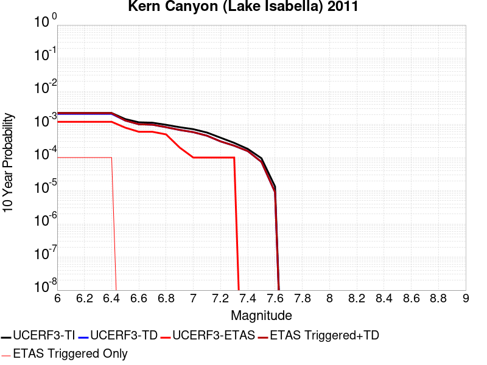 |

| Magnitude | 1 wk TI Prob | 1 wk TD Prob | 1 wk ETAS Prob | 1 wk ETAS/TD Gain | 1 wk ETAS Triggered+TD | 1 wk ETAS Triggered Only | 1 mo TI Prob | 1 mo TD Prob | 1 mo ETAS Prob | 1 mo ETAS/TD Gain | 1 mo ETAS Triggered+TD | 1 mo ETAS Triggered Only | 1 yr TI Prob | 1 yr TD Prob | 1 yr ETAS Prob | 1 yr ETAS/TD Gain | 1 yr ETAS Triggered+TD | 1 yr ETAS Triggered Only | 10 yr TI Prob | 10 yr TD Prob | 10 yr ETAS Prob | 10 yr ETAS/TD Gain | 10 yr ETAS Triggered+TD | 10 yr ETAS Triggered Only |
|-----|-----|-----|-----|-----|-----|-----|-----|-----|-----|-----|-----|-----|-----|-----|-----|-----|-----|-----|-----|-----|-----|-----|-----|-----|
| 6.0 | 4.2387383E-6 | 4.0017594E-6 | 0.0 | 0.0 | 4.0017594E-6 | 0.0 | 1.8165894E-5 | 1.7150294E-5 | 0.0 | 0.0 | 1.7150294E-5 | 0.0 | 2.2114732E-4 | 2.087867E-4 | 0.0 | 0.0 | 2.087867E-4 | 0.0 | 0.0022092736 | 0.0020860895 | 1.0E-4 | 0.047936585 | 0.0021858807 | 1.0E-4 |
| 6.1 | 4.2387383E-6 | 4.0017594E-6 | 0.0 | 0.0 | 4.0017594E-6 | 0.0 | 1.8165894E-5 | 1.7150294E-5 | 0.0 | 0.0 | 1.7150294E-5 | 0.0 | 2.2114732E-4 | 2.087867E-4 | 0.0 | 0.0 | 2.087867E-4 | 0.0 | 0.0022092736 | 0.0020860895 | 1.0E-4 | 0.047936585 | 0.0021858807 | 1.0E-4 |
| 6.2 | 4.2387383E-6 | 4.0017594E-6 | 0.0 | 0.0 | 4.0017594E-6 | 0.0 | 1.8165894E-5 | 1.7150294E-5 | 0.0 | 0.0 | 1.7150294E-5 | 0.0 | 2.2114732E-4 | 2.087867E-4 | 0.0 | 0.0 | 2.087867E-4 | 0.0 | 0.0022092736 | 0.0020860895 | 1.0E-4 | 0.047936585 | 0.0021858807 | 1.0E-4 |
| 6.3 | 4.2387383E-6 | 4.0017594E-6 | 0.0 | 0.0 | 4.0017594E-6 | 0.0 | 1.8165894E-5 | 1.7150294E-5 | 0.0 | 0.0 | 1.7150294E-5 | 0.0 | 2.2114732E-4 | 2.087867E-4 | 0.0 | 0.0 | 2.087867E-4 | 0.0 | 0.0022092736 | 0.0020860895 | 1.0E-4 | 0.047936585 | 0.0021858807 | 1.0E-4 |
| 6.4 | 4.2387383E-6 | 4.0017594E-6 | 0.0 | 0.0 | 4.0017594E-6 | 0.0 | 1.8165894E-5 | 1.7150294E-5 | 0.0 | 0.0 | 1.7150294E-5 | 0.0 | 2.2114732E-4 | 2.087867E-4 | 0.0 | 0.0 | 2.087867E-4 | 0.0 | 0.0022092736 | 0.0020860895 | 1.0E-4 | 0.047936585 | 0.0021858807 | 1.0E-4 |
| 6.5 | 2.7857532E-6 | 2.517923E-6 | 0.0 | 0.0 | 2.517923E-6 | 0.0 | 1.1938888E-5 | 1.0791055E-5 | 0.0 | 0.0 | 1.0791055E-5 | 0.0 | 1.4534626E-4 | 1.313735E-4 | 0.0 | 0.0 | 1.313735E-4 | 0.0 | 0.0014525123 | 0.0013129911 | 0.0 | 0.0 | 0.0013129911 | 0.0 |
| 6.6 | 2.2233348E-6 | 1.9441557E-6 | 0.0 | 0.0 | 1.9441557E-6 | 0.0 | 9.528543E-6 | 8.33207E-6 | 0.0 | 0.0 | 8.33207E-6 | 0.0 | 1.1600384E-4 | 1.01438316E-4 | 0.0 | 0.0 | 1.01438316E-4 | 0.0 | 0.001159433 | 0.0010139288 | 0.0 | 0.0 | 0.0010139288 | 0.0 |
| 6.7 | 2.1635126E-6 | 1.883534E-6 | 0.0 | 0.0 | 1.883534E-6 | 0.0 | 9.272164E-6 | 8.072264E-6 | 0.0 | 0.0 | 8.072264E-6 | 0.0 | 1.1288274E-4 | 9.8275465E-5 | 0.0 | 0.0 | 9.8275465E-5 | 0.0 | 0.0011282542 | 9.823282E-4 | 0.0 | 0.0 | 9.823282E-4 | 0.0 |
| 6.8 | 1.8685711E-6 | 1.5831616E-6 | 0.0 | 0.0 | 1.5831616E-6 | 0.0 | 8.008137E-6 | 6.784961E-6 | 0.0 | 0.0 | 6.784961E-6 | 0.0 | 9.74947E-5 | 8.2603816E-5 | 0.0 | 0.0 | 8.2603816E-5 | 0.0 | 9.745194E-4 | 8.2573603E-4 | 0.0 | 0.0 | 8.2573603E-4 | 0.0 |
| 6.9 | 1.5815071E-6 | 1.3065046E-6 | 0.0 | 0.0 | 1.3065046E-6 | 0.0 | 6.77787E-6 | 5.5992937E-6 | 0.0 | 0.0 | 5.5992937E-6 | 0.0 | 8.251744E-5 | 6.81693E-5 | 0.0 | 0.0 | 6.81693E-5 | 0.0 | 8.248681E-4 | 6.814865E-4 | 0.0 | 0.0 | 6.814865E-4 | 0.0 |
| 7.0 | 1.3772564E-6 | 1.1210809E-6 | 0.0 | 0.0 | 1.1210809E-6 | 0.0 | 5.9025137E-6 | 4.804624E-6 | 0.0 | 0.0 | 4.804624E-6 | 0.0 | 7.186073E-5 | 5.8494745E-5 | 0.0 | 0.0 | 5.8494745E-5 | 0.0 | 7.18375E-4 | 5.8479555E-4 | 0.0 | 0.0 | 5.8479555E-4 | 0.0 |
| 7.1 | 1.0916998E-6 | 8.763845E-7 | 0.0 | 0.0 | 8.763845E-7 | 0.0 | 4.678705E-6 | 3.7559282E-6 | 0.0 | 0.0 | 3.7559282E-6 | 0.0 | 5.6961744E-5 | 4.572748E-5 | 0.0 | 0.0 | 4.572748E-5 | 0.0 | 5.6947145E-4 | 4.5718203E-4 | 0.0 | 0.0 | 4.5718203E-4 | 0.0 |
| 7.2 | 7.6277024E-7 | 5.9014815E-7 | 0.0 | 0.0 | 5.9014815E-7 | 0.0 | 3.2690114E-6 | 2.529204E-6 | 0.0 | 0.0 | 2.529204E-6 | 0.0 | 3.9799485E-5 | 3.0792628E-5 | 0.0 | 0.0 | 3.0792628E-5 | 0.0 | 3.9792358E-4 | 3.0788424E-4 | 0.0 | 0.0 | 3.0788424E-4 | 0.0 |
| 7.3 | 5.3265916E-7 | 4.3824576E-7 | 0.0 | 0.0 | 4.3824576E-7 | 0.0 | 2.282823E-6 | 1.8781948E-6 | 0.0 | 0.0 | 1.8781948E-6 | 0.0 | 2.7793016E-5 | 2.2866785E-5 | 0.0 | 0.0 | 2.2866785E-5 | 0.0 | 2.778954E-4 | 2.2864471E-4 | 0.0 | 0.0 | 2.2864471E-4 | 0.0 |
| 7.4 | 3.4946007E-7 | 3.0065786E-7 | 0.0 | 0.0 | 3.0065786E-7 | 0.0 | 1.497685E-6 | 1.2885331E-6 | 0.0 | 0.0 | 1.2885331E-6 | 0.0 | 1.8234163E-5 | 1.568778E-5 | 0.0 | 0.0 | 1.568778E-5 | 0.0 | 1.8232666E-4 | 1.5686694E-4 | 0.0 | 0.0 | 1.5686694E-4 | 0.0 |
| 7.5 | 1.8317026E-7 | 1.42445E-7 | 0.0 | 0.0 | 1.42445E-7 | 0.0 | 7.850152E-7 | 6.104784E-7 | 0.0 | 0.0 | 6.104784E-7 | 0.0 | 9.557518E-6 | 7.432551E-6 | 0.0 | 0.0 | 7.432551E-6 | 0.0 | 9.5571064E-5 | 7.43231E-5 | 0.0 | 0.0 | 7.43231E-5 | 0.0 |
| 7.6 | 2.572245E-8 | 1.7351576E-8 | 0.0 | 0.0 | 1.7351576E-8 | 0.0 | 1.10239064E-7 | 7.4363896E-8 | 0.0 | 0.0 | 7.4363896E-8 | 0.0 | 1.3421597E-6 | 9.053801E-7 | 0.0 | 0.0 | 9.053801E-7 | 0.0 | 1.3421517E-5 | 9.05377E-6 | 0.0 | 0.0 | 9.05377E-6 | 0.0 |

## Hilton Creek 2011 CFM
*[(top)](#table-of-contents)*

| 1 Week | 1 Month | 1 Year | 10 Year |
|-----|-----|-----|-----|
| 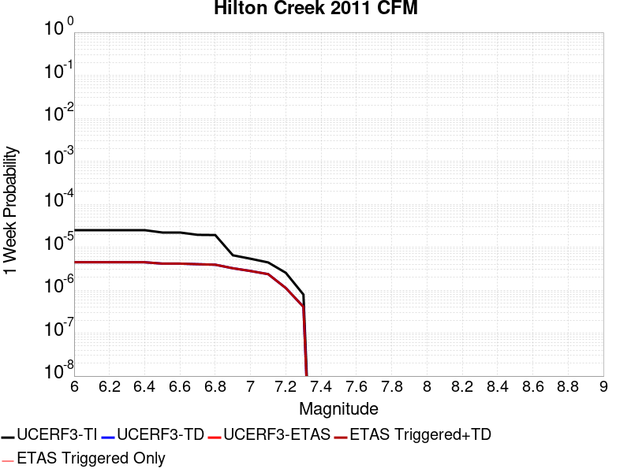 |  | 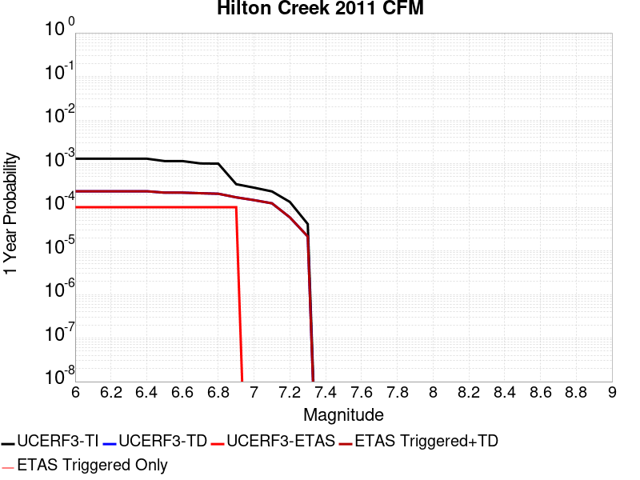 |  |

| Magnitude | 1 wk TI Prob | 1 wk TD Prob | 1 wk ETAS Prob | 1 wk ETAS/TD Gain | 1 wk ETAS Triggered+TD | 1 wk ETAS Triggered Only | 1 mo TI Prob | 1 mo TD Prob | 1 mo ETAS Prob | 1 mo ETAS/TD Gain | 1 mo ETAS Triggered+TD | 1 mo ETAS Triggered Only | 1 yr TI Prob | 1 yr TD Prob | 1 yr ETAS Prob | 1 yr ETAS/TD Gain | 1 yr ETAS Triggered+TD | 1 yr ETAS Triggered Only | 10 yr TI Prob | 10 yr TD Prob | 10 yr ETAS Prob | 10 yr ETAS/TD Gain | 10 yr ETAS Triggered+TD | 10 yr ETAS Triggered Only |
|-----|-----|-----|-----|-----|-----|-----|-----|-----|-----|-----|-----|-----|-----|-----|-----|-----|-----|-----|-----|-----|-----|-----|-----|-----|
| 6.0 | 2.4923684E-5 | 4.457411E-6 | 0.0 | 0.0 | 4.457411E-6 | 0.0 | 1.06811414E-4 | 1.9103058E-5 | 0.0 | 0.0 | 1.9103058E-5 | 0.0 | 0.0012996531 | 2.3255653E-4 | 0.0 | 0.0 | 2.3255653E-4 | 0.0 | 0.012920785 | 0.0023125964 | 1.0E-4 | 0.04324144 | 0.002412365 | 1.0E-4 |
| 6.1 | 2.4923684E-5 | 4.457411E-6 | 0.0 | 0.0 | 4.457411E-6 | 0.0 | 1.06811414E-4 | 1.9103058E-5 | 0.0 | 0.0 | 1.9103058E-5 | 0.0 | 0.0012996531 | 2.3255653E-4 | 0.0 | 0.0 | 2.3255653E-4 | 0.0 | 0.012920785 | 0.0023125964 | 1.0E-4 | 0.04324144 | 0.002412365 | 1.0E-4 |
| 6.2 | 2.4923684E-5 | 4.457411E-6 | 0.0 | 0.0 | 4.457411E-6 | 0.0 | 1.06811414E-4 | 1.9103058E-5 | 0.0 | 0.0 | 1.9103058E-5 | 0.0 | 0.0012996531 | 2.3255653E-4 | 0.0 | 0.0 | 2.3255653E-4 | 0.0 | 0.012920785 | 0.0023125964 | 1.0E-4 | 0.04324144 | 0.002412365 | 1.0E-4 |
| 6.3 | 2.4923684E-5 | 4.457411E-6 | 0.0 | 0.0 | 4.457411E-6 | 0.0 | 1.06811414E-4 | 1.9103058E-5 | 0.0 | 0.0 | 1.9103058E-5 | 0.0 | 0.0012996531 | 2.3255653E-4 | 0.0 | 0.0 | 2.3255653E-4 | 0.0 | 0.012920785 | 0.0023125964 | 1.0E-4 | 0.04324144 | 0.002412365 | 1.0E-4 |
| 6.4 | 2.4923684E-5 | 4.457411E-6 | 0.0 | 0.0 | 4.457411E-6 | 0.0 | 1.06811414E-4 | 1.9103058E-5 | 0.0 | 0.0 | 1.9103058E-5 | 0.0 | 0.0012996531 | 2.3255653E-4 | 0.0 | 0.0 | 2.3255653E-4 | 0.0 | 0.012920785 | 0.0023125964 | 1.0E-4 | 0.04324144 | 0.002412365 | 1.0E-4 |
| 6.5 | 2.1963904E-5 | 4.144855E-6 | 0.0 | 0.0 | 4.144855E-6 | 0.0 | 9.412762E-5 | 1.7763554E-5 | 0.0 | 0.0 | 1.7763554E-5 | 0.0 | 0.0011454013 | 2.1625131E-4 | 0.0 | 0.0 | 2.1625131E-4 | 0.0 | 0.011395155 | 0.0021517137 | 0.0 | 0.0 | 0.0021517137 | 0.0 |
| 6.6 | 2.1963904E-5 | 4.144855E-6 | 0.0 | 0.0 | 4.144855E-6 | 0.0 | 9.412762E-5 | 1.7763554E-5 | 0.0 | 0.0 | 1.7763554E-5 | 0.0 | 0.0011454013 | 2.1625131E-4 | 0.0 | 0.0 | 2.1625131E-4 | 0.0 | 0.011395155 | 0.0021517137 | 0.0 | 0.0 | 0.0021517137 | 0.0 |
| 6.7 | 1.9397496E-5 | 4.014908E-6 | 0.0 | 0.0 | 4.014908E-6 | 0.0 | 8.3129475E-5 | 1.7206643E-5 | 0.0 | 0.0 | 1.7206643E-5 | 0.0 | 0.0010116313 | 2.0947221E-4 | 0.0 | 0.0 | 2.0947221E-4 | 0.0 | 0.0100703845 | 0.0020846587 | 0.0 | 0.0 | 0.0020846587 | 0.0 |
| 6.8 | 1.917303E-5 | 3.9078686E-6 | 0.0 | 0.0 | 3.9078686E-6 | 0.0 | 8.216754E-5 | 1.6747908E-5 | 0.0 | 0.0 | 1.6747908E-5 | 0.0 | 9.999307E-4 | 2.038882E-4 | 0.0 | 0.0 | 2.038882E-4 | 0.0 | 0.009954433 | 0.002028921 | 0.0 | 0.0 | 0.002028921 | 0.0 |
| 6.9 | 6.480681E-6 | 3.2315909E-6 | 0.0 | 0.0 | 3.2315909E-6 | 0.0 | 2.7774051E-5 | 1.3849608E-5 | 0.0 | 0.0 | 1.3849608E-5 | 0.0 | 3.380966E-4 | 1.6860706E-4 | 0.0 | 0.0 | 1.6860706E-4 | 0.0 | 0.0033758266 | 0.0016849025 | 0.0 | 0.0 | 0.0016849025 | 0.0 |
| 7.0 | 5.388316E-6 | 2.7883598E-6 | 0.0 | 0.0 | 2.7883598E-6 | 0.0 | 2.3092578E-5 | 1.1950065E-5 | 0.0 | 0.0 | 1.1950065E-5 | 0.0 | 2.8111585E-4 | 1.4548337E-4 | 0.0 | 0.0 | 1.4548337E-4 | 0.0 | 0.002807605 | 0.001453984 | 0.0 | 0.0 | 0.001453984 | 0.0 |
| 7.1 | 4.41728E-6 | 2.3576063E-6 | 0.0 | 0.0 | 2.3576063E-6 | 0.0 | 1.8931061E-5 | 1.0103993E-5 | 0.0 | 0.0 | 1.0103993E-5 | 0.0 | 2.304613E-4 | 1.2301015E-4 | 0.0 | 0.0 | 1.2301015E-4 | 0.0 | 0.0023022245 | 0.0012295172 | 0.0 | 0.0 | 0.0012295172 | 0.0 |
| 7.2 | 2.535495E-6 | 1.1211786E-6 | 0.0 | 0.0 | 1.1211786E-6 | 0.0 | 1.0866362E-5 | 4.805045E-6 | 0.0 | 0.0 | 4.805045E-6 | 0.0 | 1.3228992E-4 | 5.8500376E-5 | 0.0 | 0.0 | 5.8500376E-5 | 0.0 | 0.0013221119 | 5.8490096E-4 | 0.0 | 0.0 | 5.8490096E-4 | 0.0 |
| 7.3 | 7.900015E-7 | 4.0883947E-7 | 0.0 | 0.0 | 4.0883947E-7 | 0.0 | 3.3857161E-6 | 1.7521692E-6 | 0.0 | 0.0 | 1.7521692E-6 | 0.0 | 4.1220315E-5 | 2.1332658E-5 | 0.0 | 0.0 | 2.1332658E-5 | 0.0 | 4.121267E-4 | 2.133266E-4 | 0.0 | 0.0 | 2.133266E-4 | 0.0 |

## Yorba Linda
*[(top)](#table-of-contents)*

| 1 Week | 1 Month | 1 Year | 10 Year |
|-----|-----|-----|-----|
|  |  |  |  |

| Magnitude | 1 wk TI Prob | 1 wk TD Prob | 1 wk ETAS Prob | 1 wk ETAS/TD Gain | 1 wk ETAS Triggered+TD | 1 wk ETAS Triggered Only | 1 mo TI Prob | 1 mo TD Prob | 1 mo ETAS Prob | 1 mo ETAS/TD Gain | 1 mo ETAS Triggered+TD | 1 mo ETAS Triggered Only | 1 yr TI Prob | 1 yr TD Prob | 1 yr ETAS Prob | 1 yr ETAS/TD Gain | 1 yr ETAS Triggered+TD | 1 yr ETAS Triggered Only | 10 yr TI Prob | 10 yr TD Prob | 10 yr ETAS Prob | 10 yr ETAS/TD Gain | 10 yr ETAS Triggered+TD | 10 yr ETAS Triggered Only |
|-----|-----|-----|-----|-----|-----|-----|-----|-----|-----|-----|-----|-----|-----|-----|-----|-----|-----|-----|-----|-----|-----|-----|-----|-----|
| 6.0 | 1.9346849E-6 | 1.6910949E-6 | 0.0 | 0.0 | 1.6910949E-6 | 0.0 | 8.29148E-6 | 7.2475345E-6 | 0.0 | 0.0 | 7.2475345E-6 | 0.0 | 1.009441E-4 | 8.823611E-5 | 0.0 | 0.0 | 8.823611E-5 | 0.0 | 0.0010089825 | 8.8210386E-4 | 1.0E-4 | 0.11336534 | 9.820156E-4 | 1.0E-4 |
| 6.1 | 1.9346849E-6 | 1.6910949E-6 | 0.0 | 0.0 | 1.6910949E-6 | 0.0 | 8.29148E-6 | 7.2475345E-6 | 0.0 | 0.0 | 7.2475345E-6 | 0.0 | 1.009441E-4 | 8.823611E-5 | 0.0 | 0.0 | 8.823611E-5 | 0.0 | 0.0010089825 | 8.8210386E-4 | 1.0E-4 | 0.11336534 | 9.820156E-4 | 1.0E-4 |
| 6.2 | 1.9346849E-6 | 1.6910949E-6 | 0.0 | 0.0 | 1.6910949E-6 | 0.0 | 8.29148E-6 | 7.2475345E-6 | 0.0 | 0.0 | 7.2475345E-6 | 0.0 | 1.009441E-4 | 8.823611E-5 | 0.0 | 0.0 | 8.823611E-5 | 0.0 | 0.0010089825 | 8.8210386E-4 | 1.0E-4 | 0.11336534 | 9.820156E-4 | 1.0E-4 |
| 6.3 | 1.1028608E-6 | 8.4834727E-7 | 0.0 | 0.0 | 8.4834727E-7 | 0.0 | 4.7265376E-6 | 3.6357694E-6 | 0.0 | 0.0 | 3.6357694E-6 | 0.0 | 5.754407E-5 | 4.426466E-5 | 0.0 | 0.0 | 4.426466E-5 | 0.0 | 5.7529175E-4 | 4.4256495E-4 | 1.0E-4 | 0.22595553 | 5.4252066E-4 | 1.0E-4 |
| 6.4 | 1.1028608E-6 | 8.4834727E-7 | 0.0 | 0.0 | 8.4834727E-7 | 0.0 | 4.7265376E-6 | 3.6357694E-6 | 0.0 | 0.0 | 3.6357694E-6 | 0.0 | 5.754407E-5 | 4.426466E-5 | 0.0 | 0.0 | 4.426466E-5 | 0.0 | 5.7529175E-4 | 4.4256495E-4 | 1.0E-4 | 0.22595553 | 5.4252066E-4 | 1.0E-4 |
| 6.5 | 8.4451364E-7 | 5.870658E-7 | 0.0 | 0.0 | 5.870658E-7 | 0.0 | 3.619339E-6 | 2.515994E-6 | 0.0 | 0.0 | 2.515994E-6 | 0.0 | 4.406456E-5 | 3.0631818E-5 | 0.0 | 0.0 | 3.0631818E-5 | 0.0 | 4.4055824E-4 | 3.0627812E-4 | 0.0 | 0.0 | 3.0627812E-4 | 0.0 |
| 6.6 | 8.422957E-7 | 5.846191E-7 | 0.0 | 0.0 | 5.846191E-7 | 0.0 | 3.6098338E-6 | 2.505508E-6 | 0.0 | 0.0 | 2.505508E-6 | 0.0 | 4.3948843E-5 | 3.0504156E-5 | 0.0 | 0.0 | 3.0504156E-5 | 0.0 | 4.394015E-4 | 3.0500183E-4 | 0.0 | 0.0 | 3.0500183E-4 | 0.0 |
| 6.7 | 8.4119705E-7 | 5.834032E-7 | 0.0 | 0.0 | 5.834032E-7 | 0.0 | 3.6051254E-6 | 2.5002971E-6 | 0.0 | 0.0 | 2.5002971E-6 | 0.0 | 4.3891516E-5 | 3.0440715E-5 | 0.0 | 0.0 | 3.0440715E-5 | 0.0 | 4.388285E-4 | 3.043676E-4 | 0.0 | 0.0 | 3.043676E-4 | 0.0 |
| 6.8 | 7.5919155E-7 | 4.9965075E-7 | 0.0 | 0.0 | 4.9965075E-7 | 0.0 | 3.253674E-6 | 2.1413587E-6 | 0.0 | 0.0 | 2.1413587E-6 | 0.0 | 3.961276E-5 | 2.607075E-5 | 0.0 | 0.0 | 2.607075E-5 | 0.0 | 3.9605703E-4 | 2.6067861E-4 | 0.0 | 0.0 | 2.6067861E-4 | 0.0 |
| 6.9 | 7.5804564E-7 | 4.9826906E-7 | 0.0 | 0.0 | 4.9826906E-7 | 0.0 | 3.248763E-6 | 2.1354372E-6 | 0.0 | 0.0 | 2.1354372E-6 | 0.0 | 3.955297E-5 | 2.5998655E-5 | 0.0 | 0.0 | 2.5998655E-5 | 0.0 | 3.9545933E-4 | 2.5995786E-4 | 0.0 | 0.0 | 2.5995786E-4 | 0.0 |
| 7.0 | 7.539293E-7 | 4.944823E-7 | 0.0 | 0.0 | 4.944823E-7 | 0.0 | 3.2311218E-6 | 2.1192084E-6 | 0.0 | 0.0 | 2.1192084E-6 | 0.0 | 3.9338196E-5 | 2.5801073E-5 | 0.0 | 0.0 | 2.5801073E-5 | 0.0 | 3.9331234E-4 | 2.579825E-4 | 0.0 | 0.0 | 2.579825E-4 | 0.0 |
| 7.1 | 6.0900885E-7 | 3.78308E-7 | 0.0 | 0.0 | 3.78308E-7 | 0.0 | 2.6100352E-6 | 1.6213189E-6 | 0.0 | 0.0 | 1.6213189E-6 | 0.0 | 3.1776715E-5 | 1.9739382E-5 | 0.0 | 0.0 | 1.9739382E-5 | 0.0 | 3.1772171E-4 | 1.9737665E-4 | 0.0 | 0.0 | 1.9737665E-4 | 0.0 |
| 7.2 | 5.849925E-7 | 3.589228E-7 | 0.0 | 0.0 | 3.589228E-7 | 0.0 | 2.5071083E-6 | 1.5382396E-6 | 0.0 | 0.0 | 1.5382396E-6 | 0.0 | 3.0523614E-5 | 1.872791E-5 | 0.0 | 0.0 | 1.872791E-5 | 0.0 | 3.0519423E-4 | 1.8726365E-4 | 0.0 | 0.0 | 1.8726365E-4 | 0.0 |
| 7.3 | 4.89808E-7 | 3.0390476E-7 | 0.0 | 0.0 | 3.0390476E-7 | 0.0 | 2.0991754E-6 | 1.3024483E-6 | 0.0 | 0.0 | 1.3024483E-6 | 0.0 | 2.5557161E-5 | 1.5857195E-5 | 0.0 | 0.0 | 1.5857195E-5 | 0.0 | 2.5554223E-4 | 1.5856087E-4 | 0.0 | 0.0 | 1.5856087E-4 | 0.0 |
| 7.4 | 3.8700415E-7 | 2.4731153E-7 | 0.0 | 0.0 | 2.4731153E-7 | 0.0 | 1.6585881E-6 | 1.0599061E-6 | 0.0 | 0.0 | 1.0599061E-6 | 0.0 | 2.0193123E-5 | 1.2904283E-5 | 0.0 | 0.0 | 1.2904283E-5 | 0.0 | 2.0191289E-4 | 1.2903546E-4 | 0.0 | 0.0 | 1.2903546E-4 | 0.0 |
| 7.5 | 2.900565E-7 | 1.8642837E-7 | 0.0 | 0.0 | 1.8642837E-7 | 0.0 | 1.2430987E-6 | 7.989785E-7 | 0.0 | 0.0 | 7.989785E-7 | 0.0 | 1.5134622E-5 | 9.727521E-6 | 0.0 | 0.0 | 9.727521E-6 | 0.0 | 1.5133592E-4 | 9.7271026E-5 | 0.0 | 0.0 | 9.7271026E-5 | 0.0 |
| 7.6 | 2.2770318E-7 | 1.4818245E-7 | 0.0 | 0.0 | 1.4818245E-7 | 0.0 | 9.758704E-7 | 6.3506747E-7 | 0.0 | 0.0 | 6.3506747E-7 | 0.0 | 1.1881158E-5 | 7.731919E-6 | 0.0 | 0.0 | 7.731919E-6 | 0.0 | 1.1880523E-4 | 7.731656E-5 | 0.0 | 0.0 | 7.731656E-5 | 0.0 |
| 7.7 | 1.5017194E-7 | 8.738383E-8 | 0.0 | 0.0 | 8.738383E-8 | 0.0 | 6.4359386E-7 | 3.745021E-7 | 0.0 | 0.0 | 3.745021E-7 | 0.0 | 7.835727E-6 | 4.559554E-6 | 0.0 | 0.0 | 4.559554E-6 | 0.0 | 7.835451E-5 | 4.559463E-5 | 0.0 | 0.0 | 4.559463E-5 | 0.0 |
| 7.8 | 3.895753E-8 | 1.8544185E-8 | 0.0 | 0.0 | 1.8544185E-8 | 0.0 | 1.6696083E-7 | 7.947508E-8 | 0.0 | 0.0 | 7.947508E-8 | 0.0 | 2.0327461E-6 | 9.676087E-7 | 0.0 | 0.0 | 9.676087E-7 | 0.0 | 2.0327276E-5 | 9.676046E-6 | 0.0 | 0.0 | 9.676046E-6 | 0.0 |
| 7.9 | 6.648505E-9 | 3.42018E-9 | 0.0 | 0.0 | 3.42018E-9 | 0.0 | 2.8493591E-8 | 1.4657914E-8 | 0.0 | 0.0 | 1.4657914E-8 | 0.0 | 3.4690942E-7 | 1.7846008E-7 | 0.0 | 0.0 | 1.7846008E-7 | 0.0 | 3.4690888E-6 | 1.7845996E-6 | 0.0 | 0.0 | 1.7845996E-6 | 0.0 |

