# Parent Section Magnitude-Probability Distributions

Only fault sections with at least one triggered aftershock are plotted. Sections are sorted by total supraseismogenic trigger rate (decreasing)

## Table Of Contents

* [San Andreas (Parkfield)](#san-andreas-parkfield)
* [Mendocino](#mendocino)
* [San Andreas (Creeping Section) 2011 CFM](#san-andreas-creeping-section-2011-cfm)
* [San Andreas (Mojave S)](#san-andreas-mojave-s)
* [Garlock (Central)](#garlock-central)
* [Tank Canyon](#tank-canyon)
* [Cerro Prieto](#cerro-prieto)
* [Imperial](#imperial)
* [Brawley (Seismic Zone) alt 1](#brawley-seismic-zone-alt-1)
* [Laguna Salada](#laguna-salada)
* [Hayward (So) 2011 CFM](#hayward-so-2011-cfm)
* [San Andreas (Offshore) 2011 CFM](#san-andreas-offshore-2011-cfm)
* [Little Lake](#little-lake)
* [Airport Lake](#airport-lake)
* [San Andreas (Cholame) rev](#san-andreas-cholame-rev)
* [San Andreas (Carrizo) rev](#san-andreas-carrizo-rev)
* [Owl Lake](#owl-lake)
* [Hayward (So) extension 2011 CFM](#hayward-so-extension-2011-cfm)
* [San Andreas (Coachella) rev](#san-andreas-coachella-rev)
* [San Andreas (San Bernardino N)](#san-andreas-san-bernardino-n)
* [Calaveras (Central) 2011 CFM](#calaveras-central-2011-cfm)
* [Calaveras (So) - Paicines extension 2011 CFM](#calaveras-so---paicines-extension-2011-cfm)
* [San Andreas (Mojave N)](#san-andreas-mojave-n)
* [San Jacinto (Superstition Mtn)](#san-jacinto-superstition-mtn)
* [Panamint Valley](#panamint-valley)
* [San Andreas (Big Bend)](#san-andreas-big-bend)
* [Calaveras (So) 2011 CFM](#calaveras-so-2011-cfm)
* [Garlock (East)](#garlock-east)
* [Elsinore (Glen Ivy) rev](#elsinore-glen-ivy-rev)
* [San Andreas (San Bernardino S)](#san-andreas-san-bernardino-s)
* [San Andreas (San Gorgonio Pass-Garnet HIll)](#san-andreas-san-gorgonio-pass-garnet-hill)
* [West Napa 2011 CFM](#west-napa-2011-cfm)
* [Cady](#cady)
* [Hunting Creek - Berryessa 2011 CFM](#hunting-creek---berryessa-2011-cfm)
* [Green Valley 2011 CFM](#green-valley-2011-cfm)
* [San Andreas (Santa Cruz Mts) 2011 CFM](#san-andreas-santa-cruz-mts-2011-cfm)
* [Ash Hill](#ash-hill)
* [Hayward (No) 2011 CFM](#hayward-no-2011-cfm)
* [Hunter Mountain-Saline Valley](#hunter-mountain-saline-valley)
* [San Andreas (North Coast) 2011 CFM](#san-andreas-north-coast-2011-cfm)
* [Calico-Hidalgo](#calico-hidalgo)
* [Elmore Ranch](#elmore-ranch)
* [King Range 2011 CFM](#king-range-2011-cfm)
* [Pisgah-Bullion Mtn-Mesquite Lk](#pisgah-bullion-mtn-mesquite-lk)
* [Mission Ridge-Arroyo Parida-Santa Ana](#mission-ridge-arroyo-parida-santa-ana)
* [Blackwater](#blackwater)
* [Pinto Mtn](#pinto-mtn)
* [Goldstone Lake](#goldstone-lake)
* [Ludlow](#ludlow)
* [Rodgers Creek - Healdsburg 2011 CFM](#rodgers-creek---healdsburg-2011-cfm)
* [Garlock (West)](#garlock-west)
* [Garberville - Briceland 2011 CFM](#garberville---briceland-2011-cfm)
* [Honey Lake 2011 CFM](#honey-lake-2011-cfm)
* [Chino alt 1](#chino-alt-1)
* [Bullion Mountains](#bullion-mountains)
* [Concord 2011 CFM](#concord-2011-cfm)
* [Coyote Canyon](#coyote-canyon)
* [San Clemente](#san-clemente)
* [Calaveras (No) 2011 CFM](#calaveras-no-2011-cfm)
* [Whittier alt 1](#whittier-alt-1)
* [Gravel Hills-Harper Lk](#gravel-hills-harper-lk)
* [Maacama 2011 CFM](#maacama-2011-cfm)
* [Red Mountain](#red-mountain)
* [Sargent 2011 CFM](#sargent-2011-cfm)
* [Santa Ynez (West)](#santa-ynez-west)
* [White Mountains](#white-mountains)
* [Great Valley 04b Gordon Valley](#great-valley-04b-gordon-valley)
* [McLean Lake](#mclean-lake)
* [Pleito](#pleito)
* [Keddie Ridge 2011 CFM](#keddie-ridge-2011-cfm)
* [Ortigalita (North)](#ortigalita-north)
* [Monte Vista - Shannon 2011 CFM](#monte-vista---shannon-2011-cfm)
* [Manix-Afton Hills](#manix-afton-hills)
* [Paradise](#paradise)
* [Mount Diablo Thrust South](#mount-diablo-thrust-south)
* [Great Valley 05 Pittsburg - Kirby Hills alt1](#great-valley-05-pittsburg---kirby-hills-alt1)
* [Rose Canyon](#rose-canyon)
* [Elysian Park (Upper)](#elysian-park-upper)
* [So Sierra Nevada](#so-sierra-nevada)
* [San Diego Trough north alt1](#san-diego-trough-north-alt1)
* [Death Valley (So)](#death-valley-so)
* [Quien Sabe 2011 CFM](#quien-sabe-2011-cfm)
* [San Gregorio (North) 2011 CFM](#san-gregorio-north-2011-cfm)
* [Ventura-Pitas Point](#ventura-pitas-point)
* [Hunting Creek - Bartlett Springs connector 2011](#hunting-creek---bartlett-springs-connector-2011)
* [Mission (connected) 2011 CFM](#mission-connected-2011-cfm)
* [Coronado Bank alt1](#coronado-bank-alt1)
* [San Diego Trough south](#san-diego-trough-south)
* [Greenville (No) 2011 CFM](#greenville-no-2011-cfm)
* [South Klamath Lake West](#south-klamath-lake-west)
* [Almanor 2011 CFM](#almanor-2011-cfm)
* [Cleghorn Pass](#cleghorn-pass)
* [San Jacinto (Borrego)](#san-jacinto-borrego)
* [South Klamath Lake East](#south-klamath-lake-east)
* [Nelson Lake](#nelson-lake)
* [Santa Susana East (connector)](#santa-susana-east-connector)
* [Owens Valley Keough Hot Springs](#owens-valley-keough-hot-springs)
* [Ortigalita (South)](#ortigalita-south)
* [Bartlett Springs 2011 CFM](#bartlett-springs-2011-cfm)
* [San Jacinto (Anza) rev](#san-jacinto-anza-rev)
* [Blue Cut](#blue-cut)
* [Mission Hills 2011](#mission-hills-2011)
* [Santa Ynez (East)](#santa-ynez-east)
* [Death Valley (Fish Lake Valley)](#death-valley-fish-lake-valley)
* [Little Salmon (Offshore)](#little-salmon-offshore)
* [Eaton Roughs 2011 CFM](#eaton-roughs-2011-cfm)
* [Pitas Point (Lower West)](#pitas-point-lower-west)
* [Bennett Valley 2011 CFM](#bennett-valley-2011-cfm)
* [Cleghorn Lake](#cleghorn-lake)
* [Towne Pass](#towne-pass)
* [Lenwood-Lockhart-Old Woman Springs](#lenwood-lockhart-old-woman-springs)
* [Santa Susana alt 1](#santa-susana-alt-1)
* [Santa Cruz Island](#santa-cruz-island)
* [Elsinore (Coyote Mountains)](#elsinore-coyote-mountains)
* [Superstition Hills](#superstition-hills)
* [Trinidad (alt1)](#trinidad-alt1)
* [San Jacinto (Stepovers Combined)](#san-jacinto-stepovers-combined)
* [Independence rev 2011](#independence-rev-2011)
* [San Andreas (Peninsula) 2011 CFM](#san-andreas-peninsula-2011-cfm)
* [Round Valley](#round-valley)
* [Newport-Inglewood alt 1](#newport-inglewood-alt-1)
* [Oceanic - West Huasna](#oceanic---west-huasna)
* [Raymond](#raymond)
* [San Jacinto (Coyote Creek)](#san-jacinto-coyote-creek)
* [Death Valley (Black Mtns Frontal)](#death-valley-black-mtns-frontal)
* [Sierra Nevada  (No Extension)](#sierra-nevada--no-extension)
* [San Juan](#san-juan)
* [Great Valley 07 (Orestimba)](#great-valley-07-orestimba)
* [San Jacinto (San Bernardino)](#san-jacinto-san-bernardino)
* [San Jacinto (San Jacinto Valley) rev](#san-jacinto-san-jacinto-valley-rev)
* [Bicycle Lake](#bicycle-lake)
* [Santa Ynez River](#santa-ynez-river)
* [Table Bluff](#table-bluff)
* [Bear River fault zone](#bear-river-fault-zone)
* [Carson Range (Genoa)](#carson-range-genoa)
* [Death Valley (No)](#death-valley-no)
* [Mission Creek](#mission-creek)
* [Channel Islands Thrust](#channel-islands-thrust)
* [San Gabriel](#san-gabriel)
* [Greenville (So) 2011 CFM](#greenville-so-2011-cfm)
* [Owens Valley](#owens-valley)
* [Hosgri](#hosgri)
* [Garlic Springs](#garlic-springs)
* [San Pedro Basin](#san-pedro-basin)
* [Mono Lake 2011 CFM](#mono-lake-2011-cfm)
* [Homestead Valley 2011](#homestead-valley-2011)
* [Elsinore (Temecula) rev](#elsinore-temecula-rev)
* [Great Valley 06 (Midland) 2011 CFM alt1](#great-valley-06-midland-2011-cfm-alt1)
* [Palos Verdes](#palos-verdes)
* [Robinson Creek](#robinson-creek)
* [Elsinore (Stepovers Combined)](#elsinore-stepovers-combined)
* [Skinner Flat 2011 CFM](#skinner-flat-2011-cfm)
* [Simi-Santa Rosa](#simi-santa-rosa)
* [Earthquake Valley (So Extension)](#earthquake-valley-so-extension)
* [Hector Mine](#hector-mine)
* [Reliz 2011 CFM](#reliz-2011-cfm)
* [Earthquake Valley (No  Extension)](#earthquake-valley-no--extension)
* [Helendale-So Lockhart](#helendale-so-lockhart)
* [Hat Creek-McArthur-Mayfield](#hat-creek-mcarthur-mayfield)
* [Burnt Mtn](#burnt-mtn)
* [Swain Ravine - Spenceville](#swain-ravine---spenceville)
* [Oak Ridge (Onshore)](#oak-ridge-onshore)
* [Cedar Mtn-Mahogany Mtn](#cedar-mtn-mahogany-mtn)
* [Cucamonga](#cucamonga)
* [Franklin 2011 CFM](#franklin-2011-cfm)
* [Scodie Lineament](#scodie-lineament)
* [Great Valley 09 (Laguna Seca)](#great-valley-09-laguna-seca)
* [Great Valley 11](#great-valley-11)
* [Santa Cruz Catalina Ridge alt1](#santa-cruz-catalina-ridge-alt1)
* [San Andreas (North Branch Mill Creek)](#san-andreas-north-branch-mill-creek)
* [Pitas Point (Lower)-Montalvo](#pitas-point-lower-montalvo)
* [Coyote Lake](#coyote-lake)
* [Santa Rosa Island](#santa-rosa-island)
* [Sheephole](#sheephole)
* [Collayami 2011 CFM](#collayami-2011-cfm)
* [Monterey Bay-Tularcitos](#monterey-bay-tularcitos)
* [Big Lagoon - Bald Mtn 2011 CFM](#big-lagoon---bald-mtn-2011-cfm)
* [McKinleyville (alt1)](#mckinleyville-alt1)
* [Eureka Peak](#eureka-peak)
* [Puente Hills](#puente-hills)
* [Contra Costa Shear Zone (connector) 2011 CFM](#contra-costa-shear-zone-connector-2011-cfm)
* [Sierra Madre](#sierra-madre)
* [Surprise Valley 2011 CFM](#surprise-valley-2011-cfm)
* [North Frontal  (East)](#north-frontal--east)
* [San Cayetano](#san-cayetano)
* [Channel Islands Western Deep Ramp](#channel-islands-western-deep-ramp)
* [Great Valley 04a Trout Creek](#great-valley-04a-trout-creek)
* [Sierra Madre (San Fernando)](#sierra-madre-san-fernando)
* [Great Valley 03 Mysterious Ridge](#great-valley-03-mysterious-ridge)
* [Lost Hills](#lost-hills)
* [Antelope Valley 2011](#antelope-valley-2011)
* [Earthquake Valley](#earthquake-valley)
* [Fish Slough 2011 CFM](#fish-slough-2011-cfm)
* [Elsinore (Julian)](#elsinore-julian)
* [Little Salmon (Onshore)](#little-salmon-onshore)
* [Hartley Springs 2011 CFM](#hartley-springs-2011-cfm)
* [Los Alamos extension](#los-alamos-extension)
* [White Wolf (Extension)](#white-wolf-extension)
* [Mount Diablo Thrust North CFM](#mount-diablo-thrust-north-cfm)
* [Cleghorn](#cleghorn)
* [Point Reyes 2011 CFM](#point-reyes-2011-cfm)
* [San Jose](#san-jose)
* [Johnson Valley (No) 2011 rev](#johnson-valley-no-2011-rev)
* [Goose Lake 2011 CFM](#goose-lake-2011-cfm)
* [Great Valley 08 (Quinto)](#great-valley-08-quinto)
* [Rinconada 2011 CFM](#rinconada-2011-cfm)
* [West Tahoe](#west-tahoe)
* [Big Pine (East)](#big-pine-east)
* [Mad River (alt1)](#mad-river-alt1)
* [Los Alamos 2011 CFM](#los-alamos-2011-cfm)
* [San Jacinto (Clark) rev](#san-jacinto-clark-rev)
* [Great Valley 03a Dunnigan Hills](#great-valley-03a-dunnigan-hills)
* [Fontana (Seismicity)](#fontana-seismicity)
* [Northridge Hills](#northridge-hills)
* [North Tahoe 2011 CFM](#north-tahoe-2011-cfm)
* [Russ 2011 CFM](#russ-2011-cfm)
* [San Gorgonio Pass](#san-gorgonio-pass)
* [Mohawk Valley 2011 CFM](#mohawk-valley-2011-cfm)
* [Great Valley 10 (Panoche)](#great-valley-10-panoche)
* [Gillem - Big Crack 2011 CFM](#gillem---big-crack-2011-cfm)
* [Thirty Mile Bank](#thirty-mile-bank)
* [Emerson-Copper Mtn 2011](#emerson-copper-mtn-2011)
* [Lake Isabella (Seismicity)](#lake-isabella-seismicity)
* [Peralta Hills](#peralta-hills)
* [Fickle Hill (alt1)](#fickle-hill-alt1)
* [Rocky Ledge 2011 CFM](#rocky-ledge-2011-cfm)
* [Del Valle](#del-valle)
* [Great Valley 14 (Kettleman Hills)](#great-valley-14-kettleman-hills)
* [Polaris 2011 CFM](#polaris-2011-cfm)
* [Las Positas](#las-positas)
* [Baker](#baker)
* [Red Pass](#red-pass)
* [White Wolf](#white-wolf)
* [Newport-Inglewood (Offshore)](#newport-inglewood-offshore)
* [Casmalia 2011 CFM](#casmalia-2011-cfm)
* [Deep Springs](#deep-springs)
* [Pine Mtn](#pine-mtn)
* [Kern Canyon (South Kern) 2011](#kern-canyon-south-kern-2011)
* [Davis Creek](#davis-creek)
* [Tin Mountain](#tin-mountain)
* [Pittville 2011 CFM](#pittville-2011-cfm)
* [Pilarcitos 2011 CFM](#pilarcitos-2011-cfm)
* [Great Valley 13 (Coalinga)](#great-valley-13-coalinga)
* [La Panza 2011](#la-panza-2011)
* [Silver Creek 2011 CFM](#silver-creek-2011-cfm)
* [Morales (East)](#morales-east)
* [Hollywood](#hollywood)
* [Butano 2011 CFM](#butano-2011-cfm)
* [San Gabriel (Extension)](#san-gabriel-extension)
* [Sisar](#sisar)
* [Clamshell-Sawpit](#clamshell-sawpit)
* [Malibu Coast alt 1](#malibu-coast-alt-1)
* [San Jacinto (Lytle Creek connector)](#san-jacinto-lytle-creek-connector)
* [Oceanside alt1](#oceanside-alt1)
* [Elysian Park (Lower CFM)](#elysian-park-lower-cfm)
* [Zayante-Vergeles 2011 CFM](#zayante-vergeles-2011-cfm)
* [Big Pine (Central)](#big-pine-central)
* [Kern Canyon (North Kern) 2011](#kern-canyon-north-kern-2011)
* [San Gregorio (South) 2011 CFM](#san-gregorio-south-2011-cfm)
* [Northridge](#northridge)
* [Compton](#compton)
* [Ozena](#ozena)
* [Jess Valley](#jess-valley)
* [Dog Valley](#dog-valley)
* [Joshua Tree (Seismicity)](#joshua-tree-seismicity)
* [Camp Rock 2011](#camp-rock-2011)
* [Anacapa-Dume alt 1](#anacapa-dume-alt-1)
* [Yorba Linda](#yorba-linda)
* [Richfield](#richfield)
* [Kern Canyon (Lake Isabella) 2011](#kern-canyon-lake-isabella-2011)
* [Dry Mountain](#dry-mountain)
* [Clayton](#clayton)
* [Canada David (Detachment)](#canada-david-detachment)
* [Contra Costa (Lafayette) 2011 CFM](#contra-costa-lafayette-2011-cfm)
* [Holser alt 1](#holser-alt-1)
* [Malibu Coast (Extension) alt 1](#malibu-coast-extension-alt-1)
* [Point Reyes 2011 connector](#point-reyes-2011-connector)
* [Great Valley 12](#great-valley-12)
* [Santa Monica Bay](#santa-monica-bay)
* [Hilton Creek 2011 CFM](#hilton-creek-2011-cfm)
* [Big Pine (West)](#big-pine-west)
* [Walker Spring 2011 CFM](#walker-spring-2011-cfm)
* [San Luis Range 2011 CFM](#san-luis-range-2011-cfm)
* [Santa Monica alt 1](#santa-monica-alt-1)

## San Andreas (Parkfield)
*[(top)](#table-of-contents)*

| 1 Week | 1 Month | 1 Year | 10 Year |
|-----|-----|-----|-----|
|  |  |  | 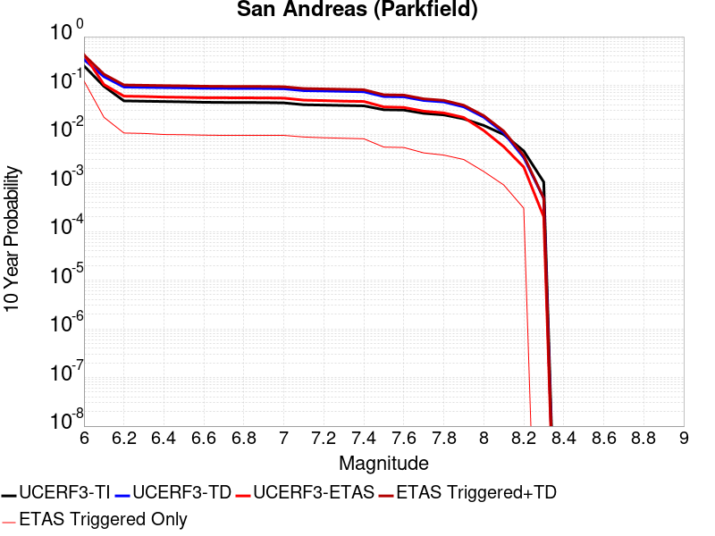 |

| Magnitude | 1 wk TI Prob | 1 wk TD Prob | 1 wk ETAS Prob | 1 wk ETAS/TD Gain | 1 wk ETAS Triggered+TD | 1 wk ETAS Triggered Only | 1 mo TI Prob | 1 mo TD Prob | 1 mo ETAS Prob | 1 mo ETAS/TD Gain | 1 mo ETAS Triggered+TD | 1 mo ETAS Triggered Only | 1 yr TI Prob | 1 yr TD Prob | 1 yr ETAS Prob | 1 yr ETAS/TD Gain | 1 yr ETAS Triggered+TD | 1 yr ETAS Triggered Only | 10 yr TI Prob | 10 yr TD Prob | 10 yr ETAS Prob | 10 yr ETAS/TD Gain | 10 yr ETAS Triggered+TD | 10 yr ETAS Triggered Only |
|-----|-----|-----|-----|-----|-----|-----|-----|-----|-----|-----|-----|-----|-----|-----|-----|-----|-----|-----|-----|-----|-----|-----|-----|-----|
| 6.0 | 5.556969E-4 | 7.9349114E-4 | 3.0E-4 | 0.37807605 | 9.933325E-4 | 2.0E-4 | 0.0023793848 | 0.00339682 | 0.0029 | 0.8537396 | 0.004293763 | 9.0E-4 | 0.028586963 | 0.04087522 | 0.0475 | 1.1620734 | 0.05602939 | 0.0158 | 0.25176284 | 0.3395641 | 0.429 | 1.2633845 | 0.42126003 | 0.1237 |
| 6.1 | 1.925858E-4 | 3.0718808E-4 | 0.0 | 0.0 | 3.0718808E-4 | 0.0 | 8.2510663E-4 | 0.001315955 | 7.0E-4 | 0.53193307 | 0.0014158234 | 1.0E-4 | 0.0099994885 | 0.015991377 | 0.0113 | 0.7066308 | 0.0186482 | 0.0027 | 0.095613256 | 0.15083402 | 0.104 | 0.6894996 | 0.16960059 | 0.0221 |
| 6.2 | 9.4306815E-5 | 1.8366873E-4 | 0.0 | 0.0 | 1.8366873E-4 | 0.0 | 4.0410945E-4 | 7.869155E-4 | 4.0E-4 | 0.5083138 | 7.869155E-4 | 0.0 | 0.0049089384 | 0.009538811 | 0.006 | 0.62900925 | 0.010529272 | 0.001 | 0.048019063 | 0.0923892 | 0.06 | 0.6494265 | 0.101919115 | 0.0105 |
| 6.3 | 9.283051E-5 | 1.8063006E-4 | 0.0 | 0.0 | 1.8063006E-4 | 0.0 | 3.9778434E-4 | 7.7390036E-4 | 4.0E-4 | 0.5168624 | 7.7390036E-4 | 0.0 | 0.0048322747 | 0.009381717 | 0.0059 | 0.6288827 | 0.010372335 | 0.001 | 0.047285385 | 0.091041945 | 0.0591 | 0.6491513 | 0.10040422 | 0.0103 |
| 6.4 | 9.138826E-5 | 1.7824411E-4 | 0.0 | 0.0 | 1.7824411E-4 | 0.0 | 3.916052E-4 | 7.6368084E-4 | 3.0E-4 | 0.39283425 | 7.6368084E-4 | 0.0 | 0.0047573745 | 0.009258366 | 0.0058 | 0.62646043 | 0.010249107 | 0.001 | 0.046568092 | 0.08994313 | 0.0575 | 0.63929284 | 0.098861694 | 0.0098 |
| 6.5 | 9.000255E-5 | 1.7581714E-4 | 0.0 | 0.0 | 1.7581714E-4 | 0.0 | 3.8566816E-4 | 7.532856E-4 | 3.0E-4 | 0.39825532 | 7.532856E-4 | 0.0 | 0.0046854047 | 0.009132894 | 0.0056 | 0.6131682 | 0.010123761 | 0.001 | 0.045878403 | 0.08883011 | 0.0568 | 0.6394228 | 0.09766846 | 0.0097 |
| 6.6 | 8.8109264E-5 | 1.7261338E-4 | 0.0 | 0.0 | 1.7261338E-4 | 0.0 | 3.7755648E-4 | 7.39563E-4 | 3.0E-4 | 0.40564492 | 7.39563E-4 | 0.0 | 0.0045870654 | 0.008967227 | 0.0054 | 0.6021928 | 0.009859157 | 9.0E-4 | 0.04493529 | 0.08735638 | 0.0559 | 0.6399075 | 0.096026495 | 0.0095 |
| 6.7 | 8.738073E-5 | 1.7128066E-4 | 0.0 | 0.0 | 1.7128066E-4 | 0.0 | 3.7443507E-4 | 7.338546E-4 | 3.0E-4 | 0.4088003 | 7.338546E-4 | 0.0 | 0.0045492216 | 0.0088983355 | 0.0054 | 0.6068551 | 0.0097903265 | 9.0E-4 | 0.04457213 | 0.086756065 | 0.0557 | 0.64203006 | 0.09534056 | 0.0094 |
| 6.8 | 8.710195E-5 | 1.70733E-4 | 0.0 | 0.0 | 1.70733E-4 | 0.0 | 3.7324068E-4 | 7.3150883E-4 | 3.0E-4 | 0.41011125 | 7.3150883E-4 | 0.0 | 0.0045347405 | 0.008870017 | 0.0053 | 0.5975186 | 0.009762034 | 9.0E-4 | 0.04443313 | 0.08650273 | 0.0554 | 0.6404422 | 0.09508961 | 0.0094 |
| 6.9 | 8.6801556E-5 | 1.7014009E-4 | 0.0 | 0.0 | 1.7014009E-4 | 0.0 | 3.7195362E-4 | 7.2896923E-4 | 3.0E-4 | 0.41154 | 7.2896923E-4 | 0.0 | 0.0045191357 | 0.008839348 | 0.0053 | 0.59959173 | 0.009731392 | 9.0E-4 | 0.044283327 | 0.08622788 | 0.0553 | 0.6413239 | 0.09481734 | 0.0094 |
| 7.0 | 8.5571606E-5 | 1.6765864E-4 | 0.0 | 0.0 | 1.6765864E-4 | 0.0 | 3.6668387E-4 | 7.1834034E-4 | 3.0E-4 | 0.41762933 | 7.1834034E-4 | 0.0 | 0.004455241 | 0.008710983 | 0.0052 | 0.59694755 | 0.009603143 | 9.0E-4 | 0.043669727 | 0.0850735 | 0.0547 | 0.6429734 | 0.09367381 | 0.0094 |
| 7.1 | 7.82589E-5 | 1.5242065E-4 | 0.0 | 0.0 | 1.5242065E-4 | 0.0 | 3.3535215E-4 | 6.530686E-4 | 3.0E-4 | 0.45936984 | 6.530686E-4 | 0.0 | 0.0040752706 | 0.0079222955 | 0.0047 | 0.59326243 | 0.008715957 | 8.0E-4 | 0.040013418 | 0.07796923 | 0.0497 | 0.63743097 | 0.0859909 | 0.0087 |
| 7.2 | 7.690929E-5 | 1.497802E-4 | 0.0 | 0.0 | 1.497802E-4 | 0.0 | 3.2956956E-4 | 6.417579E-4 | 3.0E-4 | 0.46746597 | 6.417579E-4 | 0.0 | 0.004005129 | 0.00778558 | 0.0047 | 0.60368013 | 0.008579352 | 8.0E-4 | 0.0393371 | 0.0767379 | 0.0487 | 0.6346277 | 0.08449331 | 0.0084 |
| 7.3 | 7.5543794E-5 | 1.4673026E-4 | 0.0 | 0.0 | 1.4673026E-4 | 0.0 | 3.2371894E-4 | 6.286932E-4 | 2.0E-4 | 0.3181202 | 6.286932E-4 | 0.0 | 0.003934157 | 0.0076276404 | 0.0043 | 0.56373924 | 0.008421538 | 8.0E-4 | 0.038652334 | 0.07529368 | 0.0474 | 0.6295349 | 0.08287627 | 0.0082 |
| 7.4 | 7.4214564E-5 | 1.43725E-4 | 0.0 | 0.0 | 1.43725E-4 | 0.0 | 3.1802364E-4 | 6.1581965E-4 | 2.0E-4 | 0.32477042 | 6.1581965E-4 | 0.0 | 0.003865065 | 0.00747199 | 0.0043 | 0.57548255 | 0.008266012 | 8.0E-4 | 0.03798529 | 0.07386209 | 0.0467 | 0.63225937 | 0.081271194 | 0.008 |
| 7.5 | 6.149578E-5 | 1.12851594E-4 | 0.0 | 0.0 | 1.12851594E-4 | 0.0 | 2.6352672E-4 | 4.8356014E-4 | 2.0E-4 | 0.413599 | 4.8356014E-4 | 0.0 | 0.0032037178 | 0.0058714845 | 0.0034 | 0.5790699 | 0.006567375 | 7.0E-4 | 0.03157923 | 0.058995683 | 0.0361 | 0.6119092 | 0.0640771 | 0.0054 |
| 7.6 | 6.0643448E-5 | 1.11128815E-4 | 0.0 | 0.0 | 1.11128815E-4 | 0.0 | 2.598746E-4 | 4.7617953E-4 | 2.0E-4 | 0.42000964 | 4.7617953E-4 | 0.0 | 0.0031593828 | 0.0057821064 | 0.0034 | 0.58802104 | 0.0064780586 | 7.0E-4 | 0.031148417 | 0.058153026 | 0.0352 | 0.60529953 | 0.06314482 | 0.0053 |
| 7.7 | 5.1652263E-5 | 9.2588096E-5 | 0.0 | 0.0 | 9.2588096E-5 | 0.0 | 2.2134806E-4 | 3.967458E-4 | 2.0E-4 | 0.5041011 | 3.967458E-4 | 0.0 | 0.002691582 | 0.004819692 | 0.0029 | 0.60169816 | 0.005516318 | 7.0E-4 | 0.026592141 | 0.04893195 | 0.0295 | 0.6028781 | 0.052831326 | 0.0041 |
| 7.8 | 4.8090482E-5 | 8.636971E-5 | 0.0 | 0.0 | 8.636971E-5 | 0.0 | 2.060858E-4 | 3.701034E-4 | 2.0E-4 | 0.5403895 | 3.701034E-4 | 0.0 | 0.0025062072 | 0.0044967076 | 0.0026 | 0.5782008 | 0.0050940095 | 6.0E-4 | 0.024781305 | 0.04566862 | 0.0272 | 0.59559494 | 0.04919965 | 0.0037 |
| 7.9 | 3.970278E-5 | 6.810641E-5 | 0.0 | 0.0 | 6.810641E-5 | 0.0 | 1.7014367E-4 | 2.91852E-4 | 1.0E-4 | 0.34263942 | 2.91852E-4 | 0.0 | 0.002069531 | 0.0035475125 | 0.0023 | 0.64834166 | 0.004145384 | 6.0E-4 | 0.020503636 | 0.03617058 | 0.0219 | 0.6054644 | 0.039062068 | 0.003 |
| 8.0 | 2.8982335E-5 | 4.1079107E-5 | 0.0 | 0.0 | 4.1079107E-5 | 0.0 | 1.2420409E-4 | 1.7604145E-4 | 1.0E-4 | 0.56804806 | 1.7604145E-4 | 0.0 | 0.0015111357 | 0.002141199 | 0.0015 | 0.7005421 | 0.0026401284 | 5.0E-4 | 0.015009012 | 0.022202143 | 0.0118 | 0.5314802 | 0.0238644 | 0.0017 |
| 8.1 | 1.8836186E-5 | 1.8895687E-5 | 0.0 | 0.0 | 1.8895687E-5 | 0.0 | 8.0724014E-5 | 8.097901E-5 | 0.0 | 0.0 | 8.097901E-5 | 0.0 | 9.823717E-4 | 9.854741E-4 | 9.0E-4 | 0.91326606 | 0.0013850798 | 4.0E-4 | 0.009780403 | 0.010601512 | 0.0055 | 0.51879394 | 0.01149197 | 9.0E-4 |
| 8.2 | 8.643924E-6 | 5.556491E-6 | 0.0 | 0.0 | 5.556491E-6 | 0.0 | 3.704486E-5 | 2.3813316E-5 | 0.0 | 0.0 | 2.3813316E-5 | 0.0 | 4.5092785E-4 | 2.8988862E-4 | 2.0E-4 | 0.6899201 | 3.8985963E-4 | 1.0E-4 | 0.0045001395 | 0.0032934055 | 0.0021 | 0.63763785 | 0.0035924173 | 3.0E-4 |
| 8.3 | 1.983087E-6 | 7.792044E-7 | 0.0 | 0.0 | 7.792044E-7 | 0.0 | 8.498917E-6 | 3.3394433E-6 | 0.0 | 0.0 | 3.3394433E-6 | 0.0 | 1.034694E-4 | 4.065698E-5 | 0.0 | 0.0 | 4.065698E-5 | 0.0 | 0.0010342124 | 4.7958124E-4 | 2.0E-4 | 0.41703048 | 4.7958124E-4 | 0.0 |

## Mendocino
*[(top)](#table-of-contents)*

| 1 Week | 1 Month | 1 Year | 10 Year |
|-----|-----|-----|-----|
| 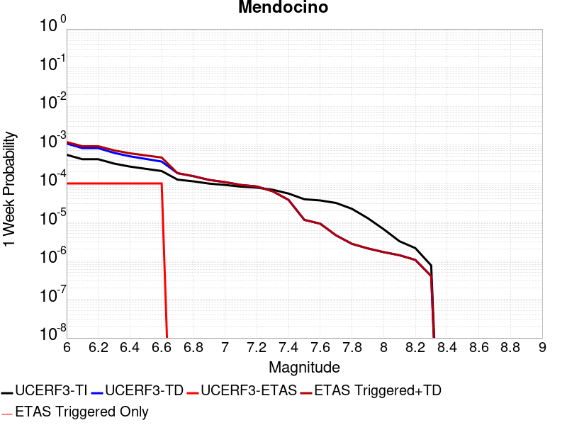 |  |  | 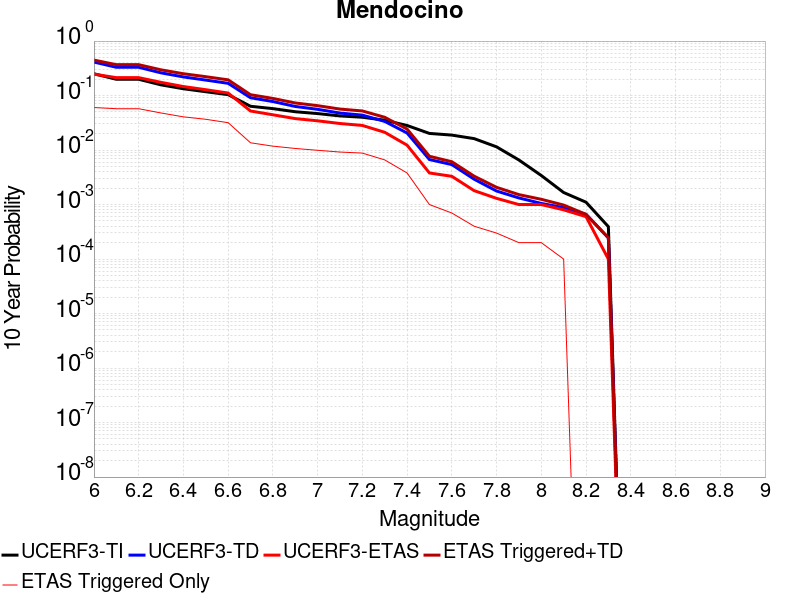 |

| Magnitude | 1 wk TI Prob | 1 wk TD Prob | 1 wk ETAS Prob | 1 wk ETAS/TD Gain | 1 wk ETAS Triggered+TD | 1 wk ETAS Triggered Only | 1 mo TI Prob | 1 mo TD Prob | 1 mo ETAS Prob | 1 mo ETAS/TD Gain | 1 mo ETAS Triggered+TD | 1 mo ETAS Triggered Only | 1 yr TI Prob | 1 yr TD Prob | 1 yr ETAS Prob | 1 yr ETAS/TD Gain | 1 yr ETAS Triggered+TD | 1 yr ETAS Triggered Only | 10 yr TI Prob | 10 yr TD Prob | 10 yr ETAS Prob | 10 yr ETAS/TD Gain | 10 yr ETAS Triggered+TD | 10 yr ETAS Triggered Only |
|-----|-----|-----|-----|-----|-----|-----|-----|-----|-----|-----|-----|-----|-----|-----|-----|-----|-----|-----|-----|-----|-----|-----|-----|-----|
| 6.0 | 5.5409013E-4 | 0.0010850606 | 1.0E-4 | 0.09216074 | 0.0011849522 | 1.0E-4 | 0.0023725112 | 0.0046397946 | 0.0014 | 0.30173752 | 0.005237011 | 6.0E-4 | 0.028505474 | 0.054724433 | 0.0311 | 0.5683019 | 0.06483888 | 0.0107 | 0.25113493 | 0.41214746 | 0.2473 | 0.600028 | 0.44759497 | 0.0603 |
| 6.1 | 4.2515888E-4 | 8.2371355E-4 | 1.0E-4 | 0.12140142 | 9.236312E-4 | 1.0E-4 | 0.0018208373 | 0.0035237134 | 0.0012 | 0.34054983 | 0.0041215993 | 6.0E-4 | 0.021944538 | 0.04179297 | 0.0268 | 0.64125615 | 0.051758323 | 0.0104 | 0.19899574 | 0.33021927 | 0.2131 | 0.6453288 | 0.36866468 | 0.0574 |
| 6.2 | 4.2515888E-4 | 8.2371355E-4 | 1.0E-4 | 0.12140142 | 9.236312E-4 | 1.0E-4 | 0.0018208373 | 0.0035237134 | 0.0012 | 0.34054983 | 0.0041215993 | 6.0E-4 | 0.021944538 | 0.04179297 | 0.0268 | 0.64125615 | 0.051758323 | 0.0104 | 0.19899574 | 0.33021927 | 0.2131 | 0.6453288 | 0.36866468 | 0.0574 |
| 6.3 | 3.2773745E-4 | 6.201148E-4 | 1.0E-4 | 0.16126046 | 7.200528E-4 | 1.0E-4 | 0.0014038329 | 0.0026536607 | 0.001 | 0.3768379 | 0.0032520685 | 6.0E-4 | 0.016958237 | 0.031632178 | 0.0214 | 0.6765263 | 0.03947596 | 0.0081 | 0.1572094 | 0.2610482 | 0.1747 | 0.6692251 | 0.29644397 | 0.0479 |
| 6.4 | 2.7417165E-4 | 5.055229E-4 | 1.0E-4 | 0.19781499 | 6.054723E-4 | 1.0E-4 | 0.0011744922 | 0.0021637315 | 8.0E-4 | 0.36973163 | 0.002562866 | 4.0E-4 | 0.014205975 | 0.025876308 | 0.0177 | 0.6840234 | 0.032305524 | 0.0066 | 0.13331394 | 0.21975589 | 0.1463 | 0.6657387 | 0.25151184 | 0.0407 |
| 6.5 | 2.3984899E-4 | 4.3308566E-4 | 1.0E-4 | 0.2309012 | 5.3304236E-4 | 1.0E-4 | 0.0010275192 | 0.0018539155 | 6.0E-4 | 0.32363933 | 0.0021533594 | 3.0E-4 | 0.012438473 | 0.022218168 | 0.0151 | 0.679624 | 0.027889302 | 0.0058 | 0.11764851 | 0.192315 | 0.1281 | 0.6660947 | 0.22195703 | 0.0367 |
| 6.6 | 2.1023539E-4 | 3.700633E-4 | 1.0E-4 | 0.27022403 | 4.7002628E-4 | 1.0E-4 | 9.0069766E-4 | 0.0015843428 | 5.0E-4 | 0.31558827 | 0.0018838674 | 3.0E-4 | 0.010910975 | 0.019026458 | 0.0132 | 0.6937707 | 0.024225619 | 0.0053 | 0.10390546 | 0.16777332 | 0.1112 | 0.66279906 | 0.19423814 | 0.0318 |
| 6.7 | 1.2592976E-4 | 1.8493446E-4 | 0.0 | 0.0 | 1.8493446E-4 | 0.0 | 5.395873E-4 | 7.9224136E-4 | 3.0E-4 | 0.37867248 | 8.921621E-4 | 1.0E-4 | 0.006549705 | 0.009591276 | 0.0053 | 0.5525855 | 0.011374012 | 0.0018 | 0.063599944 | 0.09126242 | 0.0521 | 0.5708812 | 0.10362126 | 0.0136 |
| 6.8 | 1.13663555E-4 | 1.5465546E-4 | 0.0 | 0.0 | 1.5465546E-4 | 0.0 | 4.8703855E-4 | 6.6260475E-4 | 3.0E-4 | 0.4527586 | 7.625385E-4 | 1.0E-4 | 0.0059135845 | 0.008033197 | 0.0046 | 0.5726238 | 0.009719541 | 0.0017 | 0.057586733 | 0.07767817 | 0.0444 | 0.5715892 | 0.088561565 | 0.0118 |
| 6.9 | 9.926894E-5 | 1.2360701E-4 | 0.0 | 0.0 | 1.2360701E-4 | 0.0 | 4.2536893E-4 | 5.296286E-4 | 2.0E-4 | 0.3776231 | 6.2957563E-4 | 1.0E-4 | 0.0051665753 | 0.006428183 | 0.0041 | 0.6378163 | 0.008117255 | 0.0017 | 0.050480947 | 0.06313469 | 0.0378 | 0.59871995 | 0.07315915 | 0.0107 |
| 7.0 | 9.168125E-5 | 1.0842653E-4 | 0.0 | 0.0 | 1.0842653E-4 | 0.0 | 3.9286047E-4 | 4.645977E-4 | 2.0E-4 | 0.43047997 | 5.645512E-4 | 1.0E-4 | 0.004772591 | 0.0056414455 | 0.0038 | 0.67358625 | 0.0071329833 | 0.0015 | 0.04671385 | 0.055890445 | 0.0344 | 0.61548984 | 0.06523713 | 0.0099 |
| 7.1 | 8.2854116E-5 | 9.161518E-5 | 0.0 | 0.0 | 9.161518E-5 | 0.0 | 3.5504074E-4 | 3.9257773E-4 | 1.0E-4 | 0.25472665 | 4.9253844E-4 | 1.0E-4 | 0.004314056 | 0.0047692237 | 0.0033 | 0.6919365 | 0.0060630236 | 0.0013 | 0.042312626 | 0.04774257 | 0.0307 | 0.643032 | 0.056503337 | 0.0092 |
| 7.2 | 7.8255274E-5 | 8.355417E-5 | 0.0 | 0.0 | 8.355417E-5 | 0.0 | 3.3533663E-4 | 3.58041E-4 | 1.0E-4 | 0.27929762 | 4.5800518E-4 | 1.0E-4 | 0.0040750825 | 0.0043505854 | 0.0033 | 0.7585186 | 0.0056449296 | 0.0013 | 0.040011603 | 0.04378163 | 0.0283 | 0.64638984 | 0.05219635 | 0.0088 |
| 7.3 | 6.887904E-5 | 6.302927E-5 | 0.0 | 0.0 | 6.302927E-5 | 0.0 | 2.9516246E-4 | 2.7009804E-4 | 1.0E-4 | 0.37023595 | 3.70071E-4 | 1.0E-4 | 0.0035876823 | 0.003283583 | 0.0025 | 0.7613634 | 0.0042802994 | 0.001 | 0.035303112 | 0.03356215 | 0.0212 | 0.631664 | 0.03994064 | 0.0066 |
| 7.4 | 5.4898497E-5 | 3.7690043E-5 | 0.0 | 0.0 | 3.7690043E-5 | 0.0 | 2.3525805E-4 | 1.6151907E-4 | 1.0E-4 | 0.6191219 | 2.6150292E-4 | 1.0E-4 | 0.0028605047 | 0.0019647782 | 0.0016 | 0.81434137 | 0.0025635993 | 6.0E-4 | 0.02823963 | 0.020560592 | 0.0123 | 0.5982318 | 0.024282463 | 0.0038 |
| 7.5 | 3.9103943E-5 | 1.1429893E-5 | 0.0 | 0.0 | 1.1429893E-5 | 0.0 | 1.6757756E-4 | 4.898434E-5 | 0.0 | 0.0 | 4.898434E-5 | 0.0 | 0.0020383475 | 5.962228E-4 | 3.0E-4 | 0.5031676 | 6.9616316E-4 | 1.0E-4 | 0.020197518 | 0.0066977576 | 0.0038 | 0.567354 | 0.00769106 | 0.001 |
| 7.6 | 3.641042E-5 | 9.092579E-6 | 0.0 | 0.0 | 9.092579E-6 | 0.0 | 1.5603533E-4 | 3.896762E-5 | 0.0 | 0.0 | 3.896762E-5 | 0.0 | 0.0018980748 | 4.7432887E-4 | 3.0E-4 | 0.6324726 | 5.7428144E-4 | 1.0E-4 | 0.018819444 | 0.0054142023 | 0.0033 | 0.6095081 | 0.006110412 | 7.0E-4 |
| 7.7 | 3.1318774E-5 | 4.5381566E-6 | 0.0 | 0.0 | 4.5381566E-6 | 0.0 | 1.342164E-4 | 1.9449099E-5 | 0.0 | 0.0 | 1.9449099E-5 | 0.0 | 0.0016328598 | 2.3676723E-4 | 2.0E-4 | 0.8447115 | 3.3674354E-4 | 1.0E-4 | 0.016209139 | 0.0029177945 | 0.0018 | 0.6169043 | 0.0033166273 | 4.0E-4 |
| 7.8 | 2.209241E-5 | 2.7360406E-6 | 0.0 | 0.0 | 2.7360406E-6 | 0.0 | 9.467832E-5 | 1.1725836E-5 | 0.0 | 0.0 | 1.1725836E-5 | 0.0 | 0.001152099 | 1.4275273E-4 | 2.0E-4 | 1.401024 | 2.4273846E-4 | 1.0E-4 | 0.011461443 | 0.001771785 | 0.0013 | 0.73372334 | 0.0020712535 | 3.0E-4 |
| 7.9 | 1.2640477E-5 | 2.082239E-6 | 0.0 | 0.0 | 2.082239E-6 | 0.0 | 5.4172346E-5 | 8.923851E-6 | 0.0 | 0.0 | 8.923851E-6 | 0.0 | 6.593487E-4 | 1.0864249E-4 | 2.0E-4 | 1.8409003 | 2.0863162E-4 | 1.0E-4 | 0.006573958 | 0.0013222416 | 0.001 | 0.75629145 | 0.0015219771 | 2.0E-4 |
| 8.0 | 6.5548907E-6 | 1.6698185E-6 | 0.0 | 0.0 | 1.6698185E-6 | 0.0 | 2.8092087E-5 | 7.1563454E-6 | 0.0 | 0.0 | 7.1563454E-6 | 0.0 | 3.4196748E-4 | 8.7125045E-5 | 2.0E-4 | 2.2955513 | 1.8711633E-4 | 1.0E-4 | 0.0034144172 | 0.0010493487 | 0.001 | 0.95297205 | 0.0012491388 | 2.0E-4 |
| 8.1 | 3.1916707E-6 | 1.3858776E-6 | 0.0 | 0.0 | 1.3858776E-6 | 0.0 | 1.3678517E-5 | 5.939462E-6 | 0.0 | 0.0 | 5.939462E-6 | 0.0 | 1.6652321E-4 | 7.231058E-5 | 2.0E-4 | 2.7658472 | 1.7230335E-4 | 1.0E-4 | 0.0016639848 | 8.78812E-4 | 8.0E-4 | 0.91031986 | 9.787241E-4 | 1.0E-4 |
| 8.2 | 2.1193785E-6 | 1.0496494E-6 | 0.0 | 0.0 | 1.0496494E-6 | 0.0 | 9.083019E-6 | 4.49849E-6 | 0.0 | 0.0 | 4.49849E-6 | 0.0 | 1.1058014E-4 | 5.476776E-5 | 1.0E-4 | 1.8258917 | 5.476776E-5 | 0.0 | 0.0011052513 | 6.614948E-4 | 6.0E-4 | 0.90703666 | 6.614948E-4 | 0.0 |
| 8.3 | 7.536878E-7 | 3.9912942E-7 | 0.0 | 0.0 | 3.9912942E-7 | 0.0 | 3.2300866E-6 | 1.7105536E-6 | 0.0 | 0.0 | 1.7105536E-6 | 0.0 | 3.9325594E-5 | 2.0825804E-5 | 0.0 | 0.0 | 2.0825804E-5 | 0.0 | 3.9318635E-4 | 2.449408E-4 | 1.0E-4 | 0.4082619 | 2.449408E-4 | 0.0 |

## San Andreas (Creeping Section) 2011 CFM
*[(top)](#table-of-contents)*

| 1 Week | 1 Month | 1 Year | 10 Year |
|-----|-----|-----|-----|
| 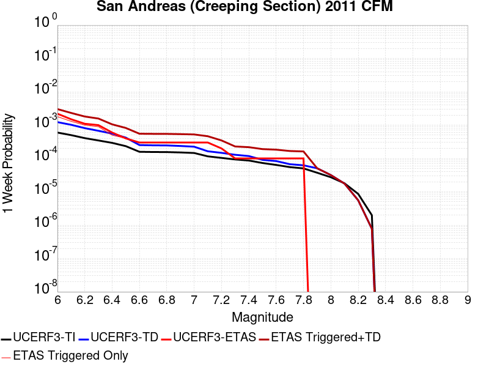 |  |  |  |

| Magnitude | 1 wk TI Prob | 1 wk TD Prob | 1 wk ETAS Prob | 1 wk ETAS/TD Gain | 1 wk ETAS Triggered+TD | 1 wk ETAS Triggered Only | 1 mo TI Prob | 1 mo TD Prob | 1 mo ETAS Prob | 1 mo ETAS/TD Gain | 1 mo ETAS Triggered+TD | 1 mo ETAS Triggered Only | 1 yr TI Prob | 1 yr TD Prob | 1 yr ETAS Prob | 1 yr ETAS/TD Gain | 1 yr ETAS Triggered+TD | 1 yr ETAS Triggered Only | 10 yr TI Prob | 10 yr TD Prob | 10 yr ETAS Prob | 10 yr ETAS/TD Gain | 10 yr ETAS Triggered+TD | 10 yr ETAS Triggered Only |
|-----|-----|-----|-----|-----|-----|-----|-----|-----|-----|-----|-----|-----|-----|-----|-----|-----|-----|-----|-----|-----|-----|-----|-----|-----|
| 6.0 | 5.986481E-4 | 0.0012294572 | 0.0022 | 1.7894075 | 0.0030272442 | 0.0018 | 0.0025631124 | 0.005253481 | 0.0068 | 1.2943797 | 0.008934043 | 0.0037 | 0.030762846 | 0.061296232 | 0.0446 | 0.72761405 | 0.07134036 | 0.0107 | 0.26835477 | 0.42641038 | 0.3299 | 0.7736678 | 0.45457363 | 0.0491 |
| 6.1 | 5.015945E-4 | 0.0010233397 | 0.0015 | 1.465789 | 0.0023220093 | 0.0013 | 0.00214792 | 0.0043744077 | 0.0053 | 1.2115927 | 0.007460847 | 0.0031 | 0.025839351 | 0.051324286 | 0.0361 | 0.70337075 | 0.0597675 | 0.0089 | 0.23032776 | 0.37331077 | 0.2739 | 0.73370504 | 0.39768898 | 0.0389 |
| 6.2 | 4.073338E-4 | 8.122463E-4 | 0.0011 | 1.354269 | 0.001811434 | 0.001 | 0.0017445484 | 0.003473561 | 0.0045 | 1.2955005 | 0.0060645295 | 0.0026 | 0.021034058 | 0.041008517 | 0.0295 | 0.7193628 | 0.048009153 | 0.0073 | 0.19150782 | 0.31352505 | 0.2314 | 0.73805904 | 0.33604142 | 0.0328 |
| 6.3 | 3.464099E-4 | 6.754359E-4 | 0.001 | 1.4805255 | 0.0015748279 | 9.0E-4 | 0.0014837692 | 0.0028893915 | 0.0039 | 1.3497652 | 0.005282457 | 0.0024 | 0.017915873 | 0.034265514 | 0.0257 | 0.7500252 | 0.040639363 | 0.0066 | 0.16538359 | 0.27183846 | 0.1988 | 0.7313166 | 0.2926639 | 0.0286 |
| 6.4 | 2.935057E-4 | 5.5594655E-4 | 6.0E-4 | 1.0792404 | 0.0010556686 | 5.0E-4 | 0.0012572751 | 0.0023789937 | 0.0028 | 1.1769682 | 0.0040749493 | 0.0017 | 0.015200248 | 0.02834118 | 0.0215 | 0.7586134 | 0.033199474 | 0.005 | 0.14201577 | 0.23353614 | 0.1674 | 0.7168056 | 0.25170133 | 0.0237 |
| 6.5 | 2.3409708E-4 | 4.2244766E-4 | 4.0E-4 | 0.9468628 | 8.222787E-4 | 4.0E-4 | 0.0010028875 | 0.0018084403 | 0.0019 | 1.0506291 | 0.0032059085 | 0.0014 | 0.012141965 | 0.021664744 | 0.015 | 0.6923691 | 0.025675919 | 0.0041 | 0.11499573 | 0.18740804 | 0.1281 | 0.6835352 | 0.202441 | 0.0185 |
| 6.6 | 1.5842178E-4 | 2.5219817E-4 | 3.0E-4 | 1.1895407 | 5.5212254E-4 | 3.0E-4 | 6.7877385E-4 | 0.0010803917 | 8.0E-4 | 0.7404722 | 0.0016797434 | 6.0E-4 | 0.0082328 | 0.013073064 | 0.0085 | 0.65019184 | 0.015244303 | 0.0022 | 0.07934396 | 0.123773485 | 0.0778 | 0.6285676 | 0.13455108 | 0.0123 |
| 6.7 | 1.5616413E-4 | 2.4756E-4 | 3.0E-4 | 1.2118274 | 5.474857E-4 | 3.0E-4 | 6.691031E-4 | 0.0010605331 | 8.0E-4 | 0.7543376 | 0.0016598967 | 6.0E-4 | 0.0081159435 | 0.012834754 | 0.0084 | 0.654473 | 0.015006517 | 0.0022 | 0.0782586 | 0.12180069 | 0.077 | 0.63218033 | 0.1324269 | 0.0121 |
| 6.8 | 1.5538467E-4 | 2.4579527E-4 | 3.0E-4 | 1.220528 | 5.457215E-4 | 3.0E-4 | 6.6576427E-4 | 0.0010529773 | 8.0E-4 | 0.7597504 | 0.0016523455 | 6.0E-4 | 0.008075596 | 0.012743999 | 0.0083 | 0.65128696 | 0.014915962 | 0.0022 | 0.07788358 | 0.12103095 | 0.0762 | 0.62959105 | 0.13166647 | 0.0121 |
| 6.9 | 1.5153569E-4 | 2.3687514E-4 | 3.0E-4 | 1.26649 | 5.368041E-4 | 3.0E-4 | 6.49277E-4 | 0.0010147862 | 8.0E-4 | 0.78834337 | 0.0016141774 | 6.0E-4 | 0.007876333 | 0.0122855585 | 0.0081 | 0.6593107 | 0.01445853 | 0.0022 | 0.07602952 | 0.11709893 | 0.0738 | 0.6302363 | 0.12751716 | 0.0118 |
| 7.0 | 1.4588932E-4 | 2.2543047E-4 | 3.0E-4 | 1.3307873 | 5.2536285E-4 | 3.0E-4 | 6.250901E-4 | 9.657749E-4 | 8.0E-4 | 0.8283504 | 0.0015651954 | 6.0E-4 | 0.0075839474 | 0.0116954185 | 0.0077 | 0.65837747 | 0.013770859 | 0.0021 | 0.073302895 | 0.11194227 | 0.0707 | 0.6315756 | 0.12224374 | 0.0116 |
| 7.1 | 1.1565079E-4 | 1.640851E-4 | 3.0E-4 | 1.8283197 | 4.6403587E-4 | 3.0E-4 | 4.955521E-4 | 7.030332E-4 | 6.0E-4 | 0.8534448 | 0.0012026817 | 5.0E-4 | 0.006016669 | 0.008526041 | 0.0056 | 0.6568113 | 0.010211547 | 0.0017 | 0.058563538 | 0.08423544 | 0.0526 | 0.6244403 | 0.09266047 | 0.0092 |
| 7.2 | 1.0393792E-4 | 1.4735112E-4 | 2.0E-4 | 1.3573022 | 3.4732165E-4 | 2.0E-4 | 4.4537216E-4 | 6.3135277E-4 | 5.0E-4 | 0.7919503 | 0.0010311002 | 4.0E-4 | 0.005408933 | 0.0076598004 | 0.005 | 0.65275854 | 0.008949842 | 0.0013 | 0.052791595 | 0.07615815 | 0.0481 | 0.6315804 | 0.083271734 | 0.0077 |
| 7.3 | 9.332884E-5 | 1.2885488E-4 | 1.0E-4 | 0.77606684 | 2.28842E-4 | 1.0E-4 | 3.999194E-4 | 5.5211893E-4 | 2.0E-4 | 0.3622408 | 6.5206375E-4 | 1.0E-4 | 0.0048581534 | 0.006701466 | 0.0042 | 0.62672853 | 0.007694765 | 0.001 | 0.047533102 | 0.06696404 | 0.0432 | 0.6451224 | 0.073308684 | 0.0068 |
| 7.4 | 8.670252E-5 | 1.1801028E-4 | 1.0E-4 | 0.84738386 | 2.1799847E-4 | 1.0E-4 | 3.715293E-4 | 5.056609E-4 | 2.0E-4 | 0.39552197 | 6.056103E-4 | 1.0E-4 | 0.004513991 | 0.0061391653 | 0.0036 | 0.58639896 | 0.006934254 | 8.0E-4 | 0.044233937 | 0.06160397 | 0.0397 | 0.644439 | 0.067328185 | 0.0061 |
| 7.5 | 7.3036405E-5 | 9.0883776E-5 | 1.0E-4 | 1.1003064 | 1.9087469E-4 | 1.0E-4 | 3.129756E-4 | 3.8944383E-4 | 2.0E-4 | 0.51355284 | 4.894049E-4 | 1.0E-4 | 0.0038038217 | 0.0047311923 | 0.0028 | 0.591817 | 0.0053283535 | 6.0E-4 | 0.03739367 | 0.048271865 | 0.0304 | 0.62976646 | 0.051983602 | 0.0039 |
| 7.6 | 6.3935775E-5 | 8.354626E-5 | 1.0E-4 | 1.1969416 | 1.8353791E-4 | 1.0E-4 | 2.7398168E-4 | 3.5800636E-4 | 2.0E-4 | 0.5586493 | 4.5797057E-4 | 1.0E-4 | 0.0033306254 | 0.0043500355 | 0.0028 | 0.64367294 | 0.0049474253 | 6.0E-4 | 0.032811474 | 0.04434653 | 0.0286 | 0.6449208 | 0.047882445 | 0.0037 |
| 7.7 | 5.5050095E-5 | 6.7277506E-5 | 1.0E-4 | 1.4863809 | 1.6727077E-4 | 1.0E-4 | 2.3590765E-4 | 2.883003E-4 | 2.0E-4 | 0.69372106 | 3.882715E-4 | 1.0E-4 | 0.0028683927 | 0.0035044113 | 0.0023 | 0.6563157 | 0.004102309 | 6.0E-4 | 0.0283165 | 0.036116015 | 0.0231 | 0.6396054 | 0.038622115 | 0.0026 |
| 7.8 | 5.027131E-5 | 6.223074E-5 | 1.0E-4 | 1.6069229 | 1.6222452E-4 | 1.0E-4 | 2.1543067E-4 | 2.6667592E-4 | 2.0E-4 | 0.74997395 | 3.6664927E-4 | 1.0E-4 | 0.0026197135 | 0.003241949 | 0.0021 | 0.6477585 | 0.0038400039 | 6.0E-4 | 0.025890453 | 0.03342009 | 0.021 | 0.62836456 | 0.035643224 | 0.0023 |
| 7.9 | 3.7271806E-5 | 5.070892E-5 | 0.0 | 0.0 | 5.070892E-5 | 0.0 | 1.5972654E-4 | 2.1730586E-4 | 0.0 | 0.0 | 2.1730586E-4 | 0.0 | 0.0019429359 | 0.002642491 | 0.0018 | 0.68117553 | 0.0031411697 | 5.0E-4 | 0.019260362 | 0.027306098 | 0.0173 | 0.63355815 | 0.029251486 | 0.002 |
| 8.0 | 2.7310243E-5 | 3.1747943E-5 | 0.0 | 0.0 | 3.1747943E-5 | 0.0 | 1.17038646E-4 | 1.3605552E-4 | 0.0 | 0.0 | 1.3605552E-4 | 0.0 | 0.0014240141 | 0.0016552182 | 0.0012 | 0.72498 | 0.002054556 | 4.0E-4 | 0.014149235 | 0.017377267 | 0.0099 | 0.56970984 | 0.018556414 | 0.0012 |
| 8.1 | 1.7940547E-5 | 1.7604752E-5 | 0.0 | 0.0 | 1.7604752E-5 | 0.0 | 7.688579E-5 | 7.544676E-5 | 0.0 | 0.0 | 7.544676E-5 | 0.0 | 9.3568244E-4 | 9.181777E-4 | 8.0E-4 | 0.871291 | 0.0012179023 | 3.0E-4 | 0.009317525 | 0.009907027 | 0.0052 | 0.52488 | 0.010600092 | 7.0E-4 |
| 8.2 | 8.643924E-6 | 5.556491E-6 | 0.0 | 0.0 | 5.556491E-6 | 0.0 | 3.704486E-5 | 2.3813316E-5 | 0.0 | 0.0 | 2.3813316E-5 | 0.0 | 4.5092785E-4 | 2.8988862E-4 | 2.0E-4 | 0.6899201 | 3.8985963E-4 | 1.0E-4 | 0.0045001395 | 0.0032934055 | 0.0021 | 0.63763785 | 0.0035924173 | 3.0E-4 |
| 8.3 | 1.983087E-6 | 7.792044E-7 | 0.0 | 0.0 | 7.792044E-7 | 0.0 | 8.498917E-6 | 3.3394433E-6 | 0.0 | 0.0 | 3.3394433E-6 | 0.0 | 1.034694E-4 | 4.065698E-5 | 0.0 | 0.0 | 4.065698E-5 | 0.0 | 0.0010342124 | 4.7958124E-4 | 2.0E-4 | 0.41703048 | 4.7958124E-4 | 0.0 |

## San Andreas (Mojave S)
*[(top)](#table-of-contents)*

| 1 Week | 1 Month | 1 Year | 10 Year |
|-----|-----|-----|-----|
|  |  |  |  |

| Magnitude | 1 wk TI Prob | 1 wk TD Prob | 1 wk ETAS Prob | 1 wk ETAS/TD Gain | 1 wk ETAS Triggered+TD | 1 wk ETAS Triggered Only | 1 mo TI Prob | 1 mo TD Prob | 1 mo ETAS Prob | 1 mo ETAS/TD Gain | 1 mo ETAS Triggered+TD | 1 mo ETAS Triggered Only | 1 yr TI Prob | 1 yr TD Prob | 1 yr ETAS Prob | 1 yr ETAS/TD Gain | 1 yr ETAS Triggered+TD | 1 yr ETAS Triggered Only | 10 yr TI Prob | 10 yr TD Prob | 10 yr ETAS Prob | 10 yr ETAS/TD Gain | 10 yr ETAS Triggered+TD | 10 yr ETAS Triggered Only |
|-----|-----|-----|-----|-----|-----|-----|-----|-----|-----|-----|-----|-----|-----|-----|-----|-----|-----|-----|-----|-----|-----|-----|-----|-----|
| 6.0 | 3.1064058E-4 | 6.7614485E-4 | 2.0E-4 | 0.2957946 | 6.7614485E-4 | 0.0 | 0.0013306376 | 0.002894674 | 0.0013 | 0.44910067 | 0.003293516 | 4.0E-4 | 0.016080605 | 0.034642242 | 0.0205 | 0.5917631 | 0.03908289 | 0.0046 | 0.1496549 | 0.287114 | 0.21 | 0.73141676 | 0.3171265 | 0.0421 |
| 6.1 | 3.1064058E-4 | 6.7614485E-4 | 2.0E-4 | 0.2957946 | 6.7614485E-4 | 0.0 | 0.0013306376 | 0.002894674 | 0.0013 | 0.44910067 | 0.003293516 | 4.0E-4 | 0.016080605 | 0.034642242 | 0.0205 | 0.5917631 | 0.03908289 | 0.0046 | 0.1496549 | 0.287114 | 0.21 | 0.73141676 | 0.3171265 | 0.0421 |
| 6.2 | 3.1064058E-4 | 6.7614485E-4 | 2.0E-4 | 0.2957946 | 6.7614485E-4 | 0.0 | 0.0013306376 | 0.002894674 | 0.0013 | 0.44910067 | 0.003293516 | 4.0E-4 | 0.016080605 | 0.034642242 | 0.0205 | 0.5917631 | 0.03908289 | 0.0046 | 0.1496549 | 0.287114 | 0.21 | 0.73141676 | 0.3171265 | 0.0421 |
| 6.3 | 3.1064058E-4 | 6.7614485E-4 | 2.0E-4 | 0.2957946 | 6.7614485E-4 | 0.0 | 0.0013306376 | 0.002894674 | 0.0013 | 0.44910067 | 0.003293516 | 4.0E-4 | 0.016080605 | 0.034642242 | 0.0205 | 0.5917631 | 0.03908289 | 0.0046 | 0.1496549 | 0.287114 | 0.21 | 0.73141676 | 0.3171265 | 0.0421 |
| 6.4 | 1.9872203E-4 | 4.3325502E-4 | 2.0E-4 | 0.46162188 | 4.3325502E-4 | 0.0 | 8.5138786E-4 | 0.0018555141 | 0.001 | 0.5389342 | 0.0021549575 | 3.0E-4 | 0.010316478 | 0.022363031 | 0.0138 | 0.61708987 | 0.024611596 | 0.0023 | 0.098504856 | 0.19754294 | 0.146 | 0.73907983 | 0.21832658 | 0.0259 |
| 6.5 | 1.291105E-4 | 2.8891396E-4 | 0.0 | 0.0 | 2.8891396E-4 | 0.0 | 5.5321335E-4 | 0.0012376178 | 5.0E-4 | 0.40400192 | 0.0014373703 | 2.0E-4 | 0.006714592 | 0.014964725 | 0.0098 | 0.6548734 | 0.016934795 | 0.002 | 0.065152965 | 0.13860643 | 0.0986 | 0.7113667 | 0.15221645 | 0.0158 |
| 6.6 | 1.291105E-4 | 2.8891396E-4 | 0.0 | 0.0 | 2.8891396E-4 | 0.0 | 5.5321335E-4 | 0.0012376178 | 5.0E-4 | 0.40400192 | 0.0014373703 | 2.0E-4 | 0.006714592 | 0.014964725 | 0.0098 | 0.6548734 | 0.016934795 | 0.002 | 0.065152965 | 0.13860643 | 0.0986 | 0.7113667 | 0.15221645 | 0.0158 |
| 6.7 | 1.08001186E-4 | 2.4470594E-4 | 0.0 | 0.0 | 2.4470594E-4 | 0.0 | 4.6278012E-4 | 0.0010483188 | 5.0E-4 | 0.47695413 | 0.0012481092 | 2.0E-4 | 0.0056198016 | 0.012688892 | 0.008 | 0.6304727 | 0.014466052 | 0.0018 | 0.054797906 | 0.11975181 | 0.0821 | 0.6855846 | 0.13093096 | 0.0127 |
| 6.8 | 1.0624356E-4 | 2.3987883E-4 | 0.0 | 0.0 | 2.3987883E-4 | 0.0 | 4.5525006E-4 | 0.0010276476 | 4.0E-4 | 0.38923848 | 0.0011275449 | 1.0E-4 | 0.0055285925 | 0.012440112 | 0.0073 | 0.5868114 | 0.014118964 | 0.0017 | 0.053930566 | 0.11770056 | 0.0799 | 0.6788413 | 0.12864107 | 0.0124 |
| 6.9 | 1.0393785E-4 | 2.3357698E-4 | 0.0 | 0.0 | 2.3357698E-4 | 0.0 | 4.4537184E-4 | 0.0010006606 | 4.0E-4 | 0.39973593 | 0.0011005605 | 1.0E-4 | 0.0054089287 | 0.01211524 | 0.007 | 0.57778466 | 0.013695856 | 0.0016 | 0.05279156 | 0.11500356 | 0.0773 | 0.6721531 | 0.12562352 | 0.012 |
| 7.0 | 1.0155622E-4 | 2.272661E-4 | 0.0 | 0.0 | 2.272661E-4 | 0.0 | 4.3516833E-4 | 9.7363436E-4 | 4.0E-4 | 0.41083184 | 0.001073537 | 1.0E-4 | 0.005285311 | 0.011789798 | 0.0069 | 0.58525175 | 0.013370934 | 0.0016 | 0.05161361 | 0.11226757 | 0.0749 | 0.66715616 | 0.12256527 | 0.0116 |
| 7.1 | 9.885595E-5 | 2.2014316E-4 | 0.0 | 0.0 | 2.2014316E-4 | 0.0 | 4.2359953E-4 | 9.4312994E-4 | 4.0E-4 | 0.4241197 | 0.0010430356 | 1.0E-4 | 0.0051451353 | 0.011422354 | 0.0064 | 0.5603048 | 0.0128063625 | 0.0014 | 0.05027629 | 0.10915666 | 0.0716 | 0.65593797 | 0.11895594 | 0.011 |
| 7.2 | 9.6411415E-5 | 2.1376653E-4 | 0.0 | 0.0 | 2.1376653E-4 | 0.0 | 4.1312634E-4 | 9.158209E-4 | 4.0E-4 | 0.43676662 | 0.0010157293 | 1.0E-4 | 0.005018219 | 0.011093299 | 0.0062 | 0.55889595 | 0.012477769 | 0.0014 | 0.049064007 | 0.10634643 | 0.069 | 0.6488229 | 0.11599789 | 0.0108 |
| 7.3 | 9.1180635E-5 | 1.960148E-4 | 0.0 | 0.0 | 1.960148E-4 | 0.0 | 3.907156E-4 | 8.39793E-4 | 4.0E-4 | 0.47630784 | 9.397091E-4 | 1.0E-4 | 0.004746591 | 0.010176661 | 0.0057 | 0.5601051 | 0.0115624145 | 0.0014 | 0.046464786 | 0.09852317 | 0.0636 | 0.64553344 | 0.10717735 | 0.0096 |
| 7.4 | 8.887388E-5 | 1.884855E-4 | 0.0 | 0.0 | 1.884855E-4 | 0.0 | 3.8083247E-4 | 8.07545E-4 | 3.0E-4 | 0.37149632 | 9.0746424E-4 | 1.0E-4 | 0.0046267817 | 0.009787637 | 0.0054 | 0.5517164 | 0.011074913 | 0.0013 | 0.045316286 | 0.09515629 | 0.0612 | 0.6431524 | 0.103390366 | 0.0091 |
| 7.5 | 8.6750515E-5 | 1.8178765E-4 | 0.0 | 0.0 | 1.8178765E-4 | 0.0 | 3.7173493E-4 | 7.788573E-4 | 3.0E-4 | 0.38517964 | 8.7877945E-4 | 1.0E-4 | 0.004516484 | 0.0094414465 | 0.0053 | 0.5613547 | 0.010729172 | 0.0013 | 0.04425787 | 0.092116095 | 0.0593 | 0.6437529 | 0.10028705 | 0.009 |
| 7.6 | 8.453092E-5 | 1.7564715E-4 | 0.0 | 0.0 | 1.7564715E-4 | 0.0 | 3.6222505E-4 | 7.5255637E-4 | 3.0E-4 | 0.39864123 | 8.524811E-4 | 1.0E-4 | 0.0044011753 | 0.009123959 | 0.0053 | 0.5808882 | 0.010412097 | 0.0013 | 0.04315024 | 0.089273594 | 0.0576 | 0.6452076 | 0.097196914 | 0.0087 |
| 7.7 | 8.259102E-5 | 1.7085469E-4 | 0.0 | 0.0 | 1.7085469E-4 | 0.0 | 3.539135E-4 | 7.32029E-4 | 3.0E-4 | 0.40981984 | 8.3195575E-4 | 1.0E-4 | 0.004300386 | 0.008876102 | 0.0051 | 0.5745765 | 0.010164564 | 0.0013 | 0.042181134 | 0.08701867 | 0.0564 | 0.6481368 | 0.09477901 | 0.0085 |
| 7.8 | 7.444844E-5 | 1.5396815E-4 | 0.0 | 0.0 | 1.5396815E-4 | 0.0 | 3.1902574E-4 | 6.596967E-4 | 3.0E-4 | 0.45475444 | 7.596307E-4 | 1.0E-4 | 0.0038772223 | 0.008002278 | 0.0042 | 0.5248505 | 0.008994277 | 0.001 | 0.03810269 | 0.07880486 | 0.0505 | 0.6408234 | 0.0856217 | 0.0074 |
| 7.9 | 5.2586525E-5 | 1.0084274E-4 | 0.0 | 0.0 | 1.0084274E-4 | 0.0 | 2.2535135E-4 | 4.321116E-4 | 1.0E-4 | 0.2314217 | 4.321116E-4 | 0.0 | 0.0027402006 | 0.00524828 | 0.0028 | 0.5335082 | 0.005944606 | 7.0E-4 | 0.027066574 | 0.052563623 | 0.0324 | 0.6163959 | 0.056542855 | 0.0042 |
| 8.0 | 3.379877E-5 | 5.452445E-5 | 0.0 | 0.0 | 5.452445E-5 | 0.0 | 1.4484383E-4 | 2.336553E-4 | 1.0E-4 | 0.42798087 | 2.336553E-4 | 0.0 | 0.0017620471 | 0.002841044 | 0.0014 | 0.4927766 | 0.0032399076 | 4.0E-4 | 0.017481409 | 0.029056435 | 0.0158 | 0.54376936 | 0.031095417 | 0.0021 |
| 8.1 | 1.8668277E-5 | 1.9523522E-5 | 0.0 | 0.0 | 1.9523522E-5 | 0.0 | 8.000444E-5 | 8.366956E-5 | 0.0 | 0.0 | 8.366956E-5 | 0.0 | 9.736188E-4 | 0.0010182015 | 8.0E-4 | 0.78569907 | 0.0013178961 | 3.0E-4 | 0.009693642 | 0.010911631 | 0.0058 | 0.5315429 | 0.011702902 | 8.0E-4 |
| 8.2 | 8.541571E-6 | 5.5421824E-6 | 0.0 | 0.0 | 5.5421824E-6 | 0.0 | 3.660622E-5 | 2.3751994E-5 | 0.0 | 0.0 | 2.3751994E-5 | 0.0 | 4.455896E-4 | 2.8914225E-4 | 2.0E-4 | 0.69170105 | 3.8911332E-4 | 1.0E-4 | 0.0044469717 | 0.0032853577 | 0.0021 | 0.6391998 | 0.003584372 | 3.0E-4 |
| 8.3 | 1.983087E-6 | 7.792044E-7 | 0.0 | 0.0 | 7.792044E-7 | 0.0 | 8.498917E-6 | 3.3394433E-6 | 0.0 | 0.0 | 3.3394433E-6 | 0.0 | 1.034694E-4 | 4.065698E-5 | 0.0 | 0.0 | 4.065698E-5 | 0.0 | 0.0010342124 | 4.7958124E-4 | 2.0E-4 | 0.41703048 | 4.7958124E-4 | 0.0 |

## Garlock (Central)
*[(top)](#table-of-contents)*

| 1 Week | 1 Month | 1 Year | 10 Year |
|-----|-----|-----|-----|
|  |  |  |  |

| Magnitude | 1 wk TI Prob | 1 wk TD Prob | 1 wk ETAS Prob | 1 wk ETAS/TD Gain | 1 wk ETAS Triggered+TD | 1 wk ETAS Triggered Only | 1 mo TI Prob | 1 mo TD Prob | 1 mo ETAS Prob | 1 mo ETAS/TD Gain | 1 mo ETAS Triggered+TD | 1 mo ETAS Triggered Only | 1 yr TI Prob | 1 yr TD Prob | 1 yr ETAS Prob | 1 yr ETAS/TD Gain | 1 yr ETAS Triggered+TD | 1 yr ETAS Triggered Only | 10 yr TI Prob | 10 yr TD Prob | 10 yr ETAS Prob | 10 yr ETAS/TD Gain | 10 yr ETAS Triggered+TD | 10 yr ETAS Triggered Only |
|-----|-----|-----|-----|-----|-----|-----|-----|-----|-----|-----|-----|-----|-----|-----|-----|-----|-----|-----|-----|-----|-----|-----|-----|-----|
| 6.0 | 5.5131142E-5 | 7.0345544E-5 | 3.0E-4 | 4.2646623 | 3.7032444E-4 | 3.0E-4 | 2.3625491E-4 | 3.0144645E-4 | 0.003 | 9.952017 | 0.0031006024 | 0.0028 | 0.0028726095 | 0.0036639986 | 0.0186 | 5.0764213 | 0.019705009 | 0.0161 | 0.028357591 | 0.036108974 | 0.0628 | 1.7391798 | 0.07572489 | 0.0411 |
| 6.1 | 5.5131142E-5 | 7.0345544E-5 | 3.0E-4 | 4.2646623 | 3.7032444E-4 | 3.0E-4 | 2.3625491E-4 | 3.0144645E-4 | 0.003 | 9.952017 | 0.0031006024 | 0.0028 | 0.0028726095 | 0.0036639986 | 0.0186 | 5.0764213 | 0.019705009 | 0.0161 | 0.028357591 | 0.036108974 | 0.0628 | 1.7391798 | 0.07572489 | 0.0411 |
| 6.2 | 4.216245E-5 | 5.175039E-5 | 1.0E-4 | 1.9323525 | 1.5174522E-4 | 1.0E-4 | 1.806837E-4 | 2.2176871E-4 | 0.0015 | 6.7638035 | 0.0015214804 | 0.0013 | 0.0021976046 | 0.0026967223 | 0.0114 | 4.227354 | 0.012270833 | 0.0096 | 0.021759989 | 0.026708322 | 0.044 | 1.6474266 | 0.05269521 | 0.0267 |
| 6.3 | 4.216245E-5 | 5.175039E-5 | 1.0E-4 | 1.9323525 | 1.5174522E-4 | 1.0E-4 | 1.806837E-4 | 2.2176871E-4 | 0.0015 | 6.7638035 | 0.0015214804 | 0.0013 | 0.0021976046 | 0.0026967223 | 0.0114 | 4.227354 | 0.012270833 | 0.0096 | 0.021759989 | 0.026708322 | 0.044 | 1.6474266 | 0.05269521 | 0.0267 |
| 6.4 | 3.6858168E-5 | 4.4196433E-5 | 0.0 | 0.0 | 4.4196433E-5 | 0.0 | 1.5795401E-4 | 1.8939968E-4 | 0.0011 | 5.807824 | 0.0010892292 | 9.0E-4 | 0.0019213937 | 0.0023035277 | 0.0091 | 3.9504628 | 0.009786251 | 0.0075 | 0.019048655 | 0.022850914 | 0.0364 | 1.5929341 | 0.043761905 | 0.0214 |
| 6.5 | 3.39199E-5 | 4.0101433E-5 | 0.0 | 0.0 | 4.0101433E-5 | 0.0 | 1.453629E-4 | 1.718521E-4 | 8.0E-4 | 4.6551657 | 7.71749E-4 | 6.0E-4 | 0.0017683565 | 0.0020903132 | 0.0084 | 4.0185366 | 0.00897589 | 0.0069 | 0.017543508 | 0.020798404 | 0.034 | 1.6347408 | 0.039892834 | 0.0195 |
| 6.6 | 3.3571985E-5 | 3.9555038E-5 | 0.0 | 0.0 | 3.9555038E-5 | 0.0 | 1.4387199E-4 | 1.6951069E-4 | 8.0E-4 | 4.719466 | 7.69409E-4 | 6.0E-4 | 0.0017502342 | 0.0020618609 | 0.0084 | 4.0739894 | 0.008947634 | 0.0069 | 0.017365133 | 0.02051938 | 0.0336 | 1.6374764 | 0.039619252 | 0.0195 |
| 6.7 | 3.2580007E-5 | 3.8170932E-5 | 0.0 | 0.0 | 3.8170932E-5 | 0.0 | 1.3962112E-4 | 1.6357958E-4 | 6.0E-4 | 3.6679394 | 5.635141E-4 | 4.0E-4 | 0.0016985617 | 0.0019897837 | 0.008 | 4.0205374 | 0.00847685 | 0.0065 | 0.016856372 | 0.01981447 | 0.0323 | 1.6301217 | 0.038045924 | 0.0186 |
| 6.8 | 3.2185937E-5 | 3.7597787E-5 | 0.0 | 0.0 | 3.7597787E-5 | 0.0 | 1.3793244E-4 | 1.6112353E-4 | 6.0E-4 | 3.7238507 | 5.610591E-4 | 4.0E-4 | 0.0016780337 | 0.0019599355 | 0.008 | 4.081767 | 0.008447196 | 0.0065 | 0.016654192 | 0.019521076 | 0.0317 | 1.6238859 | 0.03746384 | 0.0183 |
| 6.9 | 3.165394E-5 | 3.6801815E-5 | 0.0 | 0.0 | 3.6801815E-5 | 0.0 | 1.3565269E-4 | 1.5771265E-4 | 6.0E-4 | 3.8043873 | 5.576496E-4 | 4.0E-4 | 0.0016503202 | 0.0019184818 | 0.0078 | 4.065715 | 0.008306203 | 0.0064 | 0.01638118 | 0.019114174 | 0.0309 | 1.6166015 | 0.03667203 | 0.0179 |
| 7.0 | 3.0903822E-5 | 3.5706482E-5 | 0.0 | 0.0 | 3.5706482E-5 | 0.0 | 1.3243823E-4 | 1.5301892E-4 | 6.0E-4 | 3.9210837 | 5.529577E-4 | 4.0E-4 | 0.0016112428 | 0.0018614347 | 0.0074 | 3.975428 | 0.008049894 | 0.0062 | 0.015996104 | 0.018552566 | 0.0299 | 1.6116369 | 0.035531607 | 0.0173 |
| 7.1 | 3.0069863E-5 | 3.4472054E-5 | 0.0 | 0.0 | 3.4472054E-5 | 0.0 | 1.2886449E-4 | 1.4772912E-4 | 6.0E-4 | 4.061487 | 5.4767006E-4 | 4.0E-4 | 0.0015677959 | 0.0017971394 | 0.0071 | 3.950723 | 0.007786357 | 0.006 | 0.01556781 | 0.017919788 | 0.029 | 1.6183226 | 0.03422232 | 0.0166 |
| 7.2 | 2.7957109E-5 | 3.135965E-5 | 0.0 | 0.0 | 3.135965E-5 | 0.0 | 1.1981068E-4 | 1.343917E-4 | 5.0E-4 | 3.720468 | 4.343514E-4 | 3.0E-4 | 0.0014577188 | 0.0016350104 | 0.0061 | 3.730863 | 0.0066268356 | 0.005 | 0.014481937 | 0.01632277 | 0.0248 | 1.51935 | 0.029504044 | 0.0134 |
| 7.3 | 2.4519275E-5 | 2.6788228E-5 | 0.0 | 0.0 | 2.6788228E-5 | 0.0 | 1.0507837E-4 | 1.14801725E-4 | 5.0E-4 | 4.355335 | 4.1476727E-4 | 3.0E-4 | 0.0012785783 | 0.0013968295 | 0.0053 | 3.794307 | 0.0057906834 | 0.0044 | 0.012712469 | 0.013964388 | 0.021 | 1.5038253 | 0.024909383 | 0.0111 |
| 7.4 | 2.3225532E-5 | 2.5271327E-5 | 0.0 | 0.0 | 2.5271327E-5 | 0.0 | 9.95342E-5 | 1.0830127E-4 | 3.0E-4 | 2.7700505 | 3.0827962E-4 | 2.0E-4 | 0.0012111551 | 0.0013177849 | 0.005 | 3.7942462 | 0.00551225 | 0.0042 | 0.012045753 | 0.01318133 | 0.0193 | 1.4641922 | 0.02324688 | 0.0102 |
| 7.5 | 2.097765E-5 | 2.255199E-5 | 0.0 | 0.0 | 2.255199E-5 | 0.0 | 8.9901114E-5 | 9.664787E-5 | 3.0E-4 | 3.1040518 | 2.9662854E-4 | 2.0E-4 | 0.0010939965 | 0.0011760645 | 0.0043 | 3.6562622 | 0.004671948 | 0.0035 | 0.010886264 | 0.011774242 | 0.0165 | 1.4013641 | 0.020075338 | 0.0084 |
| 7.6 | 1.511254E-5 | 1.6054873E-5 | 0.0 | 0.0 | 1.6054873E-5 | 0.0 | 6.476642E-5 | 6.880483E-5 | 3.0E-4 | 4.360159 | 2.6879107E-4 | 2.0E-4 | 7.882459E-4 | 8.373847E-4 | 0.0026 | 3.104905 | 0.00283571 | 0.002 | 0.007854558 | 0.008415157 | 0.0101 | 1.2002153 | 0.012877288 | 0.0045 |
| 7.7 | 9.934069E-6 | 1.0737777E-5 | 0.0 | 0.0 | 1.0737777E-5 | 0.0 | 4.2573887E-5 | 4.601824E-5 | 1.0E-4 | 2.1730516 | 1.4601364E-4 | 1.0E-4 | 5.182138E-4 | 5.601284E-4 | 8.0E-4 | 1.428244 | 9.5990434E-4 | 4.0E-4 | 0.00517007 | 0.005657973 | 0.0058 | 1.0251021 | 0.007149486 | 0.0015 |
| 7.8 | 6.7562896E-6 | 8.476972E-6 | 0.0 | 0.0 | 8.476972E-6 | 0.0 | 2.8955206E-5 | 3.6329377E-5 | 0.0 | 0.0 | 3.6329377E-5 | 0.0 | 3.5247262E-4 | 4.4222054E-4 | 4.0E-4 | 0.90452605 | 5.421763E-4 | 1.0E-4 | 0.0035191406 | 0.004471547 | 0.0044 | 0.9839995 | 0.0053675226 | 9.0E-4 |
| 7.9 | 3.975453E-6 | 5.4006227E-6 | 0.0 | 0.0 | 5.4006227E-6 | 0.0 | 1.7037546E-5 | 2.3145321E-5 | 0.0 | 0.0 | 2.3145321E-5 | 0.0 | 2.0741238E-4 | 2.8175794E-4 | 2.0E-4 | 0.70982915 | 3.8172977E-4 | 1.0E-4 | 0.002072189 | 0.0028486864 | 0.0027 | 0.9478052 | 0.0033472623 | 5.0E-4 |
| 8.0 | 1.6729537E-6 | 2.0875034E-6 | 0.0 | 0.0 | 2.0875034E-6 | 0.0 | 7.169782E-6 | 8.946412E-6 | 0.0 | 0.0 | 8.946412E-6 | 0.0 | 8.7288594E-5 | 1.08917164E-4 | 0.0 | 0.0 | 1.08917164E-4 | 0.0 | 8.7254314E-4 | 0.001101821 | 7.0E-4 | 0.6353119 | 0.0012017108 | 1.0E-4 |
| 8.1 | 3.6733252E-7 | 3.1632464E-7 | 0.0 | 0.0 | 3.1632464E-7 | 0.0 | 1.5742813E-6 | 1.3556764E-6 | 0.0 | 0.0 | 1.3556764E-6 | 0.0 | 1.9166706E-5 | 1.6505252E-5 | 0.0 | 0.0 | 1.6505252E-5 | 0.0 | 1.9165053E-4 | 1.6705292E-4 | 0.0 | 0.0 | 1.6705292E-4 | 0.0 |

## Tank Canyon
*[(top)](#table-of-contents)*

| 1 Week | 1 Month | 1 Year | 10 Year |
|-----|-----|-----|-----|
| 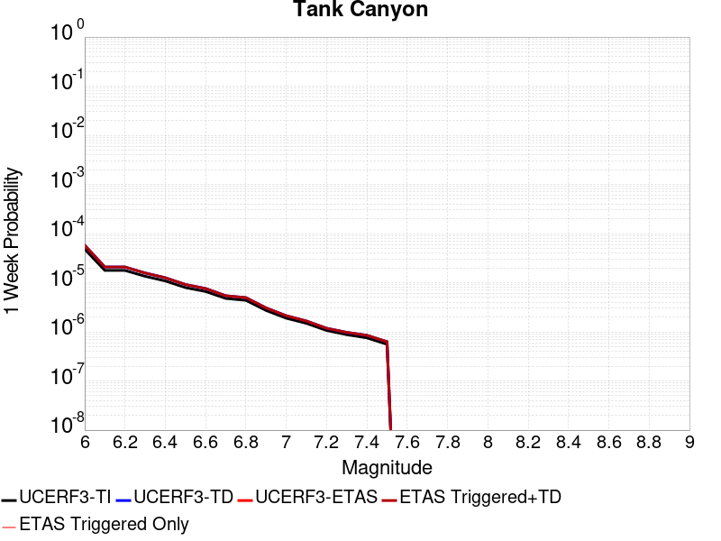 | 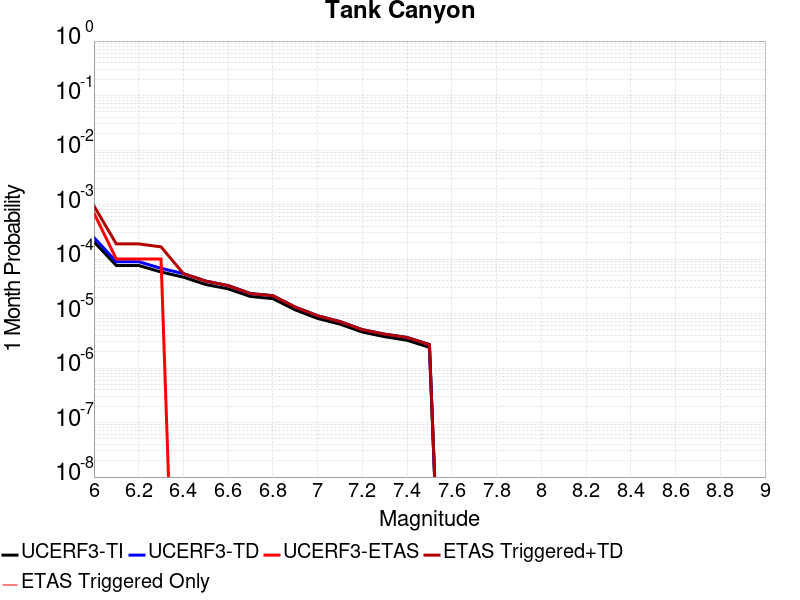 | 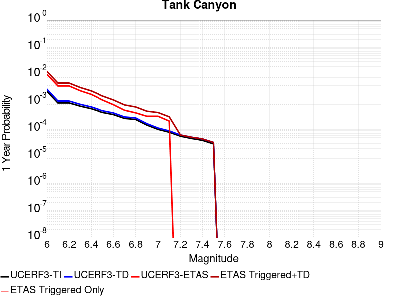 | 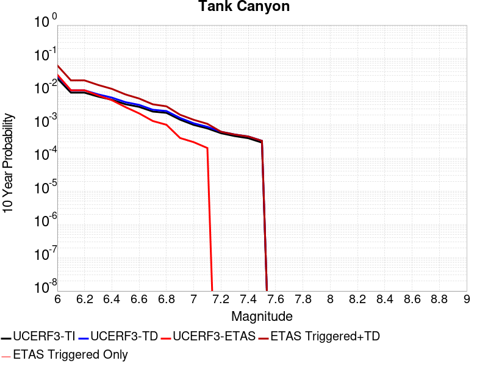 |

| Magnitude | 1 wk TI Prob | 1 wk TD Prob | 1 wk ETAS Prob | 1 wk ETAS/TD Gain | 1 wk ETAS Triggered+TD | 1 wk ETAS Triggered Only | 1 mo TI Prob | 1 mo TD Prob | 1 mo ETAS Prob | 1 mo ETAS/TD Gain | 1 mo ETAS Triggered+TD | 1 mo ETAS Triggered Only | 1 yr TI Prob | 1 yr TD Prob | 1 yr ETAS Prob | 1 yr ETAS/TD Gain | 1 yr ETAS Triggered+TD | 1 yr ETAS Triggered Only | 10 yr TI Prob | 10 yr TD Prob | 10 yr ETAS Prob | 10 yr ETAS/TD Gain | 10 yr ETAS Triggered+TD | 10 yr ETAS Triggered Only |
|-----|-----|-----|-----|-----|-----|-----|-----|-----|-----|-----|-----|-----|-----|-----|-----|-----|-----|-----|-----|-----|-----|-----|-----|-----|
| 6.0 | 4.8284557E-5 | 5.7988127E-5 | 1.0E-4 | 1.724491 | 5.7988127E-5 | 0.0 | 2.0691741E-4 | 2.485007E-4 | 9.0E-4 | 3.62172 | 9.483268E-4 | 7.0E-4 | 0.0025163088 | 0.0030219676 | 0.0121 | 4.004014 | 0.013589934 | 0.0106 | 0.02488006 | 0.02987538 | 0.0503 | 1.6836605 | 0.06101638 | 0.0321 |
| 6.1 | 1.7796336E-5 | 2.088055E-5 | 1.0E-4 | 4.789146 | 2.088055E-5 | 0.0 | 7.626778E-5 | 8.948522E-5 | 3.0E-4 | 3.3525088 | 1.8947627E-4 | 1.0E-4 | 9.281647E-4 | 0.0010889764 | 0.0047 | 4.31598 | 0.0049847295 | 0.0039 | 0.009242975 | 0.010840065 | 0.0183 | 1.6881818 | 0.021621909 | 0.0109 |
| 6.2 | 1.7796336E-5 | 2.088055E-5 | 1.0E-4 | 4.789146 | 2.088055E-5 | 0.0 | 7.626778E-5 | 8.948522E-5 | 3.0E-4 | 3.3525088 | 1.8947627E-4 | 1.0E-4 | 9.281647E-4 | 0.0010889764 | 0.0047 | 4.31598 | 0.0049847295 | 0.0039 | 0.009242975 | 0.010840065 | 0.0183 | 1.6881818 | 0.021621909 | 0.0109 |
| 6.3 | 1.3515912E-5 | 1.5764776E-5 | 1.0E-4 | 6.343256 | 1.5764776E-5 | 0.0 | 5.792405E-5 | 6.7561705E-5 | 2.0E-4 | 2.9602568 | 1.6755496E-4 | 1.0E-4 | 7.049971E-4 | 8.2227704E-4 | 0.0031 | 3.7700188 | 0.0034201392 | 0.0026 | 0.007027647 | 0.008194527 | 0.0129 | 1.5742215 | 0.01573225 | 0.0076 |
| 6.4 | 1.0870146E-5 | 1.2622026E-5 | 1.0E-4 | 7.922659 | 1.2622026E-5 | 0.0 | 4.658551E-5 | 5.4093372E-5 | 1.0E-4 | 1.8486552 | 5.4093372E-5 | 0.0 | 5.67031E-4 | 6.5840554E-4 | 0.0024 | 3.6451697 | 0.0025571545 | 0.0019 | 0.005655863 | 0.0065661273 | 0.0095 | 1.4468194 | 0.012030014 | 0.0055 |
| 6.5 | 7.964826E-6 | 9.1988495E-6 | 1.0E-4 | 10.870925 | 9.1988495E-6 | 0.0 | 3.4134522E-5 | 3.9423103E-5 | 1.0E-4 | 2.5365837 | 3.9423103E-5 | 0.0 | 4.1550855E-4 | 4.798812E-4 | 0.0017 | 3.5425436 | 0.0016793053 | 0.0012 | 0.0041473247 | 0.0047893226 | 0.0062 | 1.2945464 | 0.008173039 | 0.0034 |
| 6.6 | 6.6317E-6 | 7.6144606E-6 | 1.0E-4 | 13.132906 | 7.6144606E-6 | 0.0 | 2.8421264E-5 | 3.263305E-5 | 1.0E-4 | 3.0643783 | 3.263305E-5 | 0.0 | 3.4597394E-4 | 3.97244E-4 | 0.0011 | 2.769079 | 0.0011969262 | 8.0E-4 | 0.0034543579 | 0.003966063 | 0.0042 | 1.0589848 | 0.006157337 | 0.0022 |
| 6.7 | 4.793663E-6 | 5.4321517E-6 | 0.0 | 0.0 | 5.4321517E-6 | 0.0 | 2.0544108E-5 | 2.3280467E-5 | 0.0 | 0.0 | 2.3280467E-5 | 0.0 | 2.500958E-4 | 2.834072E-4 | 7.0E-4 | 2.4699442 | 7.832655E-4 | 5.0E-4 | 0.0024981452 | 0.0028307196 | 0.0027 | 0.9538211 | 0.0041270396 | 0.0013 |
| 6.8 | 4.382823E-6 | 4.9704663E-6 | 0.0 | 0.0 | 4.9704663E-6 | 0.0 | 1.8783392E-5 | 2.1301848E-5 | 0.0 | 0.0 | 2.1301848E-5 | 0.0 | 2.286638E-4 | 2.593234E-4 | 5.0E-4 | 1.9280944 | 6.592197E-4 | 4.0E-4 | 0.0022842865 | 0.0025904465 | 0.0019 | 0.7334643 | 0.003587856 | 0.001 |
| 6.9 | 2.729601E-6 | 3.0742544E-6 | 0.0 | 0.0 | 3.0742544E-6 | 0.0 | 1.1698237E-5 | 1.3175317E-5 | 0.0 | 0.0 | 1.3175317E-5 | 0.0 | 1.4241673E-4 | 1.6039891E-4 | 3.0E-4 | 1.870337 | 4.6035077E-4 | 3.0E-4 | 0.001423255 | 0.0016028339 | 8.0E-4 | 0.49911597 | 0.002002193 | 4.0E-4 |
| 7.0 | 1.8987357E-6 | 2.1273177E-6 | 0.0 | 0.0 | 2.1273177E-6 | 0.0 | 8.137413E-6 | 9.117048E-6 | 0.0 | 0.0 | 9.117048E-6 | 0.0 | 9.90685E-5 | 1.109951E-4 | 3.0E-4 | 2.7028222 | 4.109618E-4 | 3.0E-4 | 9.902435E-4 | 0.0011094653 | 4.0E-4 | 0.36053404 | 0.0014091324 | 3.0E-4 |
| 7.1 | 1.4928986E-6 | 1.6644278E-6 | 0.0 | 0.0 | 1.6644278E-6 | 0.0 | 6.398121E-6 | 7.133246E-6 | 0.0 | 0.0 | 7.133246E-6 | 0.0 | 7.789434E-5 | 8.68444E-5 | 2.0E-4 | 2.3029695 | 2.8682704E-4 | 2.0E-4 | 7.786704E-4 | 8.681625E-4 | 2.0E-4 | 0.23037162 | 0.0010679888 | 2.0E-4 |
| 7.2 | 1.069082E-6 | 1.183091E-6 | 0.0 | 0.0 | 1.183091E-6 | 0.0 | 4.581772E-6 | 5.070383E-6 | 0.0 | 0.0 | 5.070383E-6 | 0.0 | 5.5781646E-5 | 6.17307E-5 | 0.0 | 0.0 | 6.17307E-5 | 0.0 | 5.576765E-4 | 6.1718776E-4 | 0.0 | 0.0 | 6.1718776E-4 | 0.0 |
| 7.3 | 8.776551E-7 | 9.772039E-7 | 0.0 | 0.0 | 9.772039E-7 | 0.0 | 3.7613736E-6 | 4.188013E-6 | 0.0 | 0.0 | 4.188013E-6 | 0.0 | 4.579376E-5 | 5.0988387E-5 | 0.0 | 0.0 | 5.0988387E-5 | 0.0 | 4.5784327E-4 | 5.098179E-4 | 0.0 | 0.0 | 5.098179E-4 | 0.0 |
| 7.4 | 7.55721E-7 | 8.5109815E-7 | 0.0 | 0.0 | 8.5109815E-7 | 0.0 | 3.2388E-6 | 3.6475615E-6 | 0.0 | 0.0 | 3.6475615E-6 | 0.0 | 3.9431678E-5 | 4.4408673E-5 | 0.0 | 0.0 | 4.4408673E-5 | 0.0 | 3.942468E-4 | 4.4404884E-4 | 0.0 | 0.0 | 4.4404884E-4 | 0.0 |
| 7.5 | 5.587665E-7 | 6.3061736E-7 | 0.0 | 0.0 | 6.3061736E-7 | 0.0 | 2.3947114E-6 | 2.7026458E-6 | 0.0 | 0.0 | 2.7026458E-6 | 0.0 | 2.915522E-5 | 3.2904714E-5 | 0.0 | 0.0 | 3.2904714E-5 | 0.0 | 2.9151395E-4 | 3.2904715E-4 | 0.0 | 0.0 | 3.2904715E-4 | 0.0 |

## Cerro Prieto
*[(top)](#table-of-contents)*

| 1 Week | 1 Month | 1 Year | 10 Year |
|-----|-----|-----|-----|
| 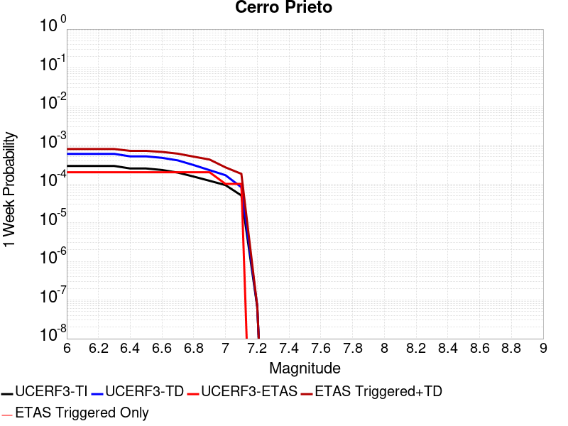 | 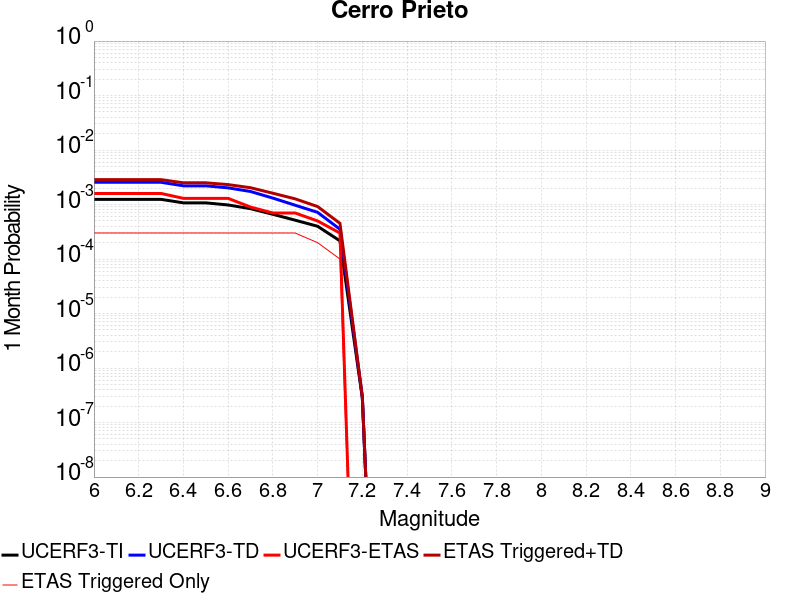 | 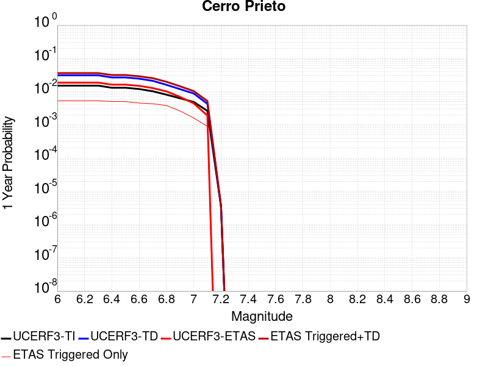 | 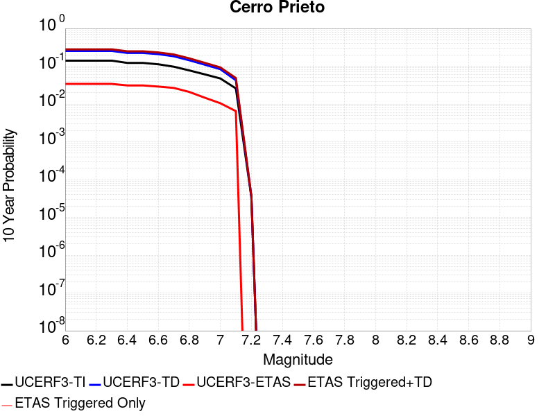 |

| Magnitude | 1 wk TI Prob | 1 wk TD Prob | 1 wk ETAS Prob | 1 wk ETAS/TD Gain | 1 wk ETAS Triggered+TD | 1 wk ETAS Triggered Only | 1 mo TI Prob | 1 mo TD Prob | 1 mo ETAS Prob | 1 mo ETAS/TD Gain | 1 mo ETAS Triggered+TD | 1 mo ETAS Triggered Only | 1 yr TI Prob | 1 yr TD Prob | 1 yr ETAS Prob | 1 yr ETAS/TD Gain | 1 yr ETAS Triggered+TD | 1 yr ETAS Triggered Only | 10 yr TI Prob | 10 yr TD Prob | 10 yr ETAS Prob | 10 yr ETAS/TD Gain | 10 yr ETAS Triggered+TD | 10 yr ETAS Triggered Only |
|-----|-----|-----|-----|-----|-----|-----|-----|-----|-----|-----|-----|-----|-----|-----|-----|-----|-----|-----|-----|-----|-----|-----|-----|-----|
| 6.0 | 2.9101528E-4 | 5.981856E-4 | 5.0E-4 | 0.835861 | 7.980659E-4 | 2.0E-4 | 0.0012466122 | 0.002561377 | 0.0016 | 0.624664 | 0.0028606085 | 3.0E-4 | 0.015072231 | 0.030694528 | 0.0185 | 0.6027133 | 0.035831846 | 0.0053 | 0.14089979 | 0.2545834 | 0.1766 | 0.6936823 | 0.28000212 | 0.0341 |
| 6.1 | 2.9101528E-4 | 5.981856E-4 | 5.0E-4 | 0.835861 | 7.980659E-4 | 2.0E-4 | 0.0012466122 | 0.002561377 | 0.0016 | 0.624664 | 0.0028606085 | 3.0E-4 | 0.015072231 | 0.030694528 | 0.0185 | 0.6027133 | 0.035831846 | 0.0053 | 0.14089979 | 0.2545834 | 0.1766 | 0.6936823 | 0.28000212 | 0.0341 |
| 6.2 | 2.9101528E-4 | 5.981856E-4 | 5.0E-4 | 0.835861 | 7.980659E-4 | 2.0E-4 | 0.0012466122 | 0.002561377 | 0.0016 | 0.624664 | 0.0028606085 | 3.0E-4 | 0.015072231 | 0.030694528 | 0.0185 | 0.6027133 | 0.035831846 | 0.0053 | 0.14089979 | 0.2545834 | 0.1766 | 0.6936823 | 0.28000212 | 0.0341 |
| 6.3 | 2.9101528E-4 | 5.981856E-4 | 5.0E-4 | 0.835861 | 7.980659E-4 | 2.0E-4 | 0.0012466122 | 0.002561377 | 0.0016 | 0.624664 | 0.0028606085 | 3.0E-4 | 0.015072231 | 0.030694528 | 0.0185 | 0.6027133 | 0.035831846 | 0.0053 | 0.14089979 | 0.2545834 | 0.1766 | 0.6936823 | 0.28000212 | 0.0341 |
| 6.4 | 2.508648E-4 | 5.1559124E-4 | 5.0E-4 | 0.9697605 | 7.154881E-4 | 2.0E-4 | 0.0010746918 | 0.0022080052 | 0.0013 | 0.58876675 | 0.0025073427 | 3.0E-4 | 0.013006088 | 0.026521806 | 0.0161 | 0.6070477 | 0.031389195 | 0.005 | 0.12270685 | 0.2250377 | 0.1553 | 0.69010663 | 0.24913903 | 0.0311 |
| 6.5 | 2.508648E-4 | 5.1559124E-4 | 5.0E-4 | 0.9697605 | 7.154881E-4 | 2.0E-4 | 0.0010746918 | 0.0022080052 | 0.0013 | 0.58876675 | 0.0025073427 | 3.0E-4 | 0.013006088 | 0.026521806 | 0.0161 | 0.6070477 | 0.031389195 | 0.005 | 0.12270685 | 0.2250377 | 0.1553 | 0.69010663 | 0.24913903 | 0.0311 |
| 6.6 | 2.294914E-4 | 4.7273084E-4 | 5.0E-4 | 1.0576843 | 6.726363E-4 | 2.0E-4 | 9.831638E-4 | 0.002024605 | 0.0013 | 0.6421006 | 0.0023239974 | 3.0E-4 | 0.011904482 | 0.024356637 | 0.0148 | 0.6076373 | 0.028747031 | 0.0045 | 0.11286586 | 0.2092396 | 0.1442 | 0.6891621 | 0.23217165 | 0.029 |
| 6.7 | 1.9621674E-4 | 4.0567195E-4 | 4.0E-4 | 0.98601836 | 6.055908E-4 | 2.0E-4 | 8.4065786E-4 | 0.0017375951 | 9.0E-4 | 0.51795727 | 0.002037074 | 3.0E-4 | 0.010187071 | 0.020971093 | 0.0127 | 0.6055955 | 0.025180917 | 0.0043 | 0.09732539 | 0.18351552 | 0.1238 | 0.6746023 | 0.20531566 | 0.0267 |
| 6.8 | 1.5476145E-4 | 3.0686287E-4 | 3.0E-4 | 0.9776354 | 5.068015E-4 | 2.0E-4 | 6.6309475E-4 | 0.0013145667 | 7.0E-4 | 0.53249484 | 0.0016141724 | 3.0E-4 | 0.008043335 | 0.015895415 | 0.0101 | 0.63540334 | 0.019635014 | 0.0038 | 0.07758363 | 0.14392504 | 0.0918 | 0.63783205 | 0.16181701 | 0.0209 |
| 6.9 | 1.20509176E-4 | 2.2679665E-4 | 3.0E-4 | 1.3227708 | 4.267513E-4 | 2.0E-4 | 5.1636563E-4 | 9.716874E-4 | 7.0E-4 | 0.72039634 | 0.0012713958 | 3.0E-4 | 0.006268645 | 0.0117811505 | 0.0069 | 0.5856813 | 0.0143505195 | 0.0026 | 0.060947374 | 0.10996192 | 0.0677 | 0.6156677 | 0.12304548 | 0.0147 |
| 7.0 | 9.3269155E-5 | 1.6794559E-4 | 2.0E-4 | 1.1908619 | 2.679288E-4 | 1.0E-4 | 3.9966372E-4 | 7.196117E-4 | 5.0E-4 | 0.69481915 | 9.1946777E-4 | 2.0E-4 | 0.0048550544 | 0.008733798 | 0.0044 | 0.50379 | 0.010319823 | 0.0016 | 0.04750344 | 0.08358386 | 0.0503 | 0.6017908 | 0.093206234 | 0.0105 |
| 7.1 | 5.029709E-5 | 8.214957E-5 | 1.0E-4 | 1.2172918 | 1.8214136E-4 | 1.0E-4 | 2.1554115E-4 | 3.5204153E-4 | 3.0E-4 | 0.85217214 | 4.5200635E-4 | 1.0E-4 | 0.0026210553 | 0.0042811316 | 0.0019 | 0.44380787 | 0.0051772785 | 9.0E-4 | 0.025903556 | 0.04259305 | 0.0262 | 0.6151238 | 0.048816197 | 0.0065 |
| 7.2 | 6.5445185E-8 | 6.905684E-8 | 0.0 | 0.0 | 6.905684E-8 | 0.0 | 2.8047933E-7 | 2.9595788E-7 | 0.0 | 0.0 | 2.9595788E-7 | 0.0 | 3.4148304E-6 | 3.6032873E-6 | 0.0 | 0.0 | 3.6032873E-6 | 0.0 | 3.414778E-5 | 3.6032874E-5 | 0.0 | 0.0 | 3.6032874E-5 | 0.0 |

## Imperial
*[(top)](#table-of-contents)*

| 1 Week | 1 Month | 1 Year | 10 Year |
|-----|-----|-----|-----|
| 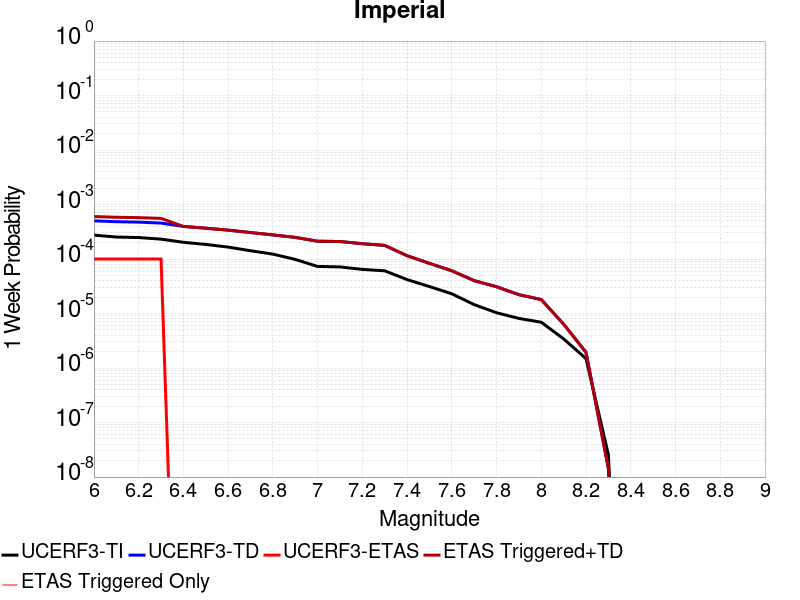 | 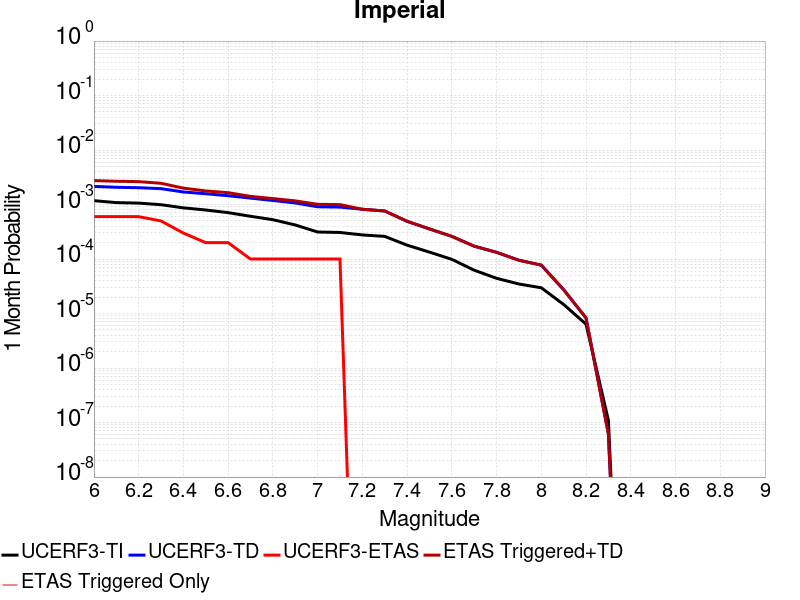 | 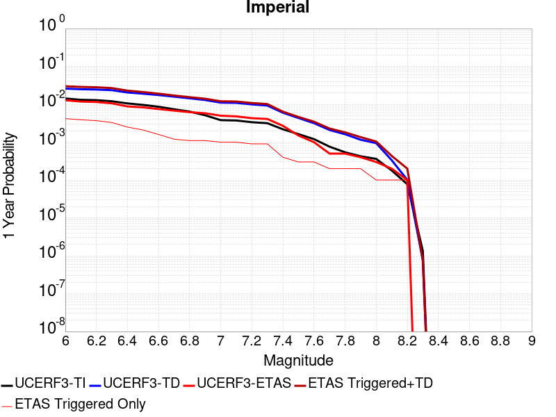 | 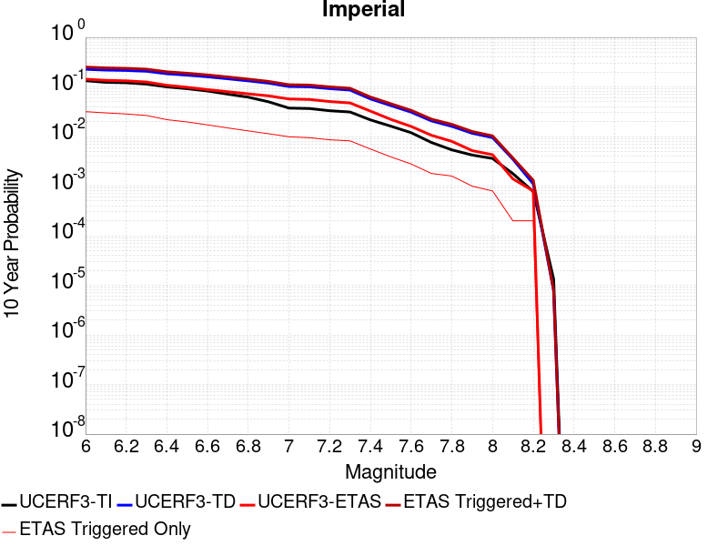 |

| Magnitude | 1 wk TI Prob | 1 wk TD Prob | 1 wk ETAS Prob | 1 wk ETAS/TD Gain | 1 wk ETAS Triggered+TD | 1 wk ETAS Triggered Only | 1 mo TI Prob | 1 mo TD Prob | 1 mo ETAS Prob | 1 mo ETAS/TD Gain | 1 mo ETAS Triggered+TD | 1 mo ETAS Triggered Only | 1 yr TI Prob | 1 yr TD Prob | 1 yr ETAS Prob | 1 yr ETAS/TD Gain | 1 yr ETAS Triggered+TD | 1 yr ETAS Triggered Only | 10 yr TI Prob | 10 yr TD Prob | 10 yr ETAS Prob | 10 yr ETAS/TD Gain | 10 yr ETAS Triggered+TD | 10 yr ETAS Triggered Only |
|-----|-----|-----|-----|-----|-----|-----|-----|-----|-----|-----|-----|-----|-----|-----|-----|-----|-----|-----|-----|-----|-----|-----|-----|-----|
| 6.0 | 2.7496446E-4 | 5.0759333E-4 | 2.0E-4 | 0.3940162 | 6.075426E-4 | 1.0E-4 | 0.0011778869 | 0.0021736259 | 0.001 | 0.46006078 | 0.0027723217 | 6.0E-4 | 0.0142467655 | 0.026138432 | 0.0128 | 0.48970035 | 0.030228652 | 0.0042 | 0.13367249 | 0.22872785 | 0.1434 | 0.626946 | 0.2532543 | 0.0318 |
| 6.1 | 2.5356023E-4 | 4.883681E-4 | 2.0E-4 | 0.40952715 | 5.8831926E-4 | 1.0E-4 | 0.001086234 | 0.0020913659 | 0.001 | 0.47815642 | 0.002690111 | 6.0E-4 | 0.013144928 | 0.025166705 | 0.0118 | 0.46887344 | 0.028968556 | 0.0039 | 0.123940155 | 0.22008304 | 0.1361 | 0.6184029 | 0.24348056 | 0.03 |
| 6.2 | 2.4820742E-4 | 4.7928892E-4 | 2.0E-4 | 0.41728485 | 5.7924096E-4 | 1.0E-4 | 0.0010633124 | 0.0020525164 | 0.001 | 0.48720682 | 0.002651285 | 6.0E-4 | 0.01286919 | 0.02470517 | 0.0115 | 0.46548963 | 0.02831376 | 0.0037 | 0.12148927 | 0.21658227 | 0.133 | 0.6140854 | 0.23890968 | 0.0285 |
| 6.3 | 2.3205351E-4 | 4.604867E-4 | 2.0E-4 | 0.43432307 | 5.6044065E-4 | 1.0E-4 | 9.94136E-4 | 0.0019720588 | 7.0E-4 | 0.35495898 | 0.0024710728 | 5.0E-4 | 0.012036599 | 0.023746083 | 0.0106 | 0.44638944 | 0.02696772 | 0.0033 | 0.11405133 | 0.20848621 | 0.1259 | 0.6038769 | 0.22954048 | 0.0266 |
| 6.4 | 2.0304754E-4 | 4.0030622E-4 | 1.0E-4 | 0.24980876 | 4.0030622E-4 | 0.0 | 8.6991355E-4 | 0.0017144849 | 5.0E-4 | 0.2916328 | 0.0020139704 | 3.0E-4 | 0.010539869 | 0.020679176 | 0.0088 | 0.42554885 | 0.02312748 | 0.0025 | 0.100537635 | 0.18562372 | 0.1081 | 0.5823609 | 0.20345855 | 0.0219 |
| 6.5 | 1.854992E-4 | 3.7132268E-4 | 1.0E-4 | 0.26930755 | 3.7132268E-4 | 0.0 | 7.9475436E-4 | 0.0015904247 | 4.0E-4 | 0.25150514 | 0.0017901066 | 2.0E-4 | 0.009633281 | 0.019200241 | 0.0083 | 0.43228623 | 0.02125992 | 0.0021 | 0.0922623 | 0.17382987 | 0.0984 | 0.56607074 | 0.19010542 | 0.0197 |
| 6.6 | 1.6586106E-4 | 3.4165574E-4 | 1.0E-4 | 0.29269227 | 3.4165574E-4 | 0.0 | 7.106394E-4 | 0.0014634276 | 4.0E-4 | 0.27333093 | 0.0016631348 | 2.0E-4 | 0.008617763 | 0.017675571 | 0.0075 | 0.42431447 | 0.01924729 | 0.0016 | 0.08291132 | 0.16126302 | 0.0884 | 0.54817283 | 0.1756893 | 0.0172 |
| 6.7 | 1.4224656E-4 | 3.0879653E-4 | 1.0E-4 | 0.32383782 | 3.0879653E-4 | 0.0 | 6.094856E-4 | 0.0013227508 | 3.0E-4 | 0.22680008 | 0.0014226185 | 1.0E-4 | 0.0073952693 | 0.015986847 | 0.0068 | 0.42534965 | 0.017167663 | 0.0012 | 0.07153955 | 0.14692347 | 0.0802 | 0.54586244 | 0.1596343 | 0.0149 |
| 6.8 | 1.2317259E-4 | 2.7886406E-4 | 1.0E-4 | 0.35859764 | 2.7886406E-4 | 0.0 | 5.2777573E-4 | 0.0011945906 | 3.0E-4 | 0.25113207 | 0.0012944711 | 1.0E-4 | 0.0064067547 | 0.014448544 | 0.0062 | 0.42910898 | 0.015532651 | 0.0011 | 0.06225166 | 0.1333188 | 0.0726 | 0.54455936 | 0.14458565 | 0.013 |
| 6.9 | 9.859898E-5 | 2.508552E-4 | 1.0E-4 | 0.39863634 | 2.508552E-4 | 0.0 | 4.2249862E-4 | 0.001074655 | 3.0E-4 | 0.27915937 | 0.0011745476 | 1.0E-4 | 0.0051317946 | 0.013006401 | 0.0058 | 0.44593427 | 0.014092094 | 0.0011 | 0.05014893 | 0.11969614 | 0.0661 | 0.55223167 | 0.12973161 | 0.0114 |
| 7.0 | 7.3191884E-5 | 2.1319548E-4 | 1.0E-4 | 0.4690531 | 2.1319548E-4 | 0.0 | 3.136418E-4 | 9.133782E-4 | 3.0E-4 | 0.328451 | 0.0010132869 | 1.0E-4 | 0.003811904 | 0.011064367 | 0.005 | 0.4519011 | 0.012053303 | 0.001 | 0.037471764 | 0.10228077 | 0.0572 | 0.5592449 | 0.11116819 | 0.0099 |
| 7.1 | 7.1760296E-5 | 2.1020204E-4 | 1.0E-4 | 0.47573277 | 2.1020204E-4 | 0.0 | 3.0750787E-4 | 9.00558E-4 | 3.0E-4 | 0.33312678 | 0.001000468 | 1.0E-4 | 0.003737482 | 0.010909855 | 0.0048 | 0.43996918 | 0.011898945 | 0.001 | 0.03675245 | 0.100914724 | 0.056 | 0.554924 | 0.10945603 | 0.0095 |
| 7.2 | 6.46614E-5 | 1.918683E-4 | 1.0E-4 | 0.5211909 | 1.918683E-4 | 0.0 | 2.7709085E-4 | 8.220366E-4 | 1.0E-4 | 0.12164909 | 8.220366E-4 | 0.0 | 0.0033683628 | 0.009962993 | 0.0043 | 0.43159723 | 0.010854025 | 9.0E-4 | 0.033177625 | 0.09271658 | 0.0508 | 0.5479063 | 0.10051922 | 0.0086 |
| 7.3 | 6.088115E-5 | 1.7856332E-4 | 1.0E-4 | 0.5600254 | 1.7856332E-4 | 0.0 | 2.6089314E-4 | 7.6504983E-4 | 1.0E-4 | 0.13071044 | 7.6504983E-4 | 0.0 | 0.0031717476 | 0.00927528 | 0.0041 | 0.4420352 | 0.010166932 | 9.0E-4 | 0.031268585 | 0.08675931 | 0.0476 | 0.5486443 | 0.094247885 | 0.0082 |
| 7.4 | 4.199346E-5 | 1.1547368E-4 | 0.0 | 0.0 | 1.1547368E-4 | 0.0 | 1.7995955E-4 | 4.947942E-4 | 0.0 | 0.0 | 4.947942E-4 | 0.0 | 0.0021888057 | 0.0060076504 | 0.0027 | 0.44942695 | 0.0064052474 | 4.0E-4 | 0.02167372 | 0.057602473 | 0.0326 | 0.5659479 | 0.0628799 | 0.0056 |
| 7.5 | 3.130448E-5 | 8.3637824E-5 | 0.0 | 0.0 | 8.3637824E-5 | 0.0 | 1.3415517E-4 | 3.583989E-4 | 0.0 | 0.0 | 3.583989E-4 | 0.0 | 0.0016321153 | 0.0043548364 | 0.0015 | 0.34444463 | 0.0046535297 | 3.0E-4 | 0.016201803 | 0.042269845 | 0.0222 | 0.5251971 | 0.046004992 | 0.0039 |
| 7.6 | 2.3074248E-5 | 6.1101324E-5 | 0.0 | 0.0 | 6.1101324E-5 | 0.0 | 9.888588E-5 | 2.6183666E-4 | 0.0 | 0.0 | 2.6183666E-4 | 0.0 | 0.0012032706 | 0.0031832247 | 0.001 | 0.31414685 | 0.0034822696 | 3.0E-4 | 0.011967761 | 0.031144029 | 0.016 | 0.51374215 | 0.033856824 | 0.0028 |
| 7.7 | 1.45864815E-5 | 4.0337494E-5 | 0.0 | 0.0 | 4.0337494E-5 | 0.0 | 6.2511994E-5 | 1.7286355E-4 | 0.0 | 0.0 | 1.7286355E-4 | 0.0 | 7.608177E-4 | 0.0021025876 | 5.0E-4 | 0.23780221 | 0.0023021672 | 2.0E-4 | 0.007582182 | 0.020726182 | 0.0106 | 0.51143044 | 0.022488875 | 0.0018 |
| 7.8 | 1.0352979E-5 | 3.1141328E-5 | 0.0 | 0.0 | 3.1141328E-5 | 0.0 | 4.4369157E-5 | 1.3345601E-4 | 0.0 | 0.0 | 1.3345601E-4 | 0.0 | 5.400606E-4 | 0.0016236184 | 5.0E-4 | 0.30795413 | 0.0018232936 | 2.0E-4 | 0.0053875 | 0.016100273 | 0.008 | 0.49688601 | 0.017674511 | 0.0016 |
| 7.9 | 8.137906E-6 | 2.2293823E-5 | 0.0 | 0.0 | 2.2293823E-5 | 0.0 | 3.4876273E-5 | 9.5541465E-5 | 0.0 | 0.0 | 9.5541465E-5 | 0.0 | 4.2453592E-4 | 0.0011625976 | 4.0E-4 | 0.34405714 | 0.0013623651 | 2.0E-4 | 0.004237258 | 0.011685931 | 0.0052 | 0.44497952 | 0.012674245 | 0.001 |
| 8.0 | 6.93792E-6 | 1.8133142E-5 | 0.0 | 0.0 | 1.8133142E-5 | 0.0 | 2.9733603E-5 | 7.7711156E-5 | 0.0 | 0.0 | 7.7711156E-5 | 0.0 | 3.6194647E-4 | 9.457234E-4 | 3.0E-4 | 0.3172175 | 0.0010456288 | 1.0E-4 | 0.0036135751 | 0.009560375 | 0.0043 | 0.4497732 | 0.010352726 | 8.0E-4 |
| 8.1 | 3.4286315E-6 | 6.4374326E-6 | 0.0 | 0.0 | 6.4374326E-6 | 0.0 | 1.4694053E-5 | 2.7588707E-5 | 0.0 | 0.0 | 2.7588707E-5 | 0.0 | 1.7888541E-4 | 3.3584086E-4 | 2.0E-4 | 0.59552014 | 4.3580728E-4 | 1.0E-4 | 0.0017874148 | 0.0035149667 | 0.0014 | 0.3982968 | 0.0037142637 | 2.0E-4 |
| 8.2 | 1.4906886E-6 | 1.9589627E-6 | 0.0 | 0.0 | 1.9589627E-6 | 0.0 | 6.3886496E-6 | 8.395528E-6 | 0.0 | 0.0 | 8.395528E-6 | 0.0 | 7.7779034E-5 | 1.0221079E-4 | 1.0E-4 | 0.9783703 | 2.0220056E-4 | 1.0E-4 | 7.775182E-4 | 0.0011190104 | 8.0E-4 | 0.71491736 | 0.0013187866 | 2.0E-4 |
| 8.3 | 2.5758007E-8 | 1.472276E-8 | 0.0 | 0.0 | 1.472276E-8 | 0.0 | 1.10391454E-7 | 6.309754E-8 | 0.0 | 0.0 | 6.309754E-8 | 0.0 | 1.3440151E-6 | 7.6821254E-7 | 0.0 | 0.0 | 7.6821254E-7 | 0.0 | 1.344007E-5 | 8.005359E-6 | 0.0 | 0.0 | 8.005359E-6 | 0.0 |

## Brawley (Seismic Zone) alt 1
*[(top)](#table-of-contents)*

| 1 Week | 1 Month | 1 Year | 10 Year |
|-----|-----|-----|-----|
|  | 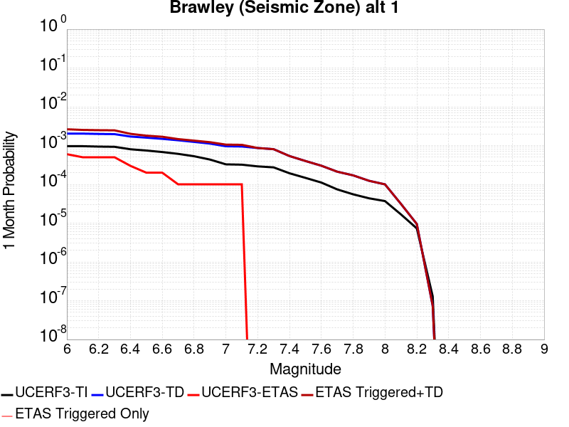 | 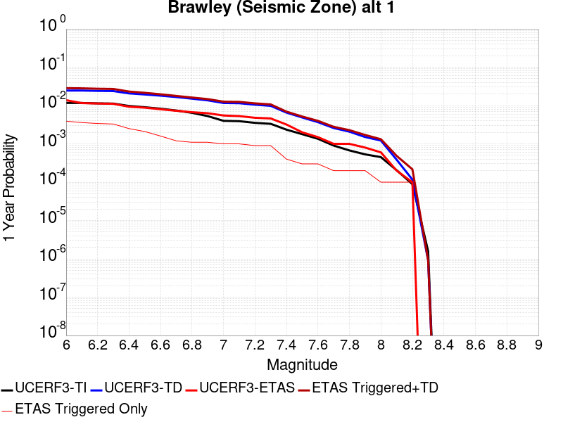 | 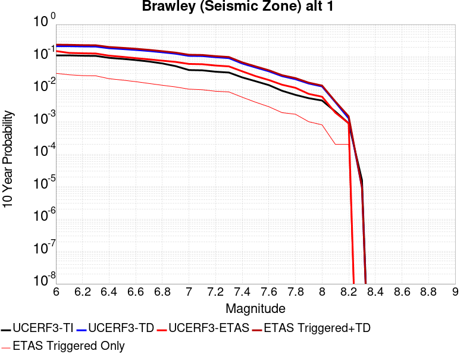 |

| Magnitude | 1 wk TI Prob | 1 wk TD Prob | 1 wk ETAS Prob | 1 wk ETAS/TD Gain | 1 wk ETAS Triggered+TD | 1 wk ETAS Triggered Only | 1 mo TI Prob | 1 mo TD Prob | 1 mo ETAS Prob | 1 mo ETAS/TD Gain | 1 mo ETAS Triggered+TD | 1 mo ETAS Triggered Only | 1 yr TI Prob | 1 yr TD Prob | 1 yr ETAS Prob | 1 yr ETAS/TD Gain | 1 yr ETAS Triggered+TD | 1 yr ETAS Triggered Only | 10 yr TI Prob | 10 yr TD Prob | 10 yr ETAS Prob | 10 yr ETAS/TD Gain | 10 yr ETAS Triggered+TD | 10 yr ETAS Triggered Only |
|-----|-----|-----|-----|-----|-----|-----|-----|-----|-----|-----|-----|-----|-----|-----|-----|-----|-----|-----|-----|-----|-----|-----|-----|-----|
| 6.0 | 2.2521618E-4 | 4.7776554E-4 | 3.0E-4 | 0.6279231 | 5.777178E-4 | 1.0E-4 | 9.6485513E-4 | 0.0020459972 | 0.001 | 0.48875925 | 0.0026447696 | 6.0E-4 | 0.011683988 | 0.02462013 | 0.0138 | 0.56051695 | 0.028424112 | 0.0039 | 0.11088423 | 0.21398969 | 0.151 | 0.70564145 | 0.23843461 | 0.0311 |
| 6.1 | 2.2521618E-4 | 4.7776554E-4 | 2.0E-4 | 0.41861537 | 5.777178E-4 | 1.0E-4 | 9.6485513E-4 | 0.0020459972 | 8.0E-4 | 0.3910074 | 0.0025449742 | 5.0E-4 | 0.011683988 | 0.02462013 | 0.0116 | 0.47115916 | 0.028131498 | 0.0036 | 0.11088423 | 0.21398969 | 0.1322 | 0.61778677 | 0.23599799 | 0.028 |
| 6.2 | 2.198148E-4 | 4.6857816E-4 | 2.0E-4 | 0.42682314 | 5.6853134E-4 | 1.0E-4 | 9.417233E-4 | 0.0020066835 | 8.0E-4 | 0.39866778 | 0.00250568 | 5.0E-4 | 0.011405343 | 0.024152828 | 0.0113 | 0.4678541 | 0.027470708 | 0.0034 | 0.10837428 | 0.21041918 | 0.129 | 0.613062 | 0.23126411 | 0.0264 |
| 6.3 | 2.1704129E-4 | 4.6292474E-4 | 2.0E-4 | 0.43203565 | 5.6287844E-4 | 1.0E-4 | 9.298453E-4 | 0.0019824915 | 8.0E-4 | 0.40353265 | 0.0024815002 | 5.0E-4 | 0.011262234 | 0.023865867 | 0.0111 | 0.4650994 | 0.02708711 | 0.0033 | 0.107082725 | 0.20830876 | 0.1268 | 0.60871184 | 0.22889273 | 0.026 |
| 6.4 | 1.876142E-4 | 4.0180507E-4 | 1.0E-4 | 0.2488769 | 4.0180507E-4 | 0.0 | 8.038131E-4 | 0.0017208997 | 6.0E-4 | 0.34865484 | 0.0020203835 | 3.0E-4 | 0.00974259 | 0.020751324 | 0.0093 | 0.4481642 | 0.023199445 | 0.0025 | 0.093263686 | 0.1850628 | 0.1088 | 0.58790857 | 0.20233947 | 0.0212 |
| 6.5 | 1.7390939E-4 | 3.7607548E-4 | 1.0E-4 | 0.26590407 | 3.7607548E-4 | 0.0 | 7.45113E-4 | 0.0016107687 | 5.0E-4 | 0.3104108 | 0.0018104466 | 2.0E-4 | 0.009034078 | 0.01943728 | 0.0088 | 0.45273826 | 0.021496462 | 0.0021 | 0.086755216 | 0.17487572 | 0.1002 | 0.5729783 | 0.19071811 | 0.0192 |
| 6.6 | 1.591791E-4 | 3.501572E-4 | 1.0E-4 | 0.285586 | 3.501572E-4 | 0.0 | 6.8201777E-4 | 0.0014998208 | 5.0E-4 | 0.33337316 | 0.0016995209 | 2.0E-4 | 0.008271996 | 0.018109161 | 0.008 | 0.44176534 | 0.019680187 | 0.0016 | 0.07970774 | 0.1642686 | 0.0912 | 0.55518824 | 0.17864318 | 0.0172 |
| 6.7 | 1.4268003E-4 | 3.2173036E-4 | 1.0E-4 | 0.31081927 | 3.2173036E-4 | 0.0 | 6.1134255E-4 | 0.001378124 | 4.0E-4 | 0.29024965 | 0.0014779862 | 1.0E-4 | 0.007417723 | 0.016650911 | 0.0073 | 0.43841442 | 0.01783093 | 0.0012 | 0.07174956 | 0.1523747 | 0.0837 | 0.5493038 | 0.16517383 | 0.0151 |
| 6.8 | 1.239713E-4 | 2.9151302E-4 | 1.0E-4 | 0.34303784 | 2.9151302E-4 | 0.0 | 5.3119735E-4 | 0.0012487496 | 4.0E-4 | 0.32032043 | 0.0013486247 | 1.0E-4 | 0.0064481674 | 0.015098983 | 0.0067 | 0.44373846 | 0.016182374 | 0.0011 | 0.06264243 | 0.13876434 | 0.0762 | 0.5491324 | 0.15021877 | 0.0133 |
| 6.9 | 1.0180238E-4 | 2.632997E-4 | 1.0E-4 | 0.37979534 | 2.632997E-4 | 0.0 | 4.3622297E-4 | 0.0011279435 | 4.0E-4 | 0.35462767 | 0.0012278308 | 1.0E-4 | 0.005298089 | 0.013647249 | 0.0063 | 0.4616315 | 0.014732237 | 0.0011 | 0.05173543 | 0.12526682 | 0.0698 | 0.5572106 | 0.13558868 | 0.0118 |
| 7.0 | 7.6619996E-5 | 2.2456683E-4 | 1.0E-4 | 0.44530174 | 2.2456683E-4 | 0.0 | 3.283301E-4 | 9.6207747E-4 | 4.0E-4 | 0.41576692 | 0.0010619813 | 1.0E-4 | 0.0039900932 | 0.011651098 | 0.0055 | 0.47205853 | 0.012639446 | 0.001 | 0.039192066 | 0.10750031 | 0.0605 | 0.5627891 | 0.116514556 | 0.0101 |
| 7.1 | 7.5127435E-5 | 2.2139131E-4 | 1.0E-4 | 0.45168892 | 2.2139131E-4 | 0.0 | 3.2193496E-4 | 9.4847806E-4 | 4.0E-4 | 0.42172825 | 0.0010483832 | 1.0E-4 | 0.0039125155 | 0.011487282 | 0.0053 | 0.4613798 | 0.012475795 | 0.001 | 0.038443442 | 0.106061764 | 0.0593 | 0.5591082 | 0.114732966 | 0.0097 |
| 7.2 | 6.788582E-5 | 2.0264927E-4 | 1.0E-4 | 0.4934634 | 2.0264927E-4 | 0.0 | 2.9090676E-4 | 8.6821086E-4 | 2.0E-4 | 0.23035878 | 8.6821086E-4 | 0.0 | 0.0035360386 | 0.010519878 | 0.0048 | 0.45627907 | 0.01141041 | 9.0E-4 | 0.034803 | 0.09772678 | 0.054 | 0.5525609 | 0.10557655 | 0.0087 |
| 7.3 | 6.399602E-5 | 1.8893633E-4 | 1.0E-4 | 0.5292788 | 1.8893633E-4 | 0.0 | 2.7423984E-4 | 8.0947875E-4 | 2.0E-4 | 0.24707258 | 8.0947875E-4 | 0.0 | 0.0033337586 | 0.009811462 | 0.0046 | 0.4688394 | 0.010702631 | 9.0E-4 | 0.03284188 | 0.09161354 | 0.0508 | 0.5545032 | 0.099153146 | 0.0083 |
| 7.4 | 4.506759E-5 | 1.2570761E-4 | 0.0 | 0.0 | 1.2570761E-4 | 0.0 | 1.9313251E-4 | 5.386365E-4 | 1.0E-4 | 0.18565394 | 5.386365E-4 | 0.0 | 0.0023488526 | 0.0065383567 | 0.0032 | 0.4894196 | 0.0069357413 | 4.0E-4 | 0.023241805 | 0.0625451 | 0.0358 | 0.572387 | 0.06788859 | 0.0057 |
| 7.5 | 3.43289E-5 | 9.37045E-5 | 0.0 | 0.0 | 9.37045E-5 | 0.0 | 1.4711556E-4 | 4.0152922E-4 | 1.0E-4 | 0.24904788 | 4.0152922E-4 | 0.0 | 0.0017896603 | 0.004877723 | 0.002 | 0.4100274 | 0.0051762597 | 3.0E-4 | 0.01775316 | 0.04721213 | 0.0255 | 0.5401154 | 0.051023282 | 0.004 |
| 7.6 | 2.5980507E-5 | 7.0832735E-5 | 0.0 | 0.0 | 7.0832735E-5 | 0.0 | 1.1134028E-4 | 3.0353366E-4 | 1.0E-4 | 0.32945275 | 3.0353366E-4 | 0.0 | 0.001354725 | 0.0036892847 | 0.0015 | 0.4065829 | 0.003988178 | 3.0E-4 | 0.013464959 | 0.035977792 | 0.0193 | 0.53644204 | 0.03877346 | 0.0029 |
| 7.7 | 1.7292105E-5 | 4.9664726E-5 | 0.0 | 0.0 | 4.9664726E-5 | 0.0 | 7.4106916E-5 | 2.1283148E-4 | 1.0E-4 | 0.46985528 | 2.1283148E-4 | 0.0 | 9.018782E-4 | 0.0025881499 | 0.001 | 0.38637638 | 0.0027876324 | 2.0E-4 | 0.008982267 | 0.025408266 | 0.0138 | 0.54313034 | 0.02725999 | 0.0019 |
| 7.8 | 1.2927471E-5 | 3.9916846E-5 | 0.0 | 0.0 | 3.9916846E-5 | 0.0 | 5.5402274E-5 | 1.71061E-4 | 1.0E-4 | 0.5845868 | 1.71061E-4 | 0.0 | 6.743139E-4 | 0.0020806808 | 0.001 | 0.48061192 | 0.0022802646 | 2.0E-4 | 0.0067227143 | 0.020534158 | 0.0111 | 0.5405627 | 0.02219925 | 0.0017 |
| 7.9 | 1.0200774E-5 | 2.8926304E-5 | 0.0 | 0.0 | 2.8926304E-5 | 0.0 | 4.371687E-5 | 1.2396398E-4 | 1.0E-4 | 0.80668586 | 1.2396398E-4 | 0.0 | 5.321229E-4 | 0.0015082178 | 8.0E-4 | 0.5304274 | 0.0017079161 | 2.0E-4 | 0.005308505 | 0.015075737 | 0.0072 | 0.47758862 | 0.016060662 | 0.001 |
| 8.0 | 8.650396E-6 | 2.343218E-5 | 0.0 | 0.0 | 2.343218E-5 | 0.0 | 3.70726E-5 | 1.0041976E-4 | 1.0E-4 | 0.9958199 | 1.0041976E-4 | 0.0 | 4.5126543E-4 | 0.0012219257 | 6.0E-4 | 0.4910282 | 0.0013218035 | 1.0E-4 | 0.0045035016 | 0.012283719 | 0.0059 | 0.48031056 | 0.013073892 | 8.0E-4 |
| 8.1 | 3.9368224E-6 | 7.3941383E-6 | 0.0 | 0.0 | 7.3941383E-6 | 0.0 | 1.6871985E-5 | 3.168878E-5 | 0.0 | 0.0 | 3.168878E-5 | 0.0 | 2.0539707E-4 | 3.8574272E-4 | 2.0E-4 | 0.5184803 | 4.8570416E-4 | 1.0E-4 | 0.0020520731 | 0.0040343646 | 0.0019 | 0.47095394 | 0.0042335577 | 2.0E-4 |
| 8.2 | 1.7101195E-6 | 2.2434722E-6 | 0.0 | 0.0 | 2.2434722E-6 | 0.0 | 7.329063E-6 | 9.614846E-6 | 0.0 | 0.0 | 9.614846E-6 | 0.0 | 8.922769E-5 | 1.17054486E-4 | 1.0E-4 | 0.854303 | 2.1704278E-4 | 1.0E-4 | 8.9191867E-4 | 0.001279847 | 9.0E-4 | 0.70320904 | 0.001479591 | 2.0E-4 |
| 8.3 | 3.0346666E-8 | 1.7478676E-8 | 0.0 | 0.0 | 1.7478676E-8 | 0.0 | 1.3005713E-7 | 7.490861E-8 | 0.0 | 0.0 | 7.490861E-8 | 0.0 | 1.5834444E-6 | 9.1201224E-7 | 0.0 | 0.0 | 9.1201224E-7 | 0.0 | 1.5834332E-5 | 9.507439E-6 | 0.0 | 0.0 | 9.507439E-6 | 0.0 |

## Laguna Salada
*[(top)](#table-of-contents)*

| 1 Week | 1 Month | 1 Year | 10 Year |
|-----|-----|-----|-----|
| 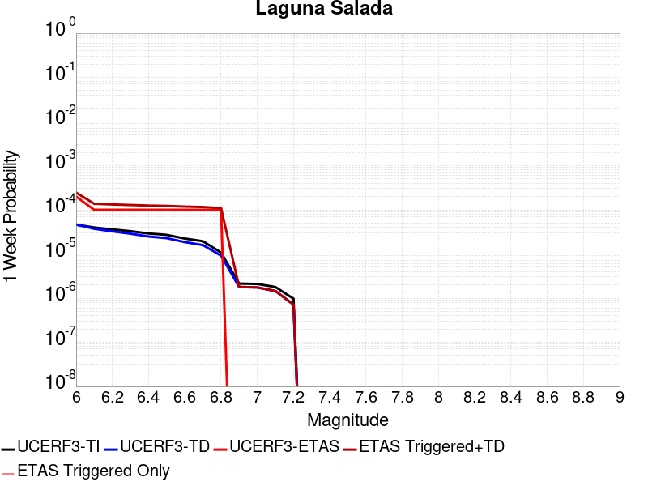 | 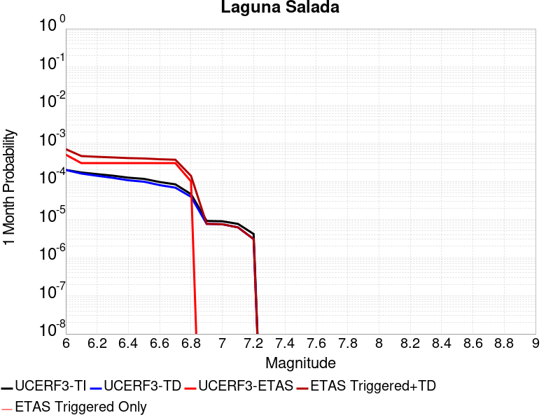 | 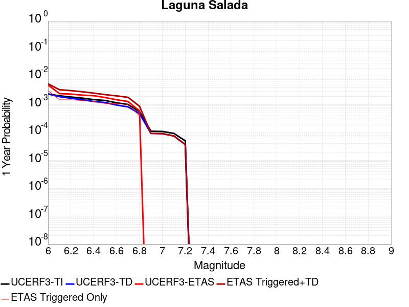 | 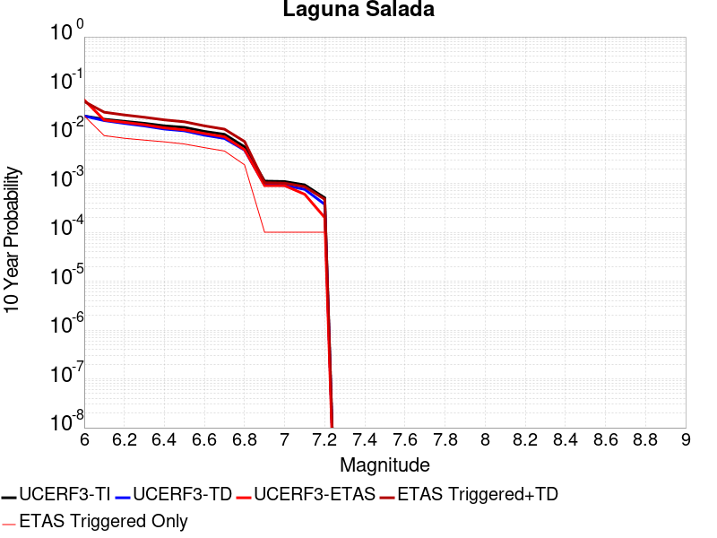 |

| Magnitude | 1 wk TI Prob | 1 wk TD Prob | 1 wk ETAS Prob | 1 wk ETAS/TD Gain | 1 wk ETAS Triggered+TD | 1 wk ETAS Triggered Only | 1 mo TI Prob | 1 mo TD Prob | 1 mo ETAS Prob | 1 mo ETAS/TD Gain | 1 mo ETAS Triggered+TD | 1 mo ETAS Triggered Only | 1 yr TI Prob | 1 yr TD Prob | 1 yr ETAS Prob | 1 yr ETAS/TD Gain | 1 yr ETAS Triggered+TD | 1 yr ETAS Triggered Only | 10 yr TI Prob | 10 yr TD Prob | 10 yr ETAS Prob | 10 yr ETAS/TD Gain | 10 yr ETAS Triggered+TD | 10 yr ETAS Triggered Only |
|-----|-----|-----|-----|-----|-----|-----|-----|-----|-----|-----|-----|-----|-----|-----|-----|-----|-----|-----|-----|-----|-----|-----|-----|-----|
| 6.0 | 4.6465593E-5 | 4.6374953E-5 | 2.0E-4 | 4.3126726 | 2.4636567E-4 | 2.0E-4 | 1.9912305E-4 | 1.9873469E-4 | 5.0E-4 | 2.515917 | 6.986353E-4 | 5.0E-4 | 0.0024216278 | 0.0024169902 | 0.0051 | 2.1100624 | 0.0056092557 | 0.0032 | 0.02395408 | 0.024004234 | 0.0511 | 2.128791 | 0.047525734 | 0.0241 |
| 6.1 | 3.982297E-5 | 3.726797E-5 | 1.0E-4 | 2.6832693 | 1.3726424E-4 | 1.0E-4 | 1.706587E-4 | 1.5971079E-4 | 3.0E-4 | 1.8783953 | 4.5966287E-4 | 3.0E-4 | 0.0020757897 | 0.0019428408 | 0.0025 | 1.2867756 | 0.0034399265 | 0.0015 | 0.020565065 | 0.019357663 | 0.0198 | 1.0228508 | 0.028673764 | 0.0095 |
| 6.2 | 3.6067784E-5 | 3.2621447E-5 | 1.0E-4 | 3.0654678 | 1.3261818E-4 | 1.0E-4 | 1.5456705E-4 | 1.3979933E-4 | 3.0E-4 | 2.145933 | 4.397574E-4 | 3.0E-4 | 0.0018802295 | 0.0017008225 | 0.0024 | 1.411082 | 0.0031982712 | 0.0015 | 0.018644003 | 0.016968468 | 0.0178 | 1.0490046 | 0.025225934 | 0.0084 |
| 6.3 | 3.2859112E-5 | 2.886509E-5 | 1.0E-4 | 3.4643927 | 1.288622E-4 | 1.0E-4 | 1.4081717E-4 | 1.2370222E-4 | 3.0E-4 | 2.4251785 | 4.2366513E-4 | 3.0E-4 | 0.0017131006 | 0.0015051275 | 0.0022 | 1.4616702 | 0.0029030202 | 0.0014 | 0.016999546 | 0.015035375 | 0.0159 | 1.0575061 | 0.022619601 | 0.0077 |
| 6.4 | 2.9132116E-5 | 2.486555E-5 | 1.0E-4 | 4.0216284 | 1.2486306E-4 | 1.0E-4 | 1.2484594E-4 | 1.065628E-4 | 3.0E-4 | 2.8152413 | 4.0653083E-4 | 3.0E-4 | 0.0015189396 | 0.0012967187 | 0.0021 | 1.6194723 | 0.002595033 | 0.0013 | 0.015085992 | 0.012966408 | 0.0137 | 1.0565763 | 0.019974347 | 0.0071 |
| 6.5 | 2.7075037E-5 | 2.2836655E-5 | 1.0E-4 | 4.378925 | 1.2283438E-4 | 1.0E-4 | 1.1603071E-4 | 9.786821E-5 | 3.0E-4 | 3.0653467 | 3.9783886E-4 | 3.0E-4 | 0.0014117584 | 0.0011909825 | 0.0018 | 1.5113572 | 0.0022896724 | 0.0011 | 0.014028233 | 0.0119167045 | 0.0125 | 1.0489477 | 0.018240439 | 0.0064 |
| 6.6 | 2.2367465E-5 | 1.8582863E-5 | 1.0E-4 | 5.3813024 | 1.18581E-4 | 1.0E-4 | 9.5857045E-5 | 7.963887E-5 | 3.0E-4 | 3.7670047 | 3.7961497E-4 | 3.0E-4 | 0.0011664346 | 9.6925435E-4 | 0.0015 | 1.5475814 | 0.0020681883 | 0.0011 | 0.011603311 | 0.009706866 | 0.0105 | 1.0817086 | 0.015054449 | 0.0054 |
| 6.7 | 1.9458053E-5 | 1.5921958E-5 | 1.0E-4 | 6.280635 | 1.1592037E-4 | 1.0E-4 | 8.338899E-5 | 6.823563E-5 | 3.0E-4 | 4.39653 | 3.6821517E-4 | 3.0E-4 | 0.001014788 | 8.305326E-4 | 0.0013 | 1.5652606 | 0.001829702 | 0.001 | 0.010101665 | 0.008324309 | 0.009 | 1.0811708 | 0.012886018 | 0.0046 |
| 6.8 | 1.0767866E-5 | 9.187769E-6 | 1.0E-4 | 10.884035 | 1.0918685E-4 | 1.0E-4 | 4.614718E-5 | 3.9375944E-5 | 1.0E-4 | 2.5396216 | 1.39372E-4 | 1.0E-4 | 5.6169706E-4 | 4.793654E-4 | 6.0E-4 | 1.2516549 | 8.7917363E-4 | 4.0E-4 | 0.0056027942 | 0.004810834 | 0.0049 | 1.0185344 | 0.007199288 | 0.0024 |
| 6.9 | 2.1384765E-6 | 1.7916839E-6 | 0.0 | 0.0 | 1.7916839E-6 | 0.0 | 9.164866E-6 | 7.678625E-6 | 0.0 | 0.0 | 7.678625E-6 | 0.0 | 1.1157654E-4 | 9.3483635E-5 | 0.0 | 0.0 | 9.3483635E-5 | 0.0 | 0.0011152053 | 9.344814E-4 | 9.0E-4 | 0.963101 | 0.001034388 | 1.0E-4 |
| 7.0 | 2.0952946E-6 | 1.7496179E-6 | 0.0 | 0.0 | 1.7496179E-6 | 0.0 | 8.979802E-6 | 7.498343E-6 | 0.0 | 0.0 | 7.498343E-6 | 0.0 | 1.0932361E-4 | 9.128889E-5 | 0.0 | 0.0 | 9.128889E-5 | 0.0 | 0.0010926984 | 9.125521E-4 | 9.0E-4 | 0.98624504 | 0.0010124608 | 1.0E-4 |
| 7.1 | 1.7887576E-6 | 1.4503129E-6 | 0.0 | 0.0 | 1.4503129E-6 | 0.0 | 7.666081E-6 | 6.2156137E-6 | 0.0 | 0.0 | 6.2156137E-6 | 0.0 | 9.333054E-5 | 7.5672775E-5 | 0.0 | 0.0 | 7.5672775E-5 | 0.0 | 9.329135E-4 | 7.5650046E-4 | 6.0E-4 | 0.79312575 | 8.5642486E-4 | 1.0E-4 |
| 7.2 | 9.723109E-7 | 7.1374586E-7 | 0.0 | 0.0 | 7.1374586E-7 | 0.0 | 4.16704E-6 | 3.058908E-6 | 0.0 | 0.0 | 3.058908E-6 | 0.0 | 5.073253E-5 | 3.7241738E-5 | 0.0 | 0.0 | 3.7241738E-5 | 0.0 | 5.072095E-4 | 3.7237123E-4 | 2.0E-4 | 0.53709847 | 4.7233398E-4 | 1.0E-4 |

## Hayward (So) 2011 CFM
*[(top)](#table-of-contents)*

| 1 Week | 1 Month | 1 Year | 10 Year |
|-----|-----|-----|-----|
| 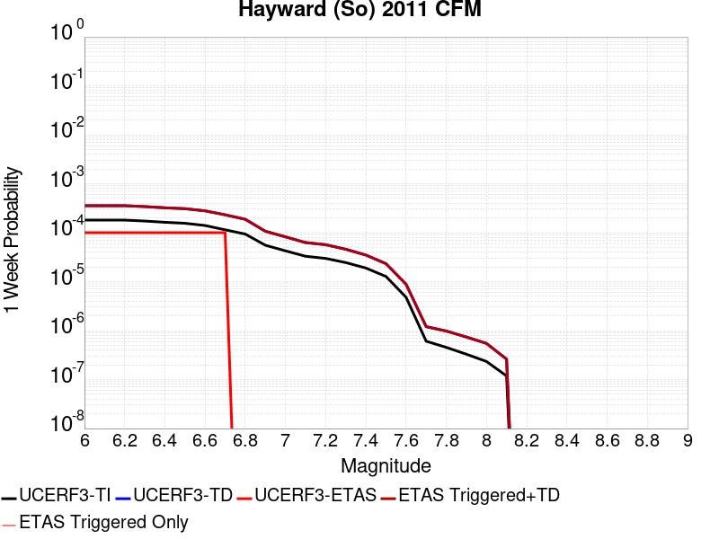 | 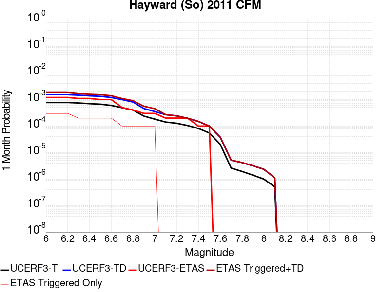 | 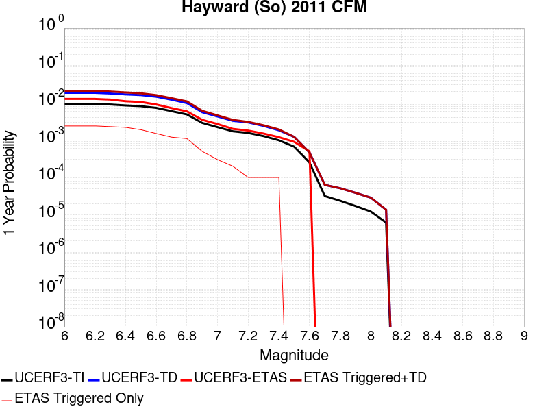 | 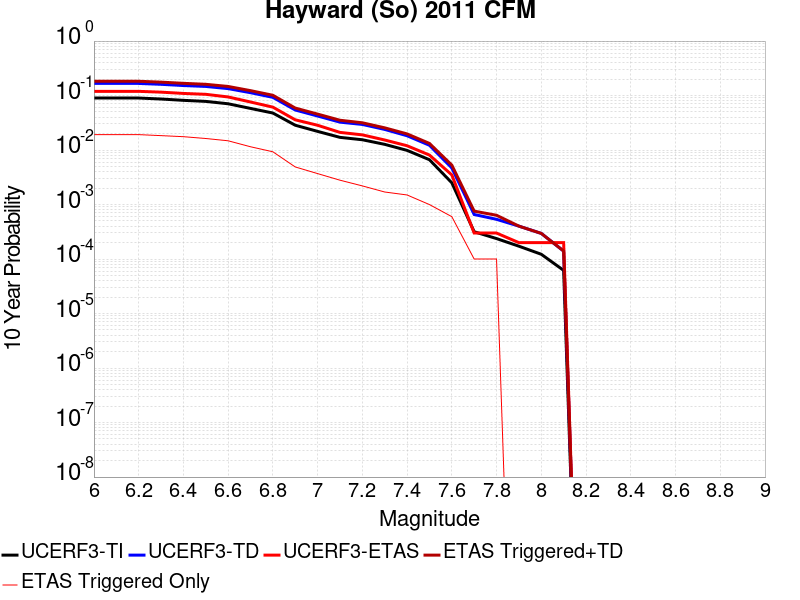 |

| Magnitude | 1 wk TI Prob | 1 wk TD Prob | 1 wk ETAS Prob | 1 wk ETAS/TD Gain | 1 wk ETAS Triggered+TD | 1 wk ETAS Triggered Only | 1 mo TI Prob | 1 mo TD Prob | 1 mo ETAS Prob | 1 mo ETAS/TD Gain | 1 mo ETAS Triggered+TD | 1 mo ETAS Triggered Only | 1 yr TI Prob | 1 yr TD Prob | 1 yr ETAS Prob | 1 yr ETAS/TD Gain | 1 yr ETAS Triggered+TD | 1 yr ETAS Triggered Only | 10 yr TI Prob | 10 yr TD Prob | 10 yr ETAS Prob | 10 yr ETAS/TD Gain | 10 yr ETAS Triggered+TD | 10 yr ETAS Triggered Only |
|-----|-----|-----|-----|-----|-----|-----|-----|-----|-----|-----|-----|-----|-----|-----|-----|-----|-----|-----|-----|-----|-----|-----|-----|-----|
| 6.0 | 1.8091932E-4 | 3.5768037E-4 | 1.0E-4 | 0.27957922 | 3.5768037E-4 | 0.0 | 7.751381E-4 | 0.0015320253 | 0.0012 | 0.7832769 | 0.0018315656 | 3.0E-4 | 0.00939654 | 0.018495299 | 0.0127 | 0.68666095 | 0.02085091 | 0.0024 | 0.090090066 | 0.16693705 | 0.1195 | 0.7158387 | 0.18293187 | 0.0192 |
| 6.1 | 1.8091932E-4 | 3.5768037E-4 | 1.0E-4 | 0.27957922 | 3.5768037E-4 | 0.0 | 7.751381E-4 | 0.0015320253 | 0.0012 | 0.7832769 | 0.0018315656 | 3.0E-4 | 0.00939654 | 0.018495299 | 0.0127 | 0.68666095 | 0.02085091 | 0.0024 | 0.090090066 | 0.16693705 | 0.1195 | 0.7158387 | 0.18293187 | 0.0192 |
| 6.2 | 1.8091932E-4 | 3.5768037E-4 | 1.0E-4 | 0.27957922 | 3.5768037E-4 | 0.0 | 7.751381E-4 | 0.0015320253 | 0.0012 | 0.7832769 | 0.0018315656 | 3.0E-4 | 0.00939654 | 0.018495299 | 0.0127 | 0.68666095 | 0.02085091 | 0.0024 | 0.090090066 | 0.16693705 | 0.1195 | 0.7158387 | 0.18293187 | 0.0192 |
| 6.3 | 1.7322872E-4 | 3.4323483E-4 | 1.0E-4 | 0.29134572 | 3.4323483E-4 | 0.0 | 7.4219756E-4 | 0.0014701869 | 0.0011 | 0.74820423 | 0.0016698928 | 2.0E-4 | 0.0089988755 | 0.0177549 | 0.0122 | 0.6871343 | 0.020014063 | 0.0023 | 0.08643075 | 0.16086544 | 0.1155 | 0.7179914 | 0.17630552 | 0.0184 |
| 6.4 | 1.6334097E-4 | 3.2403463E-4 | 1.0E-4 | 0.308609 | 3.2403463E-4 | 0.0 | 6.998449E-4 | 0.0013879894 | 0.0011 | 0.79251325 | 0.0015877119 | 2.0E-4 | 0.008487372 | 0.01676985 | 0.011 | 0.6559391 | 0.018932955 | 0.0022 | 0.081704415 | 0.15274274 | 0.1094 | 0.71623695 | 0.16765447 | 0.0176 |
| 6.5 | 1.5600289E-4 | 3.107662E-4 | 1.0E-4 | 0.3217853 | 3.107662E-4 | 0.0 | 6.684125E-4 | 0.0013311837 | 0.001 | 0.7512111 | 0.0015309175 | 2.0E-4 | 0.008107598 | 0.01608862 | 0.0105 | 0.6526352 | 0.01795805 | 0.0019 | 0.078181036 | 0.14701496 | 0.1054 | 0.71693385 | 0.16091861 | 0.0163 |
| 6.6 | 1.4046066E-4 | 2.8087836E-4 | 1.0E-4 | 0.35602602 | 2.8087836E-4 | 0.0 | 6.018354E-4 | 0.0012032158 | 0.001 | 0.83110607 | 0.0014029752 | 2.0E-4 | 0.0073027555 | 0.014552263 | 0.009 | 0.61846054 | 0.016030435 | 0.0015 | 0.07067384 | 0.13409375 | 0.0943 | 0.7032393 | 0.14690916 | 0.0148 |
| 6.7 | 1.14696966E-4 | 2.332083E-4 | 1.0E-4 | 0.4288012 | 2.332083E-4 | 0.0 | 4.914658E-4 | 9.990864E-4 | 5.0E-4 | 0.5004572 | 0.0010989865 | 1.0E-4 | 0.0059671924 | 0.012097103 | 0.0072 | 0.59518385 | 0.013282586 | 0.0012 | 0.058094822 | 0.1129131 | 0.0762 | 0.67485523 | 0.12311461 | 0.0115 |
| 6.8 | 9.3874296E-5 | 1.8902002E-4 | 0.0 | 0.0 | 1.8902002E-4 | 0.0 | 4.0225635E-4 | 8.09838E-4 | 4.0E-4 | 0.49392596 | 9.09757E-4 | 1.0E-4 | 0.0048864787 | 0.009815941 | 0.0059 | 0.60106313 | 0.010905143 | 0.0011 | 0.047804173 | 0.09276123 | 0.0613 | 0.6608364 | 0.101198554 | 0.0093 |
| 6.9 | 5.551852E-5 | 1.0754485E-4 | 0.0 | 0.0 | 1.0754485E-4 | 0.0 | 2.3791482E-4 | 4.6082571E-4 | 3.0E-4 | 0.6510053 | 5.6077965E-4 | 1.0E-4 | 0.0028927654 | 0.0055962387 | 0.0035 | 0.62542003 | 0.0060934406 | 5.0E-4 | 0.028553981 | 0.054359816 | 0.0359 | 0.6604143 | 0.05899345 | 0.0049 |
| 7.0 | 4.2662363E-5 | 8.266462E-5 | 0.0 | 0.0 | 8.266462E-5 | 0.0 | 1.8282588E-4 | 3.5422924E-4 | 3.0E-4 | 0.8469092 | 4.541938E-4 | 1.0E-4 | 0.0022236328 | 0.004304286 | 0.0027 | 0.6272817 | 0.004602995 | 3.0E-4 | 0.022015138 | 0.042156972 | 0.0285 | 0.67604476 | 0.04570099 | 0.0037 |
| 7.1 | 3.305886E-5 | 6.318466E-5 | 0.0 | 0.0 | 6.318466E-5 | 0.0 | 1.4167312E-4 | 2.707634E-4 | 2.0E-4 | 0.7386522 | 2.707634E-4 | 0.0 | 0.0017235056 | 0.0032915806 | 0.002 | 0.6076108 | 0.0034909223 | 2.0E-4 | 0.017101998 | 0.032530148 | 0.0211 | 0.64862907 | 0.035239063 | 0.0028 |
| 7.2 | 2.9856887E-5 | 5.717015E-5 | 0.0 | 0.0 | 5.717015E-5 | 0.0 | 1.2795182E-4 | 2.44992E-4 | 2.0E-4 | 0.81635314 | 2.44992E-4 | 0.0 | 0.0015567001 | 0.0029787146 | 0.0018 | 0.60428745 | 0.003078417 | 1.0E-4 | 0.015458403 | 0.029527077 | 0.019 | 0.64347714 | 0.031662118 | 0.0022 |
| 7.3 | 2.4559737E-5 | 4.6122455E-5 | 0.0 | 0.0 | 4.6122455E-5 | 0.0 | 1.0525176E-4 | 1.9765277E-4 | 2.0E-4 | 1.0118755 | 1.9765277E-4 | 0.0 | 0.0012806869 | 0.0024037797 | 0.0015 | 0.62401724 | 0.0025035392 | 1.0E-4 | 0.012733313 | 0.023920048 | 0.0153 | 0.63963085 | 0.025579384 | 0.0017 |
| 7.4 | 1.9002231E-5 | 3.5159075E-5 | 0.0 | 0.0 | 3.5159075E-5 | 0.0 | 8.143559E-5 | 1.506731E-4 | 1.0E-4 | 0.6636885 | 1.506731E-4 | 0.0 | 9.910273E-4 | 0.0018329114 | 0.0012 | 0.6546961 | 0.0019327281 | 1.0E-4 | 0.009866194 | 0.018310636 | 0.012 | 0.6553568 | 0.019783169 | 0.0015 |
| 7.5 | 1.2783333E-5 | 2.341251E-5 | 0.0 | 0.0 | 2.341251E-5 | 0.0 | 5.4784563E-5 | 1.003355E-4 | 1.0E-4 | 0.9966562 | 1.003355E-4 | 0.0 | 6.667979E-4 | 0.001220906 | 9.0E-4 | 0.73715746 | 0.001220906 | 0.0 | 0.006648007 | 0.01224934 | 0.0081 | 0.66126007 | 0.013237091 | 0.001 |
| 7.6 | 4.8149627E-6 | 8.923048E-6 | 0.0 | 0.0 | 8.923048E-6 | 0.0 | 2.063539E-5 | 3.824108E-5 | 0.0 | 0.0 | 3.824108E-5 | 0.0 | 2.5120692E-4 | 4.6548693E-4 | 5.0E-4 | 1.074144 | 4.6548693E-4 | 0.0 | 0.0025092314 | 0.0046981317 | 0.0035 | 0.744977 | 0.0052953125 | 6.0E-4 |
| 7.7 | 6.0838227E-7 | 1.2145697E-6 | 0.0 | 0.0 | 1.2145697E-6 | 0.0 | 2.6073499E-6 | 5.2052883E-6 | 0.0 | 0.0 | 5.2052883E-6 | 0.0 | 3.174402E-5 | 6.337254E-5 | 0.0 | 0.0 | 6.337254E-5 | 0.0 | 3.1739488E-4 | 6.5726135E-4 | 3.0E-4 | 0.45643947 | 7.571956E-4 | 1.0E-4 |
| 7.8 | 4.5542808E-7 | 9.870333E-7 | 0.0 | 0.0 | 9.870333E-7 | 0.0 | 1.9518332E-6 | 4.2301363E-6 | 0.0 | 0.0 | 4.2301363E-6 | 0.0 | 2.376331E-5 | 5.1500694E-5 | 0.0 | 0.0 | 5.1500694E-5 | 0.0 | 2.3760769E-4 | 5.3593307E-4 | 3.0E-4 | 0.55977136 | 6.3587946E-4 | 1.0E-4 |
| 7.9 | 3.3016747E-7 | 7.4444273E-7 | 0.0 | 0.0 | 7.4444273E-7 | 0.0 | 1.4150027E-6 | 3.190465E-6 | 0.0 | 0.0 | 3.190465E-6 | 0.0 | 1.7227521E-5 | 3.884322E-5 | 0.0 | 0.0 | 3.884322E-5 | 0.0 | 1.7226185E-4 | 4.0212754E-4 | 2.0E-4 | 0.49735463 | 4.0212754E-4 | 0.0 |
| 8.0 | 2.347038E-7 | 5.512896E-7 | 0.0 | 0.0 | 5.512896E-7 | 0.0 | 1.0058731E-6 | 2.3626674E-6 | 0.0 | 0.0 | 2.3626674E-6 | 0.0 | 1.2246436E-5 | 2.8765098E-5 | 0.0 | 0.0 | 2.8765098E-5 | 0.0 | 1.2245761E-4 | 2.9556034E-4 | 2.0E-4 | 0.6766808 | 2.9556034E-4 | 0.0 |
| 8.1 | 1.18822804E-7 | 2.6248352E-7 | 0.0 | 0.0 | 2.6248352E-7 | 0.0 | 5.092405E-7 | 1.1249289E-6 | 0.0 | 0.0 | 1.1249289E-6 | 0.0 | 6.1999854E-6 | 1.3695924E-5 | 0.0 | 0.0 | 1.3695924E-5 | 0.0 | 6.199812E-5 | 1.4011926E-4 | 2.0E-4 | 1.4273556 | 1.4011926E-4 | 0.0 |

## San Andreas (Offshore) 2011 CFM
*[(top)](#table-of-contents)*

| 1 Week | 1 Month | 1 Year | 10 Year |
|-----|-----|-----|-----|
| 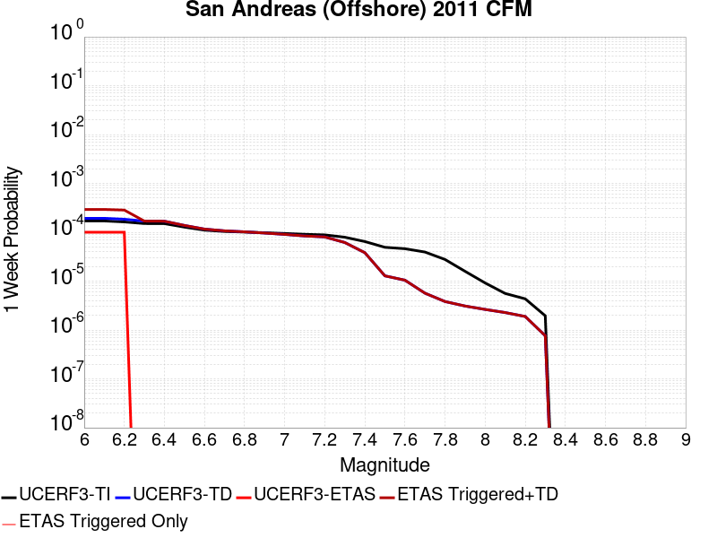 | 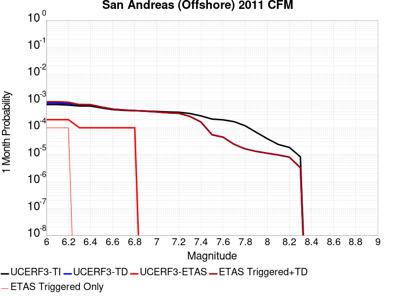 | 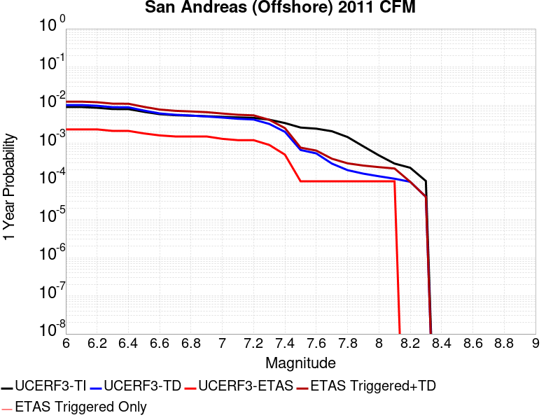 | 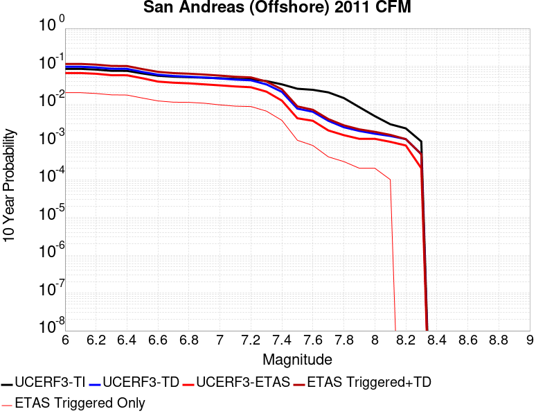 |

| Magnitude | 1 wk TI Prob | 1 wk TD Prob | 1 wk ETAS Prob | 1 wk ETAS/TD Gain | 1 wk ETAS Triggered+TD | 1 wk ETAS Triggered Only | 1 mo TI Prob | 1 mo TD Prob | 1 mo ETAS Prob | 1 mo ETAS/TD Gain | 1 mo ETAS Triggered+TD | 1 mo ETAS Triggered Only | 1 yr TI Prob | 1 yr TD Prob | 1 yr ETAS Prob | 1 yr ETAS/TD Gain | 1 yr ETAS Triggered+TD | 1 yr ETAS Triggered Only | 10 yr TI Prob | 10 yr TD Prob | 10 yr ETAS Prob | 10 yr ETAS/TD Gain | 10 yr ETAS Triggered+TD | 10 yr ETAS Triggered Only |
|-----|-----|-----|-----|-----|-----|-----|-----|-----|-----|-----|-----|-----|-----|-----|-----|-----|-----|-----|-----|-----|-----|-----|-----|-----|
| 6.0 | 1.7072787E-4 | 1.9321378E-4 | 1.0E-4 | 0.5175614 | 2.9319446E-4 | 1.0E-4 | 7.3148566E-4 | 8.2779874E-4 | 2.0E-4 | 0.24160463 | 9.2771597E-4 | 1.0E-4 | 0.008869528 | 0.010032395 | 0.0069 | 0.687772 | 0.01230932 | 0.0023 | 0.085237645 | 0.09724011 | 0.0661 | 0.67976063 | 0.11529531 | 0.02 |
| 6.1 | 1.7072787E-4 | 1.9321378E-4 | 1.0E-4 | 0.5175614 | 2.9319446E-4 | 1.0E-4 | 7.3148566E-4 | 8.2779874E-4 | 2.0E-4 | 0.24160463 | 9.2771597E-4 | 1.0E-4 | 0.008869528 | 0.010032395 | 0.0069 | 0.687772 | 0.01230932 | 0.0023 | 0.085237645 | 0.09724011 | 0.0661 | 0.67976063 | 0.11529531 | 0.02 |
| 6.2 | 1.6312556E-4 | 1.8499688E-4 | 1.0E-4 | 0.54054964 | 2.8497836E-4 | 1.0E-4 | 6.989222E-4 | 7.926053E-4 | 2.0E-4 | 0.25233242 | 8.92526E-4 | 1.0E-4 | 0.008476226 | 0.009607774 | 0.0069 | 0.71816844 | 0.011885676 | 0.0023 | 0.08160117 | 0.09324473 | 0.0633 | 0.67885876 | 0.11047308 | 0.019 |
| 6.3 | 1.5103363E-4 | 1.696726E-4 | 0.0 | 0.0 | 1.696726E-4 | 0.0 | 6.471264E-4 | 7.269678E-4 | 1.0E-4 | 0.13755767 | 7.269678E-4 | 0.0 | 0.007850339 | 0.008815363 | 0.0063 | 0.7146615 | 0.01089685 | 0.0021 | 0.075787395 | 0.085872605 | 0.058 | 0.67541915 | 0.10186984 | 0.0175 |
| 6.4 | 1.5047993E-4 | 1.6853021E-4 | 0.0 | 0.0 | 1.6853021E-4 | 0.0 | 6.4475456E-4 | 7.220746E-4 | 1.0E-4 | 0.13848984 | 7.220746E-4 | 0.0 | 0.007821669 | 0.008756267 | 0.0063 | 0.7194847 | 0.010837879 | 0.0021 | 0.0755203 | 0.08535228 | 0.0577 | 0.6760218 | 0.10117568 | 0.0173 |
| 6.5 | 1.2760791E-4 | 1.3811453E-4 | 0.0 | 0.0 | 1.3811453E-4 | 0.0 | 5.467764E-4 | 5.917866E-4 | 1.0E-4 | 0.16897985 | 5.917866E-4 | 0.0 | 0.0066367025 | 0.0071814754 | 0.0056 | 0.779784 | 0.008968549 | 0.0018 | 0.064419635 | 0.07060123 | 0.0481 | 0.6812913 | 0.08398457 | 0.0144 |
| 6.6 | 1.1063525E-4 | 1.16256444E-4 | 0.0 | 0.0 | 1.16256444E-4 | 0.0 | 4.740649E-4 | 4.9814786E-4 | 1.0E-4 | 0.20074362 | 4.9814786E-4 | 0.0 | 0.0057564764 | 0.0060482887 | 0.0044 | 0.7274785 | 0.0076386114 | 0.0016 | 0.05609626 | 0.059803557 | 0.0393 | 0.6571516 | 0.071179934 | 0.0121 |
| 6.7 | 1.0391049E-4 | 1.07120344E-4 | 0.0 | 0.0 | 1.07120344E-4 | 0.0 | 4.4525467E-4 | 4.5900742E-4 | 1.0E-4 | 0.2178614 | 4.5900742E-4 | 0.0 | 0.0054075094 | 0.0055742855 | 0.004 | 0.71758074 | 0.0070659244 | 0.0015 | 0.052778035 | 0.05529294 | 0.0367 | 0.66373754 | 0.06587366 | 0.0112 |
| 6.8 | 1.0096706E-4 | 1.0222936E-4 | 0.0 | 0.0 | 1.0222936E-4 | 0.0 | 4.3264418E-4 | 4.3805322E-4 | 1.0E-4 | 0.22828276 | 4.3805322E-4 | 0.0 | 0.0052547283 | 0.0053204354 | 0.0039 | 0.73302275 | 0.0068124547 | 0.0015 | 0.051321987 | 0.05298587 | 0.0353 | 0.66621536 | 0.06349772 | 0.0111 |
| 6.9 | 9.800265E-5 | 9.652303E-5 | 0.0 | 0.0 | 9.652303E-5 | 0.0 | 4.1994374E-4 | 4.1360548E-4 | 0.0 | 0.0 | 4.1360548E-4 | 0.0 | 0.0051008356 | 0.0050241905 | 0.0037 | 0.7364371 | 0.006516654 | 0.0015 | 0.049853306 | 0.05030925 | 0.0332 | 0.6599184 | 0.060281 | 0.0105 |
| 7.0 | 9.4642375E-5 | 9.064239E-5 | 0.0 | 0.0 | 9.064239E-5 | 0.0 | 4.0554712E-4 | 3.8841044E-4 | 0.0 | 0.0 | 3.8841044E-4 | 0.0 | 0.004926363 | 0.004718808 | 0.0034 | 0.7205209 | 0.0060126735 | 0.0013 | 0.048185747 | 0.047484927 | 0.0312 | 0.6570506 | 0.05653382 | 0.0095 |
| 7.1 | 9.0996844E-5 | 8.41463E-5 | 0.0 | 0.0 | 8.41463E-5 | 0.0 | 3.8992817E-4 | 3.60578E-4 | 0.0 | 0.0 | 3.60578E-4 | 0.0 | 0.004737046 | 0.004381359 | 0.0032 | 0.730367 | 0.0055761016 | 0.0012 | 0.04637333 | 0.044330936 | 0.0292 | 0.6586822 | 0.052740823 | 0.0088 |
| 7.2 | 8.848287E-5 | 8.040739E-5 | 0.0 | 0.0 | 8.040739E-5 | 0.0 | 3.791572E-4 | 3.4455847E-4 | 0.0 | 0.0 | 3.4455847E-4 | 0.0 | 0.004606472 | 0.004187086 | 0.0032 | 0.7642546 | 0.005382062 | 0.0012 | 0.045121472 | 0.04246849 | 0.0278 | 0.654603 | 0.050703257 | 0.0086 |
| 7.3 | 7.9280784E-5 | 6.175174E-5 | 0.0 | 0.0 | 6.175174E-5 | 0.0 | 3.3973053E-4 | 2.6462408E-4 | 0.0 | 0.0 | 2.6462408E-4 | 0.0 | 0.004128377 | 0.0032171423 | 0.0024 | 0.7460037 | 0.004114247 | 9.0E-4 | 0.040525194 | 0.033133682 | 0.0213 | 0.6428504 | 0.039418314 | 0.0065 |
| 7.4 | 6.468038E-5 | 3.8249156E-5 | 0.0 | 0.0 | 3.8249156E-5 | 0.0 | 2.771722E-4 | 1.6391499E-4 | 0.0 | 0.0 | 1.6391499E-4 | 0.0 | 0.0033693502 | 0.001993897 | 0.0015 | 0.7522956 | 0.0024929 | 5.0E-4 | 0.0331872 | 0.020985844 | 0.0123 | 0.5861094 | 0.024608195 | 0.0037 |
| 7.5 | 4.930574E-5 | 1.2850882E-5 | 0.0 | 0.0 | 1.2850882E-5 | 0.0 | 2.1129321E-4 | 5.5074055E-5 | 0.0 | 0.0 | 5.5074055E-5 | 0.0 | 0.0025694598 | 6.70322E-4 | 3.0E-4 | 0.44754612 | 7.7025493E-4 | 1.0E-4 | 0.02539953 | 0.0075695063 | 0.0042 | 0.55485785 | 0.00866118 | 0.0011 |
| 7.6 | 4.612566E-5 | 1.0467925E-5 | 0.0 | 0.0 | 1.0467925E-5 | 0.0 | 1.9766642E-4 | 4.4861772E-5 | 0.0 | 0.0 | 4.4861772E-5 | 0.0 | 0.0024039324 | 5.4605654E-4 | 3.0E-4 | 0.54939365 | 6.4600195E-4 | 1.0E-4 | 0.023780935 | 0.0062518376 | 0.0036 | 0.5758307 | 0.007046836 | 8.0E-4 |
| 7.7 | 3.9435414E-5 | 5.676751E-6 | 0.0 | 0.0 | 5.676751E-6 | 0.0 | 1.6899795E-4 | 2.4328705E-5 | 0.0 | 0.0 | 2.4328705E-5 | 0.0 | 0.0020556084 | 2.9616192E-4 | 2.0E-4 | 0.67530626 | 3.961323E-4 | 1.0E-4 | 0.020366974 | 0.0036048521 | 0.002 | 0.5548078 | 0.00400341 | 4.0E-4 |
| 7.8 | 2.7787428E-5 | 3.8282524E-6 | 0.0 | 0.0 | 3.8282524E-6 | 0.0 | 1.1908354E-4 | 1.6406693E-5 | 0.0 | 0.0 | 1.6406693E-5 | 0.0 | 0.0014488777 | 1.9973321E-4 | 2.0E-4 | 1.0013357 | 2.9971325E-4 | 1.0E-4 | 0.014394675 | 0.002432256 | 0.0015 | 0.61671144 | 0.0027315263 | 3.0E-4 |
| 7.9 | 1.590671E-5 | 3.098117E-6 | 0.0 | 0.0 | 3.098117E-6 | 0.0 | 6.816983E-5 | 1.3277578E-5 | 0.0 | 0.0 | 1.3277578E-5 | 0.0 | 8.2965166E-4 | 1.6164254E-4 | 2.0E-4 | 1.237298 | 2.6162638E-4 | 1.0E-4 | 0.008265611 | 0.0019383664 | 0.0012 | 0.619078 | 0.0021379788 | 2.0E-4 |
| 8.0 | 9.193638E-6 | 2.639979E-6 | 0.0 | 0.0 | 2.639979E-6 | 0.0 | 3.940071E-5 | 1.1314146E-5 | 0.0 | 0.0 | 1.1314146E-5 | 0.0 | 4.7959806E-4 | 1.3774105E-4 | 2.0E-4 | 1.452 | 2.3772728E-4 | 1.0E-4 | 0.0047856434 | 0.0016394156 | 0.0012 | 0.73196816 | 0.0018390877 | 2.0E-4 |
| 8.1 | 5.601576E-6 | 2.2782797E-6 | 0.0 | 0.0 | 2.2782797E-6 | 0.0 | 2.4006533E-5 | 9.764019E-6 | 0.0 | 0.0 | 9.764019E-6 | 0.0 | 2.9224035E-4 | 1.1887048E-4 | 2.0E-4 | 1.6825036 | 2.188586E-4 | 1.0E-4 | 0.0029185633 | 0.0014274865 | 0.001 | 0.70053196 | 0.0015273439 | 1.0E-4 |
| 8.2 | 4.3508785E-6 | 1.8923428E-6 | 0.0 | 0.0 | 1.8923428E-6 | 0.0 | 1.864649E-5 | 8.110015E-6 | 0.0 | 0.0 | 8.110015E-6 | 0.0 | 2.2699735E-4 | 9.873499E-5 | 1.0E-4 | 1.0128121 | 9.873499E-5 | 0.0 | 0.0022676561 | 0.0011793338 | 8.0E-4 | 0.67834914 | 0.0011793338 | 0.0 |
| 8.3 | 1.9573292E-6 | 7.644817E-7 | 0.0 | 0.0 | 7.644817E-7 | 0.0 | 8.388526E-6 | 3.276346E-6 | 0.0 | 0.0 | 3.276346E-6 | 0.0 | 1.0212552E-4 | 3.98888E-5 | 0.0 | 0.0 | 3.98888E-5 | 0.0 | 0.001020786 | 4.7157967E-4 | 2.0E-4 | 0.4241065 | 4.7157967E-4 | 0.0 |

## Little Lake
*[(top)](#table-of-contents)*

| 1 Week | 1 Month | 1 Year | 10 Year |
|-----|-----|-----|-----|
| 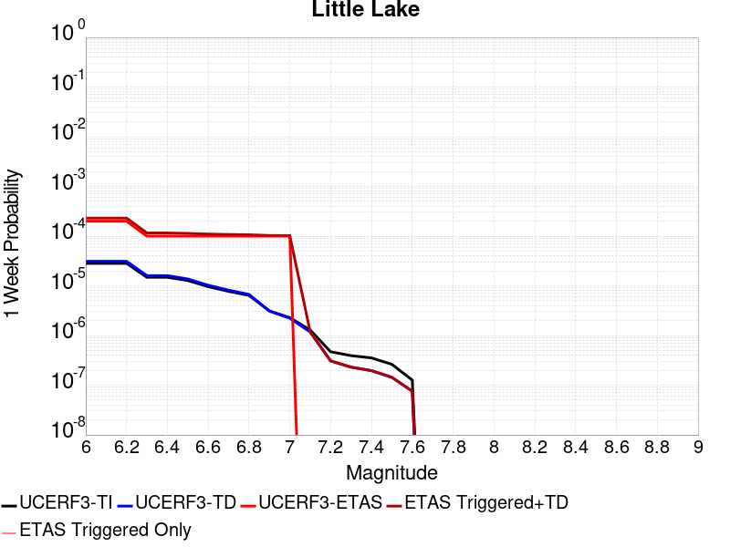 | 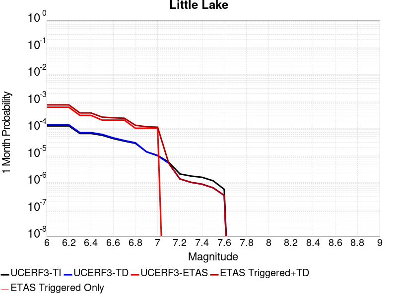 | 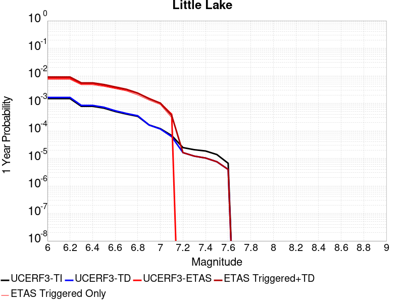 | 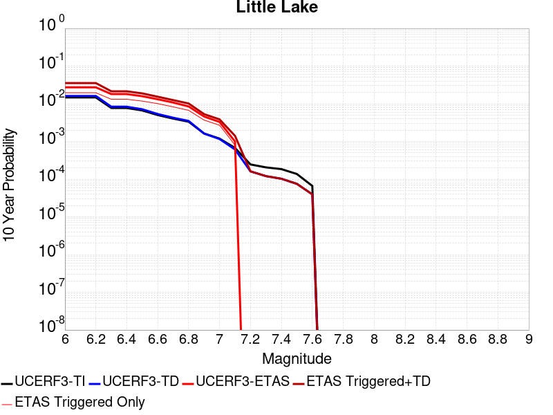 |

| Magnitude | 1 wk TI Prob | 1 wk TD Prob | 1 wk ETAS Prob | 1 wk ETAS/TD Gain | 1 wk ETAS Triggered+TD | 1 wk ETAS Triggered Only | 1 mo TI Prob | 1 mo TD Prob | 1 mo ETAS Prob | 1 mo ETAS/TD Gain | 1 mo ETAS Triggered+TD | 1 mo ETAS Triggered Only | 1 yr TI Prob | 1 yr TD Prob | 1 yr ETAS Prob | 1 yr ETAS/TD Gain | 1 yr ETAS Triggered+TD | 1 yr ETAS Triggered Only | 10 yr TI Prob | 10 yr TD Prob | 10 yr ETAS Prob | 10 yr ETAS/TD Gain | 10 yr ETAS Triggered+TD | 10 yr ETAS Triggered Only |
|-----|-----|-----|-----|-----|-----|-----|-----|-----|-----|-----|-----|-----|-----|-----|-----|-----|-----|-----|-----|-----|-----|-----|-----|-----|
| 6.0 | 2.8424427E-5 | 3.1212534E-5 | 2.0E-4 | 6.4076824 | 2.3120629E-4 | 2.0E-4 | 1.2181328E-4 | 1.3376189E-4 | 6.0E-4 | 4.4855824 | 7.3368166E-4 | 6.0E-4 | 0.0014820677 | 0.0016274677 | 0.0082 | 5.038502 | 0.009015424 | 0.0074 | 0.014722223 | 0.016168905 | 0.0273 | 1.688426 | 0.035451993 | 0.0196 |
| 6.1 | 2.8424427E-5 | 3.1212534E-5 | 2.0E-4 | 6.4076824 | 2.3120629E-4 | 2.0E-4 | 1.2181328E-4 | 1.3376189E-4 | 6.0E-4 | 4.4855824 | 7.3368166E-4 | 6.0E-4 | 0.0014820677 | 0.0016274677 | 0.0082 | 5.038502 | 0.009015424 | 0.0074 | 0.014722223 | 0.016168905 | 0.0273 | 1.688426 | 0.035451993 | 0.0196 |
| 6.2 | 2.8424427E-5 | 3.1212534E-5 | 2.0E-4 | 6.4076824 | 2.3120629E-4 | 2.0E-4 | 1.2181328E-4 | 1.3376189E-4 | 6.0E-4 | 4.4855824 | 7.3368166E-4 | 6.0E-4 | 0.0014820677 | 0.0016274677 | 0.0082 | 5.038502 | 0.009015424 | 0.0074 | 0.014722223 | 0.016168905 | 0.0273 | 1.688426 | 0.035451993 | 0.0196 |
| 6.3 | 1.48860645E-5 | 1.6084552E-5 | 1.0E-4 | 6.2171454 | 1.1608294E-4 | 1.0E-4 | 6.379586E-5 | 6.893213E-5 | 3.0E-4 | 4.352107 | 3.6891145E-4 | 3.0E-4 | 7.7643775E-4 | 8.3895377E-4 | 0.0052 | 6.198196 | 0.0055350107 | 0.0047 | 0.007737305 | 0.008360686 | 0.0181 | 2.1648943 | 0.021450324 | 0.0132 |
| 6.4 | 1.48860645E-5 | 1.6084552E-5 | 1.0E-4 | 6.2171454 | 1.1608294E-4 | 1.0E-4 | 6.379586E-5 | 6.893213E-5 | 3.0E-4 | 4.352107 | 3.6891145E-4 | 3.0E-4 | 7.7643775E-4 | 8.3895377E-4 | 0.0052 | 6.198196 | 0.0055350107 | 0.0047 | 0.007737305 | 0.008360686 | 0.0181 | 2.1648943 | 0.021450324 | 0.0132 |
| 6.5 | 1.2797581E-5 | 1.3768208E-5 | 1.0E-4 | 7.263109 | 1.1376683E-4 | 1.0E-4 | 5.4845623E-5 | 5.9005415E-5 | 2.0E-4 | 3.3895195 | 2.5899362E-4 | 2.0E-4 | 6.675408E-4 | 7.1817986E-4 | 0.0045 | 6.26584 | 0.0048152353 | 0.0041 | 0.006655392 | 0.0071611404 | 0.0159 | 2.2203166 | 0.018876638 | 0.0118 |
| 6.6 | 9.661896E-6 | 1.02909025E-5 | 1.0E-4 | 9.71732 | 1.10289875E-4 | 1.0E-4 | 4.1407468E-5 | 4.4103213E-5 | 2.0E-4 | 4.5348167 | 2.440944E-4 | 2.0E-4 | 5.040193E-4 | 5.368406E-4 | 0.0037 | 6.892176 | 0.0039350153 | 0.0034 | 0.005028777 | 0.005357043 | 0.0132 | 2.464046 | 0.015402937 | 0.0101 |
| 6.7 | 7.767871E-6 | 8.201107E-6 | 1.0E-4 | 12.193476 | 1.08200285E-4 | 1.0E-4 | 3.329045E-5 | 3.5147208E-5 | 2.0E-4 | 5.6903524 | 2.3514018E-4 | 2.0E-4 | 4.0523586E-4 | 4.2784694E-4 | 0.0031 | 7.2455816 | 0.003226649 | 0.0028 | 0.004044977 | 0.0042715846 | 0.0108 | 2.5283356 | 0.012536131 | 0.0083 |
| 6.8 | 6.4235196E-6 | 6.7368956E-6 | 1.0E-4 | 14.843632 | 1.06736225E-4 | 1.0E-4 | 2.752908E-5 | 2.8872162E-5 | 1.0E-4 | 3.463544 | 1.2886927E-4 | 1.0E-4 | 3.35115E-4 | 3.514747E-4 | 0.0023 | 6.543856 | 0.0023507718 | 0.002 | 0.003346101 | 0.003510449 | 0.0085 | 2.4213426 | 0.010186929 | 0.0067 |
| 6.9 | 3.1283696E-6 | 3.1125849E-6 | 1.0E-4 | 32.12764 | 1.03112274E-4 | 1.0E-4 | 1.3407229E-5 | 1.333959E-5 | 1.0E-4 | 7.4964824 | 1.13338254E-4 | 1.0E-4 | 1.6322079E-4 | 1.6239891E-4 | 0.0015 | 9.236515 | 0.0014621877 | 0.0013 | 0.0016310095 | 0.0016229507 | 0.0046 | 2.8343437 | 0.0053169457 | 0.0037 |
| 7.0 | 2.290603E-6 | 2.2289867E-6 | 1.0E-4 | 44.863438 | 1.0222876E-4 | 1.0E-4 | 9.816834E-6 | 9.55277E-6 | 1.0E-4 | 10.468167 | 1.0955182E-4 | 1.0E-4 | 1.19513395E-4 | 1.16299816E-4 | 0.001 | 8.598466 | 0.0010161952 | 9.0E-4 | 0.0011944914 | 0.0011624917 | 0.0033 | 2.8387299 | 0.003859353 | 0.0027 |
| 7.1 | 1.293693E-6 | 1.1778702E-6 | 0.0 | 0.0 | 1.1778702E-6 | 0.0 | 5.5443866E-6 | 5.04801E-6 | 0.0 | 0.0 | 5.04801E-6 | 0.0 | 6.750081E-5 | 6.145848E-5 | 4.0E-4 | 6.5084586 | 3.6144003E-4 | 3.0E-4 | 6.7480316E-4 | 6.144834E-4 | 0.001 | 1.6273834 | 0.0014139918 | 8.0E-4 |
| 7.2 | 4.715842E-7 | 3.0926506E-7 | 0.0 | 0.0 | 3.0926506E-7 | 0.0 | 2.0210737E-6 | 1.3254211E-6 | 0.0 | 0.0 | 1.3254211E-6 | 0.0 | 2.4606294E-5 | 1.6136888E-5 | 0.0 | 0.0 | 1.6136888E-5 | 0.0 | 2.460357E-4 | 1.6135769E-4 | 0.0 | 0.0 | 1.6135769E-4 | 0.0 |
| 7.3 | 3.9430947E-7 | 2.3105396E-7 | 0.0 | 0.0 | 2.3105396E-7 | 0.0 | 1.6898966E-6 | 9.902309E-7 | 0.0 | 0.0 | 9.902309E-7 | 0.0 | 2.0574296E-5 | 1.2055995E-5 | 0.0 | 0.0 | 1.2055995E-5 | 0.0 | 2.0572392E-4 | 1.20553486E-4 | 0.0 | 0.0 | 1.20553486E-4 | 0.0 |
| 7.4 | 3.547123E-7 | 1.9686452E-7 | 0.0 | 0.0 | 1.9686452E-7 | 0.0 | 1.5201948E-6 | 8.437048E-7 | 0.0 | 0.0 | 8.437048E-7 | 0.0 | 1.8508214E-5 | 1.0272058E-5 | 0.0 | 0.0 | 1.0272058E-5 | 0.0 | 1.8506673E-4 | 1.02715894E-4 | 0.0 | 0.0 | 1.02715894E-4 | 0.0 |
| 7.5 | 2.6354266E-7 | 1.442817E-7 | 0.0 | 0.0 | 1.442817E-7 | 0.0 | 1.129468E-6 | 6.1835E-7 | 0.0 | 0.0 | 6.1835E-7 | 0.0 | 1.3751187E-5 | 7.528386E-6 | 0.0 | 0.0 | 7.528386E-6 | 0.0 | 1.3750336E-4 | 7.5281365E-5 | 0.0 | 0.0 | 7.5281365E-5 | 0.0 |
| 7.6 | 1.269913E-7 | 7.57464E-8 | 0.0 | 0.0 | 7.57464E-8 | 0.0 | 5.4424834E-7 | 3.246274E-7 | 0.0 | 0.0 | 3.246274E-7 | 0.0 | 6.6262032E-6 | 3.9523316E-6 | 0.0 | 0.0 | 3.9523316E-6 | 0.0 | 6.626006E-5 | 3.952265E-5 | 0.0 | 0.0 | 3.952265E-5 | 0.0 |

## Airport Lake
*[(top)](#table-of-contents)*

| 1 Week | 1 Month | 1 Year | 10 Year |
|-----|-----|-----|-----|
| 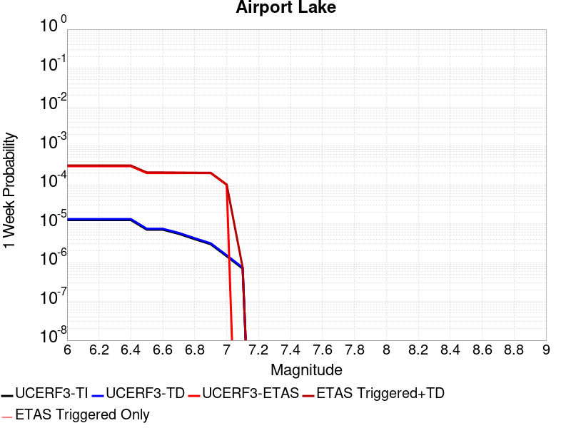 | 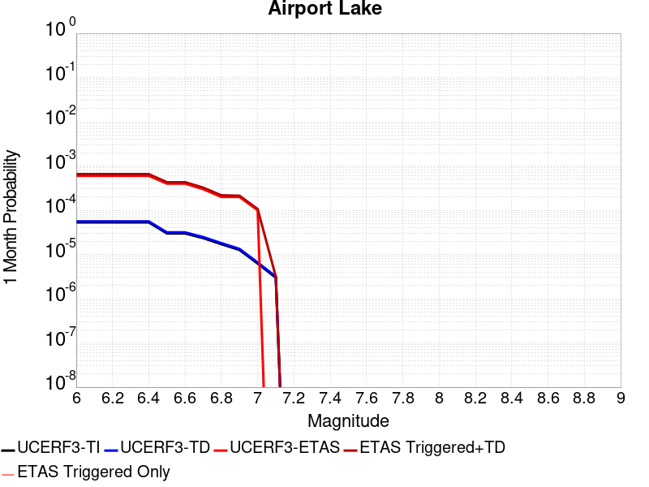 | 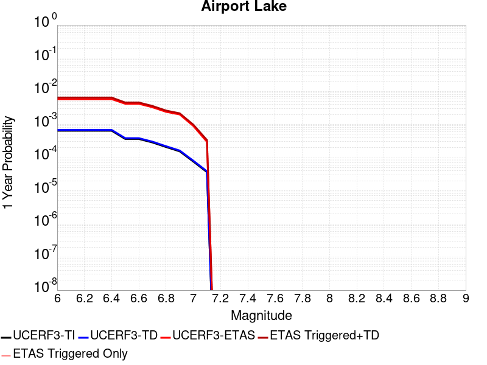 | 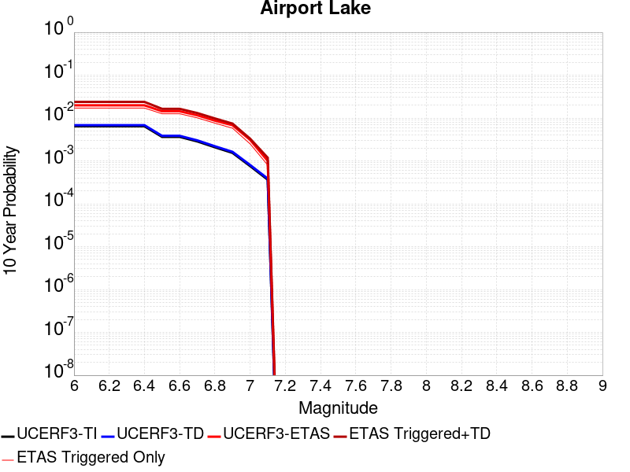 |

| Magnitude | 1 wk TI Prob | 1 wk TD Prob | 1 wk ETAS Prob | 1 wk ETAS/TD Gain | 1 wk ETAS Triggered+TD | 1 wk ETAS Triggered Only | 1 mo TI Prob | 1 mo TD Prob | 1 mo ETAS Prob | 1 mo ETAS/TD Gain | 1 mo ETAS Triggered+TD | 1 mo ETAS Triggered Only | 1 yr TI Prob | 1 yr TD Prob | 1 yr ETAS Prob | 1 yr ETAS/TD Gain | 1 yr ETAS Triggered+TD | 1 yr ETAS Triggered Only | 10 yr TI Prob | 10 yr TD Prob | 10 yr ETAS Prob | 10 yr ETAS/TD Gain | 10 yr ETAS Triggered+TD | 10 yr ETAS Triggered Only |
|-----|-----|-----|-----|-----|-----|-----|-----|-----|-----|-----|-----|-----|-----|-----|-----|-----|-----|-----|-----|-----|-----|-----|-----|-----|
| 6.0 | 1.2387061E-5 | 1.3104717E-5 | 3.0E-4 | 22.892519 | 3.1310078E-4 | 3.0E-4 | 5.3086325E-5 | 5.6162025E-5 | 6.0E-4 | 10.683375 | 6.5612834E-4 | 6.0E-4 | 6.461343E-4 | 6.835866E-4 | 0.0062 | 9.06981 | 0.006479622 | 0.0058 | 0.0064425888 | 0.006817649 | 0.0198 | 2.904227 | 0.023801068 | 0.0171 |
| 6.1 | 1.2387061E-5 | 1.3104717E-5 | 3.0E-4 | 22.892519 | 3.1310078E-4 | 3.0E-4 | 5.3086325E-5 | 5.6162025E-5 | 6.0E-4 | 10.683375 | 6.5612834E-4 | 6.0E-4 | 6.461343E-4 | 6.835866E-4 | 0.0062 | 9.06981 | 0.006479622 | 0.0058 | 0.0064425888 | 0.006817649 | 0.0198 | 2.904227 | 0.023801068 | 0.0171 |
| 6.2 | 1.2387061E-5 | 1.3104717E-5 | 3.0E-4 | 22.892519 | 3.1310078E-4 | 3.0E-4 | 5.3086325E-5 | 5.6162025E-5 | 6.0E-4 | 10.683375 | 6.5612834E-4 | 6.0E-4 | 6.461343E-4 | 6.835866E-4 | 0.0062 | 9.06981 | 0.006479622 | 0.0058 | 0.0064425888 | 0.006817649 | 0.0198 | 2.904227 | 0.023801068 | 0.0171 |
| 6.3 | 1.2387061E-5 | 1.3104717E-5 | 3.0E-4 | 22.892519 | 3.1310078E-4 | 3.0E-4 | 5.3086325E-5 | 5.6162025E-5 | 6.0E-4 | 10.683375 | 6.5612834E-4 | 6.0E-4 | 6.461343E-4 | 6.835866E-4 | 0.0062 | 9.06981 | 0.006479622 | 0.0058 | 0.0064425888 | 0.006817649 | 0.0198 | 2.904227 | 0.023801068 | 0.0171 |
| 6.4 | 1.2387061E-5 | 1.3104717E-5 | 3.0E-4 | 22.892519 | 3.1310078E-4 | 3.0E-4 | 5.3086325E-5 | 5.6162025E-5 | 6.0E-4 | 10.683375 | 6.5612834E-4 | 6.0E-4 | 6.461343E-4 | 6.835866E-4 | 0.0062 | 9.06981 | 0.006479622 | 0.0058 | 0.0064425888 | 0.006817649 | 0.0198 | 2.904227 | 0.023801068 | 0.0171 |
| 6.5 | 6.9922594E-6 | 7.3857796E-6 | 2.0E-4 | 27.079065 | 2.073843E-4 | 2.0E-4 | 2.996648E-5 | 3.1652988E-5 | 4.0E-4 | 12.637038 | 4.3164034E-4 | 4.0E-4 | 3.6478083E-4 | 3.853124E-4 | 0.0044 | 11.419306 | 0.004583694 | 0.0042 | 0.003641826 | 0.0038469809 | 0.0144 | 3.7431953 | 0.016398508 | 0.0126 |
| 6.6 | 6.9922594E-6 | 7.3857796E-6 | 2.0E-4 | 27.079065 | 2.073843E-4 | 2.0E-4 | 2.996648E-5 | 3.1652988E-5 | 4.0E-4 | 12.637038 | 4.3164034E-4 | 4.0E-4 | 3.6478083E-4 | 3.853124E-4 | 0.0044 | 11.419306 | 0.004583694 | 0.0042 | 0.003641826 | 0.0038469809 | 0.0144 | 3.7431953 | 0.016398508 | 0.0126 |
| 6.7 | 5.477277E-6 | 5.7867405E-6 | 2.0E-4 | 34.56177 | 2.0578559E-4 | 2.0E-4 | 2.3473833E-5 | 2.4800102E-5 | 3.0E-4 | 12.0967245 | 3.2479267E-4 | 3.0E-4 | 2.8575645E-4 | 3.019033E-4 | 0.0035 | 11.593116 | 0.003600907 | 0.0033 | 0.0028538927 | 0.0030153156 | 0.0116 | 3.8470268 | 0.0130848605 | 0.0101 |
| 6.8 | 3.9950432E-6 | 4.2195743E-6 | 2.0E-4 | 47.398144 | 2.0421873E-4 | 2.0E-4 | 1.7121502E-5 | 1.808378E-5 | 2.0E-4 | 11.059634 | 2.1808017E-4 | 2.0E-4 | 2.0843433E-4 | 2.2015054E-4 | 0.0026 | 11.810101 | 0.0026196223 | 0.0024 | 0.0020823893 | 0.0021995956 | 0.0087 | 3.9552727 | 0.009782879 | 0.0076 |
| 6.9 | 2.95695E-6 | 3.1233856E-6 | 2.0E-4 | 64.03308 | 2.0312276E-4 | 2.0E-4 | 1.2672582E-5 | 1.3385882E-5 | 2.0E-4 | 14.941114 | 2.133832E-4 | 2.0E-4 | 1.5427776E-4 | 1.6296319E-4 | 0.0022 | 13.499981 | 0.0021626372 | 0.002 | 0.001541707 | 0.0016286593 | 0.0068 | 4.1752133 | 0.007419213 | 0.0058 |
| 7.0 | 1.456072E-6 | 1.5409967E-6 | 1.0E-4 | 64.89307 | 1.0154084E-4 | 1.0E-4 | 6.2402937E-6 | 6.6042603E-6 | 1.0E-4 | 15.141741 | 1.066036E-4 | 1.0E-4 | 7.597293E-5 | 8.040491E-5 | 0.001 | 12.437051 | 9.803325E-4 | 9.0E-4 | 7.594696E-4 | 8.038571E-4 | 0.0031 | 3.8564067 | 0.0033018475 | 0.0025 |
| 7.1 | 6.995192E-7 | 7.409877E-7 | 0.0 | 0.0 | 7.409877E-7 | 0.0 | 2.997936E-6 | 3.1756615E-6 | 0.0 | 0.0 | 3.1756615E-6 | 0.0 | 3.649926E-5 | 3.866368E-5 | 4.0E-4 | 10.345627 | 3.3865208E-4 | 3.0E-4 | 3.6493264E-4 | 3.866368E-4 | 0.001 | 2.5864067 | 0.0011863274 | 8.0E-4 |

## San Andreas (Cholame) rev
*[(top)](#table-of-contents)*

| 1 Week | 1 Month | 1 Year | 10 Year |
|-----|-----|-----|-----|
| 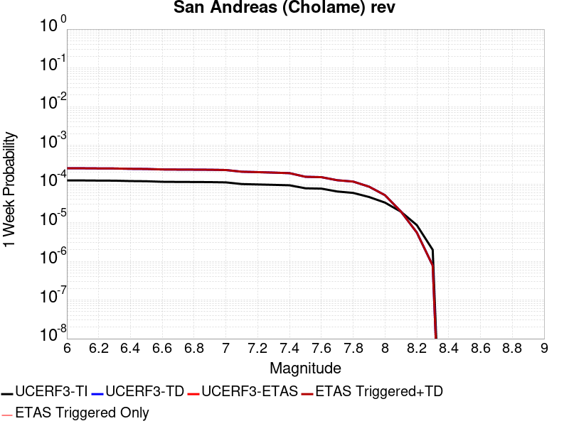 | 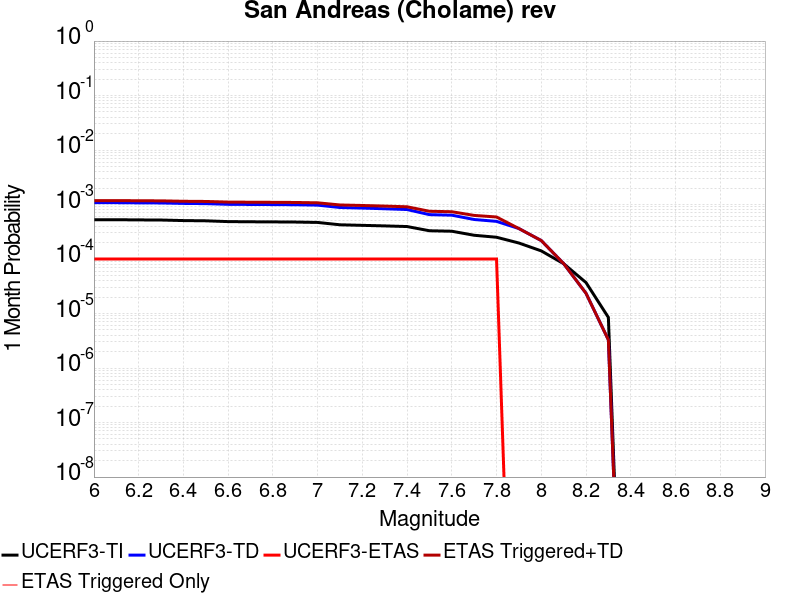 | 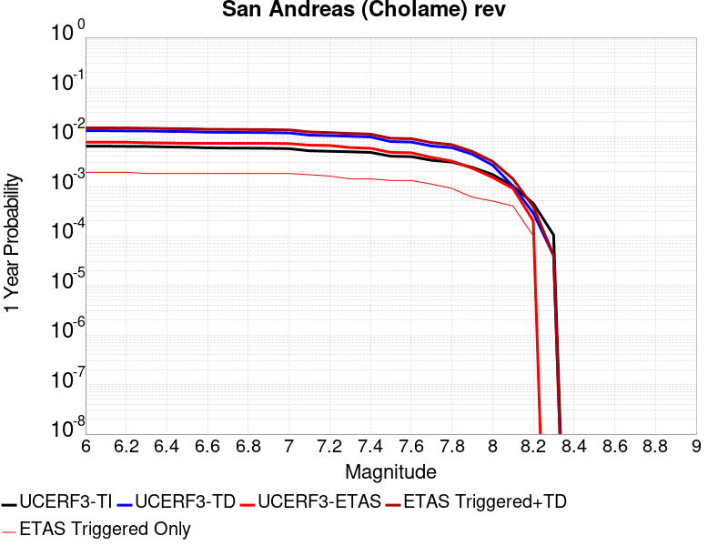 | 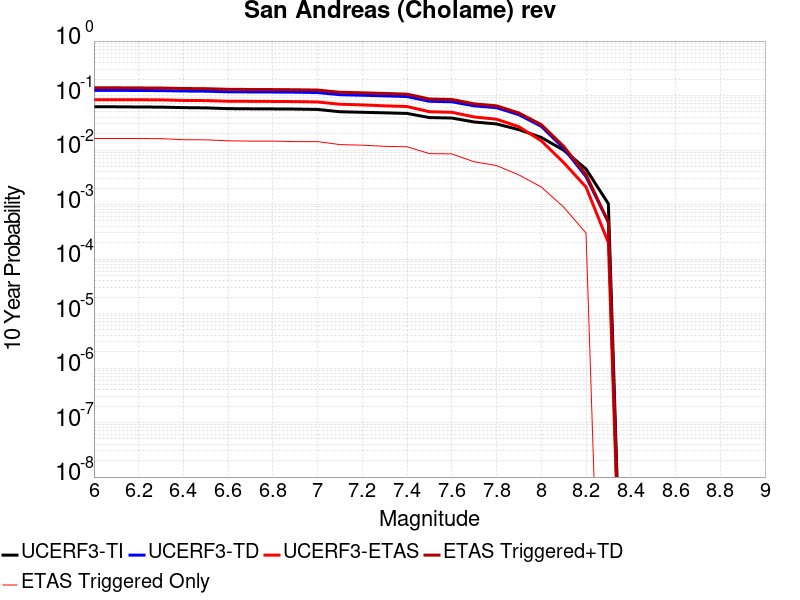 |

| Magnitude | 1 wk TI Prob | 1 wk TD Prob | 1 wk ETAS Prob | 1 wk ETAS/TD Gain | 1 wk ETAS Triggered+TD | 1 wk ETAS Triggered Only | 1 mo TI Prob | 1 mo TD Prob | 1 mo ETAS Prob | 1 mo ETAS/TD Gain | 1 mo ETAS Triggered+TD | 1 mo ETAS Triggered Only | 1 yr TI Prob | 1 yr TD Prob | 1 yr ETAS Prob | 1 yr ETAS/TD Gain | 1 yr ETAS Triggered+TD | 1 yr ETAS Triggered Only | 10 yr TI Prob | 10 yr TD Prob | 10 yr ETAS Prob | 10 yr ETAS/TD Gain | 10 yr ETAS Triggered+TD | 10 yr ETAS Triggered Only |
|-----|-----|-----|-----|-----|-----|-----|-----|-----|-----|-----|-----|-----|-----|-----|-----|-----|-----|-----|-----|-----|-----|-----|-----|-----|
| 6.0 | 1.2302514E-4 | 2.5359087E-4 | 0.0 | 0.0 | 2.5359087E-4 | 0.0 | 5.27144E-4 | 0.0010863671 | 5.0E-4 | 0.4602496 | 0.0011862584 | 1.0E-4 | 0.0063991086 | 0.01314682 | 0.0077 | 0.585693 | 0.01502184 | 0.0019 | 0.06217949 | 0.12502086 | 0.0837 | 0.66948825 | 0.13928302 | 0.0163 |
| 6.1 | 1.2302514E-4 | 2.5359087E-4 | 0.0 | 0.0 | 2.5359087E-4 | 0.0 | 5.27144E-4 | 0.0010863671 | 5.0E-4 | 0.4602496 | 0.0011862584 | 1.0E-4 | 0.0063991086 | 0.01314682 | 0.0077 | 0.585693 | 0.01502184 | 0.0019 | 0.06217949 | 0.12502086 | 0.0837 | 0.66948825 | 0.13928302 | 0.0163 |
| 6.2 | 1.2203569E-4 | 2.5175686E-4 | 0.0 | 0.0 | 2.5175686E-4 | 0.0 | 5.2290526E-4 | 0.0010785135 | 5.0E-4 | 0.46360108 | 0.0011784056 | 1.0E-4 | 0.006347804 | 0.013052352 | 0.0077 | 0.589932 | 0.014927552 | 0.0019 | 0.061695136 | 0.12420819 | 0.0837 | 0.6738686 | 0.1384836 | 0.0163 |
| 6.3 | 1.2142645E-4 | 2.5061538E-4 | 0.0 | 0.0 | 2.5061538E-4 | 0.0 | 5.202953E-4 | 0.0010736254 | 5.0E-4 | 0.46571177 | 0.0011735181 | 1.0E-4 | 0.006316212 | 0.012993551 | 0.0075 | 0.5772094 | 0.014770163 | 0.0018 | 0.06139677 | 0.123703085 | 0.0834 | 0.674195 | 0.13789909 | 0.0162 |
| 6.4 | 1.1865206E-4 | 2.456614E-4 | 0.0 | 0.0 | 2.456614E-4 | 0.0 | 5.0840975E-4 | 0.0010524114 | 5.0E-4 | 0.4750994 | 0.0011523061 | 1.0E-4 | 0.006172335 | 0.012738314 | 0.0074 | 0.5809246 | 0.014515386 | 0.0018 | 0.060036868 | 0.12149885 | 0.0813 | 0.6691421 | 0.13511562 | 0.0155 |
| 6.5 | 1.17443946E-4 | 2.4358791E-4 | 0.0 | 0.0 | 2.4358791E-4 | 0.0 | 5.032341E-4 | 0.0010435322 | 5.0E-4 | 0.47914192 | 0.0011434278 | 1.0E-4 | 0.006109677 | 0.012631466 | 0.0073 | 0.57792187 | 0.014408729 | 0.0018 | 0.059444077 | 0.120574564 | 0.0809 | 0.6709541 | 0.13411771 | 0.0154 |
| 6.6 | 1.13579066E-4 | 2.3665983E-4 | 0.0 | 0.0 | 2.3665983E-4 | 0.0 | 4.866766E-4 | 0.0010138637 | 5.0E-4 | 0.49316293 | 0.0011137624 | 1.0E-4 | 0.0059092017 | 0.012274376 | 0.0073 | 0.5947349 | 0.014052282 | 0.0018 | 0.057545185 | 0.11748636 | 0.0787 | 0.669865 | 0.13054755 | 0.0148 |
| 6.7 | 1.1271412E-4 | 2.3509929E-4 | 0.0 | 0.0 | 2.3509929E-4 | 0.0 | 4.829711E-4 | 0.0010071808 | 5.0E-4 | 0.4964352 | 0.0011070801 | 1.0E-4 | 0.005864331 | 0.012193926 | 0.0073 | 0.59865874 | 0.013971976 | 0.0018 | 0.057119697 | 0.11678901 | 0.0784 | 0.67129606 | 0.1296839 | 0.0146 |
| 6.8 | 1.1217975E-4 | 2.3397984E-4 | 0.0 | 0.0 | 2.3397984E-4 | 0.0 | 4.8068175E-4 | 0.0010023869 | 5.0E-4 | 0.4988094 | 0.0011022866 | 1.0E-4 | 0.005836608 | 0.012136212 | 0.0073 | 0.6015057 | 0.013914366 | 0.0018 | 0.056856725 | 0.116286665 | 0.078 | 0.67075616 | 0.12918888 | 0.0146 |
| 6.9 | 1.1146753E-4 | 2.3246332E-4 | 0.0 | 0.0 | 2.3246332E-4 | 0.0 | 4.7763053E-4 | 9.958926E-4 | 5.0E-4 | 0.5020622 | 0.001095793 | 1.0E-4 | 0.0057996577 | 0.012058021 | 0.0073 | 0.60540617 | 0.013836316 | 0.0018 | 0.056506127 | 0.11560638 | 0.0775 | 0.6703782 | 0.1282532 | 0.0143 |
| 7.0 | 1.0965793E-4 | 2.286848E-4 | 0.0 | 0.0 | 2.286848E-4 | 0.0 | 4.698779E-4 | 9.797111E-4 | 5.0E-4 | 0.5103545 | 0.0010796131 | 1.0E-4 | 0.005705768 | 0.011863174 | 0.0072 | 0.6069202 | 0.01364182 | 0.0018 | 0.055614736 | 0.113904506 | 0.0762 | 0.66898143 | 0.12657568 | 0.0143 |
| 7.1 | 9.927982E-5 | 2.0681857E-4 | 0.0 | 0.0 | 2.0681857E-4 | 0.0 | 4.2541555E-4 | 8.8606525E-4 | 5.0E-4 | 0.56429255 | 9.859767E-4 | 1.0E-4 | 0.0051671406 | 0.010734781 | 0.0067 | 0.6241394 | 0.012416531 | 0.0017 | 0.05048634 | 0.10398867 | 0.0693 | 0.66641873 | 0.115278415 | 0.0126 |
| 7.2 | 9.696786E-5 | 2.0185078E-4 | 0.0 | 0.0 | 2.0185078E-4 | 0.0 | 4.1551032E-4 | 8.64789E-4 | 5.0E-4 | 0.5781757 | 9.647025E-4 | 1.0E-4 | 0.00504711 | 0.010478263 | 0.0066 | 0.6298754 | 0.012061497 | 0.0016 | 0.04934009 | 0.101728 | 0.0674 | 0.66255116 | 0.11277674 | 0.0123 |
| 7.3 | 9.4727984E-5 | 1.9611928E-4 | 0.0 | 0.0 | 1.9611928E-4 | 0.0 | 4.0591392E-4 | 8.4024144E-4 | 4.0E-4 | 0.47605363 | 9.4015745E-4 | 1.0E-4 | 0.0049308087 | 0.010182228 | 0.006 | 0.589262 | 0.011567973 | 0.0014 | 0.048228268 | 0.099091806 | 0.0648 | 0.653939 | 0.10963243 | 0.0117 |
| 7.4 | 9.220358E-5 | 1.8979918E-4 | 0.0 | 0.0 | 1.8979918E-4 | 0.0 | 3.9509835E-4 | 8.131724E-4 | 4.0E-4 | 0.49190062 | 9.1309106E-4 | 1.0E-4 | 0.004799717 | 0.009855682 | 0.0058 | 0.588493 | 0.011241884 | 0.0014 | 0.046973653 | 0.096156046 | 0.0629 | 0.654145 | 0.106550254 | 0.0115 |
| 7.5 | 7.71631E-5 | 1.5297742E-4 | 0.0 | 0.0 | 1.5297742E-4 | 0.0 | 3.306571E-4 | 6.5545295E-4 | 4.0E-4 | 0.610265 | 7.553874E-4 | 1.0E-4 | 0.0040183207 | 0.007951014 | 0.0048 | 0.60369664 | 0.009240678 | 0.0013 | 0.03946433 | 0.07882922 | 0.0505 | 0.6406254 | 0.08675129 | 0.0086 |
| 7.6 | 7.5634416E-5 | 1.4955564E-4 | 0.0 | 0.0 | 1.4955564E-4 | 0.0 | 3.241072E-4 | 6.4079545E-4 | 3.0E-4 | 0.4681681 | 7.4073137E-4 | 1.0E-4 | 0.0039388672 | 0.0077738455 | 0.0047 | 0.60459137 | 0.009063739 | 0.0013 | 0.038697794 | 0.07718729 | 0.0493 | 0.6387062 | 0.0850312 | 0.0085 |
| 7.7 | 6.3783E-5 | 1.2464784E-4 | 0.0 | 0.0 | 1.2464784E-4 | 0.0 | 2.7332708E-4 | 5.340957E-4 | 3.0E-4 | 0.5616971 | 6.3404226E-4 | 1.0E-4 | 0.0033226798 | 0.0064832545 | 0.0038 | 0.5861254 | 0.007576123 | 0.0011 | 0.032734364 | 0.06503235 | 0.0405 | 0.62276703 | 0.07073565 | 0.0061 |
| 7.8 | 5.863422E-5 | 1.1512423E-4 | 0.0 | 0.0 | 1.1512423E-4 | 0.0 | 2.512653E-4 | 4.932963E-4 | 3.0E-4 | 0.60815376 | 5.93247E-4 | 1.0E-4 | 0.003054864 | 0.0059893653 | 0.0032 | 0.53428036 | 0.0068839747 | 9.0E-4 | 0.030132094 | 0.060108982 | 0.0368 | 0.6122213 | 0.064996414 | 0.0052 |
| 7.9 | 4.595283E-5 | 8.496884E-5 | 0.0 | 0.0 | 8.496884E-5 | 0.0 | 1.9692584E-4 | 3.6410138E-4 | 1.0E-4 | 0.2746488 | 3.6410138E-4 | 0.0 | 0.0023949358 | 0.004423931 | 0.0023 | 0.51989967 | 0.0050212764 | 6.0E-4 | 0.023692891 | 0.04469581 | 0.0268 | 0.5996088 | 0.048039377 | 0.0035 |
| 8.0 | 3.2950178E-5 | 5.1213552E-5 | 0.0 | 0.0 | 5.1213552E-5 | 0.0 | 1.412074E-4 | 2.1946819E-4 | 1.0E-4 | 0.4556469 | 2.1946819E-4 | 0.0 | 0.0017178444 | 0.0026687528 | 0.0015 | 0.5620603 | 0.0031674183 | 5.0E-4 | 0.017046256 | 0.027398553 | 0.0148 | 0.5401745 | 0.029441016 | 0.0021 |
| 8.1 | 1.9177472E-5 | 1.9403406E-5 | 0.0 | 0.0 | 1.9403406E-5 | 0.0 | 8.218658E-5 | 8.31548E-5 | 0.0 | 0.0 | 8.31548E-5 | 0.0 | 0.0010001622 | 0.0010119402 | 9.0E-4 | 0.8893807 | 0.0014115353 | 4.0E-4 | 0.009956728 | 0.010873555 | 0.0059 | 0.54260087 | 0.011763768 | 9.0E-4 |
| 8.2 | 8.643924E-6 | 5.556491E-6 | 0.0 | 0.0 | 5.556491E-6 | 0.0 | 3.704486E-5 | 2.3813316E-5 | 0.0 | 0.0 | 2.3813316E-5 | 0.0 | 4.5092785E-4 | 2.8988862E-4 | 2.0E-4 | 0.6899201 | 3.8985963E-4 | 1.0E-4 | 0.0045001395 | 0.0032934055 | 0.0021 | 0.63763785 | 0.0035924173 | 3.0E-4 |
| 8.3 | 1.983087E-6 | 7.792044E-7 | 0.0 | 0.0 | 7.792044E-7 | 0.0 | 8.498917E-6 | 3.3394433E-6 | 0.0 | 0.0 | 3.3394433E-6 | 0.0 | 1.034694E-4 | 4.065698E-5 | 0.0 | 0.0 | 4.065698E-5 | 0.0 | 0.0010342124 | 4.7958124E-4 | 2.0E-4 | 0.41703048 | 4.7958124E-4 | 0.0 |

## San Andreas (Carrizo) rev
*[(top)](#table-of-contents)*

| 1 Week | 1 Month | 1 Year | 10 Year |
|-----|-----|-----|-----|
| 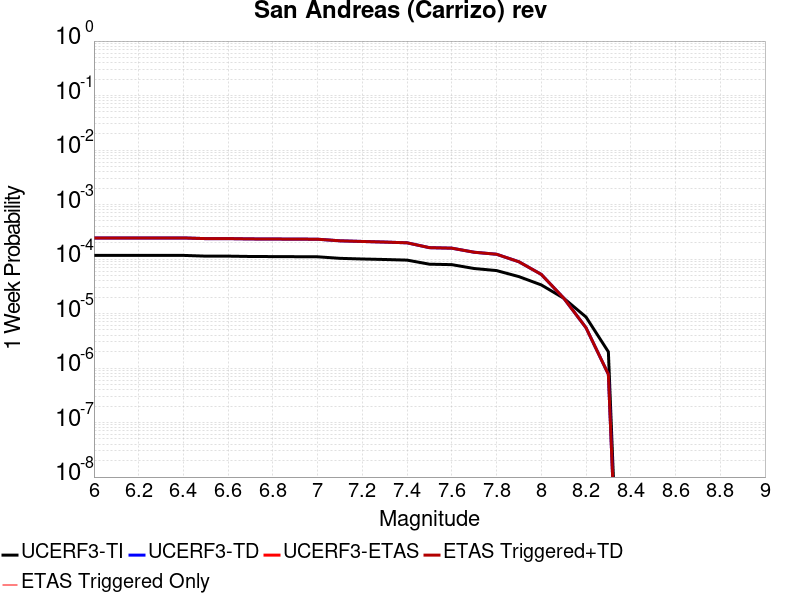 | 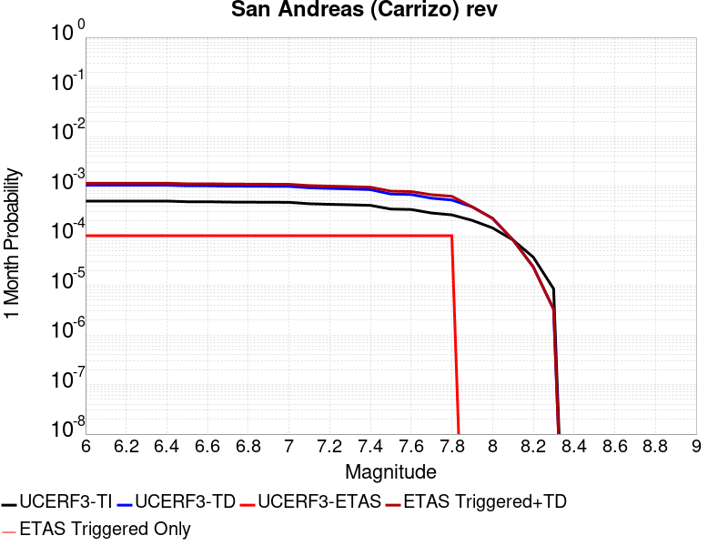 | 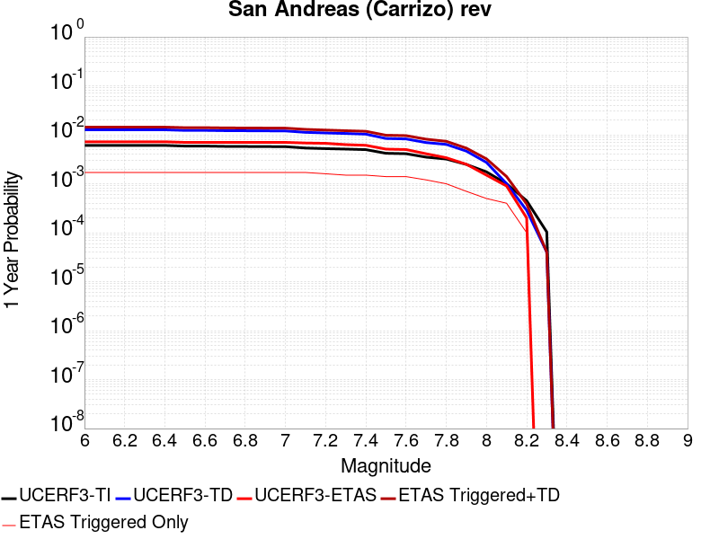 | 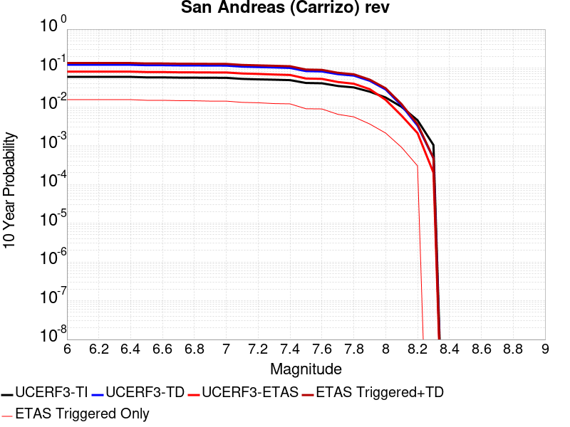 |

| Magnitude | 1 wk TI Prob | 1 wk TD Prob | 1 wk ETAS Prob | 1 wk ETAS/TD Gain | 1 wk ETAS Triggered+TD | 1 wk ETAS Triggered Only | 1 mo TI Prob | 1 mo TD Prob | 1 mo ETAS Prob | 1 mo ETAS/TD Gain | 1 mo ETAS Triggered+TD | 1 mo ETAS Triggered Only | 1 yr TI Prob | 1 yr TD Prob | 1 yr ETAS Prob | 1 yr ETAS/TD Gain | 1 yr ETAS Triggered+TD | 1 yr ETAS Triggered Only | 10 yr TI Prob | 10 yr TD Prob | 10 yr ETAS Prob | 10 yr ETAS/TD Gain | 10 yr ETAS Triggered+TD | 10 yr ETAS Triggered Only |
|-----|-----|-----|-----|-----|-----|-----|-----|-----|-----|-----|-----|-----|-----|-----|-----|-----|-----|-----|-----|-----|-----|-----|-----|-----|
| 6.0 | 1.1674632E-4 | 2.4475975E-4 | 0.0 | 0.0 | 2.4475975E-4 | 0.0 | 5.002454E-4 | 0.0010485504 | 5.0E-4 | 0.47684884 | 0.0011484454 | 1.0E-4 | 0.006073493 | 0.012691864 | 0.0072 | 0.5672926 | 0.014370288 | 0.0017 | 0.0591016 | 0.12124063 | 0.0806 | 0.6647936 | 0.13468565 | 0.0153 |
| 6.1 | 1.1674632E-4 | 2.4475975E-4 | 0.0 | 0.0 | 2.4475975E-4 | 0.0 | 5.002454E-4 | 0.0010485504 | 5.0E-4 | 0.47684884 | 0.0011484454 | 1.0E-4 | 0.006073493 | 0.012691864 | 0.0072 | 0.5672926 | 0.014370288 | 0.0017 | 0.0591016 | 0.12124063 | 0.0806 | 0.6647936 | 0.13468565 | 0.0153 |
| 6.2 | 1.1674632E-4 | 2.4475975E-4 | 0.0 | 0.0 | 2.4475975E-4 | 0.0 | 5.002454E-4 | 0.0010485504 | 5.0E-4 | 0.47684884 | 0.0011484454 | 1.0E-4 | 0.006073493 | 0.012691864 | 0.0072 | 0.5672926 | 0.014370288 | 0.0017 | 0.0591016 | 0.12124063 | 0.0806 | 0.6647936 | 0.13468565 | 0.0153 |
| 6.3 | 1.1674632E-4 | 2.4475975E-4 | 0.0 | 0.0 | 2.4475975E-4 | 0.0 | 5.002454E-4 | 0.0010485504 | 5.0E-4 | 0.47684884 | 0.0011484454 | 1.0E-4 | 0.006073493 | 0.012691864 | 0.0072 | 0.5672926 | 0.014370288 | 0.0017 | 0.0591016 | 0.12124063 | 0.0806 | 0.6647936 | 0.13468565 | 0.0153 |
| 6.4 | 1.1674632E-4 | 2.4475975E-4 | 0.0 | 0.0 | 2.4475975E-4 | 0.0 | 5.002454E-4 | 0.0010485504 | 5.0E-4 | 0.47684884 | 0.0011484454 | 1.0E-4 | 0.006073493 | 0.012691864 | 0.0072 | 0.5672926 | 0.014370288 | 0.0017 | 0.0591016 | 0.12124063 | 0.0806 | 0.6647936 | 0.13468565 | 0.0153 |
| 6.5 | 1.13136164E-4 | 2.3795283E-4 | 0.0 | 0.0 | 2.3795283E-4 | 0.0 | 4.847792E-4 | 0.0010194008 | 5.0E-4 | 0.4904842 | 0.0011192989 | 1.0E-4 | 0.0058862255 | 0.01234103 | 0.007 | 0.5672136 | 0.014020051 | 0.0017 | 0.057327334 | 0.118216515 | 0.0787 | 0.6657276 | 0.13117874 | 0.0147 |
| 6.6 | 1.13136164E-4 | 2.3795283E-4 | 0.0 | 0.0 | 2.3795283E-4 | 0.0 | 4.847792E-4 | 0.0010194008 | 5.0E-4 | 0.4904842 | 0.0011192989 | 1.0E-4 | 0.0058862255 | 0.01234103 | 0.007 | 0.5672136 | 0.014020051 | 0.0017 | 0.057327334 | 0.118216515 | 0.0787 | 0.6657276 | 0.13117874 | 0.0147 |
| 6.7 | 1.1149675E-4 | 2.3486183E-4 | 0.0 | 0.0 | 2.3486183E-4 | 0.0 | 4.777557E-4 | 0.0010061639 | 5.0E-4 | 0.49693692 | 0.0011060633 | 1.0E-4 | 0.0058011734 | 0.012181682 | 0.007 | 0.5746333 | 0.013860973 | 0.0017 | 0.05652051 | 0.11683821 | 0.0775 | 0.6633104 | 0.12955573 | 0.0144 |
| 6.8 | 1.1103589E-4 | 2.3388154E-4 | 0.0 | 0.0 | 2.3388154E-4 | 0.0 | 4.7578133E-4 | 0.001001966 | 5.0E-4 | 0.49901897 | 0.0011018658 | 1.0E-4 | 0.005777263 | 0.0121311415 | 0.007 | 0.5770273 | 0.013810518 | 0.0017 | 0.056293584 | 0.116398185 | 0.0772 | 0.6632406 | 0.12903368 | 0.0143 |
| 6.9 | 1.1053259E-4 | 2.3280336E-4 | 0.0 | 0.0 | 2.3280336E-4 | 0.0 | 4.7362508E-4 | 9.973487E-4 | 5.0E-4 | 0.5013292 | 0.001097249 | 1.0E-4 | 0.0057511497 | 0.012075551 | 0.007 | 0.5796837 | 0.013755022 | 0.0017 | 0.05604569 | 0.11591456 | 0.0768 | 0.66255695 | 0.12829176 | 0.014 |
| 7.0 | 1.1005377E-4 | 2.3180987E-4 | 0.0 | 0.0 | 2.3180987E-4 | 0.0 | 4.7157376E-4 | 9.930942E-4 | 5.0E-4 | 0.5034769 | 0.0010929948 | 1.0E-4 | 0.0057263062 | 0.012024325 | 0.007 | 0.58215326 | 0.013703884 | 0.0017 | 0.055809796 | 0.11546692 | 0.0766 | 0.66339344 | 0.12785038 | 0.014 |
| 7.1 | 1.0308142E-4 | 2.168768E-4 | 0.0 | 0.0 | 2.168768E-4 | 0.0 | 4.417027E-4 | 9.2914194E-4 | 5.0E-4 | 0.5381309 | 0.001029049 | 1.0E-4 | 0.0053644776 | 0.011253947 | 0.0068 | 0.60423243 | 0.012934816 | 0.0017 | 0.052368138 | 0.10873315 | 0.0722 | 0.66401094 | 0.12031962 | 0.013 |
| 7.2 | 1.0027479E-4 | 2.1094429E-4 | 0.0 | 0.0 | 2.1094429E-4 | 0.0 | 4.296783E-4 | 9.037347E-4 | 5.0E-4 | 0.55325973 | 0.0010036443 | 1.0E-4 | 0.0052187922 | 0.010947762 | 0.0067 | 0.6119972 | 0.012530246 | 0.0016 | 0.050979212 | 0.106035605 | 0.0704 | 0.6639279 | 0.117388956 | 0.0127 |
| 7.3 | 9.816942E-5 | 2.0567664E-4 | 0.0 | 0.0 | 2.0567664E-4 | 0.0 | 4.2065824E-4 | 8.811745E-4 | 4.0E-4 | 0.4539396 | 9.810864E-4 | 1.0E-4 | 0.005109493 | 0.010675816 | 0.0063 | 0.5901188 | 0.012159802 | 0.0015 | 0.049935985 | 0.10361367 | 0.068 | 0.6562841 | 0.11445994 | 0.0121 |
| 7.4 | 9.5634205E-5 | 1.9934587E-4 | 0.0 | 0.0 | 1.9934587E-4 | 0.0 | 4.0979648E-4 | 8.5406064E-4 | 4.0E-4 | 0.46835083 | 9.5397525E-4 | 1.0E-4 | 0.0049778637 | 0.01034888 | 0.0061 | 0.5894358 | 0.011833356 | 0.0015 | 0.048678253 | 0.100686476 | 0.0661 | 0.6564933 | 0.11138831 | 0.0119 |
| 7.5 | 8.052417E-5 | 1.6238086E-4 | 0.0 | 0.0 | 1.6238086E-4 | 0.0 | 3.4505792E-4 | 6.9573254E-4 | 4.0E-4 | 0.5749336 | 7.95663E-4 | 1.0E-4 | 0.0041929903 | 0.008437728 | 0.0051 | 0.6044281 | 0.009825915 | 0.0014 | 0.04114753 | 0.0833767 | 0.0536 | 0.6428655 | 0.091534644 | 0.0089 |
| 7.6 | 7.897024E-5 | 1.588967E-4 | 0.0 | 0.0 | 1.588967E-4 | 0.0 | 3.384E-4 | 6.808083E-4 | 3.0E-4 | 0.44065267 | 7.807402E-4 | 1.0E-4 | 0.0041122385 | 0.008257417 | 0.005 | 0.6055162 | 0.009645857 | 0.0014 | 0.040369697 | 0.08171266 | 0.0524 | 0.6412715 | 0.089793585 | 0.0088 |
| 7.7 | 6.707427E-5 | 1.3387822E-4 | 0.0 | 0.0 | 1.3387822E-4 | 0.0 | 2.8742946E-4 | 5.7363766E-4 | 3.0E-4 | 0.5229782 | 6.7358033E-4 | 1.0E-4 | 0.003493839 | 0.0069617075 | 0.0041 | 0.588936 | 0.008153353 | 0.0012 | 0.034394164 | 0.06956287 | 0.0436 | 0.6267712 | 0.07551766 | 0.0064 |
| 7.8 | 6.147705E-5 | 1.2298524E-4 | 0.0 | 0.0 | 1.2298524E-4 | 0.0 | 2.6344648E-4 | 5.2697316E-4 | 3.0E-4 | 0.56928897 | 6.2692043E-4 | 1.0E-4 | 0.0032027436 | 0.0063970494 | 0.0034 | 0.53149503 | 0.0073906523 | 0.001 | 0.031569764 | 0.06398292 | 0.0393 | 0.6142264 | 0.06913102 | 0.0055 |
| 7.9 | 4.7636717E-5 | 8.952835E-5 | 0.0 | 0.0 | 8.952835E-5 | 0.0 | 2.0414138E-4 | 3.8363654E-4 | 1.0E-4 | 0.2606634 | 3.8363654E-4 | 0.0 | 0.0024825884 | 0.0046607796 | 0.0025 | 0.53639096 | 0.005357517 | 7.0E-4 | 0.024550365 | 0.04697244 | 0.0285 | 0.60673875 | 0.050403338 | 0.0036 |
| 8.0 | 3.3554235E-5 | 5.2585798E-5 | 0.0 | 0.0 | 5.2585798E-5 | 0.0 | 1.4379594E-4 | 2.2534825E-4 | 1.0E-4 | 0.44375762 | 2.2534825E-4 | 0.0 | 0.0017493097 | 0.0027401648 | 0.0015 | 0.54741234 | 0.0032387946 | 5.0E-4 | 0.017356034 | 0.028103117 | 0.0151 | 0.53730696 | 0.030144101 | 0.0021 |
| 8.1 | 1.9175432E-5 | 1.940323E-5 | 0.0 | 0.0 | 1.940323E-5 | 0.0 | 8.217783E-5 | 8.315406E-5 | 0.0 | 0.0 | 8.315406E-5 | 0.0 | 0.0010000558 | 0.0010119311 | 9.0E-4 | 0.8893886 | 0.0014115263 | 4.0E-4 | 0.009955673 | 0.010873437 | 0.0059 | 0.5426067 | 0.011763651 | 9.0E-4 |
| 8.2 | 8.643924E-6 | 5.556491E-6 | 0.0 | 0.0 | 5.556491E-6 | 0.0 | 3.704486E-5 | 2.3813316E-5 | 0.0 | 0.0 | 2.3813316E-5 | 0.0 | 4.5092785E-4 | 2.8988862E-4 | 2.0E-4 | 0.6899201 | 3.8985963E-4 | 1.0E-4 | 0.0045001395 | 0.0032934055 | 0.0021 | 0.63763785 | 0.0035924173 | 3.0E-4 |
| 8.3 | 1.983087E-6 | 7.792044E-7 | 0.0 | 0.0 | 7.792044E-7 | 0.0 | 8.498917E-6 | 3.3394433E-6 | 0.0 | 0.0 | 3.3394433E-6 | 0.0 | 1.034694E-4 | 4.065698E-5 | 0.0 | 0.0 | 4.065698E-5 | 0.0 | 0.0010342124 | 4.7958124E-4 | 2.0E-4 | 0.41703048 | 4.7958124E-4 | 0.0 |

## Owl Lake
*[(top)](#table-of-contents)*

| 1 Week | 1 Month | 1 Year | 10 Year |
|-----|-----|-----|-----|
| 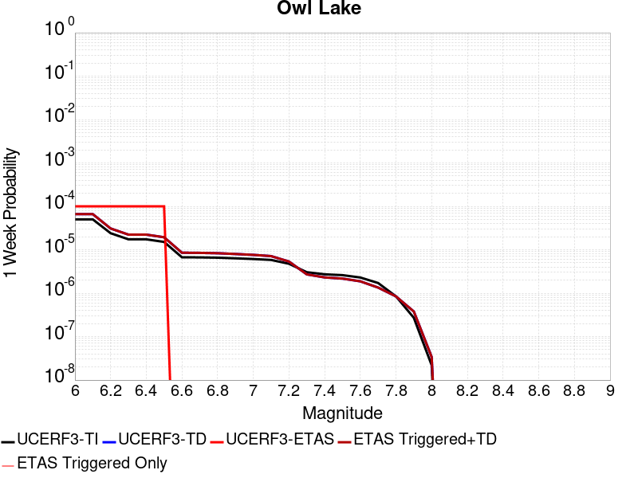 | 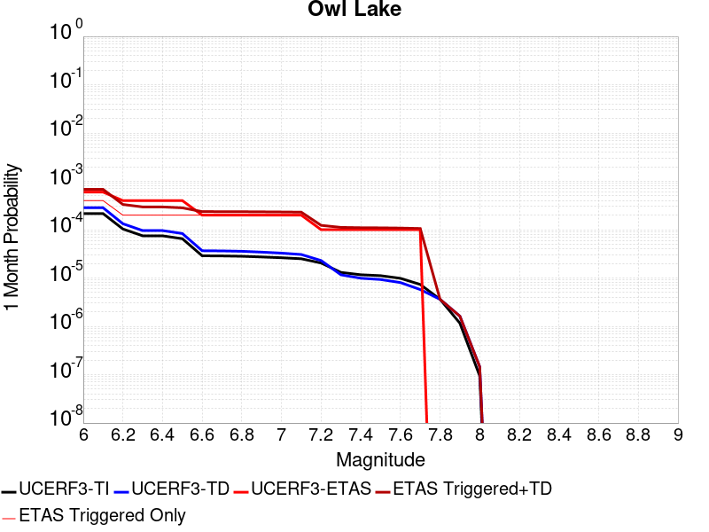 | 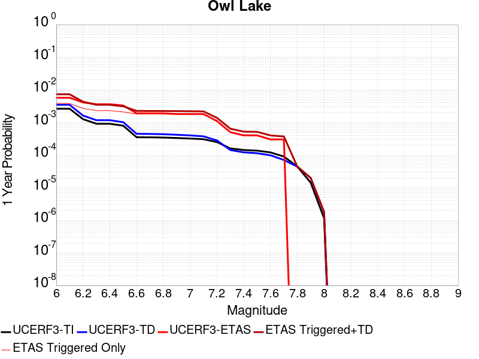 | 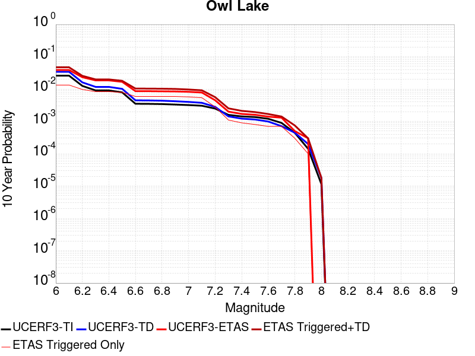 |

| Magnitude | 1 wk TI Prob | 1 wk TD Prob | 1 wk ETAS Prob | 1 wk ETAS/TD Gain | 1 wk ETAS Triggered+TD | 1 wk ETAS Triggered Only | 1 mo TI Prob | 1 mo TD Prob | 1 mo ETAS Prob | 1 mo ETAS/TD Gain | 1 mo ETAS Triggered+TD | 1 mo ETAS Triggered Only | 1 yr TI Prob | 1 yr TD Prob | 1 yr ETAS Prob | 1 yr ETAS/TD Gain | 1 yr ETAS Triggered+TD | 1 yr ETAS Triggered Only | 10 yr TI Prob | 10 yr TD Prob | 10 yr ETAS Prob | 10 yr ETAS/TD Gain | 10 yr ETAS Triggered+TD | 10 yr ETAS Triggered Only |
|-----|-----|-----|-----|-----|-----|-----|-----|-----|-----|-----|-----|-----|-----|-----|-----|-----|-----|-----|-----|-----|-----|-----|-----|-----|
| 6.0 | 5.0320643E-5 | 6.6406596E-5 | 1.0E-4 | 1.5058745 | 6.6406596E-5 | 0.0 | 2.1564208E-4 | 2.8457493E-4 | 6.0E-4 | 2.1084077 | 6.844611E-4 | 4.0E-4 | 0.0026222812 | 0.0034601022 | 0.0057 | 1.6473502 | 0.007246954 | 0.0038 | 0.02591553 | 0.034166213 | 0.0387 | 1.1326979 | 0.047011804 | 0.0133 |
| 6.1 | 5.0320643E-5 | 6.6406596E-5 | 1.0E-4 | 1.5058745 | 6.6406596E-5 | 0.0 | 2.1564208E-4 | 2.8457493E-4 | 6.0E-4 | 2.1084077 | 6.844611E-4 | 4.0E-4 | 0.0026222812 | 0.0034601022 | 0.0057 | 1.6473502 | 0.007246954 | 0.0038 | 0.02591553 | 0.034166213 | 0.0387 | 1.1326979 | 0.047011804 | 0.0133 |
| 6.2 | 2.4125871E-5 | 3.1005882E-5 | 1.0E-4 | 3.2251947 | 3.1005882E-5 | 0.0 | 1.0339249E-4 | 1.3287674E-4 | 4.0E-4 | 3.0103085 | 3.3285018E-4 | 2.0E-4 | 0.0012580766 | 0.0016167475 | 0.0041 | 2.5359557 | 0.004312382 | 0.0027 | 0.012509781 | 0.016084038 | 0.0232 | 1.4424239 | 0.025628021 | 0.0097 |
| 6.3 | 1.7433485E-5 | 2.2375922E-5 | 1.0E-4 | 4.46909 | 2.2375922E-5 | 0.0 | 7.471279E-5 | 9.5894175E-5 | 4.0E-4 | 4.171265 | 2.9587498E-4 | 2.0E-4 | 9.0924866E-4 | 0.0011670247 | 0.0036 | 3.0847676 | 0.0034643405 | 0.0023 | 0.009055373 | 0.01163993 | 0.0185 | 1.5893567 | 0.01984332 | 0.0083 |
| 6.4 | 1.7433485E-5 | 2.2375922E-5 | 1.0E-4 | 4.46909 | 2.2375922E-5 | 0.0 | 7.471279E-5 | 9.5894175E-5 | 4.0E-4 | 4.171265 | 2.9587498E-4 | 2.0E-4 | 9.0924866E-4 | 0.0011670247 | 0.0036 | 3.0847676 | 0.0034643405 | 0.0023 | 0.009055373 | 0.01163993 | 0.0185 | 1.5893567 | 0.01984332 | 0.0083 |
| 6.5 | 1.5182742E-5 | 1.9447936E-5 | 1.0E-4 | 5.1419334 | 1.9447936E-5 | 0.0 | 6.506727E-5 | 8.3346495E-5 | 4.0E-4 | 4.799242 | 2.8332983E-4 | 2.0E-4 | 7.919061E-4 | 0.0010144077 | 0.0033 | 3.2531297 | 0.0031122775 | 0.0021 | 0.0078909 | 0.0101286005 | 0.0167 | 1.6487964 | 0.017948585 | 0.0079 |
| 6.6 | 6.7271576E-6 | 8.559965E-6 | 0.0 | 0.0 | 8.559965E-6 | 0.0 | 2.8830356E-5 | 3.668508E-5 | 2.0E-4 | 5.451808 | 2.3667775E-4 | 2.0E-4 | 3.5095305E-4 | 4.4655497E-4 | 0.0019 | 4.2547956 | 0.0022457512 | 0.0018 | 0.0035039932 | 0.0044747586 | 0.0086 | 1.9218913 | 0.010348357 | 0.0059 |
| 6.7 | 6.682835E-6 | 8.49239E-6 | 0.0 | 0.0 | 8.49239E-6 | 0.0 | 2.8640408E-5 | 3.6395482E-5 | 2.0E-4 | 5.4951873 | 2.3638821E-4 | 2.0E-4 | 3.4864116E-4 | 4.4303059E-4 | 0.0019 | 4.288643 | 0.0022422331 | 0.0018 | 0.003480947 | 0.0044396077 | 0.0086 | 1.937108 | 0.010313414 | 0.0059 |
| 6.8 | 6.5774975E-6 | 8.338804E-6 | 0.0 | 0.0 | 8.338804E-6 | 0.0 | 2.8188972E-5 | 3.5737274E-5 | 2.0E-4 | 5.5963974 | 2.3573013E-4 | 2.0E-4 | 3.4314668E-4 | 4.350201E-4 | 0.0019 | 4.3676143 | 0.002234237 | 0.0018 | 0.0034261728 | 0.004359699 | 0.0085 | 1.9496758 | 0.010233977 | 0.0059 |
| 6.9 | 6.363419E-6 | 8.011814E-6 | 0.0 | 0.0 | 8.011814E-6 | 0.0 | 2.727151E-5 | 3.4335928E-5 | 2.0E-4 | 5.824803 | 2.3432905E-4 | 2.0E-4 | 3.3198006E-4 | 4.1796532E-4 | 0.0018 | 4.306577 | 0.002217213 | 0.0018 | 0.0033148455 | 0.004189603 | 0.0084 | 2.0049632 | 0.010064885 | 0.0059 |
| 7.0 | 6.1342453E-6 | 7.643804E-6 | 0.0 | 0.0 | 7.643804E-6 | 0.0 | 2.6289357E-5 | 3.2758777E-5 | 2.0E-4 | 6.105234 | 2.3275222E-4 | 2.0E-4 | 3.2002592E-4 | 3.9877064E-4 | 0.0018 | 4.513873 | 0.0021980528 | 0.0018 | 0.0031956544 | 0.0039981753 | 0.0082 | 2.0509355 | 0.009675385 | 0.0057 |
| 7.1 | 5.842926E-6 | 7.154048E-6 | 0.0 | 0.0 | 7.154048E-6 | 0.0 | 2.504087E-5 | 3.0659878E-5 | 2.0E-4 | 6.5231833 | 2.3065375E-4 | 2.0E-4 | 3.0482994E-4 | 3.7322548E-4 | 0.0018 | 4.8228216 | 0.0021725537 | 0.0018 | 0.0030441214 | 0.0037433978 | 0.0078 | 2.0836685 | 0.009123184 | 0.0054 |
| 7.2 | 4.77173E-6 | 5.3692247E-6 | 0.0 | 0.0 | 5.3692247E-6 | 0.0 | 2.045011E-5 | 2.3010783E-5 | 1.0E-4 | 4.3457885 | 1.2300849E-4 | 1.0E-4 | 2.4895166E-4 | 2.8012434E-4 | 0.0011 | 3.9268277 | 0.0013798162 | 0.0011 | 0.0024867293 | 0.002814505 | 0.0045 | 1.5988603 | 0.0056066243 | 0.0028 |
| 7.3 | 3.0494948E-6 | 2.7183346E-6 | 0.0 | 0.0 | 2.7183346E-6 | 0.0 | 1.3069198E-5 | 1.1649954E-5 | 1.0E-4 | 8.583725 | 1.1164879E-4 | 1.0E-4 | 1.5910587E-4 | 1.4182912E-4 | 5.0E-4 | 3.5253692 | 6.417582E-4 | 5.0E-4 | 0.0015899199 | 0.0014272681 | 0.002 | 1.4012784 | 0.0025256982 | 0.0011 |
| 7.4 | 2.7263884E-6 | 2.3130556E-6 | 0.0 | 0.0 | 2.3130556E-6 | 0.0 | 1.1684469E-5 | 9.913058E-6 | 1.0E-4 | 10.087705 | 1.0991206E-4 | 1.0E-4 | 1.4224913E-4 | 1.206849E-4 | 4.0E-4 | 3.3144164 | 5.206366E-4 | 4.0E-4 | 0.0014215811 | 0.0012150146 | 0.0017 | 1.3991601 | 0.002113921 | 9.0E-4 |
| 7.5 | 2.6090431E-6 | 2.1728458E-6 | 0.0 | 0.0 | 2.1728458E-6 | 0.0 | 1.1181565E-5 | 9.3121635E-6 | 1.0E-4 | 10.738643 | 1.0931123E-4 | 1.0E-4 | 1.3612706E-4 | 1.13369795E-4 | 4.0E-4 | 3.5282767 | 5.1332446E-4 | 4.0E-4 | 0.001360437 | 0.0011417134 | 0.0016 | 1.4014026 | 0.0019408 | 8.0E-4 |
| 7.6 | 2.3008756E-6 | 1.8796261E-6 | 0.0 | 0.0 | 1.8796261E-6 | 0.0 | 9.860858E-6 | 8.0555155E-6 | 1.0E-4 | 12.413855 | 1.0805471E-4 | 1.0E-4 | 1.20049335E-4 | 9.807157E-5 | 3.0E-4 | 3.0589905 | 3.9804215E-4 | 3.0E-4 | 0.001199845 | 9.88478E-4 | 0.0014 | 1.4163188 | 0.0016877861 | 7.0E-4 |
| 7.7 | 1.7184348E-6 | 1.3482388E-6 | 0.0 | 0.0 | 1.3482388E-6 | 0.0 | 7.3646997E-6 | 5.7781535E-6 | 1.0E-4 | 17.306566 | 1.0577757E-4 | 1.0E-4 | 8.966153E-5 | 7.034679E-5 | 3.0E-4 | 4.264587 | 3.703257E-4 | 3.0E-4 | 8.962536E-4 | 7.11037E-4 | 0.0013 | 1.8283155 | 0.0014105393 | 7.0E-4 |
| 7.8 | 8.4612907E-7 | 8.451409E-7 | 0.0 | 0.0 | 8.451409E-7 | 0.0 | 3.6262625E-6 | 3.6220276E-6 | 0.0 | 0.0 | 3.6220276E-6 | 0.0 | 4.4148852E-5 | 4.4097316E-5 | 0.0 | 0.0 | 4.4097316E-5 | 0.0 | 4.414008E-4 | 4.463166E-4 | 5.0E-4 | 1.120281 | 7.4618275E-4 | 3.0E-4 |
| 7.9 | 2.716738E-7 | 3.7885826E-7 | 0.0 | 0.0 | 3.7885826E-7 | 0.0 | 1.1643157E-6 | 1.6236773E-6 | 0.0 | 0.0 | 1.6236773E-6 | 0.0 | 1.4175452E-5 | 1.9768102E-5 | 0.0 | 0.0 | 1.9768102E-5 | 0.0 | 1.4174548E-4 | 1.994029E-4 | 3.0E-4 | 1.5044916 | 2.9938295E-4 | 1.0E-4 |
| 8.0 | 2.1995428E-8 | 3.405887E-8 | 0.0 | 0.0 | 3.405887E-8 | 0.0 | 9.426611E-8 | 1.4596658E-7 | 0.0 | 0.0 | 1.4596658E-7 | 0.0 | 1.1476893E-6 | 1.7771423E-6 | 0.0 | 0.0 | 1.7771423E-6 | 0.0 | 1.14768345E-5 | 1.7975697E-5 | 0.0 | 0.0 | 1.7975697E-5 | 0.0 |

## Hayward (So) extension 2011 CFM
*[(top)](#table-of-contents)*

| 1 Week | 1 Month | 1 Year | 10 Year |
|-----|-----|-----|-----|
| 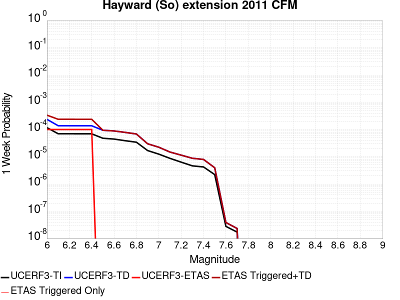 | 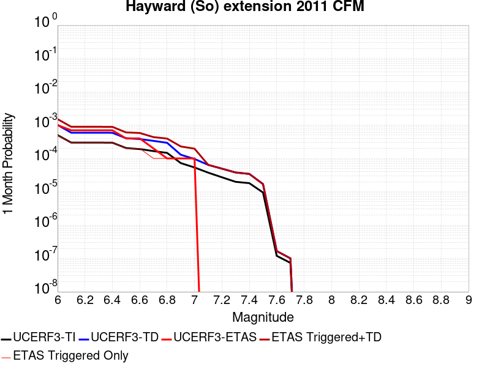 | 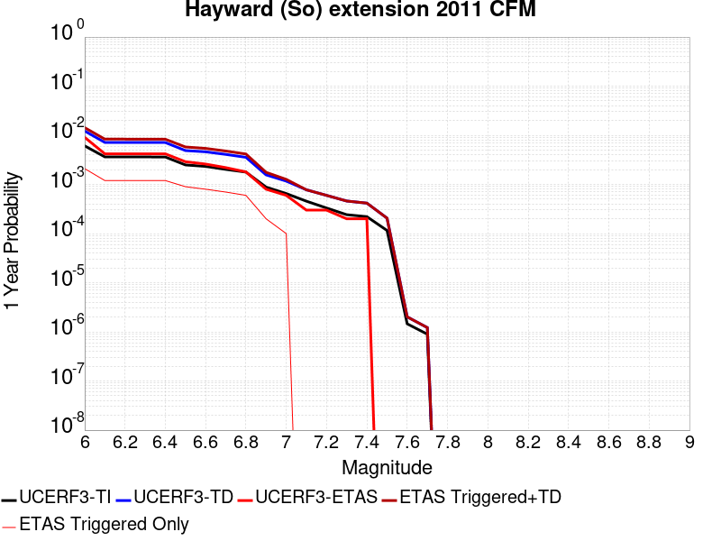 | 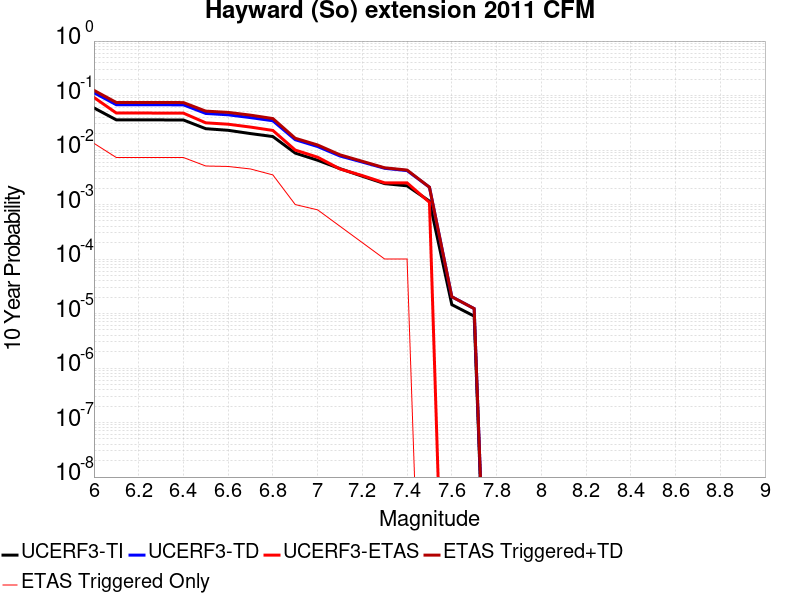 |

| Magnitude | 1 wk TI Prob | 1 wk TD Prob | 1 wk ETAS Prob | 1 wk ETAS/TD Gain | 1 wk ETAS Triggered+TD | 1 wk ETAS Triggered Only | 1 mo TI Prob | 1 mo TD Prob | 1 mo ETAS Prob | 1 mo ETAS/TD Gain | 1 mo ETAS Triggered+TD | 1 mo ETAS Triggered Only | 1 yr TI Prob | 1 yr TD Prob | 1 yr ETAS Prob | 1 yr ETAS/TD Gain | 1 yr ETAS Triggered+TD | 1 yr ETAS Triggered Only | 10 yr TI Prob | 10 yr TD Prob | 10 yr ETAS Prob | 10 yr ETAS/TD Gain | 10 yr ETAS Triggered+TD | 10 yr ETAS Triggered Only |
|-----|-----|-----|-----|-----|-----|-----|-----|-----|-----|-----|-----|-----|-----|-----|-----|-----|-----|-----|-----|-----|-----|-----|-----|-----|
| 6.0 | 1.1721256E-4 | 2.3691072E-4 | 2.0E-4 | 0.84419984 | 3.3688705E-4 | 1.0E-4 | 5.022428E-4 | 0.0010147794 | 0.001 | 0.9854358 | 0.0015142721 | 5.0E-4 | 0.0060976758 | 0.012261388 | 0.0091 | 0.7421672 | 0.01433564 | 0.0021 | 0.0593305 | 0.11293004 | 0.0924 | 0.8182057 | 0.12472807 | 0.0133 |
| 6.1 | 6.99169E-5 | 1.38235E-4 | 2.0E-4 | 1.4468116 | 2.3822118E-4 | 1.0E-4 | 2.9960944E-4 | 5.922529E-4 | 7.0E-4 | 1.1819276 | 8.920752E-4 | 3.0E-4 | 0.0036416445 | 0.0071807764 | 0.0042 | 0.58489496 | 0.00837216 | 0.0012 | 0.035825435 | 0.06787509 | 0.0478 | 0.70423484 | 0.0746796 | 0.0073 |
| 6.2 | 6.99169E-5 | 1.38235E-4 | 2.0E-4 | 1.4468116 | 2.3822118E-4 | 1.0E-4 | 2.9960944E-4 | 5.922529E-4 | 7.0E-4 | 1.1819276 | 8.920752E-4 | 3.0E-4 | 0.0036416445 | 0.0071807764 | 0.0042 | 0.58489496 | 0.00837216 | 0.0012 | 0.035825435 | 0.06787509 | 0.0478 | 0.70423484 | 0.0746796 | 0.0073 |
| 6.3 | 6.970908E-5 | 1.3791629E-4 | 2.0E-4 | 1.4501551 | 2.3790248E-4 | 1.0E-4 | 2.9871898E-4 | 5.9088785E-4 | 7.0E-4 | 1.1846579 | 8.9071057E-4 | 3.0E-4 | 0.0036308395 | 0.0071643055 | 0.0042 | 0.58623964 | 0.008355708 | 0.0012 | 0.035720866 | 0.067724 | 0.0477 | 0.7043294 | 0.07452961 | 0.0073 |
| 6.4 | 6.9517155E-5 | 1.375853E-4 | 2.0E-4 | 1.4536436 | 2.3757156E-4 | 1.0E-4 | 2.9789665E-4 | 5.8947026E-4 | 7.0E-4 | 1.1875068 | 8.8929344E-4 | 3.0E-4 | 0.0036208609 | 0.0071472093 | 0.0042 | 0.58764195 | 0.008338633 | 0.0012 | 0.03562429 | 0.06756797 | 0.0476 | 0.7044758 | 0.07437472 | 0.0073 |
| 6.5 | 4.786248E-5 | 9.42896E-5 | 1.0E-4 | 1.0605624 | 9.42896E-5 | 0.0 | 2.0510878E-4 | 4.0403818E-4 | 4.0E-4 | 0.9900055 | 6.0395733E-4 | 2.0E-4 | 0.0024943394 | 0.0049085063 | 0.0029 | 0.59081113 | 0.0058040884 | 9.0E-4 | 0.02466527 | 0.04696188 | 0.0316 | 0.67288613 | 0.051822376 | 0.0051 |
| 6.6 | 4.4662214E-5 | 8.895191E-5 | 1.0E-4 | 1.124203 | 8.895191E-5 | 0.0 | 1.9139545E-4 | 3.8116938E-4 | 4.0E-4 | 1.0494022 | 5.8109313E-4 | 2.0E-4 | 0.0023277493 | 0.0046313275 | 0.0026 | 0.56139416 | 0.0054276222 | 8.0E-4 | 0.02303517 | 0.044351257 | 0.0298 | 0.6719088 | 0.0491295 | 0.005 |
| 6.7 | 3.884542E-5 | 7.8776124E-5 | 1.0E-4 | 1.2694203 | 7.8776124E-5 | 0.0 | 1.6646975E-4 | 3.3757076E-4 | 2.0E-4 | 0.5924684 | 4.37537E-4 | 1.0E-4 | 0.002024885 | 0.0041026245 | 0.0022 | 0.53624207 | 0.004799753 | 7.0E-4 | 0.020065336 | 0.039388224 | 0.0264 | 0.6702511 | 0.043710977 | 0.0045 |
| 6.8 | 3.4221863E-5 | 6.867095E-5 | 0.0 | 0.0 | 6.867095E-5 | 0.0 | 1.4665688E-4 | 2.9427328E-4 | 1.0E-4 | 0.33982018 | 3.9424386E-4 | 1.0E-4 | 0.0017840851 | 0.0035773134 | 0.0018 | 0.5031709 | 0.004175167 | 6.0E-4 | 0.017698295 | 0.03447046 | 0.0229 | 0.6643369 | 0.037849814 | 0.0035 |
| 6.9 | 1.6927712E-5 | 3.0120449E-5 | 0.0 | 0.0 | 3.0120449E-5 | 0.0 | 7.2545314E-5 | 1.2908157E-4 | 1.0E-4 | 0.7747039 | 2.2906867E-4 | 1.0E-4 | 8.828813E-4 | 0.0015704923 | 8.0E-4 | 0.5093944 | 0.0017701782 | 2.0E-4 | 0.008793819 | 0.015490299 | 0.01 | 0.64556533 | 0.016474808 | 0.001 |
| 7.0 | 1.2509653E-5 | 2.2515444E-5 | 0.0 | 0.0 | 2.2515444E-5 | 0.0 | 5.3611697E-5 | 9.6491436E-5 | 1.0E-4 | 1.0363615 | 1.964818E-4 | 1.0E-4 | 6.525269E-4 | 0.0011741943 | 6.0E-4 | 0.51098865 | 0.0012740769 | 1.0E-4 | 0.0065061417 | 0.011607282 | 0.0074 | 0.6375308 | 0.012397996 | 8.0E-4 |
| 7.1 | 8.751583E-6 | 1.4964945E-5 | 0.0 | 0.0 | 1.4964945E-5 | 0.0 | 3.750624E-5 | 6.4133936E-5 | 0.0 | 0.0 | 6.4133936E-5 | 0.0 | 4.5654282E-4 | 7.805568E-4 | 3.0E-4 | 0.384341 | 7.805568E-4 | 0.0 | 0.0045560603 | 0.007782359 | 0.0045 | 0.5782308 | 0.008179246 | 4.0E-4 |
| 7.2 | 6.354379E-6 | 1.1535201E-5 | 0.0 | 0.0 | 1.1535201E-5 | 0.0 | 2.7232769E-5 | 4.943567E-5 | 0.0 | 0.0 | 4.943567E-5 | 0.0 | 3.3150852E-4 | 6.017179E-4 | 3.0E-4 | 0.4985725 | 6.017179E-4 | 0.0 | 0.0033101442 | 0.006017986 | 0.0034 | 0.56497306 | 0.0062167826 | 2.0E-4 |
| 7.3 | 4.645554E-6 | 8.850168E-6 | 0.0 | 0.0 | 8.850168E-6 | 0.0 | 1.9909365E-5 | 3.7928767E-5 | 0.0 | 0.0 | 3.7928767E-5 | 0.0 | 2.4236954E-4 | 4.6168885E-4 | 2.0E-4 | 0.4331922 | 4.6168885E-4 | 0.0 | 0.0024210536 | 0.0046262206 | 0.0025 | 0.5403979 | 0.004725758 | 1.0E-4 |
| 7.4 | 4.23437E-6 | 8.022218E-6 | 0.0 | 0.0 | 8.022218E-6 | 0.0 | 1.8147173E-5 | 3.4380504E-5 | 0.0 | 0.0 | 3.4380504E-5 | 0.0 | 2.2091944E-4 | 4.1850613E-4 | 2.0E-4 | 0.47789025 | 4.1850613E-4 | 0.0 | 0.0022069993 | 0.004196399 | 0.0025 | 0.5957489 | 0.004295979 | 1.0E-4 |
| 7.5 | 2.2187417E-6 | 3.9702777E-6 | 0.0 | 0.0 | 3.9702777E-6 | 0.0 | 9.508858E-6 | 1.701538E-5 | 0.0 | 0.0 | 1.701538E-5 | 0.0 | 1.157642E-4 | 2.071452E-4 | 0.0 | 0.0 | 2.071452E-4 | 0.0 | 0.0011570391 | 0.0020825265 | 0.0011 | 0.52820456 | 0.0020825265 | 0.0 |
| 7.6 | 2.7952495E-8 | 3.8859064E-8 | 0.0 | 0.0 | 3.8859064E-8 | 0.0 | 1.1979641E-7 | 1.6653883E-7 | 0.0 | 0.0 | 1.6653883E-7 | 0.0 | 1.4585203E-6 | 2.0276084E-6 | 0.0 | 0.0 | 2.0276084E-6 | 0.0 | 1.4585107E-5 | 2.0359977E-5 | 0.0 | 0.0 | 2.0359977E-5 | 0.0 |
| 7.7 | 1.7192724E-8 | 2.3486397E-8 | 0.0 | 0.0 | 2.3486397E-8 | 0.0 | 7.36831E-8 | 1.0065598E-7 | 0.0 | 0.0 | 1.0065598E-7 | 0.0 | 8.9709135E-7 | 1.2254859E-6 | 0.0 | 0.0 | 1.2254859E-6 | 0.0 | 8.970877E-6 | 1.231672E-5 | 0.0 | 0.0 | 1.231672E-5 | 0.0 |

## San Andreas (Coachella) rev
*[(top)](#table-of-contents)*

| 1 Week | 1 Month | 1 Year | 10 Year |
|-----|-----|-----|-----|
| 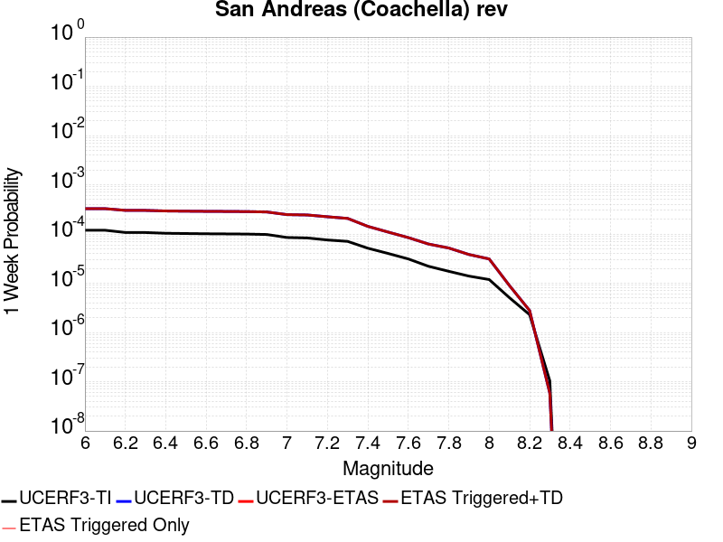 | 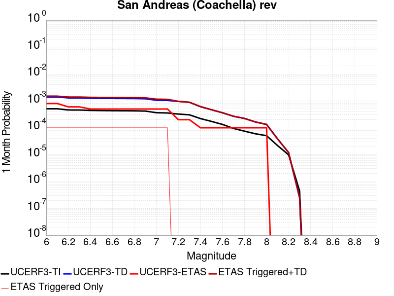 | 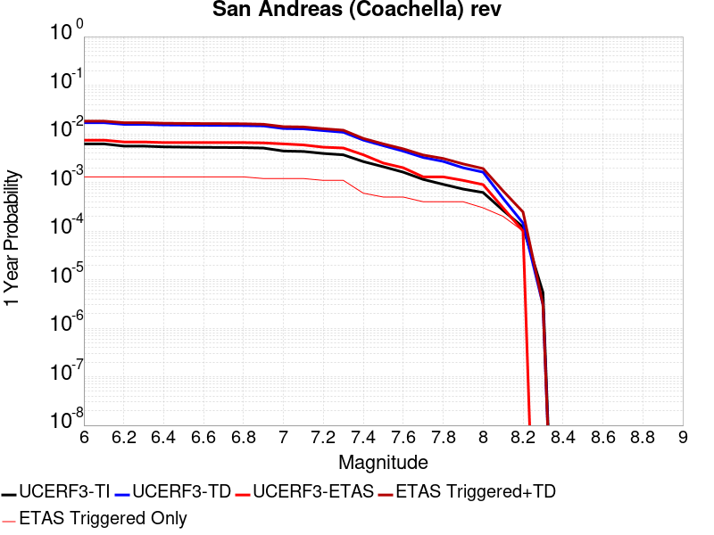 | 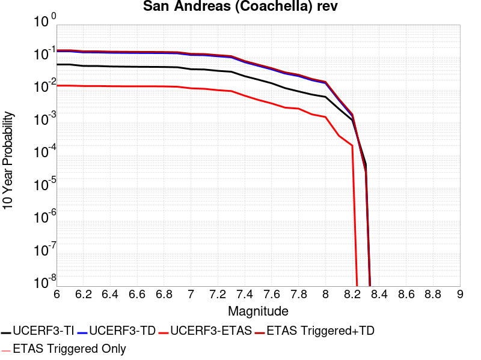 |

| Magnitude | 1 wk TI Prob | 1 wk TD Prob | 1 wk ETAS Prob | 1 wk ETAS/TD Gain | 1 wk ETAS Triggered+TD | 1 wk ETAS Triggered Only | 1 mo TI Prob | 1 mo TD Prob | 1 mo ETAS Prob | 1 mo ETAS/TD Gain | 1 mo ETAS Triggered+TD | 1 mo ETAS Triggered Only | 1 yr TI Prob | 1 yr TD Prob | 1 yr ETAS Prob | 1 yr ETAS/TD Gain | 1 yr ETAS Triggered+TD | 1 yr ETAS Triggered Only | 10 yr TI Prob | 10 yr TD Prob | 10 yr ETAS Prob | 10 yr ETAS/TD Gain | 10 yr ETAS Triggered+TD | 10 yr ETAS Triggered Only |
|-----|-----|-----|-----|-----|-----|-----|-----|-----|-----|-----|-----|-----|-----|-----|-----|-----|-----|-----|-----|-----|-----|-----|-----|-----|
| 6.0 | 1.1925945E-4 | 3.2800532E-4 | 1.0E-4 | 0.3048731 | 3.2800532E-4 | 0.0 | 5.110118E-4 | 0.0014049845 | 8.0E-4 | 0.5694013 | 0.0015048439 | 1.0E-4 | 0.0062038354 | 0.016972864 | 0.0074 | 0.43599007 | 0.018250799 | 0.0013 | 0.060334753 | 0.1529299 | 0.0874 | 0.5715037 | 0.16445005 | 0.0136 |
| 6.1 | 1.1925945E-4 | 3.2800532E-4 | 1.0E-4 | 0.3048731 | 3.2800532E-4 | 0.0 | 5.110118E-4 | 0.0014049845 | 8.0E-4 | 0.5694013 | 0.0015048439 | 1.0E-4 | 0.0062038354 | 0.016972864 | 0.0074 | 0.43599007 | 0.018250799 | 0.0013 | 0.060334753 | 0.1529299 | 0.0874 | 0.5715037 | 0.16445005 | 0.0136 |
| 6.2 | 1.07432395E-4 | 3.030076E-4 | 1.0E-4 | 0.33002475 | 3.030076E-4 | 0.0 | 4.603433E-4 | 0.0012979617 | 6.0E-4 | 0.46226326 | 0.001397832 | 1.0E-4 | 0.005590286 | 0.015689284 | 0.0068 | 0.43341684 | 0.016968887 | 0.0013 | 0.05451731 | 0.1421034 | 0.0796 | 0.56015545 | 0.15351343 | 0.0133 |
| 6.3 | 1.0718766E-4 | 3.0246063E-4 | 1.0E-4 | 0.33062157 | 3.0246063E-4 | 0.0 | 4.592948E-4 | 0.0012956199 | 6.0E-4 | 0.4630988 | 0.0013954903 | 1.0E-4 | 0.005577586 | 0.015661182 | 0.0068 | 0.43419454 | 0.016940823 | 0.0013 | 0.054396555 | 0.14187172 | 0.0795 | 0.5603654 | 0.15328483 | 0.0133 |
| 6.4 | 1.0355944E-4 | 2.9454043E-4 | 1.0E-4 | 0.33951196 | 2.9454043E-4 | 0.0 | 4.4375064E-4 | 0.0012617095 | 5.0E-4 | 0.39628774 | 0.0013615832 | 1.0E-4 | 0.0053892885 | 0.015254176 | 0.0066 | 0.43266842 | 0.016534345 | 0.0013 | 0.052604496 | 0.138425 | 0.078 | 0.5634821 | 0.14971162 | 0.0131 |
| 6.5 | 1.0227914E-4 | 2.9173444E-4 | 1.0E-4 | 0.3427775 | 2.9173444E-4 | 0.0 | 4.382655E-4 | 0.0012496953 | 5.0E-4 | 0.40009752 | 0.0013495703 | 1.0E-4 | 0.0053228354 | 0.015109942 | 0.0066 | 0.43679848 | 0.0163903 | 0.0013 | 0.051971316 | 0.13719895 | 0.0772 | 0.5626865 | 0.14841537 | 0.013 |
| 6.6 | 1.0116757E-4 | 2.8939164E-4 | 1.0E-4 | 0.3455525 | 2.8939164E-4 | 0.0 | 4.3350324E-4 | 0.0012396643 | 5.0E-4 | 0.403335 | 0.0013395404 | 1.0E-4 | 0.0052651367 | 0.0149895 | 0.0066 | 0.4403082 | 0.016270014 | 0.0013 | 0.051421247 | 0.13617754 | 0.077 | 0.56543833 | 0.14740723 | 0.013 |
| 6.7 | 1.0050676E-4 | 2.8797705E-4 | 1.0E-4 | 0.3472499 | 2.8797705E-4 | 0.0 | 4.3067214E-4 | 0.0012336075 | 5.0E-4 | 0.40531528 | 0.0013334842 | 1.0E-4 | 0.005230834 | 0.014916772 | 0.0066 | 0.442455 | 0.01619738 | 0.0013 | 0.051094085 | 0.13556208 | 0.0765 | 0.5643171 | 0.14679977 | 0.013 |
| 6.8 | 9.976819E-5 | 2.8601277E-4 | 1.0E-4 | 0.34963474 | 2.8601277E-4 | 0.0 | 4.2750788E-4 | 0.0012251971 | 5.0E-4 | 0.4080976 | 0.0013250746 | 1.0E-4 | 0.0051924936 | 0.014815772 | 0.0066 | 0.44547123 | 0.016096512 | 0.0013 | 0.050728295 | 0.1347142 | 0.0761 | 0.5648996 | 0.1458764 | 0.0129 |
| 6.9 | 9.77719E-5 | 2.8097705E-4 | 1.0E-4 | 0.35590094 | 2.8097705E-4 | 0.0 | 4.1895514E-4 | 0.0012036356 | 5.0E-4 | 0.41540813 | 0.0013035152 | 1.0E-4 | 0.0050888555 | 0.014556797 | 0.0065 | 0.4465268 | 0.01573933 | 0.0012 | 0.049738888 | 0.13254188 | 0.0745 | 0.56208646 | 0.14347185 | 0.0126 |
| 7.0 | 8.500761E-5 | 2.4828516E-4 | 1.0E-4 | 0.4027627 | 2.4828516E-4 | 0.0 | 3.6426744E-4 | 0.0010636486 | 5.0E-4 | 0.47008008 | 0.0011635422 | 1.0E-4 | 0.0044259406 | 0.012873807 | 0.0062 | 0.48159802 | 0.014058358 | 0.0012 | 0.04338823 | 0.11839987 | 0.067 | 0.565879 | 0.12836196 | 0.0113 |
| 7.1 | 8.319876E-5 | 2.443052E-4 | 1.0E-4 | 0.40932408 | 2.443052E-4 | 0.0 | 3.5651738E-4 | 0.0010466054 | 5.0E-4 | 0.47773498 | 0.0011465007 | 1.0E-4 | 0.004331963 | 0.012668738 | 0.0059 | 0.46571332 | 0.013853535 | 0.0012 | 0.042484846 | 0.11661785 | 0.0656 | 0.5625211 | 0.12624672 | 0.0109 |
| 7.2 | 7.563917E-5 | 2.2477008E-4 | 1.0E-4 | 0.44489908 | 2.2477008E-4 | 0.0 | 3.2412758E-4 | 9.629477E-4 | 2.0E-4 | 0.20769559 | 9.629477E-4 | 0.0 | 0.0039391145 | 0.011661559 | 0.0053 | 0.45448467 | 0.012748731 | 0.0011 | 0.03870018 | 0.10801902 | 0.0601 | 0.5563835 | 0.11684963 | 0.0099 |
| 7.3 | 7.082985E-5 | 2.0790727E-4 | 1.0E-4 | 0.48098364 | 2.0790727E-4 | 0.0 | 3.0352117E-4 | 8.907298E-4 | 2.0E-4 | 0.22453499 | 8.907298E-4 | 0.0 | 0.0036891096 | 0.01079134 | 0.0051 | 0.4726012 | 0.011879469 | 0.0011 | 0.03628465 | 0.10053357 | 0.0561 | 0.55802256 | 0.10889861 | 0.0093 |
| 7.4 | 5.146215E-5 | 1.4323601E-4 | 0.0 | 0.0 | 1.4323601E-4 | 0.0 | 2.2053342E-4 | 6.137251E-4 | 1.0E-4 | 0.1629394 | 6.137251E-4 | 0.0 | 0.0026816884 | 0.0074466937 | 0.0037 | 0.49686483 | 0.008042226 | 6.0E-4 | 0.02649557 | 0.07106639 | 0.0407 | 0.57270396 | 0.077290244 | 0.0067 |
| 7.5 | 4.0285166E-5 | 1.09847715E-4 | 0.0 | 0.0 | 1.09847715E-4 | 0.0 | 1.7263928E-4 | 4.706913E-4 | 1.0E-4 | 0.21245347 | 4.706913E-4 | 0.0 | 0.002099857 | 0.0057156784 | 0.0025 | 0.4373934 | 0.0062128208 | 5.0E-4 | 0.020801254 | 0.05520386 | 0.03 | 0.5434403 | 0.05992784 | 0.005 |
| 7.6 | 3.1168736E-5 | 8.4769745E-5 | 0.0 | 0.0 | 8.4769745E-5 | 0.0 | 1.3357346E-4 | 3.6324843E-4 | 1.0E-4 | 0.27529368 | 3.6324843E-4 | 0.0 | 0.0016250437 | 0.0044136085 | 0.002 | 0.45314398 | 0.0049114013 | 5.0E-4 | 0.016132116 | 0.042982392 | 0.0234 | 0.544409 | 0.046714764 | 0.0039 |
| 7.7 | 2.2100989E-5 | 6.272285E-5 | 0.0 | 0.0 | 6.272285E-5 | 0.0 | 9.4715084E-5 | 2.6878456E-4 | 1.0E-4 | 0.37204522 | 2.6878456E-4 | 0.0 | 0.001152546 | 0.0032675478 | 0.0013 | 0.39785188 | 0.0036662407 | 4.0E-4 | 0.011465867 | 0.032053567 | 0.0177 | 0.5522006 | 0.034860615 | 0.0029 |
| 7.8 | 1.7484861E-5 | 5.2094656E-5 | 0.0 | 0.0 | 5.2094656E-5 | 0.0 | 7.493296E-5 | 2.2324371E-4 | 1.0E-4 | 0.44794095 | 2.2324371E-4 | 0.0 | 9.1192697E-4 | 0.0027146074 | 0.0013 | 0.4788906 | 0.0031135215 | 4.0E-4 | 0.009081938 | 0.026777176 | 0.0149 | 0.55644405 | 0.029404879 | 0.0027 |
| 7.9 | 1.3967285E-5 | 3.8468155E-5 | 0.0 | 0.0 | 3.8468155E-5 | 0.0 | 5.985842E-5 | 1.6485312E-4 | 1.0E-4 | 0.60660064 | 1.6485312E-4 | 0.0 | 7.2853256E-4 | 0.0020052402 | 0.0011 | 0.5485627 | 0.002404438 | 4.0E-4 | 0.0072614877 | 0.020023769 | 0.0103 | 0.5143887 | 0.021787727 | 0.0018 |
| 8.0 | 1.1887396E-5 | 3.127679E-5 | 0.0 | 0.0 | 3.127679E-5 | 0.0 | 5.094499E-5 | 1.3403651E-4 | 1.0E-4 | 0.7460654 | 1.3403651E-4 | 0.0 | 6.200787E-4 | 0.0016306739 | 9.0E-4 | 0.55191904 | 0.0019301847 | 3.0E-4 | 0.006183513 | 0.0163786 | 0.0083 | 0.5067588 | 0.017854031 | 0.0015 |
| 8.1 | 5.100864E-6 | 9.0611275E-6 | 0.0 | 0.0 | 9.0611275E-6 | 0.0 | 2.1860664E-5 | 3.8832826E-5 | 0.0 | 0.0 | 3.8832826E-5 | 0.0 | 2.6612106E-4 | 4.726872E-4 | 3.0E-4 | 0.6346691 | 6.7259267E-4 | 2.0E-4 | 0.002658026 | 0.004961946 | 0.0025 | 0.5038346 | 0.005359961 | 4.0E-4 |
| 8.2 | 2.3004484E-6 | 2.8216953E-6 | 0.0 | 0.0 | 2.8216953E-6 | 0.0 | 9.859027E-6 | 1.20929235E-5 | 0.0 | 0.0 | 1.20929235E-5 | 0.0 | 1.2002704E-4 | 1.4722144E-4 | 1.0E-4 | 0.6792489 | 2.472067E-4 | 1.0E-4 | 0.0011996223 | 0.0016156753 | 0.001 | 0.61893624 | 0.0018153521 | 2.0E-4 |
| 8.3 | 1.0424446E-7 | 5.9066274E-8 | 0.0 | 0.0 | 5.9066274E-8 | 0.0 | 4.4676187E-7 | 2.5314114E-7 | 0.0 | 0.0 | 2.5314114E-7 | 0.0 | 5.439312E-6 | 3.0819892E-6 | 0.0 | 0.0 | 3.0819892E-6 | 0.0 | 5.4391792E-5 | 3.239163E-5 | 0.0 | 0.0 | 3.239163E-5 | 0.0 |

## San Andreas (San Bernardino N)
*[(top)](#table-of-contents)*

| 1 Week | 1 Month | 1 Year | 10 Year |
|-----|-----|-----|-----|
| 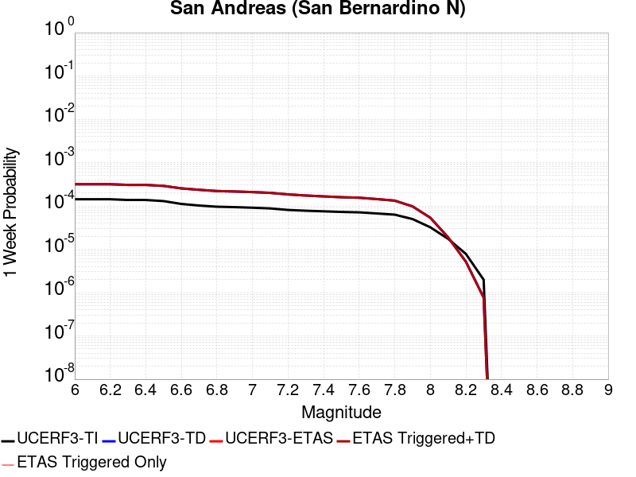 | 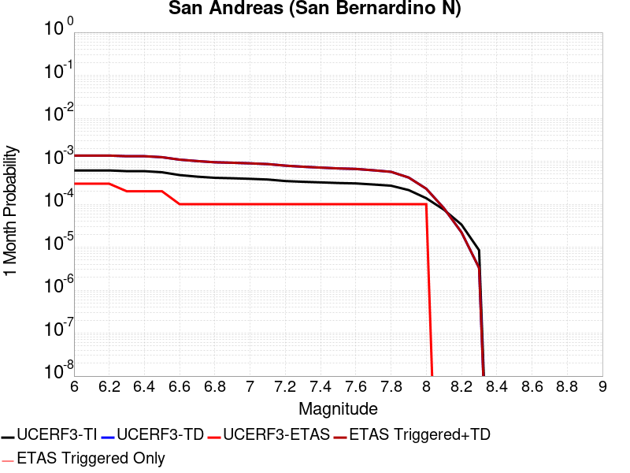 | 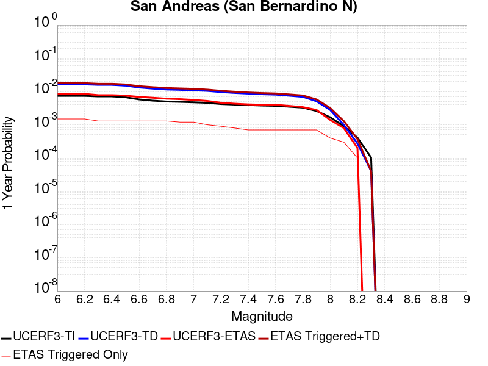 | 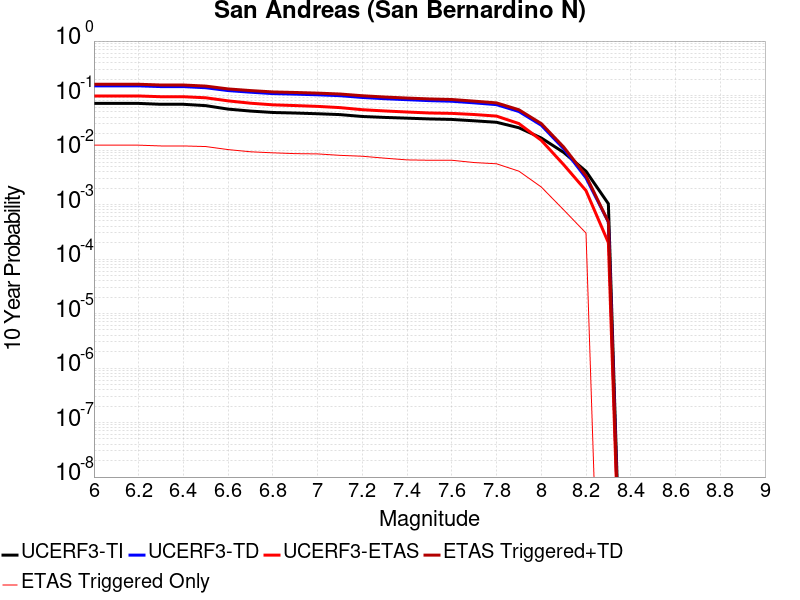 |

| Magnitude | 1 wk TI Prob | 1 wk TD Prob | 1 wk ETAS Prob | 1 wk ETAS/TD Gain | 1 wk ETAS Triggered+TD | 1 wk ETAS Triggered Only | 1 mo TI Prob | 1 mo TD Prob | 1 mo ETAS Prob | 1 mo ETAS/TD Gain | 1 mo ETAS Triggered+TD | 1 mo ETAS Triggered Only | 1 yr TI Prob | 1 yr TD Prob | 1 yr ETAS Prob | 1 yr ETAS/TD Gain | 1 yr ETAS Triggered+TD | 1 yr ETAS Triggered Only | 10 yr TI Prob | 10 yr TD Prob | 10 yr ETAS Prob | 10 yr ETAS/TD Gain | 10 yr ETAS Triggered+TD | 10 yr ETAS Triggered Only |
|-----|-----|-----|-----|-----|-----|-----|-----|-----|-----|-----|-----|-----|-----|-----|-----|-----|-----|-----|-----|-----|-----|-----|-----|-----|
| 6.0 | 1.4273766E-4 | 3.172293E-4 | 0.0 | 0.0 | 3.172293E-4 | 0.0 | 6.115894E-4 | 0.0013588518 | 3.0E-4 | 0.22077464 | 0.0013588518 | 0.0 | 0.0074207084 | 0.016420027 | 0.0085 | 0.5176605 | 0.017895399 | 0.0015 | 0.07177748 | 0.1507546 | 0.0983 | 0.65205306 | 0.16120031 | 0.0123 |
| 6.1 | 1.4273766E-4 | 3.172293E-4 | 0.0 | 0.0 | 3.172293E-4 | 0.0 | 6.115894E-4 | 0.0013588518 | 3.0E-4 | 0.22077464 | 0.0013588518 | 0.0 | 0.0074207084 | 0.016420027 | 0.0085 | 0.5176605 | 0.017895399 | 0.0015 | 0.07177748 | 0.1507546 | 0.0983 | 0.65205306 | 0.16120031 | 0.0123 |
| 6.2 | 1.4273766E-4 | 3.172293E-4 | 0.0 | 0.0 | 3.172293E-4 | 0.0 | 6.115894E-4 | 0.0013588518 | 3.0E-4 | 0.22077464 | 0.0013588518 | 0.0 | 0.0074207084 | 0.016420027 | 0.0085 | 0.5176605 | 0.017895399 | 0.0015 | 0.07177748 | 0.1507546 | 0.0983 | 0.65205306 | 0.16120031 | 0.0123 |
| 6.3 | 1.3730655E-4 | 3.0627198E-4 | 0.0 | 0.0 | 3.0627198E-4 | 0.0 | 5.883239E-4 | 0.0013119397 | 2.0E-4 | 0.15244605 | 0.0013119397 | 0.0 | 0.0071393442 | 0.01585729 | 0.0078 | 0.49188733 | 0.017136674 | 0.0013 | 0.06914291 | 0.14604001 | 0.0952 | 0.65187615 | 0.15620214 | 0.0119 |
| 6.4 | 1.3730655E-4 | 3.0627198E-4 | 0.0 | 0.0 | 3.0627198E-4 | 0.0 | 5.883239E-4 | 0.0013119397 | 2.0E-4 | 0.15244605 | 0.0013119397 | 0.0 | 0.0071393442 | 0.01585729 | 0.0078 | 0.49188733 | 0.017136674 | 0.0013 | 0.06914291 | 0.14604001 | 0.0952 | 0.65187615 | 0.15620214 | 0.0119 |
| 6.5 | 1.2942807E-4 | 2.9040835E-4 | 0.0 | 0.0 | 2.9040835E-4 | 0.0 | 5.545738E-4 | 0.0012440187 | 2.0E-4 | 0.16076928 | 0.0012440187 | 0.0 | 0.0067310524 | 0.015041998 | 0.0075 | 0.498604 | 0.016322443 | 0.0013 | 0.06530788 | 0.13916537 | 0.091 | 0.6538983 | 0.14915106 | 0.0116 |
| 6.6 | 1.1125901E-4 | 2.5477464E-4 | 0.0 | 0.0 | 2.5477464E-4 | 0.0 | 4.767372E-4 | 0.0010914367 | 1.0E-4 | 0.09162235 | 0.0010914367 | 0.0 | 0.005788839 | 0.013207916 | 0.0069 | 0.52241397 | 0.014490746 | 0.0013 | 0.056403454 | 0.12343089 | 0.0799 | 0.64732575 | 0.1323719 | 0.0102 |
| 6.7 | 1.02209575E-4 | 2.36115E-4 | 0.0 | 0.0 | 2.36115E-4 | 0.0 | 4.3796748E-4 | 0.0010115304 | 1.0E-4 | 0.09886011 | 0.0010115304 | 0.0 | 0.0053192247 | 0.012246266 | 0.0065 | 0.53077406 | 0.013530346 | 0.0013 | 0.051936906 | 0.115252495 | 0.0724 | 0.628186 | 0.12348064 | 0.0093 |
| 6.8 | 9.610582E-5 | 2.2135816E-4 | 0.0 | 0.0 | 2.2135816E-4 | 0.0 | 4.1181705E-4 | 9.4833365E-4 | 1.0E-4 | 0.10544812 | 9.4833365E-4 | 0.0 | 0.0050023515 | 0.011485106 | 0.0061 | 0.5311227 | 0.012770175 | 0.0013 | 0.048912346 | 0.10866157 | 0.0676 | 0.6221151 | 0.116594486 | 0.0089 |
| 6.9 | 9.3877505E-5 | 2.1590866E-4 | 0.0 | 0.0 | 2.1590866E-4 | 0.0 | 4.0227012E-4 | 9.2499534E-4 | 1.0E-4 | 0.108108655 | 9.2499534E-4 | 0.0 | 0.0048866454 | 0.011203914 | 0.0059 | 0.5266017 | 0.012390469 | 0.0012 | 0.04780577 | 0.10625748 | 0.0655 | 0.6164272 | 0.113943666 | 0.0086 |
| 7.0 | 9.1019785E-5 | 2.091706E-4 | 0.0 | 0.0 | 2.091706E-4 | 0.0 | 3.900265E-4 | 8.96138E-4 | 1.0E-4 | 0.11158995 | 8.96138E-4 | 0.0 | 0.0047382377 | 0.010856127 | 0.0056 | 0.5158377 | 0.0120431 | 0.0012 | 0.046384744 | 0.10322715 | 0.0633 | 0.61321074 | 0.11084972 | 0.0085 |
| 7.1 | 8.771155E-5 | 2.0090773E-4 | 0.0 | 0.0 | 2.0090773E-4 | 0.0 | 3.758525E-4 | 8.6074957E-4 | 1.0E-4 | 0.11617781 | 8.6074957E-4 | 0.0 | 0.0045664064 | 0.01042947 | 0.0052 | 0.4985872 | 0.01141904 | 0.001 | 0.044737056 | 0.09954747 | 0.0601 | 0.6037321 | 0.106751084 | 0.008 |
| 7.2 | 8.0830236E-5 | 1.8494626E-4 | 0.0 | 0.0 | 1.8494626E-4 | 0.0 | 3.4636928E-4 | 7.923862E-4 | 1.0E-4 | 0.12620108 | 7.923862E-4 | 0.0 | 0.0042088944 | 0.009604735 | 0.0046 | 0.4789304 | 0.010496091 | 9.0E-4 | 0.041300658 | 0.09226969 | 0.055 | 0.59607875 | 0.09925921 | 0.0077 |
| 7.3 | 7.7668235E-5 | 1.7436282E-4 | 0.0 | 0.0 | 1.7436282E-4 | 0.0 | 3.328214E-4 | 7.470553E-4 | 1.0E-4 | 0.1338589 | 7.470553E-4 | 0.0 | 0.0040445733 | 0.009057548 | 0.0043 | 0.47474217 | 0.009850302 | 8.0E-4 | 0.03971748 | 0.08752626 | 0.0522 | 0.5963924 | 0.094004825 | 0.0071 |
| 7.4 | 7.520177E-5 | 1.6654906E-4 | 0.0 | 0.0 | 1.6654906E-4 | 0.0 | 3.2225347E-4 | 7.1358646E-4 | 1.0E-4 | 0.14013718 | 7.1358646E-4 | 0.0 | 0.0039163795 | 0.008653375 | 0.0041 | 0.47380358 | 0.009347318 | 7.0E-4 | 0.038480744 | 0.083980165 | 0.0499 | 0.5941879 | 0.0900259 | 0.0066 |
| 7.5 | 7.274697E-5 | 1.5941226E-4 | 0.0 | 0.0 | 1.5941226E-4 | 0.0 | 3.1173544E-4 | 6.8301655E-4 | 1.0E-4 | 0.14640933 | 6.8301655E-4 | 0.0 | 0.003788775 | 0.008284078 | 0.004 | 0.48285398 | 0.008978279 | 7.0E-4 | 0.03724827 | 0.08069276 | 0.0479 | 0.59360963 | 0.08666826 | 0.0065 |
| 7.6 | 7.1185845E-5 | 1.5510227E-4 | 0.0 | 0.0 | 1.5510227E-4 | 0.0 | 3.0504653E-4 | 6.645547E-4 | 1.0E-4 | 0.1504767 | 6.645547E-4 | 0.0 | 0.0037076178 | 0.008060991 | 0.004 | 0.4962169 | 0.008755349 | 7.0E-4 | 0.036463667 | 0.078679964 | 0.0471 | 0.5986276 | 0.08466854 | 0.0065 |
| 7.7 | 6.709961E-5 | 1.4416673E-4 | 0.0 | 0.0 | 1.4416673E-4 | 0.0 | 2.8753807E-4 | 6.1771116E-4 | 1.0E-4 | 0.16188796 | 6.1771116E-4 | 0.0 | 0.003495157 | 0.0074947393 | 0.0037 | 0.4936796 | 0.008189493 | 7.0E-4 | 0.034406938 | 0.07349969 | 0.0449 | 0.61088693 | 0.078966044 | 0.0059 |
| 7.8 | 6.300812E-5 | 1.3295712E-4 | 0.0 | 0.0 | 1.3295712E-4 | 0.0 | 2.7000686E-4 | 5.696918E-4 | 1.0E-4 | 0.1755335 | 5.696918E-4 | 0.0 | 0.0032823787 | 0.006913969 | 0.0034 | 0.49175805 | 0.0076091294 | 7.0E-4 | 0.032343175 | 0.06813795 | 0.042 | 0.61639655 | 0.07335638 | 0.0056 |
| 7.9 | 4.983037E-5 | 9.7972814E-5 | 0.0 | 0.0 | 9.7972814E-5 | 0.0 | 2.1354125E-4 | 4.1981591E-4 | 1.0E-4 | 0.23819964 | 4.1981591E-4 | 0.0 | 0.0025967648 | 0.0050992905 | 0.0028 | 0.549096 | 0.005795721 | 7.0E-4 | 0.025666296 | 0.05099278 | 0.0306 | 0.60008496 | 0.054883707 | 0.0041 |
| 8.0 | 3.2211527E-5 | 5.37385E-5 | 0.0 | 0.0 | 5.37385E-5 | 0.0 | 1.380421E-4 | 2.3028754E-4 | 1.0E-4 | 0.43423975 | 2.3028754E-4 | 0.0 | 0.0016793669 | 0.0028001477 | 0.0014 | 0.49997362 | 0.0031990276 | 4.0E-4 | 0.016667323 | 0.028573874 | 0.0151 | 0.5284548 | 0.03061387 | 0.0021 |
| 8.1 | 1.743376E-5 | 1.9027193E-5 | 0.0 | 0.0 | 1.9027193E-5 | 0.0 | 7.471398E-5 | 8.154257E-5 | 0.0 | 0.0 | 8.154257E-5 | 0.0 | 9.0926304E-4 | 9.923292E-4 | 8.0E-4 | 0.80618405 | 0.0012920316 | 3.0E-4 | 0.009055517 | 0.010590244 | 0.0054 | 0.50990325 | 0.011381772 | 8.0E-4 |
| 8.2 | 7.831616E-6 | 5.229735E-6 | 0.0 | 0.0 | 5.229735E-6 | 0.0 | 3.3563636E-5 | 2.2412958E-5 | 0.0 | 0.0 | 2.2412958E-5 | 0.0 | 4.0856065E-4 | 2.7284367E-4 | 2.0E-4 | 0.7330205 | 3.728164E-4 | 1.0E-4 | 0.004078103 | 0.003082442 | 0.0018 | 0.5839526 | 0.0033815173 | 3.0E-4 |
| 8.3 | 1.983087E-6 | 7.792044E-7 | 0.0 | 0.0 | 7.792044E-7 | 0.0 | 8.498917E-6 | 3.3394433E-6 | 0.0 | 0.0 | 3.3394433E-6 | 0.0 | 1.034694E-4 | 4.065698E-5 | 0.0 | 0.0 | 4.065698E-5 | 0.0 | 0.0010342124 | 4.7958124E-4 | 2.0E-4 | 0.41703048 | 4.7958124E-4 | 0.0 |

## Calaveras (Central) 2011 CFM
*[(top)](#table-of-contents)*

| 1 Week | 1 Month | 1 Year | 10 Year |
|-----|-----|-----|-----|
| 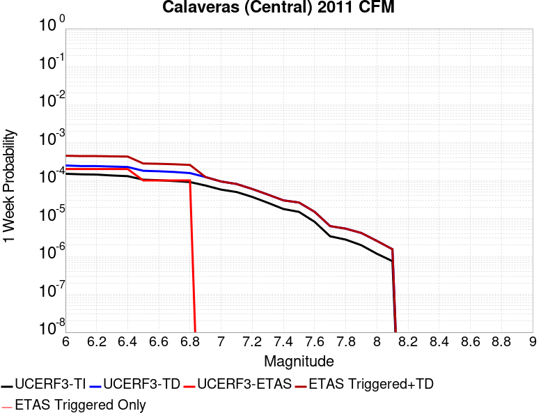 | 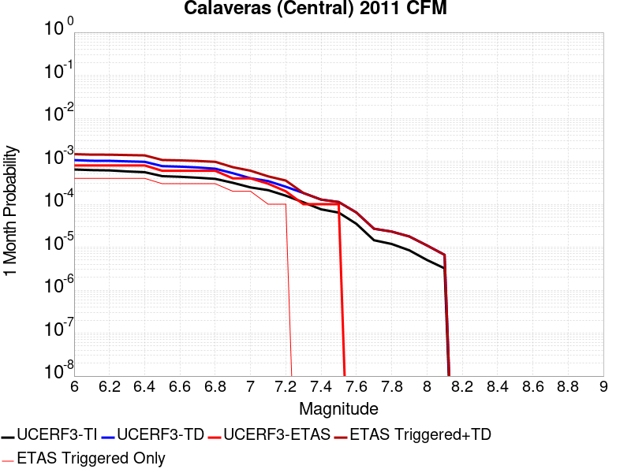 | 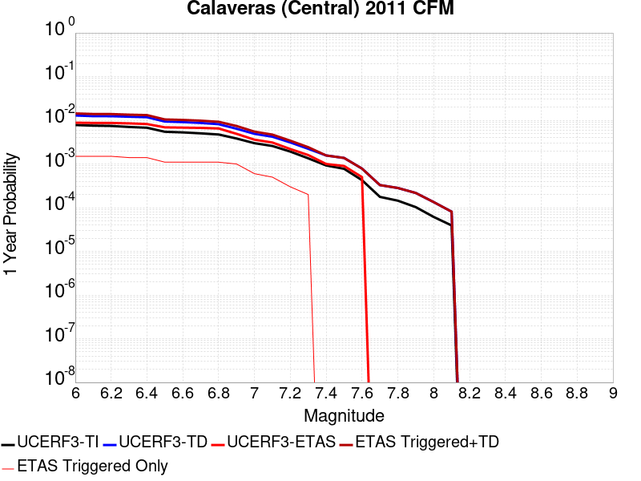 | 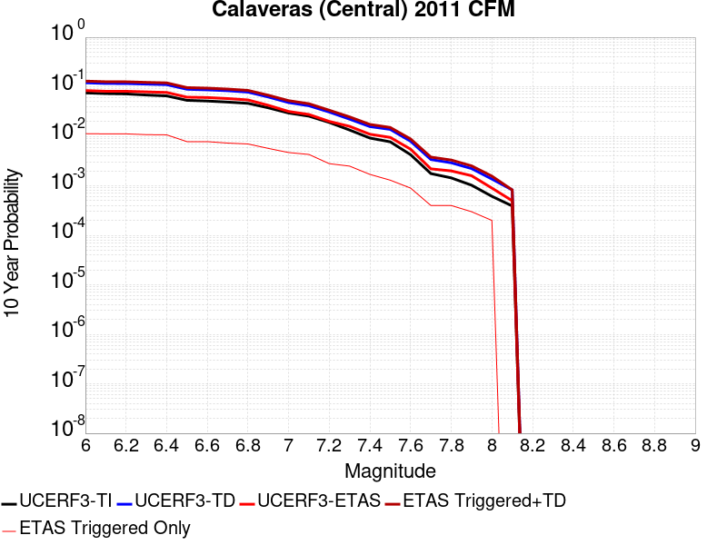 |

| Magnitude | 1 wk TI Prob | 1 wk TD Prob | 1 wk ETAS Prob | 1 wk ETAS/TD Gain | 1 wk ETAS Triggered+TD | 1 wk ETAS Triggered Only | 1 mo TI Prob | 1 mo TD Prob | 1 mo ETAS Prob | 1 mo ETAS/TD Gain | 1 mo ETAS Triggered+TD | 1 mo ETAS Triggered Only | 1 yr TI Prob | 1 yr TD Prob | 1 yr ETAS Prob | 1 yr ETAS/TD Gain | 1 yr ETAS Triggered+TD | 1 yr ETAS Triggered Only | 10 yr TI Prob | 10 yr TD Prob | 10 yr ETAS Prob | 10 yr ETAS/TD Gain | 10 yr ETAS Triggered+TD | 10 yr ETAS Triggered Only |
|-----|-----|-----|-----|-----|-----|-----|-----|-----|-----|-----|-----|-----|-----|-----|-----|-----|-----|-----|-----|-----|-----|-----|-----|-----|
| 6.0 | 1.5010907E-4 | 2.4855268E-4 | 2.0E-4 | 0.80465835 | 4.4850298E-4 | 2.0E-4 | 6.4316596E-4 | 0.0010647338 | 8.0E-4 | 0.7513615 | 0.0014643079 | 4.0E-4 | 0.0078024664 | 0.012877337 | 0.0088 | 0.6833711 | 0.01435802 | 0.0015 | 0.07534136 | 0.12062756 | 0.084 | 0.6963583 | 0.13056447 | 0.0113 |
| 6.1 | 1.4521465E-4 | 2.4016222E-4 | 2.0E-4 | 0.8327704 | 4.4011418E-4 | 2.0E-4 | 6.222001E-4 | 0.0010288046 | 8.0E-4 | 0.7776015 | 0.0014283931 | 4.0E-4 | 0.0075490056 | 0.012446378 | 0.0087 | 0.6989985 | 0.013927708 | 0.0015 | 0.07297657 | 0.11689765 | 0.0813 | 0.69548017 | 0.1267884 | 0.0112 |
| 6.2 | 1.429998E-4 | 2.3946732E-4 | 2.0E-4 | 0.8351871 | 4.394194E-4 | 2.0E-4 | 6.127123E-4 | 0.0010258289 | 8.0E-4 | 0.77985716 | 0.0014254185 | 4.0E-4 | 0.007434286 | 0.012410608 | 0.0087 | 0.70101315 | 0.013891992 | 0.0015 | 0.07190444 | 0.11654779 | 0.0812 | 0.6967099 | 0.12644246 | 0.0112 |
| 6.3 | 1.3536277E-4 | 2.3276091E-4 | 2.0E-4 | 0.8592508 | 4.3271435E-4 | 2.0E-4 | 5.799972E-4 | 9.971141E-4 | 8.0E-4 | 0.8023154 | 0.0013967153 | 4.0E-4 | 0.0070386264 | 0.012065843 | 0.0085 | 0.704468 | 0.01344895 | 0.0014 | 0.0681982 | 0.11345214 | 0.079 | 0.6963289 | 0.123026855 | 0.0108 |
| 6.4 | 1.2993296E-4 | 2.2698258E-4 | 2.0E-4 | 0.88112485 | 4.269372E-4 | 2.0E-4 | 5.5673666E-4 | 9.723688E-4 | 8.0E-4 | 0.8227331 | 0.0013719798 | 4.0E-4 | 0.006757223 | 0.0117679285 | 0.0082 | 0.6968091 | 0.013151454 | 0.0014 | 0.06555412 | 0.1107242 | 0.0769 | 0.69451845 | 0.12023945 | 0.0107 |
| 6.5 | 1.0498927E-4 | 1.8026086E-4 | 1.0E-4 | 0.55475163 | 2.8024282E-4 | 1.0E-4 | 4.498764E-4 | 7.7231694E-4 | 6.0E-4 | 0.7768831 | 0.0010720852 | 3.0E-4 | 0.005463498 | 0.009362331 | 0.0069 | 0.736996 | 0.010452032 | 0.0011 | 0.053311124 | 0.08939343 | 0.0617 | 0.6902073 | 0.09649616 | 0.0078 |
| 6.6 | 1.0157505E-4 | 1.7513058E-4 | 1.0E-4 | 0.5710025 | 2.7511307E-4 | 1.0E-4 | 4.35249E-4 | 7.503431E-4 | 6.0E-4 | 0.7996342 | 0.001050118 | 3.0E-4 | 0.0052862884 | 0.009097098 | 0.0068 | 0.74749106 | 0.010187091 | 0.0011 | 0.05162293 | 0.08696937 | 0.0607 | 0.69794685 | 0.094091006 | 0.0078 |
| 6.7 | 9.660386E-5 | 1.677125E-4 | 1.0E-4 | 0.5962585 | 2.6769572E-4 | 1.0E-4 | 4.1395082E-4 | 7.1856915E-4 | 6.0E-4 | 0.8349927 | 0.0010183535 | 3.0E-4 | 0.0050282106 | 0.008713447 | 0.0067 | 0.7689265 | 0.009803861 | 0.0011 | 0.049159497 | 0.08345466 | 0.0579 | 0.6937899 | 0.09014544 | 0.0073 |
| 6.8 | 9.089927E-5 | 1.5683839E-4 | 1.0E-4 | 0.637599 | 2.568227E-4 | 1.0E-4 | 3.8951015E-4 | 6.719912E-4 | 6.0E-4 | 0.8928688 | 9.7178965E-4 | 3.0E-4 | 0.0047319788 | 0.008150768 | 0.0065 | 0.79747087 | 0.009241802 | 0.0011 | 0.046324775 | 0.0783382 | 0.0543 | 0.69314843 | 0.08478983 | 0.007 |
| 6.9 | 7.353187E-5 | 1.2329822E-4 | 0.0 | 0.0 | 1.2329822E-4 | 0.0 | 3.150985E-4 | 5.283145E-4 | 4.0E-4 | 0.7571247 | 7.2820886E-4 | 2.0E-4 | 0.0038295772 | 0.0064133806 | 0.0049 | 0.76402766 | 0.007406967 | 0.001 | 0.037642512 | 0.06234631 | 0.0423 | 0.6784684 | 0.06769093 | 0.0057 |
| 7.0 | 5.746064E-5 | 9.417722E-5 | 0.0 | 0.0 | 9.417722E-5 | 0.0 | 2.4623662E-4 | 4.0355462E-4 | 4.0E-4 | 0.99119174 | 6.034739E-4 | 2.0E-4 | 0.0029938098 | 0.00490228 | 0.0036 | 0.7343522 | 0.0054993387 | 6.0E-4 | 0.02953797 | 0.04812327 | 0.0318 | 0.66080296 | 0.05259709 | 0.0047 |
| 7.1 | 4.9557195E-5 | 8.077778E-5 | 0.0 | 0.0 | 8.077778E-5 | 0.0 | 2.123707E-4 | 3.461449E-4 | 3.0E-4 | 0.8666891 | 4.4611027E-4 | 1.0E-4 | 0.0025825473 | 0.0042062337 | 0.0031 | 0.7370014 | 0.0047041303 | 5.0E-4 | 0.0255274 | 0.041493844 | 0.0276 | 0.66515887 | 0.04561542 | 0.0043 |
| 7.2 | 3.687595E-5 | 5.976116E-5 | 0.0 | 0.0 | 5.976116E-5 | 0.0 | 1.5803022E-4 | 2.560943E-4 | 2.0E-4 | 0.78096235 | 3.5606866E-4 | 1.0E-4 | 0.0019223199 | 0.0031135194 | 0.0022 | 0.7065959 | 0.0034125852 | 3.0E-4 | 0.01905776 | 0.030997844 | 0.02 | 0.64520615 | 0.03371105 | 0.0028 |
| 7.3 | 2.5846984E-5 | 4.2676824E-5 | 0.0 | 0.0 | 4.2676824E-5 | 0.0 | 1.1076809E-4 | 1.8288795E-4 | 1.0E-4 | 0.54678285 | 1.8288795E-4 | 0.0 | 0.0013477671 | 0.0022244046 | 0.0016 | 0.7192936 | 0.0024239598 | 2.0E-4 | 0.013396223 | 0.022275385 | 0.0159 | 0.7137924 | 0.024719696 | 0.0025 |
| 7.4 | 1.7747854E-5 | 3.0055215E-5 | 0.0 | 0.0 | 3.0055215E-5 | 0.0 | 7.6060016E-5 | 1.2880172E-4 | 1.0E-4 | 0.77638716 | 1.2880172E-4 | 0.0 | 9.2563726E-4 | 0.0015670358 | 0.001 | 0.63814753 | 0.0015670358 | 0.0 | 0.009217911 | 0.015766773 | 0.011 | 0.6976697 | 0.01743997 | 0.0017 |
| 7.5 | 1.4883479E-5 | 2.6354981E-5 | 0.0 | 0.0 | 2.6354981E-5 | 0.0 | 6.378478E-5 | 1.1294504E-4 | 1.0E-4 | 0.88538635 | 1.1294504E-4 | 0.0 | 7.76303E-4 | 0.0013742413 | 9.0E-4 | 0.6549068 | 0.0013742413 | 0.0 | 0.0077359667 | 0.0138565 | 0.0095 | 0.6855988 | 0.015138487 | 0.0013 |
| 7.6 | 8.166975E-6 | 1.50463375E-5 | 0.0 | 0.0 | 1.50463375E-5 | 0.0 | 3.5000852E-5 | 6.4482716E-5 | 0.0 | 0.0 | 6.4482716E-5 | 0.0 | 4.2605202E-4 | 7.847956E-4 | 5.0E-4 | 0.63710856 | 7.847956E-4 | 0.0 | 0.004252361 | 0.007979914 | 0.0055 | 0.68923056 | 0.008872732 | 9.0E-4 |
| 7.7 | 3.3858064E-6 | 6.3061157E-6 | 0.0 | 0.0 | 6.3061157E-6 | 0.0 | 1.4510518E-5 | 2.702593E-5 | 0.0 | 0.0 | 2.702593E-5 | 0.0 | 1.7665124E-4 | 3.2899107E-4 | 0.0 | 0.0 | 3.2899107E-4 | 0.0 | 0.0017651088 | 0.0034140332 | 0.0022 | 0.6443991 | 0.0038126677 | 4.0E-4 |
| 7.8 | 2.7721615E-6 | 5.4110287E-6 | 0.0 | 0.0 | 5.4110287E-6 | 0.0 | 1.1880637E-5 | 2.3189918E-5 | 0.0 | 0.0 | 2.3189918E-5 | 0.0 | 1.4463716E-4 | 2.823007E-4 | 0.0 | 0.0 | 2.823007E-4 | 0.0 | 0.0014454306 | 0.0029294915 | 0.002 | 0.6827124 | 0.0033283196 | 4.0E-4 |
| 7.9 | 1.9736292E-6 | 4.161316E-6 | 0.0 | 0.0 | 4.161316E-6 | 0.0 | 8.4583835E-6 | 1.783409E-5 | 0.0 | 0.0 | 1.783409E-5 | 0.0 | 1.0297595E-4 | 2.1710846E-4 | 0.0 | 0.0 | 2.1710846E-4 | 0.0 | 0.0010292825 | 0.002239661 | 0.0016 | 0.7143938 | 0.0025389893 | 3.0E-4 |
| 8.0 | 1.1767289E-6 | 2.5739062E-6 | 0.0 | 0.0 | 2.5739062E-6 | 0.0 | 5.0431145E-6 | 1.103098E-5 | 0.0 | 0.0 | 1.103098E-5 | 0.0 | 6.139818E-5 | 1.3429394E-4 | 0.0 | 0.0 | 1.3429394E-4 | 0.0 | 6.1381224E-4 | 0.0013755781 | 9.0E-4 | 0.65427035 | 0.001575303 | 2.0E-4 |
| 8.1 | 7.5112825E-7 | 1.5527247E-6 | 0.0 | 0.0 | 1.5527247E-6 | 0.0 | 3.2191172E-6 | 6.654517E-6 | 0.0 | 0.0 | 6.654517E-6 | 0.0 | 3.9192048E-5 | 8.101576E-5 | 0.0 | 0.0 | 8.101576E-5 | 0.0 | 3.9185135E-4 | 8.293633E-4 | 5.0E-4 | 0.6028721 | 8.293633E-4 | 0.0 |

## Calaveras (So) - Paicines extension 2011 CFM
*[(top)](#table-of-contents)*

| 1 Week | 1 Month | 1 Year | 10 Year |
|-----|-----|-----|-----|
| 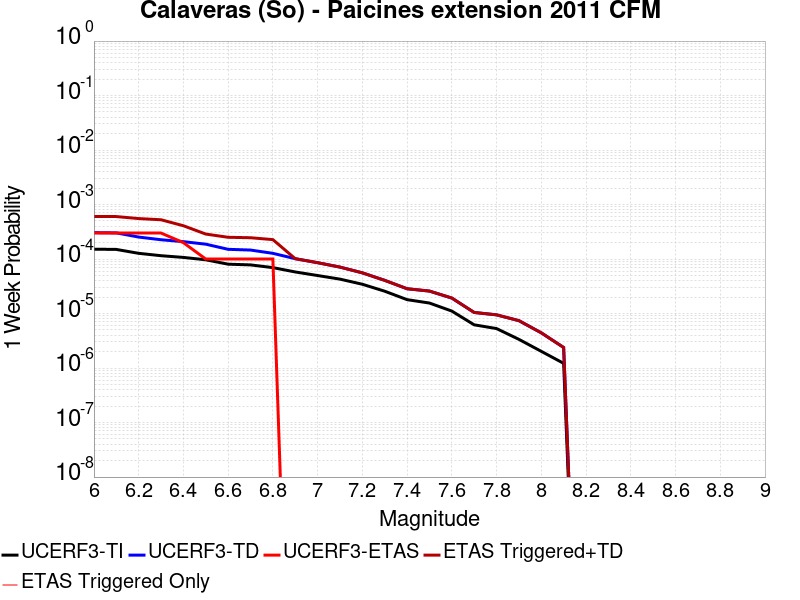 | 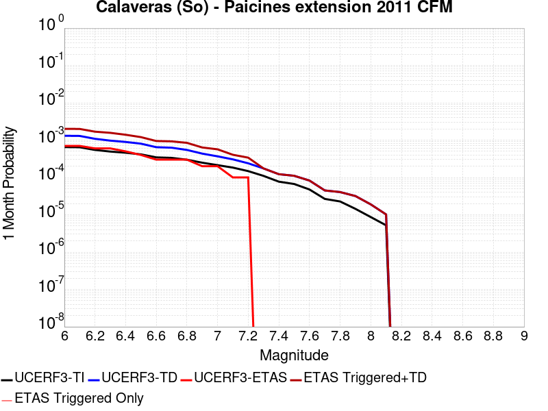 | 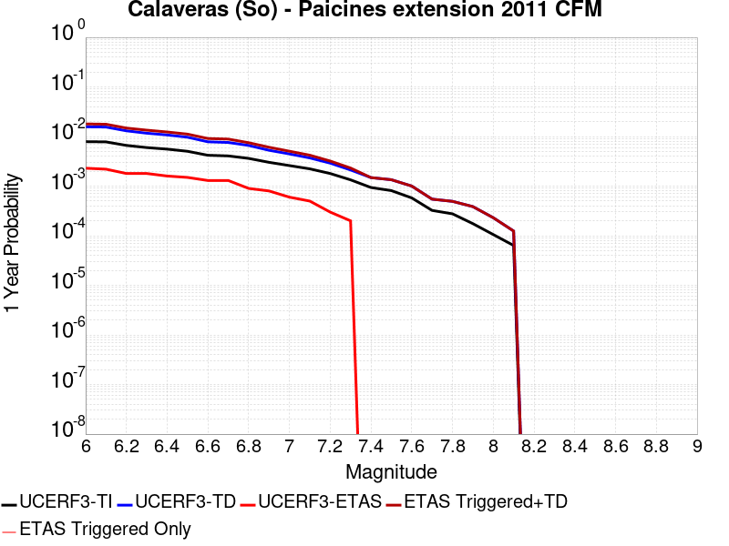 | 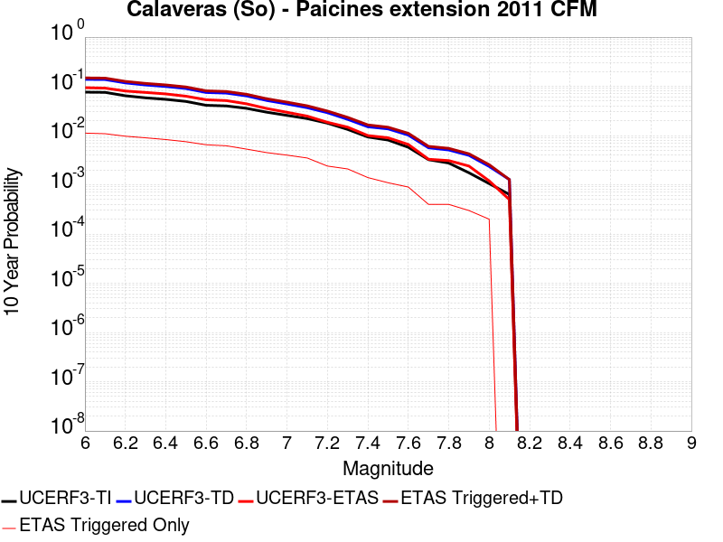 |

| Magnitude | 1 wk TI Prob | 1 wk TD Prob | 1 wk ETAS Prob | 1 wk ETAS/TD Gain | 1 wk ETAS Triggered+TD | 1 wk ETAS Triggered Only | 1 mo TI Prob | 1 mo TD Prob | 1 mo ETAS Prob | 1 mo ETAS/TD Gain | 1 mo ETAS Triggered+TD | 1 mo ETAS Triggered Only | 1 yr TI Prob | 1 yr TD Prob | 1 yr ETAS Prob | 1 yr ETAS/TD Gain | 1 yr ETAS Triggered+TD | 1 yr ETAS Triggered Only | 10 yr TI Prob | 10 yr TD Prob | 10 yr ETAS Prob | 10 yr ETAS/TD Gain | 10 yr ETAS Triggered+TD | 10 yr ETAS Triggered Only |
|-----|-----|-----|-----|-----|-----|-----|-----|-----|-----|-----|-----|-----|-----|-----|-----|-----|-----|-----|-----|-----|-----|-----|-----|-----|
| 6.0 | 1.5183659E-4 | 3.0564368E-4 | 3.0E-4 | 0.98153514 | 6.05552E-4 | 3.0E-4 | 6.5056595E-4 | 0.0013086811 | 0.0011 | 0.8405409 | 0.002007765 | 7.0E-4 | 0.007891912 | 0.01571854 | 0.011 | 0.69981056 | 0.017982388 | 0.0023 | 0.076174594 | 0.13866669 | 0.0938 | 0.6764422 | 0.14831363 | 0.0112 |
| 6.1 | 1.5024997E-4 | 3.0258417E-4 | 3.0E-4 | 0.99145967 | 6.024934E-4 | 3.0E-4 | 6.437695E-4 | 0.0012955826 | 0.0011 | 0.84903884 | 0.0019946757 | 7.0E-4 | 0.0078097614 | 0.01556183 | 0.0108 | 0.6940058 | 0.017727595 | 0.0022 | 0.075409345 | 0.13733575 | 0.0919 | 0.669163 | 0.14673878 | 0.0109 |
| 6.2 | 1.2743923E-4 | 2.5355536E-4 | 3.0E-4 | 1.1831735 | 5.534793E-4 | 3.0E-4 | 5.460538E-4 | 0.001085803 | 0.001 | 0.92097735 | 0.0016851516 | 6.0E-4 | 0.0066279583 | 0.013068658 | 0.0093 | 0.71162623 | 0.014845135 | 0.0018 | 0.064337276 | 0.11743333 | 0.0803 | 0.68379223 | 0.12599424 | 0.0097 |
| 6.3 | 1.1525114E-4 | 2.2640602E-4 | 3.0E-4 | 1.3250532 | 5.263381E-4 | 3.0E-4 | 4.9383997E-4 | 9.6966646E-4 | 9.0E-4 | 0.92815423 | 0.0015690847 | 6.0E-4 | 0.0059959386 | 0.011689791 | 0.0089 | 0.761348 | 0.01346875 | 0.0018 | 0.058367174 | 0.106550865 | 0.0751 | 0.70482767 | 0.11459191 | 0.009 |
| 6.4 | 1.07200925E-4 | 2.0881697E-4 | 2.0E-4 | 0.95777655 | 4.087752E-4 | 2.0E-4 | 4.5935164E-4 | 8.94398E-4 | 8.0E-4 | 0.8944564 | 0.0013939508 | 5.0E-4 | 0.0055782744 | 0.010794574 | 0.0083 | 0.7689048 | 0.012377303 | 0.0016 | 0.0544031 | 0.099374 | 0.0701 | 0.70541584 | 0.1068492 | 0.0083 |
| 6.5 | 9.69631E-5 | 1.8774872E-4 | 1.0E-4 | 0.5326268 | 2.8772996E-4 | 1.0E-4 | 4.1548995E-4 | 8.04216E-4 | 6.0E-4 | 0.7460682 | 0.0012038944 | 4.0E-4 | 0.0050468626 | 0.009716061 | 0.0069 | 0.71016437 | 0.011201487 | 0.0015 | 0.04933773 | 0.090264216 | 0.063 | 0.69795096 | 0.097087234 | 0.0075 |
| 6.6 | 8.0552316E-5 | 1.511175E-4 | 1.0E-4 | 0.66173667 | 2.511024E-4 | 1.0E-4 | 3.4517853E-4 | 6.474421E-4 | 5.0E-4 | 0.7722698 | 9.472479E-4 | 3.0E-4 | 0.0041944524 | 0.007847653 | 0.0063 | 0.8027878 | 0.009137451 | 0.0013 | 0.04116161 | 0.075036034 | 0.0533 | 0.71032536 | 0.0810483 | 0.0065 |
| 6.7 | 7.815757E-5 | 1.4651981E-4 | 1.0E-4 | 0.68250155 | 2.4650517E-4 | 1.0E-4 | 3.34918E-4 | 6.277523E-4 | 5.0E-4 | 0.7964925 | 9.27564E-4 | 3.0E-4 | 0.004070005 | 0.007610298 | 0.0062 | 0.8146856 | 0.008900405 | 0.0013 | 0.039962657 | 0.07288462 | 0.0513 | 0.7038522 | 0.078632735 | 0.0062 |
| 6.8 | 6.965264E-5 | 1.2761053E-4 | 1.0E-4 | 0.7836344 | 2.2759776E-4 | 1.0E-4 | 2.9847719E-4 | 5.467681E-4 | 4.0E-4 | 0.7315716 | 8.4660406E-4 | 3.0E-4 | 0.0036279052 | 0.0066333646 | 0.0051 | 0.7688406 | 0.0075273947 | 9.0E-4 | 0.03569247 | 0.06397134 | 0.0441 | 0.6893712 | 0.068932295 | 0.0053 |
| 6.9 | 5.8000453E-5 | 1.01779835E-4 | 0.0 | 0.0 | 1.01779835E-4 | 0.0 | 2.4854968E-4 | 4.361269E-4 | 3.0E-4 | 0.6878732 | 6.3603965E-4 | 2.0E-4 | 0.0030218933 | 0.005297015 | 0.0043 | 0.81177795 | 0.0060927775 | 8.0E-4 | 0.029811295 | 0.05166083 | 0.0354 | 0.6852387 | 0.055928353 | 0.0045 |
| 7.0 | 4.9865852E-5 | 8.59859E-5 | 0.0 | 0.0 | 8.59859E-5 | 0.0 | 2.1369329E-4 | 3.684594E-4 | 3.0E-4 | 0.81420094 | 5.6838576E-4 | 2.0E-4 | 0.0025986114 | 0.0044768555 | 0.0036 | 0.8041358 | 0.0050741695 | 6.0E-4 | 0.025684336 | 0.04392644 | 0.0297 | 0.67613035 | 0.047750738 | 0.004 |
| 7.1 | 4.283875E-5 | 7.1396564E-5 | 0.0 | 0.0 | 7.1396564E-5 | 0.0 | 1.8358172E-4 | 3.059497E-4 | 2.0E-4 | 0.6537022 | 4.0591913E-4 | 1.0E-4 | 0.0022328163 | 0.0037186323 | 0.0029 | 0.7798566 | 0.004216773 | 5.0E-4 | 0.022105146 | 0.036866795 | 0.0248 | 0.67269206 | 0.040237762 | 0.0035 |
| 7.2 | 3.450115E-5 | 5.603929E-5 | 0.0 | 0.0 | 5.603929E-5 | 0.0 | 1.478537E-4 | 2.4014644E-4 | 1.0E-4 | 0.41641256 | 3.4012244E-4 | 1.0E-4 | 0.0017986323 | 0.0029198923 | 0.002 | 0.6849568 | 0.0032190161 | 3.0E-4 | 0.017841442 | 0.029205669 | 0.0186 | 0.63686264 | 0.031535577 | 0.0024 |
| 7.3 | 2.5709045E-5 | 4.0818115E-5 | 0.0 | 0.0 | 4.0818115E-5 | 0.0 | 1.1017697E-4 | 1.7492315E-4 | 0.0 | 0.0 | 1.7492315E-4 | 0.0 | 0.0013405791 | 0.0021276262 | 0.0014 | 0.6580103 | 0.0023272007 | 2.0E-4 | 0.013325208 | 0.021408996 | 0.0148 | 0.6912982 | 0.023464037 | 0.0021 |
| 7.4 | 1.8003093E-5 | 2.8653816E-5 | 0.0 | 0.0 | 2.8653816E-5 | 0.0 | 7.715383E-5 | 1.2279631E-4 | 0.0 | 0.0 | 1.2279631E-4 | 0.0 | 9.3894306E-4 | 0.0014940221 | 8.0E-4 | 0.5354673 | 0.0014940221 | 0.0 | 0.009349857 | 0.015121481 | 0.01 | 0.66131085 | 0.016500311 | 0.0014 |
| 7.5 | 1.5595824E-5 | 2.5959966E-5 | 0.0 | 0.0 | 2.5959966E-5 | 0.0 | 6.683753E-5 | 1.1125226E-4 | 0.0 | 0.0 | 1.1125226E-4 | 0.0 | 8.134431E-4 | 0.0013536569 | 7.0E-4 | 0.51711774 | 0.0013536569 | 0.0 | 0.008104719 | 0.013718687 | 0.009 | 0.6560395 | 0.014803597 | 0.0011 |
| 7.6 | 1.1110309E-5 | 1.9340465E-5 | 0.0 | 0.0 | 1.9340465E-5 | 0.0 | 4.761474E-5 | 8.2885075E-5 | 0.0 | 0.0 | 8.2885075E-5 | 0.0 | 5.795553E-4 | 0.0010086601 | 6.0E-4 | 0.59484863 | 0.0010086601 | 0.0 | 0.0057804612 | 0.010261088 | 0.0066 | 0.64320666 | 0.011151852 | 9.0E-4 |
| 7.7 | 6.2140443E-6 | 1.0524018E-5 | 0.0 | 0.0 | 1.0524018E-5 | 0.0 | 2.6631347E-5 | 4.510215E-5 | 0.0 | 0.0 | 4.510215E-5 | 0.0 | 3.241884E-4 | 5.489805E-4 | 1.0E-4 | 0.18215585 | 5.489805E-4 | 0.0 | 0.0032371588 | 0.0056624226 | 0.0033 | 0.5827894 | 0.0060601574 | 4.0E-4 |
| 7.8 | 5.305533E-6 | 9.510731E-6 | 0.0 | 0.0 | 9.510731E-6 | 0.0 | 2.27378E-5 | 4.0759638E-5 | 0.0 | 0.0 | 4.0759638E-5 | 0.0 | 2.7679754E-4 | 4.9613573E-4 | 1.0E-4 | 0.20155776 | 4.9613573E-4 | 0.0 | 0.0027645302 | 0.005112269 | 0.0031 | 0.60638434 | 0.005510224 | 4.0E-4 |
| 7.9 | 3.363505E-6 | 7.4426785E-6 | 0.0 | 0.0 | 7.4426785E-6 | 0.0 | 1.4414942E-5 | 3.1896805E-5 | 0.0 | 0.0 | 3.1896805E-5 | 0.0 | 1.7548777E-4 | 3.8827446E-4 | 1.0E-4 | 0.25754976 | 3.8827446E-4 | 0.0 | 0.0017534926 | 0.0039765094 | 0.0024 | 0.6035444 | 0.0042753164 | 3.0E-4 |
| 8.0 | 2.0271132E-6 | 4.4461253E-6 | 0.0 | 0.0 | 4.4461253E-6 | 0.0 | 8.687599E-6 | 1.9054683E-5 | 0.0 | 0.0 | 1.9054683E-5 | 0.0 | 1.05766376E-4 | 2.3196613E-4 | 1.0E-4 | 0.43109742 | 2.3196613E-4 | 0.0 | 0.0010571606 | 0.0023672788 | 0.0012 | 0.50691116 | 0.0025668053 | 2.0E-4 |
| 8.1 | 1.2206116E-6 | 2.393522E-6 | 0.0 | 0.0 | 2.393522E-6 | 0.0 | 5.2311816E-6 | 1.0257911E-5 | 0.0 | 0.0 | 1.0257911E-5 | 0.0 | 6.3687774E-5 | 1.2488295E-4 | 0.0 | 0.0 | 1.2488295E-4 | 0.0 | 6.366953E-4 | 0.0012797656 | 5.0E-4 | 0.39069653 | 0.0012797656 | 0.0 |

## San Andreas (Mojave N)
*[(top)](#table-of-contents)*

| 1 Week | 1 Month | 1 Year | 10 Year |
|-----|-----|-----|-----|
| 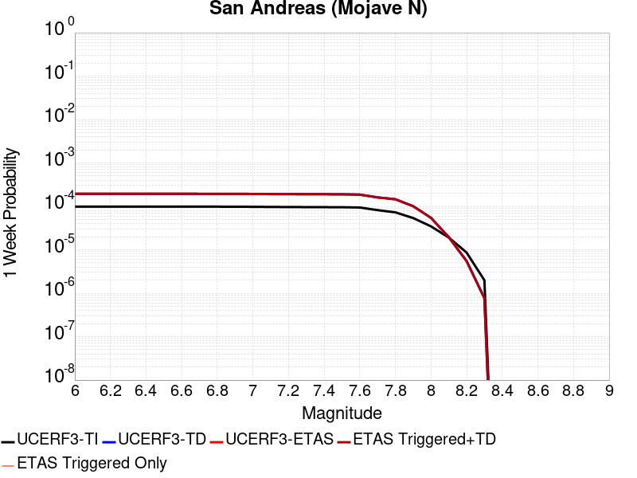 | 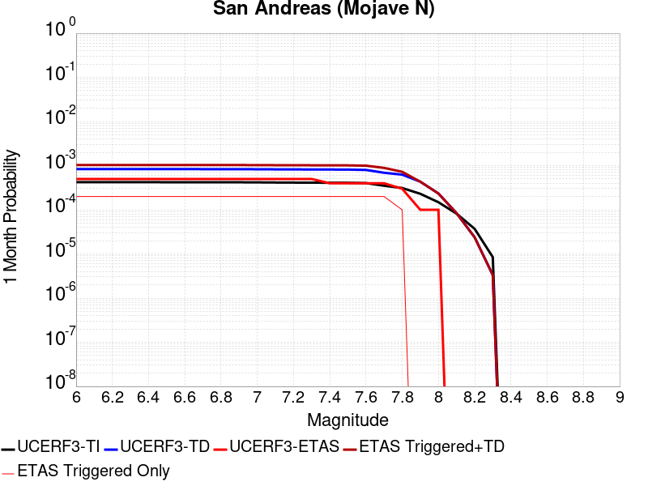 | 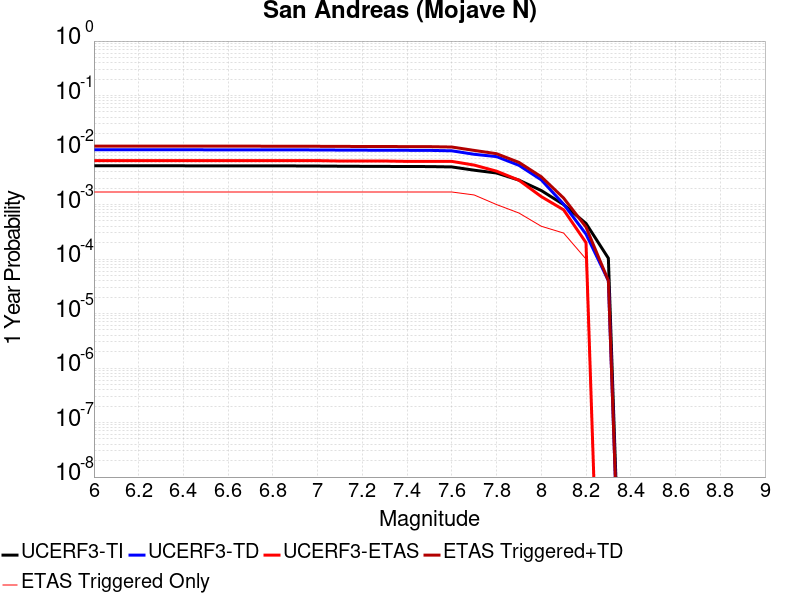 | 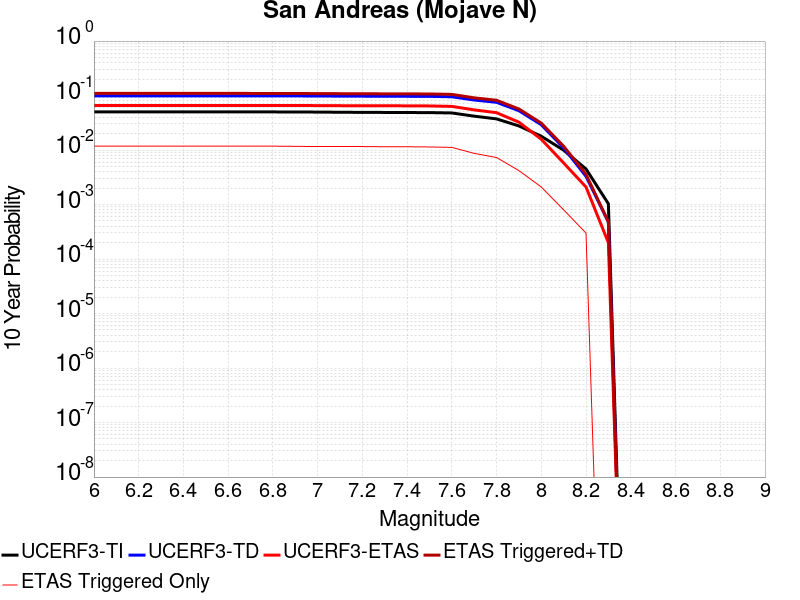 |

| Magnitude | 1 wk TI Prob | 1 wk TD Prob | 1 wk ETAS Prob | 1 wk ETAS/TD Gain | 1 wk ETAS Triggered+TD | 1 wk ETAS Triggered Only | 1 mo TI Prob | 1 mo TD Prob | 1 mo ETAS Prob | 1 mo ETAS/TD Gain | 1 mo ETAS Triggered+TD | 1 mo ETAS Triggered Only | 1 yr TI Prob | 1 yr TD Prob | 1 yr ETAS Prob | 1 yr ETAS/TD Gain | 1 yr ETAS Triggered+TD | 1 yr ETAS Triggered Only | 10 yr TI Prob | 10 yr TD Prob | 10 yr ETAS Prob | 10 yr ETAS/TD Gain | 10 yr ETAS Triggered+TD | 10 yr ETAS Triggered Only |
|-----|-----|-----|-----|-----|-----|-----|-----|-----|-----|-----|-----|-----|-----|-----|-----|-----|-----|-----|-----|-----|-----|-----|-----|-----|
| 6.0 | 9.877682E-5 | 1.9539143E-4 | 0.0 | 0.0 | 1.9539143E-4 | 0.0 | 4.2326056E-4 | 8.371233E-4 | 5.0E-4 | 0.59728354 | 0.0010369559 | 2.0E-4 | 0.0051410277 | 0.010144477 | 0.0064 | 0.6308851 | 0.011827231 | 0.0017 | 0.05023708 | 0.0989258 | 0.0658 | 0.66514504 | 0.10955847 | 0.0118 |
| 6.1 | 9.877682E-5 | 1.9539143E-4 | 0.0 | 0.0 | 1.9539143E-4 | 0.0 | 4.2326056E-4 | 8.371233E-4 | 5.0E-4 | 0.59728354 | 0.0010369559 | 2.0E-4 | 0.0051410277 | 0.010144477 | 0.0064 | 0.6308851 | 0.011827231 | 0.0017 | 0.05023708 | 0.0989258 | 0.0658 | 0.66514504 | 0.10955847 | 0.0118 |
| 6.2 | 9.877682E-5 | 1.9539143E-4 | 0.0 | 0.0 | 1.9539143E-4 | 0.0 | 4.2326056E-4 | 8.371233E-4 | 5.0E-4 | 0.59728354 | 0.0010369559 | 2.0E-4 | 0.0051410277 | 0.010144477 | 0.0064 | 0.6308851 | 0.011827231 | 0.0017 | 0.05023708 | 0.0989258 | 0.0658 | 0.66514504 | 0.10955847 | 0.0118 |
| 6.3 | 9.877682E-5 | 1.9539143E-4 | 0.0 | 0.0 | 1.9539143E-4 | 0.0 | 4.2326056E-4 | 8.371233E-4 | 5.0E-4 | 0.59728354 | 0.0010369559 | 2.0E-4 | 0.0051410277 | 0.010144477 | 0.0064 | 0.6308851 | 0.011827231 | 0.0017 | 0.05023708 | 0.0989258 | 0.0658 | 0.66514504 | 0.10955847 | 0.0118 |
| 6.4 | 9.877682E-5 | 1.9539143E-4 | 0.0 | 0.0 | 1.9539143E-4 | 0.0 | 4.2326056E-4 | 8.371233E-4 | 5.0E-4 | 0.59728354 | 0.0010369559 | 2.0E-4 | 0.0051410277 | 0.010144477 | 0.0064 | 0.6308851 | 0.011827231 | 0.0017 | 0.05023708 | 0.0989258 | 0.0658 | 0.66514504 | 0.10955847 | 0.0118 |
| 6.5 | 9.861474E-5 | 1.9512867E-4 | 0.0 | 0.0 | 1.9512867E-4 | 0.0 | 4.2256617E-4 | 8.359979E-4 | 5.0E-4 | 0.5980876 | 0.0010358307 | 2.0E-4 | 0.0051326132 | 0.010130903 | 0.0064 | 0.6317305 | 0.01181368 | 0.0017 | 0.050156746 | 0.09880358 | 0.0658 | 0.66596776 | 0.1094377 | 0.0118 |
| 6.6 | 9.861474E-5 | 1.9512867E-4 | 0.0 | 0.0 | 1.9512867E-4 | 0.0 | 4.2256617E-4 | 8.359979E-4 | 5.0E-4 | 0.5980876 | 0.0010358307 | 2.0E-4 | 0.0051326132 | 0.010130903 | 0.0064 | 0.6317305 | 0.01181368 | 0.0017 | 0.050156746 | 0.09880358 | 0.0658 | 0.66596776 | 0.1094377 | 0.0118 |
| 6.7 | 9.8552715E-5 | 1.9502804E-4 | 0.0 | 0.0 | 1.9502804E-4 | 0.0 | 4.223004E-4 | 8.355669E-4 | 5.0E-4 | 0.5983961 | 0.0010353999 | 2.0E-4 | 0.0051293927 | 0.010125704 | 0.0064 | 0.6320548 | 0.01180849 | 0.0017 | 0.050125998 | 0.09875659 | 0.0658 | 0.6662847 | 0.109391265 | 0.0118 |
| 6.8 | 9.8464974E-5 | 1.9487925E-4 | 0.0 | 0.0 | 1.9487925E-4 | 0.0 | 4.219245E-4 | 8.3492964E-4 | 5.0E-4 | 0.5988529 | 0.0010347626 | 2.0E-4 | 0.0051248376 | 0.010118017 | 0.0064 | 0.632535 | 0.011800816 | 0.0017 | 0.05008251 | 0.09868656 | 0.0658 | 0.6667574 | 0.10932206 | 0.0118 |
| 6.9 | 9.825824E-5 | 1.9455858E-4 | 0.0 | 0.0 | 1.9455858E-4 | 0.0 | 4.2103877E-4 | 8.3355623E-4 | 5.0E-4 | 0.59983957 | 0.0010333895 | 2.0E-4 | 0.0051141046 | 0.010101452 | 0.0064 | 0.63357234 | 0.011784279 | 0.0017 | 0.049980022 | 0.09853567 | 0.0657 | 0.6667636 | 0.10908281 | 0.0117 |
| 7.0 | 9.781462E-5 | 1.9387066E-4 | 0.0 | 0.0 | 1.9387066E-4 | 0.0 | 4.1913814E-4 | 8.306099E-4 | 5.0E-4 | 0.60196733 | 0.0010304437 | 2.0E-4 | 0.005091073 | 0.010065911 | 0.0064 | 0.6358093 | 0.011748799 | 0.0017 | 0.04976007 | 0.09821148 | 0.0655 | 0.6669281 | 0.10867223 | 0.0116 |
| 7.1 | 9.7121134E-5 | 1.9288564E-4 | 0.0 | 0.0 | 1.9288564E-4 | 0.0 | 4.1616702E-4 | 8.2639104E-4 | 5.0E-4 | 0.60504043 | 0.0010262257 | 2.0E-4 | 0.005055068 | 0.01001502 | 0.0063 | 0.62905514 | 0.0116979955 | 0.0017 | 0.04941613 | 0.097747415 | 0.0652 | 0.6670253 | 0.108213544 | 0.0116 |
| 7.2 | 9.663819E-5 | 1.9219192E-4 | 0.0 | 0.0 | 1.9219192E-4 | 0.0 | 4.1409794E-4 | 8.2341983E-4 | 5.0E-4 | 0.60722363 | 0.0010232552 | 2.0E-4 | 0.0050299936 | 0.009979178 | 0.0063 | 0.6313145 | 0.011662214 | 0.0017 | 0.049176537 | 0.09742036 | 0.0651 | 0.66823816 | 0.107890286 | 0.0116 |
| 7.3 | 9.6277574E-5 | 1.9171514E-4 | 0.0 | 0.0 | 1.9171514E-4 | 0.0 | 4.125529E-4 | 8.2137773E-4 | 5.0E-4 | 0.6087333 | 0.0010212135 | 2.0E-4 | 0.0050112694 | 0.009954544 | 0.0063 | 0.6328769 | 0.011637621 | 0.0017 | 0.04899759 | 0.09719305 | 0.065 | 0.6687721 | 0.10757533 | 0.0115 |
| 7.4 | 9.593308E-5 | 1.9111081E-4 | 0.0 | 0.0 | 1.9111081E-4 | 0.0 | 4.1107697E-4 | 8.187895E-4 | 4.0E-4 | 0.48852608 | 0.0010186257 | 2.0E-4 | 0.0049933824 | 0.009923318 | 0.0062 | 0.624791 | 0.011606448 | 0.0017 | 0.04882661 | 0.09691082 | 0.0648 | 0.668656 | 0.10729635 | 0.0115 |
| 7.5 | 9.561707E-5 | 1.9056968E-4 | 0.0 | 0.0 | 1.9056968E-4 | 0.0 | 4.0972308E-4 | 8.1647176E-4 | 4.0E-4 | 0.48991284 | 0.0010163084 | 2.0E-4 | 0.0049769743 | 0.009895357 | 0.0062 | 0.62655646 | 0.011578535 | 0.0017 | 0.048669744 | 0.0966564 | 0.0645 | 0.66731226 | 0.106954515 | 0.0114 |
| 7.6 | 9.418194E-5 | 1.8708062E-4 | 0.0 | 0.0 | 1.8708062E-4 | 0.0 | 4.0357444E-4 | 8.015279E-4 | 4.0E-4 | 0.4990469 | 0.0010013676 | 2.0E-4 | 0.004902454 | 0.009715051 | 0.0062 | 0.63818496 | 0.011398536 | 0.0017 | 0.047957025 | 0.095038764 | 0.0633 | 0.66604406 | 0.105174325 | 0.0112 |
| 7.7 | 8.202141E-5 | 1.6145741E-4 | 0.0 | 0.0 | 1.6145741E-4 | 0.0 | 3.51473E-4 | 6.917769E-4 | 4.0E-4 | 0.5782211 | 8.9163857E-4 | 2.0E-4 | 0.00427079 | 0.008389916 | 0.0053 | 0.6317107 | 0.009877332 | 0.0015 | 0.04189639 | 0.08279639 | 0.0546 | 0.65944904 | 0.090776056 | 0.0087 |
| 7.8 | 7.2859846E-5 | 1.462837E-4 | 0.0 | 0.0 | 1.462837E-4 | 0.0 | 3.1221908E-4 | 6.2677957E-4 | 3.0E-4 | 0.4786372 | 7.267169E-4 | 1.0E-4 | 0.003794643 | 0.007604383 | 0.0041 | 0.53916276 | 0.008596779 | 0.001 | 0.037304975 | 0.07523593 | 0.0485 | 0.6446388 | 0.08198671 | 0.0073 |
| 7.9 | 5.3874453E-5 | 1.0124438E-4 | 0.0 | 0.0 | 1.0124438E-4 | 0.0 | 2.3087008E-4 | 4.3383235E-4 | 1.0E-4 | 0.2305038 | 4.3383235E-4 | 0.0 | 0.0028072202 | 0.0052691284 | 0.0028 | 0.53139716 | 0.00596544 | 7.0E-4 | 0.02772022 | 0.05279288 | 0.0325 | 0.61561334 | 0.05677115 | 0.0042 |
| 8.0 | 3.468538E-5 | 5.4715303E-5 | 0.0 | 0.0 | 5.4715303E-5 | 0.0 | 1.4864317E-4 | 2.3447309E-4 | 1.0E-4 | 0.42648816 | 2.3447309E-4 | 0.0 | 0.0018082283 | 0.0028509747 | 0.0014 | 0.4910601 | 0.0032498343 | 4.0E-4 | 0.017935853 | 0.029171754 | 0.0158 | 0.54161984 | 0.031210493 | 0.0021 |
| 8.1 | 1.9152367E-5 | 1.9619172E-5 | 0.0 | 0.0 | 1.9619172E-5 | 0.0 | 8.207899E-5 | 8.407946E-5 | 0.0 | 0.0 | 8.407946E-5 | 0.0 | 9.988535E-4 | 0.0010231874 | 8.0E-4 | 0.7818705 | 0.0013228804 | 3.0E-4 | 0.009943757 | 0.010970394 | 0.0058 | 0.5286957 | 0.011761617 | 8.0E-4 |
| 8.2 | 8.643924E-6 | 5.556491E-6 | 0.0 | 0.0 | 5.556491E-6 | 0.0 | 3.704486E-5 | 2.3813316E-5 | 0.0 | 0.0 | 2.3813316E-5 | 0.0 | 4.5092785E-4 | 2.8988862E-4 | 2.0E-4 | 0.6899201 | 3.8985963E-4 | 1.0E-4 | 0.0045001395 | 0.0032934055 | 0.0021 | 0.63763785 | 0.0035924173 | 3.0E-4 |
| 8.3 | 1.983087E-6 | 7.792044E-7 | 0.0 | 0.0 | 7.792044E-7 | 0.0 | 8.498917E-6 | 3.3394433E-6 | 0.0 | 0.0 | 3.3394433E-6 | 0.0 | 1.034694E-4 | 4.065698E-5 | 0.0 | 0.0 | 4.065698E-5 | 0.0 | 0.0010342124 | 4.7958124E-4 | 2.0E-4 | 0.41703048 | 4.7958124E-4 | 0.0 |

## San Jacinto (Superstition Mtn)
*[(top)](#table-of-contents)*

| 1 Week | 1 Month | 1 Year | 10 Year |
|-----|-----|-----|-----|
| 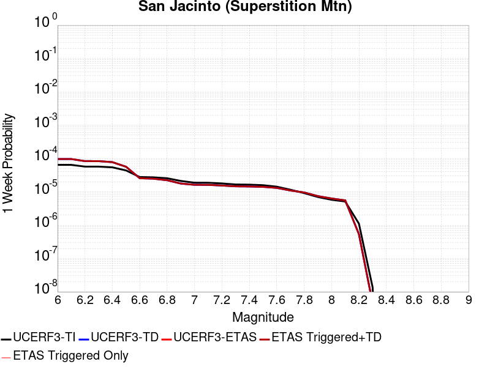 | 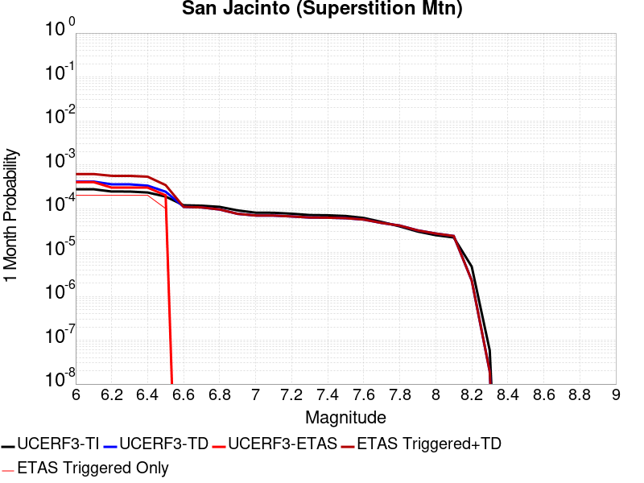 | 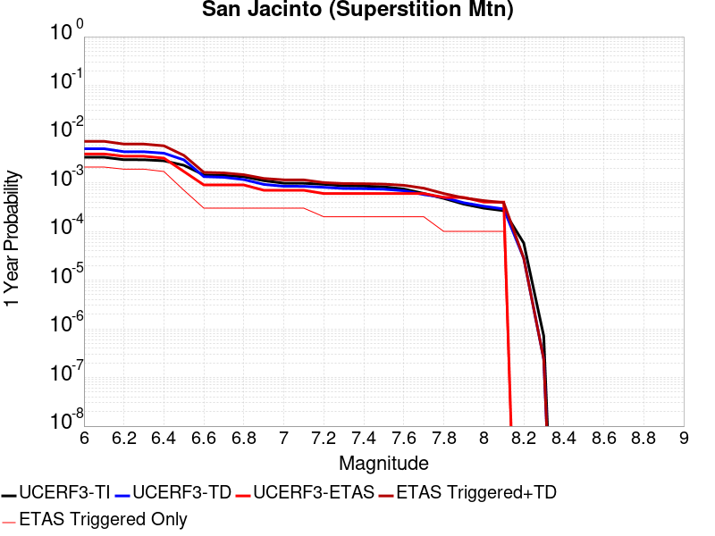 | 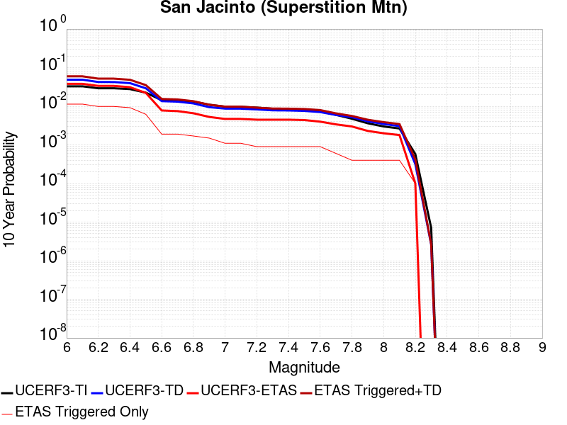 |

| Magnitude | 1 wk TI Prob | 1 wk TD Prob | 1 wk ETAS Prob | 1 wk ETAS/TD Gain | 1 wk ETAS Triggered+TD | 1 wk ETAS Triggered Only | 1 mo TI Prob | 1 mo TD Prob | 1 mo ETAS Prob | 1 mo ETAS/TD Gain | 1 mo ETAS Triggered+TD | 1 mo ETAS Triggered Only | 1 yr TI Prob | 1 yr TD Prob | 1 yr ETAS Prob | 1 yr ETAS/TD Gain | 1 yr ETAS Triggered+TD | 1 yr ETAS Triggered Only | 10 yr TI Prob | 10 yr TD Prob | 10 yr ETAS Prob | 10 yr ETAS/TD Gain | 10 yr ETAS Triggered+TD | 10 yr ETAS Triggered Only |
|-----|-----|-----|-----|-----|-----|-----|-----|-----|-----|-----|-----|-----|-----|-----|-----|-----|-----|-----|-----|-----|-----|-----|-----|-----|
| 6.0 | 6.4193904E-5 | 9.611469E-5 | 0.0 | 0.0 | 9.611469E-5 | 0.0 | 2.7508775E-4 | 4.1185974E-4 | 4.0E-4 | 0.9712044 | 6.1177736E-4 | 2.0E-4 | 0.0033440501 | 0.005004269 | 0.0039 | 0.7793346 | 0.00709376 | 0.0021 | 0.03294174 | 0.04888574 | 0.0381 | 0.77936834 | 0.059728444 | 0.0114 |
| 6.1 | 6.4193904E-5 | 9.611469E-5 | 0.0 | 0.0 | 9.611469E-5 | 0.0 | 2.7508775E-4 | 4.1185974E-4 | 4.0E-4 | 0.9712044 | 6.1177736E-4 | 2.0E-4 | 0.0033440501 | 0.005004269 | 0.0039 | 0.7793346 | 0.00709376 | 0.0021 | 0.03294174 | 0.04888574 | 0.0381 | 0.77936834 | 0.059728444 | 0.0114 |
| 6.2 | 5.7023593E-5 | 8.325497E-5 | 0.0 | 0.0 | 8.325497E-5 | 0.0 | 2.4436394E-4 | 3.567676E-4 | 3.0E-4 | 0.8408836 | 5.566962E-4 | 2.0E-4 | 0.002971072 | 0.004336636 | 0.0035 | 0.80707717 | 0.0062283967 | 0.0019 | 0.029316625 | 0.042565223 | 0.0338 | 0.7940755 | 0.052043825 | 0.0099 |
| 6.3 | 5.6940098E-5 | 8.3100276E-5 | 0.0 | 0.0 | 8.3100276E-5 | 0.0 | 2.4400617E-4 | 3.561048E-4 | 3.0E-4 | 0.84244865 | 5.5603357E-4 | 2.0E-4 | 0.002966728 | 0.004328599 | 0.0035 | 0.8085757 | 0.0062203747 | 0.0019 | 0.029274331 | 0.042486772 | 0.0337 | 0.79318804 | 0.051966153 | 0.0099 |
| 6.4 | 5.4171585E-5 | 7.759051E-5 | 0.0 | 0.0 | 7.759051E-5 | 0.0 | 2.3214328E-4 | 3.3249767E-4 | 3.0E-4 | 0.902262 | 5.324312E-4 | 2.0E-4 | 0.0028226813 | 0.004042294 | 0.0032 | 0.79162973 | 0.005735422 | 0.0017 | 0.02787096 | 0.03977481 | 0.0313 | 0.7869302 | 0.04860888 | 0.0092 |
| 6.5 | 4.375144E-5 | 5.6524877E-5 | 0.0 | 0.0 | 5.6524877E-5 | 0.0 | 1.874927E-4 | 2.4223361E-4 | 2.0E-4 | 0.8256492 | 3.422094E-4 | 1.0E-4 | 0.0022803338 | 0.002946382 | 0.0017 | 0.57697886 | 0.0036443193 | 7.0E-4 | 0.022570757 | 0.029293424 | 0.0222 | 0.7578493 | 0.035311803 | 0.0062 |
| 6.6 | 2.772192E-5 | 2.5586833E-5 | 0.0 | 0.0 | 2.5586833E-5 | 0.0 | 1.1880282E-4 | 1.0965335E-4 | 0.0 | 0.0 | 1.0965335E-4 | 0.0 | 0.0014454646 | 0.0013342315 | 9.0E-4 | 0.67454565 | 0.0016338312 | 3.0E-4 | 0.014360986 | 0.013590513 | 0.0078 | 0.5739298 | 0.015464691 | 0.0019 |
| 6.7 | 2.7124124E-5 | 2.4797338E-5 | 0.0 | 0.0 | 2.4797338E-5 | 0.0 | 1.1624106E-4 | 1.0627009E-4 | 0.0 | 0.0 | 1.0627009E-4 | 0.0 | 0.0014143161 | 0.0012930897 | 9.0E-4 | 0.69600743 | 0.0015927018 | 3.0E-4 | 0.014053487 | 0.013183777 | 0.0075 | 0.568881 | 0.015058728 | 0.0019 |
| 6.8 | 2.5475807E-5 | 2.2259945E-5 | 0.0 | 0.0 | 2.2259945E-5 | 0.0 | 1.0917746E-4 | 9.5396346E-5 | 0.0 | 0.0 | 9.5396346E-5 | 0.0 | 0.001328425 | 0.0011608436 | 9.0E-4 | 0.7752982 | 0.0014604954 | 3.0E-4 | 0.0132051185 | 0.011871018 | 0.0066 | 0.5559759 | 0.0135508375 | 0.0017 |
| 6.9 | 2.1162023E-5 | 1.7714552E-5 | 0.0 | 0.0 | 1.7714552E-5 | 0.0 | 9.069123E-5 | 7.591732E-5 | 0.0 | 0.0 | 7.591732E-5 | 0.0 | 0.0011036064 | 9.2390523E-4 | 7.0E-4 | 0.7576535 | 0.0012236281 | 3.0E-4 | 0.010981417 | 0.009493122 | 0.0053 | 0.55829895 | 0.010978882 | 0.0015 |
| 7.0 | 1.8754288E-5 | 1.624603E-5 | 0.0 | 0.0 | 1.624603E-5 | 0.0 | 8.037304E-5 | 6.9624E-5 | 0.0 | 0.0 | 6.9624E-5 | 0.0 | 9.781026E-4 | 8.47345E-4 | 7.0E-4 | 0.82610977 | 0.0011470908 | 3.0E-4 | 0.009738087 | 0.008714425 | 0.0047 | 0.5393356 | 0.009804839 | 0.0011 |
| 7.1 | 1.8678527E-5 | 1.6171087E-5 | 0.0 | 0.0 | 1.6171087E-5 | 0.0 | 8.0048376E-5 | 6.930283E-5 | 0.0 | 0.0 | 6.930283E-5 | 0.0 | 9.7415317E-4 | 8.434378E-4 | 7.0E-4 | 0.82993674 | 0.0011431847 | 3.0E-4 | 0.009698939 | 0.008675317 | 0.0047 | 0.54176694 | 0.009765774 | 0.0011 |
| 7.2 | 1.7804578E-5 | 1.5464804E-5 | 0.0 | 0.0 | 1.5464804E-5 | 0.0 | 7.6303106E-5 | 6.6276065E-5 | 0.0 | 0.0 | 6.6276065E-5 | 0.0 | 9.285943E-4 | 8.0661464E-4 | 6.0E-4 | 0.74384964 | 0.0010064533 | 2.0E-4 | 0.009247236 | 0.008306262 | 0.0045 | 0.5417599 | 0.009198787 | 9.0E-4 |
| 7.3 | 1.6583685E-5 | 1.4612991E-5 | 0.0 | 0.0 | 1.4612991E-5 | 0.0 | 7.1070994E-5 | 6.2625615E-5 | 0.0 | 0.0 | 6.2625615E-5 | 0.0 | 8.649459E-4 | 7.6220214E-4 | 6.0E-4 | 0.78719276 | 9.620497E-4 | 2.0E-4 | 0.00861587 | 0.00786118 | 0.0045 | 0.5724331 | 0.008754105 | 9.0E-4 |
| 7.4 | 1.6387552E-5 | 1.4477728E-5 | 0.0 | 0.0 | 1.4477728E-5 | 0.0 | 7.023047E-5 | 6.204594E-5 | 0.0 | 0.0 | 6.204594E-5 | 0.0 | 8.5472054E-4 | 7.551495E-4 | 6.0E-4 | 0.7945446 | 9.5499854E-4 | 2.0E-4 | 0.008514405 | 0.007790478 | 0.0045 | 0.5776282 | 0.008683466 | 9.0E-4 |
| 7.5 | 1.5790754E-5 | 1.411762E-5 | 0.0 | 0.0 | 1.411762E-5 | 0.0 | 6.767291E-5 | 6.050269E-5 | 0.0 | 0.0 | 6.050269E-5 | 0.0 | 8.236062E-4 | 7.363733E-4 | 6.0E-4 | 0.81480414 | 9.36226E-4 | 2.0E-4 | 0.008205604 | 0.007600653 | 0.0044 | 0.57889766 | 0.008493812 | 9.0E-4 |
| 7.6 | 1.4248672E-5 | 1.3132057E-5 | 0.0 | 0.0 | 1.3132057E-5 | 0.0 | 6.106431E-5 | 5.627904E-5 | 0.0 | 0.0 | 5.627904E-5 | 0.0 | 7.432043E-4 | 6.849836E-4 | 6.0E-4 | 0.87593335 | 8.8484667E-4 | 2.0E-4 | 0.007407237 | 0.0070809475 | 0.004 | 0.56489617 | 0.007974574 | 9.0E-4 |
| 7.7 | 1.15449975E-5 | 1.0977091E-5 | 0.0 | 0.0 | 1.0977091E-5 | 0.0 | 4.947762E-5 | 4.704383E-5 | 0.0 | 0.0 | 4.704383E-5 | 0.0 | 6.022235E-4 | 5.726089E-4 | 6.0E-4 | 1.0478356 | 7.724944E-4 | 2.0E-4 | 0.006005941 | 0.0059491615 | 0.0034 | 0.5715091 | 0.0065455916 | 6.0E-4 |
| 7.8 | 9.1391985E-6 | 9.584866E-6 | 0.0 | 0.0 | 9.584866E-6 | 0.0 | 3.9167408E-5 | 4.1077357E-5 | 0.0 | 0.0 | 4.1077357E-5 | 0.0 | 4.767588E-4 | 5.0000264E-4 | 5.0E-4 | 0.9999947 | 5.9995265E-4 | 1.0E-4 | 0.0047573727 | 0.0052142786 | 0.003 | 0.57534325 | 0.005612193 | 4.0E-4 |
| 7.9 | 6.973017E-6 | 7.445116E-6 | 0.0 | 0.0 | 7.445116E-6 | 0.0 | 2.9884017E-5 | 3.1907253E-5 | 0.0 | 0.0 | 3.1907253E-5 | 0.0 | 3.6377716E-4 | 3.8840208E-4 | 5.0E-4 | 1.2873257 | 4.8836326E-4 | 1.0E-4 | 0.0036318225 | 0.004085394 | 0.0023 | 0.5629811 | 0.0044837603 | 4.0E-4 |
| 8.0 | 5.7638235E-6 | 6.3174975E-6 | 0.0 | 0.0 | 6.3174975E-6 | 0.0 | 2.4701867E-5 | 2.7074711E-5 | 0.0 | 0.0 | 2.7074711E-5 | 0.0 | 3.0070372E-4 | 3.2958528E-4 | 4.0E-4 | 1.2136465 | 4.295523E-4 | 1.0E-4 | 0.0030029714 | 0.0034842347 | 0.002 | 0.5740141 | 0.003882841 | 4.0E-4 |
| 8.1 | 5.1124434E-6 | 5.5481905E-6 | 0.0 | 0.0 | 5.5481905E-6 | 0.0 | 2.1910288E-5 | 2.3777744E-5 | 0.0 | 0.0 | 2.3777744E-5 | 0.0 | 2.6672508E-4 | 2.8945607E-4 | 4.0E-4 | 1.3819022 | 3.8942712E-4 | 1.0E-4 | 0.0026640517 | 0.0030684592 | 0.0018 | 0.58661366 | 0.0034672318 | 4.0E-4 |
| 8.2 | 1.1075938E-6 | 5.4096853E-7 | 0.0 | 0.0 | 5.4096853E-7 | 0.0 | 4.7468216E-6 | 2.3184346E-6 | 0.0 | 0.0 | 2.3184346E-6 | 0.0 | 5.779102E-5 | 2.8226597E-5 | 0.0 | 0.0 | 2.8226597E-5 | 0.0 | 5.777599E-4 | 3.1757395E-4 | 1.0E-4 | 0.3148873 | 4.175422E-4 | 1.0E-4 |
| 8.3 | 1.3584393E-8 | 4.5436517E-9 | 0.0 | 0.0 | 4.5436517E-9 | 0.0 | 5.8218827E-8 | 1.9472791E-8 | 0.0 | 0.0 | 1.9472791E-8 | 0.0 | 7.0881396E-7 | 2.3708124E-7 | 0.0 | 0.0 | 2.3708124E-7 | 0.0 | 7.0881174E-6 | 2.6542411E-6 | 0.0 | 0.0 | 2.6542411E-6 | 0.0 |

## Panamint Valley
*[(top)](#table-of-contents)*

| 1 Week | 1 Month | 1 Year | 10 Year |
|-----|-----|-----|-----|
| 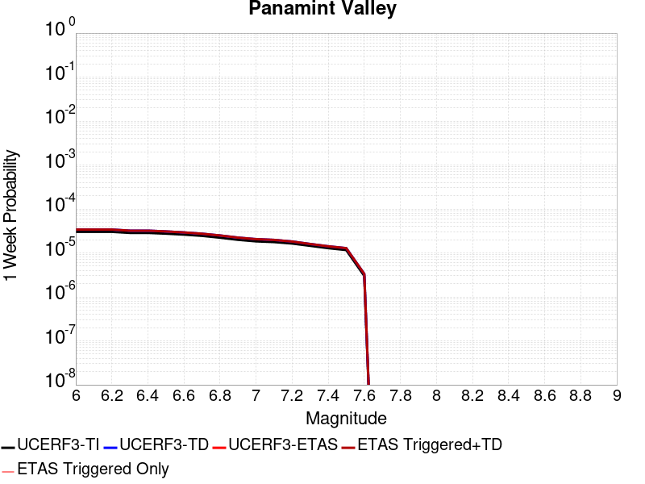 | 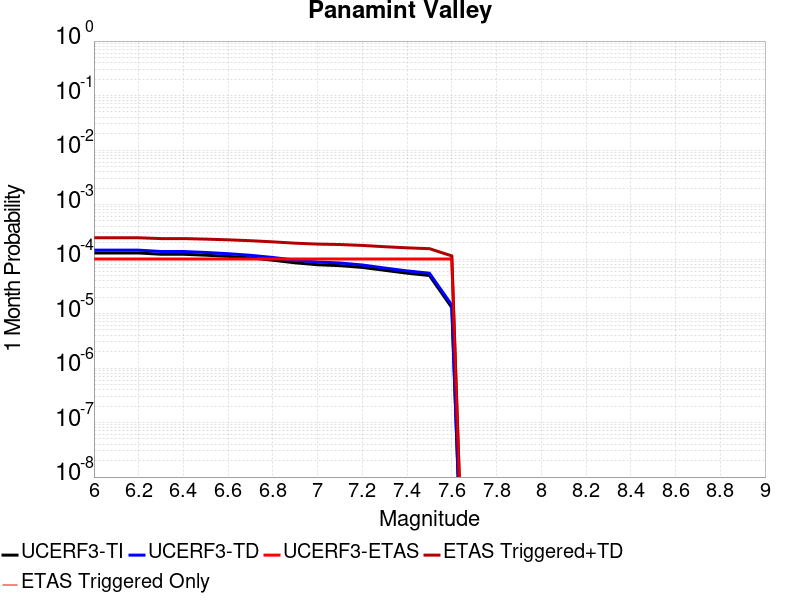 | 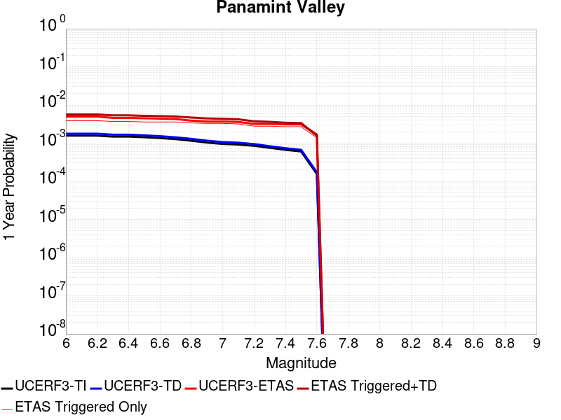 | 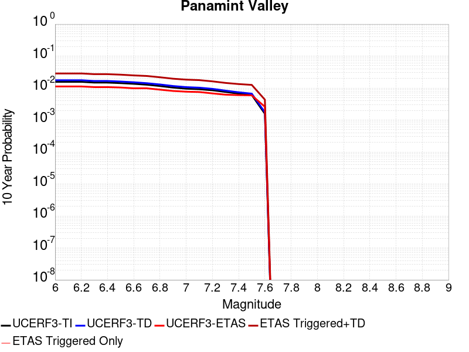 |

| Magnitude | 1 wk TI Prob | 1 wk TD Prob | 1 wk ETAS Prob | 1 wk ETAS/TD Gain | 1 wk ETAS Triggered+TD | 1 wk ETAS Triggered Only | 1 mo TI Prob | 1 mo TD Prob | 1 mo ETAS Prob | 1 mo ETAS/TD Gain | 1 mo ETAS Triggered+TD | 1 mo ETAS Triggered Only | 1 yr TI Prob | 1 yr TD Prob | 1 yr ETAS Prob | 1 yr ETAS/TD Gain | 1 yr ETAS Triggered+TD | 1 yr ETAS Triggered Only | 10 yr TI Prob | 10 yr TD Prob | 10 yr ETAS Prob | 10 yr ETAS/TD Gain | 10 yr ETAS Triggered+TD | 10 yr ETAS Triggered Only |
|-----|-----|-----|-----|-----|-----|-----|-----|-----|-----|-----|-----|-----|-----|-----|-----|-----|-----|-----|-----|-----|-----|-----|-----|-----|
| 6.0 | 3.0211835E-5 | 3.3997854E-5 | 0.0 | 0.0 | 3.3997854E-5 | 0.0 | 1.2947287E-4 | 1.4569712E-4 | 3.0E-4 | 2.059066 | 2.4568255E-4 | 1.0E-4 | 0.0015751923 | 0.0017724487 | 0.005 | 2.8209562 | 0.005665536 | 0.0039 | 0.015640736 | 0.017588679 | 0.0232 | 1.3190303 | 0.028591685 | 0.0112 |
| 6.1 | 3.0211835E-5 | 3.3997854E-5 | 0.0 | 0.0 | 3.3997854E-5 | 0.0 | 1.2947287E-4 | 1.4569712E-4 | 3.0E-4 | 2.059066 | 2.4568255E-4 | 1.0E-4 | 0.0015751923 | 0.0017724487 | 0.005 | 2.8209562 | 0.005665536 | 0.0039 | 0.015640736 | 0.017588679 | 0.0232 | 1.3190303 | 0.028591685 | 0.0112 |
| 6.2 | 3.0211835E-5 | 3.3997854E-5 | 0.0 | 0.0 | 3.3997854E-5 | 0.0 | 1.2947287E-4 | 1.4569712E-4 | 3.0E-4 | 2.059066 | 2.4568255E-4 | 1.0E-4 | 0.0015751923 | 0.0017724487 | 0.005 | 2.8209562 | 0.005665536 | 0.0039 | 0.015640736 | 0.017588679 | 0.0232 | 1.3190303 | 0.028591685 | 0.0112 |
| 6.3 | 2.8573924E-5 | 3.2115317E-5 | 0.0 | 0.0 | 3.2115317E-5 | 0.0 | 1.2245393E-4 | 1.3762998E-4 | 2.0E-4 | 1.4531718 | 2.3761622E-4 | 1.0E-4 | 0.001489857 | 0.0016743848 | 0.0046 | 2.7472777 | 0.0053681894 | 0.0037 | 0.01479908 | 0.016622864 | 0.022 | 1.3234783 | 0.027144998 | 0.0107 |
| 6.4 | 2.8573924E-5 | 3.2115317E-5 | 0.0 | 0.0 | 3.2115317E-5 | 0.0 | 1.2245393E-4 | 1.3762998E-4 | 2.0E-4 | 1.4531718 | 2.3761622E-4 | 1.0E-4 | 0.001489857 | 0.0016743848 | 0.0046 | 2.7472777 | 0.0053681894 | 0.0037 | 0.01479908 | 0.016622864 | 0.022 | 1.3234783 | 0.027144998 | 0.0107 |
| 6.5 | 2.7468774E-5 | 3.084056E-5 | 0.0 | 0.0 | 3.084056E-5 | 0.0 | 1.1771801E-4 | 1.3216729E-4 | 2.0E-4 | 1.5132337 | 2.3215408E-4 | 1.0E-4 | 0.0014322745 | 0.0016079765 | 0.0045 | 2.7985485 | 0.0052021877 | 0.0036 | 0.014230782 | 0.015968492 | 0.0217 | 1.358926 | 0.02620242 | 0.0104 |
| 6.6 | 2.6135967E-5 | 2.9264093E-5 | 0.0 | 0.0 | 2.9264093E-5 | 0.0 | 1.1200648E-4 | 1.2541165E-4 | 2.0E-4 | 1.5947481 | 2.2539911E-4 | 1.0E-4 | 0.0013628257 | 0.001525844 | 0.0044 | 2.8836498 | 0.005120351 | 0.0036 | 0.013544982 | 0.015158713 | 0.0202 | 1.332567 | 0.024810158 | 0.0098 |
| 6.7 | 2.4498746E-5 | 2.7352793E-5 | 0.0 | 0.0 | 2.7352793E-5 | 0.0 | 1.04990395E-4 | 1.17221134E-4 | 2.0E-4 | 1.706177 | 2.1720941E-4 | 1.0E-4 | 0.0012775084 | 0.001426258 | 0.0043 | 3.014882 | 0.0050211237 | 0.0036 | 0.012701893 | 0.014175876 | 0.0194 | 1.3685222 | 0.023836952 | 0.0098 |
| 6.8 | 2.2244329E-5 | 2.4946075E-5 | 0.0 | 0.0 | 2.4946075E-5 | 0.0 | 9.532935E-5 | 1.0690749E-4 | 2.0E-4 | 1.8707763 | 2.068968E-4 | 1.0E-4 | 0.0011600169 | 0.0013008433 | 0.0039 | 2.998055 | 0.0046964204 | 0.0034 | 0.011539802 | 0.0129367085 | 0.0168 | 1.2986301 | 0.021721572 | 0.0089 |
| 6.9 | 1.9902658E-5 | 2.2300088E-5 | 0.0 | 0.0 | 2.2300088E-5 | 0.0 | 8.529431E-5 | 9.556841E-5 | 2.0E-4 | 2.0927417 | 1.9555885E-4 | 1.0E-4 | 0.0010379635 | 0.0011629428 | 0.0037 | 3.181584 | 0.004459105 | 0.0033 | 0.010331288 | 0.011572636 | 0.0148 | 1.2788789 | 0.019578896 | 0.0081 |
| 7.0 | 1.8353881E-5 | 2.0575533E-5 | 0.0 | 0.0 | 2.0575533E-5 | 0.0 | 7.865712E-5 | 8.817798E-5 | 2.0E-4 | 2.26814 | 1.8816916E-4 | 1.0E-4 | 9.5722964E-4 | 0.0010730558 | 0.0037 | 3.4480965 | 0.0043695145 | 0.0033 | 0.009531168 | 0.010682788 | 0.0138 | 1.2917976 | 0.018300531 | 0.0077 |
| 7.1 | 1.7667631E-5 | 1.978174E-5 | 0.0 | 0.0 | 1.978174E-5 | 0.0 | 7.571623E-5 | 8.4776235E-5 | 2.0E-4 | 2.3591518 | 1.8476775E-4 | 1.0E-4 | 9.2145515E-4 | 0.0010316795 | 0.0036 | 3.489456 | 0.004228378 | 0.0032 | 0.009176437 | 0.0102729015 | 0.0135 | 1.314137 | 0.017695855 | 0.0075 |
| 7.2 | 1.6381597E-5 | 1.8166602E-5 | 0.0 | 0.0 | 1.8166602E-5 | 0.0 | 7.020495E-5 | 7.785464E-5 | 2.0E-4 | 2.5688899 | 1.7784686E-4 | 1.0E-4 | 8.544101E-4 | 9.474853E-4 | 0.0032 | 3.377361 | 0.0037448325 | 0.0028 | 0.008511325 | 0.009438183 | 0.0124 | 1.3138121 | 0.016174003 | 0.0068 |
| 7.3 | 1.4520491E-5 | 1.5973112E-5 | 0.0 | 0.0 | 1.5973112E-5 | 0.0 | 6.222919E-5 | 6.845449E-5 | 2.0E-4 | 2.9216492 | 1.6844764E-4 | 1.0E-4 | 7.57377E-4 | 8.331309E-4 | 0.0032 | 3.8409328 | 0.003630798 | 0.0028 | 0.0075480095 | 0.008302236 | 0.0112 | 1.3490342 | 0.0144507615 | 0.0062 |
| 7.4 | 1.2852287E-5 | 1.4151222E-5 | 0.0 | 0.0 | 1.4151222E-5 | 0.0 | 5.5080065E-5 | 6.0646773E-5 | 2.0E-4 | 3.2977848 | 1.606407E-4 | 1.0E-4 | 6.7039346E-4 | 7.3814014E-4 | 0.0031 | 4.1997447 | 0.0034361472 | 0.0027 | 0.0066837464 | 0.0073588495 | 0.0103 | 1.3996753 | 0.013314696 | 0.006 |
| 7.5 | 1.1637851E-5 | 1.2842324E-5 | 0.0 | 0.0 | 1.2842324E-5 | 0.0 | 4.987555E-5 | 5.503746E-5 | 2.0E-4 | 3.6338885 | 1.5503196E-4 | 1.0E-4 | 6.070656E-4 | 6.698908E-4 | 0.0031 | 4.62762 | 0.003368082 | 0.0027 | 0.006054099 | 0.006680666 | 0.01 | 1.4968567 | 0.01254125 | 0.0059 |
| 7.6 | 3.0068115E-6 | 3.335209E-6 | 0.0 | 0.0 | 3.335209E-6 | 0.0 | 1.2886271E-5 | 1.4293715E-5 | 2.0E-4 | 13.992163 | 1.14292285E-4 | 1.0E-4 | 1.5687906E-4 | 1.7401938E-4 | 0.0017 | 9.769027 | 0.0015737758 | 0.0014 | 0.0015676835 | 0.0017395564 | 0.0033 | 1.8970354 | 0.0043350337 | 0.0026 |

## San Andreas (Big Bend)
*[(top)](#table-of-contents)*

| 1 Week | 1 Month | 1 Year | 10 Year |
|-----|-----|-----|-----|
| 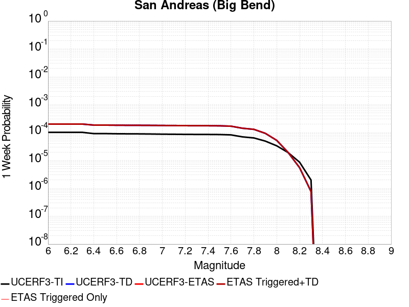 | 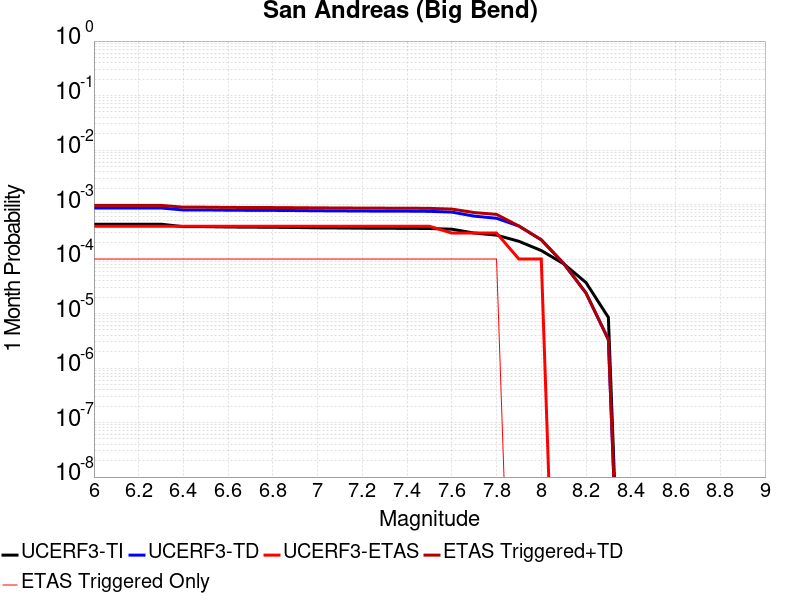 | 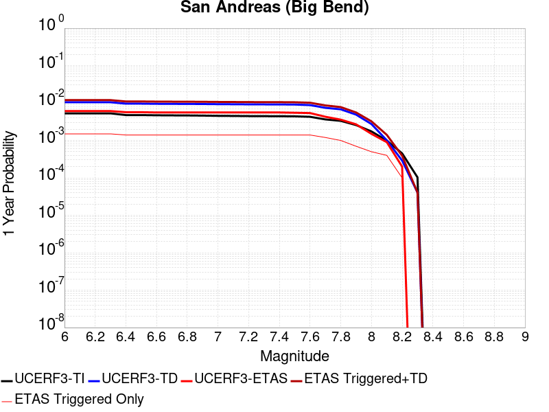 | 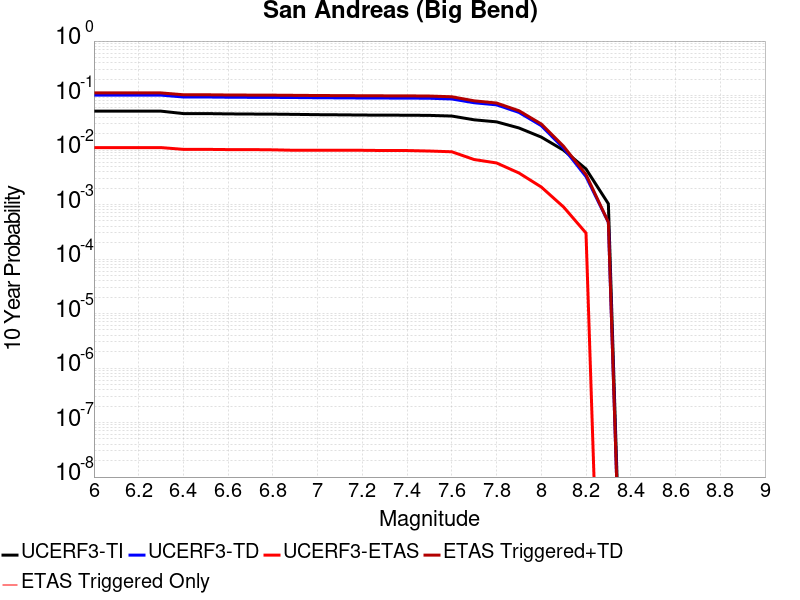 |

| Magnitude | 1 wk TI Prob | 1 wk TD Prob | 1 wk ETAS Prob | 1 wk ETAS/TD Gain | 1 wk ETAS Triggered+TD | 1 wk ETAS Triggered Only | 1 mo TI Prob | 1 mo TD Prob | 1 mo ETAS Prob | 1 mo ETAS/TD Gain | 1 mo ETAS Triggered+TD | 1 mo ETAS Triggered Only | 1 yr TI Prob | 1 yr TD Prob | 1 yr ETAS Prob | 1 yr ETAS/TD Gain | 1 yr ETAS Triggered+TD | 1 yr ETAS Triggered Only | 10 yr TI Prob | 10 yr TD Prob | 10 yr ETAS Prob | 10 yr ETAS/TD Gain | 10 yr ETAS Triggered+TD | 10 yr ETAS Triggered Only |
|-----|-----|-----|-----|-----|-----|-----|-----|-----|-----|-----|-----|-----|-----|-----|-----|-----|-----|-----|-----|-----|-----|-----|-----|-----|
| 6.0 | 1.0179969E-4 | 2.0208381E-4 | 0.0 | 0.0 | 2.0208381E-4 | 0.0 | 4.362114E-4 | 8.6578703E-4 | 4.0E-4 | 0.46200737 | 9.657005E-4 | 1.0E-4 | 0.0052979486 | 0.010490298 | 0.0061 | 0.5814897 | 0.011974563 | 0.0015 | 0.051734097 | 0.10202908 | 0.0664 | 0.65079486 | 0.111996554 | 0.0111 |
| 6.1 | 1.0179969E-4 | 2.0208381E-4 | 0.0 | 0.0 | 2.0208381E-4 | 0.0 | 4.362114E-4 | 8.6578703E-4 | 4.0E-4 | 0.46200737 | 9.657005E-4 | 1.0E-4 | 0.0052979486 | 0.010490298 | 0.0061 | 0.5814897 | 0.011974563 | 0.0015 | 0.051734097 | 0.10202908 | 0.0664 | 0.65079486 | 0.111996554 | 0.0111 |
| 6.2 | 1.0179969E-4 | 2.0208381E-4 | 0.0 | 0.0 | 2.0208381E-4 | 0.0 | 4.362114E-4 | 8.6578703E-4 | 4.0E-4 | 0.46200737 | 9.657005E-4 | 1.0E-4 | 0.0052979486 | 0.010490298 | 0.0061 | 0.5814897 | 0.011974563 | 0.0015 | 0.051734097 | 0.10202908 | 0.0664 | 0.65079486 | 0.111996554 | 0.0111 |
| 6.3 | 1.0179969E-4 | 2.0208381E-4 | 0.0 | 0.0 | 2.0208381E-4 | 0.0 | 4.362114E-4 | 8.6578703E-4 | 4.0E-4 | 0.46200737 | 9.657005E-4 | 1.0E-4 | 0.0052979486 | 0.010490298 | 0.0061 | 0.5814897 | 0.011974563 | 0.0015 | 0.051734097 | 0.10202908 | 0.0664 | 0.65079486 | 0.111996554 | 0.0111 |
| 6.4 | 9.1639464E-5 | 1.8562716E-4 | 0.0 | 0.0 | 1.8562716E-4 | 0.0 | 3.9268145E-4 | 7.953026E-4 | 4.0E-4 | 0.50295323 | 8.9522306E-4 | 1.0E-4 | 0.0047704205 | 0.009639941 | 0.0057 | 0.59128994 | 0.011026445 | 0.0014 | 0.046693064 | 0.094371215 | 0.0608 | 0.6442642 | 0.10369919 | 0.0103 |
| 6.5 | 9.1639464E-5 | 1.8562716E-4 | 0.0 | 0.0 | 1.8562716E-4 | 0.0 | 3.9268145E-4 | 7.953026E-4 | 4.0E-4 | 0.50295323 | 8.9522306E-4 | 1.0E-4 | 0.0047704205 | 0.009639941 | 0.0057 | 0.59128994 | 0.011026445 | 0.0014 | 0.046693064 | 0.094371215 | 0.0608 | 0.6442642 | 0.10369919 | 0.0103 |
| 6.6 | 9.042622E-5 | 1.8369462E-4 | 0.0 | 0.0 | 1.8369462E-4 | 0.0 | 3.8748336E-4 | 7.870253E-4 | 4.0E-4 | 0.50824285 | 8.869466E-4 | 1.0E-4 | 0.0047074095 | 0.009540049 | 0.0056 | 0.58699906 | 0.010926694 | 0.0014 | 0.046089325 | 0.09345991 | 0.0601 | 0.64305645 | 0.102706626 | 0.0102 |
| 6.7 | 8.9836685E-5 | 1.8283681E-4 | 0.0 | 0.0 | 1.8283681E-4 | 0.0 | 3.8495753E-4 | 7.8335125E-4 | 4.0E-4 | 0.5106266 | 8.832729E-4 | 1.0E-4 | 0.00467679 | 0.009495707 | 0.0056 | 0.58974016 | 0.010882414 | 0.0014 | 0.045795817 | 0.0930539 | 0.0598 | 0.64263827 | 0.10230475 | 0.0102 |
| 6.8 | 8.9471854E-5 | 1.8230337E-4 | 0.0 | 0.0 | 1.8230337E-4 | 0.0 | 3.8339442E-4 | 7.8106637E-4 | 4.0E-4 | 0.51212037 | 8.8098826E-4 | 1.0E-4 | 0.004657841 | 0.009468132 | 0.0056 | 0.5914578 | 0.010854876 | 0.0014 | 0.04561414 | 0.092800654 | 0.0596 | 0.6422369 | 0.10196336 | 0.0101 |
| 6.9 | 8.858234E-5 | 1.8112094E-4 | 0.0 | 0.0 | 1.8112094E-4 | 0.0 | 3.7958333E-4 | 7.7600183E-4 | 4.0E-4 | 0.5154627 | 8.7592425E-4 | 1.0E-4 | 0.004611638 | 0.009407004 | 0.0056 | 0.5953011 | 0.010793835 | 0.0014 | 0.04517103 | 0.09224051 | 0.0591 | 0.6407163 | 0.101227336 | 0.0099 |
| 7.0 | 8.7433385E-5 | 1.7950563E-4 | 0.0 | 0.0 | 1.7950563E-4 | 0.0 | 3.746607E-4 | 7.690832E-4 | 4.0E-4 | 0.52009976 | 8.690063E-4 | 1.0E-4 | 0.004551957 | 0.009323494 | 0.0056 | 0.6006332 | 0.010710441 | 0.0014 | 0.044598386 | 0.091473654 | 0.0588 | 0.642808 | 0.10046806 | 0.0099 |
| 7.1 | 8.684964E-5 | 1.7862306E-4 | 0.0 | 0.0 | 1.7862306E-4 | 0.0 | 3.7215967E-4 | 7.6530303E-4 | 4.0E-4 | 0.5226688 | 8.652265E-4 | 1.0E-4 | 0.0045216335 | 0.0092778625 | 0.0056 | 0.60358727 | 0.010664874 | 0.0014 | 0.04430731 | 0.091054596 | 0.0586 | 0.64356995 | 0.100053154 | 0.0099 |
| 7.2 | 8.606521E-5 | 1.775272E-4 | 0.0 | 0.0 | 1.775272E-4 | 0.0 | 3.6879873E-4 | 7.6060917E-4 | 4.0E-4 | 0.5258942 | 8.6053315E-4 | 1.0E-4 | 0.0044808835 | 0.009221201 | 0.0056 | 0.60729617 | 0.010608291 | 0.0014 | 0.043916024 | 0.09053405 | 0.0583 | 0.64395666 | 0.09953776 | 0.0099 |
| 7.3 | 8.568266E-5 | 1.769448E-4 | 0.0 | 0.0 | 1.769448E-4 | 0.0 | 3.6715972E-4 | 7.581146E-4 | 4.0E-4 | 0.5276247 | 8.5803884E-4 | 1.0E-4 | 0.0044610105 | 0.009191086 | 0.0056 | 0.609286 | 0.010578219 | 0.0014 | 0.043725148 | 0.090254165 | 0.0581 | 0.64373755 | 0.09916968 | 0.0098 |
| 7.4 | 8.5432206E-5 | 1.7656908E-4 | 0.0 | 0.0 | 1.7656908E-4 | 0.0 | 3.6608664E-4 | 7.5650535E-4 | 4.0E-4 | 0.5287471 | 8.5642975E-4 | 1.0E-4 | 0.004447999 | 0.009171658 | 0.0056 | 0.61057657 | 0.0105588185 | 0.0014 | 0.043600157 | 0.090073794 | 0.0581 | 0.6450267 | 0.09899107 | 0.0098 |
| 7.5 | 8.4791965E-5 | 1.7525707E-4 | 0.0 | 0.0 | 1.7525707E-4 | 0.0 | 3.633435E-4 | 7.508857E-4 | 4.0E-4 | 0.53270423 | 8.508106E-4 | 1.0E-4 | 0.0044147377 | 0.009103813 | 0.0055 | 0.6041425 | 0.010491068 | 0.0014 | 0.043280575 | 0.08944905 | 0.0576 | 0.643942 | 0.09819034 | 0.0096 |
| 7.6 | 8.241105E-5 | 1.696886E-4 | 0.0 | 0.0 | 1.696886E-4 | 0.0 | 3.531424E-4 | 7.2703435E-4 | 3.0E-4 | 0.41263524 | 8.2696165E-4 | 1.0E-4 | 0.0042910352 | 0.008815808 | 0.0054 | 0.61253595 | 0.010203467 | 0.0014 | 0.042091176 | 0.08682234 | 0.0557 | 0.64154 | 0.09531489 | 0.0093 |
| 7.7 | 7.00432E-5 | 1.432063E-4 | 0.0 | 0.0 | 1.432063E-4 | 0.0 | 3.001506E-4 | 6.1359693E-4 | 3.0E-4 | 0.4889203 | 7.135356E-4 | 1.0E-4 | 0.0036482112 | 0.0074449945 | 0.0043 | 0.5775693 | 0.00863606 | 0.0012 | 0.035888977 | 0.07404891 | 0.0461 | 0.6225615 | 0.08025278 | 0.0067 |
| 7.8 | 6.415362E-5 | 1.307362E-4 | 0.0 | 0.0 | 1.307362E-4 | 0.0 | 2.749151E-4 | 5.601777E-4 | 3.0E-4 | 0.53554434 | 6.601217E-4 | 1.0E-4 | 0.0033419547 | 0.0067988667 | 0.0036 | 0.5295 | 0.0077920677 | 0.001 | 0.03292141 | 0.06773481 | 0.0414 | 0.6112072 | 0.07314195 | 0.0058 |
| 7.9 | 4.939911E-5 | 9.41648E-5 | 0.0 | 0.0 | 9.41648E-5 | 0.0 | 2.116933E-4 | 4.0350104E-4 | 1.0E-4 | 0.24783084 | 4.0350104E-4 | 0.0 | 0.0025743195 | 0.004901569 | 0.0027 | 0.5508441 | 0.0055981376 | 7.0E-4 | 0.025447013 | 0.049268033 | 0.0297 | 0.6028249 | 0.052880816 | 0.0038 |
| 8.0 | 3.344983E-5 | 5.2675383E-5 | 0.0 | 0.0 | 5.2675383E-5 | 0.0 | 1.4334853E-4 | 2.2573212E-4 | 1.0E-4 | 0.44300297 | 2.2573212E-4 | 0.0 | 0.0017438711 | 0.0027448265 | 0.0015 | 0.5464826 | 0.0032434543 | 5.0E-4 | 0.017302496 | 0.02814403 | 0.0151 | 0.53652585 | 0.030184928 | 0.0021 |
| 8.1 | 1.9104898E-5 | 1.9390976E-5 | 0.0 | 0.0 | 1.9390976E-5 | 0.0 | 8.1875565E-5 | 8.3101535E-5 | 0.0 | 0.0 | 8.3101535E-5 | 0.0 | 9.963791E-4 | 0.0010112922 | 9.0E-4 | 0.88995045 | 0.0014108877 | 4.0E-4 | 0.009919235 | 0.010864996 | 0.0059 | 0.54302824 | 0.011755218 | 9.0E-4 |
| 8.2 | 8.643924E-6 | 5.556491E-6 | 0.0 | 0.0 | 5.556491E-6 | 0.0 | 3.704486E-5 | 2.3813316E-5 | 0.0 | 0.0 | 2.3813316E-5 | 0.0 | 4.5092785E-4 | 2.8988862E-4 | 2.0E-4 | 0.6899201 | 3.8985963E-4 | 1.0E-4 | 0.0045001395 | 0.0032934055 | 0.0021 | 0.63763785 | 0.0035924173 | 3.0E-4 |
| 8.3 | 1.983087E-6 | 7.792044E-7 | 0.0 | 0.0 | 7.792044E-7 | 0.0 | 8.498917E-6 | 3.3394433E-6 | 0.0 | 0.0 | 3.3394433E-6 | 0.0 | 1.034694E-4 | 4.065698E-5 | 0.0 | 0.0 | 4.065698E-5 | 0.0 | 0.0010342124 | 4.7958124E-4 | 2.0E-4 | 0.41703048 | 4.7958124E-4 | 0.0 |

## Calaveras (So) 2011 CFM
*[(top)](#table-of-contents)*

| 1 Week | 1 Month | 1 Year | 10 Year |
|-----|-----|-----|-----|
| 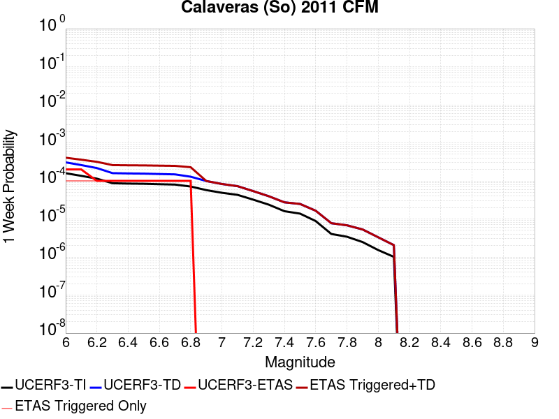 | 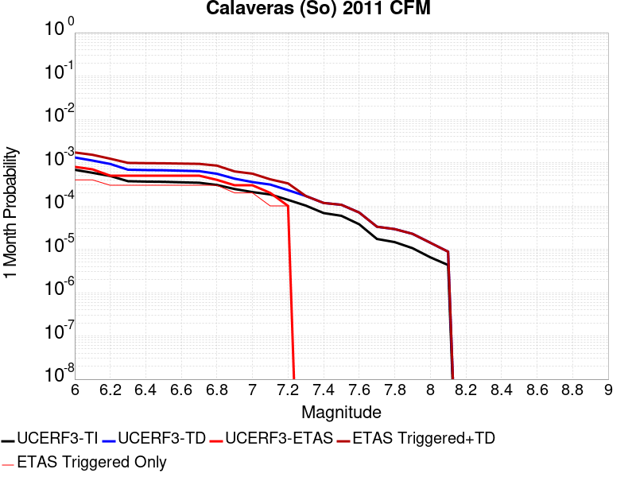 | 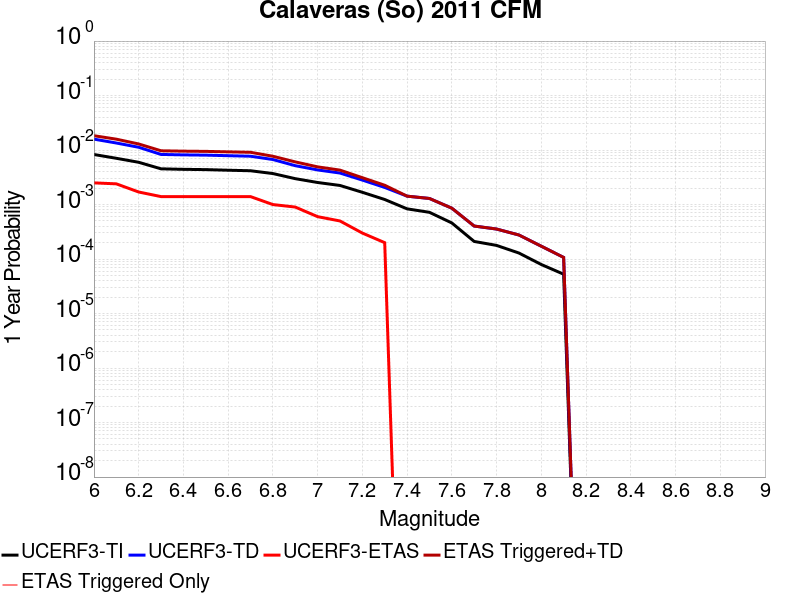 | 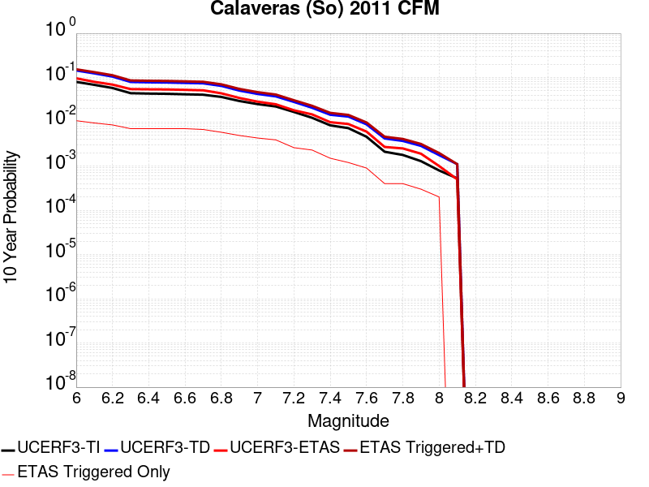 |

| Magnitude | 1 wk TI Prob | 1 wk TD Prob | 1 wk ETAS Prob | 1 wk ETAS/TD Gain | 1 wk ETAS Triggered+TD | 1 wk ETAS Triggered Only | 1 mo TI Prob | 1 mo TD Prob | 1 mo ETAS Prob | 1 mo ETAS/TD Gain | 1 mo ETAS Triggered+TD | 1 mo ETAS Triggered Only | 1 yr TI Prob | 1 yr TD Prob | 1 yr ETAS Prob | 1 yr ETAS/TD Gain | 1 yr ETAS Triggered+TD | 1 yr ETAS Triggered Only | 10 yr TI Prob | 10 yr TD Prob | 10 yr ETAS Prob | 10 yr ETAS/TD Gain | 10 yr ETAS Triggered+TD | 10 yr ETAS Triggered Only |
|-----|-----|-----|-----|-----|-----|-----|-----|-----|-----|-----|-----|-----|-----|-----|-----|-----|-----|-----|-----|-----|-----|-----|-----|-----|
| 6.0 | 1.5950744E-4 | 3.0760947E-4 | 2.0E-4 | 0.65017503 | 4.0757871E-4 | 1.0E-4 | 6.834242E-4 | 0.0013174375 | 8.0E-4 | 0.6072394 | 0.0017169105 | 4.0E-4 | 0.00828899 | 0.015882393 | 0.0116 | 0.7303685 | 0.018342689 | 0.0025 | 0.079865426 | 0.14459078 | 0.0962 | 0.665326 | 0.1536581 | 0.0106 |
| 6.1 | 1.3584697E-4 | 2.6080987E-4 | 2.0E-4 | 0.7668421 | 3.607838E-4 | 1.0E-4 | 5.8207137E-4 | 0.0011170802 | 7.0E-4 | 0.6266336 | 0.0015166334 | 4.0E-4 | 0.007063716 | 0.01348409 | 0.0101 | 0.7490309 | 0.015851729 | 0.0024 | 0.06843361 | 0.12421229 | 0.08 | 0.64405864 | 0.1324447 | 0.0094 |
| 6.2 | 1.14676266E-4 | 2.1758015E-4 | 1.0E-4 | 0.45960078 | 3.1755838E-4 | 1.0E-4 | 4.9137714E-4 | 9.320308E-4 | 5.0E-4 | 0.53646296 | 0.0012317512 | 3.0E-4 | 0.0059661185 | 0.011266685 | 0.0084 | 0.7455609 | 0.012947532 | 0.0017 | 0.058084648 | 0.105198115 | 0.0693 | 0.65875703 | 0.112803936 | 0.0085 |
| 6.3 | 8.691518E-5 | 1.6027386E-4 | 1.0E-4 | 0.62393206 | 2.6025783E-4 | 1.0E-4 | 3.7244044E-4 | 6.866655E-4 | 5.0E-4 | 0.7281566 | 9.864594E-4 | 3.0E-4 | 0.004525038 | 0.008321448 | 0.0065 | 0.78111404 | 0.009709798 | 0.0014 | 0.044339992 | 0.07950868 | 0.0548 | 0.68923295 | 0.08595212 | 0.007 |
| 6.4 | 8.50982E-5 | 1.5733573E-4 | 1.0E-4 | 0.6355836 | 2.5732E-4 | 1.0E-4 | 3.646556E-4 | 6.7408E-4 | 5.0E-4 | 0.74175173 | 9.738778E-4 | 3.0E-4 | 0.0044306475 | 0.008169375 | 0.0063 | 0.7711728 | 0.009557938 | 0.0014 | 0.04343345 | 0.07811418 | 0.0542 | 0.69385606 | 0.08456738 | 0.007 |
| 6.5 | 8.4062965E-5 | 1.5557886E-4 | 1.0E-4 | 0.6427608 | 2.555633E-4 | 1.0E-4 | 3.602201E-4 | 6.6655455E-4 | 5.0E-4 | 0.7501261 | 9.663546E-4 | 3.0E-4 | 0.004376863 | 0.00807853 | 0.0063 | 0.7798448 | 0.00946722 | 0.0014 | 0.042916555 | 0.07728505 | 0.0538 | 0.6961243 | 0.08374406 | 0.007 |
| 6.6 | 8.194716E-5 | 1.5193419E-4 | 1.0E-4 | 0.6581797 | 2.51919E-4 | 1.0E-4 | 3.5115483E-4 | 6.5094314E-4 | 5.0E-4 | 0.7681163 | 9.507478E-4 | 3.0E-4 | 0.0042669317 | 0.007890229 | 0.0063 | 0.79845583 | 0.009279183 | 0.0014 | 0.04185927 | 0.075569764 | 0.0527 | 0.69736886 | 0.08204077 | 0.007 |
| 6.7 | 8.012326E-5 | 1.4861091E-4 | 1.0E-4 | 0.6728981 | 2.4859604E-4 | 1.0E-4 | 3.433402E-4 | 6.3671E-4 | 5.0E-4 | 0.78528684 | 9.36519E-4 | 3.0E-4 | 0.004172157 | 0.0077186045 | 0.0063 | 0.81620973 | 0.009107798 | 0.0014 | 0.040946912 | 0.07401117 | 0.0515 | 0.6958409 | 0.0802153 | 0.0067 |
| 6.8 | 7.119773E-5 | 1.2917971E-4 | 1.0E-4 | 0.7741154 | 2.2916679E-4 | 1.0E-4 | 3.0509746E-4 | 5.5349024E-4 | 4.0E-4 | 0.72268665 | 8.533242E-4 | 3.0E-4 | 0.0037082357 | 0.006714693 | 0.0052 | 0.7744211 | 0.007707978 | 0.001 | 0.036469642 | 0.0648465 | 0.044 | 0.67852545 | 0.07027039 | 0.0058 |
| 6.9 | 5.7343088E-5 | 9.950832E-5 | 0.0 | 0.0 | 9.950832E-5 | 0.0 | 2.4573295E-4 | 4.263949E-4 | 3.0E-4 | 0.70357317 | 6.263096E-4 | 2.0E-4 | 0.0029876942 | 0.005179076 | 0.0043 | 0.830264 | 0.0060744146 | 9.0E-4 | 0.02947844 | 0.05065746 | 0.0345 | 0.6810448 | 0.055309236 | 0.0049 |
| 7.0 | 4.8746577E-5 | 8.3129664E-5 | 0.0 | 0.0 | 8.3129664E-5 | 0.0 | 2.0889717E-4 | 3.562217E-4 | 3.0E-4 | 0.8421722 | 5.5615045E-4 | 2.0E-4 | 0.0025403565 | 0.0043284413 | 0.0034 | 0.7855022 | 0.0049258443 | 6.0E-4 | 0.025115121 | 0.0426182 | 0.0285 | 0.66872835 | 0.04673494 | 0.0043 |
| 7.1 | 4.2998014E-5 | 7.289944E-5 | 0.0 | 0.0 | 7.289944E-5 | 0.0 | 1.8426418E-4 | 3.123891E-4 | 2.0E-4 | 0.6402272 | 4.1235785E-4 | 1.0E-4 | 0.002241108 | 0.0037967649 | 0.0029 | 0.76380813 | 0.0042948667 | 5.0E-4 | 0.022186412 | 0.037542686 | 0.0249 | 0.6632451 | 0.041296266 | 0.0039 |
| 7.2 | 3.221292E-5 | 5.4140484E-5 | 0.0 | 0.0 | 5.4140484E-5 | 0.0 | 1.3804805E-4 | 2.3201016E-4 | 1.0E-4 | 0.43101558 | 3.3198696E-4 | 1.0E-4 | 0.0016794393 | 0.002821093 | 0.002 | 0.70894504 | 0.0031202468 | 3.0E-4 | 0.016668037 | 0.028149115 | 0.0182 | 0.64655674 | 0.030675927 | 0.0026 |
| 7.3 | 2.3756531E-5 | 3.967672E-5 | 0.0 | 0.0 | 3.967672E-5 | 0.0 | 1.0180973E-4 | 1.700321E-4 | 0.0 | 0.0 | 1.700321E-4 | 0.0 | 0.0012388286 | 0.0020681927 | 0.0015 | 0.7252709 | 0.002267779 | 2.0E-4 | 0.012319452 | 0.020743199 | 0.0147 | 0.708666 | 0.022995489 | 0.0023 |
| 7.4 | 1.5997684E-5 | 2.7460766E-5 | 0.0 | 0.0 | 2.7460766E-5 | 0.0 | 6.8559704E-5 | 1.176837E-4 | 0.0 | 0.0 | 1.176837E-4 | 0.0 | 8.343947E-4 | 0.0014318599 | 9.0E-4 | 0.62855315 | 0.0014318599 | 0.0 | 0.008312687 | 0.014434196 | 0.0098 | 0.6789433 | 0.015912544 | 0.0015 |
| 7.5 | 1.3814293E-5 | 2.4897881E-5 | 0.0 | 0.0 | 2.4897881E-5 | 0.0 | 5.9202768E-5 | 1.06700856E-4 | 0.0 | 0.0 | 1.06700856E-4 | 0.0 | 7.205553E-4 | 0.0012983112 | 8.0E-4 | 0.6161851 | 0.0012983112 | 0.0 | 0.007182234 | 0.013111295 | 0.0089 | 0.67880404 | 0.014295562 | 0.0012 |
| 7.6 | 8.817309E-6 | 1.6525357E-5 | 0.0 | 0.0 | 1.6525357E-5 | 0.0 | 3.7787922E-5 | 7.082104E-5 | 0.0 | 0.0 | 7.082104E-5 | 0.0 | 4.5997082E-4 | 8.619064E-4 | 6.0E-4 | 0.6961313 | 8.619064E-4 | 0.0 | 0.004590199 | 0.008766015 | 0.006 | 0.68446153 | 0.009658125 | 9.0E-4 |
| 7.7 | 4.0352206E-6 | 7.771598E-6 | 0.0 | 0.0 | 7.771598E-6 | 0.0 | 1.7293689E-5 | 3.330642E-5 | 0.0 | 0.0 | 3.330642E-5 | 0.0 | 2.1053031E-4 | 4.054303E-4 | 1.0E-4 | 0.24665152 | 4.054303E-4 | 0.0 | 0.0021033096 | 0.0041968403 | 0.0027 | 0.6433411 | 0.0045951614 | 4.0E-4 |
| 7.8 | 3.413169E-6 | 6.8434024E-6 | 0.0 | 0.0 | 6.8434024E-6 | 0.0 | 1.4627784E-5 | 2.9328537E-5 | 0.0 | 0.0 | 2.9328537E-5 | 0.0 | 1.7807873E-4 | 3.5701648E-4 | 1.0E-4 | 0.2800991 | 3.5701648E-4 | 0.0 | 0.0017793609 | 0.0036940854 | 0.0025 | 0.6767575 | 0.0040926076 | 4.0E-4 |
| 7.9 | 2.4740732E-6 | 5.320734E-6 | 0.0 | 0.0 | 5.320734E-6 | 0.0 | 1.06031275E-5 | 2.2802946E-5 | 0.0 | 0.0 | 2.2802946E-5 | 0.0 | 1.2908543E-4 | 2.7759056E-4 | 1.0E-4 | 0.36024278 | 2.7759056E-4 | 0.0 | 0.0012901047 | 0.0028550655 | 0.0019 | 0.66548383 | 0.0031542091 | 3.0E-4 |
| 8.0 | 1.5231818E-6 | 3.3135784E-6 | 0.0 | 0.0 | 3.3135784E-6 | 0.0 | 6.527906E-6 | 1.4200973E-5 | 0.0 | 0.0 | 1.4200973E-5 | 0.0 | 7.9474354E-5 | 1.7288317E-4 | 1.0E-4 | 0.5784253 | 1.7288317E-4 | 0.0 | 7.944594E-4 | 0.001768572 | 0.001 | 0.5654279 | 0.0019682182 | 2.0E-4 |
| 8.1 | 1.0104524E-6 | 2.0612201E-6 | 0.0 | 0.0 | 2.0612201E-6 | 0.0 | 4.330503E-6 | 8.833771E-6 | 0.0 | 0.0 | 8.833771E-6 | 0.0 | 5.2722597E-5 | 1.07545886E-4 | 0.0 | 0.0 | 1.07545886E-4 | 0.0 | 5.271009E-4 | 0.0011006707 | 5.0E-4 | 0.4542685 | 0.0011006707 | 0.0 |

## Garlock (East)
*[(top)](#table-of-contents)*

| 1 Week | 1 Month | 1 Year | 10 Year |
|-----|-----|-----|-----|
| 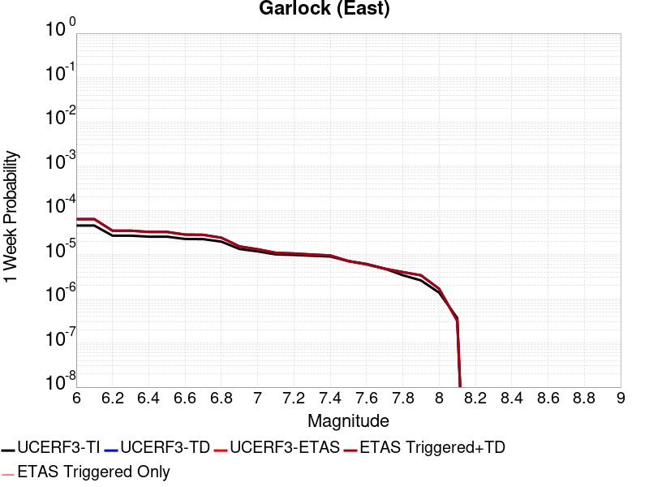 | 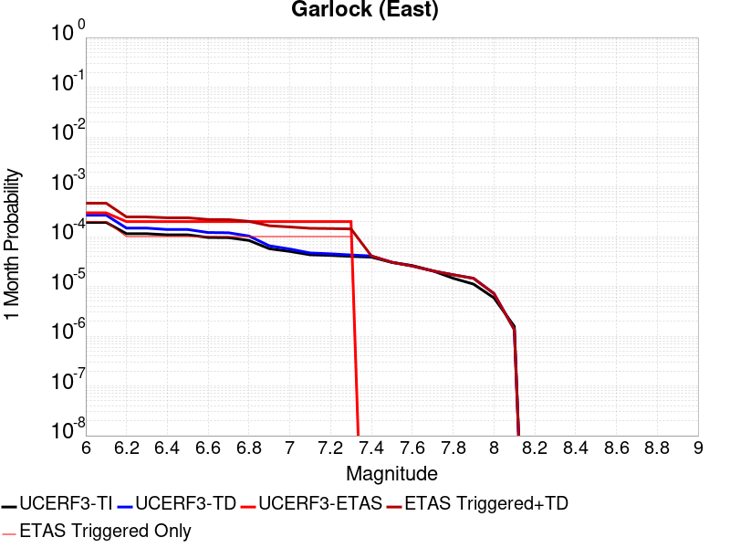 | 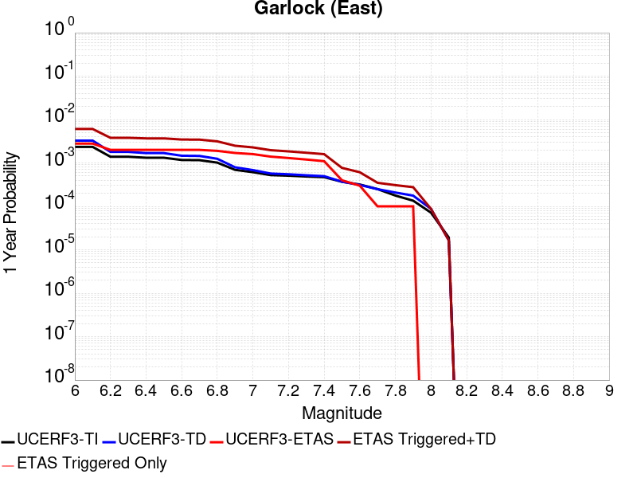 | 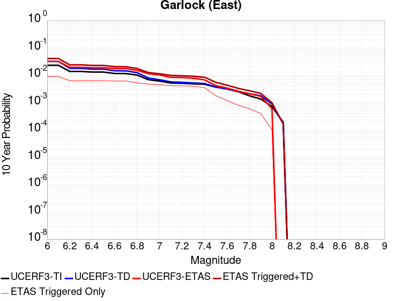 |

| Magnitude | 1 wk TI Prob | 1 wk TD Prob | 1 wk ETAS Prob | 1 wk ETAS/TD Gain | 1 wk ETAS Triggered+TD | 1 wk ETAS Triggered Only | 1 mo TI Prob | 1 mo TD Prob | 1 mo ETAS Prob | 1 mo ETAS/TD Gain | 1 mo ETAS Triggered+TD | 1 mo ETAS Triggered Only | 1 yr TI Prob | 1 yr TD Prob | 1 yr ETAS Prob | 1 yr ETAS/TD Gain | 1 yr ETAS Triggered+TD | 1 yr ETAS Triggered Only | 10 yr TI Prob | 10 yr TD Prob | 10 yr ETAS Prob | 10 yr ETAS/TD Gain | 10 yr ETAS Triggered+TD | 10 yr ETAS Triggered Only |
|-----|-----|-----|-----|-----|-----|-----|-----|-----|-----|-----|-----|-----|-----|-----|-----|-----|-----|-----|-----|-----|-----|-----|-----|-----|
| 6.0 | 4.5092507E-5 | 6.296105E-5 | 0.0 | 0.0 | 6.296105E-5 | 0.0 | 1.9323928E-4 | 2.698077E-4 | 3.0E-4 | 1.1119031 | 4.6975375E-4 | 2.0E-4 | 0.0023501497 | 0.0032804073 | 0.0044 | 1.3412969 | 0.006071222 | 0.0028 | 0.023254504 | 0.032389753 | 0.0319 | 0.9848794 | 0.04109825 | 0.009 |
| 6.1 | 4.5092507E-5 | 6.296105E-5 | 0.0 | 0.0 | 6.296105E-5 | 0.0 | 1.9323928E-4 | 2.698077E-4 | 3.0E-4 | 1.1119031 | 4.6975375E-4 | 2.0E-4 | 0.0023501497 | 0.0032804073 | 0.0044 | 1.3412969 | 0.006071222 | 0.0028 | 0.023254504 | 0.032389753 | 0.0319 | 0.9848794 | 0.04109825 | 0.009 |
| 6.2 | 2.6674514E-5 | 3.4555844E-5 | 0.0 | 0.0 | 3.4555844E-5 | 0.0 | 1.1431433E-4 | 1.4808825E-4 | 2.0E-4 | 1.350546 | 2.4807343E-4 | 1.0E-4 | 0.0013908884 | 0.0018015165 | 0.0031 | 1.7207725 | 0.0037979134 | 0.002 | 0.01382215 | 0.017877525 | 0.0196 | 1.0963486 | 0.024064897 | 0.0063 |
| 6.3 | 2.6674514E-5 | 3.4555844E-5 | 0.0 | 0.0 | 3.4555844E-5 | 0.0 | 1.1431433E-4 | 1.4808825E-4 | 2.0E-4 | 1.350546 | 2.4807343E-4 | 1.0E-4 | 0.0013908884 | 0.0018015165 | 0.0031 | 1.7207725 | 0.0037979134 | 0.002 | 0.01382215 | 0.017877525 | 0.0196 | 1.0963486 | 0.024064897 | 0.0063 |
| 6.4 | 2.5312667E-5 | 3.2383756E-5 | 0.0 | 0.0 | 3.2383756E-5 | 0.0 | 1.0847834E-4 | 1.387803E-4 | 2.0E-4 | 1.4411266 | 2.3876643E-4 | 1.0E-4 | 0.0013199237 | 0.0016883702 | 0.0031 | 1.8360902 | 0.0036849934 | 0.002 | 0.013121112 | 0.016777126 | 0.0189 | 1.1265337 | 0.02297143 | 0.0063 |
| 6.5 | 2.5312667E-5 | 3.2383756E-5 | 0.0 | 0.0 | 3.2383756E-5 | 0.0 | 1.0847834E-4 | 1.387803E-4 | 2.0E-4 | 1.4411266 | 2.3876643E-4 | 1.0E-4 | 0.0013199237 | 0.0016883702 | 0.0031 | 1.8360902 | 0.0036849934 | 0.002 | 0.013121112 | 0.016777126 | 0.0189 | 1.1265337 | 0.02297143 | 0.0063 |
| 6.6 | 2.246556E-5 | 2.8175751E-5 | 0.0 | 0.0 | 2.8175751E-5 | 0.0 | 9.627742E-5 | 1.2074777E-4 | 2.0E-4 | 1.6563454 | 2.2073569E-4 | 1.0E-4 | 0.0011715472 | 0.0014691362 | 0.0029 | 1.973949 | 0.003466198 | 0.002 | 0.011653901 | 0.014647279 | 0.0177 | 1.2084156 | 0.020756466 | 0.0062 |
| 6.7 | 2.2241198E-5 | 2.7845343E-5 | 0.0 | 0.0 | 2.7845343E-5 | 0.0 | 9.531594E-5 | 1.1933186E-4 | 2.0E-4 | 1.6759983 | 2.1931992E-4 | 1.0E-4 | 0.0011598538 | 0.0014519206 | 0.0029 | 1.9973544 | 0.0034490167 | 0.002 | 0.011538187 | 0.014476575 | 0.0176 | 1.2157573 | 0.02058682 | 0.0062 |
| 6.8 | 1.9528685E-5 | 2.3937433E-5 | 0.0 | 0.0 | 2.3937433E-5 | 0.0 | 8.369167E-5 | 1.0258508E-4 | 2.0E-4 | 1.9496013 | 2.0257483E-4 | 1.0E-4 | 0.0010184698 | 0.0012482774 | 0.0028 | 2.243091 | 0.0031459057 | 0.0019 | 0.010138147 | 0.012458789 | 0.0151 | 1.2119958 | 0.017692758 | 0.0053 |
| 6.9 | 1.3318621E-5 | 1.5232145E-5 | 0.0 | 0.0 | 1.5232145E-5 | 0.0 | 5.7078556E-5 | 6.527902E-5 | 2.0E-4 | 3.0637715 | 1.6527249E-4 | 1.0E-4 | 6.9470983E-4 | 7.94488E-4 | 0.0023 | 2.894946 | 0.0024931373 | 0.0017 | 0.0069254204 | 0.007956831 | 0.0115 | 1.445299 | 0.012619434 | 0.0047 |
| 7.0 | 1.1760853E-5 | 1.3139821E-5 | 0.0 | 0.0 | 1.3139821E-5 | 0.0 | 5.0402683E-5 | 5.6312332E-5 | 2.0E-4 | 3.55162 | 1.563067E-4 | 1.0E-4 | 6.134799E-4 | 6.85392E-4 | 0.0022 | 3.209842 | 0.0022842954 | 0.0016 | 0.0061178906 | 0.0068728584 | 0.0103 | 1.4986486 | 0.01134193 | 0.0045 |
| 7.1 | 1.0064758E-5 | 1.0933761E-5 | 0.0 | 0.0 | 1.0933761E-5 | 0.0 | 4.3133965E-5 | 4.6858153E-5 | 2.0E-4 | 4.2682004 | 1.4685348E-4 | 1.0E-4 | 5.2502943E-4 | 5.703522E-4 | 0.0019 | 3.331275 | 0.0019695538 | 0.0014 | 0.005237907 | 0.0057287435 | 0.0084 | 1.4662901 | 0.009904683 | 0.0042 |
| 7.2 | 9.768808E-6 | 1.05294075E-5 | 0.0 | 0.0 | 1.05294075E-5 | 0.0 | 4.186565E-5 | 4.512527E-5 | 2.0E-4 | 4.4321065 | 1.4512076E-4 | 1.0E-4 | 5.095951E-4 | 5.492652E-4 | 0.0018 | 3.2771056 | 0.0018485511 | 0.0013 | 0.0050842804 | 0.00551905 | 0.0083 | 1.5038819 | 0.009596422 | 0.0041 |
| 7.3 | 9.344516E-6 | 9.974474E-6 | 0.0 | 0.0 | 9.974474E-6 | 0.0 | 4.004731E-5 | 4.2747062E-5 | 2.0E-4 | 4.6786838 | 1.4274279E-4 | 1.0E-4 | 4.8746695E-4 | 5.203247E-4 | 0.0016 | 3.0750031 | 0.0017197003 | 0.0012 | 0.0048639905 | 0.0052304063 | 0.0078 | 1.49128 | 0.009209485 | 0.004 |
| 7.4 | 9.023491E-6 | 9.520048E-6 | 0.0 | 0.0 | 9.520048E-6 | 0.0 | 3.867153E-5 | 4.0799587E-5 | 0.0 | 0.0 | 4.0799587E-5 | 0.0 | 4.7072413E-4 | 4.966251E-4 | 0.0014 | 2.819028 | 0.0015960789 | 0.0011 | 0.004697283 | 0.004993465 | 0.0068 | 1.3617799 | 0.008475987 | 0.0035 |
| 7.5 | 7.081253E-6 | 7.1136983E-6 | 0.0 | 0.0 | 7.1136983E-6 | 0.0 | 3.0347876E-5 | 3.0486926E-5 | 0.0 | 0.0 | 3.0486926E-5 | 0.0 | 3.6942272E-4 | 3.7111586E-4 | 7.0E-4 | 1.8862034 | 7.709674E-4 | 4.0E-4 | 0.003688092 | 0.0037377218 | 0.0042 | 1.123679 | 0.005530994 | 0.0018 |
| 7.6 | 6.116396E-6 | 5.983964E-6 | 0.0 | 0.0 | 5.983964E-6 | 0.0 | 2.6212863E-5 | 2.564531E-5 | 0.0 | 0.0 | 2.564531E-5 | 0.0 | 3.1909486E-4 | 3.1218716E-4 | 5.0E-4 | 1.6016034 | 6.120935E-4 | 3.0E-4 | 0.0031863707 | 0.0031483527 | 0.0034 | 1.0799298 | 0.0043445746 | 0.0012 |
| 7.7 | 4.797145E-6 | 4.78061E-6 | 0.0 | 0.0 | 4.78061E-6 | 0.0 | 2.055903E-5 | 2.0488169E-5 | 0.0 | 0.0 | 2.0488169E-5 | 0.0 | 2.5027743E-4 | 2.4941502E-4 | 3.0E-4 | 1.2028145 | 3.493901E-4 | 1.0E-4 | 0.0024999576 | 0.0025213067 | 0.0026 | 1.0312114 | 0.0033192895 | 8.0E-4 |
| 7.8 | 3.4028885E-6 | 3.999366E-6 | 0.0 | 0.0 | 3.999366E-6 | 0.0 | 1.4583726E-5 | 1.714003E-5 | 0.0 | 0.0 | 1.714003E-5 | 0.0 | 1.775424E-4 | 2.0865994E-4 | 2.0E-4 | 0.95849735 | 3.0863908E-4 | 1.0E-4 | 0.0017740062 | 0.0021118945 | 0.0021 | 0.9943679 | 0.0027106274 | 6.0E-4 |
| 7.9 | 2.5928412E-6 | 3.3901902E-6 | 0.0 | 0.0 | 3.3901902E-6 | 0.0 | 1.1112129E-5 | 1.4529306E-5 | 0.0 | 0.0 | 1.4529306E-5 | 0.0 | 1.3528178E-4 | 1.7688E-4 | 1.0E-4 | 0.565355 | 2.7686232E-4 | 1.0E-4 | 0.0013519945 | 0.0017901983 | 0.0017 | 0.9496155 | 0.002189482 | 4.0E-4 |
| 8.0 | 1.3743648E-6 | 1.6815027E-6 | 0.0 | 0.0 | 1.6815027E-6 | 0.0 | 5.8901214E-6 | 7.2064204E-6 | 0.0 | 0.0 | 7.2064204E-6 | 0.0 | 7.1709874E-5 | 8.773467E-5 | 0.0 | 0.0 | 8.773467E-5 | 0.0 | 7.1686733E-4 | 8.8768784E-4 | 6.0E-4 | 0.6759133 | 9.875991E-4 | 1.0E-4 |
| 8.1 | 3.6733252E-7 | 3.1632464E-7 | 0.0 | 0.0 | 3.1632464E-7 | 0.0 | 1.5742813E-6 | 1.3556764E-6 | 0.0 | 0.0 | 1.3556764E-6 | 0.0 | 1.9166706E-5 | 1.6505252E-5 | 0.0 | 0.0 | 1.6505252E-5 | 0.0 | 1.9165053E-4 | 1.6705292E-4 | 0.0 | 0.0 | 1.6705292E-4 | 0.0 |

## Elsinore (Glen Ivy) rev
*[(top)](#table-of-contents)*

| 1 Week | 1 Month | 1 Year | 10 Year |
|-----|-----|-----|-----|
| 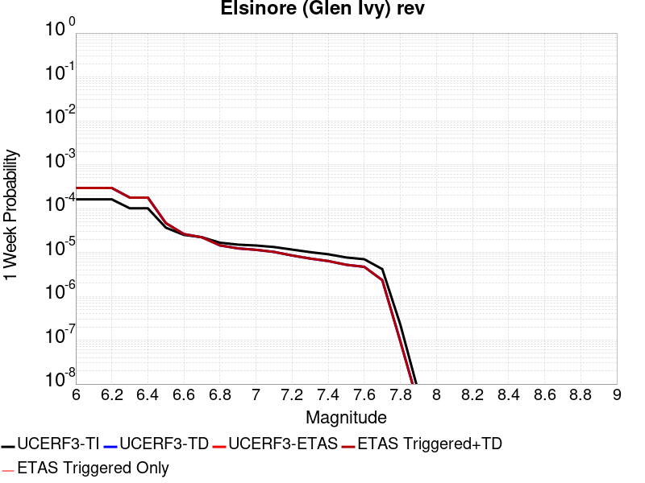 | 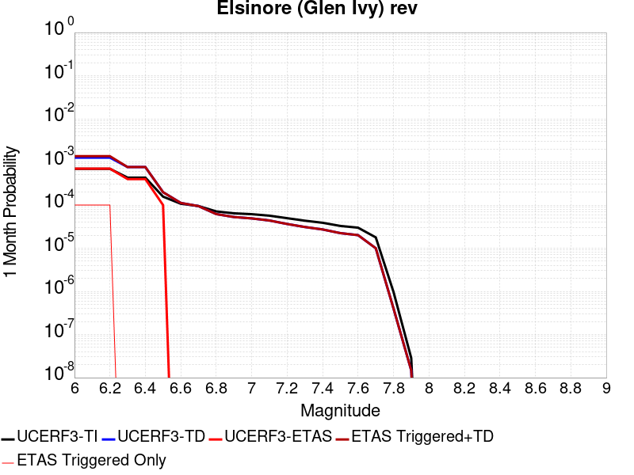 | 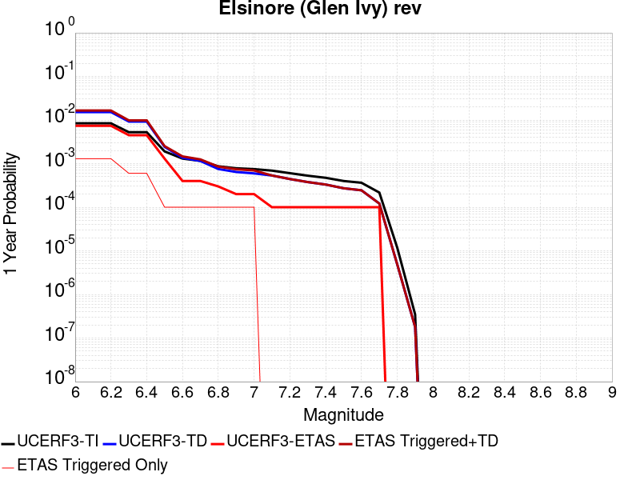 | 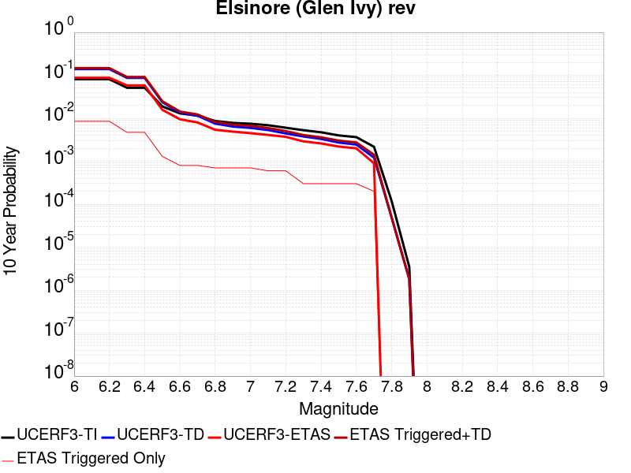 |

| Magnitude | 1 wk TI Prob | 1 wk TD Prob | 1 wk ETAS Prob | 1 wk ETAS/TD Gain | 1 wk ETAS Triggered+TD | 1 wk ETAS Triggered Only | 1 mo TI Prob | 1 mo TD Prob | 1 mo ETAS Prob | 1 mo ETAS/TD Gain | 1 mo ETAS Triggered+TD | 1 mo ETAS Triggered Only | 1 yr TI Prob | 1 yr TD Prob | 1 yr ETAS Prob | 1 yr ETAS/TD Gain | 1 yr ETAS Triggered+TD | 1 yr ETAS Triggered Only | 10 yr TI Prob | 10 yr TD Prob | 10 yr ETAS Prob | 10 yr ETAS/TD Gain | 10 yr ETAS Triggered+TD | 10 yr ETAS Triggered Only |
|-----|-----|-----|-----|-----|-----|-----|-----|-----|-----|-----|-----|-----|-----|-----|-----|-----|-----|-----|-----|-----|-----|-----|-----|-----|
| 6.0 | 1.6204086E-4 | 2.9413783E-4 | 3.0E-4 | 1.01993 | 2.9413783E-4 | 0.0 | 6.94276E-4 | 0.0012600974 | 7.0E-4 | 0.55551267 | 0.0013599714 | 1.0E-4 | 0.008420097 | 0.015255148 | 0.0074 | 0.48508218 | 0.016535316 | 0.0013 | 0.081081145 | 0.1397831 | 0.0879 | 0.6288314 | 0.14709495 | 0.0085 |
| 6.1 | 1.6204086E-4 | 2.9413783E-4 | 3.0E-4 | 1.01993 | 2.9413783E-4 | 0.0 | 6.94276E-4 | 0.0012600974 | 7.0E-4 | 0.55551267 | 0.0013599714 | 1.0E-4 | 0.008420097 | 0.015255148 | 0.0074 | 0.48508218 | 0.016535316 | 0.0013 | 0.081081145 | 0.1397831 | 0.0879 | 0.6288314 | 0.14709495 | 0.0085 |
| 6.2 | 1.6204086E-4 | 2.9413783E-4 | 3.0E-4 | 1.01993 | 2.9413783E-4 | 0.0 | 6.94276E-4 | 0.0012600974 | 7.0E-4 | 0.55551267 | 0.0013599714 | 1.0E-4 | 0.008420097 | 0.015255148 | 0.0074 | 0.48508218 | 0.016535316 | 0.0013 | 0.081081145 | 0.1397831 | 0.0879 | 0.6288314 | 0.14709495 | 0.0085 |
| 6.3 | 1.0111737E-4 | 1.7736538E-4 | 2.0E-4 | 1.1276157 | 1.7736538E-4 | 0.0 | 4.332882E-4 | 7.600331E-4 | 4.0E-4 | 0.52629286 | 7.600331E-4 | 0.0 | 0.005262531 | 0.009234924 | 0.0045 | 0.4872807 | 0.009829382 | 6.0E-4 | 0.0513964 | 0.08721416 | 0.0582 | 0.6673229 | 0.091504246 | 0.0047 |
| 6.4 | 1.0111737E-4 | 1.7736538E-4 | 2.0E-4 | 1.1276157 | 1.7736538E-4 | 0.0 | 4.332882E-4 | 7.600331E-4 | 4.0E-4 | 0.52629286 | 7.600331E-4 | 0.0 | 0.005262531 | 0.009234924 | 0.0045 | 0.4872807 | 0.009829382 | 6.0E-4 | 0.0513964 | 0.08721416 | 0.0582 | 0.6673229 | 0.091504246 | 0.0047 |
| 6.5 | 3.6624708E-5 | 4.642713E-5 | 0.0 | 0.0 | 4.642713E-5 | 0.0 | 1.569536E-4 | 1.9896026E-4 | 1.0E-4 | 0.50261295 | 1.9896026E-4 | 0.0 | 0.001909235 | 0.002420011 | 0.0013 | 0.53718764 | 0.0025197691 | 1.0E-4 | 0.01892915 | 0.023714775 | 0.0158 | 0.6662513 | 0.024983946 | 0.0013 |
| 6.6 | 2.5051324E-5 | 2.6173879E-5 | 0.0 | 0.0 | 2.6173879E-5 | 0.0 | 1.073584E-4 | 1.121692E-4 | 0.0 | 0.0 | 1.121692E-4 | 0.0 | 0.0013063047 | 0.001364849 | 4.0E-4 | 0.29307273 | 0.0014647125 | 1.0E-4 | 0.012986525 | 0.01358036 | 0.0095 | 0.6995396 | 0.014369496 | 8.0E-4 |
| 6.7 | 2.2189772E-5 | 2.2089875E-5 | 0.0 | 0.0 | 2.2089875E-5 | 0.0 | 9.509556E-5 | 9.466766E-5 | 0.0 | 0.0 | 9.466766E-5 | 0.0 | 0.0011571734 | 0.0011520057 | 4.0E-4 | 0.34722048 | 0.0012518906 | 1.0E-4 | 0.011511663 | 0.011476746 | 0.008 | 0.6970617 | 0.012267564 | 8.0E-4 |
| 6.8 | 1.6654378E-5 | 1.444831E-5 | 0.0 | 0.0 | 1.444831E-5 | 0.0 | 7.137396E-5 | 6.191989E-5 | 0.0 | 0.0 | 6.191989E-5 | 0.0 | 8.686314E-4 | 7.5361907E-4 | 3.0E-4 | 0.39807913 | 8.535437E-4 | 1.0E-4 | 0.008652439 | 0.0075156586 | 0.0054 | 0.7184999 | 0.008210398 | 7.0E-4 |
| 6.9 | 1.5042909E-5 | 1.2341207E-5 | 0.0 | 0.0 | 1.2341207E-5 | 0.0 | 6.446802E-5 | 5.288983E-5 | 0.0 | 0.0 | 5.288983E-5 | 0.0 | 7.8461546E-4 | 6.437466E-4 | 2.0E-4 | 0.31068125 | 7.436822E-4 | 1.0E-4 | 0.007818509 | 0.0064228065 | 0.0049 | 0.7629064 | 0.007118311 | 7.0E-4 |
| 7.0 | 1.4361385E-5 | 1.1459975E-5 | 0.0 | 0.0 | 1.1459975E-5 | 0.0 | 6.154734E-5 | 4.911327E-5 | 0.0 | 0.0 | 4.911327E-5 | 0.0 | 7.490812E-4 | 5.9779297E-4 | 2.0E-4 | 0.334564 | 6.9773314E-4 | 1.0E-4 | 0.007465612 | 0.0059656966 | 0.0045 | 0.7543126 | 0.006661521 | 7.0E-4 |
| 7.1 | 1.3265571E-5 | 1.0252637E-5 | 0.0 | 0.0 | 1.0252637E-5 | 0.0 | 5.6851208E-5 | 4.3939148E-5 | 0.0 | 0.0 | 4.3939148E-5 | 0.0 | 6.919436E-4 | 5.348304E-4 | 1.0E-4 | 0.18697518 | 5.348304E-4 | 0.0 | 0.006897931 | 0.005338733 | 0.0041 | 0.76797247 | 0.0059355297 | 6.0E-4 |
| 7.2 | 1.1596403E-5 | 8.511494E-6 | 0.0 | 0.0 | 8.511494E-6 | 0.0 | 4.9697923E-5 | 3.647733E-5 | 0.0 | 0.0 | 3.647733E-5 | 0.0 | 6.049042E-4 | 4.440227E-4 | 1.0E-4 | 0.22521372 | 4.440227E-4 | 0.0 | 0.006032603 | 0.004432828 | 0.0037 | 0.8346815 | 0.0050301687 | 6.0E-4 |
| 7.3 | 1.0150827E-5 | 7.244207E-6 | 0.0 | 0.0 | 7.244207E-6 | 0.0 | 4.3502816E-5 | 3.1046242E-5 | 0.0 | 0.0 | 3.1046242E-5 | 0.0 | 5.2951806E-4 | 3.7792386E-4 | 1.0E-4 | 0.26460356 | 3.7792386E-4 | 0.0 | 0.005282581 | 0.0037731843 | 0.0029 | 0.76858157 | 0.0040720524 | 3.0E-4 |
| 7.4 | 9.080705E-6 | 6.35729E-6 | 0.0 | 0.0 | 6.35729E-6 | 0.0 | 3.8916725E-5 | 2.7245253E-5 | 0.0 | 0.0 | 2.7245253E-5 | 0.0 | 4.7370812E-4 | 3.316618E-4 | 1.0E-4 | 0.30151194 | 3.316618E-4 | 0.0 | 0.004726996 | 0.0033118185 | 0.0026 | 0.7850672 | 0.003610825 | 3.0E-4 |
| 7.5 | 7.671649E-6 | 5.2296386E-6 | 0.0 | 0.0 | 5.2296386E-6 | 0.0 | 3.287808E-5 | 2.2412552E-5 | 0.0 | 0.0 | 2.2412552E-5 | 0.0 | 4.0021708E-4 | 2.728399E-4 | 1.0E-4 | 0.3665153 | 2.728399E-4 | 0.0 | 0.0039949706 | 0.0027251744 | 0.0022 | 0.80728775 | 0.003024357 | 3.0E-4 |
| 7.6 | 6.990086E-6 | 4.691215E-6 | 0.0 | 0.0 | 4.691215E-6 | 0.0 | 2.9957167E-5 | 2.0105059E-5 | 0.0 | 0.0 | 2.0105059E-5 | 0.0 | 3.6466747E-4 | 2.4475277E-4 | 1.0E-4 | 0.40857556 | 2.4475277E-4 | 0.0 | 0.0036406964 | 0.0024449485 | 0.002 | 0.81801313 | 0.002744215 | 3.0E-4 |
| 7.7 | 4.163505E-6 | 2.3314672E-6 | 0.0 | 0.0 | 2.3314672E-6 | 0.0 | 1.7843471E-5 | 9.991968E-6 | 0.0 | 0.0 | 9.991968E-6 | 0.0 | 2.172226E-4 | 1.2164616E-4 | 1.0E-4 | 0.82205635 | 1.2164616E-4 | 0.0 | 0.0021701038 | 0.0012158689 | 9.0E-4 | 0.74021137 | 0.0014156257 | 2.0E-4 |
| 7.8 | 2.2692414E-7 | 9.391798E-8 | 0.0 | 0.0 | 9.391798E-8 | 0.0 | 9.725317E-7 | 4.0250558E-7 | 0.0 | 0.0 | 4.0250558E-7 | 0.0 | 1.1840509E-5 | 4.900498E-6 | 0.0 | 0.0 | 4.900498E-6 | 0.0 | 1.1839878E-4 | 4.9004226E-5 | 0.0 | 0.0 | 4.9004226E-5 | 0.0 |
| 7.9 | 6.676829E-9 | 3.4416097E-9 | 0.0 | 0.0 | 3.4416097E-9 | 0.0 | 2.861498E-8 | 1.4749755E-8 | 0.0 | 0.0 | 1.4749755E-8 | 0.0 | 3.4838732E-7 | 1.7957827E-7 | 0.0 | 0.0 | 1.7957827E-7 | 0.0 | 3.4838679E-6 | 1.7957813E-6 | 0.0 | 0.0 | 1.7957813E-6 | 0.0 |

## San Andreas (San Bernardino S)
*[(top)](#table-of-contents)*

| 1 Week | 1 Month | 1 Year | 10 Year |
|-----|-----|-----|-----|
| 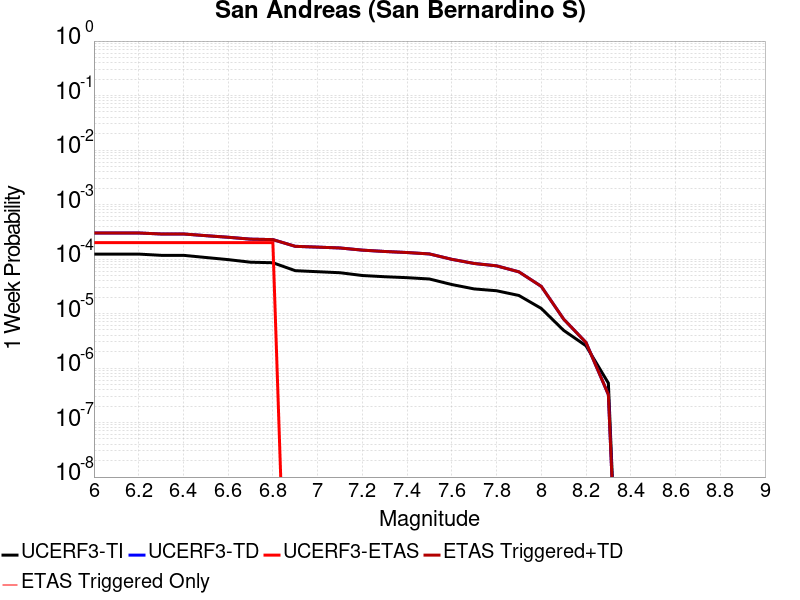 | 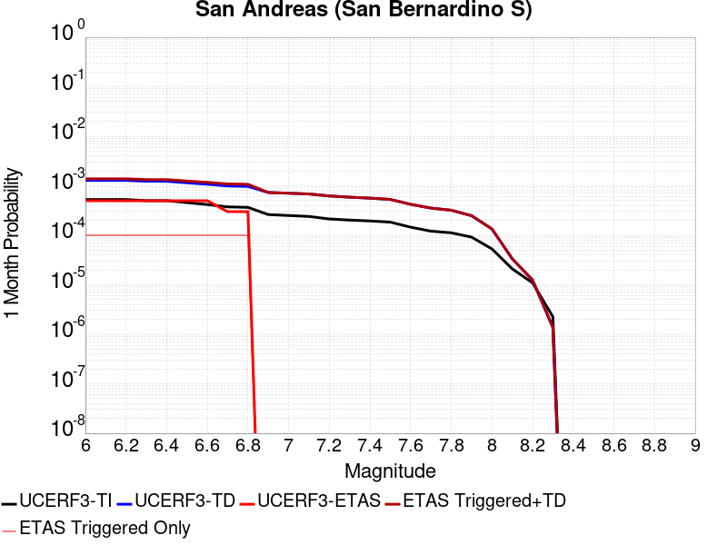 | 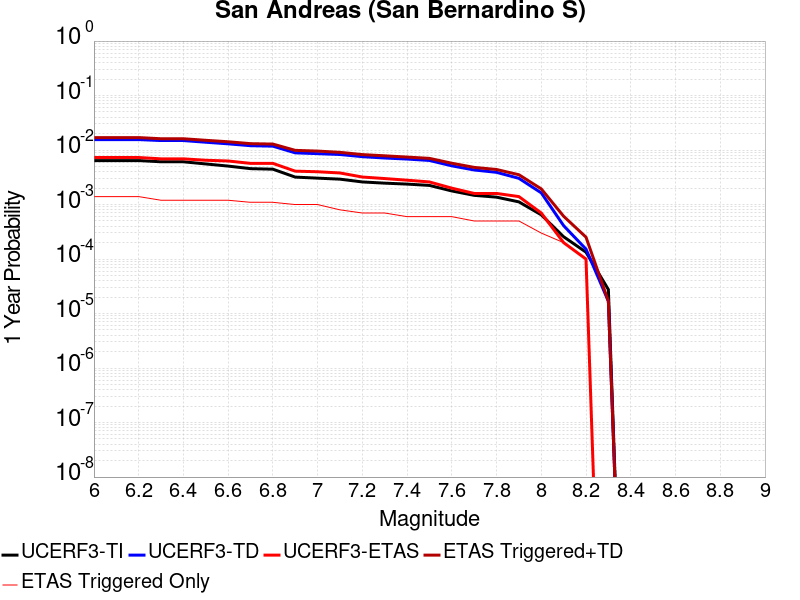 | 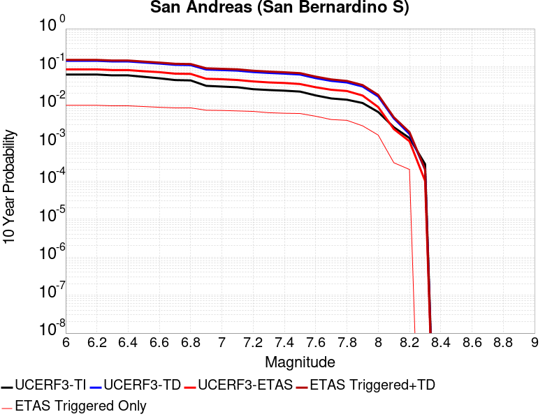 |

| Magnitude | 1 wk TI Prob | 1 wk TD Prob | 1 wk ETAS Prob | 1 wk ETAS/TD Gain | 1 wk ETAS Triggered+TD | 1 wk ETAS Triggered Only | 1 mo TI Prob | 1 mo TD Prob | 1 mo ETAS Prob | 1 mo ETAS/TD Gain | 1 mo ETAS Triggered+TD | 1 mo ETAS Triggered Only | 1 yr TI Prob | 1 yr TD Prob | 1 yr ETAS Prob | 1 yr ETAS/TD Gain | 1 yr ETAS Triggered+TD | 1 yr ETAS Triggered Only | 10 yr TI Prob | 10 yr TD Prob | 10 yr ETAS Prob | 10 yr ETAS/TD Gain | 10 yr ETAS Triggered+TD | 10 yr ETAS Triggered Only |
|-----|-----|-----|-----|-----|-----|-----|-----|-----|-----|-----|-----|-----|-----|-----|-----|-----|-----|-----|-----|-----|-----|-----|-----|-----|
| 6.0 | 1.2336002E-4 | 3.0082467E-4 | 2.0E-4 | 0.6648391 | 3.0082467E-4 | 0.0 | 5.2857865E-4 | 0.0012886378 | 5.0E-4 | 0.38800666 | 0.0013885088 | 1.0E-4 | 0.006416472 | 0.015581272 | 0.0073 | 0.46851116 | 0.016959459 | 0.0014 | 0.06234337 | 0.14299095 | 0.0851 | 0.59514254 | 0.15130393 | 0.0097 |
| 6.1 | 1.2336002E-4 | 3.0082467E-4 | 2.0E-4 | 0.6648391 | 3.0082467E-4 | 0.0 | 5.2857865E-4 | 0.0012886378 | 5.0E-4 | 0.38800666 | 0.0013885088 | 1.0E-4 | 0.006416472 | 0.015581272 | 0.0073 | 0.46851116 | 0.016959459 | 0.0014 | 0.06234337 | 0.14299095 | 0.0851 | 0.59514254 | 0.15130393 | 0.0097 |
| 6.2 | 1.2336002E-4 | 3.0082467E-4 | 2.0E-4 | 0.6648391 | 3.0082467E-4 | 0.0 | 5.2857865E-4 | 0.0012886378 | 5.0E-4 | 0.38800666 | 0.0013885088 | 1.0E-4 | 0.006416472 | 0.015581272 | 0.0073 | 0.46851116 | 0.016959459 | 0.0014 | 0.06234337 | 0.14299095 | 0.0851 | 0.59514254 | 0.15130393 | 0.0097 |
| 6.3 | 1.1712257E-4 | 2.8869888E-4 | 2.0E-4 | 0.6927633 | 2.8869888E-4 | 0.0 | 5.018573E-4 | 0.00123672 | 5.0E-4 | 0.40429524 | 0.0013365963 | 1.0E-4 | 0.006093008 | 0.01495797 | 0.0069 | 0.46129254 | 0.016140021 | 0.0012 | 0.059286322 | 0.13770095 | 0.0816 | 0.59258854 | 0.14580655 | 0.0094 |
| 6.4 | 1.1712257E-4 | 2.8869888E-4 | 2.0E-4 | 0.6927633 | 2.8869888E-4 | 0.0 | 5.018573E-4 | 0.00123672 | 5.0E-4 | 0.40429524 | 0.0013365963 | 1.0E-4 | 0.006093008 | 0.01495797 | 0.0069 | 0.46129254 | 0.016140021 | 0.0012 | 0.059286322 | 0.13770095 | 0.0816 | 0.59258854 | 0.14580655 | 0.0094 |
| 6.5 | 1.0689076E-4 | 2.6881436E-4 | 2.0E-4 | 0.7440079 | 2.6881436E-4 | 0.0 | 4.5802278E-4 | 0.0011515777 | 5.0E-4 | 0.43418697 | 0.0012514625 | 1.0E-4 | 0.0055621783 | 0.013934957 | 0.0065 | 0.46645284 | 0.015118235 | 0.0012 | 0.05425003 | 0.12893686 | 0.0761 | 0.5902114 | 0.13677643 | 0.009 |
| 6.6 | 9.7648895E-5 | 2.5124868E-4 | 2.0E-4 | 0.7960241 | 2.5124868E-4 | 0.0 | 4.1842813E-4 | 0.0010763594 | 5.0E-4 | 0.46452886 | 0.0011762517 | 1.0E-4 | 0.005082469 | 0.013030311 | 0.0063 | 0.48348808 | 0.014214675 | 0.0012 | 0.049677886 | 0.12111014 | 0.072 | 0.5945002 | 0.12866859 | 0.0086 |
| 6.7 | 8.757013E-5 | 2.3194493E-4 | 2.0E-4 | 0.86227363 | 2.3194493E-4 | 0.0 | 3.7524657E-4 | 9.936934E-4 | 3.0E-4 | 0.301904 | 0.001093594 | 1.0E-4 | 0.00455906 | 0.012035202 | 0.0057 | 0.47361064 | 0.0131219635 | 0.0011 | 0.04466656 | 0.11238879 | 0.0658 | 0.58546764 | 0.11975597 | 0.0083 |
| 6.8 | 8.562978E-5 | 2.275381E-4 | 2.0E-4 | 0.87897366 | 2.275381E-4 | 0.0 | 3.6693315E-4 | 9.7482116E-4 | 3.0E-4 | 0.30774876 | 0.0010747237 | 1.0E-4 | 0.004458263 | 0.011807939 | 0.0057 | 0.48272607 | 0.01289495 | 0.0011 | 0.043698758 | 0.110401616 | 0.0648 | 0.5869479 | 0.11778528 | 0.0083 |
| 6.9 | 6.124075E-5 | 1.7131255E-4 | 0.0 | 0.0 | 1.7131255E-4 | 0.0 | 2.6243398E-4 | 7.339909E-4 | 0.0 | 0.0 | 7.339909E-4 | 0.0 | 0.0031904527 | 0.008899932 | 0.0041 | 0.46067768 | 0.009891032 | 0.001 | 0.031450346 | 0.084462956 | 0.0482 | 0.5706644 | 0.09105482 | 0.0072 |
| 7.0 | 5.8598747E-5 | 1.6559623E-4 | 0.0 | 0.0 | 1.6559623E-4 | 0.0 | 2.5111332E-4 | 7.0950587E-4 | 0.0 | 0.0 | 7.0950587E-4 | 0.0 | 0.0030530186 | 0.008604216 | 0.004 | 0.46488833 | 0.009595612 | 0.001 | 0.03011414 | 0.081774235 | 0.047 | 0.57475317 | 0.08829364 | 0.0071 |
| 7.1 | 5.613814E-5 | 1.597752E-4 | 0.0 | 0.0 | 1.597752E-4 | 0.0 | 2.4056983E-4 | 6.845719E-4 | 0.0 | 0.0 | 6.845719E-4 | 0.0 | 0.0029250039 | 0.008302994 | 0.0038 | 0.45766622 | 0.009096351 | 8.0E-4 | 0.028868021 | 0.07907929 | 0.0448 | 0.56652 | 0.08543365 | 0.0069 |
| 7.2 | 4.991222E-5 | 1.4582457E-4 | 0.0 | 0.0 | 1.4582457E-4 | 0.0 | 2.1389198E-4 | 6.248131E-4 | 0.0 | 0.0 | 6.248131E-4 | 0.0 | 0.002601025 | 0.00758067 | 0.0032 | 0.42212626 | 0.008275364 | 7.0E-4 | 0.025707912 | 0.0725232 | 0.0411 | 0.56671524 | 0.078737296 | 0.0067 |
| 7.3 | 4.7410045E-5 | 1.3775252E-4 | 0.0 | 0.0 | 1.3775252E-4 | 0.0 | 2.0317009E-4 | 5.902347E-4 | 0.0 | 0.0 | 5.902347E-4 | 0.0 | 0.0024707897 | 0.007162516 | 0.003 | 0.41884723 | 0.007857502 | 7.0E-4 | 0.024434982 | 0.06879923 | 0.0387 | 0.5625063 | 0.074572675 | 0.0062 |
| 7.4 | 4.5556746E-5 | 1.3182103E-4 | 0.0 | 0.0 | 1.3182103E-4 | 0.0 | 1.952286E-4 | 5.6482526E-4 | 0.0 | 0.0 | 5.6482526E-4 | 0.0 | 0.002374317 | 0.006855144 | 0.0028 | 0.4084524 | 0.0074510314 | 6.0E-4 | 0.023491086 | 0.06604976 | 0.0374 | 0.5662397 | 0.07165346 | 0.006 |
| 7.5 | 4.3084514E-5 | 1.2416183E-4 | 0.0 | 0.0 | 1.2416183E-4 | 0.0 | 1.8463485E-4 | 5.3201395E-4 | 0.0 | 0.0 | 5.3201395E-4 | 0.0 | 0.0022456115 | 0.0064581046 | 0.0026 | 0.4025949 | 0.0070542297 | 6.0E-4 | 0.022230545 | 0.062446047 | 0.0351 | 0.5620852 | 0.067977615 | 0.0059 |
| 7.6 | 3.408608E-5 | 9.8896766E-5 | 0.0 | 0.0 | 9.8896766E-5 | 0.0 | 1.4607502E-4 | 4.2377453E-4 | 0.0 | 0.0 | 4.2377453E-4 | 0.0 | 0.0017770125 | 0.005147275 | 0.002 | 0.38855508 | 0.0057441867 | 6.0E-4 | 0.017628696 | 0.050259825 | 0.0289 | 0.5750119 | 0.055008527 | 0.005 |
| 7.7 | 2.8315713E-5 | 8.299581E-5 | 0.0 | 0.0 | 8.299581E-5 | 0.0 | 1.2134742E-4 | 3.5564785E-4 | 0.0 | 0.0 | 3.5564785E-4 | 0.0 | 0.0014764034 | 0.004321425 | 0.0016 | 0.37024823 | 0.004819264 | 5.0E-4 | 0.01466633 | 0.04249885 | 0.0248 | 0.5835452 | 0.046424605 | 0.0041 |
| 7.8 | 2.6222975E-5 | 7.5106866E-5 | 0.0 | 0.0 | 7.5106866E-5 | 0.0 | 1.1237934E-4 | 3.218469E-4 | 0.0 | 0.0 | 3.218469E-4 | 0.0 | 0.0013673597 | 0.0039114514 | 0.0016 | 0.4090553 | 0.0044094957 | 5.0E-4 | 0.013589768 | 0.038650244 | 0.023 | 0.5950803 | 0.042399507 | 0.0039 |
| 7.9 | 2.1469694E-5 | 5.8276586E-5 | 0.0 | 0.0 | 5.8276586E-5 | 0.0 | 9.200973E-5 | 2.497329E-4 | 0.0 | 0.0 | 2.497329E-4 | 0.0 | 0.0011196428 | 0.003036262 | 0.0014 | 0.46109328 | 0.003534744 | 5.0E-4 | 0.011140184 | 0.030332224 | 0.0175 | 0.5769442 | 0.033047292 | 0.0028 |
| 8.0 | 1.2420249E-5 | 3.154216E-5 | 0.0 | 0.0 | 3.154216E-5 | 0.0 | 5.322855E-5 | 1.3517369E-4 | 0.0 | 0.0 | 1.3517369E-4 | 0.0 | 6.478649E-4 | 0.0016444982 | 7.0E-4 | 0.42566174 | 0.0019440049 | 3.0E-4 | 0.0064597935 | 0.016626941 | 0.0087 | 0.5232472 | 0.018200338 | 0.0016 |
| 8.1 | 4.9197724E-6 | 7.90596E-6 | 0.0 | 0.0 | 7.90596E-6 | 0.0 | 2.1084568E-5 | 3.3882246E-5 | 0.0 | 0.0 | 3.3882246E-5 | 0.0 | 2.566744E-4 | 4.124384E-4 | 2.0E-4 | 0.4849209 | 6.1235594E-4 | 2.0E-4 | 0.002563781 | 0.0044266796 | 0.0023 | 0.51957685 | 0.0047253515 | 3.0E-4 |
| 8.2 | 2.5634774E-6 | 2.945407E-6 | 0.0 | 0.0 | 2.945407E-6 | 0.0 | 1.0986286E-5 | 1.2623112E-5 | 0.0 | 0.0 | 1.2623112E-5 | 0.0 | 1.3374983E-4 | 1.536756E-4 | 1.0E-4 | 0.65072143 | 2.5366023E-4 | 1.0E-4 | 0.0013366934 | 0.001725381 | 0.0011 | 0.63754034 | 0.001925036 | 2.0E-4 |
| 8.3 | 5.2850464E-7 | 3.260484E-7 | 0.0 | 0.0 | 3.260484E-7 | 0.0 | 2.2650179E-6 | 1.3973496E-6 | 0.0 | 0.0 | 1.3973496E-6 | 0.0 | 2.7576245E-5 | 1.7012611E-5 | 0.0 | 0.0 | 1.7012611E-5 | 0.0 | 2.7572823E-4 | 2.0163773E-4 | 1.0E-4 | 0.49593896 | 2.0163773E-4 | 0.0 |

## San Andreas (San Gorgonio Pass-Garnet HIll)
*[(top)](#table-of-contents)*

| 1 Week | 1 Month | 1 Year | 10 Year |
|-----|-----|-----|-----|
| 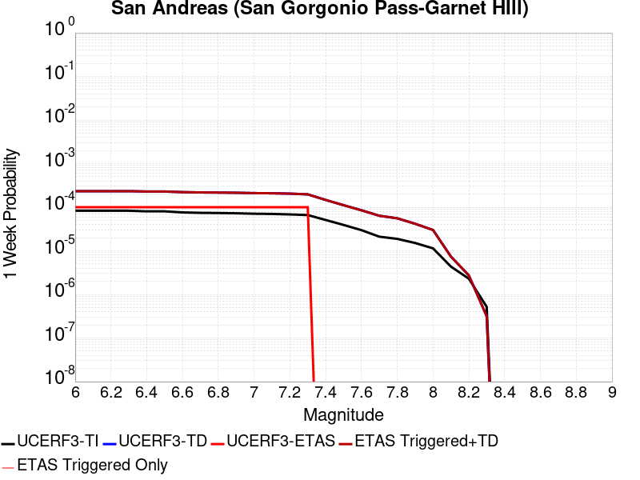 | 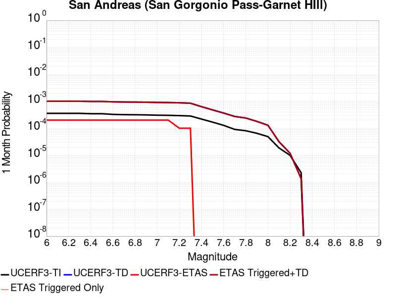 | 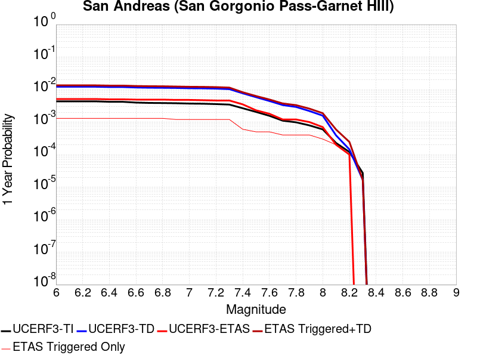 | 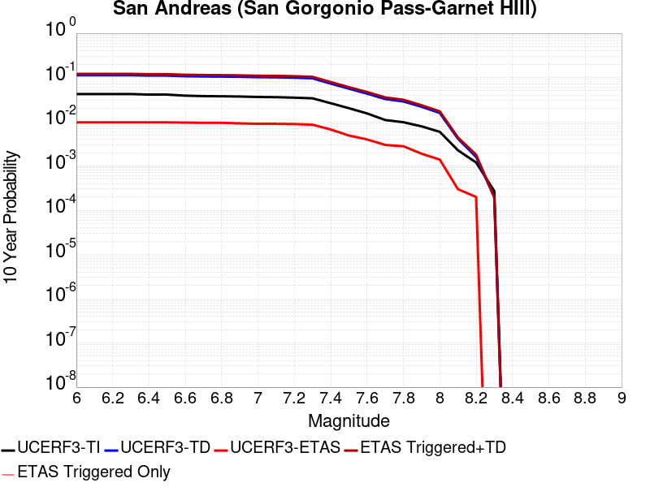 |

| Magnitude | 1 wk TI Prob | 1 wk TD Prob | 1 wk ETAS Prob | 1 wk ETAS/TD Gain | 1 wk ETAS Triggered+TD | 1 wk ETAS Triggered Only | 1 mo TI Prob | 1 mo TD Prob | 1 mo ETAS Prob | 1 mo ETAS/TD Gain | 1 mo ETAS Triggered+TD | 1 mo ETAS Triggered Only | 1 yr TI Prob | 1 yr TD Prob | 1 yr ETAS Prob | 1 yr ETAS/TD Gain | 1 yr ETAS Triggered+TD | 1 yr ETAS Triggered Only | 10 yr TI Prob | 10 yr TD Prob | 10 yr ETAS Prob | 10 yr ETAS/TD Gain | 10 yr ETAS Triggered+TD | 10 yr ETAS Triggered Only |
|-----|-----|-----|-----|-----|-----|-----|-----|-----|-----|-----|-----|-----|-----|-----|-----|-----|-----|-----|-----|-----|-----|-----|-----|-----|
| 6.0 | 8.31567E-5 | 2.3446787E-4 | 1.0E-4 | 0.42649767 | 2.3446787E-4 | 0.0 | 3.5633717E-4 | 0.0010044711 | 2.0E-4 | 0.19910976 | 0.0010044711 | 0.0 | 0.004329778 | 0.0121607585 | 0.0051 | 0.41938174 | 0.01344495 | 0.0013 | 0.042463828 | 0.11284175 | 0.0626 | 0.5547592 | 0.12144718 | 0.0097 |
| 6.1 | 8.31567E-5 | 2.3446787E-4 | 1.0E-4 | 0.42649767 | 2.3446787E-4 | 0.0 | 3.5633717E-4 | 0.0010044711 | 2.0E-4 | 0.19910976 | 0.0010044711 | 0.0 | 0.004329778 | 0.0121607585 | 0.0051 | 0.41938174 | 0.01344495 | 0.0013 | 0.042463828 | 0.11284175 | 0.0626 | 0.5547592 | 0.12144718 | 0.0097 |
| 6.2 | 8.31567E-5 | 2.3446787E-4 | 1.0E-4 | 0.42649767 | 2.3446787E-4 | 0.0 | 3.5633717E-4 | 0.0010044711 | 2.0E-4 | 0.19910976 | 0.0010044711 | 0.0 | 0.004329778 | 0.0121607585 | 0.0051 | 0.41938174 | 0.01344495 | 0.0013 | 0.042463828 | 0.11284175 | 0.0626 | 0.5547592 | 0.12144718 | 0.0097 |
| 6.3 | 8.31567E-5 | 2.3446787E-4 | 1.0E-4 | 0.42649767 | 2.3446787E-4 | 0.0 | 3.5633717E-4 | 0.0010044711 | 2.0E-4 | 0.19910976 | 0.0010044711 | 0.0 | 0.004329778 | 0.0121607585 | 0.0051 | 0.41938174 | 0.01344495 | 0.0013 | 0.042463828 | 0.11284175 | 0.0626 | 0.5547592 | 0.12144718 | 0.0097 |
| 6.4 | 8.059055E-5 | 2.3003898E-4 | 1.0E-4 | 0.43470895 | 2.3003898E-4 | 0.0 | 3.4534236E-4 | 9.855103E-4 | 2.0E-4 | 0.20294054 | 9.855103E-4 | 0.0 | 0.0041964394 | 0.01193278 | 0.005 | 0.41901383 | 0.013217268 | 0.0013 | 0.041180745 | 0.1108219 | 0.0617 | 0.55674917 | 0.119446926 | 0.0097 |
| 6.5 | 8.059055E-5 | 2.3003898E-4 | 1.0E-4 | 0.43470895 | 2.3003898E-4 | 0.0 | 3.4534236E-4 | 9.855103E-4 | 2.0E-4 | 0.20294054 | 9.855103E-4 | 0.0 | 0.0041964394 | 0.01193278 | 0.005 | 0.41901383 | 0.013217268 | 0.0013 | 0.041180745 | 0.1108219 | 0.0617 | 0.55674917 | 0.119446926 | 0.0097 |
| 6.6 | 7.619237E-5 | 2.2247908E-4 | 1.0E-4 | 0.44948044 | 2.2247908E-4 | 0.0 | 3.2649786E-4 | 9.5313566E-4 | 2.0E-4 | 0.20983371 | 9.5313566E-4 | 0.0 | 0.0039678677 | 0.011543231 | 0.0049 | 0.42449117 | 0.012828225 | 0.0013 | 0.03897764 | 0.107357204 | 0.0599 | 0.55795044 | 0.11592657 | 0.0096 |
| 6.7 | 7.440636E-5 | 2.1923587E-4 | 1.0E-4 | 0.45612973 | 2.1923587E-4 | 0.0 | 3.188454E-4 | 9.392462E-4 | 2.0E-4 | 0.21293671 | 9.392462E-4 | 0.0 | 0.0038750346 | 0.011375901 | 0.0049 | 0.43073508 | 0.0126611125 | 0.0013 | 0.038081564 | 0.10586553 | 0.0587 | 0.554477 | 0.1143598 | 0.0095 |
| 6.8 | 7.3735864E-5 | 2.1770672E-4 | 1.0E-4 | 0.45933354 | 2.1770672E-4 | 0.0 | 3.1597257E-4 | 9.3269744E-4 | 2.0E-4 | 0.2144318 | 9.3269744E-4 | 0.0 | 0.0038401815 | 0.0112970015 | 0.0049 | 0.4337434 | 0.012582316 | 0.0013 | 0.03774495 | 0.10516696 | 0.0584 | 0.5553075 | 0.11366787 | 0.0095 |
| 6.9 | 7.27575E-5 | 2.1539546E-4 | 1.0E-4 | 0.46426237 | 2.1539546E-4 | 0.0 | 3.117806E-4 | 9.2279905E-4 | 2.0E-4 | 0.21673192 | 9.2279905E-4 | 0.0 | 0.003789323 | 0.011177732 | 0.0048 | 0.42942524 | 0.012364319 | 0.0012 | 0.037253562 | 0.104114644 | 0.0575 | 0.55227584 | 0.11235679 | 0.0092 |
| 7.0 | 7.102591E-5 | 2.1123323E-4 | 1.0E-4 | 0.47341037 | 2.1123323E-4 | 0.0 | 3.0436125E-4 | 9.049734E-4 | 2.0E-4 | 0.22100097 | 9.049734E-4 | 0.0 | 0.003699303 | 0.010962906 | 0.0048 | 0.4378401 | 0.012149751 | 0.0012 | 0.03638325 | 0.10221591 | 0.0562 | 0.54981655 | 0.110295966 | 0.009 |
| 7.1 | 7.028513E-5 | 2.0958843E-4 | 1.0E-4 | 0.47712556 | 2.0958843E-4 | 0.0 | 3.0118722E-4 | 8.979292E-4 | 2.0E-4 | 0.22273472 | 8.979292E-4 | 0.0 | 0.0036607897 | 0.010878003 | 0.0047 | 0.4320646 | 0.01206495 | 0.0012 | 0.036010686 | 0.101458676 | 0.0553 | 0.5450495 | 0.109545544 | 0.009 |
| 7.2 | 6.8498244E-5 | 2.0566412E-4 | 1.0E-4 | 0.4862297 | 2.0566412E-4 | 0.0 | 2.9353087E-4 | 8.8112213E-4 | 1.0E-4 | 0.11349164 | 8.8112213E-4 | 0.0 | 0.003567883 | 0.010675399 | 0.0046 | 0.43089727 | 0.011862588 | 0.0012 | 0.035111405 | 0.099649936 | 0.0545 | 0.5469146 | 0.10766305 | 0.0089 |
| 7.3 | 6.622592E-5 | 1.9792905E-4 | 1.0E-4 | 0.5052315 | 1.9792905E-4 | 0.0 | 2.8379448E-4 | 8.479938E-4 | 1.0E-4 | 0.11792539 | 8.479938E-4 | 0.0 | 0.0034497243 | 0.010275934 | 0.0046 | 0.44764787 | 0.011463603 | 0.0012 | 0.033966612 | 0.096143775 | 0.053 | 0.5512577 | 0.103916936 | 0.0086 |
| 7.4 | 5.1050705E-5 | 1.4741668E-4 | 0.0 | 0.0 | 1.4741668E-4 | 0.0 | 2.1877038E-4 | 6.316337E-4 | 0.0 | 0.0 | 6.316337E-4 | 0.0 | 0.002660276 | 0.007663218 | 0.0035 | 0.45672718 | 0.00825862 | 6.0E-4 | 0.02628654 | 0.07309142 | 0.0412 | 0.56367767 | 0.0793017 | 0.0067 |
| 7.5 | 3.9302922E-5 | 1.1175581E-4 | 0.0 | 0.0 | 1.1175581E-4 | 0.0 | 1.6843023E-4 | 4.7886587E-4 | 0.0 | 0.0 | 4.7886587E-4 | 0.0 | 0.0020487092 | 0.0058146766 | 0.0023 | 0.3955508 | 0.006311769 | 5.0E-4 | 0.020299247 | 0.056211848 | 0.0303 | 0.5390323 | 0.06083641 | 0.0049 |
| 7.6 | 2.9851626E-5 | 8.535378E-5 | 0.0 | 0.0 | 8.535378E-5 | 0.0 | 1.2792926E-4 | 3.6575075E-4 | 0.0 | 0.0 | 3.6575075E-4 | 0.0 | 0.0015564259 | 0.0044439486 | 0.0018 | 0.40504518 | 0.004941727 | 5.0E-4 | 0.0154556995 | 0.043375034 | 0.0237 | 0.54639727 | 0.047201537 | 0.004 |
| 7.7 | 2.1135214E-5 | 6.38885E-5 | 0.0 | 0.0 | 6.38885E-5 | 0.0 | 9.0576345E-5 | 2.7377915E-4 | 0.0 | 0.0 | 2.7377915E-4 | 0.0 | 0.0011022091 | 0.003328172 | 0.0012 | 0.3605583 | 0.0037268407 | 4.0E-4 | 0.010967582 | 0.032745402 | 0.0181 | 0.55274934 | 0.035647165 | 0.003 |
| 7.8 | 1.883379E-5 | 5.5969944E-5 | 0.0 | 0.0 | 5.5969944E-5 | 0.0 | 8.0713755E-5 | 2.3984915E-4 | 0.0 | 0.0 | 2.3984915E-4 | 0.0 | 9.822468E-4 | 0.0029162562 | 0.0012 | 0.41148648 | 0.0033150897 | 4.0E-4 | 0.0097791655 | 0.028845167 | 0.0163 | 0.565086 | 0.0315644 | 0.0028 |
| 7.9 | 1.5156185E-5 | 4.1929838E-5 | 0.0 | 0.0 | 4.1929838E-5 | 0.0 | 6.495346E-5 | 1.7968693E-4 | 0.0 | 0.0 | 1.7968693E-4 | 0.0 | 7.9052144E-4 | 0.0021854949 | 0.001 | 0.45756227 | 0.0025846206 | 4.0E-4 | 0.007877152 | 0.02188459 | 0.0119 | 0.5437616 | 0.023743011 | 0.0019 |
| 8.0 | 1.1405907E-5 | 3.017959E-5 | 0.0 | 0.0 | 3.017959E-5 | 0.0 | 4.8881542E-5 | 1.293347E-4 | 0.0 | 0.0 | 1.293347E-4 | 0.0 | 5.9497025E-4 | 0.0015735136 | 7.0E-4 | 0.4448643 | 0.0018730415 | 3.0E-4 | 0.005933798 | 0.0158686 | 0.0081 | 0.51044196 | 0.017246386 | 0.0014 |
| 8.1 | 4.3511436E-6 | 7.4451445E-6 | 0.0 | 0.0 | 7.4451445E-6 | 0.0 | 1.8647626E-5 | 3.1907373E-5 | 0.0 | 0.0 | 3.1907373E-5 | 0.0 | 2.2701119E-4 | 3.8840316E-4 | 2.0E-4 | 0.5149289 | 5.883255E-4 | 2.0E-4 | 0.0022677942 | 0.004154491 | 0.0021 | 0.50547713 | 0.004453244 | 3.0E-4 |
| 8.2 | 2.3042528E-6 | 2.768347E-6 | 0.0 | 0.0 | 2.768347E-6 | 0.0 | 9.875332E-6 | 1.186429E-5 | 0.0 | 0.0 | 1.186429E-5 | 0.0 | 1.2022553E-4 | 1.444382E-4 | 1.0E-4 | 0.6923376 | 2.4442378E-4 | 1.0E-4 | 0.0012016051 | 0.0016165785 | 9.0E-4 | 0.55673134 | 0.0018162553 | 2.0E-4 |
| 8.3 | 5.202968E-7 | 3.2106607E-7 | 0.0 | 0.0 | 3.2106607E-7 | 0.0 | 2.2298414E-6 | 1.3759968E-6 | 0.0 | 0.0 | 1.3759968E-6 | 0.0 | 2.714798E-5 | 1.6752645E-5 | 0.0 | 0.0 | 1.6752645E-5 | 0.0 | 2.7144665E-4 | 1.9852648E-4 | 1.0E-4 | 0.5037111 | 1.9852648E-4 | 0.0 |

## West Napa 2011 CFM
*[(top)](#table-of-contents)*

| 1 Week | 1 Month | 1 Year | 10 Year |
|-----|-----|-----|-----|
|  | 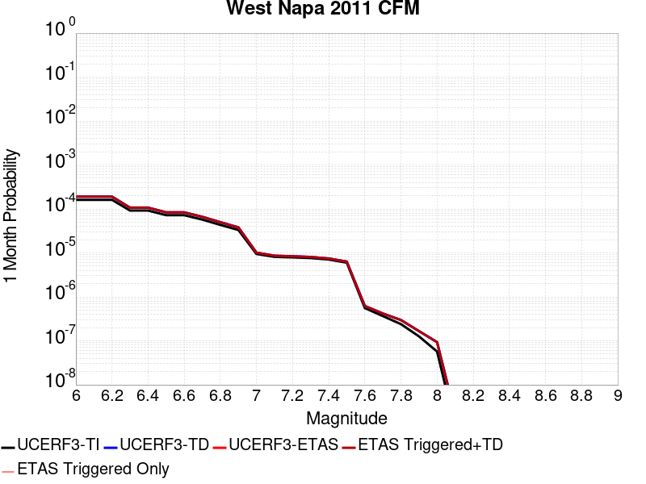 | 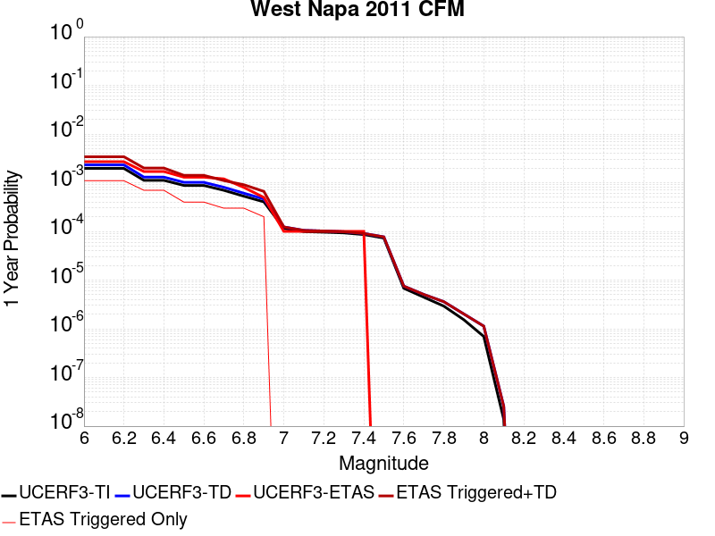 | 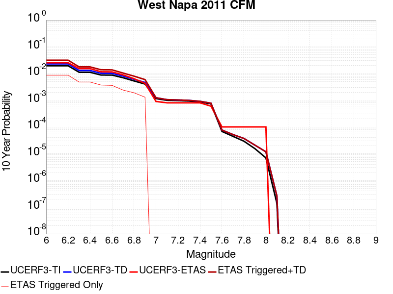 |

| Magnitude | 1 wk TI Prob | 1 wk TD Prob | 1 wk ETAS Prob | 1 wk ETAS/TD Gain | 1 wk ETAS Triggered+TD | 1 wk ETAS Triggered Only | 1 mo TI Prob | 1 mo TD Prob | 1 mo ETAS Prob | 1 mo ETAS/TD Gain | 1 mo ETAS Triggered+TD | 1 mo ETAS Triggered Only | 1 yr TI Prob | 1 yr TD Prob | 1 yr ETAS Prob | 1 yr ETAS/TD Gain | 1 yr ETAS Triggered+TD | 1 yr ETAS Triggered Only | 10 yr TI Prob | 10 yr TD Prob | 10 yr ETAS Prob | 10 yr ETAS/TD Gain | 10 yr ETAS Triggered+TD | 10 yr ETAS Triggered Only |
|-----|-----|-----|-----|-----|-----|-----|-----|-----|-----|-----|-----|-----|-----|-----|-----|-----|-----|-----|-----|-----|-----|-----|-----|-----|
| 6.0 | 3.773104E-5 | 4.4546552E-5 | 0.0 | 0.0 | 4.4546552E-5 | 0.0 | 1.6169442E-4 | 1.9090163E-4 | 0.0 | 0.0 | 1.9090163E-4 | 0.0 | 0.001966852 | 0.0023220673 | 0.0027 | 1.1627569 | 0.003419513 | 0.0011 | 0.019495348 | 0.023011751 | 0.0253 | 1.0994383 | 0.03151155 | 0.0087 |
| 6.1 | 3.773104E-5 | 4.4546552E-5 | 0.0 | 0.0 | 4.4546552E-5 | 0.0 | 1.6169442E-4 | 1.9090163E-4 | 0.0 | 0.0 | 1.9090163E-4 | 0.0 | 0.001966852 | 0.0023220673 | 0.0027 | 1.1627569 | 0.003419513 | 0.0011 | 0.019495348 | 0.023011751 | 0.0253 | 1.0994383 | 0.03151155 | 0.0087 |
| 6.2 | 3.773104E-5 | 4.4546552E-5 | 0.0 | 0.0 | 4.4546552E-5 | 0.0 | 1.6169442E-4 | 1.9090163E-4 | 0.0 | 0.0 | 1.9090163E-4 | 0.0 | 0.001966852 | 0.0023220673 | 0.0027 | 1.1627569 | 0.003419513 | 0.0011 | 0.019495348 | 0.023011751 | 0.0253 | 1.0994383 | 0.03151155 | 0.0087 |
| 6.3 | 2.147964E-5 | 2.4996978E-5 | 0.0 | 0.0 | 2.4996978E-5 | 0.0 | 9.2052345E-5 | 1.0712603E-4 | 0.0 | 0.0 | 1.0712603E-4 | 0.0 | 0.001120161 | 0.0013035708 | 0.0017 | 1.3041103 | 0.0020026583 | 7.0E-4 | 0.011145315 | 0.01297012 | 0.0153 | 1.1796345 | 0.017707862 | 0.0048 |
| 6.4 | 2.147964E-5 | 2.4996978E-5 | 0.0 | 0.0 | 2.4996978E-5 | 0.0 | 9.2052345E-5 | 1.0712603E-4 | 0.0 | 0.0 | 1.0712603E-4 | 0.0 | 0.001120161 | 0.0013035708 | 0.0017 | 1.3041103 | 0.0020026583 | 7.0E-4 | 0.011145315 | 0.01297012 | 0.0153 | 1.1796345 | 0.017707862 | 0.0048 |
| 6.5 | 1.688201E-5 | 1.9555233E-5 | 0.0 | 0.0 | 1.9555233E-5 | 0.0 | 7.234947E-5 | 8.380586E-5 | 0.0 | 0.0 | 8.380586E-5 | 0.0 | 8.804988E-4 | 0.0010199315 | 0.0013 | 1.2745954 | 0.0014195235 | 4.0E-4 | 0.008770182 | 0.010161432 | 0.0116 | 1.1415714 | 0.013823835 | 0.0037 |
| 6.6 | 1.6846381E-5 | 1.9514915E-5 | 0.0 | 0.0 | 1.9514915E-5 | 0.0 | 7.219678E-5 | 8.363308E-5 | 0.0 | 0.0 | 8.363308E-5 | 0.0 | 8.7864127E-4 | 0.0010178299 | 0.0013 | 1.2772272 | 0.0014174228 | 4.0E-4 | 0.008751754 | 0.010140608 | 0.0115 | 1.1340543 | 0.013704102 | 0.0036 |
| 6.7 | 1.3396501E-5 | 1.5474114E-5 | 0.0 | 0.0 | 1.5474114E-5 | 0.0 | 5.7412315E-5 | 6.63163E-5 | 0.0 | 0.0 | 6.63163E-5 | 0.0 | 6.9877075E-4 | 8.0716546E-4 | 0.0012 | 1.4866841 | 0.0011069233 | 3.0E-4 | 0.0069657755 | 0.00805032 | 0.0089 | 1.1055461 | 0.010430999 | 0.0024 |
| 6.8 | 1.0139058E-5 | 1.1677316E-5 | 0.0 | 0.0 | 1.1677316E-5 | 0.0 | 4.3452383E-5 | 5.0044997E-5 | 0.0 | 0.0 | 5.0044997E-5 | 0.0 | 5.289043E-4 | 6.0918304E-4 | 8.0E-4 | 1.3132342 | 9.090003E-4 | 3.0E-4 | 0.005276473 | 0.0060823103 | 0.0064 | 1.0522318 | 0.007970754 | 0.0019 |
| 6.9 | 7.761281E-6 | 8.894887E-6 | 0.0 | 0.0 | 8.894887E-6 | 0.0 | 3.326221E-5 | 3.8120677E-5 | 0.0 | 0.0 | 3.8120677E-5 | 0.0 | 4.0489217E-4 | 4.6407184E-4 | 5.0E-4 | 1.0774194 | 6.6397904E-4 | 2.0E-4 | 0.0040415525 | 0.0046377988 | 0.0043 | 0.927164 | 0.0059317695 | 0.0013 |
| 7.0 | 2.2109202E-6 | 2.3684383E-6 | 0.0 | 0.0 | 2.3684383E-6 | 0.0 | 9.475338E-6 | 1.015041E-5 | 0.0 | 0.0 | 1.015041E-5 | 0.0 | 1.1535613E-4 | 1.2357433E-4 | 1.0E-4 | 0.8092296 | 1.2357433E-4 | 0.0 | 0.0011529627 | 0.0012367964 | 9.0E-4 | 0.72768646 | 0.0012367964 | 0.0 |
| 7.1 | 1.9008926E-6 | 2.0150253E-6 | 0.0 | 0.0 | 2.0150253E-6 | 0.0 | 8.146657E-6 | 8.635794E-6 | 0.0 | 0.0 | 8.635794E-6 | 0.0 | 9.918104E-5 | 1.05135754E-4 | 1.0E-4 | 0.95115125 | 1.05135754E-4 | 0.0 | 9.913679E-4 | 0.0010525954 | 8.0E-4 | 0.76002604 | 0.0010525954 | 0.0 |
| 7.2 | 1.8495944E-6 | 1.9578185E-6 | 0.0 | 0.0 | 1.9578185E-6 | 0.0 | 7.926808E-6 | 8.390624E-6 | 0.0 | 0.0 | 8.390624E-6 | 0.0 | 9.650462E-5 | 1.0215108E-4 | 1.0E-4 | 0.97894216 | 1.0215108E-4 | 0.0 | 9.6462725E-4 | 0.0010227767 | 8.0E-4 | 0.7821844 | 0.0010227767 | 0.0 |
| 7.3 | 1.7883189E-6 | 1.8897636E-6 | 0.0 | 0.0 | 1.8897636E-6 | 0.0 | 7.664201E-6 | 8.098961E-6 | 0.0 | 0.0 | 8.098961E-6 | 0.0 | 9.330765E-5 | 9.8600416E-5 | 1.0E-4 | 1.0141945 | 9.8600416E-5 | 0.0 | 9.3268487E-4 | 9.873025E-4 | 8.0E-4 | 0.81028867 | 9.873025E-4 | 0.0 |
| 7.4 | 1.6520572E-6 | 1.7430917E-6 | 0.0 | 0.0 | 1.7430917E-6 | 0.0 | 7.0802257E-6 | 7.470372E-6 | 0.0 | 0.0 | 7.470372E-6 | 0.0 | 8.6198335E-5 | 9.094801E-5 | 1.0E-4 | 1.0995293 | 9.094801E-5 | 0.0 | 8.616491E-4 | 9.10844E-4 | 8.0E-4 | 0.87830627 | 9.10844E-4 | 0.0 |
| 7.5 | 1.4040345E-6 | 1.4814387E-6 | 0.0 | 0.0 | 1.4814387E-6 | 0.0 | 6.0172765E-6 | 6.349008E-6 | 0.0 | 0.0 | 6.349008E-6 | 0.0 | 7.325788E-5 | 7.7296456E-5 | 0.0 | 0.0 | 7.7296456E-5 | 0.0 | 7.3233736E-4 | 7.7439373E-4 | 6.0E-4 | 0.77479964 | 7.7439373E-4 | 0.0 |
| 7.6 | 1.3013842E-7 | 1.4482065E-7 | 0.0 | 0.0 | 1.4482065E-7 | 0.0 | 5.57736E-7 | 6.2065976E-7 | 0.0 | 0.0 | 6.2065976E-7 | 0.0 | 6.790414E-6 | 7.5565063E-6 | 0.0 | 0.0 | 7.5565063E-6 | 0.0 | 6.790207E-5 | 7.648976E-5 | 1.0E-4 | 1.3073645 | 7.648976E-5 | 0.0 |
| 7.7 | 8.541512E-8 | 9.776703E-8 | 0.0 | 0.0 | 9.776703E-8 | 0.0 | 3.6606474E-7 | 4.1900148E-7 | 0.0 | 0.0 | 4.1900148E-7 | 0.0 | 4.456829E-6 | 5.101331E-6 | 0.0 | 0.0 | 5.101331E-6 | 0.0 | 4.4567398E-5 | 5.191429E-5 | 1.0E-4 | 1.9262519 | 5.191429E-5 | 0.0 |
| 7.8 | 5.6074793E-8 | 6.945413E-8 | 0.0 | 0.0 | 6.945413E-8 | 0.0 | 2.403205E-7 | 2.976605E-7 | 0.0 | 0.0 | 2.976605E-7 | 0.0 | 2.9258983E-6 | 3.6240108E-6 | 0.0 | 0.0 | 3.6240108E-6 | 0.0 | 2.9258597E-5 | 3.7071426E-5 | 1.0E-4 | 2.6974955 | 3.7071426E-5 | 0.0 |
| 7.9 | 2.9475839E-8 | 3.886336E-8 | 0.0 | 0.0 | 3.886336E-8 | 0.0 | 1.2632502E-7 | 1.6655724E-7 | 0.0 | 0.0 | 1.6655724E-7 | 0.0 | 1.538006E-6 | 2.0278326E-6 | 0.0 | 0.0 | 2.0278326E-6 | 0.0 | 1.5379954E-5 | 2.081834E-5 | 1.0E-4 | 4.803457 | 2.081834E-5 | 0.0 |
| 8.0 | 1.3337122E-8 | 2.1804896E-8 | 0.0 | 0.0 | 2.1804896E-8 | 0.0 | 5.7159088E-8 | 9.344955E-8 | 0.0 | 0.0 | 9.344955E-8 | 0.0 | 6.959117E-7 | 1.1377477E-6 | 0.0 | 0.0 | 1.1377477E-6 | 0.0 | 6.959095E-6 | 1.173291E-5 | 1.0E-4 | 8.523035 | 1.173291E-5 | 0.0 |
| 8.1 | 2.6589986E-10 | 4.898225E-10 | 0.0 | 0.0 | 4.898225E-10 | 0.0 | 1.1395708E-9 | 2.0992401E-9 | 0.0 | 0.0 | 2.0992401E-9 | 0.0 | 1.3874274E-8 | 2.5558252E-8 | 0.0 | 0.0 | 2.5558252E-8 | 0.0 | 1.3874273E-7 | 2.6223145E-7 | 0.0 | 0.0 | 2.6223145E-7 | 0.0 |

## Cady
*[(top)](#table-of-contents)*

| 1 Week | 1 Month | 1 Year | 10 Year |
|-----|-----|-----|-----|
| 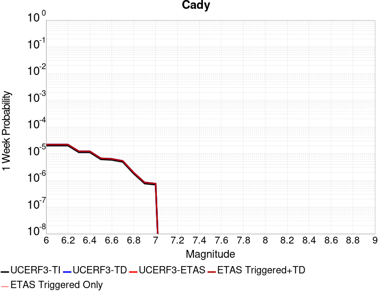 | 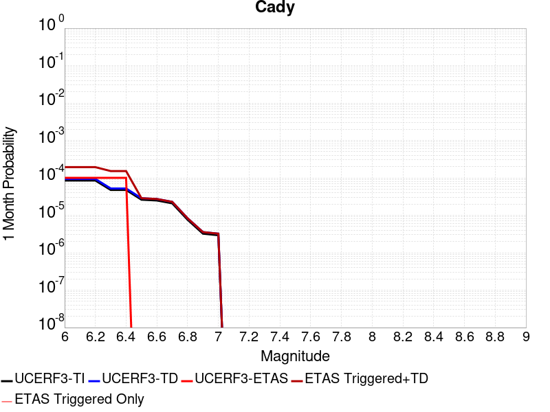 | 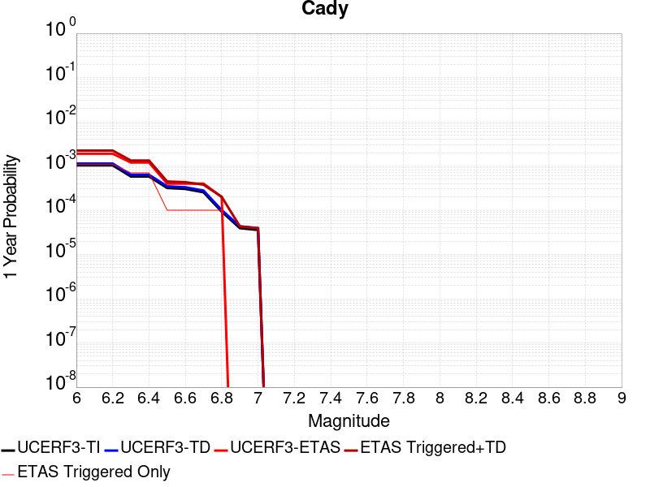 | 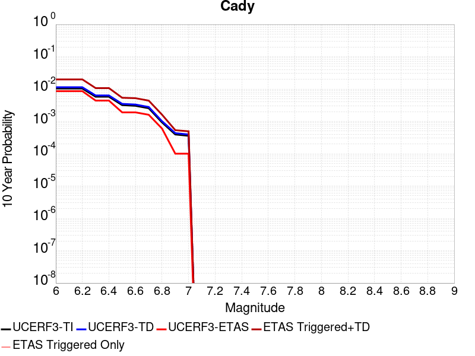 |

| Magnitude | 1 wk TI Prob | 1 wk TD Prob | 1 wk ETAS Prob | 1 wk ETAS/TD Gain | 1 wk ETAS Triggered+TD | 1 wk ETAS Triggered Only | 1 mo TI Prob | 1 mo TD Prob | 1 mo ETAS Prob | 1 mo ETAS/TD Gain | 1 mo ETAS Triggered+TD | 1 mo ETAS Triggered Only | 1 yr TI Prob | 1 yr TD Prob | 1 yr ETAS Prob | 1 yr ETAS/TD Gain | 1 yr ETAS Triggered+TD | 1 yr ETAS Triggered Only | 10 yr TI Prob | 10 yr TD Prob | 10 yr ETAS Prob | 10 yr ETAS/TD Gain | 10 yr ETAS Triggered+TD | 10 yr ETAS Triggered Only |
|-----|-----|-----|-----|-----|-----|-----|-----|-----|-----|-----|-----|-----|-----|-----|-----|-----|-----|-----|-----|-----|-----|-----|-----|-----|
| 6.0 | 1.9892565E-5 | 2.1863181E-5 | 0.0 | 0.0 | 2.1863181E-5 | 0.0 | 8.525106E-5 | 9.369649E-5 | 2.0E-4 | 2.1345515 | 1.9368713E-4 | 1.0E-4 | 0.0010374374 | 0.0011402488 | 0.0019 | 1.666303 | 0.0022389945 | 0.0011 | 0.010326075 | 0.011353001 | 0.0156 | 1.374086 | 0.019855365 | 0.0086 |
| 6.1 | 1.9892565E-5 | 2.1863181E-5 | 0.0 | 0.0 | 2.1863181E-5 | 0.0 | 8.525106E-5 | 9.369649E-5 | 2.0E-4 | 2.1345515 | 1.9368713E-4 | 1.0E-4 | 0.0010374374 | 0.0011402488 | 0.0019 | 1.666303 | 0.0022389945 | 0.0011 | 0.010326075 | 0.011353001 | 0.0156 | 1.374086 | 0.019855365 | 0.0086 |
| 6.2 | 1.9892565E-5 | 2.1863181E-5 | 0.0 | 0.0 | 2.1863181E-5 | 0.0 | 8.525106E-5 | 9.369649E-5 | 2.0E-4 | 2.1345515 | 1.9368713E-4 | 1.0E-4 | 0.0010374374 | 0.0011402488 | 0.0019 | 1.666303 | 0.0022389945 | 0.0011 | 0.010326075 | 0.011353001 | 0.0156 | 1.374086 | 0.019855365 | 0.0086 |
| 6.3 | 1.1117327E-5 | 1.2178974E-5 | 0.0 | 0.0 | 1.2178974E-5 | 0.0 | 4.764482E-5 | 5.2194737E-5 | 2.0E-4 | 3.831804 | 1.5218952E-4 | 1.0E-4 | 5.7992124E-4 | 6.353172E-4 | 0.0012 | 1.8888204 | 0.0013348724 | 7.0E-4 | 0.0057841022 | 0.0063381162 | 0.0086 | 1.35687 | 0.010710228 | 0.0044 |
| 6.4 | 1.1117327E-5 | 1.2178974E-5 | 0.0 | 0.0 | 1.2178974E-5 | 0.0 | 4.764482E-5 | 5.2194737E-5 | 2.0E-4 | 3.831804 | 1.5218952E-4 | 1.0E-4 | 5.7992124E-4 | 6.353172E-4 | 0.0012 | 1.8888204 | 0.0013348724 | 7.0E-4 | 0.0057841022 | 0.0063381162 | 0.0086 | 1.35687 | 0.010710228 | 0.0044 |
| 6.5 | 6.103093E-6 | 6.673303E-6 | 0.0 | 0.0 | 6.673303E-6 | 0.0 | 2.615585E-5 | 2.8599625E-5 | 1.0E-4 | 3.4965494 | 2.8599625E-5 | 0.0 | 3.1840094E-4 | 3.4815737E-4 | 4.0E-4 | 1.1489058 | 4.4812256E-4 | 1.0E-4 | 0.0031794512 | 0.0034773538 | 0.0041 | 1.1790575 | 0.005370747 | 0.0019 |
| 6.6 | 5.817237E-6 | 6.3668954E-6 | 0.0 | 0.0 | 6.3668954E-6 | 0.0 | 2.4930776E-5 | 2.7286478E-5 | 1.0E-4 | 3.6648188 | 2.7286478E-5 | 0.0 | 3.034899E-4 | 3.3217468E-4 | 4.0E-4 | 1.2041857 | 4.3214147E-4 | 1.0E-4 | 0.0030307577 | 0.0033180043 | 0.004 | 1.205544 | 0.0052117 | 0.0019 |
| 6.7 | 4.8846314E-6 | 5.3415956E-6 | 0.0 | 0.0 | 5.3415956E-6 | 0.0 | 2.0933967E-5 | 2.2892418E-5 | 1.0E-4 | 4.3682585 | 2.2892418E-5 | 0.0 | 2.5484123E-4 | 2.7869132E-4 | 4.0E-4 | 1.4352797 | 3.7866345E-4 | 1.0E-4 | 0.0025454918 | 0.0027845742 | 0.0036 | 1.2928368 | 0.004380119 | 0.0016 |
| 6.8 | 1.7788773E-6 | 1.9402698E-6 | 0.0 | 0.0 | 1.9402698E-6 | 0.0 | 7.6237375E-6 | 8.315425E-6 | 1.0E-4 | 12.025844 | 8.315425E-6 | 0.0 | 9.281505E-5 | 1.0123717E-4 | 2.0E-4 | 1.975559 | 2.0122704E-4 | 1.0E-4 | 9.2776294E-4 | 0.0010120652 | 0.0017 | 1.6797338 | 0.0016114579 | 6.0E-4 |
| 6.9 | 7.5455404E-7 | 8.298794E-7 | 0.0 | 0.0 | 8.298794E-7 | 0.0 | 3.233799E-6 | 3.5566231E-6 | 0.0 | 0.0 | 3.5566231E-6 | 0.0 | 3.937079E-5 | 4.3301363E-5 | 0.0 | 0.0 | 4.3301363E-5 | 0.0 | 3.9363815E-4 | 4.329622E-4 | 5.0E-4 | 1.1548352 | 5.329189E-4 | 1.0E-4 |
| 7.0 | 6.8578805E-7 | 7.543365E-7 | 0.0 | 0.0 | 7.543365E-7 | 0.0 | 2.9390883E-6 | 3.2328687E-6 | 0.0 | 0.0 | 3.2328687E-6 | 0.0 | 3.578281E-5 | 3.9359795E-5 | 0.0 | 0.0 | 3.9359795E-5 | 0.0 | 3.577705E-4 | 3.9356074E-4 | 5.0E-4 | 1.2704519 | 4.935214E-4 | 1.0E-4 |

## Hunting Creek - Berryessa 2011 CFM
*[(top)](#table-of-contents)*

| 1 Week | 1 Month | 1 Year | 10 Year |
|-----|-----|-----|-----|
|  | 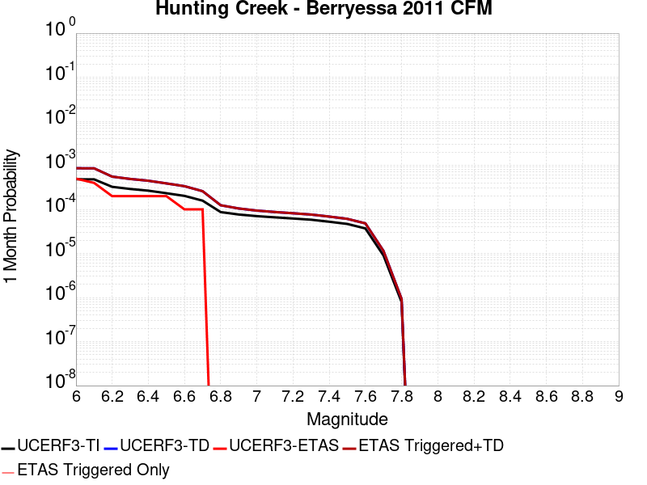 | 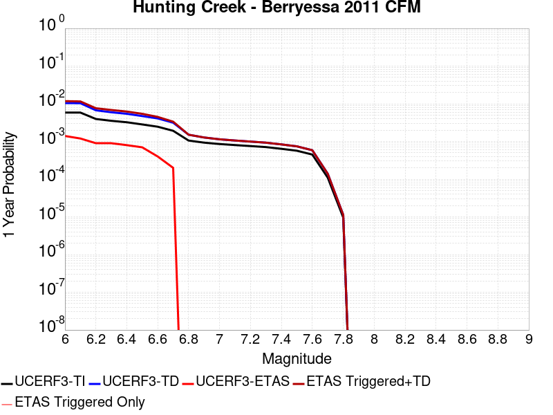 | 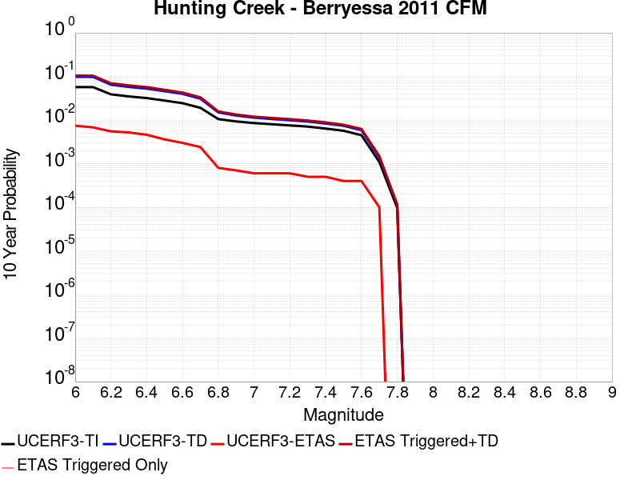 |

| Magnitude | 1 wk TI Prob | 1 wk TD Prob | 1 wk ETAS Prob | 1 wk ETAS/TD Gain | 1 wk ETAS Triggered+TD | 1 wk ETAS Triggered Only | 1 mo TI Prob | 1 mo TD Prob | 1 mo ETAS Prob | 1 mo ETAS/TD Gain | 1 mo ETAS Triggered+TD | 1 mo ETAS Triggered Only | 1 yr TI Prob | 1 yr TD Prob | 1 yr ETAS Prob | 1 yr ETAS/TD Gain | 1 yr ETAS Triggered+TD | 1 yr ETAS Triggered Only | 10 yr TI Prob | 10 yr TD Prob | 10 yr ETAS Prob | 10 yr ETAS/TD Gain | 10 yr ETAS Triggered+TD | 10 yr ETAS Triggered Only |
|-----|-----|-----|-----|-----|-----|-----|-----|-----|-----|-----|-----|-----|-----|-----|-----|-----|-----|-----|-----|-----|-----|-----|-----|-----|
| 6.0 | 1.1270982E-4 | 2.004287E-4 | 0.0 | 0.0 | 2.004287E-4 | 0.0 | 4.8295266E-4 | 8.5867115E-4 | 5.0E-4 | 0.5822951 | 8.5867115E-4 | 0.0 | 0.0058641075 | 0.010394164 | 0.0082 | 0.7889042 | 0.011779613 | 0.0014 | 0.057117578 | 0.09810744 | 0.0868 | 0.8847443 | 0.10478145 | 0.0074 |
| 6.1 | 1.1239393E-4 | 1.9990969E-4 | 0.0 | 0.0 | 1.9990969E-4 | 0.0 | 4.8159933E-4 | 8.564483E-4 | 4.0E-4 | 0.4670451 | 8.564483E-4 | 0.0 | 0.0058477195 | 0.010367386 | 0.007 | 0.6751943 | 0.011554945 | 0.0012 | 0.056962132 | 0.09786574 | 0.0736 | 0.7520507 | 0.104000255 | 0.0068 |
| 6.2 | 7.596265E-5 | 1.2944567E-4 | 0.0 | 0.0 | 1.2944567E-4 | 0.0 | 3.2551357E-4 | 5.5461493E-4 | 2.0E-4 | 0.36061054 | 5.5461493E-4 | 0.0 | 0.0039559277 | 0.006726943 | 0.0045 | 0.6689517 | 0.0076208888 | 9.0E-4 | 0.038862433 | 0.06464084 | 0.0468 | 0.72400045 | 0.06978532 | 0.0055 |
| 6.3 | 6.78794E-5 | 1.14578215E-4 | 0.0 | 0.0 | 1.14578215E-4 | 0.0 | 2.9087928E-4 | 4.9093936E-4 | 2.0E-4 | 0.4073823 | 4.9093936E-4 | 0.0 | 0.003535705 | 0.0059576654 | 0.0042 | 0.7049741 | 0.0068523036 | 9.0E-4 | 0.034799766 | 0.057510164 | 0.0425 | 0.7389998 | 0.06241111 | 0.0052 |
| 6.4 | 6.2165134E-5 | 1.0443753E-4 | 0.0 | 0.0 | 1.0443753E-4 | 0.0 | 2.6639478E-4 | 4.474991E-4 | 2.0E-4 | 0.44692826 | 4.474991E-4 | 0.0 | 0.0032385332 | 0.0054321135 | 0.0041 | 0.75477064 | 0.006227768 | 8.0E-4 | 0.03191742 | 0.052592885 | 0.0396 | 0.7529535 | 0.05695096 | 0.0046 |
| 6.5 | 5.4368087E-5 | 9.078325E-5 | 0.0 | 0.0 | 9.078325E-5 | 0.0 | 2.3298527E-4 | 3.8900654E-4 | 2.0E-4 | 0.5141302 | 3.8900654E-4 | 0.0 | 0.0028329059 | 0.00472396 | 0.0032 | 0.6773978 | 0.005420653 | 7.0E-4 | 0.027970633 | 0.045918517 | 0.034 | 0.74044204 | 0.049353212 | 0.0036 |
| 6.6 | 4.729947E-5 | 7.85424E-5 | 0.0 | 0.0 | 7.85424E-5 | 0.0 | 2.0269625E-4 | 3.365648E-4 | 1.0E-4 | 0.29711962 | 3.365648E-4 | 0.0 | 0.002465034 | 0.004088592 | 0.0027 | 0.66037405 | 0.0044869566 | 4.0E-4 | 0.02437869 | 0.03988665 | 0.0287 | 0.719539 | 0.04276699 | 0.003 |
| 6.7 | 3.6875328E-5 | 6.0503855E-5 | 0.0 | 0.0 | 6.0503855E-5 | 0.0 | 1.5802756E-4 | 2.5927825E-4 | 1.0E-4 | 0.38568604 | 2.5927825E-4 | 0.0 | 0.0019222875 | 0.0031515402 | 0.0023 | 0.7298019 | 0.0033509098 | 2.0E-4 | 0.019057442 | 0.030922858 | 0.0223 | 0.7211494 | 0.033248644 | 0.0024 |
| 6.8 | 2.0292036E-5 | 2.8991299E-5 | 0.0 | 0.0 | 2.8991299E-5 | 0.0 | 8.6962966E-5 | 1.2424242E-4 | 0.0 | 0.0 | 1.2424242E-4 | 0.0 | 0.0010582599 | 0.0015115893 | 0.0011 | 0.7277109 | 0.0015115893 | 0.0 | 0.010532344 | 0.014986429 | 0.01 | 0.66727036 | 0.01577444 | 8.0E-4 |
| 6.9 | 1.7871042E-5 | 2.4485564E-5 | 0.0 | 0.0 | 2.4485564E-5 | 0.0 | 7.658793E-5 | 1.0493388E-4 | 0.0 | 0.0 | 1.0493388E-4 | 0.0 | 9.320591E-4 | 0.0012768207 | 8.0E-4 | 0.6265563 | 0.0012768207 | 0.0 | 0.009281595 | 0.01268672 | 0.0082 | 0.64634514 | 0.01337784 | 7.0E-4 |
| 7.0 | 1.6415532E-5 | 2.1918755E-5 | 0.0 | 0.0 | 2.1918755E-5 | 0.0 | 7.035038E-5 | 9.3934155E-5 | 0.0 | 0.0 | 9.3934155E-5 | 0.0 | 8.561793E-4 | 0.0011430494 | 7.0E-4 | 0.61239696 | 0.0011430494 | 0.0 | 0.008528882 | 0.011371024 | 0.0069 | 0.6068055 | 0.011964201 | 6.0E-4 |
| 7.1 | 1.5409885E-5 | 2.0358328E-5 | 0.0 | 0.0 | 2.0358328E-5 | 0.0 | 6.6040695E-5 | 8.724708E-5 | 0.0 | 0.0 | 8.724708E-5 | 0.0 | 8.0374884E-4 | 0.0010617182 | 5.0E-4 | 0.47093475 | 0.0010617182 | 0.0 | 0.00800848 | 0.010566951 | 0.0064 | 0.6056619 | 0.011160611 | 6.0E-4 |
| 7.2 | 1.4497423E-5 | 1.9066418E-5 | 0.0 | 0.0 | 1.9066418E-5 | 0.0 | 6.213033E-5 | 8.171068E-5 | 0.0 | 0.0 | 8.171068E-5 | 0.0 | 7.5617427E-4 | 9.943765E-4 | 4.0E-4 | 0.40226212 | 9.943765E-4 | 0.0 | 0.0075360634 | 0.009900033 | 0.0062 | 0.6262606 | 0.0104940925 | 6.0E-4 |
| 7.3 | 1.3615175E-5 | 1.7837188E-5 | 0.0 | 0.0 | 1.7837188E-5 | 0.0 | 5.8349444E-5 | 7.644287E-5 | 0.0 | 0.0 | 7.644287E-5 | 0.0 | 7.101729E-4 | 9.302974E-4 | 4.0E-4 | 0.42997 | 9.302974E-4 | 0.0 | 0.0070790765 | 0.009264836 | 0.006 | 0.6476099 | 0.009760204 | 5.0E-4 |
| 7.4 | 1.2252825E-5 | 1.6036516E-5 | 0.0 | 0.0 | 1.6036516E-5 | 0.0 | 5.251105E-5 | 6.872613E-5 | 0.0 | 0.0 | 6.872613E-5 | 0.0 | 6.391345E-4 | 8.3642226E-4 | 3.0E-4 | 0.35867053 | 8.3642226E-4 | 0.0 | 0.0063729943 | 0.008333439 | 0.0053 | 0.63599193 | 0.008829272 | 5.0E-4 |
| 7.5 | 1.0913301E-5 | 1.4250034E-5 | 0.0 | 0.0 | 1.4250034E-5 | 0.0 | 4.6770452E-5 | 6.107016E-5 | 0.0 | 0.0 | 6.107016E-5 | 0.0 | 5.6928146E-4 | 7.4327824E-4 | 3.0E-4 | 0.40361735 | 7.4327824E-4 | 0.0 | 0.0056782532 | 0.0074085835 | 0.0047 | 0.6343993 | 0.00780562 | 4.0E-4 |
| 7.6 | 8.623192E-6 | 1.1242259E-5 | 0.0 | 0.0 | 1.1242259E-5 | 0.0 | 3.6956015E-5 | 4.818023E-5 | 0.0 | 0.0 | 4.818023E-5 | 0.0 | 4.4984656E-4 | 5.86439E-4 | 2.0E-4 | 0.34104145 | 5.86439E-4 | 0.0 | 0.00448937 | 0.0058494904 | 0.0037 | 0.6325337 | 0.0062471507 | 4.0E-4 |
| 7.7 | 2.0993634E-6 | 2.6642563E-6 | 0.0 | 0.0 | 2.6642563E-6 | 0.0 | 8.997241E-6 | 1.1418191E-5 | 0.0 | 0.0 | 1.1418191E-5 | 0.0 | 1.09535904E-4 | 1.3900768E-4 | 2.0E-4 | 1.4387693 | 1.3900768E-4 | 0.0 | 0.0010948193 | 0.0013892325 | 0.0012 | 0.86378634 | 0.0014890935 | 1.0E-4 |
| 7.8 | 1.8428308E-7 | 2.1731857E-7 | 0.0 | 0.0 | 2.1731857E-7 | 0.0 | 7.897844E-7 | 9.31365E-7 | 0.0 | 0.0 | 9.31365E-7 | 0.0 | 9.615583E-6 | 1.13393135E-5 | 0.0 | 0.0 | 1.13393135E-5 | 0.0 | 9.615166E-5 | 1.1338047E-4 | 2.0E-4 | 1.7639723 | 1.1338047E-4 | 0.0 |

## Green Valley 2011 CFM
*[(top)](#table-of-contents)*

| 1 Week | 1 Month | 1 Year | 10 Year |
|-----|-----|-----|-----|
|  | 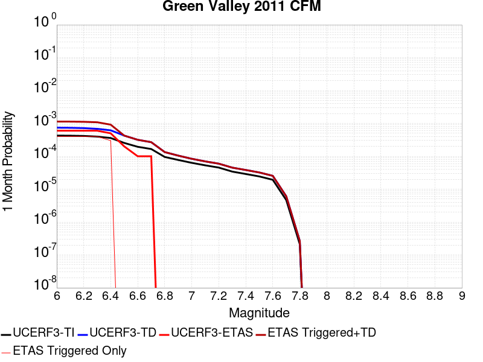 | 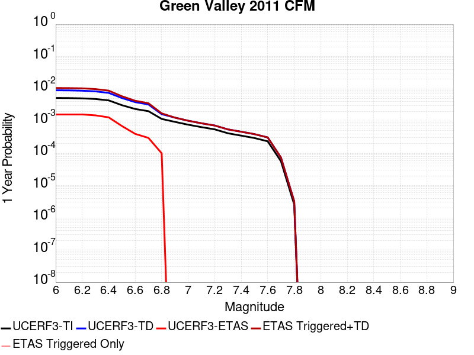 | 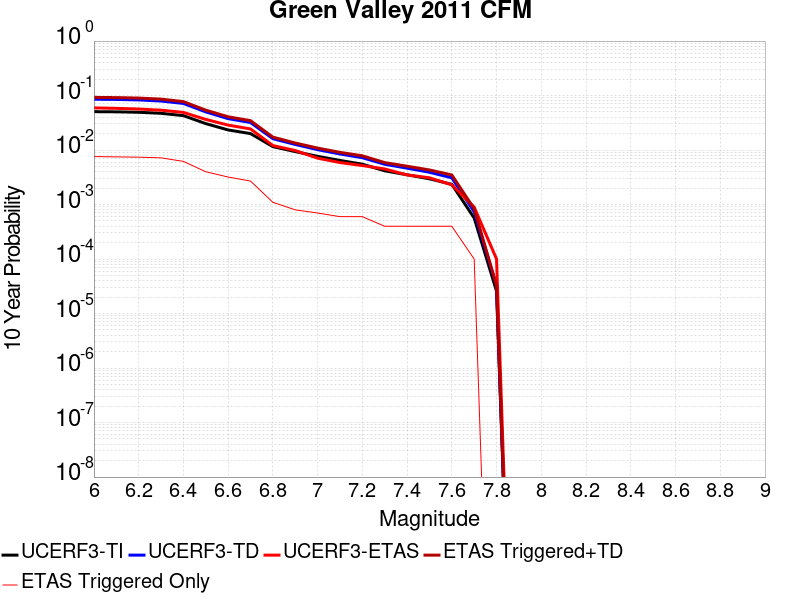 |

| Magnitude | 1 wk TI Prob | 1 wk TD Prob | 1 wk ETAS Prob | 1 wk ETAS/TD Gain | 1 wk ETAS Triggered+TD | 1 wk ETAS Triggered Only | 1 mo TI Prob | 1 mo TD Prob | 1 mo ETAS Prob | 1 mo ETAS/TD Gain | 1 mo ETAS Triggered+TD | 1 mo ETAS Triggered Only | 1 yr TI Prob | 1 yr TD Prob | 1 yr ETAS Prob | 1 yr ETAS/TD Gain | 1 yr ETAS Triggered+TD | 1 yr ETAS Triggered Only | 10 yr TI Prob | 10 yr TD Prob | 10 yr ETAS Prob | 10 yr ETAS/TD Gain | 10 yr ETAS Triggered+TD | 10 yr ETAS Triggered Only |
|-----|-----|-----|-----|-----|-----|-----|-----|-----|-----|-----|-----|-----|-----|-----|-----|-----|-----|-----|-----|-----|-----|-----|-----|-----|
| 6.0 | 9.9629346E-5 | 1.7315976E-4 | 2.0E-4 | 1.1550027 | 3.7312513E-4 | 2.0E-4 | 4.2691303E-4 | 7.418932E-4 | 6.0E-4 | 0.80874175 | 0.0011415965 | 4.0E-4 | 0.0051852856 | 0.008993766 | 0.006 | 0.66712874 | 0.0105793765 | 0.0016 | 0.050659515 | 0.085595 | 0.0594 | 0.6939658 | 0.09254447 | 0.0076 |
| 6.1 | 9.88615E-5 | 1.7162993E-4 | 2.0E-4 | 1.1652979 | 3.715956E-4 | 2.0E-4 | 4.2362334E-4 | 7.3534047E-4 | 6.0E-4 | 0.81594855 | 0.0011350464 | 4.0E-4 | 0.0051454236 | 0.008914649 | 0.006 | 0.67304957 | 0.0105003845 | 0.0016 | 0.050279044 | 0.08488152 | 0.0583 | 0.6868397 | 0.091744915 | 0.0075 |
| 6.2 | 9.696895E-5 | 1.6801653E-4 | 2.0E-4 | 1.190359 | 3.6798292E-4 | 2.0E-4 | 4.15515E-4 | 7.1986346E-4 | 6.0E-4 | 0.8334914 | 0.0011195755 | 4.0E-4 | 0.0050471667 | 0.008727822 | 0.0058 | 0.6645415 | 0.010313858 | 0.0016 | 0.04934063 | 0.083188884 | 0.0566 | 0.68037933 | 0.089973286 | 0.0074 |
| 6.3 | 9.275224E-5 | 1.5980878E-4 | 2.0E-4 | 1.2514956 | 3.5977684E-4 | 2.0E-4 | 3.9744904E-4 | 6.8470614E-4 | 6.0E-4 | 0.87628835 | 0.0010844322 | 4.0E-4 | 0.0048282105 | 0.008303091 | 0.0054 | 0.6503602 | 0.009790637 | 0.0015 | 0.047246475 | 0.07932726 | 0.0539 | 0.6794638 | 0.085956104 | 0.0072 |
| 6.4 | 8.391499E-5 | 1.4374741E-4 | 1.0E-4 | 0.6956647 | 2.4373304E-4 | 1.0E-4 | 3.595861E-4 | 6.1590975E-4 | 5.0E-4 | 0.8118073 | 9.1572496E-4 | 3.0E-4 | 0.004369175 | 0.0074718357 | 0.0048 | 0.6424124 | 0.008762122 | 0.0013 | 0.04284265 | 0.071685664 | 0.0491 | 0.68493474 | 0.077441216 | 0.0062 |
| 6.5 | 5.9519385E-5 | 9.940456E-5 | 0.0 | 0.0 | 9.940456E-5 | 0.0 | 2.5505814E-4 | 4.259467E-4 | 2.0E-4 | 0.46954232 | 4.259467E-4 | 0.0 | 0.0031009112 | 0.005172481 | 0.0031 | 0.59932554 | 0.00586886 | 7.0E-4 | 0.030579966 | 0.05018198 | 0.0365 | 0.72735274 | 0.053981252 | 0.004 |
| 6.6 | 4.5361558E-5 | 7.408973E-5 | 0.0 | 0.0 | 7.408973E-5 | 0.0 | 1.9439218E-4 | 3.1748894E-4 | 1.0E-4 | 0.3149716 | 3.1748894E-4 | 0.0 | 0.0023641558 | 0.0038576422 | 0.0025 | 0.64806426 | 0.004256099 | 4.0E-4 | 0.023391623 | 0.03769953 | 0.0287 | 0.7612827 | 0.040778894 | 0.0032 |
| 6.7 | 3.8808106E-5 | 6.2708255E-5 | 0.0 | 0.0 | 6.2708255E-5 | 0.0 | 1.6630985E-4 | 2.6872384E-4 | 1.0E-4 | 0.37212926 | 2.6872384E-4 | 0.0 | 0.0020229418 | 0.003266214 | 0.0023 | 0.7041792 | 0.0035652341 | 3.0E-4 | 0.020046256 | 0.032037325 | 0.0244 | 0.76161164 | 0.034650825 | 0.0027 |
| 6.8 | 2.2284667E-5 | 3.1304608E-5 | 0.0 | 0.0 | 3.1304608E-5 | 0.0 | 9.550222E-5 | 1.3415568E-4 | 0.0 | 0.0 | 1.3415568E-4 | 0.0 | 0.0011621192 | 0.0016321202 | 0.0011 | 0.67397 | 0.001731957 | 1.0E-4 | 0.011560607 | 0.016174946 | 0.0121 | 0.7480705 | 0.017257154 | 0.0011 |
| 6.9 | 1.8050168E-5 | 2.446573E-5 | 0.0 | 0.0 | 2.446573E-5 | 0.0 | 7.735557E-5 | 1.048489E-4 | 0.0 | 0.0 | 1.048489E-4 | 0.0 | 9.4139716E-4 | 0.0012757905 | 8.0E-4 | 0.6270622 | 0.0012757905 | 0.0 | 0.009374191 | 0.012677226 | 0.0098 | 0.77303976 | 0.013467085 | 8.0E-4 |
| 7.0 | 1.4763166E-5 | 1.9596251E-5 | 0.0 | 0.0 | 1.9596251E-5 | 0.0 | 6.326917E-5 | 8.398125E-5 | 0.0 | 0.0 | 8.398125E-5 | 0.0 | 7.7002996E-4 | 0.0010219932 | 5.0E-4 | 0.48924002 | 0.0010219932 | 0.0 | 0.007673672 | 0.010172821 | 0.0071 | 0.69793814 | 0.0108657 | 7.0E-4 |
| 7.1 | 1.2399713E-5 | 1.6315218E-5 | 0.0 | 0.0 | 1.6315218E-5 | 0.0 | 5.3140546E-5 | 6.9920505E-5 | 0.0 | 0.0 | 6.9920505E-5 | 0.0 | 6.467941E-4 | 8.5095165E-4 | 3.0E-4 | 0.35254648 | 8.5095165E-4 | 0.0 | 0.006449148 | 0.008477493 | 0.0059 | 0.6959604 | 0.009072407 | 6.0E-4 |
| 7.2 | 1.0584195E-5 | 1.393259E-5 | 0.0 | 0.0 | 1.393259E-5 | 0.0 | 4.5360044E-5 | 5.9709746E-5 | 0.0 | 0.0 | 5.9709746E-5 | 0.0 | 5.521186E-4 | 7.267253E-4 | 3.0E-4 | 0.41281074 | 7.267253E-4 | 0.0 | 0.0055074887 | 0.0072441446 | 0.0052 | 0.7178211 | 0.007839798 | 6.0E-4 |
| 7.3 | 7.998173E-6 | 1.0550276E-5 | 0.0 | 0.0 | 1.0550276E-5 | 0.0 | 3.4277433E-5 | 4.521469E-5 | 0.0 | 0.0 | 4.521469E-5 | 0.0 | 4.1724785E-4 | 5.503509E-4 | 3.0E-4 | 0.54510677 | 5.503509E-4 | 0.0 | 0.004164653 | 0.0054905657 | 0.0045 | 0.81958765 | 0.0058883694 | 4.0E-4 |
| 7.4 | 6.7571127E-6 | 8.938703E-6 | 0.0 | 0.0 | 8.938703E-6 | 0.0 | 2.8958733E-5 | 3.830817E-5 | 0.0 | 0.0 | 3.830817E-5 | 0.0 | 3.5251552E-4 | 4.663031E-4 | 1.0E-4 | 0.21445277 | 4.663031E-4 | 0.0 | 0.0035195686 | 0.004653706 | 0.0035 | 0.7520888 | 0.0050518443 | 4.0E-4 |
| 7.5 | 5.69878E-6 | 7.521207E-6 | 0.0 | 0.0 | 7.521207E-6 | 0.0 | 2.4423114E-5 | 3.223335E-5 | 0.0 | 0.0 | 3.223335E-5 | 0.0 | 2.9731085E-4 | 3.9237126E-4 | 1.0E-4 | 0.25486067 | 3.9237126E-4 | 0.0 | 0.002969134 | 0.0039172233 | 0.0031 | 0.7913769 | 0.0043156566 | 4.0E-4 |
| 7.6 | 4.503664E-6 | 5.9401614E-6 | 0.0 | 0.0 | 5.9401614E-6 | 0.0 | 1.9301275E-5 | 2.5457592E-5 | 0.0 | 0.0 | 2.5457592E-5 | 0.0 | 2.3496768E-4 | 3.099029E-4 | 1.0E-4 | 0.3226817 | 3.099029E-4 | 0.0 | 0.002347194 | 0.003095094 | 0.0023 | 0.7431115 | 0.0034938562 | 4.0E-4 |
| 7.7 | 1.0873546E-6 | 1.411756E-6 | 0.0 | 0.0 | 1.411756E-6 | 0.0 | 4.6600826E-6 | 6.050369E-6 | 0.0 | 0.0 | 6.050369E-6 | 0.0 | 5.6735033E-5 | 7.366078E-5 | 1.0E-4 | 1.3575745 | 7.366078E-5 | 0.0 | 5.672055E-4 | 7.3638425E-4 | 9.0E-4 | 1.222188 | 8.363106E-4 | 1.0E-4 |
| 7.8 | 4.9373917E-8 | 6.230447E-8 | 0.0 | 0.0 | 6.230447E-8 | 0.0 | 2.1160248E-7 | 2.6701915E-7 | 0.0 | 0.0 | 2.6701915E-7 | 0.0 | 2.5762572E-6 | 3.2509547E-6 | 0.0 | 0.0 | 3.2509547E-6 | 0.0 | 2.5762274E-5 | 3.2501965E-5 | 1.0E-4 | 3.076737 | 3.2501965E-5 | 0.0 |

## San Andreas (Santa Cruz Mts) 2011 CFM
*[(top)](#table-of-contents)*

| 1 Week | 1 Month | 1 Year | 10 Year |
|-----|-----|-----|-----|
| 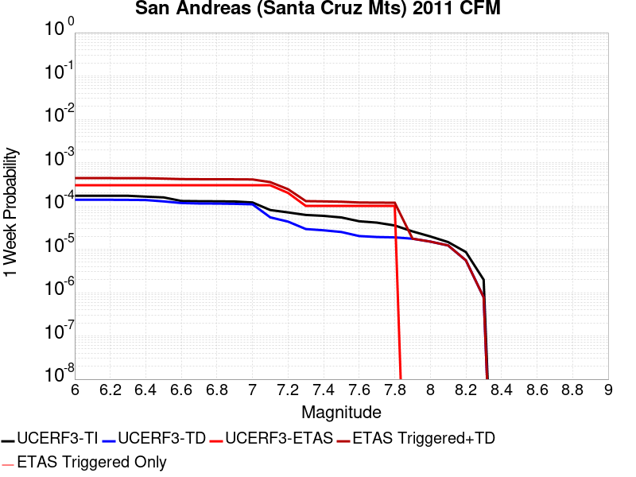 | 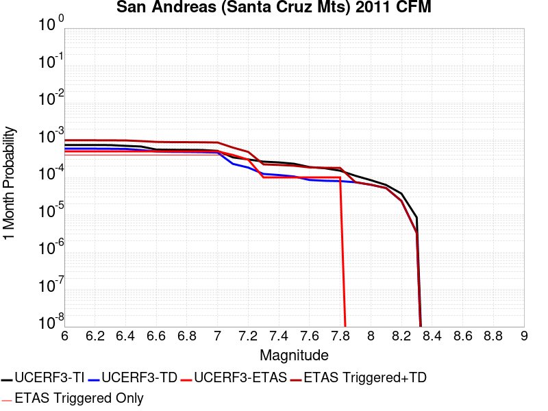 | 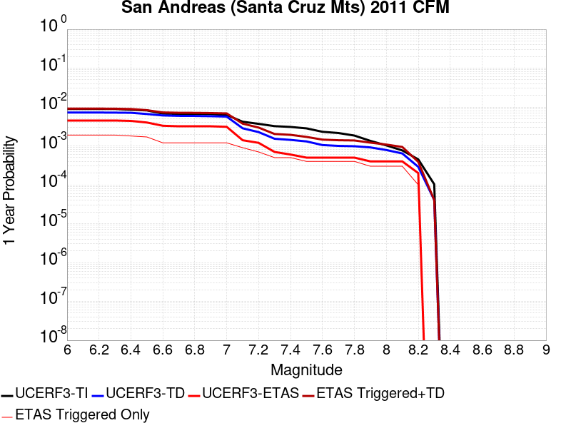 | 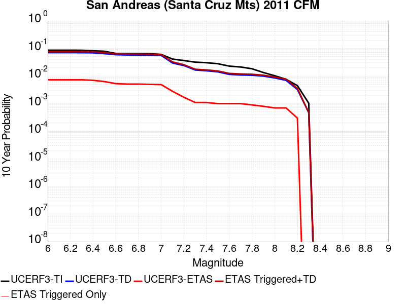 |

| Magnitude | 1 wk TI Prob | 1 wk TD Prob | 1 wk ETAS Prob | 1 wk ETAS/TD Gain | 1 wk ETAS Triggered+TD | 1 wk ETAS Triggered Only | 1 mo TI Prob | 1 mo TD Prob | 1 mo ETAS Prob | 1 mo ETAS/TD Gain | 1 mo ETAS Triggered+TD | 1 mo ETAS Triggered Only | 1 yr TI Prob | 1 yr TD Prob | 1 yr ETAS Prob | 1 yr ETAS/TD Gain | 1 yr ETAS Triggered+TD | 1 yr ETAS Triggered Only | 10 yr TI Prob | 10 yr TD Prob | 10 yr ETAS Prob | 10 yr ETAS/TD Gain | 10 yr ETAS Triggered+TD | 10 yr ETAS Triggered Only |
|-----|-----|-----|-----|-----|-----|-----|-----|-----|-----|-----|-----|-----|-----|-----|-----|-----|-----|-----|-----|-----|-----|-----|-----|-----|
| 6.0 | 1.7221631E-4 | 1.3888496E-4 | 3.0E-4 | 2.1600611 | 4.388433E-4 | 3.0E-4 | 7.378611E-4 | 5.9508753E-4 | 5.0E-4 | 0.8402125 | 9.948495E-4 | 4.0E-4 | 0.008946515 | 0.0072214995 | 0.0045 | 0.62313926 | 0.009107779 | 0.0019 | 0.08594794 | 0.07100087 | 0.0432 | 0.60844326 | 0.077782564 | 0.0073 |
| 6.1 | 1.7221631E-4 | 1.3888496E-4 | 3.0E-4 | 2.1600611 | 4.388433E-4 | 3.0E-4 | 7.378611E-4 | 5.9508753E-4 | 5.0E-4 | 0.8402125 | 9.948495E-4 | 4.0E-4 | 0.008946515 | 0.0072214995 | 0.0045 | 0.62313926 | 0.009107779 | 0.0019 | 0.08594794 | 0.07100087 | 0.0432 | 0.60844326 | 0.077782564 | 0.0073 |
| 6.2 | 1.7221631E-4 | 1.3888496E-4 | 3.0E-4 | 2.1600611 | 4.388433E-4 | 3.0E-4 | 7.378611E-4 | 5.9508753E-4 | 5.0E-4 | 0.8402125 | 9.948495E-4 | 4.0E-4 | 0.008946515 | 0.0072214995 | 0.0045 | 0.62313926 | 0.009107779 | 0.0019 | 0.08594794 | 0.07100087 | 0.0432 | 0.60844326 | 0.077782564 | 0.0073 |
| 6.3 | 1.716926E-4 | 1.3807727E-4 | 3.0E-4 | 2.1726964 | 4.3803584E-4 | 3.0E-4 | 7.3561794E-4 | 5.916276E-4 | 5.0E-4 | 0.8451262 | 9.91391E-4 | 4.0E-4 | 0.008919428 | 0.007179653 | 0.0045 | 0.6267713 | 0.009066012 | 0.0019 | 0.08569809 | 0.0706121 | 0.0431 | 0.61037695 | 0.07739664 | 0.0073 |
| 6.4 | 1.6392978E-4 | 1.368165E-4 | 3.0E-4 | 2.192718 | 4.3677544E-4 | 3.0E-4 | 7.02367E-4 | 5.862267E-4 | 5.0E-4 | 0.8529123 | 9.859923E-4 | 4.0E-4 | 0.008517839 | 0.0071143266 | 0.0044 | 0.6184703 | 0.008901521 | 0.0018 | 0.08198654 | 0.06983457 | 0.0425 | 0.6085811 | 0.07634573 | 0.007 |
| 6.5 | 1.5742714E-4 | 1.273864E-4 | 3.0E-4 | 2.3550394 | 4.273482E-4 | 3.0E-4 | 6.745133E-4 | 5.4582924E-4 | 5.0E-4 | 0.91603744 | 9.4561087E-4 | 4.0E-4 | 0.00818132 | 0.006625534 | 0.004 | 0.60372496 | 0.0083142705 | 0.0017 | 0.078865945 | 0.06529021 | 0.0391 | 0.5988646 | 0.07117889 | 0.0063 |
| 6.6 | 1.3038084E-4 | 1.1671606E-4 | 3.0E-4 | 2.5703404 | 4.1668105E-4 | 3.0E-4 | 5.5865536E-4 | 5.001171E-4 | 5.0E-4 | 0.9997659 | 8.9991704E-4 | 4.0E-4 | 0.006780438 | 0.0060721547 | 0.0033 | 0.5434644 | 0.007264868 | 0.0012 | 0.0657725 | 0.05971822 | 0.0352 | 0.58943486 | 0.06470171 | 0.0053 |
| 6.7 | 1.2867592E-4 | 1.13975744E-4 | 3.0E-4 | 2.632139 | 4.1394154E-4 | 3.0E-4 | 5.5135164E-4 | 4.883773E-4 | 5.0E-4 | 1.0237986 | 8.8818197E-4 | 4.0E-4 | 0.0066920654 | 0.0059300084 | 0.0032 | 0.5396282 | 0.0071228924 | 0.0012 | 0.06494093 | 0.058427285 | 0.0346 | 0.5921891 | 0.06322931 | 0.0051 |
| 6.8 | 1.2801298E-4 | 1.13350194E-4 | 3.0E-4 | 2.646665 | 4.133162E-4 | 3.0E-4 | 5.485117E-4 | 4.8569738E-4 | 5.0E-4 | 1.0294476 | 8.8550313E-4 | 4.0E-4 | 0.0066577005 | 0.0058975737 | 0.0032 | 0.54259604 | 0.0070904964 | 0.0012 | 0.06461738 | 0.058140777 | 0.0344 | 0.59166735 | 0.06294426 | 0.0051 |
| 6.9 | 1.269149E-4 | 1.1176878E-4 | 3.0E-4 | 2.6841128 | 4.1173524E-4 | 3.0E-4 | 5.4380763E-4 | 4.789224E-4 | 5.0E-4 | 1.0440105 | 8.7873085E-4 | 4.0E-4 | 0.006600777 | 0.005815531 | 0.0032 | 0.5502507 | 0.0070085526 | 0.0012 | 0.06408122 | 0.05741151 | 0.034 | 0.5922157 | 0.062124453 | 0.005 |
| 7.0 | 1.2030331E-4 | 1.090566E-4 | 3.0E-4 | 2.750865 | 4.090239E-4 | 3.0E-4 | 5.154837E-4 | 4.67303E-4 | 5.0E-4 | 1.0699695 | 8.671161E-4 | 4.0E-4 | 0.006257969 | 0.00567481 | 0.0031 | 0.5462738 | 0.006868 | 0.0012 | 0.06084648 | 0.056076918 | 0.0332 | 0.59204394 | 0.06070214 | 0.0049 |
| 7.1 | 8.049617E-5 | 5.4541768E-5 | 3.0E-4 | 5.5003715 | 3.545254E-4 | 3.0E-4 | 3.4493793E-4 | 2.3372969E-4 | 4.0E-4 | 1.7113786 | 6.336362E-4 | 4.0E-4 | 0.0041915346 | 0.0028419811 | 0.0014 | 0.49261412 | 0.0037394234 | 9.0E-4 | 0.041133516 | 0.029923929 | 0.0162 | 0.5413728 | 0.03264014 | 0.0028 |
| 7.2 | 7.093979E-5 | 4.3483044E-5 | 2.0E-4 | 4.5994945 | 2.4347435E-4 | 2.0E-4 | 3.0399222E-4 | 1.8634272E-4 | 3.0E-4 | 1.6099368 | 4.8628682E-4 | 3.0E-4 | 0.0036948253 | 0.0022663854 | 0.0012 | 0.5294775 | 0.0029647988 | 7.0E-4 | 0.03633994 | 0.024215734 | 0.0133 | 0.5492297 | 0.025874566 | 0.0017 |
| 7.3 | 6.193693E-5 | 2.930326E-5 | 1.0E-4 | 3.4125896 | 1.2930033E-4 | 1.0E-4 | 2.6541698E-4 | 1.2557936E-4 | 1.0E-4 | 0.7963092 | 2.2556681E-4 | 1.0E-4 | 0.0032266637 | 0.0015278583 | 7.0E-4 | 0.4581577 | 0.0020270944 | 5.0E-4 | 0.031802133 | 0.016713494 | 0.0096 | 0.5743861 | 0.01779511 | 0.0011 |
| 7.4 | 5.906492E-5 | 2.7408894E-5 | 1.0E-4 | 3.6484506 | 1.2740615E-4 | 1.0E-4 | 2.5311083E-4 | 1.1746141E-4 | 1.0E-4 | 0.8513434 | 2.1744966E-4 | 1.0E-4 | 0.0030772698 | 0.001429156 | 6.0E-4 | 0.4198282 | 0.0019284415 | 5.0E-4 | 0.030350044 | 0.01567405 | 0.009 | 0.5741974 | 0.01675681 | 0.0011 |
| 7.5 | 5.424296E-5 | 2.5031419E-5 | 1.0E-4 | 3.9949791 | 1.2502892E-4 | 1.0E-4 | 2.324491E-4 | 1.072731E-4 | 1.0E-4 | 0.93220013 | 2.0726238E-4 | 1.0E-4 | 0.002826395 | 0.0013052688 | 5.0E-4 | 0.38306287 | 0.0017047466 | 4.0E-4 | 0.027907165 | 0.014350764 | 0.0078 | 0.54352504 | 0.015336413 | 0.001 |
| 7.6 | 4.43084E-5 | 2.0182793E-5 | 1.0E-4 | 4.9547157 | 1.20180775E-4 | 1.0E-4 | 1.8987931E-4 | 8.6494816E-5 | 1.0E-4 | 1.1561387 | 1.8648617E-4 | 1.0E-4 | 0.0023093296 | 0.0010525659 | 5.0E-4 | 0.47502962 | 0.0014521449 | 4.0E-4 | 0.022854783 | 0.011561381 | 0.0071 | 0.6141135 | 0.012549819 | 0.001 |
| 7.7 | 4.118098E-5 | 1.9202513E-5 | 1.0E-4 | 5.207652 | 1.19200595E-4 | 1.0E-4 | 1.7647797E-4 | 8.229389E-5 | 1.0E-4 | 1.2151572 | 1.8228566E-4 | 1.0E-4 | 0.002146502 | 0.0010014678 | 5.0E-4 | 0.4992672 | 0.0014010672 | 4.0E-4 | 0.021258866 | 0.011012672 | 0.0066 | 0.59930956 | 0.01200166 | 0.001 |
| 7.8 | 3.5408906E-5 | 1.8823164E-5 | 1.0E-4 | 5.312603 | 1.18821285E-4 | 1.0E-4 | 1.5174363E-4 | 8.066821E-5 | 1.0E-4 | 1.2396457 | 1.8066014E-4 | 1.0E-4 | 0.0018459131 | 9.816932E-4 | 5.0E-4 | 0.50932413 | 0.0013813005 | 4.0E-4 | 0.018306552 | 0.010790066 | 0.0063 | 0.58387035 | 0.011680355 | 9.0E-4 |
| 7.9 | 2.5860836E-5 | 1.7549322E-5 | 0.0 | 0.0 | 1.7549322E-5 | 0.0 | 1.10827445E-4 | 7.520922E-5 | 0.0 | 0.0 | 7.520922E-5 | 0.0 | 0.001348489 | 9.152878E-4 | 4.0E-4 | 0.43702102 | 0.0012150132 | 3.0E-4 | 0.013403354 | 0.010031279 | 0.0059 | 0.5881603 | 0.010823254 | 8.0E-4 |
| 8.0 | 1.9777332E-5 | 1.5036037E-5 | 0.0 | 0.0 | 1.5036037E-5 | 0.0 | 8.4757245E-5 | 6.443857E-5 | 0.0 | 0.0 | 6.443857E-5 | 0.0 | 0.0010314309 | 7.8425737E-4 | 4.0E-4 | 0.51003665 | 0.0010840221 | 3.0E-4 | 0.010266567 | 0.008613404 | 0.0051 | 0.59210044 | 0.009307374 | 7.0E-4 |
| 8.1 | 1.468494E-5 | 1.2266564E-5 | 0.0 | 0.0 | 1.2266564E-5 | 0.0 | 6.293394E-5 | 5.256993E-5 | 0.0 | 0.0 | 5.256993E-5 | 0.0 | 7.6595135E-4 | 6.3985115E-4 | 4.0E-4 | 0.6251454 | 9.396592E-4 | 3.0E-4 | 0.0076331664 | 0.00705425 | 0.0039 | 0.5528582 | 0.0077493126 | 7.0E-4 |
| 8.2 | 8.63836E-6 | 5.5506457E-6 | 0.0 | 0.0 | 5.5506457E-6 | 0.0 | 3.7021015E-5 | 2.3788265E-5 | 0.0 | 0.0 | 2.3788265E-5 | 0.0 | 4.5063766E-4 | 2.8958372E-4 | 2.0E-4 | 0.6906466 | 3.8955474E-4 | 1.0E-4 | 0.004497249 | 0.0032903655 | 0.0021 | 0.638227 | 0.0035893782 | 3.0E-4 |
| 8.3 | 1.983087E-6 | 7.792044E-7 | 0.0 | 0.0 | 7.792044E-7 | 0.0 | 8.498917E-6 | 3.3394433E-6 | 0.0 | 0.0 | 3.3394433E-6 | 0.0 | 1.034694E-4 | 4.065698E-5 | 0.0 | 0.0 | 4.065698E-5 | 0.0 | 0.0010342124 | 4.7958124E-4 | 2.0E-4 | 0.41703048 | 4.7958124E-4 | 0.0 |

## Ash Hill
*[(top)](#table-of-contents)*

| 1 Week | 1 Month | 1 Year | 10 Year |
|-----|-----|-----|-----|
| 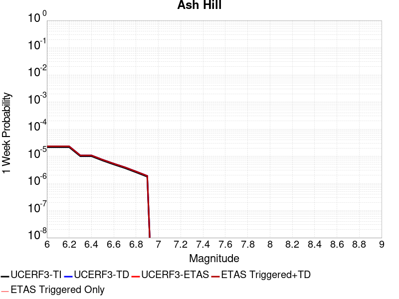 | 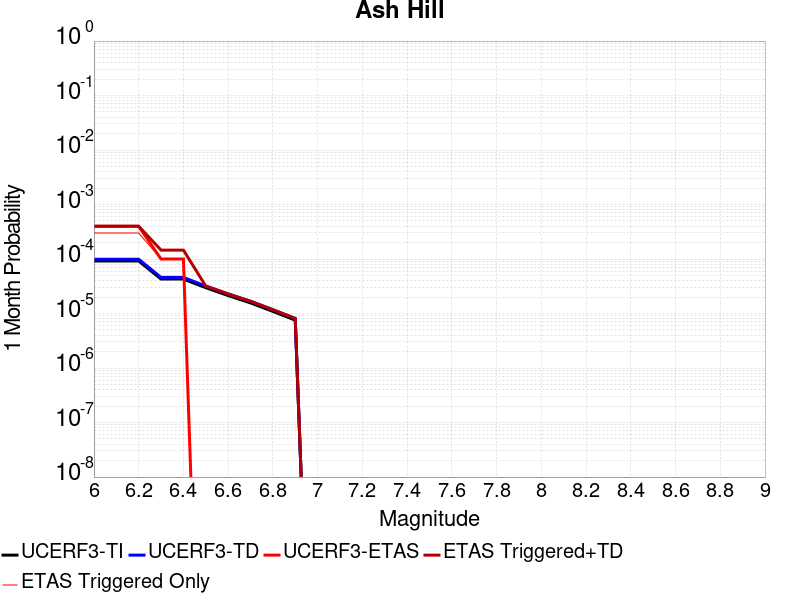 | 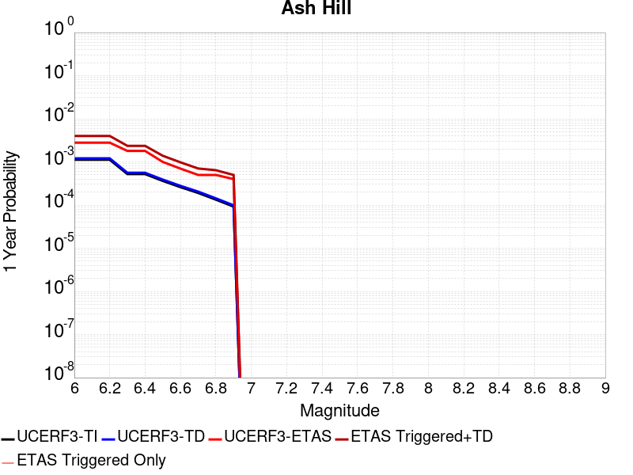 | 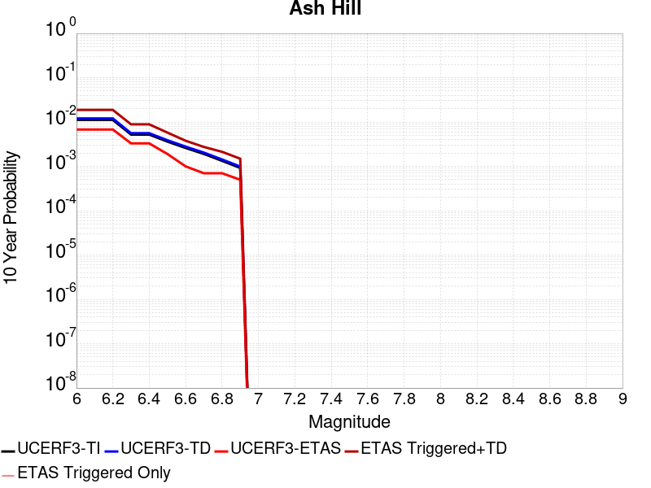 |

| Magnitude | 1 wk TI Prob | 1 wk TD Prob | 1 wk ETAS Prob | 1 wk ETAS/TD Gain | 1 wk ETAS Triggered+TD | 1 wk ETAS Triggered Only | 1 mo TI Prob | 1 mo TD Prob | 1 mo ETAS Prob | 1 mo ETAS/TD Gain | 1 mo ETAS Triggered+TD | 1 mo ETAS Triggered Only | 1 yr TI Prob | 1 yr TD Prob | 1 yr ETAS Prob | 1 yr ETAS/TD Gain | 1 yr ETAS Triggered+TD | 1 yr ETAS Triggered Only | 10 yr TI Prob | 10 yr TD Prob | 10 yr ETAS Prob | 10 yr ETAS/TD Gain | 10 yr ETAS Triggered+TD | 10 yr ETAS Triggered Only |
|-----|-----|-----|-----|-----|-----|-----|-----|-----|-----|-----|-----|-----|-----|-----|-----|-----|-----|-----|-----|-----|-----|-----|-----|-----|
| 6.0 | 2.1545662E-5 | 2.3198105E-5 | 1.0E-4 | 4.310697 | 2.3198105E-5 | 0.0 | 9.2335285E-5 | 9.941711E-5 | 4.0E-4 | 4.0234523 | 3.993873E-4 | 3.0E-4 | 0.0011236023 | 0.0012098112 | 0.0037 | 3.0583284 | 0.004006424 | 0.0028 | 0.011179381 | 0.012040237 | 0.0148 | 1.2292117 | 0.018758364 | 0.0068 |
| 6.1 | 2.1545662E-5 | 2.3198105E-5 | 1.0E-4 | 4.310697 | 2.3198105E-5 | 0.0 | 9.2335285E-5 | 9.941711E-5 | 4.0E-4 | 4.0234523 | 3.993873E-4 | 3.0E-4 | 0.0011236023 | 0.0012098112 | 0.0037 | 3.0583284 | 0.004006424 | 0.0028 | 0.011179381 | 0.012040237 | 0.0148 | 1.2292117 | 0.018758364 | 0.0068 |
| 6.2 | 2.1545662E-5 | 2.3198105E-5 | 1.0E-4 | 4.310697 | 2.3198105E-5 | 0.0 | 9.2335285E-5 | 9.941711E-5 | 4.0E-4 | 4.0234523 | 3.993873E-4 | 3.0E-4 | 0.0011236023 | 0.0012098112 | 0.0037 | 3.0583284 | 0.004006424 | 0.0028 | 0.011179381 | 0.012040237 | 0.0148 | 1.2292117 | 0.018758364 | 0.0068 |
| 6.3 | 1.0025529E-5 | 1.0748527E-5 | 0.0 | 0.0 | 1.0748527E-5 | 0.0 | 4.2965847E-5 | 4.606438E-5 | 1.0E-4 | 2.1708748 | 1.4605977E-4 | 1.0E-4 | 5.229836E-4 | 5.607027E-4 | 0.0023 | 4.1019955 | 0.0023596934 | 0.0018 | 0.005217545 | 0.005594193 | 0.0064 | 1.1440434 | 0.008875732 | 0.0033 |
| 6.4 | 1.0025529E-5 | 1.0748527E-5 | 0.0 | 0.0 | 1.0748527E-5 | 0.0 | 4.2965847E-5 | 4.606438E-5 | 1.0E-4 | 2.1708748 | 1.4605977E-4 | 1.0E-4 | 5.229836E-4 | 5.607027E-4 | 0.0023 | 4.1019955 | 0.0023596934 | 0.0018 | 0.005217545 | 0.005594193 | 0.0064 | 1.1440434 | 0.008875732 | 0.0033 |
| 6.5 | 6.9617327E-6 | 7.4577256E-6 | 0.0 | 0.0 | 7.4577256E-6 | 0.0 | 2.9835655E-5 | 3.196134E-5 | 0.0 | 0.0 | 3.196134E-5 | 0.0 | 3.6318856E-4 | 3.890685E-4 | 0.0012 | 3.0842898 | 0.0013886794 | 0.001 | 0.0036259557 | 0.003884728 | 0.004 | 1.0296731 | 0.005777347 | 0.0019 |
| 6.6 | 4.9919777E-6 | 5.3474705E-6 | 0.0 | 0.0 | 5.3474705E-6 | 0.0 | 2.1394015E-5 | 2.2917568E-5 | 0.0 | 0.0 | 2.2917568E-5 | 0.0 | 2.60441E-4 | 2.7899237E-4 | 9.0E-4 | 3.2258947 | 9.787971E-4 | 7.0E-4 | 0.0026013597 | 0.00278708 | 0.0024 | 0.8611163 | 0.0037842928 | 0.001 |
| 6.7 | 3.6630722E-6 | 3.925201E-6 | 0.0 | 0.0 | 3.925201E-6 | 0.0 | 1.5698786E-5 | 1.6822212E-5 | 0.0 | 0.0 | 1.6822212E-5 | 0.0 | 1.9111596E-4 | 2.0479693E-4 | 7.0E-4 | 3.41802 | 7.0469454E-4 | 5.0E-4 | 0.0019095168 | 0.0020466452 | 0.0017 | 0.8306276 | 0.0027452125 | 7.0E-4 |
| 6.8 | 2.5599613E-6 | 2.7453334E-6 | 0.0 | 0.0 | 2.7453334E-6 | 0.0 | 1.0971216E-5 | 1.176569E-5 | 0.0 | 0.0 | 1.176569E-5 | 0.0 | 1.3356637E-4 | 1.4324281E-4 | 6.0E-4 | 4.188692 | 6.431712E-4 | 5.0E-4 | 0.0013348613 | 0.0014319898 | 0.0015 | 1.0474935 | 0.0021309874 | 7.0E-4 |
| 6.9 | 1.7684905E-6 | 1.8971543E-6 | 0.0 | 0.0 | 1.8971543E-6 | 0.0 | 7.579223E-6 | 8.130662E-6 | 0.0 | 0.0 | 8.130662E-6 | 0.0 | 9.2273134E-5 | 9.89908E-5 | 5.0E-4 | 5.0509744 | 4.989512E-4 | 4.0E-4 | 9.223483E-4 | 9.89908E-4 | 0.001 | 1.0101949 | 0.0014894131 | 5.0E-4 |

## Hayward (No) 2011 CFM
*[(top)](#table-of-contents)*

| 1 Week | 1 Month | 1 Year | 10 Year |
|-----|-----|-----|-----|
| 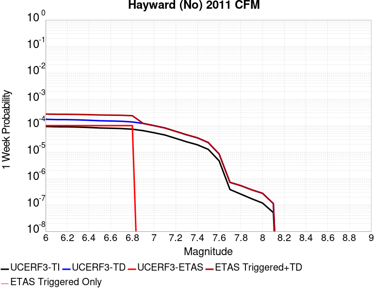 | 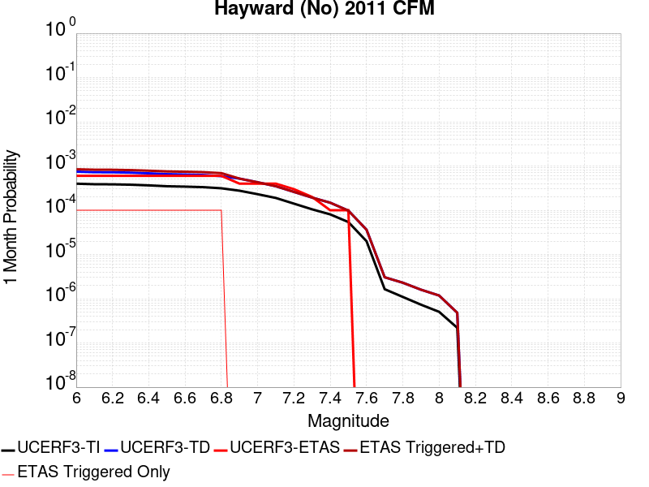 | 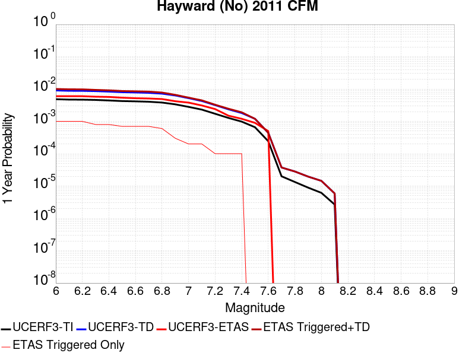 | 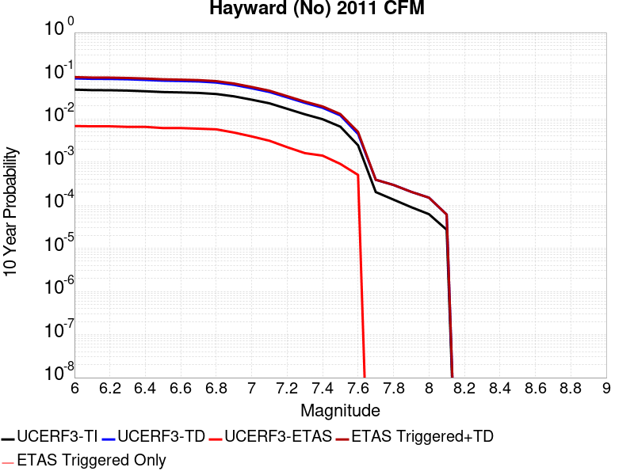 |

| Magnitude | 1 wk TI Prob | 1 wk TD Prob | 1 wk ETAS Prob | 1 wk ETAS/TD Gain | 1 wk ETAS Triggered+TD | 1 wk ETAS Triggered Only | 1 mo TI Prob | 1 mo TD Prob | 1 mo ETAS Prob | 1 mo ETAS/TD Gain | 1 mo ETAS Triggered+TD | 1 mo ETAS Triggered Only | 1 yr TI Prob | 1 yr TD Prob | 1 yr ETAS Prob | 1 yr ETAS/TD Gain | 1 yr ETAS Triggered+TD | 1 yr ETAS Triggered Only | 10 yr TI Prob | 10 yr TD Prob | 10 yr ETAS Prob | 10 yr ETAS/TD Gain | 10 yr ETAS Triggered+TD | 10 yr ETAS Triggered Only |
|-----|-----|-----|-----|-----|-----|-----|-----|-----|-----|-----|-----|-----|-----|-----|-----|-----|-----|-----|-----|-----|-----|-----|-----|-----|
| 6.0 | 9.3068506E-5 | 1.7427302E-4 | 3.0E-4 | 1.7214367 | 2.742556E-4 | 1.0E-4 | 3.9880406E-4 | 7.4667035E-4 | 6.0E-4 | 0.80356747 | 8.465957E-4 | 1.0E-4 | 0.0048446343 | 0.009052697 | 0.006 | 0.66278595 | 0.010043644 | 0.001 | 0.047403704 | 0.08649534 | 0.051 | 0.58962715 | 0.09270717 | 0.0068 |
| 6.1 | 9.055486E-5 | 1.69782E-4 | 3.0E-4 | 1.7669718 | 2.69765E-4 | 1.0E-4 | 3.880345E-4 | 7.274346E-4 | 6.0E-4 | 0.82481647 | 8.2736183E-4 | 1.0E-4 | 0.0047140904 | 0.008820625 | 0.006 | 0.6802239 | 0.009811805 | 0.001 | 0.046153355 | 0.084392205 | 0.0503 | 0.5960266 | 0.09052678 | 0.0067 |
| 6.2 | 9.006742E-5 | 1.6898729E-4 | 3.0E-4 | 1.7752815 | 2.6897038E-4 | 1.0E-4 | 3.859461E-4 | 7.240308E-4 | 6.0E-4 | 0.8286941 | 8.2395837E-4 | 1.0E-4 | 0.0046887742 | 0.0087795565 | 0.006 | 0.6834058 | 0.009770777 | 0.001 | 0.0459107 | 0.08401618 | 0.0502 | 0.59750396 | 0.09015328 | 0.0067 |
| 6.3 | 8.8336754E-5 | 1.6578166E-4 | 3.0E-4 | 1.809609 | 2.657651E-4 | 1.0E-4 | 3.7853114E-4 | 7.103001E-4 | 6.0E-4 | 0.8447134 | 8.102291E-4 | 1.0E-4 | 0.004598882 | 0.008613773 | 0.0058 | 0.67334026 | 0.009406881 | 8.0E-4 | 0.04504866 | 0.08250794 | 0.0498 | 0.60357827 | 0.088471636 | 0.0065 |
| 6.4 | 8.526157E-5 | 1.6004455E-4 | 3.0E-4 | 1.8744781 | 2.6002855E-4 | 1.0E-4 | 3.6535555E-4 | 6.857256E-4 | 6.0E-4 | 0.8749856 | 7.8565703E-4 | 1.0E-4 | 0.0044391346 | 0.008316911 | 0.0057 | 0.68535066 | 0.009110257 | 8.0E-4 | 0.043514993 | 0.07981623 | 0.0485 | 0.60764587 | 0.08579742 | 0.0065 |
| 6.5 | 8.152396E-5 | 1.5336619E-4 | 3.0E-4 | 1.9561026 | 2.5335085E-4 | 1.0E-4 | 3.493416E-4 | 6.571188E-4 | 6.0E-4 | 0.91307694 | 7.570531E-4 | 1.0E-4 | 0.0042449418 | 0.007971224 | 0.0054 | 0.6774367 | 0.008665645 | 7.0E-4 | 0.04164765 | 0.07664733 | 0.0464 | 0.6053701 | 0.08227977 | 0.0061 |
| 6.6 | 7.987405E-5 | 1.5040739E-4 | 3.0E-4 | 1.9945828 | 2.5039236E-4 | 1.0E-4 | 3.4227243E-4 | 6.4444455E-4 | 6.0E-4 | 0.9310343 | 7.443801E-4 | 1.0E-4 | 0.0041592065 | 0.007818044 | 0.0052 | 0.665128 | 0.008512571 | 7.0E-4 | 0.04082218 | 0.07523976 | 0.0457 | 0.6073916 | 0.080880806 | 0.0061 |
| 6.7 | 7.777665E-5 | 1.4679358E-4 | 3.0E-4 | 2.0436862 | 2.467789E-4 | 1.0E-4 | 3.332859E-4 | 6.2896434E-4 | 6.0E-4 | 0.95394915 | 7.289014E-4 | 1.0E-4 | 0.004050208 | 0.0076309093 | 0.0051 | 0.6683345 | 0.0083255675 | 7.0E-4 | 0.039771806 | 0.07351353 | 0.0447 | 0.60805136 | 0.0789798 | 0.0059 |
| 6.8 | 7.3284005E-5 | 1.3828382E-4 | 3.0E-4 | 2.169451 | 2.3827E-4 | 1.0E-4 | 3.140365E-4 | 5.92511E-4 | 6.0E-4 | 1.0126394 | 6.924517E-4 | 1.0E-4 | 0.0038166929 | 0.0071900985 | 0.0049 | 0.68149275 | 0.0077857845 | 6.0E-4 | 0.037518036 | 0.06942064 | 0.0428 | 0.6165313 | 0.07472494 | 0.0057 |
| 6.9 | 6.458263E-5 | 1.2155625E-4 | 2.0E-4 | 1.6453289 | 1.2155625E-4 | 0.0 | 2.7675333E-4 | 5.208518E-4 | 4.0E-4 | 0.76797277 | 5.208518E-4 | 0.0 | 0.0033642664 | 0.006323034 | 0.0042 | 0.6642381 | 0.0066211373 | 3.0E-4 | 0.033137884 | 0.06133483 | 0.0395 | 0.644006 | 0.06584042 | 0.0048 |
| 7.0 | 5.3853604E-5 | 1.00456404E-4 | 2.0E-4 | 1.9909133 | 1.00456404E-4 | 0.0 | 2.3078074E-4 | 4.3045674E-4 | 4.0E-4 | 0.92924553 | 4.3045674E-4 | 0.0 | 0.0028061352 | 0.005228282 | 0.0038 | 0.72681624 | 0.005427236 | 2.0E-4 | 0.027709642 | 0.05105175 | 0.0341 | 0.6679497 | 0.054752648 | 0.0039 |
| 7.1 | 4.4308683E-5 | 8.18849E-5 | 2.0E-4 | 2.4424527 | 8.18849E-5 | 0.0 | 1.8988053E-4 | 3.5088832E-4 | 4.0E-4 | 1.1399639 | 3.5088832E-4 | 0.0 | 0.0023093442 | 0.004263738 | 0.0031 | 0.7270615 | 0.0044628857 | 2.0E-4 | 0.022854926 | 0.04190644 | 0.0272 | 0.64906496 | 0.044876527 | 0.0031 |
| 7.2 | 3.295973E-5 | 6.0928294E-5 | 1.0E-4 | 1.6412736 | 6.0928294E-5 | 0.0 | 1.4124835E-4 | 2.6109527E-4 | 3.0E-4 | 1.149006 | 2.6109527E-4 | 0.0 | 0.0017183421 | 0.003174224 | 0.0024 | 0.75609034 | 0.0032739067 | 1.0E-4 | 0.017051157 | 0.031442888 | 0.0207 | 0.65833646 | 0.033573717 | 0.0022 |
| 7.3 | 2.452256E-5 | 4.5309753E-5 | 0.0 | 0.0 | 4.5309753E-5 | 0.0 | 1.05092455E-4 | 1.9417028E-4 | 2.0E-4 | 1.0300238 | 1.9417028E-4 | 0.0 | 0.0012787496 | 0.0023614739 | 0.0015 | 0.6351965 | 0.0024612378 | 1.0E-4 | 0.0127141625 | 0.0235031 | 0.0153 | 0.6509779 | 0.025065497 | 0.0016 |
| 7.4 | 1.8829967E-5 | 3.470793E-5 | 0.0 | 0.0 | 3.470793E-5 | 0.0 | 8.069736E-5 | 1.4873984E-4 | 1.0E-4 | 0.6723148 | 1.4873984E-4 | 0.0 | 9.820475E-4 | 0.0018094133 | 0.0012 | 0.6631984 | 0.0019092323 | 1.0E-4 | 0.009777189 | 0.018069806 | 0.0119 | 0.6585572 | 0.019444507 | 0.0014 |
| 7.5 | 1.26374125E-5 | 2.2999302E-5 | 0.0 | 0.0 | 2.2999302E-5 | 0.0 | 5.4159216E-5 | 9.856474E-5 | 1.0E-4 | 1.0145615 | 9.856474E-5 | 0.0 | 6.5918895E-4 | 0.001199371 | 9.0E-4 | 0.75039333 | 0.001199371 | 0.0 | 0.00657237 | 0.012026596 | 0.008 | 0.66519237 | 0.012915772 | 9.0E-4 |
| 7.6 | 4.666429E-6 | 8.510513E-6 | 0.0 | 0.0 | 8.510513E-6 | 0.0 | 1.9998828E-5 | 3.6473124E-5 | 0.0 | 0.0 | 3.6473124E-5 | 0.0 | 2.4345852E-4 | 4.4397105E-4 | 5.0E-4 | 1.1261996 | 4.4397105E-4 | 0.0 | 0.0024319198 | 0.004474019 | 0.0034 | 0.75994307 | 0.004971782 | 5.0E-4 |
| 7.7 | 3.8399318E-7 | 7.1823865E-7 | 0.0 | 0.0 | 7.1823865E-7 | 0.0 | 1.6456839E-6 | 3.078162E-6 | 0.0 | 0.0 | 3.078162E-6 | 0.0 | 2.003602E-5 | 3.747598E-5 | 0.0 | 0.0 | 3.747598E-5 | 0.0 | 2.0034213E-4 | 3.8851643E-4 | 1.0E-4 | 0.25738937 | 3.8851643E-4 | 0.0 |
| 7.8 | 2.5637698E-7 | 5.408298E-7 | 0.0 | 0.0 | 5.408298E-7 | 0.0 | 1.098758E-6 | 2.3178397E-6 | 0.0 | 0.0 | 2.3178397E-6 | 0.0 | 1.3377297E-5 | 2.8219334E-5 | 0.0 | 0.0 | 2.8219334E-5 | 0.0 | 1.3376492E-4 | 2.9449348E-4 | 1.0E-4 | 0.3395661 | 2.9449348E-4 | 0.0 |
| 7.9 | 1.7141245E-7 | 3.7582248E-7 | 0.0 | 0.0 | 3.7582248E-7 | 0.0 | 7.3462456E-7 | 1.6106667E-6 | 0.0 | 0.0 | 1.6106667E-6 | 0.0 | 8.944017E-6 | 1.9609692E-5 | 0.0 | 0.0 | 1.9609692E-5 | 0.0 | 8.943657E-5 | 2.0387712E-4 | 1.0E-4 | 0.49049154 | 2.0387712E-4 | 0.0 |
| 8.0 | 1.1808895E-7 | 2.771527E-7 | 0.0 | 0.0 | 2.771527E-7 | 0.0 | 5.060954E-7 | 1.1877967E-6 | 0.0 | 0.0 | 1.1877967E-6 | 0.0 | 6.161694E-6 | 1.446133E-5 | 0.0 | 0.0 | 1.446133E-5 | 0.0 | 6.161523E-5 | 1.4915691E-4 | 1.0E-4 | 0.6704349 | 1.4915691E-4 | 0.0 |
| 8.1 | 5.138535E-8 | 1.1310068E-7 | 0.0 | 0.0 | 1.1310068E-7 | 0.0 | 2.2022292E-7 | 4.847171E-7 | 0.0 | 0.0 | 4.847171E-7 | 0.0 | 2.6812106E-6 | 5.901415E-6 | 0.0 | 0.0 | 5.901415E-6 | 0.0 | 2.6811784E-5 | 6.0557955E-5 | 1.0E-4 | 1.6513108 | 6.0557955E-5 | 0.0 |

## Hunter Mountain-Saline Valley
*[(top)](#table-of-contents)*

| 1 Week | 1 Month | 1 Year | 10 Year |
|-----|-----|-----|-----|
| 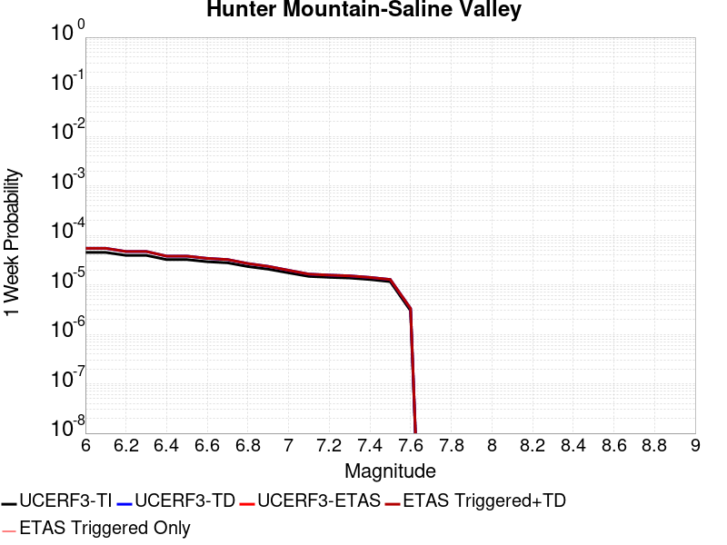 | 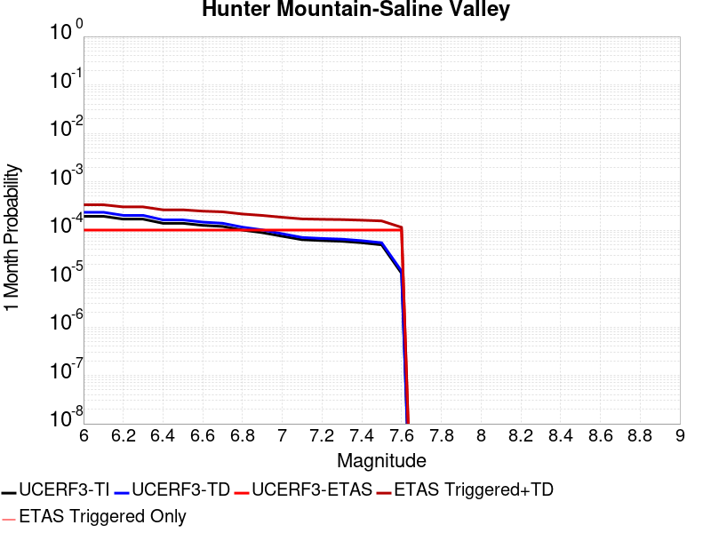 | 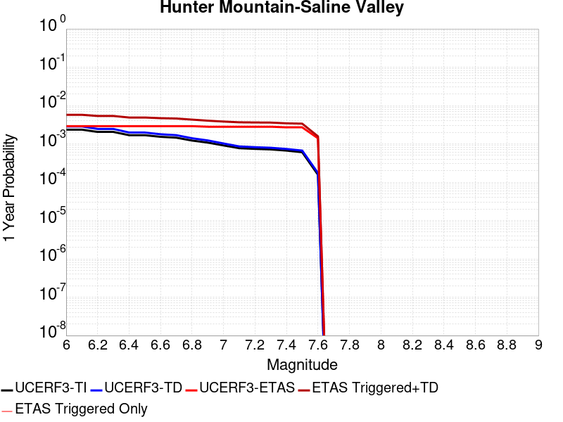 | 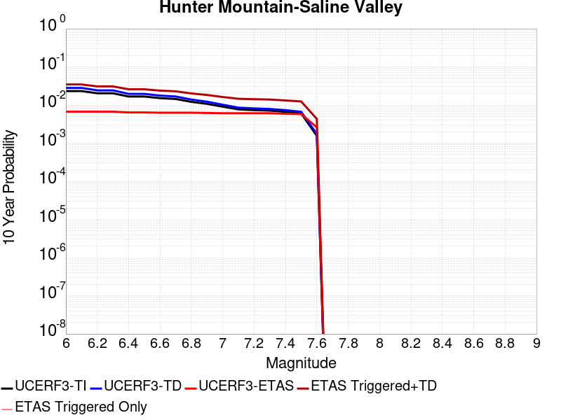 |

| Magnitude | 1 wk TI Prob | 1 wk TD Prob | 1 wk ETAS Prob | 1 wk ETAS/TD Gain | 1 wk ETAS Triggered+TD | 1 wk ETAS Triggered Only | 1 mo TI Prob | 1 mo TD Prob | 1 mo ETAS Prob | 1 mo ETAS/TD Gain | 1 mo ETAS Triggered+TD | 1 mo ETAS Triggered Only | 1 yr TI Prob | 1 yr TD Prob | 1 yr ETAS Prob | 1 yr ETAS/TD Gain | 1 yr ETAS Triggered+TD | 1 yr ETAS Triggered Only | 10 yr TI Prob | 10 yr TD Prob | 10 yr ETAS Prob | 10 yr ETAS/TD Gain | 10 yr ETAS Triggered+TD | 10 yr ETAS Triggered Only |
|-----|-----|-----|-----|-----|-----|-----|-----|-----|-----|-----|-----|-----|-----|-----|-----|-----|-----|-----|-----|-----|-----|-----|-----|-----|
| 6.0 | 4.5103672E-5 | 5.459577E-5 | 0.0 | 0.0 | 5.459577E-5 | 0.0 | 1.9328714E-4 | 2.3396156E-4 | 2.0E-4 | 0.8548413 | 3.3393817E-4 | 1.0E-4 | 0.002350731 | 0.002844936 | 0.0041 | 1.4411572 | 0.005736686 | 0.0029 | 0.023260195 | 0.028104633 | 0.02 | 0.7116264 | 0.034616333 | 0.0067 |
| 6.1 | 4.5103672E-5 | 5.459577E-5 | 0.0 | 0.0 | 5.459577E-5 | 0.0 | 1.9328714E-4 | 2.3396156E-4 | 2.0E-4 | 0.8548413 | 3.3393817E-4 | 1.0E-4 | 0.002350731 | 0.002844936 | 0.0041 | 1.4411572 | 0.005736686 | 0.0029 | 0.023260195 | 0.028104633 | 0.02 | 0.7116264 | 0.034616333 | 0.0067 |
| 6.2 | 3.9363465E-5 | 4.7084824E-5 | 0.0 | 0.0 | 4.7084824E-5 | 0.0 | 1.6868966E-4 | 2.0177738E-4 | 2.0E-4 | 0.9911914 | 3.017572E-4 | 1.0E-4 | 0.002051862 | 0.002454005 | 0.004 | 1.6299886 | 0.005346888 | 0.0029 | 0.020330196 | 0.024283925 | 0.0187 | 0.7700567 | 0.030821223 | 0.0067 |
| 6.3 | 3.9363465E-5 | 4.7084824E-5 | 0.0 | 0.0 | 4.7084824E-5 | 0.0 | 1.6868966E-4 | 2.0177738E-4 | 2.0E-4 | 0.9911914 | 3.017572E-4 | 1.0E-4 | 0.002051862 | 0.002454005 | 0.004 | 1.6299886 | 0.005346888 | 0.0029 | 0.020330196 | 0.024283925 | 0.0187 | 0.7700567 | 0.030821223 | 0.0067 |
| 6.4 | 3.2311684E-5 | 3.7967904E-5 | 0.0 | 0.0 | 3.7967904E-5 | 0.0 | 1.384713E-4 | 1.6270985E-4 | 2.0E-4 | 1.2291819 | 2.626936E-4 | 1.0E-4 | 0.0016845843 | 0.0019792616 | 0.0039 | 1.9704319 | 0.0048735216 | 0.0029 | 0.016718714 | 0.01962419 | 0.0167 | 0.85099053 | 0.025898594 | 0.0064 |
| 6.5 | 3.2311684E-5 | 3.7967904E-5 | 0.0 | 0.0 | 3.7967904E-5 | 0.0 | 1.384713E-4 | 1.6270985E-4 | 2.0E-4 | 1.2291819 | 2.626936E-4 | 1.0E-4 | 0.0016845843 | 0.0019792616 | 0.0039 | 1.9704319 | 0.0048735216 | 0.0029 | 0.016718714 | 0.01962419 | 0.0167 | 0.85099053 | 0.025898594 | 0.0064 |
| 6.6 | 2.9305844E-5 | 3.4196804E-5 | 0.0 | 0.0 | 3.4196804E-5 | 0.0 | 1.2559042E-4 | 1.4654986E-4 | 2.0E-4 | 1.3647232 | 2.465352E-4 | 1.0E-4 | 0.0015279909 | 0.0017828459 | 0.0039 | 2.1875138 | 0.0046776757 | 0.0029 | 0.015175272 | 0.017692415 | 0.016 | 0.90434235 | 0.023880953 | 0.0063 |
| 6.7 | 2.7826512E-5 | 3.235829E-5 | 0.0 | 0.0 | 3.235829E-5 | 0.0 | 1.19251024E-4 | 1.3867136E-4 | 2.0E-4 | 1.442259 | 2.3865748E-4 | 1.0E-4 | 0.0014509142 | 0.0016870765 | 0.0039 | 2.3116913 | 0.004582184 | 0.0029 | 0.014414776 | 0.01674945 | 0.0155 | 0.92540354 | 0.022943929 | 0.0063 |
| 6.8 | 2.3389874E-5 | 2.6878079E-5 | 0.0 | 0.0 | 2.6878079E-5 | 0.0 | 1.0023846E-4 | 1.15186944E-4 | 2.0E-4 | 1.7363079 | 2.1517543E-4 | 1.0E-4 | 0.00121972 | 0.0014015462 | 0.0038 | 2.7112913 | 0.004297482 | 0.0029 | 0.01213047 | 0.01393235 | 0.0141 | 1.0120331 | 0.020144576 | 0.0063 |
| 6.9 | 2.069209E-5 | 2.3579887E-5 | 0.0 | 0.0 | 2.3579887E-5 | 0.0 | 8.867737E-5 | 1.0105295E-4 | 2.0E-4 | 1.9791604 | 2.0104284E-4 | 1.0E-4 | 0.0010791123 | 0.0012296614 | 0.0035 | 2.846312 | 0.0040262183 | 0.0028 | 0.010738871 | 0.01223267 | 0.0132 | 1.0790776 | 0.018356826 | 0.0062 |
| 7.0 | 1.7462342E-5 | 1.9641626E-5 | 0.0 | 0.0 | 1.9641626E-5 | 0.0 | 7.483646E-5 | 8.417581E-5 | 2.0E-4 | 2.3759797 | 1.841674E-4 | 1.0E-4 | 9.1075303E-4 | 0.0010243813 | 0.0033 | 3.2214568 | 0.003821513 | 0.0028 | 0.009070295 | 0.010199289 | 0.012 | 1.1765527 | 0.016237073 | 0.0061 |
| 7.1 | 1.4807709E-5 | 1.6448499E-5 | 0.0 | 0.0 | 1.6448499E-5 | 0.0 | 6.3460066E-5 | 7.0491755E-5 | 2.0E-4 | 2.8372114 | 1.7048471E-4 | 1.0E-4 | 7.723524E-4 | 8.579157E-4 | 0.0032 | 3.7299702 | 0.0036555135 | 0.0028 | 0.007696735 | 0.008548085 | 0.0112 | 1.3102351 | 0.014595941 | 0.0061 |
| 7.2 | 1.4180048E-5 | 1.5704803E-5 | 0.0 | 0.0 | 1.5704803E-5 | 0.0 | 6.077022E-5 | 6.730466E-5 | 2.0E-4 | 2.9715626 | 1.6729793E-4 | 1.0E-4 | 7.396263E-4 | 8.191423E-4 | 0.0032 | 3.906525 | 0.0036168487 | 0.0028 | 0.0073716943 | 0.008163241 | 0.0109 | 1.335254 | 0.014213446 | 0.0061 |
| 7.3 | 1.3730402E-5 | 1.5178356E-5 | 0.0 | 0.0 | 1.5178356E-5 | 0.0 | 5.8843252E-5 | 6.504857E-5 | 2.0E-4 | 3.0746257 | 1.6504206E-4 | 1.0E-4 | 7.161811E-4 | 7.916946E-4 | 0.0032 | 4.0419626 | 0.0035894779 | 0.0028 | 0.007138774 | 0.007890735 | 0.0107 | 1.3560208 | 0.013942601 | 0.0061 |
| 7.4 | 1.2810095E-5 | 1.4115049E-5 | 0.0 | 0.0 | 1.4115049E-5 | 0.0 | 5.489925E-5 | 6.0491755E-5 | 2.0E-4 | 3.3062356 | 1.6048571E-4 | 1.0E-4 | 6.681934E-4 | 7.362541E-4 | 0.0031 | 4.210503 | 0.0034342662 | 0.0027 | 0.006661878 | 0.007340103 | 0.0101 | 1.3760026 | 0.013196796 | 0.0059 |
| 7.5 | 1.1595659E-5 | 1.2806153E-5 | 0.0 | 0.0 | 1.2806153E-5 | 0.0 | 4.9694736E-5 | 5.4882446E-5 | 2.0E-4 | 3.6441524 | 1.5487695E-4 | 1.0E-4 | 6.0486543E-4 | 6.680046E-4 | 0.0031 | 4.6406865 | 0.003366201 | 0.0027 | 0.006032217 | 0.006661907 | 0.0098 | 1.4710504 | 0.012423268 | 0.0058 |
| 7.6 | 2.997694E-6 | 3.327327E-6 | 0.0 | 0.0 | 3.327327E-6 | 0.0 | 1.28471975E-5 | 1.4259936E-5 | 2.0E-4 | 14.025309 | 1.1425851E-4 | 1.0E-4 | 1.564034E-4 | 1.7360818E-4 | 0.0017 | 9.792166 | 0.0015733652 | 0.0014 | 0.0015629337 | 0.0017354611 | 0.0033 | 1.901512 | 0.004330949 | 0.0026 |

## San Andreas (North Coast) 2011 CFM
*[(top)](#table-of-contents)*

| 1 Week | 1 Month | 1 Year | 10 Year |
|-----|-----|-----|-----|
| 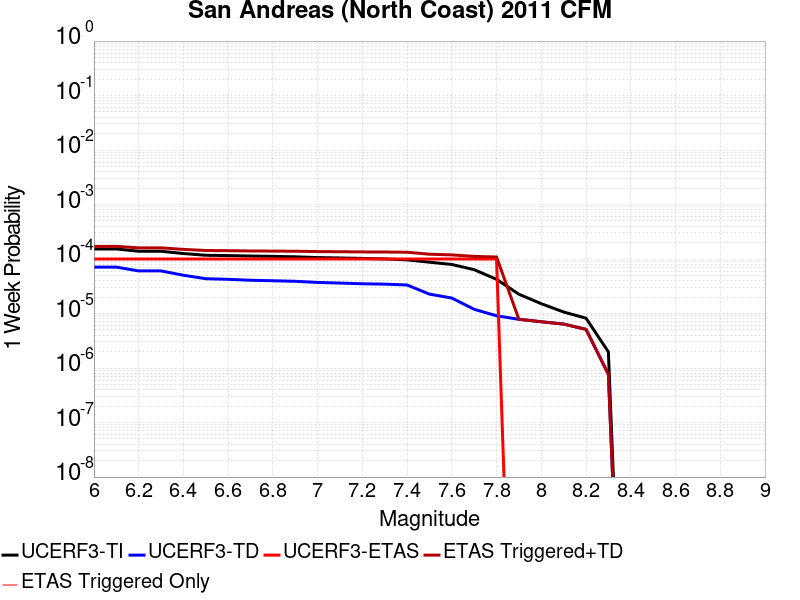 | 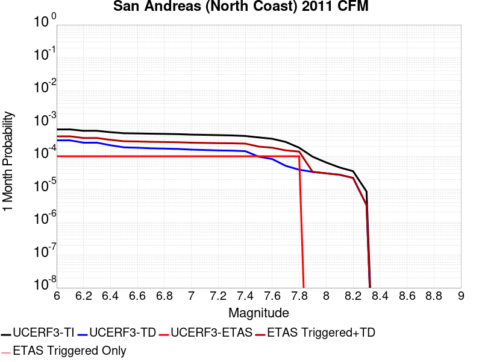 | 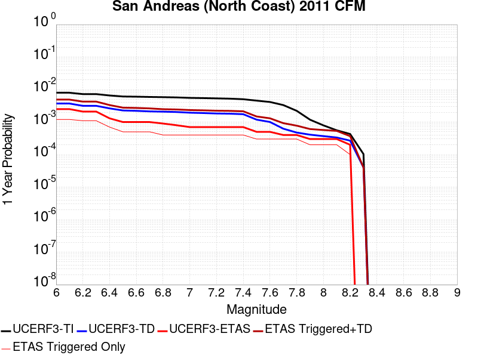 | 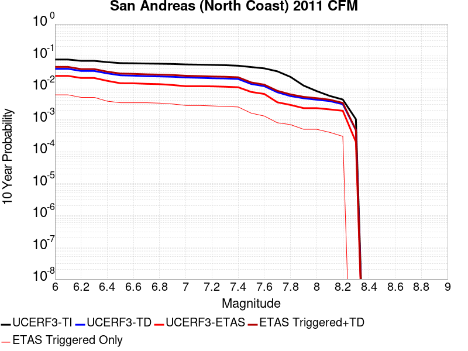 |

| Magnitude | 1 wk TI Prob | 1 wk TD Prob | 1 wk ETAS Prob | 1 wk ETAS/TD Gain | 1 wk ETAS Triggered+TD | 1 wk ETAS Triggered Only | 1 mo TI Prob | 1 mo TD Prob | 1 mo ETAS Prob | 1 mo ETAS/TD Gain | 1 mo ETAS Triggered+TD | 1 mo ETAS Triggered Only | 1 yr TI Prob | 1 yr TD Prob | 1 yr ETAS Prob | 1 yr ETAS/TD Gain | 1 yr ETAS Triggered+TD | 1 yr ETAS Triggered Only | 10 yr TI Prob | 10 yr TD Prob | 10 yr ETAS Prob | 10 yr ETAS/TD Gain | 10 yr ETAS Triggered+TD | 10 yr ETAS Triggered Only |
|-----|-----|-----|-----|-----|-----|-----|-----|-----|-----|-----|-----|-----|-----|-----|-----|-----|-----|-----|-----|-----|-----|-----|-----|-----|
| 6.0 | 1.5333705E-4 | 7.170357E-5 | 2.0E-4 | 2.7892613 | 1.716964E-4 | 1.0E-4 | 6.5699324E-4 | 3.0726503E-4 | 2.0E-4 | 0.6509039 | 4.072343E-4 | 1.0E-4 | 0.007969595 | 0.0037345688 | 0.0025 | 0.6694213 | 0.0049300874 | 0.0012 | 0.0768977 | 0.039670113 | 0.0236 | 0.59490633 | 0.04543209 | 0.006 |
| 6.1 | 1.5333705E-4 | 7.170357E-5 | 2.0E-4 | 2.7892613 | 1.716964E-4 | 1.0E-4 | 6.5699324E-4 | 3.0726503E-4 | 2.0E-4 | 0.6509039 | 4.072343E-4 | 1.0E-4 | 0.007969595 | 0.0037345688 | 0.0025 | 0.6694213 | 0.0049300874 | 0.0012 | 0.0768977 | 0.039670113 | 0.0236 | 0.59490633 | 0.04543209 | 0.006 |
| 6.2 | 1.3912938E-4 | 6.10351E-5 | 1.0E-4 | 1.6384014 | 1.61029E-4 | 1.0E-4 | 5.961325E-4 | 2.6155295E-4 | 1.0E-4 | 0.3823318 | 3.615268E-4 | 1.0E-4 | 0.007233787 | 0.0031797844 | 0.0021 | 0.6604221 | 0.004276287 | 0.0011 | 0.07002798 | 0.033974793 | 0.0203 | 0.5975018 | 0.03880492 | 0.005 |
| 6.3 | 1.3912938E-4 | 6.10351E-5 | 1.0E-4 | 1.6384014 | 1.61029E-4 | 1.0E-4 | 5.961325E-4 | 2.6155295E-4 | 1.0E-4 | 0.3823318 | 3.615268E-4 | 1.0E-4 | 0.007233787 | 0.0031797844 | 0.0021 | 0.6604221 | 0.004276287 | 0.0011 | 0.07002798 | 0.033974793 | 0.0203 | 0.5975018 | 0.03880492 | 0.005 |
| 6.4 | 1.2623647E-4 | 5.091644E-5 | 1.0E-4 | 1.9640023 | 1.5091135E-4 | 1.0E-4 | 5.4090127E-4 | 2.1819516E-4 | 1.0E-4 | 0.4583053 | 3.1817335E-4 | 1.0E-4 | 0.0065656058 | 0.00265331 | 0.0013 | 0.48995405 | 0.0033514528 | 7.0E-4 | 0.06374981 | 0.028557997 | 0.0165 | 0.5777716 | 0.032249477 | 0.0038 |
| 6.5 | 1.1736096E-4 | 4.3957694E-5 | 1.0E-4 | 2.2749145 | 1.439533E-4 | 1.0E-4 | 5.028786E-4 | 1.8837661E-4 | 1.0E-4 | 0.5308515 | 2.8835778E-4 | 1.0E-4 | 0.006105373 | 0.0022910894 | 0.001 | 0.43647358 | 0.002789944 | 5.0E-4 | 0.05940335 | 0.024810707 | 0.0139 | 0.560242 | 0.028126352 | 0.0034 |
| 6.6 | 1.1586959E-4 | 4.285088E-5 | 1.0E-4 | 2.3336744 | 1.4284659E-4 | 1.0E-4 | 4.964894E-4 | 1.8363379E-4 | 1.0E-4 | 0.5445621 | 2.8361543E-4 | 1.0E-4 | 0.006028018 | 0.0022334654 | 0.001 | 0.44773474 | 0.0027323486 | 5.0E-4 | 0.058671024 | 0.024212753 | 0.0138 | 0.5699476 | 0.02753043 | 0.0034 |
| 6.7 | 1.13693764E-4 | 4.11536E-5 | 1.0E-4 | 2.4299212 | 1.4114949E-4 | 1.0E-4 | 4.87168E-4 | 1.7636074E-4 | 1.0E-4 | 0.56701964 | 2.763431E-4 | 1.0E-4 | 0.005915152 | 0.0021450936 | 0.001 | 0.46618012 | 0.002644021 | 5.0E-4 | 0.057601593 | 0.023299104 | 0.0133 | 0.57083744 | 0.026619887 | 0.0034 |
| 6.8 | 1.1204889E-4 | 4.036422E-5 | 1.0E-4 | 2.4774418 | 1.4036018E-4 | 1.0E-4 | 4.8012115E-4 | 1.7297814E-4 | 1.0E-4 | 0.5781078 | 2.7296084E-4 | 1.0E-4 | 0.005829819 | 0.0021039906 | 9.0E-4 | 0.42775854 | 0.0025031492 | 4.0E-4 | 0.05679232 | 0.0228559 | 0.013 | 0.5687809 | 0.026080476 | 0.0033 |
| 6.9 | 1.1005794E-4 | 3.9411436E-5 | 1.0E-4 | 2.5373347 | 1.394075E-4 | 1.0E-4 | 4.7159163E-4 | 1.688953E-4 | 1.0E-4 | 0.59208274 | 2.6887842E-4 | 1.0E-4 | 0.0057265228 | 0.0020543772 | 8.0E-4 | 0.38941243 | 0.0024535554 | 4.0E-4 | 0.055811852 | 0.022318 | 0.0122 | 0.546644 | 0.025348814 | 0.0031 |
| 7.0 | 1.0647948E-4 | 3.7549817E-5 | 1.0E-4 | 2.6631289 | 1.3754606E-4 | 1.0E-4 | 4.562608E-4 | 1.6091795E-4 | 1.0E-4 | 0.62143475 | 2.6090184E-4 | 1.0E-4 | 0.0055408357 | 0.0019574312 | 7.0E-4 | 0.35761154 | 0.0023566484 | 4.0E-4 | 0.054047033 | 0.021268314 | 0.0112 | 0.526605 | 0.024008762 | 0.0028 |
| 7.1 | 1.04795035E-4 | 3.6590187E-5 | 1.0E-4 | 2.732973 | 1.3658653E-4 | 1.0E-4 | 4.4904428E-4 | 1.5680575E-4 | 1.0E-4 | 0.63773173 | 2.5679008E-4 | 1.0E-4 | 0.0054534175 | 0.001907454 | 7.0E-4 | 0.36698133 | 0.0023066911 | 4.0E-4 | 0.053215165 | 0.020733569 | 0.0112 | 0.54018676 | 0.023475515 | 0.0028 |
| 7.2 | 1.02724036E-4 | 3.5489167E-5 | 1.0E-4 | 2.8177614 | 1.3548562E-4 | 1.0E-4 | 4.401716E-4 | 1.5208765E-4 | 1.0E-4 | 0.6575156 | 2.5207244E-4 | 1.0E-4 | 0.0053459285 | 0.0018501101 | 7.0E-4 | 0.37835586 | 0.00224937 | 4.0E-4 | 0.052191395 | 0.02011826 | 0.0111 | 0.55173755 | 0.022763941 | 0.0027 |
| 7.3 | 1.00650694E-4 | 3.4949215E-5 | 1.0E-4 | 2.8612945 | 1.3494572E-4 | 1.0E-4 | 4.312888E-4 | 1.4977384E-4 | 1.0E-4 | 0.66767335 | 2.4975886E-4 | 1.0E-4 | 0.005238306 | 0.0018219869 | 7.0E-4 | 0.38419595 | 0.0022212581 | 4.0E-4 | 0.051165357 | 0.019791722 | 0.0108 | 0.54568267 | 0.022340264 | 0.0026 |
| 7.4 | 9.672919E-5 | 3.3720124E-5 | 1.0E-4 | 2.965588 | 1.3371675E-4 | 1.0E-4 | 4.144878E-4 | 1.4450689E-4 | 1.0E-4 | 0.6920085 | 2.4449246E-4 | 1.0E-4 | 0.005034718 | 0.0017579672 | 7.0E-4 | 0.3981872 | 0.002157264 | 4.0E-4 | 0.049221683 | 0.019055195 | 0.0104 | 0.5457829 | 0.021507557 | 0.0025 |
| 7.5 | 8.7600405E-5 | 2.2956625E-5 | 1.0E-4 | 4.356041 | 1.2295433E-4 | 1.0E-4 | 3.753763E-4 | 9.838184E-5 | 1.0E-4 | 1.0164478 | 1.98372E-4 | 1.0E-4 | 0.0045606326 | 0.0011971425 | 5.0E-4 | 0.41766122 | 0.0014967833 | 3.0E-4 | 0.04468165 | 0.0132782245 | 0.0074 | 0.5573034 | 0.014856979 | 0.0016 |
| 7.6 | 7.9562284E-5 | 1.9458756E-5 | 1.0E-4 | 5.139075 | 1.1945681E-4 | 1.0E-4 | 3.4093665E-4 | 8.3392006E-5 | 1.0E-4 | 1.1991557 | 1.8338367E-4 | 1.0E-4 | 0.0041430052 | 0.0010148264 | 5.0E-4 | 0.49269515 | 0.0013145219 | 3.0E-4 | 0.040666126 | 0.011357108 | 0.0064 | 0.5635237 | 0.012642344 | 0.0013 |
| 7.7 | 6.3866544E-5 | 1.2125341E-5 | 1.0E-4 | 8.24719 | 1.1212413E-4 | 1.0E-4 | 2.7368503E-4 | 5.196471E-5 | 1.0E-4 | 1.9243828 | 1.5195951E-4 | 1.0E-4 | 0.0033270244 | 6.32487E-4 | 4.0E-4 | 0.63242406 | 9.3229726E-4 | 3.0E-4 | 0.032776527 | 0.007318778 | 0.0035 | 0.47822192 | 0.008112922 | 8.0E-4 |
| 7.8 | 4.2543215E-5 | 9.224238E-6 | 1.0E-4 | 10.841003 | 1.09223314E-4 | 1.0E-4 | 1.8231533E-4 | 3.953185E-5 | 1.0E-4 | 2.5296059 | 1.395279E-4 | 1.0E-4 | 0.0022174292 | 4.811941E-4 | 4.0E-4 | 0.8312654 | 7.810497E-4 | 3.0E-4 | 0.021954332 | 0.005576606 | 0.0029 | 0.5200296 | 0.006272702 | 7.0E-4 |
| 7.9 | 2.2636612E-5 | 7.939422E-6 | 0.0 | 0.0 | 7.939422E-6 | 0.0 | 9.7010445E-5 | 3.4025652E-5 | 0.0 | 0.0 | 3.4025652E-5 | 0.0 | 0.0011804621 | 4.1418365E-4 | 3.0E-4 | 0.7243164 | 6.141008E-4 | 2.0E-4 | 0.011742111 | 0.0047538923 | 0.0023 | 0.48381406 | 0.005251515 | 5.0E-4 |
| 8.0 | 1.5167874E-5 | 7.16232E-6 | 0.0 | 0.0 | 7.16232E-6 | 0.0 | 6.500356E-5 | 3.0695297E-5 | 0.0 | 0.0 | 3.0695297E-5 | 0.0 | 7.9113094E-4 | 3.7365124E-4 | 3.0E-4 | 0.80288774 | 5.735765E-4 | 2.0E-4 | 0.007883203 | 0.004278338 | 0.0023 | 0.53759193 | 0.004776199 | 5.0E-4 |
| 8.1 | 1.0681047E-5 | 6.4890455E-6 | 0.0 | 0.0 | 6.4890455E-6 | 0.0 | 4.5775112E-5 | 2.78099E-5 | 0.0 | 0.0 | 2.78099E-5 | 0.0 | 5.5716943E-4 | 3.3853302E-4 | 3.0E-4 | 0.88617647 | 5.3846533E-4 | 2.0E-4 | 0.0055577457 | 0.0038736775 | 0.0021 | 0.5421205 | 0.004272128 | 4.0E-4 |
| 8.2 | 8.226114E-6 | 5.192472E-6 | 0.0 | 0.0 | 5.192472E-6 | 0.0 | 3.52543E-5 | 2.2253262E-5 | 0.0 | 0.0 | 2.2253262E-5 | 0.0 | 4.2913653E-4 | 2.7089985E-4 | 2.0E-4 | 0.7382802 | 3.708728E-4 | 1.0E-4 | 0.004283088 | 0.0030875448 | 0.0019 | 0.6153757 | 0.0033866186 | 3.0E-4 |
| 8.3 | 1.983087E-6 | 7.792044E-7 | 0.0 | 0.0 | 7.792044E-7 | 0.0 | 8.498917E-6 | 3.3394433E-6 | 0.0 | 0.0 | 3.3394433E-6 | 0.0 | 1.034694E-4 | 4.065698E-5 | 0.0 | 0.0 | 4.065698E-5 | 0.0 | 0.0010342124 | 4.7958124E-4 | 2.0E-4 | 0.41703048 | 4.7958124E-4 | 0.0 |

## Calico-Hidalgo
*[(top)](#table-of-contents)*

| 1 Week | 1 Month | 1 Year | 10 Year |
|-----|-----|-----|-----|
| 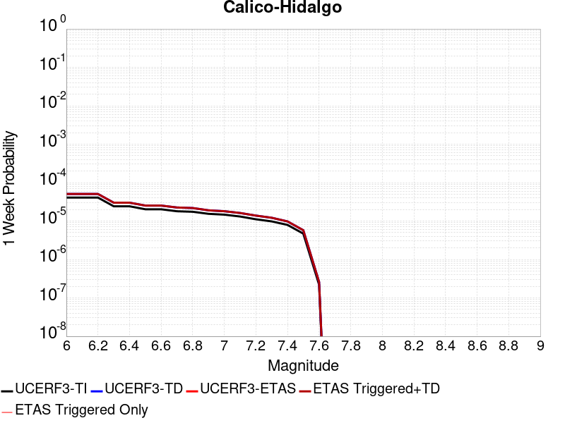 | 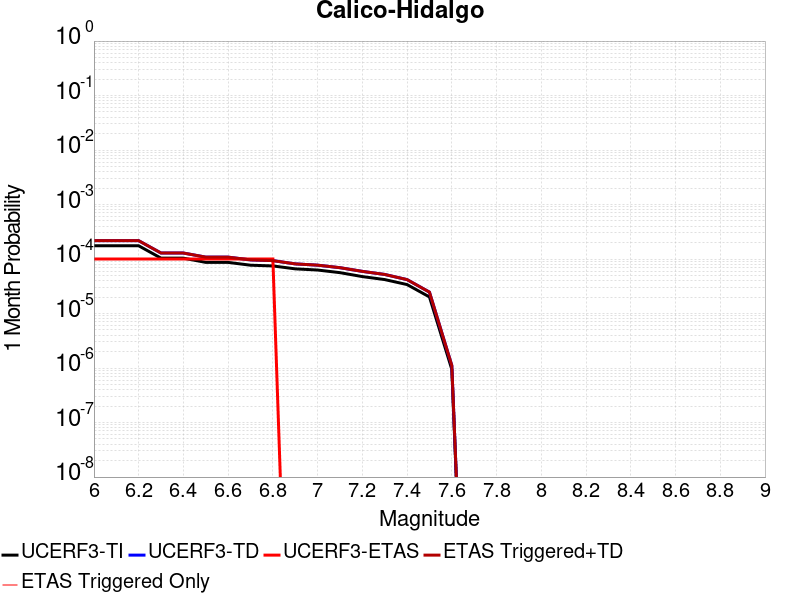 | 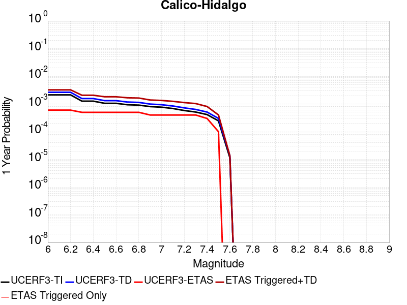 | 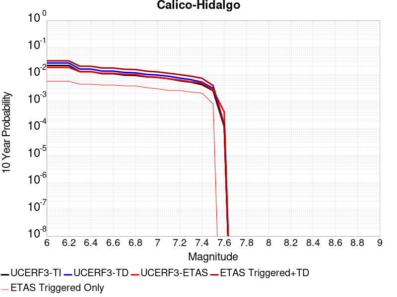 |

| Magnitude | 1 wk TI Prob | 1 wk TD Prob | 1 wk ETAS Prob | 1 wk ETAS/TD Gain | 1 wk ETAS Triggered+TD | 1 wk ETAS Triggered Only | 1 mo TI Prob | 1 mo TD Prob | 1 mo ETAS Prob | 1 mo ETAS/TD Gain | 1 mo ETAS Triggered+TD | 1 mo ETAS Triggered Only | 1 yr TI Prob | 1 yr TD Prob | 1 yr ETAS Prob | 1 yr ETAS/TD Gain | 1 yr ETAS Triggered+TD | 1 yr ETAS Triggered Only | 10 yr TI Prob | 10 yr TD Prob | 10 yr ETAS Prob | 10 yr ETAS/TD Gain | 10 yr ETAS Triggered+TD | 10 yr ETAS Triggered Only |
|-----|-----|-----|-----|-----|-----|-----|-----|-----|-----|-----|-----|-----|-----|-----|-----|-----|-----|-----|-----|-----|-----|-----|-----|-----|
| 6.0 | 4.0906612E-5 | 5.0720013E-5 | 0.0 | 0.0 | 5.0720013E-5 | 0.0 | 1.7530227E-4 | 2.1735553E-4 | 1.0E-4 | 0.4600757 | 2.1735553E-4 | 0.0 | 0.0021322158 | 0.0026434886 | 0.0013 | 0.4917744 | 0.0032419025 | 6.0E-4 | 0.02111873 | 0.026160749 | 0.0179 | 0.6842312 | 0.031516865 | 0.0055 |
| 6.1 | 4.0906612E-5 | 5.0720013E-5 | 0.0 | 0.0 | 5.0720013E-5 | 0.0 | 1.7530227E-4 | 2.1735553E-4 | 1.0E-4 | 0.4600757 | 2.1735553E-4 | 0.0 | 0.0021322158 | 0.0026434886 | 0.0013 | 0.4917744 | 0.0032419025 | 6.0E-4 | 0.02111873 | 0.026160749 | 0.0179 | 0.6842312 | 0.031516865 | 0.0055 |
| 6.2 | 4.0906612E-5 | 5.0720013E-5 | 0.0 | 0.0 | 5.0720013E-5 | 0.0 | 1.7530227E-4 | 2.1735553E-4 | 1.0E-4 | 0.4600757 | 2.1735553E-4 | 0.0 | 0.0021322158 | 0.0026434886 | 0.0013 | 0.4917744 | 0.0032419025 | 6.0E-4 | 0.02111873 | 0.026160749 | 0.0179 | 0.6842312 | 0.031516865 | 0.0055 |
| 6.3 | 2.4242801E-5 | 3.0097268E-5 | 0.0 | 0.0 | 3.0097268E-5 | 0.0 | 1.0389358E-4 | 1.2898211E-4 | 1.0E-4 | 0.77530134 | 1.2898211E-4 | 0.0 | 0.0012641704 | 0.0015692592 | 0.0012 | 0.76469207 | 0.0020684744 | 5.0E-4 | 0.01257003 | 0.0155854635 | 0.0124 | 0.79561317 | 0.019818446 | 0.0043 |
| 6.4 | 2.4242801E-5 | 3.0097268E-5 | 0.0 | 0.0 | 3.0097268E-5 | 0.0 | 1.0389358E-4 | 1.2898211E-4 | 1.0E-4 | 0.77530134 | 1.2898211E-4 | 0.0 | 0.0012641704 | 0.0015692592 | 0.0012 | 0.76469207 | 0.0020684744 | 5.0E-4 | 0.01257003 | 0.0155854635 | 0.0124 | 0.79561317 | 0.019818446 | 0.0043 |
| 6.5 | 2.0286952E-5 | 2.5320547E-5 | 0.0 | 0.0 | 2.5320547E-5 | 0.0 | 8.694118E-5 | 1.0851221E-4 | 1.0E-4 | 0.9215552 | 1.0851221E-4 | 0.0 | 0.0010579949 | 0.0013203527 | 0.001 | 0.75737345 | 0.0018196924 | 5.0E-4 | 0.010529719 | 0.013127014 | 0.0109 | 0.83034873 | 0.017074507 | 0.004 |
| 6.6 | 2.0269223E-5 | 2.5301493E-5 | 0.0 | 0.0 | 2.5301493E-5 | 0.0 | 8.6865206E-5 | 1.0843056E-4 | 1.0E-4 | 0.9222492 | 1.0843056E-4 | 0.0 | 0.0010570707 | 0.0013193598 | 0.001 | 0.7579434 | 0.0018187001 | 5.0E-4 | 0.010520565 | 0.013117203 | 0.0109 | 0.83096987 | 0.017064733 | 0.004 |
| 6.7 | 1.799852E-5 | 2.2544662E-5 | 0.0 | 0.0 | 2.2544662E-5 | 0.0 | 7.713423E-5 | 9.661648E-5 | 1.0E-4 | 1.0350201 | 9.661648E-5 | 0.0 | 9.3870464E-4 | 0.0011756854 | 0.001 | 0.85056764 | 0.0016750976 | 5.0E-4 | 0.009347493 | 0.011696269 | 0.01 | 0.85497355 | 0.015352992 | 0.0037 |
| 6.8 | 1.7458793E-5 | 2.1845955E-5 | 0.0 | 0.0 | 2.1845955E-5 | 0.0 | 7.4821255E-5 | 9.362224E-5 | 1.0E-4 | 1.0681223 | 9.362224E-5 | 0.0 | 9.10568E-4 | 0.0011392693 | 0.001 | 0.87775564 | 0.0016386997 | 5.0E-4 | 0.009068459 | 0.011335872 | 0.0098 | 0.8645122 | 0.014993929 | 0.0037 |
| 6.9 | 1.542884E-5 | 1.9029163E-5 | 0.0 | 0.0 | 1.9029163E-5 | 0.0 | 6.612192E-5 | 8.155108E-5 | 0.0 | 0.0 | 8.155108E-5 | 0.0 | 8.04737E-4 | 9.924453E-4 | 7.0E-4 | 0.7053285 | 0.0013920483 | 4.0E-4 | 0.008018291 | 0.00988153 | 0.0082 | 0.829831 | 0.013049909 | 0.0032 |
| 7.0 | 1.468253E-5 | 1.8033488E-5 | 0.0 | 0.0 | 1.8033488E-5 | 0.0 | 6.292361E-5 | 7.728416E-5 | 0.0 | 0.0 | 7.728416E-5 | 0.0 | 7.658257E-4 | 9.405415E-4 | 7.0E-4 | 0.74425215 | 0.0013401653 | 4.0E-4 | 0.0076319184 | 0.009366975 | 0.0078 | 0.83271277 | 0.012239811 | 0.0029 |
| 7.1 | 1.3139281E-5 | 1.620346E-5 | 0.0 | 0.0 | 1.620346E-5 | 0.0 | 5.6309986E-5 | 6.9441616E-5 | 0.0 | 0.0 | 6.9441616E-5 | 0.0 | 6.853584E-4 | 8.4513635E-4 | 7.0E-4 | 0.8282687 | 0.0012447983 | 4.0E-4 | 0.0068324856 | 0.00842052 | 0.0068 | 0.80755097 | 0.010899469 | 0.0025 |
| 7.2 | 1.1127404E-5 | 1.38687565E-5 | 0.0 | 0.0 | 1.38687565E-5 | 0.0 | 4.7688E-5 | 5.9436235E-5 | 0.0 | 0.0 | 5.9436235E-5 | 0.0 | 5.8044674E-4 | 7.234068E-4 | 5.0E-4 | 0.69117403 | 0.0011231174 | 4.0E-4 | 0.0057893298 | 0.0072116274 | 0.0061 | 0.84585625 | 0.009693598 | 0.0025 |
| 7.3 | 9.808154E-6 | 1.2177939E-5 | 0.0 | 0.0 | 1.2177939E-5 | 0.0 | 4.2034266E-5 | 5.2190186E-5 | 0.0 | 0.0 | 5.2190186E-5 | 0.0 | 5.11647E-4 | 6.35241E-4 | 5.0E-4 | 0.7871029 | 0.0010349869 | 4.0E-4 | 0.0051047057 | 0.0063353274 | 0.0053 | 0.8365787 | 0.00852139 | 0.0022 |
| 7.4 | 7.942452E-6 | 9.793343E-6 | 0.0 | 0.0 | 9.793343E-6 | 0.0 | 3.4038632E-5 | 4.197085E-5 | 0.0 | 0.0 | 4.197085E-5 | 0.0 | 4.1434157E-4 | 5.1088474E-4 | 4.0E-4 | 0.78295547 | 8.107315E-4 | 3.0E-4 | 0.0041356985 | 0.0050980444 | 0.0047 | 0.9219222 | 0.007087848 | 0.002 |
| 7.5 | 4.7121216E-6 | 5.773469E-6 | 0.0 | 0.0 | 5.773469E-6 | 0.0 | 2.019465E-5 | 2.4743247E-5 | 0.0 | 0.0 | 2.4743247E-5 | 0.0 | 2.4584212E-4 | 3.0121504E-4 | 1.0E-4 | 0.33198872 | 4.0118492E-4 | 1.0E-4 | 0.0024557032 | 0.0030088203 | 0.0026 | 0.864126 | 0.0038064134 | 8.0E-4 |
| 7.6 | 2.21172E-7 | 2.6041258E-7 | 0.0 | 0.0 | 2.6041258E-7 | 0.0 | 9.478797E-7 | 1.1160537E-6 | 0.0 | 0.0 | 1.1160537E-6 | 0.0 | 1.1540374E-5 | 1.3587897E-5 | 0.0 | 0.0 | 1.3587897E-5 | 0.0 | 1.1539775E-4 | 1.3587347E-4 | 4.0E-4 | 2.9439154 | 1.3587347E-4 | 0.0 |

## Elmore Ranch
*[(top)](#table-of-contents)*

| 1 Week | 1 Month | 1 Year | 10 Year |
|-----|-----|-----|-----|
| 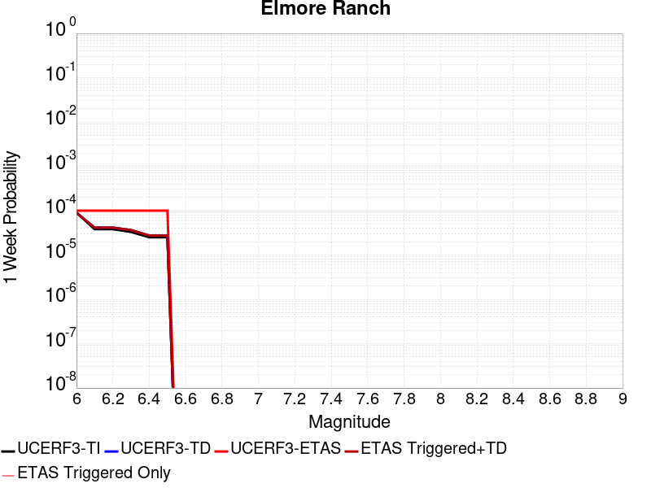 | 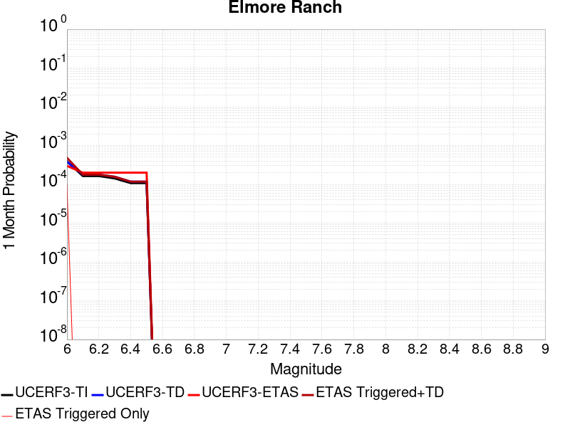 |  | 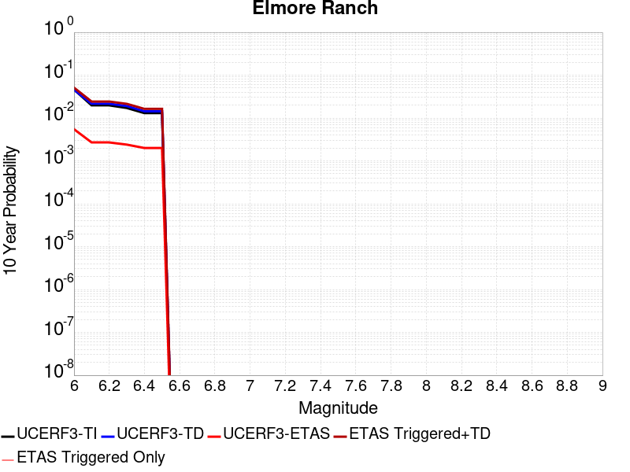 |

| Magnitude | 1 wk TI Prob | 1 wk TD Prob | 1 wk ETAS Prob | 1 wk ETAS/TD Gain | 1 wk ETAS Triggered+TD | 1 wk ETAS Triggered Only | 1 mo TI Prob | 1 mo TD Prob | 1 mo ETAS Prob | 1 mo ETAS/TD Gain | 1 mo ETAS Triggered+TD | 1 mo ETAS Triggered Only | 1 yr TI Prob | 1 yr TD Prob | 1 yr ETAS Prob | 1 yr ETAS/TD Gain | 1 yr ETAS Triggered+TD | 1 yr ETAS Triggered Only | 10 yr TI Prob | 10 yr TD Prob | 10 yr ETAS Prob | 10 yr ETAS/TD Gain | 10 yr ETAS Triggered+TD | 10 yr ETAS Triggered Only |
|-----|-----|-----|-----|-----|-----|-----|-----|-----|-----|-----|-----|-----|-----|-----|-----|-----|-----|-----|-----|-----|-----|-----|-----|-----|
| 6.0 | 9.102099E-5 | 8.962415E-5 | 1.0E-4 | 1.1157708 | 8.962415E-5 | 0.0 | 3.9003167E-4 | 3.840396E-4 | 3.0E-4 | 0.7811695 | 4.8400118E-4 | 1.0E-4 | 0.0047383 | 0.004666296 | 0.0032 | 0.6857688 | 0.0055620964 | 9.0E-4 | 0.046385348 | 0.04588765 | 0.034 | 0.74094015 | 0.051135268 | 0.0055 |
| 6.1 | 3.8306698E-5 | 4.1531388E-5 | 1.0E-4 | 2.4078176 | 4.1531388E-5 | 0.0 | 1.6416123E-4 | 1.779829E-4 | 2.0E-4 | 1.1237035 | 1.779829E-4 | 0.0 | 0.0019968306 | 0.002165234 | 0.0016 | 0.73895013 | 0.0026641514 | 5.0E-4 | 0.019789828 | 0.021625664 | 0.0151 | 0.69824445 | 0.024267275 | 0.0027 |
| 6.2 | 3.8306698E-5 | 4.1531388E-5 | 1.0E-4 | 2.4078176 | 4.1531388E-5 | 0.0 | 1.6416123E-4 | 1.779829E-4 | 2.0E-4 | 1.1237035 | 1.779829E-4 | 0.0 | 0.0019968306 | 0.002165234 | 0.0016 | 0.73895013 | 0.0026641514 | 5.0E-4 | 0.019789828 | 0.021625664 | 0.0151 | 0.69824445 | 0.024267275 | 0.0027 |
| 6.3 | 3.3197924E-5 | 3.6583282E-5 | 1.0E-4 | 2.733489 | 3.6583282E-5 | 0.0 | 1.4226905E-4 | 1.5677941E-4 | 2.0E-4 | 1.2756778 | 1.5677941E-4 | 0.0 | 0.0017307495 | 0.0019076599 | 0.0014 | 0.73388344 | 0.002306897 | 4.0E-4 | 0.017173318 | 0.01908142 | 0.0137 | 0.7179759 | 0.021435624 | 0.0024 |
| 6.4 | 2.5148964E-5 | 2.744243E-5 | 1.0E-4 | 3.6439922 | 2.744243E-5 | 0.0 | 1.0777682E-4 | 1.1760877E-4 | 2.0E-4 | 1.7005534 | 1.1760877E-4 | 0.0 | 0.0013113929 | 0.0014315953 | 0.0012 | 0.8382257 | 0.0018310227 | 4.0E-4 | 0.01303681 | 0.014382674 | 0.0105 | 0.730045 | 0.016353909 | 0.002 |
| 6.5 | 2.5148964E-5 | 2.744243E-5 | 1.0E-4 | 3.6439922 | 2.744243E-5 | 0.0 | 1.0777682E-4 | 1.1760877E-4 | 2.0E-4 | 1.7005534 | 1.1760877E-4 | 0.0 | 0.0013113929 | 0.0014315953 | 0.0012 | 0.8382257 | 0.0018310227 | 4.0E-4 | 0.01303681 | 0.014382674 | 0.0105 | 0.730045 | 0.016353909 | 0.002 |

## King Range 2011 CFM
*[(top)](#table-of-contents)*

| 1 Week | 1 Month | 1 Year | 10 Year |
|-----|-----|-----|-----|
| 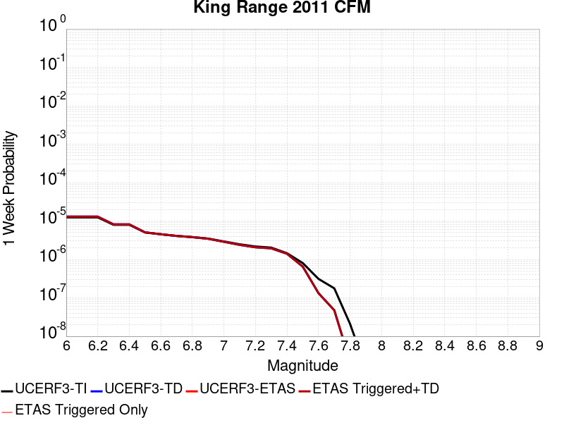 | 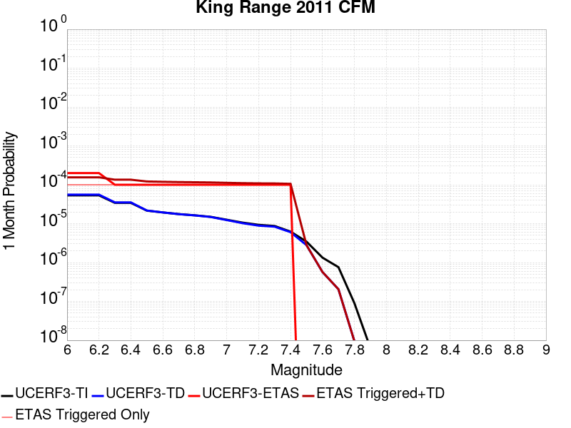 | 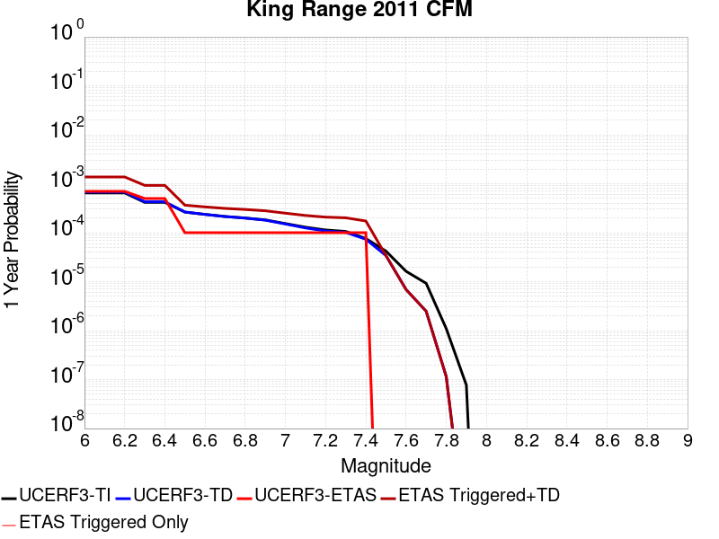 |  |

| Magnitude | 1 wk TI Prob | 1 wk TD Prob | 1 wk ETAS Prob | 1 wk ETAS/TD Gain | 1 wk ETAS Triggered+TD | 1 wk ETAS Triggered Only | 1 mo TI Prob | 1 mo TD Prob | 1 mo ETAS Prob | 1 mo ETAS/TD Gain | 1 mo ETAS Triggered+TD | 1 mo ETAS Triggered Only | 1 yr TI Prob | 1 yr TD Prob | 1 yr ETAS Prob | 1 yr ETAS/TD Gain | 1 yr ETAS Triggered+TD | 1 yr ETAS Triggered Only | 10 yr TI Prob | 10 yr TD Prob | 10 yr ETAS Prob | 10 yr ETAS/TD Gain | 10 yr ETAS Triggered+TD | 10 yr ETAS Triggered Only |
|-----|-----|-----|-----|-----|-----|-----|-----|-----|-----|-----|-----|-----|-----|-----|-----|-----|-----|-----|-----|-----|-----|-----|-----|-----|
| 6.0 | 1.2462566E-5 | 1.3026281E-5 | 0.0 | 0.0 | 1.3026281E-5 | 0.0 | 5.34099E-5 | 5.582592E-5 | 2.0E-4 | 3.5825653 | 1.5582034E-4 | 1.0E-4 | 6.5007154E-4 | 6.7950354E-4 | 0.0016 | 2.3546603 | 0.0013790278 | 7.0E-4 | 0.0064817313 | 0.00677863 | 0.016 | 2.360359 | 0.011943381 | 0.0052 |
| 6.1 | 1.2462566E-5 | 1.3026281E-5 | 0.0 | 0.0 | 1.3026281E-5 | 0.0 | 5.34099E-5 | 5.582592E-5 | 2.0E-4 | 3.5825653 | 1.5582034E-4 | 1.0E-4 | 6.5007154E-4 | 6.7950354E-4 | 0.0016 | 2.3546603 | 0.0013790278 | 7.0E-4 | 0.0064817313 | 0.00677863 | 0.016 | 2.360359 | 0.011943381 | 0.0052 |
| 6.2 | 1.2462566E-5 | 1.3026281E-5 | 0.0 | 0.0 | 1.3026281E-5 | 0.0 | 5.34099E-5 | 5.582592E-5 | 2.0E-4 | 3.5825653 | 1.5582034E-4 | 1.0E-4 | 6.5007154E-4 | 6.7950354E-4 | 0.0016 | 2.3546603 | 0.0013790278 | 7.0E-4 | 0.0064817313 | 0.00677863 | 0.016 | 2.360359 | 0.011943381 | 0.0052 |
| 6.3 | 7.988484E-6 | 8.216655E-6 | 0.0 | 0.0 | 8.216655E-6 | 0.0 | 3.423591E-5 | 3.5213834E-5 | 1.0E-4 | 2.839793 | 1.3521031E-4 | 1.0E-4 | 4.1674246E-4 | 4.2865702E-4 | 8.0E-4 | 1.8662939 | 9.284427E-4 | 5.0E-4 | 0.004159618 | 0.004280504 | 0.0071 | 1.6586832 | 0.0069689467 | 0.0027 |
| 6.4 | 7.988484E-6 | 8.216655E-6 | 0.0 | 0.0 | 8.216655E-6 | 0.0 | 3.423591E-5 | 3.5213834E-5 | 1.0E-4 | 2.839793 | 1.3521031E-4 | 1.0E-4 | 4.1674246E-4 | 4.2865702E-4 | 8.0E-4 | 1.8662939 | 9.284427E-4 | 5.0E-4 | 0.004159618 | 0.004280504 | 0.0071 | 1.6586832 | 0.0069689467 | 0.0027 |
| 6.5 | 5.0522513E-6 | 5.084693E-6 | 0.0 | 0.0 | 5.084693E-6 | 0.0 | 2.1652326E-5 | 2.1791364E-5 | 1.0E-4 | 4.588974 | 1.21789184E-4 | 1.0E-4 | 2.6358519E-4 | 2.652785E-4 | 1.0E-4 | 0.37696233 | 3.6525197E-4 | 1.0E-4 | 0.0026327274 | 0.0026506416 | 0.0023 | 0.86771446 | 0.0033487862 | 7.0E-4 |
| 6.6 | 4.53682E-6 | 4.541321E-6 | 0.0 | 0.0 | 4.541321E-6 | 0.0 | 1.944337E-5 | 1.9462663E-5 | 1.0E-4 | 5.1380434 | 1.1946072E-4 | 1.0E-4 | 2.3669732E-4 | 2.3693276E-4 | 1.0E-4 | 0.42206067 | 3.3690906E-4 | 1.0E-4 | 0.0023644536 | 0.0023677924 | 0.0019 | 0.8024352 | 0.0029663718 | 6.0E-4 |
| 6.7 | 4.1144335E-6 | 4.099307E-6 | 0.0 | 0.0 | 4.099307E-6 | 0.0 | 1.7633167E-5 | 1.756834E-5 | 1.0E-4 | 5.692057 | 1.1756658E-4 | 1.0E-4 | 2.1466266E-4 | 2.1387395E-4 | 1.0E-4 | 0.46756512 | 3.1385256E-4 | 1.0E-4 | 0.0021445542 | 0.0021376512 | 0.0015 | 0.70170474 | 0.002536796 | 4.0E-4 |
| 6.8 | 3.8321214E-6 | 3.8096798E-6 | 0.0 | 0.0 | 3.8096798E-6 | 0.0 | 1.6423275E-5 | 1.6327098E-5 | 1.0E-4 | 6.124787 | 1.16325464E-4 | 1.0E-4 | 1.9993502E-4 | 1.9876462E-4 | 1.0E-4 | 0.5031076 | 2.9874474E-4 | 1.0E-4 | 0.0019975523 | 0.0019868321 | 0.0014 | 0.7046393 | 0.0023860375 | 4.0E-4 |
| 6.9 | 3.4999944E-6 | 3.4660445E-6 | 0.0 | 0.0 | 3.4660445E-6 | 0.0 | 1.499989E-5 | 1.4854393E-5 | 1.0E-4 | 6.732015 | 1.14852905E-4 | 1.0E-4 | 1.8260835E-4 | 1.8083748E-4 | 1.0E-4 | 0.5529827 | 2.808194E-4 | 1.0E-4 | 0.0018245836 | 0.0018078592 | 0.0013 | 0.71908253 | 0.002207136 | 4.0E-4 |
| 7.0 | 2.9470837E-6 | 2.8890067E-6 | 0.0 | 0.0 | 2.8890067E-6 | 0.0 | 1.26302975E-5 | 1.23814E-5 | 1.0E-4 | 8.076632 | 1.1238016E-4 | 1.0E-4 | 1.5376302E-4 | 1.5073329E-4 | 1.0E-4 | 0.6634234 | 2.507182E-4 | 1.0E-4 | 0.0015365666 | 0.0015072576 | 9.0E-4 | 0.597111 | 0.0019066547 | 4.0E-4 |
| 7.1 | 2.4850247E-6 | 2.4000497E-6 | 0.0 | 0.0 | 2.4000497E-6 | 0.0 | 1.0650062E-5 | 1.0285887E-5 | 1.0E-4 | 9.722059 | 1.1028486E-4 | 1.0E-4 | 1.296568E-4 | 1.2522363E-4 | 1.0E-4 | 0.79857135 | 2.252111E-4 | 1.0E-4 | 0.0012958117 | 0.0012524783 | 5.0E-4 | 0.39920852 | 0.0015521026 | 3.0E-4 |
| 7.2 | 2.1800304E-6 | 2.0782227E-6 | 0.0 | 0.0 | 2.0782227E-6 | 0.0 | 9.342954E-6 | 8.906639E-6 | 1.0E-4 | 11.22758 | 1.0890575E-4 | 1.0E-4 | 1.1374453E-4 | 1.08433014E-4 | 1.0E-4 | 0.92222834 | 2.0842218E-4 | 1.0E-4 | 0.0011368633 | 0.0010847335 | 5.0E-4 | 0.46094272 | 0.0013844081 | 3.0E-4 |
| 7.3 | 2.0378504E-6 | 1.9515617E-6 | 0.0 | 0.0 | 1.9515617E-6 | 0.0 | 8.733615E-6 | 8.36381E-6 | 1.0E-4 | 11.956274 | 1.08362976E-4 | 1.0E-4 | 1.0632657E-4 | 1.0182471E-4 | 1.0E-4 | 0.98207986 | 2.0181453E-4 | 1.0E-4 | 0.0010627571 | 0.0010186968 | 5.0E-4 | 0.49082318 | 0.0013183912 | 3.0E-4 |
| 7.4 | 1.4577047E-6 | 1.4107119E-6 | 0.0 | 0.0 | 1.4107119E-6 | 0.0 | 6.247291E-6 | 6.0458947E-6 | 1.0E-4 | 16.54015 | 1.0604529E-4 | 1.0E-4 | 7.605811E-5 | 7.360635E-5 | 1.0E-4 | 1.3585783 | 1.73599E-4 | 1.0E-4 | 7.603208E-4 | 7.3667604E-4 | 4.0E-4 | 0.54297954 | 9.3652867E-4 | 2.0E-4 |
| 7.5 | 8.0685743E-7 | 6.5438036E-7 | 0.0 | 0.0 | 6.5438036E-7 | 0.0 | 3.457956E-6 | 2.8044844E-6 | 0.0 | 0.0 | 2.8044844E-6 | 0.0 | 4.20998E-5 | 3.4144112E-5 | 0.0 | 0.0 | 3.4144112E-5 | 0.0 | 4.2091825E-4 | 3.420983E-4 | 0.0 | 0.0 | 3.420983E-4 | 0.0 |
| 7.6 | 3.1239435E-7 | 1.3331085E-7 | 0.0 | 0.0 | 1.3331085E-7 | 0.0 | 1.3388321E-6 | 5.713321E-7 | 0.0 | 0.0 | 5.713321E-7 | 0.0 | 1.630016E-5 | 6.955947E-6 | 0.0 | 0.0 | 6.955947E-6 | 0.0 | 1.6298964E-4 | 7.0206355E-5 | 0.0 | 0.0 | 7.0206355E-5 | 0.0 |
| 7.7 | 1.7747207E-7 | 4.802167E-8 | 0.0 | 0.0 | 4.802167E-8 | 0.0 | 7.605944E-7 | 2.0580714E-7 | 0.0 | 0.0 | 2.0580714E-7 | 0.0 | 9.260198E-6 | 2.5056993E-6 | 0.0 | 0.0 | 2.5056993E-6 | 0.0 | 9.2598115E-5 | 2.547158E-5 | 0.0 | 0.0 | 2.547158E-5 | 0.0 |
| 7.8 | 2.1035538E-8 | 2.2166682E-9 | 0.0 | 0.0 | 2.2166682E-9 | 0.0 | 9.0152305E-8 | 9.500008E-9 | 0.0 | 0.0 | 9.500008E-9 | 0.0 | 1.0976038E-6 | 1.1566259E-7 | 0.0 | 0.0 | 1.1566259E-7 | 0.0 | 1.0975983E-5 | 1.193644E-6 | 0.0 | 0.0 | 1.193644E-6 | 0.0 |
| 7.9 | 1.4782963E-9 | 9.166001E-13 | 0.0 | 0.0 | 9.166001E-13 | 0.0 | 6.335555E-9 | 3.9293013E-12 | 0.0 | 0.0 | 3.9293013E-12 | 0.0 | 7.713538E-8 | 4.783507E-11 | 0.0 | 0.0 | 4.783507E-11 | 0.0 | 7.7135354E-7 | 6.9037376E-10 | 0.0 | 0.0 | 6.9037376E-10 | 0.0 |

## Pisgah-Bullion Mtn-Mesquite Lk
*[(top)](#table-of-contents)*

| 1 Week | 1 Month | 1 Year | 10 Year |
|-----|-----|-----|-----|
| 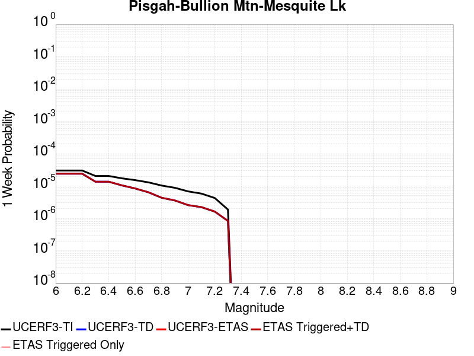 | 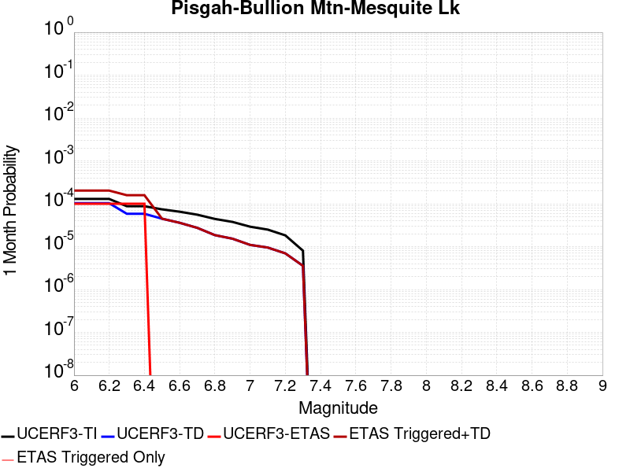 | 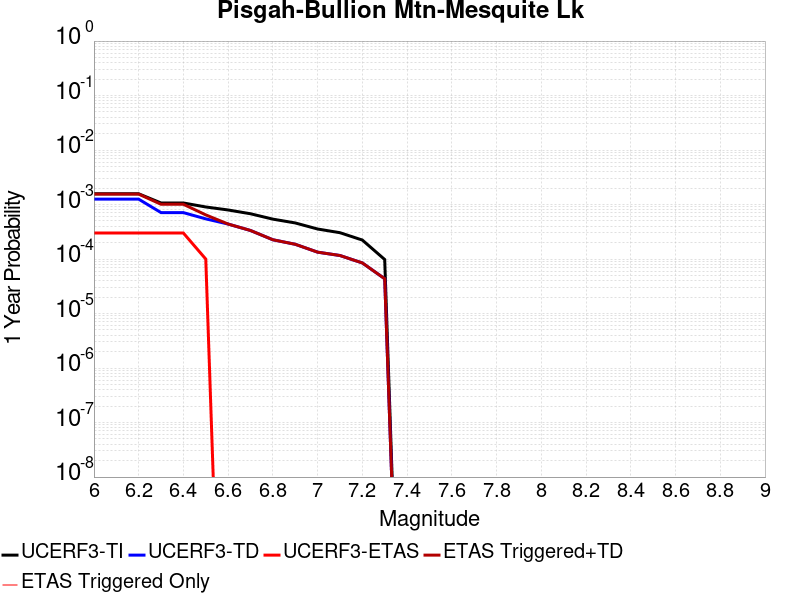 | 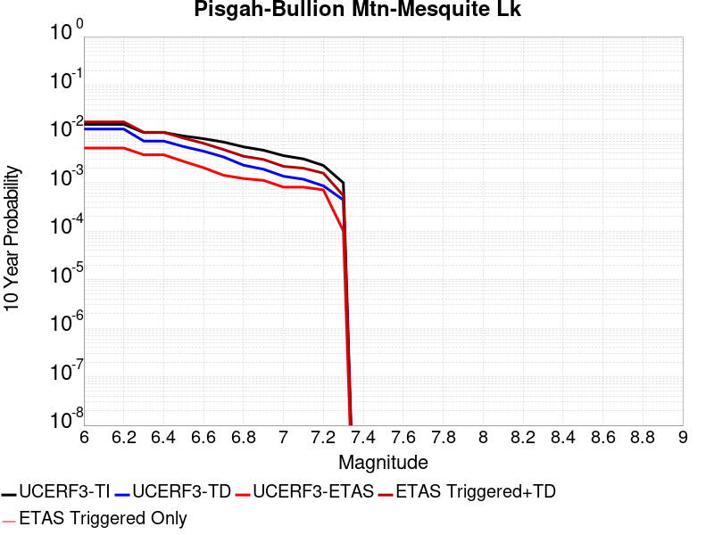 |

| Magnitude | 1 wk TI Prob | 1 wk TD Prob | 1 wk ETAS Prob | 1 wk ETAS/TD Gain | 1 wk ETAS Triggered+TD | 1 wk ETAS Triggered Only | 1 mo TI Prob | 1 mo TD Prob | 1 mo ETAS Prob | 1 mo ETAS/TD Gain | 1 mo ETAS Triggered+TD | 1 mo ETAS Triggered Only | 1 yr TI Prob | 1 yr TD Prob | 1 yr ETAS Prob | 1 yr ETAS/TD Gain | 1 yr ETAS Triggered+TD | 1 yr ETAS Triggered Only | 10 yr TI Prob | 10 yr TD Prob | 10 yr ETAS Prob | 10 yr ETAS/TD Gain | 10 yr ETAS Triggered+TD | 10 yr ETAS Triggered Only |
|-----|-----|-----|-----|-----|-----|-----|-----|-----|-----|-----|-----|-----|-----|-----|-----|-----|-----|-----|-----|-----|-----|-----|-----|-----|
| 6.0 | 3.0240792E-5 | 2.4096445E-5 | 0.0 | 0.0 | 2.4096445E-5 | 0.0 | 1.2959696E-4 | 1.0326697E-4 | 1.0E-4 | 0.9683639 | 2.0325664E-4 | 1.0E-4 | 0.0015767008 | 0.0012566509 | 7.0E-4 | 0.55703616 | 0.0015562739 | 3.0E-4 | 0.015655609 | 0.012505477 | 0.0111 | 0.8876111 | 0.0175417 | 0.0051 |
| 6.1 | 3.0240792E-5 | 2.4096445E-5 | 0.0 | 0.0 | 2.4096445E-5 | 0.0 | 1.2959696E-4 | 1.0326697E-4 | 1.0E-4 | 0.9683639 | 2.0325664E-4 | 1.0E-4 | 0.0015767008 | 0.0012566509 | 7.0E-4 | 0.55703616 | 0.0015562739 | 3.0E-4 | 0.015655609 | 0.012505477 | 0.0111 | 0.8876111 | 0.0175417 | 0.0051 |
| 6.2 | 3.0240792E-5 | 2.4096445E-5 | 0.0 | 0.0 | 2.4096445E-5 | 0.0 | 1.2959696E-4 | 1.0326697E-4 | 1.0E-4 | 0.9683639 | 2.0325664E-4 | 1.0E-4 | 0.0015767008 | 0.0012566509 | 7.0E-4 | 0.55703616 | 0.0015562739 | 3.0E-4 | 0.015655609 | 0.012505477 | 0.0111 | 0.8876111 | 0.0175417 | 0.0051 |
| 6.3 | 2.0498217E-5 | 1.364058E-5 | 0.0 | 0.0 | 1.364058E-5 | 0.0 | 8.784654E-5 | 5.845841E-5 | 1.0E-4 | 1.7106179 | 1.5845256E-4 | 1.0E-4 | 0.0010690069 | 7.1151496E-4 | 6.0E-4 | 0.84327114 | 0.0010113015 | 3.0E-4 | 0.01063879 | 0.007093996 | 0.0071 | 1.0008464 | 0.010767748 | 0.0037 |
| 6.4 | 2.0498217E-5 | 1.364058E-5 | 0.0 | 0.0 | 1.364058E-5 | 0.0 | 8.784654E-5 | 5.845841E-5 | 1.0E-4 | 1.7106179 | 1.5845256E-4 | 1.0E-4 | 0.0010690069 | 7.1151496E-4 | 6.0E-4 | 0.84327114 | 0.0010113015 | 3.0E-4 | 0.01063879 | 0.007093996 | 0.0071 | 1.0008464 | 0.010767748 | 0.0037 |
| 6.5 | 1.7316182E-5 | 1.0478777E-5 | 0.0 | 0.0 | 1.0478777E-5 | 0.0 | 7.42101E-5 | 4.4908324E-5 | 0.0 | 0.0 | 4.4908324E-5 | 0.0 | 9.0313336E-4 | 5.466317E-4 | 3.0E-4 | 0.5488156 | 6.4657704E-4 | 1.0E-4 | 0.008994718 | 0.005453867 | 0.0051 | 0.9351163 | 0.008139142 | 0.0027 |
| 6.6 | 1.5251077E-5 | 8.415474E-6 | 0.0 | 0.0 | 8.415474E-6 | 0.0 | 6.536012E-5 | 3.606586E-5 | 0.0 | 0.0 | 3.606586E-5 | 0.0 | 7.9546886E-4 | 4.390206E-4 | 1.0E-4 | 0.22777973 | 4.390206E-4 | 0.0 | 0.007926274 | 0.0043822504 | 0.0039 | 0.8899537 | 0.006373486 | 0.002 |
| 6.7 | 1.2997425E-5 | 6.4121696E-6 | 0.0 | 0.0 | 6.4121696E-6 | 0.0 | 5.570206E-5 | 2.7480464E-5 | 0.0 | 0.0 | 2.7480464E-5 | 0.0 | 6.7796157E-4 | 3.3452795E-4 | 1.0E-4 | 0.29892868 | 3.3452795E-4 | 0.0 | 0.0067589693 | 0.003340704 | 0.003 | 0.89801437 | 0.0047360267 | 0.0014 |
| 6.8 | 1.035386E-5 | 4.3340488E-6 | 0.0 | 0.0 | 4.3340488E-6 | 0.0 | 4.437293E-5 | 1.8574367E-5 | 0.0 | 0.0 | 1.8574367E-5 | 0.0 | 5.401065E-4 | 2.2612032E-4 | 0.0 | 0.0 | 2.2612032E-4 | 0.0 | 0.0053879567 | 0.0022589893 | 0.0024 | 1.062422 | 0.0034562785 | 0.0012 |
| 6.9 | 8.816252E-6 | 3.5813089E-6 | 0.0 | 0.0 | 3.5813089E-6 | 0.0 | 3.778339E-5 | 1.534838E-5 | 0.0 | 0.0 | 1.534838E-5 | 0.0 | 4.5991567E-4 | 1.8685109E-4 | 0.0 | 0.0 | 1.8685109E-4 | 0.0 | 0.00458965 | 0.0018669983 | 0.0021 | 1.1248002 | 0.0029649446 | 0.0011 |
| 7.0 | 6.8232207E-6 | 2.5680283E-6 | 0.0 | 0.0 | 2.5680283E-6 | 0.0 | 2.9242048E-5 | 1.1005791E-5 | 0.0 | 0.0 | 1.1005791E-5 | 0.0 | 3.5596377E-4 | 1.3398757E-4 | 0.0 | 0.0 | 1.3398757E-4 | 0.0 | 0.0035539411 | 0.001339099 | 0.0014 | 1.045479 | 0.0021380277 | 8.0E-4 |
| 7.1 | 5.837013E-6 | 2.2278455E-6 | 0.0 | 0.0 | 2.2278455E-6 | 0.0 | 2.501553E-5 | 9.547875E-6 | 0.0 | 0.0 | 9.547875E-6 | 0.0 | 3.045215E-4 | 1.1623948E-4 | 0.0 | 0.0 | 1.1623948E-4 | 0.0 | 0.0030410455 | 0.0011618158 | 0.0013 | 1.1189381 | 0.0019608864 | 8.0E-4 |
| 7.2 | 4.278052E-6 | 1.6278931E-6 | 0.0 | 0.0 | 1.6278931E-6 | 0.0 | 1.833438E-5 | 6.9766675E-6 | 0.0 | 0.0 | 6.9766675E-6 | 0.0 | 2.231982E-4 | 8.493785E-5 | 0.0 | 0.0 | 8.493785E-5 | 0.0 | 0.0022297418 | 8.490771E-4 | 0.001 | 1.1777494 | 0.0015484828 | 7.0E-4 |
| 7.3 | 1.8803692E-6 | 8.346371E-7 | 0.0 | 0.0 | 8.346371E-7 | 0.0 | 8.0587E-6 | 3.5770122E-6 | 0.0 | 0.0 | 3.5770122E-6 | 0.0 | 9.811026E-5 | 4.35494E-5 | 0.0 | 0.0 | 4.35494E-5 | 0.0 | 9.806695E-4 | 4.3542314E-4 | 1.0E-4 | 0.22966166 | 5.353796E-4 | 1.0E-4 |

## Mission Ridge-Arroyo Parida-Santa Ana
*[(top)](#table-of-contents)*

| 1 Week | 1 Month | 1 Year | 10 Year |
|-----|-----|-----|-----|
| 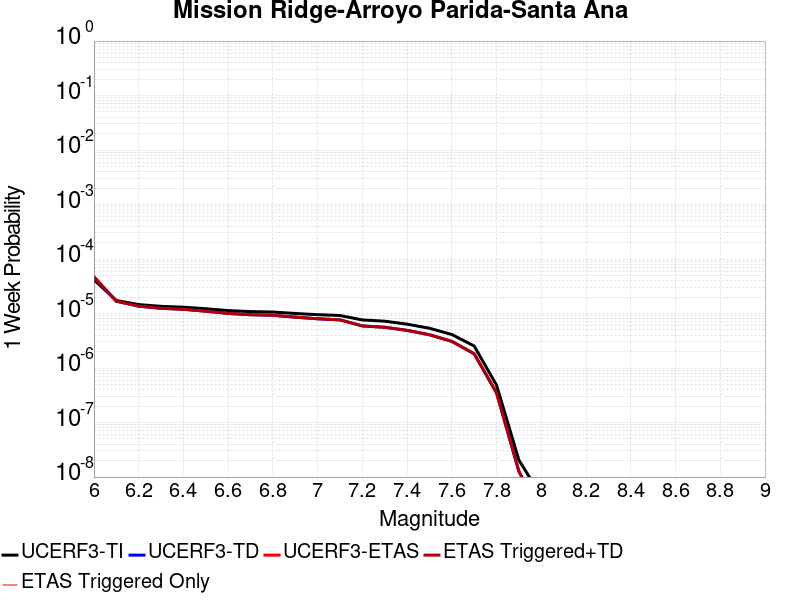 | 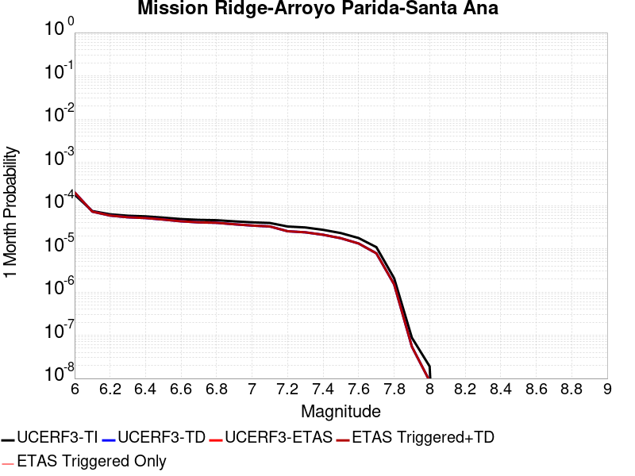 | 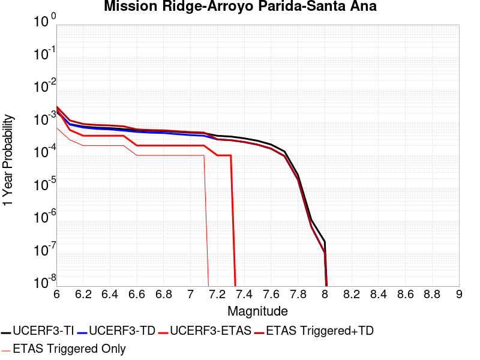 | 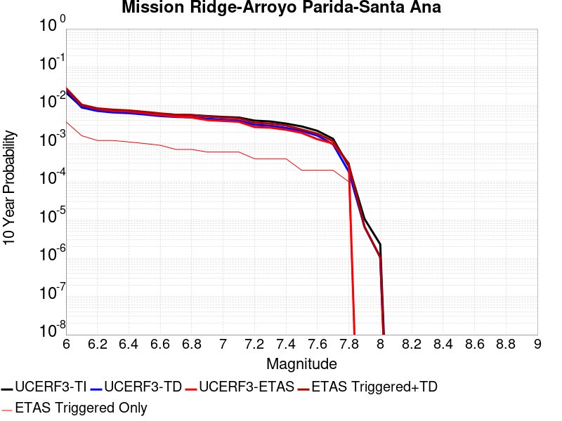 |

| Magnitude | 1 wk TI Prob | 1 wk TD Prob | 1 wk ETAS Prob | 1 wk ETAS/TD Gain | 1 wk ETAS Triggered+TD | 1 wk ETAS Triggered Only | 1 mo TI Prob | 1 mo TD Prob | 1 mo ETAS Prob | 1 mo ETAS/TD Gain | 1 mo ETAS Triggered+TD | 1 mo ETAS Triggered Only | 1 yr TI Prob | 1 yr TD Prob | 1 yr ETAS Prob | 1 yr ETAS/TD Gain | 1 yr ETAS Triggered+TD | 1 yr ETAS Triggered Only | 10 yr TI Prob | 10 yr TD Prob | 10 yr ETAS Prob | 10 yr ETAS/TD Gain | 10 yr ETAS Triggered+TD | 10 yr ETAS Triggered Only |
|-----|-----|-----|-----|-----|-----|-----|-----|-----|-----|-----|-----|-----|-----|-----|-----|-----|-----|-----|-----|-----|-----|-----|-----|-----|
| 6.0 | 4.169034E-5 | 4.7157195E-5 | 1.0E-4 | 2.1205673 | 4.7157195E-5 | 0.0 | 1.7866064E-4 | 2.0209147E-4 | 2.0E-4 | 0.9896509 | 2.0209147E-4 | 0.0 | 0.0021730233 | 0.002458517 | 0.0028 | 1.138898 | 0.0031567959 | 7.0E-4 | 0.021518968 | 0.02439502 | 0.0272 | 1.1149817 | 0.028004758 | 0.0037 |
| 6.1 | 1.73813E-5 | 1.685907E-5 | 0.0 | 0.0 | 1.685907E-5 | 0.0 | 7.4489166E-5 | 7.225122E-5 | 0.0 | 0.0 | 7.225122E-5 | 0.0 | 9.065282E-4 | 8.7931426E-4 | 6.0E-4 | 0.68234986 | 0.0011790505 | 3.0E-4 | 0.009028391 | 0.00875951 | 0.0101 | 1.1530327 | 0.010345494 | 0.0016 |
| 6.2 | 1.4622182E-5 | 1.3677115E-5 | 0.0 | 0.0 | 1.3677115E-5 | 0.0 | 6.2664985E-5 | 5.861491E-5 | 0.0 | 0.0 | 5.861491E-5 | 0.0 | 7.6267915E-4 | 7.134068E-4 | 4.0E-4 | 0.56069 | 9.1326406E-4 | 2.0E-4 | 0.007600669 | 0.007111625 | 0.008 | 1.1249187 | 0.008303091 | 0.0012 |
| 6.3 | 1.3552434E-5 | 1.2485744E-5 | 0.0 | 0.0 | 1.2485744E-5 | 0.0 | 5.8080568E-5 | 5.3509255E-5 | 0.0 | 0.0 | 5.3509255E-5 | 0.0 | 7.069015E-4 | 6.512836E-4 | 4.0E-4 | 0.6141718 | 8.5115334E-4 | 2.0E-4 | 0.00704657 | 0.006494128 | 0.0072 | 1.1086938 | 0.007686335 | 0.0012 |
| 6.4 | 1.30977305E-5 | 1.1982589E-5 | 0.0 | 0.0 | 1.1982589E-5 | 0.0 | 5.613192E-5 | 5.135296E-5 | 0.0 | 0.0 | 5.135296E-5 | 0.0 | 6.831918E-4 | 6.250459E-4 | 4.0E-4 | 0.639953 | 8.249209E-4 | 2.0E-4 | 0.006810953 | 0.0062332405 | 0.0069 | 1.1069684 | 0.0073263836 | 0.0011 |
| 6.5 | 1.225205E-5 | 1.1052043E-5 | 0.0 | 0.0 | 1.1052043E-5 | 0.0 | 5.2507727E-5 | 4.7365054E-5 | 0.0 | 0.0 | 4.7365054E-5 | 0.0 | 6.3909404E-4 | 5.7651964E-4 | 4.0E-4 | 0.6938185 | 7.7640434E-4 | 2.0E-4 | 0.006372592 | 0.005750566 | 0.0063 | 1.0955443 | 0.0067448155 | 0.001 |
| 6.6 | 1.1352241E-5 | 1.0066582E-5 | 0.0 | 0.0 | 1.0066582E-5 | 0.0 | 4.8651553E-5 | 4.3141794E-5 | 0.0 | 0.0 | 4.3141794E-5 | 0.0 | 5.921717E-4 | 5.251269E-4 | 2.0E-4 | 0.38086036 | 6.250743E-4 | 1.0E-4 | 0.0059059616 | 0.005239122 | 0.0056 | 1.0688814 | 0.0061344067 | 9.0E-4 |
| 6.7 | 1.0864116E-5 | 9.5199375E-6 | 0.0 | 0.0 | 9.5199375E-6 | 0.0 | 4.6559664E-5 | 4.0799107E-5 | 0.0 | 0.0 | 4.0799107E-5 | 0.0 | 5.667165E-4 | 4.966179E-4 | 2.0E-4 | 0.40272412 | 5.965682E-4 | 1.0E-4 | 0.005652734 | 0.004955331 | 0.0051 | 1.0291947 | 0.005651862 | 7.0E-4 |
| 6.8 | 1.0666365E-5 | 9.302645E-6 | 0.0 | 0.0 | 9.302645E-6 | 0.0 | 4.571219E-5 | 3.986788E-5 | 0.0 | 0.0 | 3.986788E-5 | 0.0 | 5.564038E-4 | 4.8528533E-4 | 2.0E-4 | 0.4121287 | 5.852368E-4 | 1.0E-4 | 0.005550127 | 0.004842504 | 0.0048 | 0.9912227 | 0.0055391146 | 7.0E-4 |
| 6.9 | 1.0038665E-5 | 8.594725E-6 | 0.0 | 0.0 | 8.594725E-6 | 0.0 | 4.302214E-5 | 3.6834026E-5 | 0.0 | 0.0 | 3.6834026E-5 | 0.0 | 5.236687E-4 | 4.4836377E-4 | 2.0E-4 | 0.44606635 | 5.4831896E-4 | 1.0E-4 | 0.005224364 | 0.0044748187 | 0.0041 | 0.91623825 | 0.0050721336 | 6.0E-4 |
| 7.0 | 9.5379955E-6 | 8.0275895E-6 | 0.0 | 0.0 | 8.0275895E-6 | 0.0 | 4.0876483E-5 | 3.440351E-5 | 0.0 | 0.0 | 3.440351E-5 | 0.0 | 4.975576E-4 | 4.1878398E-4 | 2.0E-4 | 0.4775732 | 5.187421E-4 | 1.0E-4 | 0.00496445 | 0.004180163 | 0.0039 | 0.9329779 | 0.004777655 | 6.0E-4 |
| 7.1 | 9.207389E-6 | 7.654781E-6 | 0.0 | 0.0 | 7.654781E-6 | 0.0 | 3.945964E-5 | 3.28058E-5 | 0.0 | 0.0 | 3.28058E-5 | 0.0 | 4.803152E-4 | 3.9933913E-4 | 2.0E-4 | 0.5008275 | 4.992992E-4 | 1.0E-4 | 0.004792784 | 0.003986427 | 0.0037 | 0.92814934 | 0.0045840354 | 6.0E-4 |
| 7.2 | 7.638091E-6 | 5.932953E-6 | 0.0 | 0.0 | 5.932953E-6 | 0.0 | 3.2734264E-5 | 2.5426696E-5 | 0.0 | 0.0 | 2.5426696E-5 | 0.0 | 3.984668E-4 | 3.0952637E-4 | 1.0E-4 | 0.32307425 | 3.0952637E-4 | 0.0 | 0.0039775306 | 0.0030910252 | 0.0027 | 0.87349665 | 0.0034897886 | 4.0E-4 |
| 7.3 | 7.2500147E-6 | 5.597863E-6 | 0.0 | 0.0 | 5.597863E-6 | 0.0 | 3.1071122E-5 | 2.3990622E-5 | 0.0 | 0.0 | 2.3990622E-5 | 0.0 | 3.7822526E-4 | 2.9204699E-4 | 1.0E-4 | 0.34241068 | 2.9204699E-4 | 0.0 | 0.0037758215 | 0.002916703 | 0.0026 | 0.8914175 | 0.0033155363 | 4.0E-4 |
| 7.4 | 6.3899715E-6 | 4.9199675E-6 | 0.0 | 0.0 | 4.9199675E-6 | 0.0 | 2.7385306E-5 | 2.1085405E-5 | 0.0 | 0.0 | 2.1085405E-5 | 0.0 | 3.3336508E-4 | 2.5668478E-4 | 0.0 | 0.0 | 2.5668478E-4 | 0.0 | 0.0033286542 | 0.0025639432 | 0.0023 | 0.8970558 | 0.0029629176 | 4.0E-4 |
| 7.5 | 5.379025E-6 | 4.085048E-6 | 0.0 | 0.0 | 4.085048E-6 | 0.0 | 2.305276E-5 | 1.7507233E-5 | 0.0 | 0.0 | 1.7507233E-5 | 0.0 | 2.806312E-4 | 2.1312981E-4 | 0.0 | 0.0 | 2.1312981E-4 | 0.0 | 0.0028027708 | 0.0021292653 | 0.0019 | 0.89232653 | 0.0023288396 | 2.0E-4 |
| 7.6 | 4.1270696E-6 | 3.0891456E-6 | 0.0 | 0.0 | 3.0891456E-6 | 0.0 | 1.768732E-5 | 1.3239129E-5 | 0.0 | 0.0 | 1.3239129E-5 | 0.0 | 2.1532185E-4 | 1.6117454E-4 | 0.0 | 0.0 | 1.6117454E-4 | 0.0 | 0.0021511333 | 0.0016105847 | 0.0013 | 0.8071603 | 0.0018102626 | 2.0E-4 |
| 7.7 | 2.5406805E-6 | 1.8286868E-6 | 0.0 | 0.0 | 1.8286868E-6 | 0.0 | 1.0888585E-5 | 7.837206E-6 | 0.0 | 0.0 | 7.837206E-6 | 0.0 | 1.3256045E-4 | 9.541387E-5 | 0.0 | 0.0 | 9.541387E-5 | 0.0 | 0.0013248142 | 9.5373514E-4 | 0.001 | 1.0485091 | 0.0011535444 | 2.0E-4 |
| 7.8 | 4.8608285E-7 | 3.510546E-7 | 0.0 | 0.0 | 3.510546E-7 | 0.0 | 2.0832106E-6 | 1.5045189E-6 | 0.0 | 0.0 | 1.5045189E-6 | 0.0 | 2.5362791E-5 | 1.8317365E-5 | 0.0 | 0.0 | 1.8317365E-5 | 0.0 | 2.5359896E-4 | 1.8315867E-4 | 3.0E-4 | 1.6379241 | 2.8314037E-4 | 1.0E-4 |
| 7.9 | 2.0472514E-8 | 1.2693334E-8 | 0.0 | 0.0 | 1.2693334E-8 | 0.0 | 8.7739345E-8 | 5.4400005E-8 | 0.0 | 0.0 | 5.4400005E-8 | 0.0 | 1.068226E-6 | 6.6231985E-7 | 0.0 | 0.0 | 6.6231985E-7 | 0.0 | 1.0682209E-5 | 6.6231796E-6 | 0.0 | 0.0 | 6.6231796E-6 | 0.0 |
| 8.0 | 4.443582E-9 | 2.034087E-9 | 0.0 | 0.0 | 2.034087E-9 | 0.0 | 1.9043922E-8 | 8.717515E-9 | 0.0 | 0.0 | 8.717515E-9 | 0.0 | 2.3185973E-7 | 1.0613574E-7 | 0.0 | 0.0 | 1.0613574E-7 | 0.0 | 2.3185949E-6 | 1.061357E-6 | 0.0 | 0.0 | 1.061357E-6 | 0.0 |

## Blackwater
*[(top)](#table-of-contents)*

| 1 Week | 1 Month | 1 Year | 10 Year |
|-----|-----|-----|-----|
| 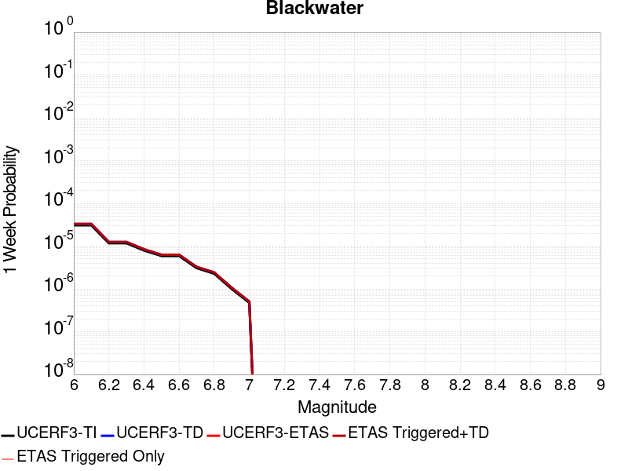 | 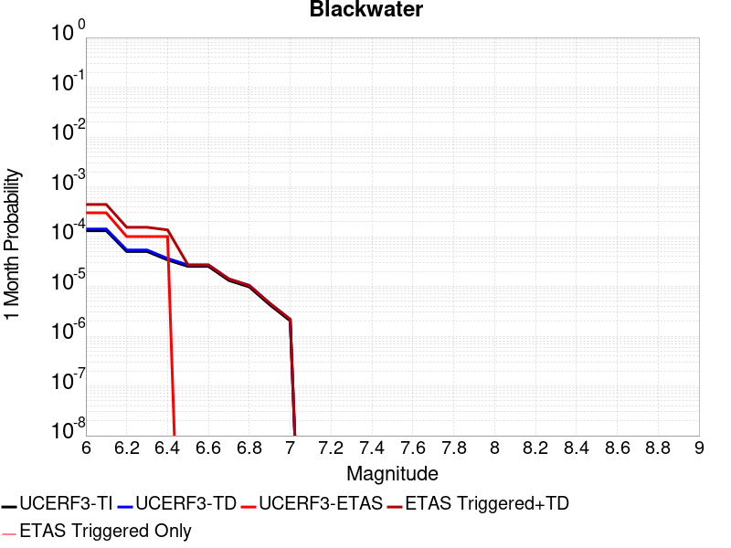 | 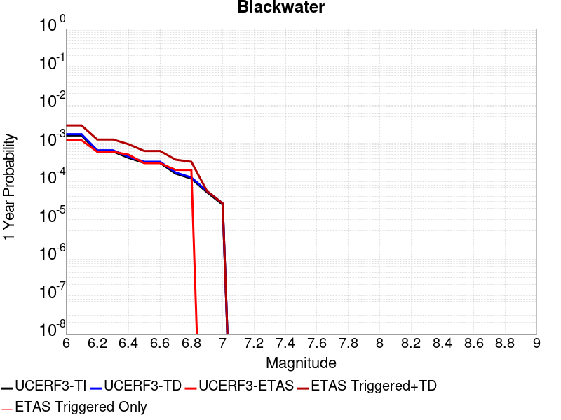 | 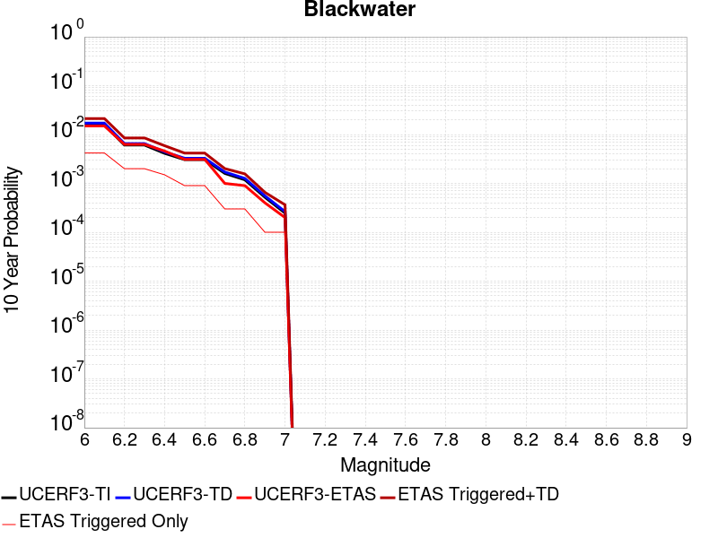 |

| Magnitude | 1 wk TI Prob | 1 wk TD Prob | 1 wk ETAS Prob | 1 wk ETAS/TD Gain | 1 wk ETAS Triggered+TD | 1 wk ETAS Triggered Only | 1 mo TI Prob | 1 mo TD Prob | 1 mo ETAS Prob | 1 mo ETAS/TD Gain | 1 mo ETAS Triggered+TD | 1 mo ETAS Triggered Only | 1 yr TI Prob | 1 yr TD Prob | 1 yr ETAS Prob | 1 yr ETAS/TD Gain | 1 yr ETAS Triggered+TD | 1 yr ETAS Triggered Only | 10 yr TI Prob | 10 yr TD Prob | 10 yr ETAS Prob | 10 yr ETAS/TD Gain | 10 yr ETAS Triggered+TD | 10 yr ETAS Triggered Only |
|-----|-----|-----|-----|-----|-----|-----|-----|-----|-----|-----|-----|-----|-----|-----|-----|-----|-----|-----|-----|-----|-----|-----|-----|-----|
| 6.0 | 3.0708583E-5 | 3.3101154E-5 | 0.0 | 0.0 | 3.3101154E-5 | 0.0 | 1.3160157E-4 | 1.4185515E-4 | 3.0E-4 | 2.1148334 | 4.418126E-4 | 3.0E-4 | 0.0016010714 | 0.0017258549 | 0.002 | 1.1588459 | 0.0029237838 | 0.0012 | 0.015895851 | 0.01713836 | 0.015 | 0.8752296 | 0.021266378 | 0.0042 |
| 6.1 | 3.0708583E-5 | 3.3101154E-5 | 0.0 | 0.0 | 3.3101154E-5 | 0.0 | 1.3160157E-4 | 1.4185515E-4 | 3.0E-4 | 2.1148334 | 4.418126E-4 | 3.0E-4 | 0.0016010714 | 0.0017258549 | 0.002 | 1.1588459 | 0.0029237838 | 0.0012 | 0.015895851 | 0.01713836 | 0.015 | 0.8752296 | 0.021266378 | 0.0042 |
| 6.2 | 1.1707779E-5 | 1.25469705E-5 | 0.0 | 0.0 | 1.25469705E-5 | 0.0 | 5.017523E-5 | 5.3771677E-5 | 1.0E-4 | 1.8597151 | 1.537663E-4 | 1.0E-4 | 6.107122E-4 | 6.5448316E-4 | 9.0E-4 | 1.3751309 | 0.0012540905 | 6.0E-4 | 0.006090366 | 0.0065265284 | 0.0063 | 0.96529114 | 0.008513475 | 0.002 |
| 6.3 | 1.1707779E-5 | 1.25469705E-5 | 0.0 | 0.0 | 1.25469705E-5 | 0.0 | 5.017523E-5 | 5.3771677E-5 | 1.0E-4 | 1.8597151 | 1.537663E-4 | 1.0E-4 | 6.107122E-4 | 6.5448316E-4 | 9.0E-4 | 1.3751309 | 0.0012540905 | 6.0E-4 | 0.006090366 | 0.0065265284 | 0.0063 | 0.96529114 | 0.008513475 | 0.002 |
| 6.4 | 7.929244E-6 | 8.481312E-6 | 0.0 | 0.0 | 8.481312E-6 | 0.0 | 3.3982033E-5 | 3.6347996E-5 | 1.0E-4 | 2.7511835 | 1.3634436E-4 | 1.0E-4 | 4.136527E-4 | 4.42451E-4 | 7.0E-4 | 1.5820961 | 9.4222976E-4 | 5.0E-4 | 0.0041288356 | 0.0044161067 | 0.0046 | 1.0416416 | 0.0059094825 | 0.0015 |
| 6.5 | 5.8832115E-6 | 6.286877E-6 | 0.0 | 0.0 | 6.286877E-6 | 0.0 | 2.521352E-5 | 2.6943495E-5 | 0.0 | 0.0 | 2.6943495E-5 | 0.0 | 3.0693135E-4 | 3.2799022E-4 | 4.0E-4 | 1.2195486 | 6.2789186E-4 | 3.0E-4 | 0.0030650778 | 0.0032753148 | 0.0031 | 0.9464739 | 0.004172367 | 9.0E-4 |
| 6.6 | 5.8832115E-6 | 6.286877E-6 | 0.0 | 0.0 | 6.286877E-6 | 0.0 | 2.521352E-5 | 2.6943495E-5 | 0.0 | 0.0 | 2.6943495E-5 | 0.0 | 3.0693135E-4 | 3.2799022E-4 | 4.0E-4 | 1.2195486 | 6.2789186E-4 | 3.0E-4 | 0.0030650778 | 0.0032753148 | 0.0031 | 0.9464739 | 0.004172367 | 9.0E-4 |
| 6.7 | 3.0715053E-6 | 3.2819282E-6 | 0.0 | 0.0 | 3.2819282E-6 | 0.0 | 1.3163528E-5 | 1.4065337E-5 | 0.0 | 0.0 | 1.4065337E-5 | 0.0 | 1.6025416E-4 | 1.7123319E-4 | 2.0E-4 | 1.167998 | 3.7119893E-4 | 2.0E-4 | 0.0016013865 | 0.001711127 | 0.001 | 0.58441013 | 0.0020106137 | 3.0E-4 |
| 6.8 | 2.2722281E-6 | 2.4290982E-6 | 0.0 | 0.0 | 2.4290982E-6 | 0.0 | 9.738084E-6 | 1.0410385E-5 | 0.0 | 0.0 | 1.0410385E-5 | 0.0 | 1.1855473E-4 | 1.2673998E-4 | 2.0E-4 | 1.578034 | 3.2671462E-4 | 2.0E-4 | 0.001184915 | 0.0012667672 | 9.0E-4 | 0.71046996 | 0.0015663871 | 3.0E-4 |
| 6.9 | 9.952399E-7 | 1.0655034E-6 | 0.0 | 0.0 | 1.0655034E-6 | 0.0 | 4.265307E-6 | 4.5664383E-6 | 0.0 | 0.0 | 4.5664383E-6 | 0.0 | 5.1928873E-5 | 5.5595483E-5 | 0.0 | 0.0 | 5.5595483E-5 | 0.0 | 5.191674E-4 | 5.5586634E-4 | 4.0E-4 | 0.7195974 | 6.5581076E-4 | 1.0E-4 |
| 7.0 | 4.7385504E-7 | 5.0763026E-7 | 0.0 | 0.0 | 5.0763026E-7 | 0.0 | 2.0308057E-6 | 2.1755584E-6 | 0.0 | 0.0 | 2.1755584E-6 | 0.0 | 2.4724779E-5 | 2.6487423E-5 | 0.0 | 0.0 | 2.6487423E-5 | 0.0 | 2.4722028E-4 | 2.6487422E-4 | 2.0E-4 | 0.75507534 | 3.6484774E-4 | 1.0E-4 |

## Pinto Mtn
*[(top)](#table-of-contents)*

| 1 Week | 1 Month | 1 Year | 10 Year |
|-----|-----|-----|-----|
| 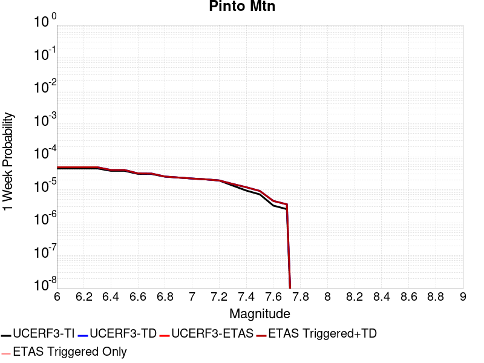 | 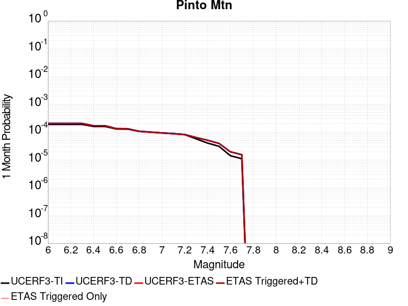 | 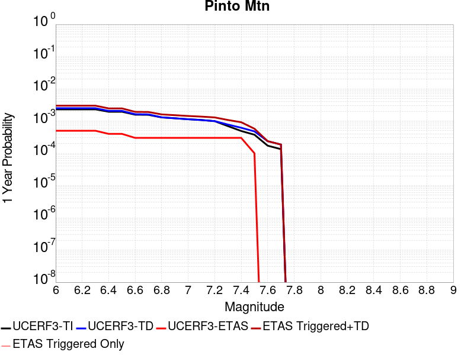 | 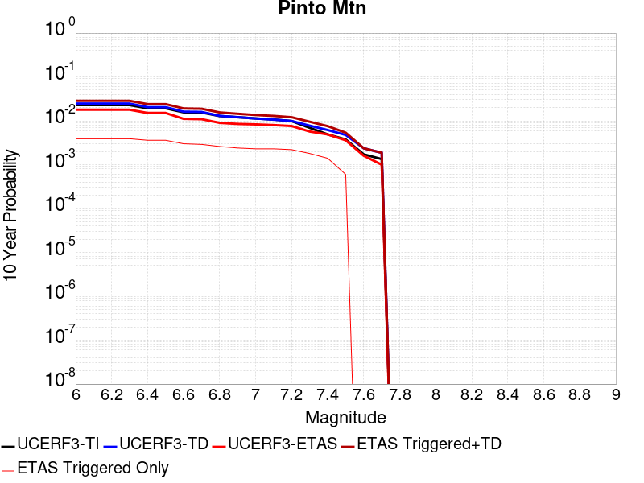 |

| Magnitude | 1 wk TI Prob | 1 wk TD Prob | 1 wk ETAS Prob | 1 wk ETAS/TD Gain | 1 wk ETAS Triggered+TD | 1 wk ETAS Triggered Only | 1 mo TI Prob | 1 mo TD Prob | 1 mo ETAS Prob | 1 mo ETAS/TD Gain | 1 mo ETAS Triggered+TD | 1 mo ETAS Triggered Only | 1 yr TI Prob | 1 yr TD Prob | 1 yr ETAS Prob | 1 yr ETAS/TD Gain | 1 yr ETAS Triggered+TD | 1 yr ETAS Triggered Only | 10 yr TI Prob | 10 yr TD Prob | 10 yr ETAS Prob | 10 yr ETAS/TD Gain | 10 yr ETAS Triggered+TD | 10 yr ETAS Triggered Only |
|-----|-----|-----|-----|-----|-----|-----|-----|-----|-----|-----|-----|-----|-----|-----|-----|-----|-----|-----|-----|-----|-----|-----|-----|-----|
| 6.0 | 4.4194956E-5 | 4.787891E-5 | 0.0 | 0.0 | 4.787891E-5 | 0.0 | 1.893932E-4 | 2.0518013E-4 | 0.0 | 0.0 | 2.0518013E-4 | 0.0 | 0.0023034236 | 0.0024953699 | 0.0013 | 0.52096486 | 0.0029941222 | 5.0E-4 | 0.022796938 | 0.024691036 | 0.0179 | 0.72495943 | 0.028494742 | 0.0039 |
| 6.1 | 4.4194956E-5 | 4.787891E-5 | 0.0 | 0.0 | 4.787891E-5 | 0.0 | 1.893932E-4 | 2.0518013E-4 | 0.0 | 0.0 | 2.0518013E-4 | 0.0 | 0.0023034236 | 0.0024953699 | 0.0013 | 0.52096486 | 0.0029941222 | 5.0E-4 | 0.022796938 | 0.024691036 | 0.0179 | 0.72495943 | 0.028494742 | 0.0039 |
| 6.2 | 4.4194956E-5 | 4.787891E-5 | 0.0 | 0.0 | 4.787891E-5 | 0.0 | 1.893932E-4 | 2.0518013E-4 | 0.0 | 0.0 | 2.0518013E-4 | 0.0 | 0.0023034236 | 0.0024953699 | 0.0013 | 0.52096486 | 0.0029941222 | 5.0E-4 | 0.022796938 | 0.024691036 | 0.0179 | 0.72495943 | 0.028494742 | 0.0039 |
| 6.3 | 4.4194956E-5 | 4.787891E-5 | 0.0 | 0.0 | 4.787891E-5 | 0.0 | 1.893932E-4 | 2.0518013E-4 | 0.0 | 0.0 | 2.0518013E-4 | 0.0 | 0.0023034236 | 0.0024953699 | 0.0013 | 0.52096486 | 0.0029941222 | 5.0E-4 | 0.022796938 | 0.024691036 | 0.0179 | 0.72495943 | 0.028494742 | 0.0039 |
| 6.4 | 3.729929E-5 | 3.9625145E-5 | 0.0 | 0.0 | 3.9625145E-5 | 0.0 | 1.5984432E-4 | 1.6981152E-4 | 0.0 | 0.0 | 1.6981152E-4 | 0.0 | 0.0019443673 | 0.0020655883 | 0.0011 | 0.5325359 | 0.002464762 | 4.0E-4 | 0.019274427 | 0.020473925 | 0.0151 | 0.73752344 | 0.02400022 | 0.0036 |
| 6.5 | 3.729929E-5 | 3.9625145E-5 | 0.0 | 0.0 | 3.9625145E-5 | 0.0 | 1.5984432E-4 | 1.6981152E-4 | 0.0 | 0.0 | 1.6981152E-4 | 0.0 | 0.0019443673 | 0.0020655883 | 0.0011 | 0.5325359 | 0.002464762 | 4.0E-4 | 0.019274427 | 0.020473925 | 0.0151 | 0.73752344 | 0.02400022 | 0.0036 |
| 6.6 | 3.0204548E-5 | 3.122408E-5 | 0.0 | 0.0 | 3.122408E-5 | 0.0 | 1.2944164E-4 | 1.3381083E-4 | 0.0 | 0.0 | 1.3381083E-4 | 0.0 | 0.0015748127 | 0.001627964 | 9.0E-4 | 0.5528378 | 0.0019274756 | 3.0E-4 | 0.015636992 | 0.016164254 | 0.0111 | 0.6867004 | 0.01911576 | 0.003 |
| 6.7 | 2.9857754E-5 | 3.0833362E-5 | 0.0 | 0.0 | 3.0833362E-5 | 0.0 | 1.2795553E-4 | 1.3213648E-4 | 0.0 | 0.0 | 1.3213648E-4 | 0.0 | 0.0015567453 | 0.0016076092 | 9.0E-4 | 0.5598376 | 0.0019071269 | 3.0E-4 | 0.015458848 | 0.015963644 | 0.0109 | 0.6828015 | 0.018817348 | 0.0029 |
| 6.8 | 2.4819734E-5 | 2.5026215E-5 | 0.0 | 0.0 | 2.5026215E-5 | 0.0 | 1.0636595E-4 | 1.0725092E-4 | 0.0 | 0.0 | 1.0725092E-4 | 0.0 | 0.0012942362 | 0.0013050194 | 7.0E-4 | 0.5363905 | 0.0016046279 | 3.0E-4 | 0.012867244 | 0.012975928 | 0.009 | 0.693592 | 0.0155421905 | 0.0026 |
| 6.9 | 2.331124E-5 | 2.335412E-5 | 0.0 | 0.0 | 2.335412E-5 | 0.0 | 9.990149E-5 | 1.0008536E-4 | 0.0 | 0.0 | 1.0008536E-4 | 0.0 | 0.001215622 | 0.0012178784 | 7.0E-4 | 0.57477003 | 0.0015175131 | 3.0E-4 | 0.012089936 | 0.012114236 | 0.0085 | 0.7016538 | 0.014485163 | 0.0024 |
| 7.0 | 2.1818534E-5 | 2.1776934E-5 | 0.0 | 0.0 | 2.1776934E-5 | 0.0 | 9.3504656E-5 | 9.332649E-5 | 0.0 | 0.0 | 9.332649E-5 | 0.0 | 0.0011378246 | 0.0011356776 | 7.0E-4 | 0.6163721 | 0.0014353369 | 3.0E-4 | 0.011320163 | 0.011300843 | 0.0083 | 0.73445845 | 0.013574852 | 0.0023 |
| 7.1 | 2.066081E-5 | 2.0556283E-5 | 0.0 | 0.0 | 2.0556283E-5 | 0.0 | 8.854332E-5 | 8.809549E-5 | 0.0 | 0.0 | 8.809549E-5 | 0.0 | 0.0010774818 | 0.0010720545 | 7.0E-4 | 0.6529519 | 0.0013717328 | 3.0E-4 | 0.010722724 | 0.010670881 | 0.008 | 0.7497038 | 0.012946337 | 0.0023 |
| 7.2 | 1.8990233E-5 | 1.9069266E-5 | 0.0 | 0.0 | 1.9069266E-5 | 0.0 | 8.138417E-5 | 8.1722974E-5 | 0.0 | 0.0 | 8.1722974E-5 | 0.0 | 9.904018E-4 | 9.945424E-4 | 7.0E-4 | 0.70384127 | 0.0012942441 | 3.0E-4 | 0.009859995 | 0.009902917 | 0.0076 | 0.7674507 | 0.01208113 | 0.0022 |
| 7.3 | 1.3335872E-5 | 1.4920775E-5 | 0.0 | 0.0 | 1.4920775E-5 | 0.0 | 5.7152483E-5 | 6.394469E-5 | 0.0 | 0.0 | 6.394469E-5 | 0.0 | 6.956093E-4 | 7.782612E-4 | 5.0E-4 | 0.6424578 | 0.0010780278 | 3.0E-4 | 0.006934359 | 0.007756658 | 0.0057 | 0.73485255 | 0.009542696 | 0.0018 |
| 7.4 | 9.414066E-6 | 1.1874348E-5 | 0.0 | 0.0 | 1.1874348E-5 | 0.0 | 4.0345374E-5 | 5.0889124E-5 | 0.0 | 0.0 | 5.0889124E-5 | 0.0 | 4.910942E-4 | 6.194084E-4 | 5.0E-4 | 0.80722183 | 9.192226E-4 | 3.0E-4 | 0.0049001034 | 0.0061777695 | 0.0049 | 0.7931665 | 0.0075691207 | 0.0014 |
| 7.5 | 7.2101157E-6 | 9.171227E-6 | 0.0 | 0.0 | 9.171227E-6 | 0.0 | 3.090013E-5 | 3.930471E-5 | 0.0 | 0.0 | 3.930471E-5 | 0.0 | 3.7614413E-4 | 4.7843758E-4 | 2.0E-4 | 0.41802737 | 5.7838974E-4 | 1.0E-4 | 0.0037550807 | 0.004774852 | 0.0036 | 0.75395006 | 0.0053719874 | 6.0E-4 |
| 7.6 | 3.296375E-6 | 4.558044E-6 | 0.0 | 0.0 | 4.558044E-6 | 0.0 | 1.4127245E-5 | 1.9534336E-5 | 0.0 | 0.0 | 1.9534336E-5 | 0.0 | 1.7198564E-4 | 2.3780597E-4 | 1.0E-4 | 0.4205109 | 2.3780597E-4 | 0.0 | 0.0017185259 | 0.0023756532 | 0.0016 | 0.6734989 | 0.0023756532 | 0.0 |
| 7.7 | 2.5741092E-6 | 3.596239E-6 | 0.0 | 0.0 | 3.596239E-6 | 0.0 | 1.103185E-5 | 1.5412368E-5 | 0.0 | 0.0 | 1.5412368E-5 | 0.0 | 1.3430449E-4 | 1.8763077E-4 | 0.0 | 0.0 | 1.8763077E-4 | 0.0 | 0.0013422335 | 0.0018748541 | 0.001 | 0.53337485 | 0.0018748541 | 0.0 |

## Goldstone Lake
*[(top)](#table-of-contents)*

| 1 Week | 1 Month | 1 Year | 10 Year |
|-----|-----|-----|-----|
| 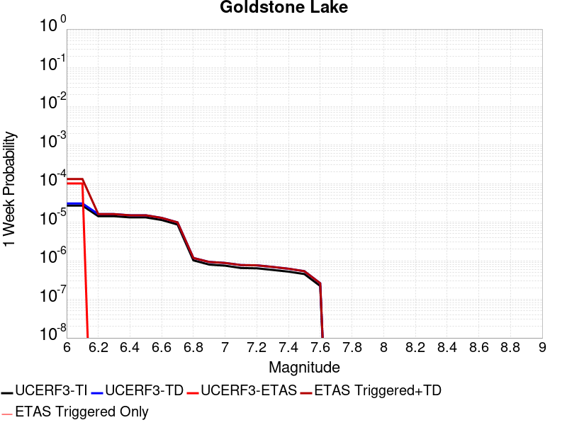 | 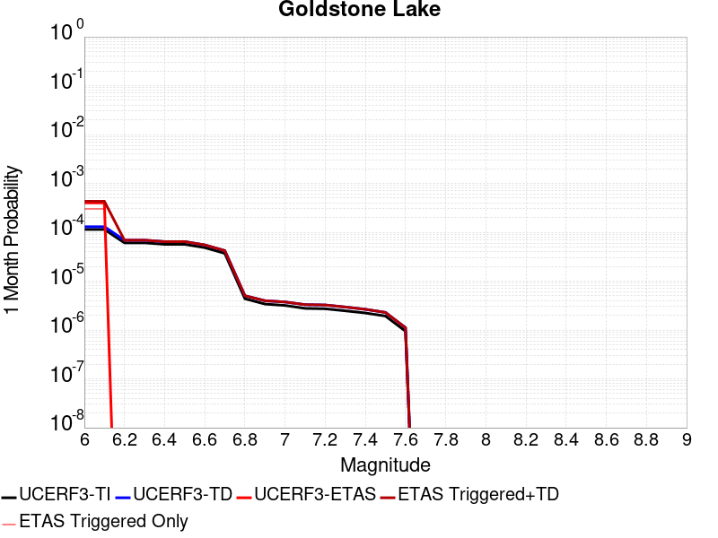 | 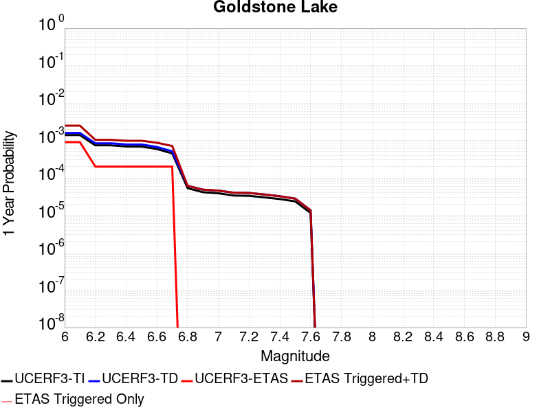 | 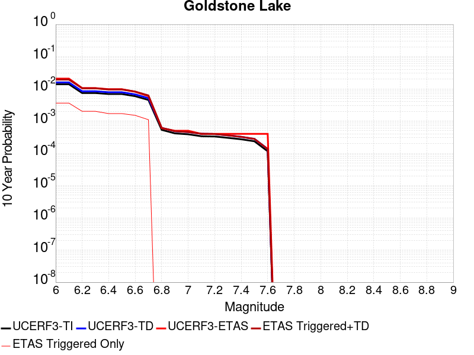 |

| Magnitude | 1 wk TI Prob | 1 wk TD Prob | 1 wk ETAS Prob | 1 wk ETAS/TD Gain | 1 wk ETAS Triggered+TD | 1 wk ETAS Triggered Only | 1 mo TI Prob | 1 mo TD Prob | 1 mo ETAS Prob | 1 mo ETAS/TD Gain | 1 mo ETAS Triggered+TD | 1 mo ETAS Triggered Only | 1 yr TI Prob | 1 yr TD Prob | 1 yr ETAS Prob | 1 yr ETAS/TD Gain | 1 yr ETAS Triggered+TD | 1 yr ETAS Triggered Only | 10 yr TI Prob | 10 yr TD Prob | 10 yr ETAS Prob | 10 yr ETAS/TD Gain | 10 yr ETAS Triggered+TD | 10 yr ETAS Triggered Only |
|-----|-----|-----|-----|-----|-----|-----|-----|-----|-----|-----|-----|-----|-----|-----|-----|-----|-----|-----|-----|-----|-----|-----|-----|-----|
| 6.0 | 2.671352E-5 | 3.0384457E-5 | 1.0E-4 | 3.2911565 | 1.3038142E-4 | 1.0E-4 | 1.1448149E-4 | 1.3021371E-4 | 4.0E-4 | 3.0718732 | 4.3017464E-4 | 3.0E-4 | 0.001392921 | 0.0015843954 | 0.0024 | 1.5147734 | 0.0024829695 | 9.0E-4 | 0.013842222 | 0.015750503 | 0.0207 | 1.3142437 | 0.019293802 | 0.0036 |
| 6.1 | 2.671352E-5 | 3.0384457E-5 | 1.0E-4 | 3.2911565 | 1.3038142E-4 | 1.0E-4 | 1.1448149E-4 | 1.3021371E-4 | 4.0E-4 | 3.0718732 | 4.3017464E-4 | 3.0E-4 | 0.001392921 | 0.0015843954 | 0.0024 | 1.5147734 | 0.0024829695 | 9.0E-4 | 0.013842222 | 0.015750503 | 0.0207 | 1.3142437 | 0.019293802 | 0.0036 |
| 6.2 | 1.4197047E-5 | 1.6100461E-5 | 0.0 | 0.0 | 1.6100461E-5 | 0.0 | 6.0843064E-5 | 6.900071E-5 | 0.0 | 0.0 | 6.900071E-5 | 0.0 | 7.4051257E-4 | 8.3985855E-4 | 0.001 | 1.1906767 | 0.0010396906 | 2.0E-4 | 0.007380498 | 0.008376547 | 0.0105 | 1.2534999 | 0.010359794 | 0.002 |
| 6.3 | 1.4197047E-5 | 1.6100461E-5 | 0.0 | 0.0 | 1.6100461E-5 | 0.0 | 6.0843064E-5 | 6.900071E-5 | 0.0 | 0.0 | 6.900071E-5 | 0.0 | 7.4051257E-4 | 8.3985855E-4 | 0.001 | 1.1906767 | 0.0010396906 | 2.0E-4 | 0.007380498 | 0.008376547 | 0.0105 | 1.2534999 | 0.010359794 | 0.002 |
| 6.4 | 1.3238931E-5 | 1.5012373E-5 | 0.0 | 0.0 | 1.5012373E-5 | 0.0 | 5.6737044E-5 | 6.4337706E-5 | 0.0 | 0.0 | 6.4337706E-5 | 0.0 | 6.9055456E-4 | 7.8312814E-4 | 8.0E-4 | 1.0215442 | 9.829715E-4 | 2.0E-4 | 0.006884126 | 0.007813316 | 0.0097 | 1.2414703 | 0.009500033 | 0.0017 |
| 6.5 | 1.3238931E-5 | 1.5012373E-5 | 0.0 | 0.0 | 1.5012373E-5 | 0.0 | 5.6737044E-5 | 6.4337706E-5 | 0.0 | 0.0 | 6.4337706E-5 | 0.0 | 6.9055456E-4 | 7.8312814E-4 | 8.0E-4 | 1.0215442 | 9.829715E-4 | 2.0E-4 | 0.006884126 | 0.007813316 | 0.0097 | 1.2414703 | 0.009500033 | 0.0017 |
| 6.6 | 1.1328278E-5 | 1.2858516E-5 | 0.0 | 0.0 | 1.2858516E-5 | 0.0 | 4.8548856E-5 | 5.51073E-5 | 0.0 | 0.0 | 5.51073E-5 | 0.0 | 5.90922E-4 | 6.708206E-4 | 5.0E-4 | 0.7453558 | 8.7068643E-4 | 2.0E-4 | 0.0058935313 | 0.0066973506 | 0.0081 | 1.2094334 | 0.008187304 | 0.0015 |
| 6.7 | 8.651175E-6 | 9.82709E-6 | 0.0 | 0.0 | 9.82709E-6 | 0.0 | 3.707594E-5 | 4.211593E-5 | 0.0 | 0.0 | 4.211593E-5 | 0.0 | 4.5130608E-4 | 5.1273144E-4 | 3.0E-4 | 0.58510166 | 7.126289E-4 | 2.0E-4 | 0.0045039062 | 0.005124368 | 0.0059 | 1.1513616 | 0.006218731 | 0.0011 |
| 6.8 | 1.0215377E-6 | 1.1756155E-6 | 0.0 | 0.0 | 1.1756155E-6 | 0.0 | 4.378012E-6 | 5.038343E-6 | 0.0 | 0.0 | 5.038343E-6 | 0.0 | 5.3300988E-5 | 6.134021E-5 | 0.0 | 0.0 | 6.134021E-5 | 0.0 | 5.3288206E-4 | 6.132441E-4 | 6.0E-4 | 0.9784033 | 6.132441E-4 | 0.0 |
| 6.9 | 7.9360774E-7 | 9.28442E-7 | 0.0 | 0.0 | 9.28442E-7 | 0.0 | 3.4011714E-6 | 3.9790316E-6 | 0.0 | 0.0 | 3.9790316E-6 | 0.0 | 4.1408475E-5 | 4.84437E-5 | 0.0 | 0.0 | 4.84437E-5 | 0.0 | 4.140076E-4 | 4.843384E-4 | 5.0E-4 | 1.032336 | 4.843384E-4 | 0.0 |
| 7.0 | 7.4382757E-7 | 8.748267E-7 | 0.0 | 0.0 | 8.748267E-7 | 0.0 | 3.1878285E-6 | 3.7492523E-6 | 0.0 | 0.0 | 3.7492523E-6 | 0.0 | 3.8811122E-5 | 4.564626E-5 | 0.0 | 0.0 | 4.564626E-5 | 0.0 | 3.8804344E-4 | 4.5637548E-4 | 5.0E-4 | 1.0955892 | 4.5637548E-4 | 0.0 |
| 7.1 | 6.4709513E-7 | 7.712087E-7 | 0.0 | 0.0 | 7.712087E-7 | 0.0 | 2.773262E-6 | 3.3051763E-6 | 0.0 | 0.0 | 3.3051763E-6 | 0.0 | 3.376394E-5 | 4.0239836E-5 | 0.0 | 0.0 | 4.0239836E-5 | 0.0 | 3.375881E-4 | 4.0233147E-4 | 4.0E-4 | 0.9942051 | 4.0233147E-4 | 0.0 |
| 7.2 | 6.356704E-7 | 7.5891273E-7 | 0.0 | 0.0 | 7.5891273E-7 | 0.0 | 2.7242988E-6 | 3.2524795E-6 | 0.0 | 0.0 | 3.2524795E-6 | 0.0 | 3.3167835E-5 | 3.959828E-5 | 0.0 | 0.0 | 3.959828E-5 | 0.0 | 3.3162883E-4 | 3.9591815E-4 | 4.0E-4 | 1.0103098 | 3.9591815E-4 | 0.0 |
| 7.3 | 5.7695723E-7 | 6.8972645E-7 | 0.0 | 0.0 | 6.8972645E-7 | 0.0 | 2.4726714E-6 | 2.9559676E-6 | 0.0 | 0.0 | 2.9559676E-6 | 0.0 | 3.0104358E-5 | 3.5988367E-5 | 0.0 | 0.0 | 3.5988367E-5 | 0.0 | 3.0100282E-4 | 3.5983112E-4 | 4.0E-4 | 1.1116326 | 3.5983112E-4 | 0.0 |
| 7.4 | 5.209647E-7 | 6.1940955E-7 | 0.0 | 0.0 | 6.1940955E-7 | 0.0 | 2.232704E-6 | 2.6546102E-6 | 0.0 | 0.0 | 2.6546102E-6 | 0.0 | 2.718283E-5 | 3.2319454E-5 | 0.0 | 0.0 | 3.2319454E-5 | 0.0 | 2.7179506E-4 | 3.231531E-4 | 4.0E-4 | 1.2378033 | 3.231531E-4 | 0.0 |
| 7.5 | 4.512955E-7 | 5.3493494E-7 | 0.0 | 0.0 | 5.3493494E-7 | 0.0 | 1.934122E-6 | 2.2925765E-6 | 0.0 | 0.0 | 2.2925765E-6 | 0.0 | 2.3547682E-5 | 2.7911816E-5 | 0.0 | 0.0 | 2.7911816E-5 | 0.0 | 2.3545188E-4 | 2.7908842E-4 | 4.0E-4 | 1.4332376 | 2.7908842E-4 | 0.0 |
| 7.6 | 2.21172E-7 | 2.6041258E-7 | 0.0 | 0.0 | 2.6041258E-7 | 0.0 | 9.478797E-7 | 1.1160537E-6 | 0.0 | 0.0 | 1.1160537E-6 | 0.0 | 1.1540374E-5 | 1.3587897E-5 | 0.0 | 0.0 | 1.3587897E-5 | 0.0 | 1.1539775E-4 | 1.3587347E-4 | 4.0E-4 | 2.9439154 | 1.3587347E-4 | 0.0 |

## Ludlow
*[(top)](#table-of-contents)*

| 1 Week | 1 Month | 1 Year | 10 Year |
|-----|-----|-----|-----|
| 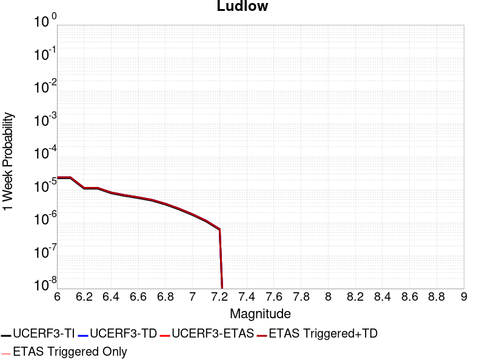 | 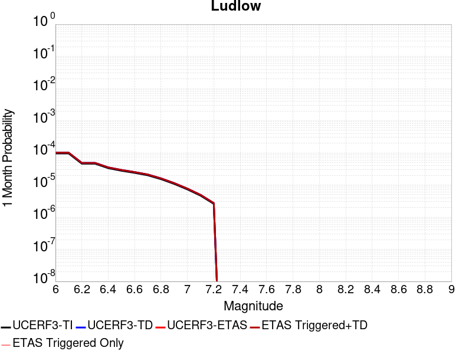 | 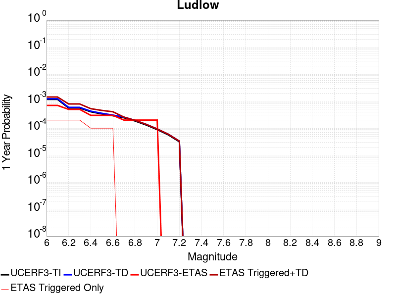 | 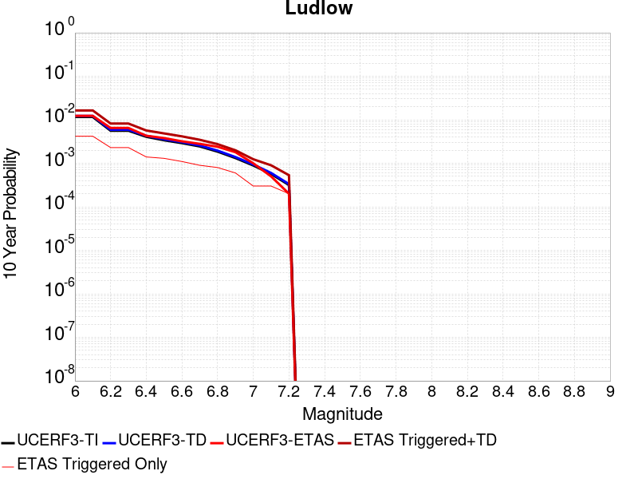 |

| Magnitude | 1 wk TI Prob | 1 wk TD Prob | 1 wk ETAS Prob | 1 wk ETAS/TD Gain | 1 wk ETAS Triggered+TD | 1 wk ETAS Triggered Only | 1 mo TI Prob | 1 mo TD Prob | 1 mo ETAS Prob | 1 mo ETAS/TD Gain | 1 mo ETAS Triggered+TD | 1 mo ETAS Triggered Only | 1 yr TI Prob | 1 yr TD Prob | 1 yr ETAS Prob | 1 yr ETAS/TD Gain | 1 yr ETAS Triggered+TD | 1 yr ETAS Triggered Only | 10 yr TI Prob | 10 yr TD Prob | 10 yr ETAS Prob | 10 yr ETAS/TD Gain | 10 yr ETAS Triggered+TD | 10 yr ETAS Triggered Only |
|-----|-----|-----|-----|-----|-----|-----|-----|-----|-----|-----|-----|-----|-----|-----|-----|-----|-----|-----|-----|-----|-----|-----|-----|-----|
| 6.0 | 2.2407607E-5 | 2.3659972E-5 | 0.0 | 0.0 | 2.3659972E-5 | 0.0 | 9.602906E-5 | 1.0139619E-4 | 2.0E-4 | 1.9724607 | 1.0139619E-4 | 0.0 | 0.0011685267 | 0.0012338436 | 7.0E-4 | 0.56733286 | 0.0014335968 | 2.0E-4 | 0.011624013 | 0.012274444 | 0.0123 | 1.002082 | 0.016422892 | 0.0042 |
| 6.1 | 2.2407607E-5 | 2.3659972E-5 | 0.0 | 0.0 | 2.3659972E-5 | 0.0 | 9.602906E-5 | 1.0139619E-4 | 2.0E-4 | 1.9724607 | 1.0139619E-4 | 0.0 | 0.0011685267 | 0.0012338436 | 7.0E-4 | 0.56733286 | 0.0014335968 | 2.0E-4 | 0.011624013 | 0.012274444 | 0.0123 | 1.002082 | 0.016422892 | 0.0042 |
| 6.2 | 1.0781252E-5 | 1.1366933E-5 | 0.0 | 0.0 | 1.1366933E-5 | 0.0 | 4.620455E-5 | 4.871454E-5 | 1.0E-4 | 2.0527751 | 4.871454E-5 | 0.0 | 5.623952E-4 | 5.929422E-4 | 5.0E-4 | 0.8432526 | 7.9282356E-4 | 2.0E-4 | 0.00560974 | 0.00591402 | 0.0065 | 1.0990832 | 0.008200417 | 0.0023 |
| 6.3 | 1.0781252E-5 | 1.1366933E-5 | 0.0 | 0.0 | 1.1366933E-5 | 0.0 | 4.620455E-5 | 4.871454E-5 | 1.0E-4 | 2.0527751 | 4.871454E-5 | 0.0 | 5.623952E-4 | 5.929422E-4 | 5.0E-4 | 0.8432526 | 7.9282356E-4 | 2.0E-4 | 0.00560974 | 0.00591402 | 0.0065 | 1.0990832 | 0.008200417 | 0.0023 |
| 6.4 | 7.814439E-6 | 8.238649E-6 | 0.0 | 0.0 | 8.238649E-6 | 0.0 | 3.3490025E-5 | 3.530802E-5 | 1.0E-4 | 2.8322175 | 3.530802E-5 | 0.0 | 4.0766477E-4 | 4.2979178E-4 | 3.0E-4 | 0.6980124 | 5.297488E-4 | 1.0E-4 | 0.0040691774 | 0.0042897523 | 0.0043 | 1.0023888 | 0.0056837467 | 0.0014 |
| 6.5 | 6.4986366E-6 | 6.851685E-6 | 0.0 | 0.0 | 6.851685E-6 | 0.0 | 2.7851002E-5 | 2.9364039E-5 | 1.0E-4 | 3.4055262 | 2.9364039E-5 | 0.0 | 3.390332E-4 | 3.5744946E-4 | 3.0E-4 | 0.83927953 | 4.574137E-4 | 1.0E-4 | 0.003385164 | 0.0035688411 | 0.0038 | 1.0647714 | 0.004864202 | 0.0013 |
| 6.6 | 5.582177E-6 | 5.886666E-6 | 0.0 | 0.0 | 5.886666E-6 | 0.0 | 2.3923398E-5 | 2.5228328E-5 | 1.0E-4 | 3.9637983 | 2.5228328E-5 | 0.0 | 2.9122844E-4 | 3.0711232E-4 | 3.0E-4 | 0.97684133 | 4.070816E-4 | 1.0E-4 | 0.0029084706 | 0.0030669523 | 0.0032 | 1.0433811 | 0.0041635786 | 0.0011 |
| 6.7 | 4.6858763E-6 | 4.9409805E-6 | 0.0 | 0.0 | 4.9409805E-6 | 0.0 | 2.0082172E-5 | 2.1175461E-5 | 1.0E-4 | 4.7224474 | 2.1175461E-5 | 0.0 | 2.4447302E-4 | 2.577813E-4 | 2.0E-4 | 0.7758515 | 2.577813E-4 | 0.0 | 0.0024420423 | 0.0025748792 | 0.0028 | 1.0874296 | 0.0034725617 | 9.0E-4 |
| 6.8 | 3.5584908E-6 | 3.7524387E-6 | 0.0 | 0.0 | 3.7524387E-6 | 0.0 | 1.5250586E-5 | 1.6081784E-5 | 1.0E-4 | 6.218216 | 1.6081784E-5 | 0.0 | 1.8566006E-4 | 1.9577853E-4 | 2.0E-4 | 1.0215625 | 1.9577853E-4 | 0.0 | 0.0018550502 | 0.0019561017 | 0.0024 | 1.2269301 | 0.0027545367 | 8.0E-4 |
| 6.9 | 2.532834E-6 | 2.6713035E-6 | 0.0 | 0.0 | 2.6713035E-6 | 0.0 | 1.0854958E-5 | 1.14483955E-5 | 1.0E-4 | 8.734849 | 1.14483955E-5 | 0.0 | 1.3215111E-4 | 1.3937558E-4 | 2.0E-4 | 1.4349717 | 1.3937558E-4 | 0.0 | 0.0013207254 | 0.0013929092 | 0.0018 | 1.2922593 | 0.0019920736 | 6.0E-4 |
| 7.0 | 1.7083285E-6 | 1.8021473E-6 | 0.0 | 0.0 | 1.8021473E-6 | 0.0 | 7.3213873E-6 | 7.723466E-6 | 1.0E-4 | 12.947555 | 7.723466E-6 | 0.0 | 8.913424E-5 | 9.402931E-5 | 2.0E-4 | 2.1269963 | 9.402931E-5 | 0.0 | 8.9098496E-4 | 9.3991176E-4 | 0.001 | 1.0639297 | 0.0012396298 | 3.0E-4 |
| 7.1 | 1.0905424E-6 | 1.1498905E-6 | 0.0 | 0.0 | 1.1498905E-6 | 0.0 | 4.6737446E-6 | 4.928094E-6 | 0.0 | 0.0 | 4.928094E-6 | 0.0 | 5.6901354E-5 | 5.9997987E-5 | 0.0 | 0.0 | 5.9997987E-5 | 0.0 | 5.6886784E-4 | 5.998277E-4 | 5.0E-4 | 0.83357275 | 8.996477E-4 | 3.0E-4 |
| 7.2 | 6.06668E-7 | 6.3879725E-7 | 0.0 | 0.0 | 6.3879725E-7 | 0.0 | 2.600003E-6 | 2.7377E-6 | 0.0 | 0.0 | 2.7377E-6 | 0.0 | 3.1654577E-5 | 3.333106E-5 | 0.0 | 0.0 | 3.333106E-5 | 0.0 | 3.1650066E-4 | 3.3326744E-4 | 2.0E-4 | 0.60011864 | 5.332008E-4 | 2.0E-4 |

## Rodgers Creek - Healdsburg 2011 CFM
*[(top)](#table-of-contents)*

| 1 Week | 1 Month | 1 Year | 10 Year |
|-----|-----|-----|-----|
| 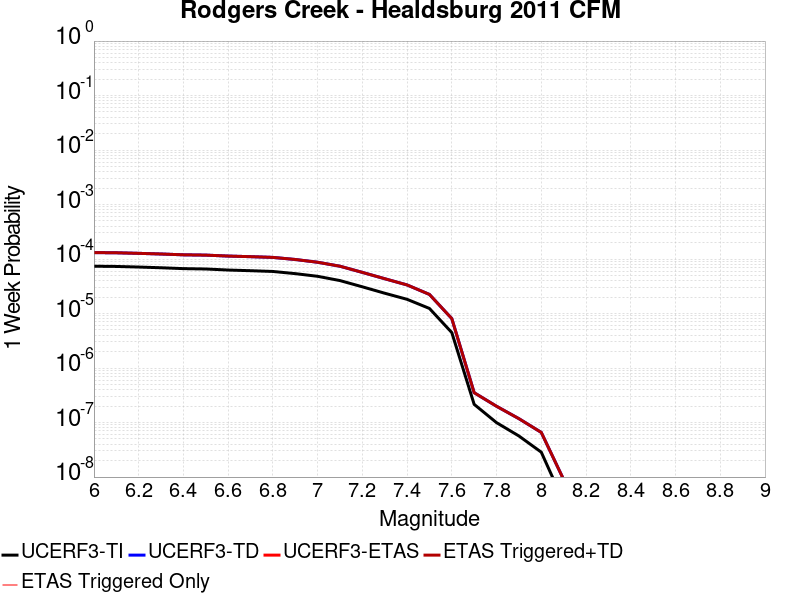 | 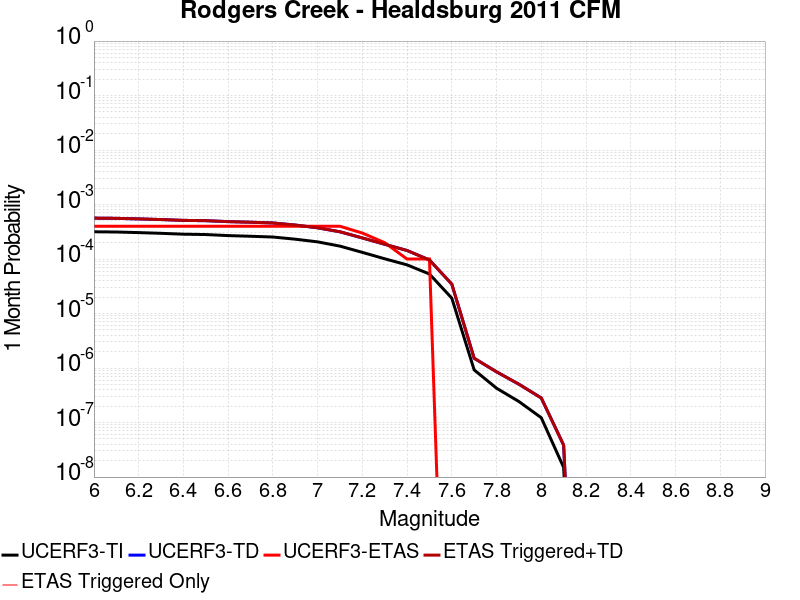 | 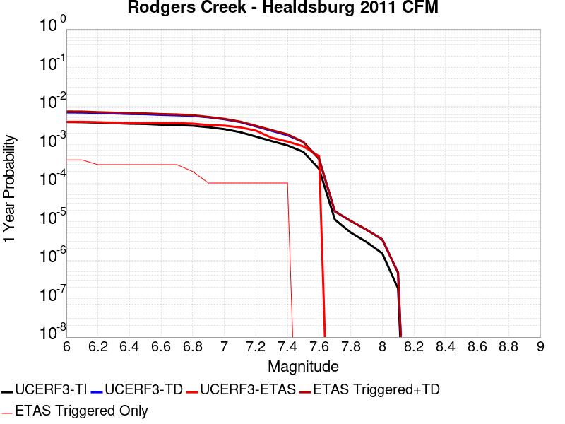 | 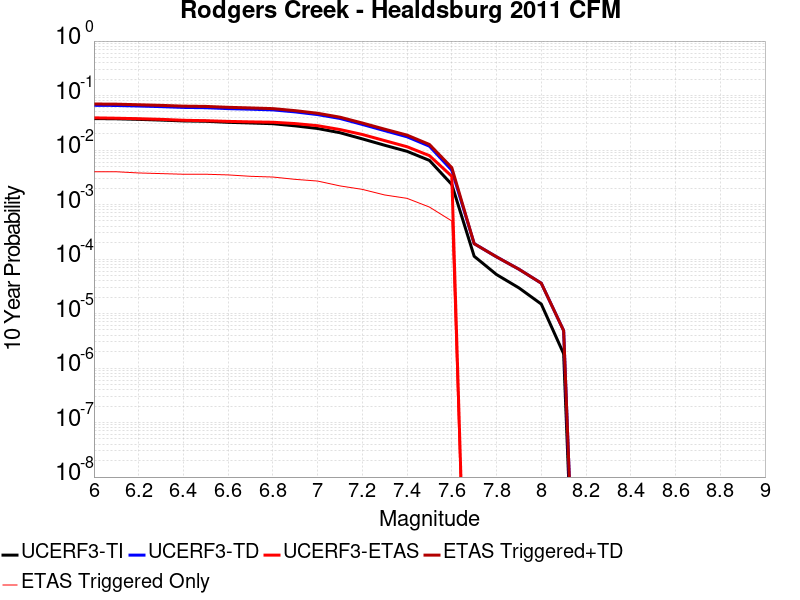 |

| Magnitude | 1 wk TI Prob | 1 wk TD Prob | 1 wk ETAS Prob | 1 wk ETAS/TD Gain | 1 wk ETAS Triggered+TD | 1 wk ETAS Triggered Only | 1 mo TI Prob | 1 mo TD Prob | 1 mo ETAS Prob | 1 mo ETAS/TD Gain | 1 mo ETAS Triggered+TD | 1 mo ETAS Triggered Only | 1 yr TI Prob | 1 yr TD Prob | 1 yr ETAS Prob | 1 yr ETAS/TD Gain | 1 yr ETAS Triggered+TD | 1 yr ETAS Triggered Only | 10 yr TI Prob | 10 yr TD Prob | 10 yr ETAS Prob | 10 yr ETAS/TD Gain | 10 yr ETAS Triggered+TD | 10 yr ETAS Triggered Only |
|-----|-----|-----|-----|-----|-----|-----|-----|-----|-----|-----|-----|-----|-----|-----|-----|-----|-----|-----|-----|-----|-----|-----|-----|-----|
| 6.0 | 7.390182E-5 | 1.315806E-4 | 2.0E-4 | 1.519981 | 1.315806E-4 | 0.0 | 3.1668364E-4 | 5.637934E-4 | 4.0E-4 | 0.7094797 | 5.637934E-4 | 0.0 | 0.0038488081 | 0.006842544 | 0.0039 | 0.56996346 | 0.007239807 | 4.0E-4 | 0.037828278 | 0.066277646 | 0.039 | 0.5884337 | 0.07001254 | 0.004 |
| 6.1 | 7.318768E-5 | 1.3056003E-4 | 2.0E-4 | 1.5318623 | 1.3056003E-4 | 0.0 | 3.1362378E-4 | 5.594215E-4 | 4.0E-4 | 0.71502435 | 5.594215E-4 | 0.0 | 0.0038116854 | 0.006789664 | 0.0039 | 0.5744025 | 0.007186948 | 4.0E-4 | 0.037469655 | 0.065781936 | 0.0384 | 0.5837469 | 0.069518805 | 0.004 |
| 6.2 | 7.1379836E-5 | 1.2748668E-4 | 2.0E-4 | 1.5687914 | 1.2748668E-4 | 0.0 | 3.058777E-4 | 5.4625556E-4 | 4.0E-4 | 0.732258 | 5.4625556E-4 | 0.0 | 0.003717703 | 0.0066303527 | 0.0038 | 0.57312185 | 0.006928364 | 3.0E-4 | 0.0365612 | 0.064303346 | 0.0376 | 0.58472854 | 0.067858994 | 0.0038 |
| 6.3 | 6.9255926E-5 | 1.2402734E-4 | 2.0E-4 | 1.6125476 | 1.2402734E-4 | 0.0 | 2.9677735E-4 | 5.314373E-4 | 4.0E-4 | 0.7526758 | 5.314373E-4 | 0.0 | 0.0036072785 | 0.006451104 | 0.0037 | 0.5735452 | 0.0067491685 | 3.0E-4 | 0.035492823 | 0.062633686 | 0.0366 | 0.5843501 | 0.06610194 | 0.0037 |
| 6.4 | 6.6757144E-5 | 1.1979187E-4 | 2.0E-4 | 1.6695623 | 1.1979187E-4 | 0.0 | 2.8607066E-4 | 5.1329297E-4 | 4.0E-4 | 0.7792821 | 5.1329297E-4 | 0.0 | 0.0034773487 | 0.0062315073 | 0.0036 | 0.5777093 | 0.006529638 | 3.0E-4 | 0.034234364 | 0.060582623 | 0.0352 | 0.5810247 | 0.06396452 | 0.0036 |
| 6.5 | 6.5735134E-5 | 1.1828159E-4 | 2.0E-4 | 1.6908802 | 1.1828159E-4 | 0.0 | 2.8169158E-4 | 5.06823E-4 | 4.0E-4 | 0.78923017 | 5.06823E-4 | 0.0 | 0.003424202 | 0.006153196 | 0.0036 | 0.58506185 | 0.00645135 | 3.0E-4 | 0.03371918 | 0.059846614 | 0.0346 | 0.57814467 | 0.06323117 | 0.0036 |
| 6.6 | 6.289601E-5 | 1.136332E-4 | 2.0E-4 | 1.7600491 | 1.136332E-4 | 0.0 | 2.6952647E-4 | 4.869089E-4 | 4.0E-4 | 0.82150894 | 4.869089E-4 | 0.0 | 0.0032765474 | 0.0059120827 | 0.0036 | 0.6089225 | 0.0062103095 | 3.0E-4 | 0.032286562 | 0.057583466 | 0.0336 | 0.5835008 | 0.060881924 | 0.0035 |
| 6.7 | 6.115274E-5 | 1.1080165E-4 | 2.0E-4 | 1.8050272 | 1.1080165E-4 | 0.0 | 2.6205686E-4 | 4.7477818E-4 | 4.0E-4 | 0.84249866 | 4.7477818E-4 | 0.0 | 0.0031858748 | 0.0057651834 | 0.0036 | 0.6244381 | 0.006063454 | 3.0E-4 | 0.031405866 | 0.056200814 | 0.0329 | 0.58540076 | 0.05931535 | 0.0033 |
| 6.8 | 5.9232367E-5 | 1.0747322E-4 | 2.0E-4 | 1.8609287 | 1.0747322E-4 | 0.0 | 2.538283E-4 | 4.6051858E-4 | 4.0E-4 | 0.868586 | 4.6051858E-4 | 0.0 | 0.0030859804 | 0.0055924766 | 0.0035 | 0.6258408 | 0.005791358 | 2.0E-4 | 0.030434765 | 0.05456707 | 0.0324 | 0.5937647 | 0.057592455 | 0.0032 |
| 6.9 | 5.4030377E-5 | 9.841056E-5 | 2.0E-4 | 2.0323021 | 9.841056E-5 | 0.0 | 2.315382E-4 | 4.216917E-4 | 4.0E-4 | 0.9485603 | 4.216917E-4 | 0.0 | 0.0028153337 | 0.0051220767 | 0.0032 | 0.6247466 | 0.0052215643 | 1.0E-4 | 0.027799325 | 0.050100606 | 0.0306 | 0.61077106 | 0.052855317 | 0.0029 |
| 7.0 | 4.8260714E-5 | 8.757807E-5 | 2.0E-4 | 2.2836766 | 8.757807E-5 | 0.0 | 2.0681522E-4 | 3.7528088E-4 | 4.0E-4 | 1.0658684 | 3.7528088E-4 | 0.0 | 0.0025150678 | 0.0045595267 | 0.0031 | 0.6798951 | 0.004659071 | 1.0E-4 | 0.024867928 | 0.044746913 | 0.028 | 0.6257415 | 0.047326095 | 0.0027 |
| 7.1 | 4.0294493E-5 | 7.4050695E-5 | 2.0E-4 | 2.7008524 | 7.4050695E-5 | 0.0 | 1.7267925E-4 | 3.173217E-4 | 4.0E-4 | 1.2605503 | 3.173217E-4 | 0.0 | 0.0021003427 | 0.0038565863 | 0.0028 | 0.7260307 | 0.0039562006 | 1.0E-4 | 0.02080602 | 0.037997007 | 0.0238 | 0.6263651 | 0.04011341 | 0.0022 |
| 7.2 | 3.096388E-5 | 5.7121946E-5 | 1.0E-4 | 1.7506406 | 5.7121946E-5 | 0.0 | 1.326956E-4 | 2.447855E-4 | 3.0E-4 | 1.2255628 | 2.447855E-4 | 0.0 | 0.0016143717 | 0.0029762127 | 0.0023 | 0.77279425 | 0.003075915 | 1.0E-4 | 0.01602694 | 0.029504113 | 0.0193 | 0.6541461 | 0.031348053 | 0.0019 |
| 7.3 | 2.3615226E-5 | 4.3750697E-5 | 0.0 | 0.0 | 4.3750697E-5 | 0.0 | 1.0120418E-4 | 1.874896E-4 | 2.0E-4 | 1.0667259 | 1.874896E-4 | 0.0 | 0.0012314644 | 0.0022803098 | 0.0015 | 0.6578053 | 0.002380082 | 1.0E-4 | 0.0122466255 | 0.022695811 | 0.0149 | 0.6565088 | 0.024161767 | 0.0015 |
| 7.4 | 1.8251132E-5 | 3.3641176E-5 | 0.0 | 0.0 | 3.3641176E-5 | 0.0 | 7.821679E-5 | 1.4416855E-4 | 1.0E-4 | 0.69363254 | 1.4416855E-4 | 0.0 | 9.518733E-4 | 0.0017538489 | 0.0012 | 0.68420947 | 0.0018536735 | 1.0E-4 | 0.009478063 | 0.017513357 | 0.0115 | 0.65664166 | 0.01879059 | 0.0013 |
| 7.5 | 1.2411432E-5 | 2.2534761E-5 | 0.0 | 0.0 | 2.2534761E-5 | 0.0 | 5.3190768E-5 | 9.657401E-5 | 1.0E-4 | 1.0354753 | 9.657401E-5 | 0.0 | 6.4740516E-4 | 0.0011751602 | 9.0E-4 | 0.76585305 | 0.0011751602 | 0.0 | 0.006455223 | 0.011779389 | 0.0079 | 0.67066294 | 0.012668788 | 9.0E-4 |
| 7.6 | 4.4771446E-6 | 8.11222E-6 | 0.0 | 0.0 | 8.11222E-6 | 0.0 | 1.918762E-5 | 3.4766203E-5 | 0.0 | 0.0 | 3.4766203E-5 | 0.0 | 2.3358424E-4 | 4.2319752E-4 | 5.0E-4 | 1.1814814 | 4.2319752E-4 | 0.0 | 0.0023333887 | 0.0042594755 | 0.0033 | 0.77474326 | 0.0047573457 | 5.0E-4 |
| 7.7 | 2.157941E-7 | 3.5538264E-7 | 0.0 | 0.0 | 3.5538264E-7 | 0.0 | 9.248315E-7 | 1.5230675E-6 | 0.0 | 0.0 | 1.5230675E-6 | 0.0 | 1.1259765E-5 | 1.8543189E-5 | 0.0 | 0.0 | 1.8543189E-5 | 0.0 | 1.1259195E-4 | 1.916168E-4 | 0.0 | 0.0 | 1.916168E-4 | 0.0 |
| 7.8 | 9.9623286E-8 | 2.0043953E-7 | 0.0 | 0.0 | 2.0043953E-7 | 0.0 | 4.269569E-7 | 8.590262E-7 | 0.0 | 0.0 | 8.590262E-7 | 0.0 | 5.1981874E-6 | 1.0458594E-5 | 0.0 | 0.0 | 1.0458594E-5 | 0.0 | 5.198066E-5 | 1.097221E-4 | 0.0 | 0.0 | 1.097221E-4 | 0.0 |
| 7.9 | 5.6745257E-8 | 1.18640166E-7 | 0.0 | 0.0 | 1.18640166E-7 | 0.0 | 2.4319394E-7 | 5.0845773E-7 | 0.0 | 0.0 | 5.0845773E-7 | 0.0 | 2.960882E-6 | 6.190455E-6 | 0.0 | 0.0 | 6.190455E-6 | 0.0 | 2.9608427E-5 | 6.5150496E-5 | 0.0 | 0.0 | 6.5150496E-5 | 0.0 |
| 8.0 | 2.8614323E-8 | 6.627079E-8 | 0.0 | 0.0 | 6.627079E-8 | 0.0 | 1.2263281E-7 | 2.8401766E-7 | 0.0 | 0.0 | 2.8401766E-7 | 0.0 | 1.4930534E-6 | 3.4579095E-6 | 0.0 | 0.0 | 3.4579095E-6 | 0.0 | 1.4930434E-5 | 3.6059402E-5 | 0.0 | 0.0 | 3.6059402E-5 | 0.0 |
| 8.1 | 3.5045191E-9 | 9.027283E-9 | 0.0 | 0.0 | 9.027283E-9 | 0.0 | 1.5019367E-8 | 3.868836E-8 | 0.0 | 0.0 | 3.868836E-8 | 0.0 | 1.8286079E-7 | 4.7103066E-7 | 0.0 | 0.0 | 4.7103066E-7 | 0.0 | 1.8286064E-6 | 4.8625207E-6 | 0.0 | 0.0 | 4.8625207E-6 | 0.0 |

## Garlock (West)
*[(top)](#table-of-contents)*

| 1 Week | 1 Month | 1 Year | 10 Year |
|-----|-----|-----|-----|
| 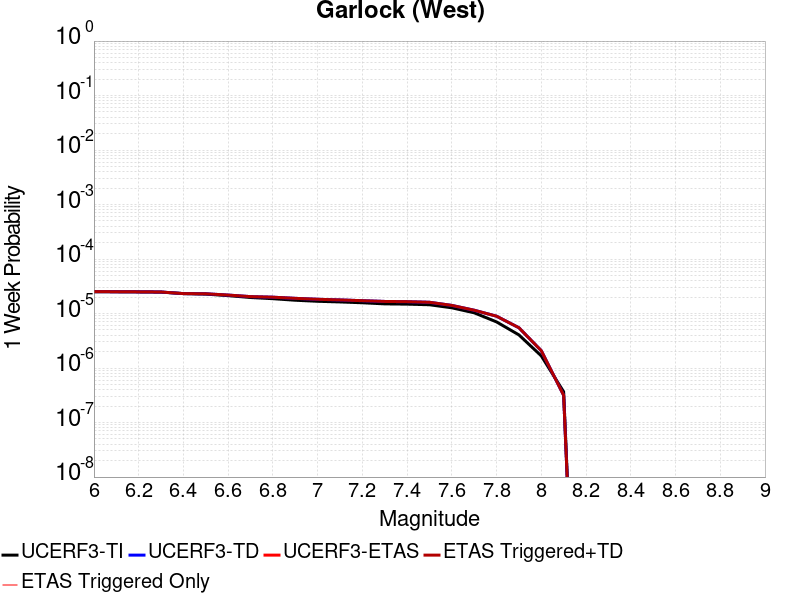 | 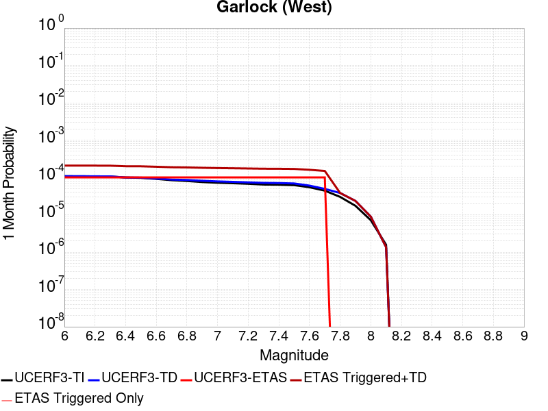 | 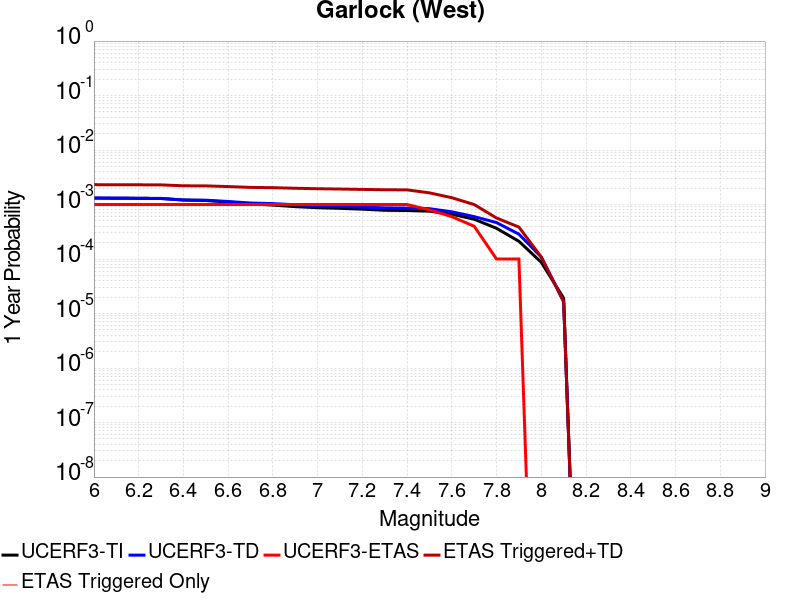 | 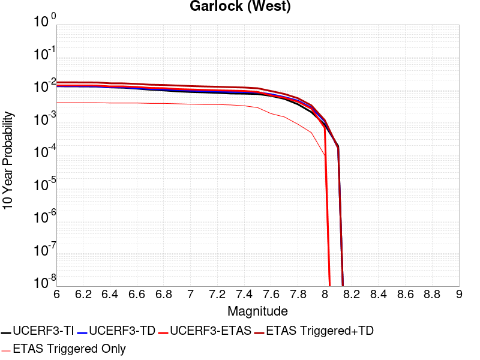 |

| Magnitude | 1 wk TI Prob | 1 wk TD Prob | 1 wk ETAS Prob | 1 wk ETAS/TD Gain | 1 wk ETAS Triggered+TD | 1 wk ETAS Triggered Only | 1 mo TI Prob | 1 mo TD Prob | 1 mo ETAS Prob | 1 mo ETAS/TD Gain | 1 mo ETAS Triggered+TD | 1 mo ETAS Triggered Only | 1 yr TI Prob | 1 yr TD Prob | 1 yr ETAS Prob | 1 yr ETAS/TD Gain | 1 yr ETAS Triggered+TD | 1 yr ETAS Triggered Only | 10 yr TI Prob | 10 yr TD Prob | 10 yr ETAS Prob | 10 yr ETAS/TD Gain | 10 yr ETAS Triggered+TD | 10 yr ETAS Triggered Only |
|-----|-----|-----|-----|-----|-----|-----|-----|-----|-----|-----|-----|-----|-----|-----|-----|-----|-----|-----|-----|-----|-----|-----|-----|-----|
| 6.0 | 2.5181727E-5 | 2.5274145E-5 | 0.0 | 0.0 | 2.5274145E-5 | 0.0 | 1.0791722E-4 | 1.0831329E-4 | 1.0E-4 | 0.92324775 | 2.0830246E-4 | 1.0E-4 | 0.0013131002 | 0.00131792 | 0.0019 | 1.4416656 | 0.002316602 | 0.001 | 0.013053683 | 0.013180896 | 0.0138 | 1.0469699 | 0.017226854 | 0.0041 |
| 6.1 | 2.5077732E-5 | 2.5175174E-5 | 0.0 | 0.0 | 2.5175174E-5 | 0.0 | 1.0747157E-4 | 1.0788916E-4 | 1.0E-4 | 0.9268772 | 2.0787837E-4 | 1.0E-4 | 0.001307681 | 0.0013127624 | 0.0019 | 1.4473296 | 0.0023114497 | 0.001 | 0.013000126 | 0.01312993 | 0.0138 | 1.0510337 | 0.017176097 | 0.0041 |
| 6.2 | 2.494612E-5 | 2.505679E-5 | 0.0 | 0.0 | 2.505679E-5 | 0.0 | 1.0690756E-4 | 1.0738184E-4 | 1.0E-4 | 0.9312562 | 2.0737111E-4 | 1.0E-4 | 0.0013008224 | 0.0013065932 | 0.0019 | 1.4541633 | 0.0023052867 | 0.001 | 0.012932341 | 0.013068966 | 0.0138 | 1.0559367 | 0.017115382 | 0.0041 |
| 6.3 | 2.4733758E-5 | 2.4876097E-5 | 0.0 | 0.0 | 2.4876097E-5 | 0.0 | 1.0599751E-4 | 1.0660751E-4 | 1.0E-4 | 0.9380202 | 2.0659684E-4 | 1.0E-4 | 0.0012897556 | 0.001297177 | 0.0019 | 1.464719 | 0.0022958799 | 0.001 | 0.012822957 | 0.012975907 | 0.0137 | 1.0558028 | 0.017022707 | 0.0041 |
| 6.4 | 2.3237335E-5 | 2.3254857E-5 | 0.0 | 0.0 | 2.3254857E-5 | 0.0 | 9.958477E-5 | 9.965988E-5 | 1.0E-4 | 1.0034127 | 1.9964992E-4 | 1.0E-4 | 0.0012117702 | 0.0012126865 | 0.0018 | 1.4843078 | 0.0022114739 | 0.001 | 0.012051838 | 0.012140505 | 0.0129 | 1.0625588 | 0.016091943 | 0.004 |
| 6.5 | 2.2732203E-5 | 2.3069202E-5 | 0.0 | 0.0 | 2.3069202E-5 | 0.0 | 9.742009E-5 | 9.886428E-5 | 1.0E-4 | 1.0114877 | 1.988544E-4 | 1.0E-4 | 0.0011854442 | 0.0012030107 | 0.0018 | 1.496246 | 0.0022018077 | 0.001 | 0.011791403 | 0.0120448 | 0.0129 | 1.0710015 | 0.015996622 | 0.004 |
| 6.6 | 2.1319436E-5 | 2.1848546E-5 | 0.0 | 0.0 | 2.1848546E-5 | 0.0 | 9.136581E-5 | 9.363328E-5 | 1.0E-4 | 1.0679964 | 1.9362391E-4 | 1.0E-4 | 0.001111811 | 0.0011393913 | 0.0018 | 1.5797908 | 0.002138252 | 0.001 | 0.011062649 | 0.011415287 | 0.0124 | 1.0862627 | 0.015369626 | 0.004 |
| 6.7 | 1.970802E-5 | 2.0467665E-5 | 0.0 | 0.0 | 2.0467665E-5 | 0.0 | 8.446021E-5 | 8.771563E-5 | 1.0E-4 | 1.1400478 | 1.8770686E-4 | 1.0E-4 | 0.001027818 | 0.0010674163 | 0.0017 | 1.5926307 | 0.002066349 | 0.001 | 0.010230771 | 0.010702651 | 0.0116 | 1.0838436 | 0.01456091 | 0.0039 |
| 6.8 | 1.8744462E-5 | 1.9974932E-5 | 0.0 | 0.0 | 1.9974932E-5 | 0.0 | 8.033094E-5 | 8.560406E-5 | 1.0E-4 | 1.168169 | 1.8559549E-4 | 1.0E-4 | 9.775903E-4 | 0.0010417327 | 0.0017 | 1.6318965 | 0.002040691 | 0.001 | 0.009733009 | 0.010448251 | 0.0114 | 1.0910918 | 0.014307503 | 0.0039 |
| 6.9 | 1.7559682E-5 | 1.9026817E-5 | 0.0 | 0.0 | 1.9026817E-5 | 0.0 | 7.5253614E-5 | 8.154096E-5 | 1.0E-4 | 1.2263776 | 1.815328E-4 | 1.0E-4 | 9.158276E-4 | 9.923105E-4 | 0.0017 | 1.7131735 | 0.001991318 | 0.001 | 0.0091206245 | 0.009958577 | 0.0107 | 1.0744506 | 0.013720735 | 0.0038 |
| 7.0 | 1.6794445E-5 | 1.828911E-5 | 0.0 | 0.0 | 1.828911E-5 | 0.0 | 7.197421E-5 | 7.8379555E-5 | 1.0E-4 | 1.2758429 | 1.7837172E-4 | 1.0E-4 | 8.759337E-4 | 9.538547E-4 | 0.0017 | 1.7822421 | 0.0019529009 | 0.001 | 0.008724891 | 0.0095772 | 0.0104 | 1.0859123 | 0.013241764 | 0.0037 |
| 7.1 | 1.6337795E-5 | 1.7789529E-5 | 0.0 | 0.0 | 1.7789529E-5 | 0.0 | 7.0017246E-5 | 7.623862E-5 | 1.0E-4 | 1.3116711 | 1.76231E-4 | 1.0E-4 | 8.521265E-4 | 9.2781126E-4 | 0.0015 | 1.616708 | 0.0019268835 | 0.001 | 0.008488664 | 0.009318788 | 0.0101 | 1.083832 | 0.01288524 | 0.0036 |
| 7.2 | 1.5780008E-5 | 1.7237902E-5 | 0.0 | 0.0 | 1.7237902E-5 | 0.0 | 6.762685E-5 | 7.387464E-5 | 1.0E-4 | 1.3536445 | 1.7386726E-4 | 1.0E-4 | 8.2304585E-4 | 8.9905394E-4 | 0.0015 | 1.6684204 | 0.0018981548 | 0.001 | 0.008200042 | 0.009033503 | 0.0098 | 1.0848504 | 0.012600983 | 0.0036 |
| 7.3 | 1.5058865E-5 | 1.6690445E-5 | 0.0 | 0.0 | 1.6690445E-5 | 0.0 | 6.45364E-5 | 7.152852E-5 | 1.0E-4 | 1.3980436 | 1.7152137E-4 | 1.0E-4 | 7.854473E-4 | 8.7051303E-4 | 0.0015 | 1.7231218 | 0.0018696425 | 0.001 | 0.00782677 | 0.00874994 | 0.0096 | 1.0971503 | 0.012219315 | 0.0035 |
| 7.4 | 1.4887923E-5 | 1.6526183E-5 | 0.0 | 0.0 | 1.6526183E-5 | 0.0 | 6.380382E-5 | 7.0824586E-5 | 1.0E-4 | 1.4119391 | 1.708175E-4 | 1.0E-4 | 7.7653467E-4 | 8.6194935E-4 | 0.0015 | 1.7402414 | 0.0018610874 | 0.001 | 0.0077382675 | 0.008664781 | 0.0094 | 1.0848514 | 0.011936188 | 0.0033 |
| 7.5 | 1.4509299E-5 | 1.611769E-5 | 0.0 | 0.0 | 1.611769E-5 | 0.0 | 6.218123E-5 | 6.9074E-5 | 1.0E-4 | 1.4477228 | 1.6906709E-4 | 1.0E-4 | 7.567935E-4 | 8.406526E-4 | 0.0013 | 1.5464176 | 0.0016399801 | 8.0E-4 | 0.0075422134 | 0.008452871 | 0.0087 | 1.0292362 | 0.011328357 | 0.0029 |
| 7.6 | 1.2756717E-5 | 1.4118886E-5 | 0.0 | 0.0 | 1.4118886E-5 | 0.0 | 5.4670498E-5 | 6.050811E-5 | 1.0E-4 | 1.652671 | 1.6050207E-4 | 1.0E-4 | 6.6541E-4 | 7.364379E-4 | 0.001 | 1.3578877 | 0.0013359961 | 6.0E-4 | 0.006634211 | 0.007416247 | 0.0069 | 0.93038976 | 0.009302156 | 0.0019 |
| 7.7 | 1.0328985E-5 | 1.1524376E-5 | 0.0 | 0.0 | 1.1524376E-5 | 0.0 | 4.4266326E-5 | 4.9389248E-5 | 1.0E-4 | 2.024732 | 1.4938432E-4 | 1.0E-4 | 5.388092E-4 | 6.011486E-4 | 8.0E-4 | 1.3307858 | 0.0010009081 | 4.0E-4 | 0.0053750467 | 0.0060712555 | 0.0058 | 0.9553214 | 0.0075621484 | 0.0015 |
| 7.8 | 7.0306583E-6 | 8.951057E-6 | 0.0 | 0.0 | 8.951057E-6 | 0.0 | 3.0131043E-5 | 3.8361108E-5 | 0.0 | 0.0 | 3.8361108E-5 | 0.0 | 3.667837E-4 | 4.6694657E-4 | 4.0E-4 | 0.8566291 | 5.668999E-4 | 1.0E-4 | 0.003661789 | 0.0047216774 | 0.0044 | 0.93187225 | 0.005617428 | 9.0E-4 |
| 7.9 | 4.060633E-6 | 5.4955644E-6 | 0.0 | 0.0 | 5.4955644E-6 | 0.0 | 1.7402595E-5 | 2.3552207E-5 | 0.0 | 0.0 | 2.3552207E-5 | 0.0 | 2.11856E-4 | 2.8671048E-4 | 2.0E-4 | 0.69756776 | 3.8668182E-4 | 1.0E-4 | 0.0021165414 | 0.0028995567 | 0.0027 | 0.93117684 | 0.003398107 | 5.0E-4 |
| 8.0 | 1.6729537E-6 | 2.0875034E-6 | 0.0 | 0.0 | 2.0875034E-6 | 0.0 | 7.169782E-6 | 8.946412E-6 | 0.0 | 0.0 | 8.946412E-6 | 0.0 | 8.7288594E-5 | 1.08917164E-4 | 0.0 | 0.0 | 1.08917164E-4 | 0.0 | 8.7254314E-4 | 0.001101821 | 7.0E-4 | 0.6353119 | 0.0012017108 | 1.0E-4 |
| 8.1 | 3.6733252E-7 | 3.1632464E-7 | 0.0 | 0.0 | 3.1632464E-7 | 0.0 | 1.5742813E-6 | 1.3556764E-6 | 0.0 | 0.0 | 1.3556764E-6 | 0.0 | 1.9166706E-5 | 1.6505252E-5 | 0.0 | 0.0 | 1.6505252E-5 | 0.0 | 1.9165053E-4 | 1.6705292E-4 | 0.0 | 0.0 | 1.6705292E-4 | 0.0 |

## Garberville - Briceland 2011 CFM
*[(top)](#table-of-contents)*

| 1 Week | 1 Month | 1 Year | 10 Year |
|-----|-----|-----|-----|
| 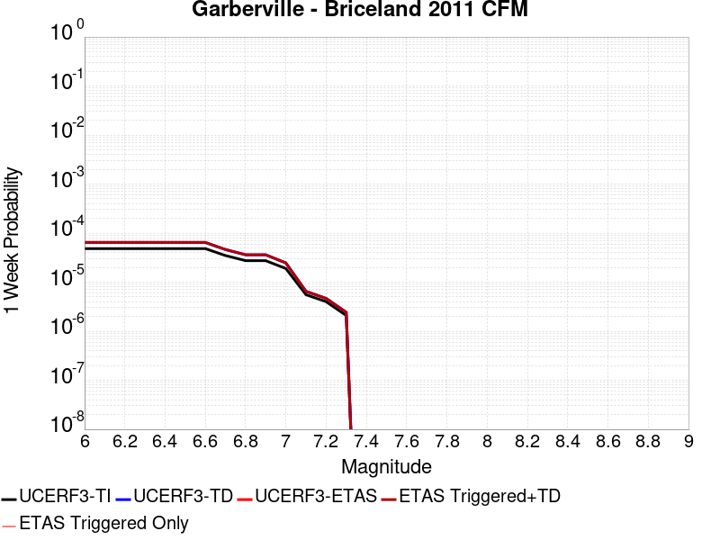 | 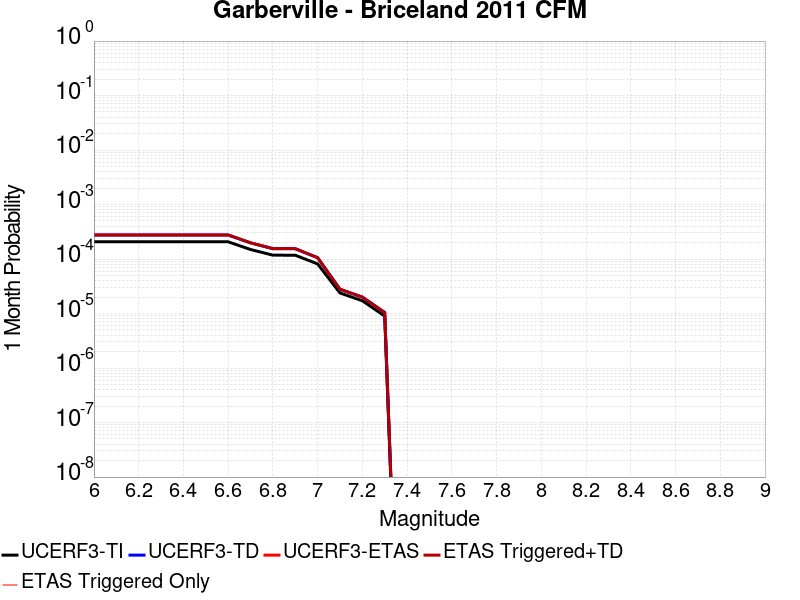 |  | 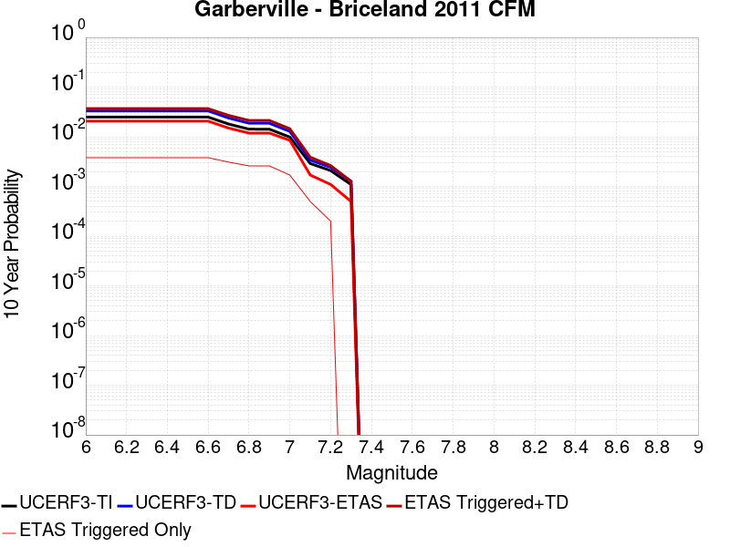 |

| Magnitude | 1 wk TI Prob | 1 wk TD Prob | 1 wk ETAS Prob | 1 wk ETAS/TD Gain | 1 wk ETAS Triggered+TD | 1 wk ETAS Triggered Only | 1 mo TI Prob | 1 mo TD Prob | 1 mo ETAS Prob | 1 mo ETAS/TD Gain | 1 mo ETAS Triggered+TD | 1 mo ETAS Triggered Only | 1 yr TI Prob | 1 yr TD Prob | 1 yr ETAS Prob | 1 yr ETAS/TD Gain | 1 yr ETAS Triggered+TD | 1 yr ETAS Triggered Only | 10 yr TI Prob | 10 yr TD Prob | 10 yr ETAS Prob | 10 yr ETAS/TD Gain | 10 yr ETAS Triggered+TD | 10 yr ETAS Triggered Only |
|-----|-----|-----|-----|-----|-----|-----|-----|-----|-----|-----|-----|-----|-----|-----|-----|-----|-----|-----|-----|-----|-----|-----|-----|-----|
| 6.0 | 4.8399295E-5 | 6.457146E-5 | 0.0 | 0.0 | 6.457146E-5 | 0.0 | 2.0740906E-4 | 2.7670868E-4 | 0.0 | 0.0 | 2.7670868E-4 | 0.0 | 0.002522281 | 0.0033643802 | 0.0017 | 0.50529367 | 0.0037630345 | 4.0E-4 | 0.024938442 | 0.033200745 | 0.0207 | 0.62348 | 0.03687458 | 0.0038 |
| 6.1 | 4.8399295E-5 | 6.457146E-5 | 0.0 | 0.0 | 6.457146E-5 | 0.0 | 2.0740906E-4 | 2.7670868E-4 | 0.0 | 0.0 | 2.7670868E-4 | 0.0 | 0.002522281 | 0.0033643802 | 0.0017 | 0.50529367 | 0.0037630345 | 4.0E-4 | 0.024938442 | 0.033200745 | 0.0207 | 0.62348 | 0.03687458 | 0.0038 |
| 6.2 | 4.8399295E-5 | 6.457146E-5 | 0.0 | 0.0 | 6.457146E-5 | 0.0 | 2.0740906E-4 | 2.7670868E-4 | 0.0 | 0.0 | 2.7670868E-4 | 0.0 | 0.002522281 | 0.0033643802 | 0.0017 | 0.50529367 | 0.0037630345 | 4.0E-4 | 0.024938442 | 0.033200745 | 0.0207 | 0.62348 | 0.03687458 | 0.0038 |
| 6.3 | 4.8399295E-5 | 6.457146E-5 | 0.0 | 0.0 | 6.457146E-5 | 0.0 | 2.0740906E-4 | 2.7670868E-4 | 0.0 | 0.0 | 2.7670868E-4 | 0.0 | 0.002522281 | 0.0033643802 | 0.0017 | 0.50529367 | 0.0037630345 | 4.0E-4 | 0.024938442 | 0.033200745 | 0.0207 | 0.62348 | 0.03687458 | 0.0038 |
| 6.4 | 4.8399295E-5 | 6.457146E-5 | 0.0 | 0.0 | 6.457146E-5 | 0.0 | 2.0740906E-4 | 2.7670868E-4 | 0.0 | 0.0 | 2.7670868E-4 | 0.0 | 0.002522281 | 0.0033643802 | 0.0017 | 0.50529367 | 0.0037630345 | 4.0E-4 | 0.024938442 | 0.033200745 | 0.0207 | 0.62348 | 0.03687458 | 0.0038 |
| 6.5 | 4.8399295E-5 | 6.457146E-5 | 0.0 | 0.0 | 6.457146E-5 | 0.0 | 2.0740906E-4 | 2.7670868E-4 | 0.0 | 0.0 | 2.7670868E-4 | 0.0 | 0.002522281 | 0.0033643802 | 0.0017 | 0.50529367 | 0.0037630345 | 4.0E-4 | 0.024938442 | 0.033200745 | 0.0207 | 0.62348 | 0.03687458 | 0.0038 |
| 6.6 | 4.8399295E-5 | 6.457146E-5 | 0.0 | 0.0 | 6.457146E-5 | 0.0 | 2.0740906E-4 | 2.7670868E-4 | 0.0 | 0.0 | 2.7670868E-4 | 0.0 | 0.002522281 | 0.0033643802 | 0.0017 | 0.50529367 | 0.0037630345 | 4.0E-4 | 0.024938442 | 0.033200745 | 0.0207 | 0.62348 | 0.03687458 | 0.0038 |
| 6.7 | 3.495179E-5 | 4.6340243E-5 | 0.0 | 0.0 | 4.6340243E-5 | 0.0 | 1.4978478E-4 | 1.985888E-4 | 0.0 | 0.0 | 1.985888E-4 | 0.0 | 0.0018221042 | 0.0024156687 | 9.0E-4 | 0.37256765 | 0.002714944 | 3.0E-4 | 0.018072363 | 0.02394655 | 0.015 | 0.62639505 | 0.026972314 | 0.0031 |
| 6.8 | 2.7517597E-5 | 3.6265563E-5 | 0.0 | 0.0 | 3.6265563E-5 | 0.0 | 1.1792722E-4 | 1.554171E-4 | 0.0 | 0.0 | 1.554171E-4 | 0.0 | 0.0014348183 | 0.0018910341 | 7.0E-4 | 0.37016782 | 0.002090656 | 2.0E-4 | 0.014255894 | 0.018795785 | 0.0119 | 0.63312066 | 0.021346916 | 0.0026 |
| 6.9 | 2.74461E-5 | 3.6183264E-5 | 0.0 | 0.0 | 3.6183264E-5 | 0.0 | 1.1762084E-4 | 1.5506442E-4 | 0.0 | 0.0 | 1.5506442E-4 | 0.0 | 0.001431093 | 0.0018867478 | 7.0E-4 | 0.37100878 | 0.0020863705 | 2.0E-4 | 0.014219119 | 0.018753646 | 0.0119 | 0.63454324 | 0.021304887 | 0.0026 |
| 7.0 | 1.9023773E-5 | 2.4723182E-5 | 0.0 | 0.0 | 2.4723182E-5 | 0.0 | 8.152791E-5 | 1.0595425E-4 | 0.0 | 0.0 | 1.0595425E-4 | 0.0 | 9.921503E-4 | 0.0012896302 | 3.0E-4 | 0.23262483 | 0.0012896302 | 0.0 | 0.009877323 | 0.012860552 | 0.0085 | 0.6609358 | 0.0145386895 | 0.0017 |
| 7.1 | 5.566844E-6 | 6.514434E-6 | 0.0 | 0.0 | 6.514434E-6 | 0.0 | 2.3857683E-5 | 2.7918728E-5 | 0.0 | 0.0 | 2.7918728E-5 | 0.0 | 2.9042858E-4 | 3.3986176E-4 | 0.0 | 0.0 | 3.3986176E-4 | 0.0 | 0.002900493 | 0.0033938407 | 0.0017 | 0.5009074 | 0.003892144 | 5.0E-4 |
| 7.2 | 4.011353E-6 | 4.6762148E-6 | 0.0 | 0.0 | 4.6762148E-6 | 0.0 | 1.7191402E-5 | 2.0040785E-5 | 0.0 | 0.0 | 2.0040785E-5 | 0.0 | 2.0928521E-4 | 2.4397267E-4 | 0.0 | 0.0 | 2.4397267E-4 | 0.0 | 0.0020908823 | 0.0024373862 | 0.0011 | 0.45130312 | 0.0026368985 | 2.0E-4 |
| 7.3 | 2.0974871E-6 | 2.4404105E-6 | 0.0 | 0.0 | 2.4404105E-6 | 0.0 | 8.989199E-6 | 1.0458874E-5 | 0.0 | 0.0 | 1.0458874E-5 | 0.0 | 1.09438006E-4 | 1.2733186E-4 | 0.0 | 0.0 | 1.2733186E-4 | 0.0 | 0.0010938413 | 0.0012728344 | 5.0E-4 | 0.39282408 | 0.0012728344 | 0.0 |

## Honey Lake 2011 CFM
*[(top)](#table-of-contents)*

| 1 Week | 1 Month | 1 Year | 10 Year |
|-----|-----|-----|-----|
| 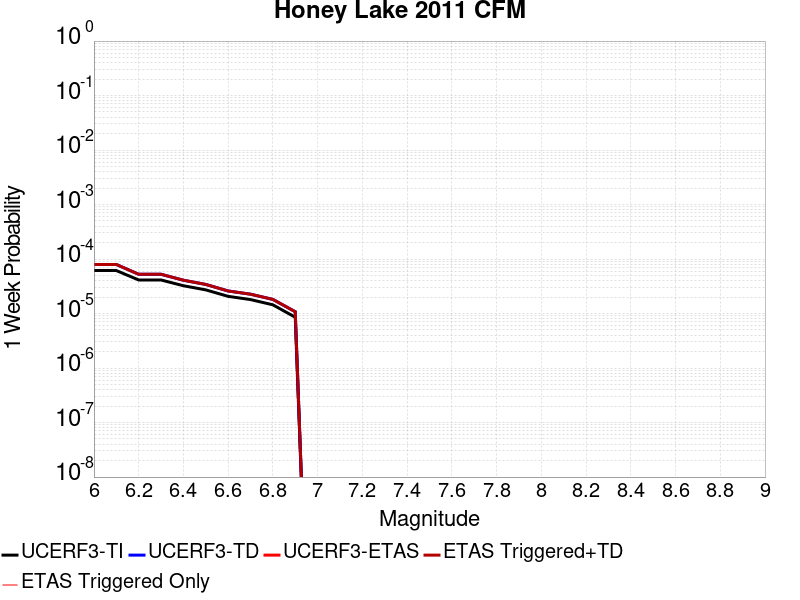 | 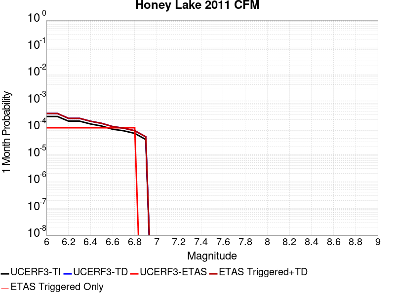 | 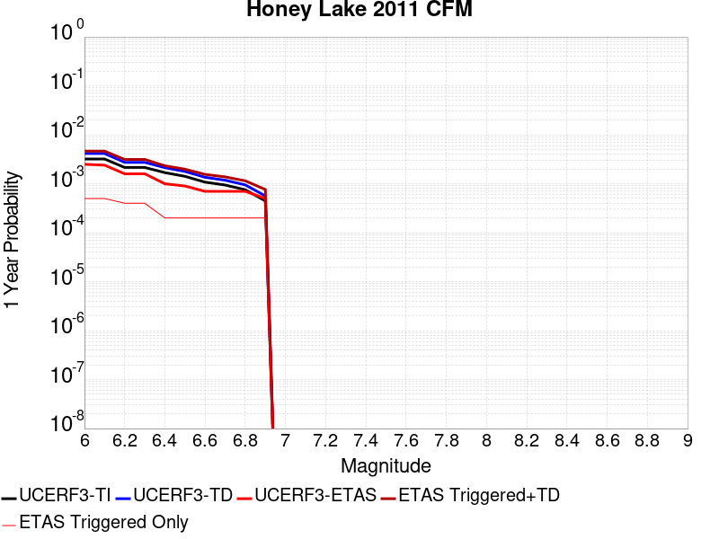 | 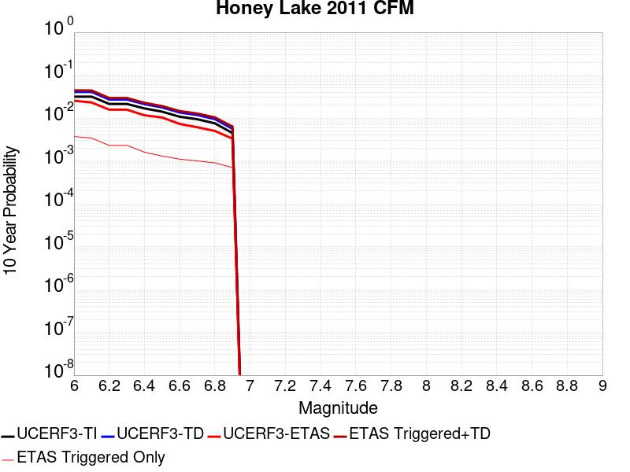 |

| Magnitude | 1 wk TI Prob | 1 wk TD Prob | 1 wk ETAS Prob | 1 wk ETAS/TD Gain | 1 wk ETAS Triggered+TD | 1 wk ETAS Triggered Only | 1 mo TI Prob | 1 mo TD Prob | 1 mo ETAS Prob | 1 mo ETAS/TD Gain | 1 mo ETAS Triggered+TD | 1 mo ETAS Triggered Only | 1 yr TI Prob | 1 yr TD Prob | 1 yr ETAS Prob | 1 yr ETAS/TD Gain | 1 yr ETAS Triggered+TD | 1 yr ETAS Triggered Only | 10 yr TI Prob | 10 yr TD Prob | 10 yr ETAS Prob | 10 yr ETAS/TD Gain | 10 yr ETAS Triggered+TD | 10 yr ETAS Triggered Only |
|-----|-----|-----|-----|-----|-----|-----|-----|-----|-----|-----|-----|-----|-----|-----|-----|-----|-----|-----|-----|-----|-----|-----|-----|-----|
| 6.0 | 6.155506E-5 | 7.959332E-5 | 0.0 | 0.0 | 7.959332E-5 | 0.0 | 2.6378073E-4 | 3.4107253E-4 | 1.0E-4 | 0.29319277 | 3.4107253E-4 | 0.0 | 0.0032068014 | 0.0041450993 | 0.0025 | 0.6031219 | 0.0046430267 | 5.0E-4 | 0.03160919 | 0.040726278 | 0.0253 | 0.6212205 | 0.04427559 | 0.0037 |
| 6.1 | 6.155506E-5 | 7.959332E-5 | 0.0 | 0.0 | 7.959332E-5 | 0.0 | 2.6378073E-4 | 3.4107253E-4 | 1.0E-4 | 0.29319277 | 3.4107253E-4 | 0.0 | 0.0032068014 | 0.0041450993 | 0.0024 | 0.578997 | 0.0046430267 | 5.0E-4 | 0.03160919 | 0.040726278 | 0.0231 | 0.5672014 | 0.04398781 | 0.0034 |
| 6.2 | 4.1335024E-5 | 5.2605556E-5 | 0.0 | 0.0 | 5.2605556E-5 | 0.0 | 1.7713808E-4 | 2.2543393E-4 | 1.0E-4 | 0.44358894 | 2.2543393E-4 | 0.0 | 0.0021545228 | 0.0027413552 | 0.0016 | 0.5836529 | 0.0031402586 | 4.0E-4 | 0.021337535 | 0.027091501 | 0.0157 | 0.57951754 | 0.029329192 | 0.0023 |
| 6.3 | 4.1335024E-5 | 5.2605556E-5 | 0.0 | 0.0 | 5.2605556E-5 | 0.0 | 1.7713808E-4 | 2.2543393E-4 | 1.0E-4 | 0.44358894 | 2.2543393E-4 | 0.0 | 0.0021545228 | 0.0027413552 | 0.0016 | 0.5836529 | 0.0031402586 | 4.0E-4 | 0.021337535 | 0.027091501 | 0.0157 | 0.57951754 | 0.029329192 | 0.0023 |
| 6.4 | 3.2393702E-5 | 4.0909166E-5 | 0.0 | 0.0 | 4.0909166E-5 | 0.0 | 1.3882275E-4 | 1.7531386E-4 | 1.0E-4 | 0.57040554 | 1.7531386E-4 | 0.0 | 0.0016888566 | 0.0021324635 | 0.001 | 0.4689412 | 0.002332037 | 2.0E-4 | 0.016760793 | 0.021131031 | 0.0116 | 0.5489557 | 0.022697221 | 0.0016 |
| 6.5 | 2.7205504E-5 | 3.4229823E-5 | 0.0 | 0.0 | 3.4229823E-5 | 0.0 | 1.1658981E-4 | 1.4669151E-4 | 1.0E-4 | 0.68170273 | 1.4669151E-4 | 0.0 | 0.0014185566 | 0.0017845997 | 9.0E-4 | 0.5043148 | 0.0019842428 | 2.0E-4 | 0.014095354 | 0.017712208 | 0.0103 | 0.5815198 | 0.018989183 | 0.0013 |
| 6.6 | 2.069265E-5 | 2.5968986E-5 | 0.0 | 0.0 | 2.5968986E-5 | 0.0 | 8.867977E-5 | 1.1129139E-4 | 1.0E-4 | 0.8985421 | 1.1129139E-4 | 0.0 | 0.0010791414 | 0.0013542147 | 7.0E-4 | 0.5169047 | 0.001553944 | 2.0E-4 | 0.010739161 | 0.013468003 | 0.0073 | 0.54202545 | 0.014553188 | 0.0011 |
| 6.7 | 1.8060919E-5 | 2.2668704E-5 | 0.0 | 0.0 | 2.2668704E-5 | 0.0 | 7.7401644E-5 | 9.7148426E-5 | 1.0E-4 | 1.0293528 | 9.7148426E-5 | 0.0 | 9.419576E-4 | 0.0011822213 | 7.0E-4 | 0.5921057 | 0.0013819849 | 2.0E-4 | 0.009379748 | 0.0117673725 | 0.0061 | 0.5183825 | 0.012755605 | 0.001 |
| 6.8 | 1.4474663E-5 | 1.8190862E-5 | 0.0 | 0.0 | 1.8190862E-5 | 0.0 | 6.203279E-5 | 7.795894E-5 | 1.0E-4 | 1.2827265 | 7.795894E-5 | 0.0 | 7.5498753E-4 | 9.488133E-4 | 7.0E-4 | 0.7377637 | 0.0011486235 | 2.0E-4 | 0.007524277 | 0.009455158 | 0.005 | 0.5288119 | 0.010346648 | 9.0E-4 |
| 6.9 | 8.564552E-6 | 1.0808122E-5 | 0.0 | 0.0 | 1.0808122E-5 | 0.0 | 3.6704707E-5 | 4.6320078E-5 | 0.0 | 0.0 | 4.6320078E-5 | 0.0 | 4.4678818E-4 | 5.638675E-4 | 5.0E-4 | 0.8867331 | 7.637547E-4 | 2.0E-4 | 0.0044589094 | 0.005630872 | 0.0033 | 0.58605486 | 0.0063269306 | 7.0E-4 |

## Chino alt 1
*[(top)](#table-of-contents)*

| 1 Week | 1 Month | 1 Year | 10 Year |
|-----|-----|-----|-----|
| 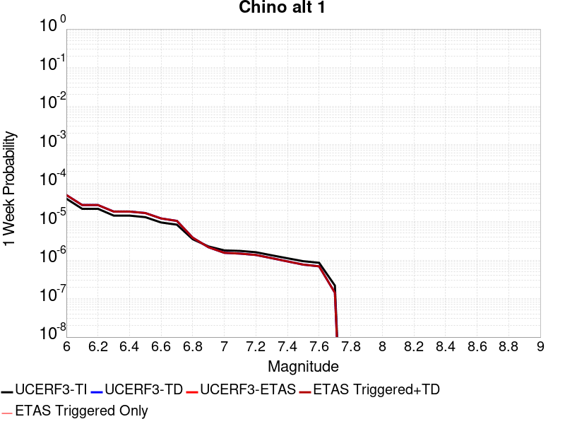 | 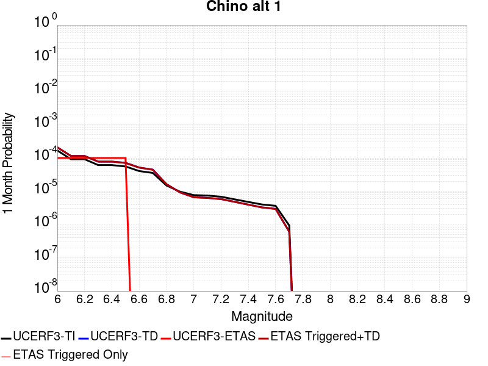 | 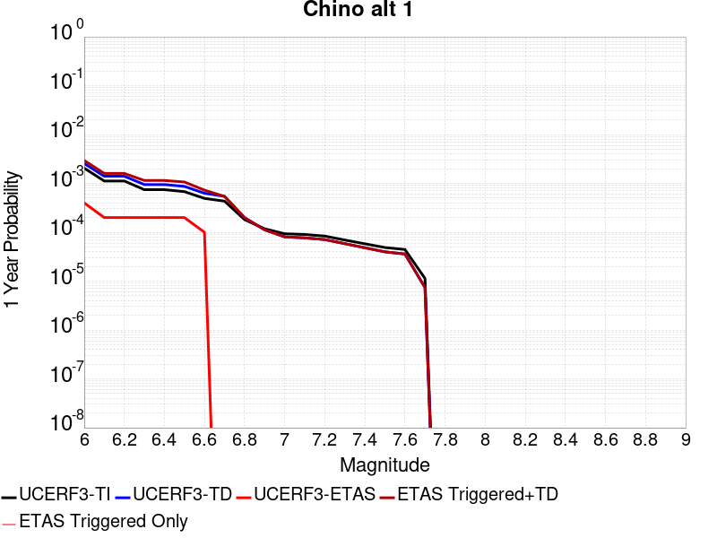 | 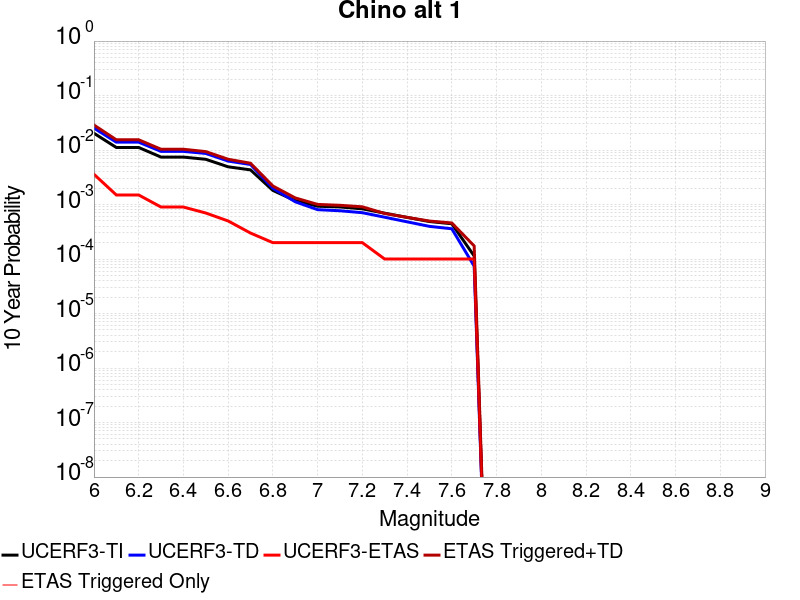 |

| Magnitude | 1 wk TI Prob | 1 wk TD Prob | 1 wk ETAS Prob | 1 wk ETAS/TD Gain | 1 wk ETAS Triggered+TD | 1 wk ETAS Triggered Only | 1 mo TI Prob | 1 mo TD Prob | 1 mo ETAS Prob | 1 mo ETAS/TD Gain | 1 mo ETAS Triggered+TD | 1 mo ETAS Triggered Only | 1 yr TI Prob | 1 yr TD Prob | 1 yr ETAS Prob | 1 yr ETAS/TD Gain | 1 yr ETAS Triggered+TD | 1 yr ETAS Triggered Only | 10 yr TI Prob | 10 yr TD Prob | 10 yr ETAS Prob | 10 yr ETAS/TD Gain | 10 yr ETAS Triggered+TD | 10 yr ETAS Triggered Only |
|-----|-----|-----|-----|-----|-----|-----|-----|-----|-----|-----|-----|-----|-----|-----|-----|-----|-----|-----|-----|-----|-----|-----|-----|-----|
| 6.0 | 3.939946E-5 | 4.8982674E-5 | 0.0 | 0.0 | 4.8982674E-5 | 0.0 | 1.6884391E-4 | 2.0991178E-4 | 1.0E-4 | 0.47639057 | 2.0991178E-4 | 0.0 | 0.0020537362 | 0.0025531927 | 0.0022 | 0.86166626 | 0.0029521715 | 4.0E-4 | 0.020348595 | 0.025298085 | 0.0234 | 0.9249712 | 0.028807012 | 0.0036 |
| 6.1 | 2.1505624E-5 | 2.6902988E-5 | 0.0 | 0.0 | 2.6902988E-5 | 0.0 | 9.2163704E-5 | 1.1529405E-4 | 1.0E-4 | 0.8673474 | 1.1529405E-4 | 0.0 | 0.0011215154 | 0.0014029113 | 0.0012 | 0.8553642 | 0.0016026306 | 2.0E-4 | 0.011158722 | 0.013960096 | 0.0122 | 0.8739195 | 0.0154391555 | 0.0015 |
| 6.2 | 2.1505624E-5 | 2.6902988E-5 | 0.0 | 0.0 | 2.6902988E-5 | 0.0 | 9.2163704E-5 | 1.1529405E-4 | 1.0E-4 | 0.8673474 | 1.1529405E-4 | 0.0 | 0.0011215154 | 0.0014029113 | 0.0012 | 0.8553642 | 0.0016026306 | 2.0E-4 | 0.011158722 | 0.013960096 | 0.0122 | 0.8739195 | 0.0154391555 | 0.0015 |
| 6.3 | 1.4290785E-5 | 1.818528E-5 | 0.0 | 0.0 | 1.818528E-5 | 0.0 | 6.1244784E-5 | 7.7934834E-5 | 1.0E-4 | 1.2831233 | 7.7934834E-5 | 0.0 | 7.454001E-4 | 9.484889E-4 | 6.0E-4 | 0.63258517 | 0.0011482992 | 2.0E-4 | 0.007429048 | 0.009457541 | 0.0072 | 0.7612973 | 0.010349029 | 9.0E-4 |
| 6.4 | 1.4290785E-5 | 1.818528E-5 | 0.0 | 0.0 | 1.818528E-5 | 0.0 | 6.1244784E-5 | 7.7934834E-5 | 1.0E-4 | 1.2831233 | 7.7934834E-5 | 0.0 | 7.454001E-4 | 9.484889E-4 | 6.0E-4 | 0.63258517 | 0.0011482992 | 2.0E-4 | 0.007429048 | 0.009457541 | 0.0072 | 0.7612973 | 0.010349029 | 9.0E-4 |
| 6.5 | 1.3017944E-5 | 1.6671649E-5 | 0.0 | 0.0 | 1.6671649E-5 | 0.0 | 5.5789995E-5 | 7.1448216E-5 | 1.0E-4 | 1.399615 | 7.1448216E-5 | 0.0 | 6.790315E-4 | 8.6957874E-4 | 6.0E-4 | 0.68998927 | 0.0010694048 | 2.0E-4 | 0.0067696036 | 0.008674738 | 0.0066 | 0.7608299 | 0.0093686655 | 7.0E-4 |
| 6.6 | 9.470016E-6 | 1.2055545E-5 | 0.0 | 0.0 | 1.2055545E-5 | 0.0 | 4.058515E-5 | 5.1665793E-5 | 0.0 | 0.0 | 5.1665793E-5 | 0.0 | 4.940122E-4 | 6.288835E-4 | 3.0E-4 | 0.4770359 | 7.2882057E-4 | 1.0E-4 | 0.004929154 | 0.0062828376 | 0.0046 | 0.73215324 | 0.0067796963 | 5.0E-4 |
| 6.7 | 8.314155E-6 | 1.0416415E-5 | 0.0 | 0.0 | 1.0416415E-5 | 0.0 | 3.5631605E-5 | 4.4641198E-5 | 0.0 | 0.0 | 4.4641198E-5 | 0.0 | 4.3372845E-4 | 5.434033E-4 | 2.0E-4 | 0.36805075 | 5.434033E-4 | 0.0 | 0.004328829 | 0.005432993 | 0.0036 | 0.6626182 | 0.005731363 | 3.0E-4 |
| 6.8 | 3.4856364E-6 | 3.8164444E-6 | 0.0 | 0.0 | 3.8164444E-6 | 0.0 | 1.4938357E-5 | 1.63561E-5 | 0.0 | 0.0 | 1.63561E-5 | 0.0 | 1.8185932E-4 | 1.9911939E-4 | 1.0E-4 | 0.5022113 | 1.9911939E-4 | 0.0 | 0.0018171056 | 0.0019910382 | 0.0012 | 0.60270065 | 0.00219064 | 2.0E-4 |
| 6.9 | 2.2645952E-6 | 2.1548387E-6 | 0.0 | 0.0 | 2.1548387E-6 | 0.0 | 9.705372E-6 | 9.234991E-6 | 0.0 | 0.0 | 9.234991E-6 | 0.0 | 1.18156495E-4 | 1.1243043E-4 | 0.0 | 0.0 | 1.1243043E-4 | 0.0 | 0.0011809369 | 0.0011243502 | 8.0E-4 | 0.7115221 | 0.0013241253 | 2.0E-4 |
| 7.0 | 1.7864003E-6 | 1.5447231E-6 | 0.0 | 0.0 | 1.5447231E-6 | 0.0 | 7.655979E-6 | 6.620225E-6 | 0.0 | 0.0 | 6.620225E-6 | 0.0 | 9.3207556E-5 | 8.0598315E-5 | 0.0 | 0.0 | 8.0598315E-5 | 0.0 | 9.316847E-4 | 8.0617744E-4 | 5.0E-4 | 0.6202108 | 0.0010060163 | 2.0E-4 |
| 7.1 | 1.7315456E-6 | 1.4749605E-6 | 0.0 | 0.0 | 1.4749605E-6 | 0.0 | 7.420889E-6 | 6.321244E-6 | 0.0 | 0.0 | 6.321244E-6 | 0.0 | 9.034557E-5 | 7.695849E-5 | 0.0 | 0.0 | 7.695849E-5 | 0.0 | 9.0308854E-4 | 7.697918E-4 | 5.0E-4 | 0.6495263 | 9.696378E-4 | 2.0E-4 |
| 7.2 | 1.6008337E-6 | 1.3589472E-6 | 0.0 | 0.0 | 1.3589472E-6 | 0.0 | 6.860698E-6 | 5.824047E-6 | 0.0 | 0.0 | 5.824047E-6 | 0.0 | 8.352579E-5 | 7.090552E-5 | 0.0 | 0.0 | 7.090552E-5 | 0.0 | 8.34944E-4 | 7.0928765E-4 | 5.0E-4 | 0.70493263 | 9.091458E-4 | 2.0E-4 |
| 7.3 | 1.3320939E-6 | 1.1231415E-6 | 0.0 | 0.0 | 1.1231415E-6 | 0.0 | 5.7089615E-6 | 4.813455E-6 | 0.0 | 0.0 | 4.813455E-6 | 0.0 | 6.9504385E-5 | 5.8602287E-5 | 0.0 | 0.0 | 5.8602287E-5 | 0.0 | 6.9482654E-4 | 5.860052E-4 | 4.0E-4 | 0.6825878 | 6.859466E-4 | 1.0E-4 |
| 7.4 | 1.114294E-6 | 9.249316E-7 | 0.0 | 0.0 | 9.249316E-7 | 0.0 | 4.775537E-6 | 3.9639867E-6 | 0.0 | 0.0 | 3.9639867E-6 | 0.0 | 5.8140613E-5 | 4.826051E-5 | 0.0 | 0.0 | 4.826051E-5 | 0.0 | 5.81254E-4 | 4.8251598E-4 | 3.0E-4 | 0.62174106 | 5.824677E-4 | 1.0E-4 |
| 7.5 | 9.354081E-7 | 7.63455E-7 | 0.0 | 0.0 | 7.63455E-7 | 0.0 | 4.0088858E-6 | 3.271946E-6 | 0.0 | 0.0 | 3.271946E-6 | 0.0 | 4.8807087E-5 | 3.983525E-5 | 0.0 | 0.0 | 3.983525E-5 | 0.0 | 4.879637E-4 | 3.982845E-4 | 3.0E-4 | 0.75323045 | 4.9824466E-4 | 1.0E-4 |
| 7.6 | 8.521771E-7 | 6.8913687E-7 | 0.0 | 0.0 | 6.8913687E-7 | 0.0 | 3.6521824E-6 | 2.9534406E-6 | 0.0 | 0.0 | 2.9534406E-6 | 0.0 | 4.4464414E-5 | 3.595758E-5 | 0.0 | 0.0 | 3.595758E-5 | 0.0 | 4.4455516E-4 | 3.5952078E-4 | 3.0E-4 | 0.8344441 | 4.594848E-4 | 1.0E-4 |
| 7.7 | 2.1803626E-7 | 1.4215239E-7 | 0.0 | 0.0 | 1.4215239E-7 | 0.0 | 9.344408E-7 | 6.0922446E-7 | 0.0 | 0.0 | 6.0922446E-7 | 0.0 | 1.1376757E-5 | 7.417292E-6 | 0.0 | 0.0 | 7.417292E-6 | 0.0 | 1.13761744E-4 | 7.417141E-5 | 1.0E-4 | 1.3482285 | 1.7416399E-4 | 1.0E-4 |

## Bullion Mountains
*[(top)](#table-of-contents)*

| 1 Week | 1 Month | 1 Year | 10 Year |
|-----|-----|-----|-----|
| 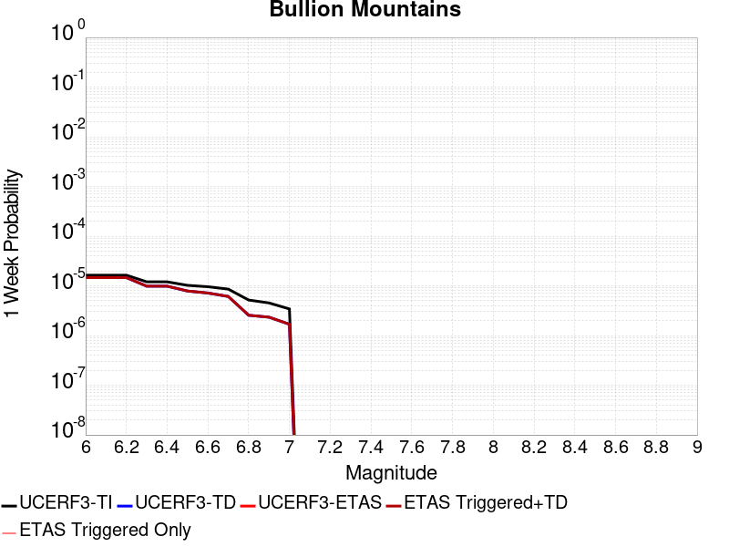 | 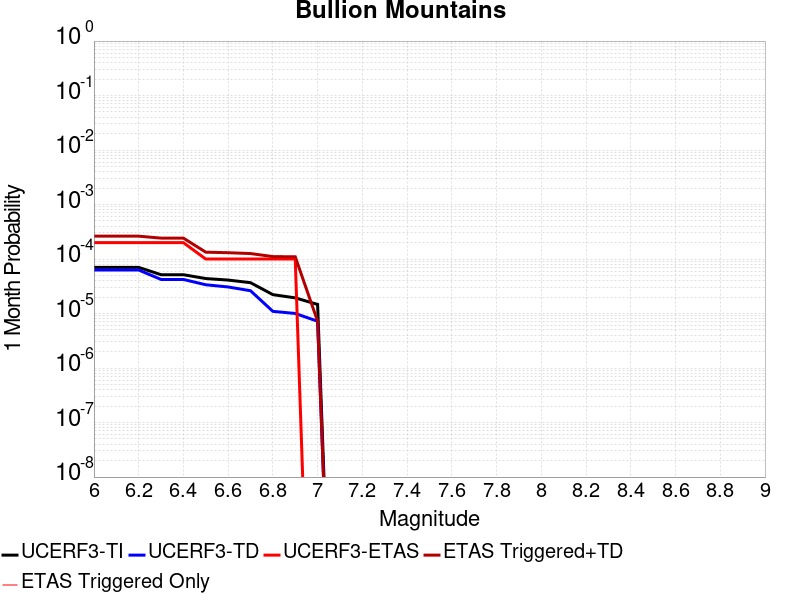 | 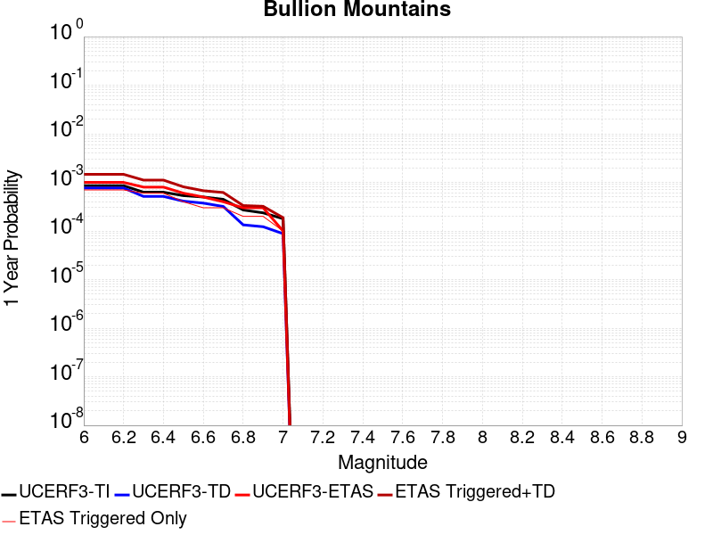 | 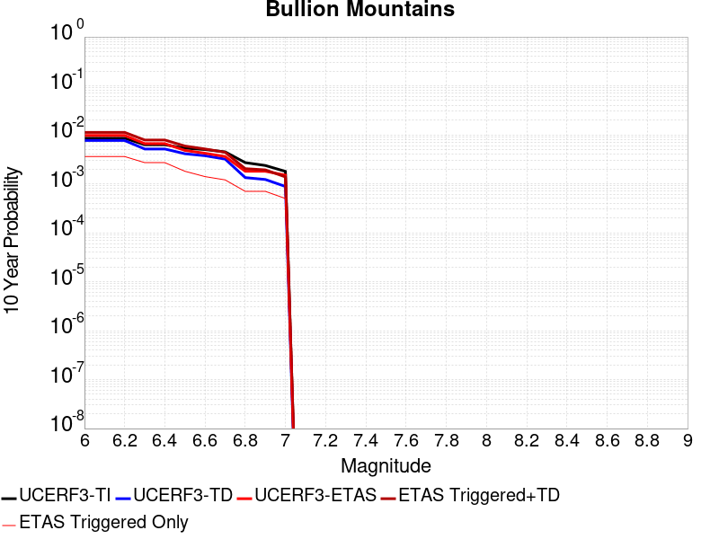 |

| Magnitude | 1 wk TI Prob | 1 wk TD Prob | 1 wk ETAS Prob | 1 wk ETAS/TD Gain | 1 wk ETAS Triggered+TD | 1 wk ETAS Triggered Only | 1 mo TI Prob | 1 mo TD Prob | 1 mo ETAS Prob | 1 mo ETAS/TD Gain | 1 mo ETAS Triggered+TD | 1 mo ETAS Triggered Only | 1 yr TI Prob | 1 yr TD Prob | 1 yr ETAS Prob | 1 yr ETAS/TD Gain | 1 yr ETAS Triggered+TD | 1 yr ETAS Triggered Only | 10 yr TI Prob | 10 yr TD Prob | 10 yr ETAS Prob | 10 yr ETAS/TD Gain | 10 yr ETAS Triggered+TD | 10 yr ETAS Triggered Only |
|-----|-----|-----|-----|-----|-----|-----|-----|-----|-----|-----|-----|-----|-----|-----|-----|-----|-----|-----|-----|-----|-----|-----|-----|-----|
| 6.0 | 1.6420427E-5 | 1.4695465E-5 | 0.0 | 0.0 | 1.4695465E-5 | 0.0 | 7.037136E-5 | 6.297926E-5 | 2.0E-4 | 3.1756485 | 2.6296667E-4 | 2.0E-4 | 8.5643446E-4 | 7.6654117E-4 | 0.001 | 1.3045614 | 0.0014660045 | 7.0E-4 | 0.008531413 | 0.007642766 | 0.0097 | 1.269174 | 0.011215252 | 0.0036 |
| 6.1 | 1.6420427E-5 | 1.4695465E-5 | 0.0 | 0.0 | 1.4695465E-5 | 0.0 | 7.037136E-5 | 6.297926E-5 | 2.0E-4 | 3.1756485 | 2.6296667E-4 | 2.0E-4 | 8.5643446E-4 | 7.6654117E-4 | 0.001 | 1.3045614 | 0.0014660045 | 7.0E-4 | 0.008531413 | 0.007642766 | 0.0097 | 1.269174 | 0.011215252 | 0.0036 |
| 6.2 | 1.6420427E-5 | 1.4695465E-5 | 0.0 | 0.0 | 1.4695465E-5 | 0.0 | 7.037136E-5 | 6.297926E-5 | 2.0E-4 | 3.1756485 | 2.6296667E-4 | 2.0E-4 | 8.5643446E-4 | 7.6654117E-4 | 0.001 | 1.3045614 | 0.0014660045 | 7.0E-4 | 0.008531413 | 0.007642766 | 0.0097 | 1.269174 | 0.011215252 | 0.0036 |
| 6.3 | 1.2046778E-5 | 9.864673E-6 | 0.0 | 0.0 | 9.864673E-6 | 0.0 | 5.1628023E-5 | 4.2276617E-5 | 2.0E-4 | 4.7307477 | 2.4226816E-4 | 2.0E-4 | 6.283899E-4 | 5.1461946E-4 | 8.0E-4 | 1.5545468 | 0.0011143107 | 6.0E-4 | 0.0062661595 | 0.0051365597 | 0.0066 | 1.2849066 | 0.007822691 | 0.0027 |
| 6.4 | 1.2046778E-5 | 9.864673E-6 | 0.0 | 0.0 | 9.864673E-6 | 0.0 | 5.1628023E-5 | 4.2276617E-5 | 2.0E-4 | 4.7307477 | 2.4226816E-4 | 2.0E-4 | 6.283899E-4 | 5.1461946E-4 | 8.0E-4 | 1.5545468 | 0.0011143107 | 6.0E-4 | 0.0062661595 | 0.0051365597 | 0.0066 | 1.2849066 | 0.007822691 | 0.0027 |
| 6.5 | 1.0244343E-5 | 7.881387E-6 | 0.0 | 0.0 | 7.881387E-6 | 0.0 | 4.390359E-5 | 3.3777054E-5 | 1.0E-4 | 2.9605896 | 1.3377368E-4 | 1.0E-4 | 5.343951E-4 | 4.1117874E-4 | 6.0E-4 | 1.4592195 | 8.1101427E-4 | 4.0E-4 | 0.005331118 | 0.0041062115 | 0.0048 | 1.1689607 | 0.0058988202 | 0.0018 |
| 6.6 | 9.605408E-6 | 7.1792833E-6 | 0.0 | 0.0 | 7.1792833E-6 | 0.0 | 4.1165385E-5 | 3.0768108E-5 | 1.0E-4 | 3.2501185 | 1.3076504E-4 | 1.0E-4 | 5.010733E-4 | 3.7455768E-4 | 5.0E-4 | 1.3349079 | 6.744453E-4 | 3.0E-4 | 0.00499945 | 0.0037412618 | 0.0042 | 1.1226159 | 0.005136024 | 0.0014 |
| 6.7 | 8.60418E-6 | 6.1255696E-6 | 0.0 | 0.0 | 6.1255696E-6 | 0.0 | 3.687454E-5 | 2.6252286E-5 | 1.0E-4 | 3.809192 | 1.2624967E-4 | 1.0E-4 | 4.48855E-4 | 3.1959423E-4 | 4.0E-4 | 1.2515872 | 6.194983E-4 | 3.0E-4 | 0.004479495 | 0.0031932588 | 0.0036 | 1.127375 | 0.0043894267 | 0.0012 |
| 6.8 | 5.187994E-6 | 2.5639858E-6 | 0.0 | 0.0 | 2.5639858E-6 | 0.0 | 2.223407E-5 | 1.0988487E-5 | 1.0E-4 | 9.100434 | 1.10987385E-4 | 1.0E-4 | 2.7066618E-4 | 1.3378062E-4 | 3.0E-4 | 2.2424774 | 3.3375385E-4 | 2.0E-4 | 0.0027033675 | 0.0013373926 | 0.0018 | 1.3459024 | 0.0020364565 | 7.0E-4 |
| 6.9 | 4.5302368E-6 | 2.34504E-6 | 0.0 | 0.0 | 2.34504E-6 | 0.0 | 1.9415156E-5 | 1.0050155E-5 | 1.0E-4 | 9.950095 | 1.1004915E-4 | 1.0E-4 | 2.3635388E-4 | 1.2235774E-4 | 3.0E-4 | 2.451827 | 3.2233328E-4 | 2.0E-4 | 0.0023610266 | 0.001223293 | 0.0018 | 1.4714382 | 0.0019224368 | 7.0E-4 |
| 7.0 | 3.431668E-6 | 1.6888055E-6 | 0.0 | 0.0 | 1.6888055E-6 | 0.0 | 1.4707065E-5 | 7.237738E-6 | 0.0 | 0.0 | 7.237738E-6 | 0.0 | 1.7904381E-4 | 8.811946E-5 | 1.0E-4 | 1.1348232 | 1.8811064E-4 | 1.0E-4 | 0.0017889962 | 8.8119454E-4 | 0.0015 | 1.7022347 | 0.0013807539 | 5.0E-4 |

## Concord 2011 CFM
*[(top)](#table-of-contents)*

| 1 Week | 1 Month | 1 Year | 10 Year |
|-----|-----|-----|-----|
| 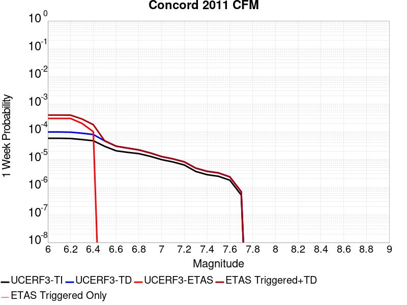 |  | 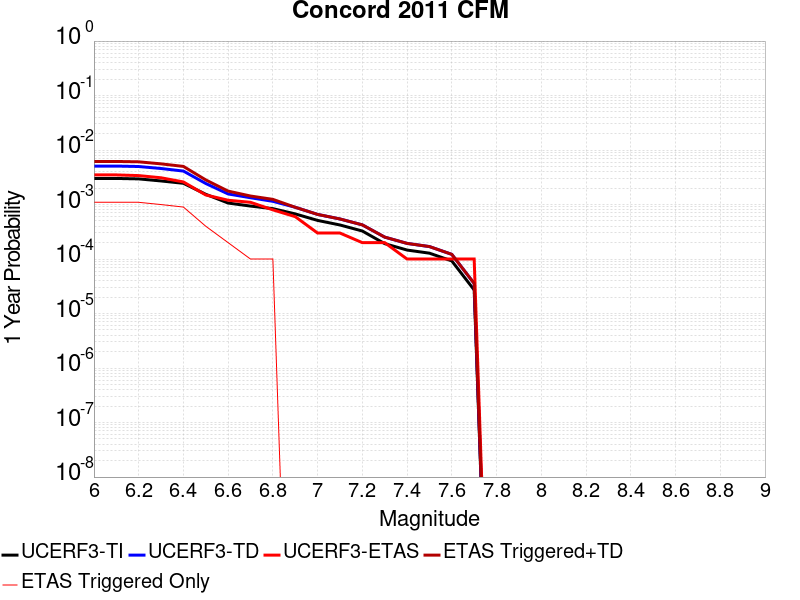 | 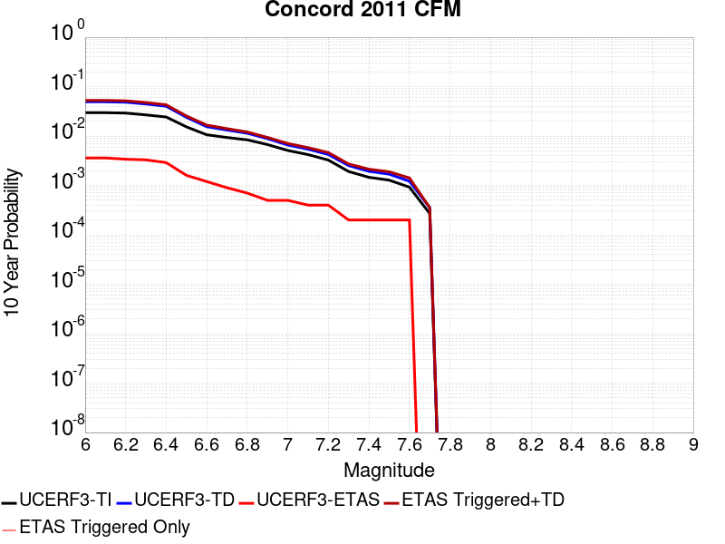 |

| Magnitude | 1 wk TI Prob | 1 wk TD Prob | 1 wk ETAS Prob | 1 wk ETAS/TD Gain | 1 wk ETAS Triggered+TD | 1 wk ETAS Triggered Only | 1 mo TI Prob | 1 mo TD Prob | 1 mo ETAS Prob | 1 mo ETAS/TD Gain | 1 mo ETAS Triggered+TD | 1 mo ETAS Triggered Only | 1 yr TI Prob | 1 yr TD Prob | 1 yr ETAS Prob | 1 yr ETAS/TD Gain | 1 yr ETAS Triggered+TD | 1 yr ETAS Triggered Only | 10 yr TI Prob | 10 yr TD Prob | 10 yr ETAS Prob | 10 yr ETAS/TD Gain | 10 yr ETAS Triggered+TD | 10 yr ETAS Triggered Only |
|-----|-----|-----|-----|-----|-----|-----|-----|-----|-----|-----|-----|-----|-----|-----|-----|-----|-----|-----|-----|-----|-----|-----|-----|-----|
| 6.0 | 5.7865112E-5 | 9.766656E-5 | 3.0E-4 | 3.0716758 | 3.9763725E-4 | 3.0E-4 | 2.4796976E-4 | 4.1850482E-4 | 5.0E-4 | 1.1947294 | 9.182955E-4 | 5.0E-4 | 0.0030148525 | 0.0050839344 | 0.0035 | 0.6884432 | 0.006178342 | 0.0011 | 0.029742775 | 0.049301114 | 0.029 | 0.588222 | 0.052723628 | 0.0036 |
| 6.1 | 5.7865112E-5 | 9.766656E-5 | 3.0E-4 | 3.0716758 | 3.9763725E-4 | 3.0E-4 | 2.4796976E-4 | 4.1850482E-4 | 5.0E-4 | 1.1947294 | 9.182955E-4 | 5.0E-4 | 0.0030148525 | 0.0050839344 | 0.0035 | 0.6884432 | 0.006178342 | 0.0011 | 0.029742775 | 0.049301114 | 0.029 | 0.588222 | 0.052723628 | 0.0036 |
| 6.2 | 5.6789337E-5 | 9.5868025E-5 | 3.0E-4 | 3.129302 | 3.9583925E-4 | 3.0E-4 | 2.4336016E-4 | 4.1079923E-4 | 5.0E-4 | 1.2171396 | 9.1059384E-4 | 5.0E-4 | 0.0029588845 | 0.004990598 | 0.0034 | 0.6812811 | 0.0060851085 | 0.0011 | 0.029197963 | 0.048417203 | 0.0285 | 0.5886337 | 0.051652584 | 0.0034 |
| 6.3 | 5.203322E-5 | 8.81058E-5 | 2.0E-4 | 2.269998 | 2.8808817E-4 | 2.0E-4 | 2.2298045E-4 | 3.7754604E-4 | 4.0E-4 | 1.0594734 | 7.7739503E-4 | 4.0E-4 | 0.0027114071 | 0.004587719 | 0.0031 | 0.675717 | 0.0055831317 | 0.001 | 0.026785625 | 0.044585522 | 0.0267 | 0.59884906 | 0.047738392 | 0.0033 |
| 6.4 | 4.7120942E-5 | 7.9018166E-5 | 1.0E-4 | 1.2655318 | 1.7901027E-4 | 1.0E-4 | 2.0193127E-4 | 3.386095E-4 | 3.0E-4 | 0.88597625 | 6.3850795E-4 | 3.0E-4 | 0.0024557412 | 0.0041155233 | 0.0026 | 0.6317544 | 0.0050118193 | 9.0E-4 | 0.024287801 | 0.0400996 | 0.0239 | 0.59601593 | 0.04288331 | 0.0029 |
| 6.5 | 2.9598437E-5 | 4.6715155E-5 | 0.0 | 0.0 | 4.6715155E-5 | 0.0 | 1.2684427E-4 | 2.0019362E-4 | 0.0 | 0.0 | 2.0019362E-4 | 0.0 | 0.001543235 | 0.0024348435 | 0.0015 | 0.616056 | 0.0028338695 | 4.0E-4 | 0.015325619 | 0.023927856 | 0.0149 | 0.6227052 | 0.02548957 | 0.0016 |
| 6.6 | 2.0443718E-5 | 3.0022673E-5 | 0.0 | 0.0 | 3.0022673E-5 | 0.0 | 8.7613E-5 | 1.2866246E-4 | 0.0 | 0.0 | 1.2866246E-4 | 0.0 | 0.0010661662 | 0.0015653762 | 0.0012 | 0.7665889 | 0.001765063 | 2.0E-4 | 0.010610655 | 0.015484465 | 0.0111 | 0.7168475 | 0.016665885 | 0.0012 |
| 6.7 | 1.798539E-5 | 2.5595184E-5 | 0.0 | 0.0 | 2.5595184E-5 | 0.0 | 7.7077966E-5 | 1.0968915E-4 | 0.0 | 0.0 | 1.0968915E-4 | 0.0 | 9.380202E-4 | 0.001334669 | 0.0011 | 0.8241744 | 0.0014345355 | 1.0E-4 | 0.009340706 | 0.013234968 | 0.0096 | 0.72535115 | 0.014123057 | 9.0E-4 |
| 6.8 | 1.613555E-5 | 2.1975748E-5 | 0.0 | 0.0 | 2.1975748E-5 | 0.0 | 6.915052E-5 | 9.417845E-5 | 0.0 | 0.0 | 9.417845E-5 | 0.0 | 8.4158237E-4 | 0.0011460335 | 8.0E-4 | 0.69805986 | 0.0012459189 | 1.0E-4 | 0.008384023 | 0.011385576 | 0.0084 | 0.7377756 | 0.012077605 | 7.0E-4 |
| 6.9 | 1.2916435E-5 | 1.7096663E-5 | 0.0 | 0.0 | 1.7096663E-5 | 0.0 | 5.5354973E-5 | 7.326939E-5 | 0.0 | 0.0 | 7.326939E-5 | 0.0 | 6.7373837E-4 | 8.9169556E-4 | 6.0E-4 | 0.6728754 | 8.9169556E-4 | 0.0 | 0.006716994 | 0.008875474 | 0.007 | 0.7886902 | 0.009371037 | 5.0E-4 |
| 7.0 | 9.81129E-6 | 1.2642283E-5 | 0.0 | 0.0 | 1.2642283E-5 | 0.0 | 4.2047708E-5 | 5.41801E-5 | 0.0 | 0.0 | 5.41801E-5 | 0.0 | 5.118106E-4 | 6.5944466E-4 | 3.0E-4 | 0.45492825 | 6.5944466E-4 | 0.0 | 0.005106334 | 0.0065757316 | 0.0048 | 0.7299568 | 0.0070724436 | 5.0E-4 |
| 7.1 | 8.0889195E-6 | 1.0428023E-5 | 0.0 | 0.0 | 1.0428023E-5 | 0.0 | 3.4666336E-5 | 4.469077E-5 | 0.0 | 0.0 | 4.469077E-5 | 0.0 | 4.219809E-4 | 5.4397533E-4 | 3.0E-4 | 0.5514956 | 5.4397533E-4 | 0.0 | 0.004211805 | 0.00542693 | 0.0037 | 0.68178517 | 0.0058247587 | 4.0E-4 |
| 7.2 | 6.267438E-6 | 8.124628E-6 | 0.0 | 0.0 | 8.124628E-6 | 0.0 | 2.6860173E-5 | 3.4819375E-5 | 0.0 | 0.0 | 3.4819375E-5 | 0.0 | 3.2697353E-4 | 4.2384415E-4 | 2.0E-4 | 0.47187155 | 4.2384415E-4 | 0.0 | 0.0032649285 | 0.0042308182 | 0.003 | 0.7090827 | 0.004629126 | 4.0E-4 |
| 7.3 | 3.6761196E-6 | 4.8442803E-6 | 0.0 | 0.0 | 4.8442803E-6 | 0.0 | 1.5754704E-5 | 2.0761037E-5 | 0.0 | 0.0 | 2.0761037E-5 | 0.0 | 1.9179663E-4 | 2.5273653E-4 | 2.0E-4 | 0.7913379 | 2.5273653E-4 | 0.0 | 0.0019163118 | 0.0025249112 | 0.0022 | 0.8713178 | 0.002724406 | 2.0E-4 |
| 7.4 | 2.8044356E-6 | 3.7135312E-6 | 0.0 | 0.0 | 3.7135312E-6 | 0.0 | 1.2018954E-5 | 1.5915037E-5 | 0.0 | 0.0 | 1.5915037E-5 | 0.0 | 1.4632095E-4 | 1.9374846E-4 | 1.0E-4 | 0.5161331 | 1.9374846E-4 | 0.0 | 0.0014622464 | 0.0019360551 | 0.0015 | 0.77477133 | 0.002135668 | 2.0E-4 |
| 7.5 | 2.4578699E-6 | 3.2482085E-6 | 0.0 | 0.0 | 3.2482085E-6 | 0.0 | 1.0533685E-5 | 1.392082E-5 | 0.0 | 0.0 | 1.392082E-5 | 0.0 | 1.2824008E-4 | 1.694729E-4 | 1.0E-4 | 0.5900648 | 1.694729E-4 | 0.0 | 0.0012816609 | 0.001693684 | 0.0012 | 0.7085147 | 0.0018933453 | 2.0E-4 |
| 7.6 | 1.7713267E-6 | 2.338305E-6 | 0.0 | 0.0 | 2.338305E-6 | 0.0 | 7.591378E-6 | 1.0021269E-5 | 0.0 | 0.0 | 1.0021269E-5 | 0.0 | 9.2421105E-5 | 1.2200221E-4 | 1.0E-4 | 0.81965727 | 1.2200221E-4 | 0.0 | 9.2382677E-4 | 0.0012195924 | 8.0E-4 | 0.65595686 | 0.0014193484 | 2.0E-4 |
| 7.7 | 5.1912366E-7 | 6.832634E-7 | 0.0 | 0.0 | 6.832634E-7 | 0.0 | 2.2248137E-6 | 2.9282685E-6 | 0.0 | 0.0 | 2.9282685E-6 | 0.0 | 2.708677E-5 | 3.5651097E-5 | 1.0E-4 | 2.8049626 | 3.5651097E-5 | 0.0 | 2.708347E-4 | 3.5646665E-4 | 4.0E-4 | 1.1221246 | 3.5646665E-4 | 0.0 |

## Coyote Canyon
*[(top)](#table-of-contents)*

| 1 Week | 1 Month | 1 Year | 10 Year |
|-----|-----|-----|-----|
| 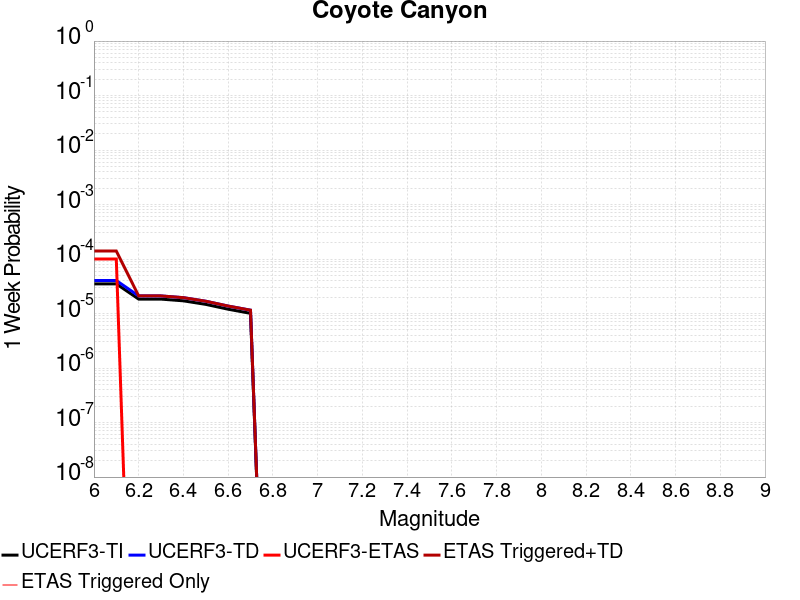 | 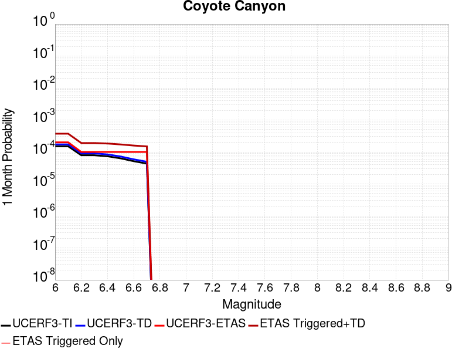 | 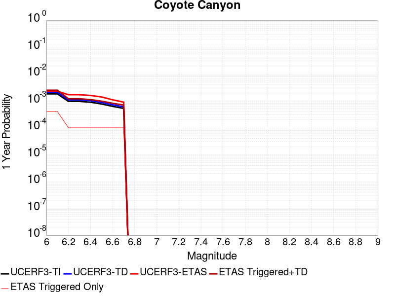 | 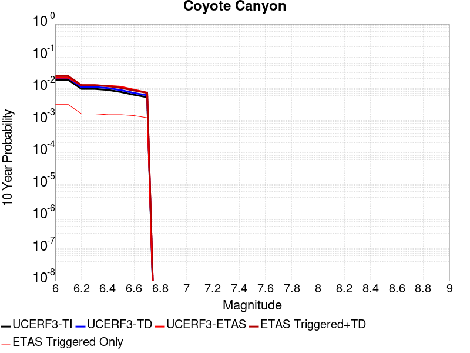 |

| Magnitude | 1 wk TI Prob | 1 wk TD Prob | 1 wk ETAS Prob | 1 wk ETAS/TD Gain | 1 wk ETAS Triggered+TD | 1 wk ETAS Triggered Only | 1 mo TI Prob | 1 mo TD Prob | 1 mo ETAS Prob | 1 mo ETAS/TD Gain | 1 mo ETAS Triggered+TD | 1 mo ETAS Triggered Only | 1 yr TI Prob | 1 yr TD Prob | 1 yr ETAS Prob | 1 yr ETAS/TD Gain | 1 yr ETAS Triggered+TD | 1 yr ETAS Triggered Only | 10 yr TI Prob | 10 yr TD Prob | 10 yr ETAS Prob | 10 yr ETAS/TD Gain | 10 yr ETAS Triggered+TD | 10 yr ETAS Triggered Only |
|-----|-----|-----|-----|-----|-----|-----|-----|-----|-----|-----|-----|-----|-----|-----|-----|-----|-----|-----|-----|-----|-----|-----|-----|-----|
| 6.0 | 3.5090034E-5 | 4.037682E-5 | 1.0E-4 | 2.4766684 | 1.4037278E-4 | 1.0E-4 | 1.503772E-4 | 1.7303349E-4 | 3.0E-4 | 1.7337683 | 3.7299888E-4 | 2.0E-4 | 0.0018293047 | 0.0021049047 | 0.0023 | 1.092686 | 0.0025040628 | 4.0E-4 | 0.018143194 | 0.020875612 | 0.0213 | 1.0203294 | 0.023910897 | 0.0031 |
| 6.1 | 3.5090034E-5 | 4.037682E-5 | 1.0E-4 | 2.4766684 | 1.4037278E-4 | 1.0E-4 | 1.503772E-4 | 1.7303349E-4 | 3.0E-4 | 1.7337683 | 3.7299888E-4 | 2.0E-4 | 0.0018293047 | 0.0021049047 | 0.0023 | 1.092686 | 0.0025040628 | 4.0E-4 | 0.018143194 | 0.020875612 | 0.0213 | 1.0203294 | 0.023910897 | 0.0031 |
| 6.2 | 1.841879E-5 | 2.1066015E-5 | 0.0 | 0.0 | 2.1066015E-5 | 0.0 | 7.8935285E-5 | 9.028037E-5 | 2.0E-4 | 2.215321 | 1.9027134E-4 | 1.0E-4 | 9.606133E-4 | 0.0010987114 | 0.0017 | 1.5472672 | 0.0011986014 | 1.0E-4 | 0.0095647145 | 0.010942885 | 0.0124 | 1.1331564 | 0.012525377 | 0.0016 |
| 6.3 | 1.841879E-5 | 2.1066015E-5 | 0.0 | 0.0 | 2.1066015E-5 | 0.0 | 7.8935285E-5 | 9.028037E-5 | 2.0E-4 | 2.215321 | 1.9027134E-4 | 1.0E-4 | 9.606133E-4 | 0.0010987114 | 0.0017 | 1.5472672 | 0.0011986014 | 1.0E-4 | 0.0095647145 | 0.010942885 | 0.0124 | 1.1331564 | 0.012525377 | 0.0016 |
| 6.4 | 1.712201E-5 | 1.9570964E-5 | 0.0 | 0.0 | 1.9570964E-5 | 0.0 | 7.337798E-5 | 8.387343E-5 | 2.0E-4 | 2.3845453 | 1.8386504E-4 | 1.0E-4 | 8.930107E-4 | 0.0010207812 | 0.0016 | 1.5674269 | 0.0011206792 | 1.0E-4 | 0.008894307 | 0.010170848 | 0.0119 | 1.1700106 | 0.011655592 | 0.0015 |
| 6.5 | 1.4744935E-5 | 1.6841894E-5 | 0.0 | 0.0 | 1.6841894E-5 | 0.0 | 6.3191044E-5 | 7.2178074E-5 | 2.0E-4 | 2.7709246 | 1.7217085E-4 | 1.0E-4 | 7.6907943E-4 | 8.7850733E-4 | 0.0014 | 1.5936122 | 9.784194E-4 | 1.0E-4 | 0.007664232 | 0.008759546 | 0.0111 | 1.2671889 | 0.010246407 | 0.0015 |
| 6.6 | 1.2017839E-5 | 1.3728104E-5 | 0.0 | 0.0 | 1.3728104E-5 | 0.0 | 5.150401E-5 | 5.8833903E-5 | 2.0E-4 | 3.3994005 | 1.5882801E-4 | 1.0E-4 | 6.268809E-4 | 7.1615604E-4 | 0.0011 | 1.5359782 | 8.160844E-4 | 1.0E-4 | 0.0062511545 | 0.0071471795 | 0.009 | 1.259238 | 0.008537173 | 0.0014 |
| 6.7 | 1.00956095E-5 | 1.1536901E-5 | 0.0 | 0.0 | 1.1536901E-5 | 0.0 | 4.326618E-5 | 4.9443417E-5 | 1.0E-4 | 2.0225139 | 1.4943848E-4 | 1.0E-4 | 5.266384E-4 | 6.0189434E-4 | 9.0E-4 | 1.4952791 | 7.0183416E-4 | 1.0E-4 | 0.005253921 | 0.0060111736 | 0.0073 | 1.2144051 | 0.0072039603 | 0.0012 |

## San Clemente
*[(top)](#table-of-contents)*

| 1 Week | 1 Month | 1 Year | 10 Year |
|-----|-----|-----|-----|
| 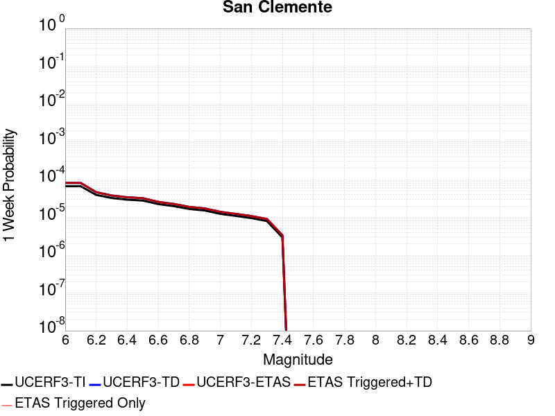 | 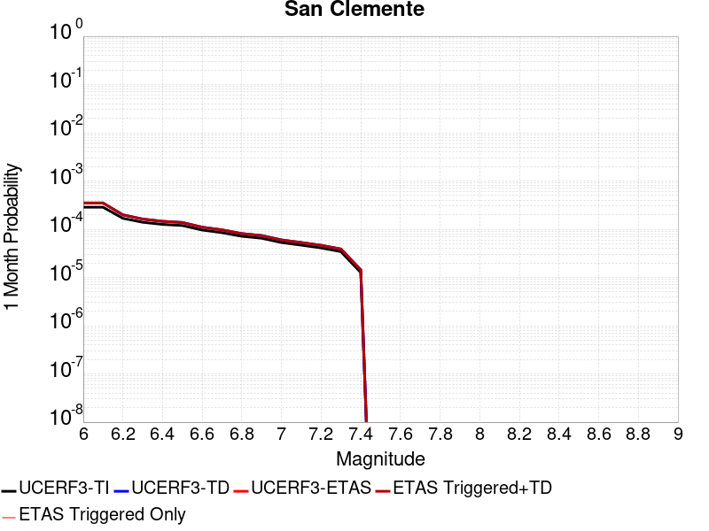 | 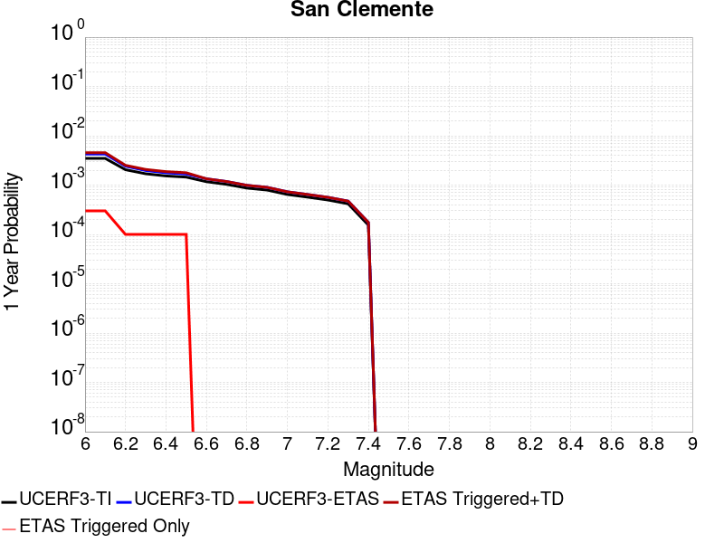 | 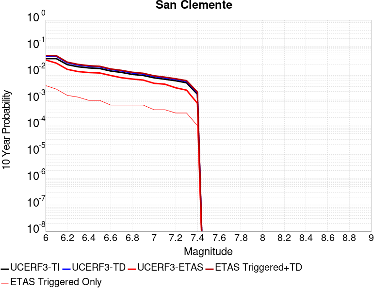 |

| Magnitude | 1 wk TI Prob | 1 wk TD Prob | 1 wk ETAS Prob | 1 wk ETAS/TD Gain | 1 wk ETAS Triggered+TD | 1 wk ETAS Triggered Only | 1 mo TI Prob | 1 mo TD Prob | 1 mo ETAS Prob | 1 mo ETAS/TD Gain | 1 mo ETAS Triggered+TD | 1 mo ETAS Triggered Only | 1 yr TI Prob | 1 yr TD Prob | 1 yr ETAS Prob | 1 yr ETAS/TD Gain | 1 yr ETAS Triggered+TD | 1 yr ETAS Triggered Only | 10 yr TI Prob | 10 yr TD Prob | 10 yr ETAS Prob | 10 yr ETAS/TD Gain | 10 yr ETAS Triggered+TD | 10 yr ETAS Triggered Only |
|-----|-----|-----|-----|-----|-----|-----|-----|-----|-----|-----|-----|-----|-----|-----|-----|-----|-----|-----|-----|-----|-----|-----|-----|-----|
| 6.0 | 6.681379E-5 | 8.167568E-5 | 0.0 | 0.0 | 8.167568E-5 | 0.0 | 2.8631336E-4 | 3.499949E-4 | 3.0E-4 | 0.8571554 | 3.499949E-4 | 0.0 | 0.003480294 | 0.0042533497 | 0.0028 | 0.6583047 | 0.0045520733 | 3.0E-4 | 0.03426291 | 0.041774645 | 0.0307 | 0.7348955 | 0.044936787 | 0.0033 |
| 6.1 | 6.681379E-5 | 8.167568E-5 | 0.0 | 0.0 | 8.167568E-5 | 0.0 | 2.8631336E-4 | 3.499949E-4 | 3.0E-4 | 0.8571554 | 3.499949E-4 | 0.0 | 0.003480294 | 0.0042533497 | 0.0022 | 0.5172394 | 0.0045520733 | 3.0E-4 | 0.03426291 | 0.041774645 | 0.0231 | 0.552967 | 0.044074386 | 0.0024 |
| 6.2 | 3.9400576E-5 | 4.6469635E-5 | 0.0 | 0.0 | 4.6469635E-5 | 0.0 | 1.6884868E-4 | 1.9914069E-4 | 0.0 | 0.0 | 1.9914069E-4 | 0.0 | 0.0020537945 | 0.002421897 | 9.0E-4 | 0.37160954 | 0.0025216548 | 1.0E-4 | 0.020349167 | 0.02396168 | 0.0135 | 0.56339955 | 0.025328135 | 0.0014 |
| 6.3 | 3.2590255E-5 | 3.7942005E-5 | 0.0 | 0.0 | 3.7942005E-5 | 0.0 | 1.3966505E-4 | 1.6259862E-4 | 0.0 | 0.0 | 1.6259862E-4 | 0.0 | 0.0016990956 | 0.001977871 | 6.0E-4 | 0.3033565 | 0.002077673 | 1.0E-4 | 0.01686163 | 0.01960647 | 0.0111 | 0.5661397 | 0.02078294 | 0.0012 |
| 6.4 | 2.9454652E-5 | 3.41089E-5 | 0.0 | 0.0 | 3.41089E-5 | 0.0 | 1.2622811E-4 | 1.4617296E-4 | 0.0 | 0.0 | 1.4617296E-4 | 0.0 | 0.0015357438 | 0.001778229 | 5.0E-4 | 0.28117862 | 0.0018780512 | 1.0E-4 | 0.015251739 | 0.017643174 | 0.0102 | 0.57812726 | 0.018527295 | 9.0E-4 |
| 6.5 | 2.790836E-5 | 3.2257845E-5 | 0.0 | 0.0 | 3.2257845E-5 | 0.0 | 1.1960178E-4 | 1.3824072E-4 | 0.0 | 0.0 | 1.3824072E-4 | 0.0 | 0.001455179 | 0.0016818069 | 5.0E-4 | 0.2972993 | 0.0017816387 | 1.0E-4 | 0.014456868 | 0.016693808 | 0.0098 | 0.587044 | 0.017578784 | 9.0E-4 |
| 6.6 | 2.2492153E-5 | 2.577044E-5 | 0.0 | 0.0 | 2.577044E-5 | 0.0 | 9.639138E-5 | 1.10440145E-4 | 0.0 | 0.0 | 1.10440145E-4 | 0.0 | 0.0011729331 | 0.0013437942 | 3.0E-4 | 0.22324848 | 0.0013437942 | 0.0 | 0.011667615 | 0.0133584 | 0.0079 | 0.59138817 | 0.013950385 | 6.0E-4 |
| 6.7 | 1.9862755E-5 | 2.2673024E-5 | 0.0 | 0.0 | 2.2673024E-5 | 0.0 | 8.512331E-5 | 9.716655E-5 | 0.0 | 0.0 | 9.716655E-5 | 0.0 | 0.0010358836 | 0.001182372 | 3.0E-4 | 0.25372726 | 0.001182372 | 0.0 | 0.010310682 | 0.011762106 | 0.0065 | 0.55262214 | 0.012355048 | 6.0E-4 |
| 6.8 | 1.6697575E-5 | 1.8983052E-5 | 0.0 | 0.0 | 1.8983052E-5 | 0.0 | 7.155907E-5 | 8.135345E-5 | 0.0 | 0.0 | 8.135345E-5 | 0.0 | 8.7088346E-4 | 9.900376E-4 | 2.0E-4 | 0.20201254 | 9.900376E-4 | 0.0 | 0.008674784 | 0.009857297 | 0.0058 | 0.5883966 | 0.010451383 | 6.0E-4 |
| 6.9 | 1.5218415E-5 | 1.7274197E-5 | 0.0 | 0.0 | 1.7274197E-5 | 0.0 | 6.522015E-5 | 7.403022E-5 | 0.0 | 0.0 | 7.403022E-5 | 0.0 | 7.93766E-4 | 9.00954E-4 | 1.0E-4 | 0.11099345 | 9.00954E-4 | 0.0 | 0.007909367 | 0.008973961 | 0.0053 | 0.5905976 | 0.009568577 | 6.0E-4 |
| 7.0 | 1.2392958E-5 | 1.4036841E-5 | 0.0 | 0.0 | 1.4036841E-5 | 0.0 | 5.3111595E-5 | 6.0156544E-5 | 0.0 | 0.0 | 6.0156544E-5 | 0.0 | 6.4644177E-4 | 7.321674E-4 | 1.0E-4 | 0.13658078 | 7.321674E-4 | 0.0 | 0.0064456454 | 0.0072983387 | 0.004 | 0.54806995 | 0.0076954192 | 4.0E-4 |
| 7.1 | 1.0934128E-5 | 1.2378498E-5 | 0.0 | 0.0 | 1.2378498E-5 | 0.0 | 4.6859706E-5 | 5.3049665E-5 | 0.0 | 0.0 | 5.3049665E-5 | 0.0 | 5.7036756E-4 | 6.456956E-4 | 1.0E-4 | 0.15487173 | 6.456956E-4 | 0.0 | 0.0056890585 | 0.0064389417 | 0.0037 | 0.5746286 | 0.0068363664 | 4.0E-4 |
| 7.2 | 9.5798805E-6 | 1.0847885E-5 | 0.0 | 0.0 | 1.0847885E-5 | 0.0 | 4.1055984E-5 | 4.649015E-5 | 0.0 | 0.0 | 4.649015E-5 | 0.0 | 4.9974193E-4 | 5.6587777E-4 | 1.0E-4 | 0.17671661 | 5.6587777E-4 | 0.0 | 0.0049861963 | 0.0056450926 | 0.0027 | 0.47829154 | 0.005943399 | 3.0E-4 |
| 7.3 | 8.0167365E-6 | 9.086408E-6 | 0.0 | 0.0 | 9.086408E-6 | 0.0 | 3.4356988E-5 | 3.894121E-5 | 0.0 | 0.0 | 3.894121E-5 | 0.0 | 4.1821605E-4 | 4.7401313E-4 | 1.0E-4 | 0.21096462 | 4.7401313E-4 | 0.0 | 0.0041742986 | 0.004730724 | 0.0022 | 0.46504512 | 0.0050293044 | 3.0E-4 |
| 7.4 | 2.9581017E-6 | 3.3633257E-6 | 0.0 | 0.0 | 3.3633257E-6 | 0.0 | 1.2677518E-5 | 1.4414201E-5 | 0.0 | 0.0 | 1.4414201E-5 | 0.0 | 1.5433785E-4 | 1.7548382E-4 | 1.0E-4 | 0.5698531 | 1.7548382E-4 | 0.0 | 0.001542307 | 0.0017539478 | 7.0E-4 | 0.39909968 | 0.0018537724 | 1.0E-4 |

## Calaveras (No) 2011 CFM
*[(top)](#table-of-contents)*

| 1 Week | 1 Month | 1 Year | 10 Year |
|-----|-----|-----|-----|
| 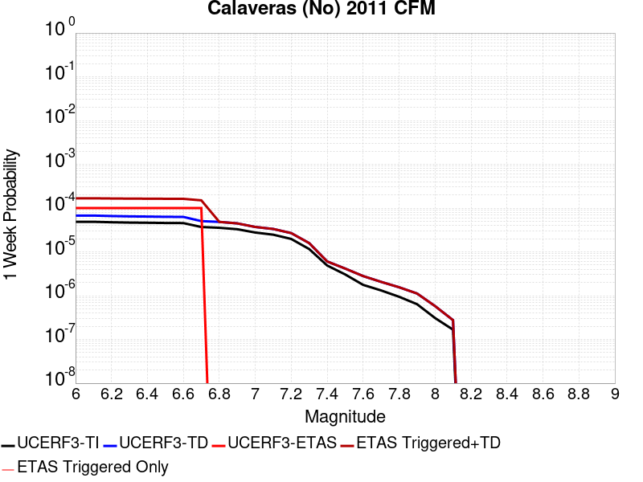 | 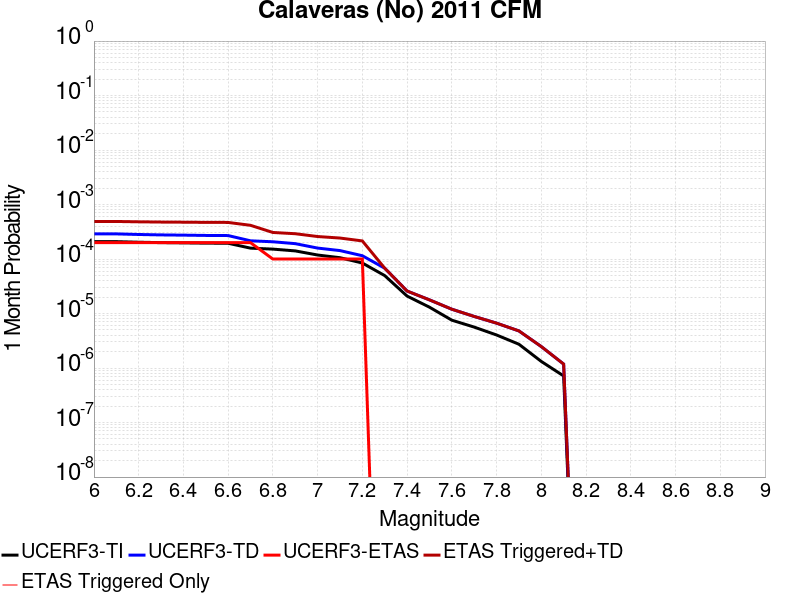 | 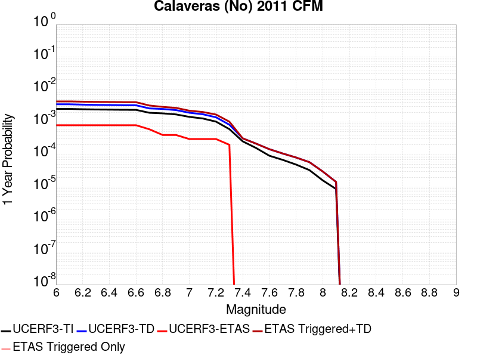 | 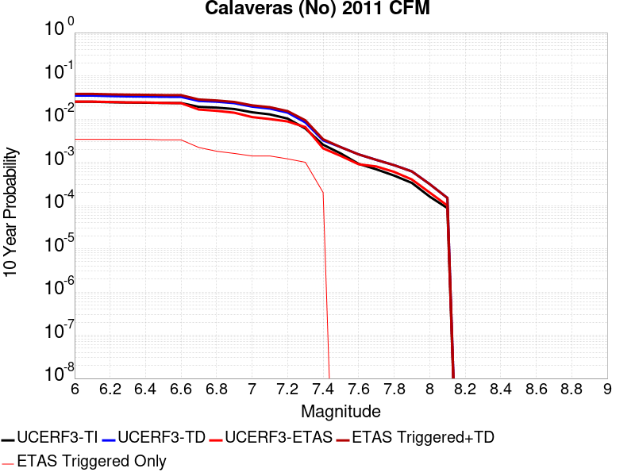 |

| Magnitude | 1 wk TI Prob | 1 wk TD Prob | 1 wk ETAS Prob | 1 wk ETAS/TD Gain | 1 wk ETAS Triggered+TD | 1 wk ETAS Triggered Only | 1 mo TI Prob | 1 mo TD Prob | 1 mo ETAS Prob | 1 mo ETAS/TD Gain | 1 mo ETAS Triggered+TD | 1 mo ETAS Triggered Only | 1 yr TI Prob | 1 yr TD Prob | 1 yr ETAS Prob | 1 yr ETAS/TD Gain | 1 yr ETAS Triggered+TD | 1 yr ETAS Triggered Only | 10 yr TI Prob | 10 yr TD Prob | 10 yr ETAS Prob | 10 yr ETAS/TD Gain | 10 yr ETAS Triggered+TD | 10 yr ETAS Triggered Only |
|-----|-----|-----|-----|-----|-----|-----|-----|-----|-----|-----|-----|-----|-----|-----|-----|-----|-----|-----|-----|-----|-----|-----|-----|-----|
| 6.0 | 4.8694856E-5 | 6.762294E-5 | 1.0E-4 | 1.4787883 | 1.6761618E-4 | 1.0E-4 | 2.0867554E-4 | 2.8978096E-4 | 3.0E-4 | 1.0352646 | 4.89723E-4 | 2.0E-4 | 0.0025376645 | 0.0035223714 | 0.0032 | 0.90847886 | 0.0043195537 | 8.0E-4 | 0.02508881 | 0.034844086 | 0.0253 | 0.7260916 | 0.038125616 | 0.0034 |
| 6.1 | 4.8694856E-5 | 6.762294E-5 | 1.0E-4 | 1.4787883 | 1.6761618E-4 | 1.0E-4 | 2.0867554E-4 | 2.8978096E-4 | 3.0E-4 | 1.0352646 | 4.89723E-4 | 2.0E-4 | 0.0025376645 | 0.0035223714 | 0.0032 | 0.90847886 | 0.0043195537 | 8.0E-4 | 0.02508881 | 0.034844086 | 0.0253 | 0.7260916 | 0.038125616 | 0.0034 |
| 6.2 | 4.7541962E-5 | 6.5952794E-5 | 1.0E-4 | 1.5162361 | 1.659462E-4 | 1.0E-4 | 2.0373536E-4 | 2.826248E-4 | 3.0E-4 | 1.0614779 | 4.8256828E-4 | 2.0E-4 | 0.0024776561 | 0.0034355454 | 0.0031 | 0.9023313 | 0.004232797 | 8.0E-4 | 0.024502134 | 0.034004934 | 0.0248 | 0.7293059 | 0.037289318 | 0.0034 |
| 6.3 | 4.6717287E-5 | 6.478552E-5 | 1.0E-4 | 1.5435548 | 1.6477905E-4 | 1.0E-4 | 2.0020158E-4 | 2.7762348E-4 | 3.0E-4 | 1.0806003 | 4.7756796E-4 | 2.0E-4 | 0.0024347296 | 0.0033748534 | 0.003 | 0.88892746 | 0.004172154 | 8.0E-4 | 0.024082264 | 0.033417057 | 0.0242 | 0.724181 | 0.03670344 | 0.0034 |
| 6.4 | 4.6276386E-5 | 6.41467E-5 | 1.0E-4 | 1.5589267 | 1.6414029E-4 | 1.0E-4 | 1.983123E-4 | 2.748863E-4 | 3.0E-4 | 1.0913604 | 4.748313E-4 | 2.0E-4 | 0.0024117786 | 0.0033416383 | 0.003 | 0.89776325 | 0.0041389647 | 8.0E-4 | 0.02385771 | 0.03309571 | 0.0242 | 0.7312126 | 0.03638318 | 0.0034 |
| 6.5 | 4.5720994E-5 | 6.3346815E-5 | 1.0E-4 | 1.5786114 | 1.6334048E-4 | 1.0E-4 | 1.9593239E-4 | 2.7145914E-4 | 3.0E-4 | 1.1051387 | 4.7140487E-4 | 2.0E-4 | 0.002382867 | 0.0033000482 | 0.003 | 0.90907764 | 0.004097408 | 8.0E-4 | 0.023574775 | 0.03269305 | 0.0236 | 0.72186595 | 0.035885163 | 0.0033 |
| 6.6 | 4.549134E-5 | 6.299924E-5 | 1.0E-4 | 1.5873207 | 1.6299295E-4 | 1.0E-4 | 1.949483E-4 | 2.6996987E-4 | 3.0E-4 | 1.1112351 | 4.699159E-4 | 2.0E-4 | 0.0023709119 | 0.003281971 | 0.0029 | 0.8836154 | 0.0040793456 | 8.0E-4 | 0.023457756 | 0.032518126 | 0.0233 | 0.7165234 | 0.03571082 | 0.0033 |
| 6.7 | 3.701047E-5 | 5.049463E-5 | 1.0E-4 | 1.9804085 | 1.5048958E-4 | 1.0E-4 | 1.5860666E-4 | 2.1638785E-4 | 3.0E-4 | 1.3863994 | 4.1634458E-4 | 2.0E-4 | 0.0019293258 | 0.0026313828 | 0.002 | 0.7600566 | 0.003229804 | 6.0E-4 | 0.019126613 | 0.026191844 | 0.0166 | 0.63378507 | 0.028334223 | 0.0022 |
| 6.8 | 3.5523568E-5 | 4.8475173E-5 | 0.0 | 0.0 | 4.8475173E-5 | 0.0 | 1.5223498E-4 | 2.0773444E-4 | 2.0E-4 | 0.9627676 | 3.0771366E-4 | 1.0E-4 | 0.0018518851 | 0.0025262765 | 0.0017 | 0.6729271 | 0.002925266 | 4.0E-4 | 0.018365284 | 0.025163965 | 0.0155 | 0.6159602 | 0.02691867 | 0.0018 |
| 6.9 | 3.2946147E-5 | 4.479259E-5 | 0.0 | 0.0 | 4.479259E-5 | 0.0 | 1.4119013E-4 | 1.9195434E-4 | 1.0E-4 | 0.52095723 | 2.9193514E-4 | 1.0E-4 | 0.0017176344 | 0.0023345817 | 0.0015 | 0.6425134 | 0.0027336478 | 4.0E-4 | 0.017044188 | 0.023284193 | 0.014 | 0.60126626 | 0.024846938 | 0.0016 |
| 7.0 | 2.7682381E-5 | 3.714891E-5 | 0.0 | 0.0 | 3.714891E-5 | 0.0 | 1.1863338E-4 | 1.5920008E-4 | 1.0E-4 | 0.6281404 | 2.5918416E-4 | 1.0E-4 | 0.0014434044 | 0.0019365682 | 0.0012 | 0.61965287 | 0.0022359872 | 3.0E-4 | 0.01434065 | 0.019374212 | 0.0111 | 0.5729265 | 0.020747088 | 0.0014 |
| 7.1 | 2.471967E-5 | 3.3409662E-5 | 0.0 | 0.0 | 3.3409662E-5 | 0.0 | 1.05937135E-4 | 1.4317657E-4 | 1.0E-4 | 0.6984383 | 2.4316226E-4 | 1.0E-4 | 0.0012890215 | 0.0017418101 | 0.0012 | 0.6889385 | 0.0020412875 | 3.0E-4 | 0.0128157 | 0.017447798 | 0.01 | 0.57313824 | 0.01882337 | 0.0014 |
| 7.2 | 1.9748062E-5 | 2.689399E-5 | 0.0 | 0.0 | 2.689399E-5 | 0.0 | 8.463181E-5 | 1.15254996E-4 | 1.0E-4 | 0.8676414 | 2.1524348E-4 | 1.0E-4 | 0.0010299052 | 0.00140235 | 0.0012 | 0.8557065 | 0.0017019293 | 3.0E-4 | 0.01025145 | 0.014090974 | 0.0088 | 0.62451327 | 0.015274066 | 0.0012 |
| 7.3 | 1.1603734E-5 | 1.5886508E-5 | 0.0 | 0.0 | 1.5886508E-5 | 0.0 | 4.9729337E-5 | 6.808334E-5 | 0.0 | 0.0 | 6.808334E-5 | 0.0 | 6.052865E-4 | 8.286139E-4 | 7.0E-4 | 0.84478426 | 0.0010284482 | 2.0E-4 | 0.0060364045 | 0.008360811 | 0.0065 | 0.77743655 | 0.00935245 | 0.001 |
| 7.4 | 4.885381E-6 | 6.0596612E-6 | 0.0 | 0.0 | 6.0596612E-6 | 0.0 | 2.0937177E-5 | 2.5969719E-5 | 0.0 | 0.0 | 2.5969719E-5 | 0.0 | 2.5488032E-4 | 3.161356E-4 | 1.0E-4 | 0.31631994 | 3.161356E-4 | 0.0 | 0.0025458818 | 0.0032136303 | 0.0021 | 0.6534666 | 0.0034129876 | 2.0E-4 |
| 7.5 | 3.0571264E-6 | 4.1778035E-6 | 0.0 | 0.0 | 4.1778035E-6 | 0.0 | 1.3101904E-5 | 1.7904751E-5 | 0.0 | 0.0 | 1.7904751E-5 | 0.0 | 1.5950401E-4 | 2.1796863E-4 | 0.0 | 0.0 | 2.1796863E-4 | 0.0 | 0.0015938957 | 0.0022326692 | 0.0014 | 0.6270522 | 0.0022326692 | 0.0 |
| 7.6 | 1.764948E-6 | 2.817158E-6 | 0.0 | 0.0 | 2.817158E-6 | 0.0 | 7.564041E-6 | 1.2073479E-5 | 0.0 | 0.0 | 1.2073479E-5 | 0.0 | 9.208831E-5 | 1.4698476E-4 | 0.0 | 0.0 | 1.4698476E-4 | 0.0 | 9.205016E-4 | 0.0015231855 | 9.0E-4 | 0.590867 | 0.0015231855 | 0.0 |
| 7.7 | 1.3173734E-6 | 2.07745E-6 | 0.0 | 0.0 | 2.07745E-6 | 0.0 | 5.645874E-6 | 8.9033265E-6 | 0.0 | 0.0 | 8.9033265E-6 | 0.0 | 6.873634E-5 | 1.0839263E-4 | 0.0 | 0.0 | 1.0839263E-4 | 0.0 | 6.8715087E-4 | 0.0011357269 | 8.0E-4 | 0.70439464 | 0.0011357269 | 0.0 |
| 7.8 | 9.4429885E-7 | 1.5635194E-6 | 0.0 | 0.0 | 1.5635194E-6 | 0.0 | 4.0469886E-6 | 6.7007804E-6 | 0.0 | 0.0 | 6.7007804E-6 | 0.0 | 4.9270973E-5 | 8.157896E-5 | 0.0 | 0.0 | 8.157896E-5 | 0.0 | 4.926005E-4 | 8.575105E-4 | 6.0E-4 | 0.6996999 | 8.575105E-4 | 0.0 |
| 7.9 | 6.388233E-7 | 1.1251777E-6 | 0.0 | 0.0 | 1.1251777E-6 | 0.0 | 2.7378112E-6 | 4.8221814E-6 | 0.0 | 0.0 | 4.8221814E-6 | 0.0 | 3.3332344E-5 | 5.8708487E-5 | 0.0 | 0.0 | 5.8708487E-5 | 0.0 | 3.3327343E-4 | 6.147857E-4 | 4.0E-4 | 0.6506332 | 6.147857E-4 | 0.0 |
| 8.0 | 3.087986E-7 | 5.8074795E-7 | 0.0 | 0.0 | 5.8074795E-7 | 0.0 | 1.323422E-6 | 2.4889173E-6 | 0.0 | 0.0 | 2.4889173E-6 | 0.0 | 1.6112543E-5 | 3.0302152E-5 | 0.0 | 0.0 | 3.0302152E-5 | 0.0 | 1.6111376E-4 | 3.136864E-4 | 2.0E-4 | 0.6375794 | 3.136864E-4 | 0.0 |
| 8.1 | 1.6725647E-7 | 2.7690925E-7 | 0.0 | 0.0 | 2.7690925E-7 | 0.0 | 7.168133E-7 | 1.1867534E-6 | 0.0 | 0.0 | 1.1867534E-6 | 0.0 | 8.7271665E-6 | 1.4448628E-5 | 0.0 | 0.0 | 1.4448628E-5 | 0.0 | 8.726824E-5 | 1.4992939E-4 | 1.0E-4 | 0.6669806 | 1.4992939E-4 | 0.0 |

## Whittier alt 1
*[(top)](#table-of-contents)*

| 1 Week | 1 Month | 1 Year | 10 Year |
|-----|-----|-----|-----|
| 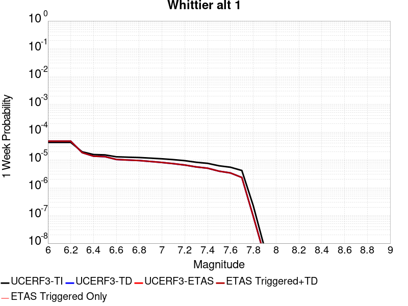 | 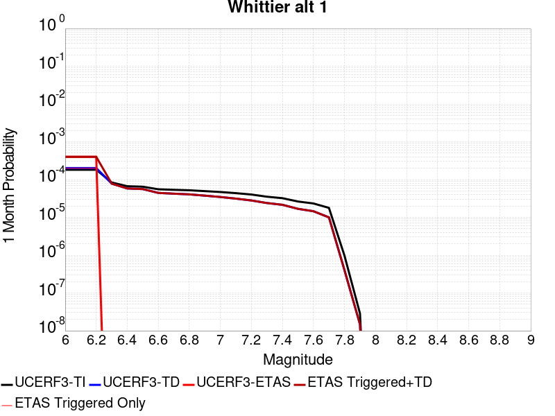 | 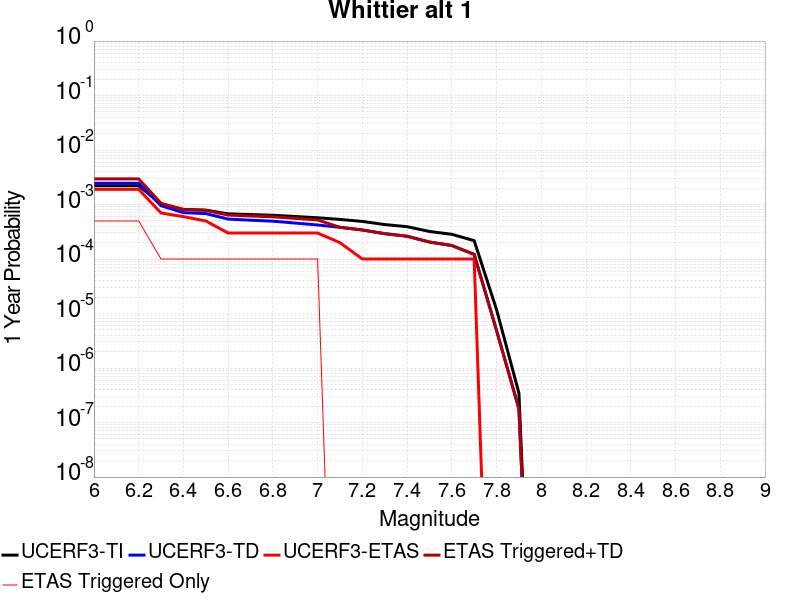 | 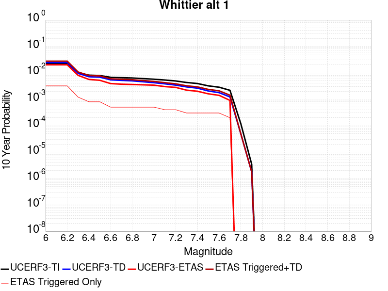 |

| Magnitude | 1 wk TI Prob | 1 wk TD Prob | 1 wk ETAS Prob | 1 wk ETAS/TD Gain | 1 wk ETAS Triggered+TD | 1 wk ETAS Triggered Only | 1 mo TI Prob | 1 mo TD Prob | 1 mo ETAS Prob | 1 mo ETAS/TD Gain | 1 mo ETAS Triggered+TD | 1 mo ETAS Triggered Only | 1 yr TI Prob | 1 yr TD Prob | 1 yr ETAS Prob | 1 yr ETAS/TD Gain | 1 yr ETAS Triggered+TD | 1 yr ETAS Triggered Only | 10 yr TI Prob | 10 yr TD Prob | 10 yr ETAS Prob | 10 yr ETAS/TD Gain | 10 yr ETAS Triggered+TD | 10 yr ETAS Triggered Only |
|-----|-----|-----|-----|-----|-----|-----|-----|-----|-----|-----|-----|-----|-----|-----|-----|-----|-----|-----|-----|-----|-----|-----|-----|-----|
| 6.0 | 4.2554693E-5 | 4.7270623E-5 | 0.0 | 0.0 | 4.7270623E-5 | 0.0 | 1.8236451E-4 | 2.0257448E-4 | 4.0E-4 | 1.9745824 | 4.0253397E-4 | 2.0E-4 | 0.002218027 | 0.0024638765 | 0.0019 | 0.77114254 | 0.0029626444 | 5.0E-4 | 0.02196019 | 0.024399554 | 0.02 | 0.8196871 | 0.027521476 | 0.0032 |
| 6.1 | 4.2554693E-5 | 4.7270623E-5 | 0.0 | 0.0 | 4.7270623E-5 | 0.0 | 1.8236451E-4 | 2.0257448E-4 | 4.0E-4 | 1.9745824 | 4.0253397E-4 | 2.0E-4 | 0.002218027 | 0.0024638765 | 0.0019 | 0.77114254 | 0.0029626444 | 5.0E-4 | 0.02196019 | 0.024399554 | 0.02 | 0.8196871 | 0.027521476 | 0.0032 |
| 6.2 | 4.2554693E-5 | 4.7270623E-5 | 0.0 | 0.0 | 4.7270623E-5 | 0.0 | 1.8236451E-4 | 2.0257448E-4 | 4.0E-4 | 1.9745824 | 4.0253397E-4 | 2.0E-4 | 0.002218027 | 0.0024638765 | 0.0019 | 0.77114254 | 0.0029626444 | 5.0E-4 | 0.02196019 | 0.024399554 | 0.02 | 0.8196871 | 0.027521476 | 0.0032 |
| 6.3 | 1.9617712E-5 | 1.8278539E-5 | 0.0 | 0.0 | 1.8278539E-5 | 0.0 | 8.40732E-5 | 7.833435E-5 | 0.0 | 0.0 | 7.833435E-5 | 0.0 | 0.0010231105 | 9.533224E-4 | 7.0E-4 | 0.73427415 | 0.0010532271 | 1.0E-4 | 0.01018413 | 0.009495515 | 0.008 | 0.84250295 | 0.010684121 | 0.0012 |
| 6.4 | 1.5611336E-5 | 1.3612679E-5 | 0.0 | 0.0 | 1.3612679E-5 | 0.0 | 6.690401E-5 | 5.833878E-5 | 0.0 | 0.0 | 5.833878E-5 | 0.0 | 8.142519E-4 | 7.100492E-4 | 6.0E-4 | 0.8450119 | 8.0997817E-4 | 1.0E-4 | 0.008112748 | 0.0070796683 | 0.0056 | 0.7909975 | 0.007874005 | 8.0E-4 |
| 6.5 | 1.5150166E-5 | 1.3109235E-5 | 0.0 | 0.0 | 1.3109235E-5 | 0.0 | 6.492767E-5 | 5.618126E-5 | 0.0 | 0.0 | 5.618126E-5 | 0.0 | 7.9020765E-4 | 6.8379805E-4 | 5.0E-4 | 0.73121005 | 7.8372966E-4 | 1.0E-4 | 0.007874036 | 0.0068187886 | 0.0052 | 0.7625988 | 0.0076133334 | 8.0E-4 |
| 6.6 | 1.295588E-5 | 1.0387536E-5 | 0.0 | 0.0 | 1.0387536E-5 | 0.0 | 5.552402E-5 | 4.4517266E-5 | 0.0 | 0.0 | 4.4517266E-5 | 0.0 | 6.7579525E-4 | 5.4186484E-4 | 3.0E-4 | 0.5536436 | 6.4181065E-4 | 1.0E-4 | 0.006737438 | 0.0054068887 | 0.0039 | 0.7213021 | 0.005904185 | 5.0E-4 |
| 6.7 | 1.2542085E-5 | 9.9059625E-6 | 0.0 | 0.0 | 9.9059625E-6 | 0.0 | 5.3750682E-5 | 4.2453445E-5 | 0.0 | 0.0 | 4.2453445E-5 | 0.0 | 6.542181E-4 | 5.1675E-4 | 3.0E-4 | 0.5805515 | 6.166983E-4 | 1.0E-4 | 0.006522954 | 0.005156937 | 0.0037 | 0.7174801 | 0.005654359 | 5.0E-4 |
| 6.8 | 1.2195878E-5 | 9.501777E-6 | 0.0 | 0.0 | 9.501777E-6 | 0.0 | 5.2267E-5 | 4.0721276E-5 | 0.0 | 0.0 | 4.0721276E-5 | 0.0 | 6.36165E-4 | 4.956706E-4 | 3.0E-4 | 0.60524064 | 5.9562107E-4 | 1.0E-4 | 0.0063434686 | 0.004946992 | 0.0036 | 0.72771496 | 0.0054445183 | 5.0E-4 |
| 6.9 | 1.1580298E-5 | 8.77887E-6 | 0.0 | 0.0 | 8.77887E-6 | 0.0 | 4.9628903E-5 | 3.7623195E-5 | 0.0 | 0.0 | 3.7623195E-5 | 0.0 | 6.040644E-4 | 4.579678E-4 | 3.0E-4 | 0.6550679 | 5.57922E-4 | 1.0E-4 | 0.00602425 | 0.004571536 | 0.0035 | 0.765607 | 0.0050692502 | 5.0E-4 |
| 7.0 | 1.0964795E-5 | 8.089608E-6 | 0.0 | 0.0 | 8.089608E-6 | 0.0 | 4.6991136E-5 | 3.4669294E-5 | 0.0 | 0.0 | 3.4669294E-5 | 0.0 | 5.7196687E-4 | 4.2201846E-4 | 3.0E-4 | 0.7108694 | 5.2197627E-4 | 1.0E-4 | 0.0057049696 | 0.004213462 | 0.0034 | 0.8069374 | 0.004711355 | 5.0E-4 |
| 7.1 | 1.0230601E-5 | 7.331623E-6 | 0.0 | 0.0 | 7.331623E-6 | 0.0 | 4.3844695E-5 | 3.142087E-5 | 0.0 | 0.0 | 3.142087E-5 | 0.0 | 5.336784E-4 | 3.8248324E-4 | 2.0E-4 | 0.52289873 | 3.8248324E-4 | 0.0 | 0.005323986 | 0.0038194344 | 0.003 | 0.7854566 | 0.004217907 | 4.0E-4 |
| 7.2 | 9.40865E-6 | 6.5478125E-6 | 0.0 | 0.0 | 6.5478125E-6 | 0.0 | 4.032216E-5 | 2.8061759E-5 | 0.0 | 0.0 | 2.8061759E-5 | 0.0 | 4.908117E-4 | 3.4159957E-4 | 1.0E-4 | 0.29274043 | 3.4159957E-4 | 0.0 | 0.0048972913 | 0.0034118628 | 0.0028 | 0.8206661 | 0.0038104982 | 4.0E-4 |
| 7.3 | 8.237384E-6 | 5.6016415E-6 | 0.0 | 0.0 | 5.6016415E-6 | 0.0 | 3.5302593E-5 | 2.400682E-5 | 0.0 | 0.0 | 2.400682E-5 | 0.0 | 4.2972428E-4 | 2.922449E-4 | 1.0E-4 | 0.3421788 | 2.922449E-4 | 0.0 | 0.0042889426 | 0.002918923 | 0.0022 | 0.75370264 | 0.0032180473 | 3.0E-4 |
| 7.4 | 7.5316966E-6 | 5.0313497E-6 | 0.0 | 0.0 | 5.0313497E-6 | 0.0 | 3.2278298E-5 | 2.1562753E-5 | 0.0 | 0.0 | 2.1562753E-5 | 0.0 | 3.9291743E-4 | 2.6249592E-4 | 1.0E-4 | 0.38095832 | 2.6249592E-4 | 0.0 | 0.0039222343 | 0.002621969 | 0.002 | 0.76278555 | 0.0029211824 | 3.0E-4 |
| 7.5 | 6.149649E-6 | 3.9366464E-6 | 0.0 | 0.0 | 3.9366464E-6 | 0.0 | 2.6355372E-5 | 1.6871238E-5 | 0.0 | 0.0 | 1.6871238E-5 | 0.0 | 3.208294E-4 | 2.0538887E-4 | 1.0E-4 | 0.48688132 | 2.0538887E-4 | 0.0 | 0.003203666 | 0.00205208 | 0.0016 | 0.77969676 | 0.0023514642 | 3.0E-4 |
| 7.6 | 5.457711E-6 | 3.3978574E-6 | 0.0 | 0.0 | 3.3978574E-6 | 0.0 | 2.338998E-5 | 1.4562169E-5 | 0.0 | 0.0 | 1.4562169E-5 | 0.0 | 2.8473578E-4 | 1.772808E-4 | 1.0E-4 | 0.56407684 | 1.772808E-4 | 0.0 | 0.0028437122 | 0.0017714747 | 0.0014 | 0.79030204 | 0.0020709431 | 3.0E-4 |
| 7.7 | 4.1676276E-6 | 2.3351286E-6 | 0.0 | 0.0 | 2.3351286E-6 | 0.0 | 1.7861139E-5 | 1.00076595E-5 | 0.0 | 0.0 | 1.00076595E-5 | 0.0 | 2.1743766E-4 | 1.2183719E-4 | 1.0E-4 | 0.82076746 | 1.2183719E-4 | 0.0 | 0.0021722503 | 0.0012177771 | 9.0E-4 | 0.7390515 | 0.0014175335 | 2.0E-4 |
| 7.8 | 2.2692414E-7 | 9.391798E-8 | 0.0 | 0.0 | 9.391798E-8 | 0.0 | 9.725317E-7 | 4.0250558E-7 | 0.0 | 0.0 | 4.0250558E-7 | 0.0 | 1.1840509E-5 | 4.900498E-6 | 0.0 | 0.0 | 4.900498E-6 | 0.0 | 1.1839878E-4 | 4.9004226E-5 | 0.0 | 0.0 | 4.9004226E-5 | 0.0 |
| 7.9 | 6.676829E-9 | 3.4416097E-9 | 0.0 | 0.0 | 3.4416097E-9 | 0.0 | 2.861498E-8 | 1.4749755E-8 | 0.0 | 0.0 | 1.4749755E-8 | 0.0 | 3.4838732E-7 | 1.7957827E-7 | 0.0 | 0.0 | 1.7957827E-7 | 0.0 | 3.4838679E-6 | 1.7957813E-6 | 0.0 | 0.0 | 1.7957813E-6 | 0.0 |

## Gravel Hills-Harper Lk
*[(top)](#table-of-contents)*

| 1 Week | 1 Month | 1 Year | 10 Year |
|-----|-----|-----|-----|
| 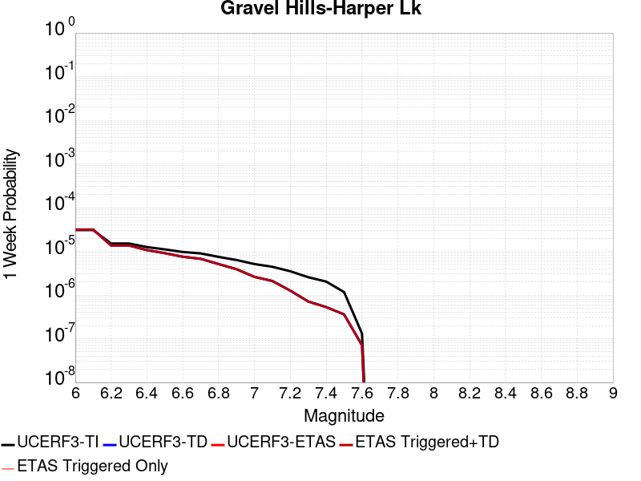 | 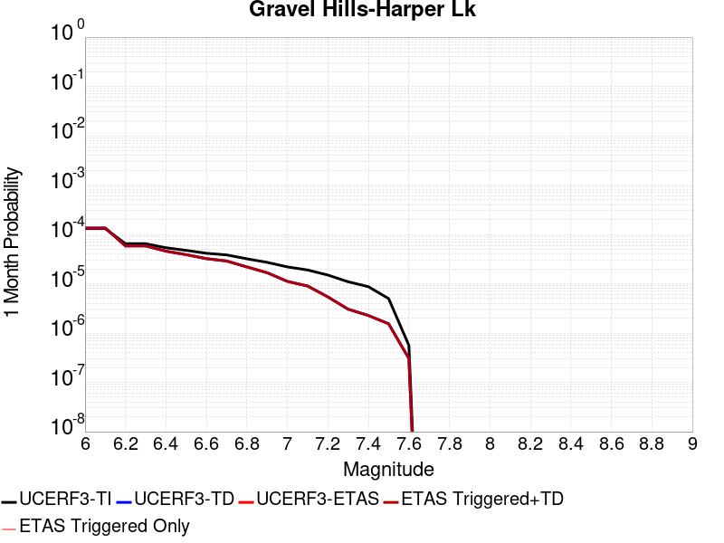 | 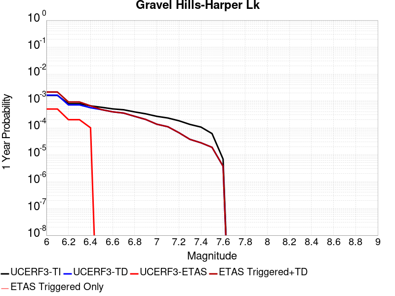 | 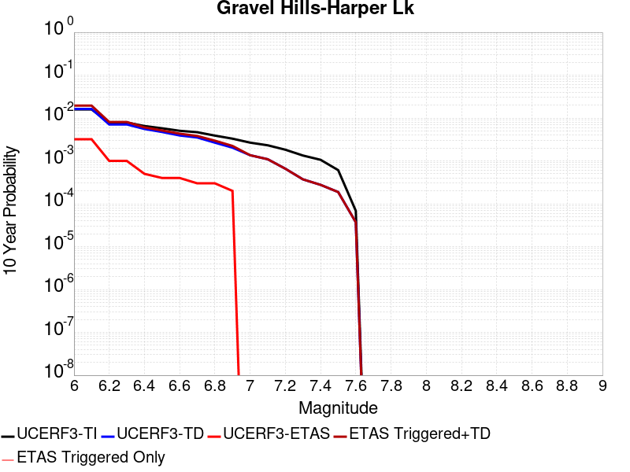 |

| Magnitude | 1 wk TI Prob | 1 wk TD Prob | 1 wk ETAS Prob | 1 wk ETAS/TD Gain | 1 wk ETAS Triggered+TD | 1 wk ETAS Triggered Only | 1 mo TI Prob | 1 mo TD Prob | 1 mo ETAS Prob | 1 mo ETAS/TD Gain | 1 mo ETAS Triggered+TD | 1 mo ETAS Triggered Only | 1 yr TI Prob | 1 yr TD Prob | 1 yr ETAS Prob | 1 yr ETAS/TD Gain | 1 yr ETAS Triggered+TD | 1 yr ETAS Triggered Only | 10 yr TI Prob | 10 yr TD Prob | 10 yr ETAS Prob | 10 yr ETAS/TD Gain | 10 yr ETAS Triggered+TD | 10 yr ETAS Triggered Only |
|-----|-----|-----|-----|-----|-----|-----|-----|-----|-----|-----|-----|-----|-----|-----|-----|-----|-----|-----|-----|-----|-----|-----|-----|-----|
| 6.0 | 3.0679566E-5 | 3.147297E-5 | 0.0 | 0.0 | 3.147297E-5 | 0.0 | 1.3147724E-4 | 1.348784E-4 | 0.0 | 0.0 | 1.348784E-4 | 0.0 | 0.0015995599 | 0.0016411247 | 0.0013 | 0.79213965 | 0.002140304 | 5.0E-4 | 0.015880952 | 0.016311636 | 0.0139 | 0.8521524 | 0.019459438 | 0.0032 |
| 6.1 | 3.0679566E-5 | 3.147297E-5 | 0.0 | 0.0 | 3.147297E-5 | 0.0 | 1.3147724E-4 | 1.348784E-4 | 0.0 | 0.0 | 1.348784E-4 | 0.0 | 0.0015995599 | 0.0016411247 | 0.0013 | 0.79213965 | 0.002140304 | 5.0E-4 | 0.015880952 | 0.016311636 | 0.0139 | 0.8521524 | 0.019459438 | 0.0032 |
| 6.2 | 1.514536E-5 | 1.3638063E-5 | 0.0 | 0.0 | 1.3638063E-5 | 0.0 | 6.490707E-5 | 5.84476E-5 | 0.0 | 0.0 | 5.84476E-5 | 0.0 | 7.8995706E-4 | 7.113791E-4 | 6.0E-4 | 0.8434322 | 9.112368E-4 | 2.0E-4 | 0.007871548 | 0.0070922207 | 0.0058 | 0.8177974 | 0.008085129 | 0.001 |
| 6.3 | 1.514536E-5 | 1.3638063E-5 | 0.0 | 0.0 | 1.3638063E-5 | 0.0 | 6.490707E-5 | 5.84476E-5 | 0.0 | 0.0 | 5.84476E-5 | 0.0 | 7.8995706E-4 | 7.113791E-4 | 6.0E-4 | 0.8434322 | 9.112368E-4 | 2.0E-4 | 0.007871548 | 0.0070922207 | 0.0058 | 0.8177974 | 0.008085129 | 0.001 |
| 6.4 | 1.2532521E-5 | 1.069177E-5 | 0.0 | 0.0 | 1.069177E-5 | 0.0 | 5.37097E-5 | 4.58211E-5 | 0.0 | 0.0 | 4.58211E-5 | 0.0 | 6.537194E-4 | 5.577349E-4 | 3.0E-4 | 0.53788996 | 6.576791E-4 | 1.0E-4 | 0.0065179965 | 0.005563942 | 0.0037 | 0.66499615 | 0.00606116 | 5.0E-4 |
| 6.5 | 1.1094058E-5 | 9.0853555E-6 | 0.0 | 0.0 | 9.0853555E-6 | 0.0 | 4.7545094E-5 | 3.893668E-5 | 0.0 | 0.0 | 3.893668E-5 | 0.0 | 5.787078E-4 | 4.7395498E-4 | 2.0E-4 | 0.421981 | 4.7395498E-4 | 0.0 | 0.0057720304 | 0.0047298493 | 0.0032 | 0.6765543 | 0.0051279576 | 4.0E-4 |
| 6.6 | 9.688328E-6 | 7.533053E-6 | 0.0 | 0.0 | 7.533053E-6 | 0.0 | 4.1520743E-5 | 3.228413E-5 | 0.0 | 0.0 | 3.228413E-5 | 0.0 | 5.053978E-4 | 3.929909E-4 | 2.0E-4 | 0.50891757 | 3.929909E-4 | 0.0 | 0.0050424994 | 0.0039232164 | 0.0029 | 0.7391894 | 0.0043216473 | 4.0E-4 |
| 6.7 | 8.974824E-6 | 6.7506153E-6 | 0.0 | 0.0 | 6.7506153E-6 | 0.0 | 3.8462964E-5 | 2.8930901E-5 | 0.0 | 0.0 | 2.8930901E-5 | 0.0 | 4.6818596E-4 | 3.52179E-4 | 2.0E-4 | 0.567893 | 3.52179E-4 | 0.0 | 0.004672008 | 0.0035164298 | 0.0027 | 0.76782423 | 0.0038153748 | 3.0E-4 |
| 6.8 | 7.4780046E-6 | 5.1170887E-6 | 0.0 | 0.0 | 5.1170887E-6 | 0.0 | 3.20482E-5 | 2.1930204E-5 | 0.0 | 0.0 | 2.1930204E-5 | 0.0 | 3.9011694E-4 | 2.669689E-4 | 2.0E-4 | 0.74915093 | 2.669689E-4 | 0.0 | 0.0038943281 | 0.00266662 | 0.0023 | 0.86251503 | 0.0029658203 | 3.0E-4 |
| 6.9 | 6.3409307E-6 | 3.9081892E-6 | 0.0 | 0.0 | 3.9081892E-6 | 0.0 | 2.7175134E-5 | 1.674928E-5 | 0.0 | 0.0 | 1.674928E-5 | 0.0 | 3.3080703E-4 | 2.0390439E-4 | 2.0E-4 | 0.9808519 | 2.0390439E-4 | 0.0 | 0.0033031502 | 0.0020372712 | 0.0019 | 0.93262005 | 0.0022368638 | 2.0E-4 |
| 7.0 | 5.1239335E-6 | 2.6063335E-6 | 0.0 | 0.0 | 2.6063335E-6 | 0.0 | 2.195953E-5 | 1.1169955E-5 | 0.0 | 0.0 | 1.1169955E-5 | 0.0 | 2.6732447E-4 | 1.3598596E-4 | 1.0E-4 | 0.73537004 | 1.3598596E-4 | 0.0 | 0.0026700313 | 0.0013590527 | 0.0012 | 0.88296795 | 0.0013590527 | 0.0 |
| 7.1 | 4.438899E-6 | 2.0988707E-6 | 0.0 | 0.0 | 2.0988707E-6 | 0.0 | 1.9023713E-5 | 8.99513E-6 | 0.0 | 0.0 | 8.99513E-6 | 0.0 | 2.315891E-4 | 1.0951043E-4 | 1.0E-4 | 0.913155 | 1.0951043E-4 | 0.0 | 0.002313479 | 0.0010945866 | 0.0011 | 1.0049456 | 0.0010945866 | 0.0 |
| 7.2 | 3.50367E-6 | 1.2618601E-6 | 0.0 | 0.0 | 1.2618601E-6 | 0.0 | 1.5015643E-5 | 5.407961E-6 | 0.0 | 0.0 | 5.407961E-6 | 0.0 | 1.8280011E-4 | 6.584002E-5 | 0.0 | 0.0 | 6.584002E-5 | 0.0 | 0.0018264982 | 6.5821334E-4 | 5.0E-4 | 0.7596321 | 6.5821334E-4 | 0.0 |
| 7.3 | 2.561638E-6 | 7.121003E-7 | 0.0 | 0.0 | 7.121003E-7 | 0.0 | 1.0978401E-5 | 3.051855E-6 | 0.0 | 0.0 | 3.051855E-6 | 0.0 | 1.3365384E-4 | 3.715572E-5 | 0.0 | 0.0 | 3.715572E-5 | 0.0 | 0.0013357349 | 3.714971E-4 | 3.0E-4 | 0.80754334 | 3.714971E-4 | 0.0 |
| 7.4 | 2.0368864E-6 | 5.3063235E-7 | 0.0 | 0.0 | 5.3063235E-7 | 0.0 | 8.729483E-6 | 2.2741367E-6 | 0.0 | 0.0 | 2.2741367E-6 | 0.0 | 1.06276275E-4 | 2.7687269E-5 | 0.0 | 0.0 | 2.7687269E-5 | 0.0 | 0.0010622547 | 2.7683872E-4 | 3.0E-4 | 1.0836633 | 2.7683872E-4 | 0.0 |
| 7.5 | 1.1681728E-6 | 3.6039583E-7 | 0.0 | 0.0 | 3.6039583E-7 | 0.0 | 5.0064455E-6 | 1.5445527E-6 | 0.0 | 0.0 | 1.5445527E-6 | 0.0 | 6.0951766E-5 | 1.880477E-5 | 0.0 | 0.0 | 1.880477E-5 | 0.0 | 6.093505E-4 | 1.8803227E-4 | 2.0E-4 | 1.0636473 | 1.8803227E-4 | 0.0 |
| 7.6 | 1.3154387E-7 | 7.121037E-8 | 0.0 | 0.0 | 7.121037E-8 | 0.0 | 5.6375933E-7 | 3.0518729E-7 | 0.0 | 0.0 | 3.0518729E-7 | 0.0 | 6.863748E-6 | 3.7156503E-6 | 0.0 | 0.0 | 3.7156503E-6 | 0.0 | 6.863536E-5 | 3.7156038E-5 | 0.0 | 0.0 | 3.7156038E-5 | 0.0 |

## Maacama 2011 CFM
*[(top)](#table-of-contents)*

| 1 Week | 1 Month | 1 Year | 10 Year |
|-----|-----|-----|-----|
| 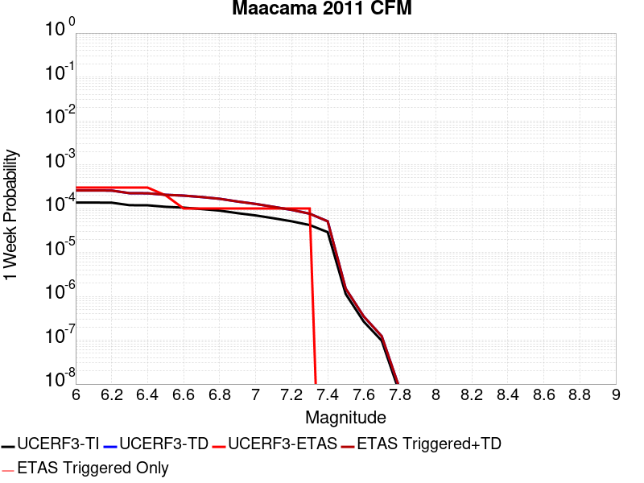 | 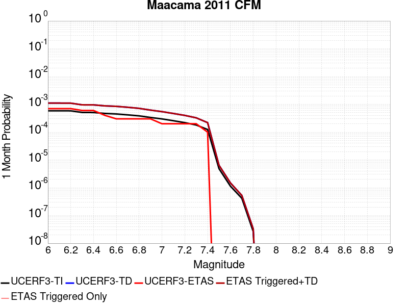 | 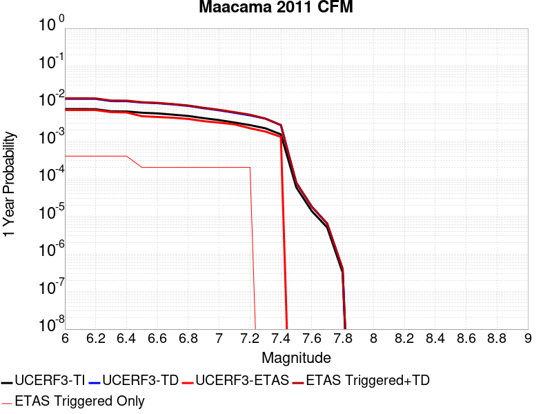 | 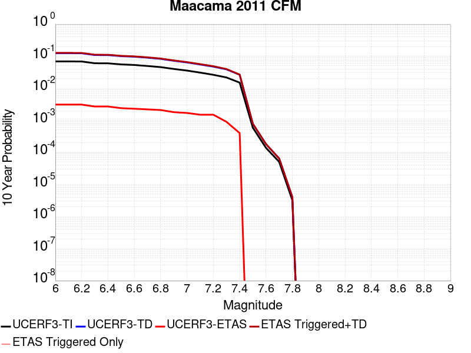 |

| Magnitude | 1 wk TI Prob | 1 wk TD Prob | 1 wk ETAS Prob | 1 wk ETAS/TD Gain | 1 wk ETAS Triggered+TD | 1 wk ETAS Triggered Only | 1 mo TI Prob | 1 mo TD Prob | 1 mo ETAS Prob | 1 mo ETAS/TD Gain | 1 mo ETAS Triggered+TD | 1 mo ETAS Triggered Only | 1 yr TI Prob | 1 yr TD Prob | 1 yr ETAS Prob | 1 yr ETAS/TD Gain | 1 yr ETAS Triggered+TD | 1 yr ETAS Triggered Only | 10 yr TI Prob | 10 yr TD Prob | 10 yr ETAS Prob | 10 yr ETAS/TD Gain | 10 yr ETAS Triggered+TD | 10 yr ETAS Triggered Only |
|-----|-----|-----|-----|-----|-----|-----|-----|-----|-----|-----|-----|-----|-----|-----|-----|-----|-----|-----|-----|-----|-----|-----|-----|-----|
| 6.0 | 1.368203E-4 | 2.582187E-4 | 3.0E-4 | 1.1618059 | 2.582187E-4 | 0.0 | 5.862409E-4 | 0.001106085 | 7.0E-4 | 0.63286275 | 0.001106085 | 0.0 | 0.0071141496 | 0.013366107 | 0.0067 | 0.50126785 | 0.01376076 | 4.0E-4 | 0.06890667 | 0.12432317 | 0.0612 | 0.49226543 | 0.12703776 | 0.0031 |
| 6.1 | 1.368203E-4 | 2.582187E-4 | 3.0E-4 | 1.1618059 | 2.582187E-4 | 0.0 | 5.862409E-4 | 0.001106085 | 7.0E-4 | 0.63286275 | 0.001106085 | 0.0 | 0.0071141496 | 0.013366107 | 0.0067 | 0.50126785 | 0.01376076 | 4.0E-4 | 0.06890667 | 0.12432317 | 0.0612 | 0.49226543 | 0.12703776 | 0.0031 |
| 6.2 | 1.360743E-4 | 2.5696465E-4 | 3.0E-4 | 1.1674757 | 2.5696465E-4 | 0.0 | 5.8304524E-4 | 0.0011007155 | 7.0E-4 | 0.63595 | 0.0011007155 | 0.0 | 0.007075496 | 0.013301606 | 0.0067 | 0.5036986 | 0.013696285 | 4.0E-4 | 0.06854413 | 0.1237572 | 0.0612 | 0.49451667 | 0.12647355 | 0.0031 |
| 6.3 | 1.1917239E-4 | 2.2389114E-4 | 3.0E-4 | 1.3399369 | 2.2389114E-4 | 0.0 | 5.1063887E-4 | 9.591055E-4 | 6.0E-4 | 0.62558293 | 9.591055E-4 | 0.0 | 0.0061993203 | 0.011602022 | 0.0059 | 0.50853205 | 0.01199738 | 4.0E-4 | 0.060292065 | 0.108971074 | 0.0533 | 0.4891206 | 0.11137685 | 0.0027 |
| 6.4 | 1.1859289E-4 | 2.2292622E-4 | 3.0E-4 | 1.3457367 | 2.2292622E-4 | 0.0 | 5.0815626E-4 | 9.5497334E-4 | 6.0E-4 | 0.6282898 | 9.5497334E-4 | 0.0 | 0.006169266 | 0.011552302 | 0.0058 | 0.50206447 | 0.011947681 | 4.0E-4 | 0.06000784 | 0.10852764 | 0.0528 | 0.48651204 | 0.110934615 | 0.0027 |
| 6.5 | 1.09512424E-4 | 2.0544998E-4 | 2.0E-4 | 0.97347295 | 2.0544998E-4 | 0.0 | 4.6925453E-4 | 8.8015926E-4 | 4.0E-4 | 0.45446318 | 8.8015926E-4 | 0.0 | 0.005698218 | 0.010653259 | 0.0046 | 0.43179274 | 0.010851129 | 2.0E-4 | 0.055543028 | 0.10061632 | 0.0485 | 0.48202917 | 0.10277484 | 0.0024 |
| 6.6 | 1.0502928E-4 | 1.9701771E-4 | 1.0E-4 | 0.5075686 | 1.9701771E-4 | 0.0 | 4.500478E-4 | 8.4405736E-4 | 3.0E-4 | 0.35542607 | 8.4405736E-4 | 0.0 | 0.0054655746 | 0.010219093 | 0.0044 | 0.43056658 | 0.010417049 | 2.0E-4 | 0.053330887 | 0.09676697 | 0.0468 | 0.48363608 | 0.09884441 | 0.0023 |
| 6.7 | 9.739358E-5 | 1.8284877E-4 | 1.0E-4 | 0.54690003 | 1.8284877E-4 | 0.0 | 4.173343E-4 | 7.833711E-4 | 3.0E-4 | 0.38296026 | 7.833711E-4 | 0.0 | 0.0050692135 | 0.009488638 | 0.0042 | 0.44263467 | 0.00968674 | 2.0E-4 | 0.049551267 | 0.090236306 | 0.0443 | 0.4909332 | 0.09223779 | 0.0022 |
| 6.8 | 8.969524E-5 | 1.6681738E-4 | 1.0E-4 | 0.5994579 | 1.6681738E-4 | 0.0 | 3.8435153E-4 | 7.147201E-4 | 3.0E-4 | 0.41974473 | 7.147201E-4 | 0.0 | 0.0046694432 | 0.008661384 | 0.0039 | 0.45027447 | 0.008859652 | 2.0E-4 | 0.045725387 | 0.08276115 | 0.0405 | 0.48936003 | 0.08468735 | 0.0021 |
| 6.9 | 7.838291E-5 | 1.4439727E-4 | 1.0E-4 | 0.69253385 | 1.4439727E-4 | 0.0 | 3.358835E-4 | 6.1868277E-4 | 3.0E-4 | 0.48490116 | 6.1868277E-4 | 0.0 | 0.0040817154 | 0.0075026047 | 0.0034 | 0.45317593 | 0.0077011045 | 2.0E-4 | 0.04007554 | 0.07215071 | 0.0343 | 0.47539383 | 0.07382084 | 0.0018 |
| 7.0 | 6.961957E-5 | 1.2727006E-4 | 1.0E-4 | 0.7857308 | 1.2727006E-4 | 0.0 | 2.9833548E-4 | 5.453218E-4 | 2.0E-4 | 0.3667559 | 5.453218E-4 | 0.0 | 0.0036261857 | 0.0066164965 | 0.0031 | 0.46852592 | 0.006815173 | 2.0E-4 | 0.035675827 | 0.06396098 | 0.0303 | 0.47372633 | 0.06555225 | 0.0017 |
| 7.1 | 5.999398E-5 | 1.09221E-4 | 1.0E-4 | 0.91557485 | 1.09221E-4 | 0.0 | 2.570917E-4 | 4.6800118E-4 | 2.0E-4 | 0.42734933 | 4.6800118E-4 | 0.0 | 0.0031255994 | 0.005681507 | 0.0028 | 0.492827 | 0.0058803707 | 2.0E-4 | 0.030820016 | 0.055219132 | 0.0264 | 0.47809514 | 0.056636304 | 0.0015 |
| 7.2 | 5.116532E-5 | 9.320214E-5 | 1.0E-4 | 1.0729367 | 9.320214E-5 | 0.0 | 2.1926152E-4 | 3.9937397E-4 | 2.0E-4 | 0.5007838 | 3.9937397E-4 | 0.0 | 0.002666241 | 0.0048508137 | 0.0022 | 0.45353216 | 0.005049844 | 2.0E-4 | 0.026344774 | 0.047375128 | 0.0233 | 0.49181926 | 0.048804063 | 0.0015 |
| 7.3 | 4.2087835E-5 | 7.629031E-5 | 1.0E-4 | 1.3107826 | 7.629031E-5 | 0.0 | 1.8036396E-4 | 3.2691588E-4 | 2.0E-4 | 0.61177814 | 3.2691588E-4 | 0.0 | 0.0021937196 | 0.0039724773 | 0.0018 | 0.45311773 | 0.0039724773 | 0.0 | 0.0217219 | 0.038963754 | 0.0194 | 0.49789864 | 0.039828688 | 9.0E-4 |
| 7.4 | 2.8991652E-5 | 5.1241026E-5 | 0.0 | 0.0 | 5.1241026E-5 | 0.0 | 1.2424402E-4 | 2.1958665E-4 | 1.0E-4 | 0.4554011 | 2.1958665E-4 | 0.0 | 0.0015116213 | 0.0026701426 | 0.0013 | 0.48686537 | 0.0026701426 | 0.0 | 0.015013801 | 0.026370686 | 0.0132 | 0.5005558 | 0.026760137 | 4.0E-4 |
| 7.5 | 1.1292299E-6 | 1.4962823E-6 | 0.0 | 0.0 | 1.4962823E-6 | 0.0 | 4.8395473E-6 | 6.41263E-6 | 0.0 | 0.0 | 6.41263E-6 | 0.0 | 5.8919897E-5 | 7.807222E-5 | 0.0 | 0.0 | 7.807222E-5 | 0.0 | 5.890428E-4 | 7.8114093E-4 | 2.0E-4 | 0.25603575 | 7.8114093E-4 | 0.0 |
| 7.6 | 2.6535366E-7 | 3.4766327E-7 | 0.0 | 0.0 | 3.4766327E-7 | 0.0 | 1.1372296E-6 | 1.4899846E-6 | 0.0 | 0.0 | 1.4899846E-6 | 0.0 | 1.3845682E-5 | 1.8140412E-5 | 0.0 | 0.0 | 1.8140412E-5 | 0.0 | 1.3844819E-4 | 1.8191896E-4 | 2.0E-4 | 1.0993906 | 1.8191896E-4 | 0.0 |
| 7.7 | 9.727789E-8 | 1.2324621E-7 | 0.0 | 0.0 | 1.2324621E-7 | 0.0 | 4.1690518E-7 | 5.281979E-7 | 0.0 | 0.0 | 5.281979E-7 | 0.0 | 5.0758085E-6 | 6.430791E-6 | 0.0 | 0.0 | 6.430791E-6 | 0.0 | 5.0756928E-5 | 6.46788E-5 | 0.0 | 0.0 | 6.46788E-5 | 0.0 |
| 7.8 | 6.1939325E-9 | 7.728372E-9 | 0.0 | 0.0 | 7.728372E-9 | 0.0 | 2.6545425E-8 | 3.3121594E-8 | 0.0 | 0.0 | 3.3121594E-8 | 0.0 | 3.231905E-7 | 4.0325534E-7 | 0.0 | 0.0 | 4.0325534E-7 | 0.0 | 3.2319003E-6 | 4.0679524E-6 | 0.0 | 0.0 | 4.0679524E-6 | 0.0 |

## Red Mountain
*[(top)](#table-of-contents)*

| 1 Week | 1 Month | 1 Year | 10 Year |
|-----|-----|-----|-----|
| 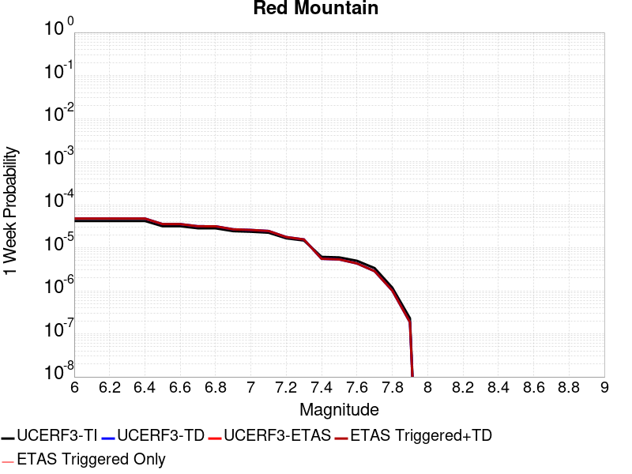 | 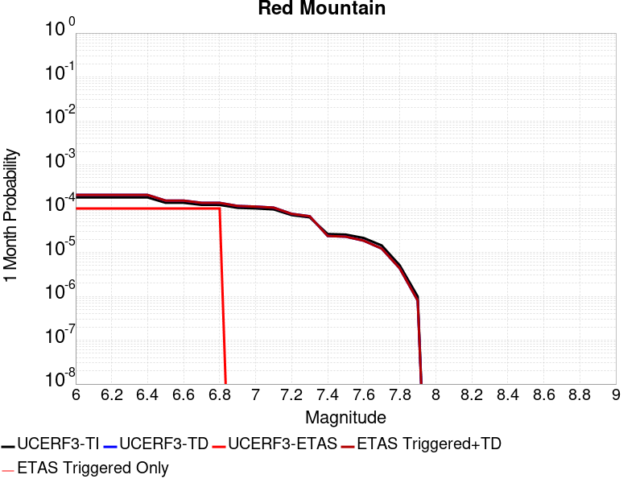 | 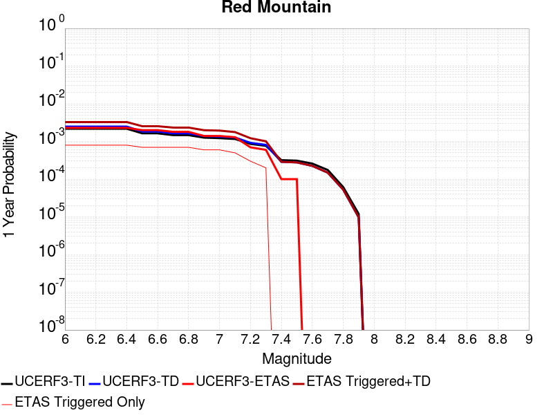 | 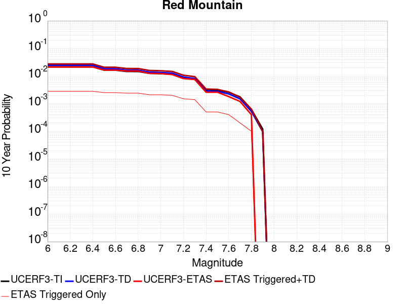 |

| Magnitude | 1 wk TI Prob | 1 wk TD Prob | 1 wk ETAS Prob | 1 wk ETAS/TD Gain | 1 wk ETAS Triggered+TD | 1 wk ETAS Triggered Only | 1 mo TI Prob | 1 mo TD Prob | 1 mo ETAS Prob | 1 mo ETAS/TD Gain | 1 mo ETAS Triggered+TD | 1 mo ETAS Triggered Only | 1 yr TI Prob | 1 yr TD Prob | 1 yr ETAS Prob | 1 yr ETAS/TD Gain | 1 yr ETAS Triggered+TD | 1 yr ETAS Triggered Only | 10 yr TI Prob | 10 yr TD Prob | 10 yr ETAS Prob | 10 yr ETAS/TD Gain | 10 yr ETAS Triggered+TD | 10 yr ETAS Triggered Only |
|-----|-----|-----|-----|-----|-----|-----|-----|-----|-----|-----|-----|-----|-----|-----|-----|-----|-----|-----|-----|-----|-----|-----|-----|-----|
| 6.0 | 4.1810763E-5 | 4.7606474E-5 | 0.0 | 0.0 | 4.7606474E-5 | 0.0 | 1.7917668E-4 | 2.0401271E-4 | 1.0E-4 | 0.49016553 | 2.0401271E-4 | 0.0 | 0.0021792934 | 0.0024811903 | 0.0023 | 0.9269745 | 0.0032792054 | 8.0E-4 | 0.021580452 | 0.0245525 | 0.0212 | 0.86345583 | 0.027283752 | 0.0028 |
| 6.1 | 4.1810763E-5 | 4.7606474E-5 | 0.0 | 0.0 | 4.7606474E-5 | 0.0 | 1.7917668E-4 | 2.0401271E-4 | 1.0E-4 | 0.49016553 | 2.0401271E-4 | 0.0 | 0.0021792934 | 0.0024811903 | 0.0023 | 0.9269745 | 0.0032792054 | 8.0E-4 | 0.021580452 | 0.0245525 | 0.0212 | 0.86345583 | 0.027283752 | 0.0028 |
| 6.2 | 4.1810763E-5 | 4.7606474E-5 | 0.0 | 0.0 | 4.7606474E-5 | 0.0 | 1.7917668E-4 | 2.0401271E-4 | 1.0E-4 | 0.49016553 | 2.0401271E-4 | 0.0 | 0.0021792934 | 0.0024811903 | 0.0023 | 0.9269745 | 0.0032792054 | 8.0E-4 | 0.021580452 | 0.0245525 | 0.0212 | 0.86345583 | 0.027283752 | 0.0028 |
| 6.3 | 4.1810763E-5 | 4.7606474E-5 | 0.0 | 0.0 | 4.7606474E-5 | 0.0 | 1.7917668E-4 | 2.0401271E-4 | 1.0E-4 | 0.49016553 | 2.0401271E-4 | 0.0 | 0.0021792934 | 0.0024811903 | 0.0023 | 0.9269745 | 0.0032792054 | 8.0E-4 | 0.021580452 | 0.0245525 | 0.0212 | 0.86345583 | 0.027283752 | 0.0028 |
| 6.4 | 4.1810763E-5 | 4.7606474E-5 | 0.0 | 0.0 | 4.7606474E-5 | 0.0 | 1.7917668E-4 | 2.0401271E-4 | 1.0E-4 | 0.49016553 | 2.0401271E-4 | 0.0 | 0.0021792934 | 0.0024811903 | 0.0023 | 0.9269745 | 0.0032792054 | 8.0E-4 | 0.021580452 | 0.0245525 | 0.0212 | 0.86345583 | 0.027283752 | 0.0028 |
| 6.5 | 3.154503E-5 | 3.5371402E-5 | 0.0 | 0.0 | 3.5371402E-5 | 0.0 | 1.3518598E-4 | 1.5158343E-4 | 1.0E-4 | 0.6597027 | 1.5158343E-4 | 0.0 | 0.0016446467 | 0.0018440583 | 0.002 | 1.0845644 | 0.0025427674 | 7.0E-4 | 0.01632528 | 0.018297216 | 0.0165 | 0.9017765 | 0.020751473 | 0.0025 |
| 6.6 | 3.1535834E-5 | 3.5360783E-5 | 0.0 | 0.0 | 3.5360783E-5 | 0.0 | 1.3514658E-4 | 1.5153793E-4 | 1.0E-4 | 0.65990084 | 1.5153793E-4 | 0.0 | 0.0016441676 | 0.0018435051 | 0.002 | 1.0848899 | 0.0025422147 | 7.0E-4 | 0.01632056 | 0.018291775 | 0.0165 | 0.9020448 | 0.020746047 | 0.0025 |
| 6.7 | 2.8267326E-5 | 3.1479503E-5 | 0.0 | 0.0 | 3.1479503E-5 | 0.0 | 1.2114006E-4 | 1.3490565E-4 | 1.0E-4 | 0.74125874 | 1.3490565E-4 | 0.0 | 0.0014738824 | 0.001641324 | 0.0018 | 1.0966755 | 0.0023401752 | 7.0E-4 | 0.014641452 | 0.016300786 | 0.0152 | 0.9324703 | 0.018661665 | 0.0024 |
| 6.8 | 2.8212884E-5 | 3.141737E-5 | 0.0 | 0.0 | 3.141737E-5 | 0.0 | 1.20906756E-4 | 1.346394E-4 | 1.0E-4 | 0.7427246 | 1.346394E-4 | 0.0 | 0.0014710457 | 0.0016380873 | 0.0018 | 1.0988425 | 0.0023369407 | 7.0E-4 | 0.014613459 | 0.016268894 | 0.0152 | 0.9342983 | 0.018629849 | 0.0024 |
| 6.9 | 2.4227871E-5 | 2.6715385E-5 | 0.0 | 0.0 | 2.6715385E-5 | 0.0 | 1.03829596E-4 | 1.1448991E-4 | 0.0 | 0.0 | 1.1448991E-4 | 0.0 | 0.0012633923 | 0.0013930993 | 0.0014 | 1.0049535 | 0.0019922634 | 6.0E-4 | 0.012562336 | 0.013851358 | 0.0125 | 0.90243864 | 0.015922269 | 0.0021 |
| 7.0 | 2.348524E-5 | 2.5843858E-5 | 0.0 | 0.0 | 2.5843858E-5 | 0.0 | 1.0064714E-4 | 1.10755114E-4 | 0.0 | 0.0 | 1.10755114E-4 | 0.0 | 0.0012246901 | 0.0013476851 | 0.0014 | 1.0388184 | 0.0019468765 | 6.0E-4 | 0.012179627 | 0.013402763 | 0.0123 | 0.9177212 | 0.0154746175 | 0.0021 |
| 7.1 | 2.2311642E-5 | 2.447044E-5 | 0.0 | 0.0 | 2.447044E-5 | 0.0 | 9.561782E-5 | 1.0486953E-4 | 0.0 | 0.0 | 1.0486953E-4 | 0.0 | 0.0011635252 | 0.0012761136 | 0.0013 | 1.0187181 | 0.0017754755 | 5.0E-4 | 0.01157452 | 0.012695379 | 0.0113 | 0.89008766 | 0.014669988 | 0.002 |
| 7.2 | 1.6533986E-5 | 1.76755E-5 | 0.0 | 0.0 | 1.76755E-5 | 0.0 | 7.085802E-5 | 7.57503E-5 | 0.0 | 0.0 | 7.57503E-5 | 0.0 | 8.623549E-4 | 9.2193316E-4 | 7.0E-4 | 0.7592741 | 0.0012216566 | 3.0E-4 | 0.008590161 | 0.009187368 | 0.0081 | 0.8816453 | 0.010673586 | 0.0015 |
| 7.3 | 1.4703092E-5 | 1.5564003E-5 | 0.0 | 0.0 | 1.5564003E-5 | 0.0 | 6.301173E-5 | 6.670151E-5 | 0.0 | 0.0 | 6.670151E-5 | 0.0 | 7.668978E-4 | 8.1185E-4 | 6.0E-4 | 0.7390528 | 0.0010116876 | 2.0E-4 | 0.0076425658 | 0.008094921 | 0.0075 | 0.92650694 | 0.009483588 | 0.0014 |
| 7.4 | 6.1331984E-6 | 5.5298224E-6 | 0.0 | 0.0 | 5.5298224E-6 | 0.0 | 2.6284872E-5 | 2.3699027E-5 | 0.0 | 0.0 | 2.3699027E-5 | 0.0 | 3.199713E-4 | 2.8849798E-4 | 1.0E-4 | 0.34662288 | 2.8849798E-4 | 0.0 | 0.0031951098 | 0.002881289 | 0.0026 | 0.9023739 | 0.0033798483 | 5.0E-4 |
| 7.5 | 5.954766E-6 | 5.3394187E-6 | 0.0 | 0.0 | 5.3394187E-6 | 0.0 | 2.5520176E-5 | 2.2883025E-5 | 0.0 | 0.0 | 2.2883025E-5 | 0.0 | 3.1066386E-4 | 2.7856574E-4 | 1.0E-4 | 0.3589817 | 2.7856574E-4 | 0.0 | 0.003102299 | 0.0027822196 | 0.0026 | 0.9345057 | 0.0032808285 | 5.0E-4 |
| 7.6 | 4.9726646E-6 | 4.3160476E-6 | 0.0 | 0.0 | 4.3160476E-6 | 0.0 | 2.1311245E-5 | 1.8497218E-5 | 0.0 | 0.0 | 1.8497218E-5 | 0.0 | 2.5943352E-4 | 2.2518069E-4 | 0.0 | 0.0 | 2.2518069E-4 | 0.0 | 0.0025913084 | 0.0022495599 | 0.0018 | 0.80015653 | 0.00264866 | 4.0E-4 |
| 7.7 | 3.3613894E-6 | 2.8531683E-6 | 0.0 | 0.0 | 2.8531683E-6 | 0.0 | 1.4405875E-5 | 1.2227809E-5 | 0.0 | 0.0 | 1.2227809E-5 | 0.0 | 1.7537741E-4 | 1.4886366E-4 | 0.0 | 0.0 | 1.4886366E-4 | 0.0 | 0.0017523908 | 0.0014876658 | 0.0012 | 0.8066328 | 0.0016873683 | 2.0E-4 |
| 7.8 | 1.1828961E-6 | 1.0124252E-6 | 0.0 | 0.0 | 1.0124252E-6 | 0.0 | 5.069545E-6 | 4.3389578E-6 | 0.0 | 0.0 | 4.3389578E-6 | 0.0 | 6.171996E-5 | 5.282556E-5 | 0.0 | 0.0 | 5.282556E-5 | 0.0 | 6.170282E-4 | 5.2813295E-4 | 4.0E-4 | 0.757385 | 6.2808016E-4 | 1.0E-4 |
| 7.9 | 2.2967266E-7 | 1.8621847E-7 | 0.0 | 0.0 | 1.8621847E-7 | 0.0 | 9.843111E-7 | 7.9807893E-7 | 0.0 | 0.0 | 7.9807893E-7 | 0.0 | 1.19839215E-5 | 9.71657E-6 | 0.0 | 0.0 | 9.71657E-6 | 0.0 | 1.1983275E-4 | 9.716175E-5 | 0.0 | 0.0 | 9.716175E-5 | 0.0 |

## Sargent 2011 CFM
*[(top)](#table-of-contents)*

| 1 Week | 1 Month | 1 Year | 10 Year |
|-----|-----|-----|-----|
| 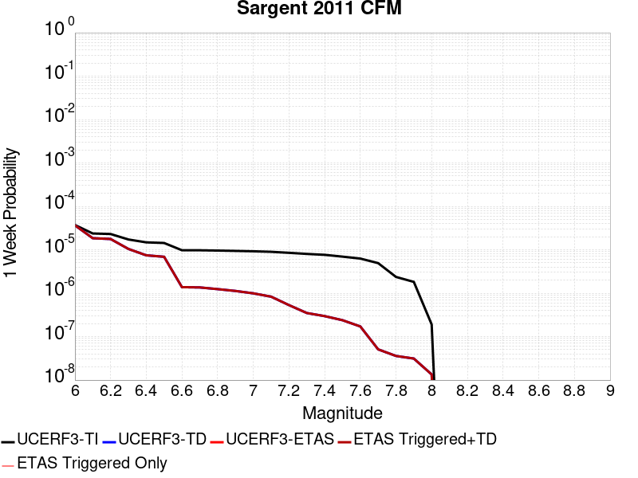 | 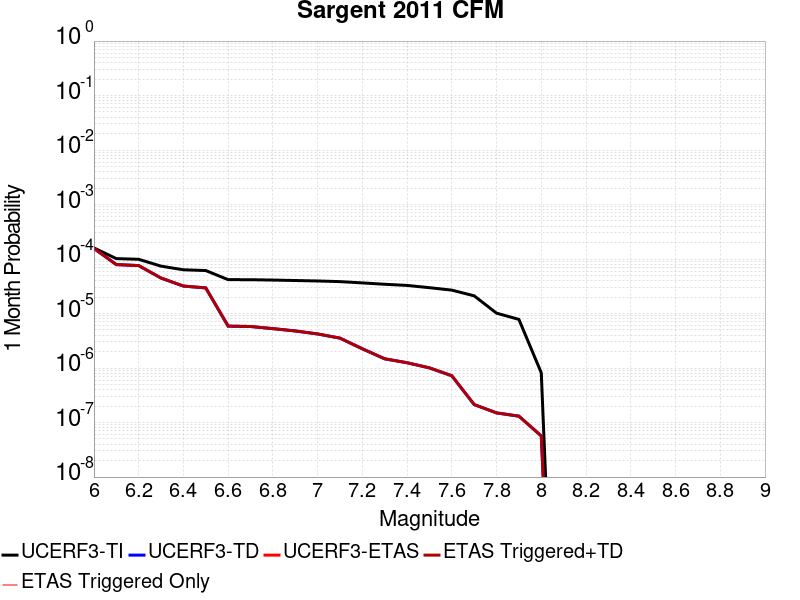 | 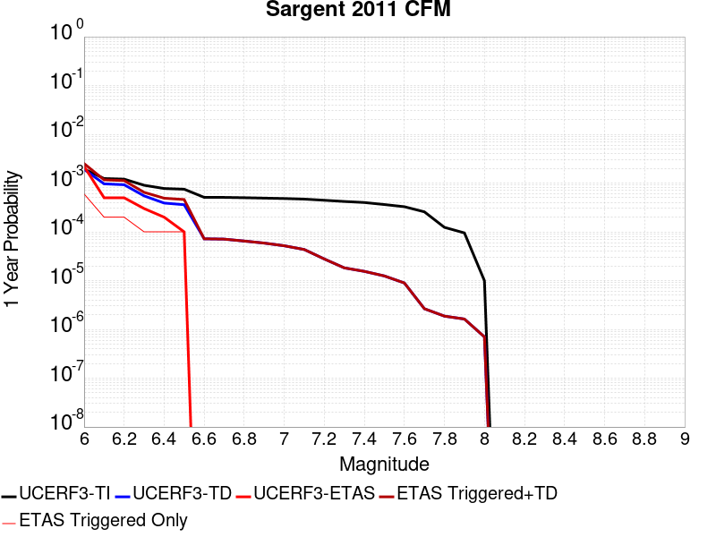 | 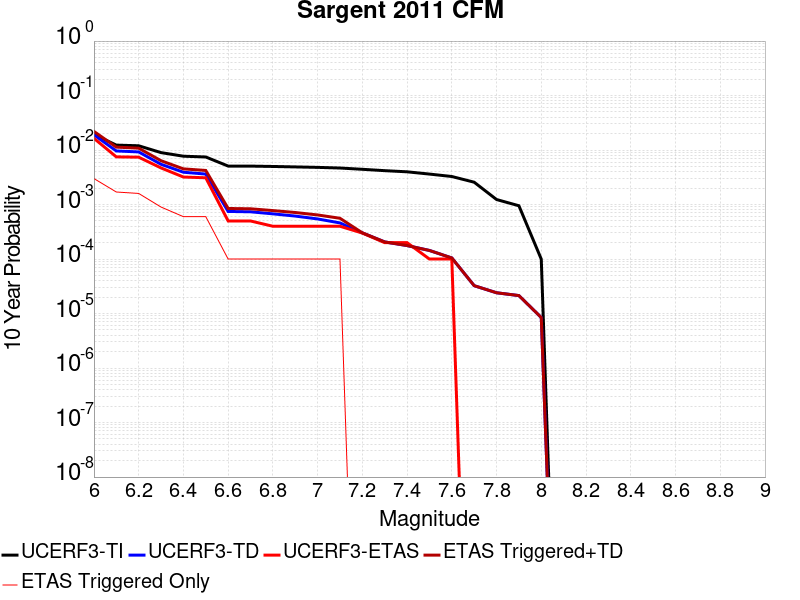 |

| Magnitude | 1 wk TI Prob | 1 wk TD Prob | 1 wk ETAS Prob | 1 wk ETAS/TD Gain | 1 wk ETAS Triggered+TD | 1 wk ETAS Triggered Only | 1 mo TI Prob | 1 mo TD Prob | 1 mo ETAS Prob | 1 mo ETAS/TD Gain | 1 mo ETAS Triggered+TD | 1 mo ETAS Triggered Only | 1 yr TI Prob | 1 yr TD Prob | 1 yr ETAS Prob | 1 yr ETAS/TD Gain | 1 yr ETAS Triggered+TD | 1 yr ETAS Triggered Only | 10 yr TI Prob | 10 yr TD Prob | 10 yr ETAS Prob | 10 yr ETAS/TD Gain | 10 yr ETAS Triggered+TD | 10 yr ETAS Triggered Only |
|-----|-----|-----|-----|-----|-----|-----|-----|-----|-----|-----|-----|-----|-----|-----|-----|-----|-----|-----|-----|-----|-----|-----|-----|-----|
| 6.0 | 3.7327867E-5 | 3.6677877E-5 | 0.0 | 0.0 | 3.6677877E-5 | 0.0 | 1.5996677E-4 | 1.5718323E-4 | 0.0 | 0.0 | 1.5718323E-4 | 0.0 | 0.0019458556 | 0.0019124425 | 0.0022 | 1.1503614 | 0.002511295 | 6.0E-4 | 0.01928905 | 0.01903232 | 0.0164 | 0.86169213 | 0.021975223 | 0.003 |
| 6.1 | 2.3771476E-5 | 1.8493849E-5 | 0.0 | 0.0 | 1.8493849E-5 | 0.0 | 1.01873775E-4 | 7.9257436E-5 | 0.0 | 0.0 | 7.9257436E-5 | 0.0 | 0.0012396075 | 9.64613E-4 | 5.0E-4 | 0.5183426 | 0.00116442 | 2.0E-4 | 0.012327154 | 0.0096441675 | 0.0075 | 0.77767205 | 0.011327772 | 0.0017 |
| 6.2 | 2.3112721E-5 | 1.7724942E-5 | 0.0 | 0.0 | 1.7724942E-5 | 0.0 | 9.9050754E-5 | 7.5962314E-5 | 0.0 | 0.0 | 7.5962314E-5 | 0.0 | 0.0012052758 | 9.2452916E-4 | 5.0E-4 | 0.54081583 | 0.0011243442 | 2.0E-4 | 0.011987597 | 0.0092466865 | 0.0074 | 0.8002867 | 0.010831892 | 0.0016 |
| 6.3 | 1.728509E-5 | 1.0469761E-5 | 0.0 | 0.0 | 1.0469761E-5 | 0.0 | 7.407686E-5 | 4.48699E-5 | 0.0 | 0.0 | 4.48699E-5 | 0.0 | 9.015125E-4 | 5.462005E-4 | 3.0E-4 | 0.5492489 | 6.461459E-4 | 1.0E-4 | 0.008978641 | 0.0054852 | 0.0047 | 0.85685116 | 0.0063802633 | 9.0E-4 |
| 6.4 | 1.48395575E-5 | 7.4654286E-6 | 0.0 | 0.0 | 7.4654286E-6 | 0.0 | 6.3596555E-5 | 3.1994517E-5 | 0.0 | 0.0 | 3.1994517E-5 | 0.0 | 7.7401294E-4 | 3.8950128E-4 | 2.0E-4 | 0.51347715 | 4.8946234E-4 | 1.0E-4 | 0.0077132257 | 0.0039240215 | 0.0032 | 0.81548995 | 0.004521667 | 6.0E-4 |
| 6.5 | 1.4358964E-5 | 6.904008E-6 | 0.0 | 0.0 | 6.904008E-6 | 0.0 | 6.1536964E-5 | 2.9588486E-5 | 0.0 | 0.0 | 2.9588486E-5 | 0.0 | 7.48955E-4 | 3.6021776E-4 | 1.0E-4 | 0.27760985 | 4.6018176E-4 | 1.0E-4 | 0.0074643586 | 0.0036321697 | 0.0031 | 0.85348433 | 0.0042299903 | 6.0E-4 |
| 6.6 | 9.772591E-6 | 1.3805807E-6 | 0.0 | 0.0 | 1.3805807E-6 | 0.0 | 4.188186E-5 | 5.916761E-6 | 0.0 | 0.0 | 5.916761E-6 | 0.0 | 5.097923E-4 | 7.2034214E-5 | 0.0 | 0.0 | 7.2034214E-5 | 0.0 | 0.005086244 | 7.523663E-4 | 5.0E-4 | 0.6645699 | 8.5229106E-4 | 1.0E-4 |
| 6.7 | 9.752745E-6 | 1.3592687E-6 | 0.0 | 0.0 | 1.3592687E-6 | 0.0 | 4.179681E-5 | 5.8254245E-6 | 0.0 | 0.0 | 5.8254245E-6 | 0.0 | 5.0875737E-4 | 7.0922266E-5 | 0.0 | 0.0 | 7.0922266E-5 | 0.0 | 0.005075942 | 7.412543E-4 | 5.0E-4 | 0.6745323 | 8.411802E-4 | 1.0E-4 |
| 6.8 | 9.608213E-6 | 1.2430114E-6 | 0.0 | 0.0 | 1.2430114E-6 | 0.0 | 4.1177405E-5 | 5.3271806E-6 | 0.0 | 0.0 | 5.3271806E-6 | 0.0 | 5.012196E-4 | 6.485652E-5 | 0.0 | 0.0 | 6.485652E-5 | 0.0 | 0.005000906 | 6.803346E-4 | 4.0E-4 | 0.587946 | 7.8026654E-4 | 1.0E-4 |
| 6.9 | 9.427164E-6 | 1.1275326E-6 | 0.0 | 0.0 | 1.1275326E-6 | 0.0 | 4.04015E-5 | 4.832274E-6 | 0.0 | 0.0 | 4.832274E-6 | 0.0 | 4.9177726E-4 | 5.8831367E-5 | 0.0 | 0.0 | 5.8831367E-5 | 0.0 | 0.004906904 | 6.194106E-4 | 4.0E-4 | 0.6457752 | 7.1934867E-4 | 1.0E-4 |
| 7.0 | 9.247601E-6 | 9.937917E-7 | 0.0 | 0.0 | 9.937917E-7 | 0.0 | 3.9631974E-5 | 4.2591E-6 | 0.0 | 0.0 | 4.2591E-6 | 0.0 | 4.8241246E-4 | 5.1853327E-5 | 0.0 | 0.0 | 5.1853327E-5 | 0.0 | 0.0048136655 | 5.491626E-4 | 4.0E-4 | 0.72838175 | 6.491077E-4 | 1.0E-4 |
| 7.1 | 8.995454E-6 | 8.329239E-7 | 0.0 | 0.0 | 8.329239E-7 | 0.0 | 3.8551374E-5 | 3.569669E-6 | 0.0 | 0.0 | 3.569669E-6 | 0.0 | 4.6926187E-4 | 4.3459866E-5 | 0.0 | 0.0 | 4.3459866E-5 | 0.0 | 0.004682722 | 4.643421E-4 | 4.0E-4 | 0.86143386 | 5.642957E-4 | 1.0E-4 |
| 7.2 | 8.520861E-6 | 5.3278336E-7 | 0.0 | 0.0 | 5.3278336E-7 | 0.0 | 3.6517464E-5 | 2.2833551E-6 | 0.0 | 0.0 | 2.2833551E-6 | 0.0 | 4.445094E-4 | 2.7799502E-5 | 0.0 | 0.0 | 2.7799502E-5 | 0.0 | 0.004436213 | 3.0604418E-4 | 3.0E-4 | 0.9802506 | 3.0604418E-4 | 0.0 |
| 7.3 | 8.043592E-6 | 3.5008256E-7 | 0.0 | 0.0 | 3.5008256E-7 | 0.0 | 3.4472083E-5 | 1.500353E-6 | 0.0 | 0.0 | 1.500353E-6 | 0.0 | 4.196168E-4 | 1.8266646E-5 | 0.0 | 0.0 | 1.8266646E-5 | 0.0 | 0.004188253 | 2.0940288E-4 | 2.0E-4 | 0.9550967 | 2.0940288E-4 | 0.0 |
| 7.4 | 7.662316E-6 | 2.969677E-7 | 0.0 | 0.0 | 2.969677E-7 | 0.0 | 3.2838085E-5 | 1.272718E-6 | 0.0 | 0.0 | 1.272718E-6 | 0.0 | 3.9973034E-4 | 1.5495234E-5 | 0.0 | 0.0 | 1.5495234E-5 | 0.0 | 0.0039901207 | 1.7986666E-4 | 2.0E-4 | 1.1119348 | 1.7986666E-4 | 0.0 |
| 7.5 | 6.961638E-6 | 2.391966E-7 | 0.0 | 0.0 | 2.391966E-7 | 0.0 | 2.9835252E-5 | 1.0251279E-6 | 0.0 | 0.0 | 1.0251279E-6 | 0.0 | 3.6318362E-4 | 1.2480861E-5 | 0.0 | 0.0 | 1.2480861E-5 | 0.0 | 0.0036259065 | 1.4623991E-4 | 1.0E-4 | 0.6838079 | 1.4623991E-4 | 0.0 |
| 7.6 | 6.282332E-6 | 1.7162228E-7 | 0.0 | 0.0 | 1.7162228E-7 | 0.0 | 2.6924003E-5 | 7.355238E-7 | 0.0 | 0.0 | 7.355238E-7 | 0.0 | 3.2775043E-4 | 8.954967E-6 | 0.0 | 0.0 | 8.954967E-6 | 0.0 | 0.0032726745 | 1.0674282E-4 | 1.0E-4 | 0.9368312 | 1.0674282E-4 | 0.0 |
| 7.7 | 4.934408E-6 | 5.0920907E-8 | 0.0 | 0.0 | 5.0920907E-8 | 0.0 | 2.114729E-5 | 2.1823244E-7 | 0.0 | 0.0 | 2.1823244E-7 | 0.0 | 2.5743784E-4 | 2.6569767E-6 | 0.0 | 0.0 | 2.6569767E-6 | 0.0 | 0.0025713982 | 3.3175103E-5 | 0.0 | 0.0 | 3.3175103E-5 | 0.0 |
| 7.8 | 2.373212E-6 | 3.590835E-8 | 0.0 | 0.0 | 3.590835E-8 | 0.0 | 1.0170869E-5 | 1.5389293E-7 | 0.0 | 0.0 | 1.5389293E-7 | 0.0 | 1.238233E-4 | 1.8736448E-6 | 0.0 | 0.0 | 1.8736448E-6 | 0.0 | 0.0012375432 | 2.4640216E-5 | 0.0 | 0.0 | 2.4640216E-5 | 0.0 |
| 7.9 | 1.8227792E-6 | 3.1275956E-8 | 0.0 | 0.0 | 3.1275956E-8 | 0.0 | 7.811887E-6 | 1.3403981E-7 | 0.0 | 0.0 | 1.3403981E-7 | 0.0 | 9.510558E-5 | 1.6319335E-6 | 0.0 | 0.0 | 1.6319335E-6 | 0.0 | 9.5064886E-4 | 2.1872767E-5 | 0.0 | 0.0 | 2.1872767E-5 | 0.0 |
| 8.0 | 1.9095137E-7 | 1.3467476E-8 | 0.0 | 0.0 | 1.3467476E-8 | 0.0 | 8.1836276E-7 | 5.7717752E-8 | 0.0 | 0.0 | 5.7717752E-8 | 0.0 | 9.963521E-6 | 7.027134E-7 | 0.0 | 0.0 | 7.027134E-7 | 0.0 | 9.963074E-5 | 8.58814E-6 | 0.0 | 0.0 | 8.58814E-6 | 0.0 |

## Santa Ynez (West)
*[(top)](#table-of-contents)*

| 1 Week | 1 Month | 1 Year | 10 Year |
|-----|-----|-----|-----|
| 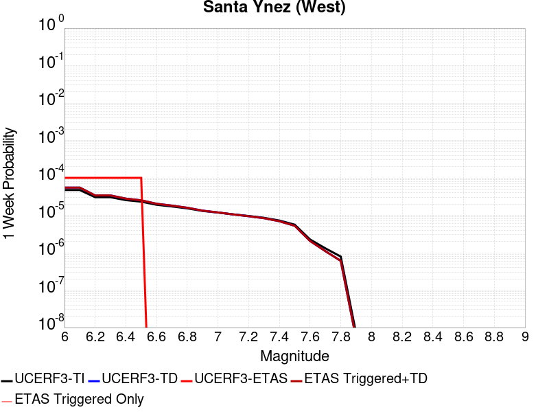 | 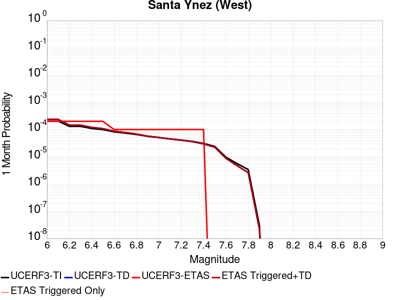 | 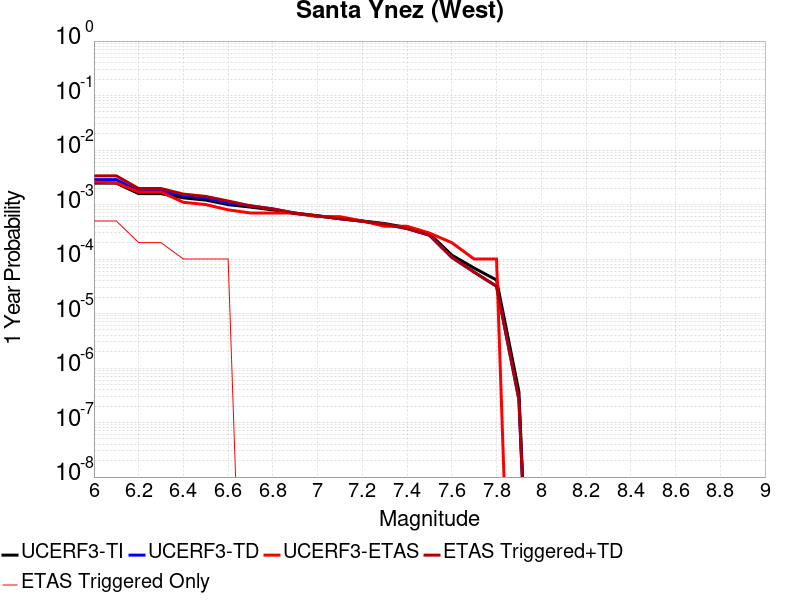 | 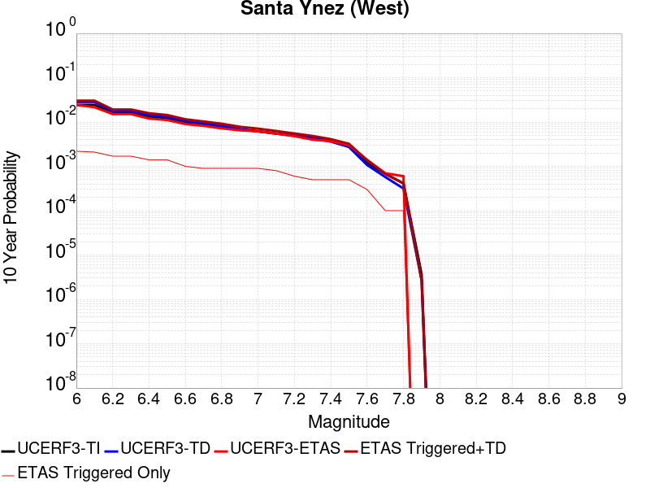 |

| Magnitude | 1 wk TI Prob | 1 wk TD Prob | 1 wk ETAS Prob | 1 wk ETAS/TD Gain | 1 wk ETAS Triggered+TD | 1 wk ETAS Triggered Only | 1 mo TI Prob | 1 mo TD Prob | 1 mo ETAS Prob | 1 mo ETAS/TD Gain | 1 mo ETAS Triggered+TD | 1 mo ETAS Triggered Only | 1 yr TI Prob | 1 yr TD Prob | 1 yr ETAS Prob | 1 yr ETAS/TD Gain | 1 yr ETAS Triggered+TD | 1 yr ETAS Triggered Only | 10 yr TI Prob | 10 yr TD Prob | 10 yr ETAS Prob | 10 yr ETAS/TD Gain | 10 yr ETAS Triggered+TD | 10 yr ETAS Triggered Only |
|-----|-----|-----|-----|-----|-----|-----|-----|-----|-----|-----|-----|-----|-----|-----|-----|-----|-----|-----|-----|-----|-----|-----|-----|-----|
| 6.0 | 4.7352758E-5 | 5.4992404E-5 | 1.0E-4 | 1.8184329 | 5.4992404E-5 | 0.0 | 2.0292461E-4 | 2.3566208E-4 | 2.0E-4 | 0.8486728 | 2.3566208E-4 | 0.0 | 0.0024678076 | 0.0028656807 | 0.0026 | 0.9072888 | 0.003364248 | 5.0E-4 | 0.024405818 | 0.028315388 | 0.0243 | 0.8581906 | 0.030453093 | 0.0022 |
| 6.1 | 4.7352758E-5 | 5.4992404E-5 | 1.0E-4 | 1.8184329 | 5.4992404E-5 | 0.0 | 2.0292461E-4 | 2.3566208E-4 | 2.0E-4 | 0.8486728 | 2.3566208E-4 | 0.0 | 0.0024678076 | 0.0028656807 | 0.0025 | 0.8723931 | 0.003364248 | 5.0E-4 | 0.024405818 | 0.028315388 | 0.0216 | 0.7628361 | 0.030355925 | 0.0021 |
| 6.2 | 3.0415853E-5 | 3.393612E-5 | 1.0E-4 | 2.9467127 | 3.393612E-5 | 0.0 | 1.3034715E-4 | 1.454326E-4 | 2.0E-4 | 1.3752075 | 1.454326E-4 | 0.0 | 0.0015858212 | 0.0017692382 | 0.0017 | 0.96086556 | 0.0019688844 | 2.0E-4 | 0.015745522 | 0.017555473 | 0.0151 | 0.8601306 | 0.019225629 | 0.0017 |
| 6.3 | 3.0415853E-5 | 3.393612E-5 | 1.0E-4 | 2.9467127 | 3.393612E-5 | 0.0 | 1.3034715E-4 | 1.454326E-4 | 2.0E-4 | 1.3752075 | 1.454326E-4 | 0.0 | 0.0015858212 | 0.0017692382 | 0.0017 | 0.96086556 | 0.0019688844 | 2.0E-4 | 0.015745522 | 0.017555473 | 0.0151 | 0.8601306 | 0.019225629 | 0.0017 |
| 6.4 | 2.5452082E-5 | 2.7920812E-5 | 1.0E-4 | 3.5815578 | 2.7920812E-5 | 0.0 | 1.09075794E-4 | 1.1965522E-4 | 2.0E-4 | 1.6714691 | 1.1965522E-4 | 0.0 | 0.0013271887 | 0.0014558479 | 0.0011 | 0.75557345 | 0.0015557022 | 1.0E-4 | 0.013192902 | 0.014465274 | 0.012 | 0.8295729 | 0.015845023 | 0.0014 |
| 6.5 | 2.3143784E-5 | 2.5135434E-5 | 1.0E-4 | 3.9784472 | 2.5135434E-5 | 0.0 | 9.9183875E-5 | 1.0771892E-4 | 2.0E-4 | 1.856684 | 1.0771892E-4 | 0.0 | 0.0012068948 | 0.0013107036 | 0.001 | 0.76294905 | 0.0014105724 | 1.0E-4 | 0.012003611 | 0.013031399 | 0.0111 | 0.8517888 | 0.014413155 | 0.0014 |
| 6.6 | 1.9118515E-5 | 2.035971E-5 | 0.0 | 0.0 | 2.035971E-5 | 0.0 | 8.193392E-5 | 8.725303E-5 | 1.0E-4 | 1.146092 | 8.725303E-5 | 0.0 | 9.97089E-4 | 0.0010617959 | 8.0E-4 | 0.75344056 | 0.0011616896 | 1.0E-4 | 0.00992627 | 0.010568138 | 0.009 | 0.8516164 | 0.011557571 | 0.001 |
| 6.7 | 1.722807E-5 | 1.8150948E-5 | 0.0 | 0.0 | 1.8150948E-5 | 0.0 | 7.3832496E-5 | 7.778749E-5 | 1.0E-4 | 1.2855537 | 7.778749E-5 | 0.0 | 8.985399E-4 | 9.466568E-4 | 7.0E-4 | 0.7394443 | 9.466568E-4 | 0.0 | 0.008949154 | 0.009426889 | 0.0082 | 0.86985224 | 0.010318404 | 9.0E-4 |
| 6.8 | 1.5317364E-5 | 1.593034E-5 | 0.0 | 0.0 | 1.593034E-5 | 0.0 | 6.56442E-5 | 6.8271125E-5 | 1.0E-4 | 1.4647481 | 6.8271125E-5 | 0.0 | 7.98925E-4 | 8.308883E-4 | 7.0E-4 | 0.8424719 | 8.308883E-4 | 0.0 | 0.007960589 | 0.008278305 | 0.0072 | 0.8697433 | 0.009170854 | 9.0E-4 |
| 6.9 | 1.3071226E-5 | 1.3332638E-5 | 0.0 | 0.0 | 1.3332638E-5 | 0.0 | 5.6018336E-5 | 5.713864E-5 | 1.0E-4 | 1.7501291 | 5.713864E-5 | 0.0 | 6.8180985E-4 | 6.954432E-4 | 7.0E-4 | 1.0065525 | 6.954432E-4 | 0.0 | 0.0067972173 | 0.006932929 | 0.0065 | 0.9375546 | 0.00782669 | 9.0E-4 |
| 7.0 | 1.1836986E-5 | 1.1935414E-5 | 0.0 | 0.0 | 1.1935414E-5 | 0.0 | 5.0728955E-5 | 5.1150782E-5 | 1.0E-4 | 1.9550043 | 5.1150782E-5 | 0.0 | 6.1745E-4 | 6.225845E-4 | 6.0E-4 | 0.9637246 | 6.225845E-4 | 0.0 | 0.006157372 | 0.0062085963 | 0.0062 | 0.99861544 | 0.0071030087 | 9.0E-4 |
| 7.1 | 1.0597169E-5 | 1.05444815E-5 | 0.0 | 0.0 | 1.05444815E-5 | 0.0 | 4.541565E-5 | 4.518986E-5 | 1.0E-4 | 2.2128859 | 4.518986E-5 | 0.0 | 5.5279525E-4 | 5.500488E-4 | 6.0E-4 | 1.0908123 | 5.500488E-4 | 0.0 | 0.0055142213 | 0.0054870043 | 0.0055 | 1.0023685 | 0.0062826145 | 8.0E-4 |
| 7.2 | 9.59113E-6 | 9.4612515E-6 | 0.0 | 0.0 | 9.4612515E-6 | 0.0 | 4.11042E-5 | 4.05476E-5 | 1.0E-4 | 2.4662373 | 4.05476E-5 | 0.0 | 5.0032866E-4 | 4.9355626E-4 | 5.0E-4 | 1.0130558 | 4.9355626E-4 | 0.0 | 0.004992037 | 0.0049247197 | 0.0048 | 0.97467476 | 0.005521765 | 6.0E-4 |
| 7.3 | 8.586084E-6 | 8.381525E-6 | 0.0 | 0.0 | 8.381525E-6 | 0.0 | 3.679698E-5 | 3.5920333E-5 | 1.0E-4 | 2.7839386 | 3.5920333E-5 | 0.0 | 4.4791115E-4 | 4.3724332E-4 | 4.0E-4 | 0.91482246 | 4.3724332E-4 | 0.0 | 0.004470094 | 0.0043639415 | 0.004 | 0.91660255 | 0.0048617595 | 5.0E-4 |
| 7.4 | 7.2622997E-6 | 6.9532452E-6 | 0.0 | 0.0 | 6.9532452E-6 | 0.0 | 3.112377E-5 | 2.9799288E-5 | 1.0E-4 | 3.355785 | 2.9799288E-5 | 0.0 | 3.78866E-4 | 3.627469E-4 | 4.0E-4 | 1.1026973 | 3.627469E-4 | 0.0 | 0.0037822074 | 0.003621648 | 0.0037 | 1.0216343 | 0.004119837 | 5.0E-4 |
| 7.5 | 5.627296E-6 | 5.2527034E-6 | 0.0 | 0.0 | 5.2527034E-6 | 0.0 | 2.411676E-5 | 2.2511394E-5 | 0.0 | 0.0 | 2.2511394E-5 | 0.0 | 2.9358198E-4 | 2.7404248E-4 | 3.0E-4 | 1.0947208 | 2.7404248E-4 | 0.0 | 0.0029319443 | 0.0027371175 | 0.003 | 1.0960436 | 0.003235749 | 5.0E-4 |
| 7.6 | 2.265244E-6 | 2.0611474E-6 | 0.0 | 0.0 | 2.0611474E-6 | 0.0 | 9.708152E-6 | 8.833459E-6 | 0.0 | 0.0 | 8.833459E-6 | 0.0 | 1.18190335E-4 | 1.07542146E-4 | 2.0E-4 | 1.859736 | 1.07542146E-4 | 0.0 | 0.001181275 | 0.0010749097 | 0.0014 | 1.302435 | 0.0013745872 | 3.0E-4 |
| 7.7 | 1.3099874E-6 | 1.1017722E-6 | 0.0 | 0.0 | 1.1017722E-6 | 0.0 | 5.61422E-6 | 4.7218728E-6 | 0.0 | 0.0 | 4.7218728E-6 | 0.0 | 6.8350986E-5 | 5.748731E-5 | 1.0E-4 | 1.7395144 | 5.748731E-5 | 0.0 | 6.832996E-4 | 5.747268E-4 | 7.0E-4 | 1.21797 | 6.746693E-4 | 1.0E-4 |
| 7.8 | 7.903951E-7 | 6.0718713E-7 | 0.0 | 0.0 | 6.0718713E-7 | 0.0 | 3.3874032E-6 | 2.602228E-6 | 0.0 | 0.0 | 2.602228E-6 | 0.0 | 4.1240855E-5 | 3.168168E-5 | 1.0E-4 | 3.1563983 | 3.168168E-5 | 0.0 | 4.12332E-4 | 3.1677296E-4 | 6.0E-4 | 1.894101 | 4.1674127E-4 | 1.0E-4 |
| 7.9 | 7.0753297E-9 | 5.09043E-9 | 0.0 | 0.0 | 5.09043E-9 | 0.0 | 3.032284E-8 | 2.1816128E-8 | 0.0 | 0.0 | 2.1816128E-8 | 0.0 | 3.6918053E-7 | 2.6561133E-7 | 0.0 | 0.0 | 2.6561133E-7 | 0.0 | 3.691799E-6 | 2.6561113E-6 | 0.0 | 0.0 | 2.6561113E-6 | 0.0 |

## White Mountains
*[(top)](#table-of-contents)*

| 1 Week | 1 Month | 1 Year | 10 Year |
|-----|-----|-----|-----|
| 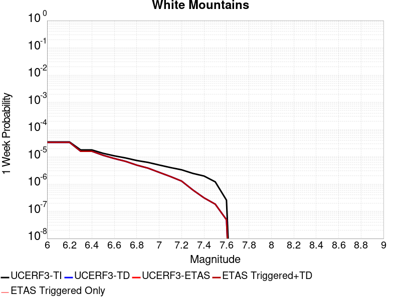 | 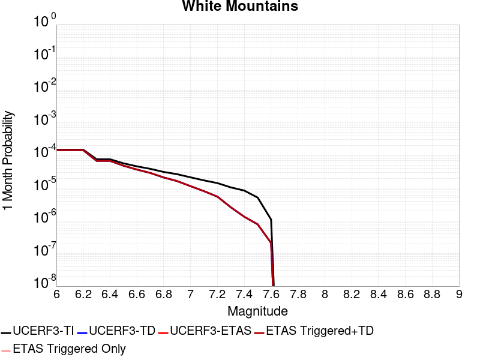 | 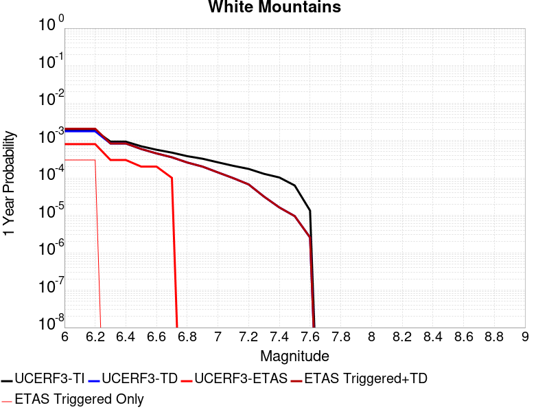 | 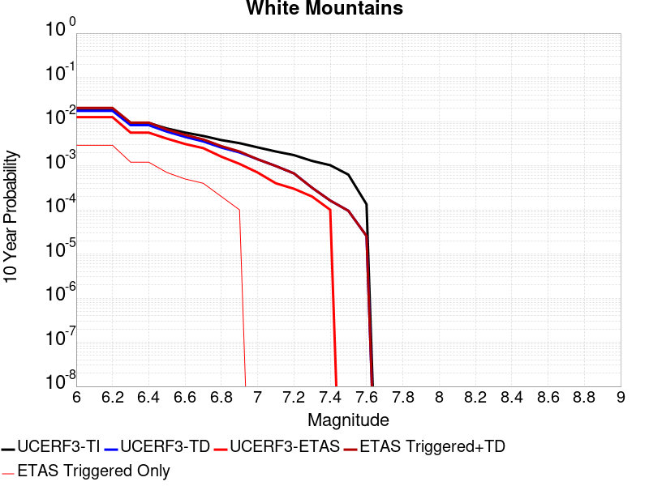 |

| Magnitude | 1 wk TI Prob | 1 wk TD Prob | 1 wk ETAS Prob | 1 wk ETAS/TD Gain | 1 wk ETAS Triggered+TD | 1 wk ETAS Triggered Only | 1 mo TI Prob | 1 mo TD Prob | 1 mo ETAS Prob | 1 mo ETAS/TD Gain | 1 mo ETAS Triggered+TD | 1 mo ETAS Triggered Only | 1 yr TI Prob | 1 yr TD Prob | 1 yr ETAS Prob | 1 yr ETAS/TD Gain | 1 yr ETAS Triggered+TD | 1 yr ETAS Triggered Only | 10 yr TI Prob | 10 yr TD Prob | 10 yr ETAS Prob | 10 yr ETAS/TD Gain | 10 yr ETAS Triggered+TD | 10 yr ETAS Triggered Only |
|-----|-----|-----|-----|-----|-----|-----|-----|-----|-----|-----|-----|-----|-----|-----|-----|-----|-----|-----|-----|-----|-----|-----|-----|-----|
| 6.0 | 3.503579E-5 | 3.3790286E-5 | 0.0 | 0.0 | 3.3790286E-5 | 0.0 | 1.5014476E-4 | 1.4480816E-4 | 0.0 | 0.0 | 1.4480816E-4 | 0.0 | 0.0018264796 | 0.0017617344 | 8.0E-4 | 0.454098 | 0.002061206 | 3.0E-4 | 0.018115403 | 0.01749002 | 0.0126 | 0.7204108 | 0.020339299 | 0.0029 |
| 6.1 | 3.503579E-5 | 3.3790286E-5 | 0.0 | 0.0 | 3.3790286E-5 | 0.0 | 1.5014476E-4 | 1.4480816E-4 | 0.0 | 0.0 | 1.4480816E-4 | 0.0 | 0.0018264796 | 0.0017617344 | 8.0E-4 | 0.454098 | 0.002061206 | 3.0E-4 | 0.018115403 | 0.01749002 | 0.0126 | 0.7204108 | 0.020339299 | 0.0029 |
| 6.2 | 3.503579E-5 | 3.3790286E-5 | 0.0 | 0.0 | 3.3790286E-5 | 0.0 | 1.5014476E-4 | 1.4480816E-4 | 0.0 | 0.0 | 1.4480816E-4 | 0.0 | 0.0018264796 | 0.0017617344 | 8.0E-4 | 0.454098 | 0.002061206 | 3.0E-4 | 0.018115403 | 0.01749002 | 0.0126 | 0.7204108 | 0.020339299 | 0.0029 |
| 6.3 | 1.7818425E-5 | 1.5918991E-5 | 0.0 | 0.0 | 1.5918991E-5 | 0.0 | 7.636245E-5 | 6.822254E-5 | 0.0 | 0.0 | 6.822254E-5 | 0.0 | 9.293162E-4 | 8.3030725E-4 | 3.0E-4 | 0.36131203 | 8.3030725E-4 | 0.0 | 0.009254395 | 0.008273509 | 0.0056 | 0.67685914 | 0.00946358 | 0.0012 |
| 6.4 | 1.7818425E-5 | 1.5918991E-5 | 0.0 | 0.0 | 1.5918991E-5 | 0.0 | 7.636245E-5 | 6.822254E-5 | 0.0 | 0.0 | 6.822254E-5 | 0.0 | 9.293162E-4 | 8.3030725E-4 | 3.0E-4 | 0.36131203 | 8.3030725E-4 | 0.0 | 0.009254395 | 0.008273509 | 0.0056 | 0.67685914 | 0.00946358 | 0.0012 |
| 6.5 | 1.3397557E-5 | 1.1338404E-5 | 0.0 | 0.0 | 1.1338404E-5 | 0.0 | 5.741684E-5 | 4.8592294E-5 | 0.0 | 0.0 | 4.8592294E-5 | 0.0 | 6.988258E-4 | 5.914576E-4 | 2.0E-4 | 0.33814767 | 5.914576E-4 | 0.0 | 0.006966323 | 0.00589954 | 0.0041 | 0.6949694 | 0.0065954104 | 7.0E-4 |
| 6.6 | 1.0818695E-5 | 8.626971E-6 | 0.0 | 0.0 | 8.626971E-6 | 0.0 | 4.6365014E-5 | 3.6972233E-5 | 0.0 | 0.0 | 3.6972233E-5 | 0.0 | 5.6434784E-4 | 4.5004833E-4 | 2.0E-4 | 0.44439673 | 4.5004833E-4 | 0.0 | 0.005629168 | 0.004491806 | 0.0031 | 0.6901456 | 0.0049895598 | 5.0E-4 |
| 6.7 | 9.067908E-6 | 6.803708E-6 | 0.0 | 0.0 | 6.803708E-6 | 0.0 | 3.8861883E-5 | 2.915844E-5 | 0.0 | 0.0 | 2.915844E-5 | 0.0 | 4.7304068E-4 | 3.5494938E-4 | 1.0E-4 | 0.28173032 | 3.5494938E-4 | 0.0 | 0.00472035 | 0.0035441418 | 0.0025 | 0.7053894 | 0.0039427243 | 4.0E-4 |
| 6.8 | 7.295947E-6 | 4.937363E-6 | 0.0 | 0.0 | 4.937363E-6 | 0.0 | 3.126797E-5 | 2.1159962E-5 | 0.0 | 0.0 | 2.1159962E-5 | 0.0 | 3.8062103E-4 | 2.575932E-4 | 0.0 | 0.0 | 2.575932E-4 | 0.0 | 0.0037996976 | 0.0025730592 | 0.0016 | 0.6218279 | 0.0027725445 | 2.0E-4 |
| 6.9 | 6.2243444E-6 | 3.833039E-6 | 0.0 | 0.0 | 3.833039E-6 | 0.0 | 2.6675489E-5 | 1.642721E-5 | 0.0 | 0.0 | 1.642721E-5 | 0.0 | 3.2472567E-4 | 1.9998346E-4 | 0.0 | 0.0 | 1.9998346E-4 | 0.0 | 0.0032425157 | 0.0019980876 | 0.0011 | 0.5505264 | 0.002097888 | 1.0E-4 |
| 7.0 | 4.9878413E-6 | 2.680234E-6 | 0.0 | 0.0 | 2.680234E-6 | 0.0 | 2.1376287E-5 | 1.1486668E-5 | 0.0 | 0.0 | 1.1486668E-5 | 0.0 | 2.602252E-4 | 1.3984148E-4 | 0.0 | 0.0 | 1.3984148E-4 | 0.0 | 0.002599207 | 0.001397561 | 7.0E-4 | 0.50087255 | 0.001397561 | 0.0 |
| 7.1 | 4.0252844E-6 | 1.8863292E-6 | 0.0 | 0.0 | 1.8863292E-6 | 0.0 | 1.7251105E-5 | 8.084244E-6 | 0.0 | 0.0 | 8.084244E-6 | 0.0 | 2.1001195E-4 | 9.8421355E-5 | 0.0 | 0.0 | 9.8421355E-5 | 0.0 | 0.0020981359 | 9.837904E-4 | 4.0E-4 | 0.40659067 | 9.837904E-4 | 0.0 |
| 7.2 | 3.3284066E-6 | 1.2823662E-6 | 0.0 | 0.0 | 1.2823662E-6 | 0.0 | 1.4264522E-5 | 5.495844E-6 | 0.0 | 0.0 | 5.495844E-6 | 0.0 | 1.736567E-4 | 6.690995E-5 | 0.0 | 0.0 | 6.690995E-5 | 0.0 | 0.0017352107 | 6.689081E-4 | 3.0E-4 | 0.44849208 | 6.689081E-4 | 0.0 |
| 7.3 | 2.458226E-6 | 6.0608704E-7 | 0.0 | 0.0 | 6.0608704E-7 | 0.0 | 1.0535211E-5 | 2.5975137E-6 | 0.0 | 0.0 | 2.5975137E-6 | 0.0 | 1.2825865E-4 | 3.162431E-5 | 0.0 | 0.0 | 3.162431E-5 | 0.0 | 0.0012818464 | 3.1620183E-4 | 2.0E-4 | 0.63250744 | 3.1620183E-4 | 0.0 |
| 7.4 | 1.965953E-6 | 3.1121087E-7 | 0.0 | 0.0 | 3.1121087E-7 | 0.0 | 8.425486E-6 | 1.3337602E-6 | 0.0 | 0.0 | 1.3337602E-6 | 0.0 | 1.0257547E-4 | 1.6238411E-5 | 0.0 | 0.0 | 1.6238411E-5 | 0.0 | 0.0010252813 | 1.6237238E-4 | 1.0E-4 | 0.61586833 | 1.6237238E-4 | 0.0 |
| 7.5 | 1.2014192E-6 | 1.8266371E-7 | 0.0 | 0.0 | 1.8266371E-7 | 0.0 | 5.148929E-6 | 7.8284427E-7 | 0.0 | 0.0 | 7.8284427E-7 | 0.0 | 6.2686406E-5 | 9.531088E-6 | 0.0 | 0.0 | 9.531088E-6 | 0.0 | 6.266873E-4 | 9.5306874E-5 | 0.0 | 0.0 | 9.5306874E-5 | 0.0 |
| 7.6 | 2.5612175E-7 | 4.9005926E-8 | 0.0 | 0.0 | 4.9005926E-8 | 0.0 | 1.0976642E-6 | 2.1002538E-7 | 0.0 | 0.0 | 2.1002538E-7 | 0.0 | 1.3363979E-5 | 2.5570564E-6 | 0.0 | 0.0 | 2.5570564E-6 | 0.0 | 1.3363175E-4 | 2.5570305E-5 | 0.0 | 0.0 | 2.5570305E-5 | 0.0 |

## Great Valley 04b Gordon Valley
*[(top)](#table-of-contents)*

| 1 Week | 1 Month | 1 Year | 10 Year |
|-----|-----|-----|-----|
| 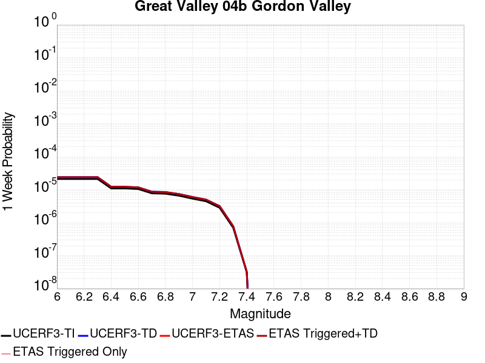 | 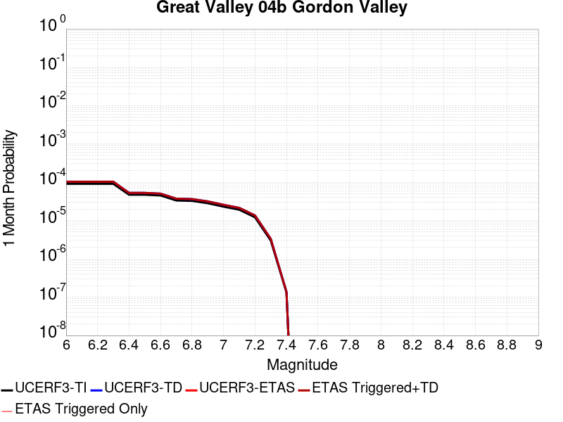 | 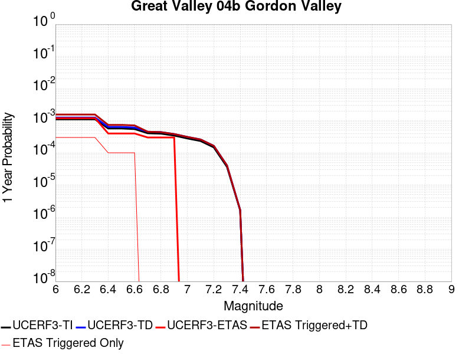 | 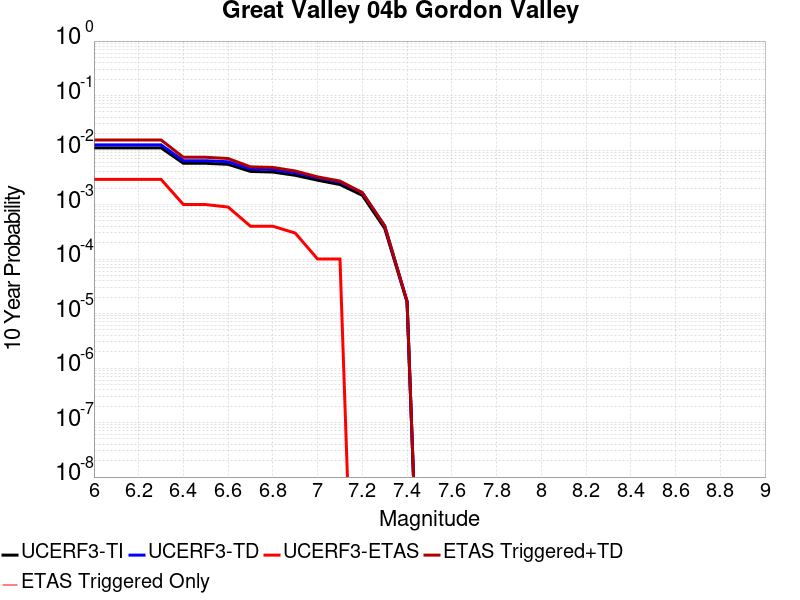 |

| Magnitude | 1 wk TI Prob | 1 wk TD Prob | 1 wk ETAS Prob | 1 wk ETAS/TD Gain | 1 wk ETAS Triggered+TD | 1 wk ETAS Triggered Only | 1 mo TI Prob | 1 mo TD Prob | 1 mo ETAS Prob | 1 mo ETAS/TD Gain | 1 mo ETAS Triggered+TD | 1 mo ETAS Triggered Only | 1 yr TI Prob | 1 yr TD Prob | 1 yr ETAS Prob | 1 yr ETAS/TD Gain | 1 yr ETAS Triggered+TD | 1 yr ETAS Triggered Only | 10 yr TI Prob | 10 yr TD Prob | 10 yr ETAS Prob | 10 yr ETAS/TD Gain | 10 yr ETAS Triggered+TD | 10 yr ETAS Triggered Only |
|-----|-----|-----|-----|-----|-----|-----|-----|-----|-----|-----|-----|-----|-----|-----|-----|-----|-----|-----|-----|-----|-----|-----|-----|-----|
| 6.0 | 2.1181217E-5 | 2.3988501E-5 | 0.0 | 0.0 | 2.3988501E-5 | 0.0 | 9.077348E-5 | 1.02804755E-4 | 0.0 | 0.0 | 1.02804755E-4 | 0.0 | 0.0011046068 | 0.0012510959 | 0.0012 | 0.959159 | 0.0015507207 | 3.0E-4 | 0.010991322 | 0.012456987 | 0.0099 | 0.7947347 | 0.015320862 | 0.0029 |
| 6.1 | 2.1181217E-5 | 2.3988501E-5 | 0.0 | 0.0 | 2.3988501E-5 | 0.0 | 9.077348E-5 | 1.02804755E-4 | 0.0 | 0.0 | 1.02804755E-4 | 0.0 | 0.0011046068 | 0.0012510959 | 0.0012 | 0.959159 | 0.0015507207 | 3.0E-4 | 0.010991322 | 0.012456987 | 0.0099 | 0.7947347 | 0.015320862 | 0.0029 |
| 6.2 | 2.1181217E-5 | 2.3988501E-5 | 0.0 | 0.0 | 2.3988501E-5 | 0.0 | 9.077348E-5 | 1.02804755E-4 | 0.0 | 0.0 | 1.02804755E-4 | 0.0 | 0.0011046068 | 0.0012510959 | 0.0012 | 0.959159 | 0.0015507207 | 3.0E-4 | 0.010991322 | 0.012456987 | 0.0099 | 0.7947347 | 0.015320862 | 0.0029 |
| 6.3 | 2.1181217E-5 | 2.3988501E-5 | 0.0 | 0.0 | 2.3988501E-5 | 0.0 | 9.077348E-5 | 1.02804755E-4 | 0.0 | 0.0 | 1.02804755E-4 | 0.0 | 0.0011046068 | 0.0012510959 | 0.0012 | 0.959159 | 0.0015507207 | 3.0E-4 | 0.010991322 | 0.012456987 | 0.0099 | 0.7947347 | 0.015320862 | 0.0029 |
| 6.4 | 1.0988268E-5 | 1.2257408E-5 | 0.0 | 0.0 | 1.2257408E-5 | 0.0 | 4.7091726E-5 | 5.2530784E-5 | 0.0 | 0.0 | 5.2530784E-5 | 0.0 | 5.731909E-4 | 6.3939055E-4 | 4.0E-4 | 0.6255957 | 7.3932664E-4 | 1.0E-4 | 0.005717147 | 0.006377097 | 0.0043 | 0.674288 | 0.00737072 | 0.001 |
| 6.5 | 1.0988268E-5 | 1.2257408E-5 | 0.0 | 0.0 | 1.2257408E-5 | 0.0 | 4.7091726E-5 | 5.2530784E-5 | 0.0 | 0.0 | 5.2530784E-5 | 0.0 | 5.731909E-4 | 6.3939055E-4 | 4.0E-4 | 0.6255957 | 7.3932664E-4 | 1.0E-4 | 0.005717147 | 0.006377097 | 0.0043 | 0.674288 | 0.00737072 | 0.001 |
| 6.6 | 1.0517822E-5 | 1.1726833E-5 | 0.0 | 0.0 | 1.1726833E-5 | 0.0 | 4.5075605E-5 | 5.0256975E-5 | 0.0 | 0.0 | 5.0256975E-5 | 0.0 | 5.4865726E-4 | 6.117225E-4 | 4.0E-4 | 0.65389127 | 7.1166136E-4 | 1.0E-4 | 0.0054730466 | 0.006101941 | 0.0037 | 0.6063644 | 0.006996449 | 9.0E-4 |
| 6.7 | 7.789219E-6 | 8.6796845E-6 | 0.0 | 0.0 | 8.6796845E-6 | 0.0 | 3.3381937E-5 | 3.7198148E-5 | 0.0 | 0.0 | 3.7198148E-5 | 0.0 | 4.063493E-4 | 4.527985E-4 | 3.0E-4 | 0.66254634 | 4.527985E-4 | 0.0 | 0.004056071 | 0.0045192763 | 0.003 | 0.66382307 | 0.004917469 | 4.0E-4 |
| 6.8 | 7.5850853E-6 | 8.454381E-6 | 0.0 | 0.0 | 8.454381E-6 | 0.0 | 3.2507105E-5 | 3.6232588E-5 | 0.0 | 0.0 | 3.6232588E-5 | 0.0 | 3.957021E-4 | 4.410476E-4 | 3.0E-4 | 0.68019867 | 4.410476E-4 | 0.0 | 0.0039499826 | 0.0044022356 | 0.0029 | 0.65875626 | 0.0048004747 | 4.0E-4 |
| 6.9 | 6.604105E-6 | 7.3602823E-6 | 0.0 | 0.0 | 7.3602823E-6 | 0.0 | 2.8303E-5 | 3.1543706E-5 | 0.0 | 0.0 | 3.1543706E-5 | 0.0 | 3.4453452E-4 | 3.8398083E-4 | 3.0E-4 | 0.781289 | 3.8398083E-4 | 0.0 | 0.0034400085 | 0.0038335605 | 0.0025 | 0.65213525 | 0.0041324105 | 3.0E-4 |
| 7.0 | 5.3701115E-6 | 5.98984E-6 | 0.0 | 0.0 | 5.98984E-6 | 0.0 | 2.301456E-5 | 2.5670506E-5 | 0.0 | 0.0 | 2.5670506E-5 | 0.0 | 2.8016625E-4 | 3.124965E-4 | 0.0 | 0.0 | 3.124965E-4 | 0.0 | 0.0027981328 | 0.0031208594 | 0.0018 | 0.57676417 | 0.0032205475 | 1.0E-4 |
| 7.1 | 4.4685607E-6 | 4.98767E-6 | 0.0 | 0.0 | 4.98767E-6 | 0.0 | 1.9150835E-5 | 2.1375567E-5 | 0.0 | 0.0 | 2.1375567E-5 | 0.0 | 2.3313647E-4 | 2.6021895E-4 | 0.0 | 0.0 | 2.6021895E-4 | 0.0 | 0.0023289204 | 0.0025993872 | 0.0013 | 0.50011784 | 0.0026991274 | 1.0E-4 |
| 7.2 | 2.833378E-6 | 3.165182E-6 | 0.0 | 0.0 | 3.165182E-6 | 0.0 | 1.2142991E-5 | 1.3565005E-5 | 0.0 | 0.0 | 1.3565005E-5 | 0.0 | 1.4783088E-4 | 1.6514318E-4 | 0.0 | 0.0 | 1.6514318E-4 | 0.0 | 0.0014773258 | 0.0016503765 | 7.0E-4 | 0.42414564 | 0.0016503765 | 0.0 |
| 7.3 | 7.0087293E-7 | 7.774574E-7 | 0.0 | 0.0 | 7.774574E-7 | 0.0 | 3.0037377E-6 | 3.3319586E-6 | 0.0 | 0.0 | 3.3319586E-6 | 0.0 | 3.656989E-5 | 4.0566298E-5 | 0.0 | 0.0 | 4.0566298E-5 | 0.0 | 3.6563876E-4 | 4.0563394E-4 | 1.0E-4 | 0.2465277 | 4.0563394E-4 | 0.0 |
| 7.4 | 3.112171E-8 | 3.2070375E-8 | 0.0 | 0.0 | 3.2070375E-8 | 0.0 | 1.3337875E-7 | 1.3744446E-7 | 0.0 | 0.0 | 1.3744446E-7 | 0.0 | 1.6238852E-6 | 1.6733851E-6 | 0.0 | 0.0 | 1.6733851E-6 | 0.0 | 1.6238733E-5 | 1.6733733E-5 | 0.0 | 0.0 | 1.6733733E-5 | 0.0 |

## McLean Lake
*[(top)](#table-of-contents)*

| 1 Week | 1 Month | 1 Year | 10 Year |
|-----|-----|-----|-----|
| 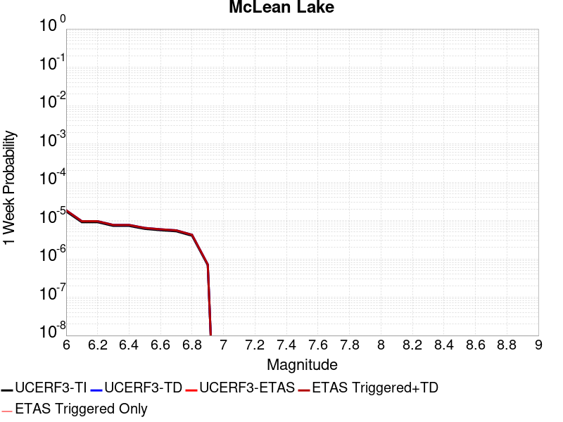 | 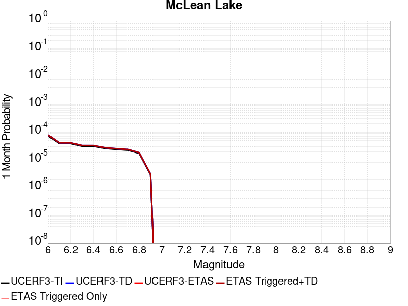 | 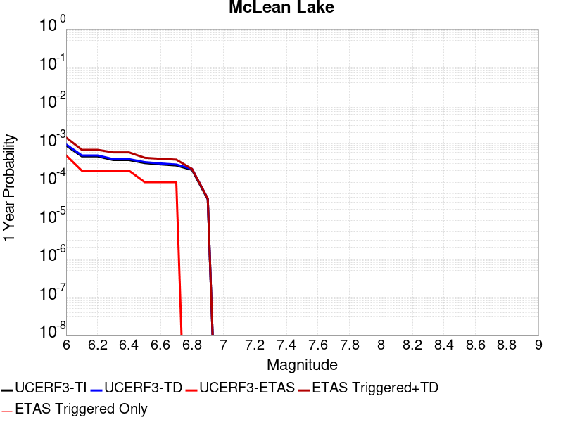 | 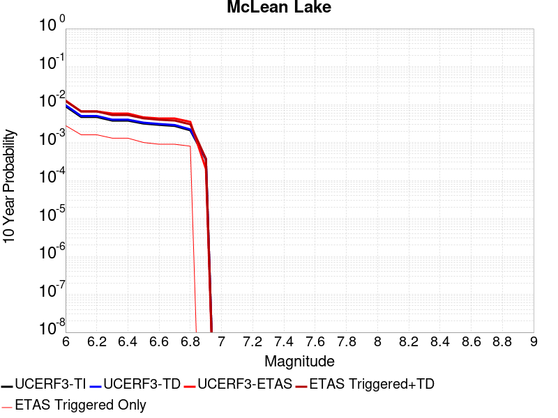 |

| Magnitude | 1 wk TI Prob | 1 wk TD Prob | 1 wk ETAS Prob | 1 wk ETAS/TD Gain | 1 wk ETAS Triggered+TD | 1 wk ETAS Triggered Only | 1 mo TI Prob | 1 mo TD Prob | 1 mo ETAS Prob | 1 mo ETAS/TD Gain | 1 mo ETAS Triggered+TD | 1 mo ETAS Triggered Only | 1 yr TI Prob | 1 yr TD Prob | 1 yr ETAS Prob | 1 yr ETAS/TD Gain | 1 yr ETAS Triggered+TD | 1 yr ETAS Triggered Only | 10 yr TI Prob | 10 yr TD Prob | 10 yr ETAS Prob | 10 yr ETAS/TD Gain | 10 yr ETAS Triggered+TD | 10 yr ETAS Triggered Only |
|-----|-----|-----|-----|-----|-----|-----|-----|-----|-----|-----|-----|-----|-----|-----|-----|-----|-----|-----|-----|-----|-----|-----|-----|-----|
| 6.0 | 1.7360222E-5 | 1.8504137E-5 | 0.0 | 0.0 | 1.8504137E-5 | 0.0 | 7.439883E-5 | 7.930131E-5 | 0.0 | 0.0 | 7.930131E-5 | 0.0 | 9.0542925E-4 | 9.651144E-4 | 0.0018 | 1.8650639 | 0.0014646319 | 5.0E-4 | 0.009017491 | 0.009614073 | 0.0128 | 1.3313816 | 0.012387154 | 0.0028 |
| 6.1 | 9.062689E-6 | 9.593349E-6 | 0.0 | 0.0 | 9.593349E-6 | 0.0 | 3.8839516E-5 | 4.1113755E-5 | 0.0 | 0.0 | 4.1113755E-5 | 0.0 | 4.727685E-4 | 5.0045387E-4 | 8.0E-4 | 1.5985489 | 7.0035376E-4 | 2.0E-4 | 0.0047176396 | 0.0049941516 | 0.0066 | 1.3215457 | 0.006586161 | 0.0016 |
| 6.2 | 9.062689E-6 | 9.593349E-6 | 0.0 | 0.0 | 9.593349E-6 | 0.0 | 3.8839516E-5 | 4.1113755E-5 | 0.0 | 0.0 | 4.1113755E-5 | 0.0 | 4.727685E-4 | 5.0045387E-4 | 8.0E-4 | 1.5985489 | 7.0035376E-4 | 2.0E-4 | 0.0047176396 | 0.0049941516 | 0.0066 | 1.3215457 | 0.006586161 | 0.0016 |
| 6.3 | 7.2575485E-6 | 7.668603E-6 | 0.0 | 0.0 | 7.668603E-6 | 0.0 | 3.110341E-5 | 3.2865064E-5 | 0.0 | 0.0 | 3.2865064E-5 | 0.0 | 3.786182E-4 | 4.0006585E-4 | 8.0E-4 | 1.9996709 | 5.999858E-4 | 2.0E-4 | 0.0037797375 | 0.0039941613 | 0.0058 | 1.4521197 | 0.005288969 | 0.0013 |
| 6.4 | 7.2575485E-6 | 7.668603E-6 | 0.0 | 0.0 | 7.668603E-6 | 0.0 | 3.110341E-5 | 3.2865064E-5 | 0.0 | 0.0 | 3.2865064E-5 | 0.0 | 3.786182E-4 | 4.0006585E-4 | 8.0E-4 | 1.9996709 | 5.999858E-4 | 2.0E-4 | 0.0037797375 | 0.0039941613 | 0.0058 | 1.4521197 | 0.005288969 | 0.0013 |
| 6.5 | 6.06582E-6 | 6.4046126E-6 | 0.0 | 0.0 | 6.4046126E-6 | 0.0 | 2.5996113E-5 | 2.7448088E-5 | 0.0 | 0.0 | 2.7448088E-5 | 0.0 | 3.164567E-4 | 3.3413572E-4 | 6.0E-4 | 1.7956775 | 4.341023E-4 | 1.0E-4 | 0.0031600643 | 0.0033369719 | 0.0046 | 1.3784952 | 0.004333635 | 0.001 |
| 6.6 | 5.598744E-6 | 5.9109398E-6 | 0.0 | 0.0 | 5.9109398E-6 | 0.0 | 2.3994397E-5 | 2.533239E-5 | 0.0 | 0.0 | 2.533239E-5 | 0.0 | 2.9209262E-4 | 3.083846E-4 | 6.0E-4 | 1.9456224 | 4.0835375E-4 | 1.0E-4 | 0.0029170897 | 0.0030801957 | 0.0043 | 1.3960152 | 0.0039774235 | 9.0E-4 |
| 6.7 | 5.246996E-6 | 5.5397977E-6 | 0.0 | 0.0 | 5.5397977E-6 | 0.0 | 2.2486933E-5 | 2.374181E-5 | 0.0 | 0.0 | 2.374181E-5 | 0.0 | 2.73744E-4 | 2.8902455E-4 | 6.0E-4 | 2.0759482 | 3.8899563E-4 | 1.0E-4 | 0.0027340704 | 0.0028871105 | 0.0043 | 1.4893783 | 0.0037845122 | 9.0E-4 |
| 6.8 | 4.02324E-6 | 4.247391E-6 | 0.0 | 0.0 | 4.247391E-6 | 0.0 | 1.7242342E-5 | 1.820301E-5 | 0.0 | 0.0 | 1.820301E-5 | 0.0 | 2.099053E-4 | 2.2160508E-4 | 5.0E-4 | 2.2562659 | 2.2160508E-4 | 0.0 | 0.0020970714 | 0.0022144255 | 0.0035 | 1.5805454 | 0.003012654 | 8.0E-4 |
| 6.9 | 6.835972E-7 | 7.140582E-7 | 0.0 | 0.0 | 7.140582E-7 | 0.0 | 2.9296991E-6 | 3.0602475E-6 | 0.0 | 0.0 | 3.0602475E-6 | 0.0 | 3.56685E-5 | 3.7258196E-5 | 1.0E-4 | 2.683973 | 3.7258196E-5 | 0.0 | 3.5662777E-4 | 3.7255077E-4 | 2.0E-4 | 0.5368396 | 3.7255077E-4 | 0.0 |

## Pleito
*[(top)](#table-of-contents)*

| 1 Week | 1 Month | 1 Year | 10 Year |
|-----|-----|-----|-----|
| 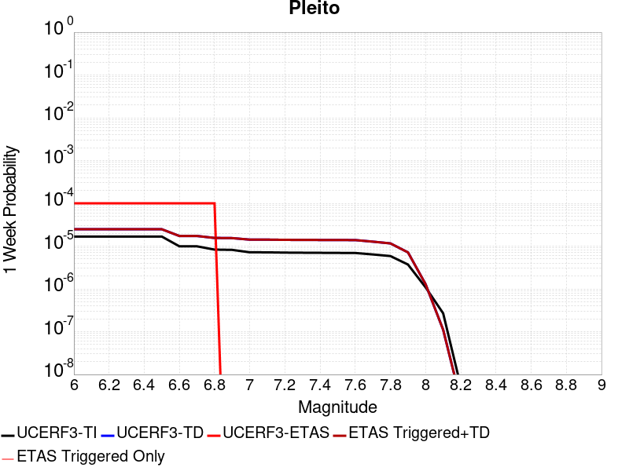 | 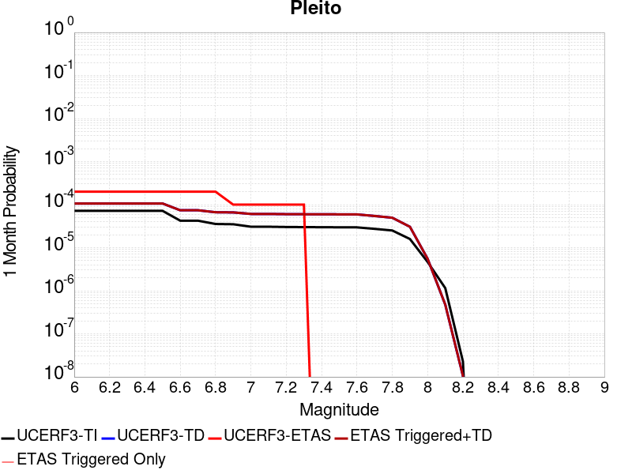 | 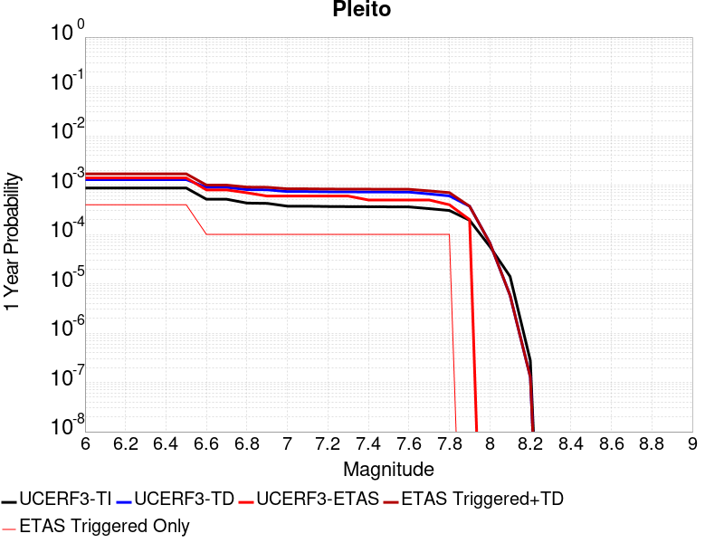 | 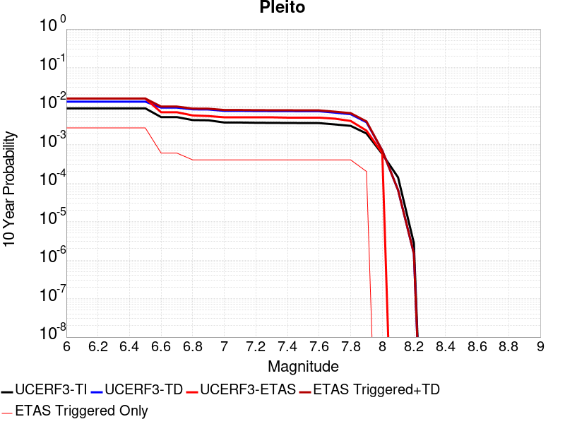 |

| Magnitude | 1 wk TI Prob | 1 wk TD Prob | 1 wk ETAS Prob | 1 wk ETAS/TD Gain | 1 wk ETAS Triggered+TD | 1 wk ETAS Triggered Only | 1 mo TI Prob | 1 mo TD Prob | 1 mo ETAS Prob | 1 mo ETAS/TD Gain | 1 mo ETAS Triggered+TD | 1 mo ETAS Triggered Only | 1 yr TI Prob | 1 yr TD Prob | 1 yr ETAS Prob | 1 yr ETAS/TD Gain | 1 yr ETAS Triggered+TD | 1 yr ETAS Triggered Only | 10 yr TI Prob | 10 yr TD Prob | 10 yr ETAS Prob | 10 yr ETAS/TD Gain | 10 yr ETAS Triggered+TD | 10 yr ETAS Triggered Only |
|-----|-----|-----|-----|-----|-----|-----|-----|-----|-----|-----|-----|-----|-----|-----|-----|-----|-----|-----|-----|-----|-----|-----|-----|-----|
| 6.0 | 1.6763008E-5 | 2.4868488E-5 | 1.0E-4 | 4.0211535 | 2.4868488E-5 | 0.0 | 7.183948E-5 | 1.0657529E-4 | 2.0E-4 | 1.8766077 | 1.0657529E-4 | 0.0 | 8.742947E-4 | 0.0012968539 | 0.0014 | 1.0795357 | 0.001696335 | 4.0E-4 | 0.00870863 | 0.013006888 | 0.0156 | 1.1993644 | 0.01567177 | 0.0027 |
| 6.1 | 1.6763008E-5 | 2.4868488E-5 | 1.0E-4 | 4.0211535 | 2.4868488E-5 | 0.0 | 7.183948E-5 | 1.0657529E-4 | 2.0E-4 | 1.8766077 | 1.0657529E-4 | 0.0 | 8.742947E-4 | 0.0012968539 | 0.0014 | 1.0795357 | 0.001696335 | 4.0E-4 | 0.00870863 | 0.013006888 | 0.0156 | 1.1993644 | 0.01567177 | 0.0027 |
| 6.2 | 1.6763008E-5 | 2.4868488E-5 | 1.0E-4 | 4.0211535 | 2.4868488E-5 | 0.0 | 7.183948E-5 | 1.0657529E-4 | 2.0E-4 | 1.8766077 | 1.0657529E-4 | 0.0 | 8.742947E-4 | 0.0012968539 | 0.0014 | 1.0795357 | 0.001696335 | 4.0E-4 | 0.00870863 | 0.013006888 | 0.0156 | 1.1993644 | 0.01567177 | 0.0027 |
| 6.3 | 1.6763008E-5 | 2.4868488E-5 | 1.0E-4 | 4.0211535 | 2.4868488E-5 | 0.0 | 7.183948E-5 | 1.0657529E-4 | 2.0E-4 | 1.8766077 | 1.0657529E-4 | 0.0 | 8.742947E-4 | 0.0012968539 | 0.0014 | 1.0795357 | 0.001696335 | 4.0E-4 | 0.00870863 | 0.013006888 | 0.0156 | 1.1993644 | 0.01567177 | 0.0027 |
| 6.4 | 1.6763008E-5 | 2.4868488E-5 | 1.0E-4 | 4.0211535 | 2.4868488E-5 | 0.0 | 7.183948E-5 | 1.0657529E-4 | 2.0E-4 | 1.8766077 | 1.0657529E-4 | 0.0 | 8.742947E-4 | 0.0012968539 | 0.0014 | 1.0795357 | 0.001696335 | 4.0E-4 | 0.00870863 | 0.013006888 | 0.0156 | 1.1993644 | 0.01567177 | 0.0027 |
| 6.5 | 1.6763008E-5 | 2.4868488E-5 | 1.0E-4 | 4.0211535 | 2.4868488E-5 | 0.0 | 7.183948E-5 | 1.0657529E-4 | 2.0E-4 | 1.8766077 | 1.0657529E-4 | 0.0 | 8.742947E-4 | 0.0012968539 | 0.0014 | 1.0795357 | 0.001696335 | 4.0E-4 | 0.00870863 | 0.013006888 | 0.0156 | 1.1993644 | 0.01567177 | 0.0027 |
| 6.6 | 9.910213E-6 | 1.7317692E-5 | 1.0E-4 | 5.7744412 | 1.7317692E-5 | 0.0 | 4.247165E-5 | 7.4216594E-5 | 2.0E-4 | 2.6948152 | 7.4216594E-5 | 0.0 | 5.169696E-4 | 9.0321613E-4 | 8.0E-4 | 0.88572377 | 0.0010031258 | 1.0E-4 | 0.0051576863 | 0.00910309 | 0.0069 | 0.7579844 | 0.009697628 | 6.0E-4 |
| 6.7 | 9.910213E-6 | 1.7317692E-5 | 1.0E-4 | 5.7744412 | 1.7317692E-5 | 0.0 | 4.247165E-5 | 7.4216594E-5 | 2.0E-4 | 2.6948152 | 7.4216594E-5 | 0.0 | 5.169696E-4 | 9.0321613E-4 | 8.0E-4 | 0.88572377 | 0.0010031258 | 1.0E-4 | 0.0051576863 | 0.00910309 | 0.0069 | 0.7579844 | 0.009697628 | 6.0E-4 |
| 6.8 | 8.300162E-6 | 1.557701E-5 | 1.0E-4 | 6.419717 | 1.557701E-5 | 0.0 | 3.557164E-5 | 6.675692E-5 | 2.0E-4 | 2.9959443 | 6.675692E-5 | 0.0 | 4.3299864E-4 | 8.1246387E-4 | 7.0E-4 | 0.8615768 | 9.123826E-4 | 1.0E-4 | 0.004321559 | 0.008202423 | 0.0057 | 0.69491655 | 0.008599143 | 4.0E-4 |
| 6.9 | 8.183114E-6 | 1.544818E-5 | 0.0 | 0.0 | 1.544818E-5 | 0.0 | 3.5070017E-5 | 6.620481E-5 | 1.0E-4 | 1.5104642 | 6.620481E-5 | 0.0 | 4.2689382E-4 | 8.0574694E-4 | 6.0E-4 | 0.74465066 | 9.056663E-4 | 1.0E-4 | 0.0042607468 | 0.008135748 | 0.0055 | 0.67602885 | 0.008532493 | 4.0E-4 |
| 7.0 | 7.1748823E-6 | 1.4233877E-5 | 0.0 | 0.0 | 1.4233877E-5 | 0.0 | 3.0749135E-5 | 6.1000905E-5 | 1.0E-4 | 1.63932 | 6.1000905E-5 | 0.0 | 3.743064E-4 | 7.424335E-4 | 6.0E-4 | 0.8081532 | 8.423592E-4 | 1.0E-4 | 0.0037367654 | 0.0075065685 | 0.0051 | 0.679405 | 0.007903566 | 4.0E-4 |
| 7.1 | 7.1671807E-6 | 1.4224233E-5 | 0.0 | 0.0 | 1.4224233E-5 | 0.0 | 3.0716128E-5 | 6.0959577E-5 | 1.0E-4 | 1.6404313 | 6.0959577E-5 | 0.0 | 3.7390468E-4 | 7.419307E-4 | 6.0E-4 | 0.8087009 | 8.4185647E-4 | 1.0E-4 | 0.0037327618 | 0.0075015747 | 0.0051 | 0.67985725 | 0.007898574 | 4.0E-4 |
| 7.2 | 7.0649667E-6 | 1.40711845E-5 | 0.0 | 0.0 | 1.40711845E-5 | 0.0 | 3.0278077E-5 | 6.0303686E-5 | 1.0E-4 | 1.6582735 | 6.0303686E-5 | 0.0 | 3.6857324E-4 | 7.339506E-4 | 6.0E-4 | 0.81749374 | 8.338772E-4 | 1.0E-4 | 0.0036796255 | 0.007422174 | 0.0051 | 0.6871302 | 0.007819205 | 4.0E-4 |
| 7.3 | 7.02082E-6 | 1.4014444E-5 | 0.0 | 0.0 | 1.4014444E-5 | 0.0 | 3.008888E-5 | 6.0060524E-5 | 1.0E-4 | 1.6649871 | 6.0060524E-5 | 0.0 | 3.6627054E-4 | 7.3099206E-4 | 6.0E-4 | 0.82080233 | 8.3091896E-4 | 1.0E-4 | 0.0036566744 | 0.007392574 | 0.0051 | 0.68988144 | 0.0077896174 | 4.0E-4 |
| 7.4 | 6.987146E-6 | 1.3973896E-5 | 0.0 | 0.0 | 1.3973896E-5 | 0.0 | 2.9944567E-5 | 5.9886755E-5 | 0.0 | 0.0 | 5.9886755E-5 | 0.0 | 3.6451413E-4 | 7.2887784E-4 | 5.0E-4 | 0.685986 | 8.28805E-4 | 1.0E-4 | 0.0036391679 | 0.0073714526 | 0.005 | 0.67829233 | 0.0077685043 | 4.0E-4 |
| 7.5 | 6.9494554E-6 | 1.3930718E-5 | 0.0 | 0.0 | 1.3930718E-5 | 0.0 | 2.9783041E-5 | 5.970171E-5 | 0.0 | 0.0 | 5.970171E-5 | 0.0 | 3.625482E-4 | 7.2662643E-4 | 5.0E-4 | 0.6881115 | 8.265538E-4 | 1.0E-4 | 0.0036195726 | 0.007349039 | 0.005 | 0.6803611 | 0.0077460995 | 4.0E-4 |
| 7.6 | 6.92694E-6 | 1.3889674E-5 | 0.0 | 0.0 | 1.3889674E-5 | 0.0 | 2.9686547E-5 | 5.952582E-5 | 0.0 | 0.0 | 5.952582E-5 | 0.0 | 3.6137376E-4 | 7.2448637E-4 | 5.0E-4 | 0.69014406 | 8.2441396E-4 | 1.0E-4 | 0.0036078666 | 0.007327714 | 0.005 | 0.68234104 | 0.007724783 | 4.0E-4 |
| 7.7 | 6.395867E-6 | 1.2764461E-5 | 0.0 | 0.0 | 1.2764461E-5 | 0.0 | 2.741057E-5 | 5.4703683E-5 | 0.0 | 0.0 | 5.4703683E-5 | 0.0 | 3.336726E-4 | 6.6581415E-4 | 5.0E-4 | 0.7509603 | 7.6574757E-4 | 1.0E-4 | 0.0033317201 | 0.006744259 | 0.0047 | 0.696889 | 0.0071415612 | 4.0E-4 |
| 7.8 | 5.8664327E-6 | 1.1623775E-5 | 0.0 | 0.0 | 1.1623775E-5 | 0.0 | 2.5141611E-5 | 4.981523E-5 | 0.0 | 0.0 | 4.981523E-5 | 0.0 | 3.060561E-4 | 6.0633186E-4 | 4.0E-4 | 0.65970474 | 7.062712E-4 | 1.0E-4 | 0.0030563495 | 0.006145471 | 0.0041 | 0.667158 | 0.006543013 | 4.0E-4 |
| 7.9 | 3.7167474E-6 | 7.1672644E-6 | 0.0 | 0.0 | 7.1672644E-6 | 0.0 | 1.592882E-5 | 3.071649E-5 | 0.0 | 0.0 | 3.071649E-5 | 0.0 | 1.9391612E-4 | 3.739092E-4 | 2.0E-4 | 0.5348892 | 3.739092E-4 | 0.0 | 0.0019374699 | 0.0037947856 | 0.0023 | 0.60609484 | 0.0039940267 | 2.0E-4 |
| 8.0 | 1.0903841E-6 | 1.299582E-6 | 0.0 | 0.0 | 1.299582E-6 | 0.0 | 4.6730665E-6 | 5.569625E-6 | 0.0 | 0.0 | 5.569625E-6 | 0.0 | 5.68931E-5 | 6.780809E-5 | 0.0 | 0.0 | 6.780809E-5 | 0.0 | 5.6878536E-4 | 7.0031453E-4 | 6.0E-4 | 0.85675794 | 7.0031453E-4 | 0.0 |
| 8.1 | 2.6894583E-7 | 1.12524575E-7 | 0.0 | 0.0 | 1.12524575E-7 | 0.0 | 1.1526245E-6 | 4.822481E-7 | 0.0 | 0.0 | 4.822481E-7 | 0.0 | 1.4033113E-5 | 5.871355E-6 | 0.0 | 0.0 | 5.871355E-6 | 0.0 | 1.4032227E-4 | 6.564457E-5 | 0.0 | 0.0 | 6.564457E-5 | 0.0 |
| 8.2 | 5.2967013E-9 | 2.503718E-9 | 0.0 | 0.0 | 2.503718E-9 | 0.0 | 2.2700148E-8 | 1.0730219E-8 | 0.0 | 0.0 | 1.0730219E-8 | 0.0 | 2.7637427E-7 | 1.3064042E-7 | 0.0 | 0.0 | 1.3064042E-7 | 0.0 | 2.7637393E-6 | 1.4850166E-6 | 0.0 | 0.0 | 1.4850166E-6 | 0.0 |

## Keddie Ridge 2011 CFM
*[(top)](#table-of-contents)*

| 1 Week | 1 Month | 1 Year | 10 Year |
|-----|-----|-----|-----|
| 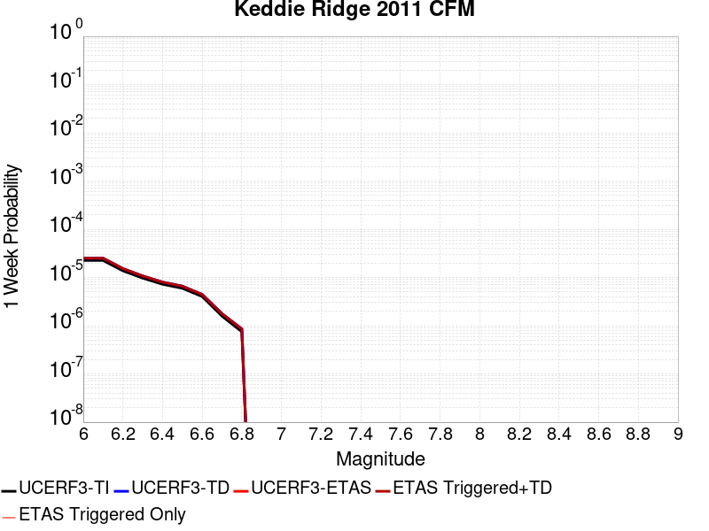 | 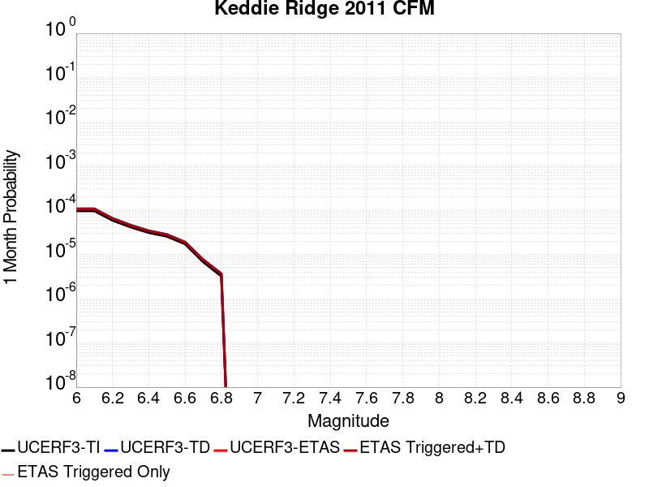 | 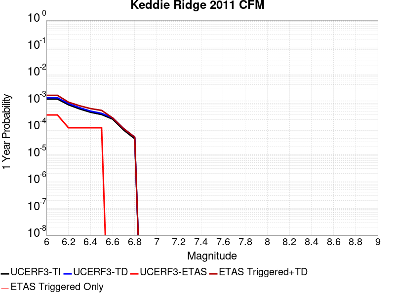 | 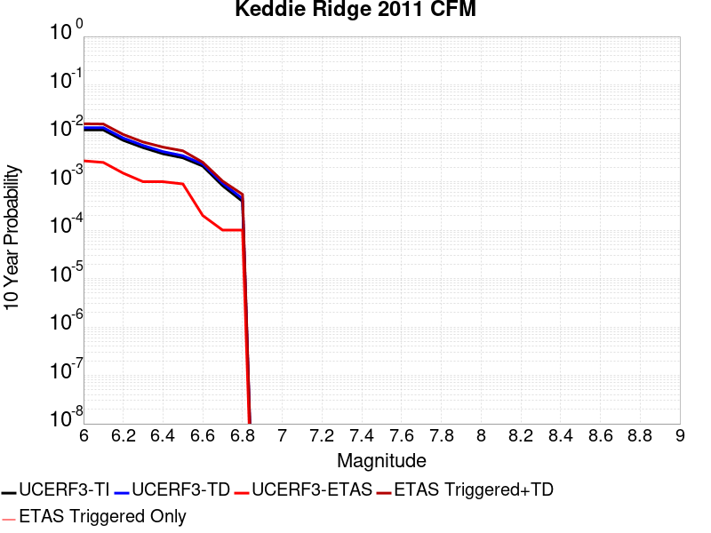 |

| Magnitude | 1 wk TI Prob | 1 wk TD Prob | 1 wk ETAS Prob | 1 wk ETAS/TD Gain | 1 wk ETAS Triggered+TD | 1 wk ETAS Triggered Only | 1 mo TI Prob | 1 mo TD Prob | 1 mo ETAS Prob | 1 mo ETAS/TD Gain | 1 mo ETAS Triggered+TD | 1 mo ETAS Triggered Only | 1 yr TI Prob | 1 yr TD Prob | 1 yr ETAS Prob | 1 yr ETAS/TD Gain | 1 yr ETAS Triggered+TD | 1 yr ETAS Triggered Only | 10 yr TI Prob | 10 yr TD Prob | 10 yr ETAS Prob | 10 yr ETAS/TD Gain | 10 yr ETAS Triggered+TD | 10 yr ETAS Triggered Only |
|-----|-----|-----|-----|-----|-----|-----|-----|-----|-----|-----|-----|-----|-----|-----|-----|-----|-----|-----|-----|-----|-----|-----|-----|-----|
| 6.0 | 2.2591947E-5 | 2.519519E-5 | 0.0 | 0.0 | 2.519519E-5 | 0.0 | 9.6819036E-5 | 1.07975364E-4 | 0.0 | 0.0 | 1.07975364E-4 | 0.0 | 0.0011781343 | 0.0013138864 | 0.001 | 0.7611008 | 0.0016134921 | 3.0E-4 | 0.011719079 | 0.013069131 | 0.0101 | 0.7728134 | 0.015733846 | 0.0027 |
| 6.1 | 2.2591947E-5 | 2.519519E-5 | 0.0 | 0.0 | 2.519519E-5 | 0.0 | 9.6819036E-5 | 1.07975364E-4 | 0.0 | 0.0 | 1.07975364E-4 | 0.0 | 0.0011781343 | 0.0013138864 | 8.0E-4 | 0.60888064 | 0.0016134921 | 3.0E-4 | 0.011719079 | 0.013069131 | 0.0088 | 0.67334235 | 0.015536459 | 0.0025 |
| 6.2 | 1.3775145E-5 | 1.5326394E-5 | 0.0 | 0.0 | 1.5326394E-5 | 0.0 | 5.9035E-5 | 6.568303E-5 | 0.0 | 0.0 | 6.568303E-5 | 0.0 | 7.185141E-4 | 7.994217E-4 | 4.0E-4 | 0.50036174 | 8.993417E-4 | 1.0E-4 | 0.0071619535 | 0.00796788 | 0.006 | 0.75302345 | 0.009455928 | 0.0015 |
| 6.3 | 9.705435E-6 | 1.07708065E-5 | 0.0 | 0.0 | 1.07708065E-5 | 0.0 | 4.1594063E-5 | 4.6159854E-5 | 0.0 | 0.0 | 4.6159854E-5 | 0.0 | 5.0629E-4 | 5.618637E-4 | 4.0E-4 | 0.71191645 | 6.6180754E-4 | 1.0E-4 | 0.005051381 | 0.0056056627 | 0.0041 | 0.73140323 | 0.0066000572 | 0.001 |
| 6.4 | 7.2549733E-6 | 8.029053E-6 | 0.0 | 0.0 | 8.029053E-6 | 0.0 | 3.109237E-5 | 3.4409815E-5 | 0.0 | 0.0 | 3.4409815E-5 | 0.0 | 3.7848388E-4 | 4.1886696E-4 | 4.0E-4 | 0.9549572 | 5.188251E-4 | 1.0E-4 | 0.003778399 | 0.004181562 | 0.0036 | 0.86092234 | 0.0051773805 | 0.001 |
| 6.5 | 5.983293E-6 | 6.61448E-6 | 0.0 | 0.0 | 6.61448E-6 | 0.0 | 2.5642432E-5 | 2.8347502E-5 | 0.0 | 0.0 | 2.8347502E-5 | 0.0 | 3.1215188E-4 | 3.450829E-4 | 3.0E-4 | 0.86935633 | 4.4504838E-4 | 1.0E-4 | 0.0031171376 | 0.0034461333 | 0.003 | 0.8705409 | 0.004343032 | 9.0E-4 |
| 6.6 | 4.0336154E-6 | 4.45879E-6 | 0.0 | 0.0 | 4.45879E-6 | 0.0 | 1.728681E-5 | 1.9108984E-5 | 0.0 | 0.0 | 1.9108984E-5 | 0.0 | 2.1044657E-4 | 2.3263106E-4 | 1.0E-4 | 0.42986518 | 2.3263106E-4 | 0.0 | 0.002102474 | 0.0023242715 | 0.0019 | 0.8174604 | 0.0025238066 | 2.0E-4 |
| 6.7 | 1.5832104E-6 | 1.7820788E-6 | 0.0 | 0.0 | 1.7820788E-6 | 0.0 | 6.7851697E-6 | 7.63746E-6 | 0.0 | 0.0 | 7.63746E-6 | 0.0 | 8.260631E-5 | 9.298237E-5 | 0.0 | 0.0 | 9.298237E-5 | 0.0 | 8.2575605E-4 | 9.294614E-4 | 7.0E-4 | 0.75312436 | 0.0010293684 | 1.0E-4 |
| 6.8 | 7.5177275E-7 | 8.592854E-7 | 0.0 | 0.0 | 8.592854E-7 | 0.0 | 3.221879E-6 | 3.6826475E-6 | 0.0 | 0.0 | 3.6826475E-6 | 0.0 | 3.9225673E-5 | 4.483548E-5 | 0.0 | 0.0 | 4.483548E-5 | 0.0 | 3.921875E-4 | 4.482809E-4 | 3.0E-4 | 0.66922325 | 5.482361E-4 | 1.0E-4 |

## Ortigalita (North)
*[(top)](#table-of-contents)*

| 1 Week | 1 Month | 1 Year | 10 Year |
|-----|-----|-----|-----|
| 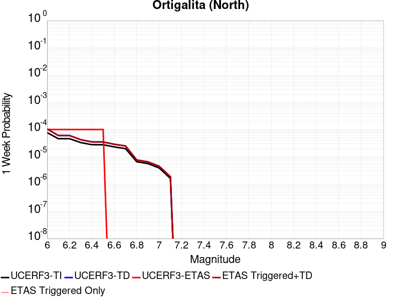 | 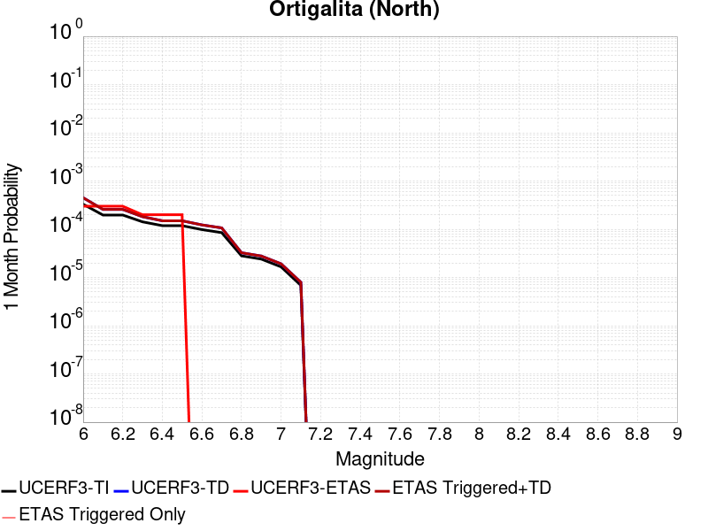 | 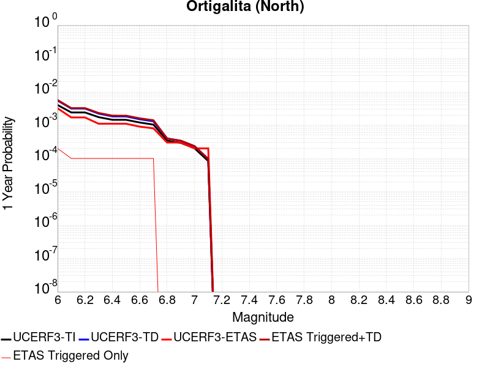 | 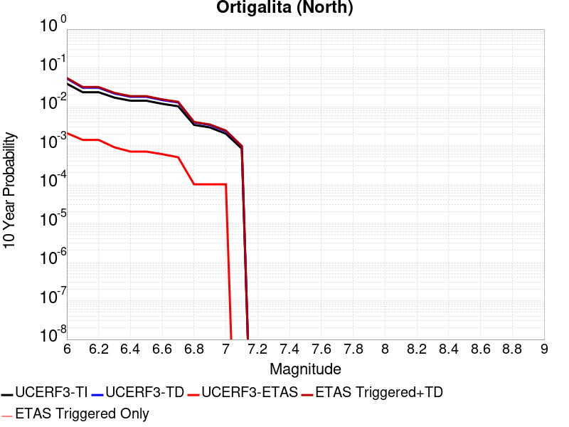 |

| Magnitude | 1 wk TI Prob | 1 wk TD Prob | 1 wk ETAS Prob | 1 wk ETAS/TD Gain | 1 wk ETAS Triggered+TD | 1 wk ETAS Triggered Only | 1 mo TI Prob | 1 mo TD Prob | 1 mo ETAS Prob | 1 mo ETAS/TD Gain | 1 mo ETAS Triggered+TD | 1 mo ETAS Triggered Only | 1 yr TI Prob | 1 yr TD Prob | 1 yr ETAS Prob | 1 yr ETAS/TD Gain | 1 yr ETAS Triggered+TD | 1 yr ETAS Triggered Only | 10 yr TI Prob | 10 yr TD Prob | 10 yr ETAS Prob | 10 yr ETAS/TD Gain | 10 yr ETAS Triggered+TD | 10 yr ETAS Triggered Only |
|-----|-----|-----|-----|-----|-----|-----|-----|-----|-----|-----|-----|-----|-----|-----|-----|-----|-----|-----|-----|-----|-----|-----|-----|-----|
| 6.0 | 7.711876E-5 | 1.05127336E-4 | 1.0E-4 | 0.95122737 | 1.05127336E-4 | 0.0 | 3.3046713E-4 | 4.504637E-4 | 3.0E-4 | 0.6659804 | 4.504637E-4 | 0.0 | 0.004016016 | 0.0054717897 | 0.0032 | 0.58481777 | 0.0056706956 | 2.0E-4 | 0.039442103 | 0.053490758 | 0.0414 | 0.7739655 | 0.055478428 | 0.0021 |
| 6.1 | 4.607858E-5 | 6.0277285E-5 | 1.0E-4 | 1.6589998 | 6.0277285E-5 | 0.0 | 1.9746469E-4 | 2.5830677E-4 | 3.0E-4 | 1.1614097 | 2.5830677E-4 | 0.0 | 0.0024014818 | 0.0031406668 | 0.0017 | 0.54128635 | 0.0032403527 | 1.0E-4 | 0.023756953 | 0.030993918 | 0.0238 | 0.7678926 | 0.032350525 | 0.0014 |
| 6.2 | 4.607858E-5 | 6.0277285E-5 | 1.0E-4 | 1.6589998 | 6.0277285E-5 | 0.0 | 1.9746469E-4 | 2.5830677E-4 | 3.0E-4 | 1.1614097 | 2.5830677E-4 | 0.0 | 0.0024014818 | 0.0031406668 | 0.0017 | 0.54128635 | 0.0032403527 | 1.0E-4 | 0.023756953 | 0.030993918 | 0.0238 | 0.7678926 | 0.032350525 | 0.0014 |
| 6.3 | 3.327423E-5 | 4.2500396E-5 | 1.0E-4 | 2.3529193 | 4.2500396E-5 | 0.0 | 1.4259605E-4 | 1.8213355E-4 | 2.0E-4 | 1.0980954 | 1.8213355E-4 | 0.0 | 0.0017347244 | 0.0022154674 | 0.0011 | 0.49650922 | 0.0023152458 | 1.0E-4 | 0.017212452 | 0.021958055 | 0.0174 | 0.7924199 | 0.022838293 | 9.0E-4 |
| 6.4 | 2.7732503E-5 | 3.5018194E-5 | 1.0E-4 | 2.8556583 | 3.5018194E-5 | 0.0 | 1.1884817E-4 | 1.500708E-4 | 2.0E-4 | 1.3327043 | 1.500708E-4 | 0.0 | 0.001446016 | 0.0018258144 | 0.0011 | 0.6024709 | 0.0019256318 | 1.0E-4 | 0.014366428 | 0.018131105 | 0.0153 | 0.84385365 | 0.018818414 | 7.0E-4 |
| 6.5 | 2.7689714E-5 | 3.496799E-5 | 1.0E-4 | 2.8597584 | 3.496799E-5 | 0.0 | 1.186648E-4 | 1.4985567E-4 | 2.0E-4 | 1.3346175 | 1.4985567E-4 | 0.0 | 0.0014437864 | 0.0018231996 | 0.0011 | 0.60333496 | 0.0019230172 | 1.0E-4 | 0.014344421 | 0.018105384 | 0.0153 | 0.84505254 | 0.01879271 | 7.0E-4 |
| 6.6 | 2.2976905E-5 | 2.8733499E-5 | 0.0 | 0.0 | 2.8733499E-5 | 0.0 | 9.846873E-5 | 1.2313918E-4 | 0.0 | 0.0 | 1.2313918E-4 | 0.0 | 0.0011981975 | 0.0014984269 | 9.0E-4 | 0.6006299 | 0.001598277 | 1.0E-4 | 0.011917574 | 0.014906555 | 0.0132 | 0.8855164 | 0.015497612 | 6.0E-4 |
| 6.7 | 1.9871539E-5 | 2.4918034E-5 | 0.0 | 0.0 | 2.4918034E-5 | 0.0 | 8.516096E-5 | 1.06788604E-4 | 0.0 | 0.0 | 1.06788604E-4 | 0.0 | 0.0010363415 | 0.001299618 | 8.0E-4 | 0.6155655 | 0.0013994881 | 1.0E-4 | 0.010315218 | 0.0129438555 | 0.012 | 0.9270808 | 0.013437383 | 5.0E-4 |
| 6.8 | 6.5640475E-6 | 7.6079823E-6 | 0.0 | 0.0 | 7.6079823E-6 | 0.0 | 2.813133E-5 | 3.2605247E-5 | 0.0 | 0.0 | 3.2605247E-5 | 0.0 | 3.424451E-4 | 3.9689944E-4 | 3.0E-4 | 0.75585896 | 3.9689944E-4 | 0.0 | 0.0034191788 | 0.003962193 | 0.0036 | 0.9085877 | 0.004061797 | 1.0E-4 |
| 6.9 | 5.6219683E-6 | 6.5039367E-6 | 0.0 | 0.0 | 6.5039367E-6 | 0.0 | 2.4093928E-5 | 2.787373E-5 | 0.0 | 0.0 | 2.787373E-5 | 0.0 | 2.933041E-4 | 3.393124E-4 | 3.0E-4 | 0.88414097 | 3.393124E-4 | 0.0 | 0.0029291727 | 0.0033882004 | 0.0034 | 1.0034826 | 0.0034878617 | 1.0E-4 |
| 7.0 | 3.875591E-6 | 4.4862086E-6 | 0.0 | 0.0 | 4.4862086E-6 | 0.0 | 1.6609569E-5 | 1.9226478E-5 | 0.0 | 0.0 | 1.9226478E-5 | 0.0 | 2.0220275E-4 | 2.3405933E-4 | 2.0E-4 | 0.8544842 | 2.3405933E-4 | 0.0 | 0.0020201886 | 0.0023383365 | 0.0025 | 1.069136 | 0.0024381028 | 1.0E-4 |
| 7.1 | 1.6017933E-6 | 1.8576521E-6 | 0.0 | 0.0 | 1.8576521E-6 | 0.0 | 6.8648105E-6 | 7.961348E-6 | 0.0 | 0.0 | 7.961348E-6 | 0.0 | 8.357586E-5 | 9.692617E-5 | 2.0E-4 | 2.0634263 | 9.692617E-5 | 0.0 | 8.3544437E-4 | 9.689437E-4 | 0.0015 | 1.5480776 | 9.689437E-4 | 0.0 |

## Monte Vista - Shannon 2011 CFM
*[(top)](#table-of-contents)*

| 1 Week | 1 Month | 1 Year | 10 Year |
|-----|-----|-----|-----|
| 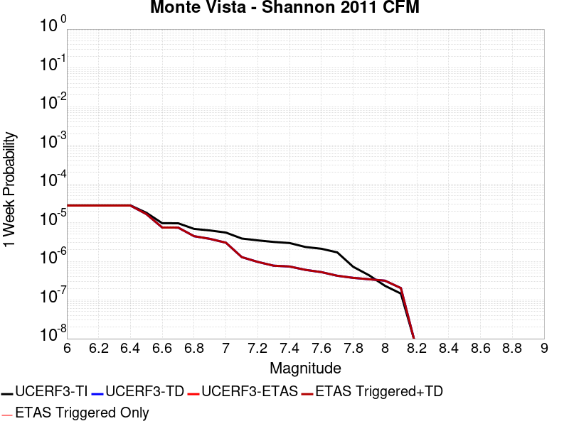 | 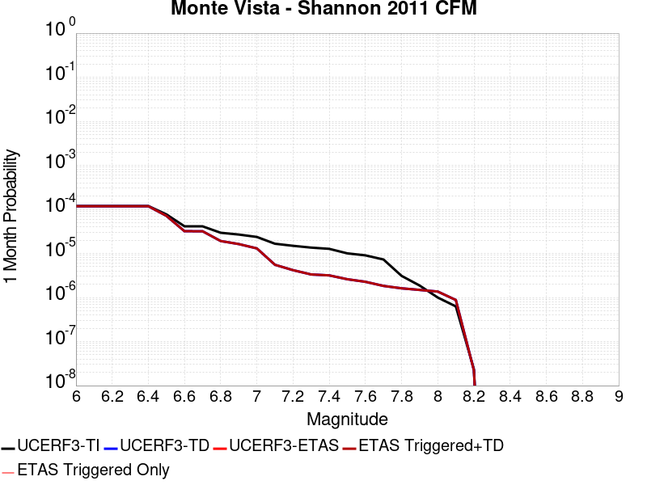 | 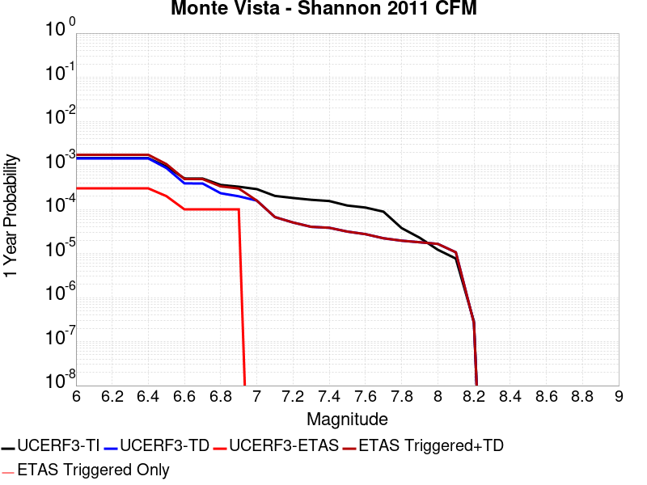 | 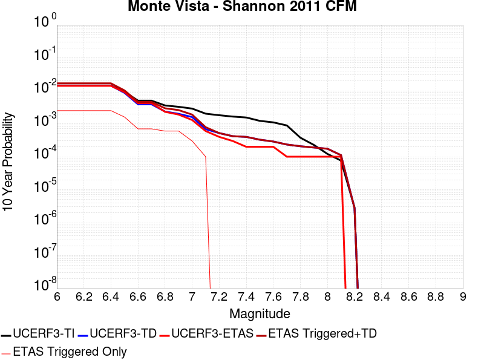 |

| Magnitude | 1 wk TI Prob | 1 wk TD Prob | 1 wk ETAS Prob | 1 wk ETAS/TD Gain | 1 wk ETAS Triggered+TD | 1 wk ETAS Triggered Only | 1 mo TI Prob | 1 mo TD Prob | 1 mo ETAS Prob | 1 mo ETAS/TD Gain | 1 mo ETAS Triggered+TD | 1 mo ETAS Triggered Only | 1 yr TI Prob | 1 yr TD Prob | 1 yr ETAS Prob | 1 yr ETAS/TD Gain | 1 yr ETAS Triggered+TD | 1 yr ETAS Triggered Only | 10 yr TI Prob | 10 yr TD Prob | 10 yr ETAS Prob | 10 yr ETAS/TD Gain | 10 yr ETAS Triggered+TD | 10 yr ETAS Triggered Only |
|-----|-----|-----|-----|-----|-----|-----|-----|-----|-----|-----|-----|-----|-----|-----|-----|-----|-----|-----|-----|-----|-----|-----|-----|-----|
| 6.0 | 2.7907707E-5 | 2.7598038E-5 | 0.0 | 0.0 | 2.7598038E-5 | 0.0 | 1.19598975E-4 | 1.1827265E-4 | 0.0 | 0.0 | 1.1827265E-4 | 0.0 | 0.0014551448 | 0.001439142 | 0.0016 | 1.1117735 | 0.0017387103 | 3.0E-4 | 0.014456532 | 0.014327386 | 0.0141 | 0.98412925 | 0.016791567 | 0.0025 |
| 6.1 | 2.7907707E-5 | 2.7598038E-5 | 0.0 | 0.0 | 2.7598038E-5 | 0.0 | 1.19598975E-4 | 1.1827265E-4 | 0.0 | 0.0 | 1.1827265E-4 | 0.0 | 0.0014551448 | 0.001439142 | 0.0016 | 1.1117735 | 0.0017387103 | 3.0E-4 | 0.014456532 | 0.014327386 | 0.0141 | 0.98412925 | 0.016791567 | 0.0025 |
| 6.2 | 2.7907707E-5 | 2.7598038E-5 | 0.0 | 0.0 | 2.7598038E-5 | 0.0 | 1.19598975E-4 | 1.1827265E-4 | 0.0 | 0.0 | 1.1827265E-4 | 0.0 | 0.0014551448 | 0.001439142 | 0.0016 | 1.1117735 | 0.0017387103 | 3.0E-4 | 0.014456532 | 0.014327386 | 0.0141 | 0.98412925 | 0.016791567 | 0.0025 |
| 6.3 | 2.7907707E-5 | 2.7598038E-5 | 0.0 | 0.0 | 2.7598038E-5 | 0.0 | 1.19598975E-4 | 1.1827265E-4 | 0.0 | 0.0 | 1.1827265E-4 | 0.0 | 0.0014551448 | 0.001439142 | 0.0016 | 1.1117735 | 0.0017387103 | 3.0E-4 | 0.014456532 | 0.014327386 | 0.0141 | 0.98412925 | 0.016791567 | 0.0025 |
| 6.4 | 2.7907707E-5 | 2.7598038E-5 | 0.0 | 0.0 | 2.7598038E-5 | 0.0 | 1.19598975E-4 | 1.1827265E-4 | 0.0 | 0.0 | 1.1827265E-4 | 0.0 | 0.0014551448 | 0.001439142 | 0.0016 | 1.1117735 | 0.0017387103 | 3.0E-4 | 0.014456532 | 0.014327386 | 0.0141 | 0.98412925 | 0.016791567 | 0.0025 |
| 6.5 | 1.7990213E-5 | 1.6651378E-5 | 0.0 | 0.0 | 1.6651378E-5 | 0.0 | 7.709863E-5 | 7.136147E-5 | 0.0 | 0.0 | 7.136147E-5 | 0.0 | 9.382716E-4 | 8.6854596E-4 | 9.0E-4 | 1.0362146 | 0.0010683723 | 2.0E-4 | 0.0093431985 | 0.008674962 | 0.0091 | 1.048996 | 0.010261082 | 0.0016 |
| 6.6 | 9.650407E-6 | 7.4667255E-6 | 0.0 | 0.0 | 7.4667255E-6 | 0.0 | 4.135823E-5 | 3.1999905E-5 | 0.0 | 0.0 | 3.1999905E-5 | 0.0 | 5.0342013E-4 | 3.8953702E-4 | 4.0E-4 | 1.02686 | 4.894981E-4 | 1.0E-4 | 0.005022812 | 0.003906295 | 0.0042 | 1.0751876 | 0.004603561 | 7.0E-4 |
| 6.7 | 9.62828E-6 | 7.44463E-6 | 0.0 | 0.0 | 7.44463E-6 | 0.0 | 4.1263404E-5 | 3.190521E-5 | 0.0 | 0.0 | 3.190521E-5 | 0.0 | 5.022661E-4 | 3.8838453E-4 | 4.0E-4 | 1.0299071 | 4.883457E-4 | 1.0E-4 | 0.0050113243 | 0.003894811 | 0.0042 | 1.0783578 | 0.004592085 | 7.0E-4 |
| 6.8 | 6.887523E-6 | 4.4705985E-6 | 0.0 | 0.0 | 4.4705985E-6 | 0.0 | 2.9517621E-5 | 1.915958E-5 | 0.0 | 0.0 | 1.915958E-5 | 0.0 | 3.5931775E-4 | 2.3324514E-4 | 1.0E-4 | 0.42873347 | 3.332218E-4 | 1.0E-4 | 0.0035873733 | 0.0023472295 | 0.0023 | 0.9798786 | 0.0029458213 | 6.0E-4 |
| 6.9 | 6.2722347E-6 | 3.8123444E-6 | 0.0 | 0.0 | 3.8123444E-6 | 0.0 | 2.6880729E-5 | 1.6338528E-5 | 0.0 | 0.0 | 1.6338528E-5 | 0.0 | 3.2722374E-4 | 1.9890544E-4 | 1.0E-4 | 0.5027514 | 2.9888557E-4 | 1.0E-4 | 0.003267423 | 0.0020044865 | 0.0019 | 0.94787365 | 0.0026032839 | 6.0E-4 |
| 7.0 | 5.5320347E-6 | 3.0393048E-6 | 0.0 | 0.0 | 3.0393048E-6 | 0.0 | 2.3708504E-5 | 1.3025537E-5 | 0.0 | 0.0 | 1.3025537E-5 | 0.0 | 2.8861282E-4 | 1.5857621E-4 | 0.0 | 0.0 | 1.5857621E-4 | 0.0 | 0.0028823826 | 0.0016018295 | 0.0013 | 0.811572 | 0.0019013489 | 3.0E-4 |
| 7.1 | 3.8794055E-6 | 1.2919112E-6 | 0.0 | 0.0 | 1.2919112E-6 | 0.0 | 1.6625918E-5 | 5.5367505E-6 | 0.0 | 0.0 | 5.5367505E-6 | 0.0 | 2.0240174E-4 | 6.740786E-5 | 0.0 | 0.0 | 6.740786E-5 | 0.0 | 0.002022175 | 6.9090154E-4 | 6.0E-4 | 0.86843055 | 7.9083245E-4 | 1.0E-4 |
| 7.2 | 3.4813652E-6 | 9.748566E-7 | 0.0 | 0.0 | 9.748566E-7 | 0.0 | 1.49200505E-5 | 4.17795E-6 | 0.0 | 0.0 | 4.17795E-6 | 0.0 | 1.8163648E-4 | 5.086536E-5 | 0.0 | 0.0 | 5.086536E-5 | 0.0 | 0.0018148809 | 5.2555173E-4 | 4.0E-4 | 0.7611049 | 5.2555173E-4 | 0.0 |
| 7.3 | 3.1682148E-6 | 7.7921595E-7 | 0.0 | 0.0 | 7.7921595E-7 | 0.0 | 1.3577992E-5 | 3.3394927E-6 | 0.0 | 0.0 | 3.3394927E-6 | 0.0 | 1.6529951E-4 | 4.0657567E-5 | 0.0 | 0.0 | 4.0657567E-5 | 0.0 | 0.0016517661 | 4.2349036E-4 | 3.0E-4 | 0.70839864 | 4.2349036E-4 | 0.0 |
| 7.4 | 2.9707667E-6 | 7.416581E-7 | 0.0 | 0.0 | 7.416581E-7 | 0.0 | 1.2731795E-5 | 3.1785307E-6 | 0.0 | 0.0 | 3.1785307E-6 | 0.0 | 1.5499859E-4 | 3.8697926E-5 | 0.0 | 0.0 | 3.8697926E-5 | 0.0 | 0.0015489052 | 4.0369027E-4 | 2.0E-4 | 0.49542934 | 4.0369027E-4 | 0.0 |
| 7.5 | 2.3462758E-6 | 6.068092E-7 | 0.0 | 0.0 | 6.068092E-7 | 0.0 | 1.0055429E-5 | 2.600608E-6 | 0.0 | 0.0 | 2.600608E-6 | 0.0 | 1.2241797E-4 | 3.1661944E-5 | 0.0 | 0.0 | 3.1661944E-5 | 0.0 | 0.0012235056 | 3.3159088E-4 | 2.0E-4 | 0.60315293 | 3.3159088E-4 | 0.0 |
| 7.6 | 2.112783E-6 | 5.30817E-7 | 0.0 | 0.0 | 5.30817E-7 | 0.0 | 9.054753E-6 | 2.274928E-6 | 0.0 | 0.0 | 2.274928E-6 | 0.0 | 1.1023604E-4 | 2.7696897E-5 | 0.0 | 0.0 | 2.7696897E-5 | 0.0 | 0.0011018137 | 2.9151983E-4 | 2.0E-4 | 0.6860597 | 2.9151983E-4 | 0.0 |
| 7.7 | 1.7022471E-6 | 4.280964E-7 | 0.0 | 0.0 | 4.280964E-7 | 0.0 | 7.2953244E-6 | 1.8346975E-6 | 0.0 | 0.0 | 1.8346975E-6 | 0.0 | 8.881695E-5 | 2.2337215E-5 | 0.0 | 0.0 | 2.2337215E-5 | 0.0 | 8.878146E-4 | 2.3659493E-4 | 1.0E-4 | 0.42266333 | 2.3659493E-4 | 0.0 |
| 7.8 | 7.230914E-7 | 3.7733471E-7 | 0.0 | 0.0 | 3.7733471E-7 | 0.0 | 3.0989595E-6 | 1.6171477E-6 | 0.0 | 0.0 | 1.6171477E-6 | 0.0 | 3.772918E-5 | 1.9688598E-5 | 0.0 | 0.0 | 1.9688598E-5 | 0.0 | 3.7722773E-4 | 2.096328E-4 | 1.0E-4 | 0.47702459 | 2.096328E-4 | 0.0 |
| 7.9 | 4.3588446E-7 | 3.4695532E-7 | 0.0 | 0.0 | 3.4695532E-7 | 0.0 | 1.868075E-6 | 1.4869505E-6 | 0.0 | 0.0 | 1.4869505E-6 | 0.0 | 2.2743576E-5 | 1.8103474E-5 | 0.0 | 0.0 | 1.8103474E-5 | 0.0 | 2.2741247E-4 | 1.9199152E-4 | 1.0E-4 | 0.5208563 | 1.9199152E-4 | 0.0 |
| 8.0 | 2.3317523E-7 | 3.1855672E-7 | 0.0 | 0.0 | 3.1855672E-7 | 0.0 | 9.99322E-7 | 1.3652424E-6 | 0.0 | 0.0 | 1.3652424E-6 | 0.0 | 1.2166677E-5 | 1.6621701E-5 | 0.0 | 0.0 | 1.6621701E-5 | 0.0 | 1.21660116E-4 | 1.757691E-4 | 1.0E-4 | 0.5689282 | 1.757691E-4 | 0.0 |
| 8.1 | 1.4662456E-7 | 2.0509846E-7 | 0.0 | 0.0 | 2.0509846E-7 | 0.0 | 6.283908E-7 | 8.789931E-7 | 0.0 | 0.0 | 8.789931E-7 | 0.0 | 7.650631E-6 | 1.07016895E-5 | 0.0 | 0.0 | 1.07016895E-5 | 0.0 | 7.650368E-5 | 1.1237095E-4 | 1.0E-4 | 0.8899097 | 1.1237095E-4 | 0.0 |
| 8.2 | 5.4931775E-9 | 5.129171E-9 | 0.0 | 0.0 | 5.129171E-9 | 0.0 | 2.3542189E-8 | 2.198216E-8 | 0.0 | 0.0 | 2.198216E-8 | 0.0 | 2.8662612E-7 | 2.6763277E-7 | 0.0 | 0.0 | 2.6763277E-7 | 0.0 | 2.8662573E-6 | 2.7824178E-6 | 0.0 | 0.0 | 2.7824178E-6 | 0.0 |

## Manix-Afton Hills
*[(top)](#table-of-contents)*

| 1 Week | 1 Month | 1 Year | 10 Year |
|-----|-----|-----|-----|
| 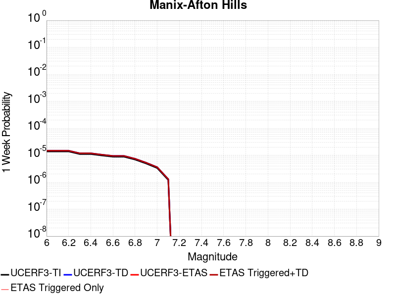 | 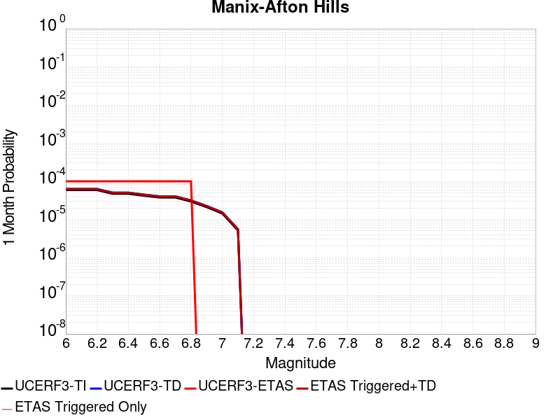 | 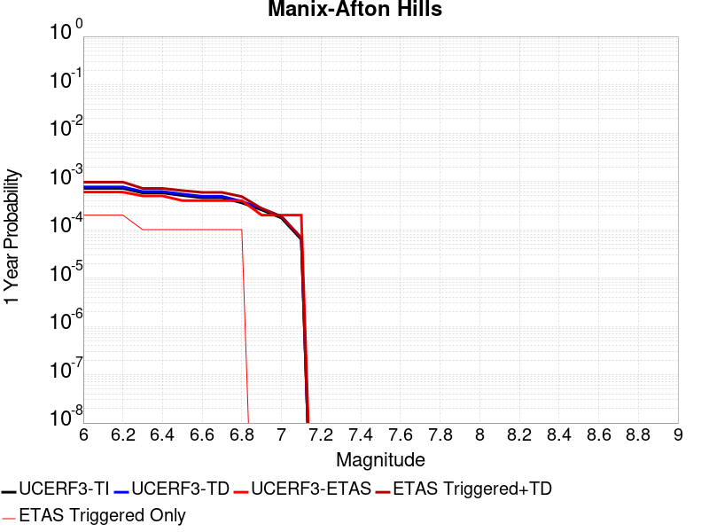 | 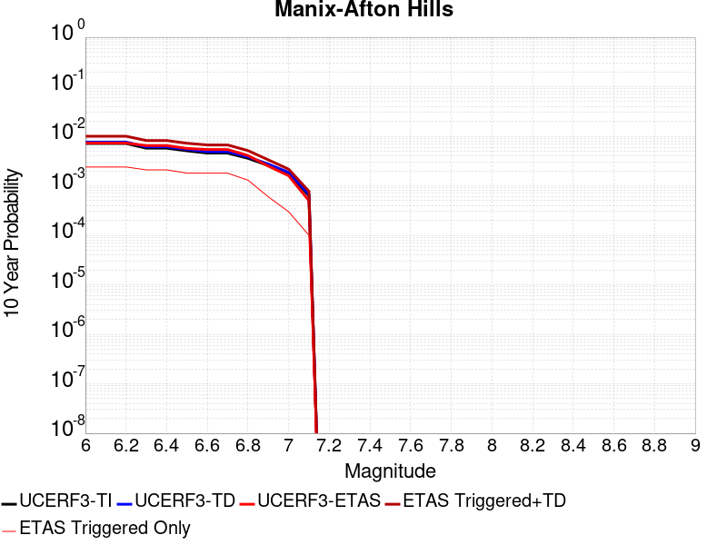 |

| Magnitude | 1 wk TI Prob | 1 wk TD Prob | 1 wk ETAS Prob | 1 wk ETAS/TD Gain | 1 wk ETAS Triggered+TD | 1 wk ETAS Triggered Only | 1 mo TI Prob | 1 mo TD Prob | 1 mo ETAS Prob | 1 mo ETAS/TD Gain | 1 mo ETAS Triggered+TD | 1 mo ETAS Triggered Only | 1 yr TI Prob | 1 yr TD Prob | 1 yr ETAS Prob | 1 yr ETAS/TD Gain | 1 yr ETAS Triggered+TD | 1 yr ETAS Triggered Only | 10 yr TI Prob | 10 yr TD Prob | 10 yr ETAS Prob | 10 yr ETAS/TD Gain | 10 yr ETAS Triggered+TD | 10 yr ETAS Triggered Only |
|-----|-----|-----|-----|-----|-----|-----|-----|-----|-----|-----|-----|-----|-----|-----|-----|-----|-----|-----|-----|-----|-----|-----|-----|-----|
| 6.0 | 1.3783202E-5 | 1.4713133E-5 | 0.0 | 0.0 | 1.4713133E-5 | 0.0 | 5.906953E-5 | 6.305486E-5 | 1.0E-4 | 1.5859206 | 6.305486E-5 | 0.0 | 7.189342E-4 | 7.6744E-4 | 6.0E-4 | 0.78182006 | 9.672865E-4 | 2.0E-4 | 0.0071661277 | 0.0076496545 | 0.0073 | 0.95429146 | 0.010031295 | 0.0024 |
| 6.1 | 1.3783202E-5 | 1.4713133E-5 | 0.0 | 0.0 | 1.4713133E-5 | 0.0 | 5.906953E-5 | 6.305486E-5 | 1.0E-4 | 1.5859206 | 6.305486E-5 | 0.0 | 7.189342E-4 | 7.6744E-4 | 6.0E-4 | 0.78182006 | 9.672865E-4 | 2.0E-4 | 0.0071661277 | 0.0076496545 | 0.0073 | 0.95429146 | 0.010031295 | 0.0024 |
| 6.2 | 1.3783202E-5 | 1.4713133E-5 | 0.0 | 0.0 | 1.4713133E-5 | 0.0 | 5.906953E-5 | 6.305486E-5 | 1.0E-4 | 1.5859206 | 6.305486E-5 | 0.0 | 7.189342E-4 | 7.6744E-4 | 6.0E-4 | 0.78182006 | 9.672865E-4 | 2.0E-4 | 0.0071661277 | 0.0076496545 | 0.0073 | 0.95429146 | 0.010031295 | 0.0024 |
| 6.3 | 1.10494875E-5 | 1.1794774E-5 | 0.0 | 0.0 | 1.1794774E-5 | 0.0 | 4.7354086E-5 | 5.054811E-5 | 1.0E-4 | 1.9783133 | 5.054811E-5 | 0.0 | 5.763835E-4 | 6.152598E-4 | 5.0E-4 | 0.8126648 | 7.151983E-4 | 1.0E-4 | 0.005748908 | 0.0061366055 | 0.0065 | 1.0592176 | 0.008223718 | 0.0021 |
| 6.4 | 1.10494875E-5 | 1.1794774E-5 | 0.0 | 0.0 | 1.1794774E-5 | 0.0 | 4.7354086E-5 | 5.054811E-5 | 1.0E-4 | 1.9783133 | 5.054811E-5 | 0.0 | 5.763835E-4 | 6.152598E-4 | 5.0E-4 | 0.8126648 | 7.151983E-4 | 1.0E-4 | 0.005748908 | 0.0061366055 | 0.0065 | 1.0592176 | 0.008223718 | 0.0021 |
| 6.5 | 9.788949E-6 | 1.0455787E-5 | 0.0 | 0.0 | 1.0455787E-5 | 0.0 | 4.1951964E-5 | 4.4809796E-5 | 1.0E-4 | 2.231655 | 4.4809796E-5 | 0.0 | 5.1064545E-4 | 5.45432E-4 | 4.0E-4 | 0.7333636 | 6.4537744E-4 | 1.0E-4 | 0.0050947363 | 0.0054418603 | 0.0057 | 1.047436 | 0.007232065 | 0.0018 |
| 6.6 | 8.810006E-6 | 9.41496E-6 | 0.0 | 0.0 | 9.41496E-6 | 0.0 | 3.775662E-5 | 4.0349252E-5 | 1.0E-4 | 2.4783607 | 4.0349252E-5 | 0.0 | 4.5958988E-4 | 4.911503E-4 | 4.0E-4 | 0.8144146 | 5.911012E-4 | 1.0E-4 | 0.0045864056 | 0.0049015307 | 0.0054 | 1.1016966 | 0.006692708 | 0.0018 |
| 6.7 | 8.80128E-6 | 9.405438E-6 | 0.0 | 0.0 | 9.405438E-6 | 0.0 | 3.7719226E-5 | 4.0308445E-5 | 1.0E-4 | 2.4808695 | 4.0308445E-5 | 0.0 | 4.591348E-4 | 4.9065374E-4 | 4.0E-4 | 0.8152389 | 5.906047E-4 | 1.0E-4 | 0.004581874 | 0.0048965868 | 0.0054 | 1.1028091 | 0.006687773 | 0.0018 |
| 6.8 | 6.8994877E-6 | 7.3811375E-6 | 0.0 | 0.0 | 7.3811375E-6 | 0.0 | 2.9568899E-5 | 3.163311E-5 | 1.0E-4 | 3.1612449 | 3.163311E-5 | 0.0 | 3.5994186E-4 | 3.8507322E-4 | 4.0E-4 | 1.0387635 | 4.850347E-4 | 1.0E-4 | 0.003593594 | 0.003844865 | 0.0041 | 1.0663574 | 0.0051398664 | 0.0013 |
| 6.9 | 4.9328037E-6 | 5.271708E-6 | 0.0 | 0.0 | 5.271708E-6 | 0.0 | 2.1140417E-5 | 2.2592872E-5 | 0.0 | 0.0 | 2.2592872E-5 | 0.0 | 2.5735417E-4 | 2.7503967E-4 | 2.0E-4 | 0.72716784 | 2.7503967E-4 | 0.0 | 0.0025705635 | 0.0027475979 | 0.0025 | 0.90988564 | 0.0033459493 | 6.0E-4 |
| 7.0 | 3.347973E-6 | 3.5905662E-6 | 0.0 | 0.0 | 3.5905662E-6 | 0.0 | 1.4348378E-5 | 1.5388072E-5 | 0.0 | 0.0 | 1.5388072E-5 | 0.0 | 1.746775E-4 | 1.8733778E-4 | 2.0E-4 | 1.0675904 | 1.8733778E-4 | 0.0 | 0.0017454025 | 0.0018722013 | 0.0016 | 0.85460895 | 0.0021716396 | 3.0E-4 |
| 7.1 | 1.2073567E-6 | 1.2936721E-6 | 0.0 | 0.0 | 1.2936721E-6 | 0.0 | 5.1743755E-6 | 5.544306E-6 | 0.0 | 0.0 | 5.544306E-6 | 0.0 | 6.29962E-5 | 6.7501474E-5 | 2.0E-4 | 2.9628985 | 6.7501474E-5 | 0.0 | 6.297835E-4 | 6.7496987E-4 | 5.0E-4 | 0.7407738 | 7.749024E-4 | 1.0E-4 |

## Paradise
*[(top)](#table-of-contents)*

| 1 Week | 1 Month | 1 Year | 10 Year |
|-----|-----|-----|-----|
| 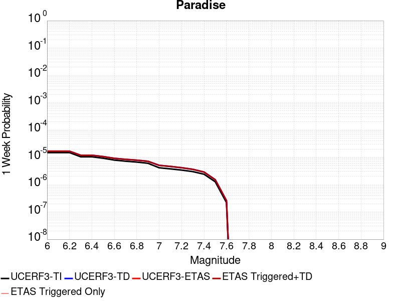 | 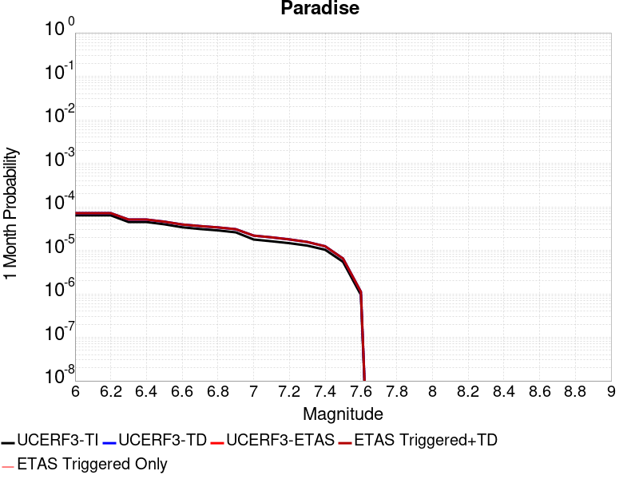 | 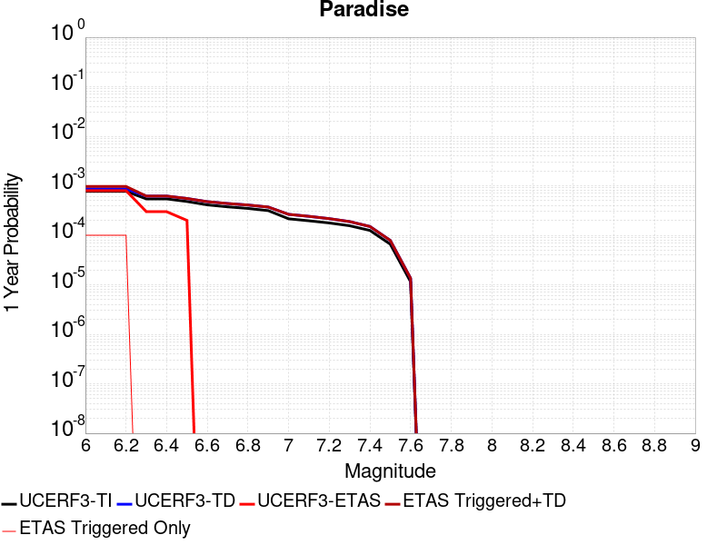 | 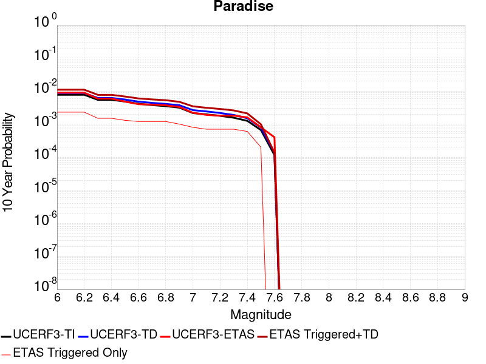 |

| Magnitude | 1 wk TI Prob | 1 wk TD Prob | 1 wk ETAS Prob | 1 wk ETAS/TD Gain | 1 wk ETAS Triggered+TD | 1 wk ETAS Triggered Only | 1 mo TI Prob | 1 mo TD Prob | 1 mo ETAS Prob | 1 mo ETAS/TD Gain | 1 mo ETAS Triggered+TD | 1 mo ETAS Triggered Only | 1 yr TI Prob | 1 yr TD Prob | 1 yr ETAS Prob | 1 yr ETAS/TD Gain | 1 yr ETAS Triggered+TD | 1 yr ETAS Triggered Only | 10 yr TI Prob | 10 yr TD Prob | 10 yr ETAS Prob | 10 yr ETAS/TD Gain | 10 yr ETAS Triggered+TD | 10 yr ETAS Triggered Only |
|-----|-----|-----|-----|-----|-----|-----|-----|-----|-----|-----|-----|-----|-----|-----|-----|-----|-----|-----|-----|-----|-----|-----|-----|-----|
| 6.0 | 1.4851273E-5 | 1.6697657E-5 | 0.0 | 0.0 | 1.6697657E-5 | 0.0 | 6.364676E-5 | 7.155956E-5 | 1.0E-4 | 1.3974373 | 7.155956E-5 | 0.0 | 7.7462377E-4 | 8.70913E-4 | 8.0E-4 | 0.91857624 | 9.708259E-4 | 1.0E-4 | 0.0077192914 | 0.008677379 | 0.0089 | 1.0256553 | 0.010957422 | 0.0023 |
| 6.1 | 1.4851273E-5 | 1.6697657E-5 | 0.0 | 0.0 | 1.6697657E-5 | 0.0 | 6.364676E-5 | 7.155956E-5 | 1.0E-4 | 1.3974373 | 7.155956E-5 | 0.0 | 7.7462377E-4 | 8.70913E-4 | 8.0E-4 | 0.91857624 | 9.708259E-4 | 1.0E-4 | 0.0077192914 | 0.008677379 | 0.0089 | 1.0256553 | 0.010957422 | 0.0023 |
| 6.2 | 1.4851273E-5 | 1.6697657E-5 | 0.0 | 0.0 | 1.6697657E-5 | 0.0 | 6.364676E-5 | 7.155956E-5 | 1.0E-4 | 1.3974373 | 7.155956E-5 | 0.0 | 7.7462377E-4 | 8.70913E-4 | 8.0E-4 | 0.91857624 | 9.708259E-4 | 1.0E-4 | 0.0077192914 | 0.008677379 | 0.0089 | 1.0256553 | 0.010957422 | 0.0023 |
| 6.3 | 1.0426831E-5 | 1.1890731E-5 | 0.0 | 0.0 | 1.1890731E-5 | 0.0 | 4.4685654E-5 | 5.0959316E-5 | 0.0 | 0.0 | 5.0959316E-5 | 0.0 | 5.43912E-4 | 6.20259E-4 | 3.0E-4 | 0.48366895 | 6.20259E-4 | 0.0 | 0.0054258266 | 0.0061858865 | 0.0059 | 0.9537841 | 0.0076766075 | 0.0015 |
| 6.4 | 1.0426831E-5 | 1.1890731E-5 | 0.0 | 0.0 | 1.1890731E-5 | 0.0 | 4.4685654E-5 | 5.0959316E-5 | 0.0 | 0.0 | 5.0959316E-5 | 0.0 | 5.43912E-4 | 6.20259E-4 | 3.0E-4 | 0.48366895 | 6.20259E-4 | 0.0 | 0.0054258266 | 0.0061858865 | 0.0059 | 0.9537841 | 0.0076766075 | 0.0015 |
| 6.5 | 9.25027E-6 | 1.0621866E-5 | 0.0 | 0.0 | 1.0621866E-5 | 0.0 | 3.964341E-5 | 4.5521516E-5 | 0.0 | 0.0 | 4.5521516E-5 | 0.0 | 4.8255164E-4 | 5.540884E-4 | 2.0E-4 | 0.3609532 | 5.540884E-4 | 0.0 | 0.0048150513 | 0.0055275685 | 0.0048 | 0.8683746 | 0.0068203826 | 0.0013 |
| 6.6 | 7.904275E-6 | 9.161175E-6 | 0.0 | 0.0 | 9.161175E-6 | 0.0 | 3.3875025E-5 | 3.926161E-5 | 0.0 | 0.0 | 3.926161E-5 | 0.0 | 4.1235037E-4 | 4.7790917E-4 | 0.0 | 0.0 | 4.7790917E-4 | 0.0 | 0.0041158604 | 0.004769211 | 0.004 | 0.8387131 | 0.005963488 | 0.0012 |
| 6.7 | 7.2061953E-6 | 8.408778E-6 | 0.0 | 0.0 | 8.408778E-6 | 0.0 | 3.088333E-5 | 3.603714E-5 | 0.0 | 0.0 | 3.603714E-5 | 0.0 | 3.7593965E-4 | 4.386675E-4 | 0.0 | 0.0 | 4.386675E-4 | 0.0 | 0.003753043 | 0.0043783854 | 0.0039 | 0.8907393 | 0.005573131 | 0.0012 |
| 6.8 | 6.6948724E-6 | 7.843609E-6 | 0.0 | 0.0 | 7.843609E-6 | 0.0 | 2.8691995E-5 | 3.361505E-5 | 0.0 | 0.0 | 3.361505E-5 | 0.0 | 3.4926904E-4 | 4.0918996E-4 | 0.0 | 0.0 | 4.0918996E-4 | 0.0 | 0.003487206 | 0.004084723 | 0.0037 | 0.9058142 | 0.0052798213 | 0.0012 |
| 6.9 | 6.0421025E-6 | 7.1319555E-6 | 0.0 | 0.0 | 7.1319555E-6 | 0.0 | 2.5894467E-5 | 3.0565185E-5 | 0.0 | 0.0 | 3.0565185E-5 | 0.0 | 3.1521954E-4 | 3.7207096E-4 | 0.0 | 0.0 | 3.7207096E-4 | 0.0 | 0.0031477278 | 0.0037148185 | 0.0033 | 0.8883341 | 0.0047111036 | 0.001 |
| 7.0 | 4.134091E-6 | 5.0813696E-6 | 0.0 | 0.0 | 5.0813696E-6 | 0.0 | 1.7717413E-5 | 2.1777127E-5 | 0.0 | 0.0 | 2.1777127E-5 | 0.0 | 2.1568815E-4 | 2.651058E-4 | 0.0 | 0.0 | 2.651058E-4 | 0.0 | 0.0021547892 | 0.0026480486 | 0.0022 | 0.8308005 | 0.00344593 | 8.0E-4 |
| 7.1 | 3.7674888E-6 | 4.6328596E-6 | 0.0 | 0.0 | 4.6328596E-6 | 0.0 | 1.6146281E-5 | 1.985497E-5 | 0.0 | 0.0 | 1.985497E-5 | 0.0 | 1.9656324E-4 | 2.4170897E-4 | 0.0 | 0.0 | 2.4170897E-4 | 0.0 | 0.0019638946 | 0.0024146114 | 0.0019 | 0.7868761 | 0.0031129213 | 7.0E-4 |
| 7.2 | 3.4065345E-6 | 4.1576454E-6 | 0.0 | 0.0 | 4.1576454E-6 | 0.0 | 1.4599351E-5 | 1.7818367E-5 | 0.0 | 0.0 | 1.7818367E-5 | 0.0 | 1.777326E-4 | 2.1691853E-4 | 0.0 | 0.0 | 2.1691853E-4 | 0.0 | 0.0017759053 | 0.0021672163 | 0.0018 | 0.83055854 | 0.0028656991 | 7.0E-4 |
| 7.3 | 2.9934936E-6 | 3.6299518E-6 | 0.0 | 0.0 | 3.6299518E-6 | 0.0 | 1.2829195E-5 | 1.5556852E-5 | 0.0 | 0.0 | 1.5556852E-5 | 0.0 | 1.5618425E-4 | 1.8938968E-4 | 0.0 | 0.0 | 1.8938968E-4 | 0.0 | 0.0015607453 | 0.0018924283 | 0.0018 | 0.95115894 | 0.0025911035 | 7.0E-4 |
| 7.4 | 2.4049796E-6 | 2.8893344E-6 | 0.0 | 0.0 | 2.8893344E-6 | 0.0 | 1.0307015E-5 | 1.2382811E-5 | 0.0 | 0.0 | 1.2382811E-5 | 0.0 | 1.2548068E-4 | 1.5075174E-4 | 0.0 | 0.0 | 1.5075174E-4 | 0.0 | 0.0012540985 | 0.0015066363 | 0.0016 | 1.0619683 | 0.0021057322 | 6.0E-4 |
| 7.5 | 1.2710091E-6 | 1.5136369E-6 | 0.0 | 0.0 | 1.5136369E-6 | 0.0 | 5.44717E-6 | 6.4870064E-6 | 0.0 | 0.0 | 6.4870064E-6 | 0.0 | 6.631728E-5 | 7.897769E-5 | 0.0 | 0.0 | 7.897769E-5 | 0.0 | 6.6297496E-4 | 7.896189E-4 | 8.0E-4 | 1.013147 | 9.89461E-4 | 2.0E-4 |
| 7.6 | 2.21172E-7 | 2.6041258E-7 | 0.0 | 0.0 | 2.6041258E-7 | 0.0 | 9.478797E-7 | 1.1160537E-6 | 0.0 | 0.0 | 1.1160537E-6 | 0.0 | 1.1540374E-5 | 1.3587897E-5 | 0.0 | 0.0 | 1.3587897E-5 | 0.0 | 1.1539775E-4 | 1.3587347E-4 | 4.0E-4 | 2.9439154 | 1.3587347E-4 | 0.0 |

## Mount Diablo Thrust South
*[(top)](#table-of-contents)*

| 1 Week | 1 Month | 1 Year | 10 Year |
|-----|-----|-----|-----|
| 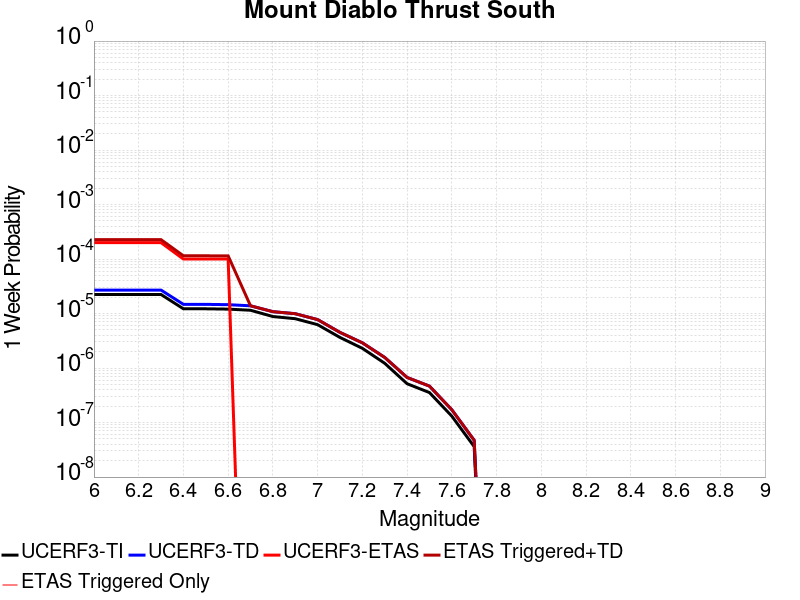 | 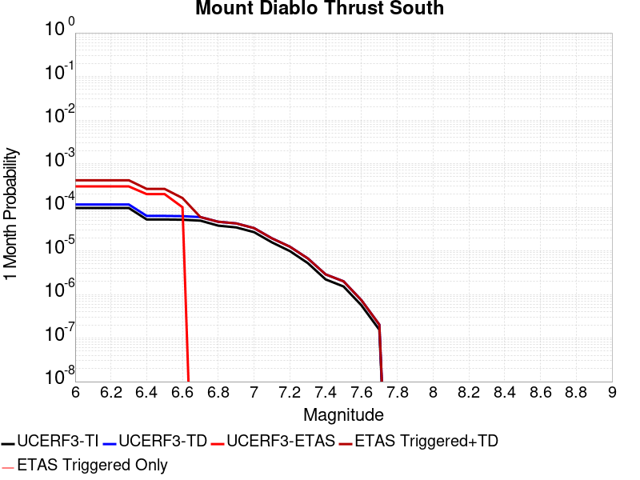 | 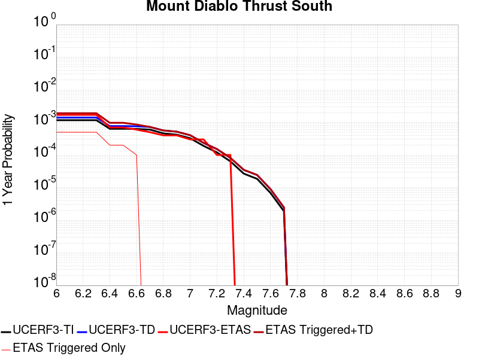 | 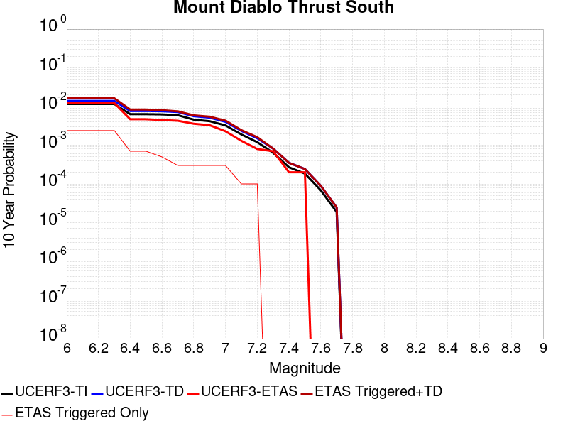 |

| Magnitude | 1 wk TI Prob | 1 wk TD Prob | 1 wk ETAS Prob | 1 wk ETAS/TD Gain | 1 wk ETAS Triggered+TD | 1 wk ETAS Triggered Only | 1 mo TI Prob | 1 mo TD Prob | 1 mo ETAS Prob | 1 mo ETAS/TD Gain | 1 mo ETAS Triggered+TD | 1 mo ETAS Triggered Only | 1 yr TI Prob | 1 yr TD Prob | 1 yr ETAS Prob | 1 yr ETAS/TD Gain | 1 yr ETAS Triggered+TD | 1 yr ETAS Triggered Only | 10 yr TI Prob | 10 yr TD Prob | 10 yr ETAS Prob | 10 yr ETAS/TD Gain | 10 yr ETAS Triggered+TD | 10 yr ETAS Triggered Only |
|-----|-----|-----|-----|-----|-----|-----|-----|-----|-----|-----|-----|-----|-----|-----|-----|-----|-----|-----|-----|-----|-----|-----|-----|-----|
| 6.0 | 2.2377444E-5 | 2.6966321E-5 | 2.0E-4 | 7.416659 | 2.2696092E-4 | 2.0E-4 | 9.5899806E-5 | 1.1556595E-4 | 3.0E-4 | 2.5959203 | 4.1553128E-4 | 3.0E-4 | 0.0011669548 | 0.0014063054 | 0.0017 | 1.2088412 | 0.0019056023 | 5.0E-4 | 0.011608457 | 0.013993892 | 0.0123 | 0.8789549 | 0.016360307 | 0.0024 |
| 6.1 | 2.2377444E-5 | 2.6966321E-5 | 2.0E-4 | 7.416659 | 2.2696092E-4 | 2.0E-4 | 9.5899806E-5 | 1.1556595E-4 | 3.0E-4 | 2.5959203 | 4.1553128E-4 | 3.0E-4 | 0.0011669548 | 0.0014063054 | 0.0017 | 1.2088412 | 0.0019056023 | 5.0E-4 | 0.011608457 | 0.013993892 | 0.0123 | 0.8789549 | 0.016360307 | 0.0024 |
| 6.2 | 2.2377444E-5 | 2.6966321E-5 | 2.0E-4 | 7.416659 | 2.2696092E-4 | 2.0E-4 | 9.5899806E-5 | 1.1556595E-4 | 3.0E-4 | 2.5959203 | 4.1553128E-4 | 3.0E-4 | 0.0011669548 | 0.0014063054 | 0.0017 | 1.2088412 | 0.0019056023 | 5.0E-4 | 0.011608457 | 0.013993892 | 0.0123 | 0.8789549 | 0.016360307 | 0.0024 |
| 6.3 | 2.2377444E-5 | 2.6966321E-5 | 2.0E-4 | 7.416659 | 2.2696092E-4 | 2.0E-4 | 9.5899806E-5 | 1.1556595E-4 | 3.0E-4 | 2.5959203 | 4.1553128E-4 | 3.0E-4 | 0.0011669548 | 0.0014063054 | 0.0017 | 1.2088412 | 0.0019056023 | 5.0E-4 | 0.011608457 | 0.013993892 | 0.0123 | 0.8789549 | 0.016360307 | 0.0024 |
| 6.4 | 1.2228463E-5 | 1.4752696E-5 | 1.0E-4 | 6.778422 | 1.1475122E-4 | 1.0E-4 | 5.2406645E-5 | 6.322438E-5 | 2.0E-4 | 3.1633365 | 2.6321172E-4 | 2.0E-4 | 6.378641E-4 | 7.694979E-4 | 7.0E-4 | 0.9096841 | 9.69344E-4 | 2.0E-4 | 0.0063603627 | 0.007669932 | 0.0047 | 0.6127825 | 0.008364563 | 7.0E-4 |
| 6.5 | 1.2228463E-5 | 1.4752696E-5 | 1.0E-4 | 6.778422 | 1.1475122E-4 | 1.0E-4 | 5.2406645E-5 | 6.322438E-5 | 2.0E-4 | 3.1633365 | 2.6321172E-4 | 2.0E-4 | 6.378641E-4 | 7.694979E-4 | 7.0E-4 | 0.9096841 | 9.69344E-4 | 2.0E-4 | 0.0063603627 | 0.007669932 | 0.0047 | 0.6127825 | 0.008364563 | 7.0E-4 |
| 6.6 | 1.2068118E-5 | 1.4557408E-5 | 1.0E-4 | 6.8693547 | 1.1455595E-4 | 1.0E-4 | 5.1719482E-5 | 6.238747E-5 | 1.0E-4 | 1.602886 | 1.6238123E-4 | 1.0E-4 | 6.2950276E-4 | 7.593156E-4 | 6.0E-4 | 0.7901853 | 8.5923966E-4 | 1.0E-4 | 0.006277225 | 0.0075688073 | 0.0045 | 0.5945454 | 0.008065023 | 5.0E-4 |
| 6.7 | 1.1499428E-5 | 1.3879802E-5 | 0.0 | 0.0 | 1.3879802E-5 | 0.0 | 4.9282335E-5 | 5.9483584E-5 | 0.0 | 0.0 | 5.9483584E-5 | 0.0 | 5.9984723E-4 | 7.2398473E-4 | 5.0E-4 | 0.6906223 | 7.2398473E-4 | 0.0 | 0.0059823063 | 0.0072178426 | 0.0043 | 0.59574586 | 0.0075156773 | 3.0E-4 |
| 6.8 | 8.82118E-6 | 1.0834225E-5 | 0.0 | 0.0 | 1.0834225E-5 | 0.0 | 3.780451E-5 | 4.6431596E-5 | 0.0 | 0.0 | 4.6431596E-5 | 0.0 | 4.601727E-4 | 5.651637E-4 | 4.0E-4 | 0.7077596 | 5.651637E-4 | 0.0 | 0.0045922096 | 0.0056381267 | 0.0036 | 0.6385099 | 0.0059364354 | 3.0E-4 |
| 6.9 | 8.047112E-6 | 9.942913E-6 | 0.0 | 0.0 | 9.942913E-6 | 0.0 | 3.4487166E-5 | 4.2611817E-5 | 0.0 | 0.0 | 4.2611817E-5 | 0.0 | 4.1980037E-4 | 5.1868067E-4 | 4.0E-4 | 0.7711874 | 5.1868067E-4 | 0.0 | 0.004190082 | 0.0051755277 | 0.0033 | 0.63761616 | 0.0054739746 | 3.0E-4 |
| 7.0 | 6.2574763E-6 | 7.751429E-6 | 0.0 | 0.0 | 7.751429E-6 | 0.0 | 2.681748E-5 | 3.3220007E-5 | 0.0 | 0.0 | 3.3220007E-5 | 0.0 | 3.264539E-4 | 4.043822E-4 | 3.0E-4 | 0.7418724 | 4.043822E-4 | 0.0 | 0.0032597475 | 0.0040373355 | 0.0023 | 0.56968266 | 0.0043361243 | 3.0E-4 |
| 7.1 | 3.6485903E-6 | 4.5143206E-6 | 0.0 | 0.0 | 4.5143206E-6 | 0.0 | 1.5636722E-5 | 1.9346948E-5 | 0.0 | 0.0 | 1.9346948E-5 | 0.0 | 1.9036046E-4 | 2.3552404E-4 | 3.0E-4 | 1.2737553 | 2.3552404E-4 | 0.0 | 0.0019019748 | 0.0023528351 | 0.0013 | 0.5525249 | 0.0024525998 | 1.0E-4 |
| 7.2 | 2.3034274E-6 | 2.9060986E-6 | 0.0 | 0.0 | 2.9060986E-6 | 0.0 | 9.871795E-6 | 1.24546505E-5 | 0.0 | 0.0 | 1.24546505E-5 | 0.0 | 1.2018247E-4 | 1.5162506E-4 | 1.0E-4 | 0.6595216 | 1.5162506E-4 | 0.0 | 0.0012011749 | 0.0015153716 | 8.0E-4 | 0.5279233 | 0.0016152201 | 1.0E-4 |
| 7.3 | 1.224035E-6 | 1.5682665E-6 | 0.0 | 0.0 | 1.5682665E-6 | 0.0 | 5.245854E-6 | 6.7211254E-6 | 0.0 | 0.0 | 6.7211254E-6 | 0.0 | 6.38664E-5 | 8.1826736E-5 | 1.0E-4 | 1.2220944 | 8.1826736E-5 | 0.0 | 6.384805E-4 | 8.181049E-4 | 7.0E-4 | 0.855636 | 8.181049E-4 | 0.0 |
| 7.4 | 5.1601154E-7 | 6.724704E-7 | 0.0 | 0.0 | 6.724704E-7 | 0.0 | 2.2114762E-6 | 2.8820127E-6 | 0.0 | 0.0 | 2.8820127E-6 | 0.0 | 2.6924388E-5 | 3.5087956E-5 | 0.0 | 0.0 | 3.5087956E-5 | 0.0 | 2.6921128E-4 | 3.5079857E-4 | 2.0E-4 | 0.5701278 | 3.5079857E-4 | 0.0 |
| 7.5 | 3.552894E-7 | 4.6658042E-7 | 0.0 | 0.0 | 4.6658042E-7 | 0.0 | 1.5226678E-6 | 1.999629E-6 | 0.0 | 0.0 | 1.999629E-6 | 0.0 | 1.8538323E-5 | 2.4345225E-5 | 0.0 | 0.0 | 2.4345225E-5 | 0.0 | 1.8536777E-4 | 2.4344347E-4 | 2.0E-4 | 0.82154596 | 2.4344347E-4 | 0.0 |
| 7.6 | 1.3124082E-7 | 1.7192495E-7 | 0.0 | 0.0 | 1.7192495E-7 | 0.0 | 5.6246057E-7 | 7.3682105E-7 | 0.0 | 0.0 | 7.3682105E-7 | 0.0 | 6.8479358E-6 | 8.970768E-6 | 0.0 | 0.0 | 8.970768E-6 | 0.0 | 6.8477246E-5 | 8.9709305E-5 | 0.0 | 0.0 | 8.9709305E-5 | 0.0 |
| 7.7 | 3.6193022E-8 | 4.7337167E-8 | 0.0 | 0.0 | 4.7337167E-8 | 0.0 | 1.5511293E-7 | 2.0287355E-7 | 0.0 | 0.0 | 2.0287355E-7 | 0.0 | 1.8884983E-6 | 2.4699839E-6 | 0.0 | 0.0 | 2.4699839E-6 | 0.0 | 1.8884823E-5 | 2.470406E-5 | 0.0 | 0.0 | 2.470406E-5 | 0.0 |

## Great Valley 05 Pittsburg - Kirby Hills alt1
*[(top)](#table-of-contents)*

| 1 Week | 1 Month | 1 Year | 10 Year |
|-----|-----|-----|-----|
| 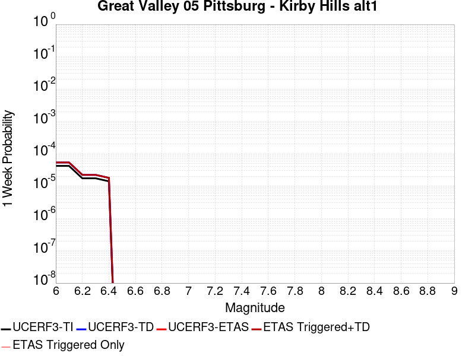 | 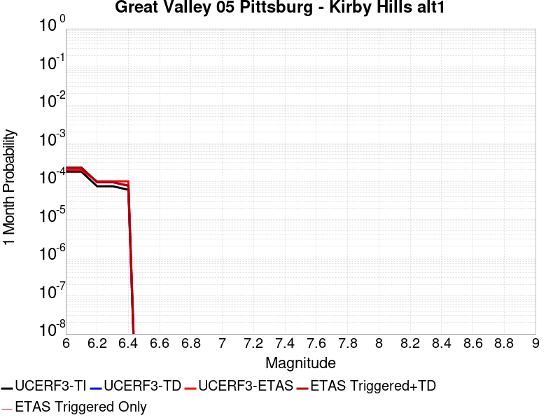 | 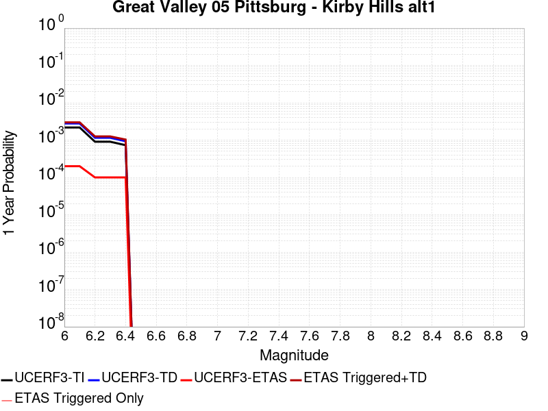 | 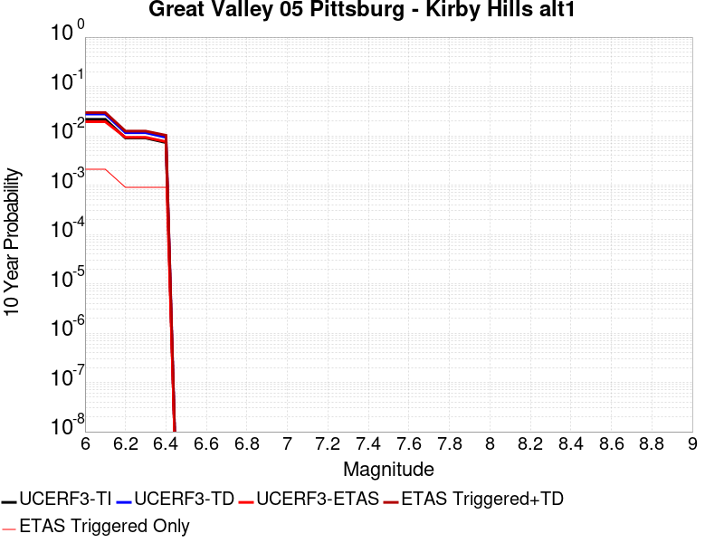 |

| Magnitude | 1 wk TI Prob | 1 wk TD Prob | 1 wk ETAS Prob | 1 wk ETAS/TD Gain | 1 wk ETAS Triggered+TD | 1 wk ETAS Triggered Only | 1 mo TI Prob | 1 mo TD Prob | 1 mo ETAS Prob | 1 mo ETAS/TD Gain | 1 mo ETAS Triggered+TD | 1 mo ETAS Triggered Only | 1 yr TI Prob | 1 yr TD Prob | 1 yr ETAS Prob | 1 yr ETAS/TD Gain | 1 yr ETAS Triggered+TD | 1 yr ETAS Triggered Only | 10 yr TI Prob | 10 yr TD Prob | 10 yr ETAS Prob | 10 yr ETAS/TD Gain | 10 yr ETAS Triggered+TD | 10 yr ETAS Triggered Only |
|-----|-----|-----|-----|-----|-----|-----|-----|-----|-----|-----|-----|-----|-----|-----|-----|-----|-----|-----|-----|-----|-----|-----|-----|-----|
| 6.0 | 4.187212E-5 | 5.347264E-5 | 0.0 | 0.0 | 5.347264E-5 | 0.0 | 1.794396E-4 | 2.2915407E-4 | 2.0E-4 | 0.8727752 | 2.2915407E-4 | 0.0 | 0.002182488 | 0.002787352 | 0.0013 | 0.46639246 | 0.0029867946 | 2.0E-4 | 0.021611776 | 0.027618373 | 0.0193 | 0.69881016 | 0.029660376 | 0.0021 |
| 6.1 | 4.187212E-5 | 5.347264E-5 | 0.0 | 0.0 | 5.347264E-5 | 0.0 | 1.794396E-4 | 2.2915407E-4 | 2.0E-4 | 0.8727752 | 2.2915407E-4 | 0.0 | 0.002182488 | 0.002787352 | 0.0013 | 0.46639246 | 0.0029867946 | 2.0E-4 | 0.021611776 | 0.027618373 | 0.0193 | 0.69881016 | 0.029660376 | 0.0021 |
| 6.2 | 1.7353306E-5 | 2.2167018E-5 | 0.0 | 0.0 | 2.2167018E-5 | 0.0 | 7.436919E-5 | 9.500037E-5 | 1.0E-4 | 1.0526274 | 9.500037E-5 | 0.0 | 9.050688E-4 | 0.0011564026 | 9.0E-4 | 0.77827567 | 0.001256287 | 1.0E-4 | 0.009013915 | 0.011541593 | 0.0093 | 0.80578136 | 0.012431205 | 9.0E-4 |
| 6.3 | 1.7353306E-5 | 2.2167018E-5 | 0.0 | 0.0 | 2.2167018E-5 | 0.0 | 7.436919E-5 | 9.500037E-5 | 1.0E-4 | 1.0526274 | 9.500037E-5 | 0.0 | 9.050688E-4 | 0.0011564026 | 9.0E-4 | 0.77827567 | 0.001256287 | 1.0E-4 | 0.009013915 | 0.011541593 | 0.0093 | 0.80578136 | 0.012431205 | 9.0E-4 |
| 6.4 | 1.4028824E-5 | 1.7911016E-5 | 0.0 | 0.0 | 1.7911016E-5 | 0.0 | 6.0122147E-5 | 7.67615E-5 | 1.0E-4 | 1.3027364 | 7.67615E-5 | 0.0 | 7.3174125E-4 | 9.345508E-4 | 8.0E-4 | 0.8560263 | 0.0010344574 | 1.0E-4 | 0.0072933645 | 0.009343386 | 0.0076 | 0.8134097 | 0.010234976 | 9.0E-4 |

## Rose Canyon
*[(top)](#table-of-contents)*

| 1 Week | 1 Month | 1 Year | 10 Year |
|-----|-----|-----|-----|
| 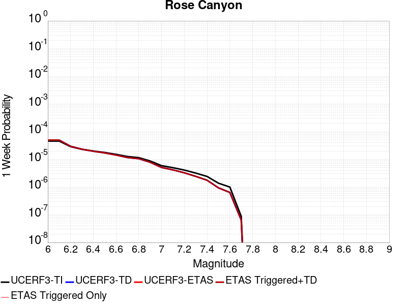 | 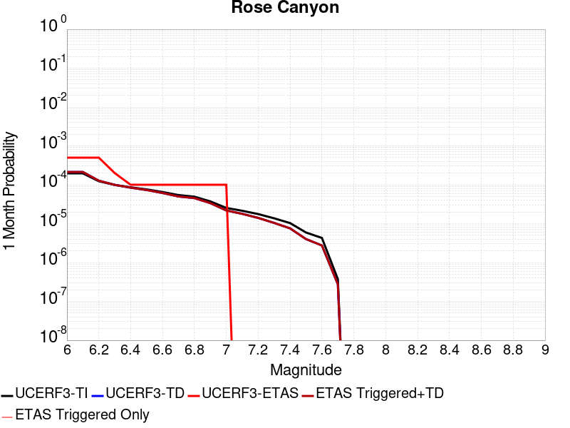 | 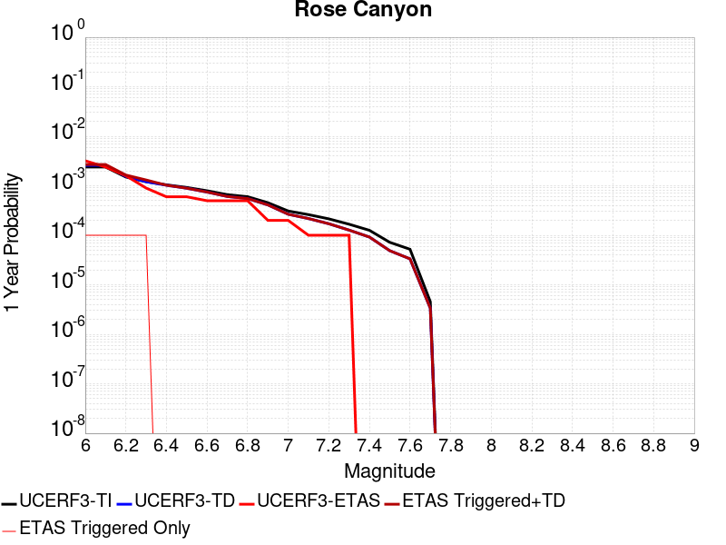 | 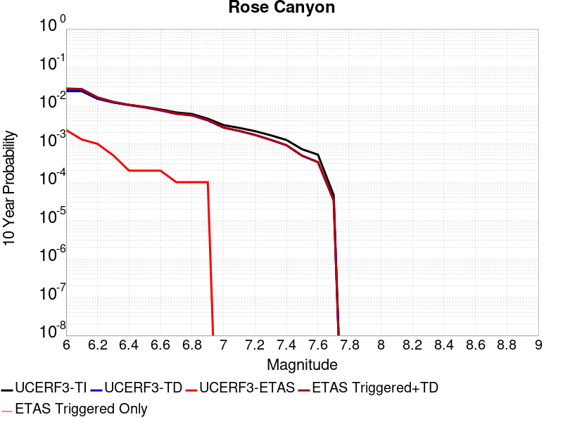 |

| Magnitude | 1 wk TI Prob | 1 wk TD Prob | 1 wk ETAS Prob | 1 wk ETAS/TD Gain | 1 wk ETAS Triggered+TD | 1 wk ETAS Triggered Only | 1 mo TI Prob | 1 mo TD Prob | 1 mo ETAS Prob | 1 mo ETAS/TD Gain | 1 mo ETAS Triggered+TD | 1 mo ETAS Triggered Only | 1 yr TI Prob | 1 yr TD Prob | 1 yr ETAS Prob | 1 yr ETAS/TD Gain | 1 yr ETAS Triggered+TD | 1 yr ETAS Triggered Only | 10 yr TI Prob | 10 yr TD Prob | 10 yr ETAS Prob | 10 yr ETAS/TD Gain | 10 yr ETAS Triggered+TD | 10 yr ETAS Triggered Only |
|-----|-----|-----|-----|-----|-----|-----|-----|-----|-----|-----|-----|-----|-----|-----|-----|-----|-----|-----|-----|-----|-----|-----|-----|-----|
| 6.0 | 4.5923203E-5 | 4.9804585E-5 | 0.0 | 0.0 | 4.9804585E-5 | 0.0 | 1.9679888E-4 | 2.134321E-4 | 5.0E-4 | 2.3426654 | 2.134321E-4 | 0.0 | 0.0023933933 | 0.00259563 | 0.0032 | 1.2328413 | 0.0026953705 | 1.0E-4 | 0.023677798 | 0.025676716 | 0.0263 | 1.0242742 | 0.02791766 | 0.0023 |
| 6.1 | 4.5923203E-5 | 4.9804585E-5 | 0.0 | 0.0 | 4.9804585E-5 | 0.0 | 1.9679888E-4 | 2.134321E-4 | 5.0E-4 | 2.3426654 | 2.134321E-4 | 0.0 | 0.0023933933 | 0.00259563 | 0.0024 | 0.924631 | 0.0026953705 | 1.0E-4 | 0.023677798 | 0.025676716 | 0.0181 | 0.7049188 | 0.026943337 | 0.0013 |
| 6.2 | 2.8844734E-5 | 2.974656E-5 | 0.0 | 0.0 | 2.974656E-5 | 0.0 | 1.2361443E-4 | 1.2747923E-4 | 5.0E-4 | 3.9222078 | 1.2747923E-4 | 0.0 | 0.0015039665 | 0.0015509819 | 0.0016 | 1.0316045 | 0.0016508268 | 1.0E-4 | 0.0149382865 | 0.015403797 | 0.0111 | 0.72060156 | 0.016388392 | 0.001 |
| 6.3 | 2.3171577E-5 | 2.3235023E-5 | 0.0 | 0.0 | 2.3235023E-5 | 0.0 | 9.9302975E-5 | 9.957494E-5 | 2.0E-4 | 2.0085373 | 9.957494E-5 | 0.0 | 0.0012083431 | 0.0012116642 | 9.0E-4 | 0.74278 | 0.001311543 | 1.0E-4 | 0.012017938 | 0.012058047 | 0.008 | 0.6634574 | 0.012552017 | 5.0E-4 |
| 6.4 | 2.0066604E-5 | 1.971361E-5 | 0.0 | 0.0 | 1.971361E-5 | 0.0 | 8.599689E-5 | 8.448423E-5 | 1.0E-4 | 1.1836529 | 8.448423E-5 | 0.0 | 0.0010465092 | 0.0010281202 | 6.0E-4 | 0.5835894 | 0.0010281202 | 0.0 | 0.010415946 | 0.010238782 | 0.0065 | 0.6348412 | 0.010436733 | 2.0E-4 |
| 6.5 | 1.776989E-5 | 1.7142684E-5 | 0.0 | 0.0 | 1.7142684E-5 | 0.0 | 7.615444E-5 | 7.346662E-5 | 1.0E-4 | 1.3611625 | 7.346662E-5 | 0.0 | 9.267859E-4 | 8.94096E-4 | 6.0E-4 | 0.6710689 | 8.94096E-4 | 0.0 | 0.009229303 | 0.008910749 | 0.0055 | 0.6172321 | 0.009108967 | 2.0E-4 |
| 6.6 | 1.5227364E-5 | 1.4350796E-5 | 0.0 | 0.0 | 1.4350796E-5 | 0.0 | 6.52585E-5 | 6.150199E-5 | 1.0E-4 | 1.6259636 | 6.150199E-5 | 0.0 | 7.942326E-4 | 7.485347E-4 | 5.0E-4 | 0.6679717 | 7.485347E-4 | 0.0 | 0.007914 | 0.007457689 | 0.0046 | 0.61681306 | 0.007656197 | 2.0E-4 |
| 6.7 | 1.2703898E-5 | 1.1676818E-5 | 0.0 | 0.0 | 1.1676818E-5 | 0.0 | 5.4444143E-5 | 5.004257E-5 | 1.0E-4 | 1.9982986 | 5.004257E-5 | 0.0 | 6.626558E-4 | 6.091022E-4 | 5.0E-4 | 0.8208803 | 6.091022E-4 | 0.0 | 0.006606833 | 0.0060707247 | 0.0034 | 0.560065 | 0.0061701173 | 1.0E-4 |
| 6.8 | 1.1554917E-5 | 1.0612738E-5 | 0.0 | 0.0 | 1.0612738E-5 | 0.0 | 4.9520135E-5 | 4.5482393E-5 | 1.0E-4 | 2.198653 | 4.5482393E-5 | 0.0 | 6.0274085E-4 | 5.536115E-4 | 5.0E-4 | 0.90316045 | 5.536115E-4 | 0.0 | 0.0060110865 | 0.005511924 | 0.0032 | 0.5805595 | 0.005611373 | 1.0E-4 |
| 6.9 | 8.732078E-6 | 7.883509E-6 | 0.0 | 0.0 | 7.883509E-6 | 0.0 | 3.7422655E-5 | 3.3786047E-5 | 1.0E-4 | 2.9598017 | 3.3786047E-5 | 0.0 | 4.5552556E-4 | 4.1127042E-4 | 2.0E-4 | 0.48629805 | 4.1127042E-4 | 0.0 | 0.0045459294 | 0.004090151 | 0.0023 | 0.56232643 | 0.004189742 | 1.0E-4 |
| 7.0 | 5.9337494E-6 | 5.1083775E-6 | 0.0 | 0.0 | 5.1083775E-6 | 0.0 | 2.5430107E-5 | 2.1892864E-5 | 1.0E-4 | 4.5676985 | 2.1892864E-5 | 0.0 | 3.0956755E-4 | 2.6651315E-4 | 2.0E-4 | 0.750432 | 2.6651315E-4 | 0.0 | 0.0030913667 | 0.0026619511 | 0.0015 | 0.5634965 | 0.0026619511 | 0.0 |
| 7.1 | 5.013409E-6 | 4.178134E-6 | 0.0 | 0.0 | 4.178134E-6 | 0.0 | 2.1485863E-5 | 1.7906166E-5 | 0.0 | 0.0 | 1.7906166E-5 | 0.0 | 2.6155898E-4 | 2.1798587E-4 | 1.0E-4 | 0.45874533 | 2.1798587E-4 | 0.0 | 0.0026125133 | 0.002177732 | 0.0011 | 0.50511265 | 0.002177732 | 0.0 |
| 7.2 | 4.120763E-6 | 3.2827286E-6 | 0.0 | 0.0 | 3.2827286E-6 | 0.0 | 1.7660293E-5 | 1.4068762E-5 | 0.0 | 0.0 | 1.4068762E-5 | 0.0 | 2.1499286E-4 | 1.712738E-4 | 1.0E-4 | 0.58386046 | 1.712738E-4 | 0.0 | 0.0021478499 | 0.0017114276 | 0.001 | 0.58430755 | 0.0017114276 | 0.0 |
| 7.3 | 3.2081239E-6 | 2.4409778E-6 | 0.0 | 0.0 | 2.4409778E-6 | 0.0 | 1.374903E-5 | 1.0461292E-5 | 0.0 | 0.0 | 1.0461292E-5 | 0.0 | 1.6738157E-4 | 1.2735884E-4 | 1.0E-4 | 0.78518295 | 1.2735884E-4 | 0.0 | 0.0016725556 | 0.0012728656 | 6.0E-4 | 0.47137734 | 0.0012728656 | 0.0 |
| 7.4 | 2.4194755E-6 | 1.7683607E-6 | 0.0 | 0.0 | 1.7683607E-6 | 0.0 | 1.0369139E-5 | 7.578667E-6 | 0.0 | 0.0 | 7.578667E-6 | 0.0 | 1.2623696E-4 | 9.226642E-5 | 0.0 | 0.0 | 9.226642E-5 | 0.0 | 0.0012616527 | 9.222864E-4 | 4.0E-4 | 0.43370473 | 9.222864E-4 | 0.0 |
| 7.5 | 1.3842889E-6 | 9.3806466E-7 | 0.0 | 0.0 | 9.3806466E-7 | 0.0 | 5.9326535E-6 | 4.0202713E-6 | 0.0 | 0.0 | 4.0202713E-6 | 0.0 | 7.222766E-5 | 4.8945738E-5 | 0.0 | 0.0 | 4.8945738E-5 | 0.0 | 7.220419E-4 | 4.893531E-4 | 2.0E-4 | 0.40870282 | 4.893531E-4 | 0.0 |
| 7.6 | 1.0021575E-6 | 6.4126624E-7 | 0.0 | 0.0 | 6.4126624E-7 | 0.0 | 4.2949537E-6 | 2.748281E-6 | 0.0 | 0.0 | 2.748281E-6 | 0.0 | 5.2289808E-5 | 3.345983E-5 | 0.0 | 0.0 | 3.345983E-5 | 0.0 | 5.2277505E-4 | 3.3455007E-4 | 2.0E-4 | 0.59781784 | 3.3455007E-4 | 0.0 |
| 7.7 | 8.7620116E-8 | 6.449974E-8 | 0.0 | 0.0 | 6.449974E-8 | 0.0 | 3.7551473E-7 | 2.7642741E-7 | 0.0 | 0.0 | 2.7642741E-7 | 0.0 | 4.5718825E-6 | 3.3654987E-6 | 0.0 | 0.0 | 3.3654987E-6 | 0.0 | 4.5717883E-5 | 3.3654505E-5 | 0.0 | 0.0 | 3.3654505E-5 | 0.0 |

## Elysian Park (Upper)
*[(top)](#table-of-contents)*

| 1 Week | 1 Month | 1 Year | 10 Year |
|-----|-----|-----|-----|
| 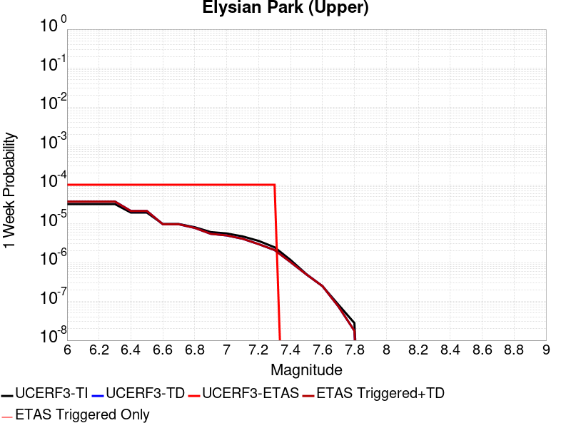 | 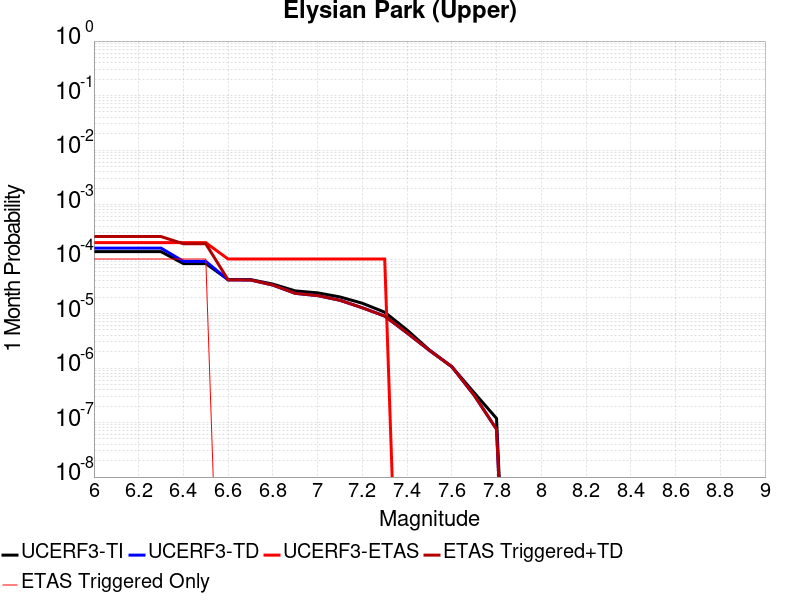 | 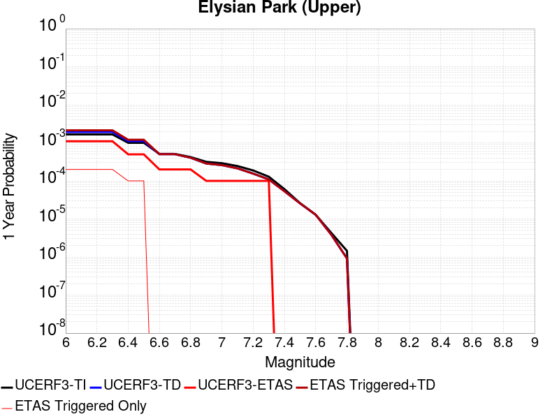 | 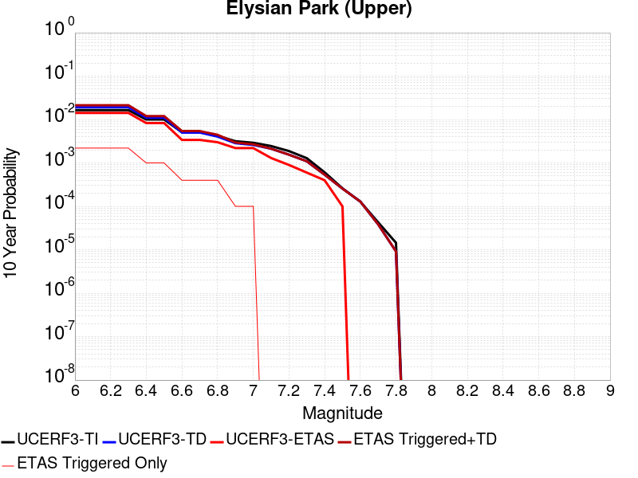 |

| Magnitude | 1 wk TI Prob | 1 wk TD Prob | 1 wk ETAS Prob | 1 wk ETAS/TD Gain | 1 wk ETAS Triggered+TD | 1 wk ETAS Triggered Only | 1 mo TI Prob | 1 mo TD Prob | 1 mo ETAS Prob | 1 mo ETAS/TD Gain | 1 mo ETAS Triggered+TD | 1 mo ETAS Triggered Only | 1 yr TI Prob | 1 yr TD Prob | 1 yr ETAS Prob | 1 yr ETAS/TD Gain | 1 yr ETAS Triggered+TD | 1 yr ETAS Triggered Only | 10 yr TI Prob | 10 yr TD Prob | 10 yr ETAS Prob | 10 yr ETAS/TD Gain | 10 yr ETAS Triggered+TD | 10 yr ETAS Triggered Only |
|-----|-----|-----|-----|-----|-----|-----|-----|-----|-----|-----|-----|-----|-----|-----|-----|-----|-----|-----|-----|-----|-----|-----|-----|-----|
| 6.0 | 3.1876025E-5 | 3.7050868E-5 | 1.0E-4 | 2.698992 | 3.7050868E-5 | 0.0 | 1.3660437E-4 | 1.5878244E-4 | 2.0E-4 | 1.2595851 | 2.5876655E-4 | 1.0E-4 | 0.0016618895 | 0.0019319343 | 0.0011 | 0.56937754 | 0.0021315478 | 2.0E-4 | 0.016495159 | 0.019197866 | 0.0142 | 0.7396655 | 0.02135563 | 0.0022 |
| 6.1 | 3.1876025E-5 | 3.7050868E-5 | 1.0E-4 | 2.698992 | 3.7050868E-5 | 0.0 | 1.3660437E-4 | 1.5878244E-4 | 2.0E-4 | 1.2595851 | 2.5876655E-4 | 1.0E-4 | 0.0016618895 | 0.0019319343 | 0.0011 | 0.56937754 | 0.0021315478 | 2.0E-4 | 0.016495159 | 0.019197866 | 0.0142 | 0.7396655 | 0.02135563 | 0.0022 |
| 6.2 | 3.1876025E-5 | 3.7050868E-5 | 1.0E-4 | 2.698992 | 3.7050868E-5 | 0.0 | 1.3660437E-4 | 1.5878244E-4 | 2.0E-4 | 1.2595851 | 2.5876655E-4 | 1.0E-4 | 0.0016618895 | 0.0019319343 | 0.0011 | 0.56937754 | 0.0021315478 | 2.0E-4 | 0.016495159 | 0.019197866 | 0.0142 | 0.7396655 | 0.02135563 | 0.0022 |
| 6.3 | 3.1876025E-5 | 3.7050868E-5 | 1.0E-4 | 2.698992 | 3.7050868E-5 | 0.0 | 1.3660437E-4 | 1.5878244E-4 | 2.0E-4 | 1.2595851 | 2.5876655E-4 | 1.0E-4 | 0.0016618895 | 0.0019319343 | 0.0011 | 0.56937754 | 0.0021315478 | 2.0E-4 | 0.016495159 | 0.019197866 | 0.0142 | 0.7396655 | 0.02135563 | 0.0022 |
| 6.4 | 1.9273462E-5 | 2.1209802E-5 | 1.0E-4 | 4.7148013 | 2.1209802E-5 | 0.0 | 8.259794E-5 | 9.089689E-5 | 2.0E-4 | 2.2002952 | 1.908878E-4 | 1.0E-4 | 0.001005166 | 0.0011062791 | 5.0E-4 | 0.45196548 | 0.0012061686 | 1.0E-4 | 0.010006315 | 0.01102454 | 0.0083 | 0.75286585 | 0.012013516 | 0.001 |
| 6.5 | 1.9273462E-5 | 2.1209802E-5 | 1.0E-4 | 4.7148013 | 2.1209802E-5 | 0.0 | 8.259794E-5 | 9.089689E-5 | 2.0E-4 | 2.2002952 | 1.908878E-4 | 1.0E-4 | 0.001005166 | 0.0011062791 | 5.0E-4 | 0.45196548 | 0.0012061686 | 1.0E-4 | 0.010006315 | 0.01102454 | 0.0083 | 0.75286585 | 0.012013516 | 0.001 |
| 6.6 | 9.813258E-6 | 9.66773E-6 | 1.0E-4 | 10.343689 | 9.66773E-6 | 0.0 | 4.205614E-5 | 4.143251E-5 | 1.0E-4 | 2.4135635 | 4.143251E-5 | 0.0 | 5.119132E-4 | 5.043313E-4 | 2.0E-4 | 0.3965647 | 5.043313E-4 | 0.0 | 0.005107356 | 0.005032592 | 0.0034 | 0.6755962 | 0.005430579 | 4.0E-4 |
| 6.7 | 9.801478E-6 | 9.6552985E-6 | 1.0E-4 | 10.357008 | 9.6552985E-6 | 0.0 | 4.2005657E-5 | 4.1379233E-5 | 1.0E-4 | 2.416671 | 4.1379233E-5 | 0.0 | 5.112989E-4 | 5.03683E-4 | 2.0E-4 | 0.39707518 | 5.03683E-4 | 0.0 | 0.0051012407 | 0.005026138 | 0.0034 | 0.6764637 | 0.0054241274 | 4.0E-4 |
| 6.8 | 8.102489E-6 | 7.77472E-6 | 1.0E-4 | 12.8622 | 7.77472E-6 | 0.0 | 3.4724493E-5 | 3.331983E-5 | 1.0E-4 | 3.001216 | 3.331983E-5 | 0.0 | 4.2268867E-4 | 4.0559837E-4 | 2.0E-4 | 0.49309862 | 4.0559837E-4 | 0.0 | 0.004218856 | 0.0040490753 | 0.003 | 0.7409099 | 0.0044474555 | 4.0E-4 |
| 6.9 | 6.08275E-6 | 5.4825314E-6 | 1.0E-4 | 18.23975 | 5.4825314E-6 | 0.0 | 2.6068668E-5 | 2.3496355E-5 | 1.0E-4 | 4.255979 | 2.3496355E-5 | 0.0 | 3.173398E-4 | 2.8603134E-4 | 1.0E-4 | 0.34961203 | 2.8603134E-4 | 0.0 | 0.0031688702 | 0.0028567098 | 0.0022 | 0.77011675 | 0.002956424 | 1.0E-4 |
| 7.0 | 5.5995934E-6 | 4.9837677E-6 | 1.0E-4 | 20.06514 | 4.9837677E-6 | 0.0 | 2.3998036E-5 | 2.1358834E-5 | 1.0E-4 | 4.681904 | 2.1358834E-5 | 0.0 | 2.9213692E-4 | 2.6001342E-4 | 1.0E-4 | 0.3845955 | 2.6001342E-4 | 0.0 | 0.0029175316 | 0.0025971595 | 0.0022 | 0.8470793 | 0.0026968997 | 1.0E-4 |
| 7.1 | 4.709881E-6 | 4.0882296E-6 | 1.0E-4 | 24.460466 | 4.0882296E-6 | 0.0 | 2.0185047E-5 | 1.7520868E-5 | 1.0E-4 | 5.70748 | 1.7520868E-5 | 0.0 | 2.4572524E-4 | 2.132961E-4 | 1.0E-4 | 0.46883184 | 2.132961E-4 | 0.0 | 0.002454537 | 0.0021309552 | 0.0013 | 0.610055 | 0.0021309552 | 0.0 |
| 7.2 | 3.6063436E-6 | 2.9785758E-6 | 1.0E-4 | 33.573093 | 2.9785758E-6 | 0.0 | 1.5455667E-5 | 1.2765263E-5 | 1.0E-4 | 7.8337593 | 1.2765263E-5 | 0.0 | 1.881565E-4 | 1.554061E-4 | 1.0E-4 | 0.64347535 | 1.554061E-4 | 0.0 | 0.0018799726 | 0.0015529855 | 9.0E-4 | 0.5795289 | 0.0015529855 | 0.0 |
| 7.3 | 2.471135E-6 | 2.095942E-6 | 1.0E-4 | 47.711246 | 2.095942E-6 | 0.0 | 1.0590536E-5 | 8.982577E-6 | 1.0E-4 | 11.132663 | 8.982577E-6 | 0.0 | 1.2893214E-4 | 1.0935746E-4 | 1.0E-4 | 0.91443235 | 1.0935746E-4 | 0.0 | 0.0012885736 | 0.0010930437 | 6.0E-4 | 0.5489259 | 0.0010930437 | 0.0 |
| 7.4 | 1.163943E-6 | 1.0278268E-6 | 0.0 | 0.0 | 1.0278268E-6 | 0.0 | 4.988318E-6 | 4.4049643E-6 | 0.0 | 0.0 | 4.4049643E-6 | 0.0 | 6.0731076E-5 | 5.362915E-5 | 0.0 | 0.0 | 5.362915E-5 | 0.0 | 6.071448E-4 | 5.361651E-4 | 4.0E-4 | 0.7460389 | 5.361651E-4 | 0.0 |
| 7.5 | 4.99459E-7 | 4.9188264E-7 | 0.0 | 0.0 | 4.9188264E-7 | 0.0 | 2.140537E-6 | 2.1080668E-6 | 0.0 | 0.0 | 2.1080668E-6 | 0.0 | 2.6060725E-5 | 2.5665428E-5 | 0.0 | 0.0 | 2.5665428E-5 | 0.0 | 2.605767E-4 | 2.566262E-4 | 1.0E-4 | 0.3896718 | 2.566262E-4 | 0.0 |
| 7.6 | 2.4667852E-7 | 2.4783594E-7 | 0.0 | 0.0 | 2.4783594E-7 | 0.0 | 1.0571932E-6 | 1.0621536E-6 | 0.0 | 0.0 | 1.0621536E-6 | 0.0 | 1.2871251E-5 | 1.2931647E-5 | 0.0 | 0.0 | 1.2931647E-5 | 0.0 | 1.2870505E-4 | 1.2930931E-4 | 0.0 | 0.0 | 1.2930931E-4 | 0.0 |
| 7.7 | 8.2312795E-8 | 7.3892984E-8 | 0.0 | 0.0 | 7.3892984E-8 | 0.0 | 3.527691E-7 | 3.1668418E-7 | 0.0 | 0.0 | 3.1668418E-7 | 0.0 | 4.294955E-6 | 3.8556245E-6 | 0.0 | 0.0 | 3.8556245E-6 | 0.0 | 4.2948723E-5 | 3.8555692E-5 | 0.0 | 0.0 | 3.8555692E-5 | 0.0 |
| 7.8 | 2.7819295E-8 | 1.7585963E-8 | 0.0 | 0.0 | 1.7585963E-8 | 0.0 | 1.1922555E-7 | 7.536841E-8 | 0.0 | 0.0 | 7.536841E-8 | 0.0 | 1.45157E-6 | 9.176102E-7 | 0.0 | 0.0 | 9.176102E-7 | 0.0 | 1.45156055E-5 | 9.1760785E-6 | 0.0 | 0.0 | 9.1760785E-6 | 0.0 |

## So Sierra Nevada
*[(top)](#table-of-contents)*

| 1 Week | 1 Month | 1 Year | 10 Year |
|-----|-----|-----|-----|
| 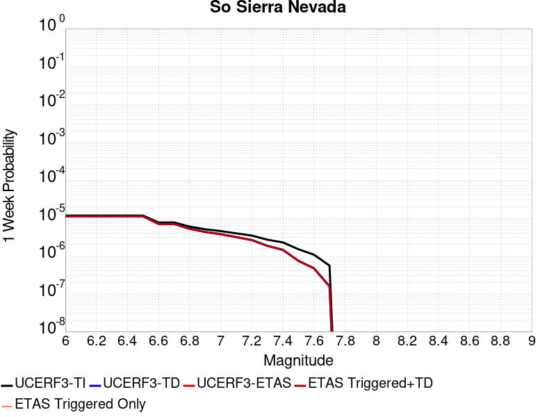 | 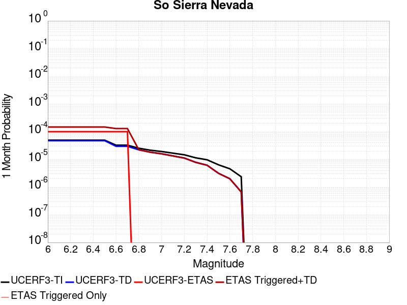 | 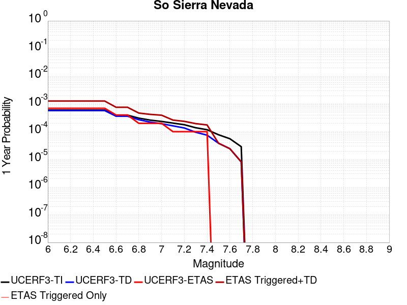 | 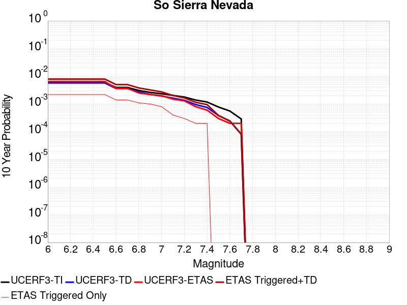 |

| Magnitude | 1 wk TI Prob | 1 wk TD Prob | 1 wk ETAS Prob | 1 wk ETAS/TD Gain | 1 wk ETAS Triggered+TD | 1 wk ETAS Triggered Only | 1 mo TI Prob | 1 mo TD Prob | 1 mo ETAS Prob | 1 mo ETAS/TD Gain | 1 mo ETAS Triggered+TD | 1 mo ETAS Triggered Only | 1 yr TI Prob | 1 yr TD Prob | 1 yr ETAS Prob | 1 yr ETAS/TD Gain | 1 yr ETAS Triggered+TD | 1 yr ETAS Triggered Only | 10 yr TI Prob | 10 yr TD Prob | 10 yr ETAS Prob | 10 yr ETAS/TD Gain | 10 yr ETAS Triggered+TD | 10 yr ETAS Triggered Only |
|-----|-----|-----|-----|-----|-----|-----|-----|-----|-----|-----|-----|-----|-----|-----|-----|-----|-----|-----|-----|-----|-----|-----|-----|-----|
| 6.0 | 1.15488665E-5 | 1.1080848E-5 | 0.0 | 0.0 | 1.1080848E-5 | 0.0 | 4.9494203E-5 | 4.7488556E-5 | 1.0E-4 | 2.1057706 | 1.474838E-4 | 1.0E-4 | 6.024253E-4 | 5.780325E-4 | 0.0012 | 2.0760076 | 0.0012776279 | 7.0E-4 | 0.006007948 | 0.00576656 | 0.0065 | 1.1271886 | 0.007953873 | 0.0022 |
| 6.1 | 1.15488665E-5 | 1.1080848E-5 | 0.0 | 0.0 | 1.1080848E-5 | 0.0 | 4.9494203E-5 | 4.7488556E-5 | 1.0E-4 | 2.1057706 | 1.474838E-4 | 1.0E-4 | 6.024253E-4 | 5.780325E-4 | 0.0012 | 2.0760076 | 0.0012776279 | 7.0E-4 | 0.006007948 | 0.00576656 | 0.0065 | 1.1271886 | 0.007953873 | 0.0022 |
| 6.2 | 1.15488665E-5 | 1.1080848E-5 | 0.0 | 0.0 | 1.1080848E-5 | 0.0 | 4.9494203E-5 | 4.7488556E-5 | 1.0E-4 | 2.1057706 | 1.474838E-4 | 1.0E-4 | 6.024253E-4 | 5.780325E-4 | 0.0012 | 2.0760076 | 0.0012776279 | 7.0E-4 | 0.006007948 | 0.00576656 | 0.0065 | 1.1271886 | 0.007953873 | 0.0022 |
| 6.3 | 1.15488665E-5 | 1.1080848E-5 | 0.0 | 0.0 | 1.1080848E-5 | 0.0 | 4.9494203E-5 | 4.7488556E-5 | 1.0E-4 | 2.1057706 | 1.474838E-4 | 1.0E-4 | 6.024253E-4 | 5.780325E-4 | 0.0012 | 2.0760076 | 0.0012776279 | 7.0E-4 | 0.006007948 | 0.00576656 | 0.0065 | 1.1271886 | 0.007953873 | 0.0022 |
| 6.4 | 1.15488665E-5 | 1.1080848E-5 | 0.0 | 0.0 | 1.1080848E-5 | 0.0 | 4.9494203E-5 | 4.7488556E-5 | 1.0E-4 | 2.1057706 | 1.474838E-4 | 1.0E-4 | 6.024253E-4 | 5.780325E-4 | 0.0012 | 2.0760076 | 0.0012776279 | 7.0E-4 | 0.006007948 | 0.00576656 | 0.0065 | 1.1271886 | 0.007953873 | 0.0022 |
| 6.5 | 1.15488665E-5 | 1.1080848E-5 | 0.0 | 0.0 | 1.1080848E-5 | 0.0 | 4.9494203E-5 | 4.7488556E-5 | 1.0E-4 | 2.1057706 | 1.474838E-4 | 1.0E-4 | 6.024253E-4 | 5.780325E-4 | 0.0012 | 2.0760076 | 0.0012776279 | 7.0E-4 | 0.006007948 | 0.00576656 | 0.0065 | 1.1271886 | 0.007953873 | 0.0022 |
| 6.6 | 7.587044E-6 | 6.9364473E-6 | 0.0 | 0.0 | 6.9364473E-6 | 0.0 | 3.2515498E-5 | 2.9727309E-5 | 1.0E-4 | 3.3639104 | 1.2972433E-4 | 1.0E-4 | 3.9580427E-4 | 3.618728E-4 | 7.0E-4 | 1.9343814 | 7.6172804E-4 | 4.0E-4 | 0.003951 | 0.003613127 | 0.0037 | 1.0240437 | 0.005008069 | 0.0014 |
| 6.7 | 7.587044E-6 | 6.9364473E-6 | 0.0 | 0.0 | 6.9364473E-6 | 0.0 | 3.2515498E-5 | 2.9727309E-5 | 1.0E-4 | 3.3639104 | 1.2972433E-4 | 1.0E-4 | 3.9580427E-4 | 3.618728E-4 | 7.0E-4 | 1.9343814 | 7.6172804E-4 | 4.0E-4 | 0.003951 | 0.003613127 | 0.0037 | 1.0240437 | 0.005008069 | 0.0014 |
| 6.8 | 5.9026956E-6 | 5.1800503E-6 | 0.0 | 0.0 | 5.1800503E-6 | 0.0 | 2.5297022E-5 | 2.2200033E-5 | 0.0 | 0.0 | 2.2200033E-5 | 0.0 | 3.0794772E-4 | 2.7025305E-4 | 5.0E-4 | 1.8501179 | 4.7019898E-4 | 2.0E-4 | 0.0030752132 | 0.00269936 | 0.0025 | 0.92614543 | 0.0037963907 | 0.0011 |
| 6.9 | 5.0118915E-6 | 4.253005E-6 | 0.0 | 0.0 | 4.253005E-6 | 0.0 | 2.1479358E-5 | 1.8227041E-5 | 0.0 | 0.0 | 1.8227041E-5 | 0.0 | 2.614798E-4 | 2.2189236E-4 | 5.0E-4 | 2.2533448 | 4.2184797E-4 | 2.0E-4 | 0.0026117235 | 0.0022167806 | 0.0022 | 0.99243015 | 0.003214564 | 0.001 |
| 7.0 | 4.4924795E-6 | 3.7144562E-6 | 0.0 | 0.0 | 3.7144562E-6 | 0.0 | 1.925334E-5 | 1.5919004E-5 | 0.0 | 0.0 | 1.5919004E-5 | 0.0 | 2.3438422E-4 | 1.9379727E-4 | 5.0E-4 | 2.5800157 | 3.937585E-4 | 2.0E-4 | 0.0023413717 | 0.0019363456 | 0.002 | 1.0328735 | 0.0027347966 | 8.0E-4 |
| 7.1 | 3.9118436E-6 | 3.1124666E-6 | 0.0 | 0.0 | 3.1124666E-6 | 0.0 | 1.6764936E-5 | 1.3339078E-5 | 0.0 | 0.0 | 1.3339078E-5 | 0.0 | 2.0409399E-4 | 1.6239173E-4 | 3.0E-4 | 1.8473846 | 2.623755E-4 | 1.0E-4 | 0.0020390663 | 0.0016227869 | 0.0015 | 0.92433584 | 0.0020221376 | 4.0E-4 |
| 7.2 | 3.4200818E-6 | 2.6059038E-6 | 0.0 | 0.0 | 2.6059038E-6 | 0.0 | 1.4657411E-5 | 1.1168115E-5 | 0.0 | 0.0 | 1.1168115E-5 | 0.0 | 1.7843937E-4 | 1.3596381E-4 | 3.0E-4 | 2.2064695 | 2.3595023E-4 | 1.0E-4 | 0.0017829615 | 0.001358856 | 0.0013 | 0.9566871 | 0.0016584484 | 3.0E-4 |
| 7.3 | 2.6593618E-6 | 1.8288101E-6 | 0.0 | 0.0 | 1.8288101E-6 | 0.0 | 1.13972155E-5 | 7.837736E-6 | 0.0 | 0.0 | 7.837736E-6 | 0.0 | 1.3875226E-4 | 9.542055E-5 | 1.0E-4 | 1.0479922 | 1.95411E-4 | 1.0E-4 | 0.0013866565 | 9.538247E-4 | 8.0E-4 | 0.83872855 | 0.0011536339 | 2.0E-4 |
| 7.4 | 2.2577992E-6 | 1.4367916E-6 | 0.0 | 0.0 | 1.4367916E-6 | 0.0 | 9.676246E-6 | 6.157665E-6 | 0.0 | 0.0 | 6.157665E-6 | 0.0 | 1.1780193E-4 | 7.4967254E-5 | 1.0E-4 | 1.3339158 | 1.7495976E-4 | 1.0E-4 | 0.001177395 | 7.4944465E-4 | 6.0E-4 | 0.8005928 | 9.492948E-4 | 2.0E-4 |
| 7.5 | 1.489319E-6 | 7.356678E-7 | 0.0 | 0.0 | 7.356678E-7 | 0.0 | 6.3827797E-6 | 3.1528582E-6 | 0.0 | 0.0 | 3.1528582E-6 | 0.0 | 7.770758E-5 | 3.8385377E-5 | 0.0 | 0.0 | 3.8385377E-5 | 0.0 | 7.7680405E-4 | 3.837879E-4 | 3.0E-4 | 0.7816818 | 3.837879E-4 | 0.0 |
| 7.6 | 1.0680322E-6 | 4.6616506E-7 | 0.0 | 0.0 | 4.6616506E-7 | 0.0 | 4.577273E-6 | 1.9978488E-6 | 0.0 | 0.0 | 1.9978488E-6 | 0.0 | 5.5726876E-5 | 2.4323539E-5 | 0.0 | 0.0 | 2.4323539E-5 | 0.0 | 5.5712904E-4 | 2.4320904E-4 | 2.0E-4 | 0.82233787 | 2.4320904E-4 | 0.0 |
| 7.7 | 5.509146E-7 | 1.559012E-7 | 0.0 | 0.0 | 1.559012E-7 | 0.0 | 2.3610605E-6 | 6.6814783E-7 | 0.0 | 0.0 | 6.6814783E-7 | 0.0 | 2.8745531E-5 | 8.134671E-6 | 0.0 | 0.0 | 8.134671E-6 | 0.0 | 2.8741814E-4 | 8.1343846E-5 | 2.0E-4 | 2.4586985 | 8.1343846E-5 | 0.0 |

## San Diego Trough north alt1
*[(top)](#table-of-contents)*

| 1 Week | 1 Month | 1 Year | 10 Year |
|-----|-----|-----|-----|
| 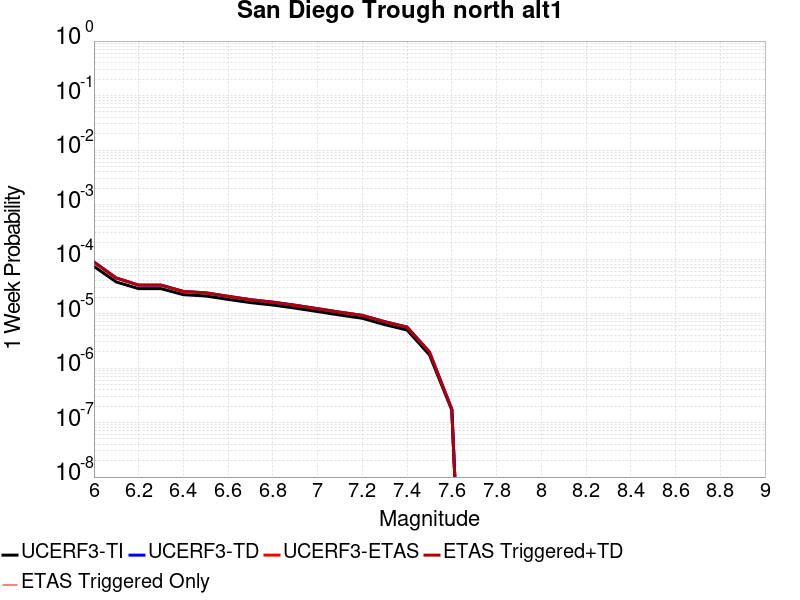 | 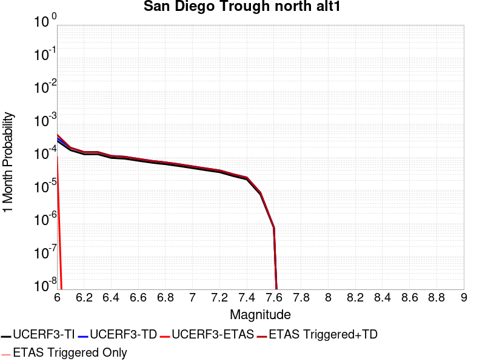 | 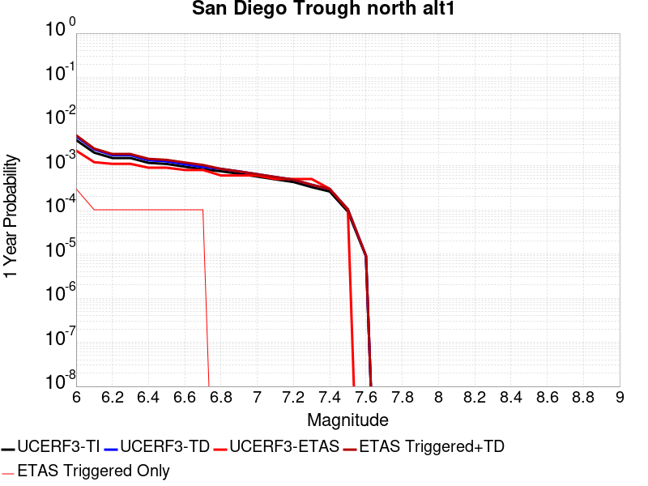 | 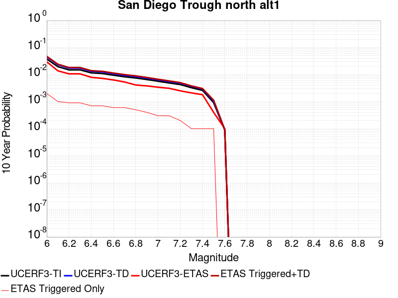 |

| Magnitude | 1 wk TI Prob | 1 wk TD Prob | 1 wk ETAS Prob | 1 wk ETAS/TD Gain | 1 wk ETAS Triggered+TD | 1 wk ETAS Triggered Only | 1 mo TI Prob | 1 mo TD Prob | 1 mo ETAS Prob | 1 mo ETAS/TD Gain | 1 mo ETAS Triggered+TD | 1 mo ETAS Triggered Only | 1 yr TI Prob | 1 yr TD Prob | 1 yr ETAS Prob | 1 yr ETAS/TD Gain | 1 yr ETAS Triggered+TD | 1 yr ETAS Triggered Only | 10 yr TI Prob | 10 yr TD Prob | 10 yr ETAS Prob | 10 yr ETAS/TD Gain | 10 yr ETAS Triggered+TD | 10 yr ETAS Triggered Only |
|-----|-----|-----|-----|-----|-----|-----|-----|-----|-----|-----|-----|-----|-----|-----|-----|-----|-----|-----|-----|-----|-----|-----|-----|-----|
| 6.0 | 7.329252E-5 | 8.8249995E-5 | 0.0 | 0.0 | 8.8249995E-5 | 0.0 | 3.14073E-4 | 3.7816292E-4 | 2.0E-4 | 0.5288726 | 4.781251E-4 | 1.0E-4 | 0.0038171355 | 0.004594981 | 0.0022 | 0.47878322 | 0.004893603 | 3.0E-4 | 0.03752231 | 0.04506364 | 0.0297 | 0.6590679 | 0.04697351 | 0.002 |
| 6.1 | 3.7940346E-5 | 4.4902074E-5 | 0.0 | 0.0 | 4.4902074E-5 | 0.0 | 1.6259136E-4 | 1.9242366E-4 | 0.0 | 0.0 | 1.9242366E-4 | 0.0 | 0.0019777524 | 0.0023403226 | 0.0012 | 0.5127498 | 0.0024400887 | 1.0E-4 | 0.019602431 | 0.023165442 | 0.0137 | 0.5913982 | 0.024142276 | 0.001 |
| 6.2 | 2.8645263E-5 | 3.330801E-5 | 0.0 | 0.0 | 3.330801E-5 | 0.0 | 1.2275964E-4 | 1.4274092E-4 | 0.0 | 0.0 | 1.4274092E-4 | 0.0 | 0.0014935739 | 0.0017365083 | 0.0011 | 0.63345504 | 0.0018363347 | 1.0E-4 | 0.0148357535 | 0.017232046 | 0.0106 | 0.615133 | 0.018116537 | 9.0E-4 |
| 6.3 | 2.8645263E-5 | 3.330801E-5 | 0.0 | 0.0 | 3.330801E-5 | 0.0 | 1.2275964E-4 | 1.4274092E-4 | 0.0 | 0.0 | 1.4274092E-4 | 0.0 | 0.0014935739 | 0.0017365083 | 0.0011 | 0.63345504 | 0.0018363347 | 1.0E-4 | 0.0148357535 | 0.017232046 | 0.0106 | 0.615133 | 0.018116537 | 9.0E-4 |
| 6.4 | 2.2204576E-5 | 2.5456064E-5 | 0.0 | 0.0 | 2.5456064E-5 | 0.0 | 9.5159E-5 | 1.090929E-4 | 0.0 | 0.0 | 1.090929E-4 | 0.0 | 0.001157945 | 0.0013274061 | 9.0E-4 | 0.67801404 | 0.0014272734 | 1.0E-4 | 0.011519298 | 0.013195943 | 0.0079 | 0.5986689 | 0.013886706 | 7.0E-4 |
| 6.5 | 2.1004838E-5 | 2.4031884E-5 | 0.0 | 0.0 | 2.4031884E-5 | 0.0 | 9.0017624E-5 | 1.0298977E-4 | 0.0 | 0.0 | 1.0298977E-4 | 0.0 | 0.0010954136 | 0.0012531881 | 9.0E-4 | 0.7181683 | 0.0013530628 | 1.0E-4 | 0.010900296 | 0.012462295 | 0.0072 | 0.5777427 | 0.013153572 | 7.0E-4 |
| 6.6 | 1.820557E-5 | 2.07107E-5 | 0.0 | 0.0 | 2.07107E-5 | 0.0 | 7.802154E-5 | 8.8757144E-5 | 0.0 | 0.0 | 8.8757144E-5 | 0.0 | 9.4949827E-4 | 0.001080088 | 8.0E-4 | 0.74068046 | 0.0011799799 | 1.0E-4 | 0.009454516 | 0.010749055 | 0.0063 | 0.586098 | 0.011342606 | 6.0E-4 |
| 6.7 | 1.5884485E-5 | 1.7988585E-5 | 0.0 | 0.0 | 1.7988585E-5 | 0.0 | 6.807459E-5 | 7.709167E-5 | 0.0 | 0.0 | 7.709167E-5 | 0.0 | 8.284929E-4 | 9.381896E-4 | 8.0E-4 | 0.8527061 | 0.0010380958 | 1.0E-4 | 0.008254109 | 0.009342656 | 0.0053 | 0.5672905 | 0.00993705 | 6.0E-4 |
| 6.8 | 1.4331171E-5 | 1.6205453E-5 | 0.0 | 0.0 | 1.6205453E-5 | 0.0 | 6.141786E-5 | 6.94501E-5 | 0.0 | 0.0 | 6.94501E-5 | 0.0 | 7.4750587E-4 | 8.4522896E-4 | 6.0E-4 | 0.7098668 | 8.4522896E-4 | 0.0 | 0.0074499645 | 0.00842041 | 0.0041 | 0.4869122 | 0.008916199 | 5.0E-4 |
| 6.9 | 1.2574203E-5 | 1.4209658E-5 | 0.0 | 0.0 | 1.4209658E-5 | 0.0 | 5.3888325E-5 | 6.089712E-5 | 0.0 | 0.0 | 6.089712E-5 | 0.0 | 6.558929E-4 | 7.4117165E-4 | 6.0E-4 | 0.8095291 | 7.4117165E-4 | 0.0 | 0.0065396037 | 0.0073871836 | 0.0038 | 0.5144045 | 0.0077842283 | 4.0E-4 |
| 7.0 | 1.0883844E-5 | 1.2292552E-5 | 0.0 | 0.0 | 1.2292552E-5 | 0.0 | 4.664421E-5 | 5.268131E-5 | 0.0 | 0.0 | 5.268131E-5 | 0.0 | 5.677453E-4 | 6.4120715E-4 | 6.0E-4 | 0.935735 | 6.4120715E-4 | 0.0 | 0.00566297 | 0.006393699 | 0.0034 | 0.53177357 | 0.006691781 | 3.0E-4 |
| 7.1 | 9.393088E-6 | 1.0609864E-5 | 0.0 | 0.0 | 1.0609864E-5 | 0.0 | 4.025547E-5 | 4.547006E-5 | 0.0 | 0.0 | 4.547006E-5 | 0.0 | 4.900001E-4 | 5.534581E-4 | 5.0E-4 | 0.90341073 | 5.534581E-4 | 0.0 | 0.0048892107 | 0.005520894 | 0.0031 | 0.5615033 | 0.005819238 | 3.0E-4 |
| 7.2 | 8.190791E-6 | 9.261131E-6 | 0.0 | 0.0 | 9.261131E-6 | 0.0 | 3.510292E-5 | 3.9689963E-5 | 0.0 | 0.0 | 3.9689963E-5 | 0.0 | 4.2729423E-4 | 4.8311884E-4 | 5.0E-4 | 1.034942 | 4.8311884E-4 | 0.0 | 0.0042647356 | 0.004820766 | 0.0025 | 0.5185898 | 0.0050198017 | 2.0E-4 |
| 7.3 | 6.268162E-6 | 7.091643E-6 | 0.0 | 0.0 | 7.091643E-6 | 0.0 | 2.6863276E-5 | 3.0392404E-5 | 0.0 | 0.0 | 3.0392404E-5 | 0.0 | 3.2701128E-4 | 3.699651E-4 | 5.0E-4 | 1.3514788 | 3.699651E-4 | 0.0 | 0.003265305 | 0.003693538 | 0.0021 | 0.56856054 | 0.0037931686 | 1.0E-4 |
| 7.4 | 4.985186E-6 | 5.6442245E-6 | 0.0 | 0.0 | 5.6442245E-6 | 0.0 | 2.1364907E-5 | 2.4189312E-5 | 0.0 | 0.0 | 2.4189312E-5 | 0.0 | 2.600867E-4 | 2.9446546E-4 | 3.0E-4 | 1.0187953 | 2.9446546E-4 | 0.0 | 0.002597825 | 0.0029407942 | 0.0018 | 0.61207956 | 0.0030405002 | 1.0E-4 |
| 7.5 | 1.7489613E-6 | 1.9701965E-6 | 0.0 | 0.0 | 1.9701965E-6 | 0.0 | 7.495527E-6 | 8.443673E-6 | 0.0 | 0.0 | 8.443673E-6 | 0.0 | 9.125422E-5 | 1.027971E-4 | 1.0E-4 | 0.97279006 | 1.027971E-4 | 0.0 | 9.1216754E-4 | 0.0010275175 | 4.0E-4 | 0.38928777 | 0.0011274148 | 1.0E-4 |
| 7.6 | 1.6988751E-7 | 1.7534983E-7 | 0.0 | 0.0 | 1.7534983E-7 | 0.0 | 7.2808916E-7 | 7.5149904E-7 | 0.0 | 0.0 | 7.5149904E-7 | 0.0 | 8.864449E-6 | 9.149464E-6 | 0.0 | 0.0 | 9.149464E-6 | 0.0 | 8.8640954E-5 | 9.149107E-5 | 1.0E-4 | 1.0930028 | 9.149107E-5 | 0.0 |

## Death Valley (So)
*[(top)](#table-of-contents)*

| 1 Week | 1 Month | 1 Year | 10 Year |
|-----|-----|-----|-----|
| 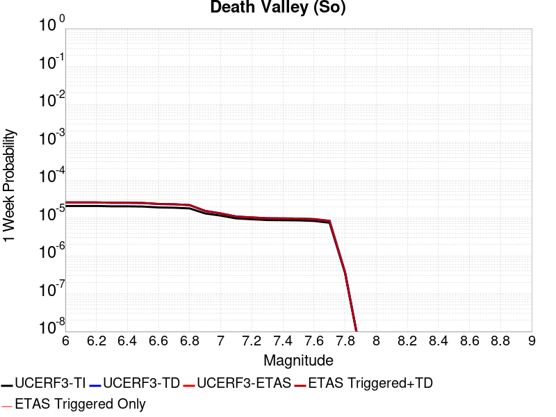 | 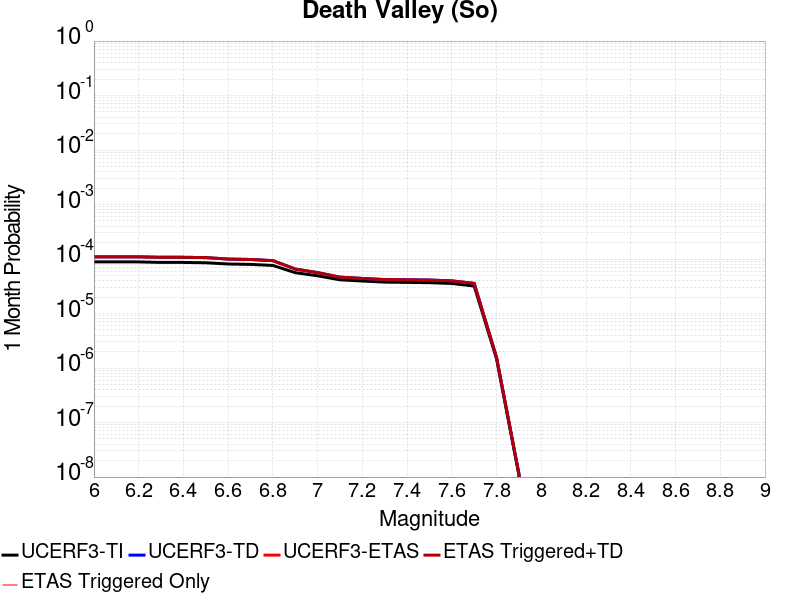 | 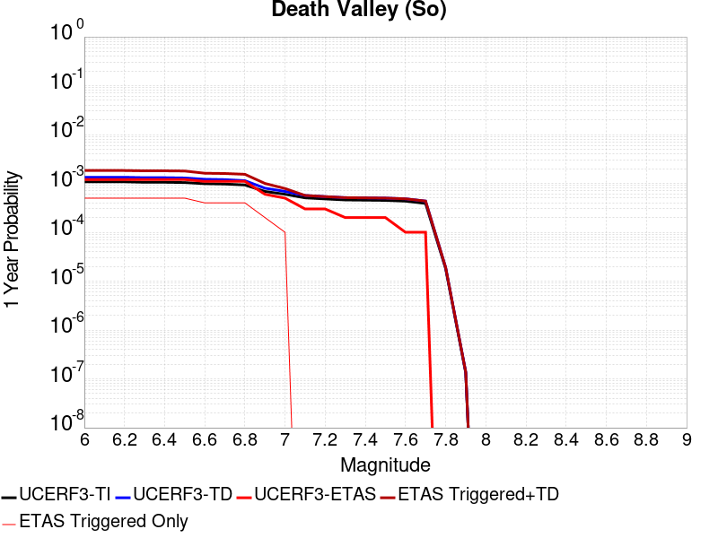 | 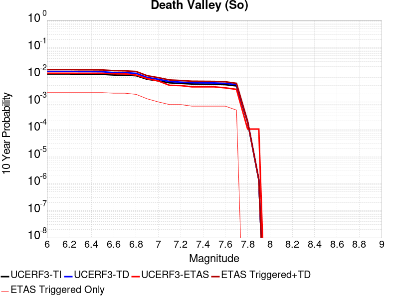 |

| Magnitude | 1 wk TI Prob | 1 wk TD Prob | 1 wk ETAS Prob | 1 wk ETAS/TD Gain | 1 wk ETAS Triggered+TD | 1 wk ETAS Triggered Only | 1 mo TI Prob | 1 mo TD Prob | 1 mo ETAS Prob | 1 mo ETAS/TD Gain | 1 mo ETAS Triggered+TD | 1 mo ETAS Triggered Only | 1 yr TI Prob | 1 yr TD Prob | 1 yr ETAS Prob | 1 yr ETAS/TD Gain | 1 yr ETAS Triggered+TD | 1 yr ETAS Triggered Only | 10 yr TI Prob | 10 yr TD Prob | 10 yr ETAS Prob | 10 yr ETAS/TD Gain | 10 yr ETAS Triggered+TD | 10 yr ETAS Triggered Only |
|-----|-----|-----|-----|-----|-----|-----|-----|-----|-----|-----|-----|-----|-----|-----|-----|-----|-----|-----|-----|-----|-----|-----|-----|-----|
| 6.0 | 2.0684236E-5 | 2.5628186E-5 | 0.0 | 0.0 | 2.5628186E-5 | 0.0 | 8.864371E-5 | 1.0983055E-4 | 0.0 | 0.0 | 1.0983055E-4 | 0.0 | 0.0010787029 | 0.0013363836 | 0.0012 | 0.89794576 | 0.0018357155 | 5.0E-4 | 0.010734817 | 0.01328906 | 0.0114 | 0.8578484 | 0.015459825 | 0.0022 |
| 6.1 | 2.0684236E-5 | 2.5628186E-5 | 0.0 | 0.0 | 2.5628186E-5 | 0.0 | 8.864371E-5 | 1.0983055E-4 | 0.0 | 0.0 | 1.0983055E-4 | 0.0 | 0.0010787029 | 0.0013363836 | 0.0012 | 0.89794576 | 0.0018357155 | 5.0E-4 | 0.010734817 | 0.01328906 | 0.0114 | 0.8578484 | 0.015459825 | 0.0022 |
| 6.2 | 2.0684236E-5 | 2.5628186E-5 | 0.0 | 0.0 | 2.5628186E-5 | 0.0 | 8.864371E-5 | 1.0983055E-4 | 0.0 | 0.0 | 1.0983055E-4 | 0.0 | 0.0010787029 | 0.0013363836 | 0.0012 | 0.89794576 | 0.0018357155 | 5.0E-4 | 0.010734817 | 0.01328906 | 0.0114 | 0.8578484 | 0.015459825 | 0.0022 |
| 6.3 | 2.0240292E-5 | 2.512814E-5 | 0.0 | 0.0 | 2.512814E-5 | 0.0 | 8.6741224E-5 | 1.0768768E-4 | 0.0 | 0.0 | 1.0768768E-4 | 0.0 | 0.0010555626 | 0.0013103257 | 0.0012 | 0.91580284 | 0.0018096705 | 5.0E-4 | 0.010505628 | 0.013031555 | 0.0113 | 0.867126 | 0.0152028855 | 0.0022 |
| 6.4 | 2.0240292E-5 | 2.512814E-5 | 0.0 | 0.0 | 2.512814E-5 | 0.0 | 8.6741224E-5 | 1.0768768E-4 | 0.0 | 0.0 | 1.0768768E-4 | 0.0 | 0.0010555626 | 0.0013103257 | 0.0012 | 0.91580284 | 0.0018096705 | 5.0E-4 | 0.010505628 | 0.013031555 | 0.0113 | 0.867126 | 0.0152028855 | 0.0022 |
| 6.5 | 1.9962767E-5 | 2.4817316E-5 | 0.0 | 0.0 | 2.4817316E-5 | 0.0 | 8.55519E-5 | 1.06355685E-4 | 0.0 | 0.0 | 1.06355685E-4 | 0.0 | 0.0010410968 | 0.001294128 | 0.0012 | 0.9272653 | 0.001793481 | 5.0E-4 | 0.010362327 | 0.012871464 | 0.0113 | 0.87791103 | 0.015043146 | 0.0022 |
| 6.6 | 1.8937297E-5 | 2.332067E-5 | 0.0 | 0.0 | 2.332067E-5 | 0.0 | 8.115732E-5 | 9.994198E-5 | 0.0 | 0.0 | 9.994198E-5 | 0.0 | 9.876423E-4 | 0.0012161289 | 0.0011 | 0.9045093 | 0.0016156426 | 4.0E-4 | 0.009832645 | 0.01210046 | 0.0109 | 0.90079224 | 0.014175049 | 0.0021 |
| 6.7 | 1.8621096E-5 | 2.2921204E-5 | 0.0 | 0.0 | 2.2921204E-5 | 0.0 | 7.980225E-5 | 9.823011E-5 | 0.0 | 0.0 | 9.823011E-5 | 0.0 | 9.711593E-4 | 0.00119531 | 0.0011 | 0.92026335 | 0.0015948318 | 4.0E-4 | 0.009669261 | 0.0118945325 | 0.0108 | 0.9079802 | 0.013969554 | 0.0021 |
| 6.8 | 1.7830353E-5 | 2.1814734E-5 | 0.0 | 0.0 | 2.1814734E-5 | 0.0 | 7.641356E-5 | 9.3488445E-5 | 0.0 | 0.0 | 9.3488445E-5 | 0.0 | 9.29938E-4 | 0.0011376415 | 0.0011 | 0.9669127 | 0.0015371864 | 4.0E-4 | 0.009260561 | 0.01132318 | 0.0098 | 0.86548126 | 0.013201666 | 0.0019 |
| 6.9 | 1.3135183E-5 | 1.5309017E-5 | 0.0 | 0.0 | 1.5309017E-5 | 0.0 | 5.6292425E-5 | 6.560846E-5 | 0.0 | 0.0 | 6.560846E-5 | 0.0 | 6.8514474E-4 | 7.984967E-4 | 6.0E-4 | 0.751412 | 9.98337E-4 | 2.0E-4 | 0.006830362 | 0.007957112 | 0.0072 | 0.9048509 | 0.009246768 | 0.0013 |
| 7.0 | 1.1507512E-5 | 1.315811E-5 | 0.0 | 0.0 | 1.315811E-5 | 0.0 | 4.9316975E-5 | 5.6390712E-5 | 0.0 | 0.0 | 5.6390712E-5 | 0.0 | 6.002687E-4 | 6.8634644E-4 | 5.0E-4 | 0.72849506 | 7.862778E-4 | 1.0E-4 | 0.0059864987 | 0.0068428116 | 0.0059 | 0.8622187 | 0.007835969 | 0.001 |
| 7.1 | 9.715903E-6 | 1.0868022E-5 | 0.0 | 0.0 | 1.0868022E-5 | 0.0 | 4.1638916E-5 | 4.657643E-5 | 0.0 | 0.0 | 4.657643E-5 | 0.0 | 5.068359E-4 | 5.6692475E-4 | 3.0E-4 | 0.52917075 | 5.6692475E-4 | 0.0 | 0.0050568148 | 0.0056550754 | 0.0041 | 0.7250125 | 0.006450551 | 8.0E-4 |
| 7.2 | 9.233269E-6 | 1.0288838E-5 | 0.0 | 0.0 | 1.0288838E-5 | 0.0 | 3.9570554E-5 | 4.4094297E-5 | 0.0 | 0.0 | 4.4094297E-5 | 0.0 | 4.81665E-4 | 5.367201E-4 | 3.0E-4 | 0.5589506 | 5.367201E-4 | 0.0 | 0.0048062233 | 0.00535467 | 0.004 | 0.74701154 | 0.006150386 | 8.0E-4 |
| 7.3 | 8.8041315E-6 | 9.810479E-6 | 0.0 | 0.0 | 9.810479E-6 | 0.0 | 3.7731446E-5 | 4.2044256E-5 | 0.0 | 0.0 | 4.2044256E-5 | 0.0 | 4.592835E-4 | 5.117728E-4 | 2.0E-4 | 0.39079842 | 5.117728E-4 | 0.0 | 0.0045833546 | 0.005106369 | 0.0036 | 0.7050019 | 0.005802795 | 7.0E-4 |
| 7.4 | 8.708749E-6 | 9.709477E-6 | 0.0 | 0.0 | 9.709477E-6 | 0.0 | 3.7322676E-5 | 4.1611405E-5 | 0.0 | 0.0 | 4.1611405E-5 | 0.0 | 4.5430884E-4 | 5.065053E-4 | 2.0E-4 | 0.3948626 | 5.065053E-4 | 0.0 | 0.004533812 | 0.005053935 | 0.0036 | 0.7123162 | 0.0057503977 | 7.0E-4 |
| 7.5 | 8.612678E-6 | 9.607105E-6 | 0.0 | 0.0 | 9.607105E-6 | 0.0 | 3.6910955E-5 | 4.1172683E-5 | 0.0 | 0.0 | 4.1172683E-5 | 0.0 | 4.492982E-4 | 5.0116633E-4 | 2.0E-4 | 0.3990691 | 5.0116633E-4 | 0.0 | 0.004483909 | 0.005000787 | 0.0036 | 0.71988666 | 0.005697286 | 7.0E-4 |
| 7.6 | 8.319024E-6 | 9.286143E-6 | 0.0 | 0.0 | 9.286143E-6 | 0.0 | 3.5652476E-5 | 3.979717E-5 | 0.0 | 0.0 | 3.979717E-5 | 0.0 | 4.3398244E-4 | 4.8442703E-4 | 1.0E-4 | 0.20642944 | 4.8442703E-4 | 0.0 | 0.0043313587 | 0.0048341346 | 0.0033 | 0.68264544 | 0.005530751 | 7.0E-4 |
| 7.7 | 7.4718328E-6 | 8.347186E-6 | 0.0 | 0.0 | 8.347186E-6 | 0.0 | 3.2021748E-5 | 3.5773184E-5 | 0.0 | 0.0 | 3.5773184E-5 | 0.0 | 3.8979502E-4 | 4.3545553E-4 | 1.0E-4 | 0.22964457 | 4.3545553E-4 | 0.0 | 0.00389112 | 0.004346428 | 0.0029 | 0.6672145 | 0.004844255 | 5.0E-4 |
| 7.8 | 3.4586725E-7 | 3.6486753E-7 | 0.0 | 0.0 | 3.6486753E-7 | 0.0 | 1.4822873E-6 | 1.5637171E-6 | 0.0 | 0.0 | 1.5637171E-6 | 0.0 | 1.80467E-5 | 1.9038094E-5 | 0.0 | 0.0 | 1.9038094E-5 | 0.0 | 1.8045233E-4 | 1.9036507E-4 | 1.0E-4 | 0.52530646 | 1.9036507E-4 | 0.0 |
| 7.9 | 2.5591178E-9 | 2.6699092E-9 | 0.0 | 0.0 | 2.6699092E-9 | 0.0 | 1.0967647E-8 | 1.1442468E-8 | 0.0 | 0.0 | 1.1442468E-8 | 0.0 | 1.335311E-7 | 1.3931205E-7 | 0.0 | 0.0 | 1.3931205E-7 | 0.0 | 1.3353102E-6 | 1.3931206E-6 | 1.0E-4 | 71.781296 | 1.3931206E-6 | 0.0 |

## Quien Sabe 2011 CFM
*[(top)](#table-of-contents)*

| 1 Week | 1 Month | 1 Year | 10 Year |
|-----|-----|-----|-----|
| 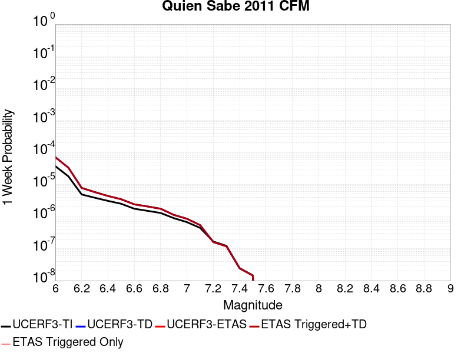 | 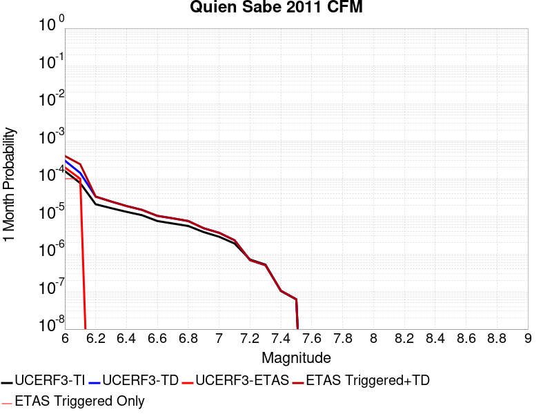 | 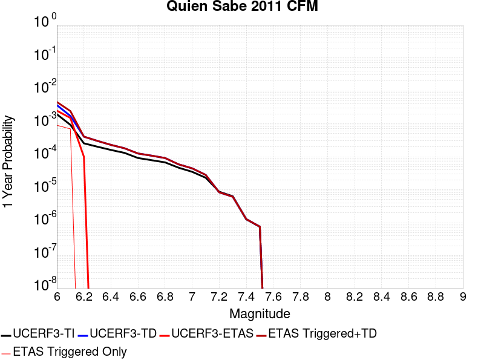 | 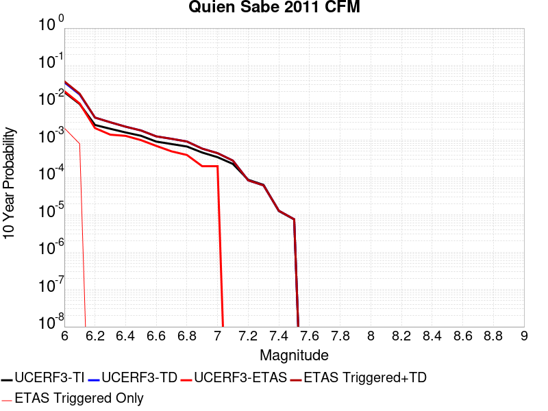 |

| Magnitude | 1 wk TI Prob | 1 wk TD Prob | 1 wk ETAS Prob | 1 wk ETAS/TD Gain | 1 wk ETAS Triggered+TD | 1 wk ETAS Triggered Only | 1 mo TI Prob | 1 mo TD Prob | 1 mo ETAS Prob | 1 mo ETAS/TD Gain | 1 mo ETAS Triggered+TD | 1 mo ETAS Triggered Only | 1 yr TI Prob | 1 yr TD Prob | 1 yr ETAS Prob | 1 yr ETAS/TD Gain | 1 yr ETAS Triggered+TD | 1 yr ETAS Triggered Only | 10 yr TI Prob | 10 yr TD Prob | 10 yr ETAS Prob | 10 yr ETAS/TD Gain | 10 yr ETAS Triggered+TD | 10 yr ETAS Triggered Only |
|-----|-----|-----|-----|-----|-----|-----|-----|-----|-----|-----|-----|-----|-----|-----|-----|-----|-----|-----|-----|-----|-----|-----|-----|-----|
| 6.0 | 3.729899E-5 | 7.0991715E-5 | 0.0 | 0.0 | 7.0991715E-5 | 0.0 | 1.5984301E-4 | 3.0415907E-4 | 2.0E-4 | 0.6575507 | 4.0412866E-4 | 1.0E-4 | 0.0019443515 | 0.0036875447 | 0.0025 | 0.6779579 | 0.004584226 | 9.0E-4 | 0.019274272 | 0.03537065 | 0.0204 | 0.5767494 | 0.03739637 | 0.0021 |
| 6.1 | 1.7825725E-5 | 3.323513E-5 | 0.0 | 0.0 | 3.323513E-5 | 0.0 | 7.639373E-5 | 1.4238233E-4 | 1.0E-4 | 0.70233434 | 2.4236809E-4 | 1.0E-4 | 9.296967E-4 | 0.001727807 | 0.0015 | 0.8681525 | 0.0024265975 | 7.0E-4 | 0.009258169 | 0.0167089 | 0.0096 | 0.57454413 | 0.017495532 | 8.0E-4 |
| 6.2 | 4.8865336E-6 | 7.813976E-6 | 0.0 | 0.0 | 7.813976E-6 | 0.0 | 2.0942118E-5 | 3.348603E-5 | 0.0 | 0.0 | 3.348603E-5 | 0.0 | 2.5494045E-4 | 4.0727167E-4 | 1.0E-4 | 0.24553636 | 4.0727167E-4 | 0.0 | 0.0025464818 | 0.004016377 | 0.0021 | 0.5228593 | 0.004016377 | 0.0 |
| 6.3 | 3.858491E-6 | 5.7951675E-6 | 0.0 | 0.0 | 5.7951675E-6 | 0.0 | 1.6536285E-5 | 2.4836223E-5 | 0.0 | 0.0 | 2.4836223E-5 | 0.0 | 2.0131067E-4 | 3.0234375E-4 | 0.0 | 0.0 | 3.0234375E-4 | 0.0 | 0.002011284 | 0.003004286 | 0.0014 | 0.4660009 | 0.003004286 | 0.0 |
| 6.4 | 3.0771805E-6 | 4.390085E-6 | 0.0 | 0.0 | 4.390085E-6 | 0.0 | 1.318785E-5 | 1.8814528E-5 | 0.0 | 0.0 | 1.8814528E-5 | 0.0 | 1.6055023E-4 | 2.2904522E-4 | 0.0 | 0.0 | 2.2904522E-4 | 0.0 | 0.001604343 | 0.0022887716 | 0.0013 | 0.56799024 | 0.0022887716 | 0.0 |
| 6.5 | 2.5081235E-6 | 3.4682764E-6 | 0.0 | 0.0 | 3.4682764E-6 | 0.0 | 1.0749056E-5 | 1.4863966E-5 | 0.0 | 0.0 | 1.4863966E-5 | 0.0 | 1.308619E-4 | 1.8095523E-4 | 0.0 | 0.0 | 1.8095523E-4 | 0.0 | 0.0013078486 | 0.0018142919 | 0.001 | 0.55117923 | 0.0018142919 | 0.0 |
| 6.6 | 1.7505364E-6 | 2.405822E-6 | 0.0 | 0.0 | 2.405822E-6 | 0.0 | 7.502277E-6 | 1.03106295E-5 | 0.0 | 0.0 | 1.03106295E-5 | 0.0 | 9.13364E-5 | 1.2552539E-4 | 0.0 | 0.0 | 1.2552539E-4 | 0.0 | 9.129886E-4 | 0.0012600344 | 7.0E-4 | 0.5555404 | 0.0012600344 | 0.0 |
| 6.7 | 1.505737E-6 | 2.0669022E-6 | 0.0 | 0.0 | 2.0669022E-6 | 0.0 | 6.4531428E-6 | 8.8581255E-6 | 0.0 | 0.0 | 8.8581255E-6 | 0.0 | 7.8564175E-5 | 1.0784294E-4 | 0.0 | 0.0 | 1.0784294E-4 | 0.0 | 7.853641E-4 | 0.0010833773 | 5.0E-4 | 0.46151975 | 0.0010833773 | 0.0 |
| 6.8 | 1.2924105E-6 | 1.7512001E-6 | 0.0 | 0.0 | 1.7512001E-6 | 0.0 | 5.5388905E-6 | 7.505125E-6 | 0.0 | 0.0 | 7.505125E-6 | 0.0 | 6.74339E-5 | 9.1371614E-5 | 0.0 | 0.0 | 9.1371614E-5 | 0.0 | 6.741344E-4 | 9.174812E-4 | 4.0E-4 | 0.43597624 | 9.174812E-4 | 0.0 |
| 6.9 | 8.9075286E-7 | 1.1268071E-6 | 0.0 | 0.0 | 1.1268071E-6 | 0.0 | 3.8175067E-6 | 4.8291654E-6 | 0.0 | 0.0 | 4.8291654E-6 | 0.0 | 4.6477155E-5 | 5.8793725E-5 | 0.0 | 0.0 | 5.8793725E-5 | 0.0 | 4.6467435E-4 | 5.9130765E-4 | 2.0E-4 | 0.3382334 | 5.9130765E-4 | 0.0 |
| 7.0 | 6.6891175E-7 | 8.5319635E-7 | 0.0 | 0.0 | 8.5319635E-7 | 0.0 | 2.8667614E-6 | 3.6565518E-6 | 0.0 | 0.0 | 3.6565518E-6 | 0.0 | 3.4902263E-5 | 4.4517805E-5 | 0.0 | 0.0 | 4.4517805E-5 | 0.0 | 3.4896782E-4 | 4.4756528E-4 | 2.0E-4 | 0.4468622 | 4.4756528E-4 | 0.0 |
| 7.1 | 4.4205015E-7 | 5.3969393E-7 | 0.0 | 0.0 | 5.3969393E-7 | 0.0 | 1.8944993E-6 | 2.312973E-6 | 0.0 | 0.0 | 2.312973E-6 | 0.0 | 2.3065284E-5 | 2.8160252E-5 | 0.0 | 0.0 | 2.8160252E-5 | 0.0 | 2.3062891E-4 | 2.828956E-4 | 0.0 | 0.0 | 2.828956E-4 | 0.0 |
| 7.2 | 1.6620965E-7 | 1.6008343E-7 | 0.0 | 0.0 | 1.6008343E-7 | 0.0 | 7.123269E-7 | 6.860717E-7 | 0.0 | 0.0 | 6.860717E-7 | 0.0 | 8.672545E-6 | 8.352895E-6 | 0.0 | 0.0 | 8.352895E-6 | 0.0 | 8.6722066E-5 | 8.362052E-5 | 0.0 | 0.0 | 8.362052E-5 | 0.0 |
| 7.3 | 1.2142488E-7 | 1.17357025E-7 | 0.0 | 0.0 | 1.17357025E-7 | 0.0 | 5.2039223E-7 | 5.029586E-7 | 0.0 | 0.0 | 5.029586E-7 | 0.0 | 6.335757E-6 | 6.1235073E-6 | 0.0 | 0.0 | 6.1235073E-6 | 0.0 | 6.3355765E-5 | 6.130029E-5 | 0.0 | 0.0 | 6.130029E-5 | 0.0 |
| 7.4 | 2.4192937E-8 | 2.4557739E-8 | 0.0 | 0.0 | 2.4557739E-8 | 0.0 | 1.0368401E-7 | 1.05247445E-7 | 0.0 | 0.0 | 1.05247445E-7 | 0.0 | 1.2623522E-6 | 1.281387E-6 | 0.0 | 0.0 | 1.281387E-6 | 0.0 | 1.2623449E-5 | 1.2834933E-5 | 0.0 | 0.0 | 1.2834933E-5 | 0.0 |
| 7.5 | 1.4432802E-8 | 1.4511247E-8 | 0.0 | 0.0 | 1.4511247E-8 | 0.0 | 6.185486E-8 | 6.219106E-8 | 0.0 | 0.0 | 6.219106E-8 | 0.0 | 7.530827E-7 | 7.57176E-7 | 0.0 | 0.0 | 7.57176E-7 | 0.0 | 7.530801E-6 | 7.5913213E-6 | 0.0 | 0.0 | 7.5913213E-6 | 0.0 |

## San Gregorio (North) 2011 CFM
*[(top)](#table-of-contents)*

| 1 Week | 1 Month | 1 Year | 10 Year |
|-----|-----|-----|-----|
| 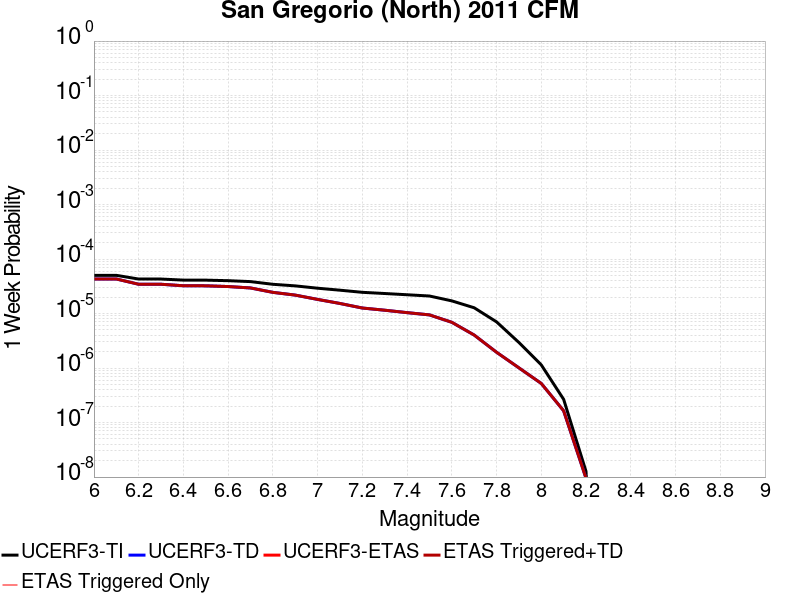 | 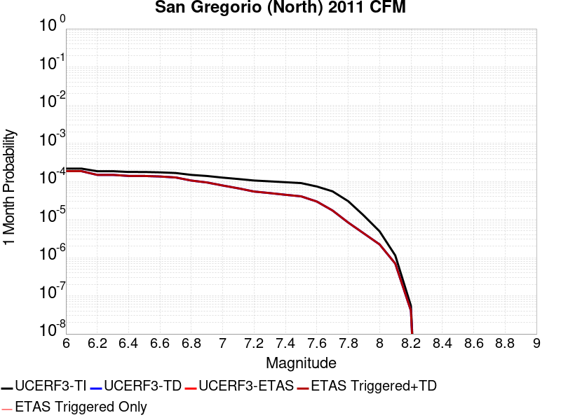 | 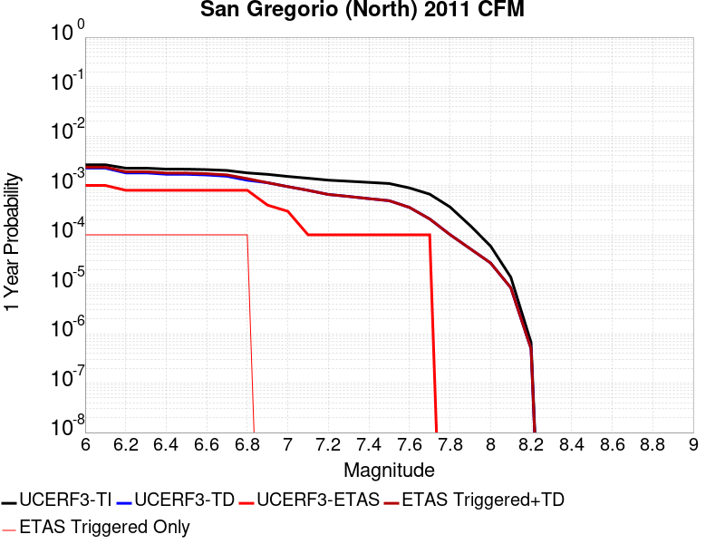 | 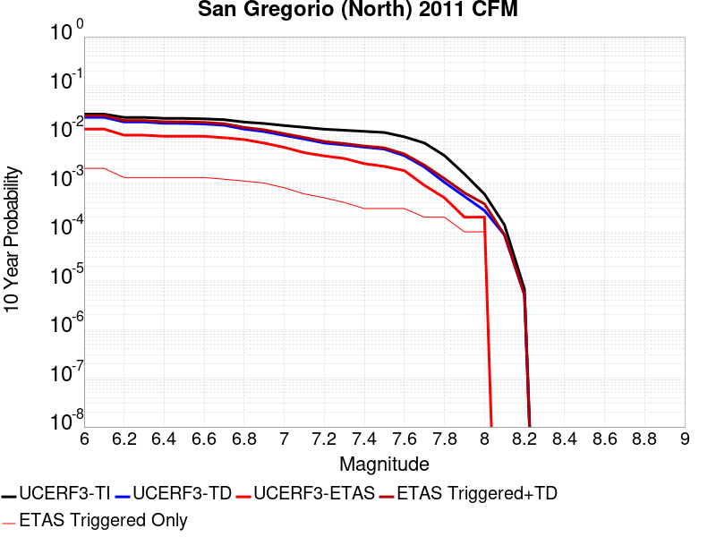 |

| Magnitude | 1 wk TI Prob | 1 wk TD Prob | 1 wk ETAS Prob | 1 wk ETAS/TD Gain | 1 wk ETAS Triggered+TD | 1 wk ETAS Triggered Only | 1 mo TI Prob | 1 mo TD Prob | 1 mo ETAS Prob | 1 mo ETAS/TD Gain | 1 mo ETAS Triggered+TD | 1 mo ETAS Triggered Only | 1 yr TI Prob | 1 yr TD Prob | 1 yr ETAS Prob | 1 yr ETAS/TD Gain | 1 yr ETAS Triggered+TD | 1 yr ETAS Triggered Only | 10 yr TI Prob | 10 yr TD Prob | 10 yr ETAS Prob | 10 yr ETAS/TD Gain | 10 yr ETAS Triggered+TD | 10 yr ETAS Triggered Only |
|-----|-----|-----|-----|-----|-----|-----|-----|-----|-----|-----|-----|-----|-----|-----|-----|-----|-----|-----|-----|-----|-----|-----|-----|-----|
| 6.0 | 5.0283932E-5 | 4.311157E-5 | 0.0 | 0.0 | 4.311157E-5 | 0.0 | 2.1548476E-4 | 1.847509E-4 | 0.0 | 0.0 | 1.847509E-4 | 0.0 | 0.0026203706 | 0.0022470353 | 0.001 | 0.4450308 | 0.0023468107 | 1.0E-4 | 0.02589687 | 0.022317931 | 0.0128 | 0.5735299 | 0.024273295 | 0.002 |
| 6.1 | 5.0283932E-5 | 4.311157E-5 | 0.0 | 0.0 | 4.311157E-5 | 0.0 | 2.1548476E-4 | 1.847509E-4 | 0.0 | 0.0 | 1.847509E-4 | 0.0 | 0.0026203706 | 0.0022470353 | 0.001 | 0.4450308 | 0.0023468107 | 1.0E-4 | 0.02589687 | 0.022317931 | 0.0128 | 0.5735299 | 0.024273295 | 0.002 |
| 6.2 | 4.2998647E-5 | 3.4490262E-5 | 0.0 | 0.0 | 3.4490262E-5 | 0.0 | 1.842669E-4 | 1.4780712E-4 | 0.0 | 0.0 | 1.4780712E-4 | 0.0 | 0.0022411412 | 0.0017980787 | 8.0E-4 | 0.44491935 | 0.0018978989 | 1.0E-4 | 0.022186736 | 0.017909633 | 0.0096 | 0.5360244 | 0.019186351 | 0.0013 |
| 6.3 | 4.2998647E-5 | 3.4490262E-5 | 0.0 | 0.0 | 3.4490262E-5 | 0.0 | 1.842669E-4 | 1.4780712E-4 | 0.0 | 0.0 | 1.4780712E-4 | 0.0 | 0.0022411412 | 0.0017980787 | 8.0E-4 | 0.44491935 | 0.0018978989 | 1.0E-4 | 0.022186736 | 0.017909633 | 0.0096 | 0.5360244 | 0.019186351 | 0.0013 |
| 6.4 | 4.1101295E-5 | 3.2374133E-5 | 0.0 | 0.0 | 3.2374133E-5 | 0.0 | 1.7613651E-4 | 1.3873898E-4 | 0.0 | 0.0 | 1.3873898E-4 | 0.0 | 0.0021423528 | 0.0016878516 | 8.0E-4 | 0.4739753 | 0.0017876829 | 1.0E-4 | 0.02121817 | 0.016824981 | 0.0091 | 0.54086244 | 0.018103108 | 0.0013 |
| 6.5 | 4.1032585E-5 | 3.2292133E-5 | 0.0 | 0.0 | 3.2292133E-5 | 0.0 | 1.7584208E-4 | 1.3838761E-4 | 0.0 | 0.0 | 1.3838761E-4 | 0.0 | 0.0021387753 | 0.0016835802 | 8.0E-4 | 0.47517782 | 0.0017834118 | 1.0E-4 | 0.021183075 | 0.016782919 | 0.0091 | 0.54221797 | 0.0180611 | 0.0013 |
| 6.6 | 4.011629E-5 | 3.1313157E-5 | 0.0 | 0.0 | 3.1313157E-5 | 0.0 | 1.7191563E-4 | 1.3419242E-4 | 0.0 | 0.0 | 1.3419242E-4 | 0.0 | 0.0020910634 | 0.001632582 | 8.0E-4 | 0.49002132 | 0.0017324188 | 1.0E-4 | 0.020714961 | 0.016280025 | 0.0091 | 0.5589672 | 0.017558862 | 0.0013 |
| 6.7 | 3.8583938E-5 | 2.949909E-5 | 0.0 | 0.0 | 2.949909E-5 | 0.0 | 1.6534925E-4 | 1.2641863E-4 | 0.0 | 0.0 | 1.2641863E-4 | 0.0 | 0.0020112682 | 0.0015380743 | 8.0E-4 | 0.5201309 | 0.0016379206 | 1.0E-4 | 0.019931622 | 0.0153497765 | 0.0085 | 0.55375403 | 0.016531356 | 0.0012 |
| 6.8 | 3.44341E-5 | 2.4493593E-5 | 0.0 | 0.0 | 2.4493593E-5 | 0.0 | 1.4756636E-4 | 1.0496837E-4 | 0.0 | 0.0 | 1.0496837E-4 | 0.0 | 0.0017951399 | 0.0012772512 | 8.0E-4 | 0.6263451 | 0.0013771234 | 1.0E-4 | 0.017807078 | 0.012773686 | 0.0078 | 0.61063033 | 0.013859634 | 0.0011 |
| 6.9 | 3.221199E-5 | 2.1815908E-5 | 0.0 | 0.0 | 2.1815908E-5 | 0.0 | 1.3804408E-4 | 9.349344E-5 | 0.0 | 0.0 | 9.349344E-5 | 0.0 | 0.0016793909 | 0.0011376966 | 4.0E-4 | 0.3515876 | 0.0011376966 | 0.0 | 0.01666756 | 0.011392306 | 0.0066 | 0.5793384 | 0.012380914 | 0.001 |
| 7.0 | 2.9186718E-5 | 1.8181061E-5 | 0.0 | 0.0 | 1.8181061E-5 | 0.0 | 1.2507994E-4 | 7.7916535E-5 | 0.0 | 0.0 | 7.7916535E-5 | 0.0 | 0.0015217843 | 9.482254E-4 | 3.0E-4 | 0.31638047 | 9.482254E-4 | 0.0 | 0.015114053 | 0.009514646 | 0.0054 | 0.5675461 | 0.010307034 | 8.0E-4 |
| 7.1 | 2.6840138E-5 | 1.5316833E-5 | 0.0 | 0.0 | 1.5316833E-5 | 0.0 | 1.1502409E-4 | 6.564193E-5 | 0.0 | 0.0 | 6.564193E-5 | 0.0 | 0.0013995186 | 7.9889945E-4 | 1.0E-4 | 0.1251722 | 7.9889945E-4 | 0.0 | 0.013907375 | 0.008032562 | 0.0042 | 0.52287173 | 0.0086277425 | 6.0E-4 |
| 7.2 | 2.453002E-5 | 1.2637749E-5 | 0.0 | 0.0 | 1.2637749E-5 | 0.0 | 1.05124425E-4 | 5.416066E-5 | 0.0 | 0.0 | 5.416066E-5 | 0.0 | 0.0012791384 | 6.592071E-4 | 1.0E-4 | 0.15169738 | 6.592071E-4 | 0.0 | 0.012718005 | 0.0066439225 | 0.0036 | 0.54184854 | 0.0071406006 | 5.0E-4 |
| 7.3 | 2.3330727E-5 | 1.1519066E-5 | 0.0 | 0.0 | 1.1519066E-5 | 0.0 | 9.9985E-5 | 4.9366492E-5 | 0.0 | 0.0 | 4.9366492E-5 | 0.0 | 0.0012166376 | 6.0087175E-4 | 1.0E-4 | 0.16642487 | 6.0087175E-4 | 0.0 | 0.012099981 | 0.0060626315 | 0.0032 | 0.5278236 | 0.0064602066 | 4.0E-4 |
| 7.4 | 2.2136466E-5 | 1.0398501E-5 | 0.0 | 0.0 | 1.0398501E-5 | 0.0 | 9.486712E-5 | 4.4564244E-5 | 0.0 | 0.0 | 4.4564244E-5 | 0.0 | 0.0011543952 | 5.4243486E-4 | 1.0E-4 | 0.18435393 | 5.4243486E-4 | 0.0 | 0.011484168 | 0.0054797665 | 0.0025 | 0.45622382 | 0.0057781227 | 3.0E-4 |
| 7.5 | 2.0994974E-5 | 9.455544E-6 | 0.0 | 0.0 | 9.455544E-6 | 0.0 | 8.997535E-5 | 4.0523133E-5 | 0.0 | 0.0 | 4.0523133E-5 | 0.0 | 0.0010948994 | 4.932577E-4 | 1.0E-4 | 0.20273378 | 4.932577E-4 | 0.0 | 0.010895205 | 0.0049884864 | 0.0022 | 0.44101554 | 0.0052869897 | 3.0E-4 |
| 7.6 | 1.7091823E-5 | 6.9163316E-6 | 0.0 | 0.0 | 6.9163316E-6 | 0.0 | 7.3248615E-5 | 2.9641084E-5 | 0.0 | 0.0 | 2.9641084E-5 | 0.0 | 8.9143694E-4 | 3.6082053E-4 | 1.0E-4 | 0.27714607 | 3.6082053E-4 | 0.0 | 0.008878695 | 0.0036603925 | 0.0018 | 0.49175054 | 0.0039592944 | 3.0E-4 |
| 7.7 | 1.2772179E-5 | 4.0369823E-6 | 0.0 | 0.0 | 4.0369823E-6 | 0.0 | 5.473676E-5 | 1.7301238E-5 | 0.0 | 0.0 | 1.7301238E-5 | 0.0 | 6.6621625E-4 | 2.1062224E-4 | 1.0E-4 | 0.47478366 | 2.1062224E-4 | 0.0 | 0.006642225 | 0.00214568 | 9.0E-4 | 0.41944748 | 0.0023452507 | 2.0E-4 |
| 7.8 | 7.041923E-6 | 1.9511936E-6 | 0.0 | 0.0 | 1.9511936E-6 | 0.0 | 3.017932E-5 | 8.362231E-6 | 0.0 | 0.0 | 8.362231E-6 | 0.0 | 3.6737128E-4 | 1.0180541E-4 | 0.0 | 0.0 | 1.0180541E-4 | 0.0 | 0.0036676454 | 0.0010436692 | 5.0E-4 | 0.479079 | 0.0012434605 | 2.0E-4 |
| 7.9 | 2.946768E-6 | 1.0096571E-6 | 0.0 | 0.0 | 1.0096571E-6 | 0.0 | 1.2628945E-5 | 4.3270948E-6 | 0.0 | 0.0 | 4.3270948E-6 | 0.0 | 1.5374656E-4 | 5.2681105E-5 | 0.0 | 0.0 | 5.2681105E-5 | 0.0 | 0.0015364023 | 5.373658E-4 | 2.0E-4 | 0.37218598 | 6.37312E-4 | 1.0E-4 |
| 8.0 | 1.1433375E-6 | 5.2181696E-7 | 0.0 | 0.0 | 5.2181696E-7 | 0.0 | 4.9000087E-6 | 2.2363563E-6 | 0.0 | 0.0 | 2.2363563E-6 | 0.0 | 5.965597E-5 | 2.72273E-5 | 0.0 | 0.0 | 2.72273E-5 | 0.0 | 5.963996E-4 | 2.7591354E-4 | 2.0E-4 | 0.7248647 | 3.7588595E-4 | 1.0E-4 |
| 8.1 | 2.6675295E-7 | 1.6428099E-7 | 0.0 | 0.0 | 1.6428099E-7 | 0.0 | 1.1432264E-6 | 7.040612E-7 | 0.0 | 0.0 | 7.040612E-7 | 0.0 | 1.3918692E-5 | 8.571911E-6 | 0.0 | 0.0 | 8.571911E-6 | 0.0 | 1.391782E-4 | 8.710931E-5 | 0.0 | 0.0 | 8.710931E-5 | 0.0 |
| 8.2 | 1.2704569E-8 | 9.5560155E-9 | 0.0 | 0.0 | 9.5560155E-9 | 0.0 | 5.444815E-8 | 4.095435E-8 | 0.0 | 0.0 | 4.095435E-8 | 0.0 | 6.629061E-7 | 4.986191E-7 | 0.0 | 0.0 | 4.986191E-7 | 0.0 | 6.629041E-6 | 5.1788293E-6 | 0.0 | 0.0 | 5.1788293E-6 | 0.0 |

## Ventura-Pitas Point
*[(top)](#table-of-contents)*

| 1 Week | 1 Month | 1 Year | 10 Year |
|-----|-----|-----|-----|
| 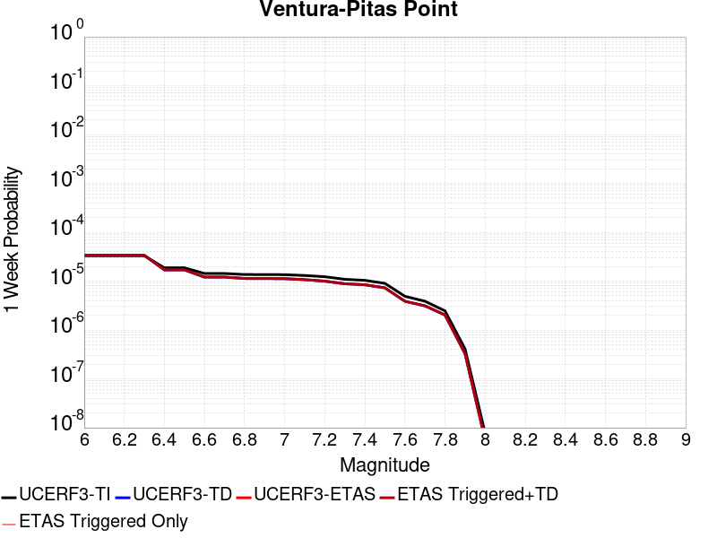 | 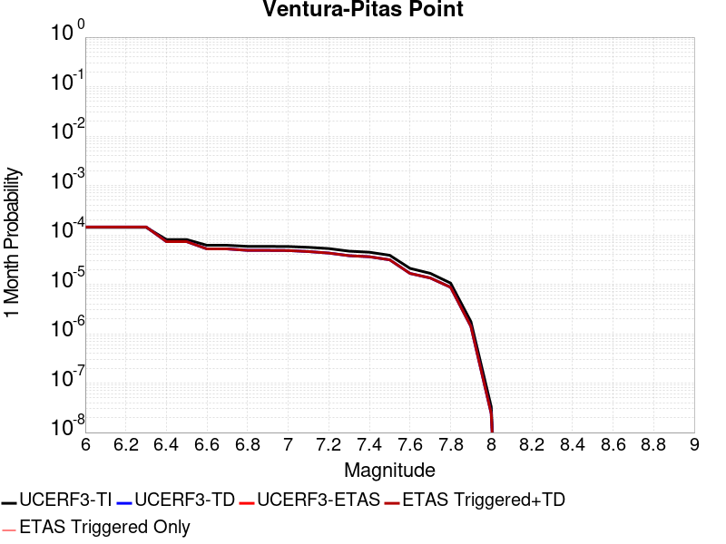 | 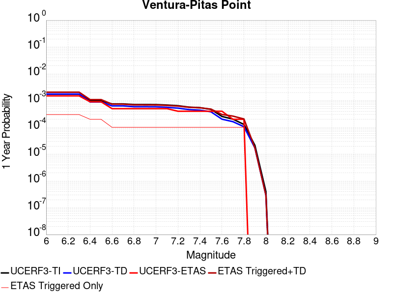 | 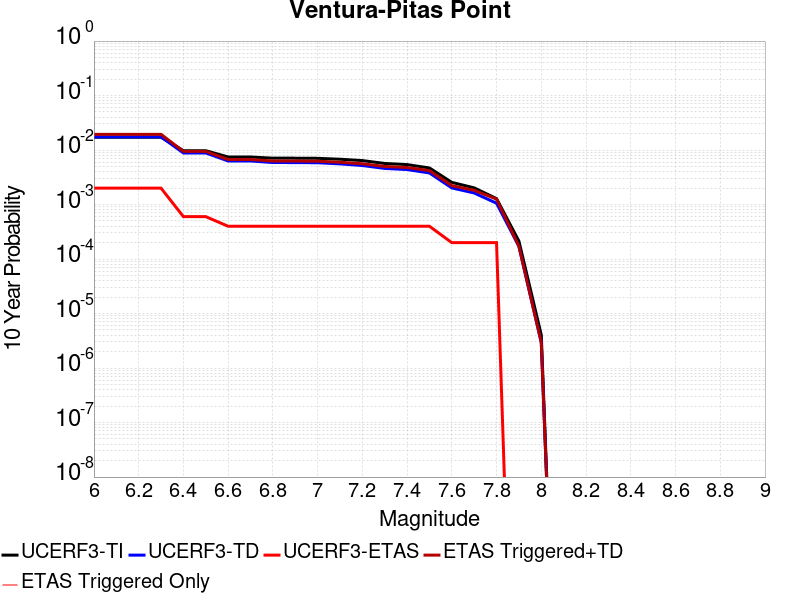 |

| Magnitude | 1 wk TI Prob | 1 wk TD Prob | 1 wk ETAS Prob | 1 wk ETAS/TD Gain | 1 wk ETAS Triggered+TD | 1 wk ETAS Triggered Only | 1 mo TI Prob | 1 mo TD Prob | 1 mo ETAS Prob | 1 mo ETAS/TD Gain | 1 mo ETAS Triggered+TD | 1 mo ETAS Triggered Only | 1 yr TI Prob | 1 yr TD Prob | 1 yr ETAS Prob | 1 yr ETAS/TD Gain | 1 yr ETAS Triggered+TD | 1 yr ETAS Triggered Only | 10 yr TI Prob | 10 yr TD Prob | 10 yr ETAS Prob | 10 yr ETAS/TD Gain | 10 yr ETAS Triggered+TD | 10 yr ETAS Triggered Only |
|-----|-----|-----|-----|-----|-----|-----|-----|-----|-----|-----|-----|-----|-----|-----|-----|-----|-----|-----|-----|-----|-----|-----|-----|-----|
| 6.0 | 3.3179622E-5 | 3.374635E-5 | 0.0 | 0.0 | 3.374635E-5 | 0.0 | 1.4219063E-4 | 1.4462064E-4 | 0.0 | 0.0 | 1.4462064E-4 | 0.0 | 0.0017297962 | 0.001759591 | 0.0015 | 0.8524708 | 0.0020590632 | 3.0E-4 | 0.017163932 | 0.017482147 | 0.0143 | 0.8179773 | 0.019447183 | 0.002 |
| 6.1 | 3.3179622E-5 | 3.374635E-5 | 0.0 | 0.0 | 3.374635E-5 | 0.0 | 1.4219063E-4 | 1.4462064E-4 | 0.0 | 0.0 | 1.4462064E-4 | 0.0 | 0.0017297962 | 0.001759591 | 0.0015 | 0.8524708 | 0.0020590632 | 3.0E-4 | 0.017163932 | 0.017482147 | 0.0143 | 0.8179773 | 0.019447183 | 0.002 |
| 6.2 | 3.3179622E-5 | 3.374635E-5 | 0.0 | 0.0 | 3.374635E-5 | 0.0 | 1.4219063E-4 | 1.4462064E-4 | 0.0 | 0.0 | 1.4462064E-4 | 0.0 | 0.0017297962 | 0.001759591 | 0.0015 | 0.8524708 | 0.0020590632 | 3.0E-4 | 0.017163932 | 0.017482147 | 0.0143 | 0.8179773 | 0.019447183 | 0.002 |
| 6.3 | 3.3179622E-5 | 3.374635E-5 | 0.0 | 0.0 | 3.374635E-5 | 0.0 | 1.4219063E-4 | 1.4462064E-4 | 0.0 | 0.0 | 1.4462064E-4 | 0.0 | 0.0017297962 | 0.001759591 | 0.0015 | 0.8524708 | 0.0020590632 | 3.0E-4 | 0.017163932 | 0.017482147 | 0.0143 | 0.8179773 | 0.019447183 | 0.002 |
| 6.4 | 1.8754668E-5 | 1.7025272E-5 | 0.0 | 0.0 | 1.7025272E-5 | 0.0 | 8.037467E-5 | 7.296354E-5 | 0.0 | 0.0 | 7.296354E-5 | 0.0 | 9.781223E-4 | 8.8799215E-4 | 9.0E-4 | 1.0135224 | 0.0010878146 | 2.0E-4 | 0.009738282 | 0.0088467905 | 0.0068 | 0.76864034 | 0.009441483 | 6.0E-4 |
| 6.5 | 1.8754668E-5 | 1.7025272E-5 | 0.0 | 0.0 | 1.7025272E-5 | 0.0 | 8.037467E-5 | 7.296354E-5 | 0.0 | 0.0 | 7.296354E-5 | 0.0 | 9.781223E-4 | 8.8799215E-4 | 9.0E-4 | 1.0135224 | 0.0010878146 | 2.0E-4 | 0.009738282 | 0.0088467905 | 0.0068 | 0.76864034 | 0.009441483 | 6.0E-4 |
| 6.6 | 1.4361558E-5 | 1.2126778E-5 | 0.0 | 0.0 | 1.2126778E-5 | 0.0 | 6.154808E-5 | 5.197088E-5 | 0.0 | 0.0 | 5.197088E-5 | 0.0 | 7.490902E-4 | 6.325641E-4 | 5.0E-4 | 0.7904337 | 7.3250086E-4 | 1.0E-4 | 0.0074657016 | 0.006307906 | 0.0044 | 0.69753736 | 0.006705383 | 4.0E-4 |
| 6.7 | 1.4361558E-5 | 1.2126778E-5 | 0.0 | 0.0 | 1.2126778E-5 | 0.0 | 6.154808E-5 | 5.197088E-5 | 0.0 | 0.0 | 5.197088E-5 | 0.0 | 7.490902E-4 | 6.325641E-4 | 5.0E-4 | 0.7904337 | 7.3250086E-4 | 1.0E-4 | 0.0074657016 | 0.006307906 | 0.0044 | 0.69753736 | 0.006705383 | 4.0E-4 |
| 6.8 | 1.3663846E-5 | 1.1348737E-5 | 0.0 | 0.0 | 1.1348737E-5 | 0.0 | 5.8558027E-5 | 4.863655E-5 | 0.0 | 0.0 | 4.863655E-5 | 0.0 | 7.127108E-4 | 5.91991E-4 | 5.0E-4 | 0.8446074 | 6.919318E-4 | 1.0E-4 | 0.007104293 | 0.00590437 | 0.0041 | 0.6944009 | 0.0063020084 | 4.0E-4 |
| 6.9 | 1.3644157E-5 | 1.13268325E-5 | 0.0 | 0.0 | 1.13268325E-5 | 0.0 | 5.8473648E-5 | 4.8542675E-5 | 0.0 | 0.0 | 4.8542675E-5 | 0.0 | 7.116841E-4 | 5.9084874E-4 | 5.0E-4 | 0.8462403 | 6.9078966E-4 | 1.0E-4 | 0.007094092 | 0.005893008 | 0.0041 | 0.69573975 | 0.006290651 | 4.0E-4 |
| 7.0 | 1.3568845E-5 | 1.1246377E-5 | 0.0 | 0.0 | 1.1246377E-5 | 0.0 | 5.8150898E-5 | 4.819788E-5 | 0.0 | 0.0 | 4.819788E-5 | 0.0 | 7.077572E-4 | 5.8665307E-4 | 5.0E-4 | 0.8522924 | 6.8659446E-4 | 1.0E-4 | 0.007055073 | 0.005851273 | 0.0041 | 0.7007022 | 0.006248933 | 4.0E-4 |
| 7.1 | 1.306572E-5 | 1.0724686E-5 | 0.0 | 0.0 | 1.0724686E-5 | 0.0 | 5.599474E-5 | 4.596214E-5 | 0.0 | 0.0 | 4.596214E-5 | 0.0 | 6.815227E-4 | 5.594472E-4 | 5.0E-4 | 0.89373934 | 6.593913E-4 | 1.0E-4 | 0.0067943637 | 0.0055806073 | 0.004 | 0.7167679 | 0.005978375 | 4.0E-4 |
| 7.2 | 1.232604E-5 | 9.999034E-6 | 0.0 | 0.0 | 9.999034E-6 | 0.0 | 5.2824813E-5 | 4.285231E-5 | 0.0 | 0.0 | 4.285231E-5 | 0.0 | 6.429523E-4 | 5.2160374E-4 | 4.0E-4 | 0.7668657 | 6.215516E-4 | 1.0E-4 | 0.0064109527 | 0.005204 | 0.0036 | 0.69177556 | 0.0056019183 | 4.0E-4 |
| 7.3 | 1.0917261E-5 | 8.845987E-6 | 0.0 | 0.0 | 8.845987E-6 | 0.0 | 4.678742E-5 | 3.791083E-5 | 0.0 | 0.0 | 3.791083E-5 | 0.0 | 5.69488E-4 | 4.6146815E-4 | 4.0E-4 | 0.8667987 | 5.61422E-4 | 1.0E-4 | 0.0056803077 | 0.0046052784 | 0.0032 | 0.6948548 | 0.0050034365 | 4.0E-4 |
| 7.4 | 1.039959E-5 | 8.425567E-6 | 0.0 | 0.0 | 8.425567E-6 | 0.0 | 4.456891E-5 | 3.6109082E-5 | 0.0 | 0.0 | 3.6109082E-5 | 0.0 | 5.424914E-4 | 4.3954095E-4 | 4.0E-4 | 0.9100404 | 5.39497E-4 | 1.0E-4 | 0.0054116896 | 0.004386891 | 0.003 | 0.6838556 | 0.0047851363 | 4.0E-4 |
| 7.5 | 9.015877E-6 | 7.2991074E-6 | 0.0 | 0.0 | 7.2991074E-6 | 0.0 | 3.86389E-5 | 3.128152E-5 | 0.0 | 0.0 | 3.128152E-5 | 0.0 | 4.7032707E-4 | 3.807874E-4 | 4.0E-4 | 1.050455 | 4.807493E-4 | 1.0E-4 | 0.004693329 | 0.0038015079 | 0.0029 | 0.76285523 | 0.0041999873 | 4.0E-4 |
| 7.6 | 4.900162E-6 | 3.8747826E-6 | 0.0 | 0.0 | 3.8747826E-6 | 0.0 | 2.1000526E-5 | 1.6606107E-5 | 0.0 | 0.0 | 1.6606107E-5 | 0.0 | 2.556514E-4 | 2.0216072E-4 | 4.0E-4 | 1.9786237 | 3.021405E-4 | 1.0E-4 | 0.0025535747 | 0.0020197819 | 0.0018 | 0.89118534 | 0.002219378 | 2.0E-4 |
| 7.7 | 3.8850626E-6 | 3.127269E-6 | 0.0 | 0.0 | 3.127269E-6 | 0.0 | 1.6650163E-5 | 1.3402514E-5 | 0.0 | 0.0 | 1.3402514E-5 | 0.0 | 2.0269687E-4 | 1.6316348E-4 | 2.0E-4 | 1.2257645 | 2.6314717E-4 | 1.0E-4 | 0.002025121 | 0.0016304461 | 0.0014 | 0.8586607 | 0.00183012 | 2.0E-4 |
| 7.8 | 2.4654719E-6 | 2.0302405E-6 | 0.0 | 0.0 | 2.0302405E-6 | 0.0 | 1.0566265E-5 | 8.701002E-6 | 0.0 | 0.0 | 8.701002E-6 | 0.0 | 1.2863669E-4 | 1.059296E-4 | 2.0E-4 | 1.8880464 | 2.05919E-4 | 1.0E-4 | 0.0012856225 | 0.0010587957 | 0.001 | 0.9444692 | 0.001258584 | 2.0E-4 |
| 7.9 | 4.095894E-7 | 3.277006E-7 | 0.0 | 0.0 | 3.277006E-7 | 0.0 | 1.7553821E-6 | 1.4044303E-6 | 0.0 | 0.0 | 1.4044303E-6 | 0.0 | 2.1371567E-5 | 1.7098808E-5 | 0.0 | 0.0 | 1.7098808E-5 | 0.0 | 2.1369511E-4 | 1.7097524E-4 | 0.0 | 0.0 | 1.7097524E-4 | 0.0 |
| 8.0 | 7.791402E-9 | 5.6844662E-9 | 0.0 | 0.0 | 5.6844662E-9 | 0.0 | 3.3391725E-8 | 2.4361997E-8 | 0.0 | 0.0 | 2.4361997E-8 | 0.0 | 4.0654416E-7 | 2.966073E-7 | 0.0 | 0.0 | 2.966073E-7 | 0.0 | 4.065434E-6 | 2.966071E-6 | 0.0 | 0.0 | 2.966071E-6 | 0.0 |

## Hunting Creek - Bartlett Springs connector 2011
*[(top)](#table-of-contents)*

| 1 Week | 1 Month | 1 Year | 10 Year |
|-----|-----|-----|-----|
| 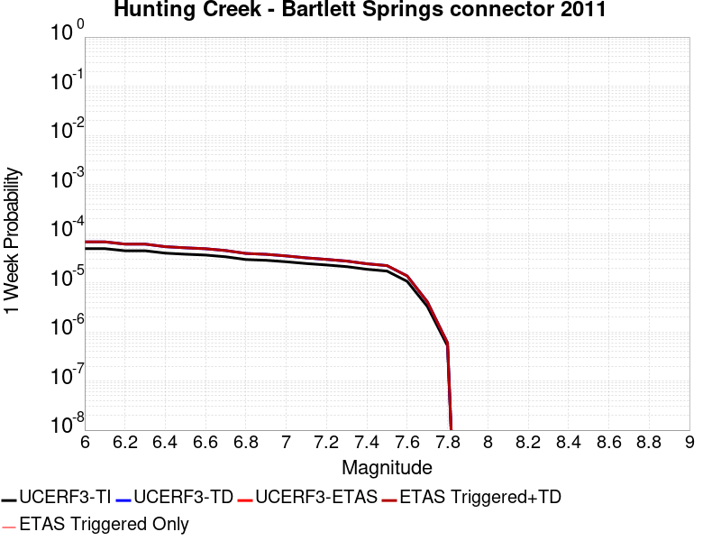 | 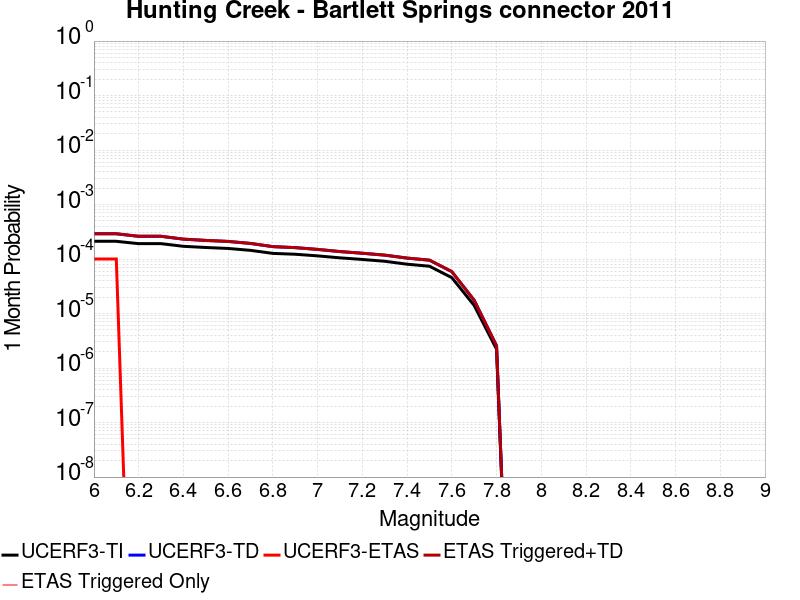 | 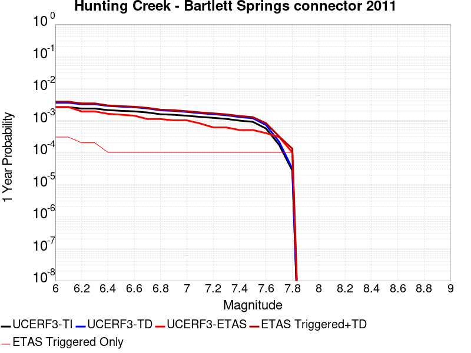 | 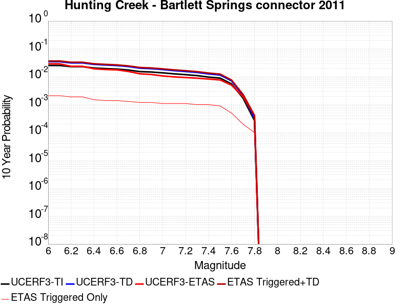 |

| Magnitude | 1 wk TI Prob | 1 wk TD Prob | 1 wk ETAS Prob | 1 wk ETAS/TD Gain | 1 wk ETAS Triggered+TD | 1 wk ETAS Triggered Only | 1 mo TI Prob | 1 mo TD Prob | 1 mo ETAS Prob | 1 mo ETAS/TD Gain | 1 mo ETAS Triggered+TD | 1 mo ETAS Triggered Only | 1 yr TI Prob | 1 yr TD Prob | 1 yr ETAS Prob | 1 yr ETAS/TD Gain | 1 yr ETAS Triggered+TD | 1 yr ETAS Triggered Only | 10 yr TI Prob | 10 yr TD Prob | 10 yr ETAS Prob | 10 yr ETAS/TD Gain | 10 yr ETAS Triggered+TD | 10 yr ETAS Triggered Only |
|-----|-----|-----|-----|-----|-----|-----|-----|-----|-----|-----|-----|-----|-----|-----|-----|-----|-----|-----|-----|-----|-----|-----|-----|-----|
| 6.0 | 4.940016E-5 | 6.791604E-5 | 0.0 | 0.0 | 6.791604E-5 | 0.0 | 2.1169778E-4 | 2.9103426E-4 | 1.0E-4 | 0.34360218 | 2.9103426E-4 | 0.0 | 0.002574374 | 0.0035374467 | 0.0026 | 0.7349934 | 0.0038363854 | 3.0E-4 | 0.025447546 | 0.034797058 | 0.0291 | 0.8362776 | 0.036823984 | 0.0021 |
| 6.1 | 4.940016E-5 | 6.791604E-5 | 0.0 | 0.0 | 6.791604E-5 | 0.0 | 2.1169778E-4 | 2.9103426E-4 | 1.0E-4 | 0.34360218 | 2.9103426E-4 | 0.0 | 0.002574374 | 0.0035374467 | 0.0026 | 0.7349934 | 0.0038363854 | 3.0E-4 | 0.025447546 | 0.034797058 | 0.0291 | 0.8362776 | 0.036823984 | 0.0021 |
| 6.2 | 4.472471E-5 | 6.104605E-5 | 0.0 | 0.0 | 6.104605E-5 | 0.0 | 1.9166325E-4 | 2.6159745E-4 | 0.0 | 0.0 | 2.6159745E-4 | 0.0 | 0.0023310026 | 0.0031802026 | 0.0019 | 0.5974462 | 0.0033795666 | 2.0E-4 | 0.02306703 | 0.031337492 | 0.0237 | 0.75628257 | 0.033177953 | 0.0019 |
| 6.3 | 4.472471E-5 | 6.104605E-5 | 0.0 | 0.0 | 6.104605E-5 | 0.0 | 1.9166325E-4 | 2.6159745E-4 | 0.0 | 0.0 | 2.6159745E-4 | 0.0 | 0.0023310026 | 0.0031802026 | 0.0019 | 0.5974462 | 0.0033795666 | 2.0E-4 | 0.02306703 | 0.031337492 | 0.0237 | 0.75628257 | 0.033177953 | 0.0019 |
| 6.4 | 4.0001003E-5 | 5.4139648E-5 | 0.0 | 0.0 | 5.4139648E-5 | 0.0 | 1.714216E-4 | 2.3200619E-4 | 0.0 | 0.0 | 2.3200619E-4 | 0.0 | 0.0020850603 | 0.0028209654 | 0.0016 | 0.5671817 | 0.0029206832 | 1.0E-4 | 0.02065605 | 0.027846247 | 0.0193 | 0.69309163 | 0.029304478 | 0.0015 |
| 6.5 | 3.8033053E-5 | 5.129897E-5 | 0.0 | 0.0 | 5.129897E-5 | 0.0 | 1.6298861E-4 | 2.1983392E-4 | 0.0 | 0.0 | 2.1983392E-4 | 0.0 | 0.0019825802 | 0.0026731663 | 0.0015 | 0.5611323 | 0.0027728989 | 1.0E-4 | 0.019649856 | 0.026407251 | 0.0182 | 0.68920463 | 0.02777028 | 0.0014 |
| 6.6 | 3.653754E-5 | 4.9160328E-5 | 0.0 | 0.0 | 4.9160328E-5 | 0.0 | 1.5658008E-4 | 2.1067017E-4 | 0.0 | 0.0 | 2.1067017E-4 | 0.0 | 0.0019046954 | 0.002561885 | 0.0014 | 0.54647267 | 0.0026616286 | 1.0E-4 | 0.018884527 | 0.025322381 | 0.0177 | 0.6989864 | 0.02668693 | 0.0014 |
| 6.7 | 3.372024E-5 | 4.5167893E-5 | 0.0 | 0.0 | 4.5167893E-5 | 0.0 | 1.4450731E-4 | 1.9356233E-4 | 0.0 | 0.0 | 1.9356233E-4 | 0.0 | 0.0017579567 | 0.002354093 | 0.0011 | 0.46727127 | 0.0024538576 | 1.0E-4 | 0.017441148 | 0.023292575 | 0.0155 | 0.6654481 | 0.024562294 | 0.0013 |
| 6.8 | 2.9650024E-5 | 3.9434588E-5 | 0.0 | 0.0 | 3.9434588E-5 | 0.0 | 1.2706534E-4 | 1.6899435E-4 | 0.0 | 0.0 | 1.6899435E-4 | 0.0 | 0.0015459227 | 0.0020555549 | 0.0011 | 0.5351353 | 0.0021553491 | 1.0E-4 | 0.015352124 | 0.020363314 | 0.0128 | 0.62858135 | 0.021538878 | 0.0012 |
| 6.9 | 2.860775E-5 | 3.783438E-5 | 0.0 | 0.0 | 3.783438E-5 | 0.0 | 1.2259888E-4 | 1.6213725E-4 | 0.0 | 0.0 | 1.6213725E-4 | 0.0 | 0.0014916194 | 0.0019722404 | 0.001 | 0.5070376 | 0.002072043 | 1.0E-4 | 0.014816469 | 0.019547187 | 0.0121 | 0.6190149 | 0.02072373 | 0.0012 |
| 7.0 | 2.6696067E-5 | 3.5087312E-5 | 0.0 | 0.0 | 3.5087312E-5 | 0.0 | 1.144067E-4 | 1.503656E-4 | 0.0 | 0.0 | 1.503656E-4 | 0.0 | 0.0013920115 | 0.0018291721 | 0.001 | 0.5466954 | 0.0019289892 | 1.0E-4 | 0.013833242 | 0.018141728 | 0.0107 | 0.5898005 | 0.019221773 | 0.0011 |
| 7.1 | 2.456087E-5 | 3.2031647E-5 | 0.0 | 0.0 | 3.2031647E-5 | 0.0 | 1.0525662E-4 | 1.3727132E-4 | 0.0 | 0.0 | 1.3727132E-4 | 0.0 | 0.001280746 | 0.0016700061 | 8.0E-4 | 0.47904018 | 0.0017698391 | 1.0E-4 | 0.012733897 | 0.01657608 | 0.0099 | 0.59724617 | 0.017657846 | 0.0011 |
| 7.2 | 2.295761E-5 | 2.9840372E-5 | 0.0 | 0.0 | 2.9840372E-5 | 0.0 | 9.8386045E-5 | 1.278811E-4 | 0.0 | 0.0 | 1.278811E-4 | 0.0 | 0.0011971919 | 0.0015558496 | 6.0E-4 | 0.3856414 | 0.001655694 | 1.0E-4 | 0.011907627 | 0.015451252 | 0.0094 | 0.60836494 | 0.016534256 | 0.0011 |
| 7.3 | 2.1256936E-5 | 2.7558272E-5 | 0.0 | 0.0 | 2.7558272E-5 | 0.0 | 9.109797E-5 | 1.18101576E-4 | 0.0 | 0.0 | 1.18101576E-4 | 0.0 | 0.0011085535 | 0.0014369471 | 6.0E-4 | 0.41755188 | 0.0015368034 | 1.0E-4 | 0.011030397 | 0.014278199 | 0.0089 | 0.6233279 | 0.015263921 | 0.001 |
| 7.4 | 1.8784336E-5 | 2.43214E-5 | 0.0 | 0.0 | 2.43214E-5 | 0.0 | 8.050181E-5 | 1.0423045E-4 | 0.0 | 0.0 | 1.0423045E-4 | 0.0 | 9.796688E-4 | 0.0012682746 | 5.0E-4 | 0.3942364 | 0.0013681478 | 1.0E-4 | 0.009753612 | 0.012611715 | 0.0083 | 0.65811825 | 0.013599103 | 0.001 |
| 7.5 | 1.7248298E-5 | 2.2282242E-5 | 0.0 | 0.0 | 2.2282242E-5 | 0.0 | 7.391918E-5 | 9.549187E-5 | 0.0 | 0.0 | 9.549187E-5 | 0.0 | 8.9959445E-4 | 0.0011620009 | 5.0E-4 | 0.43029225 | 0.0012618847 | 1.0E-4 | 0.008959615 | 0.011560513 | 0.0077 | 0.66606045 | 0.012450108 | 9.0E-4 |
| 7.6 | 1.0653709E-5 | 1.3730895E-5 | 0.0 | 0.0 | 1.3730895E-5 | 0.0 | 4.5657955E-5 | 5.8845384E-5 | 0.0 | 0.0 | 5.8845384E-5 | 0.0 | 5.557438E-4 | 7.1620976E-4 | 4.0E-4 | 0.55849564 | 8.161381E-4 | 1.0E-4 | 0.0055435603 | 0.0071396246 | 0.005 | 0.70031697 | 0.0076360544 | 5.0E-4 |
| 7.7 | 3.286316E-6 | 4.0926175E-6 | 0.0 | 0.0 | 4.0926175E-6 | 0.0 | 1.4084137E-5 | 1.753967E-5 | 0.0 | 0.0 | 1.753967E-5 | 0.0 | 1.7146087E-4 | 2.1352473E-4 | 3.0E-4 | 1.4049895 | 3.1350338E-4 | 1.0E-4 | 0.0017132863 | 0.00213323 | 0.0019 | 0.89066815 | 0.0023328033 | 2.0E-4 |
| 7.8 | 5.1855085E-7 | 5.978903E-7 | 0.0 | 0.0 | 5.978903E-7 | 0.0 | 2.222359E-6 | 2.5623845E-6 | 0.0 | 0.0 | 2.5623845E-6 | 0.0 | 2.7056883E-5 | 3.1196592E-5 | 1.0E-4 | 3.2054782 | 1.3119348E-4 | 1.0E-4 | 2.705359E-4 | 3.1191588E-4 | 4.0E-4 | 1.282397 | 4.1188468E-4 | 1.0E-4 |

## Mission (connected) 2011 CFM
*[(top)](#table-of-contents)*

| 1 Week | 1 Month | 1 Year | 10 Year |
|-----|-----|-----|-----|
| 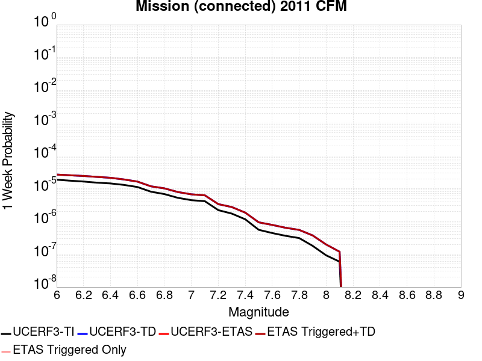 | 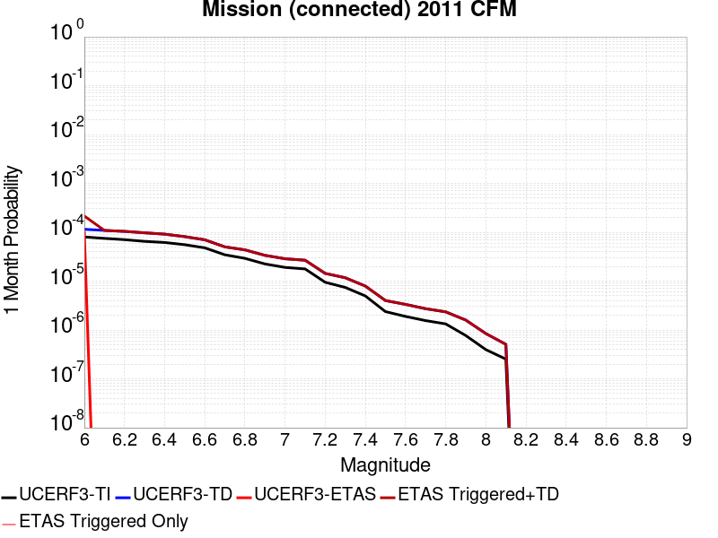 | 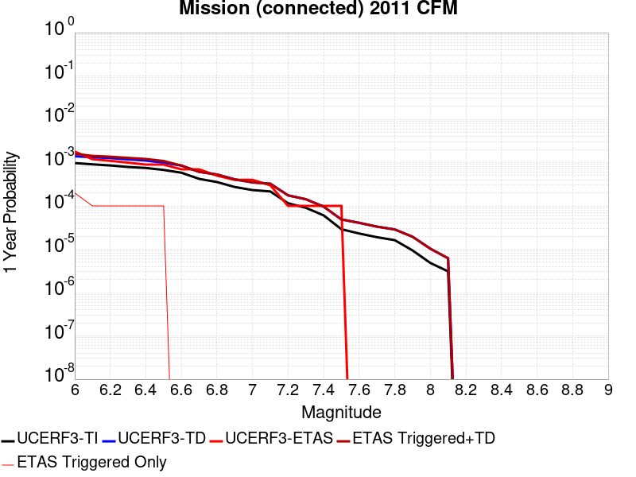 | 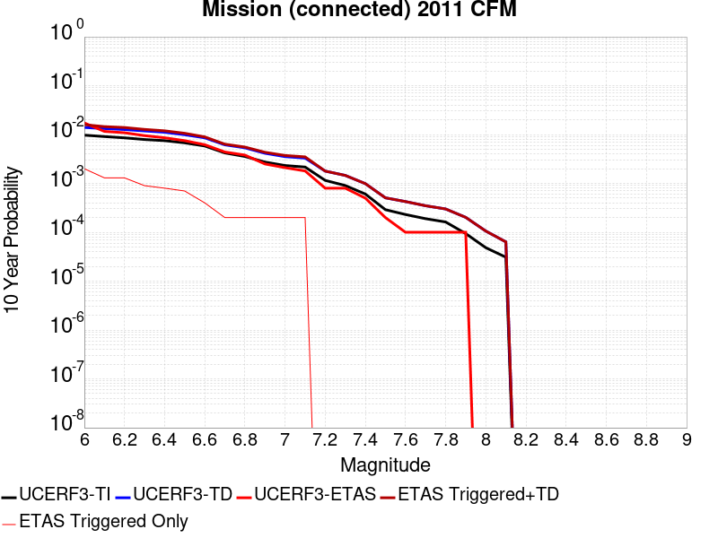 |

| Magnitude | 1 wk TI Prob | 1 wk TD Prob | 1 wk ETAS Prob | 1 wk ETAS/TD Gain | 1 wk ETAS Triggered+TD | 1 wk ETAS Triggered Only | 1 mo TI Prob | 1 mo TD Prob | 1 mo ETAS Prob | 1 mo ETAS/TD Gain | 1 mo ETAS Triggered+TD | 1 mo ETAS Triggered Only | 1 yr TI Prob | 1 yr TD Prob | 1 yr ETAS Prob | 1 yr ETAS/TD Gain | 1 yr ETAS Triggered+TD | 1 yr ETAS Triggered Only | 10 yr TI Prob | 10 yr TD Prob | 10 yr ETAS Prob | 10 yr ETAS/TD Gain | 10 yr ETAS Triggered+TD | 10 yr ETAS Triggered Only |
|-----|-----|-----|-----|-----|-----|-----|-----|-----|-----|-----|-----|-----|-----|-----|-----|-----|-----|-----|-----|-----|-----|-----|-----|-----|
| 6.0 | 1.8735573E-5 | 2.6924352E-5 | 0.0 | 0.0 | 2.6924352E-5 | 0.0 | 8.029284E-5 | 1.1538398E-4 | 2.0E-4 | 1.7333429 | 2.1537243E-4 | 1.0E-4 | 9.771269E-4 | 0.0014037982 | 0.0018 | 1.2822355 | 0.0016035176 | 2.0E-4 | 0.009728416 | 0.013957139 | 0.0173 | 1.239509 | 0.015929226 | 0.002 |
| 6.1 | 1.7515964E-5 | 2.5565309E-5 | 0.0 | 0.0 | 2.5565309E-5 | 0.0 | 7.506625E-5 | 1.0956001E-4 | 0.0 | 0.0 | 1.0956001E-4 | 0.0 | 9.135484E-4 | 0.0013329801 | 0.0012 | 0.9002385 | 0.0014328468 | 1.0E-4 | 0.009098019 | 0.013257593 | 0.0116 | 0.8749703 | 0.014540358 | 0.0013 |
| 6.2 | 1.6486343E-5 | 2.440969E-5 | 0.0 | 0.0 | 2.440969E-5 | 0.0 | 7.065384E-5 | 1.0460777E-4 | 0.0 | 0.0 | 1.0460777E-4 | 0.0 | 8.5987104E-4 | 0.0012727588 | 0.0011 | 0.86426425 | 0.0013726315 | 1.0E-4 | 0.008565514 | 0.012662431 | 0.0109 | 0.86081415 | 0.01394597 | 0.0013 |
| 6.3 | 1.5229385E-5 | 2.2838227E-5 | 0.0 | 0.0 | 2.2838227E-5 | 0.0 | 6.526716E-5 | 9.787346E-5 | 0.0 | 0.0 | 9.787346E-5 | 0.0 | 7.9433795E-4 | 0.0011908613 | 0.001 | 0.8397283 | 0.0012907423 | 1.0E-4 | 0.007915046 | 0.01185521 | 0.0095 | 0.8013354 | 0.012744541 | 9.0E-4 |
| 6.4 | 1.4435828E-5 | 2.1436923E-5 | 0.0 | 0.0 | 2.1436923E-5 | 0.0 | 6.186637E-5 | 9.1868314E-5 | 0.0 | 0.0 | 9.1868314E-5 | 0.0 | 7.529627E-4 | 0.0011178273 | 9.0E-4 | 0.80513334 | 0.0012177156 | 1.0E-4 | 0.007504165 | 0.0111376755 | 0.0086 | 0.7721539 | 0.011928766 | 8.0E-4 |
| 6.5 | 1.30127955E-5 | 1.9071455E-5 | 0.0 | 0.0 | 1.9071455E-5 | 0.0 | 5.576793E-5 | 8.173207E-5 | 0.0 | 0.0 | 8.173207E-5 | 0.0 | 6.78763E-4 | 9.945985E-4 | 9.0E-4 | 0.90488774 | 0.0010944991 | 1.0E-4 | 0.0067669353 | 0.009928592 | 0.0075 | 0.75539416 | 0.010621642 | 7.0E-4 |
| 6.6 | 1.1220718E-5 | 1.6425818E-5 | 0.0 | 0.0 | 1.6425818E-5 | 0.0 | 4.8087906E-5 | 7.039446E-5 | 0.0 | 0.0 | 7.039446E-5 | 0.0 | 5.8531296E-4 | 8.567151E-4 | 7.0E-4 | 0.8170745 | 8.567151E-4 | 0.0 | 0.005837737 | 0.008565629 | 0.0062 | 0.7238231 | 0.008962203 | 4.0E-4 |
| 6.7 | 8.086152E-6 | 1.1777516E-5 | 0.0 | 0.0 | 1.1777516E-5 | 0.0 | 3.4654473E-5 | 5.04741E-5 | 0.0 | 0.0 | 5.04741E-5 | 0.0 | 4.2183654E-4 | 6.143497E-4 | 7.0E-4 | 1.1394162 | 6.143497E-4 | 0.0 | 0.004210367 | 0.006163573 | 0.0044 | 0.71387166 | 0.00636234 | 2.0E-4 |
| 6.8 | 6.8361655E-6 | 1.021984E-5 | 0.0 | 0.0 | 1.021984E-5 | 0.0 | 2.9297524E-5 | 4.3798584E-5 | 0.0 | 0.0 | 4.3798584E-5 | 0.0 | 3.5663895E-4 | 5.331179E-4 | 5.0E-4 | 0.93787885 | 5.331179E-4 | 0.0 | 0.0035606713 | 0.0053511728 | 0.0038 | 0.71012473 | 0.0055501023 | 2.0E-4 |
| 6.9 | 5.2517353E-6 | 7.889528E-6 | 0.0 | 0.0 | 7.889528E-6 | 0.0 | 2.2507242E-5 | 3.3811826E-5 | 0.0 | 0.0 | 3.3811826E-5 | 0.0 | 2.739912E-4 | 4.1158148E-4 | 4.0E-4 | 0.971861 | 4.1158148E-4 | 0.0 | 0.0027365363 | 0.0041404422 | 0.0025 | 0.60380024 | 0.004339614 | 2.0E-4 |
| 7.0 | 4.4602784E-6 | 6.7202504E-6 | 0.0 | 0.0 | 6.7202504E-6 | 0.0 | 1.911534E-5 | 2.8800756E-5 | 0.0 | 0.0 | 2.8800756E-5 | 0.0 | 2.327044E-4 | 3.5059295E-4 | 4.0E-4 | 1.1409242 | 3.5059295E-4 | 0.0 | 0.0023246086 | 0.0035317615 | 0.0021 | 0.59460413 | 0.0037310552 | 2.0E-4 |
| 7.1 | 4.1492594E-6 | 6.267877E-6 | 0.0 | 0.0 | 6.267877E-6 | 0.0 | 1.7782419E-5 | 2.6862055E-5 | 0.0 | 0.0 | 2.6862055E-5 | 0.0 | 2.1647944E-4 | 3.2699658E-4 | 3.0E-4 | 0.9174408 | 3.2699658E-4 | 0.0 | 0.0021626868 | 0.0032960132 | 0.0018 | 0.5461143 | 0.003495354 | 2.0E-4 |
| 7.2 | 2.213247E-6 | 3.374341E-6 | 0.0 | 0.0 | 3.374341E-6 | 0.0 | 9.485309E-6 | 1.4461382E-5 | 0.0 | 0.0 | 1.4461382E-5 | 0.0 | 1.15477524E-4 | 1.7605313E-4 | 1.0E-4 | 0.56801033 | 1.7605313E-4 | 0.0 | 0.0011541754 | 0.001787649 | 8.0E-4 | 0.44751516 | 0.001787649 | 0.0 |
| 7.3 | 1.7362703E-6 | 2.7486553E-6 | 0.0 | 0.0 | 2.7486553E-6 | 0.0 | 7.4411373E-6 | 1.1779898E-5 | 0.0 | 0.0 | 1.1779898E-5 | 0.0 | 9.0592075E-5 | 1.4341084E-4 | 1.0E-4 | 0.69729733 | 1.4341084E-4 | 0.0 | 9.0555154E-4 | 0.0014583584 | 8.0E-4 | 0.548562 | 0.0014583584 | 0.0 |
| 7.4 | 1.1628409E-6 | 1.8576744E-6 | 0.0 | 0.0 | 1.8576744E-6 | 0.0 | 4.9835944E-6 | 7.961437E-6 | 0.0 | 0.0 | 7.961437E-6 | 0.0 | 6.0673574E-5 | 9.6926204E-5 | 1.0E-4 | 1.0317128 | 9.6926204E-5 | 0.0 | 6.065701E-4 | 9.895161E-4 | 5.0E-4 | 0.5052975 | 9.895161E-4 | 0.0 |
| 7.5 | 5.5610667E-7 | 9.4077643E-7 | 0.0 | 0.0 | 9.4077643E-7 | 0.0 | 2.3833122E-6 | 4.031893E-6 | 0.0 | 0.0 | 4.031893E-6 | 0.0 | 2.9016439E-5 | 4.9087193E-5 | 1.0E-4 | 2.0371912 | 4.9087193E-5 | 0.0 | 2.901265E-4 | 5.0730753E-4 | 2.0E-4 | 0.39423817 | 5.0730753E-4 | 0.0 |
| 7.6 | 4.4307663E-7 | 7.8457253E-7 | 0.0 | 0.0 | 7.8457253E-7 | 0.0 | 1.8988985E-6 | 3.3624494E-6 | 0.0 | 0.0 | 3.3624494E-6 | 0.0 | 2.3118844E-5 | 4.0937055E-5 | 0.0 | 0.0 | 4.0937055E-5 | 0.0 | 2.3116439E-4 | 4.2516357E-4 | 1.0E-4 | 0.2352036 | 4.2516357E-4 | 0.0 |
| 7.7 | 3.639119E-7 | 6.4097003E-7 | 0.0 | 0.0 | 6.4097003E-7 | 0.0 | 1.5596215E-6 | 2.7470114E-6 | 0.0 | 0.0 | 2.7470114E-6 | 0.0 | 1.8988227E-5 | 3.3444354E-5 | 0.0 | 0.0 | 3.3444354E-5 | 0.0 | 1.8986604E-4 | 3.4964978E-4 | 1.0E-4 | 0.28600046 | 3.4964978E-4 | 0.0 |
| 7.8 | 3.1152942E-7 | 5.521125E-7 | 0.0 | 0.0 | 5.521125E-7 | 0.0 | 1.3351254E-6 | 2.3661942E-6 | 0.0 | 0.0 | 2.3661942E-6 | 0.0 | 1.6255031E-5 | 2.8808035E-5 | 0.0 | 0.0 | 2.8808035E-5 | 0.0 | 1.6253842E-4 | 3.0003695E-4 | 1.0E-4 | 0.33329228 | 3.0003695E-4 | 0.0 |
| 7.9 | 1.8035962E-7 | 3.7472176E-7 | 0.0 | 0.0 | 3.7472176E-7 | 0.0 | 7.729696E-7 | 1.6059494E-6 | 0.0 | 0.0 | 1.6059494E-6 | 0.0 | 9.410865E-6 | 1.9552259E-5 | 0.0 | 0.0 | 1.9552259E-5 | 0.0 | 9.410465E-5 | 2.0212609E-4 | 1.0E-4 | 0.4947407 | 2.0212609E-4 | 0.0 |
| 8.0 | 9.279334E-8 | 1.9835063E-7 | 0.0 | 0.0 | 1.9835063E-7 | 0.0 | 3.976857E-7 | 8.500739E-7 | 0.0 | 0.0 | 8.500739E-7 | 0.0 | 4.841813E-6 | 1.0349601E-5 | 0.0 | 0.0 | 1.0349601E-5 | 0.0 | 4.841707E-5 | 1.059828E-4 | 0.0 | 0.0 | 1.059828E-4 | 0.0 |
| 8.1 | 5.9253985E-8 | 1.1930742E-7 | 0.0 | 0.0 | 1.1930742E-7 | 0.0 | 2.5394561E-7 | 5.1131735E-7 | 0.0 | 0.0 | 5.1131735E-7 | 0.0 | 3.0917836E-6 | 6.2252716E-6 | 0.0 | 0.0 | 6.2252716E-6 | 0.0 | 3.0917407E-5 | 6.362946E-5 | 0.0 | 0.0 | 6.362946E-5 | 0.0 |

## Coronado Bank alt1
*[(top)](#table-of-contents)*

| 1 Week | 1 Month | 1 Year | 10 Year |
|-----|-----|-----|-----|
| 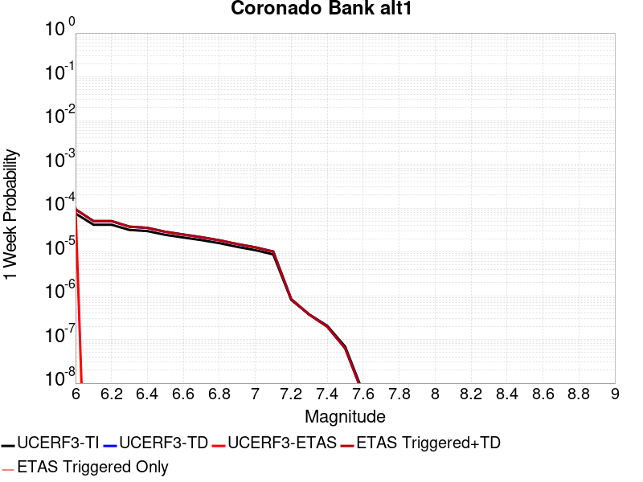 | 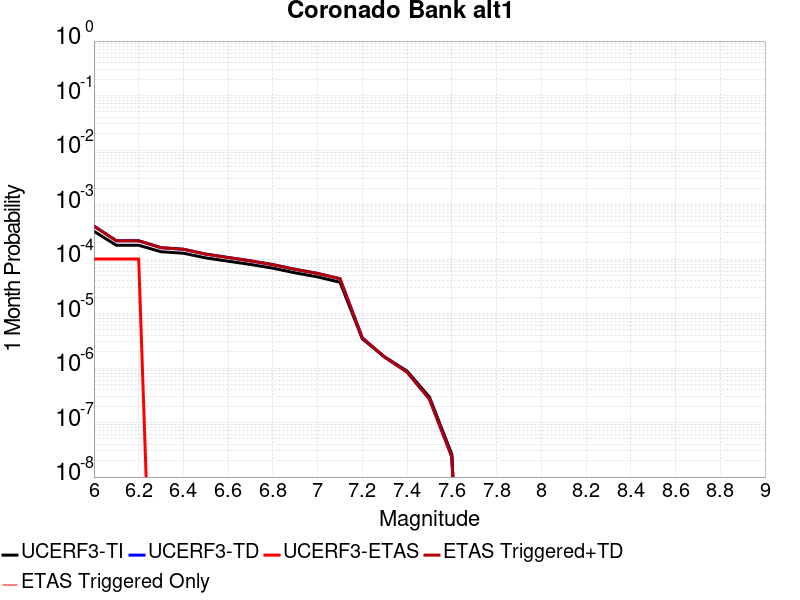 | 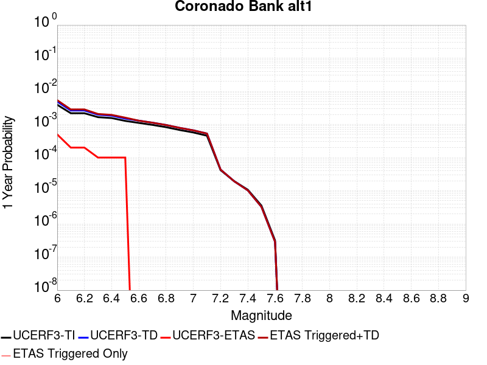 | 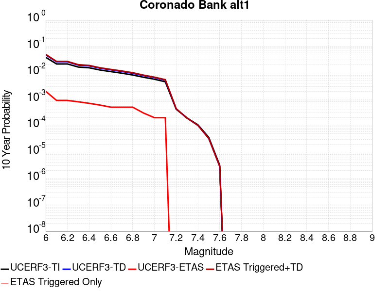 |

| Magnitude | 1 wk TI Prob | 1 wk TD Prob | 1 wk ETAS Prob | 1 wk ETAS/TD Gain | 1 wk ETAS Triggered+TD | 1 wk ETAS Triggered Only | 1 mo TI Prob | 1 mo TD Prob | 1 mo ETAS Prob | 1 mo ETAS/TD Gain | 1 mo ETAS Triggered+TD | 1 mo ETAS Triggered Only | 1 yr TI Prob | 1 yr TD Prob | 1 yr ETAS Prob | 1 yr ETAS/TD Gain | 1 yr ETAS Triggered+TD | 1 yr ETAS Triggered Only | 10 yr TI Prob | 10 yr TD Prob | 10 yr ETAS Prob | 10 yr ETAS/TD Gain | 10 yr ETAS Triggered+TD | 10 yr ETAS Triggered Only |
|-----|-----|-----|-----|-----|-----|-----|-----|-----|-----|-----|-----|-----|-----|-----|-----|-----|-----|-----|-----|-----|-----|-----|-----|-----|
| 6.0 | 7.533492E-5 | 9.3999E-5 | 1.0E-4 | 1.0638411 | 9.3999E-5 | 0.0 | 3.22824E-4 | 4.0279242E-4 | 1.0E-4 | 0.24826685 | 4.0279242E-4 | 0.0 | 0.0039233007 | 0.0048935795 | 0.0036 | 0.7356578 | 0.0053911326 | 5.0E-4 | 0.03854755 | 0.047927428 | 0.0315 | 0.6572437 | 0.049831573 | 0.002 |
| 6.1 | 4.1807285E-5 | 5.0514827E-5 | 0.0 | 0.0 | 5.0514827E-5 | 0.0 | 1.7916178E-4 | 2.1647451E-4 | 1.0E-4 | 0.46194816 | 2.1647451E-4 | 0.0 | 0.0021791123 | 0.0026324675 | 0.0015 | 0.5698076 | 0.002831941 | 2.0E-4 | 0.021578677 | 0.02602214 | 0.0158 | 0.6071753 | 0.02689872 | 9.0E-4 |
| 6.2 | 4.1807285E-5 | 5.0514827E-5 | 0.0 | 0.0 | 5.0514827E-5 | 0.0 | 1.7916178E-4 | 2.1647451E-4 | 1.0E-4 | 0.46194816 | 2.1647451E-4 | 0.0 | 0.0021791123 | 0.0026324675 | 0.0015 | 0.5698076 | 0.002831941 | 2.0E-4 | 0.021578677 | 0.02602214 | 0.0158 | 0.6071753 | 0.02689872 | 9.0E-4 |
| 6.3 | 3.1793104E-5 | 3.7725727E-5 | 0.0 | 0.0 | 3.7725727E-5 | 0.0 | 1.3624904E-4 | 1.6167185E-4 | 0.0 | 0.0 | 1.6167185E-4 | 0.0 | 0.0016575698 | 0.0019666096 | 0.0011 | 0.5593383 | 0.002066413 | 1.0E-4 | 0.016452603 | 0.01949596 | 0.0117 | 0.6001243 | 0.020280363 | 8.0E-4 |
| 6.4 | 2.9878007E-5 | 3.534923E-5 | 0.0 | 0.0 | 3.534923E-5 | 0.0 | 1.2804232E-4 | 1.514881E-4 | 0.0 | 0.0 | 1.514881E-4 | 0.0 | 0.0015578003 | 0.0018428393 | 0.0011 | 0.596905 | 0.0019426551 | 1.0E-4 | 0.015469253 | 0.018279342 | 0.0109 | 0.59630156 | 0.018966546 | 7.0E-4 |
| 6.5 | 2.4512565E-5 | 2.8774504E-5 | 0.0 | 0.0 | 2.8774504E-5 | 0.0 | 1.0504962E-4 | 1.2331363E-4 | 0.0 | 0.0 | 1.2331363E-4 | 0.0 | 0.0012782287 | 0.0015003362 | 0.001 | 0.66651726 | 0.0016001862 | 1.0E-4 | 0.012709012 | 0.014905039 | 0.0094 | 0.6306592 | 0.015496096 | 6.0E-4 |
| 6.6 | 2.1317413E-5 | 2.4915422E-5 | 0.0 | 0.0 | 2.4915422E-5 | 0.0 | 9.135714E-5 | 1.0677613E-4 | 0.0 | 0.0 | 1.0677613E-4 | 0.0 | 0.0011117056 | 0.0012992464 | 8.0E-4 | 0.61574155 | 0.0012992464 | 0.0 | 0.011061605 | 0.0129189165 | 0.008 | 0.619247 | 0.013412457 | 5.0E-4 |
| 6.7 | 1.8585655E-5 | 2.1642298E-5 | 0.0 | 0.0 | 2.1642298E-5 | 0.0 | 7.9650374E-5 | 9.274952E-5 | 0.0 | 0.0 | 9.274952E-5 | 0.0 | 9.6931186E-4 | 0.001128661 | 6.0E-4 | 0.5316034 | 0.001128661 | 0.0 | 0.0096509475 | 0.011231451 | 0.0072 | 0.64105695 | 0.0117258355 | 5.0E-4 |
| 6.8 | 1.5862879E-5 | 1.8425688E-5 | 0.0 | 0.0 | 1.8425688E-5 | 0.0 | 6.798199E-5 | 7.896496E-5 | 0.0 | 0.0 | 7.896496E-5 | 0.0 | 8.273665E-4 | 9.609936E-4 | 6.0E-4 | 0.6243538 | 9.609936E-4 | 0.0 | 0.008242928 | 0.009570363 | 0.0063 | 0.6582823 | 0.010065578 | 5.0E-4 |
| 6.9 | 1.3021509E-5 | 1.510031E-5 | 0.0 | 0.0 | 1.510031E-5 | 0.0 | 5.5805274E-5 | 6.4714106E-5 | 0.0 | 0.0 | 6.4714106E-5 | 0.0 | 6.792174E-4 | 7.876276E-4 | 5.0E-4 | 0.6348178 | 7.876276E-4 | 0.0 | 0.006771452 | 0.007850186 | 0.0052 | 0.6624047 | 0.00814783 | 3.0E-4 |
| 7.0 | 1.0974371E-5 | 1.2724361E-5 | 0.0 | 0.0 | 1.2724361E-5 | 0.0 | 4.7032172E-5 | 5.4531934E-5 | 0.0 | 0.0 | 5.4531934E-5 | 0.0 | 5.7246623E-4 | 6.6374167E-4 | 2.0E-4 | 0.30132204 | 6.6374167E-4 | 0.0 | 0.0057099373 | 0.006619343 | 0.0041 | 0.6193968 | 0.006818019 | 2.0E-4 |
| 7.1 | 8.766221E-6 | 1.0167256E-5 | 0.0 | 0.0 | 1.0167256E-5 | 0.0 | 3.7568978E-5 | 4.3573324E-5 | 0.0 | 0.0 | 4.3573324E-5 | 0.0 | 4.573063E-4 | 5.303933E-4 | 2.0E-4 | 0.37707868 | 5.303933E-4 | 0.0 | 0.0045636636 | 0.005292975 | 0.0033 | 0.6234679 | 0.0054919166 | 2.0E-4 |
| 7.2 | 8.026024E-7 | 8.3329337E-7 | 0.0 | 0.0 | 8.3329337E-7 | 0.0 | 3.43972E-6 | 3.5712526E-6 | 0.0 | 0.0 | 3.5712526E-6 | 0.0 | 4.1877785E-5 | 4.3479144E-5 | 1.0E-4 | 2.2999532 | 4.3479144E-5 | 0.0 | 4.1869894E-4 | 4.3470747E-4 | 3.0E-4 | 0.69011927 | 4.3470747E-4 | 0.0 |
| 7.3 | 3.7293114E-7 | 3.700508E-7 | 0.0 | 0.0 | 3.700508E-7 | 0.0 | 1.5982754E-6 | 1.585931E-6 | 0.0 | 0.0 | 1.585931E-6 | 0.0 | 1.9458828E-5 | 1.930854E-5 | 1.0E-4 | 5.1790557 | 1.930854E-5 | 0.0 | 1.9457124E-4 | 1.9306868E-4 | 1.0E-4 | 0.5179504 | 1.9306868E-4 | 0.0 |
| 7.4 | 2.0557036E-7 | 1.9676378E-7 | 0.0 | 0.0 | 1.9676378E-7 | 0.0 | 8.810155E-7 | 8.432731E-7 | 0.0 | 0.0 | 8.432731E-7 | 0.0 | 1.0726311E-5 | 1.0266802E-5 | 0.0 | 0.0 | 1.0266802E-5 | 0.0 | 1.0725793E-4 | 1.026633E-4 | 0.0 | 0.0 | 1.026633E-4 | 0.0 |
| 7.5 | 6.845446E-8 | 6.2800794E-8 | 0.0 | 0.0 | 6.2800794E-8 | 0.0 | 2.9337625E-7 | 2.6914623E-7 | 0.0 | 0.0 | 2.6914623E-7 | 0.0 | 3.5718497E-6 | 3.2768505E-6 | 0.0 | 0.0 | 3.2768505E-6 | 0.0 | 3.5717923E-5 | 3.276803E-5 | 0.0 | 0.0 | 3.276803E-5 | 0.0 |
| 7.6 | 6.0975145E-9 | 5.532084E-9 | 0.0 | 0.0 | 5.532084E-9 | 0.0 | 2.6132206E-8 | 2.3708932E-8 | 0.0 | 0.0 | 2.3708932E-8 | 0.0 | 3.1815955E-7 | 2.886562E-7 | 0.0 | 0.0 | 2.886562E-7 | 0.0 | 3.181591E-6 | 2.8865593E-6 | 0.0 | 0.0 | 2.8865593E-6 | 0.0 |

## San Diego Trough south
*[(top)](#table-of-contents)*

| 1 Week | 1 Month | 1 Year | 10 Year |
|-----|-----|-----|-----|
| 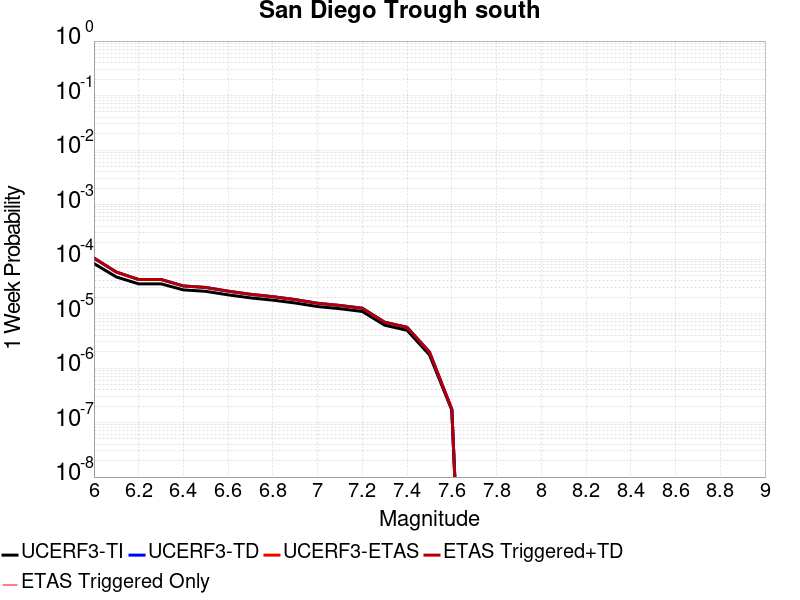 | 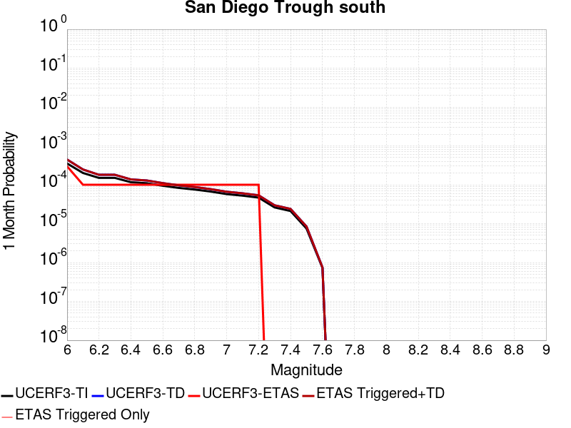 | 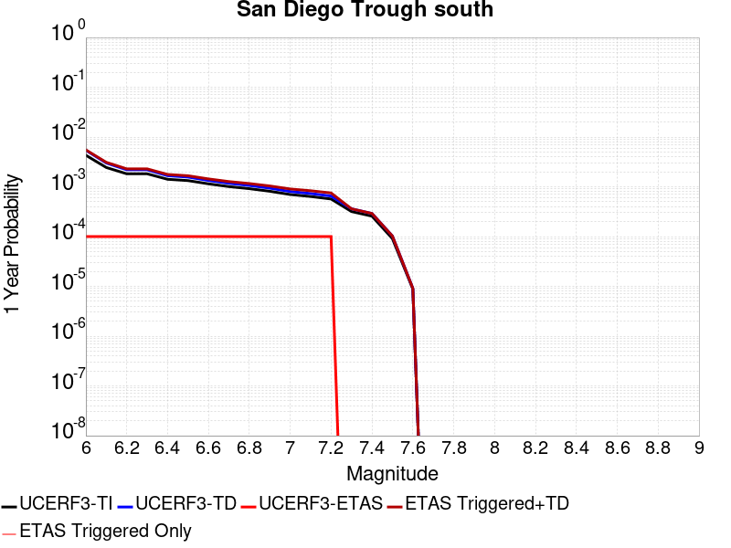 | 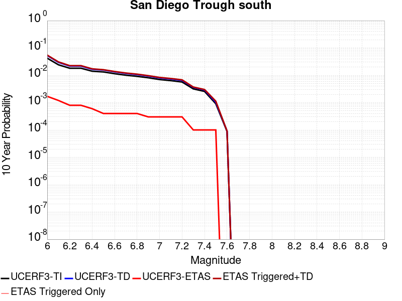 |

| Magnitude | 1 wk TI Prob | 1 wk TD Prob | 1 wk ETAS Prob | 1 wk ETAS/TD Gain | 1 wk ETAS Triggered+TD | 1 wk ETAS Triggered Only | 1 mo TI Prob | 1 mo TD Prob | 1 mo ETAS Prob | 1 mo ETAS/TD Gain | 1 mo ETAS Triggered+TD | 1 mo ETAS Triggered Only | 1 yr TI Prob | 1 yr TD Prob | 1 yr ETAS Prob | 1 yr ETAS/TD Gain | 1 yr ETAS Triggered+TD | 1 yr ETAS Triggered Only | 10 yr TI Prob | 10 yr TD Prob | 10 yr ETAS Prob | 10 yr ETAS/TD Gain | 10 yr ETAS Triggered+TD | 10 yr ETAS Triggered Only |
|-----|-----|-----|-----|-----|-----|-----|-----|-----|-----|-----|-----|-----|-----|-----|-----|-----|-----|-----|-----|-----|-----|-----|-----|-----|
| 6.0 | 8.279495E-5 | 1.043094E-4 | 1.0E-4 | 0.95868635 | 1.043094E-4 | 0.0 | 3.5478722E-4 | 4.4696842E-4 | 3.0E-4 | 0.67118835 | 4.4696842E-4 | 0.0 | 0.004310982 | 0.0054287077 | 0.0032 | 0.5894589 | 0.0055281646 | 1.0E-4 | 0.042283054 | 0.053019337 | 0.032 | 0.60355335 | 0.054629207 | 0.0017 |
| 6.1 | 4.6961468E-5 | 5.7756482E-5 | 0.0 | 0.0 | 5.7756482E-5 | 0.0 | 2.0124791E-4 | 2.4750523E-4 | 1.0E-4 | 0.40403184 | 2.4750523E-4 | 0.0 | 0.00244744 | 0.0030092895 | 0.002 | 0.6646087 | 0.0031089887 | 1.0E-4 | 0.024206603 | 0.029693196 | 0.0166 | 0.5590507 | 0.030857563 | 0.0012 |
| 6.2 | 3.5079658E-5 | 4.2160005E-5 | 0.0 | 0.0 | 4.2160005E-5 | 0.0 | 1.5033272E-4 | 1.8067344E-4 | 1.0E-4 | 0.5534848 | 1.8067344E-4 | 0.0 | 0.0018287642 | 0.0021974999 | 0.0019 | 0.86461896 | 0.0022972801 | 1.0E-4 | 0.018137876 | 0.0217601 | 0.0128 | 0.5882326 | 0.022542693 | 8.0E-4 |
| 6.3 | 3.5079658E-5 | 4.2160005E-5 | 0.0 | 0.0 | 4.2160005E-5 | 0.0 | 1.5033272E-4 | 1.8067344E-4 | 1.0E-4 | 0.5534848 | 1.8067344E-4 | 0.0 | 0.0018287642 | 0.0021974999 | 0.0019 | 0.86461896 | 0.0022972801 | 1.0E-4 | 0.018137876 | 0.0217601 | 0.0128 | 0.5882326 | 0.022542693 | 8.0E-4 |
| 6.4 | 2.7196904E-5 | 3.2099113E-5 | 0.0 | 0.0 | 3.2099113E-5 | 0.0 | 1.16552954E-4 | 1.3756043E-4 | 1.0E-4 | 0.7269532 | 1.3756043E-4 | 0.0 | 0.0014181085 | 0.0016735229 | 0.0014 | 0.83655864 | 0.0017733555 | 1.0E-4 | 0.014090929 | 0.0166108 | 0.0095 | 0.5719171 | 0.017200833 | 6.0E-4 |
| 6.5 | 2.5584688E-5 | 3.0112651E-5 | 0.0 | 0.0 | 3.0112651E-5 | 0.0 | 1.0964406E-4 | 1.2904788E-4 | 1.0E-4 | 0.77490616 | 1.2904788E-4 | 0.0 | 0.0013340989 | 0.001570037 | 0.0011 | 0.7006204 | 0.00166988 | 1.0E-4 | 0.013261181 | 0.01559099 | 0.0085 | 0.5451867 | 0.015984753 | 4.0E-4 |
| 6.6 | 2.2034688E-5 | 2.5751691E-5 | 0.0 | 0.0 | 2.5751691E-5 | 0.0 | 9.443096E-5 | 1.10359775E-4 | 1.0E-4 | 0.9061273 | 1.10359775E-4 | 0.0 | 0.0011490905 | 0.0013428094 | 0.0011 | 0.8191781 | 0.0014426751 | 1.0E-4 | 0.011431668 | 0.013347949 | 0.0073 | 0.5469005 | 0.013742609 | 4.0E-4 |
| 6.7 | 1.9394853E-5 | 2.2549344E-5 | 0.0 | 0.0 | 2.2549344E-5 | 0.0 | 8.311815E-5 | 9.663649E-5 | 1.0E-4 | 1.0348058 | 9.663649E-5 | 0.0 | 0.0010114936 | 0.0011759195 | 0.001 | 0.85039836 | 0.0012758019 | 1.0E-4 | 0.01006902 | 0.011697677 | 0.007 | 0.5984094 | 0.012092997 | 4.0E-4 |
| 6.8 | 1.7615313E-5 | 2.040987E-5 | 0.0 | 0.0 | 2.040987E-5 | 0.0 | 7.549201E-5 | 8.746796E-5 | 1.0E-4 | 1.1432757 | 8.746796E-5 | 0.0 | 9.1872766E-4 | 0.0010644066 | 9.0E-4 | 0.8455416 | 0.0011643001 | 1.0E-4 | 0.009149387 | 0.010593651 | 0.0066 | 0.6230147 | 0.010989414 | 4.0E-4 |
| 6.9 | 1.5621423E-5 | 1.8031857E-5 | 0.0 | 0.0 | 1.8031857E-5 | 0.0 | 6.6947236E-5 | 7.7277116E-5 | 1.0E-4 | 1.2940441 | 7.7277116E-5 | 0.0 | 8.147778E-4 | 9.4044633E-4 | 9.0E-4 | 0.95699245 | 0.0010403523 | 1.0E-4 | 0.008117969 | 0.00936511 | 0.0058 | 0.61932003 | 0.0096623 | 3.0E-4 |
| 7.0 | 1.3444376E-5 | 1.545285E-5 | 0.0 | 0.0 | 1.545285E-5 | 0.0 | 5.7617483E-5 | 6.622483E-5 | 1.0E-4 | 1.5100076 | 6.622483E-5 | 0.0 | 7.0126704E-4 | 8.059918E-4 | 9.0E-4 | 1.1166366 | 9.059112E-4 | 1.0E-4 | 0.006990582 | 0.008031019 | 0.005 | 0.622586 | 0.00832861 | 3.0E-4 |
| 7.1 | 1.2268361E-5 | 1.407731E-5 | 0.0 | 0.0 | 1.407731E-5 | 0.0 | 5.2577634E-5 | 6.032995E-5 | 1.0E-4 | 1.6575515 | 6.032995E-5 | 0.0 | 6.399447E-4 | 7.3427224E-4 | 9.0E-4 | 1.2257035 | 8.341988E-4 | 1.0E-4 | 0.0063810493 | 0.0073187663 | 0.0045 | 0.61485773 | 0.0076165707 | 3.0E-4 |
| 7.2 | 1.0922655E-5 | 1.2517332E-5 | 0.0 | 0.0 | 1.2517332E-5 | 0.0 | 4.681054E-5 | 5.364462E-5 | 1.0E-4 | 1.8641198 | 5.364462E-5 | 0.0 | 5.697693E-4 | 6.5293006E-4 | 8.0E-4 | 1.2252461 | 7.5286475E-4 | 1.0E-4 | 0.0056831064 | 0.006510398 | 0.004 | 0.61440176 | 0.006808445 | 3.0E-4 |
| 7.3 | 6.1106753E-6 | 6.9308453E-6 | 0.0 | 0.0 | 6.9308453E-6 | 0.0 | 2.6188345E-5 | 2.9703288E-5 | 0.0 | 0.0 | 2.9703288E-5 | 0.0 | 3.1879646E-4 | 3.6157793E-4 | 5.0E-4 | 1.3828278 | 3.6157793E-4 | 0.0 | 0.0031833951 | 0.0036099416 | 0.0021 | 0.5817269 | 0.0037095805 | 1.0E-4 |
| 7.4 | 4.933187E-6 | 5.591093E-6 | 0.0 | 0.0 | 5.591093E-6 | 0.0 | 2.114206E-5 | 2.3961611E-5 | 0.0 | 0.0 | 2.3961611E-5 | 0.0 | 2.5737417E-4 | 2.9169396E-4 | 3.0E-4 | 1.0284753 | 2.9169396E-4 | 0.0 | 0.002570763 | 0.0029131519 | 0.0018 | 0.61788744 | 0.0030128607 | 1.0E-4 |
| 7.5 | 1.7489613E-6 | 1.9701965E-6 | 0.0 | 0.0 | 1.9701965E-6 | 0.0 | 7.495527E-6 | 8.443673E-6 | 0.0 | 0.0 | 8.443673E-6 | 0.0 | 9.125422E-5 | 1.027971E-4 | 1.0E-4 | 0.97279006 | 1.027971E-4 | 0.0 | 9.1216754E-4 | 0.0010275175 | 4.0E-4 | 0.38928777 | 0.0011274148 | 1.0E-4 |
| 7.6 | 1.6988751E-7 | 1.7534983E-7 | 0.0 | 0.0 | 1.7534983E-7 | 0.0 | 7.2808916E-7 | 7.5149904E-7 | 0.0 | 0.0 | 7.5149904E-7 | 0.0 | 8.864449E-6 | 9.149464E-6 | 0.0 | 0.0 | 9.149464E-6 | 0.0 | 8.8640954E-5 | 9.149107E-5 | 1.0E-4 | 1.0930028 | 9.149107E-5 | 0.0 |

## Greenville (No) 2011 CFM
*[(top)](#table-of-contents)*

| 1 Week | 1 Month | 1 Year | 10 Year |
|-----|-----|-----|-----|
| 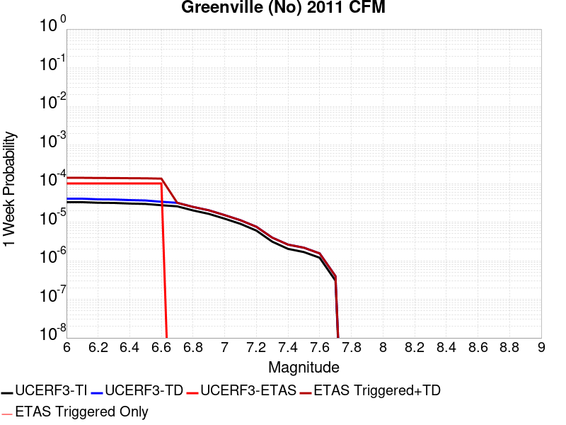 | 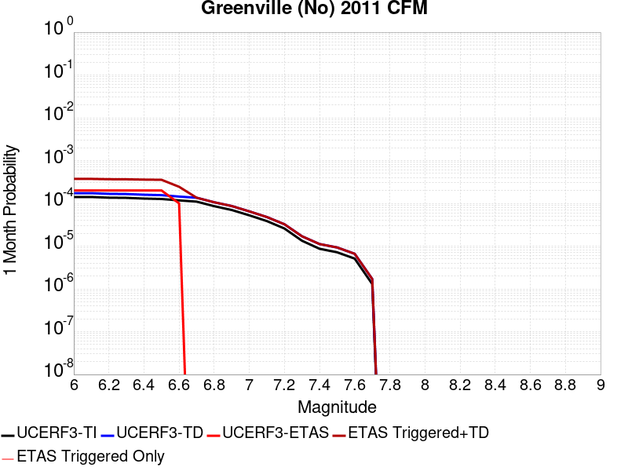 | 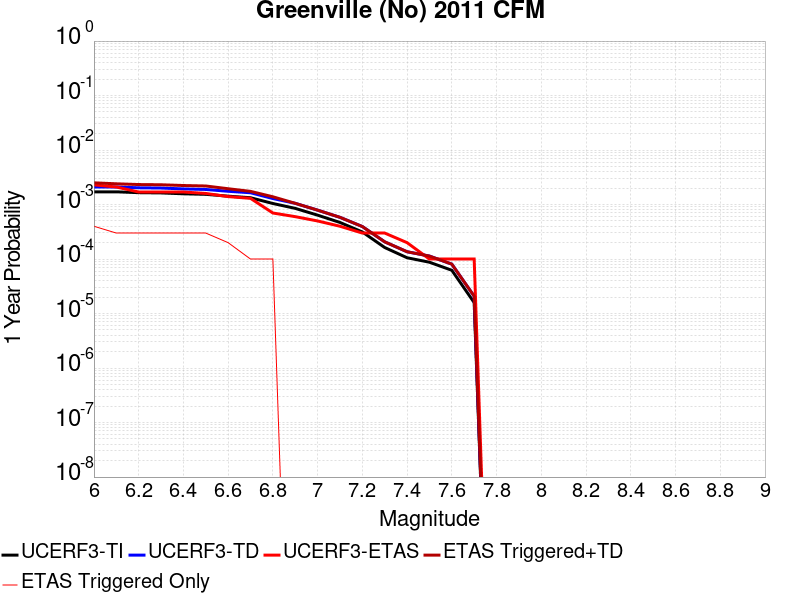 | 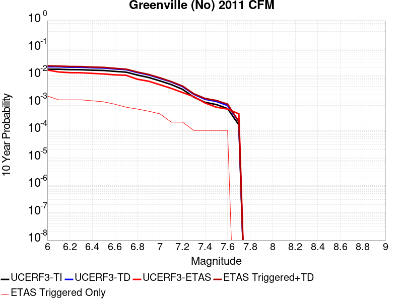 |

| Magnitude | 1 wk TI Prob | 1 wk TD Prob | 1 wk ETAS Prob | 1 wk ETAS/TD Gain | 1 wk ETAS Triggered+TD | 1 wk ETAS Triggered Only | 1 mo TI Prob | 1 mo TD Prob | 1 mo ETAS Prob | 1 mo ETAS/TD Gain | 1 mo ETAS Triggered+TD | 1 mo ETAS Triggered Only | 1 yr TI Prob | 1 yr TD Prob | 1 yr ETAS Prob | 1 yr ETAS/TD Gain | 1 yr ETAS Triggered+TD | 1 yr ETAS Triggered Only | 10 yr TI Prob | 10 yr TD Prob | 10 yr ETAS Prob | 10 yr ETAS/TD Gain | 10 yr ETAS Triggered+TD | 10 yr ETAS Triggered Only |
|-----|-----|-----|-----|-----|-----|-----|-----|-----|-----|-----|-----|-----|-----|-----|-----|-----|-----|-----|-----|-----|-----|-----|-----|-----|
| 6.0 | 3.286654E-5 | 4.0391333E-5 | 1.0E-4 | 2.4757786 | 1.4038729E-4 | 1.0E-4 | 1.4084899E-4 | 1.7309445E-4 | 3.0E-4 | 1.7331579 | 3.7305983E-4 | 2.0E-4 | 0.0017134876 | 0.0021054256 | 0.0023 | 1.0924157 | 0.0025045834 | 4.0E-4 | 0.017003356 | 0.020859862 | 0.0159 | 0.7622294 | 0.022622313 | 0.0018 |
| 6.1 | 3.286654E-5 | 4.0391333E-5 | 1.0E-4 | 2.4757786 | 1.4038729E-4 | 1.0E-4 | 1.4084899E-4 | 1.7309445E-4 | 3.0E-4 | 1.7331579 | 3.7305983E-4 | 2.0E-4 | 0.0017134876 | 0.0021054256 | 0.0021 | 0.99742305 | 0.0024047939 | 3.0E-4 | 0.017003356 | 0.020859862 | 0.0135 | 0.6471759 | 0.022132743 | 0.0013 |
| 6.2 | 3.1697953E-5 | 3.8953563E-5 | 1.0E-4 | 2.5671592 | 1.3894966E-4 | 1.0E-4 | 1.358413E-4 | 1.6693337E-4 | 3.0E-4 | 1.7971241 | 3.669E-4 | 2.0E-4 | 0.0016526132 | 0.002030556 | 0.0017 | 0.8372091 | 0.002329947 | 3.0E-4 | 0.01640377 | 0.020124918 | 0.0127 | 0.63105845 | 0.021398757 | 0.0013 |
| 6.3 | 3.1363317E-5 | 3.8542243E-5 | 1.0E-4 | 2.5945556 | 1.385384E-4 | 1.0E-4 | 1.344073E-4 | 1.651708E-4 | 3.0E-4 | 1.8163017 | 3.6513776E-4 | 2.0E-4 | 0.0016351803 | 0.0020091364 | 0.0017 | 0.84613466 | 0.0023085338 | 3.0E-4 | 0.016232004 | 0.01991459 | 0.0126 | 0.63270193 | 0.0211887 | 0.0013 |
| 6.4 | 3.0228604E-5 | 3.714872E-5 | 1.0E-4 | 2.6918828 | 1.37145E-4 | 1.0E-4 | 1.2954473E-4 | 1.5919929E-4 | 3.0E-4 | 1.8844305 | 3.5916743E-4 | 2.0E-4 | 0.0015760659 | 0.0019365643 | 0.0017 | 0.87784326 | 0.0022359835 | 3.0E-4 | 0.015649348 | 0.019201608 | 0.012 | 0.62494767 | 0.020378565 | 0.0012 |
| 6.5 | 2.9537814E-5 | 3.630378E-5 | 1.0E-4 | 2.754534 | 1.3630015E-4 | 1.0E-4 | 1.2658449E-4 | 1.5557856E-4 | 3.0E-4 | 1.9282863 | 3.5554744E-4 | 2.0E-4 | 0.0015400766 | 0.0018925595 | 0.0016 | 0.845416 | 0.0021919915 | 3.0E-4 | 0.01529447 | 0.018769076 | 0.0114 | 0.60738206 | 0.01984843 | 0.0011 |
| 6.6 | 2.7345395E-5 | 3.3611846E-5 | 1.0E-4 | 2.9751418 | 1.3360848E-4 | 1.0E-4 | 1.1718928E-4 | 1.4404299E-4 | 1.0E-4 | 0.69423723 | 2.4402858E-4 | 1.0E-4 | 0.0014258457 | 0.0017523437 | 0.0014 | 0.79893 | 0.0019519933 | 2.0E-4 | 0.014167317 | 0.017389275 | 0.0106 | 0.60957116 | 0.018273624 | 9.0E-4 |
| 6.7 | 2.5615784E-5 | 3.1588028E-5 | 0.0 | 0.0 | 3.1588028E-5 | 0.0 | 1.09777306E-4 | 1.3537041E-4 | 0.0 | 0.0 | 1.3537041E-4 | 0.0 | 0.0013357193 | 0.0016469195 | 0.0013 | 0.7893525 | 0.0017467547 | 1.0E-4 | 0.013277191 | 0.016351013 | 0.0102 | 0.6238146 | 0.017039567 | 7.0E-4 |
| 6.8 | 2.0059057E-5 | 2.4729703E-5 | 0.0 | 0.0 | 2.4729703E-5 | 0.0 | 8.596455E-5 | 1.0598023E-4 | 0.0 | 0.0 | 1.0598023E-4 | 0.0 | 0.0010461159 | 0.0012895619 | 7.0E-4 | 0.54282004 | 0.0013894328 | 1.0E-4 | 0.0104120495 | 0.012823002 | 0.0073 | 0.56928945 | 0.013415309 | 6.0E-4 |
| 6.9 | 1.6321746E-5 | 2.020031E-5 | 0.0 | 0.0 | 2.020031E-5 | 0.0 | 6.9948466E-5 | 8.6569955E-5 | 0.0 | 0.0 | 8.6569955E-5 | 0.0 | 8.5128983E-4 | 0.001053492 | 6.0E-4 | 0.5695345 | 0.001053492 | 0.0 | 0.008480361 | 0.010486704 | 0.0062 | 0.59122485 | 0.010981461 | 5.0E-4 |
| 7.0 | 1.22527645E-5 | 1.5145989E-5 | 0.0 | 0.0 | 1.5145989E-5 | 0.0 | 5.2510793E-5 | 6.490979E-5 | 0.0 | 0.0 | 6.490979E-5 | 0.0 | 6.3913135E-4 | 7.8999443E-4 | 5.0E-4 | 0.63291585 | 7.8999443E-4 | 0.0 | 0.0063729626 | 0.007872799 | 0.0046 | 0.58429027 | 0.008269651 | 4.0E-4 |
| 7.1 | 8.996482E-6 | 1.1173037E-5 | 0.0 | 0.0 | 1.1173037E-5 | 0.0 | 3.8555783E-5 | 4.7883572E-5 | 0.0 | 0.0 | 4.7883572E-5 | 0.0 | 4.6931554E-4 | 5.828278E-4 | 4.0E-4 | 0.6863091 | 5.828278E-4 | 0.0 | 0.004683256 | 0.0058136396 | 0.0034 | 0.5848316 | 0.006012477 | 2.0E-4 |
| 7.2 | 6.0273087E-6 | 7.576308E-6 | 0.0 | 0.0 | 7.576308E-6 | 0.0 | 2.5831067E-5 | 3.2469492E-5 | 0.0 | 0.0 | 3.2469492E-5 | 0.0 | 3.1444785E-4 | 3.9524504E-4 | 3.0E-4 | 0.75902283 | 3.9524504E-4 | 0.0 | 0.0031400328 | 0.003945924 | 0.0024 | 0.6082226 | 0.0041451347 | 2.0E-4 |
| 7.3 | 3.1209995E-6 | 3.968426E-6 | 0.0 | 0.0 | 3.968426E-6 | 0.0 | 1.3375643E-5 | 1.7007429E-5 | 0.0 | 0.0 | 1.7007429E-5 | 0.0 | 1.6283628E-4 | 2.0704594E-4 | 3.0E-4 | 1.4489537 | 2.0704594E-4 | 0.0 | 0.0016271701 | 0.0020689964 | 0.0017 | 0.8216544 | 0.0021687895 | 1.0E-4 |
| 7.4 | 2.0254208E-6 | 2.6114044E-6 | 0.0 | 0.0 | 2.6114044E-6 | 0.0 | 8.680347E-6 | 1.1191685E-5 | 0.0 | 0.0 | 1.1191685E-5 | 0.0 | 1.0567809E-4 | 1.3625031E-4 | 2.0E-4 | 1.4678866 | 1.3625031E-4 | 0.0 | 0.0010562785 | 0.0013619753 | 0.001 | 0.7342277 | 0.0014618391 | 1.0E-4 |
| 7.5 | 1.6763418E-6 | 2.1747574E-6 | 0.0 | 0.0 | 2.1747574E-6 | 0.0 | 7.184302E-6 | 9.320356E-6 | 0.0 | 0.0 | 9.320356E-6 | 0.0 | 8.746537E-5 | 1.1346948E-4 | 1.0E-4 | 0.88129425 | 1.1346948E-4 | 0.0 | 8.743095E-4 | 0.001134425 | 7.0E-4 | 0.6170526 | 0.0012343116 | 1.0E-4 |
| 7.6 | 1.1935462E-6 | 1.5471528E-6 | 0.0 | 0.0 | 1.5471528E-6 | 0.0 | 5.115188E-6 | 6.6306384E-6 | 0.0 | 0.0 | 6.6306384E-6 | 0.0 | 6.2275634E-5 | 8.0725076E-5 | 1.0E-4 | 1.2387724 | 8.0725076E-5 | 0.0 | 6.2258187E-4 | 8.0725725E-4 | 6.0E-4 | 0.7432575 | 9.071765E-4 | 1.0E-4 |
| 7.7 | 3.0464201E-7 | 3.9880095E-7 | 0.0 | 0.0 | 3.9880095E-7 | 0.0 | 1.3056081E-6 | 1.7091459E-6 | 0.0 | 0.0 | 1.7091459E-6 | 0.0 | 1.589566E-5 | 2.0808657E-5 | 1.0E-4 | 4.805692 | 2.0808657E-5 | 0.0 | 1.5894524E-4 | 2.0806972E-4 | 4.0E-4 | 1.9224325 | 2.0806972E-4 | 0.0 |

## South Klamath Lake West
*[(top)](#table-of-contents)*

| 1 Week | 1 Month | 1 Year | 10 Year |
|-----|-----|-----|-----|
| 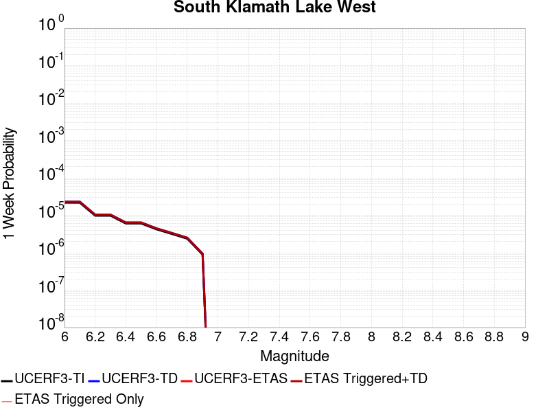 | 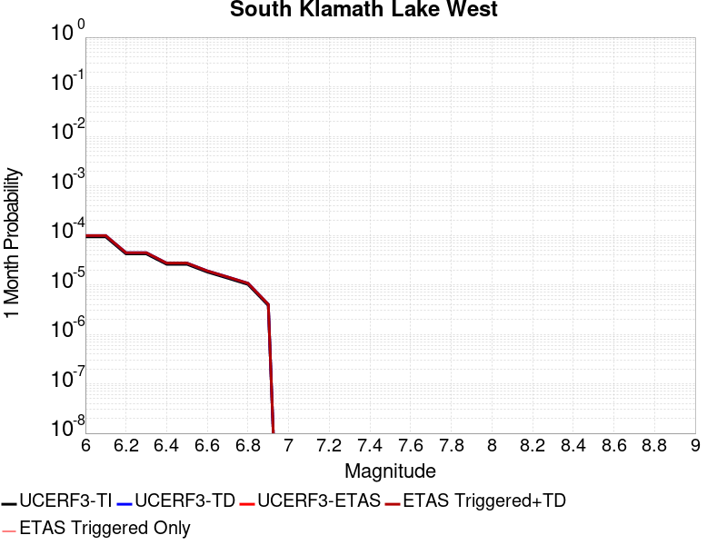 | 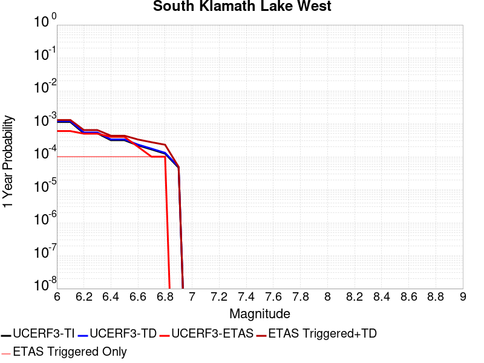 | 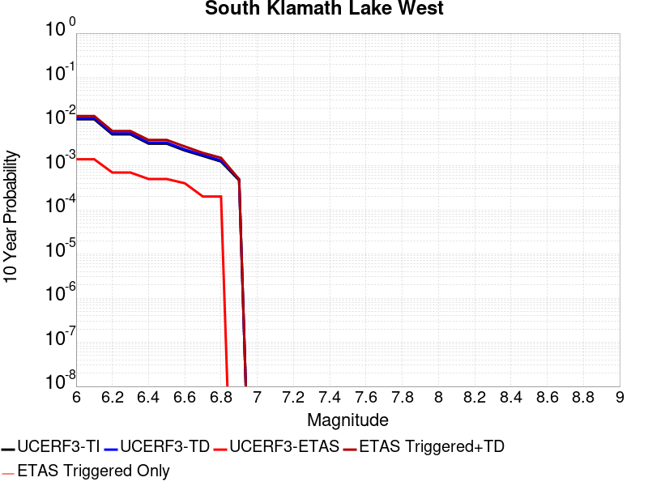 |

| Magnitude | 1 wk TI Prob | 1 wk TD Prob | 1 wk ETAS Prob | 1 wk ETAS/TD Gain | 1 wk ETAS Triggered+TD | 1 wk ETAS Triggered Only | 1 mo TI Prob | 1 mo TD Prob | 1 mo ETAS Prob | 1 mo ETAS/TD Gain | 1 mo ETAS Triggered+TD | 1 mo ETAS Triggered Only | 1 yr TI Prob | 1 yr TD Prob | 1 yr ETAS Prob | 1 yr ETAS/TD Gain | 1 yr ETAS Triggered+TD | 1 yr ETAS Triggered Only | 10 yr TI Prob | 10 yr TD Prob | 10 yr ETAS Prob | 10 yr ETAS/TD Gain | 10 yr ETAS Triggered+TD | 10 yr ETAS Triggered Only |
|-----|-----|-----|-----|-----|-----|-----|-----|-----|-----|-----|-----|-----|-----|-----|-----|-----|-----|-----|-----|-----|-----|-----|-----|-----|
| 6.0 | 2.174025E-5 | 2.3044868E-5 | 0.0 | 0.0 | 2.3044868E-5 | 0.0 | 9.3169176E-5 | 9.8760356E-5 | 0.0 | 0.0 | 9.8760356E-5 | 0.0 | 0.0011337444 | 0.0012018098 | 6.0E-4 | 0.499247 | 0.0013016897 | 1.0E-4 | 0.011279777 | 0.011959708 | 0.009 | 0.7525267 | 0.013342964 | 0.0014 |
| 6.1 | 2.174025E-5 | 2.3044868E-5 | 0.0 | 0.0 | 2.3044868E-5 | 0.0 | 9.3169176E-5 | 9.8760356E-5 | 0.0 | 0.0 | 9.8760356E-5 | 0.0 | 0.0011337444 | 0.0012018098 | 6.0E-4 | 0.499247 | 0.0013016897 | 1.0E-4 | 0.011279777 | 0.011959708 | 0.009 | 0.7525267 | 0.013342964 | 0.0014 |
| 6.2 | 9.834929E-6 | 1.0395058E-5 | 0.0 | 0.0 | 1.0395058E-5 | 0.0 | 4.2149015E-5 | 4.454954E-5 | 0.0 | 0.0 | 4.454954E-5 | 0.0 | 5.1304343E-4 | 5.422647E-4 | 5.0E-4 | 0.92205894 | 6.422105E-4 | 1.0E-4 | 0.0051186057 | 0.0054103173 | 0.0042 | 0.7762946 | 0.00610653 | 7.0E-4 |
| 6.3 | 9.834929E-6 | 1.0395058E-5 | 0.0 | 0.0 | 1.0395058E-5 | 0.0 | 4.2149015E-5 | 4.454954E-5 | 0.0 | 0.0 | 4.454954E-5 | 0.0 | 5.1304343E-4 | 5.422647E-4 | 5.0E-4 | 0.92205894 | 6.422105E-4 | 1.0E-4 | 0.0051186057 | 0.0054103173 | 0.0042 | 0.7762946 | 0.00610653 | 7.0E-4 |
| 6.4 | 6.066321E-6 | 6.4011556E-6 | 0.0 | 0.0 | 6.4011556E-6 | 0.0 | 2.5998259E-5 | 2.7433252E-5 | 0.0 | 0.0 | 2.7433252E-5 | 0.0 | 3.1648282E-4 | 3.3395138E-4 | 4.0E-4 | 1.1977792 | 4.3391797E-4 | 1.0E-4 | 0.0031603249 | 0.0033347658 | 0.0027 | 0.8096521 | 0.0038330983 | 5.0E-4 |
| 6.5 | 6.066321E-6 | 6.4011556E-6 | 0.0 | 0.0 | 6.4011556E-6 | 0.0 | 2.5998259E-5 | 2.7433252E-5 | 0.0 | 0.0 | 2.7433252E-5 | 0.0 | 3.1648282E-4 | 3.3395138E-4 | 4.0E-4 | 1.1977792 | 4.3391797E-4 | 1.0E-4 | 0.0031603249 | 0.0033347658 | 0.0027 | 0.8096521 | 0.0038330983 | 5.0E-4 |
| 6.6 | 4.2321803E-6 | 4.4617886E-6 | 0.0 | 0.0 | 4.4617886E-6 | 0.0 | 1.8137789E-5 | 1.9121817E-5 | 0.0 | 0.0 | 1.9121817E-5 | 0.0 | 2.208052E-4 | 2.3278427E-4 | 2.0E-4 | 0.8591646 | 3.32761E-4 | 1.0E-4 | 0.0022058594 | 0.0023255062 | 0.0019 | 0.8170264 | 0.002724576 | 4.0E-4 |
| 6.7 | 3.186646E-6 | 3.3606823E-6 | 0.0 | 0.0 | 3.3606823E-6 | 0.0 | 1.3656982E-5 | 1.4402848E-5 | 0.0 | 0.0 | 1.4402848E-5 | 0.0 | 1.6626107E-4 | 1.7534125E-4 | 1.0E-4 | 0.5703165 | 2.7532372E-4 | 1.0E-4 | 0.0016613674 | 0.0017520961 | 0.0012 | 0.6848939 | 0.0019517457 | 2.0E-4 |
| 6.8 | 2.380121E-6 | 2.511191E-6 | 0.0 | 0.0 | 2.511191E-6 | 0.0 | 1.0200479E-5 | 1.0762206E-5 | 0.0 | 0.0 | 1.0762206E-5 | 0.0 | 1.2418375E-4 | 1.3102245E-4 | 1.0E-4 | 0.763228 | 2.3100934E-4 | 1.0E-4 | 0.0012411437 | 0.0013094977 | 0.001 | 0.76365155 | 0.0015092358 | 2.0E-4 |
| 6.9 | 8.928287E-7 | 9.431342E-7 | 0.0 | 0.0 | 9.431342E-7 | 0.0 | 3.826403E-6 | 4.0419986E-6 | 0.0 | 0.0 | 4.0419986E-6 | 0.0 | 4.658546E-5 | 4.9210445E-5 | 0.0 | 0.0 | 4.9210445E-5 | 0.0 | 4.6575698E-4 | 4.920171E-4 | 4.0E-4 | 0.8129799 | 4.920171E-4 | 0.0 |

## Almanor 2011 CFM
*[(top)](#table-of-contents)*

| 1 Week | 1 Month | 1 Year | 10 Year |
|-----|-----|-----|-----|
| 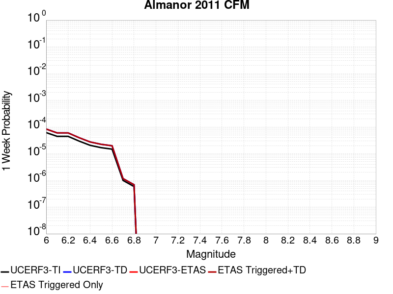 | 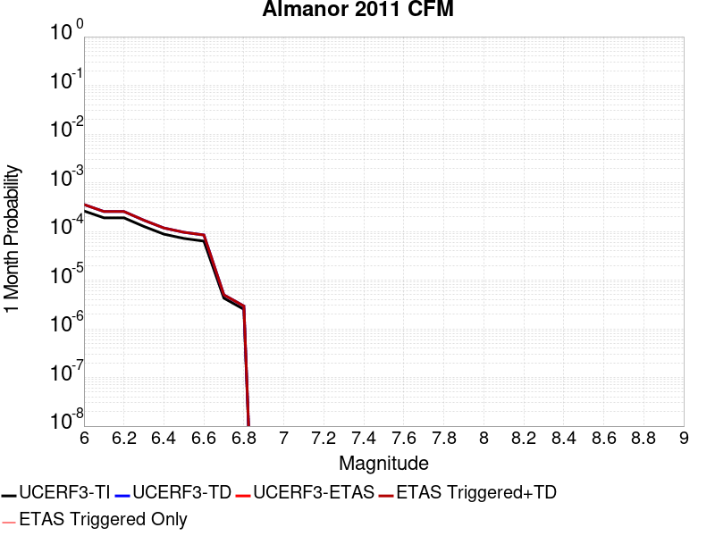 | 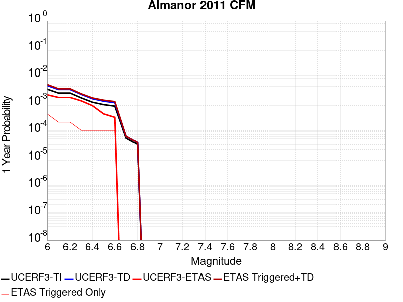 | 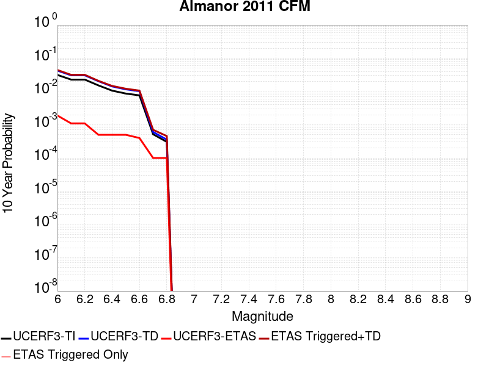 |

| Magnitude | 1 wk TI Prob | 1 wk TD Prob | 1 wk ETAS Prob | 1 wk ETAS/TD Gain | 1 wk ETAS Triggered+TD | 1 wk ETAS Triggered Only | 1 mo TI Prob | 1 mo TD Prob | 1 mo ETAS Prob | 1 mo ETAS/TD Gain | 1 mo ETAS Triggered+TD | 1 mo ETAS Triggered Only | 1 yr TI Prob | 1 yr TD Prob | 1 yr ETAS Prob | 1 yr ETAS/TD Gain | 1 yr ETAS Triggered+TD | 1 yr ETAS Triggered Only | 10 yr TI Prob | 10 yr TD Prob | 10 yr ETAS Prob | 10 yr ETAS/TD Gain | 10 yr ETAS Triggered+TD | 10 yr ETAS Triggered Only |
|-----|-----|-----|-----|-----|-----|-----|-----|-----|-----|-----|-----|-----|-----|-----|-----|-----|-----|-----|-----|-----|-----|-----|-----|-----|
| 6.0 | 6.1479834E-5 | 8.332903E-5 | 0.0 | 0.0 | 8.332903E-5 | 0.0 | 2.6345838E-4 | 3.5707868E-4 | 0.0 | 0.0 | 3.5707868E-4 | 0.0 | 0.0032028882 | 0.0043394454 | 0.002 | 0.4608884 | 0.0047377096 | 4.0E-4 | 0.031571172 | 0.042614624 | 0.0245 | 0.57492 | 0.044433657 | 0.0019 |
| 6.1 | 4.4387216E-5 | 5.980776E-5 | 0.0 | 0.0 | 5.980776E-5 | 0.0 | 1.9021705E-4 | 2.5629523E-4 | 0.0 | 0.0 | 2.5629523E-4 | 0.0 | 0.0023134327 | 0.0031164363 | 0.0016 | 0.51340693 | 0.0033158131 | 2.0E-4 | 0.022894967 | 0.030775648 | 0.0186 | 0.604374 | 0.031841796 | 0.0011 |
| 6.2 | 4.4387216E-5 | 5.980776E-5 | 0.0 | 0.0 | 5.980776E-5 | 0.0 | 1.9021705E-4 | 2.5629523E-4 | 0.0 | 0.0 | 2.5629523E-4 | 0.0 | 0.0023134327 | 0.0031164363 | 0.0016 | 0.51340693 | 0.0033158131 | 2.0E-4 | 0.022894967 | 0.030775648 | 0.0186 | 0.604374 | 0.031841796 | 0.0011 |
| 6.3 | 2.9523822E-5 | 3.957319E-5 | 0.0 | 0.0 | 3.957319E-5 | 0.0 | 1.2652454E-4 | 1.695885E-4 | 0.0 | 0.0 | 1.695885E-4 | 0.0 | 0.0015393476 | 0.0020631524 | 0.0012 | 0.5816342 | 0.0021629462 | 1.0E-4 | 0.015287281 | 0.020474333 | 0.0131 | 0.63982546 | 0.020964097 | 5.0E-4 |
| 6.4 | 2.0512744E-5 | 2.7448714E-5 | 0.0 | 0.0 | 2.7448714E-5 | 0.0 | 8.79088E-5 | 1.1763221E-4 | 0.0 | 0.0 | 1.1763221E-4 | 0.0 | 0.001069764 | 0.0014315551 | 8.0E-4 | 0.5588328 | 0.0015314119 | 1.0E-4 | 0.010646289 | 0.014253764 | 0.0095 | 0.6664906 | 0.014746637 | 5.0E-4 |
| 6.5 | 1.6750226E-5 | 2.2405091E-5 | 0.0 | 0.0 | 2.2405091E-5 | 0.0 | 7.178471E-5 | 9.6018375E-5 | 0.0 | 0.0 | 9.6018375E-5 | 0.0 | 8.7362836E-4 | 0.0011687252 | 4.0E-4 | 0.34225327 | 0.0012686083 | 1.0E-4 | 0.008702018 | 0.011656708 | 0.0075 | 0.64340633 | 0.01215088 | 5.0E-4 |
| 6.6 | 1.4745303E-5 | 1.9719859E-5 | 0.0 | 0.0 | 1.9719859E-5 | 0.0 | 6.319262E-5 | 8.451101E-5 | 0.0 | 0.0 | 8.451101E-5 | 0.0 | 7.690986E-4 | 0.0010287712 | 3.0E-4 | 0.29161006 | 0.0011286682 | 1.0E-4 | 0.0076644225 | 0.010271754 | 0.0065 | 0.6328033 | 0.010667645 | 4.0E-4 |
| 6.7 | 9.951145E-7 | 1.1620355E-6 | 0.0 | 0.0 | 1.1620355E-6 | 0.0 | 4.26477E-6 | 4.980144E-6 | 0.0 | 0.0 | 4.980144E-6 | 0.0 | 5.1922336E-5 | 6.0631737E-5 | 0.0 | 0.0 | 6.0631737E-5 | 0.0 | 5.1910203E-4 | 6.061692E-4 | 5.0E-4 | 0.82485217 | 7.061086E-4 | 1.0E-4 |
| 6.8 | 5.866312E-7 | 6.8517494E-7 | 0.0 | 0.0 | 6.8517494E-7 | 0.0 | 2.5141312E-6 | 2.9364614E-6 | 0.0 | 0.0 | 2.9364614E-6 | 0.0 | 3.0609117E-5 | 3.575096E-5 | 0.0 | 0.0 | 3.575096E-5 | 0.0 | 3.06049E-4 | 3.5746495E-4 | 3.0E-4 | 0.8392431 | 4.5742918E-4 | 1.0E-4 |

## Cleghorn Pass
*[(top)](#table-of-contents)*

| 1 Week | 1 Month | 1 Year | 10 Year |
|-----|-----|-----|-----|
| 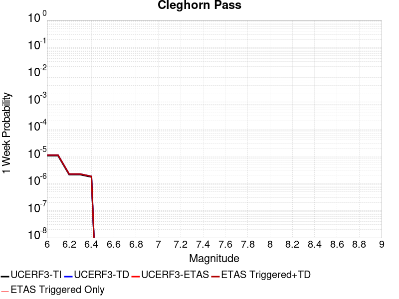 | 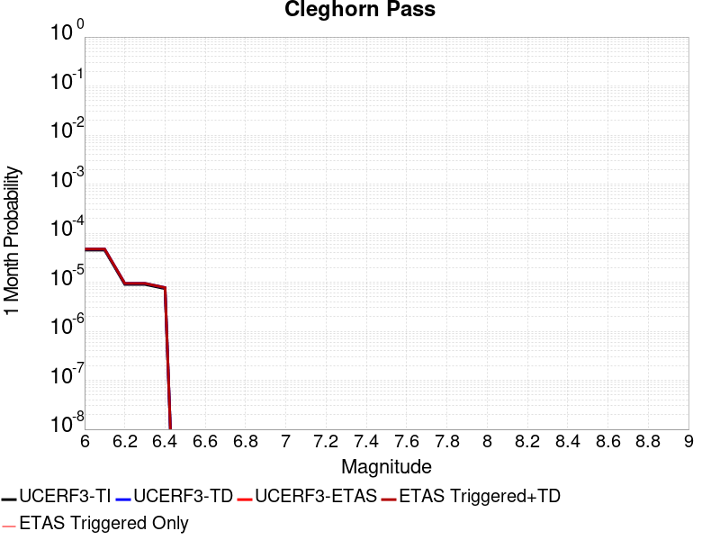 | 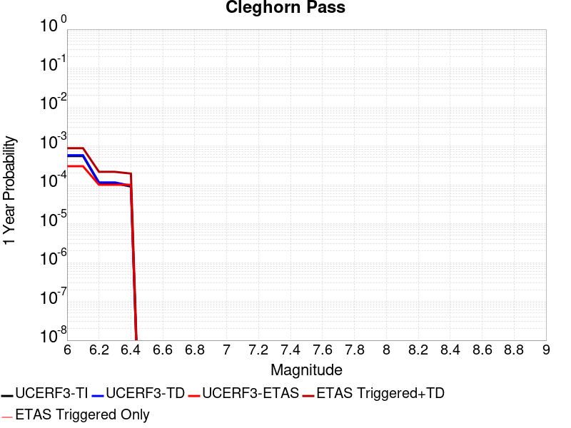 | 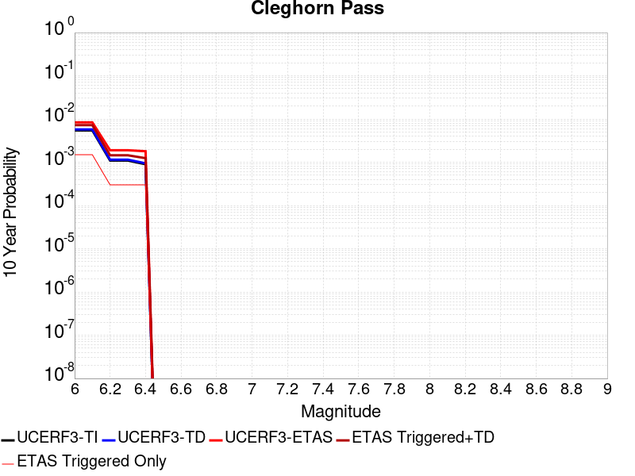 |

| Magnitude | 1 wk TI Prob | 1 wk TD Prob | 1 wk ETAS Prob | 1 wk ETAS/TD Gain | 1 wk ETAS Triggered+TD | 1 wk ETAS Triggered Only | 1 mo TI Prob | 1 mo TD Prob | 1 mo ETAS Prob | 1 mo ETAS/TD Gain | 1 mo ETAS Triggered+TD | 1 mo ETAS Triggered Only | 1 yr TI Prob | 1 yr TD Prob | 1 yr ETAS Prob | 1 yr ETAS/TD Gain | 1 yr ETAS Triggered+TD | 1 yr ETAS Triggered Only | 10 yr TI Prob | 10 yr TD Prob | 10 yr ETAS Prob | 10 yr ETAS/TD Gain | 10 yr ETAS Triggered+TD | 10 yr ETAS Triggered Only |
|-----|-----|-----|-----|-----|-----|-----|-----|-----|-----|-----|-----|-----|-----|-----|-----|-----|-----|-----|-----|-----|-----|-----|-----|-----|
| 6.0 | 1.0522846E-5 | 1.104176E-5 | 0.0 | 0.0 | 1.104176E-5 | 0.0 | 4.509713E-5 | 4.7321268E-5 | 1.0E-4 | 2.1132147 | 4.7321268E-5 | 0.0 | 5.4891926E-4 | 5.760368E-4 | 7.0E-4 | 1.2152002 | 8.75864E-4 | 3.0E-4 | 0.0054756533 | 0.0057506035 | 0.0084 | 1.4607162 | 0.0072419774 | 0.0015 |
| 6.1 | 1.0522846E-5 | 1.104176E-5 | 0.0 | 0.0 | 1.104176E-5 | 0.0 | 4.509713E-5 | 4.7321268E-5 | 1.0E-4 | 2.1132147 | 4.7321268E-5 | 0.0 | 5.4891926E-4 | 5.760368E-4 | 7.0E-4 | 1.2152002 | 8.75864E-4 | 3.0E-4 | 0.0054756533 | 0.0057506035 | 0.0084 | 1.4607162 | 0.0072419774 | 0.0015 |
| 6.2 | 2.1045846E-6 | 2.2084264E-6 | 0.0 | 0.0 | 2.2084264E-6 | 0.0 | 9.019617E-6 | 9.464674E-6 | 0.0 | 0.0 | 9.464674E-6 | 0.0 | 1.098083E-4 | 1.15230505E-4 | 2.0E-4 | 1.7356515 | 2.1521898E-4 | 1.0E-4 | 0.0010975406 | 0.001152119 | 0.0019 | 1.6491351 | 0.0014517735 | 3.0E-4 |
| 6.3 | 2.1045846E-6 | 2.2084264E-6 | 0.0 | 0.0 | 2.2084264E-6 | 0.0 | 9.019617E-6 | 9.464674E-6 | 0.0 | 0.0 | 9.464674E-6 | 0.0 | 1.098083E-4 | 1.15230505E-4 | 2.0E-4 | 1.7356515 | 2.1521898E-4 | 1.0E-4 | 0.0010975406 | 0.001152119 | 0.0019 | 1.6491351 | 0.0014517735 | 3.0E-4 |
| 6.4 | 1.7259927E-6 | 1.8110604E-6 | 0.0 | 0.0 | 1.8110604E-6 | 0.0 | 7.3970905E-6 | 7.761688E-6 | 0.0 | 0.0 | 7.761688E-6 | 0.0 | 9.005586E-5 | 9.449855E-5 | 1.0E-4 | 1.0582173 | 1.944891E-4 | 1.0E-4 | 9.001937E-4 | 9.449855E-4 | 0.0018 | 1.9047911 | 0.001244702 | 3.0E-4 |

## San Jacinto (Borrego)
*[(top)](#table-of-contents)*

| 1 Week | 1 Month | 1 Year | 10 Year |
|-----|-----|-----|-----|
| 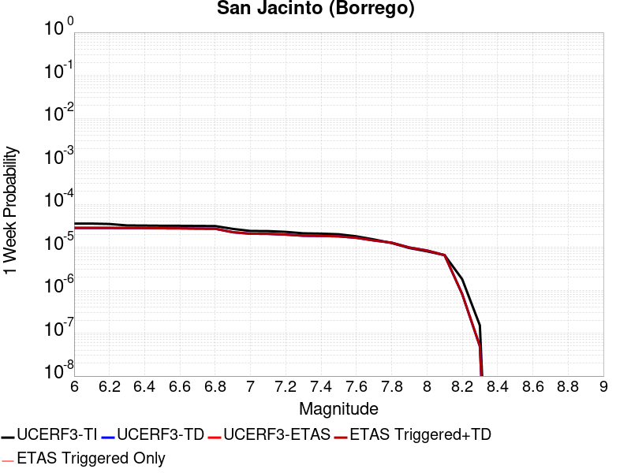 | 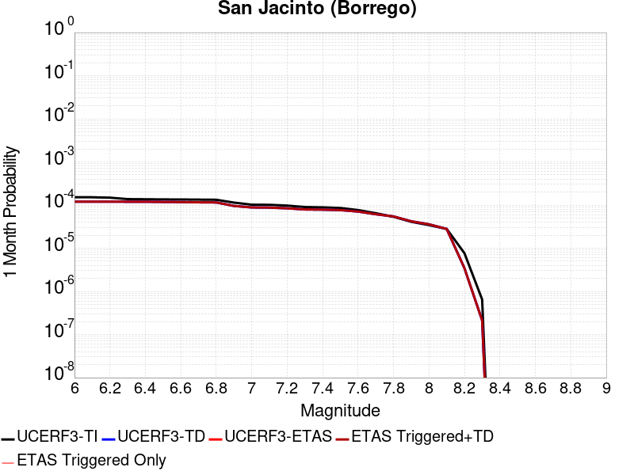 | 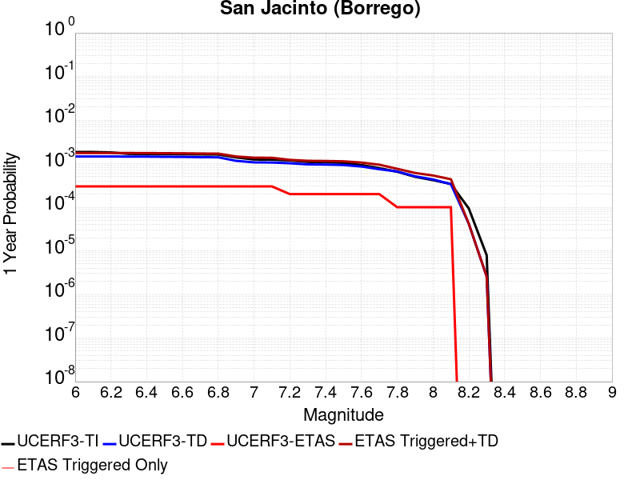 |  |

| Magnitude | 1 wk TI Prob | 1 wk TD Prob | 1 wk ETAS Prob | 1 wk ETAS/TD Gain | 1 wk ETAS Triggered+TD | 1 wk ETAS Triggered Only | 1 mo TI Prob | 1 mo TD Prob | 1 mo ETAS Prob | 1 mo ETAS/TD Gain | 1 mo ETAS Triggered+TD | 1 mo ETAS Triggered Only | 1 yr TI Prob | 1 yr TD Prob | 1 yr ETAS Prob | 1 yr ETAS/TD Gain | 1 yr ETAS Triggered+TD | 1 yr ETAS Triggered Only | 10 yr TI Prob | 10 yr TD Prob | 10 yr ETAS Prob | 10 yr ETAS/TD Gain | 10 yr ETAS Triggered+TD | 10 yr ETAS Triggered Only |
|-----|-----|-----|-----|-----|-----|-----|-----|-----|-----|-----|-----|-----|-----|-----|-----|-----|-----|-----|-----|-----|-----|-----|-----|-----|
| 6.0 | 3.543992E-5 | 2.8048487E-5 | 0.0 | 0.0 | 2.8048487E-5 | 0.0 | 1.5187653E-4 | 1.20202334E-4 | 0.0 | 0.0 | 1.20202334E-4 | 0.0 | 0.0018475284 | 0.0014624933 | 0.001 | 0.6837638 | 0.0017620545 | 3.0E-4 | 0.018322436 | 0.014934139 | 0.0082 | 0.5490775 | 0.01660875 | 0.0017 |
| 6.1 | 3.542281E-5 | 2.8048487E-5 | 0.0 | 0.0 | 2.8048487E-5 | 0.0 | 1.5180321E-4 | 1.20202334E-4 | 0.0 | 0.0 | 1.20202334E-4 | 0.0 | 0.0018466372 | 0.0014624933 | 0.001 | 0.6837638 | 0.0017620545 | 3.0E-4 | 0.018313672 | 0.014934139 | 0.0082 | 0.5490775 | 0.01660875 | 0.0017 |
| 6.2 | 3.4688688E-5 | 2.8048487E-5 | 0.0 | 0.0 | 2.8048487E-5 | 0.0 | 1.4865733E-4 | 1.20202334E-4 | 0.0 | 0.0 | 1.20202334E-4 | 0.0 | 0.0018084005 | 0.0014624933 | 0.001 | 0.6837638 | 0.0017620545 | 3.0E-4 | 0.017937548 | 0.014934139 | 0.0082 | 0.5490775 | 0.01660875 | 0.0017 |
| 6.3 | 3.2087122E-5 | 2.7893788E-5 | 0.0 | 0.0 | 2.7893788E-5 | 0.0 | 1.3750899E-4 | 1.195394E-4 | 0.0 | 0.0 | 1.195394E-4 | 0.0 | 0.0016728862 | 0.0014544328 | 0.001 | 0.6875532 | 0.0017539965 | 3.0E-4 | 0.016603488 | 0.014853424 | 0.0081 | 0.5453288 | 0.016528174 | 0.0017 |
| 6.4 | 3.1828724E-5 | 2.7860748E-5 | 0.0 | 0.0 | 2.7860748E-5 | 0.0 | 1.364017E-4 | 1.1939781E-4 | 0.0 | 0.0 | 1.1939781E-4 | 0.0 | 0.0016594254 | 0.0014527112 | 0.001 | 0.6883681 | 0.0017522754 | 3.0E-4 | 0.016470885 | 0.01483661 | 0.0081 | 0.54594684 | 0.016511388 | 0.0017 |
| 6.5 | 3.1563577E-5 | 2.7600036E-5 | 0.0 | 0.0 | 2.7600036E-5 | 0.0 | 1.3526545E-4 | 1.1828057E-4 | 0.0 | 0.0 | 1.1828057E-4 | 0.0 | 0.0016456128 | 0.0014391269 | 0.001 | 0.69486576 | 0.0017386952 | 3.0E-4 | 0.0163348 | 0.014702476 | 0.008 | 0.54412603 | 0.01637748 | 0.0017 |
| 6.6 | 3.1467625E-5 | 2.7444119E-5 | 0.0 | 0.0 | 2.7444119E-5 | 0.0 | 1.3485427E-4 | 1.1761242E-4 | 0.0 | 0.0 | 1.1761242E-4 | 0.0 | 0.0016406142 | 0.0014310029 | 0.001 | 0.6988106 | 0.0017305736 | 3.0E-4 | 0.016285548 | 0.0146225635 | 0.008 | 0.5470997 | 0.016297705 | 0.0017 |
| 6.7 | 3.1223695E-5 | 2.7061893E-5 | 0.0 | 0.0 | 2.7061893E-5 | 0.0 | 1.3380898E-4 | 1.1597445E-4 | 0.0 | 0.0 | 1.1597445E-4 | 0.0 | 0.0016279068 | 0.0014110865 | 0.001 | 0.7086737 | 0.0017106632 | 3.0E-4 | 0.01616033 | 0.014426867 | 0.0078 | 0.54065794 | 0.01610234 | 0.0017 |
| 6.8 | 3.1015585E-5 | 2.6882644E-5 | 0.0 | 0.0 | 2.6882644E-5 | 0.0 | 1.3291716E-4 | 1.1520632E-4 | 0.0 | 0.0 | 1.1520632E-4 | 0.0 | 0.001617065 | 0.0014017465 | 0.001 | 0.7133957 | 0.0017013261 | 3.0E-4 | 0.016053487 | 0.014334061 | 0.0077 | 0.53718203 | 0.016009694 | 0.0017 |
| 6.9 | 2.6641965E-5 | 2.2297869E-5 | 0.0 | 0.0 | 2.2297869E-5 | 0.0 | 1.1417485E-4 | 9.555882E-5 | 0.0 | 0.0 | 9.555882E-5 | 0.0 | 0.0013891924 | 0.0011628116 | 8.0E-4 | 0.6879876 | 0.0014624627 | 3.0E-4 | 0.0138054015 | 0.011941668 | 0.0064 | 0.53593856 | 0.013423755 | 0.0015 |
| 7.0 | 2.3854353E-5 | 2.0588659E-5 | 0.0 | 0.0 | 2.0588659E-5 | 0.0 | 1.02228936E-4 | 8.823414E-5 | 0.0 | 0.0 | 8.823414E-5 | 0.0 | 0.0012439266 | 0.0010737239 | 8.0E-4 | 0.7450705 | 0.0013734017 | 3.0E-4 | 0.012369866 | 0.011040107 | 0.0058 | 0.5253572 | 0.012127963 | 0.0011 |
| 7.1 | 2.3672901E-5 | 2.0425028E-5 | 0.0 | 0.0 | 2.0425028E-5 | 0.0 | 1.0145135E-4 | 8.753291E-5 | 0.0 | 0.0 | 8.753291E-5 | 0.0 | 0.0012344702 | 0.0010651947 | 8.0E-4 | 0.75103635 | 0.0013648752 | 3.0E-4 | 0.0122763505 | 0.01095521 | 0.0057 | 0.5203004 | 0.012043159 | 0.0011 |
| 7.2 | 2.2717244E-5 | 1.9651523E-5 | 0.0 | 0.0 | 1.9651523E-5 | 0.0 | 9.735599E-5 | 8.42181E-5 | 0.0 | 0.0 | 8.42181E-5 | 0.0 | 0.0011846646 | 0.0010248754 | 7.0E-4 | 0.6830098 | 0.0012246704 | 2.0E-4 | 0.01178369 | 0.010552208 | 0.0055 | 0.52121794 | 0.011442711 | 9.0E-4 |
| 7.3 | 2.1016205E-5 | 1.8491715E-5 | 0.0 | 0.0 | 1.8491715E-5 | 0.0 | 9.006634E-5 | 7.924782E-5 | 0.0 | 0.0 | 7.924782E-5 | 0.0 | 0.001096006 | 9.644171E-4 | 7.0E-4 | 0.725827 | 0.0011642242 | 2.0E-4 | 0.010906163 | 0.009947206 | 0.0055 | 0.5529191 | 0.010838253 | 9.0E-4 |
| 7.4 | 2.0683625E-5 | 1.8293938E-5 | 0.0 | 0.0 | 1.8293938E-5 | 0.0 | 8.86411E-5 | 7.840025E-5 | 0.0 | 0.0 | 7.840025E-5 | 0.0 | 0.001078671 | 9.541071E-4 | 7.0E-4 | 0.7336703 | 0.0011539162 | 2.0E-4 | 0.010734501 | 0.00984378 | 0.0055 | 0.5587285 | 0.01073492 | 9.0E-4 |
| 7.5 | 1.9993966E-5 | 1.7888071E-5 | 0.0 | 0.0 | 1.7888071E-5 | 0.0 | 8.568561E-5 | 7.6660916E-5 | 0.0 | 0.0 | 7.6660916E-5 | 0.0 | 0.001042723 | 9.32949E-4 | 7.0E-4 | 0.75030893 | 0.0011327624 | 2.0E-4 | 0.010378438 | 0.0096302675 | 0.0054 | 0.56073207 | 0.0105216 | 9.0E-4 |
| 7.6 | 1.788966E-5 | 1.6536198E-5 | 0.0 | 0.0 | 1.6536198E-5 | 0.0 | 7.666772E-5 | 7.086751E-5 | 0.0 | 0.0 | 7.086751E-5 | 0.0 | 9.3302975E-4 | 8.624721E-4 | 7.0E-4 | 0.8116205 | 0.0010622996 | 2.0E-4 | 0.00929122 | 0.0089195585 | 0.005 | 0.5605659 | 0.009811531 | 9.0E-4 |
| 7.7 | 1.5125781E-5 | 1.4334522E-5 | 0.0 | 0.0 | 1.4334522E-5 | 0.0 | 6.4823165E-5 | 6.143223E-5 | 0.0 | 0.0 | 6.143223E-5 | 0.0 | 7.889362E-4 | 7.4768154E-4 | 7.0E-4 | 0.9362275 | 9.4753195E-4 | 2.0E-4 | 0.007861412 | 0.007765462 | 0.0044 | 0.56661147 | 0.008360803 | 6.0E-4 |
| 7.8 | 1.250089E-5 | 1.2724073E-5 | 0.0 | 0.0 | 1.2724073E-5 | 0.0 | 5.3574146E-5 | 5.4530603E-5 | 0.0 | 0.0 | 5.4530603E-5 | 0.0 | 6.5207E-4 | 6.637085E-4 | 6.0E-4 | 0.9040113 | 7.6364214E-4 | 1.0E-4 | 0.006501599 | 0.006917308 | 0.004 | 0.57825965 | 0.007314541 | 4.0E-4 |
| 7.9 | 9.561E-6 | 9.837744E-6 | 0.0 | 0.0 | 9.837744E-6 | 0.0 | 4.0975072E-5 | 4.2161082E-5 | 0.0 | 0.0 | 4.2161082E-5 | 0.0 | 4.987573E-4 | 5.1319087E-4 | 5.0E-4 | 0.9742964 | 6.1313953E-4 | 1.0E-4 | 0.0049763937 | 0.005396542 | 0.0028 | 0.5188508 | 0.005794383 | 4.0E-4 |
| 8.0 | 8.01699E-6 | 8.369283E-6 | 0.0 | 0.0 | 8.369283E-6 | 0.0 | 3.4358076E-5 | 3.5867863E-5 | 0.0 | 0.0 | 3.5867863E-5 | 0.0 | 4.1822926E-4 | 4.3660428E-4 | 4.0E-4 | 0.9161614 | 5.365606E-4 | 1.0E-4 | 0.0041744304 | 0.0046137916 | 0.0025 | 0.5418537 | 0.005011946 | 4.0E-4 |
| 8.1 | 6.541947E-6 | 6.524547E-6 | 0.0 | 0.0 | 6.524547E-6 | 0.0 | 2.8036617E-5 | 2.7962049E-5 | 0.0 | 0.0 | 2.7962049E-5 | 0.0 | 3.4129233E-4 | 3.4038528E-4 | 4.0E-4 | 1.175139 | 4.4035123E-4 | 1.0E-4 | 0.0034076865 | 0.003614044 | 0.0018 | 0.498057 | 0.004012598 | 4.0E-4 |
| 8.2 | 1.7968189E-6 | 8.0849065E-7 | 0.0 | 0.0 | 8.0849065E-7 | 0.0 | 7.70063E-6 | 3.4649556E-6 | 0.0 | 0.0 | 3.4649556E-6 | 0.0 | 9.3751136E-5 | 4.2185042E-5 | 0.0 | 0.0 | 4.2185042E-5 | 0.0 | 9.371159E-4 | 4.77603E-4 | 1.0E-4 | 0.20937893 | 5.775552E-4 | 1.0E-4 |
| 8.3 | 1.5167889E-7 | 4.978507E-8 | 0.0 | 0.0 | 4.978507E-8 | 0.0 | 6.500522E-7 | 2.1336456E-7 | 0.0 | 0.0 | 2.1336456E-7 | 0.0 | 7.9143565E-6 | 2.5977108E-6 | 0.0 | 0.0 | 2.5977108E-6 | 0.0 | 7.914075E-5 | 3.015811E-5 | 0.0 | 0.0 | 3.015811E-5 | 0.0 |

## South Klamath Lake East
*[(top)](#table-of-contents)*

| 1 Week | 1 Month | 1 Year | 10 Year |
|-----|-----|-----|-----|
| 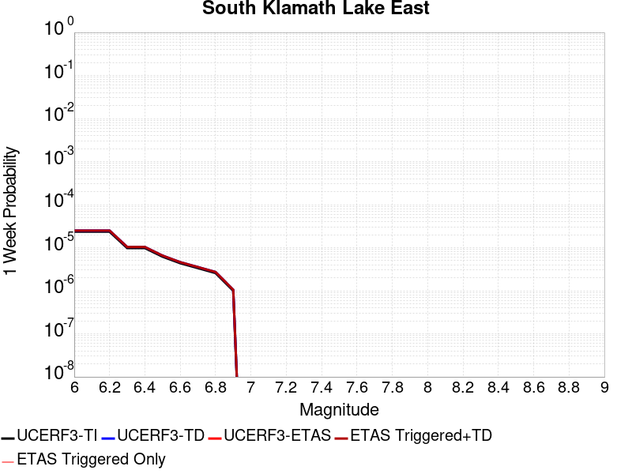 | 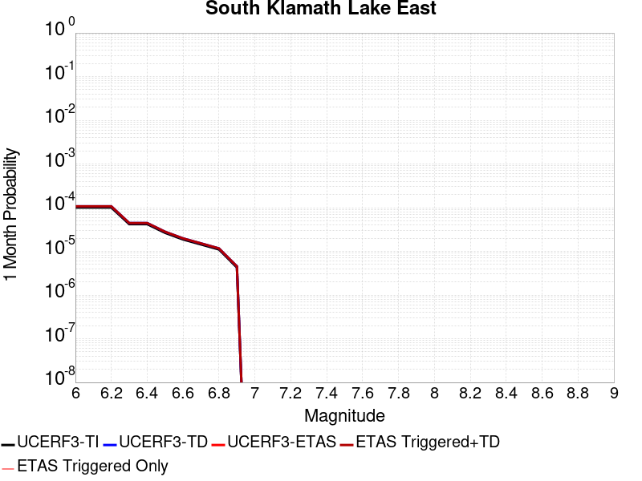 | 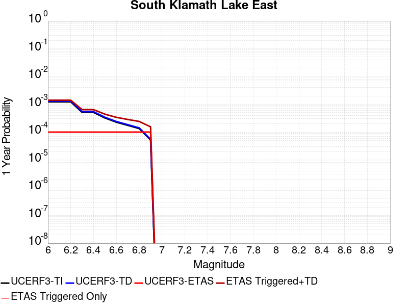 | 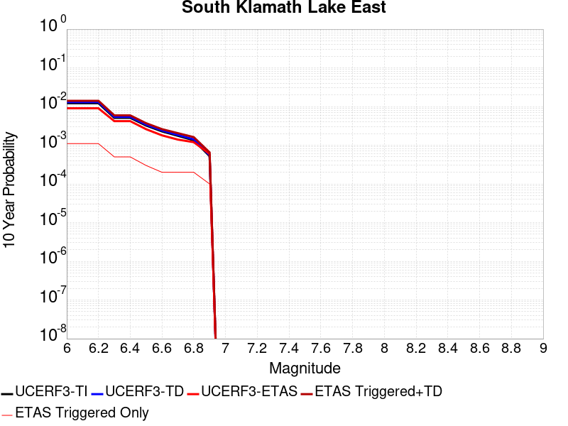 |

| Magnitude | 1 wk TI Prob | 1 wk TD Prob | 1 wk ETAS Prob | 1 wk ETAS/TD Gain | 1 wk ETAS Triggered+TD | 1 wk ETAS Triggered Only | 1 mo TI Prob | 1 mo TD Prob | 1 mo ETAS Prob | 1 mo ETAS/TD Gain | 1 mo ETAS Triggered+TD | 1 mo ETAS Triggered Only | 1 yr TI Prob | 1 yr TD Prob | 1 yr ETAS Prob | 1 yr ETAS/TD Gain | 1 yr ETAS Triggered+TD | 1 yr ETAS Triggered Only | 10 yr TI Prob | 10 yr TD Prob | 10 yr ETAS Prob | 10 yr ETAS/TD Gain | 10 yr ETAS Triggered+TD | 10 yr ETAS Triggered Only |
|-----|-----|-----|-----|-----|-----|-----|-----|-----|-----|-----|-----|-----|-----|-----|-----|-----|-----|-----|-----|-----|-----|-----|-----|-----|
| 6.0 | 2.3539369E-5 | 2.5050615E-5 | 0.0 | 0.0 | 2.5050615E-5 | 0.0 | 1.0087911E-4 | 1.0735582E-4 | 0.0 | 0.0 | 1.0735582E-4 | 0.0 | 0.0012275111 | 0.0013063567 | 6.0E-4 | 0.45929262 | 0.0014062261 | 1.0E-4 | 0.012207527 | 0.012995123 | 0.009 | 0.6925675 | 0.014080828 | 0.0011 |
| 6.1 | 2.3539369E-5 | 2.5050615E-5 | 0.0 | 0.0 | 2.5050615E-5 | 0.0 | 1.0087911E-4 | 1.0735582E-4 | 0.0 | 0.0 | 1.0735582E-4 | 0.0 | 0.0012275111 | 0.0013063567 | 6.0E-4 | 0.45929262 | 0.0014062261 | 1.0E-4 | 0.012207527 | 0.012995123 | 0.009 | 0.6925675 | 0.014080828 | 0.0011 |
| 6.2 | 2.3539369E-5 | 2.5050615E-5 | 0.0 | 0.0 | 2.5050615E-5 | 0.0 | 1.0087911E-4 | 1.0735582E-4 | 0.0 | 0.0 | 1.0735582E-4 | 0.0 | 0.0012275111 | 0.0013063567 | 6.0E-4 | 0.45929262 | 0.0014062261 | 1.0E-4 | 0.012207527 | 0.012995123 | 0.009 | 0.6925675 | 0.014080828 | 0.0011 |
| 6.3 | 9.807823E-6 | 1.0397328E-5 | 0.0 | 0.0 | 1.0397328E-5 | 0.0 | 4.2032847E-5 | 4.4559263E-5 | 0.0 | 0.0 | 4.4559263E-5 | 0.0 | 5.1162974E-4 | 5.4238236E-4 | 1.0E-4 | 0.18437178 | 6.423281E-4 | 1.0E-4 | 0.005104534 | 0.005411423 | 0.0042 | 0.776136 | 0.0059087174 | 5.0E-4 |
| 6.4 | 9.807823E-6 | 1.0397328E-5 | 0.0 | 0.0 | 1.0397328E-5 | 0.0 | 4.2032847E-5 | 4.4559263E-5 | 0.0 | 0.0 | 4.4559263E-5 | 0.0 | 5.1162974E-4 | 5.4238236E-4 | 1.0E-4 | 0.18437178 | 6.423281E-4 | 1.0E-4 | 0.005104534 | 0.005411423 | 0.0042 | 0.776136 | 0.0059087174 | 5.0E-4 |
| 6.5 | 6.191981E-6 | 6.551622E-6 | 0.0 | 0.0 | 6.551622E-6 | 0.0 | 2.653679E-5 | 2.8078093E-5 | 0.0 | 0.0 | 2.8078093E-5 | 0.0 | 3.2303753E-4 | 3.4179995E-4 | 1.0E-4 | 0.2925688 | 4.417658E-4 | 1.0E-4 | 0.0032256835 | 0.0034130206 | 0.0026 | 0.7617885 | 0.0037119968 | 3.0E-4 |
| 6.6 | 4.3693776E-6 | 4.6170953E-6 | 0.0 | 0.0 | 4.6170953E-6 | 0.0 | 1.8725768E-5 | 1.9787407E-5 | 0.0 | 0.0 | 1.9787407E-5 | 0.0 | 2.2796239E-4 | 2.4088619E-4 | 1.0E-4 | 0.4151338 | 3.408621E-4 | 1.0E-4 | 0.0022772867 | 0.0024063634 | 0.0018 | 0.7480167 | 0.002605882 | 2.0E-4 |
| 6.7 | 3.360834E-6 | 3.5516546E-6 | 0.0 | 0.0 | 3.5516546E-6 | 0.0 | 1.4403494E-5 | 1.5221292E-5 | 0.0 | 0.0 | 1.5221292E-5 | 0.0 | 1.7534842E-4 | 1.8530429E-4 | 1.0E-4 | 0.53965294 | 2.8528576E-4 | 1.0E-4 | 0.0017521014 | 0.0018515777 | 0.0014 | 0.756112 | 0.0020512072 | 2.0E-4 |
| 6.8 | 2.57873E-6 | 2.7254896E-6 | 0.0 | 0.0 | 2.7254896E-6 | 0.0 | 1.1051653E-5 | 1.168062E-5 | 0.0 | 0.0 | 1.168062E-5 | 0.0 | 1.3454557E-4 | 1.4220289E-4 | 1.0E-4 | 0.7032206 | 2.4218867E-4 | 1.0E-4 | 0.0013446413 | 0.0014211796 | 0.0012 | 0.84436893 | 0.0016208955 | 2.0E-4 |
| 6.9 | 9.987825E-7 | 1.0567472E-6 | 0.0 | 0.0 | 1.0567472E-6 | 0.0 | 4.2804895E-6 | 4.5289107E-6 | 0.0 | 0.0 | 4.5289107E-6 | 0.0 | 5.211371E-5 | 5.5138422E-5 | 1.0E-4 | 1.8136173 | 1.551329E-4 | 1.0E-4 | 5.210149E-4 | 5.512796E-4 | 6.0E-4 | 1.0883769 | 6.5122446E-4 | 1.0E-4 |

## Nelson Lake
*[(top)](#table-of-contents)*

| 1 Week | 1 Month | 1 Year | 10 Year |
|-----|-----|-----|-----|
| 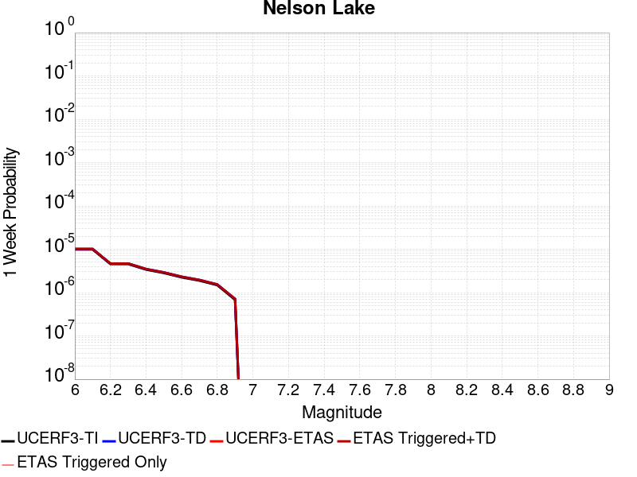 | 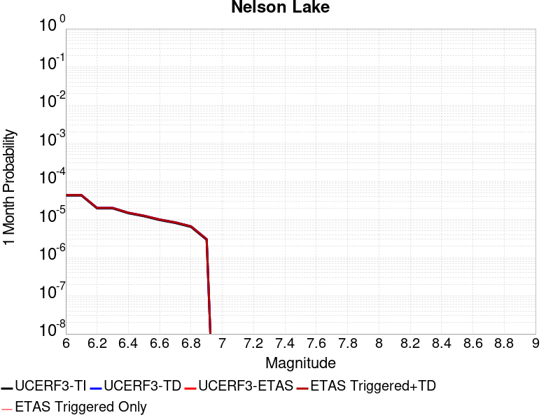 | 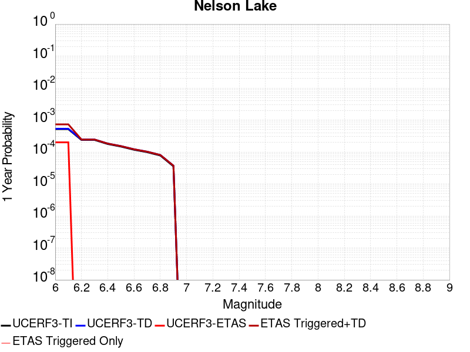 | 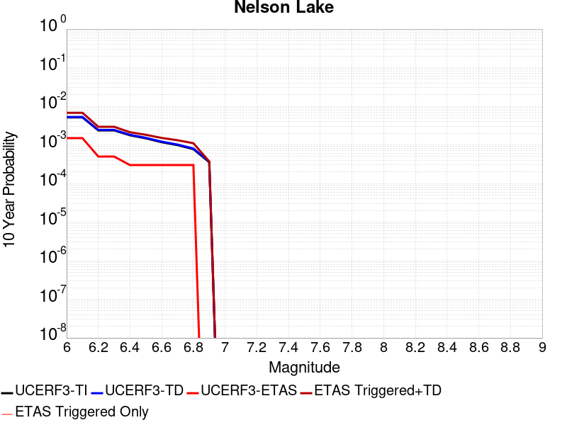 |

| Magnitude | 1 wk TI Prob | 1 wk TD Prob | 1 wk ETAS Prob | 1 wk ETAS/TD Gain | 1 wk ETAS Triggered+TD | 1 wk ETAS Triggered Only | 1 mo TI Prob | 1 mo TD Prob | 1 mo ETAS Prob | 1 mo ETAS/TD Gain | 1 mo ETAS Triggered+TD | 1 mo ETAS Triggered Only | 1 yr TI Prob | 1 yr TD Prob | 1 yr ETAS Prob | 1 yr ETAS/TD Gain | 1 yr ETAS Triggered+TD | 1 yr ETAS Triggered Only | 10 yr TI Prob | 10 yr TD Prob | 10 yr ETAS Prob | 10 yr ETAS/TD Gain | 10 yr ETAS Triggered+TD | 10 yr ETAS Triggered Only |
|-----|-----|-----|-----|-----|-----|-----|-----|-----|-----|-----|-----|-----|-----|-----|-----|-----|-----|-----|-----|-----|-----|-----|-----|-----|
| 6.0 | 9.913453E-6 | 1.0192846E-5 | 0.0 | 0.0 | 1.0192846E-5 | 0.0 | 4.2485535E-5 | 4.3682954E-5 | 0.0 | 0.0 | 4.3682954E-5 | 0.0 | 5.1713863E-4 | 5.317205E-4 | 7.0E-4 | 1.3164811 | 7.316142E-4 | 2.0E-4 | 0.0051593683 | 0.005305511 | 0.009 | 1.6963494 | 0.0067975526 | 0.0015 |
| 6.1 | 9.913453E-6 | 1.0192846E-5 | 0.0 | 0.0 | 1.0192846E-5 | 0.0 | 4.2485535E-5 | 4.3682954E-5 | 0.0 | 0.0 | 4.3682954E-5 | 0.0 | 5.1713863E-4 | 5.317205E-4 | 7.0E-4 | 1.3164811 | 7.316142E-4 | 2.0E-4 | 0.0051593683 | 0.005305511 | 0.009 | 1.6963494 | 0.0067975526 | 0.0015 |
| 6.2 | 4.5596407E-6 | 4.6966034E-6 | 0.0 | 0.0 | 4.6966034E-6 | 0.0 | 1.954117E-5 | 2.0128153E-5 | 0.0 | 0.0 | 2.0128153E-5 | 0.0 | 2.3788778E-4 | 2.4503397E-4 | 4.0E-4 | 1.6324267 | 2.4503397E-4 | 0.0 | 0.0023763329 | 0.002447764 | 0.0037 | 1.5115836 | 0.0029465402 | 5.0E-4 |
| 6.3 | 4.5596407E-6 | 4.6966034E-6 | 0.0 | 0.0 | 4.6966034E-6 | 0.0 | 1.954117E-5 | 2.0128153E-5 | 0.0 | 0.0 | 2.0128153E-5 | 0.0 | 2.3788778E-4 | 2.4503397E-4 | 4.0E-4 | 1.6324267 | 2.4503397E-4 | 0.0 | 0.0023763329 | 0.002447764 | 0.0037 | 1.5115836 | 0.0029465402 | 5.0E-4 |
| 6.4 | 3.4025713E-6 | 3.5101257E-6 | 0.0 | 0.0 | 3.5101257E-6 | 0.0 | 1.4582367E-5 | 1.5043314E-5 | 0.0 | 0.0 | 1.5043314E-5 | 0.0 | 1.7752586E-4 | 1.8313779E-4 | 2.0E-4 | 1.0920739 | 1.8313779E-4 | 0.0 | 0.001773841 | 0.0018299517 | 0.0026 | 1.4208026 | 0.0021294027 | 3.0E-4 |
| 6.5 | 2.8352947E-6 | 2.9280534E-6 | 0.0 | 0.0 | 2.9280534E-6 | 0.0 | 1.2151207E-5 | 1.2548744E-5 | 0.0 | 0.0 | 1.2548744E-5 | 0.0 | 1.479309E-4 | 1.52771E-4 | 1.0E-4 | 0.6545745 | 1.52771E-4 | 0.0 | 0.0014783246 | 0.0015267336 | 0.0021 | 1.3754855 | 0.0018262756 | 3.0E-4 |
| 6.6 | 2.251518E-6 | 2.3292332E-6 | 0.0 | 0.0 | 2.3292332E-6 | 0.0 | 9.649328E-6 | 9.982393E-6 | 0.0 | 0.0 | 9.982393E-6 | 0.0 | 1.1747423E-4 | 1.2152948E-4 | 1.0E-4 | 0.8228456 | 1.2152948E-4 | 0.0 | 0.0011741214 | 0.001214692 | 0.0019 | 1.5641825 | 0.0015143276 | 3.0E-4 |
| 6.7 | 1.8911853E-6 | 1.9592849E-6 | 0.0 | 0.0 | 1.9592849E-6 | 0.0 | 8.105055E-6 | 8.396912E-6 | 0.0 | 0.0 | 8.396912E-6 | 0.0 | 9.867457E-5 | 1.0222819E-4 | 1.0E-4 | 0.9782038 | 1.0222819E-4 | 0.0 | 9.863076E-4 | 0.0010218691 | 0.0017 | 1.6636181 | 0.0013215626 | 3.0E-4 |
| 6.8 | 1.4874814E-6 | 1.5439512E-6 | 0.0 | 0.0 | 1.5439512E-6 | 0.0 | 6.374905E-6 | 6.6169196E-6 | 0.0 | 0.0 | 6.6169196E-6 | 0.0 | 7.76117E-5 | 8.055854E-5 | 1.0E-4 | 1.2413334 | 8.055854E-5 | 0.0 | 7.75846E-4 | 8.0534443E-4 | 0.0013 | 1.6142161 | 0.0011051028 | 3.0E-4 |
| 6.9 | 6.835972E-7 | 7.140582E-7 | 0.0 | 0.0 | 7.140582E-7 | 0.0 | 2.9296991E-6 | 3.0602475E-6 | 0.0 | 0.0 | 3.0602475E-6 | 0.0 | 3.56685E-5 | 3.7258196E-5 | 1.0E-4 | 2.683973 | 3.7258196E-5 | 0.0 | 3.5662777E-4 | 3.7255077E-4 | 2.0E-4 | 0.5368396 | 3.7255077E-4 | 0.0 |

## Santa Susana East (connector)
*[(top)](#table-of-contents)*

| 1 Week | 1 Month | 1 Year | 10 Year |
|-----|-----|-----|-----|
| 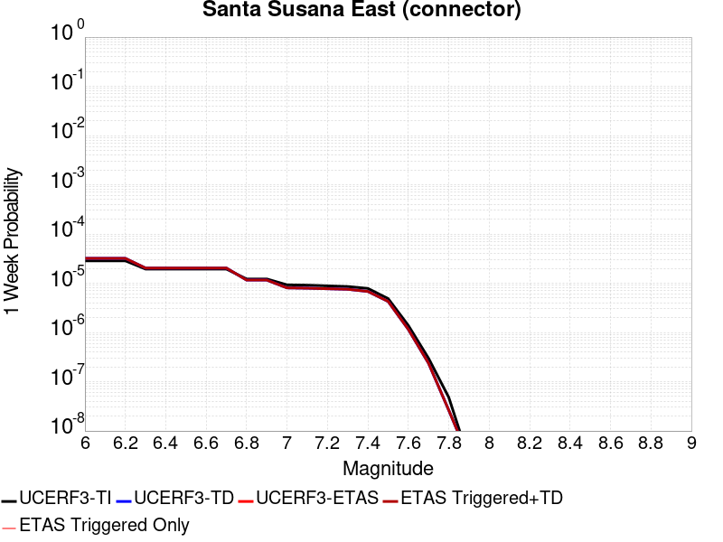 |  | 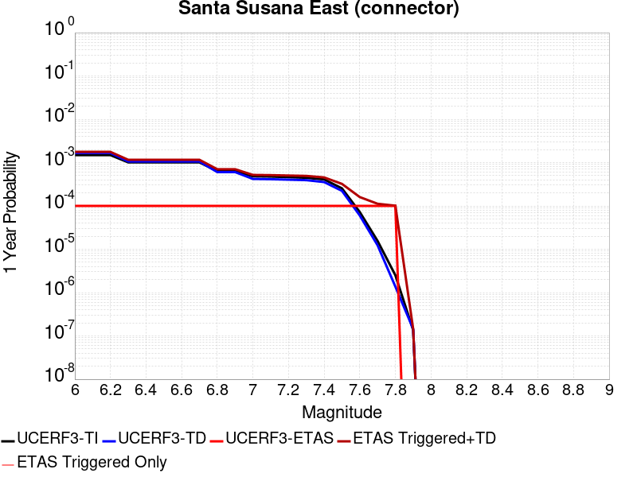 | 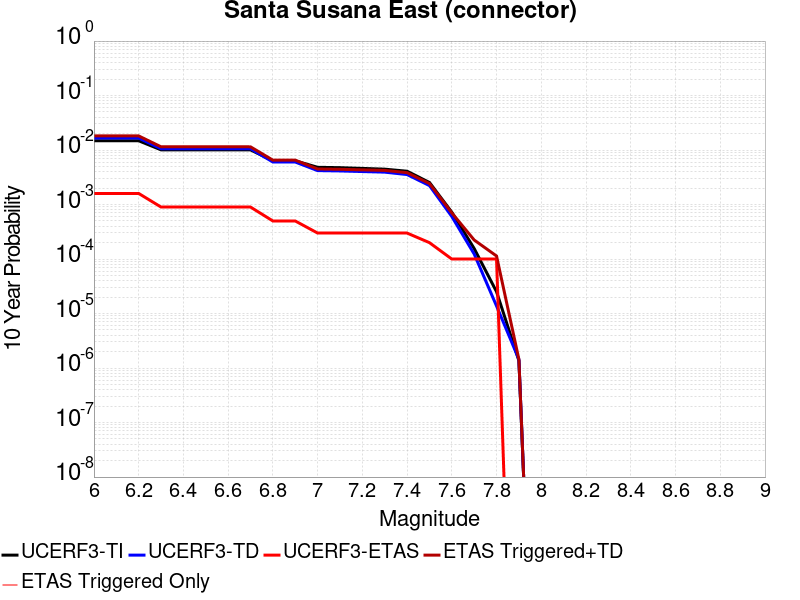 |

| Magnitude | 1 wk TI Prob | 1 wk TD Prob | 1 wk ETAS Prob | 1 wk ETAS/TD Gain | 1 wk ETAS Triggered+TD | 1 wk ETAS Triggered Only | 1 mo TI Prob | 1 mo TD Prob | 1 mo ETAS Prob | 1 mo ETAS/TD Gain | 1 mo ETAS Triggered+TD | 1 mo ETAS Triggered Only | 1 yr TI Prob | 1 yr TD Prob | 1 yr ETAS Prob | 1 yr ETAS/TD Gain | 1 yr ETAS Triggered+TD | 1 yr ETAS Triggered Only | 10 yr TI Prob | 10 yr TD Prob | 10 yr ETAS Prob | 10 yr ETAS/TD Gain | 10 yr ETAS Triggered+TD | 10 yr ETAS Triggered Only |
|-----|-----|-----|-----|-----|-----|-----|-----|-----|-----|-----|-----|-----|-----|-----|-----|-----|-----|-----|-----|-----|-----|-----|-----|-----|
| 6.0 | 2.858397E-5 | 3.203577E-5 | 0.0 | 0.0 | 3.203577E-5 | 0.0 | 1.2249697E-4 | 1.3729012E-4 | 1.0E-4 | 0.72838455 | 1.3729012E-4 | 0.0 | 0.0014903803 | 0.0016704979 | 7.0E-4 | 0.41903672 | 0.001770331 | 1.0E-4 | 0.014804244 | 0.01660626 | 0.0088 | 0.52992064 | 0.018179689 | 0.0016 |
| 6.1 | 2.858397E-5 | 3.203577E-5 | 0.0 | 0.0 | 3.203577E-5 | 0.0 | 1.2249697E-4 | 1.3729012E-4 | 1.0E-4 | 0.72838455 | 1.3729012E-4 | 0.0 | 0.0014903803 | 0.0016704979 | 7.0E-4 | 0.41903672 | 0.001770331 | 1.0E-4 | 0.014804244 | 0.01660626 | 0.0088 | 0.52992064 | 0.018179689 | 0.0016 |
| 6.2 | 2.858397E-5 | 3.203577E-5 | 0.0 | 0.0 | 3.203577E-5 | 0.0 | 1.2249697E-4 | 1.3729012E-4 | 1.0E-4 | 0.72838455 | 1.3729012E-4 | 0.0 | 0.0014903803 | 0.0016704979 | 7.0E-4 | 0.41903672 | 0.001770331 | 1.0E-4 | 0.014804244 | 0.01660626 | 0.0088 | 0.52992064 | 0.018179689 | 0.0016 |
| 6.3 | 1.943582E-5 | 2.0374862E-5 | 0.0 | 0.0 | 2.0374862E-5 | 0.0 | 8.329371E-5 | 8.731855E-5 | 1.0E-4 | 1.1452321 | 8.731855E-5 | 0.0 | 0.001013629 | 0.001062697 | 6.0E-4 | 0.5646012 | 0.0011625907 | 1.0E-4 | 0.010090181 | 0.010587506 | 0.0061 | 0.5761508 | 0.011477977 | 9.0E-4 |
| 6.4 | 1.943582E-5 | 2.0374862E-5 | 0.0 | 0.0 | 2.0374862E-5 | 0.0 | 8.329371E-5 | 8.731855E-5 | 1.0E-4 | 1.1452321 | 8.731855E-5 | 0.0 | 0.001013629 | 0.001062697 | 6.0E-4 | 0.5646012 | 0.0011625907 | 1.0E-4 | 0.010090181 | 0.010587506 | 0.0061 | 0.5761508 | 0.011477977 | 9.0E-4 |
| 6.5 | 1.943582E-5 | 2.0374862E-5 | 0.0 | 0.0 | 2.0374862E-5 | 0.0 | 8.329371E-5 | 8.731855E-5 | 1.0E-4 | 1.1452321 | 8.731855E-5 | 0.0 | 0.001013629 | 0.001062697 | 6.0E-4 | 0.5646012 | 0.0011625907 | 1.0E-4 | 0.010090181 | 0.010587506 | 0.0061 | 0.5761508 | 0.011477977 | 9.0E-4 |
| 6.6 | 1.943582E-5 | 2.0374862E-5 | 0.0 | 0.0 | 2.0374862E-5 | 0.0 | 8.329371E-5 | 8.731855E-5 | 1.0E-4 | 1.1452321 | 8.731855E-5 | 0.0 | 0.001013629 | 0.001062697 | 6.0E-4 | 0.5646012 | 0.0011625907 | 1.0E-4 | 0.010090181 | 0.010587506 | 0.0061 | 0.5761508 | 0.011477977 | 9.0E-4 |
| 6.7 | 1.9404439E-5 | 2.0362279E-5 | 0.0 | 0.0 | 2.0362279E-5 | 0.0 | 8.3159226E-5 | 8.726462E-5 | 1.0E-4 | 1.1459398 | 8.726462E-5 | 0.0 | 0.0010119933 | 0.001062041 | 6.0E-4 | 0.5649499 | 0.0011619348 | 1.0E-4 | 0.010073971 | 0.010581009 | 0.0061 | 0.5765045 | 0.011471487 | 9.0E-4 |
| 6.8 | 1.2217526E-5 | 1.1596129E-5 | 0.0 | 0.0 | 1.1596129E-5 | 0.0 | 5.2359774E-5 | 4.9696846E-5 | 1.0E-4 | 2.0122 | 4.9696846E-5 | 0.0 | 6.372938E-4 | 6.049079E-4 | 3.0E-4 | 0.49594325 | 7.0484745E-4 | 1.0E-4 | 0.0063546924 | 0.0060345763 | 0.0035 | 0.57999104 | 0.006531559 | 5.0E-4 |
| 6.9 | 1.2217526E-5 | 1.1596129E-5 | 0.0 | 0.0 | 1.1596129E-5 | 0.0 | 5.2359774E-5 | 4.9696846E-5 | 1.0E-4 | 2.0122 | 4.9696846E-5 | 0.0 | 6.372938E-4 | 6.049079E-4 | 3.0E-4 | 0.49594325 | 7.0484745E-4 | 1.0E-4 | 0.0063546924 | 0.0060345763 | 0.0035 | 0.57999104 | 0.006531559 | 5.0E-4 |
| 7.0 | 9.276017E-6 | 8.060705E-6 | 0.0 | 0.0 | 8.060705E-6 | 0.0 | 3.9753755E-5 | 3.454544E-5 | 1.0E-4 | 2.8947382 | 3.454544E-5 | 0.0 | 4.8389446E-4 | 4.20513E-4 | 3.0E-4 | 0.7134143 | 5.2047096E-4 | 1.0E-4 | 0.0048284214 | 0.004197813 | 0.0023 | 0.5479044 | 0.0044965534 | 3.0E-4 |
| 7.1 | 9.130355E-6 | 7.9438505E-6 | 0.0 | 0.0 | 7.9438505E-6 | 0.0 | 3.9129503E-5 | 3.4044646E-5 | 1.0E-4 | 2.9373193 | 3.4044646E-5 | 0.0 | 4.7629757E-4 | 4.1441817E-4 | 3.0E-4 | 0.72390646 | 5.1437673E-4 | 1.0E-4 | 0.00475278 | 0.0041370927 | 0.0023 | 0.55594593 | 0.0044358517 | 3.0E-4 |
| 7.2 | 8.851015E-6 | 7.742976E-6 | 0.0 | 0.0 | 7.742976E-6 | 0.0 | 3.7932372E-5 | 3.318378E-5 | 1.0E-4 | 3.0135205 | 3.318378E-5 | 0.0 | 4.6172875E-4 | 4.0394103E-4 | 2.0E-4 | 0.49512178 | 5.0390064E-4 | 1.0E-4 | 0.0046077054 | 0.0040327045 | 0.0022 | 0.5455396 | 0.0043314947 | 3.0E-4 |
| 7.3 | 8.573006E-6 | 7.5516573E-6 | 0.0 | 0.0 | 7.5516573E-6 | 0.0 | 3.6740938E-5 | 3.2363863E-5 | 1.0E-4 | 3.089866 | 3.2363863E-5 | 0.0 | 4.472291E-4 | 3.9396223E-4 | 2.0E-4 | 0.5076629 | 4.939228E-4 | 1.0E-4 | 0.004463301 | 0.0039332667 | 0.0021 | 0.53390735 | 0.0042320867 | 3.0E-4 |
| 7.4 | 7.852282E-6 | 6.8189283E-6 | 0.0 | 0.0 | 6.8189283E-6 | 0.0 | 3.36522E-5 | 2.922367E-5 | 0.0 | 0.0 | 2.922367E-5 | 0.0 | 4.096385E-4 | 3.557431E-4 | 1.0E-4 | 0.2811017 | 4.5570754E-4 | 1.0E-4 | 0.0040888423 | 0.003552318 | 0.0017 | 0.47856075 | 0.0038512524 | 3.0E-4 |
| 7.5 | 4.8869324E-6 | 4.279848E-6 | 0.0 | 0.0 | 4.279848E-6 | 0.0 | 2.0943828E-5 | 1.8342085E-5 | 0.0 | 0.0 | 1.8342085E-5 | 0.0 | 2.5496128E-4 | 2.2329365E-4 | 1.0E-4 | 0.44784075 | 3.2327132E-4 | 1.0E-4 | 0.0025466895 | 0.0022308708 | 0.0011 | 0.49308097 | 0.0024304248 | 2.0E-4 |
| 7.6 | 1.3894544E-6 | 1.1570077E-6 | 0.0 | 0.0 | 1.1570077E-6 | 0.0 | 5.954791E-6 | 4.958596E-6 | 0.0 | 0.0 | 4.958596E-6 | 0.0 | 7.249717E-5 | 6.0369457E-5 | 1.0E-4 | 1.6564668 | 1.6036342E-4 | 1.0E-4 | 7.247352E-4 | 6.035524E-4 | 2.0E-4 | 0.3313714 | 7.03492E-4 | 1.0E-4 |
| 7.7 | 2.9924632E-7 | 2.372971E-7 | 0.0 | 0.0 | 2.372971E-7 | 0.0 | 1.2824837E-6 | 1.0169872E-6 | 0.0 | 0.0 | 1.0169872E-6 | 0.0 | 1.5614127E-5 | 1.2381756E-5 | 1.0E-4 | 8.076399 | 1.1238052E-4 | 1.0E-4 | 1.5613029E-4 | 1.2381139E-4 | 2.0E-4 | 1.6153604 | 2.23799E-4 | 1.0E-4 |
| 7.8 | 4.8188564E-8 | 2.6396894E-8 | 0.0 | 0.0 | 2.6396894E-8 | 0.0 | 2.065224E-7 | 1.13129545E-7 | 0.0 | 0.0 | 1.13129545E-7 | 0.0 | 2.5144072E-6 | 1.3773514E-6 | 1.0E-4 | 72.60311 | 1.0137721E-4 | 1.0E-4 | 2.5143789E-5 | 1.3773437E-5 | 1.0E-4 | 7.260352 | 1.1377206E-4 | 1.0E-4 |
| 7.9 | 2.6127251E-9 | 2.768449E-9 | 0.0 | 0.0 | 2.768449E-9 | 0.0 | 1.1197393E-8 | 1.1864782E-8 | 0.0 | 0.0 | 1.1864782E-8 | 0.0 | 1.3632825E-7 | 1.4445372E-7 | 0.0 | 0.0 | 1.4445372E-7 | 0.0 | 1.3632817E-6 | 1.4445372E-6 | 0.0 | 0.0 | 1.4445372E-6 | 0.0 |

## Owens Valley Keough Hot Springs
*[(top)](#table-of-contents)*

| 1 Week | 1 Month | 1 Year | 10 Year |
|-----|-----|-----|-----|
| 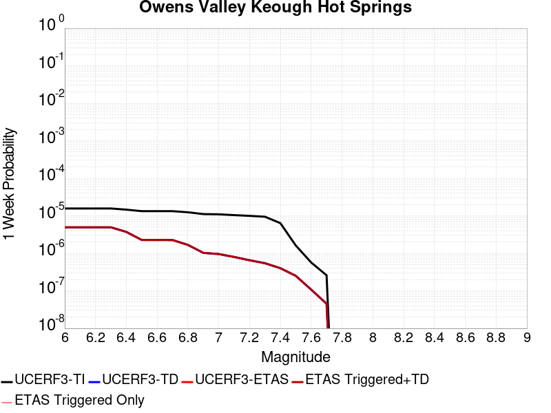 | 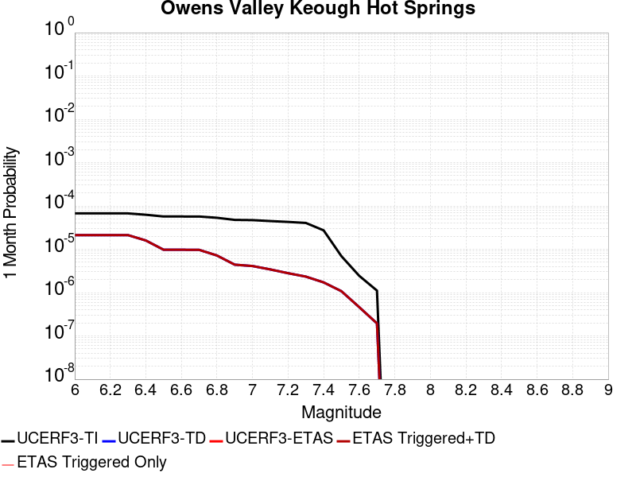 | 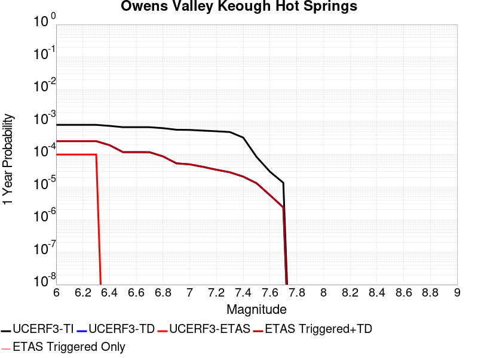 | 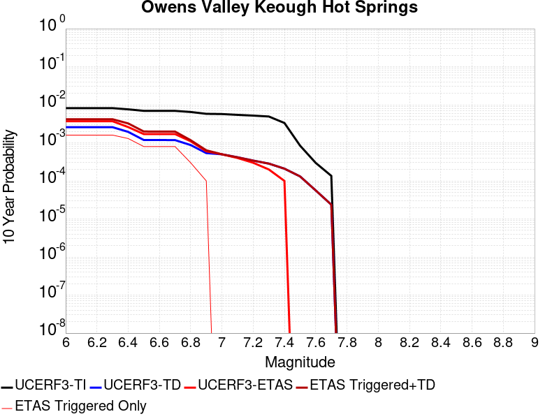 |

| Magnitude | 1 wk TI Prob | 1 wk TD Prob | 1 wk ETAS Prob | 1 wk ETAS/TD Gain | 1 wk ETAS Triggered+TD | 1 wk ETAS Triggered Only | 1 mo TI Prob | 1 mo TD Prob | 1 mo ETAS Prob | 1 mo ETAS/TD Gain | 1 mo ETAS Triggered+TD | 1 mo ETAS Triggered Only | 1 yr TI Prob | 1 yr TD Prob | 1 yr ETAS Prob | 1 yr ETAS/TD Gain | 1 yr ETAS Triggered+TD | 1 yr ETAS Triggered Only | 10 yr TI Prob | 10 yr TD Prob | 10 yr ETAS Prob | 10 yr ETAS/TD Gain | 10 yr ETAS Triggered+TD | 10 yr ETAS Triggered Only |
|-----|-----|-----|-----|-----|-----|-----|-----|-----|-----|-----|-----|-----|-----|-----|-----|-----|-----|-----|-----|-----|-----|-----|-----|-----|
| 6.0 | 1.5708529E-5 | 4.9531077E-6 | 0.0 | 0.0 | 4.9531077E-6 | 0.0 | 6.7320536E-5 | 2.122746E-5 | 0.0 | 0.0 | 2.122746E-5 | 0.0 | 8.193192E-4 | 2.5841882E-4 | 1.0E-4 | 0.38696873 | 2.5841882E-4 | 0.0 | 0.008163051 | 0.0025817982 | 0.0037 | 1.4331096 | 0.004177667 | 0.0016 |
| 6.1 | 1.5708529E-5 | 4.9531077E-6 | 0.0 | 0.0 | 4.9531077E-6 | 0.0 | 6.7320536E-5 | 2.122746E-5 | 0.0 | 0.0 | 2.122746E-5 | 0.0 | 8.193192E-4 | 2.5841882E-4 | 1.0E-4 | 0.38696873 | 2.5841882E-4 | 0.0 | 0.008163051 | 0.0025817982 | 0.0037 | 1.4331096 | 0.004177667 | 0.0016 |
| 6.2 | 1.5708529E-5 | 4.9531077E-6 | 0.0 | 0.0 | 4.9531077E-6 | 0.0 | 6.7320536E-5 | 2.122746E-5 | 0.0 | 0.0 | 2.122746E-5 | 0.0 | 8.193192E-4 | 2.5841882E-4 | 1.0E-4 | 0.38696873 | 2.5841882E-4 | 0.0 | 0.008163051 | 0.0025817982 | 0.0037 | 1.4331096 | 0.004177667 | 0.0016 |
| 6.3 | 1.5708529E-5 | 4.9531077E-6 | 0.0 | 0.0 | 4.9531077E-6 | 0.0 | 6.7320536E-5 | 2.122746E-5 | 0.0 | 0.0 | 2.122746E-5 | 0.0 | 8.193192E-4 | 2.5841882E-4 | 1.0E-4 | 0.38696873 | 2.5841882E-4 | 0.0 | 0.008163051 | 0.0025817982 | 0.0037 | 1.4331096 | 0.004177667 | 0.0016 |
| 6.4 | 1.4622509E-5 | 3.7286518E-6 | 0.0 | 0.0 | 3.7286518E-6 | 0.0 | 6.266639E-5 | 1.5979856E-5 | 0.0 | 0.0 | 1.5979856E-5 | 0.0 | 7.626962E-4 | 1.945407E-4 | 0.0 | 0.0 | 1.945407E-4 | 0.0 | 0.007600839 | 0.00194414 | 0.0026 | 1.3373523 | 0.0032416126 | 0.0013 |
| 6.5 | 1.3335527E-5 | 2.2794734E-6 | 0.0 | 0.0 | 2.2794734E-6 | 0.0 | 5.7151006E-5 | 9.769138E-6 | 0.0 | 0.0 | 9.769138E-6 | 0.0 | 6.955913E-4 | 1.1893345E-4 | 0.0 | 0.0 | 1.1893345E-4 | 0.0 | 0.0069341804 | 0.0011888766 | 0.0017 | 1.4299213 | 0.0019879255 | 8.0E-4 |
| 6.6 | 1.3332855E-5 | 2.2766221E-6 | 0.0 | 0.0 | 2.2766221E-6 | 0.0 | 5.7139558E-5 | 9.756919E-6 | 0.0 | 0.0 | 9.756919E-6 | 0.0 | 6.9545204E-4 | 1.187847E-4 | 0.0 | 0.0 | 1.187847E-4 | 0.0 | 0.0069327964 | 0.0011873906 | 0.0017 | 1.4317108 | 0.0019864407 | 8.0E-4 |
| 6.7 | 1.3318214E-5 | 2.2658473E-6 | 0.0 | 0.0 | 2.2658473E-6 | 0.0 | 5.707681E-5 | 9.710742E-6 | 0.0 | 0.0 | 9.710742E-6 | 0.0 | 6.946886E-4 | 1.1822255E-4 | 0.0 | 0.0 | 1.1822255E-4 | 0.0 | 0.0069252094 | 0.0011817751 | 0.0017 | 1.4385139 | 0.0019808298 | 8.0E-4 |
| 6.8 | 1.2441338E-5 | 1.6792543E-6 | 0.0 | 0.0 | 1.6792543E-6 | 0.0 | 5.331893E-5 | 7.1967856E-6 | 0.0 | 0.0 | 7.1967856E-6 | 0.0 | 6.489646E-4 | 8.761764E-5 | 0.0 | 0.0 | 8.761764E-5 | 0.0 | 0.0064707273 | 8.7597186E-4 | 0.0011 | 1.255748 | 0.0011757091 | 3.0E-4 |
| 6.9 | 1.1130476E-5 | 1.0313557E-6 | 0.0 | 0.0 | 1.0313557E-6 | 0.0 | 4.7701167E-5 | 4.4200888E-6 | 0.0 | 0.0 | 4.4200888E-6 | 0.0 | 5.806069E-4 | 5.3813266E-5 | 0.0 | 0.0 | 5.3813266E-5 | 0.0 | 0.0057909233 | 5.381129E-4 | 6.0E-4 | 1.1150076 | 6.380591E-4 | 1.0E-4 |
| 7.0 | 1.0986073E-5 | 9.588671E-7 | 0.0 | 0.0 | 9.588671E-7 | 0.0 | 4.7082318E-5 | 4.109424E-6 | 0.0 | 0.0 | 4.109424E-6 | 0.0 | 5.730765E-4 | 5.00311E-5 | 0.0 | 0.0 | 5.00311E-5 | 0.0 | 0.0057160086 | 5.003081E-4 | 5.0E-4 | 0.99938416 | 5.003081E-4 | 0.0 |
| 7.1 | 1.0451338E-5 | 8.007787E-7 | 0.0 | 0.0 | 8.007787E-7 | 0.0 | 4.4790682E-5 | 3.4319041E-6 | 0.0 | 0.0 | 3.4319041E-6 | 0.0 | 5.451901E-4 | 4.1782638E-5 | 0.0 | 0.0 | 4.1782638E-5 | 0.0 | 0.005438545 | 4.1785362E-4 | 4.0E-4 | 0.95727307 | 4.1785362E-4 | 0.0 |
| 7.2 | 9.989061E-6 | 6.5513444E-7 | 0.0 | 0.0 | 6.5513444E-7 | 0.0 | 4.280956E-5 | 2.807716E-6 | 0.0 | 0.0 | 2.807716E-6 | 0.0 | 5.2108173E-4 | 3.418341E-5 | 0.0 | 0.0 | 3.418341E-5 | 0.0 | 0.0051986156 | 3.4187373E-4 | 3.0E-4 | 0.877517 | 3.4187373E-4 | 0.0 |
| 7.3 | 9.465365E-6 | 5.465988E-7 | 0.0 | 0.0 | 5.465988E-7 | 0.0 | 4.056522E-5 | 2.3425641E-6 | 0.0 | 0.0 | 2.3425641E-6 | 0.0 | 4.937696E-4 | 2.852035E-5 | 0.0 | 0.0 | 2.852035E-5 | 0.0 | 0.0049267393 | 2.852542E-4 | 2.0E-4 | 0.701129 | 2.852542E-4 | 0.0 |
| 7.4 | 6.3824805E-6 | 4.0212666E-7 | 0.0 | 0.0 | 4.0212666E-7 | 0.0 | 2.73532E-5 | 1.7233988E-6 | 0.0 | 0.0 | 1.7233988E-6 | 0.0 | 3.3297433E-4 | 2.0982181E-5 | 0.0 | 0.0 | 2.0982181E-5 | 0.0 | 0.0033247585 | 2.0984629E-4 | 1.0E-4 | 0.47653928 | 2.0984629E-4 | 0.0 |
| 7.5 | 1.6192645E-6 | 2.51918E-7 | 0.0 | 0.0 | 2.51918E-7 | 0.0 | 6.9396865E-6 | 1.0796482E-6 | 0.0 | 0.0 | 1.0796482E-6 | 0.0 | 8.448741E-5 | 1.3144639E-5 | 0.0 | 0.0 | 1.3144639E-5 | 0.0 | 8.4455294E-4 | 1.3143875E-4 | 0.0 | 0.0 | 1.3143875E-4 | 0.0 |
| 7.6 | 5.7062545E-7 | 1.08048745E-7 | 0.0 | 0.0 | 1.08048745E-7 | 0.0 | 2.4455355E-6 | 4.6306596E-7 | 0.0 | 0.0 | 4.6306596E-7 | 0.0 | 2.9773988E-5 | 5.6378144E-6 | 0.0 | 0.0 | 5.6378144E-6 | 0.0 | 2.977E-4 | 5.6376794E-5 | 0.0 | 0.0 | 5.6376794E-5 | 0.0 |
| 7.7 | 2.5988817E-7 | 4.55085E-8 | 0.0 | 0.0 | 4.55085E-8 | 0.0 | 1.113806E-6 | 1.950364E-7 | 0.0 | 0.0 | 1.950364E-7 | 0.0 | 1.3560503E-5 | 2.374566E-6 | 0.0 | 0.0 | 2.374566E-6 | 0.0 | 1.3559677E-4 | 2.3745451E-5 | 0.0 | 0.0 | 2.3745451E-5 | 0.0 |

## Ortigalita (South)
*[(top)](#table-of-contents)*

| 1 Week | 1 Month | 1 Year | 10 Year |
|-----|-----|-----|-----|
| 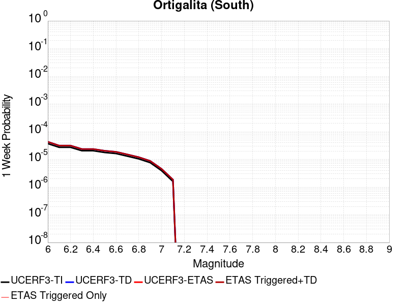 | 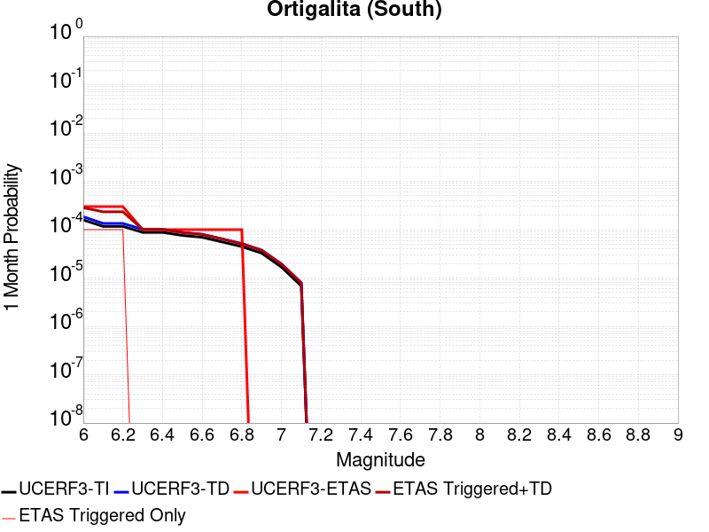 | 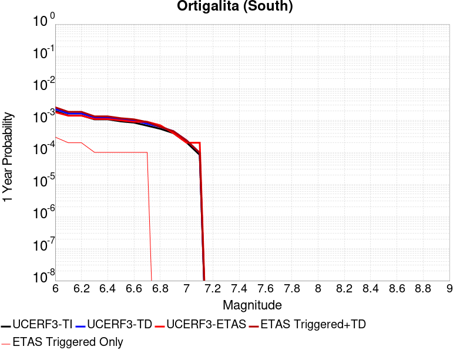 | 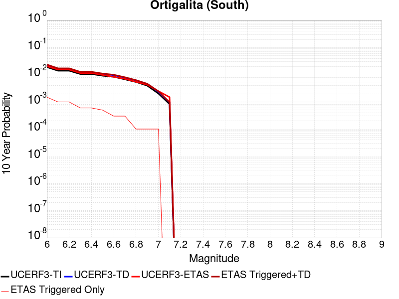 |

| Magnitude | 1 wk TI Prob | 1 wk TD Prob | 1 wk ETAS Prob | 1 wk ETAS/TD Gain | 1 wk ETAS Triggered+TD | 1 wk ETAS Triggered Only | 1 mo TI Prob | 1 mo TD Prob | 1 mo ETAS Prob | 1 mo ETAS/TD Gain | 1 mo ETAS Triggered+TD | 1 mo ETAS Triggered Only | 1 yr TI Prob | 1 yr TD Prob | 1 yr ETAS Prob | 1 yr ETAS/TD Gain | 1 yr ETAS Triggered+TD | 1 yr ETAS Triggered Only | 10 yr TI Prob | 10 yr TD Prob | 10 yr ETAS Prob | 10 yr ETAS/TD Gain | 10 yr ETAS Triggered+TD | 10 yr ETAS Triggered Only |
|-----|-----|-----|-----|-----|-----|-----|-----|-----|-----|-----|-----|-----|-----|-----|-----|-----|-----|-----|-----|-----|-----|-----|-----|-----|
| 6.0 | 3.72394E-5 | 4.3270058E-5 | 0.0 | 0.0 | 4.3270058E-5 | 0.0 | 1.5958765E-4 | 1.8543082E-4 | 3.0E-4 | 1.617854 | 2.8541227E-4 | 1.0E-4 | 0.0019412481 | 0.0022554388 | 0.0018 | 0.79807085 | 0.0025547622 | 3.0E-4 | 0.019243775 | 0.022341885 | 0.0207 | 0.92651093 | 0.023808371 | 0.0015 |
| 6.1 | 2.7299884E-5 | 3.1502026E-5 | 0.0 | 0.0 | 3.1502026E-5 | 0.0 | 1.16994255E-4 | 1.3500202E-4 | 3.0E-4 | 2.222189 | 2.3498852E-4 | 1.0E-4 | 0.0014234743 | 0.0016424663 | 0.0014 | 0.8523767 | 0.0018421378 | 2.0E-4 | 0.014143906 | 0.016309205 | 0.0156 | 0.9565151 | 0.017292896 | 0.001 |
| 6.2 | 2.7299884E-5 | 3.1502026E-5 | 0.0 | 0.0 | 3.1502026E-5 | 0.0 | 1.16994255E-4 | 1.3500202E-4 | 3.0E-4 | 2.222189 | 2.3498852E-4 | 1.0E-4 | 0.0014234743 | 0.0016424663 | 0.0014 | 0.8523767 | 0.0018421378 | 2.0E-4 | 0.014143906 | 0.016309205 | 0.0156 | 0.9565151 | 0.017292896 | 0.001 |
| 6.3 | 2.0546433E-5 | 2.3638784E-5 | 0.0 | 0.0 | 2.3638784E-5 | 0.0 | 8.805317E-5 | 1.01305246E-4 | 1.0E-4 | 0.9871157 | 1.01305246E-4 | 0.0 | 0.00107152 | 0.0012327125 | 0.0011 | 0.8923411 | 0.0013325892 | 1.0E-4 | 0.010663681 | 0.0122608105 | 0.0116 | 0.9461038 | 0.012853454 | 6.0E-4 |
| 6.4 | 2.0546433E-5 | 2.3638784E-5 | 0.0 | 0.0 | 2.3638784E-5 | 0.0 | 8.805317E-5 | 1.01305246E-4 | 1.0E-4 | 0.9871157 | 1.01305246E-4 | 0.0 | 0.00107152 | 0.0012327125 | 0.0011 | 0.8923411 | 0.0013325892 | 1.0E-4 | 0.010663681 | 0.0122608105 | 0.0116 | 0.9461038 | 0.012853454 | 6.0E-4 |
| 6.5 | 1.7779594E-5 | 2.0453313E-5 | 0.0 | 0.0 | 2.0453313E-5 | 0.0 | 7.619603E-5 | 8.7654196E-5 | 1.0E-4 | 1.1408467 | 8.7654196E-5 | 0.0 | 9.272918E-4 | 0.0010666809 | 0.001 | 0.9374875 | 0.0011665743 | 1.0E-4 | 0.009234319 | 0.010617077 | 0.0099 | 0.93246 | 0.011111769 | 5.0E-4 |
| 6.6 | 1.6272212E-5 | 1.8720775E-5 | 0.0 | 0.0 | 1.8720775E-5 | 0.0 | 6.973618E-5 | 8.022949E-5 | 1.0E-4 | 1.2464244 | 8.022949E-5 | 0.0 | 8.487073E-4 | 9.763686E-4 | 9.0E-4 | 0.92178303 | 0.001076271 | 1.0E-4 | 0.008454733 | 0.009722092 | 0.0084 | 0.8640116 | 0.010019175 | 3.0E-4 |
| 6.7 | 1.3051484E-5 | 1.5043493E-5 | 0.0 | 0.0 | 1.5043493E-5 | 0.0 | 5.593373E-5 | 6.447057E-5 | 1.0E-4 | 1.5510954 | 6.447057E-5 | 0.0 | 6.807804E-4 | 7.8465603E-4 | 9.0E-4 | 1.1469994 | 8.845776E-4 | 1.0E-4 | 0.006786986 | 0.00781984 | 0.0071 | 0.907947 | 0.008117493 | 3.0E-4 |
| 6.8 | 1.04277415E-5 | 1.19909355E-5 | 0.0 | 0.0 | 1.19909355E-5 | 0.0 | 4.4689557E-5 | 5.1388753E-5 | 1.0E-4 | 1.945951 | 5.1388753E-5 | 0.0 | 5.439595E-4 | 6.254859E-4 | 7.0E-4 | 1.1191299 | 6.254859E-4 | 0.0 | 0.0054262993 | 0.0062380093 | 0.0055 | 0.8816915 | 0.0063373856 | 1.0E-4 |
| 6.9 | 7.639968E-6 | 8.794237E-6 | 0.0 | 0.0 | 8.794237E-6 | 0.0 | 3.274231E-5 | 3.7689075E-5 | 0.0 | 0.0 | 3.7689075E-5 | 0.0 | 3.9856473E-4 | 4.5877378E-4 | 4.0E-4 | 0.8718894 | 4.5877378E-4 | 0.0 | 0.003978506 | 0.0045788535 | 0.0043 | 0.9390997 | 0.0046783956 | 1.0E-4 |
| 7.0 | 3.919831E-6 | 4.5348647E-6 | 0.0 | 0.0 | 4.5348647E-6 | 0.0 | 1.679917E-5 | 1.9435001E-5 | 0.0 | 0.0 | 1.9435001E-5 | 0.0 | 2.045107E-4 | 2.3659757E-4 | 2.0E-4 | 0.8453172 | 2.3659757E-4 | 0.0 | 0.0020432258 | 0.0023636655 | 0.0025 | 1.0576793 | 0.002463429 | 1.0E-4 |
| 7.1 | 1.6017933E-6 | 1.8576521E-6 | 0.0 | 0.0 | 1.8576521E-6 | 0.0 | 6.8648105E-6 | 7.961348E-6 | 0.0 | 0.0 | 7.961348E-6 | 0.0 | 8.357586E-5 | 9.692617E-5 | 2.0E-4 | 2.0634263 | 9.692617E-5 | 0.0 | 8.3544437E-4 | 9.689437E-4 | 0.0015 | 1.5480776 | 9.689437E-4 | 0.0 |

## Bartlett Springs 2011 CFM
*[(top)](#table-of-contents)*

| 1 Week | 1 Month | 1 Year | 10 Year |
|-----|-----|-----|-----|
| 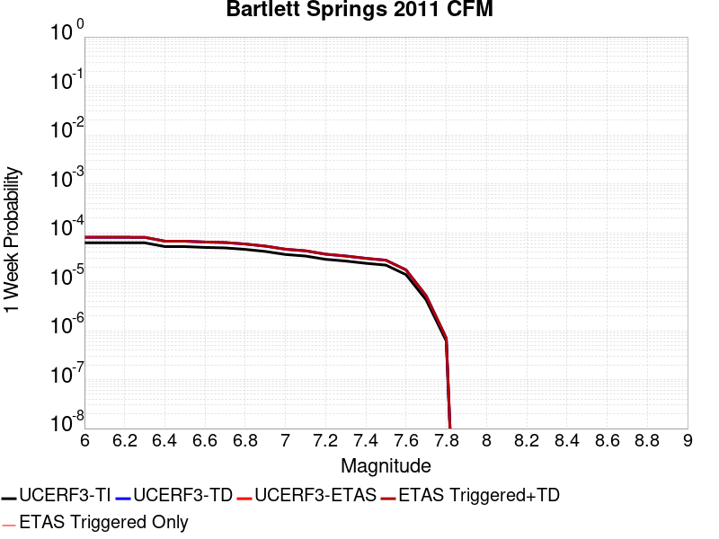 | 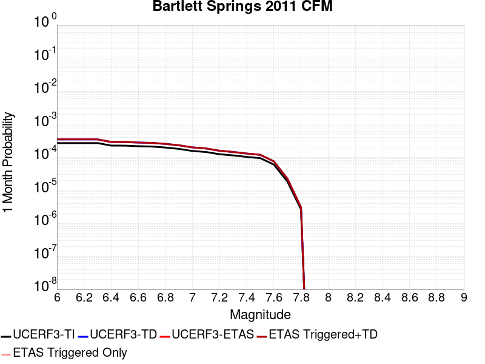 | 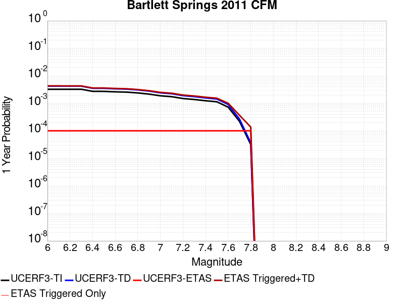 | 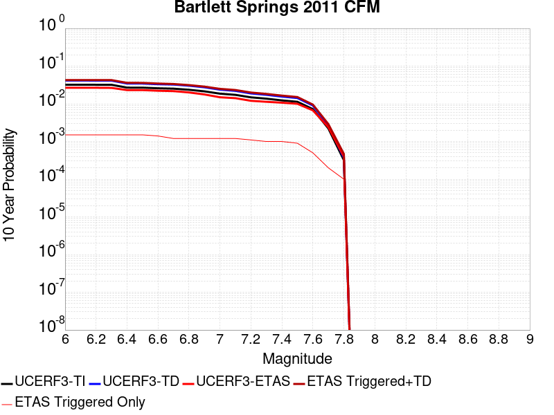 |

| Magnitude | 1 wk TI Prob | 1 wk TD Prob | 1 wk ETAS Prob | 1 wk ETAS/TD Gain | 1 wk ETAS Triggered+TD | 1 wk ETAS Triggered Only | 1 mo TI Prob | 1 mo TD Prob | 1 mo ETAS Prob | 1 mo ETAS/TD Gain | 1 mo ETAS Triggered+TD | 1 mo ETAS Triggered Only | 1 yr TI Prob | 1 yr TD Prob | 1 yr ETAS Prob | 1 yr ETAS/TD Gain | 1 yr ETAS Triggered+TD | 1 yr ETAS Triggered Only | 10 yr TI Prob | 10 yr TD Prob | 10 yr ETAS Prob | 10 yr ETAS/TD Gain | 10 yr ETAS Triggered+TD | 10 yr ETAS Triggered Only |
|-----|-----|-----|-----|-----|-----|-----|-----|-----|-----|-----|-----|-----|-----|-----|-----|-----|-----|-----|-----|-----|-----|-----|-----|-----|
| 6.0 | 6.2326144E-5 | 8.0653714E-5 | 0.0 | 0.0 | 8.0653714E-5 | 0.0 | 2.6708472E-4 | 3.4561334E-4 | 0.0 | 0.0 | 3.4561334E-4 | 0.0 | 0.003246908 | 0.004199817 | 0.0028 | 0.6666957 | 0.004299397 | 1.0E-4 | 0.031998757 | 0.04122155 | 0.0267 | 0.64771944 | 0.04265972 | 0.0015 |
| 6.1 | 6.227657E-5 | 8.0591184E-5 | 0.0 | 0.0 | 8.0591184E-5 | 0.0 | 2.668723E-4 | 3.453454E-4 | 0.0 | 0.0 | 3.453454E-4 | 0.0 | 0.0032443295 | 0.0041965675 | 0.0028 | 0.66721195 | 0.004296148 | 1.0E-4 | 0.031973712 | 0.04119027 | 0.0266 | 0.64578354 | 0.042628486 | 0.0015 |
| 6.2 | 6.22452E-5 | 8.055176E-5 | 0.0 | 0.0 | 8.055176E-5 | 0.0 | 2.6673786E-4 | 3.4517655E-4 | 0.0 | 0.0 | 3.4517655E-4 | 0.0 | 0.0032426978 | 0.0041945195 | 0.0028 | 0.66753775 | 0.0042941 | 1.0E-4 | 0.03195787 | 0.041170552 | 0.0266 | 0.64609283 | 0.042608798 | 0.0015 |
| 6.3 | 6.219006E-5 | 8.0481565E-5 | 0.0 | 0.0 | 8.0481565E-5 | 0.0 | 2.6650162E-4 | 3.4487576E-4 | 0.0 | 0.0 | 3.4487576E-4 | 0.0 | 0.00323983 | 0.0041908715 | 0.0028 | 0.6681188 | 0.0042904527 | 1.0E-4 | 0.031930014 | 0.041135434 | 0.0264 | 0.64178246 | 0.04257373 | 0.0015 |
| 6.4 | 5.2175856E-5 | 6.729268E-5 | 0.0 | 0.0 | 6.729268E-5 | 0.0 | 2.2359163E-4 | 2.883656E-4 | 0.0 | 0.0 | 2.883656E-4 | 0.0 | 0.0027188298 | 0.0035052474 | 0.0023 | 0.6561591 | 0.0036048968 | 1.0E-4 | 0.026858058 | 0.03450902 | 0.0231 | 0.66939014 | 0.03595726 | 0.0015 |
| 6.5 | 5.205166E-5 | 6.713527E-5 | 0.0 | 0.0 | 6.713527E-5 | 0.0 | 2.2305945E-4 | 2.876911E-4 | 0.0 | 0.0 | 2.876911E-4 | 0.0 | 0.0027123666 | 0.0034970618 | 0.0023 | 0.657695 | 0.0035967121 | 1.0E-4 | 0.026794989 | 0.034429725 | 0.0231 | 0.6709319 | 0.03587808 | 0.0015 |
| 6.6 | 5.0085426E-5 | 6.452997E-5 | 0.0 | 0.0 | 6.452997E-5 | 0.0 | 2.1463417E-4 | 2.7652795E-4 | 0.0 | 0.0 | 2.7652795E-4 | 0.0 | 0.0026100394 | 0.0033615802 | 0.0023 | 0.684202 | 0.003461244 | 1.0E-4 | 0.025795965 | 0.03311651 | 0.0222 | 0.67036057 | 0.034470145 | 0.0014 |
| 6.7 | 4.8930866E-5 | 6.3053805E-5 | 0.0 | 0.0 | 6.3053805E-5 | 0.0 | 2.0968684E-4 | 2.7020287E-4 | 0.0 | 0.0 | 2.7020287E-4 | 0.0 | 0.0025499484 | 0.0032848073 | 0.0022 | 0.6697501 | 0.0033844789 | 1.0E-4 | 0.025208864 | 0.03237147 | 0.0217 | 0.6703434 | 0.033532623 | 0.0012 |
| 6.8 | 4.5679535E-5 | 5.8775466E-5 | 0.0 | 0.0 | 5.8775466E-5 | 0.0 | 1.9575475E-4 | 2.5187072E-4 | 0.0 | 0.0 | 2.5187072E-4 | 0.0 | 0.002380709 | 0.0030622517 | 0.0019 | 0.6204584 | 0.0031619456 | 1.0E-4 | 0.023553653 | 0.030207586 | 0.02 | 0.66208535 | 0.031371336 | 0.0012 |
| 6.9 | 4.1439176E-5 | 5.325024E-5 | 0.0 | 0.0 | 5.325024E-5 | 0.0 | 1.7758438E-4 | 2.2819548E-4 | 0.0 | 0.0 | 2.2819548E-4 | 0.0 | 0.002159946 | 0.0027747657 | 0.0017 | 0.61266434 | 0.0028744882 | 1.0E-4 | 0.021390721 | 0.027406242 | 0.0177 | 0.64583826 | 0.028573355 | 0.0012 |
| 7.0 | 3.5920104E-5 | 4.6034307E-5 | 0.0 | 0.0 | 4.6034307E-5 | 0.0 | 1.5393422E-4 | 1.9727505E-4 | 0.0 | 0.0 | 1.9727505E-4 | 0.0 | 0.001872538 | 0.002399194 | 0.0015 | 0.62521 | 0.002498954 | 1.0E-4 | 0.018568378 | 0.02373621 | 0.0149 | 0.6277329 | 0.024907727 | 0.0012 |
| 7.1 | 3.338812E-5 | 4.2713036E-5 | 0.0 | 0.0 | 4.2713036E-5 | 0.0 | 1.430841E-4 | 1.8304311E-4 | 0.0 | 0.0 | 1.8304311E-4 | 0.0 | 0.0017406568 | 0.0022262866 | 0.0014 | 0.62884986 | 0.002326064 | 1.0E-4 | 0.017270854 | 0.022042684 | 0.0141 | 0.639668 | 0.023216233 | 0.0012 |
| 7.2 | 2.8619615E-5 | 3.6421425E-5 | 0.0 | 0.0 | 3.6421425E-5 | 0.0 | 1.2264973E-4 | 1.5608253E-4 | 0.0 | 0.0 | 1.5608253E-4 | 0.0 | 0.0014922376 | 0.0018986582 | 0.001 | 0.52668774 | 0.0019984683 | 1.0E-4 | 0.014822568 | 0.018826444 | 0.012 | 0.6374013 | 0.019905735 | 0.0011 |
| 7.3 | 2.6376783E-5 | 3.3441032E-5 | 0.0 | 0.0 | 3.3441032E-5 | 0.0 | 1.13038455E-4 | 1.4331088E-4 | 0.0 | 0.0 | 1.4331088E-4 | 0.0 | 0.0013753743 | 0.0017434228 | 0.001 | 0.5735843 | 0.0018432485 | 1.0E-4 | 0.01366893 | 0.01729939 | 0.0113 | 0.65320224 | 0.018282091 | 0.001 |
| 7.4 | 2.3738676E-5 | 2.9995399E-5 | 0.0 | 0.0 | 2.9995399E-5 | 0.0 | 1.0173322E-4 | 1.2854542E-4 | 0.0 | 0.0 | 1.2854542E-4 | 0.0 | 0.0012378981 | 0.0015639251 | 9.0E-4 | 0.57547516 | 0.0016637687 | 1.0E-4 | 0.012310251 | 0.01553077 | 0.0107 | 0.6889549 | 0.016515238 | 0.001 |
| 7.5 | 2.1789481E-5 | 2.7454264E-5 | 0.0 | 0.0 | 2.7454264E-5 | 0.0 | 9.338015E-5 | 1.17655865E-4 | 0.0 | 0.0 | 1.17655865E-4 | 0.0 | 0.0011363103 | 0.0014315267 | 9.0E-4 | 0.62869936 | 0.0015313836 | 1.0E-4 | 0.011305175 | 0.014224509 | 0.01 | 0.703012 | 0.015111706 | 9.0E-4 |
| 7.6 | 1.3895281E-5 | 1.737815E-5 | 0.0 | 0.0 | 1.737815E-5 | 0.0 | 5.9549846E-5 | 7.4475676E-5 | 0.0 | 0.0 | 7.4475676E-5 | 0.0 | 7.2477816E-4 | 9.0636703E-4 | 6.0E-4 | 0.6619835 | 0.0010062763 | 1.0E-4 | 0.0072241887 | 0.009027373 | 0.0067 | 0.7421871 | 0.00952286 | 5.0E-4 |
| 7.7 | 4.245981E-6 | 5.165001E-6 | 0.0 | 0.0 | 5.165001E-6 | 0.0 | 1.8196934E-5 | 2.2135531E-5 | 0.0 | 0.0 | 2.2135531E-5 | 0.0 | 2.2152514E-4 | 2.6946695E-4 | 3.0E-4 | 1.113309 | 3.6944E-4 | 1.0E-4 | 0.0022130446 | 0.0026914403 | 0.0024 | 0.8917159 | 0.0028909019 | 2.0E-4 |
| 7.8 | 6.145192E-7 | 7.054105E-7 | 0.0 | 0.0 | 7.054105E-7 | 0.0 | 2.633651E-6 | 3.0231845E-6 | 0.0 | 0.0 | 3.0231845E-6 | 0.0 | 3.206423E-5 | 3.680666E-5 | 1.0E-4 | 2.7168994 | 1.3680298E-4 | 1.0E-4 | 3.2059604E-4 | 3.679996E-4 | 4.0E-4 | 1.0869577 | 4.679628E-4 | 1.0E-4 |

## San Jacinto (Anza) rev
*[(top)](#table-of-contents)*

| 1 Week | 1 Month | 1 Year | 10 Year |
|-----|-----|-----|-----|
| 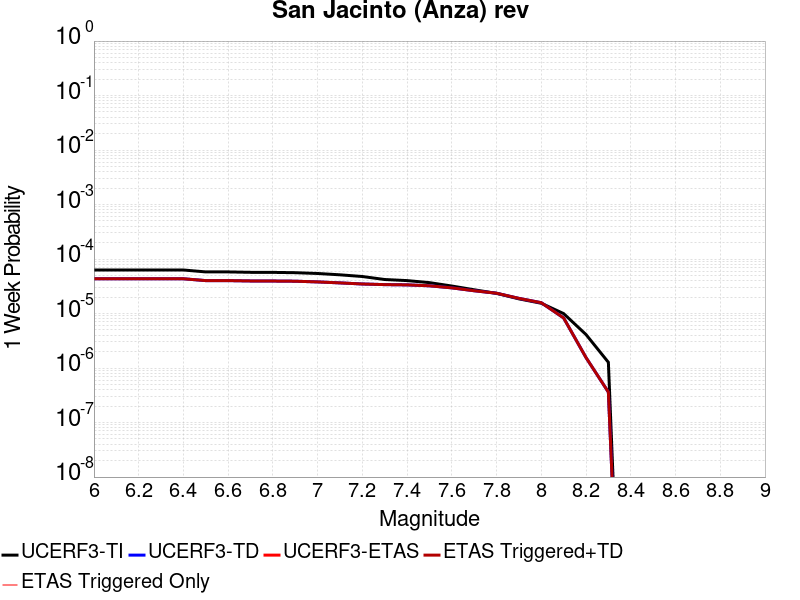 | 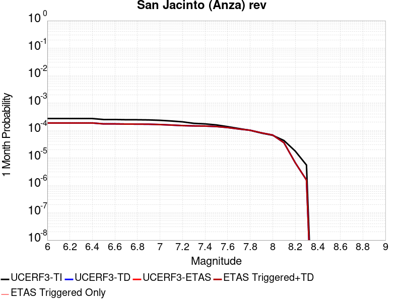 |  | 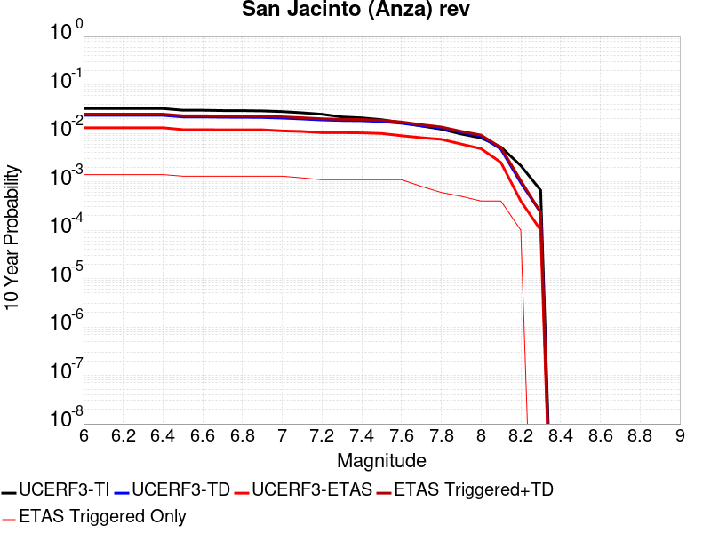 |

| Magnitude | 1 wk TI Prob | 1 wk TD Prob | 1 wk ETAS Prob | 1 wk ETAS/TD Gain | 1 wk ETAS Triggered+TD | 1 wk ETAS Triggered Only | 1 mo TI Prob | 1 mo TD Prob | 1 mo ETAS Prob | 1 mo ETAS/TD Gain | 1 mo ETAS Triggered+TD | 1 mo ETAS Triggered Only | 1 yr TI Prob | 1 yr TD Prob | 1 yr ETAS Prob | 1 yr ETAS/TD Gain | 1 yr ETAS Triggered+TD | 1 yr ETAS Triggered Only | 10 yr TI Prob | 10 yr TD Prob | 10 yr ETAS Prob | 10 yr ETAS/TD Gain | 10 yr ETAS Triggered+TD | 10 yr ETAS Triggered Only |
|-----|-----|-----|-----|-----|-----|-----|-----|-----|-----|-----|-----|-----|-----|-----|-----|-----|-----|-----|-----|-----|-----|-----|-----|-----|
| 6.0 | 6.3015636E-5 | 4.3576165E-5 | 0.0 | 0.0 | 4.3576165E-5 | 0.0 | 2.7003905E-4 | 1.8674169E-4 | 0.0 | 0.0 | 1.8674169E-4 | 0.0 | 0.0032827691 | 0.0022712213 | 0.0014 | 0.6164084 | 0.0024707671 | 2.0E-4 | 0.032346968 | 0.023438416 | 0.013 | 0.55464494 | 0.024805604 | 0.0014 |
| 6.1 | 6.3015636E-5 | 4.3576165E-5 | 0.0 | 0.0 | 4.3576165E-5 | 0.0 | 2.7003905E-4 | 1.8674169E-4 | 0.0 | 0.0 | 1.8674169E-4 | 0.0 | 0.0032827691 | 0.0022712213 | 0.0014 | 0.6164084 | 0.0024707671 | 2.0E-4 | 0.032346968 | 0.023438416 | 0.013 | 0.55464494 | 0.024805604 | 0.0014 |
| 6.2 | 6.3015636E-5 | 4.3576165E-5 | 0.0 | 0.0 | 4.3576165E-5 | 0.0 | 2.7003905E-4 | 1.8674169E-4 | 0.0 | 0.0 | 1.8674169E-4 | 0.0 | 0.0032827691 | 0.0022712213 | 0.0014 | 0.6164084 | 0.0024707671 | 2.0E-4 | 0.032346968 | 0.023438416 | 0.013 | 0.55464494 | 0.024805604 | 0.0014 |
| 6.3 | 6.3015636E-5 | 4.3576165E-5 | 0.0 | 0.0 | 4.3576165E-5 | 0.0 | 2.7003905E-4 | 1.8674169E-4 | 0.0 | 0.0 | 1.8674169E-4 | 0.0 | 0.0032827691 | 0.0022712213 | 0.0014 | 0.6164084 | 0.0024707671 | 2.0E-4 | 0.032346968 | 0.023438416 | 0.013 | 0.55464494 | 0.024805604 | 0.0014 |
| 6.4 | 6.3015636E-5 | 4.3576165E-5 | 0.0 | 0.0 | 4.3576165E-5 | 0.0 | 2.7003905E-4 | 1.8674169E-4 | 0.0 | 0.0 | 1.8674169E-4 | 0.0 | 0.0032827691 | 0.0022712213 | 0.0014 | 0.6164084 | 0.0024707671 | 2.0E-4 | 0.032346968 | 0.023438416 | 0.013 | 0.55464494 | 0.024805604 | 0.0014 |
| 6.5 | 5.811017E-5 | 4.03439E-5 | 0.0 | 0.0 | 4.03439E-5 | 0.0 | 2.4901982E-4 | 1.7289101E-4 | 0.0 | 0.0 | 1.7289101E-4 | 0.0 | 0.0030276014 | 0.0021029217 | 0.0012 | 0.57063466 | 0.0023025011 | 2.0E-4 | 0.02986684 | 0.021730738 | 0.0119 | 0.5476114 | 0.023002487 | 0.0013 |
| 6.6 | 5.811017E-5 | 4.03439E-5 | 0.0 | 0.0 | 4.03439E-5 | 0.0 | 2.4901982E-4 | 1.7289101E-4 | 0.0 | 0.0 | 1.7289101E-4 | 0.0 | 0.0030276014 | 0.0021029217 | 0.0012 | 0.57063466 | 0.0023025011 | 2.0E-4 | 0.02986684 | 0.021730738 | 0.0119 | 0.5476114 | 0.023002487 | 0.0013 |
| 6.7 | 5.712442E-5 | 3.9763414E-5 | 0.0 | 0.0 | 3.9763414E-5 | 0.0 | 2.4479596E-4 | 1.7040354E-4 | 0.0 | 0.0 | 1.7040354E-4 | 0.0 | 0.0029763177 | 0.0020726945 | 0.0012 | 0.57895654 | 0.00227228 | 2.0E-4 | 0.029367693 | 0.021421188 | 0.0118 | 0.5508565 | 0.022693342 | 0.0013 |
| 6.8 | 5.6967532E-5 | 3.961925E-5 | 0.0 | 0.0 | 3.961925E-5 | 0.0 | 2.4412372E-4 | 1.6978578E-4 | 0.0 | 0.0 | 1.6978578E-4 | 0.0 | 0.0029681553 | 0.0020651876 | 0.0012 | 0.581061 | 0.0022647746 | 2.0E-4 | 0.029288229 | 0.021345127 | 0.0118 | 0.5528194 | 0.02261738 | 0.0013 |
| 6.9 | 5.6211324E-5 | 3.9322527E-5 | 0.0 | 0.0 | 3.9322527E-5 | 0.0 | 2.4088343E-4 | 1.6851426E-4 | 0.0 | 0.0 | 1.6851426E-4 | 0.0 | 0.0029288116 | 0.002049736 | 0.0012 | 0.58544123 | 0.002249326 | 2.0E-4 | 0.028905109 | 0.021183249 | 0.0118 | 0.55704397 | 0.022455709 | 0.0013 |
| 7.0 | 5.4383527E-5 | 3.817767E-5 | 0.0 | 0.0 | 3.817767E-5 | 0.0 | 2.3305144E-4 | 1.6360835E-4 | 0.0 | 0.0 | 1.6360835E-4 | 0.0 | 0.0028337094 | 0.001990117 | 0.0012 | 0.60297966 | 0.002189719 | 2.0E-4 | 0.027978465 | 0.02056784 | 0.0112 | 0.54453945 | 0.021841101 | 0.0013 |
| 7.1 | 5.1393665E-5 | 3.663072E-5 | 0.0 | 0.0 | 3.663072E-5 | 0.0 | 2.2023996E-4 | 1.5697938E-4 | 0.0 | 0.0 | 1.5697938E-4 | 0.0 | 0.0026781242 | 0.0019095528 | 0.0012 | 0.6284194 | 0.002109171 | 2.0E-4 | 0.026460782 | 0.019738475 | 0.0109 | 0.55222094 | 0.02091479 | 0.0012 |
| 7.2 | 4.785222E-5 | 3.4973295E-5 | 0.0 | 0.0 | 3.4973295E-5 | 0.0 | 2.0506482E-4 | 1.4987696E-4 | 0.0 | 0.0 | 1.4987696E-4 | 0.0 | 0.0024938055 | 0.0018232282 | 0.0011 | 0.6033255 | 0.0020228636 | 2.0E-4 | 0.024660049 | 0.01884695 | 0.0103 | 0.54650754 | 0.019926218 | 0.0011 |
| 7.3 | 4.2143256E-5 | 3.405982E-5 | 0.0 | 0.0 | 3.405982E-5 | 0.0 | 1.8060145E-4 | 1.4596252E-4 | 0.0 | 0.0 | 1.4596252E-4 | 0.0 | 0.002196605 | 0.0017756486 | 0.0011 | 0.61949193 | 0.0019752935 | 2.0E-4 | 0.02175019 | 0.018353337 | 0.0103 | 0.5612058 | 0.01943315 | 0.0011 |
| 7.4 | 4.0264713E-5 | 3.369585E-5 | 0.0 | 0.0 | 3.369585E-5 | 0.0 | 1.7255165E-4 | 1.4440282E-4 | 0.0 | 0.0 | 1.4440282E-4 | 0.0 | 0.002098792 | 0.0017566899 | 0.0011 | 0.62617767 | 0.0019563385 | 2.0E-4 | 0.020790804 | 0.018156845 | 0.0102 | 0.56177163 | 0.019236872 | 0.0011 |
| 7.5 | 3.694492E-5 | 3.2404063E-5 | 0.0 | 0.0 | 3.2404063E-5 | 0.0 | 1.5832575E-4 | 1.3886718E-4 | 0.0 | 0.0 | 1.3886718E-4 | 0.0 | 0.0019259118 | 0.0016894 | 0.0011 | 0.65111876 | 0.001889062 | 2.0E-4 | 0.01909306 | 0.017470367 | 0.0099 | 0.5666738 | 0.01855115 | 0.0011 |
| 7.6 | 3.200565E-5 | 2.970493E-5 | 0.0 | 0.0 | 2.970493E-5 | 0.0 | 1.3715986E-4 | 1.2730065E-4 | 0.0 | 0.0 | 1.2730065E-4 | 0.0 | 0.001668642 | 0.0015487857 | 0.001 | 0.64566714 | 0.001748476 | 2.0E-4 | 0.01656168 | 0.016050825 | 0.0089 | 0.55448866 | 0.017133169 | 0.0011 |
| 7.7 | 2.731642E-5 | 2.6287431E-5 | 0.0 | 0.0 | 2.6287431E-5 | 0.0 | 1.1706512E-4 | 1.1265556E-4 | 0.0 | 0.0 | 1.1265556E-4 | 0.0 | 0.001424336 | 0.0013707195 | 9.0E-4 | 0.6565895 | 0.0015704454 | 2.0E-4 | 0.014152412 | 0.014268803 | 0.0081 | 0.567672 | 0.015057389 | 8.0E-4 |
| 7.8 | 2.3466424E-5 | 2.3691577E-5 | 0.0 | 0.0 | 2.3691577E-5 | 0.0 | 1.0056651E-4 | 1.0153138E-4 | 0.0 | 0.0 | 1.0153138E-4 | 0.0 | 0.0012237094 | 0.0012354444 | 7.0E-4 | 0.5665977 | 0.0013353209 | 1.0E-4 | 0.012169928 | 0.012906908 | 0.0075 | 0.5810842 | 0.013499164 | 6.0E-4 |
| 7.9 | 1.8611925E-5 | 1.9076544E-5 | 0.0 | 0.0 | 1.9076544E-5 | 0.0 | 7.9762955E-5 | 8.175406E-5 | 0.0 | 0.0 | 8.175406E-5 | 0.0 | 9.7068126E-4 | 9.949019E-4 | 6.0E-4 | 0.60307455 | 0.0010948024 | 1.0E-4 | 0.0096645225 | 0.0104826465 | 0.006 | 0.5723745 | 0.010977405 | 5.0E-4 |
| 8.0 | 1.5460775E-5 | 1.589064E-5 | 0.0 | 0.0 | 1.589064E-5 | 0.0 | 6.6258784E-5 | 6.810098E-5 | 0.0 | 0.0 | 6.810098E-5 | 0.0 | 8.0640207E-4 | 8.2881463E-4 | 4.0E-4 | 0.48261696 | 9.2873175E-4 | 1.0E-4 | 0.008034821 | 0.008782218 | 0.0048 | 0.546559 | 0.009178705 | 4.0E-4 |
| 8.1 | 9.983884E-6 | 8.357874E-6 | 0.0 | 0.0 | 8.357874E-6 | 0.0 | 4.2787375E-5 | 3.5818975E-5 | 0.0 | 0.0 | 3.5818975E-5 | 0.0 | 5.2081177E-4 | 4.3600926E-4 | 4.0E-4 | 0.9174117 | 5.3596566E-4 | 1.0E-4 | 0.0051959283 | 0.004687597 | 0.0025 | 0.53332233 | 0.0050857216 | 4.0E-4 |
| 8.2 | 4.1226E-6 | 1.5778191E-6 | 0.0 | 0.0 | 1.5778191E-6 | 0.0 | 1.7668166E-5 | 6.7620645E-6 | 0.0 | 0.0 | 6.7620645E-6 | 0.0 | 2.1508869E-4 | 8.232505E-5 | 0.0 | 0.0 | 8.232505E-5 | 0.0 | 0.0021488064 | 9.5471635E-4 | 4.0E-4 | 0.4189726 | 0.001054621 | 1.0E-4 |
| 8.3 | 1.2750878E-6 | 3.679851E-7 | 0.0 | 0.0 | 3.679851E-7 | 0.0 | 5.4646503E-6 | 1.5770781E-6 | 0.0 | 0.0 | 1.5770781E-6 | 0.0 | 6.653009E-5 | 1.9200761E-5 | 0.0 | 0.0 | 1.9200761E-5 | 0.0 | 6.6510175E-4 | 2.3133527E-4 | 1.0E-4 | 0.43227303 | 2.3133527E-4 | 0.0 |

## Blue Cut
*[(top)](#table-of-contents)*

| 1 Week | 1 Month | 1 Year | 10 Year |
|-----|-----|-----|-----|
| 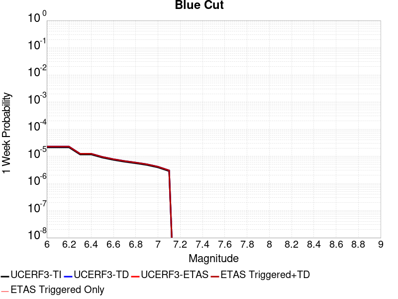 | 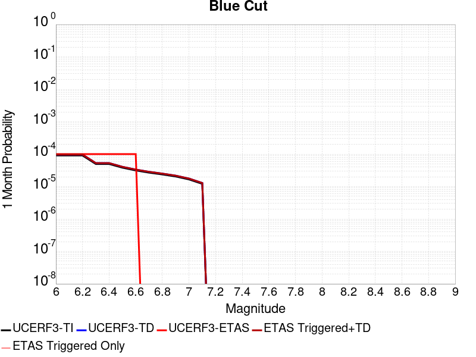 | 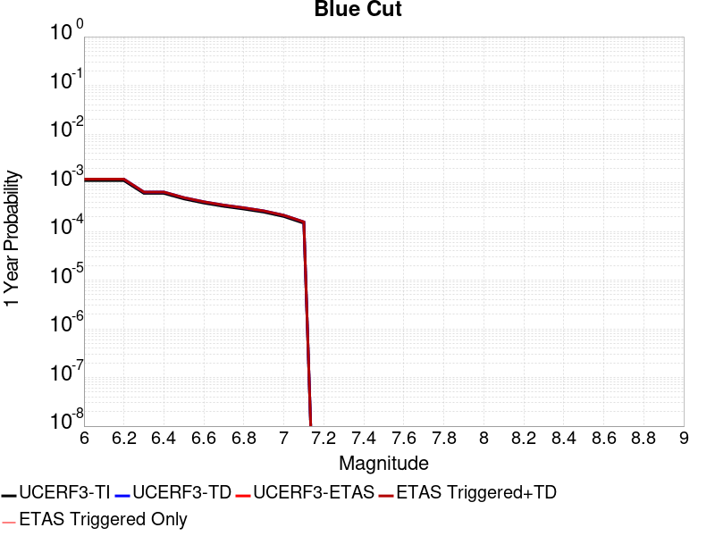 | 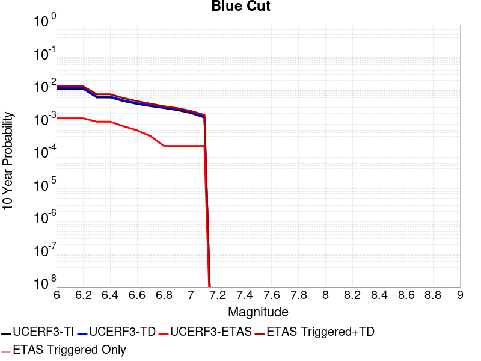 |

| Magnitude | 1 wk TI Prob | 1 wk TD Prob | 1 wk ETAS Prob | 1 wk ETAS/TD Gain | 1 wk ETAS Triggered+TD | 1 wk ETAS Triggered Only | 1 mo TI Prob | 1 mo TD Prob | 1 mo ETAS Prob | 1 mo ETAS/TD Gain | 1 mo ETAS Triggered+TD | 1 mo ETAS Triggered Only | 1 yr TI Prob | 1 yr TD Prob | 1 yr ETAS Prob | 1 yr ETAS/TD Gain | 1 yr ETAS Triggered+TD | 1 yr ETAS Triggered Only | 10 yr TI Prob | 10 yr TD Prob | 10 yr ETAS Prob | 10 yr ETAS/TD Gain | 10 yr ETAS Triggered+TD | 10 yr ETAS Triggered Only |
|-----|-----|-----|-----|-----|-----|-----|-----|-----|-----|-----|-----|-----|-----|-----|-----|-----|-----|-----|-----|-----|-----|-----|-----|-----|
| 6.0 | 2.1227985E-5 | 2.2722867E-5 | 0.0 | 0.0 | 2.2722867E-5 | 0.0 | 9.097391E-5 | 9.738041E-5 | 1.0E-4 | 1.0269005 | 9.738041E-5 | 0.0 | 0.0011070445 | 0.0011850197 | 7.0E-4 | 0.5907075 | 0.0011850197 | 0.0 | 0.011015458 | 0.011792852 | 0.011 | 0.93276846 | 0.013176342 | 0.0014 |
| 6.1 | 2.1227985E-5 | 2.2722867E-5 | 0.0 | 0.0 | 2.2722867E-5 | 0.0 | 9.097391E-5 | 9.738041E-5 | 1.0E-4 | 1.0269005 | 9.738041E-5 | 0.0 | 0.0011070445 | 0.0011850197 | 7.0E-4 | 0.5907075 | 0.0011850197 | 0.0 | 0.011015458 | 0.011792852 | 0.011 | 0.93276846 | 0.013176342 | 0.0014 |
| 6.2 | 2.1227985E-5 | 2.2722867E-5 | 0.0 | 0.0 | 2.2722867E-5 | 0.0 | 9.097391E-5 | 9.738041E-5 | 1.0E-4 | 1.0269005 | 9.738041E-5 | 0.0 | 0.0011070445 | 0.0011850197 | 7.0E-4 | 0.5907075 | 0.0011850197 | 0.0 | 0.011015458 | 0.011792852 | 0.011 | 0.93276846 | 0.013176342 | 0.0014 |
| 6.3 | 1.1613981E-5 | 1.2355163E-5 | 0.0 | 0.0 | 1.2355163E-5 | 0.0 | 4.9773254E-5 | 5.2949694E-5 | 1.0E-4 | 1.8885851 | 5.2949694E-5 | 0.0 | 6.0582085E-4 | 6.444843E-4 | 5.0E-4 | 0.7758141 | 6.444843E-4 | 0.0 | 0.0060417196 | 0.0064274 | 0.0063 | 0.9801786 | 0.0075203297 | 0.0011 |
| 6.4 | 1.1613981E-5 | 1.2355163E-5 | 0.0 | 0.0 | 1.2355163E-5 | 0.0 | 4.9773254E-5 | 5.2949694E-5 | 1.0E-4 | 1.8885851 | 5.2949694E-5 | 0.0 | 6.0582085E-4 | 6.444843E-4 | 5.0E-4 | 0.7758141 | 6.444843E-4 | 0.0 | 0.0060417196 | 0.0064274 | 0.0063 | 0.9801786 | 0.0075203297 | 0.0011 |
| 6.5 | 8.931326E-6 | 9.482803E-6 | 0.0 | 0.0 | 9.482803E-6 | 0.0 | 3.8276554E-5 | 4.0640003E-5 | 1.0E-4 | 2.4606297 | 4.0640003E-5 | 0.0 | 4.6591737E-4 | 4.9468887E-4 | 3.0E-4 | 0.6064418 | 4.9468887E-4 | 0.0 | 0.0046494175 | 0.004936786 | 0.0049 | 0.9925486 | 0.0057328367 | 8.0E-4 |
| 6.6 | 7.345353E-6 | 7.791251E-6 | 0.0 | 0.0 | 7.791251E-6 | 0.0 | 3.1479703E-5 | 3.3390694E-5 | 1.0E-4 | 2.9948463 | 3.3390694E-5 | 0.0 | 3.83198E-4 | 4.0646386E-4 | 3.0E-4 | 0.738073 | 4.0646386E-4 | 0.0 | 0.0038253788 | 0.004057996 | 0.0041 | 1.010351 | 0.0046555614 | 6.0E-4 |
| 6.7 | 6.2775666E-6 | 6.6559733E-6 | 0.0 | 0.0 | 6.6559733E-6 | 0.0 | 2.690358E-5 | 2.852533E-5 | 0.0 | 0.0 | 2.852533E-5 | 0.0 | 3.2750185E-4 | 3.4724807E-4 | 2.0E-4 | 0.5759571 | 3.4724807E-4 | 0.0 | 0.0032701963 | 0.003467796 | 0.0033 | 0.95161307 | 0.0038664087 | 4.0E-4 |
| 6.8 | 5.5234095E-6 | 5.8558353E-6 | 0.0 | 0.0 | 5.8558353E-6 | 0.0 | 2.367154E-5 | 2.5096237E-5 | 0.0 | 0.0 | 2.5096237E-5 | 0.0 | 2.8816288E-4 | 3.0551112E-4 | 1.0E-4 | 0.3273203 | 3.0551112E-4 | 0.0 | 0.002877895 | 0.0030516274 | 0.0024 | 0.7864656 | 0.003251017 | 2.0E-4 |
| 6.9 | 4.7780054E-6 | 5.066048E-6 | 0.0 | 0.0 | 5.066048E-6 | 0.0 | 2.0477004E-5 | 2.1711494E-5 | 0.0 | 0.0 | 2.1711494E-5 | 0.0 | 2.4927902E-4 | 2.643124E-4 | 1.0E-4 | 0.37834015 | 2.643124E-4 | 0.0 | 0.0024899957 | 0.002640673 | 0.0022 | 0.833121 | 0.0028401448 | 2.0E-4 |
| 7.0 | 3.883171E-6 | 4.119001E-6 | 0.0 | 0.0 | 4.119001E-6 | 0.0 | 1.6642054E-5 | 1.7652781E-5 | 0.0 | 0.0 | 1.7652781E-5 | 0.0 | 2.0259817E-4 | 2.149083E-4 | 1.0E-4 | 0.46531475 | 2.149083E-4 | 0.0 | 0.0020241356 | 0.0021476806 | 0.0012 | 0.5587423 | 0.0023472512 | 2.0E-4 |
| 7.1 | 2.8358215E-6 | 3.010096E-6 | 0.0 | 0.0 | 3.010096E-6 | 0.0 | 1.2153464E-5 | 1.2900385E-5 | 0.0 | 0.0 | 1.2900385E-5 | 0.0 | 1.4795837E-4 | 1.5705744E-4 | 1.0E-4 | 0.63670975 | 1.5705744E-4 | 0.0 | 0.001478599 | 0.0015701097 | 0.0011 | 0.7005879 | 0.0017697958 | 2.0E-4 |

## Mission Hills 2011
*[(top)](#table-of-contents)*

| 1 Week | 1 Month | 1 Year | 10 Year |
|-----|-----|-----|-----|
| 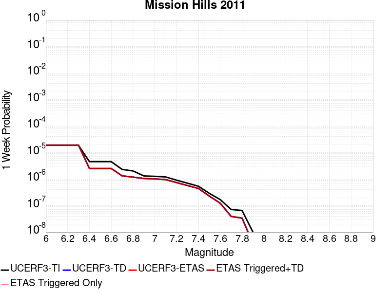 | 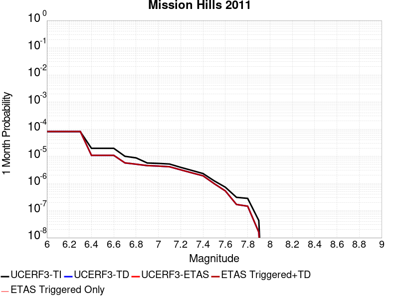 | 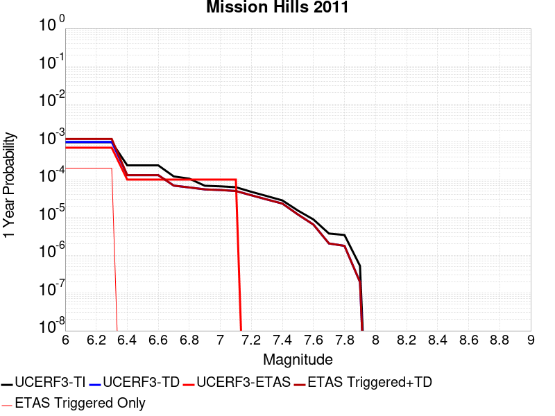 | 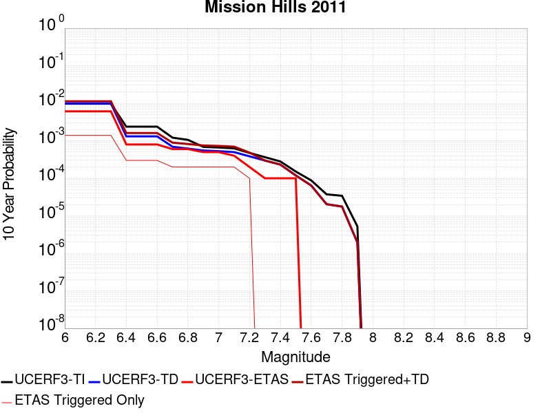 |

| Magnitude | 1 wk TI Prob | 1 wk TD Prob | 1 wk ETAS Prob | 1 wk ETAS/TD Gain | 1 wk ETAS Triggered+TD | 1 wk ETAS Triggered Only | 1 mo TI Prob | 1 mo TD Prob | 1 mo ETAS Prob | 1 mo ETAS/TD Gain | 1 mo ETAS Triggered+TD | 1 mo ETAS Triggered Only | 1 yr TI Prob | 1 yr TD Prob | 1 yr ETAS Prob | 1 yr ETAS/TD Gain | 1 yr ETAS Triggered+TD | 1 yr ETAS Triggered Only | 10 yr TI Prob | 10 yr TD Prob | 10 yr ETAS Prob | 10 yr ETAS/TD Gain | 10 yr ETAS Triggered+TD | 10 yr ETAS Triggered Only |
|-----|-----|-----|-----|-----|-----|-----|-----|-----|-----|-----|-----|-----|-----|-----|-----|-----|-----|-----|-----|-----|-----|-----|-----|-----|
| 6.0 | 1.8765717E-5 | 1.9060995E-5 | 0.0 | 0.0 | 1.9060995E-5 | 0.0 | 8.0422025E-5 | 8.168936E-5 | 0.0 | 0.0 | 8.168936E-5 | 0.0 | 9.786983E-4 | 9.944576E-4 | 7.0E-4 | 0.7039013 | 0.0011942587 | 2.0E-4 | 0.009743992 | 0.009933762 | 0.0061 | 0.61406744 | 0.011319855 | 0.0014 |
| 6.1 | 1.8765717E-5 | 1.9060995E-5 | 0.0 | 0.0 | 1.9060995E-5 | 0.0 | 8.0422025E-5 | 8.168936E-5 | 0.0 | 0.0 | 8.168936E-5 | 0.0 | 9.786983E-4 | 9.944576E-4 | 7.0E-4 | 0.7039013 | 0.0011942587 | 2.0E-4 | 0.009743992 | 0.009933762 | 0.0061 | 0.61406744 | 0.011319855 | 0.0014 |
| 6.2 | 1.8765717E-5 | 1.9060995E-5 | 0.0 | 0.0 | 1.9060995E-5 | 0.0 | 8.0422025E-5 | 8.168936E-5 | 0.0 | 0.0 | 8.168936E-5 | 0.0 | 9.786983E-4 | 9.944576E-4 | 7.0E-4 | 0.7039013 | 0.0011942587 | 2.0E-4 | 0.009743992 | 0.009933762 | 0.0061 | 0.61406744 | 0.011319855 | 0.0014 |
| 6.3 | 1.8765717E-5 | 1.9060995E-5 | 0.0 | 0.0 | 1.9060995E-5 | 0.0 | 8.0422025E-5 | 8.168936E-5 | 0.0 | 0.0 | 8.168936E-5 | 0.0 | 9.786983E-4 | 9.944576E-4 | 7.0E-4 | 0.7039013 | 0.0011942587 | 2.0E-4 | 0.009743992 | 0.009933762 | 0.0061 | 0.61406744 | 0.011319855 | 0.0014 |
| 6.4 | 4.566357E-6 | 2.515573E-6 | 0.0 | 0.0 | 2.515573E-6 | 0.0 | 1.9569954E-5 | 1.0780993E-5 | 0.0 | 0.0 | 1.0780993E-5 | 0.0 | 2.3823815E-4 | 1.312525E-4 | 1.0E-4 | 0.76189023 | 1.312525E-4 | 0.0 | 0.002379829 | 0.0013119282 | 8.0E-4 | 0.6097895 | 0.0016115346 | 3.0E-4 |
| 6.5 | 4.566357E-6 | 2.515573E-6 | 0.0 | 0.0 | 2.515573E-6 | 0.0 | 1.9569954E-5 | 1.0780993E-5 | 0.0 | 0.0 | 1.0780993E-5 | 0.0 | 2.3823815E-4 | 1.312525E-4 | 1.0E-4 | 0.76189023 | 1.312525E-4 | 0.0 | 0.002379829 | 0.0013119282 | 8.0E-4 | 0.6097895 | 0.0016115346 | 3.0E-4 |
| 6.6 | 4.566357E-6 | 2.515573E-6 | 0.0 | 0.0 | 2.515573E-6 | 0.0 | 1.9569954E-5 | 1.0780993E-5 | 0.0 | 0.0 | 1.0780993E-5 | 0.0 | 2.3823815E-4 | 1.312525E-4 | 1.0E-4 | 0.76189023 | 1.312525E-4 | 0.0 | 0.002379829 | 0.0013119282 | 8.0E-4 | 0.6097895 | 0.0016115346 | 3.0E-4 |
| 6.7 | 2.3266773E-6 | 1.3299061E-6 | 0.0 | 0.0 | 1.3299061E-6 | 0.0 | 9.971435E-6 | 5.6995855E-6 | 0.0 | 0.0 | 5.6995855E-6 | 0.0 | 1.2139547E-4 | 6.9390306E-5 | 1.0E-4 | 1.4411235 | 6.9390306E-5 | 0.0 | 0.0012132917 | 6.936925E-4 | 6.0E-4 | 0.8649366 | 8.935537E-4 | 2.0E-4 |
| 6.8 | 2.032735E-6 | 1.1896636E-6 | 0.0 | 0.0 | 1.1896636E-6 | 0.0 | 8.711692E-6 | 5.098549E-6 | 0.0 | 0.0 | 5.098549E-6 | 0.0 | 1.06059684E-4 | 6.2073115E-5 | 1.0E-4 | 1.6110034 | 6.2073115E-5 | 0.0 | 0.0010600908 | 6.2056264E-4 | 6.0E-4 | 0.9668645 | 8.204385E-4 | 2.0E-4 |
| 6.9 | 1.3186259E-6 | 1.0563714E-6 | 0.0 | 0.0 | 1.0563714E-6 | 0.0 | 5.6512413E-6 | 4.527298E-6 | 0.0 | 0.0 | 4.527298E-6 | 0.0 | 6.8801695E-5 | 5.511849E-5 | 1.0E-4 | 1.8142732 | 5.511849E-5 | 0.0 | 6.8780396E-4 | 5.5105117E-4 | 5.0E-4 | 0.90735674 | 7.5094093E-4 | 2.0E-4 |
| 7.0 | 1.2726016E-6 | 1.0160961E-6 | 0.0 | 0.0 | 1.0160961E-6 | 0.0 | 5.4539955E-6 | 4.3546906E-6 | 0.0 | 0.0 | 4.3546906E-6 | 0.0 | 6.6400375E-5 | 5.30171E-5 | 1.0E-4 | 1.886184 | 5.30171E-5 | 0.0 | 6.6380535E-4 | 5.3004734E-4 | 5.0E-4 | 0.9433119 | 7.2994136E-4 | 2.0E-4 |
| 7.1 | 1.2063913E-6 | 9.571875E-7 | 0.0 | 0.0 | 9.571875E-7 | 0.0 | 5.170238E-6 | 4.102226E-6 | 0.0 | 0.0 | 4.102226E-6 | 0.0 | 6.294583E-5 | 4.994348E-5 | 1.0E-4 | 2.0022633 | 4.994348E-5 | 0.0 | 6.2928005E-4 | 4.993251E-4 | 4.0E-4 | 0.80108124 | 6.9922523E-4 | 2.0E-4 |
| 7.2 | 9.105806E-7 | 7.378075E-7 | 0.0 | 0.0 | 7.378075E-7 | 0.0 | 3.9024826E-6 | 3.1620284E-6 | 0.0 | 0.0 | 3.1620284E-6 | 0.0 | 4.7511687E-5 | 3.8497034E-5 | 0.0 | 0.0 | 3.8497034E-5 | 0.0 | 4.7501532E-4 | 3.8490517E-4 | 2.0E-4 | 0.5196085 | 4.848667E-4 | 1.0E-4 |
| 7.3 | 7.020432E-7 | 5.711422E-7 | 0.0 | 0.0 | 5.711422E-7 | 0.0 | 3.0087533E-6 | 2.4477501E-6 | 0.0 | 0.0 | 2.4477501E-6 | 0.0 | 3.6630954E-5 | 2.9800964E-5 | 0.0 | 0.0 | 2.9800964E-5 | 0.0 | 3.6624918E-4 | 2.9797098E-4 | 1.0E-4 | 0.33560315 | 2.9797098E-4 | 0.0 |
| 7.4 | 5.3900635E-7 | 4.4492944E-7 | 0.0 | 0.0 | 4.4492944E-7 | 0.0 | 2.3100251E-6 | 1.9068392E-6 | 0.0 | 0.0 | 1.9068392E-6 | 0.0 | 2.8124194E-5 | 2.3215533E-5 | 0.0 | 0.0 | 2.3215533E-5 | 0.0 | 2.8120633E-4 | 2.3213228E-4 | 1.0E-4 | 0.43078884 | 2.3213228E-4 | 0.0 |
| 7.5 | 2.907075E-7 | 2.2881967E-7 | 0.0 | 0.0 | 2.2881967E-7 | 0.0 | 1.2458887E-6 | 9.806554E-7 | 0.0 | 0.0 | 9.806554E-7 | 0.0 | 1.5168589E-5 | 1.1939415E-5 | 0.0 | 0.0 | 1.1939415E-5 | 0.0 | 1.5167553E-4 | 1.19387914E-4 | 1.0E-4 | 0.8376057 | 1.19387914E-4 | 0.0 |
| 7.6 | 1.6903675E-7 | 1.2358224E-7 | 0.0 | 0.0 | 1.2358224E-7 | 0.0 | 7.2444305E-7 | 5.2963804E-7 | 0.0 | 0.0 | 5.2963804E-7 | 0.0 | 8.820059E-6 | 6.4483256E-6 | 0.0 | 0.0 | 6.4483256E-6 | 0.0 | 8.8197085E-5 | 6.448151E-5 | 0.0 | 0.0 | 6.448151E-5 | 0.0 |
| 7.7 | 7.168073E-8 | 3.916773E-8 | 0.0 | 0.0 | 3.916773E-8 | 0.0 | 3.072031E-7 | 1.6786169E-7 | 0.0 | 0.0 | 1.6786169E-7 | 0.0 | 3.7401915E-6 | 2.0437142E-6 | 0.0 | 0.0 | 2.0437142E-6 | 0.0 | 3.7401285E-5 | 2.0436966E-5 | 0.0 | 0.0 | 2.0436966E-5 | 0.0 |
| 7.8 | 6.564101E-8 | 3.3866918E-8 | 0.0 | 0.0 | 3.3866918E-8 | 0.0 | 2.813186E-7 | 1.4514393E-7 | 0.0 | 0.0 | 1.4514393E-7 | 0.0 | 3.4250486E-6 | 1.7671259E-6 | 0.0 | 0.0 | 1.7671259E-6 | 0.0 | 3.424996E-5 | 1.767113E-5 | 0.0 | 0.0 | 1.767113E-5 | 0.0 |
| 7.9 | 1.0029074E-8 | 3.7343004E-9 | 0.0 | 0.0 | 3.7343004E-9 | 0.0 | 4.2981743E-8 | 1.6004146E-8 | 0.0 | 0.0 | 1.6004146E-8 | 0.0 | 5.2330256E-7 | 1.9485046E-7 | 0.0 | 0.0 | 1.9485046E-7 | 0.0 | 5.2330133E-6 | 1.948504E-6 | 0.0 | 0.0 | 1.948504E-6 | 0.0 |

## Santa Ynez (East)
*[(top)](#table-of-contents)*

| 1 Week | 1 Month | 1 Year | 10 Year |
|-----|-----|-----|-----|
| 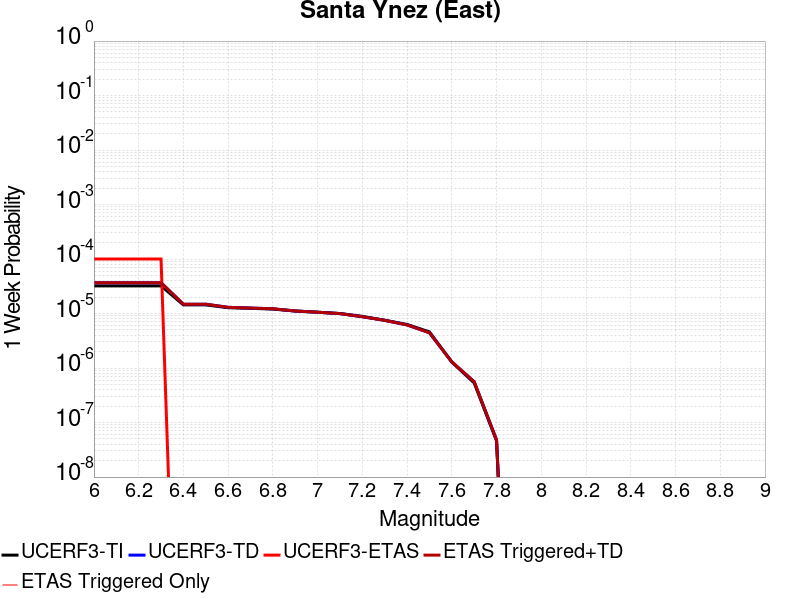 | 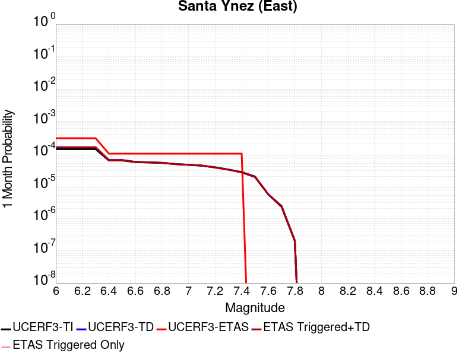 | 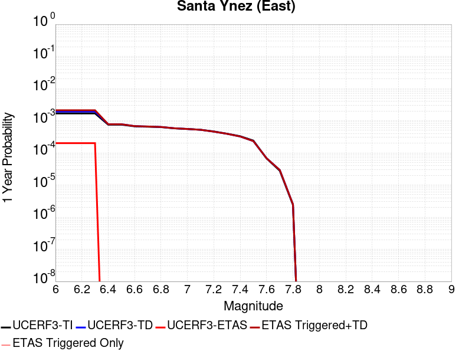 | 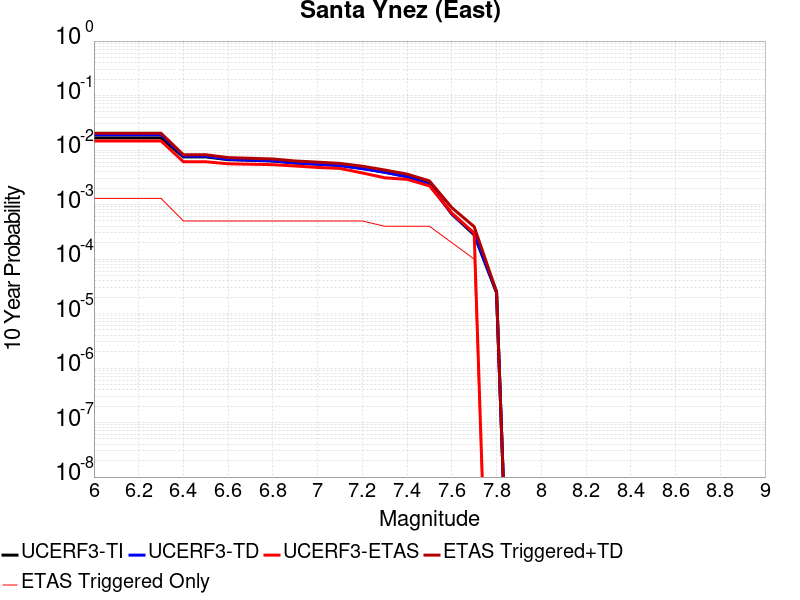 |

| Magnitude | 1 wk TI Prob | 1 wk TD Prob | 1 wk ETAS Prob | 1 wk ETAS/TD Gain | 1 wk ETAS Triggered+TD | 1 wk ETAS Triggered Only | 1 mo TI Prob | 1 mo TD Prob | 1 mo ETAS Prob | 1 mo ETAS/TD Gain | 1 mo ETAS Triggered+TD | 1 mo ETAS Triggered Only | 1 yr TI Prob | 1 yr TD Prob | 1 yr ETAS Prob | 1 yr ETAS/TD Gain | 1 yr ETAS Triggered+TD | 1 yr ETAS Triggered Only | 10 yr TI Prob | 10 yr TD Prob | 10 yr ETAS Prob | 10 yr ETAS/TD Gain | 10 yr ETAS Triggered+TD | 10 yr ETAS Triggered Only |
|-----|-----|-----|-----|-----|-----|-----|-----|-----|-----|-----|-----|-----|-----|-----|-----|-----|-----|-----|-----|-----|-----|-----|-----|-----|
| 6.0 | 3.2269712E-5 | 3.6764442E-5 | 1.0E-4 | 2.7200196 | 3.6764442E-5 | 0.0 | 1.3829143E-4 | 1.5755571E-4 | 3.0E-4 | 1.9040884 | 1.5755571E-4 | 0.0 | 0.0016823979 | 0.0019171386 | 0.0012 | 0.6259329 | 0.0021167551 | 2.0E-4 | 0.016697178 | 0.019063491 | 0.0147 | 0.77110744 | 0.02033871 | 0.0013 |
| 6.1 | 3.2269712E-5 | 3.6764442E-5 | 1.0E-4 | 2.7200196 | 3.6764442E-5 | 0.0 | 1.3829143E-4 | 1.5755571E-4 | 3.0E-4 | 1.9040884 | 1.5755571E-4 | 0.0 | 0.0016823979 | 0.0019171386 | 0.0012 | 0.6259329 | 0.0021167551 | 2.0E-4 | 0.016697178 | 0.019063491 | 0.0147 | 0.77110744 | 0.02033871 | 0.0013 |
| 6.2 | 3.2269712E-5 | 3.6764442E-5 | 1.0E-4 | 2.7200196 | 3.6764442E-5 | 0.0 | 1.3829143E-4 | 1.5755571E-4 | 3.0E-4 | 1.9040884 | 1.5755571E-4 | 0.0 | 0.0016823979 | 0.0019171386 | 0.0012 | 0.6259329 | 0.0021167551 | 2.0E-4 | 0.016697178 | 0.019063491 | 0.0147 | 0.77110744 | 0.02033871 | 0.0013 |
| 6.3 | 3.2269712E-5 | 3.6764442E-5 | 1.0E-4 | 2.7200196 | 3.6764442E-5 | 0.0 | 1.3829143E-4 | 1.5755571E-4 | 3.0E-4 | 1.9040884 | 1.5755571E-4 | 0.0 | 0.0016823979 | 0.0019171386 | 0.0012 | 0.6259329 | 0.0021167551 | 2.0E-4 | 0.016697178 | 0.019063491 | 0.0147 | 0.77110744 | 0.02033871 | 0.0013 |
| 6.4 | 1.4404779E-5 | 1.485284E-5 | 0.0 | 0.0 | 1.485284E-5 | 0.0 | 6.1733306E-5 | 6.3653504E-5 | 1.0E-4 | 1.5710055 | 6.3653504E-5 | 0.0 | 7.513438E-4 | 7.747109E-4 | 5.0E-4 | 0.645402 | 7.747109E-4 | 0.0 | 0.0074880854 | 0.007720653 | 0.0061 | 0.79008865 | 0.008216793 | 5.0E-4 |
| 6.5 | 1.4404779E-5 | 1.485284E-5 | 0.0 | 0.0 | 1.485284E-5 | 0.0 | 6.1733306E-5 | 6.3653504E-5 | 1.0E-4 | 1.5710055 | 6.3653504E-5 | 0.0 | 7.513438E-4 | 7.747109E-4 | 5.0E-4 | 0.645402 | 7.747109E-4 | 0.0 | 0.0074880854 | 0.007720653 | 0.0061 | 0.79008865 | 0.008216793 | 5.0E-4 |
| 6.6 | 1.280208E-5 | 1.3014849E-5 | 0.0 | 0.0 | 1.3014849E-5 | 0.0 | 5.4864904E-5 | 5.577674E-5 | 1.0E-4 | 1.7928619 | 5.577674E-5 | 0.0 | 6.6777546E-4 | 6.78872E-4 | 5.0E-4 | 0.7365159 | 6.78872E-4 | 0.0 | 0.006657724 | 0.0067681926 | 0.0056 | 0.8273996 | 0.0072648083 | 5.0E-4 |
| 6.7 | 1.2457027E-5 | 1.2631282E-5 | 0.0 | 0.0 | 1.2631282E-5 | 0.0 | 5.3386164E-5 | 5.413295E-5 | 1.0E-4 | 1.8473037 | 5.413295E-5 | 0.0 | 6.497827E-4 | 6.58871E-4 | 4.0E-4 | 0.6070991 | 6.58871E-4 | 0.0 | 0.00647886 | 0.0065693734 | 0.0055 | 0.83721834 | 0.0070660887 | 5.0E-4 |
| 6.8 | 1.2095134E-5 | 1.2233647E-5 | 0.0 | 0.0 | 1.2233647E-5 | 0.0 | 5.1835254E-5 | 5.2428873E-5 | 1.0E-4 | 1.907346 | 5.2428873E-5 | 0.0 | 6.309115E-4 | 6.381362E-4 | 4.0E-4 | 0.62682545 | 6.381362E-4 | 0.0 | 0.0062912325 | 0.006363226 | 0.0054 | 0.84862614 | 0.0068600443 | 5.0E-4 |
| 6.9 | 1.1104036E-5 | 1.1159893E-5 | 0.0 | 0.0 | 1.1159893E-5 | 0.0 | 4.758786E-5 | 4.7827245E-5 | 1.0E-4 | 2.0908585 | 4.7827245E-5 | 0.0 | 5.7922816E-4 | 5.821424E-4 | 4.0E-4 | 0.68711716 | 5.821424E-4 | 0.0 | 0.005777207 | 0.00580632 | 0.0051 | 0.87835324 | 0.006303417 | 5.0E-4 |
| 7.0 | 1.0577444E-5 | 1.0584115E-5 | 0.0 | 0.0 | 1.0584115E-5 | 0.0 | 4.5331115E-5 | 4.5359713E-5 | 1.0E-4 | 2.2045994 | 4.5359713E-5 | 0.0 | 5.5176654E-4 | 5.521158E-4 | 4.0E-4 | 0.72448575 | 5.521158E-4 | 0.0 | 0.0055039856 | 0.005507579 | 0.0048 | 0.87152624 | 0.0060048257 | 5.0E-4 |
| 7.1 | 1.0021775E-5 | 9.983321E-6 | 0.0 | 0.0 | 9.983321E-6 | 0.0 | 4.294976E-5 | 4.2784966E-5 | 1.0E-4 | 2.3372695 | 4.2784966E-5 | 0.0 | 5.2278786E-4 | 5.2078365E-4 | 4.0E-4 | 0.76807326 | 5.2078365E-4 | 0.0 | 0.0052155964 | 0.005195765 | 0.0046 | 0.88533646 | 0.005693167 | 5.0E-4 |
| 7.2 | 8.874109E-6 | 8.750914E-6 | 0.0 | 0.0 | 8.750914E-6 | 0.0 | 3.8031343E-5 | 3.7503385E-5 | 1.0E-4 | 2.666426 | 3.7503385E-5 | 0.0 | 4.629332E-4 | 4.5650912E-4 | 3.0E-4 | 0.657161 | 4.5650912E-4 | 0.0 | 0.0046197 | 0.0045558317 | 0.0038 | 0.8340958 | 0.0050535537 | 5.0E-4 |
| 7.3 | 7.5504267E-6 | 7.506955E-6 | 0.0 | 0.0 | 7.506955E-6 | 0.0 | 3.235857E-5 | 3.2172276E-5 | 1.0E-4 | 3.1082664 | 3.2172276E-5 | 0.0 | 3.9389438E-4 | 3.9162807E-4 | 2.0E-4 | 0.5106886 | 3.9162807E-4 | 0.0 | 0.0039319694 | 0.0039094863 | 0.0031 | 0.79294306 | 0.0043079224 | 4.0E-4 |
| 7.4 | 6.309394E-6 | 6.1847522E-6 | 0.0 | 0.0 | 6.1847522E-6 | 0.0 | 2.703998E-5 | 2.6505817E-5 | 1.0E-4 | 3.7727568 | 2.6505817E-5 | 0.0 | 3.2916202E-4 | 3.2266148E-4 | 2.0E-4 | 0.6198447 | 3.2266148E-4 | 0.0 | 0.003286749 | 0.0032220276 | 0.0029 | 0.9000544 | 0.0036207386 | 4.0E-4 |
| 7.5 | 4.6103073E-6 | 4.4418725E-6 | 0.0 | 0.0 | 4.4418725E-6 | 0.0 | 1.975831E-5 | 1.903646E-5 | 0.0 | 0.0 | 1.903646E-5 | 0.0 | 2.4053088E-4 | 2.3174497E-4 | 1.0E-4 | 0.43150884 | 2.3174497E-4 | 0.0 | 0.002402707 | 0.0023151024 | 0.0022 | 0.9502819 | 0.0027141764 | 4.0E-4 |
| 7.6 | 1.2858658E-6 | 1.3009694E-6 | 0.0 | 0.0 | 1.3009694E-6 | 0.0 | 5.5108417E-6 | 5.575572E-6 | 0.0 | 0.0 | 5.575572E-6 | 0.0 | 6.7092435E-5 | 6.7880545E-5 | 0.0 | 0.0 | 6.7880545E-5 | 0.0 | 6.707218E-4 | 6.78605E-4 | 7.0E-4 | 1.031528 | 8.7846926E-4 | 2.0E-4 |
| 7.7 | 5.3302307E-7 | 5.6127533E-7 | 0.0 | 0.0 | 5.6127533E-7 | 0.0 | 2.2843826E-6 | 2.4054636E-6 | 0.0 | 0.0 | 2.4054636E-6 | 0.0 | 2.7812002E-5 | 2.9286162E-5 | 0.0 | 0.0 | 2.9286162E-5 | 0.0 | 2.7808524E-4 | 2.928266E-4 | 3.0E-4 | 1.024497 | 3.9279732E-4 | 1.0E-4 |
| 7.8 | 4.613933E-8 | 4.8034153E-8 | 0.0 | 0.0 | 4.8034153E-8 | 0.0 | 1.9773998E-7 | 2.0586064E-7 | 0.0 | 0.0 | 2.0586064E-7 | 0.0 | 2.4074816E-6 | 2.5063505E-6 | 0.0 | 0.0 | 2.5063505E-6 | 0.0 | 2.4074554E-5 | 2.5063231E-5 | 0.0 | 0.0 | 2.5063231E-5 | 0.0 |

## Death Valley (Fish Lake Valley)
*[(top)](#table-of-contents)*

| 1 Week | 1 Month | 1 Year | 10 Year |
|-----|-----|-----|-----|
|  | 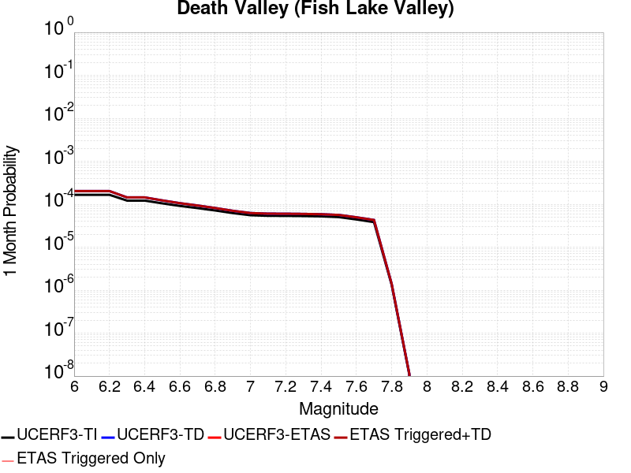 | 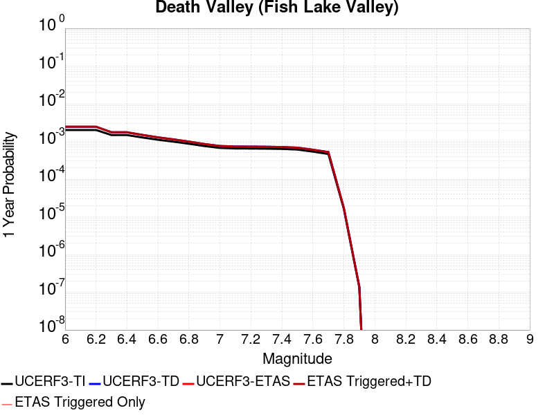 | 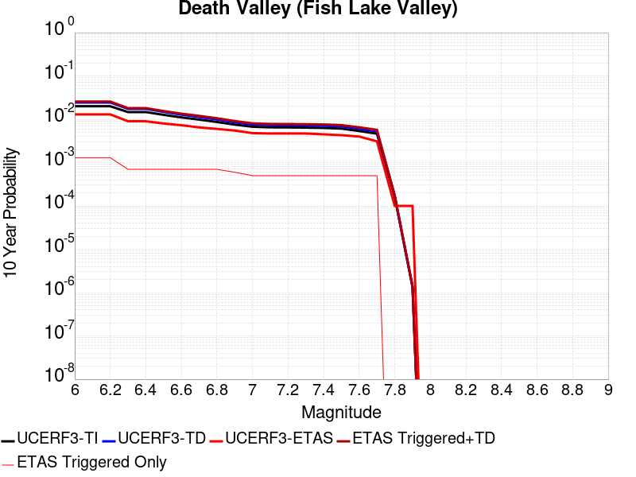 |

| Magnitude | 1 wk TI Prob | 1 wk TD Prob | 1 wk ETAS Prob | 1 wk ETAS/TD Gain | 1 wk ETAS Triggered+TD | 1 wk ETAS Triggered Only | 1 mo TI Prob | 1 mo TD Prob | 1 mo ETAS Prob | 1 mo ETAS/TD Gain | 1 mo ETAS Triggered+TD | 1 mo ETAS Triggered Only | 1 yr TI Prob | 1 yr TD Prob | 1 yr ETAS Prob | 1 yr ETAS/TD Gain | 1 yr ETAS Triggered+TD | 1 yr ETAS Triggered Only | 10 yr TI Prob | 10 yr TD Prob | 10 yr ETAS Prob | 10 yr ETAS/TD Gain | 10 yr ETAS Triggered+TD | 10 yr ETAS Triggered Only |
|-----|-----|-----|-----|-----|-----|-----|-----|-----|-----|-----|-----|-----|-----|-----|-----|-----|-----|-----|-----|-----|-----|-----|-----|-----|
| 6.0 | 3.872328E-5 | 4.7287267E-5 | 0.0 | 0.0 | 4.7287267E-5 | 0.0 | 1.6594635E-4 | 2.0264558E-4 | 0.0 | 0.0 | 2.0264558E-4 | 0.0 | 0.0020185246 | 0.0024646816 | 8.0E-4 | 0.32458553 | 0.0024646816 | 0.0 | 0.02000288 | 0.024399271 | 0.013 | 0.5328028 | 0.025667552 | 0.0013 |
| 6.1 | 3.872328E-5 | 4.7287267E-5 | 0.0 | 0.0 | 4.7287267E-5 | 0.0 | 1.6594635E-4 | 2.0264558E-4 | 0.0 | 0.0 | 2.0264558E-4 | 0.0 | 0.0020185246 | 0.0024646816 | 8.0E-4 | 0.32458553 | 0.0024646816 | 0.0 | 0.02000288 | 0.024399271 | 0.013 | 0.5328028 | 0.025667552 | 0.0013 |
| 6.2 | 3.872328E-5 | 4.7287267E-5 | 0.0 | 0.0 | 4.7287267E-5 | 0.0 | 1.6594635E-4 | 2.0264558E-4 | 0.0 | 0.0 | 2.0264558E-4 | 0.0 | 0.0020185246 | 0.0024646816 | 8.0E-4 | 0.32458553 | 0.0024646816 | 0.0 | 0.02000288 | 0.024399271 | 0.013 | 0.5328028 | 0.025667552 | 0.0013 |
| 6.3 | 2.8356371E-5 | 3.362278E-5 | 0.0 | 0.0 | 3.362278E-5 | 0.0 | 1.2152165E-4 | 1.4409002E-4 | 0.0 | 0.0 | 1.4409002E-4 | 0.0 | 0.0014785219 | 0.0017529542 | 4.0E-4 | 0.22818622 | 0.0017529542 | 0.0 | 0.014687235 | 0.017398456 | 0.009 | 0.5172873 | 0.018086277 | 7.0E-4 |
| 6.4 | 2.8356371E-5 | 3.362278E-5 | 0.0 | 0.0 | 3.362278E-5 | 0.0 | 1.2152165E-4 | 1.4409002E-4 | 0.0 | 0.0 | 1.4409002E-4 | 0.0 | 0.0014785219 | 0.0017529542 | 4.0E-4 | 0.22818622 | 0.0017529542 | 0.0 | 0.014687235 | 0.017398456 | 0.009 | 0.5172873 | 0.018086277 | 7.0E-4 |
| 6.5 | 2.4448687E-5 | 2.8617755E-5 | 0.0 | 0.0 | 2.8617755E-5 | 0.0 | 1.0477588E-4 | 1.2264196E-4 | 0.0 | 0.0 | 1.2264196E-4 | 0.0 | 0.0012748998 | 0.0014921901 | 4.0E-4 | 0.26806235 | 0.0014921901 | 0.0 | 0.012676105 | 0.014826603 | 0.008 | 0.5395707 | 0.015516224 | 7.0E-4 |
| 6.6 | 2.1298161E-5 | 2.4668188E-5 | 0.0 | 0.0 | 2.4668188E-5 | 0.0 | 9.127464E-5 | 1.0571672E-4 | 0.0 | 0.0 | 1.0571672E-4 | 0.0 | 0.0011107022 | 0.0012863738 | 4.0E-4 | 0.31095162 | 0.0012863738 | 0.0 | 0.011051672 | 0.012792707 | 0.0073 | 0.5706376 | 0.0134837525 | 7.0E-4 |
| 6.7 | 1.8959729E-5 | 2.178777E-5 | 0.0 | 0.0 | 2.178777E-5 | 0.0 | 8.125345E-5 | 9.337296E-5 | 0.0 | 0.0 | 9.337296E-5 | 0.0 | 9.888117E-4 | 0.0011362485 | 3.0E-4 | 0.26402676 | 0.0011362485 | 0.0 | 0.009844234 | 0.011307051 | 0.0065 | 0.5748625 | 0.011999137 | 7.0E-4 |
| 6.8 | 1.6691629E-5 | 1.9023853E-5 | 0.0 | 0.0 | 1.9023853E-5 | 0.0 | 7.153359E-5 | 8.152835E-5 | 0.0 | 0.0 | 8.152835E-5 | 0.0 | 8.7057345E-4 | 9.921725E-4 | 2.0E-4 | 0.20157784 | 9.921725E-4 | 0.0 | 0.008671708 | 0.009879188 | 0.006 | 0.6073374 | 0.010572272 | 7.0E-4 |
| 6.9 | 1.450505E-5 | 1.6393946E-5 | 0.0 | 0.0 | 1.6393946E-5 | 0.0 | 6.216302E-5 | 7.025793E-5 | 0.0 | 0.0 | 7.025793E-5 | 0.0 | 7.5657194E-4 | 8.550634E-4 | 2.0E-4 | 0.23390079 | 8.550634E-4 | 0.0 | 0.007540013 | 0.008518666 | 0.0055 | 0.64564097 | 0.009113555 | 6.0E-4 |
| 7.0 | 1.2940855E-5 | 1.4541677E-5 | 0.0 | 0.0 | 1.4541677E-5 | 0.0 | 5.545963E-5 | 6.232002E-5 | 0.0 | 0.0 | 6.232002E-5 | 0.0 | 6.750118E-4 | 7.584879E-4 | 2.0E-4 | 0.2636825 | 7.584879E-4 | 0.0 | 0.006729651 | 0.007559609 | 0.0048 | 0.63495344 | 0.008055829 | 5.0E-4 |
| 7.1 | 1.2544658E-5 | 1.4081761E-5 | 0.0 | 0.0 | 1.4081761E-5 | 0.0 | 5.3761712E-5 | 6.034904E-5 | 0.0 | 0.0 | 6.034904E-5 | 0.0 | 6.5435225E-4 | 7.3450746E-4 | 2.0E-4 | 0.2722913 | 7.3450746E-4 | 0.0 | 0.006524288 | 0.0073213917 | 0.0047 | 0.6419544 | 0.007817731 | 5.0E-4 |
| 7.2 | 1.2489416E-5 | 1.40192105E-5 | 0.0 | 0.0 | 1.40192105E-5 | 0.0 | 5.3524967E-5 | 6.008098E-5 | 0.0 | 0.0 | 6.008098E-5 | 0.0 | 6.514716E-4 | 7.31246E-4 | 2.0E-4 | 0.27350575 | 7.31246E-4 | 0.0 | 0.006495651 | 0.007288992 | 0.0047 | 0.64480793 | 0.0077853473 | 5.0E-4 |
| 7.3 | 1.2368307E-5 | 1.3883315E-5 | 0.0 | 0.0 | 1.3883315E-5 | 0.0 | 5.3005948E-5 | 5.9498594E-5 | 0.0 | 0.0 | 5.9498594E-5 | 0.0 | 6.451563E-4 | 7.241602E-4 | 2.0E-4 | 0.27618197 | 7.241602E-4 | 0.0 | 0.0064328653 | 0.007218596 | 0.0047 | 0.6510961 | 0.007714987 | 5.0E-4 |
| 7.4 | 1.2161707E-5 | 1.3651311E-5 | 0.0 | 0.0 | 1.3651311E-5 | 0.0 | 5.212056E-5 | 5.8504338E-5 | 0.0 | 0.0 | 5.8504338E-5 | 0.0 | 6.3438306E-4 | 7.120631E-4 | 2.0E-4 | 0.28087398 | 7.120631E-4 | 0.0 | 0.006325751 | 0.0070984047 | 0.0045 | 0.6339453 | 0.0075948555 | 5.0E-4 |
| 7.5 | 1.1707948E-5 | 1.3148846E-5 | 0.0 | 0.0 | 1.3148846E-5 | 0.0 | 5.0175953E-5 | 5.635101E-5 | 0.0 | 0.0 | 5.635101E-5 | 0.0 | 6.10721E-4 | 6.8586314E-4 | 2.0E-4 | 0.29160336 | 6.8586314E-4 | 0.0 | 0.0060904534 | 0.0068380474 | 0.0043 | 0.6288345 | 0.0073346286 | 5.0E-4 |
| 7.6 | 1.0319538E-5 | 1.1582539E-5 | 0.0 | 0.0 | 1.1582539E-5 | 0.0 | 4.4225842E-5 | 4.9638536E-5 | 0.0 | 0.0 | 4.9638536E-5 | 0.0 | 5.383166E-4 | 6.0418673E-4 | 2.0E-4 | 0.33102348 | 6.0418673E-4 | 0.0 | 0.0053701443 | 0.0060259732 | 0.004 | 0.6637932 | 0.00652296 | 5.0E-4 |
| 7.7 | 8.937764E-6 | 1.0025289E-5 | 0.0 | 0.0 | 1.0025289E-5 | 0.0 | 3.830414E-5 | 4.2964846E-5 | 0.0 | 0.0 | 4.2964846E-5 | 0.0 | 4.6625308E-4 | 5.2297645E-4 | 2.0E-4 | 0.38242638 | 5.2297645E-4 | 0.0 | 0.0046527605 | 0.005217967 | 0.0031 | 0.5941011 | 0.005715358 | 5.0E-4 |
| 7.8 | 3.108007E-7 | 3.2850403E-7 | 0.0 | 0.0 | 3.2850403E-7 | 0.0 | 1.3320023E-6 | 1.4078737E-6 | 0.0 | 0.0 | 1.4078737E-6 | 0.0 | 1.6217007E-5 | 1.7140732E-5 | 0.0 | 0.0 | 1.7140732E-5 | 0.0 | 1.6215823E-4 | 1.7139447E-4 | 1.0E-4 | 0.5834494 | 1.7139447E-4 | 0.0 |
| 7.9 | 2.5591178E-9 | 2.6699092E-9 | 0.0 | 0.0 | 2.6699092E-9 | 0.0 | 1.0967647E-8 | 1.1442468E-8 | 0.0 | 0.0 | 1.1442468E-8 | 0.0 | 1.335311E-7 | 1.3931205E-7 | 0.0 | 0.0 | 1.3931205E-7 | 0.0 | 1.3353102E-6 | 1.3931206E-6 | 1.0E-4 | 71.781296 | 1.3931206E-6 | 0.0 |

## Little Salmon (Offshore)
*[(top)](#table-of-contents)*

| 1 Week | 1 Month | 1 Year | 10 Year |
|-----|-----|-----|-----|
| 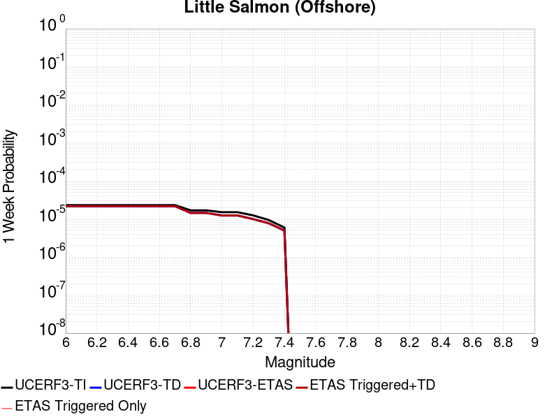 | 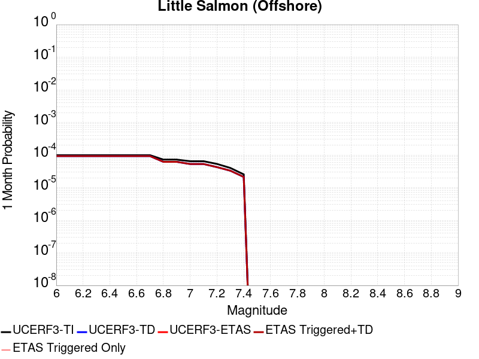 | 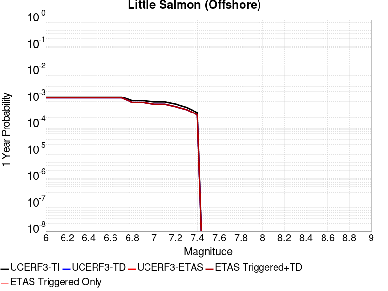 | 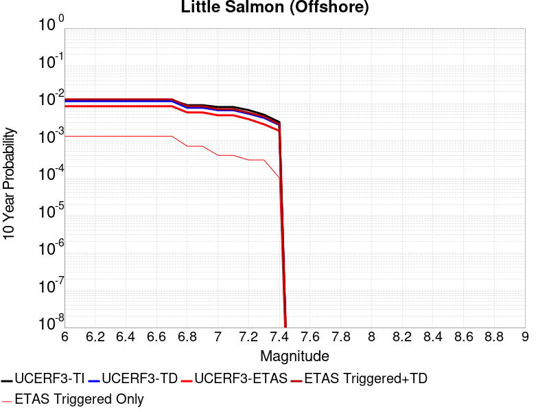 |

| Magnitude | 1 wk TI Prob | 1 wk TD Prob | 1 wk ETAS Prob | 1 wk ETAS/TD Gain | 1 wk ETAS Triggered+TD | 1 wk ETAS Triggered Only | 1 mo TI Prob | 1 mo TD Prob | 1 mo ETAS Prob | 1 mo ETAS/TD Gain | 1 mo ETAS Triggered+TD | 1 mo ETAS Triggered Only | 1 yr TI Prob | 1 yr TD Prob | 1 yr ETAS Prob | 1 yr ETAS/TD Gain | 1 yr ETAS Triggered+TD | 1 yr ETAS Triggered Only | 10 yr TI Prob | 10 yr TD Prob | 10 yr ETAS Prob | 10 yr ETAS/TD Gain | 10 yr ETAS Triggered+TD | 10 yr ETAS Triggered Only |
|-----|-----|-----|-----|-----|-----|-----|-----|-----|-----|-----|-----|-----|-----|-----|-----|-----|-----|-----|-----|-----|-----|-----|-----|-----|
| 6.0 | 2.3052053E-5 | 2.1625294E-5 | 0.0 | 0.0 | 2.1625294E-5 | 0.0 | 9.879077E-5 | 9.267718E-5 | 0.0 | 0.0 | 9.267718E-5 | 0.0 | 0.0012021139 | 0.0011278758 | 7.0E-4 | 0.62063575 | 0.0011278758 | 0.0 | 0.011956319 | 0.011255429 | 0.0082 | 0.7285373 | 0.012540797 | 0.0013 |
| 6.1 | 2.3052053E-5 | 2.1625294E-5 | 0.0 | 0.0 | 2.1625294E-5 | 0.0 | 9.879077E-5 | 9.267718E-5 | 0.0 | 0.0 | 9.267718E-5 | 0.0 | 0.0012021139 | 0.0011278758 | 7.0E-4 | 0.62063575 | 0.0011278758 | 0.0 | 0.011956319 | 0.011255429 | 0.0082 | 0.7285373 | 0.012540797 | 0.0013 |
| 6.2 | 2.3052053E-5 | 2.1625294E-5 | 0.0 | 0.0 | 2.1625294E-5 | 0.0 | 9.879077E-5 | 9.267718E-5 | 0.0 | 0.0 | 9.267718E-5 | 0.0 | 0.0012021139 | 0.0011278758 | 7.0E-4 | 0.62063575 | 0.0011278758 | 0.0 | 0.011956319 | 0.011255429 | 0.0082 | 0.7285373 | 0.012540797 | 0.0013 |
| 6.3 | 2.3052053E-5 | 2.1625294E-5 | 0.0 | 0.0 | 2.1625294E-5 | 0.0 | 9.879077E-5 | 9.267718E-5 | 0.0 | 0.0 | 9.267718E-5 | 0.0 | 0.0012021139 | 0.0011278758 | 7.0E-4 | 0.62063575 | 0.0011278758 | 0.0 | 0.011956319 | 0.011255429 | 0.0082 | 0.7285373 | 0.012540797 | 0.0013 |
| 6.4 | 2.3052053E-5 | 2.1625294E-5 | 0.0 | 0.0 | 2.1625294E-5 | 0.0 | 9.879077E-5 | 9.267718E-5 | 0.0 | 0.0 | 9.267718E-5 | 0.0 | 0.0012021139 | 0.0011278758 | 7.0E-4 | 0.62063575 | 0.0011278758 | 0.0 | 0.011956319 | 0.011255429 | 0.0082 | 0.7285373 | 0.012540797 | 0.0013 |
| 6.5 | 2.3052053E-5 | 2.1625294E-5 | 0.0 | 0.0 | 2.1625294E-5 | 0.0 | 9.879077E-5 | 9.267718E-5 | 0.0 | 0.0 | 9.267718E-5 | 0.0 | 0.0012021139 | 0.0011278758 | 7.0E-4 | 0.62063575 | 0.0011278758 | 0.0 | 0.011956319 | 0.011255429 | 0.0082 | 0.7285373 | 0.012540797 | 0.0013 |
| 6.6 | 2.3052053E-5 | 2.1625294E-5 | 0.0 | 0.0 | 2.1625294E-5 | 0.0 | 9.879077E-5 | 9.267718E-5 | 0.0 | 0.0 | 9.267718E-5 | 0.0 | 0.0012021139 | 0.0011278758 | 7.0E-4 | 0.62063575 | 0.0011278758 | 0.0 | 0.011956319 | 0.011255429 | 0.0082 | 0.7285373 | 0.012540797 | 0.0013 |
| 6.7 | 2.3052053E-5 | 2.1625294E-5 | 0.0 | 0.0 | 2.1625294E-5 | 0.0 | 9.879077E-5 | 9.267718E-5 | 0.0 | 0.0 | 9.267718E-5 | 0.0 | 0.0012021139 | 0.0011278758 | 7.0E-4 | 0.62063575 | 0.0011278758 | 0.0 | 0.011956319 | 0.011255429 | 0.0082 | 0.7285373 | 0.012540797 | 0.0013 |
| 6.8 | 1.683878E-5 | 1.4402086E-5 | 0.0 | 0.0 | 1.4402086E-5 | 0.0 | 7.21642E-5 | 6.172206E-5 | 0.0 | 0.0 | 6.172206E-5 | 0.0 | 8.78245E-4 | 7.51258E-4 | 5.0E-4 | 0.66555035 | 7.51258E-4 | 0.0 | 0.008747822 | 0.0075148502 | 0.0056 | 0.74519116 | 0.00820959 | 7.0E-4 |
| 6.9 | 1.683878E-5 | 1.4402086E-5 | 0.0 | 0.0 | 1.4402086E-5 | 0.0 | 7.21642E-5 | 6.172206E-5 | 0.0 | 0.0 | 6.172206E-5 | 0.0 | 8.78245E-4 | 7.51258E-4 | 5.0E-4 | 0.66555035 | 7.51258E-4 | 0.0 | 0.008747822 | 0.0075148502 | 0.0056 | 0.74519116 | 0.00820959 | 7.0E-4 |
| 7.0 | 1.5051273E-5 | 1.2349455E-5 | 0.0 | 0.0 | 1.2349455E-5 | 0.0 | 6.450386E-5 | 5.292542E-5 | 0.0 | 0.0 | 5.292542E-5 | 0.0 | 7.8505155E-4 | 6.4422254E-4 | 5.0E-4 | 0.7761293 | 6.4422254E-4 | 0.0 | 0.00782284 | 0.0064507425 | 0.0047 | 0.7285983 | 0.006848162 | 4.0E-4 |
| 7.1 | 1.5051273E-5 | 1.2349455E-5 | 0.0 | 0.0 | 1.2349455E-5 | 0.0 | 6.450386E-5 | 5.292542E-5 | 0.0 | 0.0 | 5.292542E-5 | 0.0 | 7.8505155E-4 | 6.4422254E-4 | 5.0E-4 | 0.7761293 | 6.4422254E-4 | 0.0 | 0.00782284 | 0.0064507425 | 0.0047 | 0.7285983 | 0.006848162 | 4.0E-4 |
| 7.2 | 1.24301405E-5 | 9.919218E-6 | 0.0 | 0.0 | 9.919218E-6 | 0.0 | 5.3270942E-5 | 4.251047E-5 | 0.0 | 0.0 | 4.251047E-5 | 0.0 | 6.483807E-4 | 5.1748217E-4 | 4.0E-4 | 0.7729735 | 5.1748217E-4 | 0.0 | 0.006464922 | 0.0051888674 | 0.0037 | 0.713065 | 0.0054873107 | 3.0E-4 |
| 7.3 | 9.3599865E-6 | 7.70572E-6 | 0.0 | 0.0 | 7.70572E-6 | 0.0 | 4.011361E-5 | 3.30243E-5 | 0.0 | 0.0 | 3.30243E-5 | 0.0 | 4.8827377E-4 | 4.020324E-4 | 4.0E-4 | 0.9949447 | 4.020324E-4 | 0.0 | 0.004872023 | 0.0040295757 | 0.0027 | 0.67004573 | 0.004328367 | 3.0E-4 |
| 7.4 | 5.941556E-6 | 4.9581654E-6 | 0.0 | 0.0 | 4.9581654E-6 | 0.0 | 2.5463563E-5 | 2.124928E-5 | 0.0 | 0.0 | 2.124928E-5 | 0.0 | 3.0997477E-4 | 2.5870997E-4 | 4.0E-4 | 1.5461329 | 2.5870997E-4 | 0.0 | 0.0030954275 | 0.0025958095 | 0.0018 | 0.6934253 | 0.0026955497 | 1.0E-4 |

## Eaton Roughs 2011 CFM
*[(top)](#table-of-contents)*

| 1 Week | 1 Month | 1 Year | 10 Year |
|-----|-----|-----|-----|
| 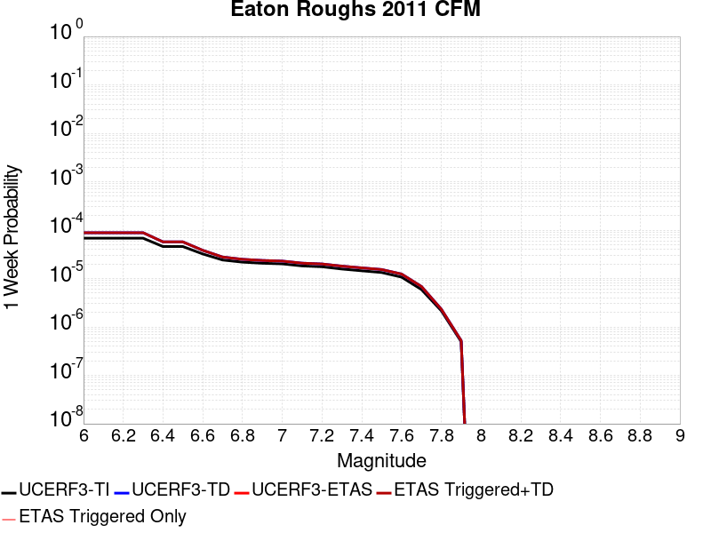 | 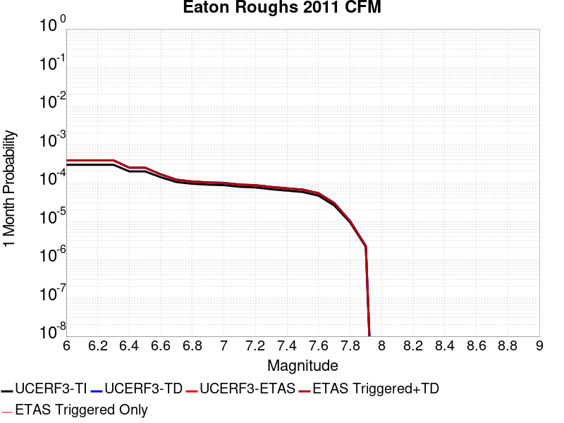 | 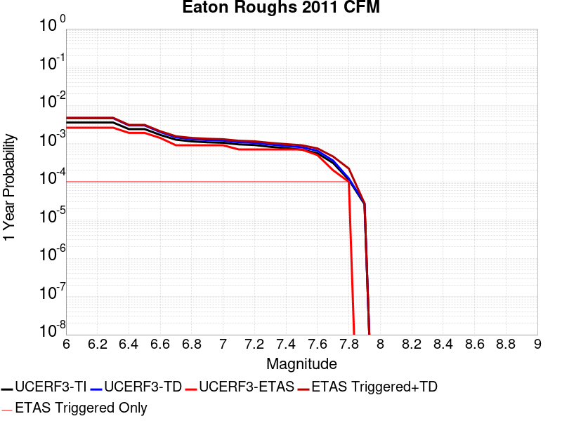 | 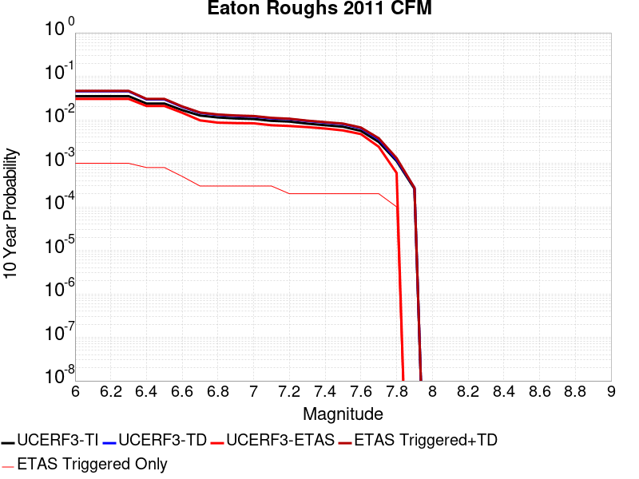 |

| Magnitude | 1 wk TI Prob | 1 wk TD Prob | 1 wk ETAS Prob | 1 wk ETAS/TD Gain | 1 wk ETAS Triggered+TD | 1 wk ETAS Triggered Only | 1 mo TI Prob | 1 mo TD Prob | 1 mo ETAS Prob | 1 mo ETAS/TD Gain | 1 mo ETAS Triggered+TD | 1 mo ETAS Triggered Only | 1 yr TI Prob | 1 yr TD Prob | 1 yr ETAS Prob | 1 yr ETAS/TD Gain | 1 yr ETAS Triggered+TD | 1 yr ETAS Triggered Only | 10 yr TI Prob | 10 yr TD Prob | 10 yr ETAS Prob | 10 yr ETAS/TD Gain | 10 yr ETAS Triggered+TD | 10 yr ETAS Triggered Only |
|-----|-----|-----|-----|-----|-----|-----|-----|-----|-----|-----|-----|-----|-----|-----|-----|-----|-----|-----|-----|-----|-----|-----|-----|-----|
| 6.0 | 6.8044945E-5 | 8.848742E-5 | 0.0 | 0.0 | 8.848742E-5 | 0.0 | 2.9158857E-4 | 3.7917588E-4 | 0.0 | 0.0 | 3.7917588E-4 | 0.0 | 0.0035443127 | 0.0046073813 | 0.0026 | 0.56431186 | 0.0047069206 | 1.0E-4 | 0.03488314 | 0.045189325 | 0.0302 | 0.66829944 | 0.046144135 | 0.001 |
| 6.1 | 6.8044945E-5 | 8.848742E-5 | 0.0 | 0.0 | 8.848742E-5 | 0.0 | 2.9158857E-4 | 3.7917588E-4 | 0.0 | 0.0 | 3.7917588E-4 | 0.0 | 0.0035443127 | 0.0046073813 | 0.0026 | 0.56431186 | 0.0047069206 | 1.0E-4 | 0.03488314 | 0.045189325 | 0.0302 | 0.66829944 | 0.046144135 | 0.001 |
| 6.2 | 6.8044945E-5 | 8.848742E-5 | 0.0 | 0.0 | 8.848742E-5 | 0.0 | 2.9158857E-4 | 3.7917588E-4 | 0.0 | 0.0 | 3.7917588E-4 | 0.0 | 0.0035443127 | 0.0046073813 | 0.0026 | 0.56431186 | 0.0047069206 | 1.0E-4 | 0.03488314 | 0.045189325 | 0.0302 | 0.66829944 | 0.046144135 | 0.001 |
| 6.3 | 6.8044945E-5 | 8.848742E-5 | 0.0 | 0.0 | 8.848742E-5 | 0.0 | 2.9158857E-4 | 3.7917588E-4 | 0.0 | 0.0 | 3.7917588E-4 | 0.0 | 0.0035443127 | 0.0046073813 | 0.0026 | 0.56431186 | 0.0047069206 | 1.0E-4 | 0.03488314 | 0.045189325 | 0.0302 | 0.66829944 | 0.046144135 | 0.001 |
| 6.4 | 4.5830013E-5 | 5.718445E-5 | 0.0 | 0.0 | 5.718445E-5 | 0.0 | 1.9639956E-4 | 2.4505623E-4 | 0.0 | 0.0 | 2.4505623E-4 | 0.0 | 0.0023885423 | 0.0029798436 | 0.0019 | 0.63761735 | 0.0030795457 | 1.0E-4 | 0.023630321 | 0.029436499 | 0.0208 | 0.7066058 | 0.03021295 | 8.0E-4 |
| 6.5 | 4.5830013E-5 | 5.718445E-5 | 0.0 | 0.0 | 5.718445E-5 | 0.0 | 1.9639956E-4 | 2.4505623E-4 | 0.0 | 0.0 | 2.4505623E-4 | 0.0 | 0.0023885423 | 0.0029798436 | 0.0019 | 0.63761735 | 0.0030795457 | 1.0E-4 | 0.023630321 | 0.029436499 | 0.0208 | 0.7066058 | 0.03021295 | 8.0E-4 |
| 6.6 | 3.222194E-5 | 3.8278125E-5 | 0.0 | 0.0 | 3.8278125E-5 | 0.0 | 1.3808672E-4 | 1.6403943E-4 | 0.0 | 0.0 | 1.6403943E-4 | 0.0 | 0.0016799092 | 0.0019954378 | 0.0014 | 0.70160043 | 0.0020952383 | 1.0E-4 | 0.016672665 | 0.01978453 | 0.0145 | 0.73289585 | 0.020274637 | 5.0E-4 |
| 6.7 | 2.4155654E-5 | 2.7795184E-5 | 0.0 | 0.0 | 2.7795184E-5 | 0.0 | 1.0352012E-4 | 1.1911683E-4 | 0.0 | 0.0 | 1.1911683E-4 | 0.0 | 0.0012596287 | 0.0014492908 | 9.0E-4 | 0.6209934 | 0.0015491459 | 1.0E-4 | 0.012525126 | 0.014399617 | 0.0097 | 0.67362905 | 0.014695297 | 3.0E-4 |
| 6.8 | 2.1814667E-5 | 2.494854E-5 | 0.0 | 0.0 | 2.494854E-5 | 0.0 | 9.348808E-5 | 1.06917956E-4 | 0.0 | 0.0 | 1.06917956E-4 | 0.0 | 0.001137623 | 0.0013009525 | 9.0E-4 | 0.6918008 | 0.0014008224 | 1.0E-4 | 0.011318169 | 0.012934064 | 0.0086 | 0.6649109 | 0.013230183 | 3.0E-4 |
| 6.9 | 2.0700467E-5 | 2.3636123E-5 | 0.0 | 0.0 | 2.3636123E-5 | 0.0 | 8.871327E-5 | 1.0129375E-4 | 0.0 | 0.0 | 1.0129375E-4 | 0.0 | 0.0010795488 | 0.0012325569 | 9.0E-4 | 0.7301894 | 0.0013324337 | 1.0E-4 | 0.010743194 | 0.012257813 | 0.0084 | 0.6852772 | 0.012554135 | 3.0E-4 |
| 7.0 | 2.0104066E-5 | 2.2943455E-5 | 0.0 | 0.0 | 2.2943455E-5 | 0.0 | 8.615744E-5 | 9.832541E-5 | 0.0 | 0.0 | 9.832541E-5 | 0.0 | 0.0010484619 | 0.0011964574 | 9.0E-4 | 0.75222063 | 0.0012963378 | 1.0E-4 | 0.010435291 | 0.011900731 | 0.0083 | 0.6974361 | 0.012197161 | 3.0E-4 |
| 7.1 | 1.8225232E-5 | 2.0779322E-5 | 0.0 | 0.0 | 2.0779322E-5 | 0.0 | 7.81058E-5 | 8.905121E-5 | 0.0 | 0.0 | 8.905121E-5 | 0.0 | 9.5052324E-4 | 0.0010836608 | 7.0E-4 | 0.6459586 | 0.0011835523 | 1.0E-4 | 0.009464677 | 0.010784137 | 0.0075 | 0.6954659 | 0.011080902 | 3.0E-4 |
| 7.2 | 1.7526572E-5 | 1.9999572E-5 | 0.0 | 0.0 | 1.9999572E-5 | 0.0 | 7.511172E-5 | 8.5709646E-5 | 0.0 | 0.0 | 8.5709646E-5 | 0.0 | 9.141015E-4 | 0.0010430169 | 7.0E-4 | 0.67113006 | 0.0011429125 | 1.0E-4 | 0.009103506 | 0.010381565 | 0.0072 | 0.69353706 | 0.010579489 | 2.0E-4 |
| 7.3 | 1.5727232E-5 | 1.802719E-5 | 0.0 | 0.0 | 1.802719E-5 | 0.0 | 6.740067E-5 | 7.725711E-5 | 0.0 | 0.0 | 7.725711E-5 | 0.0 | 8.2029426E-4 | 9.4020064E-4 | 7.0E-4 | 0.7445219 | 0.0010401066 | 1.0E-4 | 0.008172729 | 0.009362522 | 0.0068 | 0.72630006 | 0.009560649 | 2.0E-4 |
| 7.4 | 1.4457361E-5 | 1.660368E-5 | 0.0 | 0.0 | 1.660368E-5 | 0.0 | 6.195865E-5 | 7.115669E-5 | 0.0 | 0.0 | 7.115669E-5 | 0.0 | 7.540854E-4 | 8.659893E-4 | 7.0E-4 | 0.8083241 | 9.659027E-4 | 1.0E-4 | 0.007515317 | 0.00862638 | 0.0063 | 0.7303179 | 0.008824655 | 2.0E-4 |
| 7.5 | 1.33280955E-5 | 1.5350464E-5 | 0.0 | 0.0 | 1.5350464E-5 | 0.0 | 5.711916E-5 | 6.578605E-5 | 0.0 | 0.0 | 6.578605E-5 | 0.0 | 6.9520384E-4 | 8.006517E-4 | 7.0E-4 | 0.8742878 | 9.0057164E-4 | 1.0E-4 | 0.00693033 | 0.007977884 | 0.0057 | 0.71447515 | 0.008176289 | 2.0E-4 |
| 7.6 | 1.0699478E-5 | 1.2392059E-5 | 0.0 | 0.0 | 1.2392059E-5 | 0.0 | 4.5854096E-5 | 5.3107746E-5 | 0.0 | 0.0 | 5.3107746E-5 | 0.0 | 5.581306E-4 | 6.4639555E-4 | 5.0E-4 | 0.7735202 | 7.463309E-4 | 1.0E-4 | 0.005567309 | 0.0064453078 | 0.0047 | 0.72921264 | 0.006644019 | 2.0E-4 |
| 7.7 | 5.9390236E-6 | 6.8553813E-6 | 0.0 | 0.0 | 6.8553813E-6 | 0.0 | 2.545271E-5 | 2.9379877E-5 | 0.0 | 0.0 | 2.9379877E-5 | 0.0 | 3.0984267E-4 | 3.5764152E-4 | 2.0E-4 | 0.5592192 | 4.5760575E-4 | 1.0E-4 | 0.0030941102 | 0.003570697 | 0.0024 | 0.6721377 | 0.0037699828 | 2.0E-4 |
| 7.8 | 2.1622036E-6 | 2.3305765E-6 | 0.0 | 0.0 | 2.3305765E-6 | 0.0 | 9.266554E-6 | 9.988147E-6 | 0.0 | 0.0 | 9.988147E-6 | 0.0 | 1.1281446E-4 | 1.2159898E-4 | 1.0E-4 | 0.8223753 | 2.2158683E-4 | 1.0E-4 | 0.001127572 | 0.0012153247 | 6.0E-4 | 0.49369523 | 0.0013152031 | 1.0E-4 |
| 7.9 | 4.9586197E-7 | 5.2194855E-7 | 0.0 | 0.0 | 5.2194855E-7 | 0.0 | 2.125121E-6 | 2.2369206E-6 | 0.0 | 0.0 | 2.2369206E-6 | 0.0 | 2.5873042E-5 | 2.723419E-5 | 0.0 | 0.0 | 2.723419E-5 | 0.0 | 2.5870028E-4 | 2.723106E-4 | 0.0 | 0.0 | 2.723106E-4 | 0.0 |

## Pitas Point (Lower West)
*[(top)](#table-of-contents)*

| 1 Week | 1 Month | 1 Year | 10 Year |
|-----|-----|-----|-----|
| 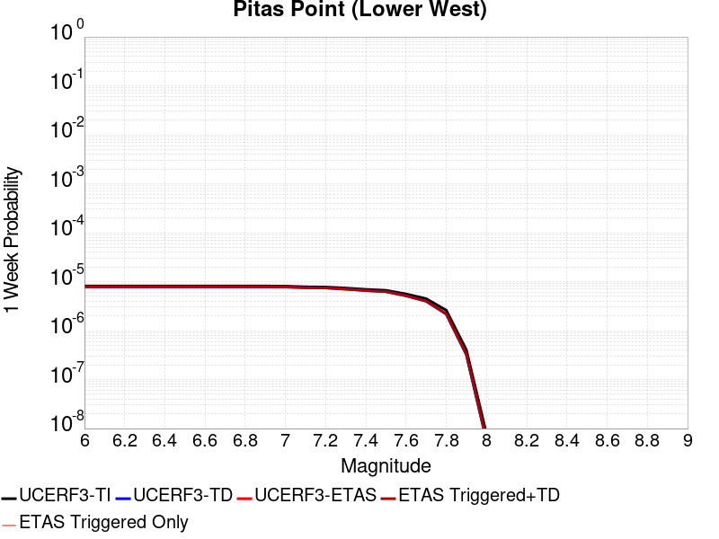 | 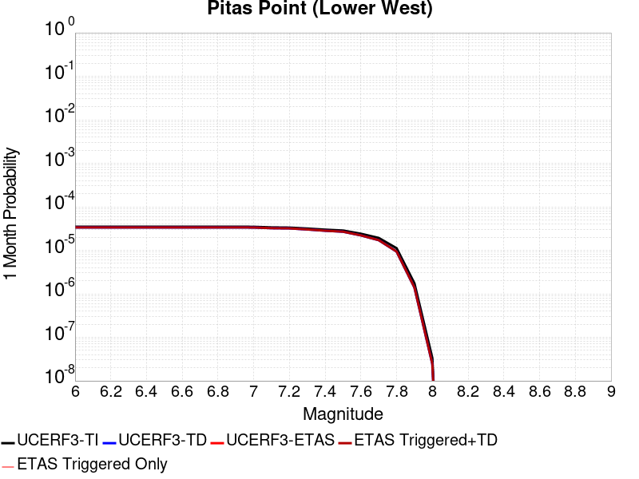 | 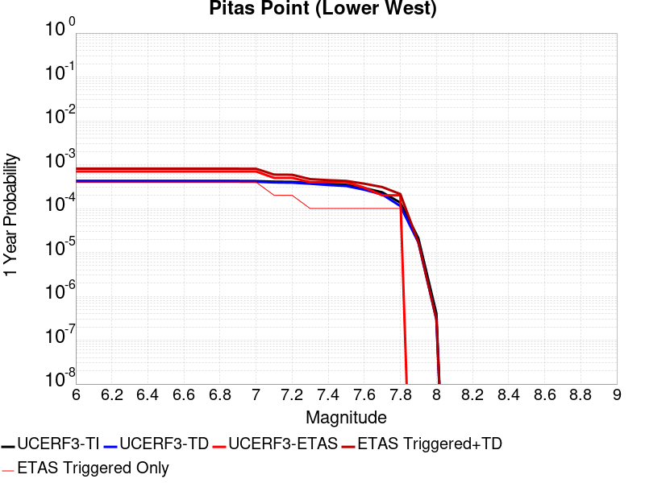 | 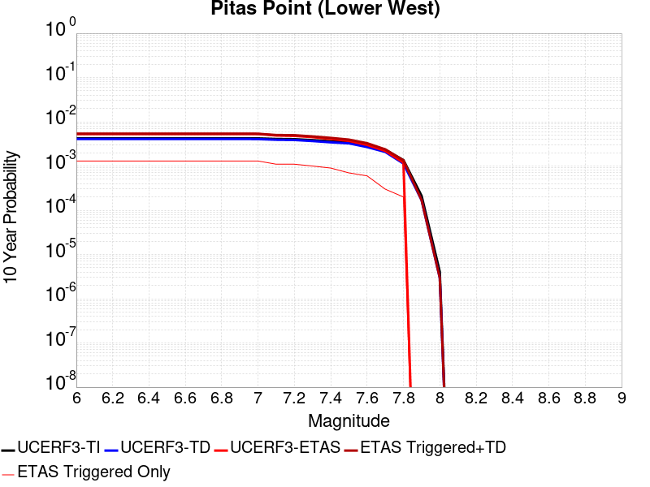 |

| Magnitude | 1 wk TI Prob | 1 wk TD Prob | 1 wk ETAS Prob | 1 wk ETAS/TD Gain | 1 wk ETAS Triggered+TD | 1 wk ETAS Triggered Only | 1 mo TI Prob | 1 mo TD Prob | 1 mo ETAS Prob | 1 mo ETAS/TD Gain | 1 mo ETAS Triggered+TD | 1 mo ETAS Triggered Only | 1 yr TI Prob | 1 yr TD Prob | 1 yr ETAS Prob | 1 yr ETAS/TD Gain | 1 yr ETAS Triggered+TD | 1 yr ETAS Triggered Only | 10 yr TI Prob | 10 yr TD Prob | 10 yr ETAS Prob | 10 yr ETAS/TD Gain | 10 yr ETAS Triggered+TD | 10 yr ETAS Triggered Only |
|-----|-----|-----|-----|-----|-----|-----|-----|-----|-----|-----|-----|-----|-----|-----|-----|-----|-----|-----|-----|-----|-----|-----|-----|-----|
| 6.0 | 8.151497E-6 | 7.856939E-6 | 0.0 | 0.0 | 7.856939E-6 | 0.0 | 3.493452E-5 | 3.3672164E-5 | 0.0 | 0.0 | 3.3672164E-5 | 0.0 | 4.252448E-4 | 4.0988222E-4 | 7.0E-4 | 1.7078077 | 8.097183E-4 | 4.0E-4 | 0.0042443196 | 0.0040913434 | 0.0053 | 1.2954181 | 0.0053860242 | 0.0013 |
| 6.1 | 8.151497E-6 | 7.856939E-6 | 0.0 | 0.0 | 7.856939E-6 | 0.0 | 3.493452E-5 | 3.3672164E-5 | 0.0 | 0.0 | 3.3672164E-5 | 0.0 | 4.252448E-4 | 4.0988222E-4 | 7.0E-4 | 1.7078077 | 8.097183E-4 | 4.0E-4 | 0.0042443196 | 0.0040913434 | 0.0053 | 1.2954181 | 0.0053860242 | 0.0013 |
| 6.2 | 8.151497E-6 | 7.856939E-6 | 0.0 | 0.0 | 7.856939E-6 | 0.0 | 3.493452E-5 | 3.3672164E-5 | 0.0 | 0.0 | 3.3672164E-5 | 0.0 | 4.252448E-4 | 4.0988222E-4 | 7.0E-4 | 1.7078077 | 8.097183E-4 | 4.0E-4 | 0.0042443196 | 0.0040913434 | 0.0053 | 1.2954181 | 0.0053860242 | 0.0013 |
| 6.3 | 8.151497E-6 | 7.856939E-6 | 0.0 | 0.0 | 7.856939E-6 | 0.0 | 3.493452E-5 | 3.3672164E-5 | 0.0 | 0.0 | 3.3672164E-5 | 0.0 | 4.252448E-4 | 4.0988222E-4 | 7.0E-4 | 1.7078077 | 8.097183E-4 | 4.0E-4 | 0.0042443196 | 0.0040913434 | 0.0053 | 1.2954181 | 0.0053860242 | 0.0013 |
| 6.4 | 8.151497E-6 | 7.856939E-6 | 0.0 | 0.0 | 7.856939E-6 | 0.0 | 3.493452E-5 | 3.3672164E-5 | 0.0 | 0.0 | 3.3672164E-5 | 0.0 | 4.252448E-4 | 4.0988222E-4 | 7.0E-4 | 1.7078077 | 8.097183E-4 | 4.0E-4 | 0.0042443196 | 0.0040913434 | 0.0053 | 1.2954181 | 0.0053860242 | 0.0013 |
| 6.5 | 8.151497E-6 | 7.856939E-6 | 0.0 | 0.0 | 7.856939E-6 | 0.0 | 3.493452E-5 | 3.3672164E-5 | 0.0 | 0.0 | 3.3672164E-5 | 0.0 | 4.252448E-4 | 4.0988222E-4 | 7.0E-4 | 1.7078077 | 8.097183E-4 | 4.0E-4 | 0.0042443196 | 0.0040913434 | 0.0053 | 1.2954181 | 0.0053860242 | 0.0013 |
| 6.6 | 8.151497E-6 | 7.856939E-6 | 0.0 | 0.0 | 7.856939E-6 | 0.0 | 3.493452E-5 | 3.3672164E-5 | 0.0 | 0.0 | 3.3672164E-5 | 0.0 | 4.252448E-4 | 4.0988222E-4 | 7.0E-4 | 1.7078077 | 8.097183E-4 | 4.0E-4 | 0.0042443196 | 0.0040913434 | 0.0053 | 1.2954181 | 0.0053860242 | 0.0013 |
| 6.7 | 8.151497E-6 | 7.856939E-6 | 0.0 | 0.0 | 7.856939E-6 | 0.0 | 3.493452E-5 | 3.3672164E-5 | 0.0 | 0.0 | 3.3672164E-5 | 0.0 | 4.252448E-4 | 4.0988222E-4 | 7.0E-4 | 1.7078077 | 8.097183E-4 | 4.0E-4 | 0.0042443196 | 0.0040913434 | 0.0053 | 1.2954181 | 0.0053860242 | 0.0013 |
| 6.8 | 8.151497E-6 | 7.856939E-6 | 0.0 | 0.0 | 7.856939E-6 | 0.0 | 3.493452E-5 | 3.3672164E-5 | 0.0 | 0.0 | 3.3672164E-5 | 0.0 | 4.252448E-4 | 4.0988222E-4 | 7.0E-4 | 1.7078077 | 8.097183E-4 | 4.0E-4 | 0.0042443196 | 0.0040913434 | 0.0053 | 1.2954181 | 0.0053860242 | 0.0013 |
| 6.9 | 8.151497E-6 | 7.856939E-6 | 0.0 | 0.0 | 7.856939E-6 | 0.0 | 3.493452E-5 | 3.3672164E-5 | 0.0 | 0.0 | 3.3672164E-5 | 0.0 | 4.252448E-4 | 4.0988222E-4 | 7.0E-4 | 1.7078077 | 8.097183E-4 | 4.0E-4 | 0.0042443196 | 0.0040913434 | 0.0053 | 1.2954181 | 0.0053860242 | 0.0013 |
| 7.0 | 8.103535E-6 | 7.806363E-6 | 0.0 | 0.0 | 7.806363E-6 | 0.0 | 3.4728975E-5 | 3.3455417E-5 | 0.0 | 0.0 | 3.3455417E-5 | 0.0 | 4.2274324E-4 | 4.072443E-4 | 7.0E-4 | 1.7188699 | 8.070814E-4 | 4.0E-4 | 0.0042193993 | 0.0040650605 | 0.0053 | 1.3037937 | 0.005359776 | 0.0013 |
| 7.1 | 7.853298E-6 | 7.5420235E-6 | 0.0 | 0.0 | 7.5420235E-6 | 0.0 | 3.3656554E-5 | 3.232256E-5 | 0.0 | 0.0 | 3.232256E-5 | 0.0 | 4.096915E-4 | 3.9345684E-4 | 5.0E-4 | 1.2707875 | 5.9337815E-4 | 2.0E-4 | 0.00408937 | 0.0039276783 | 0.0049 | 1.2475563 | 0.005023358 | 0.0011 |
| 7.2 | 7.771102E-6 | 7.454293E-6 | 0.0 | 0.0 | 7.454293E-6 | 0.0 | 3.33043E-5 | 3.1946583E-5 | 0.0 | 0.0 | 3.1946583E-5 | 0.0 | 4.0540437E-4 | 3.8888093E-4 | 5.0E-4 | 1.2857406 | 5.8880314E-4 | 2.0E-4 | 0.0040466557 | 0.00388208 | 0.0048 | 1.2364506 | 0.0049778097 | 0.0011 |
| 7.3 | 7.3945344E-6 | 7.0503374E-6 | 0.0 | 0.0 | 7.0503374E-6 | 0.0 | 3.1690477E-5 | 3.0215386E-5 | 0.0 | 0.0 | 3.0215386E-5 | 0.0 | 3.8576324E-4 | 3.6781086E-4 | 4.0E-4 | 1.0875155 | 4.6777408E-4 | 1.0E-4 | 0.0038509427 | 0.0036720885 | 0.0045 | 1.2254606 | 0.0046684165 | 0.001 |
| 7.4 | 6.964645E-6 | 6.591122E-6 | 0.0 | 0.0 | 6.591122E-6 | 0.0 | 2.9848137E-5 | 2.8247363E-5 | 0.0 | 0.0 | 2.8247363E-5 | 0.0 | 3.6334046E-4 | 3.4385786E-4 | 4.0E-4 | 1.1632713 | 4.438235E-4 | 1.0E-4 | 0.0036274698 | 0.0034333114 | 0.0041 | 1.1941824 | 0.0043302216 | 9.0E-4 |
| 7.5 | 6.6525035E-6 | 6.260114E-6 | 0.0 | 0.0 | 6.260114E-6 | 0.0 | 2.851042E-5 | 2.6828786E-5 | 0.0 | 0.0 | 2.6828786E-5 | 0.0 | 3.4705905E-4 | 3.26592E-4 | 4.0E-4 | 1.2247697 | 4.2655933E-4 | 1.0E-4 | 0.0034651754 | 0.003261172 | 0.0037 | 1.1345615 | 0.0039588893 | 7.0E-4 |
| 7.6 | 5.613338E-6 | 5.152175E-6 | 0.0 | 0.0 | 5.152175E-6 | 0.0 | 2.405694E-5 | 2.2080565E-5 | 0.0 | 0.0 | 2.2080565E-5 | 0.0 | 2.928539E-4 | 2.6879803E-4 | 3.0E-4 | 1.1160796 | 3.6877114E-4 | 1.0E-4 | 0.0029246826 | 0.0026847606 | 0.003 | 1.117418 | 0.0032831498 | 6.0E-4 |
| 7.7 | 4.494704E-6 | 3.99754E-6 | 0.0 | 0.0 | 3.99754E-6 | 0.0 | 1.9262876E-5 | 1.7132203E-5 | 0.0 | 0.0 | 1.7132203E-5 | 0.0 | 2.3450027E-4 | 2.0856484E-4 | 2.0E-4 | 0.95893437 | 3.08544E-4 | 1.0E-4 | 0.0023425296 | 0.002083715 | 0.0022 | 1.0558065 | 0.00238309 | 3.0E-4 |
| 7.8 | 2.6075882E-6 | 2.1840178E-6 | 0.0 | 0.0 | 2.1840178E-6 | 0.0 | 1.117533E-5 | 9.360043E-6 | 0.0 | 0.0 | 9.360043E-6 | 0.0 | 1.3605114E-4 | 1.13952614E-4 | 2.0E-4 | 1.7551155 | 2.1394121E-4 | 1.0E-4 | 0.0013596788 | 0.0011389465 | 0.0012 | 1.0536052 | 0.0013387187 | 2.0E-4 |
| 7.9 | 4.045984E-7 | 3.2428613E-7 | 0.0 | 0.0 | 3.2428613E-7 | 0.0 | 1.733992E-6 | 1.389797E-6 | 0.0 | 0.0 | 1.389797E-6 | 0.0 | 2.1111147E-5 | 1.692065E-5 | 0.0 | 0.0 | 1.692065E-5 | 0.0 | 2.1109142E-4 | 1.6919393E-4 | 0.0 | 0.0 | 1.6919393E-4 | 0.0 |
| 8.0 | 7.791402E-9 | 5.6844662E-9 | 0.0 | 0.0 | 5.6844662E-9 | 0.0 | 3.3391725E-8 | 2.4361997E-8 | 0.0 | 0.0 | 2.4361997E-8 | 0.0 | 4.0654416E-7 | 2.966073E-7 | 0.0 | 0.0 | 2.966073E-7 | 0.0 | 4.065434E-6 | 2.966071E-6 | 0.0 | 0.0 | 2.966071E-6 | 0.0 |

## Bennett Valley 2011 CFM
*[(top)](#table-of-contents)*

| 1 Week | 1 Month | 1 Year | 10 Year |
|-----|-----|-----|-----|
| 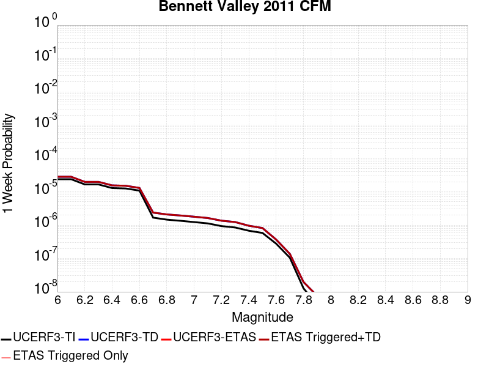 | 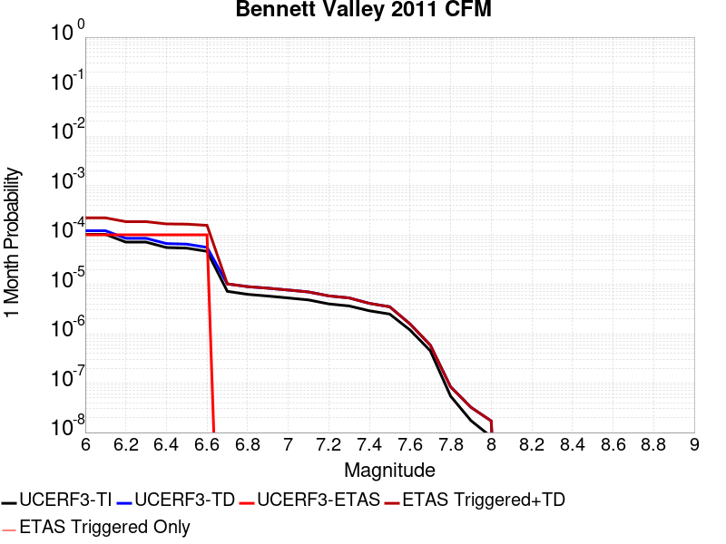 | 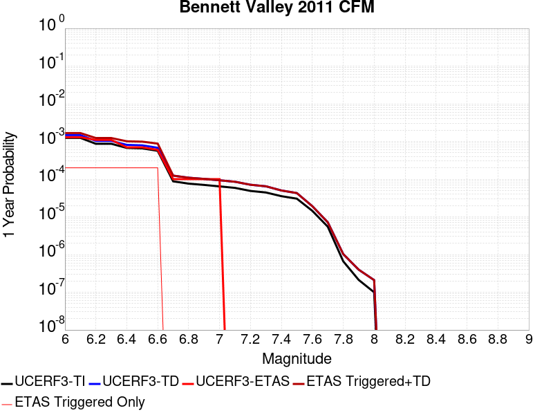 | 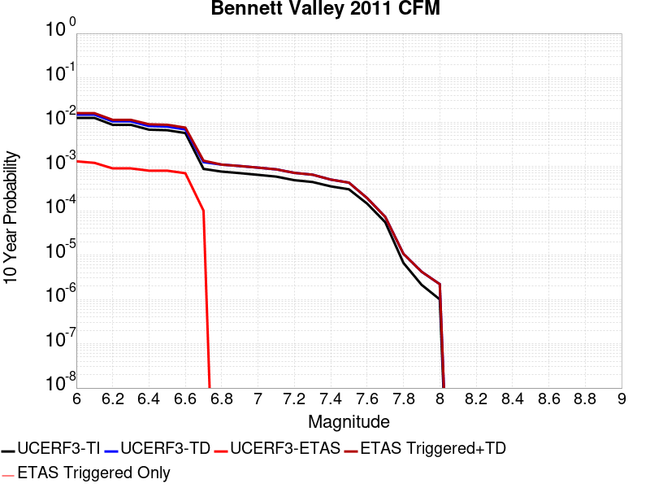 |

| Magnitude | 1 wk TI Prob | 1 wk TD Prob | 1 wk ETAS Prob | 1 wk ETAS/TD Gain | 1 wk ETAS Triggered+TD | 1 wk ETAS Triggered Only | 1 mo TI Prob | 1 mo TD Prob | 1 mo ETAS Prob | 1 mo ETAS/TD Gain | 1 mo ETAS Triggered+TD | 1 mo ETAS Triggered Only | 1 yr TI Prob | 1 yr TD Prob | 1 yr ETAS Prob | 1 yr ETAS/TD Gain | 1 yr ETAS Triggered+TD | 1 yr ETAS Triggered Only | 10 yr TI Prob | 10 yr TD Prob | 10 yr ETAS Prob | 10 yr ETAS/TD Gain | 10 yr ETAS Triggered+TD | 10 yr ETAS Triggered Only |
|-----|-----|-----|-----|-----|-----|-----|-----|-----|-----|-----|-----|-----|-----|-----|-----|-----|-----|-----|-----|-----|-----|-----|-----|-----|
| 6.0 | 2.3893934E-5 | 2.82504E-5 | 0.0 | 0.0 | 2.82504E-5 | 0.0 | 1.0239855E-4 | 1.21068566E-4 | 2.0E-4 | 1.6519564 | 2.2105646E-4 | 1.0E-4 | 0.0012459893 | 0.0014731982 | 0.0013 | 0.8824339 | 0.0016729035 | 2.0E-4 | 0.012390262 | 0.014657071 | 0.0142 | 0.9688157 | 0.015938018 | 0.0013 |
| 6.1 | 2.3893934E-5 | 2.82504E-5 | 0.0 | 0.0 | 2.82504E-5 | 0.0 | 1.0239855E-4 | 1.21068566E-4 | 2.0E-4 | 1.6519564 | 2.2105646E-4 | 1.0E-4 | 0.0012459893 | 0.0014731982 | 0.0013 | 0.8824339 | 0.0016729035 | 2.0E-4 | 0.012390262 | 0.014657071 | 0.0131 | 0.8937666 | 0.015839482 | 0.0012 |
| 6.2 | 1.6657146E-5 | 1.9862542E-5 | 0.0 | 0.0 | 1.9862542E-5 | 0.0 | 7.138582E-5 | 8.51232E-5 | 2.0E-4 | 2.3495357 | 1.851147E-4 | 1.0E-4 | 8.6877577E-4 | 0.0010360238 | 0.0011 | 1.0617517 | 0.0012358166 | 2.0E-4 | 0.008653872 | 0.0103303045 | 0.0087 | 0.84218234 | 0.011221007 | 9.0E-4 |
| 6.3 | 1.6657146E-5 | 1.9862542E-5 | 0.0 | 0.0 | 1.9862542E-5 | 0.0 | 7.138582E-5 | 8.51232E-5 | 2.0E-4 | 2.3495357 | 1.851147E-4 | 1.0E-4 | 8.6877577E-4 | 0.0010360238 | 0.0011 | 1.0617517 | 0.0012358166 | 2.0E-4 | 0.008653872 | 0.0103303045 | 0.0087 | 0.84218234 | 0.011221007 | 9.0E-4 |
| 6.4 | 1.29418495E-5 | 1.5574904E-5 | 0.0 | 0.0 | 1.5574904E-5 | 0.0 | 5.546389E-5 | 6.674862E-5 | 1.0E-4 | 1.4981583 | 1.6674194E-4 | 1.0E-4 | 6.7506364E-4 | 8.1249175E-4 | 7.0E-4 | 0.86154723 | 0.0010123292 | 2.0E-4 | 0.0067301663 | 0.008112451 | 0.0069 | 0.8505444 | 0.008905961 | 8.0E-4 |
| 6.5 | 1.2582504E-5 | 1.5141786E-5 | 0.0 | 0.0 | 1.5141786E-5 | 0.0 | 5.39239E-5 | 6.489249E-5 | 1.0E-4 | 1.5410104 | 1.64886E-4 | 1.0E-4 | 6.563257E-4 | 7.899099E-4 | 7.0E-4 | 0.88617694 | 9.89752E-4 | 2.0E-4 | 0.006543907 | 0.007888285 | 0.0066 | 0.8366837 | 0.008681974 | 8.0E-4 |
| 6.6 | 1.0846706E-5 | 1.3043321E-5 | 0.0 | 0.0 | 1.3043321E-5 | 0.0 | 4.6485053E-5 | 5.5899476E-5 | 1.0E-4 | 1.7889255 | 1.5589388E-4 | 1.0E-4 | 5.6580856E-4 | 6.80492E-4 | 6.0E-4 | 0.881715 | 8.803559E-4 | 2.0E-4 | 0.005643701 | 0.0068012425 | 0.0056 | 0.823379 | 0.0074964813 | 7.0E-4 |
| 6.7 | 1.6803231E-6 | 2.3809998E-6 | 0.0 | 0.0 | 2.3809998E-6 | 0.0 | 7.2013645E-6 | 1.0204246E-5 | 0.0 | 0.0 | 1.0204246E-5 | 0.0 | 8.7673085E-5 | 1.2422974E-4 | 1.0E-4 | 0.8049602 | 1.2422974E-4 | 0.0 | 8.76385E-4 | 0.0012460568 | 8.0E-4 | 0.6420253 | 0.0013459321 | 1.0E-4 |
| 6.8 | 1.4609833E-6 | 2.0969755E-6 | 0.0 | 0.0 | 2.0969755E-6 | 0.0 | 6.261342E-6 | 8.987007E-6 | 0.0 | 0.0 | 8.987007E-6 | 0.0 | 7.6229175E-5 | 1.0941139E-4 | 1.0E-4 | 0.9139816 | 1.0941139E-4 | 0.0 | 7.620303E-4 | 0.0010979454 | 7.0E-4 | 0.6375545 | 0.0010979454 | 0.0 |
| 6.9 | 1.3492396E-6 | 1.9488762E-6 | 0.0 | 0.0 | 1.9488762E-6 | 0.0 | 5.7824427E-6 | 8.3523E-6 | 0.0 | 0.0 | 8.3523E-6 | 0.0 | 7.0398964E-5 | 1.0168456E-4 | 1.0E-4 | 0.9834334 | 1.0168456E-4 | 0.0 | 7.037667E-4 | 0.0010207238 | 6.0E-4 | 0.58781815 | 0.0010207238 | 0.0 |
| 7.0 | 1.2347921E-6 | 1.7918215E-6 | 0.0 | 0.0 | 1.7918215E-6 | 0.0 | 5.291955E-6 | 7.679213E-6 | 0.0 | 0.0 | 7.679213E-6 | 0.0 | 6.442765E-5 | 9.349047E-5 | 1.0E-4 | 1.0696278 | 9.349047E-5 | 0.0 | 6.440897E-4 | 9.388541E-4 | 6.0E-4 | 0.6390769 | 9.388541E-4 | 0.0 |
| 7.1 | 1.1262973E-6 | 1.6385454E-6 | 0.0 | 0.0 | 1.6385454E-6 | 0.0 | 4.8269794E-6 | 7.022319E-6 | 0.0 | 0.0 | 7.022319E-6 | 0.0 | 5.876689E-5 | 8.549343E-5 | 0.0 | 0.0 | 8.549343E-5 | 0.0 | 5.875135E-4 | 8.589269E-4 | 3.0E-4 | 0.34927303 | 8.589269E-4 | 0.0 |
| 7.2 | 9.351744E-7 | 1.3637094E-6 | 0.0 | 0.0 | 1.3637094E-6 | 0.0 | 4.007884E-6 | 5.8444557E-6 | 0.0 | 0.0 | 5.8444557E-6 | 0.0 | 4.8794896E-5 | 7.115395E-5 | 0.0 | 0.0 | 7.115395E-5 | 0.0 | 4.878418E-4 | 7.15594E-4 | 3.0E-4 | 0.41923213 | 7.15594E-4 | 0.0 |
| 7.3 | 8.5039534E-7 | 1.2409719E-6 | 0.0 | 0.0 | 1.2409719E-6 | 0.0 | 3.6445463E-6 | 5.3184403E-6 | 0.0 | 0.0 | 5.3184403E-6 | 0.0 | 4.437145E-5 | 6.475011E-5 | 0.0 | 0.0 | 6.475011E-5 | 0.0 | 4.436259E-4 | 6.5129925E-4 | 3.0E-4 | 0.46061775 | 6.5129925E-4 | 0.0 |
| 7.4 | 6.7875015E-7 | 9.617481E-7 | 0.0 | 0.0 | 9.617481E-7 | 0.0 | 2.908926E-6 | 4.1217713E-6 | 0.0 | 0.0 | 4.1217713E-6 | 0.0 | 3.54156E-5 | 5.018142E-5 | 0.0 | 0.0 | 5.018142E-5 | 0.0 | 3.5409955E-4 | 5.049803E-4 | 3.0E-4 | 0.59408265 | 5.049803E-4 | 0.0 |
| 7.5 | 5.826867E-7 | 8.202125E-7 | 0.0 | 0.0 | 8.202125E-7 | 0.0 | 2.4972264E-6 | 3.5151916E-6 | 0.0 | 0.0 | 3.5151916E-6 | 0.0 | 3.0403306E-5 | 4.2796626E-5 | 0.0 | 0.0 | 4.2796626E-5 | 0.0 | 3.0399146E-4 | 4.3074173E-4 | 3.0E-4 | 0.69647306 | 4.3074173E-4 | 0.0 |
| 7.6 | 2.7734902E-7 | 3.6881934E-7 | 0.0 | 0.0 | 3.6881934E-7 | 0.0 | 1.1886381E-6 | 1.5806534E-6 | 0.0 | 0.0 | 1.5806534E-6 | 0.0 | 1.4471572E-5 | 1.9244286E-5 | 0.0 | 0.0 | 1.9244286E-5 | 0.0 | 1.447063E-4 | 1.9343701E-4 | 2.0E-4 | 1.0339284 | 1.9343701E-4 | 0.0 |
| 7.7 | 1.0530888E-7 | 1.3783058E-7 | 0.0 | 0.0 | 1.3783058E-7 | 0.0 | 4.513237E-7 | 5.9070237E-7 | 0.0 | 0.0 | 5.9070237E-7 | 0.0 | 5.4948523E-6 | 7.1917775E-6 | 0.0 | 0.0 | 7.1917775E-6 | 0.0 | 5.4947162E-5 | 7.272852E-5 | 0.0 | 0.0 | 7.272852E-5 | 0.0 |
| 7.8 | 1.2714258E-8 | 1.9748647E-8 | 0.0 | 0.0 | 1.9748647E-8 | 0.0 | 5.448968E-8 | 8.463706E-8 | 0.0 | 0.0 | 8.463706E-8 | 0.0 | 6.6341164E-7 | 1.0304557E-6 | 0.0 | 0.0 | 1.0304557E-6 | 0.0 | 6.6340967E-6 | 1.0715134E-5 | 0.0 | 0.0 | 1.0715134E-5 | 0.0 |
| 7.9 | 4.075888E-9 | 7.623919E-9 | 0.0 | 0.0 | 7.623919E-9 | 0.0 | 1.7468091E-8 | 3.267394E-8 | 0.0 | 0.0 | 3.267394E-8 | 0.0 | 2.12674E-7 | 3.9780517E-7 | 0.0 | 0.0 | 3.9780517E-7 | 0.0 | 2.1267379E-6 | 4.2262855E-6 | 0.0 | 0.0 | 4.2262855E-6 | 0.0 |
| 8.0 | 1.9126138E-9 | 4.02801E-9 | 0.0 | 0.0 | 4.02801E-9 | 0.0 | 8.196917E-9 | 1.7262902E-8 | 0.0 | 0.0 | 1.7262902E-8 | 0.0 | 9.9797454E-8 | 2.1017581E-7 | 0.0 | 0.0 | 2.1017581E-7 | 0.0 | 9.979741E-7 | 2.2136107E-6 | 0.0 | 0.0 | 2.2136107E-6 | 0.0 |

## Cleghorn Lake
*[(top)](#table-of-contents)*

| 1 Week | 1 Month | 1 Year | 10 Year |
|-----|-----|-----|-----|
| 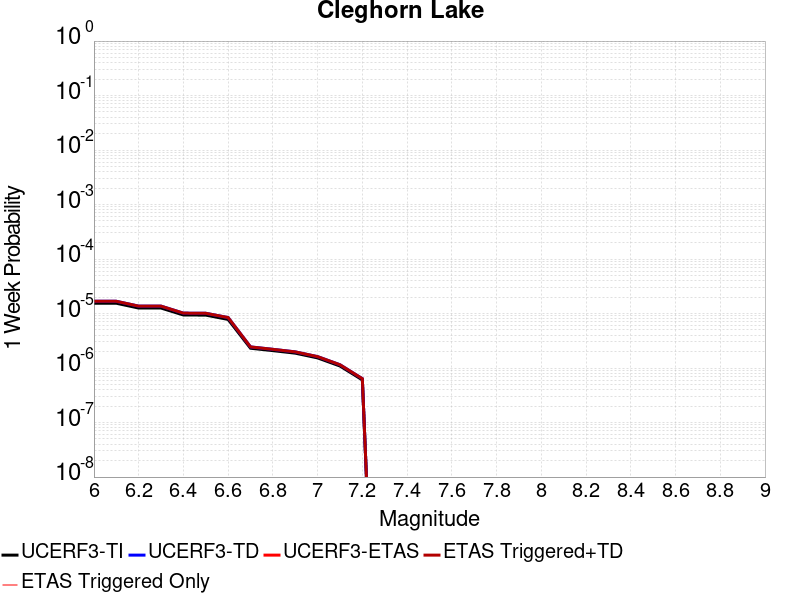 | 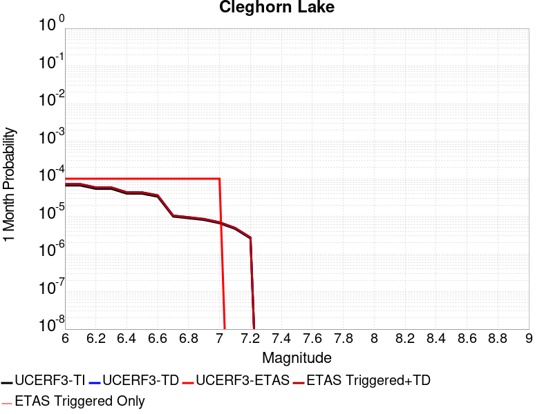 | 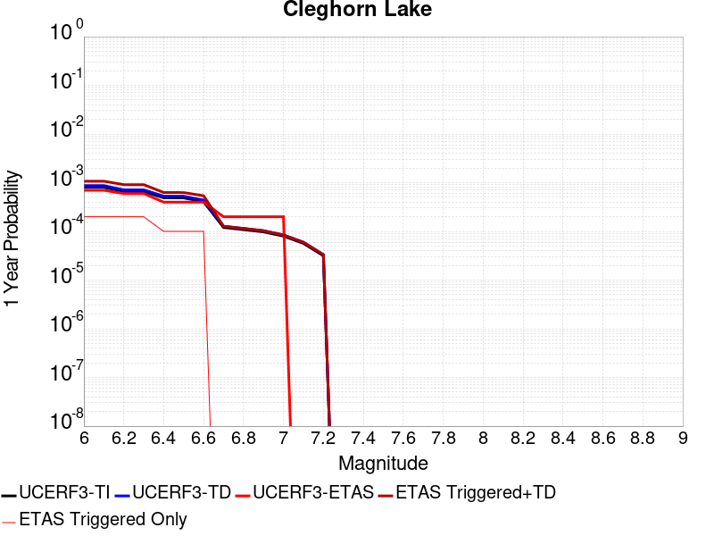 | 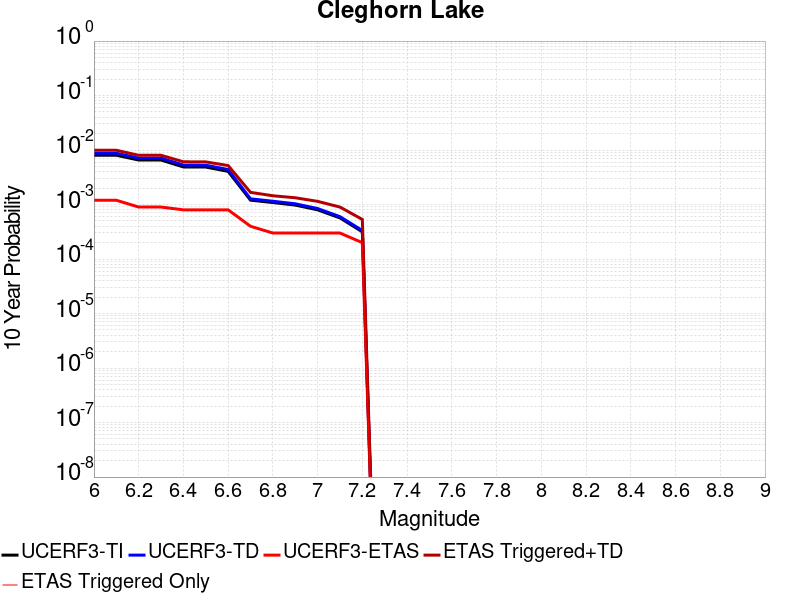 |

| Magnitude | 1 wk TI Prob | 1 wk TD Prob | 1 wk ETAS Prob | 1 wk ETAS/TD Gain | 1 wk ETAS Triggered+TD | 1 wk ETAS Triggered Only | 1 mo TI Prob | 1 mo TD Prob | 1 mo ETAS Prob | 1 mo ETAS/TD Gain | 1 mo ETAS Triggered+TD | 1 mo ETAS Triggered Only | 1 yr TI Prob | 1 yr TD Prob | 1 yr ETAS Prob | 1 yr ETAS/TD Gain | 1 yr ETAS Triggered+TD | 1 yr ETAS Triggered Only | 10 yr TI Prob | 10 yr TD Prob | 10 yr ETAS Prob | 10 yr ETAS/TD Gain | 10 yr ETAS Triggered+TD | 10 yr ETAS Triggered Only |
|-----|-----|-----|-----|-----|-----|-----|-----|-----|-----|-----|-----|-----|-----|-----|-----|-----|-----|-----|-----|-----|-----|-----|-----|-----|
| 6.0 | 1.5467183E-5 | 1.6797181E-5 | 0.0 | 0.0 | 1.6797181E-5 | 0.0 | 6.6286244E-5 | 7.1986244E-5 | 1.0E-4 | 1.3891543 | 7.1986244E-5 | 0.0 | 8.067362E-4 | 8.7613496E-4 | 7.0E-4 | 0.79896367 | 0.0010759598 | 2.0E-4 | 0.008038137 | 0.008732238 | 0.0097 | 1.1108264 | 0.009921759 | 0.0012 |
| 6.1 | 1.5467183E-5 | 1.6797181E-5 | 0.0 | 0.0 | 1.6797181E-5 | 0.0 | 6.6286244E-5 | 7.1986244E-5 | 1.0E-4 | 1.3891543 | 7.1986244E-5 | 0.0 | 8.067362E-4 | 8.7613496E-4 | 7.0E-4 | 0.79896367 | 0.0010759598 | 2.0E-4 | 0.008038137 | 0.008732238 | 0.0097 | 1.1108264 | 0.009921759 | 0.0012 |
| 6.2 | 1.2624631E-5 | 1.3683913E-5 | 0.0 | 0.0 | 1.3683913E-5 | 0.0 | 5.410444E-5 | 5.8644295E-5 | 1.0E-4 | 1.7051957 | 5.8644295E-5 | 0.0 | 6.585225E-4 | 7.138091E-4 | 6.0E-4 | 0.84056085 | 9.136663E-4 | 2.0E-4 | 0.0065657445 | 0.0071199606 | 0.0079 | 1.1095567 | 0.008013553 | 9.0E-4 |
| 6.3 | 1.2624631E-5 | 1.3683913E-5 | 0.0 | 0.0 | 1.3683913E-5 | 0.0 | 5.410444E-5 | 5.8644295E-5 | 1.0E-4 | 1.7051957 | 5.8644295E-5 | 0.0 | 6.585225E-4 | 7.138091E-4 | 6.0E-4 | 0.84056085 | 9.136663E-4 | 2.0E-4 | 0.0065657445 | 0.0071199606 | 0.0079 | 1.1095567 | 0.008013553 | 9.0E-4 |
| 6.4 | 9.417684E-6 | 1.0171799E-5 | 0.0 | 0.0 | 1.0171799E-5 | 0.0 | 4.036088E-5 | 4.359293E-5 | 1.0E-4 | 2.29395 | 4.359293E-5 | 0.0 | 4.912829E-4 | 5.306557E-4 | 4.0E-4 | 0.75378436 | 6.306027E-4 | 1.0E-4 | 0.004901982 | 0.0052979235 | 0.0062 | 1.1702698 | 0.006093685 | 8.0E-4 |
| 6.5 | 9.368219E-6 | 1.0119219E-5 | 0.0 | 0.0 | 1.0119219E-5 | 0.0 | 4.014889E-5 | 4.3367592E-5 | 1.0E-4 | 2.3058693 | 4.3367592E-5 | 0.0 | 4.8870314E-4 | 5.279136E-4 | 4.0E-4 | 0.7576997 | 6.2786083E-4 | 1.0E-4 | 0.004876298 | 0.0052706324 | 0.0062 | 1.1763295 | 0.006066416 | 8.0E-4 |
| 6.6 | 7.803798E-6 | 8.443258E-6 | 0.0 | 0.0 | 8.443258E-6 | 0.0 | 3.3444423E-5 | 3.6185113E-5 | 1.0E-4 | 2.7635674 | 3.6185113E-5 | 0.0 | 4.0710976E-4 | 4.4050463E-4 | 4.0E-4 | 0.90804946 | 5.404606E-4 | 1.0E-4 | 0.0040636472 | 0.0044002333 | 0.0052 | 1.1817555 | 0.005196713 | 8.0E-4 |
| 6.7 | 2.3108669E-6 | 2.4441235E-6 | 0.0 | 0.0 | 2.4441235E-6 | 0.0 | 9.903678E-6 | 1.0474774E-5 | 1.0E-4 | 9.546745 | 1.0474774E-5 | 0.0 | 1.205706E-4 | 1.275231E-4 | 2.0E-4 | 1.5683433 | 1.275231E-4 | 0.0 | 0.001205052 | 0.0012745179 | 0.0016 | 1.2553767 | 0.0016740081 | 4.0E-4 |
| 6.8 | 2.0882828E-6 | 2.206539E-6 | 0.0 | 0.0 | 2.206539E-6 | 0.0 | 8.949753E-6 | 9.456563E-6 | 1.0E-4 | 10.574667 | 9.456563E-6 | 0.0 | 1.08957785E-4 | 1.1512774E-4 | 2.0E-4 | 1.7372009 | 1.1512774E-4 | 0.0 | 0.0010890438 | 0.0011506978 | 0.0013 | 1.1297493 | 0.0014503526 | 3.0E-4 |
| 6.9 | 1.876935E-6 | 1.9812774E-6 | 0.0 | 0.0 | 1.9812774E-6 | 0.0 | 8.043982E-6 | 8.491162E-6 | 1.0E-4 | 11.776951 | 8.491162E-6 | 0.0 | 9.7931086E-5 | 1.03375154E-4 | 2.0E-4 | 1.9347008 | 1.03375154E-4 | 0.0 | 9.788794E-4 | 0.0010332867 | 0.0013 | 1.2581214 | 0.0013329766 | 3.0E-4 |
| 7.0 | 1.5357559E-6 | 1.6204644E-6 | 0.0 | 0.0 | 1.6204644E-6 | 0.0 | 6.5817944E-6 | 6.9448297E-6 | 1.0E-4 | 14.399201 | 6.9448297E-6 | 0.0 | 8.01304E-5 | 8.455015E-5 | 2.0E-4 | 2.3654602 | 8.455015E-5 | 0.0 | 8.010151E-4 | 8.4519223E-4 | 0.001 | 1.1831628 | 0.0011449386 | 3.0E-4 |
| 7.1 | 1.0905424E-6 | 1.1498905E-6 | 0.0 | 0.0 | 1.1498905E-6 | 0.0 | 4.6737446E-6 | 4.928094E-6 | 0.0 | 0.0 | 4.928094E-6 | 0.0 | 5.6901354E-5 | 5.9997987E-5 | 0.0 | 0.0 | 5.9997987E-5 | 0.0 | 5.6886784E-4 | 5.998277E-4 | 5.0E-4 | 0.83357275 | 8.996477E-4 | 3.0E-4 |
| 7.2 | 6.06668E-7 | 6.3879725E-7 | 0.0 | 0.0 | 6.3879725E-7 | 0.0 | 2.600003E-6 | 2.7377E-6 | 0.0 | 0.0 | 2.7377E-6 | 0.0 | 3.1654577E-5 | 3.333106E-5 | 0.0 | 0.0 | 3.333106E-5 | 0.0 | 3.1650066E-4 | 3.3326744E-4 | 2.0E-4 | 0.60011864 | 5.332008E-4 | 2.0E-4 |

## Towne Pass
*[(top)](#table-of-contents)*

| 1 Week | 1 Month | 1 Year | 10 Year |
|-----|-----|-----|-----|
| 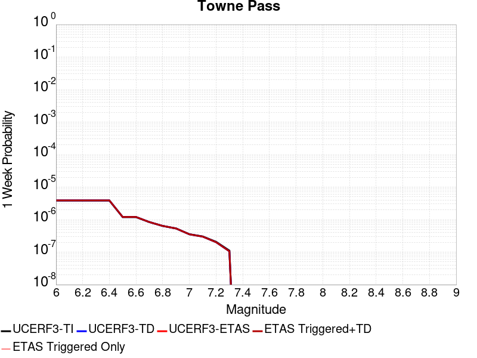 | 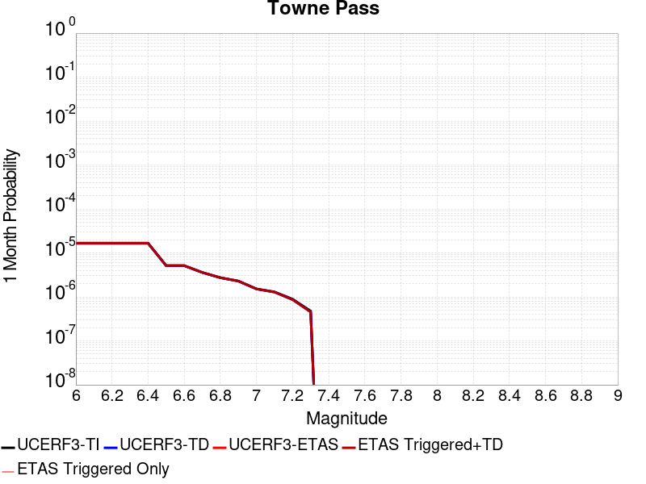 | 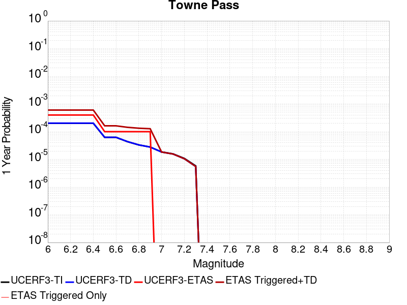 | 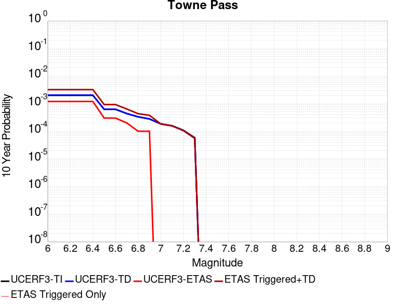 |

| Magnitude | 1 wk TI Prob | 1 wk TD Prob | 1 wk ETAS Prob | 1 wk ETAS/TD Gain | 1 wk ETAS Triggered+TD | 1 wk ETAS Triggered Only | 1 mo TI Prob | 1 mo TD Prob | 1 mo ETAS Prob | 1 mo ETAS/TD Gain | 1 mo ETAS Triggered+TD | 1 mo ETAS Triggered Only | 1 yr TI Prob | 1 yr TD Prob | 1 yr ETAS Prob | 1 yr ETAS/TD Gain | 1 yr ETAS Triggered+TD | 1 yr ETAS Triggered Only | 10 yr TI Prob | 10 yr TD Prob | 10 yr ETAS Prob | 10 yr ETAS/TD Gain | 10 yr ETAS Triggered+TD | 10 yr ETAS Triggered Only |
|-----|-----|-----|-----|-----|-----|-----|-----|-----|-----|-----|-----|-----|-----|-----|-----|-----|-----|-----|-----|-----|-----|-----|-----|-----|
| 6.0 | 3.849728E-6 | 3.8946687E-6 | 0.0 | 0.0 | 3.8946687E-6 | 0.0 | 1.649873E-5 | 1.6691356E-5 | 0.0 | 0.0 | 1.6691356E-5 | 0.0 | 2.0085352E-4 | 2.0320267E-4 | 4.0E-4 | 1.9684781 | 6.031214E-4 | 4.0E-4 | 0.0020067208 | 0.0020305978 | 0.0032 | 1.5758907 | 0.003228161 | 0.0012 |
| 6.1 | 3.849728E-6 | 3.8946687E-6 | 0.0 | 0.0 | 3.8946687E-6 | 0.0 | 1.649873E-5 | 1.6691356E-5 | 0.0 | 0.0 | 1.6691356E-5 | 0.0 | 2.0085352E-4 | 2.0320267E-4 | 4.0E-4 | 1.9684781 | 6.031214E-4 | 4.0E-4 | 0.0020067208 | 0.0020305978 | 0.0032 | 1.5758907 | 0.003228161 | 0.0012 |
| 6.2 | 3.849728E-6 | 3.8946687E-6 | 0.0 | 0.0 | 3.8946687E-6 | 0.0 | 1.649873E-5 | 1.6691356E-5 | 0.0 | 0.0 | 1.6691356E-5 | 0.0 | 2.0085352E-4 | 2.0320267E-4 | 4.0E-4 | 1.9684781 | 6.031214E-4 | 4.0E-4 | 0.0020067208 | 0.0020305978 | 0.0032 | 1.5758907 | 0.003228161 | 0.0012 |
| 6.3 | 3.849728E-6 | 3.8946687E-6 | 0.0 | 0.0 | 3.8946687E-6 | 0.0 | 1.649873E-5 | 1.6691356E-5 | 0.0 | 0.0 | 1.6691356E-5 | 0.0 | 2.0085352E-4 | 2.0320267E-4 | 4.0E-4 | 1.9684781 | 6.031214E-4 | 4.0E-4 | 0.0020067208 | 0.0020305978 | 0.0032 | 1.5758907 | 0.003228161 | 0.0012 |
| 6.4 | 3.849728E-6 | 3.8946687E-6 | 0.0 | 0.0 | 3.8946687E-6 | 0.0 | 1.649873E-5 | 1.6691356E-5 | 0.0 | 0.0 | 1.6691356E-5 | 0.0 | 2.0085352E-4 | 2.0320267E-4 | 4.0E-4 | 1.9684781 | 6.031214E-4 | 4.0E-4 | 0.0020067208 | 0.0020305978 | 0.0032 | 1.5758907 | 0.003228161 | 0.0012 |
| 6.5 | 1.1953545E-6 | 1.2031019E-6 | 0.0 | 0.0 | 1.2031019E-6 | 0.0 | 5.1229376E-6 | 5.1561415E-6 | 0.0 | 0.0 | 5.1561415E-6 | 0.0 | 6.236998E-5 | 6.277433E-5 | 1.0E-4 | 1.5930078 | 1.6276805E-4 | 1.0E-4 | 6.235248E-4 | 6.275777E-4 | 6.0E-4 | 0.9560569 | 9.273894E-4 | 3.0E-4 |
| 6.6 | 1.1953545E-6 | 1.2031019E-6 | 0.0 | 0.0 | 1.2031019E-6 | 0.0 | 5.1229376E-6 | 5.1561415E-6 | 0.0 | 0.0 | 5.1561415E-6 | 0.0 | 6.236998E-5 | 6.277433E-5 | 1.0E-4 | 1.5930078 | 1.6276805E-4 | 1.0E-4 | 6.235248E-4 | 6.275777E-4 | 6.0E-4 | 0.9560569 | 9.273894E-4 | 3.0E-4 |
| 6.7 | 8.375951E-7 | 8.411081E-7 | 0.0 | 0.0 | 8.411081E-7 | 0.0 | 3.5896885E-6 | 3.6047443E-6 | 0.0 | 0.0 | 3.6047443E-6 | 0.0 | 4.370358E-5 | 4.3886936E-5 | 1.0E-4 | 2.2785826 | 1.4388254E-4 | 1.0E-4 | 4.3694986E-4 | 4.3878838E-4 | 4.0E-4 | 0.9116011 | 6.387006E-4 | 2.0E-4 |
| 6.8 | 6.38041E-7 | 6.392519E-7 | 0.0 | 0.0 | 6.392519E-7 | 0.0 | 2.7344586E-6 | 2.7396482E-6 | 0.0 | 0.0 | 2.7396482E-6 | 0.0 | 3.3291526E-5 | 3.3354747E-5 | 1.0E-4 | 2.998074 | 1.3335141E-4 | 1.0E-4 | 3.3286537E-4 | 3.335012E-4 | 2.0E-4 | 0.599698 | 4.3346785E-4 | 1.0E-4 |
| 6.9 | 5.3460053E-7 | 5.3456694E-7 | 0.0 | 0.0 | 5.3456694E-7 | 0.0 | 2.2911431E-6 | 2.2909994E-6 | 0.0 | 0.0 | 2.2909994E-6 | 0.0 | 2.789431E-5 | 2.7892595E-5 | 1.0E-4 | 3.585181 | 1.2788981E-4 | 1.0E-4 | 2.789081E-4 | 2.7889427E-4 | 2.0E-4 | 0.71711767 | 3.7886636E-4 | 1.0E-4 |
| 7.0 | 3.557783E-7 | 3.5327074E-7 | 0.0 | 0.0 | 3.5327074E-7 | 0.0 | 1.5247632E-6 | 1.5140166E-6 | 0.0 | 0.0 | 1.5140166E-6 | 0.0 | 1.8563835E-5 | 1.8433006E-5 | 0.0 | 0.0 | 1.8433006E-5 | 0.0 | 1.8562283E-4 | 1.843156E-4 | 1.0E-4 | 0.54254764 | 1.843156E-4 | 0.0 |
| 7.1 | 3.037942E-7 | 3.0004807E-7 | 0.0 | 0.0 | 3.0004807E-7 | 0.0 | 1.3019744E-6 | 1.2859197E-6 | 0.0 | 0.0 | 1.2859197E-6 | 0.0 | 1.5851423E-5 | 1.5655967E-5 | 0.0 | 0.0 | 1.5655967E-5 | 0.0 | 1.5850292E-4 | 1.5654939E-4 | 1.0E-4 | 0.63877606 | 1.5654939E-4 | 0.0 |
| 7.2 | 2.0808248E-7 | 2.0219805E-7 | 0.0 | 0.0 | 2.0219805E-7 | 0.0 | 8.917818E-7 | 8.6656286E-7 | 0.0 | 0.0 | 8.6656286E-7 | 0.0 | 1.0857389E-5 | 1.0550356E-5 | 0.0 | 0.0 | 1.0550356E-5 | 0.0 | 1.0856859E-4 | 1.0549901E-4 | 1.0E-4 | 0.94787616 | 1.0549901E-4 | 0.0 |
| 7.3 | 1.1162073E-7 | 1.06381556E-7 | 0.0 | 0.0 | 1.06381556E-7 | 0.0 | 4.7837443E-7 | 4.5592088E-7 | 0.0 | 0.0 | 4.5592088E-7 | 0.0 | 5.8241935E-6 | 5.5508244E-6 | 0.0 | 0.0 | 5.5508244E-6 | 0.0 | 5.8240406E-5 | 5.550706E-5 | 0.0 | 0.0 | 5.550706E-5 | 0.0 |

## Lenwood-Lockhart-Old Woman Springs
*[(top)](#table-of-contents)*

| 1 Week | 1 Month | 1 Year | 10 Year |
|-----|-----|-----|-----|
| 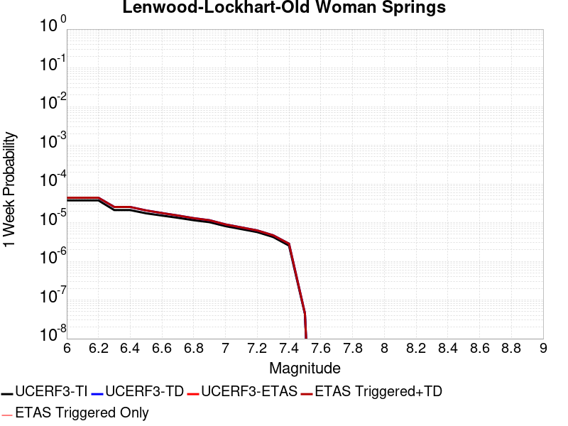 | 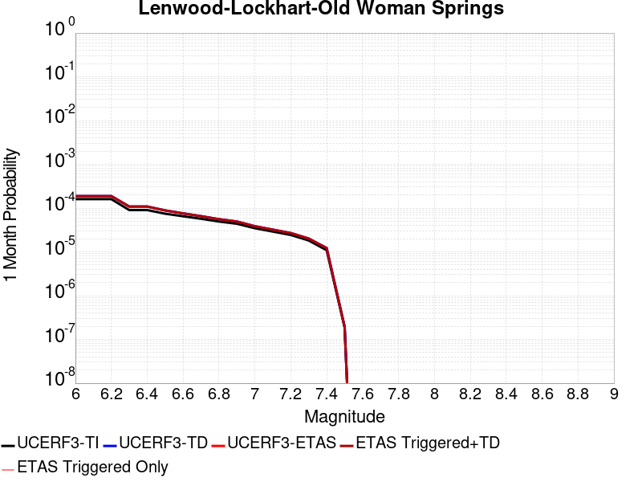 | 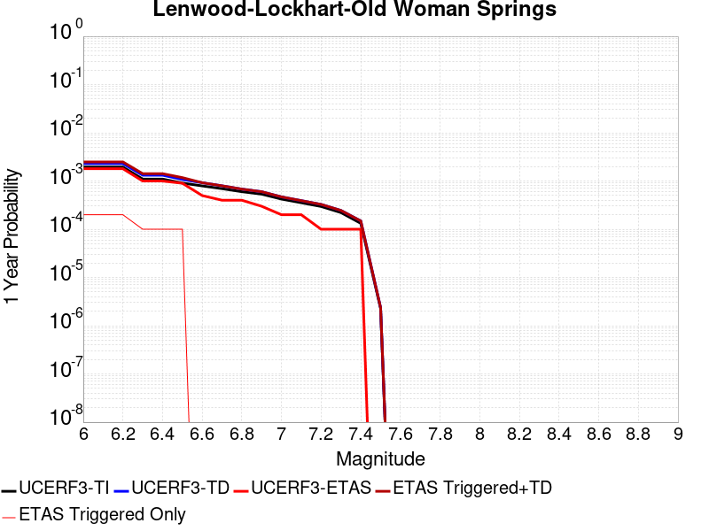 | 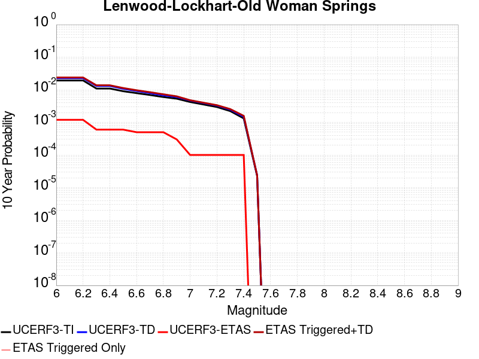 |

| Magnitude | 1 wk TI Prob | 1 wk TD Prob | 1 wk ETAS Prob | 1 wk ETAS/TD Gain | 1 wk ETAS Triggered+TD | 1 wk ETAS Triggered Only | 1 mo TI Prob | 1 mo TD Prob | 1 mo ETAS Prob | 1 mo ETAS/TD Gain | 1 mo ETAS Triggered+TD | 1 mo ETAS Triggered Only | 1 yr TI Prob | 1 yr TD Prob | 1 yr ETAS Prob | 1 yr ETAS/TD Gain | 1 yr ETAS Triggered+TD | 1 yr ETAS Triggered Only | 10 yr TI Prob | 10 yr TD Prob | 10 yr ETAS Prob | 10 yr ETAS/TD Gain | 10 yr ETAS Triggered+TD | 10 yr ETAS Triggered Only |
|-----|-----|-----|-----|-----|-----|-----|-----|-----|-----|-----|-----|-----|-----|-----|-----|-----|-----|-----|-----|-----|-----|-----|-----|-----|
| 6.0 | 3.744542E-5 | 4.3969783E-5 | 0.0 | 0.0 | 4.3969783E-5 | 0.0 | 1.604705E-4 | 1.8842929E-4 | 0.0 | 0.0 | 1.8842929E-4 | 0.0 | 0.0019519776 | 0.002291885 | 0.0018 | 0.7853797 | 0.0024914267 | 2.0E-4 | 0.019349206 | 0.0227005 | 0.0154 | 0.67839915 | 0.02387326 | 0.0012 |
| 6.1 | 3.744542E-5 | 4.3969783E-5 | 0.0 | 0.0 | 4.3969783E-5 | 0.0 | 1.604705E-4 | 1.8842929E-4 | 0.0 | 0.0 | 1.8842929E-4 | 0.0 | 0.0019519776 | 0.002291885 | 0.0018 | 0.7853797 | 0.0024914267 | 2.0E-4 | 0.019349206 | 0.0227005 | 0.0154 | 0.67839915 | 0.02387326 | 0.0012 |
| 6.2 | 3.744542E-5 | 4.3969783E-5 | 0.0 | 0.0 | 4.3969783E-5 | 0.0 | 1.604705E-4 | 1.8842929E-4 | 0.0 | 0.0 | 1.8842929E-4 | 0.0 | 0.0019519776 | 0.002291885 | 0.0018 | 0.7853797 | 0.0024914267 | 2.0E-4 | 0.019349206 | 0.0227005 | 0.0154 | 0.67839915 | 0.02387326 | 0.0012 |
| 6.3 | 2.1079984E-5 | 2.5356305E-5 | 0.0 | 0.0 | 2.5356305E-5 | 0.0 | 9.0339665E-5 | 1.0866546E-4 | 0.0 | 0.0 | 1.0866546E-4 | 0.0 | 0.0010993304 | 0.001322219 | 0.001 | 0.7563043 | 0.0014220868 | 1.0E-4 | 0.010939079 | 0.013145736 | 0.0075 | 0.5705272 | 0.013737849 | 6.0E-4 |
| 6.4 | 2.1079984E-5 | 2.5356305E-5 | 0.0 | 0.0 | 2.5356305E-5 | 0.0 | 9.0339665E-5 | 1.0866546E-4 | 0.0 | 0.0 | 1.0866546E-4 | 0.0 | 0.0010993304 | 0.001322219 | 0.001 | 0.7563043 | 0.0014220868 | 1.0E-4 | 0.010939079 | 0.013145736 | 0.0075 | 0.5705272 | 0.013737849 | 6.0E-4 |
| 6.5 | 1.7397282E-5 | 2.066477E-5 | 0.0 | 0.0 | 2.066477E-5 | 0.0 | 7.455765E-5 | 8.856036E-5 | 0.0 | 0.0 | 8.856036E-5 | 0.0 | 9.073613E-4 | 0.0010777008 | 9.0E-4 | 0.8351112 | 0.001177593 | 1.0E-4 | 0.009036654 | 0.010726039 | 0.0064 | 0.59667873 | 0.011319604 | 6.0E-4 |
| 6.6 | 1.52050325E-5 | 1.7681405E-5 | 0.0 | 0.0 | 1.7681405E-5 | 0.0 | 6.51628E-5 | 7.577529E-5 | 0.0 | 0.0 | 7.577529E-5 | 0.0 | 7.9306826E-4 | 9.221816E-4 | 5.0E-4 | 0.5421926 | 9.221816E-4 | 0.0 | 0.007902439 | 0.009184411 | 0.0052 | 0.5661768 | 0.0096798185 | 5.0E-4 |
| 6.7 | 1.332523E-5 | 1.5265548E-5 | 0.0 | 0.0 | 1.5265548E-5 | 0.0 | 5.7106878E-5 | 6.542217E-5 | 0.0 | 0.0 | 6.542217E-5 | 0.0 | 6.950544E-4 | 7.962297E-4 | 4.0E-4 | 0.5023676 | 7.962297E-4 | 0.0 | 0.006928845 | 0.007934399 | 0.0039 | 0.4915306 | 0.0084304325 | 5.0E-4 |
| 6.8 | 1.1525329E-5 | 1.3032384E-5 | 0.0 | 0.0 | 1.3032384E-5 | 0.0 | 4.9393333E-5 | 5.5851906E-5 | 0.0 | 0.0 | 5.5851906E-5 | 0.0 | 6.011979E-4 | 6.7978905E-4 | 4.0E-4 | 0.5884178 | 6.7978905E-4 | 0.0 | 0.00599574 | 0.0067775478 | 0.0033 | 0.4869018 | 0.0072741588 | 5.0E-4 |
| 6.9 | 1.0253909E-5 | 1.1515628E-5 | 0.0 | 0.0 | 1.1515628E-5 | 0.0 | 4.3944583E-5 | 4.935178E-5 | 0.0 | 0.0 | 4.935178E-5 | 0.0 | 5.3489394E-4 | 6.006959E-4 | 3.0E-4 | 0.49942076 | 6.006959E-4 | 0.0 | 0.0053360825 | 0.0059911013 | 0.0027 | 0.4506684 | 0.0062893042 | 3.0E-4 |
| 7.0 | 8.104563E-6 | 8.992018E-6 | 0.0 | 0.0 | 8.992018E-6 | 0.0 | 3.4733377E-5 | 3.8536666E-5 | 0.0 | 0.0 | 3.8536666E-5 | 0.0 | 4.2279682E-4 | 4.690853E-4 | 2.0E-4 | 0.42636168 | 4.690853E-4 | 0.0 | 0.0042199334 | 0.0046811993 | 0.0019 | 0.40587887 | 0.0047807316 | 1.0E-4 |
| 7.1 | 6.7986157E-6 | 7.516444E-6 | 0.0 | 0.0 | 7.516444E-6 | 0.0 | 2.91366E-5 | 3.2212945E-5 | 0.0 | 0.0 | 3.2212945E-5 | 0.0 | 3.5468035E-4 | 3.9212417E-4 | 2.0E-4 | 0.5100425 | 3.9212417E-4 | 0.0 | 0.003541148 | 0.0039145392 | 0.0018 | 0.45982423 | 0.004014148 | 1.0E-4 |
| 7.2 | 5.6893327E-6 | 6.280491E-6 | 0.0 | 0.0 | 6.280491E-6 | 0.0 | 2.4382627E-5 | 2.6916125E-5 | 0.0 | 0.0 | 2.6916125E-5 | 0.0 | 2.9681803E-4 | 3.276565E-4 | 1.0E-4 | 0.30519766 | 3.276565E-4 | 0.0 | 0.002964219 | 0.003271933 | 0.0017 | 0.5195706 | 0.0033716056 | 1.0E-4 |
| 7.3 | 4.253348E-6 | 4.707337E-6 | 0.0 | 0.0 | 4.707337E-6 | 0.0 | 1.8228506E-5 | 2.0174155E-5 | 0.0 | 0.0 | 2.0174155E-5 | 0.0 | 2.2190946E-4 | 2.455945E-4 | 1.0E-4 | 0.40717524 | 2.455945E-4 | 0.0 | 0.00221688 | 0.0024534117 | 0.0013 | 0.5298744 | 0.0025531664 | 1.0E-4 |
| 7.4 | 2.5448119E-6 | 2.8521993E-6 | 0.0 | 0.0 | 2.8521993E-6 | 0.0 | 1.0906291E-5 | 1.2223662E-5 | 0.0 | 0.0 | 1.2223662E-5 | 0.0 | 1.3277601E-4 | 1.4881458E-4 | 1.0E-4 | 0.67197716 | 1.4881458E-4 | 0.0 | 0.001326967 | 0.0014873114 | 9.0E-4 | 0.6051187 | 0.0015871627 | 1.0E-4 |
| 7.5 | 4.3706837E-8 | 4.5633225E-8 | 0.0 | 0.0 | 4.5633225E-8 | 0.0 | 1.8731501E-7 | 1.9557095E-7 | 0.0 | 0.0 | 1.9557095E-7 | 0.0 | 2.2805577E-6 | 2.3810742E-6 | 0.0 | 0.0 | 2.3810742E-6 | 0.0 | 2.2805343E-5 | 2.3810542E-5 | 0.0 | 0.0 | 2.3810542E-5 | 0.0 |

## Santa Susana alt 1
*[(top)](#table-of-contents)*

| 1 Week | 1 Month | 1 Year | 10 Year |
|-----|-----|-----|-----|
| 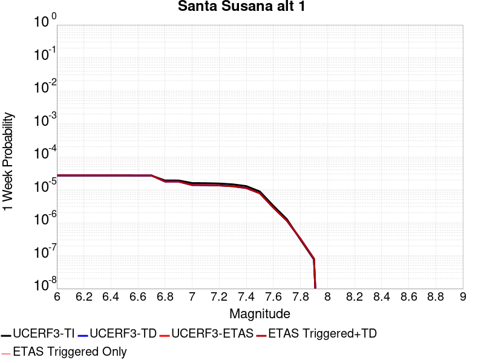 | 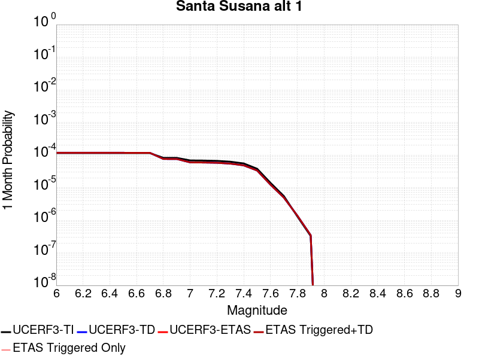 | 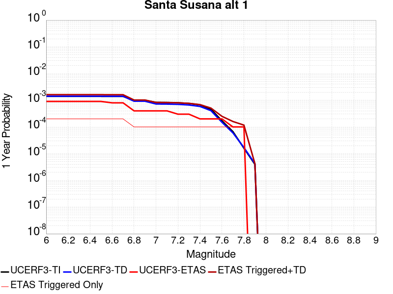 | 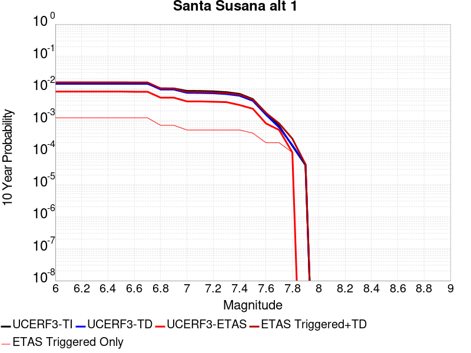 |

| Magnitude | 1 wk TI Prob | 1 wk TD Prob | 1 wk ETAS Prob | 1 wk ETAS/TD Gain | 1 wk ETAS Triggered+TD | 1 wk ETAS Triggered Only | 1 mo TI Prob | 1 mo TD Prob | 1 mo ETAS Prob | 1 mo ETAS/TD Gain | 1 mo ETAS Triggered+TD | 1 mo ETAS Triggered Only | 1 yr TI Prob | 1 yr TD Prob | 1 yr ETAS Prob | 1 yr ETAS/TD Gain | 1 yr ETAS Triggered+TD | 1 yr ETAS Triggered Only | 10 yr TI Prob | 10 yr TD Prob | 10 yr ETAS Prob | 10 yr ETAS/TD Gain | 10 yr ETAS Triggered+TD | 10 yr ETAS Triggered Only |
|-----|-----|-----|-----|-----|-----|-----|-----|-----|-----|-----|-----|-----|-----|-----|-----|-----|-----|-----|-----|-----|-----|-----|-----|-----|
| 6.0 | 2.674877E-5 | 2.7207736E-5 | 0.0 | 0.0 | 2.7207736E-5 | 0.0 | 1.1463255E-4 | 1.16600015E-4 | 0.0 | 0.0 | 1.16600015E-4 | 0.0 | 0.0013947578 | 0.0014187945 | 9.0E-4 | 0.63434136 | 0.0016185107 | 2.0E-4 | 0.013860362 | 0.014109071 | 0.0079 | 0.55992347 | 0.01529214 | 0.0012 |
| 6.1 | 2.674877E-5 | 2.7207736E-5 | 0.0 | 0.0 | 2.7207736E-5 | 0.0 | 1.1463255E-4 | 1.16600015E-4 | 0.0 | 0.0 | 1.16600015E-4 | 0.0 | 0.0013947578 | 0.0014187945 | 9.0E-4 | 0.63434136 | 0.0016185107 | 2.0E-4 | 0.013860362 | 0.014109071 | 0.0079 | 0.55992347 | 0.01529214 | 0.0012 |
| 6.2 | 2.674877E-5 | 2.7207736E-5 | 0.0 | 0.0 | 2.7207736E-5 | 0.0 | 1.1463255E-4 | 1.16600015E-4 | 0.0 | 0.0 | 1.16600015E-4 | 0.0 | 0.0013947578 | 0.0014187945 | 9.0E-4 | 0.63434136 | 0.0016185107 | 2.0E-4 | 0.013860362 | 0.014109071 | 0.0079 | 0.55992347 | 0.01529214 | 0.0012 |
| 6.3 | 2.674877E-5 | 2.7207736E-5 | 0.0 | 0.0 | 2.7207736E-5 | 0.0 | 1.1463255E-4 | 1.16600015E-4 | 0.0 | 0.0 | 1.16600015E-4 | 0.0 | 0.0013947578 | 0.0014187945 | 9.0E-4 | 0.63434136 | 0.0016185107 | 2.0E-4 | 0.013860362 | 0.014109071 | 0.0079 | 0.55992347 | 0.01529214 | 0.0012 |
| 6.4 | 2.674877E-5 | 2.7207736E-5 | 0.0 | 0.0 | 2.7207736E-5 | 0.0 | 1.1463255E-4 | 1.16600015E-4 | 0.0 | 0.0 | 1.16600015E-4 | 0.0 | 0.0013947578 | 0.0014187945 | 9.0E-4 | 0.63434136 | 0.0016185107 | 2.0E-4 | 0.013860362 | 0.014109071 | 0.0079 | 0.55992347 | 0.01529214 | 0.0012 |
| 6.5 | 2.674877E-5 | 2.7207736E-5 | 0.0 | 0.0 | 2.7207736E-5 | 0.0 | 1.1463255E-4 | 1.16600015E-4 | 0.0 | 0.0 | 1.16600015E-4 | 0.0 | 0.0013947578 | 0.0014187945 | 9.0E-4 | 0.63434136 | 0.0016185107 | 2.0E-4 | 0.013860362 | 0.014109071 | 0.0079 | 0.55992347 | 0.01529214 | 0.0012 |
| 6.6 | 2.6647976E-5 | 2.7084017E-5 | 0.0 | 0.0 | 2.7084017E-5 | 0.0 | 1.14200615E-4 | 1.16069845E-4 | 0.0 | 0.0 | 1.16069845E-4 | 0.0 | 0.0013895056 | 0.001412348 | 8.0E-4 | 0.56643265 | 0.0016120656 | 2.0E-4 | 0.013808494 | 0.014045427 | 0.0078 | 0.5553409 | 0.015228572 | 0.0012 |
| 6.7 | 2.6647976E-5 | 2.7084017E-5 | 0.0 | 0.0 | 2.7084017E-5 | 0.0 | 1.14200615E-4 | 1.16069845E-4 | 0.0 | 0.0 | 1.16069845E-4 | 0.0 | 0.0013895056 | 0.001412348 | 8.0E-4 | 0.56643265 | 0.0016120656 | 2.0E-4 | 0.013808494 | 0.014045427 | 0.0078 | 0.5553409 | 0.015228572 | 0.0012 |
| 6.8 | 1.9073179E-5 | 1.7642149E-5 | 0.0 | 0.0 | 1.7642149E-5 | 0.0 | 8.1739636E-5 | 7.560712E-5 | 0.0 | 0.0 | 7.560712E-5 | 0.0 | 9.947256E-4 | 9.2014606E-4 | 4.0E-4 | 0.4347136 | 0.0010200541 | 1.0E-4 | 0.009902848 | 0.009165554 | 0.0051 | 0.5564311 | 0.009859139 | 7.0E-4 |
| 6.9 | 1.9041876E-5 | 1.7624274E-5 | 0.0 | 0.0 | 1.7624274E-5 | 0.0 | 8.160549E-5 | 7.553052E-5 | 0.0 | 0.0 | 7.553052E-5 | 0.0 | 9.930939E-4 | 9.192143E-4 | 4.0E-4 | 0.43515426 | 0.0010191223 | 1.0E-4 | 0.0098866755 | 0.009156314 | 0.0051 | 0.5569927 | 0.009849904 | 7.0E-4 |
| 7.0 | 1.5917482E-5 | 1.3867062E-5 | 0.0 | 0.0 | 1.3867062E-5 | 0.0 | 6.8215995E-5 | 5.9428938E-5 | 0.0 | 0.0 | 5.9428938E-5 | 0.0 | 8.302132E-4 | 7.2331174E-4 | 4.0E-4 | 0.5530119 | 8.2323945E-4 | 1.0E-4 | 0.008271185 | 0.0072103892 | 0.0039 | 0.5408862 | 0.0077067837 | 5.0E-4 |
| 7.1 | 1.577788E-5 | 1.3747037E-5 | 0.0 | 0.0 | 1.3747037E-5 | 0.0 | 6.761774E-5 | 5.891457E-5 | 0.0 | 0.0 | 5.891457E-5 | 0.0 | 8.2293496E-4 | 7.170535E-4 | 4.0E-4 | 0.55783844 | 8.169818E-4 | 1.0E-4 | 0.008198941 | 0.0071482104 | 0.0039 | 0.5455911 | 0.007644636 | 5.0E-4 |
| 7.2 | 1.5416446E-5 | 1.3473035E-5 | 0.0 | 0.0 | 1.3473035E-5 | 0.0 | 6.606882E-5 | 5.7740326E-5 | 0.0 | 0.0 | 5.7740326E-5 | 0.0 | 8.0409093E-4 | 7.0276635E-4 | 3.0E-4 | 0.4268844 | 8.026961E-4 | 1.0E-4 | 0.008011877 | 0.007006243 | 0.0038 | 0.5423734 | 0.00750274 | 5.0E-4 |
| 7.3 | 1.4534083E-5 | 1.2720738E-5 | 0.0 | 0.0 | 1.2720738E-5 | 0.0 | 6.228744E-5 | 5.4516335E-5 | 0.0 | 0.0 | 5.4516335E-5 | 0.0 | 7.580857E-4 | 6.635387E-4 | 3.0E-4 | 0.45212132 | 7.6347234E-4 | 1.0E-4 | 0.007555048 | 0.006616337 | 0.0037 | 0.5592218 | 0.0071130292 | 5.0E-4 |
| 7.4 | 1.2858995E-5 | 1.1231963E-5 | 0.0 | 0.0 | 1.1231963E-5 | 0.0 | 5.5108816E-5 | 4.8136117E-5 | 0.0 | 0.0 | 4.8136117E-5 | 0.0 | 6.7074323E-4 | 5.859036E-4 | 2.0E-4 | 0.3413531 | 6.85845E-4 | 1.0E-4 | 0.0066872234 | 0.0058442806 | 0.003 | 0.51332235 | 0.0063413586 | 5.0E-4 |
| 7.5 | 8.827668E-6 | 7.806902E-6 | 0.0 | 0.0 | 7.806902E-6 | 0.0 | 3.7832317E-5 | 3.3457738E-5 | 0.0 | 0.0 | 3.3457738E-5 | 0.0 | 4.605111E-4 | 4.0727426E-4 | 2.0E-4 | 0.49106956 | 5.0723355E-4 | 1.0E-4 | 0.0045955796 | 0.004065541 | 0.0023 | 0.56573033 | 0.004463915 | 4.0E-4 |
| 7.6 | 3.2533426E-6 | 2.8723289E-6 | 0.0 | 0.0 | 2.8723289E-6 | 0.0 | 1.3942822E-5 | 1.2309925E-5 | 0.0 | 0.0 | 1.2309925E-5 | 0.0 | 1.6974064E-4 | 1.4986341E-4 | 2.0E-4 | 1.3345486 | 2.498484E-4 | 1.0E-4 | 0.0016961104 | 0.0014976603 | 8.0E-4 | 0.5341665 | 0.0016973608 | 2.0E-4 |
| 7.7 | 1.2751709E-6 | 1.1492891E-6 | 0.0 | 0.0 | 1.1492891E-6 | 0.0 | 5.4650063E-6 | 4.925516E-6 | 0.0 | 0.0 | 4.925516E-6 | 0.0 | 6.653442E-5 | 5.99666E-5 | 1.0E-4 | 1.667595 | 1.599606E-4 | 1.0E-4 | 6.6514505E-4 | 5.9951306E-4 | 5.0E-4 | 0.8340102 | 7.9939316E-4 | 2.0E-4 |
| 7.8 | 3.067544E-7 | 3.2404932E-7 | 0.0 | 0.0 | 3.2404932E-7 | 0.0 | 1.3146611E-6 | 1.3887822E-6 | 0.0 | 0.0 | 1.3887822E-6 | 0.0 | 1.600588E-5 | 1.6908301E-5 | 1.0E-4 | 5.9142547 | 1.1690661E-4 | 1.0E-4 | 1.6004729E-4 | 1.6907118E-4 | 1.0E-4 | 0.59146684 | 2.6905426E-4 | 1.0E-4 |
| 7.9 | 7.622999E-8 | 8.0890366E-8 | 0.0 | 0.0 | 8.0890366E-8 | 0.0 | 3.2669993E-7 | 3.4667295E-7 | 0.0 | 0.0 | 3.4667295E-7 | 0.0 | 3.977564E-6 | 4.220737E-6 | 0.0 | 0.0 | 4.220737E-6 | 0.0 | 3.977493E-5 | 4.220678E-5 | 0.0 | 0.0 | 4.220678E-5 | 0.0 |

## Santa Cruz Island
*[(top)](#table-of-contents)*

| 1 Week | 1 Month | 1 Year | 10 Year |
|-----|-----|-----|-----|
| 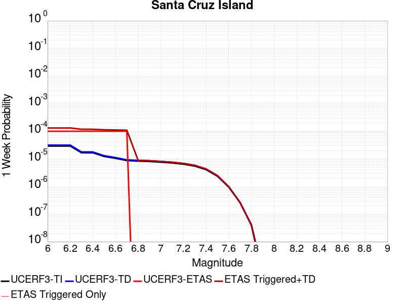 | 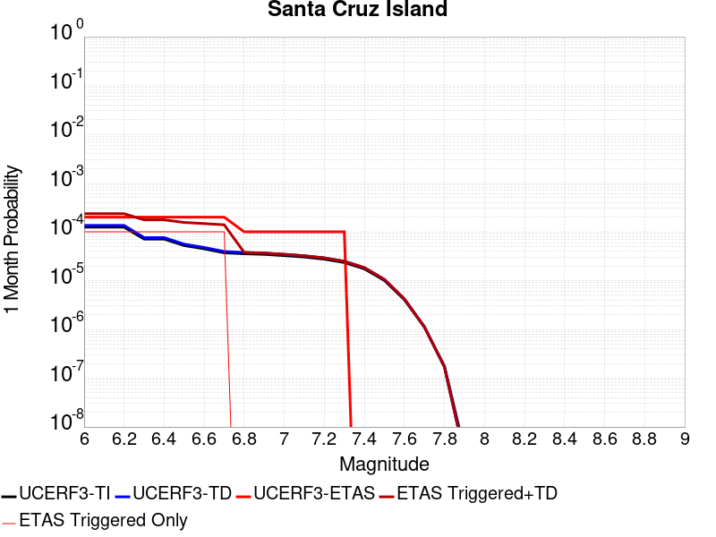 | 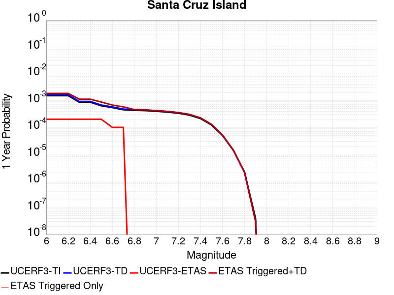 | 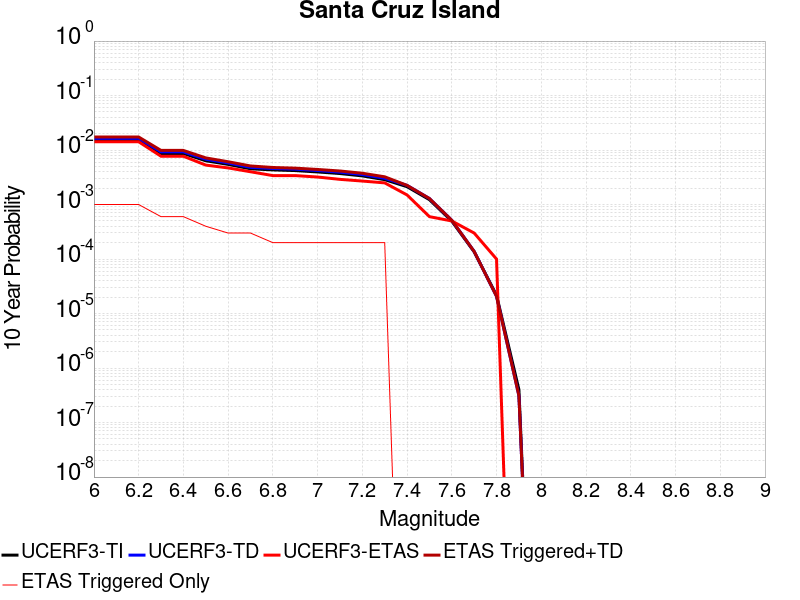 |

| Magnitude | 1 wk TI Prob | 1 wk TD Prob | 1 wk ETAS Prob | 1 wk ETAS/TD Gain | 1 wk ETAS Triggered+TD | 1 wk ETAS Triggered Only | 1 mo TI Prob | 1 mo TD Prob | 1 mo ETAS Prob | 1 mo ETAS/TD Gain | 1 mo ETAS Triggered+TD | 1 mo ETAS Triggered Only | 1 yr TI Prob | 1 yr TD Prob | 1 yr ETAS Prob | 1 yr ETAS/TD Gain | 1 yr ETAS Triggered+TD | 1 yr ETAS Triggered Only | 10 yr TI Prob | 10 yr TD Prob | 10 yr ETAS Prob | 10 yr ETAS/TD Gain | 10 yr ETAS Triggered+TD | 10 yr ETAS Triggered Only |
|-----|-----|-----|-----|-----|-----|-----|-----|-----|-----|-----|-----|-----|-----|-----|-----|-----|-----|-----|-----|-----|-----|-----|-----|-----|
| 6.0 | 2.9164563E-5 | 3.160522E-5 | 1.0E-4 | 3.1640344 | 1.3160206E-4 | 1.0E-4 | 1.2498499E-4 | 1.3544467E-4 | 2.0E-4 | 1.4766176 | 2.3543113E-4 | 1.0E-4 | 0.0015206301 | 0.0016479279 | 0.002 | 1.2136453 | 0.0018475984 | 2.0E-4 | 0.015102667 | 0.016370816 | 0.0142 | 0.8673972 | 0.017354446 | 0.001 |
| 6.1 | 2.9164563E-5 | 3.160522E-5 | 1.0E-4 | 3.1640344 | 1.3160206E-4 | 1.0E-4 | 1.2498499E-4 | 1.3544467E-4 | 2.0E-4 | 1.4766176 | 2.3543113E-4 | 1.0E-4 | 0.0015206301 | 0.0016479279 | 0.002 | 1.2136453 | 0.0018475984 | 2.0E-4 | 0.015102667 | 0.016370816 | 0.0142 | 0.8673972 | 0.017354446 | 0.001 |
| 6.2 | 2.9164563E-5 | 3.160522E-5 | 1.0E-4 | 3.1640344 | 1.3160206E-4 | 1.0E-4 | 1.2498499E-4 | 1.3544467E-4 | 2.0E-4 | 1.4766176 | 2.3543113E-4 | 1.0E-4 | 0.0015206301 | 0.0016479279 | 0.002 | 1.2136453 | 0.0018475984 | 2.0E-4 | 0.015102667 | 0.016370816 | 0.0142 | 0.8673972 | 0.017354446 | 0.001 |
| 6.3 | 1.6635553E-5 | 1.7806959E-5 | 1.0E-4 | 5.6157823 | 1.17805175E-4 | 1.0E-4 | 7.1293274E-5 | 7.63134E-5 | 2.0E-4 | 2.6207716 | 1.7630577E-4 | 1.0E-4 | 8.6765E-4 | 9.287379E-4 | 8.0E-4 | 0.86138403 | 0.0011285521 | 2.0E-4 | 0.008642701 | 0.009250438 | 0.0077 | 0.832393 | 0.009844888 | 6.0E-4 |
| 6.4 | 1.6635553E-5 | 1.7806959E-5 | 1.0E-4 | 5.6157823 | 1.17805175E-4 | 1.0E-4 | 7.1293274E-5 | 7.63134E-5 | 2.0E-4 | 2.6207716 | 1.7630577E-4 | 1.0E-4 | 8.6765E-4 | 9.287379E-4 | 8.0E-4 | 0.86138403 | 0.0011285521 | 2.0E-4 | 0.008642701 | 0.009250438 | 0.0077 | 0.832393 | 0.009844888 | 6.0E-4 |
| 6.5 | 1.2238748E-5 | 1.3044782E-5 | 1.0E-4 | 7.6659007 | 1.13043476E-4 | 1.0E-4 | 5.2450723E-5 | 5.5905028E-5 | 2.0E-4 | 3.5774958 | 1.5589944E-4 | 1.0E-4 | 6.3840044E-4 | 6.8043487E-4 | 7.0E-4 | 1.0287539 | 8.802988E-4 | 2.0E-4 | 0.0063656955 | 0.0067839134 | 0.0053 | 0.78125995 | 0.0071811997 | 4.0E-4 |
| 6.6 | 1.0489767E-5 | 1.1158117E-5 | 1.0E-4 | 8.962086 | 1.11157E-4 | 1.0E-4 | 4.495537E-5 | 4.7819634E-5 | 2.0E-4 | 4.1823826 | 1.4781485E-4 | 1.0E-4 | 5.4719415E-4 | 5.8205076E-4 | 4.0E-4 | 0.6872253 | 6.8199256E-4 | 1.0E-4 | 0.005458487 | 0.005805504 | 0.0047 | 0.8095766 | 0.0061037624 | 3.0E-4 |
| 6.7 | 8.699222E-6 | 9.237977E-6 | 1.0E-4 | 10.824881 | 1.0923705E-4 | 1.0E-4 | 3.7281847E-5 | 3.959073E-5 | 2.0E-4 | 5.0516872 | 1.3958677E-4 | 1.0E-4 | 4.5381195E-4 | 4.819111E-4 | 4.0E-4 | 0.8300286 | 5.818629E-4 | 1.0E-4 | 0.0045288634 | 0.004808728 | 0.004 | 0.8318207 | 0.005107286 | 3.0E-4 |
| 6.8 | 8.307732E-6 | 8.818036E-6 | 0.0 | 0.0 | 8.818036E-6 | 0.0 | 3.560408E-5 | 3.779104E-5 | 1.0E-4 | 2.6461298 | 3.779104E-5 | 0.0 | 4.3339343E-4 | 4.6000918E-4 | 3.0E-4 | 0.6521609 | 4.6000918E-4 | 0.0 | 0.004325492 | 0.004590623 | 0.0034 | 0.74064016 | 0.0047897054 | 2.0E-4 |
| 6.9 | 8.073121E-6 | 8.566032E-6 | 0.0 | 0.0 | 8.566032E-6 | 0.0 | 3.459863E-5 | 3.6711055E-5 | 1.0E-4 | 2.7239752 | 3.6711055E-5 | 0.0 | 4.2115687E-4 | 4.4686583E-4 | 3.0E-4 | 0.67134243 | 4.4686583E-4 | 0.0 | 0.004203596 | 0.0044597243 | 0.0034 | 0.762379 | 0.004658832 | 2.0E-4 |
| 7.0 | 7.617019E-6 | 8.075682E-6 | 0.0 | 0.0 | 8.075682E-6 | 0.0 | 3.264396E-5 | 3.4609606E-5 | 1.0E-4 | 2.8893712 | 3.4609606E-5 | 0.0 | 3.9736772E-4 | 4.2129087E-4 | 3.0E-4 | 0.71209705 | 4.2129087E-4 | 0.0 | 0.003966579 | 0.00420497 | 0.0032 | 0.76100427 | 0.0044041285 | 2.0E-4 |
| 7.1 | 7.1224836E-6 | 7.5467287E-6 | 0.0 | 0.0 | 7.5467287E-6 | 0.0 | 3.052457E-5 | 3.2342723E-5 | 1.0E-4 | 3.0918856 | 3.2342723E-5 | 0.0 | 3.715733E-4 | 3.937019E-4 | 3.0E-4 | 0.7619979 | 3.937019E-4 | 0.0 | 0.003709526 | 0.003930087 | 0.0029 | 0.73789716 | 0.004129301 | 2.0E-4 |
| 7.2 | 6.441115E-6 | 6.8282434E-6 | 0.0 | 0.0 | 6.8282434E-6 | 0.0 | 2.7604487E-5 | 2.9263574E-5 | 1.0E-4 | 3.4172177 | 2.9263574E-5 | 0.0 | 3.360328E-4 | 3.56226E-4 | 2.0E-4 | 0.56144136 | 3.56226E-4 | 0.0 | 0.0033552512 | 0.0035565782 | 0.0027 | 0.75915664 | 0.0037558668 | 2.0E-4 |
| 7.3 | 5.494274E-6 | 5.820721E-6 | 0.0 | 0.0 | 5.820721E-6 | 0.0 | 2.3546674E-5 | 2.4945712E-5 | 1.0E-4 | 4.008705 | 2.4945712E-5 | 0.0 | 2.8664304E-4 | 3.036719E-4 | 2.0E-4 | 0.6586056 | 3.036719E-4 | 0.0 | 0.002862736 | 0.0030325926 | 0.0025 | 0.8243772 | 0.003231986 | 2.0E-4 |
| 7.4 | 4.0802624E-6 | 4.312777E-6 | 0.0 | 0.0 | 4.312777E-6 | 0.0 | 1.7486722E-5 | 1.8483199E-5 | 0.0 | 0.0 | 1.8483199E-5 | 0.0 | 2.1288003E-4 | 2.2500979E-4 | 1.0E-4 | 0.4444251 | 2.2500979E-4 | 0.0 | 0.0021267622 | 0.0022478285 | 0.0015 | 0.66731066 | 0.0022478285 | 0.0 |
| 7.5 | 2.3584746E-6 | 2.4755766E-6 | 0.0 | 0.0 | 2.4755766E-6 | 0.0 | 1.0107709E-5 | 1.0609571E-5 | 0.0 | 0.0 | 1.0609571E-5 | 0.0 | 1.2305441E-4 | 1.2916392E-4 | 0.0 | 0.0 | 1.2916392E-4 | 0.0 | 0.0012298629 | 0.0012908935 | 6.0E-4 | 0.46479434 | 0.0012908935 | 0.0 |
| 7.6 | 9.4981914E-7 | 9.86183E-7 | 0.0 | 0.0 | 9.86183E-7 | 0.0 | 4.0706473E-6 | 4.2264915E-6 | 0.0 | 0.0 | 4.2264915E-6 | 0.0 | 4.9559E-5 | 5.1456333E-5 | 0.0 | 0.0 | 5.1456333E-5 | 0.0 | 4.954795E-4 | 5.144455E-4 | 5.0E-4 | 0.97192025 | 5.144455E-4 | 0.0 |
| 7.7 | 2.6013532E-7 | 2.6418425E-7 | 0.0 | 0.0 | 2.6418425E-7 | 0.0 | 1.1148652E-6 | 1.1322178E-6 | 0.0 | 0.0 | 1.1322178E-6 | 0.0 | 1.3573399E-5 | 1.3784665E-5 | 0.0 | 0.0 | 1.3784665E-5 | 0.0 | 1.357257E-4 | 1.3783817E-4 | 3.0E-4 | 2.1764655 | 1.3783817E-4 | 0.0 |
| 7.8 | 4.1522263E-8 | 3.9658982E-8 | 0.0 | 0.0 | 3.9658982E-8 | 0.0 | 1.7795254E-7 | 1.6996705E-7 | 0.0 | 0.0 | 1.6996705E-7 | 0.0 | 2.16657E-6 | 2.0693471E-6 | 0.0 | 0.0 | 2.0693471E-6 | 0.0 | 2.1665488E-5 | 2.06933E-5 | 1.0E-4 | 4.832482 | 2.06933E-5 | 0.0 |
| 7.9 | 7.7242046E-10 | 5.948063E-10 | 0.0 | 0.0 | 5.948063E-10 | 0.0 | 3.3103735E-9 | 2.5491702E-9 | 0.0 | 0.0 | 2.5491702E-9 | 0.0 | 4.0303796E-8 | 3.1036144E-8 | 0.0 | 0.0 | 3.1036144E-8 | 0.0 | 4.030379E-7 | 3.1036143E-7 | 0.0 | 0.0 | 3.1036143E-7 | 0.0 |

## Elsinore (Coyote Mountains)
*[(top)](#table-of-contents)*

| 1 Week | 1 Month | 1 Year | 10 Year |
|-----|-----|-----|-----|
| 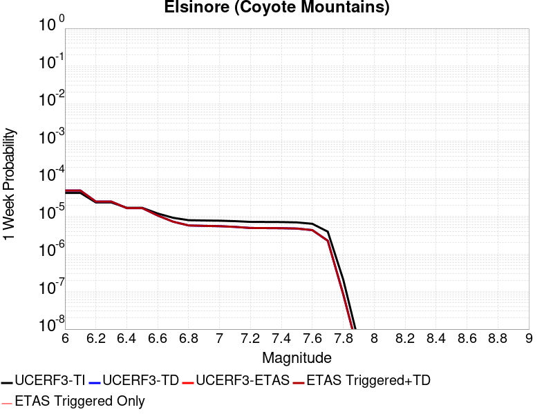 | 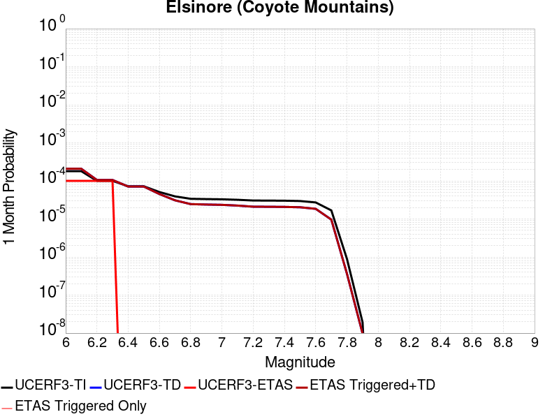 | 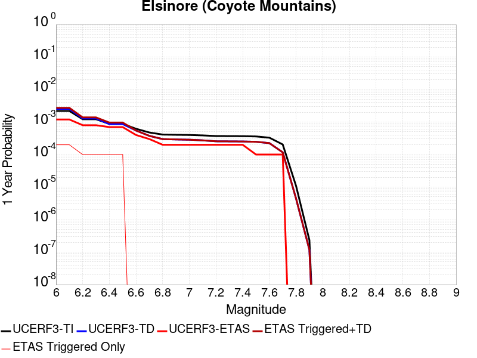 | 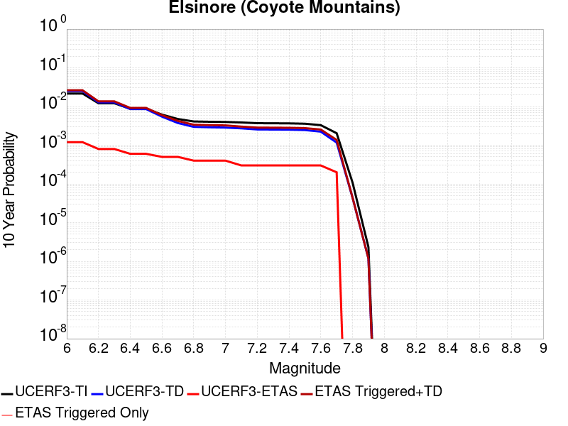 |

| Magnitude | 1 wk TI Prob | 1 wk TD Prob | 1 wk ETAS Prob | 1 wk ETAS/TD Gain | 1 wk ETAS Triggered+TD | 1 wk ETAS Triggered Only | 1 mo TI Prob | 1 mo TD Prob | 1 mo ETAS Prob | 1 mo ETAS/TD Gain | 1 mo ETAS Triggered+TD | 1 mo ETAS Triggered Only | 1 yr TI Prob | 1 yr TD Prob | 1 yr ETAS Prob | 1 yr ETAS/TD Gain | 1 yr ETAS Triggered+TD | 1 yr ETAS Triggered Only | 10 yr TI Prob | 10 yr TD Prob | 10 yr ETAS Prob | 10 yr ETAS/TD Gain | 10 yr ETAS Triggered+TD | 10 yr ETAS Triggered Only |
|-----|-----|-----|-----|-----|-----|-----|-----|-----|-----|-----|-----|-----|-----|-----|-----|-----|-----|-----|-----|-----|-----|-----|-----|-----|
| 6.0 | 4.20513E-5 | 4.8657297E-5 | 0.0 | 0.0 | 4.8657297E-5 | 0.0 | 1.8020741E-4 | 2.0851784E-4 | 1.0E-4 | 0.47957525 | 2.0851784E-4 | 0.0 | 0.0021918174 | 0.002536278 | 0.0012 | 0.47313425 | 0.0027357708 | 2.0E-4 | 0.021703249 | 0.0251246 | 0.0145 | 0.5771236 | 0.026294451 | 0.0012 |
| 6.1 | 4.20513E-5 | 4.8657297E-5 | 0.0 | 0.0 | 4.8657297E-5 | 0.0 | 1.8020741E-4 | 2.0851784E-4 | 1.0E-4 | 0.47957525 | 2.0851784E-4 | 0.0 | 0.0021918174 | 0.002536278 | 0.0012 | 0.47313425 | 0.0027357708 | 2.0E-4 | 0.021703249 | 0.0251246 | 0.0145 | 0.5771236 | 0.026294451 | 0.0012 |
| 6.2 | 2.3413893E-5 | 2.4708097E-5 | 0.0 | 0.0 | 2.4708097E-5 | 0.0 | 1.0034139E-4 | 1.0588809E-4 | 1.0E-4 | 0.94439334 | 1.0588809E-4 | 0.0 | 0.0012209718 | 0.0012885133 | 8.0E-4 | 0.6208706 | 0.0013883844 | 1.0E-4 | 0.012142851 | 0.012819097 | 0.0086 | 0.67087406 | 0.013608842 | 8.0E-4 |
| 6.3 | 2.3413893E-5 | 2.4708097E-5 | 0.0 | 0.0 | 2.4708097E-5 | 0.0 | 1.0034139E-4 | 1.0588809E-4 | 1.0E-4 | 0.94439334 | 1.0588809E-4 | 0.0 | 0.0012209718 | 0.0012885133 | 8.0E-4 | 0.6208706 | 0.0013883844 | 1.0E-4 | 0.012142851 | 0.012819097 | 0.0086 | 0.67087406 | 0.013608842 | 8.0E-4 |
| 6.4 | 1.6894814E-5 | 1.6576801E-5 | 0.0 | 0.0 | 1.6576801E-5 | 0.0 | 7.240433E-5 | 7.1041715E-5 | 0.0 | 0.0 | 7.1041715E-5 | 0.0 | 8.811662E-4 | 8.6462655E-4 | 7.0E-4 | 0.8095981 | 9.645401E-4 | 1.0E-4 | 0.0087768035 | 0.0086162845 | 0.006 | 0.6963559 | 0.009211115 | 6.0E-4 |
| 6.5 | 1.6894814E-5 | 1.6576801E-5 | 0.0 | 0.0 | 1.6576801E-5 | 0.0 | 7.240433E-5 | 7.1041715E-5 | 0.0 | 0.0 | 7.1041715E-5 | 0.0 | 8.811662E-4 | 8.6462655E-4 | 7.0E-4 | 0.8095981 | 9.645401E-4 | 1.0E-4 | 0.0087768035 | 0.0086162845 | 0.006 | 0.6963559 | 0.009211115 | 6.0E-4 |
| 6.6 | 1.1910969E-5 | 1.05365025E-5 | 0.0 | 0.0 | 1.05365025E-5 | 0.0 | 5.1046012E-5 | 4.515573E-5 | 0.0 | 0.0 | 4.515573E-5 | 0.0 | 6.21308E-4 | 5.4964545E-4 | 4.0E-4 | 0.72774184 | 5.4964545E-4 | 0.0 | 0.0061957375 | 0.0054841614 | 0.0042 | 0.7658418 | 0.0059814197 | 5.0E-4 |
| 6.7 | 9.1486E-6 | 7.2072066E-6 | 0.0 | 0.0 | 7.2072066E-6 | 0.0 | 3.9207694E-5 | 3.0887684E-5 | 0.0 | 0.0 | 3.0887684E-5 | 0.0 | 4.7724912E-4 | 3.759965E-4 | 3.0E-4 | 0.7978798 | 3.759965E-4 | 0.0 | 0.0047622547 | 0.003753983 | 0.0033 | 0.8790663 | 0.004252106 | 5.0E-4 |
| 6.8 | 7.90441E-6 | 5.7328134E-6 | 0.0 | 0.0 | 5.7328134E-6 | 0.0 | 3.3875604E-5 | 2.4568977E-5 | 0.0 | 0.0 | 2.4568977E-5 | 0.0 | 4.1235742E-4 | 2.9908752E-4 | 2.0E-4 | 0.6687006 | 2.9908752E-4 | 0.0 | 0.0041159308 | 0.0029869787 | 0.0027 | 0.9039234 | 0.0033857839 | 4.0E-4 |
| 6.9 | 7.77015E-6 | 5.5867413E-6 | 0.0 | 0.0 | 5.5867413E-6 | 0.0 | 3.3300217E-5 | 2.3942965E-5 | 0.0 | 0.0 | 2.3942965E-5 | 0.0 | 4.0535472E-4 | 2.9146788E-4 | 2.0E-4 | 0.68618196 | 2.9146788E-4 | 0.0 | 0.004046161 | 0.0029109833 | 0.0026 | 0.893169 | 0.003309819 | 4.0E-4 |
| 7.0 | 7.675798E-6 | 5.48358E-6 | 0.0 | 0.0 | 5.48358E-6 | 0.0 | 3.289586E-5 | 2.3500854E-5 | 0.0 | 0.0 | 2.3500854E-5 | 0.0 | 4.004335E-4 | 2.8608658E-4 | 2.0E-4 | 0.69908905 | 2.8608658E-4 | 0.0 | 0.003997127 | 0.0028573095 | 0.0026 | 0.9099469 | 0.0032561666 | 4.0E-4 |
| 7.1 | 7.447814E-6 | 5.242422E-6 | 0.0 | 0.0 | 5.242422E-6 | 0.0 | 3.191881E-5 | 2.2467337E-5 | 0.0 | 0.0 | 2.2467337E-5 | 0.0 | 3.8854225E-4 | 2.7350674E-4 | 2.0E-4 | 0.7312434 | 2.7350674E-4 | 0.0 | 0.003878636 | 0.002731826 | 0.0024 | 0.8785333 | 0.0030310063 | 3.0E-4 |
| 7.2 | 7.128185E-6 | 4.909057E-6 | 0.0 | 0.0 | 4.909057E-6 | 0.0 | 3.0549007E-5 | 2.1038653E-5 | 0.0 | 0.0 | 2.1038653E-5 | 0.0 | 3.7187067E-4 | 2.561167E-4 | 2.0E-4 | 0.78089404 | 2.561167E-4 | 0.0 | 0.00371249 | 0.0025583338 | 0.0023 | 0.89902264 | 0.0028575663 | 3.0E-4 |
| 7.3 | 7.0913875E-6 | 4.877727E-6 | 0.0 | 0.0 | 4.877727E-6 | 0.0 | 3.0391306E-5 | 2.0904383E-5 | 0.0 | 0.0 | 2.0904383E-5 | 0.0 | 3.6995133E-4 | 2.5448232E-4 | 2.0E-4 | 0.78590924 | 2.5448232E-4 | 0.0 | 0.0036933604 | 0.0025420275 | 0.0023 | 0.90478957 | 0.002841265 | 3.0E-4 |
| 7.4 | 7.051521E-6 | 4.8415745E-6 | 0.0 | 0.0 | 4.8415745E-6 | 0.0 | 3.0220453E-5 | 2.0749447E-5 | 0.0 | 0.0 | 2.0749447E-5 | 0.0 | 3.6787192E-4 | 2.5259642E-4 | 2.0E-4 | 0.79177684 | 2.5259642E-4 | 0.0 | 0.0036726352 | 0.0025232115 | 0.0022 | 0.87190473 | 0.0028224546 | 3.0E-4 |
| 7.5 | 6.910666E-6 | 4.7370213E-6 | 0.0 | 0.0 | 4.7370213E-6 | 0.0 | 2.9616802E-5 | 2.030137E-5 | 0.0 | 0.0 | 2.030137E-5 | 0.0 | 3.605249E-4 | 2.471423E-4 | 1.0E-4 | 0.40462515 | 2.471423E-4 | 0.0 | 0.0035994058 | 0.002468793 | 0.0021 | 0.8506181 | 0.0027680523 | 3.0E-4 |
| 7.6 | 6.341753E-6 | 4.309983E-6 | 0.0 | 0.0 | 4.309983E-6 | 0.0 | 2.7178658E-5 | 1.8471232E-5 | 0.0 | 0.0 | 1.8471232E-5 | 0.0 | 3.3084993E-4 | 2.2486519E-4 | 1.0E-4 | 0.44471088 | 2.2486519E-4 | 0.0 | 0.0033035777 | 0.002246492 | 0.0019 | 0.8457631 | 0.0025458182 | 3.0E-4 |
| 7.7 | 3.9205916E-6 | 2.2458037E-6 | 0.0 | 0.0 | 2.2458037E-6 | 0.0 | 1.6802427E-5 | 9.624841E-6 | 0.0 | 0.0 | 9.624841E-6 | 0.0 | 2.0455034E-4 | 1.1717689E-4 | 1.0E-4 | 0.85341066 | 1.1717689E-4 | 0.0 | 0.0020436216 | 0.001171224 | 9.0E-4 | 0.76842684 | 0.0013709898 | 2.0E-4 |
| 7.8 | 2.0846227E-7 | 8.4922256E-8 | 0.0 | 0.0 | 8.4922256E-8 | 0.0 | 8.9340944E-7 | 3.639525E-7 | 0.0 | 0.0 | 3.639525E-7 | 0.0 | 1.0877206E-5 | 4.431116E-6 | 0.0 | 0.0 | 4.431116E-6 | 0.0 | 1.0876673E-4 | 4.4310604E-5 | 0.0 | 0.0 | 4.4310604E-5 | 0.0 |
| 7.9 | 4.4969806E-9 | 2.2703612E-9 | 0.0 | 0.0 | 2.2703612E-9 | 0.0 | 1.9272775E-8 | 9.73012E-9 | 0.0 | 0.0 | 9.73012E-9 | 0.0 | 2.3464601E-7 | 1.184642E-7 | 0.0 | 0.0 | 1.184642E-7 | 0.0 | 2.3464577E-6 | 1.1846415E-6 | 0.0 | 0.0 | 1.1846415E-6 | 0.0 |

## Superstition Hills
*[(top)](#table-of-contents)*

| 1 Week | 1 Month | 1 Year | 10 Year |
|-----|-----|-----|-----|
| 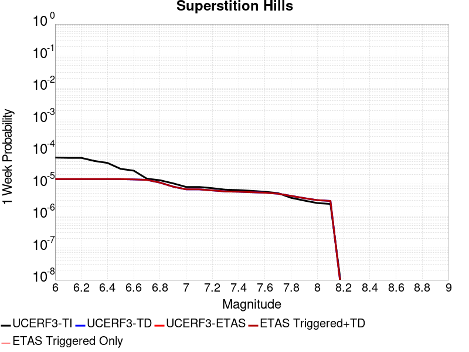 | 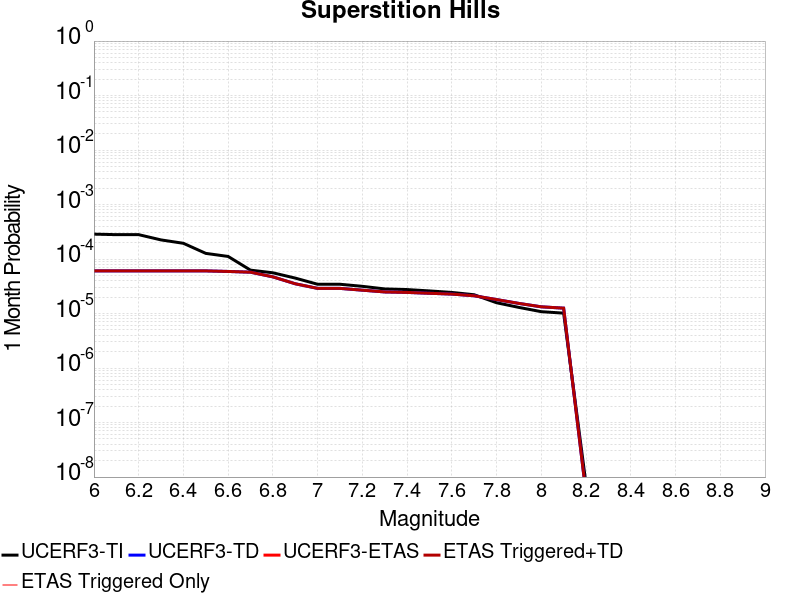 | 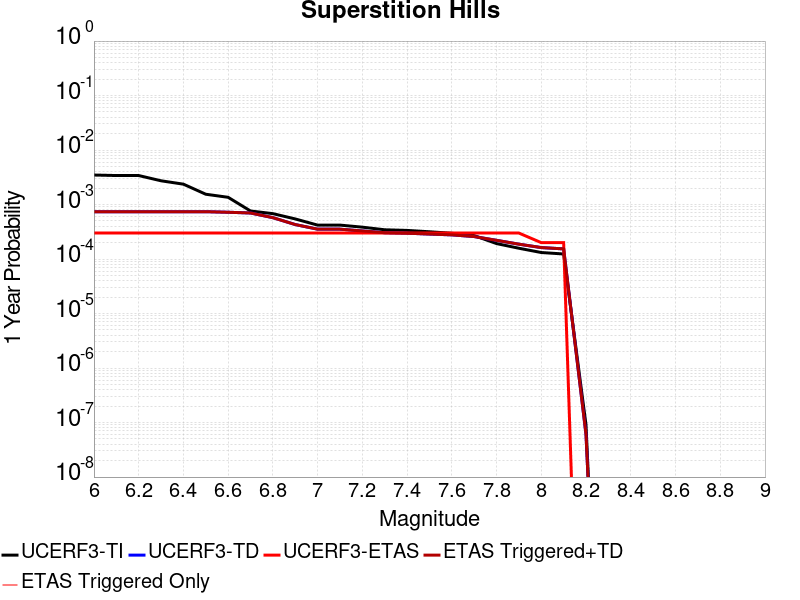 | 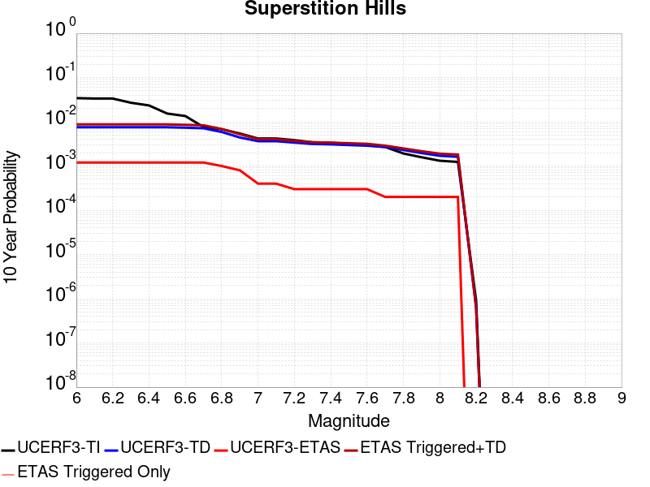 |

| Magnitude | 1 wk TI Prob | 1 wk TD Prob | 1 wk ETAS Prob | 1 wk ETAS/TD Gain | 1 wk ETAS Triggered+TD | 1 wk ETAS Triggered Only | 1 mo TI Prob | 1 mo TD Prob | 1 mo ETAS Prob | 1 mo ETAS/TD Gain | 1 mo ETAS Triggered+TD | 1 mo ETAS Triggered Only | 1 yr TI Prob | 1 yr TD Prob | 1 yr ETAS Prob | 1 yr ETAS/TD Gain | 1 yr ETAS Triggered+TD | 1 yr ETAS Triggered Only | 10 yr TI Prob | 10 yr TD Prob | 10 yr ETAS Prob | 10 yr ETAS/TD Gain | 10 yr ETAS Triggered+TD | 10 yr ETAS Triggered Only |
|-----|-----|-----|-----|-----|-----|-----|-----|-----|-----|-----|-----|-----|-----|-----|-----|-----|-----|-----|-----|-----|-----|-----|-----|-----|
| 6.0 | 6.6865185E-5 | 1.4186543E-5 | 0.0 | 0.0 | 1.4186543E-5 | 0.0 | 2.8653358E-4 | 6.0798146E-5 | 0.0 | 0.0 | 6.0798146E-5 | 0.0 | 0.0034829667 | 7.399823E-4 | 3.0E-4 | 0.40541512 | 7.399823E-4 | 0.0 | 0.03428881 | 0.0075451913 | 0.0047 | 0.6229133 | 0.008736137 | 0.0012 |
| 6.1 | 6.544851E-5 | 1.4186543E-5 | 0.0 | 0.0 | 1.4186543E-5 | 0.0 | 2.8046346E-4 | 6.0798146E-5 | 0.0 | 0.0 | 6.0798146E-5 | 0.0 | 0.0034092965 | 7.399823E-4 | 3.0E-4 | 0.40541512 | 7.399823E-4 | 0.0 | 0.033574644 | 0.007545191 | 0.0047 | 0.62291336 | 0.008736136 | 0.0012 |
| 6.2 | 6.544851E-5 | 1.4186543E-5 | 0.0 | 0.0 | 1.4186543E-5 | 0.0 | 2.8046346E-4 | 6.0798146E-5 | 0.0 | 0.0 | 6.0798146E-5 | 0.0 | 0.0034092965 | 7.399823E-4 | 3.0E-4 | 0.40541512 | 7.399823E-4 | 0.0 | 0.033574644 | 0.007545191 | 0.0047 | 0.62291336 | 0.008736136 | 0.0012 |
| 6.3 | 5.2402065E-5 | 1.4186542E-5 | 0.0 | 0.0 | 1.4186542E-5 | 0.0 | 2.2456095E-4 | 6.0798142E-5 | 0.0 | 0.0 | 6.0798142E-5 | 0.0 | 0.0027306017 | 7.3998224E-4 | 3.0E-4 | 0.40541515 | 7.3998224E-4 | 0.0 | 0.02697292 | 0.0075451853 | 0.0047 | 0.6229138 | 0.008736131 | 0.0012 |
| 6.4 | 4.542238E-5 | 1.4186541E-5 | 0.0 | 0.0 | 1.4186541E-5 | 0.0 | 1.9465282E-4 | 6.079814E-5 | 0.0 | 0.0 | 6.079814E-5 | 0.0 | 0.0023673223 | 7.399822E-4 | 3.0E-4 | 0.40541518 | 7.399822E-4 | 0.0 | 0.023422617 | 0.0075451825 | 0.0047 | 0.622914 | 0.008736128 | 0.0012 |
| 6.5 | 2.9672969E-5 | 1.418654E-5 | 0.0 | 0.0 | 1.418654E-5 | 0.0 | 1.2716366E-4 | 6.079813E-5 | 0.0 | 0.0 | 6.079813E-5 | 0.0 | 0.0015471181 | 7.399821E-4 | 3.0E-4 | 0.4054152 | 7.399821E-4 | 0.0 | 0.015363912 | 0.007545176 | 0.0047 | 0.62291455 | 0.0087361215 | 0.0012 |
| 6.6 | 2.6056105E-5 | 1.3851957E-5 | 0.0 | 0.0 | 1.3851957E-5 | 0.0 | 1.1166424E-4 | 5.9364273E-5 | 0.0 | 0.0 | 5.9364273E-5 | 0.0 | 0.0013586642 | 7.2253647E-4 | 3.0E-4 | 0.41520396 | 7.2253647E-4 | 0.0 | 0.013503874 | 0.007369476 | 0.0046 | 0.62419635 | 0.008560632 | 0.0012 |
| 6.7 | 1.4611248E-5 | 1.3431575E-5 | 0.0 | 0.0 | 1.3431575E-5 | 0.0 | 6.261813E-5 | 5.7562713E-5 | 0.0 | 0.0 | 5.7562713E-5 | 0.0 | 7.6210906E-4 | 7.006167E-4 | 3.0E-4 | 0.4281942 | 7.006167E-4 | 0.0 | 0.0075950073 | 0.0071505387 | 0.0045 | 0.6293232 | 0.008341958 | 0.0012 |
| 6.8 | 1.30607E-5 | 1.10247465E-5 | 0.0 | 0.0 | 1.10247465E-5 | 0.0 | 5.597323E-5 | 4.7248108E-5 | 0.0 | 0.0 | 4.7248108E-5 | 0.0 | 6.8126095E-4 | 5.7510263E-4 | 3.0E-4 | 0.521646 | 5.7510263E-4 | 0.0 | 0.006791762 | 0.005897933 | 0.0037 | 0.6273384 | 0.0068920352 | 0.001 |
| 6.9 | 1.0443096E-5 | 8.236969E-6 | 0.0 | 0.0 | 8.236969E-6 | 0.0 | 4.4755358E-5 | 3.5300833E-5 | 0.0 | 0.0 | 3.5300833E-5 | 0.0 | 5.447602E-4 | 4.2970522E-4 | 3.0E-4 | 0.698153 | 4.2970522E-4 | 0.0 | 0.005434267 | 0.0044313883 | 0.0029 | 0.65442246 | 0.005227843 | 8.0E-4 |
| 7.0 | 8.045912E-6 | 6.7774877E-6 | 0.0 | 0.0 | 6.7774877E-6 | 0.0 | 3.4482026E-5 | 2.904606E-5 | 0.0 | 0.0 | 2.904606E-5 | 0.0 | 4.197378E-4 | 3.535794E-4 | 3.0E-4 | 0.8484657 | 3.535794E-4 | 0.0 | 0.0041894587 | 0.0036534644 | 0.0023 | 0.62953943 | 0.004052003 | 4.0E-4 |
| 7.1 | 8.045912E-6 | 6.7774877E-6 | 0.0 | 0.0 | 6.7774877E-6 | 0.0 | 3.4482026E-5 | 2.904606E-5 | 0.0 | 0.0 | 2.904606E-5 | 0.0 | 4.197378E-4 | 3.535794E-4 | 3.0E-4 | 0.8484657 | 3.535794E-4 | 0.0 | 0.0041894587 | 0.0036534644 | 0.0023 | 0.62953943 | 0.004052003 | 4.0E-4 |
| 7.2 | 7.375506E-6 | 6.2837216E-6 | 0.0 | 0.0 | 6.2837216E-6 | 0.0 | 3.1608928E-5 | 2.6929963E-5 | 0.0 | 0.0 | 2.6929963E-5 | 0.0 | 3.8477074E-4 | 3.2782383E-4 | 3.0E-4 | 0.91512567 | 3.2782383E-4 | 0.0 | 0.003841052 | 0.0033936512 | 0.0022 | 0.6482693 | 0.0036926332 | 3.0E-4 |
| 7.3 | 6.6063913E-6 | 5.8355477E-6 | 0.0 | 0.0 | 5.8355477E-6 | 0.0 | 2.8312797E-5 | 2.5009254E-5 | 0.0 | 0.0 | 2.5009254E-5 | 0.0 | 3.446538E-4 | 3.0444586E-4 | 3.0E-4 | 0.98539686 | 3.0444586E-4 | 0.0 | 0.0034411973 | 0.0031576853 | 0.0022 | 0.6967129 | 0.0034567378 | 3.0E-4 |
| 7.4 | 6.4313126E-6 | 5.7168522E-6 | 0.0 | 0.0 | 5.7168522E-6 | 0.0 | 2.7562477E-5 | 2.4500569E-5 | 0.0 | 0.0 | 2.4500569E-5 | 0.0 | 3.355215E-4 | 2.982543E-4 | 3.0E-4 | 1.005853 | 2.982543E-4 | 0.0 | 0.0033501536 | 0.0030953735 | 0.0022 | 0.7107381 | 0.003394445 | 3.0E-4 |
| 7.5 | 6.0742927E-6 | 5.512226E-6 | 0.0 | 0.0 | 5.512226E-6 | 0.0 | 2.6032423E-5 | 2.3623616E-5 | 0.0 | 0.0 | 2.3623616E-5 | 0.0 | 3.1689866E-4 | 2.8758025E-4 | 3.0E-4 | 1.0431871 | 2.8758025E-4 | 0.0 | 0.0031644711 | 0.0029869925 | 0.0022 | 0.7365268 | 0.0032860963 | 3.0E-4 |
| 7.6 | 5.6987187E-6 | 5.3299727E-6 | 0.0 | 0.0 | 5.3299727E-6 | 0.0 | 2.4422852E-5 | 2.2842543E-5 | 0.0 | 0.0 | 2.2842543E-5 | 0.0 | 2.9730765E-4 | 2.7807316E-4 | 3.0E-4 | 1.0788528 | 2.7807316E-4 | 0.0 | 0.002969102 | 0.0028899985 | 0.0019 | 0.65743977 | 0.0031891316 | 3.0E-4 |
| 7.7 | 5.1658035E-6 | 4.959882E-6 | 0.0 | 0.0 | 4.959882E-6 | 0.0 | 2.2138971E-5 | 2.1256468E-5 | 0.0 | 0.0 | 2.1256468E-5 | 0.0 | 2.6950863E-4 | 2.5876737E-4 | 3.0E-4 | 1.1593424 | 2.5876737E-4 | 0.0 | 0.00269182 | 0.002694428 | 0.0016 | 0.59381807 | 0.002893889 | 2.0E-4 |
| 7.8 | 3.6864697E-6 | 4.229433E-6 | 0.0 | 0.0 | 4.229433E-6 | 0.0 | 1.579906E-5 | 1.8126018E-5 | 0.0 | 0.0 | 1.8126018E-5 | 0.0 | 1.9233658E-4 | 2.206624E-4 | 3.0E-4 | 1.3595428 | 2.206624E-4 | 0.0 | 0.0019217018 | 0.0023068343 | 0.0014 | 0.60689235 | 0.002506373 | 2.0E-4 |
| 7.9 | 3.0265903E-6 | 3.5942237E-6 | 0.0 | 0.0 | 3.5942237E-6 | 0.0 | 1.2971037E-5 | 1.5403728E-5 | 0.0 | 0.0 | 1.5403728E-5 | 0.0 | 1.5791094E-4 | 1.875247E-4 | 3.0E-4 | 1.5997894 | 1.875247E-4 | 0.0 | 0.0015779877 | 0.001969794 | 0.0011 | 0.558434 | 0.0021694002 | 2.0E-4 |
| 8.0 | 2.5271493E-6 | 3.1147283E-6 | 0.0 | 0.0 | 3.1147283E-6 | 0.0 | 1.0830595E-5 | 1.334877E-5 | 0.0 | 0.0 | 1.334877E-5 | 0.0 | 1.3185451E-4 | 1.6250958E-4 | 2.0E-4 | 1.2306967 | 1.6250958E-4 | 0.0 | 0.0013177631 | 0.0017123554 | 0.001 | 0.58399093 | 0.0019120129 | 2.0E-4 |
| 8.1 | 2.3749135E-6 | 2.9441546E-6 | 0.0 | 0.0 | 2.9441546E-6 | 0.0 | 1.0178161E-5 | 1.26177465E-5 | 0.0 | 0.0 | 1.26177465E-5 | 0.0 | 1.2391206E-4 | 1.5361066E-4 | 2.0E-4 | 1.301993 | 1.5361066E-4 | 0.0 | 0.0012384299 | 0.0016192878 | 0.001 | 0.61755544 | 0.0018189639 | 2.0E-4 |
| 8.2 | 1.7186406E-9 | 1.157484E-9 | 0.0 | 0.0 | 1.157484E-9 | 0.0 | 7.3656024E-9 | 4.9606452E-9 | 0.0 | 0.0 | 4.9606452E-9 | 0.0 | 8.9676206E-8 | 6.0395855E-8 | 0.0 | 0.0 | 6.0395855E-8 | 0.0 | 8.9676166E-7 | 6.462E-7 | 0.0 | 0.0 | 6.462E-7 | 0.0 |

## Trinidad (alt1)
*[(top)](#table-of-contents)*

| 1 Week | 1 Month | 1 Year | 10 Year |
|-----|-----|-----|-----|
| 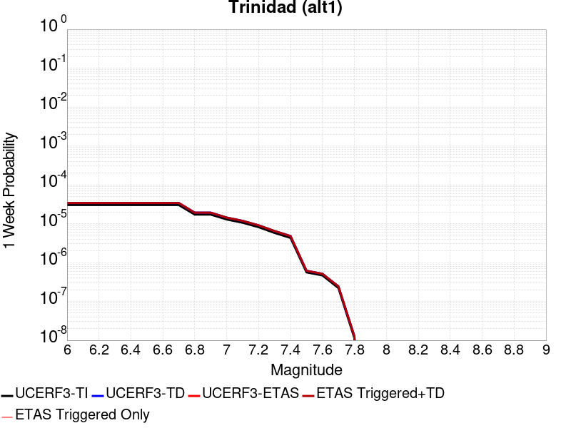 | 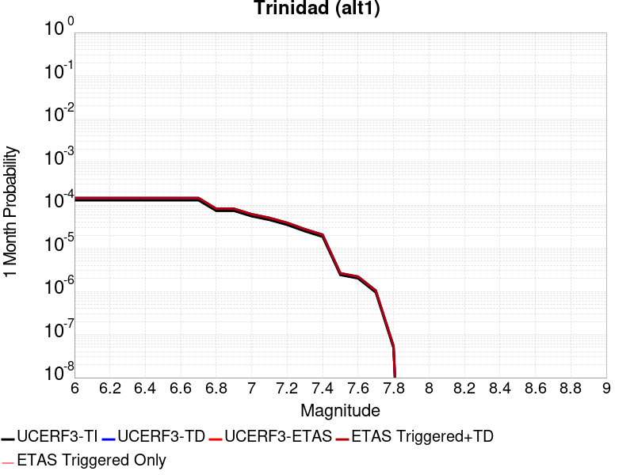 | 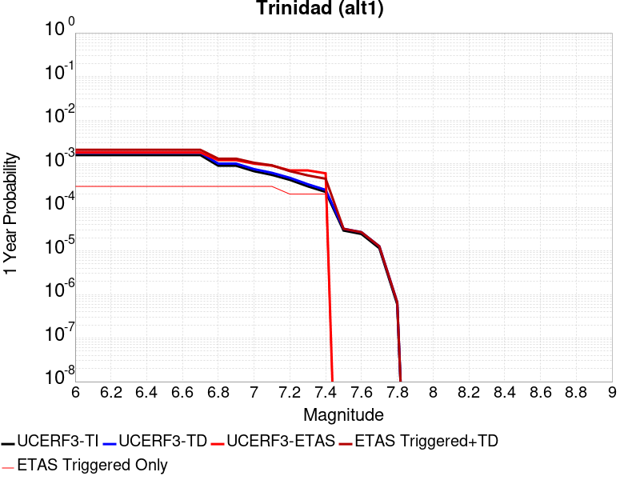 | 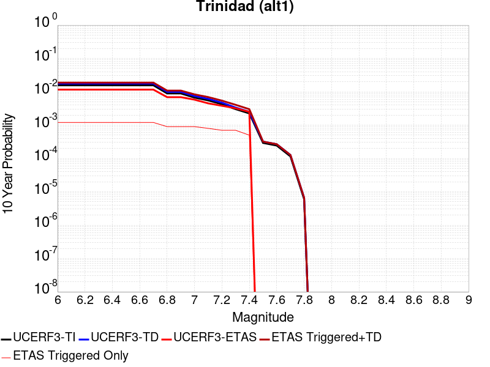 |

| Magnitude | 1 wk TI Prob | 1 wk TD Prob | 1 wk ETAS Prob | 1 wk ETAS/TD Gain | 1 wk ETAS Triggered+TD | 1 wk ETAS Triggered Only | 1 mo TI Prob | 1 mo TD Prob | 1 mo ETAS Prob | 1 mo ETAS/TD Gain | 1 mo ETAS Triggered+TD | 1 mo ETAS Triggered Only | 1 yr TI Prob | 1 yr TD Prob | 1 yr ETAS Prob | 1 yr ETAS/TD Gain | 1 yr ETAS Triggered+TD | 1 yr ETAS Triggered Only | 10 yr TI Prob | 10 yr TD Prob | 10 yr ETAS Prob | 10 yr ETAS/TD Gain | 10 yr ETAS Triggered+TD | 10 yr ETAS Triggered Only |
|-----|-----|-----|-----|-----|-----|-----|-----|-----|-----|-----|-----|-----|-----|-----|-----|-----|-----|-----|-----|-----|-----|-----|-----|-----|
| 6.0 | 3.0167168E-5 | 3.4042183E-5 | 0.0 | 0.0 | 3.4042183E-5 | 0.0 | 1.2928146E-4 | 1.4588785E-4 | 1.0E-4 | 0.685458 | 1.4588785E-4 | 0.0 | 0.0015728653 | 0.0017749061 | 0.0018 | 1.0141381 | 0.0020743737 | 3.0E-4 | 0.0156177925 | 0.017624268 | 0.0116 | 0.65818334 | 0.01880312 | 0.0012 |
| 6.1 | 3.0167168E-5 | 3.4042183E-5 | 0.0 | 0.0 | 3.4042183E-5 | 0.0 | 1.2928146E-4 | 1.4588785E-4 | 1.0E-4 | 0.685458 | 1.4588785E-4 | 0.0 | 0.0015728653 | 0.0017749061 | 0.0018 | 1.0141381 | 0.0020743737 | 3.0E-4 | 0.0156177925 | 0.017624268 | 0.0116 | 0.65818334 | 0.01880312 | 0.0012 |
| 6.2 | 3.0167168E-5 | 3.4042183E-5 | 0.0 | 0.0 | 3.4042183E-5 | 0.0 | 1.2928146E-4 | 1.4588785E-4 | 1.0E-4 | 0.685458 | 1.4588785E-4 | 0.0 | 0.0015728653 | 0.0017749061 | 0.0018 | 1.0141381 | 0.0020743737 | 3.0E-4 | 0.0156177925 | 0.017624268 | 0.0116 | 0.65818334 | 0.01880312 | 0.0012 |
| 6.3 | 3.0167168E-5 | 3.4042183E-5 | 0.0 | 0.0 | 3.4042183E-5 | 0.0 | 1.2928146E-4 | 1.4588785E-4 | 1.0E-4 | 0.685458 | 1.4588785E-4 | 0.0 | 0.0015728653 | 0.0017749061 | 0.0018 | 1.0141381 | 0.0020743737 | 3.0E-4 | 0.0156177925 | 0.017624268 | 0.0116 | 0.65818334 | 0.01880312 | 0.0012 |
| 6.4 | 3.0167168E-5 | 3.4042183E-5 | 0.0 | 0.0 | 3.4042183E-5 | 0.0 | 1.2928146E-4 | 1.4588785E-4 | 1.0E-4 | 0.685458 | 1.4588785E-4 | 0.0 | 0.0015728653 | 0.0017749061 | 0.0018 | 1.0141381 | 0.0020743737 | 3.0E-4 | 0.0156177925 | 0.017624268 | 0.0116 | 0.65818334 | 0.01880312 | 0.0012 |
| 6.5 | 3.0167168E-5 | 3.4042183E-5 | 0.0 | 0.0 | 3.4042183E-5 | 0.0 | 1.2928146E-4 | 1.4588785E-4 | 1.0E-4 | 0.685458 | 1.4588785E-4 | 0.0 | 0.0015728653 | 0.0017749061 | 0.0018 | 1.0141381 | 0.0020743737 | 3.0E-4 | 0.0156177925 | 0.017624268 | 0.0116 | 0.65818334 | 0.01880312 | 0.0012 |
| 6.6 | 3.0167168E-5 | 3.4042183E-5 | 0.0 | 0.0 | 3.4042183E-5 | 0.0 | 1.2928146E-4 | 1.4588785E-4 | 1.0E-4 | 0.685458 | 1.4588785E-4 | 0.0 | 0.0015728653 | 0.0017749061 | 0.0018 | 1.0141381 | 0.0020743737 | 3.0E-4 | 0.0156177925 | 0.017624268 | 0.0116 | 0.65818334 | 0.01880312 | 0.0012 |
| 6.7 | 3.0167168E-5 | 3.4042183E-5 | 0.0 | 0.0 | 3.4042183E-5 | 0.0 | 1.2928146E-4 | 1.4588785E-4 | 1.0E-4 | 0.685458 | 1.4588785E-4 | 0.0 | 0.0015728653 | 0.0017749061 | 0.0018 | 1.0141381 | 0.0020743737 | 3.0E-4 | 0.0156177925 | 0.017624268 | 0.0116 | 0.65818334 | 0.01880312 | 0.0012 |
| 6.8 | 1.717077E-5 | 1.920035E-5 | 0.0 | 0.0 | 1.920035E-5 | 0.0 | 7.358694E-5 | 8.2284874E-5 | 0.0 | 0.0 | 8.2284874E-5 | 0.0 | 8.9555274E-4 | 0.0010014024 | 0.0012 | 1.1983194 | 0.001301102 | 3.0E-4 | 0.008919522 | 0.009973352 | 0.0069 | 0.6918436 | 0.010864376 | 9.0E-4 |
| 6.9 | 1.717077E-5 | 1.920035E-5 | 0.0 | 0.0 | 1.920035E-5 | 0.0 | 7.358694E-5 | 8.2284874E-5 | 0.0 | 0.0 | 8.2284874E-5 | 0.0 | 8.9555274E-4 | 0.0010014024 | 0.0012 | 1.1983194 | 0.001301102 | 3.0E-4 | 0.008919522 | 0.009973352 | 0.0069 | 0.6918436 | 0.010864376 | 9.0E-4 |
| 7.0 | 1.2858572E-5 | 1.434077E-5 | 0.0 | 0.0 | 1.434077E-5 | 0.0 | 5.5107E-5 | 6.145918E-5 | 0.0 | 0.0 | 6.145918E-5 | 0.0 | 6.707212E-4 | 7.480407E-4 | 0.001 | 1.3368257 | 0.0010478162 | 3.0E-4 | 0.006687004 | 0.007458408 | 0.0058 | 0.7776459 | 0.008351695 | 9.0E-4 |
| 7.1 | 1.0588431E-5 | 1.1804055E-5 | 0.0 | 0.0 | 1.1804055E-5 | 0.0 | 4.53782E-5 | 5.058799E-5 | 0.0 | 0.0 | 5.058799E-5 | 0.0 | 5.5233954E-4 | 6.1576365E-4 | 9.0E-4 | 1.4615997 | 9.155789E-4 | 3.0E-4 | 0.005509687 | 0.0061434256 | 0.0045 | 0.73249036 | 0.006938511 | 8.0E-4 |
| 7.2 | 8.138061E-6 | 9.069348E-6 | 0.0 | 0.0 | 9.069348E-6 | 0.0 | 3.487694E-5 | 3.8868195E-5 | 0.0 | 0.0 | 3.8868195E-5 | 0.0 | 4.2454398E-4 | 4.7314237E-4 | 7.0E-4 | 1.4794701 | 6.7304773E-4 | 2.0E-4 | 0.0042373384 | 0.0047237924 | 0.0038 | 0.8044384 | 0.0054204855 | 7.0E-4 |
| 7.3 | 5.787542E-6 | 6.461868E-6 | 0.0 | 0.0 | 6.461868E-6 | 0.0 | 2.4803514E-5 | 2.7693548E-5 | 0.0 | 0.0 | 2.7693548E-5 | 0.0 | 3.0194095E-4 | 3.371383E-4 | 7.0E-4 | 2.0762992 | 5.3707085E-4 | 2.0E-4 | 0.00301531 | 0.0033683805 | 0.0032 | 0.9500115 | 0.0040660226 | 7.0E-4 |
| 7.4 | 4.303563E-6 | 4.8019947E-6 | 0.0 | 0.0 | 4.8019947E-6 | 0.0 | 1.844371E-5 | 2.0579926E-5 | 0.0 | 0.0 | 2.0579926E-5 | 0.0 | 2.2452902E-4 | 2.5055156E-4 | 6.0E-4 | 2.3947165 | 4.5050145E-4 | 2.0E-4 | 0.0022430231 | 0.00250463 | 0.0025 | 0.9981514 | 0.0030033777 | 5.0E-4 |
| 7.5 | 5.6063425E-7 | 6.144194E-7 | 0.0 | 0.0 | 6.144194E-7 | 0.0 | 2.402716E-6 | 2.6332234E-6 | 0.0 | 0.0 | 2.6332234E-6 | 0.0 | 2.9252675E-5 | 3.2059037E-5 | 0.0 | 0.0 | 3.2059037E-5 | 0.0 | 2.9248823E-4 | 3.205457E-4 | 0.0 | 0.0 | 3.205457E-4 | 0.0 |
| 7.6 | 4.6699128E-7 | 5.12683E-7 | 0.0 | 0.0 | 5.12683E-7 | 0.0 | 2.0013897E-6 | 2.1972112E-6 | 0.0 | 0.0 | 2.1972112E-6 | 0.0 | 2.4366647E-5 | 2.6750733E-5 | 0.0 | 0.0 | 2.6750733E-5 | 0.0 | 2.4363975E-4 | 2.6747654E-4 | 0.0 | 0.0 | 2.6747654E-4 | 0.0 |
| 7.7 | 2.2080937E-7 | 2.4352042E-7 | 0.0 | 0.0 | 2.4352042E-7 | 0.0 | 9.4632554E-7 | 1.0436586E-6 | 0.0 | 0.0 | 1.0436586E-6 | 0.0 | 1.15214525E-5 | 1.2706476E-5 | 0.0 | 0.0 | 1.2706476E-5 | 0.0 | 1.1520855E-4 | 1.2705808E-4 | 0.0 | 0.0 | 1.2705808E-4 | 0.0 |
| 7.8 | 1.1438307E-8 | 1.2685805E-8 | 0.0 | 0.0 | 1.2685805E-8 | 0.0 | 4.9021317E-8 | 5.4367735E-8 | 0.0 | 0.0 | 5.4367735E-8 | 0.0 | 5.9683435E-7 | 6.619272E-7 | 0.0 | 0.0 | 6.619272E-7 | 0.0 | 5.9683275E-6 | 6.619272E-6 | 0.0 | 0.0 | 6.619272E-6 | 0.0 |

## San Jacinto (Stepovers Combined)
*[(top)](#table-of-contents)*

| 1 Week | 1 Month | 1 Year | 10 Year |
|-----|-----|-----|-----|
|  |  | 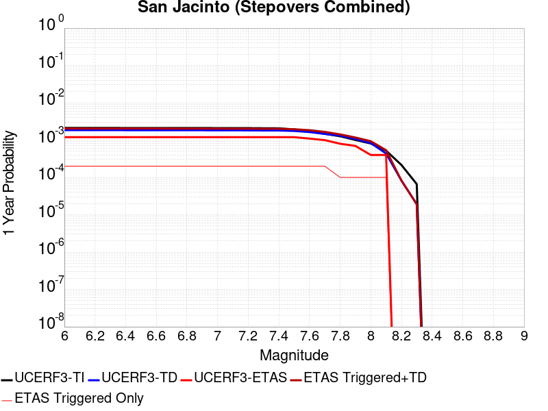 | 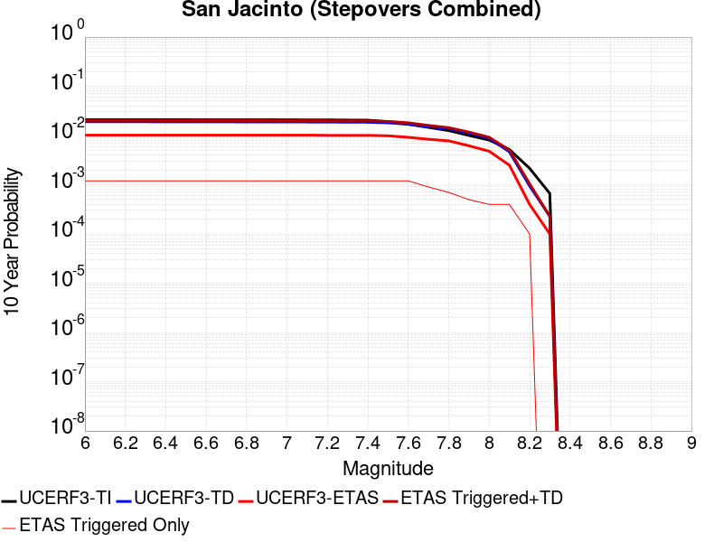 |

| Magnitude | 1 wk TI Prob | 1 wk TD Prob | 1 wk ETAS Prob | 1 wk ETAS/TD Gain | 1 wk ETAS Triggered+TD | 1 wk ETAS Triggered Only | 1 mo TI Prob | 1 mo TD Prob | 1 mo ETAS Prob | 1 mo ETAS/TD Gain | 1 mo ETAS Triggered+TD | 1 mo ETAS Triggered Only | 1 yr TI Prob | 1 yr TD Prob | 1 yr ETAS Prob | 1 yr ETAS/TD Gain | 1 yr ETAS Triggered+TD | 1 yr ETAS Triggered Only | 10 yr TI Prob | 10 yr TD Prob | 10 yr ETAS Prob | 10 yr ETAS/TD Gain | 10 yr ETAS Triggered+TD | 10 yr ETAS Triggered Only |
|-----|-----|-----|-----|-----|-----|-----|-----|-----|-----|-----|-----|-----|-----|-----|-----|-----|-----|-----|-----|-----|-----|-----|-----|-----|
| 6.0 | 4.0667746E-5 | 3.55081E-5 | 0.0 | 0.0 | 3.55081E-5 | 0.0 | 1.742787E-4 | 1.521687E-4 | 0.0 | 0.0 | 1.521687E-4 | 0.0 | 0.0021197782 | 0.0018510807 | 0.0012 | 0.64826995 | 0.0020507104 | 2.0E-4 | 0.020996714 | 0.01910875 | 0.0102 | 0.5337869 | 0.020285819 | 0.0012 |
| 6.1 | 4.0667746E-5 | 3.55081E-5 | 0.0 | 0.0 | 3.55081E-5 | 0.0 | 1.742787E-4 | 1.521687E-4 | 0.0 | 0.0 | 1.521687E-4 | 0.0 | 0.0021197782 | 0.0018510807 | 0.0012 | 0.64826995 | 0.0020507104 | 2.0E-4 | 0.020996714 | 0.01910875 | 0.0102 | 0.5337869 | 0.020285819 | 0.0012 |
| 6.2 | 4.0667746E-5 | 3.55081E-5 | 0.0 | 0.0 | 3.55081E-5 | 0.0 | 1.742787E-4 | 1.521687E-4 | 0.0 | 0.0 | 1.521687E-4 | 0.0 | 0.0021197782 | 0.0018510807 | 0.0012 | 0.64826995 | 0.0020507104 | 2.0E-4 | 0.020996714 | 0.01910875 | 0.0102 | 0.5337869 | 0.020285819 | 0.0012 |
| 6.3 | 4.0667746E-5 | 3.55081E-5 | 0.0 | 0.0 | 3.55081E-5 | 0.0 | 1.742787E-4 | 1.521687E-4 | 0.0 | 0.0 | 1.521687E-4 | 0.0 | 0.0021197782 | 0.0018510807 | 0.0012 | 0.64826995 | 0.0020507104 | 2.0E-4 | 0.020996714 | 0.01910875 | 0.0102 | 0.5337869 | 0.020285819 | 0.0012 |
| 6.4 | 4.0577226E-5 | 3.5379908E-5 | 0.0 | 0.0 | 3.5379908E-5 | 0.0 | 1.738908E-4 | 1.5161939E-4 | 0.0 | 0.0 | 1.5161939E-4 | 0.0 | 0.0021150648 | 0.0018444054 | 0.0012 | 0.65061617 | 0.0020440365 | 2.0E-4 | 0.020950472 | 0.019043278 | 0.0102 | 0.5356221 | 0.020220425 | 0.0012 |
| 6.5 | 4.0577226E-5 | 3.5379908E-5 | 0.0 | 0.0 | 3.5379908E-5 | 0.0 | 1.738908E-4 | 1.5161939E-4 | 0.0 | 0.0 | 1.5161939E-4 | 0.0 | 0.0021150648 | 0.0018444054 | 0.0012 | 0.65061617 | 0.0020440365 | 2.0E-4 | 0.020950472 | 0.019043278 | 0.0102 | 0.5356221 | 0.020220425 | 0.0012 |
| 6.6 | 4.053861E-5 | 3.532521E-5 | 0.0 | 0.0 | 3.532521E-5 | 0.0 | 1.7372532E-4 | 1.5138499E-4 | 0.0 | 0.0 | 1.5138499E-4 | 0.0 | 0.0021130538 | 0.001841557 | 0.0012 | 0.65162253 | 0.0020411888 | 2.0E-4 | 0.020930743 | 0.019015338 | 0.0102 | 0.5364091 | 0.020192519 | 0.0012 |
| 6.7 | 4.0516545E-5 | 3.529426E-5 | 0.0 | 0.0 | 3.529426E-5 | 0.0 | 1.7363077E-4 | 1.5125236E-4 | 0.0 | 0.0 | 1.5125236E-4 | 0.0 | 0.002111905 | 0.0018399452 | 0.0012 | 0.6521933 | 0.0020395773 | 2.0E-4 | 0.020919468 | 0.018999524 | 0.0102 | 0.5368555 | 0.020176725 | 0.0012 |
| 6.8 | 4.049434E-5 | 3.5265686E-5 | 0.0 | 0.0 | 3.5265686E-5 | 0.0 | 1.7353562E-4 | 1.5112992E-4 | 0.0 | 0.0 | 1.5112992E-4 | 0.0 | 0.0021107488 | 0.0018384571 | 0.0012 | 0.6527212 | 0.0020380893 | 2.0E-4 | 0.020908125 | 0.01898487 | 0.0102 | 0.53726995 | 0.020162087 | 0.0012 |
| 6.9 | 4.046386E-5 | 3.522814E-5 | 0.0 | 0.0 | 3.522814E-5 | 0.0 | 1.73405E-4 | 1.5096902E-4 | 0.0 | 0.0 | 1.5096902E-4 | 0.0 | 0.0021091616 | 0.0018365014 | 0.0012 | 0.6534163 | 0.0020361342 | 2.0E-4 | 0.020892553 | 0.018965589 | 0.0102 | 0.53781617 | 0.020142829 | 0.0012 |
| 7.0 | 4.036382E-5 | 3.5108365E-5 | 0.0 | 0.0 | 3.5108365E-5 | 0.0 | 1.7297632E-4 | 1.5045576E-4 | 0.0 | 0.0 | 1.5045576E-4 | 0.0 | 0.0021039525 | 0.0018302631 | 0.0012 | 0.65564346 | 0.002029897 | 2.0E-4 | 0.02084144 | 0.018904032 | 0.0102 | 0.5395675 | 0.020081347 | 0.0012 |
| 7.1 | 4.0343282E-5 | 3.5086778E-5 | 0.0 | 0.0 | 3.5086778E-5 | 0.0 | 1.7288832E-4 | 1.5036325E-4 | 0.0 | 0.0 | 1.5036325E-4 | 0.0 | 0.002102883 | 0.0018291387 | 0.0012 | 0.65604645 | 0.0020287728 | 2.0E-4 | 0.020830948 | 0.018892886 | 0.0102 | 0.53988576 | 0.020070214 | 0.0012 |
| 7.2 | 4.0257353E-5 | 3.4991073E-5 | 0.0 | 0.0 | 3.4991073E-5 | 0.0 | 1.725201E-4 | 1.4995314E-4 | 0.0 | 0.0 | 1.4995314E-4 | 0.0 | 0.0020984085 | 0.001824154 | 0.0012 | 0.6578392 | 0.002023789 | 2.0E-4 | 0.020787042 | 0.018843526 | 0.0101 | 0.5359931 | 0.020020913 | 0.0012 |
| 7.3 | 3.9940667E-5 | 3.481708E-5 | 0.0 | 0.0 | 3.481708E-5 | 0.0 | 1.7116306E-4 | 1.4920754E-4 | 0.0 | 0.0 | 1.4920754E-4 | 0.0 | 0.0020819185 | 0.0018150915 | 0.0012 | 0.6611237 | 0.0020147285 | 2.0E-4 | 0.020625217 | 0.018751292 | 0.0101 | 0.5386296 | 0.019928789 | 0.0012 |
| 7.4 | 3.9721202E-5 | 3.4701898E-5 | 0.0 | 0.0 | 3.4701898E-5 | 0.0 | 1.7022261E-4 | 1.4871397E-4 | 0.0 | 0.0 | 1.4871397E-4 | 0.0 | 0.0020704903 | 0.0018090922 | 0.0012 | 0.66331613 | 0.0020087303 | 2.0E-4 | 0.020513052 | 0.018690128 | 0.0101 | 0.5403922 | 0.019867701 | 0.0012 |
| 7.5 | 3.7036873E-5 | 3.3764336E-5 | 0.0 | 0.0 | 3.3764336E-5 | 0.0 | 1.5871979E-4 | 1.446963E-4 | 0.0 | 0.0 | 1.446963E-4 | 0.0 | 0.0019307006 | 0.0017602568 | 0.0012 | 0.6817187 | 0.0019599048 | 2.0E-4 | 0.019140124 | 0.018189142 | 0.0099 | 0.54428077 | 0.019367315 | 0.0012 |
| 7.6 | 3.2940967E-5 | 3.1531454E-5 | 0.0 | 0.0 | 3.1531454E-5 | 0.0 | 1.4116794E-4 | 1.3512782E-4 | 0.0 | 0.0 | 1.3512782E-4 | 0.0 | 0.0017173645 | 0.001643942 | 0.0011 | 0.66912335 | 0.0018436132 | 2.0E-4 | 0.01704153 | 0.017014993 | 0.0092 | 0.5406996 | 0.018194575 | 0.0012 |
| 7.7 | 2.8236149E-5 | 2.8091148E-5 | 0.0 | 0.0 | 2.8091148E-5 | 0.0 | 1.2100645E-4 | 1.20385084E-4 | 0.0 | 0.0 | 1.20385084E-4 | 0.0 | 0.0014722579 | 0.001464704 | 0.001 | 0.6827318 | 0.001664411 | 2.0E-4 | 0.014625421 | 0.015223009 | 0.0084 | 0.5517963 | 0.016109308 | 9.0E-4 |
| 7.8 | 2.4329287E-5 | 2.5406553E-5 | 0.0 | 0.0 | 2.5406553E-5 | 0.0 | 1.042642E-4 | 1.0888068E-4 | 0.0 | 0.0 | 1.0888068E-4 | 0.0 | 0.0012686774 | 0.0013248171 | 8.0E-4 | 0.6038569 | 0.0014246847 | 1.0E-4 | 0.012614589 | 0.013816375 | 0.0078 | 0.5645475 | 0.014506704 | 7.0E-4 |
| 7.9 | 1.9370926E-5 | 2.0600974E-5 | 0.0 | 0.0 | 2.0600974E-5 | 0.0 | 8.301561E-5 | 8.8286906E-5 | 0.0 | 0.0 | 8.8286906E-5 | 0.0 | 0.0010102465 | 0.0010743638 | 7.0E-4 | 0.6515484 | 0.0011742563 | 1.0E-4 | 0.0100566605 | 0.011293725 | 0.0062 | 0.54897743 | 0.011788079 | 5.0E-4 |
| 8.0 | 1.5583017E-5 | 1.603739E-5 | 0.0 | 0.0 | 1.603739E-5 | 0.0 | 6.6782646E-5 | 6.872987E-5 | 0.0 | 0.0 | 6.872987E-5 | 0.0 | 8.127754E-4 | 8.364655E-4 | 4.0E-4 | 0.4782026 | 9.3638187E-4 | 1.0E-4 | 0.008098091 | 0.008861784 | 0.0048 | 0.54165167 | 0.009258239 | 4.0E-4 |
| 8.1 | 1.0024873E-5 | 8.380682E-6 | 0.0 | 0.0 | 8.380682E-6 | 0.0 | 4.2963035E-5 | 3.5916713E-5 | 0.0 | 0.0 | 3.5916713E-5 | 0.0 | 5.229494E-4 | 4.371988E-4 | 4.0E-4 | 0.9149156 | 5.371551E-4 | 1.0E-4 | 0.0052172043 | 0.004701182 | 0.0025 | 0.5317812 | 0.005099301 | 4.0E-4 |
| 8.2 | 4.142796E-6 | 1.5859899E-6 | 0.0 | 0.0 | 1.5859899E-6 | 0.0 | 1.775472E-5 | 6.7970823E-6 | 0.0 | 0.0 | 6.7970823E-6 | 0.0 | 2.1614227E-4 | 8.2751365E-5 | 0.0 | 0.0 | 8.2751365E-5 | 0.0 | 0.0021593217 | 9.5976243E-4 | 4.0E-4 | 0.4167698 | 0.0010596665 | 1.0E-4 |
| 8.3 | 1.2750878E-6 | 3.679851E-7 | 0.0 | 0.0 | 3.679851E-7 | 0.0 | 5.4646503E-6 | 1.5770781E-6 | 0.0 | 0.0 | 1.5770781E-6 | 0.0 | 6.653009E-5 | 1.9200761E-5 | 0.0 | 0.0 | 1.9200761E-5 | 0.0 | 6.6510175E-4 | 2.3133527E-4 | 1.0E-4 | 0.43227303 | 2.3133527E-4 | 0.0 |

## Independence rev 2011
*[(top)](#table-of-contents)*

| 1 Week | 1 Month | 1 Year | 10 Year |
|-----|-----|-----|-----|
| 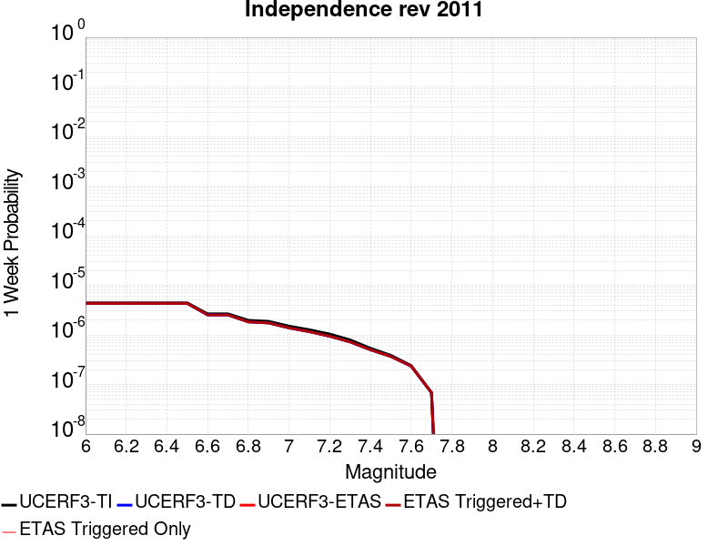 | 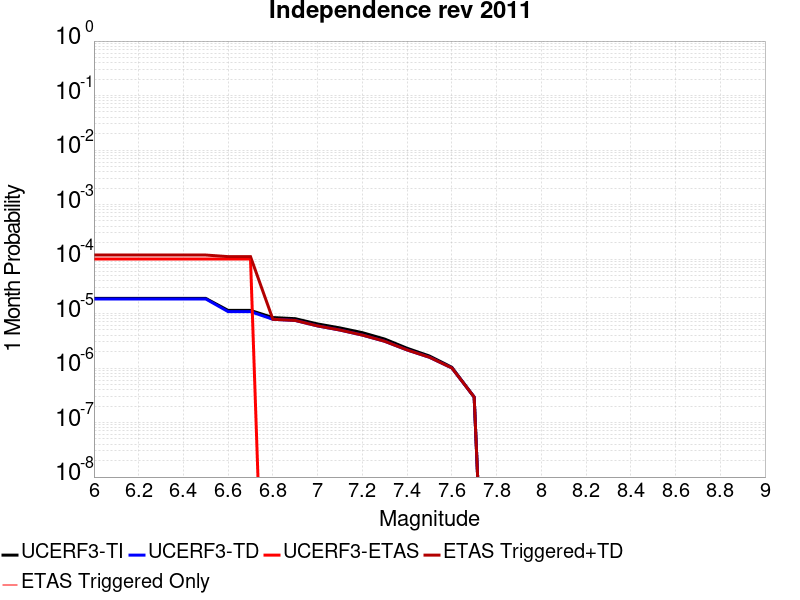 | 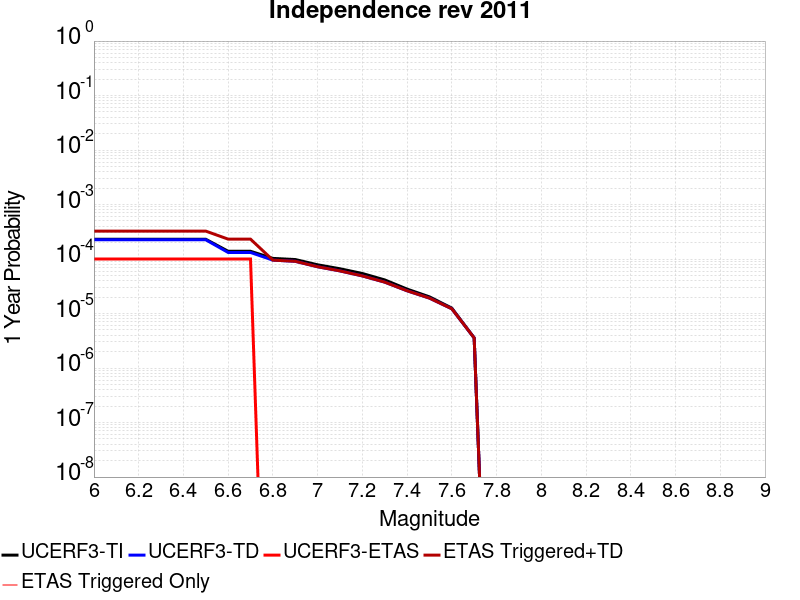 | 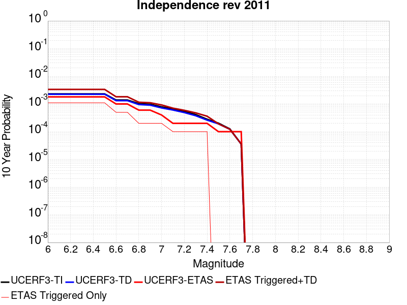 |

| Magnitude | 1 wk TI Prob | 1 wk TD Prob | 1 wk ETAS Prob | 1 wk ETAS/TD Gain | 1 wk ETAS Triggered+TD | 1 wk ETAS Triggered Only | 1 mo TI Prob | 1 mo TD Prob | 1 mo ETAS Prob | 1 mo ETAS/TD Gain | 1 mo ETAS Triggered+TD | 1 mo ETAS Triggered Only | 1 yr TI Prob | 1 yr TD Prob | 1 yr ETAS Prob | 1 yr ETAS/TD Gain | 1 yr ETAS Triggered+TD | 1 yr ETAS Triggered Only | 10 yr TI Prob | 10 yr TD Prob | 10 yr ETAS Prob | 10 yr ETAS/TD Gain | 10 yr ETAS Triggered+TD | 10 yr ETAS Triggered Only |
|-----|-----|-----|-----|-----|-----|-----|-----|-----|-----|-----|-----|-----|-----|-----|-----|-----|-----|-----|-----|-----|-----|-----|-----|-----|
| 6.0 | 4.422171E-6 | 4.326513E-6 | 0.0 | 0.0 | 4.326513E-6 | 0.0 | 1.8952025E-5 | 1.8542085E-5 | 1.0E-4 | 5.393137 | 1.1854023E-4 | 1.0E-4 | 2.3071647E-4 | 2.2572948E-4 | 1.0E-4 | 0.44300815 | 3.257069E-4 | 1.0E-4 | 0.0023047708 | 0.0022552956 | 0.0018 | 0.7981215 | 0.0033528148 | 0.0011 |
| 6.1 | 4.422171E-6 | 4.326513E-6 | 0.0 | 0.0 | 4.326513E-6 | 0.0 | 1.8952025E-5 | 1.8542085E-5 | 1.0E-4 | 5.393137 | 1.1854023E-4 | 1.0E-4 | 2.3071647E-4 | 2.2572948E-4 | 1.0E-4 | 0.44300815 | 3.257069E-4 | 1.0E-4 | 0.0023047708 | 0.0022552956 | 0.0018 | 0.7981215 | 0.0033528148 | 0.0011 |
| 6.2 | 4.422171E-6 | 4.326513E-6 | 0.0 | 0.0 | 4.326513E-6 | 0.0 | 1.8952025E-5 | 1.8542085E-5 | 1.0E-4 | 5.393137 | 1.1854023E-4 | 1.0E-4 | 2.3071647E-4 | 2.2572948E-4 | 1.0E-4 | 0.44300815 | 3.257069E-4 | 1.0E-4 | 0.0023047708 | 0.0022552956 | 0.0018 | 0.7981215 | 0.0033528148 | 0.0011 |
| 6.3 | 4.422171E-6 | 4.326513E-6 | 0.0 | 0.0 | 4.326513E-6 | 0.0 | 1.8952025E-5 | 1.8542085E-5 | 1.0E-4 | 5.393137 | 1.1854023E-4 | 1.0E-4 | 2.3071647E-4 | 2.2572948E-4 | 1.0E-4 | 0.44300815 | 3.257069E-4 | 1.0E-4 | 0.0023047708 | 0.0022552956 | 0.0018 | 0.7981215 | 0.0033528148 | 0.0011 |
| 6.4 | 4.422171E-6 | 4.326513E-6 | 0.0 | 0.0 | 4.326513E-6 | 0.0 | 1.8952025E-5 | 1.8542085E-5 | 1.0E-4 | 5.393137 | 1.1854023E-4 | 1.0E-4 | 2.3071647E-4 | 2.2572948E-4 | 1.0E-4 | 0.44300815 | 3.257069E-4 | 1.0E-4 | 0.0023047708 | 0.0022552956 | 0.0018 | 0.7981215 | 0.0033528148 | 0.0011 |
| 6.5 | 4.422171E-6 | 4.326513E-6 | 0.0 | 0.0 | 4.326513E-6 | 0.0 | 1.8952025E-5 | 1.8542085E-5 | 1.0E-4 | 5.393137 | 1.1854023E-4 | 1.0E-4 | 2.3071647E-4 | 2.2572948E-4 | 1.0E-4 | 0.44300815 | 3.257069E-4 | 1.0E-4 | 0.0023047708 | 0.0022552956 | 0.0018 | 0.7981215 | 0.0033528148 | 0.0011 |
| 6.6 | 2.663744E-6 | 2.5321972E-6 | 0.0 | 0.0 | 2.5321972E-6 | 0.0 | 1.1415996E-5 | 1.0852232E-5 | 1.0E-4 | 9.214695 | 1.1085115E-4 | 1.0E-4 | 1.3898089E-4 | 1.321184E-4 | 1.0E-4 | 0.75689685 | 2.3210519E-4 | 1.0E-4 | 0.0013889399 | 0.0013204467 | 0.001 | 0.75731945 | 0.0018197865 | 5.0E-4 |
| 6.7 | 2.663744E-6 | 2.5321972E-6 | 0.0 | 0.0 | 2.5321972E-6 | 0.0 | 1.1415996E-5 | 1.0852232E-5 | 1.0E-4 | 9.214695 | 1.1085115E-4 | 1.0E-4 | 1.3898089E-4 | 1.321184E-4 | 1.0E-4 | 0.75689685 | 2.3210519E-4 | 1.0E-4 | 0.0013889399 | 0.0013204467 | 0.001 | 0.75731945 | 0.0018197865 | 5.0E-4 |
| 6.8 | 1.9716529E-6 | 1.8324396E-6 | 0.0 | 0.0 | 1.8324396E-6 | 0.0 | 8.449913E-6 | 7.853289E-6 | 0.0 | 0.0 | 7.853289E-6 | 0.0 | 1.0287284E-4 | 9.5609736E-5 | 0.0 | 0.0 | 9.5609736E-5 | 0.0 | 0.0010282523 | 9.5569895E-4 | 6.0E-4 | 0.62781274 | 0.0011555078 | 2.0E-4 |
| 6.9 | 1.8788617E-6 | 1.7431737E-6 | 0.0 | 0.0 | 1.7431737E-6 | 0.0 | 8.0522395E-6 | 7.4707236E-6 | 0.0 | 0.0 | 7.4707236E-6 | 0.0 | 9.80316E-5 | 9.095238E-5 | 0.0 | 0.0 | 9.095238E-5 | 0.0 | 9.798837E-4 | 9.091636E-4 | 6.0E-4 | 0.6599472 | 0.0011089818 | 2.0E-4 |
| 7.0 | 1.5045488E-6 | 1.3850956E-6 | 0.0 | 0.0 | 1.3850956E-6 | 0.0 | 6.44805E-6 | 5.936111E-6 | 0.0 | 0.0 | 5.936111E-6 | 0.0 | 7.8502184E-5 | 7.22698E-5 | 0.0 | 0.0 | 7.22698E-5 | 0.0 | 7.8474457E-4 | 7.224682E-4 | 4.0E-4 | 0.5536576 | 9.2232367E-4 | 2.0E-4 |
| 7.1 | 1.272341E-6 | 1.1626367E-6 | 0.0 | 0.0 | 1.1626367E-6 | 0.0 | 5.4528787E-6 | 4.9827195E-6 | 0.0 | 0.0 | 4.9827195E-6 | 0.0 | 6.6386776E-5 | 6.0662955E-5 | 0.0 | 0.0 | 6.0662955E-5 | 0.0 | 6.636695E-4 | 6.0646713E-4 | 2.0E-4 | 0.3297788 | 7.064065E-4 | 1.0E-4 |
| 7.2 | 1.0416892E-6 | 9.410986E-7 | 0.0 | 0.0 | 9.410986E-7 | 0.0 | 4.464375E-6 | 4.033274E-6 | 0.0 | 0.0 | 4.033274E-6 | 0.0 | 5.4352407E-5 | 4.910402E-5 | 0.0 | 0.0 | 4.910402E-5 | 0.0 | 5.4339116E-4 | 4.9093354E-4 | 2.0E-4 | 0.4073871 | 5.908845E-4 | 1.0E-4 |
| 7.3 | 7.9450155E-7 | 7.2358307E-7 | 0.0 | 0.0 | 7.2358307E-7 | 0.0 | 3.4050022E-6 | 3.1010666E-6 | 0.0 | 0.0 | 3.1010666E-6 | 0.0 | 4.1455114E-5 | 3.7754842E-5 | 0.0 | 0.0 | 3.7754842E-5 | 0.0 | 4.144738E-4 | 3.774854E-4 | 2.0E-4 | 0.5298218 | 4.7744767E-4 | 1.0E-4 |
| 7.4 | 5.3893444E-7 | 5.020026E-7 | 0.0 | 0.0 | 5.020026E-7 | 0.0 | 2.309717E-6 | 2.151438E-6 | 0.0 | 0.0 | 2.151438E-6 | 0.0 | 2.8120441E-5 | 2.6193446E-5 | 0.0 | 0.0 | 2.6193446E-5 | 0.0 | 2.8116882E-4 | 2.6190403E-4 | 2.0E-4 | 0.7636385 | 3.6187784E-4 | 1.0E-4 |
| 7.5 | 3.8852085E-7 | 3.6828905E-7 | 0.0 | 0.0 | 3.6828905E-7 | 0.0 | 1.6650882E-6 | 1.5783806E-6 | 0.0 | 0.0 | 1.5783806E-6 | 0.0 | 2.027226E-5 | 1.9216617E-5 | 0.0 | 0.0 | 1.9216617E-5 | 0.0 | 2.0270412E-4 | 1.9214978E-4 | 1.0E-4 | 0.5204274 | 1.9214978E-4 | 0.0 |
| 7.6 | 2.414929E-7 | 2.3459313E-7 | 0.0 | 0.0 | 2.3459313E-7 | 0.0 | 1.0349692E-6 | 1.0053988E-6 | 0.0 | 0.0 | 1.0053988E-6 | 0.0 | 1.2600677E-5 | 1.2240662E-5 | 0.0 | 0.0 | 1.2240662E-5 | 0.0 | 1.2599962E-4 | 1.224E-4 | 1.0E-4 | 0.8169935 | 1.224E-4 | 0.0 |
| 7.7 | 6.8298014E-8 | 6.8593266E-8 | 0.0 | 0.0 | 6.8593266E-8 | 0.0 | 2.9270575E-7 | 2.939711E-7 | 0.0 | 0.0 | 2.939711E-7 | 0.0 | 3.5636867E-6 | 3.579093E-6 | 0.0 | 0.0 | 3.579093E-6 | 0.0 | 3.5636294E-5 | 3.57904E-5 | 1.0E-4 | 2.7940452 | 3.57904E-5 | 0.0 |

## San Andreas (Peninsula) 2011 CFM
*[(top)](#table-of-contents)*

| 1 Week | 1 Month | 1 Year | 10 Year |
|-----|-----|-----|-----|
| 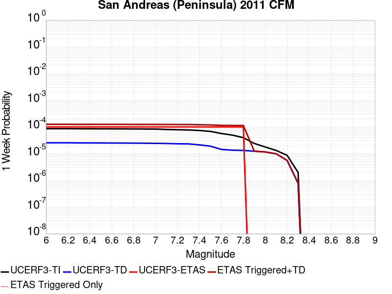 | 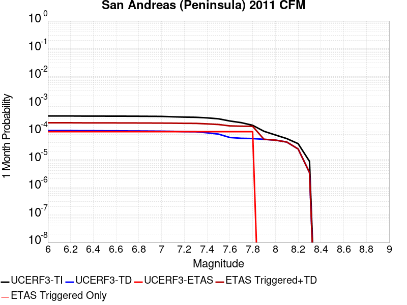 | 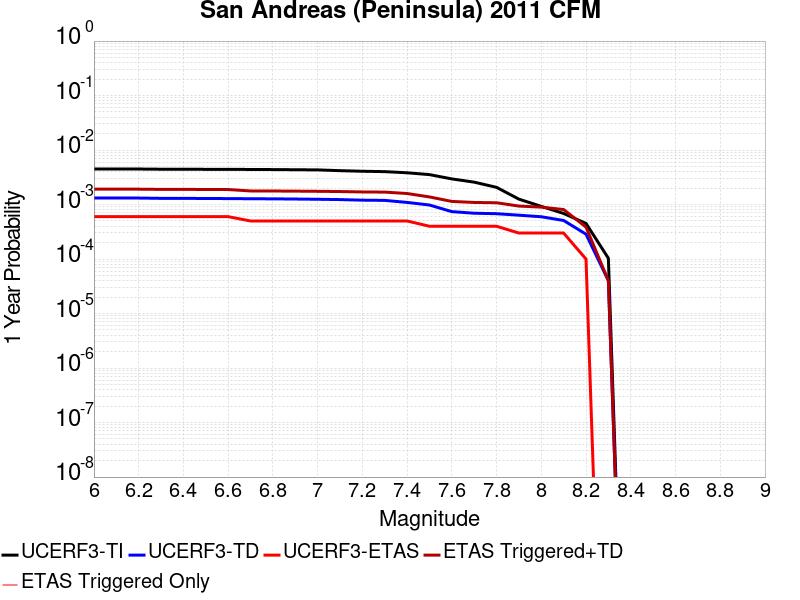 | 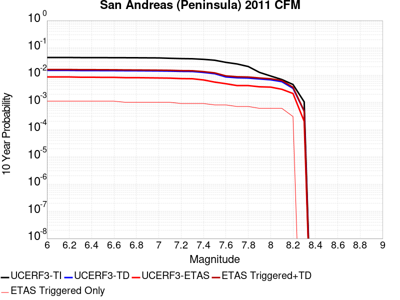 |

| Magnitude | 1 wk TI Prob | 1 wk TD Prob | 1 wk ETAS Prob | 1 wk ETAS/TD Gain | 1 wk ETAS Triggered+TD | 1 wk ETAS Triggered Only | 1 mo TI Prob | 1 mo TD Prob | 1 mo ETAS Prob | 1 mo ETAS/TD Gain | 1 mo ETAS Triggered+TD | 1 mo ETAS Triggered Only | 1 yr TI Prob | 1 yr TD Prob | 1 yr ETAS Prob | 1 yr ETAS/TD Gain | 1 yr ETAS Triggered+TD | 1 yr ETAS Triggered Only | 10 yr TI Prob | 10 yr TD Prob | 10 yr ETAS Prob | 10 yr ETAS/TD Gain | 10 yr ETAS Triggered+TD | 10 yr ETAS Triggered Only |
|-----|-----|-----|-----|-----|-----|-----|-----|-----|-----|-----|-----|-----|-----|-----|-----|-----|-----|-----|-----|-----|-----|-----|-----|-----|
| 6.0 | 8.6200685E-5 | 2.5597408E-5 | 1.0E-4 | 3.9066455 | 1.2559484E-4 | 1.0E-4 | 3.6937918E-4 | 1.0969857E-4 | 1.0E-4 | 0.91158885 | 2.096876E-4 | 1.0E-4 | 0.0044879215 | 0.0013347636 | 9.0E-4 | 0.6742767 | 0.0019339627 | 6.0E-4 | 0.043983612 | 0.014984009 | 0.0085 | 0.5672714 | 0.016067525 | 0.0011 |
| 6.1 | 8.6200685E-5 | 2.5597408E-5 | 1.0E-4 | 3.9066455 | 1.2559484E-4 | 1.0E-4 | 3.6937918E-4 | 1.0969857E-4 | 1.0E-4 | 0.91158885 | 2.096876E-4 | 1.0E-4 | 0.0044879215 | 0.0013347636 | 9.0E-4 | 0.6742767 | 0.0019339627 | 6.0E-4 | 0.043983612 | 0.014984009 | 0.0085 | 0.5672714 | 0.016067525 | 0.0011 |
| 6.2 | 8.6200685E-5 | 2.5597408E-5 | 1.0E-4 | 3.9066455 | 1.2559484E-4 | 1.0E-4 | 3.6937918E-4 | 1.0969857E-4 | 1.0E-4 | 0.91158885 | 2.096876E-4 | 1.0E-4 | 0.0044879215 | 0.0013347636 | 9.0E-4 | 0.6742767 | 0.0019339627 | 6.0E-4 | 0.043983612 | 0.014984009 | 0.0085 | 0.5672714 | 0.016067525 | 0.0011 |
| 6.3 | 8.551163E-5 | 2.5286767E-5 | 1.0E-4 | 3.9546375 | 1.2528423E-4 | 1.0E-4 | 3.6642692E-4 | 1.0836736E-4 | 1.0E-4 | 0.922787 | 2.0835653E-4 | 1.0E-4 | 0.004452125 | 0.0013185758 | 9.0E-4 | 0.6825546 | 0.0019177847 | 6.0E-4 | 0.043639794 | 0.014809279 | 0.0083 | 0.56045943 | 0.015892988 | 0.0011 |
| 6.4 | 8.551163E-5 | 2.5286767E-5 | 1.0E-4 | 3.9546375 | 1.2528423E-4 | 1.0E-4 | 3.6642692E-4 | 1.0836736E-4 | 1.0E-4 | 0.922787 | 2.0835653E-4 | 1.0E-4 | 0.004452125 | 0.0013185758 | 9.0E-4 | 0.6825546 | 0.0019177847 | 6.0E-4 | 0.043639794 | 0.014809279 | 0.0083 | 0.56045943 | 0.015892988 | 0.0011 |
| 6.5 | 8.511146E-5 | 2.5106778E-5 | 1.0E-4 | 3.982988 | 1.2510427E-4 | 1.0E-4 | 3.647124E-4 | 1.07596046E-4 | 1.0E-4 | 0.9294022 | 2.0758528E-4 | 1.0E-4 | 0.004431336 | 0.0013091963 | 9.0E-4 | 0.6874446 | 0.0019084108 | 6.0E-4 | 0.04344007 | 0.014708314 | 0.0082 | 0.5575078 | 0.015792135 | 0.0011 |
| 6.6 | 8.4985084E-5 | 2.5037016E-5 | 1.0E-4 | 3.9940863 | 1.2503451E-4 | 1.0E-4 | 3.6417096E-4 | 1.0729709E-4 | 1.0E-4 | 0.9319917 | 2.0728636E-4 | 1.0E-4 | 0.0044247704 | 0.0013055609 | 9.0E-4 | 0.6893589 | 0.0019047776 | 6.0E-4 | 0.043376986 | 0.014670063 | 0.0082 | 0.55896145 | 0.015753927 | 0.0011 |
| 6.7 | 8.462618E-5 | 2.4864261E-5 | 1.0E-4 | 4.0218368 | 1.2486178E-4 | 1.0E-4 | 3.6263323E-4 | 1.0655677E-4 | 1.0E-4 | 0.93846685 | 2.0654612E-4 | 1.0E-4 | 0.004406125 | 0.0012965583 | 8.0E-4 | 0.61701816 | 0.0017959101 | 5.0E-4 | 0.043197807 | 0.014574212 | 0.008 | 0.5489148 | 0.015559637 | 0.001 |
| 6.8 | 8.42337E-5 | 2.4759061E-5 | 1.0E-4 | 4.038925 | 1.2475658E-4 | 1.0E-4 | 3.6095164E-4 | 1.0610595E-4 | 1.0E-4 | 0.94245416 | 2.0609534E-4 | 1.0E-4 | 0.004385734 | 0.0012910761 | 8.0E-4 | 0.61963814 | 0.0017904305 | 5.0E-4 | 0.043001823 | 0.014514302 | 0.008 | 0.5511805 | 0.015499787 | 0.001 |
| 6.9 | 8.365989E-5 | 2.4562327E-5 | 1.0E-4 | 4.0712757 | 1.2455987E-4 | 1.0E-4 | 3.5849313E-4 | 1.0526287E-4 | 1.0E-4 | 0.95000255 | 2.0525235E-4 | 1.0E-4 | 0.004355922 | 0.0012808237 | 7.0E-4 | 0.5465233 | 0.0017801833 | 5.0E-4 | 0.04271523 | 0.014406153 | 0.0079 | 0.5483768 | 0.015391747 | 0.001 |
| 7.0 | 8.30936E-5 | 2.4322553E-5 | 1.0E-4 | 4.11141 | 1.2432013E-4 | 1.0E-4 | 3.560668E-4 | 1.0423536E-4 | 1.0E-4 | 0.95936733 | 2.0422494E-4 | 1.0E-4 | 0.004326499 | 0.0012683284 | 7.0E-4 | 0.55190754 | 0.0017676941 | 5.0E-4 | 0.042432297 | 0.014276562 | 0.0078 | 0.54635 | 0.015262286 | 0.001 |
| 7.1 | 8.041264E-5 | 2.4005936E-5 | 1.0E-4 | 4.165636 | 1.2400353E-4 | 1.0E-4 | 3.4458007E-4 | 1.02878534E-4 | 1.0E-4 | 0.97202003 | 2.0286825E-4 | 1.0E-4 | 0.0041871946 | 0.0012518282 | 7.0E-4 | 0.55918217 | 0.0017512023 | 5.0E-4 | 0.041091725 | 0.01409789 | 0.0077 | 0.546181 | 0.015083792 | 0.001 |
| 7.2 | 7.8427016E-5 | 2.342595E-5 | 1.0E-4 | 4.26877 | 1.2342361E-4 | 1.0E-4 | 3.3607247E-4 | 1.00393074E-4 | 1.0E-4 | 0.9960847 | 2.0038303E-4 | 1.0E-4 | 0.004084008 | 0.001221602 | 7.0E-4 | 0.5730181 | 0.0017209911 | 5.0E-4 | 0.040097635 | 0.013779827 | 0.0074 | 0.53701687 | 0.014667426 | 9.0E-4 |
| 7.3 | 7.721087E-5 | 2.3209344E-5 | 1.0E-4 | 4.3086095 | 1.2320702E-4 | 1.0E-4 | 3.3086175E-4 | 9.9464836E-5 | 1.0E-4 | 1.0053804 | 1.994549E-4 | 1.0E-4 | 0.004020803 | 0.0012103133 | 7.0E-4 | 0.57836264 | 0.0017097081 | 5.0E-4 | 0.03948827 | 0.013662776 | 0.0073 | 0.5342984 | 0.014550479 | 9.0E-4 |
| 7.4 | 7.3536525E-5 | 2.130288E-5 | 1.0E-4 | 4.694201 | 1.2130075E-4 | 1.0E-4 | 3.1511846E-4 | 9.129487E-5 | 1.0E-4 | 1.0953518 | 1.9128574E-4 | 1.0E-4 | 0.0038298194 | 0.0011109496 | 6.0E-4 | 0.5400785 | 0.0016103941 | 5.0E-4 | 0.037644852 | 0.012607835 | 0.0066 | 0.523484 | 0.013496488 | 9.0E-4 |
| 7.5 | 6.806207E-5 | 1.907691E-5 | 1.0E-4 | 5.2419395 | 1.19075004E-4 | 1.0E-4 | 2.9166197E-4 | 8.175562E-5 | 1.0E-4 | 1.2231574 | 1.8174745E-4 | 1.0E-4 | 0.0035452035 | 9.949213E-4 | 5.0E-4 | 0.50255233 | 0.0013945233 | 4.0E-4 | 0.034891766 | 0.011345025 | 0.0055 | 0.48479396 | 0.01213595 | 8.0E-4 |
| 7.6 | 5.6731416E-5 | 1.44120295E-5 | 1.0E-4 | 6.938648 | 1.1441059E-4 | 1.0E-4 | 2.43112E-4 | 6.1764375E-5 | 1.0E-4 | 1.6190562 | 1.617582E-4 | 1.0E-4 | 0.0029558712 | 7.51722E-4 | 5.0E-4 | 0.6651395 | 0.0011514213 | 4.0E-4 | 0.02916862 | 0.00861777 | 0.0048 | 0.55698866 | 0.009410876 | 8.0E-4 |
| 7.7 | 4.946994E-5 | 1.3463212E-5 | 1.0E-4 | 7.427648 | 1.13461865E-4 | 1.0E-4 | 2.1199681E-4 | 5.7698202E-5 | 1.0E-4 | 1.7331562 | 1.5769243E-4 | 1.0E-4 | 0.002578006 | 7.0224935E-4 | 5.0E-4 | 0.7119978 | 0.0011019685 | 4.0E-4 | 0.02548303 | 0.008030266 | 0.0041 | 0.51056844 | 0.008724644 | 7.0E-4 |
| 7.8 | 3.9718198E-5 | 1.319107E-5 | 1.0E-4 | 7.580886 | 1.1318975E-4 | 1.0E-4 | 1.7020974E-4 | 5.6531935E-5 | 1.0E-4 | 1.7689117 | 1.5652628E-4 | 1.0E-4 | 0.0020703338 | 6.880591E-4 | 5.0E-4 | 0.72668177 | 0.0010877838 | 4.0E-4 | 0.020511515 | 0.007835098 | 0.0041 | 0.5232864 | 0.008529613 | 7.0E-4 |
| 7.9 | 2.4115114E-5 | 1.23699165E-5 | 0.0 | 0.0 | 1.23699165E-5 | 0.0 | 1.0334639E-4 | 5.301285E-5 | 0.0 | 0.0 | 5.301285E-5 | 0.0 | 0.001257516 | 6.452404E-4 | 4.0E-4 | 0.61992395 | 9.450469E-4 | 3.0E-4 | 0.012504238 | 0.007259696 | 0.0037 | 0.5096632 | 0.00785534 | 6.0E-4 |
| 8.0 | 1.7756569E-5 | 1.1575316E-5 | 0.0 | 0.0 | 1.1575316E-5 | 0.0 | 7.6097356E-5 | 4.9607555E-5 | 0.0 | 0.0 | 4.9607555E-5 | 0.0 | 9.260915E-4 | 6.038048E-4 | 4.0E-4 | 0.6624658 | 9.0362364E-4 | 3.0E-4 | 0.009222416 | 0.0067487545 | 0.0036 | 0.53343177 | 0.007344705 | 6.0E-4 |
| 8.1 | 1.3159258E-5 | 9.8847495E-6 | 0.0 | 0.0 | 9.8847495E-6 | 0.0 | 5.6395602E-5 | 4.2362524E-5 | 0.0 | 0.0 | 4.2362524E-5 | 0.0 | 6.864001E-4 | 5.156418E-4 | 4.0E-4 | 0.7757323 | 8.154871E-4 | 3.0E-4 | 0.0068428386 | 0.005764355 | 0.003 | 0.52043986 | 0.0063608964 | 6.0E-4 |
| 8.2 | 8.635426E-6 | 5.5484657E-6 | 0.0 | 0.0 | 5.5484657E-6 | 0.0 | 3.700844E-5 | 2.3778923E-5 | 0.0 | 0.0 | 2.3778923E-5 | 0.0 | 4.5048463E-4 | 2.8947002E-4 | 2.0E-4 | 0.69091785 | 3.8944106E-4 | 1.0E-4 | 0.004495725 | 0.0032891603 | 0.0021 | 0.6384608 | 0.0035881735 | 3.0E-4 |
| 8.3 | 1.983087E-6 | 7.792044E-7 | 0.0 | 0.0 | 7.792044E-7 | 0.0 | 8.498917E-6 | 3.3394433E-6 | 0.0 | 0.0 | 3.3394433E-6 | 0.0 | 1.034694E-4 | 4.065698E-5 | 0.0 | 0.0 | 4.065698E-5 | 0.0 | 0.0010342124 | 4.7958124E-4 | 2.0E-4 | 0.41703048 | 4.7958124E-4 | 0.0 |

## Round Valley
*[(top)](#table-of-contents)*

| 1 Week | 1 Month | 1 Year | 10 Year |
|-----|-----|-----|-----|
| 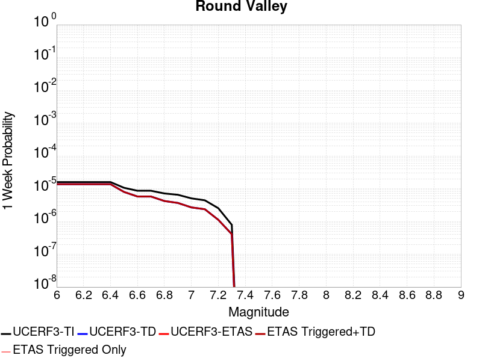 | 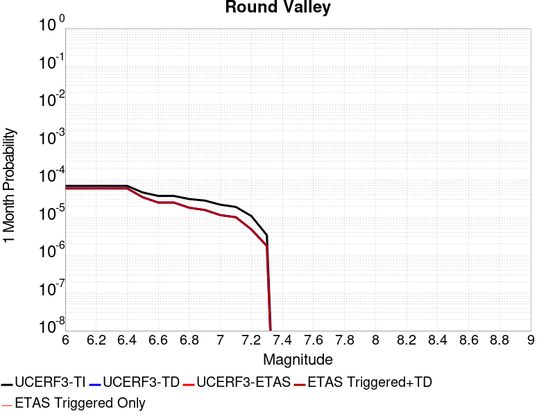 | 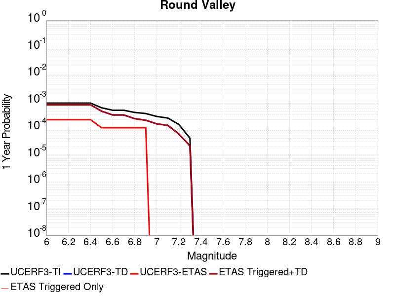 | 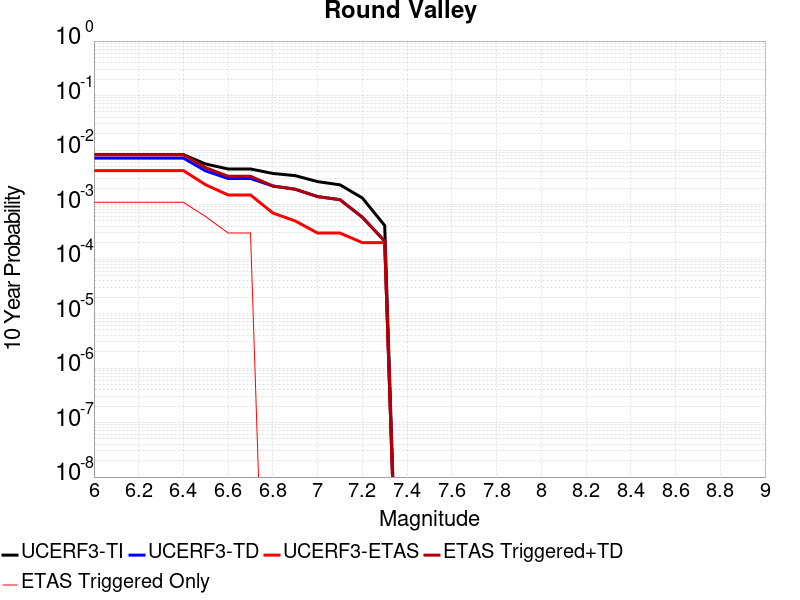 |

| Magnitude | 1 wk TI Prob | 1 wk TD Prob | 1 wk ETAS Prob | 1 wk ETAS/TD Gain | 1 wk ETAS Triggered+TD | 1 wk ETAS Triggered Only | 1 mo TI Prob | 1 mo TD Prob | 1 mo ETAS Prob | 1 mo ETAS/TD Gain | 1 mo ETAS Triggered+TD | 1 mo ETAS Triggered Only | 1 yr TI Prob | 1 yr TD Prob | 1 yr ETAS Prob | 1 yr ETAS/TD Gain | 1 yr ETAS Triggered+TD | 1 yr ETAS Triggered Only | 10 yr TI Prob | 10 yr TD Prob | 10 yr ETAS Prob | 10 yr ETAS/TD Gain | 10 yr ETAS Triggered+TD | 10 yr ETAS Triggered Only |
|-----|-----|-----|-----|-----|-----|-----|-----|-----|-----|-----|-----|-----|-----|-----|-----|-----|-----|-----|-----|-----|-----|-----|-----|-----|
| 6.0 | 1.588152E-5 | 1.3674479E-5 | 0.0 | 0.0 | 1.3674479E-5 | 0.0 | 6.806188E-5 | 5.8603815E-5 | 0.0 | 0.0 | 5.8603815E-5 | 0.0 | 8.283384E-4 | 7.133073E-4 | 2.0E-4 | 0.28038406 | 7.133073E-4 | 0.0 | 0.008252576 | 0.0071140667 | 0.0042 | 0.59037966 | 0.008206241 | 0.0011 |
| 6.1 | 1.588152E-5 | 1.3674479E-5 | 0.0 | 0.0 | 1.3674479E-5 | 0.0 | 6.806188E-5 | 5.8603815E-5 | 0.0 | 0.0 | 5.8603815E-5 | 0.0 | 8.283384E-4 | 7.133073E-4 | 2.0E-4 | 0.28038406 | 7.133073E-4 | 0.0 | 0.008252576 | 0.0071140667 | 0.0042 | 0.59037966 | 0.008206241 | 0.0011 |
| 6.2 | 1.588152E-5 | 1.3674479E-5 | 0.0 | 0.0 | 1.3674479E-5 | 0.0 | 6.806188E-5 | 5.8603815E-5 | 0.0 | 0.0 | 5.8603815E-5 | 0.0 | 8.283384E-4 | 7.133073E-4 | 2.0E-4 | 0.28038406 | 7.133073E-4 | 0.0 | 0.008252576 | 0.0071140667 | 0.0042 | 0.59037966 | 0.008206241 | 0.0011 |
| 6.3 | 1.588152E-5 | 1.3674479E-5 | 0.0 | 0.0 | 1.3674479E-5 | 0.0 | 6.806188E-5 | 5.8603815E-5 | 0.0 | 0.0 | 5.8603815E-5 | 0.0 | 8.283384E-4 | 7.133073E-4 | 2.0E-4 | 0.28038406 | 7.133073E-4 | 0.0 | 0.008252576 | 0.0071140667 | 0.0042 | 0.59037966 | 0.008206241 | 0.0011 |
| 6.4 | 1.588152E-5 | 1.3674479E-5 | 0.0 | 0.0 | 1.3674479E-5 | 0.0 | 6.806188E-5 | 5.8603815E-5 | 0.0 | 0.0 | 5.8603815E-5 | 0.0 | 8.283384E-4 | 7.133073E-4 | 2.0E-4 | 0.28038406 | 7.133073E-4 | 0.0 | 0.008252576 | 0.0071140667 | 0.0042 | 0.59037966 | 0.008206241 | 0.0011 |
| 6.5 | 1.0646776E-5 | 7.955714E-6 | 0.0 | 0.0 | 7.955714E-6 | 0.0 | 4.5628243E-5 | 3.409552E-5 | 0.0 | 0.0 | 3.409552E-5 | 0.0 | 5.553823E-4 | 4.1504228E-4 | 1.0E-4 | 0.24093932 | 4.1504228E-4 | 0.0 | 0.005539963 | 0.0041435002 | 0.0023 | 0.55508626 | 0.004741014 | 6.0E-4 |
| 6.6 | 8.632956E-6 | 5.7710376E-6 | 0.0 | 0.0 | 5.7710376E-6 | 0.0 | 3.6997862E-5 | 2.4732806E-5 | 0.0 | 0.0 | 2.4732806E-5 | 0.0 | 4.5035584E-4 | 3.0108413E-4 | 1.0E-4 | 0.33213308 | 3.0108413E-4 | 0.0 | 0.0044944426 | 0.0030071402 | 0.0015 | 0.49881276 | 0.0033062382 | 3.0E-4 |
| 6.7 | 8.632956E-6 | 5.7710376E-6 | 0.0 | 0.0 | 5.7710376E-6 | 0.0 | 3.6997862E-5 | 2.4732806E-5 | 0.0 | 0.0 | 2.4732806E-5 | 0.0 | 4.5035584E-4 | 3.0108413E-4 | 1.0E-4 | 0.33213308 | 3.0108413E-4 | 0.0 | 0.0044944426 | 0.0030071402 | 0.0015 | 0.49881276 | 0.0033062382 | 3.0E-4 |
| 6.8 | 7.143895E-6 | 4.2038655E-6 | 0.0 | 0.0 | 4.2038655E-6 | 0.0 | 3.0616335E-5 | 1.8016452E-5 | 0.0 | 0.0 | 1.8016452E-5 | 0.0 | 3.726901E-4 | 2.193299E-4 | 1.0E-4 | 0.4559342 | 2.193299E-4 | 0.0 | 0.0037206567 | 0.002191299 | 7.0E-4 | 0.3194452 | 0.002191299 | 0.0 |
| 6.9 | 6.5120694E-6 | 3.6663744E-6 | 0.0 | 0.0 | 3.6663744E-6 | 0.0 | 2.790857E-5 | 1.5712947E-5 | 0.0 | 0.0 | 1.5712947E-5 | 0.0 | 3.3973387E-4 | 1.9128986E-4 | 1.0E-4 | 0.5227669 | 1.9128986E-4 | 0.0 | 0.0033921495 | 0.001911401 | 5.0E-4 | 0.26158822 | 0.001911401 | 0.0 |
| 7.0 | 5.0614435E-6 | 2.685272E-6 | 0.0 | 0.0 | 2.685272E-6 | 0.0 | 2.169172E-5 | 1.1508264E-5 | 0.0 | 0.0 | 1.1508264E-5 | 0.0 | 2.6406467E-4 | 1.4010514E-4 | 0.0 | 0.0 | 1.4010514E-4 | 0.0 | 0.0026375111 | 0.0014002695 | 3.0E-4 | 0.21424447 | 0.0014002695 | 0.0 |
| 7.1 | 4.41728E-6 | 2.3589566E-6 | 0.0 | 0.0 | 2.3589566E-6 | 0.0 | 1.8931061E-5 | 1.010978E-5 | 0.0 | 0.0 | 1.010978E-5 | 0.0 | 2.304613E-4 | 1.2308061E-4 | 0.0 | 0.0 | 1.2308061E-4 | 0.0 | 0.0023022245 | 0.001230221 | 3.0E-4 | 0.24385862 | 0.001230221 | 0.0 |
| 7.2 | 2.535495E-6 | 1.1219585E-6 | 0.0 | 0.0 | 1.1219585E-6 | 0.0 | 1.0866362E-5 | 4.808387E-6 | 0.0 | 0.0 | 4.808387E-6 | 0.0 | 1.3228992E-4 | 5.8541063E-5 | 0.0 | 0.0 | 5.8541063E-5 | 0.0 | 0.0013221119 | 5.853077E-4 | 2.0E-4 | 0.3417006 | 5.853077E-4 | 0.0 |
| 7.3 | 7.900015E-7 | 4.0906667E-7 | 0.0 | 0.0 | 4.0906667E-7 | 0.0 | 3.3857161E-6 | 1.7531429E-6 | 0.0 | 0.0 | 1.7531429E-6 | 0.0 | 4.1220315E-5 | 2.1344515E-5 | 0.0 | 0.0 | 2.1344515E-5 | 0.0 | 4.121267E-4 | 2.1344515E-4 | 2.0E-4 | 0.93700886 | 2.1344515E-4 | 0.0 |

## Newport-Inglewood alt 1
*[(top)](#table-of-contents)*

| 1 Week | 1 Month | 1 Year | 10 Year |
|-----|-----|-----|-----|
| 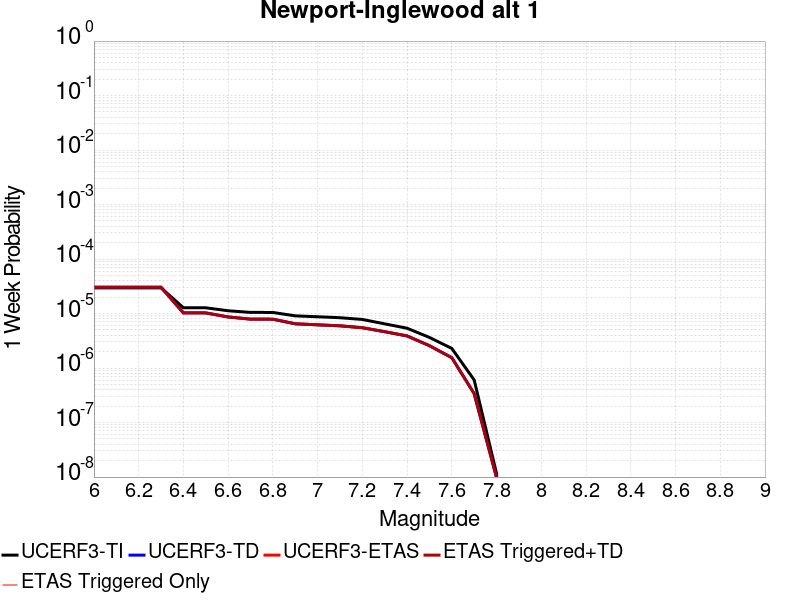 | 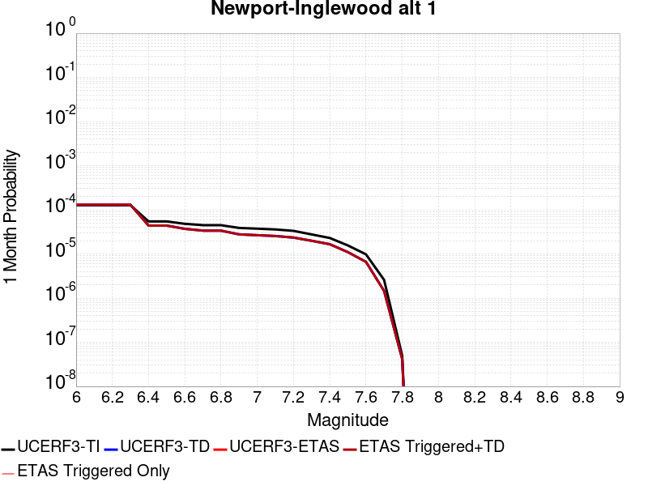 | 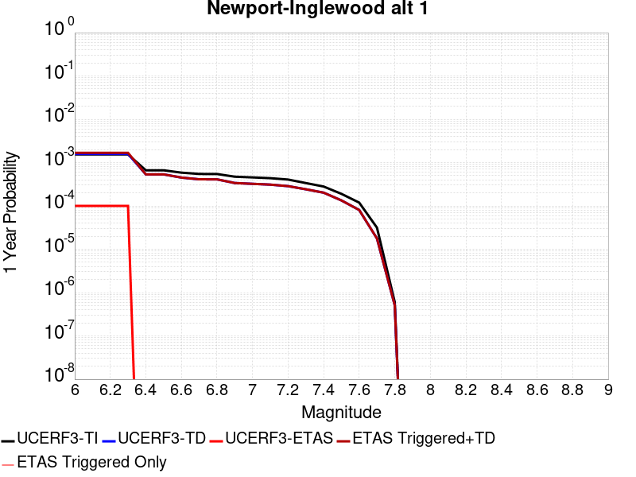 | 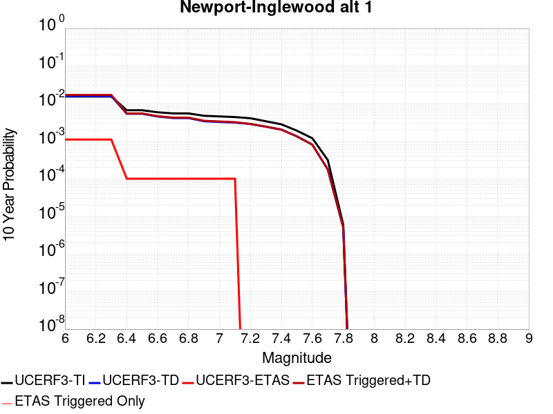 |

| Magnitude | 1 wk TI Prob | 1 wk TD Prob | 1 wk ETAS Prob | 1 wk ETAS/TD Gain | 1 wk ETAS Triggered+TD | 1 wk ETAS Triggered Only | 1 mo TI Prob | 1 mo TD Prob | 1 mo ETAS Prob | 1 mo ETAS/TD Gain | 1 mo ETAS Triggered+TD | 1 mo ETAS Triggered Only | 1 yr TI Prob | 1 yr TD Prob | 1 yr ETAS Prob | 1 yr ETAS/TD Gain | 1 yr ETAS Triggered+TD | 1 yr ETAS Triggered Only | 10 yr TI Prob | 10 yr TD Prob | 10 yr ETAS Prob | 10 yr ETAS/TD Gain | 10 yr ETAS Triggered+TD | 10 yr ETAS Triggered Only |
|-----|-----|-----|-----|-----|-----|-----|-----|-----|-----|-----|-----|-----|-----|-----|-----|-----|-----|-----|-----|-----|-----|-----|-----|-----|
| 6.0 | 2.9668912E-5 | 3.0415076E-5 | 0.0 | 0.0 | 3.0415076E-5 | 0.0 | 1.2714628E-4 | 1.3034654E-4 | 0.0 | 0.0 | 1.3034654E-4 | 0.0 | 0.0015469068 | 0.0015862986 | 4.0E-4 | 0.25215933 | 0.00168614 | 1.0E-4 | 0.015361829 | 0.0157974 | 0.0095 | 0.6013648 | 0.016880022 | 0.0011 |
| 6.1 | 2.9668912E-5 | 3.0415076E-5 | 0.0 | 0.0 | 3.0415076E-5 | 0.0 | 1.2714628E-4 | 1.3034654E-4 | 0.0 | 0.0 | 1.3034654E-4 | 0.0 | 0.0015469068 | 0.0015862986 | 4.0E-4 | 0.25215933 | 0.00168614 | 1.0E-4 | 0.015361829 | 0.0157974 | 0.0095 | 0.6013648 | 0.016880022 | 0.0011 |
| 6.2 | 2.9668912E-5 | 3.0415076E-5 | 0.0 | 0.0 | 3.0415076E-5 | 0.0 | 1.2714628E-4 | 1.3034654E-4 | 0.0 | 0.0 | 1.3034654E-4 | 0.0 | 0.0015469068 | 0.0015862986 | 4.0E-4 | 0.25215933 | 0.00168614 | 1.0E-4 | 0.015361829 | 0.0157974 | 0.0095 | 0.6013648 | 0.016880022 | 0.0011 |
| 6.3 | 2.9668912E-5 | 3.0415076E-5 | 0.0 | 0.0 | 3.0415076E-5 | 0.0 | 1.2714628E-4 | 1.3034654E-4 | 0.0 | 0.0 | 1.3034654E-4 | 0.0 | 0.0015469068 | 0.0015862986 | 4.0E-4 | 0.25215933 | 0.00168614 | 1.0E-4 | 0.015361829 | 0.0157974 | 0.0095 | 0.6013648 | 0.016880022 | 0.0011 |
| 6.4 | 1.275942E-5 | 1.0274484E-5 | 0.0 | 0.0 | 1.0274484E-5 | 0.0 | 5.4682085E-5 | 4.4032782E-5 | 0.0 | 0.0 | 4.4032782E-5 | 0.0 | 6.65551E-4 | 5.359714E-4 | 0.0 | 0.0 | 5.359714E-4 | 0.0 | 0.0066356123 | 0.005347213 | 0.0028 | 0.5236373 | 0.005446678 | 1.0E-4 |
| 6.5 | 1.275942E-5 | 1.0274484E-5 | 0.0 | 0.0 | 1.0274484E-5 | 0.0 | 5.4682085E-5 | 4.4032782E-5 | 0.0 | 0.0 | 4.4032782E-5 | 0.0 | 6.65551E-4 | 5.359714E-4 | 0.0 | 0.0 | 5.359714E-4 | 0.0 | 0.0066356123 | 0.005347213 | 0.0028 | 0.5236373 | 0.005446678 | 1.0E-4 |
| 6.6 | 1.1255358E-5 | 8.663431E-6 | 0.0 | 0.0 | 8.663431E-6 | 0.0 | 4.8236358E-5 | 3.712847E-5 | 0.0 | 0.0 | 3.712847E-5 | 0.0 | 5.871194E-4 | 4.5194707E-4 | 0.0 | 0.0 | 4.5194707E-4 | 0.0 | 0.005855706 | 0.0045104567 | 0.0022 | 0.4877555 | 0.0046100058 | 1.0E-4 |
| 6.7 | 1.0504745E-5 | 7.901196E-6 | 0.0 | 0.0 | 7.901196E-6 | 0.0 | 4.5019555E-5 | 3.3861834E-5 | 0.0 | 0.0 | 3.3861834E-5 | 0.0 | 5.4797524E-4 | 4.121911E-4 | 0.0 | 0.0 | 4.121911E-4 | 0.0 | 0.0054662596 | 0.0041143955 | 0.0022 | 0.5347079 | 0.004213984 | 1.0E-4 |
| 6.8 | 1.0476007E-5 | 7.882575E-6 | 0.0 | 0.0 | 7.882575E-6 | 0.0 | 4.4896402E-5 | 3.3782035E-5 | 0.0 | 0.0 | 3.3782035E-5 | 0.0 | 5.464766E-4 | 4.1121987E-4 | 0.0 | 0.0 | 4.1121987E-4 | 0.0 | 0.005451347 | 0.0041047195 | 0.0022 | 0.5359684 | 0.004204309 | 1.0E-4 |
| 6.9 | 9.076797E-6 | 6.4907263E-6 | 0.0 | 0.0 | 6.4907263E-6 | 0.0 | 3.889998E-5 | 2.7817105E-5 | 0.0 | 0.0 | 2.7817105E-5 | 0.0 | 4.7350433E-4 | 3.3862094E-4 | 0.0 | 0.0 | 3.3862094E-4 | 0.0 | 0.004724967 | 0.0033810872 | 0.0017 | 0.5027968 | 0.0034807492 | 1.0E-4 |
| 7.0 | 8.73795E-6 | 6.213076E-6 | 0.0 | 0.0 | 6.213076E-6 | 0.0 | 3.7447822E-5 | 2.6627198E-5 | 0.0 | 0.0 | 2.6627198E-5 | 0.0 | 4.5583185E-4 | 3.241382E-4 | 0.0 | 0.0 | 3.241382E-4 | 0.0 | 0.0045489795 | 0.0032366859 | 0.0017 | 0.5252286 | 0.003336362 | 1.0E-4 |
| 7.1 | 8.391299E-6 | 5.9567637E-6 | 0.0 | 0.0 | 5.9567637E-6 | 0.0 | 3.5962214E-5 | 2.552874E-5 | 0.0 | 0.0 | 2.552874E-5 | 0.0 | 4.37752E-4 | 3.1076834E-4 | 0.0 | 0.0 | 3.1076834E-4 | 0.0 | 0.004368907 | 0.0031033673 | 0.0017 | 0.5477921 | 0.003203057 | 1.0E-4 |
| 7.2 | 7.796882E-6 | 5.4974125E-6 | 0.0 | 0.0 | 5.4974125E-6 | 0.0 | 3.341478E-5 | 2.3560127E-5 | 0.0 | 0.0 | 2.3560127E-5 | 0.0 | 4.06749E-4 | 2.8680702E-4 | 0.0 | 0.0 | 2.8680702E-4 | 0.0 | 0.0040600533 | 0.0028643925 | 0.0014 | 0.48875982 | 0.0028643925 | 0.0 |
| 7.3 | 6.4738833E-6 | 4.64847E-6 | 0.0 | 0.0 | 4.64847E-6 | 0.0 | 2.774492E-5 | 1.9921863E-5 | 0.0 | 0.0 | 1.9921863E-5 | 0.0 | 3.3774204E-4 | 2.4252184E-4 | 0.0 | 0.0 | 2.4252184E-4 | 0.0 | 0.0033722918 | 0.0024225884 | 0.001 | 0.41278163 | 0.0024225884 | 0.0 |
| 7.4 | 5.382145E-6 | 3.886254E-6 | 0.0 | 0.0 | 3.886254E-6 | 0.0 | 2.3066134E-5 | 1.6655269E-5 | 0.0 | 0.0 | 1.6655269E-5 | 0.0 | 2.8079396E-4 | 2.0275918E-4 | 0.0 | 0.0 | 2.0275918E-4 | 0.0 | 0.0028043943 | 0.0020257563 | 9.0E-4 | 0.4442785 | 0.0020257563 | 0.0 |
| 7.5 | 3.648244E-6 | 2.5741585E-6 | 0.0 | 0.0 | 2.5741585E-6 | 0.0 | 1.5635238E-5 | 1.1032062E-5 | 0.0 | 0.0 | 1.1032062E-5 | 0.0 | 1.9034238E-4 | 1.3430718E-4 | 0.0 | 0.0 | 1.3430718E-4 | 0.0 | 0.0019017943 | 0.0013422705 | 5.0E-4 | 0.37250316 | 0.0013422705 | 0.0 |
| 7.6 | 2.2906888E-6 | 1.548202E-6 | 0.0 | 0.0 | 1.548202E-6 | 0.0 | 9.817201E-6 | 6.635135E-6 | 0.0 | 0.0 | 6.635135E-6 | 0.0 | 1.1951787E-4 | 8.077984E-5 | 0.0 | 0.0 | 8.077984E-5 | 0.0 | 0.0011945361 | 8.075115E-4 | 4.0E-4 | 0.495349 | 8.075115E-4 | 0.0 |
| 7.7 | 6.0479874E-7 | 3.398013E-7 | 0.0 | 0.0 | 3.398013E-7 | 0.0 | 2.5919921E-6 | 1.4562905E-6 | 0.0 | 0.0 | 1.4562905E-6 | 0.0 | 3.1557047E-5 | 1.7730208E-5 | 0.0 | 0.0 | 1.7730208E-5 | 0.0 | 3.1552566E-4 | 1.772893E-4 | 1.0E-4 | 0.56404984 | 1.772893E-4 | 0.0 |
| 7.8 | 1.16056995E-8 | 9.783043E-9 | 0.0 | 0.0 | 9.783043E-9 | 0.0 | 4.9738713E-8 | 4.192733E-8 | 0.0 | 0.0 | 4.192733E-8 | 0.0 | 6.0556863E-7 | 5.104652E-7 | 0.0 | 0.0 | 5.104652E-7 | 0.0 | 6.05567E-6 | 5.1046522E-6 | 0.0 | 0.0 | 5.1046522E-6 | 0.0 |

## Oceanic - West Huasna
*[(top)](#table-of-contents)*

| 1 Week | 1 Month | 1 Year | 10 Year |
|-----|-----|-----|-----|
| 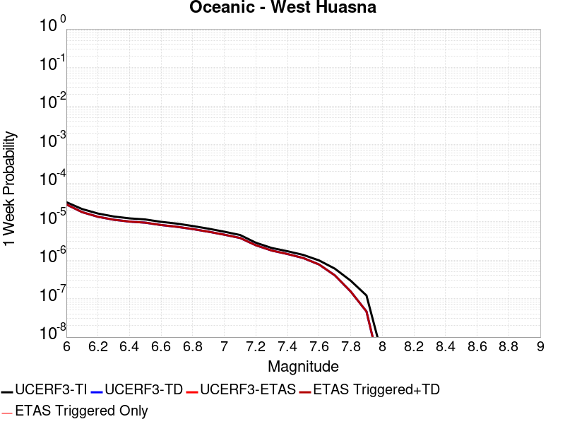 | 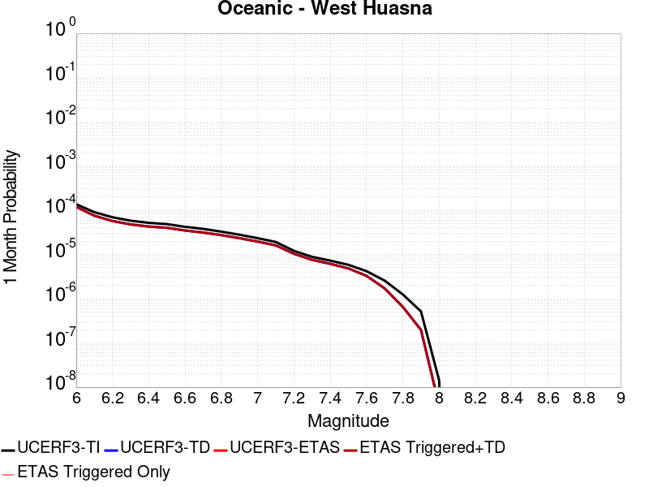 | 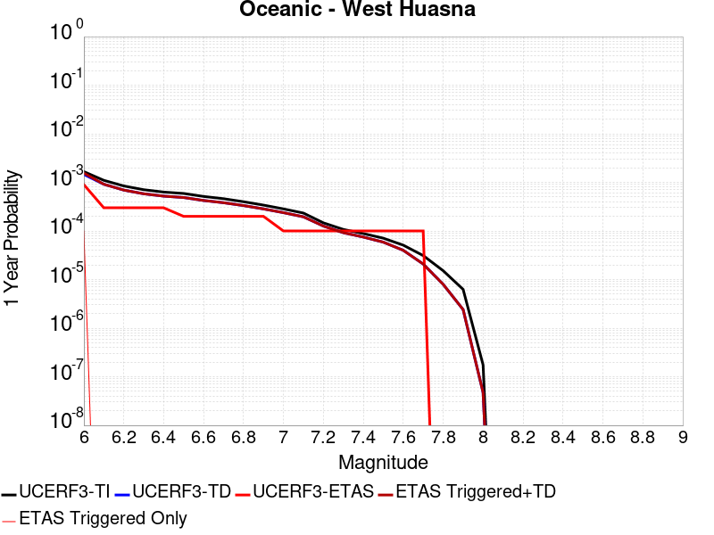 |  |

| Magnitude | 1 wk TI Prob | 1 wk TD Prob | 1 wk ETAS Prob | 1 wk ETAS/TD Gain | 1 wk ETAS Triggered+TD | 1 wk ETAS Triggered Only | 1 mo TI Prob | 1 mo TD Prob | 1 mo ETAS Prob | 1 mo ETAS/TD Gain | 1 mo ETAS Triggered+TD | 1 mo ETAS Triggered Only | 1 yr TI Prob | 1 yr TD Prob | 1 yr ETAS Prob | 1 yr ETAS/TD Gain | 1 yr ETAS Triggered+TD | 1 yr ETAS Triggered Only | 10 yr TI Prob | 10 yr TD Prob | 10 yr ETAS Prob | 10 yr ETAS/TD Gain | 10 yr ETAS Triggered+TD | 10 yr ETAS Triggered Only |
|-----|-----|-----|-----|-----|-----|-----|-----|-----|-----|-----|-----|-----|-----|-----|-----|-----|-----|-----|-----|-----|-----|-----|-----|-----|
| 6.0 | 3.195567E-5 | 2.7931907E-5 | 0.0 | 0.0 | 2.7931907E-5 | 0.0 | 1.3694567E-4 | 1.1970292E-4 | 0.0 | 0.0 | 1.1970292E-4 | 0.0 | 0.0016660384 | 0.0014564518 | 9.0E-4 | 0.61794007 | 0.0015563063 | 1.0E-4 | 0.016536033 | 0.01447362 | 0.0098 | 0.6770939 | 0.015557699 | 0.0011 |
| 6.1 | 2.1156782E-5 | 1.7576614E-5 | 0.0 | 0.0 | 1.7576614E-5 | 0.0 | 9.066878E-5 | 7.532623E-5 | 0.0 | 0.0 | 7.532623E-5 | 0.0 | 0.0011033333 | 9.167203E-4 | 3.0E-4 | 0.32725358 | 9.167203E-4 | 0.0 | 0.010978713 | 0.009130396 | 0.0045 | 0.49285924 | 0.009625831 | 5.0E-4 |
| 6.2 | 1.6195117E-5 | 1.3329092E-5 | 0.0 | 0.0 | 1.3329092E-5 | 0.0 | 6.9405796E-5 | 5.7123445E-5 | 0.0 | 0.0 | 5.7123445E-5 | 0.0 | 8.44688E-4 | 6.952586E-4 | 3.0E-4 | 0.43149412 | 6.952586E-4 | 0.0 | 0.008414844 | 0.0069311284 | 0.0037 | 0.5338236 | 0.007229049 | 3.0E-4 |
| 6.3 | 1.3559345E-5 | 1.118057E-5 | 0.0 | 0.0 | 1.118057E-5 | 0.0 | 5.811018E-5 | 4.791585E-5 | 0.0 | 0.0 | 4.791585E-5 | 0.0 | 7.072618E-4 | 5.8322033E-4 | 3.0E-4 | 0.5143854 | 5.8322033E-4 | 0.0 | 0.0070501505 | 0.0058170157 | 0.0032 | 0.5501103 | 0.006015852 | 2.0E-4 |
| 6.4 | 1.2120619E-5 | 1.0002196E-5 | 0.0 | 0.0 | 1.0002196E-5 | 0.0 | 5.1944477E-5 | 4.2865853E-5 | 0.0 | 0.0 | 4.2865853E-5 | 0.0 | 6.322405E-4 | 5.217673E-4 | 3.0E-4 | 0.574969 | 5.217673E-4 | 0.0 | 0.006304447 | 0.0052054897 | 0.0029 | 0.5571042 | 0.0054044486 | 2.0E-4 |
| 6.5 | 1.13511915E-5 | 9.368603E-6 | 0.0 | 0.0 | 9.368603E-6 | 0.0 | 4.8647056E-5 | 4.0150542E-5 | 0.0 | 0.0 | 4.0150542E-5 | 0.0 | 5.9211696E-4 | 4.887236E-4 | 2.0E-4 | 0.40922922 | 4.887236E-4 | 0.0 | 0.0059054173 | 0.0048765475 | 0.0025 | 0.51265776 | 0.005075572 | 2.0E-4 |
| 6.6 | 9.850605E-6 | 8.1363805E-6 | 0.0 | 0.0 | 8.1363805E-6 | 0.0 | 4.2216197E-5 | 3.486974E-5 | 0.0 | 0.0 | 3.486974E-5 | 0.0 | 5.1386096E-4 | 4.2445658E-4 | 2.0E-4 | 0.4711907 | 4.2445658E-4 | 0.0 | 0.0051267436 | 0.0042364914 | 0.0022 | 0.51929766 | 0.0043360675 | 1.0E-4 |
| 6.7 | 8.8558645E-6 | 7.319297E-6 | 0.0 | 0.0 | 7.319297E-6 | 0.0 | 3.7953152E-5 | 3.136804E-5 | 0.0 | 0.0 | 3.136804E-5 | 0.0 | 4.6198163E-4 | 3.818391E-4 | 2.0E-4 | 0.5237808 | 3.818391E-4 | 0.0 | 0.004610224 | 0.0038118558 | 0.0019 | 0.49844486 | 0.0039114747 | 1.0E-4 |
| 6.8 | 7.67136E-6 | 6.392532E-6 | 0.0 | 0.0 | 6.392532E-6 | 0.0 | 3.2876844E-5 | 2.739628E-5 | 0.0 | 0.0 | 2.739628E-5 | 0.0 | 4.0020206E-4 | 3.334988E-4 | 2.0E-4 | 0.5997023 | 3.334988E-4 | 0.0 | 0.003994821 | 0.0033300044 | 0.0016 | 0.48047984 | 0.0034296713 | 1.0E-4 |
| 6.9 | 6.534529E-6 | 5.4590155E-6 | 0.0 | 0.0 | 5.4590155E-6 | 0.0 | 2.8004823E-5 | 2.339557E-5 | 0.0 | 0.0 | 2.339557E-5 | 0.0 | 3.4090536E-4 | 2.8480397E-4 | 2.0E-4 | 0.7022374 | 2.8480397E-4 | 0.0 | 0.0034038287 | 0.0028444065 | 0.0012 | 0.42188063 | 0.002944122 | 1.0E-4 |
| 7.0 | 5.460525E-6 | 4.570503E-6 | 0.0 | 0.0 | 4.570503E-6 | 0.0 | 2.3402039E-5 | 1.9587724E-5 | 0.0 | 0.0 | 1.9587724E-5 | 0.0 | 2.8488258E-4 | 2.3845454E-4 | 1.0E-4 | 0.41936713 | 2.3845454E-4 | 0.0 | 0.0028451765 | 0.0023820007 | 9.0E-4 | 0.37783366 | 0.0024817623 | 1.0E-4 |
| 7.1 | 4.4825083E-6 | 3.752958E-6 | 0.0 | 0.0 | 3.752958E-6 | 0.0 | 1.9210609E-5 | 1.6084006E-5 | 0.0 | 0.0 | 1.6084006E-5 | 0.0 | 2.3386406E-4 | 1.9580529E-4 | 1.0E-4 | 0.51071143 | 1.9580529E-4 | 0.0 | 0.002336181 | 0.0019563397 | 8.0E-4 | 0.40892696 | 0.002056144 | 1.0E-4 |
| 7.2 | 2.821708E-6 | 2.425412E-6 | 0.0 | 0.0 | 2.425412E-6 | 0.0 | 1.2092979E-5 | 1.0394581E-5 | 0.0 | 0.0 | 1.0394581E-5 | 0.0 | 1.4722206E-4 | 1.2654669E-4 | 1.0E-4 | 0.79022217 | 1.2654669E-4 | 0.0 | 0.0014712457 | 0.0012647487 | 6.0E-4 | 0.47440252 | 0.0012647487 | 0.0 |
| 7.3 | 2.0644757E-6 | 1.7691771E-6 | 0.0 | 0.0 | 1.7691771E-6 | 0.0 | 8.847723E-6 | 7.5821654E-6 | 0.0 | 0.0 | 7.5821654E-6 | 0.0 | 1.0771569E-4 | 9.2308954E-5 | 1.0E-4 | 1.0833185 | 9.2308954E-5 | 0.0 | 0.001076635 | 9.2270784E-4 | 2.0E-4 | 0.21675333 | 9.2270784E-4 | 0.0 |
| 7.4 | 1.6980367E-6 | 1.4383688E-6 | 0.0 | 0.0 | 1.4383688E-6 | 0.0 | 7.27728E-6 | 6.164423E-6 | 0.0 | 0.0 | 6.164423E-6 | 0.0 | 8.8597284E-5 | 7.5049276E-5 | 1.0E-4 | 1.3324579 | 7.5049276E-5 | 0.0 | 8.8561967E-4 | 7.5024087E-4 | 1.0E-4 | 0.13329053 | 7.5024087E-4 | 0.0 |
| 7.5 | 1.3637683E-6 | 1.1306242E-6 | 0.0 | 0.0 | 1.1306242E-6 | 0.0 | 5.844708E-6 | 4.8455236E-6 | 0.0 | 0.0 | 4.8455236E-6 | 0.0 | 7.1156996E-5 | 5.8992653E-5 | 1.0E-4 | 1.6951263 | 5.8992653E-5 | 0.0 | 7.1134215E-4 | 5.897714E-4 | 1.0E-4 | 0.16955721 | 5.897714E-4 | 0.0 |
| 7.6 | 9.802994E-7 | 7.68064E-7 | 0.0 | 0.0 | 7.68064E-7 | 0.0 | 4.2012766E-6 | 3.2916985E-6 | 0.0 | 0.0 | 3.2916985E-6 | 0.0 | 5.1149345E-5 | 4.0075694E-5 | 1.0E-4 | 2.4952781 | 4.0075694E-5 | 0.0 | 5.113757E-4 | 4.0068605E-4 | 1.0E-4 | 0.24957195 | 4.0068605E-4 | 0.0 |
| 7.7 | 5.986191E-7 | 4.007918E-7 | 0.0 | 0.0 | 4.007918E-7 | 0.0 | 2.5655079E-6 | 1.7176781E-6 | 0.0 | 0.0 | 1.7176781E-6 | 0.0 | 3.1234613E-5 | 2.091253E-5 | 1.0E-4 | 4.781822 | 2.091253E-5 | 0.0 | 3.123022E-4 | 2.0910693E-4 | 1.0E-4 | 0.47822422 | 2.0910693E-4 | 0.0 |
| 7.8 | 2.9189815E-7 | 1.5309699E-7 | 0.0 | 0.0 | 1.5309699E-7 | 0.0 | 1.2509914E-6 | 6.5612977E-7 | 0.0 | 0.0 | 6.5612977E-7 | 0.0 | 1.5230714E-5 | 7.988351E-6 | 0.0 | 0.0 | 7.988351E-6 | 0.0 | 1.522967E-4 | 7.9881924E-5 | 0.0 | 0.0 | 7.9881924E-5 | 0.0 |
| 7.9 | 1.2057845E-7 | 4.634333E-8 | 0.0 | 0.0 | 4.634333E-8 | 0.0 | 5.1676466E-7 | 1.9861426E-7 | 0.0 | 0.0 | 1.9861426E-7 | 0.0 | 6.2915915E-6 | 2.4181259E-6 | 0.0 | 0.0 | 2.4181259E-6 | 0.0 | 6.2914136E-5 | 2.418227E-5 | 0.0 | 0.0 | 2.418227E-5 | 0.0 |
| 8.0 | 3.3806387E-9 | 9.0615715E-10 | 0.0 | 0.0 | 9.0615715E-10 | 0.0 | 1.4488451E-8 | 3.883531E-9 | 0.0 | 0.0 | 3.883531E-9 | 0.0 | 1.7639688E-7 | 4.7281986E-8 | 0.0 | 0.0 | 4.7281986E-8 | 0.0 | 1.7639674E-6 | 4.739084E-7 | 0.0 | 0.0 | 4.739084E-7 | 0.0 |

## Raymond
*[(top)](#table-of-contents)*

| 1 Week | 1 Month | 1 Year | 10 Year |
|-----|-----|-----|-----|
| 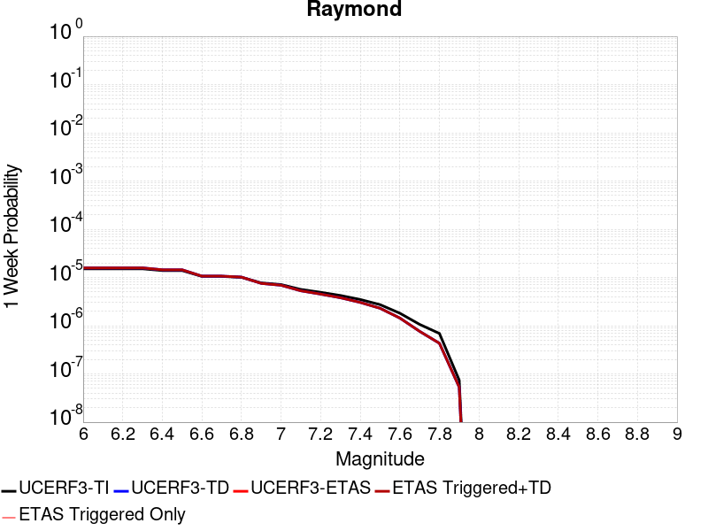 | 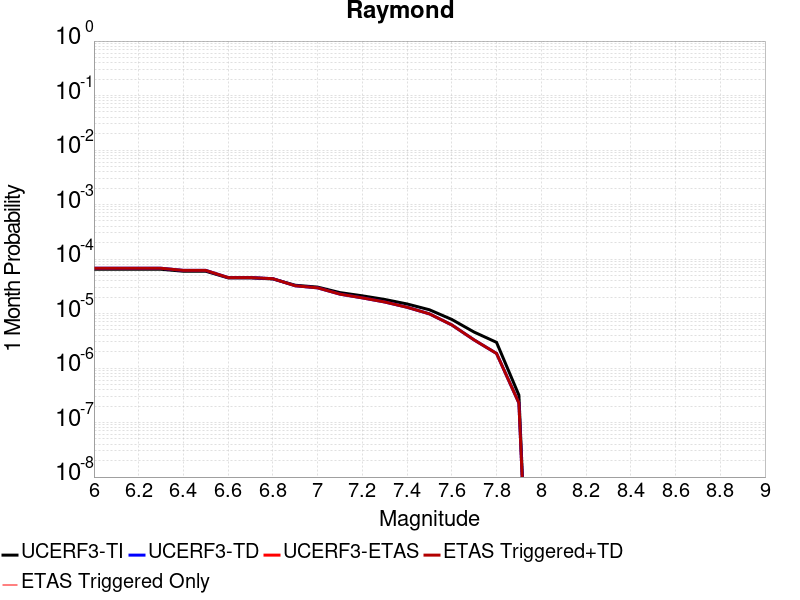 | 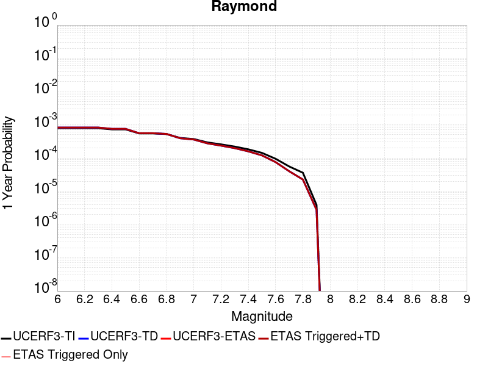 | 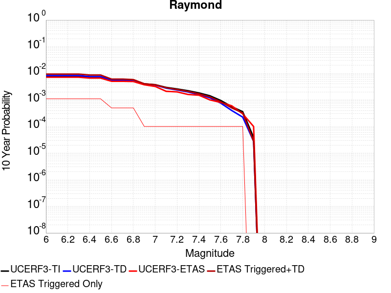 |

| Magnitude | 1 wk TI Prob | 1 wk TD Prob | 1 wk ETAS Prob | 1 wk ETAS/TD Gain | 1 wk ETAS Triggered+TD | 1 wk ETAS Triggered Only | 1 mo TI Prob | 1 mo TD Prob | 1 mo ETAS Prob | 1 mo ETAS/TD Gain | 1 mo ETAS Triggered+TD | 1 mo ETAS Triggered Only | 1 yr TI Prob | 1 yr TD Prob | 1 yr ETAS Prob | 1 yr ETAS/TD Gain | 1 yr ETAS Triggered+TD | 1 yr ETAS Triggered Only | 10 yr TI Prob | 10 yr TD Prob | 10 yr ETAS Prob | 10 yr ETAS/TD Gain | 10 yr ETAS Triggered+TD | 10 yr ETAS Triggered Only |
|-----|-----|-----|-----|-----|-----|-----|-----|-----|-----|-----|-----|-----|-----|-----|-----|-----|-----|-----|-----|-----|-----|-----|-----|-----|
| 6.0 | 1.5157413E-5 | 1.581416E-5 | 0.0 | 0.0 | 1.581416E-5 | 0.0 | 6.4958724E-5 | 6.777335E-5 | 0.0 | 0.0 | 6.777335E-5 | 0.0 | 7.905855E-4 | 8.2485325E-4 | 5.0E-4 | 0.60616845 | 8.2485325E-4 | 0.0 | 0.007877788 | 0.008220426 | 0.0071 | 0.8637022 | 0.009311384 | 0.0011 |
| 6.1 | 1.5157413E-5 | 1.581416E-5 | 0.0 | 0.0 | 1.581416E-5 | 0.0 | 6.4958724E-5 | 6.777335E-5 | 0.0 | 0.0 | 6.777335E-5 | 0.0 | 7.905855E-4 | 8.2485325E-4 | 5.0E-4 | 0.60616845 | 8.2485325E-4 | 0.0 | 0.007877788 | 0.008220426 | 0.0071 | 0.8637022 | 0.009311384 | 0.0011 |
| 6.2 | 1.5157413E-5 | 1.581416E-5 | 0.0 | 0.0 | 1.581416E-5 | 0.0 | 6.4958724E-5 | 6.777335E-5 | 0.0 | 0.0 | 6.777335E-5 | 0.0 | 7.905855E-4 | 8.2485325E-4 | 5.0E-4 | 0.60616845 | 8.2485325E-4 | 0.0 | 0.007877788 | 0.008220426 | 0.0071 | 0.8637022 | 0.009311384 | 0.0011 |
| 6.3 | 1.5157413E-5 | 1.581416E-5 | 0.0 | 0.0 | 1.581416E-5 | 0.0 | 6.4958724E-5 | 6.777335E-5 | 0.0 | 0.0 | 6.777335E-5 | 0.0 | 7.905855E-4 | 8.2485325E-4 | 5.0E-4 | 0.60616845 | 8.2485325E-4 | 0.0 | 0.007877788 | 0.008220426 | 0.0071 | 0.8637022 | 0.009311384 | 0.0011 |
| 6.4 | 1.3941944E-5 | 1.4458401E-5 | 0.0 | 0.0 | 1.4458401E-5 | 0.0 | 5.9749822E-5 | 6.1963234E-5 | 0.0 | 0.0 | 6.1963234E-5 | 0.0 | 7.2721124E-4 | 7.541646E-4 | 4.0E-4 | 0.5303882 | 7.541646E-4 | 0.0 | 0.007248361 | 0.0075183776 | 0.0066 | 0.877849 | 0.008610107 | 0.0011 |
| 6.5 | 1.3941944E-5 | 1.4458401E-5 | 0.0 | 0.0 | 1.4458401E-5 | 0.0 | 5.9749822E-5 | 6.1963234E-5 | 0.0 | 0.0 | 6.1963234E-5 | 0.0 | 7.2721124E-4 | 7.541646E-4 | 4.0E-4 | 0.5303882 | 7.541646E-4 | 0.0 | 0.007248361 | 0.0075183776 | 0.0066 | 0.877849 | 0.008610107 | 0.0011 |
| 6.6 | 1.0542609E-5 | 1.0673942E-5 | 0.0 | 0.0 | 1.0673942E-5 | 0.0 | 4.5181827E-5 | 4.5744695E-5 | 0.0 | 0.0 | 4.5744695E-5 | 0.0 | 5.499499E-4 | 5.568048E-4 | 4.0E-4 | 0.7183846 | 5.568048E-4 | 0.0 | 0.005485909 | 0.005554649 | 0.005 | 0.9001469 | 0.0060518715 | 5.0E-4 |
| 6.7 | 1.0542609E-5 | 1.0673942E-5 | 0.0 | 0.0 | 1.0673942E-5 | 0.0 | 4.5181827E-5 | 4.5744695E-5 | 0.0 | 0.0 | 4.5744695E-5 | 0.0 | 5.499499E-4 | 5.568048E-4 | 4.0E-4 | 0.7183846 | 5.568048E-4 | 0.0 | 0.005485909 | 0.005554649 | 0.005 | 0.9001469 | 0.0060518715 | 5.0E-4 |
| 6.8 | 1.0079132E-5 | 1.0179406E-5 | 0.0 | 0.0 | 1.0179406E-5 | 0.0 | 4.3195567E-5 | 4.3625325E-5 | 0.0 | 0.0 | 4.3625325E-5 | 0.0 | 5.257791E-4 | 5.3101423E-4 | 4.0E-4 | 0.75327545 | 5.3101423E-4 | 0.0 | 0.0052453685 | 0.0052979942 | 0.0049 | 0.9248783 | 0.005795345 | 5.0E-4 |
| 6.9 | 7.721598E-6 | 7.5510375E-6 | 0.0 | 0.0 | 7.5510375E-6 | 0.0 | 3.3092143E-5 | 3.2361193E-5 | 0.0 | 0.0 | 3.2361193E-5 | 0.0 | 4.0282236E-4 | 3.9392753E-4 | 3.0E-4 | 0.7615614 | 3.9392753E-4 | 0.0 | 0.0040209293 | 0.0039324164 | 0.0037 | 0.9408973 | 0.0040320233 | 1.0E-4 |
| 7.0 | 7.137566E-6 | 6.913317E-6 | 0.0 | 0.0 | 6.913317E-6 | 0.0 | 3.058921E-5 | 2.962817E-5 | 0.0 | 0.0 | 2.962817E-5 | 0.0 | 3.7236E-4 | 3.6066436E-4 | 3.0E-4 | 0.8317983 | 3.6066436E-4 | 0.0 | 0.0037173668 | 0.003600899 | 0.0032 | 0.888667 | 0.0037005388 | 1.0E-4 |
| 7.1 | 5.654976E-6 | 5.3012614E-6 | 0.0 | 0.0 | 5.3012614E-6 | 0.0 | 2.4235387E-5 | 2.2719496E-5 | 0.0 | 0.0 | 2.2719496E-5 | 0.0 | 2.9502588E-4 | 2.7657495E-4 | 2.0E-4 | 0.72313124 | 2.7657495E-4 | 0.0 | 0.0029463451 | 0.0027623288 | 0.0021 | 0.7602281 | 0.0028620528 | 1.0E-4 |
| 7.2 | 4.9358455E-6 | 4.5282454E-6 | 0.0 | 0.0 | 4.5282454E-6 | 0.0 | 2.1153453E-5 | 1.9406623E-5 | 0.0 | 0.0 | 1.9406623E-5 | 0.0 | 2.5751285E-4 | 2.3625015E-4 | 2.0E-4 | 0.8465603 | 2.3625015E-4 | 0.0 | 0.0025721465 | 0.0023600024 | 0.002 | 0.84745675 | 0.0024597663 | 1.0E-4 |
| 7.3 | 4.2368597E-6 | 3.8070893E-6 | 0.0 | 0.0 | 3.8070893E-6 | 0.0 | 1.8157843E-5 | 1.6315997E-5 | 0.0 | 0.0 | 1.6315997E-5 | 0.0 | 2.2104931E-4 | 1.9862925E-4 | 2.0E-4 | 1.006901 | 1.9862925E-4 | 0.0 | 0.0022082955 | 0.0019845262 | 0.0016 | 0.80623776 | 0.0020843279 | 1.0E-4 |
| 7.4 | 3.4999923E-6 | 3.045076E-6 | 0.0 | 0.0 | 3.045076E-6 | 0.0 | 1.49998805E-5 | 1.3050261E-5 | 0.0 | 0.0 | 1.3050261E-5 | 0.0 | 1.8260824E-4 | 1.5887542E-4 | 2.0E-4 | 1.258848 | 1.5887542E-4 | 0.0 | 0.0018245826 | 0.0015876244 | 0.0015 | 0.9448078 | 0.0016874657 | 1.0E-4 |
| 7.5 | 2.738017E-6 | 2.3031162E-6 | 0.0 | 0.0 | 2.3031162E-6 | 0.0 | 1.1734306E-5 | 9.870461E-6 | 0.0 | 0.0 | 9.870461E-6 | 0.0 | 1.428558E-4 | 1.201663E-4 | 2.0E-4 | 1.66436 | 1.201663E-4 | 0.0 | 0.0014276401 | 0.001201018 | 0.001 | 0.83262706 | 0.0013008978 | 1.0E-4 |
| 7.6 | 1.8186392E-6 | 1.4430785E-6 | 0.0 | 0.0 | 1.4430785E-6 | 0.0 | 7.794145E-6 | 6.1846076E-6 | 0.0 | 0.0 | 6.1846076E-6 | 0.0 | 9.488958E-5 | 7.529504E-5 | 1.0E-4 | 1.3281088 | 7.529504E-5 | 0.0 | 9.4849075E-4 | 7.5269706E-4 | 8.0E-4 | 1.0628445 | 8.526218E-4 | 1.0E-4 |
| 7.7 | 1.0660348E-6 | 7.6501203E-7 | 0.0 | 0.0 | 7.6501203E-7 | 0.0 | 4.5687125E-6 | 3.2786188E-6 | 0.0 | 0.0 | 3.2786188E-6 | 0.0 | 5.5622655E-5 | 3.991647E-5 | 1.0E-4 | 2.5052314 | 3.991647E-5 | 0.0 | 5.5608735E-4 | 3.9909242E-4 | 6.0E-4 | 1.5034112 | 4.990525E-4 | 1.0E-4 |
| 7.8 | 6.913602E-7 | 4.3258234E-7 | 0.0 | 0.0 | 4.3258234E-7 | 0.0 | 2.962969E-6 | 1.853923E-6 | 0.0 | 0.0 | 1.853923E-6 | 0.0 | 3.607355E-5 | 2.2571285E-5 | 0.0 | 0.0 | 2.2571285E-5 | 0.0 | 3.6067693E-4 | 2.256882E-4 | 3.0E-4 | 1.3292676 | 3.2566563E-4 | 1.0E-4 |
| 7.9 | 7.425201E-8 | 5.3268387E-8 | 0.0 | 0.0 | 5.3268387E-8 | 0.0 | 3.1822285E-7 | 2.2829308E-7 | 0.0 | 0.0 | 2.2829308E-7 | 0.0 | 3.874356E-6 | 2.7794658E-6 | 0.0 | 0.0 | 2.7794658E-6 | 0.0 | 3.8742884E-5 | 2.7794442E-5 | 1.0E-4 | 3.5978417 | 2.7794442E-5 | 0.0 |

## San Jacinto (Coyote Creek)
*[(top)](#table-of-contents)*

| 1 Week | 1 Month | 1 Year | 10 Year |
|-----|-----|-----|-----|
| 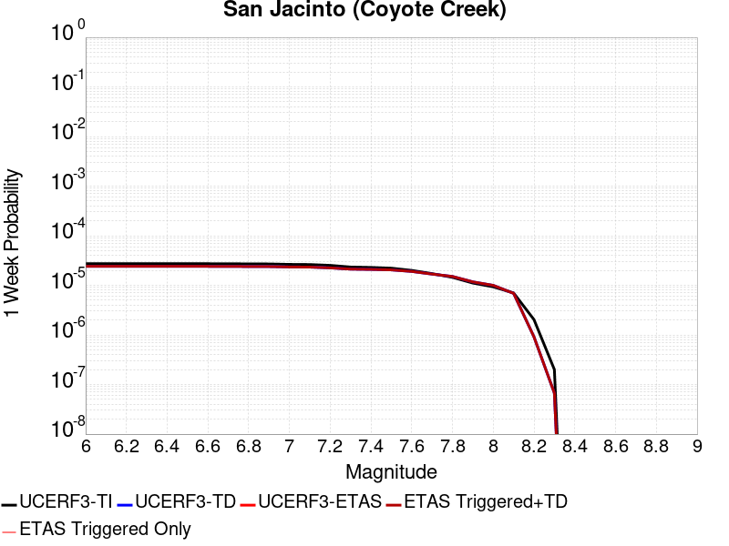 | 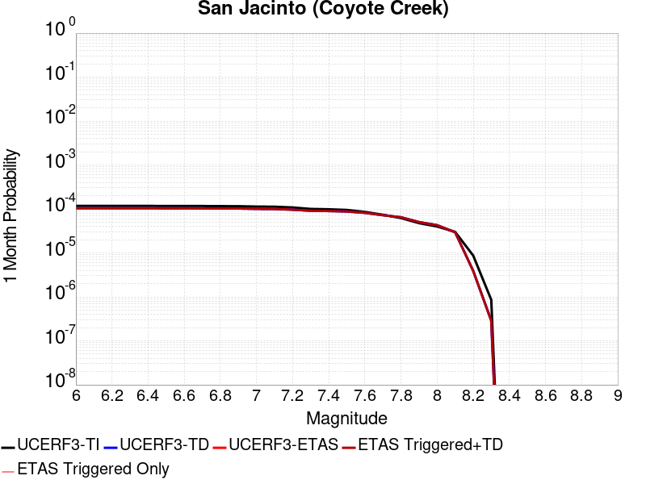 | 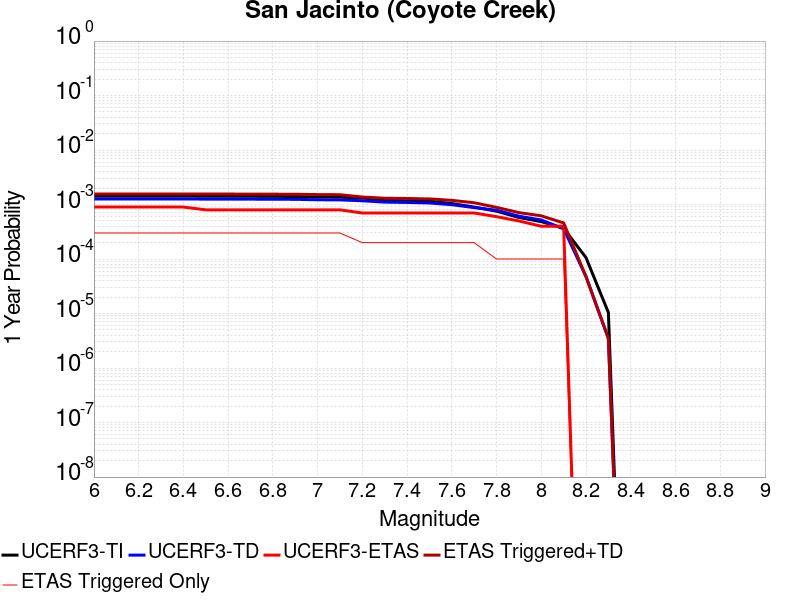 | 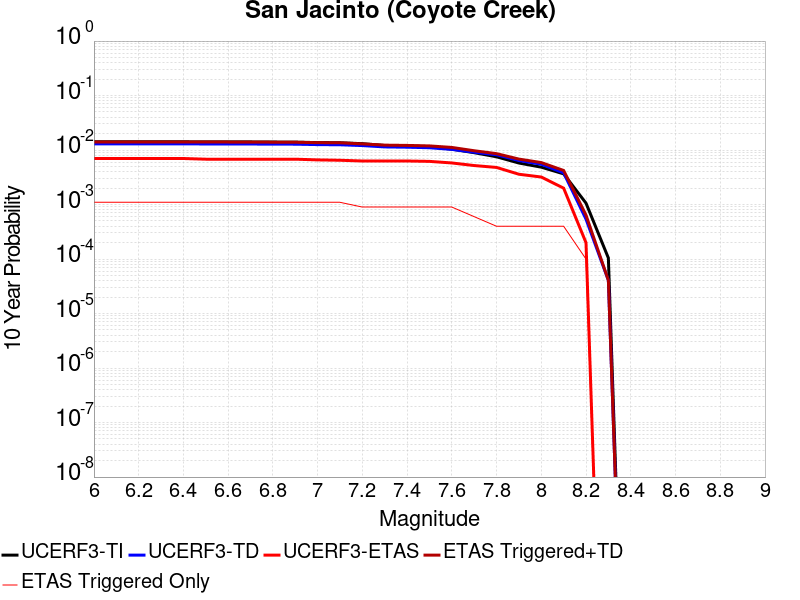 |

| Magnitude | 1 wk TI Prob | 1 wk TD Prob | 1 wk ETAS Prob | 1 wk ETAS/TD Gain | 1 wk ETAS Triggered+TD | 1 wk ETAS Triggered Only | 1 mo TI Prob | 1 mo TD Prob | 1 mo ETAS Prob | 1 mo ETAS/TD Gain | 1 mo ETAS Triggered+TD | 1 mo ETAS Triggered Only | 1 yr TI Prob | 1 yr TD Prob | 1 yr ETAS Prob | 1 yr ETAS/TD Gain | 1 yr ETAS Triggered+TD | 1 yr ETAS Triggered Only | 10 yr TI Prob | 10 yr TD Prob | 10 yr ETAS Prob | 10 yr ETAS/TD Gain | 10 yr ETAS Triggered+TD | 10 yr ETAS Triggered Only |
|-----|-----|-----|-----|-----|-----|-----|-----|-----|-----|-----|-----|-----|-----|-----|-----|-----|-----|-----|-----|-----|-----|-----|-----|-----|
| 6.0 | 2.7374346E-5 | 2.4273491E-5 | 0.0 | 0.0 | 2.4273491E-5 | 0.0 | 1.1731335E-4 | 1.04025115E-4 | 0.0 | 0.0 | 1.04025115E-4 | 0.0 | 0.0014273542 | 0.0012657726 | 9.0E-4 | 0.7110282 | 0.0015653928 | 3.0E-4 | 0.01418221 | 0.012995168 | 0.007 | 0.5386618 | 0.014080873 | 0.0011 |
| 6.1 | 2.7374346E-5 | 2.4273491E-5 | 0.0 | 0.0 | 2.4273491E-5 | 0.0 | 1.1731335E-4 | 1.04025115E-4 | 0.0 | 0.0 | 1.04025115E-4 | 0.0 | 0.0014273542 | 0.0012657726 | 9.0E-4 | 0.7110282 | 0.0015653928 | 3.0E-4 | 0.01418221 | 0.012995168 | 0.007 | 0.5386618 | 0.014080873 | 0.0011 |
| 6.2 | 2.7374346E-5 | 2.4273491E-5 | 0.0 | 0.0 | 2.4273491E-5 | 0.0 | 1.1731335E-4 | 1.04025115E-4 | 0.0 | 0.0 | 1.04025115E-4 | 0.0 | 0.0014273542 | 0.0012657726 | 9.0E-4 | 0.7110282 | 0.0015653928 | 3.0E-4 | 0.01418221 | 0.012995168 | 0.007 | 0.5386618 | 0.014080873 | 0.0011 |
| 6.3 | 2.7374346E-5 | 2.4273491E-5 | 0.0 | 0.0 | 2.4273491E-5 | 0.0 | 1.1731335E-4 | 1.04025115E-4 | 0.0 | 0.0 | 1.04025115E-4 | 0.0 | 0.0014273542 | 0.0012657726 | 9.0E-4 | 0.7110282 | 0.0015653928 | 3.0E-4 | 0.01418221 | 0.012995168 | 0.007 | 0.5386618 | 0.014080873 | 0.0011 |
| 6.4 | 2.7374346E-5 | 2.4273491E-5 | 0.0 | 0.0 | 2.4273491E-5 | 0.0 | 1.1731335E-4 | 1.04025115E-4 | 0.0 | 0.0 | 1.04025115E-4 | 0.0 | 0.0014273542 | 0.0012657726 | 9.0E-4 | 0.7110282 | 0.0015653928 | 3.0E-4 | 0.01418221 | 0.012995168 | 0.007 | 0.5386618 | 0.014080873 | 0.0011 |
| 6.5 | 2.7282445E-5 | 2.4159513E-5 | 0.0 | 0.0 | 2.4159513E-5 | 0.0 | 1.16919524E-4 | 1.0353668E-4 | 0.0 | 0.0 | 1.0353668E-4 | 0.0 | 0.0014225657 | 0.0012598328 | 8.0E-4 | 0.6350049 | 0.0015594548 | 3.0E-4 | 0.014134934 | 0.012936471 | 0.0068 | 0.5256457 | 0.01402224 | 0.0011 |
| 6.6 | 2.7282445E-5 | 2.4159513E-5 | 0.0 | 0.0 | 2.4159513E-5 | 0.0 | 1.16919524E-4 | 1.0353668E-4 | 0.0 | 0.0 | 1.0353668E-4 | 0.0 | 0.0014225657 | 0.0012598328 | 8.0E-4 | 0.6350049 | 0.0015594548 | 3.0E-4 | 0.014134934 | 0.012936471 | 0.0068 | 0.5256457 | 0.01402224 | 0.0011 |
| 6.7 | 2.7216198E-5 | 2.4084598E-5 | 0.0 | 0.0 | 2.4084598E-5 | 0.0 | 1.1663563E-4 | 1.03215636E-4 | 0.0 | 0.0 | 1.03215636E-4 | 0.0 | 0.0014191137 | 0.0012559287 | 8.0E-4 | 0.63697886 | 0.0015555519 | 3.0E-4 | 0.014100855 | 0.012897865 | 0.0068 | 0.52721906 | 0.013983677 | 0.0011 |
| 6.8 | 2.7078617E-5 | 2.4001742E-5 | 0.0 | 0.0 | 2.4001742E-5 | 0.0 | 1.1604605E-4 | 1.0286056E-4 | 0.0 | 0.0 | 1.0286056E-4 | 0.0 | 0.001411945 | 0.0012516106 | 8.0E-4 | 0.6391764 | 0.0015512351 | 3.0E-4 | 0.014030075 | 0.012854979 | 0.0068 | 0.5289779 | 0.013940839 | 0.0011 |
| 6.9 | 2.6982952E-5 | 2.3921173E-5 | 0.0 | 0.0 | 2.3921173E-5 | 0.0 | 1.15636096E-4 | 1.025153E-4 | 0.0 | 0.0 | 1.025153E-4 | 0.0 | 0.0014069602 | 0.0012474118 | 8.0E-4 | 0.64132786 | 0.0015470376 | 3.0E-4 | 0.013980856 | 0.012813238 | 0.0068 | 0.5307011 | 0.013899144 | 0.0011 |
| 7.0 | 2.6449972E-5 | 2.3497925E-5 | 0.0 | 0.0 | 2.3497925E-5 | 0.0 | 1.1335209E-4 | 1.0070152E-4 | 0.0 | 0.0 | 1.0070152E-4 | 0.0 | 0.001379188 | 0.001225354 | 8.0E-4 | 0.6528725 | 0.0015249865 | 3.0E-4 | 0.0137065975 | 0.012594469 | 0.0066 | 0.52403957 | 0.0136806145 | 0.0011 |
| 7.1 | 2.6257849E-5 | 2.3323826E-5 | 0.0 | 0.0 | 2.3323826E-5 | 0.0 | 1.1252879E-4 | 9.995544E-5 | 0.0 | 0.0 | 9.995544E-5 | 0.0 | 0.0013691769 | 0.0012162806 | 8.0E-4 | 0.6577429 | 0.0015159157 | 3.0E-4 | 0.013607717 | 0.012504251 | 0.0065 | 0.51982325 | 0.013590496 | 0.0011 |
| 7.2 | 2.5270041E-5 | 2.2517655E-5 | 0.0 | 0.0 | 2.2517655E-5 | 0.0 | 1.0829568E-4 | 9.650068E-5 | 0.0 | 0.0 | 9.650068E-5 | 0.0 | 0.0013177024 | 0.0011742649 | 7.0E-4 | 0.5961176 | 0.00137403 | 2.0E-4 | 0.013099162 | 0.012084909 | 0.0063 | 0.52131134 | 0.012974032 | 9.0E-4 |
| 7.3 | 2.339701E-5 | 2.1247788E-5 | 0.0 | 0.0 | 2.1247788E-5 | 0.0 | 1.0026905E-4 | 9.1058784E-5 | 0.0 | 0.0 | 9.1058784E-5 | 0.0 | 0.001220092 | 0.001108079 | 7.0E-4 | 0.63172394 | 0.0013078573 | 2.0E-4 | 0.012134149 | 0.011423096 | 0.0063 | 0.5515142 | 0.0123128155 | 9.0E-4 |
| 7.4 | 2.296333E-5 | 2.0977704E-5 | 0.0 | 0.0 | 2.0977704E-5 | 0.0 | 9.841056E-5 | 8.990136E-5 | 0.0 | 0.0 | 8.990136E-5 | 0.0 | 0.0011974899 | 0.0010940016 | 7.0E-4 | 0.6398528 | 0.0012937827 | 2.0E-4 | 0.011910575 | 0.011281985 | 0.0063 | 0.5584124 | 0.012171831 | 9.0E-4 |
| 7.5 | 2.2188895E-5 | 2.049964E-5 | 0.0 | 0.0 | 2.049964E-5 | 0.0 | 9.50918E-5 | 8.7852655E-5 | 0.0 | 0.0 | 8.7852655E-5 | 0.0 | 0.0011571277 | 0.0010690832 | 7.0E-4 | 0.6547666 | 0.0012688694 | 2.0E-4 | 0.011511209 | 0.0110311145 | 0.0062 | 0.5620466 | 0.011921186 | 9.0E-4 |
| 7.6 | 2.0013189E-5 | 1.9080748E-5 | 0.0 | 0.0 | 1.9080748E-5 | 0.0 | 8.5767984E-5 | 8.177209E-5 | 0.0 | 0.0 | 8.177209E-5 | 0.0 | 0.001043725 | 9.951221E-4 | 7.0E-4 | 0.7034312 | 0.0011949232 | 2.0E-4 | 0.010388365 | 0.010286514 | 0.0058 | 0.5638451 | 0.011177256 | 9.0E-4 |
| 7.7 | 1.7230794E-5 | 1.6858305E-5 | 0.0 | 0.0 | 1.6858305E-5 | 0.0 | 7.384417E-5 | 7.224788E-5 | 0.0 | 0.0 | 7.224788E-5 | 0.0 | 8.986819E-4 | 8.7926374E-4 | 7.0E-4 | 0.7961206 | 0.001079088 | 2.0E-4 | 0.008950562 | 0.009123222 | 0.0052 | 0.56997406 | 0.009717748 | 6.0E-4 |
| 7.8 | 1.4478809E-5 | 1.5101526E-5 | 0.0 | 0.0 | 1.5101526E-5 | 0.0 | 6.205057E-5 | 6.471922E-5 | 0.0 | 0.0 | 6.471922E-5 | 0.0 | 7.552038E-4 | 7.8767235E-4 | 6.0E-4 | 0.76173806 | 8.8759355E-4 | 1.0E-4 | 0.0075264242 | 0.008199716 | 0.0048 | 0.58538616 | 0.008596436 | 4.0E-4 |
| 7.9 | 1.1114467E-5 | 1.1743377E-5 | 0.0 | 0.0 | 1.1743377E-5 | 0.0 | 4.7632562E-5 | 5.032779E-5 | 0.0 | 0.0 | 5.032779E-5 | 0.0 | 5.797721E-4 | 6.1256916E-4 | 5.0E-4 | 0.81623435 | 7.125079E-4 | 1.0E-4 | 0.0057826187 | 0.0064323912 | 0.0036 | 0.55966747 | 0.0068298182 | 4.0E-4 |
| 8.0 | 9.327402E-6 | 9.988501E-6 | 0.0 | 0.0 | 9.988501E-6 | 0.0 | 3.9973966E-5 | 4.280716E-5 | 0.0 | 0.0 | 4.280716E-5 | 0.0 | 4.8657437E-4 | 5.210531E-4 | 4.0E-4 | 0.7676761 | 6.21001E-4 | 1.0E-4 | 0.0048551033 | 0.005497434 | 0.0032 | 0.5820898 | 0.005895235 | 4.0E-4 |
| 8.1 | 7.0235833E-6 | 6.8940417E-6 | 0.0 | 0.0 | 6.8940417E-6 | 0.0 | 3.0100724E-5 | 2.9545561E-5 | 0.0 | 0.0 | 2.9545561E-5 | 0.0 | 3.664147E-4 | 3.5965836E-4 | 4.0E-4 | 1.1121665 | 4.596224E-4 | 1.0E-4 | 0.003658111 | 0.003823242 | 0.002 | 0.52311623 | 0.0042217127 | 4.0E-4 |
| 8.2 | 2.0358202E-6 | 9.123777E-7 | 0.0 | 0.0 | 9.123777E-7 | 0.0 | 8.724915E-6 | 3.910184E-6 | 0.0 | 0.0 | 3.910184E-6 | 0.0 | 1.06220665E-4 | 4.7605477E-5 | 0.0 | 0.0 | 4.7605477E-5 | 0.0 | 0.001061699 | 5.398295E-4 | 2.0E-4 | 0.37048736 | 6.3977554E-4 | 1.0E-4 |
| 8.3 | 2.0051264E-7 | 6.726359E-8 | 0.0 | 0.0 | 6.726359E-8 | 0.0 | 8.5933965E-7 | 2.882725E-7 | 0.0 | 0.0 | 2.882725E-7 | 0.0 | 1.046241E-5 | 3.5097125E-6 | 0.0 | 0.0 | 3.5097125E-6 | 0.0 | 1.0461917E-4 | 4.076528E-5 | 0.0 | 0.0 | 4.076528E-5 | 0.0 |

## Death Valley (Black Mtns Frontal)
*[(top)](#table-of-contents)*

| 1 Week | 1 Month | 1 Year | 10 Year |
|-----|-----|-----|-----|
|  | 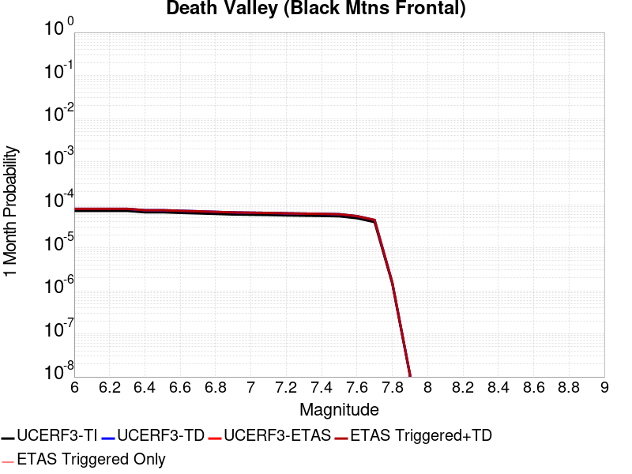 | 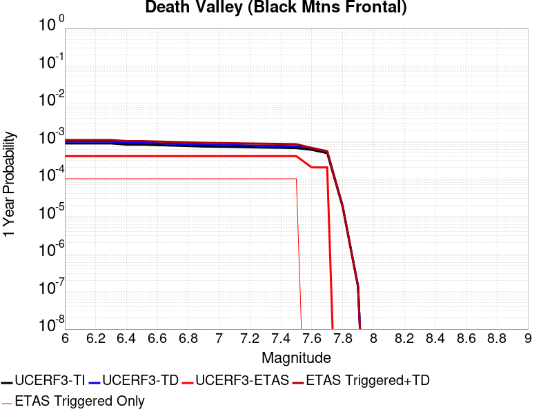 | 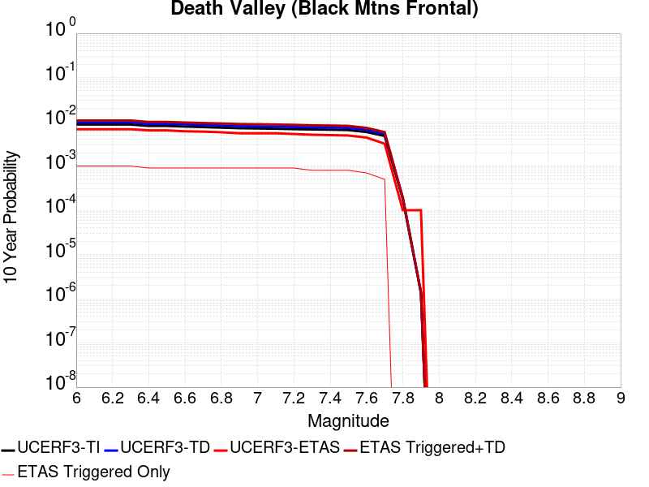 |

| Magnitude | 1 wk TI Prob | 1 wk TD Prob | 1 wk ETAS Prob | 1 wk ETAS/TD Gain | 1 wk ETAS Triggered+TD | 1 wk ETAS Triggered Only | 1 mo TI Prob | 1 mo TD Prob | 1 mo ETAS Prob | 1 mo ETAS/TD Gain | 1 mo ETAS Triggered+TD | 1 mo ETAS Triggered Only | 1 yr TI Prob | 1 yr TD Prob | 1 yr ETAS Prob | 1 yr ETAS/TD Gain | 1 yr ETAS Triggered+TD | 1 yr ETAS Triggered Only | 10 yr TI Prob | 10 yr TD Prob | 10 yr ETAS Prob | 10 yr ETAS/TD Gain | 10 yr ETAS Triggered+TD | 10 yr ETAS Triggered Only |
|-----|-----|-----|-----|-----|-----|-----|-----|-----|-----|-----|-----|-----|-----|-----|-----|-----|-----|-----|-----|-----|-----|-----|-----|-----|
| 6.0 | 1.6707214E-5 | 1.8674798E-5 | 0.0 | 0.0 | 1.8674798E-5 | 0.0 | 7.160038E-5 | 8.003244E-5 | 0.0 | 0.0 | 8.003244E-5 | 0.0 | 8.71386E-4 | 9.73967E-4 | 4.0E-4 | 0.41069153 | 0.0010738696 | 1.0E-4 | 0.00867977 | 0.009697839 | 0.0068 | 0.7011872 | 0.01068814 | 0.001 |
| 6.1 | 1.6707214E-5 | 1.8674798E-5 | 0.0 | 0.0 | 1.8674798E-5 | 0.0 | 7.160038E-5 | 8.003244E-5 | 0.0 | 0.0 | 8.003244E-5 | 0.0 | 8.71386E-4 | 9.73967E-4 | 4.0E-4 | 0.41069153 | 0.0010738696 | 1.0E-4 | 0.00867977 | 0.009697839 | 0.0068 | 0.7011872 | 0.01068814 | 0.001 |
| 6.2 | 1.6707214E-5 | 1.8674798E-5 | 0.0 | 0.0 | 1.8674798E-5 | 0.0 | 7.160038E-5 | 8.003244E-5 | 0.0 | 0.0 | 8.003244E-5 | 0.0 | 8.71386E-4 | 9.73967E-4 | 4.0E-4 | 0.41069153 | 0.0010738696 | 1.0E-4 | 0.00867977 | 0.009697839 | 0.0068 | 0.7011872 | 0.01068814 | 0.001 |
| 6.3 | 1.6707214E-5 | 1.8674798E-5 | 0.0 | 0.0 | 1.8674798E-5 | 0.0 | 7.160038E-5 | 8.003244E-5 | 0.0 | 0.0 | 8.003244E-5 | 0.0 | 8.71386E-4 | 9.73967E-4 | 4.0E-4 | 0.41069153 | 0.0010738696 | 1.0E-4 | 0.00867977 | 0.009697839 | 0.0068 | 0.7011872 | 0.01068814 | 0.001 |
| 6.4 | 1.5515609E-5 | 1.734242E-5 | 0.0 | 0.0 | 1.734242E-5 | 0.0 | 6.649377E-5 | 7.4322576E-5 | 0.0 | 0.0 | 7.4322576E-5 | 0.0 | 8.0926094E-4 | 9.045078E-4 | 4.0E-4 | 0.44222945 | 0.0010044174 | 1.0E-4 | 0.008063202 | 0.009008949 | 0.0064 | 0.71040475 | 0.009900841 | 9.0E-4 |
| 6.5 | 1.5515609E-5 | 1.734242E-5 | 0.0 | 0.0 | 1.734242E-5 | 0.0 | 6.649377E-5 | 7.4322576E-5 | 0.0 | 0.0 | 7.4322576E-5 | 0.0 | 8.0926094E-4 | 9.045078E-4 | 4.0E-4 | 0.44222945 | 0.0010044174 | 1.0E-4 | 0.008063202 | 0.009008949 | 0.0064 | 0.71040475 | 0.009900841 | 9.0E-4 |
| 6.6 | 1.5041828E-5 | 1.6813225E-5 | 0.0 | 0.0 | 1.6813225E-5 | 0.0 | 6.4463384E-5 | 7.205472E-5 | 0.0 | 0.0 | 7.205472E-5 | 0.0 | 7.8455906E-4 | 8.76919E-4 | 4.0E-4 | 0.45614246 | 9.768313E-4 | 1.0E-4 | 0.00781795 | 0.008735243 | 0.0061 | 0.69832057 | 0.009627381 | 9.0E-4 |
| 6.7 | 1.4634985E-5 | 1.635999E-5 | 0.0 | 0.0 | 1.635999E-5 | 0.0 | 6.271985E-5 | 7.011239E-5 | 0.0 | 0.0 | 7.011239E-5 | 0.0 | 7.6334673E-4 | 8.5328985E-4 | 4.0E-4 | 0.4687739 | 9.532045E-4 | 1.0E-4 | 0.007607299 | 0.008500772 | 0.006 | 0.7058183 | 0.009393121 | 9.0E-4 |
| 6.8 | 1.4209158E-5 | 1.5885911E-5 | 0.0 | 0.0 | 1.5885911E-5 | 0.0 | 6.089497E-5 | 6.808073E-5 | 0.0 | 0.0 | 6.808073E-5 | 0.0 | 7.4114406E-4 | 8.285733E-4 | 4.0E-4 | 0.48275754 | 9.284904E-4 | 1.0E-4 | 0.007386771 | 0.008255456 | 0.0058 | 0.70256567 | 0.009148026 | 9.0E-4 |
| 6.9 | 1.3780098E-5 | 1.5408345E-5 | 0.0 | 0.0 | 1.5408345E-5 | 0.0 | 5.9056227E-5 | 6.6034125E-5 | 0.0 | 0.0 | 6.6034125E-5 | 0.0 | 7.1877235E-4 | 8.036744E-4 | 4.0E-4 | 0.497714 | 9.03594E-4 | 1.0E-4 | 0.0071645193 | 0.008008275 | 0.0055 | 0.6867896 | 0.008901068 | 9.0E-4 |
| 7.0 | 1.3585064E-5 | 1.5191858E-5 | 0.0 | 0.0 | 1.5191858E-5 | 0.0 | 5.8220405E-5 | 6.5106375E-5 | 0.0 | 0.0 | 6.5106375E-5 | 0.0 | 7.086029E-4 | 7.923873E-4 | 4.0E-4 | 0.50480366 | 8.92308E-4 | 1.0E-4 | 0.007063476 | 0.007896211 | 0.0055 | 0.6965366 | 0.008789104 | 9.0E-4 |
| 7.1 | 1.3398601E-5 | 1.4984997E-5 | 0.0 | 0.0 | 1.4984997E-5 | 0.0 | 5.742131E-5 | 6.4219865E-5 | 0.0 | 0.0 | 6.4219865E-5 | 0.0 | 6.9888023E-4 | 7.816018E-4 | 4.0E-4 | 0.51176953 | 8.8152365E-4 | 1.0E-4 | 0.0069668638 | 0.0077891177 | 0.0055 | 0.70611334 | 0.008682108 | 9.0E-4 |
| 7.2 | 1.3126312E-5 | 1.468315E-5 | 0.0 | 0.0 | 1.468315E-5 | 0.0 | 5.6254412E-5 | 6.29263E-5 | 0.0 | 0.0 | 6.29263E-5 | 0.0 | 6.846822E-4 | 7.6586386E-4 | 4.0E-4 | 0.52228606 | 8.6578727E-4 | 1.0E-4 | 0.006825765 | 0.0076328292 | 0.0053 | 0.694369 | 0.008525959 | 9.0E-4 |
| 7.3 | 1.2922429E-5 | 1.4457328E-5 | 0.0 | 0.0 | 1.4457328E-5 | 0.0 | 5.5380664E-5 | 6.195853E-5 | 0.0 | 0.0 | 6.195853E-5 | 0.0 | 6.74051E-4 | 7.540895E-4 | 4.0E-4 | 0.530441 | 8.540141E-4 | 1.0E-4 | 0.006720101 | 0.007515888 | 0.0051 | 0.6785625 | 0.008309876 | 8.0E-4 |
| 7.4 | 1.2768878E-5 | 1.4287273E-5 | 0.0 | 0.0 | 1.4287273E-5 | 0.0 | 5.4722615E-5 | 6.1229766E-5 | 0.0 | 0.0 | 6.1229766E-5 | 0.0 | 6.660441E-4 | 7.4522285E-4 | 4.0E-4 | 0.5367522 | 8.451483E-4 | 1.0E-4 | 0.0066405144 | 0.007427817 | 0.005 | 0.67314523 | 0.008221875 | 8.0E-4 |
| 7.5 | 1.2521929E-5 | 1.401546E-5 | 0.0 | 0.0 | 1.401546E-5 | 0.0 | 5.366431E-5 | 6.0064904E-5 | 0.0 | 0.0 | 6.0064904E-5 | 0.0 | 6.531671E-4 | 7.3105027E-4 | 4.0E-4 | 0.547158 | 8.3097717E-4 | 1.0E-4 | 0.006512506 | 0.0072870306 | 0.0049 | 0.67242754 | 0.0080812005 | 8.0E-4 |
| 7.6 | 1.1301089E-5 | 1.2651263E-5 | 0.0 | 0.0 | 1.2651263E-5 | 0.0 | 4.8432343E-5 | 5.4218603E-5 | 0.0 | 0.0 | 5.4218603E-5 | 0.0 | 5.895042E-4 | 6.5991684E-4 | 2.0E-4 | 0.3030685 | 6.5991684E-4 | 0.0 | 0.0058794282 | 0.006580125 | 0.0044 | 0.6686803 | 0.007275519 | 7.0E-4 |
| 7.7 | 9.189108E-6 | 1.0285888E-5 | 0.0 | 0.0 | 1.0285888E-5 | 0.0 | 3.93813E-5 | 4.408166E-5 | 0.0 | 0.0 | 4.408166E-5 | 0.0 | 4.7936183E-4 | 5.3656707E-4 | 2.0E-4 | 0.37273997 | 5.3656707E-4 | 0.0 | 0.004783291 | 0.005353227 | 0.0032 | 0.5977703 | 0.0058505503 | 5.0E-4 |
| 7.8 | 3.4586725E-7 | 3.6486753E-7 | 0.0 | 0.0 | 3.6486753E-7 | 0.0 | 1.4822873E-6 | 1.5637171E-6 | 0.0 | 0.0 | 1.5637171E-6 | 0.0 | 1.80467E-5 | 1.9038094E-5 | 0.0 | 0.0 | 1.9038094E-5 | 0.0 | 1.8045233E-4 | 1.9036507E-4 | 1.0E-4 | 0.52530646 | 1.9036507E-4 | 0.0 |
| 7.9 | 2.5591178E-9 | 2.6699092E-9 | 0.0 | 0.0 | 2.6699092E-9 | 0.0 | 1.0967647E-8 | 1.1442468E-8 | 0.0 | 0.0 | 1.1442468E-8 | 0.0 | 1.335311E-7 | 1.3931205E-7 | 0.0 | 0.0 | 1.3931205E-7 | 0.0 | 1.3353102E-6 | 1.3931206E-6 | 1.0E-4 | 71.781296 | 1.3931206E-6 | 0.0 |

## Sierra Nevada  (No Extension)
*[(top)](#table-of-contents)*

| 1 Week | 1 Month | 1 Year | 10 Year |
|-----|-----|-----|-----|
| 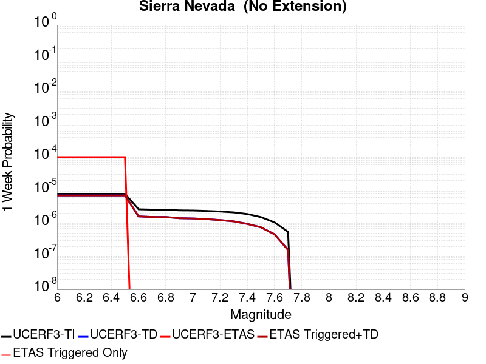 | 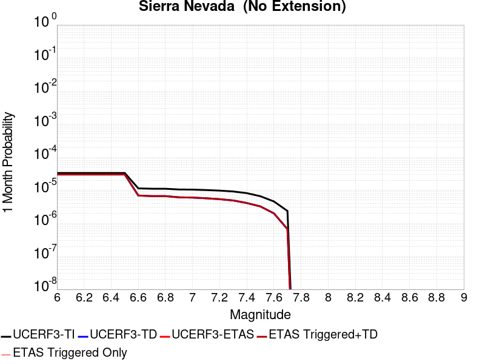 | 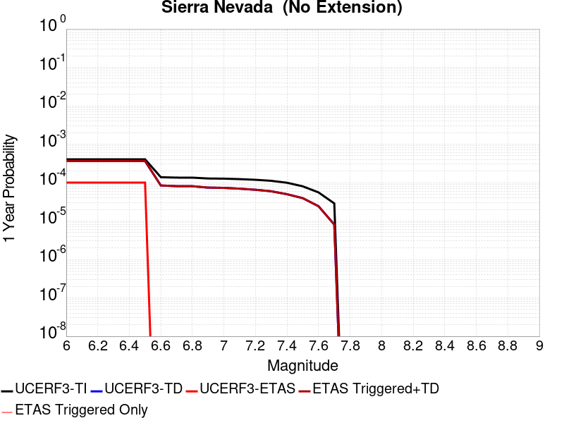 | 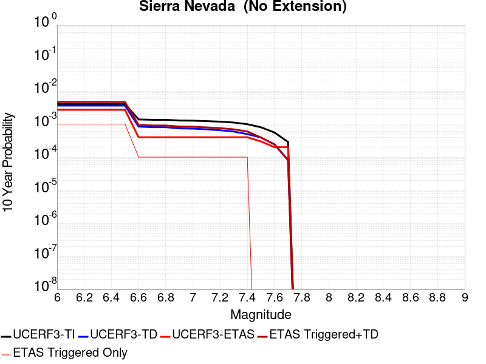 |

| Magnitude | 1 wk TI Prob | 1 wk TD Prob | 1 wk ETAS Prob | 1 wk ETAS/TD Gain | 1 wk ETAS Triggered+TD | 1 wk ETAS Triggered Only | 1 mo TI Prob | 1 mo TD Prob | 1 mo ETAS Prob | 1 mo ETAS/TD Gain | 1 mo ETAS Triggered+TD | 1 mo ETAS Triggered Only | 1 yr TI Prob | 1 yr TD Prob | 1 yr ETAS Prob | 1 yr ETAS/TD Gain | 1 yr ETAS Triggered+TD | 1 yr ETAS Triggered Only | 10 yr TI Prob | 10 yr TD Prob | 10 yr ETAS Prob | 10 yr ETAS/TD Gain | 10 yr ETAS Triggered+TD | 10 yr ETAS Triggered Only |
|-----|-----|-----|-----|-----|-----|-----|-----|-----|-----|-----|-----|-----|-----|-----|-----|-----|-----|-----|-----|-----|-----|-----|-----|-----|
| 6.0 | 7.7690465E-6 | 6.97725E-6 | 1.0E-4 | 14.3322935 | 6.97725E-6 | 0.0 | 3.329549E-5 | 2.990236E-5 | 1.0E-4 | 3.3442175 | 2.990236E-5 | 0.0 | 4.0529718E-4 | 3.6403627E-4 | 1.0E-4 | 0.2746979 | 3.6403627E-4 | 0.0 | 0.004045588 | 0.0036379162 | 0.0027 | 0.74218315 | 0.0046342784 | 0.001 |
| 6.1 | 7.7690465E-6 | 6.97725E-6 | 1.0E-4 | 14.3322935 | 6.97725E-6 | 0.0 | 3.329549E-5 | 2.990236E-5 | 1.0E-4 | 3.3442175 | 2.990236E-5 | 0.0 | 4.0529718E-4 | 3.6403627E-4 | 1.0E-4 | 0.2746979 | 3.6403627E-4 | 0.0 | 0.004045588 | 0.0036379162 | 0.0027 | 0.74218315 | 0.0046342784 | 0.001 |
| 6.2 | 7.7690465E-6 | 6.97725E-6 | 1.0E-4 | 14.3322935 | 6.97725E-6 | 0.0 | 3.329549E-5 | 2.990236E-5 | 1.0E-4 | 3.3442175 | 2.990236E-5 | 0.0 | 4.0529718E-4 | 3.6403627E-4 | 1.0E-4 | 0.2746979 | 3.6403627E-4 | 0.0 | 0.004045588 | 0.0036379162 | 0.0027 | 0.74218315 | 0.0046342784 | 0.001 |
| 6.3 | 7.7690465E-6 | 6.97725E-6 | 1.0E-4 | 14.3322935 | 6.97725E-6 | 0.0 | 3.329549E-5 | 2.990236E-5 | 1.0E-4 | 3.3442175 | 2.990236E-5 | 0.0 | 4.0529718E-4 | 3.6403627E-4 | 1.0E-4 | 0.2746979 | 3.6403627E-4 | 0.0 | 0.004045588 | 0.0036379162 | 0.0027 | 0.74218315 | 0.0046342784 | 0.001 |
| 6.4 | 7.7690465E-6 | 6.97725E-6 | 1.0E-4 | 14.3322935 | 6.97725E-6 | 0.0 | 3.329549E-5 | 2.990236E-5 | 1.0E-4 | 3.3442175 | 2.990236E-5 | 0.0 | 4.0529718E-4 | 3.6403627E-4 | 1.0E-4 | 0.2746979 | 3.6403627E-4 | 0.0 | 0.004045588 | 0.0036379162 | 0.0027 | 0.74218315 | 0.0046342784 | 0.001 |
| 6.5 | 7.7690465E-6 | 6.97725E-6 | 1.0E-4 | 14.3322935 | 6.97725E-6 | 0.0 | 3.329549E-5 | 2.990236E-5 | 1.0E-4 | 3.3442175 | 2.990236E-5 | 0.0 | 4.0529718E-4 | 3.6403627E-4 | 1.0E-4 | 0.2746979 | 3.6403627E-4 | 0.0 | 0.004045588 | 0.0036379162 | 0.0027 | 0.74218315 | 0.0046342784 | 0.001 |
| 6.6 | 2.653E-6 | 1.6152528E-6 | 0.0 | 0.0 | 1.6152528E-6 | 0.0 | 1.136995E-5 | 6.9224943E-6 | 0.0 | 0.0 | 6.9224943E-6 | 0.0 | 1.3842035E-4 | 8.427814E-5 | 0.0 | 0.0 | 8.427814E-5 | 0.0 | 0.0013833415 | 8.424652E-4 | 4.0E-4 | 0.47479704 | 9.42381E-4 | 1.0E-4 |
| 6.7 | 2.5902466E-6 | 1.5505824E-6 | 0.0 | 0.0 | 1.5505824E-6 | 0.0 | 1.11010095E-5 | 6.6453363E-6 | 0.0 | 0.0 | 6.6453363E-6 | 0.0 | 1.351464E-4 | 8.090399E-5 | 0.0 | 0.0 | 8.090399E-5 | 0.0 | 0.0013506424 | 8.0874836E-4 | 4.0E-4 | 0.49459141 | 9.086675E-4 | 1.0E-4 |
| 6.8 | 2.5853892E-6 | 1.5473806E-6 | 0.0 | 0.0 | 1.5473806E-6 | 0.0 | 1.1080193E-5 | 6.6316147E-6 | 0.0 | 0.0 | 6.6316147E-6 | 0.0 | 1.34893E-4 | 8.073694E-5 | 0.0 | 0.0 | 8.073694E-5 | 0.0 | 0.0013481114 | 8.0707914E-4 | 4.0E-4 | 0.49561435 | 9.069984E-4 | 1.0E-4 |
| 6.9 | 2.458257E-6 | 1.422446E-6 | 0.0 | 0.0 | 1.422446E-6 | 0.0 | 1.0535345E-5 | 6.096183E-6 | 0.0 | 0.0 | 6.096183E-6 | 0.0 | 1.2826028E-4 | 7.421852E-5 | 0.0 | 0.0 | 7.421852E-5 | 0.0 | 0.0012818627 | 7.419393E-4 | 4.0E-4 | 0.53912765 | 8.418651E-4 | 1.0E-4 |
| 7.0 | 2.4341468E-6 | 1.3994078E-6 | 0.0 | 0.0 | 1.3994078E-6 | 0.0 | 1.0432016E-5 | 5.997448E-6 | 0.0 | 0.0 | 5.997448E-6 | 0.0 | 1.270024E-4 | 7.3016505E-5 | 0.0 | 0.0 | 7.3016505E-5 | 0.0 | 0.0012692984 | 7.299271E-4 | 4.0E-4 | 0.548 | 8.2985405E-4 | 1.0E-4 |
| 7.1 | 2.3652476E-6 | 1.3343519E-6 | 0.0 | 0.0 | 1.3343519E-6 | 0.0 | 1.0136736E-5 | 5.718638E-6 | 0.0 | 0.0 | 5.718638E-6 | 0.0 | 1.2340778E-4 | 6.962221E-5 | 0.0 | 0.0 | 6.962221E-5 | 0.0 | 0.0012333926 | 6.960057E-4 | 4.0E-4 | 0.5747079 | 7.959361E-4 | 1.0E-4 |
| 7.2 | 2.272158E-6 | 1.2506495E-6 | 0.0 | 0.0 | 1.2506495E-6 | 0.0 | 9.737784E-6 | 5.3599156E-6 | 0.0 | 0.0 | 5.3599156E-6 | 0.0 | 1.1855107E-4 | 6.525503E-5 | 0.0 | 0.0 | 6.525503E-5 | 0.0 | 0.0011848784 | 6.523602E-4 | 4.0E-4 | 0.61315817 | 7.5229496E-4 | 1.0E-4 |
| 7.3 | 2.1382127E-6 | 1.1423258E-6 | 0.0 | 0.0 | 1.1423258E-6 | 0.0 | 9.163737E-6 | 4.895673E-6 | 0.0 | 0.0 | 4.895673E-6 | 0.0 | 1.1156279E-4 | 5.96032E-5 | 0.0 | 0.0 | 5.96032E-5 | 0.0 | 0.001115068 | 5.9587334E-4 | 4.0E-4 | 0.6712836 | 6.9581374E-4 | 1.0E-4 |
| 7.4 | 1.9048055E-6 | 9.578599E-7 | 0.0 | 0.0 | 9.578599E-7 | 0.0 | 8.163426E-6 | 4.1051076E-6 | 0.0 | 0.0 | 4.1051076E-6 | 0.0 | 9.9385186E-5 | 4.9978546E-5 | 0.0 | 0.0 | 4.9978546E-5 | 0.0 | 9.934074E-4 | 4.9967377E-4 | 4.0E-4 | 0.8005223 | 5.996238E-4 | 1.0E-4 |
| 7.5 | 1.5373403E-6 | 7.56289E-7 | 0.0 | 0.0 | 7.56289E-7 | 0.0 | 6.5885843E-6 | 3.2412347E-6 | 0.0 | 0.0 | 3.2412347E-6 | 0.0 | 8.021306E-5 | 3.9461323E-5 | 0.0 | 0.0 | 3.9461323E-5 | 0.0 | 8.0184115E-4 | 3.9454363E-4 | 3.0E-4 | 0.7603722 | 3.9454363E-4 | 0.0 |
| 7.6 | 1.0680322E-6 | 4.6616506E-7 | 0.0 | 0.0 | 4.6616506E-7 | 0.0 | 4.577273E-6 | 1.9978488E-6 | 0.0 | 0.0 | 1.9978488E-6 | 0.0 | 5.5726876E-5 | 2.4323539E-5 | 0.0 | 0.0 | 2.4323539E-5 | 0.0 | 5.5712904E-4 | 2.4320904E-4 | 2.0E-4 | 0.82233787 | 2.4320904E-4 | 0.0 |
| 7.7 | 5.509146E-7 | 1.559012E-7 | 0.0 | 0.0 | 1.559012E-7 | 0.0 | 2.3610605E-6 | 6.6814783E-7 | 0.0 | 0.0 | 6.6814783E-7 | 0.0 | 2.8745531E-5 | 8.134671E-6 | 0.0 | 0.0 | 8.134671E-6 | 0.0 | 2.8741814E-4 | 8.1343846E-5 | 2.0E-4 | 2.4586985 | 8.1343846E-5 | 0.0 |

## San Juan
*[(top)](#table-of-contents)*

| 1 Week | 1 Month | 1 Year | 10 Year |
|-----|-----|-----|-----|
| 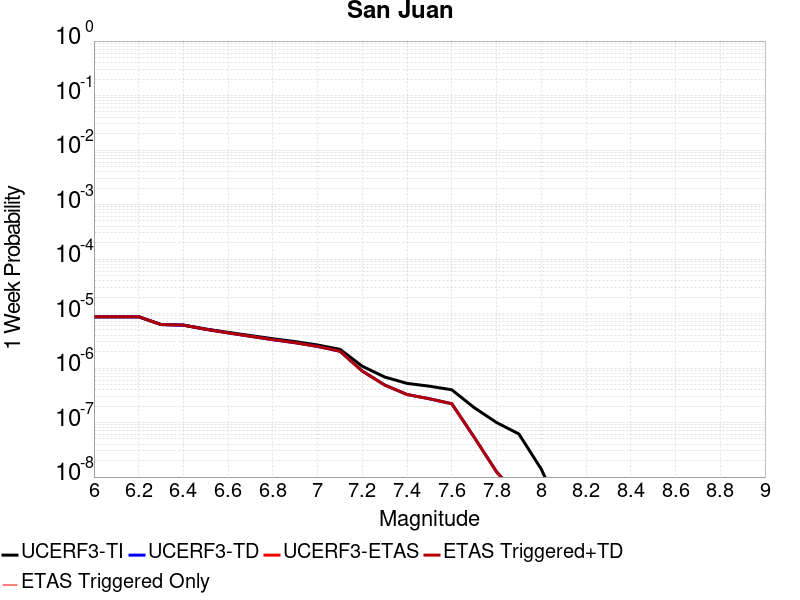 | 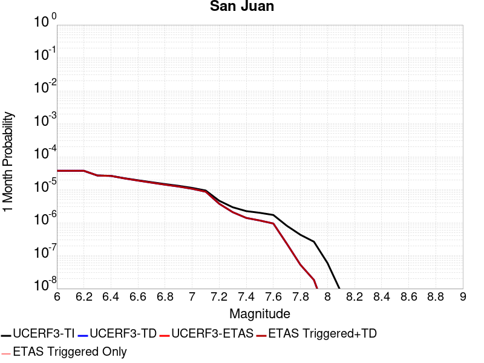 | 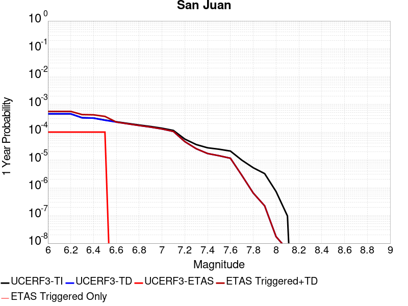 | 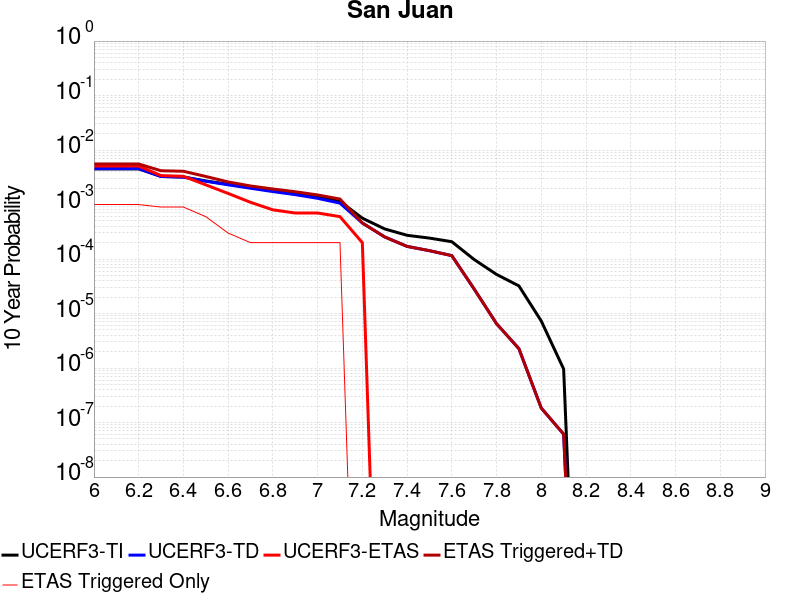 |

| Magnitude | 1 wk TI Prob | 1 wk TD Prob | 1 wk ETAS Prob | 1 wk ETAS/TD Gain | 1 wk ETAS Triggered+TD | 1 wk ETAS Triggered Only | 1 mo TI Prob | 1 mo TD Prob | 1 mo ETAS Prob | 1 mo ETAS/TD Gain | 1 mo ETAS Triggered+TD | 1 mo ETAS Triggered Only | 1 yr TI Prob | 1 yr TD Prob | 1 yr ETAS Prob | 1 yr ETAS/TD Gain | 1 yr ETAS Triggered+TD | 1 yr ETAS Triggered Only | 10 yr TI Prob | 10 yr TD Prob | 10 yr ETAS Prob | 10 yr ETAS/TD Gain | 10 yr ETAS Triggered+TD | 10 yr ETAS Triggered Only |
|-----|-----|-----|-----|-----|-----|-----|-----|-----|-----|-----|-----|-----|-----|-----|-----|-----|-----|-----|-----|-----|-----|-----|-----|-----|
| 6.0 | 8.682808E-6 | 8.755628E-6 | 0.0 | 0.0 | 8.755628E-6 | 0.0 | 3.72115E-5 | 3.752361E-5 | 0.0 | 0.0 | 3.752361E-5 | 0.0 | 4.5295584E-4 | 4.5675898E-4 | 5.0E-4 | 1.0946692 | 5.567133E-4 | 1.0E-4 | 0.004520337 | 0.004558743 | 0.0051 | 1.1187295 | 0.0055541843 | 0.001 |
| 6.1 | 8.682808E-6 | 8.755628E-6 | 0.0 | 0.0 | 8.755628E-6 | 0.0 | 3.72115E-5 | 3.752361E-5 | 0.0 | 0.0 | 3.752361E-5 | 0.0 | 4.5295584E-4 | 4.5675898E-4 | 5.0E-4 | 1.0946692 | 5.567133E-4 | 1.0E-4 | 0.004520337 | 0.004558743 | 0.0051 | 1.1187295 | 0.0055541843 | 0.001 |
| 6.2 | 8.682808E-6 | 8.755628E-6 | 0.0 | 0.0 | 8.755628E-6 | 0.0 | 3.72115E-5 | 3.752361E-5 | 0.0 | 0.0 | 3.752361E-5 | 0.0 | 4.5295584E-4 | 4.5675898E-4 | 5.0E-4 | 1.0946692 | 5.567133E-4 | 1.0E-4 | 0.004520337 | 0.004558743 | 0.0051 | 1.1187295 | 0.0055541843 | 0.001 |
| 6.3 | 6.3054235E-6 | 6.288859E-6 | 0.0 | 0.0 | 6.288859E-6 | 0.0 | 2.7022963E-5 | 2.6951982E-5 | 0.0 | 0.0 | 2.6951982E-5 | 0.0 | 3.2895492E-4 | 3.280924E-4 | 5.0E-4 | 1.523961 | 4.2805957E-4 | 1.0E-4 | 0.003284684 | 0.00327628 | 0.0034 | 1.0377624 | 0.0041733314 | 9.0E-4 |
| 6.4 | 6.1490473E-6 | 6.1199185E-6 | 0.0 | 0.0 | 6.1199185E-6 | 0.0 | 2.6352795E-5 | 2.6227966E-5 | 0.0 | 0.0 | 2.6227966E-5 | 0.0 | 3.2079802E-4 | 3.1928008E-4 | 5.0E-4 | 1.5660232 | 4.1924816E-4 | 1.0E-4 | 0.0032033534 | 0.0031884098 | 0.0033 | 1.0349987 | 0.0040855403 | 9.0E-4 |
| 6.5 | 5.204848E-6 | 5.1425204E-6 | 0.0 | 0.0 | 5.1425204E-6 | 0.0 | 2.23063E-5 | 2.2039192E-5 | 0.0 | 0.0 | 2.2039192E-5 | 0.0 | 2.7154534E-4 | 2.682951E-4 | 4.0E-4 | 1.4908957 | 3.6826826E-4 | 1.0E-4 | 0.0027121378 | 0.0026798656 | 0.0023 | 0.858252 | 0.0032782578 | 6.0E-4 |
| 6.6 | 4.5179986E-6 | 4.4190647E-6 | 0.0 | 0.0 | 4.4190647E-6 | 0.0 | 1.9362706E-5 | 1.8938716E-5 | 0.0 | 0.0 | 1.8938716E-5 | 0.0 | 2.3571544E-4 | 2.3055526E-4 | 0.0 | 0.0 | 2.3055526E-4 | 0.0 | 0.0023546559 | 0.0023032976 | 0.0016 | 0.6946562 | 0.0026026065 | 3.0E-4 |
| 6.7 | 3.9442616E-6 | 3.8234652E-6 | 0.0 | 0.0 | 3.8234652E-6 | 0.0 | 1.6903869E-5 | 1.6386179E-5 | 0.0 | 0.0 | 1.6386179E-5 | 0.0 | 2.0578515E-4 | 1.9948414E-4 | 0.0 | 0.0 | 1.9948414E-4 | 0.0 | 0.002055947 | 0.0019931756 | 0.0011 | 0.55188316 | 0.0021927769 | 2.0E-4 |
| 6.8 | 3.4536245E-6 | 3.319833E-6 | 0.0 | 0.0 | 3.319833E-6 | 0.0 | 1.4801163E-5 | 1.4227781E-5 | 0.0 | 0.0 | 1.4227781E-5 | 0.0 | 1.8018926E-4 | 1.7321008E-4 | 0.0 | 0.0 | 1.7321008E-4 | 0.0 | 0.0018004322 | 0.0017308695 | 8.0E-4 | 0.46219543 | 0.0019305234 | 2.0E-4 |
| 6.9 | 3.059865E-6 | 2.9153853E-6 | 0.0 | 0.0 | 2.9153853E-6 | 0.0 | 1.3113641E-5 | 1.2494452E-5 | 0.0 | 0.0 | 1.2494452E-5 | 0.0 | 1.596469E-4 | 1.521099E-4 | 0.0 | 0.0 | 1.521099E-4 | 0.0 | 0.0015953224 | 0.0015201723 | 7.0E-4 | 0.4604741 | 0.0017198684 | 2.0E-4 |
| 7.0 | 2.6504351E-6 | 2.4951837E-6 | 0.0 | 0.0 | 2.4951837E-6 | 0.0 | 1.1358958E-5 | 1.0693604E-5 | 0.0 | 0.0 | 1.0693604E-5 | 0.0 | 1.3828653E-4 | 1.3018739E-4 | 0.0 | 0.0 | 1.3018739E-4 | 0.0 | 0.0013820052 | 0.0013012231 | 7.0E-4 | 0.53795546 | 0.0015009628 | 2.0E-4 |
| 7.1 | 2.2039317E-6 | 2.0364844E-6 | 0.0 | 0.0 | 2.0364844E-6 | 0.0 | 9.445387E-6 | 8.727763E-6 | 0.0 | 0.0 | 8.727763E-6 | 0.0 | 1.1499152E-4 | 1.06255866E-4 | 0.0 | 0.0 | 1.06255866E-4 | 0.0 | 0.0011493203 | 0.0010621605 | 6.0E-4 | 0.5648864 | 0.0012619481 | 2.0E-4 |
| 7.2 | 1.0786707E-6 | 8.7933006E-7 | 0.0 | 0.0 | 8.7933006E-7 | 0.0 | 4.622866E-6 | 3.768552E-6 | 0.0 | 0.0 | 3.768552E-6 | 0.0 | 5.628194E-5 | 4.5881166E-5 | 0.0 | 0.0 | 4.5881166E-5 | 0.0 | 5.6267687E-4 | 4.5877587E-4 | 2.0E-4 | 0.4359427 | 4.5877587E-4 | 0.0 |
| 7.3 | 6.846433E-7 | 4.881782E-7 | 0.0 | 0.0 | 4.881782E-7 | 0.0 | 2.9341822E-6 | 2.0921905E-6 | 0.0 | 0.0 | 2.0921905E-6 | 0.0 | 3.5723086E-5 | 2.5472124E-5 | 0.0 | 0.0 | 2.5472124E-5 | 0.0 | 3.571734E-4 | 2.547261E-4 | 0.0 | 0.0 | 2.547261E-4 | 0.0 |
| 7.4 | 5.23043E-7 | 3.2724424E-7 | 0.0 | 0.0 | 3.2724424E-7 | 0.0 | 2.2416111E-6 | 1.4024745E-6 | 0.0 | 0.0 | 1.4024745E-6 | 0.0 | 2.7291273E-5 | 1.7074994E-5 | 0.0 | 0.0 | 1.7074994E-5 | 0.0 | 2.7287923E-4 | 1.707696E-4 | 0.0 | 0.0 | 1.707696E-4 | 0.0 |
| 7.5 | 4.648444E-7 | 2.7317932E-7 | 0.0 | 0.0 | 2.7317932E-7 | 0.0 | 1.9921886E-6 | 1.170768E-6 | 0.0 | 0.0 | 1.170768E-6 | 0.0 | 2.4254627E-5 | 1.4254007E-5 | 0.0 | 0.0 | 1.4254007E-5 | 0.0 | 2.425198E-4 | 1.4256134E-4 | 0.0 | 0.0 | 1.4256134E-4 | 0.0 |
| 7.6 | 3.9906567E-7 | 2.2148457E-7 | 0.0 | 0.0 | 2.2148457E-7 | 0.0 | 1.7102802E-6 | 9.4921927E-7 | 0.0 | 0.0 | 9.4921927E-7 | 0.0 | 2.0822463E-5 | 1.1556684E-5 | 0.0 | 0.0 | 1.1556684E-5 | 0.0 | 2.0820512E-4 | 1.1558619E-4 | 0.0 | 0.0 | 1.1558619E-4 | 0.0 |
| 7.7 | 1.8784601E-7 | 5.391214E-8 | 0.0 | 0.0 | 5.391214E-8 | 0.0 | 8.0505407E-7 | 2.31052E-7 | 0.0 | 0.0 | 2.31052E-7 | 0.0 | 9.80149E-6 | 2.8130544E-6 | 0.0 | 0.0 | 2.8130544E-6 | 0.0 | 9.801057E-5 | 2.8139928E-5 | 0.0 | 0.0 | 2.8139928E-5 | 0.0 |
| 7.8 | 1.00154914E-7 | 1.2490732E-8 | 0.0 | 0.0 | 1.2490732E-8 | 0.0 | 4.2923529E-7 | 5.353171E-8 | 0.0 | 0.0 | 5.353171E-8 | 0.0 | 5.225927E-6 | 6.517484E-7 | 0.0 | 0.0 | 6.517484E-7 | 0.0 | 5.225804E-5 | 6.523534E-6 | 0.0 | 0.0 | 6.523534E-6 | 0.0 |
| 7.9 | 6.171429E-8 | 4.3351056E-9 | 0.0 | 0.0 | 4.3351056E-9 | 0.0 | 2.6448978E-7 | 1.8579025E-8 | 0.0 | 0.0 | 1.8579025E-8 | 0.0 | 3.2201583E-6 | 2.2619962E-7 | 0.0 | 0.0 | 2.2619962E-7 | 0.0 | 3.2201115E-5 | 2.2674499E-6 | 0.0 | 0.0 | 2.2674499E-6 | 0.0 |
| 8.0 | 1.3974572E-8 | 3.448134E-10 | 0.0 | 0.0 | 3.448134E-10 | 0.0 | 5.989102E-8 | 1.4777772E-9 | 0.0 | 0.0 | 1.4777772E-9 | 0.0 | 7.2917294E-7 | 1.7991933E-8 | 0.0 | 0.0 | 1.7991933E-8 | 0.0 | 7.2917055E-6 | 1.8436415E-7 | 0.0 | 0.0 | 1.8436415E-7 | 0.0 |
| 8.1 | 1.8403477E-9 | 1.14770304E-10 | 0.0 | 0.0 | 1.14770304E-10 | 0.0 | 7.887204E-9 | 4.918743E-10 | 0.0 | 0.0 | 4.918743E-10 | 0.0 | 9.602671E-8 | 5.9885665E-9 | 0.0 | 0.0 | 5.9885665E-9 | 0.0 | 9.602667E-7 | 6.1195244E-8 | 0.0 | 0.0 | 6.1195244E-8 | 0.0 |

## Great Valley 07 (Orestimba)
*[(top)](#table-of-contents)*

| 1 Week | 1 Month | 1 Year | 10 Year |
|-----|-----|-----|-----|
| 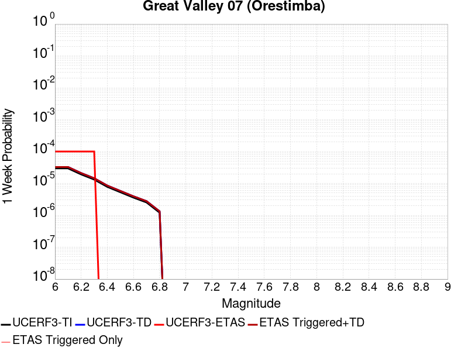 | 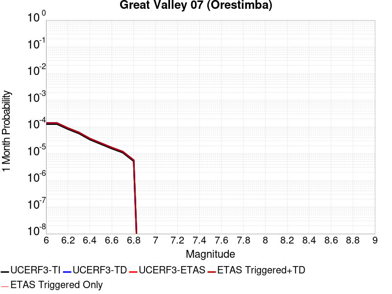 | 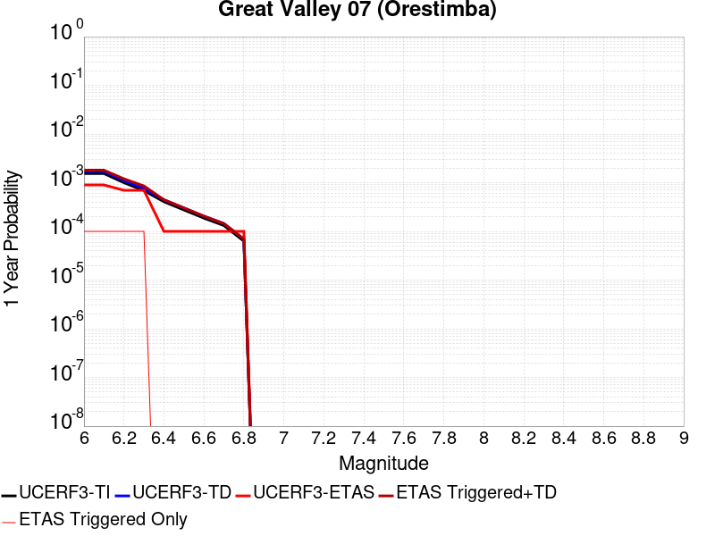 | 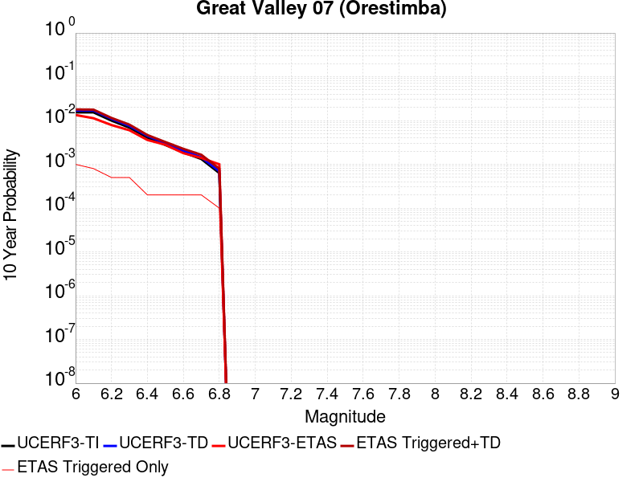 |

| Magnitude | 1 wk TI Prob | 1 wk TD Prob | 1 wk ETAS Prob | 1 wk ETAS/TD Gain | 1 wk ETAS Triggered+TD | 1 wk ETAS Triggered Only | 1 mo TI Prob | 1 mo TD Prob | 1 mo ETAS Prob | 1 mo ETAS/TD Gain | 1 mo ETAS Triggered+TD | 1 mo ETAS Triggered Only | 1 yr TI Prob | 1 yr TD Prob | 1 yr ETAS Prob | 1 yr ETAS/TD Gain | 1 yr ETAS Triggered+TD | 1 yr ETAS Triggered Only | 10 yr TI Prob | 10 yr TD Prob | 10 yr ETAS Prob | 10 yr ETAS/TD Gain | 10 yr ETAS Triggered+TD | 10 yr ETAS Triggered Only |
|-----|-----|-----|-----|-----|-----|-----|-----|-----|-----|-----|-----|-----|-----|-----|-----|-----|-----|-----|-----|-----|-----|-----|-----|-----|
| 6.0 | 2.9687902E-5 | 3.276448E-5 | 1.0E-4 | 3.0520856 | 3.276448E-5 | 0.0 | 1.2722766E-4 | 1.4041206E-4 | 2.0E-4 | 1.4243791 | 1.4041206E-4 | 0.0 | 0.0015478961 | 0.0017082482 | 9.0E-4 | 0.5268555 | 0.0018080773 | 1.0E-4 | 0.015371585 | 0.016958721 | 0.0134 | 0.7901539 | 0.017941762 | 0.001 |
| 6.1 | 2.9687902E-5 | 3.276448E-5 | 1.0E-4 | 3.0520856 | 3.276448E-5 | 0.0 | 1.2722766E-4 | 1.4041206E-4 | 2.0E-4 | 1.4243791 | 1.4041206E-4 | 0.0 | 0.0015478961 | 0.0017082482 | 9.0E-4 | 0.5268555 | 0.0018080773 | 1.0E-4 | 0.015371585 | 0.016958721 | 0.0113 | 0.66632384 | 0.017745154 | 8.0E-4 |
| 6.2 | 1.9231524E-5 | 2.1163536E-5 | 1.0E-4 | 4.725108 | 2.1163536E-5 | 0.0 | 8.2418206E-5 | 9.0697846E-5 | 2.0E-4 | 2.205124 | 9.0697846E-5 | 0.0 | 0.0010029797 | 0.00110371 | 7.0E-4 | 0.63422453 | 0.0012035997 | 1.0E-4 | 0.00998465 | 0.010984696 | 0.0079 | 0.7191823 | 0.0114792045 | 5.0E-4 |
| 6.3 | 1.324766E-5 | 1.4551477E-5 | 1.0E-4 | 6.8721547 | 1.4551477E-5 | 0.0 | 5.6774446E-5 | 6.236203E-5 | 2.0E-4 | 3.2070796 | 6.236203E-5 | 0.0 | 6.910097E-4 | 7.590024E-4 | 7.0E-4 | 0.9222632 | 8.589265E-4 | 1.0E-4 | 0.006888649 | 0.007565048 | 0.006 | 0.7931212 | 0.008061266 | 5.0E-4 |
| 6.4 | 7.818645E-6 | 8.574543E-6 | 0.0 | 0.0 | 8.574543E-6 | 0.0 | 3.3508048E-5 | 3.6747544E-5 | 0.0 | 0.0 | 3.6747544E-5 | 0.0 | 4.078841E-4 | 4.4731286E-4 | 1.0E-4 | 0.22355717 | 4.4731286E-4 | 0.0 | 0.004071363 | 0.0044644657 | 0.0036 | 0.8063675 | 0.0046635726 | 2.0E-4 |
| 6.5 | 5.3076565E-6 | 5.8189526E-6 | 0.0 | 0.0 | 5.8189526E-6 | 0.0 | 2.27469E-5 | 2.4938141E-5 | 0.0 | 0.0 | 2.4938141E-5 | 0.0 | 2.7690834E-4 | 3.0358168E-4 | 1.0E-4 | 0.32940066 | 3.0358168E-4 | 0.0 | 0.0027656353 | 0.003031879 | 0.0028 | 0.9235197 | 0.0032312728 | 2.0E-4 |
| 6.6 | 3.6003578E-6 | 3.9492816E-6 | 0.0 | 0.0 | 3.9492816E-6 | 0.0 | 1.5430012E-5 | 1.6925393E-5 | 0.0 | 0.0 | 1.6925393E-5 | 0.0 | 1.8784421E-4 | 2.0604873E-4 | 1.0E-4 | 0.4853221 | 2.0604873E-4 | 0.0 | 0.0018768552 | 0.002058731 | 0.0018 | 0.87432504 | 0.0022583192 | 2.0E-4 |
| 6.7 | 2.5361826E-6 | 2.784027E-6 | 0.0 | 0.0 | 2.784027E-6 | 0.0 | 1.0869308E-5 | 1.1931496E-5 | 0.0 | 0.0 | 1.1931496E-5 | 0.0 | 1.3232579E-4 | 1.4525761E-4 | 1.0E-4 | 0.6884321 | 1.4525761E-4 | 0.0 | 0.0013224703 | 0.0014517566 | 0.0014 | 0.964349 | 0.0016514662 | 2.0E-4 |
| 6.8 | 1.2115831E-6 | 1.3316509E-6 | 0.0 | 0.0 | 1.3316509E-6 | 0.0 | 5.1924885E-6 | 5.7070683E-6 | 0.0 | 0.0 | 5.7070683E-6 | 0.0 | 6.3216714E-5 | 6.948231E-5 | 1.0E-4 | 1.4392152 | 6.948231E-5 | 0.0 | 6.3198735E-4 | 6.94701E-4 | 0.001 | 1.4394681 | 7.9463155E-4 | 1.0E-4 |

## San Jacinto (San Bernardino)
*[(top)](#table-of-contents)*

| 1 Week | 1 Month | 1 Year | 10 Year |
|-----|-----|-----|-----|
| 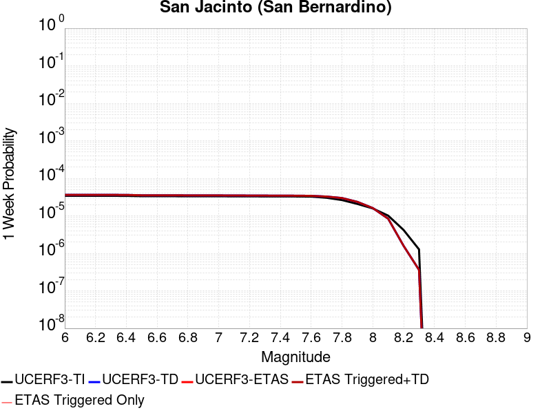 | 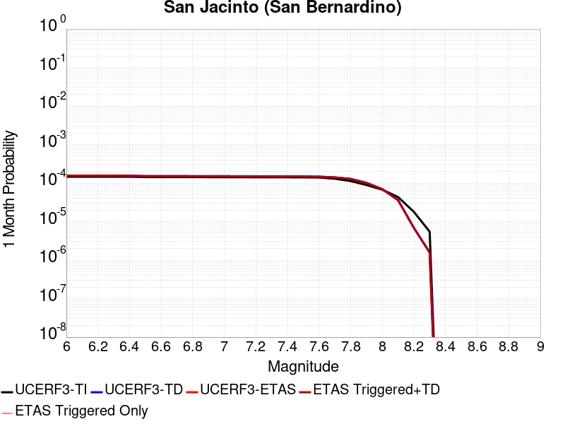 | 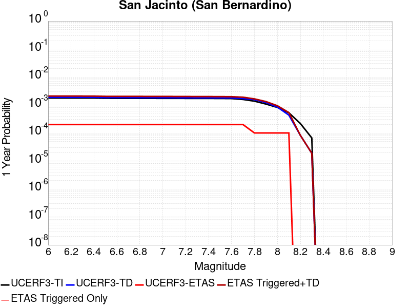 | 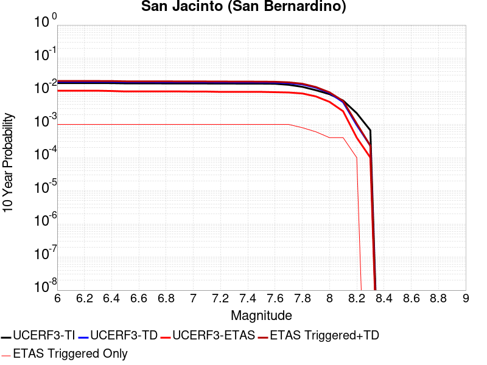 |

| Magnitude | 1 wk TI Prob | 1 wk TD Prob | 1 wk ETAS Prob | 1 wk ETAS/TD Gain | 1 wk ETAS Triggered+TD | 1 wk ETAS Triggered Only | 1 mo TI Prob | 1 mo TD Prob | 1 mo ETAS Prob | 1 mo ETAS/TD Gain | 1 mo ETAS Triggered+TD | 1 mo ETAS Triggered Only | 1 yr TI Prob | 1 yr TD Prob | 1 yr ETAS Prob | 1 yr ETAS/TD Gain | 1 yr ETAS Triggered+TD | 1 yr ETAS Triggered Only | 10 yr TI Prob | 10 yr TD Prob | 10 yr ETAS Prob | 10 yr ETAS/TD Gain | 10 yr ETAS Triggered+TD | 10 yr ETAS Triggered Only |
|-----|-----|-----|-----|-----|-----|-----|-----|-----|-----|-----|-----|-----|-----|-----|-----|-----|-----|-----|-----|-----|-----|-----|-----|-----|
| 6.0 | 3.409352E-5 | 3.623334E-5 | 0.0 | 0.0 | 3.623334E-5 | 0.0 | 1.461069E-4 | 1.5527652E-4 | 0.0 | 0.0 | 1.5527652E-4 | 0.0 | 0.0017774 | 0.001888854 | 0.0011 | 0.58236367 | 0.0020884762 | 2.0E-4 | 0.01763251 | 0.01947621 | 0.0104 | 0.5339848 | 0.020456735 | 0.001 |
| 6.1 | 3.409352E-5 | 3.623334E-5 | 0.0 | 0.0 | 3.623334E-5 | 0.0 | 1.461069E-4 | 1.5527652E-4 | 0.0 | 0.0 | 1.5527652E-4 | 0.0 | 0.0017774 | 0.001888854 | 0.0011 | 0.58236367 | 0.0020884762 | 2.0E-4 | 0.01763251 | 0.01947621 | 0.0104 | 0.5339848 | 0.020456735 | 0.001 |
| 6.2 | 3.409352E-5 | 3.623334E-5 | 0.0 | 0.0 | 3.623334E-5 | 0.0 | 1.461069E-4 | 1.5527652E-4 | 0.0 | 0.0 | 1.5527652E-4 | 0.0 | 0.0017774 | 0.001888854 | 0.0011 | 0.58236367 | 0.0020884762 | 2.0E-4 | 0.01763251 | 0.01947621 | 0.0104 | 0.5339848 | 0.020456735 | 0.001 |
| 6.3 | 3.409352E-5 | 3.623334E-5 | 0.0 | 0.0 | 3.623334E-5 | 0.0 | 1.461069E-4 | 1.5527652E-4 | 0.0 | 0.0 | 1.5527652E-4 | 0.0 | 0.0017774 | 0.001888854 | 0.0011 | 0.58236367 | 0.0020884762 | 2.0E-4 | 0.01763251 | 0.01947621 | 0.0104 | 0.5339848 | 0.020456735 | 0.001 |
| 6.4 | 3.400795E-5 | 3.612595E-5 | 0.0 | 0.0 | 3.612595E-5 | 0.0 | 1.4574021E-4 | 1.5481633E-4 | 0.0 | 0.0 | 1.5481633E-4 | 0.0 | 0.0017729428 | 0.0018832609 | 0.0011 | 0.5840933 | 0.0020828843 | 2.0E-4 | 0.017588645 | 0.01942127 | 0.0102 | 0.5251973 | 0.02040185 | 0.001 |
| 6.5 | 3.341482E-5 | 3.538621E-5 | 0.0 | 0.0 | 3.538621E-5 | 0.0 | 1.4319851E-4 | 1.5164638E-4 | 0.0 | 0.0 | 1.5164638E-4 | 0.0 | 0.0017420477 | 0.0018447326 | 0.0011 | 0.5962924 | 0.0020443636 | 2.0E-4 | 0.017284546 | 0.01904267 | 0.0099 | 0.51988506 | 0.02002363 | 0.001 |
| 6.6 | 3.3364955E-5 | 3.5323395E-5 | 0.0 | 0.0 | 3.5323395E-5 | 0.0 | 1.4298483E-4 | 1.513772E-4 | 0.0 | 0.0 | 1.513772E-4 | 0.0 | 0.0017394501 | 0.0018414609 | 0.0011 | 0.5973518 | 0.0020410926 | 2.0E-4 | 0.017258976 | 0.019010523 | 0.0099 | 0.52076423 | 0.019991513 | 0.001 |
| 6.7 | 3.335922E-5 | 3.531316E-5 | 0.0 | 0.0 | 3.531316E-5 | 0.0 | 1.4296026E-4 | 1.5133336E-4 | 0.0 | 0.0 | 1.5133336E-4 | 0.0 | 0.0017391514 | 0.001840928 | 0.0011 | 0.5975247 | 0.00204056 | 2.0E-4 | 0.017256035 | 0.019005314 | 0.0099 | 0.520907 | 0.019986307 | 0.001 |
| 6.8 | 3.327683E-5 | 3.520717E-5 | 0.0 | 0.0 | 3.520717E-5 | 0.0 | 1.4260718E-4 | 1.5087915E-4 | 0.0 | 0.0 | 1.5087915E-4 | 0.0 | 0.0017348597 | 0.0018354073 | 0.0011 | 0.599322 | 0.0020350402 | 2.0E-4 | 0.017213784 | 0.018951062 | 0.0099 | 0.5223981 | 0.019932112 | 0.001 |
| 6.9 | 3.3235785E-5 | 3.5148085E-5 | 0.0 | 0.0 | 3.5148085E-5 | 0.0 | 1.4243131E-4 | 1.5062597E-4 | 0.0 | 0.0 | 1.5062597E-4 | 0.0 | 0.0017327217 | 0.00183233 | 0.0011 | 0.60032856 | 0.0020319636 | 2.0E-4 | 0.017192734 | 0.018920917 | 0.0099 | 0.5232305 | 0.019901995 | 0.001 |
| 7.0 | 3.3197095E-5 | 3.508797E-5 | 0.0 | 0.0 | 3.508797E-5 | 0.0 | 1.422655E-4 | 1.5036836E-4 | 0.0 | 0.0 | 1.5036836E-4 | 0.0 | 0.0017307063 | 0.001829199 | 0.0011 | 0.6013561 | 0.0020288331 | 2.0E-4 | 0.017172894 | 0.018890275 | 0.0098 | 0.5187855 | 0.019871386 | 0.001 |
| 7.1 | 3.3129716E-5 | 3.4968085E-5 | 0.0 | 0.0 | 3.4968085E-5 | 0.0 | 1.4197677E-4 | 1.4985462E-4 | 0.0 | 0.0 | 1.4985462E-4 | 0.0 | 0.0017271966 | 0.0018229546 | 0.0011 | 0.603416 | 0.00202259 | 2.0E-4 | 0.017138338 | 0.018829312 | 0.0098 | 0.52046514 | 0.019810483 | 0.001 |
| 7.2 | 3.3034008E-5 | 3.483545E-5 | 0.0 | 0.0 | 3.483545E-5 | 0.0 | 1.4156665E-4 | 1.4928626E-4 | 0.0 | 0.0 | 1.4928626E-4 | 0.0 | 0.0017222111 | 0.0018160465 | 0.0011 | 0.60571134 | 0.0020156833 | 2.0E-4 | 0.017089253 | 0.018761687 | 0.0096 | 0.5116811 | 0.019742925 | 0.001 |
| 7.3 | 3.2956614E-5 | 3.4703062E-5 | 0.0 | 0.0 | 3.4703062E-5 | 0.0 | 1.4123498E-4 | 1.4871894E-4 | 0.0 | 0.0 | 1.4871894E-4 | 0.0 | 0.0017181796 | 0.0018091509 | 0.0011 | 0.60802007 | 0.002008789 | 2.0E-4 | 0.017049557 | 0.018694377 | 0.0096 | 0.5135234 | 0.019675683 | 0.001 |
| 7.4 | 3.2915937E-5 | 3.4624645E-5 | 0.0 | 0.0 | 3.4624645E-5 | 0.0 | 1.4106068E-4 | 1.483829E-4 | 0.0 | 0.0 | 1.483829E-4 | 0.0 | 0.0017160608 | 0.0018050664 | 0.0011 | 0.60939586 | 0.0020047054 | 2.0E-4 | 0.017028693 | 0.01865459 | 0.0096 | 0.51461864 | 0.019635936 | 0.001 |
| 7.5 | 3.281791E-5 | 3.448938E-5 | 0.0 | 0.0 | 3.448938E-5 | 0.0 | 1.406406E-4 | 1.4780326E-4 | 0.0 | 0.0 | 1.4780326E-4 | 0.0 | 0.0017109542 | 0.0017980209 | 0.0011 | 0.6117838 | 0.0019976613 | 2.0E-4 | 0.016978411 | 0.018585393 | 0.0096 | 0.5165347 | 0.019566808 | 0.001 |
| 7.6 | 3.2521442E-5 | 3.4213863E-5 | 0.0 | 0.0 | 3.4213863E-5 | 0.0 | 1.3937015E-4 | 1.4662261E-4 | 0.0 | 0.0 | 1.4662261E-4 | 0.0 | 0.0016955109 | 0.00178367 | 0.0011 | 0.61670595 | 0.0019833134 | 2.0E-4 | 0.016826328 | 0.018442808 | 0.0094 | 0.5096838 | 0.019424364 | 0.001 |
| 7.7 | 3.0287873E-5 | 3.269508E-5 | 0.0 | 0.0 | 3.269508E-5 | 0.0 | 1.297987E-4 | 1.4011425E-4 | 0.0 | 0.0 | 1.4011425E-4 | 0.0 | 0.0015791537 | 0.0017045573 | 0.001 | 0.5866626 | 0.0019042165 | 2.0E-4 | 0.01567979 | 0.017652504 | 0.0092 | 0.5211725 | 0.018634852 | 0.001 |
| 7.8 | 2.6316151E-5 | 2.9897023E-5 | 0.0 | 0.0 | 2.9897023E-5 | 0.0 | 1.1277862E-4 | 1.2812381E-4 | 0.0 | 0.0 | 1.2812381E-4 | 0.0 | 0.0013722149 | 0.0015587922 | 8.0E-4 | 0.51321787 | 0.0016586363 | 1.0E-4 | 0.013637724 | 0.016189847 | 0.0086 | 0.53119713 | 0.016976895 | 8.0E-4 |
| 7.9 | 2.0761147E-5 | 2.3621635E-5 | 0.0 | 0.0 | 2.3621635E-5 | 0.0 | 8.897331E-5 | 1.0123165E-4 | 0.0 | 0.0 | 1.0123165E-4 | 0.0 | 0.0010827117 | 0.0012317994 | 7.0E-4 | 0.5682744 | 0.0013316761 | 1.0E-4 | 0.010774517 | 0.012898888 | 0.007 | 0.5426824 | 0.013491149 | 6.0E-4 |
| 8.0 | 1.5738568E-5 | 1.6186461E-5 | 0.0 | 0.0 | 1.6186461E-5 | 0.0 | 6.744926E-5 | 6.93687E-5 | 0.0 | 0.0 | 6.93687E-5 | 0.0 | 8.2088535E-4 | 8.4423745E-4 | 4.0E-4 | 0.47380036 | 9.44153E-4 | 1.0E-4 | 0.008178596 | 0.008946933 | 0.0048 | 0.5364967 | 0.009343354 | 4.0E-4 |
| 8.1 | 1.0105832E-5 | 8.419485E-6 | 0.0 | 0.0 | 8.419485E-6 | 0.0 | 4.3309992E-5 | 3.6083013E-5 | 0.0 | 0.0 | 3.6083013E-5 | 0.0 | 5.2717153E-4 | 4.3922264E-4 | 4.0E-4 | 0.91069984 | 5.391787E-4 | 1.0E-4 | 0.005259227 | 0.0047254073 | 0.0025 | 0.52905494 | 0.005123517 | 4.0E-4 |
| 8.2 | 4.189207E-6 | 1.6037653E-6 | 0.0 | 0.0 | 1.6037653E-6 | 0.0 | 1.7953622E-5 | 6.873262E-6 | 0.0 | 0.0 | 6.873262E-6 | 0.0 | 2.1856341E-4 | 8.367878E-5 | 0.0 | 0.0 | 8.367878E-5 | 0.0 | 0.0021834858 | 9.710852E-4 | 4.0E-4 | 0.4119103 | 0.0010709881 | 1.0E-4 |
| 8.3 | 1.2758221E-6 | 3.6827566E-7 | 0.0 | 0.0 | 3.6827566E-7 | 0.0 | 5.4677976E-6 | 1.5783233E-6 | 0.0 | 0.0 | 1.5783233E-6 | 0.0 | 6.65684E-5 | 1.921592E-5 | 0.0 | 0.0 | 1.921592E-5 | 0.0 | 6.6548464E-4 | 2.3150818E-4 | 1.0E-4 | 0.43195018 | 2.3150818E-4 | 0.0 |

## San Jacinto (San Jacinto Valley) rev
*[(top)](#table-of-contents)*

| 1 Week | 1 Month | 1 Year | 10 Year |
|-----|-----|-----|-----|
| 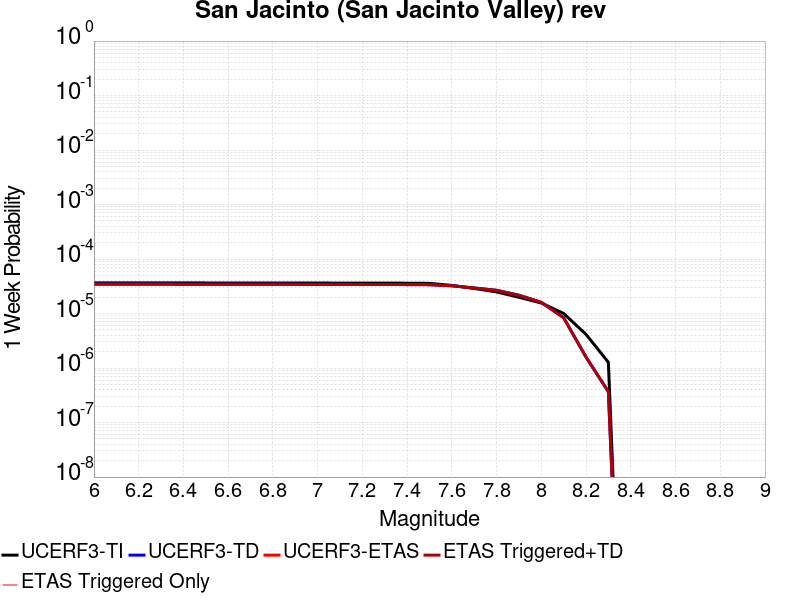 | 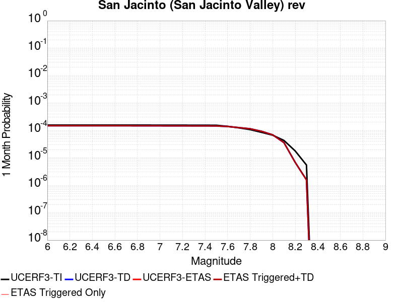 | 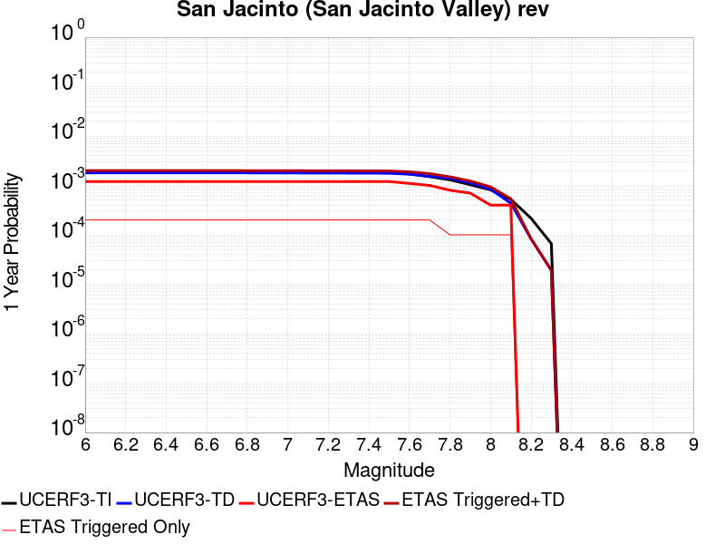 | 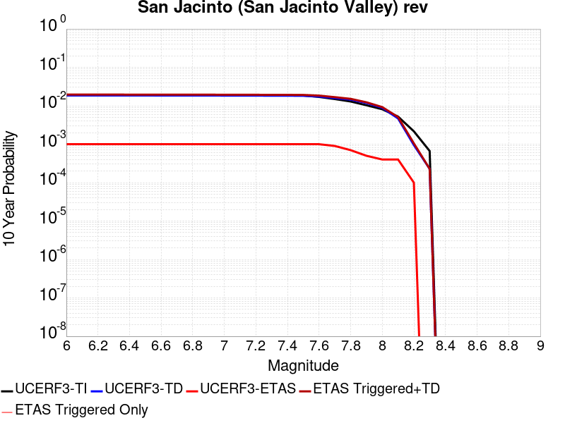 |

| Magnitude | 1 wk TI Prob | 1 wk TD Prob | 1 wk ETAS Prob | 1 wk ETAS/TD Gain | 1 wk ETAS Triggered+TD | 1 wk ETAS Triggered Only | 1 mo TI Prob | 1 mo TD Prob | 1 mo ETAS Prob | 1 mo ETAS/TD Gain | 1 mo ETAS Triggered+TD | 1 mo ETAS Triggered Only | 1 yr TI Prob | 1 yr TD Prob | 1 yr ETAS Prob | 1 yr ETAS/TD Gain | 1 yr ETAS Triggered+TD | 1 yr ETAS Triggered Only | 10 yr TI Prob | 10 yr TD Prob | 10 yr ETAS Prob | 10 yr ETAS/TD Gain | 10 yr ETAS Triggered+TD | 10 yr ETAS Triggered Only |
|-----|-----|-----|-----|-----|-----|-----|-----|-----|-----|-----|-----|-----|-----|-----|-----|-----|-----|-----|-----|-----|-----|-----|-----|-----|
| 6.0 | 3.652694E-5 | 3.463641E-5 | 0.0 | 0.0 | 3.463641E-5 | 0.0 | 1.5653463E-4 | 1.4843332E-4 | 0.0 | 0.0 | 1.4843332E-4 | 0.0 | 0.0019041431 | 0.0018056795 | 0.0012 | 0.66456974 | 0.0020053184 | 2.0E-4 | 0.018879099 | 0.018647574 | 0.0102 | 0.54698807 | 0.019628925 | 0.001 |
| 6.1 | 3.652694E-5 | 3.463641E-5 | 0.0 | 0.0 | 3.463641E-5 | 0.0 | 1.5653463E-4 | 1.4843332E-4 | 0.0 | 0.0 | 1.4843332E-4 | 0.0 | 0.0019041431 | 0.0018056795 | 0.0012 | 0.66456974 | 0.0020053184 | 2.0E-4 | 0.018879099 | 0.018647574 | 0.0102 | 0.54698807 | 0.019628925 | 0.001 |
| 6.2 | 3.652694E-5 | 3.463641E-5 | 0.0 | 0.0 | 3.463641E-5 | 0.0 | 1.5653463E-4 | 1.4843332E-4 | 0.0 | 0.0 | 1.4843332E-4 | 0.0 | 0.0019041431 | 0.0018056795 | 0.0012 | 0.66456974 | 0.0020053184 | 2.0E-4 | 0.018879099 | 0.018647574 | 0.0102 | 0.54698807 | 0.019628925 | 0.001 |
| 6.3 | 3.652694E-5 | 3.463641E-5 | 0.0 | 0.0 | 3.463641E-5 | 0.0 | 1.5653463E-4 | 1.4843332E-4 | 0.0 | 0.0 | 1.4843332E-4 | 0.0 | 0.0019041431 | 0.0018056795 | 0.0012 | 0.66456974 | 0.0020053184 | 2.0E-4 | 0.018879099 | 0.018647574 | 0.0102 | 0.54698807 | 0.019628925 | 0.001 |
| 6.4 | 3.646941E-5 | 3.455793E-5 | 0.0 | 0.0 | 3.455793E-5 | 0.0 | 1.5628811E-4 | 1.4809702E-4 | 0.0 | 0.0 | 1.4809702E-4 | 0.0 | 0.0019011468 | 0.0018015923 | 0.0012 | 0.66607744 | 0.002001232 | 2.0E-4 | 0.018849645 | 0.01860743 | 0.0102 | 0.5481681 | 0.019588824 | 0.001 |
| 6.5 | 3.646941E-5 | 3.455793E-5 | 0.0 | 0.0 | 3.455793E-5 | 0.0 | 1.5628811E-4 | 1.4809702E-4 | 0.0 | 0.0 | 1.4809702E-4 | 0.0 | 0.0019011468 | 0.0018015923 | 0.0012 | 0.66607744 | 0.002001232 | 2.0E-4 | 0.018849645 | 0.01860743 | 0.0102 | 0.5481681 | 0.019588824 | 0.001 |
| 6.6 | 3.6442503E-5 | 3.452129E-5 | 0.0 | 0.0 | 3.452129E-5 | 0.0 | 1.561728E-4 | 1.4794002E-4 | 0.0 | 0.0 | 1.4794002E-4 | 0.0 | 0.0018997455 | 0.0017996841 | 0.0012 | 0.6667837 | 0.0019993242 | 2.0E-4 | 0.018835869 | 0.01858869 | 0.0102 | 0.5487208 | 0.019570101 | 0.001 |
| 6.7 | 3.6432113E-5 | 3.450686E-5 | 0.0 | 0.0 | 3.450686E-5 | 0.0 | 1.5612828E-4 | 1.4787816E-4 | 0.0 | 0.0 | 1.4787816E-4 | 0.0 | 0.0018992044 | 0.0017989323 | 0.0012 | 0.66706234 | 0.0019985726 | 2.0E-4 | 0.018830549 | 0.018581308 | 0.0102 | 0.54893875 | 0.019562727 | 0.001 |
| 6.8 | 3.6409598E-5 | 3.447589E-5 | 0.0 | 0.0 | 3.447589E-5 | 0.0 | 1.560318E-4 | 1.4774545E-4 | 0.0 | 0.0 | 1.4774545E-4 | 0.0 | 0.0018980318 | 0.0017973193 | 0.0012 | 0.667661 | 0.0019969598 | 2.0E-4 | 0.018819023 | 0.018565454 | 0.0102 | 0.54940754 | 0.019546887 | 0.001 |
| 6.9 | 3.638078E-5 | 3.443628E-5 | 0.0 | 0.0 | 3.443628E-5 | 0.0 | 1.5590832E-4 | 1.4757573E-4 | 0.0 | 0.0 | 1.4757573E-4 | 0.0 | 0.0018965311 | 0.0017952564 | 0.0012 | 0.6684282 | 0.0019948974 | 2.0E-4 | 0.018804269 | 0.018545173 | 0.0102 | 0.55000836 | 0.019526629 | 0.001 |
| 7.0 | 3.6294874E-5 | 3.431821E-5 | 0.0 | 0.0 | 3.431821E-5 | 0.0 | 1.5554018E-4 | 1.4706976E-4 | 0.0 | 0.0 | 1.4706976E-4 | 0.0 | 0.0018920569 | 0.0017891065 | 0.0012 | 0.6707259 | 0.0019887488 | 2.0E-4 | 0.018760284 | 0.018484717 | 0.0101 | 0.5463973 | 0.019466233 | 0.001 |
| 7.1 | 3.6260717E-5 | 3.4274468E-5 | 0.0 | 0.0 | 3.4274468E-5 | 0.0 | 1.5539382E-4 | 1.4688233E-4 | 0.0 | 0.0 | 1.4688233E-4 | 0.0 | 0.001890278 | 0.0017868282 | 0.0012 | 0.6715811 | 0.0019864708 | 2.0E-4 | 0.018742796 | 0.01846231 | 0.0101 | 0.5470605 | 0.019443847 | 0.001 |
| 7.2 | 3.6210204E-5 | 3.4208566E-5 | 0.0 | 0.0 | 3.4208566E-5 | 0.0 | 1.5517735E-4 | 1.4659992E-4 | 0.0 | 0.0 | 1.4659992E-4 | 0.0 | 0.001887647 | 0.0017833955 | 0.0012 | 0.67287374 | 0.0019830388 | 2.0E-4 | 0.01871693 | 0.018428542 | 0.01 | 0.5426365 | 0.019410115 | 0.001 |
| 7.3 | 3.6119454E-5 | 3.4096574E-5 | 0.0 | 0.0 | 3.4096574E-5 | 0.0 | 1.5478847E-4 | 1.4612002E-4 | 0.0 | 0.0 | 1.4612002E-4 | 0.0 | 0.0018829206 | 0.0017775622 | 0.0012 | 0.6750819 | 0.0019772067 | 2.0E-4 | 0.018670462 | 0.018370954 | 0.01 | 0.5443375 | 0.019352583 | 0.001 |
| 7.4 | 3.607848E-5 | 3.4043966E-5 | 0.0 | 0.0 | 3.4043966E-5 | 0.0 | 1.5461289E-4 | 1.4589456E-4 | 0.0 | 0.0 | 1.4589456E-4 | 0.0 | 0.0018807866 | 0.0017748219 | 0.0012 | 0.6761242 | 0.001974467 | 2.0E-4 | 0.018649481 | 0.018343898 | 0.01 | 0.54514045 | 0.019325553 | 0.001 |
| 7.5 | 3.5856774E-5 | 3.385255E-5 | 0.0 | 0.0 | 3.385255E-5 | 0.0 | 1.5366284E-4 | 1.450743E-4 | 0.0 | 0.0 | 1.450743E-4 | 0.0 | 0.0018692396 | 0.0017648514 | 0.0012 | 0.6799439 | 0.0019644985 | 2.0E-4 | 0.018535944 | 0.018244388 | 0.0099 | 0.54263264 | 0.019226143 | 0.001 |
| 7.6 | 3.286655E-5 | 3.236564E-5 | 0.0 | 0.0 | 3.236564E-5 | 0.0 | 1.4084904E-4 | 1.3870251E-4 | 0.0 | 0.0 | 1.3870251E-4 | 0.0 | 0.001713488 | 0.0016873971 | 0.0011 | 0.6518916 | 0.0018870597 | 2.0E-4 | 0.017003361 | 0.0174589 | 0.0093 | 0.5326796 | 0.01844144 | 0.001 |
| 7.7 | 2.8882527E-5 | 2.9453653E-5 | 0.0 | 0.0 | 2.9453653E-5 | 0.0 | 1.237764E-4 | 1.2622384E-4 | 0.0 | 0.0 | 1.2622384E-4 | 0.0 | 0.0015059357 | 0.0015356931 | 0.001 | 0.6511718 | 0.0017353859 | 2.0E-4 | 0.014957713 | 0.015943266 | 0.0088 | 0.55195713 | 0.016828919 | 9.0E-4 |
| 7.8 | 2.4950225E-5 | 2.6736203E-5 | 0.0 | 0.0 | 2.6736203E-5 | 0.0 | 1.0692515E-4 | 1.14578696E-4 | 0.0 | 0.0 | 1.14578696E-4 | 0.0 | 0.0013010362 | 0.0013941039 | 8.0E-4 | 0.5738453 | 0.0014939645 | 1.0E-4 | 0.012934455 | 0.014520581 | 0.0082 | 0.5647157 | 0.015210416 | 7.0E-4 |
| 7.9 | 1.9881603E-5 | 2.1695363E-5 | 0.0 | 0.0 | 2.1695363E-5 | 0.0 | 8.520408E-5 | 9.297682E-5 | 0.0 | 0.0 | 9.297682E-5 | 0.0 | 0.001036866 | 0.0011314057 | 7.0E-4 | 0.6186994 | 0.0012312926 | 1.0E-4 | 0.010320415 | 0.011875382 | 0.0067 | 0.5641924 | 0.012369444 | 5.0E-4 |
| 8.0 | 1.563292E-5 | 1.6088896E-5 | 0.0 | 0.0 | 1.6088896E-5 | 0.0 | 6.6996516E-5 | 6.895059E-5 | 0.0 | 0.0 | 6.895059E-5 | 0.0 | 8.153773E-4 | 8.3915086E-4 | 4.0E-4 | 0.47667235 | 9.3906693E-4 | 1.0E-4 | 0.00812392 | 0.0088908095 | 0.0048 | 0.5398834 | 0.009287253 | 4.0E-4 |
| 8.1 | 1.0045313E-5 | 8.3902505E-6 | 0.0 | 0.0 | 8.3902505E-6 | 0.0 | 4.305063E-5 | 3.595772E-5 | 0.0 | 0.0 | 3.595772E-5 | 0.0 | 5.2401534E-4 | 4.3769786E-4 | 4.0E-4 | 0.9138724 | 5.376541E-4 | 1.0E-4 | 0.0052278144 | 0.0047069807 | 0.0025 | 0.531126 | 0.0051050982 | 4.0E-4 |
| 8.2 | 4.1554413E-6 | 1.590633E-6 | 0.0 | 0.0 | 1.590633E-6 | 0.0 | 1.7808914E-5 | 6.816981E-6 | 0.0 | 0.0 | 6.816981E-6 | 0.0 | 2.1680194E-4 | 8.299361E-5 | 0.0 | 0.0 | 8.299361E-5 | 0.0 | 0.0021659054 | 9.62638E-4 | 4.0E-4 | 0.41552484 | 0.0010625417 | 1.0E-4 |
| 8.3 | 1.2758221E-6 | 3.6827566E-7 | 0.0 | 0.0 | 3.6827566E-7 | 0.0 | 5.4677976E-6 | 1.5783233E-6 | 0.0 | 0.0 | 1.5783233E-6 | 0.0 | 6.65684E-5 | 1.921592E-5 | 0.0 | 0.0 | 1.921592E-5 | 0.0 | 6.6548464E-4 | 2.3150818E-4 | 1.0E-4 | 0.43195018 | 2.3150818E-4 | 0.0 |

## Bicycle Lake
*[(top)](#table-of-contents)*

| 1 Week | 1 Month | 1 Year | 10 Year |
|-----|-----|-----|-----|
| 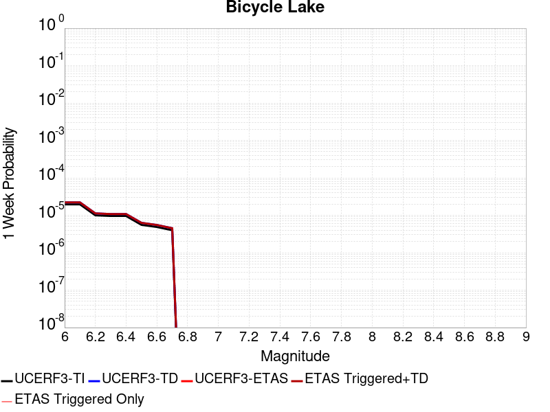 |  | 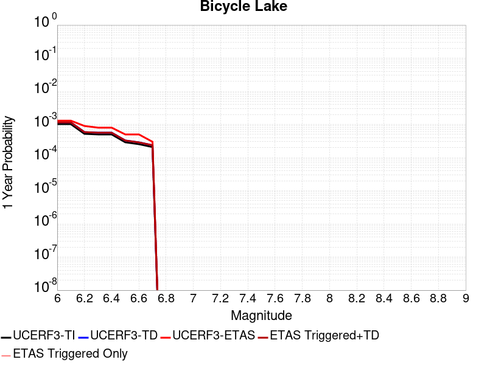 | 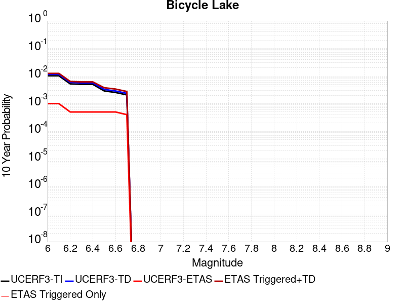 |

| Magnitude | 1 wk TI Prob | 1 wk TD Prob | 1 wk ETAS Prob | 1 wk ETAS/TD Gain | 1 wk ETAS Triggered+TD | 1 wk ETAS Triggered Only | 1 mo TI Prob | 1 mo TD Prob | 1 mo ETAS Prob | 1 mo ETAS/TD Gain | 1 mo ETAS Triggered+TD | 1 mo ETAS Triggered Only | 1 yr TI Prob | 1 yr TD Prob | 1 yr ETAS Prob | 1 yr ETAS/TD Gain | 1 yr ETAS Triggered+TD | 1 yr ETAS Triggered Only | 10 yr TI Prob | 10 yr TD Prob | 10 yr ETAS Prob | 10 yr ETAS/TD Gain | 10 yr ETAS Triggered+TD | 10 yr ETAS Triggered Only |
|-----|-----|-----|-----|-----|-----|-----|-----|-----|-----|-----|-----|-----|-----|-----|-----|-----|-----|-----|-----|-----|-----|-----|-----|-----|
| 6.0 | 1.9621975E-5 | 2.2102822E-5 | 0.0 | 0.0 | 2.2102822E-5 | 0.0 | 8.4091465E-5 | 9.4723706E-5 | 0.0 | 0.0 | 9.4723706E-5 | 0.0 | 0.0010233327 | 0.001152786 | 0.0013 | 1.1277028 | 0.001152786 | 0.0 | 0.01018633 | 0.011481379 | 0.0119 | 1.0364609 | 0.012469897 | 0.001 |
| 6.1 | 1.9621975E-5 | 2.2102822E-5 | 0.0 | 0.0 | 2.2102822E-5 | 0.0 | 8.4091465E-5 | 9.4723706E-5 | 0.0 | 0.0 | 9.4723706E-5 | 0.0 | 0.0010233327 | 0.001152786 | 0.0013 | 1.1277028 | 0.001152786 | 0.0 | 0.01018633 | 0.011481379 | 0.0119 | 1.0364609 | 0.012469897 | 0.001 |
| 6.2 | 9.9971285E-6 | 1.12585585E-5 | 0.0 | 0.0 | 1.12585585E-5 | 0.0 | 4.2844134E-5 | 4.8250367E-5 | 0.0 | 0.0 | 4.8250367E-5 | 0.0 | 5.2150246E-4 | 5.873419E-4 | 9.0E-4 | 1.5323273 | 5.873419E-4 | 0.0 | 0.0052028033 | 0.005863004 | 0.0076 | 1.2962639 | 0.006360072 | 5.0E-4 |
| 6.3 | 9.589428E-6 | 1.080115E-5 | 0.0 | 0.0 | 1.080115E-5 | 0.0 | 4.10969E-5 | 4.6290115E-5 | 0.0 | 0.0 | 4.6290115E-5 | 0.0 | 5.002399E-4 | 5.6348834E-4 | 8.0E-4 | 1.4197277 | 5.6348834E-4 | 0.0 | 0.0049911533 | 0.0056256875 | 0.0073 | 1.2976191 | 0.0061228746 | 5.0E-4 |
| 6.4 | 9.589428E-6 | 1.080115E-5 | 0.0 | 0.0 | 1.080115E-5 | 0.0 | 4.10969E-5 | 4.6290115E-5 | 0.0 | 0.0 | 4.6290115E-5 | 0.0 | 5.002399E-4 | 5.6348834E-4 | 8.0E-4 | 1.4197277 | 5.6348834E-4 | 0.0 | 0.0049911533 | 0.0056256875 | 0.0073 | 1.2976191 | 0.0061228746 | 5.0E-4 |
| 6.5 | 5.557707E-6 | 6.287297E-6 | 0.0 | 0.0 | 6.287297E-6 | 0.0 | 2.3818526E-5 | 2.6945432E-5 | 0.0 | 0.0 | 2.6945432E-5 | 0.0 | 2.8995197E-4 | 3.2803815E-4 | 5.0E-4 | 1.524213 | 3.2803815E-4 | 0.0 | 0.0028957394 | 0.0032781768 | 0.0043 | 1.3117048 | 0.0037765377 | 5.0E-4 |
| 6.6 | 4.8742945E-6 | 5.5147784E-6 | 0.0 | 0.0 | 5.5147784E-6 | 0.0 | 2.0889667E-5 | 2.3634697E-5 | 0.0 | 0.0 | 2.3634697E-5 | 0.0 | 2.54302E-4 | 2.8774067E-4 | 5.0E-4 | 1.7376759 | 2.8774067E-4 | 0.0 | 0.002540112 | 0.0028762512 | 0.0033 | 1.1473267 | 0.0033748131 | 5.0E-4 |
| 6.7 | 3.991108E-6 | 4.517133E-6 | 0.0 | 0.0 | 4.517133E-6 | 0.0 | 1.7104636E-5 | 1.9359142E-5 | 0.0 | 0.0 | 1.9359142E-5 | 0.0 | 2.0822904E-4 | 2.3569756E-4 | 3.0E-4 | 1.2728176 | 2.3569756E-4 | 0.0 | 0.0020803404 | 0.0023569756 | 0.0024 | 1.018254 | 0.0027560329 | 4.0E-4 |

## Santa Ynez River
*[(top)](#table-of-contents)*

| 1 Week | 1 Month | 1 Year | 10 Year |
|-----|-----|-----|-----|
| 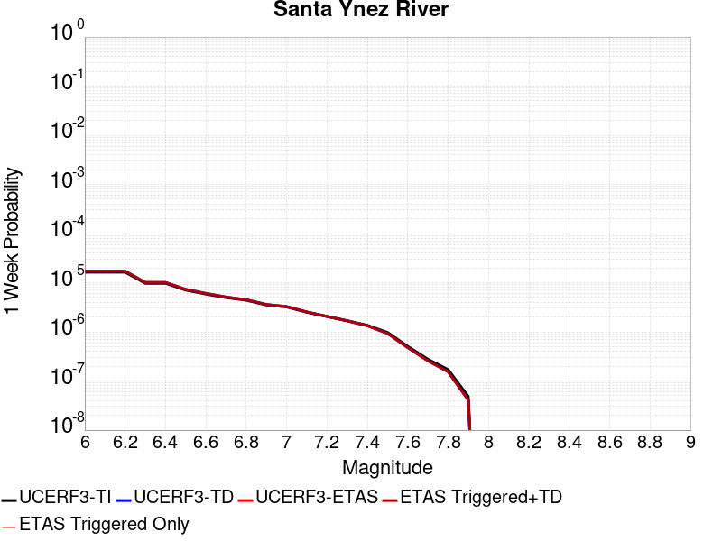 | 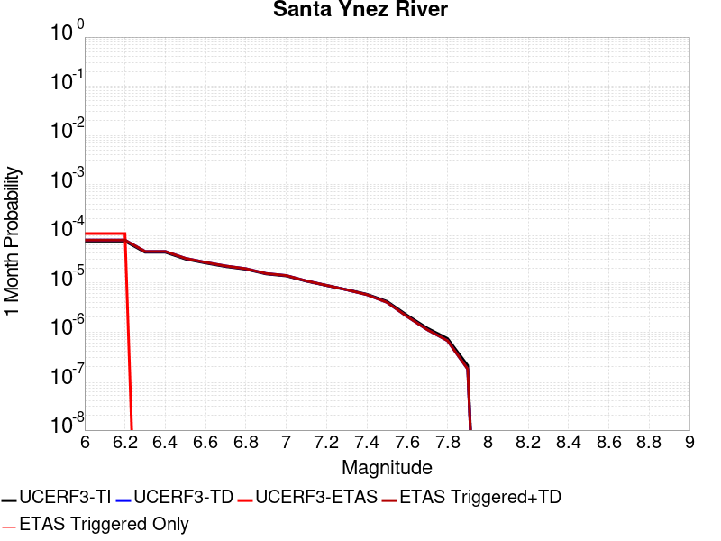 | 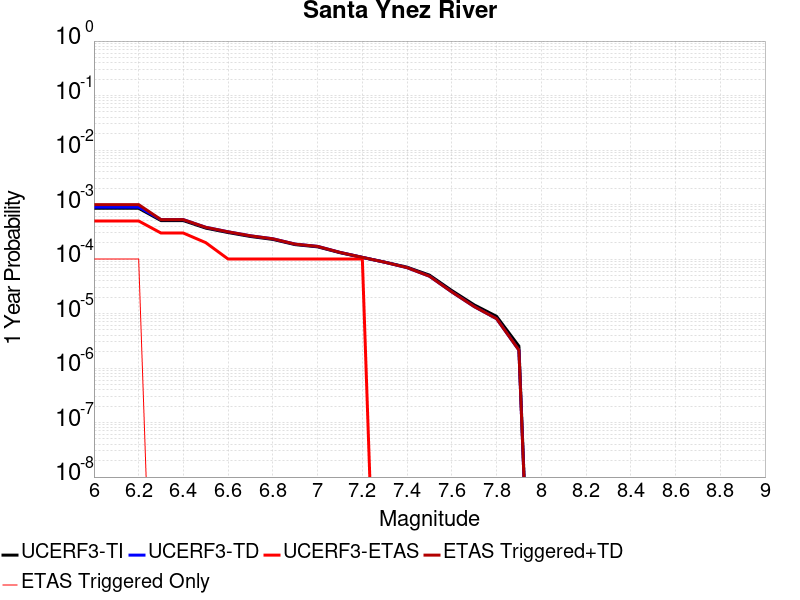 | 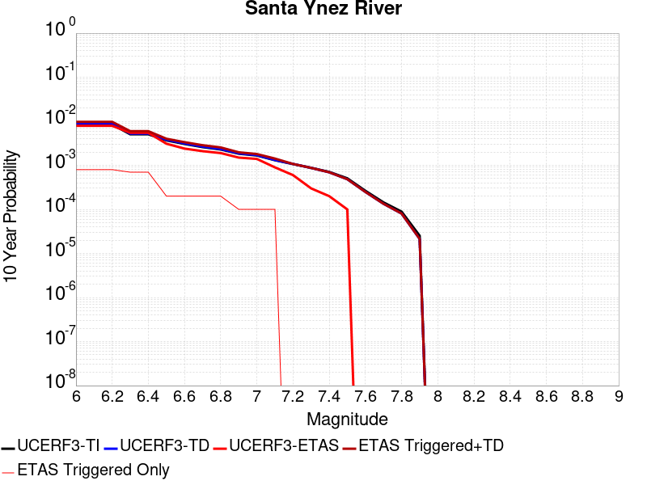 |

| Magnitude | 1 wk TI Prob | 1 wk TD Prob | 1 wk ETAS Prob | 1 wk ETAS/TD Gain | 1 wk ETAS Triggered+TD | 1 wk ETAS Triggered Only | 1 mo TI Prob | 1 mo TD Prob | 1 mo ETAS Prob | 1 mo ETAS/TD Gain | 1 mo ETAS Triggered+TD | 1 mo ETAS Triggered Only | 1 yr TI Prob | 1 yr TD Prob | 1 yr ETAS Prob | 1 yr ETAS/TD Gain | 1 yr ETAS Triggered+TD | 1 yr ETAS Triggered Only | 10 yr TI Prob | 10 yr TD Prob | 10 yr ETAS Prob | 10 yr ETAS/TD Gain | 10 yr ETAS Triggered+TD | 10 yr ETAS Triggered Only |
|-----|-----|-----|-----|-----|-----|-----|-----|-----|-----|-----|-----|-----|-----|-----|-----|-----|-----|-----|-----|-----|-----|-----|-----|-----|
| 6.0 | 1.6396456E-5 | 1.7211487E-5 | 0.0 | 0.0 | 1.7211487E-5 | 0.0 | 7.026863E-5 | 7.3761636E-5 | 1.0E-4 | 1.3557184 | 7.3761636E-5 | 0.0 | 8.551848E-4 | 8.977134E-4 | 5.0E-4 | 0.5569706 | 9.976237E-4 | 1.0E-4 | 0.0085190125 | 0.00894442 | 0.0079 | 0.8832322 | 0.009737265 | 8.0E-4 |
| 6.1 | 1.6396456E-5 | 1.7211487E-5 | 0.0 | 0.0 | 1.7211487E-5 | 0.0 | 7.026863E-5 | 7.3761636E-5 | 1.0E-4 | 1.3557184 | 7.3761636E-5 | 0.0 | 8.551848E-4 | 8.977134E-4 | 5.0E-4 | 0.5569706 | 9.976237E-4 | 1.0E-4 | 0.0085190125 | 0.00894442 | 0.0079 | 0.8832322 | 0.009737265 | 8.0E-4 |
| 6.2 | 1.6396456E-5 | 1.7211487E-5 | 0.0 | 0.0 | 1.7211487E-5 | 0.0 | 7.026863E-5 | 7.3761636E-5 | 1.0E-4 | 1.3557184 | 7.3761636E-5 | 0.0 | 8.551848E-4 | 8.977134E-4 | 5.0E-4 | 0.5569706 | 9.976237E-4 | 1.0E-4 | 0.0085190125 | 0.00894442 | 0.0079 | 0.8832322 | 0.009737265 | 8.0E-4 |
| 6.3 | 9.736976E-6 | 1.0123442E-5 | 0.0 | 0.0 | 1.0123442E-5 | 0.0 | 4.172923E-5 | 4.3385484E-5 | 0.0 | 0.0 | 4.3385484E-5 | 0.0 | 5.0793495E-4 | 5.280953E-4 | 3.0E-4 | 0.56807935 | 5.280953E-4 | 0.0 | 0.005067755 | 0.005268909 | 0.0055 | 1.0438594 | 0.0059652207 | 7.0E-4 |
| 6.4 | 9.736976E-6 | 1.0123442E-5 | 0.0 | 0.0 | 1.0123442E-5 | 0.0 | 4.172923E-5 | 4.3385484E-5 | 0.0 | 0.0 | 4.3385484E-5 | 0.0 | 5.0793495E-4 | 5.280953E-4 | 3.0E-4 | 0.56807935 | 5.280953E-4 | 0.0 | 0.005067755 | 0.005268909 | 0.0055 | 1.0438594 | 0.0059652207 | 7.0E-4 |
| 6.5 | 7.081964E-6 | 7.3307096E-6 | 0.0 | 0.0 | 7.3307096E-6 | 0.0 | 3.035092E-5 | 3.1416956E-5 | 0.0 | 0.0 | 3.1416956E-5 | 0.0 | 3.694598E-4 | 3.824359E-4 | 2.0E-4 | 0.52296346 | 3.824359E-4 | 0.0 | 0.0036884616 | 0.0038179394 | 0.0031 | 0.8119563 | 0.0040171756 | 2.0E-4 |
| 6.6 | 5.873247E-6 | 6.060423E-6 | 0.0 | 0.0 | 6.060423E-6 | 0.0 | 2.5170815E-5 | 2.5972988E-5 | 0.0 | 0.0 | 2.5972988E-5 | 0.0 | 3.064116E-4 | 3.161761E-4 | 1.0E-4 | 0.31627944 | 3.161761E-4 | 0.0 | 0.0030598943 | 0.00315735 | 0.0024 | 0.7601311 | 0.0033567185 | 2.0E-4 |
| 6.7 | 4.973277E-6 | 5.116486E-6 | 0.0 | 0.0 | 5.116486E-6 | 0.0 | 2.1313872E-5 | 2.1927615E-5 | 0.0 | 0.0 | 2.1927615E-5 | 0.0 | 2.5946548E-4 | 2.669365E-4 | 1.0E-4 | 0.37462094 | 2.669365E-4 | 0.0 | 0.0025916274 | 0.0026662077 | 0.0021 | 0.78763556 | 0.0028656744 | 2.0E-4 |
| 6.8 | 4.396492E-6 | 4.511502E-6 | 0.0 | 0.0 | 4.511502E-6 | 0.0 | 1.884197E-5 | 1.9334868E-5 | 0.0 | 0.0 | 1.9334868E-5 | 0.0 | 2.2937685E-4 | 2.3537692E-4 | 1.0E-4 | 0.4248505 | 2.3537692E-4 | 0.0 | 0.0022914023 | 0.0023513115 | 0.0019 | 0.80805963 | 0.0025508413 | 2.0E-4 |
| 6.9 | 3.5255632E-6 | 3.601774E-6 | 0.0 | 0.0 | 3.601774E-6 | 0.0 | 1.5109469E-5 | 1.5436084E-5 | 0.0 | 0.0 | 1.5436084E-5 | 0.0 | 1.8394225E-4 | 1.8791828E-4 | 1.0E-4 | 0.5321462 | 1.8791828E-4 | 0.0 | 0.0018379007 | 0.00187761 | 0.0015 | 0.79888797 | 0.0019774223 | 1.0E-4 |
| 7.0 | 3.211603E-6 | 3.2740654E-6 | 0.0 | 0.0 | 3.2740654E-6 | 0.0 | 1.376394E-5 | 1.4031634E-5 | 0.0 | 0.0 | 1.4031634E-5 | 0.0 | 1.6756308E-4 | 1.7082189E-4 | 1.0E-4 | 0.58540505 | 1.7082189E-4 | 0.0 | 0.0016743679 | 0.0017069201 | 0.0014 | 0.8201907 | 0.0018067494 | 1.0E-4 |
| 7.1 | 2.5094619E-6 | 2.541266E-6 | 0.0 | 0.0 | 2.541266E-6 | 0.0 | 1.0754793E-5 | 1.08910945E-5 | 0.0 | 0.0 | 1.08910945E-5 | 0.0 | 1.3093173E-4 | 1.3259107E-4 | 1.0E-4 | 0.7541986 | 1.3259107E-4 | 0.0 | 0.0013085462 | 0.0013251256 | 9.0E-4 | 0.6791809 | 0.0014249932 | 1.0E-4 |
| 7.2 | 2.0515774E-6 | 2.0622376E-6 | 0.0 | 0.0 | 2.0622376E-6 | 0.0 | 8.792445E-6 | 8.838131E-6 | 0.0 | 0.0 | 8.838131E-6 | 0.0 | 1.0704277E-4 | 1.0759898E-4 | 1.0E-4 | 0.92937684 | 1.0759898E-4 | 0.0 | 0.0010699122 | 0.0010754731 | 6.0E-4 | 0.557894 | 0.0010754731 | 0.0 |
| 7.3 | 1.6845745E-6 | 1.6776528E-6 | 0.0 | 0.0 | 1.6776528E-6 | 0.0 | 7.219585E-6 | 7.189921E-6 | 0.0 | 0.0 | 7.189921E-6 | 0.0 | 8.78949E-5 | 8.7533794E-5 | 0.0 | 0.0 | 8.7533794E-5 | 0.0 | 8.7860145E-4 | 8.7499607E-4 | 3.0E-4 | 0.3428587 | 8.7499607E-4 | 0.0 |
| 7.4 | 1.3600285E-6 | 1.3335551E-6 | 0.0 | 0.0 | 1.3335551E-6 | 0.0 | 5.82868E-6 | 5.715224E-6 | 0.0 | 0.0 | 5.715224E-6 | 0.0 | 7.096187E-5 | 6.958065E-5 | 0.0 | 0.0 | 6.958065E-5 | 0.0 | 7.0939213E-4 | 6.9559086E-4 | 2.0E-4 | 0.28752533 | 6.9559086E-4 | 0.0 |
| 7.5 | 9.735342E-7 | 9.29182E-7 | 0.0 | 0.0 | 9.29182E-7 | 0.0 | 4.172283E-6 | 3.9822025E-6 | 0.0 | 0.0 | 3.9822025E-6 | 0.0 | 5.079636E-5 | 4.8482256E-5 | 0.0 | 0.0 | 4.8482256E-5 | 0.0 | 5.0784746E-4 | 4.847185E-4 | 1.0E-4 | 0.20630531 | 4.847185E-4 | 0.0 |
| 7.6 | 5.067187E-7 | 4.779183E-7 | 0.0 | 0.0 | 4.779183E-7 | 0.0 | 2.1716498E-6 | 2.0482196E-6 | 0.0 | 0.0 | 2.0482196E-6 | 0.0 | 2.6439517E-5 | 2.4936797E-5 | 0.0 | 0.0 | 2.4936797E-5 | 0.0 | 2.643637E-4 | 2.4934072E-4 | 0.0 | 0.0 | 2.4934072E-4 | 0.0 |
| 7.7 | 2.769089E-7 | 2.576225E-7 | 0.0 | 0.0 | 2.576225E-7 | 0.0 | 1.1867519E-6 | 1.104096E-6 | 0.0 | 0.0 | 1.104096E-6 | 0.0 | 1.4448608E-5 | 1.3442285E-5 | 0.0 | 0.0 | 1.3442285E-5 | 0.0 | 1.444767E-4 | 1.3441476E-4 | 0.0 | 0.0 | 1.3441476E-4 | 0.0 |
| 7.8 | 1.7044663E-7 | 1.5450966E-7 | 0.0 | 0.0 | 1.5450966E-7 | 0.0 | 7.3048534E-7 | 6.621841E-7 | 0.0 | 0.0 | 6.621841E-7 | 0.0 | 8.893623E-6 | 8.062062E-6 | 0.0 | 0.0 | 8.062062E-6 | 0.0 | 8.893267E-5 | 8.061772E-5 | 0.0 | 0.0 | 8.061772E-5 | 0.0 |
| 7.9 | 4.8344287E-8 | 4.0916643E-8 | 0.0 | 0.0 | 4.0916643E-8 | 0.0 | 2.0718979E-7 | 1.7535703E-7 | 0.0 | 0.0 | 1.7535703E-7 | 0.0 | 2.5225327E-6 | 2.1349697E-6 | 0.0 | 0.0 | 2.1349697E-6 | 0.0 | 2.5225041E-5 | 2.1349497E-5 | 0.0 | 0.0 | 2.1349497E-5 | 0.0 |

## Table Bluff
*[(top)](#table-of-contents)*

| 1 Week | 1 Month | 1 Year | 10 Year |
|-----|-----|-----|-----|
| 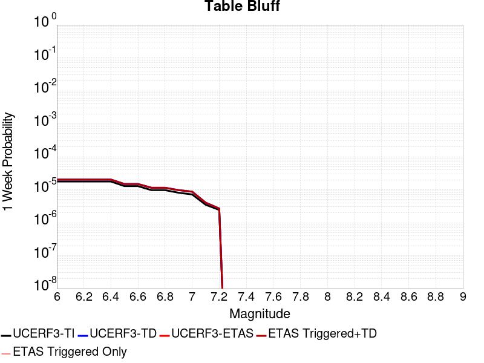 | 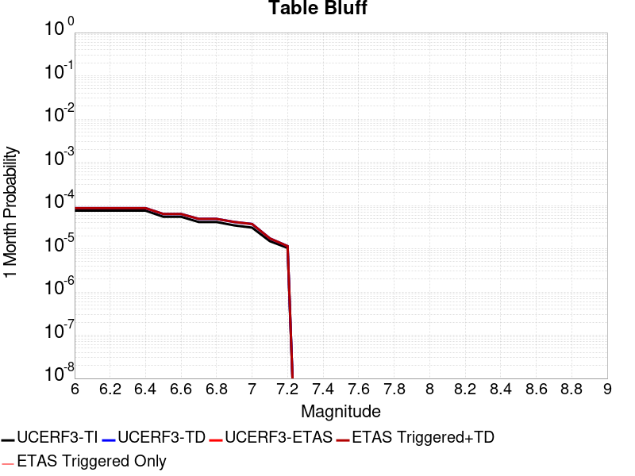 | 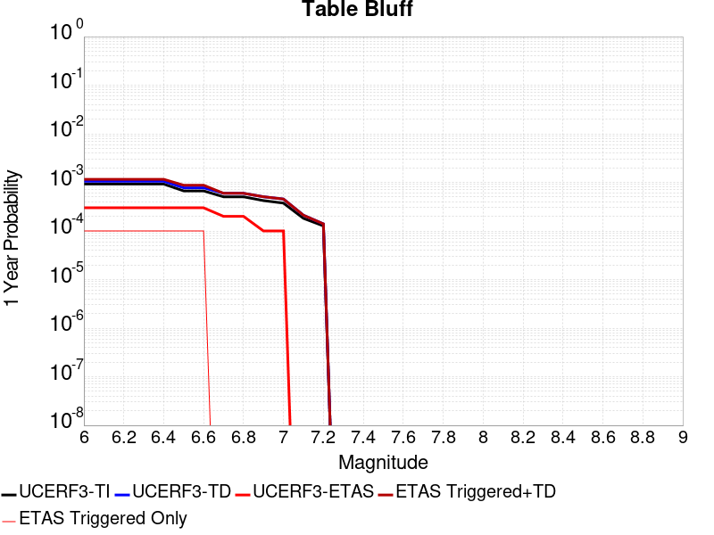 | 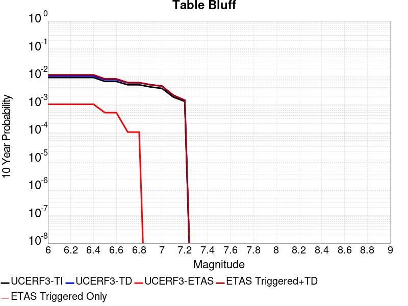 |

| Magnitude | 1 wk TI Prob | 1 wk TD Prob | 1 wk ETAS Prob | 1 wk ETAS/TD Gain | 1 wk ETAS Triggered+TD | 1 wk ETAS Triggered Only | 1 mo TI Prob | 1 mo TD Prob | 1 mo ETAS Prob | 1 mo ETAS/TD Gain | 1 mo ETAS Triggered+TD | 1 mo ETAS Triggered Only | 1 yr TI Prob | 1 yr TD Prob | 1 yr ETAS Prob | 1 yr ETAS/TD Gain | 1 yr ETAS Triggered+TD | 1 yr ETAS Triggered Only | 10 yr TI Prob | 10 yr TD Prob | 10 yr ETAS Prob | 10 yr ETAS/TD Gain | 10 yr ETAS Triggered+TD | 10 yr ETAS Triggered Only |
|-----|-----|-----|-----|-----|-----|-----|-----|-----|-----|-----|-----|-----|-----|-----|-----|-----|-----|-----|-----|-----|-----|-----|-----|-----|
| 6.0 | 1.7744695E-5 | 2.0291396E-5 | 0.0 | 0.0 | 2.0291396E-5 | 0.0 | 7.6046475E-5 | 8.6960565E-5 | 0.0 | 0.0 | 8.6960565E-5 | 0.0 | 9.2547253E-4 | 0.0010582904 | 3.0E-4 | 0.28347608 | 0.0011581845 | 1.0E-4 | 0.009216278 | 0.010538451 | 0.0079 | 0.74963576 | 0.011527914 | 0.001 |
| 6.1 | 1.7744695E-5 | 2.0291396E-5 | 0.0 | 0.0 | 2.0291396E-5 | 0.0 | 7.6046475E-5 | 8.6960565E-5 | 0.0 | 0.0 | 8.6960565E-5 | 0.0 | 9.2547253E-4 | 0.0010582904 | 3.0E-4 | 0.28347608 | 0.0011581845 | 1.0E-4 | 0.009216278 | 0.010538451 | 0.0079 | 0.74963576 | 0.011527914 | 0.001 |
| 6.2 | 1.7744695E-5 | 2.0291396E-5 | 0.0 | 0.0 | 2.0291396E-5 | 0.0 | 7.6046475E-5 | 8.6960565E-5 | 0.0 | 0.0 | 8.6960565E-5 | 0.0 | 9.2547253E-4 | 0.0010582904 | 3.0E-4 | 0.28347608 | 0.0011581845 | 1.0E-4 | 0.009216278 | 0.010538451 | 0.0079 | 0.74963576 | 0.011527914 | 0.001 |
| 6.3 | 1.7744695E-5 | 2.0291396E-5 | 0.0 | 0.0 | 2.0291396E-5 | 0.0 | 7.6046475E-5 | 8.6960565E-5 | 0.0 | 0.0 | 8.6960565E-5 | 0.0 | 9.2547253E-4 | 0.0010582904 | 3.0E-4 | 0.28347608 | 0.0011581845 | 1.0E-4 | 0.009216278 | 0.010538451 | 0.0079 | 0.74963576 | 0.011527914 | 0.001 |
| 6.4 | 1.7744695E-5 | 2.0291396E-5 | 0.0 | 0.0 | 2.0291396E-5 | 0.0 | 7.6046475E-5 | 8.6960565E-5 | 0.0 | 0.0 | 8.6960565E-5 | 0.0 | 9.2547253E-4 | 0.0010582904 | 3.0E-4 | 0.28347608 | 0.0011581845 | 1.0E-4 | 0.009216278 | 0.010538451 | 0.0079 | 0.74963576 | 0.011527914 | 0.001 |
| 6.5 | 1.2822383E-5 | 1.4864563E-5 | 0.0 | 0.0 | 1.4864563E-5 | 0.0 | 5.4951914E-5 | 6.370388E-5 | 0.0 | 0.0 | 6.370388E-5 | 0.0 | 6.6883414E-4 | 7.753485E-4 | 3.0E-4 | 0.38692278 | 8.75271E-4 | 1.0E-4 | 0.0066682473 | 0.00772939 | 0.0057 | 0.737445 | 0.008225526 | 5.0E-4 |
| 6.6 | 1.2822383E-5 | 1.4864563E-5 | 0.0 | 0.0 | 1.4864563E-5 | 0.0 | 5.4951914E-5 | 6.370388E-5 | 0.0 | 0.0 | 6.370388E-5 | 0.0 | 6.6883414E-4 | 7.753485E-4 | 3.0E-4 | 0.38692278 | 8.75271E-4 | 1.0E-4 | 0.0066682473 | 0.00772939 | 0.0057 | 0.737445 | 0.008225526 | 5.0E-4 |
| 6.7 | 9.690175E-6 | 1.1440468E-5 | 0.0 | 0.0 | 1.1440468E-5 | 0.0 | 4.1528663E-5 | 4.9029768E-5 | 0.0 | 0.0 | 4.9029768E-5 | 0.0 | 5.054941E-4 | 5.967941E-4 | 2.0E-4 | 0.33512396 | 5.967941E-4 | 0.0 | 0.005043458 | 0.005953909 | 0.0038 | 0.63823617 | 0.006053313 | 1.0E-4 |
| 6.8 | 9.690175E-6 | 1.1440468E-5 | 0.0 | 0.0 | 1.1440468E-5 | 0.0 | 4.1528663E-5 | 4.9029768E-5 | 0.0 | 0.0 | 4.9029768E-5 | 0.0 | 5.054941E-4 | 5.967941E-4 | 2.0E-4 | 0.33512396 | 5.967941E-4 | 0.0 | 0.005043458 | 0.005953909 | 0.0038 | 0.63823617 | 0.006053313 | 1.0E-4 |
| 6.9 | 8.096043E-6 | 9.704539E-6 | 0.0 | 0.0 | 9.704539E-6 | 0.0 | 3.4696863E-5 | 4.1590316E-5 | 0.0 | 0.0 | 4.1590316E-5 | 0.0 | 4.223524E-4 | 5.062619E-4 | 1.0E-4 | 0.19752622 | 5.062619E-4 | 0.0 | 0.004215506 | 0.0050528077 | 0.0032 | 0.6333112 | 0.0050528077 | 0.0 |
| 7.0 | 7.185906E-6 | 8.715786E-6 | 0.0 | 0.0 | 8.715786E-6 | 0.0 | 3.0796375E-5 | 3.735293E-5 | 0.0 | 0.0 | 3.735293E-5 | 0.0 | 3.7488135E-4 | 4.546936E-4 | 1.0E-4 | 0.21992832 | 4.546936E-4 | 0.0 | 0.0037424958 | 0.0045392644 | 0.0028 | 0.61684006 | 0.0045392644 | 0.0 |
| 7.1 | 3.4937343E-6 | 4.047375E-6 | 0.0 | 0.0 | 4.047375E-6 | 0.0 | 1.497306E-5 | 1.734582E-5 | 0.0 | 0.0 | 1.734582E-5 | 0.0 | 1.8228177E-4 | 2.111723E-4 | 0.0 | 0.0 | 2.111723E-4 | 0.0 | 0.0018213232 | 0.002110444 | 0.0013 | 0.61598414 | 0.002110444 | 0.0 |
| 7.2 | 2.4388776E-6 | 2.6861462E-6 | 0.0 | 0.0 | 2.6861462E-6 | 0.0 | 1.0452291E-5 | 1.1512034E-5 | 0.0 | 0.0 | 1.1512034E-5 | 0.0 | 1.2724921E-4 | 1.401551E-4 | 0.0 | 0.0 | 1.401551E-4 | 0.0 | 0.0012717636 | 0.0014011676 | 7.0E-4 | 0.49958333 | 0.0014011676 | 0.0 |

## Bear River fault zone
*[(top)](#table-of-contents)*

| 1 Week | 1 Month | 1 Year | 10 Year |
|-----|-----|-----|-----|
| 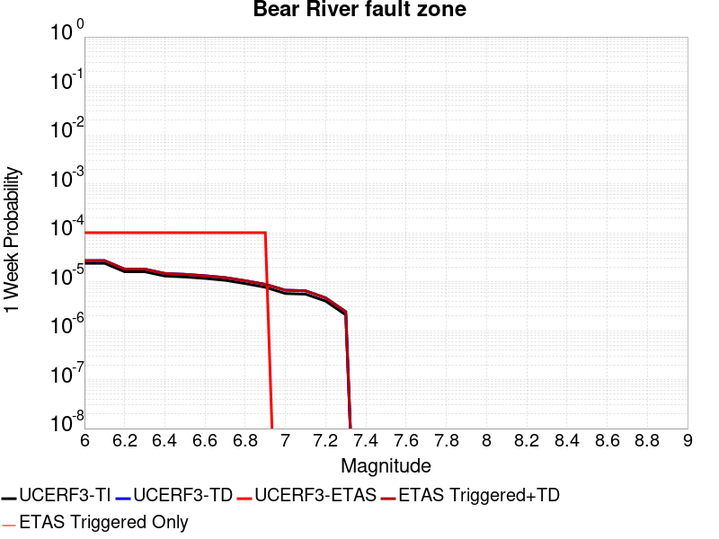 | 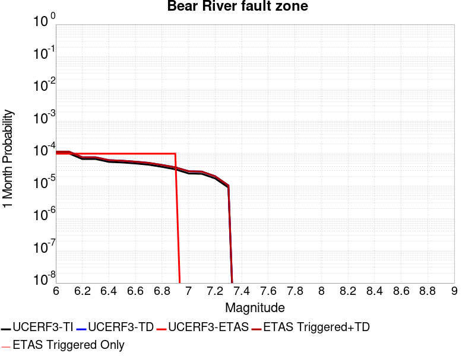 | 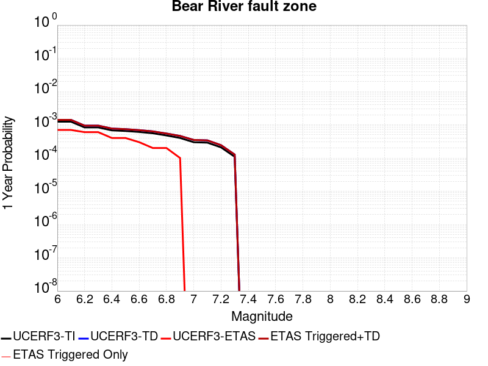 | 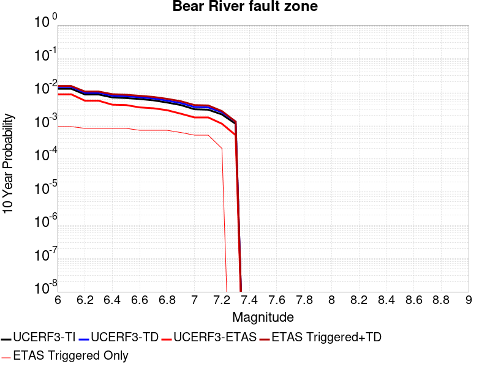 |

| Magnitude | 1 wk TI Prob | 1 wk TD Prob | 1 wk ETAS Prob | 1 wk ETAS/TD Gain | 1 wk ETAS Triggered+TD | 1 wk ETAS Triggered Only | 1 mo TI Prob | 1 mo TD Prob | 1 mo ETAS Prob | 1 mo ETAS/TD Gain | 1 mo ETAS Triggered+TD | 1 mo ETAS Triggered Only | 1 yr TI Prob | 1 yr TD Prob | 1 yr ETAS Prob | 1 yr ETAS/TD Gain | 1 yr ETAS Triggered+TD | 1 yr ETAS Triggered Only | 10 yr TI Prob | 10 yr TD Prob | 10 yr ETAS Prob | 10 yr ETAS/TD Gain | 10 yr ETAS Triggered+TD | 10 yr ETAS Triggered Only |
|-----|-----|-----|-----|-----|-----|-----|-----|-----|-----|-----|-----|-----|-----|-----|-----|-----|-----|-----|-----|-----|-----|-----|-----|-----|
| 6.0 | 2.3773342E-5 | 2.6988197E-5 | 1.0E-4 | 3.7053235 | 2.6988197E-5 | 0.0 | 1.0188177E-4 | 1.156591E-4 | 1.0E-4 | 0.86460984 | 1.156591E-4 | 0.0 | 0.0012397047 | 0.0014073335 | 7.0E-4 | 0.49739453 | 0.0014073335 | 0.0 | 0.012328116 | 0.013993624 | 0.0084 | 0.6002734 | 0.01488103 | 9.0E-4 |
| 6.1 | 2.3773342E-5 | 2.6988197E-5 | 1.0E-4 | 3.7053235 | 2.6988197E-5 | 0.0 | 1.0188177E-4 | 1.156591E-4 | 1.0E-4 | 0.86460984 | 1.156591E-4 | 0.0 | 0.0012397047 | 0.0014073335 | 7.0E-4 | 0.49739453 | 0.0014073335 | 0.0 | 0.012328116 | 0.013993624 | 0.0084 | 0.6002734 | 0.01488103 | 9.0E-4 |
| 6.2 | 1.5973403E-5 | 1.8067005E-5 | 1.0E-4 | 5.5349517 | 1.8067005E-5 | 0.0 | 6.845564E-5 | 7.742786E-5 | 1.0E-4 | 1.2915248 | 7.742786E-5 | 0.0 | 8.3312875E-4 | 9.423001E-4 | 6.0E-4 | 0.63673985 | 9.423001E-4 | 0.0 | 0.008300122 | 0.0093854405 | 0.0054 | 0.5753592 | 0.010177933 | 8.0E-4 |
| 6.3 | 1.5973403E-5 | 1.8067005E-5 | 1.0E-4 | 5.5349517 | 1.8067005E-5 | 0.0 | 6.845564E-5 | 7.742786E-5 | 1.0E-4 | 1.2915248 | 7.742786E-5 | 0.0 | 8.3312875E-4 | 9.423001E-4 | 6.0E-4 | 0.63673985 | 9.423001E-4 | 0.0 | 0.008300122 | 0.0093854405 | 0.0054 | 0.5753592 | 0.010177933 | 8.0E-4 |
| 6.4 | 1.3027338E-5 | 1.474503E-5 | 1.0E-4 | 6.781946 | 1.474503E-5 | 0.0 | 5.5830256E-5 | 6.319153E-5 | 1.0E-4 | 1.5824904 | 6.319153E-5 | 0.0 | 6.7952136E-4 | 7.6909916E-4 | 4.0E-4 | 0.520089 | 7.6909916E-4 | 0.0 | 0.0067744725 | 0.007665776 | 0.0041 | 0.5348447 | 0.008459643 | 8.0E-4 |
| 6.5 | 1.2489152E-5 | 1.4147573E-5 | 1.0E-4 | 7.0683503 | 1.4147573E-5 | 0.0 | 5.352384E-5 | 6.0631122E-5 | 1.0E-4 | 1.649318 | 6.0631122E-5 | 0.0 | 6.514579E-4 | 7.379475E-4 | 4.0E-4 | 0.5420439 | 7.379475E-4 | 0.0 | 0.0064955144 | 0.0073563466 | 0.004 | 0.5437482 | 0.008150461 | 8.0E-4 |
| 6.6 | 1.1662849E-5 | 1.3231817E-5 | 1.0E-4 | 7.557541 | 1.3231817E-5 | 0.0 | 4.9982682E-5 | 5.6706627E-5 | 1.0E-4 | 1.7634623 | 5.6706627E-5 | 0.0 | 6.083692E-4 | 6.9019746E-4 | 3.0E-4 | 0.43465823 | 6.9019746E-4 | 0.0 | 0.006067064 | 0.006881839 | 0.0034 | 0.49405396 | 0.007577022 | 7.0E-4 |
| 6.7 | 1.0667623E-5 | 1.2131494E-5 | 1.0E-4 | 8.243008 | 1.2131494E-5 | 0.0 | 4.5717585E-5 | 5.199115E-5 | 1.0E-4 | 1.9234043 | 5.199115E-5 | 0.0 | 5.5646943E-4 | 6.328202E-4 | 2.0E-4 | 0.31604555 | 6.328202E-4 | 0.0 | 0.0055507803 | 0.006311364 | 0.0032 | 0.5070219 | 0.0070069465 | 7.0E-4 |
| 6.8 | 9.154534E-6 | 1.04624005E-5 | 1.0E-4 | 9.558036 | 1.04624005E-5 | 0.0 | 3.923313E-5 | 4.4838147E-5 | 1.0E-4 | 2.2302437 | 4.4838147E-5 | 0.0 | 4.7755867E-4 | 5.4577825E-4 | 2.0E-4 | 0.3664492 | 5.4577825E-4 | 0.0 | 0.004765337 | 0.005445426 | 0.0028 | 0.514193 | 0.006141614 | 7.0E-4 |
| 6.9 | 7.68501E-6 | 8.848682E-6 | 1.0E-4 | 11.301117 | 8.848682E-6 | 0.0 | 3.2935342E-5 | 3.7922426E-5 | 1.0E-4 | 2.6369622 | 3.7922426E-5 | 0.0 | 4.0091402E-4 | 4.6161705E-4 | 1.0E-4 | 0.21662979 | 4.6161705E-4 | 0.0 | 0.004001915 | 0.004607504 | 0.0022 | 0.477482 | 0.005204739 | 6.0E-4 |
| 7.0 | 5.7315733E-6 | 6.7060328E-6 | 0.0 | 0.0 | 6.7060328E-6 | 0.0 | 2.4563653E-5 | 2.8739847E-5 | 0.0 | 0.0 | 2.8739847E-5 | 0.0 | 2.9902143E-4 | 3.4985572E-4 | 0.0 | 0.0 | 3.4985572E-4 | 0.0 | 0.0029861939 | 0.0034934713 | 0.0017 | 0.486622 | 0.0039917245 | 5.0E-4 |
| 7.1 | 5.566844E-6 | 6.514434E-6 | 0.0 | 0.0 | 6.514434E-6 | 0.0 | 2.3857683E-5 | 2.7918728E-5 | 0.0 | 0.0 | 2.7918728E-5 | 0.0 | 2.9042858E-4 | 3.3986176E-4 | 0.0 | 0.0 | 3.3986176E-4 | 0.0 | 0.002900493 | 0.0033938407 | 0.0017 | 0.5009074 | 0.003892144 | 5.0E-4 |
| 7.2 | 4.011353E-6 | 4.6762148E-6 | 0.0 | 0.0 | 4.6762148E-6 | 0.0 | 1.7191402E-5 | 2.0040785E-5 | 0.0 | 0.0 | 2.0040785E-5 | 0.0 | 2.0928521E-4 | 2.4397267E-4 | 0.0 | 0.0 | 2.4397267E-4 | 0.0 | 0.0020908823 | 0.0024373862 | 0.0011 | 0.45130312 | 0.0026368985 | 2.0E-4 |
| 7.3 | 2.0974871E-6 | 2.4404105E-6 | 0.0 | 0.0 | 2.4404105E-6 | 0.0 | 8.989199E-6 | 1.0458874E-5 | 0.0 | 0.0 | 1.0458874E-5 | 0.0 | 1.09438006E-4 | 1.2733186E-4 | 0.0 | 0.0 | 1.2733186E-4 | 0.0 | 0.0010938413 | 0.0012728344 | 5.0E-4 | 0.39282408 | 0.0012728344 | 0.0 |

## Carson Range (Genoa)
*[(top)](#table-of-contents)*

| 1 Week | 1 Month | 1 Year | 10 Year |
|-----|-----|-----|-----|
| 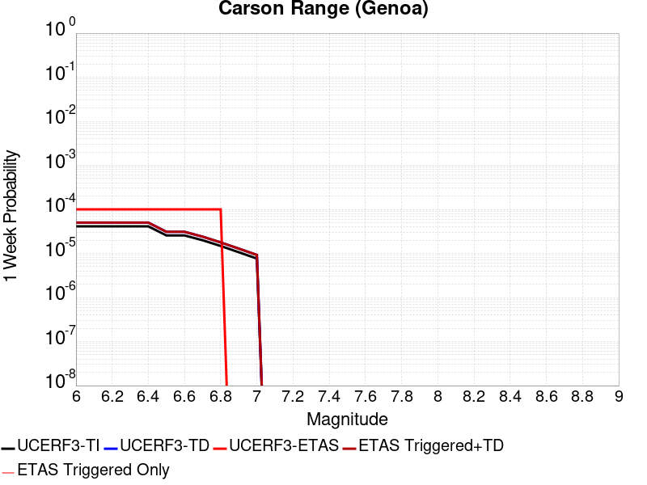 | 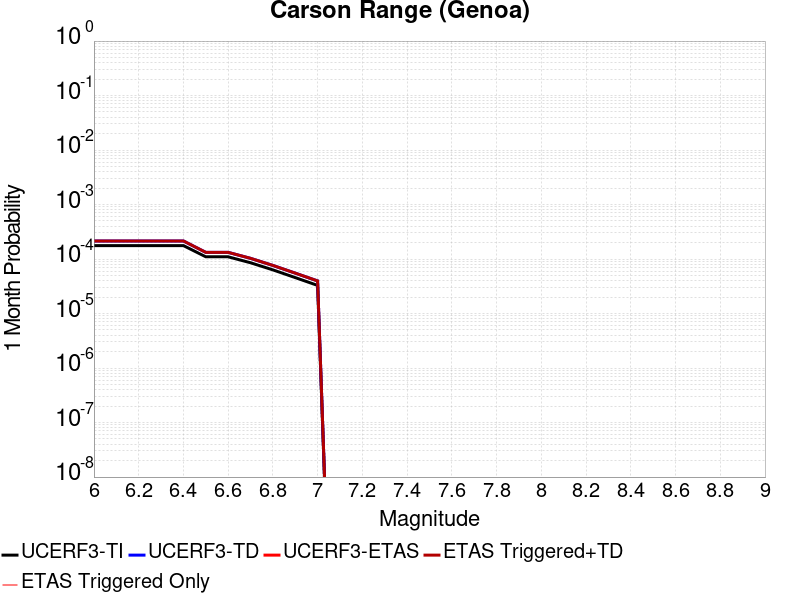 | 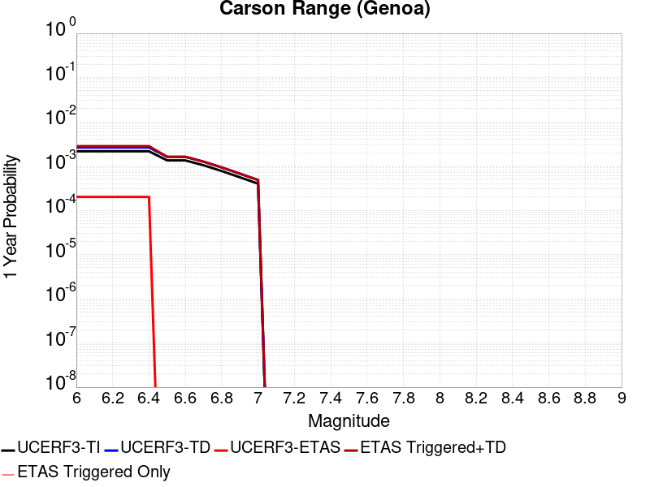 | 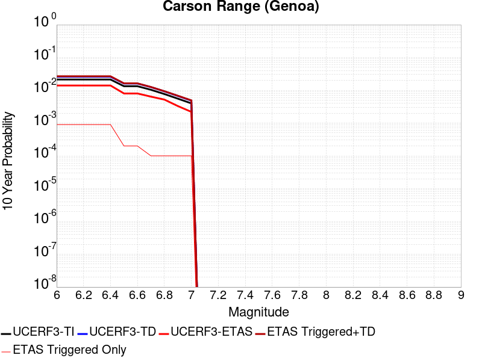 |

| Magnitude | 1 wk TI Prob | 1 wk TD Prob | 1 wk ETAS Prob | 1 wk ETAS/TD Gain | 1 wk ETAS Triggered+TD | 1 wk ETAS Triggered Only | 1 mo TI Prob | 1 mo TD Prob | 1 mo ETAS Prob | 1 mo ETAS/TD Gain | 1 mo ETAS Triggered+TD | 1 mo ETAS Triggered Only | 1 yr TI Prob | 1 yr TD Prob | 1 yr ETAS Prob | 1 yr ETAS/TD Gain | 1 yr ETAS Triggered+TD | 1 yr ETAS Triggered Only | 10 yr TI Prob | 10 yr TD Prob | 10 yr ETAS Prob | 10 yr ETAS/TD Gain | 10 yr ETAS Triggered+TD | 10 yr ETAS Triggered Only |
|-----|-----|-----|-----|-----|-----|-----|-----|-----|-----|-----|-----|-----|-----|-----|-----|-----|-----|-----|-----|-----|-----|-----|-----|-----|
| 6.0 | 4.1268457E-5 | 5.0169125E-5 | 1.0E-4 | 1.9932579 | 5.0169125E-5 | 0.0 | 1.7685282E-4 | 2.1499503E-4 | 3.0E-4 | 1.3953811 | 2.1499503E-4 | 0.0 | 0.0021510567 | 0.0026148132 | 0.0017 | 0.650142 | 0.0028142903 | 2.0E-4 | 0.02130354 | 0.025880156 | 0.014 | 0.540955 | 0.026756864 | 9.0E-4 |
| 6.1 | 4.1268457E-5 | 5.0169125E-5 | 1.0E-4 | 1.9932579 | 5.0169125E-5 | 0.0 | 1.7685282E-4 | 2.1499503E-4 | 3.0E-4 | 1.3953811 | 2.1499503E-4 | 0.0 | 0.0021510567 | 0.0026148132 | 0.0017 | 0.650142 | 0.0028142903 | 2.0E-4 | 0.02130354 | 0.025880156 | 0.014 | 0.540955 | 0.026756864 | 9.0E-4 |
| 6.2 | 4.1268457E-5 | 5.0169125E-5 | 1.0E-4 | 1.9932579 | 5.0169125E-5 | 0.0 | 1.7685282E-4 | 2.1499503E-4 | 3.0E-4 | 1.3953811 | 2.1499503E-4 | 0.0 | 0.0021510567 | 0.0026148132 | 0.0017 | 0.650142 | 0.0028142903 | 2.0E-4 | 0.02130354 | 0.025880156 | 0.014 | 0.540955 | 0.026756864 | 9.0E-4 |
| 6.3 | 4.1268457E-5 | 5.0169125E-5 | 1.0E-4 | 1.9932579 | 5.0169125E-5 | 0.0 | 1.7685282E-4 | 2.1499503E-4 | 3.0E-4 | 1.3953811 | 2.1499503E-4 | 0.0 | 0.0021510567 | 0.0026148132 | 0.0017 | 0.650142 | 0.0028142903 | 2.0E-4 | 0.02130354 | 0.025880156 | 0.014 | 0.540955 | 0.026756864 | 9.0E-4 |
| 6.4 | 4.1268457E-5 | 5.0169125E-5 | 1.0E-4 | 1.9932579 | 5.0169125E-5 | 0.0 | 1.7685282E-4 | 2.1499503E-4 | 3.0E-4 | 1.3953811 | 2.1499503E-4 | 0.0 | 0.0021510567 | 0.0026148132 | 0.0017 | 0.650142 | 0.0028142903 | 2.0E-4 | 0.02130354 | 0.025880156 | 0.014 | 0.540955 | 0.026756864 | 9.0E-4 |
| 6.5 | 2.5677185E-5 | 3.0991472E-5 | 1.0E-4 | 3.226694 | 3.0991472E-5 | 0.0 | 1.1004044E-4 | 1.3281484E-4 | 3.0E-4 | 2.2587838 | 1.3281484E-4 | 0.0 | 0.0013389189 | 0.0016160012 | 9.0E-4 | 0.5569303 | 0.0016160012 | 0.0 | 0.0133088045 | 0.016060432 | 0.008 | 0.49811858 | 0.01625722 | 2.0E-4 |
| 6.6 | 2.5677185E-5 | 3.0991472E-5 | 1.0E-4 | 3.226694 | 3.0991472E-5 | 0.0 | 1.1004044E-4 | 1.3281484E-4 | 3.0E-4 | 2.2587838 | 1.3281484E-4 | 0.0 | 0.0013389189 | 0.0016160012 | 9.0E-4 | 0.5569303 | 0.0016160012 | 0.0 | 0.0133088045 | 0.016060432 | 0.008 | 0.49811858 | 0.01625722 | 2.0E-4 |
| 6.7 | 1.9969408E-5 | 2.4073635E-5 | 1.0E-4 | 4.153922 | 2.4073635E-5 | 0.0 | 8.558037E-5 | 1.0316951E-4 | 3.0E-4 | 2.907836 | 1.0316951E-4 | 0.0 | 0.0010414429 | 0.0012555186 | 8.0E-4 | 0.6371869 | 0.0012555186 | 0.0 | 0.010365757 | 0.012499425 | 0.0064 | 0.51202357 | 0.012598175 | 1.0E-4 |
| 6.8 | 1.4783156E-5 | 1.7825103E-5 | 1.0E-4 | 5.610066 | 1.7825103E-5 | 0.0 | 6.335485E-5 | 7.639179E-5 | 3.0E-4 | 3.9271233 | 7.639179E-5 | 0.0 | 7.710722E-4 | 9.2980353E-4 | 7.0E-4 | 0.75284725 | 9.2980353E-4 | 0.0 | 0.0076840227 | 0.009271931 | 0.0052 | 0.5608325 | 0.009371003 | 1.0E-4 |
| 6.9 | 1.06660555E-5 | 1.2882526E-5 | 0.0 | 0.0 | 1.2882526E-5 | 0.0 | 4.5710865E-5 | 5.5210305E-5 | 0.0 | 0.0 | 5.5210305E-5 | 0.0 | 5.5638765E-4 | 6.720935E-4 | 1.0E-4 | 0.14878882 | 6.720935E-4 | 0.0 | 0.005549967 | 0.0067119165 | 0.0033 | 0.49166286 | 0.0068112453 | 1.0E-4 |
| 7.0 | 7.664838E-6 | 9.262271E-6 | 0.0 | 0.0 | 9.262271E-6 | 0.0 | 3.2848893E-5 | 3.969545E-5 | 0.0 | 0.0 | 3.969545E-5 | 0.0 | 3.998619E-4 | 4.8329207E-4 | 1.0E-4 | 0.20691422 | 4.8329207E-4 | 0.0 | 0.0039914316 | 0.0048329183 | 0.0022 | 0.4552115 | 0.004932435 | 1.0E-4 |

## Death Valley (No)
*[(top)](#table-of-contents)*

| 1 Week | 1 Month | 1 Year | 10 Year |
|-----|-----|-----|-----|
| 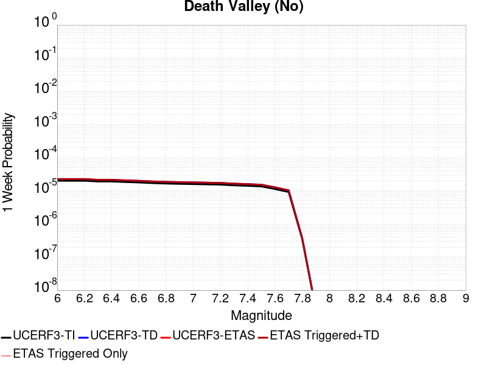 | 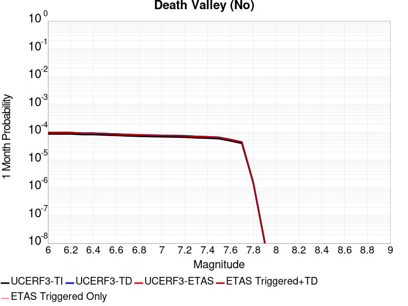 | 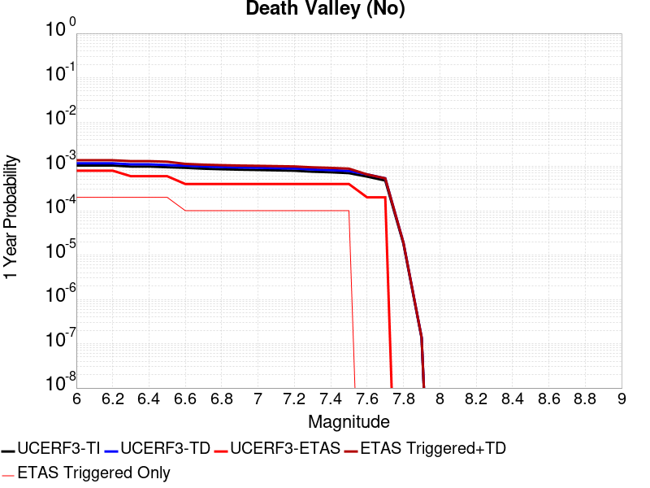 | 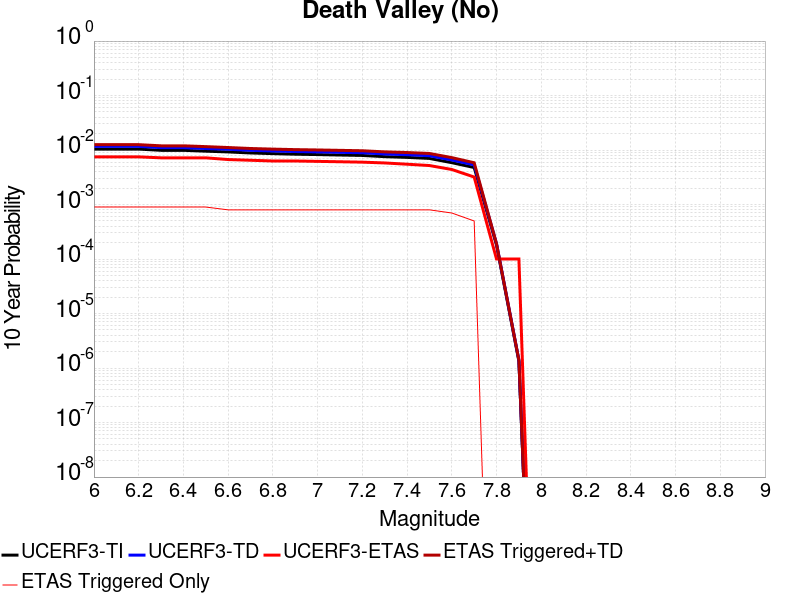 |

| Magnitude | 1 wk TI Prob | 1 wk TD Prob | 1 wk ETAS Prob | 1 wk ETAS/TD Gain | 1 wk ETAS Triggered+TD | 1 wk ETAS Triggered Only | 1 mo TI Prob | 1 mo TD Prob | 1 mo ETAS Prob | 1 mo ETAS/TD Gain | 1 mo ETAS Triggered+TD | 1 mo ETAS Triggered Only | 1 yr TI Prob | 1 yr TD Prob | 1 yr ETAS Prob | 1 yr ETAS/TD Gain | 1 yr ETAS Triggered+TD | 1 yr ETAS Triggered Only | 10 yr TI Prob | 10 yr TD Prob | 10 yr ETAS Prob | 10 yr ETAS/TD Gain | 10 yr ETAS Triggered+TD | 10 yr ETAS Triggered Only |
|-----|-----|-----|-----|-----|-----|-----|-----|-----|-----|-----|-----|-----|-----|-----|-----|-----|-----|-----|-----|-----|-----|-----|-----|-----|
| 6.0 | 2.0074807E-5 | 2.2505708E-5 | 1.0E-4 | 4.443317 | 2.2505708E-5 | 0.0 | 8.603206E-5 | 9.644951E-5 | 1.0E-4 | 1.0368118 | 9.644951E-5 | 0.0 | 0.001046937 | 0.0011736476 | 8.0E-4 | 0.6816356 | 0.0013734129 | 2.0E-4 | 0.010420183 | 0.011675408 | 0.0075 | 0.6423758 | 0.012564899 | 9.0E-4 |
| 6.1 | 2.0074807E-5 | 2.2505708E-5 | 1.0E-4 | 4.443317 | 2.2505708E-5 | 0.0 | 8.603206E-5 | 9.644951E-5 | 1.0E-4 | 1.0368118 | 9.644951E-5 | 0.0 | 0.001046937 | 0.0011736476 | 8.0E-4 | 0.6816356 | 0.0013734129 | 2.0E-4 | 0.010420183 | 0.011675408 | 0.0075 | 0.6423758 | 0.012564899 | 9.0E-4 |
| 6.2 | 2.0074807E-5 | 2.2505708E-5 | 1.0E-4 | 4.443317 | 2.2505708E-5 | 0.0 | 8.603206E-5 | 9.644951E-5 | 1.0E-4 | 1.0368118 | 9.644951E-5 | 0.0 | 0.001046937 | 0.0011736476 | 8.0E-4 | 0.6816356 | 0.0013734129 | 2.0E-4 | 0.010420183 | 0.011675408 | 0.0075 | 0.6423758 | 0.012564899 | 9.0E-4 |
| 6.3 | 1.9050609E-5 | 2.1342246E-5 | 0.0 | 0.0 | 2.1342246E-5 | 0.0 | 8.164292E-5 | 9.1463604E-5 | 0.0 | 0.0 | 9.1463604E-5 | 0.0 | 9.935491E-4 | 0.0011130073 | 6.0E-4 | 0.53908 | 0.0013127847 | 2.0E-4 | 0.009891188 | 0.011075154 | 0.0072 | 0.6501038 | 0.011965186 | 9.0E-4 |
| 6.4 | 1.9050609E-5 | 2.1342246E-5 | 0.0 | 0.0 | 2.1342246E-5 | 0.0 | 8.164292E-5 | 9.1463604E-5 | 0.0 | 0.0 | 9.1463604E-5 | 0.0 | 9.935491E-4 | 0.0011130073 | 6.0E-4 | 0.53908 | 0.0013127847 | 2.0E-4 | 0.009891188 | 0.011075154 | 0.0072 | 0.6501038 | 0.011965186 | 9.0E-4 |
| 6.5 | 1.8367004E-5 | 2.0566093E-5 | 0.0 | 0.0 | 2.0566093E-5 | 0.0 | 7.8713354E-5 | 8.813746E-5 | 0.0 | 0.0 | 8.813746E-5 | 0.0 | 9.5791375E-4 | 0.0010725518 | 6.0E-4 | 0.55941355 | 0.0012723373 | 2.0E-4 | 0.009537951 | 0.01067454 | 0.0072 | 0.67450213 | 0.011564933 | 9.0E-4 |
| 6.6 | 1.779439E-5 | 1.9915831E-5 | 0.0 | 0.0 | 1.9915831E-5 | 0.0 | 7.625944E-5 | 8.53508E-5 | 0.0 | 0.0 | 8.53508E-5 | 0.0 | 9.280632E-4 | 0.001038657 | 4.0E-4 | 0.38511267 | 0.0011385531 | 1.0E-4 | 0.009241969 | 0.010338785 | 0.0067 | 0.64804524 | 0.011130514 | 8.0E-4 |
| 6.7 | 1.7025437E-5 | 1.9048099E-5 | 0.0 | 0.0 | 1.9048099E-5 | 0.0 | 7.296412E-5 | 8.1632184E-5 | 0.0 | 0.0 | 8.1632184E-5 | 0.0 | 8.87976E-4 | 9.934249E-4 | 4.0E-4 | 0.40264747 | 0.0010933256 | 1.0E-4 | 0.008844362 | 0.00989056 | 0.0065 | 0.65719235 | 0.010682647 | 8.0E-4 |
| 6.8 | 1.6545107E-5 | 1.8517101E-5 | 0.0 | 0.0 | 1.8517101E-5 | 0.0 | 7.090568E-5 | 7.935662E-5 | 0.0 | 0.0 | 7.935662E-5 | 0.0 | 8.629347E-4 | 9.657447E-4 | 4.0E-4 | 0.41418812 | 0.0010656482 | 1.0E-4 | 0.008595915 | 0.009616183 | 0.0063 | 0.6551456 | 0.01040849 | 8.0E-4 |
| 6.9 | 1.615478E-5 | 1.8092069E-5 | 0.0 | 0.0 | 1.8092069E-5 | 0.0 | 6.9232934E-5 | 7.753517E-5 | 0.0 | 0.0 | 7.753517E-5 | 0.0 | 8.4258494E-4 | 9.43588E-4 | 4.0E-4 | 0.42391384 | 0.0010434936 | 1.0E-4 | 0.008393973 | 0.009396509 | 0.0063 | 0.6704618 | 0.010188992 | 8.0E-4 |
| 7.0 | 1.5894311E-5 | 1.7809976E-5 | 0.0 | 0.0 | 1.7809976E-5 | 0.0 | 6.81167E-5 | 7.6326265E-5 | 0.0 | 0.0 | 7.6326265E-5 | 0.0 | 8.2900526E-4 | 9.288822E-4 | 4.0E-4 | 0.4306251 | 0.0010287893 | 1.0E-4 | 0.008259195 | 0.009250686 | 0.0062 | 0.67022055 | 0.010043285 | 8.0E-4 |
| 7.1 | 1.5602263E-5 | 1.748786E-5 | 0.0 | 0.0 | 1.748786E-5 | 0.0 | 6.6865134E-5 | 7.494585E-5 | 0.0 | 0.0 | 7.494585E-5 | 0.0 | 8.137789E-4 | 9.1208983E-4 | 4.0E-4 | 0.4385533 | 0.0010119986 | 1.0E-4 | 0.008108052 | 0.0090841465 | 0.0061 | 0.6714995 | 0.00987688 | 8.0E-4 |
| 7.2 | 1.5323829E-5 | 1.7174907E-5 | 0.0 | 0.0 | 1.7174907E-5 | 0.0 | 6.56719E-5 | 7.36047E-5 | 0.0 | 0.0 | 7.36047E-5 | 0.0 | 7.99262E-4 | 8.9577487E-4 | 4.0E-4 | 0.44654077 | 9.956852E-4 | 1.0E-4 | 0.007963934 | 0.008922318 | 0.006 | 0.672471 | 0.009715181 | 8.0E-4 |
| 7.3 | 1.4556212E-5 | 1.6306496E-5 | 0.0 | 0.0 | 1.6306496E-5 | 0.0 | 6.238227E-5 | 6.988315E-5 | 0.0 | 0.0 | 6.988315E-5 | 0.0 | 7.592395E-4 | 8.5050106E-4 | 4.0E-4 | 0.470311 | 9.50416E-4 | 1.0E-4 | 0.0075665074 | 0.008473106 | 0.0058 | 0.68451875 | 0.009266327 | 8.0E-4 |
| 7.4 | 1.411725E-5 | 1.5811873E-5 | 0.0 | 0.0 | 1.5811873E-5 | 0.0 | 6.0501097E-5 | 6.776344E-5 | 0.0 | 0.0 | 6.776344E-5 | 0.0 | 7.363519E-4 | 8.2471344E-4 | 4.0E-4 | 0.48501697 | 9.2463096E-4 | 1.0E-4 | 0.0073391674 | 0.008217163 | 0.0055 | 0.6693308 | 0.00901059 | 8.0E-4 |
| 7.5 | 1.3503312E-5 | 1.5130045E-5 | 0.0 | 0.0 | 1.5130045E-5 | 0.0 | 5.7870053E-5 | 6.484147E-5 | 0.0 | 0.0 | 6.484147E-5 | 0.0 | 7.043401E-4 | 7.891648E-4 | 4.0E-4 | 0.506865 | 8.890859E-4 | 1.0E-4 | 0.007021119 | 0.007864249 | 0.0052 | 0.6612202 | 0.008657957 | 8.0E-4 |
| 7.6 | 1.1279839E-5 | 1.262944E-5 | 0.0 | 0.0 | 1.262944E-5 | 0.0 | 4.834127E-5 | 5.4125077E-5 | 0.0 | 0.0 | 5.4125077E-5 | 0.0 | 5.88396E-4 | 6.587789E-4 | 2.0E-4 | 0.303592 | 6.587789E-4 | 0.0 | 0.005868405 | 0.0065688123 | 0.0044 | 0.6698319 | 0.0072642146 | 7.0E-4 |
| 7.7 | 9.189108E-6 | 1.0285888E-5 | 0.0 | 0.0 | 1.0285888E-5 | 0.0 | 3.93813E-5 | 4.408166E-5 | 0.0 | 0.0 | 4.408166E-5 | 0.0 | 4.7936183E-4 | 5.3656707E-4 | 2.0E-4 | 0.37273997 | 5.3656707E-4 | 0.0 | 0.004783291 | 0.005353227 | 0.0032 | 0.5977703 | 0.0058505503 | 5.0E-4 |
| 7.8 | 3.4586725E-7 | 3.6486753E-7 | 0.0 | 0.0 | 3.6486753E-7 | 0.0 | 1.4822873E-6 | 1.5637171E-6 | 0.0 | 0.0 | 1.5637171E-6 | 0.0 | 1.80467E-5 | 1.9038094E-5 | 0.0 | 0.0 | 1.9038094E-5 | 0.0 | 1.8045233E-4 | 1.9036507E-4 | 1.0E-4 | 0.52530646 | 1.9036507E-4 | 0.0 |
| 7.9 | 2.5591178E-9 | 2.6699092E-9 | 0.0 | 0.0 | 2.6699092E-9 | 0.0 | 1.0967647E-8 | 1.1442468E-8 | 0.0 | 0.0 | 1.1442468E-8 | 0.0 | 1.335311E-7 | 1.3931205E-7 | 0.0 | 0.0 | 1.3931205E-7 | 0.0 | 1.3353102E-6 | 1.3931206E-6 | 1.0E-4 | 71.781296 | 1.3931206E-6 | 0.0 |

## Mission Creek
*[(top)](#table-of-contents)*

| 1 Week | 1 Month | 1 Year | 10 Year |
|-----|-----|-----|-----|
| 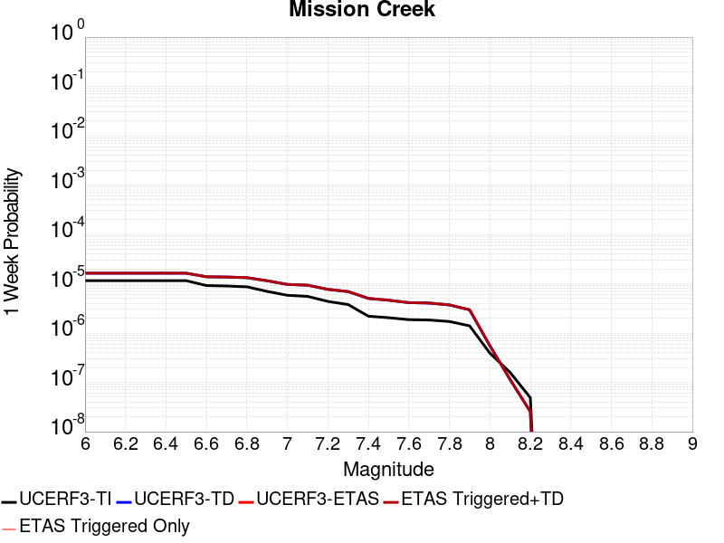 | 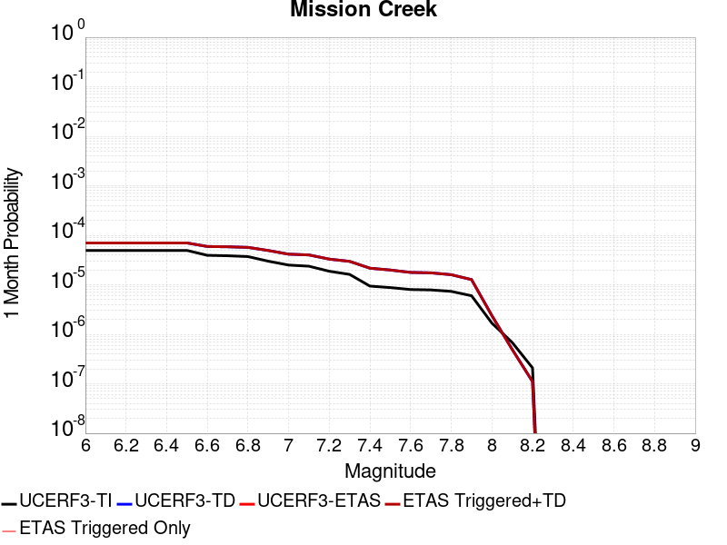 | 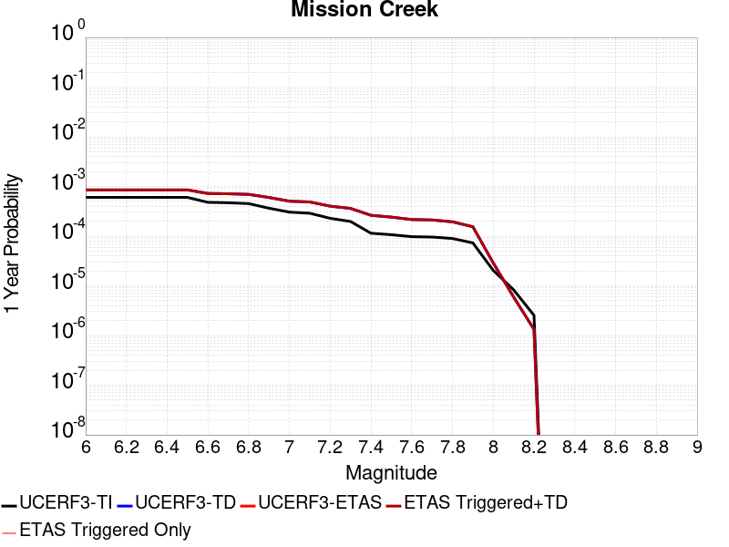 | 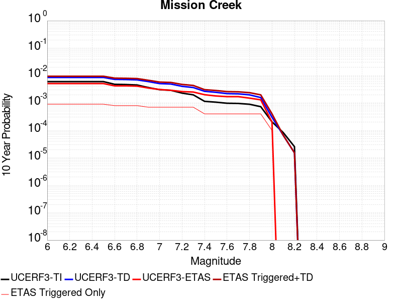 |

| Magnitude | 1 wk TI Prob | 1 wk TD Prob | 1 wk ETAS Prob | 1 wk ETAS/TD Gain | 1 wk ETAS Triggered+TD | 1 wk ETAS Triggered Only | 1 mo TI Prob | 1 mo TD Prob | 1 mo ETAS Prob | 1 mo ETAS/TD Gain | 1 mo ETAS Triggered+TD | 1 mo ETAS Triggered Only | 1 yr TI Prob | 1 yr TD Prob | 1 yr ETAS Prob | 1 yr ETAS/TD Gain | 1 yr ETAS Triggered+TD | 1 yr ETAS Triggered Only | 10 yr TI Prob | 10 yr TD Prob | 10 yr ETAS Prob | 10 yr ETAS/TD Gain | 10 yr ETAS Triggered+TD | 10 yr ETAS Triggered Only |
|-----|-----|-----|-----|-----|-----|-----|-----|-----|-----|-----|-----|-----|-----|-----|-----|-----|-----|-----|-----|-----|-----|-----|-----|-----|
| 6.0 | 1.1549387E-5 | 1.6359216E-5 | 0.0 | 0.0 | 1.6359216E-5 | 0.0 | 4.9496433E-5 | 7.010913E-5 | 0.0 | 0.0 | 7.010913E-5 | 0.0 | 6.0245243E-4 | 8.532594E-4 | 2.0E-4 | 0.23439531 | 8.532594E-4 | 0.0 | 0.006008218 | 0.008528496 | 0.0051 | 0.5979952 | 0.0094208205 | 9.0E-4 |
| 6.1 | 1.1549387E-5 | 1.6359216E-5 | 0.0 | 0.0 | 1.6359216E-5 | 0.0 | 4.9496433E-5 | 7.010913E-5 | 0.0 | 0.0 | 7.010913E-5 | 0.0 | 6.0245243E-4 | 8.532594E-4 | 2.0E-4 | 0.23439531 | 8.532594E-4 | 0.0 | 0.006008218 | 0.008528496 | 0.0051 | 0.5979952 | 0.0094208205 | 9.0E-4 |
| 6.2 | 1.1549387E-5 | 1.6359216E-5 | 0.0 | 0.0 | 1.6359216E-5 | 0.0 | 4.9496433E-5 | 7.010913E-5 | 0.0 | 0.0 | 7.010913E-5 | 0.0 | 6.0245243E-4 | 8.532594E-4 | 2.0E-4 | 0.23439531 | 8.532594E-4 | 0.0 | 0.006008218 | 0.008528496 | 0.0051 | 0.5979952 | 0.0094208205 | 9.0E-4 |
| 6.3 | 1.1549387E-5 | 1.6359216E-5 | 0.0 | 0.0 | 1.6359216E-5 | 0.0 | 4.9496433E-5 | 7.010913E-5 | 0.0 | 0.0 | 7.010913E-5 | 0.0 | 6.0245243E-4 | 8.532594E-4 | 2.0E-4 | 0.23439531 | 8.532594E-4 | 0.0 | 0.006008218 | 0.008528496 | 0.0051 | 0.5979952 | 0.0094208205 | 9.0E-4 |
| 6.4 | 1.1549387E-5 | 1.6359216E-5 | 0.0 | 0.0 | 1.6359216E-5 | 0.0 | 4.9496433E-5 | 7.010913E-5 | 0.0 | 0.0 | 7.010913E-5 | 0.0 | 6.0245243E-4 | 8.532594E-4 | 2.0E-4 | 0.23439531 | 8.532594E-4 | 0.0 | 0.006008218 | 0.008528496 | 0.0051 | 0.5979952 | 0.0094208205 | 9.0E-4 |
| 6.5 | 1.1549387E-5 | 1.6359216E-5 | 0.0 | 0.0 | 1.6359216E-5 | 0.0 | 4.9496433E-5 | 7.010913E-5 | 0.0 | 0.0 | 7.010913E-5 | 0.0 | 6.0245243E-4 | 8.532594E-4 | 2.0E-4 | 0.23439531 | 8.532594E-4 | 0.0 | 0.006008218 | 0.008528496 | 0.0051 | 0.5979952 | 0.0094208205 | 9.0E-4 |
| 6.6 | 9.202681E-6 | 1.3882211E-5 | 0.0 | 0.0 | 1.3882211E-5 | 0.0 | 3.9439463E-5 | 5.9493883E-5 | 0.0 | 0.0 | 5.9493883E-5 | 0.0 | 4.800697E-4 | 7.241063E-4 | 2.0E-4 | 0.27620253 | 7.241063E-4 | 0.0 | 0.004790339 | 0.007245557 | 0.0042 | 0.5796656 | 0.00803976 | 8.0E-4 |
| 6.7 | 9.019164E-6 | 1.3687856E-5 | 0.0 | 0.0 | 1.3687856E-5 | 0.0 | 3.8652986E-5 | 5.8660975E-5 | 0.0 | 0.0 | 5.8660975E-5 | 0.0 | 4.7049852E-4 | 7.139723E-4 | 2.0E-4 | 0.2801229 | 7.139723E-4 | 0.0 | 0.004695036 | 0.0071448707 | 0.0042 | 0.5878343 | 0.007939155 | 8.0E-4 |
| 6.8 | 8.673558E-6 | 1.3309889E-5 | 0.0 | 0.0 | 1.3309889E-5 | 0.0 | 3.717186E-5 | 5.7041187E-5 | 0.0 | 0.0 | 5.7041187E-5 | 0.0 | 4.524734E-4 | 6.94264E-4 | 2.0E-4 | 0.28807485 | 6.94264E-4 | 0.0 | 0.0045155324 | 0.0069490224 | 0.0041 | 0.59001106 | 0.0077434634 | 8.0E-4 |
| 6.9 | 7.002255E-6 | 1.1513841E-5 | 0.0 | 0.0 | 1.1513841E-5 | 0.0 | 3.000932E-5 | 4.9344137E-5 | 0.0 | 0.0 | 4.9344137E-5 | 0.0 | 3.653022E-4 | 6.0060614E-4 | 1.0E-4 | 0.16649847 | 6.0060614E-4 | 0.0 | 0.0036470229 | 0.006017718 | 0.0035 | 0.5816158 | 0.006713506 | 7.0E-4 |
| 7.0 | 5.84644E-6 | 9.709285E-6 | 0.0 | 0.0 | 9.709285E-6 | 0.0 | 2.5055931E-5 | 4.1610583E-5 | 0.0 | 0.0 | 4.1610583E-5 | 0.0 | 3.0501327E-4 | 5.0649565E-4 | 1.0E-4 | 0.19743507 | 5.0649565E-4 | 0.0 | 0.0030459496 | 0.0050810943 | 0.0031 | 0.6101048 | 0.0057775374 | 7.0E-4 |
| 7.1 | 5.54703E-6 | 9.363636E-6 | 0.0 | 0.0 | 9.363636E-6 | 0.0 | 2.377277E-5 | 4.012928E-5 | 0.0 | 0.0 | 4.012928E-5 | 0.0 | 2.8939504E-4 | 4.884689E-4 | 1.0E-4 | 0.20472132 | 4.884689E-4 | 0.0 | 0.0028901845 | 0.0049016266 | 0.0029 | 0.5916403 | 0.005598196 | 7.0E-4 |
| 7.2 | 4.384709E-6 | 7.714229E-6 | 0.0 | 0.0 | 7.714229E-6 | 0.0 | 1.8791474E-5 | 3.3060584E-5 | 0.0 | 0.0 | 3.3060584E-5 | 0.0 | 2.2876218E-4 | 4.0244192E-4 | 0.0 | 0.0 | 4.0244192E-4 | 0.0 | 0.0022852682 | 0.0040448015 | 0.0026 | 0.64280045 | 0.00474197 | 7.0E-4 |
| 7.3 | 3.7888456E-6 | 6.947462E-6 | 0.0 | 0.0 | 6.947462E-6 | 0.0 | 1.623781E-5 | 2.9774517E-5 | 0.0 | 0.0 | 2.9774517E-5 | 0.0 | 1.9767738E-4 | 3.624478E-4 | 0.0 | 0.0 | 3.624478E-4 | 0.0 | 0.0019750162 | 0.0036462347 | 0.0025 | 0.6856388 | 0.0043436824 | 7.0E-4 |
| 7.4 | 2.1982462E-6 | 5.0548383E-6 | 0.0 | 0.0 | 5.0548383E-6 | 0.0 | 9.421021E-6 | 2.1663414E-5 | 0.0 | 0.0 | 2.1663414E-5 | 0.0 | 1.1469489E-4 | 2.6372034E-4 | 0.0 | 0.0 | 2.6372034E-4 | 0.0 | 0.0011463572 | 0.0026615239 | 0.002 | 0.7514492 | 0.0030604592 | 4.0E-4 |
| 7.5 | 2.051923E-6 | 4.645229E-6 | 0.0 | 0.0 | 4.645229E-6 | 0.0 | 8.793926E-6 | 1.9907975E-5 | 0.0 | 0.0 | 1.9907975E-5 | 0.0 | 1.0706078E-4 | 2.4235278E-4 | 0.0 | 0.0 | 2.4235278E-4 | 0.0 | 0.0010700922 | 0.0024486526 | 0.0018 | 0.7350981 | 0.0028476731 | 4.0E-4 |
| 7.6 | 1.8733427E-6 | 4.1525436E-6 | 0.0 | 0.0 | 4.1525436E-6 | 0.0 | 8.028587E-6 | 1.7796496E-5 | 0.0 | 0.0 | 1.7796496E-5 | 0.0 | 9.774366E-5 | 2.1665086E-4 | 0.0 | 0.0 | 2.1665086E-4 | 0.0 | 9.770069E-4 | 0.0021926647 | 0.0017 | 0.77531236 | 0.0025917876 | 4.0E-4 |
| 7.7 | 1.8411953E-6 | 4.072022E-6 | 0.0 | 0.0 | 4.072022E-6 | 0.0 | 7.890813E-6 | 1.7451408E-5 | 0.0 | 0.0 | 1.7451408E-5 | 0.0 | 9.606641E-5 | 2.1245025E-4 | 0.0 | 0.0 | 2.1245025E-4 | 0.0 | 9.6024893E-4 | 0.0021508592 | 0.0017 | 0.7903818 | 0.002549999 | 4.0E-4 |
| 7.8 | 1.7194251E-6 | 3.7374055E-6 | 0.0 | 0.0 | 3.7374055E-6 | 0.0 | 7.368944E-6 | 1.6017353E-5 | 0.0 | 0.0 | 1.6017353E-5 | 0.0 | 8.97132E-5 | 1.949939E-4 | 0.0 | 0.0 | 1.949939E-4 | 0.0 | 8.967699E-4 | 0.0019758346 | 0.0015 | 0.75917286 | 0.0023750444 | 4.0E-4 |
| 7.9 | 1.4035052E-6 | 2.9721732E-6 | 0.0 | 0.0 | 2.9721732E-6 | 0.0 | 6.0150082E-6 | 1.2737823E-5 | 0.0 | 0.0 | 1.2737823E-5 | 0.0 | 7.3230265E-5 | 1.5507202E-4 | 0.0 | 0.0 | 1.5507202E-4 | 0.0 | 7.3206134E-4 | 0.0015740677 | 0.0013 | 0.82588565 | 0.001973438 | 4.0E-4 |
| 8.0 | 3.9318823E-7 | 5.581903E-7 | 0.0 | 0.0 | 5.581903E-7 | 0.0 | 1.6850913E-6 | 2.392242E-6 | 0.0 | 0.0 | 2.392242E-6 | 0.0 | 2.0515794E-5 | 2.9125164E-5 | 0.0 | 0.0 | 2.9125164E-5 | 0.0 | 2.0513899E-4 | 3.016673E-4 | 2.0E-4 | 0.66298205 | 4.0163714E-4 | 1.0E-4 |
| 8.1 | 1.596793E-7 | 1.1563085E-7 | 0.0 | 0.0 | 1.1563085E-7 | 0.0 | 6.8433974E-7 | 4.955607E-7 | 0.0 | 0.0 | 4.955607E-7 | 0.0 | 8.331805E-6 | 6.033435E-6 | 0.0 | 0.0 | 6.033435E-6 | 0.0 | 8.331492E-5 | 6.649796E-5 | 0.0 | 0.0 | 6.649796E-5 | 0.0 |
| 8.2 | 4.9003038E-8 | 2.5907498E-8 | 0.0 | 0.0 | 2.5907498E-8 | 0.0 | 2.10013E-7 | 1.1103213E-7 | 0.0 | 0.0 | 1.1103213E-7 | 0.0 | 2.5569052E-6 | 1.3518154E-6 | 0.0 | 0.0 | 1.3518154E-6 | 0.0 | 2.556876E-5 | 1.52114235E-5 | 0.0 | 0.0 | 1.52114235E-5 | 0.0 |

## Channel Islands Thrust
*[(top)](#table-of-contents)*

| 1 Week | 1 Month | 1 Year | 10 Year |
|-----|-----|-----|-----|
| 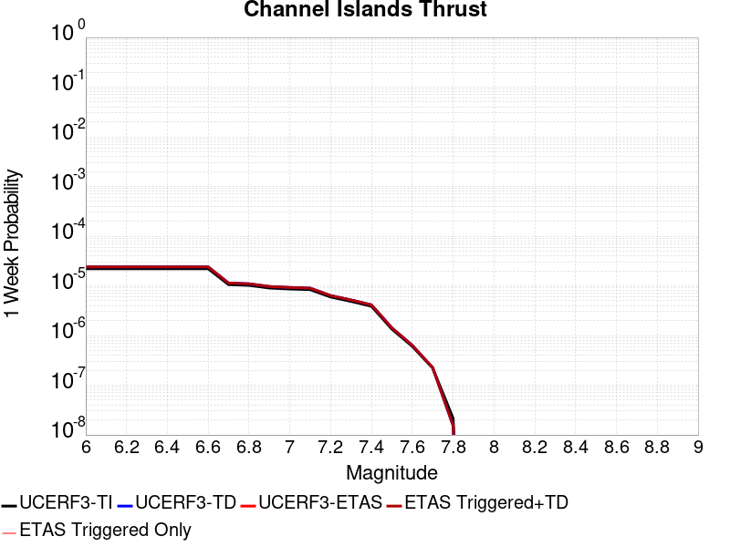 | 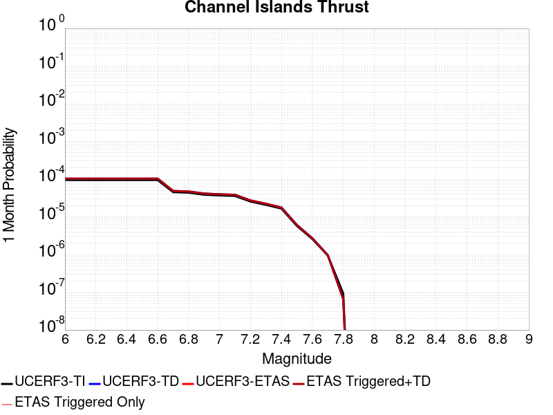 | 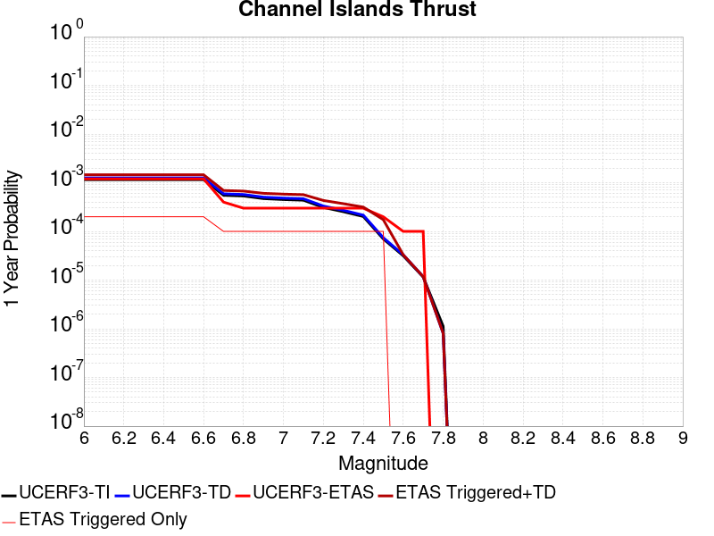 | 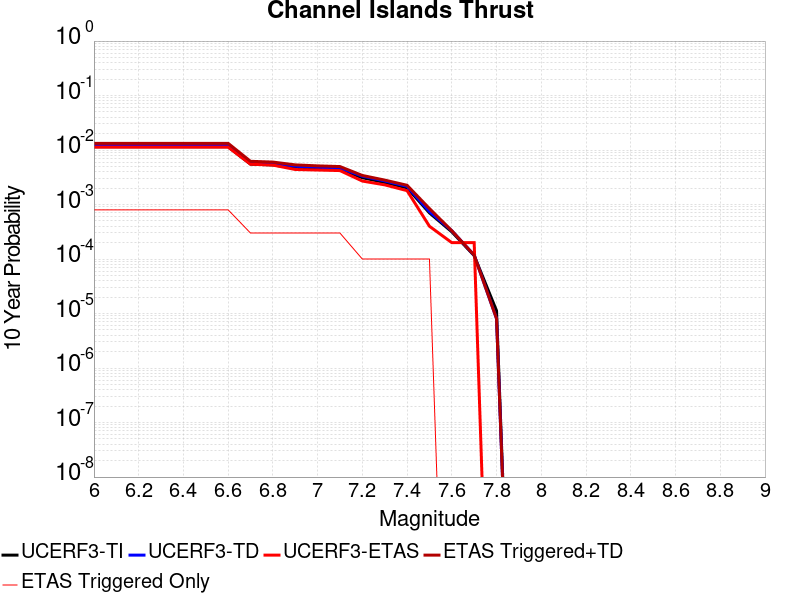 |

| Magnitude | 1 wk TI Prob | 1 wk TD Prob | 1 wk ETAS Prob | 1 wk ETAS/TD Gain | 1 wk ETAS Triggered+TD | 1 wk ETAS Triggered Only | 1 mo TI Prob | 1 mo TD Prob | 1 mo ETAS Prob | 1 mo ETAS/TD Gain | 1 mo ETAS Triggered+TD | 1 mo ETAS Triggered Only | 1 yr TI Prob | 1 yr TD Prob | 1 yr ETAS Prob | 1 yr ETAS/TD Gain | 1 yr ETAS Triggered+TD | 1 yr ETAS Triggered Only | 10 yr TI Prob | 10 yr TD Prob | 10 yr ETAS Prob | 10 yr ETAS/TD Gain | 10 yr ETAS Triggered+TD | 10 yr ETAS Triggered Only |
|-----|-----|-----|-----|-----|-----|-----|-----|-----|-----|-----|-----|-----|-----|-----|-----|-----|-----|-----|-----|-----|-----|-----|-----|-----|
| 6.0 | 2.2156251E-5 | 2.409639E-5 | 0.0 | 0.0 | 2.409639E-5 | 0.0 | 9.495191E-5 | 1.0326675E-4 | 0.0 | 0.0 | 1.0326675E-4 | 0.0 | 0.0011554264 | 0.0012566542 | 0.0012 | 0.9549167 | 0.0014564028 | 2.0E-4 | 0.011494373 | 0.012506075 | 0.0113 | 0.9035608 | 0.0132960705 | 8.0E-4 |
| 6.1 | 2.2156251E-5 | 2.409639E-5 | 0.0 | 0.0 | 2.409639E-5 | 0.0 | 9.495191E-5 | 1.0326675E-4 | 0.0 | 0.0 | 1.0326675E-4 | 0.0 | 0.0011554264 | 0.0012566542 | 0.0012 | 0.9549167 | 0.0014564028 | 2.0E-4 | 0.011494373 | 0.012506075 | 0.0113 | 0.9035608 | 0.0132960705 | 8.0E-4 |
| 6.2 | 2.2156251E-5 | 2.409639E-5 | 0.0 | 0.0 | 2.409639E-5 | 0.0 | 9.495191E-5 | 1.0326675E-4 | 0.0 | 0.0 | 1.0326675E-4 | 0.0 | 0.0011554264 | 0.0012566542 | 0.0012 | 0.9549167 | 0.0014564028 | 2.0E-4 | 0.011494373 | 0.012506075 | 0.0113 | 0.9035608 | 0.0132960705 | 8.0E-4 |
| 6.3 | 2.2156251E-5 | 2.409639E-5 | 0.0 | 0.0 | 2.409639E-5 | 0.0 | 9.495191E-5 | 1.0326675E-4 | 0.0 | 0.0 | 1.0326675E-4 | 0.0 | 0.0011554264 | 0.0012566542 | 0.0012 | 0.9549167 | 0.0014564028 | 2.0E-4 | 0.011494373 | 0.012506075 | 0.0113 | 0.9035608 | 0.0132960705 | 8.0E-4 |
| 6.4 | 2.2156251E-5 | 2.409639E-5 | 0.0 | 0.0 | 2.409639E-5 | 0.0 | 9.495191E-5 | 1.0326675E-4 | 0.0 | 0.0 | 1.0326675E-4 | 0.0 | 0.0011554264 | 0.0012566542 | 0.0012 | 0.9549167 | 0.0014564028 | 2.0E-4 | 0.011494373 | 0.012506075 | 0.0113 | 0.9035608 | 0.0132960705 | 8.0E-4 |
| 6.5 | 2.2156251E-5 | 2.409639E-5 | 0.0 | 0.0 | 2.409639E-5 | 0.0 | 9.495191E-5 | 1.0326675E-4 | 0.0 | 0.0 | 1.0326675E-4 | 0.0 | 0.0011554264 | 0.0012566542 | 0.0012 | 0.9549167 | 0.0014564028 | 2.0E-4 | 0.011494373 | 0.012506075 | 0.0113 | 0.9035608 | 0.0132960705 | 8.0E-4 |
| 6.6 | 2.2156251E-5 | 2.409639E-5 | 0.0 | 0.0 | 2.409639E-5 | 0.0 | 9.495191E-5 | 1.0326675E-4 | 0.0 | 0.0 | 1.0326675E-4 | 0.0 | 0.0011554264 | 0.0012566542 | 0.0012 | 0.9549167 | 0.0014564028 | 2.0E-4 | 0.011494373 | 0.012506075 | 0.0113 | 0.9035608 | 0.0132960705 | 8.0E-4 |
| 6.7 | 1.0601296E-5 | 1.1381288E-5 | 0.0 | 0.0 | 1.1381288E-5 | 0.0 | 4.5433335E-5 | 4.8776063E-5 | 0.0 | 0.0 | 4.8776063E-5 | 0.0 | 5.5301044E-4 | 5.9369166E-4 | 4.0E-4 | 0.67375046 | 6.936323E-4 | 1.0E-4 | 0.005516363 | 0.005921558 | 0.0055 | 0.9288096 | 0.0062197815 | 3.0E-4 |
| 6.8 | 1.0246747E-5 | 1.0998349E-5 | 0.0 | 0.0 | 1.0998349E-5 | 0.0 | 4.391389E-5 | 4.713496E-5 | 0.0 | 0.0 | 4.713496E-5 | 0.0 | 5.345204E-4 | 5.7372183E-4 | 3.0E-4 | 0.5229015 | 6.7366444E-4 | 1.0E-4 | 0.0053323656 | 0.005722897 | 0.0053 | 0.92610437 | 0.00602118 | 3.0E-4 |
| 6.9 | 9.049551E-6 | 9.7011025E-6 | 0.0 | 0.0 | 9.7011025E-6 | 0.0 | 3.878322E-5 | 4.1575513E-5 | 0.0 | 0.0 | 4.1575513E-5 | 0.0 | 4.7208337E-4 | 5.060684E-4 | 3.0E-4 | 0.5928052 | 6.060178E-4 | 1.0E-4 | 0.0047108172 | 0.0050495774 | 0.0044 | 0.87136006 | 0.0053480626 | 3.0E-4 |
| 7.0 | 8.6542195E-6 | 9.275996E-6 | 0.0 | 0.0 | 9.275996E-6 | 0.0 | 3.7088983E-5 | 3.9753682E-5 | 0.0 | 0.0 | 3.9753682E-5 | 0.0 | 4.5146482E-4 | 4.838977E-4 | 3.0E-4 | 0.6199658 | 5.8384927E-4 | 1.0E-4 | 0.004505487 | 0.004828852 | 0.0043 | 0.89048076 | 0.0051274034 | 3.0E-4 |
| 7.1 | 8.391028E-6 | 8.994277E-6 | 0.0 | 0.0 | 8.994277E-6 | 0.0 | 3.5961057E-5 | 3.8546354E-5 | 0.0 | 0.0 | 3.8546354E-5 | 0.0 | 4.3773788E-4 | 4.6920485E-4 | 3.0E-4 | 0.63937956 | 5.6915794E-4 | 1.0E-4 | 0.004368766 | 0.0046825525 | 0.0042 | 0.8969467 | 0.0049811476 | 3.0E-4 |
| 7.2 | 5.965188E-6 | 6.372611E-6 | 0.0 | 0.0 | 6.372611E-6 | 0.0 | 2.556484E-5 | 2.7310909E-5 | 0.0 | 0.0 | 2.7310909E-5 | 0.0 | 3.1120746E-4 | 3.3246013E-4 | 3.0E-4 | 0.90236384 | 4.3242687E-4 | 1.0E-4 | 0.00310772 | 0.0033196856 | 0.0027 | 0.81333 | 0.0034193536 | 1.0E-4 |
| 7.3 | 4.877518E-6 | 5.2067503E-6 | 0.0 | 0.0 | 5.2067503E-6 | 0.0 | 2.0903482E-5 | 2.2314454E-5 | 0.0 | 0.0 | 2.2314454E-5 | 0.0 | 2.5447016E-4 | 2.7164505E-4 | 3.0E-4 | 1.1043823 | 3.716179E-4 | 1.0E-4 | 0.0025417898 | 0.0027131764 | 0.0023 | 0.84771484 | 0.0028129052 | 1.0E-4 |
| 7.4 | 3.8829853E-6 | 4.142453E-6 | 0.0 | 0.0 | 4.142453E-6 | 0.0 | 1.664126E-5 | 1.7753251E-5 | 0.0 | 0.0 | 1.7753251E-5 | 0.0 | 2.0258849E-4 | 2.1612481E-4 | 3.0E-4 | 1.3880868 | 3.161032E-4 | 1.0E-4 | 0.002024039 | 0.002159188 | 0.0018 | 0.8336468 | 0.002258972 | 1.0E-4 |
| 7.5 | 1.3489616E-6 | 1.4279827E-6 | 0.0 | 0.0 | 1.4279827E-6 | 0.0 | 5.7812517E-6 | 6.1199116E-6 | 0.0 | 0.0 | 6.1199116E-6 | 0.0 | 7.038446E-5 | 7.4507414E-5 | 2.0E-4 | 2.6842966 | 1.7449996E-4 | 1.0E-4 | 7.036218E-4 | 7.448283E-4 | 4.0E-4 | 0.5370365 | 8.447539E-4 | 1.0E-4 |
| 7.6 | 6.058192E-7 | 6.3546156E-7 | 0.0 | 0.0 | 6.3546156E-7 | 0.0 | 2.5963652E-6 | 2.723404E-6 | 0.0 | 0.0 | 2.723404E-6 | 0.0 | 3.161029E-5 | 3.3156954E-5 | 1.0E-4 | 3.0159585 | 3.3156954E-5 | 0.0 | 3.1605794E-4 | 3.3152167E-4 | 2.0E-4 | 0.6032788 | 3.3152167E-4 | 0.0 |
| 7.7 | 2.2170494E-7 | 2.2610651E-7 | 0.0 | 0.0 | 2.2610651E-7 | 0.0 | 9.5016367E-7 | 9.690276E-7 | 0.0 | 0.0 | 9.690276E-7 | 0.0 | 1.1568181E-5 | 1.1797859E-5 | 1.0E-4 | 8.476114 | 1.1797859E-5 | 0.0 | 1.1567579E-4 | 1.1797343E-4 | 2.0E-4 | 1.695297 | 1.1797343E-4 | 0.0 |
| 7.8 | 2.1613102E-8 | 1.5468313E-8 | 0.0 | 0.0 | 1.5468313E-8 | 0.0 | 9.262757E-8 | 6.629277E-8 | 0.0 | 0.0 | 6.629277E-8 | 0.0 | 1.1277401E-6 | 8.0711425E-7 | 0.0 | 0.0 | 8.0711425E-7 | 0.0 | 1.1277344E-5 | 8.071121E-6 | 0.0 | 0.0 | 8.071121E-6 | 0.0 |

## San Gabriel
*[(top)](#table-of-contents)*

| 1 Week | 1 Month | 1 Year | 10 Year |
|-----|-----|-----|-----|
| 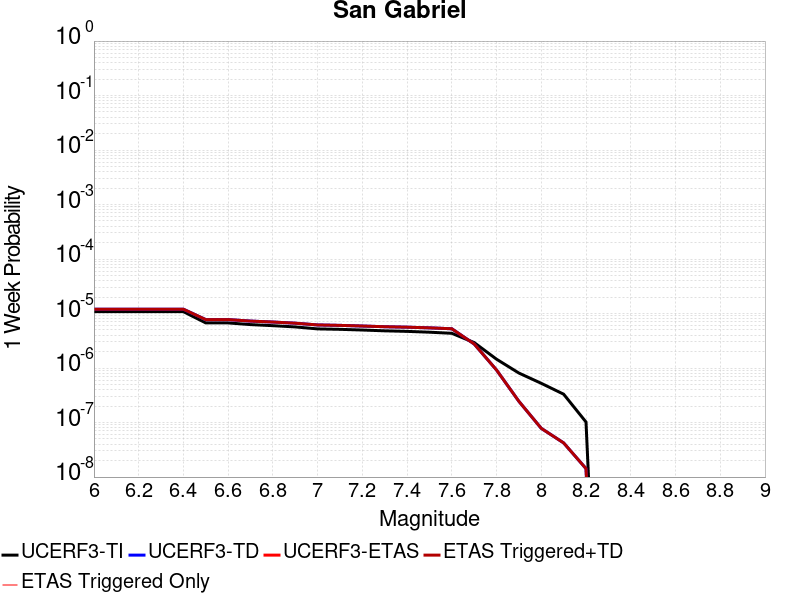 | 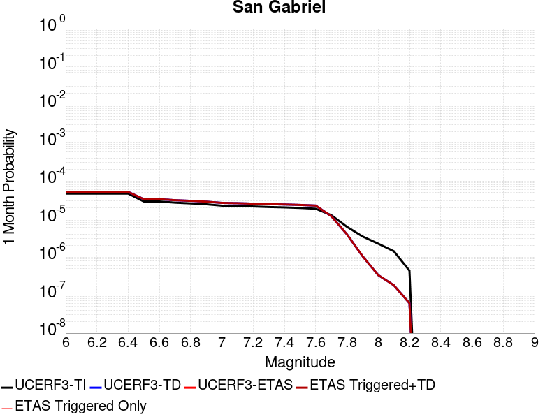 | 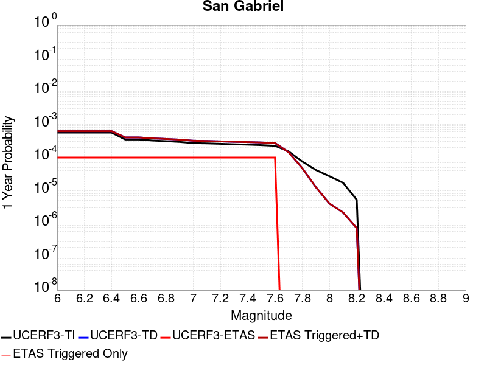 | 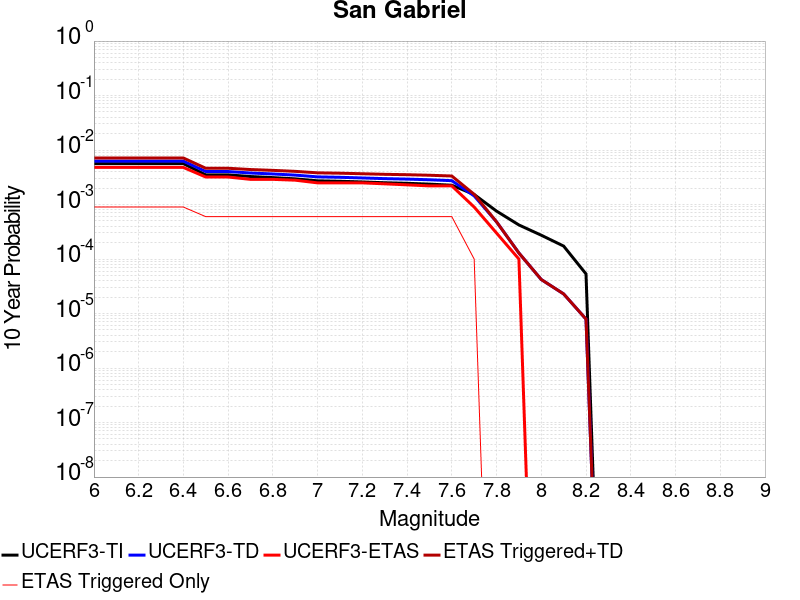 |

| Magnitude | 1 wk TI Prob | 1 wk TD Prob | 1 wk ETAS Prob | 1 wk ETAS/TD Gain | 1 wk ETAS Triggered+TD | 1 wk ETAS Triggered Only | 1 mo TI Prob | 1 mo TD Prob | 1 mo ETAS Prob | 1 mo ETAS/TD Gain | 1 mo ETAS Triggered+TD | 1 mo ETAS Triggered Only | 1 yr TI Prob | 1 yr TD Prob | 1 yr ETAS Prob | 1 yr ETAS/TD Gain | 1 yr ETAS Triggered+TD | 1 yr ETAS Triggered Only | 10 yr TI Prob | 10 yr TD Prob | 10 yr ETAS Prob | 10 yr ETAS/TD Gain | 10 yr ETAS Triggered+TD | 10 yr ETAS Triggered Only |
|-----|-----|-----|-----|-----|-----|-----|-----|-----|-----|-----|-----|-----|-----|-----|-----|-----|-----|-----|-----|-----|-----|-----|-----|-----|
| 6.0 | 1.083775E-5 | 1.2018531E-5 | 0.0 | 0.0 | 1.2018531E-5 | 0.0 | 4.6446676E-5 | 5.150704E-5 | 0.0 | 0.0 | 5.150704E-5 | 0.0 | 5.653415E-4 | 6.269291E-4 | 1.0E-4 | 0.15950766 | 6.269291E-4 | 0.0 | 0.0056390543 | 0.0062634884 | 0.0048 | 0.7663461 | 0.0071578515 | 9.0E-4 |
| 6.1 | 1.083775E-5 | 1.2018531E-5 | 0.0 | 0.0 | 1.2018531E-5 | 0.0 | 4.6446676E-5 | 5.150704E-5 | 0.0 | 0.0 | 5.150704E-5 | 0.0 | 5.653415E-4 | 6.269291E-4 | 1.0E-4 | 0.15950766 | 6.269291E-4 | 0.0 | 0.0056390543 | 0.0062634884 | 0.0048 | 0.7663461 | 0.0071578515 | 9.0E-4 |
| 6.2 | 1.083775E-5 | 1.2018531E-5 | 0.0 | 0.0 | 1.2018531E-5 | 0.0 | 4.6446676E-5 | 5.150704E-5 | 0.0 | 0.0 | 5.150704E-5 | 0.0 | 5.653415E-4 | 6.269291E-4 | 1.0E-4 | 0.15950766 | 6.269291E-4 | 0.0 | 0.0056390543 | 0.0062634884 | 0.0048 | 0.7663461 | 0.0071578515 | 9.0E-4 |
| 6.3 | 1.083775E-5 | 1.2018531E-5 | 0.0 | 0.0 | 1.2018531E-5 | 0.0 | 4.6446676E-5 | 5.150704E-5 | 0.0 | 0.0 | 5.150704E-5 | 0.0 | 5.653415E-4 | 6.269291E-4 | 1.0E-4 | 0.15950766 | 6.269291E-4 | 0.0 | 0.0056390543 | 0.0062634884 | 0.0048 | 0.7663461 | 0.0071578515 | 9.0E-4 |
| 6.4 | 1.083775E-5 | 1.2018531E-5 | 0.0 | 0.0 | 1.2018531E-5 | 0.0 | 4.6446676E-5 | 5.150704E-5 | 0.0 | 0.0 | 5.150704E-5 | 0.0 | 5.653415E-4 | 6.269291E-4 | 1.0E-4 | 0.15950766 | 6.269291E-4 | 0.0 | 0.0056390543 | 0.0062634884 | 0.0048 | 0.7663461 | 0.0071578515 | 9.0E-4 |
| 6.5 | 6.7317824E-6 | 7.749942E-6 | 0.0 | 0.0 | 7.749942E-6 | 0.0 | 2.8850178E-5 | 3.321362E-5 | 0.0 | 0.0 | 3.321362E-5 | 0.0 | 3.511943E-4 | 4.0430183E-4 | 1.0E-4 | 0.24733996 | 4.0430183E-4 | 0.0 | 0.003506398 | 0.0040465463 | 0.0032 | 0.7907978 | 0.0046441182 | 6.0E-4 |
| 6.6 | 6.7317824E-6 | 7.749942E-6 | 0.0 | 0.0 | 7.749942E-6 | 0.0 | 2.8850178E-5 | 3.321362E-5 | 0.0 | 0.0 | 3.321362E-5 | 0.0 | 3.511943E-4 | 4.0430183E-4 | 1.0E-4 | 0.24733996 | 4.0430183E-4 | 0.0 | 0.003506398 | 0.0040465463 | 0.0032 | 0.7907978 | 0.0046441182 | 6.0E-4 |
| 6.7 | 6.274881E-6 | 7.2788316E-6 | 0.0 | 0.0 | 7.2788316E-6 | 0.0 | 2.6892068E-5 | 3.1194624E-5 | 0.0 | 0.0 | 3.1194624E-5 | 0.0 | 3.2736175E-4 | 3.7972935E-4 | 1.0E-4 | 0.26334548 | 3.7972935E-4 | 0.0 | 0.0032687993 | 0.0038016816 | 0.0029 | 0.7628203 | 0.0043994007 | 6.0E-4 |
| 6.8 | 5.996209E-6 | 6.991533E-6 | 0.0 | 0.0 | 6.991533E-6 | 0.0 | 2.5697784E-5 | 2.9963376E-5 | 0.0 | 0.0 | 2.9963376E-5 | 0.0 | 3.128256E-4 | 3.6474396E-4 | 1.0E-4 | 0.27416492 | 3.6474396E-4 | 0.0 | 0.003123856 | 0.0036523275 | 0.0029 | 0.7940142 | 0.004250136 | 6.0E-4 |
| 6.9 | 5.686331E-6 | 6.6564485E-6 | 0.0 | 0.0 | 6.6564485E-6 | 0.0 | 2.4369761E-5 | 2.852733E-5 | 0.0 | 0.0 | 2.852733E-5 | 0.0 | 2.9666146E-4 | 3.472658E-4 | 1.0E-4 | 0.28796387 | 3.472658E-4 | 0.0 | 0.0029626573 | 0.0034781045 | 0.0028 | 0.8050362 | 0.0040760175 | 6.0E-4 |
| 7.0 | 5.2329838E-6 | 6.1802475E-6 | 0.0 | 0.0 | 6.1802475E-6 | 0.0 | 2.242688E-5 | 2.6486512E-5 | 0.0 | 0.0 | 2.6486512E-5 | 0.0 | 2.7301308E-4 | 3.2242632E-4 | 1.0E-4 | 0.31014836 | 3.2242632E-4 | 0.0 | 0.002726779 | 0.0032304458 | 0.0025 | 0.773887 | 0.0038285076 | 6.0E-4 |
| 7.1 | 5.135671E-6 | 6.070287E-6 | 0.0 | 0.0 | 6.070287E-6 | 0.0 | 2.2009834E-5 | 2.6015261E-5 | 0.0 | 0.0 | 2.6015261E-5 | 0.0 | 2.6793676E-4 | 3.1669054E-4 | 1.0E-4 | 0.31576568 | 3.1669054E-4 | 0.0 | 0.0026761394 | 0.003173253 | 0.0025 | 0.78783506 | 0.003771349 | 6.0E-4 |
| 7.2 | 4.989062E-6 | 5.9035183E-6 | 0.0 | 0.0 | 5.9035183E-6 | 0.0 | 2.1381518E-5 | 2.5300551E-5 | 0.0 | 0.0 | 2.5300551E-5 | 0.0 | 2.6028889E-4 | 3.0799143E-4 | 1.0E-4 | 0.32468435 | 3.0799143E-4 | 0.0 | 0.0025998424 | 0.0030865064 | 0.0025 | 0.8099773 | 0.0036846544 | 6.0E-4 |
| 7.3 | 4.8219395E-6 | 5.7349407E-6 | 0.0 | 0.0 | 5.7349407E-6 | 0.0 | 2.0665291E-5 | 2.457809E-5 | 0.0 | 0.0 | 2.457809E-5 | 0.0 | 2.5157086E-4 | 2.991979E-4 | 1.0E-4 | 0.33422694 | 2.991979E-4 | 0.0 | 0.0025128627 | 0.002998812 | 0.0024 | 0.800317 | 0.0035970125 | 6.0E-4 |
| 7.4 | 4.7118383E-6 | 5.62338E-6 | 0.0 | 0.0 | 5.62338E-6 | 0.0 | 2.0193436E-5 | 2.4099982E-5 | 0.0 | 0.0 | 2.4099982E-5 | 0.0 | 2.4582737E-4 | 2.933785E-4 | 1.0E-4 | 0.34085658 | 2.933785E-4 | 0.0 | 0.002455556 | 0.002940772 | 0.0023 | 0.78210753 | 0.0035390076 | 6.0E-4 |
| 7.5 | 4.5506545E-6 | 5.468582E-6 | 0.0 | 0.0 | 5.468582E-6 | 0.0 | 1.9502659E-5 | 2.3436573E-5 | 0.0 | 0.0 | 2.3436573E-5 | 0.0 | 2.37419E-4 | 2.853037E-4 | 1.0E-4 | 0.3505037 | 2.853037E-4 | 0.0 | 0.002371655 | 0.0028602332 | 0.0022 | 0.769168 | 0.0034585171 | 6.0E-4 |
| 7.6 | 4.343636E-6 | 5.26119E-6 | 0.0 | 0.0 | 5.26119E-6 | 0.0 | 1.861545E-5 | 2.2547767E-5 | 0.0 | 0.0 | 2.2547767E-5 | 0.0 | 2.2661954E-4 | 2.7448524E-4 | 1.0E-4 | 0.3643183 | 2.7448524E-4 | 0.0 | 0.0022638857 | 0.0027523132 | 0.0022 | 0.7993276 | 0.0033506618 | 6.0E-4 |
| 7.7 | 2.936235E-6 | 2.7653846E-6 | 0.0 | 0.0 | 2.7653846E-6 | 0.0 | 1.2583803E-5 | 1.18515945E-5 | 0.0 | 0.0 | 1.18515945E-5 | 0.0 | 1.5319703E-4 | 1.4428365E-4 | 0.0 | 0.0 | 1.4428365E-4 | 0.0 | 0.0015309147 | 0.0014492436 | 9.0E-4 | 0.6210136 | 0.0015490988 | 1.0E-4 |
| 7.8 | 1.4541639E-6 | 9.2093967E-7 | 0.0 | 0.0 | 9.2093967E-7 | 0.0 | 6.232116E-6 | 3.946878E-6 | 0.0 | 0.0 | 3.946878E-6 | 0.0 | 7.587337E-5 | 4.8052185E-5 | 0.0 | 0.0 | 4.8052185E-5 | 0.0 | 7.584747E-4 | 4.8539627E-4 | 3.0E-4 | 0.6180517 | 4.8539627E-4 | 0.0 |
| 7.9 | 8.098958E-7 | 2.450341E-7 | 0.0 | 0.0 | 2.450341E-7 | 0.0 | 3.4709774E-6 | 1.0501457E-6 | 0.0 | 0.0 | 1.0501457E-6 | 0.0 | 4.225833E-5 | 1.2785448E-5 | 0.0 | 0.0 | 1.2785448E-5 | 0.0 | 4.2250296E-4 | 1.3098324E-4 | 1.0E-4 | 0.7634564 | 1.3098324E-4 | 0.0 |
| 8.0 | 5.2473234E-7 | 7.829533E-8 | 0.0 | 0.0 | 7.829533E-8 | 0.0 | 2.248851E-6 | 3.3555136E-7 | 0.0 | 0.0 | 3.3555136E-7 | 0.0 | 2.7379416E-5 | 4.08533E-6 | 0.0 | 0.0 | 4.08533E-6 | 0.0 | 2.7376044E-4 | 4.3013788E-5 | 0.0 | 0.0 | 4.3013788E-5 | 0.0 |
| 8.1 | 3.3162388E-7 | 4.232859E-8 | 0.0 | 0.0 | 4.232859E-8 | 0.0 | 1.4212444E-6 | 1.8140824E-7 | 0.0 | 0.0 | 1.8140824E-7 | 0.0 | 1.7303513E-5 | 2.2086429E-6 | 0.0 | 0.0 | 2.2086429E-6 | 0.0 | 1.7302166E-4 | 2.3421067E-5 | 0.0 | 0.0 | 2.3421067E-5 | 0.0 |
| 8.2 | 1.0235345E-7 | 1.4308433E-8 | 0.0 | 0.0 | 1.4308433E-8 | 0.0 | 4.3865757E-7 | 6.1321856E-8 | 0.0 | 0.0 | 6.1321856E-8 | 0.0 | 5.340643E-6 | 7.4659334E-7 | 0.0 | 0.0 | 7.4659334E-7 | 0.0 | 5.3405143E-5 | 8.074174E-6 | 0.0 | 0.0 | 8.074174E-6 | 0.0 |

## Greenville (So) 2011 CFM
*[(top)](#table-of-contents)*

| 1 Week | 1 Month | 1 Year | 10 Year |
|-----|-----|-----|-----|
| 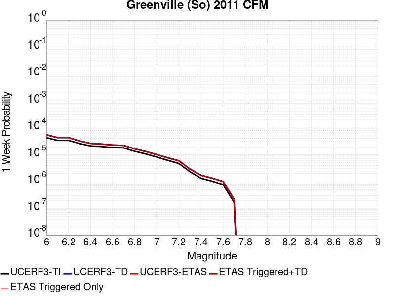 | 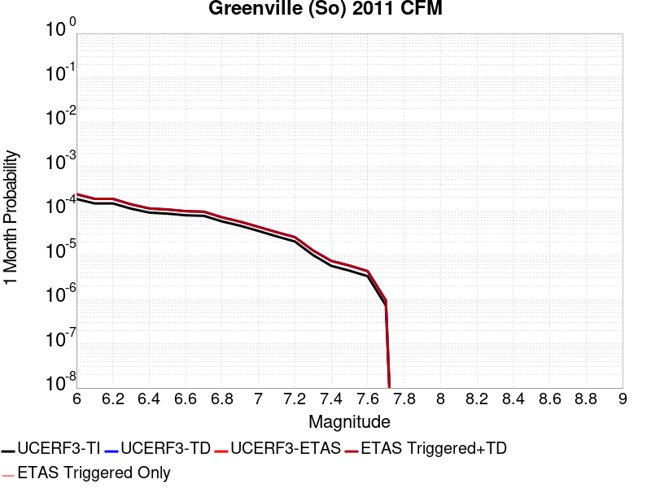 | 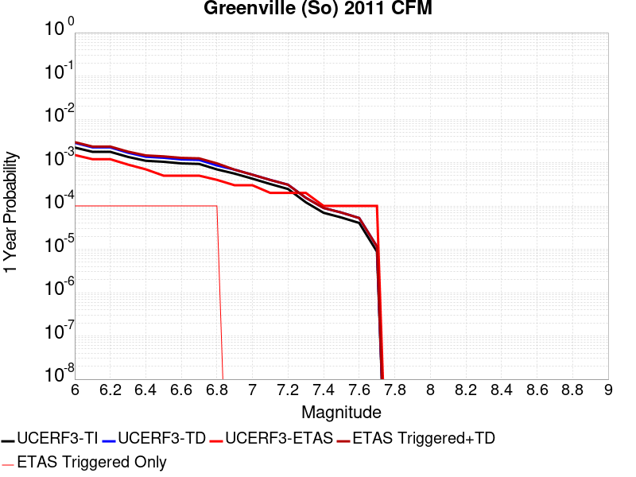 | 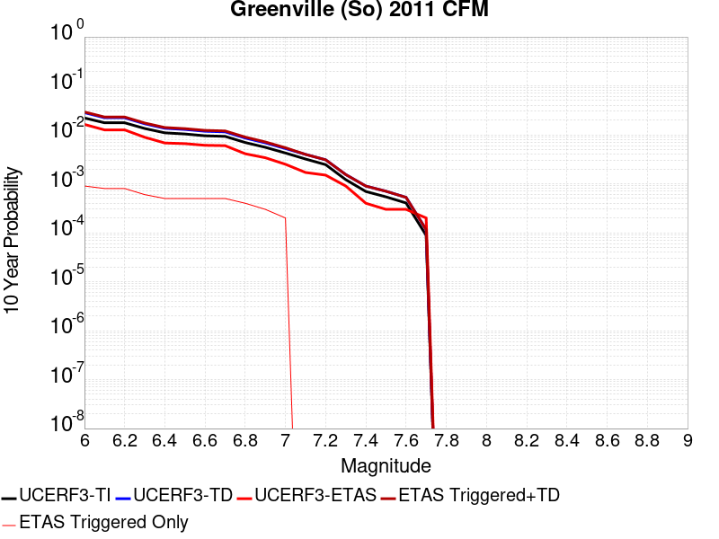 |

| Magnitude | 1 wk TI Prob | 1 wk TD Prob | 1 wk ETAS Prob | 1 wk ETAS/TD Gain | 1 wk ETAS Triggered+TD | 1 wk ETAS Triggered Only | 1 mo TI Prob | 1 mo TD Prob | 1 mo ETAS Prob | 1 mo ETAS/TD Gain | 1 mo ETAS Triggered+TD | 1 mo ETAS Triggered Only | 1 yr TI Prob | 1 yr TD Prob | 1 yr ETAS Prob | 1 yr ETAS/TD Gain | 1 yr ETAS Triggered+TD | 1 yr ETAS Triggered Only | 10 yr TI Prob | 10 yr TD Prob | 10 yr ETAS Prob | 10 yr ETAS/TD Gain | 10 yr ETAS Triggered+TD | 10 yr ETAS Triggered Only |
|-----|-----|-----|-----|-----|-----|-----|-----|-----|-----|-----|-----|-----|-----|-----|-----|-----|-----|-----|-----|-----|-----|-----|-----|-----|
| 6.0 | 4.279693E-5 | 5.507511E-5 | 0.0 | 0.0 | 5.507511E-5 | 0.0 | 1.8340252E-4 | 2.3601645E-4 | 0.0 | 0.0 | 2.3601645E-4 | 0.0 | 0.0022306389 | 0.0028699618 | 0.0015 | 0.52265507 | 0.0029696748 | 1.0E-4 | 0.022083808 | 0.028356064 | 0.0163 | 0.5748329 | 0.029230544 | 9.0E-4 |
| 6.1 | 3.4037297E-5 | 4.3218803E-5 | 0.0 | 0.0 | 4.3218803E-5 | 0.0 | 1.4586597E-4 | 1.8521107E-4 | 0.0 | 0.0 | 1.8521107E-4 | 0.0 | 0.0017744715 | 0.0022527738 | 0.0012 | 0.53267664 | 0.0023525485 | 1.0E-4 | 0.01760369 | 0.022316497 | 0.0126 | 0.5646047 | 0.023098644 | 8.0E-4 |
| 6.2 | 3.4037297E-5 | 4.3218803E-5 | 0.0 | 0.0 | 4.3218803E-5 | 0.0 | 1.4586597E-4 | 1.8521107E-4 | 0.0 | 0.0 | 1.8521107E-4 | 0.0 | 0.0017744715 | 0.0022527738 | 0.0012 | 0.53267664 | 0.0023525485 | 1.0E-4 | 0.01760369 | 0.022316497 | 0.0126 | 0.5646047 | 0.023098644 | 8.0E-4 |
| 6.3 | 2.5956324E-5 | 3.2448792E-5 | 0.0 | 0.0 | 3.2448792E-5 | 0.0 | 1.11236644E-4 | 1.3905928E-4 | 0.0 | 0.0 | 1.3905928E-4 | 0.0 | 0.0013534647 | 0.001691796 | 9.0E-4 | 0.531979 | 0.0017916268 | 1.0E-4 | 0.013452509 | 0.016796283 | 0.0089 | 0.5298791 | 0.017386205 | 6.0E-4 |
| 6.4 | 2.1145053E-5 | 2.621352E-5 | 0.0 | 0.0 | 2.621352E-5 | 0.0 | 9.061851E-5 | 1.12339E-4 | 0.0 | 0.0 | 1.12339E-4 | 0.0 | 0.0011027219 | 0.0013669004 | 7.0E-4 | 0.51210755 | 0.0014667637 | 1.0E-4 | 0.01097266 | 0.013588691 | 0.0068 | 0.5004161 | 0.014081897 | 5.0E-4 |
| 6.5 | 2.0030959E-5 | 2.4810914E-5 | 0.0 | 0.0 | 2.4810914E-5 | 0.0 | 8.584414E-5 | 1.06328334E-4 | 0.0 | 0.0 | 1.06328334E-4 | 0.0 | 0.0010446513 | 0.0012938097 | 5.0E-4 | 0.3864556 | 0.0013936803 | 1.0E-4 | 0.010397541 | 0.012866475 | 0.0066 | 0.51296103 | 0.013360041 | 5.0E-4 |
| 6.6 | 1.8395405E-5 | 2.2768541E-5 | 0.0 | 0.0 | 2.2768541E-5 | 0.0 | 7.8835066E-5 | 9.7575976E-5 | 0.0 | 0.0 | 9.7575976E-5 | 0.0 | 9.5939427E-4 | 0.0011873686 | 5.0E-4 | 0.42109922 | 0.0012872498 | 1.0E-4 | 0.009552629 | 0.011813652 | 0.0061 | 0.51635176 | 0.012307745 | 5.0E-4 |
| 6.7 | 1.7883482E-5 | 2.2139291E-5 | 0.0 | 0.0 | 2.2139291E-5 | 0.0 | 7.664124E-5 | 9.487939E-5 | 0.0 | 0.0 | 9.487939E-5 | 0.0 | 9.3270757E-4 | 0.001154573 | 5.0E-4 | 0.43306053 | 0.0012544575 | 1.0E-4 | 0.009288026 | 0.011489149 | 0.006 | 0.5222319 | 0.011983405 | 5.0E-4 |
| 6.8 | 1.3373564E-5 | 1.6516899E-5 | 0.0 | 0.0 | 1.6516899E-5 | 0.0 | 5.7314013E-5 | 7.078487E-5 | 0.0 | 0.0 | 7.078487E-5 | 0.0 | 6.975747E-4 | 8.6147984E-4 | 4.0E-4 | 0.4643173 | 9.613937E-4 | 1.0E-4 | 0.0069538904 | 0.008583365 | 0.0041 | 0.47766817 | 0.0089799315 | 4.0E-4 |
| 6.9 | 1.06692905E-5 | 1.3161855E-5 | 0.0 | 0.0 | 1.3161855E-5 | 0.0 | 4.5724726E-5 | 5.6406796E-5 | 0.0 | 0.0 | 5.6406796E-5 | 0.0 | 5.5655633E-4 | 6.865476E-4 | 3.0E-4 | 0.43696895 | 6.865476E-4 | 0.0 | 0.005551645 | 0.0068458514 | 0.0034 | 0.49665117 | 0.0071437974 | 3.0E-4 |
| 7.0 | 8.157512E-6 | 1.0070446E-5 | 0.0 | 0.0 | 1.0070446E-5 | 0.0 | 3.4960296E-5 | 4.3158358E-5 | 0.0 | 0.0 | 4.3158358E-5 | 0.0 | 4.2555845E-4 | 5.2533E-4 | 3.0E-4 | 0.57106954 | 5.2533E-4 | 0.0 | 0.004247444 | 0.005241711 | 0.0025 | 0.4769435 | 0.0054406626 | 2.0E-4 |
| 7.1 | 6.1467113E-6 | 7.634174E-6 | 0.0 | 0.0 | 7.634174E-6 | 0.0 | 2.6342783E-5 | 3.2717486E-5 | 0.0 | 0.0 | 3.2717486E-5 | 0.0 | 3.206762E-4 | 3.9826342E-4 | 2.0E-4 | 0.5021802 | 3.9826342E-4 | 0.0 | 0.0032021382 | 0.003976037 | 0.0017 | 0.42756143 | 0.003976037 | 0.0 |
| 7.2 | 4.713467E-6 | 5.92041E-6 | 0.0 | 0.0 | 5.92041E-6 | 0.0 | 2.0200418E-5 | 2.5372941E-5 | 0.0 | 0.0 | 2.5372941E-5 | 0.0 | 2.4591232E-4 | 3.0887238E-4 | 2.0E-4 | 0.6475166 | 3.0887238E-4 | 0.0 | 0.0024564038 | 0.0030849103 | 0.0015 | 0.4862378 | 0.0030849103 | 0.0 |
| 7.3 | 2.3266216E-6 | 2.955584E-6 | 0.0 | 0.0 | 2.955584E-6 | 0.0 | 9.971197E-6 | 1.2666728E-5 | 0.0 | 0.0 | 1.2666728E-5 | 0.0 | 1.2139256E-4 | 1.5420665E-4 | 2.0E-4 | 1.296961 | 1.5420665E-4 | 0.0 | 0.0012132627 | 0.0015414488 | 9.0E-4 | 0.58386636 | 0.0015414488 | 0.0 |
| 7.4 | 1.3314E-6 | 1.7193568E-6 | 0.0 | 0.0 | 1.7193568E-6 | 0.0 | 5.7059874E-6 | 7.3686515E-6 | 0.0 | 0.0 | 7.3686515E-6 | 0.0 | 6.946818E-5 | 8.970968E-5 | 1.0E-4 | 1.1147069 | 8.970968E-5 | 0.0 | 6.9446466E-4 | 8.970301E-4 | 4.0E-4 | 0.4459159 | 8.970301E-4 | 0.0 |
| 7.5 | 1.0362941E-6 | 1.3479154E-6 | 0.0 | 0.0 | 1.3479154E-6 | 0.0 | 4.4412527E-6 | 5.7767675E-6 | 0.0 | 0.0 | 5.7767675E-6 | 0.0 | 5.407091E-5 | 7.032992E-5 | 1.0E-4 | 1.4218699 | 7.032992E-5 | 0.0 | 5.405776E-4 | 7.033727E-4 | 3.0E-4 | 0.4265164 | 7.033727E-4 | 0.0 |
| 7.6 | 7.764784E-7 | 1.0098323E-6 | 0.0 | 0.0 | 1.0098323E-6 | 0.0 | 3.3277602E-6 | 4.327846E-6 | 0.0 | 0.0 | 4.327846E-6 | 0.0 | 4.0514726E-5 | 5.2690288E-5 | 1.0E-4 | 1.8978829 | 5.2690288E-5 | 0.0 | 4.050734E-4 | 5.2709697E-4 | 3.0E-4 | 0.5691552 | 5.2709697E-4 | 0.0 |
| 7.7 | 1.6927763E-7 | 2.214161E-7 | 0.0 | 0.0 | 2.214161E-7 | 0.0 | 7.2547533E-7 | 9.4892584E-7 | 0.0 | 0.0 | 9.4892584E-7 | 0.0 | 8.832627E-6 | 1.1553114E-5 | 1.0E-4 | 8.655675 | 1.1553114E-5 | 0.0 | 8.8322755E-5 | 1.1554341E-4 | 2.0E-4 | 1.7309512 | 1.1554341E-4 | 0.0 |

## Owens Valley
*[(top)](#table-of-contents)*

| 1 Week | 1 Month | 1 Year | 10 Year |
|-----|-----|-----|-----|
| 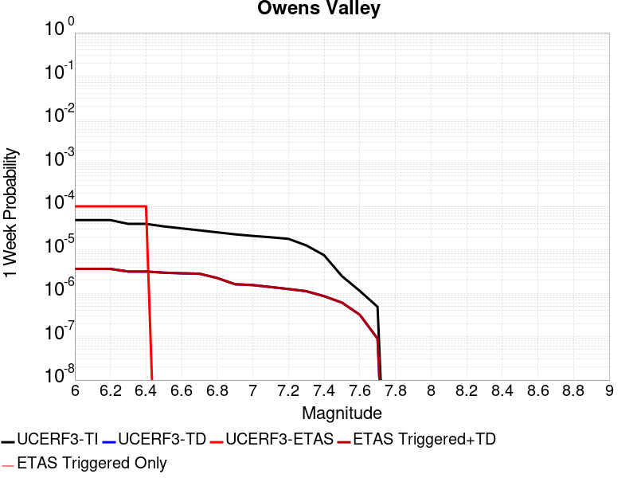 | 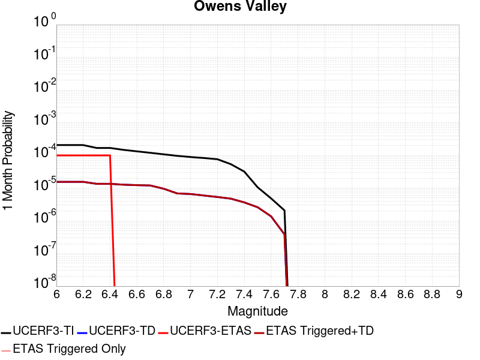 | 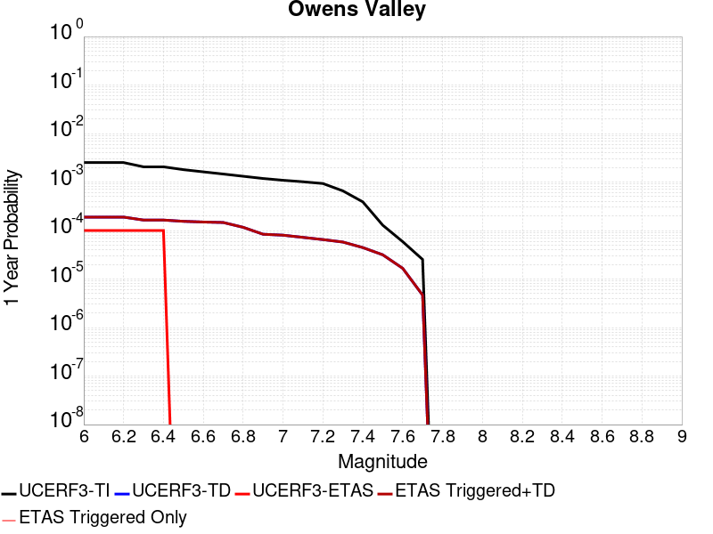 | 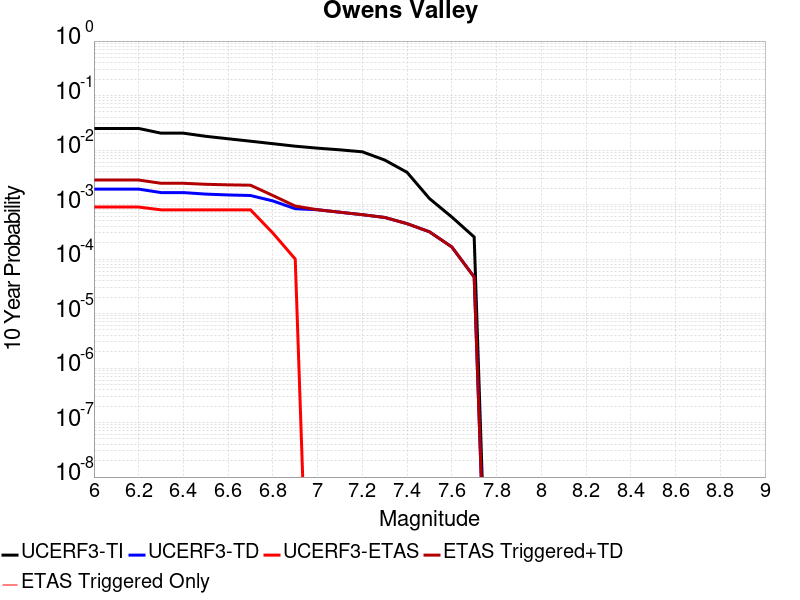 |

| Magnitude | 1 wk TI Prob | 1 wk TD Prob | 1 wk ETAS Prob | 1 wk ETAS/TD Gain | 1 wk ETAS Triggered+TD | 1 wk ETAS Triggered Only | 1 mo TI Prob | 1 mo TD Prob | 1 mo ETAS Prob | 1 mo ETAS/TD Gain | 1 mo ETAS Triggered+TD | 1 mo ETAS Triggered Only | 1 yr TI Prob | 1 yr TD Prob | 1 yr ETAS Prob | 1 yr ETAS/TD Gain | 1 yr ETAS Triggered+TD | 1 yr ETAS Triggered Only | 10 yr TI Prob | 10 yr TD Prob | 10 yr ETAS Prob | 10 yr ETAS/TD Gain | 10 yr ETAS Triggered+TD | 10 yr ETAS Triggered Only |
|-----|-----|-----|-----|-----|-----|-----|-----|-----|-----|-----|-----|-----|-----|-----|-----|-----|-----|-----|-----|-----|-----|-----|-----|-----|
| 6.0 | 4.83821E-5 | 3.6345555E-6 | 1.0E-4 | 27.51368 | 3.6345555E-6 | 0.0 | 2.0733538E-4 | 1.557658E-5 | 1.0E-4 | 6.4198947 | 1.557658E-5 | 0.0 | 0.002521386 | 1.8962935E-4 | 1.0E-4 | 0.5273445 | 1.8962935E-4 | 0.0 | 0.024929691 | 0.0019346912 | 0.0022 | 1.1371324 | 0.00283295 | 9.0E-4 |
| 6.1 | 4.83821E-5 | 3.6345555E-6 | 1.0E-4 | 27.51368 | 3.6345555E-6 | 0.0 | 2.0733538E-4 | 1.557658E-5 | 1.0E-4 | 6.4198947 | 1.557658E-5 | 0.0 | 0.002521386 | 1.8962935E-4 | 1.0E-4 | 0.5273445 | 1.8962935E-4 | 0.0 | 0.024929691 | 0.0019346912 | 0.0022 | 1.1371324 | 0.00283295 | 9.0E-4 |
| 6.2 | 4.83821E-5 | 3.6345555E-6 | 1.0E-4 | 27.51368 | 3.6345555E-6 | 0.0 | 2.0733538E-4 | 1.557658E-5 | 1.0E-4 | 6.4198947 | 1.557658E-5 | 0.0 | 0.002521386 | 1.8962935E-4 | 1.0E-4 | 0.5273445 | 1.8962935E-4 | 0.0 | 0.024929691 | 0.0019346912 | 0.0022 | 1.1371324 | 0.00283295 | 9.0E-4 |
| 6.3 | 3.953008E-5 | 3.1605878E-6 | 1.0E-4 | 31.639685 | 3.1605878E-6 | 0.0 | 1.6940363E-4 | 1.354531E-5 | 1.0E-4 | 7.382629 | 1.354531E-5 | 0.0 | 0.002060538 | 1.649024E-4 | 1.0E-4 | 0.60641927 | 1.649024E-4 | 0.0 | 0.020415364 | 0.0016638273 | 0.002 | 1.2020478 | 0.0024624963 | 8.0E-4 |
| 6.4 | 3.953008E-5 | 3.1605878E-6 | 1.0E-4 | 31.639685 | 3.1605878E-6 | 0.0 | 1.6940363E-4 | 1.354531E-5 | 1.0E-4 | 7.382629 | 1.354531E-5 | 0.0 | 0.002060538 | 1.649024E-4 | 1.0E-4 | 0.60641927 | 1.649024E-4 | 0.0 | 0.020415364 | 0.0016638273 | 0.002 | 1.2020478 | 0.0024624963 | 8.0E-4 |
| 6.5 | 3.457342E-5 | 2.9756195E-6 | 0.0 | 0.0 | 2.9756195E-6 | 0.0 | 1.4816338E-4 | 1.2752597E-5 | 0.0 | 0.0 | 1.2752597E-5 | 0.0 | 0.0018023965 | 1.552525E-4 | 0.0 | 0.0 | 1.552525E-4 | 0.0 | 0.017878477 | 0.0015564939 | 0.0019 | 1.2206922 | 0.0023552487 | 8.0E-4 |
| 6.6 | 3.1127765E-5 | 2.8771121E-6 | 0.0 | 0.0 | 2.8771121E-6 | 0.0 | 1.3339789E-4 | 1.2330426E-5 | 0.0 | 0.0 | 1.2330426E-5 | 0.0 | 0.0016229092 | 1.5011328E-4 | 0.0 | 0.0 | 1.5011328E-4 | 0.0 | 0.016111081 | 0.0015029189 | 0.0019 | 1.2642066 | 0.0023017165 | 8.0E-4 |
| 6.7 | 2.806885E-5 | 2.8125712E-6 | 0.0 | 0.0 | 2.8125712E-6 | 0.0 | 1.2028952E-4 | 1.2053824E-5 | 0.0 | 0.0 | 1.2053824E-5 | 0.0 | 0.001463541 | 1.4674611E-4 | 0.0 | 0.0 | 1.4674611E-4 | 0.0 | 0.014539397 | 0.0014668222 | 0.0018 | 1.2271426 | 0.0022656487 | 8.0E-4 |
| 6.8 | 2.524524E-5 | 2.2372278E-6 | 0.0 | 0.0 | 2.2372278E-6 | 0.0 | 1.0818939E-4 | 9.588086E-6 | 0.0 | 0.0 | 9.588086E-6 | 0.0 | 0.0013164099 | 1.16728996E-4 | 0.0 | 0.0 | 1.16728996E-4 | 0.0 | 0.01308639 | 0.0011669054 | 0.0012 | 1.0283611 | 0.0014665553 | 3.0E-4 |
| 6.9 | 2.2704568E-5 | 1.609511E-6 | 0.0 | 0.0 | 1.609511E-6 | 0.0 | 9.730166E-5 | 6.8978857E-6 | 0.0 | 0.0 | 6.8978857E-6 | 0.0 | 0.0011840039 | 8.397854E-5 | 0.0 | 0.0 | 8.397854E-5 | 0.0 | 0.011777153 | 8.39644E-4 | 7.0E-4 | 0.83368665 | 9.3956006E-4 | 1.0E-4 |
| 7.0 | 2.0871712E-5 | 1.5408132E-6 | 0.0 | 0.0 | 1.5408132E-6 | 0.0 | 8.944713E-5 | 6.603468E-6 | 0.0 | 0.0 | 6.603468E-6 | 0.0 | 0.0010884746 | 8.0394275E-5 | 0.0 | 0.0 | 8.0394275E-5 | 0.0 | 0.010831586 | 8.0378324E-4 | 6.0E-4 | 0.7464699 | 8.0378324E-4 | 0.0 |
| 7.1 | 1.944928E-5 | 1.3874952E-6 | 0.0 | 0.0 | 1.3874952E-6 | 0.0 | 8.335139E-5 | 5.9463946E-6 | 0.0 | 0.0 | 5.9463946E-6 | 0.0 | 0.0010143308 | 7.239496E-5 | 0.0 | 0.0 | 7.239496E-5 | 0.0 | 0.010097133 | 7.2383106E-4 | 6.0E-4 | 0.8289227 | 7.2383106E-4 | 0.0 |
| 7.2 | 1.7876306E-5 | 1.2498657E-6 | 0.0 | 0.0 | 1.2498657E-6 | 0.0 | 7.6610486E-5 | 5.3565564E-6 | 0.0 | 0.0 | 5.3565564E-6 | 0.0 | 9.3233347E-4 | 6.521413E-5 | 0.0 | 0.0 | 6.521413E-5 | 0.0 | 0.009284316 | 6.520427E-4 | 5.0E-4 | 0.76682097 | 6.520427E-4 | 0.0 |
| 7.3 | 1.2618672E-5 | 1.1124014E-6 | 0.0 | 0.0 | 1.1124014E-6 | 0.0 | 5.40789E-5 | 4.7674257E-6 | 0.0 | 0.0 | 4.7674257E-6 | 0.0 | 6.582117E-4 | 5.804187E-5 | 0.0 | 0.0 | 5.804187E-5 | 0.0 | 0.0065626553 | 5.803549E-4 | 4.0E-4 | 0.6892335 | 5.803549E-4 | 0.0 |
| 7.4 | 7.4874442E-6 | 8.556056E-7 | 0.0 | 0.0 | 8.556056E-7 | 0.0 | 3.208865E-5 | 3.666876E-6 | 0.0 | 0.0 | 3.666876E-6 | 0.0 | 3.906093E-4 | 4.4643304E-5 | 0.0 | 0.0 | 4.4643304E-5 | 0.0 | 0.003899234 | 4.4638792E-4 | 3.0E-4 | 0.6720612 | 4.4638792E-4 | 0.0 |
| 7.5 | 2.4734156E-6 | 6.073636E-7 | 0.0 | 0.0 | 6.073636E-7 | 0.0 | 1.060031E-5 | 2.602984E-6 | 0.0 | 0.0 | 2.602984E-6 | 0.0 | 1.2905113E-4 | 3.1690874E-5 | 0.0 | 0.0 | 3.1690874E-5 | 0.0 | 0.0012897621 | 3.1686388E-4 | 2.0E-4 | 0.6311859 | 3.1686388E-4 | 0.0 |
| 7.6 | 1.1328841E-6 | 3.1990368E-7 | 0.0 | 0.0 | 3.1990368E-7 | 0.0 | 4.8552088E-6 | 1.3710151E-6 | 0.0 | 0.0 | 1.3710151E-6 | 0.0 | 5.9110564E-5 | 1.6691982E-5 | 0.0 | 0.0 | 1.6691982E-5 | 0.0 | 5.9094845E-4 | 1.6690747E-4 | 1.0E-4 | 0.5991343 | 1.6690747E-4 | 0.0 |
| 7.7 | 4.8613185E-7 | 8.974034E-8 | 0.0 | 0.0 | 8.974034E-8 | 0.0 | 2.0834207E-6 | 3.846014E-7 | 0.0 | 0.0 | 3.846014E-7 | 0.0 | 2.536535E-5 | 4.682513E-6 | 0.0 | 0.0 | 4.682513E-6 | 0.0 | 2.5362454E-4 | 4.682421E-5 | 1.0E-4 | 2.1356473 | 4.682421E-5 | 0.0 |

## Hosgri
*[(top)](#table-of-contents)*

| 1 Week | 1 Month | 1 Year | 10 Year |
|-----|-----|-----|-----|
| 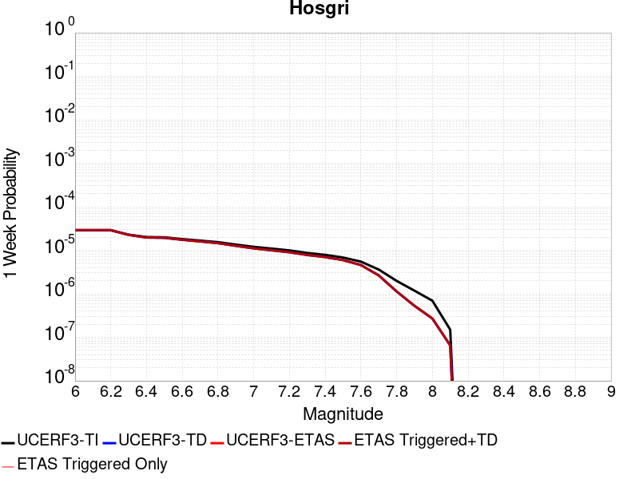 | 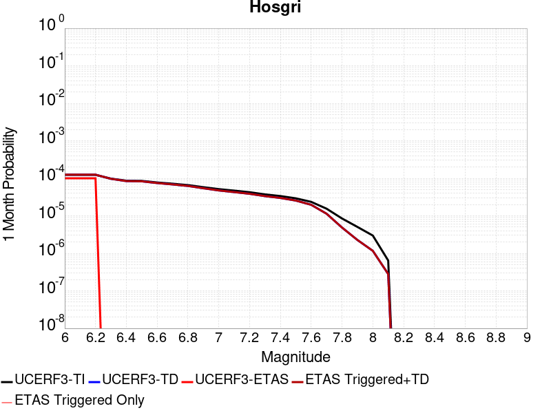 | 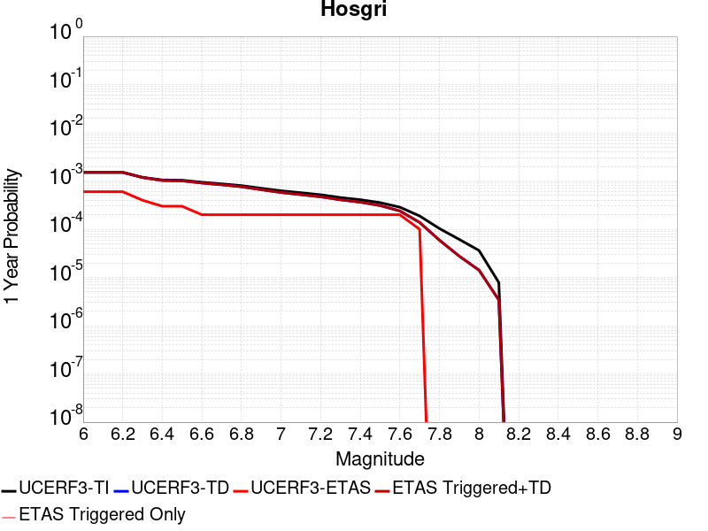 | 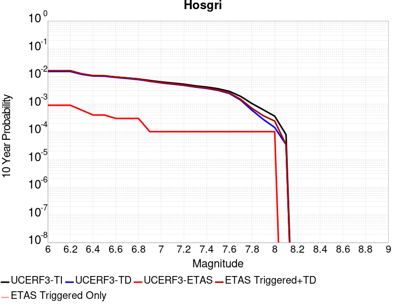 |

| Magnitude | 1 wk TI Prob | 1 wk TD Prob | 1 wk ETAS Prob | 1 wk ETAS/TD Gain | 1 wk ETAS Triggered+TD | 1 wk ETAS Triggered Only | 1 mo TI Prob | 1 mo TD Prob | 1 mo ETAS Prob | 1 mo ETAS/TD Gain | 1 mo ETAS Triggered+TD | 1 mo ETAS Triggered Only | 1 yr TI Prob | 1 yr TD Prob | 1 yr ETAS Prob | 1 yr ETAS/TD Gain | 1 yr ETAS Triggered+TD | 1 yr ETAS Triggered Only | 10 yr TI Prob | 10 yr TD Prob | 10 yr ETAS Prob | 10 yr ETAS/TD Gain | 10 yr ETAS Triggered+TD | 10 yr ETAS Triggered Only |
|-----|-----|-----|-----|-----|-----|-----|-----|-----|-----|-----|-----|-----|-----|-----|-----|-----|-----|-----|-----|-----|-----|-----|-----|-----|
| 6.0 | 2.883978E-5 | 2.9134902E-5 | 1.0E-4 | 3.4323094 | 2.9134902E-5 | 0.0 | 1.235932E-4 | 1.2485804E-4 | 1.0E-4 | 0.8009096 | 1.2485804E-4 | 0.0 | 0.0015037085 | 0.0015191139 | 6.0E-4 | 0.3949671 | 0.0015191139 | 0.0 | 0.01493574 | 0.015091082 | 0.0077 | 0.51023513 | 0.0159775 | 9.0E-4 |
| 6.1 | 2.883978E-5 | 2.9134902E-5 | 1.0E-4 | 3.4323094 | 2.9134902E-5 | 0.0 | 1.235932E-4 | 1.2485804E-4 | 1.0E-4 | 0.8009096 | 1.2485804E-4 | 0.0 | 0.0015037085 | 0.0015191139 | 6.0E-4 | 0.3949671 | 0.0015191139 | 0.0 | 0.01493574 | 0.015091082 | 0.0077 | 0.51023513 | 0.0159775 | 9.0E-4 |
| 6.2 | 2.883978E-5 | 2.9134902E-5 | 1.0E-4 | 3.4323094 | 2.9134902E-5 | 0.0 | 1.235932E-4 | 1.2485804E-4 | 1.0E-4 | 0.8009096 | 1.2485804E-4 | 0.0 | 0.0015037085 | 0.0015191139 | 6.0E-4 | 0.3949671 | 0.0015191139 | 0.0 | 0.01493574 | 0.015091082 | 0.0077 | 0.51023513 | 0.0159775 | 9.0E-4 |
| 6.3 | 2.2914428E-5 | 2.2647186E-5 | 0.0 | 0.0 | 2.2647186E-5 | 0.0 | 9.8200995E-5 | 9.705578E-5 | 0.0 | 0.0 | 9.705578E-5 | 0.0 | 0.0011949413 | 0.0011810185 | 4.0E-4 | 0.3386907 | 0.0011810185 | 0.0 | 0.011885363 | 0.011748831 | 0.0058 | 0.49366614 | 0.0123417815 | 6.0E-4 |
| 6.4 | 2.0195741E-5 | 1.9701269E-5 | 0.0 | 0.0 | 1.9701269E-5 | 0.0 | 8.65503E-5 | 8.443129E-5 | 0.0 | 0.0 | 8.443129E-5 | 0.0 | 0.0010532405 | 0.0010274681 | 3.0E-4 | 0.29197985 | 0.0010274681 | 0.0 | 0.010482626 | 0.0102282325 | 0.0049 | 0.47906613 | 0.010624141 | 4.0E-4 |
| 6.5 | 1.9924333E-5 | 1.9413652E-5 | 0.0 | 0.0 | 1.9413652E-5 | 0.0 | 8.53872E-5 | 8.319873E-5 | 0.0 | 0.0 | 8.319873E-5 | 0.0 | 0.0010390934 | 0.0010124757 | 3.0E-4 | 0.29630342 | 0.0010124757 | 0.0 | 0.010342481 | 0.0100796735 | 0.0048 | 0.4762059 | 0.010475642 | 4.0E-4 |
| 6.6 | 1.809694E-5 | 1.7462682E-5 | 0.0 | 0.0 | 1.7462682E-5 | 0.0 | 7.7556004E-5 | 7.483793E-5 | 0.0 | 0.0 | 7.483793E-5 | 0.0 | 9.438353E-4 | 9.1077224E-4 | 2.0E-4 | 0.21959387 | 9.1077224E-4 | 0.0 | 0.009398366 | 0.009071347 | 0.0043 | 0.47402 | 0.0093686255 | 3.0E-4 |
| 6.7 | 1.675989E-5 | 1.604695E-5 | 0.0 | 0.0 | 1.604695E-5 | 0.0 | 7.182612E-5 | 6.877084E-5 | 0.0 | 0.0 | 6.877084E-5 | 0.0 | 8.7413215E-4 | 8.3696446E-4 | 2.0E-4 | 0.23895878 | 8.3696446E-4 | 0.0 | 0.008707017 | 0.008339037 | 0.0038 | 0.45568812 | 0.008636535 | 3.0E-4 |
| 6.8 | 1.5401129E-5 | 1.4618074E-5 | 0.0 | 0.0 | 1.4618074E-5 | 0.0 | 6.6003166E-5 | 6.2647385E-5 | 0.0 | 0.0 | 6.2647385E-5 | 0.0 | 8.032922E-4 | 7.624659E-4 | 2.0E-4 | 0.2623068 | 7.624659E-4 | 0.0 | 0.008003947 | 0.007599371 | 0.0034 | 0.44740546 | 0.007897091 | 3.0E-4 |
| 6.9 | 1.356559E-5 | 1.2693698E-5 | 0.0 | 0.0 | 1.2693698E-5 | 0.0 | 5.8136946E-5 | 5.4400432E-5 | 0.0 | 0.0 | 5.4400432E-5 | 0.0 | 7.0758746E-4 | 6.621244E-4 | 2.0E-4 | 0.30205804 | 6.621244E-4 | 0.0 | 0.007053386 | 0.0066023297 | 0.0028 | 0.42409274 | 0.006701669 | 1.0E-4 |
| 7.0 | 1.2030819E-5 | 1.1099485E-5 | 0.0 | 0.0 | 1.1099485E-5 | 0.0 | 5.155963E-5 | 4.7568356E-5 | 0.0 | 0.0 | 4.7568356E-5 | 0.0 | 6.275577E-4 | 5.789909E-4 | 2.0E-4 | 0.34542856 | 5.789909E-4 | 0.0 | 0.006257884 | 0.0057755928 | 0.0027 | 0.46748447 | 0.005875015 | 1.0E-4 |
| 7.1 | 1.0972698E-5 | 1.002558E-5 | 0.0 | 0.0 | 1.002558E-5 | 0.0 | 4.7025E-5 | 4.2966065E-5 | 0.0 | 0.0 | 4.2966065E-5 | 0.0 | 5.72379E-4 | 5.2298635E-4 | 2.0E-4 | 0.38241917 | 5.2298635E-4 | 0.0 | 0.0057090693 | 0.0052183154 | 0.0023 | 0.44075528 | 0.0053177937 | 1.0E-4 |
| 7.2 | 9.961926E-6 | 9.038041E-6 | 0.0 | 0.0 | 9.038041E-6 | 0.0 | 4.2693267E-5 | 3.8733884E-5 | 0.0 | 0.0 | 3.8733884E-5 | 0.0 | 5.1966653E-4 | 4.7148307E-4 | 2.0E-4 | 0.42419338 | 4.7148307E-4 | 0.0 | 0.00518453 | 0.004705582 | 0.0022 | 0.46752986 | 0.0048051113 | 1.0E-4 |
| 7.3 | 8.700929E-6 | 7.831274E-6 | 0.0 | 0.0 | 7.831274E-6 | 0.0 | 3.7289166E-5 | 3.356217E-5 | 0.0 | 0.0 | 3.356217E-5 | 0.0 | 4.53901E-4 | 4.0854284E-4 | 2.0E-4 | 0.48954475 | 4.0854284E-4 | 0.0 | 0.00452975 | 0.0040786653 | 0.0017 | 0.41680303 | 0.004178257 | 1.0E-4 |
| 7.4 | 7.866285E-6 | 7.001801E-6 | 0.0 | 0.0 | 7.001801E-6 | 0.0 | 3.3712215E-5 | 3.0007373E-5 | 0.0 | 0.0 | 3.0007373E-5 | 0.0 | 4.103689E-4 | 3.6527854E-4 | 2.0E-4 | 0.5475274 | 3.6527854E-4 | 0.0 | 0.004096119 | 0.0036475265 | 0.0014 | 0.38382176 | 0.0037471617 | 1.0E-4 |
| 7.5 | 6.8381305E-6 | 5.9626564E-6 | 0.0 | 0.0 | 5.9626564E-6 | 0.0 | 2.9305946E-5 | 2.555399E-5 | 0.0 | 0.0 | 2.555399E-5 | 0.0 | 3.5674145E-4 | 3.1107545E-4 | 2.0E-4 | 0.6429308 | 3.1107545E-4 | 0.0 | 0.0035616932 | 0.0031071429 | 0.0012 | 0.3862069 | 0.003206832 | 1.0E-4 |
| 7.6 | 5.503376E-6 | 4.5980696E-6 | 0.0 | 0.0 | 4.5980696E-6 | 0.0 | 2.3585684E-5 | 1.9705865E-5 | 0.0 | 0.0 | 1.9705865E-5 | 0.0 | 2.8711787E-4 | 2.3989251E-4 | 2.0E-4 | 0.83370674 | 2.3989251E-4 | 0.0 | 0.002867472 | 0.0023970762 | 9.0E-4 | 0.3754574 | 0.0024968365 | 1.0E-4 |
| 7.7 | 3.6144982E-6 | 2.6547905E-6 | 0.0 | 0.0 | 2.6547905E-6 | 0.0 | 1.5490614E-5 | 1.1377624E-5 | 0.0 | 0.0 | 1.1377624E-5 | 0.0 | 1.8858191E-4 | 1.3851377E-4 | 1.0E-4 | 0.7219499 | 1.3851377E-4 | 0.0 | 0.0018842196 | 0.0013850132 | 6.0E-4 | 0.43320885 | 0.0014848748 | 1.0E-4 |
| 7.8 | 1.9853494E-6 | 1.1382574E-6 | 0.0 | 0.0 | 1.1382574E-6 | 0.0 | 8.508612E-6 | 4.8782367E-6 | 0.0 | 0.0 | 4.8782367E-6 | 0.0 | 1.0358743E-4 | 5.9390914E-5 | 0.0 | 0.0 | 5.9390914E-5 | 0.0 | 0.0010353916 | 5.944881E-4 | 1.0E-4 | 0.16821194 | 6.944287E-4 | 1.0E-4 |
| 7.9 | 1.1818757E-6 | 5.3115605E-7 | 0.0 | 0.0 | 5.3115605E-7 | 0.0 | 5.0651715E-6 | 2.2763809E-6 | 0.0 | 0.0 | 2.2763809E-6 | 0.0 | 6.1666724E-5 | 2.7714585E-5 | 0.0 | 0.0 | 2.7714585E-5 | 0.0 | 6.1649614E-4 | 2.7781085E-4 | 1.0E-4 | 0.35995713 | 3.777831E-4 | 1.0E-4 |
| 8.0 | 6.962958E-7 | 2.7252452E-7 | 0.0 | 0.0 | 2.7252452E-7 | 0.0 | 2.9841215E-6 | 1.1679616E-6 | 0.0 | 0.0 | 1.1679616E-6 | 0.0 | 3.6331072E-5 | 1.42198405E-5 | 0.0 | 0.0 | 1.42198405E-5 | 0.0 | 3.6325134E-4 | 1.4276181E-4 | 1.0E-4 | 0.7004674 | 2.4274754E-4 | 1.0E-4 |
| 8.1 | 1.5033264E-7 | 6.551246E-8 | 0.0 | 0.0 | 6.551246E-8 | 0.0 | 6.442826E-7 | 2.8076767E-7 | 0.0 | 0.0 | 2.8076767E-7 | 0.0 | 7.844113E-6 | 3.418341E-6 | 0.0 | 0.0 | 3.418341E-6 | 0.0 | 7.843835E-5 | 3.420254E-5 | 0.0 | 0.0 | 3.420254E-5 | 0.0 |

## Garlic Springs
*[(top)](#table-of-contents)*

| 1 Week | 1 Month | 1 Year | 10 Year |
|-----|-----|-----|-----|
|  | 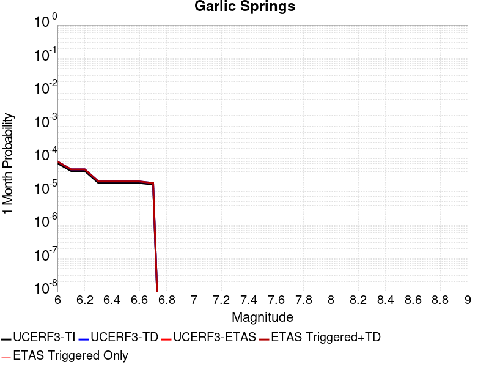 | 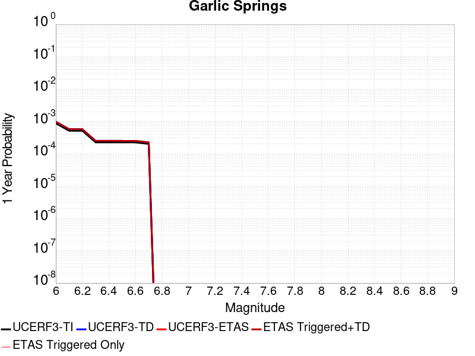 | 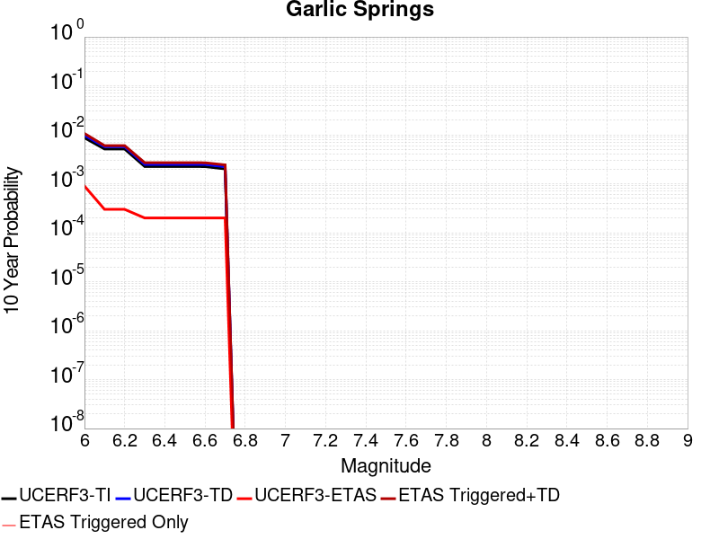 |

| Magnitude | 1 wk TI Prob | 1 wk TD Prob | 1 wk ETAS Prob | 1 wk ETAS/TD Gain | 1 wk ETAS Triggered+TD | 1 wk ETAS Triggered Only | 1 mo TI Prob | 1 mo TD Prob | 1 mo ETAS Prob | 1 mo ETAS/TD Gain | 1 mo ETAS Triggered+TD | 1 mo ETAS Triggered Only | 1 yr TI Prob | 1 yr TD Prob | 1 yr ETAS Prob | 1 yr ETAS/TD Gain | 1 yr ETAS Triggered+TD | 1 yr ETAS Triggered Only | 10 yr TI Prob | 10 yr TD Prob | 10 yr ETAS Prob | 10 yr ETAS/TD Gain | 10 yr ETAS Triggered+TD | 10 yr ETAS Triggered Only |
|-----|-----|-----|-----|-----|-----|-----|-----|-----|-----|-----|-----|-----|-----|-----|-----|-----|-----|-----|-----|-----|-----|-----|-----|-----|
| 6.0 | 1.6760017E-5 | 1.878149E-5 | 0.0 | 0.0 | 1.878149E-5 | 0.0 | 7.182667E-5 | 8.0490274E-5 | 0.0 | 0.0 | 8.0490274E-5 | 0.0 | 8.7413884E-4 | 9.79646E-4 | 8.0E-4 | 0.81662154 | 9.79646E-4 | 0.0 | 0.008707083 | 0.009764826 | 0.0098 | 1.0036021 | 0.010656037 | 9.0E-4 |
| 6.1 | 9.852767E-6 | 1.0976159E-5 | 0.0 | 0.0 | 1.0976159E-5 | 0.0 | 4.222546E-5 | 4.704023E-5 | 0.0 | 0.0 | 4.704023E-5 | 0.0 | 5.139737E-4 | 5.726353E-4 | 2.0E-4 | 0.34926242 | 5.726353E-4 | 0.0 | 0.005127866 | 0.005718559 | 0.0054 | 0.9442938 | 0.0060168435 | 3.0E-4 |
| 6.2 | 9.852767E-6 | 1.0976159E-5 | 0.0 | 0.0 | 1.0976159E-5 | 0.0 | 4.222546E-5 | 4.704023E-5 | 0.0 | 0.0 | 4.704023E-5 | 0.0 | 5.139737E-4 | 5.726353E-4 | 2.0E-4 | 0.34926242 | 5.726353E-4 | 0.0 | 0.005127866 | 0.005718559 | 0.0054 | 0.9442938 | 0.0060168435 | 3.0E-4 |
| 6.3 | 4.3167724E-6 | 4.77908E-6 | 0.0 | 0.0 | 4.77908E-6 | 0.0 | 1.8500323E-5 | 2.048174E-5 | 0.0 | 0.0 | 2.048174E-5 | 0.0 | 2.2521814E-4 | 2.493597E-4 | 0.0 | 0.0 | 2.493597E-4 | 0.0 | 0.0022499003 | 0.0024930583 | 0.0021 | 0.8423389 | 0.0026925597 | 2.0E-4 |
| 6.4 | 4.3167724E-6 | 4.77908E-6 | 0.0 | 0.0 | 4.77908E-6 | 0.0 | 1.8500323E-5 | 2.048174E-5 | 0.0 | 0.0 | 2.048174E-5 | 0.0 | 2.2521814E-4 | 2.493597E-4 | 0.0 | 0.0 | 2.493597E-4 | 0.0 | 0.0022499003 | 0.0024930583 | 0.0021 | 0.8423389 | 0.0026925597 | 2.0E-4 |
| 6.5 | 4.3167724E-6 | 4.77908E-6 | 0.0 | 0.0 | 4.77908E-6 | 0.0 | 1.8500323E-5 | 2.048174E-5 | 0.0 | 0.0 | 2.048174E-5 | 0.0 | 2.2521814E-4 | 2.493597E-4 | 0.0 | 0.0 | 2.493597E-4 | 0.0 | 0.0022499003 | 0.0024930583 | 0.0021 | 0.8423389 | 0.0026925597 | 2.0E-4 |
| 6.6 | 4.301311E-6 | 4.7619446E-6 | 0.0 | 0.0 | 4.7619446E-6 | 0.0 | 1.8434059E-5 | 2.0408304E-5 | 0.0 | 0.0 | 2.0408304E-5 | 0.0 | 2.2441156E-4 | 2.484658E-4 | 0.0 | 0.0 | 2.484658E-4 | 0.0 | 0.0022418506 | 0.0024841395 | 0.0021 | 0.84536314 | 0.0026836426 | 2.0E-4 |
| 6.7 | 3.8599724E-6 | 4.2719967E-6 | 0.0 | 0.0 | 4.2719967E-6 | 0.0 | 1.6542634E-5 | 1.8308558E-5 | 0.0 | 0.0 | 1.8308558E-5 | 0.0 | 2.0138794E-4 | 2.2290667E-4 | 0.0 | 0.0 | 2.2290667E-4 | 0.0 | 0.0020120554 | 0.0022290668 | 0.0018 | 0.8075128 | 0.002428621 | 2.0E-4 |

## San Pedro Basin
*[(top)](#table-of-contents)*

| 1 Week | 1 Month | 1 Year | 10 Year |
|-----|-----|-----|-----|
| 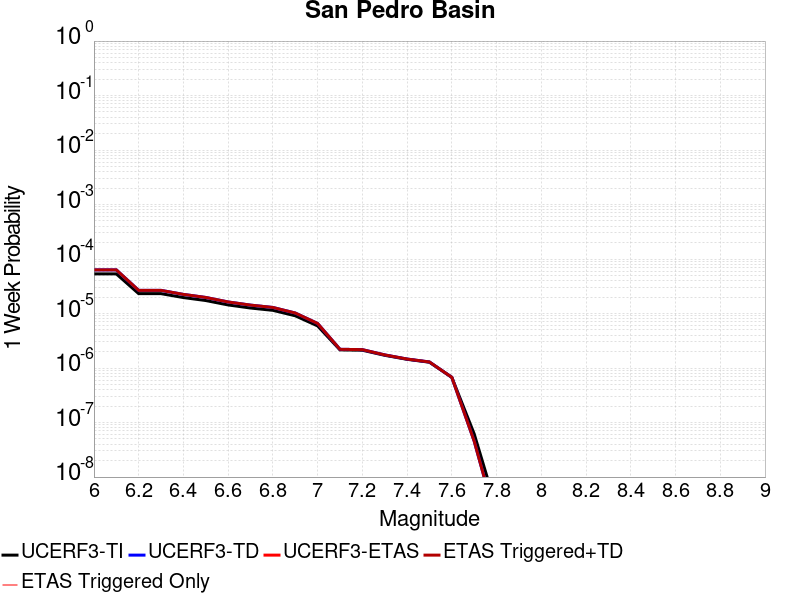 | 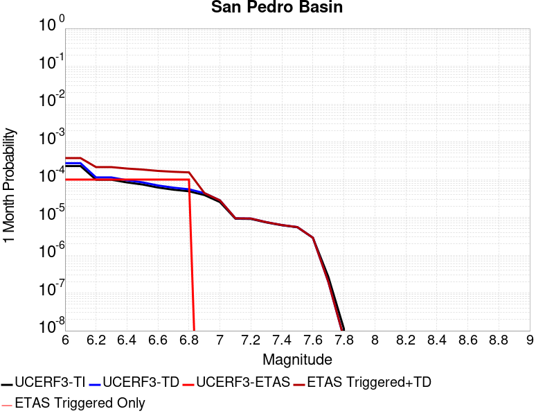 | 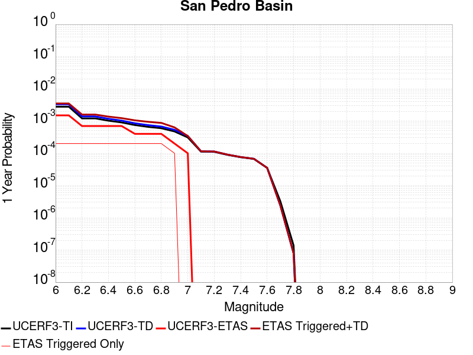 | 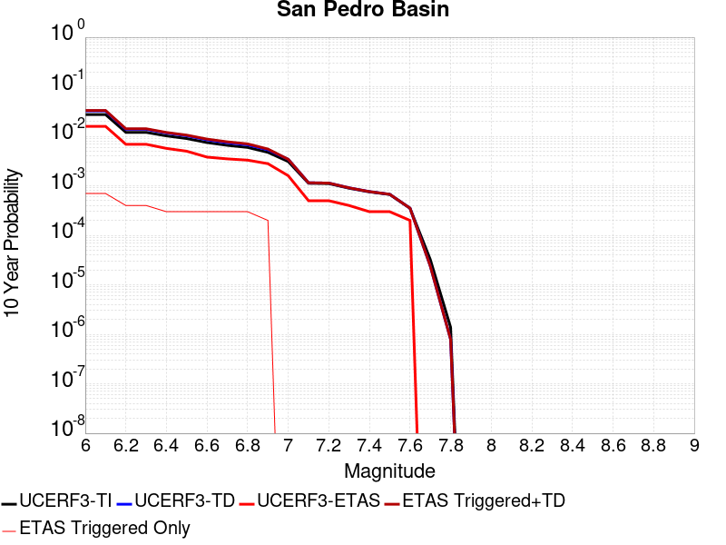 |

| Magnitude | 1 wk TI Prob | 1 wk TD Prob | 1 wk ETAS Prob | 1 wk ETAS/TD Gain | 1 wk ETAS Triggered+TD | 1 wk ETAS Triggered Only | 1 mo TI Prob | 1 mo TD Prob | 1 mo ETAS Prob | 1 mo ETAS/TD Gain | 1 mo ETAS Triggered+TD | 1 mo ETAS Triggered Only | 1 yr TI Prob | 1 yr TD Prob | 1 yr ETAS Prob | 1 yr ETAS/TD Gain | 1 yr ETAS Triggered+TD | 1 yr ETAS Triggered Only | 10 yr TI Prob | 10 yr TD Prob | 10 yr ETAS Prob | 10 yr ETAS/TD Gain | 10 yr ETAS Triggered+TD | 10 yr ETAS Triggered Only |
|-----|-----|-----|-----|-----|-----|-----|-----|-----|-----|-----|-----|-----|-----|-----|-----|-----|-----|-----|-----|-----|-----|-----|-----|-----|
| 6.0 | 5.3449043E-5 | 6.339467E-5 | 0.0 | 0.0 | 6.339467E-5 | 0.0 | 2.2904722E-4 | 2.7166662E-4 | 1.0E-4 | 0.36809823 | 3.7163944E-4 | 1.0E-4 | 0.0027850836 | 0.003303127 | 0.0015 | 0.45411515 | 0.0035024663 | 2.0E-4 | 0.027504366 | 0.032601893 | 0.0159 | 0.48770174 | 0.033279072 | 7.0E-4 |
| 6.1 | 5.3449043E-5 | 6.339467E-5 | 0.0 | 0.0 | 6.339467E-5 | 0.0 | 2.2904722E-4 | 2.7166662E-4 | 1.0E-4 | 0.36809823 | 3.7163944E-4 | 1.0E-4 | 0.0027850836 | 0.003303127 | 0.0015 | 0.45411515 | 0.0035024663 | 2.0E-4 | 0.027504366 | 0.032601893 | 0.0159 | 0.48770174 | 0.033279072 | 7.0E-4 |
| 6.2 | 2.3189454E-5 | 2.6651176E-5 | 0.0 | 0.0 | 2.6651176E-5 | 0.0 | 9.9379584E-5 | 1.1421459E-4 | 1.0E-4 | 0.8755449 | 2.1420317E-4 | 1.0E-4 | 0.0012092749 | 0.0013897226 | 7.0E-4 | 0.50369763 | 0.0015894446 | 2.0E-4 | 0.012027155 | 0.013815188 | 0.0069 | 0.49945033 | 0.014209662 | 4.0E-4 |
| 6.3 | 2.3189454E-5 | 2.6651176E-5 | 0.0 | 0.0 | 2.6651176E-5 | 0.0 | 9.9379584E-5 | 1.1421459E-4 | 1.0E-4 | 0.8755449 | 2.1420317E-4 | 1.0E-4 | 0.0012092749 | 0.0013897226 | 7.0E-4 | 0.50369763 | 0.0015894446 | 2.0E-4 | 0.012027155 | 0.013815188 | 0.0069 | 0.49945033 | 0.014209662 | 4.0E-4 |
| 6.4 | 1.966056E-5 | 2.2470178E-5 | 0.0 | 0.0 | 2.2470178E-5 | 0.0 | 8.425682E-5 | 9.629744E-5 | 1.0E-4 | 1.0384493 | 1.962878E-4 | 1.0E-4 | 0.001025344 | 0.0011718308 | 7.0E-4 | 0.59735584 | 0.0013715965 | 2.0E-4 | 0.010206259 | 0.011660607 | 0.0057 | 0.48882535 | 0.011957108 | 3.0E-4 |
| 6.5 | 1.7342953E-5 | 1.975094E-5 | 0.0 | 0.0 | 1.975094E-5 | 0.0 | 7.4324824E-5 | 8.464435E-5 | 1.0E-4 | 1.1814138 | 1.8463588E-4 | 1.0E-4 | 9.04529E-4 | 0.0010300947 | 7.0E-4 | 0.6795492 | 0.0012298886 | 2.0E-4 | 0.009008561 | 0.010256925 | 0.005 | 0.48747557 | 0.010553847 | 3.0E-4 |
| 6.6 | 1.439804E-5 | 1.632736E-5 | 0.0 | 0.0 | 1.632736E-5 | 0.0 | 6.170443E-5 | 6.99727E-5 | 1.0E-4 | 1.4291286 | 1.6996572E-4 | 1.0E-4 | 7.509924E-4 | 8.5161685E-4 | 4.0E-4 | 0.4696948 | 0.0010514465 | 2.0E-4 | 0.0074845953 | 0.0084867375 | 0.0038 | 0.44775745 | 0.008784192 | 3.0E-4 |
| 6.7 | 1.2634884E-5 | 1.4289289E-5 | 0.0 | 0.0 | 1.4289289E-5 | 0.0 | 5.414838E-5 | 6.123854E-5 | 1.0E-4 | 1.6329585 | 1.6123241E-4 | 1.0E-4 | 6.590571E-4 | 7.453547E-4 | 4.0E-4 | 0.5366573 | 9.452056E-4 | 2.0E-4 | 0.006571059 | 0.007431571 | 0.0035 | 0.4709637 | 0.0077293413 | 3.0E-4 |
| 6.8 | 1.146091E-5 | 1.2936761E-5 | 0.0 | 0.0 | 1.2936761E-5 | 0.0 | 4.911726E-5 | 5.544225E-5 | 1.0E-4 | 1.8036786 | 1.554367E-4 | 1.0E-4 | 5.9783855E-4 | 6.748301E-4 | 4.0E-4 | 0.5927418 | 8.7469514E-4 | 2.0E-4 | 0.0059623276 | 0.006730751 | 0.0033 | 0.49028704 | 0.0070287315 | 3.0E-4 |
| 6.9 | 9.109035E-6 | 1.0237762E-5 | 0.0 | 0.0 | 1.0237762E-5 | 0.0 | 3.9038136E-5 | 4.387554E-5 | 0.0 | 0.0 | 4.387554E-5 | 0.0 | 4.7518566E-4 | 5.340818E-4 | 2.0E-4 | 0.3744745 | 6.3402834E-4 | 1.0E-4 | 0.0047417083 | 0.005330738 | 0.0028 | 0.5252556 | 0.005529672 | 2.0E-4 |
| 7.0 | 5.9351028E-6 | 6.585582E-6 | 0.0 | 0.0 | 6.585582E-6 | 0.0 | 2.5435906E-5 | 2.822375E-5 | 0.0 | 0.0 | 2.822375E-5 | 0.0 | 3.0963816E-4 | 3.4359362E-4 | 1.0E-4 | 0.2910415 | 3.4359362E-4 | 0.0 | 0.0030920706 | 0.0034329423 | 0.0016 | 0.4660725 | 0.0034329423 | 0.0 |
| 7.1 | 2.1557585E-6 | 2.2098468E-6 | 0.0 | 0.0 | 2.2098468E-6 | 0.0 | 9.238933E-6 | 9.470738E-6 | 0.0 | 0.0 | 9.470738E-6 | 0.0 | 1.1247819E-4 | 1.1530029E-4 | 0.0 | 0.0 | 1.1530029E-4 | 0.0 | 0.0011242128 | 0.0011524201 | 5.0E-4 | 0.43386957 | 0.0011524201 | 0.0 |
| 7.2 | 2.1251979E-6 | 2.1781907E-6 | 0.0 | 0.0 | 2.1781907E-6 | 0.0 | 9.107958E-6 | 9.33507E-6 | 0.0 | 0.0 | 9.33507E-6 | 0.0 | 1.1088375E-4 | 1.13648704E-4 | 0.0 | 0.0 | 1.13648704E-4 | 0.0 | 0.0011082845 | 0.0011359211 | 5.0E-4 | 0.4401714 | 0.0011359211 | 0.0 |
| 7.3 | 1.7145798E-6 | 1.7444333E-6 | 0.0 | 0.0 | 1.7444333E-6 | 0.0 | 7.3481783E-6 | 7.476122E-6 | 0.0 | 0.0 | 7.476122E-6 | 0.0 | 8.94604E-5 | 9.1018075E-5 | 0.0 | 0.0 | 9.1018075E-5 | 0.0 | 8.9424395E-4 | 9.0981706E-4 | 4.0E-4 | 0.4396488 | 9.0981706E-4 | 0.0 |
| 7.4 | 1.4467993E-6 | 1.464306E-6 | 0.0 | 0.0 | 1.464306E-6 | 0.0 | 6.200554E-6 | 6.2755826E-6 | 0.0 | 0.0 | 6.2755826E-6 | 0.0 | 7.548913E-5 | 7.640261E-5 | 0.0 | 0.0 | 7.640261E-5 | 0.0 | 7.546349E-4 | 7.637707E-4 | 3.0E-4 | 0.39278802 | 7.637707E-4 | 0.0 |
| 7.5 | 1.2803735E-6 | 1.2932547E-6 | 0.0 | 0.0 | 1.2932547E-6 | 0.0 | 5.487303E-6 | 5.542509E-6 | 0.0 | 0.0 | 5.542509E-6 | 0.0 | 6.680587E-5 | 6.747803E-5 | 0.0 | 0.0 | 6.747803E-5 | 0.0 | 6.678579E-4 | 6.745825E-4 | 3.0E-4 | 0.44471952 | 6.745825E-4 | 0.0 |
| 7.6 | 6.755009E-7 | 6.770023E-7 | 0.0 | 0.0 | 6.770023E-7 | 0.0 | 2.8950008E-6 | 2.9014354E-6 | 0.0 | 0.0 | 2.9014354E-6 | 0.0 | 3.5246063E-5 | 3.532446E-5 | 0.0 | 0.0 | 3.532446E-5 | 0.0 | 3.5240475E-4 | 3.531942E-4 | 2.0E-4 | 0.56626076 | 3.531942E-4 | 0.0 |
| 7.7 | 6.211885E-8 | 4.570508E-8 | 0.0 | 0.0 | 4.570508E-8 | 0.0 | 2.6622362E-7 | 1.958789E-7 | 0.0 | 0.0 | 1.958789E-7 | 0.0 | 3.2412677E-6 | 2.3848231E-6 | 0.0 | 0.0 | 2.3848231E-6 | 0.0 | 3.2412205E-5 | 2.3847997E-5 | 0.0 | 0.0 | 2.3847997E-5 | 0.0 |
| 7.8 | 2.6580573E-9 | 1.5145799E-9 | 0.0 | 0.0 | 1.5145799E-9 | 0.0 | 1.1391674E-8 | 6.4910566E-9 | 0.0 | 0.0 | 6.4910566E-9 | 0.0 | 1.3869362E-7 | 7.902862E-8 | 0.0 | 0.0 | 7.902862E-8 | 0.0 | 1.3869354E-6 | 7.9028615E-7 | 0.0 | 0.0 | 7.9028615E-7 | 0.0 |

## Mono Lake 2011 CFM
*[(top)](#table-of-contents)*

| 1 Week | 1 Month | 1 Year | 10 Year |
|-----|-----|-----|-----|
| 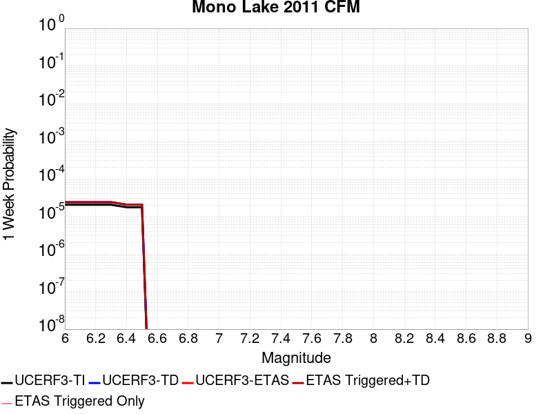 | 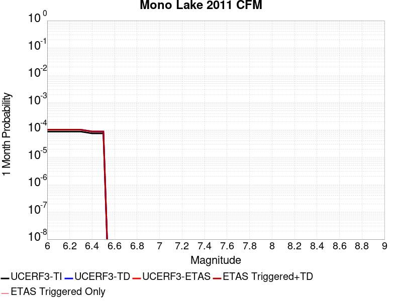 | 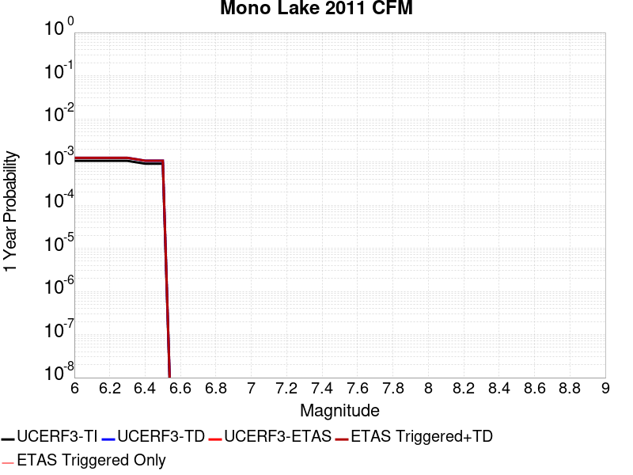 |  |

| Magnitude | 1 wk TI Prob | 1 wk TD Prob | 1 wk ETAS Prob | 1 wk ETAS/TD Gain | 1 wk ETAS Triggered+TD | 1 wk ETAS Triggered Only | 1 mo TI Prob | 1 mo TD Prob | 1 mo ETAS Prob | 1 mo ETAS/TD Gain | 1 mo ETAS Triggered+TD | 1 mo ETAS Triggered Only | 1 yr TI Prob | 1 yr TD Prob | 1 yr ETAS Prob | 1 yr ETAS/TD Gain | 1 yr ETAS Triggered+TD | 1 yr ETAS Triggered Only | 10 yr TI Prob | 10 yr TD Prob | 10 yr ETAS Prob | 10 yr ETAS/TD Gain | 10 yr ETAS Triggered+TD | 10 yr ETAS Triggered Only |
|-----|-----|-----|-----|-----|-----|-----|-----|-----|-----|-----|-----|-----|-----|-----|-----|-----|-----|-----|-----|-----|-----|-----|-----|-----|
| 6.0 | 2.0341662E-5 | 2.3836601E-5 | 0.0 | 0.0 | 2.3836601E-5 | 0.0 | 8.717564E-5 | 1.02155864E-4 | 0.0 | 0.0 | 1.02155864E-4 | 0.0 | 0.0010608466 | 0.0012435693 | 6.0E-4 | 0.48248217 | 0.0012435693 | 0.0 | 0.010557966 | 0.012418213 | 0.0081 | 0.65226775 | 0.013307037 | 9.0E-4 |
| 6.1 | 2.0341662E-5 | 2.3836601E-5 | 0.0 | 0.0 | 2.3836601E-5 | 0.0 | 8.717564E-5 | 1.02155864E-4 | 0.0 | 0.0 | 1.02155864E-4 | 0.0 | 0.0010608466 | 0.0012435693 | 6.0E-4 | 0.48248217 | 0.0012435693 | 0.0 | 0.010557966 | 0.012418213 | 0.0081 | 0.65226775 | 0.013307037 | 9.0E-4 |
| 6.2 | 2.0341662E-5 | 2.3836601E-5 | 0.0 | 0.0 | 2.3836601E-5 | 0.0 | 8.717564E-5 | 1.02155864E-4 | 0.0 | 0.0 | 1.02155864E-4 | 0.0 | 0.0010608466 | 0.0012435693 | 6.0E-4 | 0.48248217 | 0.0012435693 | 0.0 | 0.010557966 | 0.012418213 | 0.0081 | 0.65226775 | 0.013307037 | 9.0E-4 |
| 6.3 | 2.0341662E-5 | 2.3836601E-5 | 0.0 | 0.0 | 2.3836601E-5 | 0.0 | 8.717564E-5 | 1.02155864E-4 | 0.0 | 0.0 | 1.02155864E-4 | 0.0 | 0.0010608466 | 0.0012435693 | 6.0E-4 | 0.48248217 | 0.0012435693 | 0.0 | 0.010557966 | 0.012418213 | 0.0081 | 0.65226775 | 0.013307037 | 9.0E-4 |
| 6.4 | 1.749821E-5 | 2.0498228E-5 | 0.0 | 0.0 | 2.0498228E-5 | 0.0 | 7.499018E-5 | 8.784955E-5 | 0.0 | 0.0 | 8.784955E-5 | 0.0 | 9.1262296E-4 | 0.0010695679 | 5.0E-4 | 0.46747854 | 0.0010695679 | 0.0 | 0.009088841 | 0.0106956335 | 0.0068 | 0.6357735 | 0.011289217 | 6.0E-4 |
| 6.5 | 1.749821E-5 | 2.0498228E-5 | 0.0 | 0.0 | 2.0498228E-5 | 0.0 | 7.499018E-5 | 8.784955E-5 | 0.0 | 0.0 | 8.784955E-5 | 0.0 | 9.1262296E-4 | 0.0010695679 | 5.0E-4 | 0.46747854 | 0.0010695679 | 0.0 | 0.009088841 | 0.0106956335 | 0.0068 | 0.6357735 | 0.011289217 | 6.0E-4 |

## Homestead Valley 2011
*[(top)](#table-of-contents)*

| 1 Week | 1 Month | 1 Year | 10 Year |
|-----|-----|-----|-----|
| 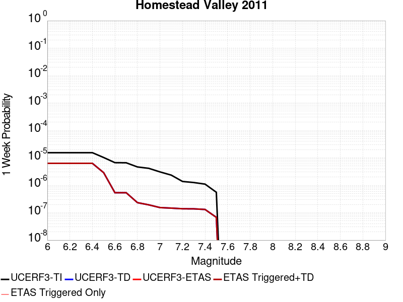 | 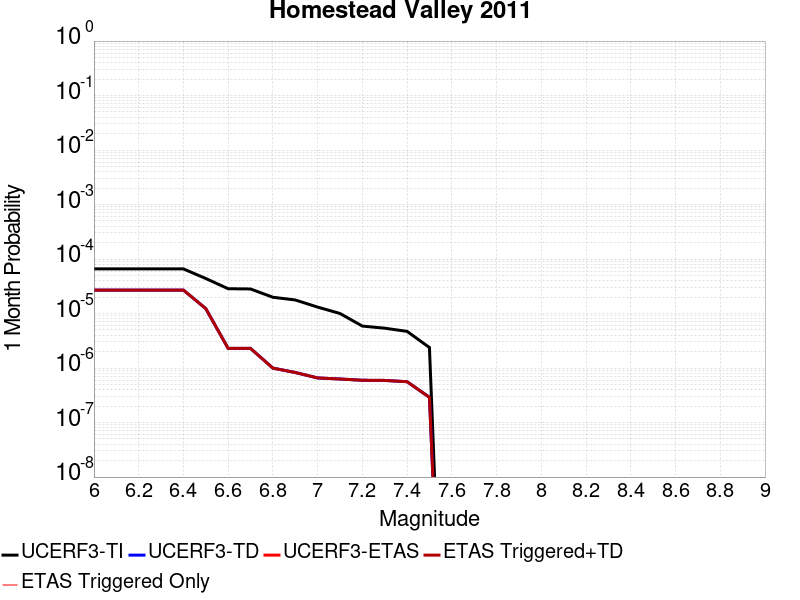 | 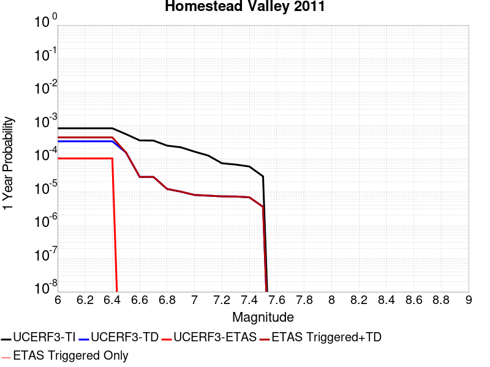 | 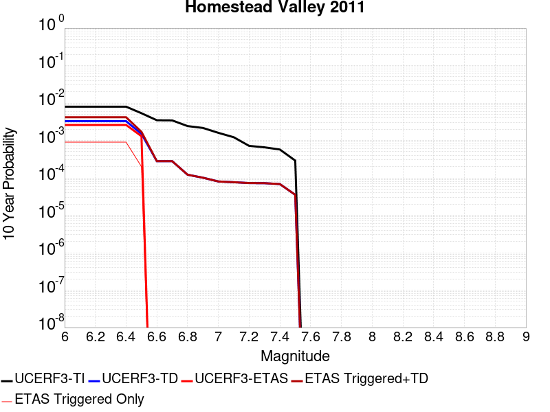 |

| Magnitude | 1 wk TI Prob | 1 wk TD Prob | 1 wk ETAS Prob | 1 wk ETAS/TD Gain | 1 wk ETAS Triggered+TD | 1 wk ETAS Triggered Only | 1 mo TI Prob | 1 mo TD Prob | 1 mo ETAS Prob | 1 mo ETAS/TD Gain | 1 mo ETAS Triggered+TD | 1 mo ETAS Triggered Only | 1 yr TI Prob | 1 yr TD Prob | 1 yr ETAS Prob | 1 yr ETAS/TD Gain | 1 yr ETAS Triggered+TD | 1 yr ETAS Triggered Only | 10 yr TI Prob | 10 yr TD Prob | 10 yr ETAS Prob | 10 yr ETAS/TD Gain | 10 yr ETAS Triggered+TD | 10 yr ETAS Triggered Only |
|-----|-----|-----|-----|-----|-----|-----|-----|-----|-----|-----|-----|-----|-----|-----|-----|-----|-----|-----|-----|-----|-----|-----|-----|-----|
| 6.0 | 1.539795E-5 | 6.288003E-6 | 0.0 | 0.0 | 6.288003E-6 | 0.0 | 6.5989545E-5 | 2.6948423E-5 | 0.0 | 0.0 | 2.6948423E-5 | 0.0 | 8.0312655E-4 | 3.2806827E-4 | 1.0E-4 | 0.3048146 | 4.2803545E-4 | 1.0E-4 | 0.008002302 | 0.003277861 | 0.0026 | 0.7932002 | 0.004174911 | 9.0E-4 |
| 6.1 | 1.539795E-5 | 6.288003E-6 | 0.0 | 0.0 | 6.288003E-6 | 0.0 | 6.5989545E-5 | 2.6948423E-5 | 0.0 | 0.0 | 2.6948423E-5 | 0.0 | 8.0312655E-4 | 3.2806827E-4 | 1.0E-4 | 0.3048146 | 4.2803545E-4 | 1.0E-4 | 0.008002302 | 0.003277861 | 0.0026 | 0.7932002 | 0.004174911 | 9.0E-4 |
| 6.2 | 1.539795E-5 | 6.288003E-6 | 0.0 | 0.0 | 6.288003E-6 | 0.0 | 6.5989545E-5 | 2.6948423E-5 | 0.0 | 0.0 | 2.6948423E-5 | 0.0 | 8.0312655E-4 | 3.2806827E-4 | 1.0E-4 | 0.3048146 | 4.2803545E-4 | 1.0E-4 | 0.008002302 | 0.003277861 | 0.0026 | 0.7932002 | 0.004174911 | 9.0E-4 |
| 6.3 | 1.539795E-5 | 6.288003E-6 | 0.0 | 0.0 | 6.288003E-6 | 0.0 | 6.5989545E-5 | 2.6948423E-5 | 0.0 | 0.0 | 2.6948423E-5 | 0.0 | 8.0312655E-4 | 3.2806827E-4 | 1.0E-4 | 0.3048146 | 4.2803545E-4 | 1.0E-4 | 0.008002302 | 0.003277861 | 0.0026 | 0.7932002 | 0.004174911 | 9.0E-4 |
| 6.4 | 1.539795E-5 | 6.288003E-6 | 0.0 | 0.0 | 6.288003E-6 | 0.0 | 6.5989545E-5 | 2.6948423E-5 | 0.0 | 0.0 | 2.6948423E-5 | 0.0 | 8.0312655E-4 | 3.2806827E-4 | 1.0E-4 | 0.3048146 | 4.2803545E-4 | 1.0E-4 | 0.008002302 | 0.003277861 | 0.0026 | 0.7932002 | 0.004174911 | 9.0E-4 |
| 6.5 | 1.0265258E-5 | 2.8797115E-6 | 0.0 | 0.0 | 2.8797115E-6 | 0.0 | 4.3993223E-5 | 1.2341602E-5 | 0.0 | 0.0 | 1.2341602E-5 | 0.0 | 5.3548586E-4 | 1.502556E-4 | 0.0 | 0.0 | 1.502556E-4 | 0.0 | 0.005341973 | 0.0015022221 | 0.0013 | 0.8653847 | 0.0017019217 | 2.0E-4 |
| 6.6 | 6.664671E-6 | 5.354097E-7 | 0.0 | 0.0 | 5.354097E-7 | 0.0 | 2.8562565E-5 | 2.2946117E-6 | 0.0 | 0.0 | 2.2946117E-6 | 0.0 | 3.476937E-4 | 2.793666E-5 | 0.0 | 0.0 | 2.793666E-5 | 0.0 | 0.003471502 | 2.7934313E-4 | 0.0 | 0.0 | 2.7934313E-4 | 0.0 |
| 6.7 | 6.5954046E-6 | 5.354097E-7 | 0.0 | 0.0 | 5.354097E-7 | 0.0 | 2.8265715E-5 | 2.2946117E-6 | 0.0 | 0.0 | 2.2946117E-6 | 0.0 | 3.4408073E-4 | 2.793666E-5 | 0.0 | 0.0 | 2.793666E-5 | 0.0 | 0.0034354846 | 2.7934313E-4 | 0.0 | 0.0 | 2.7934313E-4 | 0.0 |
| 6.8 | 4.648189E-6 | 2.3281017E-7 | 0.0 | 0.0 | 2.3281017E-7 | 0.0 | 1.9920659E-5 | 9.977575E-7 | 0.0 | 0.0 | 9.977575E-7 | 0.0 | 2.4250703E-4 | 1.2147634E-5 | 0.0 | 0.0 | 1.2147634E-5 | 0.0 | 0.0024224254 | 1.21470184E-4 | 0.0 | 0.0 | 1.21470184E-4 | 0.0 |
| 6.9 | 4.1428534E-6 | 1.9353271E-7 | 0.0 | 0.0 | 1.9353271E-7 | 0.0 | 1.7754966E-5 | 8.294257E-7 | 0.0 | 0.0 | 8.294257E-7 | 0.0 | 2.1614527E-4 | 1.0098213E-5 | 0.0 | 0.0 | 1.0098213E-5 | 0.0 | 0.0021593515 | 1.0097785E-4 | 0.0 | 0.0 | 1.0097785E-4 | 0.0 |
| 7.0 | 3.0673707E-6 | 1.537482E-7 | 0.0 | 0.0 | 1.537482E-7 | 0.0 | 1.3145808E-5 | 6.589207E-7 | 0.0 | 0.0 | 6.589207E-7 | 0.0 | 1.6003846E-4 | 8.022332E-6 | 0.0 | 0.0 | 8.022332E-6 | 0.0 | 0.0015992324 | 8.0220525E-5 | 0.0 | 0.0 | 8.0220525E-5 | 0.0 |
| 7.1 | 2.340854E-6 | 1.4694439E-7 | 0.0 | 0.0 | 1.4694439E-7 | 0.0 | 1.0032193E-5 | 6.2976153E-7 | 0.0 | 0.0 | 6.2976153E-7 | 0.0 | 1.221351E-4 | 7.6673205E-6 | 0.0 | 0.0 | 7.6673205E-6 | 0.0 | 0.00122068 | 7.667066E-5 | 0.0 | 0.0 | 7.667066E-5 | 0.0 |
| 7.2 | 1.3754182E-6 | 1.3928867E-7 | 0.0 | 0.0 | 1.3928867E-7 | 0.0 | 5.8946357E-6 | 5.9695134E-7 | 0.0 | 0.0 | 5.9695134E-7 | 0.0 | 7.176483E-5 | 7.2678595E-6 | 0.0 | 0.0 | 7.2678595E-6 | 0.0 | 7.174166E-4 | 7.267631E-5 | 0.0 | 0.0 | 7.267631E-5 | 0.0 |
| 7.3 | 1.2573237E-6 | 1.3833328E-7 | 0.0 | 0.0 | 1.3833328E-7 | 0.0 | 5.388519E-6 | 5.928568E-7 | 0.0 | 0.0 | 5.928568E-7 | 0.0 | 6.560324E-5 | 7.2180082E-6 | 0.0 | 0.0 | 7.2180082E-6 | 0.0 | 6.558388E-4 | 7.2177834E-5 | 0.0 | 0.0 | 7.2177834E-5 | 0.0 |
| 7.4 | 1.0994207E-6 | 1.311196E-7 | 0.0 | 0.0 | 1.311196E-7 | 0.0 | 4.7117946E-6 | 5.61941E-7 | 0.0 | 0.0 | 5.61941E-7 | 0.0 | 5.736459E-5 | 6.8416116E-6 | 0.0 | 0.0 | 6.8416116E-6 | 0.0 | 5.734978E-4 | 6.84141E-5 | 0.0 | 0.0 | 6.84141E-5 | 0.0 |
| 7.5 | 5.5569126E-7 | 6.7761E-8 | 0.0 | 0.0 | 6.7761E-8 | 0.0 | 2.3815317E-6 | 2.9040424E-7 | 0.0 | 0.0 | 2.9040424E-7 | 0.0 | 2.8994764E-5 | 3.5356666E-6 | 0.0 | 0.0 | 3.5356666E-6 | 0.0 | 2.899098E-4 | 3.5356166E-5 | 0.0 | 0.0 | 3.5356166E-5 | 0.0 |

## Elsinore (Temecula) rev
*[(top)](#table-of-contents)*

| 1 Week | 1 Month | 1 Year | 10 Year |
|-----|-----|-----|-----|
| 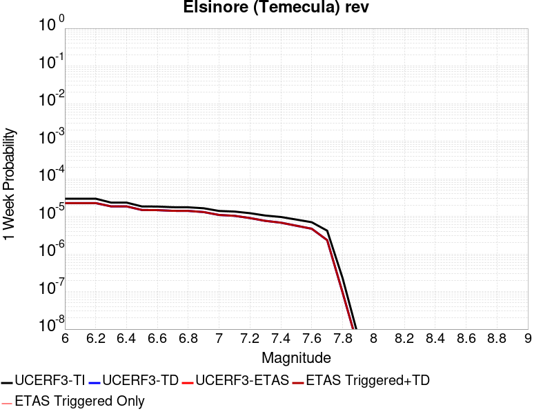 | 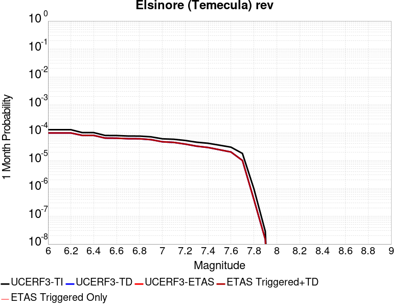 |  | 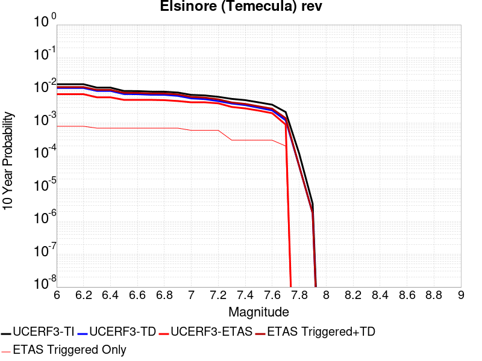 |

| Magnitude | 1 wk TI Prob | 1 wk TD Prob | 1 wk ETAS Prob | 1 wk ETAS/TD Gain | 1 wk ETAS Triggered+TD | 1 wk ETAS Triggered Only | 1 mo TI Prob | 1 mo TD Prob | 1 mo ETAS Prob | 1 mo ETAS/TD Gain | 1 mo ETAS Triggered+TD | 1 mo ETAS Triggered Only | 1 yr TI Prob | 1 yr TD Prob | 1 yr ETAS Prob | 1 yr ETAS/TD Gain | 1 yr ETAS Triggered+TD | 1 yr ETAS Triggered Only | 10 yr TI Prob | 10 yr TD Prob | 10 yr ETAS Prob | 10 yr ETAS/TD Gain | 10 yr ETAS Triggered+TD | 10 yr ETAS Triggered Only |
|-----|-----|-----|-----|-----|-----|-----|-----|-----|-----|-----|-----|-----|-----|-----|-----|-----|-----|-----|-----|-----|-----|-----|-----|-----|
| 6.0 | 2.9514995E-5 | 2.2532806E-5 | 0.0 | 0.0 | 2.2532806E-5 | 0.0 | 1.264867E-4 | 9.656571E-5 | 0.0 | 0.0 | 9.656571E-5 | 0.0 | 0.0015388876 | 0.0011750754 | 5.0E-4 | 0.4255046 | 0.0011750754 | 0.0 | 0.015282745 | 0.01172293 | 0.0076 | 0.64830214 | 0.012513551 | 8.0E-4 |
| 6.1 | 2.9514995E-5 | 2.2532806E-5 | 0.0 | 0.0 | 2.2532806E-5 | 0.0 | 1.264867E-4 | 9.656571E-5 | 0.0 | 0.0 | 9.656571E-5 | 0.0 | 0.0015388876 | 0.0011750754 | 5.0E-4 | 0.4255046 | 0.0011750754 | 0.0 | 0.015282745 | 0.01172293 | 0.0076 | 0.64830214 | 0.012513551 | 8.0E-4 |
| 6.2 | 2.9514995E-5 | 2.2532806E-5 | 0.0 | 0.0 | 2.2532806E-5 | 0.0 | 1.264867E-4 | 9.656571E-5 | 0.0 | 0.0 | 9.656571E-5 | 0.0 | 0.0015388876 | 0.0011750754 | 5.0E-4 | 0.4255046 | 0.0011750754 | 0.0 | 0.015282745 | 0.01172293 | 0.0076 | 0.64830214 | 0.012513551 | 8.0E-4 |
| 6.3 | 2.3223649E-5 | 1.8419245E-5 | 0.0 | 0.0 | 1.8419245E-5 | 0.0 | 9.952613E-5 | 7.893732E-5 | 0.0 | 0.0 | 7.893732E-5 | 0.0 | 0.001211057 | 9.606554E-4 | 4.0E-4 | 0.4163824 | 9.606554E-4 | 0.0 | 0.012044783 | 0.0095795 | 0.0061 | 0.63677645 | 0.010272794 | 7.0E-4 |
| 6.4 | 2.3223649E-5 | 1.8419245E-5 | 0.0 | 0.0 | 1.8419245E-5 | 0.0 | 9.952613E-5 | 7.893732E-5 | 0.0 | 0.0 | 7.893732E-5 | 0.0 | 0.001211057 | 9.606554E-4 | 4.0E-4 | 0.4163824 | 9.606554E-4 | 0.0 | 0.012044783 | 0.0095795 | 0.0061 | 0.63677645 | 0.010272794 | 7.0E-4 |
| 6.5 | 1.8338875E-5 | 1.4759841E-5 | 0.0 | 0.0 | 1.4759841E-5 | 0.0 | 7.8592806E-5 | 6.325498E-5 | 0.0 | 0.0 | 6.325498E-5 | 0.0 | 9.5644733E-4 | 7.6986605E-4 | 1.0E-4 | 0.12989272 | 7.6986605E-4 | 0.0 | 0.009523412 | 0.007681081 | 0.0051 | 0.66396904 | 0.008375704 | 7.0E-4 |
| 6.6 | 1.8223333E-5 | 1.4622344E-5 | 0.0 | 0.0 | 1.4622344E-5 | 0.0 | 7.809766E-5 | 6.2665735E-5 | 0.0 | 0.0 | 6.2665735E-5 | 0.0 | 9.504242E-4 | 7.62697E-4 | 1.0E-4 | 0.13111366 | 7.62697E-4 | 0.0 | 0.009463696 | 0.007609883 | 0.0051 | 0.67018116 | 0.008304556 | 7.0E-4 |
| 6.7 | 1.7512752E-5 | 1.40366765E-5 | 0.0 | 0.0 | 1.40366765E-5 | 0.0 | 7.505249E-5 | 6.0155846E-5 | 0.0 | 0.0 | 6.0155846E-5 | 0.0 | 9.13381E-4 | 7.3215994E-4 | 1.0E-4 | 0.13658218 | 7.3215994E-4 | 0.0 | 0.00909636 | 0.0073028617 | 0.0051 | 0.6983564 | 0.007997749 | 7.0E-4 |
| 6.8 | 1.7417142E-5 | 1.3960629E-5 | 0.0 | 0.0 | 1.3960629E-5 | 0.0 | 7.4642754E-5 | 5.982994E-5 | 0.0 | 0.0 | 5.982994E-5 | 0.0 | 9.083966E-4 | 7.2819466E-4 | 1.0E-4 | 0.13732591 | 7.2819466E-4 | 0.0 | 0.009046922 | 0.0072634085 | 0.005 | 0.688382 | 0.007958325 | 7.0E-4 |
| 6.9 | 1.6402591E-5 | 1.2997676E-5 | 0.0 | 0.0 | 1.2997676E-5 | 0.0 | 7.0294926E-5 | 5.570318E-5 | 0.0 | 0.0 | 5.570318E-5 | 0.0 | 8.5550465E-4 | 6.7798287E-4 | 1.0E-4 | 0.14749636 | 6.7798287E-4 | 0.0 | 0.008522186 | 0.0067645847 | 0.0047 | 0.6947951 | 0.0074598496 | 7.0E-4 |
| 7.0 | 1.3912486E-5 | 1.0886317E-5 | 0.0 | 0.0 | 1.0886317E-5 | 0.0 | 5.9623577E-5 | 4.6654823E-5 | 0.0 | 0.0 | 4.6654823E-5 | 0.0 | 7.2567526E-4 | 5.6787714E-4 | 1.0E-4 | 0.17609443 | 5.6787714E-4 | 0.0 | 0.0072331014 | 0.0056679756 | 0.0043 | 0.7586483 | 0.006264575 | 6.0E-4 |
| 7.1 | 1.3405147E-5 | 1.03350885E-5 | 0.0 | 0.0 | 1.03350885E-5 | 0.0 | 5.7449364E-5 | 4.4292497E-5 | 0.0 | 0.0 | 4.4292497E-5 | 0.0 | 6.9922156E-4 | 5.391303E-4 | 1.0E-4 | 0.18548392 | 5.391303E-4 | 0.0 | 0.0069702556 | 0.0053815013 | 0.0043 | 0.7990335 | 0.0059782723 | 6.0E-4 |
| 7.2 | 1.21402E-5 | 9.003382E-6 | 0.0 | 0.0 | 9.003382E-6 | 0.0 | 5.202839E-5 | 3.858536E-5 | 0.0 | 0.0 | 3.858536E-5 | 0.0 | 6.332616E-4 | 4.696773E-4 | 1.0E-4 | 0.21291214 | 4.696773E-4 | 0.0 | 0.0063146 | 0.0046883295 | 0.004 | 0.8531824 | 0.0052855164 | 6.0E-4 |
| 7.3 | 1.05047775E-5 | 7.57735E-6 | 0.0 | 0.0 | 7.57735E-6 | 0.0 | 4.5019697E-5 | 3.247396E-5 | 0.0 | 0.0 | 3.247396E-5 | 0.0 | 5.4797693E-4 | 3.9530022E-4 | 1.0E-4 | 0.2529723 | 3.9530022E-4 | 0.0 | 0.005466277 | 0.0039463458 | 0.0031 | 0.7855368 | 0.004245162 | 3.0E-4 |
| 7.4 | 9.624483E-6 | 6.791847E-6 | 0.0 | 0.0 | 6.791847E-6 | 0.0 | 4.124713E-5 | 2.91076E-5 | 0.0 | 0.0 | 2.91076E-5 | 0.0 | 5.0206814E-4 | 3.5432877E-4 | 1.0E-4 | 0.28222376 | 3.5432877E-4 | 0.0 | 0.005009353 | 0.0035377913 | 0.0028 | 0.79145426 | 0.00383673 | 3.0E-4 |
| 7.5 | 8.215151E-6 | 5.6396816E-6 | 0.0 | 0.0 | 5.6396816E-6 | 0.0 | 3.5207315E-5 | 2.4169847E-5 | 0.0 | 0.0 | 2.4169847E-5 | 0.0 | 4.2856473E-4 | 2.9422945E-4 | 1.0E-4 | 0.3398708 | 2.9422945E-4 | 0.0 | 0.004277392 | 0.002938527 | 0.0024 | 0.81673574 | 0.0032376454 | 3.0E-4 |
| 7.6 | 6.975058E-6 | 4.6797113E-6 | 0.0 | 0.0 | 4.6797113E-6 | 0.0 | 2.9892764E-5 | 2.0055759E-5 | 0.0 | 0.0 | 2.0055759E-5 | 0.0 | 3.6388362E-4 | 2.4415267E-4 | 1.0E-4 | 0.4095798 | 2.4415267E-4 | 0.0 | 0.0036328835 | 0.0024389606 | 0.002 | 0.82002145 | 0.002738229 | 3.0E-4 |
| 7.7 | 4.159604E-6 | 2.3289242E-6 | 0.0 | 0.0 | 2.3289242E-6 | 0.0 | 1.7826753E-5 | 9.9810695E-6 | 0.0 | 0.0 | 9.9810695E-6 | 0.0 | 2.1701909E-4 | 1.2151349E-4 | 1.0E-4 | 0.8229539 | 1.2151349E-4 | 0.0 | 0.0021680726 | 0.0012145436 | 9.0E-4 | 0.74101907 | 0.0014143008 | 2.0E-4 |
| 7.8 | 2.2692414E-7 | 9.391798E-8 | 0.0 | 0.0 | 9.391798E-8 | 0.0 | 9.725317E-7 | 4.0250558E-7 | 0.0 | 0.0 | 4.0250558E-7 | 0.0 | 1.1840509E-5 | 4.900498E-6 | 0.0 | 0.0 | 4.900498E-6 | 0.0 | 1.1839878E-4 | 4.9004226E-5 | 0.0 | 0.0 | 4.9004226E-5 | 0.0 |
| 7.9 | 6.676829E-9 | 3.4416097E-9 | 0.0 | 0.0 | 3.4416097E-9 | 0.0 | 2.861498E-8 | 1.4749755E-8 | 0.0 | 0.0 | 1.4749755E-8 | 0.0 | 3.4838732E-7 | 1.7957827E-7 | 0.0 | 0.0 | 1.7957827E-7 | 0.0 | 3.4838679E-6 | 1.7957813E-6 | 0.0 | 0.0 | 1.7957813E-6 | 0.0 |

## Great Valley 06 (Midland) 2011 CFM alt1
*[(top)](#table-of-contents)*

| 1 Week | 1 Month | 1 Year | 10 Year |
|-----|-----|-----|-----|
| 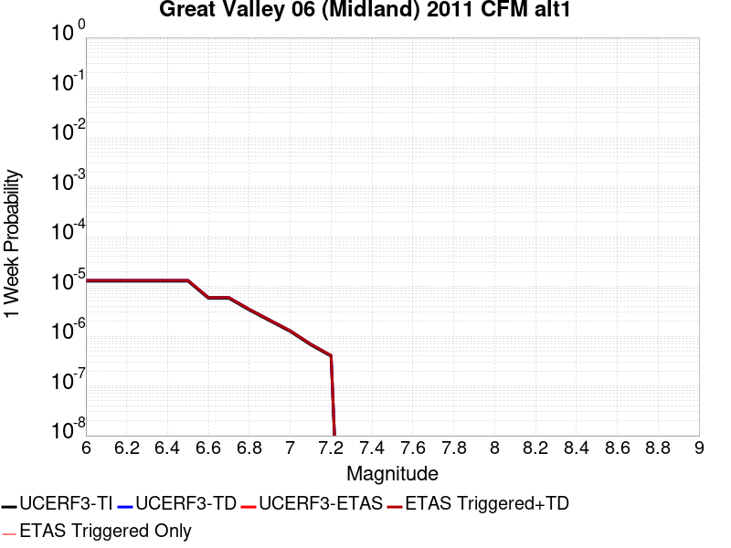 | 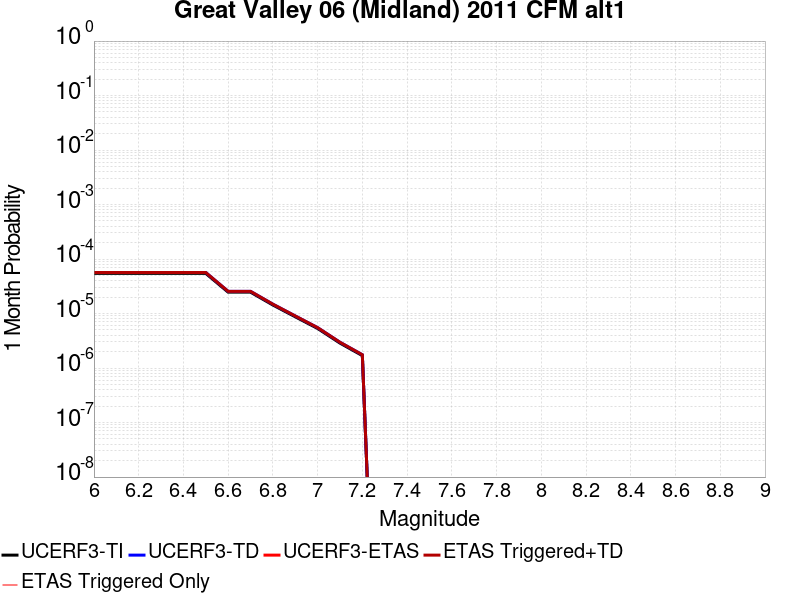 | 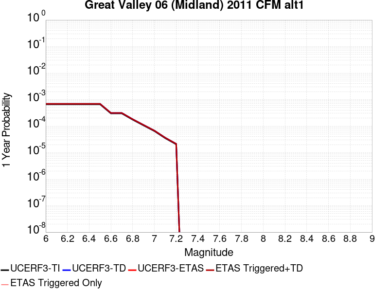 | 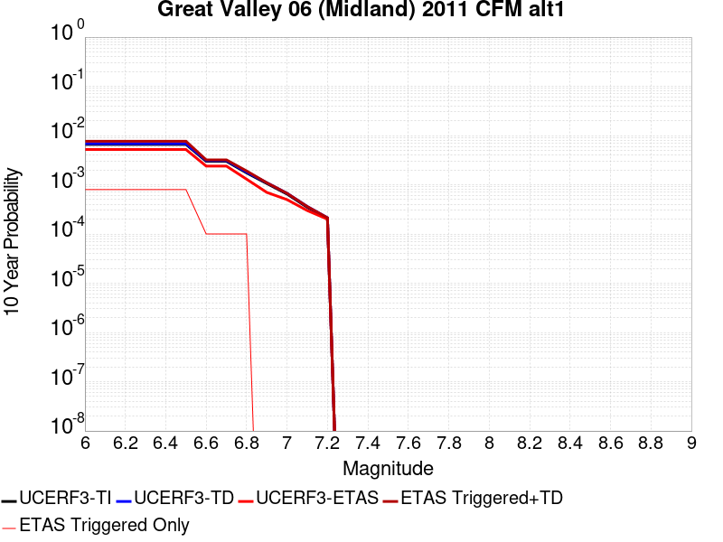 |

| Magnitude | 1 wk TI Prob | 1 wk TD Prob | 1 wk ETAS Prob | 1 wk ETAS/TD Gain | 1 wk ETAS Triggered+TD | 1 wk ETAS Triggered Only | 1 mo TI Prob | 1 mo TD Prob | 1 mo ETAS Prob | 1 mo ETAS/TD Gain | 1 mo ETAS Triggered+TD | 1 mo ETAS Triggered Only | 1 yr TI Prob | 1 yr TD Prob | 1 yr ETAS Prob | 1 yr ETAS/TD Gain | 1 yr ETAS Triggered+TD | 1 yr ETAS Triggered Only | 10 yr TI Prob | 10 yr TD Prob | 10 yr ETAS Prob | 10 yr ETAS/TD Gain | 10 yr ETAS Triggered+TD | 10 yr ETAS Triggered Only |
|-----|-----|-----|-----|-----|-----|-----|-----|-----|-----|-----|-----|-----|-----|-----|-----|-----|-----|-----|-----|-----|-----|-----|-----|-----|
| 6.0 | 1.2712525E-5 | 1.3211642E-5 | 0.0 | 0.0 | 1.3211642E-5 | 0.0 | 5.4481112E-5 | 5.6620236E-5 | 0.0 | 0.0 | 5.6620236E-5 | 0.0 | 6.6310563E-4 | 6.8915874E-4 | 4.0E-4 | 0.5804178 | 6.8915874E-4 | 0.0 | 0.0066113044 | 0.0068727317 | 0.0052 | 0.75661325 | 0.0076672337 | 8.0E-4 |
| 6.1 | 1.2712525E-5 | 1.3211642E-5 | 0.0 | 0.0 | 1.3211642E-5 | 0.0 | 5.4481112E-5 | 5.6620236E-5 | 0.0 | 0.0 | 5.6620236E-5 | 0.0 | 6.6310563E-4 | 6.8915874E-4 | 4.0E-4 | 0.5804178 | 6.8915874E-4 | 0.0 | 0.0066113044 | 0.0068727317 | 0.0052 | 0.75661325 | 0.0076672337 | 8.0E-4 |
| 6.2 | 1.2712525E-5 | 1.3211642E-5 | 0.0 | 0.0 | 1.3211642E-5 | 0.0 | 5.4481112E-5 | 5.6620236E-5 | 0.0 | 0.0 | 5.6620236E-5 | 0.0 | 6.6310563E-4 | 6.8915874E-4 | 4.0E-4 | 0.5804178 | 6.8915874E-4 | 0.0 | 0.0066113044 | 0.0068727317 | 0.0052 | 0.75661325 | 0.0076672337 | 8.0E-4 |
| 6.3 | 1.2712525E-5 | 1.3211642E-5 | 0.0 | 0.0 | 1.3211642E-5 | 0.0 | 5.4481112E-5 | 5.6620236E-5 | 0.0 | 0.0 | 5.6620236E-5 | 0.0 | 6.6310563E-4 | 6.8915874E-4 | 4.0E-4 | 0.5804178 | 6.8915874E-4 | 0.0 | 0.0066113044 | 0.0068727317 | 0.0052 | 0.75661325 | 0.0076672337 | 8.0E-4 |
| 6.4 | 1.2712525E-5 | 1.3211642E-5 | 0.0 | 0.0 | 1.3211642E-5 | 0.0 | 5.4481112E-5 | 5.6620236E-5 | 0.0 | 0.0 | 5.6620236E-5 | 0.0 | 6.6310563E-4 | 6.8915874E-4 | 4.0E-4 | 0.5804178 | 6.8915874E-4 | 0.0 | 0.0066113044 | 0.0068727317 | 0.0052 | 0.75661325 | 0.0076672337 | 8.0E-4 |
| 6.5 | 1.2712525E-5 | 1.3211642E-5 | 0.0 | 0.0 | 1.3211642E-5 | 0.0 | 5.4481112E-5 | 5.6620236E-5 | 0.0 | 0.0 | 5.6620236E-5 | 0.0 | 6.6310563E-4 | 6.8915874E-4 | 4.0E-4 | 0.5804178 | 6.8915874E-4 | 0.0 | 0.0066113044 | 0.0068727317 | 0.0052 | 0.75661325 | 0.0076672337 | 8.0E-4 |
| 6.6 | 5.7574384E-6 | 5.9711015E-6 | 0.0 | 0.0 | 5.9711015E-6 | 0.0 | 2.4674504E-5 | 2.5590207E-5 | 0.0 | 0.0 | 2.5590207E-5 | 0.0 | 3.0037065E-4 | 3.1152013E-4 | 3.0E-4 | 0.9630196 | 3.1152013E-4 | 0.0 | 0.0029996498 | 0.0031112211 | 0.0024 | 0.7714013 | 0.0032109101 | 1.0E-4 |
| 6.7 | 5.7574384E-6 | 5.9711015E-6 | 0.0 | 0.0 | 5.9711015E-6 | 0.0 | 2.4674504E-5 | 2.5590207E-5 | 0.0 | 0.0 | 2.5590207E-5 | 0.0 | 3.0037065E-4 | 3.1152013E-4 | 3.0E-4 | 0.9630196 | 3.1152013E-4 | 0.0 | 0.0029996498 | 0.0031112211 | 0.0024 | 0.7714013 | 0.0032109101 | 1.0E-4 |
| 6.8 | 3.3474828E-6 | 3.469645E-6 | 0.0 | 0.0 | 3.469645E-6 | 0.0 | 1.4346277E-5 | 1.486983E-5 | 0.0 | 0.0 | 1.486983E-5 | 0.0 | 1.7465191E-4 | 1.8102664E-4 | 3.0E-4 | 1.6572146 | 1.8102664E-4 | 0.0 | 0.0017451472 | 0.0018089388 | 0.0013 | 0.7186534 | 0.001908758 | 1.0E-4 |
| 6.9 | 2.035106E-6 | 2.1091935E-6 | 0.0 | 0.0 | 2.1091935E-6 | 0.0 | 8.721853E-6 | 9.039373E-6 | 0.0 | 0.0 | 9.039373E-6 | 0.0 | 1.0618339E-4 | 1.1004954E-4 | 2.0E-4 | 1.8173633 | 1.1004954E-4 | 0.0 | 0.0010613267 | 0.0011000227 | 7.0E-4 | 0.6363505 | 0.0011000227 | 0.0 |
| 7.0 | 1.2424716E-6 | 1.2879731E-6 | 0.0 | 0.0 | 1.2879731E-6 | 0.0 | 5.3248673E-6 | 5.5198757E-6 | 0.0 | 0.0 | 5.5198757E-6 | 0.0 | 6.482833E-5 | 6.720286E-5 | 2.0E-4 | 2.9760637 | 6.720286E-5 | 0.0 | 6.480942E-4 | 6.718697E-4 | 5.0E-4 | 0.7441919 | 6.718697E-4 | 0.0 |
| 7.1 | 6.6904556E-7 | 6.9395657E-7 | 0.0 | 0.0 | 6.9395657E-7 | 0.0 | 2.867335E-6 | 2.9740975E-6 | 0.0 | 0.0 | 2.9740975E-6 | 0.0 | 3.4909244E-5 | 3.6209298E-5 | 1.0E-4 | 2.7617216 | 3.6209298E-5 | 0.0 | 3.490376E-4 | 3.6205948E-4 | 3.0E-4 | 0.82859313 | 3.6205948E-4 | 0.0 |
| 7.2 | 3.948168E-7 | 4.09602E-7 | 0.0 | 0.0 | 4.09602E-7 | 0.0 | 1.6920709E-6 | 1.7554372E-6 | 0.0 | 0.0 | 1.7554372E-6 | 0.0 | 2.0600768E-5 | 2.1372447E-5 | 1.0E-4 | 4.678921 | 2.1372447E-5 | 0.0 | 2.0598859E-4 | 2.1372447E-4 | 2.0E-4 | 0.9357843 | 2.1372447E-4 | 0.0 |

## Palos Verdes
*[(top)](#table-of-contents)*

| 1 Week | 1 Month | 1 Year | 10 Year |
|-----|-----|-----|-----|
| 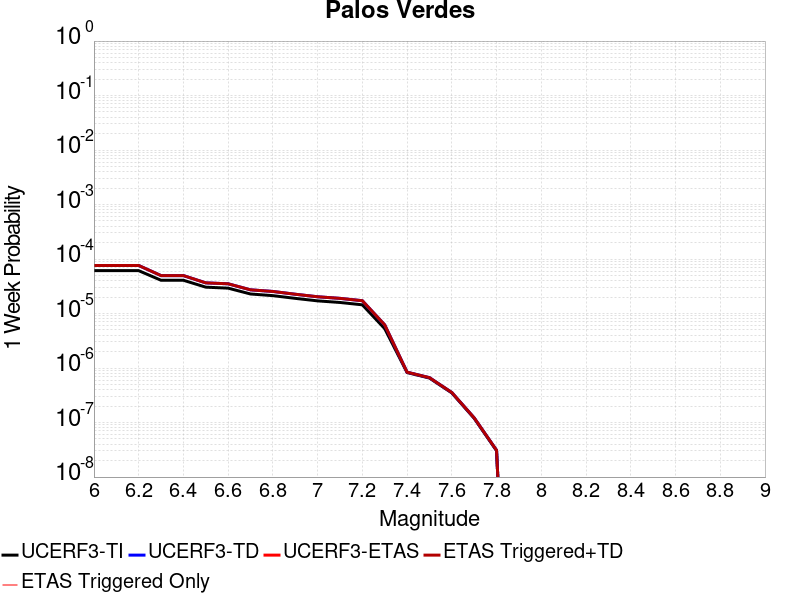 | 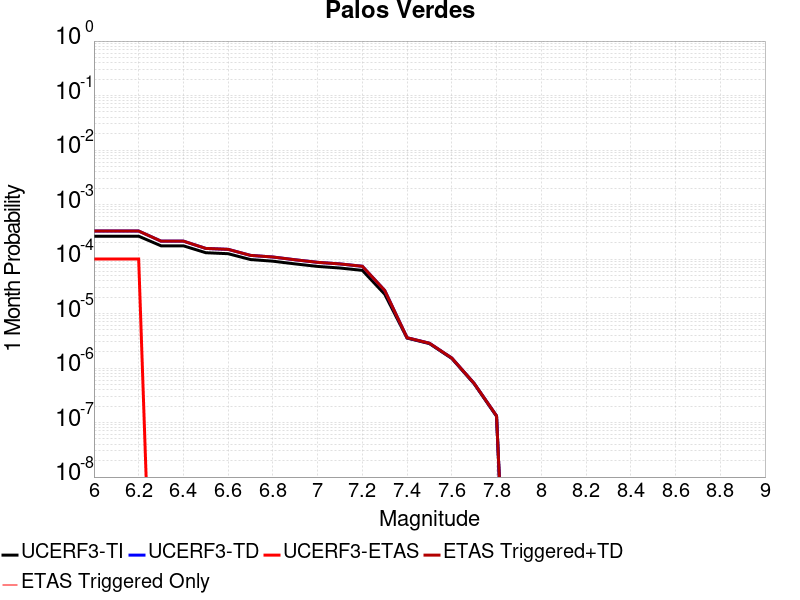 | 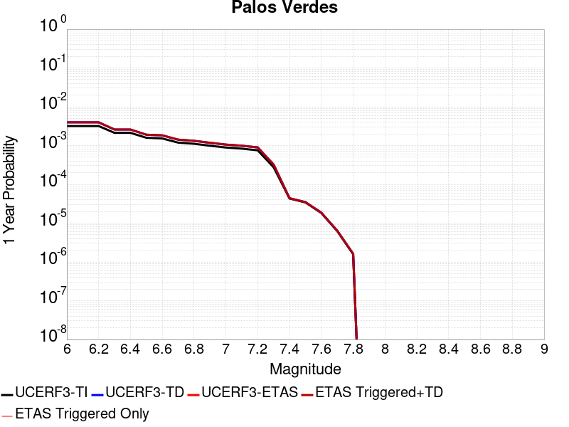 | 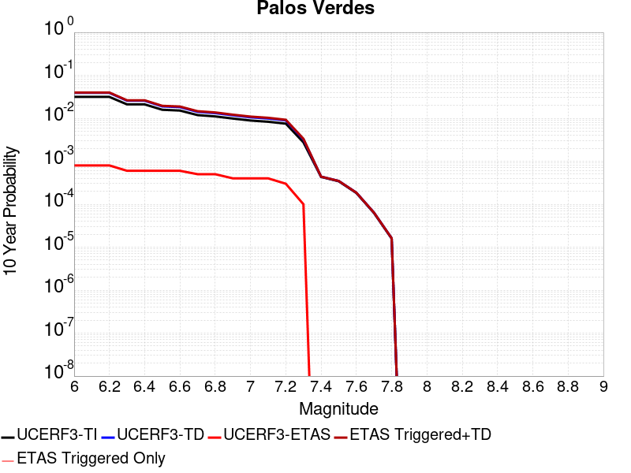 |

| Magnitude | 1 wk TI Prob | 1 wk TD Prob | 1 wk ETAS Prob | 1 wk ETAS/TD Gain | 1 wk ETAS Triggered+TD | 1 wk ETAS Triggered Only | 1 mo TI Prob | 1 mo TD Prob | 1 mo ETAS Prob | 1 mo ETAS/TD Gain | 1 mo ETAS Triggered+TD | 1 mo ETAS Triggered Only | 1 yr TI Prob | 1 yr TD Prob | 1 yr ETAS Prob | 1 yr ETAS/TD Gain | 1 yr ETAS Triggered+TD | 1 yr ETAS Triggered Only | 10 yr TI Prob | 10 yr TD Prob | 10 yr ETAS Prob | 10 yr ETAS/TD Gain | 10 yr ETAS Triggered+TD | 10 yr ETAS Triggered Only |
|-----|-----|-----|-----|-----|-----|-----|-----|-----|-----|-----|-----|-----|-----|-----|-----|-----|-----|-----|-----|-----|-----|-----|-----|-----|
| 6.0 | 6.126063E-5 | 7.626379E-5 | 0.0 | 0.0 | 7.626379E-5 | 0.0 | 2.6251914E-4 | 3.268072E-4 | 1.0E-4 | 0.30599082 | 3.268072E-4 | 0.0 | 0.0031914865 | 0.0039721546 | 0.0015 | 0.37762883 | 0.0039721546 | 0.0 | 0.031460393 | 0.039068162 | 0.0227 | 0.5810358 | 0.039836906 | 8.0E-4 |
| 6.1 | 6.126063E-5 | 7.626379E-5 | 0.0 | 0.0 | 7.626379E-5 | 0.0 | 2.6251914E-4 | 3.268072E-4 | 1.0E-4 | 0.30599082 | 3.268072E-4 | 0.0 | 0.0031914865 | 0.0039721546 | 0.0015 | 0.37762883 | 0.0039721546 | 0.0 | 0.031460393 | 0.039068162 | 0.0227 | 0.5810358 | 0.039836906 | 8.0E-4 |
| 6.2 | 6.126063E-5 | 7.626379E-5 | 0.0 | 0.0 | 7.626379E-5 | 0.0 | 2.6251914E-4 | 3.268072E-4 | 1.0E-4 | 0.30599082 | 3.268072E-4 | 0.0 | 0.0031914865 | 0.0039721546 | 0.0015 | 0.37762883 | 0.0039721546 | 0.0 | 0.031460393 | 0.039068162 | 0.0227 | 0.5810358 | 0.039836906 | 8.0E-4 |
| 6.3 | 4.0838047E-5 | 4.9771388E-5 | 0.0 | 0.0 | 4.9771388E-5 | 0.0 | 1.7500846E-4 | 2.132898E-4 | 0.0 | 0.0 | 2.132898E-4 | 0.0 | 0.0021286458 | 0.0025939206 | 8.0E-4 | 0.30841345 | 0.0025939206 | 0.0 | 0.021083709 | 0.025658133 | 0.0138 | 0.5378412 | 0.026242737 | 6.0E-4 |
| 6.4 | 4.0838047E-5 | 4.9771388E-5 | 0.0 | 0.0 | 4.9771388E-5 | 0.0 | 1.7500846E-4 | 2.132898E-4 | 0.0 | 0.0 | 2.132898E-4 | 0.0 | 0.0021286458 | 0.0025939206 | 8.0E-4 | 0.30841345 | 0.0025939206 | 0.0 | 0.021083709 | 0.025658133 | 0.0138 | 0.5378412 | 0.026242737 | 6.0E-4 |
| 6.5 | 3.0512005E-5 | 3.6576617E-5 | 0.0 | 0.0 | 3.6576617E-5 | 0.0 | 1.3075917E-4 | 1.567482E-4 | 0.0 | 0.0 | 1.567482E-4 | 0.0 | 0.0015908304 | 0.001906855 | 5.0E-4 | 0.26221186 | 0.001906855 | 0.0 | 0.015794903 | 0.018916871 | 0.0105 | 0.55506 | 0.019505521 | 6.0E-4 |
| 6.6 | 2.9255087E-5 | 3.516907E-5 | 0.0 | 0.0 | 3.516907E-5 | 0.0 | 1.2537291E-4 | 1.5071653E-4 | 0.0 | 0.0 | 1.5071653E-4 | 0.0 | 0.0015253464 | 0.0018335432 | 5.0E-4 | 0.27269605 | 0.0018335432 | 0.0 | 0.015149189 | 0.01819577 | 0.0104 | 0.5715614 | 0.018784855 | 6.0E-4 |
| 6.7 | 2.287198E-5 | 2.7259108E-5 | 0.0 | 0.0 | 2.7259108E-5 | 0.0 | 9.801909E-5 | 1.1682003E-4 | 0.0 | 0.0 | 1.1682003E-4 | 0.0 | 0.001192729 | 0.0014214477 | 5.0E-4 | 0.35175407 | 0.0014214477 | 0.0 | 0.011863477 | 0.014132796 | 0.0079 | 0.5589835 | 0.01462573 | 5.0E-4 |
| 6.8 | 2.1325764E-5 | 2.5442045E-5 | 0.0 | 0.0 | 2.5442045E-5 | 0.0 | 9.139293E-5 | 1.0903329E-4 | 0.0 | 0.0 | 1.0903329E-4 | 0.0 | 0.001112141 | 0.0013267621 | 5.0E-4 | 0.3768573 | 0.0013267621 | 0.0 | 0.011065915 | 0.013197455 | 0.0073 | 0.553137 | 0.013690855 | 5.0E-4 |
| 6.9 | 1.9009392E-5 | 2.2622457E-5 | 0.0 | 0.0 | 2.2622457E-5 | 0.0 | 8.1466285E-5 | 9.695027E-5 | 0.0 | 0.0 | 9.695027E-5 | 0.0 | 9.914007E-4 | 0.0011798178 | 5.0E-4 | 0.42379424 | 0.0011798178 | 0.0 | 0.009869894 | 0.011744234 | 0.0062 | 0.52791864 | 0.012139536 | 4.0E-4 |
| 7.0 | 1.7098473E-5 | 2.0327316E-5 | 0.0 | 0.0 | 2.0327316E-5 | 0.0 | 7.3277115E-5 | 8.711463E-5 | 0.0 | 0.0 | 8.711463E-5 | 0.0 | 8.917837E-4 | 0.0010601899 | 5.0E-4 | 0.47161362 | 0.0010601899 | 0.0 | 0.008882134 | 0.010559764 | 0.0059 | 0.55872464 | 0.0109555395 | 4.0E-4 |
| 7.1 | 1.5982785E-5 | 1.9002204E-5 | 0.0 | 0.0 | 1.9002204E-5 | 0.0 | 6.849585E-5 | 8.143596E-5 | 0.0 | 0.0 | 8.143596E-5 | 0.0 | 8.336179E-4 | 9.911165E-4 | 5.0E-4 | 0.50448155 | 9.911165E-4 | 0.0 | 0.008304977 | 0.009875333 | 0.0055 | 0.55694324 | 0.010271383 | 4.0E-4 |
| 7.2 | 1.4468002E-5 | 1.7203985E-5 | 0.0 | 0.0 | 1.7203985E-5 | 0.0 | 6.200425E-5 | 7.372976E-5 | 0.0 | 0.0 | 7.372976E-5 | 0.0 | 7.546402E-4 | 8.973742E-4 | 5.0E-4 | 0.5571812 | 8.973742E-4 | 0.0 | 0.007520827 | 0.008945782 | 0.0047 | 0.5253873 | 0.009243098 | 3.0E-4 |
| 7.3 | 5.288233E-6 | 6.2059435E-6 | 0.0 | 0.0 | 6.2059435E-6 | 0.0 | 2.2663658E-5 | 2.6596825E-5 | 0.0 | 0.0 | 2.6596825E-5 | 0.0 | 2.7589512E-4 | 3.2380316E-4 | 1.0E-4 | 0.3088296 | 3.2380316E-4 | 0.0 | 0.0027555283 | 0.0032367392 | 0.0014 | 0.43253407 | 0.0033364156 | 1.0E-4 |
| 7.4 | 8.279556E-7 | 8.408616E-7 | 0.0 | 0.0 | 8.408616E-7 | 0.0 | 3.5483763E-6 | 3.603688E-6 | 0.0 | 0.0 | 3.603688E-6 | 0.0 | 4.3200624E-5 | 4.387409E-5 | 0.0 | 0.0 | 4.387409E-5 | 0.0 | 4.3192226E-4 | 4.3866152E-4 | 2.0E-4 | 0.4559324 | 4.3866152E-4 | 0.0 |
| 7.5 | 6.559831E-7 | 6.6674534E-7 | 0.0 | 0.0 | 6.6674534E-7 | 0.0 | 2.8113532E-6 | 2.8574773E-6 | 0.0 | 0.0 | 2.8574773E-6 | 0.0 | 3.4227687E-5 | 3.47893E-5 | 0.0 | 0.0 | 3.47893E-5 | 0.0 | 3.4222414E-4 | 3.4784517E-4 | 2.0E-4 | 0.57496846 | 3.4784517E-4 | 0.0 |
| 7.6 | 3.5018968E-7 | 3.5621287E-7 | 0.0 | 0.0 | 3.5621287E-7 | 0.0 | 1.500812E-6 | 1.526626E-6 | 0.0 | 0.0 | 1.526626E-6 | 0.0 | 1.8272232E-5 | 1.858656E-5 | 0.0 | 0.0 | 1.858656E-5 | 0.0 | 1.8270731E-4 | 1.8585465E-4 | 2.0E-4 | 1.0761098 | 1.8585465E-4 | 0.0 |
| 7.7 | 1.1986104E-7 | 1.2198822E-7 | 0.0 | 0.0 | 1.2198822E-7 | 0.0 | 5.1369005E-7 | 5.2280654E-7 | 0.0 | 0.0 | 5.2280654E-7 | 0.0 | 6.2541585E-6 | 6.3651514E-6 | 0.0 | 0.0 | 6.3651514E-6 | 0.0 | 6.2539824E-5 | 6.364973E-5 | 2.0E-4 | 3.1421971 | 6.364973E-5 | 0.0 |
| 7.8 | 3.0445005E-8 | 3.1028808E-8 | 0.0 | 0.0 | 3.1028808E-8 | 0.0 | 1.3047858E-7 | 1.3298059E-7 | 0.0 | 0.0 | 1.3298059E-7 | 0.0 | 1.5885756E-6 | 1.6190377E-6 | 0.0 | 0.0 | 1.6190377E-6 | 0.0 | 1.5885644E-5 | 1.619028E-5 | 1.0E-4 | 6.1765456 | 1.619028E-5 | 0.0 |

## Robinson Creek
*[(top)](#table-of-contents)*

| 1 Week | 1 Month | 1 Year | 10 Year |
|-----|-----|-----|-----|
|  | 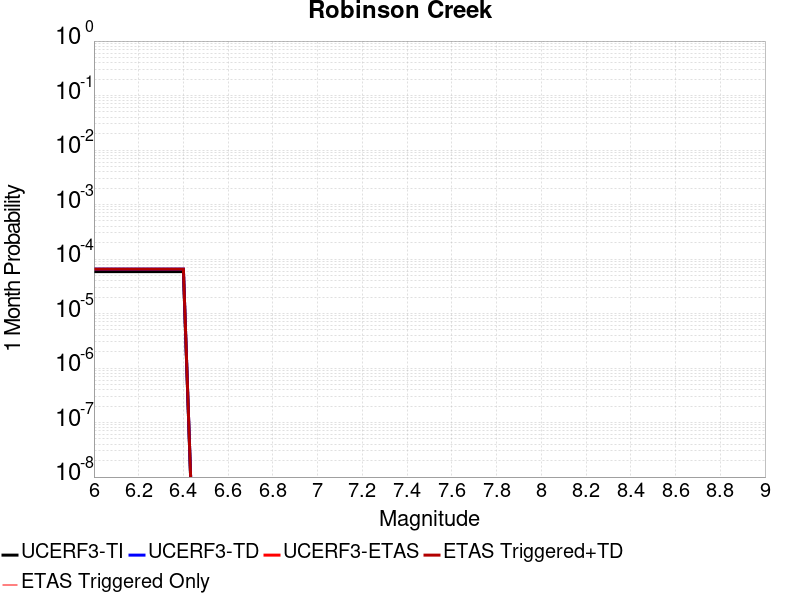 | 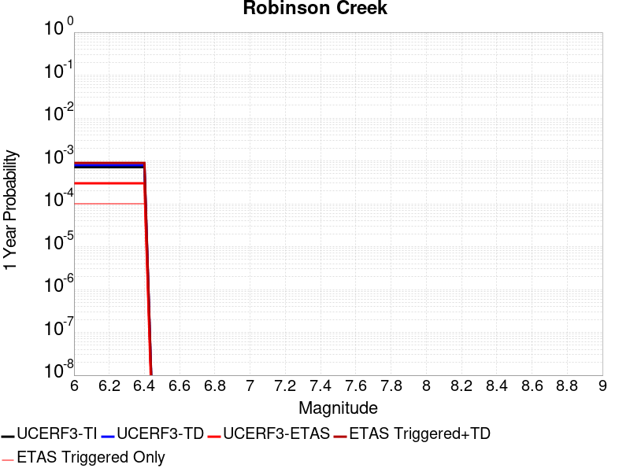 | 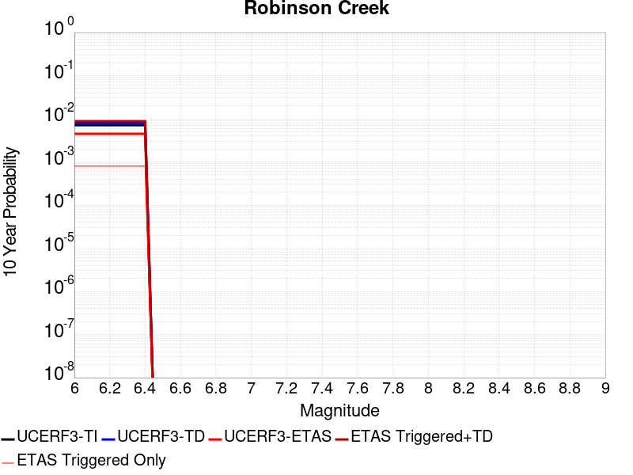 |

| Magnitude | 1 wk TI Prob | 1 wk TD Prob | 1 wk ETAS Prob | 1 wk ETAS/TD Gain | 1 wk ETAS Triggered+TD | 1 wk ETAS Triggered Only | 1 mo TI Prob | 1 mo TD Prob | 1 mo ETAS Prob | 1 mo ETAS/TD Gain | 1 mo ETAS Triggered+TD | 1 mo ETAS Triggered Only | 1 yr TI Prob | 1 yr TD Prob | 1 yr ETAS Prob | 1 yr ETAS/TD Gain | 1 yr ETAS Triggered+TD | 1 yr ETAS Triggered Only | 10 yr TI Prob | 10 yr TD Prob | 10 yr ETAS Prob | 10 yr ETAS/TD Gain | 10 yr ETAS Triggered+TD | 10 yr ETAS Triggered Only |
|-----|-----|-----|-----|-----|-----|-----|-----|-----|-----|-----|-----|-----|-----|-----|-----|-----|-----|-----|-----|-----|-----|-----|-----|-----|
| 6.0 | 1.3705327E-5 | 1.528864E-5 | 0.0 | 0.0 | 1.528864E-5 | 0.0 | 5.8735794E-5 | 6.552275E-5 | 0.0 | 0.0 | 6.552275E-5 | 0.0 | 7.1487366E-4 | 7.977395E-4 | 3.0E-4 | 0.37606263 | 8.976597E-4 | 1.0E-4 | 0.0071257832 | 0.007977394 | 0.0045 | 0.56409395 | 0.008771013 | 8.0E-4 |
| 6.1 | 1.3705327E-5 | 1.528864E-5 | 0.0 | 0.0 | 1.528864E-5 | 0.0 | 5.8735794E-5 | 6.552275E-5 | 0.0 | 0.0 | 6.552275E-5 | 0.0 | 7.1487366E-4 | 7.977395E-4 | 3.0E-4 | 0.37606263 | 8.976597E-4 | 1.0E-4 | 0.0071257832 | 0.007977394 | 0.0045 | 0.56409395 | 0.008771013 | 8.0E-4 |
| 6.2 | 1.3705327E-5 | 1.528864E-5 | 0.0 | 0.0 | 1.528864E-5 | 0.0 | 5.8735794E-5 | 6.552275E-5 | 0.0 | 0.0 | 6.552275E-5 | 0.0 | 7.1487366E-4 | 7.977395E-4 | 3.0E-4 | 0.37606263 | 8.976597E-4 | 1.0E-4 | 0.0071257832 | 0.007977394 | 0.0045 | 0.56409395 | 0.008771013 | 8.0E-4 |
| 6.3 | 1.3705327E-5 | 1.528864E-5 | 0.0 | 0.0 | 1.528864E-5 | 0.0 | 5.8735794E-5 | 6.552275E-5 | 0.0 | 0.0 | 6.552275E-5 | 0.0 | 7.1487366E-4 | 7.977395E-4 | 3.0E-4 | 0.37606263 | 8.976597E-4 | 1.0E-4 | 0.0071257832 | 0.007977394 | 0.0045 | 0.56409395 | 0.008771013 | 8.0E-4 |
| 6.4 | 1.3705327E-5 | 1.528864E-5 | 0.0 | 0.0 | 1.528864E-5 | 0.0 | 5.8735794E-5 | 6.552275E-5 | 0.0 | 0.0 | 6.552275E-5 | 0.0 | 7.1487366E-4 | 7.977395E-4 | 3.0E-4 | 0.37606263 | 8.976597E-4 | 1.0E-4 | 0.0071257832 | 0.007977394 | 0.0045 | 0.56409395 | 0.008771013 | 8.0E-4 |

## Elsinore (Stepovers Combined)
*[(top)](#table-of-contents)*

| 1 Week | 1 Month | 1 Year | 10 Year |
|-----|-----|-----|-----|
| 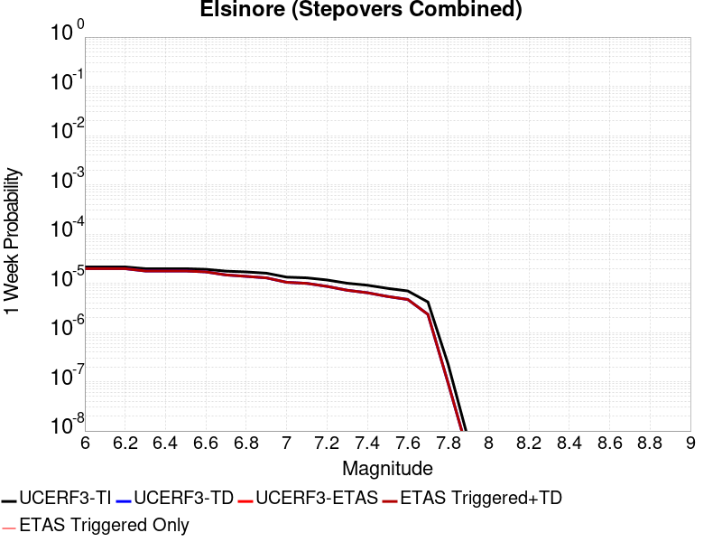 | 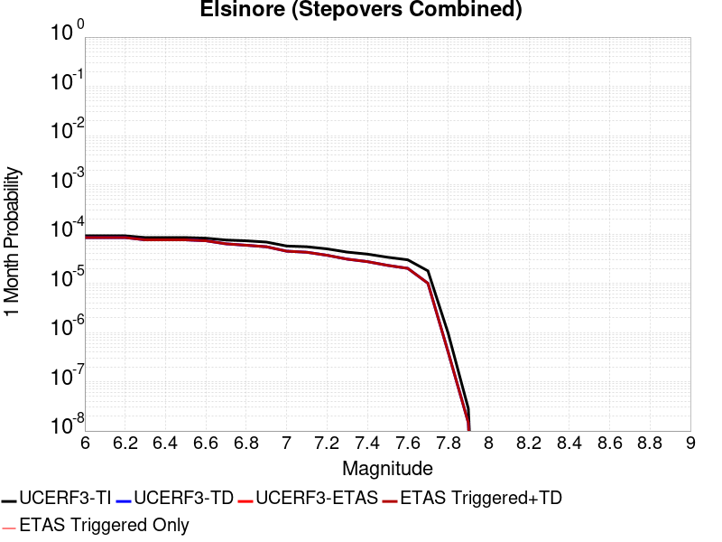 | 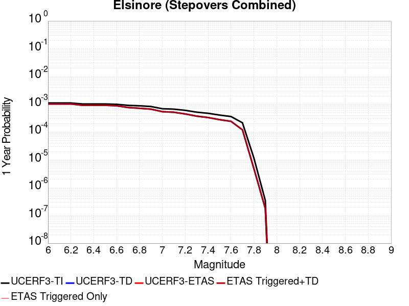 | 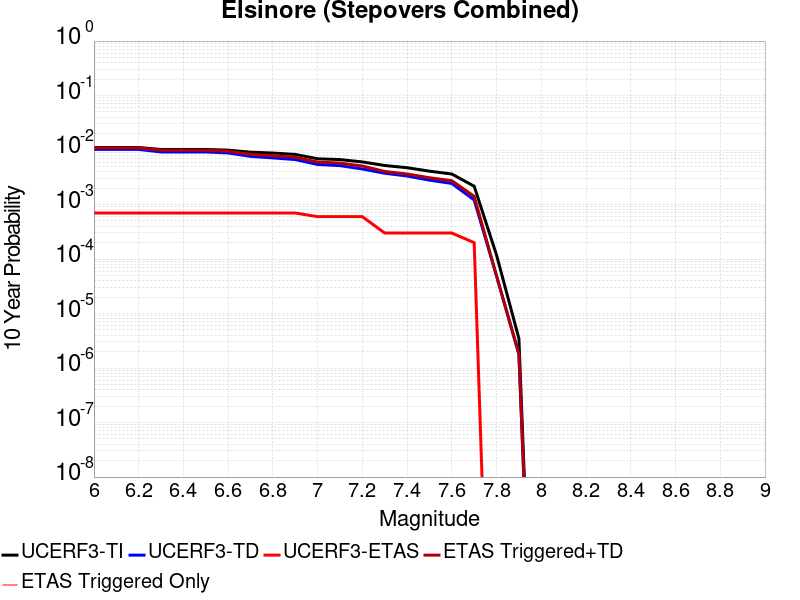 |

| Magnitude | 1 wk TI Prob | 1 wk TD Prob | 1 wk ETAS Prob | 1 wk ETAS/TD Gain | 1 wk ETAS Triggered+TD | 1 wk ETAS Triggered Only | 1 mo TI Prob | 1 mo TD Prob | 1 mo ETAS Prob | 1 mo ETAS/TD Gain | 1 mo ETAS Triggered+TD | 1 mo ETAS Triggered Only | 1 yr TI Prob | 1 yr TD Prob | 1 yr ETAS Prob | 1 yr ETAS/TD Gain | 1 yr ETAS Triggered+TD | 1 yr ETAS Triggered Only | 10 yr TI Prob | 10 yr TD Prob | 10 yr ETAS Prob | 10 yr ETAS/TD Gain | 10 yr ETAS Triggered+TD | 10 yr ETAS Triggered Only |
|-----|-----|-----|-----|-----|-----|-----|-----|-----|-----|-----|-----|-----|-----|-----|-----|-----|-----|-----|-----|-----|-----|-----|-----|-----|
| 6.0 | 2.144392E-5 | 1.9773091E-5 | 0.0 | 0.0 | 1.9773091E-5 | 0.0 | 9.189928E-5 | 8.473916E-5 | 0.0 | 0.0 | 8.473916E-5 | 0.0 | 0.0011182994 | 0.0010312302 | 1.0E-4 | 0.09697156 | 0.0010312302 | 0.0 | 0.011126885 | 0.010271067 | 0.0064 | 0.6231096 | 0.010963877 | 7.0E-4 |
| 6.1 | 2.144392E-5 | 1.9773091E-5 | 0.0 | 0.0 | 1.9773091E-5 | 0.0 | 9.189928E-5 | 8.473916E-5 | 0.0 | 0.0 | 8.473916E-5 | 0.0 | 0.0011182994 | 0.0010312302 | 1.0E-4 | 0.09697156 | 0.0010312302 | 0.0 | 0.011126885 | 0.010271067 | 0.0064 | 0.6231096 | 0.010963877 | 7.0E-4 |
| 6.2 | 2.144392E-5 | 1.9773091E-5 | 0.0 | 0.0 | 1.9773091E-5 | 0.0 | 9.189928E-5 | 8.473916E-5 | 0.0 | 0.0 | 8.473916E-5 | 0.0 | 0.0011182994 | 0.0010312302 | 1.0E-4 | 0.09697156 | 0.0010312302 | 0.0 | 0.011126885 | 0.010271067 | 0.0064 | 0.6231096 | 0.010963877 | 7.0E-4 |
| 6.3 | 1.9751555E-5 | 1.7753548E-5 | 0.0 | 0.0 | 1.7753548E-5 | 0.0 | 8.4646774E-5 | 7.608447E-5 | 0.0 | 0.0 | 7.608447E-5 | 0.0 | 0.0010300872 | 9.25949E-4 | 1.0E-4 | 0.107997306 | 9.25949E-4 | 0.0 | 0.010253254 | 0.009227017 | 0.0061 | 0.6611021 | 0.009920558 | 7.0E-4 |
| 6.4 | 1.9751555E-5 | 1.7753548E-5 | 0.0 | 0.0 | 1.7753548E-5 | 0.0 | 8.4646774E-5 | 7.608447E-5 | 0.0 | 0.0 | 7.608447E-5 | 0.0 | 0.0010300872 | 9.25949E-4 | 1.0E-4 | 0.107997306 | 9.25949E-4 | 0.0 | 0.010253254 | 0.009227017 | 0.0061 | 0.6611021 | 0.009920558 | 7.0E-4 |
| 6.5 | 1.9751555E-5 | 1.7753548E-5 | 0.0 | 0.0 | 1.7753548E-5 | 0.0 | 8.4646774E-5 | 7.608447E-5 | 0.0 | 0.0 | 7.608447E-5 | 0.0 | 0.0010300872 | 9.25949E-4 | 1.0E-4 | 0.107997306 | 9.25949E-4 | 0.0 | 0.010253254 | 0.009227017 | 0.0061 | 0.6611021 | 0.009920558 | 7.0E-4 |
| 6.6 | 1.9188685E-5 | 1.7015012E-5 | 0.0 | 0.0 | 1.7015012E-5 | 0.0 | 8.2234634E-5 | 7.291954E-5 | 0.0 | 0.0 | 7.291954E-5 | 0.0 | 0.0010007467 | 8.8744995E-4 | 1.0E-4 | 0.11268241 | 8.8744995E-4 | 0.0 | 0.00996252 | 0.008845359 | 0.0059 | 0.66701645 | 0.009539167 | 7.0E-4 |
| 6.7 | 1.7608272E-5 | 1.4742688E-5 | 0.0 | 0.0 | 1.4742688E-5 | 0.0 | 7.546184E-5 | 6.318148E-5 | 0.0 | 0.0 | 6.318148E-5 | 0.0 | 9.183606E-4 | 7.6897274E-4 | 1.0E-4 | 0.13004363 | 7.6897274E-4 | 0.0 | 0.009145746 | 0.007669744 | 0.0053 | 0.691027 | 0.008364375 | 7.0E-4 |
| 6.8 | 1.697165E-5 | 1.3792716E-5 | 0.0 | 0.0 | 1.3792716E-5 | 0.0 | 7.273361E-5 | 5.911035E-5 | 0.0 | 0.0 | 5.911035E-5 | 0.0 | 8.8517193E-4 | 7.194396E-4 | 1.0E-4 | 0.13899708 | 7.194396E-4 | 0.0 | 0.008816543 | 0.0071770456 | 0.0051 | 0.71059877 | 0.007872022 | 7.0E-4 |
| 6.9 | 1.600365E-5 | 1.2855703E-5 | 0.0 | 0.0 | 1.2855703E-5 | 0.0 | 6.858527E-5 | 5.5094748E-5 | 0.0 | 0.0 | 5.5094748E-5 | 0.0 | 8.347058E-4 | 6.705799E-4 | 1.0E-4 | 0.14912465 | 6.705799E-4 | 0.0 | 0.008315775 | 0.006691119 | 0.0048 | 0.7173688 | 0.0073864353 | 7.0E-4 |
| 7.0 | 1.3314581E-5 | 1.0455437E-5 | 0.0 | 0.0 | 1.0455437E-5 | 0.0 | 5.7061243E-5 | 4.4808265E-5 | 0.0 | 0.0 | 4.4808265E-5 | 0.0 | 6.944992E-4 | 5.454068E-4 | 1.0E-4 | 0.1833494 | 5.454068E-4 | 0.0 | 0.006923327 | 0.0054443954 | 0.0041 | 0.753068 | 0.0060411287 | 6.0E-4 |
| 7.1 | 1.2865345E-5 | 9.944958E-6 | 0.0 | 0.0 | 9.944958E-6 | 0.0 | 5.5136024E-5 | 4.2620566E-5 | 0.0 | 0.0 | 4.2620566E-5 | 0.0 | 6.710743E-4 | 5.187844E-4 | 1.0E-4 | 0.1927583 | 5.187844E-4 | 0.0 | 0.0066905143 | 0.005179007 | 0.0041 | 0.7916575 | 0.0057758996 | 6.0E-4 |
| 7.2 | 1.1650051E-5 | 8.640239E-6 | 0.0 | 0.0 | 8.640239E-6 | 0.0 | 4.9927836E-5 | 3.702908E-5 | 0.0 | 0.0 | 3.702908E-5 | 0.0 | 6.0770183E-4 | 4.5073757E-4 | 1.0E-4 | 0.22185859 | 4.5073757E-4 | 0.0 | 0.0060604266 | 0.0044997153 | 0.0038 | 0.8444979 | 0.0050970153 | 6.0E-4 |
| 7.3 | 1.0008533E-5 | 7.2064026E-6 | 0.0 | 0.0 | 7.2064026E-6 | 0.0 | 4.2893007E-5 | 3.0884225E-5 | 0.0 | 0.0 | 3.0884225E-5 | 0.0 | 5.220972E-4 | 3.7595202E-4 | 1.0E-4 | 0.2659914 | 3.7595202E-4 | 0.0 | 0.005208723 | 0.0037535334 | 0.0029 | 0.77260536 | 0.004052407 | 3.0E-4 |
| 7.4 | 9.116759E-6 | 6.4148244E-6 | 0.0 | 0.0 | 6.4148244E-6 | 0.0 | 3.907124E-5 | 2.7491822E-5 | 0.0 | 0.0 | 2.7491822E-5 | 0.0 | 4.7558855E-4 | 3.346629E-4 | 1.0E-4 | 0.29880813 | 3.346629E-4 | 0.0 | 0.00474572 | 0.0033417405 | 0.0026 | 0.7780377 | 0.0036407379 | 3.0E-4 |
| 7.5 | 7.870524E-6 | 5.3865906E-6 | 0.0 | 0.0 | 5.3865906E-6 | 0.0 | 3.3730383E-5 | 2.3085191E-5 | 0.0 | 0.0 | 2.3085191E-5 | 0.0 | 4.1059E-4 | 2.810272E-4 | 1.0E-4 | 0.35583743 | 2.810272E-4 | 0.0 | 0.0040983222 | 0.0028068451 | 0.0022 | 0.78379816 | 0.003106003 | 3.0E-4 |
| 7.6 | 6.9774537E-6 | 4.681274E-6 | 0.0 | 0.0 | 4.681274E-6 | 0.0 | 2.990303E-5 | 2.0062454E-5 | 0.0 | 0.0 | 2.0062454E-5 | 0.0 | 3.640086E-4 | 2.4423416E-4 | 1.0E-4 | 0.4094431 | 2.4423416E-4 | 0.0 | 0.003634129 | 0.0024397739 | 0.002 | 0.81974804 | 0.002739042 | 3.0E-4 |
| 7.7 | 4.1616954E-6 | 2.3302725E-6 | 0.0 | 0.0 | 2.3302725E-6 | 0.0 | 1.7835715E-5 | 9.986848E-6 | 0.0 | 0.0 | 9.986848E-6 | 0.0 | 2.171282E-4 | 1.21583835E-4 | 1.0E-4 | 0.82247776 | 1.21583835E-4 | 0.0 | 0.0021691616 | 0.0012152464 | 9.0E-4 | 0.7405906 | 0.0014150033 | 2.0E-4 |
| 7.8 | 2.2692414E-7 | 9.391798E-8 | 0.0 | 0.0 | 9.391798E-8 | 0.0 | 9.725317E-7 | 4.0250558E-7 | 0.0 | 0.0 | 4.0250558E-7 | 0.0 | 1.1840509E-5 | 4.900498E-6 | 0.0 | 0.0 | 4.900498E-6 | 0.0 | 1.1839878E-4 | 4.9004226E-5 | 0.0 | 0.0 | 4.9004226E-5 | 0.0 |
| 7.9 | 6.676829E-9 | 3.4416097E-9 | 0.0 | 0.0 | 3.4416097E-9 | 0.0 | 2.861498E-8 | 1.4749755E-8 | 0.0 | 0.0 | 1.4749755E-8 | 0.0 | 3.4838732E-7 | 1.7957827E-7 | 0.0 | 0.0 | 1.7957827E-7 | 0.0 | 3.4838679E-6 | 1.7957813E-6 | 0.0 | 0.0 | 1.7957813E-6 | 0.0 |

## Skinner Flat 2011 CFM
*[(top)](#table-of-contents)*

| 1 Week | 1 Month | 1 Year | 10 Year |
|-----|-----|-----|-----|
| 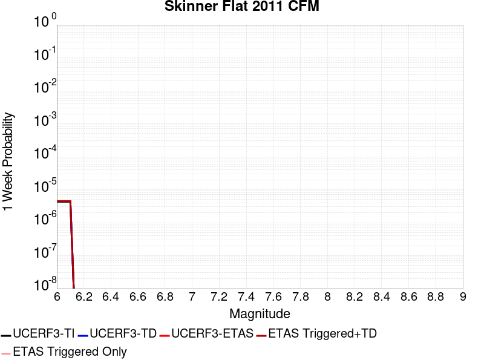 | 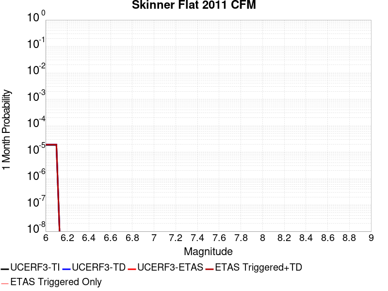 | 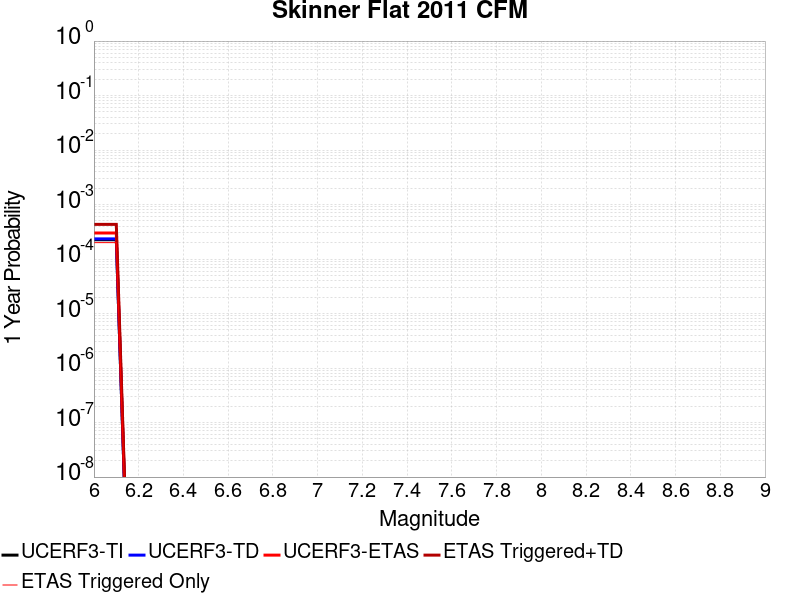 | 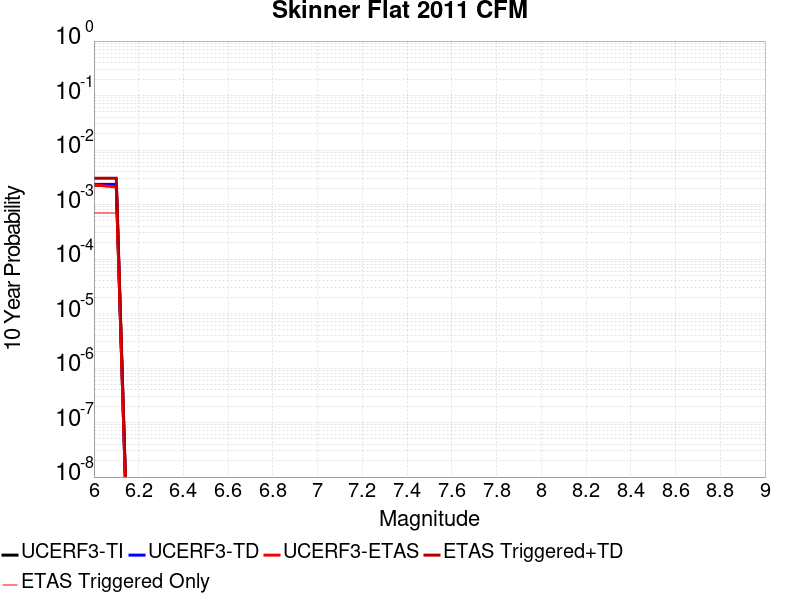 |

| Magnitude | 1 wk TI Prob | 1 wk TD Prob | 1 wk ETAS Prob | 1 wk ETAS/TD Gain | 1 wk ETAS Triggered+TD | 1 wk ETAS Triggered Only | 1 mo TI Prob | 1 mo TD Prob | 1 mo ETAS Prob | 1 mo ETAS/TD Gain | 1 mo ETAS Triggered+TD | 1 mo ETAS Triggered Only | 1 yr TI Prob | 1 yr TD Prob | 1 yr ETAS Prob | 1 yr ETAS/TD Gain | 1 yr ETAS Triggered+TD | 1 yr ETAS Triggered Only | 10 yr TI Prob | 10 yr TD Prob | 10 yr ETAS Prob | 10 yr ETAS/TD Gain | 10 yr ETAS Triggered+TD | 10 yr ETAS Triggered Only |
|-----|-----|-----|-----|-----|-----|-----|-----|-----|-----|-----|-----|-----|-----|-----|-----|-----|-----|-----|-----|-----|-----|-----|-----|-----|
| 6.0 | 4.3279074E-6 | 4.485288E-6 | 0.0 | 0.0 | 4.485288E-6 | 0.0 | 1.8548042E-5 | 1.9222663E-5 | 0.0 | 0.0 | 1.9222663E-5 | 0.0 | 2.2579901E-4 | 2.3403592E-4 | 3.0E-4 | 1.2818545 | 4.339891E-4 | 2.0E-4 | 0.002255697 | 0.0023403591 | 0.0023 | 0.9827551 | 0.003038721 | 7.0E-4 |
| 6.1 | 4.3279074E-6 | 4.485288E-6 | 0.0 | 0.0 | 4.485288E-6 | 0.0 | 1.8548042E-5 | 1.9222663E-5 | 0.0 | 0.0 | 1.9222663E-5 | 0.0 | 2.2579901E-4 | 2.3403592E-4 | 3.0E-4 | 1.2818545 | 4.339891E-4 | 2.0E-4 | 0.002255697 | 0.0023403591 | 0.0021 | 0.89729816 | 0.003038721 | 7.0E-4 |

## Simi-Santa Rosa
*[(top)](#table-of-contents)*

| 1 Week | 1 Month | 1 Year | 10 Year |
|-----|-----|-----|-----|
| 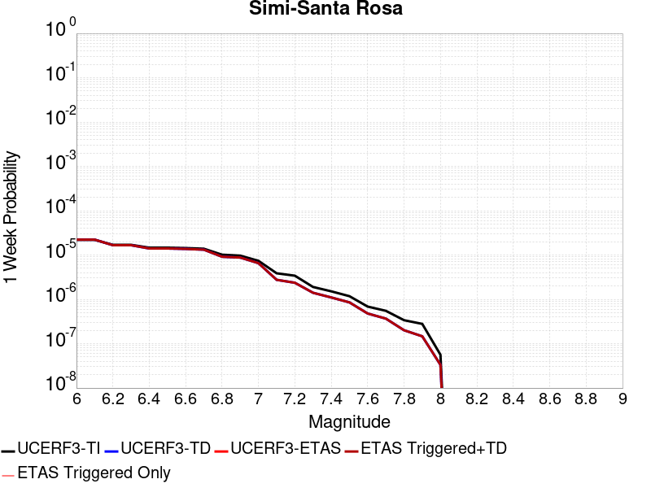 | 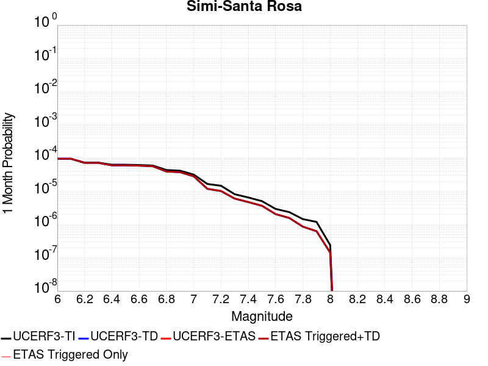 | 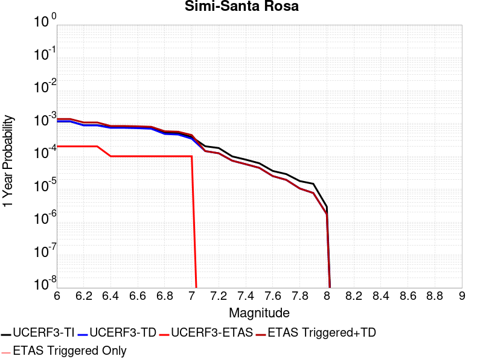 | 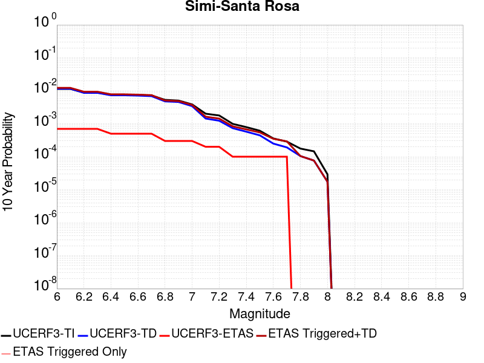 |

| Magnitude | 1 wk TI Prob | 1 wk TD Prob | 1 wk ETAS Prob | 1 wk ETAS/TD Gain | 1 wk ETAS Triggered+TD | 1 wk ETAS Triggered Only | 1 mo TI Prob | 1 mo TD Prob | 1 mo ETAS Prob | 1 mo ETAS/TD Gain | 1 mo ETAS Triggered+TD | 1 mo ETAS Triggered Only | 1 yr TI Prob | 1 yr TD Prob | 1 yr ETAS Prob | 1 yr ETAS/TD Gain | 1 yr ETAS Triggered+TD | 1 yr ETAS Triggered Only | 10 yr TI Prob | 10 yr TD Prob | 10 yr ETAS Prob | 10 yr ETAS/TD Gain | 10 yr ETAS Triggered+TD | 10 yr ETAS Triggered Only |
|-----|-----|-----|-----|-----|-----|-----|-----|-----|-----|-----|-----|-----|-----|-----|-----|-----|-----|-----|-----|-----|-----|-----|-----|-----|
| 6.0 | 2.198912E-5 | 2.2281558E-5 | 0.0 | 0.0 | 2.2281558E-5 | 0.0 | 9.4235686E-5 | 9.5489144E-5 | 0.0 | 0.0 | 9.5489144E-5 | 0.0 | 0.0011467156 | 0.0011620042 | 7.0E-4 | 0.6024075 | 0.0013617717 | 2.0E-4 | 0.011408163 | 0.011563732 | 0.0085 | 0.7350568 | 0.012255637 | 7.0E-4 |
| 6.1 | 2.198912E-5 | 2.2281558E-5 | 0.0 | 0.0 | 2.2281558E-5 | 0.0 | 9.4235686E-5 | 9.5489144E-5 | 0.0 | 0.0 | 9.5489144E-5 | 0.0 | 0.0011467156 | 0.0011620042 | 7.0E-4 | 0.6024075 | 0.0013617717 | 2.0E-4 | 0.011408163 | 0.011563732 | 0.0085 | 0.7350568 | 0.012255637 | 7.0E-4 |
| 6.2 | 1.69983E-5 | 1.667325E-5 | 0.0 | 0.0 | 1.667325E-5 | 0.0 | 7.284782E-5 | 7.145499E-5 | 0.0 | 0.0 | 7.145499E-5 | 0.0 | 8.865613E-4 | 8.696465E-4 | 5.0E-4 | 0.5749463 | 0.0010694725 | 2.0E-4 | 0.008830327 | 0.008665355 | 0.0061 | 0.70395267 | 0.00935929 | 7.0E-4 |
| 6.3 | 1.69983E-5 | 1.667325E-5 | 0.0 | 0.0 | 1.667325E-5 | 0.0 | 7.284782E-5 | 7.145499E-5 | 0.0 | 0.0 | 7.145499E-5 | 0.0 | 8.865613E-4 | 8.696465E-4 | 5.0E-4 | 0.5749463 | 0.0010694725 | 2.0E-4 | 0.008830327 | 0.008665355 | 0.0061 | 0.70395267 | 0.00935929 | 7.0E-4 |
| 6.4 | 1.4666188E-5 | 1.4056577E-5 | 0.0 | 0.0 | 1.4056577E-5 | 0.0 | 6.285358E-5 | 6.0241222E-5 | 0.0 | 0.0 | 6.0241222E-5 | 0.0 | 7.6497364E-4 | 7.3321495E-4 | 3.0E-4 | 0.40915695 | 8.331417E-4 | 1.0E-4 | 0.0076234564 | 0.007310435 | 0.0053 | 0.724991 | 0.00780678 | 5.0E-4 |
| 6.5 | 1.4666188E-5 | 1.4056577E-5 | 0.0 | 0.0 | 1.4056577E-5 | 0.0 | 6.285358E-5 | 6.0241222E-5 | 0.0 | 0.0 | 6.0241222E-5 | 0.0 | 7.6497364E-4 | 7.3321495E-4 | 3.0E-4 | 0.40915695 | 8.331417E-4 | 1.0E-4 | 0.0076234564 | 0.007310435 | 0.0053 | 0.724991 | 0.00780678 | 5.0E-4 |
| 6.6 | 1.4377586E-5 | 1.3733537E-5 | 0.0 | 0.0 | 1.3733537E-5 | 0.0 | 6.1616774E-5 | 5.885683E-5 | 0.0 | 0.0 | 5.885683E-5 | 0.0 | 7.4992597E-4 | 7.1637117E-4 | 3.0E-4 | 0.41877732 | 8.162995E-4 | 1.0E-4 | 0.007474003 | 0.0071430886 | 0.0053 | 0.74197596 | 0.007639517 | 5.0E-4 |
| 6.7 | 1.3881404E-5 | 1.32113755E-5 | 0.0 | 0.0 | 1.32113755E-5 | 0.0 | 5.9490372E-5 | 5.661909E-5 | 0.0 | 0.0 | 5.661909E-5 | 0.0 | 7.240546E-4 | 6.8914413E-4 | 3.0E-4 | 0.43532258 | 7.890752E-4 | 1.0E-4 | 0.007217 | 0.0068725217 | 0.0052 | 0.7566364 | 0.0073690857 | 5.0E-4 |
| 6.8 | 1.0176516E-5 | 9.156921E-6 | 0.0 | 0.0 | 9.156921E-6 | 0.0 | 4.3612912E-5 | 3.9243452E-5 | 0.0 | 0.0 | 3.9243452E-5 | 0.0 | 5.308578E-4 | 4.7770084E-4 | 3.0E-4 | 0.62800807 | 5.7765306E-4 | 1.0E-4 | 0.0052959146 | 0.0047683744 | 0.0032 | 0.6710883 | 0.005066944 | 3.0E-4 |
| 6.9 | 9.699797E-6 | 8.777368E-6 | 0.0 | 0.0 | 8.777368E-6 | 0.0 | 4.15699E-5 | 3.7616843E-5 | 0.0 | 0.0 | 3.7616843E-5 | 0.0 | 5.05996E-4 | 4.5790526E-4 | 3.0E-4 | 0.6551574 | 5.578595E-4 | 1.0E-4 | 0.005048454 | 0.004571236 | 0.0031 | 0.6781535 | 0.004869865 | 3.0E-4 |
| 7.0 | 7.4049476E-6 | 6.5613126E-6 | 0.0 | 0.0 | 6.5613126E-6 | 0.0 | 3.1735104E-5 | 2.8119679E-5 | 0.0 | 0.0 | 2.8119679E-5 | 0.0 | 3.8630638E-4 | 3.4231597E-4 | 3.0E-4 | 0.87638336 | 4.4228171E-4 | 1.0E-4 | 0.0038563553 | 0.0034191296 | 0.0021 | 0.6141914 | 0.003718104 | 3.0E-4 |
| 7.1 | 3.873439E-6 | 2.760384E-6 | 0.0 | 0.0 | 2.760384E-6 | 0.0 | 1.6600346E-5 | 1.1830165E-5 | 0.0 | 0.0 | 1.1830165E-5 | 0.0 | 2.0209046E-4 | 1.4402297E-4 | 1.0E-4 | 0.6943337 | 1.4402297E-4 | 0.0 | 0.0020190678 | 0.0014393199 | 0.0011 | 0.7642498 | 0.001639032 | 2.0E-4 |
| 7.2 | 3.417706E-6 | 2.3684336E-6 | 0.0 | 0.0 | 2.3684336E-6 | 0.0 | 1.4647229E-5 | 1.0150392E-5 | 0.0 | 0.0 | 1.0150392E-5 | 0.0 | 1.7831543E-4 | 1.2357424E-4 | 0.0 | 0.0 | 1.2357424E-4 | 0.0 | 0.0017817242 | 0.0012350775 | 9.0E-4 | 0.7286992 | 0.0014348305 | 2.0E-4 |
| 7.3 | 1.90225E-6 | 1.4079565E-6 | 0.0 | 0.0 | 1.4079565E-6 | 0.0 | 8.152474E-6 | 6.034085E-6 | 0.0 | 0.0 | 6.034085E-6 | 0.0 | 9.9251854E-5 | 7.346253E-5 | 0.0 | 0.0 | 7.346253E-5 | 0.0 | 9.920754E-4 | 7.343847E-4 | 3.0E-4 | 0.40850523 | 8.343113E-4 | 1.0E-4 |
| 7.4 | 1.5170556E-6 | 1.1030108E-6 | 0.0 | 0.0 | 1.1030108E-6 | 0.0 | 6.5016507E-6 | 4.7271806E-6 | 0.0 | 0.0 | 4.7271806E-6 | 0.0 | 7.915472E-5 | 5.7551915E-5 | 0.0 | 0.0 | 5.7551915E-5 | 0.0 | 7.9126534E-4 | 5.7537126E-4 | 3.0E-4 | 0.5214025 | 6.753137E-4 | 1.0E-4 |
| 7.5 | 1.178732E-6 | 8.5401194E-7 | 0.0 | 0.0 | 8.5401194E-7 | 0.0 | 5.0516987E-6 | 3.660046E-6 | 0.0 | 0.0 | 3.660046E-6 | 0.0 | 6.1502695E-5 | 4.4560158E-5 | 0.0 | 0.0 | 4.4560158E-5 | 0.0 | 6.148568E-4 | 4.4551317E-4 | 3.0E-4 | 0.67338073 | 5.4546865E-4 | 1.0E-4 |
| 7.6 | 6.8722386E-7 | 4.7977414E-7 | 0.0 | 0.0 | 4.7977414E-7 | 0.0 | 2.9452417E-6 | 2.0561731E-6 | 0.0 | 0.0 | 2.0561731E-6 | 0.0 | 3.5857727E-5 | 2.5033622E-5 | 0.0 | 0.0 | 2.5033622E-5 | 0.0 | 3.5851944E-4 | 2.5030816E-4 | 2.0E-4 | 0.7990151 | 3.502831E-4 | 1.0E-4 |
| 7.7 | 5.5126515E-7 | 3.6774645E-7 | 0.0 | 0.0 | 3.6774645E-7 | 0.0 | 2.3625628E-6 | 1.5760553E-6 | 0.0 | 0.0 | 1.5760553E-6 | 0.0 | 2.8763823E-5 | 1.9188305E-5 | 0.0 | 0.0 | 1.9188305E-5 | 0.0 | 2.87601E-4 | 1.918666E-4 | 1.0E-4 | 0.5211955 | 2.9184742E-4 | 1.0E-4 |
| 7.8 | 3.3860243E-7 | 2.0104748E-7 | 0.0 | 0.0 | 2.0104748E-7 | 0.0 | 1.4511525E-6 | 8.616318E-7 | 0.0 | 0.0 | 8.616318E-7 | 0.0 | 1.7667637E-5 | 1.0490317E-5 | 0.0 | 0.0 | 1.0490317E-5 | 0.0 | 1.7666233E-4 | 1.04898274E-4 | 0.0 | 0.0 | 1.04898274E-4 | 0.0 |
| 7.9 | 2.7955386E-7 | 1.4675514E-7 | 0.0 | 0.0 | 1.4675514E-7 | 0.0 | 1.1980875E-6 | 6.2895043E-7 | 0.0 | 0.0 | 6.2895043E-7 | 0.0 | 1.4586617E-5 | 7.657445E-6 | 0.0 | 0.0 | 7.657445E-6 | 0.0 | 1.458566E-4 | 7.657185E-5 | 0.0 | 0.0 | 7.657185E-5 | 0.0 |
| 8.0 | 5.6259015E-8 | 3.3383177E-8 | 0.0 | 0.0 | 3.3383177E-8 | 0.0 | 2.4111003E-7 | 1.4307075E-7 | 0.0 | 0.0 | 1.4307075E-7 | 0.0 | 2.9355108E-6 | 1.7418852E-6 | 0.0 | 0.0 | 1.7418852E-6 | 0.0 | 2.935472E-5 | 1.7418728E-5 | 0.0 | 0.0 | 1.7418728E-5 | 0.0 |

## Earthquake Valley (So Extension)
*[(top)](#table-of-contents)*

| 1 Week | 1 Month | 1 Year | 10 Year |
|-----|-----|-----|-----|
| 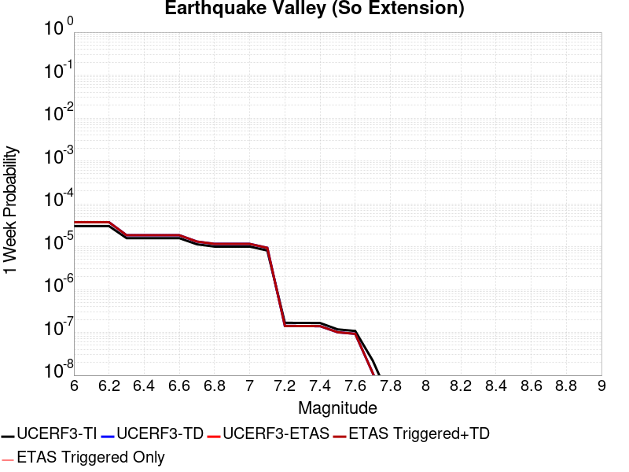 | 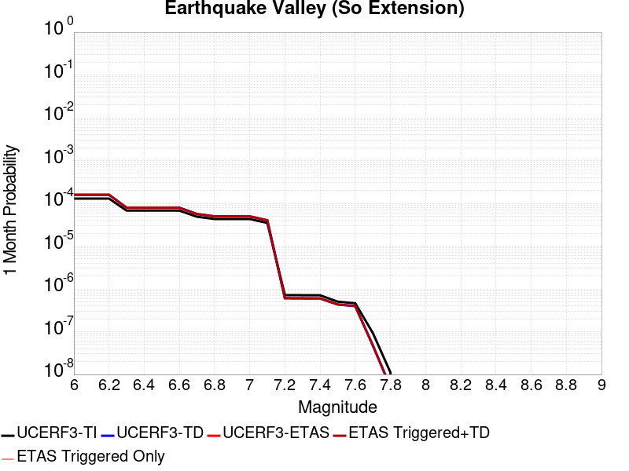 | 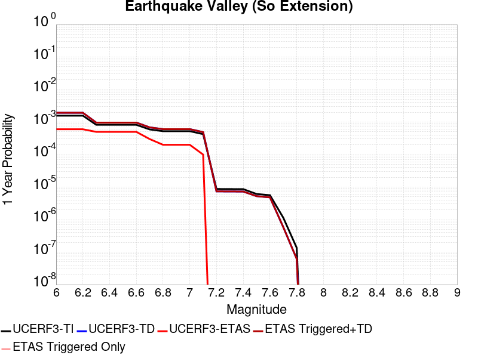 | 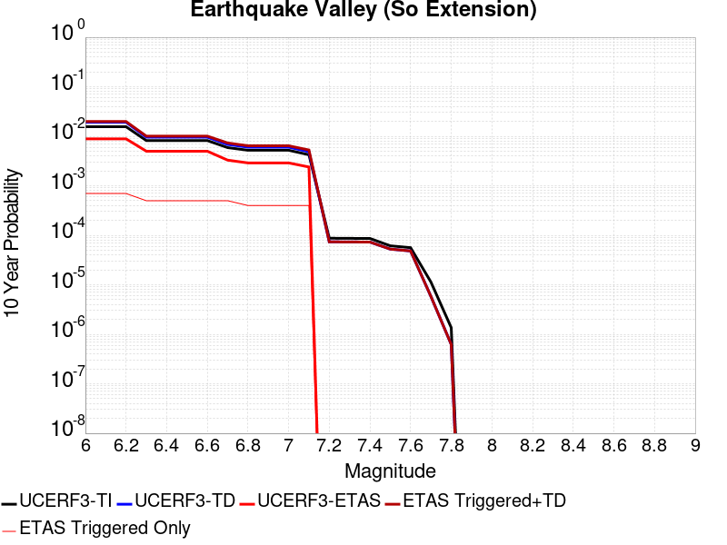 |

| Magnitude | 1 wk TI Prob | 1 wk TD Prob | 1 wk ETAS Prob | 1 wk ETAS/TD Gain | 1 wk ETAS Triggered+TD | 1 wk ETAS Triggered Only | 1 mo TI Prob | 1 mo TD Prob | 1 mo ETAS Prob | 1 mo ETAS/TD Gain | 1 mo ETAS Triggered+TD | 1 mo ETAS Triggered Only | 1 yr TI Prob | 1 yr TD Prob | 1 yr ETAS Prob | 1 yr ETAS/TD Gain | 1 yr ETAS Triggered+TD | 1 yr ETAS Triggered Only | 10 yr TI Prob | 10 yr TD Prob | 10 yr ETAS Prob | 10 yr ETAS/TD Gain | 10 yr ETAS Triggered+TD | 10 yr ETAS Triggered Only |
|-----|-----|-----|-----|-----|-----|-----|-----|-----|-----|-----|-----|-----|-----|-----|-----|-----|-----|-----|-----|-----|-----|-----|-----|-----|
| 6.0 | 3.0194888E-5 | 3.7089554E-5 | 0.0 | 0.0 | 3.7089554E-5 | 0.0 | 1.2940024E-4 | 1.5894862E-4 | 0.0 | 0.0 | 1.5894862E-4 | 0.0 | 0.0015743093 | 0.0019339989 | 6.0E-4 | 0.31023803 | 0.0019339989 | 0.0 | 0.01563203 | 0.019222068 | 0.0089 | 0.4630095 | 0.019908613 | 7.0E-4 |
| 6.1 | 3.0194888E-5 | 3.7089554E-5 | 0.0 | 0.0 | 3.7089554E-5 | 0.0 | 1.2940024E-4 | 1.5894862E-4 | 0.0 | 0.0 | 1.5894862E-4 | 0.0 | 0.0015743093 | 0.0019339989 | 6.0E-4 | 0.31023803 | 0.0019339989 | 0.0 | 0.01563203 | 0.019222068 | 0.0089 | 0.4630095 | 0.019908613 | 7.0E-4 |
| 6.2 | 3.0194888E-5 | 3.7089554E-5 | 0.0 | 0.0 | 3.7089554E-5 | 0.0 | 1.2940024E-4 | 1.5894862E-4 | 0.0 | 0.0 | 1.5894862E-4 | 0.0 | 0.0015743093 | 0.0019339989 | 6.0E-4 | 0.31023803 | 0.0019339989 | 0.0 | 0.01563203 | 0.019222068 | 0.0089 | 0.4630095 | 0.019908613 | 7.0E-4 |
| 6.3 | 1.5795305E-5 | 1.8453153E-5 | 0.0 | 0.0 | 1.8453153E-5 | 0.0 | 6.769241E-5 | 7.908317E-5 | 0.0 | 0.0 | 7.908317E-5 | 0.0 | 8.238434E-4 | 9.6252305E-4 | 5.0E-4 | 0.51946807 | 9.6252305E-4 | 0.0 | 0.008207959 | 0.009594448 | 0.005 | 0.52113473 | 0.010089651 | 5.0E-4 |
| 6.4 | 1.5795305E-5 | 1.8453153E-5 | 0.0 | 0.0 | 1.8453153E-5 | 0.0 | 6.769241E-5 | 7.908317E-5 | 0.0 | 0.0 | 7.908317E-5 | 0.0 | 8.238434E-4 | 9.6252305E-4 | 5.0E-4 | 0.51946807 | 9.6252305E-4 | 0.0 | 0.008207959 | 0.009594448 | 0.005 | 0.52113473 | 0.010089651 | 5.0E-4 |
| 6.5 | 1.5795305E-5 | 1.8453153E-5 | 0.0 | 0.0 | 1.8453153E-5 | 0.0 | 6.769241E-5 | 7.908317E-5 | 0.0 | 0.0 | 7.908317E-5 | 0.0 | 8.238434E-4 | 9.6252305E-4 | 5.0E-4 | 0.51946807 | 9.6252305E-4 | 0.0 | 0.008207959 | 0.009594448 | 0.005 | 0.52113473 | 0.010089651 | 5.0E-4 |
| 6.6 | 1.5795305E-5 | 1.8453153E-5 | 0.0 | 0.0 | 1.8453153E-5 | 0.0 | 6.769241E-5 | 7.908317E-5 | 0.0 | 0.0 | 7.908317E-5 | 0.0 | 8.238434E-4 | 9.6252305E-4 | 5.0E-4 | 0.51946807 | 9.6252305E-4 | 0.0 | 0.008207959 | 0.009594448 | 0.005 | 0.52113473 | 0.010089651 | 5.0E-4 |
| 6.7 | 1.1363076E-5 | 1.3142666E-5 | 0.0 | 0.0 | 1.3142666E-5 | 0.0 | 4.8697988E-5 | 5.6324923E-5 | 0.0 | 0.0 | 5.6324923E-5 | 0.0 | 5.927367E-4 | 6.8561634E-4 | 3.0E-4 | 0.4375625 | 6.8561634E-4 | 0.0 | 0.0059115817 | 0.0068424894 | 0.0033 | 0.48228064 | 0.0073390678 | 5.0E-4 |
| 6.8 | 1.0049611E-5 | 1.15981475E-5 | 0.0 | 0.0 | 1.15981475E-5 | 0.0 | 4.306905E-5 | 4.970581E-5 | 0.0 | 0.0 | 4.970581E-5 | 0.0 | 5.242395E-4 | 6.050734E-4 | 2.0E-4 | 0.3305384 | 6.050734E-4 | 0.0 | 0.0052300454 | 0.006041441 | 0.0029 | 0.48001793 | 0.0064390246 | 4.0E-4 |
| 6.9 | 1.0049611E-5 | 1.15981475E-5 | 0.0 | 0.0 | 1.15981475E-5 | 0.0 | 4.306905E-5 | 4.970581E-5 | 0.0 | 0.0 | 4.970581E-5 | 0.0 | 5.242395E-4 | 6.050734E-4 | 2.0E-4 | 0.3305384 | 6.050734E-4 | 0.0 | 0.0052300454 | 0.006041441 | 0.0029 | 0.48001793 | 0.0064390246 | 4.0E-4 |
| 7.0 | 1.0049611E-5 | 1.15981475E-5 | 0.0 | 0.0 | 1.15981475E-5 | 0.0 | 4.306905E-5 | 4.970581E-5 | 0.0 | 0.0 | 4.970581E-5 | 0.0 | 5.242395E-4 | 6.050734E-4 | 2.0E-4 | 0.3305384 | 6.050734E-4 | 0.0 | 0.0052300454 | 0.006041441 | 0.0029 | 0.48001793 | 0.0064390246 | 4.0E-4 |
| 7.1 | 8.140254E-6 | 9.386552E-6 | 0.0 | 0.0 | 9.386552E-6 | 0.0 | 3.4886336E-5 | 4.022784E-5 | 0.0 | 0.0 | 4.022784E-5 | 0.0 | 4.2465836E-4 | 4.8973097E-4 | 1.0E-4 | 0.20419374 | 4.8973097E-4 | 0.0 | 0.0042384774 | 0.004893098 | 0.0024 | 0.4904868 | 0.0052911406 | 4.0E-4 |
| 7.2 | 1.673835E-7 | 1.4160625E-7 | 0.0 | 0.0 | 1.4160625E-7 | 0.0 | 7.173577E-7 | 6.068838E-7 | 0.0 | 0.0 | 6.068838E-7 | 0.0 | 8.733795E-6 | 7.388789E-6 | 0.0 | 0.0 | 7.388789E-6 | 0.0 | 8.733451E-5 | 7.3885785E-5 | 0.0 | 0.0 | 7.3885785E-5 | 0.0 |
| 7.3 | 1.6632116E-7 | 1.4058833E-7 | 0.0 | 0.0 | 1.4058833E-7 | 0.0 | 7.1280476E-7 | 6.025213E-7 | 0.0 | 0.0 | 6.025213E-7 | 0.0 | 8.678364E-6 | 7.3356755E-6 | 0.0 | 0.0 | 7.3356755E-6 | 0.0 | 8.6780245E-5 | 7.335469E-5 | 0.0 | 0.0 | 7.335469E-5 | 0.0 |
| 7.4 | 1.6569169E-7 | 1.4003444E-7 | 0.0 | 0.0 | 1.4003444E-7 | 0.0 | 7.1010703E-7 | 6.0014753E-7 | 0.0 | 0.0 | 6.0014753E-7 | 0.0 | 8.645519E-6 | 7.306775E-6 | 0.0 | 0.0 | 7.306775E-6 | 0.0 | 8.645182E-5 | 7.3065705E-5 | 0.0 | 0.0 | 7.3065705E-5 | 0.0 |
| 7.5 | 1.1764555E-7 | 1.01010464E-7 | 0.0 | 0.0 | 1.01010464E-7 | 0.0 | 5.041951E-7 | 4.3290194E-7 | 0.0 | 0.0 | 4.3290194E-7 | 0.0 | 6.138558E-6 | 5.2705705E-6 | 0.0 | 0.0 | 5.2705705E-6 | 0.0 | 6.1383886E-5 | 5.270467E-5 | 0.0 | 0.0 | 5.270467E-5 | 0.0 |
| 7.6 | 1.07927605E-7 | 9.2655846E-8 | 0.0 | 0.0 | 9.2655846E-8 | 0.0 | 4.6254678E-7 | 3.9709644E-7 | 0.0 | 0.0 | 3.9709644E-7 | 0.0 | 5.6314925E-6 | 4.8346405E-6 | 0.0 | 0.0 | 4.8346405E-6 | 0.0 | 5.63135E-5 | 4.8345562E-5 | 0.0 | 0.0 | 4.8345562E-5 | 0.0 |
| 7.7 | 2.1826905E-8 | 1.1188581E-8 | 0.0 | 0.0 | 1.1188581E-8 | 0.0 | 9.3543875E-8 | 4.795106E-8 | 0.0 | 0.0 | 4.795106E-8 | 0.0 | 1.1388961E-6 | 5.83804E-7 | 0.0 | 0.0 | 5.83804E-7 | 0.0 | 1.1388902E-5 | 5.8380306E-6 | 0.0 | 0.0 | 5.8380306E-6 | 0.0 |
| 7.8 | 2.6169649E-9 | 1.1977435E-9 | 0.0 | 0.0 | 1.1977435E-9 | 0.0 | 1.1215564E-8 | 5.1331863E-9 | 0.0 | 0.0 | 5.1331863E-9 | 0.0 | 1.3654947E-7 | 6.249654E-8 | 0.0 | 0.0 | 6.249654E-8 | 0.0 | 1.365494E-6 | 6.249654E-7 | 0.0 | 0.0 | 6.249654E-7 | 0.0 |

## Hector Mine
*[(top)](#table-of-contents)*

| 1 Week | 1 Month | 1 Year | 10 Year |
|-----|-----|-----|-----|
| 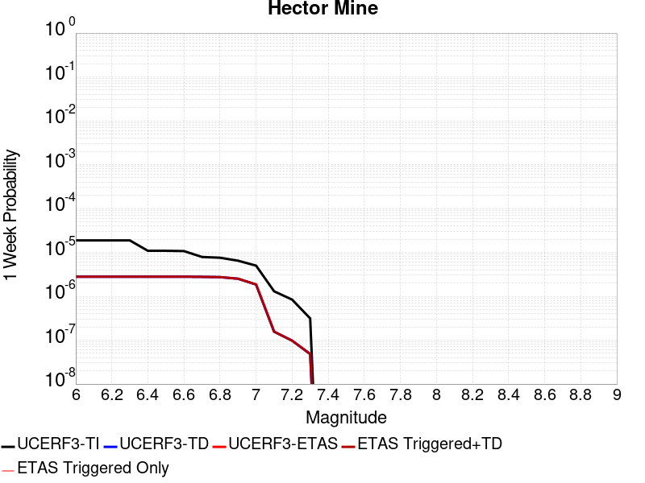 | 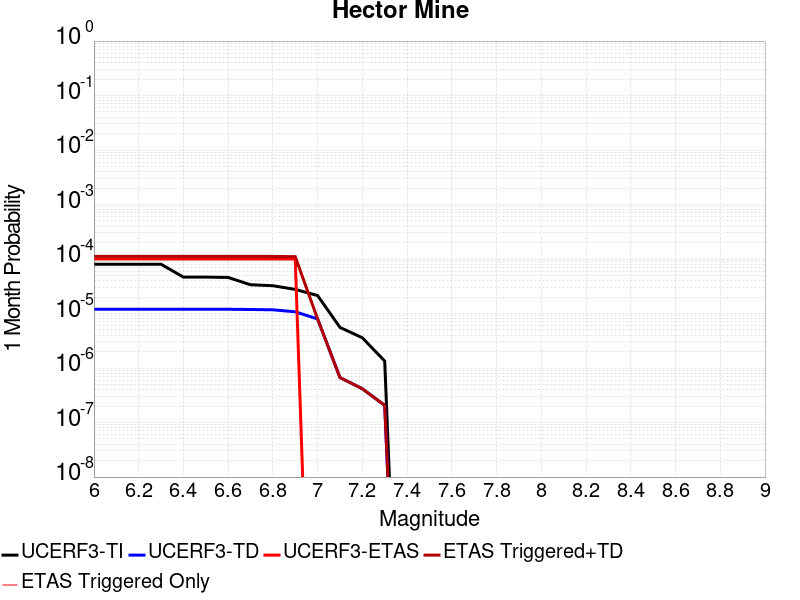 | 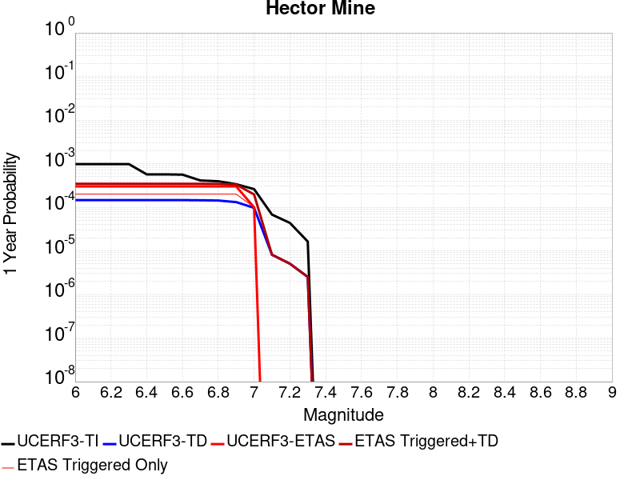 | 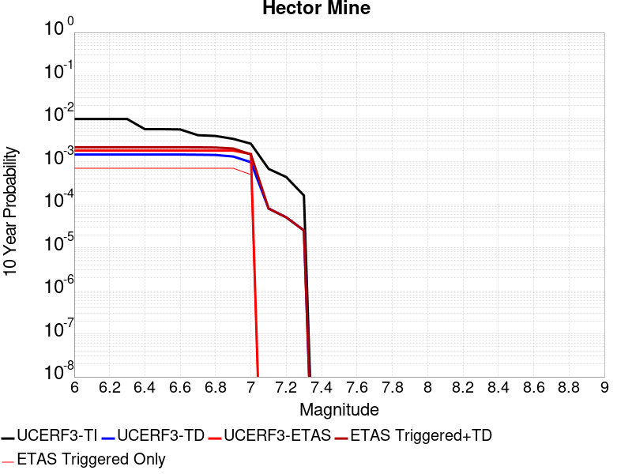 |

| Magnitude | 1 wk TI Prob | 1 wk TD Prob | 1 wk ETAS Prob | 1 wk ETAS/TD Gain | 1 wk ETAS Triggered+TD | 1 wk ETAS Triggered Only | 1 mo TI Prob | 1 mo TD Prob | 1 mo ETAS Prob | 1 mo ETAS/TD Gain | 1 mo ETAS Triggered+TD | 1 mo ETAS Triggered Only | 1 yr TI Prob | 1 yr TD Prob | 1 yr ETAS Prob | 1 yr ETAS/TD Gain | 1 yr ETAS Triggered+TD | 1 yr ETAS Triggered Only | 10 yr TI Prob | 10 yr TD Prob | 10 yr ETAS Prob | 10 yr ETAS/TD Gain | 10 yr ETAS Triggered+TD | 10 yr ETAS Triggered Only |
|-----|-----|-----|-----|-----|-----|-----|-----|-----|-----|-----|-----|-----|-----|-----|-----|-----|-----|-----|-----|-----|-----|-----|-----|-----|
| 6.0 | 1.8760093E-5 | 2.7973506E-6 | 0.0 | 0.0 | 2.7973506E-6 | 0.0 | 8.039792E-5 | 1.1988613E-5 | 1.0E-4 | 8.3412485 | 1.11987414E-4 | 1.0E-4 | 9.78405E-4 | 1.459556E-4 | 3.0E-4 | 2.0554197 | 3.4592638E-4 | 2.0E-4 | 0.009741086 | 0.0014589897 | 0.0018 | 1.2337304 | 0.0021579685 | 7.0E-4 |
| 6.1 | 1.8760093E-5 | 2.7973506E-6 | 0.0 | 0.0 | 2.7973506E-6 | 0.0 | 8.039792E-5 | 1.1988613E-5 | 1.0E-4 | 8.3412485 | 1.11987414E-4 | 1.0E-4 | 9.78405E-4 | 1.459556E-4 | 3.0E-4 | 2.0554197 | 3.4592638E-4 | 2.0E-4 | 0.009741086 | 0.0014589897 | 0.0018 | 1.2337304 | 0.0021579685 | 7.0E-4 |
| 6.2 | 1.8760093E-5 | 2.7973506E-6 | 0.0 | 0.0 | 2.7973506E-6 | 0.0 | 8.039792E-5 | 1.1988613E-5 | 1.0E-4 | 8.3412485 | 1.11987414E-4 | 1.0E-4 | 9.78405E-4 | 1.459556E-4 | 3.0E-4 | 2.0554197 | 3.4592638E-4 | 2.0E-4 | 0.009741086 | 0.0014589897 | 0.0018 | 1.2337304 | 0.0021579685 | 7.0E-4 |
| 6.3 | 1.8760093E-5 | 2.7973506E-6 | 0.0 | 0.0 | 2.7973506E-6 | 0.0 | 8.039792E-5 | 1.1988613E-5 | 1.0E-4 | 8.3412485 | 1.11987414E-4 | 1.0E-4 | 9.78405E-4 | 1.459556E-4 | 3.0E-4 | 2.0554197 | 3.4592638E-4 | 2.0E-4 | 0.009741086 | 0.0014589897 | 0.0018 | 1.2337304 | 0.0021579685 | 7.0E-4 |
| 6.4 | 1.0888055E-5 | 2.7973506E-6 | 0.0 | 0.0 | 2.7973506E-6 | 0.0 | 4.666226E-5 | 1.1988613E-5 | 1.0E-4 | 8.3412485 | 1.11987414E-4 | 1.0E-4 | 5.679649E-4 | 1.459556E-4 | 3.0E-4 | 2.0554197 | 3.4592638E-4 | 2.0E-4 | 0.0056651547 | 0.0014589897 | 0.0018 | 1.2337304 | 0.0021579685 | 7.0E-4 |
| 6.5 | 1.0888055E-5 | 2.7973506E-6 | 0.0 | 0.0 | 2.7973506E-6 | 0.0 | 4.666226E-5 | 1.1988613E-5 | 1.0E-4 | 8.3412485 | 1.11987414E-4 | 1.0E-4 | 5.679649E-4 | 1.459556E-4 | 3.0E-4 | 2.0554197 | 3.4592638E-4 | 2.0E-4 | 0.0056651547 | 0.0014589897 | 0.0018 | 1.2337304 | 0.0021579685 | 7.0E-4 |
| 6.6 | 1.0730738E-5 | 2.7973506E-6 | 0.0 | 0.0 | 2.7973506E-6 | 0.0 | 4.5988065E-5 | 1.1988613E-5 | 1.0E-4 | 8.3412485 | 1.11987414E-4 | 1.0E-4 | 5.5976084E-4 | 1.459556E-4 | 3.0E-4 | 2.0554197 | 3.4592638E-4 | 2.0E-4 | 0.0055835294 | 0.0014589897 | 0.0018 | 1.2337304 | 0.0021579685 | 7.0E-4 |
| 6.7 | 7.881326E-6 | 2.7720182E-6 | 0.0 | 0.0 | 2.7720182E-6 | 0.0 | 3.3776672E-5 | 1.1880047E-5 | 1.0E-4 | 8.417475 | 1.1187886E-4 | 1.0E-4 | 4.111534E-4 | 1.4463397E-4 | 3.0E-4 | 2.0742016 | 3.4460504E-4 | 2.0E-4 | 0.0041039353 | 0.0014457908 | 0.0018 | 1.2449934 | 0.0021447786 | 7.0E-4 |
| 6.8 | 7.5683483E-6 | 2.733725E-6 | 0.0 | 0.0 | 2.733725E-6 | 0.0 | 3.2435375E-5 | 1.1715935E-5 | 1.0E-4 | 8.535383 | 1.1171476E-4 | 1.0E-4 | 3.9482914E-4 | 1.4263617E-4 | 3.0E-4 | 2.1032534 | 3.4260764E-4 | 2.0E-4 | 0.0039412836 | 0.0014258384 | 0.0018 | 1.262415 | 0.0021248404 | 7.0E-4 |
| 6.9 | 6.473048E-6 | 2.51471E-6 | 0.0 | 0.0 | 2.51471E-6 | 0.0 | 2.7741338E-5 | 1.0777308E-5 | 1.0E-4 | 9.278755 | 1.1077623E-4 | 1.0E-4 | 3.3769844E-4 | 1.3120979E-4 | 3.0E-4 | 2.2864149 | 3.3118355E-4 | 2.0E-4 | 0.0033718573 | 0.001311713 | 0.0018 | 1.3722514 | 0.0020107948 | 7.0E-4 |
| 7.0 | 4.9959954E-6 | 1.8571686E-6 | 0.0 | 0.0 | 1.8571686E-6 | 0.0 | 2.1411232E-5 | 7.95929E-6 | 0.0 | 0.0 | 7.95929E-6 | 0.0 | 2.6065056E-4 | 9.690361E-5 | 1.0E-4 | 1.0319532 | 1.9689392E-4 | 1.0E-4 | 0.0026034506 | 9.6896343E-4 | 0.0015 | 1.5480461 | 0.0014684789 | 5.0E-4 |
| 7.1 | 1.2997541E-6 | 1.5610469E-7 | 0.0 | 0.0 | 1.5610469E-7 | 0.0 | 5.5703626E-6 | 6.690199E-7 | 0.0 | 0.0 | 6.690199E-7 | 0.0 | 6.7817055E-5 | 8.145292E-6 | 0.0 | 0.0 | 8.145292E-6 | 0.0 | 6.779636E-4 | 8.145032E-5 | 0.0 | 0.0 | 8.145032E-5 | 0.0 |
| 7.2 | 8.392699E-7 | 9.732559E-8 | 0.0 | 0.0 | 9.732559E-8 | 0.0 | 3.596866E-6 | 4.171096E-7 | 0.0 | 0.0 | 4.171096E-7 | 0.0 | 4.3790962E-5 | 5.0782996E-6 | 0.0 | 0.0 | 5.0782996E-6 | 0.0 | 4.3782333E-4 | 5.0782026E-5 | 0.0 | 0.0 | 5.0782026E-5 | 0.0 |
| 7.3 | 3.13015E-7 | 4.831408E-8 | 0.0 | 0.0 | 4.831408E-8 | 0.0 | 1.3414921E-6 | 2.0706034E-7 | 0.0 | 0.0 | 2.0706034E-7 | 0.0 | 1.6332544E-5 | 2.5209574E-6 | 0.0 | 0.0 | 2.5209574E-6 | 0.0 | 1.6331344E-4 | 2.5209374E-5 | 0.0 | 0.0 | 2.5209374E-5 | 0.0 |

## Reliz 2011 CFM
*[(top)](#table-of-contents)*

| 1 Week | 1 Month | 1 Year | 10 Year |
|-----|-----|-----|-----|
| 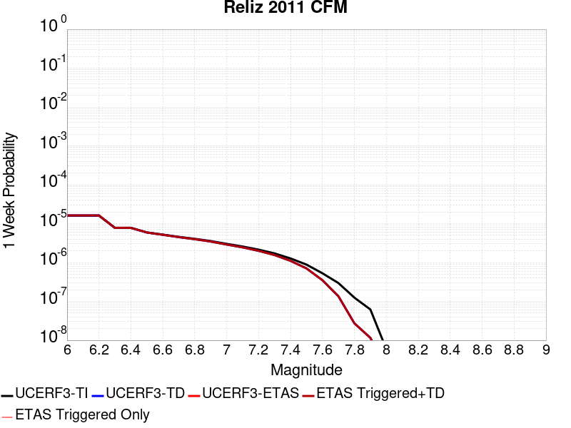 | 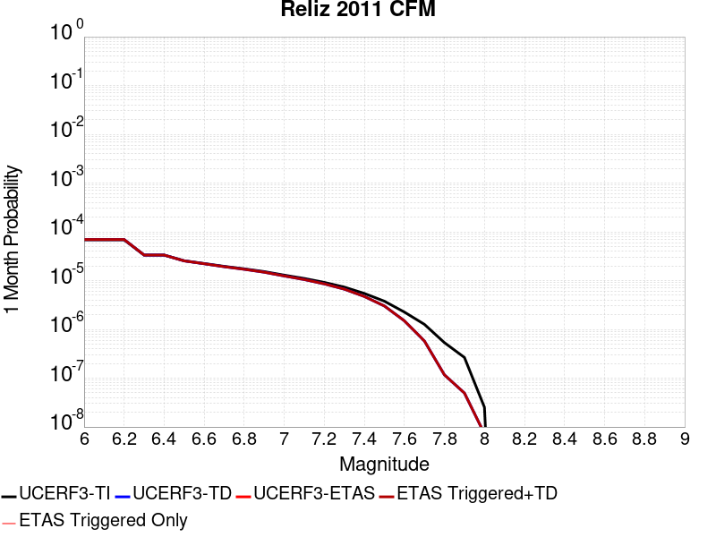 | 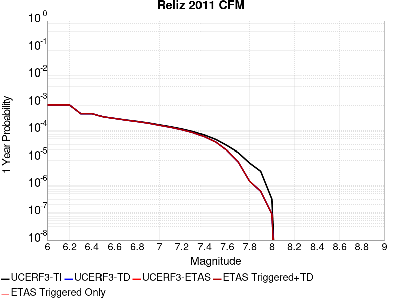 | 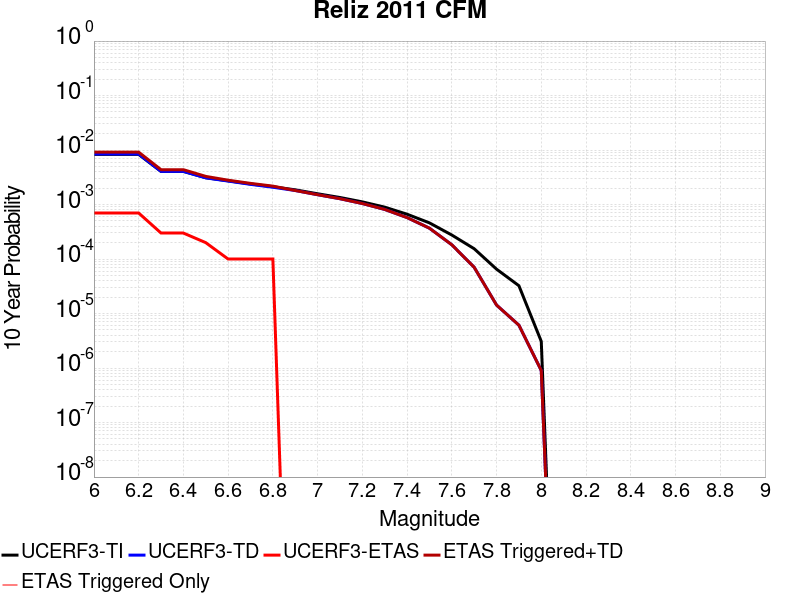 |

| Magnitude | 1 wk TI Prob | 1 wk TD Prob | 1 wk ETAS Prob | 1 wk ETAS/TD Gain | 1 wk ETAS Triggered+TD | 1 wk ETAS Triggered Only | 1 mo TI Prob | 1 mo TD Prob | 1 mo ETAS Prob | 1 mo ETAS/TD Gain | 1 mo ETAS Triggered+TD | 1 mo ETAS Triggered Only | 1 yr TI Prob | 1 yr TD Prob | 1 yr ETAS Prob | 1 yr ETAS/TD Gain | 1 yr ETAS Triggered+TD | 1 yr ETAS Triggered Only | 10 yr TI Prob | 10 yr TD Prob | 10 yr ETAS Prob | 10 yr ETAS/TD Gain | 10 yr ETAS Triggered+TD | 10 yr ETAS Triggered Only |
|-----|-----|-----|-----|-----|-----|-----|-----|-----|-----|-----|-----|-----|-----|-----|-----|-----|-----|-----|-----|-----|-----|-----|-----|-----|
| 6.0 | 1.6002472E-5 | 1.6284277E-5 | 0.0 | 0.0 | 1.6284277E-5 | 0.0 | 6.8580215E-5 | 6.9788E-5 | 0.0 | 0.0 | 6.9788E-5 | 0.0 | 8.3464425E-4 | 8.493576E-4 | 5.0E-4 | 0.5886802 | 8.493576E-4 | 0.0 | 0.008315164 | 0.008463312 | 0.0068 | 0.803468 | 0.009157388 | 7.0E-4 |
| 6.1 | 1.6002472E-5 | 1.6284277E-5 | 0.0 | 0.0 | 1.6284277E-5 | 0.0 | 6.8580215E-5 | 6.9788E-5 | 0.0 | 0.0 | 6.9788E-5 | 0.0 | 8.3464425E-4 | 8.493576E-4 | 5.0E-4 | 0.5886802 | 8.493576E-4 | 0.0 | 0.008315164 | 0.008463312 | 0.0068 | 0.803468 | 0.009157388 | 7.0E-4 |
| 6.2 | 1.6002472E-5 | 1.6284277E-5 | 0.0 | 0.0 | 1.6284277E-5 | 0.0 | 6.8580215E-5 | 6.9788E-5 | 0.0 | 0.0 | 6.9788E-5 | 0.0 | 8.3464425E-4 | 8.493576E-4 | 5.0E-4 | 0.5886802 | 8.493576E-4 | 0.0 | 0.008315164 | 0.008463312 | 0.0068 | 0.803468 | 0.009157388 | 7.0E-4 |
| 6.3 | 7.792404E-6 | 7.804702E-6 | 0.0 | 0.0 | 7.804702E-6 | 0.0 | 3.339559E-5 | 3.3448297E-5 | 0.0 | 0.0 | 3.3448297E-5 | 0.0 | 4.0651546E-4 | 4.071577E-4 | 2.0E-4 | 0.49121016 | 4.071577E-4 | 0.0 | 0.0040577264 | 0.0040643956 | 0.0031 | 0.76272106 | 0.004363176 | 3.0E-4 |
| 6.4 | 7.792404E-6 | 7.804702E-6 | 0.0 | 0.0 | 7.804702E-6 | 0.0 | 3.339559E-5 | 3.3448297E-5 | 0.0 | 0.0 | 3.3448297E-5 | 0.0 | 4.0651546E-4 | 4.071577E-4 | 2.0E-4 | 0.49121016 | 4.071577E-4 | 0.0 | 0.0040577264 | 0.0040643956 | 0.0031 | 0.76272106 | 0.004363176 | 3.0E-4 |
| 6.5 | 5.9659374E-6 | 5.9295353E-6 | 0.0 | 0.0 | 5.9295353E-6 | 0.0 | 2.5568053E-5 | 2.5412048E-5 | 0.0 | 0.0 | 2.5412048E-5 | 0.0 | 3.1124658E-4 | 3.0934796E-4 | 1.0E-4 | 0.32326058 | 3.0934796E-4 | 0.0 | 0.00310811 | 0.0030893928 | 0.0021 | 0.6797452 | 0.003288775 | 2.0E-4 |
| 6.6 | 5.2350692E-6 | 5.179743E-6 | 0.0 | 0.0 | 5.179743E-6 | 0.0 | 2.2435817E-5 | 2.219871E-5 | 0.0 | 0.0 | 2.219871E-5 | 0.0 | 2.7312184E-4 | 2.7023593E-4 | 1.0E-4 | 0.37004703 | 2.7023593E-4 | 0.0 | 0.002727864 | 0.0026992848 | 0.002 | 0.740937 | 0.0027990148 | 1.0E-4 |
| 6.7 | 4.580206E-6 | 4.506839E-6 | 0.0 | 0.0 | 4.506839E-6 | 0.0 | 1.9629308E-5 | 1.9314883E-5 | 0.0 | 0.0 | 1.9314883E-5 | 0.0 | 2.389606E-4 | 2.351334E-4 | 1.0E-4 | 0.4252905 | 2.351334E-4 | 0.0 | 0.002387038 | 0.0023490496 | 0.0019 | 0.8088378 | 0.0024488147 | 1.0E-4 |
| 6.8 | 4.0765017E-6 | 3.988927E-6 | 0.0 | 0.0 | 3.988927E-6 | 0.0 | 1.7470604E-5 | 1.709529E-5 | 0.0 | 0.0 | 1.709529E-5 | 0.0 | 2.1268385E-4 | 2.081153E-4 | 1.0E-4 | 0.48050287 | 2.081153E-4 | 0.0 | 0.002124804 | 0.0020794037 | 0.0019 | 0.91372347 | 0.0021791959 | 1.0E-4 |
| 6.9 | 3.5752896E-6 | 3.4731754E-6 | 0.0 | 0.0 | 3.4731754E-6 | 0.0 | 1.532258E-5 | 1.4884953E-5 | 0.0 | 0.0 | 1.4884953E-5 | 0.0 | 1.8653645E-4 | 1.8120925E-4 | 1.0E-4 | 0.5518482 | 1.8120925E-4 | 0.0 | 0.0018637994 | 0.0018108129 | 0.0017 | 0.9388049 | 0.0018108129 | 0.0 |
| 7.0 | 3.0259848E-6 | 2.9085672E-6 | 0.0 | 0.0 | 2.9085672E-6 | 0.0 | 1.2968442E-5 | 1.2465229E-5 | 0.0 | 0.0 | 1.2465229E-5 | 0.0 | 1.5787935E-4 | 1.517536E-4 | 1.0E-4 | 0.65896297 | 1.517536E-4 | 0.0 | 0.0015776722 | 0.0015166964 | 0.0012 | 0.79119325 | 0.0015166964 | 0.0 |
| 7.1 | 2.5861116E-6 | 2.455765E-6 | 0.0 | 0.0 | 2.455765E-6 | 0.0 | 1.1083288E-5 | 1.0524665E-5 | 0.0 | 0.0 | 1.0524665E-5 | 0.0 | 1.3493067E-4 | 1.2813027E-4 | 1.0E-4 | 0.7804557 | 1.2813027E-4 | 0.0 | 0.0013484878 | 0.0012807602 | 0.001 | 0.78078634 | 0.0012807602 | 0.0 |
| 7.2 | 2.1482588E-6 | 2.0038046E-6 | 0.0 | 0.0 | 2.0038046E-6 | 0.0 | 9.20679E-6 | 8.587706E-6 | 0.0 | 0.0 | 8.587706E-6 | 0.0 | 1.12086906E-4 | 1.0455031E-4 | 1.0E-4 | 0.9564773 | 1.0455031E-4 | 0.0 | 0.0011203039 | 0.001045207 | 6.0E-4 | 0.57404894 | 0.001045207 | 0.0 |
| 7.3 | 1.7194744E-6 | 1.5616633E-6 | 0.0 | 0.0 | 1.5616633E-6 | 0.0 | 7.3691554E-6 | 6.6928255E-6 | 0.0 | 0.0 | 6.6928255E-6 | 0.0 | 8.971577E-5 | 8.148211E-5 | 1.0E-4 | 1.2272633 | 8.148211E-5 | 0.0 | 8.967956E-4 | 8.1471785E-4 | 4.0E-4 | 0.49096754 | 8.1471785E-4 | 0.0 |
| 7.4 | 1.2755178E-6 | 1.1061394E-6 | 0.0 | 0.0 | 1.1061394E-6 | 0.0 | 5.4664933E-6 | 4.740589E-6 | 0.0 | 0.0 | 4.740589E-6 | 0.0 | 6.655252E-5 | 5.7715144E-5 | 0.0 | 0.0 | 5.7715144E-5 | 0.0 | 6.6532596E-4 | 5.771969E-4 | 2.0E-4 | 0.3465022 | 5.771969E-4 | 0.0 |
| 7.5 | 8.8463224E-7 | 7.062861E-7 | 0.0 | 0.0 | 7.062861E-7 | 0.0 | 3.7912755E-6 | 3.0269366E-6 | 0.0 | 0.0 | 3.0269366E-6 | 0.0 | 4.6157802E-5 | 3.6852332E-5 | 0.0 | 0.0 | 3.6852332E-5 | 0.0 | 4.6148215E-4 | 3.6865752E-4 | 0.0 | 0.0 | 3.6865752E-4 | 0.0 |
| 7.6 | 5.291355E-7 | 3.5049925E-7 | 0.0 | 0.0 | 3.5049925E-7 | 0.0 | 2.2677216E-6 | 1.5021387E-6 | 0.0 | 0.0 | 1.5021387E-6 | 0.0 | 2.760916E-5 | 1.8288387E-5 | 0.0 | 0.0 | 1.8288387E-5 | 0.0 | 2.760573E-4 | 1.8306277E-4 | 0.0 | 0.0 | 1.8306277E-4 | 0.0 |
| 7.7 | 2.9663357E-7 | 1.3542666E-7 | 0.0 | 0.0 | 1.3542666E-7 | 0.0 | 1.2712861E-6 | 5.8039984E-7 | 0.0 | 0.0 | 5.8039984E-7 | 0.0 | 1.5477797E-5 | 7.0663455E-6 | 0.0 | 0.0 | 7.0663455E-6 | 0.0 | 1.547672E-4 | 7.084738E-5 | 0.0 | 0.0 | 7.084738E-5 | 0.0 |
| 7.8 | 1.2509386E-7 | 2.733094E-8 | 0.0 | 0.0 | 2.733094E-8 | 0.0 | 5.3611643E-7 | 1.171326E-7 | 0.0 | 0.0 | 1.171326E-7 | 0.0 | 6.527198E-6 | 1.4260884E-6 | 0.0 | 0.0 | 1.4260884E-6 | 0.0 | 6.527006E-5 | 1.4418271E-5 | 0.0 | 0.0 | 1.4418271E-5 | 0.0 |
| 7.9 | 6.213493E-8 | 1.1575836E-8 | 0.0 | 0.0 | 1.1575836E-8 | 0.0 | 2.6629255E-7 | 4.9610726E-8 | 0.0 | 0.0 | 4.9610726E-8 | 0.0 | 3.242107E-6 | 6.0401044E-7 | 0.0 | 0.0 | 6.0401044E-7 | 0.0 | 3.2420594E-5 | 6.172389E-6 | 0.0 | 0.0 | 6.172389E-6 | 0.0 |
| 8.0 | 5.92383E-9 | 1.6883818E-9 | 0.0 | 0.0 | 1.6883818E-9 | 0.0 | 2.5387841E-8 | 7.235922E-9 | 0.0 | 0.0 | 7.235922E-9 | 0.0 | 3.0909692E-7 | 8.809735E-8 | 0.0 | 0.0 | 8.809735E-8 | 0.0 | 3.090965E-6 | 9.0606153E-7 | 0.0 | 0.0 | 9.0606153E-7 | 0.0 |

## Earthquake Valley (No  Extension)
*[(top)](#table-of-contents)*

| 1 Week | 1 Month | 1 Year | 10 Year |
|-----|-----|-----|-----|
| 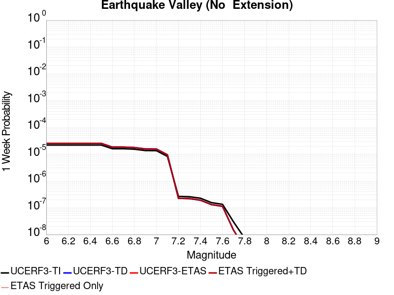 | 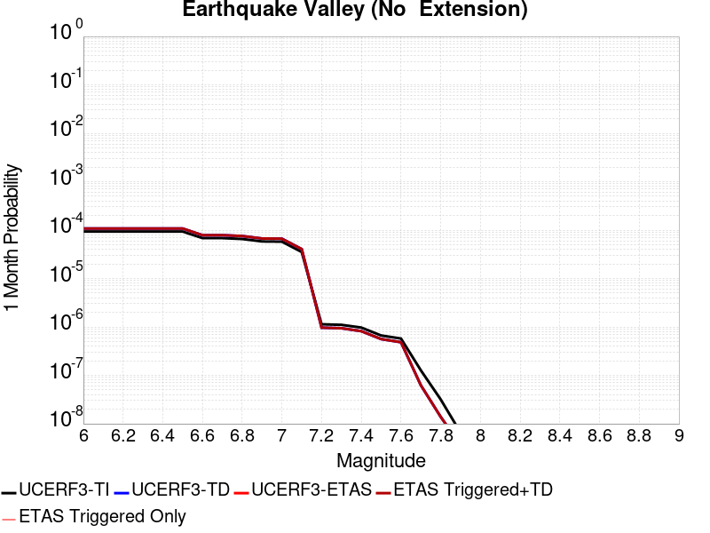 | 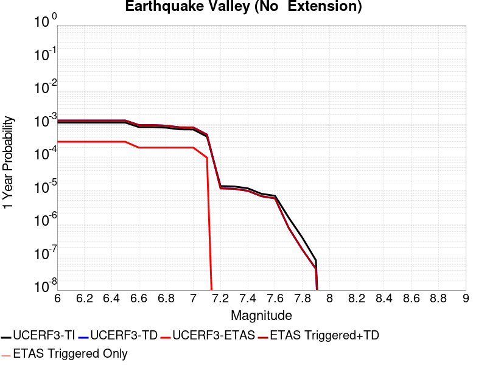 | 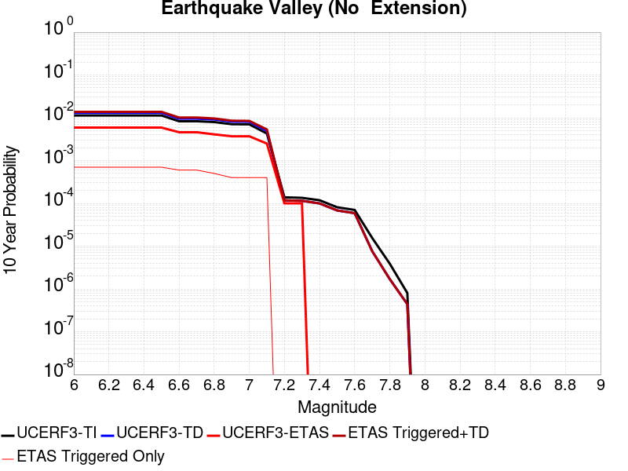 |

| Magnitude | 1 wk TI Prob | 1 wk TD Prob | 1 wk ETAS Prob | 1 wk ETAS/TD Gain | 1 wk ETAS Triggered+TD | 1 wk ETAS Triggered Only | 1 mo TI Prob | 1 mo TD Prob | 1 mo ETAS Prob | 1 mo ETAS/TD Gain | 1 mo ETAS Triggered+TD | 1 mo ETAS Triggered Only | 1 yr TI Prob | 1 yr TD Prob | 1 yr ETAS Prob | 1 yr ETAS/TD Gain | 1 yr ETAS Triggered+TD | 1 yr ETAS Triggered Only | 10 yr TI Prob | 10 yr TD Prob | 10 yr ETAS Prob | 10 yr ETAS/TD Gain | 10 yr ETAS Triggered+TD | 10 yr ETAS Triggered Only |
|-----|-----|-----|-----|-----|-----|-----|-----|-----|-----|-----|-----|-----|-----|-----|-----|-----|-----|-----|-----|-----|-----|-----|-----|-----|
| 6.0 | 2.1859703E-5 | 2.5206498E-5 | 0.0 | 0.0 | 2.5206498E-5 | 0.0 | 9.3681076E-5 | 1.0802419E-4 | 0.0 | 0.0 | 1.0802419E-4 | 0.0 | 0.0011399703 | 0.0013145463 | 3.0E-4 | 0.22821562 | 0.0013145463 | 0.0 | 0.011341401 | 0.013082075 | 0.0059 | 0.4509988 | 0.013772917 | 7.0E-4 |
| 6.1 | 2.1859703E-5 | 2.5206498E-5 | 0.0 | 0.0 | 2.5206498E-5 | 0.0 | 9.3681076E-5 | 1.0802419E-4 | 0.0 | 0.0 | 1.0802419E-4 | 0.0 | 0.0011399703 | 0.0013145463 | 3.0E-4 | 0.22821562 | 0.0013145463 | 0.0 | 0.011341401 | 0.013082075 | 0.0059 | 0.4509988 | 0.013772917 | 7.0E-4 |
| 6.2 | 2.1859703E-5 | 2.5206498E-5 | 0.0 | 0.0 | 2.5206498E-5 | 0.0 | 9.3681076E-5 | 1.0802419E-4 | 0.0 | 0.0 | 1.0802419E-4 | 0.0 | 0.0011399703 | 0.0013145463 | 3.0E-4 | 0.22821562 | 0.0013145463 | 0.0 | 0.011341401 | 0.013082075 | 0.0059 | 0.4509988 | 0.013772917 | 7.0E-4 |
| 6.3 | 2.1859703E-5 | 2.5206498E-5 | 0.0 | 0.0 | 2.5206498E-5 | 0.0 | 9.3681076E-5 | 1.0802419E-4 | 0.0 | 0.0 | 1.0802419E-4 | 0.0 | 0.0011399703 | 0.0013145463 | 3.0E-4 | 0.22821562 | 0.0013145463 | 0.0 | 0.011341401 | 0.013082075 | 0.0059 | 0.4509988 | 0.013772917 | 7.0E-4 |
| 6.4 | 2.1859703E-5 | 2.5206498E-5 | 0.0 | 0.0 | 2.5206498E-5 | 0.0 | 9.3681076E-5 | 1.0802419E-4 | 0.0 | 0.0 | 1.0802419E-4 | 0.0 | 0.0011399703 | 0.0013145463 | 3.0E-4 | 0.22821562 | 0.0013145463 | 0.0 | 0.011341401 | 0.013082075 | 0.0059 | 0.4509988 | 0.013772917 | 7.0E-4 |
| 6.5 | 2.1859703E-5 | 2.5206498E-5 | 0.0 | 0.0 | 2.5206498E-5 | 0.0 | 9.3681076E-5 | 1.0802419E-4 | 0.0 | 0.0 | 1.0802419E-4 | 0.0 | 0.0011399703 | 0.0013145463 | 3.0E-4 | 0.22821562 | 0.0013145463 | 0.0 | 0.011341401 | 0.013082075 | 0.0059 | 0.4509988 | 0.013772917 | 7.0E-4 |
| 6.6 | 1.597E-5 | 1.8362138E-5 | 0.0 | 0.0 | 1.8362138E-5 | 0.0 | 6.8441055E-5 | 7.8692996E-5 | 0.0 | 0.0 | 7.8692996E-5 | 0.0 | 8.329513E-4 | 9.5775345E-4 | 2.0E-4 | 0.20882201 | 9.5775345E-4 | 0.0 | 0.008298361 | 0.009544872 | 0.0046 | 0.4819342 | 0.010139145 | 6.0E-4 |
| 6.7 | 1.597E-5 | 1.8362138E-5 | 0.0 | 0.0 | 1.8362138E-5 | 0.0 | 6.8441055E-5 | 7.8692996E-5 | 0.0 | 0.0 | 7.8692996E-5 | 0.0 | 8.329513E-4 | 9.5775345E-4 | 2.0E-4 | 0.20882201 | 9.5775345E-4 | 0.0 | 0.008298361 | 0.009544872 | 0.0046 | 0.4819342 | 0.010139145 | 6.0E-4 |
| 6.8 | 1.5315149E-5 | 1.760772E-5 | 0.0 | 0.0 | 1.760772E-5 | 0.0 | 6.5634704E-5 | 7.545996E-5 | 0.0 | 0.0 | 7.545996E-5 | 0.0 | 7.988095E-4 | 9.184245E-4 | 2.0E-4 | 0.21776423 | 9.184245E-4 | 0.0 | 0.007959441 | 0.009154834 | 0.0041 | 0.44785082 | 0.0096502565 | 5.0E-4 |
| 6.9 | 1.3634728E-5 | 1.5680867E-5 | 0.0 | 0.0 | 1.5680867E-5 | 0.0 | 5.8433237E-5 | 6.720245E-5 | 0.0 | 0.0 | 6.720245E-5 | 0.0 | 7.1119244E-4 | 8.179648E-4 | 2.0E-4 | 0.2445093 | 8.179648E-4 | 0.0 | 0.007089207 | 0.008157617 | 0.0037 | 0.45356378 | 0.008554354 | 4.0E-4 |
| 7.0 | 1.3496271E-5 | 1.5522854E-5 | 0.0 | 0.0 | 1.5522854E-5 | 0.0 | 5.783988E-5 | 6.652528E-5 | 0.0 | 0.0 | 6.652528E-5 | 0.0 | 7.03973E-4 | 8.097264E-4 | 2.0E-4 | 0.246997 | 8.097264E-4 | 0.0 | 0.007017471 | 0.008075834 | 0.0037 | 0.458157 | 0.008472604 | 4.0E-4 |
| 7.1 | 8.242798E-6 | 9.475722E-6 | 0.0 | 0.0 | 9.475722E-6 | 0.0 | 3.53258E-5 | 4.0609986E-5 | 0.0 | 0.0 | 4.0609986E-5 | 0.0 | 4.300067E-4 | 4.9438153E-4 | 1.0E-4 | 0.20227294 | 4.9438153E-4 | 0.0 | 0.004291756 | 0.004939398 | 0.0025 | 0.50613457 | 0.005337422 | 4.0E-4 |
| 7.2 | 2.6506527E-7 | 2.2569479E-7 | 0.0 | 0.0 | 2.2569479E-7 | 0.0 | 1.1359936E-6 | 9.672631E-7 | 0.0 | 0.0 | 9.672631E-7 | 0.0 | 1.3830633E-5 | 1.1776368E-5 | 0.0 | 0.0 | 1.1776368E-5 | 0.0 | 1.3829772E-4 | 1.1775785E-4 | 1.0E-4 | 0.84920025 | 1.1775785E-4 | 0.0 |
| 7.3 | 2.5810488E-7 | 2.1964487E-7 | 0.0 | 0.0 | 2.1964487E-7 | 0.0 | 1.1061633E-6 | 9.4133486E-7 | 0.0 | 0.0 | 9.4133486E-7 | 0.0 | 1.3467455E-5 | 1.14606955E-5 | 0.0 | 0.0 | 1.14606955E-5 | 0.0 | 1.3466639E-4 | 1.14601455E-4 | 1.0E-4 | 0.87258923 | 1.14601455E-4 | 0.0 |
| 7.4 | 2.2676066E-7 | 1.9119335E-7 | 0.0 | 0.0 | 1.9119335E-7 | 0.0 | 9.71831E-7 | 8.193998E-7 | 0.0 | 0.0 | 8.193998E-7 | 0.0 | 1.1831979E-5 | 9.976151E-6 | 0.0 | 0.0 | 9.976151E-6 | 0.0 | 1.1831349E-4 | 9.9757424E-5 | 0.0 | 0.0 | 9.9757424E-5 | 0.0 |
| 7.5 | 1.5553917E-7 | 1.3119126E-7 | 0.0 | 0.0 | 1.3119126E-7 | 0.0 | 6.6659624E-7 | 5.6224815E-7 | 0.0 | 0.0 | 5.6224815E-7 | 0.0 | 8.115779E-6 | 6.845352E-6 | 0.0 | 0.0 | 6.845352E-6 | 0.0 | 8.115482E-5 | 6.845163E-5 | 0.0 | 0.0 | 6.845163E-5 | 0.0 |
| 7.6 | 1.3448629E-7 | 1.1294585E-7 | 0.0 | 0.0 | 1.1294585E-7 | 0.0 | 5.7636964E-7 | 4.8405354E-7 | 0.0 | 0.0 | 4.8405354E-7 | 0.0 | 7.017278E-6 | 5.8933383E-6 | 0.0 | 0.0 | 5.8933383E-6 | 0.0 | 7.0170565E-5 | 5.8932033E-5 | 0.0 | 0.0 | 5.8932033E-5 | 0.0 |
| 7.7 | 2.9719402E-8 | 1.4592342E-8 | 0.0 | 0.0 | 1.4592342E-8 | 0.0 | 1.2736886E-7 | 6.2538604E-8 | 0.0 | 0.0 | 6.2538604E-8 | 0.0 | 1.5507147E-6 | 7.614073E-7 | 0.0 | 0.0 | 7.614073E-7 | 0.0 | 1.550704E-5 | 7.6140523E-6 | 0.0 | 0.0 | 7.6140523E-6 | 0.0 |
| 7.8 | 7.4390196E-9 | 3.2521985E-9 | 0.0 | 0.0 | 3.2521985E-9 | 0.0 | 3.1881513E-8 | 1.3937994E-8 | 0.0 | 0.0 | 1.3937994E-8 | 0.0 | 3.8815733E-7 | 1.6969507E-7 | 0.0 | 0.0 | 1.6969507E-7 | 0.0 | 3.8815665E-6 | 1.6969497E-6 | 0.0 | 0.0 | 1.6969497E-6 | 0.0 |
| 7.9 | 1.5373532E-9 | 8.444304E-10 | 0.0 | 0.0 | 8.444304E-10 | 0.0 | 6.5886567E-9 | 3.6189878E-9 | 0.0 | 0.0 | 3.6189878E-9 | 0.0 | 8.021689E-8 | 4.4061174E-8 | 0.0 | 0.0 | 4.4061174E-8 | 0.0 | 8.0216864E-7 | 4.4061173E-7 | 0.0 | 0.0 | 4.4061173E-7 | 0.0 |

## Helendale-So Lockhart
*[(top)](#table-of-contents)*

| 1 Week | 1 Month | 1 Year | 10 Year |
|-----|-----|-----|-----|
|  | 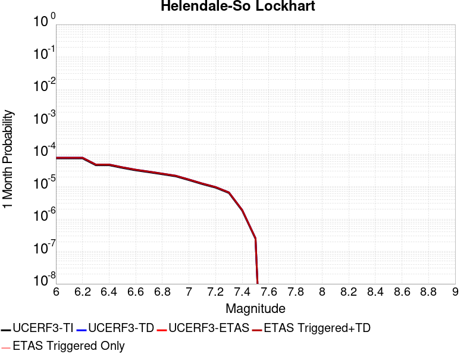 | 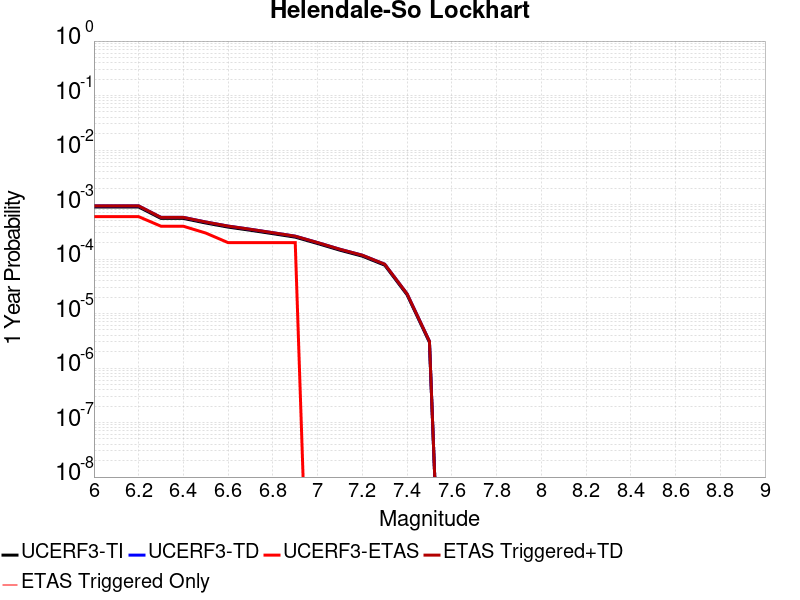 | 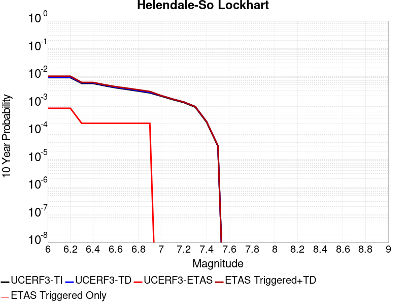 |

| Magnitude | 1 wk TI Prob | 1 wk TD Prob | 1 wk ETAS Prob | 1 wk ETAS/TD Gain | 1 wk ETAS Triggered+TD | 1 wk ETAS Triggered Only | 1 mo TI Prob | 1 mo TD Prob | 1 mo ETAS Prob | 1 mo ETAS/TD Gain | 1 mo ETAS Triggered+TD | 1 mo ETAS Triggered Only | 1 yr TI Prob | 1 yr TD Prob | 1 yr ETAS Prob | 1 yr ETAS/TD Gain | 1 yr ETAS Triggered+TD | 1 yr ETAS Triggered Only | 10 yr TI Prob | 10 yr TD Prob | 10 yr ETAS Prob | 10 yr ETAS/TD Gain | 10 yr ETAS Triggered+TD | 10 yr ETAS Triggered Only |
|-----|-----|-----|-----|-----|-----|-----|-----|-----|-----|-----|-----|-----|-----|-----|-----|-----|-----|-----|-----|-----|-----|-----|-----|-----|
| 6.0 | 1.7296055E-5 | 1.8105475E-5 | 0.0 | 0.0 | 1.8105475E-5 | 0.0 | 7.412385E-5 | 7.75927E-5 | 0.0 | 0.0 | 7.75927E-5 | 0.0 | 9.0208417E-4 | 9.443024E-4 | 6.0E-4 | 0.6353897 | 9.443024E-4 | 0.0 | 0.008984311 | 0.009405019 | 0.0059 | 0.62732464 | 0.010098435 | 7.0E-4 |
| 6.1 | 1.7296055E-5 | 1.8105475E-5 | 0.0 | 0.0 | 1.8105475E-5 | 0.0 | 7.412385E-5 | 7.75927E-5 | 0.0 | 0.0 | 7.75927E-5 | 0.0 | 9.0208417E-4 | 9.443024E-4 | 6.0E-4 | 0.6353897 | 9.443024E-4 | 0.0 | 0.008984311 | 0.009405019 | 0.0059 | 0.62732464 | 0.010098435 | 7.0E-4 |
| 6.2 | 1.7296055E-5 | 1.8105475E-5 | 0.0 | 0.0 | 1.8105475E-5 | 0.0 | 7.412385E-5 | 7.75927E-5 | 0.0 | 0.0 | 7.75927E-5 | 0.0 | 9.0208417E-4 | 9.443024E-4 | 6.0E-4 | 0.6353897 | 9.443024E-4 | 0.0 | 0.008984311 | 0.009405019 | 0.0059 | 0.62732464 | 0.010098435 | 7.0E-4 |
| 6.3 | 1.0669118E-5 | 1.1136428E-5 | 0.0 | 0.0 | 1.1136428E-5 | 0.0 | 4.5723988E-5 | 4.772669E-5 | 0.0 | 0.0 | 4.772669E-5 | 0.0 | 5.5654737E-4 | 5.809204E-4 | 4.0E-4 | 0.6885626 | 5.809204E-4 | 0.0 | 0.0055515557 | 0.005794314 | 0.0034 | 0.5867821 | 0.0059931553 | 2.0E-4 |
| 6.4 | 1.0669118E-5 | 1.1136428E-5 | 0.0 | 0.0 | 1.1136428E-5 | 0.0 | 4.5723988E-5 | 4.772669E-5 | 0.0 | 0.0 | 4.772669E-5 | 0.0 | 5.5654737E-4 | 5.809204E-4 | 4.0E-4 | 0.6885626 | 5.809204E-4 | 0.0 | 0.0055515557 | 0.005794314 | 0.0034 | 0.5867821 | 0.0059931553 | 2.0E-4 |
| 6.5 | 8.790038E-6 | 9.171014E-6 | 0.0 | 0.0 | 9.171014E-6 | 0.0 | 3.767105E-5 | 3.9303766E-5 | 0.0 | 0.0 | 3.9303766E-5 | 0.0 | 4.585485E-4 | 4.7841982E-4 | 3.0E-4 | 0.6270643 | 4.7841982E-4 | 0.0 | 0.0045760344 | 0.0047740634 | 0.0027 | 0.565556 | 0.0049731084 | 2.0E-4 |
| 6.6 | 7.396949E-6 | 7.716222E-6 | 0.0 | 0.0 | 7.716222E-6 | 0.0 | 3.1700827E-5 | 3.306911E-5 | 0.0 | 0.0 | 3.306911E-5 | 0.0 | 3.858892E-4 | 4.0254305E-4 | 2.0E-4 | 0.49684125 | 4.0254305E-4 | 0.0 | 0.003852198 | 0.004018246 | 0.0025 | 0.622162 | 0.004217442 | 2.0E-4 |
| 6.7 | 6.4600285E-6 | 6.738629E-6 | 0.0 | 0.0 | 6.738629E-6 | 0.0 | 2.7685543E-5 | 2.8879524E-5 | 0.0 | 0.0 | 2.8879524E-5 | 0.0 | 3.3701936E-4 | 3.5155224E-4 | 2.0E-4 | 0.5689055 | 3.5155224E-4 | 0.0 | 0.0033650869 | 0.003510043 | 0.0019 | 0.54130393 | 0.003709341 | 2.0E-4 |
| 6.8 | 5.600104E-6 | 5.8365163E-6 | 0.0 | 0.0 | 5.8365163E-6 | 0.0 | 2.4000226E-5 | 2.5013404E-5 | 0.0 | 0.0 | 2.5013404E-5 | 0.0 | 2.9216358E-4 | 3.0449624E-4 | 2.0E-4 | 0.65682256 | 3.0449624E-4 | 0.0 | 0.0029177975 | 0.0030408518 | 0.0017 | 0.5590539 | 0.0032402435 | 2.0E-4 |
| 6.9 | 4.839122E-6 | 5.0399394E-6 | 0.0 | 0.0 | 5.0399394E-6 | 0.0 | 2.0738931E-5 | 2.1599564E-5 | 0.0 | 0.0 | 2.1599564E-5 | 0.0 | 2.5246723E-4 | 2.6294342E-4 | 2.0E-4 | 0.76061994 | 2.6294342E-4 | 0.0 | 0.002521806 | 0.0026263706 | 0.0013 | 0.49497965 | 0.0028258453 | 2.0E-4 |
| 7.0 | 3.6937633E-6 | 3.845533E-6 | 0.0 | 0.0 | 3.845533E-6 | 0.0 | 1.5830317E-5 | 1.6480753E-5 | 0.0 | 0.0 | 1.6480753E-5 | 0.0 | 1.9271708E-4 | 2.00635E-4 | 0.0 | 0.0 | 2.00635E-4 | 0.0 | 0.0019255003 | 0.00200457 | 7.0E-4 | 0.34920207 | 0.00200457 | 0.0 |
| 7.1 | 2.7858857E-6 | 2.8980937E-6 | 0.0 | 0.0 | 2.8980937E-6 | 0.0 | 1.1939455E-5 | 1.2420343E-5 | 0.0 | 0.0 | 1.2420343E-5 | 0.0 | 1.4535317E-4 | 1.5120741E-4 | 0.0 | 0.0 | 1.5120741E-4 | 0.0 | 0.0014525814 | 0.0015110667 | 6.0E-4 | 0.39707047 | 0.0015110667 | 0.0 |
| 7.2 | 2.1672065E-6 | 2.2541988E-6 | 0.0 | 0.0 | 2.2541988E-6 | 0.0 | 9.2879945E-6 | 9.660817E-6 | 0.0 | 0.0 | 9.660817E-6 | 0.0 | 1.1307546E-4 | 1.1761428E-4 | 0.0 | 0.0 | 1.1761428E-4 | 0.0 | 0.0011301794 | 0.0011755385 | 6.0E-4 | 0.51040435 | 0.0011755385 | 0.0 |
| 7.3 | 1.4823496E-6 | 1.5423385E-6 | 0.0 | 0.0 | 1.5423385E-6 | 0.0 | 6.3529114E-6 | 6.610006E-6 | 0.0 | 0.0 | 6.610006E-6 | 0.0 | 7.734395E-5 | 8.0474005E-5 | 0.0 | 0.0 | 8.0474005E-5 | 0.0 | 7.731704E-4 | 8.0446375E-4 | 2.0E-4 | 0.24861282 | 8.0446375E-4 | 0.0 |
| 7.4 | 4.2321457E-7 | 4.4112602E-7 | 0.0 | 0.0 | 4.4112602E-7 | 0.0 | 1.8137755E-6 | 1.8905389E-6 | 0.0 | 0.0 | 1.8905389E-6 | 0.0 | 2.2082493E-5 | 2.3017115E-5 | 0.0 | 0.0 | 2.3017115E-5 | 0.0 | 2.2080299E-4 | 2.3015184E-4 | 0.0 | 0.0 | 2.3015184E-4 | 0.0 |
| 7.5 | 5.6942316E-8 | 5.942096E-8 | 0.0 | 0.0 | 5.942096E-8 | 0.0 | 2.440385E-7 | 2.5466124E-7 | 0.0 | 0.0 | 2.5466124E-7 | 0.0 | 2.9711643E-6 | 3.100497E-6 | 0.0 | 0.0 | 3.100497E-6 | 0.0 | 2.9711247E-5 | 3.1004616E-5 | 0.0 | 0.0 | 3.1004616E-5 | 0.0 |

## Hat Creek-McArthur-Mayfield
*[(top)](#table-of-contents)*

| 1 Week | 1 Month | 1 Year | 10 Year |
|-----|-----|-----|-----|
|  | 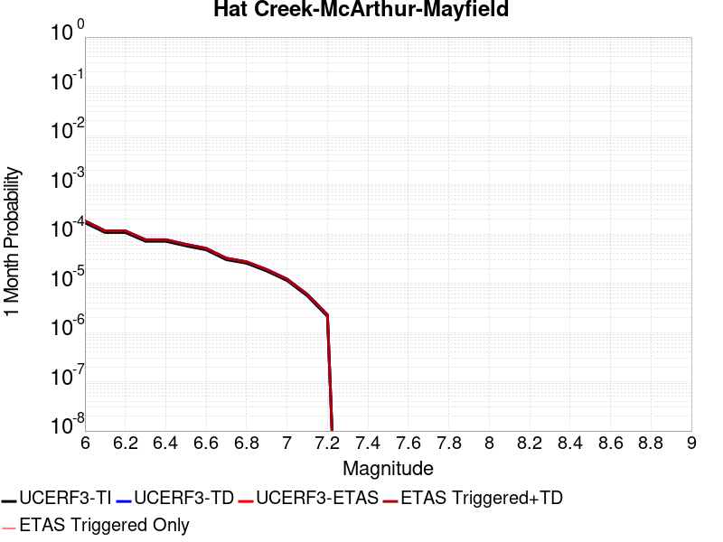 | 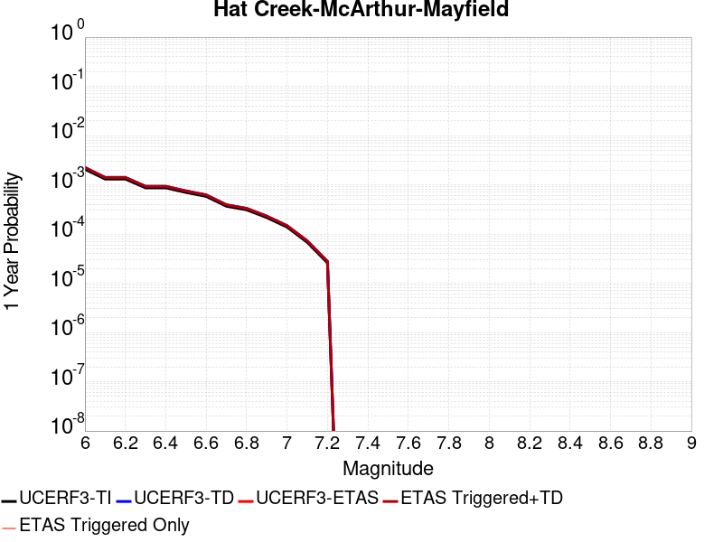 | 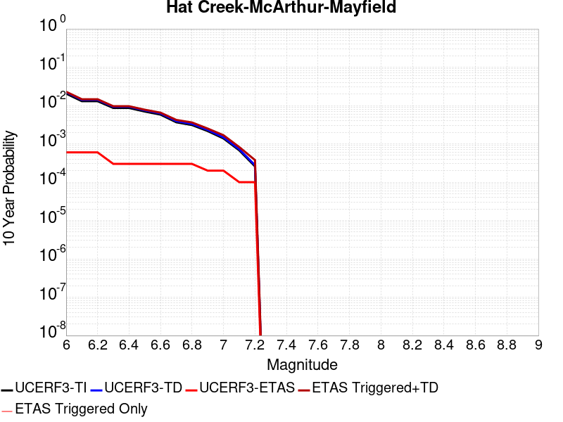 |

| Magnitude | 1 wk TI Prob | 1 wk TD Prob | 1 wk ETAS Prob | 1 wk ETAS/TD Gain | 1 wk ETAS Triggered+TD | 1 wk ETAS Triggered Only | 1 mo TI Prob | 1 mo TD Prob | 1 mo ETAS Prob | 1 mo ETAS/TD Gain | 1 mo ETAS Triggered+TD | 1 mo ETAS Triggered Only | 1 yr TI Prob | 1 yr TD Prob | 1 yr ETAS Prob | 1 yr ETAS/TD Gain | 1 yr ETAS Triggered+TD | 1 yr ETAS Triggered Only | 10 yr TI Prob | 10 yr TD Prob | 10 yr ETAS Prob | 10 yr ETAS/TD Gain | 10 yr ETAS Triggered+TD | 10 yr ETAS Triggered Only |
|-----|-----|-----|-----|-----|-----|-----|-----|-----|-----|-----|-----|-----|-----|-----|-----|-----|-----|-----|-----|-----|-----|-----|-----|-----|
| 6.0 | 3.967457E-5 | 4.316615E-5 | 1.0E-4 | 2.3166301 | 4.316615E-5 | 0.0 | 1.7002279E-4 | 1.8498531E-4 | 2.0E-4 | 1.0811669 | 1.8498531E-4 | 0.0 | 0.002068062 | 0.002249984 | 7.0E-4 | 0.3111133 | 0.002249984 | 0.0 | 0.02048922 | 0.022284403 | 0.0103 | 0.46220666 | 0.022871032 | 6.0E-4 |
| 6.1 | 2.5044013E-5 | 2.707569E-5 | 0.0 | 0.0 | 2.707569E-5 | 0.0 | 1.0732707E-4 | 1.1603369E-4 | 1.0E-4 | 0.8618187 | 1.1603369E-4 | 0.0 | 0.0013059238 | 0.0014118265 | 3.0E-4 | 0.21249071 | 0.0014118265 | 0.0 | 0.01298276 | 0.01403199 | 0.0065 | 0.4632272 | 0.014623571 | 6.0E-4 |
| 6.2 | 2.5044013E-5 | 2.707569E-5 | 0.0 | 0.0 | 2.707569E-5 | 0.0 | 1.0732707E-4 | 1.1603369E-4 | 1.0E-4 | 0.8618187 | 1.1603369E-4 | 0.0 | 0.0013059238 | 0.0014118265 | 3.0E-4 | 0.21249071 | 0.0014118265 | 0.0 | 0.01298276 | 0.01403199 | 0.0065 | 0.4632272 | 0.014623571 | 6.0E-4 |
| 6.3 | 1.6624012E-5 | 1.7893884E-5 | 0.0 | 0.0 | 1.7893884E-5 | 0.0 | 7.124382E-5 | 7.668587E-5 | 1.0E-4 | 1.3040211 | 7.668587E-5 | 0.0 | 8.670483E-4 | 9.3325914E-4 | 3.0E-4 | 0.3214541 | 9.3325914E-4 | 0.0 | 0.008636732 | 0.009294334 | 0.0042 | 0.45188823 | 0.009591546 | 3.0E-4 |
| 6.4 | 1.6624012E-5 | 1.7893884E-5 | 0.0 | 0.0 | 1.7893884E-5 | 0.0 | 7.124382E-5 | 7.668587E-5 | 1.0E-4 | 1.3040211 | 7.668587E-5 | 0.0 | 8.670483E-4 | 9.3325914E-4 | 3.0E-4 | 0.3214541 | 9.3325914E-4 | 0.0 | 0.008636732 | 0.009294334 | 0.0042 | 0.45188823 | 0.009591546 | 3.0E-4 |
| 6.5 | 1.3394842E-5 | 1.4394346E-5 | 0.0 | 0.0 | 1.4394346E-5 | 0.0 | 5.7405203E-5 | 6.168863E-5 | 1.0E-4 | 1.6210443 | 6.168863E-5 | 0.0 | 6.986842E-4 | 7.5080583E-4 | 3.0E-4 | 0.3995707 | 7.5080583E-4 | 0.0 | 0.006964916 | 0.007483285 | 0.0034 | 0.4543459 | 0.00778104 | 3.0E-4 |
| 6.6 | 1.1137514E-5 | 1.1956354E-5 | 0.0 | 0.0 | 1.1956354E-5 | 0.0 | 4.7731326E-5 | 5.124053E-5 | 1.0E-4 | 1.95158 | 5.124053E-5 | 0.0 | 5.809739E-4 | 6.236789E-4 | 2.0E-4 | 0.32067782 | 6.236789E-4 | 0.0 | 0.005794574 | 0.006219708 | 0.0031 | 0.4984157 | 0.006517842 | 3.0E-4 |
| 6.7 | 7.0200663E-6 | 7.5254034E-6 | 0.0 | 0.0 | 7.5254034E-6 | 0.0 | 3.008565E-5 | 3.2251337E-5 | 0.0 | 0.0 | 3.2251337E-5 | 0.0 | 3.6623122E-4 | 3.9259088E-4 | 1.0E-4 | 0.2547181 | 3.9259088E-4 | 0.0 | 0.0036562826 | 0.0039191362 | 0.002 | 0.51031655 | 0.0042179604 | 3.0E-4 |
| 6.8 | 5.940172E-6 | 6.3664156E-6 | 0.0 | 0.0 | 6.3664156E-6 | 0.0 | 2.545763E-5 | 2.7284359E-5 | 0.0 | 0.0 | 2.7284359E-5 | 0.0 | 3.0990256E-4 | 3.3213772E-4 | 0.0 | 0.0 | 3.3213772E-4 | 0.0 | 0.0030947074 | 0.003316542 | 0.0017 | 0.5125821 | 0.003615547 | 3.0E-4 |
| 6.9 | 4.129831E-6 | 4.424195E-6 | 0.0 | 0.0 | 4.424195E-6 | 0.0 | 1.7699154E-5 | 1.8960704E-5 | 0.0 | 0.0 | 1.8960704E-5 | 0.0 | 2.154659E-4 | 2.308229E-4 | 0.0 | 0.0 | 2.308229E-4 | 0.0 | 0.002152571 | 0.0023059098 | 0.0011 | 0.47703514 | 0.0025054486 | 2.0E-4 |
| 7.0 | 2.6512955E-6 | 2.8378104E-6 | 0.0 | 0.0 | 2.8378104E-6 | 0.0 | 1.1362646E-5 | 1.216199E-5 | 0.0 | 0.0 | 1.216199E-5 | 0.0 | 1.3833142E-4 | 1.480626E-4 | 0.0 | 0.0 | 1.480626E-4 | 0.0 | 0.0013824535 | 0.001479682 | 7.0E-4 | 0.4730746 | 0.0016793861 | 2.0E-4 |
| 7.1 | 1.2992575E-6 | 1.3911339E-6 | 0.0 | 0.0 | 1.3911339E-6 | 0.0 | 5.568235E-6 | 5.96199E-6 | 0.0 | 0.0 | 5.96199E-6 | 0.0 | 6.779115E-5 | 7.258503E-5 | 0.0 | 0.0 | 7.258503E-5 | 0.0 | 6.7770475E-4 | 7.2563486E-4 | 4.0E-4 | 0.55124146 | 8.255623E-4 | 1.0E-4 |
| 7.2 | 4.968191E-7 | 5.3279405E-7 | 0.0 | 0.0 | 5.3279405E-7 | 0.0 | 2.1292228E-6 | 2.2834017E-6 | 0.0 | 0.0 | 2.2834017E-6 | 0.0 | 2.592298E-5 | 2.7800188E-5 | 0.0 | 0.0 | 2.7800188E-5 | 0.0 | 2.5919956E-4 | 2.7797944E-4 | 2.0E-4 | 0.7194776 | 3.7795166E-4 | 1.0E-4 |

## Burnt Mtn
*[(top)](#table-of-contents)*

| 1 Week | 1 Month | 1 Year | 10 Year |
|-----|-----|-----|-----|
| 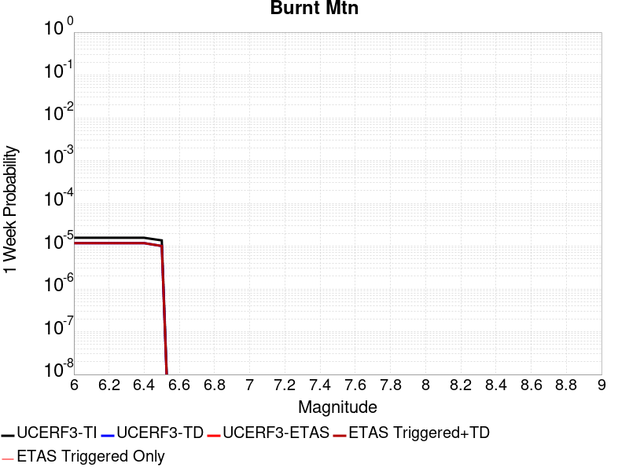 | 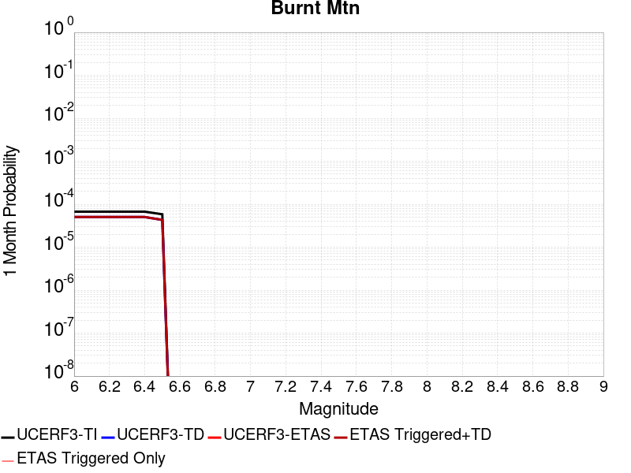 | 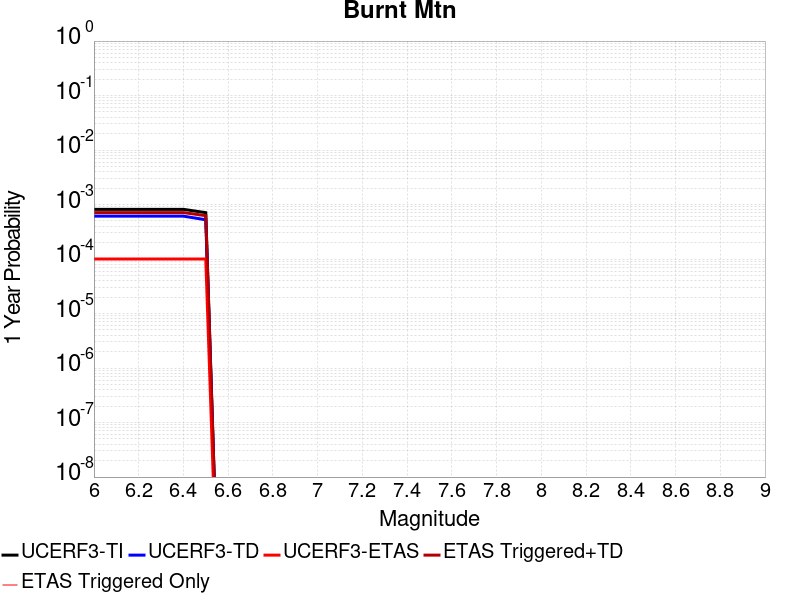 | 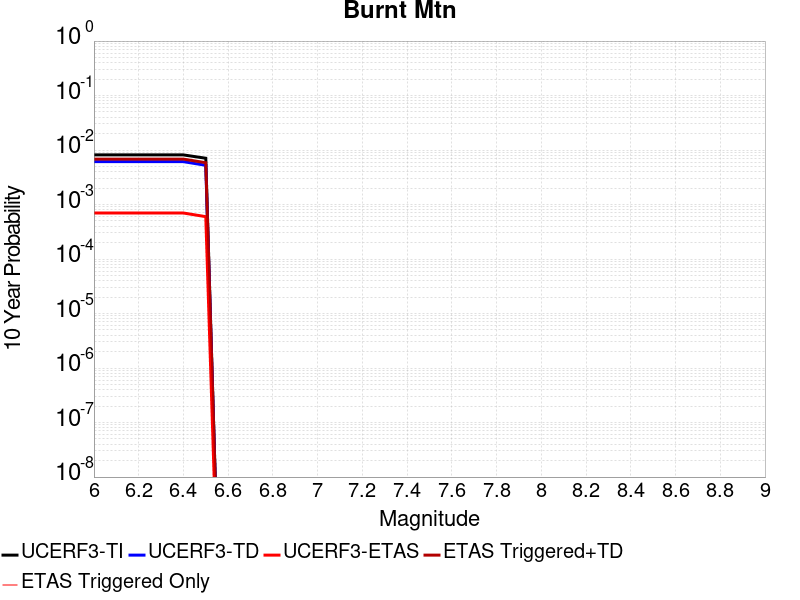 |

| Magnitude | 1 wk TI Prob | 1 wk TD Prob | 1 wk ETAS Prob | 1 wk ETAS/TD Gain | 1 wk ETAS Triggered+TD | 1 wk ETAS Triggered Only | 1 mo TI Prob | 1 mo TD Prob | 1 mo ETAS Prob | 1 mo ETAS/TD Gain | 1 mo ETAS Triggered+TD | 1 mo ETAS Triggered Only | 1 yr TI Prob | 1 yr TD Prob | 1 yr ETAS Prob | 1 yr ETAS/TD Gain | 1 yr ETAS Triggered+TD | 1 yr ETAS Triggered Only | 10 yr TI Prob | 10 yr TD Prob | 10 yr ETAS Prob | 10 yr ETAS/TD Gain | 10 yr ETAS Triggered+TD | 10 yr ETAS Triggered Only |
|-----|-----|-----|-----|-----|-----|-----|-----|-----|-----|-----|-----|-----|-----|-----|-----|-----|-----|-----|-----|-----|-----|-----|-----|-----|
| 6.0 | 1.5673151E-5 | 1.1749558E-5 | 0.0 | 0.0 | 1.1749558E-5 | 0.0 | 6.716892E-5 | 5.0355004E-5 | 0.0 | 0.0 | 5.0355004E-5 | 0.0 | 8.1747473E-4 | 6.1302865E-4 | 3.0E-4 | 0.48937356 | 7.129673E-4 | 1.0E-4 | 0.008144741 | 0.006126016 | 0.0042 | 0.6856005 | 0.006821728 | 7.0E-4 |
| 6.1 | 1.5673151E-5 | 1.1749558E-5 | 0.0 | 0.0 | 1.1749558E-5 | 0.0 | 6.716892E-5 | 5.0355004E-5 | 0.0 | 0.0 | 5.0355004E-5 | 0.0 | 8.1747473E-4 | 6.1302865E-4 | 3.0E-4 | 0.48937356 | 7.129673E-4 | 1.0E-4 | 0.008144741 | 0.006126016 | 0.0042 | 0.6856005 | 0.006821728 | 7.0E-4 |
| 6.2 | 1.5673151E-5 | 1.1749558E-5 | 0.0 | 0.0 | 1.1749558E-5 | 0.0 | 6.716892E-5 | 5.0355004E-5 | 0.0 | 0.0 | 5.0355004E-5 | 0.0 | 8.1747473E-4 | 6.1302865E-4 | 3.0E-4 | 0.48937356 | 7.129673E-4 | 1.0E-4 | 0.008144741 | 0.006126016 | 0.0042 | 0.6856005 | 0.006821728 | 7.0E-4 |
| 6.3 | 1.5673151E-5 | 1.1749558E-5 | 0.0 | 0.0 | 1.1749558E-5 | 0.0 | 6.716892E-5 | 5.0355004E-5 | 0.0 | 0.0 | 5.0355004E-5 | 0.0 | 8.1747473E-4 | 6.1302865E-4 | 3.0E-4 | 0.48937356 | 7.129673E-4 | 1.0E-4 | 0.008144741 | 0.006126016 | 0.0042 | 0.6856005 | 0.006821728 | 7.0E-4 |
| 6.4 | 1.5673151E-5 | 1.1749558E-5 | 0.0 | 0.0 | 1.1749558E-5 | 0.0 | 6.716892E-5 | 5.0355004E-5 | 0.0 | 0.0 | 5.0355004E-5 | 0.0 | 8.1747473E-4 | 6.1302865E-4 | 3.0E-4 | 0.48937356 | 7.129673E-4 | 1.0E-4 | 0.008144741 | 0.006126016 | 0.0042 | 0.6856005 | 0.006821728 | 7.0E-4 |
| 6.5 | 1.36191375E-5 | 1.007816E-5 | 0.0 | 0.0 | 1.007816E-5 | 0.0 | 5.8366426E-5 | 4.319211E-5 | 0.0 | 0.0 | 4.319211E-5 | 0.0 | 7.103795E-4 | 5.2586396E-4 | 3.0E-4 | 0.57048976 | 6.258114E-4 | 1.0E-4 | 0.0070811296 | 0.00525864 | 0.0037 | 0.70360404 | 0.0058554844 | 6.0E-4 |

## Swain Ravine - Spenceville
*[(top)](#table-of-contents)*

| 1 Week | 1 Month | 1 Year | 10 Year |
|-----|-----|-----|-----|
| 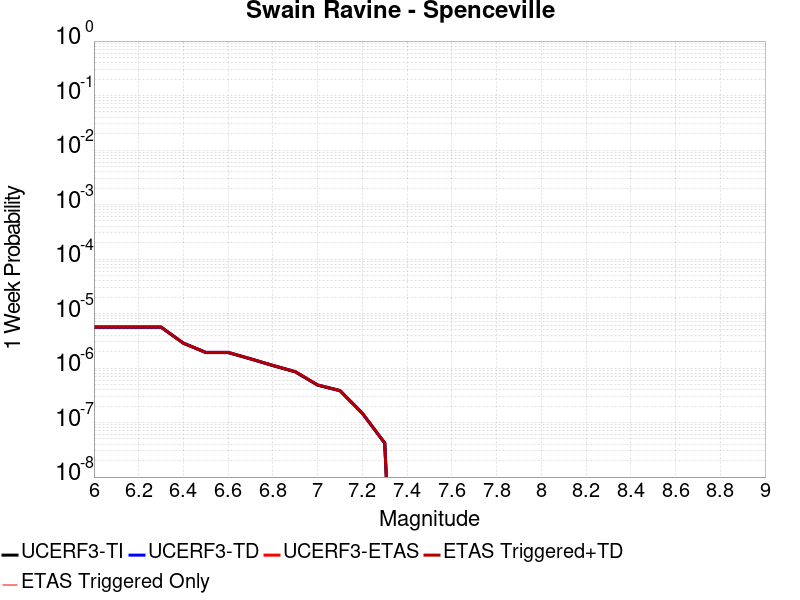 | 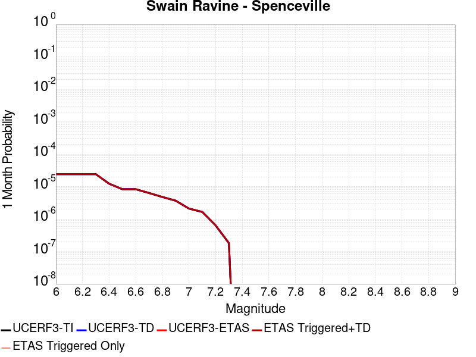 | 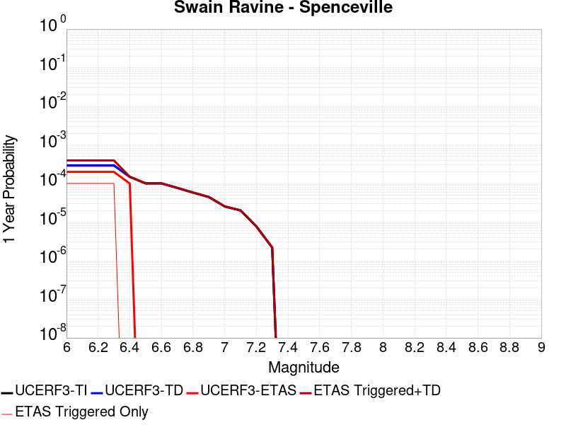 | 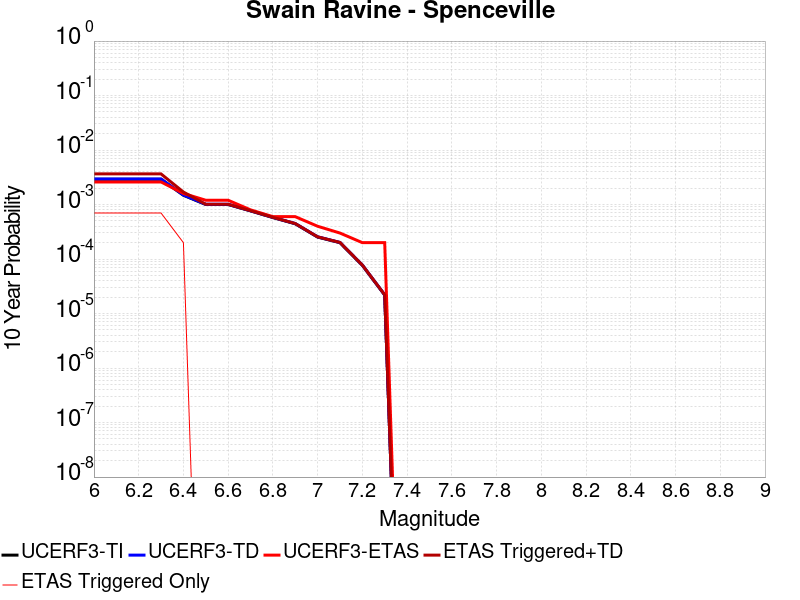 |

| Magnitude | 1 wk TI Prob | 1 wk TD Prob | 1 wk ETAS Prob | 1 wk ETAS/TD Gain | 1 wk ETAS Triggered+TD | 1 wk ETAS Triggered Only | 1 mo TI Prob | 1 mo TD Prob | 1 mo ETAS Prob | 1 mo ETAS/TD Gain | 1 mo ETAS Triggered+TD | 1 mo ETAS Triggered Only | 1 yr TI Prob | 1 yr TD Prob | 1 yr ETAS Prob | 1 yr ETAS/TD Gain | 1 yr ETAS Triggered+TD | 1 yr ETAS Triggered Only | 10 yr TI Prob | 10 yr TD Prob | 10 yr ETAS Prob | 10 yr ETAS/TD Gain | 10 yr ETAS Triggered+TD | 10 yr ETAS Triggered Only |
|-----|-----|-----|-----|-----|-----|-----|-----|-----|-----|-----|-----|-----|-----|-----|-----|-----|-----|-----|-----|-----|-----|-----|-----|-----|
| 6.0 | 5.596169E-6 | 5.663935E-6 | 0.0 | 0.0 | 5.663935E-6 | 0.0 | 2.398336E-5 | 2.4273799E-5 | 0.0 | 0.0 | 2.4273799E-5 | 0.0 | 2.9195828E-4 | 2.9549614E-4 | 2.0E-4 | 0.6768278 | 3.9546657E-4 | 1.0E-4 | 0.00291575 | 0.0029513014 | 0.0026 | 0.8809673 | 0.0036492355 | 7.0E-4 |
| 6.1 | 5.596169E-6 | 5.663935E-6 | 0.0 | 0.0 | 5.663935E-6 | 0.0 | 2.398336E-5 | 2.4273799E-5 | 0.0 | 0.0 | 2.4273799E-5 | 0.0 | 2.9195828E-4 | 2.9549614E-4 | 2.0E-4 | 0.6768278 | 3.9546657E-4 | 1.0E-4 | 0.00291575 | 0.0029513014 | 0.0026 | 0.8809673 | 0.0036492355 | 7.0E-4 |
| 6.2 | 5.596169E-6 | 5.663935E-6 | 0.0 | 0.0 | 5.663935E-6 | 0.0 | 2.398336E-5 | 2.4273799E-5 | 0.0 | 0.0 | 2.4273799E-5 | 0.0 | 2.9195828E-4 | 2.9549614E-4 | 2.0E-4 | 0.6768278 | 3.9546657E-4 | 1.0E-4 | 0.00291575 | 0.0029513014 | 0.0026 | 0.8809673 | 0.0036492355 | 7.0E-4 |
| 6.3 | 5.596169E-6 | 5.663935E-6 | 0.0 | 0.0 | 5.663935E-6 | 0.0 | 2.398336E-5 | 2.4273799E-5 | 0.0 | 0.0 | 2.4273799E-5 | 0.0 | 2.9195828E-4 | 2.9549614E-4 | 2.0E-4 | 0.6768278 | 3.9546657E-4 | 1.0E-4 | 0.00291575 | 0.0029513014 | 0.0026 | 0.8809673 | 0.0036492355 | 7.0E-4 |
| 6.4 | 2.8426775E-6 | 2.8742095E-6 | 0.0 | 0.0 | 2.8742095E-6 | 0.0 | 1.2182847E-5 | 1.2317984E-5 | 0.0 | 0.0 | 1.2317984E-5 | 0.0 | 1.4831607E-4 | 1.4996153E-4 | 1.0E-4 | 0.6668377 | 1.4996153E-4 | 0.0 | 0.0014821711 | 0.0014986418 | 0.0016 | 1.0676334 | 0.001698342 | 2.0E-4 |
| 6.5 | 1.9210793E-6 | 1.941457E-6 | 0.0 | 0.0 | 1.941457E-6 | 0.0 | 8.233172E-6 | 8.320504E-6 | 0.0 | 0.0 | 8.320504E-6 | 0.0 | 1.0023425E-4 | 1.0129757E-4 | 0.0 | 0.0 | 1.0129757E-4 | 0.0 | 0.0010018905 | 0.0010125274 | 0.0012 | 1.1851531 | 0.0010125274 | 0.0 |
| 6.6 | 1.9210793E-6 | 1.941457E-6 | 0.0 | 0.0 | 1.941457E-6 | 0.0 | 8.233172E-6 | 8.320504E-6 | 0.0 | 0.0 | 8.320504E-6 | 0.0 | 1.0023425E-4 | 1.0129757E-4 | 0.0 | 0.0 | 1.0129757E-4 | 0.0 | 0.0010018905 | 0.0010125274 | 0.0012 | 1.1851531 | 0.0010125274 | 0.0 |
| 6.7 | 1.4667394E-6 | 1.4819249E-6 | 0.0 | 0.0 | 1.4819249E-6 | 0.0 | 6.286011E-6 | 6.3510915E-6 | 0.0 | 0.0 | 6.3510915E-6 | 0.0 | 7.65295E-5 | 7.732187E-5 | 0.0 | 0.0 | 7.732187E-5 | 0.0 | 7.6503144E-4 | 7.7295746E-4 | 8.0E-4 | 1.0349859 | 7.7295746E-4 | 0.0 |
| 6.8 | 1.1076943E-6 | 1.1189769E-6 | 0.0 | 0.0 | 1.1189769E-6 | 0.0 | 4.747252E-6 | 4.795607E-6 | 0.0 | 0.0 | 4.795607E-6 | 0.0 | 5.7796264E-5 | 5.838499E-5 | 0.0 | 0.0 | 5.838499E-5 | 0.0 | 5.778124E-4 | 5.8370095E-4 | 6.0E-4 | 1.0279236 | 5.8370095E-4 | 0.0 |
| 6.9 | 8.514296E-7 | 8.6002734E-7 | 0.0 | 0.0 | 8.6002734E-7 | 0.0 | 3.648979E-6 | 3.6858264E-6 | 0.0 | 0.0 | 3.6858264E-6 | 0.0 | 4.442541E-5 | 4.487404E-5 | 0.0 | 0.0 | 4.487404E-5 | 0.0 | 4.441653E-4 | 4.4865266E-4 | 6.0E-4 | 1.3373375 | 4.4865266E-4 | 0.0 |
| 7.0 | 4.8544706E-7 | 4.903402E-7 | 0.0 | 0.0 | 4.903402E-7 | 0.0 | 2.0804857E-6 | 2.1014564E-6 | 0.0 | 0.0 | 2.1014564E-6 | 0.0 | 2.532962E-5 | 2.5584943E-5 | 0.0 | 0.0 | 2.5584943E-5 | 0.0 | 2.5326732E-4 | 2.5582127E-4 | 4.0E-4 | 1.5635916 | 2.5582127E-4 | 0.0 |
| 7.1 | 3.829186E-7 | 3.8679588E-7 | 0.0 | 0.0 | 3.8679588E-7 | 0.0 | 1.6410787E-6 | 1.6576956E-6 | 0.0 | 0.0 | 1.6576956E-6 | 0.0 | 1.997995E-5 | 2.0182268E-5 | 0.0 | 0.0 | 2.0182268E-5 | 0.0 | 1.9978154E-4 | 2.0180541E-4 | 3.0E-4 | 1.4865805 | 2.0180541E-4 | 0.0 |
| 7.2 | 1.4726595E-7 | 1.4879755E-7 | 0.0 | 0.0 | 1.4879755E-7 | 0.0 | 6.3113964E-7 | 6.377037E-7 | 0.0 | 0.0 | 6.377037E-7 | 0.0 | 7.684098E-6 | 7.76402E-6 | 0.0 | 0.0 | 7.76402E-6 | 0.0 | 7.6838325E-5 | 7.7638026E-5 | 2.0E-4 | 2.5760574 | 7.7638026E-5 | 0.0 |
| 7.3 | 4.1880604E-8 | 4.232523E-8 | 0.0 | 0.0 | 4.232523E-8 | 0.0 | 1.7948828E-7 | 1.8139384E-7 | 0.0 | 0.0 | 1.8139384E-7 | 0.0 | 2.1852677E-6 | 2.20847E-6 | 0.0 | 0.0 | 2.20847E-6 | 0.0 | 2.1852462E-5 | 2.20847E-5 | 2.0E-4 | 9.056044 | 2.20847E-5 | 0.0 |

## Oak Ridge (Onshore)
*[(top)](#table-of-contents)*

| 1 Week | 1 Month | 1 Year | 10 Year |
|-----|-----|-----|-----|
| 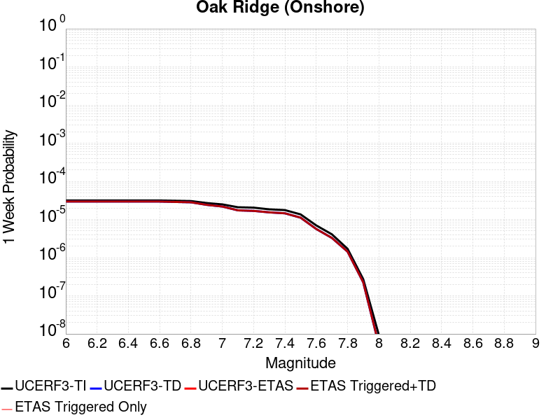 | 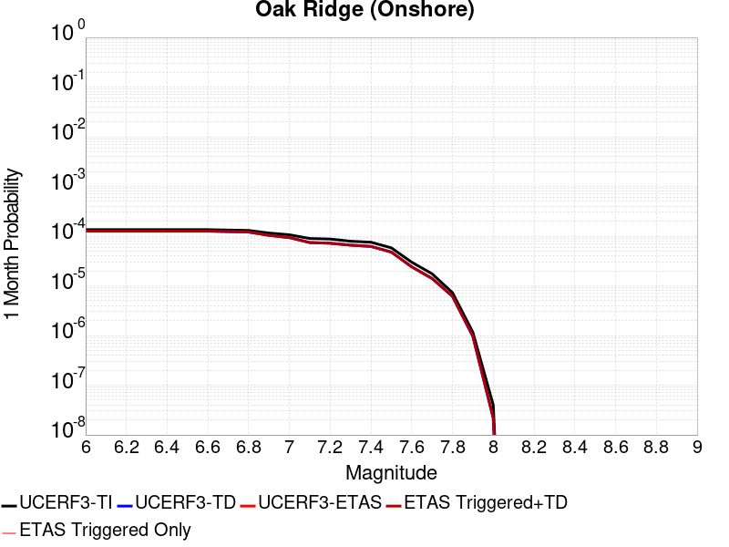 | 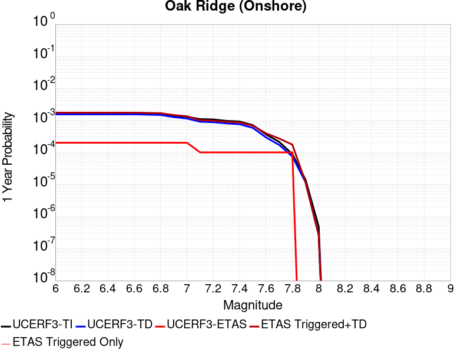 |  |

| Magnitude | 1 wk TI Prob | 1 wk TD Prob | 1 wk ETAS Prob | 1 wk ETAS/TD Gain | 1 wk ETAS Triggered+TD | 1 wk ETAS Triggered Only | 1 mo TI Prob | 1 mo TD Prob | 1 mo ETAS Prob | 1 mo ETAS/TD Gain | 1 mo ETAS Triggered+TD | 1 mo ETAS Triggered Only | 1 yr TI Prob | 1 yr TD Prob | 1 yr ETAS Prob | 1 yr ETAS/TD Gain | 1 yr ETAS Triggered+TD | 1 yr ETAS Triggered Only | 10 yr TI Prob | 10 yr TD Prob | 10 yr ETAS Prob | 10 yr ETAS/TD Gain | 10 yr ETAS Triggered+TD | 10 yr ETAS Triggered Only |
|-----|-----|-----|-----|-----|-----|-----|-----|-----|-----|-----|-----|-----|-----|-----|-----|-----|-----|-----|-----|-----|-----|-----|-----|-----|
| 6.0 | 3.155064E-5 | 2.9535084E-5 | 0.0 | 0.0 | 2.9535084E-5 | 0.0 | 1.3521002E-4 | 1.2657301E-4 | 0.0 | 0.0 | 1.2657301E-4 | 0.0 | 0.001644939 | 0.001539975 | 8.0E-4 | 0.51948893 | 0.001739667 | 2.0E-4 | 0.01632816 | 0.015297462 | 0.0094 | 0.61448103 | 0.015986754 | 7.0E-4 |
| 6.1 | 3.155064E-5 | 2.9535084E-5 | 0.0 | 0.0 | 2.9535084E-5 | 0.0 | 1.3521002E-4 | 1.2657301E-4 | 0.0 | 0.0 | 1.2657301E-4 | 0.0 | 0.001644939 | 0.001539975 | 8.0E-4 | 0.51948893 | 0.001739667 | 2.0E-4 | 0.01632816 | 0.015297462 | 0.0094 | 0.61448103 | 0.015986754 | 7.0E-4 |
| 6.2 | 3.155064E-5 | 2.9535084E-5 | 0.0 | 0.0 | 2.9535084E-5 | 0.0 | 1.3521002E-4 | 1.2657301E-4 | 0.0 | 0.0 | 1.2657301E-4 | 0.0 | 0.001644939 | 0.001539975 | 8.0E-4 | 0.51948893 | 0.001739667 | 2.0E-4 | 0.01632816 | 0.015297462 | 0.0094 | 0.61448103 | 0.015986754 | 7.0E-4 |
| 6.3 | 3.155064E-5 | 2.9535084E-5 | 0.0 | 0.0 | 2.9535084E-5 | 0.0 | 1.3521002E-4 | 1.2657301E-4 | 0.0 | 0.0 | 1.2657301E-4 | 0.0 | 0.001644939 | 0.001539975 | 8.0E-4 | 0.51948893 | 0.001739667 | 2.0E-4 | 0.01632816 | 0.015297462 | 0.0094 | 0.61448103 | 0.015986754 | 7.0E-4 |
| 6.4 | 3.155064E-5 | 2.9535084E-5 | 0.0 | 0.0 | 2.9535084E-5 | 0.0 | 1.3521002E-4 | 1.2657301E-4 | 0.0 | 0.0 | 1.2657301E-4 | 0.0 | 0.001644939 | 0.001539975 | 8.0E-4 | 0.51948893 | 0.001739667 | 2.0E-4 | 0.01632816 | 0.015297462 | 0.0094 | 0.61448103 | 0.015986754 | 7.0E-4 |
| 6.5 | 3.155064E-5 | 2.9535084E-5 | 0.0 | 0.0 | 2.9535084E-5 | 0.0 | 1.3521002E-4 | 1.2657301E-4 | 0.0 | 0.0 | 1.2657301E-4 | 0.0 | 0.001644939 | 0.001539975 | 8.0E-4 | 0.51948893 | 0.001739667 | 2.0E-4 | 0.01632816 | 0.015297462 | 0.0094 | 0.61448103 | 0.015986754 | 7.0E-4 |
| 6.6 | 3.155064E-5 | 2.9535084E-5 | 0.0 | 0.0 | 2.9535084E-5 | 0.0 | 1.3521002E-4 | 1.2657301E-4 | 0.0 | 0.0 | 1.2657301E-4 | 0.0 | 0.001644939 | 0.001539975 | 8.0E-4 | 0.51948893 | 0.001739667 | 2.0E-4 | 0.01632816 | 0.015297462 | 0.0094 | 0.61448103 | 0.015986754 | 7.0E-4 |
| 6.7 | 3.098897E-5 | 2.8873043E-5 | 0.0 | 0.0 | 2.8873043E-5 | 0.0 | 1.328031E-4 | 1.2373595E-4 | 0.0 | 0.0 | 1.2373595E-4 | 0.0 | 0.0016156785 | 0.0015054819 | 8.0E-4 | 0.5313913 | 0.0017051807 | 2.0E-4 | 0.016039822 | 0.014957193 | 0.0091 | 0.6084029 | 0.015646724 | 7.0E-4 |
| 6.8 | 3.0449872E-5 | 2.8248036E-5 | 0.0 | 0.0 | 2.8248036E-5 | 0.0 | 1.3049292E-4 | 1.210576E-4 | 0.0 | 0.0 | 1.210576E-4 | 0.0 | 0.0015875935 | 0.001472917 | 8.0E-4 | 0.5431399 | 0.0016726224 | 2.0E-4 | 0.015762992 | 0.014635838 | 0.0087 | 0.5944313 | 0.015325593 | 7.0E-4 |
| 6.9 | 2.697928E-5 | 2.4227122E-5 | 0.0 | 0.0 | 2.4227122E-5 | 0.0 | 1.15620365E-4 | 1.0382651E-4 | 0.0 | 0.0 | 1.0382651E-4 | 0.0 | 0.0014067689 | 0.0012633763 | 6.0E-4 | 0.47491786 | 0.0014631236 | 2.0E-4 | 0.0139789665 | 0.012564577 | 0.0076 | 0.6048751 | 0.013157038 | 6.0E-4 |
| 7.0 | 2.4893961E-5 | 2.1868673E-5 | 0.0 | 0.0 | 2.1868673E-5 | 0.0 | 1.0668404E-4 | 9.371962E-5 | 0.0 | 0.0 | 9.371962E-5 | 0.0 | 0.0012981043 | 0.0011404568 | 6.0E-4 | 0.526105 | 0.0013402287 | 2.0E-4 | 0.012905477 | 0.011348247 | 0.0067 | 0.59039956 | 0.011941438 | 6.0E-4 |
| 7.1 | 2.0945363E-5 | 1.7359775E-5 | 0.0 | 0.0 | 1.7359775E-5 | 0.0 | 8.976275E-5 | 7.4396936E-5 | 0.0 | 0.0 | 7.4396936E-5 | 0.0 | 0.0010923136 | 9.05411E-4 | 4.0E-4 | 0.4417883 | 0.0010053205 | 1.0E-4 | 0.0108696 | 0.009018077 | 0.0053 | 0.5877085 | 0.009513567 | 5.0E-4 |
| 7.2 | 2.0439404E-5 | 1.681456E-5 | 0.0 | 0.0 | 1.681456E-5 | 0.0 | 8.7594504E-5 | 7.206044E-5 | 0.0 | 0.0 | 7.206044E-5 | 0.0 | 0.0010659413 | 8.7698735E-4 | 3.0E-4 | 0.34208018 | 9.768996E-4 | 1.0E-4 | 0.010608427 | 0.008736103 | 0.005 | 0.5723376 | 0.009231734 | 5.0E-4 |
| 7.3 | 1.8463334E-5 | 1.538516E-5 | 0.0 | 0.0 | 1.538516E-5 | 0.0 | 7.912617E-5 | 6.593476E-5 | 0.0 | 0.0 | 6.593476E-5 | 0.0 | 9.6293533E-4 | 8.024644E-4 | 3.0E-4 | 0.37384838 | 9.023841E-4 | 1.0E-4 | 0.009587734 | 0.007996449 | 0.0046 | 0.57525533 | 0.008492451 | 5.0E-4 |
| 7.4 | 1.763139E-5 | 1.4519812E-5 | 0.0 | 0.0 | 1.4519812E-5 | 0.0 | 7.556091E-5 | 6.22263E-5 | 0.0 | 0.0 | 6.22263E-5 | 0.0 | 9.1956573E-4 | 7.573459E-4 | 3.0E-4 | 0.39612022 | 8.572701E-4 | 1.0E-4 | 0.009157699 | 0.00754837 | 0.0043 | 0.5696594 | 0.008044596 | 5.0E-4 |
| 7.5 | 1.3594944E-5 | 1.1165486E-5 | 0.0 | 0.0 | 1.1165486E-5 | 0.0 | 5.8262744E-5 | 4.785122E-5 | 0.0 | 0.0 | 4.785122E-5 | 0.0 | 7.0911803E-4 | 5.824354E-4 | 3.0E-4 | 0.5150786 | 6.8237714E-4 | 1.0E-4 | 0.007068595 | 0.005809374 | 0.0037 | 0.6369017 | 0.0062070503 | 4.0E-4 |
| 7.6 | 6.9889534E-6 | 5.6375206E-6 | 0.0 | 0.0 | 5.6375206E-6 | 0.0 | 2.9952313E-5 | 2.4160581E-5 | 0.0 | 0.0 | 2.4160581E-5 | 0.0 | 3.646084E-4 | 2.9411577E-4 | 3.0E-4 | 1.0200064 | 3.9408638E-4 | 1.0E-4 | 0.0036401073 | 0.0029373092 | 0.002 | 0.68089527 | 0.003136722 | 2.0E-4 |
| 7.7 | 4.0824193E-6 | 3.2837363E-6 | 0.0 | 0.0 | 3.2837363E-6 | 0.0 | 1.7495966E-5 | 1.407308E-5 | 0.0 | 0.0 | 1.407308E-5 | 0.0 | 2.1299256E-4 | 1.713264E-4 | 2.0E-4 | 1.1673623 | 2.7130928E-4 | 1.0E-4 | 0.0021278851 | 0.0017119567 | 0.0014 | 0.8177777 | 0.0019116143 | 2.0E-4 |
| 7.8 | 1.7023609E-6 | 1.43723E-6 | 0.0 | 0.0 | 1.43723E-6 | 0.0 | 7.295812E-6 | 6.159543E-6 | 0.0 | 0.0 | 6.159543E-6 | 0.0 | 8.882289E-5 | 7.498988E-5 | 2.0E-4 | 2.6670265 | 1.7498239E-4 | 1.0E-4 | 8.8787393E-4 | 7.4964855E-4 | 8.0E-4 | 1.0671667 | 8.495736E-4 | 1.0E-4 |
| 7.9 | 2.721225E-7 | 2.2620588E-7 | 0.0 | 0.0 | 2.2620588E-7 | 0.0 | 1.1662388E-6 | 9.694534E-7 | 0.0 | 0.0 | 9.694534E-7 | 0.0 | 1.4198865E-5 | 1.1803035E-5 | 0.0 | 0.0 | 1.1803035E-5 | 0.0 | 1.4197957E-4 | 1.18024356E-4 | 0.0 | 0.0 | 1.18024356E-4 | 0.0 |
| 8.0 | 9.364255E-9 | 5.124544E-9 | 0.0 | 0.0 | 5.124544E-9 | 0.0 | 4.0132523E-8 | 2.196233E-8 | 0.0 | 0.0 | 2.196233E-8 | 0.0 | 4.8861335E-7 | 2.6739136E-7 | 0.0 | 0.0 | 2.6739136E-7 | 0.0 | 4.8861225E-6 | 2.6739106E-6 | 0.0 | 0.0 | 2.6739106E-6 | 0.0 |

## Cedar Mtn-Mahogany Mtn
*[(top)](#table-of-contents)*

| 1 Week | 1 Month | 1 Year | 10 Year |
|-----|-----|-----|-----|
| 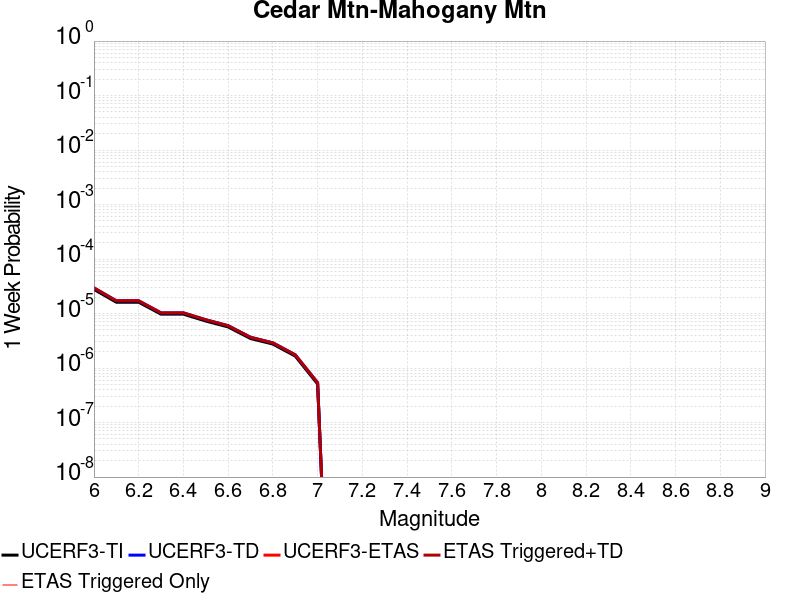 | 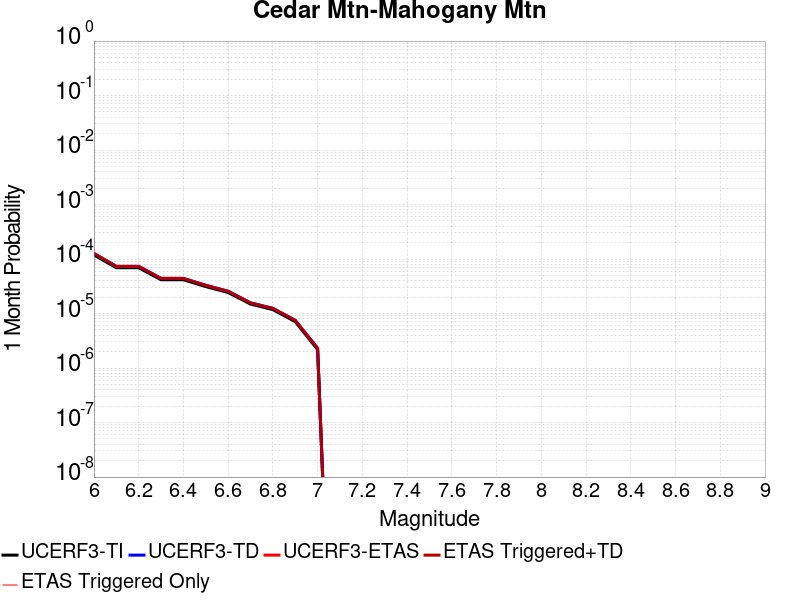 | 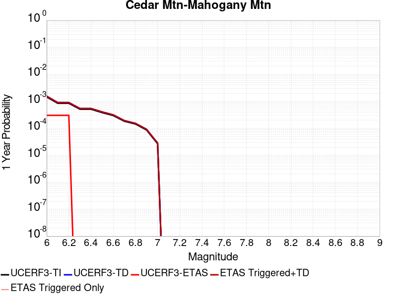 | 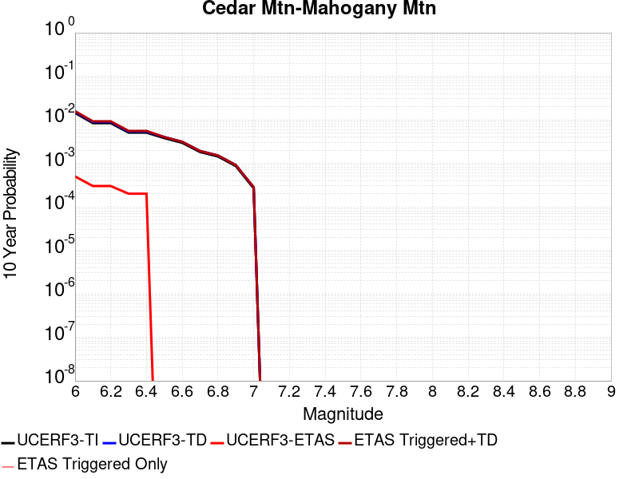 |

| Magnitude | 1 wk TI Prob | 1 wk TD Prob | 1 wk ETAS Prob | 1 wk ETAS/TD Gain | 1 wk ETAS Triggered+TD | 1 wk ETAS Triggered Only | 1 mo TI Prob | 1 mo TD Prob | 1 mo ETAS Prob | 1 mo ETAS/TD Gain | 1 mo ETAS Triggered+TD | 1 mo ETAS Triggered Only | 1 yr TI Prob | 1 yr TD Prob | 1 yr ETAS Prob | 1 yr ETAS/TD Gain | 1 yr ETAS Triggered+TD | 1 yr ETAS Triggered Only | 10 yr TI Prob | 10 yr TD Prob | 10 yr ETAS Prob | 10 yr ETAS/TD Gain | 10 yr ETAS Triggered+TD | 10 yr ETAS Triggered Only |
|-----|-----|-----|-----|-----|-----|-----|-----|-----|-----|-----|-----|-----|-----|-----|-----|-----|-----|-----|-----|-----|-----|-----|-----|-----|
| 6.0 | 2.7763876E-5 | 2.9592878E-5 | 0.0 | 0.0 | 2.9592878E-5 | 0.0 | 1.1898261E-4 | 1.2682086E-4 | 0.0 | 0.0 | 1.2682086E-4 | 0.0 | 0.0014476506 | 0.0015430204 | 3.0E-4 | 0.19442388 | 0.0015430204 | 0.0 | 0.0143825635 | 0.0153302895 | 0.0073 | 0.47618148 | 0.015822625 | 5.0E-4 |
| 6.1 | 1.6162443E-5 | 1.714511E-5 | 0.0 | 0.0 | 1.714511E-5 | 0.0 | 6.926578E-5 | 7.347707E-5 | 0.0 | 0.0 | 7.347707E-5 | 0.0 | 8.4298453E-4 | 8.9423393E-4 | 3.0E-4 | 0.3354827 | 8.9423393E-4 | 0.0 | 0.008397939 | 0.008908168 | 0.0042 | 0.4714774 | 0.009205496 | 3.0E-4 |
| 6.2 | 1.6162443E-5 | 1.714511E-5 | 0.0 | 0.0 | 1.714511E-5 | 0.0 | 6.926578E-5 | 7.347707E-5 | 0.0 | 0.0 | 7.347707E-5 | 0.0 | 8.4298453E-4 | 8.9423393E-4 | 3.0E-4 | 0.3354827 | 8.9423393E-4 | 0.0 | 0.008397939 | 0.008908168 | 0.0042 | 0.4714774 | 0.009205496 | 3.0E-4 |
| 6.3 | 9.746053E-6 | 1.0304366E-5 | 0.0 | 0.0 | 1.0304366E-5 | 0.0 | 4.1768133E-5 | 4.4160843E-5 | 0.0 | 0.0 | 4.4160843E-5 | 0.0 | 5.0840835E-4 | 5.375297E-4 | 0.0 | 0.0 | 5.375297E-4 | 0.0 | 0.0050724675 | 0.005362714 | 0.0023 | 0.42888728 | 0.005561642 | 2.0E-4 |
| 6.4 | 9.746053E-6 | 1.0304366E-5 | 0.0 | 0.0 | 1.0304366E-5 | 0.0 | 4.1768133E-5 | 4.4160843E-5 | 0.0 | 0.0 | 4.4160843E-5 | 0.0 | 5.0840835E-4 | 5.375297E-4 | 0.0 | 0.0 | 5.375297E-4 | 0.0 | 0.0050724675 | 0.005362714 | 0.0023 | 0.42888728 | 0.005561642 | 2.0E-4 |
| 6.5 | 7.290083E-6 | 7.696206E-6 | 0.0 | 0.0 | 7.696206E-6 | 0.0 | 3.124284E-5 | 3.2983335E-5 | 0.0 | 0.0 | 3.2983335E-5 | 0.0 | 3.8031515E-4 | 4.0150026E-4 | 0.0 | 0.0 | 4.0150026E-4 | 0.0 | 0.0037966494 | 0.004007969 | 0.0018 | 0.44910526 | 0.004007969 | 0.0 |
| 6.6 | 5.67907E-6 | 5.989826E-6 | 0.0 | 0.0 | 5.989826E-6 | 0.0 | 2.4338644E-5 | 2.5670439E-5 | 0.0 | 0.0 | 2.5670439E-5 | 0.0 | 2.962827E-4 | 3.124941E-4 | 0.0 | 0.0 | 3.124941E-4 | 0.0 | 0.0029588798 | 0.0031206831 | 0.0011 | 0.3524869 | 0.0031206831 | 0.0 |
| 6.7 | 3.4853963E-6 | 3.6730373E-6 | 0.0 | 0.0 | 3.6730373E-6 | 0.0 | 1.4937327E-5 | 1.5741498E-5 | 0.0 | 0.0 | 1.5741498E-5 | 0.0 | 1.8184677E-4 | 1.916365E-4 | 0.0 | 0.0 | 1.916365E-4 | 0.0 | 0.0018169804 | 0.0019147744 | 6.0E-4 | 0.31335282 | 0.0019147744 | 0.0 |
| 6.8 | 2.7535168E-6 | 2.9018977E-6 | 0.0 | 0.0 | 2.9018977E-6 | 0.0 | 1.1800733E-5 | 1.2436648E-5 | 0.0 | 0.0 | 1.2436648E-5 | 0.0 | 1.4366445E-4 | 1.5140614E-4 | 0.0 | 0.0 | 1.5140614E-4 | 0.0 | 0.0014357162 | 0.0015130772 | 6.0E-4 | 0.3965429 | 0.0015130772 | 0.0 |
| 6.9 | 1.6594106E-6 | 1.7498946E-6 | 0.0 | 0.0 | 1.7498946E-6 | 0.0 | 7.1117406E-6 | 7.4995287E-6 | 0.0 | 0.0 | 7.4995287E-6 | 0.0 | 8.6582E-5 | 9.130324E-5 | 0.0 | 0.0 | 9.130324E-5 | 0.0 | 8.654827E-4 | 9.126878E-4 | 4.0E-4 | 0.43826598 | 9.126878E-4 | 0.0 |
| 7.0 | 5.10215E-7 | 5.389878E-7 | 0.0 | 0.0 | 5.389878E-7 | 0.0 | 2.186634E-6 | 2.3099465E-6 | 0.0 | 0.0 | 2.3099465E-6 | 0.0 | 2.6621943E-5 | 2.8123364E-5 | 0.0 | 0.0 | 2.8123364E-5 | 0.0 | 2.6618753E-4 | 2.812106E-4 | 1.0E-4 | 0.35560536 | 2.812106E-4 | 0.0 |

## Cucamonga
*[(top)](#table-of-contents)*

| 1 Week | 1 Month | 1 Year | 10 Year |
|-----|-----|-----|-----|
| 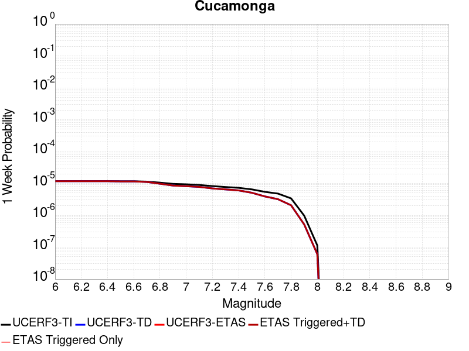 | 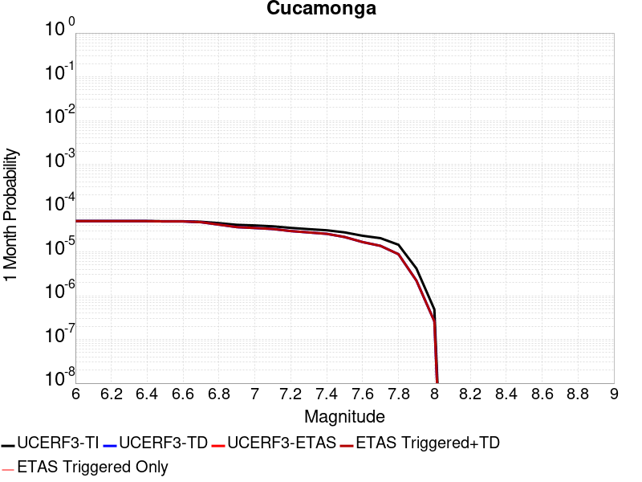 | 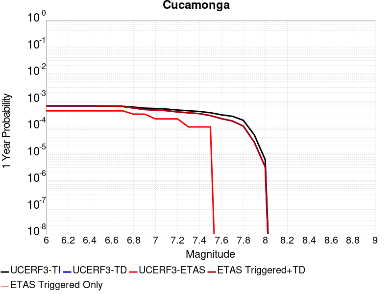 | 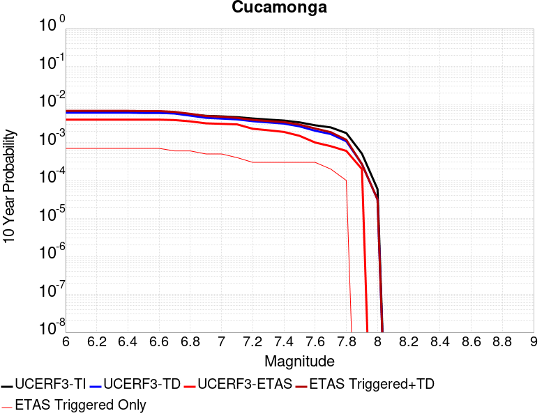 |

| Magnitude | 1 wk TI Prob | 1 wk TD Prob | 1 wk ETAS Prob | 1 wk ETAS/TD Gain | 1 wk ETAS Triggered+TD | 1 wk ETAS Triggered Only | 1 mo TI Prob | 1 mo TD Prob | 1 mo ETAS Prob | 1 mo ETAS/TD Gain | 1 mo ETAS Triggered+TD | 1 mo ETAS Triggered Only | 1 yr TI Prob | 1 yr TD Prob | 1 yr ETAS Prob | 1 yr ETAS/TD Gain | 1 yr ETAS Triggered+TD | 1 yr ETAS Triggered Only | 10 yr TI Prob | 10 yr TD Prob | 10 yr ETAS Prob | 10 yr ETAS/TD Gain | 10 yr ETAS Triggered+TD | 10 yr ETAS Triggered Only |
|-----|-----|-----|-----|-----|-----|-----|-----|-----|-----|-----|-----|-----|-----|-----|-----|-----|-----|-----|-----|-----|-----|-----|-----|-----|
| 6.0 | 1.1848348E-5 | 1.1748194E-5 | 0.0 | 0.0 | 1.1748194E-5 | 0.0 | 5.0777642E-5 | 5.0348448E-5 | 0.0 | 0.0 | 5.0348448E-5 | 0.0 | 6.180424E-4 | 6.1282265E-4 | 4.0E-4 | 0.6527174 | 6.1282265E-4 | 0.0 | 0.0061632637 | 0.0061124405 | 0.004 | 0.6544031 | 0.0068081617 | 7.0E-4 |
| 6.1 | 1.1848348E-5 | 1.1748194E-5 | 0.0 | 0.0 | 1.1748194E-5 | 0.0 | 5.0777642E-5 | 5.0348448E-5 | 0.0 | 0.0 | 5.0348448E-5 | 0.0 | 6.180424E-4 | 6.1282265E-4 | 4.0E-4 | 0.6527174 | 6.1282265E-4 | 0.0 | 0.0061632637 | 0.0061124405 | 0.004 | 0.6544031 | 0.0068081617 | 7.0E-4 |
| 6.2 | 1.1848348E-5 | 1.1748194E-5 | 0.0 | 0.0 | 1.1748194E-5 | 0.0 | 5.0777642E-5 | 5.0348448E-5 | 0.0 | 0.0 | 5.0348448E-5 | 0.0 | 6.180424E-4 | 6.1282265E-4 | 4.0E-4 | 0.6527174 | 6.1282265E-4 | 0.0 | 0.0061632637 | 0.0061124405 | 0.004 | 0.6544031 | 0.0068081617 | 7.0E-4 |
| 6.3 | 1.1848348E-5 | 1.1748194E-5 | 0.0 | 0.0 | 1.1748194E-5 | 0.0 | 5.0777642E-5 | 5.0348448E-5 | 0.0 | 0.0 | 5.0348448E-5 | 0.0 | 6.180424E-4 | 6.1282265E-4 | 4.0E-4 | 0.6527174 | 6.1282265E-4 | 0.0 | 0.0061632637 | 0.0061124405 | 0.004 | 0.6544031 | 0.0068081617 | 7.0E-4 |
| 6.4 | 1.1848348E-5 | 1.1748194E-5 | 0.0 | 0.0 | 1.1748194E-5 | 0.0 | 5.0777642E-5 | 5.0348448E-5 | 0.0 | 0.0 | 5.0348448E-5 | 0.0 | 6.180424E-4 | 6.1282265E-4 | 4.0E-4 | 0.6527174 | 6.1282265E-4 | 0.0 | 0.0061632637 | 0.0061124405 | 0.004 | 0.6544031 | 0.0068081617 | 7.0E-4 |
| 6.5 | 1.16988695E-5 | 1.1587199E-5 | 0.0 | 0.0 | 1.1587199E-5 | 0.0 | 5.013705E-5 | 4.9658494E-5 | 0.0 | 0.0 | 4.9658494E-5 | 0.0 | 6.102476E-4 | 6.044271E-4 | 4.0E-4 | 0.66178364 | 6.044271E-4 | 0.0 | 0.006085745 | 0.0060289423 | 0.004 | 0.66346633 | 0.0067247218 | 7.0E-4 |
| 6.6 | 1.16988695E-5 | 1.1587199E-5 | 0.0 | 0.0 | 1.1587199E-5 | 0.0 | 5.013705E-5 | 4.9658494E-5 | 0.0 | 0.0 | 4.9658494E-5 | 0.0 | 6.102476E-4 | 6.044271E-4 | 4.0E-4 | 0.66178364 | 6.044271E-4 | 0.0 | 0.006085745 | 0.0060289423 | 0.004 | 0.66346633 | 0.0067247218 | 7.0E-4 |
| 6.7 | 1.1397107E-5 | 1.1125831E-5 | 0.0 | 0.0 | 1.1125831E-5 | 0.0 | 4.884383E-5 | 4.768128E-5 | 0.0 | 0.0 | 4.768128E-5 | 0.0 | 5.9451134E-4 | 5.8036746E-4 | 4.0E-4 | 0.6892185 | 5.8036746E-4 | 0.0 | 0.005929234 | 0.005789607 | 0.0039 | 0.6736209 | 0.006386133 | 6.0E-4 |
| 6.8 | 1.058387E-5 | 9.794628E-6 | 0.0 | 0.0 | 9.794628E-6 | 0.0 | 4.5358654E-5 | 4.197631E-5 | 0.0 | 0.0 | 4.197631E-5 | 0.0 | 5.521017E-4 | 5.1094283E-4 | 3.0E-4 | 0.58714986 | 5.1094283E-4 | 0.0 | 0.00550732 | 0.0050986274 | 0.0036 | 0.7060724 | 0.0056955684 | 6.0E-4 |
| 6.9 | 9.690046E-6 | 8.588291E-6 | 0.0 | 0.0 | 8.588291E-6 | 0.0 | 4.1528107E-5 | 3.6806443E-5 | 0.0 | 0.0 | 3.6806443E-5 | 0.0 | 5.054874E-4 | 4.480267E-4 | 3.0E-4 | 0.66960293 | 4.480267E-4 | 0.0 | 0.005043391 | 0.0044721076 | 0.0032 | 0.7155463 | 0.0049698716 | 5.0E-4 |
| 7.0 | 9.381461E-6 | 8.195691E-6 | 0.0 | 0.0 | 8.195691E-6 | 0.0 | 4.020564E-5 | 3.512392E-5 | 0.0 | 0.0 | 3.512392E-5 | 0.0 | 4.893937E-4 | 4.275502E-4 | 2.0E-4 | 0.46778134 | 4.275502E-4 | 0.0 | 0.0048831734 | 0.004268146 | 0.0031 | 0.7263106 | 0.004766012 | 5.0E-4 |
| 7.1 | 8.946492E-6 | 7.790316E-6 | 0.0 | 0.0 | 7.790316E-6 | 0.0 | 3.8341543E-5 | 3.338664E-5 | 0.0 | 0.0 | 3.338664E-5 | 0.0 | 4.667083E-4 | 4.0640685E-4 | 2.0E-4 | 0.49211767 | 4.0640685E-4 | 0.0 | 0.0046572937 | 0.004057508 | 0.003 | 0.73937005 | 0.004455885 | 4.0E-4 |
| 7.2 | 8.251016E-6 | 6.9831717E-6 | 0.0 | 0.0 | 6.9831717E-6 | 0.0 | 3.5361016E-5 | 2.9927536E-5 | 0.0 | 0.0 | 2.9927536E-5 | 0.0 | 4.3043532E-4 | 3.6430708E-4 | 2.0E-4 | 0.5489874 | 3.6430708E-4 | 0.0 | 0.0042960253 | 0.0036379683 | 0.0023 | 0.632221 | 0.003936877 | 3.0E-4 |
| 7.3 | 7.717881E-6 | 6.4940086E-6 | 0.0 | 0.0 | 6.4940086E-6 | 0.0 | 3.3076216E-5 | 2.783117E-5 | 0.0 | 0.0 | 2.783117E-5 | 0.0 | 4.026285E-4 | 3.3879204E-4 | 1.0E-4 | 0.2951663 | 3.3879204E-4 | 0.0 | 0.004018998 | 0.0033836302 | 0.0021 | 0.6206352 | 0.003682615 | 3.0E-4 |
| 7.4 | 7.275623E-6 | 6.039371E-6 | 0.0 | 0.0 | 6.039371E-6 | 0.0 | 3.118087E-5 | 2.5882762E-5 | 0.0 | 0.0 | 2.5882762E-5 | 0.0 | 3.7956095E-4 | 3.1507728E-4 | 1.0E-4 | 0.31738245 | 3.1507728E-4 | 0.0 | 0.0037891332 | 0.0031471802 | 0.0019 | 0.60371506 | 0.003446236 | 3.0E-4 |
| 7.5 | 6.5109502E-6 | 5.107203E-6 | 0.0 | 0.0 | 5.107203E-6 | 0.0 | 2.7903774E-5 | 2.1887829E-5 | 0.0 | 0.0 | 2.1887829E-5 | 0.0 | 3.3967546E-4 | 2.6645188E-4 | 1.0E-4 | 0.37530228 | 2.6645188E-4 | 0.0 | 0.0033915674 | 0.0026621898 | 0.0015 | 0.5634459 | 0.0029613911 | 3.0E-4 |
| 7.6 | 5.4495326E-6 | 3.9144807E-6 | 0.0 | 0.0 | 3.9144807E-6 | 0.0 | 2.335493E-5 | 1.677624E-5 | 0.0 | 0.0 | 1.677624E-5 | 0.0 | 2.8430918E-4 | 2.0423162E-4 | 0.0 | 0.0 | 2.0423162E-4 | 0.0 | 0.0028394572 | 0.0020413029 | 0.001 | 0.4898832 | 0.0023406905 | 3.0E-4 |
| 7.7 | 4.7997164E-6 | 3.2056107E-6 | 0.0 | 0.0 | 3.2056107E-6 | 0.0 | 2.057005E-5 | 1.3738259E-5 | 0.0 | 0.0 | 1.3738259E-5 | 0.0 | 2.504116E-4 | 1.672505E-4 | 0.0 | 0.0 | 1.672505E-4 | 0.0 | 0.002501296 | 0.0016721276 | 8.0E-4 | 0.4784324 | 0.0018717932 | 2.0E-4 |
| 7.8 | 3.3941733E-6 | 2.0668447E-6 | 0.0 | 0.0 | 2.0668447E-6 | 0.0 | 1.4546376E-5 | 8.857876E-6 | 0.0 | 0.0 | 8.857876E-6 | 0.0 | 1.7708774E-4 | 1.0783932E-4 | 0.0 | 0.0 | 1.0783932E-4 | 0.0 | 0.0017694668 | 0.0010782372 | 6.0E-4 | 0.55646384 | 0.0011781293 | 1.0E-4 |
| 7.9 | 9.750552E-7 | 5.162871E-7 | 0.0 | 0.0 | 5.162871E-7 | 0.0 | 4.178801E-6 | 2.2126571E-6 | 0.0 | 0.0 | 2.2126571E-6 | 0.0 | 5.0875715E-5 | 2.6938773E-5 | 0.0 | 0.0 | 2.6938773E-5 | 0.0 | 5.086407E-4 | 2.6935549E-4 | 2.0E-4 | 0.74251324 | 2.6935549E-4 | 0.0 |
| 8.0 | 1.133857E-7 | 6.059009E-8 | 0.0 | 0.0 | 6.059009E-8 | 0.0 | 4.8593864E-7 | 2.596718E-7 | 0.0 | 0.0 | 2.596718E-7 | 0.0 | 5.9162867E-6 | 3.1614995E-6 | 0.0 | 0.0 | 3.1614995E-6 | 0.0 | 5.916129E-5 | 3.1614563E-5 | 0.0 | 0.0 | 3.1614563E-5 | 0.0 |

## Franklin 2011 CFM
*[(top)](#table-of-contents)*

| 1 Week | 1 Month | 1 Year | 10 Year |
|-----|-----|-----|-----|
| 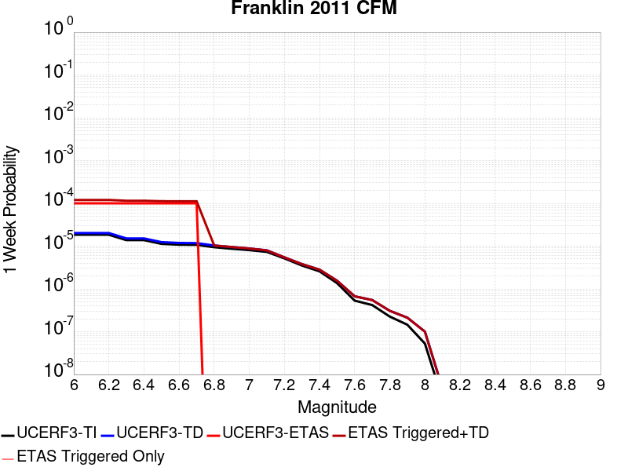 | 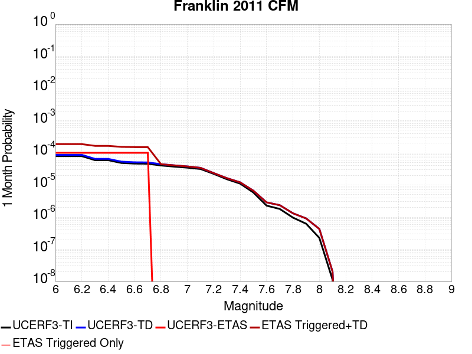 | 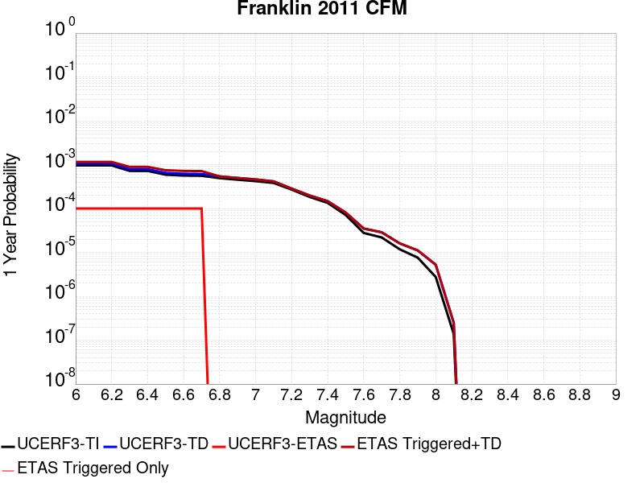 | 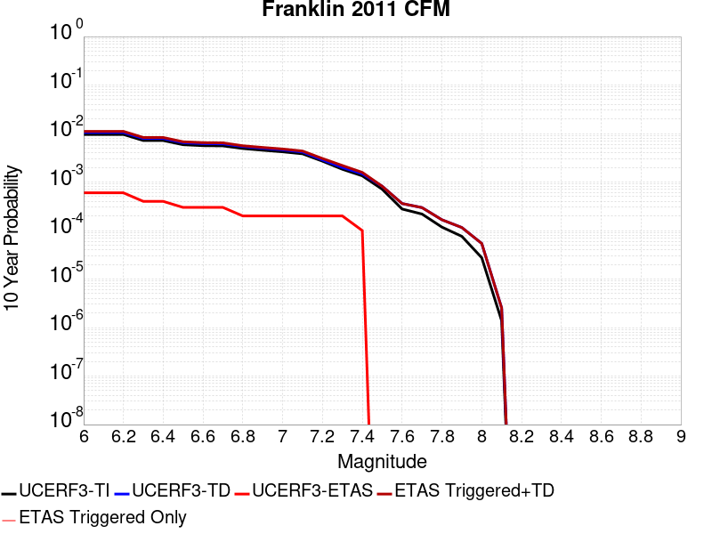 |

| Magnitude | 1 wk TI Prob | 1 wk TD Prob | 1 wk ETAS Prob | 1 wk ETAS/TD Gain | 1 wk ETAS Triggered+TD | 1 wk ETAS Triggered Only | 1 mo TI Prob | 1 mo TD Prob | 1 mo ETAS Prob | 1 mo ETAS/TD Gain | 1 mo ETAS Triggered+TD | 1 mo ETAS Triggered Only | 1 yr TI Prob | 1 yr TD Prob | 1 yr ETAS Prob | 1 yr ETAS/TD Gain | 1 yr ETAS Triggered+TD | 1 yr ETAS Triggered Only | 10 yr TI Prob | 10 yr TD Prob | 10 yr ETAS Prob | 10 yr ETAS/TD Gain | 10 yr ETAS Triggered+TD | 10 yr ETAS Triggered Only |
|-----|-----|-----|-----|-----|-----|-----|-----|-----|-----|-----|-----|-----|-----|-----|-----|-----|-----|-----|-----|-----|-----|-----|-----|-----|
| 6.0 | 1.845602E-5 | 2.0225352E-5 | 1.0E-4 | 4.9442897 | 1.2022333E-4 | 1.0E-4 | 7.9094825E-5 | 8.667737E-5 | 1.0E-4 | 1.1537037 | 1.866687E-4 | 1.0E-4 | 9.6255407E-4 | 0.0010548151 | 8.0E-4 | 0.7584268 | 0.0011547096 | 1.0E-4 | 0.009583955 | 0.010515297 | 0.0061 | 0.5801073 | 0.011108987 | 6.0E-4 |
| 6.1 | 1.845602E-5 | 2.0225352E-5 | 1.0E-4 | 4.9442897 | 1.2022333E-4 | 1.0E-4 | 7.9094825E-5 | 8.667737E-5 | 1.0E-4 | 1.1537037 | 1.866687E-4 | 1.0E-4 | 9.6255407E-4 | 0.0010548151 | 8.0E-4 | 0.7584268 | 0.0011547096 | 1.0E-4 | 0.009583955 | 0.010515297 | 0.0061 | 0.5801073 | 0.011108987 | 6.0E-4 |
| 6.2 | 1.845602E-5 | 2.0225352E-5 | 1.0E-4 | 4.9442897 | 1.2022333E-4 | 1.0E-4 | 7.9094825E-5 | 8.667737E-5 | 1.0E-4 | 1.1537037 | 1.866687E-4 | 1.0E-4 | 9.6255407E-4 | 0.0010548151 | 8.0E-4 | 0.7584268 | 0.0011547096 | 1.0E-4 | 0.009583955 | 0.010515297 | 0.0061 | 0.5801073 | 0.011108987 | 6.0E-4 |
| 6.3 | 1.3813506E-5 | 1.5166628E-5 | 1.0E-4 | 6.5934234 | 1.1516511E-4 | 1.0E-4 | 5.9199396E-5 | 6.499826E-5 | 1.0E-4 | 1.5385027 | 1.6499175E-4 | 1.0E-4 | 7.205143E-4 | 7.910742E-4 | 5.0E-4 | 0.63205194 | 8.909951E-4 | 1.0E-4 | 0.007181826 | 0.007897677 | 0.0044 | 0.5571258 | 0.008294518 | 4.0E-4 |
| 6.4 | 1.3813506E-5 | 1.5166628E-5 | 1.0E-4 | 6.5934234 | 1.1516511E-4 | 1.0E-4 | 5.9199396E-5 | 6.499826E-5 | 1.0E-4 | 1.5385027 | 1.6499175E-4 | 1.0E-4 | 7.205143E-4 | 7.910742E-4 | 5.0E-4 | 0.63205194 | 8.909951E-4 | 1.0E-4 | 0.007181826 | 0.007897677 | 0.0044 | 0.5571258 | 0.008294518 | 4.0E-4 |
| 6.5 | 1.1308949E-5 | 1.2429078E-5 | 1.0E-4 | 8.04565 | 1.12427835E-4 | 1.0E-4 | 4.8466023E-5 | 5.32664E-5 | 1.0E-4 | 1.877356 | 1.5326108E-4 | 1.0E-4 | 5.899141E-4 | 6.483275E-4 | 4.0E-4 | 0.6169721 | 7.482627E-4 | 1.0E-4 | 0.0058835056 | 0.006478901 | 0.0035 | 0.5402151 | 0.0067769573 | 3.0E-4 |
| 6.6 | 1.0813164E-5 | 1.1887198E-5 | 1.0E-4 | 8.412412 | 1.1188601E-4 | 1.0E-4 | 4.6341313E-5 | 5.0944145E-5 | 1.0E-4 | 1.962934 | 1.5093906E-4 | 1.0E-4 | 5.640594E-4 | 6.200704E-4 | 4.0E-4 | 0.6450881 | 7.2000833E-4 | 1.0E-4 | 0.005626298 | 0.0061979266 | 0.0033 | 0.53243613 | 0.006496067 | 3.0E-4 |
| 6.7 | 1.0706348E-5 | 1.1768935E-5 | 1.0E-4 | 8.496945 | 1.1176776E-4 | 1.0E-4 | 4.5883542E-5 | 5.0437327E-5 | 1.0E-4 | 1.9826585 | 1.5043229E-4 | 1.0E-4 | 5.5848894E-4 | 6.1390334E-4 | 4.0E-4 | 0.65156835 | 7.13842E-4 | 1.0E-4 | 0.005570874 | 0.0061365985 | 0.0033 | 0.5377572 | 0.0064347573 | 3.0E-4 |
| 6.8 | 9.443655E-6 | 1.0359919E-5 | 0.0 | 0.0 | 1.0359919E-5 | 0.0 | 4.0472176E-5 | 4.4398905E-5 | 0.0 | 0.0 | 4.4398905E-5 | 0.0 | 4.9263734E-4 | 5.4042396E-4 | 3.0E-4 | 0.55511975 | 5.4042396E-4 | 0.0 | 0.0049154665 | 0.0054055713 | 0.0027 | 0.4994847 | 0.00560449 | 2.0E-4 |
| 6.9 | 8.7001645E-6 | 9.532798E-6 | 0.0 | 0.0 | 9.532798E-6 | 0.0 | 3.728589E-5 | 4.0854215E-5 | 0.0 | 0.0 | 4.0854215E-5 | 0.0 | 4.538611E-4 | 4.972878E-4 | 2.0E-4 | 0.40218163 | 4.972878E-4 | 0.0 | 0.0045293528 | 0.00497621 | 0.0024 | 0.48229474 | 0.005175215 | 2.0E-4 |
| 7.0 | 8.074731E-6 | 8.826216E-6 | 0.0 | 0.0 | 8.826216E-6 | 0.0 | 3.460553E-5 | 3.7826096E-5 | 0.0 | 0.0 | 3.7826096E-5 | 0.0 | 4.212409E-4 | 4.604365E-4 | 2.0E-4 | 0.43437043 | 4.604365E-4 | 0.0 | 0.004204433 | 0.0046092747 | 0.0024 | 0.5206893 | 0.004808353 | 2.0E-4 |
| 7.1 | 7.3370957E-6 | 7.971731E-6 | 0.0 | 0.0 | 7.971731E-6 | 0.0 | 3.1444317E-5 | 3.416412E-5 | 0.0 | 0.0 | 3.416412E-5 | 0.0 | 3.8276732E-4 | 4.1586978E-4 | 2.0E-4 | 0.48091978 | 4.1586978E-4 | 0.0 | 0.0038210868 | 0.0041652173 | 0.0022 | 0.52818376 | 0.004364384 | 2.0E-4 |
| 7.2 | 5.1750103E-6 | 5.466426E-6 | 0.0 | 0.0 | 5.466426E-6 | 0.0 | 2.2178427E-5 | 2.342733E-5 | 0.0 | 0.0 | 2.342733E-5 | 0.0 | 2.699889E-4 | 2.8519073E-4 | 1.0E-4 | 0.35064253 | 2.8519073E-4 | 0.0 | 0.002696611 | 0.002862118 | 0.0018 | 0.6289049 | 0.0030615455 | 2.0E-4 |
| 7.3 | 3.5221371E-6 | 3.8044461E-6 | 0.0 | 0.0 | 3.8044461E-6 | 0.0 | 1.5094786E-5 | 1.6304668E-5 | 0.0 | 0.0 | 1.6304668E-5 | 0.0 | 1.8376352E-4 | 1.9849134E-4 | 1.0E-4 | 0.5038003 | 1.9849134E-4 | 0.0 | 0.0018361164 | 0.0019965693 | 0.0015 | 0.7512887 | 0.0021961702 | 2.0E-4 |
| 7.4 | 2.5749775E-6 | 2.82548E-6 | 0.0 | 0.0 | 2.82548E-6 | 0.0 | 1.1035571E-5 | 1.2109143E-5 | 0.0 | 0.0 | 1.2109143E-5 | 0.0 | 1.343498E-4 | 1.4741892E-4 | 1.0E-4 | 0.678339 | 1.4741892E-4 | 0.0 | 0.001342686 | 0.0014856464 | 0.0013 | 0.87504 | 0.0015854979 | 1.0E-4 |
| 7.5 | 1.3642131E-6 | 1.5555191E-6 | 0.0 | 0.0 | 1.5555191E-6 | 0.0 | 5.8466144E-6 | 6.6664934E-6 | 0.0 | 0.0 | 6.6664934E-6 | 0.0 | 7.1180206E-5 | 8.1161554E-5 | 0.0 | 0.0 | 8.1161554E-5 | 0.0 | 7.115741E-4 | 8.2238E-4 | 9.0E-4 | 1.0943846 | 8.2238E-4 | 0.0 |
| 7.6 | 5.329124E-7 | 6.753243E-7 | 0.0 | 0.0 | 6.753243E-7 | 0.0 | 2.2839083E-6 | 2.8942438E-6 | 0.0 | 0.0 | 2.8942438E-6 | 0.0 | 2.7806227E-5 | 3.5236855E-5 | 0.0 | 0.0 | 3.5236855E-5 | 0.0 | 2.780275E-4 | 3.62685E-4 | 5.0E-4 | 1.3786068 | 3.62685E-4 | 0.0 |
| 7.7 | 4.199127E-7 | 5.5358174E-7 | 0.0 | 0.0 | 5.5358174E-7 | 0.0 | 1.7996247E-6 | 2.3724908E-6 | 0.0 | 0.0 | 2.3724908E-6 | 0.0 | 2.191021E-5 | 2.8884699E-5 | 0.0 | 0.0 | 2.8884699E-5 | 0.0 | 2.190805E-4 | 2.9899774E-4 | 5.0E-4 | 1.6722535 | 2.9899774E-4 | 0.0 |
| 7.8 | 2.2586491E-7 | 3.0939105E-7 | 0.0 | 0.0 | 3.0939105E-7 | 0.0 | 9.67992E-7 | 1.325961E-6 | 0.0 | 0.0 | 1.325961E-6 | 0.0 | 1.178524E-5 | 1.6143455E-5 | 0.0 | 0.0 | 1.6143455E-5 | 0.0 | 1.17846146E-4 | 1.67728E-4 | 3.0E-4 | 1.7886102 | 1.67728E-4 | 0.0 |
| 7.9 | 1.4568845E-7 | 2.1393997E-7 | 0.0 | 0.0 | 2.1393997E-7 | 0.0 | 6.243789E-7 | 9.1688526E-7 | 0.0 | 0.0 | 9.1688526E-7 | 0.0 | 7.601787E-6 | 1.1163022E-5 | 0.0 | 0.0 | 1.1163022E-5 | 0.0 | 7.601527E-5 | 1.1606954E-4 | 2.0E-4 | 1.723105 | 1.1606954E-4 | 0.0 |
| 8.0 | 5.2868224E-8 | 1.0080933E-7 | 0.0 | 0.0 | 1.0080933E-7 | 0.0 | 2.2657808E-7 | 4.320399E-7 | 0.0 | 0.0 | 4.320399E-7 | 0.0 | 2.7585847E-6 | 5.2600735E-6 | 0.0 | 0.0 | 5.2600735E-6 | 0.0 | 2.7585504E-5 | 5.444142E-5 | 0.0 | 0.0 | 5.444142E-5 | 0.0 |
| 8.1 | 2.654434E-9 | 4.7562523E-9 | 0.0 | 0.0 | 4.7562523E-9 | 0.0 | 1.1376145E-8 | 2.0383942E-8 | 0.0 | 0.0 | 2.0383942E-8 | 0.0 | 1.3850456E-7 | 2.4817447E-7 | 0.0 | 0.0 | 2.4817447E-7 | 0.0 | 1.3850448E-6 | 2.5510121E-6 | 0.0 | 0.0 | 2.5510121E-6 | 0.0 |

## Scodie Lineament
*[(top)](#table-of-contents)*

| 1 Week | 1 Month | 1 Year | 10 Year |
|-----|-----|-----|-----|
| 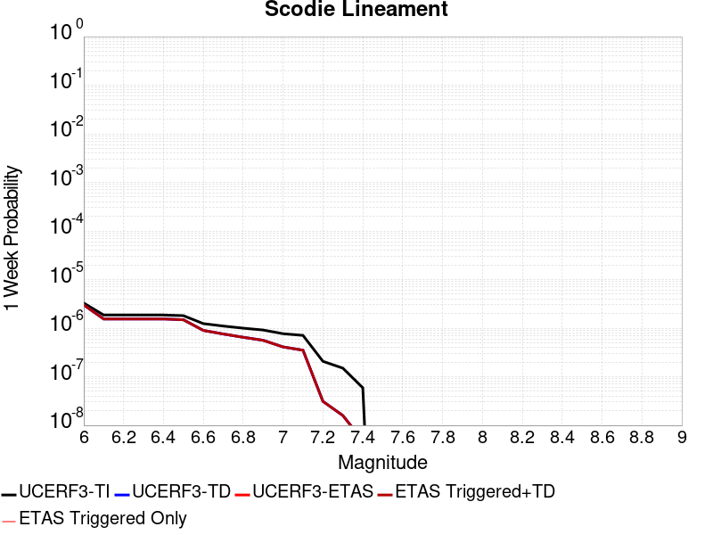 |  | 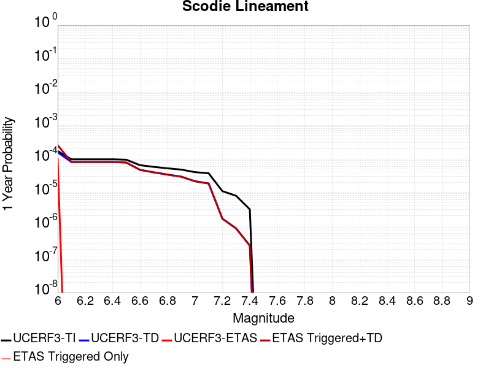 | 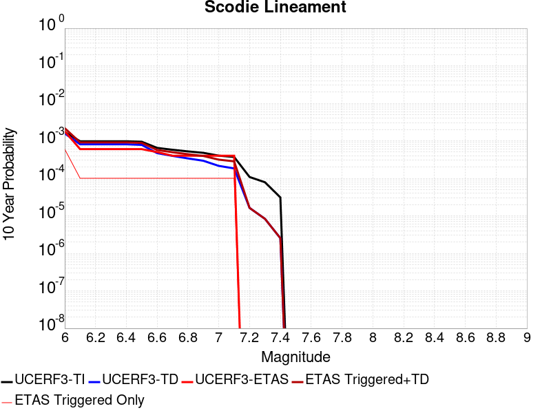 |

| Magnitude | 1 wk TI Prob | 1 wk TD Prob | 1 wk ETAS Prob | 1 wk ETAS/TD Gain | 1 wk ETAS Triggered+TD | 1 wk ETAS Triggered Only | 1 mo TI Prob | 1 mo TD Prob | 1 mo ETAS Prob | 1 mo ETAS/TD Gain | 1 mo ETAS Triggered+TD | 1 mo ETAS Triggered Only | 1 yr TI Prob | 1 yr TD Prob | 1 yr ETAS Prob | 1 yr ETAS/TD Gain | 1 yr ETAS Triggered+TD | 1 yr ETAS Triggered Only | 10 yr TI Prob | 10 yr TD Prob | 10 yr ETAS Prob | 10 yr ETAS/TD Gain | 10 yr ETAS Triggered+TD | 10 yr ETAS Triggered Only |
|-----|-----|-----|-----|-----|-----|-----|-----|-----|-----|-----|-----|-----|-----|-----|-----|-----|-----|-----|-----|-----|-----|-----|-----|-----|
| 6.0 | 3.2919327E-6 | 3.0135513E-6 | 0.0 | 0.0 | 3.0135513E-6 | 0.0 | 1.4108206E-5 | 1.2915174E-5 | 0.0 | 0.0 | 1.2915174E-5 | 0.0 | 1.7175387E-4 | 1.5723407E-4 | 3.0E-4 | 1.9079833 | 2.5721834E-4 | 1.0E-4 | 0.0017162118 | 0.0015715399 | 0.0018 | 1.1453733 | 0.002170597 | 6.0E-4 |
| 6.1 | 1.8663811E-6 | 1.5491771E-6 | 0.0 | 0.0 | 1.5491771E-6 | 0.0 | 7.998751E-6 | 6.639317E-6 | 0.0 | 0.0 | 6.639317E-6 | 0.0 | 9.738045E-5 | 8.083118E-5 | 1.0E-4 | 1.2371464 | 8.083118E-5 | 0.0 | 9.7337784E-4 | 8.0806663E-4 | 6.0E-4 | 0.74251306 | 9.079858E-4 | 1.0E-4 |
| 6.2 | 1.8663811E-6 | 1.5491771E-6 | 0.0 | 0.0 | 1.5491771E-6 | 0.0 | 7.998751E-6 | 6.639317E-6 | 0.0 | 0.0 | 6.639317E-6 | 0.0 | 9.738045E-5 | 8.083118E-5 | 1.0E-4 | 1.2371464 | 8.083118E-5 | 0.0 | 9.7337784E-4 | 8.0806663E-4 | 6.0E-4 | 0.74251306 | 9.079858E-4 | 1.0E-4 |
| 6.3 | 1.8663811E-6 | 1.5491771E-6 | 0.0 | 0.0 | 1.5491771E-6 | 0.0 | 7.998751E-6 | 6.639317E-6 | 0.0 | 0.0 | 6.639317E-6 | 0.0 | 9.738045E-5 | 8.083118E-5 | 1.0E-4 | 1.2371464 | 8.083118E-5 | 0.0 | 9.7337784E-4 | 8.0806663E-4 | 6.0E-4 | 0.74251306 | 9.079858E-4 | 1.0E-4 |
| 6.4 | 1.8663811E-6 | 1.5491771E-6 | 0.0 | 0.0 | 1.5491771E-6 | 0.0 | 7.998751E-6 | 6.639317E-6 | 0.0 | 0.0 | 6.639317E-6 | 0.0 | 9.738045E-5 | 8.083118E-5 | 1.0E-4 | 1.2371464 | 8.083118E-5 | 0.0 | 9.7337784E-4 | 8.0806663E-4 | 6.0E-4 | 0.74251306 | 9.079858E-4 | 1.0E-4 |
| 6.5 | 1.8106311E-6 | 1.4911062E-6 | 0.0 | 0.0 | 1.4911062E-6 | 0.0 | 7.759824E-6 | 6.390442E-6 | 0.0 | 0.0 | 6.390442E-6 | 0.0 | 9.447177E-5 | 7.780136E-5 | 1.0E-4 | 1.2853247 | 7.780136E-5 | 0.0 | 9.4431615E-4 | 7.7778986E-4 | 6.0E-4 | 0.7714166 | 8.7771204E-4 | 1.0E-4 |
| 6.6 | 1.2414679E-6 | 8.998308E-7 | 0.0 | 0.0 | 8.998308E-7 | 0.0 | 5.320566E-6 | 3.8564126E-6 | 0.0 | 0.0 | 3.8564126E-6 | 0.0 | 6.477596E-5 | 4.69509E-5 | 1.0E-4 | 2.1298845 | 4.69509E-5 | 0.0 | 6.475708E-4 | 4.6941848E-4 | 5.0E-4 | 1.0651478 | 5.693715E-4 | 1.0E-4 |
| 6.7 | 1.1062215E-6 | 7.594953E-7 | 0.0 | 0.0 | 7.594953E-7 | 0.0 | 4.7409408E-6 | 3.2549763E-6 | 0.0 | 0.0 | 3.2549763E-6 | 0.0 | 5.7719422E-5 | 3.962869E-5 | 1.0E-4 | 2.5234246 | 3.962869E-5 | 0.0 | 5.770443E-4 | 3.962232E-4 | 4.0E-4 | 1.009532 | 4.961836E-4 | 1.0E-4 |
| 6.8 | 1.0006736E-6 | 6.5009567E-7 | 0.0 | 0.0 | 6.5009567E-7 | 0.0 | 4.288594E-6 | 2.7861217E-6 | 0.0 | 0.0 | 2.7861217E-6 | 0.0 | 5.221238E-5 | 3.3920565E-5 | 1.0E-4 | 2.948064 | 3.3920565E-5 | 0.0 | 5.220012E-4 | 3.3915997E-4 | 4.0E-4 | 1.1793845 | 4.3912604E-4 | 1.0E-4 |
| 6.9 | 9.167364E-7 | 5.632122E-7 | 0.0 | 0.0 | 5.632122E-7 | 0.0 | 3.9288643E-6 | 2.4137648E-6 | 0.0 | 0.0 | 2.4137648E-6 | 0.0 | 4.7832873E-5 | 2.9387247E-5 | 1.0E-4 | 3.4028366 | 2.9387247E-5 | 0.0 | 4.782258E-4 | 2.938393E-4 | 4.0E-4 | 1.3612883 | 3.938099E-4 | 1.0E-4 |
| 7.0 | 7.6987664E-7 | 4.1137747E-7 | 0.0 | 0.0 | 4.1137747E-7 | 0.0 | 3.2994672E-6 | 1.7630454E-6 | 0.0 | 0.0 | 1.7630454E-6 | 0.0 | 4.0170275E-5 | 2.1464906E-5 | 1.0E-4 | 4.658767 | 2.1464906E-5 | 0.0 | 4.0163012E-4 | 2.1463218E-4 | 4.0E-4 | 1.8636534 | 3.1461072E-4 | 1.0E-4 |
| 7.1 | 7.1038727E-7 | 3.5215012E-7 | 0.0 | 0.0 | 3.5215012E-7 | 0.0 | 3.0445133E-6 | 1.5092141E-6 | 0.0 | 0.0 | 1.5092141E-6 | 0.0 | 3.706632E-5 | 1.8374563E-5 | 1.0E-4 | 5.442306 | 1.8374563E-5 | 0.0 | 3.7060137E-4 | 1.8373394E-4 | 4.0E-4 | 2.177061 | 2.8371555E-4 | 1.0E-4 |
| 7.2 | 2.0799602E-7 | 3.1191444E-8 | 0.0 | 0.0 | 3.1191444E-8 | 0.0 | 8.914113E-7 | 1.336776E-7 | 0.0 | 0.0 | 1.336776E-7 | 0.0 | 1.0852878E-5 | 1.6275237E-6 | 0.0 | 0.0 | 1.6275237E-6 | 0.0 | 1.08523476E-4 | 1.6275126E-5 | 0.0 | 0.0 | 1.6275126E-5 | 0.0 |
| 7.3 | 1.5048182E-7 | 1.59465E-8 | 0.0 | 0.0 | 1.59465E-8 | 0.0 | 6.449219E-7 | 6.834214E-8 | 0.0 | 0.0 | 6.834214E-8 | 0.0 | 7.851896E-6 | 8.3206527E-7 | 0.0 | 0.0 | 8.3206527E-7 | 0.0 | 7.851618E-5 | 8.320624E-6 | 0.0 | 0.0 | 8.320624E-6 | 0.0 |
| 7.4 | 5.9334678E-8 | 4.86535E-9 | 0.0 | 0.0 | 4.86535E-9 | 0.0 | 2.5429145E-7 | 2.0851498E-8 | 0.0 | 0.0 | 2.0851498E-8 | 0.0 | 3.095994E-6 | 2.5386697E-7 | 0.0 | 0.0 | 2.5386697E-7 | 0.0 | 3.095951E-5 | 2.538668E-6 | 0.0 | 0.0 | 2.538668E-6 | 0.0 |

## Great Valley 09 (Laguna Seca)
*[(top)](#table-of-contents)*

| 1 Week | 1 Month | 1 Year | 10 Year |
|-----|-----|-----|-----|
| 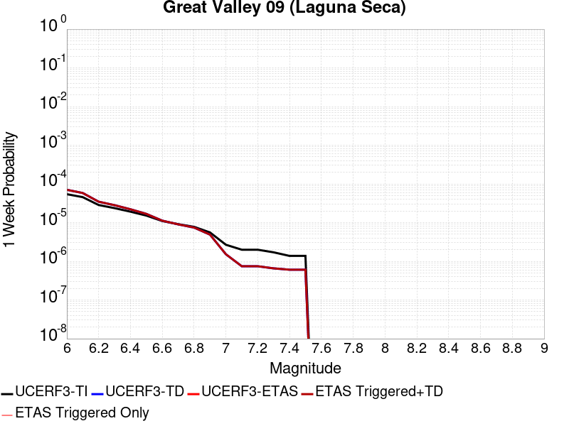 | 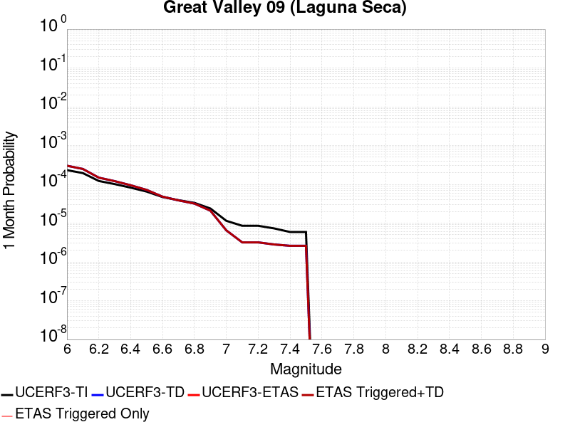 | 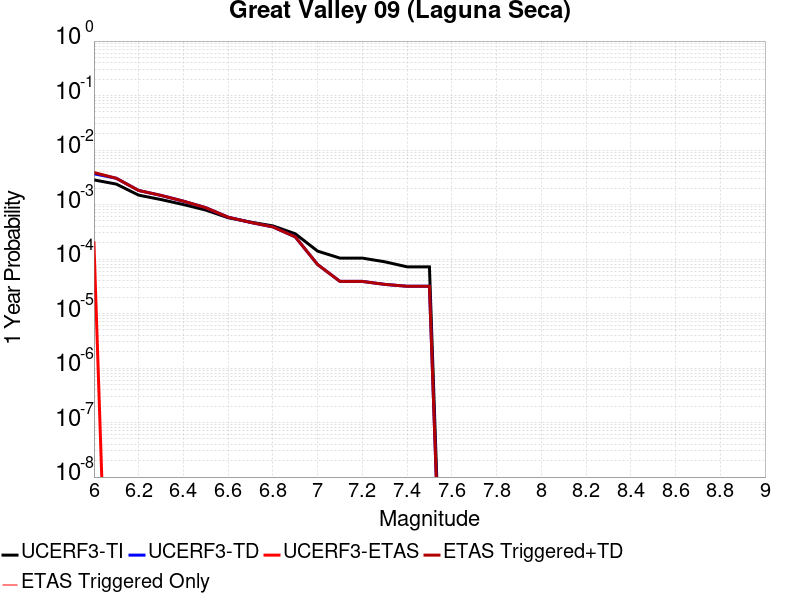 | 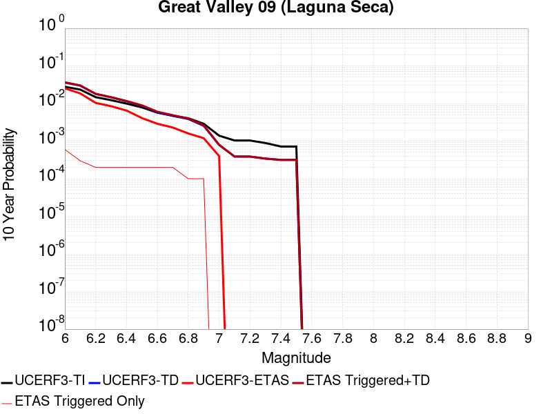 |

| Magnitude | 1 wk TI Prob | 1 wk TD Prob | 1 wk ETAS Prob | 1 wk ETAS/TD Gain | 1 wk ETAS Triggered+TD | 1 wk ETAS Triggered Only | 1 mo TI Prob | 1 mo TD Prob | 1 mo ETAS Prob | 1 mo ETAS/TD Gain | 1 mo ETAS Triggered+TD | 1 mo ETAS Triggered Only | 1 yr TI Prob | 1 yr TD Prob | 1 yr ETAS Prob | 1 yr ETAS/TD Gain | 1 yr ETAS Triggered+TD | 1 yr ETAS Triggered Only | 10 yr TI Prob | 10 yr TD Prob | 10 yr ETAS Prob | 10 yr ETAS/TD Gain | 10 yr ETAS Triggered+TD | 10 yr ETAS Triggered Only |
|-----|-----|-----|-----|-----|-----|-----|-----|-----|-----|-----|-----|-----|-----|-----|-----|-----|-----|-----|-----|-----|-----|-----|-----|-----|
| 6.0 | 5.4353277E-5 | 7.054596E-5 | 0.0 | 0.0 | 7.054596E-5 | 0.0 | 2.3292181E-4 | 3.023049E-4 | 0.0 | 0.0 | 3.023049E-4 | 0.0 | 0.0028321352 | 0.0036743472 | 0.0022 | 0.5987458 | 0.0038736123 | 2.0E-4 | 0.02796312 | 0.03613813 | 0.0254 | 0.7028588 | 0.036716443 | 6.0E-4 |
| 6.1 | 4.5578287E-5 | 5.8257025E-5 | 0.0 | 0.0 | 5.8257025E-5 | 0.0 | 1.953209E-4 | 2.4964852E-4 | 0.0 | 0.0 | 2.4964852E-4 | 0.0 | 0.0023754383 | 0.0030352282 | 0.0015 | 0.49419677 | 0.0030352282 | 0.0 | 0.023502063 | 0.029937847 | 0.0186 | 0.62128717 | 0.030228864 | 3.0E-4 |
| 6.2 | 2.8536782E-5 | 3.475587E-5 | 0.0 | 0.0 | 3.475587E-5 | 0.0 | 1.2229476E-4 | 1.4894444E-4 | 0.0 | 0.0 | 1.4894444E-4 | 0.0 | 0.0014879217 | 0.001811866 | 7.0E-4 | 0.38634205 | 0.001811866 | 0.0 | 0.014779986 | 0.01796808 | 0.0104 | 0.5788042 | 0.018164486 | 2.0E-4 |
| 6.3 | 2.3698774E-5 | 2.8228369E-5 | 0.0 | 0.0 | 2.8228369E-5 | 0.0 | 1.01562226E-4 | 1.2097219E-4 | 0.0 | 0.0 | 1.2097219E-4 | 0.0 | 0.0012358186 | 0.0014718325 | 7.0E-4 | 0.4755976 | 0.0014718325 | 0.0 | 0.012289686 | 0.014619086 | 0.0085 | 0.5814317 | 0.014816162 | 2.0E-4 |
| 6.4 | 1.9191197E-5 | 2.213383E-5 | 0.0 | 0.0 | 2.213383E-5 | 0.0 | 8.2245395E-5 | 9.4855466E-5 | 0.0 | 0.0 | 9.4855466E-5 | 0.0 | 0.0010008777 | 0.0011542585 | 5.0E-4 | 0.43317854 | 0.0011542585 | 0.0 | 0.009963818 | 0.011482595 | 0.0065 | 0.56607413 | 0.011680298 | 2.0E-4 |
| 6.5 | 1.5203241E-5 | 1.6808748E-5 | 0.0 | 0.0 | 1.6808748E-5 | 0.0 | 6.5155116E-5 | 7.203508E-5 | 0.0 | 0.0 | 7.203508E-5 | 0.0 | 7.9297484E-4 | 8.766883E-4 | 3.0E-4 | 0.34219688 | 8.766883E-4 | 0.0 | 0.007901512 | 0.008733403 | 0.0041 | 0.4694619 | 0.008931656 | 2.0E-4 |
| 6.6 | 1.0984925E-5 | 1.1246515E-5 | 0.0 | 0.0 | 1.1246515E-5 | 0.0 | 4.70774E-5 | 4.819848E-5 | 0.0 | 0.0 | 4.819848E-5 | 0.0 | 5.730166E-4 | 5.8666227E-4 | 1.0E-4 | 0.17045581 | 5.8666227E-4 | 0.0 | 0.005715413 | 0.0058515263 | 0.0029 | 0.49559718 | 0.006050356 | 2.0E-4 |
| 6.7 | 9.134616E-6 | 9.022901E-6 | 0.0 | 0.0 | 9.022901E-6 | 0.0 | 3.9147766E-5 | 3.866902E-5 | 0.0 | 0.0 | 3.866902E-5 | 0.0 | 4.7651984E-4 | 4.70696E-4 | 1.0E-4 | 0.21245135 | 4.70696E-4 | 0.0 | 0.004754993 | 0.0046972353 | 0.0023 | 0.4896497 | 0.004896296 | 2.0E-4 |
| 6.8 | 7.785589E-6 | 7.4544273E-6 | 0.0 | 0.0 | 7.4544273E-6 | 0.0 | 3.3366385E-5 | 3.1947166E-5 | 0.0 | 0.0 | 3.1947166E-5 | 0.0 | 4.0616E-4 | 3.8888934E-4 | 0.0 | 0.0 | 3.8888934E-4 | 0.0 | 0.0040541845 | 0.0038822922 | 0.0016 | 0.41212767 | 0.003981904 | 1.0E-4 |
| 6.9 | 5.579095E-6 | 4.900148E-6 | 0.0 | 0.0 | 4.900148E-6 | 0.0 | 2.3910188E-5 | 2.1000473E-5 | 0.0 | 0.0 | 2.1000473E-5 | 0.0 | 2.9106764E-4 | 2.5565215E-4 | 0.0 | 0.0 | 2.5565215E-4 | 0.0 | 0.002906867 | 0.002553718 | 0.0012 | 0.4699031 | 0.0026534626 | 1.0E-4 |
| 7.0 | 2.6816688E-6 | 1.5221154E-6 | 0.0 | 0.0 | 1.5221154E-6 | 0.0 | 1.1492816E-5 | 6.523336E-6 | 0.0 | 0.0 | 6.523336E-6 | 0.0 | 1.3991605E-4 | 7.9418816E-5 | 0.0 | 0.0 | 7.9418816E-5 | 0.0 | 0.0013982799 | 7.9391303E-4 | 4.0E-4 | 0.50383353 | 7.9391303E-4 | 0.0 |
| 7.1 | 1.9951021E-6 | 7.456766E-7 | 0.0 | 0.0 | 7.456766E-7 | 0.0 | 8.55041E-6 | 3.1957532E-6 | 0.0 | 0.0 | 3.1957532E-6 | 0.0 | 1.0409627E-4 | 3.890764E-5 | 0.0 | 0.0 | 3.890764E-5 | 0.0 | 0.0010404752 | 3.8901245E-4 | 0.0 | 0.0 | 3.8901245E-4 | 0.0 |
| 7.2 | 1.9951021E-6 | 7.456766E-7 | 0.0 | 0.0 | 7.456766E-7 | 0.0 | 8.55041E-6 | 3.1957532E-6 | 0.0 | 0.0 | 3.1957532E-6 | 0.0 | 1.0409627E-4 | 3.890764E-5 | 0.0 | 0.0 | 3.890764E-5 | 0.0 | 0.0010404752 | 3.8901245E-4 | 0.0 | 0.0 | 3.8901245E-4 | 0.0 |
| 7.3 | 1.7087556E-6 | 6.58091E-7 | 0.0 | 0.0 | 6.58091E-7 | 0.0 | 7.3232177E-6 | 2.8203872E-6 | 0.0 | 0.0 | 2.8203872E-6 | 0.0 | 8.915652E-5 | 3.4337714E-5 | 0.0 | 0.0 | 3.4337714E-5 | 0.0 | 8.9120766E-4 | 3.4332814E-4 | 0.0 | 0.0 | 3.4332814E-4 | 0.0 |
| 7.4 | 1.3804846E-6 | 6.0752774E-7 | 0.0 | 0.0 | 6.0752774E-7 | 0.0 | 5.916349E-6 | 2.6036878E-6 | 0.0 | 0.0 | 2.6036878E-6 | 0.0 | 7.2029165E-5 | 3.169948E-5 | 0.0 | 0.0 | 3.169948E-5 | 0.0 | 7.200583E-4 | 3.169536E-4 | 0.0 | 0.0 | 3.169536E-4 | 0.0 |
| 7.5 | 1.3804846E-6 | 6.0752774E-7 | 0.0 | 0.0 | 6.0752774E-7 | 0.0 | 5.916349E-6 | 2.6036878E-6 | 0.0 | 0.0 | 2.6036878E-6 | 0.0 | 7.2029165E-5 | 3.169948E-5 | 0.0 | 0.0 | 3.169948E-5 | 0.0 | 7.200583E-4 | 3.169536E-4 | 0.0 | 0.0 | 3.169536E-4 | 0.0 |

## Great Valley 11
*[(top)](#table-of-contents)*

| 1 Week | 1 Month | 1 Year | 10 Year |
|-----|-----|-----|-----|
| 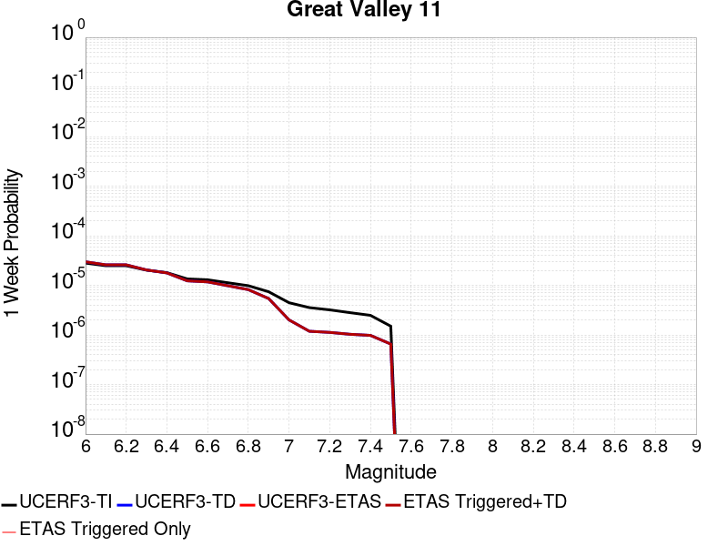 | 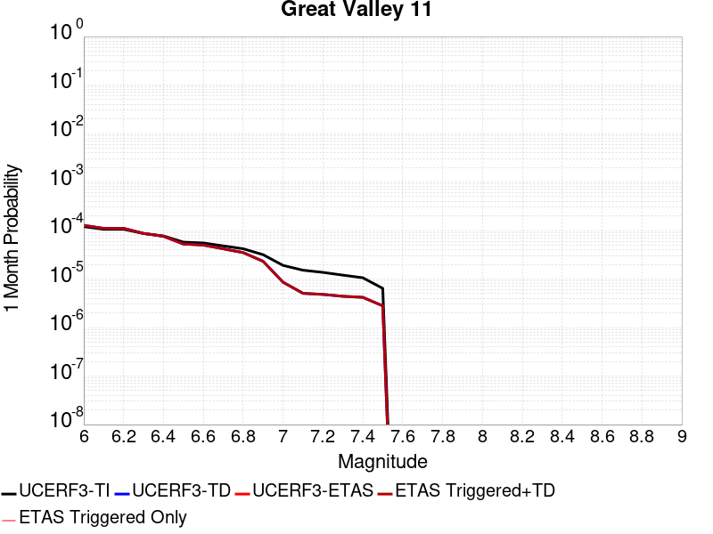 | 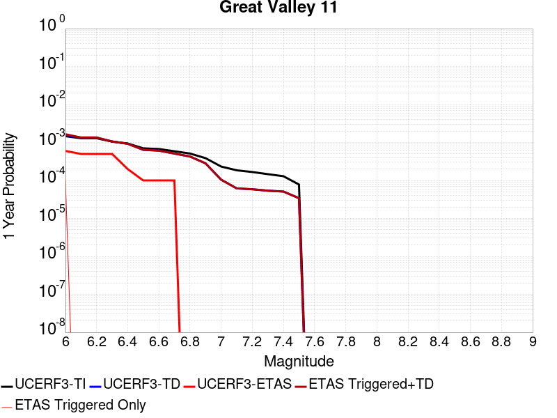 | 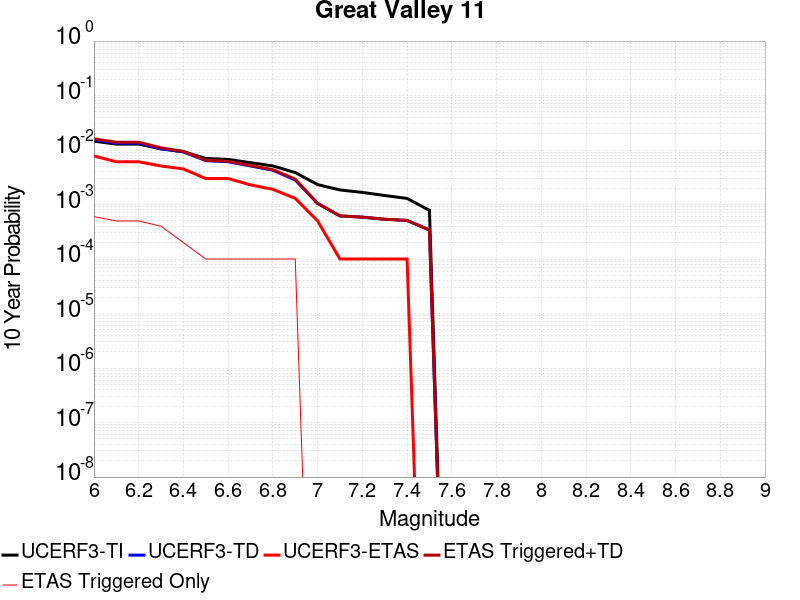 |

| Magnitude | 1 wk TI Prob | 1 wk TD Prob | 1 wk ETAS Prob | 1 wk ETAS/TD Gain | 1 wk ETAS Triggered+TD | 1 wk ETAS Triggered Only | 1 mo TI Prob | 1 mo TD Prob | 1 mo ETAS Prob | 1 mo ETAS/TD Gain | 1 mo ETAS Triggered+TD | 1 mo ETAS Triggered Only | 1 yr TI Prob | 1 yr TD Prob | 1 yr ETAS Prob | 1 yr ETAS/TD Gain | 1 yr ETAS Triggered+TD | 1 yr ETAS Triggered Only | 10 yr TI Prob | 10 yr TD Prob | 10 yr ETAS Prob | 10 yr ETAS/TD Gain | 10 yr ETAS Triggered+TD | 10 yr ETAS Triggered Only |
|-----|-----|-----|-----|-----|-----|-----|-----|-----|-----|-----|-----|-----|-----|-----|-----|-----|-----|-----|-----|-----|-----|-----|-----|-----|
| 6.0 | 2.8099583E-5 | 2.9843157E-5 | 0.0 | 0.0 | 2.9843157E-5 | 0.0 | 1.20421224E-4 | 1.2789339E-4 | 0.0 | 0.0 | 1.2789339E-4 | 0.0 | 0.0014651422 | 0.0015560632 | 6.0E-4 | 0.38558844 | 0.0016559076 | 1.0E-4 | 0.0145552 | 0.015459207 | 0.0078 | 0.50455374 | 0.01604993 | 6.0E-4 |
| 6.1 | 2.483194E-5 | 2.5916534E-5 | 0.0 | 0.0 | 2.5916534E-5 | 0.0 | 1.0641825E-4 | 1.11066496E-4 | 0.0 | 0.0 | 1.11066496E-4 | 0.0 | 0.0012948721 | 0.0013514591 | 5.0E-4 | 0.36997053 | 0.0013514591 | 0.0 | 0.012873529 | 0.013438814 | 0.0061 | 0.45390907 | 0.013932095 | 5.0E-4 |
| 6.2 | 2.483194E-5 | 2.5916534E-5 | 0.0 | 0.0 | 2.5916534E-5 | 0.0 | 1.0641825E-4 | 1.11066496E-4 | 0.0 | 0.0 | 1.11066496E-4 | 0.0 | 0.0012948721 | 0.0013514591 | 5.0E-4 | 0.36997053 | 0.0013514591 | 0.0 | 0.012873529 | 0.013438814 | 0.0061 | 0.45390907 | 0.013932095 | 5.0E-4 |
| 6.3 | 2.0257901E-5 | 2.0405994E-5 | 0.0 | 0.0 | 2.0405994E-5 | 0.0 | 8.681669E-5 | 8.745157E-5 | 0.0 | 0.0 | 8.745157E-5 | 0.0 | 0.0010564806 | 0.0010642443 | 5.0E-4 | 0.46981695 | 0.0010642443 | 0.0 | 0.01051472 | 0.0105956495 | 0.0051 | 0.48132962 | 0.010991411 | 4.0E-4 |
| 6.4 | 1.8054898E-5 | 1.7786915E-5 | 0.0 | 0.0 | 1.7786915E-5 | 0.0 | 7.737584E-5 | 7.622762E-5 | 0.0 | 0.0 | 7.622762E-5 | 0.0 | 9.416436E-4 | 9.277136E-4 | 2.0E-4 | 0.21558379 | 9.277136E-4 | 0.0 | 0.009376635 | 0.009242149 | 0.0045 | 0.48689973 | 0.009440301 | 2.0E-4 |
| 6.5 | 1.34804895E-5 | 1.2324887E-5 | 0.0 | 0.0 | 1.2324887E-5 | 0.0 | 5.777225E-5 | 5.28199E-5 | 0.0 | 0.0 | 5.28199E-5 | 0.0 | 7.031501E-4 | 6.428967E-4 | 1.0E-4 | 0.15554598 | 6.428967E-4 | 0.0 | 0.007009294 | 0.006410806 | 0.003 | 0.46795988 | 0.0065101646 | 1.0E-4 |
| 6.6 | 1.294883E-5 | 1.1736013E-5 | 0.0 | 0.0 | 1.1736013E-5 | 0.0 | 5.5493805E-5 | 5.0296254E-5 | 0.0 | 0.0 | 5.0296254E-5 | 0.0 | 6.754276E-4 | 6.1218895E-4 | 1.0E-4 | 0.16334827 | 6.1218895E-4 | 0.0 | 0.006733784 | 0.006105451 | 0.003 | 0.4913642 | 0.0062048403 | 1.0E-4 |
| 6.7 | 1.1272237E-5 | 9.815011E-6 | 0.0 | 0.0 | 9.815011E-6 | 0.0 | 4.8308695E-5 | 4.206367E-5 | 0.0 | 0.0 | 4.206367E-5 | 0.0 | 5.879996E-4 | 5.120076E-4 | 1.0E-4 | 0.1953096 | 5.120076E-4 | 0.0 | 0.005864462 | 0.005108564 | 0.0023 | 0.45022437 | 0.005208053 | 1.0E-4 |
| 6.8 | 9.8337505E-6 | 8.196478E-6 | 0.0 | 0.0 | 8.196478E-6 | 0.0 | 4.2143965E-5 | 3.51273E-5 | 0.0 | 0.0 | 3.51273E-5 | 0.0 | 5.1298196E-4 | 4.2759304E-4 | 0.0 | 0.0 | 4.2759304E-4 | 0.0 | 0.005117994 | 0.0042679133 | 0.0019 | 0.44518244 | 0.004367486 | 1.0E-4 |
| 6.9 | 7.4224813E-6 | 5.4149646E-6 | 0.0 | 0.0 | 5.4149646E-6 | 0.0 | 3.1810247E-5 | 2.3206792E-5 | 0.0 | 0.0 | 2.3206792E-5 | 0.0 | 3.872209E-4 | 2.8250748E-4 | 0.0 | 0.0 | 2.8250748E-4 | 0.0 | 0.0038654688 | 0.0028216243 | 0.0013 | 0.4607275 | 0.0029213422 | 1.0E-4 |
| 7.0 | 4.4628923E-6 | 2.0117477E-6 | 0.0 | 0.0 | 2.0117477E-6 | 0.0 | 1.912654E-5 | 8.621748E-6 | 0.0 | 0.0 | 8.621748E-6 | 0.0 | 2.3284076E-4 | 1.0496484E-4 | 0.0 | 0.0 | 1.0496484E-4 | 0.0 | 0.0023259693 | 0.0010491642 | 5.0E-4 | 0.4765698 | 0.0010491642 | 0.0 |
| 7.1 | 3.5546527E-6 | 1.1860155E-6 | 0.0 | 0.0 | 1.1860155E-6 | 0.0 | 1.5234136E-5 | 5.0829144E-6 | 0.0 | 0.0 | 5.0829144E-6 | 0.0 | 1.8545982E-4 | 6.188279E-5 | 0.0 | 0.0 | 6.188279E-5 | 0.0 | 0.0018530512 | 6.186624E-4 | 1.0E-4 | 0.16163903 | 6.186624E-4 | 0.0 |
| 7.2 | 3.2039936E-6 | 1.1258139E-6 | 0.0 | 0.0 | 1.1258139E-6 | 0.0 | 1.3731329E-5 | 4.824908E-6 | 0.0 | 0.0 | 4.824908E-6 | 0.0 | 1.671661E-4 | 5.874174E-5 | 0.0 | 0.0 | 5.874174E-5 | 0.0 | 0.0016704041 | 5.8726885E-4 | 1.0E-4 | 0.17027976 | 5.8726885E-4 | 0.0 |
| 7.3 | 2.8120473E-6 | 1.0308663E-6 | 0.0 | 0.0 | 1.0308663E-6 | 0.0 | 1.2051575E-5 | 4.417991E-6 | 0.0 | 0.0 | 4.417991E-6 | 0.0 | 1.4671806E-4 | 5.3787782E-5 | 0.0 | 0.0 | 5.3787782E-5 | 0.0 | 0.0014662122 | 5.3775427E-4 | 1.0E-4 | 0.18595855 | 5.3775427E-4 | 0.0 |
| 7.4 | 2.4837766E-6 | 9.803031E-7 | 0.0 | 0.0 | 9.803031E-7 | 0.0 | 1.0644713E-5 | 4.201292E-6 | 0.0 | 0.0 | 4.201292E-6 | 0.0 | 1.2959167E-4 | 5.11496E-5 | 0.0 | 0.0 | 5.11496E-5 | 0.0 | 0.0012951613 | 5.1138486E-4 | 1.0E-4 | 0.19554745 | 5.1138486E-4 | 0.0 |
| 7.5 | 1.5002679E-6 | 6.5476866E-7 | 0.0 | 0.0 | 6.5476866E-7 | 0.0 | 6.4297037E-6 | 2.8061486E-6 | 0.0 | 0.0 | 2.8061486E-6 | 0.0 | 7.827883E-5 | 3.4164368E-5 | 0.0 | 0.0 | 3.4164368E-5 | 0.0 | 7.825126E-4 | 3.415953E-4 | 0.0 | 0.0 | 3.415953E-4 | 0.0 |

## Santa Cruz Catalina Ridge alt1
*[(top)](#table-of-contents)*

| 1 Week | 1 Month | 1 Year | 10 Year |
|-----|-----|-----|-----|
| 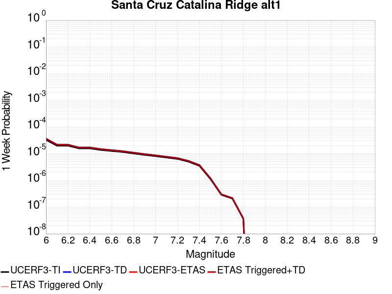 | 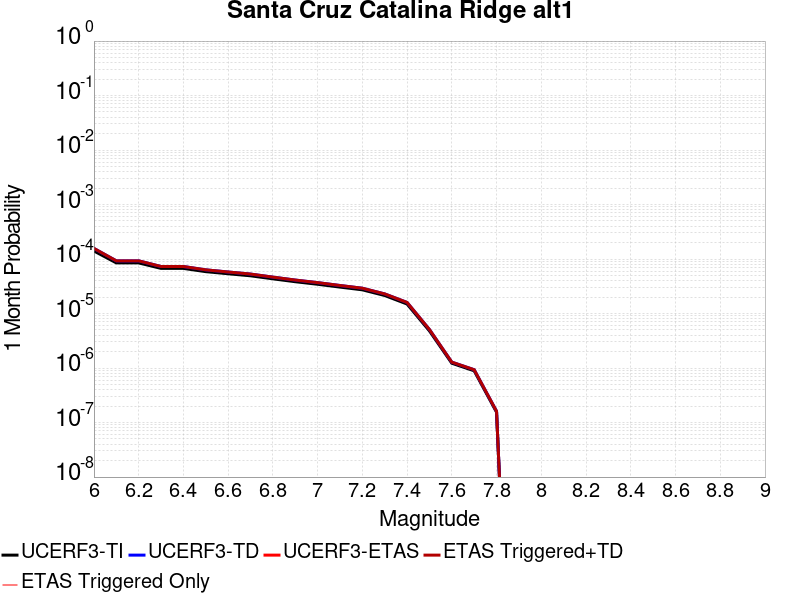 |  | 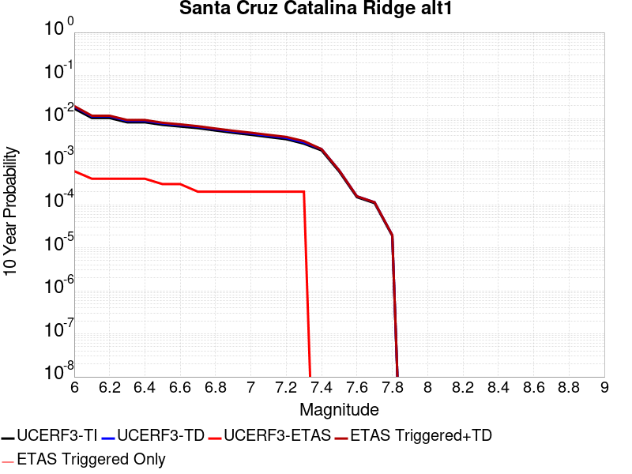 |

| Magnitude | 1 wk TI Prob | 1 wk TD Prob | 1 wk ETAS Prob | 1 wk ETAS/TD Gain | 1 wk ETAS Triggered+TD | 1 wk ETAS Triggered Only | 1 mo TI Prob | 1 mo TD Prob | 1 mo ETAS Prob | 1 mo ETAS/TD Gain | 1 mo ETAS Triggered+TD | 1 mo ETAS Triggered Only | 1 yr TI Prob | 1 yr TD Prob | 1 yr ETAS Prob | 1 yr ETAS/TD Gain | 1 yr ETAS Triggered+TD | 1 yr ETAS Triggered Only | 10 yr TI Prob | 10 yr TD Prob | 10 yr ETAS Prob | 10 yr ETAS/TD Gain | 10 yr ETAS Triggered+TD | 10 yr ETAS Triggered Only |
|-----|-----|-----|-----|-----|-----|-----|-----|-----|-----|-----|-----|-----|-----|-----|-----|-----|-----|-----|-----|-----|-----|-----|-----|-----|
| 6.0 | 3.2833184E-5 | 3.6567068E-5 | 0.0 | 0.0 | 3.6567068E-5 | 0.0 | 1.4070606E-4 | 1.5670754E-4 | 1.0E-4 | 0.6381314 | 1.5670754E-4 | 0.0 | 0.00171175 | 0.0019064111 | 8.0E-4 | 0.41963667 | 0.0019064111 | 0.0 | 0.016986247 | 0.018917482 | 0.0107 | 0.56561434 | 0.019506132 | 6.0E-4 |
| 6.1 | 1.9835548E-5 | 2.1663642E-5 | 0.0 | 0.0 | 2.1663642E-5 | 0.0 | 8.500672E-5 | 9.2840986E-5 | 1.0E-4 | 1.0771105 | 9.2840986E-5 | 0.0 | 0.0010344655 | 0.0011297731 | 5.0E-4 | 0.44256675 | 0.0011297731 | 0.0 | 0.010296632 | 0.011242431 | 0.0067 | 0.59595656 | 0.011637934 | 4.0E-4 |
| 6.2 | 1.9835548E-5 | 2.1663642E-5 | 0.0 | 0.0 | 2.1663642E-5 | 0.0 | 8.500672E-5 | 9.2840986E-5 | 1.0E-4 | 1.0771105 | 9.2840986E-5 | 0.0 | 0.0010344655 | 0.0011297731 | 5.0E-4 | 0.44256675 | 0.0011297731 | 0.0 | 0.010296632 | 0.011242431 | 0.0067 | 0.59595656 | 0.011637934 | 4.0E-4 |
| 6.3 | 1.5728183E-5 | 1.7036875E-5 | 0.0 | 0.0 | 1.7036875E-5 | 0.0 | 6.7404755E-5 | 7.301317E-5 | 1.0E-4 | 1.3696159 | 7.301317E-5 | 0.0 | 8.2034385E-4 | 8.8857894E-4 | 5.0E-4 | 0.5626962 | 8.8857894E-4 | 0.0 | 0.008173222 | 0.0088509405 | 0.0061 | 0.6891923 | 0.0092474 | 4.0E-4 |
| 6.4 | 1.5728183E-5 | 1.7036875E-5 | 0.0 | 0.0 | 1.7036875E-5 | 0.0 | 6.7404755E-5 | 7.301317E-5 | 1.0E-4 | 1.3696159 | 7.301317E-5 | 0.0 | 8.2034385E-4 | 8.8857894E-4 | 5.0E-4 | 0.5626962 | 8.8857894E-4 | 0.0 | 0.008173222 | 0.0088509405 | 0.0061 | 0.6891923 | 0.0092474 | 4.0E-4 |
| 6.5 | 1.3707734E-5 | 1.4796945E-5 | 0.0 | 0.0 | 1.4796945E-5 | 0.0 | 5.8746107E-5 | 6.341396E-5 | 1.0E-4 | 1.57694 | 6.341396E-5 | 0.0 | 7.1499916E-4 | 7.71795E-4 | 5.0E-4 | 0.64784044 | 7.71795E-4 | 0.0 | 0.0071270303 | 0.0076915445 | 0.0053 | 0.6890684 | 0.007989237 | 3.0E-4 |
| 6.6 | 1.2539813E-5 | 1.3512378E-5 | 0.0 | 0.0 | 1.3512378E-5 | 0.0 | 5.3740947E-5 | 5.790892E-5 | 1.0E-4 | 1.7268497 | 5.790892E-5 | 0.0 | 6.540996E-4 | 7.048157E-4 | 5.0E-4 | 0.7094053 | 7.048157E-4 | 0.0 | 0.0065217763 | 0.007026107 | 0.005 | 0.71163166 | 0.0073239994 | 3.0E-4 |
| 6.7 | 1.1504083E-5 | 1.2379314E-5 | 0.0 | 0.0 | 1.2379314E-5 | 0.0 | 4.930228E-5 | 5.3053136E-5 | 1.0E-4 | 1.8849027 | 5.3053136E-5 | 0.0 | 6.0008996E-4 | 6.457325E-4 | 4.0E-4 | 0.6194515 | 6.457325E-4 | 0.0 | 0.005984721 | 0.0064387913 | 0.0045 | 0.6988889 | 0.006637504 | 2.0E-4 |
| 6.8 | 1.012739E-5 | 1.0878733E-5 | 0.0 | 0.0 | 1.0878733E-5 | 0.0 | 4.340238E-5 | 4.6622317E-5 | 1.0E-4 | 2.1448956 | 4.6622317E-5 | 0.0 | 5.282958E-4 | 5.6748034E-4 | 4.0E-4 | 0.7048702 | 5.6748034E-4 | 0.0 | 0.0052704164 | 0.0056604818 | 0.0042 | 0.74198633 | 0.0058593494 | 2.0E-4 |
| 6.9 | 8.9607865E-6 | 9.610551E-6 | 0.0 | 0.0 | 9.610551E-6 | 0.0 | 3.8402806E-5 | 4.1187435E-5 | 1.0E-4 | 2.4279249 | 4.1187435E-5 | 0.0 | 4.6745385E-4 | 5.013427E-4 | 4.0E-4 | 0.7978574 | 5.013427E-4 | 0.0 | 0.0046647177 | 0.0050022365 | 0.0036 | 0.7196781 | 0.005201236 | 2.0E-4 |
| 7.0 | 8.046829E-6 | 8.621012E-6 | 0.0 | 0.0 | 8.621012E-6 | 0.0 | 3.4485955E-5 | 3.6946676E-5 | 1.0E-4 | 2.7066035 | 3.6946676E-5 | 0.0 | 4.1978562E-4 | 4.4973375E-4 | 4.0E-4 | 0.88941514 | 4.4973375E-4 | 0.0 | 0.004189935 | 0.0044883266 | 0.0035 | 0.77980065 | 0.004687429 | 2.0E-4 |
| 7.1 | 7.136131E-6 | 7.638763E-6 | 0.0 | 0.0 | 7.638763E-6 | 0.0 | 3.0583058E-5 | 3.273715E-5 | 1.0E-4 | 3.0546336 | 3.273715E-5 | 0.0 | 3.7228514E-4 | 3.9850263E-4 | 3.0E-4 | 0.75281817 | 3.9850263E-4 | 0.0 | 0.0037166206 | 0.0039779567 | 0.0031 | 0.77929455 | 0.004177161 | 2.0E-4 |
| 7.2 | 6.362014E-6 | 6.805936E-6 | 0.0 | 0.0 | 6.805936E-6 | 0.0 | 2.726549E-5 | 2.9167975E-5 | 1.0E-4 | 3.4284177 | 2.9167975E-5 | 0.0 | 3.3190678E-4 | 3.5506286E-4 | 3.0E-4 | 0.84492075 | 3.5506286E-4 | 0.0 | 0.0033141149 | 0.0035450242 | 0.0028 | 0.78983945 | 0.0037443154 | 2.0E-4 |
| 7.3 | 5.004101E-6 | 5.352482E-6 | 0.0 | 0.0 | 5.352482E-6 | 0.0 | 2.1445969E-5 | 2.293901E-5 | 1.0E-4 | 4.359386 | 2.293901E-5 | 0.0 | 2.6107338E-4 | 2.7924718E-4 | 3.0E-4 | 1.074317 | 2.7924718E-4 | 0.0 | 0.002607669 | 0.0027890177 | 0.0023 | 0.8246631 | 0.00298846 | 2.0E-4 |
| 7.4 | 3.4901443E-6 | 3.7325865E-6 | 0.0 | 0.0 | 3.7325865E-6 | 0.0 | 1.4957676E-5 | 1.5996702E-5 | 0.0 | 0.0 | 1.5996702E-5 | 0.0 | 1.8209449E-4 | 1.9474284E-4 | 2.0E-4 | 1.0269954 | 1.9474284E-4 | 0.0 | 0.0018194534 | 0.0019457605 | 0.0011 | 0.5653317 | 0.0019457605 | 0.0 |
| 7.5 | 1.1215045E-6 | 1.1895359E-6 | 0.0 | 0.0 | 1.1895359E-6 | 0.0 | 4.806439E-6 | 5.098001E-6 | 0.0 | 0.0 | 5.098001E-6 | 0.0 | 5.851682E-5 | 6.206643E-5 | 0.0 | 0.0 | 6.206643E-5 | 0.0 | 5.850142E-4 | 6.2049396E-4 | 1.0E-4 | 0.16116191 | 6.2049396E-4 | 0.0 |
| 7.6 | 2.8599047E-7 | 2.9954913E-7 | 0.0 | 0.0 | 2.9954913E-7 | 0.0 | 1.2256729E-6 | 1.2837813E-6 | 0.0 | 0.0 | 1.2837813E-6 | 0.0 | 1.4922465E-5 | 1.5629927E-5 | 0.0 | 0.0 | 1.5629927E-5 | 0.0 | 1.4921463E-4 | 1.5628841E-4 | 0.0 | 0.0 | 1.5628841E-4 | 0.0 |
| 7.7 | 2.0781519E-7 | 2.1746399E-7 | 0.0 | 0.0 | 2.1746399E-7 | 0.0 | 8.906362E-7 | 9.319882E-7 | 0.0 | 0.0 | 9.319882E-7 | 0.0 | 1.08434415E-5 | 1.1346898E-5 | 0.0 | 0.0 | 1.1346898E-5 | 0.0 | 1.0842913E-4 | 1.1346328E-4 | 0.0 | 0.0 | 1.1346328E-4 | 0.0 |
| 7.8 | 3.614776E-8 | 3.764422E-8 | 0.0 | 0.0 | 3.764422E-8 | 0.0 | 1.5491896E-7 | 1.6133237E-7 | 0.0 | 0.0 | 1.6133237E-7 | 0.0 | 1.8861368E-6 | 1.9642198E-6 | 0.0 | 0.0 | 1.9642198E-6 | 0.0 | 1.8861208E-5 | 1.9642037E-5 | 0.0 | 0.0 | 1.9642037E-5 | 0.0 |

## San Andreas (North Branch Mill Creek)
*[(top)](#table-of-contents)*

| 1 Week | 1 Month | 1 Year | 10 Year |
|-----|-----|-----|-----|
| 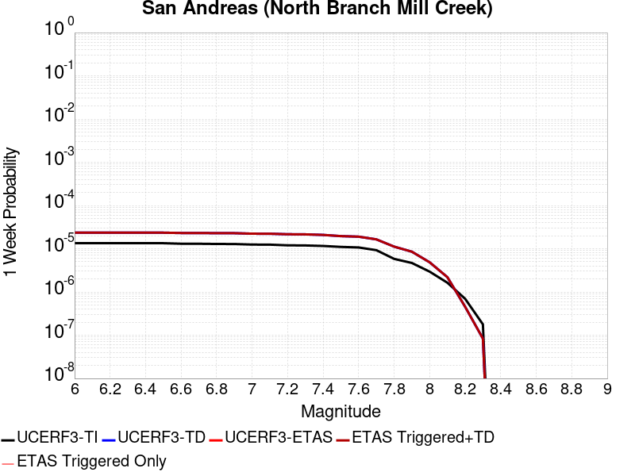 | 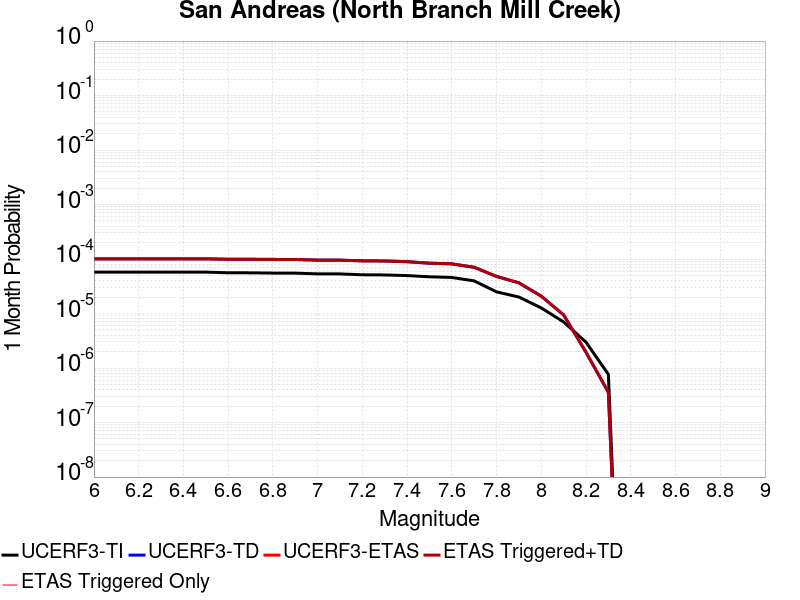 | 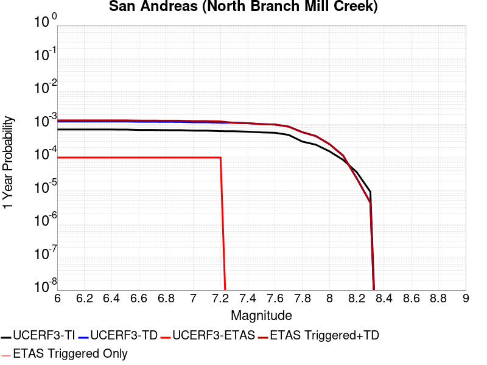 | 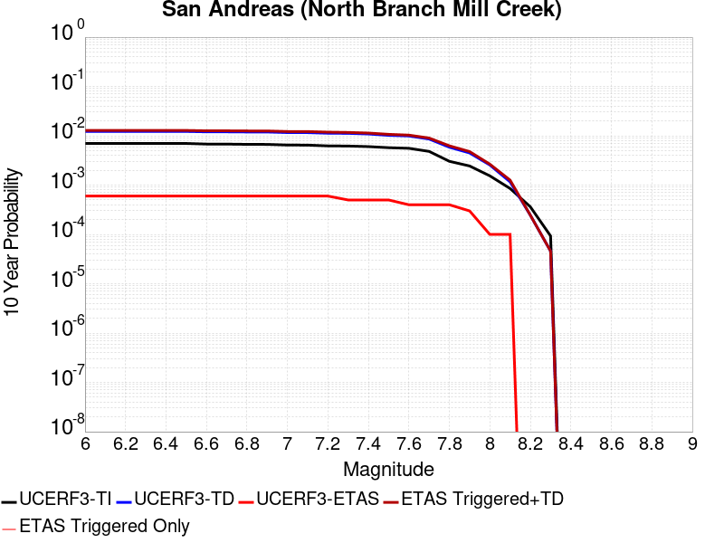 |

| Magnitude | 1 wk TI Prob | 1 wk TD Prob | 1 wk ETAS Prob | 1 wk ETAS/TD Gain | 1 wk ETAS Triggered+TD | 1 wk ETAS Triggered Only | 1 mo TI Prob | 1 mo TD Prob | 1 mo ETAS Prob | 1 mo ETAS/TD Gain | 1 mo ETAS Triggered+TD | 1 mo ETAS Triggered Only | 1 yr TI Prob | 1 yr TD Prob | 1 yr ETAS Prob | 1 yr ETAS/TD Gain | 1 yr ETAS Triggered+TD | 1 yr ETAS Triggered Only | 10 yr TI Prob | 10 yr TD Prob | 10 yr ETAS Prob | 10 yr ETAS/TD Gain | 10 yr ETAS Triggered+TD | 10 yr ETAS Triggered Only |
|-----|-----|-----|-----|-----|-----|-----|-----|-----|-----|-----|-----|-----|-----|-----|-----|-----|-----|-----|-----|-----|-----|-----|-----|-----|
| 6.0 | 1.3461156E-5 | 2.3608382E-5 | 0.0 | 0.0 | 2.3608382E-5 | 0.0 | 5.7689394E-5 | 1.01174875E-4 | 1.0E-4 | 0.9883877 | 1.01174875E-4 | 0.0 | 7.02142E-4 | 0.0012311114 | 7.0E-4 | 0.56859195 | 0.0013309882 | 1.0E-4 | 0.0069992766 | 0.012284326 | 0.0089 | 0.7245005 | 0.012876956 | 6.0E-4 |
| 6.1 | 1.3461156E-5 | 2.3608382E-5 | 0.0 | 0.0 | 2.3608382E-5 | 0.0 | 5.7689394E-5 | 1.01174875E-4 | 1.0E-4 | 0.9883877 | 1.01174875E-4 | 0.0 | 7.02142E-4 | 0.0012311114 | 7.0E-4 | 0.56859195 | 0.0013309882 | 1.0E-4 | 0.0069992766 | 0.012284326 | 0.0089 | 0.7245005 | 0.012876956 | 6.0E-4 |
| 6.2 | 1.3461156E-5 | 2.3608382E-5 | 0.0 | 0.0 | 2.3608382E-5 | 0.0 | 5.7689394E-5 | 1.01174875E-4 | 1.0E-4 | 0.9883877 | 1.01174875E-4 | 0.0 | 7.02142E-4 | 0.0012311114 | 7.0E-4 | 0.56859195 | 0.0013309882 | 1.0E-4 | 0.0069992766 | 0.012284326 | 0.0089 | 0.7245005 | 0.012876956 | 6.0E-4 |
| 6.3 | 1.3461156E-5 | 2.3608382E-5 | 0.0 | 0.0 | 2.3608382E-5 | 0.0 | 5.7689394E-5 | 1.01174875E-4 | 1.0E-4 | 0.9883877 | 1.01174875E-4 | 0.0 | 7.02142E-4 | 0.0012311114 | 7.0E-4 | 0.56859195 | 0.0013309882 | 1.0E-4 | 0.0069992766 | 0.012284326 | 0.0089 | 0.7245005 | 0.012876956 | 6.0E-4 |
| 6.4 | 1.3461156E-5 | 2.3608382E-5 | 0.0 | 0.0 | 2.3608382E-5 | 0.0 | 5.7689394E-5 | 1.01174875E-4 | 1.0E-4 | 0.9883877 | 1.01174875E-4 | 0.0 | 7.02142E-4 | 0.0012311114 | 7.0E-4 | 0.56859195 | 0.0013309882 | 1.0E-4 | 0.0069992766 | 0.012284326 | 0.0089 | 0.7245005 | 0.012876956 | 6.0E-4 |
| 6.5 | 1.3450706E-5 | 2.359734E-5 | 0.0 | 0.0 | 2.359734E-5 | 0.0 | 5.764461E-5 | 1.0112756E-4 | 1.0E-4 | 0.9888502 | 1.0112756E-4 | 0.0 | 7.0159714E-4 | 0.0012305359 | 7.0E-4 | 0.56885785 | 0.0013304129 | 1.0E-4 | 0.006993862 | 0.012278636 | 0.0089 | 0.72483623 | 0.012871268 | 6.0E-4 |
| 6.6 | 1.3074523E-5 | 2.3211585E-5 | 0.0 | 0.0 | 2.3211585E-5 | 0.0 | 5.6032466E-5 | 9.947445E-5 | 1.0E-4 | 1.0052832 | 9.947445E-5 | 0.0 | 6.8198174E-4 | 0.0012104318 | 7.0E-4 | 0.578306 | 0.0013103108 | 1.0E-4 | 0.006798926 | 0.012079792 | 0.0087 | 0.720211 | 0.012672544 | 6.0E-4 |
| 6.7 | 1.3050216E-5 | 2.3186874E-5 | 0.0 | 0.0 | 2.3186874E-5 | 0.0 | 5.59283E-5 | 9.936855E-5 | 1.0E-4 | 1.0063546 | 9.936855E-5 | 0.0 | 6.8071426E-4 | 0.0012091439 | 7.0E-4 | 0.578922 | 0.001309023 | 1.0E-4 | 0.0067863287 | 0.0120670535 | 0.0087 | 0.72097135 | 0.012659813 | 6.0E-4 |
| 6.8 | 1.29049395E-5 | 2.3035262E-5 | 0.0 | 0.0 | 2.3035262E-5 | 0.0 | 5.530571E-5 | 9.871883E-5 | 1.0E-4 | 1.012978 | 9.871883E-5 | 0.0 | 6.73139E-4 | 0.0012012423 | 7.0E-4 | 0.58273005 | 0.0013011221 | 1.0E-4 | 0.0067110364 | 0.011988891 | 0.0086 | 0.7173307 | 0.012581699 | 6.0E-4 |
| 6.9 | 1.2867369E-5 | 2.2994647E-5 | 0.0 | 0.0 | 2.2994647E-5 | 0.0 | 5.51447E-5 | 9.8544784E-5 | 1.0E-4 | 1.014767 | 9.8544784E-5 | 0.0 | 6.711799E-4 | 0.0011991257 | 7.0E-4 | 0.58375865 | 0.0012990057 | 1.0E-4 | 0.006691564 | 0.011967953 | 0.0086 | 0.71858567 | 0.012560773 | 6.0E-4 |
| 7.0 | 1.2495996E-5 | 2.2393988E-5 | 0.0 | 0.0 | 2.2393988E-5 | 0.0 | 5.3553173E-5 | 9.597072E-5 | 1.0E-4 | 1.0419846 | 9.597072E-5 | 0.0 | 6.518148E-4 | 0.0011678201 | 5.0E-4 | 0.42814815 | 0.0012677033 | 1.0E-4 | 0.0064990623 | 0.011658194 | 0.0079 | 0.677635 | 0.012251198 | 6.0E-4 |
| 7.1 | 1.2452067E-5 | 2.2339027E-5 | 0.0 | 0.0 | 2.2339027E-5 | 0.0 | 5.3364907E-5 | 9.573519E-5 | 1.0E-4 | 1.044548 | 9.573519E-5 | 0.0 | 6.4952404E-4 | 0.0011649556 | 5.0E-4 | 0.42920092 | 0.0012648391 | 1.0E-4 | 0.0064762887 | 0.011629849 | 0.0079 | 0.67928654 | 0.012222871 | 6.0E-4 |
| 7.2 | 1.2002777E-5 | 2.1716985E-5 | 0.0 | 0.0 | 2.1716985E-5 | 0.0 | 5.143946E-5 | 9.3069495E-5 | 1.0E-4 | 1.074466 | 9.3069495E-5 | 0.0 | 6.2609545E-4 | 0.0011325347 | 5.0E-4 | 0.44148758 | 0.0012324215 | 1.0E-4 | 0.006243344 | 0.0113089625 | 0.0076 | 0.67203337 | 0.011902177 | 6.0E-4 |
| 7.3 | 1.1923425E-5 | 2.1586702E-5 | 0.0 | 0.0 | 2.1586702E-5 | 0.0 | 5.109939E-5 | 9.251117E-5 | 1.0E-4 | 1.0809506 | 9.251117E-5 | 0.0 | 6.219575E-4 | 0.0011257442 | 4.0E-4 | 0.3553205 | 0.0011257442 | 0.0 | 0.0062021962 | 0.011241772 | 0.0074 | 0.6582592 | 0.011736151 | 5.0E-4 |
| 7.4 | 1.16105175E-5 | 2.095962E-5 | 0.0 | 0.0 | 2.095962E-5 | 0.0 | 4.975841E-5 | 8.9823865E-5 | 1.0E-4 | 1.1132898 | 8.9823865E-5 | 0.0 | 6.0564023E-4 | 0.0010930595 | 4.0E-4 | 0.3659453 | 0.0010930595 | 0.0 | 0.006039923 | 0.010918676 | 0.0073 | 0.6685792 | 0.011413217 | 5.0E-4 |
| 7.5 | 1.1037265E-5 | 1.9655994E-5 | 0.0 | 0.0 | 1.9655994E-5 | 0.0 | 4.7301706E-5 | 8.423727E-5 | 1.0E-4 | 1.1871231 | 8.423727E-5 | 0.0 | 5.757461E-4 | 0.0010251084 | 4.0E-4 | 0.39020264 | 0.0010251084 | 0.0 | 0.005742567 | 0.010247721 | 0.0064 | 0.6245291 | 0.010742597 | 5.0E-4 |
| 7.6 | 1.0720915E-5 | 1.9096626E-5 | 0.0 | 0.0 | 1.9096626E-5 | 0.0 | 4.5945973E-5 | 8.1840124E-5 | 1.0E-4 | 1.2218945 | 8.1840124E-5 | 0.0 | 5.592486E-4 | 9.959502E-4 | 4.0E-4 | 0.4016265 | 9.959502E-4 | 0.0 | 0.005578433 | 0.0099588 | 0.0062 | 0.622565 | 0.010354816 | 4.0E-4 |
| 7.7 | 9.276279E-6 | 1.6537626E-5 | 0.0 | 0.0 | 1.6537626E-5 | 0.0 | 3.9754876E-5 | 7.087362E-5 | 1.0E-4 | 1.4109622 | 7.087362E-5 | 0.0 | 4.839081E-4 | 8.625464E-4 | 2.0E-4 | 0.23187158 | 8.625464E-4 | 0.0 | 0.0048285574 | 0.008635707 | 0.0055 | 0.63689053 | 0.009032253 | 4.0E-4 |
| 7.8 | 5.8346777E-6 | 1.1232833E-5 | 0.0 | 0.0 | 1.1232833E-5 | 0.0 | 2.5005522E-5 | 4.813982E-5 | 1.0E-4 | 2.0772824 | 4.813982E-5 | 0.0 | 3.043997E-4 | 5.8594486E-4 | 2.0E-4 | 0.34132907 | 5.8594486E-4 | 0.0 | 0.0030398308 | 0.005887314 | 0.0039 | 0.6624413 | 0.006284959 | 4.0E-4 |
| 7.9 | 4.690204E-6 | 8.573881E-6 | 0.0 | 0.0 | 8.573881E-6 | 0.0 | 2.0100719E-5 | 3.674469E-5 | 1.0E-4 | 2.7214818 | 3.674469E-5 | 0.0 | 2.4469878E-4 | 4.4727483E-4 | 2.0E-4 | 0.44715238 | 4.4727483E-4 | 0.0 | 0.002444295 | 0.00450446 | 0.003 | 0.66600657 | 0.0048031085 | 3.0E-4 |
| 8.0 | 2.9570454E-6 | 4.8865522E-6 | 0.0 | 0.0 | 4.8865522E-6 | 0.0 | 1.267299E-5 | 2.0942198E-5 | 1.0E-4 | 4.775048 | 2.0942198E-5 | 0.0 | 1.5428272E-4 | 2.5494146E-4 | 2.0E-4 | 0.7844938 | 2.5494146E-4 | 0.0 | 0.0015417566 | 0.0025705916 | 0.0012 | 0.46681863 | 0.0026703344 | 1.0E-4 |
| 8.1 | 1.6376824E-6 | 2.2177119E-6 | 0.0 | 0.0 | 2.2177119E-6 | 0.0 | 7.01862E-6 | 9.504444E-6 | 0.0 | 0.0 | 9.504444E-6 | 0.0 | 8.544835E-5 | 1.15710485E-4 | 1.0E-4 | 0.8642259 | 1.15710485E-4 | 0.0 | 8.54155E-4 | 0.0011717922 | 5.0E-4 | 0.4266968 | 0.001271675 | 1.0E-4 |
| 8.2 | 6.9631557E-7 | 4.5993667E-7 | 0.0 | 0.0 | 4.5993667E-7 | 0.0 | 2.984206E-6 | 1.9711556E-6 | 0.0 | 0.0 | 1.9711556E-6 | 0.0 | 3.63321E-5 | 2.3998557E-5 | 0.0 | 0.0 | 2.3998557E-5 | 0.0 | 3.6326164E-4 | 2.485238E-4 | 2.0E-4 | 0.8047519 | 2.485238E-4 | 0.0 |
| 8.3 | 1.7876137E-7 | 8.488053E-8 | 0.0 | 0.0 | 8.488053E-8 | 0.0 | 7.661199E-7 | 3.6377367E-7 | 0.0 | 0.0 | 3.6377367E-7 | 0.0 | 9.32747E-6 | 4.4289354E-6 | 0.0 | 0.0 | 4.4289354E-6 | 0.0 | 9.3270784E-5 | 4.6502155E-5 | 0.0 | 0.0 | 4.6502155E-5 | 0.0 |

## Pitas Point (Lower)-Montalvo
*[(top)](#table-of-contents)*

| 1 Week | 1 Month | 1 Year | 10 Year |
|-----|-----|-----|-----|
| 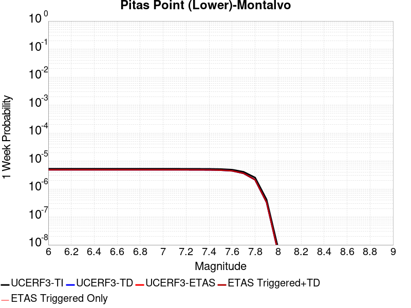 | 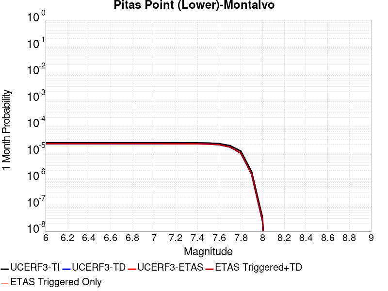 | 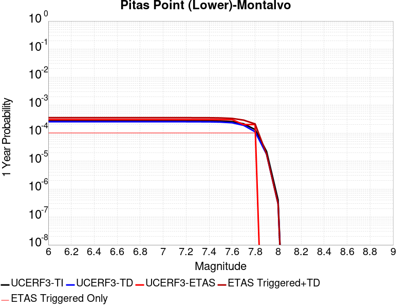 | 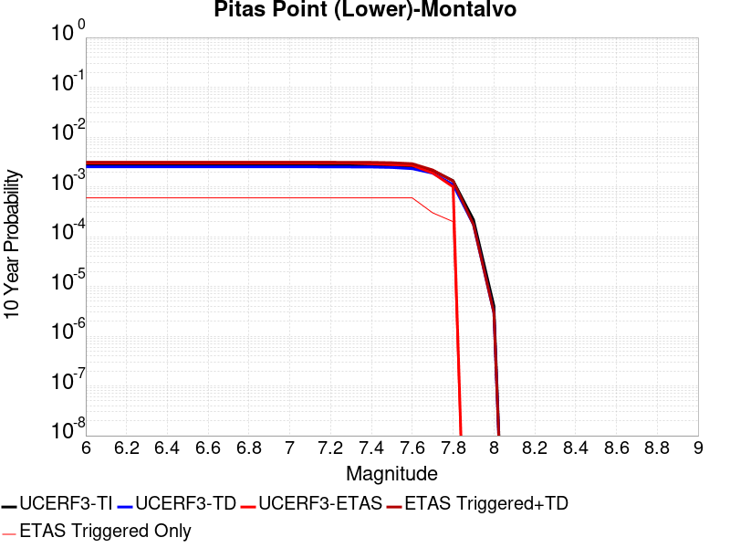 |

| Magnitude | 1 wk TI Prob | 1 wk TD Prob | 1 wk ETAS Prob | 1 wk ETAS/TD Gain | 1 wk ETAS Triggered+TD | 1 wk ETAS Triggered Only | 1 mo TI Prob | 1 mo TD Prob | 1 mo ETAS Prob | 1 mo ETAS/TD Gain | 1 mo ETAS Triggered+TD | 1 mo ETAS Triggered Only | 1 yr TI Prob | 1 yr TD Prob | 1 yr ETAS Prob | 1 yr ETAS/TD Gain | 1 yr ETAS Triggered+TD | 1 yr ETAS Triggered Only | 10 yr TI Prob | 10 yr TD Prob | 10 yr ETAS Prob | 10 yr ETAS/TD Gain | 10 yr ETAS Triggered+TD | 10 yr ETAS Triggered Only |
|-----|-----|-----|-----|-----|-----|-----|-----|-----|-----|-----|-----|-----|-----|-----|-----|-----|-----|-----|-----|-----|-----|-----|-----|-----|
| 6.0 | 5.2543637E-6 | 4.8385846E-6 | 0.0 | 0.0 | 4.8385846E-6 | 0.0 | 2.2518509E-5 | 2.0736627E-5 | 0.0 | 0.0 | 2.0736627E-5 | 0.0 | 2.7412834E-4 | 2.524395E-4 | 3.0E-4 | 1.1884036 | 3.5241427E-4 | 1.0E-4 | 0.0027379042 | 0.00252156 | 0.003 | 1.1897397 | 0.003120047 | 6.0E-4 |
| 6.1 | 5.2543637E-6 | 4.8385846E-6 | 0.0 | 0.0 | 4.8385846E-6 | 0.0 | 2.2518509E-5 | 2.0736627E-5 | 0.0 | 0.0 | 2.0736627E-5 | 0.0 | 2.7412834E-4 | 2.524395E-4 | 3.0E-4 | 1.1884036 | 3.5241427E-4 | 1.0E-4 | 0.0027379042 | 0.00252156 | 0.003 | 1.1897397 | 0.003120047 | 6.0E-4 |
| 6.2 | 5.2543637E-6 | 4.8385846E-6 | 0.0 | 0.0 | 4.8385846E-6 | 0.0 | 2.2518509E-5 | 2.0736627E-5 | 0.0 | 0.0 | 2.0736627E-5 | 0.0 | 2.7412834E-4 | 2.524395E-4 | 3.0E-4 | 1.1884036 | 3.5241427E-4 | 1.0E-4 | 0.0027379042 | 0.00252156 | 0.003 | 1.1897397 | 0.003120047 | 6.0E-4 |
| 6.3 | 5.2543637E-6 | 4.8385846E-6 | 0.0 | 0.0 | 4.8385846E-6 | 0.0 | 2.2518509E-5 | 2.0736627E-5 | 0.0 | 0.0 | 2.0736627E-5 | 0.0 | 2.7412834E-4 | 2.524395E-4 | 3.0E-4 | 1.1884036 | 3.5241427E-4 | 1.0E-4 | 0.0027379042 | 0.00252156 | 0.003 | 1.1897397 | 0.003120047 | 6.0E-4 |
| 6.4 | 5.2543637E-6 | 4.8385846E-6 | 0.0 | 0.0 | 4.8385846E-6 | 0.0 | 2.2518509E-5 | 2.0736627E-5 | 0.0 | 0.0 | 2.0736627E-5 | 0.0 | 2.7412834E-4 | 2.524395E-4 | 3.0E-4 | 1.1884036 | 3.5241427E-4 | 1.0E-4 | 0.0027379042 | 0.00252156 | 0.003 | 1.1897397 | 0.003120047 | 6.0E-4 |
| 6.5 | 5.2543637E-6 | 4.8385846E-6 | 0.0 | 0.0 | 4.8385846E-6 | 0.0 | 2.2518509E-5 | 2.0736627E-5 | 0.0 | 0.0 | 2.0736627E-5 | 0.0 | 2.7412834E-4 | 2.524395E-4 | 3.0E-4 | 1.1884036 | 3.5241427E-4 | 1.0E-4 | 0.0027379042 | 0.00252156 | 0.003 | 1.1897397 | 0.003120047 | 6.0E-4 |
| 6.6 | 5.2543637E-6 | 4.8385846E-6 | 0.0 | 0.0 | 4.8385846E-6 | 0.0 | 2.2518509E-5 | 2.0736627E-5 | 0.0 | 0.0 | 2.0736627E-5 | 0.0 | 2.7412834E-4 | 2.524395E-4 | 3.0E-4 | 1.1884036 | 3.5241427E-4 | 1.0E-4 | 0.0027379042 | 0.00252156 | 0.003 | 1.1897397 | 0.003120047 | 6.0E-4 |
| 6.7 | 5.2543637E-6 | 4.8385846E-6 | 0.0 | 0.0 | 4.8385846E-6 | 0.0 | 2.2518509E-5 | 2.0736627E-5 | 0.0 | 0.0 | 2.0736627E-5 | 0.0 | 2.7412834E-4 | 2.524395E-4 | 3.0E-4 | 1.1884036 | 3.5241427E-4 | 1.0E-4 | 0.0027379042 | 0.00252156 | 0.003 | 1.1897397 | 0.003120047 | 6.0E-4 |
| 6.8 | 5.2543637E-6 | 4.8385846E-6 | 0.0 | 0.0 | 4.8385846E-6 | 0.0 | 2.2518509E-5 | 2.0736627E-5 | 0.0 | 0.0 | 2.0736627E-5 | 0.0 | 2.7412834E-4 | 2.524395E-4 | 3.0E-4 | 1.1884036 | 3.5241427E-4 | 1.0E-4 | 0.0027379042 | 0.00252156 | 0.003 | 1.1897397 | 0.003120047 | 6.0E-4 |
| 6.9 | 5.2543637E-6 | 4.8385846E-6 | 0.0 | 0.0 | 4.8385846E-6 | 0.0 | 2.2518509E-5 | 2.0736627E-5 | 0.0 | 0.0 | 2.0736627E-5 | 0.0 | 2.7412834E-4 | 2.524395E-4 | 3.0E-4 | 1.1884036 | 3.5241427E-4 | 1.0E-4 | 0.0027379042 | 0.00252156 | 0.003 | 1.1897397 | 0.003120047 | 6.0E-4 |
| 7.0 | 5.2543637E-6 | 4.8385846E-6 | 0.0 | 0.0 | 4.8385846E-6 | 0.0 | 2.2518509E-5 | 2.0736627E-5 | 0.0 | 0.0 | 2.0736627E-5 | 0.0 | 2.7412834E-4 | 2.524395E-4 | 3.0E-4 | 1.1884036 | 3.5241427E-4 | 1.0E-4 | 0.0027379042 | 0.00252156 | 0.003 | 1.1897397 | 0.003120047 | 6.0E-4 |
| 7.1 | 5.2543637E-6 | 4.8385846E-6 | 0.0 | 0.0 | 4.8385846E-6 | 0.0 | 2.2518509E-5 | 2.0736627E-5 | 0.0 | 0.0 | 2.0736627E-5 | 0.0 | 2.7412834E-4 | 2.524395E-4 | 3.0E-4 | 1.1884036 | 3.5241427E-4 | 1.0E-4 | 0.0027379042 | 0.00252156 | 0.003 | 1.1897397 | 0.003120047 | 6.0E-4 |
| 7.2 | 5.2458695E-6 | 4.8297375E-6 | 0.0 | 0.0 | 4.8297375E-6 | 0.0 | 2.2482105E-5 | 2.0698712E-5 | 0.0 | 0.0 | 2.0698712E-5 | 0.0 | 2.7368523E-4 | 2.51978E-4 | 3.0E-4 | 1.1905801 | 3.519528E-4 | 1.0E-4 | 0.0027334841 | 0.0025169554 | 0.003 | 1.1919162 | 0.0031154451 | 6.0E-4 |
| 7.3 | 5.22665E-6 | 4.8096526E-6 | 0.0 | 0.0 | 4.8096526E-6 | 0.0 | 2.2399736E-5 | 2.0612637E-5 | 0.0 | 0.0 | 2.0612637E-5 | 0.0 | 2.7268266E-4 | 2.5093026E-4 | 3.0E-4 | 1.1955513 | 3.5090517E-4 | 1.0E-4 | 0.002723483 | 0.0025065017 | 0.003 | 1.1968873 | 0.0031049978 | 6.0E-4 |
| 7.4 | 5.210642E-6 | 4.7928634E-6 | 0.0 | 0.0 | 4.7928634E-6 | 0.0 | 2.233113E-5 | 2.0540683E-5 | 0.0 | 0.0 | 2.0540683E-5 | 0.0 | 2.718476E-4 | 2.5005444E-4 | 3.0E-4 | 1.1997387 | 3.5002944E-4 | 1.0E-4 | 0.002715153 | 0.0024977631 | 0.0029 | 1.1610388 | 0.0030962646 | 6.0E-4 |
| 7.5 | 5.1226016E-6 | 4.7007416E-6 | 0.0 | 0.0 | 4.7007416E-6 | 0.0 | 2.1953823E-5 | 2.014588E-5 | 0.0 | 0.0 | 2.014588E-5 | 0.0 | 2.67255E-4 | 2.4524878E-4 | 3.0E-4 | 1.2232476 | 3.4522428E-4 | 1.0E-4 | 0.0026693381 | 0.002449813 | 0.0028 | 1.1429443 | 0.0030483434 | 6.0E-4 |
| 7.6 | 4.8796987E-6 | 4.445614E-6 | 0.0 | 0.0 | 4.445614E-6 | 0.0 | 2.0912828E-5 | 1.9052493E-5 | 0.0 | 0.0 | 1.9052493E-5 | 0.0 | 2.5458392E-4 | 2.3193972E-4 | 3.0E-4 | 1.2934395 | 3.3191653E-4 | 1.0E-4 | 0.0025429246 | 0.0023170072 | 0.0027 | 1.1652964 | 0.0029156168 | 6.0E-4 |
| 7.7 | 4.0834398E-6 | 3.6096892E-6 | 0.0 | 0.0 | 3.6096892E-6 | 0.0 | 1.7500339E-5 | 1.5470006E-5 | 0.0 | 0.0 | 1.5470006E-5 | 0.0 | 2.1304579E-4 | 1.8833128E-4 | 2.0E-4 | 1.0619586 | 2.8831244E-4 | 1.0E-4 | 0.0021284167 | 0.0018817404 | 0.0019 | 1.0097035 | 0.0021811759 | 3.0E-4 |
| 7.8 | 2.5445438E-6 | 2.1216024E-6 | 0.0 | 0.0 | 2.1216024E-6 | 0.0 | 1.0905142E-5 | 9.0925505E-6 | 0.0 | 0.0 | 9.0925505E-6 | 0.0 | 1.3276201E-4 | 1.1069622E-4 | 2.0E-4 | 1.8067464 | 2.1068516E-4 | 1.0E-4 | 0.0013268272 | 0.0011064155 | 0.001 | 0.90381956 | 0.0013061942 | 2.0E-4 |
| 7.9 | 4.1677114E-7 | 3.3299062E-7 | 0.0 | 0.0 | 3.3299062E-7 | 0.0 | 1.7861609E-6 | 1.4271019E-6 | 0.0 | 0.0 | 1.4271019E-6 | 0.0 | 2.1746291E-5 | 1.737483E-5 | 0.0 | 0.0 | 1.737483E-5 | 0.0 | 2.1744163E-4 | 1.7373504E-4 | 0.0 | 0.0 | 1.7373504E-4 | 0.0 |
| 8.0 | 7.791402E-9 | 5.6844662E-9 | 0.0 | 0.0 | 5.6844662E-9 | 0.0 | 3.3391725E-8 | 2.4361997E-8 | 0.0 | 0.0 | 2.4361997E-8 | 0.0 | 4.0654416E-7 | 2.966073E-7 | 0.0 | 0.0 | 2.966073E-7 | 0.0 | 4.065434E-6 | 2.966071E-6 | 0.0 | 0.0 | 2.966071E-6 | 0.0 |

## Coyote Lake
*[(top)](#table-of-contents)*

| 1 Week | 1 Month | 1 Year | 10 Year |
|-----|-----|-----|-----|
| 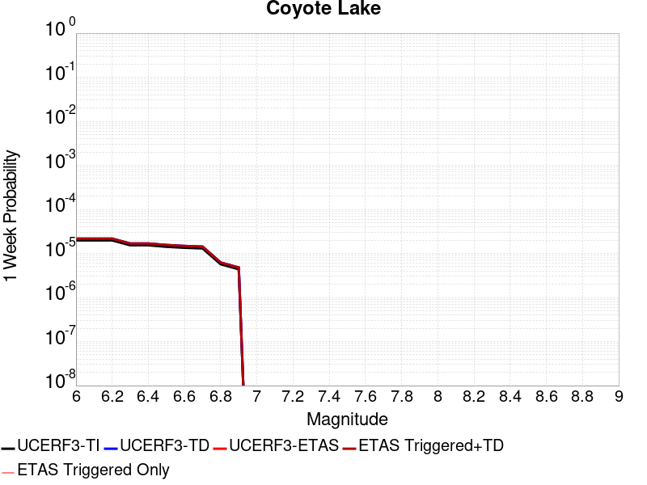 | 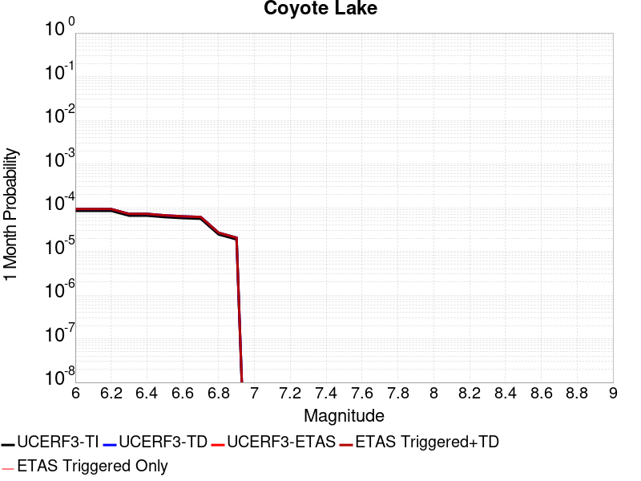 | 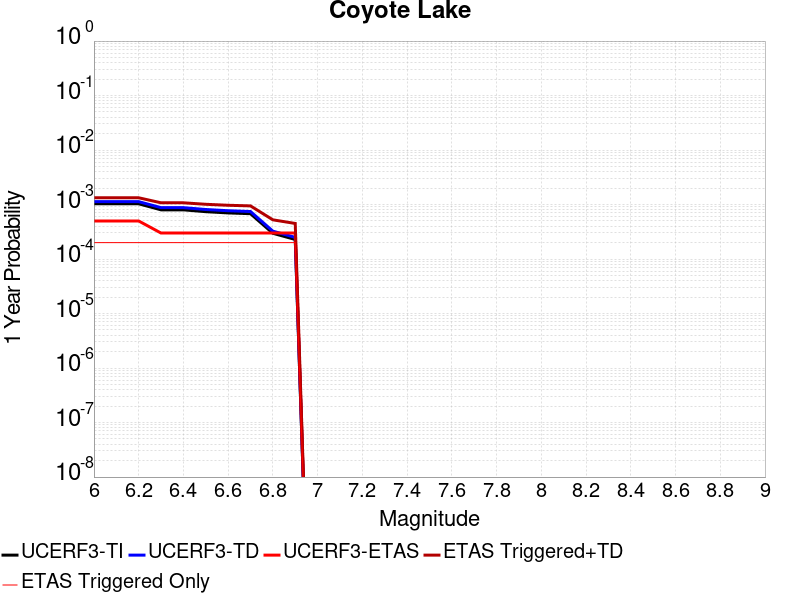 | 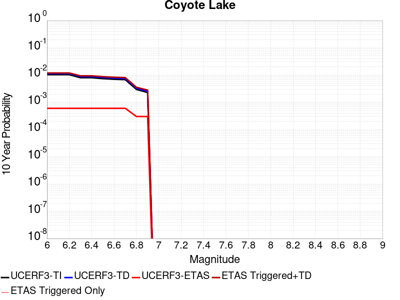 |

| Magnitude | 1 wk TI Prob | 1 wk TD Prob | 1 wk ETAS Prob | 1 wk ETAS/TD Gain | 1 wk ETAS Triggered+TD | 1 wk ETAS Triggered Only | 1 mo TI Prob | 1 mo TD Prob | 1 mo ETAS Prob | 1 mo ETAS/TD Gain | 1 mo ETAS Triggered+TD | 1 mo ETAS Triggered Only | 1 yr TI Prob | 1 yr TD Prob | 1 yr ETAS Prob | 1 yr ETAS/TD Gain | 1 yr ETAS Triggered+TD | 1 yr ETAS Triggered Only | 10 yr TI Prob | 10 yr TD Prob | 10 yr ETAS Prob | 10 yr ETAS/TD Gain | 10 yr ETAS Triggered+TD | 10 yr ETAS Triggered Only |
|-----|-----|-----|-----|-----|-----|-----|-----|-----|-----|-----|-----|-----|-----|-----|-----|-----|-----|-----|-----|-----|-----|-----|-----|-----|
| 6.0 | 1.980352E-5 | 2.1711043E-5 | 0.0 | 0.0 | 2.1711043E-5 | 0.0 | 8.486947E-5 | 9.3044415E-5 | 0.0 | 0.0 | 9.3044415E-5 | 0.0 | 0.0010327959 | 0.0011322991 | 5.0E-4 | 0.44157943 | 0.0013320727 | 2.0E-4 | 0.010280091 | 0.011272479 | 0.0073 | 0.6475949 | 0.011865715 | 6.0E-4 |
| 6.1 | 1.980352E-5 | 2.1711043E-5 | 0.0 | 0.0 | 2.1711043E-5 | 0.0 | 8.486947E-5 | 9.3044415E-5 | 0.0 | 0.0 | 9.3044415E-5 | 0.0 | 0.0010327959 | 0.0011322991 | 5.0E-4 | 0.44157943 | 0.0013320727 | 2.0E-4 | 0.010280091 | 0.011272479 | 0.0073 | 0.6475949 | 0.011865715 | 6.0E-4 |
| 6.2 | 1.980352E-5 | 2.1711043E-5 | 0.0 | 0.0 | 2.1711043E-5 | 0.0 | 8.486947E-5 | 9.3044415E-5 | 0.0 | 0.0 | 9.3044415E-5 | 0.0 | 0.0010327959 | 0.0011322991 | 5.0E-4 | 0.44157943 | 0.0013320727 | 2.0E-4 | 0.010280091 | 0.011272479 | 0.0073 | 0.6475949 | 0.011865715 | 6.0E-4 |
| 6.3 | 1.5344787E-5 | 1.6824002E-5 | 0.0 | 0.0 | 1.6824002E-5 | 0.0 | 6.576172E-5 | 7.210122E-5 | 0.0 | 0.0 | 7.210122E-5 | 0.0 | 8.003548E-4 | 8.7754003E-4 | 3.0E-4 | 0.34186473 | 0.0010773645 | 2.0E-4 | 0.007974784 | 0.008746796 | 0.0052 | 0.5945034 | 0.009341548 | 6.0E-4 |
| 6.4 | 1.5344787E-5 | 1.6824002E-5 | 0.0 | 0.0 | 1.6824002E-5 | 0.0 | 6.576172E-5 | 7.210122E-5 | 0.0 | 0.0 | 7.210122E-5 | 0.0 | 8.003548E-4 | 8.7754003E-4 | 3.0E-4 | 0.34186473 | 0.0010773645 | 2.0E-4 | 0.007974784 | 0.008746796 | 0.0052 | 0.5945034 | 0.009341548 | 6.0E-4 |
| 6.5 | 1.4189697E-5 | 1.5561078E-5 | 0.0 | 0.0 | 1.5561078E-5 | 0.0 | 6.081157E-5 | 6.668897E-5 | 0.0 | 0.0 | 6.668897E-5 | 0.0 | 7.401293E-4 | 8.1169605E-4 | 3.0E-4 | 0.36959648 | 0.0010115337 | 2.0E-4 | 0.0073766913 | 0.008093258 | 0.0052 | 0.64251006 | 0.008688402 | 6.0E-4 |
| 6.6 | 1.3469301E-5 | 1.47745195E-5 | 0.0 | 0.0 | 1.47745195E-5 | 0.0 | 5.7724297E-5 | 6.331817E-5 | 0.0 | 0.0 | 6.331817E-5 | 0.0 | 7.025667E-4 | 7.706861E-4 | 3.0E-4 | 0.38926354 | 9.7053195E-4 | 2.0E-4 | 0.0070034964 | 0.0076860404 | 0.005 | 0.65053004 | 0.008281428 | 6.0E-4 |
| 6.7 | 1.3027966E-5 | 1.42845765E-5 | 0.0 | 0.0 | 1.42845765E-5 | 0.0 | 5.5832945E-5 | 6.121852E-5 | 0.0 | 0.0 | 6.121852E-5 | 0.0 | 6.7955407E-4 | 7.451403E-4 | 3.0E-4 | 0.40260875 | 9.4499125E-4 | 2.0E-4 | 0.006774798 | 0.007432298 | 0.0047 | 0.63237506 | 0.008027839 | 6.0E-4 |
| 6.8 | 5.695434E-6 | 6.225608E-6 | 0.0 | 0.0 | 6.225608E-6 | 0.0 | 2.4408775E-5 | 2.6681075E-5 | 0.0 | 0.0 | 2.6681075E-5 | 0.0 | 2.971363E-4 | 3.2482366E-4 | 3.0E-4 | 0.923578 | 5.247587E-4 | 2.0E-4 | 0.0029673933 | 0.0032464308 | 0.0025 | 0.77007645 | 0.003545457 | 3.0E-4 |
| 6.9 | 4.385688E-6 | 4.793972E-6 | 0.0 | 0.0 | 4.793972E-6 | 0.0 | 1.879567E-5 | 2.0545594E-5 | 0.0 | 0.0 | 2.0545594E-5 | 0.0 | 2.2881327E-4 | 2.5014262E-4 | 3.0E-4 | 1.1993158 | 4.500926E-4 | 2.0E-4 | 0.002285778 | 0.0025014263 | 0.0022 | 0.87949824 | 0.0028006758 | 3.0E-4 |

## Santa Rosa Island
*[(top)](#table-of-contents)*

| 1 Week | 1 Month | 1 Year | 10 Year |
|-----|-----|-----|-----|
| 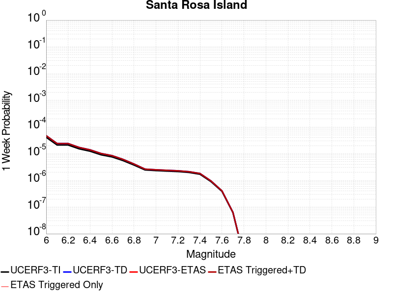 | 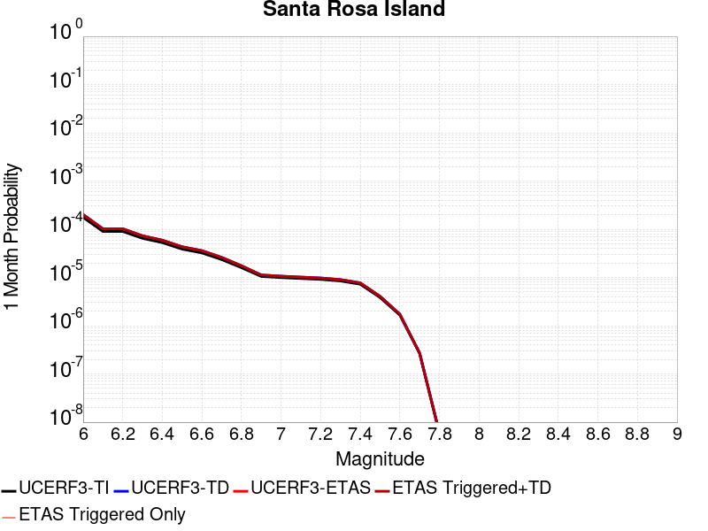 | 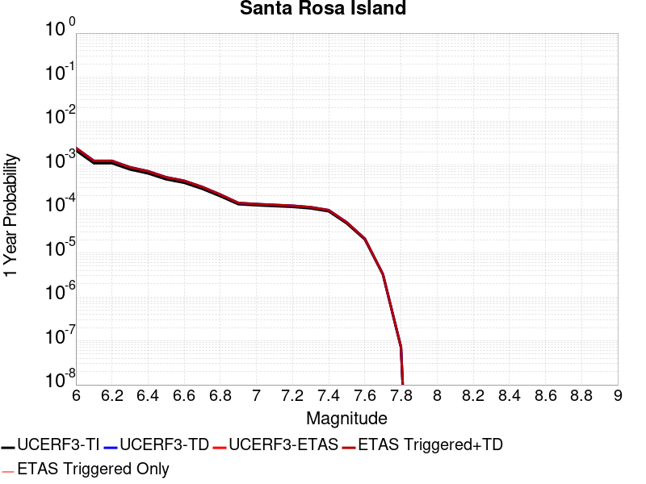 | 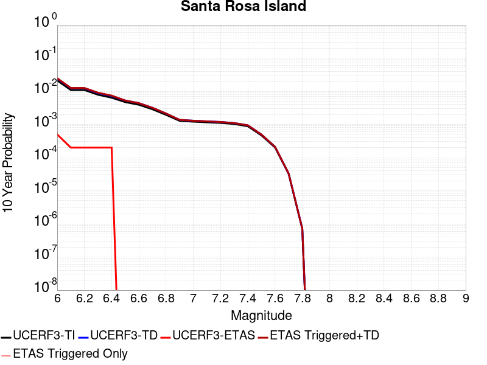 |

| Magnitude | 1 wk TI Prob | 1 wk TD Prob | 1 wk ETAS Prob | 1 wk ETAS/TD Gain | 1 wk ETAS Triggered+TD | 1 wk ETAS Triggered Only | 1 mo TI Prob | 1 mo TD Prob | 1 mo ETAS Prob | 1 mo ETAS/TD Gain | 1 mo ETAS Triggered+TD | 1 mo ETAS Triggered Only | 1 yr TI Prob | 1 yr TD Prob | 1 yr ETAS Prob | 1 yr ETAS/TD Gain | 1 yr ETAS Triggered+TD | 1 yr ETAS Triggered Only | 10 yr TI Prob | 10 yr TD Prob | 10 yr ETAS Prob | 10 yr ETAS/TD Gain | 10 yr ETAS Triggered+TD | 10 yr ETAS Triggered Only |
|-----|-----|-----|-----|-----|-----|-----|-----|-----|-----|-----|-----|-----|-----|-----|-----|-----|-----|-----|-----|-----|-----|-----|-----|-----|
| 6.0 | 4.1143165E-5 | 4.7105223E-5 | 0.0 | 0.0 | 4.7105223E-5 | 0.0 | 1.7631594E-4 | 2.0186501E-4 | 1.0E-4 | 0.49538055 | 2.0186501E-4 | 0.0 | 0.002144533 | 0.002455133 | 0.0016 | 0.65169585 | 0.002455133 | 0.0 | 0.021239553 | 0.024300747 | 0.0183 | 0.75306326 | 0.024788596 | 5.0E-4 |
| 6.1 | 2.1061249E-5 | 2.3871538E-5 | 0.0 | 0.0 | 2.3871538E-5 | 0.0 | 9.0259375E-5 | 1.0230275E-4 | 0.0 | 0.0 | 1.0230275E-4 | 0.0 | 0.0010983539 | 0.0012448533 | 6.0E-4 | 0.48198453 | 0.0012448533 | 0.0 | 0.01092941 | 0.012381842 | 0.0072 | 0.58149666 | 0.012579367 | 2.0E-4 |
| 6.2 | 2.1061249E-5 | 2.3871538E-5 | 0.0 | 0.0 | 2.3871538E-5 | 0.0 | 9.0259375E-5 | 1.0230275E-4 | 0.0 | 0.0 | 1.0230275E-4 | 0.0 | 0.0010983539 | 0.0012448533 | 6.0E-4 | 0.48198453 | 0.0012448533 | 0.0 | 0.01092941 | 0.012381842 | 0.0072 | 0.58149666 | 0.012579367 | 2.0E-4 |
| 6.3 | 1.5158236E-5 | 1.707889E-5 | 0.0 | 0.0 | 1.707889E-5 | 0.0 | 6.496225E-5 | 7.319326E-5 | 0.0 | 0.0 | 7.319326E-5 | 0.0 | 7.906284E-4 | 8.9077564E-4 | 4.0E-4 | 0.44904688 | 8.9077564E-4 | 0.0 | 0.007878214 | 0.008873303 | 0.0054 | 0.608567 | 0.009071529 | 2.0E-4 |
| 6.4 | 1.2341918E-5 | 1.3856433E-5 | 0.0 | 0.0 | 1.3856433E-5 | 0.0 | 5.2892858E-5 | 5.9383405E-5 | 0.0 | 0.0 | 5.9383405E-5 | 0.0 | 6.437803E-4 | 7.2276127E-4 | 3.0E-4 | 0.41507483 | 7.2276127E-4 | 0.0 | 0.006419184 | 0.0072049433 | 0.0045 | 0.62457114 | 0.0074035027 | 2.0E-4 |
| 6.5 | 9.061158E-6 | 1.0119479E-5 | 0.0 | 0.0 | 1.0119479E-5 | 0.0 | 3.883296E-5 | 4.3368505E-5 | 0.0 | 0.0 | 4.3368505E-5 | 0.0 | 4.726887E-4 | 5.2788894E-4 | 3.0E-4 | 0.5683013 | 5.2788894E-4 | 0.0 | 0.004716845 | 0.0052668885 | 0.0032 | 0.60756934 | 0.0052668885 | 0.0 |
| 6.6 | 7.5461685E-6 | 8.4027115E-6 | 0.0 | 0.0 | 8.4027115E-6 | 0.0 | 3.2340322E-5 | 3.6011148E-5 | 0.0 | 0.0 | 3.6011148E-5 | 0.0 | 3.936723E-4 | 4.3835182E-4 | 3.0E-4 | 0.6843818 | 4.3835182E-4 | 0.0 | 0.003929756 | 0.0043753018 | 0.0029 | 0.66281146 | 0.0043753018 | 0.0 |
| 6.7 | 5.5023775E-6 | 6.08873E-6 | 0.0 | 0.0 | 6.08873E-6 | 0.0 | 2.3581404E-5 | 2.6094314E-5 | 0.0 | 0.0 | 2.6094314E-5 | 0.0 | 2.8706578E-4 | 3.176552E-4 | 2.0E-4 | 0.62961346 | 3.176552E-4 | 0.0 | 0.0028669522 | 0.0031723336 | 0.0024 | 0.7565409 | 0.0031723336 | 0.0 |
| 6.8 | 3.7351679E-6 | 4.083936E-6 | 0.0 | 0.0 | 4.083936E-6 | 0.0 | 1.6007763E-5 | 1.750248E-5 | 0.0 | 0.0 | 1.750248E-5 | 0.0 | 1.948771E-4 | 2.1307435E-4 | 2.0E-4 | 0.9386395 | 2.1307435E-4 | 0.0 | 0.0019470629 | 0.002128946 | 0.0016 | 0.75154567 | 0.002128946 | 0.0 |
| 6.9 | 2.456366E-6 | 2.6296561E-6 | 0.0 | 0.0 | 2.6296561E-6 | 0.0 | 1.0527241E-5 | 1.1269906E-5 | 0.0 | 0.0 | 1.1269906E-5 | 0.0 | 1.2816161E-4 | 1.372025E-4 | 2.0E-4 | 1.4576994 | 1.372025E-4 | 0.0 | 0.0012808773 | 0.0013711809 | 0.0011 | 0.8022282 | 0.0013711809 | 0.0 |
| 7.0 | 2.3245157E-6 | 2.4831304E-6 | 0.0 | 0.0 | 2.4831304E-6 | 0.0 | 9.962172E-6 | 1.0641944E-5 | 0.0 | 0.0 | 1.0641944E-5 | 0.0 | 1.2128269E-4 | 1.2955799E-4 | 2.0E-4 | 1.5437104 | 1.2955799E-4 | 0.0 | 0.0012121652 | 0.0012948269 | 0.0011 | 0.84953445 | 0.0012948269 | 0.0 |
| 7.1 | 2.2248344E-6 | 2.3735797E-6 | 0.0 | 0.0 | 2.3735797E-6 | 0.0 | 9.53497E-6 | 1.0172445E-5 | 0.0 | 0.0 | 1.0172445E-5 | 0.0 | 1.1608207E-4 | 1.238425E-4 | 2.0E-4 | 1.6149545 | 1.238425E-4 | 0.0 | 0.0011602144 | 0.0012377368 | 0.0011 | 0.88871884 | 0.0012377368 | 0.0 |
| 7.2 | 2.1350402E-6 | 2.2764675E-6 | 0.0 | 0.0 | 2.2764675E-6 | 0.0 | 9.150141E-6 | 9.756252E-6 | 0.0 | 0.0 | 9.756252E-6 | 0.0 | 1.1139726E-4 | 1.1877592E-4 | 1.0E-4 | 0.8419215 | 1.1877592E-4 | 0.0 | 0.0011134144 | 0.0011871263 | 0.001 | 0.8423704 | 0.0011871263 | 0.0 |
| 7.3 | 1.9793572E-6 | 2.1090063E-6 | 0.0 | 0.0 | 2.1090063E-6 | 0.0 | 8.482932E-6 | 9.038567E-6 | 0.0 | 0.0 | 9.038567E-6 | 0.0 | 1.032748E-4 | 1.1003902E-4 | 1.0E-4 | 0.90876853 | 1.1003902E-4 | 0.0 | 0.0010322682 | 0.0010998471 | 9.0E-4 | 0.81829554 | 0.0010998471 | 0.0 |
| 7.4 | 1.6951194E-6 | 1.8048167E-6 | 0.0 | 0.0 | 1.8048167E-6 | 0.0 | 7.264777E-6 | 7.734906E-6 | 0.0 | 0.0 | 7.734906E-6 | 0.0 | 8.844508E-5 | 9.416843E-5 | 1.0E-4 | 1.0619271 | 9.416843E-5 | 0.0 | 8.840988E-4 | 9.412869E-4 | 7.0E-4 | 0.7436627 | 9.412869E-4 | 0.0 |
| 7.5 | 8.987207E-7 | 9.51339E-7 | 0.0 | 0.0 | 9.51339E-7 | 0.0 | 3.8516546E-6 | 4.0771606E-6 | 0.0 | 0.0 | 4.0771606E-6 | 0.0 | 4.6892885E-5 | 4.9638315E-5 | 0.0 | 0.0 | 4.9638315E-5 | 0.0 | 4.688299E-4 | 4.9627345E-4 | 2.0E-4 | 0.40300363 | 4.9627345E-4 | 0.0 |
| 7.6 | 3.8783037E-7 | 4.053334E-7 | 0.0 | 0.0 | 4.053334E-7 | 0.0 | 1.6621291E-6 | 1.737142E-6 | 0.0 | 0.0 | 1.737142E-6 | 0.0 | 2.0236233E-5 | 2.1149506E-5 | 0.0 | 0.0 | 2.1149506E-5 | 0.0 | 2.023439E-4 | 2.1147558E-4 | 2.0E-4 | 0.9457357 | 2.1147558E-4 | 0.0 |
| 7.7 | 6.181804E-8 | 6.339532E-8 | 0.0 | 0.0 | 6.339532E-8 | 0.0 | 2.6493444E-7 | 2.7169418E-7 | 0.0 | 0.0 | 2.7169418E-7 | 0.0 | 3.225572E-6 | 3.3078718E-6 | 0.0 | 0.0 | 3.3078718E-6 | 0.0 | 3.225525E-5 | 3.307823E-5 | 0.0 | 0.0 | 3.307823E-5 | 0.0 |
| 7.8 | 1.3704449E-9 | 1.3964698E-9 | 0.0 | 0.0 | 1.3964698E-9 | 0.0 | 5.873335E-9 | 5.9848704E-9 | 0.0 | 0.0 | 5.9848704E-9 | 0.0 | 7.1507856E-8 | 7.2865795E-8 | 0.0 | 0.0 | 7.2865795E-8 | 0.0 | 7.1507833E-7 | 7.286578E-7 | 0.0 | 0.0 | 7.286578E-7 | 0.0 |

## Sheephole
*[(top)](#table-of-contents)*

| 1 Week | 1 Month | 1 Year | 10 Year |
|-----|-----|-----|-----|
| 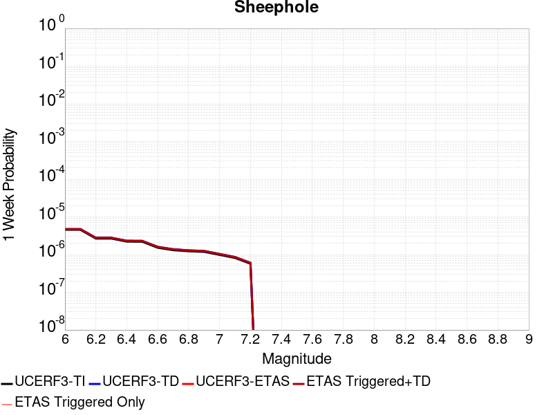 | 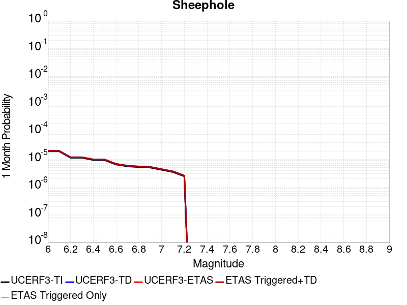 | 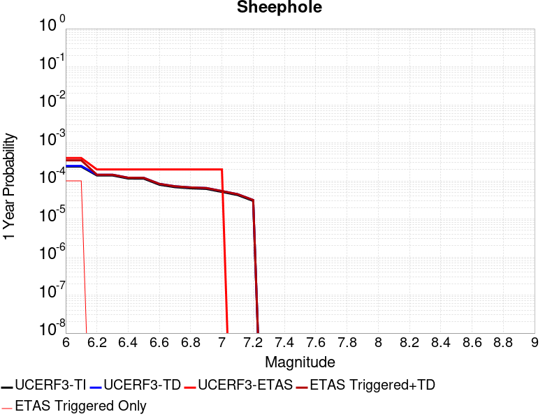 | 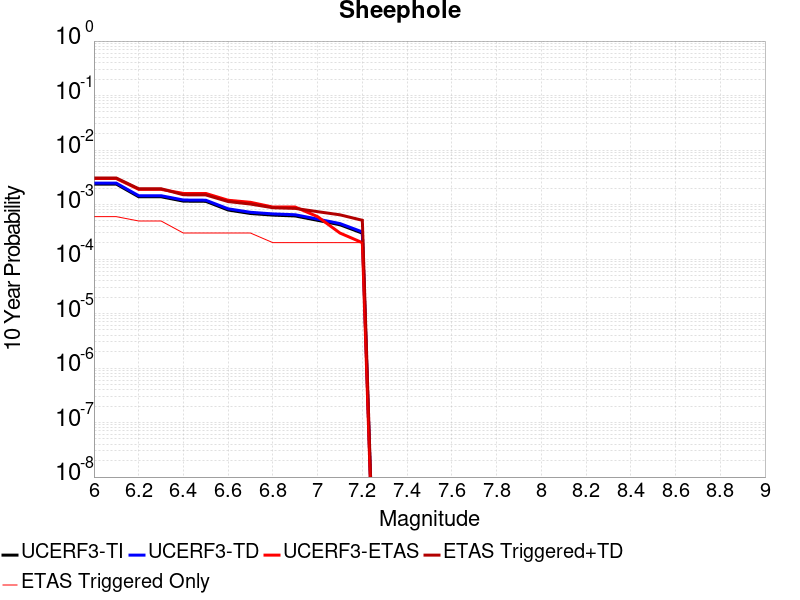 |

| Magnitude | 1 wk TI Prob | 1 wk TD Prob | 1 wk ETAS Prob | 1 wk ETAS/TD Gain | 1 wk ETAS Triggered+TD | 1 wk ETAS Triggered Only | 1 mo TI Prob | 1 mo TD Prob | 1 mo ETAS Prob | 1 mo ETAS/TD Gain | 1 mo ETAS Triggered+TD | 1 mo ETAS Triggered Only | 1 yr TI Prob | 1 yr TD Prob | 1 yr ETAS Prob | 1 yr ETAS/TD Gain | 1 yr ETAS Triggered+TD | 1 yr ETAS Triggered Only | 10 yr TI Prob | 10 yr TD Prob | 10 yr ETAS Prob | 10 yr ETAS/TD Gain | 10 yr ETAS Triggered+TD | 10 yr ETAS Triggered Only |
|-----|-----|-----|-----|-----|-----|-----|-----|-----|-----|-----|-----|-----|-----|-----|-----|-----|-----|-----|-----|-----|-----|-----|-----|-----|
| 6.0 | 4.5579695E-6 | 4.741656E-6 | 0.0 | 0.0 | 4.741656E-6 | 0.0 | 1.9534009E-5 | 2.0321255E-5 | 1.0E-4 | 4.9209557 | 2.0321255E-5 | 0.0 | 2.3780059E-4 | 2.4738873E-4 | 4.0E-4 | 1.6168885 | 3.47364E-4 | 1.0E-4 | 0.0023754628 | 0.002471678 | 0.003 | 1.2137504 | 0.003070195 | 6.0E-4 |
| 6.1 | 4.5579695E-6 | 4.741656E-6 | 0.0 | 0.0 | 4.741656E-6 | 0.0 | 1.9534009E-5 | 2.0321255E-5 | 1.0E-4 | 4.9209557 | 2.0321255E-5 | 0.0 | 2.3780059E-4 | 2.4738873E-4 | 4.0E-4 | 1.6168885 | 3.47364E-4 | 1.0E-4 | 0.0023754628 | 0.002471678 | 0.003 | 1.2137504 | 0.003070195 | 6.0E-4 |
| 6.2 | 2.6677674E-6 | 2.787652E-6 | 0.0 | 0.0 | 2.787652E-6 | 0.0 | 1.1433239E-5 | 1.1947031E-5 | 1.0E-4 | 8.37028 | 1.1947031E-5 | 0.0 | 1.3919079E-4 | 1.4544648E-4 | 2.0E-4 | 1.3750763 | 1.4544648E-4 | 0.0 | 0.0013910364 | 0.0014536188 | 0.0019 | 1.3070828 | 0.0019528919 | 5.0E-4 |
| 6.3 | 2.6677674E-6 | 2.787652E-6 | 0.0 | 0.0 | 2.787652E-6 | 0.0 | 1.1433239E-5 | 1.1947031E-5 | 1.0E-4 | 8.37028 | 1.1947031E-5 | 0.0 | 1.3919079E-4 | 1.4544648E-4 | 2.0E-4 | 1.3750763 | 1.4544648E-4 | 0.0 | 0.0013910364 | 0.0014536188 | 0.0019 | 1.3070828 | 0.0019528919 | 5.0E-4 |
| 6.4 | 2.2159759E-6 | 2.3231096E-6 | 0.0 | 0.0 | 2.3231096E-6 | 0.0 | 9.497005E-6 | 9.95615E-6 | 1.0E-4 | 10.044043 | 9.95615E-6 | 0.0 | 1.156199E-4 | 1.212102E-4 | 2.0E-4 | 1.6500262 | 1.212102E-4 | 0.0 | 0.0011555976 | 0.0012115203 | 0.0016 | 1.3206547 | 0.0015111568 | 3.0E-4 |
| 6.5 | 2.1986082E-6 | 2.3049884E-6 | 0.0 | 0.0 | 2.3049884E-6 | 0.0 | 9.4225725E-6 | 9.8784885E-6 | 1.0E-4 | 10.123006 | 9.8784885E-6 | 0.0 | 1.1471378E-4 | 1.2026477E-4 | 2.0E-4 | 1.6629975 | 1.2026477E-4 | 0.0 | 0.0011465458 | 0.0012020762 | 0.0016 | 1.3310305 | 0.0015017155 | 3.0E-4 |
| 6.6 | 1.5232331E-6 | 1.6020622E-6 | 0.0 | 0.0 | 1.6020622E-6 | 0.0 | 6.5281256E-6 | 6.8659638E-6 | 1.0E-4 | 14.564597 | 6.8659638E-6 | 0.0 | 7.947703E-5 | 8.3590094E-5 | 2.0E-4 | 2.392628 | 8.3590094E-5 | 0.0 | 7.9448614E-4 | 8.3560526E-4 | 0.0012 | 1.4360849 | 0.0011353545 | 3.0E-4 |
| 6.7 | 1.3137362E-6 | 1.3829688E-6 | 0.0 | 0.0 | 1.3829688E-6 | 0.0 | 5.6302856E-6 | 5.9269964E-6 | 1.0E-4 | 16.871952 | 5.9269964E-6 | 0.0 | 6.854657E-5 | 7.215893E-5 | 2.0E-4 | 2.7716596 | 7.215893E-5 | 0.0 | 6.8525434E-4 | 7.2136894E-4 | 0.0011 | 1.5248785 | 0.0010211525 | 3.0E-4 |
| 6.8 | 1.2275751E-6 | 1.2924249E-6 | 0.0 | 0.0 | 1.2924249E-6 | 0.0 | 5.2610258E-6 | 5.538953E-6 | 1.0E-4 | 18.053953 | 5.538953E-6 | 0.0 | 6.4051106E-5 | 6.74348E-5 | 2.0E-4 | 2.9658277 | 6.74348E-5 | 0.0 | 6.4032647E-4 | 6.7415676E-4 | 9.0E-4 | 1.3350011 | 8.740219E-4 | 2.0E-4 |
| 6.9 | 1.1837088E-6 | 1.2462373E-6 | 0.0 | 0.0 | 1.2462373E-6 | 0.0 | 5.0730278E-6 | 5.3410067E-6 | 1.0E-4 | 18.723063 | 5.3410067E-6 | 0.0 | 6.176237E-5 | 6.502495E-5 | 2.0E-4 | 3.0757425 | 6.502495E-5 | 0.0 | 6.17452E-4 | 6.500724E-4 | 9.0E-4 | 1.3844612 | 8.499424E-4 | 2.0E-4 |
| 7.0 | 9.849371E-7 | 1.0367409E-6 | 0.0 | 0.0 | 1.0367409E-6 | 0.0 | 4.2211523E-6 | 4.443168E-6 | 1.0E-4 | 22.506464 | 4.443168E-6 | 0.0 | 5.1391315E-5 | 5.409433E-5 | 2.0E-4 | 3.6972451 | 5.409433E-5 | 0.0 | 5.137943E-4 | 5.408217E-4 | 6.0E-4 | 1.1094229 | 7.4071356E-4 | 2.0E-4 |
| 7.1 | 8.1643645E-7 | 8.592595E-7 | 0.0 | 0.0 | 8.592595E-7 | 0.0 | 3.4990085E-6 | 3.682536E-6 | 0.0 | 0.0 | 3.682536E-6 | 0.0 | 4.2599597E-5 | 4.483404E-5 | 0.0 | 0.0 | 4.483404E-5 | 0.0 | 4.259143E-4 | 4.482586E-4 | 3.0E-4 | 0.66925657 | 6.4816896E-4 | 2.0E-4 |
| 7.2 | 5.7295756E-7 | 6.0301517E-7 | 0.0 | 0.0 | 6.0301517E-7 | 0.0 | 2.45553E-6 | 2.5843485E-6 | 0.0 | 0.0 | 2.5843485E-6 | 0.0 | 2.9895667E-5 | 3.1464057E-5 | 0.0 | 0.0 | 3.1464057E-5 | 0.0 | 2.9891645E-4 | 3.1460272E-4 | 2.0E-4 | 0.6357224 | 5.145398E-4 | 2.0E-4 |

## Collayami 2011 CFM
*[(top)](#table-of-contents)*

| 1 Week | 1 Month | 1 Year | 10 Year |
|-----|-----|-----|-----|
| 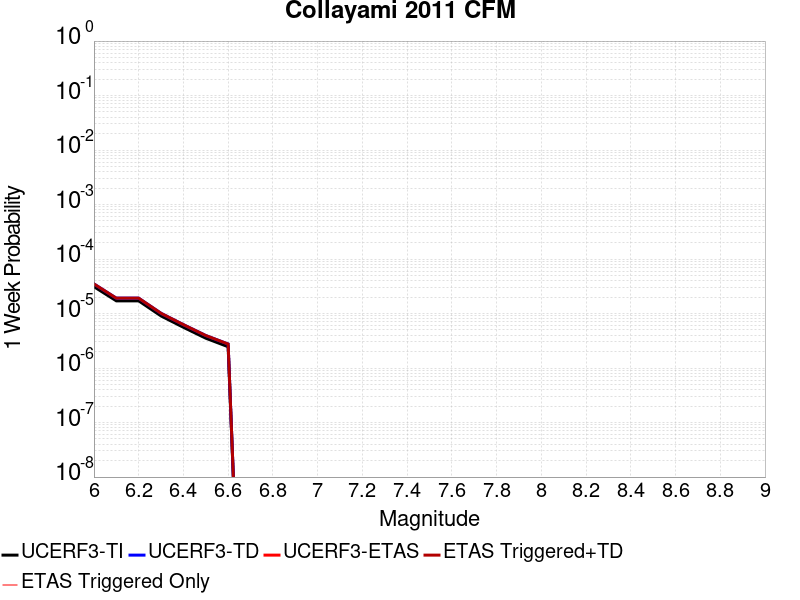 | 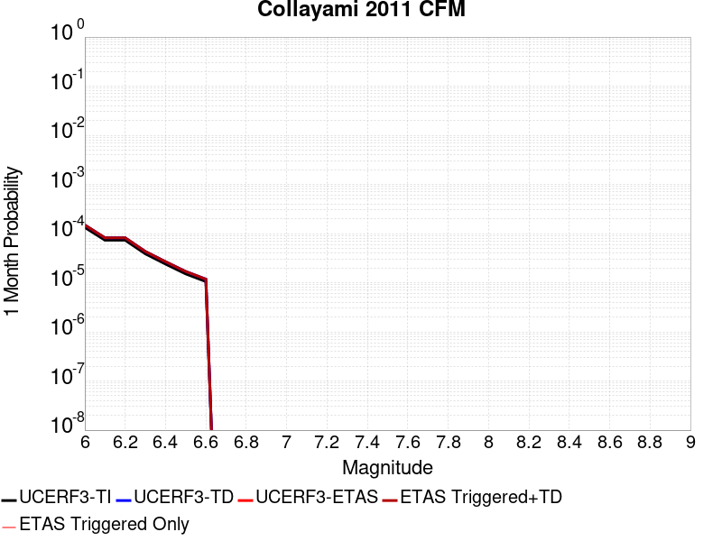 | 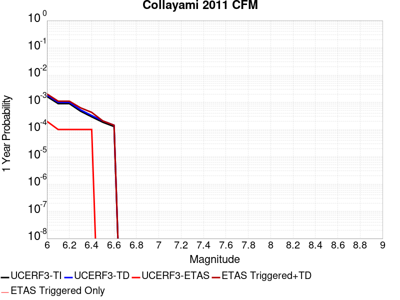 | 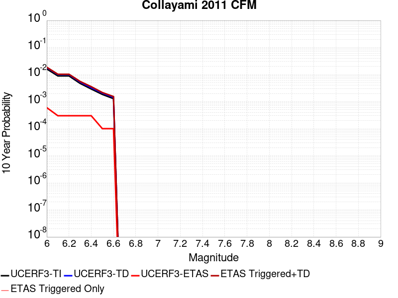 |

| Magnitude | 1 wk TI Prob | 1 wk TD Prob | 1 wk ETAS Prob | 1 wk ETAS/TD Gain | 1 wk ETAS Triggered+TD | 1 wk ETAS Triggered Only | 1 mo TI Prob | 1 mo TD Prob | 1 mo ETAS Prob | 1 mo ETAS/TD Gain | 1 mo ETAS Triggered+TD | 1 mo ETAS Triggered Only | 1 yr TI Prob | 1 yr TD Prob | 1 yr ETAS Prob | 1 yr ETAS/TD Gain | 1 yr ETAS Triggered+TD | 1 yr ETAS Triggered Only | 10 yr TI Prob | 10 yr TD Prob | 10 yr ETAS Prob | 10 yr ETAS/TD Gain | 10 yr ETAS Triggered+TD | 10 yr ETAS Triggered Only |
|-----|-----|-----|-----|-----|-----|-----|-----|-----|-----|-----|-----|-----|-----|-----|-----|-----|-----|-----|-----|-----|-----|-----|-----|-----|
| 6.0 | 3.112429E-5 | 3.4947392E-5 | 0.0 | 0.0 | 3.4947392E-5 | 0.0 | 1.33383E-4 | 1.4976693E-4 | 0.0 | 0.0 | 1.4976693E-4 | 0.0 | 0.0016227282 | 0.0018220613 | 8.0E-4 | 0.43906316 | 0.002021697 | 2.0E-4 | 0.016109297 | 0.018088762 | 0.0092 | 0.5086031 | 0.018677909 | 6.0E-4 |
| 6.1 | 1.7119446E-5 | 1.9161313E-5 | 0.0 | 0.0 | 1.9161313E-5 | 0.0 | 7.336699E-5 | 8.211766E-5 | 0.0 | 0.0 | 8.211766E-5 | 0.0 | 8.92877E-4 | 9.993832E-4 | 4.0E-4 | 0.4002469 | 0.0010992832 | 1.0E-4 | 0.00889298 | 0.00995477 | 0.005 | 0.5022718 | 0.010251784 | 3.0E-4 |
| 6.2 | 1.7119446E-5 | 1.9161313E-5 | 0.0 | 0.0 | 1.9161313E-5 | 0.0 | 7.336699E-5 | 8.211766E-5 | 0.0 | 0.0 | 8.211766E-5 | 0.0 | 8.92877E-4 | 9.993832E-4 | 4.0E-4 | 0.4002469 | 0.0010992832 | 1.0E-4 | 0.00889298 | 0.00995477 | 0.005 | 0.5022718 | 0.010251784 | 3.0E-4 |
| 6.3 | 9.041288E-6 | 1.0108547E-5 | 0.0 | 0.0 | 1.0108547E-5 | 0.0 | 3.87478E-5 | 4.332175E-5 | 0.0 | 0.0 | 4.332175E-5 | 0.0 | 4.7165234E-4 | 5.273366E-4 | 2.0E-4 | 0.3792644 | 6.272838E-4 | 1.0E-4 | 0.0047065257 | 0.0052630114 | 0.0031 | 0.58901644 | 0.0055614323 | 3.0E-4 |
| 6.4 | 5.5972064E-6 | 6.2595686E-6 | 0.0 | 0.0 | 6.2595686E-6 | 0.0 | 2.3987806E-5 | 2.6826523E-5 | 0.0 | 0.0 | 2.6826523E-5 | 0.0 | 2.920124E-4 | 3.2657757E-4 | 1.0E-4 | 0.30620596 | 4.265449E-4 | 1.0E-4 | 0.0029162897 | 0.0032623115 | 0.0018 | 0.551756 | 0.0035613326 | 3.0E-4 |
| 6.5 | 3.530659E-6 | 3.95302E-6 | 0.0 | 0.0 | 3.95302E-6 | 0.0 | 1.5131307E-5 | 1.6941463E-5 | 0.0 | 0.0 | 1.6941463E-5 | 0.0 | 1.842081E-4 | 2.0625319E-4 | 0.0 | 0.0 | 2.0625319E-4 | 0.0 | 0.0018405546 | 0.002061637 | 0.0012 | 0.58206177 | 0.0021614307 | 1.0E-4 |
| 6.6 | 2.4625563E-6 | 2.7579454E-6 | 0.0 | 0.0 | 2.7579454E-6 | 0.0 | 1.0553769E-5 | 1.1819766E-5 | 0.0 | 0.0 | 1.1819766E-5 | 0.0 | 1.2848456E-4 | 1.4390565E-4 | 0.0 | 0.0 | 1.4390565E-4 | 0.0 | 0.001284103 | 0.0014390565 | 8.0E-4 | 0.5559198 | 0.0015389125 | 1.0E-4 |

## Monterey Bay-Tularcitos
*[(top)](#table-of-contents)*

| 1 Week | 1 Month | 1 Year | 10 Year |
|-----|-----|-----|-----|
| 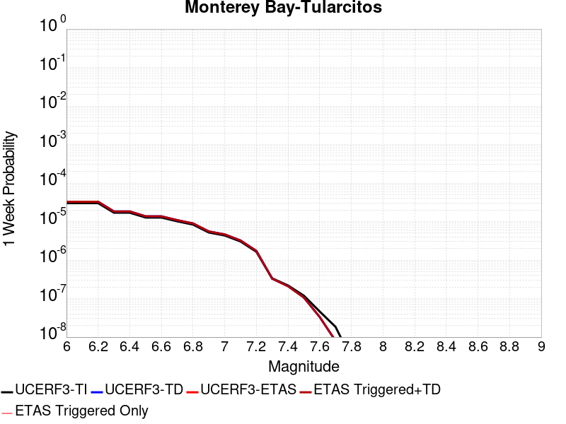 | 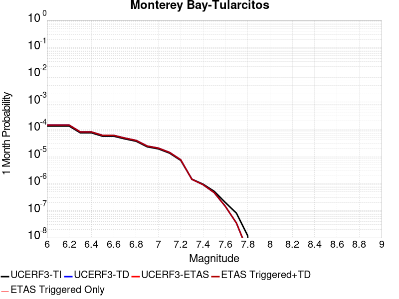 | 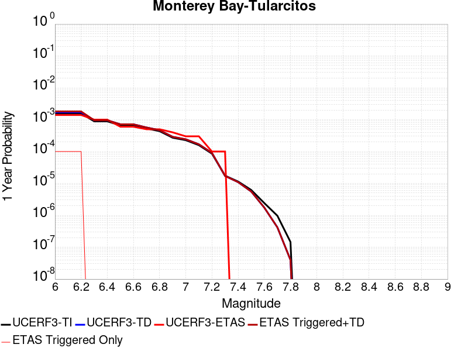 | 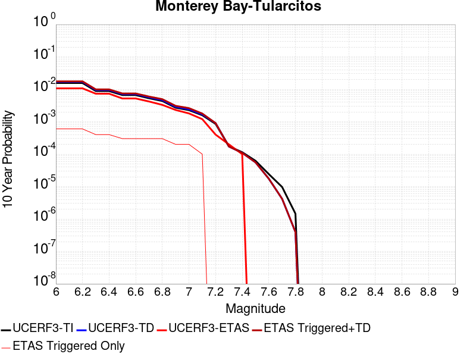 |

| Magnitude | 1 wk TI Prob | 1 wk TD Prob | 1 wk ETAS Prob | 1 wk ETAS/TD Gain | 1 wk ETAS Triggered+TD | 1 wk ETAS Triggered Only | 1 mo TI Prob | 1 mo TD Prob | 1 mo ETAS Prob | 1 mo ETAS/TD Gain | 1 mo ETAS Triggered+TD | 1 mo ETAS Triggered Only | 1 yr TI Prob | 1 yr TD Prob | 1 yr ETAS Prob | 1 yr ETAS/TD Gain | 1 yr ETAS Triggered+TD | 1 yr ETAS Triggered Only | 10 yr TI Prob | 10 yr TD Prob | 10 yr ETAS Prob | 10 yr ETAS/TD Gain | 10 yr ETAS Triggered+TD | 10 yr ETAS Triggered Only |
|-----|-----|-----|-----|-----|-----|-----|-----|-----|-----|-----|-----|-----|-----|-----|-----|-----|-----|-----|-----|-----|-----|-----|-----|-----|
| 6.0 | 3.0131365E-5 | 3.280489E-5 | 0.0 | 0.0 | 3.280489E-5 | 0.0 | 1.2912804E-4 | 1.4058541E-4 | 0.0 | 0.0 | 1.4058541E-4 | 0.0 | 0.001571 | 0.0017103892 | 0.0014 | 0.81852716 | 0.0018102181 | 1.0E-4 | 0.015599402 | 0.016983062 | 0.0107 | 0.6300395 | 0.017572872 | 6.0E-4 |
| 6.1 | 3.0131365E-5 | 3.280489E-5 | 0.0 | 0.0 | 3.280489E-5 | 0.0 | 1.2912804E-4 | 1.4058541E-4 | 0.0 | 0.0 | 1.4058541E-4 | 0.0 | 0.001571 | 0.0017103892 | 0.0014 | 0.81852716 | 0.0018102181 | 1.0E-4 | 0.015599402 | 0.016983062 | 0.0107 | 0.6300395 | 0.017572872 | 6.0E-4 |
| 6.2 | 3.0131365E-5 | 3.280489E-5 | 0.0 | 0.0 | 3.280489E-5 | 0.0 | 1.2912804E-4 | 1.4058541E-4 | 0.0 | 0.0 | 1.4058541E-4 | 0.0 | 0.001571 | 0.0017103892 | 0.0014 | 0.81852716 | 0.0018102181 | 1.0E-4 | 0.015599402 | 0.016983062 | 0.0107 | 0.6300395 | 0.017572872 | 6.0E-4 |
| 6.3 | 1.6998249E-5 | 1.8333885E-5 | 0.0 | 0.0 | 1.8333885E-5 | 0.0 | 7.28476E-5 | 7.857153E-5 | 0.0 | 0.0 | 7.857153E-5 | 0.0 | 8.865586E-4 | 9.562073E-4 | 0.001 | 1.0457984 | 9.562073E-4 | 0.0 | 0.0088303005 | 0.009522854 | 0.0073 | 0.7665769 | 0.0099190455 | 4.0E-4 |
| 6.4 | 1.6998249E-5 | 1.8333885E-5 | 0.0 | 0.0 | 1.8333885E-5 | 0.0 | 7.28476E-5 | 7.857153E-5 | 0.0 | 0.0 | 7.857153E-5 | 0.0 | 8.865586E-4 | 9.562073E-4 | 0.001 | 1.0457984 | 9.562073E-4 | 0.0 | 0.0088303005 | 0.009522854 | 0.0073 | 0.7665769 | 0.0099190455 | 4.0E-4 |
| 6.5 | 1.27470785E-5 | 1.36955305E-5 | 0.0 | 0.0 | 1.36955305E-5 | 0.0 | 5.4629192E-5 | 5.869387E-5 | 0.0 | 0.0 | 5.869387E-5 | 0.0 | 6.649074E-4 | 7.143739E-4 | 6.0E-4 | 0.8398963 | 7.143739E-4 | 0.0 | 0.0066292146 | 0.007121828 | 0.0052 | 0.7301496 | 0.0074196914 | 3.0E-4 |
| 6.6 | 1.2739422E-5 | 1.3687617E-5 | 0.0 | 0.0 | 1.3687617E-5 | 0.0 | 5.4596385E-5 | 5.8659956E-5 | 0.0 | 0.0 | 5.8659956E-5 | 0.0 | 6.645082E-4 | 7.1396126E-4 | 6.0E-4 | 0.8403817 | 7.1396126E-4 | 0.0 | 0.0066252467 | 0.0071177282 | 0.0052 | 0.7305702 | 0.0074155927 | 3.0E-4 |
| 6.7 | 1.0160109E-5 | 1.0887479E-5 | 0.0 | 0.0 | 1.0887479E-5 | 0.0 | 4.35426E-5 | 4.665983E-5 | 0.0 | 0.0 | 4.665983E-5 | 0.0 | 5.300022E-4 | 5.679424E-4 | 5.0E-4 | 0.8803709 | 5.679424E-4 | 0.0 | 0.005287399 | 0.0056656213 | 0.0042 | 0.7413132 | 0.0059639215 | 3.0E-4 |
| 6.8 | 8.349859E-6 | 8.933994E-6 | 0.0 | 0.0 | 8.933994E-6 | 0.0 | 3.578462E-5 | 3.8288013E-5 | 0.0 | 0.0 | 3.8288013E-5 | 0.0 | 4.3559066E-4 | 4.660625E-4 | 5.0E-4 | 1.0728174 | 4.660625E-4 | 0.0 | 0.004347378 | 0.004651416 | 0.0033 | 0.7094614 | 0.0049500205 | 3.0E-4 |
| 6.9 | 5.193639E-6 | 5.537305E-6 | 0.0 | 0.0 | 5.537305E-6 | 0.0 | 2.2258262E-5 | 2.3731109E-5 | 0.0 | 0.0 | 2.3731109E-5 | 0.0 | 2.7096065E-4 | 2.888912E-4 | 4.0E-4 | 1.3846043 | 2.888912E-4 | 0.0 | 0.0027063051 | 0.0028854776 | 0.0023 | 0.7970951 | 0.0030849003 | 2.0E-4 |
| 7.0 | 4.359381E-6 | 4.6441105E-6 | 0.0 | 0.0 | 4.6441105E-6 | 0.0 | 1.8682927E-5 | 1.9903197E-5 | 0.0 | 0.0 | 1.9903197E-5 | 0.0 | 2.274409E-4 | 2.4229745E-4 | 3.0E-4 | 1.2381476 | 2.4229745E-4 | 0.0 | 0.0022720827 | 0.0024206256 | 0.0018 | 0.74360937 | 0.0026201417 | 2.0E-4 |
| 7.1 | 3.0398533E-6 | 3.2315827E-6 | 0.0 | 0.0 | 3.2315827E-6 | 0.0 | 1.3027877E-5 | 1.3849581E-5 | 0.0 | 0.0 | 1.3849581E-5 | 0.0 | 1.5860285E-4 | 1.6860823E-4 | 3.0E-4 | 1.7792727 | 1.6860823E-4 | 0.0 | 0.001584897 | 0.0016850607 | 0.0012 | 0.7121405 | 0.0017848922 | 1.0E-4 |
| 7.2 | 1.642335E-6 | 1.7336338E-6 | 0.0 | 0.0 | 1.7336338E-6 | 0.0 | 7.0385595E-6 | 7.4298496E-6 | 0.0 | 0.0 | 7.4298496E-6 | 0.0 | 8.569109E-5 | 9.045673E-5 | 1.0E-4 | 1.1055009 | 9.045673E-5 | 0.0 | 8.5658056E-4 | 9.044019E-4 | 4.0E-4 | 0.44228125 | 9.044019E-4 | 0.0 |
| 7.3 | 3.356842E-7 | 3.2962697E-7 | 0.0 | 0.0 | 3.2962697E-7 | 0.0 | 1.4386458E-6 | 1.4126863E-6 | 0.0 | 0.0 | 1.4126863E-6 | 0.0 | 1.7515373E-5 | 1.719932E-5 | 1.0E-4 | 5.814183 | 1.719932E-5 | 0.0 | 1.7513991E-4 | 1.7197999E-4 | 2.0E-4 | 1.1629261 | 1.7197999E-4 | 0.0 |
| 7.4 | 2.1973483E-7 | 2.1015973E-7 | 0.0 | 0.0 | 2.1015973E-7 | 0.0 | 9.417204E-7 | 9.006842E-7 | 0.0 | 0.0 | 9.006842E-7 | 0.0 | 1.1465385E-5 | 1.0965775E-5 | 0.0 | 0.0 | 1.0965775E-5 | 0.0 | 1.1464794E-4 | 1.0965238E-4 | 1.0E-4 | 0.91197294 | 1.0965238E-4 | 0.0 |
| 7.5 | 1.1944135E-7 | 1.070491E-7 | 0.0 | 0.0 | 1.070491E-7 | 0.0 | 5.118914E-7 | 4.5878176E-7 | 0.0 | 0.0 | 4.5878176E-7 | 0.0 | 6.23226E-6 | 5.5856535E-6 | 0.0 | 0.0 | 5.5856535E-6 | 0.0 | 6.2320854E-5 | 5.5855147E-5 | 0.0 | 0.0 | 5.5855147E-5 | 0.0 |
| 7.6 | 4.636058E-8 | 3.34253E-8 | 0.0 | 0.0 | 3.34253E-8 | 0.0 | 1.9868818E-7 | 1.4325127E-7 | 0.0 | 0.0 | 1.4325127E-7 | 0.0 | 2.419026E-6 | 1.744083E-6 | 0.0 | 0.0 | 1.744083E-6 | 0.0 | 2.4189996E-5 | 1.7440694E-5 | 0.0 | 0.0 | 1.7440694E-5 | 0.0 |
| 7.7 | 1.8588572E-8 | 8.034469E-9 | 0.0 | 0.0 | 8.034469E-9 | 0.0 | 7.9665305E-8 | 3.443344E-8 | 0.0 | 0.0 | 3.443344E-8 | 0.0 | 9.699246E-7 | 4.1922704E-7 | 0.0 | 0.0 | 4.1922704E-7 | 0.0 | 9.699204E-6 | 4.1922626E-6 | 0.0 | 0.0 | 4.1922626E-6 | 0.0 |
| 7.8 | 2.7960154E-9 | 7.6581985E-10 | 0.0 | 0.0 | 7.6581985E-10 | 0.0 | 1.1982923E-8 | 3.2820853E-9 | 0.0 | 0.0 | 3.2820853E-9 | 0.0 | 1.4589209E-7 | 3.995939E-8 | 0.0 | 0.0 | 3.995939E-8 | 0.0 | 1.4589199E-6 | 3.9959383E-7 | 0.0 | 0.0 | 3.9959383E-7 | 0.0 |

## Big Lagoon - Bald Mtn 2011 CFM
*[(top)](#table-of-contents)*

| 1 Week | 1 Month | 1 Year | 10 Year |
|-----|-----|-----|-----|
| 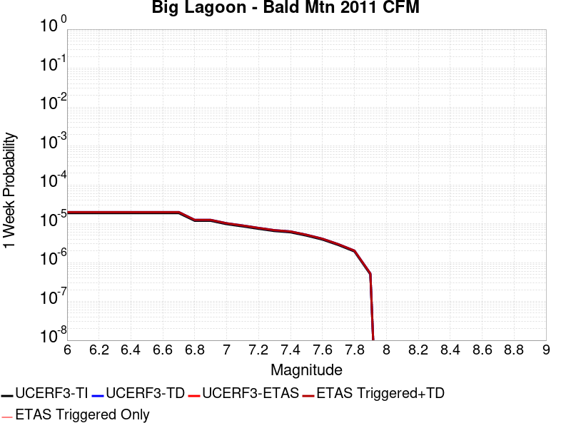 | 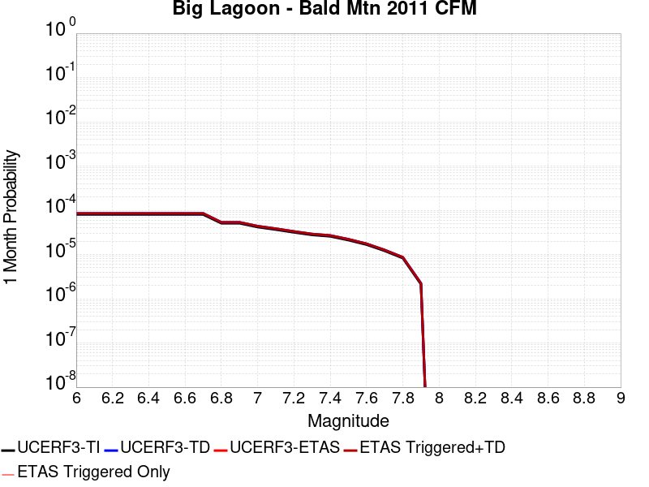 | 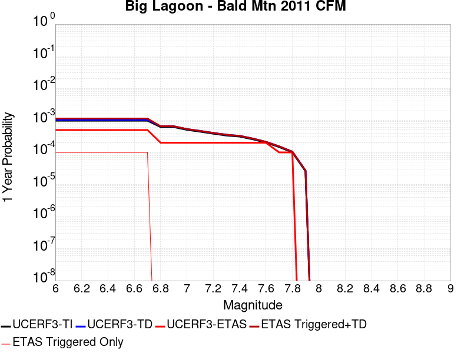 | 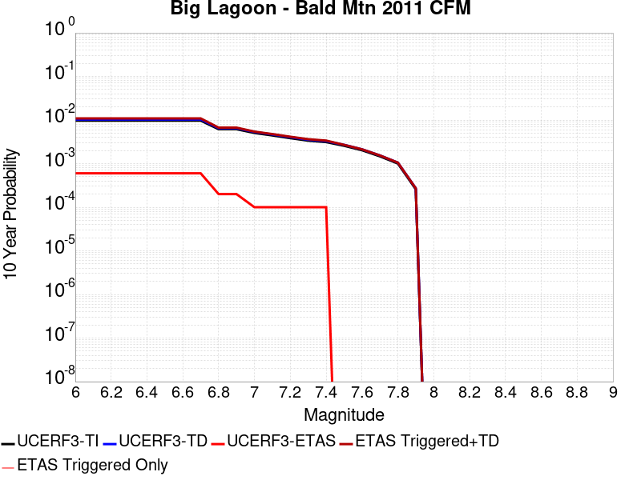 |

| Magnitude | 1 wk TI Prob | 1 wk TD Prob | 1 wk ETAS Prob | 1 wk ETAS/TD Gain | 1 wk ETAS Triggered+TD | 1 wk ETAS Triggered Only | 1 mo TI Prob | 1 mo TD Prob | 1 mo ETAS Prob | 1 mo ETAS/TD Gain | 1 mo ETAS Triggered+TD | 1 mo ETAS Triggered Only | 1 yr TI Prob | 1 yr TD Prob | 1 yr ETAS Prob | 1 yr ETAS/TD Gain | 1 yr ETAS Triggered+TD | 1 yr ETAS Triggered Only | 10 yr TI Prob | 10 yr TD Prob | 10 yr ETAS Prob | 10 yr ETAS/TD Gain | 10 yr ETAS Triggered+TD | 10 yr ETAS Triggered Only |
|-----|-----|-----|-----|-----|-----|-----|-----|-----|-----|-----|-----|-----|-----|-----|-----|-----|-----|-----|-----|-----|-----|-----|-----|-----|
| 6.0 | 1.8699735E-5 | 1.9852707E-5 | 0.0 | 0.0 | 1.9852707E-5 | 0.0 | 8.013926E-5 | 8.5080464E-5 | 0.0 | 0.0 | 8.5080464E-5 | 0.0 | 9.752587E-4 | 0.0010354003 | 5.0E-4 | 0.48290503 | 0.0011352968 | 1.0E-4 | 0.009709897 | 0.01030958 | 0.0061 | 0.5916827 | 0.010903394 | 6.0E-4 |
| 6.1 | 1.8699735E-5 | 1.9852707E-5 | 0.0 | 0.0 | 1.9852707E-5 | 0.0 | 8.013926E-5 | 8.5080464E-5 | 0.0 | 0.0 | 8.5080464E-5 | 0.0 | 9.752587E-4 | 0.0010354003 | 5.0E-4 | 0.48290503 | 0.0011352968 | 1.0E-4 | 0.009709897 | 0.01030958 | 0.0061 | 0.5916827 | 0.010903394 | 6.0E-4 |
| 6.2 | 1.8699735E-5 | 1.9852707E-5 | 0.0 | 0.0 | 1.9852707E-5 | 0.0 | 8.013926E-5 | 8.5080464E-5 | 0.0 | 0.0 | 8.5080464E-5 | 0.0 | 9.752587E-4 | 0.0010354003 | 5.0E-4 | 0.48290503 | 0.0011352968 | 1.0E-4 | 0.009709897 | 0.01030958 | 0.0061 | 0.5916827 | 0.010903394 | 6.0E-4 |
| 6.3 | 1.8699735E-5 | 1.9852707E-5 | 0.0 | 0.0 | 1.9852707E-5 | 0.0 | 8.013926E-5 | 8.5080464E-5 | 0.0 | 0.0 | 8.5080464E-5 | 0.0 | 9.752587E-4 | 0.0010354003 | 5.0E-4 | 0.48290503 | 0.0011352968 | 1.0E-4 | 0.009709897 | 0.01030958 | 0.0061 | 0.5916827 | 0.010903394 | 6.0E-4 |
| 6.4 | 1.8699735E-5 | 1.9852707E-5 | 0.0 | 0.0 | 1.9852707E-5 | 0.0 | 8.013926E-5 | 8.5080464E-5 | 0.0 | 0.0 | 8.5080464E-5 | 0.0 | 9.752587E-4 | 0.0010354003 | 5.0E-4 | 0.48290503 | 0.0011352968 | 1.0E-4 | 0.009709897 | 0.01030958 | 0.0061 | 0.5916827 | 0.010903394 | 6.0E-4 |
| 6.5 | 1.8699735E-5 | 1.9852707E-5 | 0.0 | 0.0 | 1.9852707E-5 | 0.0 | 8.013926E-5 | 8.5080464E-5 | 0.0 | 0.0 | 8.5080464E-5 | 0.0 | 9.752587E-4 | 0.0010354003 | 5.0E-4 | 0.48290503 | 0.0011352968 | 1.0E-4 | 0.009709897 | 0.01030958 | 0.0061 | 0.5916827 | 0.010903394 | 6.0E-4 |
| 6.6 | 1.8699735E-5 | 1.9852707E-5 | 0.0 | 0.0 | 1.9852707E-5 | 0.0 | 8.013926E-5 | 8.5080464E-5 | 0.0 | 0.0 | 8.5080464E-5 | 0.0 | 9.752587E-4 | 0.0010354003 | 5.0E-4 | 0.48290503 | 0.0011352968 | 1.0E-4 | 0.009709897 | 0.01030958 | 0.0061 | 0.5916827 | 0.010903394 | 6.0E-4 |
| 6.7 | 1.8699735E-5 | 1.9852707E-5 | 0.0 | 0.0 | 1.9852707E-5 | 0.0 | 8.013926E-5 | 8.5080464E-5 | 0.0 | 0.0 | 8.5080464E-5 | 0.0 | 9.752587E-4 | 0.0010354003 | 5.0E-4 | 0.48290503 | 0.0011352968 | 1.0E-4 | 0.009709897 | 0.01030958 | 0.0061 | 0.5916827 | 0.010903394 | 6.0E-4 |
| 6.8 | 1.18505095E-5 | 1.2501218E-5 | 0.0 | 0.0 | 1.2501218E-5 | 0.0 | 5.078691E-5 | 5.3575575E-5 | 0.0 | 0.0 | 5.3575575E-5 | 0.0 | 6.181552E-4 | 6.520923E-4 | 2.0E-4 | 0.30670506 | 6.520923E-4 | 0.0 | 0.006164385 | 0.006502292 | 0.0037 | 0.5690301 | 0.0067009917 | 2.0E-4 |
| 6.9 | 1.18505095E-5 | 1.2501218E-5 | 0.0 | 0.0 | 1.2501218E-5 | 0.0 | 5.078691E-5 | 5.3575575E-5 | 0.0 | 0.0 | 5.3575575E-5 | 0.0 | 6.181552E-4 | 6.520923E-4 | 2.0E-4 | 0.30670506 | 6.520923E-4 | 0.0 | 0.006164385 | 0.006502292 | 0.0037 | 0.5690301 | 0.0067009917 | 2.0E-4 |
| 7.0 | 9.719786E-6 | 1.0236608E-5 | 0.0 | 0.0 | 1.0236608E-5 | 0.0 | 4.1655563E-5 | 4.3870456E-5 | 0.0 | 0.0 | 4.3870456E-5 | 0.0 | 5.0703844E-4 | 5.339942E-4 | 2.0E-4 | 0.3745359 | 5.339942E-4 | 0.0 | 0.005058831 | 0.0053273574 | 0.0029 | 0.5443599 | 0.0054268246 | 1.0E-4 |
| 7.1 | 8.523418E-6 | 8.970433E-6 | 0.0 | 0.0 | 8.970433E-6 | 0.0 | 3.652842E-5 | 3.8444152E-5 | 0.0 | 0.0 | 3.8444152E-5 | 0.0 | 4.4464276E-4 | 4.6795857E-4 | 2.0E-4 | 0.42738825 | 4.6795857E-4 | 0.0 | 0.0044375416 | 0.0046698954 | 0.0024 | 0.51393014 | 0.0047694286 | 1.0E-4 |
| 7.2 | 7.378894E-6 | 7.7619425E-6 | 0.0 | 0.0 | 7.7619425E-6 | 0.0 | 3.162345E-5 | 3.326505E-5 | 0.0 | 0.0 | 3.326505E-5 | 0.0 | 3.8494746E-4 | 4.049276E-4 | 2.0E-4 | 0.49391547 | 4.049276E-4 | 0.0 | 0.0038428132 | 0.0040419935 | 0.0021 | 0.5195456 | 0.004141589 | 1.0E-4 |
| 7.3 | 6.4640294E-6 | 6.7931555E-6 | 0.0 | 0.0 | 6.7931555E-6 | 0.0 | 2.7702688E-5 | 2.9113204E-5 | 0.0 | 0.0 | 2.9113204E-5 | 0.0 | 3.3722803E-4 | 3.5439627E-4 | 2.0E-4 | 0.56434005 | 3.5439627E-4 | 0.0 | 0.0033671674 | 0.003538381 | 0.002 | 0.56523025 | 0.0036380272 | 1.0E-4 |
| 7.4 | 5.9959093E-6 | 6.299457E-6 | 0.0 | 0.0 | 6.299457E-6 | 0.0 | 2.5696501E-5 | 2.6997395E-5 | 0.0 | 0.0 | 2.6997395E-5 | 0.0 | 3.1280998E-4 | 3.286443E-4 | 2.0E-4 | 0.6085607 | 3.286443E-4 | 0.0 | 0.0031237002 | 0.003281645 | 0.0017 | 0.5180329 | 0.0033813168 | 1.0E-4 |
| 7.5 | 4.929265E-6 | 5.176931E-6 | 0.0 | 0.0 | 5.176931E-6 | 0.0 | 2.112525E-5 | 2.2186661E-5 | 0.0 | 0.0 | 2.2186661E-5 | 0.0 | 2.5716957E-4 | 2.700895E-4 | 2.0E-4 | 0.74049526 | 2.700895E-4 | 0.0 | 0.0025687215 | 0.0026976534 | 0.0014 | 0.5189696 | 0.0026976534 | 0.0 |
| 7.6 | 3.8982403E-6 | 4.089339E-6 | 0.0 | 0.0 | 4.089339E-6 | 0.0 | 1.6706637E-5 | 1.7525623E-5 | 0.0 | 0.0 | 1.7525623E-5 | 0.0 | 2.0338432E-4 | 2.1335384E-4 | 2.0E-4 | 0.93740994 | 2.1335384E-4 | 0.0 | 0.0020319829 | 0.0021315177 | 0.0013 | 0.60989404 | 0.0021315177 | 0.0 |
| 7.7 | 2.820968E-6 | 2.9575058E-6 | 0.0 | 0.0 | 2.9575058E-6 | 0.0 | 1.2089806E-5 | 1.2674965E-5 | 0.0 | 0.0 | 1.2674965E-5 | 0.0 | 1.4718344E-4 | 1.5430694E-4 | 1.0E-4 | 0.648059 | 1.5430694E-4 | 0.0 | 0.00147086 | 0.0015420157 | 7.0E-4 | 0.4539513 | 0.0015420157 | 0.0 |
| 7.8 | 1.9314455E-6 | 2.0262228E-6 | 0.0 | 0.0 | 2.0262228E-6 | 0.0 | 8.277597E-6 | 8.683784E-6 | 0.0 | 0.0 | 8.683784E-6 | 0.0 | 1.0077508E-4 | 1.0572007E-4 | 1.0E-4 | 0.9458942 | 1.0572007E-4 | 0.0 | 0.0010072939 | 0.0010567106 | 4.0E-4 | 0.37853315 | 0.0010567106 | 0.0 |
| 7.9 | 4.9586197E-7 | 5.2194855E-7 | 0.0 | 0.0 | 5.2194855E-7 | 0.0 | 2.125121E-6 | 2.2369206E-6 | 0.0 | 0.0 | 2.2369206E-6 | 0.0 | 2.5873042E-5 | 2.723419E-5 | 0.0 | 0.0 | 2.723419E-5 | 0.0 | 2.5870028E-4 | 2.723106E-4 | 0.0 | 0.0 | 2.723106E-4 | 0.0 |

## McKinleyville (alt1)
*[(top)](#table-of-contents)*

| 1 Week | 1 Month | 1 Year | 10 Year |
|-----|-----|-----|-----|
| 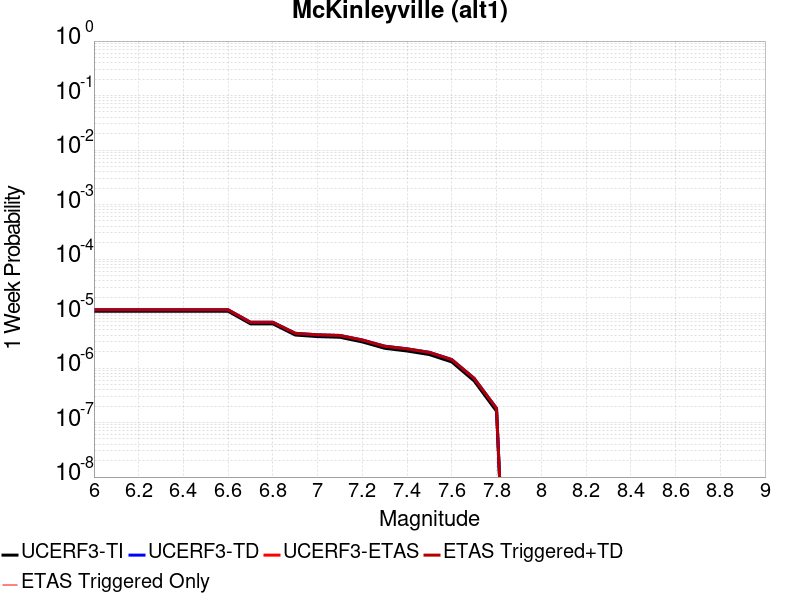 | 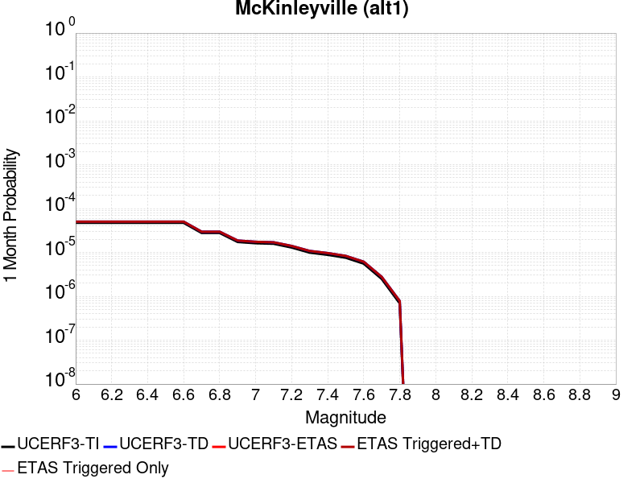 | 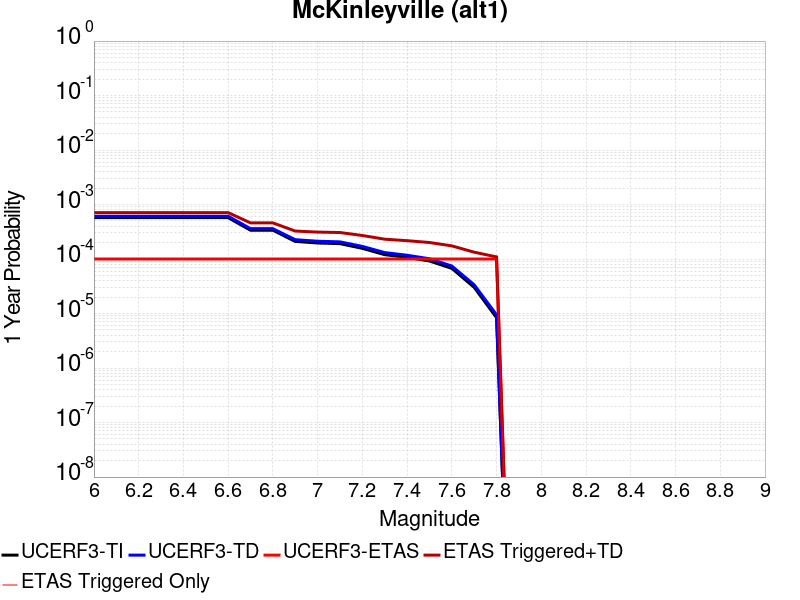 | 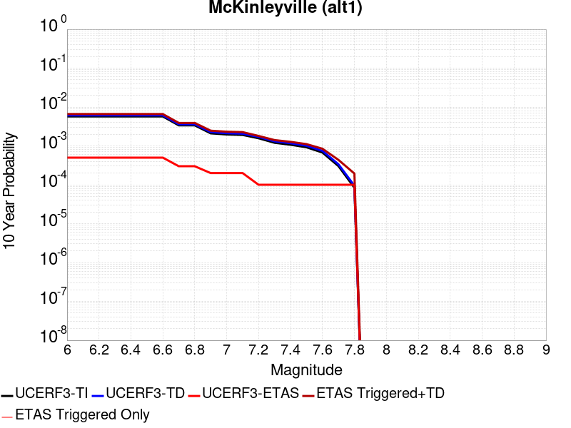 |

| Magnitude | 1 wk TI Prob | 1 wk TD Prob | 1 wk ETAS Prob | 1 wk ETAS/TD Gain | 1 wk ETAS Triggered+TD | 1 wk ETAS Triggered Only | 1 mo TI Prob | 1 mo TD Prob | 1 mo ETAS Prob | 1 mo ETAS/TD Gain | 1 mo ETAS Triggered+TD | 1 mo ETAS Triggered Only | 1 yr TI Prob | 1 yr TD Prob | 1 yr ETAS Prob | 1 yr ETAS/TD Gain | 1 yr ETAS Triggered+TD | 1 yr ETAS Triggered Only | 10 yr TI Prob | 10 yr TD Prob | 10 yr ETAS Prob | 10 yr ETAS/TD Gain | 10 yr ETAS Triggered+TD | 10 yr ETAS Triggered Only |
|-----|-----|-----|-----|-----|-----|-----|-----|-----|-----|-----|-----|-----|-----|-----|-----|-----|-----|-----|-----|-----|-----|-----|-----|-----|
| 6.0 | 1.1028524E-5 | 1.1729296E-5 | 0.0 | 0.0 | 1.1729296E-5 | 0.0 | 4.7264242E-5 | 5.0267583E-5 | 0.0 | 0.0 | 5.0267583E-5 | 0.0 | 5.7529024E-4 | 6.118614E-4 | 6.0E-4 | 0.98061424 | 7.1180024E-4 | 1.0E-4 | 0.005738032 | 0.0061042774 | 0.006 | 0.9829173 | 0.0066012256 | 5.0E-4 |
| 6.1 | 1.1028524E-5 | 1.1729296E-5 | 0.0 | 0.0 | 1.1729296E-5 | 0.0 | 4.7264242E-5 | 5.0267583E-5 | 0.0 | 0.0 | 5.0267583E-5 | 0.0 | 5.7529024E-4 | 6.118614E-4 | 6.0E-4 | 0.98061424 | 7.1180024E-4 | 1.0E-4 | 0.005738032 | 0.0061042774 | 0.006 | 0.9829173 | 0.0066012256 | 5.0E-4 |
| 6.2 | 1.1028524E-5 | 1.1729296E-5 | 0.0 | 0.0 | 1.1729296E-5 | 0.0 | 4.7264242E-5 | 5.0267583E-5 | 0.0 | 0.0 | 5.0267583E-5 | 0.0 | 5.7529024E-4 | 6.118614E-4 | 6.0E-4 | 0.98061424 | 7.1180024E-4 | 1.0E-4 | 0.005738032 | 0.0061042774 | 0.006 | 0.9829173 | 0.0066012256 | 5.0E-4 |
| 6.3 | 1.1028524E-5 | 1.1729296E-5 | 0.0 | 0.0 | 1.1729296E-5 | 0.0 | 4.7264242E-5 | 5.0267583E-5 | 0.0 | 0.0 | 5.0267583E-5 | 0.0 | 5.7529024E-4 | 6.118614E-4 | 6.0E-4 | 0.98061424 | 7.1180024E-4 | 1.0E-4 | 0.005738032 | 0.0061042774 | 0.006 | 0.9829173 | 0.0066012256 | 5.0E-4 |
| 6.4 | 1.1028524E-5 | 1.1729296E-5 | 0.0 | 0.0 | 1.1729296E-5 | 0.0 | 4.7264242E-5 | 5.0267583E-5 | 0.0 | 0.0 | 5.0267583E-5 | 0.0 | 5.7529024E-4 | 6.118614E-4 | 6.0E-4 | 0.98061424 | 7.1180024E-4 | 1.0E-4 | 0.005738032 | 0.0061042774 | 0.006 | 0.9829173 | 0.0066012256 | 5.0E-4 |
| 6.5 | 1.1028524E-5 | 1.1729296E-5 | 0.0 | 0.0 | 1.1729296E-5 | 0.0 | 4.7264242E-5 | 5.0267583E-5 | 0.0 | 0.0 | 5.0267583E-5 | 0.0 | 5.7529024E-4 | 6.118614E-4 | 6.0E-4 | 0.98061424 | 7.1180024E-4 | 1.0E-4 | 0.005738032 | 0.0061042774 | 0.006 | 0.9829173 | 0.0066012256 | 5.0E-4 |
| 6.6 | 1.1028524E-5 | 1.1729296E-5 | 0.0 | 0.0 | 1.1729296E-5 | 0.0 | 4.7264242E-5 | 5.0267583E-5 | 0.0 | 0.0 | 5.0267583E-5 | 0.0 | 5.7529024E-4 | 6.118614E-4 | 6.0E-4 | 0.98061424 | 7.1180024E-4 | 1.0E-4 | 0.005738032 | 0.0061042774 | 0.006 | 0.9829173 | 0.0066012256 | 5.0E-4 |
| 6.7 | 6.483374E-6 | 6.918042E-6 | 0.0 | 0.0 | 6.918042E-6 | 0.0 | 2.7785592E-5 | 2.9648449E-5 | 0.0 | 0.0 | 2.9648449E-5 | 0.0 | 3.3823706E-4 | 3.6091628E-4 | 4.0E-4 | 1.1082902 | 4.608802E-4 | 1.0E-4 | 0.003377227 | 0.0036039143 | 0.0032 | 0.8879234 | 0.0039028332 | 3.0E-4 |
| 6.8 | 6.483374E-6 | 6.918042E-6 | 0.0 | 0.0 | 6.918042E-6 | 0.0 | 2.7785592E-5 | 2.9648449E-5 | 0.0 | 0.0 | 2.9648449E-5 | 0.0 | 3.3823706E-4 | 3.6091628E-4 | 4.0E-4 | 1.1082902 | 4.608802E-4 | 1.0E-4 | 0.003377227 | 0.0036039143 | 0.0032 | 0.8879234 | 0.0039028332 | 3.0E-4 |
| 6.9 | 4.0394048E-6 | 4.3460254E-6 | 0.0 | 0.0 | 4.3460254E-6 | 0.0 | 1.731162E-5 | 1.8625693E-5 | 0.0 | 0.0 | 1.8625693E-5 | 0.0 | 2.1074859E-4 | 2.2674476E-4 | 3.0E-4 | 1.3230736 | 3.2672207E-4 | 1.0E-4 | 0.0021054882 | 0.002265189 | 0.0014 | 0.61805 | 0.0024647359 | 2.0E-4 |
| 7.0 | 3.7791233E-6 | 4.0728537E-6 | 0.0 | 0.0 | 4.0728537E-6 | 0.0 | 1.6196142E-5 | 1.7454973E-5 | 0.0 | 0.0 | 1.7454973E-5 | 0.0 | 1.9717019E-4 | 2.1249408E-4 | 2.0E-4 | 0.9412027 | 3.1247284E-4 | 1.0E-4 | 0.0019699533 | 0.002122959 | 0.0013 | 0.6123529 | 0.0023225343 | 2.0E-4 |
| 7.1 | 3.675443E-6 | 3.964143E-6 | 0.0 | 0.0 | 3.964143E-6 | 0.0 | 1.5751802E-5 | 1.6989077E-5 | 0.0 | 0.0 | 1.6989077E-5 | 0.0 | 1.9176133E-4 | 2.0682288E-4 | 2.0E-4 | 0.96701103 | 3.068022E-4 | 1.0E-4 | 0.0019159593 | 0.0020663536 | 0.0013 | 0.62912756 | 0.0022659402 | 2.0E-4 |
| 7.2 | 3.0165843E-6 | 3.2726737E-6 | 0.0 | 0.0 | 3.2726737E-6 | 0.0 | 1.2928153E-5 | 1.4025671E-5 | 0.0 | 0.0 | 1.4025671E-5 | 0.0 | 1.573889E-4 | 1.7074934E-4 | 2.0E-4 | 1.1713076 | 2.7073227E-4 | 1.0E-4 | 0.0015727748 | 0.0017062003 | 0.001 | 0.58609766 | 0.0018060297 | 1.0E-4 |
| 7.3 | 2.307633E-6 | 2.5193915E-6 | 0.0 | 0.0 | 2.5193915E-6 | 0.0 | 9.889818E-6 | 1.0797348E-5 | 0.0 | 0.0 | 1.0797348E-5 | 0.0 | 1.2040188E-4 | 1.3144987E-4 | 2.0E-4 | 1.5214926 | 2.3143672E-4 | 1.0E-4 | 0.0012033667 | 0.0013137296 | 8.0E-4 | 0.60895336 | 0.0014135982 | 1.0E-4 |
| 7.4 | 2.0568484E-6 | 2.2521642E-6 | 0.0 | 0.0 | 2.2521642E-6 | 0.0 | 8.8150355E-6 | 9.652097E-6 | 0.0 | 0.0 | 9.652097E-6 | 0.0 | 1.0731777E-4 | 1.17508025E-4 | 2.0E-4 | 1.7020115 | 2.1749627E-4 | 1.0E-4 | 0.0010726595 | 0.0011744666 | 8.0E-4 | 0.68116033 | 0.001274349 | 1.0E-4 |
| 7.5 | 1.7674889E-6 | 1.9418203E-6 | 0.0 | 0.0 | 1.9418203E-6 | 0.0 | 7.5749304E-6 | 8.322061E-6 | 0.0 | 0.0 | 8.322061E-6 | 0.0 | 9.222087E-5 | 1.01316444E-4 | 2.0E-4 | 1.9740132 | 2.0130632E-4 | 1.0E-4 | 9.218261E-4 | 0.0010127092 | 7.0E-4 | 0.6912152 | 0.0011126079 | 1.0E-4 |
| 7.6 | 1.2944297E-6 | 1.4299469E-6 | 0.0 | 0.0 | 1.4299469E-6 | 0.0 | 5.547544E-6 | 6.12833E-6 | 0.0 | 0.0 | 6.12833E-6 | 0.0 | 6.753925E-5 | 7.460991E-5 | 2.0E-4 | 2.680609 | 1.7460245E-4 | 1.0E-4 | 6.7518733E-4 | 7.4585347E-4 | 7.0E-4 | 0.93852216 | 8.4577885E-4 | 1.0E-4 |
| 7.7 | 5.806243E-7 | 6.4625124E-7 | 0.0 | 0.0 | 6.4625124E-7 | 0.0 | 2.4883875E-6 | 2.7696453E-6 | 0.0 | 0.0 | 2.7696453E-6 | 0.0 | 3.0295698E-5 | 3.3719927E-5 | 1.0E-4 | 2.9656055 | 1.3371656E-4 | 1.0E-4 | 3.0291567E-4 | 3.371498E-4 | 4.0E-4 | 1.1864163 | 4.3711608E-4 | 1.0E-4 |
| 7.8 | 1.6121008E-7 | 1.8188292E-7 | 0.0 | 0.0 | 1.8188292E-7 | 0.0 | 6.909002E-7 | 7.79498E-7 | 0.0 | 0.0 | 7.79498E-7 | 0.0 | 8.411677E-6 | 9.49035E-6 | 1.0E-4 | 10.53702 | 1.094894E-4 | 1.0E-4 | 8.411359E-5 | 9.489969E-5 | 1.0E-4 | 1.0537442 | 1.948902E-4 | 1.0E-4 |

## Eureka Peak
*[(top)](#table-of-contents)*

| 1 Week | 1 Month | 1 Year | 10 Year |
|-----|-----|-----|-----|
| 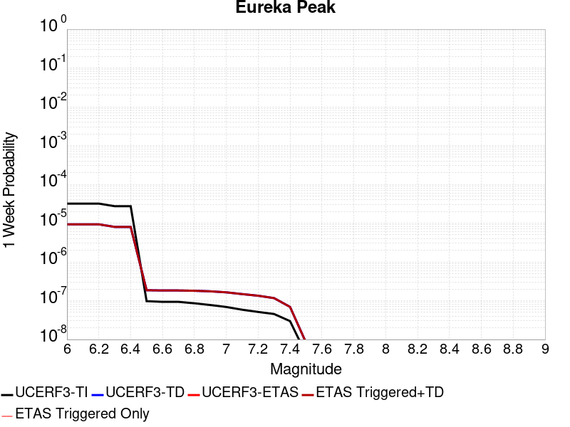 |  | 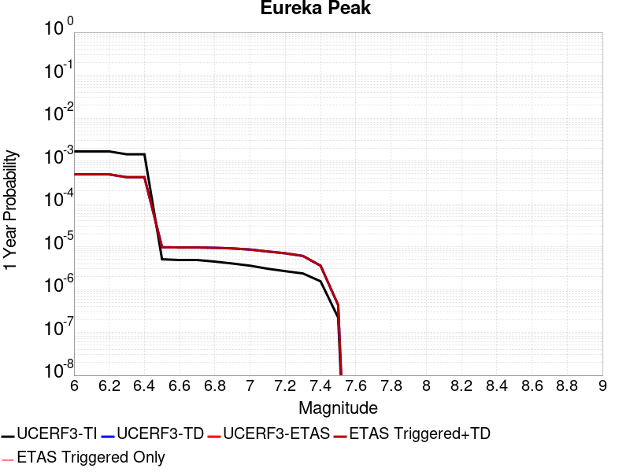 |  |

| Magnitude | 1 wk TI Prob | 1 wk TD Prob | 1 wk ETAS Prob | 1 wk ETAS/TD Gain | 1 wk ETAS Triggered+TD | 1 wk ETAS Triggered Only | 1 mo TI Prob | 1 mo TD Prob | 1 mo ETAS Prob | 1 mo ETAS/TD Gain | 1 mo ETAS Triggered+TD | 1 mo ETAS Triggered Only | 1 yr TI Prob | 1 yr TD Prob | 1 yr ETAS Prob | 1 yr ETAS/TD Gain | 1 yr ETAS Triggered+TD | 1 yr ETAS Triggered Only | 10 yr TI Prob | 10 yr TD Prob | 10 yr ETAS Prob | 10 yr ETAS/TD Gain | 10 yr ETAS Triggered+TD | 10 yr ETAS Triggered Only |
|-----|-----|-----|-----|-----|-----|-----|-----|-----|-----|-----|-----|-----|-----|-----|-----|-----|-----|-----|-----|-----|-----|-----|-----|-----|
| 6.0 | 3.1949054E-5 | 9.327561E-6 | 0.0 | 0.0 | 9.327561E-6 | 0.0 | 1.3691733E-4 | 3.997509E-5 | 1.0E-4 | 2.5015578 | 3.997509E-5 | 0.0 | 0.0016656938 | 4.8666645E-4 | 3.0E-4 | 0.6164386 | 4.8666645E-4 | 0.0 | 0.016532637 | 0.004930046 | 0.0038 | 0.77078384 | 0.005527088 | 6.0E-4 |
| 6.1 | 3.1949054E-5 | 9.327561E-6 | 0.0 | 0.0 | 9.327561E-6 | 0.0 | 1.3691733E-4 | 3.997509E-5 | 1.0E-4 | 2.5015578 | 3.997509E-5 | 0.0 | 0.0016656938 | 4.8666645E-4 | 3.0E-4 | 0.6164386 | 4.8666645E-4 | 0.0 | 0.016532637 | 0.004930046 | 0.0038 | 0.77078384 | 0.005527088 | 6.0E-4 |
| 6.2 | 3.1949054E-5 | 9.327561E-6 | 0.0 | 0.0 | 9.327561E-6 | 0.0 | 1.3691733E-4 | 3.997509E-5 | 1.0E-4 | 2.5015578 | 3.997509E-5 | 0.0 | 0.0016656938 | 4.8666645E-4 | 3.0E-4 | 0.6164386 | 4.8666645E-4 | 0.0 | 0.016532637 | 0.004930046 | 0.0038 | 0.77078384 | 0.005527088 | 6.0E-4 |
| 6.3 | 2.7339745E-5 | 7.9974025E-6 | 0.0 | 0.0 | 7.9974025E-6 | 0.0 | 1.1716507E-4 | 3.427456E-5 | 1.0E-4 | 2.917616 | 3.427456E-5 | 0.0 | 0.0014255513 | 4.172891E-4 | 3.0E-4 | 0.7189261 | 4.172891E-4 | 0.0 | 0.0141644105 | 0.0042347545 | 0.0031 | 0.7320377 | 0.004732637 | 5.0E-4 |
| 6.4 | 2.7339745E-5 | 7.9974025E-6 | 0.0 | 0.0 | 7.9974025E-6 | 0.0 | 1.1716507E-4 | 3.427456E-5 | 1.0E-4 | 2.917616 | 3.427456E-5 | 0.0 | 0.0014255513 | 4.172891E-4 | 3.0E-4 | 0.7189261 | 4.172891E-4 | 0.0 | 0.0141644105 | 0.0042347545 | 0.0031 | 0.7320377 | 0.004732637 | 5.0E-4 |
| 6.5 | 9.738388E-8 | 1.8651832E-7 | 0.0 | 0.0 | 1.8651832E-7 | 0.0 | 4.1735944E-7 | 7.9936393E-7 | 0.0 | 0.0 | 7.9936393E-7 | 0.0 | 5.081339E-6 | 9.732214E-6 | 0.0 | 0.0 | 9.732214E-6 | 0.0 | 5.0812232E-5 | 9.7317956E-5 | 1.0E-4 | 1.0275596 | 9.7317956E-5 | 0.0 |
| 6.6 | 9.3495956E-8 | 1.8360572E-7 | 0.0 | 0.0 | 1.8360572E-7 | 0.0 | 4.0069688E-7 | 7.868814E-7 | 0.0 | 0.0 | 7.868814E-7 | 0.0 | 4.8784736E-6 | 9.58024E-6 | 0.0 | 0.0 | 9.58024E-6 | 0.0 | 4.8783666E-5 | 9.579835E-5 | 1.0E-4 | 1.0438592 | 9.579835E-5 | 0.0 |
| 6.7 | 9.3495956E-8 | 1.8360572E-7 | 0.0 | 0.0 | 1.8360572E-7 | 0.0 | 4.0069688E-7 | 7.868814E-7 | 0.0 | 0.0 | 7.868814E-7 | 0.0 | 4.8784736E-6 | 9.58024E-6 | 0.0 | 0.0 | 9.58024E-6 | 0.0 | 4.8783666E-5 | 9.579835E-5 | 1.0E-4 | 1.0438592 | 9.579835E-5 | 0.0 |
| 6.8 | 8.591428E-8 | 1.8053275E-7 | 0.0 | 0.0 | 1.8053275E-7 | 0.0 | 3.68204E-7 | 7.737116E-7 | 0.0 | 0.0 | 7.737116E-7 | 0.0 | 4.4828744E-6 | 9.419899E-6 | 0.0 | 0.0 | 9.419899E-6 | 0.0 | 4.482784E-5 | 9.419507E-5 | 1.0E-4 | 1.0616267 | 9.419507E-5 | 0.0 |
| 6.9 | 7.749723E-8 | 1.7471086E-7 | 0.0 | 0.0 | 1.7471086E-7 | 0.0 | 3.3213098E-7 | 7.487606E-7 | 0.0 | 0.0 | 7.487606E-7 | 0.0 | 4.043687E-6 | 9.116124E-6 | 0.0 | 0.0 | 9.116124E-6 | 0.0 | 4.0436134E-5 | 9.115757E-5 | 1.0E-4 | 1.0970016 | 9.115757E-5 | 0.0 |
| 7.0 | 6.897872E-8 | 1.6446396E-7 | 0.0 | 0.0 | 1.6446396E-7 | 0.0 | 2.9562307E-7 | 7.048453E-7 | 0.0 | 0.0 | 7.048453E-7 | 0.0 | 3.5992048E-6 | 8.581459E-6 | 0.0 | 0.0 | 8.581459E-6 | 0.0 | 3.5991467E-5 | 8.581135E-5 | 1.0E-4 | 1.165347 | 8.581135E-5 | 0.0 |
| 7.1 | 5.859318E-8 | 1.4816715E-7 | 0.0 | 0.0 | 1.4816715E-7 | 0.0 | 2.5111362E-7 | 6.350019E-7 | 0.0 | 0.0 | 6.350019E-7 | 0.0 | 3.057304E-6 | 7.7311215E-6 | 0.0 | 0.0 | 7.7311215E-6 | 0.0 | 3.0572617E-5 | 7.730859E-5 | 1.0E-4 | 1.2935172 | 7.730859E-5 | 0.0 |
| 7.2 | 5.1375338E-8 | 1.344938E-7 | 0.0 | 0.0 | 1.344938E-7 | 0.0 | 2.2018E-7 | 5.764019E-7 | 0.0 | 0.0 | 5.764019E-7 | 0.0 | 2.680688E-6 | 7.017671E-6 | 0.0 | 0.0 | 7.017671E-6 | 0.0 | 2.6806558E-5 | 7.017455E-5 | 1.0E-4 | 1.425018 | 7.017455E-5 | 0.0 |
| 7.3 | 4.5441396E-8 | 1.16626495E-7 | 0.0 | 0.0 | 1.16626495E-7 | 0.0 | 1.9474882E-7 | 4.998277E-7 | 0.0 | 0.0 | 4.998277E-7 | 0.0 | 2.3710643E-6 | 6.0853863E-6 | 0.0 | 0.0 | 6.0853863E-6 | 0.0 | 2.371039E-5 | 6.0852253E-5 | 1.0E-4 | 1.6433246 | 6.0852253E-5 | 0.0 |
| 7.4 | 2.981918E-8 | 6.931649E-8 | 0.0 | 0.0 | 6.931649E-8 | 0.0 | 1.2779647E-7 | 2.9707064E-7 | 0.0 | 0.0 | 2.9707064E-7 | 0.0 | 1.5559209E-6 | 3.6168294E-6 | 0.0 | 0.0 | 3.6168294E-6 | 0.0 | 1.55591E-5 | 3.616775E-5 | 0.0 | 0.0 | 3.616775E-5 | 0.0 |
| 7.5 | 4.24214E-9 | 8.372824E-9 | 0.0 | 0.0 | 8.372824E-9 | 0.0 | 1.81806E-8 | 3.588353E-8 | 0.0 | 0.0 | 3.588353E-8 | 0.0 | 2.213488E-7 | 4.3688198E-7 | 0.0 | 0.0 | 4.3688198E-7 | 0.0 | 2.2134857E-6 | 4.368818E-6 | 0.0 | 0.0 | 4.368818E-6 | 0.0 |

## Puente Hills
*[(top)](#table-of-contents)*

| 1 Week | 1 Month | 1 Year | 10 Year |
|-----|-----|-----|-----|
| 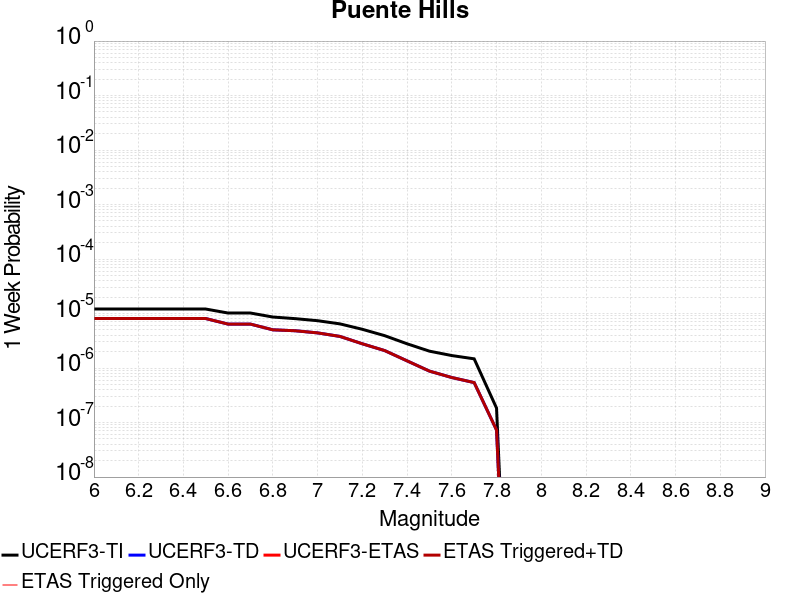 |  | 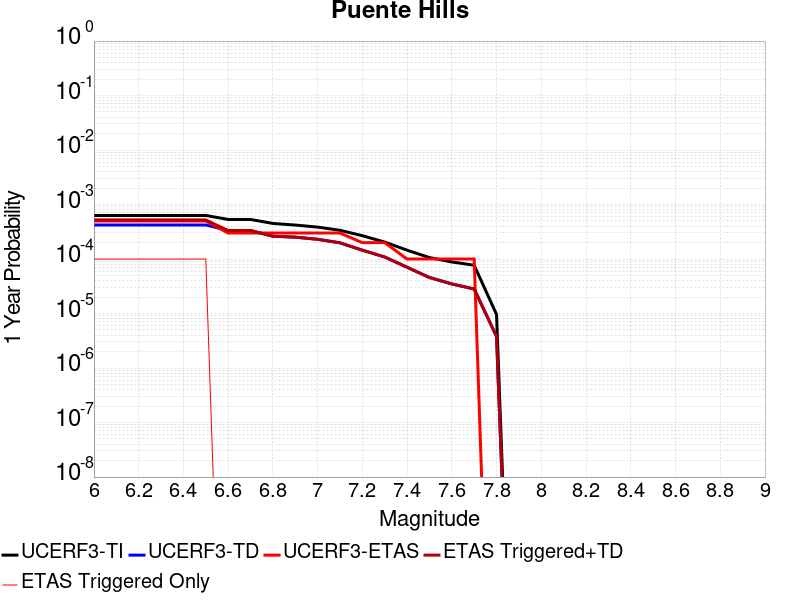 | 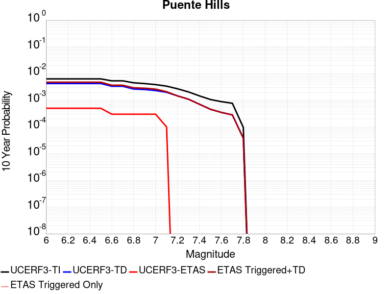 |

| Magnitude | 1 wk TI Prob | 1 wk TD Prob | 1 wk ETAS Prob | 1 wk ETAS/TD Gain | 1 wk ETAS Triggered+TD | 1 wk ETAS Triggered Only | 1 mo TI Prob | 1 mo TD Prob | 1 mo ETAS Prob | 1 mo ETAS/TD Gain | 1 mo ETAS Triggered+TD | 1 mo ETAS Triggered Only | 1 yr TI Prob | 1 yr TD Prob | 1 yr ETAS Prob | 1 yr ETAS/TD Gain | 1 yr ETAS Triggered+TD | 1 yr ETAS Triggered Only | 10 yr TI Prob | 10 yr TD Prob | 10 yr ETAS Prob | 10 yr ETAS/TD Gain | 10 yr ETAS Triggered+TD | 10 yr ETAS Triggered Only |
|-----|-----|-----|-----|-----|-----|-----|-----|-----|-----|-----|-----|-----|-----|-----|-----|-----|-----|-----|-----|-----|-----|-----|-----|-----|
| 6.0 | 1.2101656E-5 | 8.101092E-6 | 1.0E-4 | 12.344015 | 8.101092E-6 | 0.0 | 5.1863204E-5 | 3.4718534E-5 | 2.0E-4 | 5.760612 | 1.3471507E-4 | 1.0E-4 | 6.312516E-4 | 4.2262182E-4 | 5.0E-4 | 1.1830908 | 5.2257953E-4 | 1.0E-4 | 0.0062946146 | 0.0042187413 | 0.0041 | 0.97185385 | 0.004716632 | 5.0E-4 |
| 6.1 | 1.2101656E-5 | 8.101092E-6 | 1.0E-4 | 12.344015 | 8.101092E-6 | 0.0 | 5.1863204E-5 | 3.4718534E-5 | 2.0E-4 | 5.760612 | 1.3471507E-4 | 1.0E-4 | 6.312516E-4 | 4.2262182E-4 | 5.0E-4 | 1.1830908 | 5.2257953E-4 | 1.0E-4 | 0.0062946146 | 0.0042187413 | 0.0041 | 0.97185385 | 0.004716632 | 5.0E-4 |
| 6.2 | 1.2101656E-5 | 8.101092E-6 | 1.0E-4 | 12.344015 | 8.101092E-6 | 0.0 | 5.1863204E-5 | 3.4718534E-5 | 2.0E-4 | 5.760612 | 1.3471507E-4 | 1.0E-4 | 6.312516E-4 | 4.2262182E-4 | 5.0E-4 | 1.1830908 | 5.2257953E-4 | 1.0E-4 | 0.0062946146 | 0.0042187413 | 0.0041 | 0.97185385 | 0.004716632 | 5.0E-4 |
| 6.3 | 1.2101656E-5 | 8.101092E-6 | 1.0E-4 | 12.344015 | 8.101092E-6 | 0.0 | 5.1863204E-5 | 3.4718534E-5 | 2.0E-4 | 5.760612 | 1.3471507E-4 | 1.0E-4 | 6.312516E-4 | 4.2262182E-4 | 5.0E-4 | 1.1830908 | 5.2257953E-4 | 1.0E-4 | 0.0062946146 | 0.0042187413 | 0.0041 | 0.97185385 | 0.004716632 | 5.0E-4 |
| 6.4 | 1.2101656E-5 | 8.101092E-6 | 1.0E-4 | 12.344015 | 8.101092E-6 | 0.0 | 5.1863204E-5 | 3.4718534E-5 | 2.0E-4 | 5.760612 | 1.3471507E-4 | 1.0E-4 | 6.312516E-4 | 4.2262182E-4 | 5.0E-4 | 1.1830908 | 5.2257953E-4 | 1.0E-4 | 0.0062946146 | 0.0042187413 | 0.0041 | 0.97185385 | 0.004716632 | 5.0E-4 |
| 6.5 | 1.2101656E-5 | 8.101092E-6 | 1.0E-4 | 12.344015 | 8.101092E-6 | 0.0 | 5.1863204E-5 | 3.4718534E-5 | 2.0E-4 | 5.760612 | 1.3471507E-4 | 1.0E-4 | 6.312516E-4 | 4.2262182E-4 | 5.0E-4 | 1.1830908 | 5.2257953E-4 | 1.0E-4 | 0.0062946146 | 0.0042187413 | 0.0041 | 0.97185385 | 0.004716632 | 5.0E-4 |
| 6.6 | 1.0222488E-5 | 6.4015044E-6 | 1.0E-4 | 15.621328 | 6.4015044E-6 | 0.0 | 4.3809923E-5 | 2.7434744E-5 | 1.0E-4 | 3.645013 | 2.7434744E-5 | 0.0 | 5.332553E-4 | 3.3396928E-4 | 3.0E-4 | 0.8982862 | 3.3396928E-4 | 0.0 | 0.0053197746 | 0.003334919 | 0.0029 | 0.86958635 | 0.0036339185 | 3.0E-4 |
| 6.7 | 1.0222488E-5 | 6.4015044E-6 | 1.0E-4 | 15.621328 | 6.4015044E-6 | 0.0 | 4.3809923E-5 | 2.7434744E-5 | 1.0E-4 | 3.645013 | 2.7434744E-5 | 0.0 | 5.332553E-4 | 3.3396928E-4 | 3.0E-4 | 0.8982862 | 3.3396928E-4 | 0.0 | 0.0053197746 | 0.003334919 | 0.0029 | 0.86958635 | 0.0036339185 | 3.0E-4 |
| 6.8 | 8.6367845E-6 | 5.0303092E-6 | 1.0E-4 | 19.879492 | 5.0303092E-6 | 0.0 | 3.7014266E-5 | 2.1558293E-5 | 1.0E-4 | 4.638586 | 2.1558293E-5 | 0.0 | 4.505555E-4 | 2.6244117E-4 | 3.0E-4 | 1.1431134 | 2.6244117E-4 | 0.0 | 0.004496431 | 0.0026213687 | 0.0025 | 0.95370024 | 0.0029205824 | 3.0E-4 |
| 6.9 | 8.066481E-6 | 4.8381576E-6 | 1.0E-4 | 20.669024 | 4.8381576E-6 | 0.0 | 3.4570177E-5 | 2.07348E-5 | 1.0E-4 | 4.82281 | 2.07348E-5 | 0.0 | 4.2081063E-4 | 2.5241746E-4 | 3.0E-4 | 1.1885072 | 2.5241746E-4 | 0.0 | 0.0042001465 | 0.0025213615 | 0.0025 | 0.9915278 | 0.0028206052 | 3.0E-4 |
| 7.0 | 7.393828E-6 | 4.4192134E-6 | 1.0E-4 | 22.628462 | 4.4192134E-6 | 0.0 | 3.168745E-5 | 1.8939352E-5 | 1.0E-4 | 5.2800117 | 1.8939352E-5 | 0.0 | 3.857264E-4 | 2.3056265E-4 | 3.0E-4 | 1.3011647 | 2.3056265E-4 | 0.0 | 0.0038505755 | 0.00230328 | 0.0024 | 1.0419923 | 0.002602589 | 3.0E-4 |
| 7.1 | 6.4660953E-6 | 3.806027E-6 | 1.0E-4 | 26.274118 | 3.806027E-6 | 0.0 | 2.7711543E-5 | 1.6311444E-5 | 1.0E-4 | 6.130665 | 1.6311444E-5 | 0.0 | 3.373358E-4 | 1.985741E-4 | 3.0E-4 | 1.5107712 | 1.985741E-4 | 0.0 | 0.0033682417 | 0.0019840025 | 0.0015 | 0.7560474 | 0.002083804 | 1.0E-4 |
| 7.2 | 5.143232E-6 | 2.787785E-6 | 1.0E-4 | 35.870773 | 2.787785E-6 | 0.0 | 2.2042237E-5 | 1.1947595E-5 | 1.0E-4 | 8.369885 | 1.1947595E-5 | 0.0 | 2.6833118E-4 | 1.4545236E-4 | 2.0E-4 | 1.3750206 | 1.4545236E-4 | 0.0 | 0.002680074 | 0.0014535814 | 8.0E-4 | 0.5503648 | 0.0014535814 | 0.0 |
| 7.3 | 3.928255E-6 | 2.0924595E-6 | 1.0E-4 | 47.790653 | 2.0924595E-6 | 0.0 | 1.683527E-5 | 8.967652E-6 | 1.0E-4 | 11.151191 | 8.967652E-6 | 0.0 | 2.0495013E-4 | 1.09175766E-4 | 2.0E-4 | 1.8319083 | 1.09175766E-4 | 0.0 | 0.002047612 | 0.001091228 | 6.0E-4 | 0.54983926 | 0.001091228 | 0.0 |
| 7.4 | 2.7894434E-6 | 1.3556086E-6 | 0.0 | 0.0 | 1.3556086E-6 | 0.0 | 1.1954703E-5 | 5.8097385E-6 | 0.0 | 0.0 | 5.8097385E-6 | 0.0 | 1.4553878E-4 | 7.073131E-5 | 1.0E-4 | 1.4138011 | 7.073131E-5 | 0.0 | 0.001454435 | 7.070924E-4 | 5.0E-4 | 0.7071212 | 7.070924E-4 | 0.0 |
| 7.5 | 2.041735E-6 | 8.7938787E-7 | 0.0 | 0.0 | 8.7938787E-7 | 0.0 | 8.750263E-6 | 3.7687998E-6 | 0.0 | 0.0 | 3.7687998E-6 | 0.0 | 1.06529245E-4 | 4.5884208E-5 | 1.0E-4 | 2.179399 | 4.5884208E-5 | 0.0 | 0.0010647819 | 4.587507E-4 | 4.0E-4 | 0.8719333 | 4.587507E-4 | 0.0 |
| 7.6 | 1.6959062E-6 | 6.7038155E-7 | 0.0 | 0.0 | 6.7038155E-7 | 0.0 | 7.268149E-6 | 2.8730608E-6 | 0.0 | 0.0 | 2.8730608E-6 | 0.0 | 8.848612E-5 | 3.4978984E-5 | 1.0E-4 | 2.8588595 | 3.4978984E-5 | 0.0 | 8.84509E-4 | 3.4973767E-4 | 2.0E-4 | 0.57185715 | 3.4973767E-4 | 0.0 |
| 7.7 | 1.4767965E-6 | 5.4119664E-7 | 0.0 | 0.0 | 5.4119664E-7 | 0.0 | 6.3291122E-6 | 2.3194123E-6 | 0.0 | 0.0 | 2.3194123E-6 | 0.0 | 7.705422E-5 | 2.8238506E-5 | 1.0E-4 | 3.5412638 | 2.8238506E-5 | 0.0 | 7.702751E-4 | 2.8235174E-4 | 1.0E-4 | 0.35416815 | 2.8235174E-4 | 0.0 |
| 7.8 | 1.8432911E-7 | 7.287068E-8 | 0.0 | 0.0 | 7.287068E-8 | 0.0 | 7.8998164E-7 | 3.123029E-7 | 0.0 | 0.0 | 3.123029E-7 | 0.0 | 9.617985E-6 | 3.8022843E-6 | 0.0 | 0.0 | 3.8022843E-6 | 0.0 | 9.617568E-5 | 3.8022517E-5 | 0.0 | 0.0 | 3.8022517E-5 | 0.0 |

## Contra Costa Shear Zone (connector) 2011 CFM
*[(top)](#table-of-contents)*

| 1 Week | 1 Month | 1 Year | 10 Year |
|-----|-----|-----|-----|
| 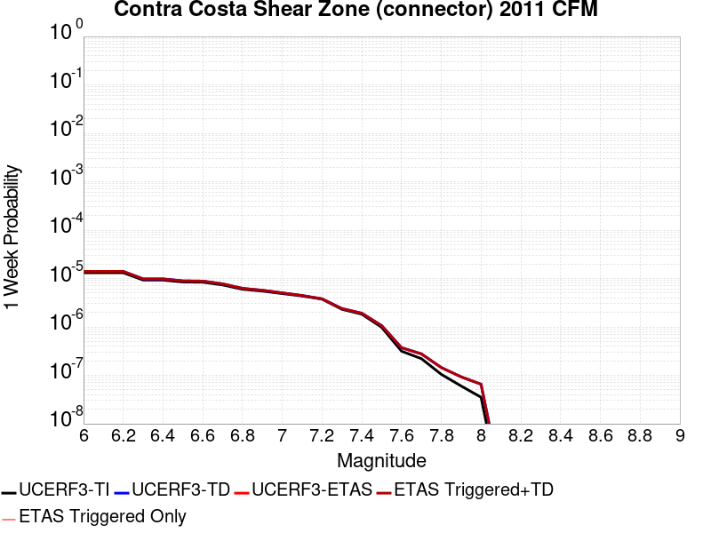 | 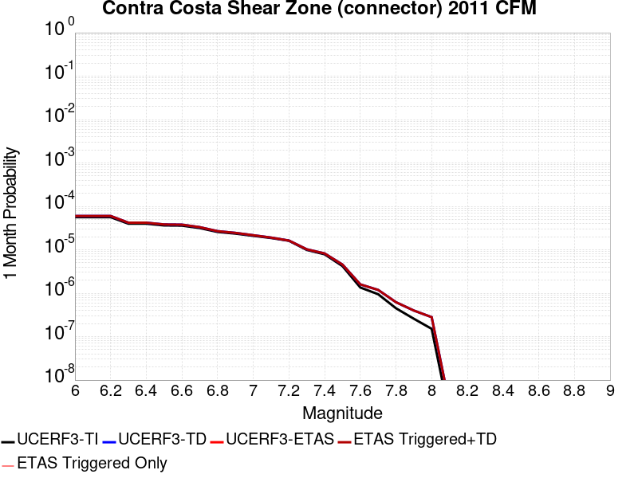 | 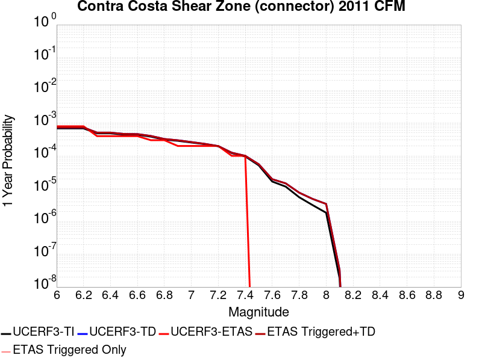 | 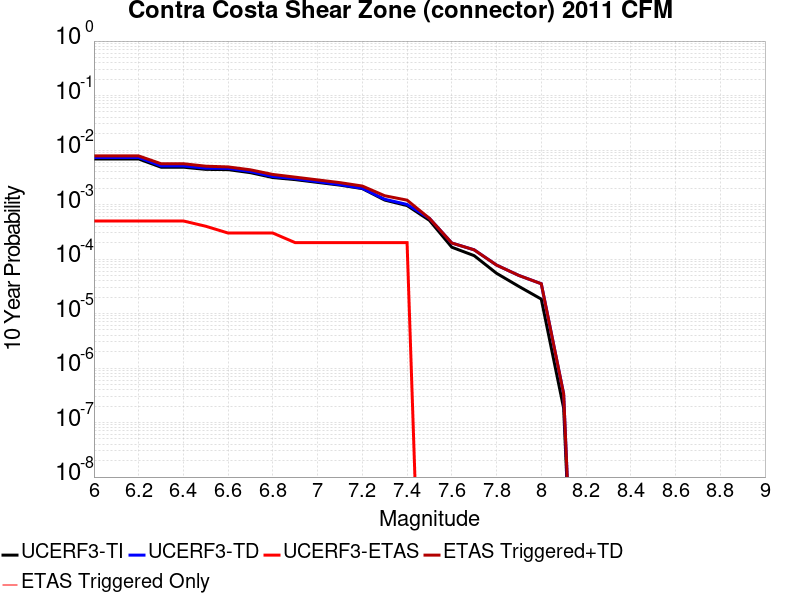 |

| Magnitude | 1 wk TI Prob | 1 wk TD Prob | 1 wk ETAS Prob | 1 wk ETAS/TD Gain | 1 wk ETAS Triggered+TD | 1 wk ETAS Triggered Only | 1 mo TI Prob | 1 mo TD Prob | 1 mo ETAS Prob | 1 mo ETAS/TD Gain | 1 mo ETAS Triggered+TD | 1 mo ETAS Triggered Only | 1 yr TI Prob | 1 yr TD Prob | 1 yr ETAS Prob | 1 yr ETAS/TD Gain | 1 yr ETAS Triggered+TD | 1 yr ETAS Triggered Only | 10 yr TI Prob | 10 yr TD Prob | 10 yr ETAS Prob | 10 yr ETAS/TD Gain | 10 yr ETAS Triggered+TD | 10 yr ETAS Triggered Only |
|-----|-----|-----|-----|-----|-----|-----|-----|-----|-----|-----|-----|-----|-----|-----|-----|-----|-----|-----|-----|-----|-----|-----|-----|-----|
| 6.0 | 1.3187427E-5 | 1.4048434E-5 | 0.0 | 0.0 | 1.4048434E-5 | 0.0 | 5.6516317E-5 | 6.0206316E-5 | 0.0 | 0.0 | 6.0206316E-5 | 0.0 | 6.878689E-4 | 7.3278823E-4 | 8.0E-4 | 1.0917206 | 7.3278823E-4 | 0.0 | 0.006857436 | 0.0073099774 | 0.0046 | 0.62927693 | 0.007806322 | 5.0E-4 |
| 6.1 | 1.3187427E-5 | 1.4048434E-5 | 0.0 | 0.0 | 1.4048434E-5 | 0.0 | 5.6516317E-5 | 6.0206316E-5 | 0.0 | 0.0 | 6.0206316E-5 | 0.0 | 6.878689E-4 | 7.3278823E-4 | 8.0E-4 | 1.0917206 | 7.3278823E-4 | 0.0 | 0.006857436 | 0.0073099774 | 0.0046 | 0.62927693 | 0.007806322 | 5.0E-4 |
| 6.2 | 1.3187427E-5 | 1.4048434E-5 | 0.0 | 0.0 | 1.4048434E-5 | 0.0 | 5.6516317E-5 | 6.0206316E-5 | 0.0 | 0.0 | 6.0206316E-5 | 0.0 | 6.878689E-4 | 7.3278823E-4 | 8.0E-4 | 1.0917206 | 7.3278823E-4 | 0.0 | 0.006857436 | 0.0073099774 | 0.0046 | 0.62927693 | 0.007806322 | 5.0E-4 |
| 6.3 | 9.315374E-6 | 9.83059E-6 | 0.0 | 0.0 | 9.83059E-6 | 0.0 | 3.992242E-5 | 4.2130443E-5 | 0.0 | 0.0 | 4.2130443E-5 | 0.0 | 4.8594706E-4 | 5.1282154E-4 | 4.0E-4 | 0.7799984 | 5.1282154E-4 | 0.0 | 0.004848858 | 0.0051207943 | 0.0028 | 0.5467902 | 0.0056182337 | 5.0E-4 |
| 6.4 | 9.315374E-6 | 9.83059E-6 | 0.0 | 0.0 | 9.83059E-6 | 0.0 | 3.992242E-5 | 4.2130443E-5 | 0.0 | 0.0 | 4.2130443E-5 | 0.0 | 4.8594706E-4 | 5.1282154E-4 | 4.0E-4 | 0.7799984 | 5.1282154E-4 | 0.0 | 0.004848858 | 0.0051207943 | 0.0028 | 0.5467902 | 0.0056182337 | 5.0E-4 |
| 6.5 | 8.492638E-6 | 8.944131E-6 | 0.0 | 0.0 | 8.944131E-6 | 0.0 | 3.639651E-5 | 3.8331444E-5 | 0.0 | 0.0 | 3.8331444E-5 | 0.0 | 4.430374E-4 | 4.6658877E-4 | 4.0E-4 | 0.857286 | 4.6658877E-4 | 0.0 | 0.0044215517 | 0.004660428 | 0.0024 | 0.5149741 | 0.0050585642 | 4.0E-4 |
| 6.6 | 8.402072E-6 | 8.8449115E-6 | 0.0 | 0.0 | 8.8449115E-6 | 0.0 | 3.6008387E-5 | 3.790623E-5 | 0.0 | 0.0 | 3.790623E-5 | 0.0 | 4.383139E-4 | 4.61414E-4 | 4.0E-4 | 0.86690044 | 4.61414E-4 | 0.0 | 0.0043745036 | 0.004608896 | 0.0023 | 0.4990349 | 0.0049075135 | 3.0E-4 |
| 6.7 | 7.383587E-6 | 7.752345E-6 | 0.0 | 0.0 | 7.752345E-6 | 0.0 | 3.164356E-5 | 3.322392E-5 | 0.0 | 0.0 | 3.322392E-5 | 0.0 | 3.8519225E-4 | 4.0442825E-4 | 3.0E-4 | 0.7417879 | 4.0442825E-4 | 0.0 | 0.0038452526 | 0.0040411334 | 0.002 | 0.49491066 | 0.0043399213 | 3.0E-4 |
| 6.8 | 6.004921E-6 | 6.2697927E-6 | 0.0 | 0.0 | 6.2697927E-6 | 0.0 | 2.5735122E-5 | 2.6870266E-5 | 0.0 | 0.0 | 2.6870266E-5 | 0.0 | 3.1328006E-4 | 3.270969E-4 | 3.0E-4 | 0.9171594 | 3.270969E-4 | 0.0 | 0.0031283877 | 0.0032702116 | 0.0019 | 0.5810021 | 0.0035692307 | 3.0E-4 |
| 6.9 | 5.505255E-6 | 5.722093E-6 | 0.0 | 0.0 | 5.722093E-6 | 0.0 | 2.3593739E-5 | 2.452303E-5 | 0.0 | 0.0 | 2.452303E-5 | 0.0 | 2.872159E-4 | 2.9852742E-4 | 2.0E-4 | 0.66995525 | 2.9852742E-4 | 0.0 | 0.0028684495 | 0.002985312 | 0.0016 | 0.5359574 | 0.0031847148 | 2.0E-4 |
| 7.0 | 4.891922E-6 | 5.0526423E-6 | 0.0 | 0.0 | 5.0526423E-6 | 0.0 | 2.096521E-5 | 2.1654005E-5 | 0.0 | 0.0 | 2.1654005E-5 | 0.0 | 2.5522153E-4 | 2.6360597E-4 | 2.0E-4 | 0.7587082 | 2.6360597E-4 | 0.0 | 0.0025492862 | 0.0026369728 | 0.0015 | 0.56883407 | 0.0028364453 | 2.0E-4 |
| 7.1 | 4.3599E-6 | 4.4565136E-6 | 0.0 | 0.0 | 4.4565136E-6 | 0.0 | 1.868515E-5 | 1.9099205E-5 | 0.0 | 0.0 | 1.9099205E-5 | 0.0 | 2.2746796E-4 | 2.3250829E-4 | 2.0E-4 | 0.8601844 | 2.3250829E-4 | 0.0 | 0.0022723526 | 0.0023266836 | 0.0013 | 0.5587352 | 0.0025262183 | 2.0E-4 |
| 7.2 | 3.7647926E-6 | 3.8073927E-6 | 0.0 | 0.0 | 3.8073927E-6 | 0.0 | 1.6134725E-5 | 1.6317297E-5 | 0.0 | 0.0 | 1.6317297E-5 | 0.0 | 1.9642258E-4 | 1.9864523E-4 | 2.0E-4 | 1.0068201 | 1.9864523E-4 | 0.0 | 0.0019624906 | 0.001988697 | 0.0011 | 0.553126 | 0.0021882993 | 2.0E-4 |
| 7.3 | 2.3179882E-6 | 2.3948328E-6 | 0.0 | 0.0 | 2.3948328E-6 | 0.0 | 9.934198E-6 | 1.0263529E-5 | 0.0 | 0.0 | 1.0263529E-5 | 0.0 | 1.20942146E-4 | 1.2495134E-4 | 1.0E-4 | 0.8003115 | 1.2495134E-4 | 0.0 | 0.0012087635 | 0.0012528201 | 9.0E-4 | 0.71837926 | 0.0014525696 | 2.0E-4 |
| 7.4 | 1.8378355E-6 | 1.9217753E-6 | 0.0 | 0.0 | 1.9217753E-6 | 0.0 | 7.876414E-6 | 8.236154E-6 | 0.0 | 0.0 | 8.236154E-6 | 0.0 | 9.5891126E-5 | 1.00270605E-4 | 1.0E-4 | 0.9973013 | 1.00270605E-4 | 0.0 | 9.584976E-4 | 0.0010061915 | 9.0E-4 | 0.8944619 | 0.0012059902 | 2.0E-4 |
| 7.5 | 9.840493E-7 | 1.0651543E-6 | 0.0 | 0.0 | 1.0651543E-6 | 0.0 | 4.2173474E-6 | 4.564939E-6 | 0.0 | 0.0 | 4.564939E-6 | 0.0 | 5.1344992E-5 | 5.557673E-5 | 0.0 | 0.0 | 5.557673E-5 | 0.0 | 5.133313E-4 | 5.5927556E-4 | 4.0E-4 | 0.7152109 | 5.5927556E-4 | 0.0 |
| 7.6 | 3.1602997E-7 | 3.7260128E-7 | 0.0 | 0.0 | 3.7260128E-7 | 0.0 | 1.3544135E-6 | 1.5968616E-6 | 0.0 | 0.0 | 1.5968616E-6 | 0.0 | 1.648986E-5 | 1.9441619E-5 | 0.0 | 0.0 | 1.9441619E-5 | 0.0 | 1.6488635E-4 | 1.9790282E-4 | 1.0E-4 | 0.50529855 | 1.9790282E-4 | 0.0 |
| 7.7 | 2.2125788E-7 | 2.7791708E-7 | 0.0 | 0.0 | 2.7791708E-7 | 0.0 | 9.482477E-7 | 1.1910726E-6 | 0.0 | 0.0 | 1.1910726E-6 | 0.0 | 1.1544855E-5 | 1.4501214E-5 | 0.0 | 0.0 | 1.4501214E-5 | 0.0 | 1.1544255E-4 | 1.4846906E-4 | 1.0E-4 | 0.673541 | 1.4846906E-4 | 0.0 |
| 7.8 | 1.0509553E-7 | 1.4491876E-7 | 0.0 | 0.0 | 1.4491876E-7 | 0.0 | 4.5040935E-7 | 6.2108023E-7 | 0.0 | 0.0 | 6.2108023E-7 | 0.0 | 5.48372E-6 | 7.561626E-6 | 0.0 | 0.0 | 7.561626E-6 | 0.0 | 5.4835844E-5 | 7.7908684E-5 | 1.0E-4 | 1.283554 | 7.7908684E-5 | 0.0 |
| 7.9 | 6.029319E-8 | 9.3148635E-8 | 0.0 | 0.0 | 9.3148635E-8 | 0.0 | 2.5839938E-7 | 3.992084E-7 | 0.0 | 0.0 | 3.992084E-7 | 0.0 | 3.1460077E-6 | 4.8603515E-6 | 0.0 | 0.0 | 4.8603515E-6 | 0.0 | 3.1459633E-5 | 5.017807E-5 | 1.0E-4 | 1.9929024 | 5.017807E-5 | 0.0 |
| 8.0 | 3.531068E-8 | 6.5611594E-8 | 0.0 | 0.0 | 6.5611594E-8 | 0.0 | 1.5133148E-7 | 2.811925E-7 | 0.0 | 0.0 | 2.811925E-7 | 0.0 | 1.8424593E-6 | 3.4235136E-6 | 0.0 | 0.0 | 3.4235136E-6 | 0.0 | 1.842444E-5 | 3.5368E-5 | 1.0E-4 | 2.8274145 | 3.5368E-5 | 0.0 |
| 8.1 | 3.5238246E-10 | 6.3040706E-10 | 0.0 | 0.0 | 6.3040706E-10 | 0.0 | 1.5102107E-9 | 2.7017457E-9 | 0.0 | 0.0 | 2.7017457E-9 | 0.0 | 1.8386816E-8 | 3.289376E-8 | 0.0 | 0.0 | 3.289376E-8 | 0.0 | 1.8386814E-7 | 3.368455E-7 | 0.0 | 0.0 | 3.368455E-7 | 0.0 |

## Sierra Madre
*[(top)](#table-of-contents)*

| 1 Week | 1 Month | 1 Year | 10 Year |
|-----|-----|-----|-----|
| 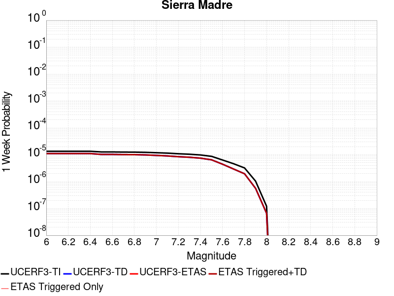 | 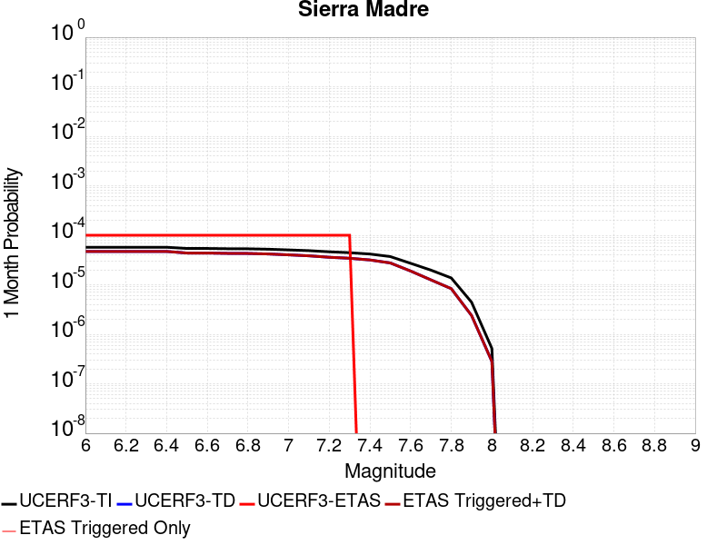 | 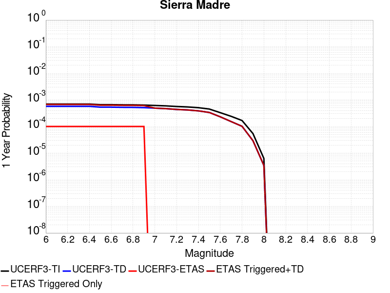 |  |

| Magnitude | 1 wk TI Prob | 1 wk TD Prob | 1 wk ETAS Prob | 1 wk ETAS/TD Gain | 1 wk ETAS Triggered+TD | 1 wk ETAS Triggered Only | 1 mo TI Prob | 1 mo TD Prob | 1 mo ETAS Prob | 1 mo ETAS/TD Gain | 1 mo ETAS Triggered+TD | 1 mo ETAS Triggered Only | 1 yr TI Prob | 1 yr TD Prob | 1 yr ETAS Prob | 1 yr ETAS/TD Gain | 1 yr ETAS Triggered+TD | 1 yr ETAS Triggered Only | 10 yr TI Prob | 10 yr TD Prob | 10 yr ETAS Prob | 10 yr ETAS/TD Gain | 10 yr ETAS Triggered+TD | 10 yr ETAS Triggered Only |
|-----|-----|-----|-----|-----|-----|-----|-----|-----|-----|-----|-----|-----|-----|-----|-----|-----|-----|-----|-----|-----|-----|-----|-----|-----|
| 6.0 | 1.3379373E-5 | 1.10059345E-5 | 0.0 | 0.0 | 1.10059345E-5 | 0.0 | 5.7338908E-5 | 4.7167443E-5 | 1.0E-4 | 2.1201065 | 4.7167443E-5 | 0.0 | 6.978776E-4 | 5.741138E-4 | 3.0E-4 | 0.5225445 | 6.740564E-4 | 1.0E-4 | 0.0069569005 | 0.0057267714 | 0.0044 | 0.7683212 | 0.006223908 | 5.0E-4 |
| 6.1 | 1.3379373E-5 | 1.10059345E-5 | 0.0 | 0.0 | 1.10059345E-5 | 0.0 | 5.7338908E-5 | 4.7167443E-5 | 1.0E-4 | 2.1201065 | 4.7167443E-5 | 0.0 | 6.978776E-4 | 5.741138E-4 | 3.0E-4 | 0.5225445 | 6.740564E-4 | 1.0E-4 | 0.0069569005 | 0.0057267714 | 0.0044 | 0.7683212 | 0.006223908 | 5.0E-4 |
| 6.2 | 1.3379373E-5 | 1.10059345E-5 | 0.0 | 0.0 | 1.10059345E-5 | 0.0 | 5.7338908E-5 | 4.7167443E-5 | 1.0E-4 | 2.1201065 | 4.7167443E-5 | 0.0 | 6.978776E-4 | 5.741138E-4 | 3.0E-4 | 0.5225445 | 6.740564E-4 | 1.0E-4 | 0.0069569005 | 0.0057267714 | 0.0044 | 0.7683212 | 0.006223908 | 5.0E-4 |
| 6.3 | 1.3379373E-5 | 1.10059345E-5 | 0.0 | 0.0 | 1.10059345E-5 | 0.0 | 5.7338908E-5 | 4.7167443E-5 | 1.0E-4 | 2.1201065 | 4.7167443E-5 | 0.0 | 6.978776E-4 | 5.741138E-4 | 3.0E-4 | 0.5225445 | 6.740564E-4 | 1.0E-4 | 0.0069569005 | 0.0057267714 | 0.0044 | 0.7683212 | 0.006223908 | 5.0E-4 |
| 6.4 | 1.3379373E-5 | 1.10059345E-5 | 0.0 | 0.0 | 1.10059345E-5 | 0.0 | 5.7338908E-5 | 4.7167443E-5 | 1.0E-4 | 2.1201065 | 4.7167443E-5 | 0.0 | 6.978776E-4 | 5.741138E-4 | 3.0E-4 | 0.5225445 | 6.740564E-4 | 1.0E-4 | 0.0069569005 | 0.0057267714 | 0.0044 | 0.7683212 | 0.006223908 | 5.0E-4 |
| 6.5 | 1.26563245E-5 | 1.0235286E-5 | 0.0 | 0.0 | 1.0235286E-5 | 0.0 | 5.4240263E-5 | 4.386478E-5 | 1.0E-4 | 2.2797334 | 4.386478E-5 | 0.0 | 6.601751E-4 | 5.339239E-4 | 3.0E-4 | 0.56187785 | 6.338705E-4 | 1.0E-4 | 0.006582173 | 0.005326834 | 0.0039 | 0.7321422 | 0.0058241705 | 5.0E-4 |
| 6.6 | 1.26563245E-5 | 1.0235286E-5 | 0.0 | 0.0 | 1.0235286E-5 | 0.0 | 5.4240263E-5 | 4.386478E-5 | 1.0E-4 | 2.2797334 | 4.386478E-5 | 0.0 | 6.601751E-4 | 5.339239E-4 | 3.0E-4 | 0.56187785 | 6.338705E-4 | 1.0E-4 | 0.006582173 | 0.005326834 | 0.0039 | 0.7321422 | 0.0058241705 | 5.0E-4 |
| 6.7 | 1.2502474E-5 | 1.0071408E-5 | 0.0 | 0.0 | 1.0071408E-5 | 0.0 | 5.3580934E-5 | 4.316247E-5 | 1.0E-4 | 2.3168275 | 4.316247E-5 | 0.0 | 6.521526E-4 | 5.253774E-4 | 3.0E-4 | 0.5710181 | 6.253249E-4 | 1.0E-4 | 0.0065024206 | 0.005241774 | 0.0038 | 0.7249454 | 0.005739153 | 5.0E-4 |
| 6.8 | 1.2454966E-5 | 1.0023687E-5 | 0.0 | 0.0 | 1.0023687E-5 | 0.0 | 5.3377335E-5 | 4.2957952E-5 | 1.0E-4 | 2.3278577 | 4.2957952E-5 | 0.0 | 6.4967526E-4 | 5.228886E-4 | 3.0E-4 | 0.57373595 | 6.2283635E-4 | 1.0E-4 | 0.006477792 | 0.005217003 | 0.0038 | 0.72838753 | 0.0057143946 | 5.0E-4 |
| 6.9 | 1.2225574E-5 | 9.79748E-6 | 0.0 | 0.0 | 9.79748E-6 | 0.0 | 5.2394265E-5 | 4.198853E-5 | 1.0E-4 | 2.381603 | 4.198853E-5 | 0.0 | 6.3771347E-4 | 5.1109144E-4 | 3.0E-4 | 0.5869791 | 6.1104033E-4 | 1.0E-4 | 0.006358865 | 0.0050995774 | 0.0035 | 0.68633133 | 0.005597028 | 5.0E-4 |
| 7.0 | 1.182946E-5 | 9.403937E-6 | 0.0 | 0.0 | 9.403937E-6 | 0.0 | 5.06967E-5 | 4.030197E-5 | 1.0E-4 | 2.4812684 | 4.030197E-5 | 0.0 | 6.1705755E-4 | 4.90567E-4 | 2.0E-4 | 0.40769148 | 4.90567E-4 | 0.0 | 0.006153469 | 0.004895254 | 0.0032 | 0.6536944 | 0.0052932957 | 4.0E-4 |
| 7.1 | 1.14369095E-5 | 8.9908235E-6 | 0.0 | 0.0 | 8.9908235E-6 | 0.0 | 4.9014405E-5 | 3.8531536E-5 | 1.0E-4 | 2.5952768 | 3.8531536E-5 | 0.0 | 5.9658696E-4 | 4.6902144E-4 | 2.0E-4 | 0.42641973 | 4.6902144E-4 | 0.0 | 0.005949879 | 0.0046807225 | 0.0029 | 0.61956245 | 0.0050788503 | 4.0E-4 |
| 7.2 | 1.0836419E-5 | 8.404079E-6 | 0.0 | 0.0 | 8.404079E-6 | 0.0 | 4.644097E-5 | 3.601699E-5 | 1.0E-4 | 2.7764673 | 3.601699E-5 | 0.0 | 5.652721E-4 | 4.3841955E-4 | 2.0E-4 | 0.45618406 | 4.3841955E-4 | 0.0 | 0.0056383642 | 0.004375945 | 0.0025 | 0.5713052 | 0.004674632 | 3.0E-4 |
| 7.3 | 1.0403439E-5 | 8.025261E-6 | 0.0 | 0.0 | 8.025261E-6 | 0.0 | 4.4585406E-5 | 3.439353E-5 | 1.0E-4 | 2.9075236 | 3.439353E-5 | 0.0 | 5.426921E-4 | 4.186617E-4 | 2.0E-4 | 0.4777127 | 4.186617E-4 | 0.0 | 0.005413687 | 0.004179126 | 0.0024 | 0.57428277 | 0.0044778725 | 3.0E-4 |
| 7.4 | 9.768864E-6 | 7.418747E-6 | 0.0 | 0.0 | 7.418747E-6 | 0.0 | 4.186589E-5 | 3.1794247E-5 | 0.0 | 0.0 | 3.1794247E-5 | 0.0 | 5.09598E-4 | 3.870271E-4 | 1.0E-4 | 0.25837985 | 3.870271E-4 | 0.0 | 0.0050843097 | 0.0038639237 | 0.0022 | 0.56936944 | 0.0041627646 | 3.0E-4 |
| 7.5 | 8.687089E-6 | 6.454149E-6 | 0.0 | 0.0 | 6.454149E-6 | 0.0 | 3.722985E-5 | 2.766035E-5 | 0.0 | 0.0 | 2.766035E-5 | 0.0 | 4.5317915E-4 | 3.367136E-4 | 1.0E-4 | 0.2969883 | 3.367136E-4 | 0.0 | 0.004522561 | 0.0033624226 | 0.0017 | 0.5055878 | 0.003661414 | 3.0E-4 |
| 7.6 | 6.3506063E-6 | 4.433878E-6 | 0.0 | 0.0 | 4.433878E-6 | 0.0 | 2.72166E-5 | 1.9002196E-5 | 0.0 | 0.0 | 1.9002196E-5 | 0.0 | 3.3131172E-4 | 2.3132745E-4 | 0.0 | 0.0 | 2.3132745E-4 | 0.0 | 0.003308182 | 0.0023111927 | 0.0013 | 0.56248015 | 0.0026104993 | 3.0E-4 |
| 7.7 | 4.62223E-6 | 2.93627E-6 | 0.0 | 0.0 | 2.93627E-6 | 0.0 | 1.9809406E-5 | 1.2583953E-5 | 0.0 | 0.0 | 1.2583953E-5 | 0.0 | 2.4115283E-4 | 1.5319888E-4 | 0.0 | 0.0 | 1.5319888E-4 | 0.0 | 0.0024089129 | 0.0015312341 | 0.0012 | 0.7836816 | 0.0018307748 | 3.0E-4 |
| 7.8 | 3.2145008E-6 | 1.9517913E-6 | 0.0 | 0.0 | 1.9517913E-6 | 0.0 | 1.3776359E-5 | 8.364793E-6 | 0.0 | 0.0 | 8.364793E-6 | 0.0 | 1.6771426E-4 | 1.0183661E-4 | 0.0 | 0.0 | 1.0183661E-4 | 0.0 | 0.0016758774 | 0.0010181536 | 8.0E-4 | 0.785736 | 0.00121795 | 2.0E-4 |
| 7.9 | 1.0391769E-6 | 5.609678E-7 | 0.0 | 0.0 | 5.609678E-7 | 0.0 | 4.4536077E-6 | 2.4041456E-6 | 0.0 | 0.0 | 2.4041456E-6 | 0.0 | 5.4221324E-5 | 2.9270082E-5 | 0.0 | 0.0 | 2.9270082E-5 | 0.0 | 5.4208096E-4 | 2.926627E-4 | 2.0E-4 | 0.68338054 | 2.926627E-4 | 0.0 |
| 8.0 | 1.210983E-7 | 6.619219E-8 | 0.0 | 0.0 | 6.619219E-8 | 0.0 | 5.1899264E-7 | 2.836808E-7 | 0.0 | 0.0 | 2.836808E-7 | 0.0 | 6.3187167E-6 | 3.4538086E-6 | 0.0 | 0.0 | 3.4538086E-6 | 0.0 | 6.318537E-5 | 3.4537567E-5 | 0.0 | 0.0 | 3.4537567E-5 | 0.0 |

## Surprise Valley 2011 CFM
*[(top)](#table-of-contents)*

| 1 Week | 1 Month | 1 Year | 10 Year |
|-----|-----|-----|-----|
| 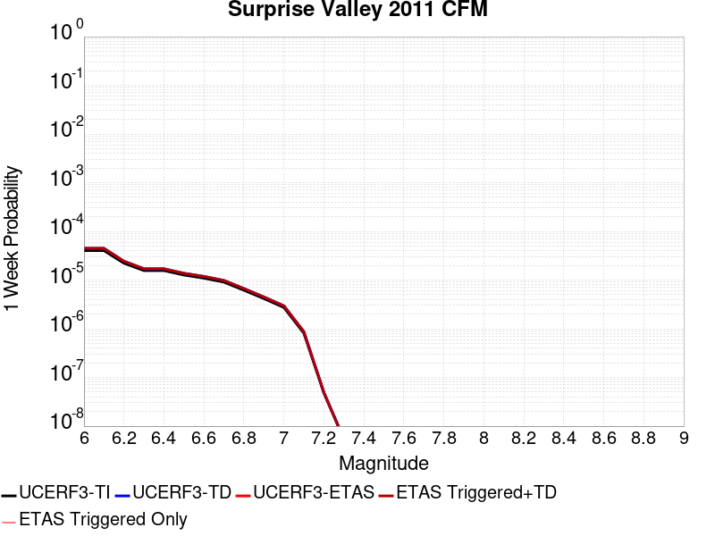 | 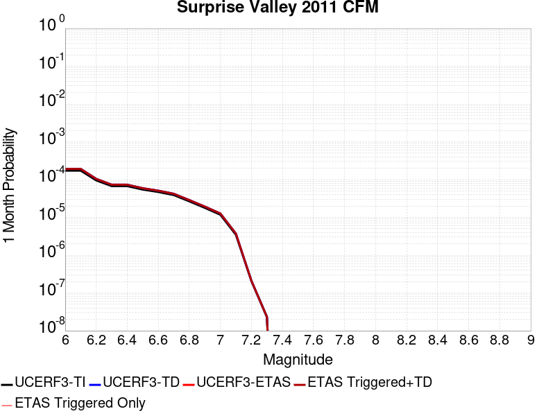 | 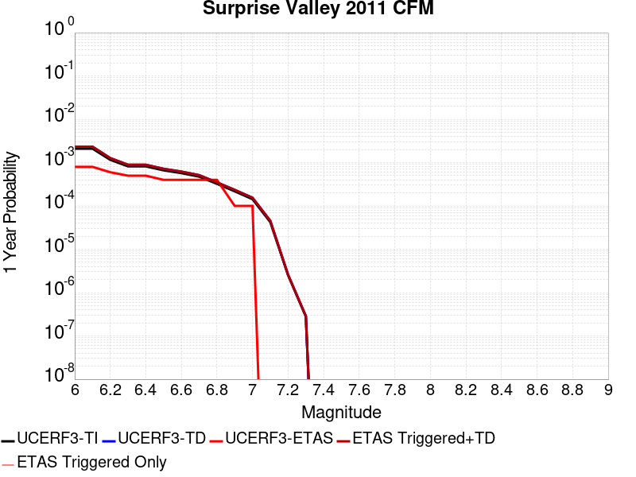 | 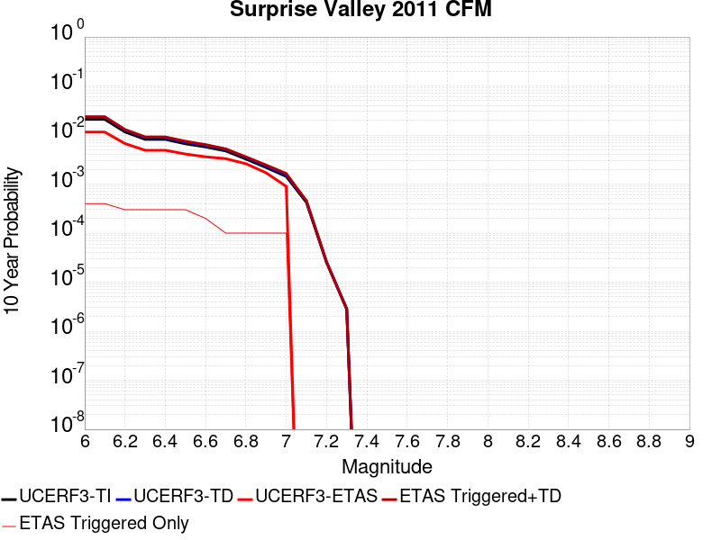 |

| Magnitude | 1 wk TI Prob | 1 wk TD Prob | 1 wk ETAS Prob | 1 wk ETAS/TD Gain | 1 wk ETAS Triggered+TD | 1 wk ETAS Triggered Only | 1 mo TI Prob | 1 mo TD Prob | 1 mo ETAS Prob | 1 mo ETAS/TD Gain | 1 mo ETAS Triggered+TD | 1 mo ETAS Triggered Only | 1 yr TI Prob | 1 yr TD Prob | 1 yr ETAS Prob | 1 yr ETAS/TD Gain | 1 yr ETAS Triggered+TD | 1 yr ETAS Triggered Only | 10 yr TI Prob | 10 yr TD Prob | 10 yr ETAS Prob | 10 yr ETAS/TD Gain | 10 yr ETAS Triggered+TD | 10 yr ETAS Triggered Only |
|-----|-----|-----|-----|-----|-----|-----|-----|-----|-----|-----|-----|-----|-----|-----|-----|-----|-----|-----|-----|-----|-----|-----|-----|-----|
| 6.0 | 4.0396248E-5 | 4.486156E-5 | 0.0 | 0.0 | 4.486156E-5 | 0.0 | 1.7311527E-4 | 1.9225085E-4 | 2.0E-4 | 1.0403075 | 1.9225085E-4 | 0.0 | 0.002105641 | 0.0023383514 | 8.0E-4 | 0.34212136 | 0.0023383514 | 0.0 | 0.020858008 | 0.023159204 | 0.0115 | 0.4965628 | 0.02354994 | 4.0E-4 |
| 6.1 | 4.0396248E-5 | 4.486156E-5 | 0.0 | 0.0 | 4.486156E-5 | 0.0 | 1.7311527E-4 | 1.9225085E-4 | 2.0E-4 | 1.0403075 | 1.9225085E-4 | 0.0 | 0.002105641 | 0.0023383514 | 8.0E-4 | 0.34212136 | 0.0023383514 | 0.0 | 0.020858008 | 0.023159204 | 0.0115 | 0.4965628 | 0.02354994 | 4.0E-4 |
| 6.2 | 2.2295266E-5 | 2.4406017E-5 | 0.0 | 0.0 | 2.4406017E-5 | 0.0 | 9.554764E-5 | 1.0459319E-4 | 1.0E-4 | 0.95608515 | 1.0459319E-4 | 0.0 | 0.0011626717 | 0.001272709 | 6.0E-4 | 0.47143534 | 0.001272709 | 0.0 | 0.011566074 | 0.012657438 | 0.0067 | 0.529333 | 0.012953641 | 3.0E-4 |
| 6.3 | 1.572643E-5 | 1.7099885E-5 | 0.0 | 0.0 | 1.7099885E-5 | 0.0 | 6.7397246E-5 | 7.328322E-5 | 0.0 | 0.0 | 7.328322E-5 | 0.0 | 8.202525E-4 | 8.918685E-4 | 5.0E-4 | 0.5606208 | 8.918685E-4 | 0.0 | 0.008172315 | 0.008884 | 0.0049 | 0.5515534 | 0.009181334 | 3.0E-4 |
| 6.4 | 1.5714395E-5 | 1.7087707E-5 | 0.0 | 0.0 | 1.7087707E-5 | 0.0 | 6.734567E-5 | 7.323103E-5 | 0.0 | 0.0 | 7.323103E-5 | 0.0 | 8.1962504E-4 | 8.912336E-4 | 5.0E-4 | 0.56102014 | 8.912336E-4 | 0.0 | 0.008166086 | 0.008877701 | 0.0049 | 0.5519447 | 0.009175038 | 3.0E-4 |
| 6.5 | 1.2733495E-5 | 1.3803991E-5 | 0.0 | 0.0 | 1.3803991E-5 | 0.0 | 5.457098E-5 | 5.915866E-5 | 0.0 | 0.0 | 5.915866E-5 | 0.0 | 6.641992E-4 | 7.2002533E-4 | 4.0E-4 | 0.55553603 | 7.2002533E-4 | 0.0 | 0.0066221743 | 0.007177619 | 0.0041 | 0.5712201 | 0.0074754655 | 3.0E-4 |
| 6.6 | 1.0983784E-5 | 1.1888572E-5 | 0.0 | 0.0 | 1.1888572E-5 | 0.0 | 4.7072506E-5 | 5.0950057E-5 | 0.0 | 0.0 | 5.0950057E-5 | 0.0 | 5.7295704E-4 | 6.201457E-4 | 4.0E-4 | 0.6450097 | 6.201457E-4 | 0.0 | 0.0057148207 | 0.0061847013 | 0.0036 | 0.5820815 | 0.006383464 | 2.0E-4 |
| 6.7 | 9.104806E-6 | 9.841131E-6 | 0.0 | 0.0 | 9.841131E-6 | 0.0 | 3.902001E-5 | 4.2175616E-5 | 0.0 | 0.0 | 4.2175616E-5 | 0.0 | 4.7496508E-4 | 5.133711E-4 | 4.0E-4 | 0.77916354 | 5.133711E-4 | 0.0 | 0.004739512 | 0.0051222485 | 0.0033 | 0.6442483 | 0.005221736 | 1.0E-4 |
| 6.8 | 6.2162403E-6 | 6.7052215E-6 | 0.0 | 0.0 | 6.7052215E-6 | 0.0 | 2.6640759E-5 | 2.873636E-5 | 0.0 | 0.0 | 2.873636E-5 | 0.0 | 3.2430296E-4 | 3.4981125E-4 | 4.0E-4 | 1.1434739 | 3.4981125E-4 | 0.0 | 0.003238301 | 0.0034928294 | 0.0026 | 0.7443822 | 0.0035924802 | 1.0E-4 |
| 6.9 | 4.1792696E-6 | 4.5039524E-6 | 0.0 | 0.0 | 4.5039524E-6 | 0.0 | 1.7911032E-5 | 1.9302519E-5 | 0.0 | 0.0 | 1.9302519E-5 | 0.0 | 2.1804498E-4 | 2.3498437E-4 | 1.0E-4 | 0.42556024 | 2.3498437E-4 | 0.0 | 0.0021783116 | 0.0023475122 | 0.0017 | 0.72417086 | 0.0024472775 | 1.0E-4 |
| 7.0 | 2.7478413E-6 | 2.962721E-6 | 0.0 | 0.0 | 2.962721E-6 | 0.0 | 1.177641E-5 | 1.2697321E-5 | 0.0 | 0.0 | 1.2697321E-5 | 0.0 | 1.4336836E-4 | 1.5458016E-4 | 1.0E-4 | 0.6469135 | 1.5458016E-4 | 0.0 | 0.001432759 | 0.0015448489 | 9.0E-4 | 0.5825813 | 0.0016446944 | 1.0E-4 |
| 7.1 | 8.128648E-7 | 8.726253E-7 | 0.0 | 0.0 | 8.726253E-7 | 0.0 | 3.4837017E-6 | 3.7398208E-6 | 0.0 | 0.0 | 3.7398208E-6 | 0.0 | 4.2413245E-5 | 4.5531968E-5 | 0.0 | 0.0 | 4.5531968E-5 | 0.0 | 4.2405148E-4 | 4.5528522E-4 | 0.0 | 0.0 | 4.5528522E-4 | 0.0 |
| 7.2 | 4.8641045E-8 | 4.940366E-8 | 0.0 | 0.0 | 4.940366E-8 | 0.0 | 2.084616E-7 | 2.1172994E-7 | 0.0 | 0.0 | 2.1172994E-7 | 0.0 | 2.538017E-6 | 2.5778093E-6 | 0.0 | 0.0 | 2.5778093E-6 | 0.0 | 2.537988E-5 | 2.5777805E-5 | 0.0 | 0.0 | 2.5777805E-5 | 0.0 |
| 7.3 | 5.3911844E-9 | 5.475991E-9 | 0.0 | 0.0 | 5.475991E-9 | 0.0 | 2.3105075E-8 | 2.3468534E-8 | 0.0 | 0.0 | 2.3468534E-8 | 0.0 | 2.8130427E-7 | 2.8572939E-7 | 0.0 | 0.0 | 2.8572939E-7 | 0.0 | 2.8130391E-6 | 2.8572917E-6 | 0.0 | 0.0 | 2.8572917E-6 | 0.0 |

## North Frontal  (East)
*[(top)](#table-of-contents)*

| 1 Week | 1 Month | 1 Year | 10 Year |
|-----|-----|-----|-----|
| 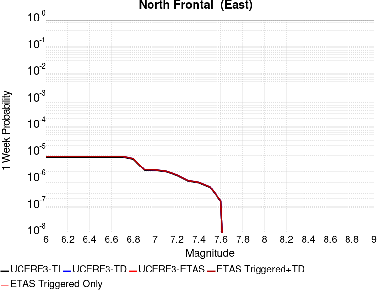 | 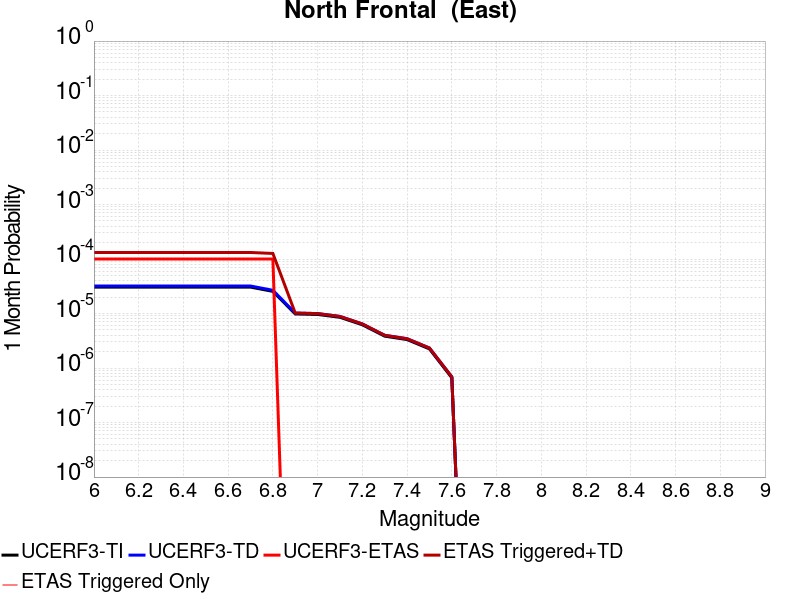 | 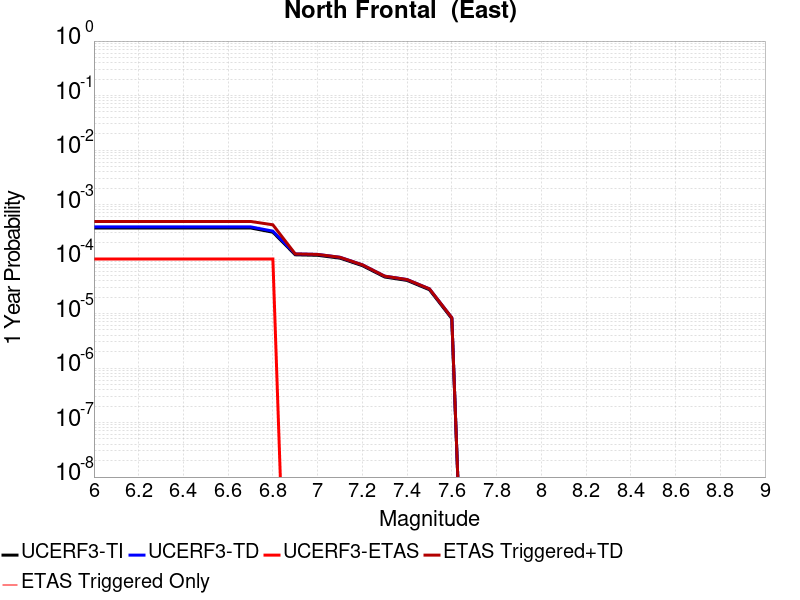 | 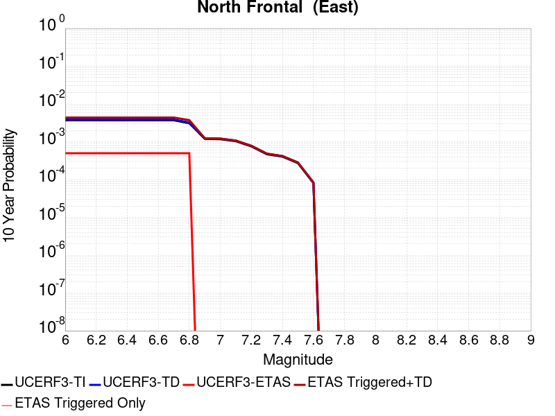 |

| Magnitude | 1 wk TI Prob | 1 wk TD Prob | 1 wk ETAS Prob | 1 wk ETAS/TD Gain | 1 wk ETAS Triggered+TD | 1 wk ETAS Triggered Only | 1 mo TI Prob | 1 mo TD Prob | 1 mo ETAS Prob | 1 mo ETAS/TD Gain | 1 mo ETAS Triggered+TD | 1 mo ETAS Triggered Only | 1 yr TI Prob | 1 yr TD Prob | 1 yr ETAS Prob | 1 yr ETAS/TD Gain | 1 yr ETAS Triggered+TD | 1 yr ETAS Triggered Only | 10 yr TI Prob | 10 yr TD Prob | 10 yr ETAS Prob | 10 yr ETAS/TD Gain | 10 yr ETAS Triggered+TD | 10 yr ETAS Triggered Only |
|-----|-----|-----|-----|-----|-----|-----|-----|-----|-----|-----|-----|-----|-----|-----|-----|-----|-----|-----|-----|-----|-----|-----|-----|-----|
| 6.0 | 7.135738E-6 | 7.477914E-6 | 0.0 | 0.0 | 7.477914E-6 | 0.0 | 3.0581377E-5 | 3.2047923E-5 | 1.0E-4 | 3.120327 | 1.3204472E-4 | 1.0E-4 | 3.7226462E-4 | 3.9013353E-4 | 2.0E-4 | 0.512645 | 4.9009454E-4 | 1.0E-4 | 0.0037164164 | 0.0038964446 | 0.0017 | 0.43629518 | 0.0043944963 | 5.0E-4 |
| 6.1 | 7.135738E-6 | 7.477914E-6 | 0.0 | 0.0 | 7.477914E-6 | 0.0 | 3.0581377E-5 | 3.2047923E-5 | 1.0E-4 | 3.120327 | 1.3204472E-4 | 1.0E-4 | 3.7226462E-4 | 3.9013353E-4 | 2.0E-4 | 0.512645 | 4.9009454E-4 | 1.0E-4 | 0.0037164164 | 0.0038964446 | 0.0017 | 0.43629518 | 0.0043944963 | 5.0E-4 |
| 6.2 | 7.135738E-6 | 7.477914E-6 | 0.0 | 0.0 | 7.477914E-6 | 0.0 | 3.0581377E-5 | 3.2047923E-5 | 1.0E-4 | 3.120327 | 1.3204472E-4 | 1.0E-4 | 3.7226462E-4 | 3.9013353E-4 | 2.0E-4 | 0.512645 | 4.9009454E-4 | 1.0E-4 | 0.0037164164 | 0.0038964446 | 0.0017 | 0.43629518 | 0.0043944963 | 5.0E-4 |
| 6.3 | 7.135738E-6 | 7.477914E-6 | 0.0 | 0.0 | 7.477914E-6 | 0.0 | 3.0581377E-5 | 3.2047923E-5 | 1.0E-4 | 3.120327 | 1.3204472E-4 | 1.0E-4 | 3.7226462E-4 | 3.9013353E-4 | 2.0E-4 | 0.512645 | 4.9009454E-4 | 1.0E-4 | 0.0037164164 | 0.0038964446 | 0.0017 | 0.43629518 | 0.0043944963 | 5.0E-4 |
| 6.4 | 7.135738E-6 | 7.477914E-6 | 0.0 | 0.0 | 7.477914E-6 | 0.0 | 3.0581377E-5 | 3.2047923E-5 | 1.0E-4 | 3.120327 | 1.3204472E-4 | 1.0E-4 | 3.7226462E-4 | 3.9013353E-4 | 2.0E-4 | 0.512645 | 4.9009454E-4 | 1.0E-4 | 0.0037164164 | 0.0038964446 | 0.0017 | 0.43629518 | 0.0043944963 | 5.0E-4 |
| 6.5 | 7.135738E-6 | 7.477914E-6 | 0.0 | 0.0 | 7.477914E-6 | 0.0 | 3.0581377E-5 | 3.2047923E-5 | 1.0E-4 | 3.120327 | 1.3204472E-4 | 1.0E-4 | 3.7226462E-4 | 3.9013353E-4 | 2.0E-4 | 0.512645 | 4.9009454E-4 | 1.0E-4 | 0.0037164164 | 0.0038964446 | 0.0017 | 0.43629518 | 0.0043944963 | 5.0E-4 |
| 6.6 | 7.135738E-6 | 7.477914E-6 | 0.0 | 0.0 | 7.477914E-6 | 0.0 | 3.0581377E-5 | 3.2047923E-5 | 1.0E-4 | 3.120327 | 1.3204472E-4 | 1.0E-4 | 3.7226462E-4 | 3.9013353E-4 | 2.0E-4 | 0.512645 | 4.9009454E-4 | 1.0E-4 | 0.0037164164 | 0.0038964446 | 0.0017 | 0.43629518 | 0.0043944963 | 5.0E-4 |
| 6.7 | 7.135738E-6 | 7.477914E-6 | 0.0 | 0.0 | 7.477914E-6 | 0.0 | 3.0581377E-5 | 3.2047923E-5 | 1.0E-4 | 3.120327 | 1.3204472E-4 | 1.0E-4 | 3.7226462E-4 | 3.9013353E-4 | 2.0E-4 | 0.512645 | 4.9009454E-4 | 1.0E-4 | 0.0037164164 | 0.0038964446 | 0.0017 | 0.43629518 | 0.0043944963 | 5.0E-4 |
| 6.8 | 5.959142E-6 | 6.237282E-6 | 0.0 | 0.0 | 6.237282E-6 | 0.0 | 2.553893E-5 | 2.6731035E-5 | 1.0E-4 | 3.74097 | 1.2672837E-4 | 1.0E-4 | 3.108921E-4 | 3.2541982E-4 | 1.0E-4 | 0.30729535 | 4.253873E-4 | 1.0E-4 | 0.0031045752 | 0.0032512066 | 0.0013 | 0.39985156 | 0.003749581 | 5.0E-4 |
| 6.9 | 2.2946929E-6 | 2.3826483E-6 | 0.0 | 0.0 | 2.3826483E-6 | 0.0 | 9.834361E-6 | 1.0211313E-5 | 0.0 | 0.0 | 1.0211313E-5 | 0.0 | 1.1972676E-4 | 1.2431611E-4 | 0.0 | 0.0 | 1.2431611E-4 | 0.0 | 0.0011966228 | 0.0012425123 | 3.0E-4 | 0.24144632 | 0.0012425123 | 0.0 |
| 7.0 | 2.2468673E-6 | 2.3323362E-6 | 0.0 | 0.0 | 2.3323362E-6 | 0.0 | 9.629396E-6 | 9.9956915E-6 | 0.0 | 0.0 | 9.9956915E-6 | 0.0 | 1.1723159E-4 | 1.2169121E-4 | 0.0 | 0.0 | 1.2169121E-4 | 0.0 | 0.0011716976 | 0.0012162921 | 3.0E-4 | 0.24665128 | 0.0012162921 | 0.0 |
| 7.1 | 1.9921076E-6 | 2.064758E-6 | 0.0 | 0.0 | 2.064758E-6 | 0.0 | 8.537577E-6 | 8.848935E-6 | 0.0 | 0.0 | 8.848935E-6 | 0.0 | 1.0394004E-4 | 1.077309E-4 | 0.0 | 0.0 | 1.077309E-4 | 0.0 | 0.0010389143 | 0.0010768295 | 3.0E-4 | 0.27859566 | 0.0010768295 | 0.0 |
| 7.2 | 1.4524545E-6 | 1.5046259E-6 | 0.0 | 0.0 | 1.5046259E-6 | 0.0 | 6.2247905E-6 | 6.448382E-6 | 0.0 | 0.0 | 6.448382E-6 | 0.0 | 7.5784184E-5 | 7.850648E-5 | 0.0 | 0.0 | 7.850648E-5 | 0.0 | 7.575835E-4 | 7.8481185E-4 | 3.0E-4 | 0.38225722 | 7.8481185E-4 | 0.0 |
| 7.3 | 8.9802575E-7 | 9.309429E-7 | 0.0 | 0.0 | 9.309429E-7 | 0.0 | 3.848676E-6 | 3.98975E-6 | 0.0 | 0.0 | 3.98975E-6 | 0.0 | 4.685662E-5 | 4.857424E-5 | 0.0 | 0.0 | 4.857424E-5 | 0.0 | 4.6846745E-4 | 4.8564753E-4 | 2.0E-4 | 0.4118213 | 4.8564753E-4 | 0.0 |
| 7.4 | 7.776139E-7 | 8.061082E-7 | 0.0 | 0.0 | 8.061082E-7 | 0.0 | 3.3326266E-6 | 3.4547454E-6 | 0.0 | 0.0 | 3.4547454E-6 | 0.0 | 4.0573974E-5 | 4.2060823E-5 | 0.0 | 0.0 | 4.2060823E-5 | 0.0 | 4.0566566E-4 | 4.2053938E-4 | 2.0E-4 | 0.4755797 | 4.2053938E-4 | 0.0 |
| 7.5 | 5.244417E-7 | 5.44164E-7 | 0.0 | 0.0 | 5.44164E-7 | 0.0 | 2.2476054E-6 | 2.3321297E-6 | 0.0 | 0.0 | 2.3321297E-6 | 0.0 | 2.7364253E-5 | 2.8393375E-5 | 0.0 | 0.0 | 2.8393375E-5 | 0.0 | 2.7360884E-4 | 2.83904E-4 | 2.0E-4 | 0.70446354 | 2.83904E-4 | 0.0 |
| 7.6 | 1.5489647E-7 | 1.6090787E-7 | 0.0 | 0.0 | 1.6090787E-7 | 0.0 | 6.6384183E-7 | 6.896051E-7 | 0.0 | 0.0 | 6.896051E-7 | 0.0 | 8.082245E-6 | 8.39593E-6 | 0.0 | 0.0 | 8.39593E-6 | 0.0 | 8.08195E-5 | 8.3958126E-5 | 0.0 | 0.0 | 8.3958126E-5 | 0.0 |

## San Cayetano
*[(top)](#table-of-contents)*

| 1 Week | 1 Month | 1 Year | 10 Year |
|-----|-----|-----|-----|
|  | 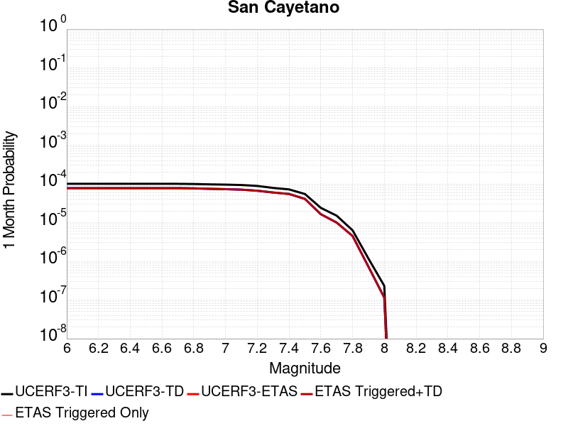 | 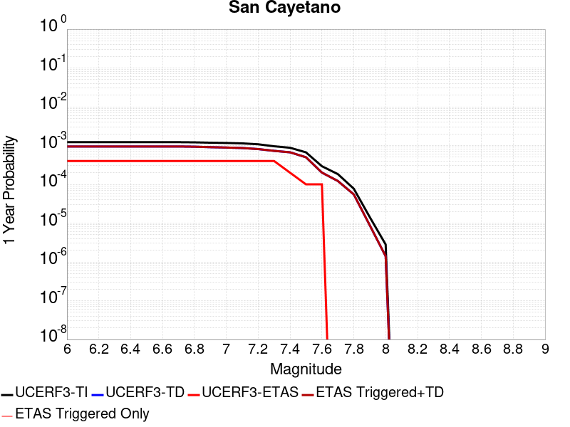 | 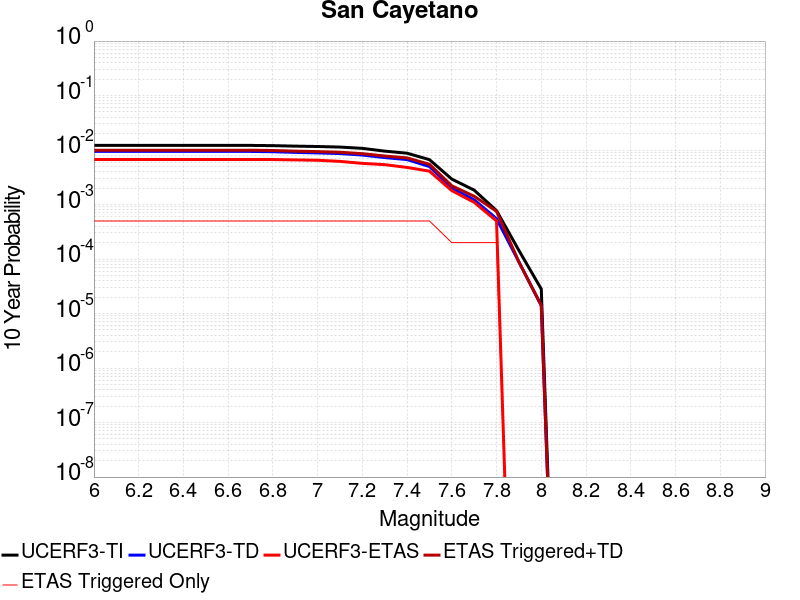 |

| Magnitude | 1 wk TI Prob | 1 wk TD Prob | 1 wk ETAS Prob | 1 wk ETAS/TD Gain | 1 wk ETAS Triggered+TD | 1 wk ETAS Triggered Only | 1 mo TI Prob | 1 mo TD Prob | 1 mo ETAS Prob | 1 mo ETAS/TD Gain | 1 mo ETAS Triggered+TD | 1 mo ETAS Triggered Only | 1 yr TI Prob | 1 yr TD Prob | 1 yr ETAS Prob | 1 yr ETAS/TD Gain | 1 yr ETAS Triggered+TD | 1 yr ETAS Triggered Only | 10 yr TI Prob | 10 yr TD Prob | 10 yr ETAS Prob | 10 yr ETAS/TD Gain | 10 yr ETAS Triggered+TD | 10 yr ETAS Triggered Only |
|-----|-----|-----|-----|-----|-----|-----|-----|-----|-----|-----|-----|-----|-----|-----|-----|-----|-----|-----|-----|-----|-----|-----|-----|-----|
| 6.0 | 2.3476267E-5 | 1.8176888E-5 | 1.0E-4 | 5.5014915 | 1.8176888E-5 | 0.0 | 1.0060869E-4 | 7.789864E-5 | 2.0E-4 | 2.5674388 | 7.789864E-5 | 0.0 | 0.0012242225 | 9.48007E-4 | 4.0E-4 | 0.42193782 | 9.48007E-4 | 0.0 | 0.012175002 | 0.009440477 | 0.0067 | 0.70970994 | 0.009935756 | 5.0E-4 |
| 6.1 | 2.3476267E-5 | 1.8176888E-5 | 1.0E-4 | 5.5014915 | 1.8176888E-5 | 0.0 | 1.0060869E-4 | 7.789864E-5 | 2.0E-4 | 2.5674388 | 7.789864E-5 | 0.0 | 0.0012242225 | 9.48007E-4 | 4.0E-4 | 0.42193782 | 9.48007E-4 | 0.0 | 0.012175002 | 0.009440477 | 0.0067 | 0.70970994 | 0.009935756 | 5.0E-4 |
| 6.2 | 2.3476267E-5 | 1.8176888E-5 | 1.0E-4 | 5.5014915 | 1.8176888E-5 | 0.0 | 1.0060869E-4 | 7.789864E-5 | 2.0E-4 | 2.5674388 | 7.789864E-5 | 0.0 | 0.0012242225 | 9.48007E-4 | 4.0E-4 | 0.42193782 | 9.48007E-4 | 0.0 | 0.012175002 | 0.009440477 | 0.0067 | 0.70970994 | 0.009935756 | 5.0E-4 |
| 6.3 | 2.3476267E-5 | 1.8176888E-5 | 1.0E-4 | 5.5014915 | 1.8176888E-5 | 0.0 | 1.0060869E-4 | 7.789864E-5 | 2.0E-4 | 2.5674388 | 7.789864E-5 | 0.0 | 0.0012242225 | 9.48007E-4 | 4.0E-4 | 0.42193782 | 9.48007E-4 | 0.0 | 0.012175002 | 0.009440477 | 0.0067 | 0.70970994 | 0.009935756 | 5.0E-4 |
| 6.4 | 2.3476267E-5 | 1.8176888E-5 | 1.0E-4 | 5.5014915 | 1.8176888E-5 | 0.0 | 1.0060869E-4 | 7.789864E-5 | 2.0E-4 | 2.5674388 | 7.789864E-5 | 0.0 | 0.0012242225 | 9.48007E-4 | 4.0E-4 | 0.42193782 | 9.48007E-4 | 0.0 | 0.012175002 | 0.009440477 | 0.0067 | 0.70970994 | 0.009935756 | 5.0E-4 |
| 6.5 | 2.3476267E-5 | 1.8176888E-5 | 1.0E-4 | 5.5014915 | 1.8176888E-5 | 0.0 | 1.0060869E-4 | 7.789864E-5 | 2.0E-4 | 2.5674388 | 7.789864E-5 | 0.0 | 0.0012242225 | 9.48007E-4 | 4.0E-4 | 0.42193782 | 9.48007E-4 | 0.0 | 0.012175002 | 0.009440477 | 0.0067 | 0.70970994 | 0.009935756 | 5.0E-4 |
| 6.6 | 2.3476267E-5 | 1.8176888E-5 | 1.0E-4 | 5.5014915 | 1.8176888E-5 | 0.0 | 1.0060869E-4 | 7.789864E-5 | 2.0E-4 | 2.5674388 | 7.789864E-5 | 0.0 | 0.0012242225 | 9.48007E-4 | 4.0E-4 | 0.42193782 | 9.48007E-4 | 0.0 | 0.012175002 | 0.009440477 | 0.0067 | 0.70970994 | 0.009935756 | 5.0E-4 |
| 6.7 | 2.3476267E-5 | 1.8176888E-5 | 1.0E-4 | 5.5014915 | 1.8176888E-5 | 0.0 | 1.0060869E-4 | 7.789864E-5 | 2.0E-4 | 2.5674388 | 7.789864E-5 | 0.0 | 0.0012242225 | 9.48007E-4 | 4.0E-4 | 0.42193782 | 9.48007E-4 | 0.0 | 0.012175002 | 0.009440477 | 0.0067 | 0.70970994 | 0.009935756 | 5.0E-4 |
| 6.8 | 2.3241924E-5 | 1.7944501E-5 | 1.0E-4 | 5.5727377 | 1.7944501E-5 | 0.0 | 9.960445E-5 | 7.6902754E-5 | 2.0E-4 | 2.600687 | 7.6902754E-5 | 0.0 | 0.0012120095 | 9.358925E-4 | 4.0E-4 | 0.42739952 | 9.358925E-4 | 0.0 | 0.012054204 | 0.009320286 | 0.0067 | 0.71886206 | 0.009815626 | 5.0E-4 |
| 6.9 | 2.2761007E-5 | 1.743978E-5 | 1.0E-4 | 5.7340174 | 1.743978E-5 | 0.0 | 9.7543525E-5 | 7.473979E-5 | 2.0E-4 | 2.6759508 | 7.473979E-5 | 0.0 | 0.0011869454 | 9.095805E-4 | 4.0E-4 | 0.43976316 | 9.095805E-4 | 0.0 | 0.011806256 | 0.009059327 | 0.0066 | 0.728531 | 0.009554797 | 5.0E-4 |
| 7.0 | 2.240283E-5 | 1.7073417E-5 | 1.0E-4 | 5.8570585 | 1.7073417E-5 | 0.0 | 9.600859E-5 | 7.316975E-5 | 2.0E-4 | 2.73337 | 7.316975E-5 | 0.0 | 0.0011682777 | 8.9048105E-4 | 4.0E-4 | 0.4491954 | 8.9048105E-4 | 0.0 | 0.011621549 | 0.008869862 | 0.0065 | 0.73281866 | 0.009365426 | 5.0E-4 |
| 7.1 | 2.1871154E-5 | 1.659319E-5 | 1.0E-4 | 6.0265684 | 1.659319E-5 | 0.0 | 9.373015E-5 | 7.1111754E-5 | 2.0E-4 | 2.8124745 | 7.1111754E-5 | 0.0 | 0.0011405671 | 8.6544506E-4 | 4.0E-4 | 0.46218994 | 8.6544506E-4 | 0.0 | 0.011347309 | 0.008621467 | 0.0062 | 0.7191351 | 0.009117156 | 5.0E-4 |
| 7.2 | 2.0714133E-5 | 1.5571377E-5 | 1.0E-4 | 6.4220395 | 1.5571377E-5 | 0.0 | 8.8771834E-5 | 6.6732784E-5 | 2.0E-4 | 2.9970276 | 6.6732784E-5 | 0.0 | 0.0010802611 | 8.121721E-4 | 4.0E-4 | 0.49250647 | 8.121721E-4 | 0.0 | 0.010750249 | 0.008092731 | 0.0057 | 0.70433575 | 0.008588686 | 5.0E-4 |
| 7.3 | 1.8408395E-5 | 1.4001644E-5 | 1.0E-4 | 7.142019 | 1.4001644E-5 | 0.0 | 7.8890735E-5 | 6.000568E-5 | 2.0E-4 | 3.3330178 | 6.000568E-5 | 0.0 | 9.600714E-4 | 7.303273E-4 | 4.0E-4 | 0.5476997 | 7.303273E-4 | 0.0 | 0.009559342 | 0.0072799018 | 0.0054 | 0.74176824 | 0.007776262 | 5.0E-4 |
| 7.4 | 1.6856795E-5 | 1.285433E-5 | 1.0E-4 | 7.77948 | 1.285433E-5 | 0.0 | 7.2241404E-5 | 5.508884E-5 | 2.0E-4 | 3.6304996 | 5.508884E-5 | 0.0 | 8.7918417E-4 | 6.7050307E-4 | 2.0E-4 | 0.2982835 | 6.7050307E-4 | 0.0 | 0.00875714 | 0.006685398 | 0.0048 | 0.7179827 | 0.007182055 | 5.0E-4 |
| 7.5 | 1.2822778E-5 | 9.58053E-6 | 1.0E-4 | 10.437837 | 9.58053E-6 | 0.0 | 5.495361E-5 | 4.1058775E-5 | 1.0E-4 | 2.435533 | 4.1058775E-5 | 0.0 | 6.688548E-4 | 4.997775E-4 | 1.0E-4 | 0.20008904 | 4.997775E-4 | 0.0 | 0.006668452 | 0.00498672 | 0.0041 | 0.82218367 | 0.0054842266 | 5.0E-4 |
| 7.6 | 5.6272684E-6 | 3.856121E-6 | 1.0E-4 | 25.932796 | 3.856121E-6 | 0.0 | 2.4116642E-5 | 1.652613E-5 | 1.0E-4 | 6.051024 | 1.652613E-5 | 0.0 | 2.9358055E-4 | 2.0118714E-4 | 1.0E-4 | 0.49704966 | 2.0118714E-4 | 0.0 | 0.0029319301 | 0.002010061 | 0.0018 | 0.89549524 | 0.002209659 | 2.0E-4 |
| 7.7 | 3.5261346E-6 | 2.3415075E-6 | 0.0 | 0.0 | 2.3415075E-6 | 0.0 | 1.5111918E-5 | 1.00349935E-5 | 0.0 | 0.0 | 1.00349935E-5 | 0.0 | 1.8397206E-4 | 1.2216927E-4 | 0.0 | 0.0 | 1.2216927E-4 | 0.0 | 0.0018381984 | 0.0012210285 | 0.0011 | 0.9008799 | 0.0014207843 | 2.0E-4 |
| 7.8 | 1.4826929E-6 | 1.0567895E-6 | 0.0 | 0.0 | 1.0567895E-6 | 0.0 | 6.354383E-6 | 4.5290903E-6 | 0.0 | 0.0 | 4.5290903E-6 | 0.0 | 7.736187E-5 | 5.51403E-5 | 0.0 | 0.0 | 5.51403E-5 | 0.0 | 7.733494E-4 | 5.5126817E-4 | 5.0E-4 | 0.9069995 | 7.5115793E-4 | 2.0E-4 |
| 7.9 | 2.7568166E-7 | 1.6984725E-7 | 0.0 | 0.0 | 1.6984725E-7 | 0.0 | 1.1814923E-6 | 7.2791664E-7 | 0.0 | 0.0 | 7.2791664E-7 | 0.0 | 1.4384574E-5 | 8.862349E-6 | 0.0 | 0.0 | 8.862349E-6 | 0.0 | 1.4383643E-4 | 8.861999E-5 | 0.0 | 0.0 | 8.861999E-5 | 0.0 |
| 8.0 | 5.407832E-8 | 2.6909209E-8 | 0.0 | 0.0 | 2.6909209E-8 | 0.0 | 2.3176422E-7 | 1.1532518E-7 | 0.0 | 0.0 | 1.1532518E-7 | 0.0 | 2.8217257E-6 | 1.4040832E-6 | 0.0 | 0.0 | 1.4040832E-6 | 0.0 | 2.8216898E-5 | 1.4040747E-5 | 0.0 | 0.0 | 1.4040747E-5 | 0.0 |

## Channel Islands Western Deep Ramp
*[(top)](#table-of-contents)*

| 1 Week | 1 Month | 1 Year | 10 Year |
|-----|-----|-----|-----|
| 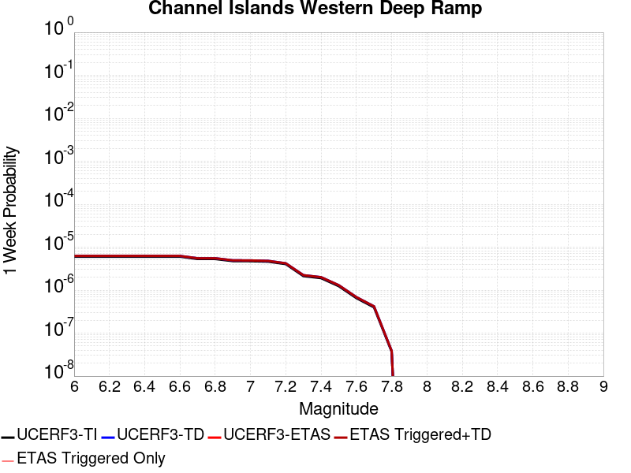 | 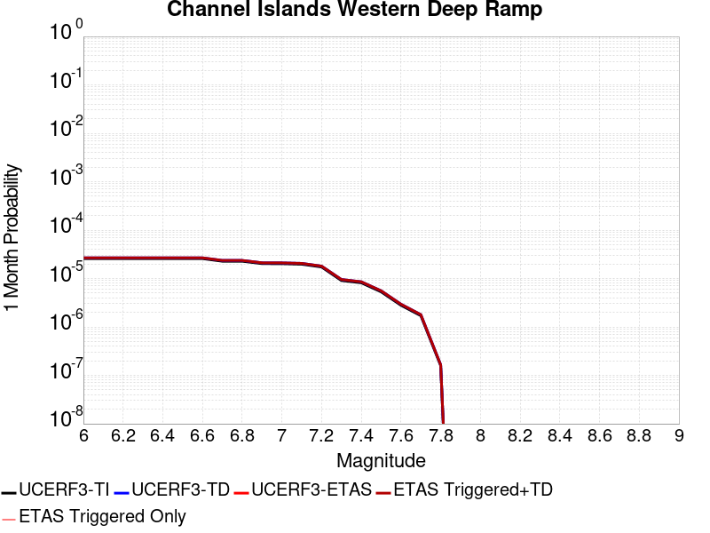 | 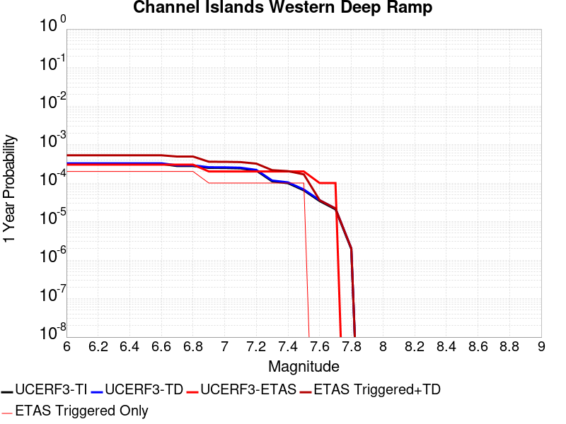 | 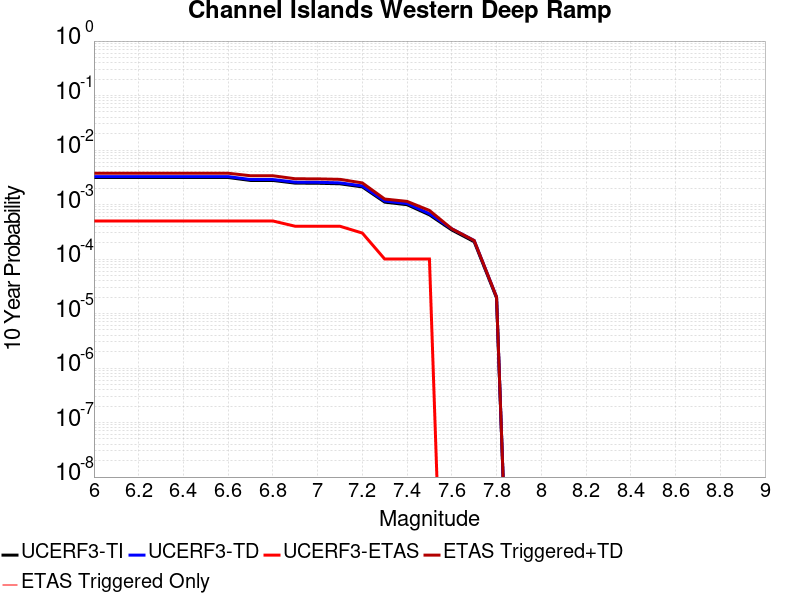 |

| Magnitude | 1 wk TI Prob | 1 wk TD Prob | 1 wk ETAS Prob | 1 wk ETAS/TD Gain | 1 wk ETAS Triggered+TD | 1 wk ETAS Triggered Only | 1 mo TI Prob | 1 mo TD Prob | 1 mo ETAS Prob | 1 mo ETAS/TD Gain | 1 mo ETAS Triggered+TD | 1 mo ETAS Triggered Only | 1 yr TI Prob | 1 yr TD Prob | 1 yr ETAS Prob | 1 yr ETAS/TD Gain | 1 yr ETAS Triggered+TD | 1 yr ETAS Triggered Only | 10 yr TI Prob | 10 yr TD Prob | 10 yr ETAS Prob | 10 yr ETAS/TD Gain | 10 yr ETAS Triggered+TD | 10 yr ETAS Triggered Only |
|-----|-----|-----|-----|-----|-----|-----|-----|-----|-----|-----|-----|-----|-----|-----|-----|-----|-----|-----|-----|-----|-----|-----|-----|-----|
| 6.0 | 6.0213506E-6 | 6.255369E-6 | 0.0 | 0.0 | 6.255369E-6 | 0.0 | 2.5805533E-5 | 2.6808475E-5 | 0.0 | 0.0 | 2.6808475E-5 | 0.0 | 3.1413708E-4 | 3.2634876E-4 | 3.0E-4 | 0.91926193 | 5.262835E-4 | 2.0E-4 | 0.0031369338 | 0.0032591368 | 0.0035 | 1.073904 | 0.0037575073 | 5.0E-4 |
| 6.1 | 6.0213506E-6 | 6.255369E-6 | 0.0 | 0.0 | 6.255369E-6 | 0.0 | 2.5805533E-5 | 2.6808475E-5 | 0.0 | 0.0 | 2.6808475E-5 | 0.0 | 3.1413708E-4 | 3.2634876E-4 | 3.0E-4 | 0.91926193 | 5.262835E-4 | 2.0E-4 | 0.0031369338 | 0.0032591368 | 0.0035 | 1.073904 | 0.0037575073 | 5.0E-4 |
| 6.2 | 6.0213506E-6 | 6.255369E-6 | 0.0 | 0.0 | 6.255369E-6 | 0.0 | 2.5805533E-5 | 2.6808475E-5 | 0.0 | 0.0 | 2.6808475E-5 | 0.0 | 3.1413708E-4 | 3.2634876E-4 | 3.0E-4 | 0.91926193 | 5.262835E-4 | 2.0E-4 | 0.0031369338 | 0.0032591368 | 0.0035 | 1.073904 | 0.0037575073 | 5.0E-4 |
| 6.3 | 6.0213506E-6 | 6.255369E-6 | 0.0 | 0.0 | 6.255369E-6 | 0.0 | 2.5805533E-5 | 2.6808475E-5 | 0.0 | 0.0 | 2.6808475E-5 | 0.0 | 3.1413708E-4 | 3.2634876E-4 | 3.0E-4 | 0.91926193 | 5.262835E-4 | 2.0E-4 | 0.0031369338 | 0.0032591368 | 0.0035 | 1.073904 | 0.0037575073 | 5.0E-4 |
| 6.4 | 6.0213506E-6 | 6.255369E-6 | 0.0 | 0.0 | 6.255369E-6 | 0.0 | 2.5805533E-5 | 2.6808475E-5 | 0.0 | 0.0 | 2.6808475E-5 | 0.0 | 3.1413708E-4 | 3.2634876E-4 | 3.0E-4 | 0.91926193 | 5.262835E-4 | 2.0E-4 | 0.0031369338 | 0.0032591368 | 0.0035 | 1.073904 | 0.0037575073 | 5.0E-4 |
| 6.5 | 6.0213506E-6 | 6.255369E-6 | 0.0 | 0.0 | 6.255369E-6 | 0.0 | 2.5805533E-5 | 2.6808475E-5 | 0.0 | 0.0 | 2.6808475E-5 | 0.0 | 3.1413708E-4 | 3.2634876E-4 | 3.0E-4 | 0.91926193 | 5.262835E-4 | 2.0E-4 | 0.0031369338 | 0.0032591368 | 0.0035 | 1.073904 | 0.0037575073 | 5.0E-4 |
| 6.6 | 6.0213506E-6 | 6.255369E-6 | 0.0 | 0.0 | 6.255369E-6 | 0.0 | 2.5805533E-5 | 2.6808475E-5 | 0.0 | 0.0 | 2.6808475E-5 | 0.0 | 3.1413708E-4 | 3.2634876E-4 | 3.0E-4 | 0.91926193 | 5.262835E-4 | 2.0E-4 | 0.0031369338 | 0.0032591368 | 0.0035 | 1.073904 | 0.0037575073 | 5.0E-4 |
| 6.7 | 5.313309E-6 | 5.5256955E-6 | 0.0 | 0.0 | 5.5256955E-6 | 0.0 | 2.2771126E-5 | 2.368136E-5 | 0.0 | 0.0 | 2.368136E-5 | 0.0 | 2.772032E-4 | 2.882865E-4 | 3.0E-4 | 1.0406314 | 4.8822883E-4 | 2.0E-4 | 0.0027685766 | 0.0028795283 | 0.0032 | 1.1112931 | 0.0033780886 | 5.0E-4 |
| 6.8 | 5.313309E-6 | 5.5256955E-6 | 0.0 | 0.0 | 5.5256955E-6 | 0.0 | 2.2771126E-5 | 2.368136E-5 | 0.0 | 0.0 | 2.368136E-5 | 0.0 | 2.772032E-4 | 2.882865E-4 | 3.0E-4 | 1.0406314 | 4.8822883E-4 | 2.0E-4 | 0.0027685766 | 0.0028795283 | 0.0032 | 1.1112931 | 0.0033780886 | 5.0E-4 |
| 6.9 | 4.744377E-6 | 4.9398495E-6 | 0.0 | 0.0 | 4.9398495E-6 | 0.0 | 2.0332885E-5 | 2.1170634E-5 | 0.0 | 0.0 | 2.1170634E-5 | 0.0 | 2.4752476E-4 | 2.577257E-4 | 2.0E-4 | 0.7760188 | 3.5769993E-4 | 1.0E-4 | 0.0024724922 | 0.0025746357 | 0.0027 | 1.0486921 | 0.0029736059 | 4.0E-4 |
| 7.0 | 4.722209E-6 | 4.9168907E-6 | 0.0 | 0.0 | 4.9168907E-6 | 0.0 | 2.0237881E-5 | 2.107224E-5 | 0.0 | 0.0 | 2.107224E-5 | 0.0 | 2.4636835E-4 | 2.5652803E-4 | 2.0E-4 | 0.77964187 | 3.565024E-4 | 1.0E-4 | 0.002460954 | 0.0025626866 | 0.0027 | 1.0535818 | 0.0029616617 | 4.0E-4 |
| 7.1 | 4.611174E-6 | 4.801818E-6 | 0.0 | 0.0 | 4.801818E-6 | 0.0 | 1.9762025E-5 | 2.0579078E-5 | 0.0 | 0.0 | 2.0579078E-5 | 0.0 | 2.4057609E-4 | 2.505252E-4 | 2.0E-4 | 0.79832286 | 3.5050014E-4 | 1.0E-4 | 0.002403158 | 0.0025027948 | 0.0026 | 1.0388386 | 0.0029017937 | 4.0E-4 |
| 7.2 | 4.043994E-6 | 4.212388E-6 | 0.0 | 0.0 | 4.212388E-6 | 0.0 | 1.7331287E-5 | 1.8052986E-5 | 0.0 | 0.0 | 1.8052986E-5 | 0.0 | 2.10988E-4 | 2.1977651E-4 | 2.0E-4 | 0.91001534 | 3.1975453E-4 | 1.0E-4 | 0.002107878 | 0.0021959424 | 0.0024 | 1.0929248 | 0.0024952837 | 3.0E-4 |
| 7.3 | 2.1233036E-6 | 2.230018E-6 | 0.0 | 0.0 | 2.230018E-6 | 0.0 | 9.099841E-6 | 9.557185E-6 | 0.0 | 0.0 | 9.557185E-6 | 0.0 | 1.1078493E-4 | 1.1635257E-4 | 2.0E-4 | 1.7189134 | 2.1634094E-4 | 1.0E-4 | 0.0011072971 | 0.0011629221 | 8.0E-4 | 0.6879223 | 0.0012628058 | 1.0E-4 |
| 7.4 | 1.9051884E-6 | 2.0017058E-6 | 0.0 | 0.0 | 2.0017058E-6 | 0.0 | 8.165067E-6 | 8.5787115E-6 | 0.0 | 0.0 | 8.5787115E-6 | 0.0 | 9.940516E-5 | 1.0444086E-4 | 2.0E-4 | 1.9149594 | 2.0443041E-4 | 1.0E-4 | 9.93607E-4 | 0.001043923 | 6.0E-4 | 0.574755 | 0.0011438186 | 1.0E-4 |
| 7.5 | 1.2408497E-6 | 1.3040204E-6 | 0.0 | 0.0 | 1.3040204E-6 | 0.0 | 5.317916E-6 | 5.5886476E-6 | 0.0 | 0.0 | 5.5886476E-6 | 0.0 | 6.4743705E-5 | 6.803968E-5 | 2.0E-4 | 2.9394612 | 1.6803287E-4 | 1.0E-4 | 6.4724847E-4 | 6.801906E-4 | 4.0E-4 | 0.5880704 | 7.8012265E-4 | 1.0E-4 |
| 7.6 | 6.5440025E-7 | 6.887462E-7 | 0.0 | 0.0 | 6.887462E-7 | 0.0 | 2.8045695E-6 | 2.9517662E-6 | 0.0 | 0.0 | 2.9517662E-6 | 0.0 | 3.4145098E-5 | 3.5937173E-5 | 1.0E-4 | 2.782634 | 3.5937173E-5 | 0.0 | 3.4139853E-4 | 3.5931505E-4 | 2.0E-4 | 0.5566146 | 3.5931505E-4 | 0.0 |
| 7.7 | 3.985963E-7 | 4.193528E-7 | 0.0 | 0.0 | 4.193528E-7 | 0.0 | 1.7082689E-6 | 1.7972251E-6 | 0.0 | 0.0 | 1.7972251E-6 | 0.0 | 2.0797976E-5 | 2.1881007E-5 | 1.0E-4 | 4.5701733 | 2.1881007E-5 | 0.0 | 2.0796029E-4 | 2.187897E-4 | 2.0E-4 | 0.9141198 | 2.187897E-4 | 0.0 |
| 7.8 | 3.706329E-8 | 3.8595072E-8 | 0.0 | 0.0 | 3.8595072E-8 | 0.0 | 1.5884267E-7 | 1.6540744E-7 | 0.0 | 0.0 | 1.6540744E-7 | 0.0 | 1.9339077E-6 | 2.0138339E-6 | 0.0 | 0.0 | 2.0138339E-6 | 0.0 | 1.933891E-5 | 2.0138168E-5 | 0.0 | 0.0 | 2.0138168E-5 | 0.0 |

## Great Valley 04a Trout Creek
*[(top)](#table-of-contents)*

| 1 Week | 1 Month | 1 Year | 10 Year |
|-----|-----|-----|-----|
| 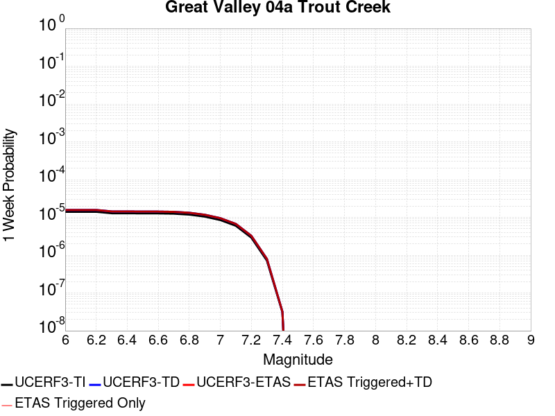 | 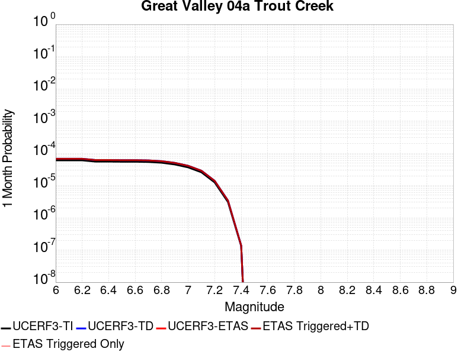 | 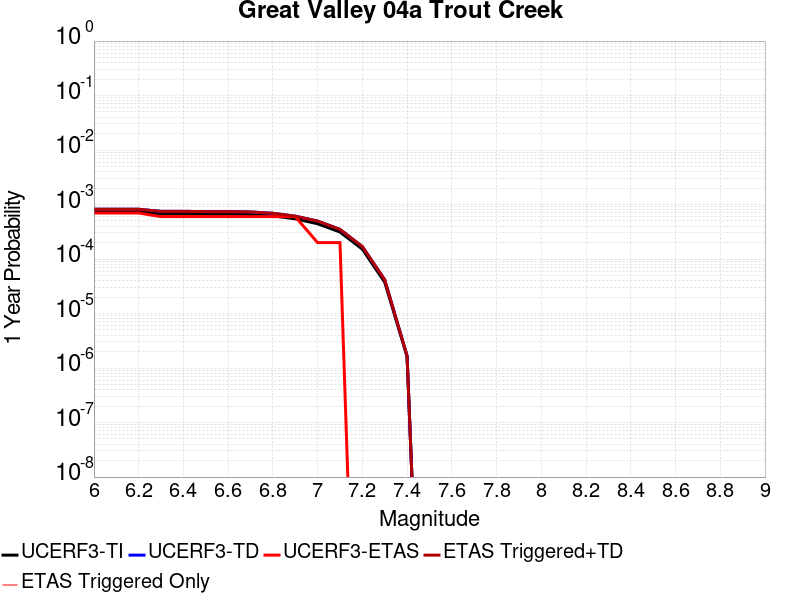 | 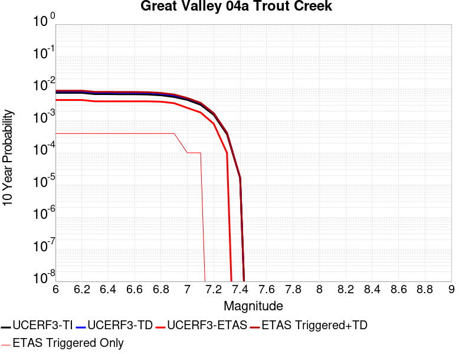 |

| Magnitude | 1 wk TI Prob | 1 wk TD Prob | 1 wk ETAS Prob | 1 wk ETAS/TD Gain | 1 wk ETAS Triggered+TD | 1 wk ETAS Triggered Only | 1 mo TI Prob | 1 mo TD Prob | 1 mo ETAS Prob | 1 mo ETAS/TD Gain | 1 mo ETAS Triggered+TD | 1 mo ETAS Triggered Only | 1 yr TI Prob | 1 yr TD Prob | 1 yr ETAS Prob | 1 yr ETAS/TD Gain | 1 yr ETAS Triggered+TD | 1 yr ETAS Triggered Only | 10 yr TI Prob | 10 yr TD Prob | 10 yr ETAS Prob | 10 yr ETAS/TD Gain | 10 yr ETAS Triggered+TD | 10 yr ETAS Triggered Only |
|-----|-----|-----|-----|-----|-----|-----|-----|-----|-----|-----|-----|-----|-----|-----|-----|-----|-----|-----|-----|-----|-----|-----|-----|-----|
| 6.0 | 1.4088538E-5 | 1.5723306E-5 | 0.0 | 0.0 | 1.5723306E-5 | 0.0 | 6.037805E-5 | 6.7383924E-5 | 0.0 | 0.0 | 6.7383924E-5 | 0.0 | 7.3485484E-4 | 8.20103E-4 | 7.0E-4 | 0.8535513 | 8.20103E-4 | 0.0 | 0.007324295 | 0.00817205 | 0.0044 | 0.53842056 | 0.008568781 | 4.0E-4 |
| 6.1 | 1.4088538E-5 | 1.5723306E-5 | 0.0 | 0.0 | 1.5723306E-5 | 0.0 | 6.037805E-5 | 6.7383924E-5 | 0.0 | 0.0 | 6.7383924E-5 | 0.0 | 7.3485484E-4 | 8.20103E-4 | 7.0E-4 | 0.8535513 | 8.20103E-4 | 0.0 | 0.007324295 | 0.00817205 | 0.0044 | 0.53842056 | 0.008568781 | 4.0E-4 |
| 6.2 | 1.4088538E-5 | 1.5723306E-5 | 0.0 | 0.0 | 1.5723306E-5 | 0.0 | 6.037805E-5 | 6.7383924E-5 | 0.0 | 0.0 | 6.7383924E-5 | 0.0 | 7.3485484E-4 | 8.20103E-4 | 7.0E-4 | 0.8535513 | 8.20103E-4 | 0.0 | 0.007324295 | 0.00817205 | 0.0044 | 0.53842056 | 0.008568781 | 4.0E-4 |
| 6.3 | 1.2882862E-5 | 1.4382045E-5 | 0.0 | 0.0 | 1.4382045E-5 | 0.0 | 5.5211098E-5 | 6.163594E-5 | 0.0 | 0.0 | 6.163594E-5 | 0.0 | 6.7198783E-4 | 7.5016957E-4 | 6.0E-4 | 0.7998192 | 7.5016957E-4 | 0.0 | 0.0066995937 | 0.007477436 | 0.004 | 0.5349427 | 0.007874445 | 4.0E-4 |
| 6.4 | 1.2882862E-5 | 1.4382045E-5 | 0.0 | 0.0 | 1.4382045E-5 | 0.0 | 5.5211098E-5 | 6.163594E-5 | 0.0 | 0.0 | 6.163594E-5 | 0.0 | 6.7198783E-4 | 7.5016957E-4 | 6.0E-4 | 0.7998192 | 7.5016957E-4 | 0.0 | 0.0066995937 | 0.007477436 | 0.004 | 0.5349427 | 0.007874445 | 4.0E-4 |
| 6.5 | 1.2762329E-5 | 1.4248572E-5 | 0.0 | 0.0 | 1.4248572E-5 | 0.0 | 5.469455E-5 | 6.106394E-5 | 0.0 | 0.0 | 6.106394E-5 | 0.0 | 6.657027E-4 | 7.4321026E-4 | 6.0E-4 | 0.80730855 | 7.4321026E-4 | 0.0 | 0.00663712 | 0.0074083074 | 0.004 | 0.5399344 | 0.0078053437 | 4.0E-4 |
| 6.6 | 1.2762329E-5 | 1.4248572E-5 | 0.0 | 0.0 | 1.4248572E-5 | 0.0 | 5.469455E-5 | 6.106394E-5 | 0.0 | 0.0 | 6.106394E-5 | 0.0 | 6.657027E-4 | 7.4321026E-4 | 6.0E-4 | 0.80730855 | 7.4321026E-4 | 0.0 | 0.00663712 | 0.0074083074 | 0.004 | 0.5399344 | 0.0078053437 | 4.0E-4 |
| 6.7 | 1.2557959E-5 | 1.4022759E-5 | 0.0 | 0.0 | 1.4022759E-5 | 0.0 | 5.3818712E-5 | 6.0096212E-5 | 0.0 | 0.0 | 6.0096212E-5 | 0.0 | 6.5504585E-4 | 7.314361E-4 | 6.0E-4 | 0.82030404 | 7.314361E-4 | 0.0 | 0.006531183 | 0.0072913417 | 0.004 | 0.5485959 | 0.007688425 | 4.0E-4 |
| 6.8 | 1.1871544E-5 | 1.3262018E-5 | 0.0 | 0.0 | 1.3262018E-5 | 0.0 | 5.0877054E-5 | 5.6836037E-5 | 0.0 | 0.0 | 5.6836037E-5 | 0.0 | 6.1925204E-4 | 6.917691E-4 | 6.0E-4 | 0.86734146 | 6.917691E-4 | 0.0 | 0.0061752927 | 0.0068971748 | 0.0039 | 0.56544894 | 0.007294416 | 4.0E-4 |
| 6.9 | 1.0500373E-5 | 1.1734097E-5 | 0.0 | 0.0 | 1.1734097E-5 | 0.0 | 4.5000823E-5 | 5.028807E-5 | 0.0 | 0.0 | 5.028807E-5 | 0.0 | 5.4774724E-4 | 6.1209383E-4 | 6.0E-4 | 0.9802419 | 6.1209383E-4 | 0.0 | 0.005463991 | 0.006104945 | 0.0035 | 0.5733057 | 0.006502503 | 4.0E-4 |
| 7.0 | 8.524332E-6 | 9.535812E-6 | 0.0 | 0.0 | 9.535812E-6 | 0.0 | 3.653234E-5 | 4.0867166E-5 | 0.0 | 0.0 | 4.0867166E-5 | 0.0 | 4.4469046E-4 | 4.974515E-4 | 2.0E-4 | 0.40204924 | 4.974515E-4 | 0.0 | 0.0044380166 | 0.0049641114 | 0.0025 | 0.50361484 | 0.005063615 | 1.0E-4 |
| 7.1 | 6.006849E-6 | 6.713184E-6 | 0.0 | 0.0 | 6.713184E-6 | 0.0 | 2.5743384E-5 | 2.8770502E-5 | 0.0 | 0.0 | 2.8770502E-5 | 0.0 | 3.1338062E-4 | 3.5023014E-4 | 2.0E-4 | 0.5710531 | 3.5023014E-4 | 0.0 | 0.0031293905 | 0.0034973328 | 0.0018 | 0.51467794 | 0.003596983 | 1.0E-4 |
| 7.2 | 2.9122193E-6 | 3.2473006E-6 | 0.0 | 0.0 | 3.2473006E-6 | 0.0 | 1.248088E-5 | 1.3916938E-5 | 0.0 | 0.0 | 1.3916938E-5 | 0.0 | 1.5194413E-4 | 1.694273E-4 | 0.0 | 0.0 | 1.694273E-4 | 0.0 | 0.0015184027 | 0.0016931533 | 8.0E-4 | 0.47249117 | 0.0016931533 | 0.0 |
| 7.3 | 7.2194007E-7 | 7.9905305E-7 | 0.0 | 0.0 | 7.9905305E-7 | 0.0 | 3.0940253E-6 | 3.4245113E-6 | 0.0 | 0.0 | 3.4245113E-6 | 0.0 | 3.7669106E-5 | 4.1693085E-5 | 0.0 | 0.0 | 4.1693085E-5 | 0.0 | 3.766272E-4 | 4.1689762E-4 | 1.0E-4 | 0.23986705 | 4.1689762E-4 | 0.0 |
| 7.4 | 3.112171E-8 | 3.2070375E-8 | 0.0 | 0.0 | 3.2070375E-8 | 0.0 | 1.3337875E-7 | 1.3744446E-7 | 0.0 | 0.0 | 1.3744446E-7 | 0.0 | 1.6238852E-6 | 1.6733851E-6 | 0.0 | 0.0 | 1.6733851E-6 | 0.0 | 1.6238733E-5 | 1.6733733E-5 | 0.0 | 0.0 | 1.6733733E-5 | 0.0 |

## Sierra Madre (San Fernando)
*[(top)](#table-of-contents)*

| 1 Week | 1 Month | 1 Year | 10 Year |
|-----|-----|-----|-----|
| 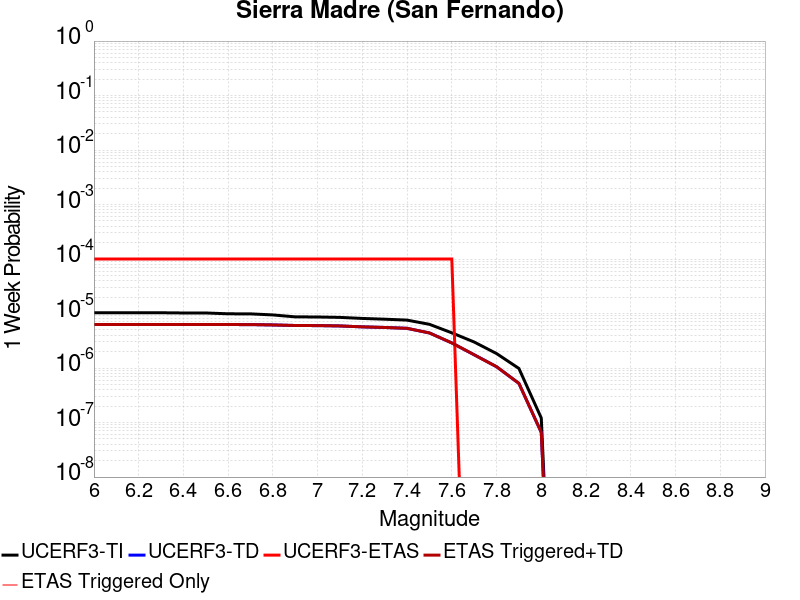 | 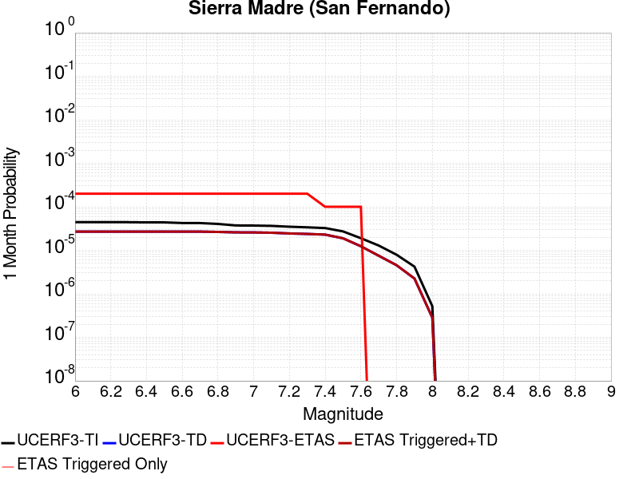 | 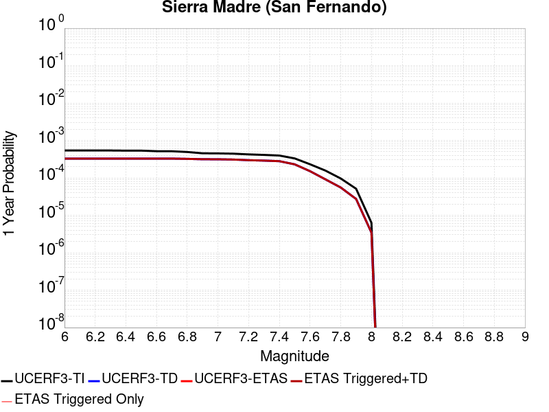 | 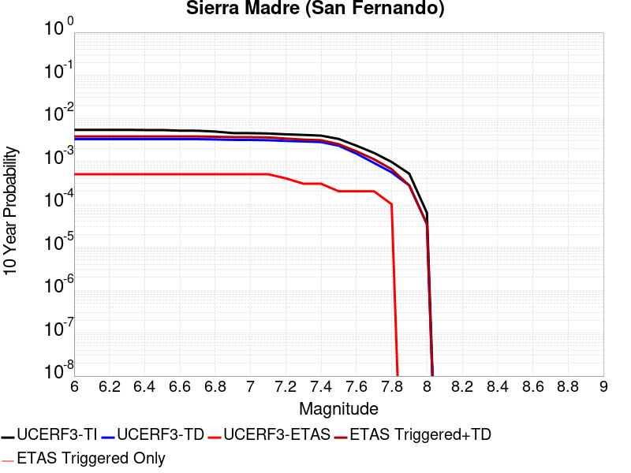 |

| Magnitude | 1 wk TI Prob | 1 wk TD Prob | 1 wk ETAS Prob | 1 wk ETAS/TD Gain | 1 wk ETAS Triggered+TD | 1 wk ETAS Triggered Only | 1 mo TI Prob | 1 mo TD Prob | 1 mo ETAS Prob | 1 mo ETAS/TD Gain | 1 mo ETAS Triggered+TD | 1 mo ETAS Triggered Only | 1 yr TI Prob | 1 yr TD Prob | 1 yr ETAS Prob | 1 yr ETAS/TD Gain | 1 yr ETAS Triggered+TD | 1 yr ETAS Triggered Only | 10 yr TI Prob | 10 yr TD Prob | 10 yr ETAS Prob | 10 yr ETAS/TD Gain | 10 yr ETAS Triggered+TD | 10 yr ETAS Triggered Only |
|-----|-----|-----|-----|-----|-----|-----|-----|-----|-----|-----|-----|-----|-----|-----|-----|-----|-----|-----|-----|-----|-----|-----|-----|-----|
| 6.0 | 1.0346413E-5 | 6.289614E-6 | 1.0E-4 | 15.899228 | 6.289614E-6 | 0.0 | 4.4341014E-5 | 2.6955215E-5 | 2.0E-4 | 7.4197145 | 2.6955215E-5 | 0.0 | 5.3971814E-4 | 3.2813143E-4 | 3.0E-4 | 0.91426784 | 3.2813143E-4 | 0.0 | 0.0053840918 | 0.0032765819 | 0.0019 | 0.5798726 | 0.0037749435 | 5.0E-4 |
| 6.1 | 1.0346413E-5 | 6.289614E-6 | 1.0E-4 | 15.899228 | 6.289614E-6 | 0.0 | 4.4341014E-5 | 2.6955215E-5 | 2.0E-4 | 7.4197145 | 2.6955215E-5 | 0.0 | 5.3971814E-4 | 3.2813143E-4 | 3.0E-4 | 0.91426784 | 3.2813143E-4 | 0.0 | 0.0053840918 | 0.0032765819 | 0.0019 | 0.5798726 | 0.0037749435 | 5.0E-4 |
| 6.2 | 1.0346413E-5 | 6.289614E-6 | 1.0E-4 | 15.899228 | 6.289614E-6 | 0.0 | 4.4341014E-5 | 2.6955215E-5 | 2.0E-4 | 7.4197145 | 2.6955215E-5 | 0.0 | 5.3971814E-4 | 3.2813143E-4 | 3.0E-4 | 0.91426784 | 3.2813143E-4 | 0.0 | 0.0053840918 | 0.0032765819 | 0.0019 | 0.5798726 | 0.0037749435 | 5.0E-4 |
| 6.3 | 1.0346413E-5 | 6.289614E-6 | 1.0E-4 | 15.899228 | 6.289614E-6 | 0.0 | 4.4341014E-5 | 2.6955215E-5 | 2.0E-4 | 7.4197145 | 2.6955215E-5 | 0.0 | 5.3971814E-4 | 3.2813143E-4 | 3.0E-4 | 0.91426784 | 3.2813143E-4 | 0.0 | 0.0053840918 | 0.0032765819 | 0.0019 | 0.5798726 | 0.0037749435 | 5.0E-4 |
| 6.4 | 1.0249558E-5 | 6.289614E-6 | 1.0E-4 | 15.899228 | 6.289614E-6 | 0.0 | 4.392594E-5 | 2.6955215E-5 | 2.0E-4 | 7.4197145 | 2.6955215E-5 | 0.0 | 5.3466705E-4 | 3.2813143E-4 | 3.0E-4 | 0.91426784 | 3.2813143E-4 | 0.0 | 0.0053338245 | 0.0032765819 | 0.0019 | 0.5798726 | 0.0037749435 | 5.0E-4 |
| 6.5 | 1.0249558E-5 | 6.289614E-6 | 1.0E-4 | 15.899228 | 6.289614E-6 | 0.0 | 4.392594E-5 | 2.6955215E-5 | 2.0E-4 | 7.4197145 | 2.6955215E-5 | 0.0 | 5.3466705E-4 | 3.2813143E-4 | 3.0E-4 | 0.91426784 | 3.2813143E-4 | 0.0 | 0.0053338245 | 0.0032765819 | 0.0019 | 0.5798726 | 0.0037749435 | 5.0E-4 |
| 6.6 | 9.9035515E-6 | 6.289614E-6 | 1.0E-4 | 15.899228 | 6.289614E-6 | 0.0 | 4.2443102E-5 | 2.6955215E-5 | 2.0E-4 | 7.4197145 | 2.6955215E-5 | 0.0 | 5.166222E-4 | 3.2813143E-4 | 3.0E-4 | 0.91426784 | 3.2813143E-4 | 0.0 | 0.0051542283 | 0.0032765819 | 0.0019 | 0.5798726 | 0.0037749435 | 5.0E-4 |
| 6.7 | 9.87217E-6 | 6.277029E-6 | 1.0E-4 | 15.931104 | 6.277029E-6 | 0.0 | 4.2308613E-5 | 2.6901282E-5 | 2.0E-4 | 7.43459 | 2.6901282E-5 | 0.0 | 5.149856E-4 | 3.27475E-4 | 3.0E-4 | 0.9161005 | 3.27475E-4 | 0.0 | 0.005137938 | 0.0032700368 | 0.0019 | 0.58103323 | 0.003768402 | 5.0E-4 |
| 6.8 | 9.4359175E-6 | 6.180964E-6 | 1.0E-4 | 16.178705 | 6.180964E-6 | 0.0 | 4.043902E-5 | 2.6489584E-5 | 2.0E-4 | 7.5501375 | 2.6489584E-5 | 0.0 | 4.9223384E-4 | 3.2246404E-4 | 3.0E-4 | 0.93033624 | 3.2246404E-4 | 0.0 | 0.0049114493 | 0.0032200732 | 0.0019 | 0.59004873 | 0.003718463 | 5.0E-4 |
| 6.9 | 8.700447E-6 | 6.042013E-6 | 1.0E-4 | 16.550776 | 6.042013E-6 | 0.0 | 3.72871E-5 | 2.5894089E-5 | 2.0E-4 | 7.72377 | 2.5894089E-5 | 0.0 | 4.5387587E-4 | 3.1521602E-4 | 3.0E-4 | 0.9517283 | 3.1521602E-4 | 0.0 | 0.0045295 | 0.0031477986 | 0.0018 | 0.5718282 | 0.0036462247 | 5.0E-4 |
| 7.0 | 8.648878E-6 | 6.016891E-6 | 1.0E-4 | 16.61988 | 6.016891E-6 | 0.0 | 3.7066096E-5 | 2.5786425E-5 | 2.0E-4 | 7.7560186 | 2.5786425E-5 | 0.0 | 4.5118626E-4 | 3.139056E-4 | 3.0E-4 | 0.9557014 | 3.139056E-4 | 0.0 | 0.004502713 | 0.0031347312 | 0.0018 | 0.5742119 | 0.0036331639 | 5.0E-4 |
| 7.1 | 8.505786E-6 | 5.926506E-6 | 1.0E-4 | 16.873346 | 5.926506E-6 | 0.0 | 3.645286E-5 | 2.5399073E-5 | 2.0E-4 | 7.8743033 | 2.5399073E-5 | 0.0 | 4.437232E-4 | 3.091909E-4 | 3.0E-4 | 0.9702743 | 3.091909E-4 | 0.0 | 0.0044283825 | 0.0030877162 | 0.0017 | 0.5505687 | 0.0035861724 | 5.0E-4 |
| 7.2 | 8.139752E-6 | 5.7007637E-6 | 1.0E-4 | 17.54151 | 5.7007637E-6 | 0.0 | 3.4884186E-5 | 2.4431622E-5 | 2.0E-4 | 8.186112 | 2.4431622E-5 | 0.0 | 4.246322E-4 | 2.9741545E-4 | 2.0E-4 | 0.67246 | 2.9741545E-4 | 0.0 | 0.004238217 | 0.0029702801 | 0.0015 | 0.50500286 | 0.003369092 | 4.0E-4 |
| 7.3 | 7.8816E-6 | 5.5540554E-6 | 1.0E-4 | 18.004862 | 5.5540554E-6 | 0.0 | 3.3777847E-5 | 2.3802884E-5 | 2.0E-4 | 8.402344 | 2.3802884E-5 | 0.0 | 4.111677E-4 | 2.8976263E-4 | 2.0E-4 | 0.6902202 | 2.8976263E-4 | 0.0 | 0.004104078 | 0.0028939536 | 0.0014 | 0.48376724 | 0.0031930855 | 3.0E-4 |
| 7.4 | 7.5810603E-6 | 5.358265E-6 | 1.0E-4 | 18.662758 | 5.358265E-6 | 0.0 | 3.2489854E-5 | 2.2963797E-5 | 1.0E-4 | 4.3546805 | 2.2963797E-5 | 0.0 | 3.9549218E-4 | 2.795494E-4 | 1.0E-4 | 0.35771853 | 2.795494E-4 | 0.0 | 0.0039478904 | 0.0027920827 | 0.0013 | 0.46560228 | 0.003091245 | 3.0E-4 |
| 7.5 | 6.349153E-6 | 4.409436E-6 | 1.0E-4 | 22.678637 | 4.409436E-6 | 0.0 | 2.7210372E-5 | 1.889745E-5 | 1.0E-4 | 5.291719 | 1.889745E-5 | 0.0 | 3.312359E-4 | 2.3005299E-4 | 1.0E-4 | 0.43468246 | 2.3005299E-4 | 0.0 | 0.0033074263 | 0.0022982305 | 0.0011 | 0.4786291 | 0.0024977708 | 2.0E-4 |
| 7.6 | 4.430576E-6 | 2.892291E-6 | 1.0E-4 | 34.57467 | 2.892291E-6 | 0.0 | 1.8988047E-5 | 1.2395474E-5 | 1.0E-4 | 8.06746 | 1.2395474E-5 | 0.0 | 2.3115493E-4 | 1.5090467E-4 | 1.0E-4 | 0.66266996 | 1.5090467E-4 | 0.0 | 0.0023091463 | 0.0015080447 | 8.0E-4 | 0.53048825 | 0.001707743 | 2.0E-4 |
| 7.7 | 3.005066E-6 | 1.7525615E-6 | 0.0 | 0.0 | 1.7525615E-6 | 0.0 | 1.2878791E-5 | 7.510956E-6 | 0.0 | 0.0 | 7.510956E-6 | 0.0 | 1.56788E-4 | 9.144207E-5 | 0.0 | 0.0 | 9.144207E-5 | 0.0 | 0.0015667742 | 9.1404555E-4 | 6.0E-4 | 0.65642244 | 0.0011138627 | 2.0E-4 |
| 7.8 | 1.8459098E-6 | 1.0593349E-6 | 0.0 | 0.0 | 1.0593349E-6 | 0.0 | 7.911018E-6 | 4.539999E-6 | 0.0 | 0.0 | 4.539999E-6 | 0.0 | 9.631238E-5 | 5.527309E-5 | 0.0 | 0.0 | 5.527309E-5 | 0.0 | 9.627065E-4 | 5.5259385E-4 | 3.0E-4 | 0.5428942 | 6.525386E-4 | 1.0E-4 |
| 7.9 | 9.839262E-7 | 5.240675E-7 | 0.0 | 0.0 | 5.240675E-7 | 0.0 | 4.2168194E-6 | 2.2460017E-6 | 0.0 | 0.0 | 2.2460017E-6 | 0.0 | 5.1338568E-5 | 2.734473E-5 | 0.0 | 0.0 | 2.734473E-5 | 0.0 | 5.132671E-4 | 2.7341393E-4 | 1.0E-4 | 0.3657458 | 2.7341393E-4 | 0.0 |
| 8.0 | 1.210983E-7 | 6.619219E-8 | 0.0 | 0.0 | 6.619219E-8 | 0.0 | 5.1899264E-7 | 2.836808E-7 | 0.0 | 0.0 | 2.836808E-7 | 0.0 | 6.3187167E-6 | 3.4538086E-6 | 0.0 | 0.0 | 3.4538086E-6 | 0.0 | 6.318537E-5 | 3.4537567E-5 | 0.0 | 0.0 | 3.4537567E-5 | 0.0 |

## Great Valley 03 Mysterious Ridge
*[(top)](#table-of-contents)*

| 1 Week | 1 Month | 1 Year | 10 Year |
|-----|-----|-----|-----|
| 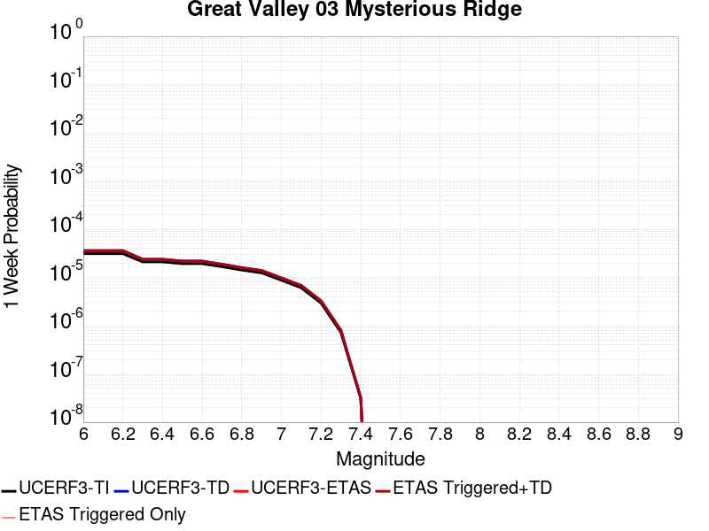 | 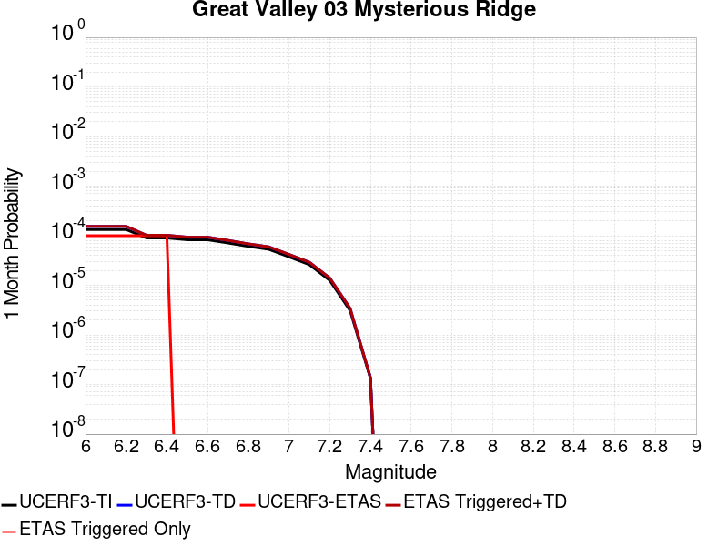 | 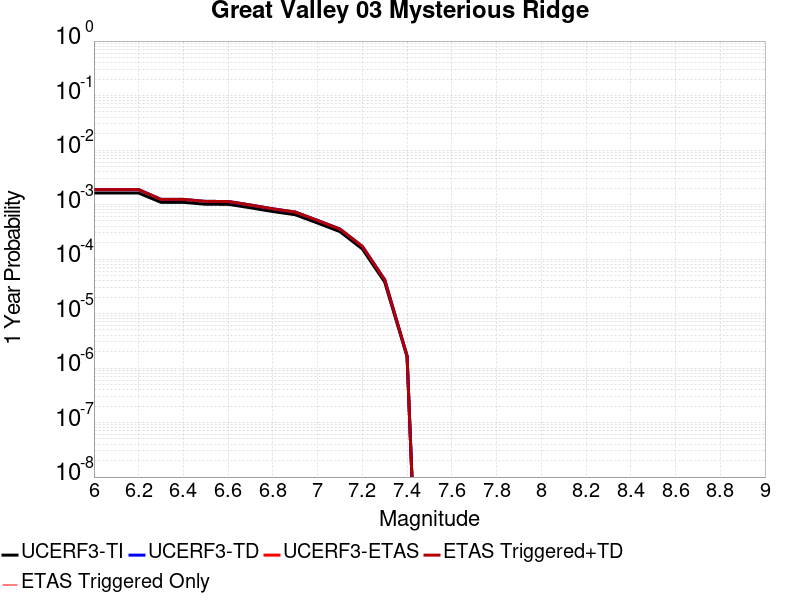 | 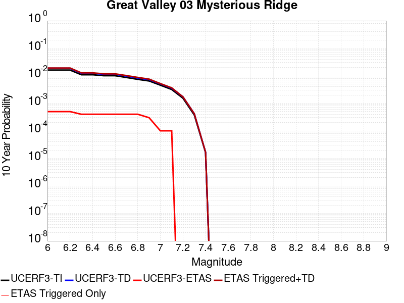 |

| Magnitude | 1 wk TI Prob | 1 wk TD Prob | 1 wk ETAS Prob | 1 wk ETAS/TD Gain | 1 wk ETAS Triggered+TD | 1 wk ETAS Triggered Only | 1 mo TI Prob | 1 mo TD Prob | 1 mo ETAS Prob | 1 mo ETAS/TD Gain | 1 mo ETAS Triggered+TD | 1 mo ETAS Triggered Only | 1 yr TI Prob | 1 yr TD Prob | 1 yr ETAS Prob | 1 yr ETAS/TD Gain | 1 yr ETAS Triggered+TD | 1 yr ETAS Triggered Only | 10 yr TI Prob | 10 yr TD Prob | 10 yr ETAS Prob | 10 yr ETAS/TD Gain | 10 yr ETAS Triggered+TD | 10 yr ETAS Triggered Only |
|-----|-----|-----|-----|-----|-----|-----|-----|-----|-----|-----|-----|-----|-----|-----|-----|-----|-----|-----|-----|-----|-----|-----|-----|-----|
| 6.0 | 3.1182444E-5 | 3.604578E-5 | 1.0E-4 | 2.7742498 | 3.604578E-5 | 0.0 | 1.336322E-4 | 1.5447383E-4 | 1.0E-4 | 0.64735883 | 1.5447383E-4 | 0.0 | 0.0016257578 | 0.0018792824 | 0.0013 | 0.6917534 | 0.0018792824 | 0.0 | 0.016139153 | 0.018652653 | 0.0123 | 0.6594236 | 0.019143326 | 5.0E-4 |
| 6.1 | 3.1182444E-5 | 3.604578E-5 | 1.0E-4 | 2.7742498 | 3.604578E-5 | 0.0 | 1.336322E-4 | 1.5447383E-4 | 1.0E-4 | 0.64735883 | 1.5447383E-4 | 0.0 | 0.0016257578 | 0.0018792824 | 0.0013 | 0.6917534 | 0.0018792824 | 0.0 | 0.016139153 | 0.018652653 | 0.0123 | 0.6594236 | 0.019143326 | 5.0E-4 |
| 6.2 | 3.1182444E-5 | 3.604578E-5 | 1.0E-4 | 2.7742498 | 3.604578E-5 | 0.0 | 1.336322E-4 | 1.5447383E-4 | 1.0E-4 | 0.64735883 | 1.5447383E-4 | 0.0 | 0.0016257578 | 0.0018792824 | 0.0013 | 0.6917534 | 0.0018792824 | 0.0 | 0.016139153 | 0.018652653 | 0.0123 | 0.6594236 | 0.019143326 | 5.0E-4 |
| 6.3 | 2.106934E-5 | 2.3856826E-5 | 1.0E-4 | 4.1916723 | 2.3856826E-5 | 0.0 | 9.0294045E-5 | 1.0223971E-4 | 1.0E-4 | 0.9780935 | 1.0223971E-4 | 0.0 | 0.0010987755 | 0.0012440889 | 0.0012 | 0.96456134 | 0.0012440889 | 0.0 | 0.010933585 | 0.012374491 | 0.0085 | 0.6868969 | 0.012769542 | 4.0E-4 |
| 6.4 | 2.106934E-5 | 2.3856826E-5 | 1.0E-4 | 4.1916723 | 2.3856826E-5 | 0.0 | 9.0294045E-5 | 1.0223971E-4 | 1.0E-4 | 0.9780935 | 1.0223971E-4 | 0.0 | 0.0010987755 | 0.0012440889 | 0.0012 | 0.96456134 | 0.0012440889 | 0.0 | 0.010933585 | 0.012374491 | 0.0085 | 0.6868969 | 0.012769542 | 4.0E-4 |
| 6.5 | 1.9389783E-5 | 2.1890814E-5 | 0.0 | 0.0 | 2.1890814E-5 | 0.0 | 8.309642E-5 | 9.381456E-5 | 0.0 | 0.0 | 9.381456E-5 | 0.0 | 0.0010112294 | 0.0011416215 | 9.0E-4 | 0.7883524 | 0.0011416215 | 0.0 | 0.010066401 | 0.011360445 | 0.0078 | 0.6865928 | 0.0117559 | 4.0E-4 |
| 6.6 | 1.9370193E-5 | 2.1870734E-5 | 0.0 | 0.0 | 2.1870734E-5 | 0.0 | 8.301247E-5 | 9.372851E-5 | 0.0 | 0.0 | 9.372851E-5 | 0.0 | 0.0010102082 | 0.0011405749 | 9.0E-4 | 0.78907573 | 0.0011405749 | 0.0 | 0.010056281 | 0.011350086 | 0.0078 | 0.68721944 | 0.011745546 | 4.0E-4 |
| 6.7 | 1.6723505E-5 | 1.8804109E-5 | 0.0 | 0.0 | 1.8804109E-5 | 0.0 | 7.16702E-5 | 8.058666E-5 | 0.0 | 0.0 | 8.058666E-5 | 0.0 | 8.722353E-4 | 9.807204E-4 | 9.0E-4 | 0.9176927 | 9.807204E-4 | 0.0 | 0.008688197 | 0.009765935 | 0.0062 | 0.63485986 | 0.0101620285 | 4.0E-4 |
| 6.8 | 1.426937E-5 | 1.6001215E-5 | 0.0 | 0.0 | 1.6001215E-5 | 0.0 | 6.115301E-5 | 6.857491E-5 | 0.0 | 0.0 | 6.857491E-5 | 0.0 | 7.4428355E-4 | 8.3459425E-4 | 7.0E-4 | 0.83873093 | 8.3459425E-4 | 0.0 | 0.007417957 | 0.008316078 | 0.0048 | 0.57719517 | 0.008712752 | 4.0E-4 |
| 6.9 | 1.2469891E-5 | 1.3960368E-5 | 0.0 | 0.0 | 1.3960368E-5 | 0.0 | 5.3441294E-5 | 5.9828846E-5 | 0.0 | 0.0 | 5.9828846E-5 | 0.0 | 6.504535E-4 | 7.281848E-4 | 5.0E-4 | 0.68663883 | 7.281848E-4 | 0.0 | 0.006485529 | 0.0072592124 | 0.004 | 0.55102396 | 0.007557035 | 3.0E-4 |
| 7.0 | 8.7746275E-6 | 9.794079E-6 | 0.0 | 0.0 | 9.794079E-6 | 0.0 | 3.7605005E-5 | 4.1973988E-5 | 0.0 | 0.0 | 4.1973988E-5 | 0.0 | 4.5774475E-4 | 5.109208E-4 | 2.0E-4 | 0.39145008 | 5.109208E-4 | 0.0 | 0.00456803 | 0.005098195 | 0.0026 | 0.50998443 | 0.005197685 | 1.0E-4 |
| 7.1 | 6.1067153E-6 | 6.8153554E-6 | 0.0 | 0.0 | 6.8153554E-6 | 0.0 | 2.6171374E-5 | 2.920837E-5 | 0.0 | 0.0 | 2.920837E-5 | 0.0 | 3.1858988E-4 | 3.5555946E-4 | 2.0E-4 | 0.56249386 | 3.5555946E-4 | 0.0 | 0.0031813353 | 0.0035504568 | 0.0018 | 0.506977 | 0.0036501018 | 1.0E-4 |
| 7.2 | 2.939283E-6 | 3.274877E-6 | 0.0 | 0.0 | 3.274877E-6 | 0.0 | 1.2596866E-5 | 1.4035121E-5 | 0.0 | 0.0 | 1.4035121E-5 | 0.0 | 1.5335606E-4 | 1.7086595E-4 | 0.0 | 0.0 | 1.7086595E-4 | 0.0 | 0.0015325027 | 0.0017075179 | 8.0E-4 | 0.46851632 | 0.0017075179 | 0.0 |
| 7.3 | 7.2387763E-7 | 8.010275E-7 | 0.0 | 0.0 | 8.010275E-7 | 0.0 | 3.102329E-6 | 3.4329732E-6 | 0.0 | 0.0 | 3.4329732E-6 | 0.0 | 3.77702E-5 | 4.1796106E-5 | 0.0 | 0.0 | 4.1796106E-5 | 0.0 | 3.7763783E-4 | 4.1792745E-4 | 1.0E-4 | 0.23927598 | 4.1792745E-4 | 0.0 |
| 7.4 | 3.112171E-8 | 3.2070375E-8 | 0.0 | 0.0 | 3.2070375E-8 | 0.0 | 1.3337875E-7 | 1.3744446E-7 | 0.0 | 0.0 | 1.3744446E-7 | 0.0 | 1.6238852E-6 | 1.6733851E-6 | 0.0 | 0.0 | 1.6733851E-6 | 0.0 | 1.6238733E-5 | 1.6733733E-5 | 0.0 | 0.0 | 1.6733733E-5 | 0.0 |

## Lost Hills
*[(top)](#table-of-contents)*

| 1 Week | 1 Month | 1 Year | 10 Year |
|-----|-----|-----|-----|
| 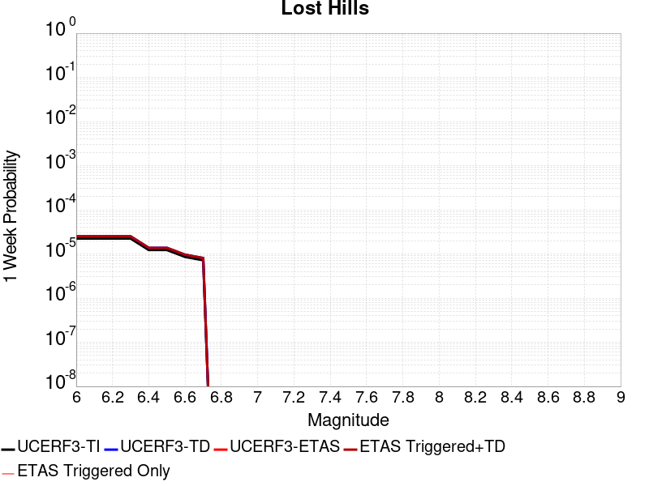 | 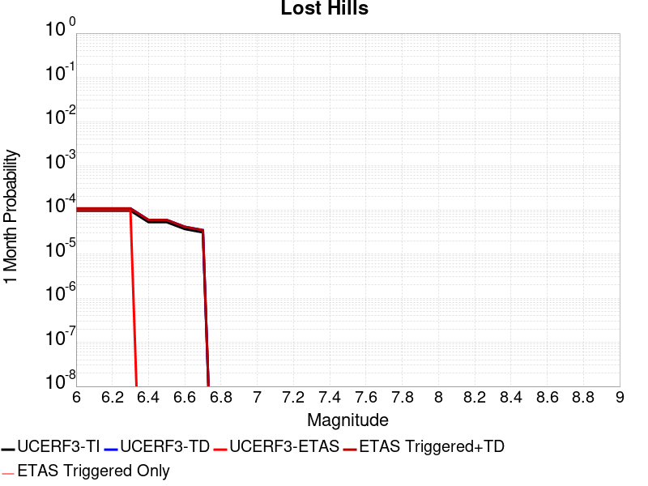 | 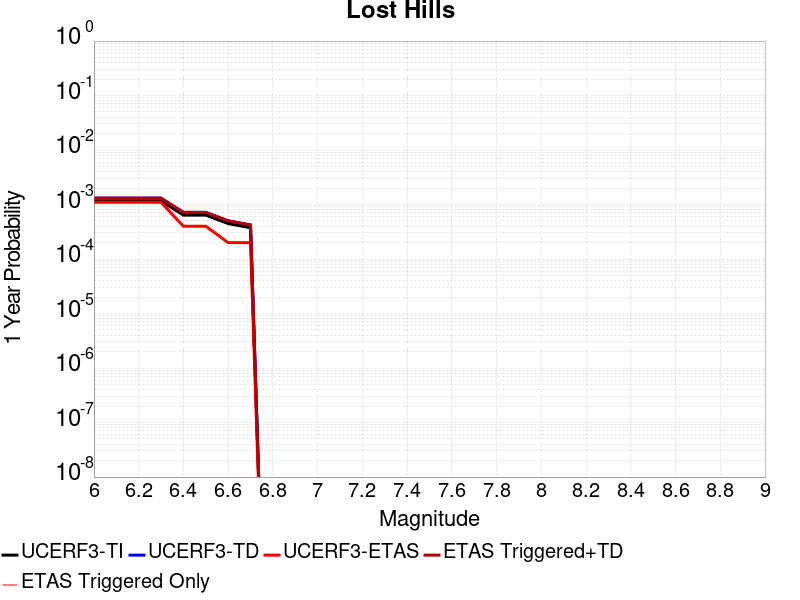 | 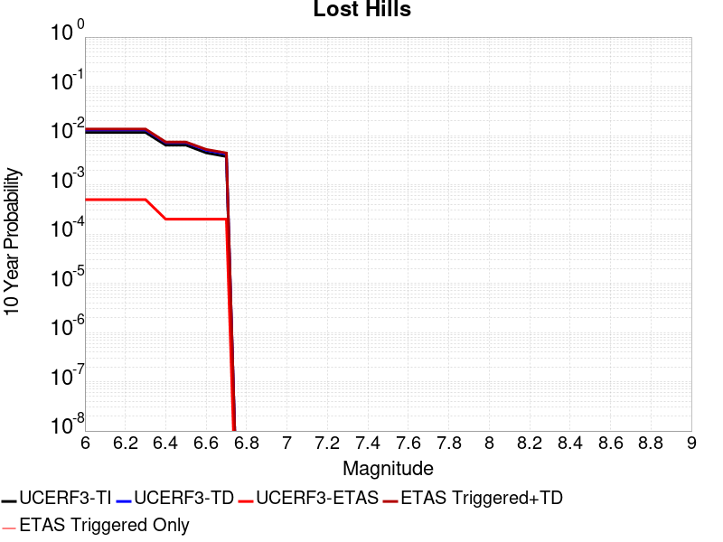 |

| Magnitude | 1 wk TI Prob | 1 wk TD Prob | 1 wk ETAS Prob | 1 wk ETAS/TD Gain | 1 wk ETAS Triggered+TD | 1 wk ETAS Triggered Only | 1 mo TI Prob | 1 mo TD Prob | 1 mo ETAS Prob | 1 mo ETAS/TD Gain | 1 mo ETAS Triggered+TD | 1 mo ETAS Triggered Only | 1 yr TI Prob | 1 yr TD Prob | 1 yr ETAS Prob | 1 yr ETAS/TD Gain | 1 yr ETAS Triggered+TD | 1 yr ETAS Triggered Only | 10 yr TI Prob | 10 yr TD Prob | 10 yr ETAS Prob | 10 yr ETAS/TD Gain | 10 yr ETAS Triggered+TD | 10 yr ETAS Triggered Only |
|-----|-----|-----|-----|-----|-----|-----|-----|-----|-----|-----|-----|-----|-----|-----|-----|-----|-----|-----|-----|-----|-----|-----|-----|-----|
| 6.0 | 2.233523E-5 | 2.5112999E-5 | 0.0 | 0.0 | 2.5112999E-5 | 0.0 | 9.571891E-5 | 1.07623644E-4 | 1.0E-4 | 0.9291639 | 1.07623644E-4 | 0.0 | 0.0011647546 | 0.0013096984 | 0.0011 | 0.839888 | 0.0013096984 | 0.0 | 0.011586686 | 0.013036405 | 0.0115 | 0.88214505 | 0.0135298865 | 5.0E-4 |
| 6.1 | 2.233523E-5 | 2.5112999E-5 | 0.0 | 0.0 | 2.5112999E-5 | 0.0 | 9.571891E-5 | 1.07623644E-4 | 1.0E-4 | 0.9291639 | 1.07623644E-4 | 0.0 | 0.0011647546 | 0.0013096984 | 0.0011 | 0.839888 | 0.0013096984 | 0.0 | 0.011586686 | 0.013036405 | 0.0115 | 0.88214505 | 0.0135298865 | 5.0E-4 |
| 6.2 | 2.233523E-5 | 2.5112999E-5 | 0.0 | 0.0 | 2.5112999E-5 | 0.0 | 9.571891E-5 | 1.07623644E-4 | 1.0E-4 | 0.9291639 | 1.07623644E-4 | 0.0 | 0.0011647546 | 0.0013096984 | 0.0011 | 0.839888 | 0.0013096984 | 0.0 | 0.011586686 | 0.013036405 | 0.0115 | 0.88214505 | 0.0135298865 | 5.0E-4 |
| 6.3 | 2.233523E-5 | 2.5112999E-5 | 0.0 | 0.0 | 2.5112999E-5 | 0.0 | 9.571891E-5 | 1.07623644E-4 | 1.0E-4 | 0.9291639 | 1.07623644E-4 | 0.0 | 0.0011647546 | 0.0013096984 | 0.0011 | 0.839888 | 0.0013096984 | 0.0 | 0.011586686 | 0.013036405 | 0.0115 | 0.88214505 | 0.0135298865 | 5.0E-4 |
| 6.4 | 1.2288092E-5 | 1.3784555E-5 | 0.0 | 0.0 | 1.3784555E-5 | 0.0 | 5.2662188E-5 | 5.907586E-5 | 0.0 | 0.0 | 5.907586E-5 | 0.0 | 6.409735E-4 | 7.1910507E-4 | 4.0E-4 | 0.55624694 | 7.1910507E-4 | 0.0 | 0.006391279 | 0.0071769925 | 0.0068 | 0.9474721 | 0.007375557 | 2.0E-4 |
| 6.5 | 1.2288092E-5 | 1.3784555E-5 | 0.0 | 0.0 | 1.3784555E-5 | 0.0 | 5.2662188E-5 | 5.907586E-5 | 0.0 | 0.0 | 5.907586E-5 | 0.0 | 6.409735E-4 | 7.1910507E-4 | 4.0E-4 | 0.55624694 | 7.1910507E-4 | 0.0 | 0.006391279 | 0.0071769925 | 0.0068 | 0.9474721 | 0.007375557 | 2.0E-4 |
| 6.6 | 8.58281E-6 | 9.636199E-6 | 0.0 | 0.0 | 9.636199E-6 | 0.0 | 3.6782953E-5 | 4.129781E-5 | 0.0 | 0.0 | 4.129781E-5 | 0.0 | 4.4774043E-4 | 5.0276815E-4 | 2.0E-4 | 0.3977977 | 5.0276815E-4 | 0.0 | 0.0044683935 | 0.005024471 | 0.0046 | 0.9155193 | 0.005223466 | 2.0E-4 |
| 6.7 | 7.205685E-6 | 8.090342E-6 | 0.0 | 0.0 | 8.090342E-6 | 0.0 | 3.088114E-5 | 3.4672896E-5 | 0.0 | 0.0 | 3.4672896E-5 | 0.0 | 3.7591302E-4 | 4.221425E-4 | 2.0E-4 | 0.4737737 | 4.221425E-4 | 0.0 | 0.0037527776 | 0.004221425 | 0.0042 | 0.9949247 | 0.004420581 | 2.0E-4 |

## Antelope Valley 2011
*[(top)](#table-of-contents)*

| 1 Week | 1 Month | 1 Year | 10 Year |
|-----|-----|-----|-----|
| 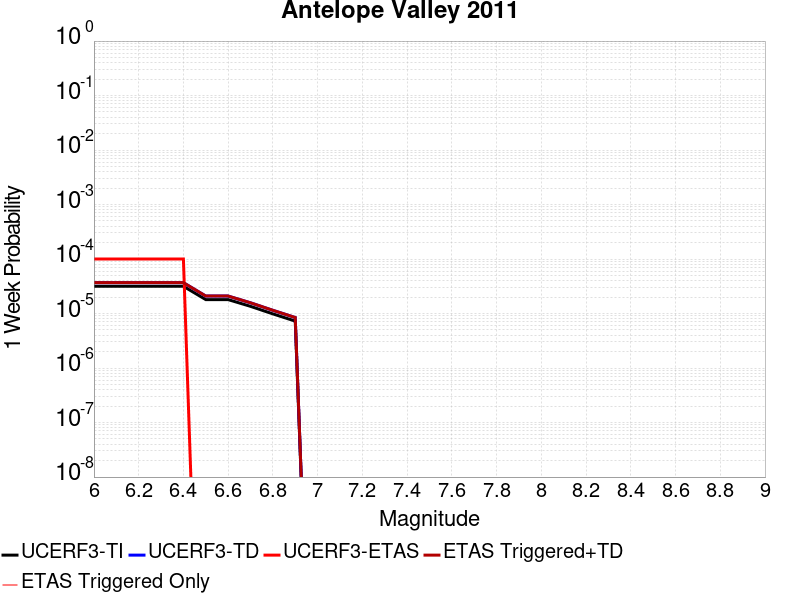 | 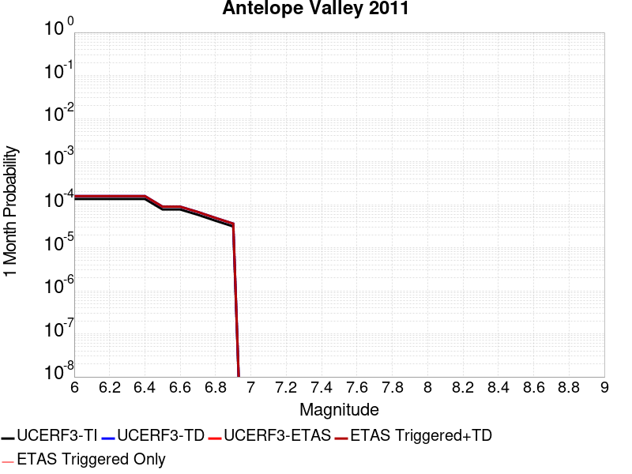 | 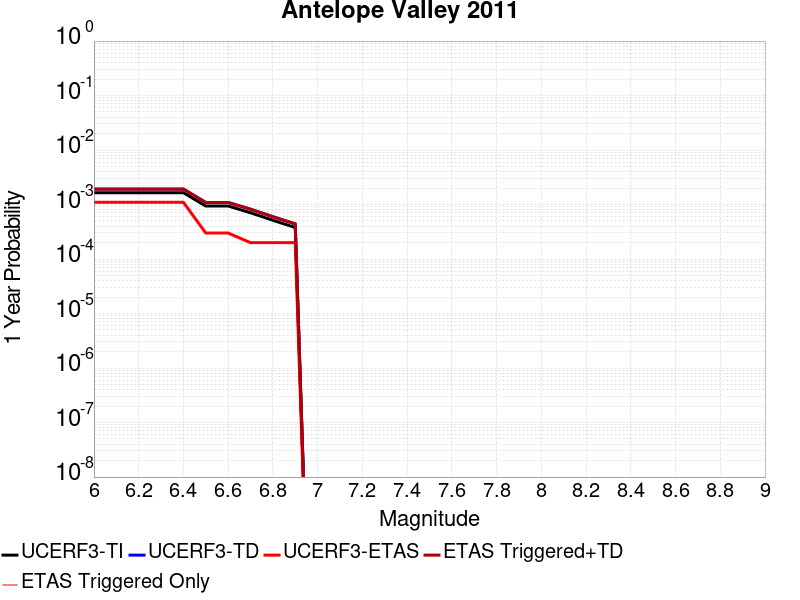 |  |

| Magnitude | 1 wk TI Prob | 1 wk TD Prob | 1 wk ETAS Prob | 1 wk ETAS/TD Gain | 1 wk ETAS Triggered+TD | 1 wk ETAS Triggered Only | 1 mo TI Prob | 1 mo TD Prob | 1 mo ETAS Prob | 1 mo ETAS/TD Gain | 1 mo ETAS Triggered+TD | 1 mo ETAS Triggered Only | 1 yr TI Prob | 1 yr TD Prob | 1 yr ETAS Prob | 1 yr ETAS/TD Gain | 1 yr ETAS Triggered+TD | 1 yr ETAS Triggered Only | 10 yr TI Prob | 10 yr TD Prob | 10 yr ETAS Prob | 10 yr ETAS/TD Gain | 10 yr ETAS Triggered+TD | 10 yr ETAS Triggered Only |
|-----|-----|-----|-----|-----|-----|-----|-----|-----|-----|-----|-----|-----|-----|-----|-----|-----|-----|-----|-----|-----|-----|-----|-----|-----|
| 6.0 | 3.1646934E-5 | 3.6917016E-5 | 1.0E-4 | 2.708778 | 3.6917016E-5 | 0.0 | 1.3562266E-4 | 1.582077E-4 | 2.0E-4 | 1.2641611 | 1.582077E-4 | 0.0 | 0.0016499552 | 0.0019247418 | 0.0011 | 0.57150525 | 0.0019247418 | 0.0 | 0.016377583 | 0.019107137 | 0.0101 | 0.5285983 | 0.019597584 | 5.0E-4 |
| 6.1 | 3.1646934E-5 | 3.6917016E-5 | 1.0E-4 | 2.708778 | 3.6917016E-5 | 0.0 | 1.3562266E-4 | 1.582077E-4 | 2.0E-4 | 1.2641611 | 1.582077E-4 | 0.0 | 0.0016499552 | 0.0019247418 | 0.0011 | 0.57150525 | 0.0019247418 | 0.0 | 0.016377583 | 0.019107137 | 0.0101 | 0.5285983 | 0.019597584 | 5.0E-4 |
| 6.2 | 3.1646934E-5 | 3.6917016E-5 | 1.0E-4 | 2.708778 | 3.6917016E-5 | 0.0 | 1.3562266E-4 | 1.582077E-4 | 2.0E-4 | 1.2641611 | 1.582077E-4 | 0.0 | 0.0016499552 | 0.0019247418 | 0.0011 | 0.57150525 | 0.0019247418 | 0.0 | 0.016377583 | 0.019107137 | 0.0101 | 0.5285983 | 0.019597584 | 5.0E-4 |
| 6.3 | 3.1646934E-5 | 3.6917016E-5 | 1.0E-4 | 2.708778 | 3.6917016E-5 | 0.0 | 1.3562266E-4 | 1.582077E-4 | 2.0E-4 | 1.2641611 | 1.582077E-4 | 0.0 | 0.0016499552 | 0.0019247418 | 0.0011 | 0.57150525 | 0.0019247418 | 0.0 | 0.016377583 | 0.019107137 | 0.0101 | 0.5285983 | 0.019597584 | 5.0E-4 |
| 6.4 | 3.1646934E-5 | 3.6917016E-5 | 1.0E-4 | 2.708778 | 3.6917016E-5 | 0.0 | 1.3562266E-4 | 1.582077E-4 | 2.0E-4 | 1.2641611 | 1.582077E-4 | 0.0 | 0.0016499552 | 0.0019247418 | 0.0011 | 0.57150525 | 0.0019247418 | 0.0 | 0.016377583 | 0.019107137 | 0.0101 | 0.5285983 | 0.019597584 | 5.0E-4 |
| 6.5 | 1.8034107E-5 | 2.0947908E-5 | 0.0 | 0.0 | 2.0947908E-5 | 0.0 | 7.7286735E-5 | 8.9774345E-5 | 0.0 | 0.0 | 8.9774345E-5 | 0.0 | 9.405598E-4 | 0.0010925771 | 3.0E-4 | 0.27458015 | 0.0010925771 | 0.0 | 0.009365888 | 0.010884139 | 0.0055 | 0.50532246 | 0.011378697 | 5.0E-4 |
| 6.6 | 1.8034107E-5 | 2.0947908E-5 | 0.0 | 0.0 | 2.0947908E-5 | 0.0 | 7.7286735E-5 | 8.9774345E-5 | 0.0 | 0.0 | 8.9774345E-5 | 0.0 | 9.405598E-4 | 0.0010925771 | 3.0E-4 | 0.27458015 | 0.0010925771 | 0.0 | 0.009365888 | 0.010884139 | 0.0055 | 0.50532246 | 0.011378697 | 5.0E-4 |
| 6.7 | 1.3567667E-5 | 1.5754726E-5 | 0.0 | 0.0 | 1.5754726E-5 | 0.0 | 5.814585E-5 | 6.7519104E-5 | 0.0 | 0.0 | 6.7519104E-5 | 0.0 | 7.076958E-4 | 8.2184136E-4 | 2.0E-4 | 0.24335596 | 8.2184136E-4 | 0.0 | 0.007054463 | 0.0081984615 | 0.004 | 0.4878964 | 0.008496002 | 3.0E-4 |
| 6.8 | 9.867387E-6 | 1.1471766E-5 | 0.0 | 0.0 | 1.1471766E-5 | 0.0 | 4.2288117E-5 | 4.9164322E-5 | 0.0 | 0.0 | 4.9164322E-5 | 0.0 | 5.1473617E-4 | 5.9850625E-4 | 2.0E-4 | 0.33416528 | 5.9850625E-4 | 0.0 | 0.005135455 | 0.005978262 | 0.0034 | 0.56872714 | 0.0062764687 | 3.0E-4 |
| 6.9 | 7.273233E-6 | 8.457692E-6 | 0.0 | 0.0 | 8.457692E-6 | 0.0 | 3.1170628E-5 | 3.6247253E-5 | 0.0 | 0.0 | 3.6247253E-5 | 0.0 | 3.794363E-4 | 4.4131032E-4 | 2.0E-4 | 0.45319584 | 4.4131032E-4 | 0.0 | 0.0037878908 | 0.004413103 | 0.0027 | 0.6118144 | 0.004512662 | 1.0E-4 |

## Earthquake Valley
*[(top)](#table-of-contents)*

| 1 Week | 1 Month | 1 Year | 10 Year |
|-----|-----|-----|-----|
| 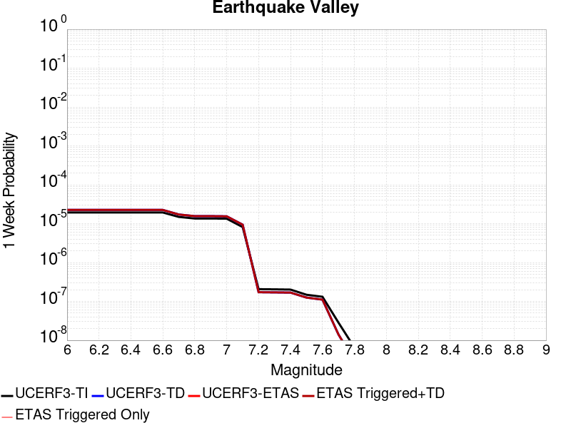 | 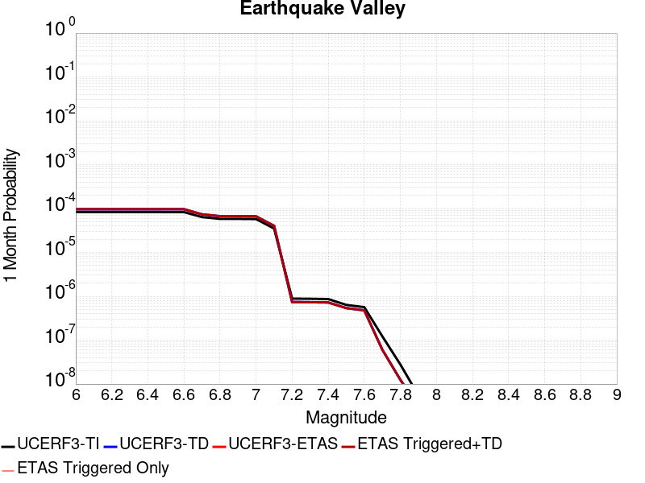 | 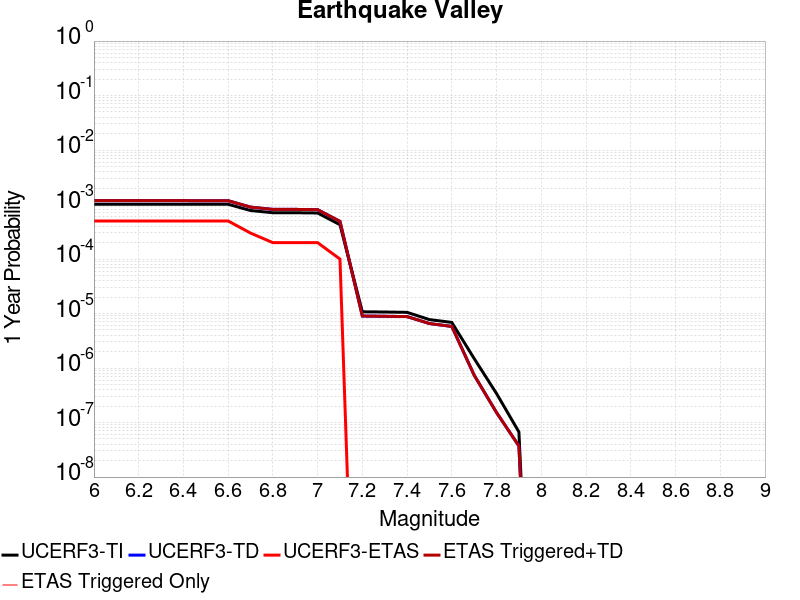 | 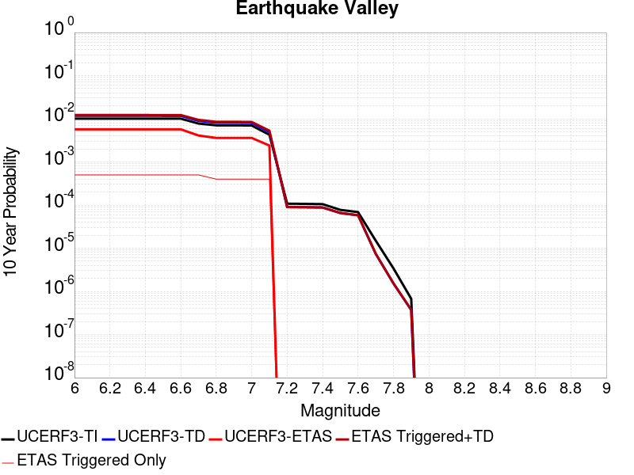 |

| Magnitude | 1 wk TI Prob | 1 wk TD Prob | 1 wk ETAS Prob | 1 wk ETAS/TD Gain | 1 wk ETAS Triggered+TD | 1 wk ETAS Triggered Only | 1 mo TI Prob | 1 mo TD Prob | 1 mo ETAS Prob | 1 mo ETAS/TD Gain | 1 mo ETAS Triggered+TD | 1 mo ETAS Triggered Only | 1 yr TI Prob | 1 yr TD Prob | 1 yr ETAS Prob | 1 yr ETAS/TD Gain | 1 yr ETAS Triggered+TD | 1 yr ETAS Triggered Only | 10 yr TI Prob | 10 yr TD Prob | 10 yr ETAS Prob | 10 yr ETAS/TD Gain | 10 yr ETAS Triggered+TD | 10 yr ETAS Triggered Only |
|-----|-----|-----|-----|-----|-----|-----|-----|-----|-----|-----|-----|-----|-----|-----|-----|-----|-----|-----|-----|-----|-----|-----|-----|-----|
| 6.0 | 1.9416384E-5 | 2.2591908E-5 | 0.0 | 0.0 | 2.2591908E-5 | 0.0 | 8.321042E-5 | 9.6819545E-5 | 0.0 | 0.0 | 9.6819545E-5 | 0.0 | 0.001012616 | 0.0011782603 | 5.0E-4 | 0.42435446 | 0.0011782603 | 0.0 | 0.010080142 | 0.011731971 | 0.0057 | 0.48585185 | 0.012226106 | 5.0E-4 |
| 6.1 | 1.9416384E-5 | 2.2591908E-5 | 0.0 | 0.0 | 2.2591908E-5 | 0.0 | 8.321042E-5 | 9.6819545E-5 | 0.0 | 0.0 | 9.6819545E-5 | 0.0 | 0.001012616 | 0.0011782603 | 5.0E-4 | 0.42435446 | 0.0011782603 | 0.0 | 0.010080142 | 0.011731971 | 0.0057 | 0.48585185 | 0.012226106 | 5.0E-4 |
| 6.2 | 1.9416384E-5 | 2.2591908E-5 | 0.0 | 0.0 | 2.2591908E-5 | 0.0 | 8.321042E-5 | 9.6819545E-5 | 0.0 | 0.0 | 9.6819545E-5 | 0.0 | 0.001012616 | 0.0011782603 | 5.0E-4 | 0.42435446 | 0.0011782603 | 0.0 | 0.010080142 | 0.011731971 | 0.0057 | 0.48585185 | 0.012226106 | 5.0E-4 |
| 6.3 | 1.9416384E-5 | 2.2591908E-5 | 0.0 | 0.0 | 2.2591908E-5 | 0.0 | 8.321042E-5 | 9.6819545E-5 | 0.0 | 0.0 | 9.6819545E-5 | 0.0 | 0.001012616 | 0.0011782603 | 5.0E-4 | 0.42435446 | 0.0011782603 | 0.0 | 0.010080142 | 0.011731971 | 0.0057 | 0.48585185 | 0.012226106 | 5.0E-4 |
| 6.4 | 1.9416384E-5 | 2.2591908E-5 | 0.0 | 0.0 | 2.2591908E-5 | 0.0 | 8.321042E-5 | 9.6819545E-5 | 0.0 | 0.0 | 9.6819545E-5 | 0.0 | 0.001012616 | 0.0011782603 | 5.0E-4 | 0.42435446 | 0.0011782603 | 0.0 | 0.010080142 | 0.011731971 | 0.0057 | 0.48585185 | 0.012226106 | 5.0E-4 |
| 6.5 | 1.9389157E-5 | 2.2560487E-5 | 0.0 | 0.0 | 2.2560487E-5 | 0.0 | 8.309374E-5 | 9.66849E-5 | 0.0 | 0.0 | 9.66849E-5 | 0.0 | 0.0010111968 | 0.0011766227 | 5.0E-4 | 0.4249451 | 0.0011766227 | 0.0 | 0.010066078 | 0.011715768 | 0.0057 | 0.4865238 | 0.01220991 | 5.0E-4 |
| 6.6 | 1.9389157E-5 | 2.2560487E-5 | 0.0 | 0.0 | 2.2560487E-5 | 0.0 | 8.309374E-5 | 9.66849E-5 | 0.0 | 0.0 | 9.66849E-5 | 0.0 | 0.0010111968 | 0.0011766227 | 5.0E-4 | 0.4249451 | 0.0011766227 | 0.0 | 0.010066078 | 0.011715768 | 0.0057 | 0.4865238 | 0.01220991 | 5.0E-4 |
| 6.7 | 1.4925434E-5 | 1.7213835E-5 | 0.0 | 0.0 | 1.7213835E-5 | 0.0 | 6.396457E-5 | 7.3771975E-5 | 0.0 | 0.0 | 7.3771975E-5 | 0.0 | 7.7849044E-4 | 8.9788873E-4 | 3.0E-4 | 0.3341171 | 8.9788873E-4 | 0.0 | 0.007757689 | 0.008950991 | 0.0041 | 0.45804986 | 0.009446515 | 5.0E-4 |
| 6.8 | 1.3570335E-5 | 1.562188E-5 | 0.0 | 0.0 | 1.562188E-5 | 0.0 | 5.8157282E-5 | 6.694966E-5 | 0.0 | 0.0 | 6.694966E-5 | 0.0 | 7.0783484E-4 | 8.148894E-4 | 2.0E-4 | 0.2454321 | 8.148894E-4 | 0.0 | 0.0070558446 | 0.008127089 | 0.0036 | 0.44296306 | 0.008523838 | 4.0E-4 |
| 6.9 | 1.3570335E-5 | 1.562188E-5 | 0.0 | 0.0 | 1.562188E-5 | 0.0 | 5.8157282E-5 | 6.694966E-5 | 0.0 | 0.0 | 6.694966E-5 | 0.0 | 7.0783484E-4 | 8.148894E-4 | 2.0E-4 | 0.2454321 | 8.148894E-4 | 0.0 | 0.0070558446 | 0.008127089 | 0.0036 | 0.44296306 | 0.008523838 | 4.0E-4 |
| 7.0 | 1.3433392E-5 | 1.5465377E-5 | 0.0 | 0.0 | 1.5465377E-5 | 0.0 | 5.757041E-5 | 6.627897E-5 | 0.0 | 0.0 | 6.627897E-5 | 0.0 | 7.0069433E-4 | 8.067298E-4 | 2.0E-4 | 0.2479145 | 8.067298E-4 | 0.0 | 0.006984891 | 0.008046085 | 0.0036 | 0.44742256 | 0.008442867 | 4.0E-4 |
| 7.1 | 8.181609E-6 | 9.419964E-6 | 0.0 | 0.0 | 9.419964E-6 | 0.0 | 3.5063567E-5 | 4.037103E-5 | 0.0 | 0.0 | 4.037103E-5 | 0.0 | 4.268153E-4 | 4.9147353E-4 | 1.0E-4 | 0.20346977 | 4.9147353E-4 | 0.0 | 0.0042599645 | 0.0049104467 | 0.0024 | 0.4887539 | 0.0053084823 | 4.0E-4 |
| 7.2 | 2.0663983E-7 | 1.7271272E-7 | 0.0 | 0.0 | 1.7271272E-7 | 0.0 | 8.855989E-7 | 7.4019715E-7 | 0.0 | 0.0 | 7.4019715E-7 | 0.0 | 1.0782113E-5 | 9.0118665E-6 | 0.0 | 0.0 | 9.0118665E-6 | 0.0 | 1.07815904E-4 | 9.011537E-5 | 0.0 | 0.0 | 9.011537E-5 | 0.0 |
| 7.3 | 2.0462376E-7 | 1.708672E-7 | 0.0 | 0.0 | 1.708672E-7 | 0.0 | 8.7695867E-7 | 7.322878E-7 | 0.0 | 0.0 | 7.322878E-7 | 0.0 | 1.0676919E-5 | 8.915571E-6 | 0.0 | 0.0 | 8.915571E-6 | 0.0 | 1.0676406E-4 | 8.915249E-5 | 0.0 | 0.0 | 8.915249E-5 | 0.0 |
| 7.4 | 2.0171088E-7 | 1.6869102E-7 | 0.0 | 0.0 | 1.6869102E-7 | 0.0 | 8.644749E-7 | 7.229613E-7 | 0.0 | 0.0 | 7.229613E-7 | 0.0 | 1.0524931E-5 | 8.802022E-6 | 0.0 | 0.0 | 8.802022E-6 | 0.0 | 1.05244326E-4 | 8.80171E-5 | 0.0 | 0.0 | 8.80171E-5 | 0.0 |
| 7.5 | 1.4847944E-7 | 1.2565965E-7 | 0.0 | 0.0 | 1.2565965E-7 | 0.0 | 6.363403E-7 | 5.385413E-7 | 0.0 | 0.0 | 5.385413E-7 | 0.0 | 7.747416E-6 | 6.556723E-6 | 0.0 | 0.0 | 6.556723E-6 | 0.0 | 7.747146E-5 | 6.556551E-5 | 0.0 | 0.0 | 6.556551E-5 | 0.0 |
| 7.6 | 1.3185847E-7 | 1.1129282E-7 | 0.0 | 0.0 | 1.1129282E-7 | 0.0 | 5.6510765E-7 | 4.7696915E-7 | 0.0 | 0.0 | 4.7696915E-7 | 0.0 | 6.8801637E-6 | 5.8070864E-6 | 0.0 | 0.0 | 5.8070864E-6 | 0.0 | 6.8799505E-5 | 5.8069556E-5 | 0.0 | 0.0 | 5.8069556E-5 | 0.0 |
| 7.7 | 2.8609954E-8 | 1.4180901E-8 | 0.0 | 0.0 | 1.4180901E-8 | 0.0 | 1.2261408E-7 | 6.077529E-8 | 0.0 | 0.0 | 6.077529E-8 | 0.0 | 1.4928254E-6 | 7.3993897E-7 | 0.0 | 0.0 | 7.3993897E-7 | 0.0 | 1.4928154E-5 | 7.39937E-6 | 0.0 | 0.0 | 7.39937E-6 | 0.0 |
| 7.8 | 6.527266E-9 | 2.9251286E-9 | 0.0 | 0.0 | 2.9251286E-9 | 0.0 | 2.7973995E-8 | 1.2536266E-8 | 0.0 | 0.0 | 1.2536266E-8 | 0.0 | 3.4058334E-7 | 1.5262903E-7 | 0.0 | 0.0 | 1.5262903E-7 | 0.0 | 3.4058282E-6 | 1.5262896E-6 | 0.0 | 0.0 | 1.5262896E-6 | 0.0 |
| 7.9 | 1.2898267E-9 | 7.131178E-10 | 0.0 | 0.0 | 7.131178E-10 | 0.0 | 5.527829E-9 | 3.0562193E-9 | 0.0 | 0.0 | 3.0562193E-9 | 0.0 | 6.7301315E-8 | 3.7209468E-8 | 0.0 | 0.0 | 3.7209468E-8 | 0.0 | 6.7301295E-7 | 3.720947E-7 | 0.0 | 0.0 | 3.720947E-7 | 0.0 |

## Fish Slough 2011 CFM
*[(top)](#table-of-contents)*

| 1 Week | 1 Month | 1 Year | 10 Year |
|-----|-----|-----|-----|
| 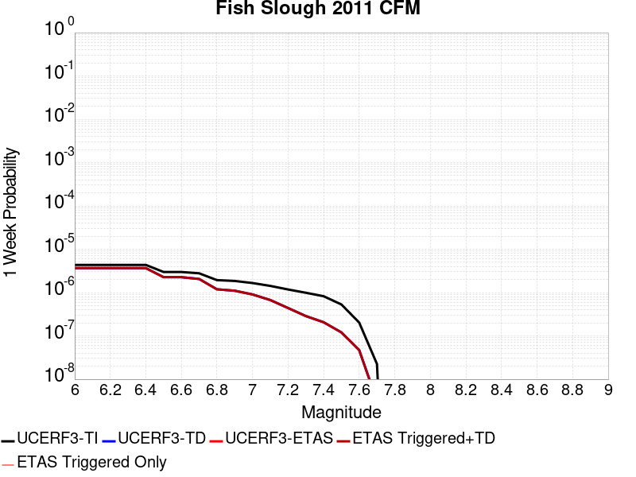 | 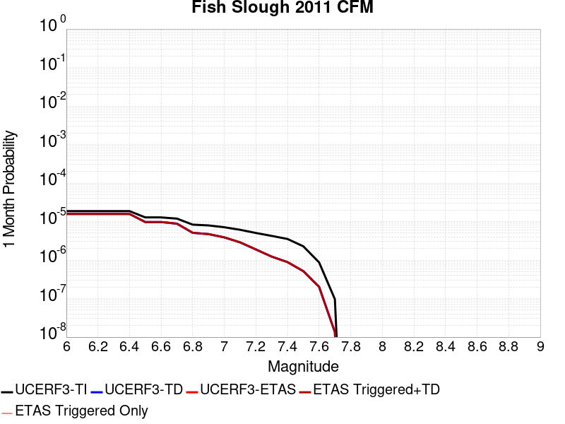 | 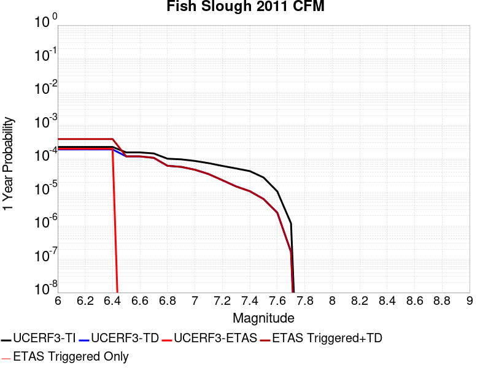 | 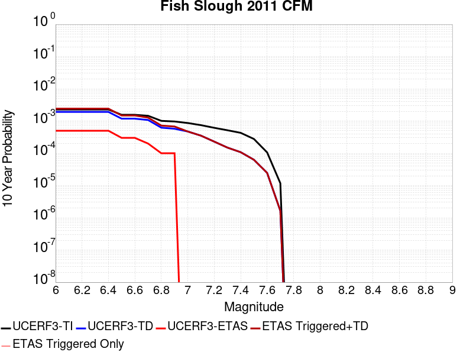 |

| Magnitude | 1 wk TI Prob | 1 wk TD Prob | 1 wk ETAS Prob | 1 wk ETAS/TD Gain | 1 wk ETAS Triggered+TD | 1 wk ETAS Triggered Only | 1 mo TI Prob | 1 mo TD Prob | 1 mo ETAS Prob | 1 mo ETAS/TD Gain | 1 mo ETAS Triggered+TD | 1 mo ETAS Triggered Only | 1 yr TI Prob | 1 yr TD Prob | 1 yr ETAS Prob | 1 yr ETAS/TD Gain | 1 yr ETAS Triggered+TD | 1 yr ETAS Triggered Only | 10 yr TI Prob | 10 yr TD Prob | 10 yr ETAS Prob | 10 yr ETAS/TD Gain | 10 yr ETAS Triggered+TD | 10 yr ETAS Triggered Only |
|-----|-----|-----|-----|-----|-----|-----|-----|-----|-----|-----|-----|-----|-----|-----|-----|-----|-----|-----|-----|-----|-----|-----|-----|-----|
| 6.0 | 4.3629925E-6 | 3.6777192E-6 | 0.0 | 0.0 | 3.6777192E-6 | 0.0 | 1.8698405E-5 | 1.576157E-5 | 0.0 | 0.0 | 1.576157E-5 | 0.0 | 2.276293E-4 | 1.9188235E-4 | 4.0E-4 | 2.0846107 | 3.9184396E-4 | 2.0E-4 | 0.0022739628 | 0.0019173757 | 0.0018 | 0.93878317 | 0.002416417 | 5.0E-4 |
| 6.1 | 4.3629925E-6 | 3.6777192E-6 | 0.0 | 0.0 | 3.6777192E-6 | 0.0 | 1.8698405E-5 | 1.576157E-5 | 0.0 | 0.0 | 1.576157E-5 | 0.0 | 2.276293E-4 | 1.9188235E-4 | 4.0E-4 | 2.0846107 | 3.9184396E-4 | 2.0E-4 | 0.0022739628 | 0.0019173757 | 0.0018 | 0.93878317 | 0.002416417 | 5.0E-4 |
| 6.2 | 4.3629925E-6 | 3.6777192E-6 | 0.0 | 0.0 | 3.6777192E-6 | 0.0 | 1.8698405E-5 | 1.576157E-5 | 0.0 | 0.0 | 1.576157E-5 | 0.0 | 2.276293E-4 | 1.9188235E-4 | 4.0E-4 | 2.0846107 | 3.9184396E-4 | 2.0E-4 | 0.0022739628 | 0.0019173757 | 0.0018 | 0.93878317 | 0.002416417 | 5.0E-4 |
| 6.3 | 4.3629925E-6 | 3.6777192E-6 | 0.0 | 0.0 | 3.6777192E-6 | 0.0 | 1.8698405E-5 | 1.576157E-5 | 0.0 | 0.0 | 1.576157E-5 | 0.0 | 2.276293E-4 | 1.9188235E-4 | 4.0E-4 | 2.0846107 | 3.9184396E-4 | 2.0E-4 | 0.0022739628 | 0.0019173757 | 0.0018 | 0.93878317 | 0.002416417 | 5.0E-4 |
| 6.4 | 4.3629925E-6 | 3.6777192E-6 | 0.0 | 0.0 | 3.6777192E-6 | 0.0 | 1.8698405E-5 | 1.576157E-5 | 0.0 | 0.0 | 1.576157E-5 | 0.0 | 2.276293E-4 | 1.9188235E-4 | 4.0E-4 | 2.0846107 | 3.9184396E-4 | 2.0E-4 | 0.0022739628 | 0.0019173757 | 0.0018 | 0.93878317 | 0.002416417 | 5.0E-4 |
| 6.5 | 2.991715E-6 | 2.270764E-6 | 0.0 | 0.0 | 2.270764E-6 | 0.0 | 1.2821573E-5 | 9.731815E-6 | 0.0 | 0.0 | 9.731815E-6 | 0.0 | 1.5609147E-4 | 1.1847932E-4 | 1.0E-4 | 0.8440291 | 1.1847932E-4 | 0.0 | 0.0015598187 | 0.0011842517 | 0.001 | 0.84441507 | 0.0014838964 | 3.0E-4 |
| 6.6 | 2.991715E-6 | 2.270764E-6 | 0.0 | 0.0 | 2.270764E-6 | 0.0 | 1.2821573E-5 | 9.731815E-6 | 0.0 | 0.0 | 9.731815E-6 | 0.0 | 1.5609147E-4 | 1.1847932E-4 | 1.0E-4 | 0.8440291 | 1.1847932E-4 | 0.0 | 0.0015598187 | 0.0011842517 | 0.001 | 0.84441507 | 0.0014838964 | 3.0E-4 |
| 6.7 | 2.7890346E-6 | 2.062548E-6 | 0.0 | 0.0 | 2.062548E-6 | 0.0 | 1.1952951E-5 | 8.839466E-6 | 0.0 | 0.0 | 8.839466E-6 | 0.0 | 1.4551746E-4 | 1.07616084E-4 | 1.0E-4 | 0.92922914 | 1.07616084E-4 | 0.0 | 0.0014542221 | 0.001075728 | 9.0E-4 | 0.83664274 | 0.0012755129 | 2.0E-4 |
| 6.8 | 1.9416723E-6 | 1.1928706E-6 | 0.0 | 0.0 | 1.1928706E-6 | 0.0 | 8.321425E-6 | 5.112293E-6 | 0.0 | 0.0 | 5.112293E-6 | 0.0 | 1.01308644E-4 | 6.2240426E-5 | 0.0 | 0.0 | 6.2240426E-5 | 0.0 | 0.0010126247 | 6.222341E-4 | 2.0E-4 | 0.32142246 | 7.2217186E-4 | 1.0E-4 |
| 6.9 | 1.8567416E-6 | 1.1050059E-6 | 0.0 | 0.0 | 1.1050059E-6 | 0.0 | 7.957439E-6 | 4.735731E-6 | 0.0 | 0.0 | 4.735731E-6 | 0.0 | 9.687752E-5 | 5.765604E-5 | 0.0 | 0.0 | 5.765604E-5 | 0.0 | 9.6835295E-4 | 5.764147E-4 | 2.0E-4 | 0.3469724 | 6.763571E-4 | 1.0E-4 |
| 7.0 | 1.6634067E-6 | 9.076913E-7 | 0.0 | 0.0 | 9.076913E-7 | 0.0 | 7.1288664E-6 | 3.8901E-6 | 0.0 | 0.0 | 3.8901E-6 | 0.0 | 8.679049E-5 | 4.7360965E-5 | 0.0 | 0.0 | 4.7360965E-5 | 0.0 | 8.6756604E-4 | 4.735116E-4 | 1.0E-4 | 0.21118806 | 4.735116E-4 | 0.0 |
| 7.1 | 1.4281054E-6 | 6.7393347E-7 | 0.0 | 0.0 | 6.7393347E-7 | 0.0 | 6.1204373E-6 | 2.8882832E-6 | 0.0 | 0.0 | 2.8882832E-6 | 0.0 | 7.451377E-5 | 3.51643E-5 | 0.0 | 0.0 | 3.51643E-5 | 0.0 | 7.44888E-4 | 3.5158914E-4 | 0.0 | 0.0 | 3.5158914E-4 | 0.0 |
| 7.2 | 1.1810387E-6 | 4.410777E-7 | 0.0 | 0.0 | 4.410777E-7 | 0.0 | 5.0615845E-6 | 1.8903318E-6 | 0.0 | 0.0 | 1.8903318E-6 | 0.0 | 6.1623046E-5 | 2.3014554E-5 | 0.0 | 0.0 | 2.3014554E-5 | 0.0 | 6.160596E-4 | 2.3012262E-4 | 0.0 | 0.0 | 2.3012262E-4 | 0.0 |
| 7.3 | 9.918052E-7 | 2.875506E-7 | 0.0 | 0.0 | 2.875506E-7 | 0.0 | 4.2505867E-6 | 1.2323591E-6 | 0.0 | 0.0 | 1.2323591E-6 | 0.0 | 5.1749663E-5 | 1.50038695E-5 | 0.0 | 0.0 | 1.50038695E-5 | 0.0 | 5.173762E-4 | 1.5002867E-4 | 0.0 | 0.0 | 1.5002867E-4 | 0.0 |
| 7.4 | 8.25252E-7 | 2.0713115E-7 | 0.0 | 0.0 | 2.0713115E-7 | 0.0 | 3.5367896E-6 | 8.8770463E-7 | 0.0 | 0.0 | 8.8770463E-7 | 0.0 | 4.3059565E-5 | 1.0807751E-5 | 0.0 | 0.0 | 1.0807751E-5 | 0.0 | 4.305122E-4 | 1.0807232E-4 | 0.0 | 0.0 | 1.0807232E-4 | 0.0 |
| 7.5 | 5.3248567E-7 | 1.208542E-7 | 0.0 | 0.0 | 1.208542E-7 | 0.0 | 2.2820795E-6 | 5.1794643E-7 | 0.0 | 0.0 | 5.1794643E-7 | 0.0 | 2.7783964E-5 | 6.30598E-6 | 0.0 | 0.0 | 6.30598E-6 | 0.0 | 2.778049E-4 | 6.3058054E-5 | 0.0 | 0.0 | 6.3058054E-5 | 0.0 |
| 7.6 | 2.037542E-7 | 4.718155E-8 | 0.0 | 0.0 | 4.718155E-8 | 0.0 | 8.73232E-7 | 2.0220664E-7 | 0.0 | 0.0 | 2.0220664E-7 | 0.0 | 1.0631547E-5 | 2.4618632E-6 | 0.0 | 0.0 | 2.4618632E-6 | 0.0 | 1.0631039E-4 | 2.461838E-5 | 0.0 | 0.0 | 2.461838E-5 | 0.0 |
| 7.7 | 2.2501226E-8 | 3.1550917E-9 | 0.0 | 0.0 | 3.1550917E-9 | 0.0 | 9.6433816E-8 | 1.3521822E-8 | 0.0 | 0.0 | 1.3521822E-8 | 0.0 | 1.1740811E-6 | 1.6462816E-7 | 0.0 | 0.0 | 1.6462816E-7 | 0.0 | 1.1740749E-5 | 1.6462806E-6 | 0.0 | 0.0 | 1.6462806E-6 | 0.0 |

## Elsinore (Julian)
*[(top)](#table-of-contents)*

| 1 Week | 1 Month | 1 Year | 10 Year |
|-----|-----|-----|-----|
| 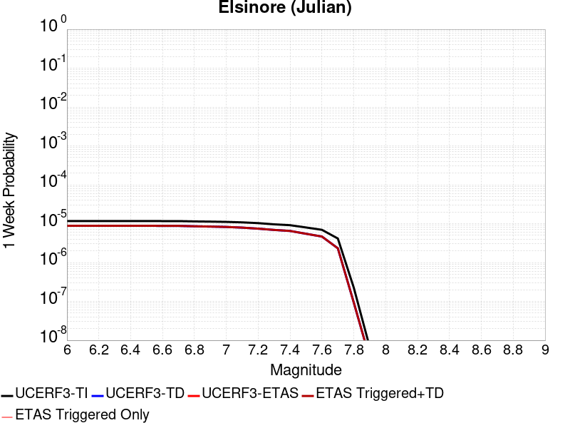 | 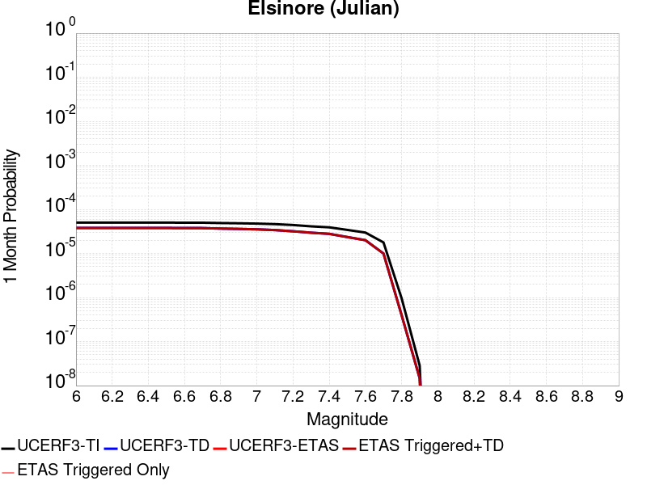 | 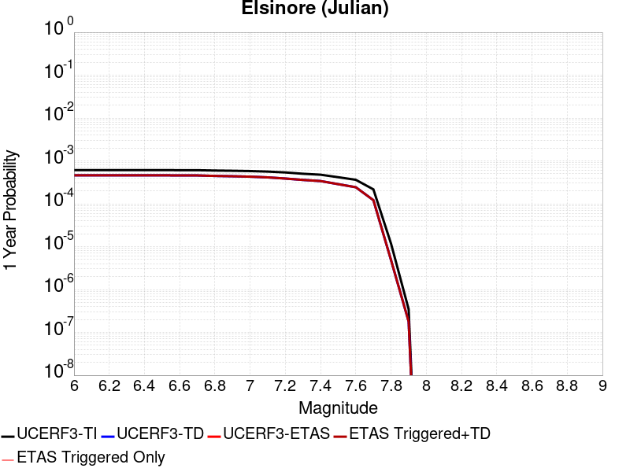 | 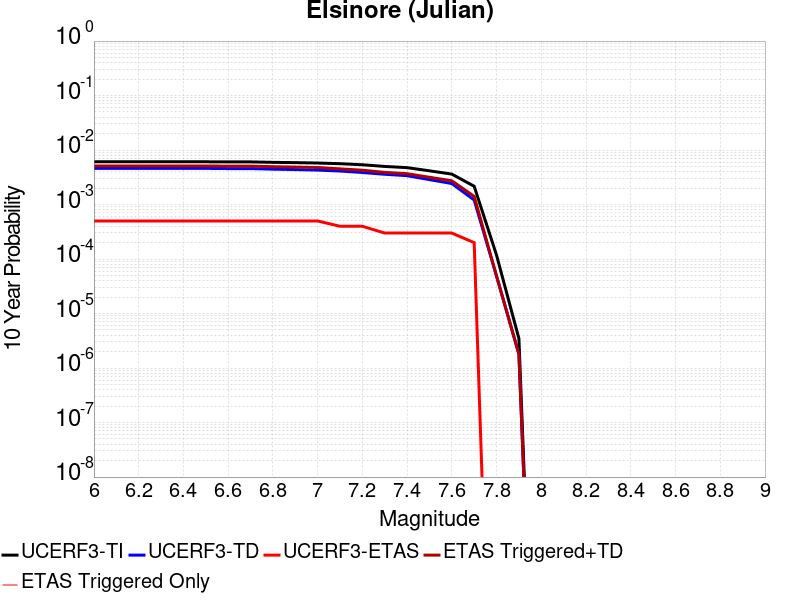 |

| Magnitude | 1 wk TI Prob | 1 wk TD Prob | 1 wk ETAS Prob | 1 wk ETAS/TD Gain | 1 wk ETAS Triggered+TD | 1 wk ETAS Triggered Only | 1 mo TI Prob | 1 mo TD Prob | 1 mo ETAS Prob | 1 mo ETAS/TD Gain | 1 mo ETAS Triggered+TD | 1 mo ETAS Triggered Only | 1 yr TI Prob | 1 yr TD Prob | 1 yr ETAS Prob | 1 yr ETAS/TD Gain | 1 yr ETAS Triggered+TD | 1 yr ETAS Triggered Only | 10 yr TI Prob | 10 yr TD Prob | 10 yr ETAS Prob | 10 yr ETAS/TD Gain | 10 yr ETAS Triggered+TD | 10 yr ETAS Triggered Only |
|-----|-----|-----|-----|-----|-----|-----|-----|-----|-----|-----|-----|-----|-----|-----|-----|-----|-----|-----|-----|-----|-----|-----|-----|-----|
| 6.0 | 1.1710231E-5 | 8.851412E-6 | 0.0 | 0.0 | 8.851412E-6 | 0.0 | 5.0185736E-5 | 3.793408E-5 | 0.0 | 0.0 | 3.793408E-5 | 0.0 | 6.1084004E-4 | 4.6175125E-4 | 3.0E-4 | 0.64970046 | 4.6175125E-4 | 0.0 | 0.006091637 | 0.0046081105 | 0.0038 | 0.82463306 | 0.005105806 | 5.0E-4 |
| 6.1 | 1.1710231E-5 | 8.851412E-6 | 0.0 | 0.0 | 8.851412E-6 | 0.0 | 5.0185736E-5 | 3.793408E-5 | 0.0 | 0.0 | 3.793408E-5 | 0.0 | 6.1084004E-4 | 4.6175125E-4 | 3.0E-4 | 0.64970046 | 4.6175125E-4 | 0.0 | 0.006091637 | 0.0046081105 | 0.0038 | 0.82463306 | 0.005105806 | 5.0E-4 |
| 6.2 | 1.1710231E-5 | 8.851412E-6 | 0.0 | 0.0 | 8.851412E-6 | 0.0 | 5.0185736E-5 | 3.793408E-5 | 0.0 | 0.0 | 3.793408E-5 | 0.0 | 6.1084004E-4 | 4.6175125E-4 | 3.0E-4 | 0.64970046 | 4.6175125E-4 | 0.0 | 0.006091637 | 0.0046081105 | 0.0038 | 0.82463306 | 0.005105806 | 5.0E-4 |
| 6.3 | 1.1710231E-5 | 8.851412E-6 | 0.0 | 0.0 | 8.851412E-6 | 0.0 | 5.0185736E-5 | 3.793408E-5 | 0.0 | 0.0 | 3.793408E-5 | 0.0 | 6.1084004E-4 | 4.6175125E-4 | 3.0E-4 | 0.64970046 | 4.6175125E-4 | 0.0 | 0.006091637 | 0.0046081105 | 0.0038 | 0.82463306 | 0.005105806 | 5.0E-4 |
| 6.4 | 1.1710231E-5 | 8.851412E-6 | 0.0 | 0.0 | 8.851412E-6 | 0.0 | 5.0185736E-5 | 3.793408E-5 | 0.0 | 0.0 | 3.793408E-5 | 0.0 | 6.1084004E-4 | 4.6175125E-4 | 3.0E-4 | 0.64970046 | 4.6175125E-4 | 0.0 | 0.006091637 | 0.0046081105 | 0.0038 | 0.82463306 | 0.005105806 | 5.0E-4 |
| 6.5 | 1.1710231E-5 | 8.851412E-6 | 0.0 | 0.0 | 8.851412E-6 | 0.0 | 5.0185736E-5 | 3.793408E-5 | 0.0 | 0.0 | 3.793408E-5 | 0.0 | 6.1084004E-4 | 4.6175125E-4 | 3.0E-4 | 0.64970046 | 4.6175125E-4 | 0.0 | 0.006091637 | 0.0046081105 | 0.0038 | 0.82463306 | 0.005105806 | 5.0E-4 |
| 6.6 | 1.1650619E-5 | 8.783769E-6 | 0.0 | 0.0 | 8.783769E-6 | 0.0 | 4.993027E-5 | 3.764419E-5 | 0.0 | 0.0 | 3.764419E-5 | 0.0 | 6.0773146E-4 | 4.5822334E-4 | 3.0E-4 | 0.6547026 | 4.5822334E-4 | 0.0 | 0.0060607214 | 0.004572977 | 0.0038 | 0.83096856 | 0.0050706905 | 5.0E-4 |
| 6.7 | 1.1650619E-5 | 8.783769E-6 | 0.0 | 0.0 | 8.783769E-6 | 0.0 | 4.993027E-5 | 3.764419E-5 | 0.0 | 0.0 | 3.764419E-5 | 0.0 | 6.0773146E-4 | 4.5822334E-4 | 3.0E-4 | 0.6547026 | 4.5822334E-4 | 0.0 | 0.0060607214 | 0.004572977 | 0.0038 | 0.83096856 | 0.0050706905 | 5.0E-4 |
| 6.8 | 1.1442698E-5 | 8.566879E-6 | 0.0 | 0.0 | 8.566879E-6 | 0.0 | 4.9039216E-5 | 3.6714686E-5 | 0.0 | 0.0 | 3.6714686E-5 | 0.0 | 5.968889E-4 | 4.469113E-4 | 2.0E-4 | 0.44751608 | 4.469113E-4 | 0.0 | 0.0059528816 | 0.0044603148 | 0.0037 | 0.8295378 | 0.004958085 | 5.0E-4 |
| 6.9 | 1.1300589E-5 | 8.414713E-6 | 0.0 | 0.0 | 8.414713E-6 | 0.0 | 4.8430196E-5 | 3.6062567E-5 | 0.0 | 0.0 | 3.6062567E-5 | 0.0 | 5.894781E-4 | 4.38975E-4 | 2.0E-4 | 0.45560682 | 4.38975E-4 | 0.0 | 0.005879169 | 0.0043812664 | 0.0036 | 0.82168025 | 0.0048790756 | 5.0E-4 |
| 7.0 | 1.1117729E-5 | 8.231819E-6 | 0.0 | 0.0 | 8.231819E-6 | 0.0 | 4.764654E-5 | 3.5278757E-5 | 0.0 | 0.0 | 3.5278757E-5 | 0.0 | 5.799422E-4 | 4.294359E-4 | 2.0E-4 | 0.46572724 | 4.294359E-4 | 0.0 | 0.0057843104 | 0.004286247 | 0.0036 | 0.8398956 | 0.0047841035 | 5.0E-4 |
| 7.1 | 1.08053955E-5 | 7.917396E-6 | 0.0 | 0.0 | 7.917396E-6 | 0.0 | 4.6308014E-5 | 3.3931265E-5 | 0.0 | 0.0 | 3.3931265E-5 | 0.0 | 5.6365423E-4 | 4.1303647E-4 | 2.0E-4 | 0.48421875 | 4.1303647E-4 | 0.0 | 0.005622267 | 0.0041228714 | 0.0034 | 0.824668 | 0.0045212223 | 4.0E-4 |
| 7.2 | 1.032804E-5 | 7.4385644E-6 | 0.0 | 0.0 | 7.4385644E-6 | 0.0 | 4.4262277E-5 | 3.187918E-5 | 0.0 | 0.0 | 3.187918E-5 | 0.0 | 5.387599E-4 | 3.8806148E-4 | 2.0E-4 | 0.5153823 | 3.8806148E-4 | 0.0 | 0.0053745564 | 0.0038740134 | 0.0033 | 0.85182977 | 0.0042724637 | 4.0E-4 |
| 7.3 | 9.622426E-6 | 6.9029716E-6 | 0.0 | 0.0 | 6.9029716E-6 | 0.0 | 4.1238312E-5 | 2.9583836E-5 | 0.0 | 0.0 | 2.9583836E-5 | 0.0 | 5.019608E-4 | 3.601251E-4 | 2.0E-4 | 0.5553626 | 3.601251E-4 | 0.0 | 0.005008285 | 0.0035955745 | 0.003 | 0.834359 | 0.003894496 | 3.0E-4 |
| 7.4 | 9.144434E-6 | 6.501177E-6 | 0.0 | 0.0 | 6.501177E-6 | 0.0 | 3.9189843E-5 | 2.7861895E-5 | 0.0 | 0.0 | 2.7861895E-5 | 0.0 | 4.7703186E-4 | 3.3916716E-4 | 2.0E-4 | 0.5896797 | 3.3916716E-4 | 0.0 | 0.0047600917 | 0.0033866377 | 0.0028 | 0.82677877 | 0.0036856215 | 3.0E-4 |
| 7.5 | 7.988981E-6 | 5.5023957E-6 | 0.0 | 0.0 | 5.5023957E-6 | 0.0 | 3.4238044E-5 | 2.358149E-5 | 0.0 | 0.0 | 2.358149E-5 | 0.0 | 4.1676845E-4 | 2.8706808E-4 | 1.0E-4 | 0.34834942 | 2.8706808E-4 | 0.0 | 0.0041598766 | 0.0028671 | 0.0024 | 0.83708274 | 0.00316624 | 3.0E-4 |
| 7.6 | 6.9554876E-6 | 4.6661944E-6 | 0.0 | 0.0 | 4.6661944E-6 | 0.0 | 2.9808893E-5 | 1.999783E-5 | 0.0 | 0.0 | 1.999783E-5 | 0.0 | 3.6286283E-4 | 2.4344755E-4 | 1.0E-4 | 0.4107661 | 2.4344755E-4 | 0.0 | 0.0036227088 | 0.002431925 | 0.002 | 0.8223938 | 0.0027311954 | 3.0E-4 |
| 7.7 | 4.1557314E-6 | 2.3265768E-6 | 0.0 | 0.0 | 2.3265768E-6 | 0.0 | 1.7810156E-5 | 9.97101E-6 | 0.0 | 0.0 | 9.97101E-6 | 0.0 | 2.1681708E-4 | 1.2139102E-4 | 1.0E-4 | 0.8237842 | 1.2139102E-4 | 0.0 | 0.0021660565 | 0.0012133203 | 9.0E-4 | 0.7417662 | 0.0014130776 | 2.0E-4 |
| 7.8 | 2.2597293E-7 | 9.339217E-8 | 0.0 | 0.0 | 9.339217E-8 | 0.0 | 9.684551E-7 | 4.002521E-7 | 0.0 | 0.0 | 4.002521E-7 | 0.0 | 1.1790877E-5 | 4.8730617E-6 | 0.0 | 0.0 | 4.8730617E-6 | 0.0 | 1.17902506E-4 | 4.8729875E-5 | 0.0 | 0.0 | 4.8729875E-5 | 0.0 |
| 7.9 | 6.676829E-9 | 3.4416097E-9 | 0.0 | 0.0 | 3.4416097E-9 | 0.0 | 2.861498E-8 | 1.4749755E-8 | 0.0 | 0.0 | 1.4749755E-8 | 0.0 | 3.4838732E-7 | 1.7957827E-7 | 0.0 | 0.0 | 1.7957827E-7 | 0.0 | 3.4838679E-6 | 1.7957813E-6 | 0.0 | 0.0 | 1.7957813E-6 | 0.0 |

## Little Salmon (Onshore)
*[(top)](#table-of-contents)*

| 1 Week | 1 Month | 1 Year | 10 Year |
|-----|-----|-----|-----|
| 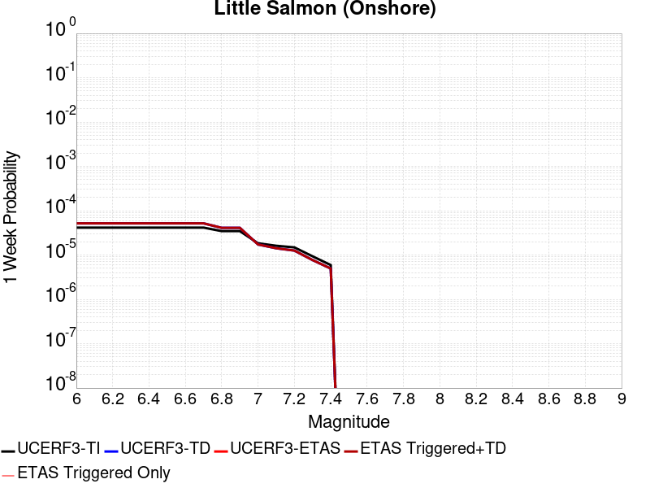 | 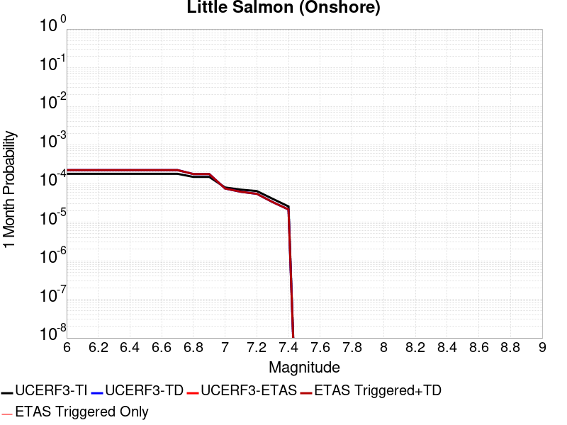 | 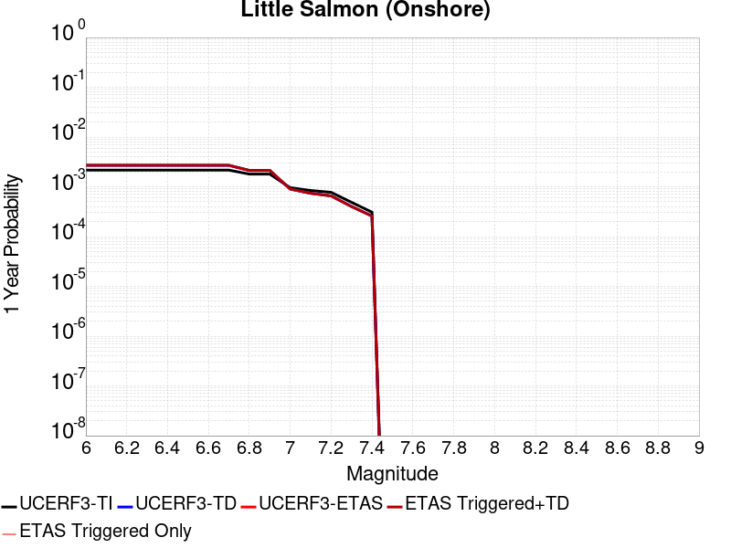 | 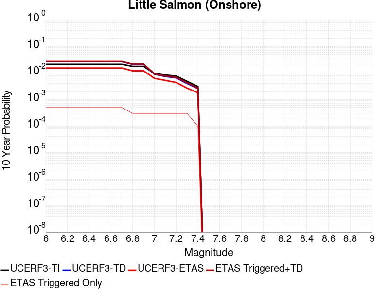 |

| Magnitude | 1 wk TI Prob | 1 wk TD Prob | 1 wk ETAS Prob | 1 wk ETAS/TD Gain | 1 wk ETAS Triggered+TD | 1 wk ETAS Triggered Only | 1 mo TI Prob | 1 mo TD Prob | 1 mo ETAS Prob | 1 mo ETAS/TD Gain | 1 mo ETAS Triggered+TD | 1 mo ETAS Triggered Only | 1 yr TI Prob | 1 yr TD Prob | 1 yr ETAS Prob | 1 yr ETAS/TD Gain | 1 yr ETAS Triggered+TD | 1 yr ETAS Triggered Only | 10 yr TI Prob | 10 yr TD Prob | 10 yr ETAS Prob | 10 yr ETAS/TD Gain | 10 yr ETAS Triggered+TD | 10 yr ETAS Triggered Only |
|-----|-----|-----|-----|-----|-----|-----|-----|-----|-----|-----|-----|-----|-----|-----|-----|-----|-----|-----|-----|-----|-----|-----|-----|-----|
| 6.0 | 4.1582247E-5 | 5.1888077E-5 | 0.0 | 0.0 | 5.1888077E-5 | 0.0 | 1.7819746E-4 | 2.223632E-4 | 0.0 | 0.0 | 2.223632E-4 | 0.0 | 0.0021673953 | 0.0027047398 | 0.0013 | 0.48063773 | 0.0027047398 | 0.0 | 0.021463778 | 0.02707001 | 0.0155 | 0.5725894 | 0.027556475 | 5.0E-4 |
| 6.1 | 4.1582247E-5 | 5.1888077E-5 | 0.0 | 0.0 | 5.1888077E-5 | 0.0 | 1.7819746E-4 | 2.223632E-4 | 0.0 | 0.0 | 2.223632E-4 | 0.0 | 0.0021673953 | 0.0027047398 | 0.0013 | 0.48063773 | 0.0027047398 | 0.0 | 0.021463778 | 0.02707001 | 0.0155 | 0.5725894 | 0.027556475 | 5.0E-4 |
| 6.2 | 4.1582247E-5 | 5.1888077E-5 | 0.0 | 0.0 | 5.1888077E-5 | 0.0 | 1.7819746E-4 | 2.223632E-4 | 0.0 | 0.0 | 2.223632E-4 | 0.0 | 0.0021673953 | 0.0027047398 | 0.0013 | 0.48063773 | 0.0027047398 | 0.0 | 0.021463778 | 0.02707001 | 0.0155 | 0.5725894 | 0.027556475 | 5.0E-4 |
| 6.3 | 4.1582247E-5 | 5.1888077E-5 | 0.0 | 0.0 | 5.1888077E-5 | 0.0 | 1.7819746E-4 | 2.223632E-4 | 0.0 | 0.0 | 2.223632E-4 | 0.0 | 0.0021673953 | 0.0027047398 | 0.0013 | 0.48063773 | 0.0027047398 | 0.0 | 0.021463778 | 0.02707001 | 0.0155 | 0.5725894 | 0.027556475 | 5.0E-4 |
| 6.4 | 4.1582247E-5 | 5.1888077E-5 | 0.0 | 0.0 | 5.1888077E-5 | 0.0 | 1.7819746E-4 | 2.223632E-4 | 0.0 | 0.0 | 2.223632E-4 | 0.0 | 0.0021673953 | 0.0027047398 | 0.0013 | 0.48063773 | 0.0027047398 | 0.0 | 0.021463778 | 0.02707001 | 0.0155 | 0.5725894 | 0.027556475 | 5.0E-4 |
| 6.5 | 4.1582247E-5 | 5.1888077E-5 | 0.0 | 0.0 | 5.1888077E-5 | 0.0 | 1.7819746E-4 | 2.223632E-4 | 0.0 | 0.0 | 2.223632E-4 | 0.0 | 0.0021673953 | 0.0027047398 | 0.0013 | 0.48063773 | 0.0027047398 | 0.0 | 0.021463778 | 0.02707001 | 0.0155 | 0.5725894 | 0.027556475 | 5.0E-4 |
| 6.6 | 4.1582247E-5 | 5.1888077E-5 | 0.0 | 0.0 | 5.1888077E-5 | 0.0 | 1.7819746E-4 | 2.223632E-4 | 0.0 | 0.0 | 2.223632E-4 | 0.0 | 0.0021673953 | 0.0027047398 | 0.0013 | 0.48063773 | 0.0027047398 | 0.0 | 0.021463778 | 0.02707001 | 0.0155 | 0.5725894 | 0.027556475 | 5.0E-4 |
| 6.7 | 4.1582247E-5 | 5.1888077E-5 | 0.0 | 0.0 | 5.1888077E-5 | 0.0 | 1.7819746E-4 | 2.223632E-4 | 0.0 | 0.0 | 2.223632E-4 | 0.0 | 0.0021673953 | 0.0027047398 | 0.0013 | 0.48063773 | 0.0027047398 | 0.0 | 0.021463778 | 0.02707001 | 0.0155 | 0.5725894 | 0.027556475 | 5.0E-4 |
| 6.8 | 3.4607925E-5 | 4.099939E-5 | 0.0 | 0.0 | 4.099939E-5 | 0.0 | 1.4831126E-4 | 1.7570409E-4 | 0.0 | 0.0 | 1.7570409E-4 | 0.0 | 0.001804194 | 0.0021378524 | 0.0013 | 0.6080869 | 0.0021378524 | 0.0 | 0.01789616 | 0.021483688 | 0.0121 | 0.563218 | 0.021777242 | 3.0E-4 |
| 6.9 | 3.4607925E-5 | 4.099939E-5 | 0.0 | 0.0 | 4.099939E-5 | 0.0 | 1.4831126E-4 | 1.7570409E-4 | 0.0 | 0.0 | 1.7570409E-4 | 0.0 | 0.001804194 | 0.0021378524 | 0.0013 | 0.6080869 | 0.0021378524 | 0.0 | 0.01789616 | 0.021483688 | 0.0121 | 0.563218 | 0.021777242 | 3.0E-4 |
| 7.0 | 1.8411014E-5 | 1.7309576E-5 | 0.0 | 0.0 | 1.7309576E-5 | 0.0 | 7.8901954E-5 | 7.418209E-5 | 0.0 | 0.0 | 7.418209E-5 | 0.0 | 9.6020795E-4 | 9.028464E-4 | 5.0E-4 | 0.5538041 | 9.028464E-4 | 0.0 | 0.009560696 | 0.009019697 | 0.0063 | 0.69847137 | 0.009316991 | 3.0E-4 |
| 7.1 | 1.6183103E-5 | 1.4226926E-5 | 0.0 | 0.0 | 1.4226926E-5 | 0.0 | 6.935431E-5 | 6.0971386E-5 | 0.0 | 0.0 | 6.0971386E-5 | 0.0 | 8.440616E-4 | 7.421214E-4 | 4.0E-4 | 0.5389954 | 7.421214E-4 | 0.0 | 0.008408628 | 0.007423763 | 0.0053 | 0.71392363 | 0.0077215363 | 3.0E-4 |
| 7.2 | 1.4868988E-5 | 1.2605338E-5 | 0.0 | 0.0 | 1.2605338E-5 | 0.0 | 6.372268E-5 | 5.4022014E-5 | 0.0 | 0.0 | 5.4022014E-5 | 0.0 | 7.755474E-4 | 6.575648E-4 | 4.0E-4 | 0.6083051 | 6.575648E-4 | 0.0 | 0.0077284635 | 0.0065827644 | 0.0044 | 0.6684122 | 0.0068807895 | 3.0E-4 |
| 7.3 | 9.3599865E-6 | 7.70572E-6 | 0.0 | 0.0 | 7.70572E-6 | 0.0 | 4.011361E-5 | 3.30243E-5 | 0.0 | 0.0 | 3.30243E-5 | 0.0 | 4.8827377E-4 | 4.020324E-4 | 4.0E-4 | 0.9949447 | 4.020324E-4 | 0.0 | 0.004872023 | 0.0040295757 | 0.0027 | 0.67004573 | 0.004328367 | 3.0E-4 |
| 7.4 | 5.941556E-6 | 4.9581654E-6 | 0.0 | 0.0 | 4.9581654E-6 | 0.0 | 2.5463563E-5 | 2.124928E-5 | 0.0 | 0.0 | 2.124928E-5 | 0.0 | 3.0997477E-4 | 2.5870997E-4 | 4.0E-4 | 1.5461329 | 2.5870997E-4 | 0.0 | 0.0030954275 | 0.0025958095 | 0.0018 | 0.6934253 | 0.0026955497 | 1.0E-4 |

## Hartley Springs 2011 CFM
*[(top)](#table-of-contents)*

| 1 Week | 1 Month | 1 Year | 10 Year |
|-----|-----|-----|-----|
| 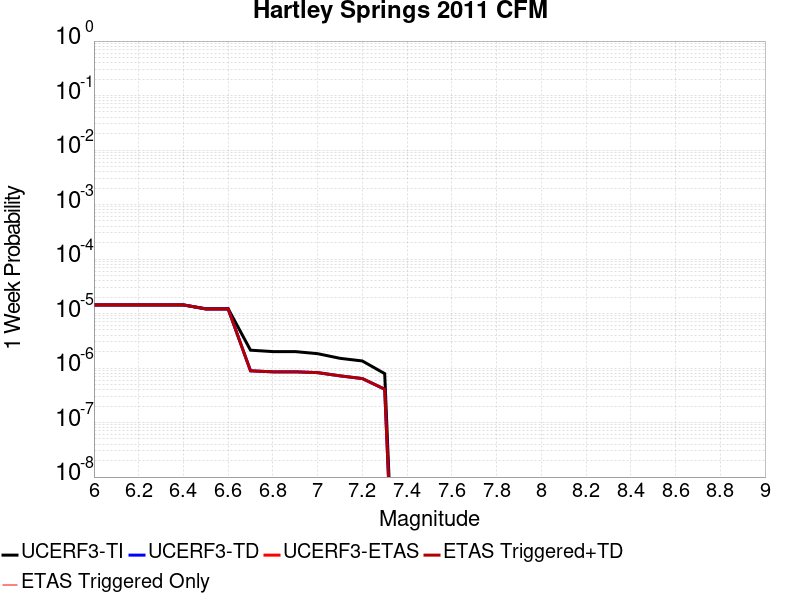 | 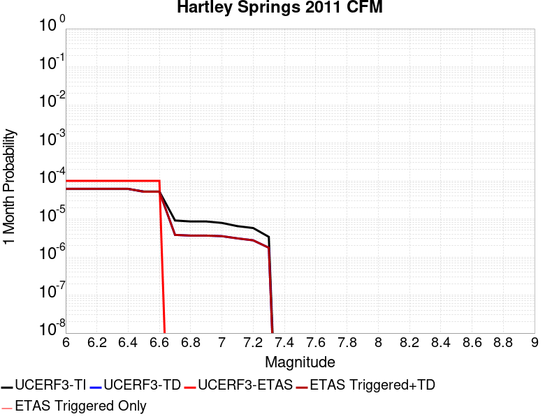 | 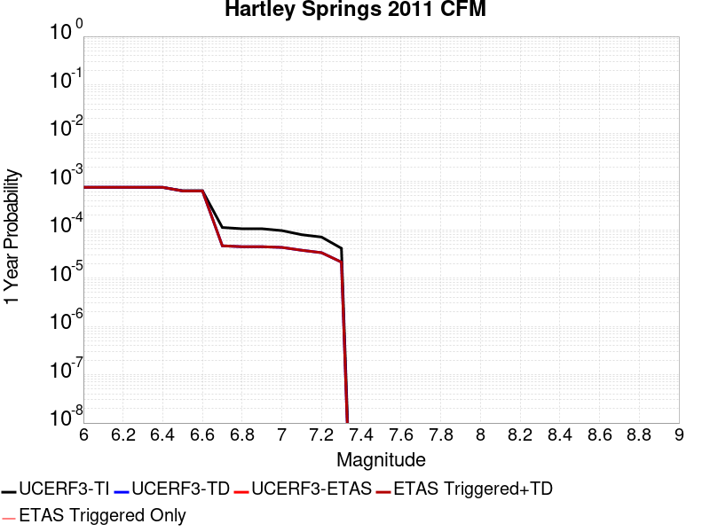 | 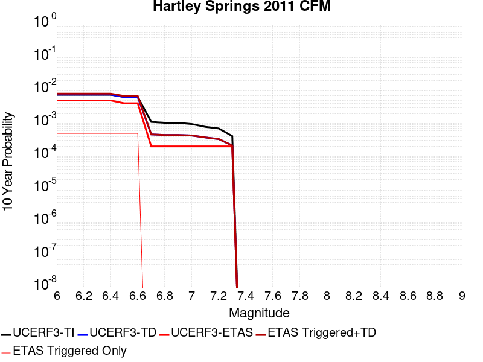 |

| Magnitude | 1 wk TI Prob | 1 wk TD Prob | 1 wk ETAS Prob | 1 wk ETAS/TD Gain | 1 wk ETAS Triggered+TD | 1 wk ETAS Triggered Only | 1 mo TI Prob | 1 mo TD Prob | 1 mo ETAS Prob | 1 mo ETAS/TD Gain | 1 mo ETAS Triggered+TD | 1 mo ETAS Triggered Only | 1 yr TI Prob | 1 yr TD Prob | 1 yr ETAS Prob | 1 yr ETAS/TD Gain | 1 yr ETAS Triggered+TD | 1 yr ETAS Triggered Only | 10 yr TI Prob | 10 yr TD Prob | 10 yr ETAS Prob | 10 yr ETAS/TD Gain | 10 yr ETAS Triggered+TD | 10 yr ETAS Triggered Only |
|-----|-----|-----|-----|-----|-----|-----|-----|-----|-----|-----|-----|-----|-----|-----|-----|-----|-----|-----|-----|-----|-----|-----|-----|-----|
| 6.0 | 1.4352418E-5 | 1.4438257E-5 | 0.0 | 0.0 | 1.4438257E-5 | 0.0 | 6.1508916E-5 | 6.1877705E-5 | 1.0E-4 | 1.616091 | 6.1877705E-5 | 0.0 | 7.486137E-4 | 7.532651E-4 | 6.0E-4 | 0.79653233 | 7.532651E-4 | 0.0 | 0.007460968 | 0.0075232466 | 0.005 | 0.6646067 | 0.008019485 | 5.0E-4 |
| 6.1 | 1.4352418E-5 | 1.4438257E-5 | 0.0 | 0.0 | 1.4438257E-5 | 0.0 | 6.1508916E-5 | 6.1877705E-5 | 1.0E-4 | 1.616091 | 6.1877705E-5 | 0.0 | 7.486137E-4 | 7.532651E-4 | 6.0E-4 | 0.79653233 | 7.532651E-4 | 0.0 | 0.007460968 | 0.0075232466 | 0.005 | 0.6646067 | 0.008019485 | 5.0E-4 |
| 6.2 | 1.4352418E-5 | 1.4438257E-5 | 0.0 | 0.0 | 1.4438257E-5 | 0.0 | 6.1508916E-5 | 6.1877705E-5 | 1.0E-4 | 1.616091 | 6.1877705E-5 | 0.0 | 7.486137E-4 | 7.532651E-4 | 6.0E-4 | 0.79653233 | 7.532651E-4 | 0.0 | 0.007460968 | 0.0075232466 | 0.005 | 0.6646067 | 0.008019485 | 5.0E-4 |
| 6.3 | 1.4352418E-5 | 1.4438257E-5 | 0.0 | 0.0 | 1.4438257E-5 | 0.0 | 6.1508916E-5 | 6.1877705E-5 | 1.0E-4 | 1.616091 | 6.1877705E-5 | 0.0 | 7.486137E-4 | 7.532651E-4 | 6.0E-4 | 0.79653233 | 7.532651E-4 | 0.0 | 0.007460968 | 0.0075232466 | 0.005 | 0.6646067 | 0.008019485 | 5.0E-4 |
| 6.4 | 1.4352418E-5 | 1.4438257E-5 | 0.0 | 0.0 | 1.4438257E-5 | 0.0 | 6.1508916E-5 | 6.1877705E-5 | 1.0E-4 | 1.616091 | 6.1877705E-5 | 0.0 | 7.486137E-4 | 7.532651E-4 | 6.0E-4 | 0.79653233 | 7.532651E-4 | 0.0 | 0.007460968 | 0.0075232466 | 0.005 | 0.6646067 | 0.008019485 | 5.0E-4 |
| 6.5 | 1.2279858E-5 | 1.2136658E-5 | 0.0 | 0.0 | 1.2136658E-5 | 0.0 | 5.26269E-5 | 5.2014104E-5 | 1.0E-4 | 1.9225554 | 5.2014104E-5 | 0.0 | 6.4054417E-4 | 6.33246E-4 | 5.0E-4 | 0.7895826 | 6.33246E-4 | 0.0 | 0.0063870098 | 0.006329934 | 0.0041 | 0.64771605 | 0.0068267696 | 5.0E-4 |
| 6.6 | 1.2279858E-5 | 1.2136658E-5 | 0.0 | 0.0 | 1.2136658E-5 | 0.0 | 5.26269E-5 | 5.2014104E-5 | 1.0E-4 | 1.9225554 | 5.2014104E-5 | 0.0 | 6.4054417E-4 | 6.33246E-4 | 5.0E-4 | 0.7895826 | 6.33246E-4 | 0.0 | 0.0063870098 | 0.006329934 | 0.0041 | 0.64771605 | 0.0068267696 | 5.0E-4 |
| 6.7 | 2.1282601E-6 | 8.905448E-7 | 0.0 | 0.0 | 8.905448E-7 | 0.0 | 9.121083E-6 | 3.8166163E-6 | 0.0 | 0.0 | 3.8166163E-6 | 0.0 | 1.11043526E-4 | 4.6466575E-5 | 0.0 | 0.0 | 4.6466575E-5 | 0.0 | 0.0011098806 | 4.6459393E-4 | 2.0E-4 | 0.43048346 | 4.6459393E-4 | 0.0 |
| 6.8 | 2.00516E-6 | 8.5278725E-7 | 0.0 | 0.0 | 8.5278725E-7 | 0.0 | 8.593515E-6 | 3.654799E-6 | 0.0 | 0.0 | 3.654799E-6 | 0.0 | 1.04621024E-4 | 4.4496526E-5 | 0.0 | 0.0 | 4.4496526E-5 | 0.0 | 0.0010457177 | 4.4490132E-4 | 2.0E-4 | 0.44953787 | 4.4490132E-4 | 0.0 |
| 6.9 | 2.00516E-6 | 8.5278725E-7 | 0.0 | 0.0 | 8.5278725E-7 | 0.0 | 8.593515E-6 | 3.654799E-6 | 0.0 | 0.0 | 3.654799E-6 | 0.0 | 1.04621024E-4 | 4.4496526E-5 | 0.0 | 0.0 | 4.4496526E-5 | 0.0 | 0.0010457177 | 4.4490132E-4 | 2.0E-4 | 0.44953787 | 4.4490132E-4 | 0.0 |
| 7.0 | 1.8366732E-6 | 8.247191E-7 | 0.0 | 0.0 | 8.247191E-7 | 0.0 | 7.871433E-6 | 3.5345072E-6 | 0.0 | 0.0 | 3.5345072E-6 | 0.0 | 9.583048E-5 | 4.303203E-5 | 0.0 | 0.0 | 4.303203E-5 | 0.0 | 9.5789164E-4 | 4.3026207E-4 | 2.0E-4 | 0.464833 | 4.3026207E-4 | 0.0 |
| 7.1 | 1.5097997E-6 | 7.19923E-7 | 0.0 | 0.0 | 7.19923E-7 | 0.0 | 6.470554E-6 | 3.0853819E-6 | 0.0 | 0.0 | 3.0853819E-6 | 0.0 | 7.877615E-5 | 3.7564118E-5 | 0.0 | 0.0 | 3.7564118E-5 | 0.0 | 7.874823E-4 | 3.7560143E-4 | 2.0E-4 | 0.53247935 | 3.7560143E-4 | 0.0 |
| 7.2 | 1.3490993E-6 | 6.4138425E-7 | 0.0 | 0.0 | 6.4138425E-7 | 0.0 | 5.7818415E-6 | 2.7487881E-6 | 0.0 | 0.0 | 2.7487881E-6 | 0.0 | 7.0391645E-5 | 3.3466215E-5 | 0.0 | 0.0 | 3.3466215E-5 | 0.0 | 7.0369354E-4 | 3.3463474E-4 | 2.0E-4 | 0.59766656 | 3.3463474E-4 | 0.0 |
| 7.3 | 7.900015E-7 | 4.0906667E-7 | 0.0 | 0.0 | 4.0906667E-7 | 0.0 | 3.3857161E-6 | 1.7531429E-6 | 0.0 | 0.0 | 1.7531429E-6 | 0.0 | 4.1220315E-5 | 2.1344515E-5 | 0.0 | 0.0 | 2.1344515E-5 | 0.0 | 4.121267E-4 | 2.1344515E-4 | 2.0E-4 | 0.93700886 | 2.1344515E-4 | 0.0 |

## Los Alamos extension
*[(top)](#table-of-contents)*

| 1 Week | 1 Month | 1 Year | 10 Year |
|-----|-----|-----|-----|
| 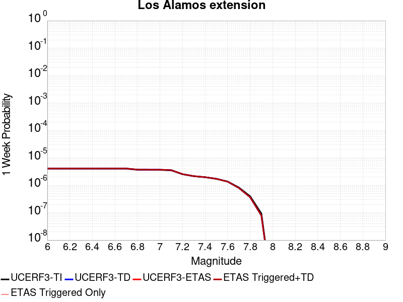 | 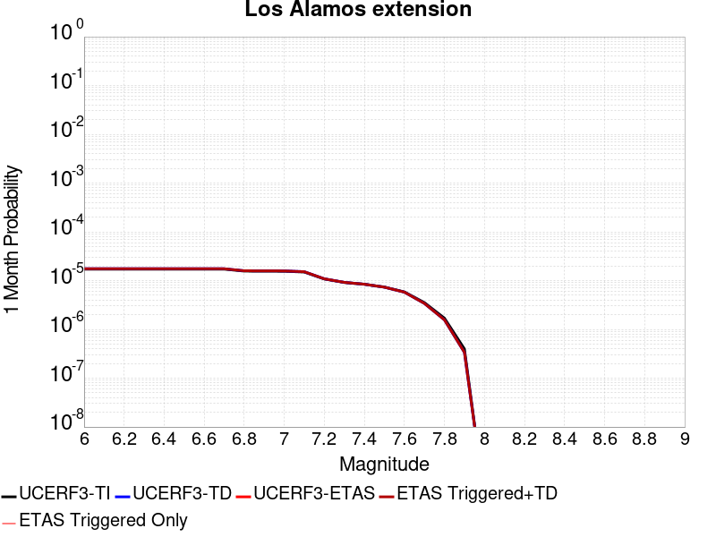 | 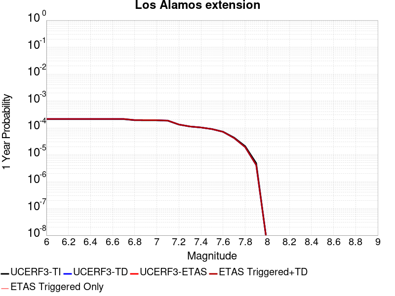 | 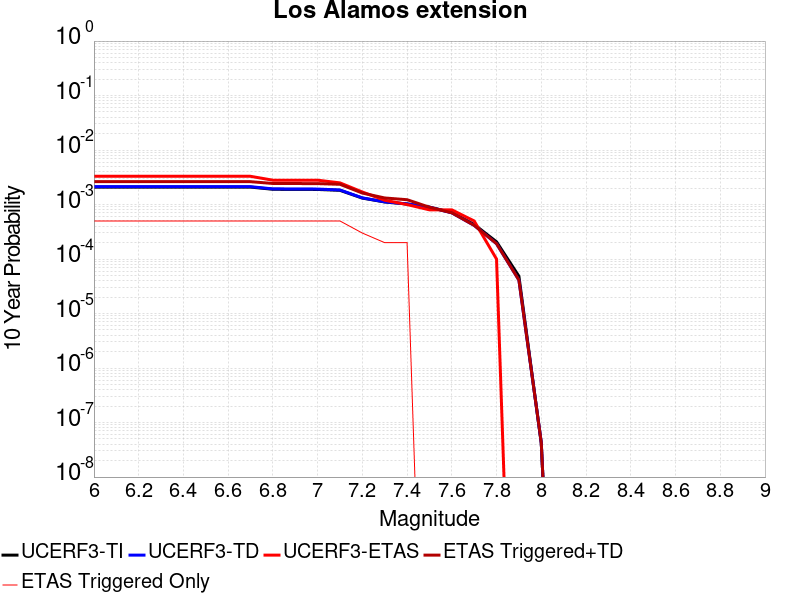 |

| Magnitude | 1 wk TI Prob | 1 wk TD Prob | 1 wk ETAS Prob | 1 wk ETAS/TD Gain | 1 wk ETAS Triggered+TD | 1 wk ETAS Triggered Only | 1 mo TI Prob | 1 mo TD Prob | 1 mo ETAS Prob | 1 mo ETAS/TD Gain | 1 mo ETAS Triggered+TD | 1 mo ETAS Triggered Only | 1 yr TI Prob | 1 yr TD Prob | 1 yr ETAS Prob | 1 yr ETAS/TD Gain | 1 yr ETAS Triggered+TD | 1 yr ETAS Triggered Only | 10 yr TI Prob | 10 yr TD Prob | 10 yr ETAS Prob | 10 yr ETAS/TD Gain | 10 yr ETAS Triggered+TD | 10 yr ETAS Triggered Only |
|-----|-----|-----|-----|-----|-----|-----|-----|-----|-----|-----|-----|-----|-----|-----|-----|-----|-----|-----|-----|-----|-----|-----|-----|-----|
| 6.0 | 4.0146506E-6 | 4.086488E-6 | 0.0 | 0.0 | 4.086488E-6 | 0.0 | 1.7205533E-5 | 1.7513408E-5 | 0.0 | 0.0 | 1.7513408E-5 | 0.0 | 2.0945723E-4 | 2.1320599E-4 | 0.0 | 0.0 | 2.1320599E-4 | 0.0 | 0.0020925992 | 0.0021301236 | 0.0033 | 1.5492059 | 0.0026290584 | 5.0E-4 |
| 6.1 | 4.0146506E-6 | 4.086488E-6 | 0.0 | 0.0 | 4.086488E-6 | 0.0 | 1.7205533E-5 | 1.7513408E-5 | 0.0 | 0.0 | 1.7513408E-5 | 0.0 | 2.0945723E-4 | 2.1320599E-4 | 0.0 | 0.0 | 2.1320599E-4 | 0.0 | 0.0020925992 | 0.0021301236 | 0.0033 | 1.5492059 | 0.0026290584 | 5.0E-4 |
| 6.2 | 4.0146506E-6 | 4.086488E-6 | 0.0 | 0.0 | 4.086488E-6 | 0.0 | 1.7205533E-5 | 1.7513408E-5 | 0.0 | 0.0 | 1.7513408E-5 | 0.0 | 2.0945723E-4 | 2.1320599E-4 | 0.0 | 0.0 | 2.1320599E-4 | 0.0 | 0.0020925992 | 0.0021301236 | 0.0033 | 1.5492059 | 0.0026290584 | 5.0E-4 |
| 6.3 | 4.0146506E-6 | 4.086488E-6 | 0.0 | 0.0 | 4.086488E-6 | 0.0 | 1.7205533E-5 | 1.7513408E-5 | 0.0 | 0.0 | 1.7513408E-5 | 0.0 | 2.0945723E-4 | 2.1320599E-4 | 0.0 | 0.0 | 2.1320599E-4 | 0.0 | 0.0020925992 | 0.0021301236 | 0.0033 | 1.5492059 | 0.0026290584 | 5.0E-4 |
| 6.4 | 4.0146506E-6 | 4.086488E-6 | 0.0 | 0.0 | 4.086488E-6 | 0.0 | 1.7205533E-5 | 1.7513408E-5 | 0.0 | 0.0 | 1.7513408E-5 | 0.0 | 2.0945723E-4 | 2.1320599E-4 | 0.0 | 0.0 | 2.1320599E-4 | 0.0 | 0.0020925992 | 0.0021301236 | 0.0033 | 1.5492059 | 0.0026290584 | 5.0E-4 |
| 6.5 | 4.0146506E-6 | 4.086488E-6 | 0.0 | 0.0 | 4.086488E-6 | 0.0 | 1.7205533E-5 | 1.7513408E-5 | 0.0 | 0.0 | 1.7513408E-5 | 0.0 | 2.0945723E-4 | 2.1320599E-4 | 0.0 | 0.0 | 2.1320599E-4 | 0.0 | 0.0020925992 | 0.0021301236 | 0.0033 | 1.5492059 | 0.0026290584 | 5.0E-4 |
| 6.6 | 4.0146506E-6 | 4.086488E-6 | 0.0 | 0.0 | 4.086488E-6 | 0.0 | 1.7205533E-5 | 1.7513408E-5 | 0.0 | 0.0 | 1.7513408E-5 | 0.0 | 2.0945723E-4 | 2.1320599E-4 | 0.0 | 0.0 | 2.1320599E-4 | 0.0 | 0.0020925992 | 0.0021301236 | 0.0033 | 1.5492059 | 0.0026290584 | 5.0E-4 |
| 6.7 | 4.0146506E-6 | 4.086488E-6 | 0.0 | 0.0 | 4.086488E-6 | 0.0 | 1.7205533E-5 | 1.7513408E-5 | 0.0 | 0.0 | 1.7513408E-5 | 0.0 | 2.0945723E-4 | 2.1320599E-4 | 0.0 | 0.0 | 2.1320599E-4 | 0.0 | 0.0020925992 | 0.0021301236 | 0.0033 | 1.5492059 | 0.0026290584 | 5.0E-4 |
| 6.8 | 3.6584688E-6 | 3.7191635E-6 | 0.0 | 0.0 | 3.7191635E-6 | 0.0 | 1.5679057E-5 | 1.593918E-5 | 0.0 | 0.0 | 1.593918E-5 | 0.0 | 1.9087581E-4 | 1.9404317E-4 | 0.0 | 0.0 | 1.9404317E-4 | 0.0 | 0.0019071194 | 0.0019388299 | 0.0028 | 1.44417 | 0.0024378605 | 5.0E-4 |
| 6.9 | 3.644631E-6 | 3.7048726E-6 | 0.0 | 0.0 | 3.7048726E-6 | 0.0 | 1.5619753E-5 | 1.5877933E-5 | 0.0 | 0.0 | 1.5877933E-5 | 0.0 | 1.901539E-4 | 1.9329763E-4 | 0.0 | 0.0 | 1.9329763E-4 | 0.0 | 0.0018999127 | 0.0019313875 | 0.0028 | 1.449735 | 0.0024304218 | 5.0E-4 |
| 7.0 | 3.6318522E-6 | 3.6916322E-6 | 0.0 | 0.0 | 3.6916322E-6 | 0.0 | 1.5564989E-5 | 1.582119E-5 | 0.0 | 0.0 | 1.582119E-5 | 0.0 | 1.8948725E-4 | 1.926069E-4 | 0.0 | 0.0 | 1.926069E-4 | 0.0 | 0.0018932576 | 0.0019244921 | 0.0028 | 1.4549294 | 0.0024235297 | 5.0E-4 |
| 7.1 | 3.5001724E-6 | 3.5556936E-6 | 0.0 | 0.0 | 3.5556936E-6 | 0.0 | 1.5000653E-5 | 1.5238604E-5 | 0.0 | 0.0 | 1.5238604E-5 | 0.0 | 1.8261763E-4 | 1.8551512E-4 | 0.0 | 0.0 | 1.8551512E-4 | 0.0 | 0.0018246764 | 0.0018536932 | 0.0025 | 1.348659 | 0.0023527665 | 5.0E-4 |
| 7.2 | 2.5204702E-6 | 2.54392E-6 | 0.0 | 0.0 | 2.54392E-6 | 0.0 | 1.080197E-5 | 1.0902469E-5 | 0.0 | 0.0 | 1.0902469E-5 | 0.0 | 1.3150605E-4 | 1.3272952E-4 | 0.0 | 0.0 | 1.3272952E-4 | 0.0 | 0.0013142825 | 0.0013265081 | 0.0017 | 1.2815602 | 0.0016261102 | 3.0E-4 |
| 7.3 | 2.1399692E-6 | 2.1503295E-6 | 0.0 | 0.0 | 2.1503295E-6 | 0.0 | 9.1712645E-6 | 9.215665E-6 | 0.0 | 0.0 | 9.215665E-6 | 0.0 | 1.1165442E-4 | 1.12194975E-4 | 0.0 | 0.0 | 1.12194975E-4 | 0.0 | 0.0011159834 | 0.0011213867 | 0.0012 | 1.0701038 | 0.0013211623 | 2.0E-4 |
| 7.4 | 1.9660122E-6 | 1.9704214E-6 | 0.0 | 0.0 | 1.9704214E-6 | 0.0 | 8.42574E-6 | 8.4446365E-6 | 0.0 | 0.0 | 8.4446365E-6 | 0.0 | 1.0257855E-4 | 1.02808626E-4 | 0.0 | 0.0 | 1.02808626E-4 | 0.0 | 0.0010253121 | 0.0010276138 | 0.001 | 0.97312826 | 0.0012274083 | 2.0E-4 |
| 7.5 | 1.7204633E-6 | 1.7152629E-6 | 0.0 | 0.0 | 1.7152629E-6 | 0.0 | 7.373393E-6 | 7.351106E-6 | 0.0 | 0.0 | 7.351106E-6 | 0.0 | 8.976737E-5 | 8.949607E-5 | 0.0 | 0.0 | 8.949607E-5 | 0.0 | 8.9731114E-4 | 8.9460326E-4 | 8.0E-4 | 0.89425117 | 8.9460326E-4 | 0.0 |
| 7.6 | 1.3717638E-6 | 1.3537165E-6 | 0.0 | 0.0 | 1.3537165E-6 | 0.0 | 5.878974E-6 | 5.801629E-6 | 0.0 | 0.0 | 5.801629E-6 | 0.0 | 7.157416E-5 | 7.063257E-5 | 0.0 | 0.0 | 7.063257E-5 | 0.0 | 7.1551115E-4 | 7.0610386E-4 | 8.0E-4 | 1.1329778 | 7.0610386E-4 | 0.0 |
| 7.7 | 8.272564E-7 | 7.9584686E-7 | 0.0 | 0.0 | 7.9584686E-7 | 0.0 | 3.5453797E-6 | 3.4107677E-6 | 0.0 | 0.0 | 3.4107677E-6 | 0.0 | 4.3164142E-5 | 4.152531E-5 | 0.0 | 0.0 | 4.152531E-5 | 0.0 | 4.315576E-4 | 4.1517566E-4 | 5.0E-4 | 1.2043095 | 4.1517566E-4 | 0.0 |
| 7.8 | 3.9708277E-7 | 3.6723284E-7 | 0.0 | 0.0 | 3.6723284E-7 | 0.0 | 1.7017821E-6 | 1.573854E-6 | 0.0 | 0.0 | 1.573854E-6 | 0.0 | 2.0719E-5 | 1.9161505E-5 | 0.0 | 0.0 | 1.9161505E-5 | 0.0 | 2.071707E-4 | 1.9159859E-4 | 1.0E-4 | 0.5219245 | 1.9159859E-4 | 0.0 |
| 7.9 | 9.292528E-8 | 7.890114E-8 | 0.0 | 0.0 | 7.890114E-8 | 0.0 | 3.9825116E-7 | 3.381477E-7 | 0.0 | 0.0 | 3.381477E-7 | 0.0 | 4.848697E-6 | 4.1169405E-6 | 0.0 | 0.0 | 4.1169405E-6 | 0.0 | 4.8485912E-5 | 4.1168652E-5 | 0.0 | 0.0 | 4.1168652E-5 | 0.0 |
| 8.0 | 7.880441E-11 | 8.2360785E-11 | 0.0 | 0.0 | 8.2360785E-11 | 0.0 | 3.3773329E-10 | 3.5297476E-10 | 0.0 | 0.0 | 3.5297476E-10 | 0.0 | 4.1119033E-9 | 4.297468E-9 | 0.0 | 0.0 | 4.297468E-9 | 0.0 | 4.1119034E-8 | 4.297468E-8 | 0.0 | 0.0 | 4.297468E-8 | 0.0 |

## White Wolf (Extension)
*[(top)](#table-of-contents)*

| 1 Week | 1 Month | 1 Year | 10 Year |
|-----|-----|-----|-----|
| 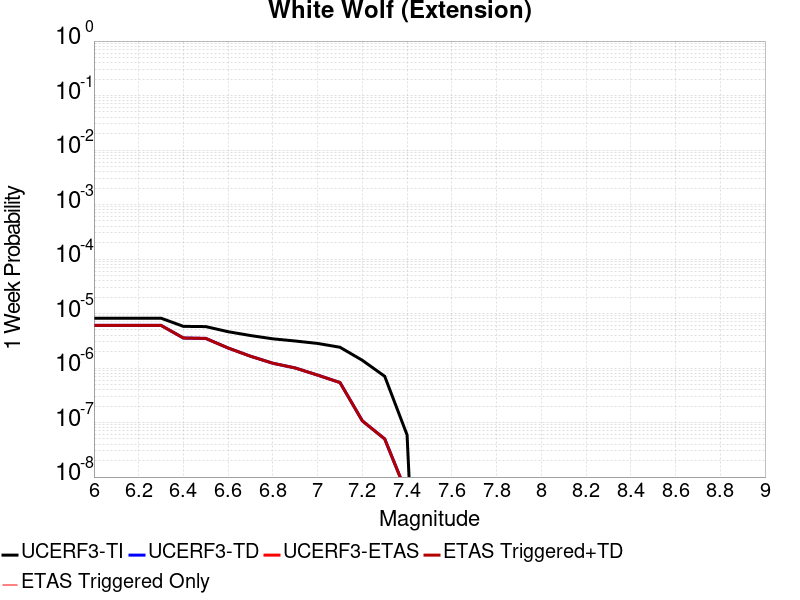 | 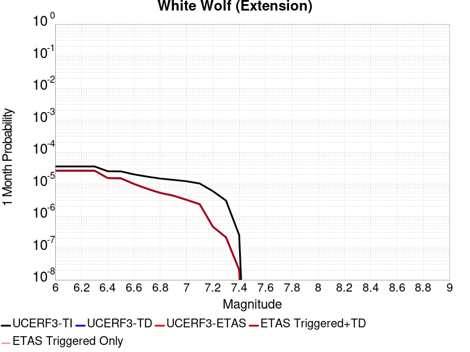 | 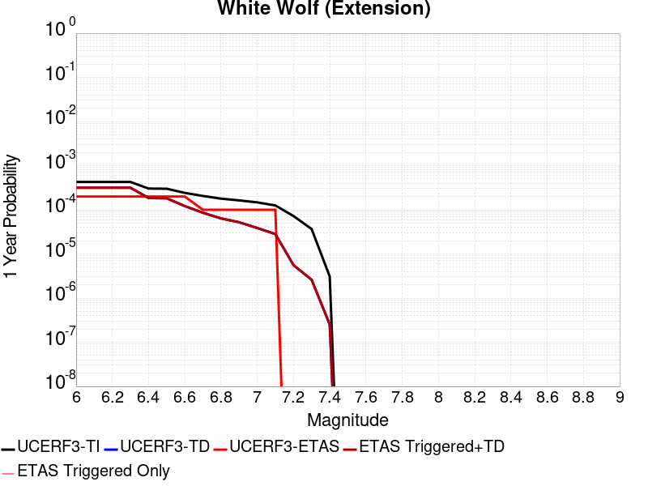 | 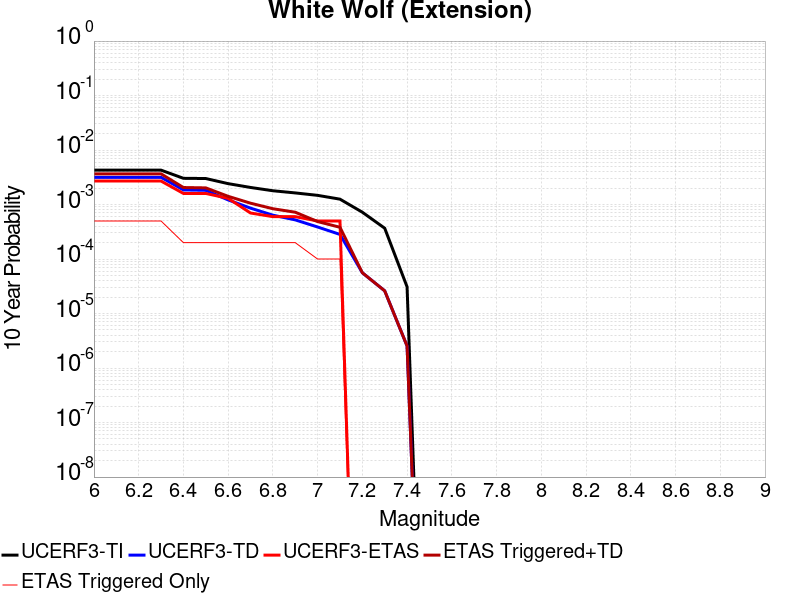 |

| Magnitude | 1 wk TI Prob | 1 wk TD Prob | 1 wk ETAS Prob | 1 wk ETAS/TD Gain | 1 wk ETAS Triggered+TD | 1 wk ETAS Triggered Only | 1 mo TI Prob | 1 mo TD Prob | 1 mo ETAS Prob | 1 mo ETAS/TD Gain | 1 mo ETAS Triggered+TD | 1 mo ETAS Triggered Only | 1 yr TI Prob | 1 yr TD Prob | 1 yr ETAS Prob | 1 yr ETAS/TD Gain | 1 yr ETAS Triggered+TD | 1 yr ETAS Triggered Only | 10 yr TI Prob | 10 yr TD Prob | 10 yr ETAS Prob | 10 yr ETAS/TD Gain | 10 yr ETAS Triggered+TD | 10 yr ETAS Triggered Only |
|-----|-----|-----|-----|-----|-----|-----|-----|-----|-----|-----|-----|-----|-----|-----|-----|-----|-----|-----|-----|-----|-----|-----|-----|-----|
| 6.0 | 8.222555E-6 | 6.0672405E-6 | 0.0 | 0.0 | 6.0672405E-6 | 0.0 | 3.5239045E-5 | 2.6002237E-5 | 0.0 | 0.0 | 2.6002237E-5 | 0.0 | 4.289509E-4 | 3.165379E-4 | 2.0E-4 | 0.6318359 | 3.165379E-4 | 0.0 | 0.0042812387 | 0.003161522 | 0.0027 | 0.854019 | 0.0036599415 | 5.0E-4 |
| 6.1 | 8.222555E-6 | 6.0672405E-6 | 0.0 | 0.0 | 6.0672405E-6 | 0.0 | 3.5239045E-5 | 2.6002237E-5 | 0.0 | 0.0 | 2.6002237E-5 | 0.0 | 4.289509E-4 | 3.165379E-4 | 2.0E-4 | 0.6318359 | 3.165379E-4 | 0.0 | 0.0042812387 | 0.003161522 | 0.0027 | 0.854019 | 0.0036599415 | 5.0E-4 |
| 6.2 | 8.222555E-6 | 6.0672405E-6 | 0.0 | 0.0 | 6.0672405E-6 | 0.0 | 3.5239045E-5 | 2.6002237E-5 | 0.0 | 0.0 | 2.6002237E-5 | 0.0 | 4.289509E-4 | 3.165379E-4 | 2.0E-4 | 0.6318359 | 3.165379E-4 | 0.0 | 0.0042812387 | 0.003161522 | 0.0027 | 0.854019 | 0.0036599415 | 5.0E-4 |
| 6.3 | 8.222555E-6 | 6.0672405E-6 | 0.0 | 0.0 | 6.0672405E-6 | 0.0 | 3.5239045E-5 | 2.6002237E-5 | 0.0 | 0.0 | 2.6002237E-5 | 0.0 | 4.289509E-4 | 3.165379E-4 | 2.0E-4 | 0.6318359 | 3.165379E-4 | 0.0 | 0.0042812387 | 0.003161522 | 0.0027 | 0.854019 | 0.0036599415 | 5.0E-4 |
| 6.4 | 5.821773E-6 | 3.5575172E-6 | 0.0 | 0.0 | 3.5575172E-6 | 0.0 | 2.4950215E-5 | 1.524642E-5 | 0.0 | 0.0 | 1.524642E-5 | 0.0 | 3.0372653E-4 | 1.8561045E-4 | 2.0E-4 | 1.0775255 | 1.8561045E-4 | 0.0 | 0.0030331176 | 0.0018546626 | 0.0016 | 0.8626906 | 0.0020542915 | 2.0E-4 |
| 6.5 | 5.766023E-6 | 3.4994464E-6 | 0.0 | 0.0 | 3.4994464E-6 | 0.0 | 2.4711293E-5 | 1.4997548E-5 | 0.0 | 0.0 | 1.4997548E-5 | 0.0 | 3.0081844E-4 | 1.8258094E-4 | 2.0E-4 | 1.0954046 | 1.8258094E-4 | 0.0 | 0.0030041158 | 0.0018244175 | 0.0016 | 0.8769922 | 0.0020240527 | 2.0E-4 |
| 6.6 | 4.643576E-6 | 2.3328657E-6 | 0.0 | 0.0 | 2.3328657E-6 | 0.0 | 1.9900888E-5 | 9.99796E-6 | 0.0 | 0.0 | 9.99796E-6 | 0.0 | 2.4226638E-4 | 1.2171879E-4 | 2.0E-4 | 1.6431316 | 1.2171879E-4 | 0.0 | 0.0024200242 | 0.0012165636 | 0.0013 | 1.0685836 | 0.0014163203 | 2.0E-4 |
| 6.7 | 3.9529173E-6 | 1.6485329E-6 | 0.0 | 0.0 | 1.6485329E-6 | 0.0 | 1.6940963E-5 | 7.0651226E-6 | 0.0 | 0.0 | 7.0651226E-6 | 0.0 | 2.0623671E-4 | 8.601466E-5 | 1.0E-4 | 1.1625925 | 8.601466E-5 | 0.0 | 0.002060454 | 8.598322E-4 | 7.0E-4 | 0.8141123 | 0.0010596602 | 2.0E-4 |
| 6.8 | 3.4377522E-6 | 1.2246712E-6 | 0.0 | 0.0 | 1.2246712E-6 | 0.0 | 1.473314E-5 | 5.2485807E-6 | 0.0 | 0.0 | 5.2485807E-6 | 0.0 | 1.7936122E-4 | 6.3899686E-5 | 1.0E-4 | 1.5649529 | 6.3899686E-5 | 0.0 | 0.0017921652 | 6.3882227E-4 | 6.0E-4 | 0.93922836 | 8.386945E-4 | 2.0E-4 |
| 6.9 | 3.1367306E-6 | 1.003503E-6 | 0.0 | 0.0 | 1.003503E-6 | 0.0 | 1.3443062E-5 | 4.3007203E-6 | 0.0 | 0.0 | 4.3007203E-6 | 0.0 | 1.63657E-4 | 5.236009E-5 | 1.0E-4 | 1.9098516 | 5.236009E-5 | 0.0 | 0.0016353652 | 5.234852E-4 | 6.0E-4 | 1.1461643 | 7.233805E-4 | 2.0E-4 |
| 7.0 | 2.8298145E-6 | 7.429706E-7 | 0.0 | 0.0 | 7.429706E-7 | 0.0 | 1.2127721E-5 | 3.1841562E-6 | 0.0 | 0.0 | 3.1841562E-6 | 0.0 | 1.47645E-4 | 3.8766462E-5 | 1.0E-4 | 2.5795493 | 3.8766462E-5 | 0.0 | 0.0014754693 | 3.87602E-4 | 5.0E-4 | 1.289983 | 4.8756323E-4 | 1.0E-4 |
| 7.1 | 2.4091064E-6 | 5.4235505E-7 | 0.0 | 0.0 | 5.4235505E-7 | 0.0 | 1.03247E-5 | 2.324377E-6 | 0.0 | 0.0 | 2.324377E-6 | 0.0 | 1.2569598E-4 | 2.8298964E-5 | 1.0E-4 | 3.5336983 | 2.8298964E-5 | 0.0 | 0.001256249 | 2.8295766E-4 | 5.0E-4 | 1.767049 | 3.8292934E-4 | 1.0E-4 |
| 7.2 | 1.3875518E-6 | 1.0745908E-7 | 0.0 | 0.0 | 1.0745908E-7 | 0.0 | 5.9466374E-6 | 4.6053884E-7 | 0.0 | 0.0 | 4.6053884E-7 | 0.0 | 7.23979E-5 | 5.607047E-6 | 0.0 | 0.0 | 5.607047E-6 | 0.0 | 7.2374323E-4 | 5.6069173E-5 | 0.0 | 0.0 | 5.6069173E-5 | 0.0 |
| 7.3 | 7.056077E-7 | 5.003463E-8 | 0.0 | 0.0 | 5.003463E-8 | 0.0 | 3.0240296E-6 | 2.1443411E-7 | 0.0 | 0.0 | 2.1443411E-7 | 0.0 | 3.681694E-5 | 2.6107327E-6 | 0.0 | 0.0 | 2.6107327E-6 | 0.0 | 3.681084E-4 | 2.6107065E-5 | 0.0 | 0.0 | 2.6107065E-5 | 0.0 |
| 7.4 | 5.9334678E-8 | 4.86535E-9 | 0.0 | 0.0 | 4.86535E-9 | 0.0 | 2.5429145E-7 | 2.0851498E-8 | 0.0 | 0.0 | 2.0851498E-8 | 0.0 | 3.095994E-6 | 2.5386697E-7 | 0.0 | 0.0 | 2.5386697E-7 | 0.0 | 3.095951E-5 | 2.538668E-6 | 0.0 | 0.0 | 2.538668E-6 | 0.0 |

## Mount Diablo Thrust North CFM
*[(top)](#table-of-contents)*

| 1 Week | 1 Month | 1 Year | 10 Year |
|-----|-----|-----|-----|
| 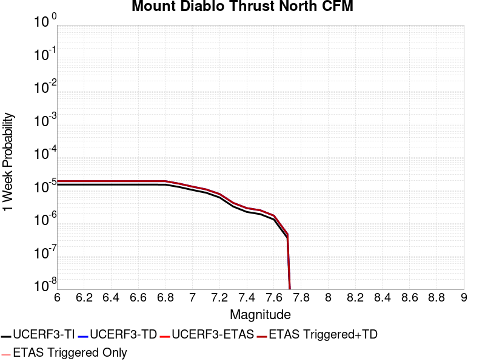 | 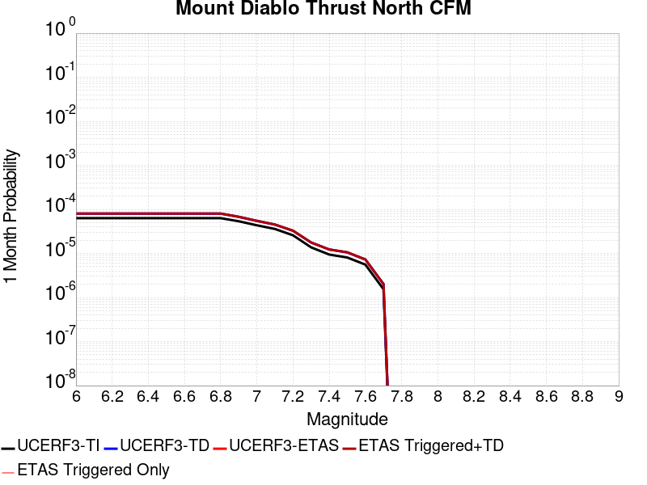 | 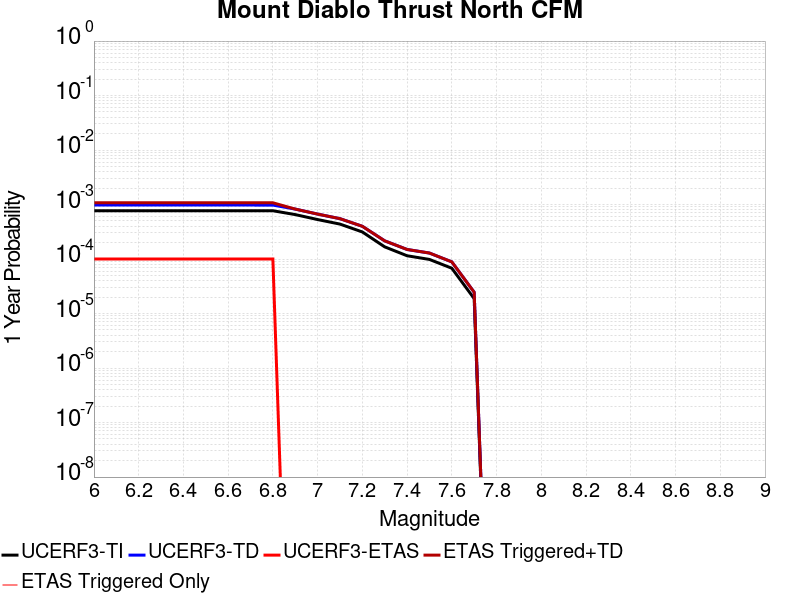 | 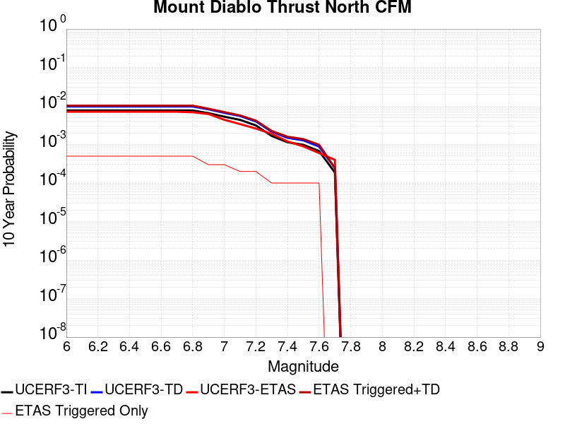 |

| Magnitude | 1 wk TI Prob | 1 wk TD Prob | 1 wk ETAS Prob | 1 wk ETAS/TD Gain | 1 wk ETAS Triggered+TD | 1 wk ETAS Triggered Only | 1 mo TI Prob | 1 mo TD Prob | 1 mo ETAS Prob | 1 mo ETAS/TD Gain | 1 mo ETAS Triggered+TD | 1 mo ETAS Triggered Only | 1 yr TI Prob | 1 yr TD Prob | 1 yr ETAS Prob | 1 yr ETAS/TD Gain | 1 yr ETAS Triggered+TD | 1 yr ETAS Triggered Only | 10 yr TI Prob | 10 yr TD Prob | 10 yr ETAS Prob | 10 yr ETAS/TD Gain | 10 yr ETAS Triggered+TD | 10 yr ETAS Triggered Only |
|-----|-----|-----|-----|-----|-----|-----|-----|-----|-----|-----|-----|-----|-----|-----|-----|-----|-----|-----|-----|-----|-----|-----|-----|-----|
| 6.0 | 1.479628E-5 | 1.878381E-5 | 0.0 | 0.0 | 1.878381E-5 | 0.0 | 6.341109E-5 | 8.0499616E-5 | 0.0 | 0.0 | 8.0499616E-5 | 0.0 | 7.717565E-4 | 9.796517E-4 | 9.0E-4 | 0.9186939 | 0.0010795537 | 1.0E-4 | 0.007690818 | 0.009753633 | 0.0071 | 0.7279339 | 0.010248756 | 5.0E-4 |
| 6.1 | 1.479628E-5 | 1.878381E-5 | 0.0 | 0.0 | 1.878381E-5 | 0.0 | 6.341109E-5 | 8.0499616E-5 | 0.0 | 0.0 | 8.0499616E-5 | 0.0 | 7.717565E-4 | 9.796517E-4 | 9.0E-4 | 0.9186939 | 0.0010795537 | 1.0E-4 | 0.007690818 | 0.009753633 | 0.0071 | 0.7279339 | 0.010248756 | 5.0E-4 |
| 6.2 | 1.479628E-5 | 1.878381E-5 | 0.0 | 0.0 | 1.878381E-5 | 0.0 | 6.341109E-5 | 8.0499616E-5 | 0.0 | 0.0 | 8.0499616E-5 | 0.0 | 7.717565E-4 | 9.796517E-4 | 9.0E-4 | 0.9186939 | 0.0010795537 | 1.0E-4 | 0.007690818 | 0.009753633 | 0.0071 | 0.7279339 | 0.010248756 | 5.0E-4 |
| 6.3 | 1.479628E-5 | 1.878381E-5 | 0.0 | 0.0 | 1.878381E-5 | 0.0 | 6.341109E-5 | 8.0499616E-5 | 0.0 | 0.0 | 8.0499616E-5 | 0.0 | 7.717565E-4 | 9.796517E-4 | 9.0E-4 | 0.9186939 | 0.0010795537 | 1.0E-4 | 0.007690818 | 0.009753633 | 0.0071 | 0.7279339 | 0.010248756 | 5.0E-4 |
| 6.4 | 1.479628E-5 | 1.878381E-5 | 0.0 | 0.0 | 1.878381E-5 | 0.0 | 6.341109E-5 | 8.0499616E-5 | 0.0 | 0.0 | 8.0499616E-5 | 0.0 | 7.717565E-4 | 9.796517E-4 | 9.0E-4 | 0.9186939 | 0.0010795537 | 1.0E-4 | 0.007690818 | 0.009753633 | 0.0071 | 0.7279339 | 0.010248756 | 5.0E-4 |
| 6.5 | 1.479628E-5 | 1.878381E-5 | 0.0 | 0.0 | 1.878381E-5 | 0.0 | 6.341109E-5 | 8.0499616E-5 | 0.0 | 0.0 | 8.0499616E-5 | 0.0 | 7.717565E-4 | 9.796517E-4 | 9.0E-4 | 0.9186939 | 0.0010795537 | 1.0E-4 | 0.007690818 | 0.009753633 | 0.0071 | 0.7279339 | 0.010248756 | 5.0E-4 |
| 6.6 | 1.479016E-5 | 1.877692E-5 | 0.0 | 0.0 | 1.877692E-5 | 0.0 | 6.338486E-5 | 8.047008E-5 | 0.0 | 0.0 | 8.047008E-5 | 0.0 | 7.714374E-4 | 9.792924E-4 | 9.0E-4 | 0.91903085 | 0.0010791946 | 1.0E-4 | 0.007687649 | 0.009750073 | 0.0071 | 0.7281997 | 0.010245197 | 5.0E-4 |
| 6.7 | 1.479016E-5 | 1.877692E-5 | 0.0 | 0.0 | 1.877692E-5 | 0.0 | 6.338486E-5 | 8.047008E-5 | 0.0 | 0.0 | 8.047008E-5 | 0.0 | 7.714374E-4 | 9.792924E-4 | 9.0E-4 | 0.91903085 | 0.0010791946 | 1.0E-4 | 0.007687649 | 0.009750073 | 0.0071 | 0.7281997 | 0.010245197 | 5.0E-4 |
| 6.8 | 1.4771667E-5 | 1.8755683E-5 | 0.0 | 0.0 | 1.8755683E-5 | 0.0 | 6.330561E-5 | 8.0379075E-5 | 0.0 | 0.0 | 8.0379075E-5 | 0.0 | 7.704732E-4 | 9.781854E-4 | 8.0E-4 | 0.8178408 | 0.0010780876 | 1.0E-4 | 0.007678074 | 0.0097391 | 0.0069 | 0.70848435 | 0.01023423 | 5.0E-4 |
| 6.9 | 1.2548234E-5 | 1.583552E-5 | 0.0 | 0.0 | 1.583552E-5 | 0.0 | 5.3777036E-5 | 6.786476E-5 | 0.0 | 0.0 | 6.786476E-5 | 0.0 | 6.545387E-4 | 8.259439E-4 | 7.0E-4 | 0.8475152 | 8.259439E-4 | 0.0 | 0.006526142 | 0.008229812 | 0.0062 | 0.7533587 | 0.008527342 | 3.0E-4 |
| 7.0 | 1.01754185E-5 | 1.2818516E-5 | 0.0 | 0.0 | 1.2818516E-5 | 0.0 | 4.360821E-5 | 5.493535E-5 | 0.0 | 0.0 | 5.493535E-5 | 0.0 | 5.308006E-4 | 6.686343E-4 | 5.0E-4 | 0.74779296 | 6.686343E-4 | 0.0 | 0.005295345 | 0.006667354 | 0.0044 | 0.65993196 | 0.006965354 | 3.0E-4 |
| 7.1 | 8.398341E-6 | 1.0562533E-5 | 0.0 | 0.0 | 1.0562533E-5 | 0.0 | 3.5992394E-5 | 4.526722E-5 | 0.0 | 0.0 | 4.526722E-5 | 0.0 | 4.3811928E-4 | 5.5099017E-4 | 5.0E-4 | 0.90745723 | 5.5099017E-4 | 0.0 | 0.0043725655 | 0.005496894 | 0.0034 | 0.6185311 | 0.0056957947 | 2.0E-4 |
| 7.2 | 6.024759E-6 | 7.655191E-6 | 0.0 | 0.0 | 7.655191E-6 | 0.0 | 2.582014E-5 | 3.2807555E-5 | 0.0 | 0.0 | 3.2807555E-5 | 0.0 | 3.1431485E-4 | 3.9935947E-4 | 3.0E-4 | 0.75120294 | 3.9935947E-4 | 0.0 | 0.0031387066 | 0.0039869426 | 0.0026 | 0.65212876 | 0.004186145 | 2.0E-4 |
| 7.3 | 3.2099704E-6 | 4.1376225E-6 | 0.0 | 0.0 | 4.1376225E-6 | 0.0 | 1.3756943E-5 | 1.7732547E-5 | 0.0 | 0.0 | 1.7732547E-5 | 0.0 | 1.674779E-4 | 2.1587255E-4 | 3.0E-4 | 1.3897089 | 2.1587255E-4 | 0.0 | 0.0016735174 | 0.0021571163 | 0.0019 | 0.88080555 | 0.0022569005 | 1.0E-4 |
| 7.4 | 2.2041513E-6 | 2.875226E-6 | 0.0 | 0.0 | 2.875226E-6 | 0.0 | 9.4463285E-6 | 1.232234E-5 | 0.0 | 0.0 | 1.232234E-5 | 0.0 | 1.1500298E-4 | 1.5001424E-4 | 2.0E-4 | 1.3332068 | 1.5001424E-4 | 0.0 | 0.0011494348 | 0.0014994598 | 0.0012 | 0.8002882 | 0.0015993098 | 1.0E-4 |
| 7.5 | 1.8869501E-6 | 2.4710619E-6 | 0.0 | 0.0 | 2.4710619E-6 | 0.0 | 8.086904E-6 | 1.0590223E-5 | 0.0 | 0.0 | 1.0590223E-5 | 0.0 | 9.845361E-5 | 1.289284E-4 | 1.0E-4 | 0.77562433 | 1.289284E-4 | 0.0 | 9.841E-4 | 0.001288866 | 9.0E-4 | 0.69828826 | 0.0013887371 | 1.0E-4 |
| 7.6 | 1.3012458E-6 | 1.7018185E-6 | 0.0 | 0.0 | 1.7018185E-6 | 0.0 | 5.576756E-6 | 7.2934877E-6 | 0.0 | 0.0 | 7.2934877E-6 | 0.0 | 6.7894885E-5 | 8.8794644E-5 | 1.0E-4 | 1.126194 | 8.8794644E-5 | 0.0 | 6.787415E-4 | 8.8790123E-4 | 6.0E-4 | 0.67575085 | 9.878124E-4 | 1.0E-4 |
| 7.7 | 3.603383E-7 | 4.7198654E-7 | 0.0 | 0.0 | 4.7198654E-7 | 0.0 | 1.5443061E-6 | 2.0227978E-6 | 0.0 | 0.0 | 2.0227978E-6 | 0.0 | 1.8801764E-5 | 2.4627294E-5 | 1.0E-4 | 4.0605354 | 2.4627294E-5 | 0.0 | 1.8800174E-4 | 2.4625662E-4 | 4.0E-4 | 1.6243219 | 2.4625662E-4 | 0.0 |

## Cleghorn
*[(top)](#table-of-contents)*

| 1 Week | 1 Month | 1 Year | 10 Year |
|-----|-----|-----|-----|
| 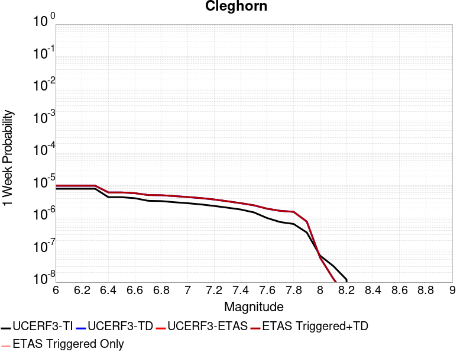 | 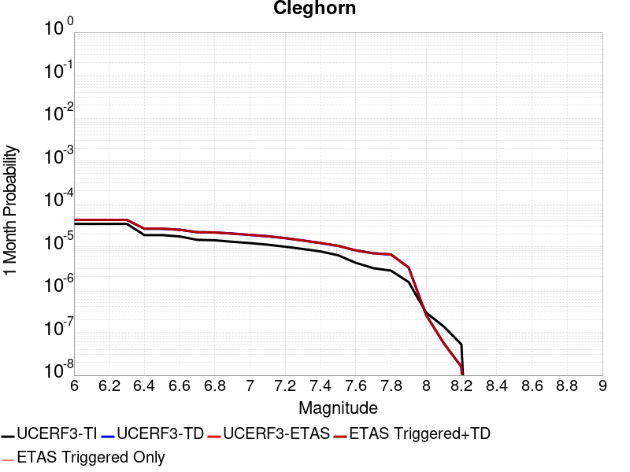 | 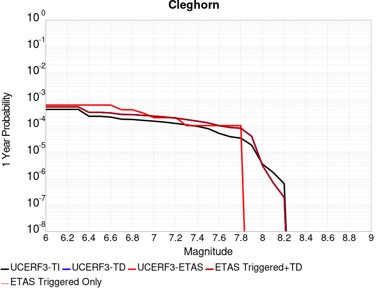 | 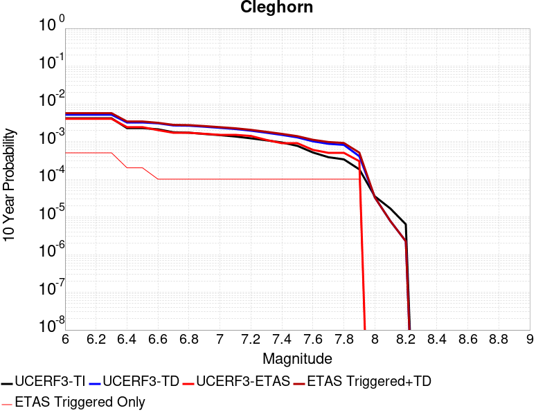 |

| Magnitude | 1 wk TI Prob | 1 wk TD Prob | 1 wk ETAS Prob | 1 wk ETAS/TD Gain | 1 wk ETAS Triggered+TD | 1 wk ETAS Triggered Only | 1 mo TI Prob | 1 mo TD Prob | 1 mo ETAS Prob | 1 mo ETAS/TD Gain | 1 mo ETAS Triggered+TD | 1 mo ETAS Triggered Only | 1 yr TI Prob | 1 yr TD Prob | 1 yr ETAS Prob | 1 yr ETAS/TD Gain | 1 yr ETAS Triggered+TD | 1 yr ETAS Triggered Only | 10 yr TI Prob | 10 yr TD Prob | 10 yr ETAS Prob | 10 yr ETAS/TD Gain | 10 yr ETAS Triggered+TD | 10 yr ETAS Triggered Only |
|-----|-----|-----|-----|-----|-----|-----|-----|-----|-----|-----|-----|-----|-----|-----|-----|-----|-----|-----|-----|-----|-----|-----|-----|-----|
| 6.0 | 7.9267165E-6 | 9.850012E-6 | 0.0 | 0.0 | 9.850012E-6 | 0.0 | 3.39712E-5 | 4.2213713E-5 | 0.0 | 0.0 | 4.2213713E-5 | 0.0 | 4.1352084E-4 | 5.138414E-4 | 6.0E-4 | 1.1676755 | 5.138414E-4 | 0.0 | 0.004127522 | 0.005141397 | 0.004 | 0.7779987 | 0.005638826 | 5.0E-4 |
| 6.1 | 7.9267165E-6 | 9.850012E-6 | 0.0 | 0.0 | 9.850012E-6 | 0.0 | 3.39712E-5 | 4.2213713E-5 | 0.0 | 0.0 | 4.2213713E-5 | 0.0 | 4.1352084E-4 | 5.138414E-4 | 6.0E-4 | 1.1676755 | 5.138414E-4 | 0.0 | 0.004127522 | 0.005141397 | 0.004 | 0.7779987 | 0.005638826 | 5.0E-4 |
| 6.2 | 7.9267165E-6 | 9.850012E-6 | 0.0 | 0.0 | 9.850012E-6 | 0.0 | 3.39712E-5 | 4.2213713E-5 | 0.0 | 0.0 | 4.2213713E-5 | 0.0 | 4.1352084E-4 | 5.138414E-4 | 6.0E-4 | 1.1676755 | 5.138414E-4 | 0.0 | 0.004127522 | 0.005141397 | 0.004 | 0.7779987 | 0.005638826 | 5.0E-4 |
| 6.3 | 7.9267165E-6 | 9.850012E-6 | 0.0 | 0.0 | 9.850012E-6 | 0.0 | 3.39712E-5 | 4.2213713E-5 | 0.0 | 0.0 | 4.2213713E-5 | 0.0 | 4.1352084E-4 | 5.138414E-4 | 6.0E-4 | 1.1676755 | 5.138414E-4 | 0.0 | 0.004127522 | 0.005141397 | 0.004 | 0.7779987 | 0.005638826 | 5.0E-4 |
| 6.4 | 4.3445207E-6 | 6.109533E-6 | 0.0 | 0.0 | 6.109533E-6 | 0.0 | 1.8619241E-5 | 2.6183456E-5 | 0.0 | 0.0 | 2.6183456E-5 | 0.0 | 2.2666567E-4 | 3.1873796E-4 | 6.0E-4 | 1.8824241 | 3.1873796E-4 | 0.0 | 0.0022643462 | 0.0031967484 | 0.0024 | 0.7507629 | 0.0033961092 | 2.0E-4 |
| 6.5 | 4.3445207E-6 | 6.109533E-6 | 0.0 | 0.0 | 6.109533E-6 | 0.0 | 1.8619241E-5 | 2.6183456E-5 | 0.0 | 0.0 | 2.6183456E-5 | 0.0 | 2.2666567E-4 | 3.1873796E-4 | 6.0E-4 | 1.8824241 | 3.1873796E-4 | 0.0 | 0.0022643462 | 0.0031967484 | 0.0024 | 0.7507629 | 0.0033961092 | 2.0E-4 |
| 6.6 | 4.040109E-6 | 5.7919124E-6 | 0.0 | 0.0 | 5.7919124E-6 | 0.0 | 1.7314638E-5 | 2.4822251E-5 | 0.0 | 0.0 | 2.4822251E-5 | 0.0 | 2.1078532E-4 | 3.0216994E-4 | 6.0E-4 | 1.9856377 | 3.0216994E-4 | 0.0 | 0.002105855 | 0.003031525 | 0.002 | 0.65973395 | 0.0031312217 | 1.0E-4 |
| 6.7 | 3.3632055E-6 | 5.0853464E-6 | 0.0 | 0.0 | 5.0853464E-6 | 0.0 | 1.4413658E-5 | 2.1794162E-5 | 0.0 | 0.0 | 2.1794162E-5 | 0.0 | 1.7547216E-4 | 2.6531194E-4 | 4.0E-4 | 1.5076593 | 2.6531194E-4 | 0.0 | 0.0017533366 | 0.0026638298 | 0.0017 | 0.6381789 | 0.0027635635 | 1.0E-4 |
| 6.8 | 3.2902772E-6 | 5.007242E-6 | 0.0 | 0.0 | 5.007242E-6 | 0.0 | 1.4101111E-5 | 2.1459435E-5 | 0.0 | 0.0 | 2.1459435E-5 | 0.0 | 1.716675E-4 | 2.612376E-4 | 4.0E-4 | 1.5311731 | 2.612376E-4 | 0.0 | 0.0017153495 | 0.002623183 | 0.0017 | 0.64806765 | 0.0027229206 | 1.0E-4 |
| 6.9 | 3.031547E-6 | 4.7087196E-6 | 0.0 | 0.0 | 4.7087196E-6 | 0.0 | 1.299228E-5 | 2.0180072E-5 | 0.0 | 0.0 | 2.0180072E-5 | 0.0 | 1.5816953E-4 | 2.4566494E-4 | 3.0E-4 | 1.2211754 | 2.4566494E-4 | 0.0 | 0.00158057 | 0.0024678095 | 0.0016 | 0.6483483 | 0.0025675627 | 1.0E-4 |
| 7.0 | 2.8259715E-6 | 4.3875466E-6 | 0.0 | 0.0 | 4.3875466E-6 | 0.0 | 1.211125E-5 | 1.8803637E-5 | 0.0 | 0.0 | 1.8803637E-5 | 0.0 | 1.4744449E-4 | 2.2891046E-4 | 2.0E-4 | 0.8737041 | 2.2891046E-4 | 0.0 | 0.001473467 | 0.002300621 | 0.0015 | 0.65199786 | 0.002400391 | 1.0E-4 |
| 7.1 | 2.5962665E-6 | 4.082434E-6 | 0.0 | 0.0 | 4.082434E-6 | 0.0 | 1.1126809E-5 | 1.749603E-5 | 0.0 | 0.0 | 1.749603E-5 | 0.0 | 1.3546048E-4 | 2.1299356E-4 | 2.0E-4 | 0.93899554 | 2.1299356E-4 | 0.0 | 0.0013537793 | 0.0021417716 | 0.0015 | 0.70035475 | 0.0022415575 | 1.0E-4 |
| 7.2 | 2.3247253E-6 | 3.692566E-6 | 0.0 | 0.0 | 3.692566E-6 | 0.0 | 9.96307E-6 | 1.5825188E-5 | 0.0 | 0.0 | 1.5825188E-5 | 0.0 | 1.21293626E-4 | 1.9265481E-4 | 2.0E-4 | 1.0381261 | 1.9265481E-4 | 0.0 | 0.0012122744 | 0.0019387767 | 0.0014 | 0.7221048 | 0.002038583 | 1.0E-4 |
| 7.3 | 2.056928E-6 | 3.2504063E-6 | 0.0 | 0.0 | 3.2504063E-6 | 0.0 | 8.815376E-6 | 1.3930239E-5 | 0.0 | 0.0 | 1.3930239E-5 | 0.0 | 1.0732192E-4 | 1.6958763E-4 | 1.0E-4 | 0.58966565 | 1.6958763E-4 | 0.0 | 0.001072701 | 0.0017085471 | 0.0011 | 0.6438219 | 0.0018083763 | 1.0E-4 |
| 7.4 | 1.8055999E-6 | 2.839975E-6 | 0.0 | 0.0 | 2.839975E-6 | 0.0 | 7.738263E-6 | 1.2171266E-5 | 0.0 | 0.0 | 1.2171266E-5 | 0.0 | 9.4209274E-5 | 1.4817521E-4 | 1.0E-4 | 0.6748767 | 1.4817521E-4 | 0.0 | 9.4169343E-4 | 0.0014948767 | 9.0E-4 | 0.6020564 | 0.0015947272 | 1.0E-4 |
| 7.5 | 1.4683443E-6 | 2.4388444E-6 | 0.0 | 0.0 | 2.4388444E-6 | 0.0 | 6.292889E-6 | 1.0452149E-5 | 0.0 | 0.0 | 1.0452149E-5 | 0.0 | 7.661323E-5 | 1.2724758E-4 | 1.0E-4 | 0.7858696 | 1.2724758E-4 | 0.0 | 7.658682E-4 | 0.0012858999 | 9.0E-4 | 0.69989896 | 0.0013857712 | 1.0E-4 |
| 7.6 | 9.804088E-7 | 1.9141562E-6 | 0.0 | 0.0 | 1.9141562E-6 | 0.0 | 4.201745E-6 | 8.203501E-6 | 0.0 | 0.0 | 8.203501E-6 | 0.0 | 5.1155046E-5 | 9.98731E-5 | 1.0E-4 | 1.0012707 | 9.98731E-5 | 0.0 | 5.114327E-4 | 0.0010124661 | 6.0E-4 | 0.5926124 | 0.0011123649 | 1.0E-4 |
| 7.7 | 7.3434086E-7 | 1.6421077E-6 | 0.0 | 0.0 | 1.6421077E-6 | 0.0 | 3.1471714E-6 | 7.0375854E-6 | 0.0 | 0.0 | 7.0375854E-6 | 0.0 | 3.831614E-5 | 8.567926E-5 | 1.0E-4 | 1.1671436 | 8.567926E-5 | 0.0 | 3.8309532E-4 | 8.706819E-4 | 5.0E-4 | 0.57426256 | 9.705948E-4 | 1.0E-4 |
| 7.8 | 6.434184E-7 | 1.5351295E-6 | 0.0 | 0.0 | 1.5351295E-6 | 0.0 | 2.7575045E-6 | 6.57911E-6 | 0.0 | 0.0 | 6.57911E-6 | 0.0 | 3.35721E-5 | 8.009775E-5 | 1.0E-4 | 1.2484746 | 8.009775E-5 | 0.0 | 3.3567028E-4 | 8.145626E-4 | 5.0E-4 | 0.6138264 | 9.144811E-4 | 1.0E-4 |
| 7.9 | 3.4943926E-7 | 7.645218E-7 | 0.0 | 0.0 | 7.645218E-7 | 0.0 | 1.497596E-6 | 3.276518E-6 | 0.0 | 0.0 | 3.276518E-6 | 0.0 | 1.8233079E-5 | 3.9890885E-5 | 0.0 | 0.0 | 3.9890885E-5 | 0.0 | 1.8231584E-4 | 4.0759557E-4 | 3.0E-4 | 0.7360237 | 5.075548E-4 | 1.0E-4 |
| 8.0 | 6.717524E-8 | 5.920716E-8 | 0.0 | 0.0 | 5.920716E-8 | 0.0 | 2.8789387E-7 | 2.5374496E-7 | 0.0 | 0.0 | 2.5374496E-7 | 0.0 | 3.505102E-6 | 3.0893405E-6 | 0.0 | 0.0 | 3.0893405E-6 | 0.0 | 3.5050467E-5 | 3.3169323E-5 | 0.0 | 0.0 | 3.3169323E-5 | 0.0 |
| 8.1 | 3.1984914E-8 | 1.3216883E-8 | 0.0 | 0.0 | 1.3216883E-8 | 0.0 | 1.370782E-7 | 5.664378E-8 | 0.0 | 0.0 | 5.664378E-8 | 0.0 | 1.6689258E-6 | 6.8963783E-7 | 0.0 | 0.0 | 6.8963783E-7 | 0.0 | 1.6689133E-5 | 7.893016E-6 | 0.0 | 0.0 | 7.893016E-6 | 0.0 |
| 8.2 | 1.21887656E-8 | 3.7295784E-9 | 0.0 | 0.0 | 3.7295784E-9 | 0.0 | 5.2237567E-8 | 1.5983906E-8 | 0.0 | 0.0 | 1.5983906E-8 | 0.0 | 6.359922E-7 | 1.9460404E-7 | 0.0 | 0.0 | 1.9460404E-7 | 0.0 | 6.3599036E-6 | 2.293744E-6 | 0.0 | 0.0 | 2.293744E-6 | 0.0 |

## Point Reyes 2011 CFM
*[(top)](#table-of-contents)*

| 1 Week | 1 Month | 1 Year | 10 Year |
|-----|-----|-----|-----|
| 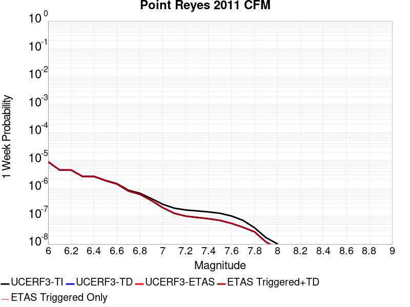 | 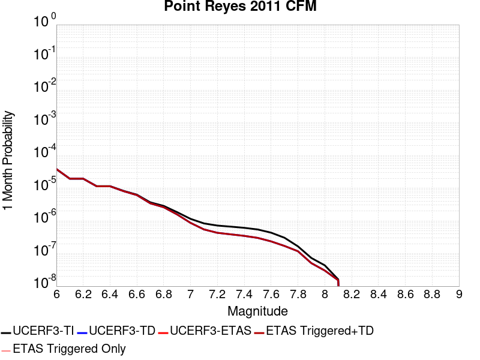 | 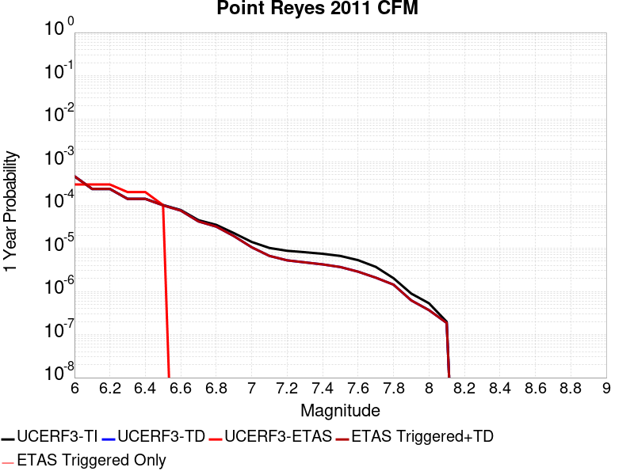 | 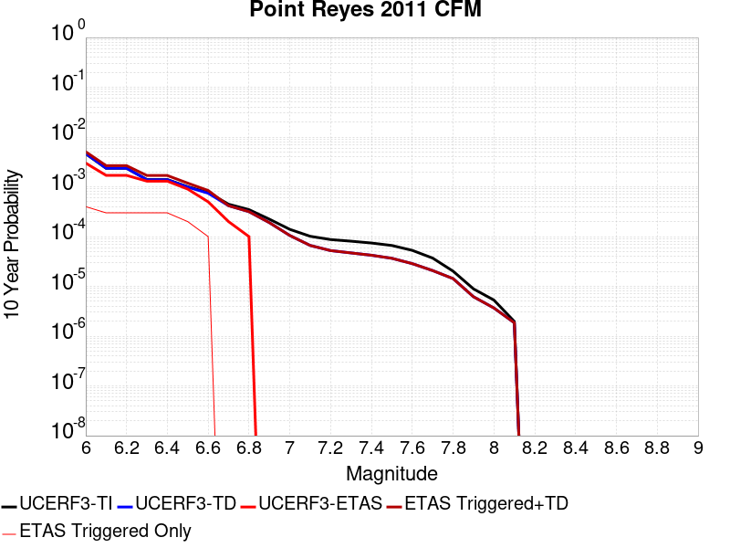 |

| Magnitude | 1 wk TI Prob | 1 wk TD Prob | 1 wk ETAS Prob | 1 wk ETAS/TD Gain | 1 wk ETAS Triggered+TD | 1 wk ETAS Triggered Only | 1 mo TI Prob | 1 mo TD Prob | 1 mo ETAS Prob | 1 mo ETAS/TD Gain | 1 mo ETAS Triggered+TD | 1 mo ETAS Triggered Only | 1 yr TI Prob | 1 yr TD Prob | 1 yr ETAS Prob | 1 yr ETAS/TD Gain | 1 yr ETAS Triggered+TD | 1 yr ETAS Triggered Only | 10 yr TI Prob | 10 yr TD Prob | 10 yr ETAS Prob | 10 yr ETAS/TD Gain | 10 yr ETAS Triggered+TD | 10 yr ETAS Triggered Only |
|-----|-----|-----|-----|-----|-----|-----|-----|-----|-----|-----|-----|-----|-----|-----|-----|-----|-----|-----|-----|-----|-----|-----|-----|-----|
| 6.0 | 8.8644965E-6 | 8.967755E-6 | 0.0 | 0.0 | 8.967755E-6 | 0.0 | 3.7990147E-5 | 3.8432703E-5 | 0.0 | 0.0 | 3.8432703E-5 | 0.0 | 4.624319E-4 | 4.67824E-4 | 3.0E-4 | 0.6412668 | 4.67824E-4 | 0.0 | 0.0046147075 | 0.0046690204 | 0.003 | 0.64253306 | 0.0050671524 | 4.0E-4 |
| 6.1 | 4.526405E-6 | 4.539621E-6 | 0.0 | 0.0 | 4.539621E-6 | 0.0 | 1.9398734E-5 | 1.9455378E-5 | 0.0 | 0.0 | 1.9455378E-5 | 0.0 | 2.36154E-4 | 2.3684453E-4 | 3.0E-4 | 1.2666537 | 2.3684453E-4 | 0.0 | 0.002359032 | 0.0023660276 | 0.0017 | 0.7185039 | 0.0026653176 | 3.0E-4 |
| 6.2 | 4.526405E-6 | 4.539621E-6 | 0.0 | 0.0 | 4.539621E-6 | 0.0 | 1.9398734E-5 | 1.9455378E-5 | 0.0 | 0.0 | 1.9455378E-5 | 0.0 | 2.36154E-4 | 2.3684453E-4 | 3.0E-4 | 1.2666537 | 2.3684453E-4 | 0.0 | 0.002359032 | 0.0023660276 | 0.0017 | 0.7185039 | 0.0026653176 | 3.0E-4 |
| 6.3 | 2.6842322E-6 | 2.661002E-6 | 0.0 | 0.0 | 2.661002E-6 | 0.0 | 1.1503801E-5 | 1.1404246E-5 | 0.0 | 0.0 | 1.1404246E-5 | 0.0 | 1.4004979E-4 | 1.3883803E-4 | 2.0E-4 | 1.4405274 | 1.3883803E-4 | 0.0 | 0.0013996155 | 0.001387535 | 0.0013 | 0.93691325 | 0.0016871188 | 3.0E-4 |
| 6.4 | 2.6842322E-6 | 2.661002E-6 | 0.0 | 0.0 | 2.661002E-6 | 0.0 | 1.1503801E-5 | 1.1404246E-5 | 0.0 | 0.0 | 1.1404246E-5 | 0.0 | 1.4004979E-4 | 1.3883803E-4 | 2.0E-4 | 1.4405274 | 1.3883803E-4 | 0.0 | 0.0013996155 | 0.001387535 | 0.0013 | 0.93691325 | 0.0016871188 | 3.0E-4 |
| 6.5 | 1.9281833E-6 | 1.8909228E-6 | 0.0 | 0.0 | 1.8909228E-6 | 0.0 | 8.263617E-6 | 8.103931E-6 | 0.0 | 0.0 | 8.103931E-6 | 0.0 | 1.0060489E-4 | 9.8660974E-5 | 1.0E-4 | 1.013572 | 9.8660974E-5 | 0.0 | 0.0010055936 | 9.861827E-4 | 9.0E-4 | 0.91260976 | 0.0011859855 | 2.0E-4 |
| 6.6 | 1.4726726E-6 | 1.4272372E-6 | 0.0 | 0.0 | 1.4272372E-6 | 0.0 | 6.3114385E-6 | 6.1167166E-6 | 0.0 | 0.0 | 6.1167166E-6 | 0.0 | 7.683905E-5 | 7.446853E-5 | 0.0 | 0.0 | 7.446853E-5 | 0.0 | 7.6812494E-4 | 7.4444315E-4 | 5.0E-4 | 0.67164296 | 8.443687E-4 | 1.0E-4 |
| 6.7 | 8.572307E-7 | 8.0097806E-7 | 0.0 | 0.0 | 8.0097806E-7 | 0.0 | 3.6738406E-6 | 3.4327586E-6 | 0.0 | 0.0 | 3.4327586E-6 | 0.0 | 4.472809E-5 | 4.179305E-5 | 0.0 | 0.0 | 4.179305E-5 | 0.0 | 4.471909E-4 | 4.1785606E-4 | 2.0E-4 | 0.4786337 | 4.1785606E-4 | 0.0 |
| 6.8 | 6.6745434E-7 | 6.079801E-7 | 0.0 | 0.0 | 6.079801E-7 | 0.0 | 2.8605155E-6 | 2.6056264E-6 | 0.0 | 0.0 | 2.6056264E-6 | 0.0 | 3.482622E-5 | 3.172305E-5 | 0.0 | 0.0 | 3.172305E-5 | 0.0 | 3.4820763E-4 | 3.1718877E-4 | 1.0E-4 | 0.31526968 | 3.1718877E-4 | 0.0 |
| 6.9 | 4.291521E-7 | 3.6560098E-7 | 0.0 | 0.0 | 3.6560098E-7 | 0.0 | 1.839222E-6 | 1.5668604E-6 | 0.0 | 0.0 | 1.5668604E-6 | 0.0 | 2.2392298E-5 | 1.9076362E-5 | 0.0 | 0.0 | 1.9076362E-5 | 0.0 | 2.2390042E-4 | 1.9075014E-4 | 0.0 | 0.0 | 1.9075014E-4 | 0.0 |
| 7.0 | 2.6812808E-7 | 2.0210985E-7 | 0.0 | 0.0 | 2.0210985E-7 | 0.0 | 1.1491198E-6 | 8.6618473E-7 | 0.0 | 0.0 | 8.6618473E-7 | 0.0 | 1.3990444E-5 | 1.0545748E-5 | 0.0 | 0.0 | 1.0545748E-5 | 0.0 | 1.3989564E-4 | 1.0545508E-4 | 0.0 | 0.0 | 1.0545508E-4 | 0.0 |
| 7.1 | 1.9451231E-7 | 1.2748787E-7 | 0.0 | 0.0 | 1.2748787E-7 | 0.0 | 8.336239E-7 | 5.4637644E-7 | 0.0 | 0.0 | 5.4637644E-7 | 0.0 | 1.0149324E-5 | 6.652113E-6 | 0.0 | 0.0 | 6.652113E-6 | 0.0 | 1.014886E-4 | 6.652166E-5 | 0.0 | 0.0 | 6.652166E-5 | 0.0 |
| 7.2 | 1.6715143E-7 | 1.0065785E-7 | 0.0 | 0.0 | 1.0065785E-7 | 0.0 | 7.1636305E-7 | 4.313907E-7 | 0.0 | 0.0 | 4.313907E-7 | 0.0 | 8.721685E-6 | 5.252169E-6 | 0.0 | 0.0 | 5.252169E-6 | 0.0 | 8.721343E-5 | 5.2522966E-5 | 0.0 | 0.0 | 5.2522966E-5 | 0.0 |
| 7.3 | 1.5503173E-7 | 9.035704E-8 | 0.0 | 0.0 | 9.035704E-8 | 0.0 | 6.644215E-7 | 3.872444E-7 | 0.0 | 0.0 | 3.872444E-7 | 0.0 | 8.089301E-6 | 4.7146905E-6 | 0.0 | 0.0 | 4.7146905E-6 | 0.0 | 8.089007E-5 | 4.714842E-5 | 0.0 | 0.0 | 4.714842E-5 | 0.0 |
| 7.4 | 1.4251614E-7 | 8.119609E-8 | 0.0 | 0.0 | 8.119609E-8 | 0.0 | 6.1078333E-7 | 3.4798322E-7 | 0.0 | 0.0 | 3.4798322E-7 | 0.0 | 7.4362615E-6 | 4.2366873E-6 | 0.0 | 0.0 | 4.2366873E-6 | 0.0 | 7.436013E-5 | 4.236858E-5 | 0.0 | 0.0 | 4.236858E-5 | 0.0 |
| 7.5 | 1.2710186E-7 | 7.050764E-8 | 0.0 | 0.0 | 7.050764E-8 | 0.0 | 5.447221E-7 | 3.0217558E-7 | 0.0 | 0.0 | 3.0217558E-7 | 0.0 | 6.6319717E-6 | 3.6789813E-6 | 0.0 | 0.0 | 3.6789813E-6 | 0.0 | 6.6317734E-5 | 3.679172E-5 | 0.0 | 0.0 | 3.679172E-5 | 0.0 |
| 7.6 | 1.0144708E-7 | 5.5145534E-8 | 0.0 | 0.0 | 5.5145534E-8 | 0.0 | 4.347731E-7 | 2.3633798E-7 | 0.0 | 0.0 | 2.3633798E-7 | 0.0 | 5.2933497E-6 | 2.8774111E-6 | 0.0 | 0.0 | 2.8774111E-6 | 0.0 | 5.293224E-5 | 2.8776256E-5 | 0.0 | 0.0 | 2.8776256E-5 | 0.0 |
| 7.7 | 7.090527E-8 | 3.998491E-8 | 0.0 | 0.0 | 3.998491E-8 | 0.0 | 3.038797E-7 | 1.713639E-7 | 0.0 | 0.0 | 1.713639E-7 | 0.0 | 3.699729E-6 | 2.0863536E-6 | 0.0 | 0.0 | 2.0863536E-6 | 0.0 | 3.6996673E-5 | 2.0865857E-5 | 0.0 | 0.0 | 2.0865857E-5 | 0.0 |
| 7.8 | 3.8712045E-8 | 2.7578407E-8 | 0.0 | 0.0 | 2.7578407E-8 | 0.0 | 1.6590876E-7 | 1.1819318E-7 | 0.0 | 0.0 | 1.1819318E-7 | 0.0 | 2.0199373E-6 | 1.439001E-6 | 0.0 | 0.0 | 1.439001E-6 | 0.0 | 2.0199188E-5 | 1.43924335E-5 | 0.0 | 0.0 | 1.43924335E-5 | 0.0 |
| 7.9 | 1.7068782E-8 | 1.1946384E-8 | 0.0 | 0.0 | 1.1946384E-8 | 0.0 | 7.315192E-8 | 5.1198793E-8 | 0.0 | 0.0 | 5.1198793E-8 | 0.0 | 8.906242E-7 | 6.2334516E-7 | 0.0 | 0.0 | 6.2334516E-7 | 0.0 | 8.906207E-6 | 6.2359504E-6 | 0.0 | 0.0 | 6.2359504E-6 | 0.0 |
| 8.0 | 1.0172592E-8 | 7.1230426E-9 | 0.0 | 0.0 | 7.1230426E-9 | 0.0 | 4.359682E-8 | 3.0527325E-8 | 0.0 | 0.0 | 3.0527325E-8 | 0.0 | 5.3079117E-7 | 3.7167015E-7 | 0.0 | 0.0 | 3.7167015E-7 | 0.0 | 5.307899E-6 | 3.719212E-6 | 0.0 | 0.0 | 3.719212E-6 | 0.0 |
| 8.1 | 3.7861243E-9 | 3.5912435E-9 | 0.0 | 0.0 | 3.5912435E-9 | 0.0 | 1.6226247E-8 | 1.5391045E-8 | 0.0 | 0.0 | 1.5391045E-8 | 0.0 | 1.9755454E-7 | 1.8738596E-7 | 0.0 | 0.0 | 1.8738596E-7 | 0.0 | 1.9755437E-6 | 1.8758085E-6 | 0.0 | 0.0 | 1.8758085E-6 | 0.0 |

## San Jose
*[(top)](#table-of-contents)*

| 1 Week | 1 Month | 1 Year | 10 Year |
|-----|-----|-----|-----|
| 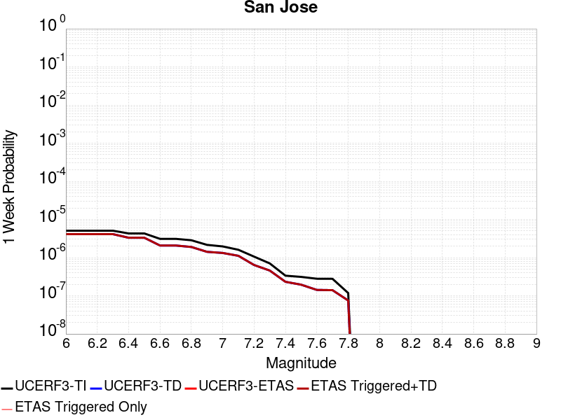 | 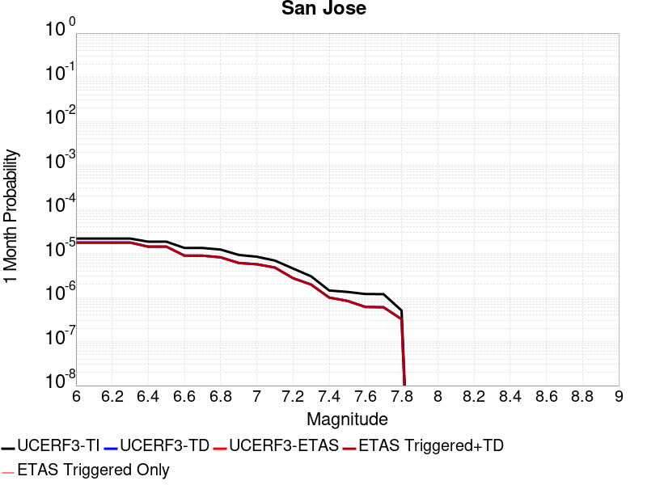 | 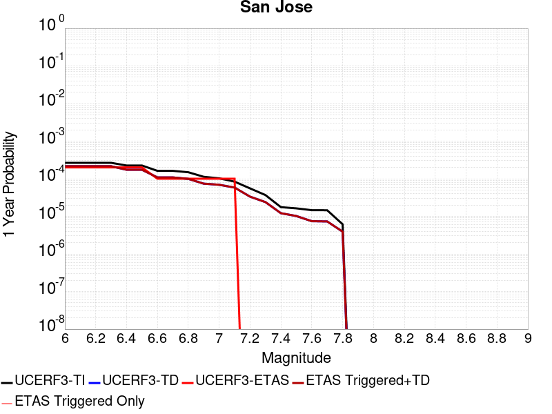 | 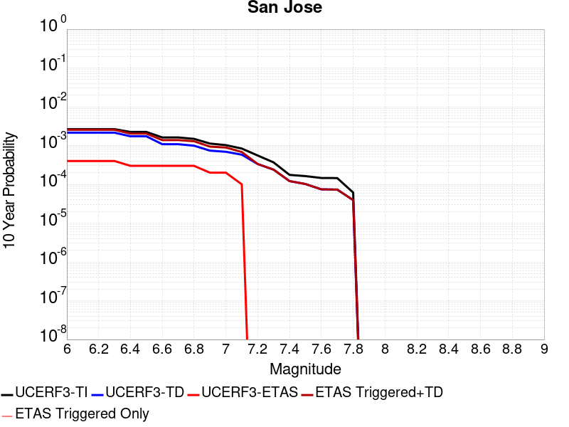 |

| Magnitude | 1 wk TI Prob | 1 wk TD Prob | 1 wk ETAS Prob | 1 wk ETAS/TD Gain | 1 wk ETAS Triggered+TD | 1 wk ETAS Triggered Only | 1 mo TI Prob | 1 mo TD Prob | 1 mo ETAS Prob | 1 mo ETAS/TD Gain | 1 mo ETAS Triggered+TD | 1 mo ETAS Triggered Only | 1 yr TI Prob | 1 yr TD Prob | 1 yr ETAS Prob | 1 yr ETAS/TD Gain | 1 yr ETAS Triggered+TD | 1 yr ETAS Triggered Only | 10 yr TI Prob | 10 yr TD Prob | 10 yr ETAS Prob | 10 yr ETAS/TD Gain | 10 yr ETAS Triggered+TD | 10 yr ETAS Triggered Only |
|-----|-----|-----|-----|-----|-----|-----|-----|-----|-----|-----|-----|-----|-----|-----|-----|-----|-----|-----|-----|-----|-----|-----|-----|-----|
| 6.0 | 5.0851277E-6 | 4.1268686E-6 | 0.0 | 0.0 | 4.1268686E-6 | 0.0 | 2.1793223E-5 | 1.7686474E-5 | 0.0 | 0.0 | 1.7686474E-5 | 0.0 | 2.653002E-4 | 2.1531417E-4 | 2.0E-4 | 0.9288752 | 2.1531417E-4 | 0.0 | 0.0026498367 | 0.0021513633 | 0.0016 | 0.74371445 | 0.0025505028 | 4.0E-4 |
| 6.1 | 5.0851277E-6 | 4.1268686E-6 | 0.0 | 0.0 | 4.1268686E-6 | 0.0 | 2.1793223E-5 | 1.7686474E-5 | 0.0 | 0.0 | 1.7686474E-5 | 0.0 | 2.653002E-4 | 2.1531417E-4 | 2.0E-4 | 0.9288752 | 2.1531417E-4 | 0.0 | 0.0026498367 | 0.0021513633 | 0.0016 | 0.74371445 | 0.0025505028 | 4.0E-4 |
| 6.2 | 5.0851277E-6 | 4.1268686E-6 | 0.0 | 0.0 | 4.1268686E-6 | 0.0 | 2.1793223E-5 | 1.7686474E-5 | 0.0 | 0.0 | 1.7686474E-5 | 0.0 | 2.653002E-4 | 2.1531417E-4 | 2.0E-4 | 0.9288752 | 2.1531417E-4 | 0.0 | 0.0026498367 | 0.0021513633 | 0.0016 | 0.74371445 | 0.0025505028 | 4.0E-4 |
| 6.3 | 5.0851277E-6 | 4.1268686E-6 | 0.0 | 0.0 | 4.1268686E-6 | 0.0 | 2.1793223E-5 | 1.7686474E-5 | 0.0 | 0.0 | 1.7686474E-5 | 0.0 | 2.653002E-4 | 2.1531417E-4 | 2.0E-4 | 0.9288752 | 2.1531417E-4 | 0.0 | 0.0026498367 | 0.0021513633 | 0.0016 | 0.74371445 | 0.0025505028 | 4.0E-4 |
| 6.4 | 4.3115124E-6 | 3.3249185E-6 | 0.0 | 0.0 | 3.3249185E-6 | 0.0 | 1.8477778E-5 | 1.4249586E-5 | 0.0 | 0.0 | 1.4249586E-5 | 0.0 | 2.2494372E-4 | 1.734771E-4 | 2.0E-4 | 1.1528898 | 1.734771E-4 | 0.0 | 0.0022471617 | 0.0017336832 | 0.0013 | 0.74984866 | 0.002033163 | 3.0E-4 |
| 6.5 | 4.3115124E-6 | 3.3249185E-6 | 0.0 | 0.0 | 3.3249185E-6 | 0.0 | 1.8477778E-5 | 1.4249586E-5 | 0.0 | 0.0 | 1.4249586E-5 | 0.0 | 2.2494372E-4 | 1.734771E-4 | 2.0E-4 | 1.1528898 | 1.734771E-4 | 0.0 | 0.0022471617 | 0.0017336832 | 0.0013 | 0.74984866 | 0.002033163 | 3.0E-4 |
| 6.6 | 3.110396E-6 | 2.081031E-6 | 0.0 | 0.0 | 2.081031E-6 | 0.0 | 1.33302E-5 | 8.918676E-6 | 0.0 | 0.0 | 8.918676E-6 | 0.0 | 1.622831E-4 | 1.0857974E-4 | 1.0E-4 | 0.9209821 | 1.0857974E-4 | 0.0 | 0.0016216465 | 0.0010853434 | 9.0E-4 | 0.8292306 | 0.0013850179 | 3.0E-4 |
| 6.7 | 3.110396E-6 | 2.081031E-6 | 0.0 | 0.0 | 2.081031E-6 | 0.0 | 1.33302E-5 | 8.918676E-6 | 0.0 | 0.0 | 8.918676E-6 | 0.0 | 1.622831E-4 | 1.0857974E-4 | 1.0E-4 | 0.9209821 | 1.0857974E-4 | 0.0 | 0.0016216465 | 0.0010853434 | 9.0E-4 | 0.8292306 | 0.0013850179 | 3.0E-4 |
| 6.8 | 2.856651E-6 | 1.9034536E-6 | 0.0 | 0.0 | 1.9034536E-6 | 0.0 | 1.2242733E-5 | 8.1576345E-6 | 0.0 | 0.0 | 8.1576345E-6 | 0.0 | 1.4904508E-4 | 9.9314915E-5 | 1.0E-4 | 1.006898 | 9.9314915E-5 | 0.0 | 0.0014894515 | 9.927789E-4 | 9.0E-4 | 0.9065463 | 0.0012924811 | 3.0E-4 |
| 6.9 | 2.1618725E-6 | 1.4196195E-6 | 0.0 | 0.0 | 1.4196195E-6 | 0.0 | 9.265135E-6 | 6.08407E-6 | 0.0 | 0.0 | 6.08407E-6 | 0.0 | 1.12797185E-4 | 7.407112E-5 | 1.0E-4 | 1.3500538 | 7.407112E-5 | 0.0 | 0.0011273995 | 7.4052205E-4 | 7.0E-4 | 0.94527906 | 9.403739E-4 | 2.0E-4 |
| 7.0 | 1.9684312E-6 | 1.3265717E-6 | 0.0 | 0.0 | 1.3265717E-6 | 0.0 | 8.436106E-6 | 5.6852955E-6 | 0.0 | 0.0 | 5.6852955E-6 | 0.0 | 1.02704755E-4 | 6.921635E-5 | 1.0E-4 | 1.4447453 | 6.921635E-5 | 0.0 | 0.001026573 | 6.9200515E-4 | 7.0E-4 | 1.0115532 | 8.9186674E-4 | 2.0E-4 |
| 7.1 | 1.6070337E-6 | 1.1164007E-6 | 0.0 | 0.0 | 1.1164007E-6 | 0.0 | 6.887269E-6 | 4.784566E-6 | 0.0 | 0.0 | 4.784566E-6 | 0.0 | 8.384928E-5 | 5.8250596E-5 | 1.0E-4 | 1.7167206 | 5.8250596E-5 | 0.0 | 8.3817646E-4 | 5.824085E-4 | 6.0E-4 | 1.0302048 | 6.8235025E-4 | 1.0E-4 |
| 7.2 | 1.0631658E-6 | 6.410364E-7 | 0.0 | 0.0 | 6.410364E-7 | 0.0 | 4.556417E-6 | 2.747296E-6 | 0.0 | 0.0 | 2.747296E-6 | 0.0 | 5.5472963E-5 | 3.344783E-5 | 0.0 | 0.0 | 3.344783E-5 | 0.0 | 5.545912E-4 | 3.3447836E-4 | 1.0E-4 | 0.298973 | 3.3447836E-4 | 0.0 |
| 7.3 | 7.060711E-7 | 4.5878235E-7 | 0.0 | 0.0 | 4.5878235E-7 | 0.0 | 3.0260155E-6 | 1.9662086E-6 | 0.0 | 0.0 | 1.9662086E-6 | 0.0 | 3.6841117E-5 | 2.3938337E-5 | 0.0 | 0.0 | 2.3938337E-5 | 0.0 | 3.6835007E-4 | 2.394075E-4 | 1.0E-4 | 0.41769785 | 2.394075E-4 | 0.0 |
| 7.4 | 3.3677085E-7 | 2.3271625E-7 | 0.0 | 0.0 | 2.3271625E-7 | 0.0 | 1.4433028E-6 | 9.97355E-7 | 0.0 | 0.0 | 9.97355E-7 | 0.0 | 1.757207E-5 | 1.2142732E-5 | 0.0 | 0.0 | 1.2142732E-5 | 0.0 | 1.7570681E-4 | 1.21469995E-4 | 1.0E-4 | 0.82324857 | 1.21469995E-4 | 0.0 |
| 7.5 | 3.129161E-7 | 1.9562214E-7 | 0.0 | 0.0 | 1.9562214E-7 | 0.0 | 1.3410682E-6 | 8.383803E-7 | 0.0 | 0.0 | 8.383803E-7 | 0.0 | 1.6327383E-5 | 1.02072345E-5 | 0.0 | 0.0 | 1.02072345E-5 | 0.0 | 1.6326184E-4 | 1.0211692E-4 | 0.0 | 0.0 | 1.0211692E-4 | 0.0 |
| 7.6 | 2.8008668E-7 | 1.4263684E-7 | 0.0 | 0.0 | 1.4263684E-7 | 0.0 | 1.2003709E-6 | 6.1130055E-7 | 0.0 | 0.0 | 6.1130055E-7 | 0.0 | 1.46144175E-5 | 7.4425607E-6 | 0.0 | 0.0 | 7.4425607E-6 | 0.0 | 1.4613457E-4 | 7.447238E-5 | 0.0 | 0.0 | 7.447238E-5 | 0.0 |
| 7.7 | 2.7852005E-7 | 1.4037964E-7 | 0.0 | 0.0 | 1.4037964E-7 | 0.0 | 1.1936568E-6 | 6.0162694E-7 | 0.0 | 0.0 | 6.0162694E-7 | 0.0 | 1.4532674E-5 | 7.3247847E-6 | 0.0 | 0.0 | 7.3247847E-6 | 0.0 | 1.4531724E-4 | 7.3294694E-5 | 0.0 | 0.0 | 7.3294694E-5 | 0.0 |
| 7.8 | 1.1810797E-7 | 7.527723E-8 | 0.0 | 0.0 | 7.527723E-8 | 0.0 | 5.0617695E-7 | 3.2261664E-7 | 0.0 | 0.0 | 3.2261664E-7 | 0.0 | 6.1626865E-6 | 3.927851E-6 | 0.0 | 0.0 | 3.927851E-6 | 0.0 | 6.162516E-5 | 3.9321614E-5 | 0.0 | 0.0 | 3.9321614E-5 | 0.0 |

## Johnson Valley (No) 2011 rev
*[(top)](#table-of-contents)*

| 1 Week | 1 Month | 1 Year | 10 Year |
|-----|-----|-----|-----|
| 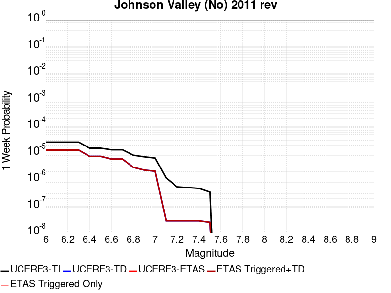 | 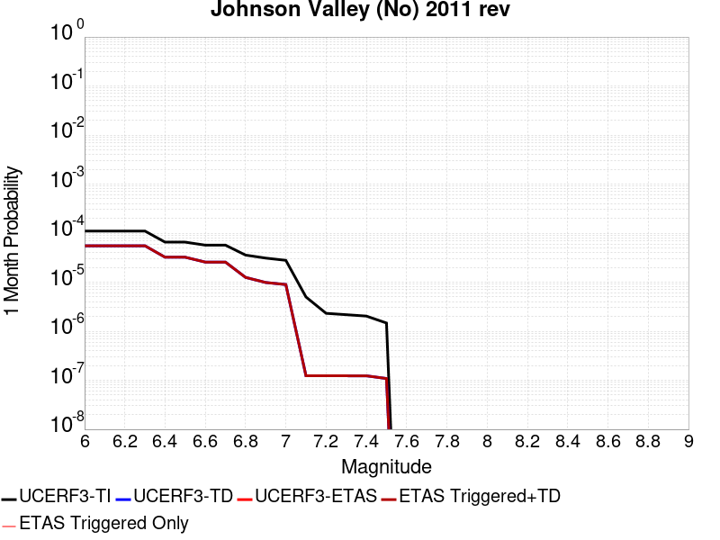 | 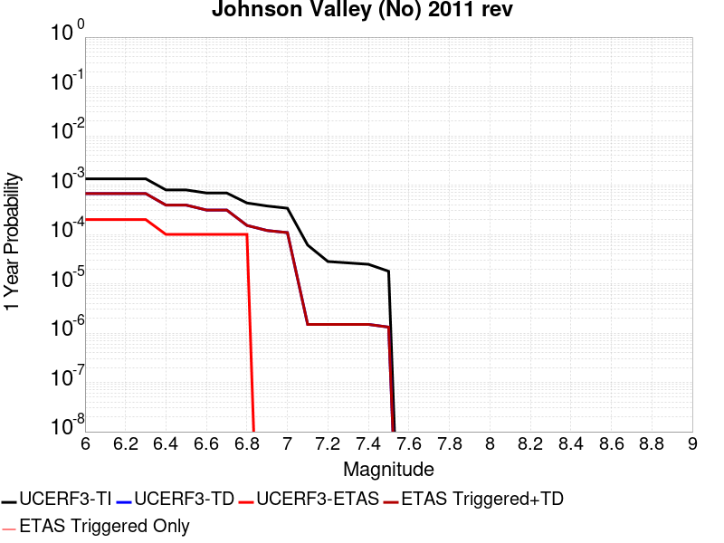 | 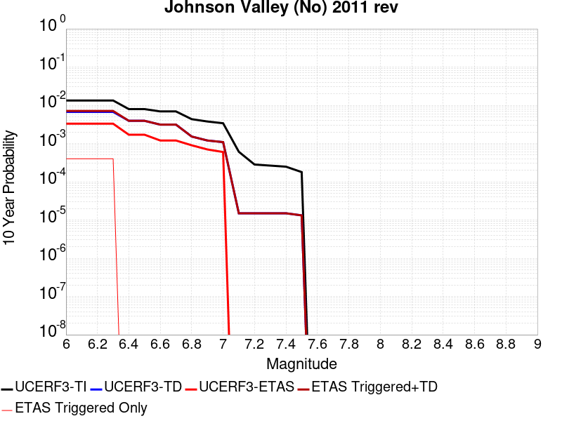 |

| Magnitude | 1 wk TI Prob | 1 wk TD Prob | 1 wk ETAS Prob | 1 wk ETAS/TD Gain | 1 wk ETAS Triggered+TD | 1 wk ETAS Triggered Only | 1 mo TI Prob | 1 mo TD Prob | 1 mo ETAS Prob | 1 mo ETAS/TD Gain | 1 mo ETAS Triggered+TD | 1 mo ETAS Triggered Only | 1 yr TI Prob | 1 yr TD Prob | 1 yr ETAS Prob | 1 yr ETAS/TD Gain | 1 yr ETAS Triggered+TD | 1 yr ETAS Triggered Only | 10 yr TI Prob | 10 yr TD Prob | 10 yr ETAS Prob | 10 yr ETAS/TD Gain | 10 yr ETAS Triggered+TD | 10 yr ETAS Triggered Only |
|-----|-----|-----|-----|-----|-----|-----|-----|-----|-----|-----|-----|-----|-----|-----|-----|-----|-----|-----|-----|-----|-----|-----|-----|-----|
| 6.0 | 2.577707E-5 | 1.2904346E-5 | 0.0 | 0.0 | 1.2904346E-5 | 0.0 | 1.1046848E-4 | 5.5303386E-5 | 0.0 | 0.0 | 5.5303386E-5 | 0.0 | 0.0013441239 | 6.7315047E-4 | 2.0E-4 | 0.2971104 | 6.7315047E-4 | 0.0 | 0.013360229 | 0.0067150253 | 0.0033 | 0.49143523 | 0.007112339 | 4.0E-4 |
| 6.1 | 2.577707E-5 | 1.2904346E-5 | 0.0 | 0.0 | 1.2904346E-5 | 0.0 | 1.1046848E-4 | 5.5303386E-5 | 0.0 | 0.0 | 5.5303386E-5 | 0.0 | 0.0013441239 | 6.7315047E-4 | 2.0E-4 | 0.2971104 | 6.7315047E-4 | 0.0 | 0.013360229 | 0.0067150253 | 0.0033 | 0.49143523 | 0.007112339 | 4.0E-4 |
| 6.2 | 2.577707E-5 | 1.2904346E-5 | 0.0 | 0.0 | 1.2904346E-5 | 0.0 | 1.1046848E-4 | 5.5303386E-5 | 0.0 | 0.0 | 5.5303386E-5 | 0.0 | 0.0013441239 | 6.7315047E-4 | 2.0E-4 | 0.2971104 | 6.7315047E-4 | 0.0 | 0.013360229 | 0.0067150253 | 0.0033 | 0.49143523 | 0.007112339 | 4.0E-4 |
| 6.3 | 2.577707E-5 | 1.2904346E-5 | 0.0 | 0.0 | 1.2904346E-5 | 0.0 | 1.1046848E-4 | 5.5303386E-5 | 0.0 | 0.0 | 5.5303386E-5 | 0.0 | 0.0013441239 | 6.7315047E-4 | 2.0E-4 | 0.2971104 | 6.7315047E-4 | 0.0 | 0.013360229 | 0.0067150253 | 0.0033 | 0.49143523 | 0.007112339 | 4.0E-4 |
| 6.4 | 1.5296591E-5 | 7.5389544E-6 | 0.0 | 0.0 | 7.5389544E-6 | 0.0 | 6.555518E-5 | 3.2309512E-5 | 0.0 | 0.0 | 3.2309512E-5 | 0.0 | 7.97842E-4 | 3.9331606E-4 | 1.0E-4 | 0.25424847 | 3.9331606E-4 | 0.0 | 0.007949836 | 0.0039280416 | 0.0017 | 0.43278563 | 0.0039280416 | 0.0 |
| 6.5 | 1.5296591E-5 | 7.5389544E-6 | 0.0 | 0.0 | 7.5389544E-6 | 0.0 | 6.555518E-5 | 3.2309512E-5 | 0.0 | 0.0 | 3.2309512E-5 | 0.0 | 7.97842E-4 | 3.9331606E-4 | 1.0E-4 | 0.25424847 | 3.9331606E-4 | 0.0 | 0.007949836 | 0.0039280416 | 0.0017 | 0.43278563 | 0.0039280416 | 0.0 |
| 6.6 | 1.3289383E-5 | 5.9936215E-6 | 0.0 | 0.0 | 5.9936215E-6 | 0.0 | 5.6953253E-5 | 2.5686792E-5 | 0.0 | 0.0 | 2.5686792E-5 | 0.0 | 6.9318525E-4 | 3.1270878E-4 | 1.0E-4 | 0.31978634 | 3.1270878E-4 | 0.0 | 0.0069102696 | 0.003124353 | 0.0012 | 0.38407955 | 0.003124353 | 0.0 |
| 6.7 | 1.3289383E-5 | 5.9936215E-6 | 0.0 | 0.0 | 5.9936215E-6 | 0.0 | 5.6953253E-5 | 2.5686792E-5 | 0.0 | 0.0 | 2.5686792E-5 | 0.0 | 6.9318525E-4 | 3.1270878E-4 | 1.0E-4 | 0.31978634 | 3.1270878E-4 | 0.0 | 0.0069102696 | 0.003124353 | 0.0012 | 0.38407955 | 0.003124353 | 0.0 |
| 6.8 | 8.330789E-6 | 2.9223422E-6 | 0.0 | 0.0 | 2.9223422E-6 | 0.0 | 3.570289E-5 | 1.2524296E-5 | 0.0 | 0.0 | 1.2524296E-5 | 0.0 | 4.34596E-4 | 1.5247836E-4 | 1.0E-4 | 0.6558308 | 1.5247836E-4 | 0.0 | 0.0043374705 | 0.0015242976 | 9.0E-4 | 0.59043586 | 0.0015242976 | 0.0 |
| 6.9 | 7.2359003E-6 | 2.3021419E-6 | 0.0 | 0.0 | 2.3021419E-6 | 0.0 | 3.1010633E-5 | 9.866315E-6 | 0.0 | 0.0 | 9.866315E-6 | 0.0 | 3.7748902E-4 | 1.20121105E-4 | 0.0 | 0.0 | 1.20121105E-4 | 0.0 | 0.0037684843 | 0.0012010849 | 7.0E-4 | 0.5828064 | 0.0012010849 | 0.0 |
| 7.0 | 6.5149957E-6 | 2.0893117E-6 | 0.0 | 0.0 | 2.0893117E-6 | 0.0 | 2.792111E-5 | 8.954192E-6 | 0.0 | 0.0 | 8.954192E-6 | 0.0 | 3.398865E-4 | 1.09017135E-4 | 0.0 | 0.0 | 1.09017135E-4 | 0.0 | 0.003393671 | 0.0010901567 | 6.0E-4 | 0.5503796 | 0.0010901567 | 0.0 |
| 7.1 | 1.1662233E-6 | 2.8823084E-8 | 0.0 | 0.0 | 2.8823084E-8 | 0.0 | 4.9980904E-6 | 1.235275E-7 | 0.0 | 0.0 | 1.235275E-7 | 0.0 | 6.0850052E-5 | 1.5039465E-6 | 0.0 | 0.0 | 1.5039465E-6 | 0.0 | 6.083339E-4 | 1.5039379E-5 | 0.0 | 0.0 | 1.5039379E-5 | 0.0 |
| 7.2 | 5.413881E-7 | 2.8823084E-8 | 0.0 | 0.0 | 2.8823084E-8 | 0.0 | 2.3202326E-6 | 1.235275E-7 | 0.0 | 0.0 | 1.235275E-7 | 0.0 | 2.8248465E-5 | 1.5039465E-6 | 0.0 | 0.0 | 1.5039465E-6 | 0.0 | 2.8244875E-4 | 1.5039379E-5 | 0.0 | 0.0 | 1.5039379E-5 | 0.0 |
| 7.3 | 5.076821E-7 | 2.8823084E-8 | 0.0 | 0.0 | 2.8823084E-8 | 0.0 | 2.1757785E-6 | 1.235275E-7 | 0.0 | 0.0 | 1.235275E-7 | 0.0 | 2.648978E-5 | 1.5039464E-6 | 0.0 | 0.0 | 1.5039464E-6 | 0.0 | 2.6486625E-4 | 1.5039379E-5 | 0.0 | 0.0 | 1.5039379E-5 | 0.0 |
| 7.4 | 4.7568687E-7 | 2.8804987E-8 | 0.0 | 0.0 | 2.8804987E-8 | 0.0 | 2.0386565E-6 | 1.2344994E-7 | 0.0 | 0.0 | 1.2344994E-7 | 0.0 | 2.482036E-5 | 1.5030022E-6 | 0.0 | 0.0 | 1.5030022E-6 | 0.0 | 2.4817587E-4 | 1.5029937E-5 | 0.0 | 0.0 | 1.5029937E-5 | 0.0 |
| 7.5 | 3.435626E-7 | 2.537581E-8 | 0.0 | 0.0 | 2.537581E-8 | 0.0 | 1.4724103E-6 | 1.0875347E-7 | 0.0 | 0.0 | 1.0875347E-7 | 0.0 | 1.7926448E-5 | 1.3240729E-6 | 0.0 | 0.0 | 1.3240729E-6 | 0.0 | 1.7925001E-4 | 1.3240665E-5 | 0.0 | 0.0 | 1.3240665E-5 | 0.0 |

## Goose Lake 2011 CFM
*[(top)](#table-of-contents)*

| 1 Week | 1 Month | 1 Year | 10 Year |
|-----|-----|-----|-----|
| 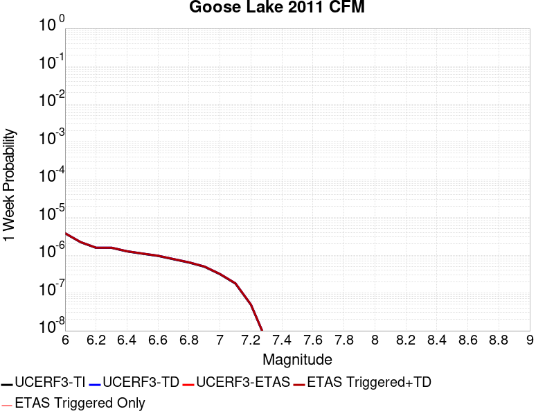 | 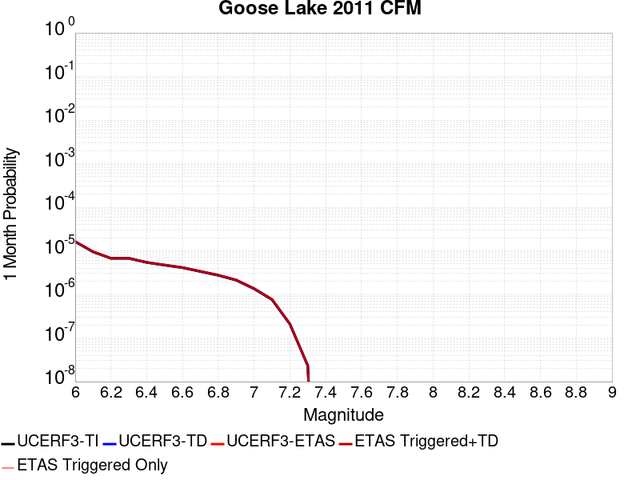 | 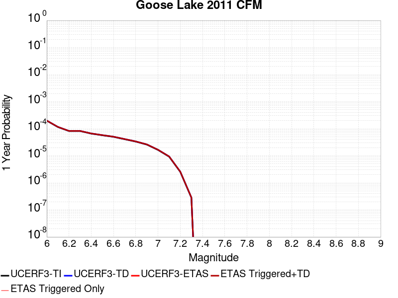 | 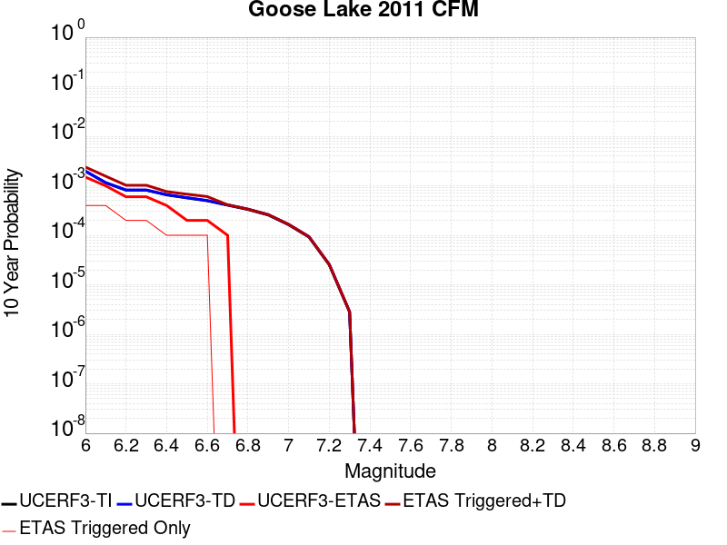 |

| Magnitude | 1 wk TI Prob | 1 wk TD Prob | 1 wk ETAS Prob | 1 wk ETAS/TD Gain | 1 wk ETAS Triggered+TD | 1 wk ETAS Triggered Only | 1 mo TI Prob | 1 mo TD Prob | 1 mo ETAS Prob | 1 mo ETAS/TD Gain | 1 mo ETAS Triggered+TD | 1 mo ETAS Triggered Only | 1 yr TI Prob | 1 yr TD Prob | 1 yr ETAS Prob | 1 yr ETAS/TD Gain | 1 yr ETAS Triggered+TD | 1 yr ETAS Triggered Only | 10 yr TI Prob | 10 yr TD Prob | 10 yr ETAS Prob | 10 yr ETAS/TD Gain | 10 yr ETAS Triggered+TD | 10 yr ETAS Triggered Only |
|-----|-----|-----|-----|-----|-----|-----|-----|-----|-----|-----|-----|-----|-----|-----|-----|-----|-----|-----|-----|-----|-----|-----|-----|-----|
| 6.0 | 3.780968E-6 | 3.82311E-6 | 0.0 | 0.0 | 3.82311E-6 | 0.0 | 1.6204049E-5 | 1.638466E-5 | 0.0 | 0.0 | 1.638466E-5 | 0.0 | 1.9726643E-4 | 1.9946607E-4 | 0.0 | 0.0 | 1.9946607E-4 | 0.0 | 0.001970914 | 0.0019929786 | 0.0015 | 0.7526423 | 0.0023921814 | 4.0E-4 |
| 6.1 | 2.2035124E-6 | 2.2298561E-6 | 0.0 | 0.0 | 2.2298561E-6 | 0.0 | 9.443591E-6 | 9.556492E-6 | 0.0 | 0.0 | 9.556492E-6 | 0.0 | 1.1496965E-4 | 1.16344265E-4 | 0.0 | 0.0 | 1.16344265E-4 | 0.0 | 0.0011491019 | 0.0011628518 | 0.001 | 0.8599548 | 0.0015623868 | 4.0E-4 |
| 6.2 | 1.5624689E-6 | 1.5827346E-6 | 0.0 | 0.0 | 1.5827346E-6 | 0.0 | 6.6962784E-6 | 6.783131E-6 | 0.0 | 0.0 | 6.783131E-6 | 0.0 | 8.152414E-5 | 8.258154E-5 | 0.0 | 0.0 | 8.258154E-5 | 0.0 | 8.1494235E-4 | 8.255129E-4 | 6.0E-4 | 0.7268209 | 0.0010253479 | 2.0E-4 |
| 6.3 | 1.5624689E-6 | 1.5827346E-6 | 0.0 | 0.0 | 1.5827346E-6 | 0.0 | 6.6962784E-6 | 6.783131E-6 | 0.0 | 0.0 | 6.783131E-6 | 0.0 | 8.152414E-5 | 8.258154E-5 | 0.0 | 0.0 | 8.258154E-5 | 0.0 | 8.1494235E-4 | 8.255129E-4 | 6.0E-4 | 0.7268209 | 0.0010253479 | 2.0E-4 |
| 6.4 | 1.256464E-6 | 1.2739059E-6 | 0.0 | 0.0 | 1.2739059E-6 | 0.0 | 5.3848344E-6 | 5.4595857E-6 | 0.0 | 0.0 | 5.4595857E-6 | 0.0 | 6.5558386E-5 | 6.646845E-5 | 0.0 | 0.0 | 6.646845E-5 | 0.0 | 6.553905E-4 | 6.6448766E-4 | 4.0E-4 | 0.6019675 | 7.6442125E-4 | 1.0E-4 |
| 6.5 | 1.0910911E-6 | 1.1069736E-6 | 0.0 | 0.0 | 1.1069736E-6 | 0.0 | 4.6760965E-6 | 4.744164E-6 | 0.0 | 0.0 | 4.744164E-6 | 0.0 | 5.692999E-5 | 5.775868E-5 | 0.0 | 0.0 | 5.775868E-5 | 0.0 | 5.6915404E-4 | 5.774379E-4 | 2.0E-4 | 0.34635758 | 6.773802E-4 | 1.0E-4 |
| 6.6 | 9.546601E-7 | 9.691549E-7 | 0.0 | 0.0 | 9.691549E-7 | 0.0 | 4.091394E-6 | 4.1535145E-6 | 0.0 | 0.0 | 4.1535145E-6 | 0.0 | 4.9811584E-5 | 5.0567873E-5 | 0.0 | 0.0 | 5.0567873E-5 | 0.0 | 4.980042E-4 | 5.0556456E-4 | 2.0E-4 | 0.39559734 | 6.05514E-4 | 1.0E-4 |
| 6.7 | 7.790316E-7 | 7.916227E-7 | 0.0 | 0.0 | 7.916227E-7 | 0.0 | 3.3387028E-6 | 3.3926644E-6 | 0.0 | 0.0 | 3.3926644E-6 | 0.0 | 4.0647945E-5 | 4.1304913E-5 | 0.0 | 0.0 | 4.1304913E-5 | 0.0 | 4.0640513E-4 | 4.1297294E-4 | 1.0E-4 | 0.24214661 | 4.1297294E-4 | 0.0 |
| 6.8 | 6.3714384E-7 | 6.4789646E-7 | 0.0 | 0.0 | 6.4789646E-7 | 0.0 | 2.7306137E-6 | 2.7766962E-6 | 0.0 | 0.0 | 2.7766962E-6 | 0.0 | 3.3244716E-5 | 3.3805758E-5 | 0.0 | 0.0 | 3.3805758E-5 | 0.0 | 3.323974E-4 | 3.3800662E-4 | 0.0 | 0.0 | 3.3800662E-4 | 0.0 |
| 6.9 | 4.92586E-7 | 5.0141E-7 | 0.0 | 0.0 | 5.0141E-7 | 0.0 | 2.1110811E-6 | 2.1488981E-6 | 0.0 | 0.0 | 2.1488981E-6 | 0.0 | 2.5702111E-5 | 2.6162525E-5 | 0.0 | 0.0 | 2.6162525E-5 | 0.0 | 2.569914E-4 | 2.6159483E-4 | 0.0 | 0.0 | 2.6159483E-4 | 0.0 |
| 7.0 | 3.130245E-7 | 3.1904804E-7 | 0.0 | 0.0 | 3.1904804E-7 | 0.0 | 1.3415328E-6 | 1.3673481E-6 | 0.0 | 0.0 | 1.3673481E-6 | 0.0 | 1.6333039E-5 | 1.6647338E-5 | 0.0 | 0.0 | 1.6647338E-5 | 0.0 | 1.6331839E-4 | 1.664611E-4 | 0.0 | 0.0 | 1.664611E-4 | 0.0 |
| 7.1 | 1.7680084E-7 | 1.8024646E-7 | 0.0 | 0.0 | 1.8024646E-7 | 0.0 | 7.5771766E-7 | 7.724846E-7 | 0.0 | 0.0 | 7.724846E-7 | 0.0 | 9.225173E-6 | 9.40496E-6 | 0.0 | 0.0 | 9.40496E-6 | 0.0 | 9.22479E-5 | 9.404573E-5 | 0.0 | 0.0 | 9.404573E-5 | 0.0 |
| 7.2 | 4.8641045E-8 | 4.940366E-8 | 0.0 | 0.0 | 4.940366E-8 | 0.0 | 2.084616E-7 | 2.1172994E-7 | 0.0 | 0.0 | 2.1172994E-7 | 0.0 | 2.538017E-6 | 2.5778093E-6 | 0.0 | 0.0 | 2.5778093E-6 | 0.0 | 2.537988E-5 | 2.5777805E-5 | 0.0 | 0.0 | 2.5777805E-5 | 0.0 |
| 7.3 | 5.3911844E-9 | 5.475991E-9 | 0.0 | 0.0 | 5.475991E-9 | 0.0 | 2.3105075E-8 | 2.3468534E-8 | 0.0 | 0.0 | 2.3468534E-8 | 0.0 | 2.8130427E-7 | 2.8572939E-7 | 0.0 | 0.0 | 2.8572939E-7 | 0.0 | 2.8130391E-6 | 2.8572917E-6 | 0.0 | 0.0 | 2.8572917E-6 | 0.0 |

## Great Valley 08 (Quinto)
*[(top)](#table-of-contents)*

| 1 Week | 1 Month | 1 Year | 10 Year |
|-----|-----|-----|-----|
| 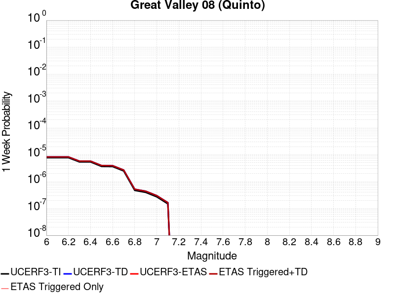 | 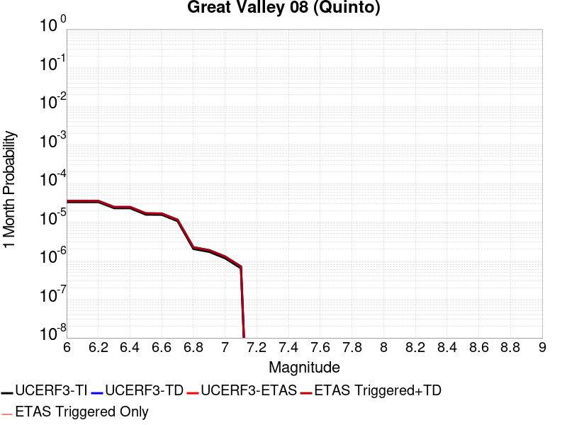 | 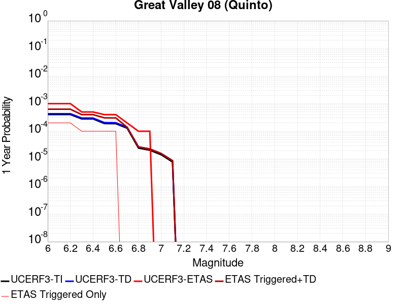 | 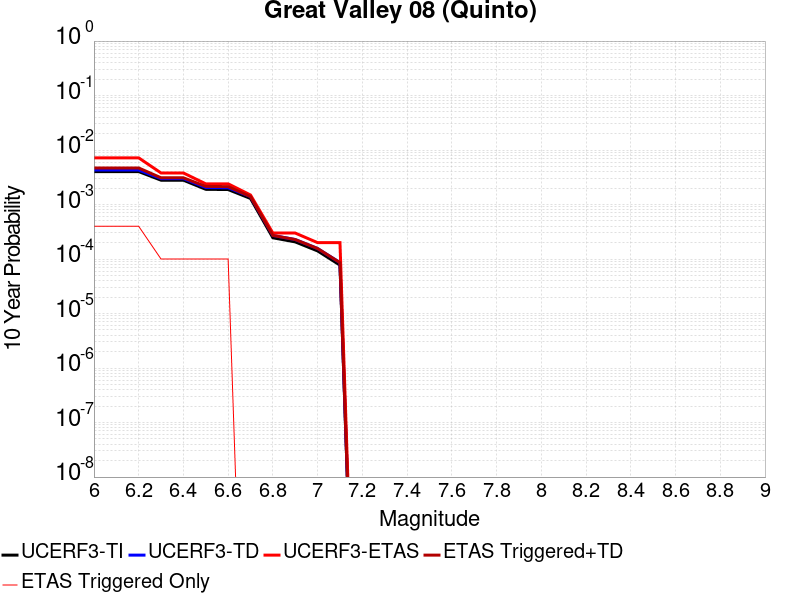 |

| Magnitude | 1 wk TI Prob | 1 wk TD Prob | 1 wk ETAS Prob | 1 wk ETAS/TD Gain | 1 wk ETAS Triggered+TD | 1 wk ETAS Triggered Only | 1 mo TI Prob | 1 mo TD Prob | 1 mo ETAS Prob | 1 mo ETAS/TD Gain | 1 mo ETAS Triggered+TD | 1 mo ETAS Triggered Only | 1 yr TI Prob | 1 yr TD Prob | 1 yr ETAS Prob | 1 yr ETAS/TD Gain | 1 yr ETAS Triggered+TD | 1 yr ETAS Triggered Only | 10 yr TI Prob | 10 yr TD Prob | 10 yr ETAS Prob | 10 yr ETAS/TD Gain | 10 yr ETAS Triggered+TD | 10 yr ETAS Triggered Only |
|-----|-----|-----|-----|-----|-----|-----|-----|-----|-----|-----|-----|-----|-----|-----|-----|-----|-----|-----|-----|-----|-----|-----|-----|-----|
| 6.0 | 7.737697E-6 | 8.254173E-6 | 0.0 | 0.0 | 8.254173E-6 | 0.0 | 3.3161137E-5 | 3.5374655E-5 | 0.0 | 0.0 | 3.5374655E-5 | 0.0 | 4.0366207E-4 | 4.3062016E-4 | 0.001 | 2.3222322 | 6.30534E-4 | 2.0E-4 | 0.004029296 | 0.0042997105 | 0.0072 | 1.6745312 | 0.004697991 | 4.0E-4 |
| 6.1 | 7.737697E-6 | 8.254173E-6 | 0.0 | 0.0 | 8.254173E-6 | 0.0 | 3.3161137E-5 | 3.5374655E-5 | 0.0 | 0.0 | 3.5374655E-5 | 0.0 | 4.0366207E-4 | 4.3062016E-4 | 0.001 | 2.3222322 | 6.30534E-4 | 2.0E-4 | 0.004029296 | 0.0042997105 | 0.0072 | 1.6745312 | 0.004697991 | 4.0E-4 |
| 6.2 | 7.737697E-6 | 8.254173E-6 | 0.0 | 0.0 | 8.254173E-6 | 0.0 | 3.3161137E-5 | 3.5374655E-5 | 0.0 | 0.0 | 3.5374655E-5 | 0.0 | 4.0366207E-4 | 4.3062016E-4 | 0.001 | 2.3222322 | 6.30534E-4 | 2.0E-4 | 0.004029296 | 0.0042997105 | 0.0072 | 1.6745312 | 0.004697991 | 4.0E-4 |
| 6.3 | 5.374012E-6 | 5.7514058E-6 | 0.0 | 0.0 | 5.7514058E-6 | 0.0 | 2.3031276E-5 | 2.4648712E-5 | 0.0 | 0.0 | 2.4648712E-5 | 0.0 | 2.803697E-4 | 3.0006788E-4 | 5.0E-4 | 1.6662896 | 4.0003788E-4 | 1.0E-4 | 0.0028001624 | 0.0029977208 | 0.0038 | 1.2676297 | 0.003097421 | 1.0E-4 |
| 6.4 | 5.374012E-6 | 5.7514058E-6 | 0.0 | 0.0 | 5.7514058E-6 | 0.0 | 2.3031276E-5 | 2.4648712E-5 | 0.0 | 0.0 | 2.4648712E-5 | 0.0 | 2.803697E-4 | 3.0006788E-4 | 5.0E-4 | 1.6662896 | 4.0003788E-4 | 1.0E-4 | 0.0028001624 | 0.0029977208 | 0.0038 | 1.2676297 | 0.003097421 | 1.0E-4 |
| 6.5 | 3.65427E-6 | 3.9419624E-6 | 0.0 | 0.0 | 3.9419624E-6 | 0.0 | 1.5661062E-5 | 1.6894055E-5 | 0.0 | 0.0 | 1.6894055E-5 | 0.0 | 1.9065675E-4 | 2.0567275E-4 | 4.0E-4 | 1.9448371 | 3.0565218E-4 | 1.0E-4 | 0.0019049325 | 0.002055516 | 0.0024 | 1.16759 | 0.0021553105 | 1.0E-4 |
| 6.6 | 3.6143538E-6 | 3.8991425E-6 | 0.0 | 0.0 | 3.8991425E-6 | 0.0 | 1.5489995E-5 | 1.6710543E-5 | 0.0 | 0.0 | 1.6710543E-5 | 0.0 | 1.8857437E-4 | 2.0343893E-4 | 4.0E-4 | 1.966192 | 3.0341858E-4 | 1.0E-4 | 0.0018841444 | 0.0020332187 | 0.0024 | 1.1803944 | 0.0021330153 | 1.0E-4 |
| 6.7 | 2.4821015E-6 | 2.686161E-6 | 0.0 | 0.0 | 2.686161E-6 | 0.0 | 1.0637535E-5 | 1.15121E-5 | 0.0 | 0.0 | 1.15121E-5 | 0.0 | 1.2950429E-4 | 1.4015647E-4 | 2.0E-4 | 1.4269767 | 1.4015647E-4 | 0.0 | 0.0012942884 | 0.0014012357 | 0.0015 | 1.0704837 | 0.0014012357 | 0.0 |
| 6.8 | 4.7110538E-7 | 5.1941157E-7 | 0.0 | 0.0 | 5.1941157E-7 | 0.0 | 2.0190216E-6 | 2.2260476E-6 | 0.0 | 0.0 | 2.2260476E-6 | 0.0 | 2.458131E-5 | 2.7101813E-5 | 1.0E-4 | 3.68979 | 2.7101813E-5 | 0.0 | 2.457859E-4 | 2.7098687E-4 | 3.0E-4 | 1.1070646 | 2.7098687E-4 | 0.0 |
| 6.9 | 3.958685E-7 | 4.3712816E-7 | 0.0 | 0.0 | 4.3712816E-7 | 0.0 | 1.6965782E-6 | 1.8734052E-6 | 0.0 | 0.0 | 1.8734052E-6 | 0.0 | 2.0655643E-5 | 2.2808485E-5 | 1.0E-4 | 4.384333 | 2.2808485E-5 | 0.0 | 2.0653724E-4 | 2.2806306E-4 | 3.0E-4 | 1.3154256 | 2.2806306E-4 | 0.0 |
| 7.0 | 2.70294E-7 | 2.99266E-7 | 0.0 | 0.0 | 2.99266E-7 | 0.0 | 1.1584025E-6 | 1.282568E-6 | 0.0 | 0.0 | 1.282568E-6 | 0.0 | 1.4103458E-5 | 1.5615165E-5 | 0.0 | 0.0 | 1.5615165E-5 | 0.0 | 1.4102564E-4 | 1.5614198E-4 | 2.0E-4 | 1.2808856 | 1.5614198E-4 | 0.0 |
| 7.1 | 1.4828602E-7 | 1.6472859E-7 | 0.0 | 0.0 | 1.6472859E-7 | 0.0 | 6.3551136E-7 | 7.059796E-7 | 0.0 | 0.0 | 7.059796E-7 | 0.0 | 7.737323E-6 | 8.595275E-6 | 0.0 | 0.0 | 8.595275E-6 | 0.0 | 7.737054E-5 | 8.595023E-5 | 2.0E-4 | 2.3269281 | 8.595023E-5 | 0.0 |

## Rinconada 2011 CFM
*[(top)](#table-of-contents)*

| 1 Week | 1 Month | 1 Year | 10 Year |
|-----|-----|-----|-----|
| 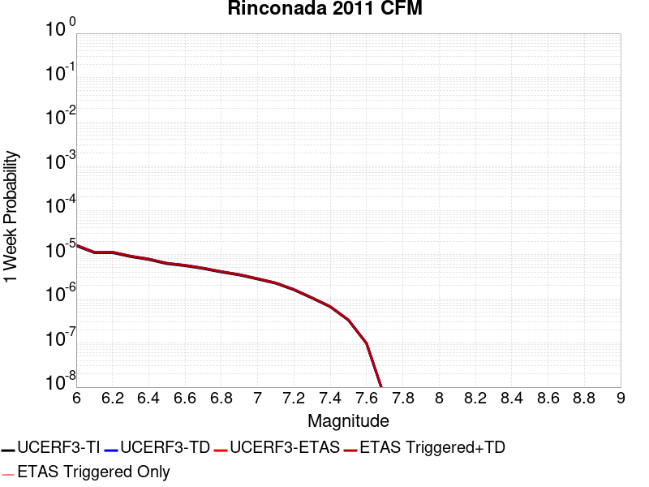 | 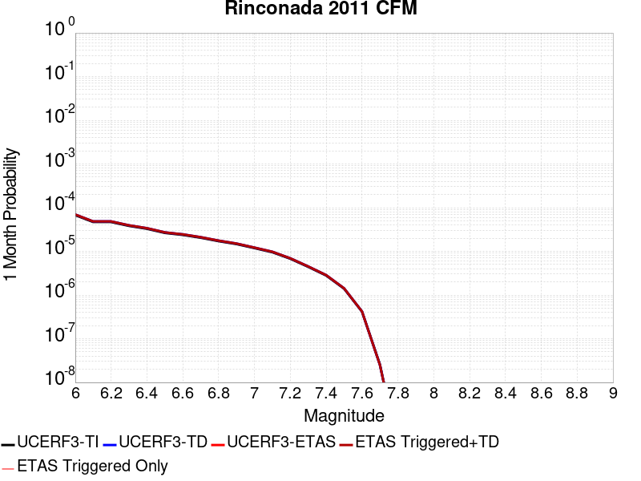 | 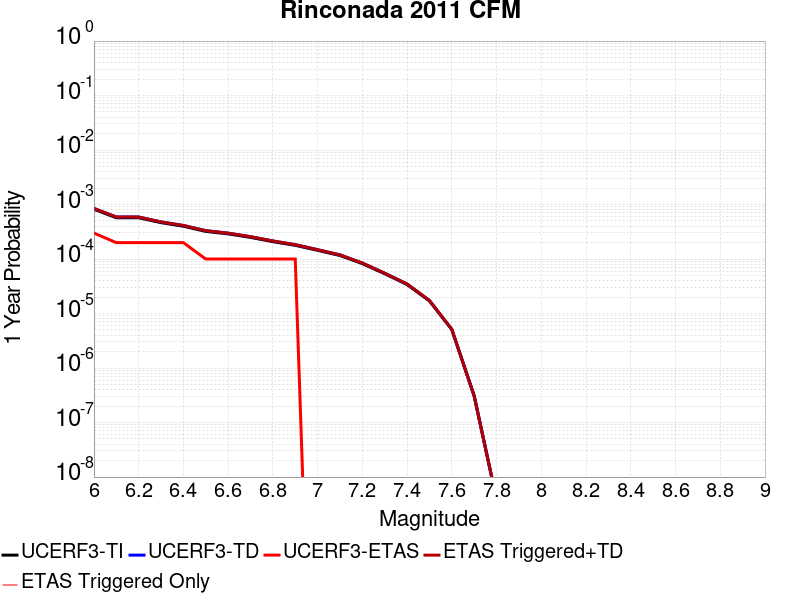 | 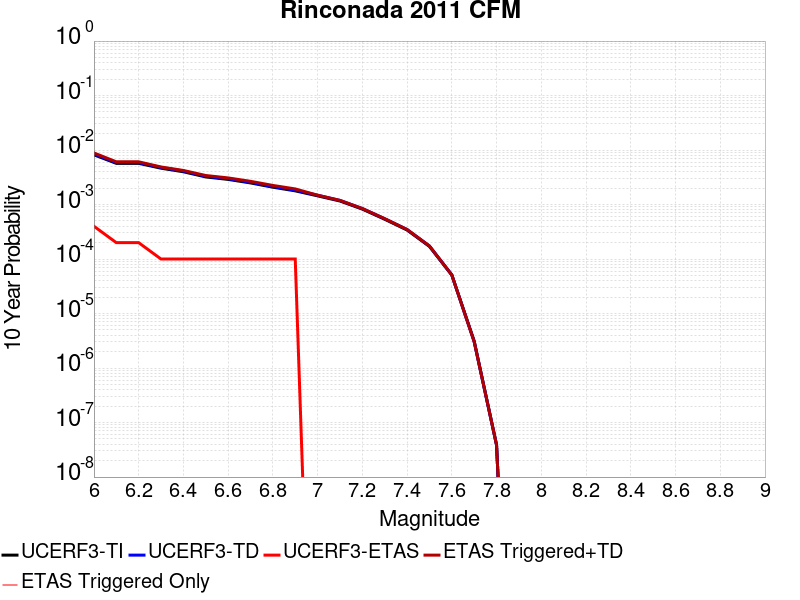 |

| Magnitude | 1 wk TI Prob | 1 wk TD Prob | 1 wk ETAS Prob | 1 wk ETAS/TD Gain | 1 wk ETAS Triggered+TD | 1 wk ETAS Triggered Only | 1 mo TI Prob | 1 mo TD Prob | 1 mo ETAS Prob | 1 mo ETAS/TD Gain | 1 mo ETAS Triggered+TD | 1 mo ETAS Triggered Only | 1 yr TI Prob | 1 yr TD Prob | 1 yr ETAS Prob | 1 yr ETAS/TD Gain | 1 yr ETAS Triggered+TD | 1 yr ETAS Triggered Only | 10 yr TI Prob | 10 yr TD Prob | 10 yr ETAS Prob | 10 yr ETAS/TD Gain | 10 yr ETAS Triggered+TD | 10 yr ETAS Triggered Only |
|-----|-----|-----|-----|-----|-----|-----|-----|-----|-----|-----|-----|-----|-----|-----|-----|-----|-----|-----|-----|-----|-----|-----|-----|-----|
| 6.0 | 1.5752368E-5 | 1.6275832E-5 | 0.0 | 0.0 | 1.6275832E-5 | 0.0 | 6.75084E-5 | 6.975172E-5 | 0.0 | 0.0 | 6.975172E-5 | 0.0 | 8.2160486E-4 | 8.488995E-4 | 3.0E-4 | 0.35339874 | 8.488995E-4 | 0.0 | 0.008185739 | 0.008456947 | 0.006 | 0.7094758 | 0.008853565 | 4.0E-4 |
| 6.1 | 1.0966133E-5 | 1.1323793E-5 | 0.0 | 0.0 | 1.1323793E-5 | 0.0 | 4.6996865E-5 | 4.8529644E-5 | 0.0 | 0.0 | 4.8529644E-5 | 0.0 | 5.720366E-4 | 5.9068896E-4 | 2.0E-4 | 0.33858767 | 5.9068896E-4 | 0.0 | 0.0057056635 | 0.0058912854 | 0.004 | 0.678969 | 0.006090107 | 2.0E-4 |
| 6.2 | 1.0966133E-5 | 1.1323793E-5 | 0.0 | 0.0 | 1.1323793E-5 | 0.0 | 4.6996865E-5 | 4.8529644E-5 | 0.0 | 0.0 | 4.8529644E-5 | 0.0 | 5.720366E-4 | 5.9068896E-4 | 2.0E-4 | 0.33858767 | 5.9068896E-4 | 0.0 | 0.0057056635 | 0.0058912854 | 0.004 | 0.678969 | 0.006090107 | 2.0E-4 |
| 6.3 | 8.926149E-6 | 9.213386E-6 | 0.0 | 0.0 | 9.213386E-6 | 0.0 | 3.8254362E-5 | 3.9485345E-5 | 0.0 | 0.0 | 3.9485345E-5 | 0.0 | 4.6564735E-4 | 4.8062834E-4 | 2.0E-4 | 0.41612193 | 4.8062834E-4 | 0.0 | 0.0046467283 | 0.0047959336 | 0.0034 | 0.70893395 | 0.004895454 | 1.0E-4 |
| 6.4 | 7.676955E-6 | 7.920713E-6 | 0.0 | 0.0 | 7.920713E-6 | 0.0 | 3.290082E-5 | 3.394547E-5 | 0.0 | 0.0 | 3.394547E-5 | 0.0 | 4.0049385E-4 | 4.1320792E-4 | 2.0E-4 | 0.48401782 | 4.1320792E-4 | 0.0 | 0.0039977287 | 0.0041244226 | 0.0031 | 0.7516204 | 0.00422401 | 1.0E-4 |
| 6.5 | 6.1671026E-6 | 6.3593675E-6 | 0.0 | 0.0 | 6.3593675E-6 | 0.0 | 2.6430173E-5 | 2.7254147E-5 | 0.0 | 0.0 | 2.7254147E-5 | 0.0 | 3.2173982E-4 | 3.317688E-4 | 1.0E-4 | 0.30141473 | 3.317688E-4 | 0.0 | 0.003212744 | 0.003312747 | 0.0025 | 0.7546607 | 0.0034124157 | 1.0E-4 |
| 6.6 | 5.553456E-6 | 5.7251814E-6 | 0.0 | 0.0 | 5.7251814E-6 | 0.0 | 2.3800309E-5 | 2.453626E-5 | 0.0 | 0.0 | 2.453626E-5 | 0.0 | 2.897302E-4 | 2.9868807E-4 | 1.0E-4 | 0.3347974 | 2.9868807E-4 | 0.0 | 0.0028935277 | 0.0029828749 | 0.0022 | 0.73754346 | 0.0030825767 | 1.0E-4 |
| 6.7 | 4.787857E-6 | 4.933623E-6 | 0.0 | 0.0 | 4.933623E-6 | 0.0 | 2.0519226E-5 | 2.1143927E-5 | 0.0 | 0.0 | 2.1143927E-5 | 0.0 | 2.4979294E-4 | 2.5739695E-4 | 1.0E-4 | 0.38850498 | 2.5739695E-4 | 0.0 | 0.0024951235 | 0.002570994 | 0.0019 | 0.7390138 | 0.002670737 | 1.0E-4 |
| 6.8 | 3.9955166E-6 | 4.113731E-6 | 0.0 | 0.0 | 4.113731E-6 | 0.0 | 1.7123532E-5 | 1.7630156E-5 | 0.0 | 0.0 | 1.7630156E-5 | 0.0 | 2.0845905E-4 | 2.1462604E-4 | 1.0E-4 | 0.4659267 | 2.1462604E-4 | 0.0 | 0.002082636 | 0.0021441912 | 0.0015 | 0.69956446 | 0.0022439768 | 1.0E-4 |
| 6.9 | 3.4250072E-6 | 3.5226572E-6 | 0.0 | 0.0 | 3.5226572E-6 | 0.0 | 1.46785205E-5 | 1.5097015E-5 | 0.0 | 0.0 | 1.5097015E-5 | 0.0 | 1.7869633E-4 | 1.8379067E-4 | 1.0E-4 | 0.54409724 | 1.8379067E-4 | 0.0 | 0.001785527 | 0.0018363892 | 0.0014 | 0.76236564 | 0.0019362055 | 1.0E-4 |
| 7.0 | 2.7712713E-6 | 2.846864E-6 | 0.0 | 0.0 | 2.846864E-6 | 0.0 | 1.1876823E-5 | 1.2200789E-5 | 0.0 | 0.0 | 1.2200789E-5 | 0.0 | 1.4459073E-4 | 1.4853448E-4 | 0.0 | 0.0 | 1.4853448E-4 | 0.0 | 0.0014449668 | 0.0014843536 | 0.0011 | 0.7410633 | 0.0014843536 | 0.0 |
| 7.1 | 2.227358E-6 | 2.285826E-6 | 0.0 | 0.0 | 2.285826E-6 | 0.0 | 9.545785E-6 | 9.79636E-6 | 0.0 | 0.0 | 9.79636E-6 | 0.0 | 1.16213734E-4 | 1.1926417E-4 | 0.0 | 0.0 | 1.1926417E-4 | 0.0 | 0.0011615298 | 0.0011920027 | 0.001 | 0.8389243 | 0.0011920027 | 0.0 |
| 7.2 | 1.581796E-6 | 1.6209877E-6 | 0.0 | 0.0 | 1.6209877E-6 | 0.0 | 6.779108E-6 | 6.947072E-6 | 0.0 | 0.0 | 6.947072E-6 | 0.0 | 8.253252E-5 | 8.4577325E-5 | 0.0 | 0.0 | 8.4577325E-5 | 0.0 | 8.250187E-4 | 8.454519E-4 | 6.0E-4 | 0.70967966 | 8.454519E-4 | 0.0 |
| 7.3 | 1.0306567E-6 | 1.0547022E-6 | 0.0 | 0.0 | 1.0547022E-6 | 0.0 | 4.4170924E-6 | 4.5201446E-6 | 0.0 | 0.0 | 4.5201446E-6 | 0.0 | 5.3776774E-5 | 5.5031374E-5 | 0.0 | 0.0 | 5.5031374E-5 | 0.0 | 5.376376E-4 | 5.501777E-4 | 3.0E-4 | 0.5452784 | 5.501777E-4 | 0.0 |
| 7.4 | 6.535541E-7 | 6.6830916E-7 | 0.0 | 0.0 | 6.6830916E-7 | 0.0 | 2.800943E-6 | 2.864179E-6 | 0.0 | 0.0 | 2.864179E-6 | 0.0 | 3.4100947E-5 | 3.487082E-5 | 0.0 | 0.0 | 3.487082E-5 | 0.0 | 3.4095717E-4 | 3.4865362E-4 | 2.0E-4 | 0.5736352 | 3.4865362E-4 | 0.0 |
| 7.5 | 3.2656962E-7 | 3.3318466E-7 | 0.0 | 0.0 | 3.3318466E-7 | 0.0 | 1.3995833E-6 | 1.4279334E-6 | 0.0 | 0.0 | 1.4279334E-6 | 0.0 | 1.7039794E-5 | 1.7384951E-5 | 0.0 | 0.0 | 1.7384951E-5 | 0.0 | 1.7038487E-4 | 1.7383594E-4 | 0.0 | 0.0 | 1.7383594E-4 | 0.0 |
| 7.6 | 9.754343E-8 | 9.8215125E-8 | 0.0 | 0.0 | 9.8215125E-8 | 0.0 | 4.180432E-7 | 4.2092188E-7 | 0.0 | 0.0 | 4.2092188E-7 | 0.0 | 5.089664E-6 | 5.124712E-6 | 0.0 | 0.0 | 5.124712E-6 | 0.0 | 5.0895473E-5 | 5.124595E-5 | 0.0 | 0.0 | 5.124595E-5 | 0.0 |
| 7.7 | 6.0001453E-9 | 5.84947E-9 | 0.0 | 0.0 | 5.84947E-9 | 0.0 | 2.5714908E-8 | 2.5069156E-8 | 0.0 | 0.0 | 2.5069156E-8 | 0.0 | 3.1307894E-7 | 3.0521693E-7 | 0.0 | 0.0 | 3.0521693E-7 | 0.0 | 3.1307852E-6 | 3.0521653E-6 | 0.0 | 0.0 | 3.0521653E-6 | 0.0 |
| 7.8 | 7.400003E-11 | 7.465584E-11 | 0.0 | 0.0 | 7.465584E-11 | 0.0 | 3.171432E-10 | 3.199535E-10 | 0.0 | 0.0 | 3.199535E-10 | 0.0 | 3.861218E-9 | 3.895434E-9 | 0.0 | 0.0 | 3.895434E-9 | 0.0 | 3.861218E-8 | 3.895434E-8 | 0.0 | 0.0 | 3.895434E-8 | 0.0 |

## West Tahoe
*[(top)](#table-of-contents)*

| 1 Week | 1 Month | 1 Year | 10 Year |
|-----|-----|-----|-----|
| 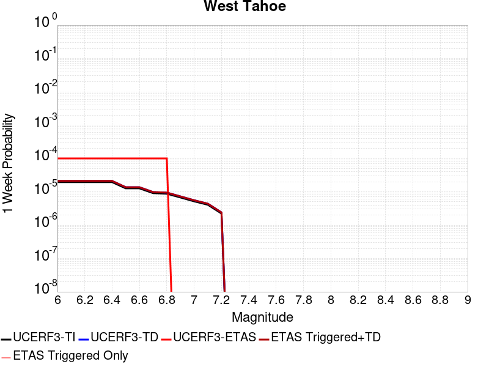 | 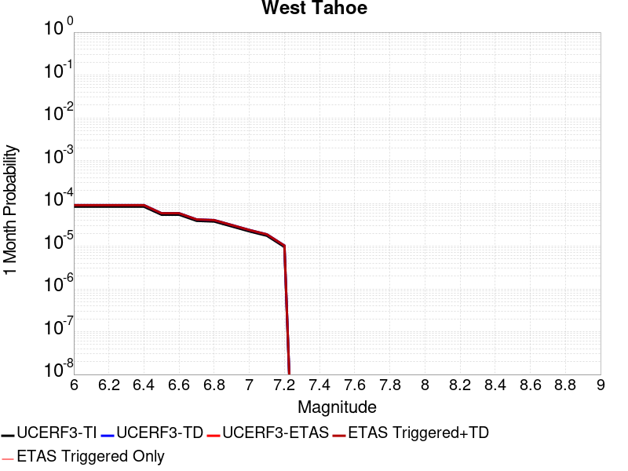 | 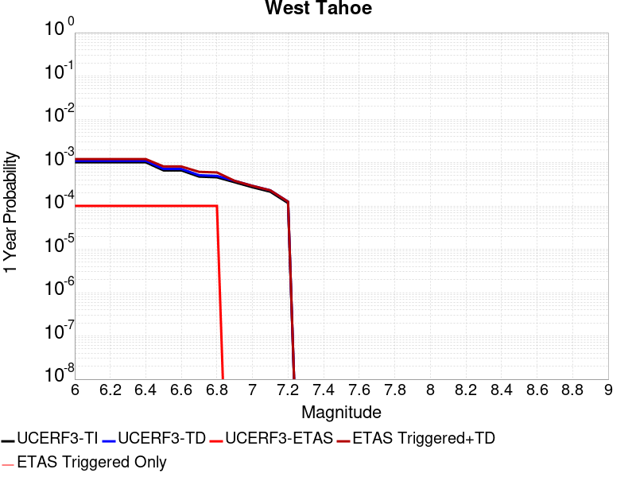 | 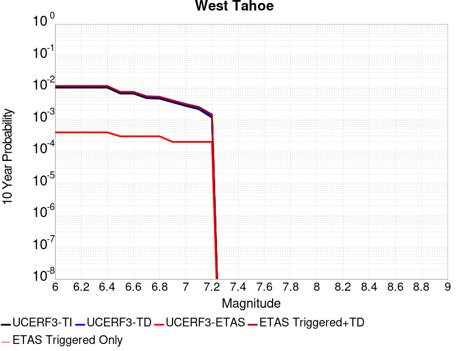 |

| Magnitude | 1 wk TI Prob | 1 wk TD Prob | 1 wk ETAS Prob | 1 wk ETAS/TD Gain | 1 wk ETAS Triggered+TD | 1 wk ETAS Triggered Only | 1 mo TI Prob | 1 mo TD Prob | 1 mo ETAS Prob | 1 mo ETAS/TD Gain | 1 mo ETAS Triggered+TD | 1 mo ETAS Triggered Only | 1 yr TI Prob | 1 yr TD Prob | 1 yr ETAS Prob | 1 yr ETAS/TD Gain | 1 yr ETAS Triggered+TD | 1 yr ETAS Triggered Only | 10 yr TI Prob | 10 yr TD Prob | 10 yr ETAS Prob | 10 yr ETAS/TD Gain | 10 yr ETAS Triggered+TD | 10 yr ETAS Triggered Only |
|-----|-----|-----|-----|-----|-----|-----|-----|-----|-----|-----|-----|-----|-----|-----|-----|-----|-----|-----|-----|-----|-----|-----|-----|-----|
| 6.0 | 1.952444E-5 | 2.1186883E-5 | 1.0E-4 | 4.719901 | 2.1186883E-5 | 0.0 | 8.367348E-5 | 9.079808E-5 | 1.0E-4 | 1.101345 | 9.079808E-5 | 0.0 | 0.0010182485 | 0.0011049607 | 8.0E-4 | 0.7240076 | 0.0012048503 | 1.0E-4 | 0.010135954 | 0.011000155 | 0.0068 | 0.6181731 | 0.011395754 | 4.0E-4 |
| 6.1 | 1.952444E-5 | 2.1186883E-5 | 1.0E-4 | 4.719901 | 2.1186883E-5 | 0.0 | 8.367348E-5 | 9.079808E-5 | 1.0E-4 | 1.101345 | 9.079808E-5 | 0.0 | 0.0010182485 | 0.0011049607 | 8.0E-4 | 0.7240076 | 0.0012048503 | 1.0E-4 | 0.010135954 | 0.011000155 | 0.0068 | 0.6181731 | 0.011395754 | 4.0E-4 |
| 6.2 | 1.952444E-5 | 2.1186883E-5 | 1.0E-4 | 4.719901 | 2.1186883E-5 | 0.0 | 8.367348E-5 | 9.079808E-5 | 1.0E-4 | 1.101345 | 9.079808E-5 | 0.0 | 0.0010182485 | 0.0011049607 | 8.0E-4 | 0.7240076 | 0.0012048503 | 1.0E-4 | 0.010135954 | 0.011000155 | 0.0068 | 0.6181731 | 0.011395754 | 4.0E-4 |
| 6.3 | 1.952444E-5 | 2.1186883E-5 | 1.0E-4 | 4.719901 | 2.1186883E-5 | 0.0 | 8.367348E-5 | 9.079808E-5 | 1.0E-4 | 1.101345 | 9.079808E-5 | 0.0 | 0.0010182485 | 0.0011049607 | 8.0E-4 | 0.7240076 | 0.0012048503 | 1.0E-4 | 0.010135954 | 0.011000155 | 0.0068 | 0.6181731 | 0.011395754 | 4.0E-4 |
| 6.4 | 1.952444E-5 | 2.1186883E-5 | 1.0E-4 | 4.719901 | 2.1186883E-5 | 0.0 | 8.367348E-5 | 9.079808E-5 | 1.0E-4 | 1.101345 | 9.079808E-5 | 0.0 | 0.0010182485 | 0.0011049607 | 8.0E-4 | 0.7240076 | 0.0012048503 | 1.0E-4 | 0.010135954 | 0.011000155 | 0.0068 | 0.6181731 | 0.011395754 | 4.0E-4 |
| 6.5 | 1.2685271E-5 | 1.3692865E-5 | 1.0E-4 | 7.303074 | 1.3692865E-5 | 0.0 | 5.4364315E-5 | 5.868248E-5 | 1.0E-4 | 1.7040862 | 5.868248E-5 | 0.0 | 6.616845E-4 | 7.1424147E-4 | 6.0E-4 | 0.84005207 | 8.1417E-4 | 1.0E-4 | 0.0065971776 | 0.0071211094 | 0.0043 | 0.6038385 | 0.007418973 | 3.0E-4 |
| 6.6 | 1.2685271E-5 | 1.3692865E-5 | 1.0E-4 | 7.303074 | 1.3692865E-5 | 0.0 | 5.4364315E-5 | 5.868248E-5 | 1.0E-4 | 1.7040862 | 5.868248E-5 | 0.0 | 6.616845E-4 | 7.1424147E-4 | 6.0E-4 | 0.84005207 | 8.1417E-4 | 1.0E-4 | 0.0065971776 | 0.0071211094 | 0.0043 | 0.6038385 | 0.007418973 | 3.0E-4 |
| 6.7 | 9.117886E-6 | 9.811381E-6 | 1.0E-4 | 10.1922455 | 9.811381E-6 | 0.0 | 3.9076072E-5 | 4.2048137E-5 | 1.0E-4 | 2.3782268 | 4.2048137E-5 | 0.0 | 4.756473E-4 | 5.11823E-4 | 3.0E-4 | 0.58614016 | 6.1177183E-4 | 1.0E-4 | 0.0047463053 | 0.00510716 | 0.0027 | 0.52866954 | 0.005405628 | 3.0E-4 |
| 6.8 | 8.786828E-6 | 9.4593515E-6 | 1.0E-4 | 10.571549 | 9.4593515E-6 | 0.0 | 3.7657293E-5 | 4.0539486E-5 | 1.0E-4 | 2.4667308 | 4.0539486E-5 | 0.0 | 4.5838108E-4 | 4.934635E-4 | 3.0E-4 | 0.6079477 | 5.934142E-4 | 1.0E-4 | 0.0045743673 | 0.0049243793 | 0.0025 | 0.5076782 | 0.0052229017 | 3.0E-4 |
| 6.9 | 6.7562123E-6 | 7.2649327E-6 | 0.0 | 0.0 | 7.2649327E-6 | 0.0 | 2.8954875E-5 | 3.113508E-5 | 0.0 | 0.0 | 3.113508E-5 | 0.0 | 3.5246857E-4 | 3.7900844E-4 | 1.0E-4 | 0.26384637 | 3.7900844E-4 | 0.0 | 0.0035191004 | 0.0037840926 | 0.0016 | 0.42282262 | 0.003983336 | 2.0E-4 |
| 7.0 | 5.1792854E-6 | 5.5681976E-6 | 0.0 | 0.0 | 5.5681976E-6 | 0.0 | 2.2196748E-5 | 2.3863506E-5 | 0.0 | 0.0 | 2.3863506E-5 | 0.0 | 2.702119E-4 | 2.9050326E-4 | 0.0 | 0.0 | 2.9050326E-4 | 0.0 | 0.0026988357 | 0.0029016105 | 0.0015 | 0.5169543 | 0.0031010301 | 2.0E-4 |
| 7.1 | 4.090765E-6 | 4.3981013E-6 | 0.0 | 0.0 | 4.3981013E-6 | 0.0 | 1.7531731E-5 | 1.884889E-5 | 0.0 | 0.0 | 1.884889E-5 | 0.0 | 2.134279E-4 | 2.2946447E-4 | 0.0 | 0.0 | 2.2946447E-4 | 0.0 | 0.0021322304 | 0.0022926098 | 0.0012 | 0.52342093 | 0.0024921512 | 2.0E-4 |
| 7.2 | 2.2356758E-6 | 2.4027372E-6 | 0.0 | 0.0 | 2.4027372E-6 | 0.0 | 9.581432E-6 | 1.0297415E-5 | 0.0 | 0.0 | 1.0297415E-5 | 0.0 | 1.1664769E-4 | 1.2536571E-4 | 0.0 | 0.0 | 1.2536571E-4 | 0.0 | 0.0011658648 | 0.0012531357 | 8.0E-4 | 0.6383985 | 0.0014528851 | 2.0E-4 |

## Big Pine (East)
*[(top)](#table-of-contents)*

| 1 Week | 1 Month | 1 Year | 10 Year |
|-----|-----|-----|-----|
| 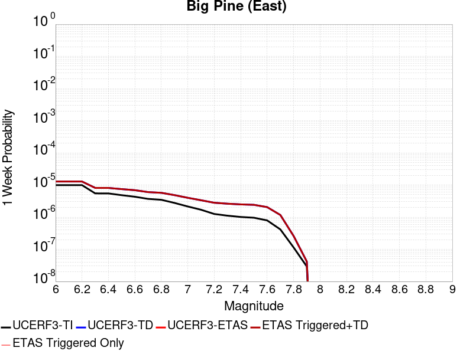 | 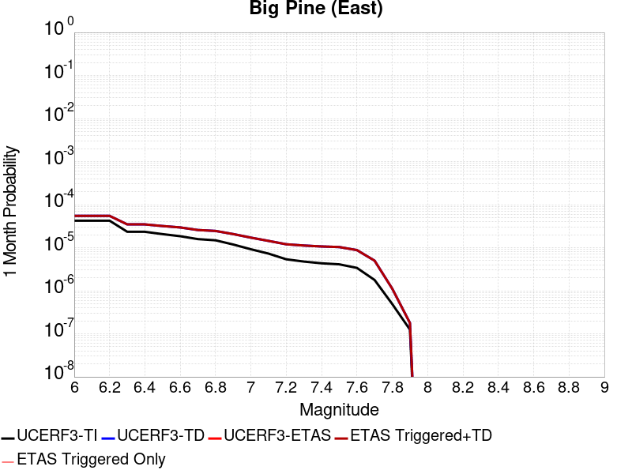 | 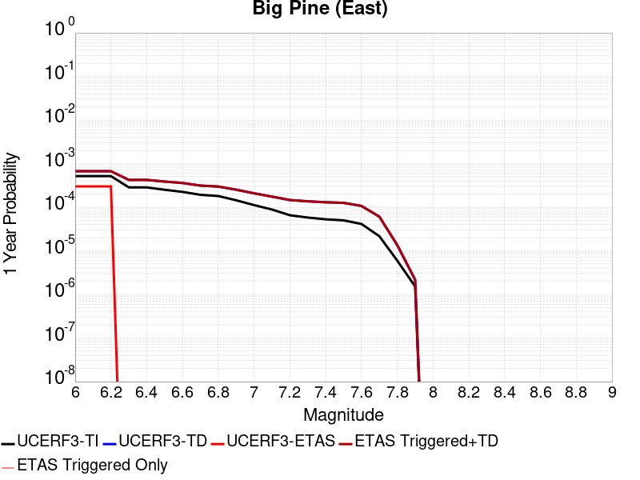 | 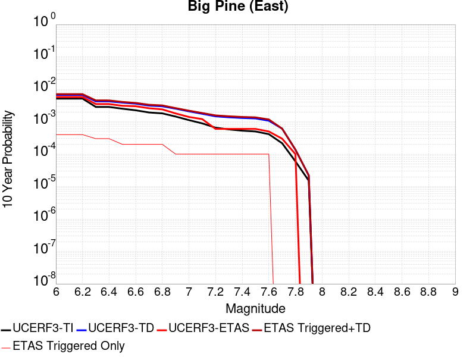 |

| Magnitude | 1 wk TI Prob | 1 wk TD Prob | 1 wk ETAS Prob | 1 wk ETAS/TD Gain | 1 wk ETAS Triggered+TD | 1 wk ETAS Triggered Only | 1 mo TI Prob | 1 mo TD Prob | 1 mo ETAS Prob | 1 mo ETAS/TD Gain | 1 mo ETAS Triggered+TD | 1 mo ETAS Triggered Only | 1 yr TI Prob | 1 yr TD Prob | 1 yr ETAS Prob | 1 yr ETAS/TD Gain | 1 yr ETAS Triggered+TD | 1 yr ETAS Triggered Only | 10 yr TI Prob | 10 yr TD Prob | 10 yr ETAS Prob | 10 yr ETAS/TD Gain | 10 yr ETAS Triggered+TD | 10 yr ETAS Triggered Only |
|-----|-----|-----|-----|-----|-----|-----|-----|-----|-----|-----|-----|-----|-----|-----|-----|-----|-----|-----|-----|-----|-----|-----|-----|-----|
| 6.0 | 9.916913E-6 | 1.2836689E-5 | 0.0 | 0.0 | 1.2836689E-5 | 0.0 | 4.250036E-5 | 5.5013348E-5 | 0.0 | 0.0 | 5.5013348E-5 | 0.0 | 5.173191E-4 | 6.696038E-4 | 3.0E-4 | 0.44802612 | 6.696038E-4 | 0.0 | 0.0051611643 | 0.0066804956 | 0.0058 | 0.86819905 | 0.0070778234 | 4.0E-4 |
| 6.1 | 9.916913E-6 | 1.2836689E-5 | 0.0 | 0.0 | 1.2836689E-5 | 0.0 | 4.250036E-5 | 5.5013348E-5 | 0.0 | 0.0 | 5.5013348E-5 | 0.0 | 5.173191E-4 | 6.696038E-4 | 3.0E-4 | 0.44802612 | 6.696038E-4 | 0.0 | 0.0051611643 | 0.0066804956 | 0.0058 | 0.86819905 | 0.0070778234 | 4.0E-4 |
| 6.2 | 9.916913E-6 | 1.2836689E-5 | 0.0 | 0.0 | 1.2836689E-5 | 0.0 | 4.250036E-5 | 5.5013348E-5 | 0.0 | 0.0 | 5.5013348E-5 | 0.0 | 5.173191E-4 | 6.696038E-4 | 3.0E-4 | 0.44802612 | 6.696038E-4 | 0.0 | 0.0051611643 | 0.0066804956 | 0.0058 | 0.86819905 | 0.0070778234 | 4.0E-4 |
| 6.3 | 5.479711E-6 | 8.132074E-6 | 0.0 | 0.0 | 8.132074E-6 | 0.0 | 2.3484265E-5 | 3.48513E-5 | 0.0 | 0.0 | 3.48513E-5 | 0.0 | 2.858834E-4 | 4.2423513E-4 | 0.0 | 0.0 | 4.2423513E-4 | 0.0 | 0.0028551589 | 0.0042370195 | 0.0035 | 0.8260524 | 0.004535748 | 3.0E-4 |
| 6.4 | 5.465009E-6 | 8.116365E-6 | 0.0 | 0.0 | 8.116365E-6 | 0.0 | 2.3421257E-5 | 3.4783974E-5 | 0.0 | 0.0 | 3.4783974E-5 | 0.0 | 2.851165E-4 | 4.234158E-4 | 0.0 | 0.0 | 4.234158E-4 | 0.0 | 0.0028475097 | 0.0042288573 | 0.0035 | 0.82764673 | 0.004527589 | 3.0E-4 |
| 6.5 | 4.826767E-6 | 7.4413415E-6 | 0.0 | 0.0 | 7.4413415E-6 | 0.0 | 2.068598E-5 | 3.189109E-5 | 0.0 | 0.0 | 3.189109E-5 | 0.0 | 2.518227E-4 | 3.882076E-4 | 0.0 | 0.0 | 3.882076E-4 | 0.0 | 0.0025153751 | 0.0038780195 | 0.0031 | 0.7993771 | 0.004077244 | 2.0E-4 |
| 6.6 | 4.3146847E-6 | 6.9012167E-6 | 0.0 | 0.0 | 6.9012167E-6 | 0.0 | 1.8491375E-5 | 2.957632E-5 | 0.0 | 0.0 | 2.957632E-5 | 0.0 | 2.2510924E-4 | 3.6003467E-4 | 0.0 | 0.0 | 3.6003467E-4 | 0.0 | 0.0022488134 | 0.0035972062 | 0.003 | 0.83398056 | 0.0037964866 | 2.0E-4 |
| 6.7 | 3.6968106E-6 | 6.013285E-6 | 0.0 | 0.0 | 6.013285E-6 | 0.0 | 1.5843378E-5 | 2.5770978E-5 | 0.0 | 0.0 | 2.5770978E-5 | 0.0 | 1.9287605E-4 | 3.1371802E-4 | 0.0 | 0.0 | 3.1371802E-4 | 0.0 | 0.0019270873 | 0.0031353533 | 0.0026 | 0.82925266 | 0.0033347262 | 2.0E-4 |
| 6.8 | 3.4671132E-6 | 5.7195057E-6 | 0.0 | 0.0 | 5.7195057E-6 | 0.0 | 1.4858972E-5 | 2.4511945E-5 | 0.0 | 0.0 | 2.4511945E-5 | 0.0 | 1.8089297E-4 | 2.983935E-4 | 0.0 | 0.0 | 2.983935E-4 | 0.0 | 0.0018074579 | 0.0029825217 | 0.0024 | 0.8046882 | 0.003181925 | 2.0E-4 |
| 6.9 | 2.7686972E-6 | 4.8412257E-6 | 0.0 | 0.0 | 4.8412257E-6 | 0.0 | 1.1865792E-5 | 2.074795E-5 | 0.0 | 0.0 | 2.074795E-5 | 0.0 | 1.4445644E-4 | 2.5257777E-4 | 0.0 | 0.0 | 2.5257777E-4 | 0.0 | 0.0014436257 | 0.002525432 | 0.0018 | 0.7127493 | 0.0026251795 | 1.0E-4 |
| 7.0 | 2.1472624E-6 | 3.999575E-6 | 0.0 | 0.0 | 3.999575E-6 | 0.0 | 9.20252E-6 | 1.7140925E-5 | 0.0 | 0.0 | 1.7140925E-5 | 0.0 | 1.12034926E-4 | 2.0867132E-4 | 0.0 | 0.0 | 2.0867132E-4 | 0.0 | 0.0011197845 | 0.0020872303 | 0.0014 | 0.6707453 | 0.0021870215 | 1.0E-4 |
| 7.1 | 1.7018335E-6 | 3.3581189E-6 | 0.0 | 0.0 | 3.3581189E-6 | 0.0 | 7.293552E-6 | 1.43918605E-5 | 0.0 | 0.0 | 1.43918605E-5 | 0.0 | 8.879537E-5 | 1.7520717E-4 | 0.0 | 0.0 | 1.7520717E-4 | 0.0 | 8.87599E-4 | 0.0017531328 | 0.0012 | 0.68448895 | 0.0018529574 | 1.0E-4 |
| 7.2 | 1.25603E-6 | 2.806997E-6 | 0.0 | 0.0 | 2.806997E-6 | 0.0 | 5.3829745E-6 | 1.2029932E-5 | 0.0 | 0.0 | 1.2029932E-5 | 0.0 | 6.553574E-5 | 1.4645481E-4 | 0.0 | 0.0 | 1.4645481E-4 | 0.0 | 6.551642E-4 | 0.0014660005 | 6.0E-4 | 0.4092768 | 0.0015658538 | 1.0E-4 |
| 7.3 | 1.112297E-6 | 2.622153E-6 | 0.0 | 0.0 | 2.622153E-6 | 0.0 | 4.7669787E-6 | 1.1237752E-5 | 0.0 | 0.0 | 1.1237752E-5 | 0.0 | 5.803642E-5 | 1.3681126E-4 | 0.0 | 0.0 | 1.3681126E-4 | 0.0 | 5.802127E-4 | 0.0013695427 | 6.0E-4 | 0.43810242 | 0.0014694058 | 1.0E-4 |
| 7.4 | 1.0137181E-6 | 2.49481E-6 | 0.0 | 0.0 | 2.49481E-6 | 0.0 | 4.3444993E-6 | 1.0692E-5 | 0.0 | 0.0 | 1.0692E-5 | 0.0 | 5.2892992E-5 | 1.3016754E-4 | 0.0 | 0.0 | 1.3016754E-4 | 0.0 | 5.288041E-4 | 0.0013029521 | 6.0E-4 | 0.4604928 | 0.0014028217 | 1.0E-4 |
| 7.5 | 9.598608E-7 | 2.4181322E-6 | 0.0 | 0.0 | 2.4181322E-6 | 0.0 | 4.1136827E-6 | 1.0363384E-5 | 0.0 | 0.0 | 1.0363384E-5 | 0.0 | 5.0082934E-5 | 1.2616711E-4 | 0.0 | 0.0 | 1.2616711E-4 | 0.0 | 5.007165E-4 | 0.0012628038 | 6.0E-4 | 0.4751332 | 0.0013626775 | 1.0E-4 |
| 7.6 | 7.929459E-7 | 2.0545688E-6 | 0.0 | 0.0 | 2.0545688E-6 | 0.0 | 3.3983351E-6 | 8.805266E-6 | 0.0 | 0.0 | 8.805266E-6 | 0.0 | 4.1373947E-5 | 1.0719902E-4 | 0.0 | 0.0 | 1.0719902E-4 | 0.0 | 4.1366243E-4 | 0.0010733687 | 5.0E-4 | 0.46582314 | 0.0011732614 | 1.0E-4 |
| 7.7 | 4.155788E-7 | 1.1674358E-6 | 0.0 | 0.0 | 1.1674358E-6 | 0.0 | 1.7810507E-6 | 5.0032872E-6 | 0.0 | 0.0 | 5.0032872E-6 | 0.0 | 2.1684076E-5 | 6.091336E-5 | 0.0 | 0.0 | 6.091336E-5 | 0.0 | 2.1681961E-4 | 6.12001E-4 | 3.0E-4 | 0.49019527 | 6.12001E-4 | 0.0 |
| 7.8 | 1.14666925E-7 | 2.60738E-7 | 0.0 | 0.0 | 2.60738E-7 | 0.0 | 4.914296E-7 | 1.1174482E-6 | 0.0 | 0.0 | 1.1174482E-6 | 0.0 | 5.9831386E-6 | 1.360485E-5 | 0.0 | 0.0 | 1.360485E-5 | 0.0 | 5.9829777E-5 | 1.3712616E-4 | 1.0E-4 | 0.72925544 | 1.3712616E-4 | 0.0 |
| 7.9 | 2.9231824E-8 | 4.1718703E-8 | 0.0 | 0.0 | 4.1718703E-8 | 0.0 | 1.2527924E-7 | 1.7879444E-7 | 0.0 | 0.0 | 1.7879444E-7 | 0.0 | 1.5252737E-6 | 2.1768203E-6 | 0.0 | 0.0 | 2.1768203E-6 | 0.0 | 1.5252632E-5 | 2.2091941E-5 | 0.0 | 0.0 | 2.2091941E-5 | 0.0 |

## Mad River (alt1)
*[(top)](#table-of-contents)*

| 1 Week | 1 Month | 1 Year | 10 Year |
|-----|-----|-----|-----|
| 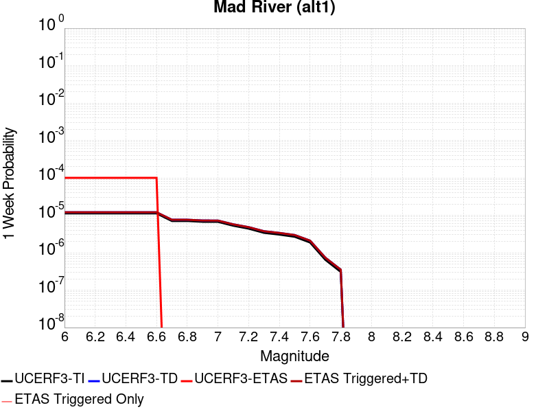 | 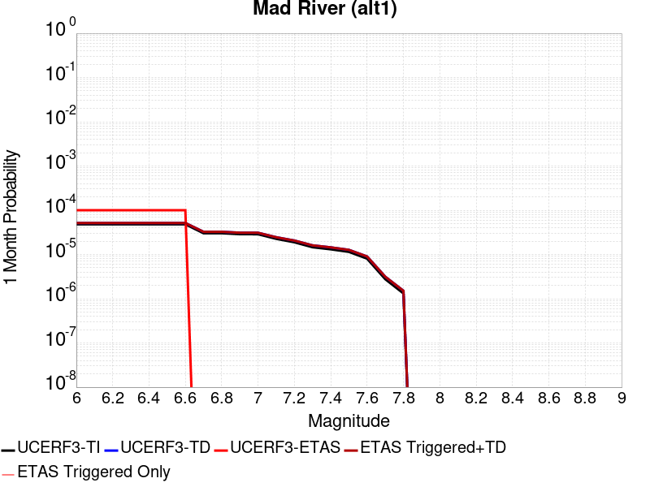 | 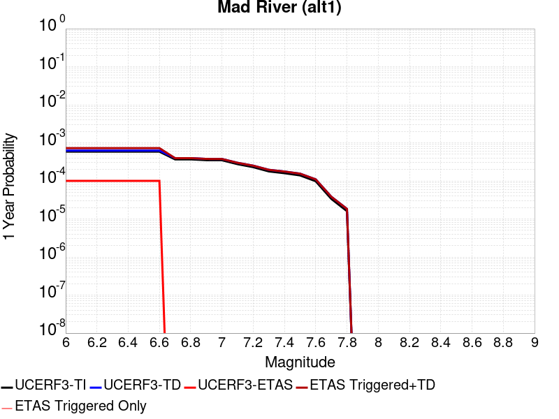 | 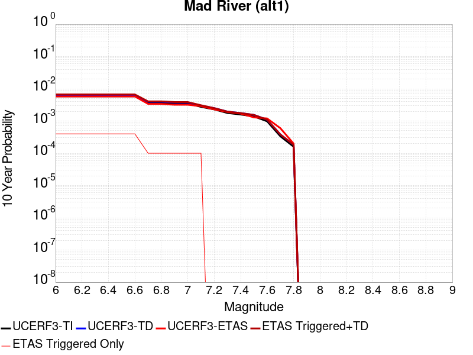 |

| Magnitude | 1 wk TI Prob | 1 wk TD Prob | 1 wk ETAS Prob | 1 wk ETAS/TD Gain | 1 wk ETAS Triggered+TD | 1 wk ETAS Triggered Only | 1 mo TI Prob | 1 mo TD Prob | 1 mo ETAS Prob | 1 mo ETAS/TD Gain | 1 mo ETAS Triggered+TD | 1 mo ETAS Triggered Only | 1 yr TI Prob | 1 yr TD Prob | 1 yr ETAS Prob | 1 yr ETAS/TD Gain | 1 yr ETAS Triggered+TD | 1 yr ETAS Triggered Only | 10 yr TI Prob | 10 yr TD Prob | 10 yr ETAS Prob | 10 yr ETAS/TD Gain | 10 yr ETAS Triggered+TD | 10 yr ETAS Triggered Only |
|-----|-----|-----|-----|-----|-----|-----|-----|-----|-----|-----|-----|-----|-----|-----|-----|-----|-----|-----|-----|-----|-----|-----|-----|-----|
| 6.0 | 1.1255216E-5 | 1.2041404E-5 | 1.0E-4 | 8.30468 | 1.2041404E-5 | 0.0 | 4.8235746E-5 | 5.160508E-5 | 1.0E-4 | 1.9377939 | 5.160508E-5 | 0.0 | 5.87112E-4 | 6.2812516E-4 | 4.0E-4 | 0.6368158 | 7.280623E-4 | 1.0E-4 | 0.0058556325 | 0.0062649366 | 0.0058 | 0.9257875 | 0.0066624307 | 4.0E-4 |
| 6.1 | 1.1255216E-5 | 1.2041404E-5 | 1.0E-4 | 8.30468 | 1.2041404E-5 | 0.0 | 4.8235746E-5 | 5.160508E-5 | 1.0E-4 | 1.9377939 | 5.160508E-5 | 0.0 | 5.87112E-4 | 6.2812516E-4 | 4.0E-4 | 0.6368158 | 7.280623E-4 | 1.0E-4 | 0.0058556325 | 0.0062649366 | 0.0058 | 0.9257875 | 0.0066624307 | 4.0E-4 |
| 6.2 | 1.1255216E-5 | 1.2041404E-5 | 1.0E-4 | 8.30468 | 1.2041404E-5 | 0.0 | 4.8235746E-5 | 5.160508E-5 | 1.0E-4 | 1.9377939 | 5.160508E-5 | 0.0 | 5.87112E-4 | 6.2812516E-4 | 4.0E-4 | 0.6368158 | 7.280623E-4 | 1.0E-4 | 0.0058556325 | 0.0062649366 | 0.0058 | 0.9257875 | 0.0066624307 | 4.0E-4 |
| 6.3 | 1.1255216E-5 | 1.2041404E-5 | 1.0E-4 | 8.30468 | 1.2041404E-5 | 0.0 | 4.8235746E-5 | 5.160508E-5 | 1.0E-4 | 1.9377939 | 5.160508E-5 | 0.0 | 5.87112E-4 | 6.2812516E-4 | 4.0E-4 | 0.6368158 | 7.280623E-4 | 1.0E-4 | 0.0058556325 | 0.0062649366 | 0.0058 | 0.9257875 | 0.0066624307 | 4.0E-4 |
| 6.4 | 1.1255216E-5 | 1.2041404E-5 | 1.0E-4 | 8.30468 | 1.2041404E-5 | 0.0 | 4.8235746E-5 | 5.160508E-5 | 1.0E-4 | 1.9377939 | 5.160508E-5 | 0.0 | 5.87112E-4 | 6.2812516E-4 | 4.0E-4 | 0.6368158 | 7.280623E-4 | 1.0E-4 | 0.0058556325 | 0.0062649366 | 0.0058 | 0.9257875 | 0.0066624307 | 4.0E-4 |
| 6.5 | 1.1255216E-5 | 1.2041404E-5 | 1.0E-4 | 8.30468 | 1.2041404E-5 | 0.0 | 4.8235746E-5 | 5.160508E-5 | 1.0E-4 | 1.9377939 | 5.160508E-5 | 0.0 | 5.87112E-4 | 6.2812516E-4 | 4.0E-4 | 0.6368158 | 7.280623E-4 | 1.0E-4 | 0.0058556325 | 0.0062649366 | 0.0058 | 0.9257875 | 0.0066624307 | 4.0E-4 |
| 6.6 | 1.1255216E-5 | 1.2041404E-5 | 1.0E-4 | 8.30468 | 1.2041404E-5 | 0.0 | 4.8235746E-5 | 5.160508E-5 | 1.0E-4 | 1.9377939 | 5.160508E-5 | 0.0 | 5.87112E-4 | 6.2812516E-4 | 4.0E-4 | 0.6368158 | 7.280623E-4 | 1.0E-4 | 0.0058556325 | 0.0062649366 | 0.0058 | 0.9257875 | 0.0066624307 | 4.0E-4 |
| 6.7 | 7.0564884E-6 | 7.606666E-6 | 0.0 | 0.0 | 7.606666E-6 | 0.0 | 3.0241743E-5 | 3.25996E-5 | 0.0 | 0.0 | 3.25996E-5 | 0.0 | 3.68131E-4 | 3.9683006E-4 | 2.0E-4 | 0.5039941 | 3.9683006E-4 | 0.0 | 0.0036752177 | 0.0039614365 | 0.0034 | 0.85827446 | 0.0040610405 | 1.0E-4 |
| 6.8 | 7.0564884E-6 | 7.606666E-6 | 0.0 | 0.0 | 7.606666E-6 | 0.0 | 3.0241743E-5 | 3.25996E-5 | 0.0 | 0.0 | 3.25996E-5 | 0.0 | 3.68131E-4 | 3.9683006E-4 | 2.0E-4 | 0.5039941 | 3.9683006E-4 | 0.0 | 0.0036752177 | 0.0039614365 | 0.0034 | 0.85827446 | 0.0040610405 | 1.0E-4 |
| 6.9 | 6.727494E-6 | 7.258476E-6 | 0.0 | 0.0 | 7.258476E-6 | 0.0 | 2.8831799E-5 | 3.1107396E-5 | 0.0 | 0.0 | 3.1107396E-5 | 0.0 | 3.509706E-4 | 3.7866886E-4 | 1.0E-4 | 0.26408297 | 3.7866886E-4 | 0.0 | 0.003504168 | 0.0037804518 | 0.0032 | 0.8464597 | 0.0038800738 | 1.0E-4 |
| 7.0 | 6.7021124E-6 | 7.2313123E-6 | 0.0 | 0.0 | 7.2313123E-6 | 0.0 | 2.8723021E-5 | 3.099098E-5 | 0.0 | 0.0 | 3.099098E-5 | 0.0 | 3.4964667E-4 | 3.7725203E-4 | 1.0E-4 | 0.2650748 | 3.7725203E-4 | 0.0 | 0.0034909705 | 0.0037663314 | 0.0032 | 0.84963316 | 0.0038659547 | 1.0E-4 |
| 7.1 | 5.2784667E-6 | 5.7332663E-6 | 0.0 | 0.0 | 5.7332663E-6 | 0.0 | 2.2621804E-5 | 2.4570916E-5 | 0.0 | 0.0 | 2.4570916E-5 | 0.0 | 2.7538565E-4 | 2.9911075E-4 | 1.0E-4 | 0.33432433 | 2.9911075E-4 | 0.0 | 0.0027504463 | 0.0029871739 | 0.0029 | 0.97081727 | 0.0030868752 | 1.0E-4 |
| 7.2 | 4.4085446E-6 | 4.820481E-6 | 0.0 | 0.0 | 4.820481E-6 | 0.0 | 1.8893625E-5 | 2.0659045E-5 | 0.0 | 0.0 | 2.0659045E-5 | 0.0 | 2.3000561E-4 | 2.5149522E-4 | 1.0E-4 | 0.39762187 | 2.5149522E-4 | 0.0 | 0.0022976769 | 0.002512147 | 0.0023 | 0.91555154 | 0.002512147 | 0.0 |
| 7.3 | 3.4060627E-6 | 3.753969E-6 | 0.0 | 0.0 | 3.753969E-6 | 0.0 | 1.459733E-5 | 1.608834E-5 | 0.0 | 0.0 | 1.608834E-5 | 0.0 | 1.77708E-4 | 1.9585817E-4 | 1.0E-4 | 0.51057357 | 1.9585817E-4 | 0.0 | 0.0017756595 | 0.001956879 | 0.0019 | 0.97093385 | 0.001956879 | 0.0 |
| 7.4 | 3.0570902E-6 | 3.3810377E-6 | 0.0 | 0.0 | 3.3810377E-6 | 0.0 | 1.310175E-5 | 1.4490082E-5 | 0.0 | 0.0 | 1.4490082E-5 | 0.0 | 1.5950213E-4 | 1.7640268E-4 | 1.0E-4 | 0.5668848 | 1.7640268E-4 | 0.0 | 0.0015938769 | 0.0017626481 | 0.0017 | 0.9644579 | 0.0017626481 | 0.0 |
| 7.5 | 2.674048E-6 | 2.9699468E-6 | 0.0 | 0.0 | 2.9699468E-6 | 0.0 | 1.1460155E-5 | 1.2728282E-5 | 0.0 | 0.0 | 1.2728282E-5 | 0.0 | 1.3951845E-4 | 1.5495601E-4 | 1.0E-4 | 0.64534444 | 1.5495601E-4 | 0.0 | 0.0013943089 | 0.0015484992 | 0.0013 | 0.83952254 | 0.0015484992 | 0.0 |
| 7.6 | 1.8806261E-6 | 2.1051244E-6 | 0.0 | 0.0 | 2.1051244E-6 | 0.0 | 8.059801E-6 | 9.021932E-6 | 0.0 | 0.0 | 9.021932E-6 | 0.0 | 9.812366E-5 | 1.09836605E-4 | 1.0E-4 | 0.9104433 | 1.09836605E-4 | 0.0 | 9.808034E-4 | 0.0010978356 | 0.0012 | 1.0930598 | 0.0010978356 | 0.0 |
| 7.7 | 6.461283E-7 | 7.342846E-7 | 0.0 | 0.0 | 7.342846E-7 | 0.0 | 2.7691183E-6 | 3.1469303E-6 | 0.0 | 0.0 | 3.1469303E-6 | 0.0 | 3.371349E-5 | 3.8313217E-5 | 0.0 | 0.0 | 3.8313217E-5 | 0.0 | 3.370838E-4 | 3.8306764E-4 | 6.0E-4 | 1.566303 | 3.8306764E-4 | 0.0 |
| 7.8 | 3.0785324E-7 | 3.5300658E-7 | 0.0 | 0.0 | 3.5300658E-7 | 0.0 | 1.3193703E-6 | 1.5128845E-6 | 0.0 | 0.0 | 1.5128845E-6 | 0.0 | 1.6063215E-5 | 1.841922E-5 | 0.0 | 0.0 | 1.841922E-5 | 0.0 | 1.6062055E-4 | 1.8417757E-4 | 2.0E-4 | 1.0859085 | 1.8417757E-4 | 0.0 |

## Los Alamos 2011 CFM
*[(top)](#table-of-contents)*

| 1 Week | 1 Month | 1 Year | 10 Year |
|-----|-----|-----|-----|
| 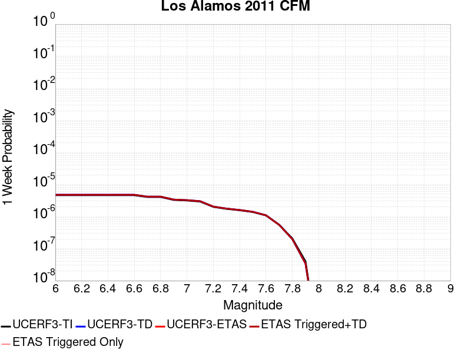 | 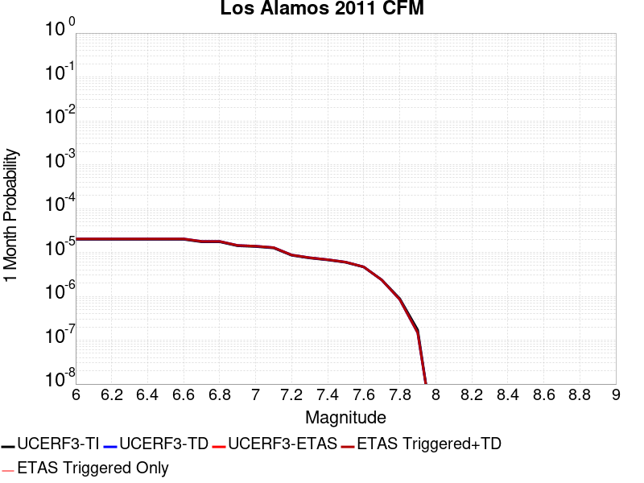 | 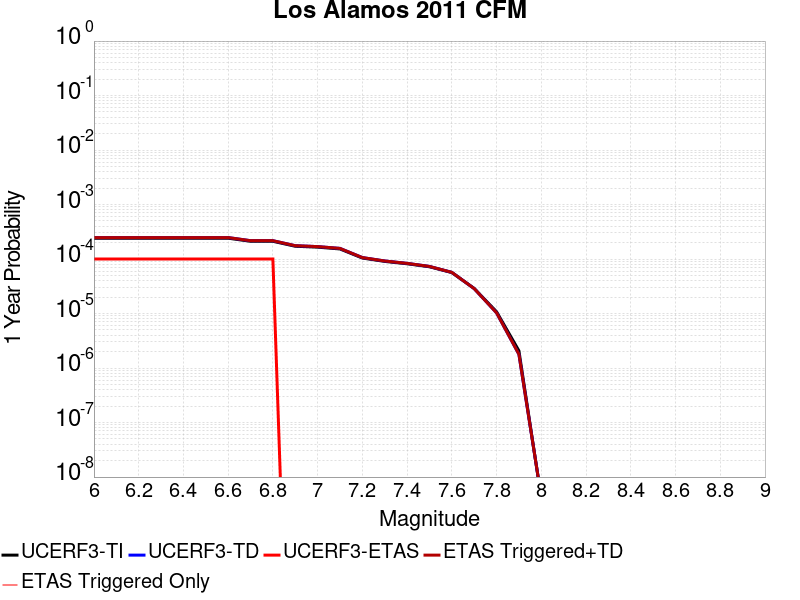 | 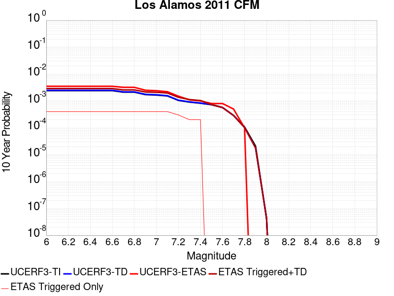 |

| Magnitude | 1 wk TI Prob | 1 wk TD Prob | 1 wk ETAS Prob | 1 wk ETAS/TD Gain | 1 wk ETAS Triggered+TD | 1 wk ETAS Triggered Only | 1 mo TI Prob | 1 mo TD Prob | 1 mo ETAS Prob | 1 mo ETAS/TD Gain | 1 mo ETAS Triggered+TD | 1 mo ETAS Triggered Only | 1 yr TI Prob | 1 yr TD Prob | 1 yr ETAS Prob | 1 yr ETAS/TD Gain | 1 yr ETAS Triggered+TD | 1 yr ETAS Triggered Only | 10 yr TI Prob | 10 yr TD Prob | 10 yr ETAS Prob | 10 yr ETAS/TD Gain | 10 yr ETAS Triggered+TD | 10 yr ETAS Triggered Only |
|-----|-----|-----|-----|-----|-----|-----|-----|-----|-----|-----|-----|-----|-----|-----|-----|-----|-----|-----|-----|-----|-----|-----|-----|-----|
| 6.0 | 4.6284417E-6 | 4.752074E-6 | 0.0 | 0.0 | 4.752074E-6 | 0.0 | 1.9836029E-5 | 2.0365882E-5 | 0.0 | 0.0 | 2.0365882E-5 | 0.0 | 2.4147688E-4 | 2.4792817E-4 | 1.0E-4 | 0.40334263 | 2.4792817E-4 | 0.0 | 0.0024121467 | 0.0024766899 | 0.0035 | 1.4131765 | 0.0028756992 | 4.0E-4 |
| 6.1 | 4.6284417E-6 | 4.752074E-6 | 0.0 | 0.0 | 4.752074E-6 | 0.0 | 1.9836029E-5 | 2.0365882E-5 | 0.0 | 0.0 | 2.0365882E-5 | 0.0 | 2.4147688E-4 | 2.4792817E-4 | 1.0E-4 | 0.40334263 | 2.4792817E-4 | 0.0 | 0.0024121467 | 0.0024766899 | 0.0035 | 1.4131765 | 0.0028756992 | 4.0E-4 |
| 6.2 | 4.6284417E-6 | 4.752074E-6 | 0.0 | 0.0 | 4.752074E-6 | 0.0 | 1.9836029E-5 | 2.0365882E-5 | 0.0 | 0.0 | 2.0365882E-5 | 0.0 | 2.4147688E-4 | 2.4792817E-4 | 1.0E-4 | 0.40334263 | 2.4792817E-4 | 0.0 | 0.0024121467 | 0.0024766899 | 0.0035 | 1.4131765 | 0.0028756992 | 4.0E-4 |
| 6.3 | 4.6284417E-6 | 4.752074E-6 | 0.0 | 0.0 | 4.752074E-6 | 0.0 | 1.9836029E-5 | 2.0365882E-5 | 0.0 | 0.0 | 2.0365882E-5 | 0.0 | 2.4147688E-4 | 2.4792817E-4 | 1.0E-4 | 0.40334263 | 2.4792817E-4 | 0.0 | 0.0024121467 | 0.0024766899 | 0.0035 | 1.4131765 | 0.0028756992 | 4.0E-4 |
| 6.4 | 4.6284417E-6 | 4.752074E-6 | 0.0 | 0.0 | 4.752074E-6 | 0.0 | 1.9836029E-5 | 2.0365882E-5 | 0.0 | 0.0 | 2.0365882E-5 | 0.0 | 2.4147688E-4 | 2.4792817E-4 | 1.0E-4 | 0.40334263 | 2.4792817E-4 | 0.0 | 0.0024121467 | 0.0024766899 | 0.0035 | 1.4131765 | 0.0028756992 | 4.0E-4 |
| 6.5 | 4.6284417E-6 | 4.752074E-6 | 0.0 | 0.0 | 4.752074E-6 | 0.0 | 1.9836029E-5 | 2.0365882E-5 | 0.0 | 0.0 | 2.0365882E-5 | 0.0 | 2.4147688E-4 | 2.4792817E-4 | 1.0E-4 | 0.40334263 | 2.4792817E-4 | 0.0 | 0.0024121467 | 0.0024766899 | 0.0035 | 1.4131765 | 0.0028756992 | 4.0E-4 |
| 6.6 | 4.6284417E-6 | 4.752074E-6 | 0.0 | 0.0 | 4.752074E-6 | 0.0 | 1.9836029E-5 | 2.0365882E-5 | 0.0 | 0.0 | 2.0365882E-5 | 0.0 | 2.4147688E-4 | 2.4792817E-4 | 1.0E-4 | 0.40334263 | 2.4792817E-4 | 0.0 | 0.0024121467 | 0.0024766899 | 0.0035 | 1.4131765 | 0.0028756992 | 4.0E-4 |
| 6.7 | 4.062321E-6 | 4.166651E-6 | 0.0 | 0.0 | 4.166651E-6 | 0.0 | 1.7409831E-5 | 1.785696E-5 | 0.0 | 0.0 | 1.785696E-5 | 0.0 | 2.1194408E-4 | 2.1738831E-4 | 1.0E-4 | 0.46000633 | 2.1738831E-4 | 0.0 | 0.0021174205 | 0.0021719064 | 0.0032 | 1.4733601 | 0.0025710375 | 4.0E-4 |
| 6.8 | 4.062321E-6 | 4.166651E-6 | 0.0 | 0.0 | 4.166651E-6 | 0.0 | 1.7409831E-5 | 1.785696E-5 | 0.0 | 0.0 | 1.785696E-5 | 0.0 | 2.1194408E-4 | 2.1738831E-4 | 1.0E-4 | 0.46000633 | 2.1738831E-4 | 0.0 | 0.0021174205 | 0.0021719064 | 0.0032 | 1.4733601 | 0.0025710375 | 4.0E-4 |
| 6.9 | 3.2936077E-6 | 3.3732072E-6 | 0.0 | 0.0 | 3.3732072E-6 | 0.0 | 1.4115385E-5 | 1.4456527E-5 | 0.0 | 0.0 | 1.4456527E-5 | 0.0 | 1.7184127E-4 | 1.7599495E-4 | 0.0 | 0.0 | 1.7599495E-4 | 0.0 | 0.0017170844 | 0.0017586483 | 0.0025 | 1.4215463 | 0.002157945 | 4.0E-4 |
| 7.0 | 3.1687898E-6 | 3.2450578E-6 | 0.0 | 0.0 | 3.2450578E-6 | 0.0 | 1.3580457E-5 | 1.3907322E-5 | 0.0 | 0.0 | 1.3907322E-5 | 0.0 | 1.6532952E-4 | 1.6930942E-4 | 0.0 | 0.0 | 1.6930942E-4 | 0.0 | 0.0016520657 | 0.0016918959 | 0.0024 | 1.418527 | 0.0020912192 | 4.0E-4 |
| 7.1 | 2.9379228E-6 | 3.0075541E-6 | 0.0 | 0.0 | 3.0075541E-6 | 0.0 | 1.25910365E-5 | 1.2889459E-5 | 0.0 | 0.0 | 1.2889459E-5 | 0.0 | 1.5328509E-4 | 1.5691877E-4 | 0.0 | 0.0 | 1.5691877E-4 | 0.0 | 0.001531794 | 0.0015681689 | 0.0022 | 1.4029101 | 0.0019675416 | 4.0E-4 |
| 7.2 | 2.0020686E-6 | 2.0417947E-6 | 0.0 | 0.0 | 2.0417947E-6 | 0.0 | 8.580266E-6 | 8.75052E-6 | 0.0 | 0.0 | 8.75052E-6 | 0.0 | 1.0445973E-4 | 1.0653241E-4 | 0.0 | 0.0 | 1.0653241E-4 | 0.0 | 0.0010441064 | 0.0010648179 | 0.0015 | 1.4086916 | 0.0013644984 | 3.0E-4 |
| 7.3 | 1.7364243E-6 | 1.7680279E-6 | 0.0 | 0.0 | 1.7680279E-6 | 0.0 | 7.441797E-6 | 7.5772405E-6 | 0.0 | 0.0 | 7.5772405E-6 | 0.0 | 9.0600115E-5 | 9.224903E-5 | 0.0 | 0.0 | 9.224903E-5 | 0.0 | 9.0563187E-4 | 9.221105E-4 | 0.0011 | 1.1929156 | 0.0011219261 | 2.0E-4 |
| 7.4 | 1.5718434E-6 | 1.5984548E-6 | 0.0 | 0.0 | 1.5984548E-6 | 0.0 | 6.7364545E-6 | 6.8505024E-6 | 0.0 | 0.0 | 6.8505024E-6 | 0.0 | 8.201325E-5 | 8.3401705E-5 | 0.0 | 0.0 | 8.3401705E-5 | 0.0 | 8.198299E-4 | 8.3370705E-4 | 0.001 | 1.199462 | 0.0010335403 | 2.0E-4 |
| 7.5 | 1.3841119E-6 | 1.4044028E-6 | 0.0 | 0.0 | 1.4044028E-6 | 0.0 | 5.9318945E-6 | 6.018856E-6 | 0.0 | 0.0 | 6.018856E-6 | 0.0 | 7.221842E-5 | 7.327714E-5 | 0.0 | 0.0 | 7.327714E-5 | 0.0 | 7.2194956E-4 | 7.325326E-4 | 8.0E-4 | 1.0921016 | 7.325326E-4 | 0.0 |
| 7.6 | 1.0843726E-6 | 1.093542E-6 | 0.0 | 0.0 | 1.093542E-6 | 0.0 | 4.647303E-6 | 4.6866003E-6 | 0.0 | 0.0 | 4.6866003E-6 | 0.0 | 5.6579443E-5 | 5.7057892E-5 | 0.0 | 0.0 | 5.7057892E-5 | 0.0 | 5.656504E-4 | 5.70435E-4 | 8.0E-4 | 1.4024385 | 5.70435E-4 | 0.0 |
| 7.7 | 5.544814E-7 | 5.502385E-7 | 0.0 | 0.0 | 5.502385E-7 | 0.0 | 2.3763469E-6 | 2.3581629E-6 | 0.0 | 0.0 | 2.3581629E-6 | 0.0 | 2.8931638E-5 | 2.8710256E-5 | 0.0 | 0.0 | 2.8710256E-5 | 0.0 | 2.8927872E-4 | 2.8706563E-4 | 5.0E-4 | 1.741762 | 2.8706563E-4 | 0.0 |
| 7.8 | 2.0707465E-7 | 1.9780529E-7 | 0.0 | 0.0 | 1.9780529E-7 | 0.0 | 8.874625E-7 | 8.4773666E-7 | 0.0 | 0.0 | 8.4773666E-7 | 0.0 | 1.08048025E-5 | 1.0321146E-5 | 0.0 | 0.0 | 1.0321146E-5 | 0.0 | 1.0804277E-4 | 1.0320671E-4 | 1.0E-4 | 0.9689293 | 1.0320671E-4 | 0.0 |
| 7.9 | 3.9821284E-8 | 3.43351E-8 | 0.0 | 0.0 | 3.43351E-8 | 0.0 | 1.7066264E-7 | 1.4715042E-7 | 0.0 | 0.0 | 1.4715042E-7 | 0.0 | 2.0778157E-6 | 1.7915548E-6 | 0.0 | 0.0 | 1.7915548E-6 | 0.0 | 2.0777963E-5 | 1.791541E-5 | 0.0 | 0.0 | 1.791541E-5 | 0.0 |
| 8.0 | 7.880441E-11 | 8.2360785E-11 | 0.0 | 0.0 | 8.2360785E-11 | 0.0 | 3.3773329E-10 | 3.5297476E-10 | 0.0 | 0.0 | 3.5297476E-10 | 0.0 | 4.1119033E-9 | 4.297468E-9 | 0.0 | 0.0 | 4.297468E-9 | 0.0 | 4.1119034E-8 | 4.297468E-8 | 0.0 | 0.0 | 4.297468E-8 | 0.0 |

## San Jacinto (Clark) rev
*[(top)](#table-of-contents)*

| 1 Week | 1 Month | 1 Year | 10 Year |
|-----|-----|-----|-----|
| 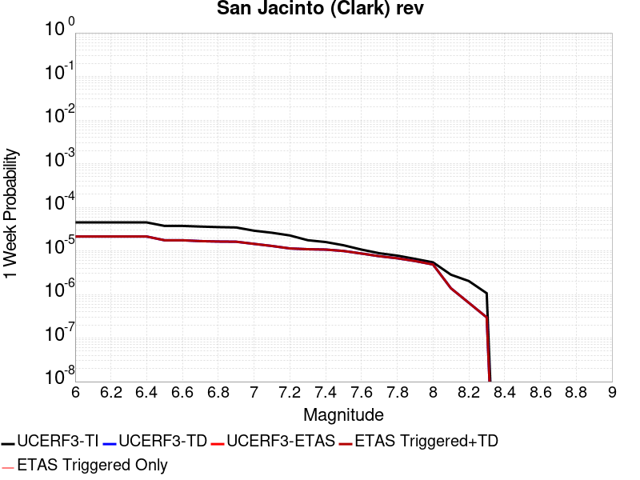 | 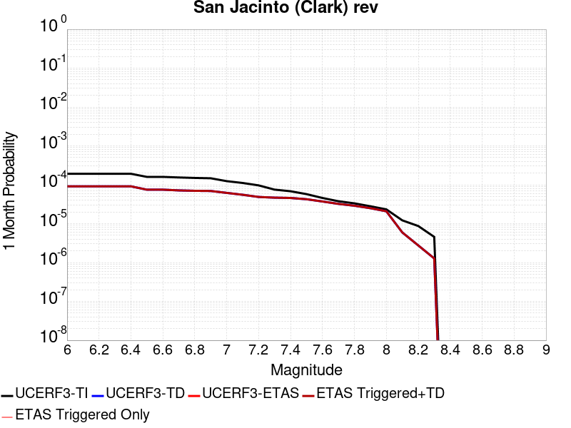 | 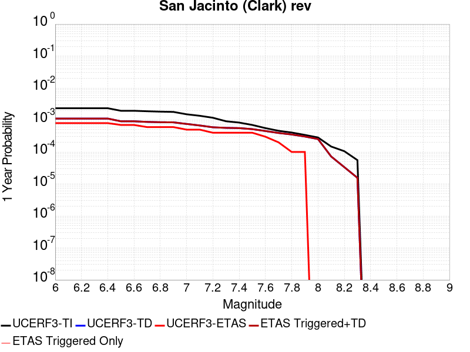 | 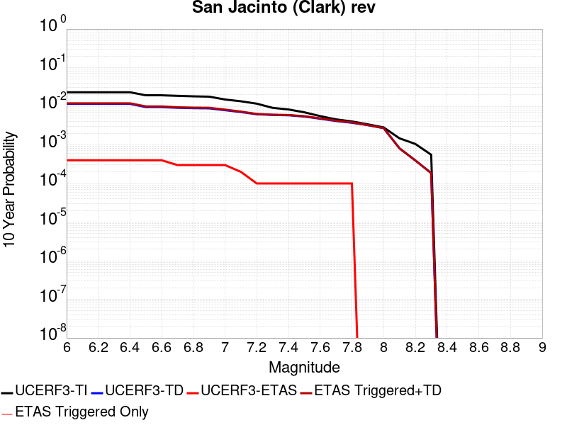 |

| Magnitude | 1 wk TI Prob | 1 wk TD Prob | 1 wk ETAS Prob | 1 wk ETAS/TD Gain | 1 wk ETAS Triggered+TD | 1 wk ETAS Triggered Only | 1 mo TI Prob | 1 mo TD Prob | 1 mo ETAS Prob | 1 mo ETAS/TD Gain | 1 mo ETAS Triggered+TD | 1 mo ETAS Triggered Only | 1 yr TI Prob | 1 yr TD Prob | 1 yr ETAS Prob | 1 yr ETAS/TD Gain | 1 yr ETAS Triggered+TD | 1 yr ETAS Triggered Only | 10 yr TI Prob | 10 yr TD Prob | 10 yr ETAS Prob | 10 yr ETAS/TD Gain | 10 yr ETAS Triggered+TD | 10 yr ETAS Triggered Only |
|-----|-----|-----|-----|-----|-----|-----|-----|-----|-----|-----|-----|-----|-----|-----|-----|-----|-----|-----|-----|-----|-----|-----|-----|-----|
| 6.0 | 4.482615E-5 | 2.1293794E-5 | 0.0 | 0.0 | 2.1293794E-5 | 0.0 | 1.9209793E-4 | 9.125598E-5 | 0.0 | 0.0 | 9.125598E-5 | 0.0 | 0.0023362834 | 0.0011104846 | 8.0E-4 | 0.72040623 | 0.0011104846 | 0.0 | 0.02311874 | 0.011585249 | 0.0064 | 0.55242664 | 0.011980615 | 4.0E-4 |
| 6.1 | 4.482615E-5 | 2.1293794E-5 | 0.0 | 0.0 | 2.1293794E-5 | 0.0 | 1.9209793E-4 | 9.125598E-5 | 0.0 | 0.0 | 9.125598E-5 | 0.0 | 0.0023362834 | 0.0011104846 | 8.0E-4 | 0.72040623 | 0.0011104846 | 0.0 | 0.02311874 | 0.011585249 | 0.0064 | 0.55242664 | 0.011980615 | 4.0E-4 |
| 6.2 | 4.482615E-5 | 2.1293794E-5 | 0.0 | 0.0 | 2.1293794E-5 | 0.0 | 1.9209793E-4 | 9.125598E-5 | 0.0 | 0.0 | 9.125598E-5 | 0.0 | 0.0023362834 | 0.0011104846 | 8.0E-4 | 0.72040623 | 0.0011104846 | 0.0 | 0.02311874 | 0.011585249 | 0.0064 | 0.55242664 | 0.011980615 | 4.0E-4 |
| 6.3 | 4.482615E-5 | 2.1293794E-5 | 0.0 | 0.0 | 2.1293794E-5 | 0.0 | 1.9209793E-4 | 9.125598E-5 | 0.0 | 0.0 | 9.125598E-5 | 0.0 | 0.0023362834 | 0.0011104846 | 8.0E-4 | 0.72040623 | 0.0011104846 | 0.0 | 0.02311874 | 0.011585249 | 0.0064 | 0.55242664 | 0.011980615 | 4.0E-4 |
| 6.4 | 4.482615E-5 | 2.1293794E-5 | 0.0 | 0.0 | 2.1293794E-5 | 0.0 | 1.9209793E-4 | 9.125598E-5 | 0.0 | 0.0 | 9.125598E-5 | 0.0 | 0.0023362834 | 0.0011104846 | 8.0E-4 | 0.72040623 | 0.0011104846 | 0.0 | 0.02311874 | 0.011585249 | 0.0064 | 0.55242664 | 0.011980615 | 4.0E-4 |
| 6.5 | 3.7294863E-5 | 1.7481756E-5 | 0.0 | 0.0 | 1.7481756E-5 | 0.0 | 1.5982533E-4 | 7.4919684E-5 | 0.0 | 0.0 | 7.4919684E-5 | 0.0 | 0.0019441366 | 9.1177E-4 | 7.0E-4 | 0.7677375 | 9.1177E-4 | 0.0 | 0.01927216 | 0.009558785 | 0.0057 | 0.59631014 | 0.009954961 | 4.0E-4 |
| 6.6 | 3.7294863E-5 | 1.7481756E-5 | 0.0 | 0.0 | 1.7481756E-5 | 0.0 | 1.5982533E-4 | 7.4919684E-5 | 0.0 | 0.0 | 7.4919684E-5 | 0.0 | 0.0019441366 | 9.1177E-4 | 7.0E-4 | 0.7677375 | 9.1177E-4 | 0.0 | 0.01927216 | 0.009558785 | 0.0057 | 0.59631014 | 0.009954961 | 4.0E-4 |
| 6.7 | 3.6039248E-5 | 1.6727376E-5 | 0.0 | 0.0 | 1.6727376E-5 | 0.0 | 1.5444479E-4 | 7.168681E-5 | 0.0 | 0.0 | 7.168681E-5 | 0.0 | 0.0018787434 | 8.7244157E-4 | 6.0E-4 | 0.6877251 | 8.7244157E-4 | 0.0 | 0.01862939 | 0.009158496 | 0.005 | 0.5459412 | 0.009455749 | 3.0E-4 |
| 6.8 | 3.5031844E-5 | 1.6354066E-5 | 0.0 | 0.0 | 1.6354066E-5 | 0.0 | 1.5012783E-4 | 7.0087E-5 | 0.0 | 0.0 | 7.0087E-5 | 0.0 | 0.0018262739 | 8.5297925E-4 | 6.0E-4 | 0.7034169 | 8.5297925E-4 | 0.0 | 0.01811338 | 0.008956728 | 0.0049 | 0.5470748 | 0.009254041 | 3.0E-4 |
| 6.9 | 3.435112E-5 | 1.6183487E-5 | 0.0 | 0.0 | 1.6183487E-5 | 0.0 | 1.4721078E-4 | 6.935598E-5 | 0.0 | 0.0 | 6.935598E-5 | 0.0 | 0.0017908178 | 8.4408605E-4 | 6.0E-4 | 0.710828 | 8.4408605E-4 | 0.0 | 0.017764548 | 0.008863087 | 0.0048 | 0.54157203 | 0.009160428 | 3.0E-4 |
| 7.0 | 2.8959772E-5 | 1.4447127E-5 | 0.0 | 0.0 | 1.4447127E-5 | 0.0 | 1.241074E-4 | 6.1914805E-5 | 0.0 | 0.0 | 6.1914805E-5 | 0.0 | 0.0015099603 | 7.5355486E-4 | 5.0E-4 | 0.6635217 | 7.5355486E-4 | 0.0 | 0.014997416 | 0.007923536 | 0.0041 | 0.51744574 | 0.00822116 | 3.0E-4 |
| 7.1 | 2.6002877E-5 | 1.2929574E-5 | 0.0 | 0.0 | 1.2929574E-5 | 0.0 | 1.11436144E-4 | 5.5411296E-5 | 0.0 | 0.0 | 5.5411296E-5 | 0.0 | 0.0013558907 | 6.7442586E-4 | 5.0E-4 | 0.74137133 | 6.7442586E-4 | 0.0 | 0.013476475 | 0.007098975 | 0.0038 | 0.5352885 | 0.0072975555 | 2.0E-4 |
| 7.2 | 2.2544838E-5 | 1.1354025E-5 | 0.0 | 0.0 | 1.1354025E-5 | 0.0 | 9.661716E-5 | 4.865921E-5 | 0.0 | 0.0 | 4.865921E-5 | 0.0 | 0.001175679 | 5.922663E-4 | 4.0E-4 | 0.6753718 | 5.922663E-4 | 0.0 | 0.011694785 | 0.0062389392 | 0.0031 | 0.49687934 | 0.0063383156 | 1.0E-4 |
| 7.3 | 1.75334E-5 | 1.0896242E-5 | 0.0 | 0.0 | 1.0896242E-5 | 0.0 | 7.514098E-5 | 4.669735E-5 | 0.0 | 0.0 | 4.669735E-5 | 0.0 | 9.144575E-4 | 5.683933E-4 | 4.0E-4 | 0.70373803 | 5.683933E-4 | 0.0 | 0.009107036 | 0.005978506 | 0.0031 | 0.51852417 | 0.006077908 | 1.0E-4 |
| 7.4 | 1.5924552E-5 | 1.06942425E-5 | 0.0 | 0.0 | 1.06942425E-5 | 0.0 | 6.82463E-5 | 4.583167E-5 | 0.0 | 0.0 | 4.583167E-5 | 0.0 | 8.305819E-4 | 5.5785914E-4 | 4.0E-4 | 0.7170269 | 5.5785914E-4 | 0.0 | 0.008274844 | 0.005864841 | 0.003 | 0.5115228 | 0.0059642545 | 1.0E-4 |
| 7.5 | 1.3428931E-5 | 9.929865E-6 | 0.0 | 0.0 | 9.929865E-6 | 0.0 | 5.7551293E-5 | 4.2555876E-5 | 0.0 | 0.0 | 4.2555876E-5 | 0.0 | 7.004617E-4 | 5.1799574E-4 | 4.0E-4 | 0.77220714 | 5.1799574E-4 | 0.0 | 0.006982579 | 0.005447917 | 0.0028 | 0.5139579 | 0.005547372 | 1.0E-4 |
| 7.6 | 1.0688787E-5 | 8.683251E-6 | 0.0 | 0.0 | 8.683251E-6 | 0.0 | 4.5808283E-5 | 3.72134E-5 | 0.0 | 0.0 | 3.72134E-5 | 0.0 | 5.5757316E-4 | 4.5297947E-4 | 3.0E-4 | 0.6622817 | 4.5297947E-4 | 0.0 | 0.005561762 | 0.0047778687 | 0.0022 | 0.46045637 | 0.004877391 | 1.0E-4 |
| 7.7 | 8.81236E-6 | 7.5341413E-6 | 0.0 | 0.0 | 7.5341413E-6 | 0.0 | 3.776671E-5 | 3.228878E-5 | 0.0 | 0.0 | 3.228878E-5 | 0.0 | 4.597127E-4 | 3.930452E-4 | 2.0E-4 | 0.50884736 | 3.930452E-4 | 0.0 | 0.0045876284 | 0.0041698874 | 0.002 | 0.47962925 | 0.0042694705 | 1.0E-4 |
| 7.8 | 7.780431E-6 | 6.7590195E-6 | 0.0 | 0.0 | 6.7590195E-6 | 0.0 | 3.3344273E-5 | 2.8966904E-5 | 0.0 | 0.0 | 2.8966904E-5 | 0.0 | 4.0589093E-4 | 3.5261517E-4 | 1.0E-4 | 0.28359526 | 3.5261517E-4 | 0.0 | 0.0040515037 | 0.0037561755 | 0.0018 | 0.47921082 | 0.0038558 | 1.0E-4 |
| 7.9 | 6.5437994E-6 | 5.8386504E-6 | 0.0 | 0.0 | 5.8386504E-6 | 0.0 | 2.8044553E-5 | 2.502255E-5 | 0.0 | 0.0 | 2.502255E-5 | 0.0 | 3.4138895E-4 | 3.0460712E-4 | 1.0E-4 | 0.32829174 | 3.0460712E-4 | 0.0 | 0.0034086495 | 0.003265643 | 0.0015 | 0.4593276 | 0.003265643 | 0.0 |
| 8.0 | 5.4488164E-6 | 4.8649817E-6 | 0.0 | 0.0 | 4.8649817E-6 | 0.0 | 2.3351862E-5 | 2.0849757E-5 | 0.0 | 0.0 | 2.0849757E-5 | 0.0 | 2.8427184E-4 | 2.5381637E-4 | 0.0 | 0.0 | 2.5381637E-4 | 0.0 | 0.0028390845 | 0.0027385703 | 0.0012 | 0.43818483 | 0.0027385703 | 0.0 |
| 8.1 | 2.8397242E-6 | 1.3873578E-6 | 0.0 | 0.0 | 1.3873578E-6 | 0.0 | 1.217019E-5 | 5.9458057E-6 | 0.0 | 0.0 | 5.9458057E-6 | 0.0 | 1.4816198E-4 | 7.238779E-5 | 0.0 | 0.0 | 7.238779E-5 | 0.0 | 0.0014806325 | 8.229627E-4 | 5.0E-4 | 0.60756093 | 8.229627E-4 | 0.0 |
| 8.2 | 2.030244E-6 | 6.434344E-7 | 0.0 | 0.0 | 6.434344E-7 | 0.0 | 8.701017E-6 | 2.7575734E-6 | 0.0 | 0.0 | 2.7575734E-6 | 0.0 | 1.05929736E-4 | 3.3572942E-5 | 0.0 | 0.0 | 3.3572942E-5 | 0.0 | 0.0010587925 | 4.0158202E-4 | 2.0E-4 | 0.49803025 | 4.0158202E-4 | 0.0 |
| 8.3 | 1.0659804E-6 | 2.98134E-7 | 0.0 | 0.0 | 2.98134E-7 | 0.0 | 4.568479E-6 | 1.2777166E-6 | 0.0 | 0.0 | 1.2777166E-6 | 0.0 | 5.5619817E-5 | 1.5556092E-5 | 0.0 | 0.0 | 1.5556092E-5 | 0.0 | 5.5605895E-4 | 1.8900142E-4 | 1.0E-4 | 0.52909654 | 1.8900142E-4 | 0.0 |

## Great Valley 03a Dunnigan Hills
*[(top)](#table-of-contents)*

| 1 Week | 1 Month | 1 Year | 10 Year |
|-----|-----|-----|-----|
| 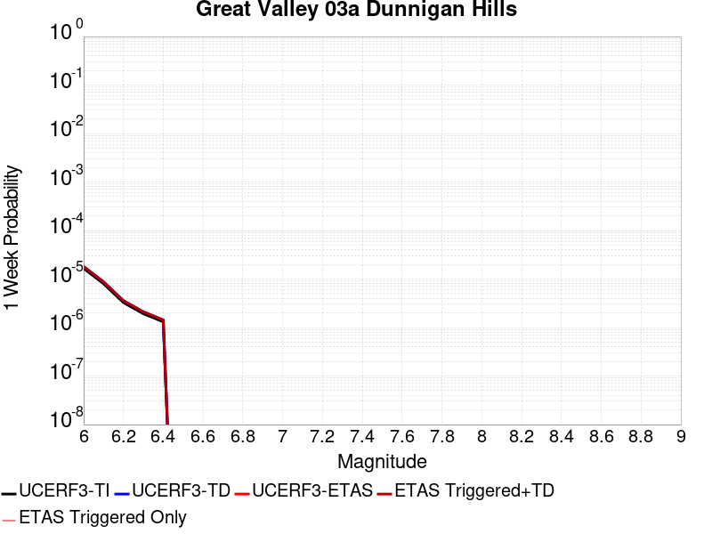 | 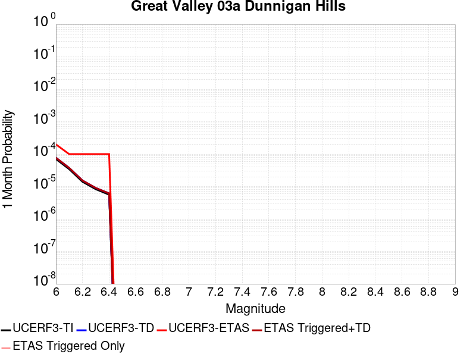 | 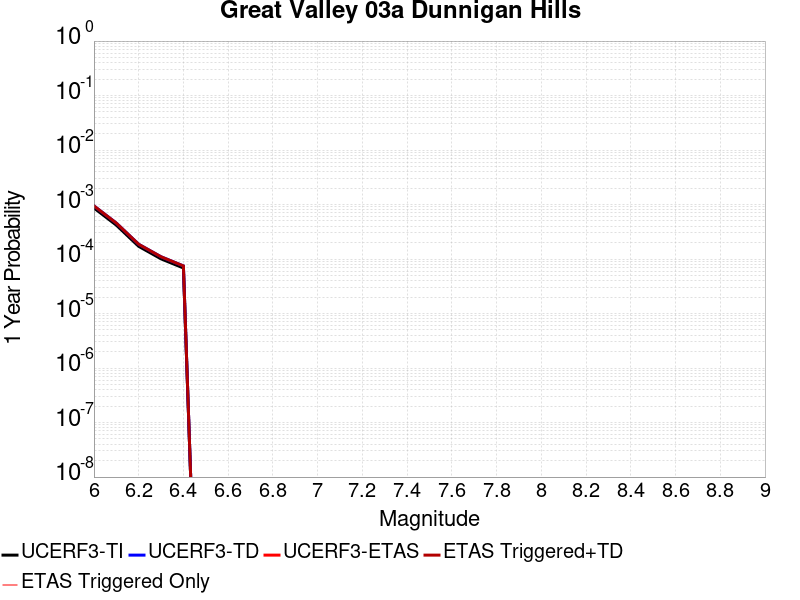 | 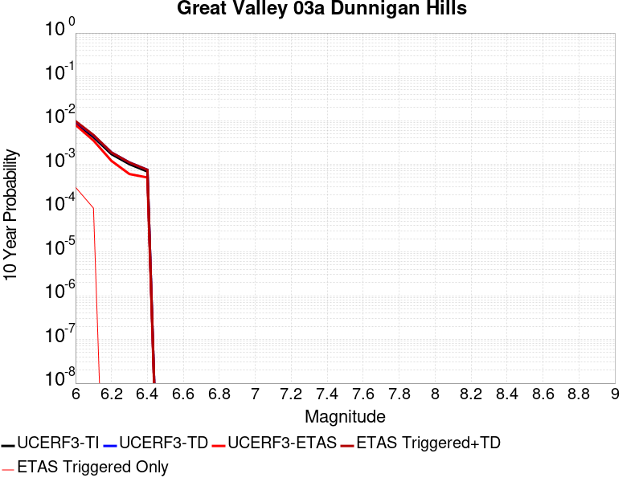 |

| Magnitude | 1 wk TI Prob | 1 wk TD Prob | 1 wk ETAS Prob | 1 wk ETAS/TD Gain | 1 wk ETAS Triggered+TD | 1 wk ETAS Triggered Only | 1 mo TI Prob | 1 mo TD Prob | 1 mo ETAS Prob | 1 mo ETAS/TD Gain | 1 mo ETAS Triggered+TD | 1 mo ETAS Triggered Only | 1 yr TI Prob | 1 yr TD Prob | 1 yr ETAS Prob | 1 yr ETAS/TD Gain | 1 yr ETAS Triggered+TD | 1 yr ETAS Triggered Only | 10 yr TI Prob | 10 yr TD Prob | 10 yr ETAS Prob | 10 yr ETAS/TD Gain | 10 yr ETAS Triggered+TD | 10 yr ETAS Triggered Only |
|-----|-----|-----|-----|-----|-----|-----|-----|-----|-----|-----|-----|-----|-----|-----|-----|-----|-----|-----|-----|-----|-----|-----|-----|-----|
| 6.0 | 1.6591328E-5 | 1.8111363E-5 | 0.0 | 0.0 | 1.8111363E-5 | 0.0 | 7.110376E-5 | 7.7618206E-5 | 2.0E-4 | 2.576715 | 7.7618206E-5 | 0.0 | 8.6534437E-4 | 9.446611E-4 | 9.0E-4 | 0.9527226 | 9.446611E-4 | 0.0 | 0.008619824 | 0.00941329 | 0.008 | 0.8498623 | 0.009710466 | 3.0E-4 |
| 6.1 | 8.041125E-6 | 8.771363E-6 | 0.0 | 0.0 | 8.771363E-6 | 0.0 | 3.4461507E-5 | 3.759113E-5 | 1.0E-4 | 2.660202 | 3.759113E-5 | 0.0 | 4.194881E-4 | 4.575962E-4 | 5.0E-4 | 1.0926664 | 4.575962E-4 | 0.0 | 0.004186971 | 0.0045685377 | 0.0035 | 0.76610947 | 0.004668081 | 1.0E-4 |
| 6.2 | 3.2807004E-6 | 3.5802404E-6 | 0.0 | 0.0 | 3.5802404E-6 | 0.0 | 1.4060069E-5 | 1.534382E-5 | 1.0E-4 | 6.5172815 | 1.534382E-5 | 0.0 | 1.7116789E-4 | 1.8679915E-4 | 1.0E-4 | 0.5353343 | 1.8679915E-4 | 0.0 | 0.0017103611 | 0.0018668296 | 0.0012 | 0.64280105 | 0.0018668296 | 0.0 |
| 6.3 | 1.9339366E-6 | 2.1107771E-6 | 0.0 | 0.0 | 2.1107771E-6 | 0.0 | 8.288273E-6 | 9.046173E-6 | 1.0E-4 | 11.054399 | 9.046173E-6 | 0.0 | 1.00905054E-4 | 1.10134446E-4 | 1.0E-4 | 0.90798116 | 1.10134446E-4 | 0.0 | 0.0010085925 | 0.0011010787 | 6.0E-4 | 0.5449202 | 0.0011010787 | 0.0 |
| 6.4 | 1.3142635E-6 | 1.4342556E-6 | 0.0 | 0.0 | 1.4342556E-6 | 0.0 | 5.6325457E-6 | 6.14681E-6 | 1.0E-4 | 16.2686 | 6.14681E-6 | 0.0 | 6.857408E-5 | 7.483741E-5 | 1.0E-4 | 1.33623 | 7.483741E-5 | 0.0 | 6.8552926E-4 | 7.483741E-4 | 5.0E-4 | 0.668115 | 7.483741E-4 | 0.0 |

## Fontana (Seismicity)
*[(top)](#table-of-contents)*

| 1 Week | 1 Month | 1 Year | 10 Year |
|-----|-----|-----|-----|
| 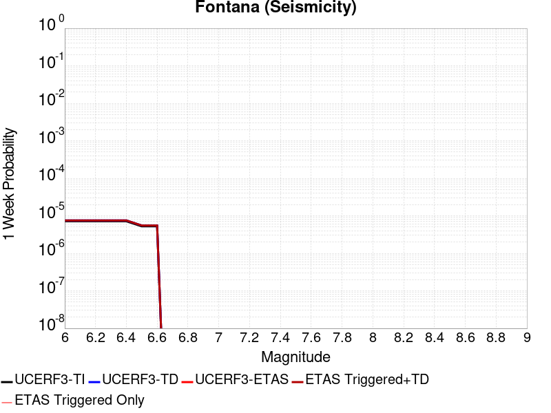 | 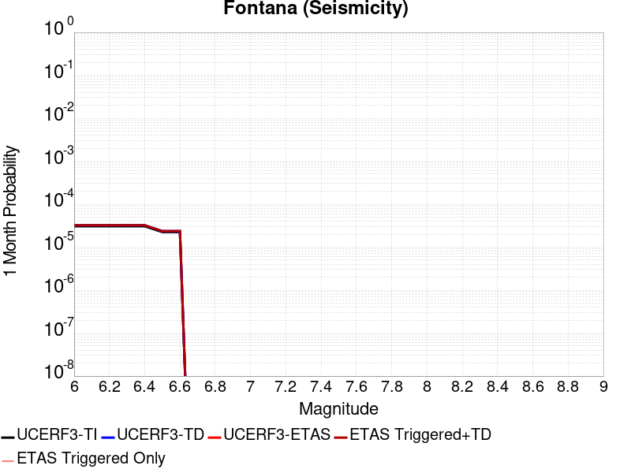 | 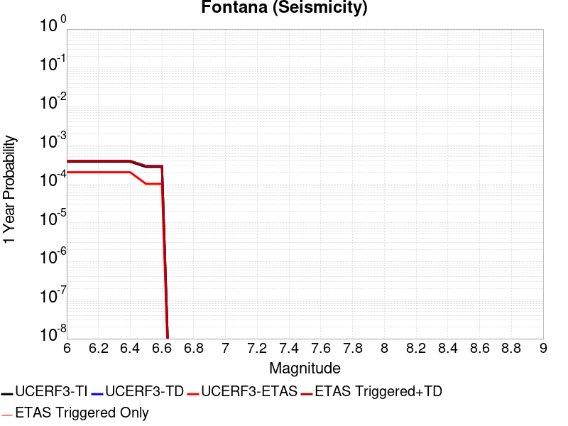 | 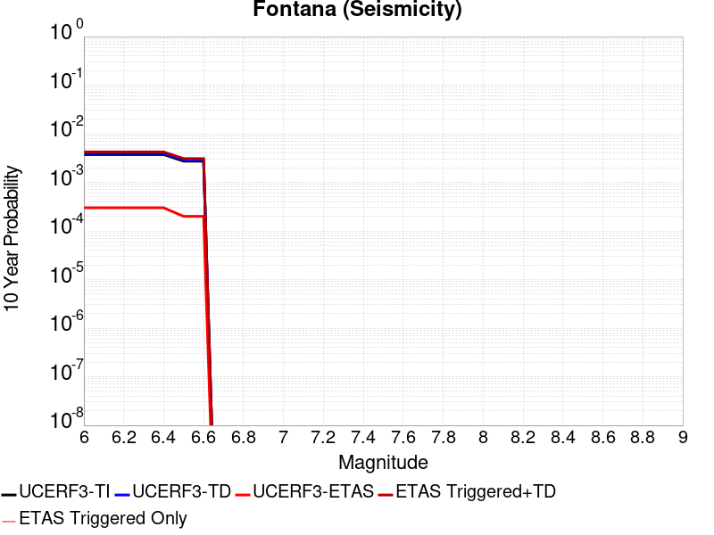 |

| Magnitude | 1 wk TI Prob | 1 wk TD Prob | 1 wk ETAS Prob | 1 wk ETAS/TD Gain | 1 wk ETAS Triggered+TD | 1 wk ETAS Triggered Only | 1 mo TI Prob | 1 mo TD Prob | 1 mo ETAS Prob | 1 mo ETAS/TD Gain | 1 mo ETAS Triggered+TD | 1 mo ETAS Triggered Only | 1 yr TI Prob | 1 yr TD Prob | 1 yr ETAS Prob | 1 yr ETAS/TD Gain | 1 yr ETAS Triggered+TD | 1 yr ETAS Triggered Only | 10 yr TI Prob | 10 yr TD Prob | 10 yr ETAS Prob | 10 yr ETAS/TD Gain | 10 yr ETAS Triggered+TD | 10 yr ETAS Triggered Only |
|-----|-----|-----|-----|-----|-----|-----|-----|-----|-----|-----|-----|-----|-----|-----|-----|-----|-----|-----|-----|-----|-----|-----|-----|-----|
| 6.0 | 7.1789214E-6 | 7.5528087E-6 | 0.0 | 0.0 | 7.5528087E-6 | 0.0 | 3.076644E-5 | 3.236901E-5 | 0.0 | 0.0 | 3.236901E-5 | 0.0 | 3.7451705E-4 | 3.9406223E-4 | 2.0E-4 | 0.5075341 | 3.9406223E-4 | 0.0 | 0.003738865 | 0.003937635 | 0.0018 | 0.45712718 | 0.0042364537 | 3.0E-4 |
| 6.1 | 7.1789214E-6 | 7.5528087E-6 | 0.0 | 0.0 | 7.5528087E-6 | 0.0 | 3.076644E-5 | 3.236901E-5 | 0.0 | 0.0 | 3.236901E-5 | 0.0 | 3.7451705E-4 | 3.9406223E-4 | 2.0E-4 | 0.5075341 | 3.9406223E-4 | 0.0 | 0.003738865 | 0.003937635 | 0.0018 | 0.45712718 | 0.0042364537 | 3.0E-4 |
| 6.2 | 7.1789214E-6 | 7.5528087E-6 | 0.0 | 0.0 | 7.5528087E-6 | 0.0 | 3.076644E-5 | 3.236901E-5 | 0.0 | 0.0 | 3.236901E-5 | 0.0 | 3.7451705E-4 | 3.9406223E-4 | 2.0E-4 | 0.5075341 | 3.9406223E-4 | 0.0 | 0.003738865 | 0.003937635 | 0.0018 | 0.45712718 | 0.0042364537 | 3.0E-4 |
| 6.3 | 7.1789214E-6 | 7.5528087E-6 | 0.0 | 0.0 | 7.5528087E-6 | 0.0 | 3.076644E-5 | 3.236901E-5 | 0.0 | 0.0 | 3.236901E-5 | 0.0 | 3.7451705E-4 | 3.9406223E-4 | 2.0E-4 | 0.5075341 | 3.9406223E-4 | 0.0 | 0.003738865 | 0.003937635 | 0.0018 | 0.45712718 | 0.0042364537 | 3.0E-4 |
| 6.4 | 7.1789214E-6 | 7.5528087E-6 | 0.0 | 0.0 | 7.5528087E-6 | 0.0 | 3.076644E-5 | 3.236901E-5 | 0.0 | 0.0 | 3.236901E-5 | 0.0 | 3.7451705E-4 | 3.9406223E-4 | 2.0E-4 | 0.5075341 | 3.9406223E-4 | 0.0 | 0.003738865 | 0.003937635 | 0.0018 | 0.45712718 | 0.0042364537 | 3.0E-4 |
| 6.5 | 5.2611317E-6 | 5.533314E-6 | 0.0 | 0.0 | 5.533314E-6 | 0.0 | 2.2547512E-5 | 2.3714203E-5 | 0.0 | 0.0 | 2.3714203E-5 | 0.0 | 2.744814E-4 | 2.8872042E-4 | 1.0E-4 | 0.34635583 | 2.8872042E-4 | 0.0 | 0.002741426 | 0.002887204 | 0.0015 | 0.51953375 | 0.0030866268 | 2.0E-4 |
| 6.6 | 5.2611317E-6 | 5.533314E-6 | 0.0 | 0.0 | 5.533314E-6 | 0.0 | 2.2547512E-5 | 2.3714203E-5 | 0.0 | 0.0 | 2.3714203E-5 | 0.0 | 2.744814E-4 | 2.8872042E-4 | 1.0E-4 | 0.34635583 | 2.8872042E-4 | 0.0 | 0.002741426 | 0.002887204 | 0.0015 | 0.51953375 | 0.0030866268 | 2.0E-4 |

## Northridge Hills
*[(top)](#table-of-contents)*

| 1 Week | 1 Month | 1 Year | 10 Year |
|-----|-----|-----|-----|
| 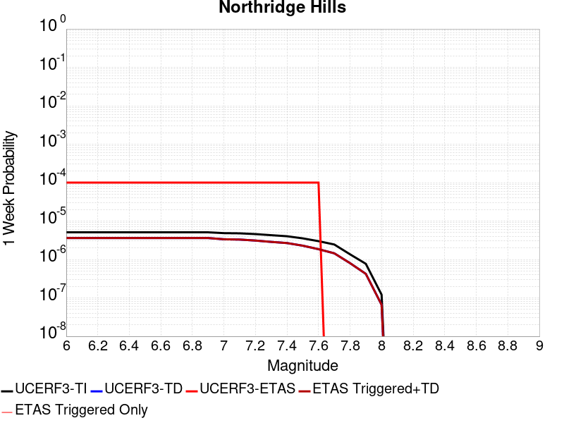 | 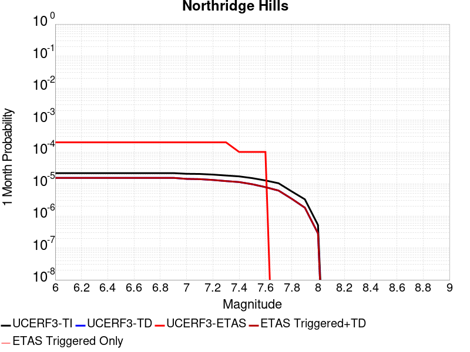 | 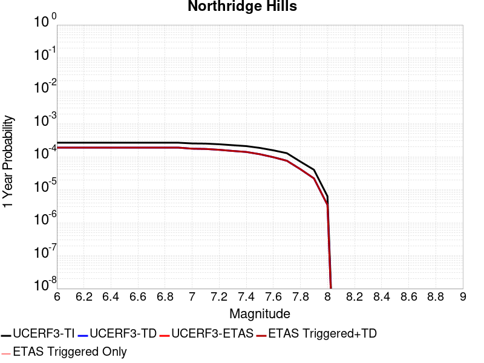 | 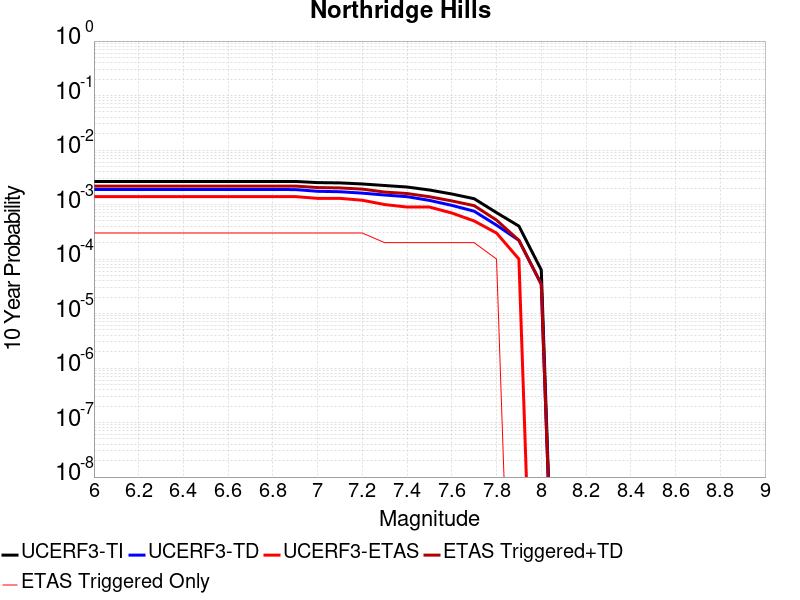 |

| Magnitude | 1 wk TI Prob | 1 wk TD Prob | 1 wk ETAS Prob | 1 wk ETAS/TD Gain | 1 wk ETAS Triggered+TD | 1 wk ETAS Triggered Only | 1 mo TI Prob | 1 mo TD Prob | 1 mo ETAS Prob | 1 mo ETAS/TD Gain | 1 mo ETAS Triggered+TD | 1 mo ETAS Triggered Only | 1 yr TI Prob | 1 yr TD Prob | 1 yr ETAS Prob | 1 yr ETAS/TD Gain | 1 yr ETAS Triggered+TD | 1 yr ETAS Triggered Only | 10 yr TI Prob | 10 yr TD Prob | 10 yr ETAS Prob | 10 yr ETAS/TD Gain | 10 yr ETAS Triggered+TD | 10 yr ETAS Triggered Only |
|-----|-----|-----|-----|-----|-----|-----|-----|-----|-----|-----|-----|-----|-----|-----|-----|-----|-----|-----|-----|-----|-----|-----|-----|-----|
| 6.0 | 5.095982E-6 | 3.6166268E-6 | 1.0E-4 | 27.650074 | 3.6166268E-6 | 0.0 | 2.183974E-5 | 1.5499738E-5 | 2.0E-4 | 12.903444 | 1.5499738E-5 | 0.0 | 2.658664E-4 | 1.8869308E-4 | 3.0E-4 | 1.5898834 | 1.8869308E-4 | 0.0 | 0.0026554854 | 0.001885341 | 0.0014 | 0.74257123 | 0.0021847754 | 3.0E-4 |
| 6.1 | 5.095982E-6 | 3.6166268E-6 | 1.0E-4 | 27.650074 | 3.6166268E-6 | 0.0 | 2.183974E-5 | 1.5499738E-5 | 2.0E-4 | 12.903444 | 1.5499738E-5 | 0.0 | 2.658664E-4 | 1.8869308E-4 | 3.0E-4 | 1.5898834 | 1.8869308E-4 | 0.0 | 0.0026554854 | 0.001885341 | 0.0014 | 0.74257123 | 0.0021847754 | 3.0E-4 |
| 6.2 | 5.095982E-6 | 3.6166268E-6 | 1.0E-4 | 27.650074 | 3.6166268E-6 | 0.0 | 2.183974E-5 | 1.5499738E-5 | 2.0E-4 | 12.903444 | 1.5499738E-5 | 0.0 | 2.658664E-4 | 1.8869308E-4 | 3.0E-4 | 1.5898834 | 1.8869308E-4 | 0.0 | 0.0026554854 | 0.001885341 | 0.0014 | 0.74257123 | 0.0021847754 | 3.0E-4 |
| 6.3 | 5.095982E-6 | 3.6166268E-6 | 1.0E-4 | 27.650074 | 3.6166268E-6 | 0.0 | 2.183974E-5 | 1.5499738E-5 | 2.0E-4 | 12.903444 | 1.5499738E-5 | 0.0 | 2.658664E-4 | 1.8869308E-4 | 3.0E-4 | 1.5898834 | 1.8869308E-4 | 0.0 | 0.0026554854 | 0.001885341 | 0.0014 | 0.74257123 | 0.0021847754 | 3.0E-4 |
| 6.4 | 5.095982E-6 | 3.6166268E-6 | 1.0E-4 | 27.650074 | 3.6166268E-6 | 0.0 | 2.183974E-5 | 1.5499738E-5 | 2.0E-4 | 12.903444 | 1.5499738E-5 | 0.0 | 2.658664E-4 | 1.8869308E-4 | 3.0E-4 | 1.5898834 | 1.8869308E-4 | 0.0 | 0.0026554854 | 0.001885341 | 0.0014 | 0.74257123 | 0.0021847754 | 3.0E-4 |
| 6.5 | 5.095982E-6 | 3.6166268E-6 | 1.0E-4 | 27.650074 | 3.6166268E-6 | 0.0 | 2.183974E-5 | 1.5499738E-5 | 2.0E-4 | 12.903444 | 1.5499738E-5 | 0.0 | 2.658664E-4 | 1.8869308E-4 | 3.0E-4 | 1.5898834 | 1.8869308E-4 | 0.0 | 0.0026554854 | 0.001885341 | 0.0014 | 0.74257123 | 0.0021847754 | 3.0E-4 |
| 6.6 | 5.095982E-6 | 3.6166268E-6 | 1.0E-4 | 27.650074 | 3.6166268E-6 | 0.0 | 2.183974E-5 | 1.5499738E-5 | 2.0E-4 | 12.903444 | 1.5499738E-5 | 0.0 | 2.658664E-4 | 1.8869308E-4 | 3.0E-4 | 1.5898834 | 1.8869308E-4 | 0.0 | 0.0026554854 | 0.001885341 | 0.0014 | 0.74257123 | 0.0021847754 | 3.0E-4 |
| 6.7 | 5.095982E-6 | 3.6166268E-6 | 1.0E-4 | 27.650074 | 3.6166268E-6 | 0.0 | 2.183974E-5 | 1.5499738E-5 | 2.0E-4 | 12.903444 | 1.5499738E-5 | 0.0 | 2.658664E-4 | 1.8869308E-4 | 3.0E-4 | 1.5898834 | 1.8869308E-4 | 0.0 | 0.0026554854 | 0.001885341 | 0.0014 | 0.74257123 | 0.0021847754 | 3.0E-4 |
| 6.8 | 5.095982E-6 | 3.6166268E-6 | 1.0E-4 | 27.650074 | 3.6166268E-6 | 0.0 | 2.183974E-5 | 1.5499738E-5 | 2.0E-4 | 12.903444 | 1.5499738E-5 | 0.0 | 2.658664E-4 | 1.8869308E-4 | 3.0E-4 | 1.5898834 | 1.8869308E-4 | 0.0 | 0.0026554854 | 0.001885341 | 0.0014 | 0.74257123 | 0.0021847754 | 3.0E-4 |
| 6.9 | 5.0942654E-6 | 3.6148415E-6 | 1.0E-4 | 27.663729 | 3.6148415E-6 | 0.0 | 2.1832384E-5 | 1.5492087E-5 | 2.0E-4 | 12.909817 | 1.5492087E-5 | 0.0 | 2.6577685E-4 | 1.8859995E-4 | 3.0E-4 | 1.5906684 | 1.8859995E-4 | 0.0 | 0.002654592 | 0.0018844113 | 0.0014 | 0.74293756 | 0.002183846 | 3.0E-4 |
| 7.0 | 4.851143E-6 | 3.3601316E-6 | 1.0E-4 | 29.760738 | 3.3601316E-6 | 0.0 | 2.0790447E-5 | 1.4400484E-5 | 2.0E-4 | 13.888421 | 1.4400484E-5 | 0.0 | 2.5309427E-4 | 1.7531183E-4 | 3.0E-4 | 1.7112365 | 1.7531183E-4 | 0.0 | 0.0025280623 | 0.0017517398 | 0.0013 | 0.7421194 | 0.0020512142 | 3.0E-4 |
| 7.1 | 4.7910607E-6 | 3.2984067E-6 | 1.0E-4 | 30.317669 | 3.2984067E-6 | 0.0 | 2.0532956E-5 | 1.41359515E-5 | 2.0E-4 | 14.148322 | 1.41359515E-5 | 0.0 | 2.4996005E-4 | 1.7209166E-4 | 3.0E-4 | 1.743257 | 1.7209166E-4 | 0.0 | 0.0024967908 | 0.0017195881 | 0.0013 | 0.75599504 | 0.0020190722 | 3.0E-4 |
| 7.2 | 4.580079E-6 | 3.1081634E-6 | 1.0E-4 | 32.17334 | 3.1081634E-6 | 0.0 | 1.9628762E-5 | 1.3320632E-5 | 2.0E-4 | 15.014302 | 1.3320632E-5 | 0.0 | 2.3895396E-4 | 1.6216666E-4 | 2.0E-4 | 1.2332991 | 1.6216666E-4 | 0.0 | 0.0023869718 | 0.0016204867 | 0.0012 | 0.7405183 | 0.0019200005 | 3.0E-4 |
| 7.3 | 4.290062E-6 | 2.869568E-6 | 1.0E-4 | 34.84845 | 2.869568E-6 | 0.0 | 1.838585E-5 | 1.2298091E-5 | 2.0E-4 | 16.262686 | 1.2298091E-5 | 0.0 | 2.2382473E-4 | 1.49719E-4 | 2.0E-4 | 1.3358358 | 1.49719E-4 | 0.0 | 0.0022359942 | 0.0014961843 | 0.001 | 0.66836685 | 0.0016958851 | 2.0E-4 |
| 7.4 | 4.0259683E-6 | 2.6752239E-6 | 1.0E-4 | 37.380047 | 2.6752239E-6 | 0.0 | 1.7254037E-5 | 1.1465195E-5 | 1.0E-4 | 8.72205 | 1.1465195E-5 | 0.0 | 2.1004764E-4 | 1.3957983E-4 | 1.0E-4 | 0.71643585 | 1.3957983E-4 | 0.0 | 0.002098492 | 0.0013949245 | 9.0E-4 | 0.6451962 | 0.0015946456 | 2.0E-4 |
| 7.5 | 3.5477108E-6 | 2.286455E-6 | 1.0E-4 | 43.73583 | 2.286455E-6 | 0.0 | 1.5204386E-5 | 9.799055E-6 | 1.0E-4 | 10.205065 | 9.799055E-6 | 0.0 | 1.8509767E-4 | 1.1929698E-4 | 1.0E-4 | 0.8382442 | 1.1929698E-4 | 0.0 | 0.0018494357 | 0.001192331 | 9.0E-4 | 0.754824 | 0.0013920926 | 2.0E-4 |
| 7.6 | 2.9990608E-6 | 1.8540013E-6 | 1.0E-4 | 53.937393 | 1.8540013E-6 | 0.0 | 1.2853055E-5 | 7.945696E-6 | 1.0E-4 | 12.58543 | 7.945696E-6 | 0.0 | 1.564747E-4 | 9.6734555E-5 | 1.0E-4 | 1.0337567 | 9.6734555E-5 | 0.0 | 0.0015636457 | 9.6692535E-4 | 7.0E-4 | 0.72394425 | 0.0011667319 | 2.0E-4 |
| 7.7 | 2.4542855E-6 | 1.4471943E-6 | 0.0 | 0.0 | 1.4471943E-6 | 0.0 | 1.05183235E-5 | 6.202247E-6 | 0.0 | 0.0 | 6.202247E-6 | 0.0 | 1.2805307E-4 | 7.550974E-5 | 0.0 | 0.0 | 7.550974E-5 | 0.0 | 0.001279793 | 7.548414E-4 | 5.0E-4 | 0.66239077 | 9.5469045E-4 | 2.0E-4 |
| 7.8 | 1.3623128E-6 | 8.022976E-7 | 0.0 | 0.0 | 8.022976E-7 | 0.0 | 5.8384703E-6 | 3.4384138E-6 | 0.0 | 0.0 | 3.4384138E-6 | 0.0 | 7.108106E-5 | 4.1861887E-5 | 0.0 | 0.0 | 4.1861887E-5 | 0.0 | 7.1058323E-4 | 4.1854024E-4 | 3.0E-4 | 0.71677697 | 5.1849836E-4 | 1.0E-4 |
| 7.9 | 7.716622E-7 | 4.2240148E-7 | 0.0 | 0.0 | 4.2240148E-7 | 0.0 | 3.3071194E-6 | 1.8102908E-6 | 0.0 | 0.0 | 1.8102908E-6 | 0.0 | 4.0263436E-5 | 2.2040069E-5 | 0.0 | 0.0 | 2.2040069E-5 | 0.0 | 4.0256142E-4 | 2.2037893E-4 | 1.0E-4 | 0.45376387 | 2.2037893E-4 | 0.0 |
| 8.0 | 1.2117711E-7 | 6.627456E-8 | 0.0 | 0.0 | 6.627456E-8 | 0.0 | 5.1933034E-7 | 2.8403377E-7 | 0.0 | 0.0 | 2.8403377E-7 | 0.0 | 6.3228285E-6 | 3.458106E-6 | 0.0 | 0.0 | 3.458106E-6 | 0.0 | 6.3226486E-5 | 3.458054E-5 | 0.0 | 0.0 | 3.458054E-5 | 0.0 |

## North Tahoe 2011 CFM
*[(top)](#table-of-contents)*

| 1 Week | 1 Month | 1 Year | 10 Year |
|-----|-----|-----|-----|
| 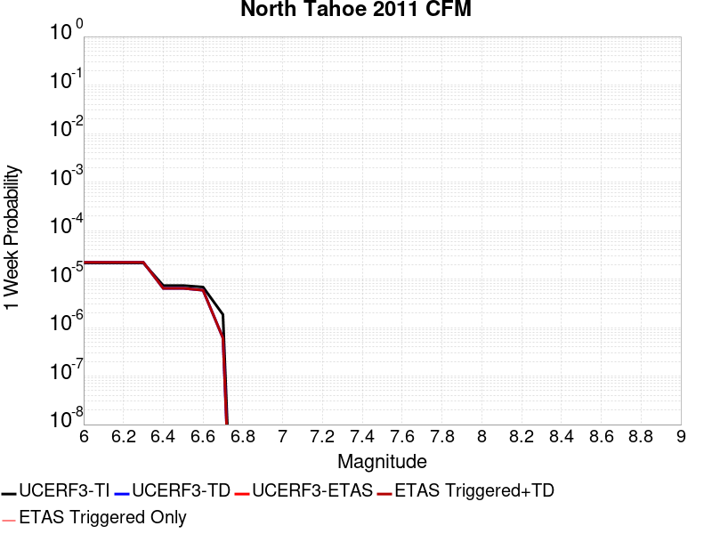 | 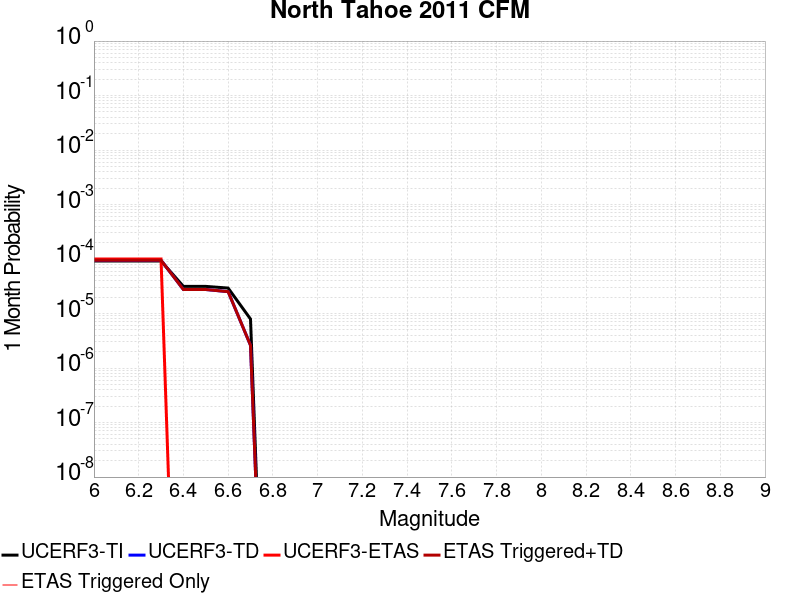 | 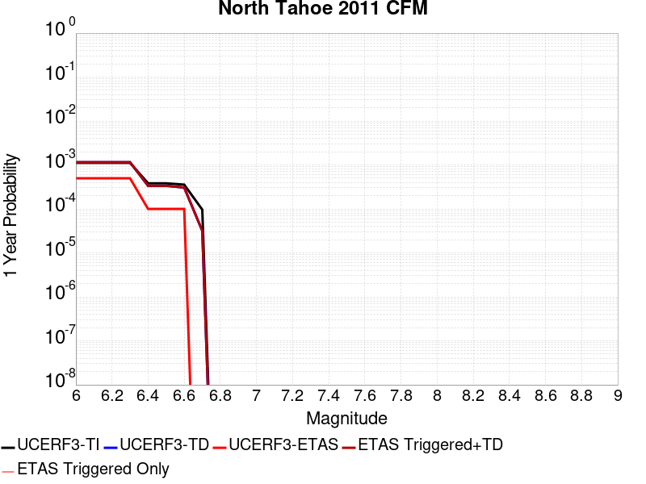 | 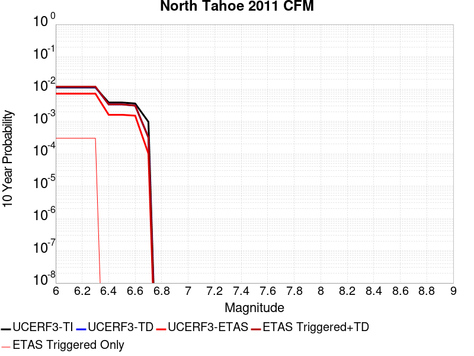 |

| Magnitude | 1 wk TI Prob | 1 wk TD Prob | 1 wk ETAS Prob | 1 wk ETAS/TD Gain | 1 wk ETAS Triggered+TD | 1 wk ETAS Triggered Only | 1 mo TI Prob | 1 mo TD Prob | 1 mo ETAS Prob | 1 mo ETAS/TD Gain | 1 mo ETAS Triggered+TD | 1 mo ETAS Triggered Only | 1 yr TI Prob | 1 yr TD Prob | 1 yr ETAS Prob | 1 yr ETAS/TD Gain | 1 yr ETAS Triggered+TD | 1 yr ETAS Triggered Only | 10 yr TI Prob | 10 yr TD Prob | 10 yr ETAS Prob | 10 yr ETAS/TD Gain | 10 yr ETAS Triggered+TD | 10 yr ETAS Triggered Only |
|-----|-----|-----|-----|-----|-----|-----|-----|-----|-----|-----|-----|-----|-----|-----|-----|-----|-----|-----|-----|-----|-----|-----|-----|-----|
| 6.0 | 2.150391E-5 | 2.2170227E-5 | 0.0 | 0.0 | 2.2170227E-5 | 0.0 | 9.215636E-5 | 9.50129E-5 | 1.0E-4 | 1.0524887 | 9.50129E-5 | 0.0 | 0.0011214261 | 0.0011563642 | 5.0E-4 | 0.4323897 | 0.0011563642 | 0.0 | 0.011157839 | 0.0115227355 | 0.0072 | 0.62485164 | 0.011819279 | 3.0E-4 |
| 6.1 | 2.150391E-5 | 2.2170227E-5 | 0.0 | 0.0 | 2.2170227E-5 | 0.0 | 9.215636E-5 | 9.50129E-5 | 1.0E-4 | 1.0524887 | 9.50129E-5 | 0.0 | 0.0011214261 | 0.0011563642 | 5.0E-4 | 0.4323897 | 0.0011563642 | 0.0 | 0.011157839 | 0.0115227355 | 0.0072 | 0.62485164 | 0.011819279 | 3.0E-4 |
| 6.2 | 2.150391E-5 | 2.2170227E-5 | 0.0 | 0.0 | 2.2170227E-5 | 0.0 | 9.215636E-5 | 9.50129E-5 | 1.0E-4 | 1.0524887 | 9.50129E-5 | 0.0 | 0.0011214261 | 0.0011563642 | 5.0E-4 | 0.4323897 | 0.0011563642 | 0.0 | 0.011157839 | 0.0115227355 | 0.0072 | 0.62485164 | 0.011819279 | 3.0E-4 |
| 6.3 | 2.150391E-5 | 2.2170227E-5 | 0.0 | 0.0 | 2.2170227E-5 | 0.0 | 9.215636E-5 | 9.50129E-5 | 1.0E-4 | 1.0524887 | 9.50129E-5 | 0.0 | 0.0011214261 | 0.0011563642 | 5.0E-4 | 0.4323897 | 0.0011563642 | 0.0 | 0.011157839 | 0.0115227355 | 0.0072 | 0.62485164 | 0.011819279 | 3.0E-4 |
| 6.4 | 7.3563056E-6 | 6.446491E-6 | 0.0 | 0.0 | 6.446491E-6 | 0.0 | 3.1526644E-5 | 2.7627699E-5 | 0.0 | 0.0 | 2.7627699E-5 | 0.0 | 3.8376928E-4 | 3.363459E-4 | 1.0E-4 | 0.29731297 | 3.363459E-4 | 0.0 | 0.003831072 | 0.0033613662 | 0.0016 | 0.47599694 | 0.0033613662 | 0.0 |
| 6.5 | 7.3563056E-6 | 6.446491E-6 | 0.0 | 0.0 | 6.446491E-6 | 0.0 | 3.1526644E-5 | 2.7627699E-5 | 0.0 | 0.0 | 2.7627699E-5 | 0.0 | 3.8376928E-4 | 3.363459E-4 | 1.0E-4 | 0.29731297 | 3.363459E-4 | 0.0 | 0.003831072 | 0.0033613662 | 0.0016 | 0.47599694 | 0.0033613662 | 0.0 |
| 6.6 | 6.8508816E-6 | 5.8855353E-6 | 0.0 | 0.0 | 5.8855353E-6 | 0.0 | 2.936059E-5 | 2.522365E-5 | 0.0 | 0.0 | 2.522365E-5 | 0.0 | 3.5740656E-4 | 3.0708505E-4 | 1.0E-4 | 0.3256427 | 3.0708505E-4 | 0.0 | 0.0035683226 | 0.0030695854 | 0.0015 | 0.48866534 | 0.0030695854 | 0.0 |
| 6.7 | 1.8511148E-6 | 6.1028277E-7 | 0.0 | 0.0 | 6.1028277E-7 | 0.0 | 7.933325E-6 | 2.6154976E-6 | 0.0 | 0.0 | 2.6154976E-6 | 0.0 | 9.658395E-5 | 3.1843683E-5 | 0.0 | 0.0 | 3.1843683E-5 | 0.0 | 9.6541987E-4 | 3.1843683E-4 | 1.0E-4 | 0.31403401 | 3.1843683E-4 | 0.0 |

## Russ 2011 CFM
*[(top)](#table-of-contents)*

| 1 Week | 1 Month | 1 Year | 10 Year |
|-----|-----|-----|-----|
| 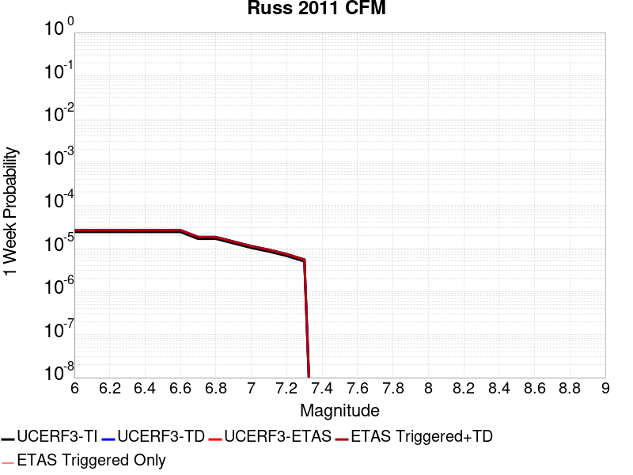 | 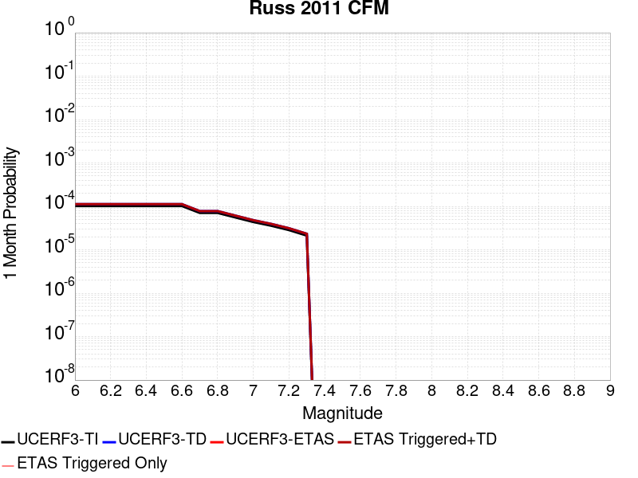 | 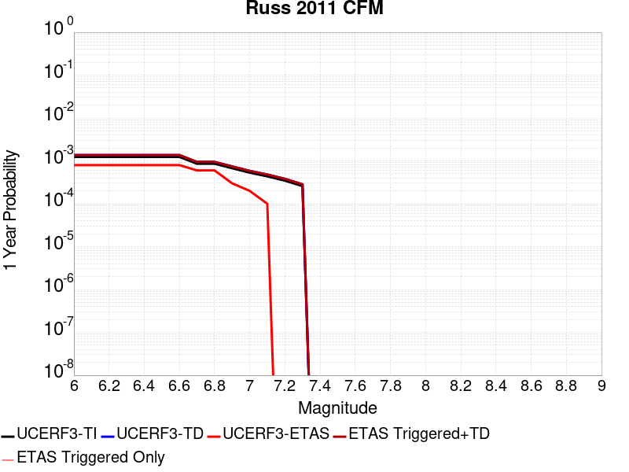 | 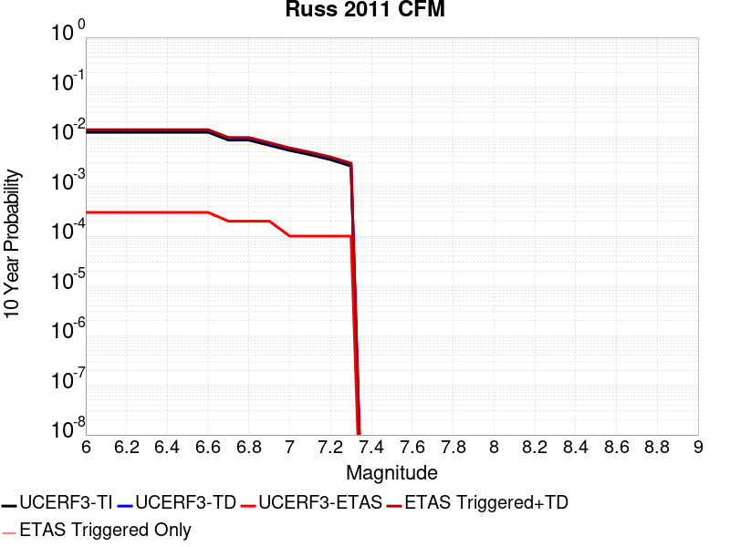 |

| Magnitude | 1 wk TI Prob | 1 wk TD Prob | 1 wk ETAS Prob | 1 wk ETAS/TD Gain | 1 wk ETAS Triggered+TD | 1 wk ETAS Triggered Only | 1 mo TI Prob | 1 mo TD Prob | 1 mo ETAS Prob | 1 mo ETAS/TD Gain | 1 mo ETAS Triggered+TD | 1 mo ETAS Triggered Only | 1 yr TI Prob | 1 yr TD Prob | 1 yr ETAS Prob | 1 yr ETAS/TD Gain | 1 yr ETAS Triggered+TD | 1 yr ETAS Triggered Only | 10 yr TI Prob | 10 yr TD Prob | 10 yr ETAS Prob | 10 yr ETAS/TD Gain | 10 yr ETAS Triggered+TD | 10 yr ETAS Triggered Only |
|-----|-----|-----|-----|-----|-----|-----|-----|-----|-----|-----|-----|-----|-----|-----|-----|-----|-----|-----|-----|-----|-----|-----|-----|-----|
| 6.0 | 2.3806366E-5 | 2.6259715E-5 | 0.0 | 0.0 | 2.6259715E-5 | 0.0 | 1.0202329E-4 | 1.1253714E-4 | 0.0 | 0.0 | 1.1253714E-4 | 0.0 | 0.0012414258 | 0.0013693422 | 8.0E-4 | 0.5842221 | 0.0013693422 | 0.0 | 0.012345135 | 0.013615528 | 0.0083 | 0.6095981 | 0.013911444 | 3.0E-4 |
| 6.1 | 2.3806366E-5 | 2.6259715E-5 | 0.0 | 0.0 | 2.6259715E-5 | 0.0 | 1.0202329E-4 | 1.1253714E-4 | 0.0 | 0.0 | 1.1253714E-4 | 0.0 | 0.0012414258 | 0.0013693422 | 8.0E-4 | 0.5842221 | 0.0013693422 | 0.0 | 0.012345135 | 0.013615528 | 0.0083 | 0.6095981 | 0.013911444 | 3.0E-4 |
| 6.2 | 2.3806366E-5 | 2.6259715E-5 | 0.0 | 0.0 | 2.6259715E-5 | 0.0 | 1.0202329E-4 | 1.1253714E-4 | 0.0 | 0.0 | 1.1253714E-4 | 0.0 | 0.0012414258 | 0.0013693422 | 8.0E-4 | 0.5842221 | 0.0013693422 | 0.0 | 0.012345135 | 0.013615528 | 0.0083 | 0.6095981 | 0.013911444 | 3.0E-4 |
| 6.3 | 2.3806366E-5 | 2.6259715E-5 | 0.0 | 0.0 | 2.6259715E-5 | 0.0 | 1.0202329E-4 | 1.1253714E-4 | 0.0 | 0.0 | 1.1253714E-4 | 0.0 | 0.0012414258 | 0.0013693422 | 8.0E-4 | 0.5842221 | 0.0013693422 | 0.0 | 0.012345135 | 0.013615528 | 0.0083 | 0.6095981 | 0.013911444 | 3.0E-4 |
| 6.4 | 2.3806366E-5 | 2.6259715E-5 | 0.0 | 0.0 | 2.6259715E-5 | 0.0 | 1.0202329E-4 | 1.1253714E-4 | 0.0 | 0.0 | 1.1253714E-4 | 0.0 | 0.0012414258 | 0.0013693422 | 8.0E-4 | 0.5842221 | 0.0013693422 | 0.0 | 0.012345135 | 0.013615528 | 0.0083 | 0.6095981 | 0.013911444 | 3.0E-4 |
| 6.5 | 2.3806366E-5 | 2.6259715E-5 | 0.0 | 0.0 | 2.6259715E-5 | 0.0 | 1.0202329E-4 | 1.1253714E-4 | 0.0 | 0.0 | 1.1253714E-4 | 0.0 | 0.0012414258 | 0.0013693422 | 8.0E-4 | 0.5842221 | 0.0013693422 | 0.0 | 0.012345135 | 0.013615528 | 0.0083 | 0.6095981 | 0.013911444 | 3.0E-4 |
| 6.6 | 2.3806366E-5 | 2.6259715E-5 | 0.0 | 0.0 | 2.6259715E-5 | 0.0 | 1.0202329E-4 | 1.1253714E-4 | 0.0 | 0.0 | 1.1253714E-4 | 0.0 | 0.0012414258 | 0.0013693422 | 8.0E-4 | 0.5842221 | 0.0013693422 | 0.0 | 0.012345135 | 0.013615528 | 0.0083 | 0.6095981 | 0.013911444 | 3.0E-4 |
| 6.7 | 1.6515693E-5 | 1.8191738E-5 | 0.0 | 0.0 | 1.8191738E-5 | 0.0 | 7.077962E-5 | 7.796245E-5 | 0.0 | 0.0 | 7.796245E-5 | 0.0 | 8.6140115E-4 | 9.4881334E-4 | 6.0E-4 | 0.63236886 | 9.4881334E-4 | 0.0 | 0.008580698 | 0.009451018 | 0.0059 | 0.6242714 | 0.009649128 | 2.0E-4 |
| 6.8 | 1.6515693E-5 | 1.8191738E-5 | 0.0 | 0.0 | 1.8191738E-5 | 0.0 | 7.077962E-5 | 7.796245E-5 | 0.0 | 0.0 | 7.796245E-5 | 0.0 | 8.6140115E-4 | 9.4881334E-4 | 6.0E-4 | 0.63236886 | 9.4881334E-4 | 0.0 | 0.008580698 | 0.009451018 | 0.0059 | 0.6242714 | 0.009649128 | 2.0E-4 |
| 6.9 | 1.2971182E-5 | 1.4276783E-5 | 0.0 | 0.0 | 1.4276783E-5 | 0.0 | 5.5589593E-5 | 6.1184925E-5 | 0.0 | 0.0 | 6.1184925E-5 | 0.0 | 6.765931E-4 | 7.4469775E-4 | 3.0E-4 | 0.40284798 | 7.4469775E-4 | 0.0 | 0.0067453682 | 0.0074245976 | 0.0043 | 0.579156 | 0.0076231128 | 2.0E-4 |
| 7.0 | 1.0201805E-5 | 1.1224222E-5 | 0.0 | 0.0 | 1.1224222E-5 | 0.0 | 4.3721288E-5 | 4.810304E-5 | 0.0 | 0.0 | 4.810304E-5 | 0.0 | 5.3217664E-4 | 5.855179E-4 | 2.0E-4 | 0.34157792 | 5.855179E-4 | 0.0 | 0.00530904 | 0.005841805 | 0.0035 | 0.5991299 | 0.005941221 | 1.0E-4 |
| 7.1 | 8.3744935E-6 | 9.2145665E-6 | 0.0 | 0.0 | 9.2145665E-6 | 0.0 | 3.5890193E-5 | 3.9490504E-5 | 0.0 | 0.0 | 3.9490504E-5 | 0.0 | 4.368755E-4 | 4.807094E-4 | 1.0E-4 | 0.2080259 | 4.807094E-4 | 0.0 | 0.004360176 | 0.0047985218 | 0.0027 | 0.56267333 | 0.0048980415 | 1.0E-4 |
| 7.2 | 6.649391E-6 | 7.3185224E-6 | 0.0 | 0.0 | 7.3185224E-6 | 0.0 | 2.8497077E-5 | 3.1364812E-5 | 0.0 | 0.0 | 3.1364812E-5 | 0.0 | 3.4689668E-4 | 3.8181627E-4 | 0.0 | 0.0 | 3.8181627E-4 | 0.0 | 0.0034635565 | 0.0038132337 | 0.0022 | 0.57693815 | 0.0039128526 | 1.0E-4 |
| 7.3 | 4.9549312E-6 | 5.455726E-6 | 0.0 | 0.0 | 5.455726E-6 | 0.0 | 2.1235246E-5 | 2.3381555E-5 | 0.0 | 0.0 | 2.3381555E-5 | 0.0 | 2.5850846E-4 | 2.8464798E-4 | 0.0 | 0.0 | 2.8464798E-4 | 0.0 | 0.0025820795 | 0.0028442782 | 0.0016 | 0.56253284 | 0.0029439938 | 1.0E-4 |

## San Gorgonio Pass
*[(top)](#table-of-contents)*

| 1 Week | 1 Month | 1 Year | 10 Year |
|-----|-----|-----|-----|
| 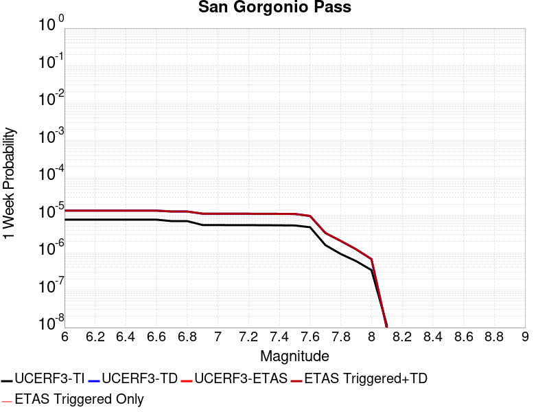 | 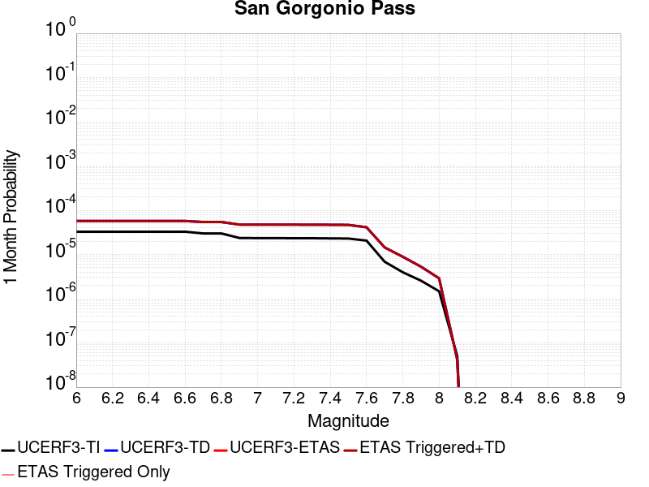 | 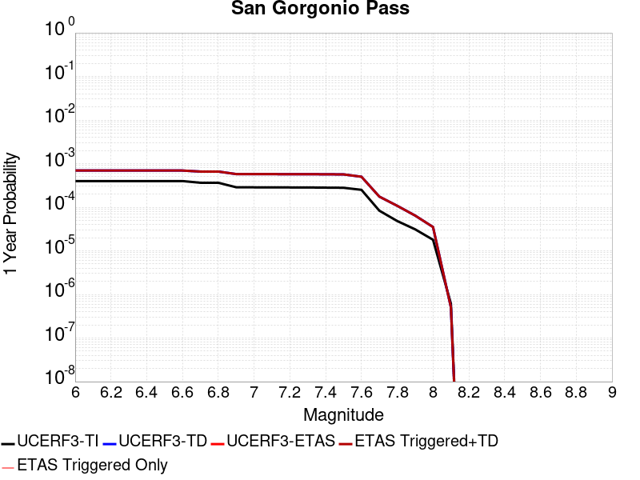 | 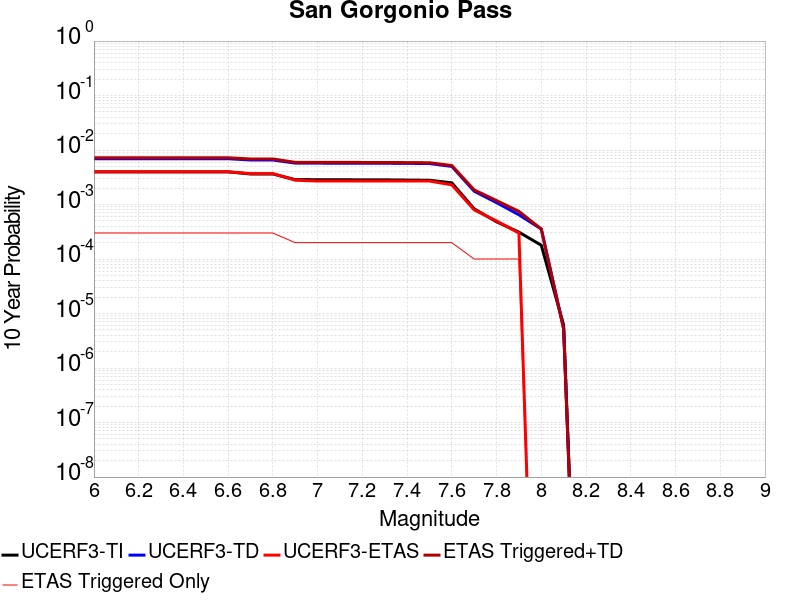 |

| Magnitude | 1 wk TI Prob | 1 wk TD Prob | 1 wk ETAS Prob | 1 wk ETAS/TD Gain | 1 wk ETAS Triggered+TD | 1 wk ETAS Triggered Only | 1 mo TI Prob | 1 mo TD Prob | 1 mo ETAS Prob | 1 mo ETAS/TD Gain | 1 mo ETAS Triggered+TD | 1 mo ETAS Triggered Only | 1 yr TI Prob | 1 yr TD Prob | 1 yr ETAS Prob | 1 yr ETAS/TD Gain | 1 yr ETAS Triggered+TD | 1 yr ETAS Triggered Only | 10 yr TI Prob | 10 yr TD Prob | 10 yr ETAS Prob | 10 yr ETAS/TD Gain | 10 yr ETAS Triggered+TD | 10 yr ETAS Triggered Only |
|-----|-----|-----|-----|-----|-----|-----|-----|-----|-----|-----|-----|-----|-----|-----|-----|-----|-----|-----|-----|-----|-----|-----|-----|-----|
| 6.0 | 7.644328E-6 | 1.3346923E-5 | 0.0 | 0.0 | 1.3346923E-5 | 0.0 | 3.2760996E-5 | 5.7199893E-5 | 0.0 | 0.0 | 5.7199893E-5 | 0.0 | 3.987921E-4 | 6.9619477E-4 | 2.0E-4 | 0.28727594 | 6.9619477E-4 | 0.0 | 0.003980772 | 0.006947056 | 0.004 | 0.5757835 | 0.0072449716 | 3.0E-4 |
| 6.1 | 7.644328E-6 | 1.3346923E-5 | 0.0 | 0.0 | 1.3346923E-5 | 0.0 | 3.2760996E-5 | 5.7199893E-5 | 0.0 | 0.0 | 5.7199893E-5 | 0.0 | 3.987921E-4 | 6.9619477E-4 | 2.0E-4 | 0.28727594 | 6.9619477E-4 | 0.0 | 0.003980772 | 0.006947056 | 0.004 | 0.5757835 | 0.0072449716 | 3.0E-4 |
| 6.2 | 7.644328E-6 | 1.3346923E-5 | 0.0 | 0.0 | 1.3346923E-5 | 0.0 | 3.2760996E-5 | 5.7199893E-5 | 0.0 | 0.0 | 5.7199893E-5 | 0.0 | 3.987921E-4 | 6.9619477E-4 | 2.0E-4 | 0.28727594 | 6.9619477E-4 | 0.0 | 0.003980772 | 0.006947056 | 0.004 | 0.5757835 | 0.0072449716 | 3.0E-4 |
| 6.3 | 7.644328E-6 | 1.3346923E-5 | 0.0 | 0.0 | 1.3346923E-5 | 0.0 | 3.2760996E-5 | 5.7199893E-5 | 0.0 | 0.0 | 5.7199893E-5 | 0.0 | 3.987921E-4 | 6.9619477E-4 | 2.0E-4 | 0.28727594 | 6.9619477E-4 | 0.0 | 0.003980772 | 0.006947056 | 0.004 | 0.5757835 | 0.0072449716 | 3.0E-4 |
| 6.4 | 7.644328E-6 | 1.3346923E-5 | 0.0 | 0.0 | 1.3346923E-5 | 0.0 | 3.2760996E-5 | 5.7199893E-5 | 0.0 | 0.0 | 5.7199893E-5 | 0.0 | 3.987921E-4 | 6.9619477E-4 | 2.0E-4 | 0.28727594 | 6.9619477E-4 | 0.0 | 0.003980772 | 0.006947056 | 0.004 | 0.5757835 | 0.0072449716 | 3.0E-4 |
| 6.5 | 7.644328E-6 | 1.3346923E-5 | 0.0 | 0.0 | 1.3346923E-5 | 0.0 | 3.2760996E-5 | 5.7199893E-5 | 0.0 | 0.0 | 5.7199893E-5 | 0.0 | 3.987921E-4 | 6.9619477E-4 | 2.0E-4 | 0.28727594 | 6.9619477E-4 | 0.0 | 0.003980772 | 0.006947056 | 0.004 | 0.5757835 | 0.0072449716 | 3.0E-4 |
| 6.6 | 7.644328E-6 | 1.3346923E-5 | 0.0 | 0.0 | 1.3346923E-5 | 0.0 | 3.2760996E-5 | 5.7199893E-5 | 0.0 | 0.0 | 5.7199893E-5 | 0.0 | 3.987921E-4 | 6.9619477E-4 | 2.0E-4 | 0.28727594 | 6.9619477E-4 | 0.0 | 0.003980772 | 0.006947056 | 0.004 | 0.5757835 | 0.0072449716 | 3.0E-4 |
| 6.7 | 6.987586E-6 | 1.2651112E-5 | 0.0 | 0.0 | 1.2651112E-5 | 0.0 | 2.9946454E-5 | 5.421797E-5 | 0.0 | 0.0 | 5.421797E-5 | 0.0 | 3.645371E-4 | 6.59912E-4 | 2.0E-4 | 0.30307072 | 6.59912E-4 | 0.0 | 0.0036393967 | 0.006586394 | 0.0037 | 0.5617642 | 0.006884418 | 3.0E-4 |
| 6.8 | 6.987586E-6 | 1.2651112E-5 | 0.0 | 0.0 | 1.2651112E-5 | 0.0 | 2.9946454E-5 | 5.421797E-5 | 0.0 | 0.0 | 5.421797E-5 | 0.0 | 3.645371E-4 | 6.59912E-4 | 2.0E-4 | 0.30307072 | 6.59912E-4 | 0.0 | 0.0036393967 | 0.006586394 | 0.0037 | 0.5617642 | 0.006884418 | 3.0E-4 |
| 6.9 | 5.504702E-6 | 1.1081787E-5 | 0.0 | 0.0 | 1.1081787E-5 | 0.0 | 2.3591367E-5 | 4.749254E-5 | 0.0 | 0.0 | 4.749254E-5 | 0.0 | 2.8718702E-4 | 5.780733E-4 | 2.0E-4 | 0.34597686 | 5.780733E-4 | 0.0 | 0.0028681618 | 0.005772263 | 0.0028 | 0.4850784 | 0.005971108 | 2.0E-4 |
| 7.0 | 5.4825764E-6 | 1.1058125E-5 | 0.0 | 0.0 | 1.1058125E-5 | 0.0 | 2.3496545E-5 | 4.739113E-5 | 0.0 | 0.0 | 4.739113E-5 | 0.0 | 2.8603288E-4 | 5.768394E-4 | 2.0E-4 | 0.34671697 | 5.768394E-4 | 0.0 | 0.00285665 | 0.005759987 | 0.0027 | 0.46875107 | 0.005958835 | 2.0E-4 |
| 7.1 | 5.4692787E-6 | 1.1043832E-5 | 0.0 | 0.0 | 1.1043832E-5 | 0.0 | 2.3439556E-5 | 4.7329882E-5 | 0.0 | 0.0 | 4.7329882E-5 | 0.0 | 2.8533922E-4 | 5.76094E-4 | 2.0E-4 | 0.34716555 | 5.76094E-4 | 0.0 | 0.0028497311 | 0.0057525723 | 0.0027 | 0.46935526 | 0.005951422 | 2.0E-4 |
| 7.2 | 5.453661E-6 | 1.1026857E-5 | 0.0 | 0.0 | 1.1026857E-5 | 0.0 | 2.3372622E-5 | 4.7257126E-5 | 0.0 | 0.0 | 4.7257126E-5 | 0.0 | 2.8452452E-4 | 5.7520875E-4 | 2.0E-4 | 0.34769988 | 5.7520875E-4 | 0.0 | 0.002841605 | 0.005743765 | 0.0027 | 0.47007495 | 0.005942616 | 2.0E-4 |
| 7.3 | 5.4422303E-6 | 1.1013774E-5 | 0.0 | 0.0 | 1.1013774E-5 | 0.0 | 2.3323635E-5 | 4.720106E-5 | 0.0 | 0.0 | 4.720106E-5 | 0.0 | 2.8392827E-4 | 5.745265E-4 | 2.0E-4 | 0.34811276 | 5.745265E-4 | 0.0 | 0.0028356577 | 0.0057369783 | 0.0027 | 0.47063106 | 0.0059358305 | 2.0E-4 |
| 7.4 | 5.398595E-6 | 1.0961119E-5 | 0.0 | 0.0 | 1.0961119E-5 | 0.0 | 2.313663E-5 | 4.697541E-5 | 0.0 | 0.0 | 4.697541E-5 | 0.0 | 2.8165206E-4 | 5.717806E-4 | 2.0E-4 | 0.34978452 | 5.717806E-4 | 0.0 | 0.0028129534 | 0.0057096607 | 0.0027 | 0.47288275 | 0.0059085186 | 2.0E-4 |
| 7.5 | 5.3578788E-6 | 1.0887599E-5 | 0.0 | 0.0 | 1.0887599E-5 | 0.0 | 2.2962136E-5 | 4.6660334E-5 | 0.0 | 0.0 | 4.6660334E-5 | 0.0 | 2.7952815E-4 | 5.679466E-4 | 2.0E-4 | 0.3521458 | 5.679466E-4 | 0.0 | 0.002791768 | 0.005671552 | 0.0027 | 0.47606015 | 0.0058704177 | 2.0E-4 |
| 7.6 | 4.8091474E-6 | 9.634182E-6 | 0.0 | 0.0 | 9.634182E-6 | 0.0 | 2.0610469E-5 | 4.1288728E-5 | 0.0 | 0.0 | 4.1288728E-5 | 0.0 | 2.5090357E-4 | 5.0257915E-4 | 2.0E-4 | 0.39794728 | 5.0257915E-4 | 0.0 | 0.0025062046 | 0.005021293 | 0.0023 | 0.45804933 | 0.005220289 | 2.0E-4 |
| 7.7 | 1.5991155E-6 | 3.3693318E-6 | 0.0 | 0.0 | 3.3693318E-6 | 0.0 | 6.853334E-6 | 1.4439915E-5 | 0.0 | 0.0 | 1.4439915E-5 | 0.0 | 8.343615E-5 | 1.7579203E-4 | 0.0 | 0.0 | 1.7579203E-4 | 0.0 | 8.340483E-4 | 0.0017620954 | 8.0E-4 | 0.45400494 | 0.0018619192 | 1.0E-4 |
| 7.8 | 9.258398E-7 | 2.0702669E-6 | 0.0 | 0.0 | 2.0702669E-6 | 0.0 | 3.967879E-6 | 8.872543E-6 | 0.0 | 0.0 | 8.872543E-6 | 0.0 | 4.8307855E-5 | 1.0801787E-4 | 0.0 | 0.0 | 1.0801787E-4 | 0.0 | 4.8297356E-4 | 0.0010851946 | 5.0E-4 | 0.46074682 | 0.0011850861 | 1.0E-4 |
| 7.9 | 5.975575E-7 | 1.2379961E-6 | 0.0 | 0.0 | 1.2379961E-6 | 0.0 | 2.5609581E-6 | 5.305687E-6 | 0.0 | 0.0 | 5.305687E-6 | 0.0 | 3.117922E-5 | 6.459484E-5 | 0.0 | 0.0 | 6.459484E-5 | 0.0 | 3.1174847E-4 | 6.509744E-4 | 3.0E-4 | 0.46084762 | 7.5090927E-4 | 1.0E-4 |
| 8.0 | 3.4413725E-7 | 6.767391E-7 | 0.0 | 0.0 | 6.767391E-7 | 0.0 | 1.4748731E-6 | 2.9003072E-6 | 0.0 | 0.0 | 2.9003072E-6 | 0.0 | 1.7956432E-5 | 3.5310673E-5 | 0.0 | 0.0 | 3.5310673E-5 | 0.0 | 1.7954981E-4 | 3.565597E-4 | 0.0 | 0.0 | 3.565597E-4 | 0.0 |
| 8.1 | 1.1787731E-8 | 9.768131E-9 | 0.0 | 0.0 | 9.768131E-9 | 0.0 | 5.0518846E-8 | 4.186342E-8 | 0.0 | 0.0 | 4.186342E-8 | 0.0 | 6.1506677E-7 | 5.09687E-7 | 0.0 | 0.0 | 5.09687E-7 | 0.0 | 6.1506507E-6 | 5.310953E-6 | 0.0 | 0.0 | 5.310953E-6 | 0.0 |

## Mohawk Valley 2011 CFM
*[(top)](#table-of-contents)*

| 1 Week | 1 Month | 1 Year | 10 Year |
|-----|-----|-----|-----|
| 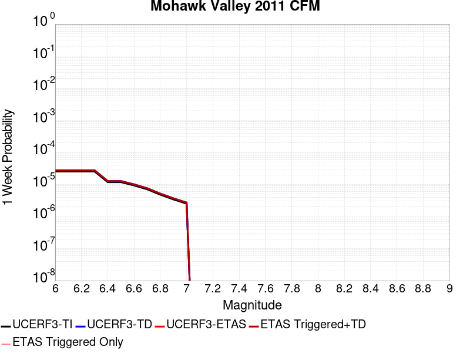 | 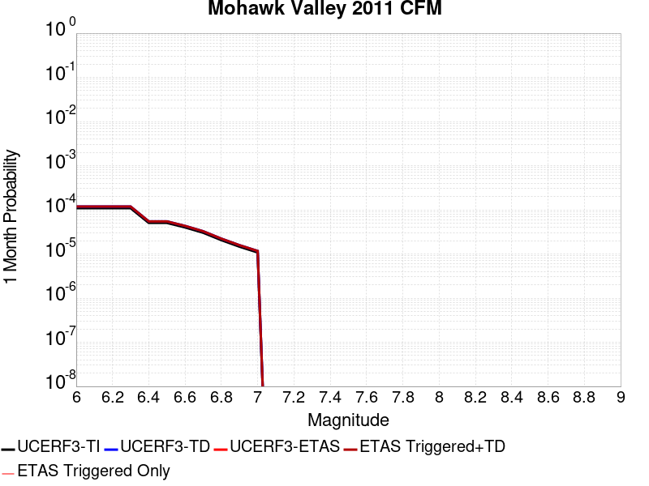 | 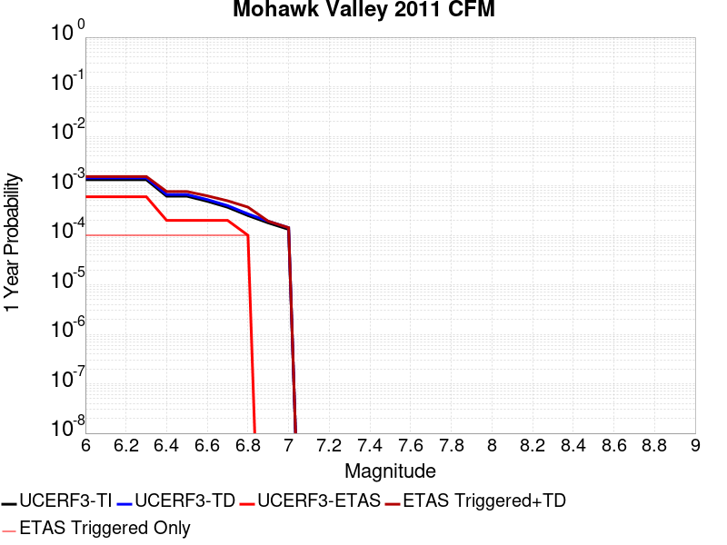 | 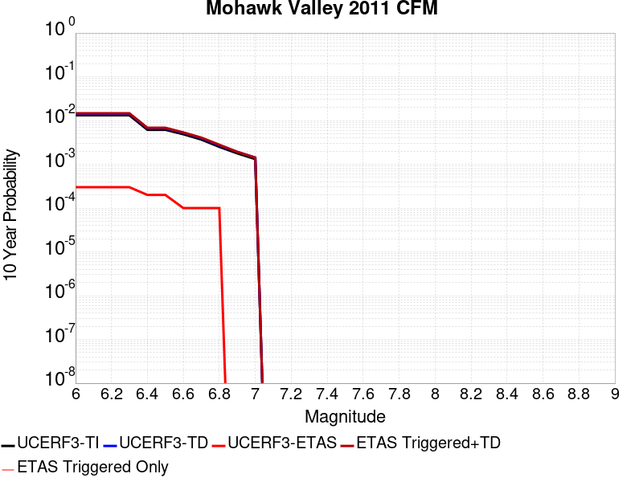 |

| Magnitude | 1 wk TI Prob | 1 wk TD Prob | 1 wk ETAS Prob | 1 wk ETAS/TD Gain | 1 wk ETAS Triggered+TD | 1 wk ETAS Triggered Only | 1 mo TI Prob | 1 mo TD Prob | 1 mo ETAS Prob | 1 mo ETAS/TD Gain | 1 mo ETAS Triggered+TD | 1 mo ETAS Triggered Only | 1 yr TI Prob | 1 yr TD Prob | 1 yr ETAS Prob | 1 yr ETAS/TD Gain | 1 yr ETAS Triggered+TD | 1 yr ETAS Triggered Only | 10 yr TI Prob | 10 yr TD Prob | 10 yr ETAS Prob | 10 yr ETAS/TD Gain | 10 yr ETAS Triggered+TD | 10 yr ETAS Triggered Only |
|-----|-----|-----|-----|-----|-----|-----|-----|-----|-----|-----|-----|-----|-----|-----|-----|-----|-----|-----|-----|-----|-----|-----|-----|-----|
| 6.0 | 2.5425423E-5 | 2.7649752E-5 | 0.0 | 0.0 | 2.7649752E-5 | 0.0 | 1.0896155E-4 | 1.18494165E-4 | 0.0 | 0.0 | 1.18494165E-4 | 0.0 | 0.0013257994 | 0.0014418203 | 6.0E-4 | 0.41614062 | 0.0015416761 | 1.0E-4 | 0.013179175 | 0.014335543 | 0.0067 | 0.46736982 | 0.0146312425 | 3.0E-4 |
| 6.1 | 2.5425423E-5 | 2.7649752E-5 | 0.0 | 0.0 | 2.7649752E-5 | 0.0 | 1.0896155E-4 | 1.18494165E-4 | 0.0 | 0.0 | 1.18494165E-4 | 0.0 | 0.0013257994 | 0.0014418203 | 6.0E-4 | 0.41614062 | 0.0015416761 | 1.0E-4 | 0.013179175 | 0.014335543 | 0.0067 | 0.46736982 | 0.0146312425 | 3.0E-4 |
| 6.2 | 2.5425423E-5 | 2.7649752E-5 | 0.0 | 0.0 | 2.7649752E-5 | 0.0 | 1.0896155E-4 | 1.18494165E-4 | 0.0 | 0.0 | 1.18494165E-4 | 0.0 | 0.0013257994 | 0.0014418203 | 6.0E-4 | 0.41614062 | 0.0015416761 | 1.0E-4 | 0.013179175 | 0.014335543 | 0.0067 | 0.46736982 | 0.0146312425 | 3.0E-4 |
| 6.3 | 2.5425423E-5 | 2.7649752E-5 | 0.0 | 0.0 | 2.7649752E-5 | 0.0 | 1.0896155E-4 | 1.18494165E-4 | 0.0 | 0.0 | 1.18494165E-4 | 0.0 | 0.0013257994 | 0.0014418203 | 6.0E-4 | 0.41614062 | 0.0015416761 | 1.0E-4 | 0.013179175 | 0.014335543 | 0.0067 | 0.46736982 | 0.0146312425 | 3.0E-4 |
| 6.4 | 1.1812642E-5 | 1.2765702E-5 | 0.0 | 0.0 | 1.2765702E-5 | 0.0 | 5.0624625E-5 | 5.470909E-5 | 0.0 | 0.0 | 5.470909E-5 | 0.0 | 6.161805E-4 | 6.658943E-4 | 2.0E-4 | 0.30034795 | 7.658277E-4 | 1.0E-4 | 0.0061447476 | 0.0066404636 | 0.0029 | 0.4367165 | 0.0068391357 | 2.0E-4 |
| 6.5 | 1.1812642E-5 | 1.2765702E-5 | 0.0 | 0.0 | 1.2765702E-5 | 0.0 | 5.0624625E-5 | 5.470909E-5 | 0.0 | 0.0 | 5.470909E-5 | 0.0 | 6.161805E-4 | 6.658943E-4 | 2.0E-4 | 0.30034795 | 7.658277E-4 | 1.0E-4 | 0.0061447476 | 0.0066404636 | 0.0029 | 0.4367165 | 0.0068391357 | 2.0E-4 |
| 6.6 | 9.34204E-6 | 1.0086842E-5 | 0.0 | 0.0 | 1.0086842E-5 | 0.0 | 4.0036703E-5 | 4.3228672E-5 | 0.0 | 0.0 | 4.3228672E-5 | 0.0 | 4.873378E-4 | 5.2619376E-4 | 2.0E-4 | 0.38008812 | 6.2614115E-4 | 1.0E-4 | 0.0048627043 | 0.005250647 | 0.0024 | 0.4570865 | 0.005350122 | 1.0E-4 |
| 6.7 | 7.0661854E-6 | 7.6254405E-6 | 0.0 | 0.0 | 7.6254405E-6 | 0.0 | 3.02833E-5 | 3.2680102E-5 | 0.0 | 0.0 | 3.2680102E-5 | 0.0 | 3.686368E-4 | 3.9781665E-4 | 2.0E-4 | 0.50274414 | 4.977769E-4 | 1.0E-4 | 0.0036802588 | 0.003971941 | 0.0018 | 0.45317894 | 0.004071544 | 1.0E-4 |
| 6.8 | 4.806676E-6 | 5.188062E-6 | 0.0 | 0.0 | 5.188062E-6 | 0.0 | 2.0599877E-5 | 2.2234397E-5 | 0.0 | 0.0 | 2.2234397E-5 | 0.0 | 2.507746E-4 | 2.7067654E-4 | 1.0E-4 | 0.36944467 | 3.7064948E-4 | 1.0E-4 | 0.0025049183 | 0.0027040953 | 0.0012 | 0.44377136 | 0.0028038248 | 1.0E-4 |
| 6.9 | 3.4163209E-6 | 3.6895037E-6 | 0.0 | 0.0 | 3.6895037E-6 | 0.0 | 1.4641293E-5 | 1.5812093E-5 | 0.0 | 0.0 | 1.5812093E-5 | 0.0 | 1.7824316E-4 | 1.9250065E-4 | 0.0 | 0.0 | 1.9250065E-4 | 0.0 | 0.0017810026 | 0.0019238712 | 7.0E-4 | 0.36384973 | 0.0019238712 | 0.0 |
| 7.0 | 2.5271734E-6 | 2.7314663E-6 | 0.0 | 0.0 | 2.7314663E-6 | 0.0 | 1.0830699E-5 | 1.1706259E-5 | 0.0 | 0.0 | 1.1706259E-5 | 0.0 | 1.3185578E-4 | 1.4251932E-4 | 0.0 | 0.0 | 1.4251932E-4 | 0.0 | 0.0013177756 | 0.001424763 | 5.0E-4 | 0.35093558 | 0.001424763 | 0.0 |

## Great Valley 10 (Panoche)
*[(top)](#table-of-contents)*

| 1 Week | 1 Month | 1 Year | 10 Year |
|-----|-----|-----|-----|
| 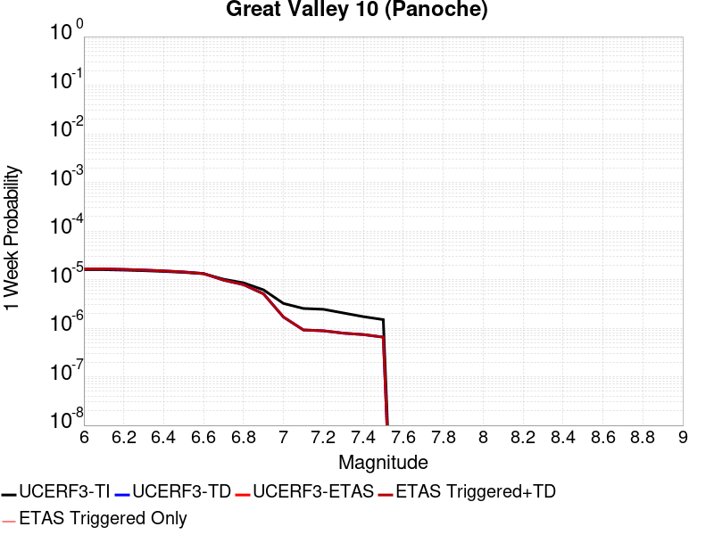 | 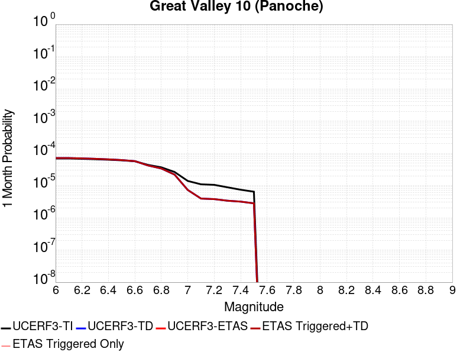 | 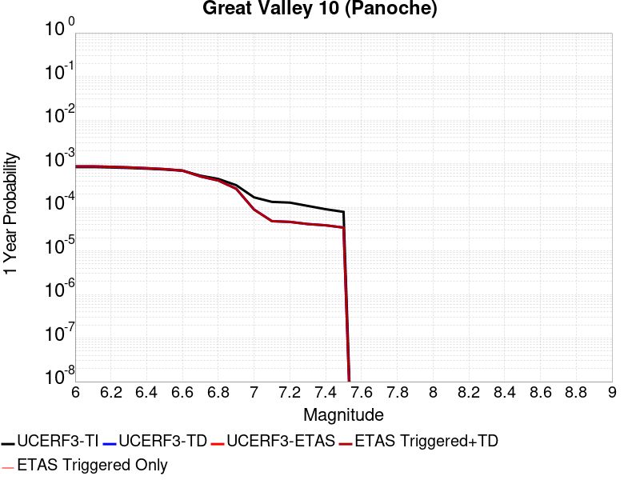 | 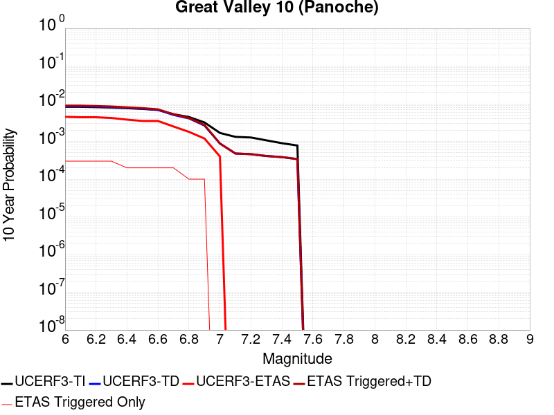 |

| Magnitude | 1 wk TI Prob | 1 wk TD Prob | 1 wk ETAS Prob | 1 wk ETAS/TD Gain | 1 wk ETAS Triggered+TD | 1 wk ETAS Triggered Only | 1 mo TI Prob | 1 mo TD Prob | 1 mo ETAS Prob | 1 mo ETAS/TD Gain | 1 mo ETAS Triggered+TD | 1 mo ETAS Triggered Only | 1 yr TI Prob | 1 yr TD Prob | 1 yr ETAS Prob | 1 yr ETAS/TD Gain | 1 yr ETAS Triggered+TD | 1 yr ETAS Triggered Only | 10 yr TI Prob | 10 yr TD Prob | 10 yr ETAS Prob | 10 yr ETAS/TD Gain | 10 yr ETAS Triggered+TD | 10 yr ETAS Triggered Only |
|-----|-----|-----|-----|-----|-----|-----|-----|-----|-----|-----|-----|-----|-----|-----|-----|-----|-----|-----|-----|-----|-----|-----|-----|-----|
| 6.0 | 1.6014626E-5 | 1.658099E-5 | 0.0 | 0.0 | 1.658099E-5 | 0.0 | 6.863231E-5 | 7.105948E-5 | 0.0 | 0.0 | 7.105948E-5 | 0.0 | 8.35278E-4 | 8.6481136E-4 | 2.0E-4 | 0.23126431 | 8.6481136E-4 | 0.0 | 0.008321454 | 0.008615072 | 0.0045 | 0.52234036 | 0.008912488 | 3.0E-4 |
| 6.1 | 1.6014626E-5 | 1.658099E-5 | 0.0 | 0.0 | 1.658099E-5 | 0.0 | 6.863231E-5 | 7.105948E-5 | 0.0 | 0.0 | 7.105948E-5 | 0.0 | 8.35278E-4 | 8.6481136E-4 | 2.0E-4 | 0.23126431 | 8.6481136E-4 | 0.0 | 0.008321454 | 0.008615072 | 0.0044 | 0.5107328 | 0.008912488 | 3.0E-4 |
| 6.2 | 1.56782E-5 | 1.6203943E-5 | 0.0 | 0.0 | 1.6203943E-5 | 0.0 | 6.719056E-5 | 6.944365E-5 | 0.0 | 0.0 | 6.944365E-5 | 0.0 | 8.17738E-4 | 8.4515405E-4 | 2.0E-4 | 0.23664325 | 8.4515405E-4 | 0.0 | 0.008147354 | 0.00842 | 0.0044 | 0.52256536 | 0.008717474 | 3.0E-4 |
| 6.3 | 1.5263338E-5 | 1.572887E-5 | 0.0 | 0.0 | 1.572887E-5 | 0.0 | 6.541267E-5 | 6.740773E-5 | 0.0 | 0.0 | 6.740773E-5 | 0.0 | 7.961082E-4 | 8.203855E-4 | 2.0E-4 | 0.24378781 | 8.203855E-4 | 0.0 | 0.007932622 | 0.008174157 | 0.0042 | 0.5138145 | 0.008471704 | 3.0E-4 |
| 6.4 | 1.4720723E-5 | 1.5104539E-5 | 0.0 | 0.0 | 1.5104539E-5 | 0.0 | 6.308728E-5 | 6.473216E-5 | 0.0 | 0.0 | 6.473216E-5 | 0.0 | 7.67817E-4 | 7.8783435E-4 | 1.0E-4 | 0.12693024 | 7.8783435E-4 | 0.0 | 0.007651695 | 0.007850983 | 0.0038 | 0.4840158 | 0.008049414 | 2.0E-4 |
| 6.5 | 1.408264E-5 | 1.43608795E-5 | 0.0 | 0.0 | 1.43608795E-5 | 0.0 | 6.0352773E-5 | 6.15452E-5 | 0.0 | 0.0 | 6.15452E-5 | 0.0 | 7.3454727E-4 | 7.490604E-4 | 1.0E-4 | 0.13350058 | 7.490604E-4 | 0.0 | 0.0073212404 | 0.007465906 | 0.0035 | 0.46879777 | 0.0076644127 | 2.0E-4 |
| 6.6 | 1.3197086E-5 | 1.3326438E-5 | 0.0 | 0.0 | 1.3326438E-5 | 0.0 | 5.6557717E-5 | 5.7112084E-5 | 0.0 | 0.0 | 5.7112084E-5 | 0.0 | 6.8837265E-4 | 6.9512293E-4 | 1.0E-4 | 0.14385945 | 6.9512293E-4 | 0.0 | 0.006862442 | 0.0069300192 | 0.0035 | 0.5050491 | 0.007128633 | 2.0E-4 |
| 6.7 | 1.017583E-5 | 9.7485845E-6 | 0.0 | 0.0 | 9.7485845E-6 | 0.0 | 4.360997E-5 | 4.1778992E-5 | 0.0 | 0.0 | 4.1778992E-5 | 0.0 | 5.30822E-4 | 5.0854293E-4 | 1.0E-4 | 0.19664024 | 5.0854293E-4 | 0.0 | 0.0052955584 | 0.005074044 | 0.0025 | 0.49270362 | 0.0052730297 | 2.0E-4 |
| 6.8 | 8.557912E-6 | 7.875301E-6 | 0.0 | 0.0 | 7.875301E-6 | 0.0 | 3.667625E-5 | 3.3750865E-5 | 0.0 | 0.0 | 3.3750865E-5 | 0.0 | 4.4644187E-4 | 4.1084134E-4 | 0.0 | 0.0 | 4.1084134E-4 | 0.0 | 0.0044554602 | 0.004101025 | 0.0018 | 0.43891466 | 0.004200615 | 1.0E-4 |
| 6.9 | 6.14664E-6 | 5.0937865E-6 | 0.0 | 0.0 | 5.0937865E-6 | 0.0 | 2.6342475E-5 | 2.1830338E-5 | 0.0 | 0.0 | 2.1830338E-5 | 0.0 | 3.2067244E-4 | 2.6575333E-4 | 0.0 | 0.0 | 2.6575333E-4 | 0.0 | 0.003202101 | 0.0026544938 | 0.0012 | 0.4520636 | 0.0027542284 | 1.0E-4 |
| 7.0 | 3.2310581E-6 | 1.6956797E-6 | 0.0 | 0.0 | 1.6956797E-6 | 0.0 | 1.3847319E-5 | 7.2671787E-6 | 0.0 | 0.0 | 7.2671787E-6 | 0.0 | 1.6857806E-4 | 8.847441E-5 | 0.0 | 0.0 | 8.847441E-5 | 0.0 | 0.0016845023 | 8.844012E-4 | 4.0E-4 | 0.4522834 | 8.844012E-4 | 0.0 |
| 7.1 | 2.544492E-6 | 9.192409E-7 | 0.0 | 0.0 | 9.192409E-7 | 0.0 | 1.090492E-5 | 3.939598E-6 | 0.0 | 0.0 | 3.939598E-6 | 0.0 | 1.327593E-4 | 4.79636E-5 | 0.0 | 0.0 | 4.79636E-5 | 0.0 | 0.0013268003 | 4.7953727E-4 | 0.0 | 0.0 | 4.7953727E-4 | 0.0 |
| 7.2 | 2.4479045E-6 | 8.8446444E-7 | 0.0 | 0.0 | 8.8446444E-7 | 0.0 | 1.0490977E-5 | 3.7905565E-6 | 0.0 | 0.0 | 3.7905565E-6 | 0.0 | 1.2772017E-4 | 4.61491E-5 | 0.0 | 0.0 | 4.61491E-5 | 0.0 | 0.0012764678 | 4.6139988E-4 | 0.0 | 0.0 | 4.6139988E-4 | 0.0 |
| 7.3 | 2.0559578E-6 | 7.895168E-7 | 0.0 | 0.0 | 7.895168E-7 | 0.0 | 8.811218E-6 | 3.3836393E-6 | 0.0 | 0.0 | 3.3836393E-6 | 0.0 | 1.072713E-4 | 4.119508E-5 | 0.0 | 0.0 | 4.119508E-5 | 0.0 | 0.0010721954 | 4.1187904E-4 | 0.0 | 0.0 | 4.1187904E-4 | 0.0 |
| 7.4 | 1.727687E-6 | 7.3895353E-7 | 0.0 | 0.0 | 7.3895353E-7 | 0.0 | 7.404352E-6 | 3.1669401E-6 | 0.0 | 0.0 | 3.1669401E-6 | 0.0 | 9.0144255E-5 | 3.855686E-5 | 0.0 | 0.0 | 3.855686E-5 | 0.0 | 9.0107694E-4 | 3.855063E-4 | 0.0 | 0.0 | 3.855063E-4 | 0.0 |
| 7.5 | 1.5002679E-6 | 6.5476866E-7 | 0.0 | 0.0 | 6.5476866E-7 | 0.0 | 6.4297037E-6 | 2.8061486E-6 | 0.0 | 0.0 | 2.8061486E-6 | 0.0 | 7.827883E-5 | 3.4164368E-5 | 0.0 | 0.0 | 3.4164368E-5 | 0.0 | 7.825126E-4 | 3.415953E-4 | 0.0 | 0.0 | 3.415953E-4 | 0.0 |

## Gillem - Big Crack 2011 CFM
*[(top)](#table-of-contents)*

| 1 Week | 1 Month | 1 Year | 10 Year |
|-----|-----|-----|-----|
| 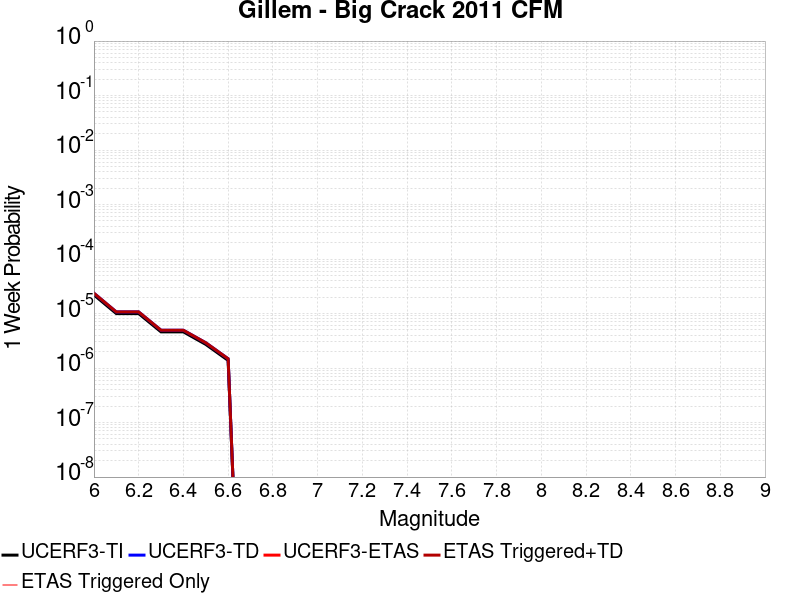 | 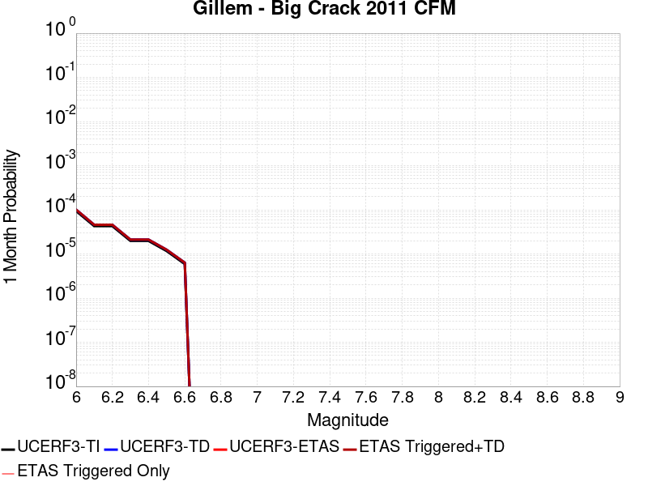 | 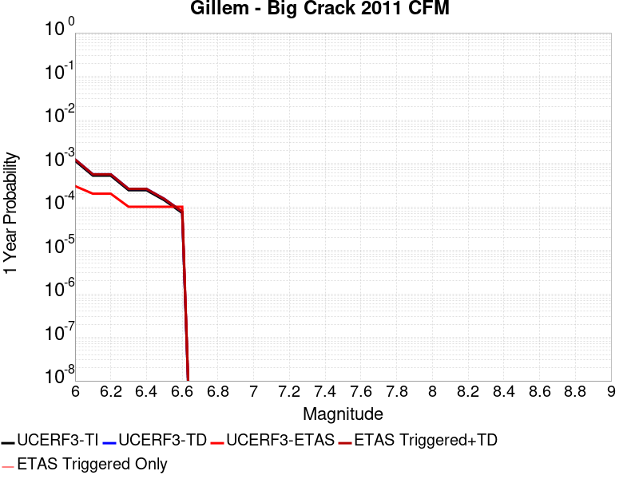 | 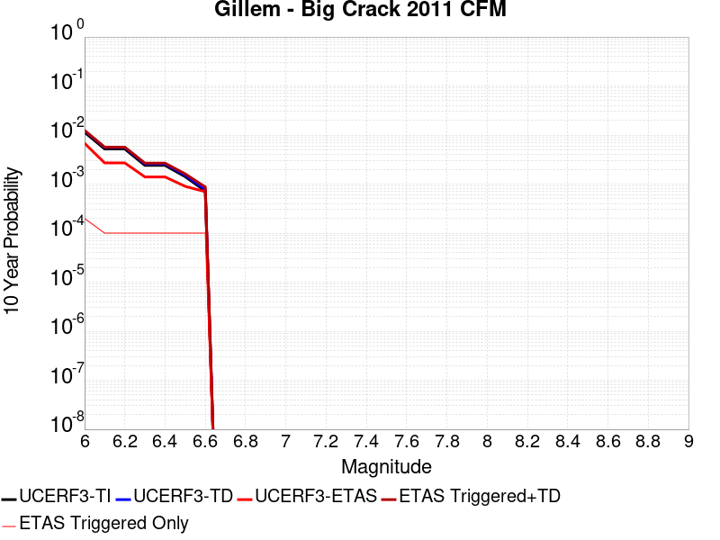 |

| Magnitude | 1 wk TI Prob | 1 wk TD Prob | 1 wk ETAS Prob | 1 wk ETAS/TD Gain | 1 wk ETAS Triggered+TD | 1 wk ETAS Triggered Only | 1 mo TI Prob | 1 mo TD Prob | 1 mo ETAS Prob | 1 mo ETAS/TD Gain | 1 mo ETAS Triggered+TD | 1 mo ETAS Triggered Only | 1 yr TI Prob | 1 yr TD Prob | 1 yr ETAS Prob | 1 yr ETAS/TD Gain | 1 yr ETAS Triggered+TD | 1 yr ETAS Triggered Only | 10 yr TI Prob | 10 yr TD Prob | 10 yr ETAS Prob | 10 yr ETAS/TD Gain | 10 yr ETAS Triggered+TD | 10 yr ETAS Triggered Only |
|-----|-----|-----|-----|-----|-----|-----|-----|-----|-----|-----|-----|-----|-----|-----|-----|-----|-----|-----|-----|-----|-----|-----|-----|-----|
| 6.0 | 2.196852E-5 | 2.3608107E-5 | 0.0 | 0.0 | 2.3608107E-5 | 0.0 | 9.4147406E-5 | 1.0117418E-4 | 0.0 | 0.0 | 1.0117418E-4 | 0.0 | 0.0011456419 | 0.0012311885 | 3.0E-4 | 0.24366699 | 0.0012311885 | 0.0 | 0.011397537 | 0.012252538 | 0.0068 | 0.554987 | 0.012450088 | 2.0E-4 |
| 6.1 | 9.992795E-6 | 1.0713477E-5 | 0.0 | 0.0 | 1.0713477E-5 | 0.0 | 4.2825563E-5 | 4.59142E-5 | 0.0 | 0.0 | 4.59142E-5 | 0.0 | 5.2127644E-4 | 5.5888033E-4 | 2.0E-4 | 0.35785836 | 5.5888033E-4 | 0.0 | 0.0052005537 | 0.005576559 | 0.0027 | 0.48416954 | 0.0056760013 | 1.0E-4 |
| 6.2 | 9.992795E-6 | 1.0713477E-5 | 0.0 | 0.0 | 1.0713477E-5 | 0.0 | 4.2825563E-5 | 4.59142E-5 | 0.0 | 0.0 | 4.59142E-5 | 0.0 | 5.2127644E-4 | 5.5888033E-4 | 2.0E-4 | 0.35785836 | 5.5888033E-4 | 0.0 | 0.0052005537 | 0.005576559 | 0.0027 | 0.48416954 | 0.0056760013 | 1.0E-4 |
| 6.3 | 4.6127884E-6 | 4.9433847E-6 | 0.0 | 0.0 | 4.9433847E-6 | 0.0 | 1.9768944E-5 | 2.1185788E-5 | 0.0 | 0.0 | 2.1185788E-5 | 0.0 | 2.406603E-4 | 2.579109E-4 | 1.0E-4 | 0.3877308 | 2.579109E-4 | 0.0 | 0.0024039985 | 0.0025765542 | 0.0014 | 0.54336137 | 0.0026762965 | 1.0E-4 |
| 6.4 | 4.6127884E-6 | 4.9433847E-6 | 0.0 | 0.0 | 4.9433847E-6 | 0.0 | 1.9768944E-5 | 2.1185788E-5 | 0.0 | 0.0 | 2.1185788E-5 | 0.0 | 2.406603E-4 | 2.579109E-4 | 1.0E-4 | 0.3877308 | 2.579109E-4 | 0.0 | 0.0024039985 | 0.0025765542 | 0.0014 | 0.54336137 | 0.0026762965 | 1.0E-4 |
| 6.5 | 2.716712E-6 | 2.9115404E-6 | 0.0 | 0.0 | 2.9115404E-6 | 0.0 | 1.1643E-5 | 1.24779845E-5 | 0.0 | 0.0 | 1.24779845E-5 | 0.0 | 1.417443E-4 | 1.5191128E-4 | 1.0E-4 | 0.65827894 | 1.5191128E-4 | 0.0 | 0.0014165393 | 0.0015183126 | 9.0E-4 | 0.5927633 | 0.0016181607 | 1.0E-4 |
| 6.6 | 1.3818255E-6 | 1.4822903E-6 | 0.0 | 0.0 | 1.4822903E-6 | 0.0 | 5.922096E-6 | 6.352664E-6 | 0.0 | 0.0 | 6.352664E-6 | 0.0 | 7.209913E-5 | 7.734218E-5 | 1.0E-4 | 1.2929556 | 7.734218E-5 | 0.0 | 7.2075747E-4 | 7.732735E-4 | 7.0E-4 | 0.90524244 | 8.731962E-4 | 1.0E-4 |

## Thirty Mile Bank
*[(top)](#table-of-contents)*

| 1 Week | 1 Month | 1 Year | 10 Year |
|-----|-----|-----|-----|
| 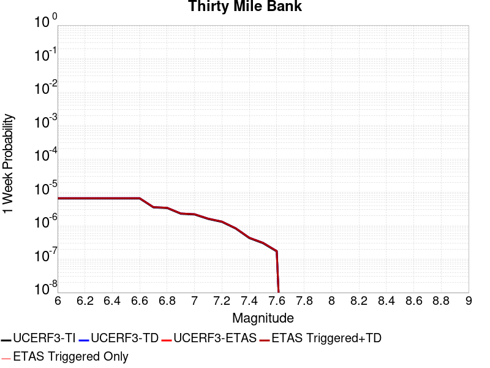 | 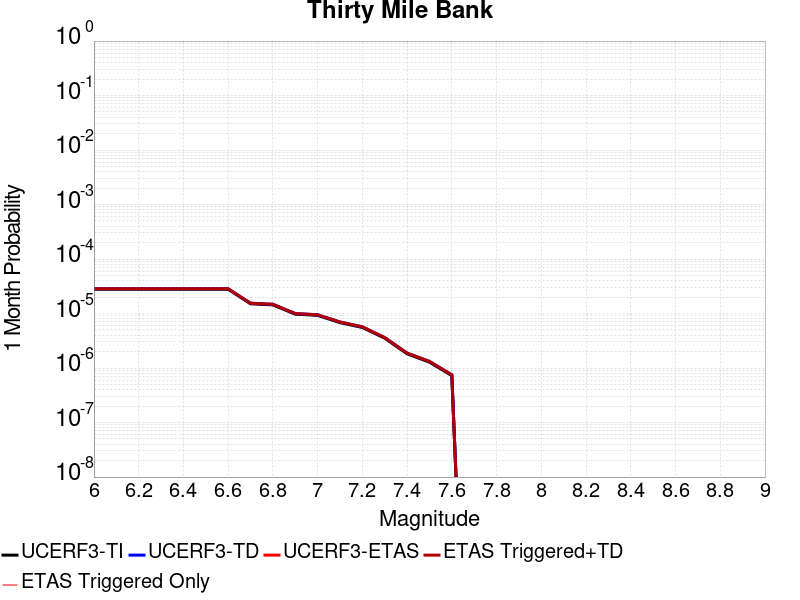 | 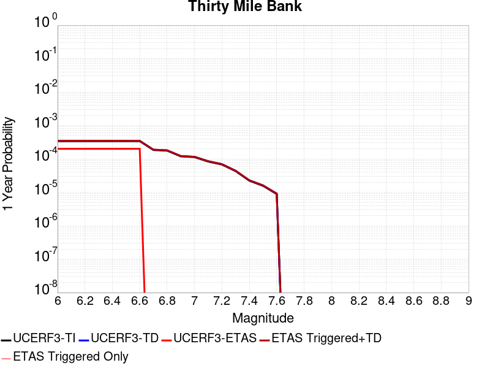 | 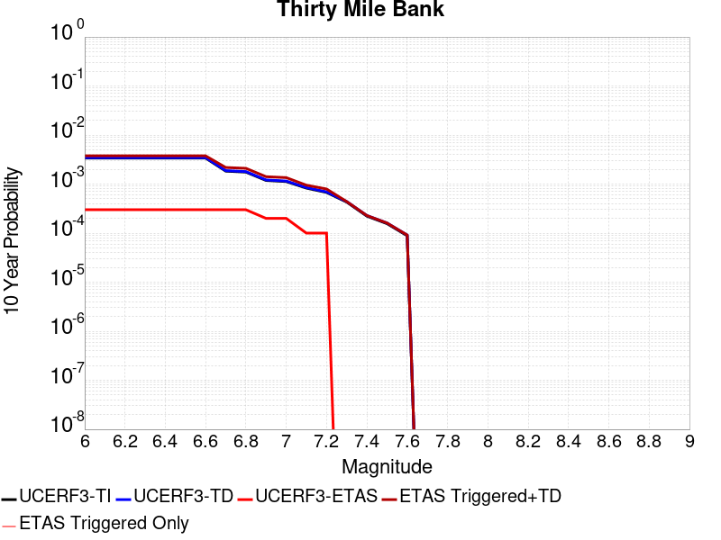 |

| Magnitude | 1 wk TI Prob | 1 wk TD Prob | 1 wk ETAS Prob | 1 wk ETAS/TD Gain | 1 wk ETAS Triggered+TD | 1 wk ETAS Triggered Only | 1 mo TI Prob | 1 mo TD Prob | 1 mo ETAS Prob | 1 mo ETAS/TD Gain | 1 mo ETAS Triggered+TD | 1 mo ETAS Triggered Only | 1 yr TI Prob | 1 yr TD Prob | 1 yr ETAS Prob | 1 yr ETAS/TD Gain | 1 yr ETAS Triggered+TD | 1 yr ETAS Triggered Only | 10 yr TI Prob | 10 yr TD Prob | 10 yr ETAS Prob | 10 yr ETAS/TD Gain | 10 yr ETAS Triggered+TD | 10 yr ETAS Triggered Only |
|-----|-----|-----|-----|-----|-----|-----|-----|-----|-----|-----|-----|-----|-----|-----|-----|-----|-----|-----|-----|-----|-----|-----|-----|-----|
| 6.0 | 6.5124755E-6 | 6.659574E-6 | 0.0 | 0.0 | 6.659574E-6 | 0.0 | 2.791031E-5 | 2.8540742E-5 | 0.0 | 0.0 | 2.8540742E-5 | 0.0 | 3.3975503E-4 | 3.474325E-4 | 2.0E-4 | 0.5756514 | 3.474325E-4 | 0.0 | 0.0033923604 | 0.0034693251 | 0.0021 | 0.6053051 | 0.0037682843 | 3.0E-4 |
| 6.1 | 6.5124755E-6 | 6.659574E-6 | 0.0 | 0.0 | 6.659574E-6 | 0.0 | 2.791031E-5 | 2.8540742E-5 | 0.0 | 0.0 | 2.8540742E-5 | 0.0 | 3.3975503E-4 | 3.474325E-4 | 2.0E-4 | 0.5756514 | 3.474325E-4 | 0.0 | 0.0033923604 | 0.0034693251 | 0.0021 | 0.6053051 | 0.0037682843 | 3.0E-4 |
| 6.2 | 6.5124755E-6 | 6.659574E-6 | 0.0 | 0.0 | 6.659574E-6 | 0.0 | 2.791031E-5 | 2.8540742E-5 | 0.0 | 0.0 | 2.8540742E-5 | 0.0 | 3.3975503E-4 | 3.474325E-4 | 2.0E-4 | 0.5756514 | 3.474325E-4 | 0.0 | 0.0033923604 | 0.0034693251 | 0.0021 | 0.6053051 | 0.0037682843 | 3.0E-4 |
| 6.3 | 6.5124755E-6 | 6.659574E-6 | 0.0 | 0.0 | 6.659574E-6 | 0.0 | 2.791031E-5 | 2.8540742E-5 | 0.0 | 0.0 | 2.8540742E-5 | 0.0 | 3.3975503E-4 | 3.474325E-4 | 2.0E-4 | 0.5756514 | 3.474325E-4 | 0.0 | 0.0033923604 | 0.0034693251 | 0.0021 | 0.6053051 | 0.0037682843 | 3.0E-4 |
| 6.4 | 6.5124755E-6 | 6.659574E-6 | 0.0 | 0.0 | 6.659574E-6 | 0.0 | 2.791031E-5 | 2.8540742E-5 | 0.0 | 0.0 | 2.8540742E-5 | 0.0 | 3.3975503E-4 | 3.474325E-4 | 2.0E-4 | 0.5756514 | 3.474325E-4 | 0.0 | 0.0033923604 | 0.0034693251 | 0.0021 | 0.6053051 | 0.0037682843 | 3.0E-4 |
| 6.5 | 6.5124755E-6 | 6.659574E-6 | 0.0 | 0.0 | 6.659574E-6 | 0.0 | 2.791031E-5 | 2.8540742E-5 | 0.0 | 0.0 | 2.8540742E-5 | 0.0 | 3.3975503E-4 | 3.474325E-4 | 2.0E-4 | 0.5756514 | 3.474325E-4 | 0.0 | 0.0033923604 | 0.0034693251 | 0.0021 | 0.6053051 | 0.0037682843 | 3.0E-4 |
| 6.6 | 6.5124755E-6 | 6.659574E-6 | 0.0 | 0.0 | 6.659574E-6 | 0.0 | 2.791031E-5 | 2.8540742E-5 | 0.0 | 0.0 | 2.8540742E-5 | 0.0 | 3.3975503E-4 | 3.474325E-4 | 2.0E-4 | 0.5756514 | 3.474325E-4 | 0.0 | 0.0033923604 | 0.0034693251 | 0.0021 | 0.6053051 | 0.0037682843 | 3.0E-4 |
| 6.7 | 3.5261137E-6 | 3.6100766E-6 | 0.0 | 0.0 | 3.6100766E-6 | 0.0 | 1.5111828E-5 | 1.5471669E-5 | 0.0 | 0.0 | 1.5471669E-5 | 0.0 | 1.8397097E-4 | 1.8835194E-4 | 0.0 | 0.0 | 1.8835194E-4 | 0.0 | 0.0018381875 | 0.001881988 | 0.0013 | 0.6907589 | 0.0021814234 | 3.0E-4 |
| 6.8 | 3.370743E-6 | 3.451105E-6 | 0.0 | 0.0 | 3.451105E-6 | 0.0 | 1.4445961E-5 | 1.479037E-5 | 0.0 | 0.0 | 1.479037E-5 | 0.0 | 1.7586538E-4 | 1.800585E-4 | 0.0 | 0.0 | 1.800585E-4 | 0.0 | 0.0017572626 | 0.0017991879 | 0.0012 | 0.6669676 | 0.002098648 | 3.0E-4 |
| 6.9 | 2.2756835E-6 | 2.3332827E-6 | 0.0 | 0.0 | 2.3332827E-6 | 0.0 | 9.752893E-6 | 9.999747E-6 | 0.0 | 0.0 | 9.999747E-6 | 0.0 | 1.18735006E-4 | 1.2174036E-4 | 0.0 | 0.0 | 1.2174036E-4 | 0.0 | 0.0011867158 | 0.0012167613 | 9.0E-4 | 0.7396685 | 0.001416518 | 2.0E-4 |
| 7.0 | 2.1617404E-6 | 2.2160948E-6 | 0.0 | 0.0 | 2.2160948E-6 | 0.0 | 9.264569E-6 | 9.497516E-6 | 0.0 | 0.0 | 9.497516E-6 | 0.0 | 1.1279029E-4 | 1.1562637E-4 | 0.0 | 0.0 | 1.1562637E-4 | 0.0 | 0.0011273306 | 0.0011556861 | 8.0E-4 | 0.69222945 | 0.001355455 | 2.0E-4 |
| 7.1 | 1.5900777E-6 | 1.6327919E-6 | 0.0 | 0.0 | 1.6327919E-6 | 0.0 | 6.814601E-6 | 6.9976613E-6 | 0.0 | 0.0 | 6.9976613E-6 | 0.0 | 8.296461E-5 | 8.519332E-5 | 0.0 | 0.0 | 8.519332E-5 | 0.0 | 8.293364E-4 | 8.516194E-4 | 5.0E-4 | 0.5871167 | 9.5153425E-4 | 1.0E-4 |
| 7.2 | 1.2971728E-6 | 1.332975E-6 | 0.0 | 0.0 | 1.332975E-6 | 0.0 | 5.5593005E-6 | 5.712738E-6 | 0.0 | 0.0 | 5.712738E-6 | 0.0 | 6.768238E-5 | 6.955047E-5 | 0.0 | 0.0 | 6.955047E-5 | 0.0 | 6.7661767E-4 | 6.952974E-4 | 5.0E-4 | 0.71911675 | 7.952278E-4 | 1.0E-4 |
| 7.3 | 8.2454284E-7 | 8.449321E-7 | 0.0 | 0.0 | 8.449321E-7 | 0.0 | 3.5337503E-6 | 3.621133E-6 | 0.0 | 0.0 | 3.621133E-6 | 0.0 | 4.302256E-5 | 4.408646E-5 | 0.0 | 0.0 | 4.408646E-5 | 0.0 | 4.301423E-4 | 4.4078322E-4 | 2.0E-4 | 0.4537378 | 4.4078322E-4 | 0.0 |
| 7.4 | 4.2619024E-7 | 4.3866106E-7 | 0.0 | 0.0 | 4.3866106E-7 | 0.0 | 1.8265283E-6 | 1.8799747E-6 | 0.0 | 0.0 | 1.8799747E-6 | 0.0 | 2.2237757E-5 | 2.2888455E-5 | 0.0 | 0.0 | 2.2888455E-5 | 0.0 | 2.223553E-4 | 2.2886136E-4 | 1.0E-4 | 0.43694574 | 2.2886136E-4 | 0.0 |
| 7.5 | 2.993922E-7 | 3.0866497E-7 | 0.0 | 0.0 | 3.0866497E-7 | 0.0 | 1.2831089E-6 | 1.3228491E-6 | 0.0 | 0.0 | 1.3228491E-6 | 0.0 | 1.5621737E-5 | 1.6105572E-5 | 0.0 | 0.0 | 1.6105572E-5 | 0.0 | 1.562064E-4 | 1.610443E-4 | 1.0E-4 | 0.6209471 | 1.610443E-4 | 0.0 |
| 7.6 | 1.6988751E-7 | 1.7534983E-7 | 0.0 | 0.0 | 1.7534983E-7 | 0.0 | 7.2808916E-7 | 7.5149904E-7 | 0.0 | 0.0 | 7.5149904E-7 | 0.0 | 8.864449E-6 | 9.149464E-6 | 0.0 | 0.0 | 9.149464E-6 | 0.0 | 8.8640954E-5 | 9.149107E-5 | 1.0E-4 | 1.0930028 | 9.149107E-5 | 0.0 |

## Emerson-Copper Mtn 2011
*[(top)](#table-of-contents)*

| 1 Week | 1 Month | 1 Year | 10 Year |
|-----|-----|-----|-----|
| 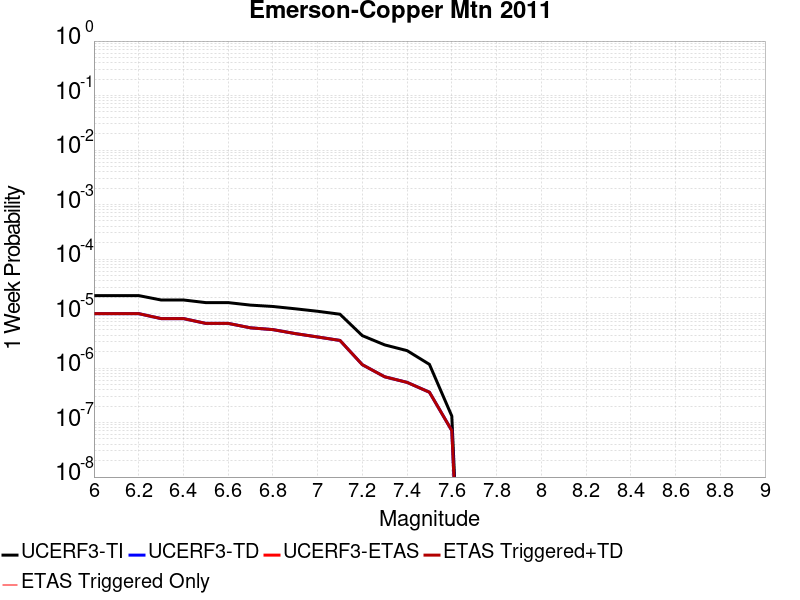 | 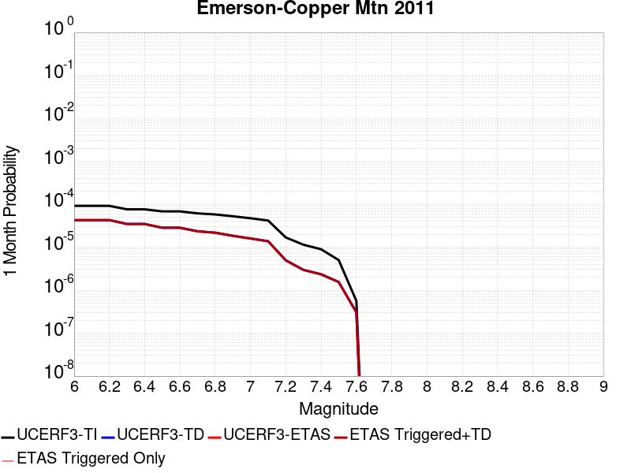 | 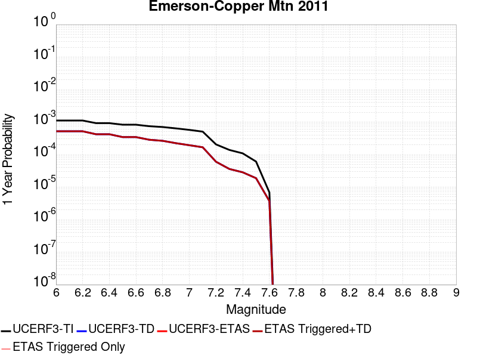 | 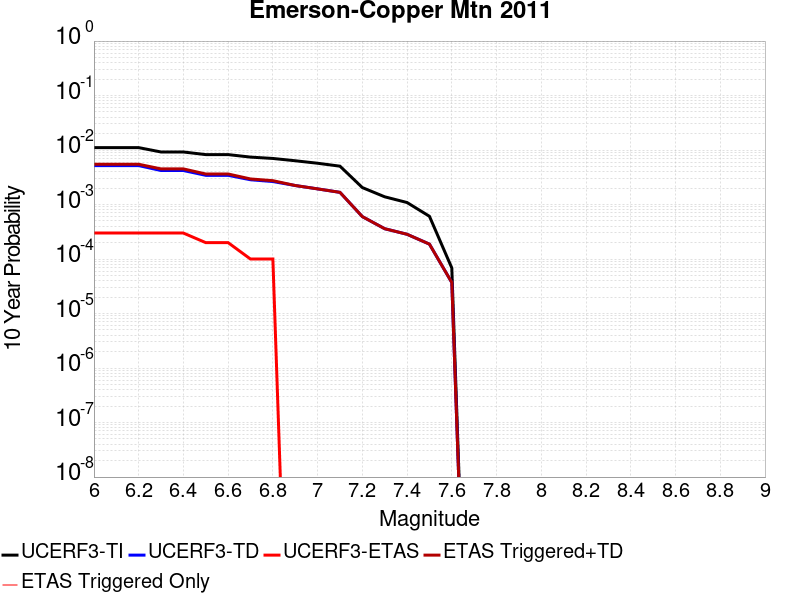 |

| Magnitude | 1 wk TI Prob | 1 wk TD Prob | 1 wk ETAS Prob | 1 wk ETAS/TD Gain | 1 wk ETAS Triggered+TD | 1 wk ETAS Triggered Only | 1 mo TI Prob | 1 mo TD Prob | 1 mo ETAS Prob | 1 mo ETAS/TD Gain | 1 mo ETAS Triggered+TD | 1 mo ETAS Triggered Only | 1 yr TI Prob | 1 yr TD Prob | 1 yr ETAS Prob | 1 yr ETAS/TD Gain | 1 yr ETAS Triggered+TD | 1 yr ETAS Triggered Only | 10 yr TI Prob | 10 yr TD Prob | 10 yr ETAS Prob | 10 yr ETAS/TD Gain | 10 yr ETAS Triggered+TD | 10 yr ETAS Triggered Only |
|-----|-----|-----|-----|-----|-----|-----|-----|-----|-----|-----|-----|-----|-----|-----|-----|-----|-----|-----|-----|-----|-----|-----|-----|-----|
| 6.0 | 2.1364202E-5 | 9.970419E-6 | 0.0 | 0.0 | 9.970419E-6 | 0.0 | 9.1557646E-5 | 4.2729716E-5 | 0.0 | 0.0 | 4.2729716E-5 | 0.0 | 0.0011141442 | 5.2011886E-4 | 3.0E-4 | 0.5767912 | 5.2011886E-4 | 0.0 | 0.011085749 | 0.0051898854 | 0.0028 | 0.53951097 | 0.005488328 | 3.0E-4 |
| 6.1 | 2.1364202E-5 | 9.970419E-6 | 0.0 | 0.0 | 9.970419E-6 | 0.0 | 9.1557646E-5 | 4.2729716E-5 | 0.0 | 0.0 | 4.2729716E-5 | 0.0 | 0.0011141442 | 5.2011886E-4 | 3.0E-4 | 0.5767912 | 5.2011886E-4 | 0.0 | 0.011085749 | 0.0051898854 | 0.0028 | 0.53951097 | 0.005488328 | 3.0E-4 |
| 6.2 | 2.1364202E-5 | 9.970419E-6 | 0.0 | 0.0 | 9.970419E-6 | 0.0 | 9.1557646E-5 | 4.2729716E-5 | 0.0 | 0.0 | 4.2729716E-5 | 0.0 | 0.0011141442 | 5.2011886E-4 | 3.0E-4 | 0.5767912 | 5.2011886E-4 | 0.0 | 0.011085749 | 0.0051898854 | 0.0028 | 0.53951097 | 0.005488328 | 3.0E-4 |
| 6.3 | 1.7751237E-5 | 8.091146E-6 | 0.0 | 0.0 | 8.091146E-6 | 0.0 | 7.607452E-5 | 3.467591E-5 | 0.0 | 0.0 | 3.467591E-5 | 0.0 | 9.258136E-4 | 4.2210374E-4 | 2.0E-4 | 0.47381717 | 4.2210374E-4 | 0.0 | 0.00921966 | 0.004213643 | 0.002 | 0.47464868 | 0.0045123785 | 3.0E-4 |
| 6.4 | 1.7751237E-5 | 8.091146E-6 | 0.0 | 0.0 | 8.091146E-6 | 0.0 | 7.607452E-5 | 3.467591E-5 | 0.0 | 0.0 | 3.467591E-5 | 0.0 | 9.258136E-4 | 4.2210374E-4 | 2.0E-4 | 0.47381717 | 4.2210374E-4 | 0.0 | 0.00921966 | 0.004213643 | 0.002 | 0.47464868 | 0.0045123785 | 3.0E-4 |
| 6.5 | 1.5886664E-5 | 6.605417E-6 | 0.0 | 0.0 | 6.605417E-6 | 0.0 | 6.808392E-5 | 2.830865E-5 | 0.0 | 0.0 | 2.830865E-5 | 0.0 | 8.286065E-4 | 3.44608E-4 | 1.0E-4 | 0.2901848 | 3.44608E-4 | 0.0 | 0.008255237 | 0.0034412008 | 0.0014 | 0.40683475 | 0.0036405125 | 2.0E-4 |
| 6.6 | 1.5886664E-5 | 6.605417E-6 | 0.0 | 0.0 | 6.605417E-6 | 0.0 | 6.808392E-5 | 2.830865E-5 | 0.0 | 0.0 | 2.830865E-5 | 0.0 | 8.286065E-4 | 3.44608E-4 | 1.0E-4 | 0.2901848 | 3.44608E-4 | 0.0 | 0.008255237 | 0.0034412008 | 0.0014 | 0.40683475 | 0.0036405125 | 2.0E-4 |
| 6.7 | 1.428471E-5 | 5.4717607E-6 | 0.0 | 0.0 | 5.4717607E-6 | 0.0 | 6.121875E-5 | 2.3450213E-5 | 0.0 | 0.0 | 2.3450213E-5 | 0.0 | 7.450834E-4 | 2.854729E-4 | 1.0E-4 | 0.35029596 | 2.854729E-4 | 0.0 | 0.007425902 | 0.00285145 | 0.0011 | 0.38576865 | 0.0029511647 | 1.0E-4 |
| 6.8 | 1.3490684E-5 | 5.0749622E-6 | 0.0 | 0.0 | 5.0749622E-6 | 0.0 | 5.7815934E-5 | 2.1749678E-5 | 0.0 | 0.0 | 2.1749678E-5 | 0.0 | 7.0368167E-4 | 2.6477405E-4 | 1.0E-4 | 0.37768054 | 2.6477405E-4 | 0.0 | 0.007014576 | 0.0026449668 | 0.001 | 0.37807658 | 0.0027447024 | 1.0E-4 |
| 6.9 | 1.2235421E-5 | 4.2908173E-6 | 0.0 | 0.0 | 4.2908173E-6 | 0.0 | 5.2436466E-5 | 1.8389108E-5 | 0.0 | 0.0 | 1.8389108E-5 | 0.0 | 6.38227E-4 | 2.23868E-4 | 1.0E-4 | 0.4466918 | 2.23868E-4 | 0.0 | 0.0063639707 | 0.0022367793 | 9.0E-4 | 0.40236422 | 0.0022367793 | 0.0 |
| 7.0 | 1.1009851E-5 | 3.7200066E-6 | 0.0 | 0.0 | 3.7200066E-6 | 0.0 | 4.7184225E-5 | 1.5942807E-5 | 0.0 | 0.0 | 1.5942807E-5 | 0.0 | 5.743165E-4 | 1.9408984E-4 | 0.0 | 0.0 | 1.9408984E-4 | 0.0 | 0.005728345 | 0.0019395412 | 6.0E-4 | 0.3093515 | 0.0019395412 | 0.0 |
| 7.1 | 9.726373E-6 | 3.2126957E-6 | 0.0 | 0.0 | 3.2126957E-6 | 0.0 | 4.168379E-5 | 1.3768642E-5 | 0.0 | 0.0 | 1.3768642E-5 | 0.0 | 5.07382E-4 | 1.676237E-4 | 0.0 | 0.0 | 1.676237E-4 | 0.0 | 0.0050622504 | 0.001675304 | 4.0E-4 | 0.23876263 | 0.001675304 | 0.0 |
| 7.2 | 3.9335127E-6 | 1.1527835E-6 | 0.0 | 0.0 | 1.1527835E-6 | 0.0 | 1.6857803E-5 | 4.9404916E-6 | 0.0 | 0.0 | 4.9404916E-6 | 0.0 | 2.0522442E-4 | 6.0148886E-5 | 0.0 | 0.0 | 6.0148886E-5 | 0.0 | 0.00205035 | 6.01332E-4 | 3.0E-4 | 0.49889246 | 6.01332E-4 | 0.0 |
| 7.3 | 2.661632E-6 | 6.9134404E-7 | 0.0 | 0.0 | 6.9134404E-7 | 0.0 | 1.14069435E-5 | 2.9628998E-6 | 0.0 | 0.0 | 2.9628998E-6 | 0.0 | 1.3887069E-4 | 3.6072717E-5 | 0.0 | 0.0 | 3.6072717E-5 | 0.0 | 0.0013878393 | 3.6066966E-4 | 3.0E-4 | 0.8317861 | 3.6066966E-4 | 0.0 |
| 7.4 | 2.0893426E-6 | 5.463374E-7 | 0.0 | 0.0 | 5.463374E-7 | 0.0 | 8.954295E-6 | 2.3414439E-6 | 0.0 | 0.0 | 2.3414439E-6 | 0.0 | 1.0901308E-4 | 2.850671E-5 | 0.0 | 0.0 | 2.850671E-5 | 0.0 | 0.0010895962 | 2.8503107E-4 | 3.0E-4 | 1.0525168 | 2.8503107E-4 | 0.0 |
| 7.5 | 1.1681728E-6 | 3.6039583E-7 | 0.0 | 0.0 | 3.6039583E-7 | 0.0 | 5.0064455E-6 | 1.5445527E-6 | 0.0 | 0.0 | 1.5445527E-6 | 0.0 | 6.0951766E-5 | 1.880477E-5 | 0.0 | 0.0 | 1.880477E-5 | 0.0 | 6.093505E-4 | 1.8803227E-4 | 2.0E-4 | 1.0636473 | 1.8803227E-4 | 0.0 |
| 7.6 | 1.3154387E-7 | 7.121037E-8 | 0.0 | 0.0 | 7.121037E-8 | 0.0 | 5.6375933E-7 | 3.0518729E-7 | 0.0 | 0.0 | 3.0518729E-7 | 0.0 | 6.863748E-6 | 3.7156503E-6 | 0.0 | 0.0 | 3.7156503E-6 | 0.0 | 6.863536E-5 | 3.7156038E-5 | 0.0 | 0.0 | 3.7156038E-5 | 0.0 |

## Lake Isabella (Seismicity)
*[(top)](#table-of-contents)*

| 1 Week | 1 Month | 1 Year | 10 Year |
|-----|-----|-----|-----|
| 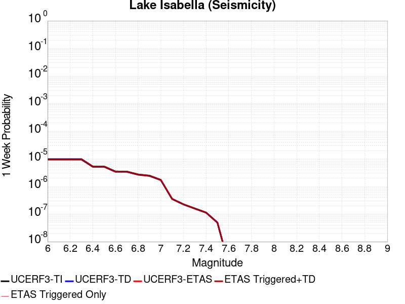 | 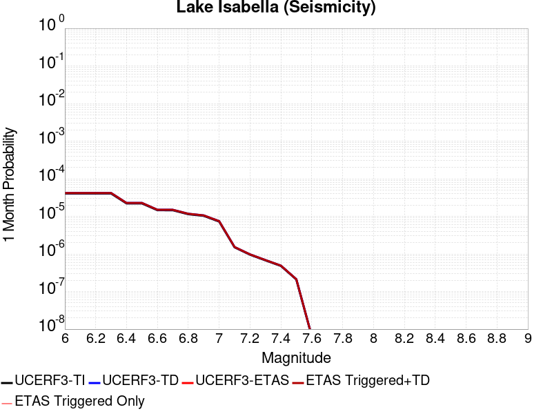 | 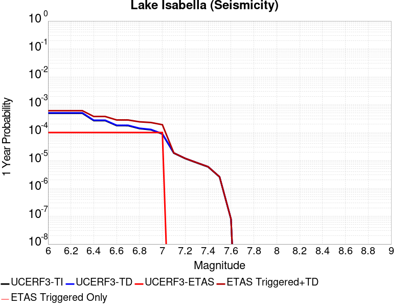 | 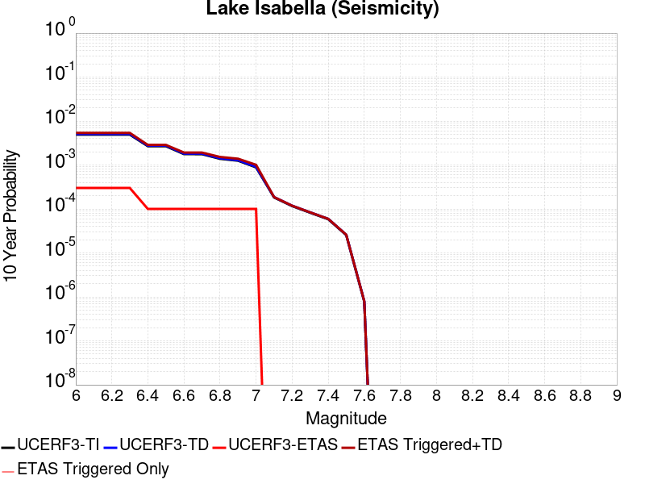 |

| Magnitude | 1 wk TI Prob | 1 wk TD Prob | 1 wk ETAS Prob | 1 wk ETAS/TD Gain | 1 wk ETAS Triggered+TD | 1 wk ETAS Triggered Only | 1 mo TI Prob | 1 mo TD Prob | 1 mo ETAS Prob | 1 mo ETAS/TD Gain | 1 mo ETAS Triggered+TD | 1 mo ETAS Triggered Only | 1 yr TI Prob | 1 yr TD Prob | 1 yr ETAS Prob | 1 yr ETAS/TD Gain | 1 yr ETAS Triggered+TD | 1 yr ETAS Triggered Only | 10 yr TI Prob | 10 yr TD Prob | 10 yr ETAS Prob | 10 yr ETAS/TD Gain | 10 yr ETAS Triggered+TD | 10 yr ETAS Triggered Only |
|-----|-----|-----|-----|-----|-----|-----|-----|-----|-----|-----|-----|-----|-----|-----|-----|-----|-----|-----|-----|-----|-----|-----|-----|-----|
| 6.0 | 9.431637E-6 | 9.742312E-6 | 0.0 | 0.0 | 9.742312E-6 | 0.0 | 4.0420677E-5 | 4.175217E-5 | 0.0 | 0.0 | 4.175217E-5 | 0.0 | 4.920106E-4 | 5.0822715E-4 | 1.0E-4 | 0.19676241 | 6.0817634E-4 | 1.0E-4 | 0.004909227 | 0.0050719418 | 0.0026 | 0.5126242 | 0.00537042 | 3.0E-4 |
| 6.1 | 9.431637E-6 | 9.742312E-6 | 0.0 | 0.0 | 9.742312E-6 | 0.0 | 4.0420677E-5 | 4.175217E-5 | 0.0 | 0.0 | 4.175217E-5 | 0.0 | 4.920106E-4 | 5.0822715E-4 | 1.0E-4 | 0.19676241 | 6.0817634E-4 | 1.0E-4 | 0.004909227 | 0.0050719418 | 0.0026 | 0.5126242 | 0.00537042 | 3.0E-4 |
| 6.2 | 9.431637E-6 | 9.742312E-6 | 0.0 | 0.0 | 9.742312E-6 | 0.0 | 4.0420677E-5 | 4.175217E-5 | 0.0 | 0.0 | 4.175217E-5 | 0.0 | 4.920106E-4 | 5.0822715E-4 | 1.0E-4 | 0.19676241 | 6.0817634E-4 | 1.0E-4 | 0.004909227 | 0.0050719418 | 0.0026 | 0.5126242 | 0.00537042 | 3.0E-4 |
| 6.3 | 9.431637E-6 | 9.742312E-6 | 0.0 | 0.0 | 9.742312E-6 | 0.0 | 4.0420677E-5 | 4.175217E-5 | 0.0 | 0.0 | 4.175217E-5 | 0.0 | 4.920106E-4 | 5.0822715E-4 | 1.0E-4 | 0.19676241 | 6.0817634E-4 | 1.0E-4 | 0.004909227 | 0.0050719418 | 0.0026 | 0.5126242 | 0.00537042 | 3.0E-4 |
| 6.4 | 5.144063E-6 | 5.3004073E-6 | 0.0 | 0.0 | 5.3004073E-6 | 0.0 | 2.2045799E-5 | 2.2715853E-5 | 0.0 | 0.0 | 2.2715853E-5 | 0.0 | 2.6837454E-4 | 2.7653386E-4 | 1.0E-4 | 0.36161935 | 3.765062E-4 | 1.0E-4 | 0.0026805066 | 0.002762238 | 0.0016 | 0.57924044 | 0.002861962 | 1.0E-4 |
| 6.5 | 5.144063E-6 | 5.3004073E-6 | 0.0 | 0.0 | 5.3004073E-6 | 0.0 | 2.2045799E-5 | 2.2715853E-5 | 0.0 | 0.0 | 2.2715853E-5 | 0.0 | 2.6837454E-4 | 2.7653386E-4 | 1.0E-4 | 0.36161935 | 3.765062E-4 | 1.0E-4 | 0.0026805066 | 0.002762238 | 0.0016 | 0.57924044 | 0.002861962 | 1.0E-4 |
| 6.6 | 3.4009804E-6 | 3.4989935E-6 | 0.0 | 0.0 | 3.4989935E-6 | 0.0 | 1.4575549E-5 | 1.49956095E-5 | 0.0 | 0.0 | 1.49956095E-5 | 0.0 | 1.7744285E-4 | 1.8255785E-4 | 1.0E-4 | 0.5477716 | 2.8253958E-4 | 1.0E-4 | 0.0017730123 | 0.0018242366 | 9.0E-4 | 0.49335706 | 0.0019240541 | 1.0E-4 |
| 6.7 | 3.3880428E-6 | 3.4858597E-6 | 0.0 | 0.0 | 3.4858597E-6 | 0.0 | 1.4520103E-5 | 1.4939322E-5 | 0.0 | 0.0 | 1.4939322E-5 | 0.0 | 1.767679E-4 | 1.8187267E-4 | 1.0E-4 | 0.5498352 | 2.8185447E-4 | 1.0E-4 | 0.0017662736 | 0.001817396 | 9.0E-4 | 0.49521405 | 0.0019172142 | 1.0E-4 |
| 6.8 | 2.6582E-6 | 2.7338601E-6 | 0.0 | 0.0 | 2.7338601E-6 | 0.0 | 1.1392236E-5 | 1.1716498E-5 | 0.0 | 0.0 | 1.1716498E-5 | 0.0 | 1.3869164E-4 | 1.4264038E-4 | 1.0E-4 | 0.70106375 | 2.4262612E-4 | 1.0E-4 | 0.0013860512 | 0.0014256203 | 7.0E-4 | 0.49101433 | 0.0015254777 | 1.0E-4 |
| 6.9 | 2.406011E-6 | 2.4744736E-6 | 0.0 | 0.0 | 2.4744736E-6 | 0.0 | 1.0311434E-5 | 1.0604851E-5 | 0.0 | 0.0 | 1.0604851E-5 | 0.0 | 1.2553448E-4 | 1.2910774E-4 | 1.0E-4 | 0.7745469 | 2.2909482E-4 | 1.0E-4 | 0.0012546359 | 0.0012904569 | 5.0E-4 | 0.38745967 | 0.0013903278 | 1.0E-4 |
| 7.0 | 1.6953097E-6 | 1.7430381E-6 | 0.0 | 0.0 | 1.7430381E-6 | 0.0 | 7.265593E-6 | 7.4701475E-6 | 0.0 | 0.0 | 7.4701475E-6 | 0.0 | 8.8455E-5 | 9.09463E-5 | 1.0E-4 | 1.09955 | 1.9093721E-4 | 1.0E-4 | 8.84198E-4 | 9.091936E-4 | 3.0E-4 | 0.32996273 | 0.0010091027 | 1.0E-4 |
| 7.1 | 3.5013824E-7 | 3.5716295E-7 | 0.0 | 0.0 | 3.5716295E-7 | 0.0 | 1.5005916E-6 | 1.5306975E-6 | 0.0 | 0.0 | 1.5306975E-6 | 0.0 | 1.826955E-5 | 1.8636085E-5 | 0.0 | 0.0 | 1.8636085E-5 | 0.0 | 1.8268047E-4 | 1.8634548E-4 | 0.0 | 0.0 | 1.8634548E-4 | 0.0 |
| 7.2 | 2.2321095E-7 | 2.2751475E-7 | 0.0 | 0.0 | 2.2751475E-7 | 0.0 | 9.56618E-7 | 9.750629E-7 | 0.0 | 0.0 | 9.750629E-7 | 0.0 | 1.1646762E-5 | 1.1871327E-5 | 0.0 | 0.0 | 1.1871327E-5 | 0.0 | 1.1646151E-4 | 1.1870702E-4 | 0.0 | 0.0 | 1.1870702E-4 | 0.0 |
| 7.3 | 1.5760406E-7 | 1.6061553E-7 | 0.0 | 0.0 | 1.6061553E-7 | 0.0 | 6.7544585E-7 | 6.883521E-7 | 0.0 | 0.0 | 6.883521E-7 | 0.0 | 8.223522E-6 | 8.380655E-6 | 0.0 | 0.0 | 8.380655E-6 | 0.0 | 8.2232174E-5 | 8.3803454E-5 | 0.0 | 0.0 | 8.3803454E-5 | 0.0 |
| 7.4 | 1.1216497E-7 | 1.1432158E-7 | 0.0 | 0.0 | 1.1432158E-7 | 0.0 | 4.8070694E-7 | 4.899495E-7 | 0.0 | 0.0 | 4.899495E-7 | 0.0 | 5.852591E-6 | 5.9651197E-6 | 0.0 | 0.0 | 5.9651197E-6 | 0.0 | 5.8524372E-5 | 5.964964E-5 | 0.0 | 0.0 | 5.964964E-5 | 0.0 |
| 7.5 | 4.885185E-8 | 4.97897E-8 | 0.0 | 0.0 | 4.97897E-8 | 0.0 | 2.0936506E-7 | 2.1338442E-7 | 0.0 | 0.0 | 2.1338442E-7 | 0.0 | 2.5490165E-6 | 2.5979523E-6 | 0.0 | 0.0 | 2.5979523E-6 | 0.0 | 2.5489873E-5 | 2.5979238E-5 | 0.0 | 0.0 | 2.5979238E-5 | 0.0 |
| 7.6 | 1.504641E-9 | 1.5318472E-9 | 0.0 | 0.0 | 1.5318472E-9 | 0.0 | 6.4484613E-9 | 6.5650596E-9 | 0.0 | 0.0 | 6.5650596E-9 | 0.0 | 7.851001E-8 | 7.99296E-8 | 0.0 | 0.0 | 7.99296E-8 | 0.0 | 7.8509987E-7 | 7.99296E-7 | 0.0 | 0.0 | 7.99296E-7 | 0.0 |

## Peralta Hills
*[(top)](#table-of-contents)*

| 1 Week | 1 Month | 1 Year | 10 Year |
|-----|-----|-----|-----|
| 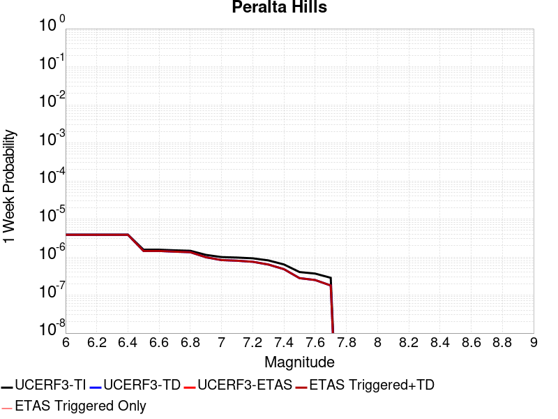 | 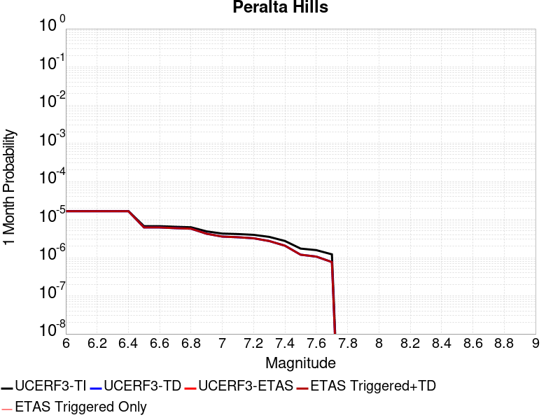 | 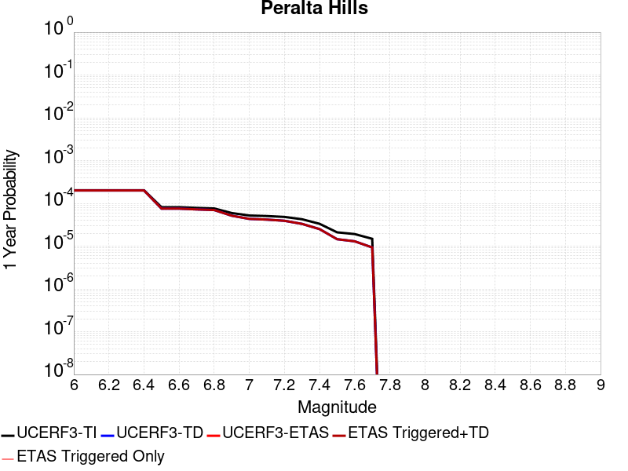 | 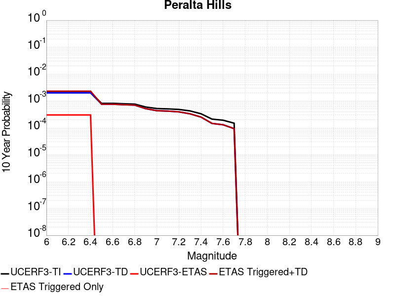 |

| Magnitude | 1 wk TI Prob | 1 wk TD Prob | 1 wk ETAS Prob | 1 wk ETAS/TD Gain | 1 wk ETAS Triggered+TD | 1 wk ETAS Triggered Only | 1 mo TI Prob | 1 mo TD Prob | 1 mo ETAS Prob | 1 mo ETAS/TD Gain | 1 mo ETAS Triggered+TD | 1 mo ETAS Triggered Only | 1 yr TI Prob | 1 yr TD Prob | 1 yr ETAS Prob | 1 yr ETAS/TD Gain | 1 yr ETAS Triggered+TD | 1 yr ETAS Triggered Only | 10 yr TI Prob | 10 yr TD Prob | 10 yr ETAS Prob | 10 yr ETAS/TD Gain | 10 yr ETAS Triggered+TD | 10 yr ETAS Triggered Only |
|-----|-----|-----|-----|-----|-----|-----|-----|-----|-----|-----|-----|-----|-----|-----|-----|-----|-----|-----|-----|-----|-----|-----|-----|-----|
| 6.0 | 3.8850067E-6 | 3.840453E-6 | 0.0 | 0.0 | 3.840453E-6 | 0.0 | 1.6649923E-5 | 1.6459022E-5 | 0.0 | 0.0 | 1.6459022E-5 | 0.0 | 2.0269395E-4 | 2.0037757E-4 | 1.0E-4 | 0.49905783 | 2.0037757E-4 | 0.0 | 0.0020250916 | 0.0020026967 | 0.0016 | 0.7989227 | 0.002302096 | 3.0E-4 |
| 6.1 | 3.8850067E-6 | 3.840453E-6 | 0.0 | 0.0 | 3.840453E-6 | 0.0 | 1.6649923E-5 | 1.6459022E-5 | 0.0 | 0.0 | 1.6459022E-5 | 0.0 | 2.0269395E-4 | 2.0037757E-4 | 1.0E-4 | 0.49905783 | 2.0037757E-4 | 0.0 | 0.0020250916 | 0.0020026967 | 0.0016 | 0.7989227 | 0.002302096 | 3.0E-4 |
| 6.2 | 3.8850067E-6 | 3.840453E-6 | 0.0 | 0.0 | 3.840453E-6 | 0.0 | 1.6649923E-5 | 1.6459022E-5 | 0.0 | 0.0 | 1.6459022E-5 | 0.0 | 2.0269395E-4 | 2.0037757E-4 | 1.0E-4 | 0.49905783 | 2.0037757E-4 | 0.0 | 0.0020250916 | 0.0020026967 | 0.0016 | 0.7989227 | 0.002302096 | 3.0E-4 |
| 6.3 | 3.8850067E-6 | 3.840453E-6 | 0.0 | 0.0 | 3.840453E-6 | 0.0 | 1.6649923E-5 | 1.6459022E-5 | 0.0 | 0.0 | 1.6459022E-5 | 0.0 | 2.0269395E-4 | 2.0037757E-4 | 1.0E-4 | 0.49905783 | 2.0037757E-4 | 0.0 | 0.0020250916 | 0.0020026967 | 0.0016 | 0.7989227 | 0.002302096 | 3.0E-4 |
| 6.4 | 3.8850067E-6 | 3.840453E-6 | 0.0 | 0.0 | 3.840453E-6 | 0.0 | 1.6649923E-5 | 1.6459022E-5 | 0.0 | 0.0 | 1.6459022E-5 | 0.0 | 2.0269395E-4 | 2.0037757E-4 | 1.0E-4 | 0.49905783 | 2.0037757E-4 | 0.0 | 0.0020250916 | 0.0020026967 | 0.0016 | 0.7989227 | 0.002302096 | 3.0E-4 |
| 6.5 | 1.5587785E-6 | 1.4438716E-6 | 0.0 | 0.0 | 1.4438716E-6 | 0.0 | 6.6804623E-6 | 6.1880082E-6 | 0.0 | 0.0 | 6.1880082E-6 | 0.0 | 8.133159E-5 | 7.533664E-5 | 0.0 | 0.0 | 7.533664E-5 | 0.0 | 8.1301836E-4 | 7.53135E-4 | 3.0E-4 | 0.39833495 | 7.53135E-4 | 0.0 |
| 6.6 | 1.5587785E-6 | 1.4438716E-6 | 0.0 | 0.0 | 1.4438716E-6 | 0.0 | 6.6804623E-6 | 6.1880082E-6 | 0.0 | 0.0 | 6.1880082E-6 | 0.0 | 8.133159E-5 | 7.533664E-5 | 0.0 | 0.0 | 7.533664E-5 | 0.0 | 8.1301836E-4 | 7.53135E-4 | 3.0E-4 | 0.39833495 | 7.53135E-4 | 0.0 |
| 6.7 | 1.5018579E-6 | 1.384489E-6 | 0.0 | 0.0 | 1.384489E-6 | 0.0 | 6.436518E-6 | 5.933512E-6 | 0.0 | 0.0 | 5.933512E-6 | 0.0 | 7.836179E-5 | 7.2238356E-5 | 0.0 | 0.0 | 7.2238356E-5 | 0.0 | 7.833416E-4 | 7.221723E-4 | 3.0E-4 | 0.41541332 | 7.221723E-4 | 0.0 |
| 6.8 | 1.4584314E-6 | 1.3389165E-6 | 0.0 | 0.0 | 1.3389165E-6 | 0.0 | 6.250405E-6 | 5.738202E-6 | 0.0 | 0.0 | 5.738202E-6 | 0.0 | 7.6096025E-5 | 6.986061E-5 | 0.0 | 0.0 | 6.986061E-5 | 0.0 | 7.6069974E-4 | 6.984099E-4 | 3.0E-4 | 0.42954716 | 6.984099E-4 | 0.0 |
| 6.9 | 1.1382393E-6 | 9.867929E-7 | 0.0 | 0.0 | 9.867929E-7 | 0.0 | 4.8781594E-6 | 4.229106E-6 | 0.0 | 0.0 | 4.229106E-6 | 0.0 | 5.9389975E-5 | 5.148823E-5 | 0.0 | 0.0 | 5.148823E-5 | 0.0 | 5.93741E-4 | 5.1477127E-4 | 2.0E-4 | 0.3885221 | 5.1477127E-4 | 0.0 |
| 7.0 | 9.970413E-7 | 8.314404E-7 | 0.0 | 0.0 | 8.314404E-7 | 0.0 | 4.273027E-6 | 3.5633113E-6 | 0.0 | 0.0 | 3.5633113E-6 | 0.0 | 5.2022864E-5 | 4.3382523E-5 | 0.0 | 0.0 | 4.3382523E-5 | 0.0 | 5.2010687E-4 | 4.3374734E-4 | 2.0E-4 | 0.46109793 | 4.3374734E-4 | 0.0 |
| 7.1 | 9.684443E-7 | 7.998684E-7 | 0.0 | 0.0 | 7.998684E-7 | 0.0 | 4.150469E-6 | 3.4280035E-6 | 0.0 | 0.0 | 3.4280035E-6 | 0.0 | 5.053079E-5 | 4.1735213E-5 | 0.0 | 0.0 | 4.1735213E-5 | 0.0 | 5.05193E-4 | 4.1728048E-4 | 2.0E-4 | 0.47929394 | 4.1728048E-4 | 0.0 |
| 7.2 | 9.240811E-7 | 7.5075496E-7 | 0.0 | 0.0 | 7.5075496E-7 | 0.0 | 3.960342E-6 | 3.2175178E-6 | 0.0 | 0.0 | 3.2175178E-6 | 0.0 | 4.8216094E-5 | 3.917264E-5 | 0.0 | 0.0 | 3.917264E-5 | 0.0 | 4.8205635E-4 | 3.916639E-4 | 2.0E-4 | 0.5106419 | 3.916639E-4 | 0.0 |
| 7.3 | 8.158643E-7 | 6.3539034E-7 | 0.0 | 0.0 | 6.3539034E-7 | 0.0 | 3.4965567E-6 | 2.723099E-6 | 0.0 | 0.0 | 2.723099E-6 | 0.0 | 4.2569747E-5 | 3.315329E-5 | 0.0 | 0.0 | 3.315329E-5 | 0.0 | 4.2561593E-4 | 3.3148957E-4 | 1.0E-4 | 0.3016686 | 3.3148957E-4 | 0.0 |
| 7.4 | 6.3822824E-7 | 4.798663E-7 | 0.0 | 0.0 | 4.798663E-7 | 0.0 | 2.7352612E-6 | 2.0565685E-6 | 0.0 | 0.0 | 2.0565685E-6 | 0.0 | 3.3301294E-5 | 2.5038486E-5 | 0.0 | 0.0 | 2.5038486E-5 | 0.0 | 3.3296304E-4 | 2.5036177E-4 | 0.0 | 0.0 | 2.5036177E-4 | 0.0 |
| 7.5 | 4.0292628E-7 | 2.7863E-7 | 0.0 | 0.0 | 2.7863E-7 | 0.0 | 1.7268258E-6 | 1.1941282E-6 | 0.0 | 0.0 | 1.1941282E-6 | 0.0 | 2.1023901E-5 | 1.4538442E-5 | 0.0 | 0.0 | 1.4538442E-5 | 0.0 | 2.1021912E-4 | 1.4537771E-4 | 0.0 | 0.0 | 1.4537771E-4 | 0.0 |
| 7.6 | 3.672993E-7 | 2.4869996E-7 | 0.0 | 0.0 | 2.4869996E-7 | 0.0 | 1.5741389E-6 | 1.0658567E-6 | 0.0 | 0.0 | 1.0658567E-6 | 0.0 | 1.9164972E-5 | 1.2976756E-5 | 0.0 | 0.0 | 1.2976756E-5 | 0.0 | 1.916332E-4 | 1.297627E-4 | 0.0 | 0.0 | 1.297627E-4 | 0.0 |
| 7.7 | 2.8466823E-7 | 1.787142E-7 | 0.0 | 0.0 | 1.787142E-7 | 0.0 | 1.2200061E-6 | 7.659179E-7 | 0.0 | 0.0 | 7.659179E-7 | 0.0 | 1.4853474E-5 | 9.325037E-6 | 0.0 | 0.0 | 9.325037E-6 | 0.0 | 1.485248E-4 | 9.324906E-5 | 0.0 | 0.0 | 9.324906E-5 | 0.0 |

## Fickle Hill (alt1)
*[(top)](#table-of-contents)*

| 1 Week | 1 Month | 1 Year | 10 Year |
|-----|-----|-----|-----|
| 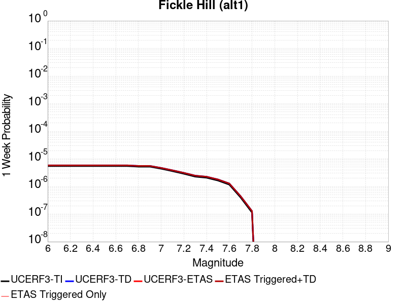 | 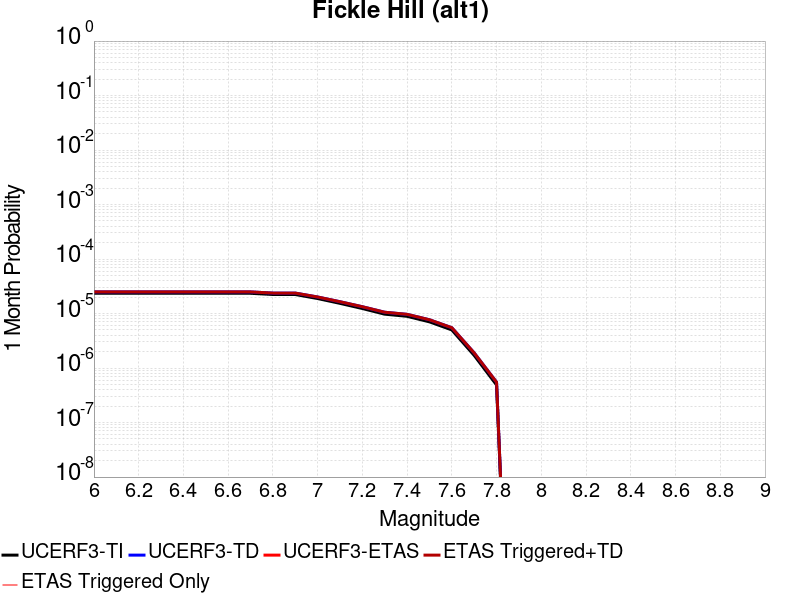 | 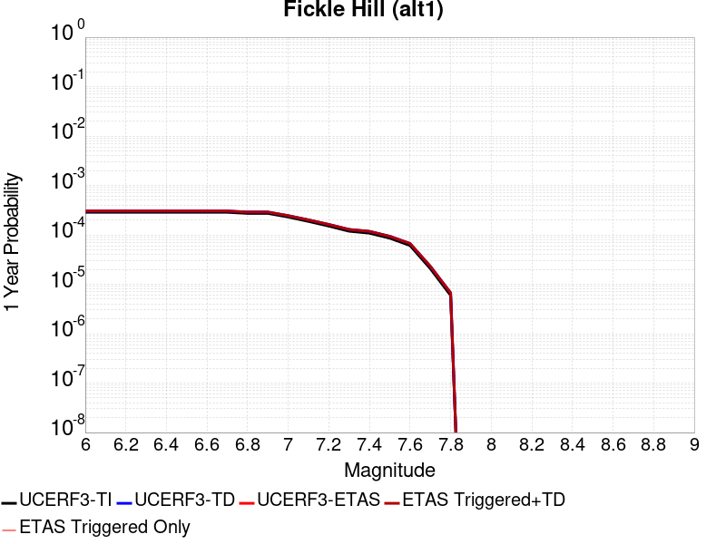 | 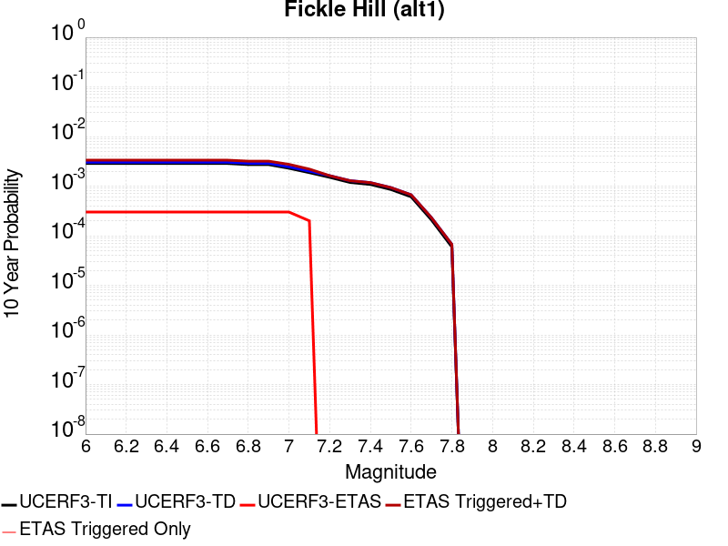 |

| Magnitude | 1 wk TI Prob | 1 wk TD Prob | 1 wk ETAS Prob | 1 wk ETAS/TD Gain | 1 wk ETAS Triggered+TD | 1 wk ETAS Triggered Only | 1 mo TI Prob | 1 mo TD Prob | 1 mo ETAS Prob | 1 mo ETAS/TD Gain | 1 mo ETAS Triggered+TD | 1 mo ETAS Triggered Only | 1 yr TI Prob | 1 yr TD Prob | 1 yr ETAS Prob | 1 yr ETAS/TD Gain | 1 yr ETAS Triggered+TD | 1 yr ETAS Triggered Only | 10 yr TI Prob | 10 yr TD Prob | 10 yr ETAS Prob | 10 yr ETAS/TD Gain | 10 yr ETAS Triggered+TD | 10 yr ETAS Triggered Only |
|-----|-----|-----|-----|-----|-----|-----|-----|-----|-----|-----|-----|-----|-----|-----|-----|-----|-----|-----|-----|-----|-----|-----|-----|-----|
| 6.0 | 5.491893E-6 | 5.8277365E-6 | 0.0 | 0.0 | 5.8277365E-6 | 0.0 | 2.3536471E-5 | 2.4975787E-5 | 0.0 | 0.0 | 2.4975787E-5 | 0.0 | 2.8651886E-4 | 3.0404003E-4 | 3.0E-4 | 0.98671216 | 3.0404003E-4 | 0.0 | 0.0028614972 | 0.003036465 | 0.0028 | 0.9221249 | 0.0033355542 | 3.0E-4 |
| 6.1 | 5.491893E-6 | 5.8277365E-6 | 0.0 | 0.0 | 5.8277365E-6 | 0.0 | 2.3536471E-5 | 2.4975787E-5 | 0.0 | 0.0 | 2.4975787E-5 | 0.0 | 2.8651886E-4 | 3.0404003E-4 | 3.0E-4 | 0.98671216 | 3.0404003E-4 | 0.0 | 0.0028614972 | 0.003036465 | 0.0028 | 0.9221249 | 0.0033355542 | 3.0E-4 |
| 6.2 | 5.491893E-6 | 5.8277365E-6 | 0.0 | 0.0 | 5.8277365E-6 | 0.0 | 2.3536471E-5 | 2.4975787E-5 | 0.0 | 0.0 | 2.4975787E-5 | 0.0 | 2.8651886E-4 | 3.0404003E-4 | 3.0E-4 | 0.98671216 | 3.0404003E-4 | 0.0 | 0.0028614972 | 0.003036465 | 0.0028 | 0.9221249 | 0.0033355542 | 3.0E-4 |
| 6.3 | 5.491893E-6 | 5.8277365E-6 | 0.0 | 0.0 | 5.8277365E-6 | 0.0 | 2.3536471E-5 | 2.4975787E-5 | 0.0 | 0.0 | 2.4975787E-5 | 0.0 | 2.8651886E-4 | 3.0404003E-4 | 3.0E-4 | 0.98671216 | 3.0404003E-4 | 0.0 | 0.0028614972 | 0.003036465 | 0.0028 | 0.9221249 | 0.0033355542 | 3.0E-4 |
| 6.4 | 5.491893E-6 | 5.8277365E-6 | 0.0 | 0.0 | 5.8277365E-6 | 0.0 | 2.3536471E-5 | 2.4975787E-5 | 0.0 | 0.0 | 2.4975787E-5 | 0.0 | 2.8651886E-4 | 3.0404003E-4 | 3.0E-4 | 0.98671216 | 3.0404003E-4 | 0.0 | 0.0028614972 | 0.003036465 | 0.0028 | 0.9221249 | 0.0033355542 | 3.0E-4 |
| 6.5 | 5.491893E-6 | 5.8277365E-6 | 0.0 | 0.0 | 5.8277365E-6 | 0.0 | 2.3536471E-5 | 2.4975787E-5 | 0.0 | 0.0 | 2.4975787E-5 | 0.0 | 2.8651886E-4 | 3.0404003E-4 | 3.0E-4 | 0.98671216 | 3.0404003E-4 | 0.0 | 0.0028614972 | 0.003036465 | 0.0028 | 0.9221249 | 0.0033355542 | 3.0E-4 |
| 6.6 | 5.491893E-6 | 5.8277365E-6 | 0.0 | 0.0 | 5.8277365E-6 | 0.0 | 2.3536471E-5 | 2.4975787E-5 | 0.0 | 0.0 | 2.4975787E-5 | 0.0 | 2.8651886E-4 | 3.0404003E-4 | 3.0E-4 | 0.98671216 | 3.0404003E-4 | 0.0 | 0.0028614972 | 0.003036465 | 0.0028 | 0.9221249 | 0.0033355542 | 3.0E-4 |
| 6.7 | 5.491893E-6 | 5.8277365E-6 | 0.0 | 0.0 | 5.8277365E-6 | 0.0 | 2.3536471E-5 | 2.4975787E-5 | 0.0 | 0.0 | 2.4975787E-5 | 0.0 | 2.8651886E-4 | 3.0404003E-4 | 3.0E-4 | 0.98671216 | 3.0404003E-4 | 0.0 | 0.0028614972 | 0.003036465 | 0.0028 | 0.9221249 | 0.0033355542 | 3.0E-4 |
| 6.8 | 5.2207747E-6 | 5.5464434E-6 | 0.0 | 0.0 | 5.5464434E-6 | 0.0 | 2.2374557E-5 | 2.3770268E-5 | 0.0 | 0.0 | 2.3770268E-5 | 0.0 | 2.7237617E-4 | 2.8936678E-4 | 2.0E-4 | 0.6911644 | 2.8936678E-4 | 0.0 | 0.0027204256 | 0.002890118 | 0.0026 | 0.89961725 | 0.003189251 | 3.0E-4 |
| 6.9 | 5.2186956E-6 | 5.5442633E-6 | 0.0 | 0.0 | 5.5442633E-6 | 0.0 | 2.2365646E-5 | 2.3760926E-5 | 0.0 | 0.0 | 2.3760926E-5 | 0.0 | 2.722677E-4 | 2.8925305E-4 | 2.0E-4 | 0.69143605 | 2.8925305E-4 | 0.0 | 0.0027193436 | 0.0028889838 | 0.0026 | 0.8999704 | 0.0031881172 | 3.0E-4 |
| 7.0 | 4.403045E-6 | 4.699134E-6 | 0.0 | 0.0 | 4.699134E-6 | 0.0 | 1.8870056E-5 | 2.0139E-5 | 0.0 | 0.0 | 2.0139E-5 | 0.0 | 2.297187E-4 | 2.4516604E-4 | 2.0E-4 | 0.81577367 | 2.4516604E-4 | 0.0 | 0.0022948137 | 0.002449086 | 0.0022 | 0.89829427 | 0.0027483513 | 3.0E-4 |
| 7.1 | 3.5911396E-6 | 3.8485255E-6 | 0.0 | 0.0 | 3.8485255E-6 | 0.0 | 1.5390508E-5 | 1.6493581E-5 | 0.0 | 0.0 | 1.6493581E-5 | 0.0 | 1.8736332E-4 | 2.0079159E-4 | 2.0E-4 | 0.9960577 | 2.0079159E-4 | 0.0 | 0.0018720542 | 0.002006175 | 0.0017 | 0.8473837 | 0.002205774 | 2.0E-4 |
| 7.2 | 2.888171E-6 | 3.1146626E-6 | 0.0 | 0.0 | 3.1146626E-6 | 0.0 | 1.2377816E-5 | 1.3348487E-5 | 0.0 | 0.0 | 1.3348487E-5 | 0.0 | 1.5068949E-4 | 1.6250595E-4 | 2.0E-4 | 1.2307241 | 1.6250595E-4 | 0.0 | 0.0015058735 | 0.001623896 | 0.001 | 0.615803 | 0.001623896 | 0.0 |
| 7.3 | 2.275019E-6 | 2.4679528E-6 | 0.0 | 0.0 | 2.4679528E-6 | 0.0 | 9.750045E-6 | 1.0576899E-5 | 0.0 | 0.0 | 1.0576899E-5 | 0.0 | 1.1870033E-4 | 1.2876627E-4 | 2.0E-4 | 1.5532018 | 1.2876627E-4 | 0.0 | 0.0011863695 | 0.0012869305 | 6.0E-4 | 0.46622565 | 0.0012869305 | 0.0 |
| 7.4 | 2.076662E-6 | 2.2580182E-6 | 0.0 | 0.0 | 2.2580182E-6 | 0.0 | 8.8999495E-6 | 9.6771855E-6 | 0.0 | 0.0 | 9.6771855E-6 | 0.0 | 1.08351494E-4 | 1.178135E-4 | 1.0E-4 | 0.84879917 | 1.178135E-4 | 0.0 | 0.0010829868 | 0.0011775235 | 3.0E-4 | 0.254772 | 0.0011775235 | 0.0 |
| 7.5 | 1.6450799E-6 | 1.7957491E-6 | 0.0 | 0.0 | 1.7957491E-6 | 0.0 | 7.0503233E-6 | 7.696045E-6 | 0.0 | 0.0 | 7.696045E-6 | 0.0 | 8.5834305E-5 | 9.3695395E-5 | 0.0 | 0.0 | 9.3695395E-5 | 0.0 | 8.580116E-4 | 9.365666E-4 | 0.0 | 0.0 | 9.365666E-4 | 0.0 |
| 7.6 | 1.168891E-6 | 1.2832104E-6 | 0.0 | 0.0 | 1.2832104E-6 | 0.0 | 5.009523E-6 | 5.4994616E-6 | 0.0 | 0.0 | 5.4994616E-6 | 0.0 | 6.098924E-5 | 6.6953944E-5 | 0.0 | 0.0 | 6.6953944E-5 | 0.0 | 6.09725E-4 | 6.693434E-4 | 0.0 | 0.0 | 6.693434E-4 | 0.0 |
| 7.7 | 3.9871026E-7 | 4.4281518E-7 | 0.0 | 0.0 | 4.4281518E-7 | 0.0 | 1.708757E-6 | 1.897778E-6 | 0.0 | 0.0 | 1.897778E-6 | 0.0 | 2.0803918E-5 | 2.310521E-5 | 0.0 | 0.0 | 2.310521E-5 | 0.0 | 2.0801972E-4 | 2.3102891E-4 | 0.0 | 0.0 | 2.3102891E-4 | 0.0 |
| 7.8 | 1.14295965E-7 | 1.2857119E-7 | 0.0 | 0.0 | 1.2857119E-7 | 0.0 | 4.8983975E-7 | 5.5101924E-7 | 0.0 | 0.0 | 5.5101924E-7 | 0.0 | 5.9637828E-6 | 6.7086403E-6 | 0.0 | 0.0 | 6.7086403E-6 | 0.0 | 5.9636226E-5 | 6.708453E-5 | 0.0 | 0.0 | 6.708453E-5 | 0.0 |

## Rocky Ledge 2011 CFM
*[(top)](#table-of-contents)*

| 1 Week | 1 Month | 1 Year | 10 Year |
|-----|-----|-----|-----|
| 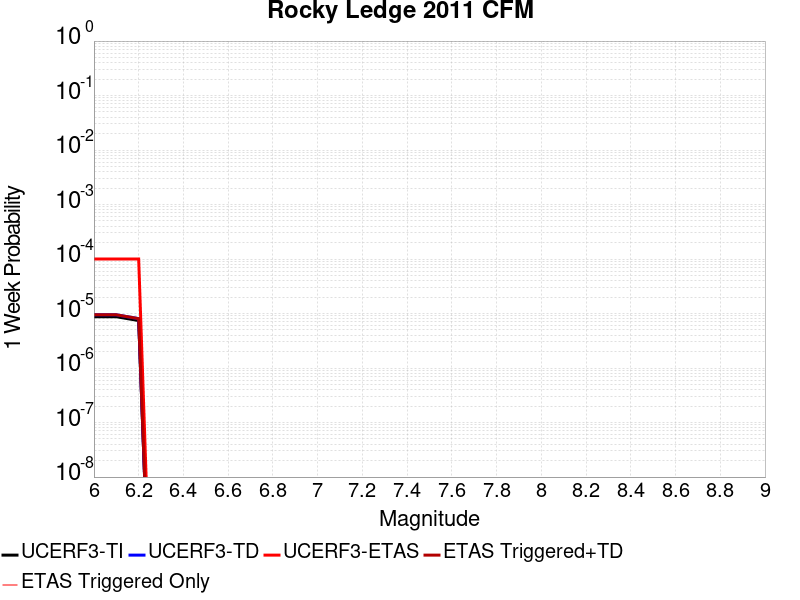 | 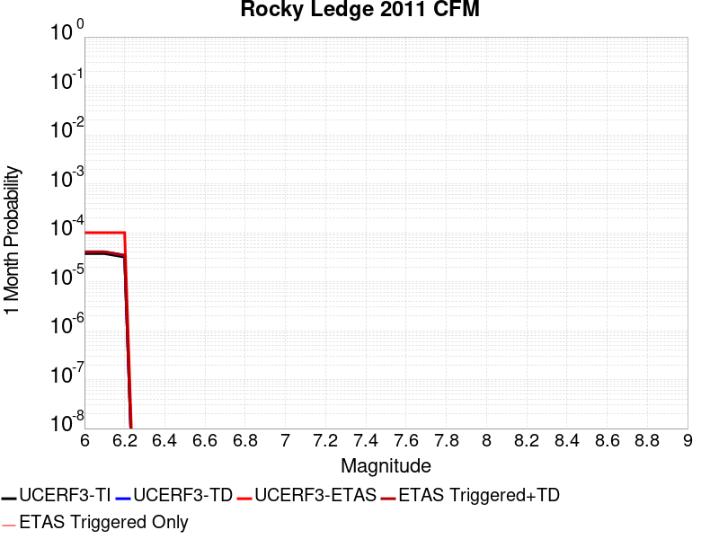 | 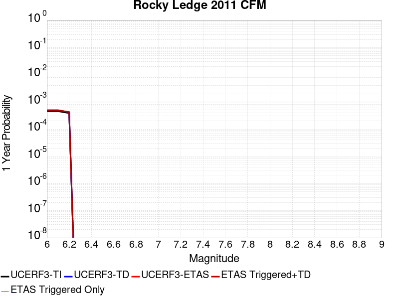 | 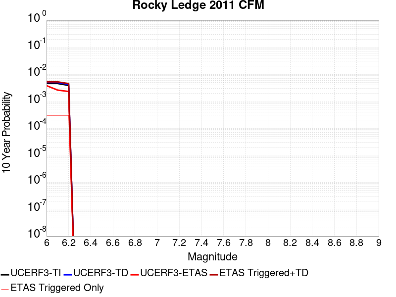 |

| Magnitude | 1 wk TI Prob | 1 wk TD Prob | 1 wk ETAS Prob | 1 wk ETAS/TD Gain | 1 wk ETAS Triggered+TD | 1 wk ETAS Triggered Only | 1 mo TI Prob | 1 mo TD Prob | 1 mo ETAS Prob | 1 mo ETAS/TD Gain | 1 mo ETAS Triggered+TD | 1 mo ETAS Triggered Only | 1 yr TI Prob | 1 yr TD Prob | 1 yr ETAS Prob | 1 yr ETAS/TD Gain | 1 yr ETAS Triggered+TD | 1 yr ETAS Triggered Only | 10 yr TI Prob | 10 yr TD Prob | 10 yr ETAS Prob | 10 yr ETAS/TD Gain | 10 yr ETAS Triggered+TD | 10 yr ETAS Triggered Only |
|-----|-----|-----|-----|-----|-----|-----|-----|-----|-----|-----|-----|-----|-----|-----|-----|-----|-----|-----|-----|-----|-----|-----|-----|-----|
| 6.0 | 8.7550525E-6 | 9.488238E-6 | 1.0E-4 | 10.539365 | 9.488238E-6 | 0.0 | 3.7521113E-5 | 4.066371E-5 | 1.0E-4 | 2.4591954 | 4.066371E-5 | 0.0 | 4.567238E-4 | 4.950507E-4 | 3.0E-4 | 0.6059986 | 4.950507E-4 | 0.0 | 0.0045578624 | 0.0049475697 | 0.0038 | 0.7680538 | 0.0052460856 | 3.0E-4 |
| 6.1 | 8.7550525E-6 | 9.488238E-6 | 1.0E-4 | 10.539365 | 9.488238E-6 | 0.0 | 3.7521113E-5 | 4.066371E-5 | 1.0E-4 | 2.4591954 | 4.066371E-5 | 0.0 | 4.567238E-4 | 4.950507E-4 | 3.0E-4 | 0.6059986 | 4.950507E-4 | 0.0 | 0.0045578624 | 0.0049475697 | 0.0026 | 0.52551055 | 0.0052460856 | 3.0E-4 |
| 6.2 | 7.442295E-6 | 8.064425E-6 | 1.0E-4 | 12.40014 | 8.064425E-6 | 0.0 | 3.189516E-5 | 3.456182E-5 | 1.0E-4 | 2.893366 | 3.456182E-5 | 0.0 | 3.8825438E-4 | 4.2079017E-4 | 3.0E-4 | 0.7129444 | 4.2079017E-4 | 0.0 | 0.0038757676 | 0.0042079017 | 0.0023 | 0.5465907 | 0.004506639 | 3.0E-4 |

## Del Valle
*[(top)](#table-of-contents)*

| 1 Week | 1 Month | 1 Year | 10 Year |
|-----|-----|-----|-----|
| 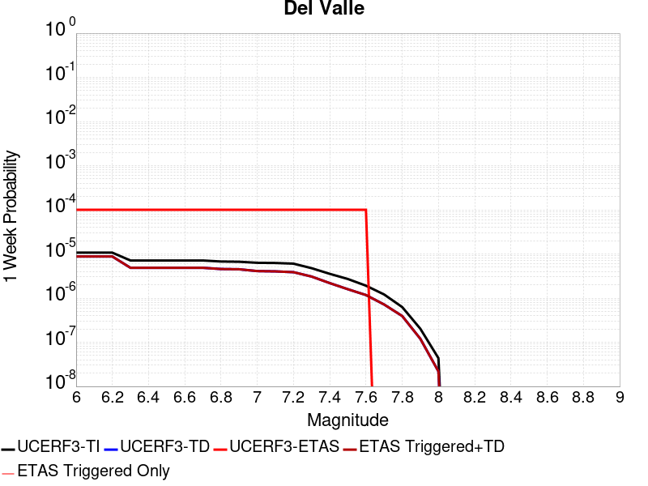 | 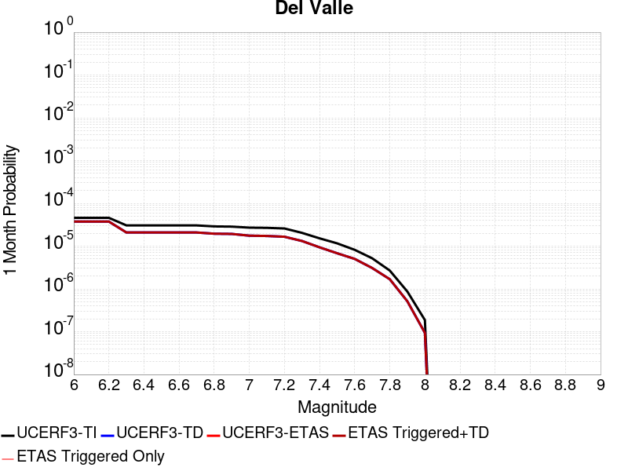 | 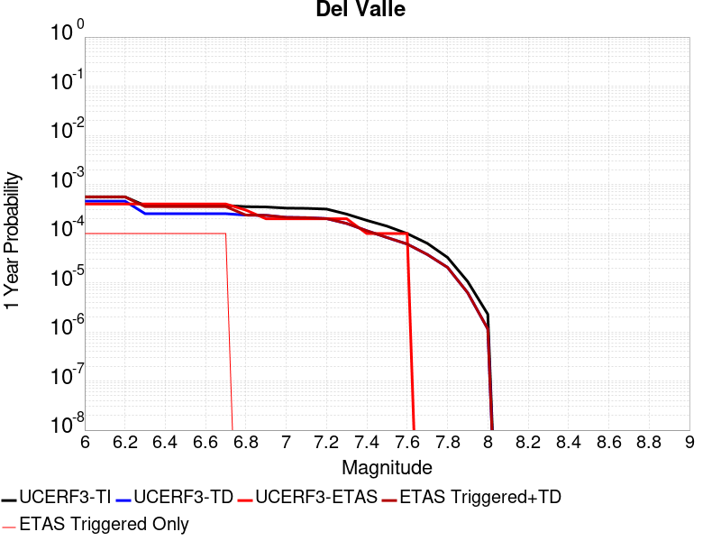 | 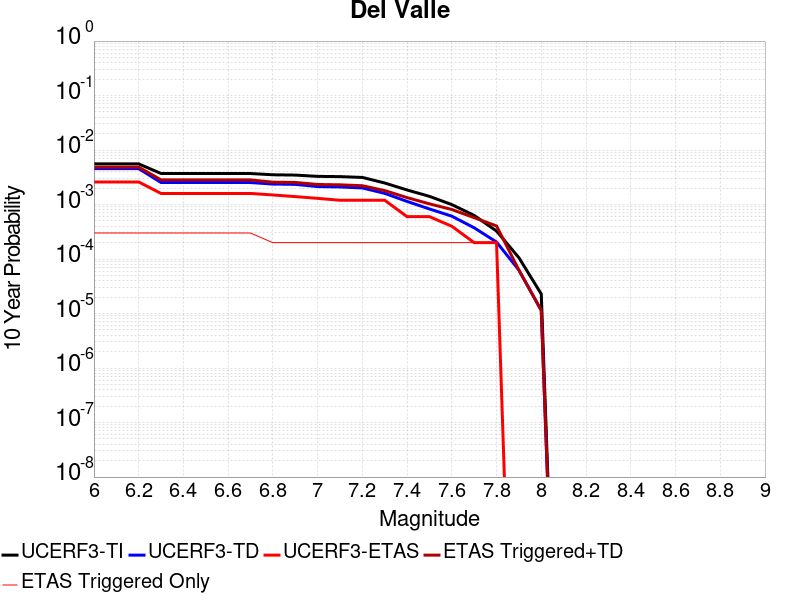 |

| Magnitude | 1 wk TI Prob | 1 wk TD Prob | 1 wk ETAS Prob | 1 wk ETAS/TD Gain | 1 wk ETAS Triggered+TD | 1 wk ETAS Triggered Only | 1 mo TI Prob | 1 mo TD Prob | 1 mo ETAS Prob | 1 mo ETAS/TD Gain | 1 mo ETAS Triggered+TD | 1 mo ETAS Triggered Only | 1 yr TI Prob | 1 yr TD Prob | 1 yr ETAS Prob | 1 yr ETAS/TD Gain | 1 yr ETAS Triggered+TD | 1 yr ETAS Triggered Only | 10 yr TI Prob | 10 yr TD Prob | 10 yr ETAS Prob | 10 yr ETAS/TD Gain | 10 yr ETAS Triggered+TD | 10 yr ETAS Triggered Only |
|-----|-----|-----|-----|-----|-----|-----|-----|-----|-----|-----|-----|-----|-----|-----|-----|-----|-----|-----|-----|-----|-----|-----|-----|-----|
| 6.0 | 1.0716125E-5 | 8.770602E-6 | 1.0E-4 | 11.401725 | 8.770602E-6 | 0.0 | 4.592544E-5 | 3.7587866E-5 | 1.0E-4 | 2.660433 | 3.7587866E-5 | 0.0 | 5.589988E-4 | 4.5755593E-4 | 4.0E-4 | 0.87421006 | 5.575102E-4 | 1.0E-4 | 0.0055759475 | 0.004568093 | 0.0026 | 0.5691653 | 0.0048667225 | 3.0E-4 |
| 6.1 | 1.0716125E-5 | 8.770602E-6 | 1.0E-4 | 11.401725 | 8.770602E-6 | 0.0 | 4.592544E-5 | 3.7587866E-5 | 1.0E-4 | 2.660433 | 3.7587866E-5 | 0.0 | 5.589988E-4 | 4.5755593E-4 | 4.0E-4 | 0.87421006 | 5.575102E-4 | 1.0E-4 | 0.0055759475 | 0.004568093 | 0.0026 | 0.5691653 | 0.0048667225 | 3.0E-4 |
| 6.2 | 1.0716125E-5 | 8.770602E-6 | 1.0E-4 | 11.401725 | 8.770602E-6 | 0.0 | 4.592544E-5 | 3.7587866E-5 | 1.0E-4 | 2.660433 | 3.7587866E-5 | 0.0 | 5.589988E-4 | 4.5755593E-4 | 4.0E-4 | 0.87421006 | 5.575102E-4 | 1.0E-4 | 0.0055759475 | 0.004568093 | 0.0026 | 0.5691653 | 0.0048667225 | 3.0E-4 |
| 6.3 | 7.1293784E-6 | 4.867837E-6 | 1.0E-4 | 20.543005 | 4.867837E-6 | 0.0 | 3.055412E-5 | 2.0861997E-5 | 1.0E-4 | 4.793405 | 2.0861997E-5 | 0.0 | 3.7193293E-4 | 2.5396593E-4 | 4.0E-4 | 1.5750144 | 3.5394053E-4 | 1.0E-4 | 0.0037131102 | 0.0025368417 | 0.0016 | 0.6307055 | 0.0028360807 | 3.0E-4 |
| 6.4 | 7.1293784E-6 | 4.867837E-6 | 1.0E-4 | 20.543005 | 4.867837E-6 | 0.0 | 3.055412E-5 | 2.0861997E-5 | 1.0E-4 | 4.793405 | 2.0861997E-5 | 0.0 | 3.7193293E-4 | 2.5396593E-4 | 4.0E-4 | 1.5750144 | 3.5394053E-4 | 1.0E-4 | 0.0037131102 | 0.0025368417 | 0.0016 | 0.6307055 | 0.0028360807 | 3.0E-4 |
| 6.5 | 7.1293784E-6 | 4.867837E-6 | 1.0E-4 | 20.543005 | 4.867837E-6 | 0.0 | 3.055412E-5 | 2.0861997E-5 | 1.0E-4 | 4.793405 | 2.0861997E-5 | 0.0 | 3.7193293E-4 | 2.5396593E-4 | 4.0E-4 | 1.5750144 | 3.5394053E-4 | 1.0E-4 | 0.0037131102 | 0.0025368417 | 0.0016 | 0.6307055 | 0.0028360807 | 3.0E-4 |
| 6.6 | 7.1293784E-6 | 4.867837E-6 | 1.0E-4 | 20.543005 | 4.867837E-6 | 0.0 | 3.055412E-5 | 2.0861997E-5 | 1.0E-4 | 4.793405 | 2.0861997E-5 | 0.0 | 3.7193293E-4 | 2.5396593E-4 | 4.0E-4 | 1.5750144 | 3.5394053E-4 | 1.0E-4 | 0.0037131102 | 0.0025368417 | 0.0016 | 0.6307055 | 0.0028360807 | 3.0E-4 |
| 6.7 | 7.12272E-6 | 4.865212E-6 | 1.0E-4 | 20.55409 | 4.865212E-6 | 0.0 | 3.0525585E-5 | 2.0850744E-5 | 1.0E-4 | 4.795992 | 2.0850744E-5 | 0.0 | 3.7158563E-4 | 2.5382897E-4 | 4.0E-4 | 1.5758642 | 3.538036E-4 | 1.0E-4 | 0.003709649 | 0.0025354754 | 0.0016 | 0.6310454 | 0.0028347147 | 3.0E-4 |
| 6.8 | 6.7558703E-6 | 4.561321E-6 | 1.0E-4 | 21.923473 | 4.561321E-6 | 0.0 | 2.895341E-5 | 1.9548375E-5 | 1.0E-4 | 5.1155148 | 1.9548375E-5 | 0.0 | 3.5245073E-4 | 2.3797611E-4 | 3.0E-4 | 1.2606307 | 2.3797611E-4 | 0.0 | 0.0035189227 | 0.0023772868 | 0.0015 | 0.63097143 | 0.0025768112 | 2.0E-4 |
| 6.9 | 6.6700386E-6 | 4.5044176E-6 | 1.0E-4 | 22.200428 | 4.5044176E-6 | 0.0 | 2.8585566E-5 | 1.9304507E-5 | 1.0E-4 | 5.1801376 | 1.9304507E-5 | 0.0 | 3.479737E-4 | 2.3500765E-4 | 2.0E-4 | 0.85103613 | 2.3500765E-4 | 0.0 | 0.003474293 | 0.0023476651 | 0.0014 | 0.5963372 | 0.0025471956 | 2.0E-4 |
| 7.0 | 6.3181424E-6 | 4.1004514E-6 | 1.0E-4 | 24.38756 | 4.1004514E-6 | 0.0 | 2.7077473E-5 | 1.7573246E-5 | 1.0E-4 | 5.6904683 | 1.7573246E-5 | 0.0 | 3.2961834E-4 | 2.139337E-4 | 2.0E-4 | 0.9348691 | 2.139337E-4 | 0.0 | 0.0032912986 | 0.002137331 | 0.0013 | 0.60823524 | 0.0023369035 | 2.0E-4 |
| 7.1 | 6.248759E-6 | 4.035616E-6 | 1.0E-4 | 24.779367 | 4.035616E-6 | 0.0 | 2.678012E-5 | 1.7295384E-5 | 1.0E-4 | 5.78189 | 1.7295384E-5 | 0.0 | 3.2599916E-4 | 2.1055137E-4 | 2.0E-4 | 0.949887 | 2.1055137E-4 | 0.0 | 0.0032552136 | 0.002103572 | 0.0012 | 0.57045823 | 0.0023031514 | 2.0E-4 |
| 7.2 | 6.0411944E-6 | 3.8715357E-6 | 1.0E-4 | 25.829544 | 3.8715357E-6 | 0.0 | 2.5890577E-5 | 1.6592192E-5 | 1.0E-4 | 6.026931 | 1.6592192E-5 | 0.0 | 3.1517216E-4 | 2.0199163E-4 | 2.0E-4 | 0.99014 | 2.0199163E-4 | 0.0 | 0.0031472554 | 0.0020181325 | 0.0012 | 0.59460914 | 0.0022177289 | 2.0E-4 |
| 7.3 | 4.7691183E-6 | 3.0793765E-6 | 1.0E-4 | 32.474106 | 3.0793765E-6 | 0.0 | 2.0438918E-5 | 1.3197262E-5 | 1.0E-4 | 7.577329 | 1.3197262E-5 | 0.0 | 2.488154E-4 | 1.6066503E-4 | 2.0E-4 | 1.2448258 | 1.6066503E-4 | 0.0 | 0.00248537 | 0.0016055069 | 0.0012 | 0.7474275 | 0.0018051858 | 2.0E-4 |
| 7.4 | 3.5524722E-6 | 2.1902354E-6 | 1.0E-4 | 45.657196 | 2.1902354E-6 | 0.0 | 1.5224792E-5 | 9.386689E-6 | 1.0E-4 | 10.653383 | 9.386689E-6 | 0.0 | 1.8534607E-4 | 1.14277034E-4 | 1.0E-4 | 0.87506646 | 1.14277034E-4 | 0.0 | 0.0018519156 | 0.0011421909 | 6.0E-4 | 0.5253062 | 0.0013419625 | 2.0E-4 |
| 7.5 | 2.7133442E-6 | 1.5923043E-6 | 1.0E-4 | 62.802067 | 1.5923043E-6 | 0.0 | 1.1628566E-5 | 6.8241434E-6 | 1.0E-4 | 14.653853 | 6.8241434E-6 | 0.0 | 1.415686E-4 | 8.30808E-5 | 1.0E-4 | 1.2036476 | 8.30808E-5 | 0.0 | 0.0014147845 | 8.304993E-4 | 6.0E-4 | 0.72245693 | 0.0010303332 | 2.0E-4 |
| 7.6 | 1.915338E-6 | 1.1744083E-6 | 1.0E-4 | 85.14926 | 1.1744083E-6 | 0.0 | 8.208566E-6 | 5.0331687E-6 | 1.0E-4 | 19.868198 | 5.0331687E-6 | 0.0 | 9.993471E-5 | 6.127712E-5 | 1.0E-4 | 1.6319306 | 6.127712E-5 | 0.0 | 9.988978E-4 | 6.1260315E-4 | 4.0E-4 | 0.6529513 | 8.1248063E-4 | 2.0E-4 |
| 7.7 | 1.2120448E-6 | 7.1837724E-7 | 0.0 | 0.0 | 7.1837724E-7 | 0.0 | 5.194467E-6 | 3.078756E-6 | 0.0 | 0.0 | 3.078756E-6 | 0.0 | 6.3240805E-5 | 3.7483213E-5 | 0.0 | 0.0 | 3.7483213E-5 | 0.0 | 6.322281E-4 | 3.747693E-4 | 2.0E-4 | 0.53366166 | 5.746943E-4 | 2.0E-4 |
| 7.8 | 6.272381E-7 | 3.934197E-7 | 0.0 | 0.0 | 3.934197E-7 | 0.0 | 2.6881603E-6 | 1.6860832E-6 | 0.0 | 0.0 | 1.6860832E-6 | 0.0 | 3.272786E-5 | 2.0527872E-5 | 0.0 | 0.0 | 2.0527872E-5 | 0.0 | 3.272304E-4 | 2.0525992E-4 | 2.0E-4 | 0.97437435 | 4.0521886E-4 | 2.0E-4 |
| 7.9 | 2.0292627E-7 | 1.2010521E-7 | 0.0 | 0.0 | 1.2010521E-7 | 0.0 | 8.6968373E-7 | 5.147365E-7 | 0.0 | 0.0 | 5.147365E-7 | 0.0 | 1.0588348E-5 | 6.266899E-6 | 0.0 | 0.0 | 6.266899E-6 | 0.0 | 1.0587843E-4 | 6.266725E-5 | 0.0 | 0.0 | 6.266725E-5 | 0.0 |
| 8.0 | 4.374492E-8 | 2.1917009E-8 | 0.0 | 0.0 | 2.1917009E-8 | 0.0 | 1.8747821E-7 | 9.393003E-8 | 0.0 | 0.0 | 9.393003E-8 | 0.0 | 2.2825448E-6 | 1.1435976E-6 | 0.0 | 0.0 | 1.1435976E-6 | 0.0 | 2.2825214E-5 | 1.1435921E-5 | 0.0 | 0.0 | 1.1435921E-5 | 0.0 |

## Great Valley 14 (Kettleman Hills)
*[(top)](#table-of-contents)*

| 1 Week | 1 Month | 1 Year | 10 Year |
|-----|-----|-----|-----|
| 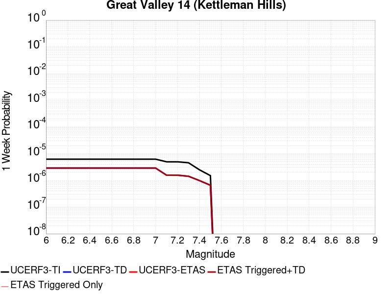 | 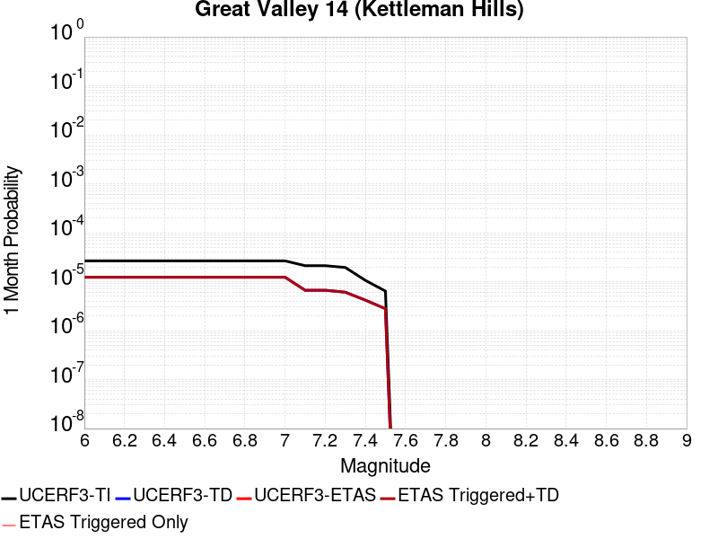 | 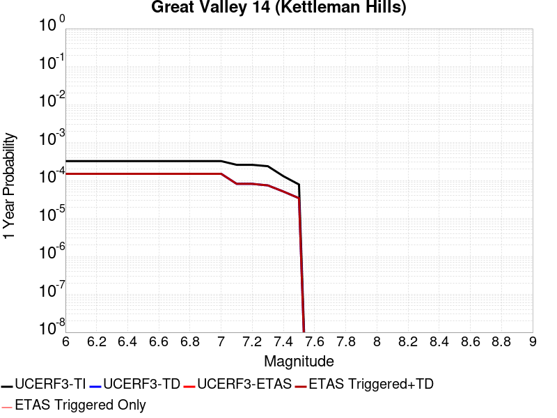 | 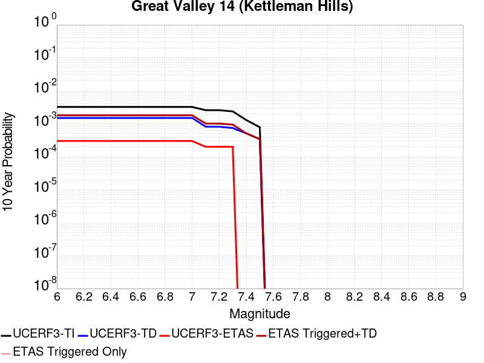 |

| Magnitude | 1 wk TI Prob | 1 wk TD Prob | 1 wk ETAS Prob | 1 wk ETAS/TD Gain | 1 wk ETAS Triggered+TD | 1 wk ETAS Triggered Only | 1 mo TI Prob | 1 mo TD Prob | 1 mo ETAS Prob | 1 mo ETAS/TD Gain | 1 mo ETAS Triggered+TD | 1 mo ETAS Triggered Only | 1 yr TI Prob | 1 yr TD Prob | 1 yr ETAS Prob | 1 yr ETAS/TD Gain | 1 yr ETAS Triggered+TD | 1 yr ETAS Triggered Only | 10 yr TI Prob | 10 yr TD Prob | 10 yr ETAS Prob | 10 yr ETAS/TD Gain | 10 yr ETAS Triggered+TD | 10 yr ETAS Triggered Only |
|-----|-----|-----|-----|-----|-----|-----|-----|-----|-----|-----|-----|-----|-----|-----|-----|-----|-----|-----|-----|-----|-----|-----|-----|-----|
| 6.0 | 6.2057843E-6 | 2.8775457E-6 | 0.0 | 0.0 | 2.8775457E-6 | 0.0 | 2.6595946E-5 | 1.2332294E-5 | 0.0 | 0.0 | 1.2332294E-5 | 0.0 | 3.2375753E-4 | 1.501377E-4 | 0.0 | 0.0 | 1.501377E-4 | 0.0 | 0.0032328626 | 0.001500594 | 0.0013 | 0.8663236 | 0.0018001439 | 3.0E-4 |
| 6.1 | 6.2057843E-6 | 2.8775457E-6 | 0.0 | 0.0 | 2.8775457E-6 | 0.0 | 2.6595946E-5 | 1.2332294E-5 | 0.0 | 0.0 | 1.2332294E-5 | 0.0 | 3.2375753E-4 | 1.501377E-4 | 0.0 | 0.0 | 1.501377E-4 | 0.0 | 0.0032328626 | 0.001500594 | 0.0013 | 0.8663236 | 0.0018001439 | 3.0E-4 |
| 6.2 | 6.2057843E-6 | 2.8775457E-6 | 0.0 | 0.0 | 2.8775457E-6 | 0.0 | 2.6595946E-5 | 1.2332294E-5 | 0.0 | 0.0 | 1.2332294E-5 | 0.0 | 3.2375753E-4 | 1.501377E-4 | 0.0 | 0.0 | 1.501377E-4 | 0.0 | 0.0032328626 | 0.001500594 | 0.0013 | 0.8663236 | 0.0018001439 | 3.0E-4 |
| 6.3 | 6.2057843E-6 | 2.8775457E-6 | 0.0 | 0.0 | 2.8775457E-6 | 0.0 | 2.6595946E-5 | 1.2332294E-5 | 0.0 | 0.0 | 1.2332294E-5 | 0.0 | 3.2375753E-4 | 1.501377E-4 | 0.0 | 0.0 | 1.501377E-4 | 0.0 | 0.0032328626 | 0.001500594 | 0.0013 | 0.8663236 | 0.0018001439 | 3.0E-4 |
| 6.4 | 6.2057843E-6 | 2.8775457E-6 | 0.0 | 0.0 | 2.8775457E-6 | 0.0 | 2.6595946E-5 | 1.2332294E-5 | 0.0 | 0.0 | 1.2332294E-5 | 0.0 | 3.2375753E-4 | 1.501377E-4 | 0.0 | 0.0 | 1.501377E-4 | 0.0 | 0.0032328626 | 0.001500594 | 0.0013 | 0.8663236 | 0.0018001439 | 3.0E-4 |
| 6.5 | 6.2057843E-6 | 2.8775457E-6 | 0.0 | 0.0 | 2.8775457E-6 | 0.0 | 2.6595946E-5 | 1.2332294E-5 | 0.0 | 0.0 | 1.2332294E-5 | 0.0 | 3.2375753E-4 | 1.501377E-4 | 0.0 | 0.0 | 1.501377E-4 | 0.0 | 0.0032328626 | 0.001500594 | 0.0013 | 0.8663236 | 0.0018001439 | 3.0E-4 |
| 6.6 | 6.2057843E-6 | 2.8775457E-6 | 0.0 | 0.0 | 2.8775457E-6 | 0.0 | 2.6595946E-5 | 1.2332294E-5 | 0.0 | 0.0 | 1.2332294E-5 | 0.0 | 3.2375753E-4 | 1.501377E-4 | 0.0 | 0.0 | 1.501377E-4 | 0.0 | 0.0032328626 | 0.001500594 | 0.0013 | 0.8663236 | 0.0018001439 | 3.0E-4 |
| 6.7 | 6.2057843E-6 | 2.8775457E-6 | 0.0 | 0.0 | 2.8775457E-6 | 0.0 | 2.6595946E-5 | 1.2332294E-5 | 0.0 | 0.0 | 1.2332294E-5 | 0.0 | 3.2375753E-4 | 1.501377E-4 | 0.0 | 0.0 | 1.501377E-4 | 0.0 | 0.0032328626 | 0.001500594 | 0.0013 | 0.8663236 | 0.0018001439 | 3.0E-4 |
| 6.8 | 6.2057843E-6 | 2.8775457E-6 | 0.0 | 0.0 | 2.8775457E-6 | 0.0 | 2.6595946E-5 | 1.2332294E-5 | 0.0 | 0.0 | 1.2332294E-5 | 0.0 | 3.2375753E-4 | 1.501377E-4 | 0.0 | 0.0 | 1.501377E-4 | 0.0 | 0.0032328626 | 0.001500594 | 0.0013 | 0.8663236 | 0.0018001439 | 3.0E-4 |
| 6.9 | 6.2057843E-6 | 2.8775457E-6 | 0.0 | 0.0 | 2.8775457E-6 | 0.0 | 2.6595946E-5 | 1.2332294E-5 | 0.0 | 0.0 | 1.2332294E-5 | 0.0 | 3.2375753E-4 | 1.501377E-4 | 0.0 | 0.0 | 1.501377E-4 | 0.0 | 0.0032328626 | 0.001500594 | 0.0013 | 0.8663236 | 0.0018001439 | 3.0E-4 |
| 7.0 | 6.2057843E-6 | 2.8775457E-6 | 0.0 | 0.0 | 2.8775457E-6 | 0.0 | 2.6595946E-5 | 1.2332294E-5 | 0.0 | 0.0 | 1.2332294E-5 | 0.0 | 3.2375753E-4 | 1.501377E-4 | 0.0 | 0.0 | 1.501377E-4 | 0.0 | 0.0032328626 | 0.001500594 | 0.0013 | 0.8663236 | 0.0018001439 | 3.0E-4 |
| 7.1 | 4.95113E-6 | 1.5611615E-6 | 0.0 | 0.0 | 1.5611615E-6 | 0.0 | 2.1218955E-5 | 6.6906764E-6 | 0.0 | 0.0 | 6.6906764E-6 | 0.0 | 2.5831014E-4 | 8.1456135E-5 | 0.0 | 0.0 | 8.1456135E-5 | 0.0 | 0.0025801011 | 8.142817E-4 | 5.0E-4 | 0.6140381 | 0.0010141189 | 2.0E-4 |
| 7.2 | 4.95113E-6 | 1.5611615E-6 | 0.0 | 0.0 | 1.5611615E-6 | 0.0 | 2.1218955E-5 | 6.6906764E-6 | 0.0 | 0.0 | 6.6906764E-6 | 0.0 | 2.5831014E-4 | 8.1456135E-5 | 0.0 | 0.0 | 8.1456135E-5 | 0.0 | 0.0025801011 | 8.142817E-4 | 5.0E-4 | 0.6140381 | 0.0010141189 | 2.0E-4 |
| 7.3 | 4.5549086E-6 | 1.4230526E-6 | 0.0 | 0.0 | 1.4230526E-6 | 0.0 | 1.9520892E-5 | 6.0987836E-6 | 0.0 | 0.0 | 6.0987836E-6 | 0.0 | 2.3764092E-4 | 7.425033E-5 | 0.0 | 0.0 | 7.425033E-5 | 0.0 | 0.0023738695 | 7.4227183E-4 | 5.0E-4 | 0.6736077 | 9.4212336E-4 | 2.0E-4 |
| 7.4 | 2.4837766E-6 | 9.803031E-7 | 0.0 | 0.0 | 9.803031E-7 | 0.0 | 1.0644713E-5 | 4.201292E-6 | 0.0 | 0.0 | 4.201292E-6 | 0.0 | 1.2959167E-4 | 5.11496E-5 | 0.0 | 0.0 | 5.11496E-5 | 0.0 | 0.0012951613 | 5.1138486E-4 | 1.0E-4 | 0.19554745 | 5.1138486E-4 | 0.0 |
| 7.5 | 1.5002679E-6 | 6.5476866E-7 | 0.0 | 0.0 | 6.5476866E-7 | 0.0 | 6.4297037E-6 | 2.8061486E-6 | 0.0 | 0.0 | 2.8061486E-6 | 0.0 | 7.827883E-5 | 3.4164368E-5 | 0.0 | 0.0 | 3.4164368E-5 | 0.0 | 7.825126E-4 | 3.415953E-4 | 0.0 | 0.0 | 3.415953E-4 | 0.0 |

## Polaris 2011 CFM
*[(top)](#table-of-contents)*

| 1 Week | 1 Month | 1 Year | 10 Year |
|-----|-----|-----|-----|
| 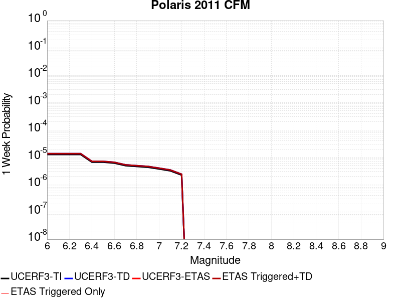 | 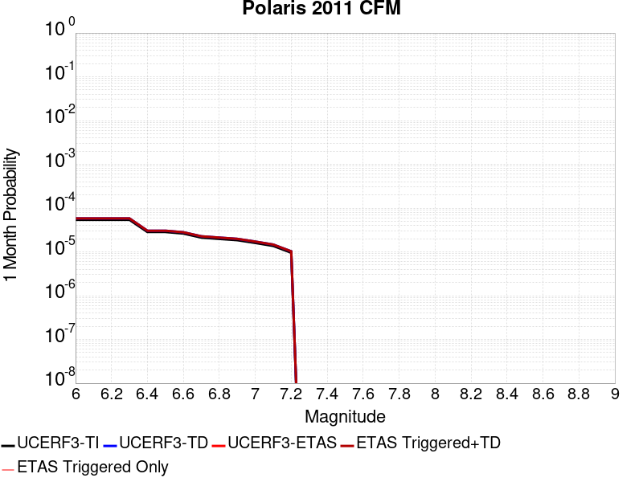 | 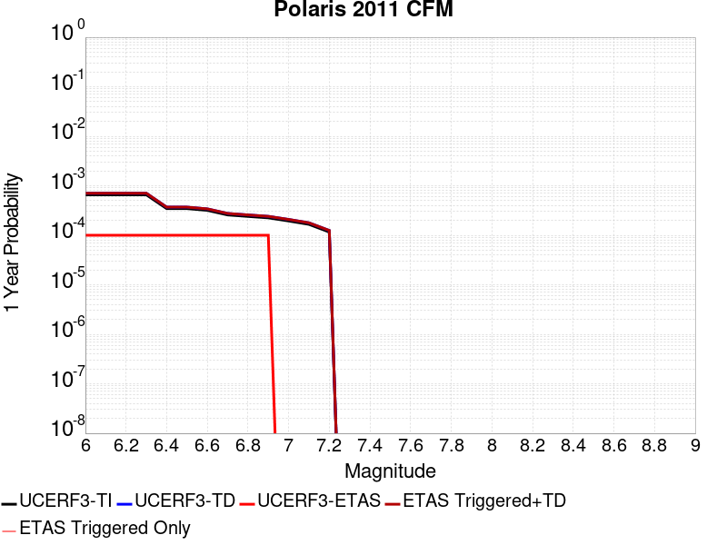 | 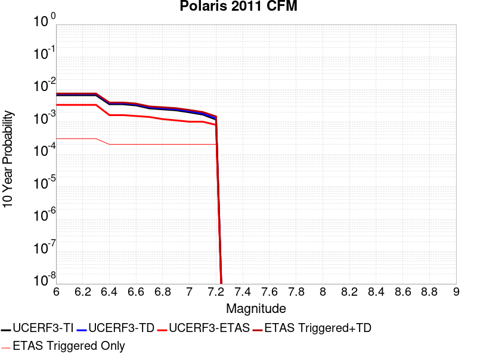 |

| Magnitude | 1 wk TI Prob | 1 wk TD Prob | 1 wk ETAS Prob | 1 wk ETAS/TD Gain | 1 wk ETAS Triggered+TD | 1 wk ETAS Triggered Only | 1 mo TI Prob | 1 mo TD Prob | 1 mo ETAS Prob | 1 mo ETAS/TD Gain | 1 mo ETAS Triggered+TD | 1 mo ETAS Triggered Only | 1 yr TI Prob | 1 yr TD Prob | 1 yr ETAS Prob | 1 yr ETAS/TD Gain | 1 yr ETAS Triggered+TD | 1 yr ETAS Triggered Only | 10 yr TI Prob | 10 yr TD Prob | 10 yr ETAS Prob | 10 yr ETAS/TD Gain | 10 yr ETAS Triggered+TD | 10 yr ETAS Triggered Only |
|-----|-----|-----|-----|-----|-----|-----|-----|-----|-----|-----|-----|-----|-----|-----|-----|-----|-----|-----|-----|-----|-----|-----|-----|-----|
| 6.0 | 1.2630823E-5 | 1.3585026E-5 | 0.0 | 0.0 | 1.3585026E-5 | 0.0 | 5.413098E-5 | 5.8220536E-5 | 0.0 | 0.0 | 5.8220536E-5 | 0.0 | 6.5884535E-4 | 7.086564E-4 | 1.0E-4 | 0.14111212 | 7.086564E-4 | 0.0 | 0.0065689543 | 0.0070690764 | 0.0033 | 0.46682194 | 0.0073669557 | 3.0E-4 |
| 6.1 | 1.2630823E-5 | 1.3585026E-5 | 0.0 | 0.0 | 1.3585026E-5 | 0.0 | 5.413098E-5 | 5.8220536E-5 | 0.0 | 0.0 | 5.8220536E-5 | 0.0 | 6.5884535E-4 | 7.086564E-4 | 1.0E-4 | 0.14111212 | 7.086564E-4 | 0.0 | 0.0065689543 | 0.0070690764 | 0.0033 | 0.46682194 | 0.0073669557 | 3.0E-4 |
| 6.2 | 1.2630823E-5 | 1.3585026E-5 | 0.0 | 0.0 | 1.3585026E-5 | 0.0 | 5.413098E-5 | 5.8220536E-5 | 0.0 | 0.0 | 5.8220536E-5 | 0.0 | 6.5884535E-4 | 7.086564E-4 | 1.0E-4 | 0.14111212 | 7.086564E-4 | 0.0 | 0.0065689543 | 0.0070690764 | 0.0033 | 0.46682194 | 0.0073669557 | 3.0E-4 |
| 6.3 | 1.2630823E-5 | 1.3585026E-5 | 0.0 | 0.0 | 1.3585026E-5 | 0.0 | 5.413098E-5 | 5.8220536E-5 | 0.0 | 0.0 | 5.8220536E-5 | 0.0 | 6.5884535E-4 | 7.086564E-4 | 1.0E-4 | 0.14111212 | 7.086564E-4 | 0.0 | 0.0065689543 | 0.0070690764 | 0.0033 | 0.46682194 | 0.0073669557 | 3.0E-4 |
| 6.4 | 6.642994E-6 | 7.1080826E-6 | 0.0 | 0.0 | 7.1080826E-6 | 0.0 | 2.8469662E-5 | 3.0462885E-5 | 0.0 | 0.0 | 3.0462885E-5 | 0.0 | 3.46563E-4 | 3.7082765E-4 | 1.0E-4 | 0.26966706 | 3.7082765E-4 | 0.0 | 0.0034602303 | 0.0037025996 | 0.0016 | 0.43212882 | 0.003901859 | 2.0E-4 |
| 6.5 | 6.642994E-6 | 7.1080826E-6 | 0.0 | 0.0 | 7.1080826E-6 | 0.0 | 2.8469662E-5 | 3.0462885E-5 | 0.0 | 0.0 | 3.0462885E-5 | 0.0 | 3.46563E-4 | 3.7082765E-4 | 1.0E-4 | 0.26966706 | 3.7082765E-4 | 0.0 | 0.0034602303 | 0.0037025996 | 0.0016 | 0.43212882 | 0.003901859 | 2.0E-4 |
| 6.6 | 6.1286296E-6 | 6.5571135E-6 | 0.0 | 0.0 | 6.5571135E-6 | 0.0 | 2.626529E-5 | 2.810164E-5 | 0.0 | 0.0 | 2.810164E-5 | 0.0 | 3.19733E-4 | 3.4208855E-4 | 1.0E-4 | 0.29232198 | 3.4208855E-4 | 0.0 | 0.0031927335 | 0.003416095 | 0.0015 | 0.43909785 | 0.0036154117 | 2.0E-4 |
| 6.7 | 4.9474666E-6 | 5.2990226E-6 | 0.0 | 0.0 | 5.2990226E-6 | 0.0 | 2.1203256E-5 | 2.2709915E-5 | 0.0 | 0.0 | 2.2709915E-5 | 0.0 | 2.5811905E-4 | 2.7646098E-4 | 1.0E-4 | 0.3617147 | 2.7646098E-4 | 0.0 | 0.0025781945 | 0.0027614506 | 0.0014 | 0.50697994 | 0.0029608982 | 2.0E-4 |
| 6.8 | 4.616407E-6 | 4.946992E-6 | 0.0 | 0.0 | 4.946992E-6 | 0.0 | 1.978445E-5 | 2.1201236E-5 | 0.0 | 0.0 | 2.1201236E-5 | 0.0 | 2.4084905E-4 | 2.5809716E-4 | 1.0E-4 | 0.387451 | 2.5809716E-4 | 0.0 | 0.0024058819 | 0.0025782385 | 0.0012 | 0.46543404 | 0.002777723 | 2.0E-4 |
| 6.9 | 4.320343E-6 | 4.6315718E-6 | 0.0 | 0.0 | 4.6315718E-6 | 0.0 | 1.8515624E-5 | 1.9849456E-5 | 0.0 | 0.0 | 1.9849456E-5 | 0.0 | 2.2540441E-4 | 2.4164293E-4 | 1.0E-4 | 0.41383374 | 2.4164293E-4 | 0.0 | 0.0022517592 | 0.0024140587 | 0.0011 | 0.45566416 | 0.002613576 | 2.0E-4 |
| 7.0 | 3.7382292E-6 | 4.010152E-6 | 0.0 | 0.0 | 4.010152E-6 | 0.0 | 1.6020884E-5 | 1.7186267E-5 | 0.0 | 0.0 | 1.7186267E-5 | 0.0 | 1.950368E-4 | 2.092251E-4 | 0.0 | 0.0 | 2.092251E-4 | 0.0 | 0.0019486571 | 0.0020905167 | 0.001 | 0.47835064 | 0.0022900985 | 2.0E-4 |
| 7.1 | 3.193576E-6 | 3.4282166E-6 | 0.0 | 0.0 | 3.4282166E-6 | 0.0 | 1.3686683E-5 | 1.4692287E-5 | 0.0 | 0.0 | 1.4692287E-5 | 0.0 | 1.6662262E-4 | 1.7886613E-4 | 0.0 | 0.0 | 1.7886613E-4 | 0.0 | 0.0016649774 | 0.0017874406 | 0.001 | 0.55945915 | 0.0019870831 | 2.0E-4 |
| 7.2 | 2.2356758E-6 | 2.4027372E-6 | 0.0 | 0.0 | 2.4027372E-6 | 0.0 | 9.581432E-6 | 1.0297415E-5 | 0.0 | 0.0 | 1.0297415E-5 | 0.0 | 1.1664769E-4 | 1.2536571E-4 | 0.0 | 0.0 | 1.2536571E-4 | 0.0 | 0.0011658648 | 0.0012531357 | 8.0E-4 | 0.6383985 | 0.0014528851 | 2.0E-4 |

## Las Positas
*[(top)](#table-of-contents)*

| 1 Week | 1 Month | 1 Year | 10 Year |
|-----|-----|-----|-----|
| 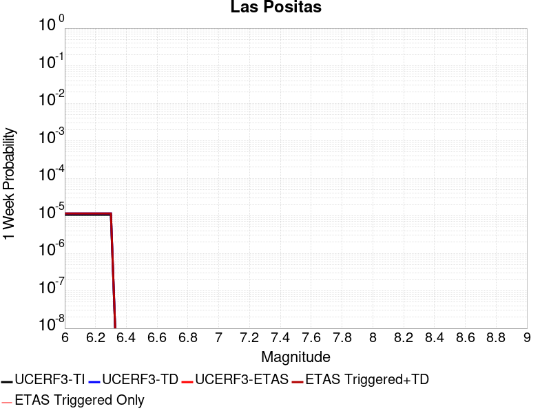 | 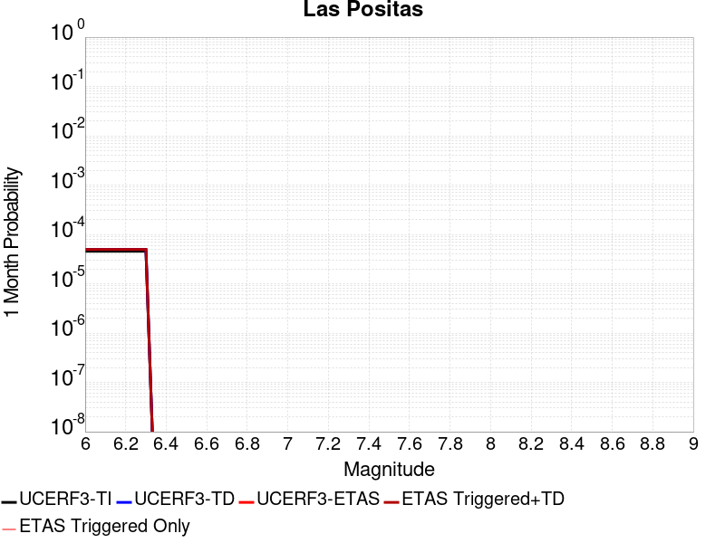 | 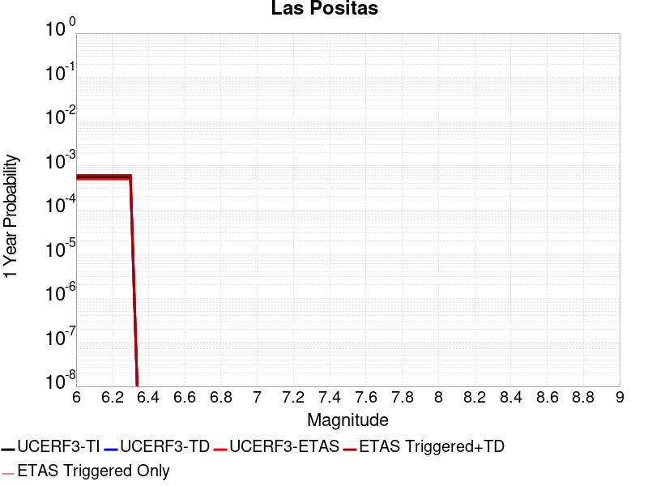 | 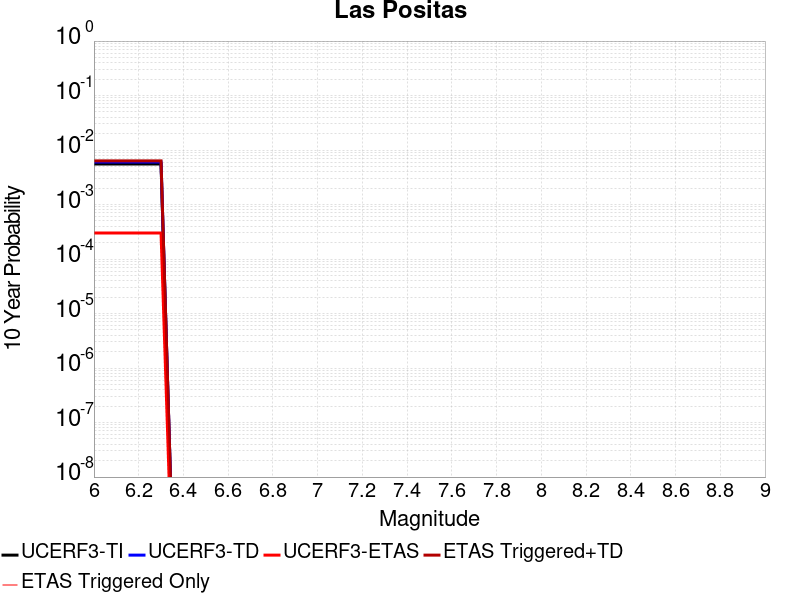 |

| Magnitude | 1 wk TI Prob | 1 wk TD Prob | 1 wk ETAS Prob | 1 wk ETAS/TD Gain | 1 wk ETAS Triggered+TD | 1 wk ETAS Triggered Only | 1 mo TI Prob | 1 mo TD Prob | 1 mo ETAS Prob | 1 mo ETAS/TD Gain | 1 mo ETAS Triggered+TD | 1 mo ETAS Triggered Only | 1 yr TI Prob | 1 yr TD Prob | 1 yr ETAS Prob | 1 yr ETAS/TD Gain | 1 yr ETAS Triggered+TD | 1 yr ETAS Triggered Only | 10 yr TI Prob | 10 yr TD Prob | 10 yr ETAS Prob | 10 yr ETAS/TD Gain | 10 yr ETAS Triggered+TD | 10 yr ETAS Triggered Only |
|-----|-----|-----|-----|-----|-----|-----|-----|-----|-----|-----|-----|-----|-----|-----|-----|-----|-----|-----|-----|-----|-----|-----|-----|-----|
| 6.0 | 1.0659424E-5 | 1.1593209E-5 | 0.0 | 0.0 | 1.1593209E-5 | 0.0 | 4.568245E-5 | 4.968518E-5 | 0.0 | 0.0 | 4.968518E-5 | 0.0 | 5.560419E-4 | 6.0491706E-4 | 5.0E-4 | 0.8265596 | 6.0491706E-4 | 0.0 | 0.005546526 | 0.0060491706 | 0.0047 | 0.77696604 | 0.006347356 | 3.0E-4 |
| 6.1 | 1.0659424E-5 | 1.1593209E-5 | 0.0 | 0.0 | 1.1593209E-5 | 0.0 | 4.568245E-5 | 4.968518E-5 | 0.0 | 0.0 | 4.968518E-5 | 0.0 | 5.560419E-4 | 6.0491706E-4 | 5.0E-4 | 0.8265596 | 6.0491706E-4 | 0.0 | 0.005546526 | 0.0060491706 | 0.0047 | 0.77696604 | 0.006347356 | 3.0E-4 |
| 6.2 | 1.0659424E-5 | 1.1593209E-5 | 0.0 | 0.0 | 1.1593209E-5 | 0.0 | 4.568245E-5 | 4.968518E-5 | 0.0 | 0.0 | 4.968518E-5 | 0.0 | 5.560419E-4 | 6.0491706E-4 | 5.0E-4 | 0.8265596 | 6.0491706E-4 | 0.0 | 0.005546526 | 0.0060491706 | 0.0047 | 0.77696604 | 0.006347356 | 3.0E-4 |
| 6.3 | 1.0659424E-5 | 1.1593209E-5 | 0.0 | 0.0 | 1.1593209E-5 | 0.0 | 4.568245E-5 | 4.968518E-5 | 0.0 | 0.0 | 4.968518E-5 | 0.0 | 5.560419E-4 | 6.0491706E-4 | 5.0E-4 | 0.8265596 | 6.0491706E-4 | 0.0 | 0.005546526 | 0.0060491706 | 0.0047 | 0.77696604 | 0.006347356 | 3.0E-4 |

## Baker
*[(top)](#table-of-contents)*

| 1 Week | 1 Month | 1 Year | 10 Year |
|-----|-----|-----|-----|
| 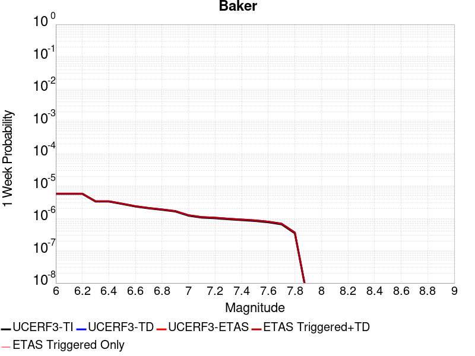 | 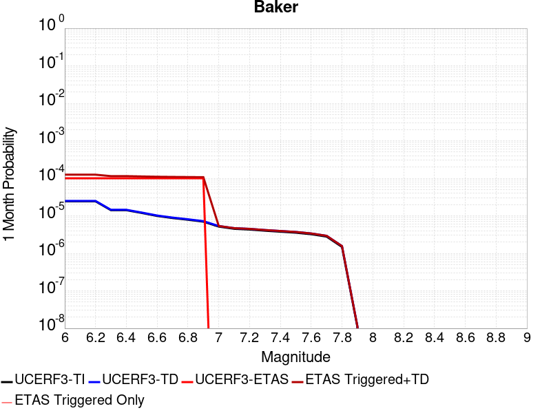 | 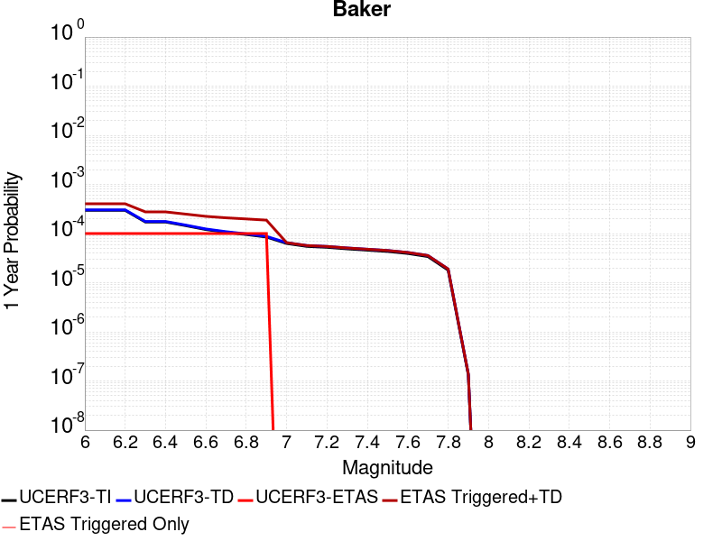 | 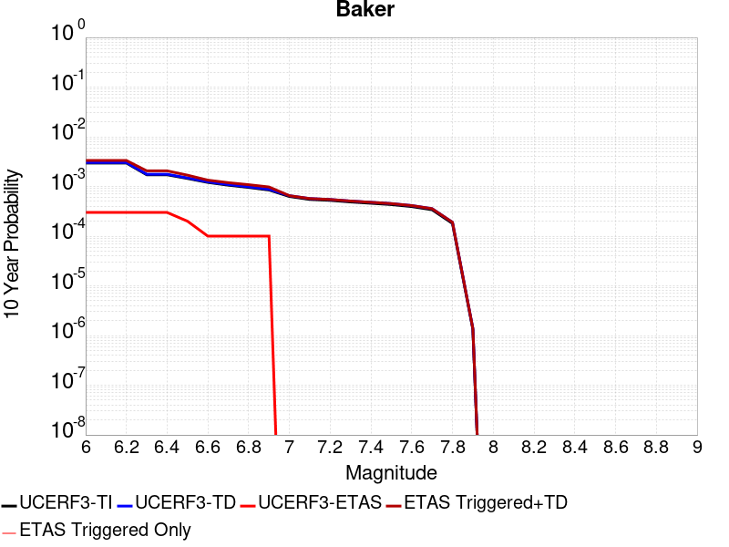 |

| Magnitude | 1 wk TI Prob | 1 wk TD Prob | 1 wk ETAS Prob | 1 wk ETAS/TD Gain | 1 wk ETAS Triggered+TD | 1 wk ETAS Triggered Only | 1 mo TI Prob | 1 mo TD Prob | 1 mo ETAS Prob | 1 mo ETAS/TD Gain | 1 mo ETAS Triggered+TD | 1 mo ETAS Triggered Only | 1 yr TI Prob | 1 yr TD Prob | 1 yr ETAS Prob | 1 yr ETAS/TD Gain | 1 yr ETAS Triggered+TD | 1 yr ETAS Triggered Only | 10 yr TI Prob | 10 yr TD Prob | 10 yr ETAS Prob | 10 yr ETAS/TD Gain | 10 yr ETAS Triggered+TD | 10 yr ETAS Triggered Only |
|-----|-----|-----|-----|-----|-----|-----|-----|-----|-----|-----|-----|-----|-----|-----|-----|-----|-----|-----|-----|-----|-----|-----|-----|-----|
| 6.0 | 5.695525E-6 | 5.835133E-6 | 0.0 | 0.0 | 5.835133E-6 | 0.0 | 2.4409164E-5 | 2.5007495E-5 | 1.0E-4 | 3.9988012 | 1.25005E-4 | 1.0E-4 | 2.9714106E-4 | 3.0442773E-4 | 1.0E-4 | 0.3284852 | 4.043973E-4 | 1.0E-4 | 0.0029674405 | 0.0030405025 | 0.0015 | 0.49333948 | 0.0033395905 | 3.0E-4 |
| 6.1 | 5.695525E-6 | 5.835133E-6 | 0.0 | 0.0 | 5.835133E-6 | 0.0 | 2.4409164E-5 | 2.5007495E-5 | 1.0E-4 | 3.9988012 | 1.25005E-4 | 1.0E-4 | 2.9714106E-4 | 3.0442773E-4 | 1.0E-4 | 0.3284852 | 4.043973E-4 | 1.0E-4 | 0.0029674405 | 0.0030405025 | 0.0015 | 0.49333948 | 0.0033395905 | 3.0E-4 |
| 6.2 | 5.695525E-6 | 5.835133E-6 | 0.0 | 0.0 | 5.835133E-6 | 0.0 | 2.4409164E-5 | 2.5007495E-5 | 1.0E-4 | 3.9988012 | 1.25005E-4 | 1.0E-4 | 2.9714106E-4 | 3.0442773E-4 | 1.0E-4 | 0.3284852 | 4.043973E-4 | 1.0E-4 | 0.0029674405 | 0.0030405025 | 0.0015 | 0.49333948 | 0.0033395905 | 3.0E-4 |
| 6.3 | 3.2995713E-6 | 3.3838462E-6 | 0.0 | 0.0 | 3.3838462E-6 | 0.0 | 1.4140943E-5 | 1.450212E-5 | 1.0E-4 | 6.8955436 | 1.1450067E-4 | 1.0E-4 | 1.7215237E-4 | 1.7654948E-4 | 1.0E-4 | 0.56641346 | 2.7653182E-4 | 1.0E-4 | 0.0017201907 | 0.0017641394 | 0.001 | 0.56684864 | 0.0020636101 | 3.0E-4 |
| 6.4 | 3.2995713E-6 | 3.3838462E-6 | 0.0 | 0.0 | 3.3838462E-6 | 0.0 | 1.4140943E-5 | 1.450212E-5 | 1.0E-4 | 6.8955436 | 1.1450067E-4 | 1.0E-4 | 1.7215237E-4 | 1.7654948E-4 | 1.0E-4 | 0.56641346 | 2.7653182E-4 | 1.0E-4 | 0.0017201907 | 0.0017641394 | 0.001 | 0.56684864 | 0.0020636101 | 3.0E-4 |
| 6.5 | 2.782202E-6 | 2.8559975E-6 | 0.0 | 0.0 | 2.8559975E-6 | 0.0 | 1.1923668E-5 | 1.2239934E-5 | 1.0E-4 | 8.169978 | 1.1223871E-4 | 1.0E-4 | 1.4516099E-4 | 1.4901134E-4 | 1.0E-4 | 0.6710899 | 2.4899642E-4 | 1.0E-4 | 0.001450662 | 0.001489147 | 7.0E-4 | 0.47006777 | 0.0016888492 | 2.0E-4 |
| 6.6 | 2.3163404E-6 | 2.381058E-6 | 0.0 | 0.0 | 2.381058E-6 | 0.0 | 9.927136E-6 | 1.0204496E-5 | 1.0E-4 | 9.799602 | 1.1020347E-4 | 1.0E-4 | 1.20856166E-4 | 1.2423286E-4 | 1.0E-4 | 0.80494 | 2.2422044E-4 | 1.0E-4 | 0.0012079047 | 0.0012416543 | 5.0E-4 | 0.40268856 | 0.0013415301 | 1.0E-4 |
| 6.7 | 2.037056E-6 | 2.096628E-6 | 0.0 | 0.0 | 2.096628E-6 | 0.0 | 8.7302105E-6 | 8.9855175E-6 | 1.0E-4 | 11.129019 | 1.0898462E-4 | 1.0E-4 | 1.0628513E-4 | 1.0939335E-4 | 1.0E-4 | 0.91413236 | 2.0938242E-4 | 1.0E-4 | 0.0010623431 | 0.0010934111 | 5.0E-4 | 0.45728454 | 0.0011933018 | 1.0E-4 |
| 6.8 | 1.8356744E-6 | 1.8916485E-6 | 0.0 | 0.0 | 1.8916485E-6 | 0.0 | 7.867153E-6 | 8.107041E-6 | 1.0E-4 | 12.334957 | 1.0810623E-4 | 1.0E-4 | 9.577837E-5 | 9.869889E-5 | 1.0E-4 | 1.0131826 | 1.9868903E-4 | 1.0E-4 | 9.57371E-4 | 9.865646E-4 | 5.0E-4 | 0.50680923 | 0.0010864659 | 1.0E-4 |
| 6.9 | 1.6310546E-6 | 1.6833193E-6 | 0.0 | 0.0 | 1.6833193E-6 | 0.0 | 6.9902153E-6 | 7.214206E-6 | 1.0E-4 | 13.861539 | 1.07213484E-4 | 1.0E-4 | 8.510255E-5 | 8.782953E-5 | 1.0E-4 | 1.1385691 | 1.8782075E-4 | 1.0E-4 | 8.5069967E-4 | 8.779595E-4 | 5.0E-4 | 0.56950235 | 9.778717E-4 | 1.0E-4 |
| 7.0 | 1.2058036E-6 | 1.2509638E-6 | 0.0 | 0.0 | 1.2509638E-6 | 0.0 | 5.1677193E-6 | 5.3612625E-6 | 0.0 | 0.0 | 5.3612625E-6 | 0.0 | 6.291517E-5 | 6.527144E-5 | 0.0 | 0.0 | 6.527144E-5 | 0.0 | 6.289736E-4 | 6.52525E-4 | 2.0E-4 | 0.30650166 | 6.52525E-4 | 0.0 |
| 7.1 | 1.052382E-6 | 1.0952533E-6 | 0.0 | 0.0 | 1.0952533E-6 | 0.0 | 4.5102006E-6 | 4.6939344E-6 | 0.0 | 0.0 | 4.6939344E-6 | 0.0 | 5.491031E-5 | 5.714716E-5 | 0.0 | 0.0 | 5.714716E-5 | 0.0 | 5.4896745E-4 | 5.7132554E-4 | 2.0E-4 | 0.35006312 | 5.7132554E-4 | 0.0 |
| 7.2 | 1.0067454E-6 | 1.0488619E-6 | 0.0 | 0.0 | 1.0488619E-6 | 0.0 | 4.3146156E-6 | 4.495115E-6 | 0.0 | 0.0 | 4.495115E-6 | 0.0 | 5.252918E-5 | 5.4726657E-5 | 0.0 | 0.0 | 5.4726657E-5 | 0.0 | 5.251676E-4 | 5.471327E-4 | 2.0E-4 | 0.36554205 | 5.471327E-4 | 0.0 |
| 7.3 | 9.3596316E-7 | 9.768606E-7 | 0.0 | 0.0 | 9.768606E-7 | 0.0 | 4.0112645E-6 | 4.186539E-6 | 0.0 | 0.0 | 4.186539E-6 | 0.0 | 4.8836053E-5 | 5.0969928E-5 | 0.0 | 0.0 | 5.0969928E-5 | 0.0 | 4.8825322E-4 | 5.0958316E-4 | 2.0E-4 | 0.39247763 | 5.0958316E-4 | 0.0 |
| 7.4 | 8.8117395E-7 | 9.208521E-7 | 0.0 | 0.0 | 9.208521E-7 | 0.0 | 3.7764542E-6 | 3.946503E-6 | 0.0 | 0.0 | 3.946503E-6 | 0.0 | 4.5977362E-5 | 4.8047623E-5 | 0.0 | 0.0 | 4.8047623E-5 | 0.0 | 4.596785E-4 | 4.803731E-4 | 2.0E-4 | 0.41634303 | 4.803731E-4 | 0.0 |
| 7.5 | 8.292386E-7 | 8.6754244E-7 | 0.0 | 0.0 | 8.6754244E-7 | 0.0 | 3.5538749E-6 | 3.7180337E-6 | 0.0 | 0.0 | 3.7180337E-6 | 0.0 | 4.326757E-5 | 4.5266126E-5 | 0.0 | 0.0 | 4.5266126E-5 | 0.0 | 4.3259145E-4 | 4.525698E-4 | 2.0E-4 | 0.4419208 | 4.525698E-4 | 0.0 |
| 7.6 | 7.553842E-7 | 7.9152534E-7 | 0.0 | 0.0 | 7.9152534E-7 | 0.0 | 3.2373566E-6 | 3.392247E-6 | 0.0 | 0.0 | 3.392247E-6 | 0.0 | 3.9414106E-5 | 4.129983E-5 | 0.0 | 0.0 | 4.129983E-5 | 0.0 | 3.9407116E-4 | 4.1292227E-4 | 2.0E-4 | 0.48435268 | 4.1292227E-4 | 0.0 |
| 7.7 | 6.5285366E-7 | 6.8535013E-7 | 0.0 | 0.0 | 6.8535013E-7 | 0.0 | 2.797941E-6 | 2.9372118E-6 | 0.0 | 0.0 | 2.9372118E-6 | 0.0 | 3.40644E-5 | 3.575997E-5 | 0.0 | 0.0 | 3.575997E-5 | 0.0 | 3.405918E-4 | 3.5754283E-4 | 2.0E-4 | 0.55937356 | 3.5754283E-4 | 0.0 |
| 7.8 | 3.4586725E-7 | 3.6486753E-7 | 0.0 | 0.0 | 3.6486753E-7 | 0.0 | 1.4822873E-6 | 1.5637171E-6 | 0.0 | 0.0 | 1.5637171E-6 | 0.0 | 1.80467E-5 | 1.9038094E-5 | 0.0 | 0.0 | 1.9038094E-5 | 0.0 | 1.8045233E-4 | 1.9036507E-4 | 1.0E-4 | 0.52530646 | 1.9036507E-4 | 0.0 |
| 7.9 | 2.5591178E-9 | 2.6699092E-9 | 0.0 | 0.0 | 2.6699092E-9 | 0.0 | 1.0967647E-8 | 1.1442468E-8 | 0.0 | 0.0 | 1.1442468E-8 | 0.0 | 1.335311E-7 | 1.3931205E-7 | 0.0 | 0.0 | 1.3931205E-7 | 0.0 | 1.3353102E-6 | 1.3931206E-6 | 1.0E-4 | 71.781296 | 1.3931206E-6 | 0.0 |

## Red Pass
*[(top)](#table-of-contents)*

| 1 Week | 1 Month | 1 Year | 10 Year |
|-----|-----|-----|-----|
| 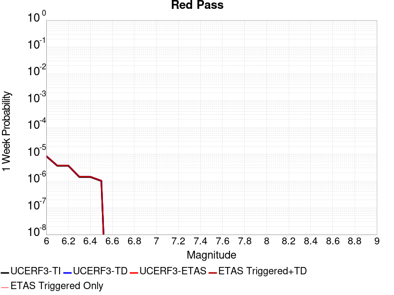 | 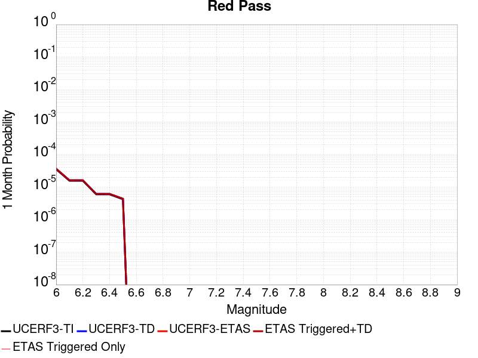 | 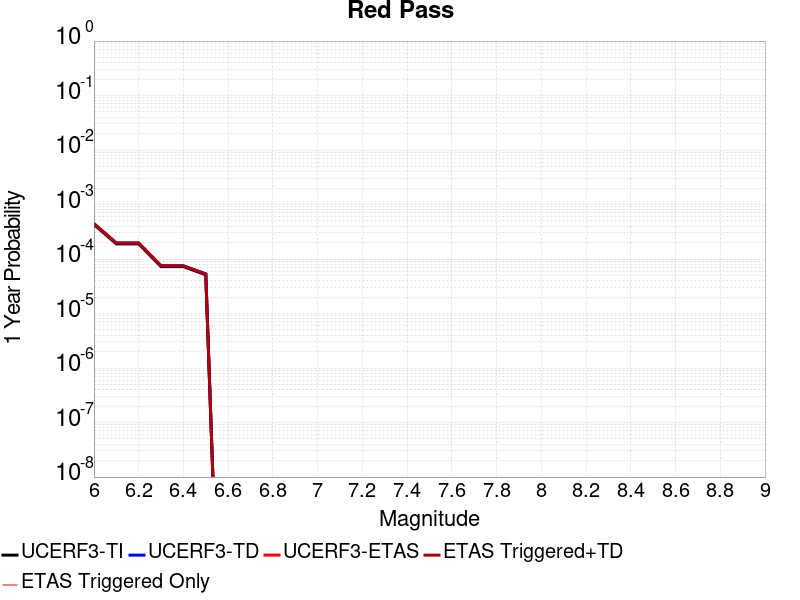 |  |

| Magnitude | 1 wk TI Prob | 1 wk TD Prob | 1 wk ETAS Prob | 1 wk ETAS/TD Gain | 1 wk ETAS Triggered+TD | 1 wk ETAS Triggered Only | 1 mo TI Prob | 1 mo TD Prob | 1 mo ETAS Prob | 1 mo ETAS/TD Gain | 1 mo ETAS Triggered+TD | 1 mo ETAS Triggered Only | 1 yr TI Prob | 1 yr TD Prob | 1 yr ETAS Prob | 1 yr ETAS/TD Gain | 1 yr ETAS Triggered+TD | 1 yr ETAS Triggered Only | 10 yr TI Prob | 10 yr TD Prob | 10 yr ETAS Prob | 10 yr ETAS/TD Gain | 10 yr ETAS Triggered+TD | 10 yr ETAS Triggered Only |
|-----|-----|-----|-----|-----|-----|-----|-----|-----|-----|-----|-----|-----|-----|-----|-----|-----|-----|-----|-----|-----|-----|-----|-----|-----|
| 6.0 | 8.258278E-6 | 8.55189E-6 | 0.0 | 0.0 | 8.55189E-6 | 0.0 | 3.539214E-5 | 3.665054E-5 | 0.0 | 0.0 | 3.665054E-5 | 0.0 | 4.308141E-4 | 4.4614685E-4 | 1.0E-4 | 0.22414145 | 4.4614685E-4 | 0.0 | 0.0042997985 | 0.0044542695 | 0.0027 | 0.60616 | 0.004653379 | 2.0E-4 |
| 6.1 | 3.649988E-6 | 3.775583E-6 | 0.0 | 0.0 | 3.775583E-6 | 0.0 | 1.5642712E-5 | 1.6180997E-5 | 0.0 | 0.0 | 1.6180997E-5 | 0.0 | 1.9043336E-4 | 1.9699059E-4 | 1.0E-4 | 0.50763845 | 1.9699059E-4 | 0.0 | 0.0019027026 | 0.001968627 | 0.0014 | 0.71115553 | 0.0021682333 | 2.0E-4 |
| 6.2 | 3.649988E-6 | 3.775583E-6 | 0.0 | 0.0 | 3.775583E-6 | 0.0 | 1.5642712E-5 | 1.6180997E-5 | 0.0 | 0.0 | 1.6180997E-5 | 0.0 | 1.9043336E-4 | 1.9699059E-4 | 1.0E-4 | 0.50763845 | 1.9699059E-4 | 0.0 | 0.0019027026 | 0.001968627 | 0.0014 | 0.71115553 | 0.0021682333 | 2.0E-4 |
| 6.3 | 1.3924937E-6 | 1.4412202E-6 | 0.0 | 0.0 | 1.4412202E-6 | 0.0 | 5.9678164E-6 | 6.1766514E-6 | 0.0 | 0.0 | 6.1766514E-6 | 0.0 | 7.265574E-5 | 7.5199554E-5 | 0.0 | 0.0 | 7.5199554E-5 | 0.0 | 7.263199E-4 | 7.518798E-4 | 5.0E-4 | 0.66499984 | 9.517295E-4 | 2.0E-4 |
| 6.4 | 1.3924937E-6 | 1.4412202E-6 | 0.0 | 0.0 | 1.4412202E-6 | 0.0 | 5.9678164E-6 | 6.1766514E-6 | 0.0 | 0.0 | 6.1766514E-6 | 0.0 | 7.265574E-5 | 7.5199554E-5 | 0.0 | 0.0 | 7.5199554E-5 | 0.0 | 7.263199E-4 | 7.518798E-4 | 5.0E-4 | 0.66499984 | 9.517295E-4 | 2.0E-4 |
| 6.5 | 9.876812E-7 | 1.0222648E-6 | 0.0 | 0.0 | 1.0222648E-6 | 0.0 | 4.2329125E-6 | 4.3811347E-6 | 0.0 | 0.0 | 4.3811347E-6 | 0.0 | 5.153449E-5 | 5.3340314E-5 | 0.0 | 0.0 | 5.3340314E-5 | 0.0 | 5.1522546E-4 | 5.3340313E-4 | 3.0E-4 | 0.5624264 | 6.333498E-4 | 1.0E-4 |

## White Wolf
*[(top)](#table-of-contents)*

| 1 Week | 1 Month | 1 Year | 10 Year |
|-----|-----|-----|-----|
| 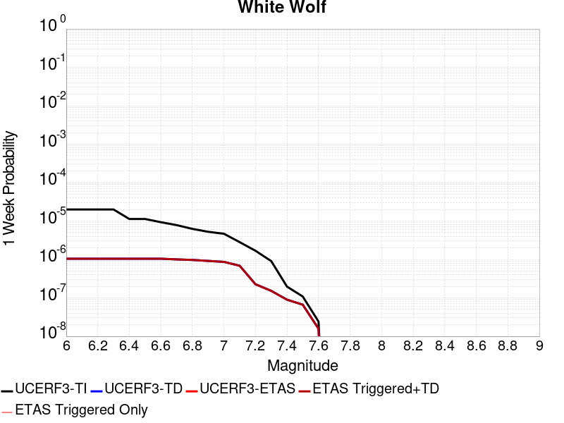 | 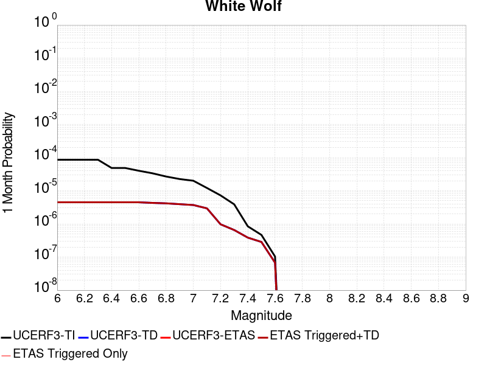 | 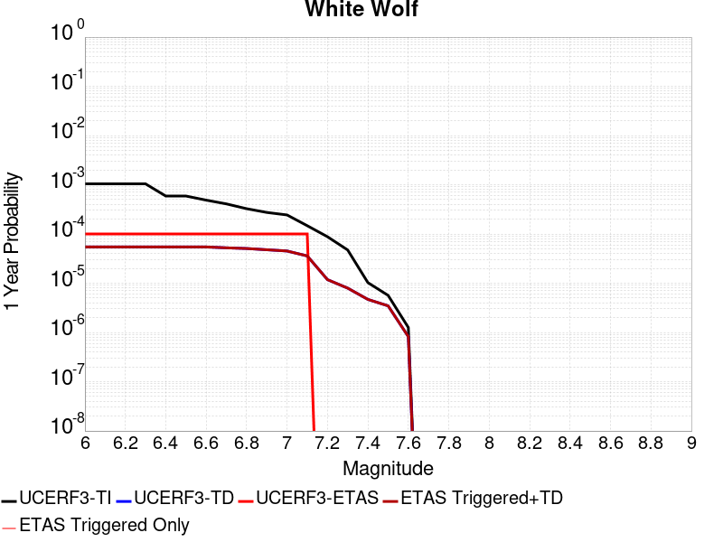 | 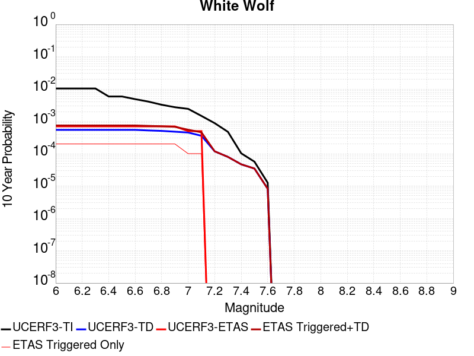 |

| Magnitude | 1 wk TI Prob | 1 wk TD Prob | 1 wk ETAS Prob | 1 wk ETAS/TD Gain | 1 wk ETAS Triggered+TD | 1 wk ETAS Triggered Only | 1 mo TI Prob | 1 mo TD Prob | 1 mo ETAS Prob | 1 mo ETAS/TD Gain | 1 mo ETAS Triggered+TD | 1 mo ETAS Triggered Only | 1 yr TI Prob | 1 yr TD Prob | 1 yr ETAS Prob | 1 yr ETAS/TD Gain | 1 yr ETAS Triggered+TD | 1 yr ETAS Triggered Only | 10 yr TI Prob | 10 yr TD Prob | 10 yr ETAS Prob | 10 yr ETAS/TD Gain | 10 yr ETAS Triggered+TD | 10 yr ETAS Triggered Only |
|-----|-----|-----|-----|-----|-----|-----|-----|-----|-----|-----|-----|-----|-----|-----|-----|-----|-----|-----|-----|-----|-----|-----|-----|-----|
| 6.0 | 2.0037822E-5 | 1.0470791E-6 | 0.0 | 0.0 | 1.0470791E-6 | 0.0 | 8.587355E-5 | 4.4874746E-6 | 0.0 | 0.0 | 4.4874746E-6 | 0.0 | 0.001045009 | 5.463368E-5 | 1.0E-4 | 1.8303727 | 5.463368E-5 | 0.0 | 0.010401085 | 5.462076E-4 | 7.0E-4 | 1.281564 | 7.4609835E-4 | 2.0E-4 |
| 6.1 | 2.0037822E-5 | 1.0470791E-6 | 0.0 | 0.0 | 1.0470791E-6 | 0.0 | 8.587355E-5 | 4.4874746E-6 | 0.0 | 0.0 | 4.4874746E-6 | 0.0 | 0.001045009 | 5.463368E-5 | 1.0E-4 | 1.8303727 | 5.463368E-5 | 0.0 | 0.010401085 | 5.462076E-4 | 7.0E-4 | 1.281564 | 7.4609835E-4 | 2.0E-4 |
| 6.2 | 2.0037822E-5 | 1.0470791E-6 | 0.0 | 0.0 | 1.0470791E-6 | 0.0 | 8.587355E-5 | 4.4874746E-6 | 0.0 | 0.0 | 4.4874746E-6 | 0.0 | 0.001045009 | 5.463368E-5 | 1.0E-4 | 1.8303727 | 5.463368E-5 | 0.0 | 0.010401085 | 5.462076E-4 | 7.0E-4 | 1.281564 | 7.4609835E-4 | 2.0E-4 |
| 6.3 | 2.0037822E-5 | 1.0470791E-6 | 0.0 | 0.0 | 1.0470791E-6 | 0.0 | 8.587355E-5 | 4.4874746E-6 | 0.0 | 0.0 | 4.4874746E-6 | 0.0 | 0.001045009 | 5.463368E-5 | 1.0E-4 | 1.8303727 | 5.463368E-5 | 0.0 | 0.010401085 | 5.462076E-4 | 7.0E-4 | 1.281564 | 7.4609835E-4 | 2.0E-4 |
| 6.4 | 1.132487E-5 | 1.0470791E-6 | 0.0 | 0.0 | 1.0470791E-6 | 0.0 | 4.8534253E-5 | 4.4874746E-6 | 0.0 | 0.0 | 4.4874746E-6 | 0.0 | 5.907443E-4 | 5.463368E-5 | 1.0E-4 | 1.8303727 | 5.463368E-5 | 0.0 | 0.005891764 | 5.462076E-4 | 7.0E-4 | 1.281564 | 7.4609835E-4 | 2.0E-4 |
| 6.5 | 1.132487E-5 | 1.0470791E-6 | 0.0 | 0.0 | 1.0470791E-6 | 0.0 | 4.8534253E-5 | 4.4874746E-6 | 0.0 | 0.0 | 4.4874746E-6 | 0.0 | 5.907443E-4 | 5.463368E-5 | 1.0E-4 | 1.8303727 | 5.463368E-5 | 0.0 | 0.005891764 | 5.462076E-4 | 7.0E-4 | 1.281564 | 7.4609835E-4 | 2.0E-4 |
| 6.6 | 9.347473E-6 | 1.0470791E-6 | 0.0 | 0.0 | 1.0470791E-6 | 0.0 | 4.0059982E-5 | 4.4874746E-6 | 0.0 | 0.0 | 4.4874746E-6 | 0.0 | 4.8762115E-4 | 5.463368E-5 | 1.0E-4 | 1.8303727 | 5.463368E-5 | 0.0 | 0.0048655253 | 5.462076E-4 | 7.0E-4 | 1.281564 | 7.4609835E-4 | 2.0E-4 |
| 6.7 | 7.842647E-6 | 1.0049876E-6 | 0.0 | 0.0 | 1.0049876E-6 | 0.0 | 3.361091E-5 | 4.3070827E-6 | 0.0 | 0.0 | 4.3070827E-6 | 0.0 | 4.0913603E-4 | 5.243752E-5 | 1.0E-4 | 1.9070314 | 5.243752E-5 | 0.0 | 0.004083836 | 5.2425644E-4 | 7.0E-4 | 1.3352244 | 7.241516E-4 | 2.0E-4 |
| 6.8 | 6.26597E-6 | 9.736262E-7 | 0.0 | 0.0 | 9.736262E-7 | 0.0 | 2.685388E-5 | 4.1726776E-6 | 0.0 | 0.0 | 4.1726776E-6 | 0.0 | 3.2689696E-4 | 5.0801216E-5 | 1.0E-4 | 1.9684569 | 5.0801216E-5 | 0.0 | 0.003264165 | 5.0790096E-4 | 7.0E-4 | 1.3782215 | 7.0779934E-4 | 2.0E-4 |
| 6.9 | 5.258436E-6 | 9.18457E-7 | 0.0 | 0.0 | 9.18457E-7 | 0.0 | 2.2535958E-5 | 3.9362385E-6 | 0.0 | 0.0 | 3.9362385E-6 | 0.0 | 2.7434074E-4 | 4.79227E-5 | 1.0E-4 | 2.0866938 | 4.79227E-5 | 0.0 | 0.0027400232 | 4.7912844E-4 | 7.0E-4 | 1.4609861 | 6.790326E-4 | 2.0E-4 |
| 7.0 | 4.675028E-6 | 8.6624186E-7 | 0.0 | 0.0 | 8.6624186E-7 | 0.0 | 2.003568E-5 | 3.7124603E-6 | 0.0 | 0.0 | 3.7124603E-6 | 0.0 | 2.4390711E-4 | 4.5198314E-5 | 1.0E-4 | 2.212472 | 4.5198314E-5 | 0.0 | 0.0024363957 | 4.5189593E-4 | 5.0E-4 | 1.1064495 | 5.518507E-4 | 1.0E-4 |
| 7.1 | 2.8270078E-6 | 6.87515E-7 | 0.0 | 0.0 | 6.87515E-7 | 0.0 | 1.2115692E-5 | 2.9464898E-6 | 0.0 | 0.0 | 2.9464898E-6 | 0.0 | 1.4749856E-4 | 3.5872963E-5 | 1.0E-4 | 2.7876146 | 3.5872963E-5 | 0.0 | 0.001474007 | 3.586758E-4 | 5.0E-4 | 1.3940165 | 4.5863996E-4 | 1.0E-4 |
| 7.2 | 1.6881406E-6 | 2.2710574E-7 | 0.0 | 0.0 | 2.2710574E-7 | 0.0 | 7.2348685E-6 | 9.7331E-7 | 0.0 | 0.0 | 9.7331E-7 | 0.0 | 8.808096E-5 | 1.1849986E-5 | 0.0 | 0.0 | 1.1849986E-5 | 0.0 | 8.8046055E-4 | 1.1849369E-4 | 0.0 | 0.0 | 1.1849369E-4 | 0.0 |
| 7.3 | 9.086107E-7 | 1.5268763E-7 | 0.0 | 0.0 | 1.5268763E-7 | 0.0 | 3.8940398E-6 | 6.543754E-7 | 0.0 | 0.0 | 6.543754E-7 | 0.0 | 4.7408903E-5 | 7.966993E-6 | 0.0 | 0.0 | 7.966993E-6 | 0.0 | 4.739879E-4 | 7.966715E-5 | 0.0 | 0.0 | 7.966715E-5 | 0.0 |
| 7.4 | 1.9717383E-7 | 9.004321E-8 | 0.0 | 0.0 | 9.004321E-8 | 0.0 | 8.450304E-7 | 3.8589943E-7 | 0.0 | 0.0 | 3.8589943E-7 | 0.0 | 1.0288197E-5 | 4.6983155E-6 | 0.0 | 0.0 | 4.6983155E-6 | 0.0 | 1.028772E-4 | 4.6982193E-5 | 0.0 | 0.0 | 4.6982193E-5 | 0.0 |
| 7.5 | 1.086975E-7 | 6.6602766E-8 | 0.0 | 0.0 | 6.6602766E-8 | 0.0 | 4.6584634E-7 | 2.854404E-7 | 0.0 | 0.0 | 2.854404E-7 | 0.0 | 5.6716644E-6 | 3.4752316E-6 | 0.0 | 0.0 | 3.4752316E-6 | 0.0 | 5.6715195E-5 | 3.4751796E-5 | 0.0 | 0.0 | 3.4751796E-5 | 0.0 |
| 7.6 | 2.4217808E-8 | 1.5822044E-8 | 0.0 | 0.0 | 1.5822044E-8 | 0.0 | 1.03790605E-7 | 6.780876E-8 | 0.0 | 0.0 | 6.780876E-8 | 0.0 | 1.2636499E-6 | 8.255714E-7 | 0.0 | 0.0 | 8.255714E-7 | 0.0 | 1.2636427E-5 | 8.255688E-6 | 0.0 | 0.0 | 8.255688E-6 | 0.0 |

## Newport-Inglewood (Offshore)
*[(top)](#table-of-contents)*

| 1 Week | 1 Month | 1 Year | 10 Year |
|-----|-----|-----|-----|
| 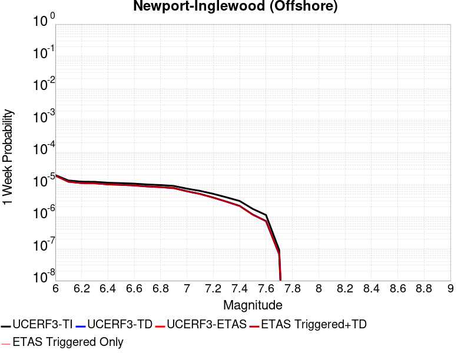 |  | 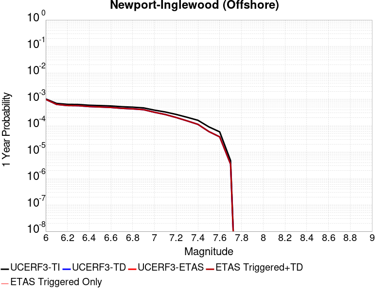 | 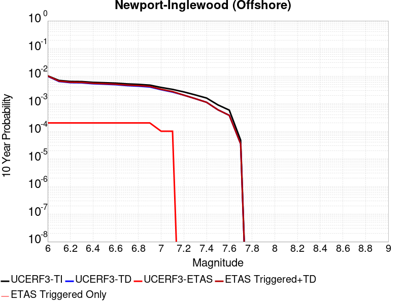 |

| Magnitude | 1 wk TI Prob | 1 wk TD Prob | 1 wk ETAS Prob | 1 wk ETAS/TD Gain | 1 wk ETAS Triggered+TD | 1 wk ETAS Triggered Only | 1 mo TI Prob | 1 mo TD Prob | 1 mo ETAS Prob | 1 mo ETAS/TD Gain | 1 mo ETAS Triggered+TD | 1 mo ETAS Triggered Only | 1 yr TI Prob | 1 yr TD Prob | 1 yr ETAS Prob | 1 yr ETAS/TD Gain | 1 yr ETAS Triggered+TD | 1 yr ETAS Triggered Only | 10 yr TI Prob | 10 yr TD Prob | 10 yr ETAS Prob | 10 yr ETAS/TD Gain | 10 yr ETAS Triggered+TD | 10 yr ETAS Triggered Only |
|-----|-----|-----|-----|-----|-----|-----|-----|-----|-----|-----|-----|-----|-----|-----|-----|-----|-----|-----|-----|-----|-----|-----|-----|-----|
| 6.0 | 1.9626508E-5 | 1.8968407E-5 | 0.0 | 0.0 | 1.8968407E-5 | 0.0 | 8.411089E-5 | 8.129071E-5 | 1.0E-4 | 1.2301528 | 8.129071E-5 | 0.0 | 0.001023569 | 9.892776E-4 | 5.0E-4 | 0.5054193 | 9.892776E-4 | 0.0 | 0.010188672 | 0.00985008 | 0.0052 | 0.52791446 | 0.010048111 | 2.0E-4 |
| 6.1 | 1.331886E-5 | 1.22201745E-5 | 0.0 | 0.0 | 1.22201745E-5 | 0.0 | 5.707958E-5 | 5.2371135E-5 | 1.0E-4 | 1.9094489 | 5.2371135E-5 | 0.0 | 6.947222E-4 | 6.374335E-4 | 2.0E-4 | 0.31375822 | 6.374335E-4 | 0.0 | 0.006925544 | 0.006356229 | 0.0031 | 0.48771057 | 0.0065549575 | 2.0E-4 |
| 6.2 | 1.2250852E-5 | 1.1077948E-5 | 0.0 | 0.0 | 1.1077948E-5 | 0.0 | 5.2502597E-5 | 4.7476064E-5 | 1.0E-4 | 2.1063244 | 4.7476064E-5 | 0.0 | 6.3903164E-4 | 5.778688E-4 | 2.0E-4 | 0.34609932 | 5.778688E-4 | 0.0 | 0.006371971 | 0.0057637827 | 0.0031 | 0.53784126 | 0.00596263 | 2.0E-4 |
| 6.3 | 1.2106258E-5 | 1.0920782E-5 | 0.0 | 0.0 | 1.0920782E-5 | 0.0 | 5.1882926E-5 | 4.6802517E-5 | 1.0E-4 | 2.1366372 | 4.6802517E-5 | 0.0 | 6.3149154E-4 | 5.696727E-4 | 2.0E-4 | 0.3510788 | 5.696727E-4 | 0.0 | 0.0062970007 | 0.0056822402 | 0.0031 | 0.54555947 | 0.005881104 | 2.0E-4 |
| 6.4 | 1.1348758E-5 | 1.0111139E-5 | 0.0 | 0.0 | 1.0111139E-5 | 0.0 | 4.8636626E-5 | 4.3332737E-5 | 1.0E-4 | 2.307724 | 4.3332737E-5 | 0.0 | 5.919901E-4 | 5.274491E-4 | 2.0E-4 | 0.37918347 | 5.274491E-4 | 0.0 | 0.005904155 | 0.0052620685 | 0.003 | 0.570118 | 0.005461016 | 2.0E-4 |
| 6.5 | 1.100837E-5 | 9.745109E-6 | 0.0 | 0.0 | 9.745109E-6 | 0.0 | 4.7177873E-5 | 4.1764088E-5 | 1.0E-4 | 2.3944016 | 4.1764088E-5 | 0.0 | 5.7423924E-4 | 5.083599E-4 | 2.0E-4 | 0.39342204 | 5.083599E-4 | 0.0 | 0.005727576 | 0.005072062 | 0.003 | 0.5914754 | 0.0052710474 | 2.0E-4 |
| 6.6 | 1.0634696E-5 | 9.347201E-6 | 0.0 | 0.0 | 9.347201E-6 | 0.0 | 4.557647E-5 | 4.005882E-5 | 1.0E-4 | 2.496329 | 4.005882E-5 | 0.0 | 5.5475225E-4 | 4.8760773E-4 | 2.0E-4 | 0.41016576 | 4.8760773E-4 | 0.0 | 0.0055336943 | 0.004865465 | 0.0028 | 0.5754845 | 0.005064492 | 2.0E-4 |
| 6.7 | 9.9780855E-6 | 8.669454E-6 | 0.0 | 0.0 | 8.669454E-6 | 0.0 | 4.276252E-5 | 3.7154274E-5 | 1.0E-4 | 2.6914804 | 3.7154274E-5 | 0.0 | 5.205093E-4 | 4.522601E-4 | 2.0E-4 | 0.4422234 | 4.522601E-4 | 0.0 | 0.0051929182 | 0.004513476 | 0.0026 | 0.57605267 | 0.0047125737 | 2.0E-4 |
| 6.8 | 9.59546E-6 | 8.274436E-6 | 0.0 | 0.0 | 8.274436E-6 | 0.0 | 4.1122752E-5 | 3.5461395E-5 | 1.0E-4 | 2.8199682 | 3.5461395E-5 | 0.0 | 5.0055445E-4 | 4.316576E-4 | 2.0E-4 | 0.46333018 | 4.316576E-4 | 0.0 | 0.004994285 | 0.0043082675 | 0.0026 | 0.6034909 | 0.0045074057 | 2.0E-4 |
| 6.9 | 9.000614E-6 | 7.708226E-6 | 0.0 | 0.0 | 7.708226E-6 | 0.0 | 3.857349E-5 | 3.303484E-5 | 1.0E-4 | 3.027107 | 3.303484E-5 | 0.0 | 4.6953102E-4 | 4.0212562E-4 | 2.0E-4 | 0.49735704 | 4.0212562E-4 | 0.0 | 0.004685402 | 0.004014051 | 0.0026 | 0.6477247 | 0.0042132484 | 2.0E-4 |
| 7.0 | 7.4070194E-6 | 6.149969E-6 | 0.0 | 0.0 | 6.149969E-6 | 0.0 | 3.1743984E-5 | 2.6356744E-5 | 1.0E-4 | 3.7940953 | 2.6356744E-5 | 0.0 | 3.8641447E-4 | 3.2084627E-4 | 2.0E-4 | 0.6233515 | 3.2084627E-4 | 0.0 | 0.0038574322 | 0.0032038502 | 0.002 | 0.6242489 | 0.0033035297 | 1.0E-4 |
| 7.1 | 6.299615E-6 | 5.0575018E-6 | 0.0 | 0.0 | 5.0575018E-6 | 0.0 | 2.699807E-5 | 2.1674829E-5 | 0.0 | 0.0 | 2.1674829E-5 | 0.0 | 3.2865192E-4 | 2.638592E-4 | 1.0E-4 | 0.37899 | 2.638592E-4 | 0.0 | 0.003281663 | 0.002635474 | 0.0015 | 0.5691576 | 0.0027352103 | 1.0E-4 |
| 7.2 | 5.096653E-6 | 3.8934936E-6 | 0.0 | 0.0 | 3.8934936E-6 | 0.0 | 2.1842614E-5 | 1.6686294E-5 | 0.0 | 0.0 | 1.6686294E-5 | 0.0 | 2.6590136E-4 | 2.0313679E-4 | 1.0E-4 | 0.4922791 | 2.0313679E-4 | 0.0 | 0.0026558342 | 0.0020295223 | 0.0013 | 0.64054483 | 0.0020295223 | 0.0 |
| 7.3 | 3.9753018E-6 | 2.9104312E-6 | 0.0 | 0.0 | 2.9104312E-6 | 0.0 | 1.7036897E-5 | 1.2473218E-5 | 0.0 | 0.0 | 1.2473218E-5 | 0.0 | 2.0740448E-4 | 1.5185092E-4 | 1.0E-4 | 0.6585406 | 1.5185092E-4 | 0.0 | 0.00207211 | 0.0015174797 | 9.0E-4 | 0.5930887 | 0.0015174797 | 0.0 |
| 7.4 | 3.0568392E-6 | 2.145368E-6 | 0.0 | 0.0 | 2.145368E-6 | 0.0 | 1.3100675E-5 | 9.194401E-6 | 0.0 | 0.0 | 9.194401E-6 | 0.0 | 1.5948903E-4 | 1.1193615E-4 | 0.0 | 0.0 | 1.1193615E-4 | 0.0 | 0.0015937461 | 0.001118804 | 7.0E-4 | 0.62566817 | 0.001118804 | 0.0 |
| 7.5 | 1.7279019E-6 | 1.1472341E-6 | 0.0 | 0.0 | 1.1472341E-6 | 0.0 | 7.405273E-6 | 4.916709E-6 | 0.0 | 0.0 | 4.916709E-6 | 0.0 | 9.015547E-5 | 5.9859325E-5 | 0.0 | 0.0 | 5.9859325E-5 | 0.0 | 9.01189E-4 | 5.984359E-4 | 4.0E-4 | 0.6684091 | 5.984359E-4 | 0.0 |
| 7.6 | 1.1156416E-6 | 7.224371E-7 | 0.0 | 0.0 | 7.224371E-7 | 0.0 | 4.7813123E-6 | 3.0961555E-6 | 0.0 | 0.0 | 3.0961555E-6 | 0.0 | 5.821092E-5 | 3.7695067E-5 | 0.0 | 0.0 | 3.7695067E-5 | 0.0 | 5.8195676E-4 | 3.7688905E-4 | 3.0E-4 | 0.7959902 | 3.7688905E-4 | 0.0 |
| 7.7 | 9.117973E-8 | 6.734903E-8 | 0.0 | 0.0 | 6.734903E-8 | 0.0 | 3.907702E-7 | 2.8863866E-7 | 0.0 | 0.0 | 2.8863866E-7 | 0.0 | 4.757617E-6 | 3.5141704E-6 | 0.0 | 0.0 | 3.5141704E-6 | 0.0 | 4.7575148E-5 | 3.5141176E-5 | 0.0 | 0.0 | 3.5141176E-5 | 0.0 |

## Casmalia 2011 CFM
*[(top)](#table-of-contents)*

| 1 Week | 1 Month | 1 Year | 10 Year |
|-----|-----|-----|-----|
| 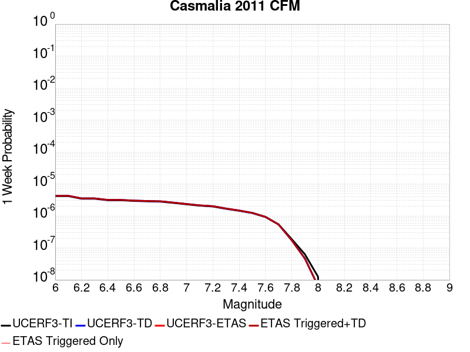 | 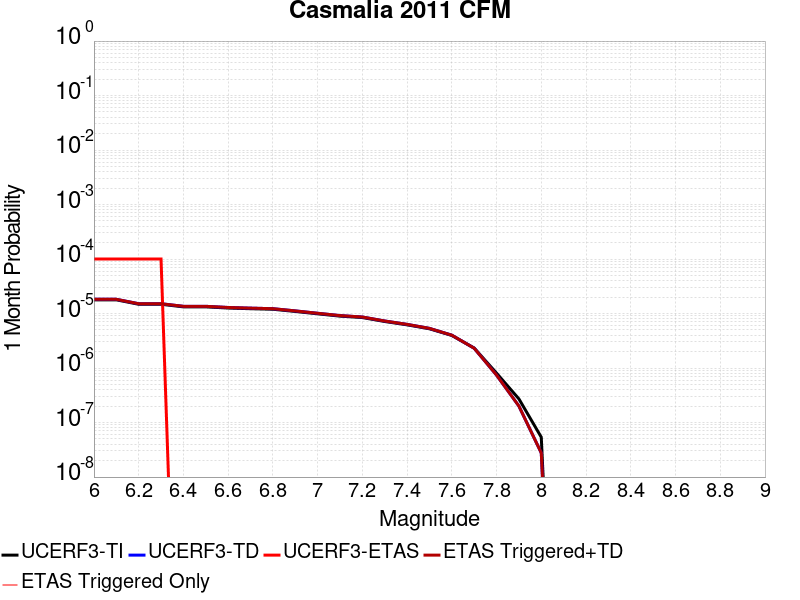 | 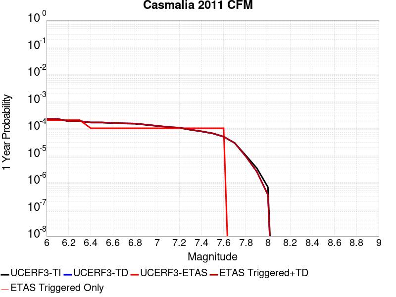 | 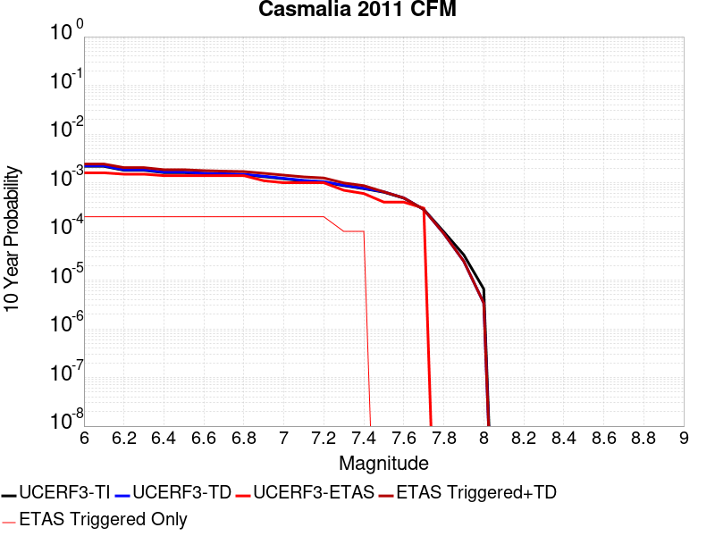 |

| Magnitude | 1 wk TI Prob | 1 wk TD Prob | 1 wk ETAS Prob | 1 wk ETAS/TD Gain | 1 wk ETAS Triggered+TD | 1 wk ETAS Triggered Only | 1 mo TI Prob | 1 mo TD Prob | 1 mo ETAS Prob | 1 mo ETAS/TD Gain | 1 mo ETAS Triggered+TD | 1 mo ETAS Triggered Only | 1 yr TI Prob | 1 yr TD Prob | 1 yr ETAS Prob | 1 yr ETAS/TD Gain | 1 yr ETAS Triggered+TD | 1 yr ETAS Triggered Only | 10 yr TI Prob | 10 yr TD Prob | 10 yr ETAS Prob | 10 yr ETAS/TD Gain | 10 yr ETAS Triggered+TD | 10 yr ETAS Triggered Only |
|-----|-----|-----|-----|-----|-----|-----|-----|-----|-----|-----|-----|-----|-----|-----|-----|-----|-----|-----|-----|-----|-----|-----|-----|-----|
| 6.0 | 4.1704893E-6 | 4.262777E-6 | 0.0 | 0.0 | 4.262777E-6 | 0.0 | 1.7873403E-5 | 1.8268918E-5 | 1.0E-4 | 5.4737782 | 1.8268918E-5 | 0.0 | 2.1758694E-4 | 2.2240156E-4 | 2.0E-4 | 0.89927423 | 2.2240156E-4 | 0.0 | 0.0021737402 | 0.0022218109 | 0.0016 | 0.7201333 | 0.0024213665 | 2.0E-4 |
| 6.1 | 4.1704893E-6 | 4.262777E-6 | 0.0 | 0.0 | 4.262777E-6 | 0.0 | 1.7873403E-5 | 1.8268918E-5 | 1.0E-4 | 5.4737782 | 1.8268918E-5 | 0.0 | 2.1758694E-4 | 2.2240156E-4 | 2.0E-4 | 0.89927423 | 2.2240156E-4 | 0.0 | 0.0021737402 | 0.0022218109 | 0.0016 | 0.7201333 | 0.0024213665 | 2.0E-4 |
| 6.2 | 3.457312E-6 | 3.5372902E-6 | 0.0 | 0.0 | 3.5372902E-6 | 0.0 | 1.4816967E-5 | 1.5159728E-5 | 1.0E-4 | 6.5964246 | 1.5159728E-5 | 0.0 | 1.8038164E-4 | 1.8455414E-4 | 2.0E-4 | 1.0836928 | 1.8455414E-4 | 0.0 | 0.001802353 | 0.0018440182 | 0.0015 | 0.813441 | 0.0020436493 | 2.0E-4 |
| 6.3 | 3.457312E-6 | 3.5372902E-6 | 0.0 | 0.0 | 3.5372902E-6 | 0.0 | 1.4816967E-5 | 1.5159728E-5 | 1.0E-4 | 6.5964246 | 1.5159728E-5 | 0.0 | 1.8038164E-4 | 1.8455414E-4 | 2.0E-4 | 1.0836928 | 1.8455414E-4 | 0.0 | 0.001802353 | 0.0018440182 | 0.0015 | 0.813441 | 0.0020436493 | 2.0E-4 |
| 6.4 | 3.0957337E-6 | 3.1694813E-6 | 0.0 | 0.0 | 3.1694813E-6 | 0.0 | 1.3267363E-5 | 1.358342E-5 | 0.0 | 0.0 | 1.358342E-5 | 0.0 | 1.6151817E-4 | 1.6536565E-4 | 1.0E-4 | 0.60472053 | 1.6536565E-4 | 0.0 | 0.0016140083 | 0.0016524321 | 0.0014 | 0.84723604 | 0.0018521016 | 2.0E-4 |
| 6.5 | 3.0957337E-6 | 3.1694813E-6 | 0.0 | 0.0 | 3.1694813E-6 | 0.0 | 1.3267363E-5 | 1.358342E-5 | 0.0 | 0.0 | 1.358342E-5 | 0.0 | 1.6151817E-4 | 1.6536565E-4 | 1.0E-4 | 0.60472053 | 1.6536565E-4 | 0.0 | 0.0016140083 | 0.0016524321 | 0.0014 | 0.84723604 | 0.0018521016 | 2.0E-4 |
| 6.6 | 2.9459152E-6 | 3.0168246E-6 | 0.0 | 0.0 | 3.0168246E-6 | 0.0 | 1.262529E-5 | 1.2929185E-5 | 0.0 | 0.0 | 1.2929185E-5 | 0.0 | 1.5370206E-4 | 1.574015E-4 | 1.0E-4 | 0.6353179 | 1.574015E-4 | 0.0 | 0.0015359579 | 0.0015729058 | 0.0014 | 0.8900724 | 0.0017725911 | 2.0E-4 |
| 6.7 | 2.8634809E-6 | 2.9327186E-6 | 0.0 | 0.0 | 2.9327186E-6 | 0.0 | 1.2272003E-5 | 1.2568734E-5 | 0.0 | 0.0 | 1.2568734E-5 | 0.0 | 1.4940138E-4 | 1.5301364E-4 | 1.0E-4 | 0.6535365 | 1.5301364E-4 | 0.0 | 0.0014930099 | 0.0015290882 | 0.0014 | 0.9155783 | 0.0017287824 | 2.0E-4 |
| 6.8 | 2.7999822E-6 | 2.8678398E-6 | 0.0 | 0.0 | 2.8678398E-6 | 0.0 | 1.1999869E-5 | 1.2290684E-5 | 0.0 | 0.0 | 1.2290684E-5 | 0.0 | 1.460886E-4 | 1.4962886E-4 | 1.0E-4 | 0.6683203 | 1.4962886E-4 | 0.0 | 0.001459926 | 0.0014952864 | 0.0014 | 0.9362755 | 0.0016949873 | 2.0E-4 |
| 6.9 | 2.551052E-6 | 2.6121936E-6 | 0.0 | 0.0 | 2.6121936E-6 | 0.0 | 1.0933034E-5 | 1.1195068E-5 | 0.0 | 0.0 | 1.1195068E-5 | 0.0 | 1.3310155E-4 | 1.3629146E-4 | 1.0E-4 | 0.7337217 | 1.3629146E-4 | 0.0 | 0.0013302186 | 0.0013620828 | 0.0011 | 0.8075867 | 0.0015618104 | 2.0E-4 |
| 7.0 | 2.3081875E-6 | 2.3626235E-6 | 0.0 | 0.0 | 2.3626235E-6 | 0.0 | 9.892195E-6 | 1.012549E-5 | 0.0 | 0.0 | 1.012549E-5 | 0.0 | 1.20430814E-4 | 1.232709E-4 | 1.0E-4 | 0.8112215 | 1.232709E-4 | 0.0 | 0.0012036557 | 0.001232028 | 0.001 | 0.8116698 | 0.0014317817 | 2.0E-4 |
| 7.1 | 2.093245E-6 | 2.1419269E-6 | 0.0 | 0.0 | 2.1419269E-6 | 0.0 | 8.971019E-6 | 9.179655E-6 | 0.0 | 0.0 | 9.179655E-6 | 0.0 | 1.09216686E-4 | 1.1175658E-4 | 1.0E-4 | 0.8948019 | 1.1175658E-4 | 0.0 | 0.0010916302 | 0.0011170058 | 0.001 | 0.8952505 | 0.0013167824 | 2.0E-4 |
| 7.2 | 1.9714576E-6 | 2.0167045E-6 | 0.0 | 0.0 | 2.0167045E-6 | 0.0 | 8.449076E-6 | 8.64299E-6 | 0.0 | 0.0 | 8.64299E-6 | 0.0 | 1.0286264E-4 | 1.0522334E-4 | 1.0E-4 | 0.95035946 | 1.0522334E-4 | 0.0 | 0.0010281504 | 0.0010517371 | 0.001 | 0.950808 | 0.0012515268 | 2.0E-4 |
| 7.3 | 1.6689512E-6 | 1.7048885E-6 | 0.0 | 0.0 | 1.7048885E-6 | 0.0 | 7.1526288E-6 | 7.306645E-6 | 0.0 | 0.0 | 7.306645E-6 | 0.0 | 8.7079774E-5 | 8.8954774E-5 | 1.0E-4 | 1.1241667 | 8.8954774E-5 | 0.0 | 8.7045657E-4 | 8.891925E-4 | 7.0E-4 | 0.78723115 | 9.891036E-4 | 1.0E-4 |
| 7.4 | 1.4490954E-6 | 1.4780514E-6 | 0.0 | 0.0 | 1.4780514E-6 | 0.0 | 6.210394E-6 | 6.334491E-6 | 0.0 | 0.0 | 6.334491E-6 | 0.0 | 7.560892E-5 | 7.71197E-5 | 1.0E-4 | 1.2966855 | 7.71197E-5 | 0.0 | 7.55832E-4 | 7.7093E-4 | 6.0E-4 | 0.77828074 | 8.708529E-4 | 1.0E-4 |
| 7.5 | 1.226873E-6 | 1.2483148E-6 | 0.0 | 0.0 | 1.2483148E-6 | 0.0 | 5.2580162E-6 | 5.3499093E-6 | 0.0 | 0.0 | 5.3499093E-6 | 0.0 | 6.401447E-5 | 6.513321E-5 | 1.0E-4 | 1.5353152 | 6.513321E-5 | 0.0 | 6.399603E-4 | 6.511417E-4 | 4.0E-4 | 0.6143056 | 6.511417E-4 | 0.0 |
| 7.6 | 9.2561345E-7 | 9.3631405E-7 | 0.0 | 0.0 | 9.3631405E-7 | 0.0 | 3.966909E-6 | 4.0127684E-6 | 0.0 | 0.0 | 4.0127684E-6 | 0.0 | 4.8296046E-5 | 4.8854363E-5 | 1.0E-4 | 2.0469 | 4.8854363E-5 | 0.0 | 4.828555E-4 | 4.8843666E-4 | 4.0E-4 | 0.8189394 | 4.8843666E-4 | 0.0 |
| 7.7 | 5.4367933E-7 | 5.393785E-7 | 0.0 | 0.0 | 5.393785E-7 | 0.0 | 2.3300522E-6 | 2.31162E-6 | 0.0 | 0.0 | 2.31162E-6 | 0.0 | 2.8368017E-5 | 2.8143611E-5 | 0.0 | 0.0 | 2.8143611E-5 | 0.0 | 2.8364395E-4 | 2.814006E-4 | 3.0E-4 | 1.0660958 | 2.814006E-4 | 0.0 |
| 7.8 | 1.8825742E-7 | 1.7348002E-7 | 0.0 | 0.0 | 1.7348002E-7 | 0.0 | 8.068173E-7 | 7.4348554E-7 | 0.0 | 0.0 | 7.4348554E-7 | 0.0 | 9.822956E-6 | 9.0519E-6 | 0.0 | 0.0 | 9.0519E-6 | 0.0 | 9.822522E-5 | 9.051533E-5 | 0.0 | 0.0 | 9.051533E-5 | 0.0 |
| 7.9 | 6.342771E-8 | 4.683454E-8 | 0.0 | 0.0 | 4.683454E-8 | 0.0 | 2.7183304E-7 | 2.0071944E-7 | 0.0 | 0.0 | 2.0071944E-7 | 0.0 | 3.3095623E-6 | 2.4437563E-6 | 0.0 | 0.0 | 2.4437563E-6 | 0.0 | 3.309513E-5 | 2.44373E-5 | 0.0 | 0.0 | 2.44373E-5 | 0.0 |
| 8.0 | 1.2574819E-8 | 6.487882E-9 | 0.0 | 0.0 | 6.487882E-9 | 0.0 | 5.3892084E-8 | 2.7805209E-8 | 0.0 | 0.0 | 2.7805209E-8 | 0.0 | 6.561359E-7 | 3.3852837E-7 | 0.0 | 0.0 | 3.3852837E-7 | 0.0 | 6.56134E-6 | 3.3852787E-6 | 0.0 | 0.0 | 3.3852787E-6 | 0.0 |

## Deep Springs
*[(top)](#table-of-contents)*

| 1 Week | 1 Month | 1 Year | 10 Year |
|-----|-----|-----|-----|
| 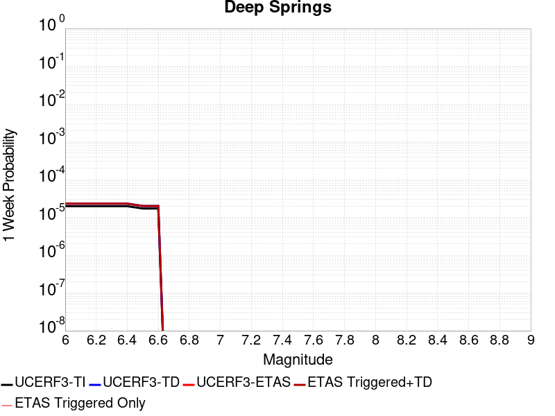 | 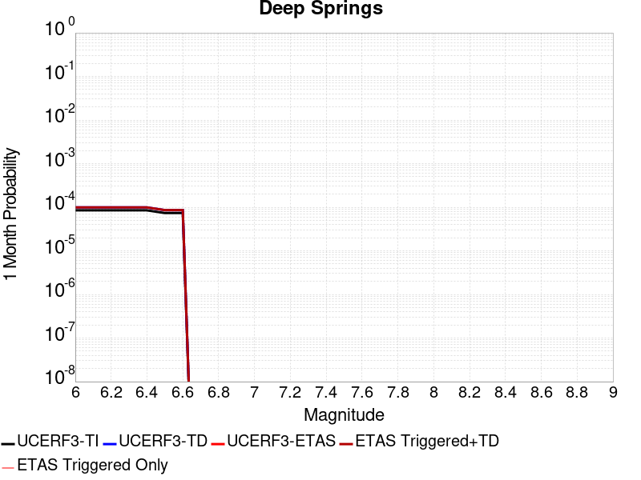 | 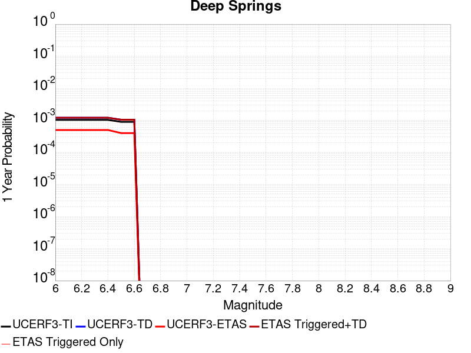 | 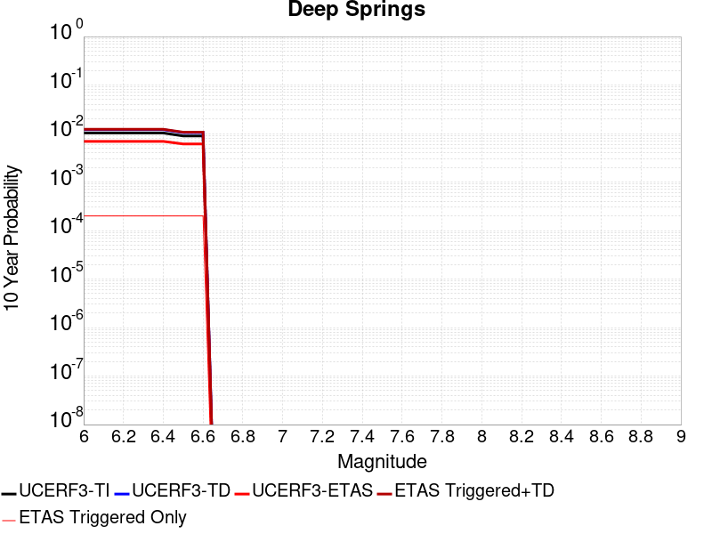 |

| Magnitude | 1 wk TI Prob | 1 wk TD Prob | 1 wk ETAS Prob | 1 wk ETAS/TD Gain | 1 wk ETAS Triggered+TD | 1 wk ETAS Triggered Only | 1 mo TI Prob | 1 mo TD Prob | 1 mo ETAS Prob | 1 mo ETAS/TD Gain | 1 mo ETAS Triggered+TD | 1 mo ETAS Triggered Only | 1 yr TI Prob | 1 yr TD Prob | 1 yr ETAS Prob | 1 yr ETAS/TD Gain | 1 yr ETAS Triggered+TD | 1 yr ETAS Triggered Only | 10 yr TI Prob | 10 yr TD Prob | 10 yr ETAS Prob | 10 yr ETAS/TD Gain | 10 yr ETAS Triggered+TD | 10 yr ETAS Triggered Only |
|-----|-----|-----|-----|-----|-----|-----|-----|-----|-----|-----|-----|-----|-----|-----|-----|-----|-----|-----|-----|-----|-----|-----|-----|-----|
| 6.0 | 1.9810619E-5 | 2.3120454E-5 | 0.0 | 0.0 | 2.3120454E-5 | 0.0 | 8.489989E-5 | 9.9086756E-5 | 0.0 | 0.0 | 9.9086756E-5 | 0.0 | 0.001033166 | 0.0012062215 | 5.0E-4 | 0.41451755 | 0.0012062215 | 0.0 | 0.010283757 | 0.012046555 | 0.0069 | 0.57277787 | 0.012244146 | 2.0E-4 |
| 6.1 | 1.9810619E-5 | 2.3120454E-5 | 0.0 | 0.0 | 2.3120454E-5 | 0.0 | 8.489989E-5 | 9.9086756E-5 | 0.0 | 0.0 | 9.9086756E-5 | 0.0 | 0.001033166 | 0.0012062215 | 5.0E-4 | 0.41451755 | 0.0012062215 | 0.0 | 0.010283757 | 0.012046555 | 0.0069 | 0.57277787 | 0.012244146 | 2.0E-4 |
| 6.2 | 1.9810619E-5 | 2.3120454E-5 | 0.0 | 0.0 | 2.3120454E-5 | 0.0 | 8.489989E-5 | 9.9086756E-5 | 0.0 | 0.0 | 9.9086756E-5 | 0.0 | 0.001033166 | 0.0012062215 | 5.0E-4 | 0.41451755 | 0.0012062215 | 0.0 | 0.010283757 | 0.012046555 | 0.0069 | 0.57277787 | 0.012244146 | 2.0E-4 |
| 6.3 | 1.9810619E-5 | 2.3120454E-5 | 0.0 | 0.0 | 2.3120454E-5 | 0.0 | 8.489989E-5 | 9.9086756E-5 | 0.0 | 0.0 | 9.9086756E-5 | 0.0 | 0.001033166 | 0.0012062215 | 5.0E-4 | 0.41451755 | 0.0012062215 | 0.0 | 0.010283757 | 0.012046555 | 0.0069 | 0.57277787 | 0.012244146 | 2.0E-4 |
| 6.4 | 1.9810619E-5 | 2.3120454E-5 | 0.0 | 0.0 | 2.3120454E-5 | 0.0 | 8.489989E-5 | 9.9086756E-5 | 0.0 | 0.0 | 9.9086756E-5 | 0.0 | 0.001033166 | 0.0012062215 | 5.0E-4 | 0.41451755 | 0.0012062215 | 0.0 | 0.010283757 | 0.012046555 | 0.0069 | 0.57277787 | 0.012244146 | 2.0E-4 |
| 6.5 | 1.7190405E-5 | 2.0057429E-5 | 0.0 | 0.0 | 2.0057429E-5 | 0.0 | 7.367108E-5 | 8.5960404E-5 | 0.0 | 0.0 | 8.5960404E-5 | 0.0 | 8.9657627E-4 | 0.0010465676 | 4.0E-4 | 0.3822018 | 0.0010465676 | 0.0 | 0.008929676 | 0.010465643 | 0.0061 | 0.5828595 | 0.01066355 | 2.0E-4 |
| 6.6 | 1.7190405E-5 | 2.0057429E-5 | 0.0 | 0.0 | 2.0057429E-5 | 0.0 | 7.367108E-5 | 8.5960404E-5 | 0.0 | 0.0 | 8.5960404E-5 | 0.0 | 8.9657627E-4 | 0.0010465676 | 4.0E-4 | 0.3822018 | 0.0010465676 | 0.0 | 0.008929676 | 0.010465643 | 0.0061 | 0.5828595 | 0.01066355 | 2.0E-4 |

## Pine Mtn
*[(top)](#table-of-contents)*

| 1 Week | 1 Month | 1 Year | 10 Year |
|-----|-----|-----|-----|
| 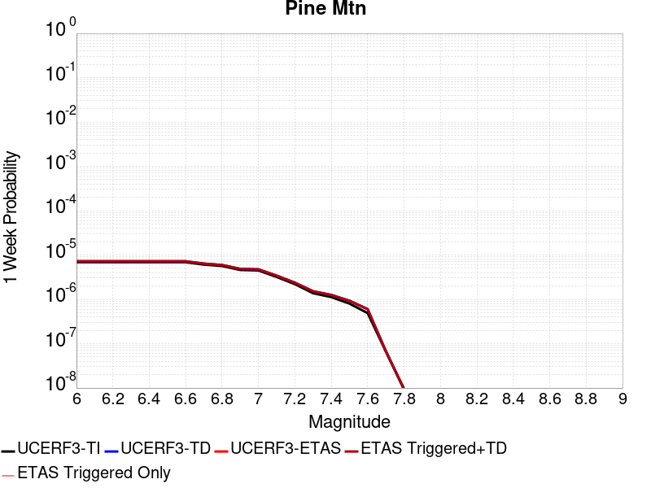 | 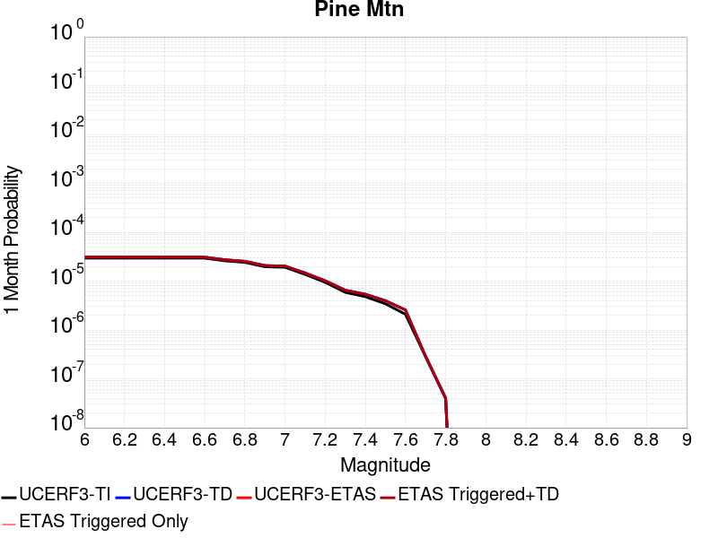 | 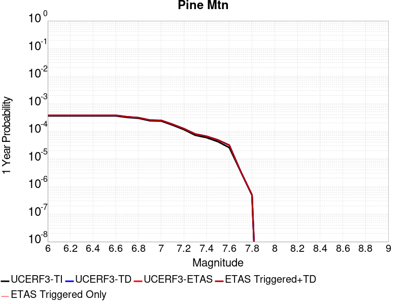 | 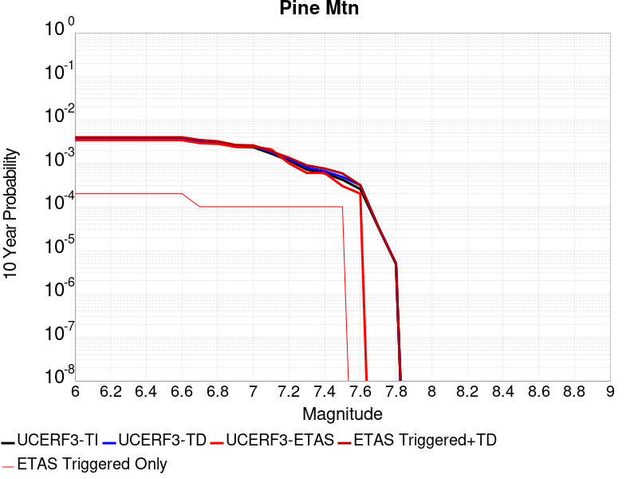 |

| Magnitude | 1 wk TI Prob | 1 wk TD Prob | 1 wk ETAS Prob | 1 wk ETAS/TD Gain | 1 wk ETAS Triggered+TD | 1 wk ETAS Triggered Only | 1 mo TI Prob | 1 mo TD Prob | 1 mo ETAS Prob | 1 mo ETAS/TD Gain | 1 mo ETAS Triggered+TD | 1 mo ETAS Triggered Only | 1 yr TI Prob | 1 yr TD Prob | 1 yr ETAS Prob | 1 yr ETAS/TD Gain | 1 yr ETAS Triggered+TD | 1 yr ETAS Triggered Only | 10 yr TI Prob | 10 yr TD Prob | 10 yr ETAS Prob | 10 yr ETAS/TD Gain | 10 yr ETAS Triggered+TD | 10 yr ETAS Triggered Only |
|-----|-----|-----|-----|-----|-----|-----|-----|-----|-----|-----|-----|-----|-----|-----|-----|-----|-----|-----|-----|-----|-----|-----|-----|-----|
| 6.0 | 6.894797E-6 | 7.22708E-6 | 0.0 | 0.0 | 7.22708E-6 | 0.0 | 2.9548795E-5 | 3.097285E-5 | 0.0 | 0.0 | 3.097285E-5 | 0.0 | 3.596972E-4 | 3.7703215E-4 | 0.0 | 0.0 | 3.7703215E-4 | 0.0 | 0.0035911554 | 0.0037642224 | 0.0034 | 0.903241 | 0.0039634695 | 2.0E-4 |
| 6.1 | 6.894797E-6 | 7.22708E-6 | 0.0 | 0.0 | 7.22708E-6 | 0.0 | 2.9548795E-5 | 3.097285E-5 | 0.0 | 0.0 | 3.097285E-5 | 0.0 | 3.596972E-4 | 3.7703215E-4 | 0.0 | 0.0 | 3.7703215E-4 | 0.0 | 0.0035911554 | 0.0037642224 | 0.0034 | 0.903241 | 0.0039634695 | 2.0E-4 |
| 6.2 | 6.894797E-6 | 7.22708E-6 | 0.0 | 0.0 | 7.22708E-6 | 0.0 | 2.9548795E-5 | 3.097285E-5 | 0.0 | 0.0 | 3.097285E-5 | 0.0 | 3.596972E-4 | 3.7703215E-4 | 0.0 | 0.0 | 3.7703215E-4 | 0.0 | 0.0035911554 | 0.0037642224 | 0.0034 | 0.903241 | 0.0039634695 | 2.0E-4 |
| 6.3 | 6.894797E-6 | 7.22708E-6 | 0.0 | 0.0 | 7.22708E-6 | 0.0 | 2.9548795E-5 | 3.097285E-5 | 0.0 | 0.0 | 3.097285E-5 | 0.0 | 3.596972E-4 | 3.7703215E-4 | 0.0 | 0.0 | 3.7703215E-4 | 0.0 | 0.0035911554 | 0.0037642224 | 0.0034 | 0.903241 | 0.0039634695 | 2.0E-4 |
| 6.4 | 6.894797E-6 | 7.22708E-6 | 0.0 | 0.0 | 7.22708E-6 | 0.0 | 2.9548795E-5 | 3.097285E-5 | 0.0 | 0.0 | 3.097285E-5 | 0.0 | 3.596972E-4 | 3.7703215E-4 | 0.0 | 0.0 | 3.7703215E-4 | 0.0 | 0.0035911554 | 0.0037642224 | 0.0034 | 0.903241 | 0.0039634695 | 2.0E-4 |
| 6.5 | 6.894797E-6 | 7.22708E-6 | 0.0 | 0.0 | 7.22708E-6 | 0.0 | 2.9548795E-5 | 3.097285E-5 | 0.0 | 0.0 | 3.097285E-5 | 0.0 | 3.596972E-4 | 3.7703215E-4 | 0.0 | 0.0 | 3.7703215E-4 | 0.0 | 0.0035911554 | 0.0037642224 | 0.0034 | 0.903241 | 0.0039634695 | 2.0E-4 |
| 6.6 | 6.894797E-6 | 7.22708E-6 | 0.0 | 0.0 | 7.22708E-6 | 0.0 | 2.9548795E-5 | 3.097285E-5 | 0.0 | 0.0 | 3.097285E-5 | 0.0 | 3.596972E-4 | 3.7703215E-4 | 0.0 | 0.0 | 3.7703215E-4 | 0.0 | 0.0035911554 | 0.0037642224 | 0.0034 | 0.903241 | 0.0039634695 | 2.0E-4 |
| 6.7 | 6.0867933E-6 | 6.398689E-6 | 0.0 | 0.0 | 6.398689E-6 | 0.0 | 2.6085996E-5 | 2.7422677E-5 | 0.0 | 0.0 | 2.7422677E-5 | 0.0 | 3.1755073E-4 | 3.3382213E-4 | 0.0 | 0.0 | 3.3382213E-4 | 0.0 | 0.0031709734 | 0.0033334258 | 0.0029 | 0.86997586 | 0.0034330925 | 1.0E-4 |
| 6.8 | 5.6530425E-6 | 5.952144E-6 | 0.0 | 0.0 | 5.952144E-6 | 0.0 | 2.42271E-5 | 2.550895E-5 | 0.0 | 0.0 | 2.550895E-5 | 0.0 | 2.94925E-4 | 3.1052929E-4 | 0.0 | 0.0 | 3.1052929E-4 | 0.0 | 0.002945339 | 0.0031011584 | 0.0028 | 0.9028884 | 0.0032008484 | 1.0E-4 |
| 6.9 | 4.6015225E-6 | 4.8653073E-6 | 0.0 | 0.0 | 4.8653073E-6 | 0.0 | 1.9720663E-5 | 2.085116E-5 | 0.0 | 0.0 | 2.085116E-5 | 0.0 | 2.4007261E-4 | 2.5383476E-4 | 0.0 | 0.0 | 2.5383476E-4 | 0.0 | 0.0023981342 | 0.0025355923 | 0.0024 | 0.9465244 | 0.0026353388 | 1.0E-4 |
| 7.0 | 4.4875965E-6 | 4.7489416E-6 | 0.0 | 0.0 | 4.7489416E-6 | 0.0 | 1.9232413E-5 | 2.0352456E-5 | 0.0 | 0.0 | 2.0352456E-5 | 0.0 | 2.3412947E-4 | 2.4776443E-4 | 0.0 | 0.0 | 2.4776443E-4 | 0.0 | 0.0023388295 | 0.0024750258 | 0.0024 | 0.96968687 | 0.0025747782 | 1.0E-4 |
| 7.1 | 3.203907E-6 | 3.430805E-6 | 0.0 | 0.0 | 3.430805E-6 | 0.0 | 1.3730958E-5 | 1.4703372E-5 | 0.0 | 0.0 | 1.4703372E-5 | 0.0 | 1.6716159E-4 | 1.7899951E-4 | 0.0 | 0.0 | 1.7899951E-4 | 0.0 | 0.0016703589 | 0.0017886194 | 0.0021 | 1.1740899 | 0.0018884406 | 1.0E-4 |
| 7.2 | 2.2060601E-6 | 2.3796256E-6 | 0.0 | 0.0 | 2.3796256E-6 | 0.0 | 9.4545085E-6 | 1.0198358E-5 | 0.0 | 0.0 | 1.0198358E-5 | 0.0 | 1.15102564E-4 | 1.2415838E-4 | 0.0 | 0.0 | 1.2415838E-4 | 0.0 | 0.0011504296 | 0.0012409351 | 0.001 | 0.80584395 | 0.001340811 | 1.0E-4 |
| 7.3 | 1.3765207E-6 | 1.5226789E-6 | 0.0 | 0.0 | 1.5226789E-6 | 0.0 | 5.899361E-6 | 6.525751E-6 | 0.0 | 0.0 | 6.525751E-6 | 0.0 | 7.182235E-5 | 7.944821E-5 | 0.0 | 0.0 | 7.944821E-5 | 0.0 | 7.1799144E-4 | 7.942072E-4 | 6.0E-4 | 0.75547034 | 8.941278E-4 | 1.0E-4 |
| 7.4 | 1.1245983E-6 | 1.2596373E-6 | 0.0 | 0.0 | 1.2596373E-6 | 0.0 | 4.819698E-6 | 5.398435E-6 | 0.0 | 0.0 | 5.398435E-6 | 0.0 | 5.8678244E-5 | 6.5724045E-5 | 0.0 | 0.0 | 6.5724045E-5 | 0.0 | 5.866275E-4 | 6.570544E-4 | 6.0E-4 | 0.91316634 | 7.569887E-4 | 1.0E-4 |
| 7.5 | 8.031682E-7 | 9.2856504E-7 | 0.0 | 0.0 | 9.2856504E-7 | 0.0 | 3.4421448E-6 | 3.9795586E-6 | 0.0 | 0.0 | 3.9795586E-6 | 0.0 | 4.1907308E-5 | 4.8450118E-5 | 0.0 | 0.0 | 4.8450118E-5 | 0.0 | 4.1899405E-4 | 4.8440232E-4 | 3.0E-4 | 0.6193199 | 5.8435387E-4 | 1.0E-4 |
| 7.6 | 4.8953444E-7 | 6.010751E-7 | 0.0 | 0.0 | 6.010751E-7 | 0.0 | 2.098003E-6 | 2.576034E-6 | 0.0 | 0.0 | 2.576034E-6 | 0.0 | 2.5542888E-5 | 3.136281E-5 | 0.0 | 0.0 | 3.136281E-5 | 0.0 | 2.5539953E-4 | 3.1358874E-4 | 2.0E-4 | 0.63777804 | 3.1358874E-4 | 0.0 |
| 7.7 | 6.634529E-8 | 6.789154E-8 | 0.0 | 0.0 | 6.789154E-8 | 0.0 | 2.843369E-7 | 2.9096373E-7 | 0.0 | 0.0 | 2.9096373E-7 | 0.0 | 3.4617963E-6 | 3.5424782E-6 | 0.0 | 0.0 | 3.5424782E-6 | 0.0 | 3.4617424E-5 | 3.5424266E-5 | 0.0 | 0.0 | 3.5424266E-5 | 0.0 |
| 7.8 | 9.235578E-9 | 9.48911E-9 | 0.0 | 0.0 | 9.48911E-9 | 0.0 | 3.9581046E-8 | 4.0667615E-8 | 0.0 | 0.0 | 4.0667615E-8 | 0.0 | 4.818991E-7 | 4.951281E-7 | 0.0 | 0.0 | 4.951281E-7 | 0.0 | 4.8189804E-6 | 4.951272E-6 | 0.0 | 0.0 | 4.951272E-6 | 0.0 |

## Kern Canyon (South Kern) 2011
*[(top)](#table-of-contents)*

| 1 Week | 1 Month | 1 Year | 10 Year |
|-----|-----|-----|-----|
| 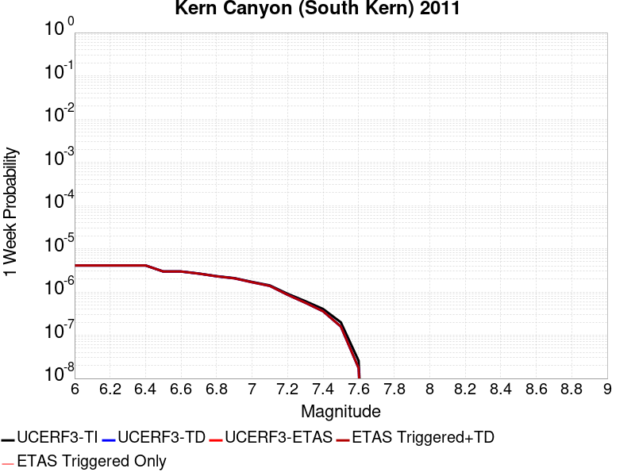 | 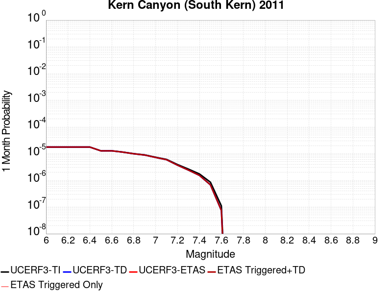 |  | 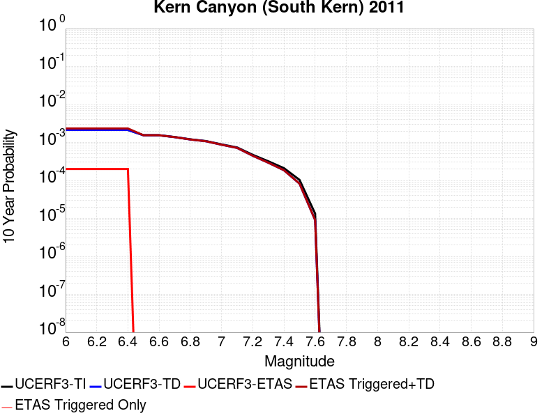 |

| Magnitude | 1 wk TI Prob | 1 wk TD Prob | 1 wk ETAS Prob | 1 wk ETAS/TD Gain | 1 wk ETAS Triggered+TD | 1 wk ETAS Triggered Only | 1 mo TI Prob | 1 mo TD Prob | 1 mo ETAS Prob | 1 mo ETAS/TD Gain | 1 mo ETAS Triggered+TD | 1 mo ETAS Triggered Only | 1 yr TI Prob | 1 yr TD Prob | 1 yr ETAS Prob | 1 yr ETAS/TD Gain | 1 yr ETAS Triggered+TD | 1 yr ETAS Triggered Only | 10 yr TI Prob | 10 yr TD Prob | 10 yr ETAS Prob | 10 yr ETAS/TD Gain | 10 yr ETAS Triggered+TD | 10 yr ETAS Triggered Only |
|-----|-----|-----|-----|-----|-----|-----|-----|-----|-----|-----|-----|-----|-----|-----|-----|-----|-----|-----|-----|-----|-----|-----|-----|-----|
| 6.0 | 4.105075E-6 | 4.1138856E-6 | 0.0 | 0.0 | 4.1138856E-6 | 0.0 | 1.7593058E-5 | 1.7630822E-5 | 0.0 | 0.0 | 1.7630822E-5 | 0.0 | 2.1417443E-4 | 2.1463477E-4 | 1.0E-4 | 0.46590775 | 2.1463477E-4 | 0.0 | 0.0021396813 | 0.0021443386 | 9.0E-4 | 0.41970983 | 0.0023439096 | 2.0E-4 |
| 6.1 | 4.105075E-6 | 4.1138856E-6 | 0.0 | 0.0 | 4.1138856E-6 | 0.0 | 1.7593058E-5 | 1.7630822E-5 | 0.0 | 0.0 | 1.7630822E-5 | 0.0 | 2.1417443E-4 | 2.1463477E-4 | 1.0E-4 | 0.46590775 | 2.1463477E-4 | 0.0 | 0.0021396813 | 0.0021443386 | 9.0E-4 | 0.41970983 | 0.0023439096 | 2.0E-4 |
| 6.2 | 4.105075E-6 | 4.1138856E-6 | 0.0 | 0.0 | 4.1138856E-6 | 0.0 | 1.7593058E-5 | 1.7630822E-5 | 0.0 | 0.0 | 1.7630822E-5 | 0.0 | 2.1417443E-4 | 2.1463477E-4 | 1.0E-4 | 0.46590775 | 2.1463477E-4 | 0.0 | 0.0021396813 | 0.0021443386 | 9.0E-4 | 0.41970983 | 0.0023439096 | 2.0E-4 |
| 6.3 | 4.105075E-6 | 4.1138856E-6 | 0.0 | 0.0 | 4.1138856E-6 | 0.0 | 1.7593058E-5 | 1.7630822E-5 | 0.0 | 0.0 | 1.7630822E-5 | 0.0 | 2.1417443E-4 | 2.1463477E-4 | 1.0E-4 | 0.46590775 | 2.1463477E-4 | 0.0 | 0.0021396813 | 0.0021443386 | 9.0E-4 | 0.41970983 | 0.0023439096 | 2.0E-4 |
| 6.4 | 4.105075E-6 | 4.1138856E-6 | 0.0 | 0.0 | 4.1138856E-6 | 0.0 | 1.7593058E-5 | 1.7630822E-5 | 0.0 | 0.0 | 1.7630822E-5 | 0.0 | 2.1417443E-4 | 2.1463477E-4 | 1.0E-4 | 0.46590775 | 2.1463477E-4 | 0.0 | 0.0021396813 | 0.0021443386 | 9.0E-4 | 0.41970983 | 0.0023439096 | 2.0E-4 |
| 6.5 | 2.9849807E-6 | 2.973271E-6 | 0.0 | 0.0 | 2.973271E-6 | 0.0 | 1.2792712E-5 | 1.2742528E-5 | 0.0 | 0.0 | 1.2742528E-5 | 0.0 | 1.5574014E-4 | 1.5512938E-4 | 0.0 | 0.0 | 1.5512938E-4 | 0.0 | 0.0015563103 | 0.0015502261 | 3.0E-4 | 0.19352014 | 0.0015502261 | 0.0 |
| 6.6 | 2.9849807E-6 | 2.973271E-6 | 0.0 | 0.0 | 2.973271E-6 | 0.0 | 1.2792712E-5 | 1.2742528E-5 | 0.0 | 0.0 | 1.2742528E-5 | 0.0 | 1.5574014E-4 | 1.5512938E-4 | 0.0 | 0.0 | 1.5512938E-4 | 0.0 | 0.0015563103 | 0.0015502261 | 3.0E-4 | 0.19352014 | 0.0015502261 | 0.0 |
| 6.7 | 2.6756725E-6 | 2.6583252E-6 | 0.0 | 0.0 | 2.6583252E-6 | 0.0 | 1.1467117E-5 | 1.1392773E-5 | 0.0 | 0.0 | 1.1392773E-5 | 0.0 | 1.396032E-4 | 1.3869829E-4 | 0.0 | 0.0 | 1.3869829E-4 | 0.0 | 0.0013951553 | 0.0013861282 | 3.0E-4 | 0.2164302 | 0.0013861282 | 0.0 |
| 6.8 | 2.3283721E-6 | 2.3048703E-6 | 0.0 | 0.0 | 2.3048703E-6 | 0.0 | 9.9787E-6 | 9.877979E-6 | 0.0 | 0.0 | 9.877979E-6 | 0.0 | 1.214839E-4 | 1.2025783E-4 | 0.0 | 0.0 | 1.2025783E-4 | 0.0 | 0.001214175 | 0.001201935 | 2.0E-4 | 0.16639835 | 0.001201935 | 0.0 |
| 6.9 | 2.0972677E-6 | 2.0697241E-6 | 0.0 | 0.0 | 2.0697241E-6 | 0.0 | 8.988259E-6 | 8.870217E-6 | 0.0 | 0.0 | 8.870217E-6 | 0.0 | 1.0942656E-4 | 1.07989596E-4 | 0.0 | 0.0 | 1.07989596E-4 | 0.0 | 0.0010937268 | 0.001079377 | 2.0E-4 | 0.18529207 | 0.001079377 | 0.0 |
| 7.0 | 1.7132242E-6 | 1.6787722E-6 | 0.0 | 0.0 | 1.6787722E-6 | 0.0 | 7.3423685E-6 | 7.1947184E-6 | 0.0 | 0.0 | 7.1947184E-6 | 0.0 | 8.938967E-5 | 8.759221E-5 | 0.0 | 0.0 | 8.759221E-5 | 0.0 | 8.935372E-4 | 8.7558076E-4 | 2.0E-4 | 0.22841983 | 8.7558076E-4 | 0.0 |
| 7.1 | 1.4215541E-6 | 1.3816324E-6 | 0.0 | 0.0 | 1.3816324E-6 | 0.0 | 6.0923603E-6 | 5.9212684E-6 | 0.0 | 0.0 | 5.9212684E-6 | 0.0 | 7.417196E-5 | 7.208908E-5 | 0.0 | 0.0 | 7.208908E-5 | 0.0 | 7.414721E-4 | 7.206597E-4 | 1.0E-4 | 0.13876174 | 7.206597E-4 | 0.0 |
| 7.2 | 9.097853E-7 | 8.6041496E-7 | 0.0 | 0.0 | 8.6041496E-7 | 0.0 | 3.899074E-6 | 3.6874876E-6 | 0.0 | 0.0 | 3.6874876E-6 | 0.0 | 4.7470192E-5 | 4.489425E-5 | 0.0 | 0.0 | 4.489425E-5 | 0.0 | 4.7460053E-4 | 4.4885286E-4 | 1.0E-4 | 0.22279015 | 4.4885286E-4 | 0.0 |
| 7.3 | 6.144169E-7 | 5.628464E-7 | 0.0 | 0.0 | 5.628464E-7 | 0.0 | 2.6332125E-6 | 2.4121966E-6 | 0.0 | 0.0 | 2.4121966E-6 | 0.0 | 3.205889E-5 | 2.9368104E-5 | 0.0 | 0.0 | 2.9368104E-5 | 0.0 | 3.2054266E-4 | 2.9364275E-4 | 1.0E-4 | 0.3405499 | 2.9364275E-4 | 0.0 |
| 7.4 | 4.049844E-7 | 3.5730065E-7 | 0.0 | 0.0 | 3.5730065E-7 | 0.0 | 1.7356463E-6 | 1.5312876E-6 | 0.0 | 0.0 | 1.5312876E-6 | 0.0 | 2.1131287E-5 | 1.864327E-5 | 0.0 | 0.0 | 1.864327E-5 | 0.0 | 2.1129279E-4 | 1.864173E-4 | 0.0 | 0.0 | 1.864173E-4 | 0.0 |
| 7.5 | 1.9871162E-7 | 1.5831353E-7 | 0.0 | 0.0 | 1.5831353E-7 | 0.0 | 8.5162094E-7 | 6.7848634E-7 | 0.0 | 0.0 | 6.7848634E-7 | 0.0 | 1.0368436E-5 | 8.260541E-6 | 0.0 | 0.0 | 8.260541E-6 | 0.0 | 1.0367952E-4 | 8.2602426E-5 | 0.0 | 0.0 | 8.2602426E-5 | 0.0 |
| 7.6 | 2.572245E-8 | 1.7353893E-8 | 0.0 | 0.0 | 1.7353893E-8 | 0.0 | 1.10239064E-7 | 7.437382E-8 | 0.0 | 0.0 | 7.437382E-8 | 0.0 | 1.3421597E-6 | 9.0550094E-7 | 0.0 | 0.0 | 9.0550094E-7 | 0.0 | 1.3421517E-5 | 9.054977E-6 | 0.0 | 0.0 | 9.054977E-6 | 0.0 |

## Davis Creek
*[(top)](#table-of-contents)*

| 1 Week | 1 Month | 1 Year | 10 Year |
|-----|-----|-----|-----|
| 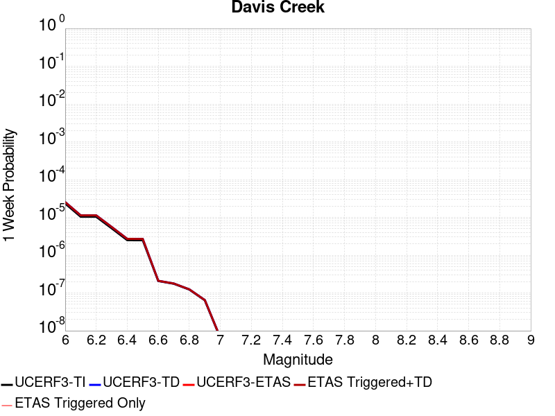 | 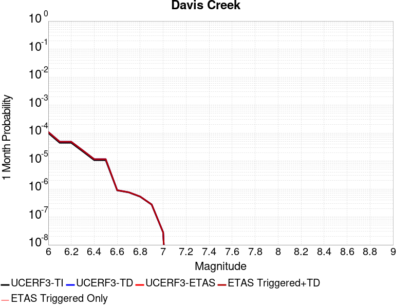 | 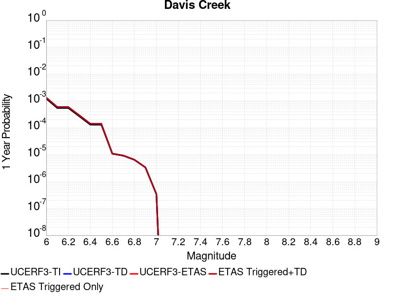 | 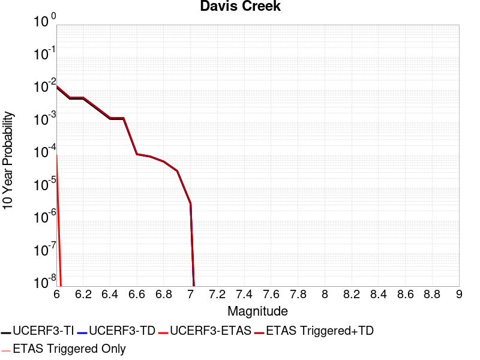 |

| Magnitude | 1 wk TI Prob | 1 wk TD Prob | 1 wk ETAS Prob | 1 wk ETAS/TD Gain | 1 wk ETAS Triggered+TD | 1 wk ETAS Triggered Only | 1 mo TI Prob | 1 mo TD Prob | 1 mo ETAS Prob | 1 mo ETAS/TD Gain | 1 mo ETAS Triggered+TD | 1 mo ETAS Triggered Only | 1 yr TI Prob | 1 yr TD Prob | 1 yr ETAS Prob | 1 yr ETAS/TD Gain | 1 yr ETAS Triggered+TD | 1 yr ETAS Triggered Only | 10 yr TI Prob | 10 yr TD Prob | 10 yr ETAS Prob | 10 yr ETAS/TD Gain | 10 yr ETAS Triggered+TD | 10 yr ETAS Triggered Only |
|-----|-----|-----|-----|-----|-----|-----|-----|-----|-----|-----|-----|-----|-----|-----|-----|-----|-----|-----|-----|-----|-----|-----|-----|-----|
| 6.0 | 2.331472E-5 | 2.5421938E-5 | 0.0 | 0.0 | 2.5421938E-5 | 0.0 | 9.99164E-5 | 1.0894728E-4 | 0.0 | 0.0 | 1.0894728E-4 | 0.0 | 0.0012158032 | 0.0013257446 | 3.0E-4 | 0.22628793 | 0.0013257446 | 0.0 | 0.01209173 | 0.013190141 | 0.009 | 0.6823278 | 0.013288822 | 1.0E-4 |
| 6.1 | 1.0407654E-5 | 1.1319025E-5 | 0.0 | 0.0 | 1.1319025E-5 | 0.0 | 4.4603472E-5 | 4.8509362E-5 | 0.0 | 0.0 | 4.8509362E-5 | 0.0 | 5.4291193E-4 | 5.904686E-4 | 1.0E-4 | 0.16935703 | 5.904686E-4 | 0.0 | 0.0054158745 | 0.00589167 | 0.0042 | 0.7128709 | 0.00589167 | 0.0 |
| 6.2 | 1.0407654E-5 | 1.1319025E-5 | 0.0 | 0.0 | 1.1319025E-5 | 0.0 | 4.4603472E-5 | 4.8509362E-5 | 0.0 | 0.0 | 4.8509362E-5 | 0.0 | 5.4291193E-4 | 5.904686E-4 | 1.0E-4 | 0.16935703 | 5.904686E-4 | 0.0 | 0.0054158745 | 0.00589167 | 0.0042 | 0.7128709 | 0.00589167 | 0.0 |
| 6.3 | 5.1323277E-6 | 5.569533E-6 | 0.0 | 0.0 | 5.569533E-6 | 0.0 | 2.1995505E-5 | 2.386926E-5 | 0.0 | 0.0 | 2.386926E-5 | 0.0 | 2.6776237E-4 | 2.905781E-4 | 1.0E-4 | 0.34414157 | 2.905781E-4 | 0.0 | 0.0026743996 | 0.002902828 | 0.0023 | 0.7923308 | 0.002902828 | 0.0 |
| 6.4 | 2.4985154E-6 | 2.705E-6 | 0.0 | 0.0 | 2.705E-6 | 0.0 | 1.07078795E-5 | 1.1592826E-5 | 0.0 | 0.0 | 1.1592826E-5 | 0.0 | 1.3036063E-4 | 1.4113713E-4 | 1.0E-4 | 0.7085308 | 1.4113713E-4 | 0.0 | 0.0013028418 | 0.0014108298 | 0.0012 | 0.8505633 | 0.0014108298 | 0.0 |
| 6.5 | 2.4846438E-6 | 2.6909338E-6 | 0.0 | 0.0 | 2.6909338E-6 | 0.0 | 1.064843E-5 | 1.1532542E-5 | 0.0 | 0.0 | 1.1532542E-5 | 0.0 | 1.2963692E-4 | 1.4040328E-4 | 1.0E-4 | 0.7122341 | 1.4040328E-4 | 0.0 | 0.0012956132 | 0.0014035006 | 0.0012 | 0.855005 | 0.0014035006 | 0.0 |
| 6.6 | 2.072566E-7 | 2.1018698E-7 | 0.0 | 0.0 | 2.1018698E-7 | 0.0 | 8.882423E-7 | 9.0080107E-7 | 0.0 | 0.0 | 9.0080107E-7 | 0.0 | 1.0814296E-5 | 1.0967199E-5 | 0.0 | 0.0 | 1.0967199E-5 | 0.0 | 1.081377E-4 | 1.0966677E-4 | 0.0 | 0.0 | 1.0966677E-4 | 0.0 |
| 6.7 | 1.7544528E-7 | 1.779134E-7 | 0.0 | 0.0 | 1.779134E-7 | 0.0 | 7.5190815E-7 | 7.624858E-7 | 0.0 | 0.0 | 7.624858E-7 | 0.0 | 9.154443E-6 | 9.283227E-6 | 0.0 | 0.0 | 9.283227E-6 | 0.0 | 9.1540656E-5 | 9.2828544E-5 | 0.0 | 0.0 | 9.2828544E-5 | 0.0 |
| 6.8 | 1.2320395E-7 | 1.2481473E-7 | 0.0 | 0.0 | 1.2481473E-7 | 0.0 | 5.280168E-7 | 5.3492016E-7 | 0.0 | 0.0 | 5.3492016E-7 | 0.0 | 6.428586E-6 | 6.5126346E-6 | 0.0 | 0.0 | 6.5126346E-6 | 0.0 | 6.4284E-5 | 6.512455E-5 | 0.0 | 0.0 | 6.512455E-5 | 0.0 |
| 6.9 | 6.399997E-8 | 6.486238E-8 | 0.0 | 0.0 | 6.486238E-8 | 0.0 | 2.7428555E-7 | 2.7798157E-7 | 0.0 | 0.0 | 2.7798157E-7 | 0.0 | 3.3394215E-6 | 3.384421E-6 | 0.0 | 0.0 | 3.384421E-6 | 0.0 | 3.3393713E-5 | 3.384376E-5 | 0.0 | 0.0 | 3.384376E-5 | 0.0 |
| 7.0 | 6.4455685E-9 | 6.5354513E-9 | 0.0 | 0.0 | 6.5354513E-9 | 0.0 | 2.7623864E-8 | 2.8009078E-8 | 0.0 | 0.0 | 2.8009078E-8 | 0.0 | 3.3632048E-7 | 3.4101052E-7 | 0.0 | 0.0 | 3.4101052E-7 | 0.0 | 3.3631998E-6 | 3.4101051E-6 | 0.0 | 0.0 | 3.4101051E-6 | 0.0 |

## Tin Mountain
*[(top)](#table-of-contents)*

| 1 Week | 1 Month | 1 Year | 10 Year |
|-----|-----|-----|-----|
| 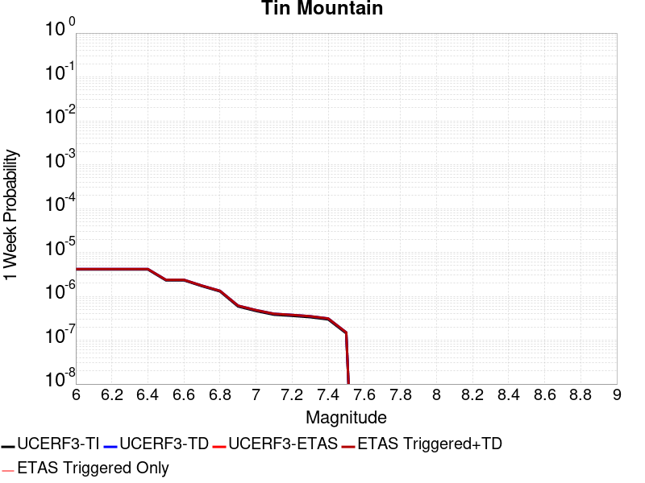 | 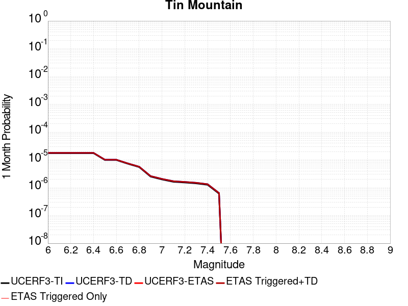 | 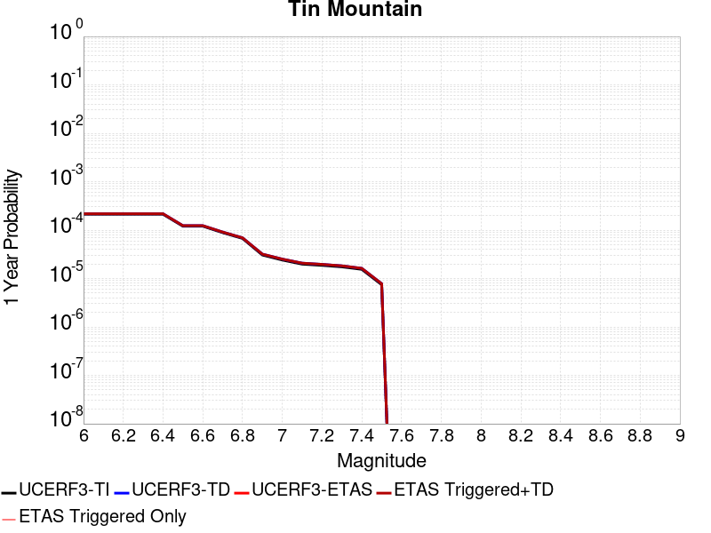 | 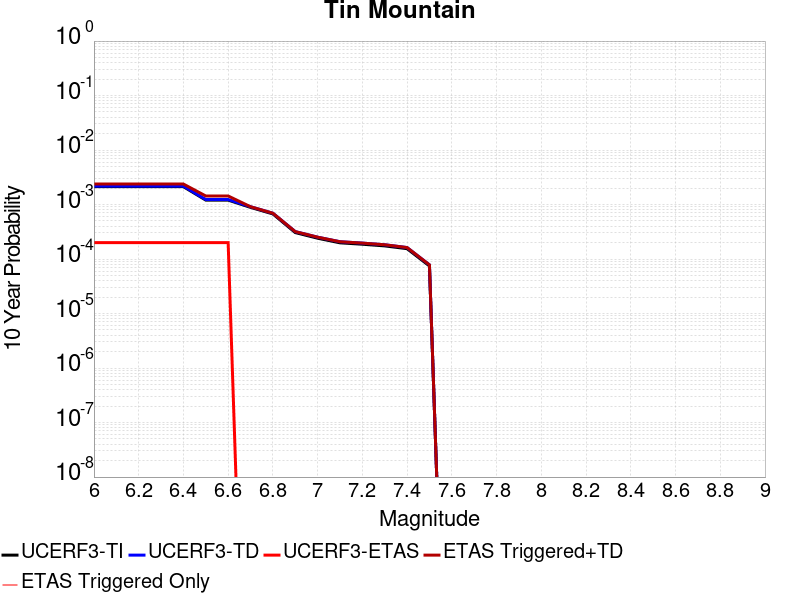 |

| Magnitude | 1 wk TI Prob | 1 wk TD Prob | 1 wk ETAS Prob | 1 wk ETAS/TD Gain | 1 wk ETAS Triggered+TD | 1 wk ETAS Triggered Only | 1 mo TI Prob | 1 mo TD Prob | 1 mo ETAS Prob | 1 mo ETAS/TD Gain | 1 mo ETAS Triggered+TD | 1 mo ETAS Triggered Only | 1 yr TI Prob | 1 yr TD Prob | 1 yr ETAS Prob | 1 yr ETAS/TD Gain | 1 yr ETAS Triggered+TD | 1 yr ETAS Triggered Only | 10 yr TI Prob | 10 yr TD Prob | 10 yr ETAS Prob | 10 yr ETAS/TD Gain | 10 yr ETAS Triggered+TD | 10 yr ETAS Triggered Only |
|-----|-----|-----|-----|-----|-----|-----|-----|-----|-----|-----|-----|-----|-----|-----|-----|-----|-----|-----|-----|-----|-----|-----|-----|-----|
| 6.0 | 4.083776E-6 | 4.1817434E-6 | 0.0 | 0.0 | 4.1817434E-6 | 0.0 | 1.750178E-5 | 1.7921655E-5 | 0.0 | 0.0 | 1.7921655E-5 | 0.0 | 2.1306332E-4 | 2.1817803E-4 | 0.0 | 0.0 | 2.1817803E-4 | 0.0 | 0.0021285915 | 0.002180004 | 0.0014 | 0.64220065 | 0.002379568 | 2.0E-4 |
| 6.1 | 4.083776E-6 | 4.1817434E-6 | 0.0 | 0.0 | 4.1817434E-6 | 0.0 | 1.750178E-5 | 1.7921655E-5 | 0.0 | 0.0 | 1.7921655E-5 | 0.0 | 2.1306332E-4 | 2.1817803E-4 | 0.0 | 0.0 | 2.1817803E-4 | 0.0 | 0.0021285915 | 0.002180004 | 0.0014 | 0.64220065 | 0.002379568 | 2.0E-4 |
| 6.2 | 4.083776E-6 | 4.1817434E-6 | 0.0 | 0.0 | 4.1817434E-6 | 0.0 | 1.750178E-5 | 1.7921655E-5 | 0.0 | 0.0 | 1.7921655E-5 | 0.0 | 2.1306332E-4 | 2.1817803E-4 | 0.0 | 0.0 | 2.1817803E-4 | 0.0 | 0.0021285915 | 0.002180004 | 0.0014 | 0.64220065 | 0.002379568 | 2.0E-4 |
| 6.3 | 4.083776E-6 | 4.1817434E-6 | 0.0 | 0.0 | 4.1817434E-6 | 0.0 | 1.750178E-5 | 1.7921655E-5 | 0.0 | 0.0 | 1.7921655E-5 | 0.0 | 2.1306332E-4 | 2.1817803E-4 | 0.0 | 0.0 | 2.1817803E-4 | 0.0 | 0.0021285915 | 0.002180004 | 0.0014 | 0.64220065 | 0.002379568 | 2.0E-4 |
| 6.4 | 4.083776E-6 | 4.1817434E-6 | 0.0 | 0.0 | 4.1817434E-6 | 0.0 | 1.750178E-5 | 1.7921655E-5 | 0.0 | 0.0 | 1.7921655E-5 | 0.0 | 2.1306332E-4 | 2.1817803E-4 | 0.0 | 0.0 | 2.1817803E-4 | 0.0 | 0.0021285915 | 0.002180004 | 0.0014 | 0.64220065 | 0.002379568 | 2.0E-4 |
| 6.5 | 2.3143427E-6 | 2.3732819E-6 | 0.0 | 0.0 | 2.3732819E-6 | 0.0 | 9.9185745E-6 | 1.0171173E-5 | 0.0 | 0.0 | 1.0171173E-5 | 0.0 | 1.2075195E-4 | 1.2382776E-4 | 0.0 | 0.0 | 1.2382776E-4 | 0.0 | 0.0012068636 | 0.0012376637 | 0.0011 | 0.88877136 | 0.0014374161 | 2.0E-4 |
| 6.6 | 2.3143427E-6 | 2.3732819E-6 | 0.0 | 0.0 | 2.3732819E-6 | 0.0 | 9.9185745E-6 | 1.0171173E-5 | 0.0 | 0.0 | 1.0171173E-5 | 0.0 | 1.2075195E-4 | 1.2382776E-4 | 0.0 | 0.0 | 1.2382776E-4 | 0.0 | 0.0012068636 | 0.0012376637 | 0.0011 | 0.88877136 | 0.0014374161 | 2.0E-4 |
| 6.7 | 1.7029532E-6 | 1.7498911E-6 | 0.0 | 0.0 | 1.7498911E-6 | 0.0 | 7.2983503E-6 | 7.499515E-6 | 0.0 | 0.0 | 7.499515E-6 | 0.0 | 8.885379E-5 | 9.13033E-5 | 0.0 | 0.0 | 9.13033E-5 | 0.0 | 8.881827E-4 | 9.1271056E-4 | 9.0E-4 | 0.98607385 | 9.1271056E-4 | 0.0 |
| 6.8 | 1.2914646E-6 | 1.3300199E-6 | 0.0 | 0.0 | 1.3300199E-6 | 0.0 | 5.534837E-6 | 5.7000752E-6 | 0.0 | 0.0 | 5.7000752E-6 | 0.0 | 6.738455E-5 | 6.939665E-5 | 0.0 | 0.0 | 6.939665E-5 | 0.0 | 6.736412E-4 | 6.937931E-4 | 6.0E-4 | 0.8648111 | 6.937931E-4 | 0.0 |
| 6.9 | 5.8708974E-7 | 6.117523E-7 | 0.0 | 0.0 | 6.117523E-7 | 0.0 | 2.5160964E-6 | 2.621793E-6 | 0.0 | 0.0 | 2.621793E-6 | 0.0 | 3.0633044E-5 | 3.1919906E-5 | 0.0 | 0.0 | 3.1919906E-5 | 0.0 | 3.0628822E-4 | 3.1915732E-4 | 4.0E-4 | 1.2533004 | 3.1915732E-4 | 0.0 |
| 7.0 | 4.6248786E-7 | 4.832462E-7 | 0.0 | 0.0 | 4.832462E-7 | 0.0 | 1.9820893E-6 | 2.0710536E-6 | 0.0 | 0.0 | 2.0710536E-6 | 0.0 | 2.413167E-5 | 2.5214824E-5 | 0.0 | 0.0 | 2.5214824E-5 | 0.0 | 2.412905E-4 | 2.521233E-4 | 3.0E-4 | 1.189894 | 2.521233E-4 | 0.0 |
| 7.1 | 3.804606E-7 | 3.9875414E-7 | 0.0 | 0.0 | 3.9875414E-7 | 0.0 | 1.6305444E-6 | 1.7089453E-6 | 0.0 | 0.0 | 1.7089453E-6 | 0.0 | 1.9851697E-5 | 2.0806245E-5 | 0.0 | 0.0 | 2.0806245E-5 | 0.0 | 1.9849923E-4 | 2.0804633E-4 | 3.0E-4 | 1.4419864 | 2.0804633E-4 | 0.0 |
| 7.2 | 3.5864858E-7 | 3.762065E-7 | 0.0 | 0.0 | 3.762065E-7 | 0.0 | 1.5370645E-6 | 1.6123128E-6 | 0.0 | 0.0 | 1.6123128E-6 | 0.0 | 1.87136E-5 | 1.9629764E-5 | 0.0 | 0.0 | 1.9629764E-5 | 0.0 | 1.8712023E-4 | 1.9628362E-4 | 3.0E-4 | 1.5284005 | 1.9628362E-4 | 0.0 |
| 7.3 | 3.342063E-7 | 3.5067023E-7 | 0.0 | 0.0 | 3.5067023E-7 | 0.0 | 1.4323119E-6 | 1.5028718E-6 | 0.0 | 0.0 | 1.5028718E-6 | 0.0 | 1.7438259E-5 | 1.8297344E-5 | 0.0 | 0.0 | 1.8297344E-5 | 0.0 | 1.743689E-4 | 1.8296167E-4 | 3.0E-4 | 1.6396877 | 1.8296167E-4 | 0.0 |
| 7.4 | 2.971242E-7 | 3.1168958E-7 | 0.0 | 0.0 | 3.1168958E-7 | 0.0 | 1.2733886E-6 | 1.335812E-6 | 0.0 | 0.0 | 1.335812E-6 | 0.0 | 1.5503398E-5 | 1.6263424E-5 | 0.0 | 0.0 | 1.6263424E-5 | 0.0 | 1.5502315E-4 | 1.6262561E-4 | 3.0E-4 | 1.8447279 | 1.6262561E-4 | 0.0 |
| 7.5 | 1.4326713E-7 | 1.5014004E-7 | 0.0 | 0.0 | 1.5014004E-7 | 0.0 | 6.140018E-7 | 6.434573E-7 | 0.0 | 0.0 | 6.434573E-7 | 0.0 | 7.4754466E-6 | 7.834093E-6 | 0.0 | 0.0 | 7.834093E-6 | 0.0 | 7.475195E-5 | 7.834093E-5 | 1.0E-4 | 1.276472 | 7.834093E-5 | 0.0 |

## Pittville 2011 CFM
*[(top)](#table-of-contents)*

| 1 Week | 1 Month | 1 Year | 10 Year |
|-----|-----|-----|-----|
| 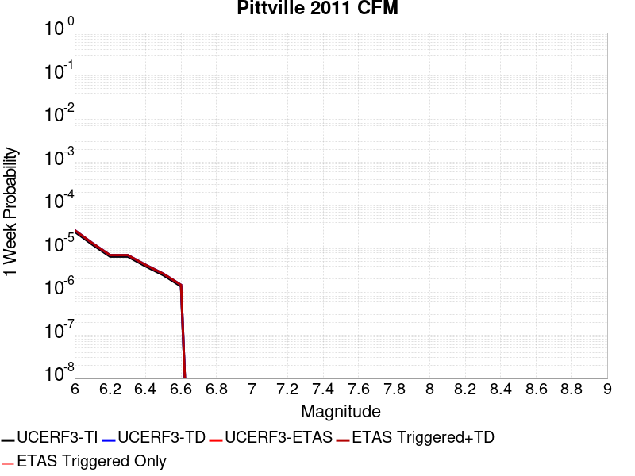 | 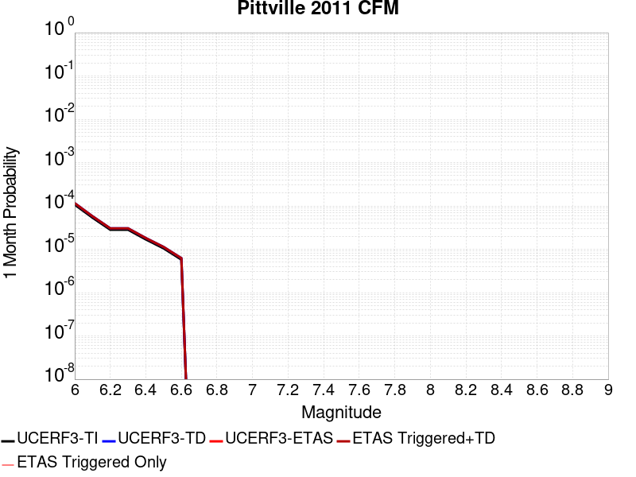 | 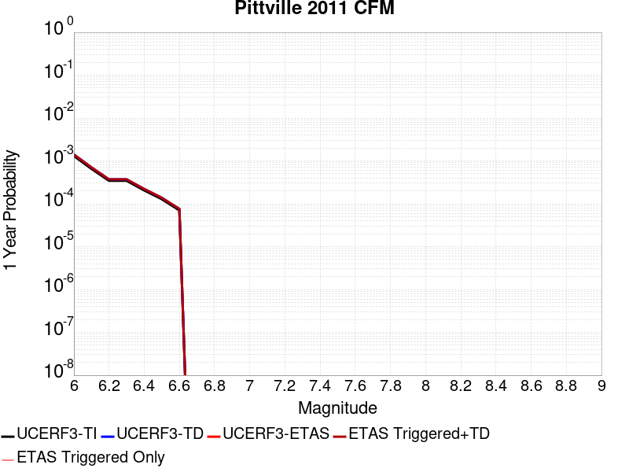 | 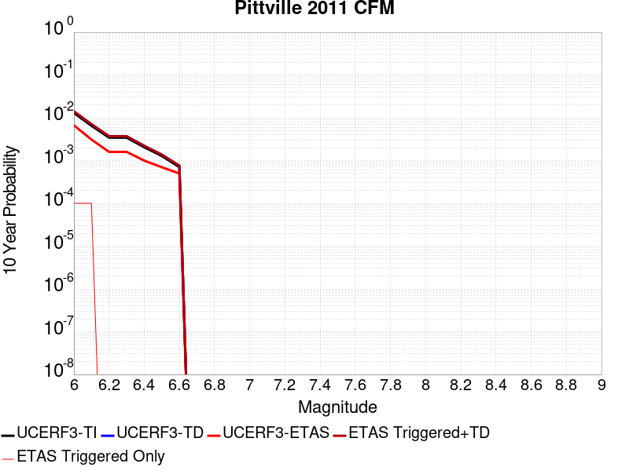 |

| Magnitude | 1 wk TI Prob | 1 wk TD Prob | 1 wk ETAS Prob | 1 wk ETAS/TD Gain | 1 wk ETAS Triggered+TD | 1 wk ETAS Triggered Only | 1 mo TI Prob | 1 mo TD Prob | 1 mo ETAS Prob | 1 mo ETAS/TD Gain | 1 mo ETAS Triggered+TD | 1 mo ETAS Triggered Only | 1 yr TI Prob | 1 yr TD Prob | 1 yr ETAS Prob | 1 yr ETAS/TD Gain | 1 yr ETAS Triggered+TD | 1 yr ETAS Triggered Only | 10 yr TI Prob | 10 yr TD Prob | 10 yr ETAS Prob | 10 yr ETAS/TD Gain | 10 yr ETAS Triggered+TD | 10 yr ETAS Triggered Only |
|-----|-----|-----|-----|-----|-----|-----|-----|-----|-----|-----|-----|-----|-----|-----|-----|-----|-----|-----|-----|-----|-----|-----|-----|-----|
| 6.0 | 2.5031832E-5 | 2.7061478E-5 | 0.0 | 0.0 | 2.7061478E-5 | 0.0 | 1.0727487E-4 | 1.1597316E-4 | 0.0 | 0.0 | 1.1597316E-4 | 0.0 | 0.001305289 | 0.0014111561 | 1.0E-4 | 0.07086388 | 0.0014111561 | 0.0 | 0.012976485 | 0.01403174 | 0.0067 | 0.4774889 | 0.014130336 | 1.0E-4 |
| 6.1 | 1.2540113E-5 | 1.3515226E-5 | 0.0 | 0.0 | 1.3515226E-5 | 0.0 | 5.3742235E-5 | 5.7921236E-5 | 0.0 | 0.0 | 5.7921236E-5 | 0.0 | 6.541153E-4 | 7.049854E-4 | 1.0E-4 | 0.14184691 | 7.049854E-4 | 0.0 | 0.0065219323 | 0.007029724 | 0.0031 | 0.4409846 | 0.007129021 | 1.0E-4 |
| 6.2 | 6.603218E-6 | 7.1083064E-6 | 0.0 | 0.0 | 7.1083064E-6 | 0.0 | 2.8299199E-5 | 3.046385E-5 | 0.0 | 0.0 | 3.046385E-5 | 0.0 | 3.4448825E-4 | 3.7084075E-4 | 0.0 | 0.0 | 3.7084075E-4 | 0.0 | 0.0034395473 | 0.00370286 | 0.0016 | 0.43209842 | 0.00370286 | 0.0 |
| 6.3 | 6.603218E-6 | 7.1083064E-6 | 0.0 | 0.0 | 7.1083064E-6 | 0.0 | 2.8299199E-5 | 3.046385E-5 | 0.0 | 0.0 | 3.046385E-5 | 0.0 | 3.4448825E-4 | 3.7084075E-4 | 0.0 | 0.0 | 3.7084075E-4 | 0.0 | 0.0034395473 | 0.00370286 | 0.0016 | 0.43209842 | 0.00370286 | 0.0 |
| 6.4 | 3.9389015E-6 | 4.2398406E-6 | 0.0 | 0.0 | 4.2398406E-6 | 0.0 | 1.6880897E-5 | 1.8170636E-5 | 0.0 | 0.0 | 1.8170636E-5 | 0.0 | 2.0550552E-4 | 2.2120815E-4 | 0.0 | 0.0 | 2.2120815E-4 | 0.0 | 0.0020531558 | 0.0022101845 | 0.001 | 0.4524509 | 0.0022101845 | 0.0 |
| 6.5 | 2.4533072E-6 | 2.6416853E-6 | 0.0 | 0.0 | 2.6416853E-6 | 0.0 | 1.0514132E-5 | 1.132147E-5 | 0.0 | 0.0 | 1.132147E-5 | 0.0 | 1.2800204E-4 | 1.3783212E-4 | 0.0 | 0.0 | 1.3783212E-4 | 0.0 | 0.0012792832 | 0.0013776566 | 7.0E-4 | 0.5081092 | 0.0013776566 | 0.0 |
| 6.6 | 1.3482367E-6 | 1.4532255E-6 | 0.0 | 0.0 | 1.4532255E-6 | 0.0 | 5.778144E-6 | 6.228101E-6 | 0.0 | 0.0 | 6.228101E-6 | 0.0 | 7.0346636E-5 | 7.582563E-5 | 0.0 | 0.0 | 7.582563E-5 | 0.0 | 7.032437E-4 | 7.581087E-4 | 5.0E-4 | 0.65953606 | 7.581087E-4 | 0.0 |

## Pilarcitos 2011 CFM
*[(top)](#table-of-contents)*

| 1 Week | 1 Month | 1 Year | 10 Year |
|-----|-----|-----|-----|
| 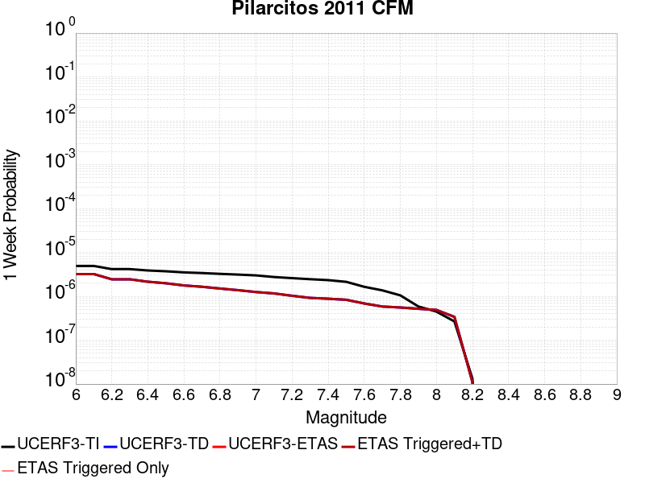 | 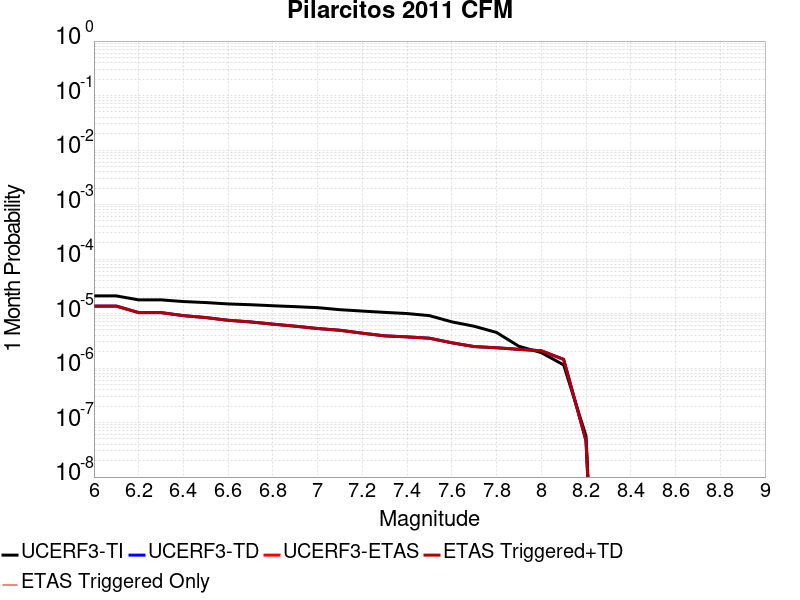 |  | 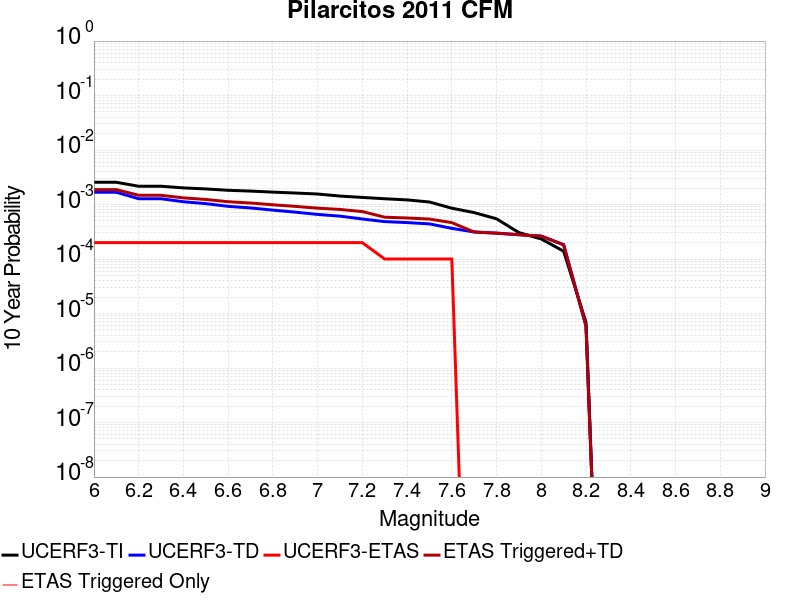 |

| Magnitude | 1 wk TI Prob | 1 wk TD Prob | 1 wk ETAS Prob | 1 wk ETAS/TD Gain | 1 wk ETAS Triggered+TD | 1 wk ETAS Triggered Only | 1 mo TI Prob | 1 mo TD Prob | 1 mo ETAS Prob | 1 mo ETAS/TD Gain | 1 mo ETAS Triggered+TD | 1 mo ETAS Triggered Only | 1 yr TI Prob | 1 yr TD Prob | 1 yr ETAS Prob | 1 yr ETAS/TD Gain | 1 yr ETAS Triggered+TD | 1 yr ETAS Triggered Only | 10 yr TI Prob | 10 yr TD Prob | 10 yr ETAS Prob | 10 yr ETAS/TD Gain | 10 yr ETAS Triggered+TD | 10 yr ETAS Triggered Only |
|-----|-----|-----|-----|-----|-----|-----|-----|-----|-----|-----|-----|-----|-----|-----|-----|-----|-----|-----|-----|-----|-----|-----|-----|-----|
| 6.0 | 4.9150476E-6 | 3.2112057E-6 | 0.0 | 0.0 | 3.2112057E-6 | 0.0 | 2.1064321E-5 | 1.3762239E-5 | 0.0 | 0.0 | 1.3762239E-5 | 0.0 | 2.564279E-4 | 1.6754269E-4 | 3.0E-4 | 1.7905884 | 1.6754269E-4 | 0.0 | 0.0025613222 | 0.0016866587 | 0.0021 | 1.2450651 | 0.0018863215 | 2.0E-4 |
| 6.1 | 4.9150476E-6 | 3.2112057E-6 | 0.0 | 0.0 | 3.2112057E-6 | 0.0 | 2.1064321E-5 | 1.3762239E-5 | 0.0 | 0.0 | 1.3762239E-5 | 0.0 | 2.564279E-4 | 1.6754269E-4 | 3.0E-4 | 1.7905884 | 1.6754269E-4 | 0.0 | 0.0025613222 | 0.0016866587 | 0.0019 | 1.1264875 | 0.0018863215 | 2.0E-4 |
| 6.2 | 4.162343E-6 | 2.439556E-6 | 0.0 | 0.0 | 2.439556E-6 | 0.0 | 1.783849E-5 | 1.0455198E-5 | 0.0 | 0.0 | 1.0455198E-5 | 0.0 | 2.1716199E-4 | 1.2728469E-4 | 2.0E-4 | 1.571281 | 1.2728469E-4 | 0.0 | 0.002169499 | 0.0012845946 | 0.0014 | 1.0898379 | 0.0014843377 | 2.0E-4 |
| 6.3 | 4.162343E-6 | 2.439556E-6 | 0.0 | 0.0 | 2.439556E-6 | 0.0 | 1.783849E-5 | 1.0455198E-5 | 0.0 | 0.0 | 1.0455198E-5 | 0.0 | 2.1716199E-4 | 1.2728469E-4 | 2.0E-4 | 1.571281 | 1.2728469E-4 | 0.0 | 0.002169499 | 0.0012845946 | 0.0014 | 1.0898379 | 0.0014843377 | 2.0E-4 |
| 6.4 | 3.8768926E-6 | 2.1469605E-6 | 0.0 | 0.0 | 2.1469605E-6 | 0.0 | 1.6615148E-5 | 9.201227E-6 | 0.0 | 0.0 | 9.201227E-6 | 0.0 | 2.0227065E-4 | 1.1201922E-4 | 2.0E-4 | 1.7854079 | 1.1201922E-4 | 0.0 | 0.0020208664 | 0.0011321026 | 0.0014 | 1.236637 | 0.0013318761 | 2.0E-4 |
| 6.5 | 3.7137002E-6 | 1.9803047E-6 | 0.0 | 0.0 | 1.9803047E-6 | 0.0 | 1.591576E-5 | 8.486993E-6 | 0.0 | 0.0 | 8.486993E-6 | 0.0 | 1.9375715E-4 | 1.03324266E-4 | 2.0E-4 | 1.9356537 | 1.03324266E-4 | 0.0 | 0.001935883 | 0.0010452373 | 0.0014 | 1.3394088 | 0.0012450283 | 2.0E-4 |
| 6.6 | 3.5048733E-6 | 1.7652441E-6 | 0.0 | 0.0 | 1.7652441E-6 | 0.0 | 1.5020799E-5 | 7.5653097E-6 | 0.0 | 0.0 | 7.5653097E-6 | 0.0 | 1.8286289E-4 | 9.210378E-5 | 1.0E-4 | 1.0857319 | 9.210378E-5 | 0.0 | 0.0018271249 | 9.3313167E-4 | 0.0012 | 1.2859921 | 0.0011329451 | 2.0E-4 |
| 6.7 | 3.3908584E-6 | 1.6489203E-6 | 0.0 | 0.0 | 1.6489203E-6 | 0.0 | 1.453217E-5 | 7.066782E-6 | 0.0 | 0.0 | 7.066782E-6 | 0.0 | 1.7691481E-4 | 8.603469E-5 | 1.0E-4 | 1.1623218 | 8.603469E-5 | 0.0 | 0.0017677402 | 8.724897E-4 | 0.0012 | 1.3753744 | 0.0010723151 | 2.0E-4 |
| 6.8 | 3.2451449E-6 | 1.5021203E-6 | 0.0 | 0.0 | 1.5021203E-6 | 0.0 | 1.3907689E-5 | 6.4376427E-6 | 0.0 | 0.0 | 6.4376427E-6 | 0.0 | 1.6931296E-4 | 7.8375495E-5 | 1.0E-4 | 1.2759091 | 7.8375495E-5 | 0.0 | 0.0016918402 | 7.959546E-4 | 0.001 | 1.256353 | 9.957955E-4 | 2.0E-4 |
| 6.9 | 3.1239128E-6 | 1.3786275E-6 | 0.0 | 0.0 | 1.3786275E-6 | 0.0 | 1.3388129E-5 | 5.90839E-6 | 0.0 | 0.0 | 5.90839E-6 | 0.0 | 1.6298829E-4 | 7.193228E-5 | 1.0E-4 | 1.3901964 | 7.193228E-5 | 0.0 | 0.001628688 | 7.315666E-4 | 7.0E-4 | 0.9568507 | 9.314203E-4 | 2.0E-4 |
| 7.0 | 2.9940109E-6 | 1.2499116E-6 | 0.0 | 0.0 | 1.2499116E-6 | 0.0 | 1.2831412E-5 | 5.3567533E-6 | 0.0 | 0.0 | 5.3567533E-6 | 0.0 | 1.5621124E-4 | 6.521652E-5 | 1.0E-4 | 1.5333538 | 6.521652E-5 | 0.0 | 0.0015610148 | 6.644507E-4 | 4.0E-4 | 0.602001 | 8.643178E-4 | 2.0E-4 |
| 7.1 | 2.7471217E-6 | 1.1614242E-6 | 0.0 | 0.0 | 1.1614242E-6 | 0.0 | 1.1773326E-5 | 4.9775226E-6 | 0.0 | 0.0 | 4.9775226E-6 | 0.0 | 1.4333082E-4 | 6.0599654E-5 | 0.0 | 0.0 | 6.0599654E-5 | 0.0 | 0.001432384 | 6.182557E-4 | 3.0E-4 | 0.48523614 | 8.18132E-4 | 2.0E-4 |
| 7.2 | 2.592675E-6 | 1.0273728E-6 | 0.0 | 0.0 | 1.0273728E-6 | 0.0 | 1.1111417E-5 | 4.4030185E-6 | 0.0 | 0.0 | 4.4030185E-6 | 0.0 | 1.3527309E-4 | 5.3605436E-5 | 0.0 | 0.0 | 5.3605436E-5 | 0.0 | 0.0013519078 | 5.4835016E-4 | 3.0E-4 | 0.5470957 | 7.482405E-4 | 2.0E-4 |
| 7.3 | 2.4518663E-6 | 9.18247E-7 | 0.0 | 0.0 | 9.18247E-7 | 0.0 | 1.0507956E-5 | 3.935338E-6 | 0.0 | 0.0 | 3.935338E-6 | 0.0 | 1.2792686E-4 | 4.791169E-5 | 0.0 | 0.0 | 4.791169E-5 | 0.0 | 0.0012785323 | 4.9143564E-4 | 2.0E-4 | 0.40697092 | 5.9138646E-4 | 1.0E-4 |
| 7.4 | 2.3349535E-6 | 8.803066E-7 | 0.0 | 0.0 | 8.803066E-7 | 0.0 | 1.0006905E-5 | 3.7727368E-6 | 0.0 | 0.0 | 3.7727368E-6 | 0.0 | 1.2182725E-4 | 4.59321E-5 | 0.0 | 0.0 | 4.59321E-5 | 0.0 | 0.0012176048 | 4.7162388E-4 | 2.0E-4 | 0.42406675 | 5.715767E-4 | 1.0E-4 |
| 7.5 | 2.1358665E-6 | 8.320627E-7 | 0.0 | 0.0 | 8.320627E-7 | 0.0 | 9.15368E-6 | 3.5659782E-6 | 0.0 | 0.0 | 3.5659782E-6 | 0.0 | 1.11440364E-4 | 4.341492E-5 | 0.0 | 0.0 | 4.341492E-5 | 0.0 | 0.0011138449 | 4.4636722E-4 | 2.0E-4 | 0.44806156 | 5.463226E-4 | 1.0E-4 |
| 7.6 | 1.6445446E-6 | 6.853839E-7 | 0.0 | 0.0 | 6.853839E-7 | 0.0 | 7.048029E-6 | 2.9373562E-6 | 0.0 | 0.0 | 2.9373562E-6 | 0.0 | 8.580638E-5 | 3.5761725E-5 | 0.0 | 0.0 | 3.5761725E-5 | 0.0 | 8.5773255E-4 | 3.6979388E-4 | 2.0E-4 | 0.5408419 | 4.697569E-4 | 1.0E-4 |
| 7.7 | 1.3650961E-6 | 5.8408705E-7 | 0.0 | 0.0 | 5.8408705E-7 | 0.0 | 5.850399E-6 | 2.5032275E-6 | 0.0 | 0.0 | 2.5032275E-6 | 0.0 | 7.122628E-5 | 3.047637E-5 | 0.0 | 0.0 | 3.047637E-5 | 0.0 | 7.120345E-4 | 3.1683783E-4 | 0.0 | 0.0 | 3.1683783E-4 | 0.0 |
| 7.8 | 1.0500993E-6 | 5.5529904E-7 | 0.0 | 0.0 | 5.5529904E-7 | 0.0 | 4.5004176E-6 | 2.379851E-6 | 0.0 | 0.0 | 2.379851E-6 | 0.0 | 5.4791206E-5 | 2.89743E-5 | 0.0 | 0.0 | 2.89743E-5 | 0.0 | 5.47777E-4 | 3.0168748E-4 | 0.0 | 0.0 | 3.0168748E-4 | 0.0 |
| 7.9 | 5.856431E-7 | 5.188559E-7 | 0.0 | 0.0 | 5.188559E-7 | 0.0 | 2.5098966E-6 | 2.2236663E-6 | 0.0 | 0.0 | 2.2236663E-6 | 0.0 | 3.0557563E-5 | 2.7072803E-5 | 0.0 | 0.0 | 2.7072803E-5 | 0.0 | 3.055336E-4 | 2.8192595E-4 | 0.0 | 0.0 | 2.8192595E-4 | 0.0 |
| 8.0 | 4.4768265E-7 | 4.890699E-7 | 0.0 | 0.0 | 4.890699E-7 | 0.0 | 1.9186384E-6 | 2.0960124E-6 | 0.0 | 0.0 | 2.0960124E-6 | 0.0 | 2.3359173E-5 | 2.5518653E-5 | 0.0 | 0.0 | 2.5518653E-5 | 0.0 | 2.3356717E-4 | 2.658489E-4 | 0.0 | 0.0 | 2.658489E-4 | 0.0 |
| 8.1 | 2.6692538E-7 | 3.3933844E-7 | 0.0 | 0.0 | 3.3933844E-7 | 0.0 | 1.1439654E-6 | 1.4543068E-6 | 0.0 | 0.0 | 1.4543068E-6 | 0.0 | 1.392769E-5 | 1.7706043E-5 | 0.0 | 0.0 | 1.7706043E-5 | 0.0 | 1.3926817E-4 | 1.8441756E-4 | 0.0 | 0.0 | 1.8441756E-4 | 0.0 |
| 8.2 | 1.3198862E-8 | 1.0962255E-8 | 0.0 | 0.0 | 1.0962255E-8 | 0.0 | 5.656655E-8 | 4.6981096E-8 | 0.0 | 0.0 | 4.6981096E-8 | 0.0 | 6.886975E-7 | 5.719947E-7 | 0.0 | 0.0 | 5.719947E-7 | 0.0 | 6.8869535E-6 | 5.953642E-6 | 0.0 | 0.0 | 5.953642E-6 | 0.0 |

## Great Valley 13 (Coalinga)
*[(top)](#table-of-contents)*

| 1 Week | 1 Month | 1 Year | 10 Year |
|-----|-----|-----|-----|
| 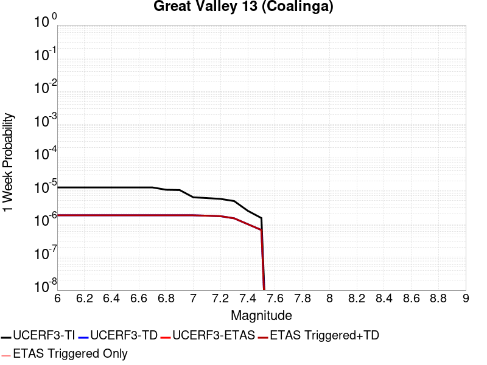 | 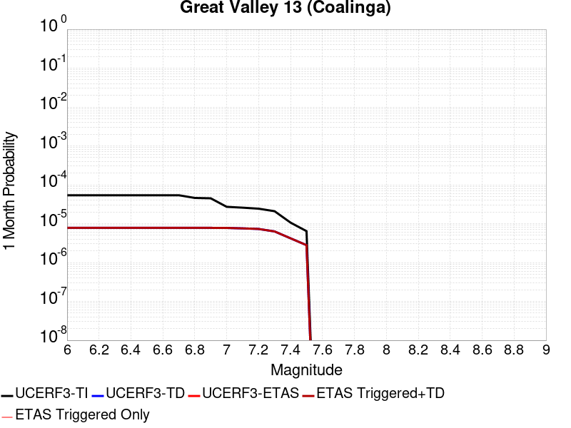 | 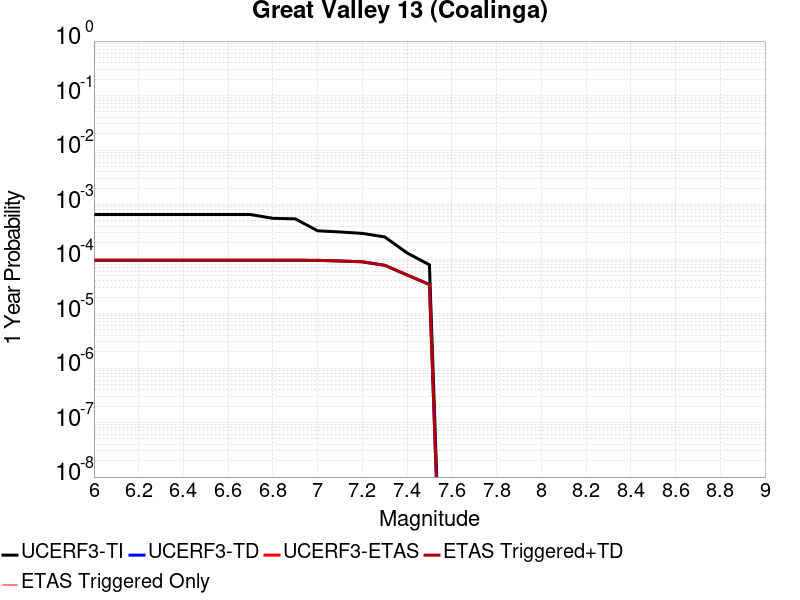 | 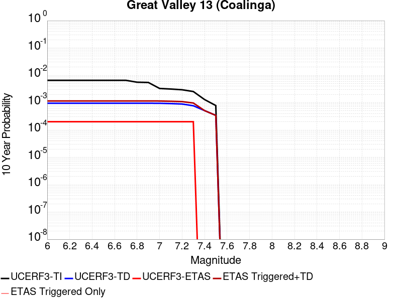 |

| Magnitude | 1 wk TI Prob | 1 wk TD Prob | 1 wk ETAS Prob | 1 wk ETAS/TD Gain | 1 wk ETAS Triggered+TD | 1 wk ETAS Triggered Only | 1 mo TI Prob | 1 mo TD Prob | 1 mo ETAS Prob | 1 mo ETAS/TD Gain | 1 mo ETAS Triggered+TD | 1 mo ETAS Triggered Only | 1 yr TI Prob | 1 yr TD Prob | 1 yr ETAS Prob | 1 yr ETAS/TD Gain | 1 yr ETAS Triggered+TD | 1 yr ETAS Triggered Only | 10 yr TI Prob | 10 yr TD Prob | 10 yr ETAS Prob | 10 yr ETAS/TD Gain | 10 yr ETAS Triggered+TD | 10 yr ETAS Triggered Only |
|-----|-----|-----|-----|-----|-----|-----|-----|-----|-----|-----|-----|-----|-----|-----|-----|-----|-----|-----|-----|-----|-----|-----|-----|-----|
| 6.0 | 1.25701345E-5 | 1.8258246E-6 | 0.0 | 0.0 | 1.8258246E-6 | 0.0 | 5.3870892E-5 | 7.82494E-6 | 0.0 | 0.0 | 7.82494E-6 | 0.0 | 6.556807E-4 | 9.526467E-5 | 0.0 | 0.0 | 9.526467E-5 | 0.0 | 0.006537495 | 9.522577E-4 | 5.0E-4 | 0.5250679 | 0.0011520672 | 2.0E-4 |
| 6.1 | 1.25701345E-5 | 1.8258246E-6 | 0.0 | 0.0 | 1.8258246E-6 | 0.0 | 5.3870892E-5 | 7.82494E-6 | 0.0 | 0.0 | 7.82494E-6 | 0.0 | 6.556807E-4 | 9.526467E-5 | 0.0 | 0.0 | 9.526467E-5 | 0.0 | 0.006537495 | 9.522577E-4 | 5.0E-4 | 0.5250679 | 0.0011520672 | 2.0E-4 |
| 6.2 | 1.25701345E-5 | 1.8258246E-6 | 0.0 | 0.0 | 1.8258246E-6 | 0.0 | 5.3870892E-5 | 7.82494E-6 | 0.0 | 0.0 | 7.82494E-6 | 0.0 | 6.556807E-4 | 9.526467E-5 | 0.0 | 0.0 | 9.526467E-5 | 0.0 | 0.006537495 | 9.522577E-4 | 5.0E-4 | 0.5250679 | 0.0011520672 | 2.0E-4 |
| 6.3 | 1.25701345E-5 | 1.8258246E-6 | 0.0 | 0.0 | 1.8258246E-6 | 0.0 | 5.3870892E-5 | 7.82494E-6 | 0.0 | 0.0 | 7.82494E-6 | 0.0 | 6.556807E-4 | 9.526467E-5 | 0.0 | 0.0 | 9.526467E-5 | 0.0 | 0.006537495 | 9.522577E-4 | 5.0E-4 | 0.5250679 | 0.0011520672 | 2.0E-4 |
| 6.4 | 1.25701345E-5 | 1.8258246E-6 | 0.0 | 0.0 | 1.8258246E-6 | 0.0 | 5.3870892E-5 | 7.82494E-6 | 0.0 | 0.0 | 7.82494E-6 | 0.0 | 6.556807E-4 | 9.526467E-5 | 0.0 | 0.0 | 9.526467E-5 | 0.0 | 0.006537495 | 9.522577E-4 | 5.0E-4 | 0.5250679 | 0.0011520672 | 2.0E-4 |
| 6.5 | 1.25701345E-5 | 1.8258246E-6 | 0.0 | 0.0 | 1.8258246E-6 | 0.0 | 5.3870892E-5 | 7.82494E-6 | 0.0 | 0.0 | 7.82494E-6 | 0.0 | 6.556807E-4 | 9.526467E-5 | 0.0 | 0.0 | 9.526467E-5 | 0.0 | 0.006537495 | 9.522577E-4 | 5.0E-4 | 0.5250679 | 0.0011520672 | 2.0E-4 |
| 6.6 | 1.25701345E-5 | 1.8258246E-6 | 0.0 | 0.0 | 1.8258246E-6 | 0.0 | 5.3870892E-5 | 7.82494E-6 | 0.0 | 0.0 | 7.82494E-6 | 0.0 | 6.556807E-4 | 9.526467E-5 | 0.0 | 0.0 | 9.526467E-5 | 0.0 | 0.006537495 | 9.522577E-4 | 5.0E-4 | 0.5250679 | 0.0011520672 | 2.0E-4 |
| 6.7 | 1.25701345E-5 | 1.8258246E-6 | 0.0 | 0.0 | 1.8258246E-6 | 0.0 | 5.3870892E-5 | 7.82494E-6 | 0.0 | 0.0 | 7.82494E-6 | 0.0 | 6.556807E-4 | 9.526467E-5 | 0.0 | 0.0 | 9.526467E-5 | 0.0 | 0.006537495 | 9.522577E-4 | 5.0E-4 | 0.5250679 | 0.0011520672 | 2.0E-4 |
| 6.8 | 1.0720415E-5 | 1.8258246E-6 | 0.0 | 0.0 | 1.8258246E-6 | 0.0 | 4.5943823E-5 | 7.82494E-6 | 0.0 | 0.0 | 7.82494E-6 | 0.0 | 5.592225E-4 | 9.526467E-5 | 0.0 | 0.0 | 9.526467E-5 | 0.0 | 0.005578173 | 9.522577E-4 | 5.0E-4 | 0.5250679 | 0.0011520672 | 2.0E-4 |
| 6.9 | 1.0485409E-5 | 1.8217311E-6 | 0.0 | 0.0 | 1.8217311E-6 | 0.0 | 4.4936693E-5 | 7.807397E-6 | 0.0 | 0.0 | 7.807397E-6 | 0.0 | 5.469669E-4 | 9.505111E-5 | 0.0 | 0.0 | 9.505111E-5 | 0.0 | 0.005456226 | 9.501238E-4 | 5.0E-4 | 0.5262472 | 0.0011499338 | 2.0E-4 |
| 7.0 | 6.3302773E-6 | 1.8165985E-6 | 0.0 | 0.0 | 1.8165985E-6 | 0.0 | 2.7129478E-5 | 7.7854E-6 | 0.0 | 0.0 | 7.7854E-6 | 0.0 | 3.3025132E-4 | 9.478332E-5 | 0.0 | 0.0 | 9.478332E-5 | 0.0 | 0.0032976097 | 9.474482E-4 | 5.0E-4 | 0.5277333 | 0.0011472587 | 2.0E-4 |
| 7.1 | 6.022003E-6 | 1.766874E-6 | 0.0 | 0.0 | 1.766874E-6 | 0.0 | 2.5808331E-5 | 7.572296E-6 | 0.0 | 0.0 | 7.572296E-6 | 0.0 | 3.141711E-4 | 9.2189E-5 | 0.0 | 0.0 | 9.2189E-5 | 0.0 | 0.0031372732 | 9.2152675E-4 | 5.0E-4 | 0.54257786 | 0.0011213424 | 2.0E-4 |
| 7.2 | 5.671345E-6 | 1.7066724E-6 | 0.0 | 0.0 | 1.7066724E-6 | 0.0 | 2.4305538E-5 | 7.3142905E-6 | 0.0 | 0.0 | 7.3142905E-6 | 0.0 | 2.9587973E-4 | 8.9048044E-5 | 0.0 | 0.0 | 8.9048044E-5 | 0.0 | 0.002954861 | 8.901427E-4 | 5.0E-4 | 0.5617077 | 0.0010899646 | 2.0E-4 |
| 7.3 | 4.8831785E-6 | 1.4736158E-6 | 0.0 | 0.0 | 1.4736158E-6 | 0.0 | 2.092774E-5 | 6.315482E-6 | 0.0 | 0.0 | 6.315482E-6 | 0.0 | 2.5476544E-4 | 7.688845E-5 | 0.0 | 0.0 | 7.688845E-5 | 0.0 | 0.0025447358 | 7.6863513E-4 | 5.0E-4 | 0.6505037 | 9.684814E-4 | 2.0E-4 |
| 7.4 | 2.4837766E-6 | 9.803031E-7 | 0.0 | 0.0 | 9.803031E-7 | 0.0 | 1.0644713E-5 | 4.201292E-6 | 0.0 | 0.0 | 4.201292E-6 | 0.0 | 1.2959167E-4 | 5.11496E-5 | 0.0 | 0.0 | 5.11496E-5 | 0.0 | 0.0012951613 | 5.1138486E-4 | 1.0E-4 | 0.19554745 | 5.1138486E-4 | 0.0 |
| 7.5 | 1.5002679E-6 | 6.5476866E-7 | 0.0 | 0.0 | 6.5476866E-7 | 0.0 | 6.4297037E-6 | 2.8061486E-6 | 0.0 | 0.0 | 2.8061486E-6 | 0.0 | 7.827883E-5 | 3.4164368E-5 | 0.0 | 0.0 | 3.4164368E-5 | 0.0 | 7.825126E-4 | 3.415953E-4 | 0.0 | 0.0 | 3.415953E-4 | 0.0 |

## La Panza 2011
*[(top)](#table-of-contents)*

| 1 Week | 1 Month | 1 Year | 10 Year |
|-----|-----|-----|-----|
| 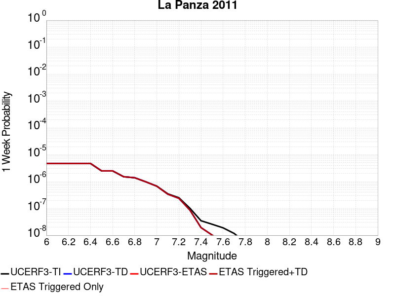 | 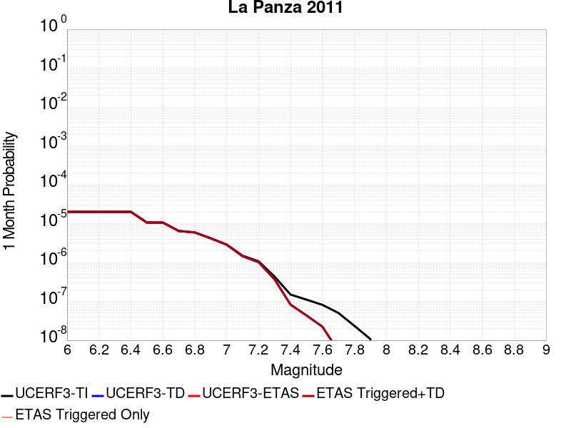 | 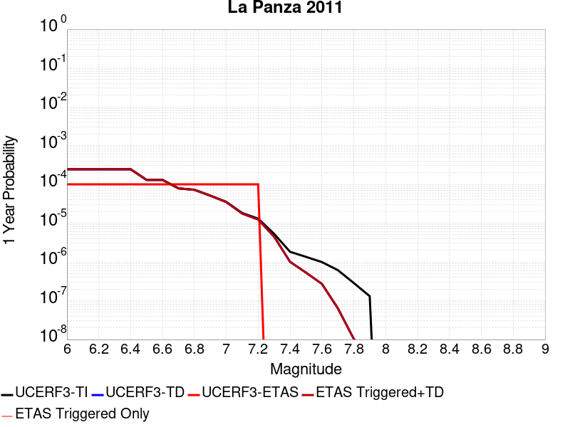 | 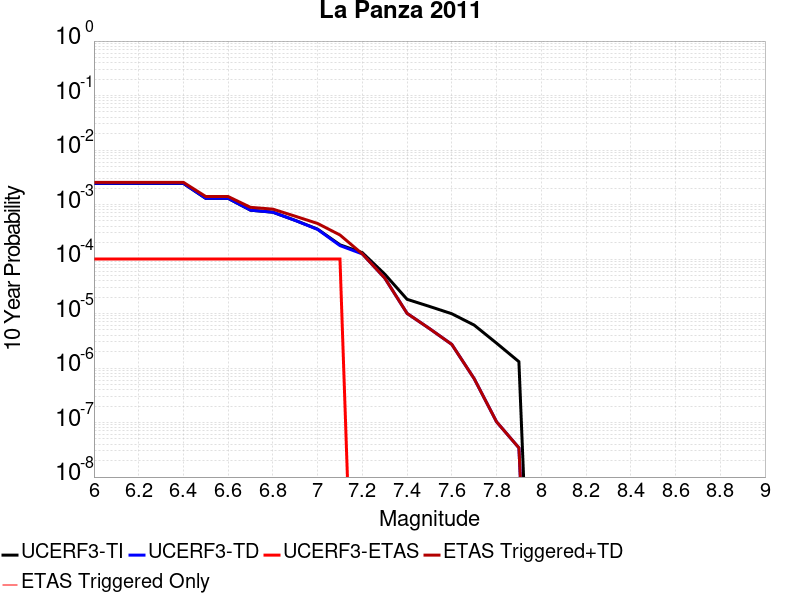 |

| Magnitude | 1 wk TI Prob | 1 wk TD Prob | 1 wk ETAS Prob | 1 wk ETAS/TD Gain | 1 wk ETAS Triggered+TD | 1 wk ETAS Triggered Only | 1 mo TI Prob | 1 mo TD Prob | 1 mo ETAS Prob | 1 mo ETAS/TD Gain | 1 mo ETAS Triggered+TD | 1 mo ETAS Triggered Only | 1 yr TI Prob | 1 yr TD Prob | 1 yr ETAS Prob | 1 yr ETAS/TD Gain | 1 yr ETAS Triggered+TD | 1 yr ETAS Triggered Only | 10 yr TI Prob | 10 yr TD Prob | 10 yr ETAS Prob | 10 yr ETAS/TD Gain | 10 yr ETAS Triggered+TD | 10 yr ETAS Triggered Only |
|-----|-----|-----|-----|-----|-----|-----|-----|-----|-----|-----|-----|-----|-----|-----|-----|-----|-----|-----|-----|-----|-----|-----|-----|-----|
| 6.0 | 4.6754544E-6 | 4.717917E-6 | 0.0 | 0.0 | 4.717917E-6 | 0.0 | 2.0037509E-5 | 2.0219499E-5 | 0.0 | 0.0 | 2.0219499E-5 | 0.0 | 2.4392935E-4 | 2.4614655E-4 | 1.0E-4 | 0.40626204 | 2.4614655E-4 | 0.0 | 0.0024366176 | 0.0024589335 | 0.0022 | 0.8946968 | 0.0025586877 | 1.0E-4 |
| 6.1 | 4.6754544E-6 | 4.717917E-6 | 0.0 | 0.0 | 4.717917E-6 | 0.0 | 2.0037509E-5 | 2.0219499E-5 | 0.0 | 0.0 | 2.0219499E-5 | 0.0 | 2.4392935E-4 | 2.4614655E-4 | 1.0E-4 | 0.40626204 | 2.4614655E-4 | 0.0 | 0.0024366176 | 0.0024589335 | 0.0022 | 0.8946968 | 0.0025586877 | 1.0E-4 |
| 6.2 | 4.6754544E-6 | 4.717917E-6 | 0.0 | 0.0 | 4.717917E-6 | 0.0 | 2.0037509E-5 | 2.0219499E-5 | 0.0 | 0.0 | 2.0219499E-5 | 0.0 | 2.4392935E-4 | 2.4614655E-4 | 1.0E-4 | 0.40626204 | 2.4614655E-4 | 0.0 | 0.0024366176 | 0.0024589335 | 0.0022 | 0.8946968 | 0.0025586877 | 1.0E-4 |
| 6.3 | 4.6754544E-6 | 4.717917E-6 | 0.0 | 0.0 | 4.717917E-6 | 0.0 | 2.0037509E-5 | 2.0219499E-5 | 0.0 | 0.0 | 2.0219499E-5 | 0.0 | 2.4392935E-4 | 2.4614655E-4 | 1.0E-4 | 0.40626204 | 2.4614655E-4 | 0.0 | 0.0024366176 | 0.0024589335 | 0.0022 | 0.8946968 | 0.0025586877 | 1.0E-4 |
| 6.4 | 4.6754544E-6 | 4.717917E-6 | 0.0 | 0.0 | 4.717917E-6 | 0.0 | 2.0037509E-5 | 2.0219499E-5 | 0.0 | 0.0 | 2.0219499E-5 | 0.0 | 2.4392935E-4 | 2.4614655E-4 | 1.0E-4 | 0.40626204 | 2.4614655E-4 | 0.0 | 0.0024366176 | 0.0024589335 | 0.0022 | 0.8946968 | 0.0025586877 | 1.0E-4 |
| 6.5 | 2.485343E-6 | 2.5008728E-6 | 0.0 | 0.0 | 2.5008728E-6 | 0.0 | 1.0651426E-5 | 1.0717985E-5 | 0.0 | 0.0 | 1.0717985E-5 | 0.0 | 1.296734E-4 | 1.3048404E-4 | 1.0E-4 | 0.7663773 | 1.3048404E-4 | 0.0 | 0.0012959775 | 0.0013041126 | 0.0014 | 1.073527 | 0.0014039822 | 1.0E-4 |
| 6.6 | 2.485343E-6 | 2.5008728E-6 | 0.0 | 0.0 | 2.5008728E-6 | 0.0 | 1.0651426E-5 | 1.0717985E-5 | 0.0 | 0.0 | 1.0717985E-5 | 0.0 | 1.296734E-4 | 1.3048404E-4 | 1.0E-4 | 0.7663773 | 1.3048404E-4 | 0.0 | 0.0012959775 | 0.0013041126 | 0.0014 | 1.073527 | 0.0014039822 | 1.0E-4 |
| 6.7 | 1.5108508E-6 | 1.5148875E-6 | 0.0 | 0.0 | 1.5148875E-6 | 0.0 | 6.4750584E-6 | 6.4923593E-6 | 0.0 | 0.0 | 6.4923593E-6 | 0.0 | 7.8830984E-5 | 7.904172E-5 | 1.0E-4 | 1.2651547 | 7.904172E-5 | 0.0 | 7.880303E-4 | 7.901468E-4 | 9.0E-4 | 1.1390288 | 8.9006784E-4 | 1.0E-4 |
| 6.8 | 1.3865837E-6 | 1.3887562E-6 | 0.0 | 0.0 | 1.3887562E-6 | 0.0 | 5.942488E-6 | 5.9517997E-6 | 0.0 | 0.0 | 5.9517997E-6 | 0.0 | 7.234739E-5 | 7.246085E-5 | 1.0E-4 | 1.3800555 | 7.246085E-5 | 0.0 | 7.232384E-4 | 7.2438206E-4 | 9.0E-4 | 1.2424383 | 8.243096E-4 | 1.0E-4 |
| 6.9 | 9.826583E-7 | 9.798644E-7 | 0.0 | 0.0 | 9.798644E-7 | 0.0 | 4.2113857E-6 | 4.1994126E-6 | 0.0 | 0.0 | 4.1994126E-6 | 0.0 | 5.1272415E-5 | 5.1126703E-5 | 1.0E-4 | 1.9559251 | 5.1126703E-5 | 0.0 | 5.126059E-4 | 5.1115477E-4 | 7.0E-4 | 1.3694483 | 6.111036E-4 | 1.0E-4 |
| 7.0 | 6.7797646E-7 | 6.7124904E-7 | 0.0 | 0.0 | 6.7124904E-7 | 0.0 | 2.9056102E-6 | 2.8767786E-6 | 0.0 | 0.0 | 2.8767786E-6 | 0.0 | 3.537523E-5 | 3.5024248E-5 | 1.0E-4 | 2.8551648 | 3.5024248E-5 | 0.0 | 3.5369597E-4 | 3.5019038E-4 | 7.0E-4 | 1.9989127 | 4.5015535E-4 | 1.0E-4 |
| 7.1 | 3.4979826E-7 | 3.3895782E-7 | 0.0 | 0.0 | 3.3895782E-7 | 0.0 | 1.4991346E-6 | 1.4526756E-6 | 0.0 | 0.0 | 1.4526756E-6 | 0.0 | 1.825181E-5 | 1.7686194E-5 | 1.0E-4 | 5.6541276 | 1.7686194E-5 | 0.0 | 1.825031E-4 | 1.7684903E-4 | 5.0E-4 | 2.8272703 | 2.7683136E-4 | 1.0E-4 |
| 7.2 | 2.5088332E-7 | 2.3853485E-7 | 0.0 | 0.0 | 2.3853485E-7 | 0.0 | 1.0752137E-6 | 1.0222919E-6 | 0.0 | 0.0 | 1.0222919E-6 | 0.0 | 1.3090649E-5 | 1.2446341E-5 | 1.0E-4 | 8.03449 | 1.2446341E-5 | 0.0 | 1.3089878E-4 | 1.2445729E-4 | 2.0E-4 | 1.606977 | 1.2445729E-4 | 0.0 |
| 7.3 | 1.0159086E-7 | 8.6656655E-8 | 0.0 | 0.0 | 8.6656655E-8 | 0.0 | 4.3538932E-7 | 3.7138562E-7 | 0.0 | 0.0 | 3.7138562E-7 | 0.0 | 5.300852E-6 | 4.5216107E-6 | 0.0 | 0.0 | 4.5216107E-6 | 0.0 | 5.3007258E-5 | 4.521523E-5 | 0.0 | 0.0 | 4.521523E-5 | 0.0 |
| 7.4 | 3.5006252E-8 | 1.9470884E-8 | 0.0 | 0.0 | 1.9470884E-8 | 0.0 | 1.5002678E-7 | 8.344664E-8 | 0.0 | 0.0 | 8.344664E-8 | 0.0 | 1.8265745E-6 | 1.0159624E-6 | 0.0 | 0.0 | 1.0159624E-6 | 0.0 | 1.8265595E-5 | 1.0159581E-5 | 0.0 | 0.0 | 1.0159581E-5 | 0.0 |
| 7.5 | 2.592274E-8 | 1.0288577E-8 | 0.0 | 0.0 | 1.0288577E-8 | 0.0 | 1.1109746E-7 | 4.4093902E-8 | 0.0 | 0.0 | 4.4093902E-8 | 0.0 | 1.3526106E-6 | 5.368431E-7 | 0.0 | 0.0 | 5.368431E-7 | 0.0 | 1.3526024E-5 | 5.3684194E-6 | 0.0 | 0.0 | 5.3684194E-6 | 0.0 |
| 7.6 | 1.9016717E-8 | 5.27639E-9 | 0.0 | 0.0 | 5.27639E-9 | 0.0 | 8.150022E-8 | 2.26131E-8 | 0.0 | 0.0 | 2.26131E-8 | 0.0 | 9.922647E-7 | 2.7531448E-7 | 0.0 | 0.0 | 2.7531448E-7 | 0.0 | 9.922603E-6 | 2.7531414E-6 | 0.0 | 0.0 | 2.7531414E-6 | 0.0 |
| 7.7 | 1.17738495E-8 | 1.2533218E-9 | 0.0 | 0.0 | 1.2533218E-9 | 0.0 | 5.0459356E-8 | 5.3713793E-9 | 0.0 | 0.0 | 5.3713793E-9 | 0.0 | 6.1434247E-7 | 6.539655E-8 | 0.0 | 0.0 | 6.539655E-8 | 0.0 | 6.143408E-6 | 6.539653E-7 | 0.0 | 0.0 | 6.539653E-7 | 0.0 |
| 7.8 | 5.489079E-9 | 2.045687E-10 | 0.0 | 0.0 | 2.045687E-10 | 0.0 | 2.3524624E-8 | 8.767238E-10 | 0.0 | 0.0 | 8.767238E-10 | 0.0 | 2.8641225E-7 | 1.0674117E-8 | 0.0 | 0.0 | 1.0674117E-8 | 0.0 | 2.8641189E-6 | 1.06741155E-7 | 0.0 | 0.0 | 1.06741155E-7 | 0.0 |
| 7.9 | 2.5081048E-9 | 6.813505E-11 | 0.0 | 0.0 | 6.813505E-11 | 0.0 | 1.0749021E-8 | 2.9200753E-10 | 0.0 | 0.0 | 2.9200753E-10 | 0.0 | 1.3086932E-7 | 3.555193E-9 | 0.0 | 0.0 | 3.555193E-9 | 0.0 | 1.3086925E-6 | 3.555193E-8 | 0.0 | 0.0 | 3.555193E-8 | 0.0 |

## Silver Creek 2011 CFM
*[(top)](#table-of-contents)*

| 1 Week | 1 Month | 1 Year | 10 Year |
|-----|-----|-----|-----|
| 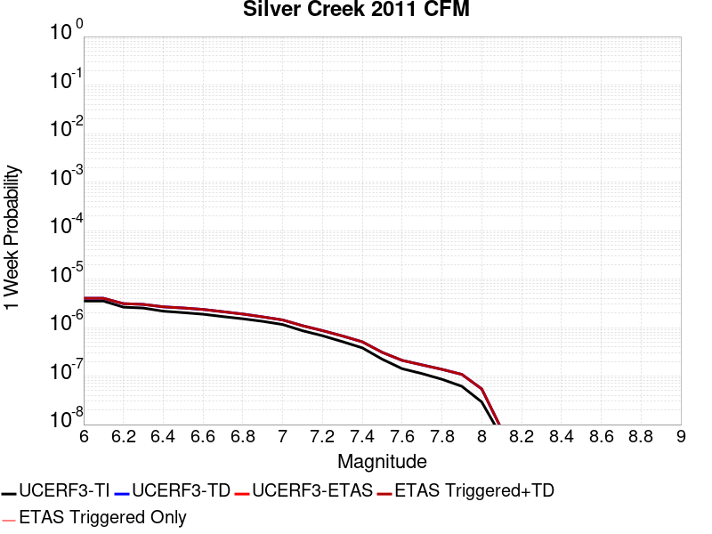 | 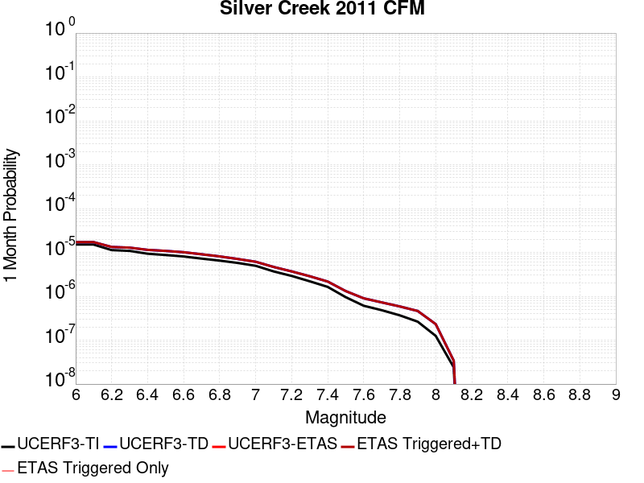 | 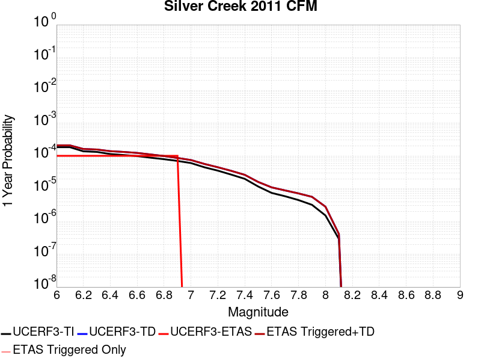 | 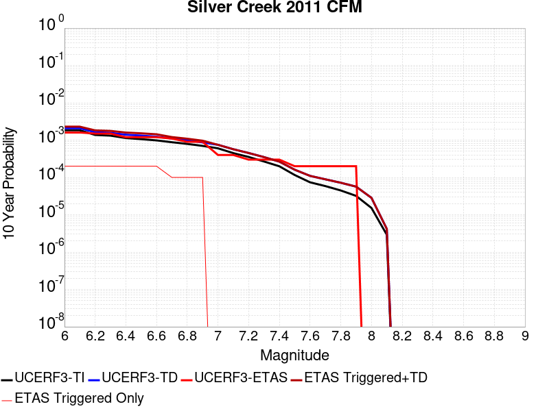 |

| Magnitude | 1 wk TI Prob | 1 wk TD Prob | 1 wk ETAS Prob | 1 wk ETAS/TD Gain | 1 wk ETAS Triggered+TD | 1 wk ETAS Triggered Only | 1 mo TI Prob | 1 mo TD Prob | 1 mo ETAS Prob | 1 mo ETAS/TD Gain | 1 mo ETAS Triggered+TD | 1 mo ETAS Triggered Only | 1 yr TI Prob | 1 yr TD Prob | 1 yr ETAS Prob | 1 yr ETAS/TD Gain | 1 yr ETAS Triggered+TD | 1 yr ETAS Triggered Only | 10 yr TI Prob | 10 yr TD Prob | 10 yr ETAS Prob | 10 yr ETAS/TD Gain | 10 yr ETAS Triggered+TD | 10 yr ETAS Triggered Only |
|-----|-----|-----|-----|-----|-----|-----|-----|-----|-----|-----|-----|-----|-----|-----|-----|-----|-----|-----|-----|-----|-----|-----|-----|-----|
| 6.0 | 3.5229125E-6 | 4.01328E-6 | 0.0 | 0.0 | 4.01328E-6 | 0.0 | 1.5098109E-5 | 1.719966E-5 | 0.0 | 0.0 | 1.719966E-5 | 0.0 | 1.8380396E-4 | 2.0938613E-4 | 1.0E-4 | 0.47758657 | 2.0938613E-4 | 0.0 | 0.0018365202 | 0.0020922467 | 0.0016 | 0.76472825 | 0.0022918282 | 2.0E-4 |
| 6.1 | 3.5229125E-6 | 4.01328E-6 | 0.0 | 0.0 | 4.01328E-6 | 0.0 | 1.5098109E-5 | 1.719966E-5 | 0.0 | 0.0 | 1.719966E-5 | 0.0 | 1.8380396E-4 | 2.0938613E-4 | 1.0E-4 | 0.47758657 | 2.0938613E-4 | 0.0 | 0.0018365202 | 0.0020922467 | 0.0016 | 0.76472825 | 0.0022918282 | 2.0E-4 |
| 6.2 | 2.6363234E-6 | 3.1156433E-6 | 0.0 | 0.0 | 3.1156433E-6 | 0.0 | 1.129848E-5 | 1.3352689E-5 | 0.0 | 0.0 | 1.3352689E-5 | 0.0 | 1.375503E-4 | 1.6255693E-4 | 1.0E-4 | 0.6151691 | 1.6255693E-4 | 0.0 | 0.0013746519 | 0.0016247076 | 0.0015 | 0.9232431 | 0.0018243826 | 2.0E-4 |
| 6.3 | 2.5275126E-6 | 3.005279E-6 | 0.0 | 0.0 | 3.005279E-6 | 0.0 | 1.0832152E-5 | 1.2879704E-5 | 0.0 | 0.0 | 1.2879704E-5 | 0.0 | 1.3187347E-4 | 1.5679917E-4 | 1.0E-4 | 0.6377585 | 1.5679917E-4 | 0.0 | 0.0013179524 | 0.0015672117 | 0.0015 | 0.9571138 | 0.0017668983 | 2.0E-4 |
| 6.4 | 2.178732E-6 | 2.675746E-6 | 0.0 | 0.0 | 2.675746E-6 | 0.0 | 9.337389E-6 | 1.1467432E-5 | 0.0 | 0.0 | 1.1467432E-5 | 0.0 | 1.1367678E-4 | 1.3960707E-4 | 1.0E-4 | 0.7162961 | 1.3960707E-4 | 0.0 | 0.0011361865 | 0.0013955178 | 0.0012 | 0.8598959 | 0.0015952387 | 2.0E-4 |
| 6.5 | 2.0341574E-6 | 2.5348118E-6 | 0.0 | 0.0 | 2.5348118E-6 | 0.0 | 8.717788E-6 | 1.0863434E-5 | 0.0 | 0.0 | 1.0863434E-5 | 0.0 | 1.061339E-4 | 1.3225431E-4 | 1.0E-4 | 0.7561191 | 1.3225431E-4 | 0.0 | 0.0010608323 | 0.0013220796 | 0.0012 | 0.90766096 | 0.0015218152 | 2.0E-4 |
| 6.6 | 1.8856827E-6 | 2.3663004E-6 | 0.0 | 0.0 | 2.3663004E-6 | 0.0 | 8.0814725E-6 | 1.0141248E-5 | 0.0 | 0.0 | 1.0141248E-5 | 0.0 | 9.838748E-5 | 1.2346271E-4 | 1.0E-4 | 0.80996114 | 1.2346271E-4 | 0.0 | 9.834393E-4 | 0.0012342645 | 0.0012 | 0.97223896 | 0.0014340176 | 2.0E-4 |
| 6.7 | 1.6844668E-6 | 2.1245323E-6 | 0.0 | 0.0 | 2.1245323E-6 | 0.0 | 7.2191233E-6 | 9.105107E-6 | 0.0 | 0.0 | 9.105107E-6 | 0.0 | 8.788928E-5 | 1.10849054E-4 | 1.0E-4 | 0.9021277 | 1.10849054E-4 | 0.0 | 8.785453E-4 | 0.0011082601 | 0.0011 | 0.99254674 | 0.0012081492 | 1.0E-4 |
| 6.8 | 1.5177161E-6 | 1.8998646E-6 | 0.0 | 0.0 | 1.8998646E-6 | 0.0 | 6.504481E-6 | 8.142251E-6 | 0.0 | 0.0 | 8.142251E-6 | 0.0 | 7.918918E-5 | 9.9127414E-5 | 1.0E-4 | 1.0088027 | 9.9127414E-5 | 0.0 | 7.9160964E-4 | 9.911539E-4 | 9.0E-4 | 0.90803254 | 0.0010910549 | 1.0E-4 |
| 6.9 | 1.3437394E-6 | 1.660274E-6 | 0.0 | 0.0 | 1.660274E-6 | 0.0 | 5.7588704E-6 | 7.115441E-6 | 0.0 | 0.0 | 7.115441E-6 | 0.0 | 7.011199E-5 | 8.662705E-5 | 1.0E-4 | 1.1543738 | 8.662705E-5 | 0.0 | 7.0089876E-4 | 8.662543E-4 | 9.0E-4 | 1.0389558 | 9.661677E-4 | 1.0E-4 |
| 7.0 | 1.1563575E-6 | 1.4351557E-6 | 0.0 | 0.0 | 1.4351557E-6 | 0.0 | 4.9558084E-6 | 6.1506526E-6 | 0.0 | 0.0 | 6.1506526E-6 | 0.0 | 6.03353E-5 | 7.4881624E-5 | 0.0 | 0.0 | 7.4881624E-5 | 0.0 | 6.0318917E-4 | 7.488853E-4 | 4.0E-4 | 0.5341272 | 7.488853E-4 | 0.0 |
| 7.1 | 8.602183E-7 | 1.0925451E-6 | 0.0 | 0.0 | 1.0925451E-6 | 0.0 | 3.6866445E-6 | 4.6823275E-6 | 0.0 | 0.0 | 4.6823275E-6 | 0.0 | 4.4883975E-5 | 5.7005847E-5 | 0.0 | 0.0 | 5.7005847E-5 | 0.0 | 4.4874908E-4 | 5.7023345E-4 | 4.0E-4 | 0.7014671 | 5.7023345E-4 | 0.0 |
| 7.2 | 6.788407E-7 | 8.6526956E-7 | 0.0 | 0.0 | 8.6526956E-7 | 0.0 | 2.9093142E-6 | 3.7082928E-6 | 0.0 | 0.0 | 3.7082928E-6 | 0.0 | 3.5420322E-5 | 4.514753E-5 | 0.0 | 0.0 | 4.514753E-5 | 0.0 | 3.541468E-4 | 4.5170472E-4 | 3.0E-4 | 0.6641507 | 4.5170472E-4 | 0.0 |
| 7.3 | 5.1292045E-7 | 6.7204826E-7 | 0.0 | 0.0 | 6.7204826E-7 | 0.0 | 2.1982287E-6 | 2.8802035E-6 | 0.0 | 0.0 | 2.8802035E-6 | 0.0 | 2.6763106E-5 | 3.5065914E-5 | 0.0 | 0.0 | 3.5065914E-5 | 0.0 | 2.6759884E-4 | 3.5092497E-4 | 3.0E-4 | 0.8548836 | 3.5092497E-4 | 0.0 |
| 7.4 | 3.820994E-7 | 5.0849155E-7 | 0.0 | 0.0 | 5.0849155E-7 | 0.0 | 1.6375678E-6 | 2.1792478E-6 | 0.0 | 0.0 | 2.1792478E-6 | 0.0 | 1.9937206E-5 | 2.6532018E-5 | 0.0 | 0.0 | 2.6532018E-5 | 0.0 | 1.9935417E-4 | 2.6560962E-4 | 3.0E-4 | 1.1294771 | 2.6560962E-4 | 0.0 |
| 7.5 | 2.2292595E-7 | 3.085043E-7 | 0.0 | 0.0 | 3.085043E-7 | 0.0 | 9.553966E-7 | 1.3221606E-6 | 0.0 | 0.0 | 1.3221606E-6 | 0.0 | 1.16318915E-5 | 1.6097187E-5 | 0.0 | 0.0 | 1.6097187E-5 | 0.0 | 1.16312825E-4 | 1.6128132E-4 | 2.0E-4 | 1.2400692 | 1.6128132E-4 | 0.0 |
| 7.6 | 1.420587E-7 | 2.1072053E-7 | 0.0 | 0.0 | 2.1072053E-7 | 0.0 | 6.088228E-7 | 9.0308765E-7 | 0.0 | 0.0 | 9.0308765E-7 | 0.0 | 7.4123927E-6 | 1.0995036E-5 | 0.0 | 0.0 | 1.0995036E-5 | 0.0 | 7.412145E-5 | 1.1026591E-4 | 2.0E-4 | 1.8137972 | 1.1026591E-4 | 0.0 |
| 7.7 | 1.1250075E-7 | 1.701559E-7 | 0.0 | 0.0 | 1.701559E-7 | 0.0 | 4.82146E-7 | 7.292394E-7 | 0.0 | 0.0 | 7.292394E-7 | 0.0 | 5.8701116E-6 | 8.878454E-6 | 0.0 | 0.0 | 8.878454E-6 | 0.0 | 5.8699567E-5 | 8.90971E-5 | 2.0E-4 | 2.2447422 | 8.90971E-5 | 0.0 |
| 7.8 | 8.592761E-8 | 1.3772782E-7 | 0.0 | 0.0 | 1.3772782E-7 | 0.0 | 3.682611E-7 | 5.9026195E-7 | 0.0 | 0.0 | 5.9026195E-7 | 0.0 | 4.48357E-6 | 7.1864156E-6 | 0.0 | 0.0 | 7.1864156E-6 | 0.0 | 4.4834796E-5 | 7.216737E-5 | 2.0E-4 | 2.7713356 | 7.216737E-5 | 0.0 |
| 7.9 | 6.156529E-8 | 1.0836284E-7 | 0.0 | 0.0 | 1.0836284E-7 | 0.0 | 2.638512E-7 | 4.644121E-7 | 0.0 | 0.0 | 4.644121E-7 | 0.0 | 3.212384E-6 | 5.6542026E-6 | 0.0 | 0.0 | 5.6542026E-6 | 0.0 | 3.2123375E-5 | 5.6800774E-5 | 2.0E-4 | 3.5210788 | 5.6800774E-5 | 0.0 |
| 8.0 | 2.9230547E-8 | 5.4332432E-8 | 0.0 | 0.0 | 5.4332432E-8 | 0.0 | 1.2527377E-7 | 2.3285327E-7 | 0.0 | 0.0 | 2.3285327E-7 | 0.0 | 1.525207E-6 | 2.8349848E-6 | 0.0 | 0.0 | 2.8349848E-6 | 0.0 | 1.5251966E-5 | 2.8487471E-5 | 0.0 | 0.0 | 2.8487471E-5 | 0.0 |
| 8.1 | 5.6062213E-9 | 7.96772E-9 | 0.0 | 0.0 | 7.96772E-9 | 0.0 | 2.4026663E-8 | 3.414737E-8 | 0.0 | 0.0 | 3.414737E-8 | 0.0 | 2.925246E-7 | 4.1574415E-7 | 0.0 | 0.0 | 4.1574415E-7 | 0.0 | 2.925242E-6 | 4.196243E-6 | 0.0 | 0.0 | 4.196243E-6 | 0.0 |

## Morales (East)
*[(top)](#table-of-contents)*

| 1 Week | 1 Month | 1 Year | 10 Year |
|-----|-----|-----|-----|
| 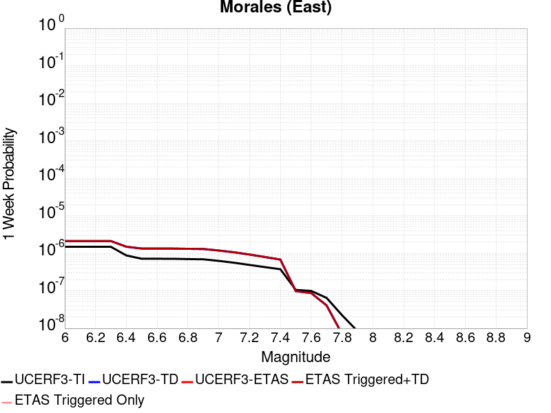 | 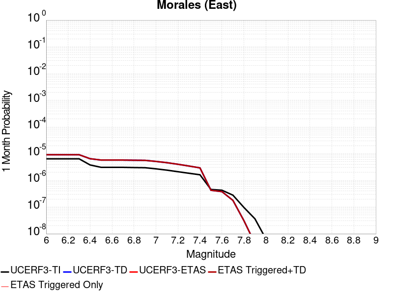 | 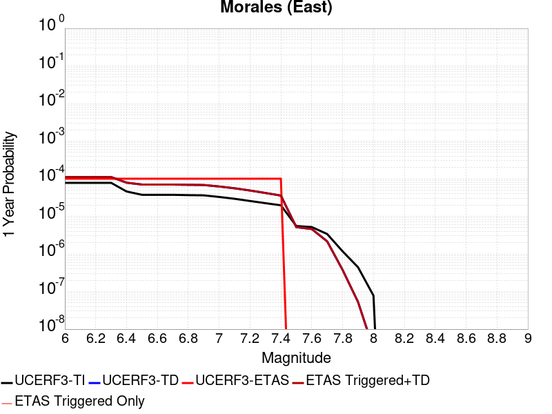 | 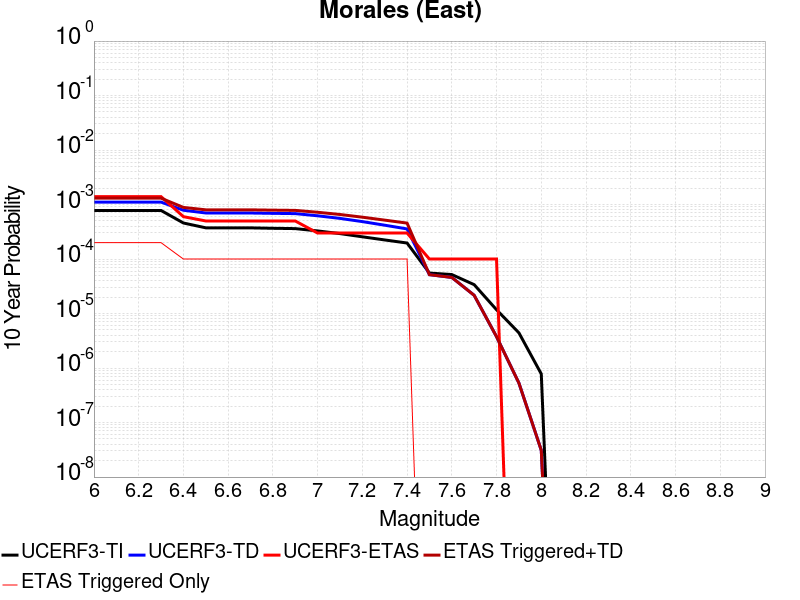 |

| Magnitude | 1 wk TI Prob | 1 wk TD Prob | 1 wk ETAS Prob | 1 wk ETAS/TD Gain | 1 wk ETAS Triggered+TD | 1 wk ETAS Triggered Only | 1 mo TI Prob | 1 mo TD Prob | 1 mo ETAS Prob | 1 mo ETAS/TD Gain | 1 mo ETAS Triggered+TD | 1 mo ETAS Triggered Only | 1 yr TI Prob | 1 yr TD Prob | 1 yr ETAS Prob | 1 yr ETAS/TD Gain | 1 yr ETAS Triggered+TD | 1 yr ETAS Triggered Only | 10 yr TI Prob | 10 yr TD Prob | 10 yr ETAS Prob | 10 yr ETAS/TD Gain | 10 yr ETAS Triggered+TD | 10 yr ETAS Triggered Only |
|-----|-----|-----|-----|-----|-----|-----|-----|-----|-----|-----|-----|-----|-----|-----|-----|-----|-----|-----|-----|-----|-----|-----|-----|-----|
| 6.0 | 1.4942771E-6 | 2.128873E-6 | 0.0 | 0.0 | 2.128873E-6 | 0.0 | 6.404029E-6 | 9.1237125E-6 | 0.0 | 0.0 | 9.1237125E-6 | 0.0 | 7.7966266E-5 | 1.11076115E-4 | 1.0E-4 | 0.9002836 | 1.11076115E-4 | 0.0 | 7.793892E-4 | 0.0011102658 | 0.0014 | 1.2609593 | 0.0013100437 | 2.0E-4 |
| 6.1 | 1.4942771E-6 | 2.128873E-6 | 0.0 | 0.0 | 2.128873E-6 | 0.0 | 6.404029E-6 | 9.1237125E-6 | 0.0 | 0.0 | 9.1237125E-6 | 0.0 | 7.7966266E-5 | 1.11076115E-4 | 1.0E-4 | 0.9002836 | 1.11076115E-4 | 0.0 | 7.793892E-4 | 0.0011102658 | 0.0014 | 1.2609593 | 0.0013100437 | 2.0E-4 |
| 6.2 | 1.4942771E-6 | 2.128873E-6 | 0.0 | 0.0 | 2.128873E-6 | 0.0 | 6.404029E-6 | 9.1237125E-6 | 0.0 | 0.0 | 9.1237125E-6 | 0.0 | 7.7966266E-5 | 1.11076115E-4 | 1.0E-4 | 0.9002836 | 1.11076115E-4 | 0.0 | 7.793892E-4 | 0.0011102658 | 0.0014 | 1.2609593 | 0.0013100437 | 2.0E-4 |
| 6.3 | 1.4942771E-6 | 2.128873E-6 | 0.0 | 0.0 | 2.128873E-6 | 0.0 | 6.404029E-6 | 9.1237125E-6 | 0.0 | 0.0 | 9.1237125E-6 | 0.0 | 7.7966266E-5 | 1.11076115E-4 | 1.0E-4 | 0.9002836 | 1.11076115E-4 | 0.0 | 7.793892E-4 | 0.0011102658 | 0.0014 | 1.2609593 | 0.0013100437 | 2.0E-4 |
| 6.4 | 8.798845E-7 | 1.5076528E-6 | 0.0 | 0.0 | 1.5076528E-6 | 0.0 | 3.7709283E-6 | 6.4613537E-6 | 0.0 | 0.0 | 6.4613537E-6 | 0.0 | 4.5910085E-5 | 7.866425E-5 | 1.0E-4 | 1.2712255 | 7.866425E-5 | 0.0 | 4.59006E-4 | 7.8637764E-4 | 6.0E-4 | 0.7629922 | 8.86299E-4 | 1.0E-4 |
| 6.5 | 7.1751725E-7 | 1.3437995E-6 | 0.0 | 0.0 | 1.3437995E-6 | 0.0 | 3.0750705E-6 | 5.7591283E-6 | 0.0 | 0.0 | 5.7591283E-6 | 0.0 | 3.7438338E-5 | 7.011521E-5 | 1.0E-4 | 1.4262241 | 7.011521E-5 | 0.0 | 3.743203E-4 | 7.0094113E-4 | 5.0E-4 | 0.7133267 | 8.0087106E-4 | 1.0E-4 |
| 6.6 | 7.1751725E-7 | 1.3437995E-6 | 0.0 | 0.0 | 1.3437995E-6 | 0.0 | 3.0750705E-6 | 5.7591283E-6 | 0.0 | 0.0 | 5.7591283E-6 | 0.0 | 3.7438338E-5 | 7.011521E-5 | 1.0E-4 | 1.4262241 | 7.011521E-5 | 0.0 | 3.743203E-4 | 7.0094113E-4 | 5.0E-4 | 0.7133267 | 8.0087106E-4 | 1.0E-4 |
| 6.7 | 7.159057E-7 | 1.3412625E-6 | 0.0 | 0.0 | 1.3412625E-6 | 0.0 | 3.0681638E-6 | 5.7482557E-6 | 0.0 | 0.0 | 5.7482557E-6 | 0.0 | 3.7354253E-5 | 6.9982845E-5 | 1.0E-4 | 1.4289217 | 6.9982845E-5 | 0.0 | 3.7347974E-4 | 6.996183E-4 | 5.0E-4 | 0.7146754 | 7.9954835E-4 | 1.0E-4 |
| 6.8 | 7.032203E-7 | 1.3227846E-6 | 0.0 | 0.0 | 1.3227846E-6 | 0.0 | 3.0137978E-6 | 5.669065E-6 | 0.0 | 0.0 | 5.669065E-6 | 0.0 | 3.669237E-5 | 6.901876E-5 | 1.0E-4 | 1.4488815 | 6.901876E-5 | 0.0 | 3.6686313E-4 | 6.899834E-4 | 5.0E-4 | 0.7246551 | 7.899144E-4 | 1.0E-4 |
| 6.9 | 6.941549E-7 | 1.307817E-6 | 0.0 | 0.0 | 1.307817E-6 | 0.0 | 2.974946E-6 | 5.6049184E-6 | 0.0 | 0.0 | 5.6049184E-6 | 0.0 | 3.6219368E-5 | 6.823782E-5 | 1.0E-4 | 1.465463 | 6.823782E-5 | 0.0 | 3.6213463E-4 | 6.821789E-4 | 5.0E-4 | 0.7329456 | 7.821106E-4 | 1.0E-4 |
| 7.0 | 6.2932247E-7 | 1.1928244E-6 | 0.0 | 0.0 | 1.1928244E-6 | 0.0 | 2.6970936E-6 | 5.1120946E-6 | 0.0 | 0.0 | 5.1120946E-6 | 0.0 | 3.283662E-5 | 6.223804E-5 | 1.0E-4 | 1.6067345 | 6.223804E-5 | 0.0 | 3.283177E-4 | 6.2221504E-4 | 3.0E-4 | 0.48214844 | 7.221528E-4 | 1.0E-4 |
| 7.1 | 5.6200963E-7 | 1.0688784E-6 | 0.0 | 0.0 | 1.0688784E-6 | 0.0 | 2.4086105E-6 | 4.5809E-6 | 0.0 | 0.0 | 4.5809E-6 | 0.0 | 2.9324437E-5 | 5.5771077E-5 | 1.0E-4 | 1.7930441 | 5.5771077E-5 | 0.0 | 2.9320567E-4 | 5.575781E-4 | 3.0E-4 | 0.5380412 | 6.5752235E-4 | 1.0E-4 |
| 7.2 | 4.91044E-7 | 9.331484E-7 | 0.0 | 0.0 | 9.331484E-7 | 0.0 | 2.1044725E-6 | 3.9992015E-6 | 0.0 | 0.0 | 3.9992015E-6 | 0.0 | 2.5621652E-5 | 4.8689228E-5 | 1.0E-4 | 2.0538425 | 4.8689228E-5 | 0.0 | 2.56187E-4 | 4.8679198E-4 | 3.0E-4 | 0.61627966 | 5.867433E-4 | 1.0E-4 |
| 7.3 | 4.2978448E-7 | 8.0151335E-7 | 0.0 | 0.0 | 8.0151335E-7 | 0.0 | 1.8419321E-6 | 3.4350528E-6 | 0.0 | 0.0 | 3.4350528E-6 | 0.0 | 2.2425293E-5 | 4.1820997E-5 | 1.0E-4 | 2.3911433 | 4.1820997E-5 | 0.0 | 2.242303E-4 | 4.1813697E-4 | 3.0E-4 | 0.71746826 | 5.1809516E-4 | 1.0E-4 |
| 7.4 | 3.774317E-7 | 6.843739E-7 | 0.0 | 0.0 | 6.843739E-7 | 0.0 | 1.6175634E-6 | 2.9330279E-6 | 0.0 | 0.0 | 2.9330279E-6 | 0.0 | 1.9693656E-5 | 3.5709058E-5 | 1.0E-4 | 2.80041 | 3.5709058E-5 | 0.0 | 1.969191E-4 | 3.5703855E-4 | 3.0E-4 | 0.84024537 | 4.5700284E-4 | 1.0E-4 |
| 7.5 | 1.0603232E-7 | 9.914655E-8 | 0.0 | 0.0 | 9.914655E-8 | 0.0 | 4.5442414E-7 | 4.249137E-7 | 0.0 | 0.0 | 4.249137E-7 | 0.0 | 5.5326E-6 | 5.1733123E-6 | 0.0 | 0.0 | 5.1733123E-6 | 0.0 | 5.532462E-5 | 5.1734525E-5 | 1.0E-4 | 1.9329451 | 5.1734525E-5 | 0.0 |
| 7.6 | 9.960384E-8 | 8.8229044E-8 | 0.0 | 0.0 | 8.8229044E-8 | 0.0 | 4.2687353E-7 | 3.781244E-7 | 0.0 | 0.0 | 3.781244E-7 | 0.0 | 5.197173E-6 | 4.6036553E-6 | 0.0 | 0.0 | 4.6036553E-6 | 0.0 | 5.1970514E-5 | 4.6038207E-5 | 1.0E-4 | 2.172109 | 4.6038207E-5 | 0.0 |
| 7.7 | 6.499468E-8 | 4.142024E-8 | 0.0 | 0.0 | 4.142024E-8 | 0.0 | 2.785486E-7 | 1.775153E-7 | 0.0 | 0.0 | 1.775153E-7 | 0.0 | 3.3913238E-6 | 2.1612468E-6 | 0.0 | 0.0 | 2.1612468E-6 | 0.0 | 3.3912722E-5 | 2.1614856E-5 | 1.0E-4 | 4.6264477 | 2.1614856E-5 | 0.0 |
| 7.8 | 2.2517119E-8 | 7.206193E-9 | 0.0 | 0.0 | 7.206193E-9 | 0.0 | 9.6501935E-8 | 3.0883687E-8 | 0.0 | 0.0 | 3.0883687E-8 | 0.0 | 1.1749105E-6 | 3.7600878E-7 | 0.0 | 0.0 | 3.7600878E-7 | 0.0 | 1.1749043E-5 | 3.7626703E-6 | 1.0E-4 | 26.57687 | 3.7626703E-6 | 0.0 |
| 7.9 | 8.493023E-9 | 1.0137049E-9 | 0.0 | 0.0 | 1.0137049E-9 | 0.0 | 3.639867E-8 | 4.344452E-9 | 0.0 | 0.0 | 4.344452E-9 | 0.0 | 4.4315374E-7 | 5.2893682E-8 | 0.0 | 0.0 | 5.2893682E-8 | 0.0 | 4.4315284E-6 | 5.311011E-7 | 0.0 | 0.0 | 5.311011E-7 | 0.0 |
| 8.0 | 1.4971842E-9 | 5.722811E-11 | 0.0 | 0.0 | 5.722811E-11 | 0.0 | 6.4165038E-9 | 2.4526547E-10 | 0.0 | 0.0 | 2.4526547E-10 | 0.0 | 7.812093E-8 | 2.9861014E-9 | 0.0 | 0.0 | 2.9861014E-9 | 0.0 | 7.81209E-7 | 3.1151707E-8 | 0.0 | 0.0 | 3.1151707E-8 | 0.0 |

## Hollywood
*[(top)](#table-of-contents)*

| 1 Week | 1 Month | 1 Year | 10 Year |
|-----|-----|-----|-----|
| 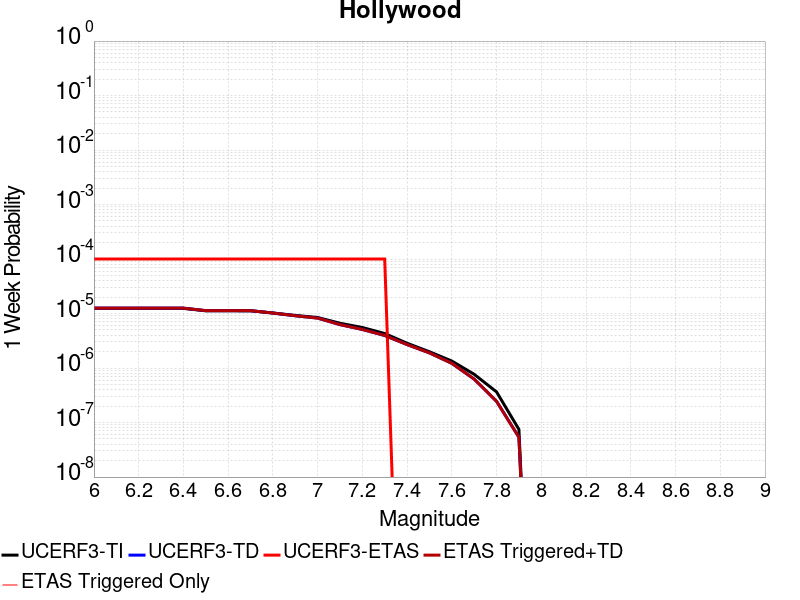 |  | 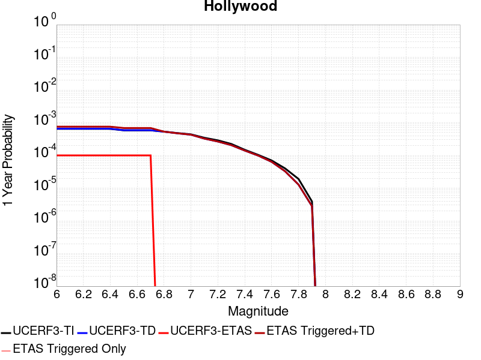 | 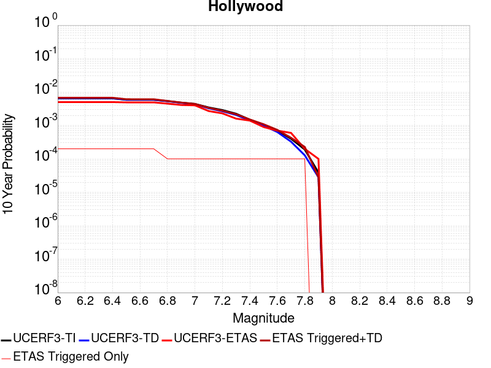 |

| Magnitude | 1 wk TI Prob | 1 wk TD Prob | 1 wk ETAS Prob | 1 wk ETAS/TD Gain | 1 wk ETAS Triggered+TD | 1 wk ETAS Triggered Only | 1 mo TI Prob | 1 mo TD Prob | 1 mo ETAS Prob | 1 mo ETAS/TD Gain | 1 mo ETAS Triggered+TD | 1 mo ETAS Triggered Only | 1 yr TI Prob | 1 yr TD Prob | 1 yr ETAS Prob | 1 yr ETAS/TD Gain | 1 yr ETAS Triggered+TD | 1 yr ETAS Triggered Only | 10 yr TI Prob | 10 yr TD Prob | 10 yr ETAS Prob | 10 yr ETAS/TD Gain | 10 yr ETAS Triggered+TD | 10 yr ETAS Triggered Only |
|-----|-----|-----|-----|-----|-----|-----|-----|-----|-----|-----|-----|-----|-----|-----|-----|-----|-----|-----|-----|-----|-----|-----|-----|-----|
| 6.0 | 1.24487615E-5 | 1.2595777E-5 | 1.0E-4 | 7.939169 | 1.2595777E-5 | 0.0 | 5.3350745E-5 | 5.398081E-5 | 1.0E-4 | 1.8525102 | 5.398081E-5 | 0.0 | 6.4935174E-4 | 6.570228E-4 | 4.0E-4 | 0.60880685 | 7.569571E-4 | 1.0E-4 | 0.0064745755 | 0.0065512913 | 0.005 | 0.76320827 | 0.006749981 | 2.0E-4 |
| 6.1 | 1.24487615E-5 | 1.2595777E-5 | 1.0E-4 | 7.939169 | 1.2595777E-5 | 0.0 | 5.3350745E-5 | 5.398081E-5 | 1.0E-4 | 1.8525102 | 5.398081E-5 | 0.0 | 6.4935174E-4 | 6.570228E-4 | 4.0E-4 | 0.60880685 | 7.569571E-4 | 1.0E-4 | 0.0064745755 | 0.0065512913 | 0.005 | 0.76320827 | 0.006749981 | 2.0E-4 |
| 6.2 | 1.24487615E-5 | 1.2595777E-5 | 1.0E-4 | 7.939169 | 1.2595777E-5 | 0.0 | 5.3350745E-5 | 5.398081E-5 | 1.0E-4 | 1.8525102 | 5.398081E-5 | 0.0 | 6.4935174E-4 | 6.570228E-4 | 4.0E-4 | 0.60880685 | 7.569571E-4 | 1.0E-4 | 0.0064745755 | 0.0065512913 | 0.005 | 0.76320827 | 0.006749981 | 2.0E-4 |
| 6.3 | 1.24487615E-5 | 1.2595777E-5 | 1.0E-4 | 7.939169 | 1.2595777E-5 | 0.0 | 5.3350745E-5 | 5.398081E-5 | 1.0E-4 | 1.8525102 | 5.398081E-5 | 0.0 | 6.4935174E-4 | 6.570228E-4 | 4.0E-4 | 0.60880685 | 7.569571E-4 | 1.0E-4 | 0.0064745755 | 0.0065512913 | 0.005 | 0.76320827 | 0.006749981 | 2.0E-4 |
| 6.4 | 1.2431024E-5 | 1.2576386E-5 | 1.0E-4 | 7.9514093 | 1.2576386E-5 | 0.0 | 5.327473E-5 | 5.389771E-5 | 1.0E-4 | 1.8553663 | 5.389771E-5 | 0.0 | 6.4842677E-4 | 6.5601175E-4 | 4.0E-4 | 0.6097452 | 7.5594615E-4 | 1.0E-4 | 0.0064653796 | 0.00654124 | 0.005 | 0.76438105 | 0.0067399316 | 2.0E-4 |
| 6.5 | 1.1242222E-5 | 1.1320201E-5 | 1.0E-4 | 8.833765 | 1.1320201E-5 | 0.0 | 4.8180063E-5 | 4.8514263E-5 | 1.0E-4 | 2.0612495 | 4.8514263E-5 | 0.0 | 5.864344E-4 | 5.9050374E-4 | 4.0E-4 | 0.6773878 | 6.9044466E-4 | 1.0E-4 | 0.0058488925 | 0.0058896337 | 0.0049 | 0.8319703 | 0.0060884557 | 2.0E-4 |
| 6.6 | 1.1234066E-5 | 1.1311314E-5 | 1.0E-4 | 8.840706 | 1.1311314E-5 | 0.0 | 4.8145106E-5 | 4.8476173E-5 | 1.0E-4 | 2.062869 | 4.8476173E-5 | 0.0 | 5.86009E-4 | 5.9004023E-4 | 4.0E-4 | 0.67791986 | 6.899813E-4 | 1.0E-4 | 0.005844661 | 0.005885023 | 0.0049 | 0.83262205 | 0.006083846 | 2.0E-4 |
| 6.7 | 1.12294E-5 | 1.1306056E-5 | 1.0E-4 | 8.844818 | 1.1306056E-5 | 0.0 | 4.812511E-5 | 4.845364E-5 | 1.0E-4 | 2.0638285 | 4.845364E-5 | 0.0 | 5.857657E-4 | 5.897661E-4 | 4.0E-4 | 0.67823505 | 6.8970706E-4 | 1.0E-4 | 0.0058422405 | 0.005882296 | 0.0049 | 0.8330081 | 0.006081119 | 2.0E-4 |
| 6.8 | 1.0252819E-5 | 1.0220592E-5 | 1.0E-4 | 9.784168 | 1.0220592E-5 | 0.0 | 4.3939912E-5 | 4.3801814E-5 | 1.0E-4 | 2.2830105 | 4.3801814E-5 | 0.0 | 5.3483713E-4 | 5.331587E-4 | 3.0E-4 | 0.5626842 | 5.331587E-4 | 0.0 | 0.005335517 | 0.0053190226 | 0.0045 | 0.8460201 | 0.0054184906 | 1.0E-4 |
| 6.9 | 9.252289E-6 | 9.112207E-6 | 1.0E-4 | 10.974289 | 9.112207E-6 | 0.0 | 3.9652066E-5 | 3.905174E-5 | 1.0E-4 | 2.5607052 | 3.905174E-5 | 0.0 | 4.8265693E-4 | 4.753529E-4 | 3.0E-4 | 0.6311101 | 4.753529E-4 | 0.0 | 0.0048161 | 0.0047435346 | 0.0041 | 0.8643344 | 0.00484306 | 1.0E-4 |
| 7.0 | 8.474604E-6 | 8.25999E-6 | 1.0E-4 | 12.106552 | 8.25999E-6 | 0.0 | 3.6319227E-5 | 3.5399487E-5 | 1.0E-4 | 2.8248997 | 3.5399487E-5 | 0.0 | 4.4209688E-4 | 4.3090494E-4 | 3.0E-4 | 0.69620925 | 4.3090494E-4 | 0.0 | 0.004412184 | 0.0043008444 | 0.004 | 0.9300499 | 0.0044004144 | 1.0E-4 |
| 7.1 | 6.643643E-6 | 6.2697154E-6 | 1.0E-4 | 15.949687 | 6.2697154E-6 | 0.0 | 2.8472443E-5 | 2.6869935E-5 | 1.0E-4 | 3.7216318 | 2.6869935E-5 | 0.0 | 3.4659685E-4 | 3.2709277E-4 | 2.0E-4 | 0.61144733 | 3.2709277E-4 | 0.0 | 0.0034605677 | 0.0032661592 | 0.0027 | 0.826659 | 0.0033658326 | 1.0E-4 |
| 7.2 | 5.549002E-6 | 5.1098514E-6 | 1.0E-4 | 19.57004 | 5.1098514E-6 | 0.0 | 2.378122E-5 | 2.189918E-5 | 1.0E-4 | 4.566381 | 2.189918E-5 | 0.0 | 2.8949787E-4 | 2.6659004E-4 | 2.0E-4 | 0.75021553 | 2.6659004E-4 | 0.0 | 0.0028912104 | 0.002662719 | 0.0023 | 0.86377877 | 0.0027624527 | 1.0E-4 |
| 7.3 | 4.3059727E-6 | 3.9608553E-6 | 1.0E-4 | 25.24707 | 3.9608553E-6 | 0.0 | 1.8454039E-5 | 1.6974986E-5 | 1.0E-4 | 5.8910213 | 1.6974986E-5 | 0.0 | 2.2465475E-4 | 2.0665093E-4 | 2.0E-4 | 0.96781564 | 2.0665093E-4 | 0.0 | 0.0022442779 | 0.0020645978 | 0.0016 | 0.77496934 | 0.0021643913 | 1.0E-4 |
| 7.4 | 2.8550733E-6 | 2.702088E-6 | 0.0 | 0.0 | 2.702088E-6 | 0.0 | 1.2235971E-5 | 1.1580326E-5 | 0.0 | 0.0 | 1.1580326E-5 | 0.0 | 1.4896276E-4 | 1.409814E-4 | 1.0E-4 | 0.70931345 | 1.409814E-4 | 0.0 | 0.0014886294 | 0.0014089247 | 0.0014 | 0.99366564 | 0.0015087838 | 1.0E-4 |
| 7.5 | 1.9927045E-6 | 1.8981917E-6 | 0.0 | 0.0 | 1.8981917E-6 | 0.0 | 8.540134E-6 | 8.135082E-6 | 0.0 | 0.0 | 8.135082E-6 | 0.0 | 1.0397117E-4 | 9.904016E-5 | 1.0E-4 | 1.0096915 | 9.904016E-5 | 0.0 | 0.0010392254 | 9.899638E-4 | 9.0E-4 | 0.90912414 | 0.0010898648 | 1.0E-4 |
| 7.6 | 1.345084E-6 | 1.2219602E-6 | 0.0 | 0.0 | 1.2219602E-6 | 0.0 | 5.764633E-6 | 5.2369624E-6 | 0.0 | 0.0 | 5.2369624E-6 | 0.0 | 7.018215E-5 | 6.375817E-5 | 1.0E-4 | 1.5684265 | 6.375817E-5 | 0.0 | 7.0159987E-4 | 6.374008E-4 | 7.0E-4 | 1.0982102 | 7.3733705E-4 | 1.0E-4 |
| 7.7 | 7.6835164E-7 | 6.2803826E-7 | 0.0 | 0.0 | 6.2803826E-7 | 0.0 | 3.2929315E-6 | 2.6915898E-6 | 0.0 | 0.0 | 2.6915898E-6 | 0.0 | 4.00907E-5 | 3.276963E-5 | 1.0E-4 | 3.0516062 | 3.276963E-5 | 0.0 | 4.0083472E-4 | 3.2764944E-4 | 6.0E-4 | 1.8312255 | 4.2761667E-4 | 1.0E-4 |
| 7.8 | 3.6562128E-7 | 2.4556755E-7 | 0.0 | 0.0 | 2.4556755E-7 | 0.0 | 1.5669474E-6 | 1.0524319E-6 | 0.0 | 0.0 | 1.0524319E-6 | 0.0 | 1.9077417E-5 | 1.2813287E-5 | 0.0 | 0.0 | 1.2813287E-5 | 0.0 | 1.907578E-4 | 1.2812586E-4 | 2.0E-4 | 1.5609652 | 2.2811304E-4 | 1.0E-4 |
| 7.9 | 7.5024424E-8 | 5.3863193E-8 | 0.0 | 0.0 | 5.3863193E-8 | 0.0 | 3.215332E-7 | 2.3084225E-7 | 0.0 | 0.0 | 2.3084225E-7 | 0.0 | 3.91466E-6 | 2.8105019E-6 | 0.0 | 0.0 | 2.8105019E-6 | 0.0 | 3.9145907E-5 | 2.8104794E-5 | 1.0E-4 | 3.5581117 | 2.8104794E-5 | 0.0 |

## Butano 2011 CFM
*[(top)](#table-of-contents)*

| 1 Week | 1 Month | 1 Year | 10 Year |
|-----|-----|-----|-----|
| 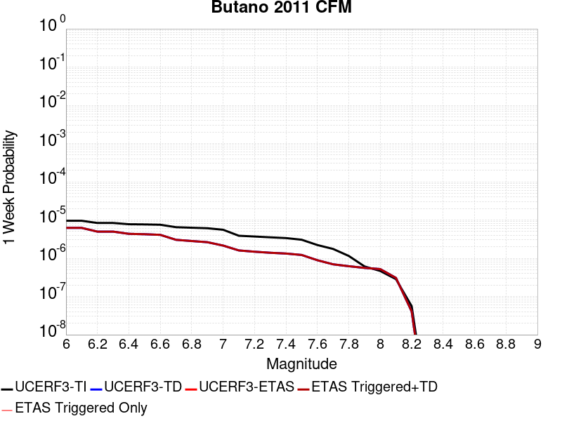 | 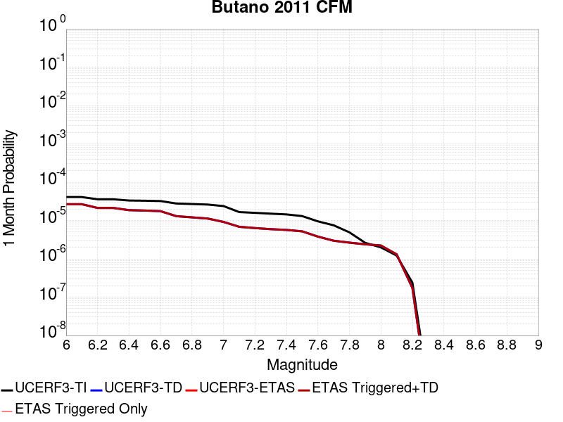 | 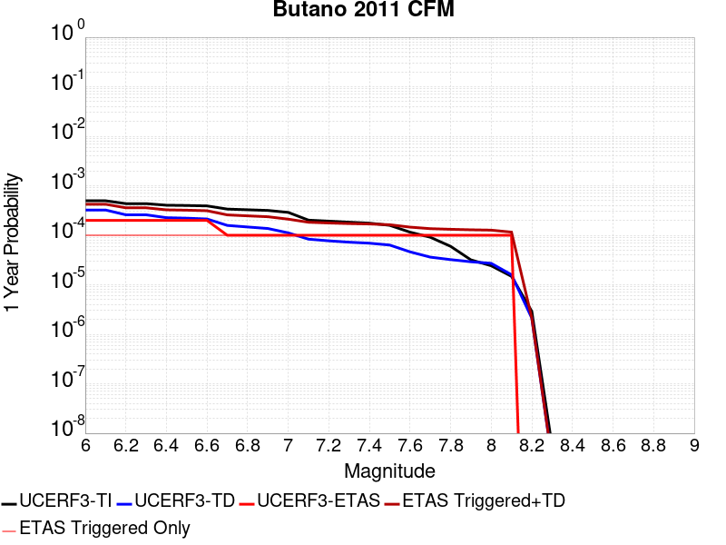 | 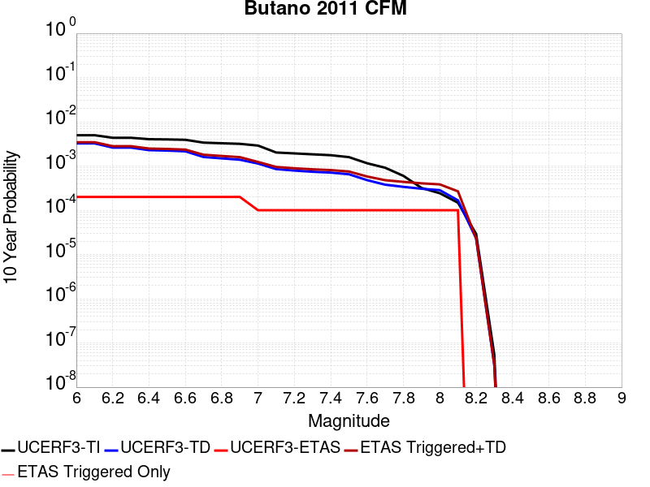 |

| Magnitude | 1 wk TI Prob | 1 wk TD Prob | 1 wk ETAS Prob | 1 wk ETAS/TD Gain | 1 wk ETAS Triggered+TD | 1 wk ETAS Triggered Only | 1 mo TI Prob | 1 mo TD Prob | 1 mo ETAS Prob | 1 mo ETAS/TD Gain | 1 mo ETAS Triggered+TD | 1 mo ETAS Triggered Only | 1 yr TI Prob | 1 yr TD Prob | 1 yr ETAS Prob | 1 yr ETAS/TD Gain | 1 yr ETAS Triggered+TD | 1 yr ETAS Triggered Only | 10 yr TI Prob | 10 yr TD Prob | 10 yr ETAS Prob | 10 yr ETAS/TD Gain | 10 yr ETAS Triggered+TD | 10 yr ETAS Triggered Only |
|-----|-----|-----|-----|-----|-----|-----|-----|-----|-----|-----|-----|-----|-----|-----|-----|-----|-----|-----|-----|-----|-----|-----|-----|-----|
| 6.0 | 9.561135E-6 | 6.239713E-6 | 0.0 | 0.0 | 6.239713E-6 | 0.0 | 4.097565E-5 | 2.6741365E-5 | 0.0 | 0.0 | 2.6741365E-5 | 0.0 | 4.9876433E-4 | 3.255297E-4 | 2.0E-4 | 0.6143833 | 4.2549713E-4 | 1.0E-4 | 0.004976464 | 0.0032682305 | 0.0027 | 0.82613516 | 0.0034675768 | 2.0E-4 |
| 6.1 | 9.561135E-6 | 6.239713E-6 | 0.0 | 0.0 | 6.239713E-6 | 0.0 | 4.097565E-5 | 2.6741365E-5 | 0.0 | 0.0 | 2.6741365E-5 | 0.0 | 4.9876433E-4 | 3.255297E-4 | 2.0E-4 | 0.6143833 | 4.2549713E-4 | 1.0E-4 | 0.004976464 | 0.0032682305 | 0.0027 | 0.82613516 | 0.0034675768 | 2.0E-4 |
| 6.2 | 8.364741E-6 | 4.99269E-6 | 0.0 | 0.0 | 4.99269E-6 | 0.0 | 3.5848396E-5 | 2.1397074E-5 | 0.0 | 0.0 | 2.1397074E-5 | 0.0 | 4.3636683E-4 | 2.604798E-4 | 2.0E-4 | 0.7678138 | 3.6045376E-4 | 1.0E-4 | 0.0043551093 | 0.0026193953 | 0.0021 | 0.8017118 | 0.0028188713 | 2.0E-4 |
| 6.3 | 8.364741E-6 | 4.99269E-6 | 0.0 | 0.0 | 4.99269E-6 | 0.0 | 3.5848396E-5 | 2.1397074E-5 | 0.0 | 0.0 | 2.1397074E-5 | 0.0 | 4.3636683E-4 | 2.604798E-4 | 2.0E-4 | 0.7678138 | 3.6045376E-4 | 1.0E-4 | 0.0043551093 | 0.0026193953 | 0.0021 | 0.8017118 | 0.0028188713 | 2.0E-4 |
| 6.4 | 7.768282E-6 | 4.3705827E-6 | 0.0 | 0.0 | 4.3705827E-6 | 0.0 | 3.329221E-5 | 1.8730942E-5 | 0.0 | 0.0 | 1.8730942E-5 | 0.0 | 4.0525728E-4 | 2.280267E-4 | 2.0E-4 | 0.8770903 | 3.280039E-4 | 1.0E-4 | 0.0040451903 | 0.0022955623 | 0.0019 | 0.8276839 | 0.002495103 | 2.0E-4 |
| 6.5 | 7.673437E-6 | 4.2701336E-6 | 0.0 | 0.0 | 4.2701336E-6 | 0.0 | 3.2885746E-5 | 1.830045E-5 | 0.0 | 0.0 | 1.830045E-5 | 0.0 | 4.0031038E-4 | 2.2278656E-4 | 2.0E-4 | 0.8977202 | 3.2276427E-4 | 1.0E-4 | 0.0039959005 | 0.0022432667 | 0.0019 | 0.8469791 | 0.0024428181 | 2.0E-4 |
| 6.6 | 7.5244197E-6 | 4.1150774E-6 | 0.0 | 0.0 | 4.1150774E-6 | 0.0 | 3.2247113E-5 | 1.7635934E-5 | 0.0 | 0.0 | 1.7635934E-5 | 0.0 | 3.9253788E-4 | 2.1469768E-4 | 2.0E-4 | 0.93154246 | 3.146762E-4 | 1.0E-4 | 0.003918452 | 0.002162537 | 0.0019 | 0.8785977 | 0.0023621046 | 2.0E-4 |
| 6.7 | 6.4921405E-6 | 3.054991E-6 | 0.0 | 0.0 | 3.054991E-6 | 0.0 | 2.7823162E-5 | 1.3092753E-5 | 0.0 | 0.0 | 1.3092753E-5 | 0.0 | 3.3869434E-4 | 1.5939269E-4 | 1.0E-4 | 0.6273813 | 2.5937674E-4 | 1.0E-4 | 0.003381786 | 0.0016103045 | 0.0013 | 0.80730075 | 0.0018099825 | 2.0E-4 |
| 6.8 | 6.2890294E-6 | 2.8417232E-6 | 0.0 | 0.0 | 2.8417232E-6 | 0.0 | 2.6952705E-5 | 1.2178757E-5 | 0.0 | 0.0 | 1.2178757E-5 | 0.0 | 3.2809976E-4 | 1.4826635E-4 | 1.0E-4 | 0.67446184 | 2.4825154E-4 | 1.0E-4 | 0.0032761577 | 0.0014991963 | 0.0011 | 0.7337265 | 0.0016988964 | 2.0E-4 |
| 6.9 | 6.0965517E-6 | 2.6481966E-6 | 0.0 | 0.0 | 2.6481966E-6 | 0.0 | 2.6127816E-5 | 1.1349365E-5 | 0.0 | 0.0 | 1.1349365E-5 | 0.0 | 3.1805973E-4 | 1.3816982E-4 | 1.0E-4 | 0.723747 | 2.38156E-4 | 1.0E-4 | 0.0031760489 | 0.0013983615 | 0.0011 | 0.7866349 | 0.0015980818 | 2.0E-4 |
| 7.0 | 5.566252E-6 | 2.1654596E-6 | 0.0 | 0.0 | 2.1654596E-6 | 0.0 | 2.3855147E-5 | 9.280508E-6 | 0.0 | 0.0 | 9.280508E-6 | 0.0 | 2.9039773E-4 | 1.12984366E-4 | 1.0E-4 | 0.8850782 | 2.1297307E-4 | 1.0E-4 | 0.0029001853 | 0.0011467899 | 9.0E-4 | 0.7847994 | 0.0012466752 | 1.0E-4 |
| 7.1 | 3.878588E-6 | 1.6147625E-6 | 0.0 | 0.0 | 1.6147625E-6 | 0.0 | 1.6622414E-5 | 6.9203916E-6 | 0.0 | 0.0 | 6.9203916E-6 | 0.0 | 2.023591E-4 | 8.425251E-5 | 1.0E-4 | 1.1869082 | 1.8424408E-4 | 1.0E-4 | 0.0020217493 | 8.5932395E-4 | 7.0E-4 | 0.81459385 | 9.59238E-4 | 1.0E-4 |
| 7.2 | 3.7038085E-6 | 1.4956663E-6 | 0.0 | 0.0 | 1.4956663E-6 | 0.0 | 1.587337E-5 | 6.4099827E-6 | 0.0 | 0.0 | 6.4099827E-6 | 0.0 | 1.9324113E-4 | 7.803875E-5 | 1.0E-4 | 1.2814147 | 1.7803094E-4 | 1.0E-4 | 0.0019307317 | 7.971998E-4 | 6.0E-4 | 0.7526344 | 8.9712004E-4 | 1.0E-4 |
| 7.3 | 3.5277278E-6 | 1.4036292E-6 | 0.0 | 0.0 | 1.4036292E-6 | 0.0 | 1.5118746E-5 | 6.01554E-6 | 0.0 | 0.0 | 6.01554E-6 | 0.0 | 1.8405518E-4 | 7.323673E-5 | 1.0E-4 | 1.365435 | 1.7322942E-4 | 1.0E-4 | 0.0018390282 | 7.4912497E-4 | 6.0E-4 | 0.8009345 | 8.4905006E-4 | 1.0E-4 |
| 7.4 | 3.3711294E-6 | 1.3406908E-6 | 0.0 | 0.0 | 1.3406908E-6 | 0.0 | 1.4447617E-5 | 5.7458046E-6 | 0.0 | 0.0 | 5.7458046E-6 | 0.0 | 1.7588554E-4 | 6.995293E-5 | 1.0E-4 | 1.4295328 | 1.6994594E-4 | 1.0E-4 | 0.0017574639 | 7.162555E-4 | 6.0E-4 | 0.8376899 | 8.1618386E-4 | 1.0E-4 |
| 7.5 | 3.0496426E-6 | 1.229189E-6 | 0.0 | 0.0 | 1.229189E-6 | 0.0 | 1.3069831E-5 | 5.267942E-6 | 0.0 | 0.0 | 5.267942E-6 | 0.0 | 1.5911358E-4 | 6.413531E-5 | 1.0E-4 | 1.5592035 | 1.641289E-4 | 1.0E-4 | 0.001589997 | 6.580403E-4 | 5.0E-4 | 0.7598319 | 7.579745E-4 | 1.0E-4 |
| 7.6 | 2.2179781E-6 | 8.960162E-7 | 0.0 | 0.0 | 8.960162E-7 | 0.0 | 9.505586E-6 | 3.840064E-6 | 0.0 | 0.0 | 3.840064E-6 | 0.0 | 1.1572436E-4 | 4.6751775E-5 | 1.0E-4 | 2.1389563 | 1.467471E-4 | 1.0E-4 | 0.0011566412 | 4.841885E-4 | 4.0E-4 | 0.82612455 | 5.8414007E-4 | 1.0E-4 |
| 7.7 | 1.7519328E-6 | 7.0107916E-7 | 0.0 | 0.0 | 7.0107916E-7 | 0.0 | 7.508262E-6 | 3.0046215E-6 | 0.0 | 0.0 | 3.0046215E-6 | 0.0 | 9.140925E-5 | 3.658065E-5 | 1.0E-4 | 2.7336855 | 1.36577E-4 | 1.0E-4 | 9.137166E-4 | 3.8178556E-4 | 3.0E-4 | 0.7857814 | 4.8174738E-4 | 1.0E-4 |
| 7.8 | 1.1478974E-6 | 6.247133E-7 | 0.0 | 0.0 | 6.247133E-7 | 0.0 | 4.9195505E-6 | 2.6773398E-6 | 0.0 | 0.0 | 2.6773398E-6 | 0.0 | 5.9893882E-5 | 3.2596126E-5 | 1.0E-4 | 3.0678494 | 1.3259286E-4 | 1.0E-4 | 5.9877743E-4 | 3.4161366E-4 | 3.0E-4 | 0.878185 | 4.4157953E-4 | 1.0E-4 |
| 7.9 | 6.1154634E-7 | 5.6456645E-7 | 0.0 | 0.0 | 5.6456645E-7 | 0.0 | 2.6209104E-6 | 2.419568E-6 | 0.0 | 0.0 | 2.419568E-6 | 0.0 | 3.1909116E-5 | 2.9457844E-5 | 1.0E-4 | 3.3946817 | 1.294549E-4 | 1.0E-4 | 3.1904536E-4 | 3.089843E-4 | 3.0E-4 | 0.97092307 | 4.089534E-4 | 1.0E-4 |
| 8.0 | 4.6520046E-7 | 5.2476315E-7 | 0.0 | 0.0 | 5.2476315E-7 | 0.0 | 1.9937147E-6 | 2.2489828E-6 | 0.0 | 0.0 | 2.2489828E-6 | 0.0 | 2.4273206E-5 | 2.7381024E-5 | 1.0E-4 | 3.6521645 | 1.2737828E-4 | 1.0E-4 | 2.4270554E-4 | 2.8723886E-4 | 2.0E-4 | 0.6962846 | 3.8721014E-4 | 1.0E-4 |
| 8.1 | 2.8425194E-7 | 3.0901452E-7 | 0.0 | 0.0 | 3.0901452E-7 | 0.0 | 1.218222E-6 | 1.3243472E-6 | 0.0 | 0.0 | 1.3243472E-6 | 0.0 | 1.4831752E-5 | 1.6123808E-5 | 1.0E-4 | 6.2020087 | 1.16122195E-4 | 1.0E-4 | 1.4830762E-4 | 1.6914705E-4 | 2.0E-4 | 1.1824031 | 2.6913013E-4 | 1.0E-4 |
| 8.2 | 5.585778E-8 | 4.1078643E-8 | 0.0 | 0.0 | 4.1078643E-8 | 0.0 | 2.3939046E-7 | 1.760513E-7 | 0.0 | 0.0 | 1.760513E-7 | 0.0 | 2.914575E-6 | 2.1434225E-6 | 0.0 | 0.0 | 2.1434225E-6 | 0.0 | 2.9145367E-5 | 2.3277218E-5 | 0.0 | 0.0 | 2.3277218E-5 | 0.0 |
| 8.3 | 1.0371215E-10 | 5.440559E-11 | 0.0 | 0.0 | 5.440559E-11 | 0.0 | 4.4448079E-10 | 2.3316682E-10 | 0.0 | 0.0 | 2.3316682E-10 | 0.0 | 5.4115543E-9 | 2.8388074E-9 | 0.0 | 0.0 | 2.8388074E-9 | 0.0 | 5.4115542E-8 | 3.2611588E-8 | 0.0 | 0.0 | 3.2611588E-8 | 0.0 |

## San Gabriel (Extension)
*[(top)](#table-of-contents)*

| 1 Week | 1 Month | 1 Year | 10 Year |
|-----|-----|-----|-----|
| 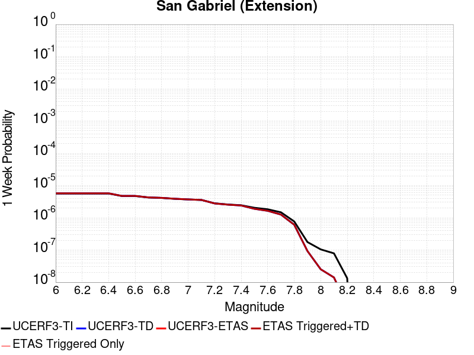 | 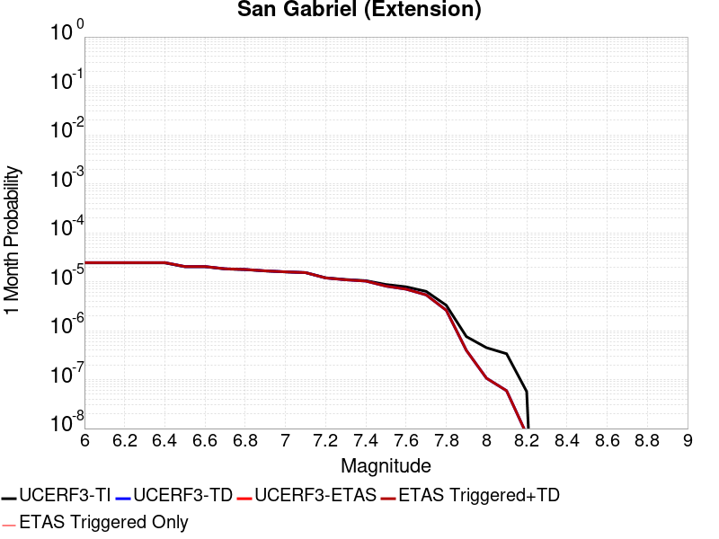 | 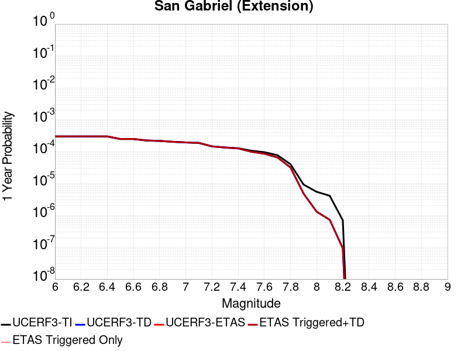 | 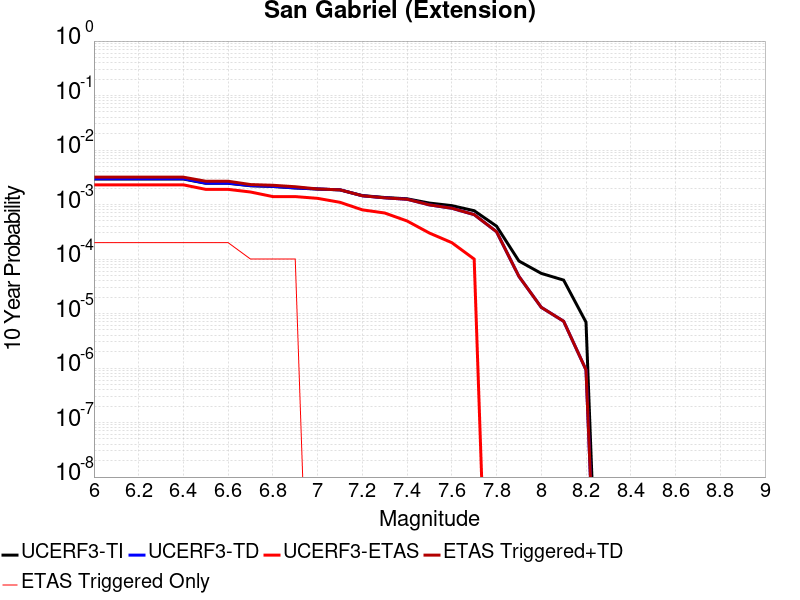 |

| Magnitude | 1 wk TI Prob | 1 wk TD Prob | 1 wk ETAS Prob | 1 wk ETAS/TD Gain | 1 wk ETAS Triggered+TD | 1 wk ETAS Triggered Only | 1 mo TI Prob | 1 mo TD Prob | 1 mo ETAS Prob | 1 mo ETAS/TD Gain | 1 mo ETAS Triggered+TD | 1 mo ETAS Triggered Only | 1 yr TI Prob | 1 yr TD Prob | 1 yr ETAS Prob | 1 yr ETAS/TD Gain | 1 yr ETAS Triggered+TD | 1 yr ETAS Triggered Only | 10 yr TI Prob | 10 yr TD Prob | 10 yr ETAS Prob | 10 yr ETAS/TD Gain | 10 yr ETAS Triggered+TD | 10 yr ETAS Triggered Only |
|-----|-----|-----|-----|-----|-----|-----|-----|-----|-----|-----|-----|-----|-----|-----|-----|-----|-----|-----|-----|-----|-----|-----|-----|-----|
| 6.0 | 5.6486106E-6 | 5.7217835E-6 | 0.0 | 0.0 | 5.7217835E-6 | 0.0 | 2.4208108E-5 | 2.4521705E-5 | 0.0 | 0.0 | 2.4521705E-5 | 0.0 | 2.9469383E-4 | 2.985121E-4 | 0.0 | 0.0 | 2.985121E-4 | 0.0 | 0.0029430336 | 0.002981239 | 0.0023 | 0.77149135 | 0.0031806426 | 2.0E-4 |
| 6.1 | 5.6486106E-6 | 5.7217835E-6 | 0.0 | 0.0 | 5.7217835E-6 | 0.0 | 2.4208108E-5 | 2.4521705E-5 | 0.0 | 0.0 | 2.4521705E-5 | 0.0 | 2.9469383E-4 | 2.985121E-4 | 0.0 | 0.0 | 2.985121E-4 | 0.0 | 0.0029430336 | 0.002981239 | 0.0023 | 0.77149135 | 0.0031806426 | 2.0E-4 |
| 6.2 | 5.6486106E-6 | 5.7217835E-6 | 0.0 | 0.0 | 5.7217835E-6 | 0.0 | 2.4208108E-5 | 2.4521705E-5 | 0.0 | 0.0 | 2.4521705E-5 | 0.0 | 2.9469383E-4 | 2.985121E-4 | 0.0 | 0.0 | 2.985121E-4 | 0.0 | 0.0029430336 | 0.002981239 | 0.0023 | 0.77149135 | 0.0031806426 | 2.0E-4 |
| 6.3 | 5.6486106E-6 | 5.7217835E-6 | 0.0 | 0.0 | 5.7217835E-6 | 0.0 | 2.4208108E-5 | 2.4521705E-5 | 0.0 | 0.0 | 2.4521705E-5 | 0.0 | 2.9469383E-4 | 2.985121E-4 | 0.0 | 0.0 | 2.985121E-4 | 0.0 | 0.0029430336 | 0.002981239 | 0.0023 | 0.77149135 | 0.0031806426 | 2.0E-4 |
| 6.4 | 5.6486106E-6 | 5.7217835E-6 | 0.0 | 0.0 | 5.7217835E-6 | 0.0 | 2.4208108E-5 | 2.4521705E-5 | 0.0 | 0.0 | 2.4521705E-5 | 0.0 | 2.9469383E-4 | 2.985121E-4 | 0.0 | 0.0 | 2.985121E-4 | 0.0 | 0.0029430336 | 0.002981239 | 0.0023 | 0.77149135 | 0.0031806426 | 2.0E-4 |
| 6.5 | 4.7134554E-6 | 4.7591493E-6 | 0.0 | 0.0 | 4.7591493E-6 | 0.0 | 2.0200367E-5 | 2.0396199E-5 | 0.0 | 0.0 | 2.0396199E-5 | 0.0 | 2.459117E-4 | 2.4829627E-4 | 0.0 | 0.0 | 2.4829627E-4 | 0.0 | 0.0024563975 | 0.0024802738 | 0.0019 | 0.76604444 | 0.0026797778 | 2.0E-4 |
| 6.6 | 4.7134554E-6 | 4.7591493E-6 | 0.0 | 0.0 | 4.7591493E-6 | 0.0 | 2.0200367E-5 | 2.0396199E-5 | 0.0 | 0.0 | 2.0396199E-5 | 0.0 | 2.459117E-4 | 2.4829627E-4 | 0.0 | 0.0 | 2.4829627E-4 | 0.0 | 0.0024563975 | 0.0024802738 | 0.0019 | 0.76604444 | 0.0026797778 | 2.0E-4 |
| 6.7 | 4.2468837E-6 | 4.278938E-6 | 0.0 | 0.0 | 4.278938E-6 | 0.0 | 1.8200803E-5 | 1.833818E-5 | 0.0 | 0.0 | 1.833818E-5 | 0.0 | 2.2157225E-4 | 2.232452E-4 | 0.0 | 0.0 | 2.232452E-4 | 0.0 | 0.0022135144 | 0.0022302822 | 0.0017 | 0.7622354 | 0.0023300592 | 1.0E-4 |
| 6.8 | 4.1180615E-6 | 4.146319E-6 | 0.0 | 0.0 | 4.146319E-6 | 0.0 | 1.7648716E-5 | 1.7769822E-5 | 0.0 | 0.0 | 1.7769822E-5 | 0.0 | 2.1485193E-4 | 2.1632684E-4 | 0.0 | 0.0 | 2.1632684E-4 | 0.0 | 0.0021464431 | 0.0021612346 | 0.0014 | 0.64777786 | 0.0022610186 | 1.0E-4 |
| 6.9 | 3.863861E-6 | 3.8846188E-6 | 0.0 | 0.0 | 3.8846188E-6 | 0.0 | 1.65593E-5 | 1.6648264E-5 | 0.0 | 0.0 | 1.6648264E-5 | 0.0 | 2.0159081E-4 | 2.0267443E-4 | 0.0 | 0.0 | 2.0267443E-4 | 0.0 | 0.0020140803 | 0.0020249644 | 0.0014 | 0.6913701 | 0.002124762 | 1.0E-4 |
| 7.0 | 3.6947372E-6 | 3.7105074E-6 | 0.0 | 0.0 | 3.7105074E-6 | 0.0 | 1.5834492E-5 | 1.5902082E-5 | 0.0 | 0.0 | 1.5902082E-5 | 0.0 | 1.9276788E-4 | 1.9359132E-4 | 0.0 | 0.0 | 1.9359132E-4 | 0.0 | 0.0019260074 | 0.001934294 | 0.0013 | 0.67207986 | 0.001934294 | 0.0 |
| 7.1 | 3.5686835E-6 | 3.5777114E-6 | 0.0 | 0.0 | 3.5777114E-6 | 0.0 | 1.5294268E-5 | 1.5332962E-5 | 0.0 | 0.0 | 1.5332962E-5 | 0.0 | 1.861918E-4 | 1.8666348E-4 | 0.0 | 0.0 | 1.8666348E-4 | 0.0 | 0.0018603588 | 0.0018651336 | 0.0011 | 0.5897701 | 0.0018651336 | 0.0 |
| 7.2 | 2.8023446E-6 | 2.7815329E-6 | 0.0 | 0.0 | 2.7815329E-6 | 0.0 | 1.2009994E-5 | 1.1920802E-5 | 0.0 | 0.0 | 1.1920802E-5 | 0.0 | 1.4621185E-4 | 1.451262E-4 | 0.0 | 0.0 | 1.451262E-4 | 0.0 | 0.001461157 | 0.001450326 | 8.0E-4 | 0.55160016 | 0.001450326 | 0.0 |
| 7.3 | 2.5843012E-6 | 2.5506613E-6 | 0.0 | 0.0 | 2.5506613E-6 | 0.0 | 1.1075529E-5 | 1.09313605E-5 | 0.0 | 0.0 | 1.09313605E-5 | 0.0 | 1.3483623E-4 | 1.3308128E-4 | 0.0 | 0.0 | 1.3308128E-4 | 0.0 | 0.0013475444 | 0.0013300264 | 7.0E-4 | 0.5263053 | 0.0013300264 | 0.0 |
| 7.4 | 2.4464468E-6 | 2.4012943E-6 | 0.0 | 0.0 | 2.4012943E-6 | 0.0 | 1.04847295E-5 | 1.0291221E-5 | 0.0 | 0.0 | 1.0291221E-5 | 0.0 | 1.276441E-4 | 1.2528851E-4 | 0.0 | 0.0 | 1.2528851E-4 | 0.0 | 0.0012757082 | 0.0012521892 | 5.0E-4 | 0.3993007 | 0.0012521892 | 0.0 |
| 7.5 | 2.0420266E-6 | 1.8951297E-6 | 0.0 | 0.0 | 1.8951297E-6 | 0.0 | 8.751514E-6 | 8.12196E-6 | 0.0 | 0.0 | 8.12196E-6 | 0.0 | 1.0654447E-4 | 9.88804E-5 | 0.0 | 0.0 | 9.88804E-5 | 0.0 | 0.001064934 | 9.883683E-4 | 3.0E-4 | 0.3035306 | 9.883683E-4 | 0.0 |
| 7.6 | 1.8326596E-6 | 1.6436466E-6 | 0.0 | 0.0 | 1.6436466E-6 | 0.0 | 7.854232E-6 | 7.0441806E-6 | 0.0 | 0.0 | 7.0441806E-6 | 0.0 | 9.562107E-5 | 8.5759544E-5 | 0.0 | 0.0 | 8.5759544E-5 | 0.0 | 9.5579936E-4 | 8.5726747E-4 | 2.0E-4 | 0.23329942 | 8.5726747E-4 | 0.0 |
| 7.7 | 1.4786998E-6 | 1.255879E-6 | 0.0 | 0.0 | 1.255879E-6 | 0.0 | 6.3372695E-6 | 5.382328E-6 | 0.0 | 0.0 | 5.382328E-6 | 0.0 | 7.715353E-5 | 6.552788E-5 | 0.0 | 0.0 | 6.552788E-5 | 0.0 | 7.7126746E-4 | 6.550912E-4 | 1.0E-4 | 0.1526505 | 6.550912E-4 | 0.0 |
| 7.8 | 7.6975533E-7 | 6.0986963E-7 | 0.0 | 0.0 | 6.0986963E-7 | 0.0 | 3.2989474E-6 | 2.6137245E-6 | 0.0 | 0.0 | 2.6137245E-6 | 0.0 | 4.0163945E-5 | 3.1821633E-5 | 0.0 | 0.0 | 3.1821633E-5 | 0.0 | 4.0156685E-4 | 3.181749E-4 | 0.0 | 0.0 | 3.181749E-4 | 0.0 |
| 7.9 | 1.7645915E-7 | 9.294494E-8 | 0.0 | 0.0 | 9.294494E-8 | 0.0 | 7.562533E-7 | 3.9833537E-7 | 0.0 | 0.0 | 3.9833537E-7 | 0.0 | 9.207345E-6 | 4.8497222E-6 | 0.0 | 0.0 | 4.8497222E-6 | 0.0 | 9.206964E-5 | 4.8500096E-5 | 0.0 | 0.0 | 4.8500096E-5 | 0.0 |
| 8.0 | 1.0463461E-7 | 2.5287552E-8 | 0.0 | 0.0 | 2.5287552E-8 | 0.0 | 4.4843398E-7 | 1.0837521E-7 | 0.0 | 0.0 | 1.0837521E-7 | 0.0 | 5.45967E-6 | 1.3194674E-6 | 0.0 | 0.0 | 1.3194674E-6 | 0.0 | 5.459536E-5 | 1.3198519E-5 | 0.0 | 0.0 | 1.3198519E-5 | 0.0 |
| 8.1 | 7.875717E-8 | 1.4086133E-8 | 0.0 | 0.0 | 1.4086133E-8 | 0.0 | 3.3753068E-7 | 6.036914E-8 | 0.0 | 0.0 | 6.036914E-8 | 0.0 | 4.109428E-6 | 7.3499405E-7 | 0.0 | 0.0 | 7.3499405E-7 | 0.0 | 4.109352E-5 | 7.353839E-6 | 0.0 | 0.0 | 7.353839E-6 | 0.0 |
| 8.2 | 1.33163E-8 | 1.8055674E-9 | 0.0 | 0.0 | 1.8055674E-9 | 0.0 | 5.7069855E-8 | 7.738145E-9 | 0.0 | 0.0 | 7.738145E-9 | 0.0 | 6.9482525E-7 | 9.4211906E-8 | 0.0 | 0.0 | 9.4211906E-8 | 0.0 | 6.9482307E-6 | 9.4409813E-7 | 0.0 | 0.0 | 9.4409813E-7 | 0.0 |

## Sisar
*[(top)](#table-of-contents)*

| 1 Week | 1 Month | 1 Year | 10 Year |
|-----|-----|-----|-----|
| 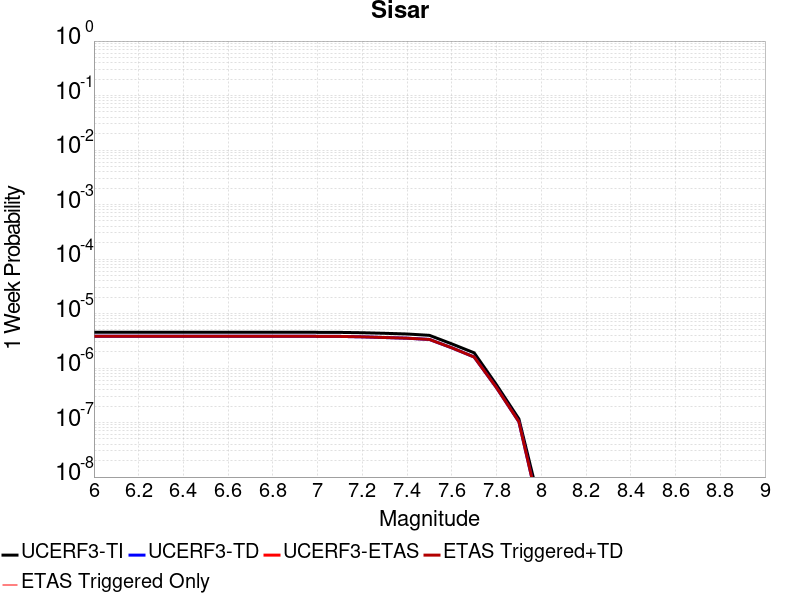 | 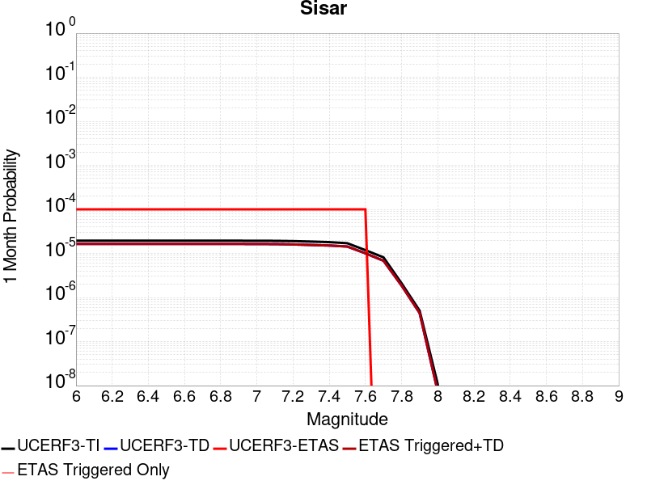 | 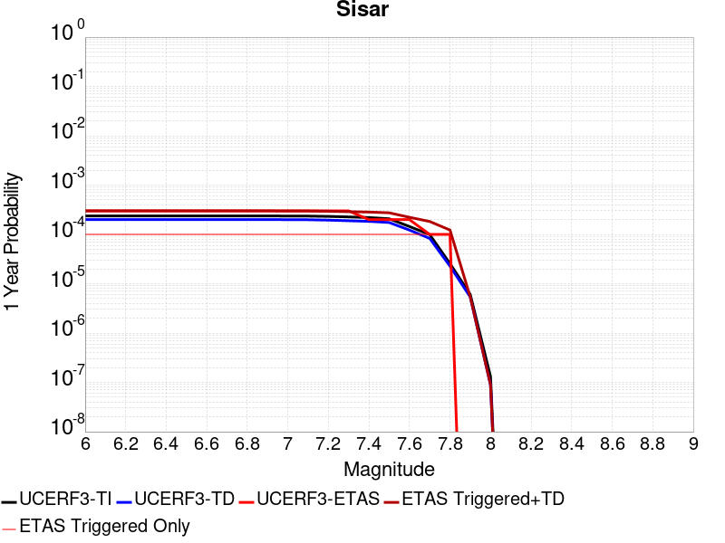 | 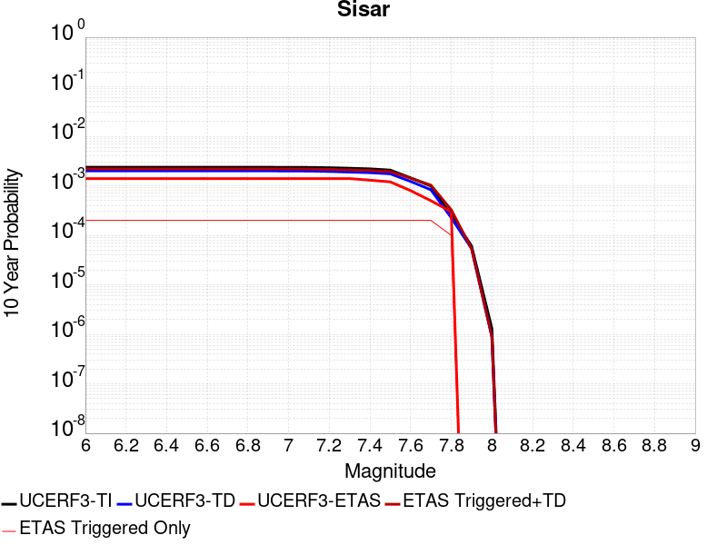 |

| Magnitude | 1 wk TI Prob | 1 wk TD Prob | 1 wk ETAS Prob | 1 wk ETAS/TD Gain | 1 wk ETAS Triggered+TD | 1 wk ETAS Triggered Only | 1 mo TI Prob | 1 mo TD Prob | 1 mo ETAS Prob | 1 mo ETAS/TD Gain | 1 mo ETAS Triggered+TD | 1 mo ETAS Triggered Only | 1 yr TI Prob | 1 yr TD Prob | 1 yr ETAS Prob | 1 yr ETAS/TD Gain | 1 yr ETAS Triggered+TD | 1 yr ETAS Triggered Only | 10 yr TI Prob | 10 yr TD Prob | 10 yr ETAS Prob | 10 yr ETAS/TD Gain | 10 yr ETAS Triggered+TD | 10 yr ETAS Triggered Only |
|-----|-----|-----|-----|-----|-----|-----|-----|-----|-----|-----|-----|-----|-----|-----|-----|-----|-----|-----|-----|-----|-----|-----|-----|-----|
| 6.0 | 4.544193E-6 | 3.8402895E-6 | 1.0E-4 | 26.039701 | 3.8402895E-6 | 0.0 | 1.9474966E-5 | 1.6458283E-5 | 1.0E-4 | 6.0759683 | 1.6458283E-5 | 0.0 | 2.3708193E-4 | 2.003615E-4 | 3.0E-4 | 1.4972936 | 3.0034146E-4 | 1.0E-4 | 0.0023682916 | 0.0020018423 | 0.0014 | 0.6993558 | 0.002201442 | 2.0E-4 |
| 6.1 | 4.544193E-6 | 3.8402895E-6 | 1.0E-4 | 26.039701 | 3.8402895E-6 | 0.0 | 1.9474966E-5 | 1.6458283E-5 | 1.0E-4 | 6.0759683 | 1.6458283E-5 | 0.0 | 2.3708193E-4 | 2.003615E-4 | 3.0E-4 | 1.4972936 | 3.0034146E-4 | 1.0E-4 | 0.0023682916 | 0.0020018423 | 0.0014 | 0.6993558 | 0.002201442 | 2.0E-4 |
| 6.2 | 4.544193E-6 | 3.8402895E-6 | 1.0E-4 | 26.039701 | 3.8402895E-6 | 0.0 | 1.9474966E-5 | 1.6458283E-5 | 1.0E-4 | 6.0759683 | 1.6458283E-5 | 0.0 | 2.3708193E-4 | 2.003615E-4 | 3.0E-4 | 1.4972936 | 3.0034146E-4 | 1.0E-4 | 0.0023682916 | 0.0020018423 | 0.0014 | 0.6993558 | 0.002201442 | 2.0E-4 |
| 6.3 | 4.544193E-6 | 3.8402895E-6 | 1.0E-4 | 26.039701 | 3.8402895E-6 | 0.0 | 1.9474966E-5 | 1.6458283E-5 | 1.0E-4 | 6.0759683 | 1.6458283E-5 | 0.0 | 2.3708193E-4 | 2.003615E-4 | 3.0E-4 | 1.4972936 | 3.0034146E-4 | 1.0E-4 | 0.0023682916 | 0.0020018423 | 0.0014 | 0.6993558 | 0.002201442 | 2.0E-4 |
| 6.4 | 4.544193E-6 | 3.8402895E-6 | 1.0E-4 | 26.039701 | 3.8402895E-6 | 0.0 | 1.9474966E-5 | 1.6458283E-5 | 1.0E-4 | 6.0759683 | 1.6458283E-5 | 0.0 | 2.3708193E-4 | 2.003615E-4 | 3.0E-4 | 1.4972936 | 3.0034146E-4 | 1.0E-4 | 0.0023682916 | 0.0020018423 | 0.0014 | 0.6993558 | 0.002201442 | 2.0E-4 |
| 6.5 | 4.544193E-6 | 3.8402895E-6 | 1.0E-4 | 26.039701 | 3.8402895E-6 | 0.0 | 1.9474966E-5 | 1.6458283E-5 | 1.0E-4 | 6.0759683 | 1.6458283E-5 | 0.0 | 2.3708193E-4 | 2.003615E-4 | 3.0E-4 | 1.4972936 | 3.0034146E-4 | 1.0E-4 | 0.0023682916 | 0.0020018423 | 0.0014 | 0.6993558 | 0.002201442 | 2.0E-4 |
| 6.6 | 4.544193E-6 | 3.8402895E-6 | 1.0E-4 | 26.039701 | 3.8402895E-6 | 0.0 | 1.9474966E-5 | 1.6458283E-5 | 1.0E-4 | 6.0759683 | 1.6458283E-5 | 0.0 | 2.3708193E-4 | 2.003615E-4 | 3.0E-4 | 1.4972936 | 3.0034146E-4 | 1.0E-4 | 0.0023682916 | 0.0020018423 | 0.0014 | 0.6993558 | 0.002201442 | 2.0E-4 |
| 6.7 | 4.544193E-6 | 3.8402895E-6 | 1.0E-4 | 26.039701 | 3.8402895E-6 | 0.0 | 1.9474966E-5 | 1.6458283E-5 | 1.0E-4 | 6.0759683 | 1.6458283E-5 | 0.0 | 2.3708193E-4 | 2.003615E-4 | 3.0E-4 | 1.4972936 | 3.0034146E-4 | 1.0E-4 | 0.0023682916 | 0.0020018423 | 0.0014 | 0.6993558 | 0.002201442 | 2.0E-4 |
| 6.8 | 4.544193E-6 | 3.8402895E-6 | 1.0E-4 | 26.039701 | 3.8402895E-6 | 0.0 | 1.9474966E-5 | 1.6458283E-5 | 1.0E-4 | 6.0759683 | 1.6458283E-5 | 0.0 | 2.3708193E-4 | 2.003615E-4 | 3.0E-4 | 1.4972936 | 3.0034146E-4 | 1.0E-4 | 0.0023682916 | 0.0020018423 | 0.0014 | 0.6993558 | 0.002201442 | 2.0E-4 |
| 6.9 | 4.542225E-6 | 3.8382514E-6 | 1.0E-4 | 26.05353 | 3.8382514E-6 | 0.0 | 1.9466532E-5 | 1.6449547E-5 | 1.0E-4 | 6.0791945 | 1.6449547E-5 | 0.0 | 2.3697925E-4 | 2.0025516E-4 | 3.0E-4 | 1.4980887 | 3.0023514E-4 | 1.0E-4 | 0.002367267 | 0.002000781 | 0.0014 | 0.69972676 | 0.0022003807 | 2.0E-4 |
| 7.0 | 4.5278484E-6 | 3.8233143E-6 | 1.0E-4 | 26.155317 | 3.8233143E-6 | 0.0 | 1.940492E-5 | 1.6385531E-5 | 1.0E-4 | 6.102945 | 1.6385531E-5 | 0.0 | 2.3622929E-4 | 1.9947592E-4 | 3.0E-4 | 1.5039409 | 2.9945598E-4 | 1.0E-4 | 0.0023597833 | 0.0019930026 | 0.0014 | 0.7024577 | 0.002192604 | 2.0E-4 |
| 7.1 | 4.5132488E-6 | 3.8081005E-6 | 1.0E-4 | 26.259811 | 3.8081005E-6 | 0.0 | 1.9342351E-5 | 1.6320331E-5 | 1.0E-4 | 6.127327 | 1.6320331E-5 | 0.0 | 2.3546767E-4 | 1.9868225E-4 | 3.0E-4 | 1.5099487 | 2.9866237E-4 | 1.0E-4 | 0.0023521832 | 0.0019850798 | 0.0014 | 0.7052613 | 0.0021846828 | 2.0E-4 |
| 7.2 | 4.448859E-6 | 3.7405541E-6 | 1.0E-4 | 26.734007 | 3.7405541E-6 | 0.0 | 1.9066398E-5 | 1.603085E-5 | 1.0E-4 | 6.2379727 | 1.603085E-5 | 0.0 | 2.3210866E-4 | 1.9515844E-4 | 3.0E-4 | 1.5372125 | 2.9513895E-4 | 1.0E-4 | 0.0023186638 | 0.0019499043 | 0.0014 | 0.71798396 | 0.0021495142 | 2.0E-4 |
| 7.3 | 4.3424366E-6 | 3.6343756E-6 | 1.0E-4 | 27.515041 | 3.6343756E-6 | 0.0 | 1.861031E-5 | 1.5575804E-5 | 1.0E-4 | 6.420214 | 1.5575804E-5 | 0.0 | 2.2655698E-4 | 1.8961926E-4 | 3.0E-4 | 1.5821178 | 2.8960028E-4 | 1.0E-4 | 0.0022632615 | 0.001894608 | 0.0014 | 0.7389391 | 0.0020942292 | 2.0E-4 |
| 7.4 | 4.218641E-6 | 3.5337087E-6 | 1.0E-4 | 28.298882 | 3.5337087E-6 | 0.0 | 1.8079765E-5 | 1.5144379E-5 | 1.0E-4 | 6.60311 | 1.5144379E-5 | 0.0 | 2.2009891E-4 | 1.8436754E-4 | 2.0E-4 | 1.0847896 | 2.843491E-4 | 1.0E-4 | 0.0021988105 | 0.0018421792 | 0.0013 | 0.7056859 | 0.002041811 | 2.0E-4 |
| 7.5 | 3.983779E-6 | 3.3484425E-6 | 1.0E-4 | 29.864632 | 3.3484425E-6 | 0.0 | 1.7073227E-5 | 1.435039E-5 | 1.0E-4 | 6.9684515 | 1.435039E-5 | 0.0 | 2.0784672E-4 | 1.7470233E-4 | 2.0E-4 | 1.1448045 | 2.7468486E-4 | 1.0E-4 | 0.0020765243 | 0.0017456829 | 0.0012 | 0.68741006 | 0.0019453338 | 2.0E-4 |
| 7.6 | 2.777393E-6 | 2.3526188E-6 | 1.0E-4 | 42.50582 | 2.3526188E-6 | 0.0 | 1.1903058E-5 | 1.0082614E-5 | 1.0E-4 | 9.918063 | 1.0082614E-5 | 0.0 | 1.449101E-4 | 1.2274898E-4 | 2.0E-4 | 1.6293414 | 2.2273671E-4 | 1.0E-4 | 0.0014481564 | 0.0012268196 | 8.0E-4 | 0.65209264 | 0.0014265742 | 2.0E-4 |
| 7.7 | 1.9028433E-6 | 1.5941093E-6 | 0.0 | 0.0 | 1.5941093E-6 | 0.0 | 8.155017E-6 | 6.8318795E-6 | 0.0 | 0.0 | 6.8318795E-6 | 0.0 | 9.928281E-5 | 8.317501E-5 | 1.0E-4 | 1.2022842 | 1.8316669E-4 | 1.0E-4 | 9.923846E-4 | 8.314435E-4 | 5.0E-4 | 0.6013638 | 0.0010312772 | 2.0E-4 |
| 7.8 | 4.9095956E-7 | 4.3588773E-7 | 0.0 | 0.0 | 4.3588773E-7 | 0.0 | 2.1041105E-6 | 1.8680889E-6 | 0.0 | 0.0 | 1.8680889E-6 | 0.0 | 2.5617246E-5 | 2.2743747E-5 | 1.0E-4 | 4.396813 | 1.2274148E-4 | 1.0E-4 | 2.5614293E-4 | 2.2741438E-4 | 3.0E-4 | 1.3191779 | 3.2739164E-4 | 1.0E-4 |
| 7.9 | 1.16657894E-7 | 1.0336976E-7 | 0.0 | 0.0 | 1.0336976E-7 | 0.0 | 4.999623E-7 | 4.4301316E-7 | 0.0 | 0.0 | 4.4301316E-7 | 0.0 | 6.087024E-6 | 5.3936724E-6 | 0.0 | 0.0 | 5.3936724E-6 | 0.0 | 6.0868573E-5 | 5.3935444E-5 | 0.0 | 0.0 | 5.3935444E-5 | 0.0 |
| 8.0 | 2.5100346E-9 | 1.7075725E-9 | 0.0 | 0.0 | 1.7075725E-9 | 0.0 | 1.0757291E-8 | 7.318168E-9 | 0.0 | 0.0 | 7.318168E-9 | 0.0 | 1.3097001E-7 | 8.909869E-8 | 0.0 | 0.0 | 8.909869E-8 | 0.0 | 1.3096993E-6 | 8.909866E-7 | 0.0 | 0.0 | 8.909866E-7 | 0.0 |

## Clamshell-Sawpit
*[(top)](#table-of-contents)*

| 1 Week | 1 Month | 1 Year | 10 Year |
|-----|-----|-----|-----|
| 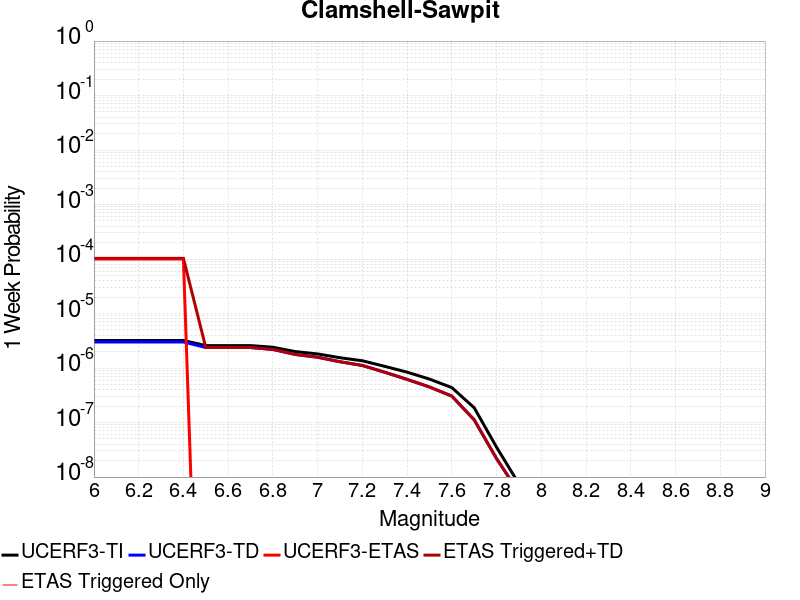 | 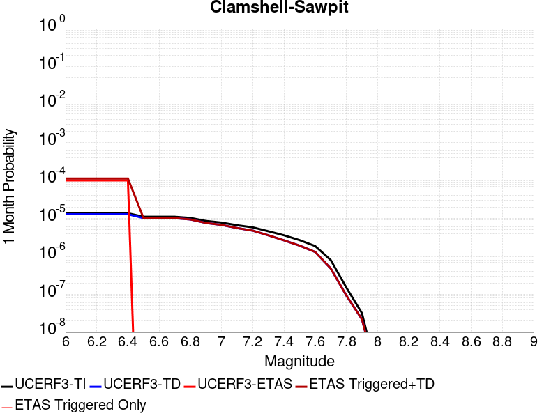 | 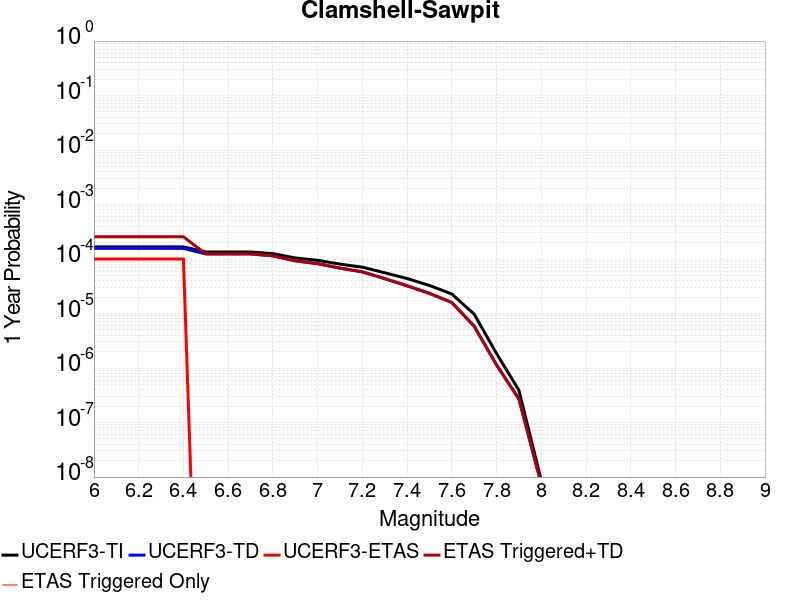 | 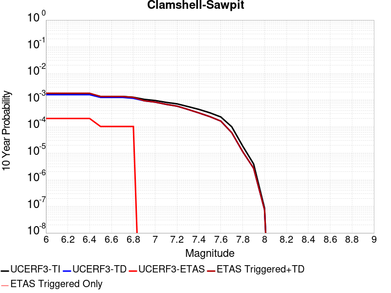 |

| Magnitude | 1 wk TI Prob | 1 wk TD Prob | 1 wk ETAS Prob | 1 wk ETAS/TD Gain | 1 wk ETAS Triggered+TD | 1 wk ETAS Triggered Only | 1 mo TI Prob | 1 mo TD Prob | 1 mo ETAS Prob | 1 mo ETAS/TD Gain | 1 mo ETAS Triggered+TD | 1 mo ETAS Triggered Only | 1 yr TI Prob | 1 yr TD Prob | 1 yr ETAS Prob | 1 yr ETAS/TD Gain | 1 yr ETAS Triggered+TD | 1 yr ETAS Triggered Only | 10 yr TI Prob | 10 yr TD Prob | 10 yr ETAS Prob | 10 yr ETAS/TD Gain | 10 yr ETAS Triggered+TD | 10 yr ETAS Triggered Only |
|-----|-----|-----|-----|-----|-----|-----|-----|-----|-----|-----|-----|-----|-----|-----|-----|-----|-----|-----|-----|-----|-----|-----|-----|-----|
| 6.0 | 3.202998E-6 | 3.0130582E-6 | 1.0E-4 | 33.188873 | 1.0301275E-4 | 1.0E-4 | 1.3727062E-5 | 1.2913047E-5 | 1.0E-4 | 7.744106 | 1.1291176E-4 | 1.0E-4 | 1.6711417E-4 | 1.5720581E-4 | 1.0E-4 | 0.6361088 | 2.5719008E-4 | 1.0E-4 | 0.0016698855 | 0.0015710255 | 0.0013 | 0.827485 | 0.0017707112 | 2.0E-4 |
| 6.1 | 3.202998E-6 | 3.0130582E-6 | 1.0E-4 | 33.188873 | 1.0301275E-4 | 1.0E-4 | 1.3727062E-5 | 1.2913047E-5 | 1.0E-4 | 7.744106 | 1.1291176E-4 | 1.0E-4 | 1.6711417E-4 | 1.5720581E-4 | 1.0E-4 | 0.6361088 | 2.5719008E-4 | 1.0E-4 | 0.0016698855 | 0.0015710255 | 0.0013 | 0.827485 | 0.0017707112 | 2.0E-4 |
| 6.2 | 3.202998E-6 | 3.0130582E-6 | 1.0E-4 | 33.188873 | 1.0301275E-4 | 1.0E-4 | 1.3727062E-5 | 1.2913047E-5 | 1.0E-4 | 7.744106 | 1.1291176E-4 | 1.0E-4 | 1.6711417E-4 | 1.5720581E-4 | 1.0E-4 | 0.6361088 | 2.5719008E-4 | 1.0E-4 | 0.0016698855 | 0.0015710255 | 0.0013 | 0.827485 | 0.0017707112 | 2.0E-4 |
| 6.3 | 3.202998E-6 | 3.0130582E-6 | 1.0E-4 | 33.188873 | 1.0301275E-4 | 1.0E-4 | 1.3727062E-5 | 1.2913047E-5 | 1.0E-4 | 7.744106 | 1.1291176E-4 | 1.0E-4 | 1.6711417E-4 | 1.5720581E-4 | 1.0E-4 | 0.6361088 | 2.5719008E-4 | 1.0E-4 | 0.0016698855 | 0.0015710255 | 0.0013 | 0.827485 | 0.0017707112 | 2.0E-4 |
| 6.4 | 3.202998E-6 | 3.0130582E-6 | 1.0E-4 | 33.188873 | 1.0301275E-4 | 1.0E-4 | 1.3727062E-5 | 1.2913047E-5 | 1.0E-4 | 7.744106 | 1.1291176E-4 | 1.0E-4 | 1.6711417E-4 | 1.5720581E-4 | 1.0E-4 | 0.6361088 | 2.5719008E-4 | 1.0E-4 | 0.0016698855 | 0.0015710255 | 0.0013 | 0.827485 | 0.0017707112 | 2.0E-4 |
| 6.5 | 2.5862723E-6 | 2.3810364E-6 | 0.0 | 0.0 | 2.3810364E-6 | 0.0 | 1.1083977E-5 | 1.0204404E-5 | 0.0 | 0.0 | 1.0204404E-5 | 0.0 | 1.3493907E-4 | 1.2423184E-4 | 0.0 | 0.0 | 1.2423184E-4 | 0.0 | 0.0013485716 | 0.0012416543 | 0.001 | 0.8053772 | 0.0013415301 | 1.0E-4 |
| 6.6 | 2.5862723E-6 | 2.3810364E-6 | 0.0 | 0.0 | 2.3810364E-6 | 0.0 | 1.1083977E-5 | 1.0204404E-5 | 0.0 | 0.0 | 1.0204404E-5 | 0.0 | 1.3493907E-4 | 1.2423184E-4 | 0.0 | 0.0 | 1.2423184E-4 | 0.0 | 0.0013485716 | 0.0012416543 | 0.001 | 0.8053772 | 0.0013415301 | 1.0E-4 |
| 6.7 | 2.5862723E-6 | 2.3810364E-6 | 0.0 | 0.0 | 2.3810364E-6 | 0.0 | 1.1083977E-5 | 1.0204404E-5 | 0.0 | 0.0 | 1.0204404E-5 | 0.0 | 1.3493907E-4 | 1.2423184E-4 | 0.0 | 0.0 | 1.2423184E-4 | 0.0 | 0.0013485716 | 0.0012416543 | 0.001 | 0.8053772 | 0.0013415301 | 1.0E-4 |
| 6.8 | 2.4098806E-6 | 2.1979781E-6 | 0.0 | 0.0 | 2.1979781E-6 | 0.0 | 1.0328019E-5 | 9.419874E-6 | 0.0 | 0.0 | 9.419874E-6 | 0.0 | 1.2573638E-4 | 1.146812E-4 | 0.0 | 0.0 | 1.146812E-4 | 0.0 | 0.0012566525 | 0.0011462468 | 9.0E-4 | 0.7851712 | 0.0012461322 | 1.0E-4 |
| 6.9 | 2.0073985E-6 | 1.778636E-6 | 0.0 | 0.0 | 1.778636E-6 | 0.0 | 8.603109E-6 | 7.6227043E-6 | 0.0 | 0.0 | 7.6227043E-6 | 0.0 | 1.0473781E-4 | 9.280259E-5 | 0.0 | 0.0 | 9.280259E-5 | 0.0 | 0.0010468846 | 9.2765025E-4 | 7.0E-4 | 0.75459474 | 9.2765025E-4 | 0.0 |
| 7.0 | 1.8166766E-6 | 1.5809059E-6 | 0.0 | 0.0 | 1.5809059E-6 | 0.0 | 7.785734E-6 | 6.775294E-6 | 0.0 | 0.0 | 6.775294E-6 | 0.0 | 9.478718E-5 | 8.2486185E-5 | 0.0 | 0.0 | 8.2486185E-5 | 0.0 | 9.4746763E-4 | 8.245657E-4 | 5.0E-4 | 0.6063798 | 8.245657E-4 | 0.0 |
| 7.1 | 1.5471421E-6 | 1.3054636E-6 | 0.0 | 0.0 | 1.3054636E-6 | 0.0 | 6.6305925E-6 | 5.594832E-6 | 0.0 | 0.0 | 5.594832E-6 | 0.0 | 8.072447E-5 | 6.811501E-5 | 0.0 | 0.0 | 6.811501E-5 | 0.0 | 8.0695155E-4 | 6.809468E-4 | 4.0E-4 | 0.5874174 | 6.809468E-4 | 0.0 |
| 7.2 | 1.3608037E-6 | 1.1154922E-6 | 0.0 | 0.0 | 1.1154922E-6 | 0.0 | 5.8320024E-6 | 4.780672E-6 | 0.0 | 0.0 | 4.780672E-6 | 0.0 | 7.1002316E-5 | 5.8203175E-5 | 0.0 | 0.0 | 5.8203175E-5 | 0.0 | 7.097964E-4 | 5.8188394E-4 | 3.0E-4 | 0.5155667 | 5.8188394E-4 | 0.0 |
| 7.3 | 1.0749634E-6 | 8.3854104E-7 | 0.0 | 0.0 | 8.3854104E-7 | 0.0 | 4.6069777E-6 | 3.5937426E-6 | 0.0 | 0.0 | 3.5937426E-6 | 0.0 | 5.608851E-5 | 4.3752967E-5 | 0.0 | 0.0 | 4.3752967E-5 | 0.0 | 5.6074356E-4 | 4.3744635E-4 | 2.0E-4 | 0.45719895 | 4.3744635E-4 | 0.0 |
| 7.4 | 8.416856E-7 | 6.200923E-7 | 0.0 | 0.0 | 6.200923E-7 | 0.0 | 3.607219E-6 | 2.6575358E-6 | 0.0 | 0.0 | 2.6575358E-6 | 0.0 | 4.3917007E-5 | 3.2355038E-5 | 0.0 | 0.0 | 3.2355038E-5 | 0.0 | 4.390833E-4 | 3.2350523E-4 | 1.0E-4 | 0.309114 | 3.2350523E-4 | 0.0 |
| 7.5 | 6.2779594E-7 | 4.4975658E-7 | 0.0 | 0.0 | 4.4975658E-7 | 0.0 | 2.6905511E-6 | 1.927527E-6 | 0.0 | 0.0 | 1.927527E-6 | 0.0 | 3.275697E-5 | 2.3467406E-5 | 0.0 | 0.0 | 2.3467406E-5 | 0.0 | 3.275214E-4 | 2.3465116E-4 | 0.0 | 0.0 | 2.3465116E-4 | 0.0 |
| 7.6 | 4.3822078E-7 | 3.0600742E-7 | 0.0 | 0.0 | 3.0600742E-7 | 0.0 | 1.8780877E-6 | 1.3114599E-6 | 0.0 | 0.0 | 1.3114599E-6 | 0.0 | 2.2865479E-5 | 1.5966923E-5 | 0.0 | 0.0 | 1.5966923E-5 | 0.0 | 2.2863125E-4 | 1.596593E-4 | 0.0 | 0.0 | 1.596593E-4 | 0.0 |
| 7.7 | 1.8704569E-7 | 1.124118E-7 | 0.0 | 0.0 | 1.124118E-7 | 0.0 | 8.0162414E-7 | 4.8176474E-7 | 0.0 | 0.0 | 4.8176474E-7 | 0.0 | 9.75973E-6 | 5.865471E-6 | 0.0 | 0.0 | 5.865471E-6 | 0.0 | 9.7593016E-5 | 5.8653222E-5 | 0.0 | 0.0 | 5.8653222E-5 | 0.0 |
| 7.8 | 3.5378733E-8 | 2.1843253E-8 | 0.0 | 0.0 | 2.1843253E-8 | 0.0 | 1.5162313E-7 | 9.3613934E-8 | 0.0 | 0.0 | 9.3613934E-8 | 0.0 | 1.84601E-6 | 1.1397491E-6 | 0.0 | 0.0 | 1.1397491E-6 | 0.0 | 1.8459947E-5 | 1.1397435E-5 | 0.0 | 0.0 | 1.1397435E-5 | 0.0 |
| 7.9 | 7.504945E-9 | 5.1930633E-9 | 0.0 | 0.0 | 5.1930633E-9 | 0.0 | 3.2164053E-8 | 2.2255985E-8 | 0.0 | 0.0 | 2.2255985E-8 | 0.0 | 3.9159727E-7 | 2.7096658E-7 | 0.0 | 0.0 | 2.7096658E-7 | 0.0 | 3.915966E-6 | 2.7096632E-6 | 0.0 | 0.0 | 2.7096632E-6 | 0.0 |
| 8.0 | 1.6554036E-10 | 1.4181989E-10 | 0.0 | 0.0 | 1.4181989E-10 | 0.0 | 7.0945894E-10 | 6.077995E-10 | 0.0 | 0.0 | 6.077995E-10 | 0.0 | 8.637662E-9 | 7.399959E-9 | 0.0 | 0.0 | 7.399959E-9 | 0.0 | 8.6376616E-8 | 7.399959E-8 | 0.0 | 0.0 | 7.399959E-8 | 0.0 |

## Malibu Coast alt 1
*[(top)](#table-of-contents)*

| 1 Week | 1 Month | 1 Year | 10 Year |
|-----|-----|-----|-----|
| 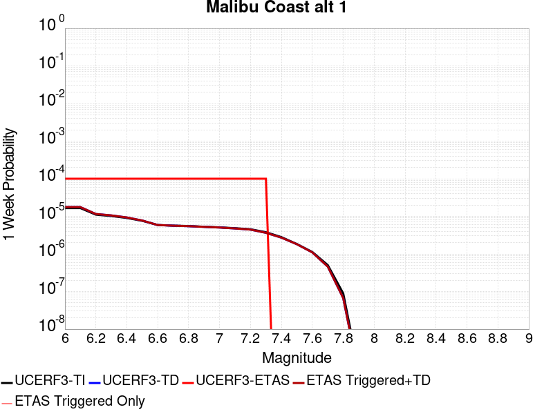 | 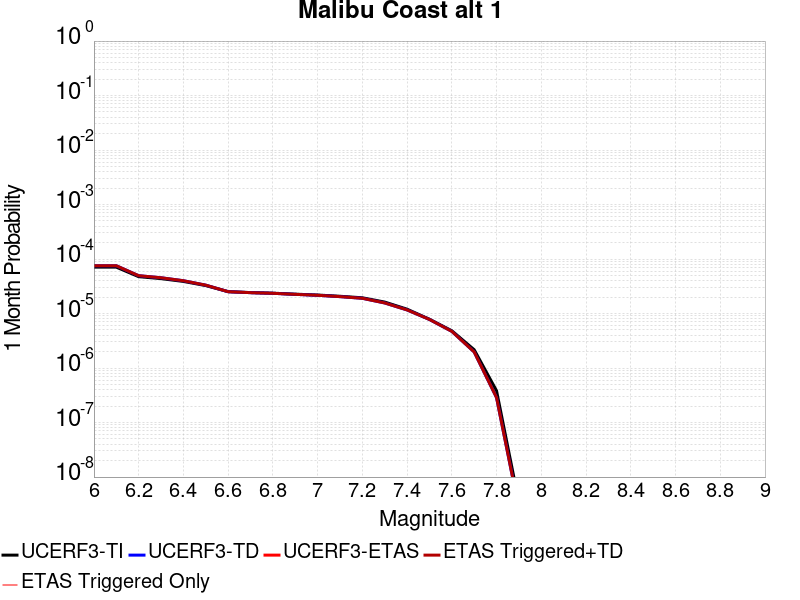 | 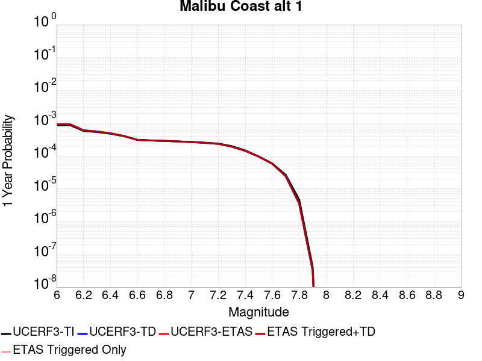 | 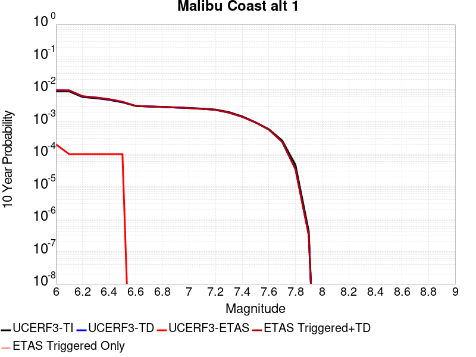 |

| Magnitude | 1 wk TI Prob | 1 wk TD Prob | 1 wk ETAS Prob | 1 wk ETAS/TD Gain | 1 wk ETAS Triggered+TD | 1 wk ETAS Triggered Only | 1 mo TI Prob | 1 mo TD Prob | 1 mo ETAS Prob | 1 mo ETAS/TD Gain | 1 mo ETAS Triggered+TD | 1 mo ETAS Triggered Only | 1 yr TI Prob | 1 yr TD Prob | 1 yr ETAS Prob | 1 yr ETAS/TD Gain | 1 yr ETAS Triggered+TD | 1 yr ETAS Triggered Only | 10 yr TI Prob | 10 yr TD Prob | 10 yr ETAS Prob | 10 yr ETAS/TD Gain | 10 yr ETAS Triggered+TD | 10 yr ETAS Triggered Only |
|-----|-----|-----|-----|-----|-----|-----|-----|-----|-----|-----|-----|-----|-----|-----|-----|-----|-----|-----|-----|-----|-----|-----|-----|-----|
| 6.0 | 1.6572556E-5 | 1.7601345E-5 | 1.0E-4 | 5.6813836 | 1.7601345E-5 | 0.0 | 7.102331E-5 | 7.543226E-5 | 1.0E-4 | 1.3256927 | 7.543226E-5 | 0.0 | 8.6436566E-4 | 9.180198E-4 | 6.0E-4 | 0.65358067 | 9.180198E-4 | 0.0 | 0.0086101135 | 0.009144209 | 0.0068 | 0.74364007 | 0.00934238 | 2.0E-4 |
| 6.1 | 1.6572556E-5 | 1.7601345E-5 | 1.0E-4 | 5.6813836 | 1.7601345E-5 | 0.0 | 7.102331E-5 | 7.543226E-5 | 1.0E-4 | 1.3256927 | 7.543226E-5 | 0.0 | 8.6436566E-4 | 9.180198E-4 | 4.0E-4 | 0.43572047 | 9.180198E-4 | 0.0 | 0.0086101135 | 0.009144209 | 0.005 | 0.5467942 | 0.009243295 | 1.0E-4 |
| 6.2 | 1.1085717E-5 | 1.15591665E-5 | 1.0E-4 | 8.651143 | 1.15591665E-5 | 0.0 | 4.750935E-5 | 4.953836E-5 | 1.0E-4 | 2.0186377 | 4.953836E-5 | 0.0 | 5.782728E-4 | 6.029662E-4 | 4.0E-4 | 0.6633871 | 6.029662E-4 | 0.0 | 0.0057677035 | 0.0060136733 | 0.0034 | 0.56537825 | 0.006113072 | 1.0E-4 |
| 6.3 | 1.0208568E-5 | 1.0594057E-5 | 1.0E-4 | 9.439255 | 1.0594057E-5 | 0.0 | 4.375027E-5 | 4.540233E-5 | 1.0E-4 | 2.2025301 | 4.540233E-5 | 0.0 | 5.325294E-4 | 5.526361E-4 | 4.0E-4 | 0.72380364 | 5.526361E-4 | 0.0 | 0.0053125503 | 0.005512926 | 0.0034 | 0.6167324 | 0.0056123747 | 1.0E-4 |
| 6.4 | 9.0682315E-6 | 9.3442095E-6 | 1.0E-4 | 10.701815 | 9.3442095E-6 | 0.0 | 3.8863272E-5 | 4.004601E-5 | 1.0E-4 | 2.4971278 | 4.004601E-5 | 0.0 | 4.730576E-4 | 4.8745313E-4 | 4.0E-4 | 0.8205917 | 4.8745313E-4 | 0.0 | 0.0047205184 | 0.004864053 | 0.0031 | 0.6373286 | 0.0049635665 | 1.0E-4 |
| 6.5 | 7.605796E-6 | 7.7498635E-6 | 1.0E-4 | 12.903453 | 7.7498635E-6 | 0.0 | 3.259586E-5 | 3.3213284E-5 | 1.0E-4 | 3.0108435 | 3.3213284E-5 | 0.0 | 3.9678233E-4 | 4.0429804E-4 | 3.0E-4 | 0.74202687 | 4.0429804E-4 | 0.0 | 0.0039607463 | 0.004035763 | 0.0026 | 0.64424 | 0.0041353595 | 1.0E-4 |
| 6.6 | 5.889873E-6 | 5.8804703E-6 | 1.0E-4 | 17.005442 | 5.8804703E-6 | 0.0 | 2.5242069E-5 | 2.5201773E-5 | 1.0E-4 | 3.9679747 | 2.5201773E-5 | 0.0 | 3.0727885E-4 | 3.0678848E-4 | 2.0E-4 | 0.65191495 | 3.0678848E-4 | 0.0 | 0.003068543 | 0.0030636624 | 0.0021 | 0.68545413 | 0.0030636624 | 0.0 |
| 6.7 | 5.66586E-6 | 5.642543E-6 | 1.0E-4 | 17.722507 | 5.642543E-6 | 0.0 | 2.428203E-5 | 2.4182102E-5 | 1.0E-4 | 4.1352897 | 2.4182102E-5 | 0.0 | 2.955936E-4 | 2.9437742E-4 | 2.0E-4 | 0.67939997 | 2.9437742E-4 | 0.0 | 0.0029520073 | 0.0029398866 | 0.0021 | 0.71431327 | 0.0029398866 | 0.0 |
| 6.8 | 5.521556E-6 | 5.490311E-6 | 1.0E-4 | 18.213903 | 5.490311E-6 | 0.0 | 2.3663597E-5 | 2.3529692E-5 | 1.0E-4 | 4.2499495 | 2.3529692E-5 | 0.0 | 2.880662E-4 | 2.8643644E-4 | 2.0E-4 | 0.69823515 | 2.8643644E-4 | 0.0 | 0.0028769306 | 0.0028606842 | 0.0021 | 0.73409015 | 0.0028606842 | 0.0 |
| 6.9 | 5.29752E-6 | 5.250781E-6 | 1.0E-4 | 19.044785 | 5.250781E-6 | 0.0 | 2.270346E-5 | 2.2503154E-5 | 1.0E-4 | 4.4438214 | 2.2503154E-5 | 0.0 | 2.7637955E-4 | 2.7394155E-4 | 2.0E-4 | 0.73008275 | 2.7394155E-4 | 0.0 | 0.0027603607 | 0.002736049 | 0.0021 | 0.76753014 | 0.002736049 | 0.0 |
| 7.0 | 5.106743E-6 | 5.048503E-6 | 1.0E-4 | 19.807852 | 5.048503E-6 | 0.0 | 2.1885859E-5 | 2.1636262E-5 | 1.0E-4 | 4.62187 | 2.1636262E-5 | 0.0 | 2.6642776E-4 | 2.6338972E-4 | 2.0E-4 | 0.75933105 | 2.6338972E-4 | 0.0 | 0.0026610855 | 0.0026307853 | 0.002 | 0.7602293 | 0.0026307853 | 0.0 |
| 7.1 | 4.8469647E-6 | 4.7711587E-6 | 1.0E-4 | 20.959269 | 4.7711587E-6 | 0.0 | 2.0772539E-5 | 2.0447664E-5 | 1.0E-4 | 4.8905344 | 2.0447664E-5 | 0.0 | 2.528763E-4 | 2.4892192E-4 | 2.0E-4 | 0.8034648 | 2.4892192E-4 | 0.0 | 0.0025258875 | 0.0024864392 | 0.002 | 0.80436313 | 0.0024864392 | 0.0 |
| 7.2 | 4.545514E-6 | 4.448933E-6 | 1.0E-4 | 22.477299 | 4.448933E-6 | 0.0 | 1.9480629E-5 | 1.9066718E-5 | 1.0E-4 | 5.2447414 | 1.9066718E-5 | 0.0 | 2.3715083E-4 | 2.3211262E-4 | 2.0E-4 | 0.8616507 | 2.3211262E-4 | 0.0 | 0.0023689792 | 0.0023187094 | 0.002 | 0.8625488 | 0.0023187094 | 0.0 |
| 7.3 | 3.794097E-6 | 3.6525478E-6 | 1.0E-4 | 27.37815 | 3.6525478E-6 | 0.0 | 1.6260314E-5 | 1.5653683E-5 | 1.0E-4 | 6.3882732 | 1.5653683E-5 | 0.0 | 1.9795135E-4 | 1.9056695E-4 | 2.0E-4 | 1.0494999 | 1.9056695E-4 | 0.0 | 0.001977751 | 0.00190404 | 0.0015 | 0.7877986 | 0.00190404 | 0.0 |
| 7.4 | 2.808217E-6 | 2.7195695E-6 | 0.0 | 0.0 | 2.7195695E-6 | 0.0 | 1.203516E-5 | 1.16552455E-5 | 0.0 | 0.0 | 1.16552455E-5 | 0.0 | 1.4651821E-4 | 1.418934E-4 | 1.0E-4 | 0.7047544 | 1.418934E-4 | 0.0 | 0.0014642165 | 0.0014180307 | 0.0014 | 0.98728466 | 0.0014180307 | 0.0 |
| 7.5 | 1.83809E-6 | 1.8193538E-6 | 0.0 | 0.0 | 1.8193538E-6 | 0.0 | 7.877505E-6 | 7.797207E-6 | 0.0 | 0.0 | 7.797207E-6 | 0.0 | 9.59044E-5 | 9.492689E-5 | 1.0E-4 | 1.0534424 | 9.492689E-5 | 0.0 | 9.5863023E-4 | 9.488654E-4 | 7.0E-4 | 0.7377232 | 9.488654E-4 | 0.0 |
| 7.6 | 1.1292672E-6 | 1.1003063E-6 | 0.0 | 0.0 | 1.1003063E-6 | 0.0 | 4.839708E-6 | 4.7155904E-6 | 0.0 | 0.0 | 4.7155904E-6 | 0.0 | 5.8921847E-5 | 5.7410816E-5 | 1.0E-4 | 1.741832 | 5.7410816E-5 | 0.0 | 5.890623E-4 | 5.739615E-4 | 6.0E-4 | 1.0453663 | 5.739615E-4 | 0.0 |
| 7.7 | 5.065272E-7 | 4.6099674E-7 | 0.0 | 0.0 | 4.6099674E-7 | 0.0 | 2.170829E-6 | 1.975699E-6 | 0.0 | 0.0 | 1.975699E-6 | 0.0 | 2.6429525E-5 | 2.405388E-5 | 1.0E-4 | 4.1573334 | 2.405388E-5 | 0.0 | 2.642638E-4 | 2.405139E-4 | 4.0E-4 | 1.6631056 | 2.405139E-4 | 0.0 |
| 7.8 | 8.952991E-8 | 6.711025E-8 | 0.0 | 0.0 | 6.711025E-8 | 0.0 | 3.8369956E-7 | 2.8761534E-7 | 0.0 | 0.0 | 2.8761534E-7 | 0.0 | 4.671532E-6 | 3.5017113E-6 | 0.0 | 0.0 | 3.5017113E-6 | 0.0 | 4.671434E-5 | 3.501658E-5 | 0.0 | 0.0 | 3.501658E-5 | 0.0 |
| 7.9 | 8.007447E-10 | 6.1623595E-10 | 0.0 | 0.0 | 6.1623595E-10 | 0.0 | 3.4317629E-9 | 2.6410114E-9 | 0.0 | 0.0 | 2.6410114E-9 | 0.0 | 4.1781714E-8 | 3.215431E-8 | 0.0 | 0.0 | 3.215431E-8 | 0.0 | 4.1781706E-7 | 3.215431E-7 | 0.0 | 0.0 | 3.215431E-7 | 0.0 |

## San Jacinto (Lytle Creek connector)
*[(top)](#table-of-contents)*

| 1 Week | 1 Month | 1 Year | 10 Year |
|-----|-----|-----|-----|
| 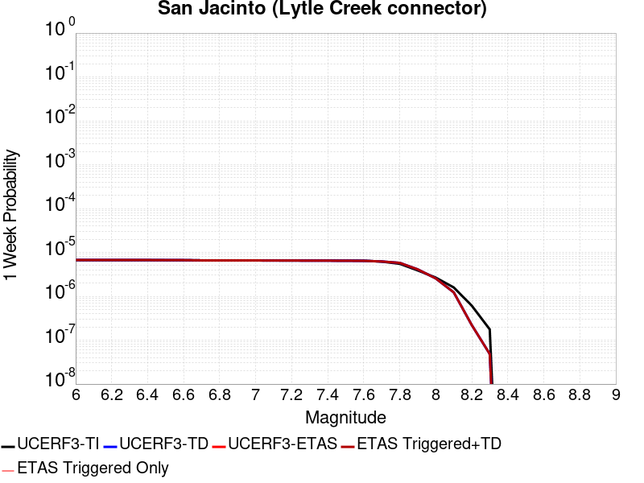 | 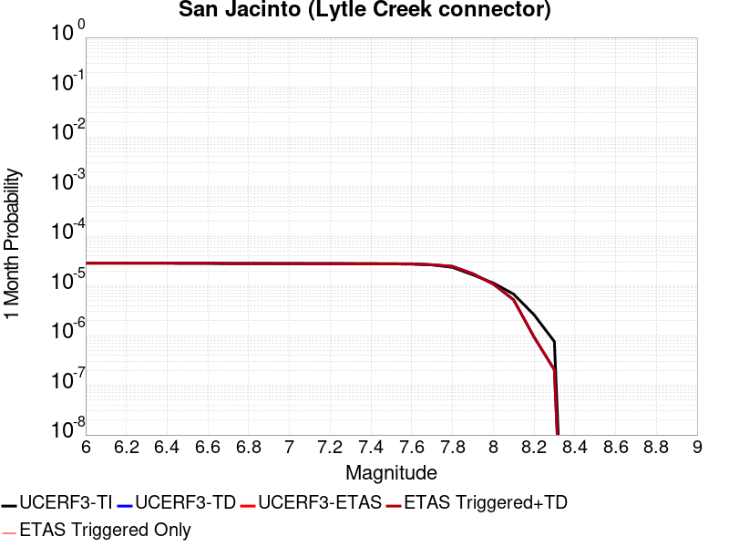 | 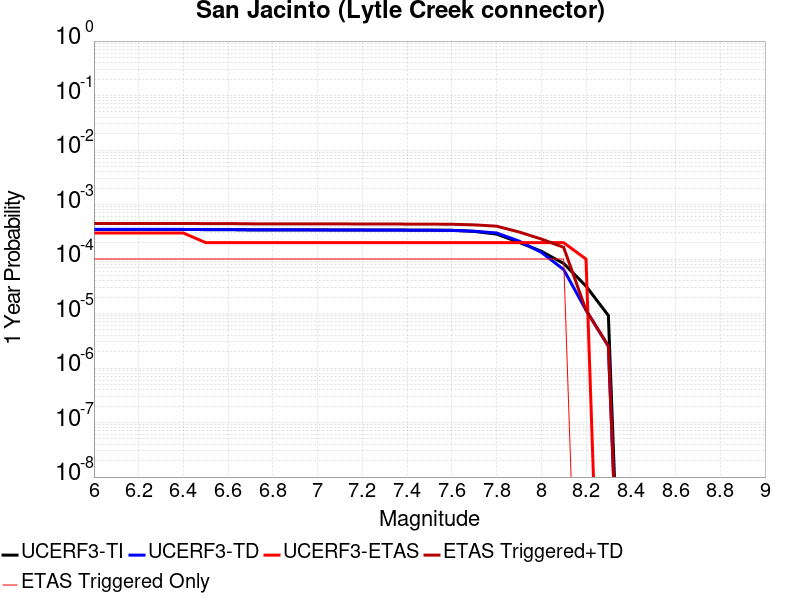 | 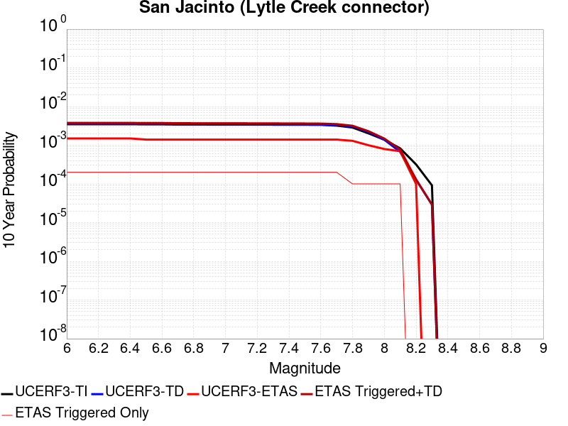 |

| Magnitude | 1 wk TI Prob | 1 wk TD Prob | 1 wk ETAS Prob | 1 wk ETAS/TD Gain | 1 wk ETAS Triggered+TD | 1 wk ETAS Triggered Only | 1 mo TI Prob | 1 mo TD Prob | 1 mo ETAS Prob | 1 mo ETAS/TD Gain | 1 mo ETAS Triggered+TD | 1 mo ETAS Triggered Only | 1 yr TI Prob | 1 yr TD Prob | 1 yr ETAS Prob | 1 yr ETAS/TD Gain | 1 yr ETAS Triggered+TD | 1 yr ETAS Triggered Only | 10 yr TI Prob | 10 yr TD Prob | 10 yr ETAS Prob | 10 yr ETAS/TD Gain | 10 yr ETAS Triggered+TD | 10 yr ETAS Triggered Only |
|-----|-----|-----|-----|-----|-----|-----|-----|-----|-----|-----|-----|-----|-----|-----|-----|-----|-----|-----|-----|-----|-----|-----|-----|-----|
| 6.0 | 6.693995E-6 | 6.702285E-6 | 0.0 | 0.0 | 6.702285E-6 | 0.0 | 2.8688235E-5 | 2.8723764E-5 | 0.0 | 0.0 | 2.8723764E-5 | 0.0 | 3.492233E-4 | 3.4965578E-4 | 3.0E-4 | 0.8579867 | 4.4962083E-4 | 1.0E-4 | 0.00348675 | 0.003571002 | 0.0015 | 0.42005017 | 0.0037702878 | 2.0E-4 |
| 6.1 | 6.693995E-6 | 6.702285E-6 | 0.0 | 0.0 | 6.702285E-6 | 0.0 | 2.8688235E-5 | 2.8723764E-5 | 0.0 | 0.0 | 2.8723764E-5 | 0.0 | 3.492233E-4 | 3.4965578E-4 | 3.0E-4 | 0.8579867 | 4.4962083E-4 | 1.0E-4 | 0.00348675 | 0.003571002 | 0.0015 | 0.42005017 | 0.0037702878 | 2.0E-4 |
| 6.2 | 6.693995E-6 | 6.702285E-6 | 0.0 | 0.0 | 6.702285E-6 | 0.0 | 2.8688235E-5 | 2.8723764E-5 | 0.0 | 0.0 | 2.8723764E-5 | 0.0 | 3.492233E-4 | 3.4965578E-4 | 3.0E-4 | 0.8579867 | 4.4962083E-4 | 1.0E-4 | 0.00348675 | 0.003571002 | 0.0015 | 0.42005017 | 0.0037702878 | 2.0E-4 |
| 6.3 | 6.693995E-6 | 6.702285E-6 | 0.0 | 0.0 | 6.702285E-6 | 0.0 | 2.8688235E-5 | 2.8723764E-5 | 0.0 | 0.0 | 2.8723764E-5 | 0.0 | 3.492233E-4 | 3.4965578E-4 | 3.0E-4 | 0.8579867 | 4.4962083E-4 | 1.0E-4 | 0.00348675 | 0.003571002 | 0.0015 | 0.42005017 | 0.0037702878 | 2.0E-4 |
| 6.4 | 6.693995E-6 | 6.702285E-6 | 0.0 | 0.0 | 6.702285E-6 | 0.0 | 2.8688235E-5 | 2.8723764E-5 | 0.0 | 0.0 | 2.8723764E-5 | 0.0 | 3.492233E-4 | 3.4965578E-4 | 3.0E-4 | 0.8579867 | 4.4962083E-4 | 1.0E-4 | 0.00348675 | 0.003571002 | 0.0015 | 0.42005017 | 0.0037702878 | 2.0E-4 |
| 6.5 | 6.6561875E-6 | 6.662499E-6 | 0.0 | 0.0 | 6.662499E-6 | 0.0 | 2.8526205E-5 | 2.8553255E-5 | 0.0 | 0.0 | 2.8553255E-5 | 0.0 | 3.472512E-4 | 3.475805E-4 | 2.0E-4 | 0.57540625 | 4.4754575E-4 | 1.0E-4 | 0.0034670907 | 0.0035503157 | 0.0014 | 0.39433113 | 0.0037496057 | 2.0E-4 |
| 6.6 | 6.6561875E-6 | 6.662499E-6 | 0.0 | 0.0 | 6.662499E-6 | 0.0 | 2.8526205E-5 | 2.8553255E-5 | 0.0 | 0.0 | 2.8553255E-5 | 0.0 | 3.472512E-4 | 3.475805E-4 | 2.0E-4 | 0.57540625 | 4.4754575E-4 | 1.0E-4 | 0.0034670907 | 0.0035503157 | 0.0014 | 0.39433113 | 0.0037496057 | 2.0E-4 |
| 6.7 | 6.5802237E-6 | 6.5816657E-6 | 0.0 | 0.0 | 6.5816657E-6 | 0.0 | 2.8200653E-5 | 2.8206834E-5 | 0.0 | 0.0 | 2.8206834E-5 | 0.0 | 3.4328885E-4 | 3.4336417E-4 | 2.0E-4 | 0.58247197 | 4.4332983E-4 | 1.0E-4 | 0.0034275902 | 0.0035082859 | 0.0014 | 0.39905527 | 0.0037075842 | 2.0E-4 |
| 6.8 | 6.575632E-6 | 6.576153E-6 | 0.0 | 0.0 | 6.576153E-6 | 0.0 | 2.8180975E-5 | 2.8183209E-5 | 0.0 | 0.0 | 2.8183209E-5 | 0.0 | 3.4304935E-4 | 3.430766E-4 | 2.0E-4 | 0.5829602 | 4.4304229E-4 | 1.0E-4 | 0.0034252026 | 0.0035054195 | 0.0014 | 0.39938158 | 0.0037047183 | 2.0E-4 |
| 6.9 | 6.570433E-6 | 6.567541E-6 | 0.0 | 0.0 | 6.567541E-6 | 0.0 | 2.8158694E-5 | 2.81463E-5 | 0.0 | 0.0 | 2.81463E-5 | 0.0 | 3.4277816E-4 | 3.4262738E-4 | 2.0E-4 | 0.5837245 | 4.4259313E-4 | 1.0E-4 | 0.0034224992 | 0.0035009414 | 0.0014 | 0.39989242 | 0.0037002412 | 2.0E-4 |
| 7.0 | 6.5643826E-6 | 6.5576546E-6 | 0.0 | 0.0 | 6.5576546E-6 | 0.0 | 2.8132765E-5 | 2.8103932E-5 | 0.0 | 0.0 | 2.8103932E-5 | 0.0 | 3.424626E-4 | 3.421117E-4 | 2.0E-4 | 0.5846044 | 4.420775E-4 | 1.0E-4 | 0.0034193532 | 0.003495801 | 0.0014 | 0.40048045 | 0.003695102 | 2.0E-4 |
| 7.1 | 6.557402E-6 | 6.546359E-6 | 0.0 | 0.0 | 6.546359E-6 | 0.0 | 2.8102848E-5 | 2.8055523E-5 | 0.0 | 0.0 | 2.8055523E-5 | 0.0 | 3.4209844E-4 | 3.4152254E-4 | 2.0E-4 | 0.5856129 | 4.4148837E-4 | 1.0E-4 | 0.0034157229 | 0.003489929 | 0.0014 | 0.4011543 | 0.003689231 | 2.0E-4 |
| 7.2 | 6.546394E-6 | 6.5283116E-6 | 0.0 | 0.0 | 6.5283116E-6 | 0.0 | 2.8055672E-5 | 2.7978178E-5 | 0.0 | 0.0 | 2.7978178E-5 | 0.0 | 3.4152428E-4 | 3.4058114E-4 | 2.0E-4 | 0.5872316 | 4.405471E-4 | 1.0E-4 | 0.0034099987 | 0.0034805483 | 0.0014 | 0.40223548 | 0.0036798522 | 2.0E-4 |
| 7.3 | 6.5364216E-6 | 6.50907E-6 | 0.0 | 0.0 | 6.50907E-6 | 0.0 | 2.8012933E-5 | 2.7895716E-5 | 0.0 | 0.0 | 2.7895716E-5 | 0.0 | 3.4100408E-4 | 3.395775E-4 | 2.0E-4 | 0.5889672 | 4.3954354E-4 | 1.0E-4 | 0.003404813 | 0.0034705568 | 0.0014 | 0.40339348 | 0.0036698626 | 2.0E-4 |
| 7.4 | 6.5269523E-6 | 6.490126E-6 | 0.0 | 0.0 | 6.490126E-6 | 0.0 | 2.7972354E-5 | 2.7814529E-5 | 0.0 | 0.0 | 2.7814529E-5 | 0.0 | 3.4051016E-4 | 3.3858934E-4 | 2.0E-4 | 0.590686 | 4.385555E-4 | 1.0E-4 | 0.0033998888 | 0.0034607272 | 0.0014 | 0.40453926 | 0.003660035 | 2.0E-4 |
| 7.5 | 6.5111835E-6 | 6.466367E-6 | 0.0 | 0.0 | 6.466367E-6 | 0.0 | 2.7904773E-5 | 2.7712707E-5 | 0.0 | 0.0 | 2.7712707E-5 | 0.0 | 3.3968766E-4 | 3.3735004E-4 | 2.0E-4 | 0.592856 | 4.373163E-4 | 1.0E-4 | 0.0033916887 | 0.0034483853 | 0.0014 | 0.4059871 | 0.0036476955 | 2.0E-4 |
| 7.6 | 6.4768806E-6 | 6.425425E-6 | 0.0 | 0.0 | 6.425425E-6 | 0.0 | 2.7757764E-5 | 2.7537246E-5 | 0.0 | 0.0 | 2.7537246E-5 | 0.0 | 3.3789838E-4 | 3.3521446E-4 | 2.0E-4 | 0.59663296 | 4.3518093E-4 | 1.0E-4 | 0.0033738504 | 0.0034270934 | 0.0014 | 0.40850943 | 0.003626408 | 2.0E-4 |
| 7.7 | 6.1655364E-6 | 6.2175804E-6 | 0.0 | 0.0 | 6.2175804E-6 | 0.0 | 2.642346E-5 | 2.6646501E-5 | 0.0 | 0.0 | 2.6646501E-5 | 0.0 | 3.2165812E-4 | 3.2437293E-4 | 2.0E-4 | 0.6165743 | 4.2434048E-4 | 1.0E-4 | 0.0032119295 | 0.0033185522 | 0.0014 | 0.42187074 | 0.0035178885 | 2.0E-4 |
| 7.8 | 5.5043524E-6 | 5.777359E-6 | 0.0 | 0.0 | 5.777359E-6 | 0.0 | 2.3589868E-5 | 2.4759876E-5 | 0.0 | 0.0 | 2.4759876E-5 | 0.0 | 2.871688E-4 | 3.0140983E-4 | 2.0E-4 | 0.66354835 | 4.0137972E-4 | 1.0E-4 | 0.0028679797 | 0.003088007 | 0.0013 | 0.4209835 | 0.0031876983 | 1.0E-4 |
| 7.9 | 3.889249E-6 | 4.1093954E-6 | 0.0 | 0.0 | 4.1093954E-6 | 0.0 | 1.6668104E-5 | 1.7611575E-5 | 0.0 | 0.0 | 1.7611575E-5 | 0.0 | 2.0291525E-4 | 2.1439987E-4 | 2.0E-4 | 0.93283635 | 3.1437844E-4 | 1.0E-4 | 0.0020273007 | 0.0022112697 | 0.001 | 0.45222884 | 0.0023110486 | 1.0E-4 |
| 8.0 | 2.668535E-6 | 2.5540473E-6 | 0.0 | 0.0 | 2.5540473E-6 | 0.0 | 1.1436528E-5 | 1.0945871E-5 | 0.0 | 0.0 | 1.0945871E-5 | 0.0 | 1.3923083E-4 | 1.3325785E-4 | 2.0E-4 | 1.5008496 | 2.3324453E-4 | 1.0E-4 | 0.0013914363 | 0.0013876036 | 8.0E-4 | 0.57653356 | 0.0014874648 | 1.0E-4 |
| 8.1 | 1.5911459E-6 | 1.2306971E-6 | 0.0 | 0.0 | 1.2306971E-6 | 0.0 | 6.8191785E-6 | 5.2744053E-6 | 0.0 | 0.0 | 5.2744053E-6 | 0.0 | 8.3020335E-5 | 6.4214015E-5 | 2.0E-4 | 3.114585 | 1.642076E-4 | 1.0E-4 | 8.298933E-4 | 6.7566556E-4 | 7.0E-4 | 1.0360155 | 7.75598E-4 | 1.0E-4 |
| 8.2 | 6.1294963E-7 | 2.2162739E-7 | 0.0 | 0.0 | 2.2162739E-7 | 0.0 | 2.6269242E-6 | 9.498313E-7 | 0.0 | 0.0 | 9.498313E-7 | 0.0 | 3.1982334E-5 | 1.1564135E-5 | 1.0E-4 | 8.647426 | 1.1564135E-5 | 0.0 | 3.1977732E-4 | 1.2982076E-4 | 1.0E-4 | 0.7702928 | 1.2982076E-4 | 0.0 |
| 8.3 | 1.762871E-7 | 4.84272E-8 | 0.0 | 0.0 | 4.84272E-8 | 0.0 | 7.5551594E-7 | 2.0754511E-7 | 0.0 | 0.0 | 2.0754511E-7 | 0.0 | 9.1983675E-6 | 2.526859E-6 | 0.0 | 0.0 | 2.526859E-6 | 0.0 | 9.197987E-5 | 2.9192914E-5 | 0.0 | 0.0 | 2.9192914E-5 | 0.0 |

## Oceanside alt1
*[(top)](#table-of-contents)*

| 1 Week | 1 Month | 1 Year | 10 Year |
|-----|-----|-----|-----|
| 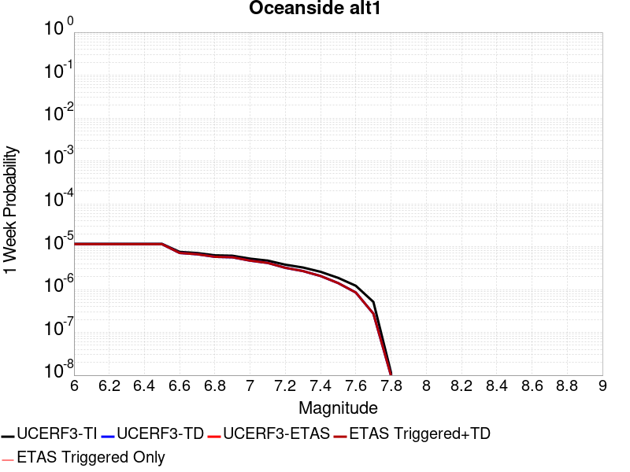 | 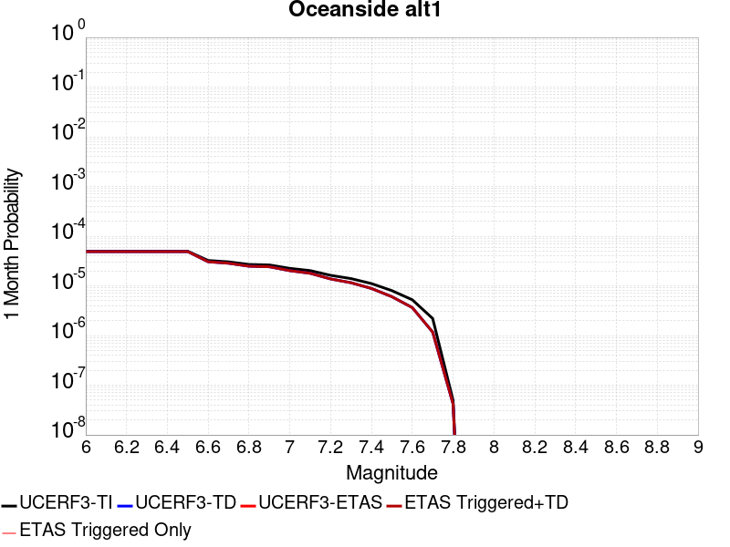 | 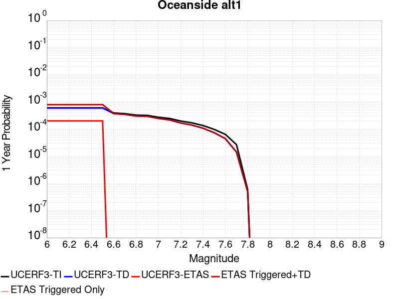 | 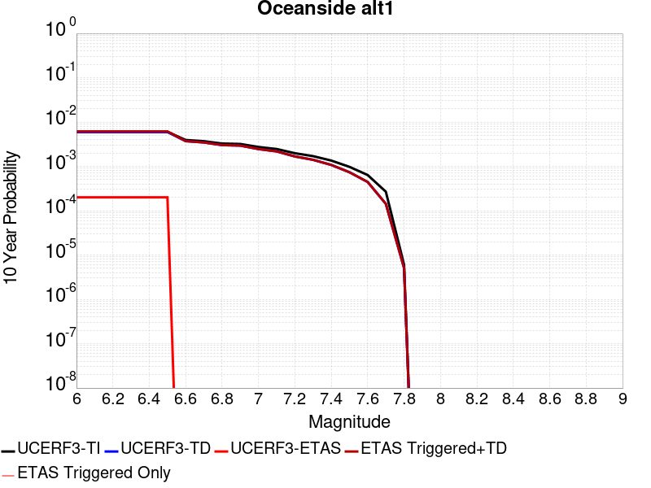 |

| Magnitude | 1 wk TI Prob | 1 wk TD Prob | 1 wk ETAS Prob | 1 wk ETAS/TD Gain | 1 wk ETAS Triggered+TD | 1 wk ETAS Triggered Only | 1 mo TI Prob | 1 mo TD Prob | 1 mo ETAS Prob | 1 mo ETAS/TD Gain | 1 mo ETAS Triggered+TD | 1 mo ETAS Triggered Only | 1 yr TI Prob | 1 yr TD Prob | 1 yr ETAS Prob | 1 yr ETAS/TD Gain | 1 yr ETAS Triggered+TD | 1 yr ETAS Triggered Only | 10 yr TI Prob | 10 yr TD Prob | 10 yr ETAS Prob | 10 yr ETAS/TD Gain | 10 yr ETAS Triggered+TD | 10 yr ETAS Triggered Only |
|-----|-----|-----|-----|-----|-----|-----|-----|-----|-----|-----|-----|-----|-----|-----|-----|-----|-----|-----|-----|-----|-----|-----|-----|-----|
| 6.0 | 1.1617542E-5 | 1.1424626E-5 | 0.0 | 0.0 | 1.1424626E-5 | 0.0 | 4.9788516E-5 | 4.8961854E-5 | 0.0 | 0.0 | 4.8961854E-5 | 0.0 | 6.060066E-4 | 5.959637E-4 | 3.0E-4 | 0.5033864 | 7.958445E-4 | 2.0E-4 | 0.0060435664 | 0.0059452527 | 0.0036 | 0.60552514 | 0.0061440635 | 2.0E-4 |
| 6.1 | 1.1617542E-5 | 1.1424626E-5 | 0.0 | 0.0 | 1.1424626E-5 | 0.0 | 4.9788516E-5 | 4.8961854E-5 | 0.0 | 0.0 | 4.8961854E-5 | 0.0 | 6.060066E-4 | 5.959637E-4 | 3.0E-4 | 0.5033864 | 7.958445E-4 | 2.0E-4 | 0.0060435664 | 0.0059452527 | 0.0036 | 0.60552514 | 0.0061440635 | 2.0E-4 |
| 6.2 | 1.1617542E-5 | 1.1424626E-5 | 0.0 | 0.0 | 1.1424626E-5 | 0.0 | 4.9788516E-5 | 4.8961854E-5 | 0.0 | 0.0 | 4.8961854E-5 | 0.0 | 6.060066E-4 | 5.959637E-4 | 3.0E-4 | 0.5033864 | 7.958445E-4 | 2.0E-4 | 0.0060435664 | 0.0059452527 | 0.0036 | 0.60552514 | 0.0061440635 | 2.0E-4 |
| 6.3 | 1.1617542E-5 | 1.1424626E-5 | 0.0 | 0.0 | 1.1424626E-5 | 0.0 | 4.9788516E-5 | 4.8961854E-5 | 0.0 | 0.0 | 4.8961854E-5 | 0.0 | 6.060066E-4 | 5.959637E-4 | 3.0E-4 | 0.5033864 | 7.958445E-4 | 2.0E-4 | 0.0060435664 | 0.0059452527 | 0.0036 | 0.60552514 | 0.0061440635 | 2.0E-4 |
| 6.4 | 1.1617542E-5 | 1.1424626E-5 | 0.0 | 0.0 | 1.1424626E-5 | 0.0 | 4.9788516E-5 | 4.8961854E-5 | 0.0 | 0.0 | 4.8961854E-5 | 0.0 | 6.060066E-4 | 5.959637E-4 | 3.0E-4 | 0.5033864 | 7.958445E-4 | 2.0E-4 | 0.0060435664 | 0.0059452527 | 0.0036 | 0.60552514 | 0.0061440635 | 2.0E-4 |
| 6.5 | 1.1617542E-5 | 1.1424626E-5 | 0.0 | 0.0 | 1.1424626E-5 | 0.0 | 4.9788516E-5 | 4.8961854E-5 | 0.0 | 0.0 | 4.8961854E-5 | 0.0 | 6.060066E-4 | 5.959637E-4 | 3.0E-4 | 0.5033864 | 7.958445E-4 | 2.0E-4 | 0.0060435664 | 0.0059452527 | 0.0036 | 0.60552514 | 0.0061440635 | 2.0E-4 |
| 6.6 | 7.561768E-6 | 7.134239E-6 | 0.0 | 0.0 | 7.134239E-6 | 0.0 | 3.2407173E-5 | 3.0574956E-5 | 0.0 | 0.0 | 3.0574956E-5 | 0.0 | 3.9448592E-4 | 3.7218758E-4 | 1.0E-4 | 0.2686817 | 3.7218758E-4 | 0.0 | 0.0039378637 | 0.003715754 | 0.0019 | 0.5113363 | 0.003715754 | 0.0 |
| 6.7 | 7.1042605E-6 | 6.6562648E-6 | 0.0 | 0.0 | 6.6562648E-6 | 0.0 | 3.0446476E-5 | 2.8526543E-5 | 0.0 | 0.0 | 2.8526543E-5 | 0.0 | 3.706228E-4 | 3.472561E-4 | 1.0E-4 | 0.28797188 | 3.472561E-4 | 0.0 | 0.0037000529 | 0.0034672183 | 0.0016 | 0.46146503 | 0.0034672183 | 0.0 |
| 6.8 | 6.285554E-6 | 5.8002047E-6 | 0.0 | 0.0 | 5.8002047E-6 | 0.0 | 2.693781E-5 | 2.4857787E-5 | 0.0 | 0.0 | 2.4857787E-5 | 0.0 | 3.2791847E-4 | 3.0260207E-4 | 1.0E-4 | 0.330467 | 3.0260207E-4 | 0.0 | 0.0032743502 | 0.0030219578 | 0.0013 | 0.4301847 | 0.0030219578 | 0.0 |
| 6.9 | 6.148883E-6 | 5.6570293E-6 | 0.0 | 0.0 | 5.6570293E-6 | 0.0 | 2.635209E-5 | 2.424419E-5 | 0.0 | 0.0 | 2.424419E-5 | 0.0 | 3.2078946E-4 | 2.951336E-4 | 1.0E-4 | 0.33882964 | 2.951336E-4 | 0.0 | 0.003203268 | 0.0029474732 | 0.0013 | 0.44105574 | 0.0029474732 | 0.0 |
| 7.0 | 5.253857E-6 | 4.722804E-6 | 0.0 | 0.0 | 4.722804E-6 | 0.0 | 2.2516335E-5 | 2.0240434E-5 | 0.0 | 0.0 | 2.0240434E-5 | 0.0 | 2.7410188E-4 | 2.463997E-4 | 1.0E-4 | 0.40584463 | 2.463997E-4 | 0.0 | 0.0027376404 | 0.0024612967 | 0.0011 | 0.4469189 | 0.0024612967 | 0.0 |
| 7.1 | 4.730754E-6 | 4.1788585E-6 | 0.0 | 0.0 | 4.1788585E-6 | 0.0 | 2.0274503E-5 | 1.7909271E-5 | 0.0 | 0.0 | 1.7909271E-5 | 0.0 | 2.468141E-4 | 2.1802382E-4 | 1.0E-4 | 0.45866546 | 2.1802382E-4 | 0.0 | 0.0024654015 | 0.0021781258 | 0.001 | 0.45911032 | 0.0021781258 | 0.0 |
| 7.2 | 3.7998386E-6 | 3.2142825E-6 | 0.0 | 0.0 | 3.2142825E-6 | 0.0 | 1.6284921E-5 | 1.3775424E-5 | 0.0 | 0.0 | 1.3775424E-5 | 0.0 | 1.9825088E-4 | 1.6770301E-4 | 0.0 | 0.0 | 1.6770301E-4 | 0.0 | 0.001980741 | 0.0016757767 | 7.0E-4 | 0.41771674 | 0.0016757767 | 0.0 |
| 7.3 | 3.2656465E-6 | 2.6985886E-6 | 0.0 | 0.0 | 2.6985886E-6 | 0.0 | 1.3995553E-5 | 1.1565328E-5 | 0.0 | 0.0 | 1.1565328E-5 | 0.0 | 1.7038253E-4 | 1.4079889E-4 | 0.0 | 0.0 | 1.4079889E-4 | 0.0 | 0.0017025196 | 0.0014071079 | 5.0E-4 | 0.35533878 | 0.0014071079 | 0.0 |
| 7.4 | 2.593703E-6 | 2.0681787E-6 | 0.0 | 0.0 | 2.0681787E-6 | 0.0 | 1.1115822E-5 | 8.863593E-6 | 0.0 | 0.0 | 8.863593E-6 | 0.0 | 1.3532673E-4 | 1.0790899E-4 | 0.0 | 0.0 | 1.0790899E-4 | 0.0 | 0.0013524436 | 0.0010785748 | 3.0E-4 | 0.2781448 | 0.0010785748 | 0.0 |
| 7.5 | 1.8715585E-6 | 1.4138462E-6 | 0.0 | 0.0 | 1.4138462E-6 | 0.0 | 8.020941E-6 | 6.0593275E-6 | 0.0 | 0.0 | 6.0593275E-6 | 0.0 | 9.7650576E-5 | 7.376988E-5 | 0.0 | 0.0 | 7.376988E-5 | 0.0 | 9.7607676E-4 | 7.374599E-4 | 1.0E-4 | 0.13560058 | 7.374599E-4 | 0.0 |
| 7.6 | 1.2246786E-6 | 8.5277605E-7 | 0.0 | 0.0 | 8.5277605E-7 | 0.0 | 5.248612E-6 | 3.6547497E-6 | 0.0 | 0.0 | 3.6547497E-6 | 0.0 | 6.389998E-5 | 4.4495715E-5 | 0.0 | 0.0 | 4.4495715E-5 | 0.0 | 6.3881604E-4 | 4.4487257E-4 | 1.0E-4 | 0.22478348 | 4.4487257E-4 | 0.0 |
| 7.7 | 5.140719E-7 | 2.735123E-7 | 0.0 | 0.0 | 2.735123E-7 | 0.0 | 2.2031636E-6 | 1.1721952E-6 | 0.0 | 0.0 | 1.1721952E-6 | 0.0 | 2.6823185E-5 | 1.4271397E-5 | 0.0 | 0.0 | 1.4271397E-5 | 0.0 | 2.6819948E-4 | 1.4270615E-4 | 1.0E-4 | 0.70074064 | 1.4270615E-4 | 0.0 |
| 7.8 | 1.16056995E-8 | 9.783043E-9 | 0.0 | 0.0 | 9.783043E-9 | 0.0 | 4.9738713E-8 | 4.192733E-8 | 0.0 | 0.0 | 4.192733E-8 | 0.0 | 6.0556863E-7 | 5.104652E-7 | 0.0 | 0.0 | 5.104652E-7 | 0.0 | 6.05567E-6 | 5.1046522E-6 | 0.0 | 0.0 | 5.1046522E-6 | 0.0 |

## Elysian Park (Lower CFM)
*[(top)](#table-of-contents)*

| 1 Week | 1 Month | 1 Year | 10 Year |
|-----|-----|-----|-----|
| 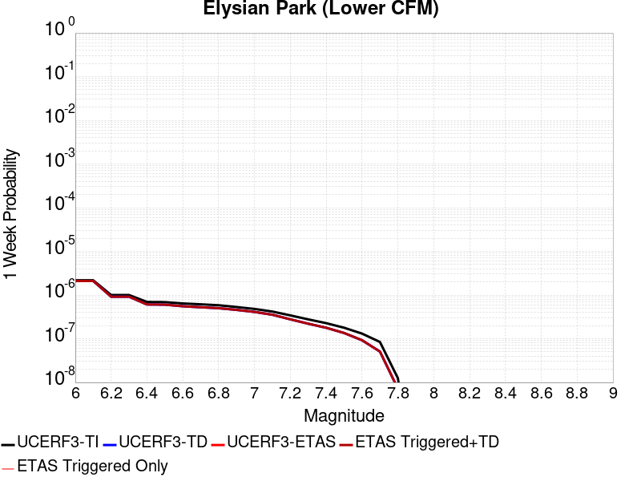 | 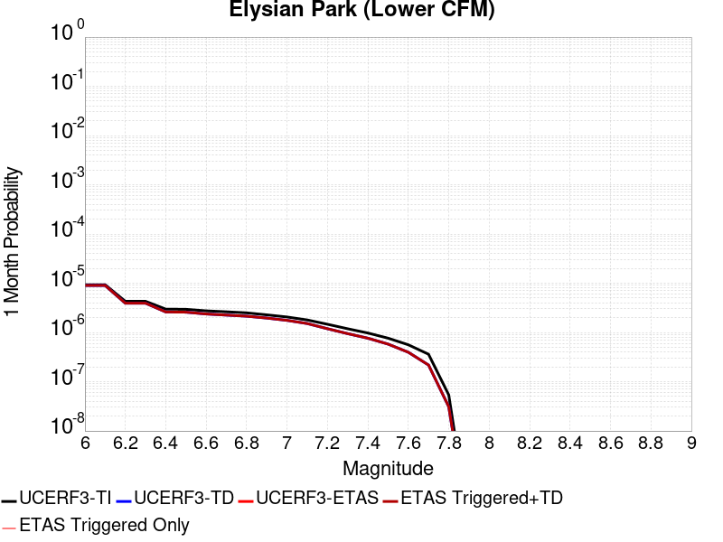 | 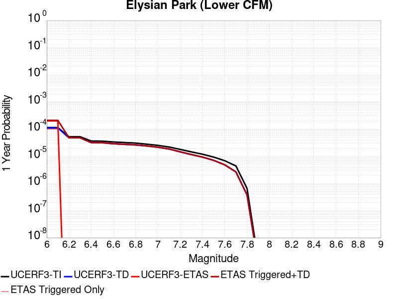 |  |

| Magnitude | 1 wk TI Prob | 1 wk TD Prob | 1 wk ETAS Prob | 1 wk ETAS/TD Gain | 1 wk ETAS Triggered+TD | 1 wk ETAS Triggered Only | 1 mo TI Prob | 1 mo TD Prob | 1 mo ETAS Prob | 1 mo ETAS/TD Gain | 1 mo ETAS Triggered+TD | 1 mo ETAS Triggered Only | 1 yr TI Prob | 1 yr TD Prob | 1 yr ETAS Prob | 1 yr ETAS/TD Gain | 1 yr ETAS Triggered+TD | 1 yr ETAS Triggered Only | 10 yr TI Prob | 10 yr TD Prob | 10 yr ETAS Prob | 10 yr ETAS/TD Gain | 10 yr ETAS Triggered+TD | 10 yr ETAS Triggered Only |
|-----|-----|-----|-----|-----|-----|-----|-----|-----|-----|-----|-----|-----|-----|-----|-----|-----|-----|-----|-----|-----|-----|-----|-----|-----|
| 6.0 | 2.1766498E-6 | 2.1039195E-6 | 0.0 | 0.0 | 2.1039195E-6 | 0.0 | 9.328466E-6 | 9.016775E-6 | 0.0 | 0.0 | 9.016775E-6 | 0.0 | 1.1356815E-4 | 1.0977515E-4 | 2.0E-4 | 1.8219059 | 2.0976418E-4 | 1.0E-4 | 0.0011351013 | 0.0010973512 | 5.0E-4 | 0.45564264 | 0.0012971318 | 2.0E-4 |
| 6.1 | 2.1766498E-6 | 2.1039195E-6 | 0.0 | 0.0 | 2.1039195E-6 | 0.0 | 9.328466E-6 | 9.016775E-6 | 0.0 | 0.0 | 9.016775E-6 | 0.0 | 1.1356815E-4 | 1.0977515E-4 | 2.0E-4 | 1.8219059 | 2.0976418E-4 | 1.0E-4 | 0.0011351013 | 0.0010973512 | 5.0E-4 | 0.45564264 | 0.0012971318 | 2.0E-4 |
| 6.2 | 1.0031182E-6 | 9.187273E-7 | 0.0 | 0.0 | 9.187273E-7 | 0.0 | 4.299071E-6 | 3.937397E-6 | 0.0 | 0.0 | 3.937397E-6 | 0.0 | 5.2339932E-5 | 4.7936857E-5 | 0.0 | 0.0 | 4.7936857E-5 | 0.0 | 5.2327604E-4 | 4.7927498E-4 | 0.0 | 0.0 | 4.7927498E-4 | 0.0 |
| 6.3 | 1.0031182E-6 | 9.187273E-7 | 0.0 | 0.0 | 9.187273E-7 | 0.0 | 4.299071E-6 | 3.937397E-6 | 0.0 | 0.0 | 3.937397E-6 | 0.0 | 5.2339932E-5 | 4.7936857E-5 | 0.0 | 0.0 | 4.7936857E-5 | 0.0 | 5.2327604E-4 | 4.7927498E-4 | 0.0 | 0.0 | 4.7927498E-4 | 0.0 |
| 6.4 | 6.9606244E-7 | 6.092953E-7 | 0.0 | 0.0 | 6.092953E-7 | 0.0 | 2.9831212E-6 | 2.6112627E-6 | 0.0 | 0.0 | 2.6112627E-6 | 0.0 | 3.6318896E-5 | 3.1791664E-5 | 0.0 | 0.0 | 3.1791664E-5 | 0.0 | 3.6312963E-4 | 3.178714E-4 | 0.0 | 0.0 | 3.178714E-4 | 0.0 |
| 6.5 | 6.901879E-7 | 6.033635E-7 | 0.0 | 0.0 | 6.033635E-7 | 0.0 | 2.9579448E-6 | 2.585841E-6 | 0.0 | 0.0 | 2.585841E-6 | 0.0 | 3.6012385E-5 | 3.1482163E-5 | 0.0 | 0.0 | 3.1482163E-5 | 0.0 | 3.600655E-4 | 3.1477725E-4 | 0.0 | 0.0 | 3.1477725E-4 | 0.0 |
| 6.6 | 6.4198554E-7 | 5.5476096E-7 | 0.0 | 0.0 | 5.5476096E-7 | 0.0 | 2.7513638E-6 | 2.3775447E-6 | 0.0 | 0.0 | 2.3775447E-6 | 0.0 | 3.3497337E-5 | 2.8946224E-5 | 0.0 | 0.0 | 2.8946224E-5 | 0.0 | 3.349229E-4 | 2.8942467E-4 | 0.0 | 0.0 | 2.8942467E-4 | 0.0 |
| 6.7 | 6.138733E-7 | 5.264412E-7 | 0.0 | 0.0 | 5.264412E-7 | 0.0 | 2.6308828E-6 | 2.2561746E-6 | 0.0 | 0.0 | 2.2561746E-6 | 0.0 | 3.203053E-5 | 2.7468583E-5 | 0.0 | 0.0 | 2.7468583E-5 | 0.0 | 3.2025913E-4 | 2.74652E-4 | 0.0 | 0.0 | 2.74652E-4 | 0.0 |
| 6.8 | 5.84778E-7 | 5.0039256E-7 | 0.0 | 0.0 | 5.0039256E-7 | 0.0 | 2.506189E-6 | 2.1445378E-6 | 0.0 | 0.0 | 2.1445378E-6 | 0.0 | 3.0512423E-5 | 2.6109436E-5 | 0.0 | 0.0 | 2.6109436E-5 | 0.0 | 3.0508233E-4 | 2.610638E-4 | 0.0 | 0.0 | 2.610638E-4 | 0.0 |
| 6.9 | 5.322785E-7 | 4.5810506E-7 | 0.0 | 0.0 | 4.5810506E-7 | 0.0 | 2.2811914E-6 | 1.963306E-6 | 0.0 | 0.0 | 1.963306E-6 | 0.0 | 2.7773152E-5 | 2.3902987E-5 | 0.0 | 0.0 | 2.3902987E-5 | 0.0 | 2.7769682E-4 | 2.3900426E-4 | 0.0 | 0.0 | 2.3900426E-4 | 0.0 |
| 7.0 | 4.8147206E-7 | 4.113364E-7 | 0.0 | 0.0 | 4.113364E-7 | 0.0 | 2.06345E-6 | 1.762869E-6 | 0.0 | 0.0 | 1.762869E-6 | 0.0 | 2.5122214E-5 | 2.146272E-5 | 0.0 | 0.0 | 2.146272E-5 | 0.0 | 2.5119373E-4 | 2.1460655E-4 | 0.0 | 0.0 | 2.1460655E-4 | 0.0 |
| 7.1 | 4.1932955E-7 | 3.5464367E-7 | 0.0 | 0.0 | 3.5464367E-7 | 0.0 | 1.7971255E-6 | 1.5199005E-6 | 0.0 | 0.0 | 1.5199005E-6 | 0.0 | 2.1879783E-5 | 1.8504632E-5 | 0.0 | 0.0 | 1.8504632E-5 | 0.0 | 2.1877629E-4 | 1.8503096E-4 | 0.0 | 0.0 | 1.8503096E-4 | 0.0 |
| 7.2 | 3.426051E-7 | 2.7817595E-7 | 0.0 | 0.0 | 2.7817595E-7 | 0.0 | 1.4683067E-6 | 1.192182E-6 | 0.0 | 0.0 | 1.192182E-6 | 0.0 | 1.7876488E-5 | 1.451472E-5 | 0.0 | 0.0 | 1.451472E-5 | 0.0 | 1.787505E-4 | 1.4513775E-4 | 0.0 | 0.0 | 1.4513775E-4 | 0.0 |
| 7.3 | 2.7771645E-7 | 2.2102759E-7 | 0.0 | 0.0 | 2.2102759E-7 | 0.0 | 1.1902127E-6 | 9.4726073E-7 | 0.0 | 0.0 | 9.4726073E-7 | 0.0 | 1.4490744E-5 | 1.15328385E-5 | 0.0 | 0.0 | 1.15328385E-5 | 0.0 | 1.4489799E-4 | 1.1532242E-4 | 0.0 | 0.0 | 1.1532242E-4 | 0.0 |
| 7.4 | 2.2756493E-7 | 1.784531E-7 | 0.0 | 0.0 | 1.784531E-7 | 0.0 | 9.752779E-7 | 7.6479876E-7 | 0.0 | 0.0 | 7.6479876E-7 | 0.0 | 1.1873944E-5 | 9.311385E-6 | 0.0 | 0.0 | 9.311385E-6 | 0.0 | 1.18733085E-4 | 9.3109964E-5 | 0.0 | 0.0 | 9.3109964E-5 | 0.0 |
| 7.5 | 1.7874558E-7 | 1.3547358E-7 | 0.0 | 0.0 | 1.3547358E-7 | 0.0 | 7.660522E-7 | 5.806009E-7 | 0.0 | 0.0 | 5.806009E-7 | 0.0 | 9.326646E-6 | 7.0687934E-6 | 0.0 | 0.0 | 7.0687934E-6 | 0.0 | 9.326255E-5 | 7.06857E-5 | 0.0 | 0.0 | 7.06857E-5 | 0.0 |
| 7.6 | 1.3124549E-7 | 9.2544084E-8 | 0.0 | 0.0 | 9.2544084E-8 | 0.0 | 5.624805E-7 | 3.9661742E-7 | 0.0 | 0.0 | 3.9661742E-7 | 0.0 | 6.8481786E-6 | 4.8288066E-6 | 0.0 | 0.0 | 4.8288066E-6 | 0.0 | 6.8479676E-5 | 4.828703E-5 | 0.0 | 0.0 | 4.828703E-5 | 0.0 |
| 7.7 | 8.439993E-8 | 5.0928175E-8 | 0.0 | 0.0 | 5.0928175E-8 | 0.0 | 3.6171392E-7 | 2.182636E-7 | 0.0 | 0.0 | 2.182636E-7 | 0.0 | 4.403858E-6 | 2.6573562E-6 | 0.0 | 0.0 | 2.6573562E-6 | 0.0 | 4.4037708E-5 | 2.6573256E-5 | 0.0 | 0.0 | 2.6573256E-5 | 0.0 |
| 7.8 | 1.2591407E-8 | 7.232796E-9 | 0.0 | 0.0 | 7.232796E-9 | 0.0 | 5.3963173E-8 | 3.0997693E-8 | 0.0 | 0.0 | 3.0997693E-8 | 0.0 | 6.570014E-7 | 3.7739687E-7 | 0.0 | 0.0 | 3.7739687E-7 | 0.0 | 6.5699946E-6 | 3.7739624E-6 | 0.0 | 0.0 | 3.7739624E-6 | 0.0 |
| 7.9 | 2.8324232E-11 | 2.1429636E-11 | 0.0 | 0.0 | 2.1429636E-11 | 0.0 | 1.2138957E-10 | 9.184142E-11 | 0.0 | 0.0 | 9.184142E-11 | 0.0 | 1.4779177E-9 | 1.1181684E-9 | 0.0 | 0.0 | 1.1181684E-9 | 0.0 | 1.4779177E-8 | 1.1181684E-8 | 0.0 | 0.0 | 1.1181684E-8 | 0.0 |

## Zayante-Vergeles 2011 CFM
*[(top)](#table-of-contents)*

| 1 Week | 1 Month | 1 Year | 10 Year |
|-----|-----|-----|-----|
| 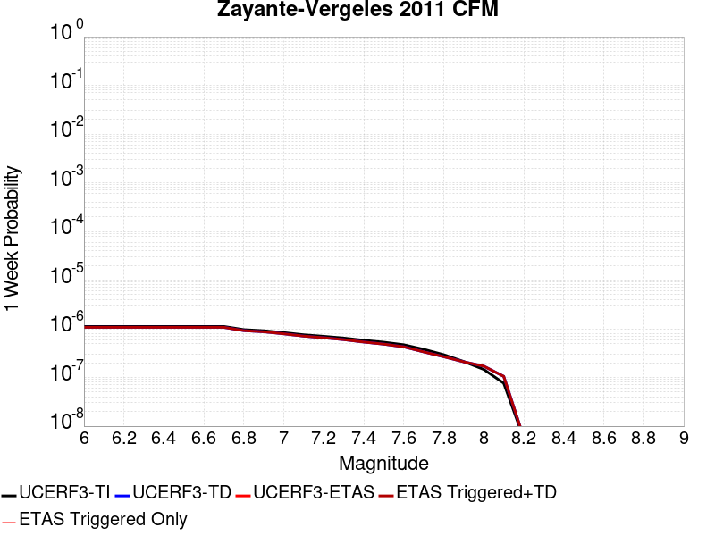 | 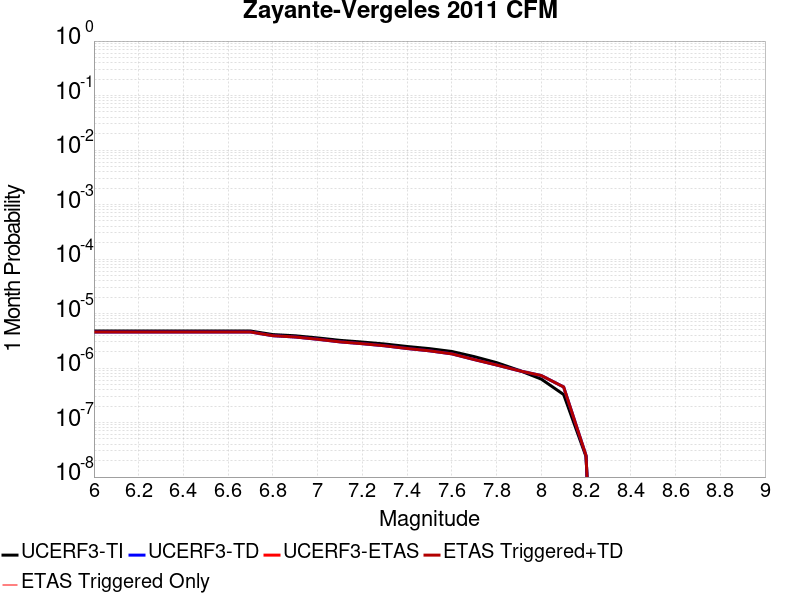 | 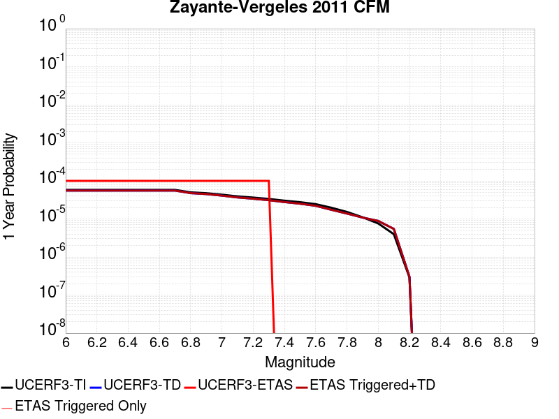 | 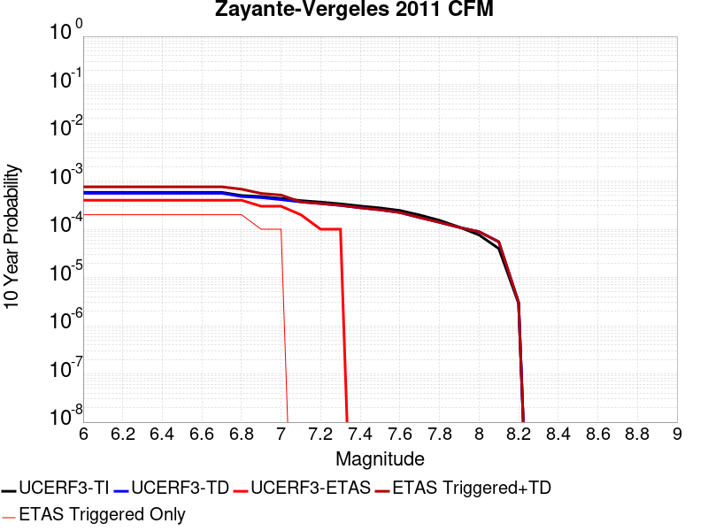 |

| Magnitude | 1 wk TI Prob | 1 wk TD Prob | 1 wk ETAS Prob | 1 wk ETAS/TD Gain | 1 wk ETAS Triggered+TD | 1 wk ETAS Triggered Only | 1 mo TI Prob | 1 mo TD Prob | 1 mo ETAS Prob | 1 mo ETAS/TD Gain | 1 mo ETAS Triggered+TD | 1 mo ETAS Triggered Only | 1 yr TI Prob | 1 yr TD Prob | 1 yr ETAS Prob | 1 yr ETAS/TD Gain | 1 yr ETAS Triggered+TD | 1 yr ETAS Triggered Only | 10 yr TI Prob | 10 yr TD Prob | 10 yr ETAS Prob | 10 yr ETAS/TD Gain | 10 yr ETAS Triggered+TD | 10 yr ETAS Triggered Only |
|-----|-----|-----|-----|-----|-----|-----|-----|-----|-----|-----|-----|-----|-----|-----|-----|-----|-----|-----|-----|-----|-----|-----|-----|-----|
| 6.0 | 1.11522E-6 | 1.0717431E-6 | 0.0 | 0.0 | 1.0717431E-6 | 0.0 | 4.7795056E-6 | 4.5931765E-6 | 0.0 | 0.0 | 4.5931765E-6 | 0.0 | 5.8188925E-5 | 5.59205E-5 | 1.0E-4 | 1.788253 | 5.59205E-5 | 0.0 | 5.817369E-4 | 5.5906555E-4 | 4.0E-4 | 0.7154796 | 7.5895374E-4 | 2.0E-4 |
| 6.1 | 1.11522E-6 | 1.0717431E-6 | 0.0 | 0.0 | 1.0717431E-6 | 0.0 | 4.7795056E-6 | 4.5931765E-6 | 0.0 | 0.0 | 4.5931765E-6 | 0.0 | 5.8188925E-5 | 5.59205E-5 | 1.0E-4 | 1.788253 | 5.59205E-5 | 0.0 | 5.817369E-4 | 5.5906555E-4 | 4.0E-4 | 0.7154796 | 7.5895374E-4 | 2.0E-4 |
| 6.2 | 1.11522E-6 | 1.0717431E-6 | 0.0 | 0.0 | 1.0717431E-6 | 0.0 | 4.7795056E-6 | 4.5931765E-6 | 0.0 | 0.0 | 4.5931765E-6 | 0.0 | 5.8188925E-5 | 5.59205E-5 | 1.0E-4 | 1.788253 | 5.59205E-5 | 0.0 | 5.817369E-4 | 5.5906555E-4 | 4.0E-4 | 0.7154796 | 7.5895374E-4 | 2.0E-4 |
| 6.3 | 1.11522E-6 | 1.0717431E-6 | 0.0 | 0.0 | 1.0717431E-6 | 0.0 | 4.7795056E-6 | 4.5931765E-6 | 0.0 | 0.0 | 4.5931765E-6 | 0.0 | 5.8188925E-5 | 5.59205E-5 | 1.0E-4 | 1.788253 | 5.59205E-5 | 0.0 | 5.817369E-4 | 5.5906555E-4 | 4.0E-4 | 0.7154796 | 7.5895374E-4 | 2.0E-4 |
| 6.4 | 1.11522E-6 | 1.0717431E-6 | 0.0 | 0.0 | 1.0717431E-6 | 0.0 | 4.7795056E-6 | 4.5931765E-6 | 0.0 | 0.0 | 4.5931765E-6 | 0.0 | 5.8188925E-5 | 5.59205E-5 | 1.0E-4 | 1.788253 | 5.59205E-5 | 0.0 | 5.817369E-4 | 5.5906555E-4 | 4.0E-4 | 0.7154796 | 7.5895374E-4 | 2.0E-4 |
| 6.5 | 1.11522E-6 | 1.0717431E-6 | 0.0 | 0.0 | 1.0717431E-6 | 0.0 | 4.7795056E-6 | 4.5931765E-6 | 0.0 | 0.0 | 4.5931765E-6 | 0.0 | 5.8188925E-5 | 5.59205E-5 | 1.0E-4 | 1.788253 | 5.59205E-5 | 0.0 | 5.817369E-4 | 5.5906555E-4 | 4.0E-4 | 0.7154796 | 7.5895374E-4 | 2.0E-4 |
| 6.6 | 1.11522E-6 | 1.0717431E-6 | 0.0 | 0.0 | 1.0717431E-6 | 0.0 | 4.7795056E-6 | 4.5931765E-6 | 0.0 | 0.0 | 4.5931765E-6 | 0.0 | 5.8188925E-5 | 5.59205E-5 | 1.0E-4 | 1.788253 | 5.59205E-5 | 0.0 | 5.817369E-4 | 5.5906555E-4 | 4.0E-4 | 0.7154796 | 7.5895374E-4 | 2.0E-4 |
| 6.7 | 1.11522E-6 | 1.0717431E-6 | 0.0 | 0.0 | 1.0717431E-6 | 0.0 | 4.7795056E-6 | 4.5931765E-6 | 0.0 | 0.0 | 4.5931765E-6 | 0.0 | 5.8188925E-5 | 5.59205E-5 | 1.0E-4 | 1.788253 | 5.59205E-5 | 0.0 | 5.817369E-4 | 5.5906555E-4 | 4.0E-4 | 0.7154796 | 7.5895374E-4 | 2.0E-4 |
| 6.8 | 9.608091E-7 | 9.1661514E-7 | 0.0 | 0.0 | 9.1661514E-7 | 0.0 | 4.1177464E-6 | 3.9283445E-6 | 0.0 | 0.0 | 3.9283445E-6 | 0.0 | 5.013241E-5 | 4.7826547E-5 | 1.0E-4 | 2.090889 | 4.7826547E-5 | 0.0 | 5.0121103E-4 | 4.7816292E-4 | 4.0E-4 | 0.836535 | 6.7806727E-4 | 2.0E-4 |
| 6.9 | 9.126062E-7 | 8.681286E-7 | 0.0 | 0.0 | 8.681286E-7 | 0.0 | 3.9111637E-6 | 3.720546E-6 | 0.0 | 0.0 | 3.720546E-6 | 0.0 | 4.7617377E-5 | 4.5296707E-5 | 1.0E-4 | 2.2076662 | 4.5296707E-5 | 0.0 | 4.7607176E-4 | 4.5287493E-4 | 3.0E-4 | 0.6624346 | 5.5282965E-4 | 1.0E-4 |
| 7.0 | 8.3412164E-7 | 7.8921096E-7 | 0.0 | 0.0 | 7.8921096E-7 | 0.0 | 3.5748021E-6 | 3.382328E-6 | 0.0 | 0.0 | 3.382328E-6 | 0.0 | 4.3522345E-5 | 4.1179068E-5 | 1.0E-4 | 2.4284184 | 4.1179068E-5 | 0.0 | 4.3513824E-4 | 4.1171446E-4 | 3.0E-4 | 0.72866035 | 5.116733E-4 | 1.0E-4 |
| 7.1 | 7.5248664E-7 | 7.070443E-7 | 0.0 | 0.0 | 7.070443E-7 | 0.0 | 3.2249386E-6 | 3.0301862E-6 | 0.0 | 0.0 | 3.0301862E-6 | 0.0 | 3.9262923E-5 | 3.689189E-5 | 1.0E-4 | 2.7106228 | 3.689189E-5 | 0.0 | 3.9255986E-4 | 3.6885776E-4 | 2.0E-4 | 0.54221445 | 3.6885776E-4 | 0.0 |
| 7.2 | 7.0037134E-7 | 6.5461865E-7 | 0.0 | 0.0 | 6.5461865E-7 | 0.0 | 3.001588E-6 | 2.8055053E-6 | 0.0 | 0.0 | 2.8055053E-6 | 0.0 | 3.6543723E-5 | 3.4156492E-5 | 1.0E-4 | 2.9277012 | 3.4156492E-5 | 0.0 | 3.653771E-4 | 3.4151247E-4 | 1.0E-4 | 0.2928151 | 3.4151247E-4 | 0.0 |
| 7.3 | 6.45065E-7 | 5.9950986E-7 | 0.0 | 0.0 | 5.9950986E-7 | 0.0 | 2.764561E-6 | 2.5693255E-6 | 0.0 | 0.0 | 2.5693255E-6 | 0.0 | 3.3658012E-5 | 3.1281088E-5 | 1.0E-4 | 3.1968198 | 3.1281088E-5 | 0.0 | 3.3652913E-4 | 3.1276688E-4 | 1.0E-4 | 0.31972694 | 3.1276688E-4 | 0.0 |
| 7.4 | 5.8052325E-7 | 5.349006E-7 | 0.0 | 0.0 | 5.349006E-7 | 0.0 | 2.4879546E-6 | 2.2924291E-6 | 0.0 | 0.0 | 2.2924291E-6 | 0.0 | 3.0290425E-5 | 2.7909968E-5 | 0.0 | 0.0 | 2.7909968E-5 | 0.0 | 3.0286296E-4 | 2.7906464E-4 | 0.0 | 0.0 | 2.7906464E-4 | 0.0 |
| 7.5 | 5.3032613E-7 | 4.8492603E-7 | 0.0 | 0.0 | 4.8492603E-7 | 0.0 | 2.2728243E-6 | 2.0782527E-6 | 0.0 | 0.0 | 2.0782527E-6 | 0.0 | 2.7671285E-5 | 2.5302432E-5 | 0.0 | 0.0 | 2.5302432E-5 | 0.0 | 2.766784E-4 | 2.5299555E-4 | 0.0 | 0.0 | 2.5299555E-4 | 0.0 |
| 7.6 | 4.7034268E-7 | 4.267541E-7 | 0.0 | 0.0 | 4.267541E-7 | 0.0 | 2.015753E-6 | 1.8289447E-6 | 0.0 | 0.0 | 1.8289447E-6 | 0.0 | 2.4541514E-5 | 2.2267175E-5 | 0.0 | 0.0 | 2.2267175E-5 | 0.0 | 2.4538804E-4 | 2.2264945E-4 | 0.0 | 0.0 | 2.2264945E-4 | 0.0 |
| 7.7 | 3.7871462E-7 | 3.3555597E-7 | 0.0 | 0.0 | 3.3555597E-7 | 0.0 | 1.6230616E-6 | 1.4380961E-6 | 0.0 | 0.0 | 1.4380961E-6 | 0.0 | 1.9760595E-5 | 1.7508679E-5 | 0.0 | 0.0 | 1.7508679E-5 | 0.0 | 1.9758838E-4 | 1.7507302E-4 | 0.0 | 0.0 | 1.7507302E-4 | 0.0 |
| 7.8 | 2.9379848E-7 | 2.67047E-7 | 0.0 | 0.0 | 2.67047E-7 | 0.0 | 1.2591357E-6 | 1.1444866E-6 | 0.0 | 0.0 | 1.1444866E-6 | 0.0 | 1.532987E-5 | 1.3934035E-5 | 0.0 | 0.0 | 1.3934035E-5 | 0.0 | 1.5328811E-4 | 1.3933162E-4 | 0.0 | 0.0 | 1.3933162E-4 | 0.0 |
| 7.9 | 2.125013E-7 | 2.0956861E-7 | 0.0 | 0.0 | 2.0956861E-7 | 0.0 | 9.1071956E-7 | 8.981509E-7 | 0.0 | 0.0 | 8.981509E-7 | 0.0 | 1.1087954E-5 | 1.0934932E-5 | 0.0 | 0.0 | 1.0934932E-5 | 0.0 | 1.1087401E-4 | 1.0934395E-4 | 0.0 | 0.0 | 1.0934395E-4 | 0.0 |
| 8.0 | 1.4631894E-7 | 1.7078243E-7 | 0.0 | 0.0 | 1.7078243E-7 | 0.0 | 6.2708096E-7 | 7.319245E-7 | 0.0 | 0.0 | 7.319245E-7 | 0.0 | 7.634684E-6 | 8.911144E-6 | 0.0 | 0.0 | 8.911144E-6 | 0.0 | 7.634422E-5 | 8.9107874E-5 | 0.0 | 0.0 | 8.9107874E-5 | 0.0 |
| 8.1 | 7.624931E-8 | 1.05309255E-7 | 0.0 | 0.0 | 1.05309255E-7 | 0.0 | 3.2678273E-7 | 4.513253E-7 | 0.0 | 0.0 | 4.513253E-7 | 0.0 | 3.9785723E-6 | 5.4948714E-6 | 0.0 | 0.0 | 5.4948714E-6 | 0.0 | 3.9785013E-5 | 5.4947363E-5 | 0.0 | 0.0 | 5.4947363E-5 | 0.0 |
| 8.2 | 5.5641607E-9 | 5.8454424E-9 | 0.0 | 0.0 | 5.8454424E-9 | 0.0 | 2.3846402E-8 | 2.5051893E-8 | 0.0 | 0.0 | 2.5051893E-8 | 0.0 | 2.9032992E-7 | 3.0500678E-7 | 0.0 | 0.0 | 3.0500678E-7 | 0.0 | 2.9032954E-6 | 3.0500637E-6 | 0.0 | 0.0 | 3.0500637E-6 | 0.0 |

## Big Pine (Central)
*[(top)](#table-of-contents)*

| 1 Week | 1 Month | 1 Year | 10 Year |
|-----|-----|-----|-----|
| 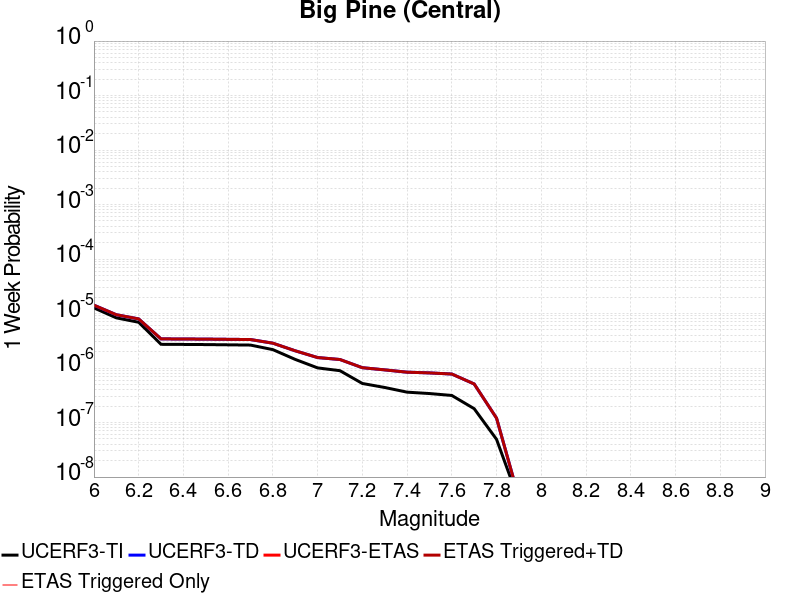 | 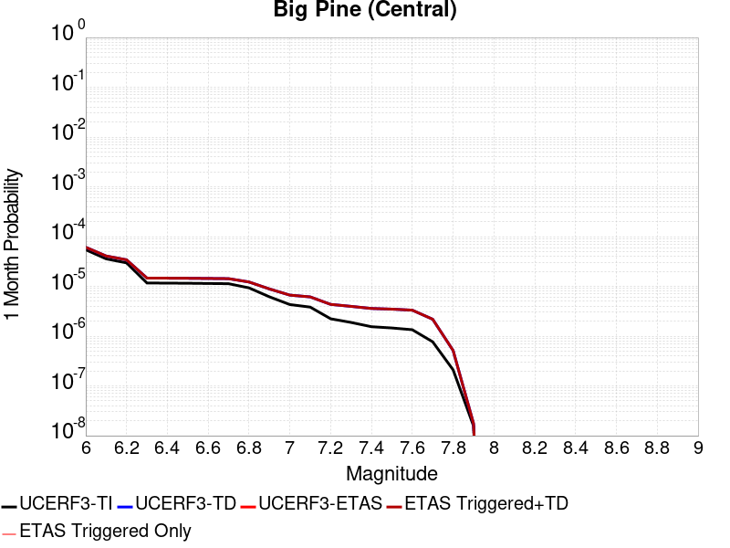 |  | 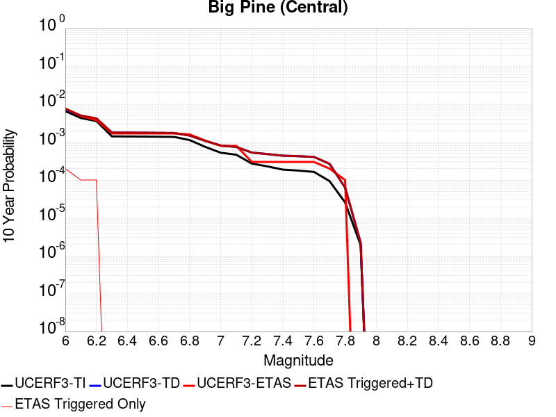 |

| Magnitude | 1 wk TI Prob | 1 wk TD Prob | 1 wk ETAS Prob | 1 wk ETAS/TD Gain | 1 wk ETAS Triggered+TD | 1 wk ETAS Triggered Only | 1 mo TI Prob | 1 mo TD Prob | 1 mo ETAS Prob | 1 mo ETAS/TD Gain | 1 mo ETAS Triggered+TD | 1 mo ETAS Triggered Only | 1 yr TI Prob | 1 yr TD Prob | 1 yr ETAS Prob | 1 yr ETAS/TD Gain | 1 yr ETAS Triggered+TD | 1 yr ETAS Triggered Only | 10 yr TI Prob | 10 yr TD Prob | 10 yr ETAS Prob | 10 yr ETAS/TD Gain | 10 yr ETAS Triggered+TD | 10 yr ETAS Triggered Only |
|-----|-----|-----|-----|-----|-----|-----|-----|-----|-----|-----|-----|-----|-----|-----|-----|-----|-----|-----|-----|-----|-----|-----|-----|-----|
| 6.0 | 1.2706755E-5 | 1.4258144E-5 | 0.0 | 0.0 | 1.4258144E-5 | 0.0 | 5.4456385E-5 | 6.110511E-5 | 0.0 | 0.0 | 6.110511E-5 | 0.0 | 6.628048E-4 | 7.4373727E-4 | 3.0E-4 | 0.40336823 | 7.4373727E-4 | 0.0 | 0.006608314 | 0.007417458 | 0.0077 | 1.0380914 | 0.0076159746 | 2.0E-4 |
| 6.1 | 8.342579E-6 | 9.5175365E-6 | 0.0 | 0.0 | 9.5175365E-6 | 0.0 | 3.5753423E-5 | 4.0788927E-5 | 0.0 | 0.0 | 4.0788927E-5 | 0.0 | 4.3521097E-4 | 4.965138E-4 | 3.0E-4 | 0.6042128 | 4.965138E-4 | 0.0 | 0.0043435963 | 0.0049575465 | 0.0049 | 0.9883921 | 0.005057051 | 1.0E-4 |
| 6.2 | 6.923899E-6 | 7.973643E-6 | 0.0 | 0.0 | 7.973643E-6 | 0.0 | 2.9673516E-5 | 3.4172415E-5 | 0.0 | 0.0 | 3.4172415E-5 | 0.0 | 3.6121515E-4 | 4.1598896E-4 | 3.0E-4 | 0.721173 | 4.1598896E-4 | 0.0 | 0.003606286 | 0.0041553583 | 0.0038 | 0.91448194 | 0.0042549428 | 1.0E-4 |
| 6.3 | 2.728396E-6 | 3.4300115E-6 | 0.0 | 0.0 | 3.4300115E-6 | 0.0 | 1.1693074E-5 | 1.4699971E-5 | 0.0 | 0.0 | 1.4699971E-5 | 0.0 | 1.4235388E-4 | 1.7895832E-4 | 0.0 | 0.0 | 1.7895832E-4 | 0.0 | 0.0014226272 | 0.0017895957 | 0.0017 | 0.9499352 | 0.0017895957 | 0.0 |
| 6.4 | 2.7136944E-6 | 3.4143027E-6 | 0.0 | 0.0 | 3.4143027E-6 | 0.0 | 1.1630066E-5 | 1.4632648E-5 | 0.0 | 0.0 | 1.4632648E-5 | 0.0 | 1.4158686E-4 | 1.781388E-4 | 0.0 | 0.0 | 1.781388E-4 | 0.0 | 0.0014149669 | 0.0017814137 | 0.0017 | 0.95429826 | 0.0017814137 | 0.0 |
| 6.5 | 2.6971882E-6 | 3.396645E-6 | 0.0 | 0.0 | 3.396645E-6 | 0.0 | 1.1559327E-5 | 1.4556975E-5 | 0.0 | 0.0 | 1.4556975E-5 | 0.0 | 1.4072572E-4 | 1.7721762E-4 | 0.0 | 0.0 | 1.7721762E-4 | 0.0 | 0.0014063664 | 0.0017722166 | 0.0017 | 0.9592507 | 0.0017722166 | 0.0 |
| 6.6 | 2.669092E-6 | 3.3666615E-6 | 0.0 | 0.0 | 3.3666615E-6 | 0.0 | 1.1438916E-5 | 1.4428474E-5 | 0.0 | 0.0 | 1.4428474E-5 | 0.0 | 1.3925991E-4 | 1.7565339E-4 | 0.0 | 0.0 | 1.7565339E-4 | 0.0 | 0.0013917267 | 0.001756599 | 0.0017 | 0.9677792 | 0.001756599 | 0.0 |
| 6.7 | 2.6408059E-6 | 3.3366834E-6 | 0.0 | 0.0 | 3.3366834E-6 | 0.0 | 1.1317691E-5 | 1.4299998E-5 | 0.0 | 0.0 | 1.4299998E-5 | 0.0 | 1.3778417E-4 | 1.7408944E-4 | 0.0 | 0.0 | 1.7408944E-4 | 0.0 | 0.0013769877 | 0.0017409842 | 0.0017 | 0.9764592 | 0.0017409842 | 0.0 |
| 6.8 | 2.1786943E-6 | 2.86011E-6 | 0.0 | 0.0 | 2.86011E-6 | 0.0 | 9.337228E-6 | 1.2257561E-5 | 0.0 | 0.0 | 1.2257561E-5 | 0.0 | 1.1367482E-4 | 1.4922631E-4 | 0.0 | 0.0 | 1.4922631E-4 | 0.0 | 0.0011361669 | 0.0014927011 | 0.0016 | 1.0718824 | 0.0014927011 | 0.0 |
| 6.9 | 1.4411696E-6 | 2.0739255E-6 | 0.0 | 0.0 | 2.0739255E-6 | 0.0 | 6.1764263E-6 | 8.888223E-6 | 0.0 | 0.0 | 8.888223E-6 | 0.0 | 7.51954E-5 | 1.0820902E-4 | 0.0 | 0.0 | 1.0820902E-4 | 0.0 | 7.5169955E-4 | 0.0010829587 | 0.0011 | 1.0157359 | 0.0010829587 | 0.0 |
| 7.0 | 1.0073411E-6 | 1.5591093E-6 | 0.0 | 0.0 | 1.5591093E-6 | 0.0 | 4.317169E-6 | 6.6818807E-6 | 0.0 | 0.0 | 6.6818807E-6 | 0.0 | 5.2560266E-5 | 8.134901E-5 | 0.0 | 0.0 | 8.134901E-5 | 0.0 | 5.2547833E-4 | 8.1457646E-4 | 8.0E-4 | 0.98210543 | 8.1457646E-4 | 0.0 |
| 7.1 | 8.947104E-7 | 1.4350284E-6 | 0.0 | 0.0 | 1.4350284E-6 | 0.0 | 3.834468E-6 | 6.150108E-6 | 0.0 | 0.0 | 6.150108E-6 | 0.0 | 4.6683643E-5 | 7.487514E-5 | 0.0 | 0.0 | 7.487514E-5 | 0.0 | 4.6673836E-4 | 7.4988307E-4 | 8.0E-4 | 1.066833 | 7.4988307E-4 | 0.0 |
| 7.2 | 5.215166E-7 | 1.0156292E-6 | 0.0 | 0.0 | 1.0156292E-6 | 0.0 | 2.2350691E-6 | 4.3526898E-6 | 0.0 | 0.0 | 4.3526898E-6 | 0.0 | 2.7211627E-5 | 5.299275E-5 | 0.0 | 0.0 | 5.299275E-5 | 0.0 | 2.7208295E-4 | 5.311749E-4 | 3.0E-4 | 0.5647858 | 5.311749E-4 | 0.0 |
| 7.3 | 4.4024807E-7 | 9.2628903E-7 | 0.0 | 0.0 | 9.2628903E-7 | 0.0 | 1.8867761E-6 | 3.9698043E-6 | 0.0 | 0.0 | 3.9698043E-6 | 0.0 | 2.2971257E-5 | 4.8331338E-5 | 0.0 | 0.0 | 4.8331338E-5 | 0.0 | 2.2968883E-4 | 4.8458172E-4 | 3.0E-4 | 0.6190906 | 4.8458172E-4 | 0.0 |
| 7.4 | 3.6130905E-7 | 8.400492E-7 | 0.0 | 0.0 | 8.400492E-7 | 0.0 | 1.5484665E-6 | 3.6002061E-6 | 0.0 | 0.0 | 3.6002061E-6 | 0.0 | 1.8852415E-5 | 4.3831667E-5 | 0.0 | 0.0 | 4.3831667E-5 | 0.0 | 1.8850817E-4 | 4.3959508E-4 | 3.0E-4 | 0.68244624 | 4.3959508E-4 | 0.0 |
| 7.5 | 3.408184E-7 | 8.1492124E-7 | 0.0 | 0.0 | 8.1492124E-7 | 0.0 | 1.4606494E-6 | 3.4925151E-6 | 0.0 | 0.0 | 3.4925151E-6 | 0.0 | 1.7783263E-5 | 4.252058E-5 | 0.0 | 0.0 | 4.252058E-5 | 0.0 | 1.778184E-4 | 4.2646573E-4 | 3.0E-4 | 0.7034563 | 4.2646573E-4 | 0.0 |
| 7.6 | 3.1428627E-7 | 7.771223E-7 | 0.0 | 0.0 | 7.771223E-7 | 0.0 | 1.3469405E-6 | 3.33052E-6 | 0.0 | 0.0 | 3.33052E-6 | 0.0 | 1.6398877E-5 | 4.0548366E-5 | 0.0 | 0.0 | 4.0548366E-5 | 0.0 | 1.6397667E-4 | 4.0672117E-4 | 3.0E-4 | 0.73760605 | 4.0672117E-4 | 0.0 |
| 7.7 | 1.7972785E-7 | 5.107941E-7 | 0.0 | 0.0 | 5.107941E-7 | 0.0 | 7.70262E-7 | 2.1891158E-6 | 0.0 | 0.0 | 2.1891158E-6 | 0.0 | 9.377899E-6 | 2.6652171E-5 | 0.0 | 0.0 | 2.6652171E-5 | 0.0 | 9.377503E-5 | 2.6782206E-4 | 2.0E-4 | 0.7467644 | 2.6782206E-4 | 0.0 |
| 7.8 | 4.9230927E-8 | 1.2052001E-7 | 0.0 | 0.0 | 1.2052001E-7 | 0.0 | 2.1098968E-7 | 5.165142E-7 | 0.0 | 0.0 | 5.165142E-7 | 0.0 | 2.5687964E-6 | 6.2885442E-6 | 0.0 | 0.0 | 6.2885442E-6 | 0.0 | 2.5687666E-5 | 6.330702E-5 | 1.0E-4 | 1.5796036 | 6.330702E-5 | 0.0 |
| 7.9 | 3.6805972E-9 | 4.134048E-9 | 0.0 | 0.0 | 4.134048E-9 | 0.0 | 1.5773987E-8 | 1.7717351E-8 | 0.0 | 0.0 | 1.7717351E-8 | 0.0 | 1.9204828E-7 | 2.1570872E-7 | 0.0 | 0.0 | 2.1570872E-7 | 0.0 | 1.920481E-6 | 2.2051897E-6 | 0.0 | 0.0 | 2.2051897E-6 | 0.0 |

## Kern Canyon (North Kern) 2011
*[(top)](#table-of-contents)*

| 1 Week | 1 Month | 1 Year | 10 Year |
|-----|-----|-----|-----|
| 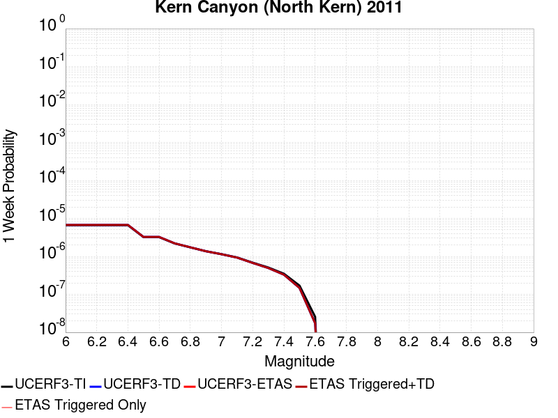 | 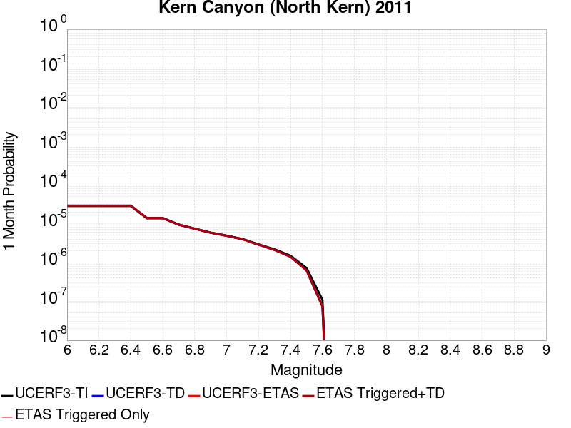 | 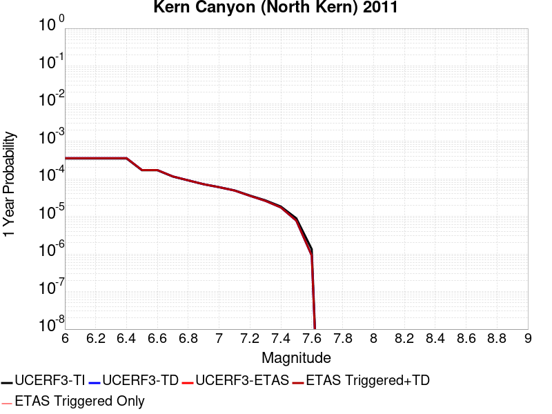 | 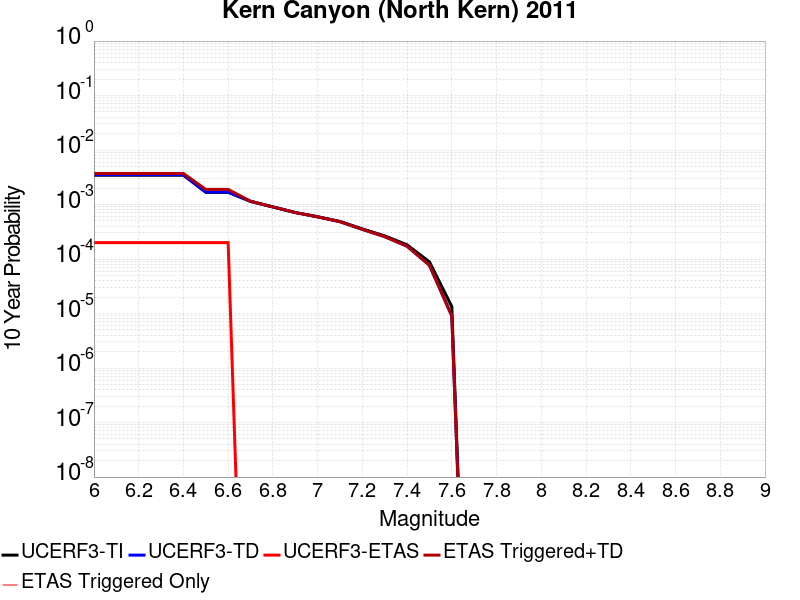 |

| Magnitude | 1 wk TI Prob | 1 wk TD Prob | 1 wk ETAS Prob | 1 wk ETAS/TD Gain | 1 wk ETAS Triggered+TD | 1 wk ETAS Triggered Only | 1 mo TI Prob | 1 mo TD Prob | 1 mo ETAS Prob | 1 mo ETAS/TD Gain | 1 mo ETAS Triggered+TD | 1 mo ETAS Triggered Only | 1 yr TI Prob | 1 yr TD Prob | 1 yr ETAS Prob | 1 yr ETAS/TD Gain | 1 yr ETAS Triggered+TD | 1 yr ETAS Triggered Only | 10 yr TI Prob | 10 yr TD Prob | 10 yr ETAS Prob | 10 yr ETAS/TD Gain | 10 yr ETAS Triggered+TD | 10 yr ETAS Triggered Only |
|-----|-----|-----|-----|-----|-----|-----|-----|-----|-----|-----|-----|-----|-----|-----|-----|-----|-----|-----|-----|-----|-----|-----|-----|-----|
| 6.0 | 6.6264497E-6 | 6.757663E-6 | 0.0 | 0.0 | 6.757663E-6 | 0.0 | 2.8398761E-5 | 2.8961136E-5 | 0.0 | 0.0 | 2.8961136E-5 | 0.0 | 3.4570007E-4 | 3.525528E-4 | 0.0 | 0.0 | 3.525528E-4 | 0.0 | 0.0034516277 | 0.0035207234 | 0.0013 | 0.36924228 | 0.0037200192 | 2.0E-4 |
| 6.1 | 6.6264497E-6 | 6.757663E-6 | 0.0 | 0.0 | 6.757663E-6 | 0.0 | 2.8398761E-5 | 2.8961136E-5 | 0.0 | 0.0 | 2.8961136E-5 | 0.0 | 3.4570007E-4 | 3.525528E-4 | 0.0 | 0.0 | 3.525528E-4 | 0.0 | 0.0034516277 | 0.0035207234 | 0.0013 | 0.36924228 | 0.0037200192 | 2.0E-4 |
| 6.2 | 6.6264497E-6 | 6.757663E-6 | 0.0 | 0.0 | 6.757663E-6 | 0.0 | 2.8398761E-5 | 2.8961136E-5 | 0.0 | 0.0 | 2.8961136E-5 | 0.0 | 3.4570007E-4 | 3.525528E-4 | 0.0 | 0.0 | 3.525528E-4 | 0.0 | 0.0034516277 | 0.0035207234 | 0.0013 | 0.36924228 | 0.0037200192 | 2.0E-4 |
| 6.3 | 6.6264497E-6 | 6.757663E-6 | 0.0 | 0.0 | 6.757663E-6 | 0.0 | 2.8398761E-5 | 2.8961136E-5 | 0.0 | 0.0 | 2.8961136E-5 | 0.0 | 3.4570007E-4 | 3.525528E-4 | 0.0 | 0.0 | 3.525528E-4 | 0.0 | 0.0034516277 | 0.0035207234 | 0.0013 | 0.36924228 | 0.0037200192 | 2.0E-4 |
| 6.4 | 6.6264497E-6 | 6.757663E-6 | 0.0 | 0.0 | 6.757663E-6 | 0.0 | 2.8398761E-5 | 2.8961136E-5 | 0.0 | 0.0 | 2.8961136E-5 | 0.0 | 3.4570007E-4 | 3.525528E-4 | 0.0 | 0.0 | 3.525528E-4 | 0.0 | 0.0034516277 | 0.0035207234 | 0.0013 | 0.36924228 | 0.0037200192 | 2.0E-4 |
| 6.5 | 3.2162225E-6 | 3.257234E-6 | 0.0 | 0.0 | 3.257234E-6 | 0.0 | 1.3783738E-5 | 1.3959504E-5 | 0.0 | 0.0 | 1.3959504E-5 | 0.0 | 1.6780409E-4 | 1.6994451E-4 | 0.0 | 0.0 | 1.6994451E-4 | 0.0 | 0.0016767744 | 0.0016982253 | 5.0E-4 | 0.294425 | 0.0018978856 | 2.0E-4 |
| 6.6 | 3.2162225E-6 | 3.257234E-6 | 0.0 | 0.0 | 3.257234E-6 | 0.0 | 1.3783738E-5 | 1.3959504E-5 | 0.0 | 0.0 | 1.3959504E-5 | 0.0 | 1.6780409E-4 | 1.6994451E-4 | 0.0 | 0.0 | 1.6994451E-4 | 0.0 | 0.0016767744 | 0.0016982253 | 5.0E-4 | 0.294425 | 0.0018978856 | 2.0E-4 |
| 6.7 | 2.1908265E-6 | 2.207213E-6 | 0.0 | 0.0 | 2.207213E-6 | 0.0 | 9.389223E-6 | 9.459451E-6 | 0.0 | 0.0 | 9.459451E-6 | 0.0 | 1.1430779E-4 | 1.1516292E-4 | 0.0 | 0.0 | 1.1516292E-4 | 0.0 | 0.0011424901 | 0.0011510518 | 2.0E-4 | 0.17375413 | 0.0011510518 | 0.0 |
| 6.8 | 1.7303895E-6 | 1.7366223E-6 | 0.0 | 0.0 | 1.7366223E-6 | 0.0 | 7.415934E-6 | 7.442646E-6 | 0.0 | 0.0 | 7.442646E-6 | 0.0 | 9.028525E-5 | 9.061055E-5 | 0.0 | 0.0 | 9.061055E-5 | 0.0 | 9.024858E-4 | 9.057457E-4 | 2.0E-4 | 0.22081251 | 9.057457E-4 | 0.0 |
| 6.9 | 1.3700314E-6 | 1.3689162E-6 | 0.0 | 0.0 | 1.3689162E-6 | 0.0 | 5.87155E-6 | 5.8667706E-6 | 0.0 | 0.0 | 5.8667706E-6 | 0.0 | 7.148377E-5 | 7.142564E-5 | 0.0 | 0.0 | 7.142564E-5 | 0.0 | 7.146078E-4 | 7.140314E-4 | 2.0E-4 | 0.28009972 | 7.140314E-4 | 0.0 |
| 7.0 | 1.1467797E-6 | 1.1414255E-6 | 0.0 | 0.0 | 1.1414255E-6 | 0.0 | 4.9147607E-6 | 4.8918146E-6 | 0.0 | 0.0 | 4.8918146E-6 | 0.0 | 5.983557E-5 | 5.9556245E-5 | 0.0 | 0.0 | 5.9556245E-5 | 0.0 | 5.981946E-4 | 5.95406E-4 | 2.0E-4 | 0.33590525 | 5.95406E-4 | 0.0 |
| 7.1 | 9.3952065E-7 | 9.3030604E-7 | 0.0 | 0.0 | 9.3030604E-7 | 0.0 | 4.026511E-6 | 3.9870197E-6 | 0.0 | 0.0 | 3.9870197E-6 | 0.0 | 4.9021666E-5 | 4.8540904E-5 | 0.0 | 0.0 | 4.8540904E-5 | 0.0 | 4.901085E-4 | 4.8530477E-4 | 1.0E-4 | 0.20605607 | 4.8530477E-4 | 0.0 |
| 7.2 | 6.858055E-7 | 6.7195737E-7 | 0.0 | 0.0 | 6.7195737E-7 | 0.0 | 2.939163E-6 | 2.879814E-6 | 0.0 | 0.0 | 2.879814E-6 | 0.0 | 3.5783723E-5 | 3.506118E-5 | 0.0 | 0.0 | 3.506118E-5 | 0.0 | 3.5777962E-4 | 3.5055738E-4 | 1.0E-4 | 0.28526002 | 3.5055738E-4 | 0.0 |
| 7.3 | 5.1101983E-7 | 4.9395055E-7 | 0.0 | 0.0 | 4.9395055E-7 | 0.0 | 2.1900833E-6 | 2.1169292E-6 | 0.0 | 0.0 | 2.1169292E-6 | 0.0 | 2.6663936E-5 | 2.5773312E-5 | 0.0 | 0.0 | 2.5773312E-5 | 0.0 | 2.6660739E-4 | 2.577037E-4 | 1.0E-4 | 0.38804254 | 2.577037E-4 | 0.0 |
| 7.4 | 3.4999414E-7 | 3.2997343E-7 | 0.0 | 0.0 | 3.2997343E-7 | 0.0 | 1.499974E-6 | 1.4141712E-6 | 0.0 | 0.0 | 1.4141712E-6 | 0.0 | 1.8262032E-5 | 1.72174E-5 | 0.0 | 0.0 | 1.72174E-5 | 0.0 | 1.826053E-4 | 1.721609E-4 | 0.0 | 0.0 | 1.721609E-4 | 0.0 |
| 7.5 | 1.7021522E-7 | 1.4750786E-7 | 0.0 | 0.0 | 1.4750786E-7 | 0.0 | 7.2949354E-7 | 6.321764E-7 | 0.0 | 0.0 | 6.321764E-7 | 0.0 | 8.881548E-6 | 7.696722E-6 | 0.0 | 0.0 | 7.696722E-6 | 0.0 | 8.8811925E-5 | 7.6964636E-5 | 0.0 | 0.0 | 7.6964636E-5 | 0.0 |
| 7.6 | 2.572245E-8 | 1.7353893E-8 | 0.0 | 0.0 | 1.7353893E-8 | 0.0 | 1.10239064E-7 | 7.437382E-8 | 0.0 | 0.0 | 7.437382E-8 | 0.0 | 1.3421597E-6 | 9.0550094E-7 | 0.0 | 0.0 | 9.0550094E-7 | 0.0 | 1.3421517E-5 | 9.054977E-6 | 0.0 | 0.0 | 9.054977E-6 | 0.0 |

## San Gregorio (South) 2011 CFM
*[(top)](#table-of-contents)*

| 1 Week | 1 Month | 1 Year | 10 Year |
|-----|-----|-----|-----|
| 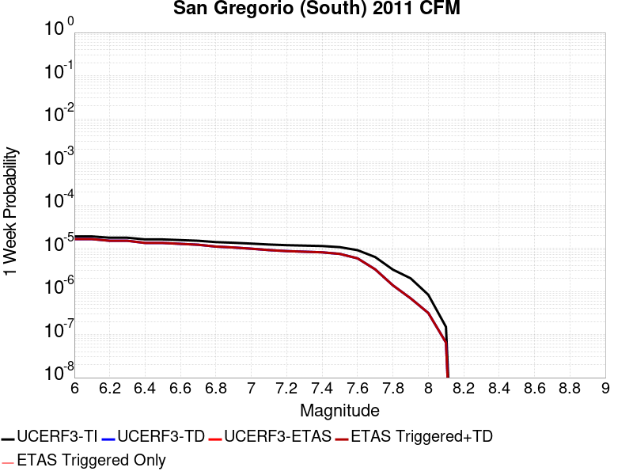 | 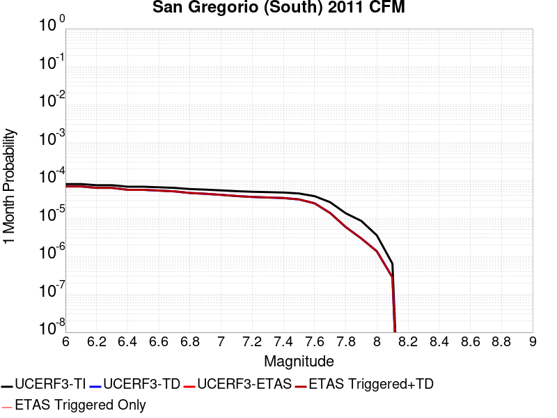 | 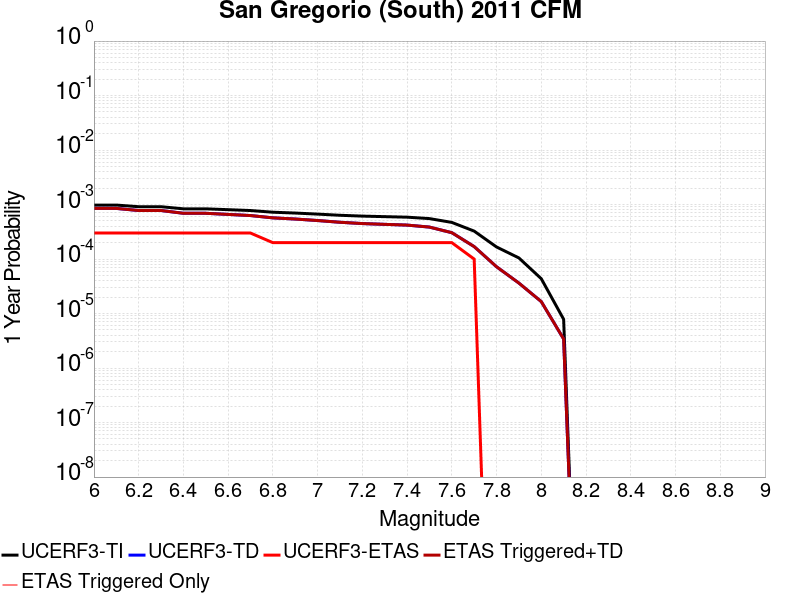 | 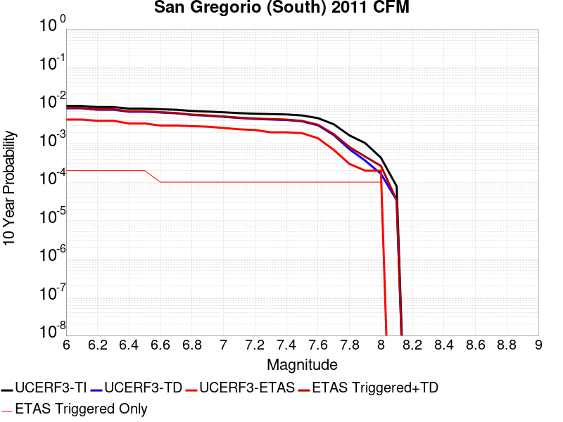 |

| Magnitude | 1 wk TI Prob | 1 wk TD Prob | 1 wk ETAS Prob | 1 wk ETAS/TD Gain | 1 wk ETAS Triggered+TD | 1 wk ETAS Triggered Only | 1 mo TI Prob | 1 mo TD Prob | 1 mo ETAS Prob | 1 mo ETAS/TD Gain | 1 mo ETAS Triggered+TD | 1 mo ETAS Triggered Only | 1 yr TI Prob | 1 yr TD Prob | 1 yr ETAS Prob | 1 yr ETAS/TD Gain | 1 yr ETAS Triggered+TD | 1 yr ETAS Triggered Only | 10 yr TI Prob | 10 yr TD Prob | 10 yr ETAS Prob | 10 yr ETAS/TD Gain | 10 yr ETAS Triggered+TD | 10 yr ETAS Triggered Only |
|-----|-----|-----|-----|-----|-----|-----|-----|-----|-----|-----|-----|-----|-----|-----|-----|-----|-----|-----|-----|-----|-----|-----|-----|-----|
| 6.0 | 1.8770423E-5 | 1.6290292E-5 | 0.0 | 0.0 | 1.6290292E-5 | 0.0 | 8.044219E-5 | 6.9813694E-5 | 0.0 | 0.0 | 6.9813694E-5 | 0.0 | 9.789435E-4 | 8.49654E-4 | 3.0E-4 | 0.3530849 | 8.49654E-4 | 0.0 | 0.009746423 | 0.008476719 | 0.0043 | 0.50727177 | 0.008675024 | 2.0E-4 |
| 6.1 | 1.8770423E-5 | 1.6290292E-5 | 0.0 | 0.0 | 1.6290292E-5 | 0.0 | 8.044219E-5 | 6.9813694E-5 | 0.0 | 0.0 | 6.9813694E-5 | 0.0 | 9.789435E-4 | 8.49654E-4 | 3.0E-4 | 0.3530849 | 8.49654E-4 | 0.0 | 0.009746423 | 0.008476719 | 0.0043 | 0.50727177 | 0.008675024 | 2.0E-4 |
| 6.2 | 1.7508692E-5 | 1.490953E-5 | 0.0 | 0.0 | 1.490953E-5 | 0.0 | 7.5035096E-5 | 6.389644E-5 | 0.0 | 0.0 | 6.389644E-5 | 0.0 | 9.1316935E-4 | 7.7766454E-4 | 3.0E-4 | 0.38577047 | 7.7766454E-4 | 0.0 | 0.00909426 | 0.007762012 | 0.004 | 0.5153303 | 0.00796046 | 2.0E-4 |
| 6.3 | 1.7508692E-5 | 1.490953E-5 | 0.0 | 0.0 | 1.490953E-5 | 0.0 | 7.5035096E-5 | 6.389644E-5 | 0.0 | 0.0 | 6.389644E-5 | 0.0 | 9.1316935E-4 | 7.7766454E-4 | 3.0E-4 | 0.38577047 | 7.7766454E-4 | 0.0 | 0.00909426 | 0.007762012 | 0.004 | 0.5153303 | 0.00796046 | 2.0E-4 |
| 6.4 | 1.6004591E-5 | 1.3259038E-5 | 0.0 | 0.0 | 1.3259038E-5 | 0.0 | 6.85893E-5 | 5.6823214E-5 | 0.0 | 0.0 | 5.6823214E-5 | 0.0 | 8.347548E-4 | 6.9160404E-4 | 3.0E-4 | 0.4337742 | 6.9160404E-4 | 0.0 | 0.008316261 | 0.006906897 | 0.0034 | 0.4922616 | 0.0071055153 | 2.0E-4 |
| 6.5 | 1.6004591E-5 | 1.3259038E-5 | 0.0 | 0.0 | 1.3259038E-5 | 0.0 | 6.85893E-5 | 5.6823214E-5 | 0.0 | 0.0 | 5.6823214E-5 | 0.0 | 8.347548E-4 | 6.9160404E-4 | 3.0E-4 | 0.4337742 | 6.9160404E-4 | 0.0 | 0.008316261 | 0.006906897 | 0.0034 | 0.4922616 | 0.0071055153 | 2.0E-4 |
| 6.6 | 1.5442201E-5 | 1.2643549E-5 | 0.0 | 0.0 | 1.2643549E-5 | 0.0 | 6.617918E-5 | 5.418552E-5 | 0.0 | 0.0 | 5.418552E-5 | 0.0 | 8.0543366E-4 | 6.5950985E-4 | 3.0E-4 | 0.45488328 | 6.5950985E-4 | 0.0 | 0.008025207 | 0.006587888 | 0.003 | 0.45538116 | 0.006687229 | 1.0E-4 |
| 6.7 | 1.489921E-5 | 1.2051949E-5 | 0.0 | 0.0 | 1.2051949E-5 | 0.0 | 6.3852196E-5 | 5.1650193E-5 | 0.0 | 0.0 | 5.1650193E-5 | 0.0 | 7.7712315E-4 | 6.286604E-4 | 3.0E-4 | 0.47720522 | 6.286604E-4 | 0.0 | 0.0077441116 | 0.0062811663 | 0.003 | 0.4776183 | 0.006380538 | 1.0E-4 |
| 6.8 | 1.3876024E-5 | 1.09306775E-5 | 0.0 | 0.0 | 1.09306775E-5 | 0.0 | 5.9467322E-5 | 4.684492E-5 | 0.0 | 0.0 | 4.684492E-5 | 0.0 | 7.237741E-4 | 5.7018804E-4 | 2.0E-4 | 0.35076147 | 5.7018804E-4 | 0.0 | 0.0072142133 | 0.005699563 | 0.0029 | 0.50881094 | 0.005798993 | 1.0E-4 |
| 6.9 | 1.33922495E-5 | 1.0402078E-5 | 0.0 | 0.0 | 1.0402078E-5 | 0.0 | 5.7394092E-5 | 4.4579574E-5 | 0.0 | 0.0 | 4.4579574E-5 | 0.0 | 6.9854903E-4 | 5.426214E-4 | 2.0E-4 | 0.3685811 | 5.426214E-4 | 0.0 | 0.0069635725 | 0.005425269 | 0.0028 | 0.51610345 | 0.0055247266 | 1.0E-4 |
| 7.0 | 1.2807324E-5 | 9.761915E-6 | 0.0 | 0.0 | 9.761915E-6 | 0.0 | 5.4887376E-5 | 4.1836105E-5 | 0.0 | 0.0 | 4.1836105E-5 | 0.0 | 6.680489E-4 | 5.092357E-4 | 2.0E-4 | 0.3927454 | 5.092357E-4 | 0.0 | 0.006660442 | 0.005092984 | 0.0026 | 0.5105062 | 0.0051924745 | 1.0E-4 |
| 7.1 | 1.2191438E-5 | 9.070624E-6 | 0.0 | 0.0 | 9.070624E-6 | 0.0 | 5.224797E-5 | 3.8873528E-5 | 0.0 | 0.0 | 3.8873528E-5 | 0.0 | 6.3593336E-4 | 4.731825E-4 | 2.0E-4 | 0.42266992 | 4.731825E-4 | 0.0 | 0.0063411663 | 0.0047340374 | 0.0024 | 0.5069669 | 0.0048335637 | 1.0E-4 |
| 7.2 | 1.1769438E-5 | 8.590681E-6 | 0.0 | 0.0 | 8.590681E-6 | 0.0 | 5.0439474E-5 | 3.6816684E-5 | 0.0 | 0.0 | 3.6816684E-5 | 0.0 | 6.1392755E-4 | 4.48151E-4 | 2.0E-4 | 0.44627815 | 4.48151E-4 | 0.0 | 0.0061223423 | 0.004484759 | 0.0023 | 0.5128481 | 0.0045843106 | 1.0E-4 |
| 7.3 | 1.150374E-5 | 8.306061E-6 | 0.0 | 0.0 | 8.306061E-6 | 0.0 | 4.9300812E-5 | 3.559692E-5 | 0.0 | 0.0 | 3.559692E-5 | 0.0 | 6.0007203E-4 | 4.3330638E-4 | 2.0E-4 | 0.46156716 | 4.3330638E-4 | 0.0 | 0.0059845424 | 0.0043368805 | 0.002 | 0.46116096 | 0.004436447 | 1.0E-4 |
| 7.4 | 1.12514E-5 | 8.051728E-6 | 0.0 | 0.0 | 8.051728E-6 | 0.0 | 4.8219394E-5 | 3.450695E-5 | 0.0 | 0.0 | 3.450695E-5 | 0.0 | 5.8691297E-4 | 4.2004118E-4 | 2.0E-4 | 0.47614378 | 4.2004118E-4 | 0.0 | 0.005853653 | 0.0042047296 | 0.002 | 0.47565484 | 0.0043043094 | 1.0E-4 |
| 7.5 | 1.059696E-5 | 7.401673E-6 | 0.0 | 0.0 | 7.401673E-6 | 0.0 | 4.5414752E-5 | 3.1721072E-5 | 0.0 | 0.0 | 3.1721072E-5 | 0.0 | 5.5278436E-4 | 3.8613565E-4 | 2.0E-4 | 0.5179527 | 3.8613565E-4 | 0.0 | 0.0055141128 | 0.0038668565 | 0.0019 | 0.4913552 | 0.00396647 | 1.0E-4 |
| 7.6 | 9.018592E-6 | 5.844849E-6 | 0.0 | 0.0 | 5.844849E-6 | 0.0 | 3.8650534E-5 | 2.5049114E-5 | 0.0 | 0.0 | 2.5049114E-5 | 0.0 | 4.7046866E-4 | 3.0493032E-4 | 2.0E-4 | 0.65588754 | 3.0493032E-4 | 0.0 | 0.004694739 | 0.0030569474 | 0.0014 | 0.4579732 | 0.0031566417 | 1.0E-4 |
| 7.7 | 6.243489E-6 | 3.2459686E-6 | 0.0 | 0.0 | 3.2459686E-6 | 0.0 | 2.6757538E-5 | 1.391122E-5 | 0.0 | 0.0 | 1.391122E-5 | 0.0 | 3.257243E-4 | 1.6935595E-4 | 1.0E-4 | 0.5904723 | 1.6935595E-4 | 0.0 | 0.003252473 | 0.0017025094 | 7.0E-4 | 0.41115782 | 0.0018023391 | 1.0E-4 |
| 7.8 | 3.1941963E-6 | 1.3849912E-6 | 0.0 | 0.0 | 1.3849912E-6 | 0.0 | 1.368934E-5 | 5.9356626E-6 | 0.0 | 0.0 | 5.9356626E-6 | 0.0 | 1.6665498E-4 | 7.2264294E-5 | 0.0 | 0.0 | 7.2264294E-5 | 0.0 | 0.0016653005 | 7.2843576E-4 | 3.0E-4 | 0.4118414 | 8.283629E-4 | 1.0E-4 |
| 7.9 | 2.0098398E-6 | 6.94571E-7 | 0.0 | 0.0 | 6.94571E-7 | 0.0 | 8.6135715E-6 | 2.9767293E-6 | 0.0 | 0.0 | 2.9767293E-6 | 0.0 | 1.0486518E-4 | 3.624108E-5 | 0.0 | 0.0 | 3.624108E-5 | 0.0 | 0.0010481571 | 3.6730195E-4 | 2.0E-4 | 0.54451114 | 4.6726523E-4 | 1.0E-4 |
| 8.0 | 8.353119E-7 | 3.1762738E-7 | 0.0 | 0.0 | 3.1762738E-7 | 0.0 | 3.579903E-6 | 1.3612595E-6 | 0.0 | 0.0 | 1.3612595E-6 | 0.0 | 4.358445E-5 | 1.6573207E-5 | 0.0 | 0.0 | 1.6573207E-5 | 0.0 | 4.3575902E-4 | 1.6692477E-4 | 2.0E-4 | 1.1981444 | 2.669081E-4 | 1.0E-4 |
| 8.1 | 1.5033264E-7 | 6.551246E-8 | 0.0 | 0.0 | 6.551246E-8 | 0.0 | 6.442826E-7 | 2.8076767E-7 | 0.0 | 0.0 | 2.8076767E-7 | 0.0 | 7.844113E-6 | 3.418341E-6 | 0.0 | 0.0 | 3.418341E-6 | 0.0 | 7.843835E-5 | 3.420254E-5 | 0.0 | 0.0 | 3.420254E-5 | 0.0 |

## Northridge
*[(top)](#table-of-contents)*

| 1 Week | 1 Month | 1 Year | 10 Year |
|-----|-----|-----|-----|
| 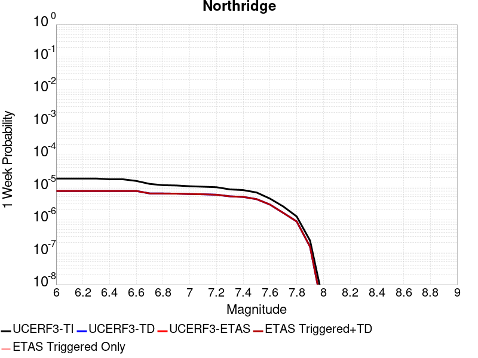 | 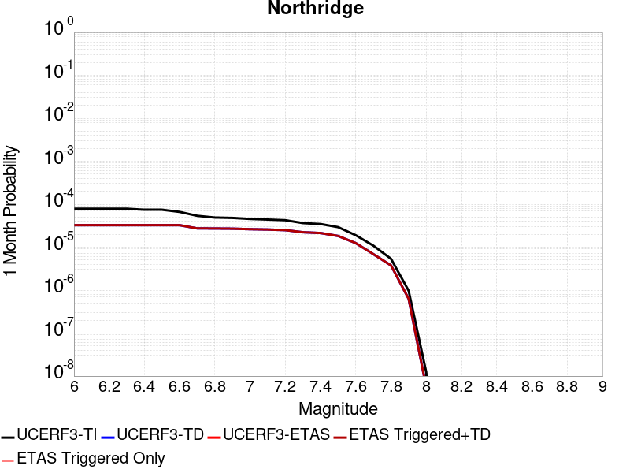 | 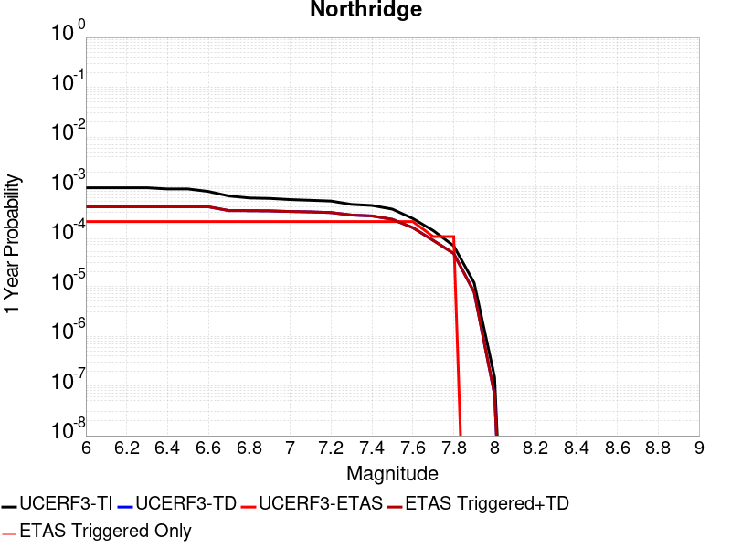 | 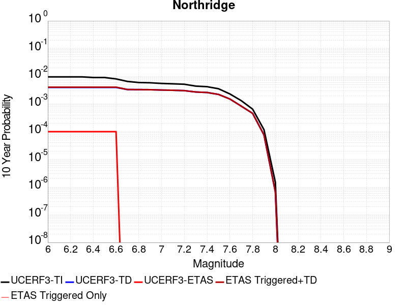 |

| Magnitude | 1 wk TI Prob | 1 wk TD Prob | 1 wk ETAS Prob | 1 wk ETAS/TD Gain | 1 wk ETAS Triggered+TD | 1 wk ETAS Triggered Only | 1 mo TI Prob | 1 mo TD Prob | 1 mo ETAS Prob | 1 mo ETAS/TD Gain | 1 mo ETAS Triggered+TD | 1 mo ETAS Triggered Only | 1 yr TI Prob | 1 yr TD Prob | 1 yr ETAS Prob | 1 yr ETAS/TD Gain | 1 yr ETAS Triggered+TD | 1 yr ETAS Triggered Only | 10 yr TI Prob | 10 yr TD Prob | 10 yr ETAS Prob | 10 yr ETAS/TD Gain | 10 yr ETAS Triggered+TD | 10 yr ETAS Triggered Only |
|-----|-----|-----|-----|-----|-----|-----|-----|-----|-----|-----|-----|-----|-----|-----|-----|-----|-----|-----|-----|-----|-----|-----|-----|-----|
| 6.0 | 1.8340852E-5 | 7.5905855E-6 | 0.0 | 0.0 | 7.5905855E-6 | 0.0 | 7.860128E-5 | 3.2530686E-5 | 0.0 | 0.0 | 3.2530686E-5 | 0.0 | 9.565505E-4 | 3.9599134E-4 | 2.0E-4 | 0.50506157 | 3.9599134E-4 | 0.0 | 0.009524435 | 0.0039530983 | 0.0022 | 0.55652547 | 0.0040527033 | 1.0E-4 |
| 6.1 | 1.8340852E-5 | 7.5905855E-6 | 0.0 | 0.0 | 7.5905855E-6 | 0.0 | 7.860128E-5 | 3.2530686E-5 | 0.0 | 0.0 | 3.2530686E-5 | 0.0 | 9.565505E-4 | 3.9599134E-4 | 2.0E-4 | 0.50506157 | 3.9599134E-4 | 0.0 | 0.009524435 | 0.0039530983 | 0.0022 | 0.55652547 | 0.0040527033 | 1.0E-4 |
| 6.2 | 1.8340852E-5 | 7.5905855E-6 | 0.0 | 0.0 | 7.5905855E-6 | 0.0 | 7.860128E-5 | 3.2530686E-5 | 0.0 | 0.0 | 3.2530686E-5 | 0.0 | 9.565505E-4 | 3.9599134E-4 | 2.0E-4 | 0.50506157 | 3.9599134E-4 | 0.0 | 0.009524435 | 0.0039530983 | 0.0022 | 0.55652547 | 0.0040527033 | 1.0E-4 |
| 6.3 | 1.8340852E-5 | 7.5905855E-6 | 0.0 | 0.0 | 7.5905855E-6 | 0.0 | 7.860128E-5 | 3.2530686E-5 | 0.0 | 0.0 | 3.2530686E-5 | 0.0 | 9.565505E-4 | 3.9599134E-4 | 2.0E-4 | 0.50506157 | 3.9599134E-4 | 0.0 | 0.009524435 | 0.0039530983 | 0.0022 | 0.55652547 | 0.0040527033 | 1.0E-4 |
| 6.4 | 1.7361892E-5 | 7.5905855E-6 | 0.0 | 0.0 | 7.5905855E-6 | 0.0 | 7.440598E-5 | 3.2530686E-5 | 0.0 | 0.0 | 3.2530686E-5 | 0.0 | 9.055163E-4 | 3.9599134E-4 | 2.0E-4 | 0.50506157 | 3.9599134E-4 | 0.0 | 0.009018354 | 0.0039530983 | 0.0022 | 0.55652547 | 0.0040527033 | 1.0E-4 |
| 6.5 | 1.7361892E-5 | 7.5905855E-6 | 0.0 | 0.0 | 7.5905855E-6 | 0.0 | 7.440598E-5 | 3.2530686E-5 | 0.0 | 0.0 | 3.2530686E-5 | 0.0 | 9.055163E-4 | 3.9599134E-4 | 2.0E-4 | 0.50506157 | 3.9599134E-4 | 0.0 | 0.009018354 | 0.0039530983 | 0.0022 | 0.55652547 | 0.0040527033 | 1.0E-4 |
| 6.6 | 1.5458201E-5 | 7.5905855E-6 | 0.0 | 0.0 | 7.5905855E-6 | 0.0 | 6.624775E-5 | 3.2530686E-5 | 0.0 | 0.0 | 3.2530686E-5 | 0.0 | 8.0626784E-4 | 3.9599134E-4 | 2.0E-4 | 0.50506157 | 3.9599134E-4 | 0.0 | 0.008033488 | 0.0039530983 | 0.0022 | 0.55652547 | 0.0040527033 | 1.0E-4 |
| 6.7 | 1.2538368E-5 | 6.3837247E-6 | 0.0 | 0.0 | 6.3837247E-6 | 0.0 | 5.3734755E-5 | 2.7358536E-5 | 0.0 | 0.0 | 2.7358536E-5 | 0.0 | 6.5402425E-4 | 3.330397E-4 | 2.0E-4 | 0.600529 | 3.330397E-4 | 0.0 | 0.0065210275 | 0.0033254726 | 0.002 | 0.60141826 | 0.0033254726 | 0.0 |
| 6.8 | 1.1438097E-5 | 6.3523607E-6 | 0.0 | 0.0 | 6.3523607E-6 | 0.0 | 4.9019498E-5 | 2.7224121E-5 | 0.0 | 0.0 | 2.7224121E-5 | 0.0 | 5.9664896E-4 | 3.314037E-4 | 2.0E-4 | 0.6034936 | 3.314037E-4 | 0.0 | 0.005950495 | 0.0033091614 | 0.002 | 0.6043827 | 0.0033091614 | 0.0 |
| 6.9 | 1.1204891E-5 | 6.2887893E-6 | 0.0 | 0.0 | 6.2887893E-6 | 0.0 | 4.8020076E-5 | 2.6951679E-5 | 0.0 | 0.0 | 2.6951679E-5 | 0.0 | 5.8448757E-4 | 3.280877E-4 | 2.0E-4 | 0.6095931 | 3.280877E-4 | 0.0 | 0.0058295266 | 0.0032760997 | 0.002 | 0.61048204 | 0.0032760997 | 0.0 |
| 7.0 | 1.061046E-5 | 6.1173923E-6 | 0.0 | 0.0 | 6.1173923E-6 | 0.0 | 4.5472607E-5 | 2.6217134E-5 | 0.0 | 0.0 | 2.6217134E-5 | 0.0 | 5.534883E-4 | 3.1914728E-4 | 2.0E-4 | 0.6266699 | 3.1914728E-4 | 0.0 | 0.0055211177 | 0.0031869363 | 0.002 | 0.627562 | 0.0031869363 | 0.0 |
| 7.1 | 1.0266979E-5 | 6.0062694E-6 | 0.0 | 0.0 | 6.0062694E-6 | 0.0 | 4.40006E-5 | 2.5740903E-5 | 0.0 | 0.0 | 2.5740903E-5 | 0.0 | 5.355756E-4 | 3.1335087E-4 | 2.0E-4 | 0.63826215 | 3.1335087E-4 | 0.0 | 0.0053428668 | 0.0031291365 | 0.002 | 0.63915396 | 0.0031291365 | 0.0 |
| 7.2 | 9.91273E-6 | 5.821938E-6 | 0.0 | 0.0 | 5.821938E-6 | 0.0 | 4.248244E-5 | 2.4950927E-5 | 0.0 | 0.0 | 2.4950927E-5 | 0.0 | 5.171009E-4 | 3.037356E-4 | 2.0E-4 | 0.6584674 | 3.037356E-4 | 0.0 | 0.0051589934 | 0.0030332503 | 0.002 | 0.6593587 | 0.0030332503 | 0.0 |
| 7.3 | 8.4959265E-6 | 5.1948587E-6 | 0.0 | 0.0 | 5.1948587E-6 | 0.0 | 3.6410605E-5 | 2.226349E-5 | 0.0 | 0.0 | 2.226349E-5 | 0.0 | 4.4320893E-4 | 2.7102453E-4 | 2.0E-4 | 0.7379406 | 2.7102453E-4 | 0.0 | 0.00442326 | 0.0027069668 | 0.0019 | 0.7018926 | 0.0027069668 | 0.0 |
| 7.4 | 8.0847185E-6 | 4.983591E-6 | 0.0 | 0.0 | 4.983591E-6 | 0.0 | 3.4648332E-5 | 2.1358075E-5 | 0.0 | 0.0 | 2.1358075E-5 | 0.0 | 4.2176177E-4 | 2.6000376E-4 | 2.0E-4 | 0.76921964 | 2.6000376E-4 | 0.0 | 0.0042096223 | 0.0025970219 | 0.0019 | 0.73160726 | 0.0025970219 | 0.0 |
| 7.5 | 6.8220684E-6 | 4.254527E-6 | 0.0 | 0.0 | 4.254527E-6 | 0.0 | 2.9237108E-5 | 1.823356E-5 | 0.0 | 0.0 | 1.823356E-5 | 0.0 | 3.5590364E-4 | 2.2197119E-4 | 2.0E-4 | 0.90101784 | 2.2197119E-4 | 0.0 | 0.0035533418 | 0.0022175156 | 0.0017 | 0.7666237 | 0.0022175156 | 0.0 |
| 7.6 | 4.4224143E-6 | 2.900608E-6 | 0.0 | 0.0 | 2.900608E-6 | 0.0 | 1.8953066E-5 | 1.2431118E-5 | 0.0 | 0.0 | 1.2431118E-5 | 0.0 | 2.3072914E-4 | 1.5133846E-4 | 2.0E-4 | 1.3215411 | 1.5133846E-4 | 0.0 | 0.0023048974 | 0.0015123656 | 0.0013 | 0.85958046 | 0.0015123656 | 0.0 |
| 7.7 | 2.5297056E-6 | 1.6049412E-6 | 0.0 | 0.0 | 1.6049412E-6 | 0.0 | 1.0841551E-5 | 6.8783015E-6 | 0.0 | 0.0 | 6.8783015E-6 | 0.0 | 1.319879E-4 | 8.3740146E-5 | 1.0E-4 | 1.1941704 | 8.3740146E-5 | 0.0 | 0.0013190953 | 8.3709066E-4 | 8.0E-4 | 0.955691 | 8.3709066E-4 | 0.0 |
| 7.8 | 1.2508156E-6 | 8.7821036E-7 | 0.0 | 0.0 | 8.7821036E-7 | 0.0 | 5.3606273E-6 | 3.7637533E-6 | 0.0 | 0.0 | 3.7637533E-6 | 0.0 | 6.526368E-5 | 4.5822744E-5 | 1.0E-4 | 2.1823223 | 4.5822744E-5 | 0.0 | 6.524452E-4 | 4.5813425E-4 | 7.0E-4 | 1.5279363 | 4.5813425E-4 | 0.0 |
| 7.9 | 2.262199E-7 | 1.466873E-7 | 0.0 | 0.0 | 1.466873E-7 | 0.0 | 9.695135E-7 | 6.2865973E-7 | 0.0 | 0.0 | 6.2865973E-7 | 0.0 | 1.1803763E-5 | 7.653906E-6 | 0.0 | 0.0 | 7.653906E-6 | 0.0 | 1.1803136E-4 | 7.6536504E-5 | 0.0 | 0.0 | 7.6536504E-5 | 0.0 |
| 8.0 | 2.865362E-9 | 1.2765602E-9 | 0.0 | 0.0 | 1.2765602E-9 | 0.0 | 1.2280123E-8 | 5.470972E-9 | 0.0 | 0.0 | 5.470972E-9 | 0.0 | 1.4951048E-7 | 6.660909E-8 | 0.0 | 0.0 | 6.660909E-8 | 0.0 | 1.4951038E-6 | 6.660909E-7 | 0.0 | 0.0 | 6.660909E-7 | 0.0 |

## Compton
*[(top)](#table-of-contents)*

| 1 Week | 1 Month | 1 Year | 10 Year |
|-----|-----|-----|-----|
| 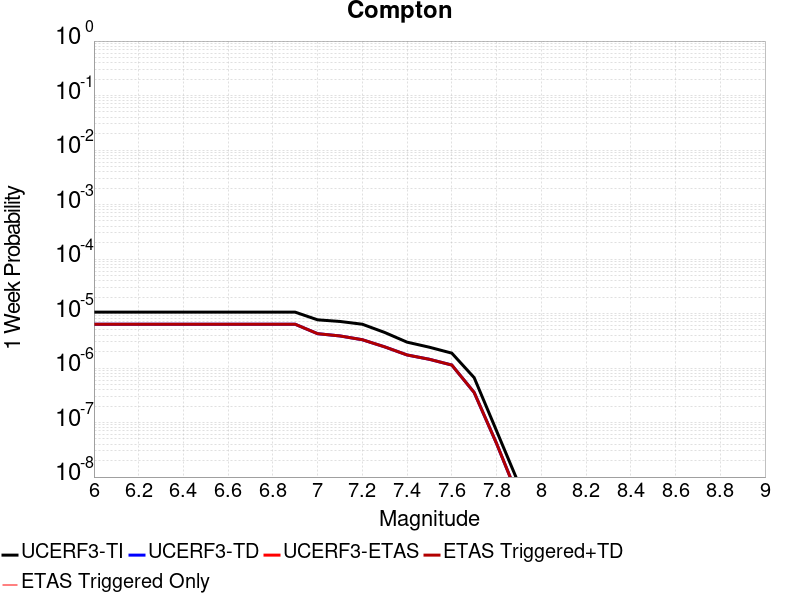 | 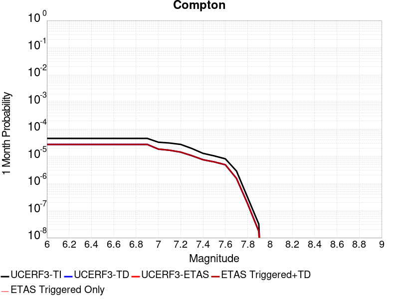 | 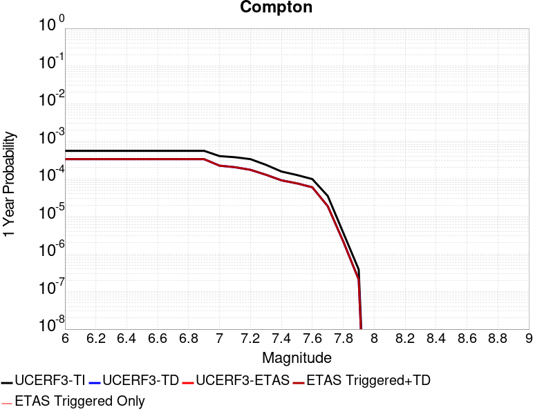 | 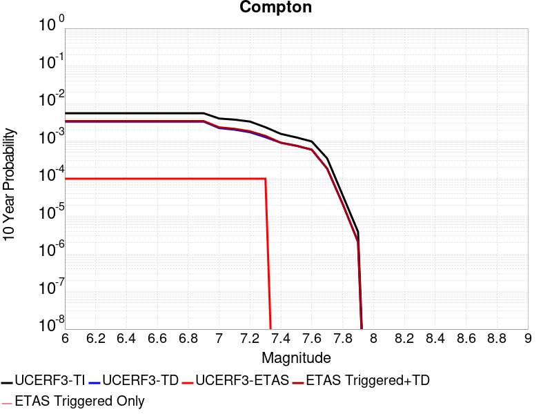 |

| Magnitude | 1 wk TI Prob | 1 wk TD Prob | 1 wk ETAS Prob | 1 wk ETAS/TD Gain | 1 wk ETAS Triggered+TD | 1 wk ETAS Triggered Only | 1 mo TI Prob | 1 mo TD Prob | 1 mo ETAS Prob | 1 mo ETAS/TD Gain | 1 mo ETAS Triggered+TD | 1 mo ETAS Triggered Only | 1 yr TI Prob | 1 yr TD Prob | 1 yr ETAS Prob | 1 yr ETAS/TD Gain | 1 yr ETAS Triggered+TD | 1 yr ETAS Triggered Only | 10 yr TI Prob | 10 yr TD Prob | 10 yr ETAS Prob | 10 yr ETAS/TD Gain | 10 yr ETAS Triggered+TD | 10 yr ETAS Triggered Only |
|-----|-----|-----|-----|-----|-----|-----|-----|-----|-----|-----|-----|-----|-----|-----|-----|-----|-----|-----|-----|-----|-----|-----|-----|-----|
| 6.0 | 1.06050875E-5 | 6.360186E-6 | 0.0 | 0.0 | 6.360186E-6 | 0.0 | 4.5449582E-5 | 2.725767E-5 | 0.0 | 0.0 | 2.725767E-5 | 0.0 | 5.5320817E-4 | 3.3181446E-4 | 2.0E-4 | 0.6027465 | 3.3181446E-4 | 0.0 | 0.0055183303 | 0.0033134744 | 0.0024 | 0.7243153 | 0.0034131429 | 1.0E-4 |
| 6.1 | 1.06050875E-5 | 6.360186E-6 | 0.0 | 0.0 | 6.360186E-6 | 0.0 | 4.5449582E-5 | 2.725767E-5 | 0.0 | 0.0 | 2.725767E-5 | 0.0 | 5.5320817E-4 | 3.3181446E-4 | 2.0E-4 | 0.6027465 | 3.3181446E-4 | 0.0 | 0.0055183303 | 0.0033134744 | 0.0024 | 0.7243153 | 0.0034131429 | 1.0E-4 |
| 6.2 | 1.06050875E-5 | 6.360186E-6 | 0.0 | 0.0 | 6.360186E-6 | 0.0 | 4.5449582E-5 | 2.725767E-5 | 0.0 | 0.0 | 2.725767E-5 | 0.0 | 5.5320817E-4 | 3.3181446E-4 | 2.0E-4 | 0.6027465 | 3.3181446E-4 | 0.0 | 0.0055183303 | 0.0033134744 | 0.0024 | 0.7243153 | 0.0034131429 | 1.0E-4 |
| 6.3 | 1.06050875E-5 | 6.360186E-6 | 0.0 | 0.0 | 6.360186E-6 | 0.0 | 4.5449582E-5 | 2.725767E-5 | 0.0 | 0.0 | 2.725767E-5 | 0.0 | 5.5320817E-4 | 3.3181446E-4 | 2.0E-4 | 0.6027465 | 3.3181446E-4 | 0.0 | 0.0055183303 | 0.0033134744 | 0.0024 | 0.7243153 | 0.0034131429 | 1.0E-4 |
| 6.4 | 1.06050875E-5 | 6.360186E-6 | 0.0 | 0.0 | 6.360186E-6 | 0.0 | 4.5449582E-5 | 2.725767E-5 | 0.0 | 0.0 | 2.725767E-5 | 0.0 | 5.5320817E-4 | 3.3181446E-4 | 2.0E-4 | 0.6027465 | 3.3181446E-4 | 0.0 | 0.0055183303 | 0.0033134744 | 0.0024 | 0.7243153 | 0.0034131429 | 1.0E-4 |
| 6.5 | 1.06050875E-5 | 6.360186E-6 | 0.0 | 0.0 | 6.360186E-6 | 0.0 | 4.5449582E-5 | 2.725767E-5 | 0.0 | 0.0 | 2.725767E-5 | 0.0 | 5.5320817E-4 | 3.3181446E-4 | 2.0E-4 | 0.6027465 | 3.3181446E-4 | 0.0 | 0.0055183303 | 0.0033134744 | 0.0024 | 0.7243153 | 0.0034131429 | 1.0E-4 |
| 6.6 | 1.06050875E-5 | 6.360186E-6 | 0.0 | 0.0 | 6.360186E-6 | 0.0 | 4.5449582E-5 | 2.725767E-5 | 0.0 | 0.0 | 2.725767E-5 | 0.0 | 5.5320817E-4 | 3.3181446E-4 | 2.0E-4 | 0.6027465 | 3.3181446E-4 | 0.0 | 0.0055183303 | 0.0033134744 | 0.0024 | 0.7243153 | 0.0034131429 | 1.0E-4 |
| 6.7 | 1.06050875E-5 | 6.360186E-6 | 0.0 | 0.0 | 6.360186E-6 | 0.0 | 4.5449582E-5 | 2.725767E-5 | 0.0 | 0.0 | 2.725767E-5 | 0.0 | 5.5320817E-4 | 3.3181446E-4 | 2.0E-4 | 0.6027465 | 3.3181446E-4 | 0.0 | 0.0055183303 | 0.0033134744 | 0.0024 | 0.7243153 | 0.0034131429 | 1.0E-4 |
| 6.8 | 1.06050875E-5 | 6.360186E-6 | 0.0 | 0.0 | 6.360186E-6 | 0.0 | 4.5449582E-5 | 2.725767E-5 | 0.0 | 0.0 | 2.725767E-5 | 0.0 | 5.5320817E-4 | 3.3181446E-4 | 2.0E-4 | 0.6027465 | 3.3181446E-4 | 0.0 | 0.0055183303 | 0.0033134744 | 0.0024 | 0.7243153 | 0.0034131429 | 1.0E-4 |
| 6.9 | 1.06050875E-5 | 6.360186E-6 | 0.0 | 0.0 | 6.360186E-6 | 0.0 | 4.5449582E-5 | 2.725767E-5 | 0.0 | 0.0 | 2.725767E-5 | 0.0 | 5.5320817E-4 | 3.3181446E-4 | 2.0E-4 | 0.6027465 | 3.3181446E-4 | 0.0 | 0.0055183303 | 0.0033134744 | 0.0024 | 0.7243153 | 0.0034131429 | 1.0E-4 |
| 7.0 | 7.672486E-6 | 4.272957E-6 | 0.0 | 0.0 | 4.272957E-6 | 0.0 | 3.288167E-5 | 1.8312548E-5 | 0.0 | 0.0 | 1.8312548E-5 | 0.0 | 4.0026082E-4 | 2.2293309E-4 | 1.0E-4 | 0.4485651 | 2.2293309E-4 | 0.0 | 0.0039954064 | 0.0022271567 | 0.0016 | 0.71840477 | 0.002326934 | 1.0E-4 |
| 7.1 | 7.163992E-6 | 3.8846015E-6 | 0.0 | 0.0 | 3.8846015E-6 | 0.0 | 3.0702464E-5 | 1.6648188E-5 | 0.0 | 0.0 | 1.6648188E-5 | 0.0 | 3.7373835E-4 | 2.0267341E-4 | 1.0E-4 | 0.49340463 | 2.0267341E-4 | 0.0 | 0.0037311043 | 0.0020249428 | 0.0015 | 0.7407617 | 0.0021247403 | 1.0E-4 |
| 7.2 | 6.3689185E-6 | 3.3108959E-6 | 0.0 | 0.0 | 3.3108959E-6 | 0.0 | 2.729508E-5 | 1.4189479E-5 | 0.0 | 0.0 | 1.4189479E-5 | 0.0 | 3.322669E-4 | 1.7274363E-4 | 0.0 | 0.0 | 1.7274363E-4 | 0.0 | 0.0033177056 | 0.0017261354 | 0.0014 | 0.81106037 | 0.0018259627 | 1.0E-4 |
| 7.3 | 4.4987873E-6 | 2.4485366E-6 | 0.0 | 0.0 | 2.4485366E-6 | 0.0 | 1.9280375E-5 | 1.0493688E-5 | 0.0 | 0.0 | 1.0493688E-5 | 0.0 | 2.3471327E-4 | 1.2775346E-4 | 0.0 | 0.0 | 1.2775346E-4 | 0.0 | 0.002344655 | 0.0012768304 | 0.0012 | 0.9398272 | 0.0013767028 | 1.0E-4 |
| 7.4 | 2.987296E-6 | 1.7398277E-6 | 0.0 | 0.0 | 1.7398277E-6 | 0.0 | 1.2802635E-5 | 7.456383E-6 | 0.0 | 0.0 | 7.456383E-6 | 0.0 | 1.5586092E-4 | 9.077774E-5 | 0.0 | 0.0 | 9.077774E-5 | 0.0 | 0.0015575165 | 9.074124E-4 | 9.0E-4 | 0.9918313 | 9.074124E-4 | 0.0 |
| 7.5 | 2.4111696E-6 | 1.4475205E-6 | 0.0 | 0.0 | 1.4475205E-6 | 0.0 | 1.0333543E-5 | 6.2036447E-6 | 0.0 | 0.0 | 6.2036447E-6 | 0.0 | 1.2580362E-4 | 7.5526805E-5 | 0.0 | 0.0 | 7.5526805E-5 | 0.0 | 0.0012573242 | 7.5501605E-4 | 6.0E-4 | 0.79468507 | 7.5501605E-4 | 0.0 |
| 7.6 | 1.8783096E-6 | 1.1362694E-6 | 0.0 | 0.0 | 1.1362694E-6 | 0.0 | 8.049874E-6 | 4.869717E-6 | 0.0 | 0.0 | 4.869717E-6 | 0.0 | 9.8002805E-5 | 5.928723E-5 | 0.0 | 0.0 | 5.928723E-5 | 0.0 | 9.795959E-4 | 5.9271813E-4 | 5.0E-4 | 0.8435713 | 5.9271813E-4 | 0.0 |
| 7.7 | 6.6646817E-7 | 3.5609338E-7 | 0.0 | 0.0 | 3.5609338E-7 | 0.0 | 2.856289E-6 | 1.5261137E-6 | 0.0 | 0.0 | 1.5261137E-6 | 0.0 | 3.4774763E-5 | 1.858029E-5 | 0.0 | 0.0 | 1.858029E-5 | 0.0 | 3.4769322E-4 | 1.857887E-4 | 2.0E-4 | 1.0764917 | 1.857887E-4 | 0.0 |
| 7.8 | 7.054689E-8 | 4.1356305E-8 | 0.0 | 0.0 | 4.1356305E-8 | 0.0 | 3.0234378E-7 | 1.7724129E-7 | 0.0 | 0.0 | 1.7724129E-7 | 0.0 | 3.6810293E-6 | 2.1579106E-6 | 0.0 | 0.0 | 2.1579106E-6 | 0.0 | 3.6809684E-5 | 2.1578906E-5 | 0.0 | 0.0 | 2.1578906E-5 | 0.0 |
| 7.9 | 7.420925E-9 | 4.014986E-9 | 0.0 | 0.0 | 4.014986E-9 | 0.0 | 3.1803964E-8 | 1.7207084E-8 | 0.0 | 0.0 | 1.7207084E-8 | 0.0 | 3.872132E-7 | 2.0949624E-7 | 0.0 | 0.0 | 2.0949624E-7 | 0.0 | 3.872125E-6 | 2.0949606E-6 | 0.0 | 0.0 | 2.0949606E-6 | 0.0 |

## Ozena
*[(top)](#table-of-contents)*

| 1 Week | 1 Month | 1 Year | 10 Year |
|-----|-----|-----|-----|
| 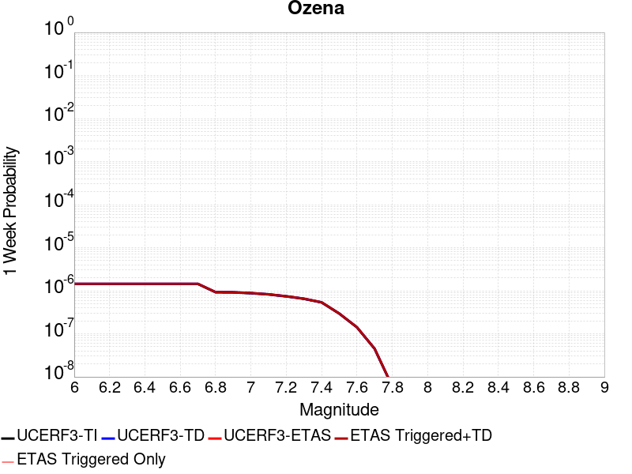 | 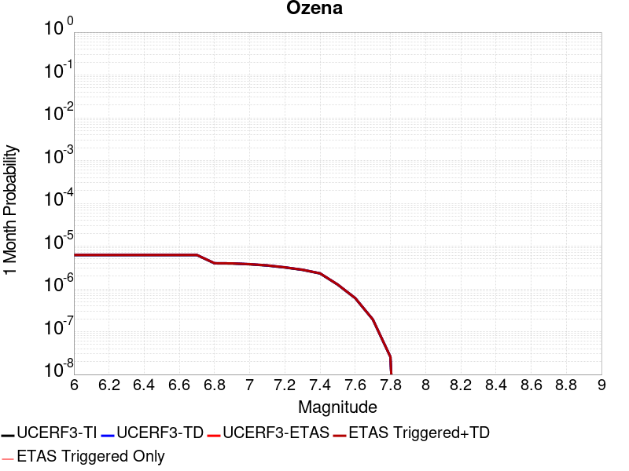 | 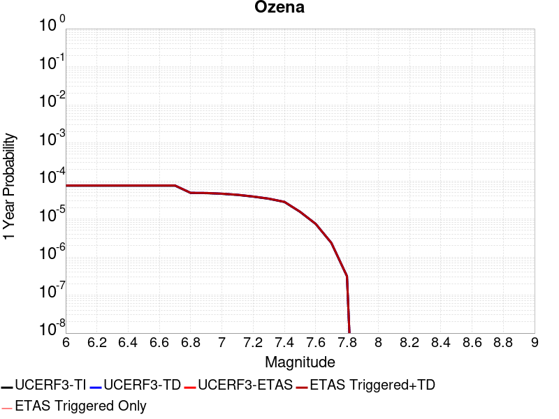 | 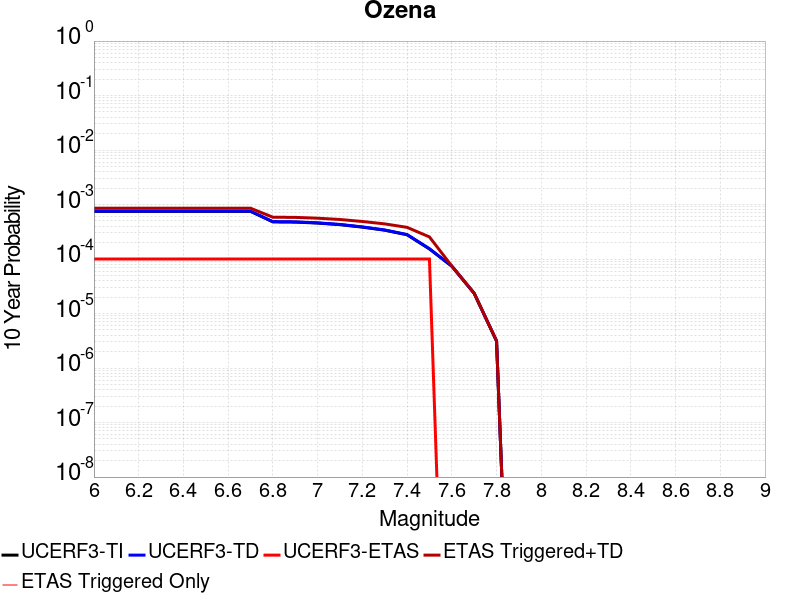 |

| Magnitude | 1 wk TI Prob | 1 wk TD Prob | 1 wk ETAS Prob | 1 wk ETAS/TD Gain | 1 wk ETAS Triggered+TD | 1 wk ETAS Triggered Only | 1 mo TI Prob | 1 mo TD Prob | 1 mo ETAS Prob | 1 mo ETAS/TD Gain | 1 mo ETAS Triggered+TD | 1 mo ETAS Triggered Only | 1 yr TI Prob | 1 yr TD Prob | 1 yr ETAS Prob | 1 yr ETAS/TD Gain | 1 yr ETAS Triggered+TD | 1 yr ETAS Triggered Only | 10 yr TI Prob | 10 yr TD Prob | 10 yr ETAS Prob | 10 yr ETAS/TD Gain | 10 yr ETAS Triggered+TD | 10 yr ETAS Triggered Only |
|-----|-----|-----|-----|-----|-----|-----|-----|-----|-----|-----|-----|-----|-----|-----|-----|-----|-----|-----|-----|-----|-----|-----|-----|-----|
| 6.0 | 1.4377547E-6 | 1.4514067E-6 | 0.0 | 0.0 | 1.4514067E-6 | 0.0 | 6.161791E-6 | 6.2203007E-6 | 0.0 | 0.0 | 6.2203007E-6 | 0.0 | 7.5017226E-5 | 7.5729804E-5 | 0.0 | 0.0 | 7.5729804E-5 | 0.0 | 7.4991904E-4 | 7.570666E-4 | 7.0E-4 | 0.92462146 | 8.5699087E-4 | 1.0E-4 |
| 6.1 | 1.4377547E-6 | 1.4514067E-6 | 0.0 | 0.0 | 1.4514067E-6 | 0.0 | 6.161791E-6 | 6.2203007E-6 | 0.0 | 0.0 | 6.2203007E-6 | 0.0 | 7.5017226E-5 | 7.5729804E-5 | 0.0 | 0.0 | 7.5729804E-5 | 0.0 | 7.4991904E-4 | 7.570666E-4 | 7.0E-4 | 0.92462146 | 8.5699087E-4 | 1.0E-4 |
| 6.2 | 1.4377547E-6 | 1.4514067E-6 | 0.0 | 0.0 | 1.4514067E-6 | 0.0 | 6.161791E-6 | 6.2203007E-6 | 0.0 | 0.0 | 6.2203007E-6 | 0.0 | 7.5017226E-5 | 7.5729804E-5 | 0.0 | 0.0 | 7.5729804E-5 | 0.0 | 7.4991904E-4 | 7.570666E-4 | 7.0E-4 | 0.92462146 | 8.5699087E-4 | 1.0E-4 |
| 6.3 | 1.4377547E-6 | 1.4514067E-6 | 0.0 | 0.0 | 1.4514067E-6 | 0.0 | 6.161791E-6 | 6.2203007E-6 | 0.0 | 0.0 | 6.2203007E-6 | 0.0 | 7.5017226E-5 | 7.5729804E-5 | 0.0 | 0.0 | 7.5729804E-5 | 0.0 | 7.4991904E-4 | 7.570666E-4 | 7.0E-4 | 0.92462146 | 8.5699087E-4 | 1.0E-4 |
| 6.4 | 1.4377547E-6 | 1.4514067E-6 | 0.0 | 0.0 | 1.4514067E-6 | 0.0 | 6.161791E-6 | 6.2203007E-6 | 0.0 | 0.0 | 6.2203007E-6 | 0.0 | 7.5017226E-5 | 7.5729804E-5 | 0.0 | 0.0 | 7.5729804E-5 | 0.0 | 7.4991904E-4 | 7.570666E-4 | 7.0E-4 | 0.92462146 | 8.5699087E-4 | 1.0E-4 |
| 6.5 | 1.4377547E-6 | 1.4514067E-6 | 0.0 | 0.0 | 1.4514067E-6 | 0.0 | 6.161791E-6 | 6.2203007E-6 | 0.0 | 0.0 | 6.2203007E-6 | 0.0 | 7.5017226E-5 | 7.5729804E-5 | 0.0 | 0.0 | 7.5729804E-5 | 0.0 | 7.4991904E-4 | 7.570666E-4 | 7.0E-4 | 0.92462146 | 8.5699087E-4 | 1.0E-4 |
| 6.6 | 1.4377547E-6 | 1.4514067E-6 | 0.0 | 0.0 | 1.4514067E-6 | 0.0 | 6.161791E-6 | 6.2203007E-6 | 0.0 | 0.0 | 6.2203007E-6 | 0.0 | 7.5017226E-5 | 7.5729804E-5 | 0.0 | 0.0 | 7.5729804E-5 | 0.0 | 7.4991904E-4 | 7.570666E-4 | 7.0E-4 | 0.92462146 | 8.5699087E-4 | 1.0E-4 |
| 6.7 | 1.4377547E-6 | 1.4514067E-6 | 0.0 | 0.0 | 1.4514067E-6 | 0.0 | 6.161791E-6 | 6.2203007E-6 | 0.0 | 0.0 | 6.2203007E-6 | 0.0 | 7.5017226E-5 | 7.5729804E-5 | 0.0 | 0.0 | 7.5729804E-5 | 0.0 | 7.4991904E-4 | 7.570666E-4 | 7.0E-4 | 0.92462146 | 8.5699087E-4 | 1.0E-4 |
| 6.8 | 9.223257E-7 | 9.31782E-7 | 0.0 | 0.0 | 9.31782E-7 | 0.0 | 3.9528186E-6 | 3.9933457E-6 | 0.0 | 0.0 | 3.9933457E-6 | 0.0 | 4.81245E-5 | 4.8617938E-5 | 0.0 | 0.0 | 4.8617938E-5 | 0.0 | 4.811408E-4 | 4.8607704E-4 | 4.0E-4 | 0.8229148 | 5.8602844E-4 | 1.0E-4 |
| 6.9 | 9.141515E-7 | 9.235566E-7 | 0.0 | 0.0 | 9.235566E-7 | 0.0 | 3.917786E-6 | 3.958094E-6 | 0.0 | 0.0 | 3.958094E-6 | 0.0 | 4.7698002E-5 | 4.818877E-5 | 0.0 | 0.0 | 4.818877E-5 | 0.0 | 4.7687767E-4 | 4.8178722E-4 | 4.0E-4 | 0.83024204 | 5.8173906E-4 | 1.0E-4 |
| 7.0 | 8.767648E-7 | 8.8587666E-7 | 0.0 | 0.0 | 8.8587666E-7 | 0.0 | 3.757558E-6 | 3.7966088E-6 | 0.0 | 0.0 | 3.7966088E-6 | 0.0 | 4.5747307E-5 | 4.6222773E-5 | 0.0 | 0.0 | 4.6222773E-5 | 0.0 | 4.5737892E-4 | 4.621355E-4 | 4.0E-4 | 0.865547 | 5.620893E-4 | 1.0E-4 |
| 7.1 | 8.199402E-7 | 8.2855775E-7 | 0.0 | 0.0 | 8.2855775E-7 | 0.0 | 3.5140247E-6 | 3.5509572E-6 | 0.0 | 0.0 | 3.5509572E-6 | 0.0 | 4.2782412E-5 | 4.3232085E-5 | 0.0 | 0.0 | 4.3232085E-5 | 0.0 | 4.2774176E-4 | 4.3224046E-4 | 4.0E-4 | 0.9254108 | 5.3219724E-4 | 1.0E-4 |
| 7.2 | 7.38705E-7 | 7.464423E-7 | 0.0 | 0.0 | 7.464423E-7 | 0.0 | 3.1658747E-6 | 3.1990348E-6 | 0.0 | 0.0 | 3.1990348E-6 | 0.0 | 3.8543843E-5 | 3.8947586E-5 | 0.0 | 0.0 | 3.8947586E-5 | 0.0 | 3.853716E-4 | 3.8941114E-4 | 3.0E-4 | 0.770394 | 4.893722E-4 | 1.0E-4 |
| 7.3 | 6.490017E-7 | 6.557943E-7 | 0.0 | 0.0 | 6.557943E-7 | 0.0 | 2.7814328E-6 | 2.8105442E-6 | 0.0 | 0.0 | 2.8105442E-6 | 0.0 | 3.386342E-5 | 3.4217872E-5 | 0.0 | 0.0 | 3.4217872E-5 | 0.0 | 3.3858258E-4 | 3.4212938E-4 | 3.0E-4 | 0.8768612 | 4.420952E-4 | 1.0E-4 |
| 7.4 | 5.346736E-7 | 5.4023764E-7 | 0.0 | 0.0 | 5.4023764E-7 | 0.0 | 2.291456E-6 | 2.3153023E-6 | 0.0 | 0.0 | 2.3153023E-6 | 0.0 | 2.789812E-5 | 2.8188471E-5 | 0.0 | 0.0 | 2.8188471E-5 | 0.0 | 2.789462E-4 | 2.81852E-4 | 3.0E-4 | 1.0643884 | 3.818238E-4 | 1.0E-4 |
| 7.5 | 2.939325E-7 | 2.9666626E-7 | 0.0 | 0.0 | 2.9666626E-7 | 0.0 | 1.25971E-6 | 1.2714263E-6 | 0.0 | 0.0 | 1.2714263E-6 | 0.0 | 1.5336862E-5 | 1.5479522E-5 | 0.0 | 0.0 | 1.5479522E-5 | 0.0 | 1.5335804E-4 | 1.5478604E-4 | 2.0E-4 | 1.2921062 | 2.5477057E-4 | 1.0E-4 |
| 7.6 | 1.4151905E-7 | 1.4253476E-7 | 0.0 | 0.0 | 1.4253476E-7 | 0.0 | 6.065101E-7 | 6.108631E-7 | 0.0 | 0.0 | 6.108631E-7 | 0.0 | 7.3842357E-6 | 7.4372333E-6 | 0.0 | 0.0 | 7.4372333E-6 | 0.0 | 7.38399E-5 | 7.436992E-5 | 0.0 | 0.0 | 7.436992E-5 | 0.0 |
| 7.7 | 4.4957577E-8 | 4.5252854E-8 | 0.0 | 0.0 | 4.5252854E-8 | 0.0 | 1.9267533E-7 | 1.9394079E-7 | 0.0 | 0.0 | 1.9394079E-7 | 0.0 | 2.3458194E-6 | 2.3612267E-6 | 0.0 | 0.0 | 2.3612267E-6 | 0.0 | 2.3457947E-5 | 2.3612025E-5 | 0.0 | 0.0 | 2.3612025E-5 | 0.0 |
| 7.8 | 5.9993255E-9 | 6.0413843E-9 | 0.0 | 0.0 | 6.0413843E-9 | 0.0 | 2.5711394E-8 | 2.5891648E-8 | 0.0 | 0.0 | 2.5891648E-8 | 0.0 | 3.1303617E-7 | 3.1523078E-7 | 0.0 | 0.0 | 3.1523078E-7 | 0.0 | 3.1303573E-6 | 3.1523043E-6 | 0.0 | 0.0 | 3.1523043E-6 | 0.0 |

## Jess Valley
*[(top)](#table-of-contents)*

| 1 Week | 1 Month | 1 Year | 10 Year |
|-----|-----|-----|-----|
| 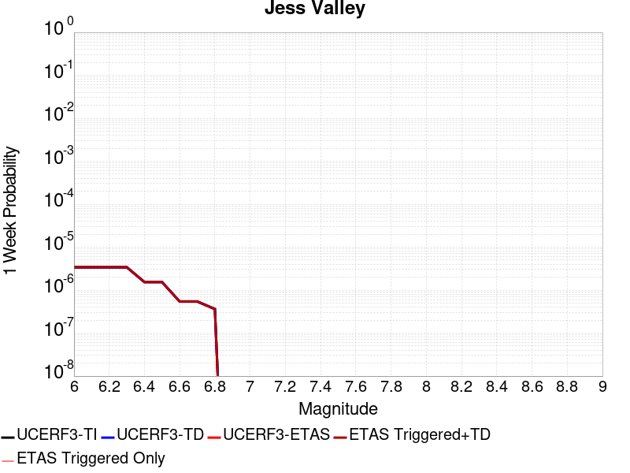 | 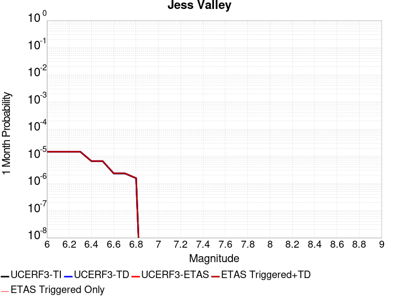 | 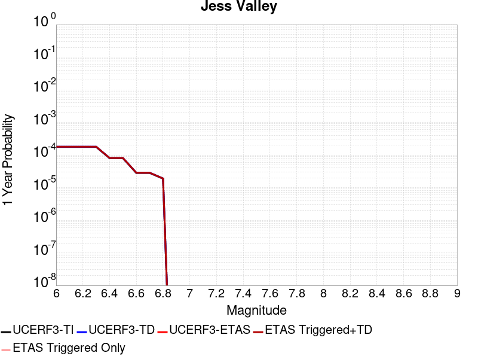 | 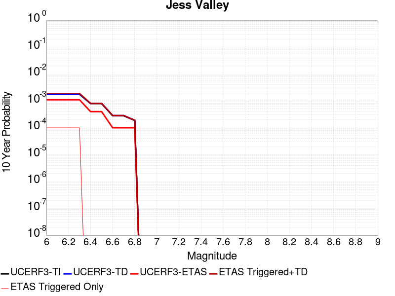 |

| Magnitude | 1 wk TI Prob | 1 wk TD Prob | 1 wk ETAS Prob | 1 wk ETAS/TD Gain | 1 wk ETAS Triggered+TD | 1 wk ETAS Triggered Only | 1 mo TI Prob | 1 mo TD Prob | 1 mo ETAS Prob | 1 mo ETAS/TD Gain | 1 mo ETAS Triggered+TD | 1 mo ETAS Triggered Only | 1 yr TI Prob | 1 yr TD Prob | 1 yr ETAS Prob | 1 yr ETAS/TD Gain | 1 yr ETAS Triggered+TD | 1 yr ETAS Triggered Only | 10 yr TI Prob | 10 yr TD Prob | 10 yr ETAS Prob | 10 yr ETAS/TD Gain | 10 yr ETAS Triggered+TD | 10 yr ETAS Triggered Only |
|-----|-----|-----|-----|-----|-----|-----|-----|-----|-----|-----|-----|-----|-----|-----|-----|-----|-----|-----|-----|-----|-----|-----|-----|-----|
| 6.0 | 3.3861274E-6 | 3.4341592E-6 | 0.0 | 0.0 | 3.4341592E-6 | 0.0 | 1.4511894E-5 | 1.4717759E-5 | 0.0 | 0.0 | 1.4717759E-5 | 0.0 | 1.7666799E-4 | 1.7917679E-4 | 0.0 | 0.0 | 1.7917679E-4 | 0.0 | 0.001765276 | 0.0017905998 | 0.0011 | 0.6143193 | 0.0018904207 | 1.0E-4 |
| 6.1 | 3.3861274E-6 | 3.4341592E-6 | 0.0 | 0.0 | 3.4341592E-6 | 0.0 | 1.4511894E-5 | 1.4717759E-5 | 0.0 | 0.0 | 1.4717759E-5 | 0.0 | 1.7666799E-4 | 1.7917679E-4 | 0.0 | 0.0 | 1.7917679E-4 | 0.0 | 0.001765276 | 0.0017905998 | 0.0011 | 0.6143193 | 0.0018904207 | 1.0E-4 |
| 6.2 | 3.3861274E-6 | 3.4341592E-6 | 0.0 | 0.0 | 3.4341592E-6 | 0.0 | 1.4511894E-5 | 1.4717759E-5 | 0.0 | 0.0 | 1.4717759E-5 | 0.0 | 1.7666799E-4 | 1.7917679E-4 | 0.0 | 0.0 | 1.7917679E-4 | 0.0 | 0.001765276 | 0.0017905998 | 0.0011 | 0.6143193 | 0.0018904207 | 1.0E-4 |
| 6.3 | 3.3861274E-6 | 3.4341592E-6 | 0.0 | 0.0 | 3.4341592E-6 | 0.0 | 1.4511894E-5 | 1.4717759E-5 | 0.0 | 0.0 | 1.4717759E-5 | 0.0 | 1.7666799E-4 | 1.7917679E-4 | 0.0 | 0.0 | 1.7917679E-4 | 0.0 | 0.001765276 | 0.0017905998 | 0.0011 | 0.6143193 | 0.0018904207 | 1.0E-4 |
| 6.4 | 1.5291708E-6 | 1.5503225E-6 | 0.0 | 0.0 | 1.5503225E-6 | 0.0 | 6.553573E-6 | 6.6442267E-6 | 0.0 | 0.0 | 6.6442267E-6 | 0.0 | 7.978683E-5 | 8.089125E-5 | 0.0 | 0.0 | 8.089125E-5 | 0.0 | 7.975819E-4 | 8.086963E-4 | 4.0E-4 | 0.49462324 | 8.086963E-4 | 0.0 |
| 6.5 | 1.5291708E-6 | 1.5503225E-6 | 0.0 | 0.0 | 1.5503225E-6 | 0.0 | 6.553573E-6 | 6.6442267E-6 | 0.0 | 0.0 | 6.6442267E-6 | 0.0 | 7.978683E-5 | 8.089125E-5 | 0.0 | 0.0 | 8.089125E-5 | 0.0 | 7.975819E-4 | 8.086963E-4 | 4.0E-4 | 0.49462324 | 8.086963E-4 | 0.0 |
| 6.6 | 5.396423E-7 | 5.4721534E-7 | 0.0 | 0.0 | 5.4721534E-7 | 0.0 | 2.312751E-6 | 2.3452076E-6 | 0.0 | 0.0 | 2.3452076E-6 | 0.0 | 2.8157378E-5 | 2.8552715E-5 | 0.0 | 0.0 | 2.8552715E-5 | 0.0 | 2.8153812E-4 | 2.8550887E-4 | 1.0E-4 | 0.35025182 | 2.8550887E-4 | 0.0 |
| 6.7 | 5.396423E-7 | 5.4721534E-7 | 0.0 | 0.0 | 5.4721534E-7 | 0.0 | 2.312751E-6 | 2.3452076E-6 | 0.0 | 0.0 | 2.3452076E-6 | 0.0 | 2.8157378E-5 | 2.8552715E-5 | 0.0 | 0.0 | 2.8552715E-5 | 0.0 | 2.8153812E-4 | 2.8550887E-4 | 1.0E-4 | 0.35025182 | 2.8550887E-4 | 0.0 |
| 6.8 | 3.6058395E-7 | 3.656412E-7 | 0.0 | 0.0 | 3.656412E-7 | 0.0 | 1.5453588E-6 | 1.5670338E-6 | 0.0 | 0.0 | 1.5670338E-6 | 0.0 | 1.8814582E-5 | 1.9078636E-5 | 0.0 | 0.0 | 1.9078636E-5 | 0.0 | 1.8812988E-4 | 1.9078636E-4 | 1.0E-4 | 0.5241465 | 1.9078636E-4 | 0.0 |

## Dog Valley
*[(top)](#table-of-contents)*

| 1 Week | 1 Month | 1 Year | 10 Year |
|-----|-----|-----|-----|
| 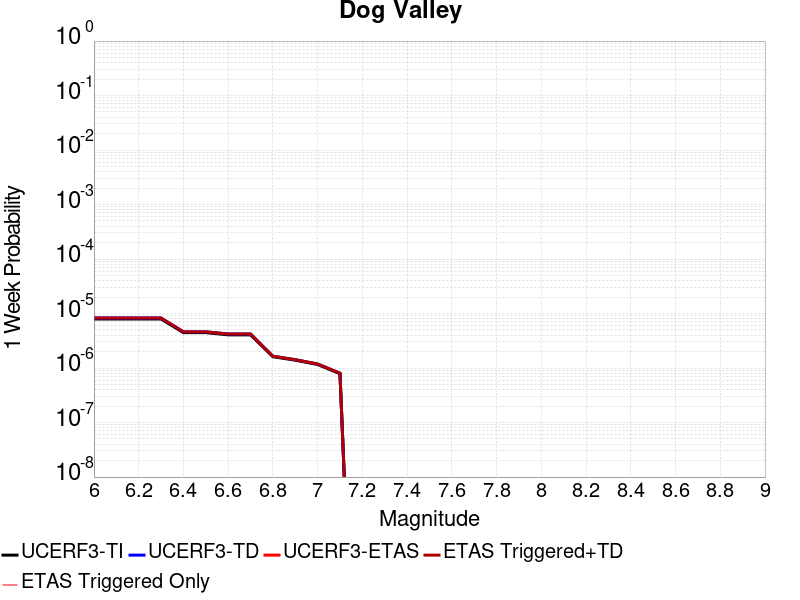 | 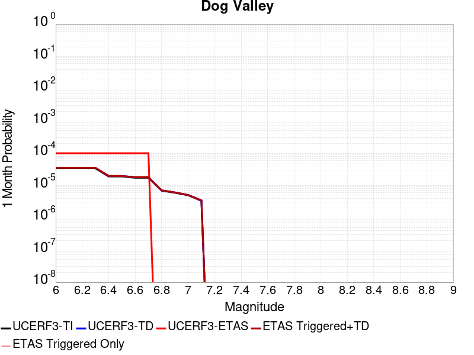 | 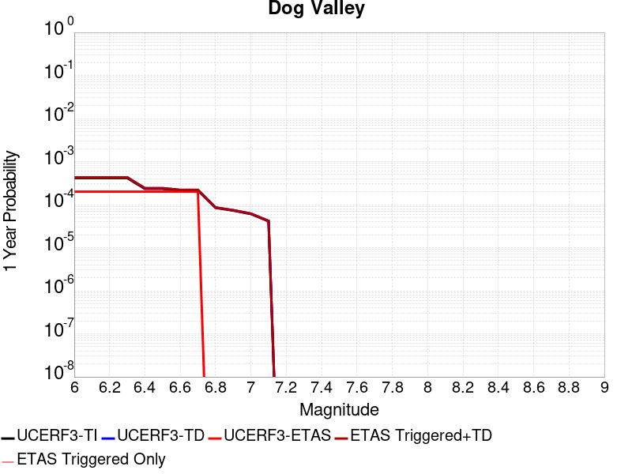 | 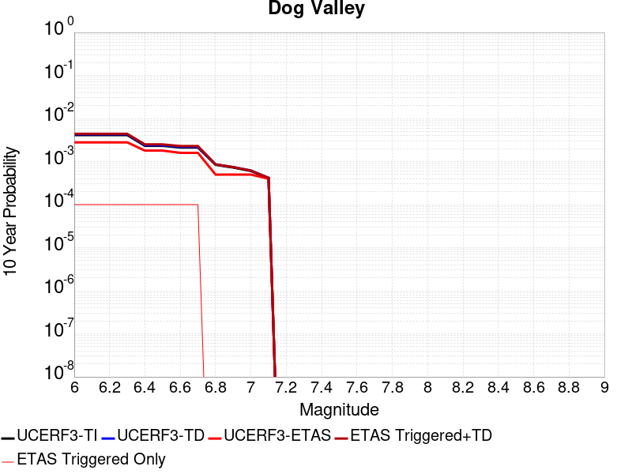 |

| Magnitude | 1 wk TI Prob | 1 wk TD Prob | 1 wk ETAS Prob | 1 wk ETAS/TD Gain | 1 wk ETAS Triggered+TD | 1 wk ETAS Triggered Only | 1 mo TI Prob | 1 mo TD Prob | 1 mo ETAS Prob | 1 mo ETAS/TD Gain | 1 mo ETAS Triggered+TD | 1 mo ETAS Triggered Only | 1 yr TI Prob | 1 yr TD Prob | 1 yr ETAS Prob | 1 yr ETAS/TD Gain | 1 yr ETAS Triggered+TD | 1 yr ETAS Triggered Only | 10 yr TI Prob | 10 yr TD Prob | 10 yr ETAS Prob | 10 yr ETAS/TD Gain | 10 yr ETAS Triggered+TD | 10 yr ETAS Triggered Only |
|-----|-----|-----|-----|-----|-----|-----|-----|-----|-----|-----|-----|-----|-----|-----|-----|-----|-----|-----|-----|-----|-----|-----|-----|-----|
| 6.0 | 7.949598E-6 | 8.276426E-6 | 0.0 | 0.0 | 8.276426E-6 | 0.0 | 3.4069257E-5 | 3.5470028E-5 | 1.0E-4 | 2.8192816 | 3.5470028E-5 | 0.0 | 4.1471425E-4 | 4.3178166E-4 | 2.0E-4 | 0.46319705 | 4.3178166E-4 | 0.0 | 0.0041394117 | 0.004311358 | 0.0028 | 0.6494474 | 0.0044109267 | 1.0E-4 |
| 6.1 | 7.949598E-6 | 8.276426E-6 | 0.0 | 0.0 | 8.276426E-6 | 0.0 | 3.4069257E-5 | 3.5470028E-5 | 1.0E-4 | 2.8192816 | 3.5470028E-5 | 0.0 | 4.1471425E-4 | 4.3178166E-4 | 2.0E-4 | 0.46319705 | 4.3178166E-4 | 0.0 | 0.0041394117 | 0.004311358 | 0.0028 | 0.6494474 | 0.0044109267 | 1.0E-4 |
| 6.2 | 7.949598E-6 | 8.276426E-6 | 0.0 | 0.0 | 8.276426E-6 | 0.0 | 3.4069257E-5 | 3.5470028E-5 | 1.0E-4 | 2.8192816 | 3.5470028E-5 | 0.0 | 4.1471425E-4 | 4.3178166E-4 | 2.0E-4 | 0.46319705 | 4.3178166E-4 | 0.0 | 0.0041394117 | 0.004311358 | 0.0028 | 0.6494474 | 0.0044109267 | 1.0E-4 |
| 6.3 | 7.949598E-6 | 8.276426E-6 | 0.0 | 0.0 | 8.276426E-6 | 0.0 | 3.4069257E-5 | 3.5470028E-5 | 1.0E-4 | 2.8192816 | 3.5470028E-5 | 0.0 | 4.1471425E-4 | 4.3178166E-4 | 2.0E-4 | 0.46319705 | 4.3178166E-4 | 0.0 | 0.0041394117 | 0.004311358 | 0.0028 | 0.6494474 | 0.0044109267 | 1.0E-4 |
| 6.4 | 4.462132E-6 | 4.6235073E-6 | 0.0 | 0.0 | 4.6235073E-6 | 0.0 | 1.9123283E-5 | 1.9814932E-5 | 1.0E-4 | 5.046699 | 1.9814932E-5 | 0.0 | 2.328011E-4 | 2.4122902E-4 | 2.0E-4 | 0.8290876 | 2.4122902E-4 | 0.0 | 0.0023255737 | 0.002410549 | 0.0018 | 0.7467179 | 0.002510308 | 1.0E-4 |
| 6.5 | 4.462132E-6 | 4.6235073E-6 | 0.0 | 0.0 | 4.6235073E-6 | 0.0 | 1.9123283E-5 | 1.9814932E-5 | 1.0E-4 | 5.046699 | 1.9814932E-5 | 0.0 | 2.328011E-4 | 2.4122902E-4 | 2.0E-4 | 0.8290876 | 2.4122902E-4 | 0.0 | 0.0023255737 | 0.002410549 | 0.0018 | 0.7467179 | 0.002510308 | 1.0E-4 |
| 6.6 | 4.074213E-6 | 4.2176816E-6 | 0.0 | 0.0 | 4.2176816E-6 | 0.0 | 1.7460794E-5 | 1.8075703E-5 | 1.0E-4 | 5.532288 | 1.8075703E-5 | 0.0 | 2.1256444E-4 | 2.2005825E-4 | 2.0E-4 | 0.9088503 | 2.2005825E-4 | 0.0 | 0.0021236122 | 0.0021992652 | 0.0016 | 0.7275157 | 0.0022990452 | 1.0E-4 |
| 6.7 | 4.074213E-6 | 4.2176816E-6 | 0.0 | 0.0 | 4.2176816E-6 | 0.0 | 1.7460794E-5 | 1.8075703E-5 | 1.0E-4 | 5.532288 | 1.8075703E-5 | 0.0 | 2.1256444E-4 | 2.2005825E-4 | 2.0E-4 | 0.9088503 | 2.2005825E-4 | 0.0 | 0.0021236122 | 0.0021992652 | 0.0016 | 0.7275157 | 0.0022990452 | 1.0E-4 |
| 6.8 | 1.6159543E-6 | 1.6504129E-6 | 0.0 | 0.0 | 1.6504129E-6 | 0.0 | 6.9255E-6 | 7.073182E-6 | 0.0 | 0.0 | 7.073182E-6 | 0.0 | 8.43147E-5 | 8.611314E-5 | 0.0 | 0.0 | 8.611314E-5 | 0.0 | 8.4282714E-4 | 8.6085196E-4 | 5.0E-4 | 0.58081996 | 8.6085196E-4 | 0.0 |
| 6.9 | 1.3952654E-6 | 1.4253508E-6 | 0.0 | 0.0 | 1.4253508E-6 | 0.0 | 5.9796953E-6 | 6.1086344E-6 | 0.0 | 0.0 | 6.1086344E-6 | 0.0 | 7.280036E-5 | 7.4370575E-5 | 0.0 | 0.0 | 7.4370575E-5 | 0.0 | 7.2776515E-4 | 7.4350485E-4 | 5.0E-4 | 0.67249054 | 7.4350485E-4 | 0.0 |
| 7.0 | 1.1619308E-6 | 1.1870053E-6 | 0.0 | 0.0 | 1.1870053E-6 | 0.0 | 4.979694E-6 | 5.087158E-6 | 0.0 | 0.0 | 5.087158E-6 | 0.0 | 6.0626087E-5 | 6.1934836E-5 | 0.0 | 0.0 | 6.1934836E-5 | 0.0 | 6.060955E-4 | 6.1921944E-4 | 5.0E-4 | 0.8074682 | 6.1921944E-4 | 0.0 |
| 7.1 | 7.8723247E-7 | 8.0473643E-7 | 0.0 | 0.0 | 8.0473643E-7 | 0.0 | 3.373849E-6 | 3.4488676E-6 | 0.0 | 0.0 | 3.4488676E-6 | 0.0 | 4.107584E-5 | 4.198946E-5 | 0.0 | 0.0 | 4.198946E-5 | 0.0 | 4.1068246E-4 | 4.1984514E-4 | 4.0E-4 | 0.95273226 | 4.1984514E-4 | 0.0 |

## Joshua Tree (Seismicity)
*[(top)](#table-of-contents)*

| 1 Week | 1 Month | 1 Year | 10 Year |
|-----|-----|-----|-----|
| 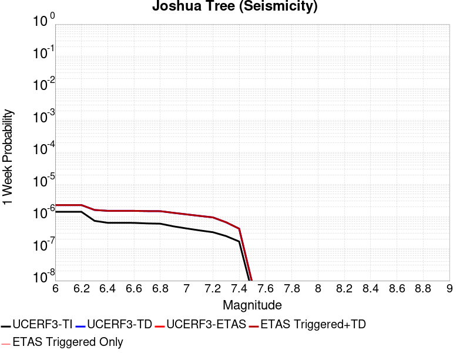 | 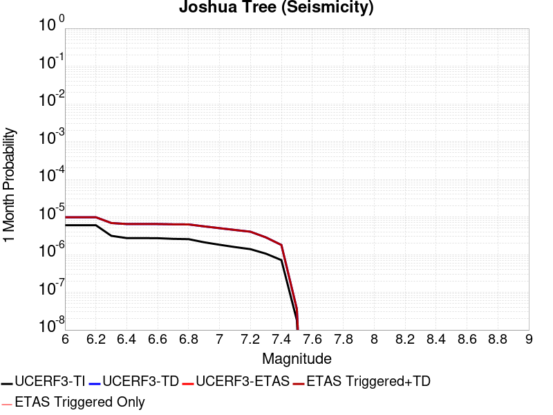 | 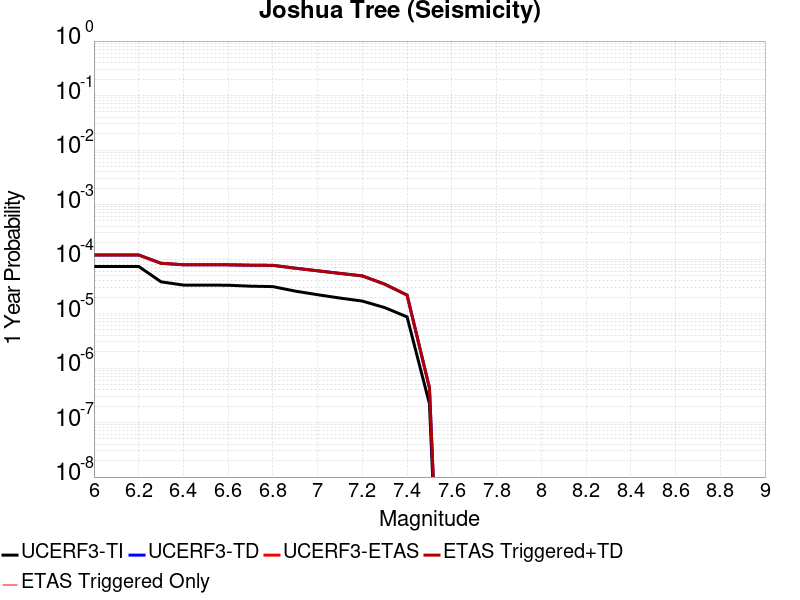 | 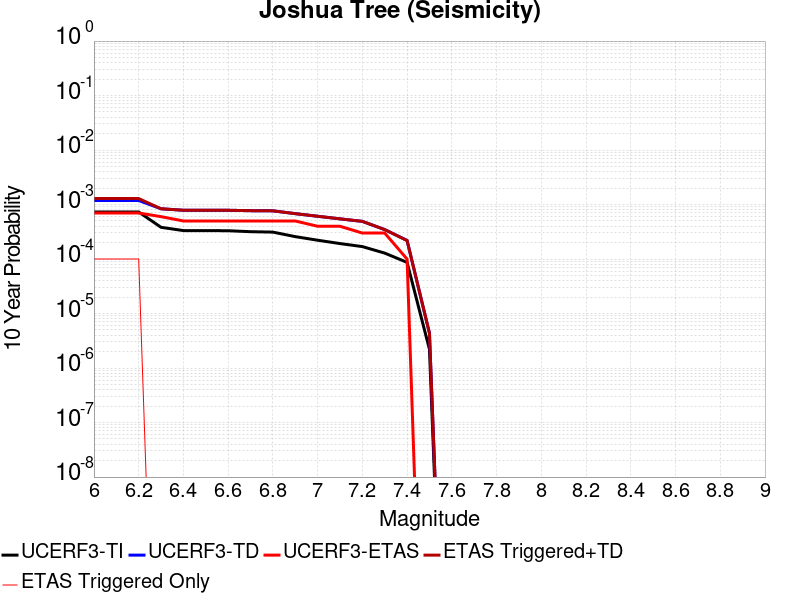 |

| Magnitude | 1 wk TI Prob | 1 wk TD Prob | 1 wk ETAS Prob | 1 wk ETAS/TD Gain | 1 wk ETAS Triggered+TD | 1 wk ETAS Triggered Only | 1 mo TI Prob | 1 mo TD Prob | 1 mo ETAS Prob | 1 mo ETAS/TD Gain | 1 mo ETAS Triggered+TD | 1 mo ETAS Triggered Only | 1 yr TI Prob | 1 yr TD Prob | 1 yr ETAS Prob | 1 yr ETAS/TD Gain | 1 yr ETAS Triggered+TD | 1 yr ETAS Triggered Only | 10 yr TI Prob | 10 yr TD Prob | 10 yr ETAS Prob | 10 yr ETAS/TD Gain | 10 yr ETAS Triggered+TD | 10 yr ETAS Triggered Only |
|-----|-----|-----|-----|-----|-----|-----|-----|-----|-----|-----|-----|-----|-----|-----|-----|-----|-----|-----|-----|-----|-----|-----|-----|-----|
| 6.0 | 1.4025588E-6 | 2.280323E-6 | 0.0 | 0.0 | 2.280323E-6 | 0.0 | 6.0109523E-6 | 9.772781E-6 | 0.0 | 0.0 | 9.772781E-6 | 0.0 | 7.318089E-5 | 1.1897776E-4 | 0.0 | 0.0 | 1.1897776E-4 | 0.0 | 7.315679E-4 | 0.0011892049 | 7.0E-4 | 0.5886286 | 0.001289086 | 1.0E-4 |
| 6.1 | 1.4025588E-6 | 2.280323E-6 | 0.0 | 0.0 | 2.280323E-6 | 0.0 | 6.0109523E-6 | 9.772781E-6 | 0.0 | 0.0 | 9.772781E-6 | 0.0 | 7.318089E-5 | 1.1897776E-4 | 0.0 | 0.0 | 1.1897776E-4 | 0.0 | 7.315679E-4 | 0.0011892049 | 7.0E-4 | 0.5886286 | 0.001289086 | 1.0E-4 |
| 6.2 | 1.4025588E-6 | 2.280323E-6 | 0.0 | 0.0 | 2.280323E-6 | 0.0 | 6.0109523E-6 | 9.772781E-6 | 0.0 | 0.0 | 9.772781E-6 | 0.0 | 7.318089E-5 | 1.1897776E-4 | 0.0 | 0.0 | 1.1897776E-4 | 0.0 | 7.315679E-4 | 0.0011892049 | 7.0E-4 | 0.5886286 | 0.001289086 | 1.0E-4 |
| 6.3 | 7.3325685E-7 | 1.6043402E-6 | 0.0 | 0.0 | 1.6043402E-6 | 0.0 | 3.1425257E-6 | 6.8757263E-6 | 0.0 | 0.0 | 6.8757263E-6 | 0.0 | 3.825958E-5 | 8.370884E-5 | 0.0 | 0.0 | 8.370884E-5 | 0.0 | 3.8252992E-4 | 8.3678163E-4 | 6.0E-4 | 0.71703297 | 8.3678163E-4 | 0.0 |
| 6.4 | 6.38256E-7 | 1.5085876E-6 | 0.0 | 0.0 | 1.5085876E-6 | 0.0 | 2.7353801E-6 | 6.46536E-6 | 0.0 | 0.0 | 6.46536E-6 | 0.0 | 3.3302742E-5 | 7.871299E-5 | 0.0 | 0.0 | 7.871299E-5 | 0.0 | 3.3297754E-4 | 7.868585E-4 | 5.0E-4 | 0.63543826 | 7.868585E-4 | 0.0 |
| 6.5 | 6.38256E-7 | 1.5085876E-6 | 0.0 | 0.0 | 1.5085876E-6 | 0.0 | 2.7353801E-6 | 6.46536E-6 | 0.0 | 0.0 | 6.46536E-6 | 0.0 | 3.3302742E-5 | 7.871299E-5 | 0.0 | 0.0 | 7.871299E-5 | 0.0 | 3.3297754E-4 | 7.868585E-4 | 5.0E-4 | 0.63543826 | 7.868585E-4 | 0.0 |
| 6.6 | 6.3436806E-7 | 1.505675E-6 | 0.0 | 0.0 | 1.505675E-6 | 0.0 | 2.7187175E-6 | 6.452877E-6 | 0.0 | 0.0 | 6.452877E-6 | 0.0 | 3.3099885E-5 | 7.8561025E-5 | 0.0 | 0.0 | 7.8561025E-5 | 0.0 | 3.3094952E-4 | 7.8534E-4 | 5.0E-4 | 0.63666695 | 7.8534E-4 | 0.0 |
| 6.7 | 6.094856E-7 | 1.4803646E-6 | 0.0 | 0.0 | 1.4803646E-6 | 0.0 | 2.6120786E-6 | 6.344405E-6 | 0.0 | 0.0 | 6.344405E-6 | 0.0 | 3.1801592E-5 | 7.724047E-5 | 0.0 | 0.0 | 7.724047E-5 | 0.0 | 3.179704E-4 | 7.7214354E-4 | 5.0E-4 | 0.64754796 | 7.7214354E-4 | 0.0 |
| 6.8 | 5.984801E-7 | 1.4716363E-6 | 0.0 | 0.0 | 1.4716363E-6 | 0.0 | 2.564912E-6 | 6.306998E-6 | 0.0 | 0.0 | 6.306998E-6 | 0.0 | 3.1227355E-5 | 7.6785065E-5 | 0.0 | 0.0 | 7.6785065E-5 | 0.0 | 3.1222968E-4 | 7.6759275E-4 | 5.0E-4 | 0.6513871 | 7.6759275E-4 | 0.0 |
| 6.9 | 4.94631E-7 | 1.3059814E-6 | 0.0 | 0.0 | 1.3059814E-6 | 0.0 | 2.1198455E-6 | 5.5970518E-6 | 0.0 | 0.0 | 5.5970518E-6 | 0.0 | 2.5808813E-5 | 6.8142035E-5 | 0.0 | 0.0 | 6.8142035E-5 | 0.0 | 2.5805813E-4 | 6.8121735E-4 | 5.0E-4 | 0.7339801 | 6.8121735E-4 | 0.0 |
| 7.0 | 4.250375E-7 | 1.1695919E-6 | 0.0 | 0.0 | 1.1695919E-6 | 0.0 | 1.8215881E-6 | 5.0125273E-6 | 0.0 | 0.0 | 5.0125273E-6 | 0.0 | 2.2177608E-5 | 6.1025865E-5 | 0.0 | 0.0 | 6.1025865E-5 | 0.0 | 2.2175396E-4 | 6.1009615E-4 | 4.0E-4 | 0.6556344 | 6.1009615E-4 | 0.0 |
| 7.1 | 3.6888565E-7 | 1.0479722E-6 | 0.0 | 0.0 | 1.0479722E-6 | 0.0 | 1.5809376E-6 | 4.491302E-6 | 0.0 | 0.0 | 4.491302E-6 | 0.0 | 1.9247746E-5 | 5.4680277E-5 | 0.0 | 0.0 | 5.4680277E-5 | 0.0 | 1.9246078E-4 | 5.466727E-4 | 4.0E-4 | 0.7316993 | 5.466727E-4 | 0.0 |
| 7.2 | 3.2473773E-7 | 9.4274935E-7 | 0.0 | 0.0 | 9.4274935E-7 | 0.0 | 1.3917323E-6 | 4.0403484E-6 | 0.0 | 0.0 | 4.0403484E-6 | 0.0 | 1.694421E-5 | 4.9190174E-5 | 0.0 | 0.0 | 4.9190174E-5 | 0.0 | 1.6942917E-4 | 4.91797E-4 | 3.0E-4 | 0.6100078 | 4.91797E-4 | 0.0 |
| 7.3 | 2.465367E-7 | 6.659607E-7 | 0.0 | 0.0 | 6.659607E-7 | 0.0 | 1.0565853E-6 | 2.8541147E-6 | 0.0 | 0.0 | 2.8541147E-6 | 0.0 | 1.2863851E-5 | 3.4748326E-5 | 0.0 | 0.0 | 3.4748326E-5 | 0.0 | 1.2863107E-4 | 3.474324E-4 | 3.0E-4 | 0.86347735 | 3.474324E-4 | 0.0 |
| 7.4 | 1.6654941E-7 | 4.1969108E-7 | 0.0 | 0.0 | 4.1969108E-7 | 0.0 | 7.13783E-7 | 1.7986749E-6 | 0.0 | 0.0 | 1.7986749E-6 | 0.0 | 8.690274E-6 | 2.1898675E-5 | 0.0 | 0.0 | 2.1898675E-5 | 0.0 | 8.689934E-5 | 2.1896794E-4 | 1.0E-4 | 0.45668787 | 2.1896794E-4 | 0.0 |
| 7.5 | 4.24214E-9 | 8.372824E-9 | 0.0 | 0.0 | 8.372824E-9 | 0.0 | 1.81806E-8 | 3.588353E-8 | 0.0 | 0.0 | 3.588353E-8 | 0.0 | 2.213488E-7 | 4.3688198E-7 | 0.0 | 0.0 | 4.3688198E-7 | 0.0 | 2.2134857E-6 | 4.368818E-6 | 0.0 | 0.0 | 4.368818E-6 | 0.0 |

## Camp Rock 2011
*[(top)](#table-of-contents)*

| 1 Week | 1 Month | 1 Year | 10 Year |
|-----|-----|-----|-----|
| 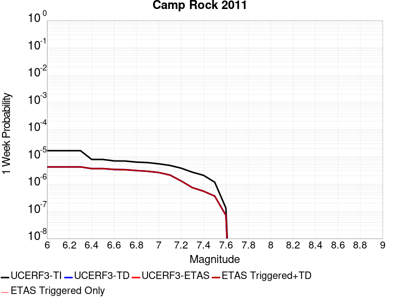 | 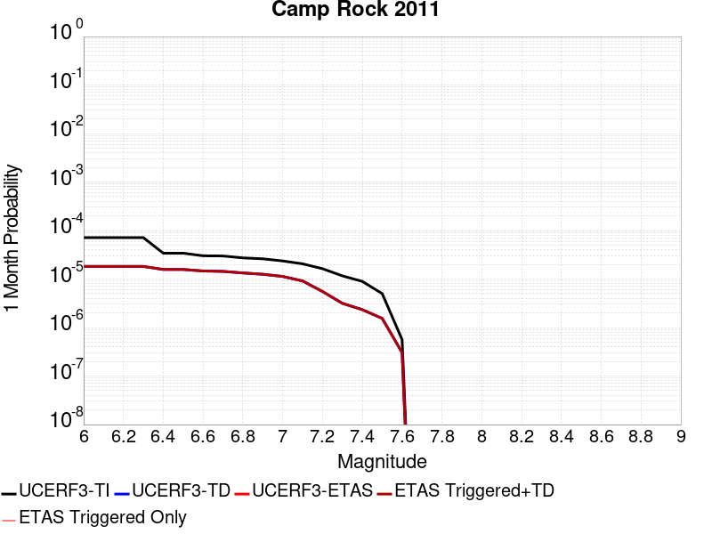 | 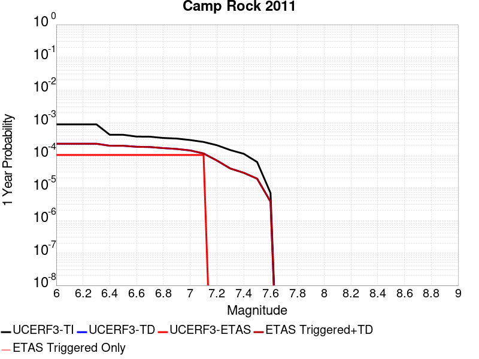 | 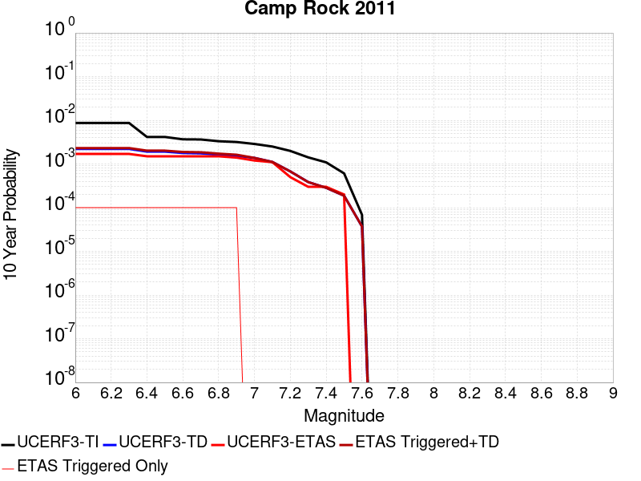 |

| Magnitude | 1 wk TI Prob | 1 wk TD Prob | 1 wk ETAS Prob | 1 wk ETAS/TD Gain | 1 wk ETAS Triggered+TD | 1 wk ETAS Triggered Only | 1 mo TI Prob | 1 mo TD Prob | 1 mo ETAS Prob | 1 mo ETAS/TD Gain | 1 mo ETAS Triggered+TD | 1 mo ETAS Triggered Only | 1 yr TI Prob | 1 yr TD Prob | 1 yr ETAS Prob | 1 yr ETAS/TD Gain | 1 yr ETAS Triggered+TD | 1 yr ETAS Triggered Only | 10 yr TI Prob | 10 yr TD Prob | 10 yr ETAS Prob | 10 yr ETAS/TD Gain | 10 yr ETAS Triggered+TD | 10 yr ETAS Triggered Only |
|-----|-----|-----|-----|-----|-----|-----|-----|-----|-----|-----|-----|-----|-----|-----|-----|-----|-----|-----|-----|-----|-----|-----|-----|-----|
| 6.0 | 1.6710783E-5 | 4.2506235E-6 | 0.0 | 0.0 | 4.2506235E-6 | 0.0 | 7.161568E-5 | 1.8216833E-5 | 0.0 | 0.0 | 1.8216833E-5 | 0.0 | 8.7157206E-4 | 2.217679E-4 | 1.0E-4 | 0.45092186 | 2.217679E-4 | 0.0 | 0.008681616 | 0.0022155188 | 0.0017 | 0.7673146 | 0.0023152973 | 1.0E-4 |
| 6.1 | 1.6710783E-5 | 4.2506235E-6 | 0.0 | 0.0 | 4.2506235E-6 | 0.0 | 7.161568E-5 | 1.8216833E-5 | 0.0 | 0.0 | 1.8216833E-5 | 0.0 | 8.7157206E-4 | 2.217679E-4 | 1.0E-4 | 0.45092186 | 2.217679E-4 | 0.0 | 0.008681616 | 0.0022155188 | 0.0017 | 0.7673146 | 0.0023152973 | 1.0E-4 |
| 6.2 | 1.6710783E-5 | 4.2506235E-6 | 0.0 | 0.0 | 4.2506235E-6 | 0.0 | 7.161568E-5 | 1.8216833E-5 | 0.0 | 0.0 | 1.8216833E-5 | 0.0 | 8.7157206E-4 | 2.217679E-4 | 1.0E-4 | 0.45092186 | 2.217679E-4 | 0.0 | 0.008681616 | 0.0022155188 | 0.0017 | 0.7673146 | 0.0023152973 | 1.0E-4 |
| 6.3 | 1.6710783E-5 | 4.2506235E-6 | 0.0 | 0.0 | 4.2506235E-6 | 0.0 | 7.161568E-5 | 1.8216833E-5 | 0.0 | 0.0 | 1.8216833E-5 | 0.0 | 8.7157206E-4 | 2.217679E-4 | 1.0E-4 | 0.45092186 | 2.217679E-4 | 0.0 | 0.008681616 | 0.0022155188 | 0.0017 | 0.7673146 | 0.0023152973 | 1.0E-4 |
| 6.4 | 7.982846E-6 | 3.682626E-6 | 0.0 | 0.0 | 3.682626E-6 | 0.0 | 3.421175E-5 | 1.5782589E-5 | 0.0 | 0.0 | 1.5782589E-5 | 0.0 | 4.1644843E-4 | 1.9213643E-4 | 1.0E-4 | 0.5204635 | 1.9213643E-4 | 0.0 | 0.0041566887 | 0.0019197379 | 0.0015 | 0.78135663 | 0.002019546 | 1.0E-4 |
| 6.5 | 7.982846E-6 | 3.682626E-6 | 0.0 | 0.0 | 3.682626E-6 | 0.0 | 3.421175E-5 | 1.5782589E-5 | 0.0 | 0.0 | 1.5782589E-5 | 0.0 | 4.1644843E-4 | 1.9213643E-4 | 1.0E-4 | 0.5204635 | 1.9213643E-4 | 0.0 | 0.0041566887 | 0.0019197379 | 0.0015 | 0.78135663 | 0.002019546 | 1.0E-4 |
| 6.6 | 7.048869E-6 | 3.4248649E-6 | 0.0 | 0.0 | 3.4248649E-6 | 0.0 | 3.0209088E-5 | 1.4677911E-5 | 0.0 | 0.0 | 1.4677911E-5 | 0.0 | 3.677336E-4 | 1.7868922E-4 | 1.0E-4 | 0.5596308 | 1.7868922E-4 | 0.0 | 0.0036712566 | 0.0017854872 | 0.0015 | 0.84010684 | 0.0018853087 | 1.0E-4 |
| 6.7 | 6.987307E-6 | 3.3628348E-6 | 0.0 | 0.0 | 3.3628348E-6 | 0.0 | 2.9945259E-5 | 1.4412071E-5 | 0.0 | 0.0 | 1.4412071E-5 | 0.0 | 3.6452254E-4 | 1.7545315E-4 | 1.0E-4 | 0.5699527 | 1.7545315E-4 | 0.0 | 0.0036392517 | 0.0017531775 | 0.0015 | 0.8555894 | 0.0018530021 | 1.0E-4 |
| 6.8 | 6.3737602E-6 | 3.1184109E-6 | 0.0 | 0.0 | 3.1184109E-6 | 0.0 | 2.731583E-5 | 1.3364551E-5 | 0.0 | 0.0 | 1.3364551E-5 | 0.0 | 3.3251947E-4 | 1.6270154E-4 | 1.0E-4 | 0.6146223 | 1.6270154E-4 | 0.0 | 0.0033202237 | 0.0016258529 | 0.0015 | 0.9225927 | 0.0017256903 | 1.0E-4 |
| 6.9 | 6.112211E-6 | 2.9336043E-6 | 0.0 | 0.0 | 2.9336043E-6 | 0.0 | 2.6194928E-5 | 1.2572531E-5 | 0.0 | 0.0 | 1.2572531E-5 | 0.0 | 3.1887658E-4 | 1.5306009E-4 | 1.0E-4 | 0.6533382 | 1.5306009E-4 | 0.0 | 0.003184194 | 0.0015295745 | 0.0014 | 0.91528726 | 0.0016294215 | 1.0E-4 |
| 7.0 | 5.5140117E-6 | 2.6424168E-6 | 0.0 | 0.0 | 2.6424168E-6 | 0.0 | 2.3631264E-5 | 1.1324596E-5 | 0.0 | 0.0 | 1.1324596E-5 | 0.0 | 2.8767265E-4 | 1.3786848E-4 | 1.0E-4 | 0.7253289 | 1.3786848E-4 | 0.0 | 0.0028730053 | 0.0013778548 | 0.0012 | 0.87091905 | 0.0013778548 | 0.0 |
| 7.1 | 4.8151105E-6 | 2.1346848E-6 | 0.0 | 0.0 | 2.1346848E-6 | 0.0 | 2.0636026E-5 | 9.148618E-6 | 0.0 | 0.0 | 9.148618E-6 | 0.0 | 2.5121463E-4 | 1.11378955E-4 | 1.0E-4 | 0.8978357 | 1.11378955E-4 | 0.0 | 0.0025093083 | 0.0011132533 | 0.0011 | 0.988095 | 0.0011132533 | 0.0 |
| 7.2 | 3.818335E-6 | 1.2940449E-6 | 0.0 | 0.0 | 1.2940449E-6 | 0.0 | 1.6364189E-5 | 5.545895E-6 | 0.0 | 0.0 | 5.545895E-6 | 0.0 | 1.9921579E-4 | 6.7519264E-5 | 0.0 | 0.0 | 6.7519264E-5 | 0.0 | 0.0019903728 | 6.7499577E-4 | 5.0E-4 | 0.7407454 | 6.7499577E-4 | 0.0 |
| 7.3 | 2.7166698E-6 | 7.385516E-7 | 0.0 | 0.0 | 7.385516E-7 | 0.0 | 1.1642818E-5 | 3.1652173E-6 | 0.0 | 0.0 | 3.1652173E-6 | 0.0 | 1.4174209E-4 | 3.853586E-5 | 0.0 | 0.0 | 3.853586E-5 | 0.0 | 0.0014165172 | 3.852938E-4 | 3.0E-4 | 0.7786266 | 3.852938E-4 | 0.0 |
| 7.4 | 2.0893426E-6 | 5.463374E-7 | 0.0 | 0.0 | 5.463374E-7 | 0.0 | 8.954295E-6 | 2.3414439E-6 | 0.0 | 0.0 | 2.3414439E-6 | 0.0 | 1.0901308E-4 | 2.850671E-5 | 0.0 | 0.0 | 2.850671E-5 | 0.0 | 0.0010895962 | 2.8503107E-4 | 3.0E-4 | 1.0525168 | 2.8503107E-4 | 0.0 |
| 7.5 | 1.1681728E-6 | 3.6039583E-7 | 0.0 | 0.0 | 3.6039583E-7 | 0.0 | 5.0064455E-6 | 1.5445527E-6 | 0.0 | 0.0 | 1.5445527E-6 | 0.0 | 6.0951766E-5 | 1.880477E-5 | 0.0 | 0.0 | 1.880477E-5 | 0.0 | 6.093505E-4 | 1.8803227E-4 | 2.0E-4 | 1.0636473 | 1.8803227E-4 | 0.0 |
| 7.6 | 1.3154387E-7 | 7.121037E-8 | 0.0 | 0.0 | 7.121037E-8 | 0.0 | 5.6375933E-7 | 3.0518729E-7 | 0.0 | 0.0 | 3.0518729E-7 | 0.0 | 6.863748E-6 | 3.7156503E-6 | 0.0 | 0.0 | 3.7156503E-6 | 0.0 | 6.863536E-5 | 3.7156038E-5 | 0.0 | 0.0 | 3.7156038E-5 | 0.0 |

## Anacapa-Dume alt 1
*[(top)](#table-of-contents)*

| 1 Week | 1 Month | 1 Year | 10 Year |
|-----|-----|-----|-----|
| 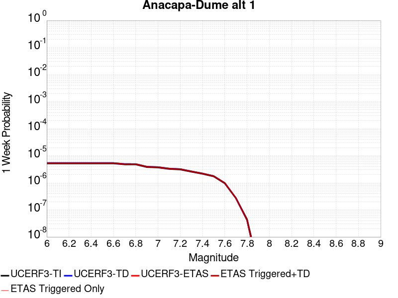 | 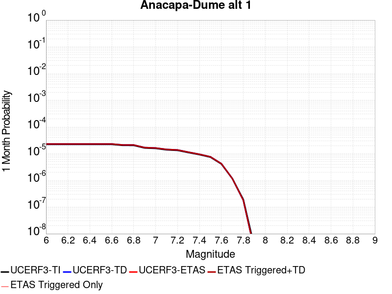 | 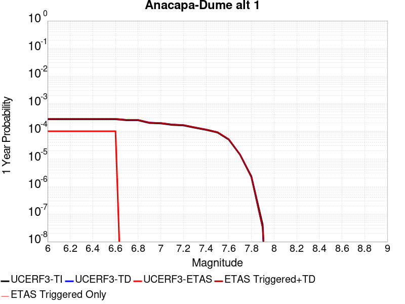 | 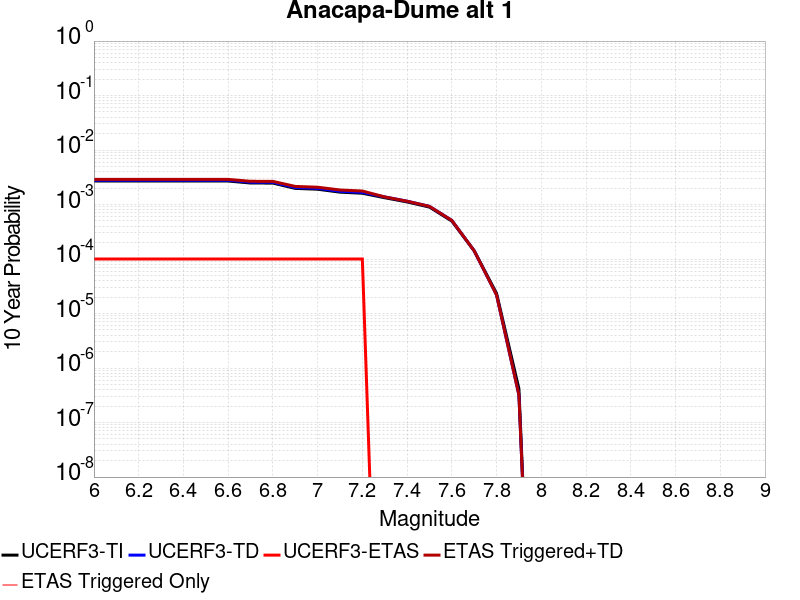 |

| Magnitude | 1 wk TI Prob | 1 wk TD Prob | 1 wk ETAS Prob | 1 wk ETAS/TD Gain | 1 wk ETAS Triggered+TD | 1 wk ETAS Triggered Only | 1 mo TI Prob | 1 mo TD Prob | 1 mo ETAS Prob | 1 mo ETAS/TD Gain | 1 mo ETAS Triggered+TD | 1 mo ETAS Triggered Only | 1 yr TI Prob | 1 yr TD Prob | 1 yr ETAS Prob | 1 yr ETAS/TD Gain | 1 yr ETAS Triggered+TD | 1 yr ETAS Triggered Only | 10 yr TI Prob | 10 yr TD Prob | 10 yr ETAS Prob | 10 yr ETAS/TD Gain | 10 yr ETAS Triggered+TD | 10 yr ETAS Triggered Only |
|-----|-----|-----|-----|-----|-----|-----|-----|-----|-----|-----|-----|-----|-----|-----|-----|-----|-----|-----|-----|-----|-----|-----|-----|-----|
| 6.0 | 5.1871802E-6 | 5.367827E-6 | 0.0 | 0.0 | 5.367827E-6 | 0.0 | 2.2230583E-5 | 2.3004774E-5 | 0.0 | 0.0 | 2.3004774E-5 | 0.0 | 2.7062374E-4 | 2.8004797E-4 | 1.0E-4 | 0.35708168 | 2.8004797E-4 | 0.0 | 0.002702944 | 0.002797036 | 0.0019 | 0.67929053 | 0.0028967562 | 1.0E-4 |
| 6.1 | 5.1871802E-6 | 5.367827E-6 | 0.0 | 0.0 | 5.367827E-6 | 0.0 | 2.2230583E-5 | 2.3004774E-5 | 0.0 | 0.0 | 2.3004774E-5 | 0.0 | 2.7062374E-4 | 2.8004797E-4 | 1.0E-4 | 0.35708168 | 2.8004797E-4 | 0.0 | 0.002702944 | 0.002797036 | 0.0019 | 0.67929053 | 0.0028967562 | 1.0E-4 |
| 6.2 | 5.1871802E-6 | 5.367827E-6 | 0.0 | 0.0 | 5.367827E-6 | 0.0 | 2.2230583E-5 | 2.3004774E-5 | 0.0 | 0.0 | 2.3004774E-5 | 0.0 | 2.7062374E-4 | 2.8004797E-4 | 1.0E-4 | 0.35708168 | 2.8004797E-4 | 0.0 | 0.002702944 | 0.002797036 | 0.0019 | 0.67929053 | 0.0028967562 | 1.0E-4 |
| 6.3 | 5.1871802E-6 | 5.367827E-6 | 0.0 | 0.0 | 5.367827E-6 | 0.0 | 2.2230583E-5 | 2.3004774E-5 | 0.0 | 0.0 | 2.3004774E-5 | 0.0 | 2.7062374E-4 | 2.8004797E-4 | 1.0E-4 | 0.35708168 | 2.8004797E-4 | 0.0 | 0.002702944 | 0.002797036 | 0.0019 | 0.67929053 | 0.0028967562 | 1.0E-4 |
| 6.4 | 5.1871802E-6 | 5.367827E-6 | 0.0 | 0.0 | 5.367827E-6 | 0.0 | 2.2230583E-5 | 2.3004774E-5 | 0.0 | 0.0 | 2.3004774E-5 | 0.0 | 2.7062374E-4 | 2.8004797E-4 | 1.0E-4 | 0.35708168 | 2.8004797E-4 | 0.0 | 0.002702944 | 0.002797036 | 0.0019 | 0.67929053 | 0.0028967562 | 1.0E-4 |
| 6.5 | 5.1871802E-6 | 5.367827E-6 | 0.0 | 0.0 | 5.367827E-6 | 0.0 | 2.2230583E-5 | 2.3004774E-5 | 0.0 | 0.0 | 2.3004774E-5 | 0.0 | 2.7062374E-4 | 2.8004797E-4 | 1.0E-4 | 0.35708168 | 2.8004797E-4 | 0.0 | 0.002702944 | 0.002797036 | 0.0019 | 0.67929053 | 0.0028967562 | 1.0E-4 |
| 6.6 | 5.1871802E-6 | 5.367827E-6 | 0.0 | 0.0 | 5.367827E-6 | 0.0 | 2.2230583E-5 | 2.3004774E-5 | 0.0 | 0.0 | 2.3004774E-5 | 0.0 | 2.7062374E-4 | 2.8004797E-4 | 1.0E-4 | 0.35708168 | 2.8004797E-4 | 0.0 | 0.002702944 | 0.002797036 | 0.0019 | 0.67929053 | 0.0028967562 | 1.0E-4 |
| 6.7 | 4.7693475E-6 | 4.9371E-6 | 0.0 | 0.0 | 4.9371E-6 | 0.0 | 2.04399E-5 | 2.1158834E-5 | 0.0 | 0.0 | 2.1158834E-5 | 0.0 | 2.4882736E-4 | 2.5757911E-4 | 0.0 | 0.0 | 2.5757911E-4 | 0.0 | 0.0024854892 | 0.0025728815 | 0.0017 | 0.66073775 | 0.0026726243 | 1.0E-4 |
| 6.8 | 4.753408E-6 | 4.9206474E-6 | 0.0 | 0.0 | 4.9206474E-6 | 0.0 | 2.037159E-5 | 2.1088323E-5 | 0.0 | 0.0 | 2.1088323E-5 | 0.0 | 2.4799586E-4 | 2.5672084E-4 | 0.0 | 0.0 | 2.5672084E-4 | 0.0 | 0.002477193 | 0.0025643187 | 0.0017 | 0.66294414 | 0.0026640622 | 1.0E-4 |
| 6.9 | 3.800069E-6 | 3.9374704E-6 | 0.0 | 0.0 | 3.9374704E-6 | 0.0 | 1.6285909E-5 | 1.6874765E-5 | 0.0 | 0.0 | 1.6874765E-5 | 0.0 | 1.9826289E-4 | 2.0543113E-4 | 0.0 | 0.0 | 2.0543113E-4 | 0.0 | 0.001980861 | 0.0020524361 | 0.0013 | 0.63339365 | 0.0021522308 | 1.0E-4 |
| 7.0 | 3.6671938E-6 | 3.8002534E-6 | 0.0 | 0.0 | 3.8002534E-6 | 0.0 | 1.571645E-5 | 1.62867E-5 | 0.0 | 0.0 | 1.62867E-5 | 0.0 | 1.9133097E-4 | 1.9827276E-4 | 0.0 | 0.0 | 1.9827276E-4 | 0.0 | 0.0019116632 | 0.0019809818 | 0.0013 | 0.6562402 | 0.0020807837 | 1.0E-4 |
| 7.1 | 3.2394885E-6 | 3.3590998E-6 | 0.0 | 0.0 | 3.3590998E-6 | 0.0 | 1.3883448E-5 | 1.4396063E-5 | 0.0 | 0.0 | 1.4396063E-5 | 0.0 | 1.6901788E-4 | 1.7525809E-4 | 0.0 | 0.0 | 1.7525809E-4 | 0.0 | 0.0016888938 | 0.0017512098 | 0.001 | 0.5710338 | 0.0018510347 | 1.0E-4 |
| 7.2 | 3.0935948E-6 | 3.2082219E-6 | 0.0 | 0.0 | 3.2082219E-6 | 0.0 | 1.3258196E-5 | 1.3749451E-5 | 0.0 | 0.0 | 1.3749451E-5 | 0.0 | 1.6140658E-4 | 1.6738681E-4 | 0.0 | 0.0 | 1.6738681E-4 | 0.0 | 0.001612894 | 0.0016726183 | 0.001 | 0.59786505 | 0.0017724511 | 1.0E-4 |
| 7.3 | 2.5604163E-6 | 2.647309E-6 | 0.0 | 0.0 | 2.647309E-6 | 0.0 | 1.0973167E-5 | 1.1345561E-5 | 0.0 | 0.0 | 1.1345561E-5 | 0.0 | 1.3359012E-4 | 1.3812349E-4 | 0.0 | 0.0 | 1.3812349E-4 | 0.0 | 0.0013350984 | 0.0013803809 | 8.0E-4 | 0.57955015 | 0.0013803809 | 0.0 |
| 7.4 | 2.1429005E-6 | 2.2107977E-6 | 0.0 | 0.0 | 2.2107977E-6 | 0.0 | 9.1838265E-6 | 9.474813E-6 | 0.0 | 0.0 | 9.474813E-6 | 0.0 | 1.11807356E-4 | 1.15349765E-4 | 0.0 | 0.0 | 1.15349765E-4 | 0.0 | 0.0011175112 | 0.0011529016 | 7.0E-4 | 0.6071637 | 0.0011529016 | 0.0 |
| 7.5 | 1.7237151E-6 | 1.7763023E-6 | 0.0 | 0.0 | 1.7763023E-6 | 0.0 | 7.3873293E-6 | 7.6127017E-6 | 0.0 | 0.0 | 7.6127017E-6 | 0.0 | 8.993702E-5 | 9.2680726E-5 | 0.0 | 0.0 | 9.2680726E-5 | 0.0 | 8.990063E-4 | 9.2642306E-4 | 6.0E-4 | 0.64765227 | 9.2642306E-4 | 0.0 |
| 7.6 | 9.541696E-7 | 9.824075E-7 | 0.0 | 0.0 | 9.824075E-7 | 0.0 | 4.089292E-6 | 4.210311E-6 | 0.0 | 0.0 | 4.210311E-6 | 0.0 | 4.9785995E-5 | 5.1259343E-5 | 0.0 | 0.0 | 5.1259343E-5 | 0.0 | 4.9774844E-4 | 5.124765E-4 | 5.0E-4 | 0.97565454 | 5.124765E-4 | 0.0 |
| 7.7 | 2.7226676E-7 | 2.7174357E-7 | 0.0 | 0.0 | 2.7174357E-7 | 0.0 | 1.166857E-6 | 1.1646148E-6 | 0.0 | 0.0 | 1.1646148E-6 | 0.0 | 1.4206392E-5 | 1.4179093E-5 | 0.0 | 0.0 | 1.4179093E-5 | 0.0 | 1.4205484E-4 | 1.4178196E-4 | 3.0E-4 | 2.115925 | 1.4178196E-4 | 0.0 |
| 7.8 | 4.5017995E-8 | 4.216042E-8 | 0.0 | 0.0 | 4.216042E-8 | 0.0 | 1.9293425E-7 | 1.8068751E-7 | 0.0 | 0.0 | 1.8068751E-7 | 0.0 | 2.348972E-6 | 2.1998683E-6 | 0.0 | 0.0 | 2.1998683E-6 | 0.0 | 2.348947E-5 | 2.1998487E-5 | 1.0E-4 | 4.5457673 | 2.1998487E-5 | 0.0 |
| 7.9 | 8.007447E-10 | 6.1623595E-10 | 0.0 | 0.0 | 6.1623595E-10 | 0.0 | 3.4317629E-9 | 2.6410114E-9 | 0.0 | 0.0 | 2.6410114E-9 | 0.0 | 4.1781714E-8 | 3.215431E-8 | 0.0 | 0.0 | 3.215431E-8 | 0.0 | 4.1781706E-7 | 3.215431E-7 | 0.0 | 0.0 | 3.215431E-7 | 0.0 |

## Yorba Linda
*[(top)](#table-of-contents)*

| 1 Week | 1 Month | 1 Year | 10 Year |
|-----|-----|-----|-----|
| 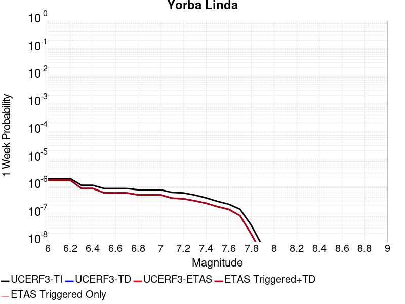 | 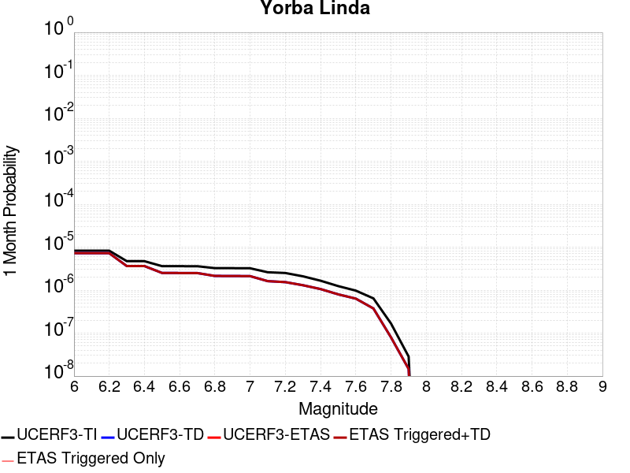 | 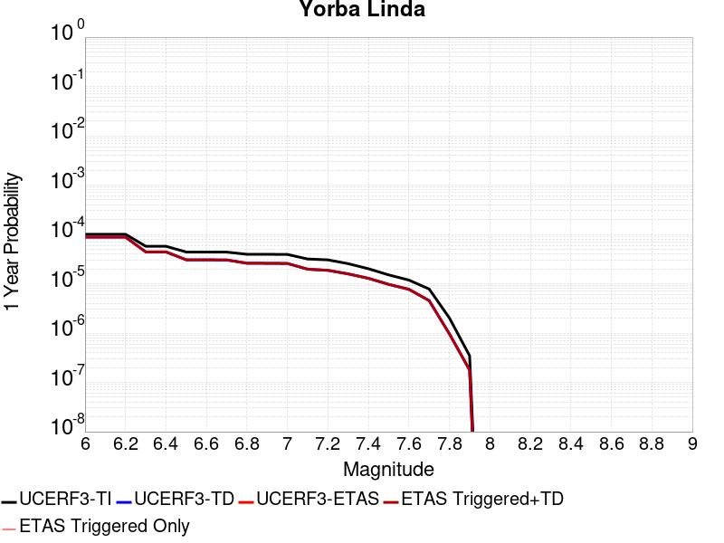 | 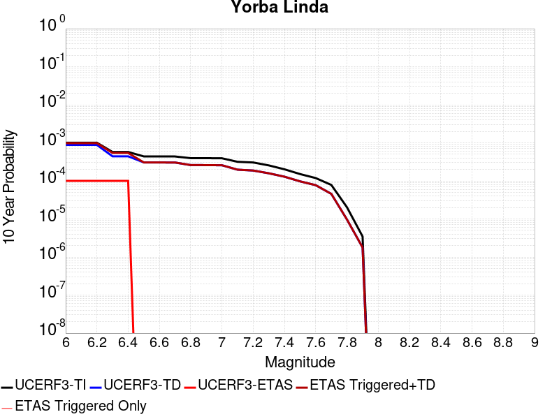 |

| Magnitude | 1 wk TI Prob | 1 wk TD Prob | 1 wk ETAS Prob | 1 wk ETAS/TD Gain | 1 wk ETAS Triggered+TD | 1 wk ETAS Triggered Only | 1 mo TI Prob | 1 mo TD Prob | 1 mo ETAS Prob | 1 mo ETAS/TD Gain | 1 mo ETAS Triggered+TD | 1 mo ETAS Triggered Only | 1 yr TI Prob | 1 yr TD Prob | 1 yr ETAS Prob | 1 yr ETAS/TD Gain | 1 yr ETAS Triggered+TD | 1 yr ETAS Triggered Only | 10 yr TI Prob | 10 yr TD Prob | 10 yr ETAS Prob | 10 yr ETAS/TD Gain | 10 yr ETAS Triggered+TD | 10 yr ETAS Triggered Only |
|-----|-----|-----|-----|-----|-----|-----|-----|-----|-----|-----|-----|-----|-----|-----|-----|-----|-----|-----|-----|-----|-----|-----|-----|-----|
| 6.0 | 1.9346849E-6 | 1.6910949E-6 | 0.0 | 0.0 | 1.6910949E-6 | 0.0 | 8.29148E-6 | 7.2475345E-6 | 0.0 | 0.0 | 7.2475345E-6 | 0.0 | 1.009441E-4 | 8.823611E-5 | 1.0E-4 | 1.1333228 | 8.823611E-5 | 0.0 | 0.0010089825 | 8.8210386E-4 | 0.0012 | 1.360384 | 9.820156E-4 | 1.0E-4 |
| 6.1 | 1.9346849E-6 | 1.6910949E-6 | 0.0 | 0.0 | 1.6910949E-6 | 0.0 | 8.29148E-6 | 7.2475345E-6 | 0.0 | 0.0 | 7.2475345E-6 | 0.0 | 1.009441E-4 | 8.823611E-5 | 1.0E-4 | 1.1333228 | 8.823611E-5 | 0.0 | 0.0010089825 | 8.8210386E-4 | 0.0012 | 1.360384 | 9.820156E-4 | 1.0E-4 |
| 6.2 | 1.9346849E-6 | 1.6910949E-6 | 0.0 | 0.0 | 1.6910949E-6 | 0.0 | 8.29148E-6 | 7.2475345E-6 | 0.0 | 0.0 | 7.2475345E-6 | 0.0 | 1.009441E-4 | 8.823611E-5 | 1.0E-4 | 1.1333228 | 8.823611E-5 | 0.0 | 0.0010089825 | 8.8210386E-4 | 0.0012 | 1.360384 | 9.820156E-4 | 1.0E-4 |
| 6.3 | 1.1028608E-6 | 8.4834727E-7 | 0.0 | 0.0 | 8.4834727E-7 | 0.0 | 4.7265376E-6 | 3.6357694E-6 | 0.0 | 0.0 | 3.6357694E-6 | 0.0 | 5.754407E-5 | 4.426466E-5 | 1.0E-4 | 2.2591386 | 4.426466E-5 | 0.0 | 5.7529175E-4 | 4.4256495E-4 | 7.0E-4 | 1.5816888 | 5.4252066E-4 | 1.0E-4 |
| 6.4 | 1.1028608E-6 | 8.4834727E-7 | 0.0 | 0.0 | 8.4834727E-7 | 0.0 | 4.7265376E-6 | 3.6357694E-6 | 0.0 | 0.0 | 3.6357694E-6 | 0.0 | 5.754407E-5 | 4.426466E-5 | 1.0E-4 | 2.2591386 | 4.426466E-5 | 0.0 | 5.7529175E-4 | 4.4256495E-4 | 7.0E-4 | 1.5816888 | 5.4252066E-4 | 1.0E-4 |
| 6.5 | 8.4451364E-7 | 5.870658E-7 | 0.0 | 0.0 | 5.870658E-7 | 0.0 | 3.619339E-6 | 2.515994E-6 | 0.0 | 0.0 | 2.515994E-6 | 0.0 | 4.406456E-5 | 3.0631818E-5 | 1.0E-4 | 3.2645793 | 3.0631818E-5 | 0.0 | 4.4055824E-4 | 3.0627812E-4 | 2.0E-4 | 0.6530013 | 3.0627812E-4 | 0.0 |
| 6.6 | 8.422957E-7 | 5.846191E-7 | 0.0 | 0.0 | 5.846191E-7 | 0.0 | 3.6098338E-6 | 2.505508E-6 | 0.0 | 0.0 | 2.505508E-6 | 0.0 | 4.3948843E-5 | 3.0504156E-5 | 1.0E-4 | 3.2782419 | 3.0504156E-5 | 0.0 | 4.394015E-4 | 3.0500183E-4 | 2.0E-4 | 0.6557338 | 3.0500183E-4 | 0.0 |
| 6.7 | 8.4119705E-7 | 5.834032E-7 | 0.0 | 0.0 | 5.834032E-7 | 0.0 | 3.6051254E-6 | 2.5002971E-6 | 0.0 | 0.0 | 2.5002971E-6 | 0.0 | 4.3891516E-5 | 3.0440715E-5 | 1.0E-4 | 3.285074 | 3.0440715E-5 | 0.0 | 4.388285E-4 | 3.043676E-4 | 2.0E-4 | 0.6571002 | 3.043676E-4 | 0.0 |
| 6.8 | 7.5919155E-7 | 4.9965075E-7 | 0.0 | 0.0 | 4.9965075E-7 | 0.0 | 3.253674E-6 | 2.1413587E-6 | 0.0 | 0.0 | 2.1413587E-6 | 0.0 | 3.961276E-5 | 2.607075E-5 | 1.0E-4 | 3.8357165 | 2.607075E-5 | 0.0 | 3.9605703E-4 | 2.6067861E-4 | 2.0E-4 | 0.76722825 | 2.6067861E-4 | 0.0 |
| 6.9 | 7.5804564E-7 | 4.9826906E-7 | 0.0 | 0.0 | 4.9826906E-7 | 0.0 | 3.248763E-6 | 2.1354372E-6 | 0.0 | 0.0 | 2.1354372E-6 | 0.0 | 3.955297E-5 | 2.5998655E-5 | 1.0E-4 | 3.8463528 | 2.5998655E-5 | 0.0 | 3.9545933E-4 | 2.5995786E-4 | 2.0E-4 | 0.76935554 | 2.5995786E-4 | 0.0 |
| 7.0 | 7.539293E-7 | 4.944823E-7 | 0.0 | 0.0 | 4.944823E-7 | 0.0 | 3.2311218E-6 | 2.1192084E-6 | 0.0 | 0.0 | 2.1192084E-6 | 0.0 | 3.9338196E-5 | 2.5801073E-5 | 1.0E-4 | 3.8758078 | 2.5801073E-5 | 0.0 | 3.9331234E-4 | 2.579825E-4 | 2.0E-4 | 0.77524644 | 2.579825E-4 | 0.0 |
| 7.1 | 6.0900885E-7 | 3.78308E-7 | 0.0 | 0.0 | 3.78308E-7 | 0.0 | 2.6100352E-6 | 1.6213189E-6 | 0.0 | 0.0 | 1.6213189E-6 | 0.0 | 3.1776715E-5 | 1.9739382E-5 | 1.0E-4 | 5.066015 | 1.9739382E-5 | 0.0 | 3.1772171E-4 | 1.9737665E-4 | 2.0E-4 | 1.0132911 | 1.9737665E-4 | 0.0 |
| 7.2 | 5.849925E-7 | 3.589228E-7 | 0.0 | 0.0 | 3.589228E-7 | 0.0 | 2.5071083E-6 | 1.5382396E-6 | 0.0 | 0.0 | 1.5382396E-6 | 0.0 | 3.0523614E-5 | 1.872791E-5 | 0.0 | 0.0 | 1.872791E-5 | 0.0 | 3.0519423E-4 | 1.8726365E-4 | 1.0E-4 | 0.5340065 | 1.8726365E-4 | 0.0 |
| 7.3 | 4.89808E-7 | 3.0390476E-7 | 0.0 | 0.0 | 3.0390476E-7 | 0.0 | 2.0991754E-6 | 1.3024483E-6 | 0.0 | 0.0 | 1.3024483E-6 | 0.0 | 2.5557161E-5 | 1.5857195E-5 | 0.0 | 0.0 | 1.5857195E-5 | 0.0 | 2.5554223E-4 | 1.5856087E-4 | 1.0E-4 | 0.63067263 | 1.5856087E-4 | 0.0 |
| 7.4 | 3.8700415E-7 | 2.4731153E-7 | 0.0 | 0.0 | 2.4731153E-7 | 0.0 | 1.6585881E-6 | 1.0599061E-6 | 0.0 | 0.0 | 1.0599061E-6 | 0.0 | 2.0193123E-5 | 1.2904283E-5 | 0.0 | 0.0 | 1.2904283E-5 | 0.0 | 2.0191289E-4 | 1.2903546E-4 | 1.0E-4 | 0.7749808 | 1.2903546E-4 | 0.0 |
| 7.5 | 2.900565E-7 | 1.8642837E-7 | 0.0 | 0.0 | 1.8642837E-7 | 0.0 | 1.2430987E-6 | 7.989785E-7 | 0.0 | 0.0 | 7.989785E-7 | 0.0 | 1.5134622E-5 | 9.727521E-6 | 0.0 | 0.0 | 9.727521E-6 | 0.0 | 1.5133592E-4 | 9.7271026E-5 | 1.0E-4 | 1.0280553 | 9.7271026E-5 | 0.0 |
| 7.6 | 2.2770318E-7 | 1.4818245E-7 | 0.0 | 0.0 | 1.4818245E-7 | 0.0 | 9.758704E-7 | 6.3506747E-7 | 0.0 | 0.0 | 6.3506747E-7 | 0.0 | 1.1881158E-5 | 7.731919E-6 | 0.0 | 0.0 | 7.731919E-6 | 0.0 | 1.1880523E-4 | 7.731656E-5 | 1.0E-4 | 1.2933841 | 7.731656E-5 | 0.0 |
| 7.7 | 1.5017194E-7 | 8.738383E-8 | 0.0 | 0.0 | 8.738383E-8 | 0.0 | 6.4359386E-7 | 3.745021E-7 | 0.0 | 0.0 | 3.745021E-7 | 0.0 | 7.835727E-6 | 4.559554E-6 | 0.0 | 0.0 | 4.559554E-6 | 0.0 | 7.835451E-5 | 4.559463E-5 | 1.0E-4 | 2.193241 | 4.559463E-5 | 0.0 |
| 7.8 | 3.895753E-8 | 1.8544185E-8 | 0.0 | 0.0 | 1.8544185E-8 | 0.0 | 1.6696083E-7 | 7.947508E-8 | 0.0 | 0.0 | 7.947508E-8 | 0.0 | 2.0327461E-6 | 9.676087E-7 | 0.0 | 0.0 | 9.676087E-7 | 0.0 | 2.0327276E-5 | 9.676046E-6 | 0.0 | 0.0 | 9.676046E-6 | 0.0 |
| 7.9 | 6.648505E-9 | 3.42018E-9 | 0.0 | 0.0 | 3.42018E-9 | 0.0 | 2.8493591E-8 | 1.4657914E-8 | 0.0 | 0.0 | 1.4657914E-8 | 0.0 | 3.4690942E-7 | 1.7846008E-7 | 0.0 | 0.0 | 1.7846008E-7 | 0.0 | 3.4690888E-6 | 1.7845996E-6 | 0.0 | 0.0 | 1.7845996E-6 | 0.0 |

## Richfield
*[(top)](#table-of-contents)*

| 1 Week | 1 Month | 1 Year | 10 Year |
|-----|-----|-----|-----|
| 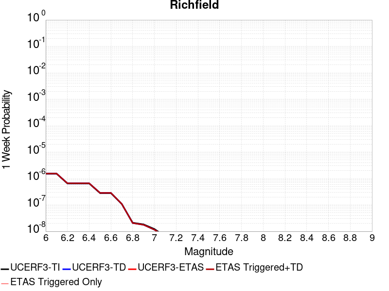 | 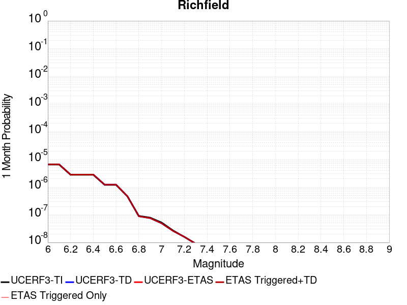 | 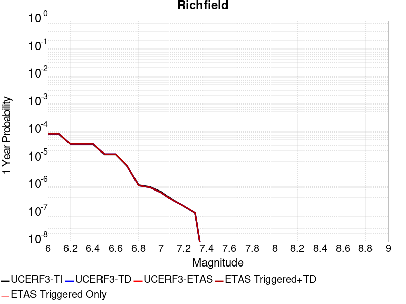 | 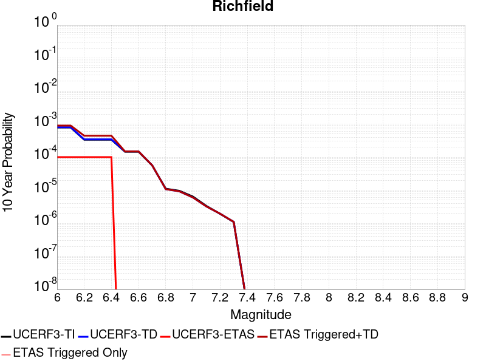 |

| Magnitude | 1 wk TI Prob | 1 wk TD Prob | 1 wk ETAS Prob | 1 wk ETAS/TD Gain | 1 wk ETAS Triggered+TD | 1 wk ETAS Triggered Only | 1 mo TI Prob | 1 mo TD Prob | 1 mo ETAS Prob | 1 mo ETAS/TD Gain | 1 mo ETAS Triggered+TD | 1 mo ETAS Triggered Only | 1 yr TI Prob | 1 yr TD Prob | 1 yr ETAS Prob | 1 yr ETAS/TD Gain | 1 yr ETAS Triggered+TD | 1 yr ETAS Triggered Only | 10 yr TI Prob | 10 yr TD Prob | 10 yr ETAS Prob | 10 yr ETAS/TD Gain | 10 yr ETAS Triggered+TD | 10 yr ETAS Triggered Only |
|-----|-----|-----|-----|-----|-----|-----|-----|-----|-----|-----|-----|-----|-----|-----|-----|-----|-----|-----|-----|-----|-----|-----|-----|-----|
| 6.0 | 1.5166896E-6 | 1.5393172E-6 | 0.0 | 0.0 | 1.5393172E-6 | 0.0 | 6.5000822E-6 | 6.597063E-6 | 0.0 | 0.0 | 6.597063E-6 | 0.0 | 7.913562E-5 | 8.031738E-5 | 1.0E-4 | 1.2450606 | 8.031738E-5 | 0.0 | 7.910745E-4 | 8.0299133E-4 | 0.0012 | 1.4944122 | 9.02911E-4 | 1.0E-4 |
| 6.1 | 1.5166896E-6 | 1.5393172E-6 | 0.0 | 0.0 | 1.5393172E-6 | 0.0 | 6.5000822E-6 | 6.597063E-6 | 0.0 | 0.0 | 6.597063E-6 | 0.0 | 7.913562E-5 | 8.031738E-5 | 1.0E-4 | 1.2450606 | 8.031738E-5 | 0.0 | 7.910745E-4 | 8.0299133E-4 | 0.0012 | 1.4944122 | 9.02911E-4 | 1.0E-4 |
| 6.2 | 6.473272E-7 | 6.598762E-7 | 0.0 | 0.0 | 6.598762E-7 | 0.0 | 2.7742565E-6 | 2.8280385E-6 | 0.0 | 0.0 | 2.8280385E-6 | 0.0 | 3.377605E-5 | 3.443096E-5 | 1.0E-4 | 2.904363 | 3.443096E-5 | 0.0 | 3.3770915E-4 | 3.4426927E-4 | 7.0E-4 | 2.033292 | 4.4423484E-4 | 1.0E-4 |
| 6.3 | 6.473272E-7 | 6.598762E-7 | 0.0 | 0.0 | 6.598762E-7 | 0.0 | 2.7742565E-6 | 2.8280385E-6 | 0.0 | 0.0 | 2.8280385E-6 | 0.0 | 3.377605E-5 | 3.443096E-5 | 1.0E-4 | 2.904363 | 3.443096E-5 | 0.0 | 3.3770915E-4 | 3.4426927E-4 | 7.0E-4 | 2.033292 | 4.4423484E-4 | 1.0E-4 |
| 6.4 | 6.473272E-7 | 6.598762E-7 | 0.0 | 0.0 | 6.598762E-7 | 0.0 | 2.7742565E-6 | 2.8280385E-6 | 0.0 | 0.0 | 2.8280385E-6 | 0.0 | 3.377605E-5 | 3.443096E-5 | 1.0E-4 | 2.904363 | 3.443096E-5 | 0.0 | 3.3770915E-4 | 3.4426927E-4 | 7.0E-4 | 2.033292 | 4.4423484E-4 | 1.0E-4 |
| 6.5 | 2.7954403E-7 | 2.8533015E-7 | 0.0 | 0.0 | 2.8533015E-7 | 0.0 | 1.1980452E-6 | 1.2228431E-6 | 0.0 | 0.0 | 1.2228431E-6 | 0.0 | 1.4586103E-5 | 1.4888057E-5 | 0.0 | 0.0 | 1.4888057E-5 | 0.0 | 1.4585146E-4 | 1.4887484E-4 | 1.0E-4 | 0.6717052 | 1.4887484E-4 | 0.0 |
| 6.6 | 2.7954403E-7 | 2.8533015E-7 | 0.0 | 0.0 | 2.8533015E-7 | 0.0 | 1.1980452E-6 | 1.2228431E-6 | 0.0 | 0.0 | 1.2228431E-6 | 0.0 | 1.4586103E-5 | 1.4888057E-5 | 0.0 | 0.0 | 1.4888057E-5 | 0.0 | 1.4585146E-4 | 1.4887484E-4 | 1.0E-4 | 0.6717052 | 1.4887484E-4 | 0.0 |
| 6.7 | 1.0777299E-7 | 1.0879217E-7 | 0.0 | 0.0 | 1.0879217E-7 | 0.0 | 4.6188418E-7 | 4.6625212E-7 | 0.0 | 0.0 | 4.6625212E-7 | 0.0 | 5.6234253E-6 | 5.676609E-6 | 0.0 | 0.0 | 5.676609E-6 | 0.0 | 5.623283E-5 | 5.676507E-5 | 0.0 | 0.0 | 5.676507E-5 | 0.0 |
| 6.8 | 2.1301874E-8 | 2.066675E-8 | 0.0 | 0.0 | 2.066675E-8 | 0.0 | 9.129375E-8 | 8.857178E-8 | 0.0 | 0.0 | 8.857178E-8 | 0.0 | 1.1115008E-6 | 1.0783609E-6 | 0.0 | 0.0 | 1.0783609E-6 | 0.0 | 1.1114952E-5 | 1.0783561E-5 | 0.0 | 0.0 | 1.0783561E-5 | 0.0 |
| 6.9 | 1.8413502E-8 | 1.775166E-8 | 0.0 | 0.0 | 1.775166E-8 | 0.0 | 7.891501E-8 | 7.6078535E-8 | 0.0 | 0.0 | 7.6078535E-8 | 0.0 | 9.607899E-7 | 9.262558E-7 | 0.0 | 0.0 | 9.262558E-7 | 0.0 | 9.607857E-6 | 9.262522E-6 | 0.0 | 0.0 | 9.262522E-6 | 0.0 |
| 7.0 | 1.2290541E-8 | 1.1574766E-8 | 0.0 | 0.0 | 1.1574766E-8 | 0.0 | 5.2673748E-8 | 4.9606136E-8 | 0.0 | 0.0 | 4.9606136E-8 | 0.0 | 6.413027E-7 | 6.0395456E-7 | 0.0 | 0.0 | 6.0395456E-7 | 0.0 | 6.4130086E-6 | 6.0395305E-6 | 0.0 | 0.0 | 6.0395305E-6 | 0.0 |
| 7.1 | 6.373573E-9 | 6.1559815E-9 | 0.0 | 0.0 | 6.1559815E-9 | 0.0 | 2.7315311E-8 | 2.6382777E-8 | 0.0 | 0.0 | 2.6382777E-8 | 0.0 | 3.3256384E-7 | 3.2121028E-7 | 0.0 | 0.0 | 3.2121028E-7 | 0.0 | 3.3256335E-6 | 3.2120986E-6 | 0.0 | 0.0 | 3.2120986E-6 | 0.0 |
| 7.2 | 3.6989944E-9 | 3.736092E-9 | 0.0 | 0.0 | 3.736092E-9 | 0.0 | 1.5852834E-8 | 1.6011821E-8 | 0.0 | 0.0 | 1.6011821E-8 | 0.0 | 1.9300822E-7 | 1.9494391E-7 | 0.0 | 0.0 | 1.9494391E-7 | 0.0 | 1.9300805E-6 | 1.9494375E-6 | 0.0 | 0.0 | 1.9494375E-6 | 0.0 |
| 7.3 | 2.097397E-9 | 2.1200974E-9 | 0.0 | 0.0 | 2.1200974E-9 | 0.0 | 8.9888434E-9 | 9.086131E-9 | 0.0 | 0.0 | 9.086131E-9 | 0.0 | 1.0943917E-7 | 1.10623645E-7 | 0.0 | 0.0 | 1.10623645E-7 | 0.0 | 1.0943911E-6 | 1.106236E-6 | 0.0 | 0.0 | 1.106236E-6 | 0.0 |
| 7.4 | 5.8314464E-12 | 5.8919536E-12 | 0.0 | 0.0 | 5.8919536E-12 | 0.0 | 2.4991786E-11 | 2.5251468E-11 | 0.0 | 0.0 | 2.5251468E-11 | 0.0 | 3.0427527E-10 | 3.074363E-10 | 0.0 | 0.0 | 3.074363E-10 | 0.0 | 3.0427532E-9 | 3.074363E-9 | 0.0 | 0.0 | 3.074363E-9 | 0.0 |

## Kern Canyon (Lake Isabella) 2011
*[(top)](#table-of-contents)*

| 1 Week | 1 Month | 1 Year | 10 Year |
|-----|-----|-----|-----|
| 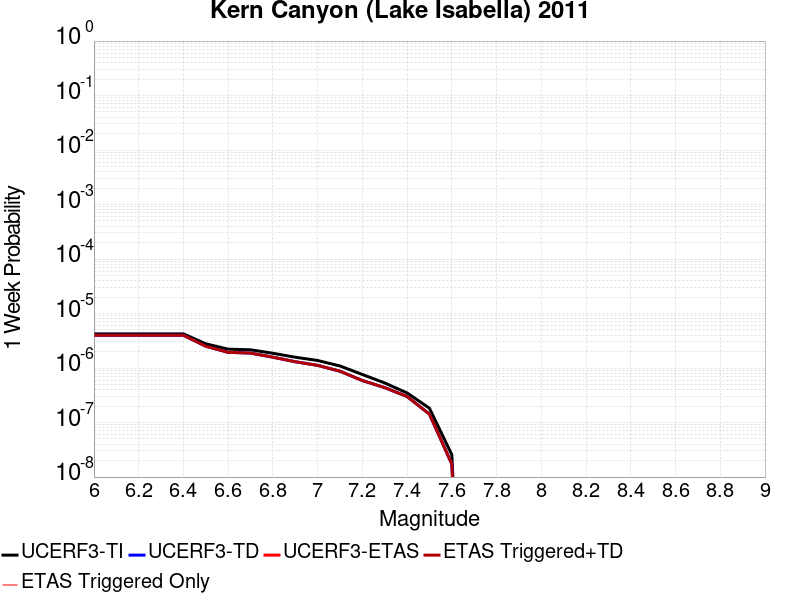 | 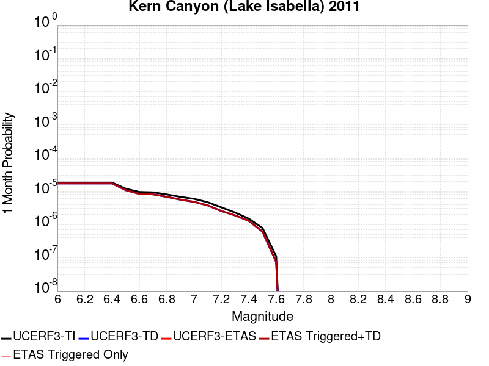 | 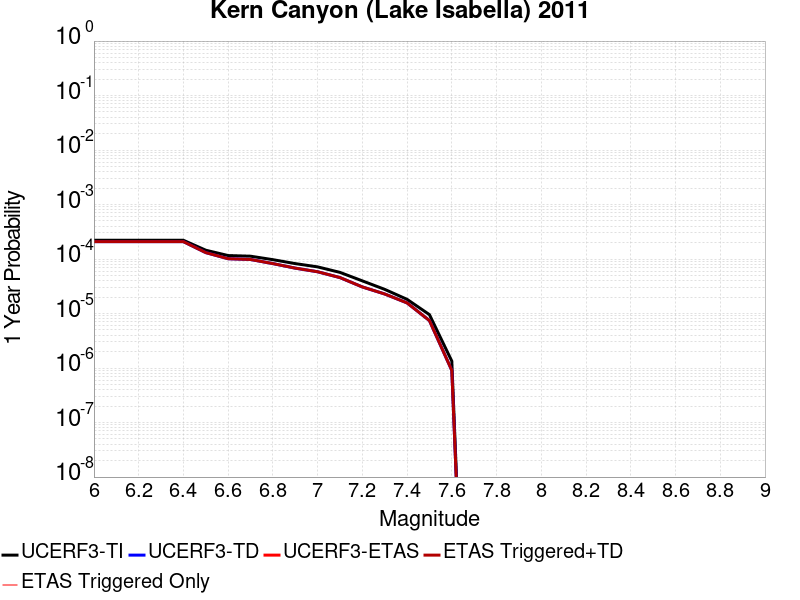 |  |

| Magnitude | 1 wk TI Prob | 1 wk TD Prob | 1 wk ETAS Prob | 1 wk ETAS/TD Gain | 1 wk ETAS Triggered+TD | 1 wk ETAS Triggered Only | 1 mo TI Prob | 1 mo TD Prob | 1 mo ETAS Prob | 1 mo ETAS/TD Gain | 1 mo ETAS Triggered+TD | 1 mo ETAS Triggered Only | 1 yr TI Prob | 1 yr TD Prob | 1 yr ETAS Prob | 1 yr ETAS/TD Gain | 1 yr ETAS Triggered+TD | 1 yr ETAS Triggered Only | 10 yr TI Prob | 10 yr TD Prob | 10 yr ETAS Prob | 10 yr ETAS/TD Gain | 10 yr ETAS Triggered+TD | 10 yr ETAS Triggered Only |
|-----|-----|-----|-----|-----|-----|-----|-----|-----|-----|-----|-----|-----|-----|-----|-----|-----|-----|-----|-----|-----|-----|-----|-----|-----|
| 6.0 | 4.2387383E-6 | 4.001821E-6 | 0.0 | 0.0 | 4.001821E-6 | 0.0 | 1.8165894E-5 | 1.7150558E-5 | 0.0 | 0.0 | 1.7150558E-5 | 0.0 | 2.2114732E-4 | 2.087899E-4 | 0.0 | 0.0 | 2.087899E-4 | 0.0 | 0.0022092736 | 0.0020861214 | 0.0012 | 0.5752302 | 0.0021859128 | 1.0E-4 |
| 6.1 | 4.2387383E-6 | 4.001821E-6 | 0.0 | 0.0 | 4.001821E-6 | 0.0 | 1.8165894E-5 | 1.7150558E-5 | 0.0 | 0.0 | 1.7150558E-5 | 0.0 | 2.2114732E-4 | 2.087899E-4 | 0.0 | 0.0 | 2.087899E-4 | 0.0 | 0.0022092736 | 0.0020861214 | 0.0012 | 0.5752302 | 0.0021859128 | 1.0E-4 |
| 6.2 | 4.2387383E-6 | 4.001821E-6 | 0.0 | 0.0 | 4.001821E-6 | 0.0 | 1.8165894E-5 | 1.7150558E-5 | 0.0 | 0.0 | 1.7150558E-5 | 0.0 | 2.2114732E-4 | 2.087899E-4 | 0.0 | 0.0 | 2.087899E-4 | 0.0 | 0.0022092736 | 0.0020861214 | 0.0012 | 0.5752302 | 0.0021859128 | 1.0E-4 |
| 6.3 | 4.2387383E-6 | 4.001821E-6 | 0.0 | 0.0 | 4.001821E-6 | 0.0 | 1.8165894E-5 | 1.7150558E-5 | 0.0 | 0.0 | 1.7150558E-5 | 0.0 | 2.2114732E-4 | 2.087899E-4 | 0.0 | 0.0 | 2.087899E-4 | 0.0 | 0.0022092736 | 0.0020861214 | 0.0012 | 0.5752302 | 0.0021859128 | 1.0E-4 |
| 6.4 | 4.2387383E-6 | 4.001821E-6 | 0.0 | 0.0 | 4.001821E-6 | 0.0 | 1.8165894E-5 | 1.7150558E-5 | 0.0 | 0.0 | 1.7150558E-5 | 0.0 | 2.2114732E-4 | 2.087899E-4 | 0.0 | 0.0 | 2.087899E-4 | 0.0 | 0.0022092736 | 0.0020861214 | 0.0012 | 0.5752302 | 0.0021859128 | 1.0E-4 |
| 6.5 | 2.7857532E-6 | 2.5179843E-6 | 0.0 | 0.0 | 2.5179843E-6 | 0.0 | 1.1938888E-5 | 1.0791318E-5 | 0.0 | 0.0 | 1.0791318E-5 | 0.0 | 1.4534626E-4 | 1.3137671E-4 | 0.0 | 0.0 | 1.3137671E-4 | 0.0 | 0.0014525123 | 0.0013130232 | 8.0E-4 | 0.60928094 | 0.0013130232 | 0.0 |
| 6.6 | 2.2233348E-6 | 1.944217E-6 | 0.0 | 0.0 | 1.944217E-6 | 0.0 | 9.528543E-6 | 8.332333E-6 | 0.0 | 0.0 | 8.332333E-6 | 0.0 | 1.1600384E-4 | 1.0144152E-4 | 0.0 | 0.0 | 1.0144152E-4 | 0.0 | 0.001159433 | 0.0010139608 | 6.0E-4 | 0.5917389 | 0.0010139608 | 0.0 |
| 6.7 | 2.1635126E-6 | 1.8835955E-6 | 0.0 | 0.0 | 1.8835955E-6 | 0.0 | 9.272164E-6 | 8.072528E-6 | 0.0 | 0.0 | 8.072528E-6 | 0.0 | 1.1288274E-4 | 9.827867E-5 | 0.0 | 0.0 | 9.827867E-5 | 0.0 | 0.0011282542 | 9.823602E-4 | 6.0E-4 | 0.6107739 | 9.823602E-4 | 0.0 |
| 6.8 | 1.8685711E-6 | 1.583223E-6 | 0.0 | 0.0 | 1.583223E-6 | 0.0 | 8.008137E-6 | 6.7852243E-6 | 0.0 | 0.0 | 6.7852243E-6 | 0.0 | 9.74947E-5 | 8.2607025E-5 | 0.0 | 0.0 | 8.2607025E-5 | 0.0 | 9.745194E-4 | 8.257681E-4 | 5.0E-4 | 0.6054969 | 8.257681E-4 | 0.0 |
| 6.9 | 1.5815071E-6 | 1.3065613E-6 | 0.0 | 0.0 | 1.3065613E-6 | 0.0 | 6.77787E-6 | 5.599537E-6 | 0.0 | 0.0 | 5.599537E-6 | 0.0 | 8.251744E-5 | 6.817225E-5 | 0.0 | 0.0 | 6.817225E-5 | 0.0 | 8.248681E-4 | 6.815161E-4 | 2.0E-4 | 0.29346335 | 6.815161E-4 | 0.0 |
| 7.0 | 1.3772564E-6 | 1.1211312E-6 | 0.0 | 0.0 | 1.1211312E-6 | 0.0 | 5.9025137E-6 | 4.8048387E-6 | 0.0 | 0.0 | 4.8048387E-6 | 0.0 | 7.186073E-5 | 5.8497364E-5 | 0.0 | 0.0 | 5.8497364E-5 | 0.0 | 7.18375E-4 | 5.848217E-4 | 1.0E-4 | 0.17099229 | 5.848217E-4 | 0.0 |
| 7.1 | 1.0916998E-6 | 8.7642326E-7 | 0.0 | 0.0 | 8.7642326E-7 | 0.0 | 4.678705E-6 | 3.7560944E-6 | 0.0 | 0.0 | 3.7560944E-6 | 0.0 | 5.6961744E-5 | 4.5729503E-5 | 0.0 | 0.0 | 4.5729503E-5 | 0.0 | 5.6947145E-4 | 4.5720226E-4 | 1.0E-4 | 0.21872157 | 4.5720226E-4 | 0.0 |
| 7.2 | 7.6277024E-7 | 5.9017634E-7 | 0.0 | 0.0 | 5.9017634E-7 | 0.0 | 3.2690114E-6 | 2.5293248E-6 | 0.0 | 0.0 | 2.5293248E-6 | 0.0 | 3.9799485E-5 | 3.07941E-5 | 0.0 | 0.0 | 3.07941E-5 | 0.0 | 3.9792358E-4 | 3.0789894E-4 | 1.0E-4 | 0.3247819 | 3.0789894E-4 | 0.0 |
| 7.3 | 5.3265916E-7 | 4.382661E-7 | 0.0 | 0.0 | 4.382661E-7 | 0.0 | 2.282823E-6 | 1.878282E-6 | 0.0 | 0.0 | 1.878282E-6 | 0.0 | 2.7793016E-5 | 2.2867847E-5 | 0.0 | 0.0 | 2.2867847E-5 | 0.0 | 2.778954E-4 | 2.2865532E-4 | 1.0E-4 | 0.43733948 | 2.2865532E-4 | 0.0 |
| 7.4 | 3.4946007E-7 | 3.0067227E-7 | 0.0 | 0.0 | 3.0067227E-7 | 0.0 | 1.497685E-6 | 1.2885948E-6 | 0.0 | 0.0 | 1.2885948E-6 | 0.0 | 1.8234163E-5 | 1.5688533E-5 | 0.0 | 0.0 | 1.5688533E-5 | 0.0 | 1.8232666E-4 | 1.5687446E-4 | 0.0 | 0.0 | 1.5687446E-4 | 0.0 |
| 7.5 | 1.8317026E-7 | 1.4245659E-7 | 0.0 | 0.0 | 1.4245659E-7 | 0.0 | 7.850152E-7 | 6.1052805E-7 | 0.0 | 0.0 | 6.1052805E-7 | 0.0 | 9.557518E-6 | 7.4331547E-6 | 0.0 | 0.0 | 7.4331547E-6 | 0.0 | 9.5571064E-5 | 7.432914E-5 | 0.0 | 0.0 | 7.432914E-5 | 0.0 |
| 7.6 | 2.572245E-8 | 1.7353893E-8 | 0.0 | 0.0 | 1.7353893E-8 | 0.0 | 1.10239064E-7 | 7.437382E-8 | 0.0 | 0.0 | 7.437382E-8 | 0.0 | 1.3421597E-6 | 9.0550094E-7 | 0.0 | 0.0 | 9.0550094E-7 | 0.0 | 1.3421517E-5 | 9.054977E-6 | 0.0 | 0.0 | 9.054977E-6 | 0.0 |

## Dry Mountain
*[(top)](#table-of-contents)*

| 1 Week | 1 Month | 1 Year | 10 Year |
|-----|-----|-----|-----|
| 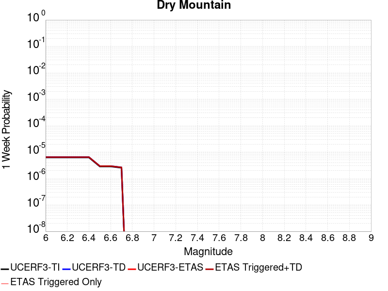 | 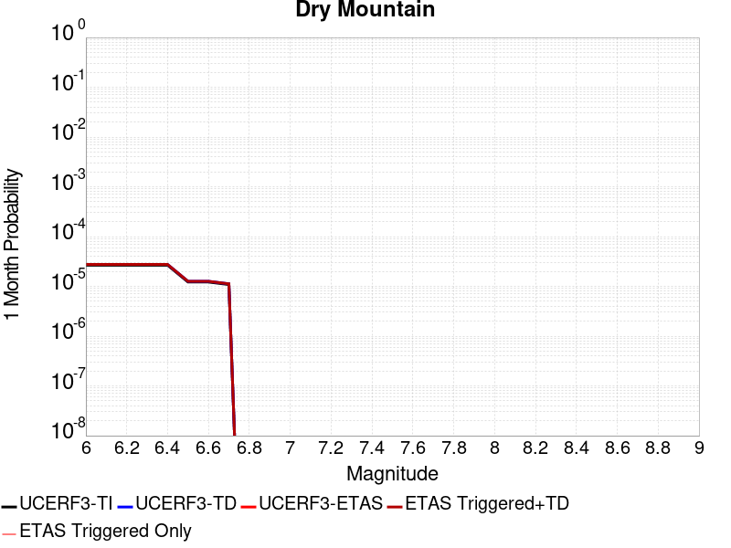 | 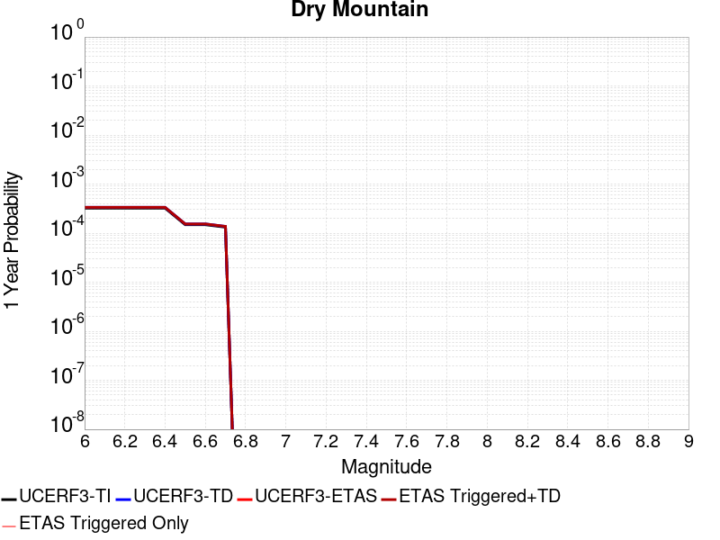 | 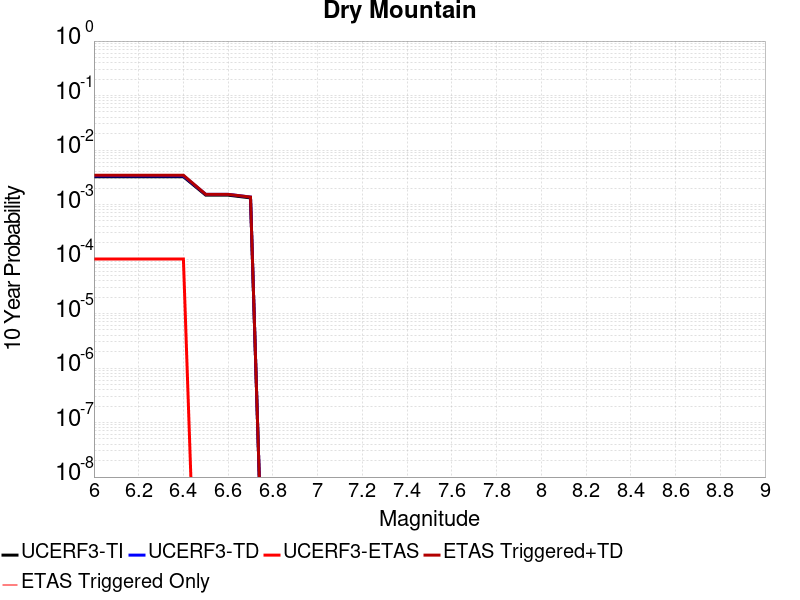 |

| Magnitude | 1 wk TI Prob | 1 wk TD Prob | 1 wk ETAS Prob | 1 wk ETAS/TD Gain | 1 wk ETAS Triggered+TD | 1 wk ETAS Triggered Only | 1 mo TI Prob | 1 mo TD Prob | 1 mo ETAS Prob | 1 mo ETAS/TD Gain | 1 mo ETAS Triggered+TD | 1 mo ETAS Triggered Only | 1 yr TI Prob | 1 yr TD Prob | 1 yr ETAS Prob | 1 yr ETAS/TD Gain | 1 yr ETAS Triggered+TD | 1 yr ETAS Triggered Only | 10 yr TI Prob | 10 yr TD Prob | 10 yr ETAS Prob | 10 yr ETAS/TD Gain | 10 yr ETAS Triggered+TD | 10 yr ETAS Triggered Only |
|-----|-----|-----|-----|-----|-----|-----|-----|-----|-----|-----|-----|-----|-----|-----|-----|-----|-----|-----|-----|-----|-----|-----|-----|-----|
| 6.0 | 6.222801E-6 | 6.4398428E-6 | 0.0 | 0.0 | 6.4398428E-6 | 0.0 | 2.6668875E-5 | 2.7599124E-5 | 0.0 | 0.0 | 2.7599124E-5 | 0.0 | 3.2464517E-4 | 3.3598344E-4 | 0.0 | 0.0 | 3.3598344E-4 | 0.0 | 0.0032417132 | 0.003356317 | 0.001 | 0.29794562 | 0.0034559814 | 1.0E-4 |
| 6.1 | 6.222801E-6 | 6.4398428E-6 | 0.0 | 0.0 | 6.4398428E-6 | 0.0 | 2.6668875E-5 | 2.7599124E-5 | 0.0 | 0.0 | 2.7599124E-5 | 0.0 | 3.2464517E-4 | 3.3598344E-4 | 0.0 | 0.0 | 3.3598344E-4 | 0.0 | 0.0032417132 | 0.003356317 | 0.001 | 0.29794562 | 0.0034559814 | 1.0E-4 |
| 6.2 | 6.222801E-6 | 6.4398428E-6 | 0.0 | 0.0 | 6.4398428E-6 | 0.0 | 2.6668875E-5 | 2.7599124E-5 | 0.0 | 0.0 | 2.7599124E-5 | 0.0 | 3.2464517E-4 | 3.3598344E-4 | 0.0 | 0.0 | 3.3598344E-4 | 0.0 | 0.0032417132 | 0.003356317 | 0.001 | 0.29794562 | 0.0034559814 | 1.0E-4 |
| 6.3 | 6.222801E-6 | 6.4398428E-6 | 0.0 | 0.0 | 6.4398428E-6 | 0.0 | 2.6668875E-5 | 2.7599124E-5 | 0.0 | 0.0 | 2.7599124E-5 | 0.0 | 3.2464517E-4 | 3.3598344E-4 | 0.0 | 0.0 | 3.3598344E-4 | 0.0 | 0.0032417132 | 0.003356317 | 0.001 | 0.29794562 | 0.0034559814 | 1.0E-4 |
| 6.4 | 6.222801E-6 | 6.4398428E-6 | 0.0 | 0.0 | 6.4398428E-6 | 0.0 | 2.6668875E-5 | 2.7599124E-5 | 0.0 | 0.0 | 2.7599124E-5 | 0.0 | 3.2464517E-4 | 3.3598344E-4 | 0.0 | 0.0 | 3.3598344E-4 | 0.0 | 0.0032417132 | 0.003356317 | 0.001 | 0.29794562 | 0.0034559814 | 1.0E-4 |
| 6.5 | 2.8528623E-6 | 2.9523799E-6 | 0.0 | 0.0 | 2.9523799E-6 | 0.0 | 1.22264955E-5 | 1.2653045E-5 | 0.0 | 0.0 | 1.2653045E-5 | 0.0 | 1.4884741E-4 | 1.5404863E-4 | 0.0 | 0.0 | 1.5404863E-4 | 0.0 | 0.0014874774 | 0.001540272 | 4.0E-4 | 0.2596944 | 0.001540272 | 0.0 |
| 6.6 | 2.8528623E-6 | 2.9523799E-6 | 0.0 | 0.0 | 2.9523799E-6 | 0.0 | 1.22264955E-5 | 1.2653045E-5 | 0.0 | 0.0 | 1.2653045E-5 | 0.0 | 1.4884741E-4 | 1.5404863E-4 | 0.0 | 0.0 | 1.5404863E-4 | 0.0 | 0.0014874774 | 0.001540272 | 4.0E-4 | 0.2596944 | 0.001540272 | 0.0 |
| 6.7 | 2.541E-6 | 2.629546E-6 | 0.0 | 0.0 | 2.629546E-6 | 0.0 | 1.0889954E-5 | 1.1269483E-5 | 0.0 | 0.0 | 1.1269483E-5 | 0.0 | 1.3257713E-4 | 1.3720596E-4 | 0.0 | 0.0 | 1.3720596E-4 | 0.0 | 0.0013249806 | 0.0013720596 | 3.0E-4 | 0.21864939 | 0.0013720596 | 0.0 |

## Clayton
*[(top)](#table-of-contents)*

| 1 Week | 1 Month | 1 Year | 10 Year |
|-----|-----|-----|-----|
| 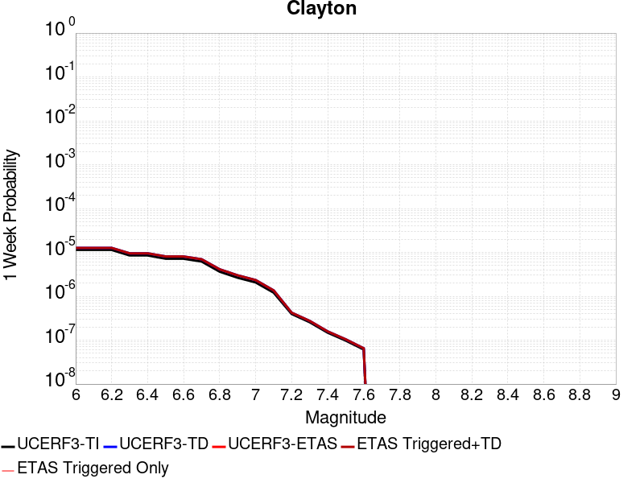 | 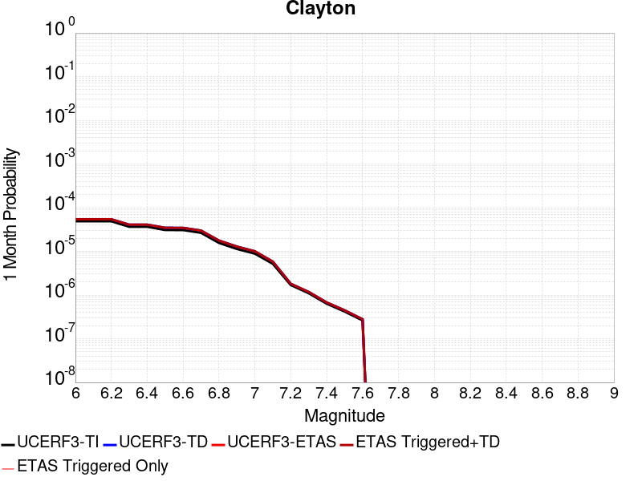 | 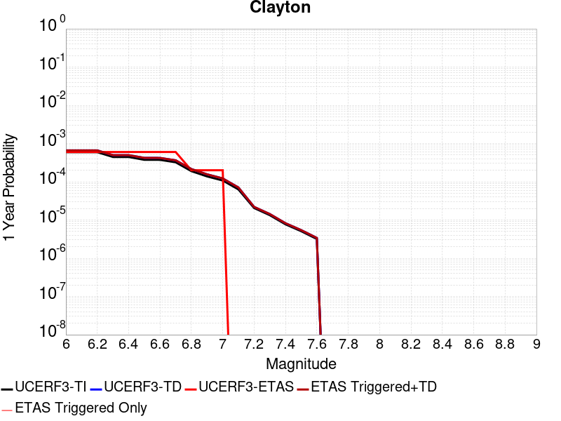 | 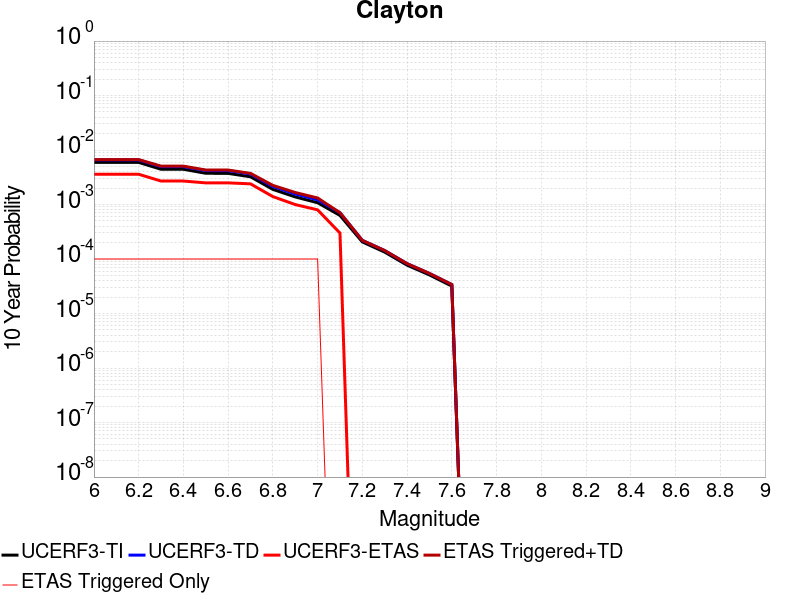 |

| Magnitude | 1 wk TI Prob | 1 wk TD Prob | 1 wk ETAS Prob | 1 wk ETAS/TD Gain | 1 wk ETAS Triggered+TD | 1 wk ETAS Triggered Only | 1 mo TI Prob | 1 mo TD Prob | 1 mo ETAS Prob | 1 mo ETAS/TD Gain | 1 mo ETAS Triggered+TD | 1 mo ETAS Triggered Only | 1 yr TI Prob | 1 yr TD Prob | 1 yr ETAS Prob | 1 yr ETAS/TD Gain | 1 yr ETAS Triggered+TD | 1 yr ETAS Triggered Only | 10 yr TI Prob | 10 yr TD Prob | 10 yr ETAS Prob | 10 yr ETAS/TD Gain | 10 yr ETAS Triggered+TD | 10 yr ETAS Triggered Only |
|-----|-----|-----|-----|-----|-----|-----|-----|-----|-----|-----|-----|-----|-----|-----|-----|-----|-----|-----|-----|-----|-----|-----|-----|-----|
| 6.0 | 1.1413061E-5 | 1.266993E-5 | 0.0 | 0.0 | 1.266993E-5 | 0.0 | 4.89122E-5 | 5.4298693E-5 | 0.0 | 0.0 | 5.4298693E-5 | 0.0 | 5.953433E-4 | 6.609083E-4 | 6.0E-4 | 0.9078415 | 6.609083E-4 | 0.0 | 0.005937509 | 0.006591631 | 0.0036 | 0.54614705 | 0.006690972 | 1.0E-4 |
| 6.1 | 1.1413061E-5 | 1.266993E-5 | 0.0 | 0.0 | 1.266993E-5 | 0.0 | 4.89122E-5 | 5.4298693E-5 | 0.0 | 0.0 | 5.4298693E-5 | 0.0 | 5.953433E-4 | 6.609083E-4 | 6.0E-4 | 0.9078415 | 6.609083E-4 | 0.0 | 0.005937509 | 0.006591631 | 0.0036 | 0.54614705 | 0.006690972 | 1.0E-4 |
| 6.2 | 1.1413061E-5 | 1.266993E-5 | 0.0 | 0.0 | 1.266993E-5 | 0.0 | 4.89122E-5 | 5.4298693E-5 | 0.0 | 0.0 | 5.4298693E-5 | 0.0 | 5.953433E-4 | 6.609083E-4 | 6.0E-4 | 0.9078415 | 6.609083E-4 | 0.0 | 0.005937509 | 0.006591631 | 0.0036 | 0.54614705 | 0.006690972 | 1.0E-4 |
| 6.3 | 8.538689E-6 | 9.53504E-6 | 0.0 | 0.0 | 9.53504E-6 | 0.0 | 3.659387E-5 | 4.0863877E-5 | 0.0 | 0.0 | 4.0863877E-5 | 0.0 | 4.4543925E-4 | 4.974149E-4 | 6.0E-4 | 1.2062365 | 4.974149E-4 | 0.0 | 0.0044454746 | 0.0049640816 | 0.0027 | 0.5439072 | 0.005063585 | 1.0E-4 |
| 6.4 | 8.538689E-6 | 9.53504E-6 | 0.0 | 0.0 | 9.53504E-6 | 0.0 | 3.659387E-5 | 4.0863877E-5 | 0.0 | 0.0 | 4.0863877E-5 | 0.0 | 4.4543925E-4 | 4.974149E-4 | 6.0E-4 | 1.2062365 | 4.974149E-4 | 0.0 | 0.0044454746 | 0.0049640816 | 0.0027 | 0.5439072 | 0.005063585 | 1.0E-4 |
| 6.5 | 7.197462E-6 | 8.082992E-6 | 0.0 | 0.0 | 8.082992E-6 | 0.0 | 3.08459E-5 | 3.4640983E-5 | 0.0 | 0.0 | 3.4640983E-5 | 0.0 | 3.7548412E-4 | 4.2168054E-4 | 6.0E-4 | 1.422878 | 4.2168054E-4 | 0.0 | 0.003748503 | 0.0042096167 | 0.0025 | 0.5938783 | 0.0043091956 | 1.0E-4 |
| 6.6 | 7.1760483E-6 | 8.0590025E-6 | 0.0 | 0.0 | 8.0590025E-6 | 0.0 | 3.075413E-5 | 3.453817E-5 | 0.0 | 0.0 | 3.453817E-5 | 0.0 | 3.743672E-4 | 4.204293E-4 | 6.0E-4 | 1.4271127 | 4.204293E-4 | 0.0 | 0.0037373714 | 0.0041971514 | 0.0025 | 0.5956421 | 0.0042967317 | 1.0E-4 |
| 6.7 | 6.202582E-6 | 6.9784837E-6 | 0.0 | 0.0 | 6.9784837E-6 | 0.0 | 2.6582224E-5 | 2.9907487E-5 | 0.0 | 0.0 | 2.9907487E-5 | 0.0 | 3.235905E-4 | 3.640705E-4 | 6.0E-4 | 1.6480324 | 3.640705E-4 | 0.0 | 0.0032311971 | 0.0036354966 | 0.0024 | 0.6601574 | 0.0037351332 | 1.0E-4 |
| 6.8 | 3.6417277E-6 | 4.1224093E-6 | 0.0 | 0.0 | 4.1224093E-6 | 0.0 | 1.5607311E-5 | 1.7667353E-5 | 0.0 | 0.0 | 1.7667353E-5 | 0.0 | 1.9000245E-4 | 2.1507956E-4 | 2.0E-4 | 0.9298885 | 2.1507956E-4 | 0.0 | 0.0018984007 | 0.0021487905 | 0.0014 | 0.6515293 | 0.0022485754 | 1.0E-4 |
| 6.9 | 2.6498485E-6 | 3.0003316E-6 | 0.0 | 0.0 | 3.0003316E-6 | 0.0 | 1.1356444E-5 | 1.28585025E-5 | 0.0 | 0.0 | 1.28585025E-5 | 0.0 | 1.3825593E-4 | 1.5654143E-4 | 2.0E-4 | 1.2776171 | 1.5654143E-4 | 0.0 | 0.0013816995 | 0.0015643511 | 0.001 | 0.63924265 | 0.0016641947 | 1.0E-4 |
| 7.0 | 2.070442E-6 | 2.3413565E-6 | 0.0 | 0.0 | 2.3413565E-6 | 0.0 | 8.873292E-6 | 1.0034349E-5 | 0.0 | 0.0 | 1.0034349E-5 | 0.0 | 1.0802698E-4 | 1.2216164E-4 | 2.0E-4 | 1.6371751 | 1.2216164E-4 | 0.0 | 0.0010797448 | 0.0012209747 | 8.0E-4 | 0.6552142 | 0.0013208527 | 1.0E-4 |
| 7.1 | 1.2111691E-6 | 1.3592228E-6 | 0.0 | 0.0 | 1.3592228E-6 | 0.0 | 5.190714E-6 | 5.8252285E-6 | 0.0 | 0.0 | 5.8252285E-6 | 0.0 | 6.319511E-5 | 7.092002E-5 | 0.0 | 0.0 | 7.092002E-5 | 0.0 | 6.3177146E-4 | 7.089902E-4 | 3.0E-4 | 0.42313704 | 7.089902E-4 | 0.0 |
| 7.2 | 3.9541607E-7 | 4.2234976E-7 | 0.0 | 0.0 | 4.2234976E-7 | 0.0 | 1.6946392E-6 | 1.8100692E-6 | 0.0 | 0.0 | 1.8100692E-6 | 0.0 | 2.0632036E-5 | 2.2037371E-5 | 0.0 | 0.0 | 2.2037371E-5 | 0.0 | 2.063012E-4 | 2.2035201E-4 | 0.0 | 0.0 | 2.2035201E-4 | 0.0 |
| 7.3 | 2.5685637E-7 | 2.746245E-7 | 0.0 | 0.0 | 2.746245E-7 | 0.0 | 1.1008126E-6 | 1.1769617E-6 | 0.0 | 0.0 | 1.1769617E-6 | 0.0 | 1.3402311E-5 | 1.43294155E-5 | 0.0 | 0.0 | 1.43294155E-5 | 0.0 | 1.3401502E-4 | 1.4328498E-4 | 0.0 | 0.0 | 1.4328498E-4 | 0.0 |
| 7.4 | 1.482299E-7 | 1.5811554E-7 | 0.0 | 0.0 | 1.5811554E-7 | 0.0 | 6.3527085E-7 | 6.7763784E-7 | 0.0 | 0.0 | 6.7763784E-7 | 0.0 | 7.734395E-6 | 8.250209E-6 | 0.0 | 0.0 | 8.250209E-6 | 0.0 | 7.734126E-5 | 8.2499064E-5 | 0.0 | 0.0 | 8.2499064E-5 | 0.0 |
| 7.5 | 9.7969505E-8 | 1.0441284E-7 | 0.0 | 0.0 | 1.0441284E-7 | 0.0 | 4.1986925E-7 | 4.474835E-7 | 0.0 | 0.0 | 4.474835E-7 | 0.0 | 5.111896E-6 | 5.4480984E-6 | 0.0 | 0.0 | 5.4480984E-6 | 0.0 | 5.1117782E-5 | 5.4479664E-5 | 0.0 | 0.0 | 5.4479664E-5 | 0.0 |
| 7.6 | 6.125415E-8 | 6.523577E-8 | 0.0 | 0.0 | 6.523577E-8 | 0.0 | 2.6251774E-7 | 2.7958183E-7 | 0.0 | 0.0 | 2.7958183E-7 | 0.0 | 3.196149E-6 | 3.4039033E-6 | 0.0 | 0.0 | 3.4039033E-6 | 0.0 | 3.196103E-5 | 3.4038523E-5 | 0.0 | 0.0 | 3.4038523E-5 | 0.0 |

## Canada David (Detachment)
*[(top)](#table-of-contents)*

| 1 Week | 1 Month | 1 Year | 10 Year |
|-----|-----|-----|-----|
| 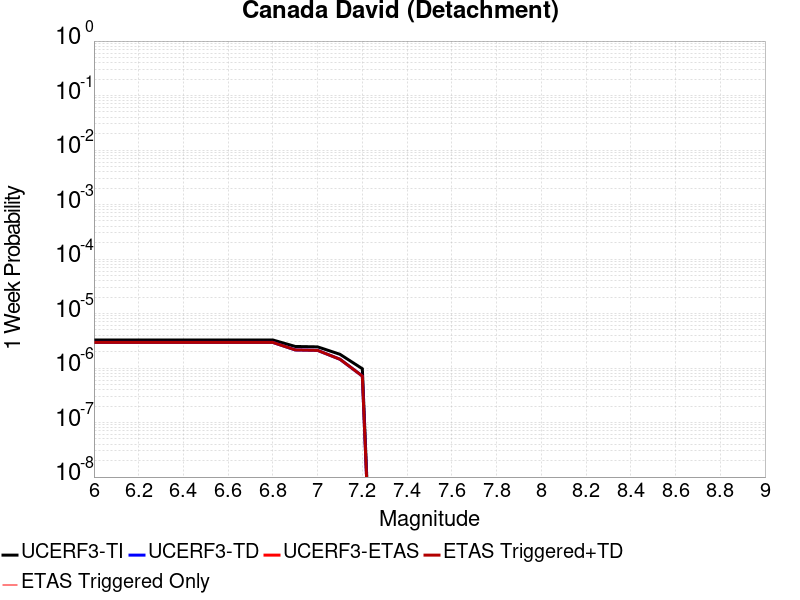 | 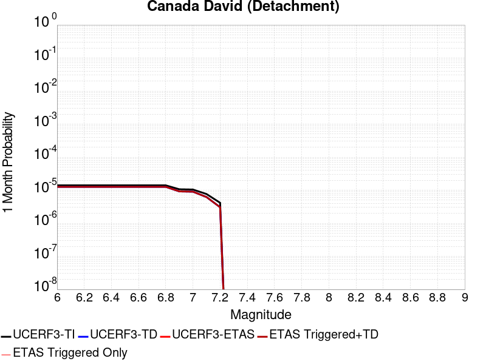 | 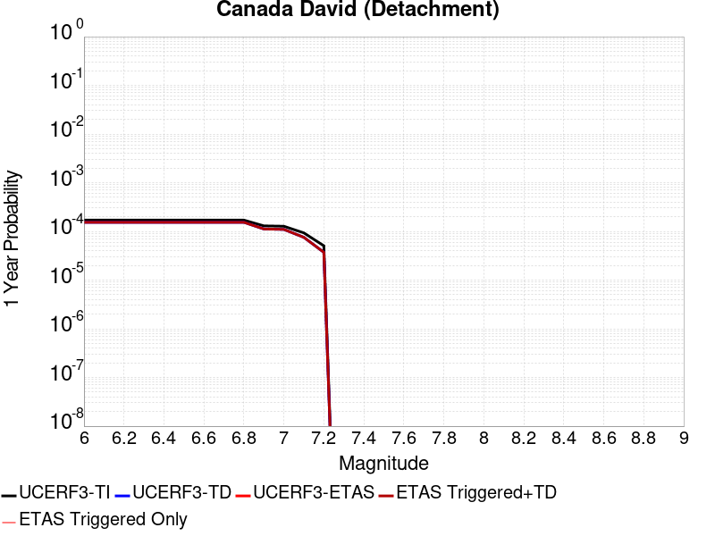 | 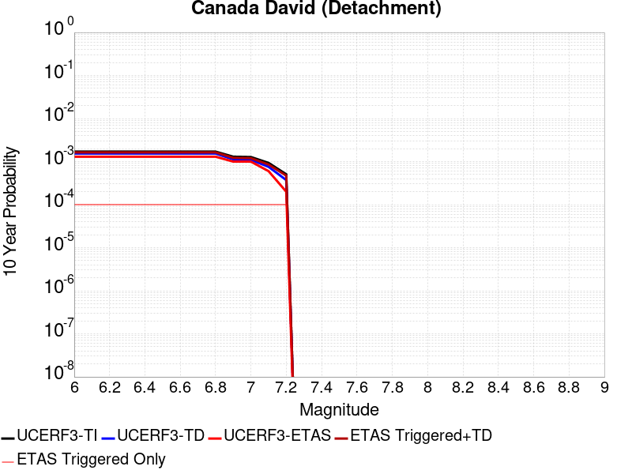 |

| Magnitude | 1 wk TI Prob | 1 wk TD Prob | 1 wk ETAS Prob | 1 wk ETAS/TD Gain | 1 wk ETAS Triggered+TD | 1 wk ETAS Triggered Only | 1 mo TI Prob | 1 mo TD Prob | 1 mo ETAS Prob | 1 mo ETAS/TD Gain | 1 mo ETAS Triggered+TD | 1 mo ETAS Triggered Only | 1 yr TI Prob | 1 yr TD Prob | 1 yr ETAS Prob | 1 yr ETAS/TD Gain | 1 yr ETAS Triggered+TD | 1 yr ETAS Triggered Only | 10 yr TI Prob | 10 yr TD Prob | 10 yr ETAS Prob | 10 yr ETAS/TD Gain | 10 yr ETAS Triggered+TD | 10 yr ETAS Triggered Only |
|-----|-----|-----|-----|-----|-----|-----|-----|-----|-----|-----|-----|-----|-----|-----|-----|-----|-----|-----|-----|-----|-----|-----|-----|-----|
| 6.0 | 3.2736298E-6 | 2.953797E-6 | 0.0 | 0.0 | 2.953797E-6 | 0.0 | 1.4029766E-5 | 1.2659076E-5 | 0.0 | 0.0 | 1.2659076E-5 | 0.0 | 1.7079902E-4 | 1.5411463E-4 | 0.0 | 0.0 | 1.5411463E-4 | 0.0 | 0.001706678 | 0.0015402037 | 0.0013 | 0.8440442 | 0.0016400497 | 1.0E-4 |
| 6.1 | 3.2736298E-6 | 2.953797E-6 | 0.0 | 0.0 | 2.953797E-6 | 0.0 | 1.4029766E-5 | 1.2659076E-5 | 0.0 | 0.0 | 1.2659076E-5 | 0.0 | 1.7079902E-4 | 1.5411463E-4 | 0.0 | 0.0 | 1.5411463E-4 | 0.0 | 0.001706678 | 0.0015402037 | 0.0013 | 0.8440442 | 0.0016400497 | 1.0E-4 |
| 6.2 | 3.2736298E-6 | 2.953797E-6 | 0.0 | 0.0 | 2.953797E-6 | 0.0 | 1.4029766E-5 | 1.2659076E-5 | 0.0 | 0.0 | 1.2659076E-5 | 0.0 | 1.7079902E-4 | 1.5411463E-4 | 0.0 | 0.0 | 1.5411463E-4 | 0.0 | 0.001706678 | 0.0015402037 | 0.0013 | 0.8440442 | 0.0016400497 | 1.0E-4 |
| 6.3 | 3.2736298E-6 | 2.953797E-6 | 0.0 | 0.0 | 2.953797E-6 | 0.0 | 1.4029766E-5 | 1.2659076E-5 | 0.0 | 0.0 | 1.2659076E-5 | 0.0 | 1.7079902E-4 | 1.5411463E-4 | 0.0 | 0.0 | 1.5411463E-4 | 0.0 | 0.001706678 | 0.0015402037 | 0.0013 | 0.8440442 | 0.0016400497 | 1.0E-4 |
| 6.4 | 3.2736298E-6 | 2.953797E-6 | 0.0 | 0.0 | 2.953797E-6 | 0.0 | 1.4029766E-5 | 1.2659076E-5 | 0.0 | 0.0 | 1.2659076E-5 | 0.0 | 1.7079902E-4 | 1.5411463E-4 | 0.0 | 0.0 | 1.5411463E-4 | 0.0 | 0.001706678 | 0.0015402037 | 0.0013 | 0.8440442 | 0.0016400497 | 1.0E-4 |
| 6.5 | 3.2736298E-6 | 2.953797E-6 | 0.0 | 0.0 | 2.953797E-6 | 0.0 | 1.4029766E-5 | 1.2659076E-5 | 0.0 | 0.0 | 1.2659076E-5 | 0.0 | 1.7079902E-4 | 1.5411463E-4 | 0.0 | 0.0 | 1.5411463E-4 | 0.0 | 0.001706678 | 0.0015402037 | 0.0013 | 0.8440442 | 0.0016400497 | 1.0E-4 |
| 6.6 | 3.2736298E-6 | 2.953797E-6 | 0.0 | 0.0 | 2.953797E-6 | 0.0 | 1.4029766E-5 | 1.2659076E-5 | 0.0 | 0.0 | 1.2659076E-5 | 0.0 | 1.7079902E-4 | 1.5411463E-4 | 0.0 | 0.0 | 1.5411463E-4 | 0.0 | 0.001706678 | 0.0015402037 | 0.0013 | 0.8440442 | 0.0016400497 | 1.0E-4 |
| 6.7 | 3.2736298E-6 | 2.953797E-6 | 0.0 | 0.0 | 2.953797E-6 | 0.0 | 1.4029766E-5 | 1.2659076E-5 | 0.0 | 0.0 | 1.2659076E-5 | 0.0 | 1.7079902E-4 | 1.5411463E-4 | 0.0 | 0.0 | 1.5411463E-4 | 0.0 | 0.001706678 | 0.0015402037 | 0.0013 | 0.8440442 | 0.0016400497 | 1.0E-4 |
| 6.8 | 3.2736298E-6 | 2.953797E-6 | 0.0 | 0.0 | 2.953797E-6 | 0.0 | 1.4029766E-5 | 1.2659076E-5 | 0.0 | 0.0 | 1.2659076E-5 | 0.0 | 1.7079902E-4 | 1.5411463E-4 | 0.0 | 0.0 | 1.5411463E-4 | 0.0 | 0.001706678 | 0.0015402037 | 0.0013 | 0.8440442 | 0.0016400497 | 1.0E-4 |
| 6.9 | 2.4914223E-6 | 2.152575E-6 | 0.0 | 0.0 | 2.152575E-6 | 0.0 | 1.067748E-5 | 9.225292E-6 | 0.0 | 0.0 | 9.225292E-6 | 0.0 | 1.2999057E-4 | 1.1231269E-4 | 0.0 | 0.0 | 1.1231269E-4 | 0.0 | 0.0012991455 | 0.0011226136 | 0.001 | 0.8907785 | 0.0012225013 | 1.0E-4 |
| 7.0 | 2.4482404E-6 | 2.110509E-6 | 0.0 | 0.0 | 2.110509E-6 | 0.0 | 1.0492417E-5 | 9.04501E-6 | 0.0 | 0.0 | 9.04501E-6 | 0.0 | 1.2773767E-4 | 1.1011799E-4 | 0.0 | 0.0 | 1.1011799E-4 | 0.0 | 0.0012766428 | 0.0011006884 | 0.001 | 0.9085223 | 0.0012005783 | 1.0E-4 |
| 7.1 | 1.7887576E-6 | 1.4503129E-6 | 0.0 | 0.0 | 1.4503129E-6 | 0.0 | 7.666081E-6 | 6.2156137E-6 | 0.0 | 0.0 | 6.2156137E-6 | 0.0 | 9.333054E-5 | 7.5672775E-5 | 0.0 | 0.0 | 7.5672775E-5 | 0.0 | 9.329135E-4 | 7.5650046E-4 | 6.0E-4 | 0.79312575 | 8.5642486E-4 | 1.0E-4 |
| 7.2 | 9.723109E-7 | 7.1374586E-7 | 0.0 | 0.0 | 7.1374586E-7 | 0.0 | 4.16704E-6 | 3.058908E-6 | 0.0 | 0.0 | 3.058908E-6 | 0.0 | 5.073253E-5 | 3.7241738E-5 | 0.0 | 0.0 | 3.7241738E-5 | 0.0 | 5.072095E-4 | 3.7237123E-4 | 2.0E-4 | 0.53709847 | 4.7233398E-4 | 1.0E-4 |

## Contra Costa (Lafayette) 2011 CFM
*[(top)](#table-of-contents)*

| 1 Week | 1 Month | 1 Year | 10 Year |
|-----|-----|-----|-----|
| 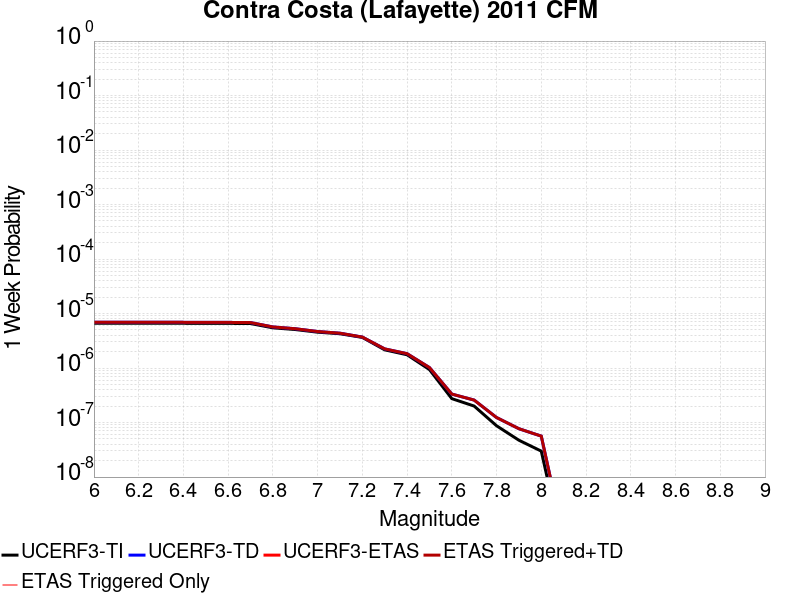 | 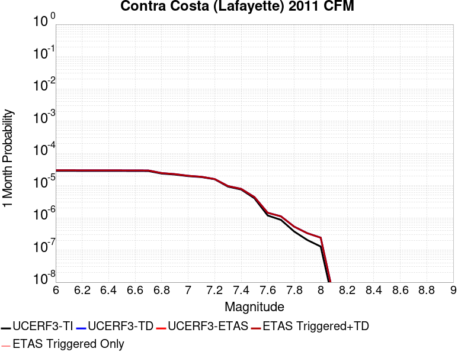 | 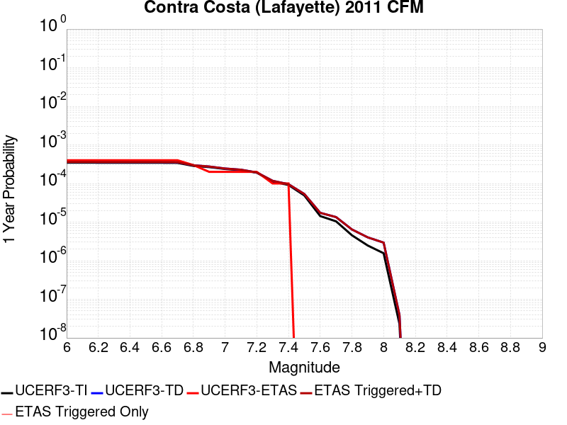 | 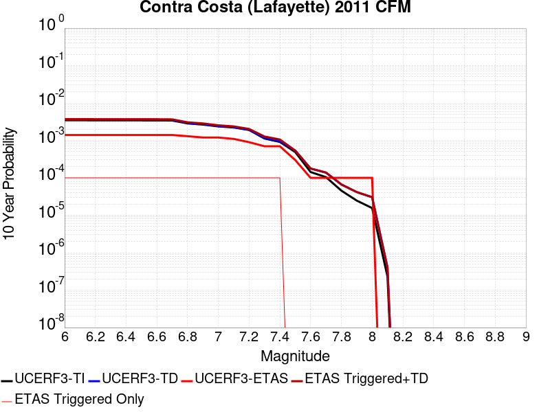 |

| Magnitude | 1 wk TI Prob | 1 wk TD Prob | 1 wk ETAS Prob | 1 wk ETAS/TD Gain | 1 wk ETAS Triggered+TD | 1 wk ETAS Triggered Only | 1 mo TI Prob | 1 mo TD Prob | 1 mo ETAS Prob | 1 mo ETAS/TD Gain | 1 mo ETAS Triggered+TD | 1 mo ETAS Triggered Only | 1 yr TI Prob | 1 yr TD Prob | 1 yr ETAS Prob | 1 yr ETAS/TD Gain | 1 yr ETAS Triggered+TD | 1 yr ETAS Triggered Only | 10 yr TI Prob | 10 yr TD Prob | 10 yr ETAS Prob | 10 yr ETAS/TD Gain | 10 yr ETAS Triggered+TD | 10 yr ETAS Triggered Only |
|-----|-----|-----|-----|-----|-----|-----|-----|-----|-----|-----|-----|-----|-----|-----|-----|-----|-----|-----|-----|-----|-----|-----|-----|-----|
| 6.0 | 6.655419E-6 | 6.941189E-6 | 0.0 | 0.0 | 6.941189E-6 | 0.0 | 2.8522913E-5 | 2.9747624E-5 | 0.0 | 0.0 | 2.9747624E-5 | 0.0 | 3.472111E-4 | 3.621191E-4 | 4.0E-4 | 1.1046089 | 3.621191E-4 | 0.0 | 0.0034666911 | 0.0036199526 | 0.0014 | 0.38674542 | 0.0037195904 | 1.0E-4 |
| 6.1 | 6.655419E-6 | 6.941189E-6 | 0.0 | 0.0 | 6.941189E-6 | 0.0 | 2.8522913E-5 | 2.9747624E-5 | 0.0 | 0.0 | 2.9747624E-5 | 0.0 | 3.472111E-4 | 3.621191E-4 | 4.0E-4 | 1.1046089 | 3.621191E-4 | 0.0 | 0.0034666911 | 0.0036199526 | 0.0014 | 0.38674542 | 0.0037195904 | 1.0E-4 |
| 6.2 | 6.6254133E-6 | 6.9095945E-6 | 0.0 | 0.0 | 6.9095945E-6 | 0.0 | 2.839432E-5 | 2.9612223E-5 | 0.0 | 0.0 | 2.9612223E-5 | 0.0 | 3.45646E-4 | 3.6047114E-4 | 4.0E-4 | 1.1096588 | 3.6047114E-4 | 0.0 | 0.003451089 | 0.0036035264 | 0.0014 | 0.38850832 | 0.003703166 | 1.0E-4 |
| 6.3 | 6.6254133E-6 | 6.9095945E-6 | 0.0 | 0.0 | 6.9095945E-6 | 0.0 | 2.839432E-5 | 2.9612223E-5 | 0.0 | 0.0 | 2.9612223E-5 | 0.0 | 3.45646E-4 | 3.6047114E-4 | 4.0E-4 | 1.1096588 | 3.6047114E-4 | 0.0 | 0.003451089 | 0.0036035264 | 0.0014 | 0.38850832 | 0.003703166 | 1.0E-4 |
| 6.4 | 6.6254133E-6 | 6.9095945E-6 | 0.0 | 0.0 | 6.9095945E-6 | 0.0 | 2.839432E-5 | 2.9612223E-5 | 0.0 | 0.0 | 2.9612223E-5 | 0.0 | 3.45646E-4 | 3.6047114E-4 | 4.0E-4 | 1.1096588 | 3.6047114E-4 | 0.0 | 0.003451089 | 0.0036035264 | 0.0014 | 0.38850832 | 0.003703166 | 1.0E-4 |
| 6.5 | 6.606445E-6 | 6.8891395E-6 | 0.0 | 0.0 | 6.8891395E-6 | 0.0 | 2.8313027E-5 | 2.952456E-5 | 0.0 | 0.0 | 2.952456E-5 | 0.0 | 3.4465658E-4 | 3.5940422E-4 | 4.0E-4 | 1.112953 | 3.5940422E-4 | 0.0 | 0.0034412253 | 0.0035928916 | 0.0014 | 0.3896583 | 0.0036925322 | 1.0E-4 |
| 6.6 | 6.59966E-6 | 6.881676E-6 | 0.0 | 0.0 | 6.881676E-6 | 0.0 | 2.828395E-5 | 2.9492576E-5 | 0.0 | 0.0 | 2.9492576E-5 | 0.0 | 3.4430268E-4 | 3.5901493E-4 | 4.0E-4 | 1.1141598 | 3.5901493E-4 | 0.0 | 0.0034376972 | 0.003589011 | 0.0014 | 0.3900796 | 0.0036886523 | 1.0E-4 |
| 6.7 | 6.5570975E-6 | 6.8356594E-6 | 0.0 | 0.0 | 6.8356594E-6 | 0.0 | 2.8101544E-5 | 2.9295365E-5 | 0.0 | 0.0 | 2.9295365E-5 | 0.0 | 3.4208258E-4 | 3.5661468E-4 | 4.0E-4 | 1.1216588 | 3.5661468E-4 | 0.0 | 0.0034155648 | 0.0035650858 | 0.0014 | 0.39269742 | 0.0036647294 | 1.0E-4 |
| 6.8 | 5.472255E-6 | 5.6785E-6 | 0.0 | 0.0 | 5.6785E-6 | 0.0 | 2.345231E-5 | 2.4336206E-5 | 0.0 | 0.0 | 2.4336206E-5 | 0.0 | 2.8549446E-4 | 2.9625348E-4 | 3.0E-4 | 1.0126463 | 2.9625348E-4 | 0.0 | 0.0028512797 | 0.0029630994 | 0.0013 | 0.4387298 | 0.003062803 | 1.0E-4 |
| 6.9 | 5.092346E-6 | 5.2687965E-6 | 0.0 | 0.0 | 5.2687965E-6 | 0.0 | 2.1824157E-5 | 2.2580363E-5 | 0.0 | 0.0 | 2.2580363E-5 | 0.0 | 2.656767E-4 | 2.7488163E-4 | 2.0E-4 | 0.7275859 | 2.7488163E-4 | 0.0 | 0.002653593 | 0.0027499225 | 0.0012 | 0.43637595 | 0.0028496473 | 1.0E-4 |
| 7.0 | 4.5525762E-6 | 4.681998E-6 | 0.0 | 0.0 | 4.681998E-6 | 0.0 | 1.9510895E-5 | 2.0065552E-5 | 0.0 | 0.0 | 2.0065552E-5 | 0.0 | 2.3751926E-4 | 2.44271E-4 | 2.0E-4 | 0.8187627 | 2.44271E-4 | 0.0 | 0.0023726553 | 0.0024445206 | 0.0012 | 0.4908938 | 0.0025442762 | 1.0E-4 |
| 7.1 | 4.261504E-6 | 4.3610994E-6 | 0.0 | 0.0 | 4.3610994E-6 | 0.0 | 1.826346E-5 | 1.8690293E-5 | 0.0 | 0.0 | 1.8690293E-5 | 0.0 | 2.2233493E-4 | 2.2753084E-4 | 2.0E-4 | 0.87900174 | 2.2753084E-4 | 0.0 | 0.002221126 | 0.0022774672 | 0.0011 | 0.4829927 | 0.0023772393 | 1.0E-4 |
| 7.2 | 3.654114E-6 | 3.7016594E-6 | 0.0 | 0.0 | 3.7016594E-6 | 0.0 | 1.5660395E-5 | 1.586416E-5 | 0.0 | 0.0 | 1.586416E-5 | 0.0 | 1.9064861E-4 | 1.9312926E-4 | 2.0E-4 | 1.0355759 | 1.9312926E-4 | 0.0 | 0.0019048514 | 0.0019340494 | 9.0E-4 | 0.46534488 | 0.002033856 | 1.0E-4 |
| 7.3 | 2.1595129E-6 | 2.2478275E-6 | 0.0 | 0.0 | 2.2478275E-6 | 0.0 | 9.255023E-6 | 9.633512E-6 | 0.0 | 0.0 | 9.633512E-6 | 0.0 | 1.1267407E-4 | 1.17281736E-4 | 1.0E-4 | 0.8526477 | 1.17281736E-4 | 0.0 | 0.0011261696 | 0.0011766468 | 7.0E-4 | 0.59491086 | 0.0012765292 | 1.0E-4 |
| 7.4 | 1.7532738E-6 | 1.8367903E-6 | 0.0 | 0.0 | 1.8367903E-6 | 0.0 | 7.5140088E-6 | 7.871935E-6 | 0.0 | 0.0 | 7.871935E-6 | 0.0 | 9.147922E-5 | 9.583663E-5 | 1.0E-4 | 1.0434424 | 9.583663E-5 | 0.0 | 9.144157E-4 | 9.622668E-4 | 7.0E-4 | 0.727449 | 0.0010621706 | 1.0E-4 |
| 7.5 | 9.387875E-7 | 1.0218853E-6 | 0.0 | 0.0 | 1.0218853E-6 | 0.0 | 4.0233685E-6 | 4.3795008E-6 | 0.0 | 0.0 | 4.3795008E-6 | 0.0 | 4.8983413E-5 | 5.3319134E-5 | 0.0 | 0.0 | 5.3319134E-5 | 0.0 | 4.897262E-4 | 5.370747E-4 | 3.0E-4 | 0.55858153 | 5.370747E-4 | 0.0 |
| 7.6 | 2.7471893E-7 | 3.3321822E-7 | 0.0 | 0.0 | 3.3321822E-7 | 0.0 | 1.1773664E-6 | 1.4280773E-6 | 0.0 | 0.0 | 1.4280773E-6 | 0.0 | 1.433434E-5 | 1.7386703E-5 | 0.0 | 0.0 | 1.7386703E-5 | 0.0 | 1.4333417E-4 | 1.7769694E-4 | 1.0E-4 | 0.5627559 | 1.7769694E-4 | 0.0 |
| 7.7 | 2.0057985E-7 | 2.5843093E-7 | 0.0 | 0.0 | 2.5843093E-7 | 0.0 | 8.596276E-7 | 1.1075606E-6 | 0.0 | 0.0 | 1.1075606E-6 | 0.0 | 1.0465916E-5 | 1.3484468E-5 | 0.0 | 0.0 | 1.3484468E-5 | 0.0 | 1.0465423E-4 | 1.3863613E-4 | 1.0E-4 | 0.7213127 | 1.3863613E-4 | 0.0 |
| 7.8 | 8.7403905E-8 | 1.2363851E-7 | 0.0 | 0.0 | 1.2363851E-7 | 0.0 | 3.745881E-7 | 5.2987923E-7 | 0.0 | 0.0 | 5.2987923E-7 | 0.0 | 4.5606007E-6 | 6.4512606E-6 | 0.0 | 0.0 | 6.4512606E-6 | 0.0 | 4.560507E-5 | 6.677028E-5 | 1.0E-4 | 1.4976723 | 6.677028E-5 | 0.0 |
| 7.9 | 4.740233E-8 | 7.7142566E-8 | 0.0 | 0.0 | 7.7142566E-8 | 0.0 | 2.0315284E-7 | 3.3061096E-7 | 0.0 | 0.0 | 3.3061096E-7 | 0.0 | 2.473383E-6 | 4.025181E-6 | 0.0 | 0.0 | 4.025181E-6 | 0.0 | 2.4733554E-5 | 4.178377E-5 | 1.0E-4 | 2.3932738 | 4.178377E-5 | 0.0 |
| 8.0 | 2.99164E-8 | 5.638754E-8 | 0.0 | 0.0 | 5.638754E-8 | 0.0 | 1.2821314E-7 | 2.4166087E-7 | 0.0 | 0.0 | 2.4166087E-7 | 0.0 | 1.5609938E-6 | 2.9422172E-6 | 0.0 | 0.0 | 2.9422172E-6 | 0.0 | 1.5609829E-5 | 3.0440106E-5 | 1.0E-4 | 3.2851396 | 3.0440106E-5 | 0.0 |
| 8.1 | 4.431212E-10 | 7.4800155E-10 | 0.0 | 0.0 | 7.4800155E-10 | 0.0 | 1.899091E-9 | 3.2057206E-9 | 0.0 | 0.0 | 3.2057206E-9 | 0.0 | 2.3121432E-8 | 3.9029647E-8 | 0.0 | 0.0 | 3.9029647E-8 | 0.0 | 2.312143E-7 | 3.9907798E-7 | 0.0 | 0.0 | 3.9907798E-7 | 0.0 |

## Holser alt 1
*[(top)](#table-of-contents)*

| 1 Week | 1 Month | 1 Year | 10 Year |
|-----|-----|-----|-----|
| 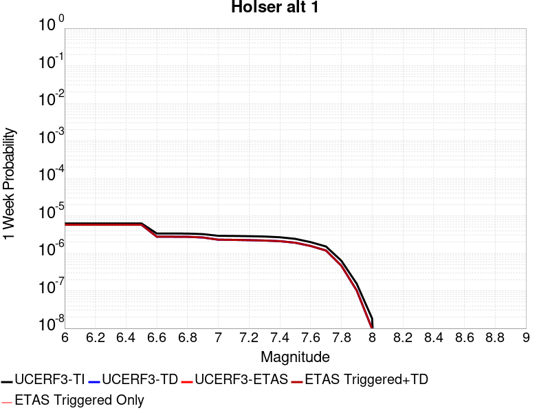 | 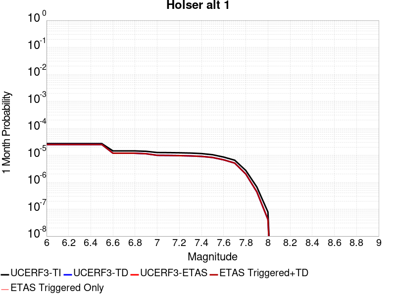 | 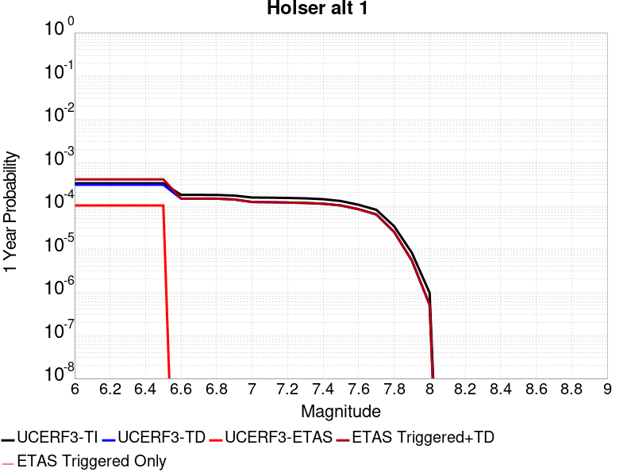 | 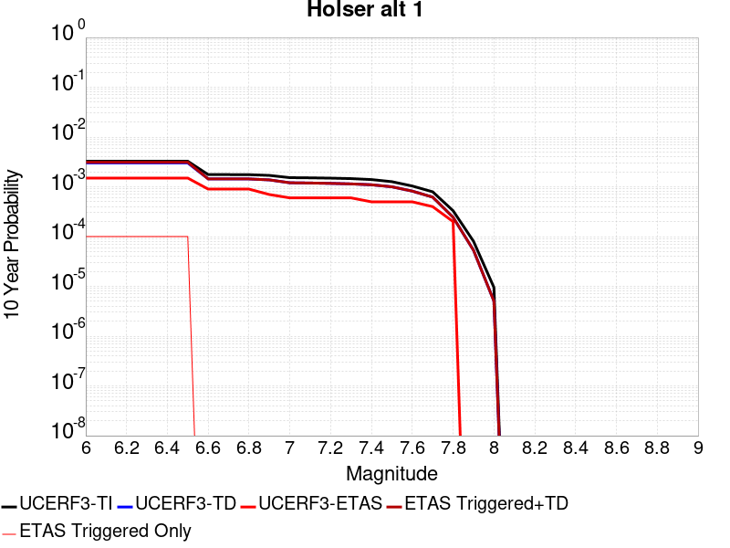 |

| Magnitude | 1 wk TI Prob | 1 wk TD Prob | 1 wk ETAS Prob | 1 wk ETAS/TD Gain | 1 wk ETAS Triggered+TD | 1 wk ETAS Triggered Only | 1 mo TI Prob | 1 mo TD Prob | 1 mo ETAS Prob | 1 mo ETAS/TD Gain | 1 mo ETAS Triggered+TD | 1 mo ETAS Triggered Only | 1 yr TI Prob | 1 yr TD Prob | 1 yr ETAS Prob | 1 yr ETAS/TD Gain | 1 yr ETAS Triggered+TD | 1 yr ETAS Triggered Only | 10 yr TI Prob | 10 yr TD Prob | 10 yr ETAS Prob | 10 yr ETAS/TD Gain | 10 yr ETAS Triggered+TD | 10 yr ETAS Triggered Only |
|-----|-----|-----|-----|-----|-----|-----|-----|-----|-----|-----|-----|-----|-----|-----|-----|-----|-----|-----|-----|-----|-----|-----|-----|-----|
| 6.0 | 6.2746653E-6 | 5.790988E-6 | 0.0 | 0.0 | 5.790988E-6 | 0.0 | 2.6891146E-5 | 2.481835E-5 | 0.0 | 0.0 | 2.481835E-5 | 0.0 | 3.273505E-4 | 3.0213303E-4 | 4.0E-4 | 1.32392 | 4.0210283E-4 | 1.0E-4 | 0.0032686873 | 0.003018356 | 0.0015 | 0.4969593 | 0.003118054 | 1.0E-4 |
| 6.1 | 6.2746653E-6 | 5.790988E-6 | 0.0 | 0.0 | 5.790988E-6 | 0.0 | 2.6891146E-5 | 2.481835E-5 | 0.0 | 0.0 | 2.481835E-5 | 0.0 | 3.273505E-4 | 3.0213303E-4 | 4.0E-4 | 1.32392 | 4.0210283E-4 | 1.0E-4 | 0.0032686873 | 0.003018356 | 0.0015 | 0.4969593 | 0.003118054 | 1.0E-4 |
| 6.2 | 6.2746653E-6 | 5.790988E-6 | 0.0 | 0.0 | 5.790988E-6 | 0.0 | 2.6891146E-5 | 2.481835E-5 | 0.0 | 0.0 | 2.481835E-5 | 0.0 | 3.273505E-4 | 3.0213303E-4 | 4.0E-4 | 1.32392 | 4.0210283E-4 | 1.0E-4 | 0.0032686873 | 0.003018356 | 0.0015 | 0.4969593 | 0.003118054 | 1.0E-4 |
| 6.3 | 6.2746653E-6 | 5.790988E-6 | 0.0 | 0.0 | 5.790988E-6 | 0.0 | 2.6891146E-5 | 2.481835E-5 | 0.0 | 0.0 | 2.481835E-5 | 0.0 | 3.273505E-4 | 3.0213303E-4 | 4.0E-4 | 1.32392 | 4.0210283E-4 | 1.0E-4 | 0.0032686873 | 0.003018356 | 0.0015 | 0.4969593 | 0.003118054 | 1.0E-4 |
| 6.4 | 6.2746653E-6 | 5.790988E-6 | 0.0 | 0.0 | 5.790988E-6 | 0.0 | 2.6891146E-5 | 2.481835E-5 | 0.0 | 0.0 | 2.481835E-5 | 0.0 | 3.273505E-4 | 3.0213303E-4 | 4.0E-4 | 1.32392 | 4.0210283E-4 | 1.0E-4 | 0.0032686873 | 0.003018356 | 0.0015 | 0.4969593 | 0.003118054 | 1.0E-4 |
| 6.5 | 6.2746653E-6 | 5.790988E-6 | 0.0 | 0.0 | 5.790988E-6 | 0.0 | 2.6891146E-5 | 2.481835E-5 | 0.0 | 0.0 | 2.481835E-5 | 0.0 | 3.273505E-4 | 3.0213303E-4 | 4.0E-4 | 1.32392 | 4.0210283E-4 | 1.0E-4 | 0.0032686873 | 0.003018356 | 0.0015 | 0.4969593 | 0.003118054 | 1.0E-4 |
| 6.6 | 3.375825E-6 | 2.7719557E-6 | 0.0 | 0.0 | 2.7719557E-6 | 0.0 | 1.4467741E-5 | 1.1879756E-5 | 0.0 | 0.0 | 1.1879756E-5 | 0.0 | 1.761305E-4 | 1.4462661E-4 | 1.0E-4 | 0.6914357 | 1.4462661E-4 | 0.0 | 0.0017599097 | 0.0014453417 | 9.0E-4 | 0.6226901 | 0.0014453417 | 0.0 |
| 6.7 | 3.375825E-6 | 2.7719557E-6 | 0.0 | 0.0 | 2.7719557E-6 | 0.0 | 1.4467741E-5 | 1.1879756E-5 | 0.0 | 0.0 | 1.1879756E-5 | 0.0 | 1.761305E-4 | 1.4462661E-4 | 1.0E-4 | 0.6914357 | 1.4462661E-4 | 0.0 | 0.0017599097 | 0.0014453417 | 9.0E-4 | 0.6226901 | 0.0014453417 | 0.0 |
| 6.8 | 3.366533E-6 | 2.7623546E-6 | 0.0 | 0.0 | 2.7623546E-6 | 0.0 | 1.4427919E-5 | 1.183861E-5 | 0.0 | 0.0 | 1.183861E-5 | 0.0 | 1.7564575E-4 | 1.441257E-4 | 1.0E-4 | 0.6938388 | 1.441257E-4 | 0.0 | 0.0017550698 | 0.0014403393 | 9.0E-4 | 0.6248528 | 0.0014403393 | 0.0 |
| 6.9 | 3.253174E-6 | 2.644567E-6 | 0.0 | 0.0 | 2.644567E-6 | 0.0 | 1.39421E-5 | 1.1333811E-5 | 0.0 | 0.0 | 1.1333811E-5 | 0.0 | 1.6973184E-4 | 1.3798056E-4 | 0.0 | 0.0 | 1.3798056E-4 | 0.0 | 0.0016960226 | 0.0013789649 | 7.0E-4 | 0.5076271 | 0.0013789649 | 0.0 |
| 7.0 | 2.9336593E-6 | 2.3125276E-6 | 0.0 | 0.0 | 2.3125276E-6 | 0.0 | 1.2572766E-5 | 9.910796E-6 | 0.0 | 0.0 | 9.910796E-6 | 0.0 | 1.5306266E-4 | 1.2065727E-4 | 0.0 | 0.0 | 1.2065727E-4 | 0.0 | 0.0015295728 | 0.0012059201 | 6.0E-4 | 0.4975454 | 0.0012059201 | 0.0 |
| 7.1 | 2.9087812E-6 | 2.2883764E-6 | 0.0 | 0.0 | 2.2883764E-6 | 0.0 | 1.2466146E-5 | 9.807291E-6 | 0.0 | 0.0 | 9.807291E-6 | 0.0 | 1.5176475E-4 | 1.1939724E-4 | 0.0 | 0.0 | 1.1939724E-4 | 0.0 | 0.0015166114 | 0.0011933334 | 6.0E-4 | 0.50279325 | 0.0011933334 | 0.0 |
| 7.2 | 2.8674524E-6 | 2.2482611E-6 | 0.0 | 0.0 | 2.2482611E-6 | 0.0 | 1.2289024E-5 | 9.635369E-6 | 0.0 | 0.0 | 9.635369E-6 | 0.0 | 1.4960859E-4 | 1.1730433E-4 | 0.0 | 0.0 | 1.1730433E-4 | 0.0 | 0.0014950791 | 0.0011724264 | 6.0E-4 | 0.5117592 | 0.0011724264 | 0.0 |
| 7.3 | 2.8057775E-6 | 2.1961384E-6 | 0.0 | 0.0 | 2.1961384E-6 | 0.0 | 1.2024705E-5 | 9.411989E-6 | 0.0 | 0.0 | 9.411989E-6 | 0.0 | 1.4639096E-4 | 1.1458495E-4 | 0.0 | 0.0 | 1.1458495E-4 | 0.0 | 0.0014629456 | 0.001145261 | 6.0E-4 | 0.52389807 | 0.001145261 | 0.0 |
| 7.4 | 2.683666E-6 | 2.1099065E-6 | 0.0 | 0.0 | 2.1099065E-6 | 0.0 | 1.1501375E-5 | 9.0424255E-6 | 0.0 | 0.0 | 9.0424255E-6 | 0.0 | 1.4002025E-4 | 1.1008599E-4 | 0.0 | 0.0 | 1.1008599E-4 | 0.0 | 0.0013993206 | 0.0011003168 | 5.0E-4 | 0.4544146 | 0.0011003168 | 0.0 |
| 7.5 | 2.434495E-6 | 1.9201323E-6 | 0.0 | 0.0 | 1.9201323E-6 | 0.0 | 1.0433508E-5 | 8.229112E-6 | 0.0 | 0.0 | 8.229112E-6 | 0.0 | 1.2702055E-4 | 1.0018485E-4 | 0.0 | 0.0 | 1.0018485E-4 | 0.0 | 0.0012694797 | 0.0010013989 | 5.0E-4 | 0.49930152 | 0.0010013989 | 0.0 |
| 7.6 | 1.9914562E-6 | 1.5735592E-6 | 0.0 | 0.0 | 1.5735592E-6 | 0.0 | 8.534785E-6 | 6.7438077E-6 | 0.0 | 0.0 | 6.7438077E-6 | 0.0 | 1.03906044E-4 | 8.210278E-5 | 0.0 | 0.0 | 8.210278E-5 | 0.0 | 0.0010385747 | 8.2072604E-4 | 5.0E-4 | 0.6092167 | 8.2072604E-4 | 0.0 |
| 7.7 | 1.5229501E-6 | 1.1899391E-6 | 0.0 | 0.0 | 1.1899391E-6 | 0.0 | 6.526913E-6 | 5.099729E-6 | 0.0 | 0.0 | 5.099729E-6 | 0.0 | 7.946226E-5 | 6.208745E-5 | 0.0 | 0.0 | 6.208745E-5 | 0.0 | 7.943385E-4 | 6.207023E-4 | 4.0E-4 | 0.64443135 | 6.207023E-4 | 0.0 |
| 7.8 | 6.3489426E-7 | 4.6897054E-7 | 0.0 | 0.0 | 4.6897054E-7 | 0.0 | 2.7209726E-6 | 2.009872E-6 | 0.0 | 0.0 | 2.009872E-6 | 0.0 | 3.312734E-5 | 2.446992E-5 | 0.0 | 0.0 | 2.446992E-5 | 0.0 | 3.31224E-4 | 2.4467244E-4 | 2.0E-4 | 0.8174194 | 2.4467244E-4 | 0.0 |
| 7.9 | 1.5459432E-7 | 1.0197588E-7 | 0.0 | 0.0 | 1.0197588E-7 | 0.0 | 6.6254694E-7 | 4.3703938E-7 | 0.0 | 0.0 | 4.3703938E-7 | 0.0 | 8.066479E-6 | 5.320942E-6 | 0.0 | 0.0 | 5.320942E-6 | 0.0 | 8.066186E-5 | 5.320816E-5 | 0.0 | 0.0 | 5.320816E-5 | 0.0 |
| 8.0 | 1.8307812E-8 | 9.697812E-9 | 0.0 | 0.0 | 9.697812E-9 | 0.0 | 7.846205E-8 | 4.1562053E-8 | 0.0 | 0.0 | 4.1562053E-8 | 0.0 | 9.55275E-7 | 5.060179E-7 | 0.0 | 0.0 | 5.060179E-7 | 0.0 | 9.552709E-6 | 5.0601675E-6 | 0.0 | 0.0 | 5.0601675E-6 | 0.0 |

## Malibu Coast (Extension) alt 1
*[(top)](#table-of-contents)*

| 1 Week | 1 Month | 1 Year | 10 Year |
|-----|-----|-----|-----|
| 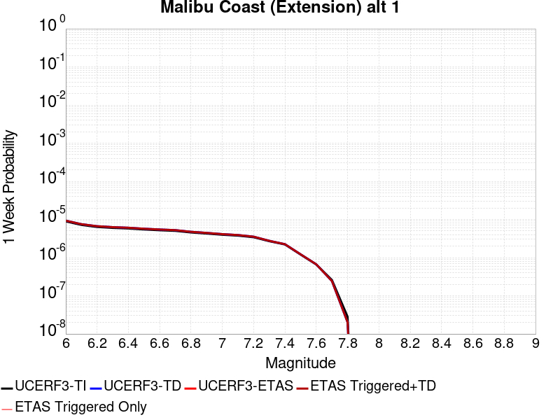 | 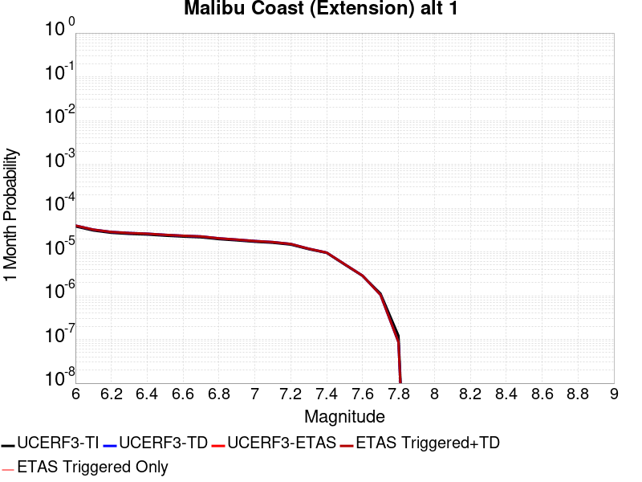 | 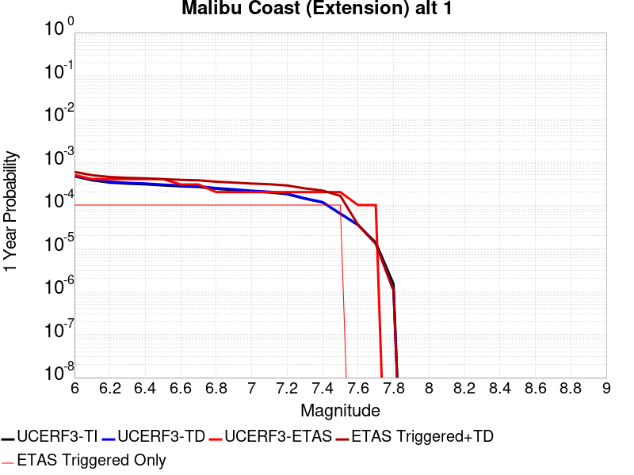 |  |

| Magnitude | 1 wk TI Prob | 1 wk TD Prob | 1 wk ETAS Prob | 1 wk ETAS/TD Gain | 1 wk ETAS Triggered+TD | 1 wk ETAS Triggered Only | 1 mo TI Prob | 1 mo TD Prob | 1 mo ETAS Prob | 1 mo ETAS/TD Gain | 1 mo ETAS Triggered+TD | 1 mo ETAS Triggered Only | 1 yr TI Prob | 1 yr TD Prob | 1 yr ETAS Prob | 1 yr ETAS/TD Gain | 1 yr ETAS Triggered+TD | 1 yr ETAS Triggered Only | 10 yr TI Prob | 10 yr TD Prob | 10 yr ETAS Prob | 10 yr ETAS/TD Gain | 10 yr ETAS Triggered+TD | 10 yr ETAS Triggered Only |
|-----|-----|-----|-----|-----|-----|-----|-----|-----|-----|-----|-----|-----|-----|-----|-----|-----|-----|-----|-----|-----|-----|-----|-----|-----|
| 6.0 | 8.930738E-6 | 9.330492E-6 | 0.0 | 0.0 | 9.330492E-6 | 0.0 | 3.827403E-5 | 3.9987215E-5 | 0.0 | 0.0 | 3.9987215E-5 | 0.0 | 4.6588664E-4 | 4.8673732E-4 | 5.0E-4 | 1.0272481 | 5.8668863E-4 | 1.0E-4 | 0.0046491115 | 0.004856895 | 0.0034 | 0.7000357 | 0.0049564093 | 1.0E-4 |
| 6.1 | 7.199952E-6 | 7.531366E-6 | 0.0 | 0.0 | 7.531366E-6 | 0.0 | 3.0856572E-5 | 3.2276886E-5 | 0.0 | 0.0 | 3.2276886E-5 | 0.0 | 3.75614E-4 | 3.9290084E-4 | 4.0E-4 | 1.0180686 | 4.9286155E-4 | 1.0E-4 | 0.0037497976 | 0.003922128 | 0.0023 | 0.58641636 | 0.004021736 | 1.0E-4 |
| 6.2 | 6.3721413E-6 | 6.6677844E-6 | 0.0 | 0.0 | 6.6677844E-6 | 0.0 | 2.7308892E-5 | 2.8575907E-5 | 0.0 | 0.0 | 2.8575907E-5 | 0.0 | 3.3243504E-4 | 3.478565E-4 | 4.0E-4 | 1.1498995 | 4.478217E-4 | 1.0E-4 | 0.0033193815 | 0.0034731599 | 0.0021 | 0.6046367 | 0.0035728125 | 1.0E-4 |
| 6.3 | 6.016345E-6 | 6.2961167E-6 | 0.0 | 0.0 | 6.2961167E-6 | 0.0 | 2.578408E-5 | 2.698308E-5 | 0.0 | 0.0 | 2.698308E-5 | 0.0 | 3.1387596E-4 | 3.2846982E-4 | 4.0E-4 | 1.217768 | 4.2843696E-4 | 1.0E-4 | 0.00313433 | 0.0032798792 | 0.002 | 0.6097785 | 0.0033795512 | 1.0E-4 |
| 6.4 | 5.8104883E-6 | 6.080482E-6 | 0.0 | 0.0 | 6.080482E-6 | 0.0 | 2.4901856E-5 | 2.605895E-5 | 0.0 | 0.0 | 2.605895E-5 | 0.0 | 3.031379E-4 | 3.1722186E-4 | 4.0E-4 | 1.2609472 | 4.171901E-4 | 1.0E-4 | 0.0030272473 | 0.003167725 | 0.0018 | 0.56823117 | 0.003267408 | 1.0E-4 |
| 6.5 | 5.476925E-6 | 5.7284105E-6 | 0.0 | 0.0 | 5.7284105E-6 | 0.0 | 2.3472323E-5 | 2.4550101E-5 | 0.0 | 0.0 | 2.4550101E-5 | 0.0 | 2.8573806E-4 | 2.988568E-4 | 4.0E-4 | 1.3384337 | 3.988269E-4 | 1.0E-4 | 0.0028537093 | 0.0029845806 | 0.0018 | 0.6030998 | 0.0030842822 | 1.0E-4 |
| 6.6 | 5.222387E-6 | 5.4594457E-6 | 0.0 | 0.0 | 5.4594457E-6 | 0.0 | 2.2381464E-5 | 2.3397415E-5 | 0.0 | 0.0 | 2.3397415E-5 | 0.0 | 2.7246025E-4 | 2.848266E-4 | 3.0E-4 | 1.0532725 | 3.847981E-4 | 1.0E-4 | 0.0027212645 | 0.002844646 | 0.0017 | 0.5976139 | 0.0029443617 | 1.0E-4 |
| 6.7 | 5.0337076E-6 | 5.2599453E-6 | 0.0 | 0.0 | 5.2599453E-6 | 0.0 | 2.1572854E-5 | 2.254243E-5 | 0.0 | 0.0 | 2.254243E-5 | 0.0 | 2.6261783E-4 | 2.744198E-4 | 3.0E-4 | 1.0932156 | 3.7439237E-4 | 1.0E-4 | 0.002623077 | 0.0027408395 | 0.0017 | 0.6202479 | 0.0028405653 | 1.0E-4 |
| 6.8 | 4.5675624E-6 | 4.759483E-6 | 0.0 | 0.0 | 4.759483E-6 | 0.0 | 1.9575122E-5 | 2.0397625E-5 | 0.0 | 0.0 | 2.0397625E-5 | 0.0 | 2.3830103E-4 | 2.4831298E-4 | 2.0E-4 | 0.8054352 | 3.4828813E-4 | 1.0E-4 | 0.0023804565 | 0.0024803749 | 0.0015 | 0.6047473 | 0.002580127 | 1.0E-4 |
| 6.9 | 4.2802412E-6 | 4.4527446E-6 | 0.0 | 0.0 | 4.4527446E-6 | 0.0 | 1.8343762E-5 | 1.9083052E-5 | 0.0 | 0.0 | 1.9083052E-5 | 0.0 | 2.2331243E-4 | 2.3231153E-4 | 2.0E-4 | 0.8609129 | 3.322883E-4 | 1.0E-4 | 0.0022308815 | 0.0023207036 | 0.0015 | 0.6463557 | 0.0024204715 | 1.0E-4 |
| 7.0 | 3.9794063E-6 | 4.1307762E-6 | 0.0 | 0.0 | 4.1307762E-6 | 0.0 | 1.7054486E-5 | 1.7703207E-5 | 0.0 | 0.0 | 1.7703207E-5 | 0.0 | 2.0761859E-4 | 2.1551536E-4 | 2.0E-4 | 0.9280081 | 3.1549382E-4 | 1.0E-4 | 0.0020742472 | 0.0021530772 | 0.0014 | 0.65023214 | 0.0022528619 | 1.0E-4 |
| 7.1 | 3.7730424E-6 | 3.9118668E-6 | 0.0 | 0.0 | 3.9118668E-6 | 0.0 | 1.6170083E-5 | 1.6765036E-5 | 0.0 | 0.0 | 1.6765036E-5 | 0.0 | 1.9685295E-4 | 2.0409533E-4 | 2.0E-4 | 0.9799343 | 3.0407493E-4 | 1.0E-4 | 0.0019667868 | 0.0020390917 | 0.0013 | 0.63753873 | 0.0021388878 | 1.0E-4 |
| 7.2 | 3.424985E-6 | 3.541939E-6 | 0.0 | 0.0 | 3.541939E-6 | 0.0 | 1.4678424E-5 | 1.517965E-5 | 0.0 | 0.0 | 1.517965E-5 | 0.0 | 1.7869516E-4 | 1.8479669E-4 | 2.0E-4 | 1.0822705 | 2.8477822E-4 | 1.0E-4 | 0.0017855153 | 0.0018464422 | 0.0013 | 0.7040567 | 0.0019462577 | 1.0E-4 |
| 7.3 | 2.6966375E-6 | 2.760137E-6 | 0.0 | 0.0 | 2.760137E-6 | 0.0 | 1.15569665E-5 | 1.18291055E-5 | 0.0 | 0.0 | 1.18291055E-5 | 0.0 | 1.4069698E-4 | 1.4400989E-4 | 2.0E-4 | 1.3887936 | 2.4399548E-4 | 1.0E-4 | 0.0014060794 | 0.0014391697 | 0.0011 | 0.7643296 | 0.0015390258 | 1.0E-4 |
| 7.4 | 2.215957E-6 | 2.2497932E-6 | 0.0 | 0.0 | 2.2497932E-6 | 0.0 | 9.496924E-6 | 9.641935E-6 | 0.0 | 0.0 | 9.641935E-6 | 0.0 | 1.1561892E-4 | 1.17384276E-4 | 2.0E-4 | 1.7038058 | 2.1737254E-4 | 1.0E-4 | 0.0011555878 | 0.0011732264 | 0.001 | 0.8523504 | 0.0012731091 | 1.0E-4 |
| 7.5 | 1.2040218E-6 | 1.2221014E-6 | 0.0 | 0.0 | 1.2221014E-6 | 0.0 | 5.160083E-6 | 5.237567E-6 | 0.0 | 0.0 | 5.237567E-6 | 0.0 | 6.2822204E-5 | 6.376553E-5 | 2.0E-4 | 3.1364906 | 1.6375916E-4 | 1.0E-4 | 6.280445E-4 | 6.3747424E-4 | 5.0E-4 | 0.7843454 | 7.374105E-4 | 1.0E-4 |
| 7.6 | 6.6157446E-7 | 6.679887E-7 | 0.0 | 0.0 | 6.679887E-7 | 0.0 | 2.835316E-6 | 2.8628056E-6 | 0.0 | 0.0 | 2.8628056E-6 | 0.0 | 3.4519428E-5 | 3.4854114E-5 | 1.0E-4 | 2.8691018 | 3.4854114E-5 | 0.0 | 3.4514067E-4 | 3.48488E-4 | 3.0E-4 | 0.8608618 | 3.48488E-4 | 0.0 |
| 7.7 | 2.6012302E-7 | 2.436076E-7 | 0.0 | 0.0 | 2.436076E-7 | 0.0 | 1.1148124E-6 | 1.0440322E-6 | 0.0 | 0.0 | 1.0440322E-6 | 0.0 | 1.3572758E-5 | 1.2711029E-5 | 1.0E-4 | 7.867184 | 1.2711029E-5 | 0.0 | 1.3571928E-4 | 1.2710408E-4 | 3.0E-4 | 2.3602705 | 1.2710408E-4 | 0.0 |
| 7.8 | 2.8323132E-8 | 2.0269256E-8 | 0.0 | 0.0 | 2.0269256E-8 | 0.0 | 1.2138484E-7 | 8.686823E-8 | 0.0 | 0.0 | 8.686823E-8 | 0.0 | 1.4778595E-6 | 1.0576204E-6 | 0.0 | 0.0 | 1.0576204E-6 | 0.0 | 1.4778497E-5 | 1.0576161E-5 | 0.0 | 0.0 | 1.0576161E-5 | 0.0 |

## Point Reyes 2011 connector
*[(top)](#table-of-contents)*

| 1 Week | 1 Month | 1 Year | 10 Year |
|-----|-----|-----|-----|
| 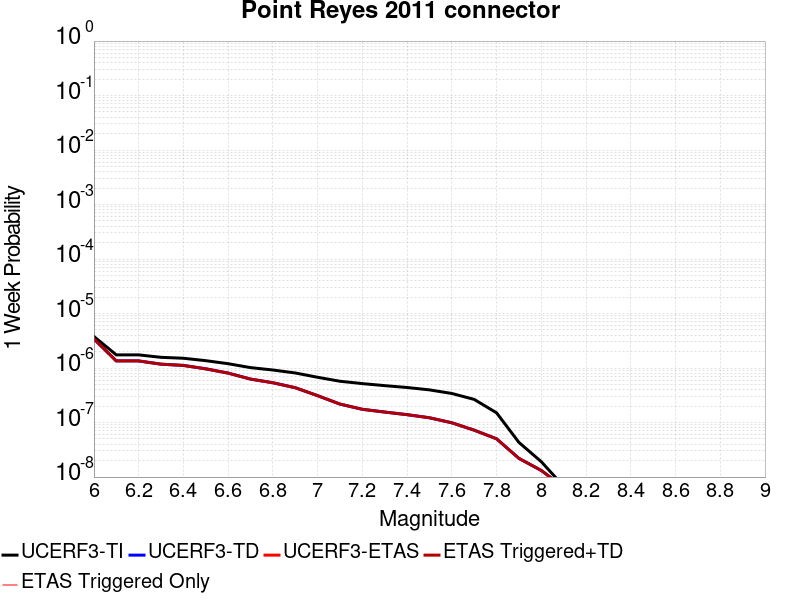 | 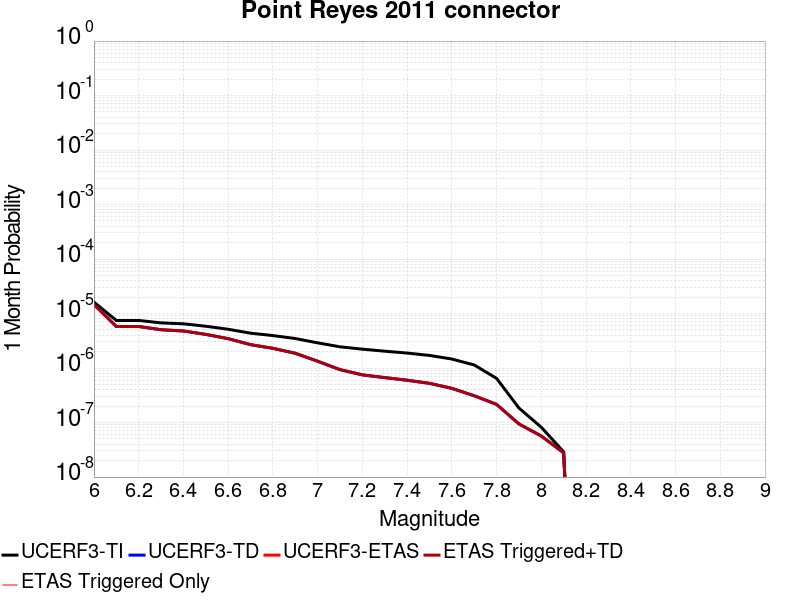 | 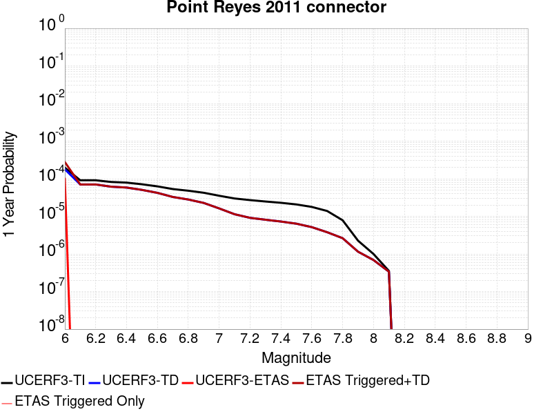 | 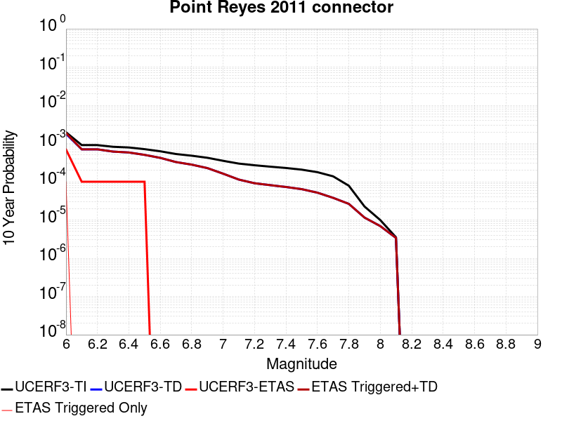 |

| Magnitude | 1 wk TI Prob | 1 wk TD Prob | 1 wk ETAS Prob | 1 wk ETAS/TD Gain | 1 wk ETAS Triggered+TD | 1 wk ETAS Triggered Only | 1 mo TI Prob | 1 mo TD Prob | 1 mo ETAS Prob | 1 mo ETAS/TD Gain | 1 mo ETAS Triggered+TD | 1 mo ETAS Triggered Only | 1 yr TI Prob | 1 yr TD Prob | 1 yr ETAS Prob | 1 yr ETAS/TD Gain | 1 yr ETAS Triggered+TD | 1 yr ETAS Triggered Only | 10 yr TI Prob | 10 yr TD Prob | 10 yr ETAS Prob | 10 yr ETAS/TD Gain | 10 yr ETAS Triggered+TD | 10 yr ETAS Triggered Only |
|-----|-----|-----|-----|-----|-----|-----|-----|-----|-----|-----|-----|-----|-----|-----|-----|-----|-----|-----|-----|-----|-----|-----|-----|-----|
| 6.0 | 3.7893044E-6 | 3.4203906E-6 | 0.0 | 0.0 | 3.4203906E-6 | 0.0 | 1.6239776E-5 | 1.4658746E-5 | 0.0 | 0.0 | 1.4658746E-5 | 0.0 | 1.9770133E-4 | 1.7845776E-4 | 1.0E-4 | 0.5603567 | 2.7843993E-4 | 1.0E-4 | 0.0019752553 | 0.0017836024 | 7.0E-4 | 0.39246413 | 0.001883424 | 1.0E-4 |
| 6.1 | 1.7449562E-6 | 1.3513892E-6 | 0.0 | 0.0 | 1.3513892E-6 | 0.0 | 7.478362E-6 | 5.7916554E-6 | 0.0 | 0.0 | 5.7916554E-6 | 0.0 | 9.104525E-5 | 7.051118E-5 | 0.0 | 0.0 | 7.051118E-5 | 0.0 | 9.1007963E-4 | 7.05142E-4 | 1.0E-4 | 0.14181541 | 7.05142E-4 | 0.0 |
| 6.2 | 1.7449562E-6 | 1.3513892E-6 | 0.0 | 0.0 | 1.3513892E-6 | 0.0 | 7.478362E-6 | 5.7916554E-6 | 0.0 | 0.0 | 5.7916554E-6 | 0.0 | 9.104525E-5 | 7.051118E-5 | 0.0 | 0.0 | 7.051118E-5 | 0.0 | 9.1007963E-4 | 7.05142E-4 | 1.0E-4 | 0.14181541 | 7.05142E-4 | 0.0 |
| 6.3 | 1.5739171E-6 | 1.1786257E-6 | 0.0 | 0.0 | 1.1786257E-6 | 0.0 | 6.7453416E-6 | 5.0512435E-6 | 0.0 | 0.0 | 5.0512435E-6 | 0.0 | 8.212144E-5 | 6.1497194E-5 | 0.0 | 0.0 | 6.1497194E-5 | 0.0 | 8.2091097E-4 | 6.1505433E-4 | 1.0E-4 | 0.16258727 | 6.1505433E-4 | 0.0 |
| 6.4 | 1.5138507E-6 | 1.1179791E-6 | 0.0 | 0.0 | 1.1179791E-6 | 0.0 | 6.4879155E-6 | 4.7913304E-6 | 0.0 | 0.0 | 4.7913304E-6 | 0.0 | 7.898751E-5 | 5.8332924E-5 | 0.0 | 0.0 | 5.8332924E-5 | 0.0 | 7.8959437E-4 | 5.834285E-4 | 1.0E-4 | 0.1714006 | 5.834285E-4 | 0.0 |
| 6.5 | 1.3662817E-6 | 9.684161E-7 | 0.0 | 0.0 | 9.684161E-7 | 0.0 | 5.8554797E-6 | 4.150348E-6 | 0.0 | 0.0 | 4.150348E-6 | 0.0 | 7.128814E-5 | 5.0529336E-5 | 0.0 | 0.0 | 5.0529336E-5 | 0.0 | 7.126527E-4 | 5.054287E-4 | 1.0E-4 | 0.19785185 | 5.054287E-4 | 0.0 |
| 6.6 | 1.2022703E-6 | 8.0825635E-7 | 0.0 | 0.0 | 8.0825635E-7 | 0.0 | 5.1525767E-6 | 3.4639513E-6 | 0.0 | 0.0 | 3.4639513E-6 | 0.0 | 6.273081E-5 | 4.21728E-5 | 0.0 | 0.0 | 4.21728E-5 | 0.0 | 6.271311E-4 | 4.218974E-4 | 0.0 | 0.0 | 4.218974E-4 | 0.0 |
| 6.7 | 1.0194848E-6 | 6.27772E-7 | 0.0 | 0.0 | 6.27772E-7 | 0.0 | 4.3692135E-6 | 2.6904486E-6 | 0.0 | 0.0 | 2.6904486E-6 | 0.0 | 5.319387E-5 | 3.2755725E-5 | 0.0 | 0.0 | 3.2755725E-5 | 0.0 | 5.3181144E-4 | 3.2775785E-4 | 0.0 | 0.0 | 3.2775785E-4 | 0.0 |
| 6.8 | 9.212307E-7 | 5.375723E-7 | 0.0 | 0.0 | 5.375723E-7 | 0.0 | 3.9481256E-6 | 2.3038792E-6 | 0.0 | 0.0 | 2.3038792E-6 | 0.0 | 4.806737E-5 | 2.8049371E-5 | 0.0 | 0.0 | 2.8049371E-5 | 0.0 | 4.8056975E-4 | 2.8070703E-4 | 0.0 | 0.0 | 2.8070703E-4 | 0.0 |
| 6.9 | 8.1306075E-7 | 4.3606917E-7 | 0.0 | 0.0 | 4.3606917E-7 | 0.0 | 3.4845416E-6 | 1.8688664E-6 | 0.0 | 0.0 | 1.8688664E-6 | 0.0 | 4.2423468E-5 | 2.2753213E-5 | 0.0 | 0.0 | 2.2753213E-5 | 0.0 | 4.241537E-4 | 2.2775742E-4 | 0.0 | 0.0 | 2.2775742E-4 | 0.0 |
| 7.0 | 6.773335E-7 | 3.1170882E-7 | 0.0 | 0.0 | 3.1170882E-7 | 0.0 | 2.9028547E-6 | 1.3358942E-6 | 0.0 | 0.0 | 1.3358942E-6 | 0.0 | 3.5341684E-5 | 1.626439E-5 | 0.0 | 0.0 | 1.626439E-5 | 0.0 | 3.5336064E-4 | 1.6288047E-4 | 0.0 | 0.0 | 1.6288047E-4 | 0.0 |
| 7.1 | 5.7279397E-7 | 2.1830382E-7 | 0.0 | 0.0 | 2.1830382E-7 | 0.0 | 2.454829E-6 | 9.355874E-7 | 0.0 | 0.0 | 9.355874E-7 | 0.0 | 2.9887131E-5 | 1.1390717E-5 | 0.0 | 0.0 | 1.1390717E-5 | 0.0 | 2.9883112E-4 | 1.14149734E-4 | 0.0 | 0.0 | 1.14149734E-4 | 0.0 |
| 7.2 | 5.185539E-7 | 1.7507725E-7 | 0.0 | 0.0 | 1.7507725E-7 | 0.0 | 2.222372E-6 | 7.503308E-7 | 0.0 | 0.0 | 7.503308E-7 | 0.0 | 2.7057044E-5 | 9.1352385E-6 | 0.0 | 0.0 | 9.1352385E-6 | 0.0 | 2.7053748E-4 | 9.159703E-5 | 0.0 | 0.0 | 9.159703E-5 | 0.0 |
| 7.3 | 4.7599846E-7 | 1.5591839E-7 | 0.0 | 0.0 | 1.5591839E-7 | 0.0 | 2.0399918E-6 | 6.6822145E-7 | 0.0 | 0.0 | 6.6822145E-7 | 0.0 | 2.4836616E-5 | 8.135566E-6 | 0.0 | 0.0 | 8.135566E-6 | 0.0 | 2.4833842E-4 | 8.160108E-5 | 0.0 | 0.0 | 8.160108E-5 | 0.0 |
| 7.4 | 4.3987393E-7 | 1.3959128E-7 | 0.0 | 0.0 | 1.3959128E-7 | 0.0 | 1.8851727E-6 | 5.9824816E-7 | 0.0 | 0.0 | 5.9824816E-7 | 0.0 | 2.2951735E-5 | 7.2836465E-6 | 0.0 | 0.0 | 7.2836465E-6 | 0.0 | 2.2949366E-4 | 7.308243E-5 | 0.0 | 0.0 | 7.308243E-5 | 0.0 |
| 7.5 | 3.980054E-7 | 1.2245356E-7 | 0.0 | 0.0 | 1.2245356E-7 | 0.0 | 1.7057363E-6 | 5.2480084E-7 | 0.0 | 0.0 | 5.2480084E-7 | 0.0 | 2.0767142E-5 | 6.3894313E-6 | 0.0 | 0.0 | 6.3894313E-6 | 0.0 | 2.0765202E-4 | 6.4135354E-5 | 0.0 | 0.0 | 6.4135354E-5 | 0.0 |
| 7.6 | 3.4188398E-7 | 9.909635E-8 | 0.0 | 0.0 | 9.909635E-8 | 0.0 | 1.4652163E-6 | 4.2469856E-7 | 0.0 | 0.0 | 4.2469856E-7 | 0.0 | 1.7838862E-5 | 5.1706925E-6 | 0.0 | 0.0 | 5.1706925E-6 | 0.0 | 1.783743E-4 | 5.1937426E-5 | 0.0 | 0.0 | 5.1937426E-5 | 0.0 |
| 7.7 | 2.6611437E-7 | 7.251822E-8 | 0.0 | 0.0 | 7.251822E-8 | 0.0 | 1.1404896E-6 | 3.1079233E-7 | 0.0 | 0.0 | 3.1079233E-7 | 0.0 | 1.3885373E-5 | 3.78389E-6 | 0.0 | 0.0 | 3.78389E-6 | 0.0 | 1.3884505E-4 | 3.8026767E-5 | 0.0 | 0.0 | 3.8026767E-5 | 0.0 |
| 7.8 | 1.5107078E-7 | 5.0373107E-8 | 0.0 | 0.0 | 5.0373107E-8 | 0.0 | 6.474461E-7 | 2.1588473E-7 | 0.0 | 0.0 | 2.1588473E-7 | 0.0 | 7.882627E-6 | 2.6283933E-6 | 0.0 | 0.0 | 2.6283933E-6 | 0.0 | 7.8823476E-5 | 2.6450118E-5 | 0.0 | 0.0 | 2.6450118E-5 | 0.0 |
| 7.9 | 4.3228205E-8 | 2.2034238E-8 | 0.0 | 0.0 | 2.2034238E-8 | 0.0 | 1.8526373E-7 | 9.4432444E-8 | 0.0 | 0.0 | 9.4432444E-8 | 0.0 | 2.2555835E-6 | 1.1497144E-6 | 0.0 | 0.0 | 1.1497144E-6 | 0.0 | 2.2555607E-5 | 1.1575295E-5 | 0.0 | 0.0 | 1.1575295E-5 | 0.0 |
| 8.0 | 1.9149928E-8 | 1.3215811E-8 | 0.0 | 0.0 | 1.3215811E-8 | 0.0 | 8.207112E-8 | 5.6639188E-8 | 0.0 | 0.0 | 5.6639188E-8 | 0.0 | 9.992154E-7 | 6.895819E-7 | 0.0 | 0.0 | 6.895819E-7 | 0.0 | 9.992109E-6 | 6.9447015E-6 | 0.0 | 0.0 | 6.9447015E-6 | 0.0 |
| 8.1 | 6.7792816E-9 | 6.487533E-9 | 0.0 | 0.0 | 6.487533E-9 | 0.0 | 2.9054062E-8 | 2.7803718E-8 | 0.0 | 0.0 | 2.7803718E-8 | 0.0 | 3.5373316E-7 | 3.3851023E-7 | 0.0 | 0.0 | 3.3851023E-7 | 0.0 | 3.537326E-6 | 3.4107607E-6 | 0.0 | 0.0 | 3.4107607E-6 | 0.0 |

## Great Valley 12
*[(top)](#table-of-contents)*

| 1 Week | 1 Month | 1 Year | 10 Year |
|-----|-----|-----|-----|
| 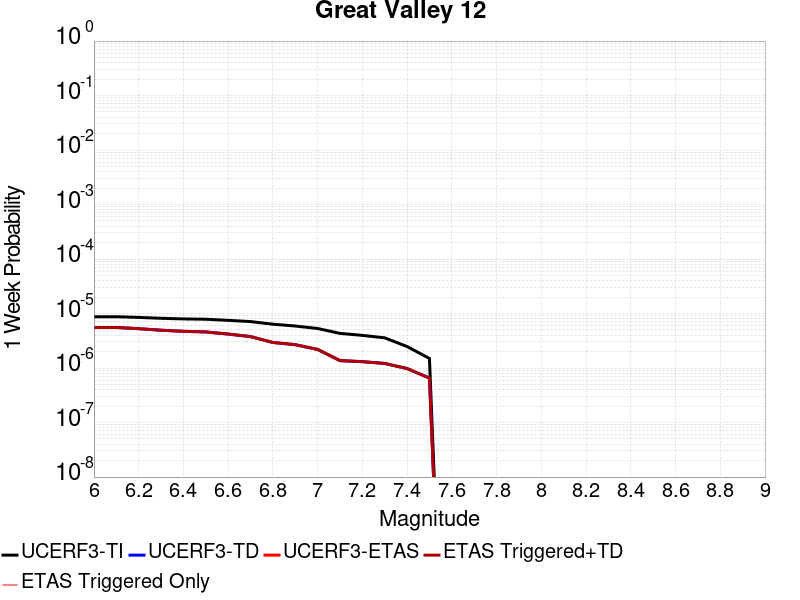 | 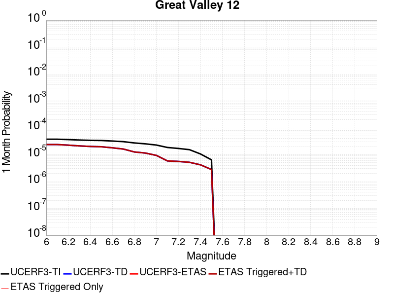 | 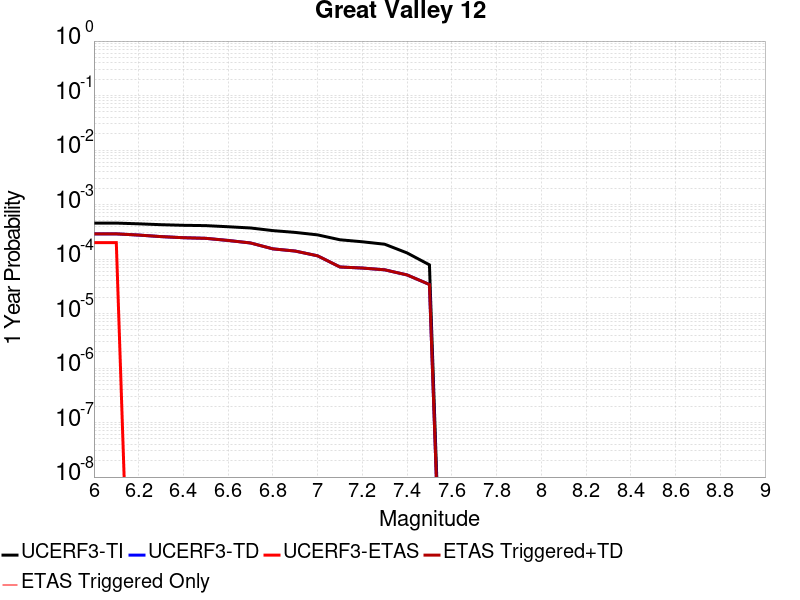 | 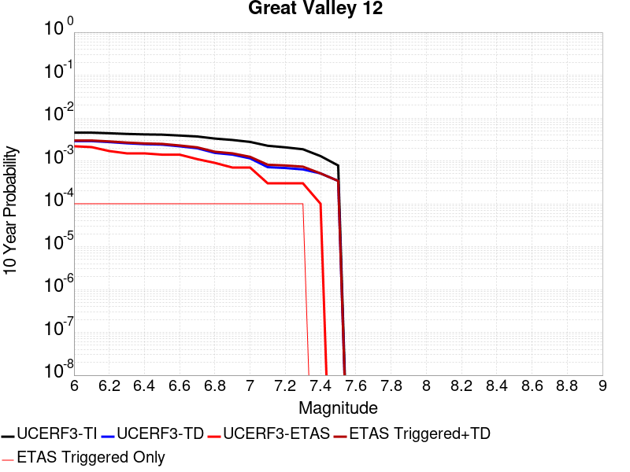 |

| Magnitude | 1 wk TI Prob | 1 wk TD Prob | 1 wk ETAS Prob | 1 wk ETAS/TD Gain | 1 wk ETAS Triggered+TD | 1 wk ETAS Triggered Only | 1 mo TI Prob | 1 mo TD Prob | 1 mo ETAS Prob | 1 mo ETAS/TD Gain | 1 mo ETAS Triggered+TD | 1 mo ETAS Triggered Only | 1 yr TI Prob | 1 yr TD Prob | 1 yr ETAS Prob | 1 yr ETAS/TD Gain | 1 yr ETAS Triggered+TD | 1 yr ETAS Triggered Only | 10 yr TI Prob | 10 yr TD Prob | 10 yr ETAS Prob | 10 yr ETAS/TD Gain | 10 yr ETAS Triggered+TD | 10 yr ETAS Triggered Only |
|-----|-----|-----|-----|-----|-----|-----|-----|-----|-----|-----|-----|-----|-----|-----|-----|-----|-----|-----|-----|-----|-----|-----|-----|-----|
| 6.0 | 8.757157E-6 | 5.556505E-6 | 0.0 | 0.0 | 5.556505E-6 | 0.0 | 3.7530135E-5 | 2.3813383E-5 | 0.0 | 0.0 | 2.3813383E-5 | 0.0 | 4.5683357E-4 | 2.8989057E-4 | 2.0E-4 | 0.6899155 | 2.8989057E-4 | 0.0 | 0.004558956 | 0.0028952453 | 0.0022 | 0.75986654 | 0.0029949558 | 1.0E-4 |
| 6.1 | 8.757157E-6 | 5.556505E-6 | 0.0 | 0.0 | 5.556505E-6 | 0.0 | 3.7530135E-5 | 2.3813383E-5 | 0.0 | 0.0 | 2.3813383E-5 | 0.0 | 4.5683357E-4 | 2.8989057E-4 | 2.0E-4 | 0.6899155 | 2.8989057E-4 | 0.0 | 0.004558956 | 0.0028952453 | 0.0021 | 0.72532713 | 0.0029949558 | 1.0E-4 |
| 6.2 | 8.499136E-6 | 5.282138E-6 | 0.0 | 0.0 | 5.282138E-6 | 0.0 | 3.642436E-5 | 2.2637543E-5 | 0.0 | 0.0 | 2.2637543E-5 | 0.0 | 4.4337637E-4 | 2.7557838E-4 | 0.0 | 0.0 | 2.7557838E-4 | 0.0 | 0.0044249278 | 0.002752481 | 0.0017 | 0.6176246 | 0.002852206 | 1.0E-4 |
| 6.3 | 8.186883E-6 | 4.95024E-6 | 0.0 | 0.0 | 4.95024E-6 | 0.0 | 3.508617E-5 | 2.1215148E-5 | 0.0 | 0.0 | 2.1215148E-5 | 0.0 | 4.270904E-4 | 2.5826483E-4 | 0.0 | 0.0 | 2.5826483E-4 | 0.0 | 0.004262705 | 0.0025797475 | 0.0015 | 0.58145225 | 0.0026794896 | 1.0E-4 |
| 6.4 | 7.979878E-6 | 4.722196E-6 | 0.0 | 0.0 | 4.722196E-6 | 0.0 | 3.419903E-5 | 2.023783E-5 | 0.0 | 0.0 | 2.023783E-5 | 0.0 | 4.1629362E-4 | 2.4636867E-4 | 0.0 | 0.0 | 2.4636867E-4 | 0.0 | 0.0041551464 | 0.0024610497 | 0.0015 | 0.60949606 | 0.0025608034 | 1.0E-4 |
| 6.5 | 7.871003E-6 | 4.6021455E-6 | 0.0 | 0.0 | 4.6021455E-6 | 0.0 | 3.373243E-5 | 1.9723337E-5 | 0.0 | 0.0 | 1.9723337E-5 | 0.0 | 4.1061494E-4 | 2.4010609E-4 | 0.0 | 0.0 | 2.4010609E-4 | 0.0 | 0.0040985704 | 0.0023985598 | 0.0014 | 0.58368355 | 0.00249832 | 1.0E-4 |
| 6.6 | 7.508221E-6 | 4.205454E-6 | 0.0 | 0.0 | 4.205454E-6 | 0.0 | 3.2177693E-5 | 1.8023255E-5 | 0.0 | 0.0 | 1.8023255E-5 | 0.0 | 3.91693E-4 | 2.1941189E-4 | 0.0 | 0.0 | 2.1941189E-4 | 0.0 | 0.003910033 | 0.002192039 | 0.0014 | 0.6386748 | 0.0022918198 | 1.0E-4 |
| 6.7 | 7.1297914E-6 | 3.783075E-6 | 0.0 | 0.0 | 3.783075E-6 | 0.0 | 3.055589E-5 | 1.6213082E-5 | 0.0 | 0.0 | 1.6213082E-5 | 0.0 | 3.7195446E-4 | 1.9737719E-4 | 0.0 | 0.0 | 1.9737719E-4 | 0.0 | 0.0037133251 | 0.0019720977 | 0.0011 | 0.5577817 | 0.0020719005 | 1.0E-4 |
| 6.8 | 6.376581E-6 | 2.9494656E-6 | 0.0 | 0.0 | 2.9494656E-6 | 0.0 | 2.7327918E-5 | 1.2640507E-5 | 0.0 | 0.0 | 1.2640507E-5 | 0.0 | 3.326666E-4 | 1.5388746E-4 | 0.0 | 0.0 | 1.5388746E-4 | 0.0 | 0.0033216903 | 0.0015378257 | 9.0E-4 | 0.5852419 | 0.0016376718 | 1.0E-4 |
| 6.9 | 5.9095E-6 | 2.687468E-6 | 0.0 | 0.0 | 2.687468E-6 | 0.0 | 2.5326184E-5 | 1.151767E-5 | 0.0 | 0.0 | 1.151767E-5 | 0.0 | 3.0830267E-4 | 1.4021876E-4 | 0.0 | 0.0 | 1.4021876E-4 | 0.0 | 0.003078753 | 0.0014013184 | 7.0E-4 | 0.4995296 | 0.0015011783 | 1.0E-4 |
| 7.0 | 5.3239864E-6 | 2.1974715E-6 | 0.0 | 0.0 | 2.1974715E-6 | 0.0 | 2.2816885E-5 | 9.417701E-6 | 0.0 | 0.0 | 9.417701E-6 | 0.0 | 2.7776015E-4 | 1.1465462E-4 | 0.0 | 0.0 | 1.1465462E-4 | 0.0 | 0.0027741324 | 0.0011459681 | 7.0E-4 | 0.6108372 | 0.0012458535 | 1.0E-4 |
| 7.1 | 4.329147E-6 | 1.3713086E-6 | 0.0 | 0.0 | 1.3713086E-6 | 0.0 | 1.8553355E-5 | 5.877024E-6 | 0.0 | 0.0 | 5.877024E-6 | 0.0 | 2.2586368E-4 | 7.155051E-5 | 0.0 | 0.0 | 7.155051E-5 | 0.0 | 0.0022563424 | 7.152834E-4 | 3.0E-4 | 0.4194142 | 8.1521185E-4 | 1.0E-4 |
| 7.2 | 3.978488E-6 | 1.3111069E-6 | 0.0 | 0.0 | 1.3111069E-6 | 0.0 | 1.7050552E-5 | 5.619018E-6 | 0.0 | 0.0 | 5.619018E-6 | 0.0 | 2.075707E-4 | 6.8409485E-5 | 0.0 | 0.0 | 6.8409485E-5 | 0.0 | 0.0020737692 | 6.8389287E-4 | 3.0E-4 | 0.4386652 | 7.838245E-4 | 1.0E-4 |
| 7.3 | 3.586542E-6 | 1.2161593E-6 | 0.0 | 0.0 | 1.2161593E-6 | 0.0 | 1.5370804E-5 | 5.2121013E-6 | 0.0 | 0.0 | 5.2121013E-6 | 0.0 | 1.8712347E-4 | 6.345557E-5 | 0.0 | 0.0 | 6.345557E-5 | 0.0 | 0.0018696598 | 6.3438306E-4 | 3.0E-4 | 0.47290042 | 7.343196E-4 | 1.0E-4 |
| 7.4 | 2.4837766E-6 | 9.803031E-7 | 0.0 | 0.0 | 9.803031E-7 | 0.0 | 1.0644713E-5 | 4.201292E-6 | 0.0 | 0.0 | 4.201292E-6 | 0.0 | 1.2959167E-4 | 5.11496E-5 | 0.0 | 0.0 | 5.11496E-5 | 0.0 | 0.0012951613 | 5.1138486E-4 | 1.0E-4 | 0.19554745 | 5.1138486E-4 | 0.0 |
| 7.5 | 1.5002679E-6 | 6.5476866E-7 | 0.0 | 0.0 | 6.5476866E-7 | 0.0 | 6.4297037E-6 | 2.8061486E-6 | 0.0 | 0.0 | 2.8061486E-6 | 0.0 | 7.827883E-5 | 3.4164368E-5 | 0.0 | 0.0 | 3.4164368E-5 | 0.0 | 7.825126E-4 | 3.415953E-4 | 0.0 | 0.0 | 3.415953E-4 | 0.0 |

## Santa Monica Bay
*[(top)](#table-of-contents)*

| 1 Week | 1 Month | 1 Year | 10 Year |
|-----|-----|-----|-----|
| 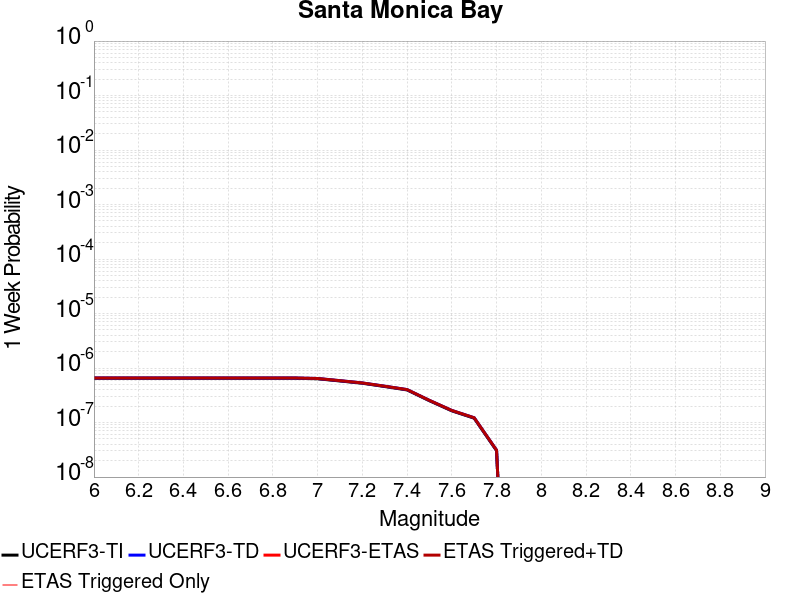 | 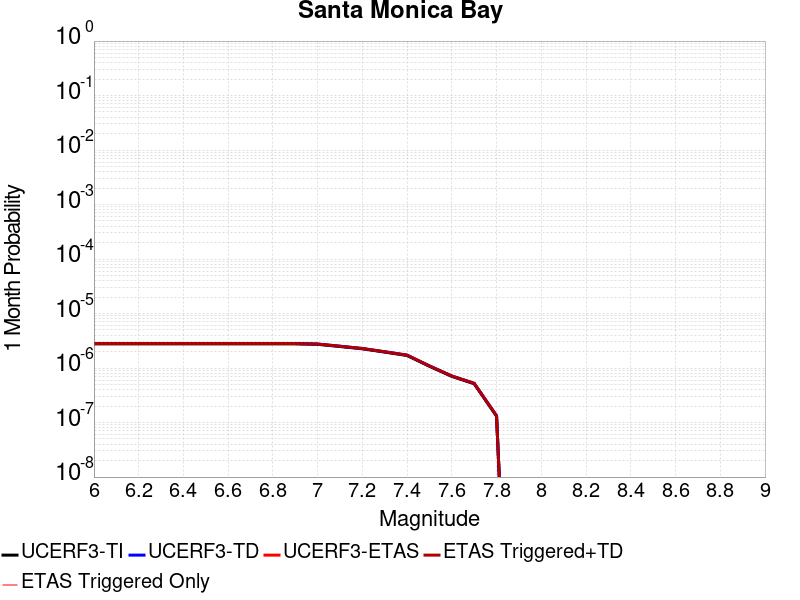 | 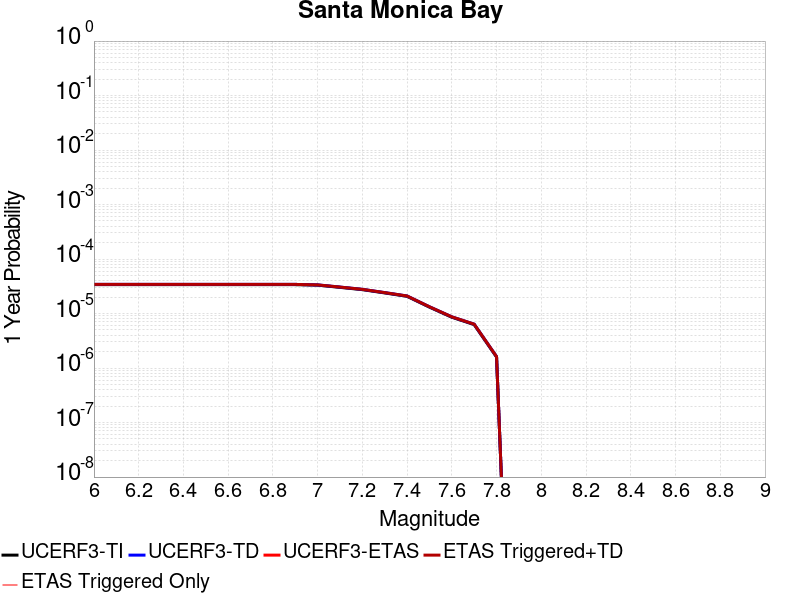 | 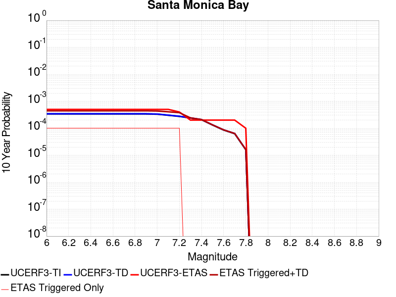 |

| Magnitude | 1 wk TI Prob | 1 wk TD Prob | 1 wk ETAS Prob | 1 wk ETAS/TD Gain | 1 wk ETAS Triggered+TD | 1 wk ETAS Triggered Only | 1 mo TI Prob | 1 mo TD Prob | 1 mo ETAS Prob | 1 mo ETAS/TD Gain | 1 mo ETAS Triggered+TD | 1 mo ETAS Triggered Only | 1 yr TI Prob | 1 yr TD Prob | 1 yr ETAS Prob | 1 yr ETAS/TD Gain | 1 yr ETAS Triggered+TD | 1 yr ETAS Triggered Only | 10 yr TI Prob | 10 yr TD Prob | 10 yr ETAS Prob | 10 yr ETAS/TD Gain | 10 yr ETAS Triggered+TD | 10 yr ETAS Triggered Only |
|-----|-----|-----|-----|-----|-----|-----|-----|-----|-----|-----|-----|-----|-----|-----|-----|-----|-----|-----|-----|-----|-----|-----|-----|-----|
| 6.0 | 6.493459E-7 | 6.571066E-7 | 0.0 | 0.0 | 6.571066E-7 | 0.0 | 2.782908E-6 | 2.8161685E-6 | 0.0 | 0.0 | 2.8161685E-6 | 0.0 | 3.388138E-5 | 3.4286328E-5 | 0.0 | 0.0 | 3.4286328E-5 | 0.0 | 3.3876215E-4 | 3.4281219E-4 | 5.0E-4 | 1.4585246 | 4.427779E-4 | 1.0E-4 |
| 6.1 | 6.493459E-7 | 6.571066E-7 | 0.0 | 0.0 | 6.571066E-7 | 0.0 | 2.782908E-6 | 2.8161685E-6 | 0.0 | 0.0 | 2.8161685E-6 | 0.0 | 3.388138E-5 | 3.4286328E-5 | 0.0 | 0.0 | 3.4286328E-5 | 0.0 | 3.3876215E-4 | 3.4281219E-4 | 5.0E-4 | 1.4585246 | 4.427779E-4 | 1.0E-4 |
| 6.2 | 6.493459E-7 | 6.571066E-7 | 0.0 | 0.0 | 6.571066E-7 | 0.0 | 2.782908E-6 | 2.8161685E-6 | 0.0 | 0.0 | 2.8161685E-6 | 0.0 | 3.388138E-5 | 3.4286328E-5 | 0.0 | 0.0 | 3.4286328E-5 | 0.0 | 3.3876215E-4 | 3.4281219E-4 | 5.0E-4 | 1.4585246 | 4.427779E-4 | 1.0E-4 |
| 6.3 | 6.493459E-7 | 6.571066E-7 | 0.0 | 0.0 | 6.571066E-7 | 0.0 | 2.782908E-6 | 2.8161685E-6 | 0.0 | 0.0 | 2.8161685E-6 | 0.0 | 3.388138E-5 | 3.4286328E-5 | 0.0 | 0.0 | 3.4286328E-5 | 0.0 | 3.3876215E-4 | 3.4281219E-4 | 5.0E-4 | 1.4585246 | 4.427779E-4 | 1.0E-4 |
| 6.4 | 6.493459E-7 | 6.571066E-7 | 0.0 | 0.0 | 6.571066E-7 | 0.0 | 2.782908E-6 | 2.8161685E-6 | 0.0 | 0.0 | 2.8161685E-6 | 0.0 | 3.388138E-5 | 3.4286328E-5 | 0.0 | 0.0 | 3.4286328E-5 | 0.0 | 3.3876215E-4 | 3.4281219E-4 | 5.0E-4 | 1.4585246 | 4.427779E-4 | 1.0E-4 |
| 6.5 | 6.493459E-7 | 6.571066E-7 | 0.0 | 0.0 | 6.571066E-7 | 0.0 | 2.782908E-6 | 2.8161685E-6 | 0.0 | 0.0 | 2.8161685E-6 | 0.0 | 3.388138E-5 | 3.4286328E-5 | 0.0 | 0.0 | 3.4286328E-5 | 0.0 | 3.3876215E-4 | 3.4281219E-4 | 5.0E-4 | 1.4585246 | 4.427779E-4 | 1.0E-4 |
| 6.6 | 6.493459E-7 | 6.571066E-7 | 0.0 | 0.0 | 6.571066E-7 | 0.0 | 2.782908E-6 | 2.8161685E-6 | 0.0 | 0.0 | 2.8161685E-6 | 0.0 | 3.388138E-5 | 3.4286328E-5 | 0.0 | 0.0 | 3.4286328E-5 | 0.0 | 3.3876215E-4 | 3.4281219E-4 | 5.0E-4 | 1.4585246 | 4.427779E-4 | 1.0E-4 |
| 6.7 | 6.493459E-7 | 6.571066E-7 | 0.0 | 0.0 | 6.571066E-7 | 0.0 | 2.782908E-6 | 2.8161685E-6 | 0.0 | 0.0 | 2.8161685E-6 | 0.0 | 3.388138E-5 | 3.4286328E-5 | 0.0 | 0.0 | 3.4286328E-5 | 0.0 | 3.3876215E-4 | 3.4281219E-4 | 5.0E-4 | 1.4585246 | 4.427779E-4 | 1.0E-4 |
| 6.8 | 6.493459E-7 | 6.571066E-7 | 0.0 | 0.0 | 6.571066E-7 | 0.0 | 2.782908E-6 | 2.8161685E-6 | 0.0 | 0.0 | 2.8161685E-6 | 0.0 | 3.388138E-5 | 3.4286328E-5 | 0.0 | 0.0 | 3.4286328E-5 | 0.0 | 3.3876215E-4 | 3.4281219E-4 | 5.0E-4 | 1.4585246 | 4.427779E-4 | 1.0E-4 |
| 6.9 | 6.493459E-7 | 6.571066E-7 | 0.0 | 0.0 | 6.571066E-7 | 0.0 | 2.782908E-6 | 2.8161685E-6 | 0.0 | 0.0 | 2.8161685E-6 | 0.0 | 3.388138E-5 | 3.4286328E-5 | 0.0 | 0.0 | 3.4286328E-5 | 0.0 | 3.3876215E-4 | 3.4281219E-4 | 5.0E-4 | 1.4585246 | 4.427779E-4 | 1.0E-4 |
| 7.0 | 6.3621707E-7 | 6.439131E-7 | 0.0 | 0.0 | 6.439131E-7 | 0.0 | 2.726642E-6 | 2.7596247E-6 | 0.0 | 0.0 | 2.7596247E-6 | 0.0 | 3.319636E-5 | 3.359793E-5 | 0.0 | 0.0 | 3.359793E-5 | 0.0 | 3.31914E-4 | 3.359303E-4 | 5.0E-4 | 1.488404 | 4.3589668E-4 | 1.0E-4 |
| 7.1 | 5.796316E-7 | 5.869651E-7 | 0.0 | 0.0 | 5.869651E-7 | 0.0 | 2.4841331E-6 | 2.5155623E-6 | 0.0 | 0.0 | 2.5155623E-6 | 0.0 | 3.0243902E-5 | 3.0626557E-5 | 0.0 | 0.0 | 3.0626557E-5 | 0.0 | 3.0239785E-4 | 3.0622495E-4 | 5.0E-4 | 1.6327868 | 4.061943E-4 | 1.0E-4 |
| 7.2 | 5.2654514E-7 | 5.33487E-7 | 0.0 | 0.0 | 5.33487E-7 | 0.0 | 2.25662E-6 | 2.286371E-6 | 0.0 | 0.0 | 2.286371E-6 | 0.0 | 2.7474003E-5 | 2.7836226E-5 | 0.0 | 0.0 | 2.7836226E-5 | 0.0 | 2.7470608E-4 | 2.7832878E-4 | 4.0E-4 | 1.4371492 | 3.7830096E-4 | 1.0E-4 |
| 7.3 | 4.582996E-7 | 4.6464518E-7 | 0.0 | 0.0 | 4.6464518E-7 | 0.0 | 1.9641398E-6 | 1.991335E-6 | 0.0 | 0.0 | 1.991335E-6 | 0.0 | 2.3913139E-5 | 2.4244247E-5 | 0.0 | 0.0 | 2.4244247E-5 | 0.0 | 2.3910566E-4 | 2.4241727E-4 | 2.0E-4 | 0.8250238 | 2.4241727E-4 | 0.0 |
| 7.4 | 3.9690556E-7 | 4.026237E-7 | 0.0 | 0.0 | 4.026237E-7 | 0.0 | 1.7010227E-6 | 1.725529E-6 | 0.0 | 0.0 | 1.725529E-6 | 0.0 | 2.0709755E-5 | 2.1008125E-5 | 0.0 | 0.0 | 2.1008125E-5 | 0.0 | 2.0707825E-4 | 2.1006254E-4 | 2.0E-4 | 0.9520974 | 2.1006254E-4 | 0.0 |
| 7.5 | 2.514765E-7 | 2.554168E-7 | 0.0 | 0.0 | 2.554168E-7 | 0.0 | 1.077756E-6 | 1.0946429E-6 | 0.0 | 0.0 | 1.0946429E-6 | 0.0 | 1.31216E-5 | 1.3327202E-5 | 0.0 | 0.0 | 1.3327202E-5 | 0.0 | 1.3120825E-4 | 1.332646E-4 | 2.0E-4 | 1.5007735 | 1.332646E-4 | 0.0 |
| 7.6 | 1.6412821E-7 | 1.6690714E-7 | 0.0 | 0.0 | 1.6690714E-7 | 0.0 | 7.0340644E-7 | 7.153161E-7 | 0.0 | 0.0 | 7.153161E-7 | 0.0 | 8.563939E-6 | 8.708939E-6 | 0.0 | 0.0 | 8.708939E-6 | 0.0 | 8.56361E-5 | 8.708603E-5 | 2.0E-4 | 2.2965796 | 8.708603E-5 | 0.0 |
| 7.7 | 1.2030355E-7 | 1.2243736E-7 | 0.0 | 0.0 | 1.2243736E-7 | 0.0 | 5.155865E-7 | 5.2473143E-7 | 0.0 | 0.0 | 5.2473143E-7 | 0.0 | 6.277248E-6 | 6.388587E-6 | 0.0 | 0.0 | 6.388587E-6 | 0.0 | 6.2770705E-5 | 6.388407E-5 | 2.0E-4 | 3.1306708 | 6.388407E-5 | 0.0 |
| 7.8 | 3.0539674E-8 | 3.112509E-8 | 0.0 | 0.0 | 3.112509E-8 | 0.0 | 1.308843E-7 | 1.3339324E-7 | 0.0 | 0.0 | 1.3339324E-7 | 0.0 | 1.5935152E-6 | 1.6240617E-6 | 0.0 | 0.0 | 1.6240617E-6 | 0.0 | 1.5935038E-5 | 1.624052E-5 | 1.0E-4 | 6.1574388 | 1.624052E-5 | 0.0 |

## Hilton Creek 2011 CFM
*[(top)](#table-of-contents)*

| 1 Week | 1 Month | 1 Year | 10 Year |
|-----|-----|-----|-----|
| 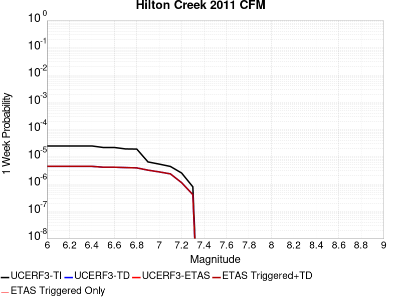 | 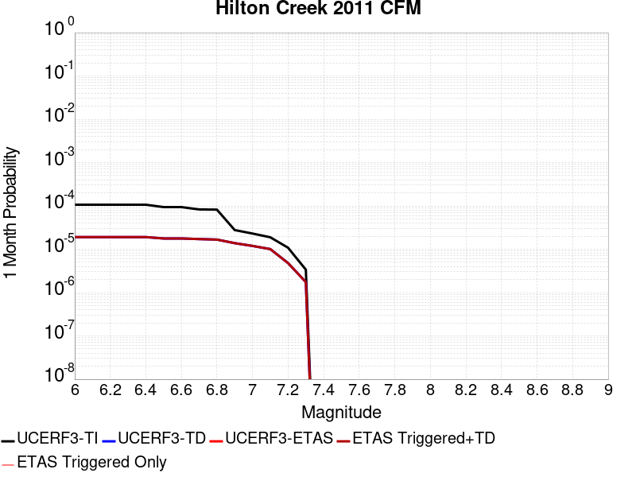 | 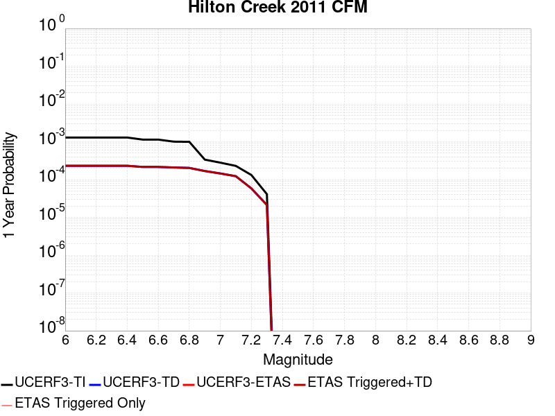 | 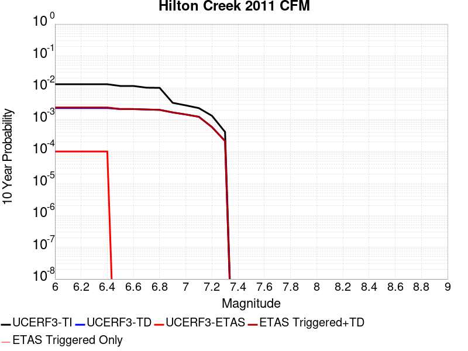 |

| Magnitude | 1 wk TI Prob | 1 wk TD Prob | 1 wk ETAS Prob | 1 wk ETAS/TD Gain | 1 wk ETAS Triggered+TD | 1 wk ETAS Triggered Only | 1 mo TI Prob | 1 mo TD Prob | 1 mo ETAS Prob | 1 mo ETAS/TD Gain | 1 mo ETAS Triggered+TD | 1 mo ETAS Triggered Only | 1 yr TI Prob | 1 yr TD Prob | 1 yr ETAS Prob | 1 yr ETAS/TD Gain | 1 yr ETAS Triggered+TD | 1 yr ETAS Triggered Only | 10 yr TI Prob | 10 yr TD Prob | 10 yr ETAS Prob | 10 yr ETAS/TD Gain | 10 yr ETAS Triggered+TD | 10 yr ETAS Triggered Only |
|-----|-----|-----|-----|-----|-----|-----|-----|-----|-----|-----|-----|-----|-----|-----|-----|-----|-----|-----|-----|-----|-----|-----|-----|-----|
| 6.0 | 2.4923684E-5 | 4.4597896E-6 | 0.0 | 0.0 | 4.4597896E-6 | 0.0 | 1.06811414E-4 | 1.9113253E-5 | 0.0 | 0.0 | 1.9113253E-5 | 0.0 | 0.0012996531 | 2.3268064E-4 | 1.0E-4 | 0.42977363 | 2.3268064E-4 | 0.0 | 0.012920785 | 0.0023274636 | 0.001 | 0.42965227 | 0.0024272308 | 1.0E-4 |
| 6.1 | 2.4923684E-5 | 4.4597896E-6 | 0.0 | 0.0 | 4.4597896E-6 | 0.0 | 1.06811414E-4 | 1.9113253E-5 | 0.0 | 0.0 | 1.9113253E-5 | 0.0 | 0.0012996531 | 2.3268064E-4 | 1.0E-4 | 0.42977363 | 2.3268064E-4 | 0.0 | 0.012920785 | 0.0023274636 | 0.001 | 0.42965227 | 0.0024272308 | 1.0E-4 |
| 6.2 | 2.4923684E-5 | 4.4597896E-6 | 0.0 | 0.0 | 4.4597896E-6 | 0.0 | 1.06811414E-4 | 1.9113253E-5 | 0.0 | 0.0 | 1.9113253E-5 | 0.0 | 0.0012996531 | 2.3268064E-4 | 1.0E-4 | 0.42977363 | 2.3268064E-4 | 0.0 | 0.012920785 | 0.0023274636 | 0.001 | 0.42965227 | 0.0024272308 | 1.0E-4 |
| 6.3 | 2.4923684E-5 | 4.4597896E-6 | 0.0 | 0.0 | 4.4597896E-6 | 0.0 | 1.06811414E-4 | 1.9113253E-5 | 0.0 | 0.0 | 1.9113253E-5 | 0.0 | 0.0012996531 | 2.3268064E-4 | 1.0E-4 | 0.42977363 | 2.3268064E-4 | 0.0 | 0.012920785 | 0.0023274636 | 0.001 | 0.42965227 | 0.0024272308 | 1.0E-4 |
| 6.4 | 2.4923684E-5 | 4.4597896E-6 | 0.0 | 0.0 | 4.4597896E-6 | 0.0 | 1.06811414E-4 | 1.9113253E-5 | 0.0 | 0.0 | 1.9113253E-5 | 0.0 | 0.0012996531 | 2.3268064E-4 | 1.0E-4 | 0.42977363 | 2.3268064E-4 | 0.0 | 0.012920785 | 0.0023274636 | 0.001 | 0.42965227 | 0.0024272308 | 1.0E-4 |
| 6.5 | 2.1963904E-5 | 4.1472344E-6 | 0.0 | 0.0 | 4.1472344E-6 | 0.0 | 9.412762E-5 | 1.777375E-5 | 0.0 | 0.0 | 1.777375E-5 | 0.0 | 0.0011454013 | 2.1637541E-4 | 1.0E-4 | 0.46215972 | 2.1637541E-4 | 0.0 | 0.011395155 | 0.0021665834 | 8.0E-4 | 0.36924496 | 0.0021665834 | 0.0 |
| 6.6 | 2.1963904E-5 | 4.1472344E-6 | 0.0 | 0.0 | 4.1472344E-6 | 0.0 | 9.412762E-5 | 1.777375E-5 | 0.0 | 0.0 | 1.777375E-5 | 0.0 | 0.0011454013 | 2.1637541E-4 | 1.0E-4 | 0.46215972 | 2.1637541E-4 | 0.0 | 0.011395155 | 0.0021665834 | 8.0E-4 | 0.36924496 | 0.0021665834 | 0.0 |
| 6.7 | 1.9397496E-5 | 4.0171517E-6 | 0.0 | 0.0 | 4.0171517E-6 | 0.0 | 8.3129475E-5 | 1.7216258E-5 | 0.0 | 0.0 | 1.7216258E-5 | 0.0 | 0.0010116313 | 2.0958927E-4 | 1.0E-4 | 0.47712365 | 2.0958927E-4 | 0.0 | 0.0100703845 | 0.0020984416 | 8.0E-4 | 0.3812353 | 0.0020984416 | 0.0 |
| 6.8 | 1.917303E-5 | 3.9100364E-6 | 0.0 | 0.0 | 3.9100364E-6 | 0.0 | 8.216754E-5 | 1.6757198E-5 | 0.0 | 0.0 | 1.6757198E-5 | 0.0 | 9.999307E-4 | 2.0400128E-4 | 1.0E-4 | 0.49019304 | 2.0400128E-4 | 0.0 | 0.009954433 | 0.002042665 | 8.0E-4 | 0.39164522 | 0.002042665 | 0.0 |
| 6.9 | 6.480681E-6 | 3.2336661E-6 | 0.0 | 0.0 | 3.2336661E-6 | 0.0 | 2.7774051E-5 | 1.3858502E-5 | 0.0 | 0.0 | 1.3858502E-5 | 0.0 | 3.380966E-4 | 1.6871533E-4 | 1.0E-4 | 0.59271437 | 1.6871533E-4 | 0.0 | 0.0033758266 | 0.0016859836 | 5.0E-4 | 0.2965628 | 0.0016859836 | 0.0 |
| 7.0 | 5.388316E-6 | 2.790068E-6 | 0.0 | 0.0 | 2.790068E-6 | 0.0 | 2.3092578E-5 | 1.1957385E-5 | 0.0 | 0.0 | 1.1957385E-5 | 0.0 | 2.8111585E-4 | 1.4557249E-4 | 0.0 | 0.0 | 1.4557249E-4 | 0.0 | 0.002807605 | 0.0014548741 | 3.0E-4 | 0.20620342 | 0.0014548741 | 0.0 |
| 7.1 | 4.41728E-6 | 2.3589566E-6 | 0.0 | 0.0 | 2.3589566E-6 | 0.0 | 1.8931061E-5 | 1.010978E-5 | 0.0 | 0.0 | 1.010978E-5 | 0.0 | 2.304613E-4 | 1.2308061E-4 | 0.0 | 0.0 | 1.2308061E-4 | 0.0 | 0.0023022245 | 0.001230221 | 3.0E-4 | 0.24385862 | 0.001230221 | 0.0 |
| 7.2 | 2.535495E-6 | 1.1219585E-6 | 0.0 | 0.0 | 1.1219585E-6 | 0.0 | 1.0866362E-5 | 4.808387E-6 | 0.0 | 0.0 | 4.808387E-6 | 0.0 | 1.3228992E-4 | 5.8541063E-5 | 0.0 | 0.0 | 5.8541063E-5 | 0.0 | 0.0013221119 | 5.853077E-4 | 2.0E-4 | 0.3417006 | 5.853077E-4 | 0.0 |
| 7.3 | 7.900015E-7 | 4.0906667E-7 | 0.0 | 0.0 | 4.0906667E-7 | 0.0 | 3.3857161E-6 | 1.7531429E-6 | 0.0 | 0.0 | 1.7531429E-6 | 0.0 | 4.1220315E-5 | 2.1344515E-5 | 0.0 | 0.0 | 2.1344515E-5 | 0.0 | 4.121267E-4 | 2.1344515E-4 | 2.0E-4 | 0.93700886 | 2.1344515E-4 | 0.0 |

## Big Pine (West)
*[(top)](#table-of-contents)*

| 1 Week | 1 Month | 1 Year | 10 Year |
|-----|-----|-----|-----|
| 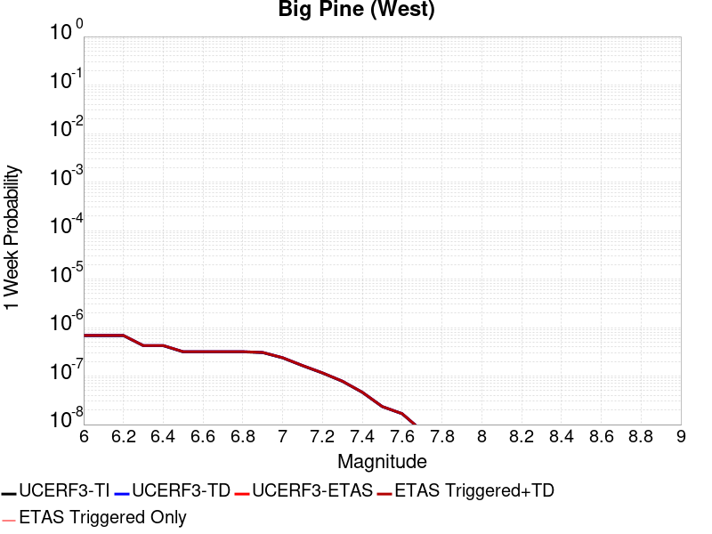 | 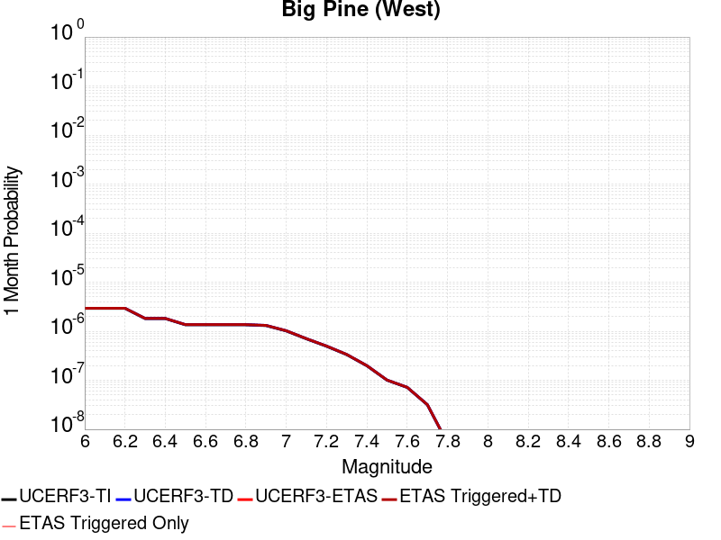 | 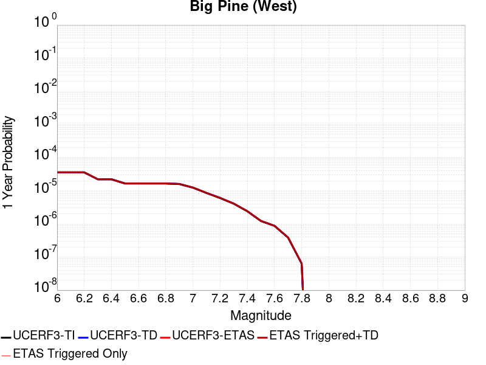 | 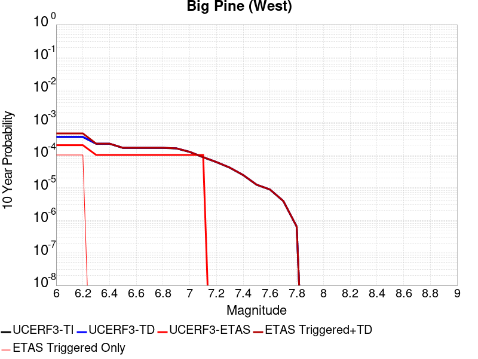 |

| Magnitude | 1 wk TI Prob | 1 wk TD Prob | 1 wk ETAS Prob | 1 wk ETAS/TD Gain | 1 wk ETAS Triggered+TD | 1 wk ETAS Triggered Only | 1 mo TI Prob | 1 mo TD Prob | 1 mo ETAS Prob | 1 mo ETAS/TD Gain | 1 mo ETAS Triggered+TD | 1 mo ETAS Triggered Only | 1 yr TI Prob | 1 yr TD Prob | 1 yr ETAS Prob | 1 yr ETAS/TD Gain | 1 yr ETAS Triggered+TD | 1 yr ETAS Triggered Only | 10 yr TI Prob | 10 yr TD Prob | 10 yr ETAS Prob | 10 yr ETAS/TD Gain | 10 yr ETAS Triggered+TD | 10 yr ETAS Triggered Only |
|-----|-----|-----|-----|-----|-----|-----|-----|-----|-----|-----|-----|-----|-----|-----|-----|-----|-----|-----|-----|-----|-----|-----|-----|-----|
| 6.0 | 6.8306974E-7 | 6.8819367E-7 | 0.0 | 0.0 | 6.8819367E-7 | 0.0 | 2.9274386E-6 | 2.9493985E-6 | 0.0 | 0.0 | 2.9493985E-6 | 0.0 | 3.564098E-5 | 3.590843E-5 | 0.0 | 0.0 | 3.590843E-5 | 0.0 | 3.5635266E-4 | 3.5903568E-4 | 2.0E-4 | 0.5570477 | 4.5899977E-4 | 1.0E-4 |
| 6.1 | 6.8306974E-7 | 6.8819367E-7 | 0.0 | 0.0 | 6.8819367E-7 | 0.0 | 2.9274386E-6 | 2.9493985E-6 | 0.0 | 0.0 | 2.9493985E-6 | 0.0 | 3.564098E-5 | 3.590843E-5 | 0.0 | 0.0 | 3.590843E-5 | 0.0 | 3.5635266E-4 | 3.5903568E-4 | 2.0E-4 | 0.5570477 | 4.5899977E-4 | 1.0E-4 |
| 6.2 | 6.8306974E-7 | 6.8819367E-7 | 0.0 | 0.0 | 6.8819367E-7 | 0.0 | 2.9274386E-6 | 2.9493985E-6 | 0.0 | 0.0 | 2.9493985E-6 | 0.0 | 3.564098E-5 | 3.590843E-5 | 0.0 | 0.0 | 3.590843E-5 | 0.0 | 3.5635266E-4 | 3.5903568E-4 | 2.0E-4 | 0.5570477 | 4.5899977E-4 | 1.0E-4 |
| 6.3 | 4.227652E-7 | 4.2666414E-7 | 0.0 | 0.0 | 4.2666414E-7 | 0.0 | 1.8118495E-6 | 1.8285594E-6 | 0.0 | 0.0 | 1.8285594E-6 | 0.0 | 2.2059045E-5 | 2.2262502E-5 | 0.0 | 0.0 | 2.2262502E-5 | 0.0 | 2.2056856E-4 | 2.2260455E-4 | 1.0E-4 | 0.44922712 | 2.2260455E-4 | 0.0 |
| 6.4 | 4.227652E-7 | 4.2666414E-7 | 0.0 | 0.0 | 4.2666414E-7 | 0.0 | 1.8118495E-6 | 1.8285594E-6 | 0.0 | 0.0 | 1.8285594E-6 | 0.0 | 2.2059045E-5 | 2.2262502E-5 | 0.0 | 0.0 | 2.2262502E-5 | 0.0 | 2.2056856E-4 | 2.2260455E-4 | 1.0E-4 | 0.44922712 | 2.2260455E-4 | 0.0 |
| 6.5 | 3.1538403E-7 | 3.1885247E-7 | 0.0 | 0.0 | 3.1885247E-7 | 0.0 | 1.3516451E-6 | 1.36651E-6 | 0.0 | 0.0 | 1.36651E-6 | 0.0 | 1.6456155E-5 | 1.6637136E-5 | 0.0 | 0.0 | 1.6637136E-5 | 0.0 | 1.6454936E-4 | 1.663593E-4 | 1.0E-4 | 0.60110855 | 1.663593E-4 | 0.0 |
| 6.6 | 3.1538403E-7 | 3.1885247E-7 | 0.0 | 0.0 | 3.1885247E-7 | 0.0 | 1.3516451E-6 | 1.36651E-6 | 0.0 | 0.0 | 1.36651E-6 | 0.0 | 1.6456155E-5 | 1.6637136E-5 | 0.0 | 0.0 | 1.6637136E-5 | 0.0 | 1.6454936E-4 | 1.663593E-4 | 1.0E-4 | 0.60110855 | 1.663593E-4 | 0.0 |
| 6.7 | 3.1538403E-7 | 3.1885247E-7 | 0.0 | 0.0 | 3.1885247E-7 | 0.0 | 1.3516451E-6 | 1.36651E-6 | 0.0 | 0.0 | 1.36651E-6 | 0.0 | 1.6456155E-5 | 1.6637136E-5 | 0.0 | 0.0 | 1.6637136E-5 | 0.0 | 1.6454936E-4 | 1.663593E-4 | 1.0E-4 | 0.60110855 | 1.663593E-4 | 0.0 |
| 6.8 | 3.1538403E-7 | 3.1885247E-7 | 0.0 | 0.0 | 3.1885247E-7 | 0.0 | 1.3516451E-6 | 1.36651E-6 | 0.0 | 0.0 | 1.36651E-6 | 0.0 | 1.6456155E-5 | 1.6637136E-5 | 0.0 | 0.0 | 1.6637136E-5 | 0.0 | 1.6454936E-4 | 1.663593E-4 | 1.0E-4 | 0.60110855 | 1.663593E-4 | 0.0 |
| 6.9 | 3.0402092E-7 | 3.07405E-7 | 0.0 | 0.0 | 3.07405E-7 | 0.0 | 1.3029462E-6 | 1.3174493E-6 | 0.0 | 0.0 | 1.3174493E-6 | 0.0 | 1.5863254E-5 | 1.6039832E-5 | 0.0 | 0.0 | 1.6039832E-5 | 0.0 | 1.5862122E-4 | 1.6038714E-4 | 1.0E-4 | 0.6234914 | 1.6038714E-4 | 0.0 |
| 7.0 | 2.3673063E-7 | 2.394488E-7 | 0.0 | 0.0 | 2.394488E-7 | 0.0 | 1.0145594E-6 | 1.0262088E-6 | 0.0 | 0.0 | 1.0262088E-6 | 0.0 | 1.235219E-5 | 1.24940225E-5 | 0.0 | 0.0 | 1.24940225E-5 | 0.0 | 1.2351504E-4 | 1.2493347E-4 | 1.0E-4 | 0.80042595 | 1.2493347E-4 | 0.0 |
| 7.1 | 1.632138E-7 | 1.6514915E-7 | 0.0 | 0.0 | 1.6514915E-7 | 0.0 | 6.9948754E-7 | 7.0778185E-7 | 0.0 | 0.0 | 7.0778185E-7 | 0.0 | 8.516227E-6 | 8.617212E-6 | 0.0 | 0.0 | 8.617212E-6 | 0.0 | 8.5159016E-5 | 8.616895E-5 | 1.0E-4 | 1.1605109 | 8.616895E-5 | 0.0 |
| 7.2 | 1.1523723E-7 | 1.1657443E-7 | 0.0 | 0.0 | 1.1657443E-7 | 0.0 | 4.9387376E-7 | 4.996046E-7 | 0.0 | 0.0 | 4.996046E-7 | 0.0 | 6.0128964E-6 | 6.08267E-6 | 0.0 | 0.0 | 6.08267E-6 | 0.0 | 6.0127335E-5 | 6.0825147E-5 | 0.0 | 0.0 | 6.0825147E-5 | 0.0 |
| 7.3 | 7.777805E-8 | 7.862622E-8 | 0.0 | 0.0 | 7.862622E-8 | 0.0 | 3.3333444E-7 | 3.369695E-7 | 0.0 | 0.0 | 3.369695E-7 | 0.0 | 4.0583395E-6 | 4.1025964E-6 | 0.0 | 0.0 | 4.1025964E-6 | 0.0 | 4.0582654E-5 | 4.102526E-5 | 0.0 | 0.0 | 4.102526E-5 | 0.0 |
| 7.4 | 4.609946E-8 | 4.6523013E-8 | 0.0 | 0.0 | 4.6523013E-8 | 0.0 | 1.975691E-7 | 1.9938433E-7 | 0.0 | 0.0 | 1.9938433E-7 | 0.0 | 2.4054011E-6 | 2.4275016E-6 | 0.0 | 0.0 | 2.4275016E-6 | 0.0 | 2.405375E-5 | 2.4274768E-5 | 0.0 | 0.0 | 2.4274768E-5 | 0.0 |
| 7.5 | 2.3439137E-8 | 2.3608635E-8 | 0.0 | 0.0 | 2.3608635E-8 | 0.0 | 1.00453434E-7 | 1.0117986E-7 | 0.0 | 0.0 | 1.0117986E-7 | 0.0 | 1.2230199E-6 | 1.2318641E-6 | 0.0 | 0.0 | 1.2318641E-6 | 0.0 | 1.2230132E-5 | 1.23185755E-5 | 0.0 | 0.0 | 1.23185755E-5 | 0.0 |
| 7.6 | 1.6699769E-8 | 1.6817316E-8 | 0.0 | 0.0 | 1.6817316E-8 | 0.0 | 7.157044E-8 | 7.207421E-8 | 0.0 | 0.0 | 7.207421E-8 | 0.0 | 8.713697E-7 | 8.775031E-7 | 0.0 | 0.0 | 8.775031E-7 | 0.0 | 8.713663E-6 | 8.774999E-6 | 0.0 | 0.0 | 8.774999E-6 | 0.0 |
| 7.7 | 7.4061512E-9 | 7.454263E-9 | 0.0 | 0.0 | 7.454263E-9 | 0.0 | 3.1740647E-8 | 3.1946843E-8 | 0.0 | 0.0 | 3.1946843E-8 | 0.0 | 3.864423E-7 | 3.8895274E-7 | 0.0 | 0.0 | 3.8895274E-7 | 0.0 | 3.8644166E-6 | 3.8895214E-6 | 0.0 | 0.0 | 3.8895214E-6 | 0.0 |
| 7.8 | 1.2189427E-9 | 1.2270932E-9 | 0.0 | 0.0 | 1.2270932E-9 | 0.0 | 5.2240403E-9 | 5.2589706E-9 | 0.0 | 0.0 | 5.2589706E-9 | 0.0 | 6.3602684E-8 | 6.4027965E-8 | 0.0 | 0.0 | 6.4027965E-8 | 0.0 | 6.360267E-7 | 6.4027955E-7 | 0.0 | 0.0 | 6.4027955E-7 | 0.0 |

## Walker Spring 2011 CFM
*[(top)](#table-of-contents)*

| 1 Week | 1 Month | 1 Year | 10 Year |
|-----|-----|-----|-----|
| 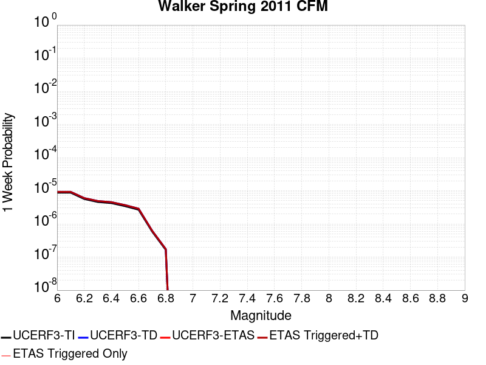 | 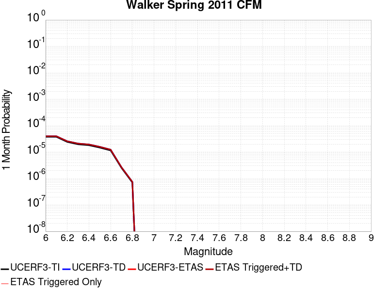 | 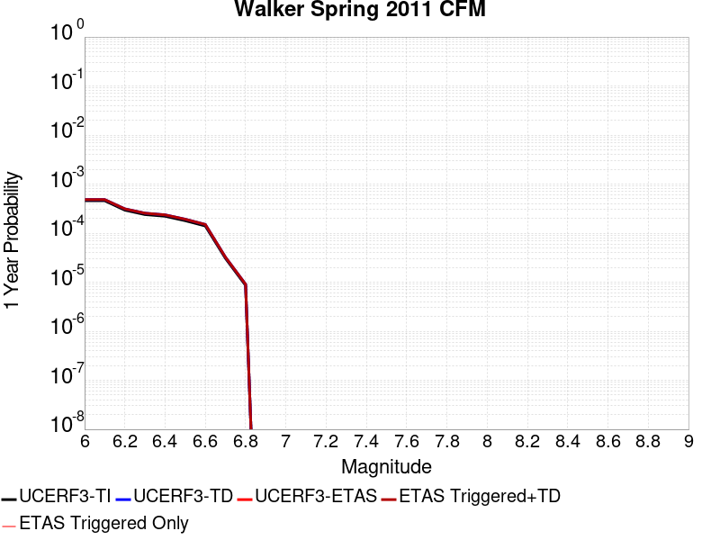 | 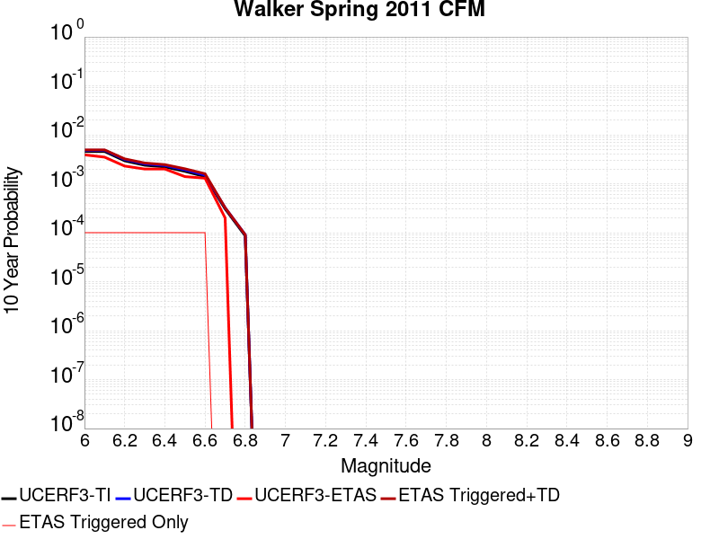 |

| Magnitude | 1 wk TI Prob | 1 wk TD Prob | 1 wk ETAS Prob | 1 wk ETAS/TD Gain | 1 wk ETAS Triggered+TD | 1 wk ETAS Triggered Only | 1 mo TI Prob | 1 mo TD Prob | 1 mo ETAS Prob | 1 mo ETAS/TD Gain | 1 mo ETAS Triggered+TD | 1 mo ETAS Triggered Only | 1 yr TI Prob | 1 yr TD Prob | 1 yr ETAS Prob | 1 yr ETAS/TD Gain | 1 yr ETAS Triggered+TD | 1 yr ETAS Triggered Only | 10 yr TI Prob | 10 yr TD Prob | 10 yr ETAS Prob | 10 yr ETAS/TD Gain | 10 yr ETAS Triggered+TD | 10 yr ETAS Triggered Only |
|-----|-----|-----|-----|-----|-----|-----|-----|-----|-----|-----|-----|-----|-----|-----|-----|-----|-----|-----|-----|-----|-----|-----|-----|-----|
| 6.0 | 8.791276E-6 | 9.265121E-6 | 0.0 | 0.0 | 9.265121E-6 | 0.0 | 3.767635E-5 | 3.9707116E-5 | 0.0 | 0.0 | 3.9707116E-5 | 0.0 | 4.58613E-4 | 4.8333776E-4 | 2.0E-4 | 0.41378933 | 4.8333776E-4 | 0.0 | 0.004576677 | 0.004823939 | 0.0039 | 0.8084679 | 0.004923457 | 1.0E-4 |
| 6.1 | 8.791276E-6 | 9.265121E-6 | 0.0 | 0.0 | 9.265121E-6 | 0.0 | 3.767635E-5 | 3.9707116E-5 | 0.0 | 0.0 | 3.9707116E-5 | 0.0 | 4.58613E-4 | 4.8333776E-4 | 1.0E-4 | 0.20689467 | 4.8333776E-4 | 0.0 | 0.004576677 | 0.004823939 | 0.0035 | 0.72554815 | 0.004923457 | 1.0E-4 |
| 6.2 | 5.654515E-6 | 5.9995164E-6 | 0.0 | 0.0 | 5.9995164E-6 | 0.0 | 2.4233412E-5 | 2.5711988E-5 | 0.0 | 0.0 | 2.5711988E-5 | 0.0 | 2.9500184E-4 | 3.1300352E-4 | 1.0E-4 | 0.31948522 | 3.1300352E-4 | 0.0 | 0.0029461053 | 0.0031261214 | 0.0023 | 0.735736 | 0.0032258087 | 1.0E-4 |
| 6.3 | 4.591685E-6 | 4.895395E-6 | 0.0 | 0.0 | 4.895395E-6 | 0.0 | 1.96785E-5 | 2.098012E-5 | 0.0 | 0.0 | 2.098012E-5 | 0.0 | 2.395594E-4 | 2.554074E-4 | 1.0E-4 | 0.39153135 | 2.554074E-4 | 0.0 | 0.002393013 | 0.0025515687 | 0.002 | 0.78383154 | 0.0026513136 | 1.0E-4 |
| 6.4 | 4.243283E-6 | 4.5232764E-6 | 0.0 | 0.0 | 4.5232764E-6 | 0.0 | 1.8185372E-5 | 1.938535E-5 | 0.0 | 0.0 | 1.938535E-5 | 0.0 | 2.2138441E-4 | 2.359953E-4 | 1.0E-4 | 0.42373723 | 2.359953E-4 | 0.0 | 0.00221164 | 0.0023578627 | 0.002 | 0.84822583 | 0.0024576269 | 1.0E-4 |
| 6.5 | 3.4445666E-6 | 3.6866265E-6 | 0.0 | 0.0 | 3.6866265E-6 | 0.0 | 1.4762345E-5 | 1.5799755E-5 | 0.0 | 0.0 | 1.5799755E-5 | 0.0 | 1.7971672E-4 | 1.9234906E-4 | 1.0E-4 | 0.51988816 | 1.9234906E-4 | 0.0 | 0.0017957145 | 0.0019222207 | 0.0014 | 0.7283243 | 0.0020220284 | 1.0E-4 |
| 6.6 | 2.68766E-6 | 2.879859E-6 | 0.0 | 0.0 | 2.879859E-6 | 0.0 | 1.1518492E-5 | 1.2342216E-5 | 0.0 | 0.0 | 1.2342216E-5 | 0.0 | 1.4022861E-4 | 1.5025993E-4 | 1.0E-4 | 0.6655134 | 1.5025993E-4 | 0.0 | 0.0014014016 | 0.0015019573 | 0.0013 | 0.8655372 | 0.0016018072 | 1.0E-4 |
| 6.7 | 5.880964E-7 | 6.20044E-7 | 0.0 | 0.0 | 6.20044E-7 | 0.0 | 2.5204106E-6 | 2.657329E-6 | 0.0 | 0.0 | 2.657329E-6 | 0.0 | 3.0685565E-5 | 3.2352596E-5 | 0.0 | 0.0 | 3.2352596E-5 | 0.0 | 3.068133E-4 | 3.2348826E-4 | 2.0E-4 | 0.61826044 | 3.2348826E-4 | 0.0 |
| 6.8 | 1.6514163E-7 | 1.741106E-7 | 0.0 | 0.0 | 1.741106E-7 | 0.0 | 7.077497E-7 | 7.461883E-7 | 0.0 | 0.0 | 7.461883E-7 | 0.0 | 8.616818E-6 | 9.0848425E-6 | 0.0 | 0.0 | 9.0848425E-6 | 0.0 | 8.616484E-5 | 9.084842E-5 | 0.0 | 0.0 | 9.084842E-5 | 0.0 |

## San Luis Range 2011 CFM
*[(top)](#table-of-contents)*

| 1 Week | 1 Month | 1 Year | 10 Year |
|-----|-----|-----|-----|
| 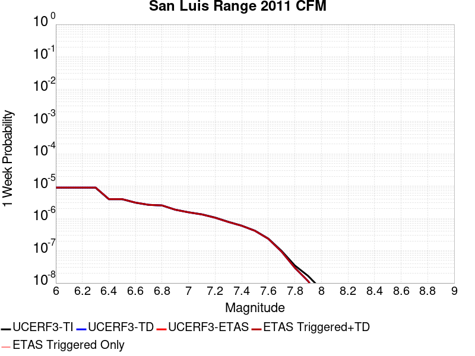 | 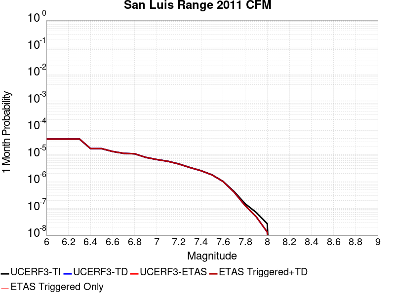 | 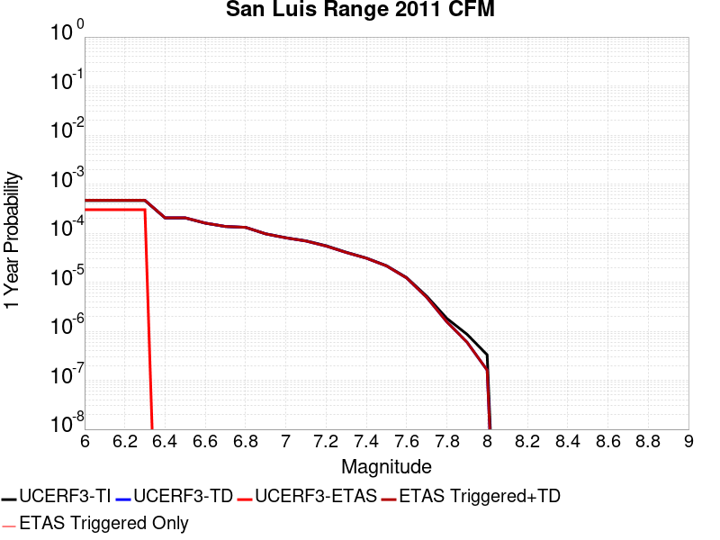 | 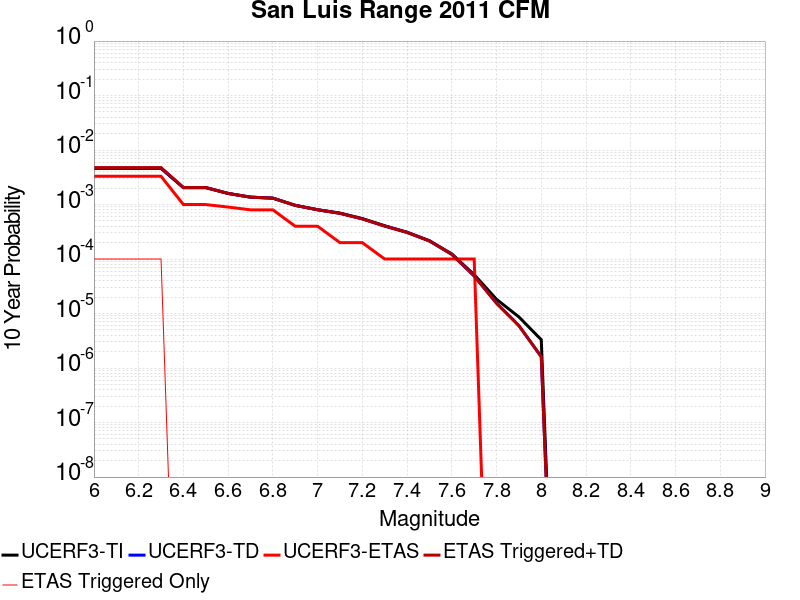 |

| Magnitude | 1 wk TI Prob | 1 wk TD Prob | 1 wk ETAS Prob | 1 wk ETAS/TD Gain | 1 wk ETAS Triggered+TD | 1 wk ETAS Triggered Only | 1 mo TI Prob | 1 mo TD Prob | 1 mo ETAS Prob | 1 mo ETAS/TD Gain | 1 mo ETAS Triggered+TD | 1 mo ETAS Triggered Only | 1 yr TI Prob | 1 yr TD Prob | 1 yr ETAS Prob | 1 yr ETAS/TD Gain | 1 yr ETAS Triggered+TD | 1 yr ETAS Triggered Only | 10 yr TI Prob | 10 yr TD Prob | 10 yr ETAS Prob | 10 yr ETAS/TD Gain | 10 yr ETAS Triggered+TD | 10 yr ETAS Triggered Only |
|-----|-----|-----|-----|-----|-----|-----|-----|-----|-----|-----|-----|-----|-----|-----|-----|-----|-----|-----|-----|-----|-----|-----|-----|-----|
| 6.0 | 8.8368415E-6 | 8.965821E-6 | 0.0 | 0.0 | 8.965821E-6 | 0.0 | 3.787163E-5 | 3.8424423E-5 | 0.0 | 0.0 | 3.8424423E-5 | 0.0 | 4.609895E-4 | 4.6772484E-4 | 3.0E-4 | 0.6414028 | 4.6772484E-4 | 0.0 | 0.0046003438 | 0.004668187 | 0.0033 | 0.7069126 | 0.00476772 | 1.0E-4 |
| 6.1 | 8.8368415E-6 | 8.965821E-6 | 0.0 | 0.0 | 8.965821E-6 | 0.0 | 3.787163E-5 | 3.8424423E-5 | 0.0 | 0.0 | 3.8424423E-5 | 0.0 | 4.609895E-4 | 4.6772484E-4 | 3.0E-4 | 0.6414028 | 4.6772484E-4 | 0.0 | 0.0046003438 | 0.004668187 | 0.0033 | 0.7069126 | 0.00476772 | 1.0E-4 |
| 6.2 | 8.8368415E-6 | 8.965821E-6 | 0.0 | 0.0 | 8.965821E-6 | 0.0 | 3.787163E-5 | 3.8424423E-5 | 0.0 | 0.0 | 3.8424423E-5 | 0.0 | 4.609895E-4 | 4.6772484E-4 | 3.0E-4 | 0.6414028 | 4.6772484E-4 | 0.0 | 0.0046003438 | 0.004668187 | 0.0033 | 0.7069126 | 0.00476772 | 1.0E-4 |
| 6.3 | 8.8368415E-6 | 8.965821E-6 | 0.0 | 0.0 | 8.965821E-6 | 0.0 | 3.787163E-5 | 3.8424423E-5 | 0.0 | 0.0 | 3.8424423E-5 | 0.0 | 4.609895E-4 | 4.6772484E-4 | 3.0E-4 | 0.6414028 | 4.6772484E-4 | 0.0 | 0.0046003438 | 0.004668187 | 0.0033 | 0.7069126 | 0.00476772 | 1.0E-4 |
| 6.4 | 3.9094193E-6 | 3.9413662E-6 | 0.0 | 0.0 | 3.9413662E-6 | 0.0 | 1.6754546E-5 | 1.6891463E-5 | 0.0 | 0.0 | 1.6891463E-5 | 0.0 | 2.039675E-4 | 2.0563442E-4 | 0.0 | 0.0 | 2.0563442E-4 | 0.0 | 0.0020378039 | 0.0020544704 | 0.001 | 0.48674348 | 0.0020544704 | 0.0 |
| 6.5 | 3.9094193E-6 | 3.9413662E-6 | 0.0 | 0.0 | 3.9413662E-6 | 0.0 | 1.6754546E-5 | 1.6891463E-5 | 0.0 | 0.0 | 1.6891463E-5 | 0.0 | 2.039675E-4 | 2.0563442E-4 | 0.0 | 0.0 | 2.0563442E-4 | 0.0 | 0.0020378039 | 0.0020544704 | 0.001 | 0.48674348 | 0.0020544704 | 0.0 |
| 6.6 | 3.0587726E-6 | 3.0755202E-6 | 0.0 | 0.0 | 3.0755202E-6 | 0.0 | 1.3108959E-5 | 1.3180735E-5 | 0.0 | 0.0 | 1.3180735E-5 | 0.0 | 1.595899E-4 | 1.6046375E-4 | 0.0 | 0.0 | 1.6046375E-4 | 0.0 | 0.0015947534 | 0.0016034908 | 9.0E-4 | 0.5612754 | 0.0016034908 | 0.0 |
| 6.7 | 2.6160574E-6 | 2.6252433E-6 | 0.0 | 0.0 | 2.6252433E-6 | 0.0 | 1.1211626E-5 | 1.1250995E-5 | 0.0 | 0.0 | 1.1250995E-5 | 0.0 | 1.3649299E-4 | 1.3697232E-4 | 0.0 | 0.0 | 1.3697232E-4 | 0.0 | 0.0013640919 | 0.001368885 | 8.0E-4 | 0.5844172 | 0.001368885 | 0.0 |
| 6.8 | 2.5110312E-6 | 2.5182521E-6 | 0.0 | 0.0 | 2.5182521E-6 | 0.0 | 1.0761518E-5 | 1.0792464E-5 | 0.0 | 0.0 | 1.0792464E-5 | 0.0 | 1.310136E-4 | 1.3139039E-4 | 0.0 | 0.0 | 1.3139039E-4 | 0.0 | 0.0013093639 | 0.0013131329 | 8.0E-4 | 0.60923 | 0.0013131329 | 0.0 |
| 6.9 | 1.8564405E-6 | 1.8525758E-6 | 0.0 | 0.0 | 1.8525758E-6 | 0.0 | 7.95615E-6 | 7.939586E-6 | 0.0 | 0.0 | 7.939586E-6 | 0.0 | 9.686181E-5 | 9.6660195E-5 | 0.0 | 0.0 | 9.6660195E-5 | 0.0 | 9.68196E-4 | 9.6618355E-4 | 4.0E-4 | 0.414 | 9.6618355E-4 | 0.0 |
| 7.0 | 1.546127E-6 | 1.5370316E-6 | 0.0 | 0.0 | 1.5370316E-6 | 0.0 | 6.626242E-6 | 6.5872614E-6 | 0.0 | 0.0 | 6.5872614E-6 | 0.0 | 8.06715E-5 | 8.0196965E-5 | 0.0 | 0.0 | 8.0196965E-5 | 0.0 | 8.0642226E-4 | 8.0168096E-4 | 4.0E-4 | 0.4989516 | 8.0168096E-4 | 0.0 |
| 7.1 | 1.3368208E-6 | 1.3236017E-6 | 0.0 | 0.0 | 1.3236017E-6 | 0.0 | 5.7292195E-6 | 5.6725667E-6 | 0.0 | 0.0 | 5.6725667E-6 | 0.0 | 6.975101E-5 | 6.9061316E-5 | 0.0 | 0.0 | 6.9061316E-5 | 0.0 | 6.972912E-4 | 6.90399E-4 | 2.0E-4 | 0.28968754 | 6.90399E-4 | 0.0 |
| 7.2 | 1.0623363E-6 | 1.0454945E-6 | 0.0 | 0.0 | 1.0454945E-6 | 0.0 | 4.5528623E-6 | 4.480683E-6 | 0.0 | 0.0 | 4.480683E-6 | 0.0 | 5.5429686E-5 | 5.4550954E-5 | 0.0 | 0.0 | 5.4550954E-5 | 0.0 | 5.5415864E-4 | 5.453759E-4 | 2.0E-4 | 0.36671954 | 5.453759E-4 | 0.0 |
| 7.3 | 7.831679E-7 | 7.727858E-7 | 0.0 | 0.0 | 7.727858E-7 | 0.0 | 3.3564295E-6 | 3.311935E-6 | 0.0 | 0.0 | 3.311935E-6 | 0.0 | 4.086376E-5 | 4.0322062E-5 | 0.0 | 0.0 | 4.0322062E-5 | 0.0 | 4.0856248E-4 | 4.031476E-4 | 1.0E-4 | 0.24804811 | 4.031476E-4 | 0.0 |
| 7.4 | 5.9558846E-7 | 5.9110306E-7 | 0.0 | 0.0 | 5.9110306E-7 | 0.0 | 2.5525194E-6 | 2.5332963E-6 | 0.0 | 0.0 | 2.5332963E-6 | 0.0 | 3.107648E-5 | 3.0842446E-5 | 0.0 | 0.0 | 3.0842446E-5 | 0.0 | 3.1072134E-4 | 3.0838177E-4 | 1.0E-4 | 0.3242734 | 3.0838177E-4 | 0.0 |
| 7.5 | 4.1616502E-7 | 4.1199553E-7 | 0.0 | 0.0 | 4.1199553E-7 | 0.0 | 1.7835631E-6 | 1.7656938E-6 | 0.0 | 0.0 | 1.7656938E-6 | 0.0 | 2.1714664E-5 | 2.1497111E-5 | 0.0 | 0.0 | 2.1497111E-5 | 0.0 | 2.1712543E-4 | 2.1495036E-4 | 1.0E-4 | 0.46522367 | 2.1495036E-4 | 0.0 |
| 7.6 | 2.3816014E-7 | 2.3379012E-7 | 0.0 | 0.0 | 2.3379012E-7 | 0.0 | 1.0206859E-6 | 1.0019572E-6 | 0.0 | 0.0 | 1.0019572E-6 | 0.0 | 1.242678E-5 | 1.21987605E-5 | 0.0 | 0.0 | 1.21987605E-5 | 0.0 | 1.2426086E-4 | 1.21980935E-4 | 1.0E-4 | 0.81980026 | 1.21980935E-4 | 0.0 |
| 7.7 | 9.918777E-8 | 9.388622E-8 | 0.0 | 0.0 | 9.388622E-8 | 0.0 | 4.2509038E-7 | 4.0236944E-7 | 0.0 | 0.0 | 4.0236944E-7 | 0.0 | 5.1754632E-6 | 4.898837E-6 | 0.0 | 0.0 | 4.898837E-6 | 0.0 | 5.1753424E-5 | 4.8987295E-5 | 1.0E-4 | 2.0413456 | 4.8987295E-5 | 0.0 |
| 7.8 | 3.4982556E-8 | 2.9701607E-8 | 0.0 | 0.0 | 2.9701607E-8 | 0.0 | 1.4992524E-7 | 1.272926E-7 | 0.0 | 0.0 | 1.272926E-7 | 0.0 | 1.8253382E-6 | 1.5497861E-6 | 0.0 | 0.0 | 1.5497861E-6 | 0.0 | 1.8253233E-5 | 1.5497753E-5 | 0.0 | 0.0 | 1.5497753E-5 | 0.0 |
| 7.9 | 1.6624908E-8 | 1.1490227E-8 | 0.0 | 0.0 | 1.1490227E-8 | 0.0 | 7.12496E-8 | 4.924383E-8 | 0.0 | 0.0 | 4.924383E-8 | 0.0 | 8.6746354E-7 | 5.9954345E-7 | 0.0 | 0.0 | 5.9954345E-7 | 0.0 | 8.674601E-6 | 5.9954186E-6 | 0.0 | 0.0 | 5.9954186E-6 | 0.0 |
| 8.0 | 6.3352315E-9 | 3.0965652E-9 | 0.0 | 0.0 | 3.0965652E-9 | 0.0 | 2.715099E-8 | 1.3270995E-8 | 0.0 | 0.0 | 1.3270995E-8 | 0.0 | 3.3056327E-7 | 1.6157436E-7 | 0.0 | 0.0 | 1.6157436E-7 | 0.0 | 3.3056278E-6 | 1.6157423E-6 | 0.0 | 0.0 | 1.6157423E-6 | 0.0 |

## Santa Monica alt 1
*[(top)](#table-of-contents)*

| 1 Week | 1 Month | 1 Year | 10 Year |
|-----|-----|-----|-----|
| 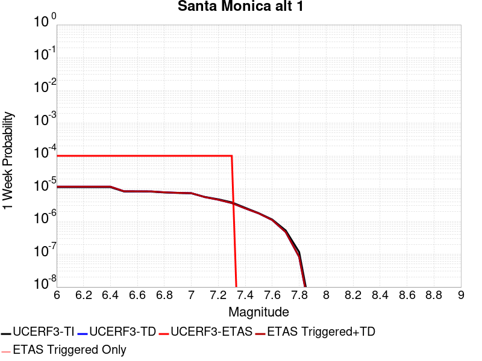 |  | 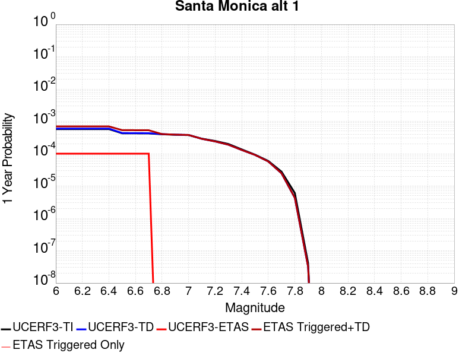 | 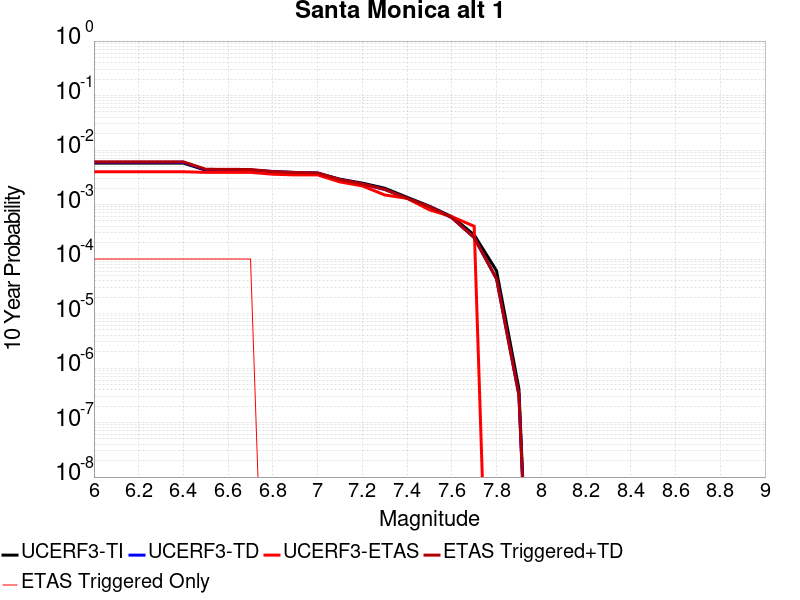 |

| Magnitude | 1 wk TI Prob | 1 wk TD Prob | 1 wk ETAS Prob | 1 wk ETAS/TD Gain | 1 wk ETAS Triggered+TD | 1 wk ETAS Triggered Only | 1 mo TI Prob | 1 mo TD Prob | 1 mo ETAS Prob | 1 mo ETAS/TD Gain | 1 mo ETAS Triggered+TD | 1 mo ETAS Triggered Only | 1 yr TI Prob | 1 yr TD Prob | 1 yr ETAS Prob | 1 yr ETAS/TD Gain | 1 yr ETAS Triggered+TD | 1 yr ETAS Triggered Only | 10 yr TI Prob | 10 yr TD Prob | 10 yr ETAS Prob | 10 yr ETAS/TD Gain | 10 yr ETAS Triggered+TD | 10 yr ETAS Triggered Only |
|-----|-----|-----|-----|-----|-----|-----|-----|-----|-----|-----|-----|-----|-----|-----|-----|-----|-----|-----|-----|-----|-----|-----|-----|-----|
| 6.0 | 1.1066008E-5 | 1.1482397E-5 | 1.0E-4 | 8.708983 | 1.1482397E-5 | 0.0 | 4.742488E-5 | 4.9209422E-5 | 1.0E-4 | 2.0321312 | 4.9209422E-5 | 0.0 | 5.7724497E-4 | 5.9897394E-4 | 4.0E-4 | 0.66780865 | 6.9891405E-4 | 1.0E-4 | 0.005757478 | 0.005974983 | 0.004 | 0.669458 | 0.0060743857 | 1.0E-4 |
| 6.1 | 1.1066008E-5 | 1.1482397E-5 | 1.0E-4 | 8.708983 | 1.1482397E-5 | 0.0 | 4.742488E-5 | 4.9209422E-5 | 1.0E-4 | 2.0321312 | 4.9209422E-5 | 0.0 | 5.7724497E-4 | 5.9897394E-4 | 4.0E-4 | 0.66780865 | 6.9891405E-4 | 1.0E-4 | 0.005757478 | 0.005974983 | 0.004 | 0.669458 | 0.0060743857 | 1.0E-4 |
| 6.2 | 1.1066008E-5 | 1.1482397E-5 | 1.0E-4 | 8.708983 | 1.1482397E-5 | 0.0 | 4.742488E-5 | 4.9209422E-5 | 1.0E-4 | 2.0321312 | 4.9209422E-5 | 0.0 | 5.7724497E-4 | 5.9897394E-4 | 4.0E-4 | 0.66780865 | 6.9891405E-4 | 1.0E-4 | 0.005757478 | 0.005974983 | 0.004 | 0.669458 | 0.0060743857 | 1.0E-4 |
| 6.3 | 1.1066008E-5 | 1.1482397E-5 | 1.0E-4 | 8.708983 | 1.1482397E-5 | 0.0 | 4.742488E-5 | 4.9209422E-5 | 1.0E-4 | 2.0321312 | 4.9209422E-5 | 0.0 | 5.7724497E-4 | 5.9897394E-4 | 4.0E-4 | 0.66780865 | 6.9891405E-4 | 1.0E-4 | 0.005757478 | 0.005974983 | 0.004 | 0.669458 | 0.0060743857 | 1.0E-4 |
| 6.4 | 1.1066008E-5 | 1.1482397E-5 | 1.0E-4 | 8.708983 | 1.1482397E-5 | 0.0 | 4.742488E-5 | 4.9209422E-5 | 1.0E-4 | 2.0321312 | 4.9209422E-5 | 0.0 | 5.7724497E-4 | 5.9897394E-4 | 4.0E-4 | 0.66780865 | 6.9891405E-4 | 1.0E-4 | 0.005757478 | 0.005974983 | 0.004 | 0.669458 | 0.0060743857 | 1.0E-4 |
| 6.5 | 8.183544E-6 | 8.336929E-6 | 1.0E-4 | 11.994825 | 8.336929E-6 | 0.0 | 3.5071862E-5 | 3.5729212E-5 | 1.0E-4 | 2.79883 | 3.5729212E-5 | 0.0 | 4.2691626E-4 | 4.3491795E-4 | 4.0E-4 | 0.91971374 | 5.3487445E-4 | 1.0E-4 | 0.0042609703 | 0.0043408335 | 0.0039 | 0.89844495 | 0.0044403994 | 1.0E-4 |
| 6.6 | 8.1543285E-6 | 8.305137E-6 | 1.0E-4 | 12.04074 | 8.305137E-6 | 0.0 | 3.4946657E-5 | 3.559297E-5 | 1.0E-4 | 2.8095436 | 3.559297E-5 | 0.0 | 4.2539247E-4 | 4.3325982E-4 | 4.0E-4 | 0.92323357 | 5.332165E-4 | 1.0E-4 | 0.0042457907 | 0.004324317 | 0.0039 | 0.90187657 | 0.004423884 | 1.0E-4 |
| 6.7 | 8.110878E-6 | 8.258527E-6 | 1.0E-4 | 12.108697 | 8.258527E-6 | 0.0 | 3.4760444E-5 | 3.5393216E-5 | 1.0E-4 | 2.8254004 | 3.5393216E-5 | 0.0 | 4.231262E-4 | 4.3082878E-4 | 4.0E-4 | 0.9284431 | 5.307857E-4 | 1.0E-4 | 0.0042232145 | 0.0043001007 | 0.0039 | 0.9069555 | 0.0043996708 | 1.0E-4 |
| 6.8 | 7.644036E-6 | 7.752457E-6 | 1.0E-4 | 12.899137 | 7.752457E-6 | 0.0 | 3.275974E-5 | 3.32244E-5 | 1.0E-4 | 3.009836 | 3.32244E-5 | 0.0 | 3.9877684E-4 | 4.044334E-4 | 3.0E-4 | 0.74177843 | 4.044334E-4 | 0.0 | 0.00398062 | 0.0040371204 | 0.0036 | 0.8917247 | 0.0040371204 | 0.0 |
| 6.9 | 7.3698293E-6 | 7.4570685E-6 | 1.0E-4 | 13.410095 | 7.4570685E-6 | 0.0 | 3.15846E-5 | 3.1958483E-5 | 1.0E-4 | 3.1290598 | 3.1958483E-5 | 0.0 | 3.8447464E-4 | 3.8902645E-4 | 3.0E-4 | 0.7711558 | 3.8902645E-4 | 0.0 | 0.0038381014 | 0.003883598 | 0.0035 | 0.90122616 | 0.003883598 | 0.0 |
| 7.0 | 7.209872E-6 | 7.286953E-6 | 1.0E-4 | 13.723157 | 7.286953E-6 | 0.0 | 3.0899086E-5 | 3.1229432E-5 | 1.0E-4 | 3.2021077 | 3.1229432E-5 | 0.0 | 3.7613141E-4 | 3.801534E-4 | 3.0E-4 | 0.7891551 | 3.801534E-4 | 0.0 | 0.0037549543 | 0.0037951737 | 0.0035 | 0.9222239 | 0.0037951737 | 0.0 |
| 7.1 | 5.603456E-6 | 5.524868E-6 | 1.0E-4 | 18.09998 | 5.524868E-6 | 0.0 | 2.4014591E-5 | 2.3677794E-5 | 1.0E-4 | 4.2233667 | 2.3677794E-5 | 0.0 | 2.923384E-4 | 2.882394E-4 | 2.0E-4 | 0.6938677 | 2.882394E-4 | 0.0 | 0.0029195412 | 0.0028786971 | 0.0026 | 0.9031863 | 0.0028786971 | 0.0 |
| 7.2 | 4.7483613E-6 | 4.591933E-6 | 1.0E-4 | 21.77732 | 4.591933E-6 | 0.0 | 2.0349962E-5 | 1.9679565E-5 | 1.0E-4 | 5.0814133 | 1.9679565E-5 | 0.0 | 2.4773262E-4 | 2.3957249E-4 | 2.0E-4 | 0.8348204 | 2.3957249E-4 | 0.0 | 0.0024745662 | 0.0023931563 | 0.0022 | 0.91928804 | 0.0023931563 | 0.0 |
| 7.3 | 3.829015E-6 | 3.634881E-6 | 1.0E-4 | 27.511215 | 3.634881E-6 | 0.0 | 1.6409962E-5 | 1.5577969E-5 | 1.0E-4 | 6.419322 | 1.5577969E-5 | 0.0 | 1.9977297E-4 | 1.8964536E-4 | 2.0E-4 | 1.0546 | 1.8964536E-4 | 0.0 | 0.0019959346 | 0.001894844 | 0.0015 | 0.79162186 | 0.001894844 | 0.0 |
| 7.4 | 2.610755E-6 | 2.5000702E-6 | 0.0 | 0.0 | 2.5000702E-6 | 0.0 | 1.1188902E-5 | 1.0714542E-5 | 0.0 | 0.0 | 1.0714542E-5 | 0.0 | 1.3621636E-4 | 1.304418E-4 | 1.0E-4 | 0.76662546 | 1.304418E-4 | 0.0 | 0.001361329 | 0.0013036567 | 0.0013 | 0.99719507 | 0.0013036567 | 0.0 |
| 7.5 | 1.792146E-6 | 1.7587238E-6 | 0.0 | 0.0 | 1.7587238E-6 | 0.0 | 7.680603E-6 | 7.537366E-6 | 0.0 | 0.0 | 7.537366E-6 | 0.0 | 9.3507326E-5 | 9.17636E-5 | 1.0E-4 | 1.0897567 | 9.17636E-5 | 0.0 | 9.3467993E-4 | 9.1726024E-4 | 8.0E-4 | 0.8721625 | 9.1726024E-4 | 0.0 |
| 7.6 | 1.1473018E-6 | 1.1030952E-6 | 0.0 | 0.0 | 1.1030952E-6 | 0.0 | 4.9169985E-6 | 4.727542E-6 | 0.0 | 0.0 | 4.727542E-6 | 0.0 | 5.986281E-5 | 5.755632E-5 | 1.0E-4 | 1.7374285 | 5.755632E-5 | 0.0 | 5.984669E-4 | 5.754158E-4 | 6.0E-4 | 1.0427243 | 5.754158E-4 | 0.0 |
| 7.7 | 5.330919E-7 | 4.7462638E-7 | 0.0 | 0.0 | 4.7462638E-7 | 0.0 | 2.2846775E-6 | 2.0341115E-6 | 0.0 | 0.0 | 2.0341115E-6 | 0.0 | 2.7815593E-5 | 2.4765039E-5 | 1.0E-4 | 4.0379505 | 2.4765039E-5 | 0.0 | 2.7812112E-4 | 2.4762392E-4 | 4.0E-4 | 1.6153529 | 2.4762392E-4 | 0.0 |
| 7.8 | 1.1668574E-7 | 8.30163E-8 | 0.0 | 0.0 | 8.30163E-8 | 0.0 | 5.000816E-7 | 3.557841E-7 | 0.0 | 0.0 | 3.557841E-7 | 0.0 | 6.0884768E-6 | 4.331663E-6 | 0.0 | 0.0 | 4.331663E-6 | 0.0 | 6.08831E-5 | 4.331582E-5 | 0.0 | 0.0 | 4.331582E-5 | 0.0 |
| 7.9 | 8.007447E-10 | 6.1623595E-10 | 0.0 | 0.0 | 6.1623595E-10 | 0.0 | 3.4317629E-9 | 2.6410114E-9 | 0.0 | 0.0 | 2.6410114E-9 | 0.0 | 4.1781714E-8 | 3.215431E-8 | 0.0 | 0.0 | 3.215431E-8 | 0.0 | 4.1781706E-7 | 3.215431E-7 | 0.0 | 0.0 | 3.215431E-7 | 0.0 |

