# ComCat M7.1 (ci38457511), ShakeMap Surfaces, kCOV=1.5 Results

|   | ComCat M7.1 (ci38457511), ShakeMap Surfaces, kCOV=1.5 |
|-----|-----|
| Num Simulations | 60123 (incomplete) |
| Start Time | 2019/07/06 03:19:54 UTC |
| Start Time Epoch Milliseconds | 1562383194040 |
| Duration | 10 Years |
| Includes Spontaneous? | false |
| Trigger Ruptures | 283 Trigger Ruptures |
|   | First: M3.98 at 2019/07/04 17:02:55 UTC |
|   | Last: M7.1 at 2019/07/06 03:19:53 UTC |
|   | Largest: M7.1 at 2019/07/06 03:19:53 UTC |
| Trigger Ruptures | *(none)* |
| Config Generated With | u3etas_comcat_event_config_builder.sh --event-id ci38457511 --mag-complete 3.5 --num-simulations 100000 --days-before 7 --etas-k-cov 1.5 --finite-surf-shakemap --finite-surf-shakemap-min-mag 5 --hpc-site USC_HPC --nodes 36 --hours 24 --queue scec |

## Table Of Contents

* [Probabilities Summary Table](#probabilities-summary-table)
* [Magnitude Number Distribution](#magnitude-number-distribution)
  * [10 Year Magnitude Number Distribution](#10-year-magnitude-number-distribution)
  * [1 Year Magnitude Number Distribution](#1-year-magnitude-number-distribution)
  * [1 Month Magnitude Number Distribution](#1-month-magnitude-number-distribution)
  * [1 Week Magnitude Number Distribution](#1-week-magnitude-number-distribution)
  * [1 Day Magnitude Number Distribution](#1-day-magnitude-number-distribution)
  * [1 Hour Magnitude Number Distribution](#1-hour-magnitude-number-distribution)
* [Hazard Change Over Time](#hazard-change-over-time)
  * [M&ge;5.0 Hazard Change Over Time](#m50-hazard-change-over-time)
  * [M&ge;6.0 Hazard Change Over Time](#m60-hazard-change-over-time)
  * [M&ge;7.0 Hazard Change Over Time](#m70-hazard-change-over-time)
  * [M&ge;8.0 Hazard Change Over Time](#m80-hazard-change-over-time)
* [Trigger Rupture Fault Map](#trigger-rupture-fault-map)
* [Trigger Rupture Depth Map](#trigger-rupture-depth-map)
* [Fault Distances To Triggers](#fault-distances-to-triggers)
* [Individual Simulated Catalog Maps](#individual-simulated-catalog-maps)
* [ComCat Data Comparisons](#comcat-data-comparisons)
  * [ComCat Magnitude-Number Distributions](#comcat-magnitude-number-distributions)
  * [ComCat Time-Dependent Mc](#comcat-time-dependent-mc)
  * [ComCat Cumulative Number Vs Time](#comcat-cumulative-number-vs-time)
  * [ComCat Cumulative Number Simulation Percentiles](#comcat-cumulative-number-simulation-percentiles)
  * [ComCat Probability Spatial Distribution](#comcat-probability-spatial-distribution)
  * [ComCat Mean Expectation Spatial Distribution](#comcat-mean-expectation-spatial-distribution)
  * [ComCat Depth Distribution](#comcat-depth-distribution)
* [Section Participation](#section-participation)
  * [Section Participation Plots](#section-participation-plots)
  * [Supra-Seismogenic Parent Sections Table](#supra-seismogenic-parent-sections-table)
  * [M≥6.5 Parent Sections Table](#m65-parent-sections-table)
  * [M≥7 Parent Sections Table](#m7-parent-sections-table)
  * [M≥7.5 Parent Sections Table](#m75-parent-sections-table)
  * [M≥8 Parent Sections Table](#m8-parent-sections-table)
  * [Fault Magnitude-Probability Distributions](#fault-magnitude-probability-distributions)
* [Gridded Nucleation](#gridded-nucleation)
* [JSON Input File](#json-input-file)

## Probabilities Summary Table
*[(top)](#table-of-contents)*

| Magnitude | 1 Hour Prob | 1 Day Prob | 1 Week Prob | 1 Month Prob | 1 Year Prob | 10 Year Prob |
|-----|-----|-----|-----|-----|-----|-----|
| **M&ge;4** | 0.994 (99.38%) | 1.000 (99.99%) | 1.000 (100.00%) | 1.000 (100.00%) | 1.000 (100.00%) | 1.000 (100.00%) |
| **M&ge;4.5** | 0.902 (90.20%) | 0.989 (98.88%) | 0.997 (99.73%) | 0.999 (99.89%) | 1.000 (99.99%) | 1.000 (100.00%) |
| **M&ge;5** | 0.620 (61.96%) | 0.867 (86.74%) | 0.932 (93.20%) | 0.958 (95.82%) | 0.980 (97.99%) | 0.989 (98.90%) |
| **M&ge;5.5** | 0.309 (30.93%) | 0.553 (55.33%) | 0.664 (66.38%) | 0.729 (72.88%) | 0.808 (80.80%) | 0.858 (85.76%) |
| **M&ge;6** | 0.111 (11.14%) | 0.243 (24.30%) | 0.319 (31.92%) | 0.374 (37.38%) | 0.460 (45.96%) | 0.523 (52.30%) |
| **M&ge;6.5** | 0.027 (2.70%) | 0.069 (6.91%) | 0.097 (9.72%) | 0.120 (12.01%) | 0.160 (15.98%) | 0.194 (19.37%) |
| **M&ge;7** | 0.010 (1.01%) | 0.026 (2.62%) | 0.038 (3.76%) | 0.046 (4.64%) | 0.063 (6.28%) | 0.077 (7.72%) |
| **M&ge;7.1** | 8.47E-3 (0.85%) | 0.022 (2.17%) | 0.031 (3.13%) | 0.039 (3.91%) | 0.053 (5.28%) | 0.065 (6.52%) |
| **M&ge;7.5** | 3.04E-3 (0.30%) | 7.73E-3 (0.77%) | 0.011 (1.15%) | 0.015 (1.45%) | 0.019 (1.94%) | 0.024 (2.44%) |
| **M&ge;8** | 8.32E-5 (0.01%) | 2.66E-4 (0.03%) | 3.33E-4 (0.03%) | 3.99E-4 (0.04%) | 5.32E-4 (0.05%) | 6.15E-4 (0.06%) |

## Magnitude Number Distribution
*[(top)](#table-of-contents)*

### 10 Year Magnitude Number Distribution
*[(top)](#table-of-contents)*

**Legend**
* **Mean** (thick black line): mean expected number across all 60123 catalogs
* **2.5%,97.5%** (thin black lines): expected number percentiles across all 60123 catalogs
* **Median** (thin blue line): median expected number across all 60123 catalogs
* **Mode** (thin cyan line): modal expected number across all 60123 catalogs
* **10 yr Probability** (thin red line): 10 year probability calculated as the fraction of catalogs with at least 1 occurrence
* **10 yr Supraseismogenic Probability** (thin dashed red line): same as above, but only for supraseismogenic ruptures on explicitly modeled UCERF3 faults
* **95% Conf** (light red shaded region): binomial 95% confidence bounds on probability
* **Primary** (thin green line): mean expected number from primary triggered aftershocks only (no secondary, tertiary, etc...) across all 60123 catalogs

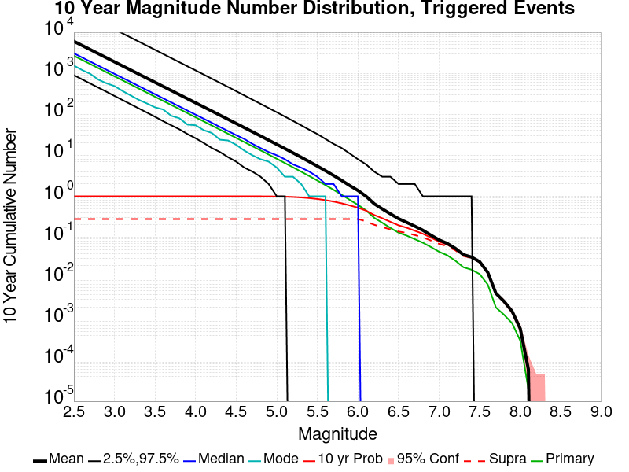

| Mag | Mean | 2.5 %ile | 97.5 %ile | Median | Mode | 10 yr Probability | 10 yr Supra-Seis Prob | Primary Aftershocks Mean |
|-----|-----|-----|-----|-----|-----|-----|-----|-----|
| **M&ge;2.5** | 5905.098 | 895.000 | 36695.000 | 3034.000 | 1407.000 | 1.000 (100.00%) | 0.274 (27.40%) | 2616.384 |
| **M&ge;2.6** | 4690.471 | 708.000 | 29135.000 | 2410.000 | 1187.000 | 1.000 (100.00%) | 0.274 (27.40%) | 2078.219 |
| **M&ge;2.7** | 3725.573 | 561.000 | 23159.000 | 1915.000 | 976.000 | 1.000 (100.00%) | 0.274 (27.40%) | 1650.789 |
| **M&ge;2.8** | 2959.105 | 444.000 | 18374.000 | 1519.000 | 703.000 | 1.000 (100.00%) | 0.274 (27.40%) | 1311.241 |
| **M&ge;2.9** | 2350.442 | 352.000 | 14595.000 | 1208.000 | 612.000 | 1.000 (100.00%) | 0.274 (27.40%) | 1041.580 |
| **M&ge;3** | 1866.882 | 278.000 | 11604.000 | 960.000 | 471.000 | 1.000 (100.00%) | 0.274 (27.40%) | 827.281 |
| **M&ge;3.1** | 1482.767 | 221.000 | 9213.000 | 764.000 | 373.000 | 1.000 (100.00%) | 0.274 (27.40%) | 657.114 |
| **M&ge;3.2** | 1177.528 | 174.000 | 7314.000 | 607.000 | 289.000 | 1.000 (100.00%) | 0.274 (27.40%) | 521.834 |
| **M&ge;3.3** | 935.211 | 137.000 | 5801.000 | 483.000 | 230.000 | 1.000 (100.00%) | 0.274 (27.40%) | 414.482 |
| **M&ge;3.4** | 742.753 | 109.000 | 4605.000 | 384.000 | 184.000 | 1.000 (100.00%) | 0.274 (27.40%) | 329.206 |
| **M&ge;3.5** | 589.795 | 86.000 | 3657.000 | 305.000 | 234.000 | 1.000 (100.00%) | 0.274 (27.40%) | 261.403 |
| **M&ge;3.6** | 468.426 | 68.000 | 2897.000 | 243.000 | 118.000 | 1.000 (100.00%) | 0.274 (27.40%) | 207.623 |
| **M&ge;3.7** | 371.938 | 53.000 | 2298.000 | 193.000 | 111.000 | 1.000 (100.00%) | 0.274 (27.40%) | 164.860 |
| **M&ge;3.8** | 295.301 | 42.000 | 1823.000 | 153.000 | 82.000 | 1.000 (100.00%) | 0.274 (27.40%) | 130.920 |
| **M&ge;3.9** | 234.433 | 33.000 | 1448.000 | 122.000 | 61.000 | 1.000 (100.00%) | 0.274 (27.40%) | 103.951 |
| **M&ge;4** | 186.095 | 26.000 | 1149.000 | 97.000 | 58.000 | 1.000 (100.00%) | 0.274 (27.40%) | 82.519 |
| **M&ge;4.1** | 147.681 | 20.000 | 909.000 | 77.000 | 41.000 | 1.000 (100.00%) | 0.274 (27.40%) | 65.455 |
| **M&ge;4.2** | 117.209 | 15.000 | 722.000 | 61.000 | 35.000 | 1.000 (100.00%) | 0.274 (27.40%) | 51.963 |
| **M&ge;4.3** | 92.990 | 12.000 | 573.000 | 48.000 | 27.000 | 1.000 (100.00%) | 0.274 (27.40%) | 41.245 |
| **M&ge;4.4** | 73.775 | 9.000 | 454.000 | 38.000 | 20.000 | 1.000 (100.00%) | 0.274 (27.40%) | 32.732 |
| **M&ge;4.5** | 58.467 | 7.000 | 358.000 | 31.000 | 18.000 | 1.000 (100.00%) | 0.274 (27.40%) | 25.950 |
| **M&ge;4.6** | 46.320 | 5.000 | 283.000 | 24.000 | 13.000 | 1.000 (99.98%) | 0.274 (27.40%) | 20.554 |
| **M&ge;4.7** | 36.674 | 4.000 | 224.000 | 19.000 | 11.000 | 0.999 (99.93%) | 0.274 (27.40%) | 16.279 |
| **M&ge;4.8** | 29.011 | 3.000 | 177.000 | 15.000 | 8.000 | 0.998 (99.80%) | 0.274 (27.40%) | 12.886 |
| **M&ge;4.9** | 22.924 | 2.000 | 139.000 | 12.000 | 7.000 | 0.995 (99.53%) | 0.274 (27.40%) | 10.181 |
| **M&ge;5** | 18.088 | 1.000 | 110.000 | 9.000 | 5.000 | 0.989 (98.90%) | 0.274 (27.40%) | 8.030 |
| **M&ge;5.1** | 14.243 | 1.000 | 87.000 | 7.000 | 3.000 | 0.979 (97.86%) | 0.274 (27.40%) | 6.324 |
| **M&ge;5.2** | 11.197 | 0.000 | 68.000 | 6.000 | 2.000 | 0.961 (96.14%) | 0.274 (27.40%) | 4.972 |
| **M&ge;5.3** | 8.766 | 0.000 | 53.000 | 5.000 | 2.000 | 0.936 (93.58%) | 0.274 (27.40%) | 3.902 |
| **M&ge;5.4** | 6.846 | 0.000 | 41.000 | 4.000 | 1.000 | 0.902 (90.21%) | 0.274 (27.40%) | 3.051 |
| **M&ge;5.5** | 5.316 | 0.000 | 32.000 | 3.000 | 1.000 | 0.858 (85.76%) | 0.274 (27.40%) | 2.368 |
| **M&ge;5.6** | 4.109 | 0.000 | 25.000 | 2.000 | 1.000 | 0.804 (80.36%) | 0.274 (27.40%) | 1.832 |
| **M&ge;5.7** | 3.146 | 0.000 | 19.000 | 2.000 | 0.000 | 0.742 (74.17%) | 0.274 (27.40%) | 1.404 |
| **M&ge;5.8** | 2.379 | 0.000 | 14.000 | 1.000 | 0.000 | 0.670 (66.98%) | 0.274 (27.40%) | 1.064 |
| **M&ge;5.9** | 1.778 | 0.000 | 11.000 | 1.000 | 0.000 | 0.594 (59.38%) | 0.274 (27.39%) | 0.797 |
| **M&ge;6** | 1.355 | 0.000 | 8.000 | 1.000 | 0.000 | 0.523 (52.30%) | 0.274 (27.38%) | 0.604 |
| **M&ge;6.1** | 0.982 | 0.000 | 6.000 | 0.000 | 0.000 | 0.443 (44.27%) | 0.242 (24.18%) | 0.445 |
| **M&ge;6.2** | 0.647 | 0.000 | 4.000 | 0.000 | 0.000 | 0.347 (34.68%) | 0.199 (19.85%) | 0.294 |
| **M&ge;6.3** | 0.483 | 0.000 | 3.000 | 0.000 | 0.000 | 0.288 (28.81%) | 0.174 (17.38%) | 0.224 |
| **M&ge;6.4** | 0.365 | 0.000 | 3.000 | 0.000 | 0.000 | 0.236 (23.65%) | 0.153 (15.34%) | 0.167 |
| **M&ge;6.5** | 0.279 | 0.000 | 2.000 | 0.000 | 0.000 | 0.194 (19.37%) | 0.136 (13.63%) | 0.128 |
| **M&ge;6.6** | 0.227 | 0.000 | 2.000 | 0.000 | 0.000 | 0.169 (16.90%) | 0.126 (12.62%) | 0.109 |
| **M&ge;6.7** | 0.184 | 0.000 | 2.000 | 0.000 | 0.000 | 0.143 (14.27%) | 0.112 (11.19%) | 0.090 |
| **M&ge;6.8** | 0.146 | 0.000 | 1.000 | 0.000 | 0.000 | 0.121 (12.05%) | 0.098 (9.82%) | 0.073 |
| **M&ge;6.9** | 0.111 | 0.000 | 1.000 | 0.000 | 0.000 | 0.097 (9.69%) | 0.082 (8.20%) | 0.057 |
| **M&ge;7** | 0.085 | 0.000 | 1.000 | 0.000 | 0.000 | 0.077 (7.72%) | 0.068 (6.78%) | 0.044 |
| **M&ge;7.1** | 0.070 | 0.000 | 1.000 | 0.000 | 0.000 | 0.065 (6.52%) | 0.060 (5.98%) | 0.036 |
| **M&ge;7.2** | 0.052 | 0.000 | 1.000 | 0.000 | 0.000 | 0.050 (5.00%) | 0.047 (4.69%) | 0.026 |
| **M&ge;7.3** | 0.037 | 0.000 | 1.000 | 0.000 | 0.000 | 0.036 (3.58%) | 0.034 (3.44%) | 0.018 |
| **M&ge;7.4** | 0.032 | 0.000 | 1.000 | 0.000 | 0.000 | 0.031 (3.14%) | 0.031 (3.08%) | 0.016 |
| **M&ge;7.5** | 0.025 | 0.000 | 0.000 | 0.000 | 0.000 | 0.024 (2.44%) | 0.024 (2.43%) | 0.012 |
| **M&ge;7.6** | 0.014 | 0.000 | 0.000 | 0.000 | 0.000 | 0.013 (1.33%) | 0.013 (1.33%) | 6.92E-3 |
| **M&ge;7.7** | 4.01E-3 | 0.000 | 0.000 | 0.000 | 0.000 | 3.99E-3 (0.40%) | 3.98E-3 (0.40%) | 1.91E-3 |
| **M&ge;7.8** | 2.54E-3 | 0.000 | 0.000 | 0.000 | 0.000 | 2.54E-3 (0.25%) | 2.53E-3 (0.25%) | 1.28E-3 |
| **M&ge;7.9** | 1.50E-3 | 0.000 | 0.000 | 0.000 | 0.000 | 1.50E-3 (0.15%) | 1.50E-3 (0.15%) | 8.32E-4 |
| **M&ge;8** | 6.15E-4 | 0.000 | 0.000 | 0.000 | 0.000 | 6.15E-4 (0.06%) | 6.15E-4 (0.06%) | 3.49E-4 |
| **M&ge;8.1** | 6.65E-5 | 0.000 | 0.000 | 0.000 | 0.000 | 6.65E-5 (0.01%) | 6.65E-5 (0.01%) | 1.66E-5 |
| **M&ge;8.2** | 0.000 | 0.000 | 0.000 | 0.000 | 0.000 | 0.000 (0.00%) | 0.000 (0.00%) | 0.000 |
| **M&ge;8.3** | 0.000 | 0.000 | 0.000 | 0.000 | 0.000 | 0.000 (0.00%) | 0.000 (0.00%) | 0.000 |
| **M&ge;8.4** | 0.000 | 0.000 | 0.000 | 0.000 | 0.000 | 0.000 (0.00%) | 0.000 (0.00%) | 0.000 |
| **M&ge;8.5** | 0.000 | 0.000 | 0.000 | 0.000 | 0.000 | 0.000 (0.00%) | 0.000 (0.00%) | 0.000 |
| **M&ge;8.6** | 0.000 | 0.000 | 0.000 | 0.000 | 0.000 | 0.000 (0.00%) | 0.000 (0.00%) | 0.000 |
| **M&ge;8.7** | 0.000 | 0.000 | 0.000 | 0.000 | 0.000 | 0.000 (0.00%) | 0.000 (0.00%) | 0.000 |
| **M&ge;8.8** | 0.000 | 0.000 | 0.000 | 0.000 | 0.000 | 0.000 (0.00%) | 0.000 (0.00%) | 0.000 |
| **M&ge;8.9** | 0.000 | 0.000 | 0.000 | 0.000 | 0.000 | 0.000 (0.00%) | 0.000 (0.00%) | 0.000 |
| **M&ge;9** | 0.000 | 0.000 | 0.000 | 0.000 | 0.000 | 0.000 (0.00%) | 0.000 (0.00%) | 0.000 |

### 1 Year Magnitude Number Distribution
*[(top)](#table-of-contents)*

**Legend**
* **Mean** (thick black line): mean expected number across all 60123 catalogs
* **2.5%,97.5%** (thin black lines): expected number percentiles across all 60123 catalogs
* **Median** (thin blue line): median expected number across all 60123 catalogs
* **Mode** (thin cyan line): modal expected number across all 60123 catalogs
* **1 yr Probability** (thin red line): 1 year probability calculated as the fraction of catalogs with at least 1 occurrence
* **1 yr Supraseismogenic Probability** (thin dashed red line): same as above, but only for supraseismogenic ruptures on explicitly modeled UCERF3 faults
* **95% Conf** (light red shaded region): binomial 95% confidence bounds on probability
* **Primary** (thin green line): mean expected number from primary triggered aftershocks only (no secondary, tertiary, etc...) across all 60123 catalogs


| Mag | Mean | 2.5 %ile | 97.5 %ile | Median | Mode | 1 yr Probability | 1 yr Supra-Seis Prob | Primary Aftershocks Mean |
|-----|-----|-----|-----|-----|-----|-----|-----|-----|
| **M&ge;2.5** | 4527.575 | 711.000 | 28086.000 | 2340.000 | 1220.000 | 1.000 (100.00%) | 0.230 (23.02%) | 2289.809 |
| **M&ge;2.6** | 3596.392 | 562.000 | 22306.000 | 1861.000 | 958.000 | 1.000 (100.00%) | 0.230 (23.02%) | 1818.866 |
| **M&ge;2.7** | 2856.535 | 444.000 | 17769.000 | 1479.000 | 761.000 | 1.000 (100.00%) | 0.230 (23.02%) | 1444.736 |
| **M&ge;2.8** | 2268.856 | 351.000 | 14067.000 | 1175.000 | 590.000 | 1.000 (100.00%) | 0.230 (23.02%) | 1147.594 |
| **M&ge;2.9** | 1802.199 | 278.000 | 11174.000 | 935.000 | 460.000 | 1.000 (100.00%) | 0.230 (23.02%) | 911.603 |
| **M&ge;3** | 1431.395 | 220.000 | 8886.000 | 743.000 | 380.000 | 1.000 (100.00%) | 0.230 (23.02%) | 724.038 |
| **M&ge;3.1** | 1136.944 | 175.000 | 7058.000 | 591.000 | 308.000 | 1.000 (100.00%) | 0.230 (23.02%) | 575.106 |
| **M&ge;3.2** | 902.901 | 138.000 | 5584.000 | 470.000 | 250.000 | 1.000 (100.00%) | 0.230 (23.02%) | 456.713 |
| **M&ge;3.3** | 717.103 | 109.000 | 4435.000 | 374.000 | 184.000 | 1.000 (100.00%) | 0.230 (23.02%) | 362.769 |
| **M&ge;3.4** | 569.502 | 86.000 | 3524.000 | 297.000 | 148.000 | 1.000 (100.00%) | 0.230 (23.02%) | 288.138 |
| **M&ge;3.5** | 452.245 | 67.000 | 2796.000 | 236.000 | 120.000 | 1.000 (100.00%) | 0.230 (23.02%) | 228.799 |
| **M&ge;3.6** | 359.167 | 53.000 | 2224.000 | 188.000 | 96.000 | 1.000 (100.00%) | 0.230 (23.02%) | 181.716 |
| **M&ge;3.7** | 285.178 | 42.000 | 1768.000 | 150.000 | 75.000 | 1.000 (100.00%) | 0.230 (23.02%) | 144.283 |
| **M&ge;3.8** | 226.425 | 33.000 | 1404.000 | 119.000 | 66.000 | 1.000 (100.00%) | 0.230 (23.02%) | 114.579 |
| **M&ge;3.9** | 179.747 | 26.000 | 1114.000 | 94.000 | 48.000 | 1.000 (100.00%) | 0.230 (23.02%) | 90.980 |
| **M&ge;4** | 142.697 | 20.000 | 886.000 | 75.000 | 38.000 | 1.000 (100.00%) | 0.230 (23.02%) | 72.225 |
| **M&ge;4.1** | 113.244 | 16.000 | 700.000 | 60.000 | 35.000 | 1.000 (100.00%) | 0.230 (23.02%) | 57.292 |
| **M&ge;4.2** | 89.872 | 12.000 | 553.000 | 47.000 | 23.000 | 1.000 (100.00%) | 0.230 (23.02%) | 45.479 |
| **M&ge;4.3** | 71.307 | 9.000 | 439.000 | 38.000 | 18.000 | 1.000 (100.00%) | 0.230 (23.02%) | 36.099 |
| **M&ge;4.4** | 56.581 | 7.000 | 349.000 | 30.000 | 15.000 | 1.000 (99.99%) | 0.230 (23.02%) | 28.653 |
| **M&ge;4.5** | 44.843 | 5.000 | 275.000 | 24.000 | 13.000 | 1.000 (99.99%) | 0.230 (23.02%) | 22.719 |
| **M&ge;4.6** | 35.522 | 4.000 | 217.000 | 19.000 | 10.000 | 0.999 (99.95%) | 0.230 (23.02%) | 17.996 |
| **M&ge;4.7** | 28.128 | 3.000 | 172.000 | 15.000 | 7.000 | 0.998 (99.84%) | 0.230 (23.02%) | 14.252 |
| **M&ge;4.8** | 22.250 | 2.000 | 136.000 | 12.000 | 6.000 | 0.996 (99.59%) | 0.230 (23.02%) | 11.280 |
| **M&ge;4.9** | 17.579 | 1.000 | 107.000 | 9.000 | 5.000 | 0.991 (99.05%) | 0.230 (23.02%) | 8.907 |
| **M&ge;5** | 13.875 | 1.000 | 84.000 | 7.000 | 4.000 | 0.980 (97.99%) | 0.230 (23.02%) | 7.024 |
| **M&ge;5.1** | 10.928 | 0.000 | 66.000 | 6.000 | 3.000 | 0.964 (96.38%) | 0.230 (23.02%) | 5.532 |
| **M&ge;5.2** | 8.595 | 0.000 | 52.000 | 5.000 | 2.000 | 0.939 (93.90%) | 0.230 (23.02%) | 4.351 |
| **M&ge;5.3** | 6.733 | 0.000 | 41.000 | 4.000 | 2.000 | 0.904 (90.45%) | 0.230 (23.02%) | 3.414 |
| **M&ge;5.4** | 5.262 | 0.000 | 32.000 | 3.000 | 1.000 | 0.862 (86.16%) | 0.230 (23.02%) | 2.671 |
| **M&ge;5.5** | 4.087 | 0.000 | 25.000 | 2.000 | 1.000 | 0.808 (80.80%) | 0.230 (23.02%) | 2.074 |
| **M&ge;5.6** | 3.163 | 0.000 | 19.000 | 2.000 | 0.000 | 0.748 (74.81%) | 0.230 (23.02%) | 1.606 |
| **M&ge;5.7** | 2.422 | 0.000 | 15.000 | 1.000 | 0.000 | 0.680 (68.03%) | 0.230 (23.02%) | 1.232 |
| **M&ge;5.8** | 1.832 | 0.000 | 11.000 | 1.000 | 0.000 | 0.605 (60.55%) | 0.230 (23.02%) | 0.934 |
| **M&ge;5.9** | 1.373 | 0.000 | 9.000 | 1.000 | 0.000 | 0.529 (52.91%) | 0.230 (23.01%) | 0.700 |
| **M&ge;6** | 1.045 | 0.000 | 7.000 | 0.000 | 0.000 | 0.460 (45.96%) | 0.230 (23.00%) | 0.531 |
| **M&ge;6.1** | 0.758 | 0.000 | 5.000 | 0.000 | 0.000 | 0.384 (38.44%) | 0.203 (20.29%) | 0.392 |
| **M&ge;6.2** | 0.498 | 0.000 | 3.000 | 0.000 | 0.000 | 0.295 (29.54%) | 0.164 (16.43%) | 0.259 |
| **M&ge;6.3** | 0.373 | 0.000 | 3.000 | 0.000 | 0.000 | 0.243 (24.31%) | 0.143 (14.34%) | 0.197 |
| **M&ge;6.4** | 0.282 | 0.000 | 2.000 | 0.000 | 0.000 | 0.197 (19.68%) | 0.126 (12.62%) | 0.147 |
| **M&ge;6.5** | 0.215 | 0.000 | 2.000 | 0.000 | 0.000 | 0.160 (15.98%) | 0.112 (11.21%) | 0.113 |
| **M&ge;6.6** | 0.177 | 0.000 | 2.000 | 0.000 | 0.000 | 0.139 (13.92%) | 0.104 (10.40%) | 0.097 |
| **M&ge;6.7** | 0.144 | 0.000 | 1.000 | 0.000 | 0.000 | 0.118 (11.75%) | 0.092 (9.22%) | 0.080 |
| **M&ge;6.8** | 0.116 | 0.000 | 1.000 | 0.000 | 0.000 | 0.099 (9.86%) | 0.081 (8.08%) | 0.065 |
| **M&ge;6.9** | 0.088 | 0.000 | 1.000 | 0.000 | 0.000 | 0.079 (7.90%) | 0.067 (6.74%) | 0.051 |
| **M&ge;7** | 0.068 | 0.000 | 1.000 | 0.000 | 0.000 | 0.063 (6.28%) | 0.056 (5.57%) | 0.039 |
| **M&ge;7.1** | 0.056 | 0.000 | 1.000 | 0.000 | 0.000 | 0.053 (5.28%) | 0.049 (4.87%) | 0.032 |
| **M&ge;7.2** | 0.042 | 0.000 | 1.000 | 0.000 | 0.000 | 0.040 (4.03%) | 0.038 (3.80%) | 0.024 |
| **M&ge;7.3** | 0.029 | 0.000 | 1.000 | 0.000 | 0.000 | 0.029 (2.87%) | 0.028 (2.77%) | 0.016 |
| **M&ge;7.4** | 0.026 | 0.000 | 1.000 | 0.000 | 0.000 | 0.025 (2.51%) | 0.025 (2.46%) | 0.014 |
| **M&ge;7.5** | 0.020 | 0.000 | 0.000 | 0.000 | 0.000 | 0.019 (1.94%) | 0.019 (1.93%) | 0.011 |
| **M&ge;7.6** | 0.011 | 0.000 | 0.000 | 0.000 | 0.000 | 0.011 (1.06%) | 0.011 (1.05%) | 6.24E-3 |
| **M&ge;7.7** | 3.08E-3 | 0.000 | 0.000 | 0.000 | 0.000 | 3.08E-3 (0.31%) | 3.06E-3 (0.31%) | 1.75E-3 |
| **M&ge;7.8** | 1.98E-3 | 0.000 | 0.000 | 0.000 | 0.000 | 1.98E-3 (0.20%) | 1.96E-3 (0.20%) | 1.20E-3 |
| **M&ge;7.9** | 1.25E-3 | 0.000 | 0.000 | 0.000 | 0.000 | 1.25E-3 (0.12%) | 1.25E-3 (0.12%) | 7.82E-4 |
| **M&ge;8** | 5.32E-4 | 0.000 | 0.000 | 0.000 | 0.000 | 5.32E-4 (0.05%) | 5.32E-4 (0.05%) | 3.33E-4 |
| **M&ge;8.1** | 4.99E-5 | 0.000 | 0.000 | 0.000 | 0.000 | 4.99E-5 (0.00%) | 4.99E-5 (0.00%) | 1.66E-5 |
| **M&ge;8.2** | 0.000 | 0.000 | 0.000 | 0.000 | 0.000 | 0.000 (0.00%) | 0.000 (0.00%) | 0.000 |
| **M&ge;8.3** | 0.000 | 0.000 | 0.000 | 0.000 | 0.000 | 0.000 (0.00%) | 0.000 (0.00%) | 0.000 |
| **M&ge;8.4** | 0.000 | 0.000 | 0.000 | 0.000 | 0.000 | 0.000 (0.00%) | 0.000 (0.00%) | 0.000 |
| **M&ge;8.5** | 0.000 | 0.000 | 0.000 | 0.000 | 0.000 | 0.000 (0.00%) | 0.000 (0.00%) | 0.000 |
| **M&ge;8.6** | 0.000 | 0.000 | 0.000 | 0.000 | 0.000 | 0.000 (0.00%) | 0.000 (0.00%) | 0.000 |
| **M&ge;8.7** | 0.000 | 0.000 | 0.000 | 0.000 | 0.000 | 0.000 (0.00%) | 0.000 (0.00%) | 0.000 |
| **M&ge;8.8** | 0.000 | 0.000 | 0.000 | 0.000 | 0.000 | 0.000 (0.00%) | 0.000 (0.00%) | 0.000 |
| **M&ge;8.9** | 0.000 | 0.000 | 0.000 | 0.000 | 0.000 | 0.000 (0.00%) | 0.000 (0.00%) | 0.000 |
| **M&ge;9** | 0.000 | 0.000 | 0.000 | 0.000 | 0.000 | 0.000 (0.00%) | 0.000 (0.00%) | 0.000 |

### 1 Month Magnitude Number Distribution
*[(top)](#table-of-contents)*

**Legend**
* **Mean** (thick black line): mean expected number across all 60123 catalogs
* **2.5%,97.5%** (thin black lines): expected number percentiles across all 60123 catalogs
* **Median** (thin blue line): median expected number across all 60123 catalogs
* **Mode** (thin cyan line): modal expected number across all 60123 catalogs
* **1 mo Probability** (thin red line): 1 month probability calculated as the fraction of catalogs with at least 1 occurrence
* **1 mo Supraseismogenic Probability** (thin dashed red line): same as above, but only for supraseismogenic ruptures on explicitly modeled UCERF3 faults
* **95% Conf** (light red shaded region): binomial 95% confidence bounds on probability
* **Primary** (thin green line): mean expected number from primary triggered aftershocks only (no secondary, tertiary, etc...) across all 60123 catalogs


| Mag | Mean | 2.5 %ile | 97.5 %ile | Median | Mode | 1 mo Probability | 1 mo Supra-Seis Prob | Primary Aftershocks Mean |
|-----|-----|-----|-----|-----|-----|-----|-----|-----|
| **M&ge;2.5** | 3169.681 | 497.000 | 19133.000 | 1655.000 | 839.000 | 1.000 (100.00%) | 0.178 (17.79%) | 1871.541 |
| **M&ge;2.6** | 2517.873 | 394.000 | 15246.000 | 1315.000 | 706.000 | 1.000 (100.00%) | 0.178 (17.79%) | 1486.646 |
| **M&ge;2.7** | 1999.889 | 314.000 | 12085.000 | 1045.000 | 538.000 | 1.000 (100.00%) | 0.178 (17.79%) | 1180.875 |
| **M&ge;2.8** | 1588.487 | 248.000 | 9605.000 | 831.000 | 441.000 | 1.000 (100.00%) | 0.178 (17.79%) | 938.025 |
| **M&ge;2.9** | 1261.753 | 197.000 | 7617.000 | 660.000 | 345.000 | 1.000 (100.00%) | 0.178 (17.79%) | 745.103 |
| **M&ge;3** | 1002.148 | 156.000 | 6040.000 | 526.000 | 272.000 | 1.000 (100.00%) | 0.178 (17.79%) | 591.806 |
| **M&ge;3.1** | 795.965 | 124.000 | 4801.000 | 418.000 | 211.000 | 1.000 (100.00%) | 0.178 (17.79%) | 470.066 |
| **M&ge;3.2** | 632.106 | 97.000 | 3820.000 | 332.000 | 181.000 | 1.000 (100.00%) | 0.178 (17.79%) | 373.310 |
| **M&ge;3.3** | 502.024 | 77.000 | 3044.000 | 264.000 | 135.000 | 1.000 (100.00%) | 0.178 (17.79%) | 296.511 |
| **M&ge;3.4** | 398.743 | 61.000 | 2414.000 | 210.000 | 109.000 | 1.000 (100.00%) | 0.178 (17.79%) | 235.519 |
| **M&ge;3.5** | 316.644 | 48.000 | 1918.000 | 167.000 | 88.000 | 1.000 (100.00%) | 0.178 (17.79%) | 187.032 |
| **M&ge;3.6** | 251.472 | 37.000 | 1519.000 | 133.000 | 65.000 | 1.000 (100.00%) | 0.178 (17.79%) | 148.539 |
| **M&ge;3.7** | 199.667 | 30.000 | 1211.000 | 106.000 | 54.000 | 1.000 (100.00%) | 0.178 (17.79%) | 117.944 |
| **M&ge;3.8** | 158.533 | 23.000 | 963.000 | 84.000 | 45.000 | 1.000 (100.00%) | 0.178 (17.79%) | 93.659 |
| **M&ge;3.9** | 125.865 | 18.000 | 766.000 | 67.000 | 34.000 | 1.000 (100.00%) | 0.178 (17.79%) | 74.371 |
| **M&ge;4** | 99.932 | 14.000 | 607.000 | 53.000 | 27.000 | 1.000 (100.00%) | 0.178 (17.79%) | 59.042 |
| **M&ge;4.1** | 79.298 | 11.000 | 483.000 | 42.000 | 22.000 | 1.000 (100.00%) | 0.178 (17.79%) | 46.829 |
| **M&ge;4.2** | 62.939 | 8.000 | 386.000 | 34.000 | 16.000 | 1.000 (100.00%) | 0.178 (17.79%) | 37.178 |
| **M&ge;4.3** | 49.939 | 6.000 | 306.000 | 27.000 | 16.000 | 1.000 (99.99%) | 0.178 (17.79%) | 29.507 |
| **M&ge;4.4** | 39.634 | 4.000 | 244.000 | 21.000 | 11.000 | 1.000 (99.97%) | 0.178 (17.79%) | 23.424 |
| **M&ge;4.5** | 31.406 | 3.000 | 193.000 | 17.000 | 8.000 | 0.999 (99.89%) | 0.178 (17.79%) | 18.572 |
| **M&ge;4.6** | 24.883 | 2.000 | 154.000 | 13.000 | 8.000 | 0.997 (99.74%) | 0.178 (17.79%) | 14.713 |
| **M&ge;4.7** | 19.701 | 2.000 | 121.000 | 11.000 | 6.000 | 0.994 (99.43%) | 0.178 (17.79%) | 11.653 |
| **M&ge;4.8** | 15.583 | 1.000 | 96.000 | 8.000 | 4.000 | 0.988 (98.81%) | 0.178 (17.79%) | 9.223 |
| **M&ge;4.9** | 12.309 | 1.000 | 76.000 | 7.000 | 3.000 | 0.977 (97.72%) | 0.178 (17.79%) | 7.284 |
| **M&ge;5** | 9.715 | 0.000 | 60.000 | 5.000 | 3.000 | 0.958 (95.82%) | 0.178 (17.79%) | 5.744 |
| **M&ge;5.1** | 7.650 | 0.000 | 47.000 | 4.000 | 2.000 | 0.931 (93.11%) | 0.178 (17.79%) | 4.525 |
| **M&ge;5.2** | 6.016 | 0.000 | 37.000 | 3.000 | 1.000 | 0.894 (89.41%) | 0.178 (17.79%) | 3.559 |
| **M&ge;5.3** | 4.714 | 0.000 | 29.000 | 2.000 | 1.000 | 0.847 (84.70%) | 0.178 (17.79%) | 2.791 |
| **M&ge;5.4** | 3.687 | 0.000 | 23.000 | 2.000 | 1.000 | 0.792 (79.20%) | 0.178 (17.79%) | 2.185 |
| **M&ge;5.5** | 2.864 | 0.000 | 18.000 | 1.000 | 0.000 | 0.729 (72.88%) | 0.178 (17.79%) | 1.697 |
| **M&ge;5.6** | 2.218 | 0.000 | 14.000 | 1.000 | 0.000 | 0.661 (66.13%) | 0.178 (17.79%) | 1.315 |
| **M&ge;5.7** | 1.699 | 0.000 | 11.000 | 1.000 | 0.000 | 0.591 (59.08%) | 0.178 (17.79%) | 1.009 |
| **M&ge;5.8** | 1.288 | 0.000 | 8.000 | 1.000 | 0.000 | 0.515 (51.46%) | 0.178 (17.79%) | 0.765 |
| **M&ge;5.9** | 0.965 | 0.000 | 6.000 | 0.000 | 0.000 | 0.439 (43.91%) | 0.178 (17.79%) | 0.574 |
| **M&ge;6** | 0.734 | 0.000 | 5.000 | 0.000 | 0.000 | 0.374 (37.38%) | 0.178 (17.78%) | 0.435 |
| **M&ge;6.1** | 0.533 | 0.000 | 4.000 | 0.000 | 0.000 | 0.306 (30.64%) | 0.156 (15.63%) | 0.320 |
| **M&ge;6.2** | 0.349 | 0.000 | 3.000 | 0.000 | 0.000 | 0.230 (22.96%) | 0.125 (12.48%) | 0.211 |
| **M&ge;6.3** | 0.262 | 0.000 | 2.000 | 0.000 | 0.000 | 0.187 (18.72%) | 0.109 (10.90%) | 0.161 |
| **M&ge;6.4** | 0.198 | 0.000 | 2.000 | 0.000 | 0.000 | 0.149 (14.95%) | 0.095 (9.53%) | 0.121 |
| **M&ge;6.5** | 0.152 | 0.000 | 1.000 | 0.000 | 0.000 | 0.120 (12.01%) | 0.084 (8.44%) | 0.093 |
| **M&ge;6.6** | 0.126 | 0.000 | 1.000 | 0.000 | 0.000 | 0.104 (10.45%) | 0.078 (7.84%) | 0.080 |
| **M&ge;6.7** | 0.103 | 0.000 | 1.000 | 0.000 | 0.000 | 0.088 (8.77%) | 0.069 (6.92%) | 0.066 |
| **M&ge;6.8** | 0.083 | 0.000 | 1.000 | 0.000 | 0.000 | 0.073 (7.32%) | 0.061 (6.06%) | 0.054 |
| **M&ge;6.9** | 0.064 | 0.000 | 1.000 | 0.000 | 0.000 | 0.059 (5.87%) | 0.051 (5.05%) | 0.042 |
| **M&ge;7** | 0.049 | 0.000 | 1.000 | 0.000 | 0.000 | 0.046 (4.64%) | 0.042 (4.15%) | 0.033 |
| **M&ge;7.1** | 0.041 | 0.000 | 1.000 | 0.000 | 0.000 | 0.039 (3.91%) | 0.036 (3.63%) | 0.027 |
| **M&ge;7.2** | 0.031 | 0.000 | 1.000 | 0.000 | 0.000 | 0.030 (2.99%) | 0.028 (2.82%) | 0.020 |
| **M&ge;7.3** | 0.022 | 0.000 | 0.000 | 0.000 | 0.000 | 0.021 (2.13%) | 0.021 (2.06%) | 0.014 |
| **M&ge;7.4** | 0.019 | 0.000 | 0.000 | 0.000 | 0.000 | 0.019 (1.87%) | 0.018 (1.83%) | 0.012 |
| **M&ge;7.5** | 0.015 | 0.000 | 0.000 | 0.000 | 0.000 | 0.015 (1.45%) | 0.014 (1.44%) | 9.65E-3 |
| **M&ge;7.6** | 8.07E-3 | 0.000 | 0.000 | 0.000 | 0.000 | 7.98E-3 (0.80%) | 7.93E-3 (0.79%) | 5.42E-3 |
| **M&ge;7.7** | 2.11E-3 | 0.000 | 0.000 | 0.000 | 0.000 | 2.11E-3 (0.21%) | 2.10E-3 (0.21%) | 1.46E-3 |
| **M&ge;7.8** | 1.41E-3 | 0.000 | 0.000 | 0.000 | 0.000 | 1.41E-3 (0.14%) | 1.40E-3 (0.14%) | 1.03E-3 |
| **M&ge;7.9** | 8.65E-4 | 0.000 | 0.000 | 0.000 | 0.000 | 8.65E-4 (0.09%) | 8.65E-4 (0.09%) | 6.49E-4 |
| **M&ge;8** | 3.99E-4 | 0.000 | 0.000 | 0.000 | 0.000 | 3.99E-4 (0.04%) | 3.99E-4 (0.04%) | 2.83E-4 |
| **M&ge;8.1** | 3.33E-5 | 0.000 | 0.000 | 0.000 | 0.000 | 3.33E-5 (0.00%) | 3.33E-5 (0.00%) | 1.66E-5 |
| **M&ge;8.2** | 0.000 | 0.000 | 0.000 | 0.000 | 0.000 | 0.000 (0.00%) | 0.000 (0.00%) | 0.000 |
| **M&ge;8.3** | 0.000 | 0.000 | 0.000 | 0.000 | 0.000 | 0.000 (0.00%) | 0.000 (0.00%) | 0.000 |
| **M&ge;8.4** | 0.000 | 0.000 | 0.000 | 0.000 | 0.000 | 0.000 (0.00%) | 0.000 (0.00%) | 0.000 |
| **M&ge;8.5** | 0.000 | 0.000 | 0.000 | 0.000 | 0.000 | 0.000 (0.00%) | 0.000 (0.00%) | 0.000 |
| **M&ge;8.6** | 0.000 | 0.000 | 0.000 | 0.000 | 0.000 | 0.000 (0.00%) | 0.000 (0.00%) | 0.000 |
| **M&ge;8.7** | 0.000 | 0.000 | 0.000 | 0.000 | 0.000 | 0.000 (0.00%) | 0.000 (0.00%) | 0.000 |
| **M&ge;8.8** | 0.000 | 0.000 | 0.000 | 0.000 | 0.000 | 0.000 (0.00%) | 0.000 (0.00%) | 0.000 |
| **M&ge;8.9** | 0.000 | 0.000 | 0.000 | 0.000 | 0.000 | 0.000 (0.00%) | 0.000 (0.00%) | 0.000 |
| **M&ge;9** | 0.000 | 0.000 | 0.000 | 0.000 | 0.000 | 0.000 (0.00%) | 0.000 (0.00%) | 0.000 |

### 1 Week Magnitude Number Distribution
*[(top)](#table-of-contents)*

**Legend**
* **Mean** (thick black line): mean expected number across all 60123 catalogs
* **2.5%,97.5%** (thin black lines): expected number percentiles across all 60123 catalogs
* **Median** (thin blue line): median expected number across all 60123 catalogs
* **Mode** (thin cyan line): modal expected number across all 60123 catalogs
* **1 wk Probability** (thin red line): 1 week probability calculated as the fraction of catalogs with at least 1 occurrence
* **1 wk Supraseismogenic Probability** (thin dashed red line): same as above, but only for supraseismogenic ruptures on explicitly modeled UCERF3 faults
* **95% Conf** (light red shaded region): binomial 95% confidence bounds on probability
* **Primary** (thin green line): mean expected number from primary triggered aftershocks only (no secondary, tertiary, etc...) across all 60123 catalogs


| Mag | Mean | 2.5 %ile | 97.5 %ile | Median | Mode | 1 wk Probability | 1 wk Supra-Seis Prob | Primary Aftershocks Mean |
|-----|-----|-----|-----|-----|-----|-----|-----|-----|
| **M&ge;2.5** | 2466.856 | 379.000 | 14688.000 | 1297.000 | 703.000 | 1.000 (100.00%) | 0.147 (14.72%) | 1595.579 |
| **M&ge;2.6** | 1959.632 | 301.000 | 11669.000 | 1030.000 | 561.000 | 1.000 (100.00%) | 0.147 (14.72%) | 1267.482 |
| **M&ge;2.7** | 1556.503 | 239.000 | 9271.000 | 819.000 | 422.000 | 1.000 (100.00%) | 0.147 (14.72%) | 1006.817 |
| **M&ge;2.8** | 1236.319 | 189.000 | 7353.000 | 651.000 | 351.000 | 1.000 (100.00%) | 0.147 (14.72%) | 799.751 |
| **M&ge;2.9** | 982.019 | 151.000 | 5853.000 | 517.000 | 269.000 | 1.000 (100.00%) | 0.147 (14.72%) | 635.269 |
| **M&ge;3** | 779.993 | 120.000 | 4657.000 | 411.000 | 202.000 | 1.000 (100.00%) | 0.147 (14.72%) | 504.585 |
| **M&ge;3.1** | 619.506 | 95.000 | 3705.000 | 327.000 | 168.000 | 1.000 (100.00%) | 0.147 (14.72%) | 400.784 |
| **M&ge;3.2** | 491.997 | 75.000 | 2944.000 | 259.000 | 129.000 | 1.000 (100.00%) | 0.147 (14.72%) | 318.305 |
| **M&ge;3.3** | 390.742 | 59.000 | 2338.000 | 206.000 | 112.000 | 1.000 (100.00%) | 0.147 (14.72%) | 252.820 |
| **M&ge;3.4** | 310.343 | 47.000 | 1860.000 | 164.000 | 82.000 | 1.000 (100.00%) | 0.147 (14.72%) | 200.801 |
| **M&ge;3.5** | 246.444 | 37.000 | 1483.000 | 131.000 | 67.000 | 1.000 (100.00%) | 0.147 (14.72%) | 159.462 |
| **M&ge;3.6** | 195.711 | 29.000 | 1181.000 | 104.000 | 53.000 | 1.000 (100.00%) | 0.147 (14.72%) | 126.637 |
| **M&ge;3.7** | 155.393 | 23.000 | 941.000 | 82.000 | 42.000 | 1.000 (100.00%) | 0.147 (14.72%) | 100.548 |
| **M&ge;3.8** | 123.382 | 18.000 | 746.000 | 66.000 | 30.000 | 1.000 (100.00%) | 0.147 (14.72%) | 79.836 |
| **M&ge;3.9** | 97.957 | 14.000 | 594.000 | 52.000 | 30.000 | 1.000 (100.00%) | 0.147 (14.72%) | 63.396 |
| **M&ge;4** | 77.773 | 10.000 | 472.000 | 41.000 | 22.000 | 1.000 (100.00%) | 0.147 (14.72%) | 50.331 |
| **M&ge;4.1** | 61.702 | 8.000 | 378.000 | 33.000 | 16.000 | 1.000 (100.00%) | 0.147 (14.72%) | 39.915 |
| **M&ge;4.2** | 48.985 | 6.000 | 300.000 | 26.000 | 16.000 | 1.000 (99.99%) | 0.147 (14.72%) | 31.692 |
| **M&ge;4.3** | 38.862 | 4.000 | 239.000 | 21.000 | 10.000 | 1.000 (99.96%) | 0.147 (14.72%) | 25.144 |
| **M&ge;4.4** | 30.849 | 3.000 | 191.000 | 16.000 | 8.000 | 0.999 (99.90%) | 0.147 (14.72%) | 19.962 |
| **M&ge;4.5** | 24.451 | 2.000 | 152.000 | 13.000 | 8.000 | 0.997 (99.73%) | 0.147 (14.72%) | 15.830 |
| **M&ge;4.6** | 19.369 | 2.000 | 121.000 | 10.000 | 6.000 | 0.994 (99.39%) | 0.147 (14.72%) | 12.543 |
| **M&ge;4.7** | 15.338 | 1.000 | 96.000 | 8.000 | 5.000 | 0.987 (98.74%) | 0.147 (14.72%) | 9.934 |
| **M&ge;4.8** | 12.135 | 1.000 | 76.000 | 6.000 | 3.000 | 0.976 (97.62%) | 0.147 (14.72%) | 7.863 |
| **M&ge;4.9** | 9.584 | 0.000 | 60.000 | 5.000 | 3.000 | 0.959 (95.89%) | 0.147 (14.72%) | 6.211 |
| **M&ge;5** | 7.563 | 0.000 | 47.000 | 4.000 | 2.000 | 0.932 (93.20%) | 0.147 (14.72%) | 4.894 |
| **M&ge;5.1** | 5.953 | 0.000 | 37.000 | 3.000 | 1.000 | 0.896 (89.58%) | 0.147 (14.72%) | 3.855 |
| **M&ge;5.2** | 4.685 | 0.000 | 29.000 | 2.000 | 1.000 | 0.849 (84.90%) | 0.147 (14.72%) | 3.032 |
| **M&ge;5.3** | 3.673 | 0.000 | 23.000 | 2.000 | 1.000 | 0.794 (79.39%) | 0.147 (14.72%) | 2.377 |
| **M&ge;5.4** | 2.870 | 0.000 | 18.000 | 1.000 | 0.000 | 0.732 (73.19%) | 0.147 (14.72%) | 1.860 |
| **M&ge;5.5** | 2.230 | 0.000 | 14.000 | 1.000 | 0.000 | 0.664 (66.38%) | 0.147 (14.72%) | 1.444 |
| **M&ge;5.6** | 1.727 | 0.000 | 11.000 | 1.000 | 0.000 | 0.593 (59.35%) | 0.147 (14.72%) | 1.119 |
| **M&ge;5.7** | 1.325 | 0.000 | 8.000 | 1.000 | 0.000 | 0.523 (52.28%) | 0.147 (14.72%) | 0.860 |
| **M&ge;5.8** | 1.003 | 0.000 | 7.000 | 0.000 | 0.000 | 0.450 (44.95%) | 0.147 (14.72%) | 0.652 |
| **M&ge;5.9** | 0.753 | 0.000 | 5.000 | 0.000 | 0.000 | 0.379 (37.90%) | 0.147 (14.72%) | 0.489 |
| **M&ge;6** | 0.573 | 0.000 | 4.000 | 0.000 | 0.000 | 0.319 (31.92%) | 0.147 (14.71%) | 0.371 |
| **M&ge;6.1** | 0.417 | 0.000 | 3.000 | 0.000 | 0.000 | 0.260 (25.96%) | 0.129 (12.93%) | 0.273 |
| **M&ge;6.2** | 0.271 | 0.000 | 2.000 | 0.000 | 0.000 | 0.190 (19.04%) | 0.102 (10.23%) | 0.179 |
| **M&ge;6.3** | 0.204 | 0.000 | 2.000 | 0.000 | 0.000 | 0.154 (15.41%) | 0.089 (8.93%) | 0.136 |
| **M&ge;6.4** | 0.154 | 0.000 | 1.000 | 0.000 | 0.000 | 0.122 (12.18%) | 0.078 (7.77%) | 0.102 |
| **M&ge;6.5** | 0.118 | 0.000 | 1.000 | 0.000 | 0.000 | 0.097 (9.72%) | 0.069 (6.88%) | 0.079 |
| **M&ge;6.6** | 0.099 | 0.000 | 1.000 | 0.000 | 0.000 | 0.085 (8.47%) | 0.064 (6.40%) | 0.068 |
| **M&ge;6.7** | 0.081 | 0.000 | 1.000 | 0.000 | 0.000 | 0.071 (7.11%) | 0.057 (5.66%) | 0.056 |
| **M&ge;6.8** | 0.066 | 0.000 | 1.000 | 0.000 | 0.000 | 0.059 (5.93%) | 0.049 (4.94%) | 0.046 |
| **M&ge;6.9** | 0.051 | 0.000 | 1.000 | 0.000 | 0.000 | 0.048 (4.77%) | 0.041 (4.12%) | 0.036 |
| **M&ge;7** | 0.039 | 0.000 | 1.000 | 0.000 | 0.000 | 0.038 (3.76%) | 0.034 (3.37%) | 0.028 |
| **M&ge;7.1** | 0.032 | 0.000 | 1.000 | 0.000 | 0.000 | 0.031 (3.13%) | 0.029 (2.91%) | 0.023 |
| **M&ge;7.2** | 0.024 | 0.000 | 0.000 | 0.000 | 0.000 | 0.024 (2.37%) | 0.022 (2.23%) | 0.017 |
| **M&ge;7.3** | 0.017 | 0.000 | 0.000 | 0.000 | 0.000 | 0.017 (1.68%) | 0.016 (1.62%) | 0.012 |
| **M&ge;7.4** | 0.015 | 0.000 | 0.000 | 0.000 | 0.000 | 0.015 (1.47%) | 0.014 (1.44%) | 0.010 |
| **M&ge;7.5** | 0.012 | 0.000 | 0.000 | 0.000 | 0.000 | 0.011 (1.15%) | 0.011 (1.14%) | 8.25E-3 |
| **M&ge;7.6** | 6.54E-3 | 0.000 | 0.000 | 0.000 | 0.000 | 6.47E-3 (0.65%) | 6.42E-3 (0.64%) | 4.74E-3 |
| **M&ge;7.7** | 1.71E-3 | 0.000 | 0.000 | 0.000 | 0.000 | 1.71E-3 (0.17%) | 1.70E-3 (0.17%) | 1.23E-3 |
| **M&ge;7.8** | 1.15E-3 | 0.000 | 0.000 | 0.000 | 0.000 | 1.15E-3 (0.11%) | 1.13E-3 (0.11%) | 8.48E-4 |
| **M&ge;7.9** | 6.99E-4 | 0.000 | 0.000 | 0.000 | 0.000 | 6.99E-4 (0.07%) | 6.99E-4 (0.07%) | 5.16E-4 |
| **M&ge;8** | 3.33E-4 | 0.000 | 0.000 | 0.000 | 0.000 | 3.33E-4 (0.03%) | 3.33E-4 (0.03%) | 2.33E-4 |
| **M&ge;8.1** | 3.33E-5 | 0.000 | 0.000 | 0.000 | 0.000 | 3.33E-5 (0.00%) | 3.33E-5 (0.00%) | 1.66E-5 |
| **M&ge;8.2** | 0.000 | 0.000 | 0.000 | 0.000 | 0.000 | 0.000 (0.00%) | 0.000 (0.00%) | 0.000 |
| **M&ge;8.3** | 0.000 | 0.000 | 0.000 | 0.000 | 0.000 | 0.000 (0.00%) | 0.000 (0.00%) | 0.000 |
| **M&ge;8.4** | 0.000 | 0.000 | 0.000 | 0.000 | 0.000 | 0.000 (0.00%) | 0.000 (0.00%) | 0.000 |
| **M&ge;8.5** | 0.000 | 0.000 | 0.000 | 0.000 | 0.000 | 0.000 (0.00%) | 0.000 (0.00%) | 0.000 |
| **M&ge;8.6** | 0.000 | 0.000 | 0.000 | 0.000 | 0.000 | 0.000 (0.00%) | 0.000 (0.00%) | 0.000 |
| **M&ge;8.7** | 0.000 | 0.000 | 0.000 | 0.000 | 0.000 | 0.000 (0.00%) | 0.000 (0.00%) | 0.000 |
| **M&ge;8.8** | 0.000 | 0.000 | 0.000 | 0.000 | 0.000 | 0.000 (0.00%) | 0.000 (0.00%) | 0.000 |
| **M&ge;8.9** | 0.000 | 0.000 | 0.000 | 0.000 | 0.000 | 0.000 (0.00%) | 0.000 (0.00%) | 0.000 |
| **M&ge;9** | 0.000 | 0.000 | 0.000 | 0.000 | 0.000 | 0.000 (0.00%) | 0.000 (0.00%) | 0.000 |

### 1 Day Magnitude Number Distribution
*[(top)](#table-of-contents)*

**Legend**
* **Mean** (thick black line): mean expected number across all 60123 catalogs
* **2.5%,97.5%** (thin black lines): expected number percentiles across all 60123 catalogs
* **Median** (thin blue line): median expected number across all 60123 catalogs
* **Mode** (thin cyan line): modal expected number across all 60123 catalogs
* **1 d Probability** (thin red line): 1 day probability calculated as the fraction of catalogs with at least 1 occurrence
* **1 d Supraseismogenic Probability** (thin dashed red line): same as above, but only for supraseismogenic ruptures on explicitly modeled UCERF3 faults
* **95% Conf** (light red shaded region): binomial 95% confidence bounds on probability
* **Primary** (thin green line): mean expected number from primary triggered aftershocks only (no secondary, tertiary, etc...) across all 60123 catalogs


| Mag | Mean | 2.5 %ile | 97.5 %ile | Median | Mode | 1 d Probability | 1 d Supra-Seis Prob | Primary Aftershocks Mean |
|-----|-----|-----|-----|-----|-----|-----|-----|-----|
| **M&ge;2.5** | 1631.677 | 242.000 | 9757.000 | 862.000 | 425.000 | 1.000 (100.00%) | 0.107 (10.70%) | 1198.795 |
| **M&ge;2.6** | 1296.198 | 193.000 | 7753.000 | 685.000 | 322.000 | 1.000 (100.00%) | 0.107 (10.70%) | 952.309 |
| **M&ge;2.7** | 1029.621 | 154.000 | 6167.000 | 544.000 | 269.000 | 1.000 (100.00%) | 0.107 (10.70%) | 756.516 |
| **M&ge;2.8** | 817.807 | 123.000 | 4895.000 | 433.000 | 214.000 | 1.000 (100.00%) | 0.107 (10.70%) | 600.909 |
| **M&ge;2.9** | 649.638 | 98.000 | 3897.000 | 344.000 | 177.000 | 1.000 (100.00%) | 0.107 (10.70%) | 477.360 |
| **M&ge;3** | 515.986 | 77.000 | 3096.000 | 273.000 | 133.000 | 1.000 (100.00%) | 0.107 (10.70%) | 379.158 |
| **M&ge;3.1** | 409.809 | 61.000 | 2461.000 | 217.000 | 110.000 | 1.000 (100.00%) | 0.107 (10.70%) | 301.155 |
| **M&ge;3.2** | 325.472 | 49.000 | 1953.000 | 173.000 | 85.000 | 1.000 (100.00%) | 0.107 (10.70%) | 239.198 |
| **M&ge;3.3** | 258.504 | 39.000 | 1557.000 | 137.000 | 69.000 | 1.000 (100.00%) | 0.107 (10.70%) | 189.996 |
| **M&ge;3.4** | 205.334 | 31.000 | 1242.000 | 109.000 | 51.000 | 1.000 (100.00%) | 0.107 (10.70%) | 150.916 |
| **M&ge;3.5** | 163.059 | 24.000 | 988.000 | 87.000 | 46.000 | 1.000 (100.00%) | 0.107 (10.70%) | 119.858 |
| **M&ge;3.6** | 129.499 | 19.000 | 787.000 | 69.000 | 35.000 | 1.000 (100.00%) | 0.107 (10.70%) | 95.181 |
| **M&ge;3.7** | 102.809 | 14.000 | 625.000 | 55.000 | 25.000 | 1.000 (100.00%) | 0.107 (10.70%) | 75.566 |
| **M&ge;3.8** | 81.639 | 11.000 | 499.000 | 44.000 | 21.000 | 1.000 (100.00%) | 0.107 (10.70%) | 60.013 |
| **M&ge;3.9** | 64.819 | 8.000 | 397.000 | 35.000 | 17.000 | 1.000 (100.00%) | 0.107 (10.70%) | 47.653 |
| **M&ge;4** | 51.463 | 6.000 | 315.000 | 27.000 | 14.000 | 1.000 (99.99%) | 0.107 (10.70%) | 37.830 |
| **M&ge;4.1** | 40.834 | 5.000 | 252.000 | 22.000 | 11.000 | 1.000 (99.97%) | 0.107 (10.70%) | 30.003 |
| **M&ge;4.2** | 32.417 | 3.000 | 201.000 | 17.000 | 11.000 | 0.999 (99.92%) | 0.107 (10.70%) | 23.822 |
| **M&ge;4.3** | 25.718 | 2.000 | 161.000 | 14.000 | 8.000 | 0.998 (99.78%) | 0.107 (10.70%) | 18.902 |
| **M&ge;4.4** | 20.419 | 2.000 | 129.000 | 11.000 | 7.000 | 0.995 (99.50%) | 0.107 (10.70%) | 15.008 |
| **M&ge;4.5** | 16.189 | 1.000 | 103.000 | 9.000 | 5.000 | 0.989 (98.88%) | 0.107 (10.70%) | 11.902 |
| **M&ge;4.6** | 12.820 | 1.000 | 81.000 | 7.000 | 4.000 | 0.979 (97.88%) | 0.107 (10.70%) | 9.429 |
| **M&ge;4.7** | 10.154 | 0.000 | 65.000 | 5.000 | 3.000 | 0.963 (96.29%) | 0.107 (10.70%) | 7.468 |
| **M&ge;4.8** | 8.035 | 0.000 | 51.000 | 4.000 | 2.000 | 0.939 (93.93%) | 0.107 (10.70%) | 5.910 |
| **M&ge;4.9** | 6.350 | 0.000 | 41.000 | 3.000 | 2.000 | 0.909 (90.86%) | 0.107 (10.70%) | 4.671 |
| **M&ge;5** | 5.006 | 0.000 | 32.000 | 3.000 | 1.000 | 0.867 (86.74%) | 0.107 (10.70%) | 3.677 |
| **M&ge;5.1** | 3.942 | 0.000 | 25.000 | 2.000 | 1.000 | 0.816 (81.57%) | 0.107 (10.70%) | 2.897 |
| **M&ge;5.2** | 3.104 | 0.000 | 20.000 | 2.000 | 0.000 | 0.756 (75.60%) | 0.107 (10.70%) | 2.281 |
| **M&ge;5.3** | 2.436 | 0.000 | 16.000 | 1.000 | 0.000 | 0.692 (69.19%) | 0.107 (10.70%) | 1.790 |
| **M&ge;5.4** | 1.906 | 0.000 | 12.000 | 1.000 | 0.000 | 0.625 (62.51%) | 0.107 (10.70%) | 1.402 |
| **M&ge;5.5** | 1.479 | 0.000 | 10.000 | 1.000 | 0.000 | 0.553 (55.33%) | 0.107 (10.70%) | 1.088 |
| **M&ge;5.6** | 1.147 | 0.000 | 7.000 | 0.000 | 0.000 | 0.485 (48.46%) | 0.107 (10.70%) | 0.845 |
| **M&ge;5.7** | 0.881 | 0.000 | 6.000 | 0.000 | 0.000 | 0.419 (41.88%) | 0.107 (10.70%) | 0.650 |
| **M&ge;5.8** | 0.667 | 0.000 | 5.000 | 0.000 | 0.000 | 0.355 (35.47%) | 0.107 (10.70%) | 0.494 |
| **M&ge;5.9** | 0.502 | 0.000 | 4.000 | 0.000 | 0.000 | 0.293 (29.35%) | 0.107 (10.70%) | 0.371 |
| **M&ge;6** | 0.381 | 0.000 | 3.000 | 0.000 | 0.000 | 0.243 (24.30%) | 0.107 (10.69%) | 0.281 |
| **M&ge;6.1** | 0.279 | 0.000 | 2.000 | 0.000 | 0.000 | 0.194 (19.43%) | 0.095 (9.46%) | 0.207 |
| **M&ge;6.2** | 0.181 | 0.000 | 2.000 | 0.000 | 0.000 | 0.139 (13.88%) | 0.074 (7.40%) | 0.134 |
| **M&ge;6.3** | 0.137 | 0.000 | 1.000 | 0.000 | 0.000 | 0.111 (11.13%) | 0.064 (6.44%) | 0.103 |
| **M&ge;6.4** | 0.104 | 0.000 | 1.000 | 0.000 | 0.000 | 0.088 (8.77%) | 0.056 (5.59%) | 0.078 |
| **M&ge;6.5** | 0.079 | 0.000 | 1.000 | 0.000 | 0.000 | 0.069 (6.91%) | 0.049 (4.91%) | 0.059 |
| **M&ge;6.6** | 0.067 | 0.000 | 1.000 | 0.000 | 0.000 | 0.061 (6.06%) | 0.046 (4.57%) | 0.052 |
| **M&ge;6.7** | 0.056 | 0.000 | 1.000 | 0.000 | 0.000 | 0.051 (5.06%) | 0.040 (4.02%) | 0.043 |
| **M&ge;6.8** | 0.045 | 0.000 | 1.000 | 0.000 | 0.000 | 0.042 (4.23%) | 0.035 (3.51%) | 0.035 |
| **M&ge;6.9** | 0.035 | 0.000 | 1.000 | 0.000 | 0.000 | 0.033 (3.35%) | 0.029 (2.91%) | 0.028 |
| **M&ge;7** | 0.027 | 0.000 | 1.000 | 0.000 | 0.000 | 0.026 (2.62%) | 0.023 (2.35%) | 0.022 |
| **M&ge;7.1** | 0.022 | 0.000 | 0.000 | 0.000 | 0.000 | 0.022 (2.17%) | 0.020 (2.02%) | 0.018 |
| **M&ge;7.2** | 0.016 | 0.000 | 0.000 | 0.000 | 0.000 | 0.016 (1.63%) | 0.015 (1.54%) | 0.013 |
| **M&ge;7.3** | 0.012 | 0.000 | 0.000 | 0.000 | 0.000 | 0.012 (1.15%) | 0.011 (1.11%) | 9.20E-3 |
| **M&ge;7.4** | 0.010 | 0.000 | 0.000 | 0.000 | 0.000 | 0.010 (1.00%) | 9.81E-3 (0.98%) | 8.05E-3 |
| **M&ge;7.5** | 7.75E-3 | 0.000 | 0.000 | 0.000 | 0.000 | 7.73E-3 (0.77%) | 7.65E-3 (0.77%) | 6.39E-3 |
| **M&ge;7.6** | 4.17E-3 | 0.000 | 0.000 | 0.000 | 0.000 | 4.17E-3 (0.42%) | 4.14E-3 (0.41%) | 3.53E-3 |
| **M&ge;7.7** | 1.11E-3 | 0.000 | 0.000 | 0.000 | 0.000 | 1.11E-3 (0.11%) | 1.11E-3 (0.11%) | 8.82E-4 |
| **M&ge;7.8** | 7.65E-4 | 0.000 | 0.000 | 0.000 | 0.000 | 7.65E-4 (0.08%) | 7.65E-4 (0.08%) | 5.99E-4 |
| **M&ge;7.9** | 4.66E-4 | 0.000 | 0.000 | 0.000 | 0.000 | 4.66E-4 (0.05%) | 4.66E-4 (0.05%) | 3.33E-4 |
| **M&ge;8** | 2.66E-4 | 0.000 | 0.000 | 0.000 | 0.000 | 2.66E-4 (0.03%) | 2.66E-4 (0.03%) | 1.66E-4 |
| **M&ge;8.1** | 3.33E-5 | 0.000 | 0.000 | 0.000 | 0.000 | 3.33E-5 (0.00%) | 3.33E-5 (0.00%) | 1.66E-5 |
| **M&ge;8.2** | 0.000 | 0.000 | 0.000 | 0.000 | 0.000 | 0.000 (0.00%) | 0.000 (0.00%) | 0.000 |
| **M&ge;8.3** | 0.000 | 0.000 | 0.000 | 0.000 | 0.000 | 0.000 (0.00%) | 0.000 (0.00%) | 0.000 |
| **M&ge;8.4** | 0.000 | 0.000 | 0.000 | 0.000 | 0.000 | 0.000 (0.00%) | 0.000 (0.00%) | 0.000 |
| **M&ge;8.5** | 0.000 | 0.000 | 0.000 | 0.000 | 0.000 | 0.000 (0.00%) | 0.000 (0.00%) | 0.000 |
| **M&ge;8.6** | 0.000 | 0.000 | 0.000 | 0.000 | 0.000 | 0.000 (0.00%) | 0.000 (0.00%) | 0.000 |
| **M&ge;8.7** | 0.000 | 0.000 | 0.000 | 0.000 | 0.000 | 0.000 (0.00%) | 0.000 (0.00%) | 0.000 |
| **M&ge;8.8** | 0.000 | 0.000 | 0.000 | 0.000 | 0.000 | 0.000 (0.00%) | 0.000 (0.00%) | 0.000 |
| **M&ge;8.9** | 0.000 | 0.000 | 0.000 | 0.000 | 0.000 | 0.000 (0.00%) | 0.000 (0.00%) | 0.000 |
| **M&ge;9** | 0.000 | 0.000 | 0.000 | 0.000 | 0.000 | 0.000 (0.00%) | 0.000 (0.00%) | 0.000 |

### 1 Hour Magnitude Number Distribution
*[(top)](#table-of-contents)*

**Legend**
* **Mean** (thick black line): mean expected number across all 60123 catalogs
* **2.5%,97.5%** (thin black lines): expected number percentiles across all 60123 catalogs
* **Median** (thin blue line): median expected number across all 60123 catalogs
* **Mode** (thin cyan line): modal expected number across all 60123 catalogs
* **1 hr Probability** (thin red line): 1 hour probability calculated as the fraction of catalogs with at least 1 occurrence
* **1 hr Supraseismogenic Probability** (thin dashed red line): same as above, but only for supraseismogenic ruptures on explicitly modeled UCERF3 faults
* **95% Conf** (light red shaded region): binomial 95% confidence bounds on probability
* **Primary** (thin green line): mean expected number from primary triggered aftershocks only (no secondary, tertiary, etc...) across all 60123 catalogs


| Mag | Mean | 2.5 %ile | 97.5 %ile | Median | Mode | 1 hr Probability | 1 hr Supra-Seis Prob | Primary Aftershocks Mean |
|-----|-----|-----|-----|-----|-----|-----|-----|-----|
| **M&ge;2.5** | 576.402 | 87.000 | 3486.000 | 315.000 | 147.000 | 1.000 (100.00%) | 0.043 (4.31%) | 518.630 |
| **M&ge;2.6** | 457.878 | 70.000 | 2776.000 | 250.000 | 127.000 | 1.000 (100.00%) | 0.043 (4.31%) | 411.993 |
| **M&ge;2.7** | 363.738 | 55.000 | 2208.000 | 198.000 | 100.000 | 1.000 (100.00%) | 0.043 (4.31%) | 327.301 |
| **M&ge;2.8** | 288.897 | 44.000 | 1757.000 | 158.000 | 78.000 | 1.000 (100.00%) | 0.043 (4.31%) | 259.956 |
| **M&ge;2.9** | 229.492 | 35.000 | 1399.000 | 125.000 | 62.000 | 1.000 (100.00%) | 0.043 (4.31%) | 206.511 |
| **M&ge;3** | 182.292 | 27.000 | 1112.000 | 99.000 | 48.000 | 1.000 (100.00%) | 0.043 (4.31%) | 164.029 |
| **M&ge;3.1** | 144.792 | 22.000 | 885.000 | 79.000 | 40.000 | 1.000 (100.00%) | 0.043 (4.31%) | 130.288 |
| **M&ge;3.2** | 115.004 | 17.000 | 706.000 | 63.000 | 30.000 | 1.000 (100.00%) | 0.043 (4.31%) | 103.494 |
| **M&ge;3.3** | 91.348 | 13.000 | 563.000 | 50.000 | 24.000 | 1.000 (100.00%) | 0.043 (4.31%) | 82.208 |
| **M&ge;3.4** | 72.564 | 10.000 | 448.000 | 40.000 | 21.000 | 1.000 (100.00%) | 0.043 (4.31%) | 65.306 |
| **M&ge;3.5** | 57.623 | 8.000 | 356.000 | 31.000 | 16.000 | 1.000 (100.00%) | 0.043 (4.31%) | 51.868 |
| **M&ge;3.6** | 45.752 | 6.000 | 285.000 | 25.000 | 12.000 | 1.000 (99.99%) | 0.043 (4.31%) | 41.183 |
| **M&ge;3.7** | 36.323 | 4.000 | 227.000 | 20.000 | 10.000 | 1.000 (99.96%) | 0.043 (4.31%) | 32.695 |
| **M&ge;3.8** | 28.855 | 3.000 | 182.000 | 16.000 | 9.000 | 0.999 (99.90%) | 0.043 (4.31%) | 25.976 |
| **M&ge;3.9** | 22.919 | 2.000 | 145.000 | 13.000 | 6.000 | 0.997 (99.74%) | 0.043 (4.31%) | 20.630 |
| **M&ge;4** | 18.205 | 2.000 | 115.000 | 10.000 | 5.000 | 0.994 (99.38%) | 0.043 (4.31%) | 16.386 |
| **M&ge;4.1** | 14.443 | 1.000 | 92.000 | 8.000 | 5.000 | 0.988 (98.76%) | 0.043 (4.31%) | 12.999 |
| **M&ge;4.2** | 11.471 | 1.000 | 73.000 | 6.000 | 4.000 | 0.977 (97.68%) | 0.043 (4.31%) | 10.326 |
| **M&ge;4.3** | 9.103 | 0.000 | 59.000 | 5.000 | 3.000 | 0.960 (96.03%) | 0.043 (4.31%) | 8.195 |
| **M&ge;4.4** | 7.218 | 0.000 | 47.000 | 4.000 | 2.000 | 0.935 (93.49%) | 0.043 (4.31%) | 6.497 |
| **M&ge;4.5** | 5.728 | 0.000 | 37.000 | 3.000 | 2.000 | 0.902 (90.20%) | 0.043 (4.31%) | 5.157 |
| **M&ge;4.6** | 4.541 | 0.000 | 30.000 | 2.000 | 1.000 | 0.858 (85.79%) | 0.043 (4.31%) | 4.091 |
| **M&ge;4.7** | 3.599 | 0.000 | 23.000 | 2.000 | 1.000 | 0.808 (80.77%) | 0.043 (4.31%) | 3.243 |
| **M&ge;4.8** | 2.848 | 0.000 | 18.000 | 1.000 | 1.000 | 0.749 (74.90%) | 0.043 (4.31%) | 2.568 |
| **M&ge;4.9** | 2.254 | 0.000 | 14.000 | 1.000 | 0.000 | 0.686 (68.60%) | 0.043 (4.31%) | 2.031 |
| **M&ge;5** | 1.776 | 0.000 | 11.000 | 1.000 | 0.000 | 0.620 (61.96%) | 0.043 (4.31%) | 1.600 |
| **M&ge;5.1** | 1.397 | 0.000 | 9.000 | 1.000 | 0.000 | 0.552 (55.18%) | 0.043 (4.31%) | 1.258 |
| **M&ge;5.2** | 1.101 | 0.000 | 7.000 | 0.000 | 0.000 | 0.487 (48.65%) | 0.043 (4.31%) | 0.991 |
| **M&ge;5.3** | 0.864 | 0.000 | 6.000 | 0.000 | 0.000 | 0.423 (42.27%) | 0.043 (4.31%) | 0.778 |
| **M&ge;5.4** | 0.677 | 0.000 | 4.000 | 0.000 | 0.000 | 0.365 (36.46%) | 0.043 (4.31%) | 0.610 |
| **M&ge;5.5** | 0.526 | 0.000 | 4.000 | 0.000 | 0.000 | 0.309 (30.93%) | 0.043 (4.31%) | 0.474 |
| **M&ge;5.6** | 0.410 | 0.000 | 3.000 | 0.000 | 0.000 | 0.260 (26.03%) | 0.043 (4.31%) | 0.370 |
| **M&ge;5.7** | 0.314 | 0.000 | 2.000 | 0.000 | 0.000 | 0.215 (21.50%) | 0.043 (4.31%) | 0.283 |
| **M&ge;5.8** | 0.238 | 0.000 | 2.000 | 0.000 | 0.000 | 0.175 (17.51%) | 0.043 (4.31%) | 0.215 |
| **M&ge;5.9** | 0.179 | 0.000 | 2.000 | 0.000 | 0.000 | 0.140 (14.01%) | 0.043 (4.31%) | 0.162 |
| **M&ge;6** | 0.136 | 0.000 | 1.000 | 0.000 | 0.000 | 0.111 (11.14%) | 0.043 (4.31%) | 0.122 |
| **M&ge;6.1** | 0.099 | 0.000 | 1.000 | 0.000 | 0.000 | 0.086 (8.57%) | 0.038 (3.82%) | 0.090 |
| **M&ge;6.2** | 0.064 | 0.000 | 1.000 | 0.000 | 0.000 | 0.058 (5.79%) | 0.029 (2.86%) | 0.058 |
| **M&ge;6.3** | 0.049 | 0.000 | 1.000 | 0.000 | 0.000 | 0.045 (4.52%) | 0.025 (2.49%) | 0.045 |
| **M&ge;6.4** | 0.037 | 0.000 | 1.000 | 0.000 | 0.000 | 0.035 (3.49%) | 0.022 (2.19%) | 0.034 |
| **M&ge;6.5** | 0.028 | 0.000 | 1.000 | 0.000 | 0.000 | 0.027 (2.70%) | 0.019 (1.91%) | 0.026 |
| **M&ge;6.6** | 0.025 | 0.000 | 0.000 | 0.000 | 0.000 | 0.024 (2.37%) | 0.018 (1.78%) | 0.023 |
| **M&ge;6.7** | 0.021 | 0.000 | 0.000 | 0.000 | 0.000 | 0.020 (2.01%) | 0.016 (1.59%) | 0.019 |
| **M&ge;6.8** | 0.017 | 0.000 | 0.000 | 0.000 | 0.000 | 0.016 (1.63%) | 0.014 (1.37%) | 0.015 |
| **M&ge;6.9** | 0.013 | 0.000 | 0.000 | 0.000 | 0.000 | 0.013 (1.30%) | 0.012 (1.15%) | 0.012 |
| **M&ge;7** | 0.010 | 0.000 | 0.000 | 0.000 | 0.000 | 0.010 (1.01%) | 9.23E-3 (0.92%) | 9.61E-3 |
| **M&ge;7.1** | 8.55E-3 | 0.000 | 0.000 | 0.000 | 0.000 | 8.47E-3 (0.85%) | 7.97E-3 (0.80%) | 8.02E-3 |
| **M&ge;7.2** | 6.25E-3 | 0.000 | 0.000 | 0.000 | 0.000 | 6.24E-3 (0.62%) | 5.92E-3 (0.59%) | 5.97E-3 |
| **M&ge;7.3** | 4.47E-3 | 0.000 | 0.000 | 0.000 | 0.000 | 4.47E-3 (0.45%) | 4.29E-3 (0.43%) | 4.22E-3 |
| **M&ge;7.4** | 3.89E-3 | 0.000 | 0.000 | 0.000 | 0.000 | 3.89E-3 (0.39%) | 3.81E-3 (0.38%) | 3.69E-3 |
| **M&ge;7.5** | 3.04E-3 | 0.000 | 0.000 | 0.000 | 0.000 | 3.04E-3 (0.30%) | 3.01E-3 (0.30%) | 2.91E-3 |
| **M&ge;7.6** | 1.70E-3 | 0.000 | 0.000 | 0.000 | 0.000 | 1.70E-3 (0.17%) | 1.68E-3 (0.17%) | 1.60E-3 |
| **M&ge;7.7** | 4.32E-4 | 0.000 | 0.000 | 0.000 | 0.000 | 4.32E-4 (0.04%) | 4.32E-4 (0.04%) | 4.16E-4 |
| **M&ge;7.8** | 2.99E-4 | 0.000 | 0.000 | 0.000 | 0.000 | 2.99E-4 (0.03%) | 2.99E-4 (0.03%) | 2.83E-4 |
| **M&ge;7.9** | 1.50E-4 | 0.000 | 0.000 | 0.000 | 0.000 | 1.50E-4 (0.01%) | 1.50E-4 (0.01%) | 1.33E-4 |
| **M&ge;8** | 8.32E-5 | 0.000 | 0.000 | 0.000 | 0.000 | 8.32E-5 (0.01%) | 8.32E-5 (0.01%) | 6.65E-5 |
| **M&ge;8.1** | 0.000 | 0.000 | 0.000 | 0.000 | 0.000 | 0.000 (0.00%) | 0.000 (0.00%) | 0.000 |
| **M&ge;8.2** | 0.000 | 0.000 | 0.000 | 0.000 | 0.000 | 0.000 (0.00%) | 0.000 (0.00%) | 0.000 |
| **M&ge;8.3** | 0.000 | 0.000 | 0.000 | 0.000 | 0.000 | 0.000 (0.00%) | 0.000 (0.00%) | 0.000 |
| **M&ge;8.4** | 0.000 | 0.000 | 0.000 | 0.000 | 0.000 | 0.000 (0.00%) | 0.000 (0.00%) | 0.000 |
| **M&ge;8.5** | 0.000 | 0.000 | 0.000 | 0.000 | 0.000 | 0.000 (0.00%) | 0.000 (0.00%) | 0.000 |
| **M&ge;8.6** | 0.000 | 0.000 | 0.000 | 0.000 | 0.000 | 0.000 (0.00%) | 0.000 (0.00%) | 0.000 |
| **M&ge;8.7** | 0.000 | 0.000 | 0.000 | 0.000 | 0.000 | 0.000 (0.00%) | 0.000 (0.00%) | 0.000 |
| **M&ge;8.8** | 0.000 | 0.000 | 0.000 | 0.000 | 0.000 | 0.000 (0.00%) | 0.000 (0.00%) | 0.000 |
| **M&ge;8.9** | 0.000 | 0.000 | 0.000 | 0.000 | 0.000 | 0.000 (0.00%) | 0.000 (0.00%) | 0.000 |
| **M&ge;9** | 0.000 | 0.000 | 0.000 | 0.000 | 0.000 | 0.000 (0.00%) | 0.000 (0.00%) | 0.000 |


## Hazard Change Over Time
*[(top)](#table-of-contents)*

These plots show how the probability of ruptures of various magnitudes within the region used to fetch ComCat trigger ruptures changes over time

### M&ge;5.0 Hazard Change Over Time
*[(top)](#table-of-contents)*


| Forecast Duration | UCERF3-ETAS [95% Conf] | UCERF3-ETAS Triggered Only | UCERF3-TD | UCERF3-ETAS/TD Gain | UCERF3-TI |
|-----|-----|-----|-----|-----|-----|
| 1 Hour | 0.615 [0.611 - 0.619] | 0.615 | 3.02E-5 | 20352.74 | 3.00E-5 |
| 1 Day | 0.864 [0.861 - 0.866] | 0.863 | 7.25E-4 | 1190.91 | 7.20E-4 |
| 1 Week | 0.930 [0.928 - 0.932] | 0.929 | 5.07E-3 | 183.57 | 5.03E-3 |
| 1 Month | 0.957 [0.956 - 0.959] | 0.956 | 0.022 | 44.47 | 0.021 |
| 1 Year | 0.984 [0.983 - 0.985] | 0.979 | 0.233 | 4.23 | 0.231 |
| 10 Years | 0.999 [0.999 - 0.999] | 0.988 | 0.929 | 1.08 | 0.928 |
| 30 Years | 1.000 [1.000 - 1.000] \* | \* | 1.000 | 1 \* | 1.000 |
| 100 Years | 1.000 [1.000 - 1.000] \* | \* | 1.000 | 1 \* | 1.000 |

\* *forecast duration is longer than simulation length, only ETAS ruptures from the first 10 years are included*
### M&ge;6.0 Hazard Change Over Time
*[(top)](#table-of-contents)*


| Forecast Duration | UCERF3-ETAS [95% Conf] | UCERF3-ETAS Triggered Only | UCERF3-TD | UCERF3-ETAS/TD Gain | UCERF3-TI |
|-----|-----|-----|-----|-----|-----|
| 1 Hour | 0.109 [0.107 - 0.112] | 0.109 | 3.50E-6 | 31256.38 | 3.28E-6 |
| 1 Day | 0.239 [0.235 - 0.242] | 0.239 | 8.40E-5 | 2842.32 | 7.86E-5 |
| 1 Week | 0.314 [0.310 - 0.318] | 0.313 | 5.88E-4 | 533.91 | 5.50E-4 |
| 1 Month | 0.369 [0.365 - 0.373] | 0.367 | 2.52E-3 | 146.48 | 2.36E-3 |
| 1 Year | 0.468 [0.464 - 0.471] | 0.451 | 0.030 | 15.48 | 0.028 |
| 10 Years | 0.642 [0.639 - 0.645] | 0.514 | 0.264 | 2.43 | 0.250 |
| 30 Years | 0.807 [0.806 - 0.809] \* | \* | 0.603 | 1.34 \* | 0.577 |
| 100 Years | 0.978 [0.978 - 0.979] \* | \* | 0.956 | 1.02 \* | 0.943 |

\* *forecast duration is longer than simulation length, only ETAS ruptures from the first 10 years are included*
### M&ge;7.0 Hazard Change Over Time
*[(top)](#table-of-contents)*


| Forecast Duration | UCERF3-ETAS [95% Conf] | UCERF3-ETAS Triggered Only | UCERF3-TD | UCERF3-ETAS/TD Gain | UCERF3-TI |
|-----|-----|-----|-----|-----|-----|
| 1 Hour | 9.93E-3 [9.16E-3 - 0.011] | 9.93E-3 | 3.60E-7 | 27589.17 | 3.21E-7 |
| 1 Day | 0.026 [0.024 - 0.027] | 0.026 | 8.64E-6 | 2968.14 | 7.71E-6 |
| 1 Week | 0.037 [0.035 - 0.038] | 0.037 | 6.05E-5 | 608.61 | 5.39E-5 |
| 1 Month | 0.046 [0.044 - 0.047] | 0.045 | 2.59E-4 | 176.07 | 2.31E-4 |
| 1 Year | 0.064 [0.062 - 0.066] | 0.061 | 3.15E-3 | 20.41 | 2.81E-3 |
| 10 Years | 0.104 [0.102 - 0.106] | 0.075 | 0.031 | 3.34 | 0.028 |
| 30 Years | 0.161 [0.159 - 0.163] \* | \* | 0.093 | 1.74 \* | 0.081 |
| 100 Years | 0.347 [0.345 - 0.348] \* | \* | 0.294 | 1.18 \* | 0.245 |

\* *forecast duration is longer than simulation length, only ETAS ruptures from the first 10 years are included*
### M&ge;8.0 Hazard Change Over Time
*[(top)](#table-of-contents)*


| Forecast Duration | UCERF3-ETAS [95% Conf] | UCERF3-ETAS Triggered Only | UCERF3-TD | UCERF3-ETAS/TD Gain | UCERF3-TI |
|-----|-----|-----|-----|-----|-----|
| 1 Hour | 6.65E-5 [2.13E-5 - 1.83E-4] | 6.65E-5 | 1.24E-8 | 5381.01 | 1.06E-8 |
| 1 Day | 2.00E-4 [1.08E-4 - 3.60E-4] | 2.00E-4 | 2.97E-7 | 673.5 | 2.54E-7 |
| 1 Week | 2.68E-4 [1.60E-4 - 4.45E-4] | 2.66E-4 | 2.08E-6 | 129.1 | 1.78E-6 |
| 1 Month | 3.42E-4 [2.18E-4 - 5.33E-4] | 3.33E-4 | 8.90E-6 | 38.36 | 7.63E-6 |
| 1 Year | 5.57E-4 [4.10E-4 - 7.72E-4] | 4.49E-4 | 1.08E-4 | 5.14 | 9.29E-5 |
| 10 Years | 1.60E-3 [1.44E-3 - 1.82E-3] | 4.99E-4 | 1.10E-3 | 1.45 | 9.29E-4 |
| 30 Years | 4.00E-3 [3.84E-3 - 4.22E-3] \* | \* | 3.50E-3 | 1.14 \* | 2.78E-3 |
| 100 Years | 0.014 [0.014 - 0.014] \* | \* | 0.014 | 1.04 \* | 9.25E-3 |

\* *forecast duration is longer than simulation length, only ETAS ruptures from the first 10 years are included*

## Trigger Rupture Fault Map
*[(top)](#table-of-contents)*


## Trigger Rupture Depth Map
*[(top)](#table-of-contents)*


## Fault Distances To Triggers
*[(top)](#table-of-contents)*

| Section Name | Strike, Dip, Rake | # Hypos In Poly | Max Mag w/ Hypo In Poly | # Surfs In Poly | Max Mag w/ Surf In Poly | Min Dist To Any (km) | Min Poly Dist To Any (km) | Min Dist To Largest (km) | Min Poly Dist To Largest (km) | Min Hypo Dist To Largest (km) | Min Hypo Poly Dist To Largest (km) |
|-----|-----|-----|-----|-----|-----|-----|-----|-----|-----|-----|-----|
| Airport Lake | 359, 50, -90 | 92 | 7.1 | 92 | 7.1 | 0.036 | 0.000 | 0.036 | 0.000 | 5.612 | 0.000 |
| Little Lake | 327, 90, 180 | 16 | 3.75 | 17 | 7.1 | 2.268 | 0.000 | 11.284 | 0.000 | 13.471 | 1.469 |
| Garlock (Central) | 71, 90, 0 | 2 | 2.76 | 3 | 7.1 | 5.600 | 0.000 | 5.600 | 0.000 | 22.766 | 10.797 |
| So Sierra Nevada | 2, 50, -90 | 0 |  | 0 |  | 4.248 | 4.233 | 4.248 | 4.233 | 16.191 | 15.188 |
| Tank Canyon | 189, 50, -90 | 0 |  | 0 |  | 9.015 | 9.011 | 9.015 | 9.011 | 17.039 | 16.895 |
| Blackwater | 323, 90, 180 | 0 |  | 0 |  | 14.394 | 8.726 | 14.394 | 8.726 | 29.622 | 27.613 |

## Individual Simulated Catalog Maps
*[(top)](#table-of-contents)*

These are map plots of individual catalogs from the simulations, selected as the closest catalog to each of the given percentiles in terms of total number of events.

| Duration | p0.0 %-ile | p25.0 %-ile | p50.0 %-ile | p75.0 %-ile | p90.0 %-ile | p95.0 %-ile | p97.5 %-ile | p98.0 %-ile | p99.0 %-ile | p99.5 %-ile | p99.9 %-ile | p99.998337 %-ile |
|-----|-----|-----|-----|-----|-----|-----|-----|-----|-----|-----|-----|-----|
| **1 Week** |  |  |  | 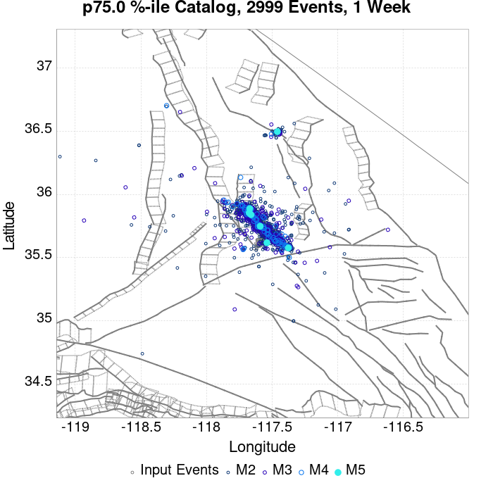 |  |  | 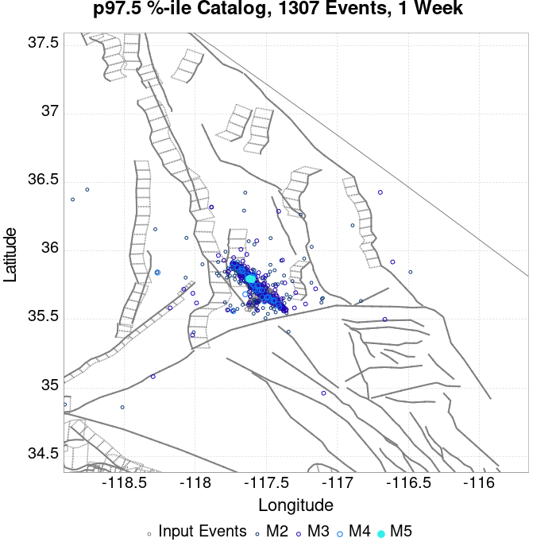 |  | 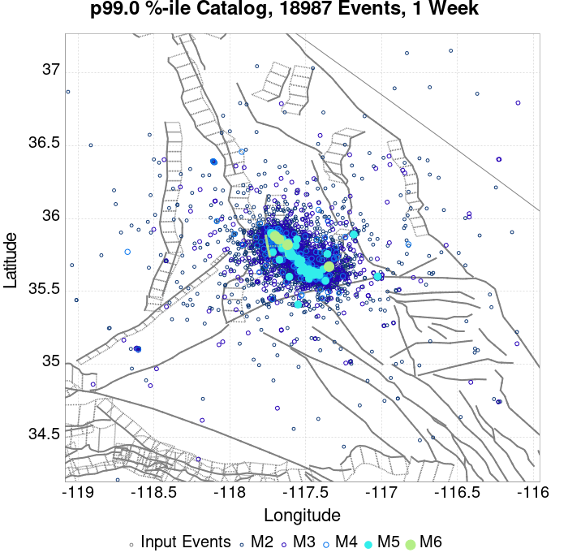 |  |  | 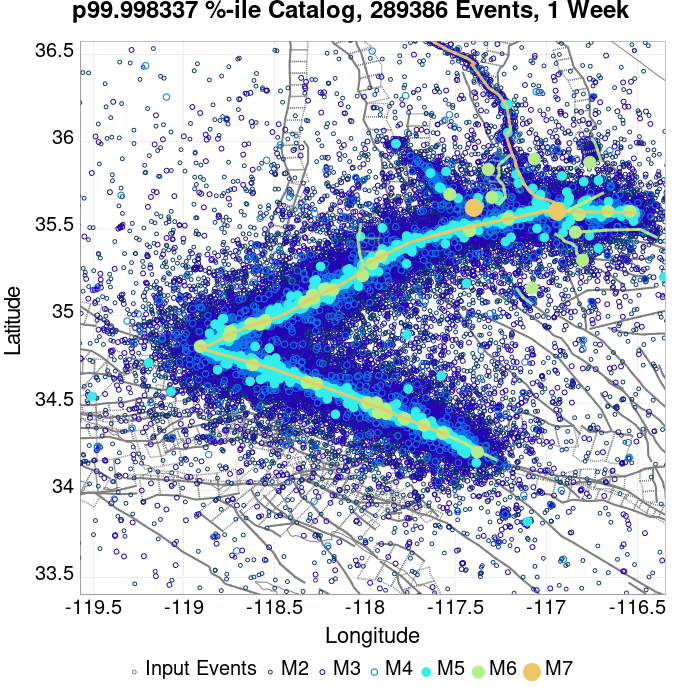 |
| **1 Month** |  |  |  |  |  | 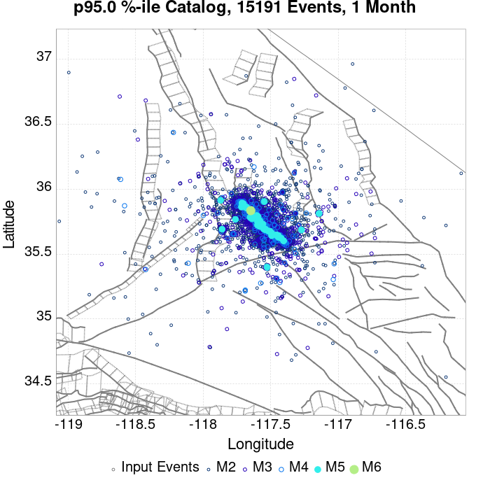 |  |  |  |  |  |  |
| **1 Year** |  |  |  |  |  |  |  |  |  |  |  |  |
| **10 Year** |  | 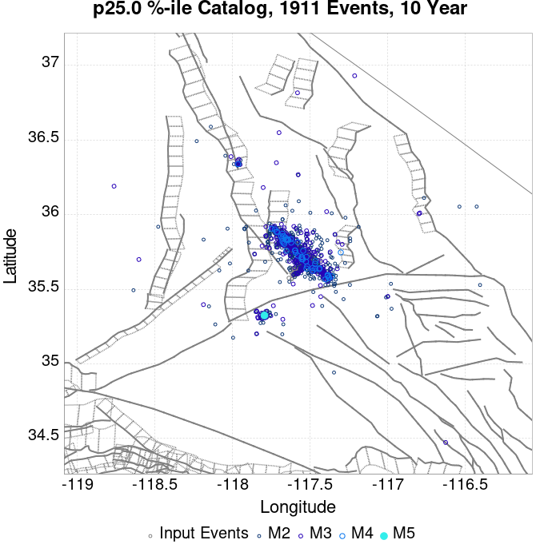 |  |  |  |  |  |  |  |  |  |  |

## ComCat Data Comparisons
*[(top)](#table-of-contents)*

These plots compare simulated sequences with data from ComCat. All plots only consider events with hypocenters inside the ComCat region defined in the JSON input file.

Last updated at 2019/10/29 17:33:24 UTC, 115.6 d after the simulation start time

### ComCat Magnitude-Number Distributions
*[(top)](#table-of-contents)*

| Incremental MND | Cumulative MND |
|-----|-----|
|  |  |

### ComCat Time-Dependent Mc
*[(top)](#table-of-contents)*

The following plots compare simulation results with ComCat data above a magnitude threshold. Plots labeled as *M&ge;Mc(t)* use the time-dependent magnitude of completeness (Mc) defined in Helmstetter et al. (2006), which is plotted below. In the case of multiple M&ge;5 ruptures, either as input to the simulation or in the comparison data, the maximum calculated time-dependent Mc is used. This time-dependent Mc function is plotted below.


### ComCat Cumulative Number Vs Time
*[(top)](#table-of-contents)*

| M&ge;Mc(t) | M&ge;3.5 | M&ge;4 | M&ge;5 | M&ge;6 | M&ge;7 |
|-----|-----|-----|-----|-----|-----|
|  |  |  |  |  |  |

### ComCat Cumulative Number Simulation Percentiles
*[(top)](#table-of-contents)*

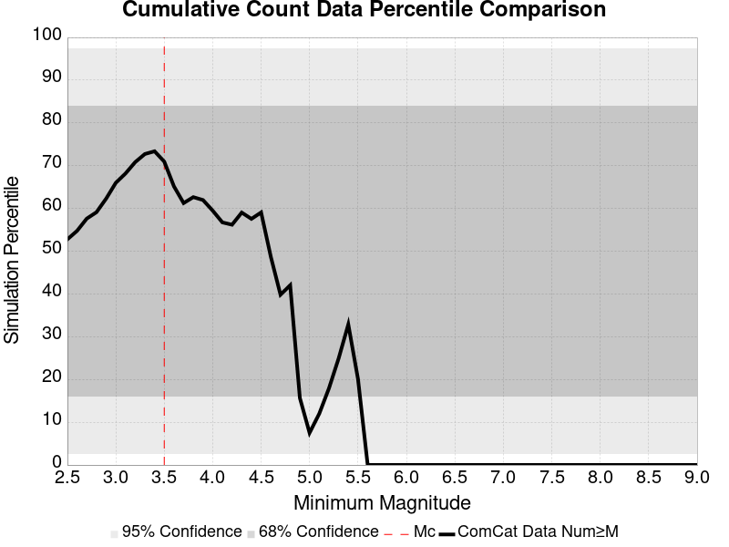

### ComCat Probability Spatial Distribution
*[(top)](#table-of-contents)*

|  | 1 Day | 1 Week | 1 Month | Current (115.6 Day) |
|-----|-----|-----|-----|-----|
| **M&ge;Mc(t)** | 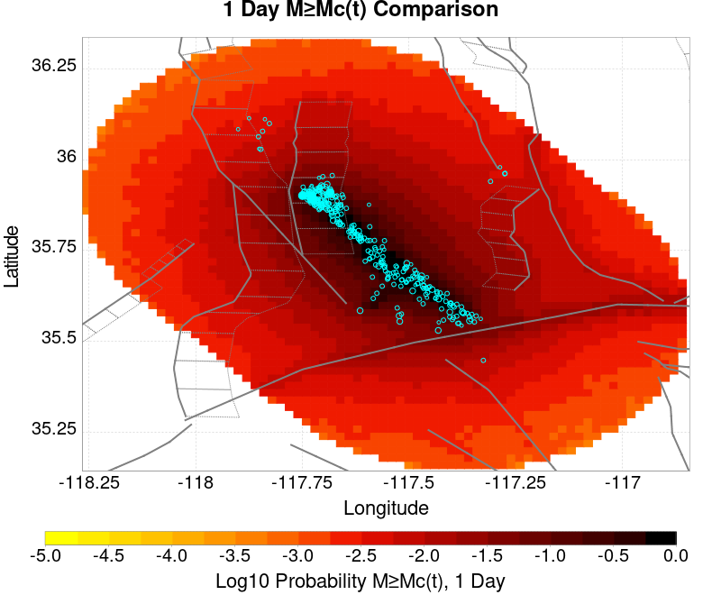 |  |  |  |
| **M&ge;3.5** |  |  |  |  |
| **M&ge;4** |  |  |  |  |
| **M&ge;5** |  |  |  |  |
| **M&ge;6** |  |  |  |  |
| **M&ge;7** |  |  | 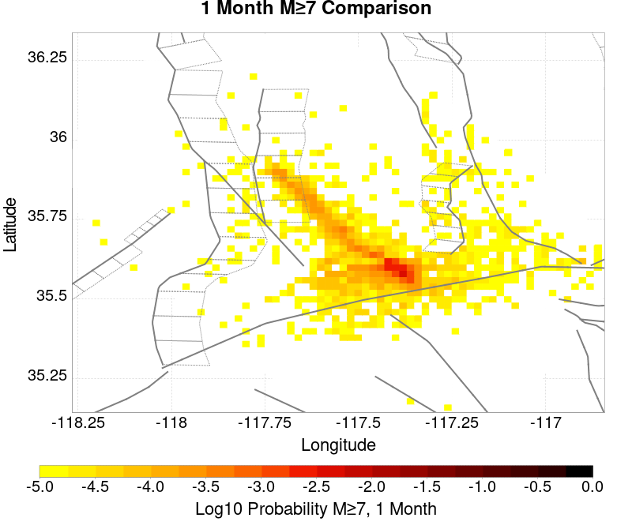 |  |
| **M&ge;8** |  |  |  |  |

### ComCat Mean Expectation Spatial Distribution
*[(top)](#table-of-contents)*

|  | 1 Day | 1 Week | 1 Month | Current (115.6 Day) |
|-----|-----|-----|-----|-----|
| **M&ge;Mc(t)** |  |  |  |  |
| **M&ge;3.5** |  | 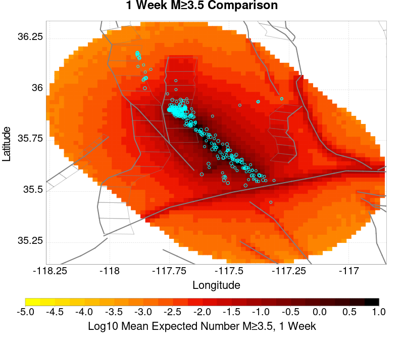 |  |  |
| **M&ge;4** |  |  |  |  |
| **M&ge;5** |  |  |  |  |
| **M&ge;6** | 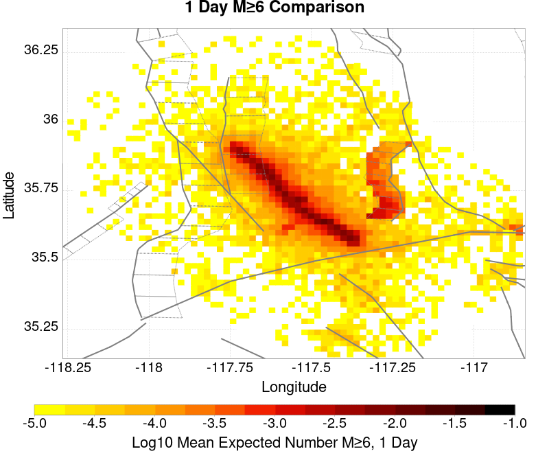 |  |  |  |
| **M&ge;7** |  | 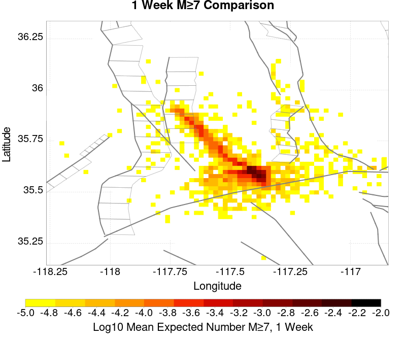 |  |  |
| **M&ge;8** |  |  |  |  |

### ComCat Depth Distribution
*[(top)](#table-of-contents)*

| M&ge;Mc(t) | M&ge;3.5 | M&ge;4 | M&ge;5 | M&ge;6 | M&ge;7 | M&ge;8 |
|-----|-----|-----|-----|-----|-----|-----|
|  | 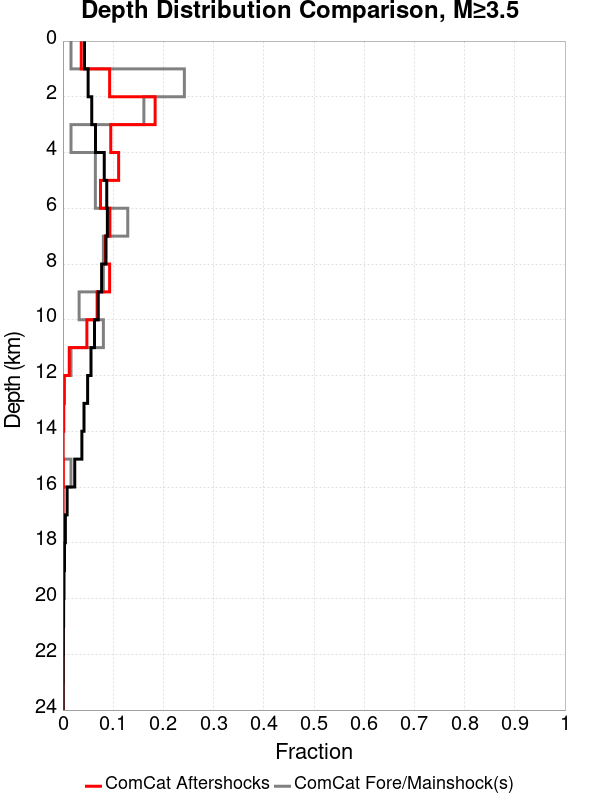 |  |  |  |  |  |

## Section Participation
*[(top)](#table-of-contents)*

### Section Participation Plots
*[(top)](#table-of-contents)*

| Min Mag | 1 yr Triggered Ruptures (no spontaneous) | 10 yr Triggered Ruptures (no spontaneous) | 10 yr Triggered Ruptures (primary aftershocks only) |
|-----|-----|-----|-----|
| **All Supra. Seis.** |  |  |  |
| **M&ge;6.5** |  |  |  |
| **M&ge;7** |  |  |  |
| **M&ge;7.5** |  |  |  |
| **M&ge;8** |  |  |  |

### Supra-Seismogenic Parent Sections Table
*[(top)](#table-of-contents)*

*First 10 of 185 with matching ruptures shown*

| Parent Name | Triggered 10 Year Mean Count | Triggered 1 Day Prob | Triggered 1 Week Prob | Triggered 1 Month Prob | Triggered 1 Year Prob | Triggered 10 Year Prob | Triggered 10 Year Primary Mean Count |
|-----|-----|-----|-----|-----|-----|-----|-----|
| Garlock (Central) | 0.14473662 | 0.05111189 | 0.07125393 | 0.08658916 | 0.112951785 | 0.13479035 | 0.080684595 |
| Tank Canyon | 0.118540324 | 0.024799163 | 0.038920213 | 0.050928928 | 0.07443075 | 0.09745023 | 0.033631057 |
| Little Lake | 0.0711874 | 0.024449877 | 0.03442942 | 0.0414151 | 0.055103704 | 0.06714568 | 0.040749796 |
| Airport Lake | 0.059843987 | 0.023934267 | 0.032333717 | 0.0385044 | 0.04958169 | 0.059494704 | 0.04045041 |
| Owl Lake | 0.042679176 | 0.010162501 | 0.015884105 | 0.020341633 | 0.029339854 | 0.0377892 | 0.012956772 |
| Panamint Valley | 0.03378075 | 0.008948322 | 0.013505647 | 0.017880013 | 0.025431199 | 0.032766163 | 0.012607488 |
| Garlock (East) | 0.029423017 | 0.006519967 | 0.010378724 | 0.013422484 | 0.019925818 | 0.026046604 | 0.0082663875 |
| Hunter Mountain-Saline Valley | 0.016416347 | 0.005139464 | 0.0073349634 | 0.009563727 | 0.012807079 | 0.016083695 | 0.0076676146 |
| Blackwater | 0.014137684 | 0.0026778437 | 0.0043909983 | 0.0062039485 | 0.009380769 | 0.013222893 | 0.0030437603 |
| Ash Hill | 0.013123098 | 0.0024948856 | 0.0039252867 | 0.0052725244 | 0.008565773 | 0.011809125 | 0.0020624388 |

### M≥6.5 Parent Sections Table
*[(top)](#table-of-contents)*

*First 10 of 157 with matching ruptures shown*

| Parent Name | Triggered 10 Year Mean Count | Triggered 1 Day Prob | Triggered 1 Week Prob | Triggered 1 Month Prob | Triggered 1 Year Prob | Triggered 10 Year Prob | Triggered 10 Year Primary Mean Count |
|-----|-----|-----|-----|-----|-----|-----|-----|
| Garlock (Central) | 0.0624553 | 0.021090098 | 0.030271277 | 0.037689403 | 0.050380055 | 0.061324283 | 0.03358116 |
| Airport Lake | 0.045323752 | 0.017763585 | 0.02408396 | 0.028757714 | 0.037390016 | 0.045257222 | 0.030653827 |
| Little Lake | 0.044292532 | 0.016299918 | 0.022570398 | 0.02706119 | 0.035560433 | 0.043144885 | 0.027260782 |
| Panamint Valley | 0.031235967 | 0.008599038 | 0.012790446 | 0.016865427 | 0.023784574 | 0.030387705 | 0.012374632 |
| Owl Lake | 0.025081916 | 0.007534554 | 0.011343413 | 0.014104419 | 0.019576535 | 0.024948854 | 0.0114265755 |
| Garlock (East) | 0.020025615 | 0.005388953 | 0.008183224 | 0.010428621 | 0.015069108 | 0.019011028 | 0.007734145 |
| Hunter Mountain-Saline Valley | 0.01605043 | 0.005106199 | 0.007268433 | 0.0094473 | 0.012657385 | 0.015850838 | 0.0076343496 |
| Tank Canyon | 0.013222893 | 0.0028109043 | 0.004590589 | 0.006386907 | 0.009696788 | 0.013189628 | 0.003592635 |
| Garlock (West) | 0.009646891 | 0.0029273324 | 0.0045739566 | 0.0056218086 | 0.0075511867 | 0.009630258 | 0.004989771 |
| So Sierra Nevada | 0.0049565057 | 9.1479137E-4 | 0.0015800941 | 0.0023950902 | 0.0035427373 | 0.0049066083 | 0.0010145868 |

### M≥7 Parent Sections Table
*[(top)](#table-of-contents)*

*First 10 of 107 with matching ruptures shown*

| Parent Name | Triggered 10 Year Mean Count | Triggered 1 Day Prob | Triggered 1 Week Prob | Triggered 1 Month Prob | Triggered 1 Year Prob | Triggered 10 Year Prob | Triggered 10 Year Primary Mean Count |
|-----|-----|-----|-----|-----|-----|-----|-----|
| Garlock (Central) | 0.055552784 | 0.018628478 | 0.02699466 | 0.03366432 | 0.044924572 | 0.054804318 | 0.030088319 |
| Panamint Valley | 0.02187183 | 0.0069191493 | 0.009929644 | 0.012923507 | 0.017430933 | 0.02173877 | 0.010411989 |
| Owl Lake | 0.01954327 | 0.006653028 | 0.009746686 | 0.011676064 | 0.015784308 | 0.01954327 | 0.011127189 |
| Hunter Mountain-Saline Valley | 0.015518188 | 0.0050064037 | 0.007152005 | 0.009297607 | 0.012407897 | 0.015518188 | 0.007534554 |
| Garlock (East) | 0.014603396 | 0.004673752 | 0.006885884 | 0.008565773 | 0.011875655 | 0.014503601 | 0.007384861 |
| Little Lake | 0.010162501 | 0.003975184 | 0.0054721157 | 0.0063203764 | 0.008515876 | 0.010162501 | 0.00660313 |
| Airport Lake | 0.009663523 | 0.0037922258 | 0.0052059945 | 0.005987725 | 0.008116694 | 0.009663523 | 0.006337009 |
| Garlock (West) | 0.009547095 | 0.0028940672 | 0.0045406916 | 0.0055885436 | 0.0075012892 | 0.009530462 | 0.004973138 |
| San Andreas (Mojave N) | 0.0042413054 | 0.0012973405 | 0.0018462152 | 0.002278662 | 0.0032766163 | 0.0041914075 | 0.0021123365 |
| San Andreas (Mojave S) | 0.0030770255 | 8.815262E-4 | 0.0013472382 | 0.0017131547 | 0.0023950902 | 0.0030770255 | 0.0014636662 |

### M≥7.5 Parent Sections Table
*[(top)](#table-of-contents)*

*First 10 of 57 with matching ruptures shown*

| Parent Name | Triggered 10 Year Mean Count | Triggered 1 Day Prob | Triggered 1 Week Prob | Triggered 1 Month Prob | Triggered 1 Year Prob | Triggered 10 Year Prob | Triggered 10 Year Primary Mean Count |
|-----|-----|-----|-----|-----|-----|-----|-----|
| Garlock (Central) | 0.022470603 | 0.007301698 | 0.010794538 | 0.013555544 | 0.018013073 | 0.022404071 | 0.0119089205 |
| Panamint Valley | 0.0150358435 | 0.0048567103 | 0.0070023118 | 0.009131281 | 0.012125144 | 0.0150358435 | 0.0074846563 |
| Hunter Mountain-Saline Valley | 0.0150025785 | 0.0048567103 | 0.0069856793 | 0.009114648 | 0.012091878 | 0.0150025785 | 0.007468024 |
| Garlock (West) | 0.008582406 | 0.002594681 | 0.004091612 | 0.0049565057 | 0.006736191 | 0.008565773 | 0.004557324 |
| Garlock (East) | 0.005222627 | 0.001663257 | 0.0025447833 | 0.0030437603 | 0.0041248775 | 0.005222627 | 0.0027277414 |
| San Andreas (Mojave N) | 0.00420804 | 0.0012973405 | 0.0018462152 | 0.002278662 | 0.0032599836 | 0.0041581425 | 0.0021123365 |
| San Andreas (Mojave S) | 0.0030271278 | 8.815262E-4 | 0.0013472382 | 0.0016965221 | 0.002361825 | 0.0030271278 | 0.0014636662 |
| Owl Lake | 0.0019626433 | 5.8213994E-4 | 9.979542E-4 | 0.0011310148 | 0.0015135639 | 0.0019626433 | 0.0010977496 |
| San Andreas (San Bernardino N) | 0.0019127455 | 5.488748E-4 | 8.316285E-4 | 0.0010644845 | 0.0015301964 | 0.0019127455 | 9.813217E-4 |
| San Andreas (San Bernardino S) | 8.4826106E-4 | 3.1601882E-4 | 3.9918168E-4 | 4.989771E-4 | 6.8193534E-4 | 8.4826106E-4 | 4.8234453E-4 |

### M≥8 Parent Sections Table
*[(top)](#table-of-contents)*

*First 10 of 28 with matching ruptures shown*

| Parent Name | Triggered 10 Year Mean Count | Triggered 1 Day Prob | Triggered 1 Week Prob | Triggered 1 Month Prob | Triggered 1 Year Prob | Triggered 10 Year Prob | Triggered 10 Year Primary Mean Count |
|-----|-----|-----|-----|-----|-----|-----|-----|
| San Andreas (Mojave N) | 6.154051E-4 | 2.6612112E-4 | 3.326514E-4 | 3.9918168E-4 | 5.3224224E-4 | 6.154051E-4 | 3.4928398E-4 |
| San Andreas (Mojave S) | 6.154051E-4 | 2.6612112E-4 | 3.326514E-4 | 3.9918168E-4 | 5.3224224E-4 | 6.154051E-4 | 3.4928398E-4 |
| San Andreas (San Bernardino N) | 6.154051E-4 | 2.6612112E-4 | 3.326514E-4 | 3.9918168E-4 | 5.3224224E-4 | 6.154051E-4 | 3.4928398E-4 |
| Garlock (Central) | 4.989771E-4 | 1.9959084E-4 | 2.6612112E-4 | 3.326514E-4 | 4.4907938E-4 | 4.989771E-4 | 3.1601882E-4 |
| Garlock (West) | 4.989771E-4 | 1.9959084E-4 | 2.6612112E-4 | 3.326514E-4 | 4.4907938E-4 | 4.989771E-4 | 3.1601882E-4 |
| Garlock (East) | 3.825491E-4 | 1.4969314E-4 | 1.8295828E-4 | 2.3285598E-4 | 3.326514E-4 | 3.825491E-4 | 2.1622342E-4 |
| San Andreas (San Bernardino S) | 3.6591655E-4 | 1.663257E-4 | 1.9959084E-4 | 2.3285598E-4 | 2.9938627E-4 | 3.6591655E-4 | 2.4948854E-4 |
| San Andreas (San Gorgonio Pass-Garnet HIll) | 3.326514E-4 | 1.663257E-4 | 1.9959084E-4 | 2.3285598E-4 | 2.827537E-4 | 3.326514E-4 | 2.3285598E-4 |
| San Andreas (Coachella) rev | 2.6612112E-4 | 1.1642799E-4 | 1.3306056E-4 | 1.4969314E-4 | 2.1622342E-4 | 2.6612112E-4 | 1.663257E-4 |
| San Jacinto (San Bernardino) | 1.663257E-4 | 8.316285E-5 | 1.1642799E-4 | 1.3306056E-4 | 1.663257E-4 | 1.663257E-4 | 4.989771E-5 |

### Fault Magnitude-Probability Distributions
*[(top)](#table-of-contents)*

The first 5 sections (sorted by trigger rate) are plotted below. All fault MPDs are available [here](plots/parent_sect_mpds/README.md)

| 1 Week | 1 Month | 1 Year | 10 Year |
|-----|-----|-----|-----|
|  |  |  |  |
| 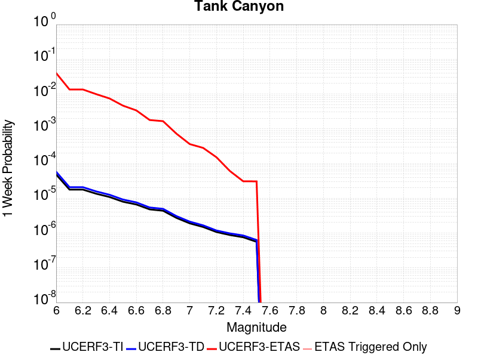 |  |  |  |
| 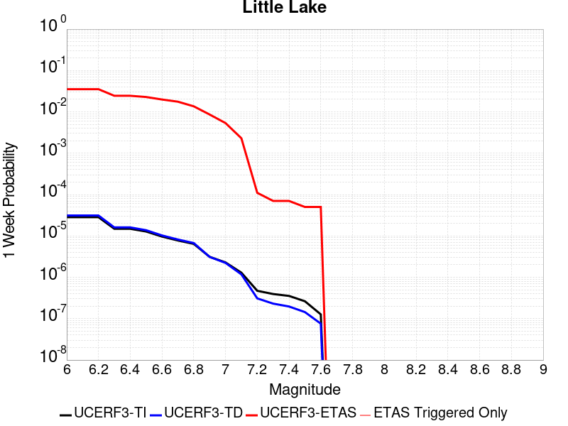 |  |  |  |
|  |  |  |  |
|  |  |  |  |

## Gridded Nucleation
*[(top)](#table-of-contents)*

| Min Mag | Triggered Ruptures (no spontaneous) | Triggered Ruptures (primary aftershocks only) |
|-----|-----|-----|
| **M&ge;2.5** | 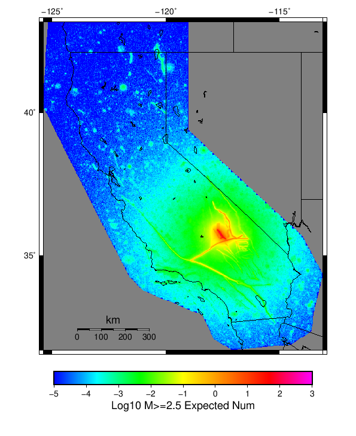 |  |
| **M&ge;5** |  | 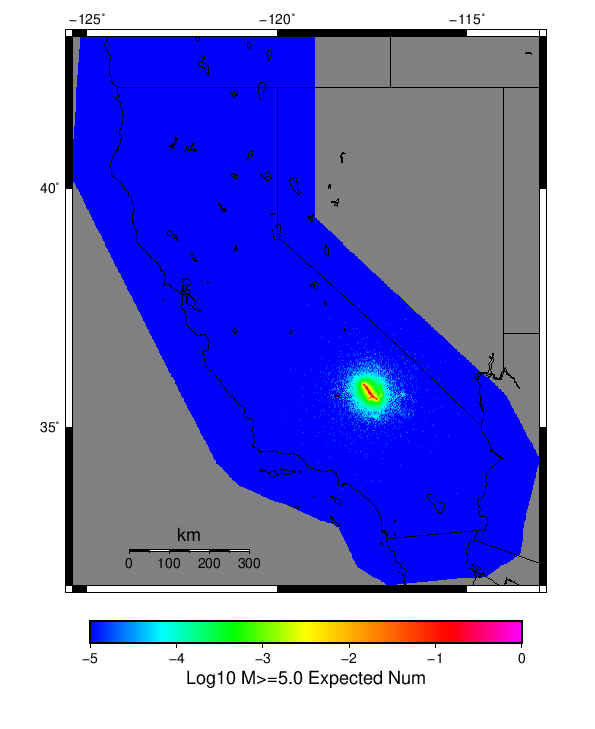 |
| **M&ge;6** |  |  |
| **M&ge;7** |  |  |


## JSON Input File
*[(top)](#table-of-contents)*

```
{
  "numSimulations": 100000,
  "duration": 10.0,
  "startTimeMillis": 1562383194040,
  "includeSpontaneous": false,
  "randomSeed": 1572353881188,
  "binaryOutput": true,
  "binaryOutputFilters": [
    {
      "prefix": "results_complete",
      "descendantsOnly": false
    },
    {
      "prefix": "results_m5_preserve_chain",
      "minMag": 5.0,
      "preserveChainBelowMag": true,
      "descendantsOnly": false
    }
  ],
  "forceRecalc": false,
  "simulationName": "ComCat M7.1 (ci38457511), ShakeMap Surfaces, kCOV\u003d1.5",
  "numRetries": 3,
  "outputDir": "/home/scec-02/kmilner/ucerf3/etas_sim/2019_10_29-ComCatM7p1_ci38457511_ShakeMapSurfaces_kCOV1p5",
  "treatTriggerCatalogAsSpontaneous": false,
  "triggerRuptures": [
    "omitted due to length, see original input file"
  ],
  "cacheDir": "/home/scec-02/kmilner/ucerf3/ucerf3-etas-launcher/inputs/cache_fm3p1_ba",
  "fssFile": "/home/scec-02/kmilner/ucerf3/ucerf3-etas-launcher/inputs/2013_05_10-ucerf3p3-production-10runs_COMPOUND_SOL_FM3_1_SpatSeisU3_MEAN_BRANCH_AVG_SOL.zip",
  "probModel": "FULL_TD",
  "applySubSeisForSupraNucl": true,
  "totRateScaleFactor": 1.14,
  "gridSeisCorr": true,
  "timeIndependentERF": false,
  "griddedOnly": false,
  "imposeGR": false,
  "includeIndirectTriggering": true,
  "gridSeisDiscr": 0.1,
  "catalogCompletenessModel": "RELAXED",
  "etas_k_cov": 1.5,
  "configCommand": "u3etas_comcat_event_config_builder.sh --event-id ci38457511 --mag-complete 3.5 --num-simulations 100000 --days-before 7 --etas-k-cov 1.5 --finite-surf-shakemap --finite-surf-shakemap-min-mag 5 --hpc-site USC_HPC --nodes 36 --hours 24 --queue scec",
  "configTime": 1572353881188,
  "comcatMetadata": {
    "region": {
      "border": [
        {
          "latitude": 35.15123745324938,
          "longitude": -117.46198765392752
        },
        {
          "latitude": 35.170513097218205,
          "longitude": -117.55046477274733
        },
        {
          "latitude": 35.201997575622634,
          "longitude": -117.63356287896195
        },
        {
          "latitude": 35.24474776584818,
          "longitude": -117.70878534540662
        },
        {
          "latitude": 35.2893890362986,
          "longitude": -117.76387551603122
        },
        {
          "latitude": 35.288830898189985,
          "longitude": -117.76465036296011
        },
        {
          "latitude": 35.62116745212862,
          "longitude": -118.13026990137416
        },
        {
          "latitude": 35.621789874646055,
          "longitude": -118.12940866580139
        },
        {
          "latitude": 35.621789874646055,
          "longitude": -118.12940866580136
        },
        {
          "latitude": 35.63100857737423,
          "longitude": -118.14083341711117
        },
        {
          "latitude": 35.69213881200874,
          "longitude": -118.19401186444136
        },
        {
          "latitude": 35.759827796433385,
          "longitude": -118.23338865654299
        },
        {
          "latitude": 35.8320329014668,
          "longitude": -118.25773927868946
        },
        {
          "latitude": 35.906569563076914,
          "longitude": -118.26628547708222
        },
        {
          "latitude": 35.9811764992231,
          "longitude": -118.25872343341653
        },
        {
          "latitude": 36.05358395358725,
          "longitude": -118.23523828089384
        },
        {
          "latitude": 36.12158296055357,
          "longitude": -118.19650389473806
        },
        {
          "latitude": 36.18309350302806,
          "longitude": -118.14366730262441
        },
        {
          "latitude": 36.23622937613509,
          "longitude": -118.07831757407638
        },
        {
          "latitude": 36.279357589115186,
          "longitude": -118.00243964650828
        },
        {
          "latitude": 36.31115024550475,
          "longitude": -117.91835419890715
        },
        {
          "latitude": 36.33062704347584,
          "longitude": -117.82864534929934
        },
        {
          "latitude": 36.337186832826475,
          "longitude": -117.7360785775
        },
        {
          "latitude": 36.33062704347584,
          "longitude": -117.64351180570065
        },
        {
          "latitude": 36.31115024550475,
          "longitude": -117.55380295609284
        },
        {
          "latitude": 36.279357589115186,
          "longitude": -117.46971750849171
        },
        {
          "latitude": 36.23622937613509,
          "longitude": -117.39383958092363
        },
        {
          "latitude": 36.19237301765921,
          "longitude": -117.33990236386252
        },
        {
          "latitude": 36.19237301765921,
          "longitude": -117.3399023638625
        },
        {
          "latitude": 36.19300476664728,
          "longitude": -117.33902822340912
        },
        {
          "latitude": 35.858277657147454,
          "longitude": -116.97410396317103
        },
        {
          "latitude": 35.85771127553969,
          "longitude": -116.97489025431044
        },
        {
          "latitude": 35.849566414597014,
          "longitude": -116.96491461360324
        },
        {
          "latitude": 35.78805819220281,
          "longitude": -116.9122967694479
        },
        {
          "latitude": 35.72006106557635,
          "longitude": -116.87372034968973
        },
        {
          "latitude": 35.64765482528862,
          "longitude": -116.85032807444419
        },
        {
          "latitude": 35.57304829206068,
          "longitude": -116.8427916482061
        },
        {
          "latitude": 35.49851117585832,
          "longitude": -116.8512961557198
        },
        {
          "latitude": 35.42630481575459,
          "longitude": -116.87553976530553
        },
        {
          "latitude": 35.35861392859174,
          "longitude": -116.91474809853695
        },
        {
          "latitude": 35.29748137319737,
          "longitude": -116.96770221389164
        },
        {
          "latitude": 35.24474776584818,
          "longitude": -117.03277884359336
        },
        {
          "latitude": 35.201997575622634,
          "longitude": -117.10800131003803
        },
        {
          "latitude": 35.170513097218205,
          "longitude": -117.19109941625265
        },
        {
          "latitude": 35.15123745324938,
          "longitude": -117.27957653507247
        },
        {
          "latitude": 35.14474752487352,
          "longitude": -117.3707820945
        }
      ]
    },
    "eventID": "ci38457511",
    "minDepth": -10.0,
    "maxDepth": 24.0,
    "minMag": 2.5,
    "startTime": 1561778393040,
    "endTime": 1562383193040,
    "magComplete": 3.5
  }
}
```

