# Parent Section Magnitude-Probability Distributions

Only fault sections with at least one triggered aftershock are plotted. Sections are sorted by total supraseismogenic trigger rate (decreasing)

## Table Of Contents

* [Garlock (Central)](#garlock-central)
* [Tank Canyon](#tank-canyon)
* [Little Lake](#little-lake)
* [Airport Lake](#airport-lake)
* [Owl Lake](#owl-lake)
* [Panamint Valley](#panamint-valley)
* [Garlock (East)](#garlock-east)
* [Hunter Mountain-Saline Valley](#hunter-mountain-saline-valley)
* [Blackwater](#blackwater)
* [Ash Hill](#ash-hill)
* [Garlock (West)](#garlock-west)
* [Gravel Hills-Harper Lk](#gravel-hills-harper-lk)
* [McLean Lake](#mclean-lake)
* [Goldstone Lake](#goldstone-lake)
* [San Andreas (Mojave S)](#san-andreas-mojave-s)
* [So Sierra Nevada](#so-sierra-nevada)
* [Coyote Canyon](#coyote-canyon)
* [Death Valley (So)](#death-valley-so)
* [San Andreas (Mojave N)](#san-andreas-mojave-n)
* [Nelson Lake](#nelson-lake)
* [Lenwood-Lockhart-Old Woman Springs](#lenwood-lockhart-old-woman-springs)
* [Towne Pass](#towne-pass)
* [Paradise](#paradise)
* [Bicycle Lake](#bicycle-lake)
* [San Andreas (San Bernardino N)](#san-andreas-san-bernardino-n)
* [Garlic Springs](#garlic-springs)
* [Death Valley (Black Mtns Frontal)](#death-valley-black-mtns-frontal)
* [Coyote Lake](#coyote-lake)
* [San Andreas (Big Bend)](#san-andreas-big-bend)
* [San Andreas (San Bernardino S)](#san-andreas-san-bernardino-s)
* [Helendale-So Lockhart](#helendale-so-lockhart)
* [Death Valley (No)](#death-valley-no)
* [San Andreas (Parkfield)](#san-andreas-parkfield)
* [San Andreas (Carrizo) rev](#san-andreas-carrizo-rev)
* [Red Pass](#red-pass)
* [Elsinore (Glen Ivy) rev](#elsinore-glen-ivy-rev)
* [San Andreas (Cholame) rev](#san-andreas-cholame-rev)
* [San Jacinto (San Bernardino)](#san-jacinto-san-bernardino)
* [Baker](#baker)
* [San Jacinto (Stepovers Combined)](#san-jacinto-stepovers-combined)
* [San Jacinto (San Jacinto Valley) rev](#san-jacinto-san-jacinto-valley-rev)
* [Cady](#cady)
* [Death Valley (Fish Lake Valley)](#death-valley-fish-lake-valley)
* [Calico-Hidalgo](#calico-hidalgo)
* [San Andreas (Coachella) rev](#san-andreas-coachella-rev)
* [White Wolf (Extension)](#white-wolf-extension)
* [Santa Ynez (West)](#santa-ynez-west)
* [San Andreas (Creeping Section) 2011 CFM](#san-andreas-creeping-section-2011-cfm)
* [Manix-Afton Hills](#manix-afton-hills)
* [Sierra Nevada  (No Extension)](#sierra-nevada--no-extension)
* [Tin Mountain](#tin-mountain)
* [Kern Canyon (North Kern) 2011](#kern-canyon-north-kern-2011)
* [San Andreas (San Gorgonio Pass-Garnet HIll)](#san-andreas-san-gorgonio-pass-garnet-hill)
* [San Jacinto (Coyote Creek)](#san-jacinto-coyote-creek)
* [San Jacinto (Anza) rev](#san-jacinto-anza-rev)
* [Scodie Lineament](#scodie-lineament)
* [Lake Isabella (Seismicity)](#lake-isabella-seismicity)
* [Ludlow](#ludlow)
* [San Andreas (North Branch Mill Creek)](#san-andreas-north-branch-mill-creek)
* [San Jacinto (Borrego)](#san-jacinto-borrego)
* [Pleito](#pleito)
* [Pisgah-Bullion Mtn-Mesquite Lk](#pisgah-bullion-mtn-mesquite-lk)
* [Owens Valley](#owens-valley)
* [Mission Ridge-Arroyo Parida-Santa Ana](#mission-ridge-arroyo-parida-santa-ana)
* [Oceanic - West Huasna](#oceanic---west-huasna)
* [Santa Cruz Island](#santa-cruz-island)
* [Independence rev 2011](#independence-rev-2011)
* [Blue Cut](#blue-cut)
* [Cleghorn Pass](#cleghorn-pass)
* [Santa Ynez (East)](#santa-ynez-east)
* [Great Valley 03a Dunnigan Hills](#great-valley-03a-dunnigan-hills)
* [Great Valley 09 (Laguna Seca)](#great-valley-09-laguna-seca)
* [Brawley (Seismic Zone) alt 1](#brawley-seismic-zone-alt-1)
* [San Jacinto (Superstition Mtn)](#san-jacinto-superstition-mtn)
* [Big Pine (East)](#big-pine-east)
* [Mission Creek](#mission-creek)
* [San Clemente](#san-clemente)
* [Imperial](#imperial)
* [Chino alt 1](#chino-alt-1)
* [Honey Lake 2011 CFM](#honey-lake-2011-cfm)
* [Dry Mountain](#dry-mountain)
* [Calaveras (So) - Paicines extension 2011 CFM](#calaveras-so---paicines-extension-2011-cfm)
* [Great Valley 07 (Orestimba)](#great-valley-07-orestimba)
* [Pinto Mtn](#pinto-mtn)
* [Channel Islands Thrust](#channel-islands-thrust)
* [Santa Rosa Island](#santa-rosa-island)
* [Big Pine (Central)](#big-pine-central)
* [Elysian Park (Upper)](#elysian-park-upper)
* [Elmore Ranch](#elmore-ranch)
* [San Luis Range 2011 CFM](#san-luis-range-2011-cfm)
* [Red Mountain](#red-mountain)
* [San Jacinto (Lytle Creek connector)](#san-jacinto-lytle-creek-connector)
* [Ventura-Pitas Point](#ventura-pitas-point)
* [White Mountains](#white-mountains)
* [Calaveras (No) 2011 CFM](#calaveras-no-2011-cfm)
* [Mono Lake 2011 CFM](#mono-lake-2011-cfm)
* [Hunting Creek - Berryessa 2011 CFM](#hunting-creek---berryessa-2011-cfm)
* [Anacapa-Dume alt 1](#anacapa-dume-alt-1)
* [Pitas Point (Lower West)](#pitas-point-lower-west)
* [San Pedro Basin](#san-pedro-basin)
* [Likely 2011 CFM](#likely-2011-cfm)
* [Shoreline](#shoreline)
* [Ortigalita (North)](#ortigalita-north)
* [San Jose](#san-jose)
* [Monterey Bay-Tularcitos](#monterey-bay-tularcitos)
* [Coronado Bank alt1](#coronado-bank-alt1)
* [Ortigalita (South)](#ortigalita-south)
* [San Luis Range - Oceano 2011 CFM](#san-luis-range---oceano-2011-cfm)
* [Deep Springs](#deep-springs)
* [Superstition Hills](#superstition-hills)
* [Palos Verdes](#palos-verdes)
* [Green Valley 2011 CFM](#green-valley-2011-cfm)
* [Point Reyes 2011 CFM](#point-reyes-2011-cfm)
* [Malibu Coast (Extension) alt 1](#malibu-coast-extension-alt-1)
* [La Panza 2011](#la-panza-2011)
* [Redondo Canyon alt 1](#redondo-canyon-alt-1)
* [Emerson-Copper Mtn 2011](#emerson-copper-mtn-2011)
* [Lost Hills](#lost-hills)
* [Hunting Creek - Bartlett Springs connector 2011](#hunting-creek---bartlett-springs-connector-2011)
* [Little Salmon (Onshore)](#little-salmon-onshore)
* [Camp Rock 2011](#camp-rock-2011)
* [San Diego Trough north alt1](#san-diego-trough-north-alt1)
* [Owens Valley Keough Hot Springs](#owens-valley-keough-hot-springs)
* [Kern Canyon (South Kern) 2011](#kern-canyon-south-kern-2011)
* [Morales (East)](#morales-east)
* [Los Osos 2011](#los-osos-2011)
* [Bullion Mountains](#bullion-mountains)
* [Whittier alt 1](#whittier-alt-1)
* [Robinson Creek](#robinson-creek)
* [Rinconada 2011 CFM](#rinconada-2011-cfm)
* [Calaveras (So) 2011 CFM](#calaveras-so-2011-cfm)
* [Hat Creek-McArthur-Mayfield](#hat-creek-mcarthur-mayfield)

## Garlock (Central)
*[(top)](#table-of-contents)*

| 1 Week | 1 Month | 1 Year | 10 Year |
|-----|-----|-----|-----|
|  |  |  |  |

| Magnitude | 1 wk TI Prob | 1 wk TD Prob | 1 wk ETAS Prob | 1 wk ETAS/TD Gain | 1 wk ETAS Triggered Only | 1 mo TI Prob | 1 mo TD Prob | 1 mo ETAS Prob | 1 mo ETAS/TD Gain | 1 mo ETAS Triggered Only | 1 yr TI Prob | 1 yr TD Prob | 1 yr ETAS Prob | 1 yr ETAS/TD Gain | 1 yr ETAS Triggered Only | 10 yr TI Prob | 10 yr TD Prob | 10 yr ETAS Prob | 10 yr ETAS/TD Gain | 10 yr ETAS Triggered Only |
|-----|-----|-----|-----|-----|-----|-----|-----|-----|-----|-----|-----|-----|-----|-----|-----|-----|-----|-----|-----|-----|
| 6.0 | 5.5131142E-5 | 7.02476E-5 | 0.068592496 | 976.43896 | 0.068527065 | 2.3625491E-4 | 3.0102677E-4 | 0.08474355 | 281.51498 | 0.08446795 | 0.0028726095 | 0.003658906 | 0.11375308 | 31.08937 | 0.11049848 | 0.028357591 | 0.036136657 | 0.16339366 | 4.5215487 | 0.13202806 |
| 6.1 | 5.5131142E-5 | 7.02476E-5 | 0.068592496 | 976.43896 | 0.068527065 | 2.3625491E-4 | 3.0102677E-4 | 0.08474355 | 281.51498 | 0.08446795 | 0.0028726095 | 0.003658906 | 0.11375308 | 31.08937 | 0.11049848 | 0.028357591 | 0.036136657 | 0.16339366 | 4.5215487 | 0.13202806 |
| 6.2 | 4.216245E-5 | 5.1661802E-5 | 0.04337113 | 839.52026 | 0.043321706 | 1.806837E-4 | 2.213891E-4 | 0.053920913 | 243.5572 | 0.053711414 | 0.0021976046 | 0.002692112 | 0.073503554 | 27.303305 | 0.07100259 | 0.021759989 | 0.026701318 | 0.10993604 | 4.1172514 | 0.085518174 |
| 6.3 | 4.216245E-5 | 5.1661802E-5 | 0.04337113 | 839.52026 | 0.043321706 | 1.806837E-4 | 2.213891E-4 | 0.053920913 | 243.5572 | 0.053711414 | 0.0021976046 | 0.002692112 | 0.073503554 | 27.303305 | 0.07100259 | 0.021759989 | 0.026701318 | 0.10993604 | 4.1172514 | 0.085518174 |
| 6.4 | 3.6858168E-5 | 4.411026E-5 | 0.03402483 | 771.3587 | 0.03398222 | 1.5795401E-4 | 1.8903041E-4 | 0.042490024 | 224.77876 | 0.04230899 | 0.0019213937 | 0.0022990413 | 0.058805864 | 25.578428 | 0.056637034 | 0.019048655 | 0.022866098 | 0.08982621 | 3.9283576 | 0.068527065 |
| 6.5 | 3.39199E-5 | 4.0018425E-5 | 0.030157713 | 753.5957 | 0.0301189 | 1.453629E-4 | 1.7149639E-4 | 0.037935544 | 221.20317 | 0.037770525 | 0.0017683565 | 0.0020859907 | 0.052765843 | 25.29534 | 0.05078579 | 0.017543508 | 0.020758783 | 0.080848 | 3.8946407 | 0.06136304 |
| 6.6 | 3.3571985E-5 | 3.947258E-5 | 0.030119678 | 763.05316 | 0.030081393 | 1.4387199E-4 | 1.6915736E-4 | 0.03789579 | 224.02687 | 0.03773302 | 0.0017502342 | 0.0020575672 | 0.052701432 | 25.61347 | 0.050748285 | 0.017365133 | 0.020480042 | 0.08051288 | 3.9312851 | 0.061288025 |
| 6.7 | 3.2580007E-5 | 3.808902E-5 | 0.029068151 | 763.1636 | 0.029031169 | 1.3962112E-4 | 1.6322857E-4 | 0.036577523 | 224.08775 | 0.03642024 | 0.0016985617 | 0.0019855178 | 0.05083623 | 25.603514 | 0.0489479 | 0.016856372 | 0.019770874 | 0.07760443 | 3.9251897 | 0.059000038 |
| 6.8 | 3.2185937E-5 | 3.7516216E-5 | 0.028429985 | 757.80524 | 0.028393533 | 1.3793244E-4 | 1.60774E-4 | 0.035900123 | 223.2956 | 0.035745095 | 0.0016780337 | 0.0019556875 | 0.0499843 | 25.55843 | 0.048122726 | 0.016654192 | 0.019477878 | 0.076262176 | 3.9153225 | 0.057912305 |
| 6.9 | 3.165394E-5 | 3.672075E-5 | 0.027791599 | 756.83636 | 0.027755897 | 1.3565269E-4 | 1.5736527E-4 | 0.035184298 | 223.58362 | 0.035032444 | 0.0016503202 | 0.00191426 | 0.04893409 | 25.56293 | 0.04711001 | 0.01638118 | 0.019071518 | 0.074554816 | 3.9092228 | 0.056562018 |
| 7.0 | 3.0903822E-5 | 3.562591E-5 | 0.026815362 | 752.6927 | 0.026780691 | 1.3243823E-4 | 1.5267366E-4 | 0.034054704 | 223.05553 | 0.033907205 | 0.0016112428 | 0.0018572382 | 0.0474571 | 25.552511 | 0.045684706 | 0.015996104 | 0.018513493 | 0.07248218 | 3.9151003 | 0.054986686 |
| 7.1 | 3.0069863E-5 | 3.4392175E-5 | 0.025501428 | 741.48926 | 0.025467912 | 1.2886449E-4 | 1.4738683E-4 | 0.032361984 | 219.57176 | 0.032219347 | 0.0015677959 | 0.0017929787 | 0.045186773 | 25.202068 | 0.04347174 | 0.01556781 | 0.01788099 | 0.069305845 | 3.8759515 | 0.052361127 |
| 7.2 | 2.7957109E-5 | 3.128141E-5 | 0.0211101 | 674.84485 | 0.021079479 | 1.1981068E-4 | 1.3405642E-4 | 0.026911158 | 200.74501 | 0.026780691 | 0.0014577188 | 0.0016309345 | 0.037991773 | 23.294481 | 0.03642024 | 0.014481937 | 0.016284352 | 0.05930646 | 3.6419294 | 0.043734293 |
| 7.3 | 2.4519275E-5 | 2.6714602E-5 | 0.014729446 | 551.3631 | 0.014703125 | 1.0507837E-4 | 1.1448621E-4 | 0.018866325 | 164.79124 | 0.018753985 | 0.0012785783 | 0.001392993 | 0.027125074 | 19.472511 | 0.025767976 | 0.012712469 | 0.01392861 | 0.044515647 | 3.1959865 | 0.031019092 |
| 7.4 | 2.3225532E-5 | 2.5199166E-5 | 0.013077644 | 518.9713 | 0.013052774 | 9.95342E-5 | 1.0799204E-4 | 0.016722228 | 154.84686 | 0.016616032 | 0.0012111551 | 0.0013140244 | 0.024013987 | 18.275145 | 0.02272983 | 0.012045753 | 0.013146196 | 0.040204074 | 3.058229 | 0.027418327 |
| 7.5 | 2.097765E-5 | 2.2483406E-5 | 0.010074394 | 448.08127 | 0.010052136 | 8.9901114E-5 | 9.6353964E-5 | 0.012960348 | 134.50768 | 0.012865234 | 0.0010939965 | 0.00117249 | 0.018705638 | 15.953773 | 0.01755373 | 0.010886264 | 0.0117406575 | 0.032906257 | 2.802761 | 0.021417052 |
| 7.6 | 1.511254E-5 | 1.5990969E-5 | 0.00545456 | 341.1025 | 0.0054386556 | 6.476642E-5 | 6.8530964E-5 | 0.006857008 | 100.057076 | 0.0067889425 | 7.882459E-4 | 8.34053E-4 | 0.010128271 | 12.143439 | 0.009301976 | 0.007854558 | 0.008383867 | 0.019802274 | 2.36195 | 0.011514947 |
| 7.7 | 9.934069E-6 | 1.0678523E-5 | 0.0012109207 | 113.39777 | 0.001200255 | 4.2573887E-5 | 4.5764296E-5 | 0.0015835207 | 34.60166 | 0.0015378268 | 5.182138E-4 | 5.570383E-4 | 0.002881237 | 5.172422 | 0.002325494 | 0.00517007 | 0.005627419 | 0.008611171 | 1.5302167 | 0.0030006377 |
| 7.8 | 6.7562896E-6 | 8.42837E-6 | 7.5858145E-4 | 90.00334 | 7.5015944E-4 | 2.8955206E-5 | 3.6121084E-5 | 0.0010487997 | 29.035664 | 0.0010127152 | 3.5247262E-4 | 4.3968562E-4 | 0.0019018532 | 4.3254843 | 0.0014628108 | 0.0035191406 | 0.004446416 | 0.006350817 | 1.4283001 | 0.0019129065 |
| 7.9 | 3.975453E-6 | 5.3710532E-6 | 3.8044874E-4 | 70.833176 | 3.7507972E-4 | 1.7037546E-5 | 2.3018596E-5 | 5.10611E-4 | 22.182543 | 4.8760363E-4 | 2.0741238E-4 | 2.8021546E-4 | 0.0011051596 | 3.9439635 | 8.251754E-4 | 0.002072189 | 0.0028335669 | 0.0039182156 | 1.3827858 | 0.0010877311 |
| 8.0 | 1.6729537E-6 | 2.0775192E-6 | 1.146012E-4 | 55.16252 | 1.12523914E-4 | 7.169782E-6 | 8.903624E-6 | 1.5893417E-4 | 17.850504 | 1.5003188E-4 | 8.7288594E-5 | 1.0839626E-4 | 4.084275E-4 | 3.7679114 | 3.0006375E-4 | 8.7254314E-4 | 0.001096854 | 0.0015089891 | 1.3757429 | 4.125877E-4 |
| 8.1 | 3.6733252E-7 | 3.1489736E-7 | 3.7822854E-5 | 120.111694 | 3.750797E-5 | 1.5742813E-6 | 1.3495595E-6 | 3.885748E-5 | 28.792711 | 3.750797E-5 | 1.9166706E-5 | 1.643078E-5 | 9.144549E-5 | 5.565499 | 7.501594E-5 | 1.9165053E-4 | 1.662928E-4 | 2.78798E-4 | 1.6765488 | 1.12523914E-4 |

## Tank Canyon
*[(top)](#table-of-contents)*

| 1 Week | 1 Month | 1 Year | 10 Year |
|-----|-----|-----|-----|
|  |  |  |  |

| Magnitude | 1 wk TI Prob | 1 wk TD Prob | 1 wk ETAS Prob | 1 wk ETAS/TD Gain | 1 wk ETAS Triggered Only | 1 mo TI Prob | 1 mo TD Prob | 1 mo ETAS Prob | 1 mo ETAS/TD Gain | 1 mo ETAS Triggered Only | 1 yr TI Prob | 1 yr TD Prob | 1 yr ETAS Prob | 1 yr ETAS/TD Gain | 1 yr ETAS Triggered Only | 10 yr TI Prob | 10 yr TD Prob | 10 yr ETAS Prob | 10 yr ETAS/TD Gain | 10 yr ETAS Triggered Only |
|-----|-----|-----|-----|-----|-----|-----|-----|-----|-----|-----|-----|-----|-----|-----|-----|-----|-----|-----|-----|-----|
| 6.0 | 4.8284557E-5 | 5.796445E-5 | 0.037713785 | 650.6365 | 0.037658002 | 2.0691741E-4 | 2.4839927E-4 | 0.049859118 | 200.72168 | 0.049623046 | 0.0025163088 | 0.0030207336 | 0.076389074 | 25.288252 | 0.073590636 | 0.02488006 | 0.029863616 | 0.123817034 | 4.1460834 | 0.09684558 |
| 6.1 | 1.7796336E-5 | 2.0873378E-5 | 0.012623289 | 604.75543 | 0.0126026785 | 7.626778E-5 | 8.945448E-5 | 0.017266568 | 193.02072 | 0.017178651 | 9.281647E-4 | 0.0010886024 | 0.027915074 | 25.643042 | 0.026855707 | 0.009242975 | 0.010836642 | 0.04790105 | 4.420285 | 0.037470464 |
| 6.2 | 1.7796336E-5 | 2.0873378E-5 | 0.012623289 | 604.75543 | 0.0126026785 | 7.626778E-5 | 8.945448E-5 | 0.017266568 | 193.02072 | 0.017178651 | 9.281647E-4 | 0.0010886024 | 0.027915074 | 25.643042 | 0.026855707 | 0.009242975 | 0.010836642 | 0.04790105 | 4.420285 | 0.037470464 |
| 6.3 | 1.3515912E-5 | 1.5759651E-5 | 0.009355097 | 593.61066 | 0.009339484 | 5.792405E-5 | 6.7539746E-5 | 0.012669367 | 187.58386 | 0.0126026785 | 7.049971E-4 | 8.2200987E-4 | 0.020310123 | 24.707882 | 0.019504145 | 0.007027647 | 0.008192157 | 0.035199866 | 4.2967763 | 0.027230786 |
| 6.4 | 1.0870146E-5 | 1.2618114E-5 | 0.0067639677 | 536.0522 | 0.006751435 | 4.658551E-5 | 5.4076605E-5 | 0.009505574 | 175.77979 | 0.009452009 | 5.67031E-4 | 6.582015E-4 | 0.015314165 | 23.266682 | 0.014665617 | 0.005655863 | 0.006564382 | 0.026573943 | 4.048202 | 0.02014178 |
| 6.5 | 7.964826E-6 | 9.196184E-6 | 0.003947497 | 429.2538 | 0.003938337 | 3.4134522E-5 | 3.941168E-5 | 0.0057403985 | 145.65222 | 0.0057012113 | 4.1550855E-4 | 4.797421E-4 | 0.009552317 | 19.911358 | 0.009076929 | 0.0041473247 | 0.004788209 | 0.017517185 | 3.6584 | 0.012790218 |
| 6.6 | 6.6317E-6 | 7.612378E-6 | 0.003045735 | 400.10294 | 0.0030381456 | 2.8421264E-5 | 3.262412E-5 | 0.0043459 | 133.21126 | 0.004313417 | 3.4597394E-4 | 3.9713533E-4 | 0.0071458886 | 17.993586 | 0.006751435 | 0.0034543579 | 0.0039652516 | 0.013230343 | 3.3365712 | 0.009301976 |
| 6.7 | 4.793663E-6 | 5.4308593E-6 | 0.0016182648 | 297.97583 | 0.0016128428 | 2.0544108E-5 | 2.3274928E-5 | 0.0023112078 | 99.30032 | 0.0022879862 | 2.500958E-4 | 2.833398E-4 | 0.0037705926 | 13.307672 | 0.0034882412 | 0.0024981452 | 0.0028303189 | 0.0075803488 | 2.6782668 | 0.0047635124 |
| 6.8 | 4.382823E-6 | 4.969325E-6 | 0.0015427885 | 310.46237 | 0.0015378268 | 1.8783392E-5 | 2.1296957E-5 | 0.00223422 | 104.90795 | 0.0022129703 | 2.286638E-4 | 2.5926388E-4 | 0.0034841131 | 13.438482 | 0.0032256856 | 0.0022842865 | 0.0025901233 | 0.0068923677 | 2.661019 | 0.004313417 |
| 6.9 | 2.729601E-6 | 3.0735862E-6 | 7.9073856E-4 | 257.26904 | 7.876674E-4 | 1.1698237E-5 | 1.3172453E-5 | 0.0011008893 | 83.57512 | 0.0010877311 | 1.4241673E-4 | 1.6036403E-4 | 0.0017354462 | 10.821917 | 0.0015753348 | 0.001423255 | 0.0016024808 | 0.0035872175 | 2.2385402 | 0.0019879225 |
| 7.0 | 1.8987357E-6 | 2.126971E-6 | 3.39698E-4 | 159.70975 | 3.3757172E-4 | 8.137413E-6 | 9.115562E-6 | 4.216995E-4 | 46.26149 | 4.125877E-4 | 9.90685E-5 | 1.1097702E-4 | 8.610532E-4 | 7.7588425 | 7.5015944E-4 | 9.902435E-4 | 0.0011092846 | 0.001971011 | 1.7768307 | 8.6268334E-4 |
| 7.1 | 1.4928986E-6 | 1.6641525E-6 | 3.017274E-4 | 181.30995 | 3.0006375E-4 | 6.398121E-6 | 7.132066E-6 | 3.447014E-4 | 48.33121 | 3.3757172E-4 | 7.789434E-5 | 8.6830034E-5 | 6.8690546E-4 | 7.91092 | 6.001275E-4 | 7.786704E-4 | 8.6801895E-4 | 0.001505101 | 1.7339494 | 6.376355E-4 |
| 7.2 | 1.069082E-6 | 1.1828765E-6 | 1.1370666E-4 | 96.127235 | 1.12523914E-4 | 4.581772E-6 | 5.0694644E-6 | 1.5510058E-4 | 30.595064 | 1.5003188E-4 | 5.5781646E-5 | 6.171951E-5 | 2.8675343E-4 | 4.6460743 | 2.2504783E-4 | 5.576765E-4 | 6.1707594E-4 | 8.4198493E-4 | 1.3644753 | 2.2504783E-4 |
| 7.3 | 8.776551E-7 | 9.770151E-7 | 1.1350081E-4 | 116.17099 | 1.12523914E-4 | 3.7613736E-6 | 4.187204E-6 | 1.5421846E-4 | 36.83089 | 1.5003188E-4 | 4.579376E-5 | 5.0978535E-5 | 2.3850883E-4 | 4.6786127 | 1.8753986E-4 | 4.5784327E-4 | 5.097194E-4 | 6.971637E-4 | 1.36774 | 1.8753986E-4 |
| 7.4 | 7.55721E-7 | 8.5103835E-7 | 3.8358976E-5 | 45.073147 | 3.750797E-5 | 3.2388E-6 | 3.6473052E-6 | 7.8662975E-5 | 21.567423 | 7.501594E-5 | 3.9431678E-5 | 4.4405555E-5 | 1.1941816E-4 | 2.689262 | 7.501594E-5 | 3.942468E-4 | 4.4401767E-4 | 5.190003E-4 | 1.1688731 | 7.501594E-5 |
| 7.5 | 5.587665E-7 | 6.305732E-7 | 3.813852E-5 | 60.482307 | 3.750797E-5 | 2.3947114E-6 | 2.7024564E-6 | 7.771819E-5 | 28.758352 | 7.501594E-5 | 2.915522E-5 | 3.2902408E-5 | 1.0791588E-4 | 3.279878 | 7.501594E-5 | 2.9151395E-4 | 3.2902407E-4 | 4.0401533E-4 | 1.2279203 | 7.501594E-5 |

## Little Lake
*[(top)](#table-of-contents)*

| 1 Week | 1 Month | 1 Year | 10 Year |
|-----|-----|-----|-----|
|  | 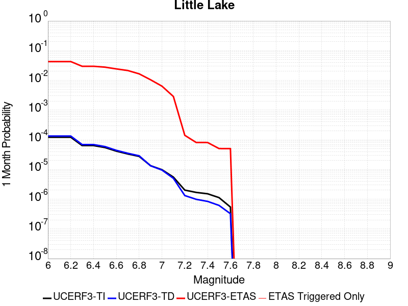 |  |  |

| Magnitude | 1 wk TI Prob | 1 wk TD Prob | 1 wk ETAS Prob | 1 wk ETAS/TD Gain | 1 wk ETAS Triggered Only | 1 mo TI Prob | 1 mo TD Prob | 1 mo ETAS Prob | 1 mo ETAS/TD Gain | 1 mo ETAS Triggered Only | 1 yr TI Prob | 1 yr TD Prob | 1 yr ETAS Prob | 1 yr ETAS/TD Gain | 1 yr ETAS Triggered Only | 10 yr TI Prob | 10 yr TD Prob | 10 yr ETAS Prob | 10 yr ETAS/TD Gain | 10 yr ETAS Triggered Only |
|-----|-----|-----|-----|-----|-----|-----|-----|-----|-----|-----|-----|-----|-----|-----|-----|-----|-----|-----|-----|-----|
| 6.0 | 2.8424427E-5 | 3.1205716E-5 | 0.032774642 | 1050.2769 | 0.03274446 | 1.2181328E-4 | 1.3373268E-4 | 0.03928682 | 293.77127 | 0.039158322 | 0.0014820677 | 0.0016271125 | 0.053341337 | 32.78282 | 0.051798508 | 0.014722223 | 0.016165398 | 0.07856607 | 4.8601384 | 0.06342598 |
| 6.1 | 2.8424427E-5 | 3.1205716E-5 | 0.032774642 | 1050.2769 | 0.03274446 | 1.2181328E-4 | 1.3373268E-4 | 0.03928682 | 293.77127 | 0.039158322 | 0.0014820677 | 0.0016271125 | 0.053341337 | 32.78282 | 0.051798508 | 0.014722223 | 0.016165398 | 0.07856607 | 4.8601384 | 0.06342598 |
| 6.2 | 2.8424427E-5 | 3.1205716E-5 | 0.032774642 | 1050.2769 | 0.03274446 | 1.2181328E-4 | 1.3373268E-4 | 0.03928682 | 293.77127 | 0.039158322 | 0.0014820677 | 0.0016271125 | 0.053341337 | 32.78282 | 0.051798508 | 0.014722223 | 0.016165398 | 0.07856607 | 4.8601384 | 0.06342598 |
| 6.3 | 1.48860645E-5 | 1.6081383E-5 | 0.023645723 | 1470.3785 | 0.023630021 | 6.379586E-5 | 6.8918554E-5 | 0.027972925 | 405.8838 | 0.02790593 | 7.7643775E-4 | 8.387886E-4 | 0.036891192 | 43.98151 | 0.036082666 | 0.007737305 | 0.008359045 | 0.051839344 | 6.2015867 | 0.043846816 |
| 6.4 | 1.48860645E-5 | 1.6081383E-5 | 0.023645723 | 1470.3785 | 0.023630021 | 6.379586E-5 | 6.8918554E-5 | 0.027972925 | 405.8838 | 0.02790593 | 7.7643775E-4 | 8.387886E-4 | 0.036891192 | 43.98151 | 0.036082666 | 0.007737305 | 0.008359045 | 0.051839344 | 6.2015867 | 0.043846816 |
| 6.5 | 1.2797581E-5 | 1.376556E-5 | 0.021843104 | 1586.7937 | 0.021829639 | 5.4845623E-5 | 5.8994065E-5 | 0.025862955 | 438.39926 | 0.025805485 | 6.675408E-4 | 7.1804173E-4 | 0.034076165 | 47.45708 | 0.033382095 | 0.006655392 | 0.007159767 | 0.047303863 | 6.6068997 | 0.040433593 |
| 6.6 | 9.661896E-6 | 1.0289033E-5 | 0.019176664 | 1863.7968 | 0.019166572 | 4.1407468E-5 | 4.40952E-5 | 0.022847936 | 518.1502 | 0.022804845 | 5.040193E-4 | 5.36743E-4 | 0.030189624 | 56.245953 | 0.029668804 | 0.005028777 | 0.0053560715 | 0.041021634 | 7.6589036 | 0.03585762 |
| 6.7 | 7.767871E-6 | 8.199681E-6 | 0.017299233 | 2109.7444 | 0.017291175 | 3.329045E-5 | 3.5141096E-5 | 0.020588787 | 585.88916 | 0.020554367 | 4.0523586E-4 | 4.2777258E-4 | 0.02704704 | 63.227615 | 0.026630659 | 0.004044977 | 0.004270843 | 0.036389932 | 8.52055 | 0.032256853 |
| 6.8 | 6.4235196E-6 | 6.735739E-6 | 0.01373456 | 2039.0576 | 0.013727917 | 2.752908E-5 | 2.8867207E-5 | 0.016231842 | 562.2935 | 0.016203443 | 3.35115E-4 | 3.5141438E-4 | 0.021573465 | 61.39039 | 0.021229511 | 0.003346101 | 0.0035098472 | 0.029150005 | 8.305206 | 0.025730468 |
| 6.9 | 3.1283696E-6 | 3.1121751E-6 | 0.008967489 | 2881.4219 | 0.008964405 | 1.3407229E-5 | 1.33378335E-5 | 0.0106279515 | 796.82745 | 0.010614756 | 1.6322079E-4 | 1.6237753E-4 | 0.0137380585 | 84.60566 | 0.013577885 | 0.0016310095 | 0.0016227372 | 0.017949674 | 11.061357 | 0.016353475 |
| 7.0 | 2.290603E-6 | 2.2286763E-6 | 0.0052908408 | 2373.9836 | 0.0052886237 | 9.816834E-6 | 9.551441E-6 | 0.006348338 | 664.64716 | 0.006338847 | 1.19513395E-4 | 1.1628362E-4 | 0.008629602 | 74.21168 | 0.008514309 | 0.0011944914 | 0.0011623299 | 0.011202782 | 9.638212 | 0.010052136 |
| 7.1 | 1.293693E-6 | 1.1776774E-6 | 0.0020641137 | 1752.6986 | 0.0020629384 | 5.5443866E-6 | 5.047183E-6 | 0.002780623 | 550.9257 | 0.0027755897 | 6.750081E-5 | 6.1448416E-5 | 0.0037745093 | 61.425655 | 0.003713289 | 6.7480316E-4 | 6.1438273E-4 | 0.005112574 | 8.32148 | 0.0045009563 |
| 7.2 | 4.715842E-7 | 3.091732E-7 | 1.1283305E-4 | 364.95093 | 1.12523914E-4 | 2.0210737E-6 | 1.3250274E-6 | 1.8886464E-4 | 142.5364 | 1.8753986E-4 | 2.4606294E-5 | 1.6132095E-5 | 2.0366893E-4 | 12.625076 | 1.8753986E-4 | 2.460357E-4 | 1.6130977E-4 | 3.4881936E-4 | 2.1624193 | 1.8753986E-4 |
| 7.3 | 3.9430947E-7 | 2.3096938E-7 | 1.1275485E-4 | 488.18097 | 1.12523914E-4 | 1.6898966E-6 | 9.898685E-7 | 1.1351367E-4 | 114.675514 | 1.12523914E-4 | 2.0574296E-5 | 1.2051582E-5 | 1.2457414E-4 | 10.336745 | 1.12523914E-4 | 2.0572392E-4 | 1.2050936E-4 | 2.3301972E-4 | 1.9336233 | 1.12523914E-4 |
| 7.4 | 3.547123E-7 | 1.9678579E-7 | 1.1272068E-4 | 572.809 | 1.12523914E-4 | 1.5201948E-6 | 8.433674E-7 | 1.1336718E-4 | 134.42206 | 1.12523914E-4 | 1.8508214E-5 | 1.02679505E-5 | 1.227907E-4 | 11.958638 | 1.12523914E-4 | 1.8506673E-4 | 1.0267482E-4 | 2.1518719E-4 | 2.0958126 | 1.12523914E-4 |
| 7.5 | 2.6354266E-7 | 1.4422719E-7 | 1.1266812E-4 | 781.18506 | 1.12523914E-4 | 1.129468E-6 | 6.1811636E-7 | 1.13141956E-4 | 183.04314 | 1.12523914E-4 | 1.3751187E-5 | 7.525541E-6 | 1.2004861E-4 | 15.952156 | 1.12523914E-4 | 1.3750336E-4 | 7.5252916E-5 | 1.8776835E-4 | 2.495164 | 1.12523914E-4 |
| 7.6 | 1.269913E-7 | 7.572344E-8 | 1.1259963E-4 | 1486.985 | 1.12523914E-4 | 5.4424834E-7 | 3.24529E-7 | 1.1284841E-4 | 347.7298 | 1.12523914E-4 | 6.6262032E-6 | 3.9511337E-6 | 1.164746E-4 | 29.478779 | 1.12523914E-4 | 6.626006E-5 | 3.9510673E-5 | 1.5203013E-4 | 3.8478248 | 1.12523914E-4 |

## Airport Lake
*[(top)](#table-of-contents)*

| 1 Week | 1 Month | 1 Year | 10 Year |
|-----|-----|-----|-----|
|  |  |  |  |

| Magnitude | 1 wk TI Prob | 1 wk TD Prob | 1 wk ETAS Prob | 1 wk ETAS/TD Gain | 1 wk ETAS Triggered Only | 1 mo TI Prob | 1 mo TD Prob | 1 mo ETAS Prob | 1 mo ETAS/TD Gain | 1 mo ETAS Triggered Only | 1 yr TI Prob | 1 yr TD Prob | 1 yr ETAS Prob | 1 yr ETAS/TD Gain | 1 yr ETAS Triggered Only | 10 yr TI Prob | 10 yr TD Prob | 10 yr ETAS Prob | 10 yr ETAS/TD Gain | 10 yr ETAS Triggered Only |
|-----|-----|-----|-----|-----|-----|-----|-----|-----|-----|-----|-----|-----|-----|-----|-----|-----|-----|-----|-----|-----|
| 6.0 | 1.2387061E-5 | 1.3103157E-5 | 0.031856954 | 2431.2427 | 0.031844266 | 5.3086325E-5 | 5.615534E-5 | 0.037787054 | 672.9023 | 0.03773302 | 6.461343E-4 | 6.8350515E-4 | 0.048885785 | 71.52219 | 0.04823525 | 0.0064425888 | 0.0068168393 | 0.06403635 | 9.393847 | 0.057612244 |
| 6.1 | 1.2387061E-5 | 1.3103157E-5 | 0.031856954 | 2431.2427 | 0.031844266 | 5.3086325E-5 | 5.615534E-5 | 0.037787054 | 672.9023 | 0.03773302 | 6.461343E-4 | 6.8350515E-4 | 0.048885785 | 71.52219 | 0.04823525 | 0.0064425888 | 0.0068168393 | 0.06403635 | 9.393847 | 0.057612244 |
| 6.2 | 1.2387061E-5 | 1.3103157E-5 | 0.031856954 | 2431.2427 | 0.031844266 | 5.3086325E-5 | 5.615534E-5 | 0.037787054 | 672.9023 | 0.03773302 | 6.461343E-4 | 6.8350515E-4 | 0.048885785 | 71.52219 | 0.04823525 | 0.0064425888 | 0.0068168393 | 0.06403635 | 9.393847 | 0.057612244 |
| 6.3 | 1.2387061E-5 | 1.3103157E-5 | 0.031856954 | 2431.2427 | 0.031844266 | 5.3086325E-5 | 5.615534E-5 | 0.037787054 | 672.9023 | 0.03773302 | 6.461343E-4 | 6.8350515E-4 | 0.048885785 | 71.52219 | 0.04823525 | 0.0064425888 | 0.0068168393 | 0.06403635 | 9.393847 | 0.057612244 |
| 6.4 | 1.2387061E-5 | 1.3103157E-5 | 0.031856954 | 2431.2427 | 0.031844266 | 5.3086325E-5 | 5.615534E-5 | 0.037787054 | 672.9023 | 0.03773302 | 6.461343E-4 | 6.8350515E-4 | 0.048885785 | 71.52219 | 0.04823525 | 0.0064425888 | 0.0068168393 | 0.06403635 | 9.393847 | 0.057612244 |
| 6.5 | 6.9922594E-6 | 7.384925E-6 | 0.024087325 | 3261.6882 | 0.024080116 | 2.996648E-5 | 3.1649324E-5 | 0.028424283 | 898.10077 | 0.028393533 | 3.6478083E-4 | 3.8526783E-4 | 0.036716487 | 95.3012 | 0.036345225 | 0.003641826 | 0.0038465366 | 0.047188424 | 12.267769 | 0.043509245 |
| 6.6 | 6.9922594E-6 | 7.384925E-6 | 0.024087325 | 3261.6882 | 0.024080116 | 2.996648E-5 | 3.1649324E-5 | 0.028424283 | 898.10077 | 0.028393533 | 3.6478083E-4 | 3.8526783E-4 | 0.036716487 | 95.3012 | 0.036345225 | 0.003641826 | 0.0038465366 | 0.047188424 | 12.267769 | 0.043509245 |
| 6.7 | 5.477277E-6 | 5.7860684E-6 | 0.021085143 | 3644.1228 | 0.021079479 | 2.3473833E-5 | 2.4797222E-5 | 0.024629416 | 993.23285 | 0.02460523 | 2.8575645E-4 | 3.0186825E-4 | 0.03183655 | 105.46505 | 0.031544205 | 0.0028538927 | 0.003014966 | 0.040671617 | 13.489909 | 0.037770525 |
| 6.8 | 3.9950432E-6 | 4.2190873E-6 | 0.016320117 | 3868.163 | 0.016315967 | 1.7121502E-5 | 1.8081691E-5 | 0.01903428 | 1052.6824 | 0.019016542 | 2.0843433E-4 | 2.2012512E-4 | 0.02448244 | 111.220566 | 0.024267657 | 0.0020823893 | 0.0021993418 | 0.031204088 | 14.187921 | 0.029068677 |
| 6.9 | 2.95695E-6 | 3.1230243E-6 | 0.012155668 | 3892.2744 | 0.012152582 | 1.2672582E-5 | 1.3384334E-5 | 0.014078685 | 1051.8779 | 0.014065489 | 1.5427776E-4 | 1.6294434E-4 | 0.018126335 | 111.242485 | 0.017966317 | 0.001541707 | 0.0016284712 | 0.023048092 | 14.153209 | 0.02145456 |
| 7.0 | 1.456072E-6 | 1.540812E-6 | 0.0049900934 | 3238.6125 | 0.00498856 | 6.2402937E-6 | 6.603469E-6 | 0.0059703314 | 904.1205 | 0.0059637674 | 7.597293E-5 | 8.039528E-5 | 0.008181466 | 101.7655 | 0.008101721 | 7.594696E-4 | 8.0376083E-4 | 0.010398083 | 12.936789 | 0.00960204 |
| 7.1 | 6.995192E-7 | 7.4089746E-7 | 0.0018386301 | 2481.6257 | 0.0018378906 | 2.997936E-6 | 3.1752747E-6 | 0.0024786934 | 780.6233 | 0.002475526 | 3.649926E-5 | 3.865897E-5 | 0.0034142458 | 88.31704 | 0.0033757174 | 3.6493264E-4 | 3.865897E-4 | 0.0045108716 | 11.668369 | 0.004125877 |

## Owl Lake
*[(top)](#table-of-contents)*

| 1 Week | 1 Month | 1 Year | 10 Year |
|-----|-----|-----|-----|
|  |  |  |  |

| Magnitude | 1 wk TI Prob | 1 wk TD Prob | 1 wk ETAS Prob | 1 wk ETAS/TD Gain | 1 wk ETAS Triggered Only | 1 mo TI Prob | 1 mo TD Prob | 1 mo ETAS Prob | 1 mo ETAS/TD Gain | 1 mo ETAS Triggered Only | 1 yr TI Prob | 1 yr TD Prob | 1 yr ETAS Prob | 1 yr ETAS/TD Gain | 1 yr ETAS Triggered Only | 10 yr TI Prob | 10 yr TD Prob | 10 yr ETAS Prob | 10 yr ETAS/TD Gain | 10 yr ETAS Triggered Only |
|-----|-----|-----|-----|-----|-----|-----|-----|-----|-----|-----|-----|-----|-----|-----|-----|-----|-----|-----|-----|-----|
| 6.0 | 5.0320643E-5 | 6.6358676E-5 | 0.015593628 | 234.99004 | 0.0155283 | 2.1564208E-4 | 2.843643E-4 | 0.020420417 | 71.81076 | 0.02014178 | 0.0026222812 | 0.003457547 | 0.03283688 | 9.497161 | 0.029481266 | 0.02591553 | 0.034141295 | 0.07036869 | 2.0611022 | 0.03750797 |
| 6.1 | 5.0320643E-5 | 6.6358676E-5 | 0.015593628 | 234.99004 | 0.0155283 | 2.1564208E-4 | 2.843643E-4 | 0.020420417 | 71.81076 | 0.02014178 | 0.0026222812 | 0.003457547 | 0.03283688 | 9.497161 | 0.029481266 | 0.02591553 | 0.034141295 | 0.07036869 | 2.0611022 | 0.03750797 |
| 6.2 | 2.4125871E-5 | 3.0980515E-5 | 0.013045843 | 421.09833 | 0.013015266 | 1.0339249E-4 | 1.3276804E-4 | 0.016446568 | 123.87446 | 0.016315967 | 0.0012580766 | 0.0016154252 | 0.024795353 | 15.349118 | 0.023217434 | 0.012509781 | 0.016070755 | 0.045225855 | 2.814171 | 0.029631296 |
| 6.3 | 1.7433485E-5 | 2.2355545E-5 | 0.011987131 | 536.2039 | 0.011965043 | 7.471279E-5 | 9.580685E-5 | 0.014797523 | 154.45161 | 0.014703125 | 9.0924866E-4 | 0.001165962 | 0.0216589 | 18.575993 | 0.02051686 | 0.009055373 | 0.0116291465 | 0.03743111 | 3.2187324 | 0.026105547 |
| 6.4 | 1.7433485E-5 | 2.2355545E-5 | 0.011987131 | 536.2039 | 0.011965043 | 7.471279E-5 | 9.580685E-5 | 0.014797523 | 154.45161 | 0.014703125 | 9.0924866E-4 | 0.001165962 | 0.0216589 | 18.575993 | 0.02051686 | 0.009055373 | 0.0116291465 | 0.03743111 | 3.2187324 | 0.026105547 |
| 6.5 | 1.5182742E-5 | 1.9429277E-5 | 0.011684181 | 601.3699 | 0.011664979 | 6.506727E-5 | 8.3266525E-5 | 0.014447623 | 173.51059 | 0.014365553 | 7.919061E-4 | 0.0010134344 | 0.020872513 | 20.595821 | 0.019879224 | 0.0078909 | 0.010118678 | 0.034994733 | 3.4584293 | 0.02513034 |
| 6.6 | 6.7271576E-6 | 8.547518E-6 | 0.010285644 | 1203.3486 | 0.010277184 | 2.8830356E-5 | 3.6631736E-5 | 0.012451315 | 339.90512 | 0.012415138 | 3.5095305E-4 | 4.4590578E-4 | 0.017054528 | 38.24693 | 0.016616032 | 0.0035039932 | 0.0044680187 | 0.024594486 | 5.504562 | 0.020216797 |
| 6.7 | 6.682835E-6 | 8.479961E-6 | 0.010248069 | 1208.5043 | 0.010239676 | 2.8640408E-5 | 3.6342215E-5 | 0.012376016 | 340.54105 | 0.012340122 | 3.4864116E-4 | 4.423823E-4 | 0.016976079 | 38.37423 | 0.016541015 | 0.003480947 | 0.0044329325 | 0.024448084 | 5.515104 | 0.020104272 |
| 6.8 | 6.5774975E-6 | 8.326427E-6 | 0.010247917 | 1230.77 | 0.010239676 | 2.8188972E-5 | 3.5684232E-5 | 0.012375366 | 346.8021 | 0.012340122 | 3.4314668E-4 | 4.3437455E-4 | 0.016968204 | 39.063534 | 0.016541015 | 0.0034261728 | 0.0043531056 | 0.024369862 | 5.5982704 | 0.020104272 |
| 6.9 | 6.363419E-6 | 7.999591E-6 | 0.010210086 | 1276.326 | 0.010202168 | 2.727151E-5 | 3.428354E-5 | 0.012336476 | 359.8367 | 0.012302615 | 3.3198006E-4 | 4.1732774E-4 | 0.016913947 | 40.52917 | 0.016503507 | 0.0033148455 | 0.0041830647 | 0.024128538 | 5.768148 | 0.020029256 |
| 7.0 | 6.1342453E-6 | 7.631779E-6 | 0.0102097215 | 1337.7905 | 0.010202168 | 2.6289357E-5 | 3.2707245E-5 | 0.012297412 | 375.98434 | 0.012265107 | 3.2002592E-4 | 3.9814346E-4 | 0.016820094 | 42.246315 | 0.016428491 | 0.0031956544 | 0.003991739 | 0.023828968 | 5.9695706 | 0.019916732 |
| 7.1 | 5.842926E-6 | 7.142312E-6 | 0.009571606 | 1340.1272 | 0.009564533 | 2.504087E-5 | 3.060958E-5 | 0.011545204 | 377.17615 | 0.011514947 | 3.0482994E-4 | 3.7261334E-4 | 0.015820138 | 42.457256 | 0.015453284 | 0.0030441214 | 0.0037371595 | 0.02257053 | 6.039488 | 0.018904017 |
| 7.2 | 4.77173E-6 | 5.358478E-6 | 0.006081617 | 1134.9523 | 0.006076291 | 2.045011E-5 | 2.2964727E-5 | 0.007336851 | 319.4835 | 0.0073140543 | 2.4895166E-4 | 2.7956374E-4 | 0.01032889 | 36.946457 | 0.010052136 | 0.0024867293 | 0.0028086212 | 0.015039279 | 5.354684 | 0.012265107 |
| 7.3 | 3.0494948E-6 | 2.710356E-6 | 0.0013905015 | 513.0328 | 0.0013877949 | 1.3069198E-5 | 1.1615762E-5 | 0.0015869322 | 136.61888 | 0.0015753348 | 1.5910587E-4 | 1.4141288E-4 | 0.0025790862 | 18.237988 | 0.002438018 | 0.0015899199 | 0.0014231089 | 0.004569295 | 3.2107835 | 0.0031506696 |
| 7.4 | 2.7263884E-6 | 2.3055634E-6 | 8.27479E-4 | 358.90536 | 8.251754E-4 | 1.1684469E-5 | 9.880949E-6 | 9.1006333E-4 | 92.10283 | 9.001913E-4 | 1.4224913E-4 | 1.2029401E-4 | 0.0015829289 | 13.1588335 | 0.0014628108 | 0.0014215811 | 0.0012110578 | 0.0031591102 | 2.6085546 | 0.0019504145 |
| 7.5 | 2.6090431E-6 | 2.1655019E-6 | 7.148154E-4 | 330.09225 | 7.126514E-4 | 1.1181565E-5 | 9.2806895E-6 | 7.5943314E-4 | 81.829384 | 7.5015944E-4 | 1.3612706E-4 | 1.1298663E-4 | 0.001313106 | 11.621782 | 0.001200255 | 0.001360437 | 0.0011378126 | 0.0027862855 | 2.4488087 | 0.0016503508 |
| 7.6 | 2.3008756E-6 | 1.8726826E-6 | 4.519675E-4 | 241.34763 | 4.5009566E-4 | 9.860858E-6 | 8.025758E-6 | 4.5811778E-4 | 57.080936 | 4.5009566E-4 | 1.20049335E-4 | 9.770931E-5 | 8.477954E-4 | 8.676711 | 7.5015944E-4 | 0.001199845 | 9.848307E-4 | 0.0019965484 | 2.0273013 | 0.0010127152 |
| 7.7 | 1.7184348E-6 | 1.341808E-6 | 1.8888141E-4 | 140.76634 | 1.8753986E-4 | 7.3646997E-6 | 5.750593E-6 | 1.9328936E-4 | 33.612072 | 1.8753986E-4 | 8.966153E-5 | 7.0011265E-5 | 4.0755936E-4 | 5.8213396 | 3.3757172E-4 | 8.962536E-4 | 7.0769014E-4 | 0.0011949487 | 1.6885196 | 4.8760363E-4 |
| 7.8 | 8.4612907E-7 | 8.4054994E-7 | 8.4054994E-7 | 1.0 | 0.0 | 3.6262625E-6 | 3.602352E-6 | 3.602352E-6 | 1.0 | 0.0 | 4.4148852E-5 | 4.3857777E-5 | 1.1887043E-4 | 2.7103615 | 7.501594E-5 | 4.414008E-4 | 4.4386165E-4 | 5.9382693E-4 | 1.337865 | 1.5003188E-4 |
| 7.9 | 2.716738E-7 | 3.7681625E-7 | 3.7681625E-7 | 1.0 | 0.0 | 1.1643157E-6 | 1.6149258E-6 | 1.6149258E-6 | 1.0 | 0.0 | 1.4175452E-5 | 1.9661555E-5 | 5.716879E-5 | 2.9076433 | 3.750797E-5 | 1.4174548E-4 | 1.9829652E-4 | 2.3579705E-4 | 1.1891134 | 3.750797E-5 |
| 8.0 | 2.1995428E-8 | 3.3853325E-8 | 3.3853325E-8 | 1.0 | 0.0 | 9.426611E-8 | 1.4508568E-7 | 1.4508568E-7 | 1.0 | 0.0 | 1.1476893E-6 | 1.7664173E-6 | 1.7664173E-6 | 1.0 | 0.0 | 1.14768345E-5 | 1.7869768E-5 | 1.7869768E-5 | 1.0 | 0.0 |

## Panamint Valley
*[(top)](#table-of-contents)*

| 1 Week | 1 Month | 1 Year | 10 Year |
|-----|-----|-----|-----|
|  | 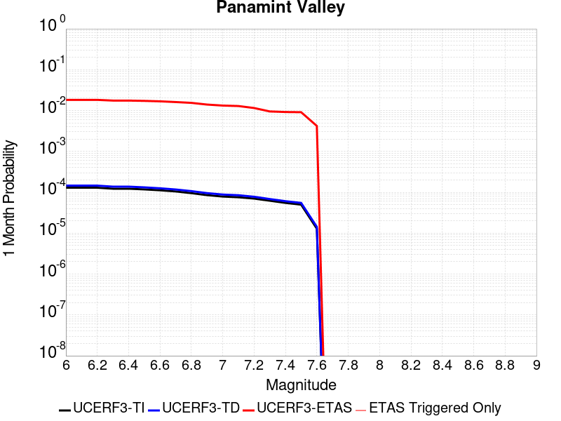 |  |  |

| Magnitude | 1 wk TI Prob | 1 wk TD Prob | 1 wk ETAS Prob | 1 wk ETAS/TD Gain | 1 wk ETAS Triggered Only | 1 mo TI Prob | 1 mo TD Prob | 1 mo ETAS Prob | 1 mo ETAS/TD Gain | 1 mo ETAS Triggered Only | 1 yr TI Prob | 1 yr TD Prob | 1 yr ETAS Prob | 1 yr ETAS/TD Gain | 1 yr ETAS Triggered Only | 10 yr TI Prob | 10 yr TD Prob | 10 yr ETAS Prob | 10 yr ETAS/TD Gain | 10 yr ETAS Triggered Only |
|-----|-----|-----|-----|-----|-----|-----|-----|-----|-----|-----|-----|-----|-----|-----|-----|-----|-----|-----|-----|-----|
| 6.0 | 3.0211835E-5 | 3.3984263E-5 | 0.012711247 | 374.03336 | 0.012677694 | 1.2947287E-4 | 1.4563887E-4 | 0.017134275 | 117.64905 | 0.01699111 | 0.0015751923 | 0.0017717406 | 0.026520582 | 14.968659 | 0.024792768 | 0.015640736 | 0.017583003 | 0.049051594 | 2.7897165 | 0.032031808 |
| 6.1 | 3.0211835E-5 | 3.3984263E-5 | 0.012711247 | 374.03336 | 0.012677694 | 1.2947287E-4 | 1.4563887E-4 | 0.017134275 | 117.64905 | 0.01699111 | 0.0015751923 | 0.0017717406 | 0.026520582 | 14.968659 | 0.024792768 | 0.015640736 | 0.017583003 | 0.049051594 | 2.7897165 | 0.032031808 |
| 6.2 | 3.0211835E-5 | 3.3984263E-5 | 0.012711247 | 374.03336 | 0.012677694 | 1.2947287E-4 | 1.4563887E-4 | 0.017134275 | 117.64905 | 0.01699111 | 0.0015751923 | 0.0017717406 | 0.026520582 | 14.968659 | 0.024792768 | 0.015640736 | 0.017583003 | 0.049051594 | 2.7897165 | 0.032031808 |
| 6.3 | 2.8573924E-5 | 3.2102445E-5 | 0.012221801 | 380.7125 | 0.0121900905 | 1.2245393E-4 | 1.375748E-4 | 0.0164888 | 119.85334 | 0.016353475 | 0.001489857 | 0.0016737141 | 0.025301632 | 15.117056 | 0.02366753 | 0.01479908 | 0.016618038 | 0.046715923 | 2.8111575 | 0.030606505 |
| 6.4 | 2.8573924E-5 | 3.2102445E-5 | 0.012221801 | 380.7125 | 0.0121900905 | 1.2245393E-4 | 1.375748E-4 | 0.0164888 | 119.85334 | 0.016353475 | 0.001489857 | 0.0016737141 | 0.025301632 | 15.117056 | 0.02366753 | 0.01479908 | 0.016618038 | 0.046715923 | 2.8111575 | 0.030606505 |
| 6.5 | 2.7468774E-5 | 3.0828138E-5 | 0.012070515 | 391.54214 | 0.012040058 | 1.1771801E-4 | 1.3211406E-4 | 0.016258411 | 123.06344 | 0.016128426 | 0.0014322745 | 0.0016073292 | 0.024824893 | 15.444808 | 0.023254942 | 0.014230782 | 0.015963882 | 0.045380514 | 2.842699 | 0.029893853 |
| 6.6 | 2.6135967E-5 | 2.9252153E-5 | 0.011843917 | 404.89047 | 0.011815011 | 1.1200648E-4 | 1.2536049E-4 | 0.015876733 | 126.64862 | 0.015753347 | 0.0013628257 | 0.0015252219 | 0.024145482 | 15.830799 | 0.022654815 | 0.013544982 | 0.015154343 | 0.043708626 | 2.8842309 | 0.02899366 |
| 6.7 | 2.4498746E-5 | 2.7341044E-5 | 0.011354438 | 415.28912 | 0.011327407 | 1.04990395E-4 | 1.17170785E-4 | 0.015268615 | 130.31078 | 0.01515322 | 0.0012775084 | 0.0014256459 | 0.0231118 | 16.21146 | 0.021717114 | 0.012701893 | 0.014171593 | 0.041534144 | 2.930803 | 0.027755897 |
| 6.8 | 2.2244329E-5 | 2.4935374E-5 | 0.010939483 | 438.71338 | 0.010914819 | 9.532935E-5 | 1.0686163E-4 | 0.014733407 | 137.87367 | 0.014628109 | 0.0011600169 | 0.0013002857 | 0.02175301 | 16.729406 | 0.020479351 | 0.011539802 | 0.012932955 | 0.03855279 | 2.980973 | 0.025955515 |
| 6.9 | 1.9902658E-5 | 2.2290182E-5 | 0.010149216 | 455.32227 | 0.010127152 | 8.529431E-5 | 9.552596E-5 | 0.013597106 | 142.33937 | 0.01350287 | 0.0010379635 | 0.0011624265 | 0.01978222 | 17.018038 | 0.01864146 | 0.010331288 | 0.011569021 | 0.034666147 | 2.9964633 | 0.023367466 |
| 7.0 | 1.8353881E-5 | 2.056605E-5 | 0.009434873 | 458.75958 | 0.009414501 | 7.865712E-5 | 8.813734E-5 | 0.012614695 | 143.12543 | 0.012527662 | 9.5722964E-4 | 0.0010725616 | 0.01849506 | 17.243822 | 0.017441206 | 0.009531168 | 0.01067939 | 0.032238793 | 3.0187862 | 0.02179213 |
| 7.1 | 1.7667631E-5 | 1.9772435E-5 | 0.0092465505 | 467.64856 | 0.009226961 | 7.571623E-5 | 8.4736355E-5 | 0.012311298 | 145.28946 | 0.012227599 | 9.2145515E-4 | 0.0010311945 | 0.017929845 | 17.387453 | 0.016916094 | 0.009176437 | 0.0102695925 | 0.031021226 | 3.020687 | 0.020966956 |
| 7.2 | 1.6381597E-5 | 1.8158042E-5 | 0.008344776 | 459.56366 | 0.00832677 | 7.020495E-5 | 7.781795E-5 | 0.011179313 | 143.65982 | 0.011102359 | 8.544101E-4 | 9.470391E-4 | 0.016085908 | 16.985474 | 0.01515322 | 0.008511325 | 0.009435269 | 0.02804946 | 2.972831 | 0.018791493 |
| 7.3 | 1.4520491E-5 | 1.596657E-5 | 0.0071048597 | 444.98346 | 0.0070890062 | 6.222919E-5 | 6.842646E-5 | 0.009557294 | 139.67249 | 0.009489517 | 7.57377E-4 | 8.327899E-4 | 0.013724786 | 16.480492 | 0.012902742 | 0.0075480095 | 0.008300399 | 0.024071775 | 2.9000742 | 0.01590338 |
| 7.4 | 1.2852287E-5 | 1.41454875E-5 | 0.0068404996 | 483.58176 | 0.0068264506 | 5.5080065E-5 | 6.06222E-5 | 0.009174506 | 151.33907 | 0.009114437 | 6.7039346E-4 | 7.378411E-4 | 0.012993897 | 17.610699 | 0.012265107 | 0.0066837464 | 0.007357429 | 0.022361929 | 3.0393672 | 0.015115712 |
| 7.5 | 1.1637851E-5 | 1.2836868E-5 | 0.0067266775 | 524.0123 | 0.006713927 | 4.987555E-5 | 5.5014076E-5 | 0.009056432 | 164.62025 | 0.009001913 | 6.070656E-4 | 6.696062E-4 | 0.0127765685 | 19.080719 | 0.012115074 | 0.006054099 | 0.0066793845 | 0.021396073 | 3.2033002 | 0.014815648 |
| 7.6 | 3.0068115E-6 | 3.3330623E-6 | 0.0030789764 | 923.768 | 0.0030756537 | 1.2886271E-5 | 1.4284516E-5 | 0.003952565 | 276.7028 | 0.003938337 | 1.5687906E-4 | 1.7390738E-4 | 0.0054616113 | 31.405289 | 0.0052886237 | 0.0015676835 | 0.0017397973 | 0.008217387 | 4.7231865 | 0.0064888787 |

## Garlock (East)
*[(top)](#table-of-contents)*

| 1 Week | 1 Month | 1 Year | 10 Year |
|-----|-----|-----|-----|
|  |  |  |  |

| Magnitude | 1 wk TI Prob | 1 wk TD Prob | 1 wk ETAS Prob | 1 wk ETAS/TD Gain | 1 wk ETAS Triggered Only | 1 mo TI Prob | 1 mo TD Prob | 1 mo ETAS Prob | 1 mo ETAS/TD Gain | 1 mo ETAS Triggered Only | 1 yr TI Prob | 1 yr TD Prob | 1 yr ETAS Prob | 1 yr ETAS/TD Gain | 1 yr ETAS Triggered Only | 10 yr TI Prob | 10 yr TD Prob | 10 yr ETAS Prob | 10 yr ETAS/TD Gain | 10 yr ETAS Triggered Only |
|-----|-----|-----|-----|-----|-----|-----|-----|-----|-----|-----|-----|-----|-----|-----|-----|-----|-----|-----|-----|-----|
| 6.0 | 4.5092507E-5 | 6.2904815E-5 | 0.010339443 | 164.36646 | 0.010277184 | 1.9323928E-4 | 2.6956675E-4 | 0.013581307 | 50.381985 | 0.013315329 | 0.0023501497 | 0.003277482 | 0.023540173 | 7.182396 | 0.02032932 | 0.023254504 | 0.03235377 | 0.05772359 | 1.7841378 | 0.026218072 |
| 6.1 | 4.5092507E-5 | 6.2904815E-5 | 0.010339443 | 164.36646 | 0.010277184 | 1.9323928E-4 | 2.6956675E-4 | 0.013581307 | 50.381985 | 0.013315329 | 0.0023501497 | 0.003277482 | 0.023540173 | 7.182396 | 0.02032932 | 0.023254504 | 0.03235377 | 0.05772359 | 1.7841378 | 0.026218072 |
| 6.2 | 2.6674514E-5 | 3.4511588E-5 | 0.008135954 | 235.74556 | 0.008101721 | 1.1431433E-4 | 1.4789861E-4 | 0.0105735725 | 71.492035 | 0.010427216 | 0.0013908884 | 0.0017992114 | 0.017449334 | 9.698324 | 0.015678331 | 0.01382215 | 0.017872788 | 0.036954664 | 2.0676496 | 0.019429129 |
| 6.3 | 2.6674514E-5 | 3.4511588E-5 | 0.008135954 | 235.74556 | 0.008101721 | 1.1431433E-4 | 1.4789861E-4 | 0.0105735725 | 71.492035 | 0.010427216 | 0.0013908884 | 0.0017992114 | 0.017449334 | 9.698324 | 0.015678331 | 0.01382215 | 0.017872788 | 0.036954664 | 2.0676496 | 0.019429129 |
| 6.4 | 2.5312667E-5 | 3.2340467E-5 | 0.008096294 | 250.34558 | 0.008064213 | 1.0847834E-4 | 1.3859481E-4 | 0.0104893595 | 75.68364 | 0.0103522 | 0.0013199237 | 0.0016861152 | 0.017150788 | 10.171777 | 0.015490792 | 0.013121112 | 0.016772287 | 0.035543635 | 2.1191883 | 0.019091558 |
| 6.5 | 2.5312667E-5 | 3.2340467E-5 | 0.008096294 | 250.34558 | 0.008064213 | 1.0847834E-4 | 1.3859481E-4 | 0.0104893595 | 75.68364 | 0.0103522 | 0.0013199237 | 0.0016861152 | 0.017150788 | 10.171777 | 0.015490792 | 0.013121112 | 0.016772287 | 0.035543635 | 2.1191883 | 0.019091558 |
| 6.6 | 2.246556E-5 | 2.8134691E-5 | 0.007904587 | 280.95517 | 0.007876674 | 9.627742E-5 | 1.2057181E-4 | 0.010021482 | 83.116295 | 0.009902104 | 0.0011715472 | 0.0014669969 | 0.016186005 | 11.033428 | 0.014740633 | 0.011653901 | 0.014613169 | 0.032279983 | 2.2089653 | 0.01792881 |
| 6.7 | 2.2241198E-5 | 2.7804432E-5 | 0.0079042595 | 284.28055 | 0.007876674 | 9.531594E-5 | 1.1915654E-4 | 0.010020081 | 84.09174 | 0.009902104 | 0.0011598538 | 0.0014497889 | 0.01616905 | 11.152693 | 0.014740633 | 0.011538187 | 0.014442829 | 0.032112695 | 2.2234352 | 0.01792881 |
| 6.8 | 1.9528685E-5 | 2.3898969E-5 | 0.007637835 | 319.58847 | 0.007614118 | 8.369167E-5 | 1.0242024E-4 | 0.00955346 | 93.27708 | 0.009452009 | 0.0010184698 | 0.0012462728 | 0.015106926 | 12.121685 | 0.013877949 | 0.010138147 | 0.012436723 | 0.029068355 | 2.3373 | 0.016841078 |
| 6.9 | 1.3318621E-5 | 1.5198818E-5 | 0.006954068 | 457.54004 | 0.0069389744 | 5.7078556E-5 | 6.51362E-5 | 0.0086539015 | 132.85857 | 0.0085893255 | 6.9470983E-4 | 7.927504E-4 | 0.01312309 | 16.553873 | 0.012340122 | 0.0069254204 | 0.007940721 | 0.022750352 | 2.8650236 | 0.014928172 |
| 7.0 | 1.1760853E-5 | 1.3107653E-5 | 0.006876976 | 524.6535 | 0.0068639587 | 5.0402683E-5 | 5.6174475E-5 | 0.008494994 | 151.22516 | 0.008439293 | 6.134799E-4 | 6.8371464E-4 | 0.012678059 | 18.54291 | 0.012002551 | 0.0061178906 | 0.006857401 | 0.021198945 | 3.0913963 | 0.014440568 |
| 7.1 | 1.0064758E-5 | 1.0902761E-5 | 0.006724756 | 616.7939 | 0.006713927 | 4.3133965E-5 | 4.67253E-5 | 0.008260587 | 176.79045 | 0.008214246 | 5.2502943E-4 | 5.6873553E-4 | 0.01211462 | 21.300972 | 0.011552455 | 0.005237907 | 0.0057133473 | 0.019474713 | 3.4086344 | 0.013840441 |
| 7.2 | 9.768808E-6 | 1.0498628E-5 | 0.0065743243 | 626.20795 | 0.006563895 | 4.186565E-5 | 4.499337E-5 | 0.008071338 | 179.38951 | 0.008026706 | 5.095951E-4 | 5.4766005E-4 | 0.011831376 | 21.603504 | 0.011289899 | 0.0050842804 | 0.005503584 | 0.018820234 | 3.4196324 | 0.0133903455 |
| 7.3 | 9.344516E-6 | 9.9442705E-6 | 0.006086175 | 612.0283 | 0.006076291 | 4.004731E-5 | 4.2617627E-5 | 0.007431373 | 174.37323 | 0.00738907 | 4.8746695E-4 | 5.187495E-4 | 0.010940556 | 21.090248 | 0.010427216 | 0.0048639905 | 0.005215269 | 0.017453723 | 3.346658 | 0.012302615 |
| 7.4 | 9.023491E-6 | 9.490441E-6 | 0.005298064 | 558.2527 | 0.0052886237 | 3.867153E-5 | 4.0672705E-5 | 0.006454275 | 158.68811 | 0.006413863 | 4.7072413E-4 | 4.95081E-4 | 0.009492537 | 19.173704 | 0.009001913 | 0.004697283 | 0.0049787266 | 0.015615277 | 3.1363997 | 0.010689772 |
| 7.5 | 7.081253E-6 | 7.0873994E-6 | 0.0024075804 | 339.69873 | 0.00240051 | 3.0347876E-5 | 3.0374218E-5 | 0.0028808934 | 94.846664 | 0.0028506056 | 3.6942272E-4 | 3.697441E-4 | 0.004456601 | 12.053205 | 0.0040883687 | 0.003688092 | 0.0037244745 | 0.008694455 | 2.3344111 | 0.00498856 |
| 7.6 | 6.116396E-6 | 5.9589424E-6 | 0.0014687611 | 246.48016 | 0.0014628108 | 2.6212863E-5 | 2.5538076E-5 | 0.0017133537 | 67.090164 | 0.0016878587 | 3.1909486E-4 | 3.1088197E-4 | 0.0026731496 | 8.598599 | 0.0023630022 | 0.0031863707 | 0.0031359126 | 0.00605236 | 1.9300154 | 0.0029256216 |
| 7.7 | 4.797145E-6 | 4.7571157E-6 | 6.798974E-4 | 142.9222 | 6.7514344E-4 | 2.055903E-5 | 2.0387479E-5 | 8.080388E-4 | 39.63407 | 7.876674E-4 | 2.5027743E-4 | 2.481894E-4 | 0.0015231438 | 6.137022 | 0.001275271 | 0.0024999576 | 0.0025094065 | 0.0041182023 | 1.6411059 | 0.0016128428 |
| 7.8 | 3.4028885E-6 | 3.978375E-6 | 4.165644E-4 | 104.707184 | 4.125877E-4 | 1.4583726E-5 | 1.7050066E-5 | 5.0464534E-4 | 29.597853 | 4.8760363E-4 | 1.775424E-4 | 2.0756487E-4 | 9.575686E-4 | 4.613346 | 7.5015944E-4 | 0.0017740062 | 0.0021012141 | 0.003036943 | 1.4453278 | 9.376993E-4 |
| 7.9 | 2.5928412E-6 | 3.372436E-6 | 2.6592735E-4 | 78.853195 | 2.6255578E-4 | 1.1112129E-5 | 1.4453217E-5 | 3.5202008E-4 | 24.35583 | 3.3757172E-4 | 1.3528178E-4 | 1.7595377E-4 | 7.384743E-4 | 4.196979 | 5.6261953E-4 | 0.0013519945 | 0.0017812426 | 0.0024926246 | 1.399374 | 7.126514E-4 |
| 8.0 | 1.3743648E-6 | 1.6734741E-6 | 7.668929E-5 | 45.826397 | 7.501594E-5 | 5.8901214E-6 | 7.1720124E-6 | 1.1969512E-4 | 16.689196 | 1.12523914E-4 | 7.1709874E-5 | 8.731578E-5 | 3.4984865E-4 | 4.0067058 | 2.6255578E-4 | 7.1686733E-4 | 8.837377E-4 | 0.001258486 | 1.4240491 | 3.7507972E-4 |
| 8.1 | 3.6733252E-7 | 3.1489736E-7 | 3.7822854E-5 | 120.111694 | 3.750797E-5 | 1.5742813E-6 | 1.3495595E-6 | 3.885748E-5 | 28.792711 | 3.750797E-5 | 1.9166706E-5 | 1.643078E-5 | 9.144549E-5 | 5.565499 | 7.501594E-5 | 1.9165053E-4 | 1.662928E-4 | 2.78798E-4 | 1.6765488 | 1.12523914E-4 |

## Hunter Mountain-Saline Valley
*[(top)](#table-of-contents)*

| 1 Week | 1 Month | 1 Year | 10 Year |
|-----|-----|-----|-----|
|  |  | 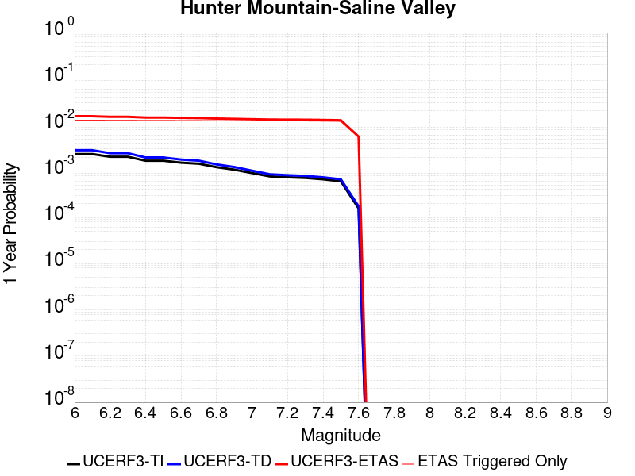 |  |

| Magnitude | 1 wk TI Prob | 1 wk TD Prob | 1 wk ETAS Prob | 1 wk ETAS/TD Gain | 1 wk ETAS Triggered Only | 1 mo TI Prob | 1 mo TD Prob | 1 mo ETAS Prob | 1 mo ETAS/TD Gain | 1 mo ETAS Triggered Only | 1 yr TI Prob | 1 yr TD Prob | 1 yr ETAS Prob | 1 yr ETAS/TD Gain | 1 yr ETAS Triggered Only | 10 yr TI Prob | 10 yr TD Prob | 10 yr ETAS Prob | 10 yr ETAS/TD Gain | 10 yr ETAS Triggered Only |
|-----|-----|-----|-----|-----|-----|-----|-----|-----|-----|-----|-----|-----|-----|-----|-----|-----|-----|-----|-----|-----|
| 6.0 | 4.5103672E-5 | 5.456906E-5 | 0.0070681768 | 129.52718 | 0.0070139905 | 1.9328714E-4 | 2.3384714E-4 | 0.009571148 | 40.929077 | 0.009339484 | 0.002350731 | 0.0028435462 | 0.015485191 | 5.445732 | 0.012677694 | 0.023260195 | 0.028092625 | 0.043294057 | 1.5411183 | 0.015640823 |
| 6.1 | 4.5103672E-5 | 5.456906E-5 | 0.0070681768 | 129.52718 | 0.0070139905 | 1.9328714E-4 | 2.3384714E-4 | 0.009571148 | 40.929077 | 0.009339484 | 0.002350731 | 0.0028435462 | 0.015485191 | 5.445732 | 0.012677694 | 0.023260195 | 0.028092625 | 0.043294057 | 1.5411183 | 0.015640823 |
| 6.2 | 3.9363465E-5 | 4.706271E-5 | 0.007060723 | 150.02797 | 0.0070139905 | 1.6868966E-4 | 2.016826E-4 | 0.009501783 | 47.112556 | 0.009301976 | 0.002051862 | 0.0024528534 | 0.015062035 | 6.140618 | 0.012640186 | 0.020330196 | 0.024274187 | 0.039498746 | 1.6271913 | 0.015603316 |
| 6.3 | 3.9363465E-5 | 4.706271E-5 | 0.007060723 | 150.02797 | 0.0070139905 | 1.6868966E-4 | 2.016826E-4 | 0.009501783 | 47.112556 | 0.009301976 | 0.002051862 | 0.0024528534 | 0.015062035 | 6.140618 | 0.012640186 | 0.020330196 | 0.024274187 | 0.039498746 | 1.6271913 | 0.015603316 |
| 6.4 | 3.2311684E-5 | 3.795112E-5 | 0.006976662 | 183.83286 | 0.0069389744 | 1.384713E-4 | 1.6263791E-4 | 0.009388098 | 57.72392 | 0.009226961 | 0.0016845843 | 0.001978387 | 0.014518699 | 7.3386545 | 0.01256517 | 0.016718714 | 0.019617118 | 0.034840796 | 1.7760406 | 0.0155283 |
| 6.5 | 3.2311684E-5 | 3.795112E-5 | 0.006976662 | 183.83286 | 0.0069389744 | 1.384713E-4 | 1.6263791E-4 | 0.009388098 | 57.72392 | 0.009226961 | 0.0016845843 | 0.001978387 | 0.014518699 | 7.3386545 | 0.01256517 | 0.016718714 | 0.019617118 | 0.034840796 | 1.7760406 | 0.0155283 |
| 6.6 | 2.9305844E-5 | 3.418196E-5 | 0.006972919 | 203.99411 | 0.0069389744 | 1.2559042E-4 | 1.4648624E-4 | 0.009372096 | 63.97935 | 0.009226961 | 0.0015279909 | 0.0017820727 | 0.01432485 | 8.038309 | 0.01256517 | 0.015175272 | 0.017686324 | 0.032939985 | 1.8624551 | 0.0155283 |
| 6.7 | 2.7826512E-5 | 3.2344353E-5 | 0.0069335876 | 214.3678 | 0.0069014668 | 1.19251024E-4 | 1.3861163E-4 | 0.00932679 | 67.28722 | 0.009189453 | 0.0014509142 | 0.0016863506 | 0.014192887 | 8.416332 | 0.012527662 | 0.014414776 | 0.016743818 | 0.031975236 | 1.909674 | 0.015490792 |
| 6.8 | 2.3389874E-5 | 2.6866792E-5 | 0.006890641 | 256.47427 | 0.0068639587 | 1.0023846E-4 | 1.1513857E-4 | 0.00926603 | 80.477196 | 0.009151945 | 0.00121972 | 0.001400958 | 0.013873614 | 9.902947 | 0.012490154 | 0.01213047 | 0.013928067 | 0.02912913 | 2.091398 | 0.015415776 |
| 6.9 | 2.069209E-5 | 2.357011E-5 | 0.006887367 | 292.20767 | 0.0068639587 | 8.867737E-5 | 1.0101105E-4 | 0.009252031 | 91.59425 | 0.009151945 | 0.0010791123 | 0.0012291519 | 0.013666492 | 11.118636 | 0.012452646 | 0.010738871 | 0.012229158 | 0.027419362 | 2.24213 | 0.0153782675 |
| 7.0 | 1.7462342E-5 | 1.9633622E-5 | 0.0068834573 | 350.59537 | 0.0068639587 | 7.483646E-5 | 8.414151E-5 | 0.009235316 | 109.75933 | 0.009151945 | 9.1075303E-4 | 0.0010239641 | 0.01342639 | 13.112168 | 0.012415138 | 0.009070295 | 0.010196688 | 0.025343897 | 2.485503 | 0.015303252 |
| 7.1 | 1.4807709E-5 | 1.6441827E-5 | 0.0068802875 | 418.4625 | 0.0068639587 | 6.3460066E-5 | 7.046316E-5 | 0.009221763 | 130.87354 | 0.009151945 | 7.723524E-4 | 8.575678E-4 | 0.013187108 | 15.377336 | 0.012340122 | 0.007696735 | 0.008546168 | 0.023644261 | 2.7666507 | 0.015228236 |
| 7.2 | 1.4180048E-5 | 1.5698413E-5 | 0.0068795495 | 438.23215 | 0.0068639587 | 6.077022E-5 | 6.727727E-5 | 0.009218606 | 137.02408 | 0.009151945 | 7.396263E-4 | 8.1880915E-4 | 0.0131488275 | 16.058475 | 0.012340122 | 0.0073716943 | 0.008161469 | 0.023228219 | 2.846083 | 0.015190728 |
| 7.3 | 1.3730402E-5 | 1.5172151E-5 | 0.0068790265 | 453.39825 | 0.0068639587 | 5.8843252E-5 | 6.502197E-5 | 0.009216372 | 141.74242 | 0.009151945 | 7.161811E-4 | 7.9137104E-4 | 0.013121728 | 16.581005 | 0.012340122 | 0.007138774 | 0.007889058 | 0.022959946 | 2.9103532 | 0.015190728 |
| 7.4 | 1.2810095E-5 | 1.4109353E-5 | 0.0068404637 | 484.81766 | 0.0068264506 | 5.489925E-5 | 6.0467344E-5 | 0.009174353 | 151.72409 | 0.009114437 | 6.681934E-4 | 7.3595706E-4 | 0.0129920365 | 17.653254 | 0.012265107 | 0.006661878 | 0.0073386896 | 0.022343472 | 3.0446134 | 0.015115712 |
| 7.5 | 1.1595659E-5 | 1.2800734E-5 | 0.0067266417 | 525.4888 | 0.006713927 | 4.9694736E-5 | 5.485922E-5 | 0.0090562785 | 165.08215 | 0.009001913 | 6.0486543E-4 | 6.67722E-4 | 0.012774707 | 19.131775 | 0.012115074 | 0.006032217 | 0.006660632 | 0.021377599 | 3.2095451 | 0.014815648 |
| 7.6 | 2.997694E-6 | 3.3251877E-6 | 0.0030789685 | 925.9533 | 0.0030756537 | 1.28471975E-5 | 1.4250767E-5 | 0.0039525316 | 277.3557 | 0.003938337 | 1.564034E-4 | 1.7349655E-4 | 0.005461203 | 31.477299 | 0.0052886237 | 0.0015629337 | 0.0017356955 | 0.008213311 | 4.7320004 | 0.0064888787 |

## Blackwater
*[(top)](#table-of-contents)*

| 1 Week | 1 Month | 1 Year | 10 Year |
|-----|-----|-----|-----|
|  |  |  |  |

| Magnitude | 1 wk TI Prob | 1 wk TD Prob | 1 wk ETAS Prob | 1 wk ETAS/TD Gain | 1 wk ETAS Triggered Only | 1 mo TI Prob | 1 mo TD Prob | 1 mo ETAS Prob | 1 mo ETAS/TD Gain | 1 mo ETAS Triggered Only | 1 yr TI Prob | 1 yr TD Prob | 1 yr ETAS Prob | 1 yr ETAS/TD Gain | 1 yr ETAS Triggered Only | 10 yr TI Prob | 10 yr TD Prob | 10 yr ETAS Prob | 10 yr ETAS/TD Gain | 10 yr ETAS Triggered Only |
|-----|-----|-----|-----|-----|-----|-----|-----|-----|-----|-----|-----|-----|-----|-----|-----|-----|-----|-----|-----|-----|
| 6.0 | 3.0708583E-5 | 3.3095846E-5 | 0.0044963965 | 135.85983 | 0.0044634487 | 1.3160157E-4 | 1.4183241E-4 | 0.0065547857 | 46.215008 | 0.006413863 | 0.0016010714 | 0.0017255784 | 0.011236164 | 6.511534 | 0.009527025 | 0.015895851 | 0.017135633 | 0.030517718 | 1.7809507 | 0.013615393 |
| 6.1 | 3.0708583E-5 | 3.3095846E-5 | 0.0044963965 | 135.85983 | 0.0044634487 | 1.3160157E-4 | 1.4183241E-4 | 0.0065547857 | 46.215008 | 0.006413863 | 0.0016010714 | 0.0017255784 | 0.011236164 | 6.511534 | 0.009527025 | 0.015895851 | 0.017135633 | 0.030517718 | 1.7809507 | 0.013615393 |
| 6.2 | 1.1707779E-5 | 1.2545122E-5 | 0.0017003826 | 135.54134 | 0.0016878587 | 5.017523E-5 | 5.3763757E-5 | 0.0025666626 | 47.739647 | 0.002513034 | 6.107122E-4 | 6.5438676E-4 | 0.0043277624 | 6.613463 | 0.0036757812 | 0.006090366 | 0.0065255696 | 0.011816945 | 1.810868 | 0.005326132 |
| 6.3 | 1.1707779E-5 | 1.2545122E-5 | 0.0017003826 | 135.54134 | 0.0016878587 | 5.017523E-5 | 5.3763757E-5 | 0.0025666626 | 47.739647 | 0.002513034 | 6.107122E-4 | 6.5438676E-4 | 0.0043277624 | 6.613463 | 0.0036757812 | 0.006090366 | 0.0065255696 | 0.011816945 | 1.810868 | 0.005326132 |
| 6.4 | 7.929244E-6 | 8.480098E-6 | 0.0011337097 | 133.69063 | 0.0011252391 | 3.3982033E-5 | 3.6342793E-5 | 0.0017241401 | 47.441044 | 0.0016878587 | 4.136527E-4 | 4.423877E-4 | 0.00295431 | 6.678101 | 0.002513034 | 0.0041288356 | 0.0044154758 | 0.008000342 | 1.8118867 | 0.0036007653 |
| 6.5 | 5.8832115E-6 | 6.285991E-6 | 7.1893295E-4 | 114.37067 | 7.126514E-4 | 2.521352E-5 | 2.6939697E-5 | 0.0012646694 | 46.944454 | 0.001237763 | 3.0693135E-4 | 3.27944E-4 | 0.0020902406 | 6.3737726 | 0.0017628747 | 0.0030650778 | 0.0032748538 | 0.0058544283 | 1.7876915 | 0.00258805 |
| 6.6 | 5.8832115E-6 | 6.285991E-6 | 7.1893295E-4 | 114.37067 | 7.126514E-4 | 2.521352E-5 | 2.6939697E-5 | 0.0012646694 | 46.944454 | 0.001237763 | 3.0693135E-4 | 3.27944E-4 | 0.0020902406 | 6.3737726 | 0.0017628747 | 0.0030650778 | 0.0032748538 | 0.0058544283 | 1.7876915 | 0.00258805 |
| 6.7 | 3.0715053E-6 | 3.2814662E-6 | 3.408521E-4 | 103.87189 | 3.3757172E-4 | 1.3163528E-5 | 1.4063357E-5 | 5.76675E-4 | 41.0055 | 5.6261953E-4 | 1.6025416E-4 | 1.7120909E-4 | 9.962432E-4 | 5.8188686 | 8.251754E-4 | 0.0016013865 | 0.0017108864 | 0.0029839755 | 1.7441108 | 0.001275271 |
| 6.8 | 2.2722281E-6 | 2.4287538E-6 | 1.5246027E-4 | 62.77305 | 1.5003188E-4 | 9.738084E-6 | 1.0408908E-5 | 3.1046954E-4 | 29.827293 | 3.0006375E-4 | 1.1855473E-4 | 1.26722E-4 | 5.767606E-4 | 4.551385 | 4.5009566E-4 | 0.001184915 | 0.0012665876 | 0.0019783364 | 1.561942 | 7.126514E-4 |
| 6.9 | 9.952399E-7 | 1.0653489E-6 | 3.857328E-5 | 36.20718 | 3.750797E-5 | 4.265307E-6 | 4.5657757E-6 | 7.9581376E-5 | 17.42998 | 7.501594E-5 | 5.1928873E-5 | 5.5587418E-5 | 2.0561097E-4 | 3.698876 | 1.5003188E-4 | 5.191674E-4 | 5.557858E-4 | 7.432214E-4 | 1.3372444 | 1.8753986E-4 |
| 7.0 | 4.7385504E-7 | 5.0755597E-7 | 3.8015507E-5 | 74.89915 | 3.750797E-5 | 2.0308057E-6 | 2.1752398E-6 | 3.9683127E-5 | 18.243105 | 3.750797E-5 | 2.4724779E-5 | 2.6483543E-5 | 1.014975E-4 | 3.8324742 | 7.501594E-5 | 2.4722028E-4 | 2.6483546E-4 | 3.3983152E-4 | 1.2831799 | 7.501594E-5 |

## Ash Hill
*[(top)](#table-of-contents)*

| 1 Week | 1 Month | 1 Year | 10 Year |
|-----|-----|-----|-----|
|  | 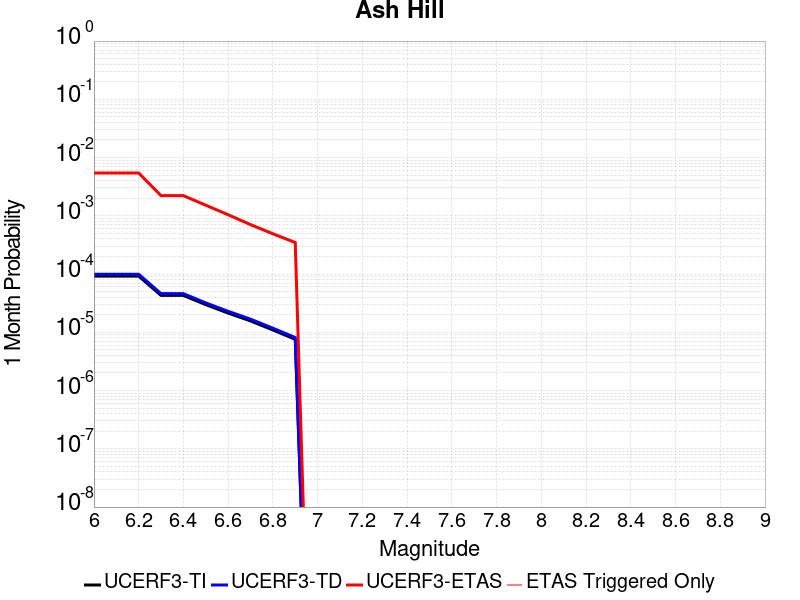 |  |  |

| Magnitude | 1 wk TI Prob | 1 wk TD Prob | 1 wk ETAS Prob | 1 wk ETAS/TD Gain | 1 wk ETAS Triggered Only | 1 mo TI Prob | 1 mo TD Prob | 1 mo ETAS Prob | 1 mo ETAS/TD Gain | 1 mo ETAS Triggered Only | 1 yr TI Prob | 1 yr TD Prob | 1 yr ETAS Prob | 1 yr ETAS/TD Gain | 1 yr ETAS Triggered Only | 10 yr TI Prob | 10 yr TD Prob | 10 yr ETAS Prob | 10 yr ETAS/TD Gain | 10 yr ETAS Triggered Only |
|-----|-----|-----|-----|-----|-----|-----|-----|-----|-----|-----|-----|-----|-----|-----|-----|-----|-----|-----|-----|-----|
| 6.0 | 2.1545662E-5 | 2.3194447E-5 | 0.004036454 | 174.02675 | 0.004013353 | 9.2335285E-5 | 9.940143E-5 | 0.005650029 | 56.84052 | 0.0055511794 | 0.0011236023 | 0.0012096206 | 0.009900943 | 8.185164 | 0.008701849 | 0.011179381 | 0.012038348 | 0.023229392 | 1.9296162 | 0.011327407 |
| 6.1 | 2.1545662E-5 | 2.3194447E-5 | 0.004036454 | 174.02675 | 0.004013353 | 9.2335285E-5 | 9.940143E-5 | 0.005650029 | 56.84052 | 0.0055511794 | 0.0011236023 | 0.0012096206 | 0.009900943 | 8.185164 | 0.008701849 | 0.011179381 | 0.012038348 | 0.023229392 | 1.9296162 | 0.011327407 |
| 6.2 | 2.1545662E-5 | 2.3194447E-5 | 0.004036454 | 174.02675 | 0.004013353 | 9.2335285E-5 | 9.940143E-5 | 0.005650029 | 56.84052 | 0.0055511794 | 0.0011236023 | 0.0012096206 | 0.009900943 | 8.185164 | 0.008701849 | 0.011179381 | 0.012038348 | 0.023229392 | 1.9296162 | 0.011327407 |
| 6.3 | 1.0025529E-5 | 1.0746934E-5 | 0.0018111102 | 168.52342 | 0.0018003826 | 4.2965847E-5 | 4.605755E-5 | 0.0026339884 | 57.189064 | 0.00258805 | 5.229836E-4 | 5.6061964E-4 | 0.004796644 | 8.555969 | 0.0042384006 | 0.005217545 | 0.0055933665 | 0.010964303 | 1.9602334 | 0.0054011475 |
| 6.4 | 1.0025529E-5 | 1.0746934E-5 | 0.0018111102 | 168.52342 | 0.0018003826 | 4.2965847E-5 | 4.605755E-5 | 0.0026339884 | 57.189064 | 0.00258805 | 5.229836E-4 | 5.6061964E-4 | 0.004796644 | 8.555969 | 0.0042384006 | 0.005217545 | 0.0055933665 | 0.010964303 | 1.9602334 | 0.0054011475 |
| 6.5 | 6.9617327E-6 | 7.456634E-6 | 0.0011326873 | 151.9033 | 0.0011252391 | 2.9835655E-5 | 3.195666E-5 | 0.0017572682 | 54.989105 | 0.0017253667 | 3.6318856E-4 | 3.8901155E-4 | 0.003388482 | 8.710492 | 0.0030006377 | 0.0036259557 | 0.0038841602 | 0.0078072 | 2.0100098 | 0.003938337 |
| 6.6 | 4.9919777E-6 | 5.3466883E-6 | 7.930099E-4 | 148.31795 | 7.876674E-4 | 2.1394015E-5 | 2.2914215E-5 | 0.0012606488 | 55.016018 | 0.001237763 | 2.60441E-4 | 2.7895154E-4 | 0.002303817 | 8.258842 | 0.0020254303 | 0.0026013597 | 0.0027866727 | 0.005479721 | 1.9664028 | 0.0027005738 |
| 6.7 | 3.6630722E-6 | 3.924624E-6 | 4.915263E-4 | 125.241646 | 4.8760363E-4 | 1.5698786E-5 | 1.681974E-5 | 8.7948854E-4 | 52.28907 | 8.6268334E-4 | 1.9111596E-4 | 2.0476682E-4 | 0.001779779 | 8.691735 | 0.0015753348 | 0.0019095168 | 0.0020463446 | 0.0039553368 | 1.9328791 | 0.0019129065 |
| 6.8 | 2.5599613E-6 | 2.744925E-6 | 3.4031575E-4 | 123.97997 | 3.3757172E-4 | 1.0971216E-5 | 1.1763939E-5 | 6.118844E-4 | 52.01356 | 6.001275E-4 | 1.3356637E-4 | 1.4322149E-4 | 0.0011557917 | 8.06996 | 0.0010127152 | 0.0013348613 | 0.0014317769 | 0.002705222 | 1.8894159 | 0.001275271 |
| 6.9 | 1.7684905E-6 | 1.8968707E-6 | 3.3946795E-4 | 178.9621 | 3.3757172E-4 | 7.579223E-6 | 8.129446E-6 | 6.0825207E-4 | 74.820854 | 6.001275E-4 | 9.2273134E-5 | 9.8976E-5 | 9.615739E-4 | 9.715223 | 8.6268334E-4 | 9.223483E-4 | 9.8976E-4 | 0.0020389438 | 2.0600386 | 0.0010502231 |

## Garlock (West)
*[(top)](#table-of-contents)*

| 1 Week | 1 Month | 1 Year | 10 Year |
|-----|-----|-----|-----|
|  |  |  |  |

| Magnitude | 1 wk TI Prob | 1 wk TD Prob | 1 wk ETAS Prob | 1 wk ETAS/TD Gain | 1 wk ETAS Triggered Only | 1 mo TI Prob | 1 mo TD Prob | 1 mo ETAS Prob | 1 mo ETAS/TD Gain | 1 mo ETAS Triggered Only | 1 yr TI Prob | 1 yr TD Prob | 1 yr ETAS Prob | 1 yr ETAS/TD Gain | 1 yr ETAS Triggered Only | 10 yr TI Prob | 10 yr TD Prob | 10 yr ETAS Prob | 10 yr ETAS/TD Gain | 10 yr ETAS Triggered Only |
|-----|-----|-----|-----|-----|-----|-----|-----|-----|-----|-----|-----|-----|-----|-----|-----|-----|-----|-----|-----|-----|
| 6.0 | 2.5181727E-5 | 2.5197181E-5 | 0.004038449 | 160.27383 | 0.004013353 | 1.0791722E-4 | 1.0798347E-4 | 0.005020997 | 46.49783 | 0.0049135443 | 0.0013131002 | 0.0013139093 | 0.008281225 | 6.302737 | 0.0069764825 | 0.013053683 | 0.013141794 | 0.02184033 | 1.6618986 | 0.008814373 |
| 6.1 | 2.5077732E-5 | 2.5098223E-5 | 0.00403835 | 160.90184 | 0.004013353 | 1.0747157E-4 | 1.075594E-4 | 0.005020575 | 46.67723 | 0.0049135443 | 0.001307681 | 0.0013087525 | 0.008276105 | 6.323659 | 0.0069764825 | 0.013000126 | 0.013090835 | 0.02178982 | 1.6645097 | 0.008814373 |
| 6.2 | 2.494612E-5 | 2.4979914E-5 | 0.0040382324 | 161.65918 | 0.004013353 | 1.0690756E-4 | 1.070524E-4 | 0.0050200704 | 46.89358 | 0.0049135443 | 0.0013008224 | 0.0013025872 | 0.008269982 | 6.34889 | 0.0069764825 | 0.012932341 | 0.013029906 | 0.021729428 | 1.6676581 | 0.008814373 |
| 6.3 | 2.4733758E-5 | 2.4799276E-5 | 0.0040380526 | 162.82945 | 0.004013353 | 1.0599751E-4 | 1.06278305E-4 | 0.0050193 | 47.227894 | 0.0049135443 | 0.0012897556 | 0.0012931736 | 0.008260635 | 6.387877 | 0.0069764825 | 0.012822957 | 0.0129368715 | 0.021637214 | 1.6725229 | 0.008814373 |
| 6.4 | 2.3237335E-5 | 2.3178607E-5 | 0.0040364387 | 174.14499 | 0.004013353 | 9.958477E-5 | 9.933313E-5 | 0.0050123893 | 50.4604 | 0.0049135443 | 0.0012117702 | 0.0012087126 | 0.0081393 | 6.7338586 | 0.0069389744 | 0.012051838 | 0.012101731 | 0.020735327 | 1.7134182 | 0.008739357 |
| 6.5 | 2.2732203E-5 | 2.2992977E-5 | 0.0040362533 | 175.5429 | 0.004013353 | 9.742009E-5 | 9.8537625E-5 | 0.0050115976 | 50.859737 | 0.0049135443 | 0.0011854442 | 0.0011990381 | 0.008129693 | 6.780179 | 0.0069389744 | 0.011791403 | 0.012006035 | 0.020640468 | 1.7191743 | 0.008739357 |
| 6.6 | 2.1319436E-5 | 2.1773201E-5 | 0.004035039 | 185.32133 | 0.004013353 | 9.136581E-5 | 9.3310395E-5 | 0.005006396 | 53.65314 | 0.0049135443 | 0.001111811 | 0.0011354643 | 0.00806656 | 7.1041946 | 0.0069389744 | 0.011062649 | 0.011376952 | 0.02001688 | 1.759424 | 0.008739357 |
| 6.7 | 1.970802E-5 | 2.0393094E-5 | 0.0040336642 | 197.79558 | 0.004013353 | 8.446021E-5 | 8.739606E-5 | 0.0050005107 | 57.21666 | 0.0049135443 | 0.001027818 | 0.0010635294 | 0.007995124 | 7.5175395 | 0.0069389744 | 0.010230771 | 0.0106646875 | 0.019310843 | 1.8107274 | 0.008739357 |
| 6.8 | 1.8744462E-5 | 1.9900775E-5 | 0.004033174 | 202.66415 | 0.004013353 | 8.033094E-5 | 8.528626E-5 | 0.0049984115 | 58.607464 | 0.0049135443 | 9.775903E-4 | 0.0010378672 | 0.00796964 | 7.678863 | 0.0069389744 | 0.009733009 | 0.010410495 | 0.019021753 | 1.827171 | 0.008701849 |
| 6.9 | 1.7559682E-5 | 1.8953151E-5 | 0.00403223 | 212.74721 | 0.004013353 | 7.5253614E-5 | 8.122527E-5 | 0.0049943705 | 61.48789 | 0.0049135443 | 9.158276E-4 | 9.884704E-4 | 0.007920586 | 8.012972 | 0.0069389744 | 0.0091206245 | 0.009921073 | 0.01853659 | 1.8684058 | 0.008701849 |
| 7.0 | 1.6794445E-5 | 1.8215967E-5 | 0.0040314957 | 221.31657 | 0.004013353 | 7.197421E-5 | 7.806611E-5 | 0.004991227 | 63.935898 | 0.0049135443 | 8.759337E-4 | 9.5004175E-4 | 0.007882424 | 8.296924 | 0.0069389744 | 0.008724891 | 0.009539958 | 0.018158792 | 1.9034457 | 0.008701849 |
| 7.1 | 1.6337795E-5 | 1.771677E-5 | 0.0040309983 | 227.52448 | 0.004013353 | 7.0017246E-5 | 7.592681E-5 | 0.004989098 | 65.709305 | 0.0049135443 | 8.521265E-4 | 9.2401815E-4 | 0.007856581 | 8.502626 | 0.0069389744 | 0.008488664 | 0.009281721 | 0.017902803 | 1.9288236 | 0.008701849 |
| 7.2 | 1.5780008E-5 | 1.71654E-5 | 0.003992942 | 232.61575 | 0.003975845 | 6.762685E-5 | 7.3563926E-5 | 0.0049492414 | 67.2781 | 0.004876036 | 8.2304585E-4 | 8.952741E-4 | 0.0077905618 | 8.701874 | 0.0069014668 | 0.008200042 | 0.008996559 | 0.017582951 | 1.9544084 | 0.008664341 |
| 7.3 | 1.5058865E-5 | 1.6618484E-5 | 0.0039923973 | 240.23837 | 0.003975845 | 6.45364E-5 | 7.122013E-5 | 0.004946909 | 69.45942 | 0.004876036 | 7.854473E-4 | 8.667614E-4 | 0.007762246 | 8.95546 | 0.0069014668 | 0.00782677 | 0.008713263 | 0.017302109 | 1.985721 | 0.008664341 |
| 7.4 | 1.4887923E-5 | 1.6454453E-5 | 0.0038797117 | 235.78493 | 0.003863321 | 6.380382E-5 | 7.0517184E-5 | 0.004758683 | 67.4826 | 0.0046884962 | 7.7653467E-4 | 8.5820974E-4 | 0.0075663743 | 8.816463 | 0.006713927 | 0.0077382675 | 0.008628101 | 0.016957395 | 1.9653682 | 0.008401785 |
| 7.5 | 1.4509299E-5 | 1.6046468E-5 | 0.0036542611 | 227.72993 | 0.003638273 | 6.218123E-5 | 6.876877E-5 | 0.0044568996 | 64.80993 | 0.0043884325 | 7.567935E-4 | 8.369394E-4 | 0.0071330047 | 8.522725 | 0.0063013393 | 0.0075422134 | 0.008416411 | 0.01622679 | 1.9279943 | 0.007876674 |
| 7.6 | 1.2756717E-5 | 1.4050529E-5 | 0.0023770195 | 169.17651 | 0.0023630022 | 5.4670498E-5 | 6.0215163E-5 | 0.0029106492 | 48.33748 | 0.0028506056 | 6.6541E-4 | 7.328737E-4 | 0.0047432855 | 6.4721727 | 0.004013353 | 0.006634211 | 0.007381374 | 0.012407574 | 1.6809301 | 0.005063576 |
| 7.7 | 1.0328985E-5 | 1.146033E-5 | 0.0012117017 | 105.73008 | 0.001200255 | 4.4266326E-5 | 4.9114777E-5 | 0.001586866 | 32.30934 | 0.0015378268 | 5.388092E-4 | 5.9780874E-4 | 0.0029219128 | 4.887705 | 0.002325494 | 0.0053750467 | 0.006038286 | 0.009020804 | 1.4939348 | 0.0030006377 |
| 7.8 | 7.0306583E-6 | 8.899537E-6 | 7.590523E-4 | 85.291214 | 7.5015944E-4 | 3.0131043E-5 | 3.8140315E-5 | 0.0010508168 | 27.551344 | 0.0010127152 | 3.667837E-4 | 4.6425956E-4 | 0.0019263913 | 4.1493845 | 0.0014628108 | 0.003661789 | 0.0046950667 | 0.006598992 | 1.4055161 | 0.0019129065 |
| 7.9 | 4.060633E-6 | 5.465412E-6 | 3.8054306E-4 | 69.62752 | 3.7507972E-4 | 1.7402595E-5 | 2.3422985E-5 | 5.110152E-4 | 21.816826 | 4.8760363E-4 | 2.11856E-4 | 2.8513762E-4 | 0.0011100777 | 3.8931293 | 8.251754E-4 | 0.0021165414 | 0.002884143 | 0.003968737 | 1.3760542 | 0.0010877311 |
| 8.0 | 1.6729537E-6 | 2.0775192E-6 | 1.146012E-4 | 55.16252 | 1.12523914E-4 | 7.169782E-6 | 8.903624E-6 | 1.5893417E-4 | 17.850504 | 1.5003188E-4 | 8.7288594E-5 | 1.0839626E-4 | 4.084275E-4 | 3.7679114 | 3.0006375E-4 | 8.7254314E-4 | 0.001096854 | 0.0015089891 | 1.3757429 | 4.125877E-4 |
| 8.1 | 3.6733252E-7 | 3.1489736E-7 | 3.7822854E-5 | 120.111694 | 3.750797E-5 | 1.5742813E-6 | 1.3495595E-6 | 3.885748E-5 | 28.792711 | 3.750797E-5 | 1.9166706E-5 | 1.643078E-5 | 9.144549E-5 | 5.565499 | 7.501594E-5 | 1.9165053E-4 | 1.662928E-4 | 2.78798E-4 | 1.6765488 | 1.12523914E-4 |

## Gravel Hills-Harper Lk
*[(top)](#table-of-contents)*

| 1 Week | 1 Month | 1 Year | 10 Year |
|-----|-----|-----|-----|
|  | 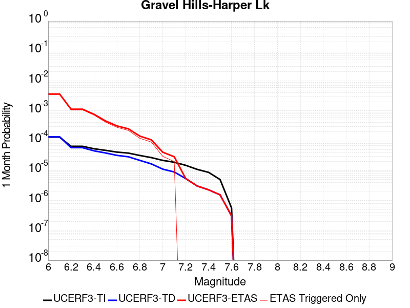 |  |  |

| Magnitude | 1 wk TI Prob | 1 wk TD Prob | 1 wk ETAS Prob | 1 wk ETAS/TD Gain | 1 wk ETAS Triggered Only | 1 mo TI Prob | 1 mo TD Prob | 1 mo ETAS Prob | 1 mo ETAS/TD Gain | 1 mo ETAS Triggered Only | 1 yr TI Prob | 1 yr TD Prob | 1 yr ETAS Prob | 1 yr ETAS/TD Gain | 1 yr ETAS Triggered Only | 10 yr TI Prob | 10 yr TD Prob | 10 yr ETAS Prob | 10 yr ETAS/TD Gain | 10 yr ETAS Triggered Only |
|-----|-----|-----|-----|-----|-----|-----|-----|-----|-----|-----|-----|-----|-----|-----|-----|-----|-----|-----|-----|-----|
| 6.0 | 3.0679566E-5 | 3.1464628E-5 | 0.0023568857 | 74.90588 | 0.002325494 | 1.3147724E-4 | 1.3484266E-4 | 0.0035101047 | 26.031116 | 0.0033757174 | 0.0015995599 | 0.00164069 | 0.0070704226 | 4.30942 | 0.0054386556 | 0.015880952 | 0.016307337 | 0.023944875 | 1.4683497 | 0.00776415 |
| 6.1 | 3.0679566E-5 | 3.1464628E-5 | 0.0023568857 | 74.90588 | 0.002325494 | 1.3147724E-4 | 1.3484266E-4 | 0.0035101047 | 26.031116 | 0.0033757174 | 0.0015995599 | 0.00164069 | 0.0070704226 | 4.30942 | 0.0054386556 | 0.015880952 | 0.016307337 | 0.023944875 | 1.4683497 | 0.00776415 |
| 6.2 | 1.514536E-5 | 1.36352E-5 | 7.637844E-4 | 56.015633 | 7.5015944E-4 | 6.490707E-5 | 5.843533E-5 | 9.960798E-4 | 17.045849 | 9.376993E-4 | 7.8995706E-4 | 7.112298E-4 | 0.002023075 | 2.8444746 | 0.0013127789 | 0.007871548 | 0.007090737 | 0.009213531 | 1.2993758 | 0.0021379543 |
| 6.3 | 1.514536E-5 | 1.36352E-5 | 7.637844E-4 | 56.015633 | 7.5015944E-4 | 6.490707E-5 | 5.843533E-5 | 9.960798E-4 | 17.045849 | 9.376993E-4 | 7.8995706E-4 | 7.112298E-4 | 0.002023075 | 2.8444746 | 0.0013127789 | 0.007871548 | 0.007090737 | 0.009213531 | 1.2993758 | 0.0021379543 |
| 6.4 | 1.2532521E-5 | 1.0689684E-5 | 4.6078052E-4 | 43.10516 | 4.5009566E-4 | 5.37097E-5 | 4.581216E-5 | 6.459122E-4 | 14.099143 | 6.001275E-4 | 6.537194E-4 | 5.5762613E-4 | 0.0013073672 | 2.344523 | 7.5015944E-4 | 0.0065179965 | 0.005562859 | 0.006793737 | 1.2212671 | 0.001237763 |
| 6.5 | 1.1094058E-5 | 9.083657E-6 | 2.7163705E-4 | 29.903934 | 2.6255578E-4 | 4.7545094E-5 | 3.89294E-5 | 3.76488E-4 | 9.671045 | 3.3757172E-4 | 5.787078E-4 | 4.7386638E-4 | 9.2374877E-4 | 1.9493865 | 4.5009566E-4 | 0.0057720304 | 0.004728967 | 0.005624901 | 1.1894567 | 9.001913E-4 |
| 6.6 | 9.688328E-6 | 7.531688E-6 | 1.5756243E-4 | 20.919937 | 1.5003188E-4 | 4.1520743E-5 | 3.227828E-5 | 2.5731884E-4 | 7.9718885 | 2.2504783E-4 | 5.053978E-4 | 3.9291973E-4 | 6.928656E-4 | 1.763377 | 3.0006375E-4 | 0.0050424994 | 0.0039225067 | 0.0042961156 | 1.0952474 | 3.7507972E-4 |
| 6.7 | 8.974824E-6 | 6.749406E-6 | 8.176484E-5 | 12.114376 | 7.501594E-5 | 3.8462964E-5 | 2.8925719E-5 | 1.7895325E-4 | 6.186649 | 1.5003188E-4 | 4.6818596E-4 | 3.5211592E-4 | 5.770845E-4 | 1.6389049 | 2.2504783E-4 | 0.004672008 | 0.003515801 | 0.0038148097 | 1.0850471 | 3.0006375E-4 |
| 6.8 | 7.4780046E-6 | 5.1161865E-6 | 8.0131744E-5 | 15.662397 | 7.501594E-5 | 3.20482E-5 | 2.1926337E-5 | 1.7195493E-4 | 7.842392 | 1.5003188E-4 | 3.9011694E-4 | 2.6692182E-4 | 4.1691368E-4 | 1.5619317 | 1.5003188E-4 | 0.0038943281 | 0.0026661505 | 0.0028531903 | 1.0701535 | 1.8753986E-4 |
| 6.9 | 6.3409307E-6 | 3.907489E-6 | 7.8923134E-5 | 20.197916 | 7.501594E-5 | 2.7175134E-5 | 1.674628E-5 | 1.6677564E-4 | 9.958967 | 1.5003188E-4 | 3.3080703E-4 | 2.0386786E-4 | 3.5386917E-4 | 1.735777 | 1.5003188E-4 | 0.0033031502 | 0.0020369065 | 0.0022240644 | 1.0918834 | 1.8753986E-4 |
| 7.0 | 5.1239335E-6 | 2.6058492E-6 | 2.6058492E-6 | 1.0 | 0.0 | 2.195953E-5 | 1.1167879E-5 | 1.1167879E-5 | 1.0 | 0.0 | 2.6732447E-4 | 1.359607E-4 | 1.359607E-4 | 1.0 | 0.0 | 0.0026700313 | 0.0013588005 | 0.0013962574 | 1.0275662 | 3.750797E-5 |
| 7.1 | 4.438899E-6 | 2.0984692E-6 | 2.0984692E-6 | 1.0 | 0.0 | 1.9023713E-5 | 8.99341E-6 | 8.99341E-6 | 1.0 | 0.0 | 2.315891E-4 | 1.0948948E-4 | 1.0948948E-4 | 1.0 | 0.0 | 0.002313479 | 0.0010943774 | 0.0011318442 | 1.0342358 | 3.750797E-5 |
| 7.2 | 3.50367E-6 | 1.2615715E-6 | 1.2615715E-6 | 1.0 | 0.0 | 1.5015643E-5 | 5.406724E-6 | 5.406724E-6 | 1.0 | 0.0 | 1.8280011E-4 | 6.5824956E-5 | 6.5824956E-5 | 1.0 | 0.0 | 0.0018264982 | 6.580628E-4 | 6.580628E-4 | 1.0 | 0.0 |
| 7.3 | 2.561638E-6 | 7.118686E-7 | 7.118686E-7 | 1.0 | 0.0 | 1.0978401E-5 | 3.050862E-6 | 3.050862E-6 | 1.0 | 0.0 | 1.3365384E-4 | 3.7143633E-5 | 3.7143633E-5 | 1.0 | 0.0 | 0.0013357349 | 3.7137623E-4 | 3.7137623E-4 | 1.0 | 0.0 |
| 7.4 | 2.0368864E-6 | 5.304471E-7 | 5.304471E-7 | 1.0 | 0.0 | 8.729483E-6 | 2.2733427E-6 | 2.2733427E-6 | 1.0 | 0.0 | 1.06276275E-4 | 2.76776E-5 | 2.76776E-5 | 1.0 | 0.0 | 0.0010622547 | 2.767421E-4 | 2.767421E-4 | 1.0 | 0.0 |
| 7.5 | 1.1681728E-6 | 3.6028484E-7 | 3.6028484E-7 | 1.0 | 0.0 | 5.0064455E-6 | 1.544077E-6 | 1.544077E-6 | 1.0 | 0.0 | 6.0951766E-5 | 1.879898E-5 | 1.879898E-5 | 1.0 | 0.0 | 6.093505E-4 | 1.8797436E-4 | 1.8797436E-4 | 1.0 | 0.0 |
| 7.6 | 1.3154387E-7 | 7.1196716E-8 | 7.1196716E-8 | 1.0 | 0.0 | 5.6375933E-7 | 3.0512876E-7 | 3.0512876E-7 | 1.0 | 0.0 | 6.863748E-6 | 3.714938E-6 | 3.714938E-6 | 1.0 | 0.0 | 6.863536E-5 | 3.7148915E-5 | 3.7148915E-5 | 1.0 | 0.0 |

## McLean Lake
*[(top)](#table-of-contents)*

| 1 Week | 1 Month | 1 Year | 10 Year |
|-----|-----|-----|-----|
|  |  |  |  |

| Magnitude | 1 wk TI Prob | 1 wk TD Prob | 1 wk ETAS Prob | 1 wk ETAS/TD Gain | 1 wk ETAS Triggered Only | 1 mo TI Prob | 1 mo TD Prob | 1 mo ETAS Prob | 1 mo ETAS/TD Gain | 1 mo ETAS Triggered Only | 1 yr TI Prob | 1 yr TD Prob | 1 yr ETAS Prob | 1 yr ETAS/TD Gain | 1 yr ETAS Triggered Only | 10 yr TI Prob | 10 yr TD Prob | 10 yr ETAS Prob | 10 yr ETAS/TD Gain | 10 yr ETAS Triggered Only |
|-----|-----|-----|-----|-----|-----|-----|-----|-----|-----|-----|-----|-----|-----|-----|-----|-----|-----|-----|-----|-----|
| 6.0 | 1.7360222E-5 | 1.8501627E-5 | 0.0017438363 | 94.253136 | 0.0017253667 | 7.439883E-5 | 7.9290556E-5 | 0.0026671353 | 33.637493 | 0.00258805 | 9.0542925E-4 | 9.6498354E-4 | 0.0056489557 | 5.8539395 | 0.0046884962 | 0.009017491 | 0.0096127745 | 0.016410751 | 1.7071816 | 0.0068639587 |
| 6.1 | 9.062689E-6 | 9.592193E-6 | 9.8479E-4 | 102.66579 | 9.7520725E-4 | 3.8839516E-5 | 4.1108804E-5 | 0.0014288466 | 34.757683 | 0.0013877949 | 4.727685E-4 | 5.003936E-4 | 0.0029371916 | 5.8697624 | 0.002438018 | 0.0047176396 | 0.004993552 | 0.008576336 | 1.7174822 | 0.0036007653 |
| 6.2 | 9.062689E-6 | 9.592193E-6 | 9.8479E-4 | 102.66579 | 9.7520725E-4 | 3.8839516E-5 | 4.1108804E-5 | 0.0014288466 | 34.757683 | 0.0013877949 | 4.727685E-4 | 5.003936E-4 | 0.0029371916 | 5.8697624 | 0.002438018 | 0.0047176396 | 0.004993552 | 0.008576336 | 1.7174822 | 0.0036007653 |
| 6.3 | 7.2575485E-6 | 7.66771E-6 | 7.9532905E-4 | 103.724464 | 7.876674E-4 | 3.110341E-5 | 3.2861237E-5 | 0.0011580634 | 35.241016 | 0.0011252391 | 3.786182E-4 | 4.0001926E-4 | 0.0024621324 | 6.155035 | 0.0020629384 | 0.0037797375 | 0.0039936965 | 0.0069449926 | 1.7389885 | 0.0029631297 |
| 6.4 | 7.2575485E-6 | 7.66771E-6 | 7.9532905E-4 | 103.724464 | 7.876674E-4 | 3.110341E-5 | 3.2861237E-5 | 0.0011580634 | 35.241016 | 0.0011252391 | 3.786182E-4 | 4.0001926E-4 | 0.0024621324 | 6.155035 | 0.0020629384 | 0.0037797375 | 0.0039936965 | 0.0069449926 | 1.7389885 | 0.0029631297 |
| 6.5 | 6.06582E-6 | 6.4038773E-6 | 6.81543E-4 | 106.42662 | 6.7514344E-4 | 2.5996113E-5 | 2.7444936E-5 | 0.0010026254 | 36.532257 | 9.7520725E-4 | 3.164567E-4 | 3.3409733E-4 | 0.002021392 | 6.0503087 | 0.0016878587 | 0.0031600643 | 0.0033365893 | 0.005766473 | 1.7282537 | 0.002438018 |
| 6.6 | 5.598744E-6 | 5.910262E-6 | 6.43542E-4 | 108.88552 | 6.376355E-4 | 2.3994397E-5 | 2.5329486E-5 | 9.2549797E-4 | 36.538364 | 9.001913E-4 | 2.9209262E-4 | 3.0834923E-4 | 0.0018457018 | 5.985751 | 0.0015378268 | 0.0029170897 | 0.003079843 | 0.00532339 | 1.7284615 | 0.0022504781 |
| 6.7 | 5.246996E-6 | 5.539162E-6 | 5.681556E-4 | 102.57068 | 5.6261953E-4 | 2.2486933E-5 | 2.3739085E-5 | 8.488948E-4 | 35.759373 | 8.251754E-4 | 2.73744E-4 | 2.8899137E-4 | 0.0017138823 | 5.930566 | 0.0014253028 | 0.0027340704 | 0.0028867796 | 0.0049811625 | 1.7255083 | 0.0021004463 |
| 6.8 | 4.02324E-6 | 4.2469046E-6 | 4.9184845E-4 | 115.8134 | 4.8760363E-4 | 1.7242342E-5 | 1.8200926E-5 | 7.6834665E-4 | 42.214703 | 7.5015944E-4 | 2.099053E-4 | 2.2157968E-4 | 0.0015340678 | 6.923323 | 0.0013127789 | 0.0020970714 | 0.002214172 | 0.004047993 | 1.8282199 | 0.0018378906 |
| 6.9 | 6.835972E-7 | 7.1399285E-7 | 7.572988E-5 | 106.06532 | 7.501594E-5 | 2.9296991E-6 | 3.0599674E-6 | 7.807568E-5 | 25.5152 | 7.501594E-5 | 3.56685E-5 | 3.7254784E-5 | 2.998008E-4 | 8.04731 | 2.6255578E-4 | 3.5662777E-4 | 3.7251666E-4 | 7.099626E-4 | 1.9058547 | 3.3757172E-4 |

## Goldstone Lake
*[(top)](#table-of-contents)*

| 1 Week | 1 Month | 1 Year | 10 Year |
|-----|-----|-----|-----|
|  |  |  |  |

| Magnitude | 1 wk TI Prob | 1 wk TD Prob | 1 wk ETAS Prob | 1 wk ETAS/TD Gain | 1 wk ETAS Triggered Only | 1 mo TI Prob | 1 mo TD Prob | 1 mo ETAS Prob | 1 mo ETAS/TD Gain | 1 mo ETAS Triggered Only | 1 yr TI Prob | 1 yr TD Prob | 1 yr ETAS Prob | 1 yr ETAS/TD Gain | 1 yr ETAS Triggered Only | 10 yr TI Prob | 10 yr TD Prob | 10 yr ETAS Prob | 10 yr ETAS/TD Gain | 10 yr ETAS Triggered Only |
|-----|-----|-----|-----|-----|-----|-----|-----|-----|-----|-----|-----|-----|-----|-----|-----|-----|-----|-----|-----|-----|
| 6.0 | 2.671352E-5 | 3.0376103E-5 | 0.0019807313 | 65.206894 | 0.0019504145 | 1.1448149E-4 | 1.3017791E-4 | 0.0030179156 | 23.183008 | 0.0028881137 | 0.001392921 | 0.0015839601 | 0.0058156475 | 3.671587 | 0.0042384006 | 0.013842222 | 0.015746202 | 0.021689897 | 1.3774685 | 0.006038783 |
| 6.1 | 2.671352E-5 | 3.0376103E-5 | 0.0019807313 | 65.206894 | 0.0019504145 | 1.1448149E-4 | 1.3017791E-4 | 0.0030179156 | 23.183008 | 0.0028881137 | 0.001392921 | 0.0015839601 | 0.0058156475 | 3.671587 | 0.0042384006 | 0.013842222 | 0.015746202 | 0.021689897 | 1.3774685 | 0.006038783 |
| 6.2 | 1.4197047E-5 | 1.6096254E-5 | 8.412583E-4 | 52.26423 | 8.251754E-4 | 6.0843064E-5 | 6.898268E-5 | 0.0015316926 | 22.204018 | 0.0014628108 | 7.4051257E-4 | 8.3963916E-4 | 0.0029383218 | 3.4995055 | 0.0021004463 | 0.007380498 | 0.008374364 | 0.011498649 | 1.3730773 | 0.0031506696 |
| 6.3 | 1.4197047E-5 | 1.6096254E-5 | 8.412583E-4 | 52.26423 | 8.251754E-4 | 6.0843064E-5 | 6.898268E-5 | 0.0015316926 | 22.204018 | 0.0014628108 | 7.4051257E-4 | 8.3963916E-4 | 0.0029383218 | 3.4995055 | 0.0021004463 | 0.007380498 | 0.008374364 | 0.011498649 | 1.3730773 | 0.0031506696 |
| 6.4 | 1.3238931E-5 | 1.500847E-5 | 6.901418E-4 | 45.98349 | 6.7514344E-4 | 5.6737044E-5 | 6.432098E-5 | 0.0013020044 | 20.242298 | 0.001237763 | 6.9055456E-4 | 7.8292453E-4 | 0.0025818977 | 3.2977605 | 0.0018003826 | 0.006884126 | 0.007811289 | 0.010565198 | 1.352555 | 0.0027755897 |
| 6.5 | 1.3238931E-5 | 1.500847E-5 | 6.901418E-4 | 45.98349 | 6.7514344E-4 | 5.6737044E-5 | 6.432098E-5 | 0.0013020044 | 20.242298 | 0.001237763 | 6.9055456E-4 | 7.8292453E-4 | 0.0025818977 | 3.2977605 | 0.0018003826 | 0.006884126 | 0.007811289 | 0.010565198 | 1.352555 | 0.0027755897 |
| 6.6 | 1.1328278E-5 | 1.2855176E-5 | 6.12975E-4 | 47.68313 | 6.001275E-4 | 4.8548856E-5 | 5.5092984E-5 | 0.0011802701 | 21.423237 | 0.0011252391 | 5.90922E-4 | 6.706464E-4 | 0.002357373 | 3.5150762 | 0.0016878587 | 0.0058935313 | 0.0066956137 | 0.009191821 | 1.3728124 | 0.002513034 |
| 6.7 | 8.651175E-6 | 9.824575E-6 | 4.224082E-4 | 42.995064 | 4.125877E-4 | 3.707594E-5 | 4.2105148E-5 | 7.172202E-4 | 17.034025 | 6.7514344E-4 | 4.5130608E-4 | 5.126002E-4 | 0.001562285 | 3.0477653 | 0.0010502231 | 0.0045039062 | 0.0051230565 | 0.0068395836 | 1.3350593 | 0.0017253667 |
| 6.8 | 1.0215377E-6 | 1.1754802E-6 | 3.8683407E-5 | 32.9086 | 3.750797E-5 | 4.378012E-6 | 5.037763E-6 | 4.2545544E-5 | 8.445325 | 3.750797E-5 | 5.3300988E-5 | 6.133315E-5 | 1.3634449E-4 | 2.2230146 | 7.501594E-5 | 5.3288206E-4 | 6.131735E-4 | 7.2562846E-4 | 1.1833982 | 1.12523914E-4 |
| 6.9 | 7.9360774E-7 | 9.283496E-7 | 9.283496E-7 | 1.0 | 0.0 | 3.4011714E-6 | 3.9786355E-6 | 3.9786355E-6 | 1.0 | 0.0 | 4.1408475E-5 | 4.843888E-5 | 8.594504E-5 | 1.7742985 | 3.750797E-5 | 4.140076E-4 | 4.842902E-4 | 5.5926986E-4 | 1.1548237 | 7.501594E-5 |
| 7.0 | 7.4382757E-7 | 8.747428E-7 | 8.747428E-7 | 1.0 | 0.0 | 3.1878285E-6 | 3.7488926E-6 | 3.7488926E-6 | 1.0 | 0.0 | 3.8811122E-5 | 4.564188E-5 | 8.314814E-5 | 1.821751 | 3.750797E-5 | 3.8804344E-4 | 4.563317E-4 | 5.313134E-4 | 1.164314 | 7.501594E-5 |
| 7.1 | 6.4709513E-7 | 7.711399E-7 | 7.711399E-7 | 1.0 | 0.0 | 2.773262E-6 | 3.3048816E-6 | 3.3048816E-6 | 1.0 | 0.0 | 3.376394E-5 | 4.023625E-5 | 7.774271E-5 | 1.932156 | 3.750797E-5 | 3.375881E-4 | 4.022956E-4 | 4.7728137E-4 | 1.1863947 | 7.501594E-5 |
| 7.2 | 6.356704E-7 | 7.588459E-7 | 7.588459E-7 | 1.0 | 0.0 | 2.7242988E-6 | 3.252193E-6 | 3.252193E-6 | 1.0 | 0.0 | 3.3167835E-5 | 3.959479E-5 | 7.710128E-5 | 1.9472581 | 3.750797E-5 | 3.3162883E-4 | 3.9588328E-4 | 4.7086953E-4 | 1.189415 | 7.501594E-5 |
| 7.3 | 5.7695723E-7 | 6.896648E-7 | 6.896648E-7 | 1.0 | 0.0 | 2.4726714E-6 | 2.9557032E-6 | 2.9557032E-6 | 1.0 | 0.0 | 3.0104358E-5 | 3.598515E-5 | 7.349177E-5 | 2.0422804 | 3.750797E-5 | 3.0100282E-4 | 3.5979896E-4 | 3.9729345E-4 | 1.1042095 | 3.750797E-5 |
| 7.4 | 5.209647E-7 | 6.193583E-7 | 6.193583E-7 | 1.0 | 0.0 | 2.232704E-6 | 2.6543903E-6 | 2.6543903E-6 | 1.0 | 0.0 | 2.718283E-5 | 3.2316777E-5 | 6.982354E-5 | 2.160597 | 3.750797E-5 | 2.7179506E-4 | 3.2312635E-4 | 3.606222E-4 | 1.1160408 | 3.750797E-5 |
| 7.5 | 4.512955E-7 | 5.3489487E-7 | 5.3489487E-7 | 1.0 | 0.0 | 1.934122E-6 | 2.2924048E-6 | 2.2924048E-6 | 1.0 | 0.0 | 2.3547682E-5 | 2.7909726E-5 | 6.541665E-5 | 2.3438656 | 3.750797E-5 | 2.3545188E-4 | 2.7906752E-4 | 3.16565E-4 | 1.1343671 | 3.750797E-5 |
| 7.6 | 2.21172E-7 | 2.6040198E-7 | 2.6040198E-7 | 1.0 | 0.0 | 9.478797E-7 | 1.1160082E-6 | 1.1160082E-6 | 1.0 | 0.0 | 1.1540374E-5 | 1.3587343E-5 | 1.3587343E-5 | 1.0 | 0.0 | 1.1539775E-4 | 1.3586794E-4 | 1.3586794E-4 | 1.0 | 0.0 |

## San Andreas (Mojave S)
*[(top)](#table-of-contents)*

| 1 Week | 1 Month | 1 Year | 10 Year |
|-----|-----|-----|-----|
|  |  |  |  |

| Magnitude | 1 wk TI Prob | 1 wk TD Prob | 1 wk ETAS Prob | 1 wk ETAS/TD Gain | 1 wk ETAS Triggered Only | 1 mo TI Prob | 1 mo TD Prob | 1 mo ETAS Prob | 1 mo ETAS/TD Gain | 1 mo ETAS Triggered Only | 1 yr TI Prob | 1 yr TD Prob | 1 yr ETAS Prob | 1 yr ETAS/TD Gain | 1 yr ETAS Triggered Only | 10 yr TI Prob | 10 yr TD Prob | 10 yr ETAS Prob | 10 yr ETAS/TD Gain | 10 yr ETAS Triggered Only |
|-----|-----|-----|-----|-----|-----|-----|-----|-----|-----|-----|-----|-----|-----|-----|-----|-----|-----|-----|-----|-----|
| 6.0 | 3.1064058E-4 | 6.7462435E-4 | 0.0024737923 | 3.6669183 | 0.0018003826 | 0.0013306376 | 0.002888172 | 0.0051321504 | 1.7769547 | 0.0022504781 | 0.016080605 | 0.034565594 | 0.037715994 | 1.0911427 | 0.0032631934 | 0.1496549 | 0.28654557 | 0.28964975 | 1.0108331 | 0.0043509244 |
| 6.1 | 3.1064058E-4 | 6.7462435E-4 | 0.0024737923 | 3.6669183 | 0.0018003826 | 0.0013306376 | 0.002888172 | 0.0051321504 | 1.7769547 | 0.0022504781 | 0.016080605 | 0.034565594 | 0.037715994 | 1.0911427 | 0.0032631934 | 0.1496549 | 0.28654557 | 0.28964975 | 1.0108331 | 0.0043509244 |
| 6.2 | 3.1064058E-4 | 6.7462435E-4 | 0.0024737923 | 3.6669183 | 0.0018003826 | 0.0013306376 | 0.002888172 | 0.0051321504 | 1.7769547 | 0.0022504781 | 0.016080605 | 0.034565594 | 0.037715994 | 1.0911427 | 0.0032631934 | 0.1496549 | 0.28654557 | 0.28964975 | 1.0108331 | 0.0043509244 |
| 6.3 | 3.1064058E-4 | 6.7462435E-4 | 0.0024737923 | 3.6669183 | 0.0018003826 | 0.0013306376 | 0.002888172 | 0.0051321504 | 1.7769547 | 0.0022504781 | 0.016080605 | 0.034565594 | 0.037715994 | 1.0911427 | 0.0032631934 | 0.1496549 | 0.28654557 | 0.28964975 | 1.0108331 | 0.0043509244 |
| 6.4 | 1.9872203E-4 | 4.3181062E-4 | 0.0019689733 | 4.559808 | 0.0015378268 | 8.5138786E-4 | 0.0018493326 | 0.0037961402 | 2.0527081 | 0.0019504145 | 0.010316478 | 0.02228931 | 0.025039706 | 1.1233953 | 0.0028130978 | 0.098504856 | 0.19686839 | 0.19985065 | 1.0151485 | 0.003713289 |
| 6.5 | 1.291105E-4 | 2.8754136E-4 | 0.0015999429 | 5.564218 | 0.0013127789 | 5.5321335E-4 | 0.0012317409 | 0.002880059 | 2.3382018 | 0.0016503508 | 0.006714592 | 0.014894155 | 0.017185012 | 1.1538092 | 0.002325494 | 0.065152965 | 0.13800792 | 0.14059445 | 1.0187418 | 0.0030006377 |
| 6.6 | 1.291105E-4 | 2.8754136E-4 | 0.0015999429 | 5.564218 | 0.0013127789 | 5.5321335E-4 | 0.0012317409 | 0.002880059 | 2.3382018 | 0.0016503508 | 0.006714592 | 0.014894155 | 0.017185012 | 1.1538092 | 0.002325494 | 0.065152965 | 0.13800792 | 0.14059445 | 1.0187418 | 0.0030006377 |
| 6.7 | 1.08001186E-4 | 2.4335351E-4 | 0.0015183141 | 6.23913 | 0.001275271 | 4.6278012E-4 | 0.0010425274 | 0.0026536887 | 2.5454378 | 0.0016128428 | 0.0056198016 | 0.0126192 | 0.014804244 | 1.1731523 | 0.0022129703 | 0.054797906 | 0.11918431 | 0.121728204 | 1.0213442 | 0.0028881137 |
| 6.8 | 1.0624356E-4 | 2.3853009E-4 | 0.0014759979 | 6.1878896 | 0.001237763 | 4.5525006E-4 | 0.0010218718 | 0.0025955967 | 2.5400414 | 0.0015753348 | 0.0055285925 | 0.012370593 | 0.014519143 | 1.1736821 | 0.0021754622 | 0.053930566 | 0.11713308 | 0.11964978 | 1.0214858 | 0.0028506056 |
| 6.9 | 1.0393785E-4 | 2.3223337E-4 | 0.001469709 | 6.328586 | 0.001237763 | 4.4537184E-4 | 9.949068E-4 | 0.0025686743 | 2.581824 | 0.0015753348 | 0.0054089287 | 0.012045963 | 0.01419522 | 1.1784214 | 0.0021754622 | 0.05279156 | 0.114433445 | 0.11695785 | 1.02206 | 0.0028506056 |
| 7.0 | 1.0155622E-4 | 2.2592908E-4 | 0.001425913 | 6.3113303 | 0.001200255 | 4.3516833E-4 | 9.6790853E-4 | 0.0025042468 | 2.5872762 | 0.0015378268 | 0.005285311 | 0.011720838 | 0.013833734 | 1.1802683 | 0.0021379543 | 0.05161361 | 0.11169745 | 0.11419634 | 1.0223719 | 0.0028130978 |
| 7.1 | 9.885595E-5 | 2.188132E-4 | 0.0014188057 | 6.484095 | 0.001200255 | 4.2359953E-4 | 9.374342E-4 | 0.0024738193 | 2.6389258 | 0.0015378268 | 0.0051451353 | 0.011353733 | 0.013467413 | 1.1861662 | 0.0021379543 | 0.05027629 | 0.10857607 | 0.11105029 | 1.0227879 | 0.0027755897 |
| 7.2 | 9.6411415E-5 | 2.1244297E-4 | 0.001412443 | 6.648575 | 0.001200255 | 4.1312634E-4 | 9.101525E-4 | 0.0024465797 | 2.6880987 | 0.0015378268 | 0.005018219 | 0.011024987 | 0.01313937 | 1.191781 | 0.0021379543 | 0.049064007 | 0.1057697 | 0.10825172 | 1.0234662 | 0.0027755897 |
| 7.3 | 9.1180635E-5 | 1.9472656E-4 | 0.0013947479 | 7.162597 | 0.001200255 | 3.907156E-4 | 8.342756E-4 | 0.0023708194 | 2.8417702 | 0.0015378268 | 0.004746591 | 0.010110112 | 0.012226451 | 1.209329 | 0.0021379543 | 0.046464786 | 0.09796176 | 0.10046545 | 1.0255578 | 0.0027755897 |
| 7.4 | 8.887388E-5 | 1.872126E-4 | 0.0013872429 | 7.409987 | 0.001200255 | 3.8083247E-4 | 8.020931E-4 | 0.0023386865 | 2.9157293 | 0.0015378268 | 0.0046267817 | 0.009721855 | 0.011839024 | 1.2177743 | 0.0021379543 | 0.045316286 | 0.094593845 | 0.09710688 | 1.0265666 | 0.0027755897 |
| 7.5 | 8.6750515E-5 | 1.80528E-4 | 0.0013805664 | 7.647381 | 0.001200255 | 3.7173493E-4 | 7.734621E-4 | 0.0023100995 | 2.9867003 | 0.0015378268 | 0.004516484 | 0.009376327 | 0.011494234 | 1.2258782 | 0.0021379543 | 0.04425787 | 0.09155606 | 0.09407753 | 1.0275402 | 0.0027755897 |
| 7.6 | 8.453092E-5 | 1.7440386E-4 | 0.0013744496 | 7.8808436 | 0.001200255 | 3.6222505E-4 | 7.4723107E-4 | 0.0022839087 | 3.056496 | 0.0015378268 | 0.0044011753 | 0.009059664 | 0.011141081 | 1.2297455 | 0.0021004463 | 0.04315024 | 0.08871447 | 0.09120965 | 1.0281259 | 0.0027380819 |
| 7.7 | 8.259102E-5 | 1.6962511E-4 | 0.0013696766 | 8.074728 | 0.001200255 | 3.539135E-4 | 7.267622E-4 | 0.0022634715 | 3.1144593 | 0.0015378268 | 0.004300386 | 0.0088125 | 0.010894436 | 1.236248 | 0.0021004463 | 0.042181134 | 0.086465426 | 0.088966765 | 1.0289288 | 0.0027380819 |
| 7.8 | 7.444844E-5 | 1.528469E-4 | 0.0012029095 | 7.870029 | 0.0010502231 | 3.1902574E-4 | 6.5489375E-4 | 0.0019668129 | 3.0032551 | 0.0013127789 | 0.0038772223 | 0.007944231 | 0.009730311 | 1.2248273 | 0.0018003826 | 0.03810269 | 0.078293875 | 0.080402724 | 1.0269351 | 0.0022879862 |
| 7.9 | 5.2586525E-5 | 1.0007023E-4 | 7.001377E-4 | 6.9964633 | 6.001275E-4 | 2.2535135E-4 | 4.2880196E-4 | 0.0011411478 | 2.6612468 | 7.126514E-4 | 0.0027402006 | 0.005208178 | 0.0062529314 | 1.2005986 | 0.0010502231 | 0.027066574 | 0.052201588 | 0.05348139 | 1.0245165 | 0.0013502869 |
| 8.0 | 3.379877E-5 | 5.4075565E-5 | 2.791112E-4 | 5.161504 | 2.2504783E-4 | 1.4484383E-4 | 2.3173184E-4 | 4.942268E-4 | 2.1327531 | 2.6255578E-4 | 0.0017620471 | 0.0028176866 | 0.003229112 | 1.1460152 | 4.125877E-4 | 0.017481409 | 0.028835917 | 0.029382313 | 1.0189484 | 5.6261953E-4 |
| 8.1 | 1.8668277E-5 | 1.9308145E-5 | 5.6815392E-5 | 2.942561 | 3.750797E-5 | 8.000444E-5 | 8.274657E-5 | 1.2025143E-4 | 1.4532498 | 3.750797E-5 | 9.736188E-4 | 0.0010069745 | 0.0010819149 | 1.0744214 | 7.501594E-5 | 0.009693642 | 0.010798624 | 0.010909933 | 1.0103077 | 1.12523914E-4 |
| 8.2 | 8.541571E-6 | 5.4596358E-6 | 5.4596358E-6 | 1.0 | 0.0 | 3.660622E-5 | 2.339823E-5 | 2.339823E-5 | 1.0 | 0.0 | 4.455896E-4 | 2.848363E-4 | 2.848363E-4 | 1.0 | 0.0 | 0.0044469717 | 0.003240283 | 0.003240283 | 1.0 | 0.0 |
| 8.3 | 1.983087E-6 | 7.6564595E-7 | 7.6564595E-7 | 1.0 | 0.0 | 8.498917E-6 | 3.281336E-6 | 3.281336E-6 | 1.0 | 0.0 | 1.034694E-4 | 3.9949547E-5 | 3.9949547E-5 | 1.0 | 0.0 | 0.0010342124 | 4.717979E-4 | 4.717979E-4 | 1.0 | 0.0 |

## So Sierra Nevada
*[(top)](#table-of-contents)*

| 1 Week | 1 Month | 1 Year | 10 Year |
|-----|-----|-----|-----|
|  |  |  |  |

| Magnitude | 1 wk TI Prob | 1 wk TD Prob | 1 wk ETAS Prob | 1 wk ETAS/TD Gain | 1 wk ETAS Triggered Only | 1 mo TI Prob | 1 mo TD Prob | 1 mo ETAS Prob | 1 mo ETAS/TD Gain | 1 mo ETAS Triggered Only | 1 yr TI Prob | 1 yr TD Prob | 1 yr ETAS Prob | 1 yr ETAS/TD Gain | 1 yr ETAS Triggered Only | 10 yr TI Prob | 10 yr TD Prob | 10 yr ETAS Prob | 10 yr ETAS/TD Gain | 10 yr ETAS Triggered Only |
|-----|-----|-----|-----|-----|-----|-----|-----|-----|-----|-----|-----|-----|-----|-----|-----|-----|-----|-----|-----|-----|
| 6.0 | 1.15488665E-5 | 1.1079612E-5 | 0.001586397 | 143.18164 | 0.0015753348 | 4.9494203E-5 | 4.7483256E-5 | 0.0024853856 | 52.342358 | 0.002438018 | 6.024253E-4 | 5.779681E-4 | 0.004064193 | 7.0318646 | 0.0034882412 | 0.006007948 | 0.005765918 | 0.010464673 | 1.8149188 | 0.0047260043 |
| 6.1 | 1.15488665E-5 | 1.1079612E-5 | 0.001586397 | 143.18164 | 0.0015753348 | 4.9494203E-5 | 4.7483256E-5 | 0.0024853856 | 52.342358 | 0.002438018 | 6.024253E-4 | 5.779681E-4 | 0.004064193 | 7.0318646 | 0.0034882412 | 0.006007948 | 0.005765918 | 0.010464673 | 1.8149188 | 0.0047260043 |
| 6.2 | 1.15488665E-5 | 1.1079612E-5 | 0.001586397 | 143.18164 | 0.0015753348 | 4.9494203E-5 | 4.7483256E-5 | 0.0024853856 | 52.342358 | 0.002438018 | 6.024253E-4 | 5.779681E-4 | 0.004064193 | 7.0318646 | 0.0034882412 | 0.006007948 | 0.005765918 | 0.010464673 | 1.8149188 | 0.0047260043 |
| 6.3 | 1.15488665E-5 | 1.1079612E-5 | 0.001586397 | 143.18164 | 0.0015753348 | 4.9494203E-5 | 4.7483256E-5 | 0.0024853856 | 52.342358 | 0.002438018 | 6.024253E-4 | 5.779681E-4 | 0.004064193 | 7.0318646 | 0.0034882412 | 0.006007948 | 0.005765918 | 0.010464673 | 1.8149188 | 0.0047260043 |
| 6.4 | 1.15488665E-5 | 1.1079612E-5 | 0.001586397 | 143.18164 | 0.0015753348 | 4.9494203E-5 | 4.7483256E-5 | 0.0024853856 | 52.342358 | 0.002438018 | 6.024253E-4 | 5.779681E-4 | 0.004064193 | 7.0318646 | 0.0034882412 | 0.006007948 | 0.005765918 | 0.010464673 | 1.8149188 | 0.0047260043 |
| 6.5 | 1.15488665E-5 | 1.1079612E-5 | 0.001586397 | 143.18164 | 0.0015753348 | 4.9494203E-5 | 4.7483256E-5 | 0.0024853856 | 52.342358 | 0.002438018 | 6.024253E-4 | 5.779681E-4 | 0.004064193 | 7.0318646 | 0.0034882412 | 0.006007948 | 0.005765918 | 0.010464673 | 1.8149188 | 0.0047260043 |
| 6.6 | 7.587044E-6 | 6.9356042E-6 | 0.0010946592 | 157.83185 | 0.0010877311 | 3.2515498E-5 | 2.9723697E-5 | 0.0013799705 | 46.426613 | 0.0013502869 | 3.9580427E-4 | 3.6182883E-4 | 0.0023115375 | 6.3884835 | 0.0019504145 | 0.003951 | 0.0036126887 | 0.006116644 | 1.6931002 | 0.002513034 |
| 6.7 | 7.587044E-6 | 6.9356042E-6 | 0.0010946592 | 157.83185 | 0.0010877311 | 3.2515498E-5 | 2.9723697E-5 | 0.0013799705 | 46.426613 | 0.0013502869 | 3.9580427E-4 | 3.6182883E-4 | 0.0023115375 | 6.3884835 | 0.0019504145 | 0.003951 | 0.0036126887 | 0.006116644 | 1.6931002 | 0.002513034 |
| 6.8 | 5.9026956E-6 | 5.179362E-6 | 9.803815E-4 | 189.28616 | 9.7520725E-4 | 2.5297022E-5 | 2.2197082E-5 | 0.0012224255 | 55.07145 | 0.001200255 | 3.0794772E-4 | 2.7021713E-4 | 0.001882624 | 6.9670787 | 0.0016128428 | 0.0030752132 | 0.002699002 | 0.0046441522 | 1.7206924 | 0.0019504145 |
| 6.9 | 5.0118915E-6 | 4.2523943E-6 | 6.4188516E-4 | 150.94676 | 6.376355E-4 | 2.1479358E-5 | 1.8224424E-5 | 8.433847E-4 | 46.277714 | 8.251754E-4 | 2.614798E-4 | 2.2186051E-4 | 0.0013843497 | 6.23973 | 0.001162747 | 0.0026117235 | 0.0022164627 | 0.0036760313 | 1.6585126 | 0.0014628108 |
| 7.0 | 4.4924795E-6 | 3.7138868E-6 | 5.663314E-4 | 152.4902 | 5.6261953E-4 | 1.925334E-5 | 1.5916565E-5 | 7.6606404E-4 | 48.129986 | 7.5015944E-4 | 2.3438422E-4 | 1.9376757E-4 | 0.0011312851 | 5.8383617 | 9.376993E-4 | 0.0023413717 | 0.0019360491 | 0.003096545 | 1.5994145 | 0.001162747 |
| 7.1 | 3.9118436E-6 | 3.1119469E-6 | 4.1569833E-4 | 133.58144 | 4.125877E-4 | 1.6764936E-5 | 1.333685E-5 | 6.1345636E-4 | 45.997093 | 6.001275E-4 | 2.0409399E-4 | 1.6236462E-4 | 9.1240223E-4 | 5.6194644 | 7.5015944E-4 | 0.0020390663 | 0.0016225161 | 0.002596141 | 1.6000711 | 9.7520725E-4 |
| 7.2 | 3.4200818E-6 | 2.6054236E-6 | 1.5263692E-4 | 58.584297 | 1.5003188E-4 | 1.4657411E-5 | 1.11660565E-5 | 3.1122647E-4 | 27.872551 | 3.0006375E-4 | 1.7843937E-4 | 1.3593875E-4 | 5.1096745E-4 | 3.7588065 | 3.7507972E-4 | 0.0017829615 | 0.0013586058 | 0.001920461 | 1.4135528 | 5.6261953E-4 |
| 7.3 | 2.6593618E-6 | 1.8283897E-6 | 1.5186E-4 | 83.056694 | 1.5003188E-4 | 1.13972155E-5 | 7.8359335E-6 | 1.9537432E-4 | 24.933125 | 1.8753986E-4 | 1.3875226E-4 | 9.539862E-5 | 3.2042497E-4 | 3.3588011 | 2.2504783E-4 | 0.0013866565 | 9.536055E-4 | 0.0012908553 | 1.3536576 | 3.3757172E-4 |
| 7.4 | 2.2577992E-6 | 1.4364078E-6 | 1.5146808E-4 | 105.44922 | 1.5003188E-4 | 9.676246E-6 | 6.1560204E-6 | 1.5618697E-4 | 25.37142 | 1.5003188E-4 | 1.1780193E-4 | 7.4947224E-5 | 2.62473E-4 | 3.5021045 | 1.8753986E-4 | 0.001177395 | 7.4924453E-4 | 0.0010490834 | 1.4001883 | 3.0006375E-4 |
| 7.5 | 1.489319E-6 | 7.353661E-7 | 1.5076714E-4 | 205.02324 | 1.5003188E-4 | 6.3827797E-6 | 3.1515651E-6 | 1.5318298E-4 | 48.605366 | 1.5003188E-4 | 7.770758E-5 | 3.8369635E-5 | 1.8839576E-4 | 4.9100223 | 1.5003188E-4 | 7.7680405E-4 | 3.8363054E-4 | 5.710984E-4 | 1.4886678 | 1.8753986E-4 |
| 7.6 | 1.0680322E-6 | 4.65941E-7 | 1.5049776E-4 | 322.99744 | 1.5003188E-4 | 4.577273E-6 | 1.9968884E-6 | 1.5202847E-4 | 76.13268 | 1.5003188E-4 | 5.5726876E-5 | 2.4311848E-5 | 1.7434008E-4 | 7.1709924 | 1.5003188E-4 | 5.5712904E-4 | 2.4309216E-4 | 4.3058643E-4 | 1.7712889 | 1.8753986E-4 |
| 7.7 | 5.509146E-7 | 1.5578539E-7 | 1.5578539E-7 | 1.0 | 0.0 | 2.3610605E-6 | 6.676515E-7 | 6.676515E-7 | 1.0 | 0.0 | 2.8745531E-5 | 8.128628E-6 | 8.128628E-6 | 1.0 | 0.0 | 2.8741814E-4 | 8.128342E-5 | 8.128342E-5 | 1.0 | 0.0 |

## Coyote Canyon
*[(top)](#table-of-contents)*

| 1 Week | 1 Month | 1 Year | 10 Year |
|-----|-----|-----|-----|
|  | 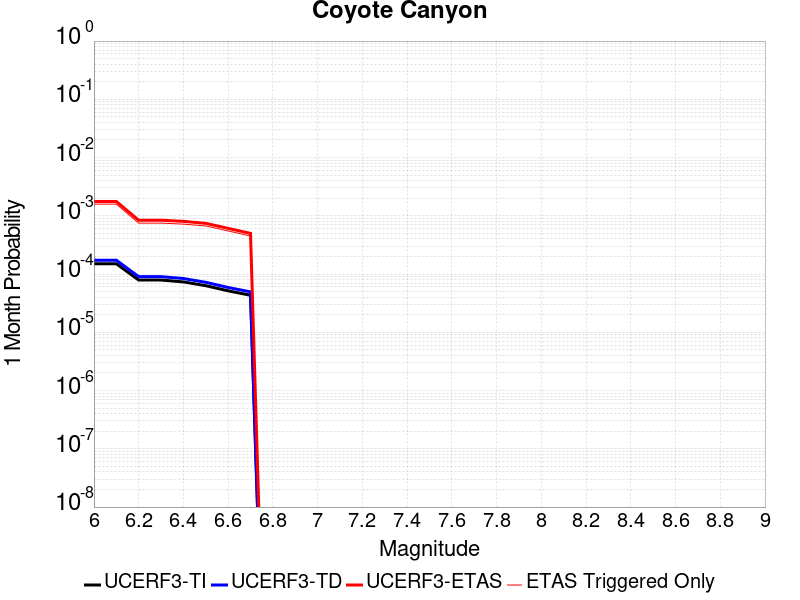 |  |  |

| Magnitude | 1 wk TI Prob | 1 wk TD Prob | 1 wk ETAS Prob | 1 wk ETAS/TD Gain | 1 wk ETAS Triggered Only | 1 mo TI Prob | 1 mo TD Prob | 1 mo ETAS Prob | 1 mo ETAS/TD Gain | 1 mo ETAS Triggered Only | 1 yr TI Prob | 1 yr TD Prob | 1 yr ETAS Prob | 1 yr ETAS/TD Gain | 1 yr ETAS Triggered Only | 10 yr TI Prob | 10 yr TD Prob | 10 yr ETAS Prob | 10 yr ETAS/TD Gain | 10 yr ETAS Triggered Only |
|-----|-----|-----|-----|-----|-----|-----|-----|-----|-----|-----|-----|-----|-----|-----|-----|-----|-----|-----|-----|-----|
| 6.0 | 3.5090034E-5 | 4.0364317E-5 | 0.0010905451 | 27.017553 | 0.0010502231 | 1.503772E-4 | 1.7297991E-4 | 0.0018230451 | 10.539057 | 0.0016503508 | 0.0018293047 | 0.0021042533 | 0.0047991443 | 2.2806876 | 0.0027005738 | 0.018143194 | 0.020869205 | 0.024615176 | 1.1794976 | 0.003825813 |
| 6.1 | 3.5090034E-5 | 4.0364317E-5 | 0.0010905451 | 27.017553 | 0.0010502231 | 1.503772E-4 | 1.7297991E-4 | 0.0018230451 | 10.539057 | 0.0016503508 | 0.0018293047 | 0.0021042533 | 0.0047991443 | 2.2806876 | 0.0027005738 | 0.018143194 | 0.020869205 | 0.024615176 | 1.1794976 | 0.003825813 |
| 6.2 | 1.841879E-5 | 2.1059794E-5 | 3.961316E-4 | 18.809853 | 3.7507972E-4 | 7.8935285E-5 | 9.025371E-5 | 8.403454E-4 | 9.310924 | 7.5015944E-4 | 9.606133E-4 | 0.0010983871 | 0.002559591 | 2.330318 | 0.0014628108 | 0.0095647145 | 0.010939668 | 0.012868745 | 1.1763378 | 0.0019504145 |
| 6.3 | 1.841879E-5 | 2.1059794E-5 | 3.961316E-4 | 18.809853 | 3.7507972E-4 | 7.8935285E-5 | 9.025371E-5 | 8.403454E-4 | 9.310924 | 7.5015944E-4 | 9.606133E-4 | 0.0010983871 | 0.002559591 | 2.330318 | 0.0014628108 | 0.0095647145 | 0.010939668 | 0.012868745 | 1.1763378 | 0.0019504145 |
| 6.4 | 1.712201E-5 | 1.9565212E-5 | 3.9463758E-4 | 20.170372 | 3.7507972E-4 | 7.337798E-5 | 8.3848776E-5 | 8.339453E-4 | 9.945825 | 7.5015944E-4 | 8.930107E-4 | 0.0010204813 | 0.00240686 | 2.3585536 | 0.0013877949 | 0.008894307 | 0.010167871 | 0.011987074 | 1.1789168 | 0.0018378906 |
| 6.5 | 1.4744935E-5 | 1.6836972E-5 | 3.168957E-4 | 18.821419 | 3.0006375E-4 | 6.3191044E-5 | 7.215698E-5 | 7.0974644E-4 | 9.836144 | 6.376355E-4 | 7.6907943E-4 | 8.782507E-4 | 0.0020399767 | 2.3227725 | 0.001162747 | 0.007664232 | 0.008756994 | 0.010318534 | 1.1783191 | 0.0015753348 |
| 6.6 | 1.2017839E-5 | 1.3724089E-5 | 2.0126137E-4 | 14.664825 | 1.8753986E-4 | 5.150401E-5 | 5.88167E-5 | 5.4639165E-4 | 9.289737 | 4.8760363E-4 | 6.268809E-4 | 7.159466E-4 | 0.0017279368 | 2.4134996 | 0.0010127152 | 0.0062511545 | 0.0071450938 | 0.008485733 | 1.1876307 | 0.0013502869 |
| 6.7 | 1.00956095E-5 | 1.1533517E-5 | 1.990712E-4 | 17.260235 | 1.8753986E-4 | 4.326618E-5 | 4.942891E-5 | 4.995023E-4 | 10.105469 | 4.5009566E-4 | 5.266384E-4 | 6.017178E-4 | 0.0015388528 | 2.557433 | 9.376993E-4 | 0.005253921 | 0.0060094125 | 0.00727702 | 1.210937 | 0.001275271 |

## Death Valley (So)
*[(top)](#table-of-contents)*

| 1 Week | 1 Month | 1 Year | 10 Year |
|-----|-----|-----|-----|
|  |  |  |  |

| Magnitude | 1 wk TI Prob | 1 wk TD Prob | 1 wk ETAS Prob | 1 wk ETAS/TD Gain | 1 wk ETAS Triggered Only | 1 mo TI Prob | 1 mo TD Prob | 1 mo ETAS Prob | 1 mo ETAS/TD Gain | 1 mo ETAS Triggered Only | 1 yr TI Prob | 1 yr TD Prob | 1 yr ETAS Prob | 1 yr ETAS/TD Gain | 1 yr ETAS Triggered Only | 10 yr TI Prob | 10 yr TD Prob | 10 yr ETAS Prob | 10 yr ETAS/TD Gain | 10 yr ETAS Triggered Only |
|-----|-----|-----|-----|-----|-----|-----|-----|-----|-----|-----|-----|-----|-----|-----|-----|-----|-----|-----|-----|-----|
| 6.0 | 2.0684236E-5 | 2.5618314E-5 | 0.0010008005 | 39.065823 | 9.7520725E-4 | 8.864371E-5 | 1.0978825E-4 | 0.0016474462 | 15.00567 | 0.0015378268 | 0.0010787029 | 0.0013358692 | 0.004145209 | 3.1030052 | 0.0028130978 | 0.010734817 | 0.013279985 | 0.01724004 | 1.2981973 | 0.004013353 |
| 6.1 | 2.0684236E-5 | 2.5618314E-5 | 0.0010008005 | 39.065823 | 9.7520725E-4 | 8.864371E-5 | 1.0978825E-4 | 0.0016474462 | 15.00567 | 0.0015378268 | 0.0010787029 | 0.0013358692 | 0.004145209 | 3.1030052 | 0.0028130978 | 0.010734817 | 0.013279985 | 0.01724004 | 1.2981973 | 0.004013353 |
| 6.2 | 2.0684236E-5 | 2.5618314E-5 | 0.0010008005 | 39.065823 | 9.7520725E-4 | 8.864371E-5 | 1.0978825E-4 | 0.0016474462 | 15.00567 | 0.0015378268 | 0.0010787029 | 0.0013358692 | 0.004145209 | 3.1030052 | 0.0028130978 | 0.010734817 | 0.013279985 | 0.01724004 | 1.2981973 | 0.004013353 |
| 6.3 | 2.0240292E-5 | 2.51184E-5 | 9.252871E-4 | 36.837025 | 9.001913E-4 | 8.6741224E-5 | 1.0764593E-4 | 0.0015702993 | 14.587633 | 0.0014628108 | 0.0010555626 | 0.001309818 | 0.003969396 | 3.0304942 | 0.002663066 | 0.010505628 | 0.013022543 | 0.016835554 | 1.2928008 | 0.003863321 |
| 6.4 | 2.0240292E-5 | 2.51184E-5 | 9.252871E-4 | 36.837025 | 9.001913E-4 | 8.6741224E-5 | 1.0764593E-4 | 0.0015702993 | 14.587633 | 0.0014628108 | 0.0010555626 | 0.001309818 | 0.003969396 | 3.0304942 | 0.002663066 | 0.010505628 | 0.013022543 | 0.016835554 | 1.2928008 | 0.003863321 |
| 6.5 | 1.9962767E-5 | 2.4807652E-5 | 8.499625E-4 | 34.26211 | 8.251754E-4 | 8.55519E-5 | 1.0631427E-4 | 0.0014939617 | 14.052316 | 0.0013877949 | 0.0010410968 | 0.0012936244 | 0.003765948 | 2.9111605 | 0.002475526 | 0.010362327 | 0.01286249 | 0.016453965 | 1.2792209 | 0.003638273 |
| 6.6 | 1.8937297E-5 | 2.3311462E-5 | 8.484676E-4 | 36.39701 | 8.251754E-4 | 8.115732E-5 | 9.990252E-5 | 0.0014125503 | 14.139286 | 0.0013127789 | 9.876423E-4 | 0.0012156491 | 0.0035383163 | 2.9106395 | 0.002325494 | 0.009832645 | 0.0120915035 | 0.015463457 | 1.2788697 | 0.0034132253 |
| 6.7 | 1.8621096E-5 | 2.2912098E-5 | 8.4806856E-4 | 37.014008 | 8.251754E-4 | 7.980225E-5 | 9.8191085E-5 | 0.0014108411 | 14.368321 | 0.0013127789 | 9.711593E-4 | 0.0011948354 | 0.0034800877 | 2.9126086 | 0.0022879862 | 0.009669261 | 0.011885625 | 0.0151841575 | 1.2775228 | 0.0033382094 |
| 6.8 | 1.7830353E-5 | 2.1806083E-5 | 8.094563E-4 | 37.120663 | 7.876674E-4 | 7.641356E-5 | 9.3451374E-5 | 0.0013310987 | 14.243757 | 0.001237763 | 9.29938E-4 | 0.0011371907 | 0.0032727136 | 2.8778937 | 0.0021379543 | 0.009260561 | 0.01131609 | 0.0143940225 | 1.2719961 | 0.0031131615 |
| 6.9 | 1.3135183E-5 | 1.5304031E-5 | 3.90378E-4 | 25.508183 | 3.7507972E-4 | 5.6292425E-5 | 6.558709E-5 | 7.4068626E-4 | 11.293172 | 6.7514344E-4 | 6.8514474E-4 | 7.982367E-4 | 0.0020350118 | 2.5493836 | 0.001237763 | 0.006830362 | 0.007955158 | 0.009890057 | 1.2432257 | 0.0019504145 |
| 7.0 | 1.1507512E-5 | 1.3154237E-5 | 3.1321406E-4 | 23.810886 | 3.0006375E-4 | 4.9316975E-5 | 5.637412E-5 | 6.1896193E-4 | 10.979541 | 5.6261953E-4 | 6.002687E-4 | 6.861445E-4 | 0.0015482359 | 2.2564282 | 8.6268334E-4 | 0.0059864987 | 0.0068414924 | 0.0081825415 | 1.196017 | 0.0013502869 |
| 7.1 | 9.715903E-6 | 1.0865287E-5 | 4.837285E-5 | 4.4520545 | 3.750797E-5 | 4.1638916E-5 | 4.6564706E-5 | 2.3409583E-4 | 5.0273232 | 1.8753986E-4 | 5.068359E-4 | 5.667821E-4 | 8.666758E-4 | 1.5291164 | 3.0006375E-4 | 0.0050568148 | 0.005653834 | 0.0062878644 | 1.1121417 | 6.376355E-4 |
| 7.2 | 9.233269E-6 | 1.0286314E-5 | 4.77939E-5 | 4.646358 | 3.750797E-5 | 3.9570554E-5 | 4.408348E-5 | 1.9410875E-4 | 4.4032083 | 1.5003188E-4 | 4.81665E-4 | 5.365884E-4 | 7.615155E-4 | 1.4191799 | 2.2504783E-4 | 0.0048062233 | 0.0053533595 | 0.0058010453 | 1.0836271 | 4.5009566E-4 |
| 7.3 | 8.8041315E-6 | 9.808164E-6 | 4.7315767E-5 | 4.8241205 | 3.750797E-5 | 3.7731446E-5 | 4.2034335E-5 | 1.9205992E-4 | 4.56912 | 1.5003188E-4 | 4.592835E-4 | 5.1165203E-4 | 6.616072E-4 | 1.2930802 | 1.5003188E-4 | 0.0045833546 | 0.005105167 | 0.0053663827 | 1.0511669 | 2.6255578E-4 |
| 7.4 | 8.708749E-6 | 9.707175E-6 | 4.721478E-5 | 4.8639054 | 3.750797E-5 | 3.7322676E-5 | 4.160154E-5 | 1.9162717E-4 | 4.606252 | 1.5003188E-4 | 4.5430884E-4 | 5.0638523E-4 | 6.5634114E-4 | 1.2961301 | 1.5003188E-4 | 0.004533812 | 0.0050527398 | 0.0053139688 | 1.0517005 | 2.6255578E-4 |
| 7.5 | 8.612678E-6 | 9.604817E-6 | 4.7112426E-5 | 4.905083 | 3.750797E-5 | 3.6910955E-5 | 4.1162875E-5 | 1.5368215E-4 | 3.7335136 | 1.12523914E-4 | 4.492982E-4 | 5.01047E-4 | 6.135145E-4 | 1.224465 | 1.12523914E-4 | 0.004483909 | 0.0049995985 | 0.0052235215 | 1.0447881 | 2.2504783E-4 |
| 7.6 | 8.319024E-6 | 9.283916E-6 | 4.6791538E-5 | 5.040065 | 3.750797E-5 | 3.5652476E-5 | 3.978763E-5 | 1.5230707E-4 | 3.8280003 | 1.12523914E-4 | 4.3398244E-4 | 4.8431093E-4 | 5.9678033E-4 | 1.2322257 | 1.12523914E-4 | 0.0043313587 | 0.0048329784 | 0.0050569386 | 1.04634 | 2.2504783E-4 |
| 7.7 | 7.4718328E-6 | 8.34517E-6 | 4.5852827E-5 | 5.494535 | 3.750797E-5 | 3.2021748E-5 | 3.5764548E-5 | 1.107778E-4 | 3.0974195 | 7.501594E-5 | 3.8979502E-4 | 4.353504E-4 | 5.103337E-4 | 1.1722367 | 7.501594E-5 | 0.00389112 | 0.0043453807 | 0.0045321058 | 1.0429709 | 1.8753986E-4 |
| 7.8 | 3.4586725E-7 | 3.6482615E-7 | 3.6482615E-7 | 1.0 | 0.0 | 1.4822873E-6 | 1.5635396E-6 | 1.5635396E-6 | 1.0 | 0.0 | 1.80467E-5 | 1.9035933E-5 | 1.9035933E-5 | 1.0 | 0.0 | 1.8045233E-4 | 1.9034347E-4 | 1.9034347E-4 | 1.0 | 0.0 |
| 7.9 | 2.5591178E-9 | 2.6696718E-9 | 2.6696718E-9 | 1.0 | 0.0 | 1.0967647E-8 | 1.14414505E-8 | 1.14414505E-8 | 1.0 | 0.0 | 1.335311E-7 | 1.3929966E-7 | 1.3929966E-7 | 1.0 | 0.0 | 1.3353102E-6 | 1.3929966E-6 | 1.3929966E-6 | 1.0 | 0.0 |

## San Andreas (Mojave N)
*[(top)](#table-of-contents)*

| 1 Week | 1 Month | 1 Year | 10 Year |
|-----|-----|-----|-----|
|  |  |  |  |

| Magnitude | 1 wk TI Prob | 1 wk TD Prob | 1 wk ETAS Prob | 1 wk ETAS/TD Gain | 1 wk ETAS Triggered Only | 1 mo TI Prob | 1 mo TD Prob | 1 mo ETAS Prob | 1 mo ETAS/TD Gain | 1 mo ETAS Triggered Only | 1 yr TI Prob | 1 yr TD Prob | 1 yr ETAS Prob | 1 yr ETAS/TD Gain | 1 yr ETAS Triggered Only | 10 yr TI Prob | 10 yr TD Prob | 10 yr ETAS Prob | 10 yr ETAS/TD Gain | 10 yr ETAS Triggered Only |
|-----|-----|-----|-----|-----|-----|-----|-----|-----|-----|-----|-----|-----|-----|-----|-----|-----|-----|-----|-----|-----|
| 6.0 | 9.877682E-5 | 1.9402112E-4 | 0.0018440516 | 9.504386 | 0.0016503508 | 4.2326056E-4 | 8.312543E-4 | 0.002855001 | 3.43457 | 0.0020254303 | 0.0051410277 | 0.010073684 | 0.012969834 | 1.2874966 | 0.0029256216 | 0.05023708 | 0.09832245 | 0.10173828 | 1.034741 | 0.003788305 |
| 6.1 | 9.877682E-5 | 1.9402112E-4 | 0.0018440516 | 9.504386 | 0.0016503508 | 4.2326056E-4 | 8.312543E-4 | 0.002855001 | 3.43457 | 0.0020254303 | 0.0051410277 | 0.010073684 | 0.012969834 | 1.2874966 | 0.0029256216 | 0.05023708 | 0.09832245 | 0.10173828 | 1.034741 | 0.003788305 |
| 6.2 | 9.877682E-5 | 1.9402112E-4 | 0.0018440516 | 9.504386 | 0.0016503508 | 4.2326056E-4 | 8.312543E-4 | 0.002855001 | 3.43457 | 0.0020254303 | 0.0051410277 | 0.010073684 | 0.012969834 | 1.2874966 | 0.0029256216 | 0.05023708 | 0.09832245 | 0.10173828 | 1.034741 | 0.003788305 |
| 6.3 | 9.877682E-5 | 1.9402112E-4 | 0.0018440516 | 9.504386 | 0.0016503508 | 4.2326056E-4 | 8.312543E-4 | 0.002855001 | 3.43457 | 0.0020254303 | 0.0051410277 | 0.010073684 | 0.012969834 | 1.2874966 | 0.0029256216 | 0.05023708 | 0.09832245 | 0.10173828 | 1.034741 | 0.003788305 |
| 6.4 | 9.877682E-5 | 1.9402112E-4 | 0.0018440516 | 9.504386 | 0.0016503508 | 4.2326056E-4 | 8.312543E-4 | 0.002855001 | 3.43457 | 0.0020254303 | 0.0051410277 | 0.010073684 | 0.012969834 | 1.2874966 | 0.0029256216 | 0.05023708 | 0.09832245 | 0.10173828 | 1.034741 | 0.003788305 |
| 6.5 | 9.861474E-5 | 1.937588E-4 | 0.0018437897 | 9.515902 | 0.0016503508 | 4.2256617E-4 | 8.3013077E-4 | 0.0028538797 | 3.4378676 | 0.0020254303 | 0.0051326132 | 0.0100601325 | 0.012956322 | 1.2878878 | 0.0029256216 | 0.050156746 | 0.09820035 | 0.10161664 | 1.034789 | 0.003788305 |
| 6.6 | 9.861474E-5 | 1.937588E-4 | 0.0018437897 | 9.515902 | 0.0016503508 | 4.2256617E-4 | 8.3013077E-4 | 0.0028538797 | 3.4378676 | 0.0020254303 | 0.0051326132 | 0.0100601325 | 0.012956322 | 1.2878878 | 0.0029256216 | 0.050156746 | 0.09820035 | 0.10161664 | 1.034789 | 0.003788305 |
| 6.7 | 9.8552715E-5 | 1.9365833E-4 | 0.0018436895 | 9.520321 | 0.0016503508 | 4.223004E-4 | 8.2970044E-4 | 0.0028534504 | 3.4391332 | 0.0020254303 | 0.0051293927 | 0.010054941 | 0.012951146 | 1.288038 | 0.0029256216 | 0.050125998 | 0.09815356 | 0.101570025 | 1.0348074 | 0.003788305 |
| 6.8 | 9.8464974E-5 | 1.9350994E-4 | 0.0018435413 | 9.526855 | 0.0016503508 | 4.219245E-4 | 8.290649E-4 | 0.0028528161 | 3.4410045 | 0.0020254303 | 0.0051248376 | 0.010047276 | 0.0129435025 | 1.28826 | 0.0029256216 | 0.05008251 | 0.09808378 | 0.10150051 | 1.0348349 | 0.003788305 |
| 6.9 | 9.825824E-5 | 1.9319002E-4 | 0.0018432218 | 9.540978 | 0.0016503508 | 4.2103877E-4 | 8.276947E-4 | 0.0028514487 | 3.4450488 | 0.0020254303 | 0.0051141046 | 0.010030746 | 0.012927022 | 1.2887398 | 0.0029256216 | 0.049980022 | 0.097932965 | 0.10135027 | 1.0348943 | 0.003788305 |
| 7.0 | 9.781462E-5 | 1.9250368E-4 | 0.0018425367 | 9.571436 | 0.0016503508 | 4.1913814E-4 | 8.247551E-4 | 0.002848515 | 3.4537709 | 0.0020254303 | 0.005091073 | 0.009995285 | 0.012891665 | 1.2897745 | 0.0029256216 | 0.04976007 | 0.09760912 | 0.10102765 | 1.0350226 | 0.003788305 |
| 7.1 | 9.7121134E-5 | 1.9152075E-4 | 0.0018415553 | 9.615436 | 0.0016503508 | 4.1616702E-4 | 8.205452E-4 | 0.0028443136 | 3.4663703 | 0.0020254303 | 0.005055068 | 0.0099444995 | 0.012841027 | 1.2912693 | 0.0029256216 | 0.04941613 | 0.09714571 | 0.10056599 | 1.0352079 | 0.003788305 |
| 7.2 | 9.663819E-5 | 1.9082859E-4 | 0.0018408643 | 9.64669 | 0.0016503508 | 4.1409794E-4 | 8.175807E-4 | 0.002841355 | 3.4753208 | 0.0020254303 | 0.0050299936 | 0.009908735 | 0.012805368 | 1.2923312 | 0.0029256216 | 0.049176537 | 0.09681883 | 0.10020648 | 1.0349896 | 0.0037507971 |
| 7.3 | 9.6277574E-5 | 1.9035369E-4 | 0.0018403903 | 9.668267 | 0.0016503508 | 4.125529E-4 | 8.1554666E-4 | 0.0028393252 | 3.4814994 | 0.0020254303 | 0.0050112694 | 0.009884195 | 0.0127809 | 1.2930642 | 0.0029256216 | 0.04899759 | 0.09659228 | 0.09998077 | 1.0350804 | 0.0037507971 |
| 7.4 | 9.593308E-5 | 1.8975153E-4 | 0.0018397891 | 9.69578 | 0.0016503508 | 4.1107697E-4 | 8.129676E-4 | 0.0028367513 | 3.4893782 | 0.0020254303 | 0.0049933824 | 0.009853081 | 0.012749876 | 1.293999 | 0.0029256216 | 0.04882661 | 0.09630986 | 0.099699415 | 1.0351943 | 0.0037507971 |
| 7.5 | 9.561707E-5 | 1.8921228E-4 | 0.0018392507 | 9.720568 | 0.0016503508 | 4.0972308E-4 | 8.106579E-4 | 0.0028344465 | 3.4964764 | 0.0020254303 | 0.0049769743 | 0.009825215 | 0.012722091 | 1.294841 | 0.0029256216 | 0.048669744 | 0.096056245 | 0.09944676 | 1.0352972 | 0.0037507971 |
| 7.6 | 9.418194E-5 | 1.8573487E-4 | 0.001835779 | 9.883868 | 0.0016503508 | 4.0357444E-4 | 7.95764E-4 | 0.0028195826 | 3.5432398 | 0.0020254303 | 0.004902454 | 0.009645499 | 0.012505756 | 1.296538 | 0.0028881137 | 0.047957025 | 0.094437465 | 0.097800076 | 1.0356067 | 0.003713289 |
| 7.7 | 8.202141E-5 | 1.6022482E-4 | 0.0016603032 | 10.362335 | 0.0015003189 | 3.51473E-4 | 6.8649714E-4 | 0.002560608 | 3.7299619 | 0.0018753986 | 0.00427079 | 0.008326128 | 0.010967022 | 1.3171813 | 0.002663066 | 0.04189639 | 0.082237914 | 0.085370444 | 1.0380911 | 0.0034132253 |
| 7.8 | 7.2859846E-5 | 1.4517571E-4 | 0.0011952465 | 8.233102 | 0.0010502231 | 3.1221908E-4 | 6.2203326E-4 | 0.0019339956 | 3.1091514 | 0.0013127789 | 0.003794643 | 0.0075469986 | 0.009296569 | 1.2318233 | 0.0017628747 | 0.037304975 | 0.07472766 | 0.076809965 | 1.0278653 | 0.0022504781 |
| 7.9 | 5.3874453E-5 | 1.00462625E-4 | 7.0052984E-4 | 6.9730396 | 6.001275E-4 | 2.3087008E-4 | 4.3048308E-4 | 0.0011428278 | 2.6547563 | 7.126514E-4 | 0.0028072202 | 0.0052285474 | 0.0062732794 | 1.199813 | 0.0010502231 | 0.02772022 | 0.052425884 | 0.05370538 | 1.0244058 | 0.0013502869 |
| 8.0 | 3.468538E-5 | 5.4261534E-5 | 2.7929715E-4 | 5.14724 | 2.2504783E-4 | 1.4864317E-4 | 2.3252872E-4 | 4.9502344E-4 | 2.1288702 | 2.6255578E-4 | 0.0018082283 | 0.0028273636 | 0.0032387848 | 1.145514 | 4.125877E-4 | 0.017935853 | 0.028948462 | 0.029494794 | 1.0188726 | 5.6261953E-4 |
| 8.1 | 1.9152367E-5 | 1.9401303E-5 | 5.6908546E-5 | 2.9332333 | 3.750797E-5 | 8.207899E-5 | 8.3145795E-5 | 1.2065064E-4 | 1.4510734 | 3.750797E-5 | 9.988535E-4 | 0.0010118305 | 0.0010867706 | 1.0740638 | 7.501594E-5 | 0.009943757 | 0.01085595 | 0.010967253 | 1.0102527 | 1.12523914E-4 |
| 8.2 | 8.643924E-6 | 5.473668E-6 | 5.473668E-6 | 1.0 | 0.0 | 3.704486E-5 | 2.3458366E-5 | 2.3458366E-5 | 1.0 | 0.0 | 4.5092785E-4 | 2.8556827E-4 | 2.8556827E-4 | 1.0 | 0.0 | 0.0045001395 | 0.0032481793 | 0.0032481793 | 1.0 | 0.0 |
| 8.3 | 1.983087E-6 | 7.6564595E-7 | 7.6564595E-7 | 1.0 | 0.0 | 8.498917E-6 | 3.281336E-6 | 3.281336E-6 | 1.0 | 0.0 | 1.034694E-4 | 3.9949547E-5 | 3.9949547E-5 | 1.0 | 0.0 | 0.0010342124 | 4.717979E-4 | 4.717979E-4 | 1.0 | 0.0 |

## Nelson Lake
*[(top)](#table-of-contents)*

| 1 Week | 1 Month | 1 Year | 10 Year |
|-----|-----|-----|-----|
|  |  |  |  |

| Magnitude | 1 wk TI Prob | 1 wk TD Prob | 1 wk ETAS Prob | 1 wk ETAS/TD Gain | 1 wk ETAS Triggered Only | 1 mo TI Prob | 1 mo TD Prob | 1 mo ETAS Prob | 1 mo ETAS/TD Gain | 1 mo ETAS Triggered Only | 1 yr TI Prob | 1 yr TD Prob | 1 yr ETAS Prob | 1 yr ETAS/TD Gain | 1 yr ETAS Triggered Only | 10 yr TI Prob | 10 yr TD Prob | 10 yr ETAS Prob | 10 yr ETAS/TD Gain | 10 yr ETAS Triggered Only |
|-----|-----|-----|-----|-----|-----|-----|-----|-----|-----|-----|-----|-----|-----|-----|-----|-----|-----|-----|-----|-----|
| 6.0 | 9.913453E-6 | 1.0192255E-5 | 9.103744E-4 | 89.320206 | 9.001913E-4 | 4.2485535E-5 | 4.3680422E-5 | 0.001131364 | 25.900942 | 0.0010877311 | 5.1713863E-4 | 5.316897E-4 | 0.0027809714 | 5.2304406 | 0.0022504781 | 0.0051593683 | 0.005305204 | 0.00873763 | 1.6469923 | 0.0034507334 |
| 6.1 | 9.913453E-6 | 1.0192255E-5 | 9.103744E-4 | 89.320206 | 9.001913E-4 | 4.2485535E-5 | 4.3680422E-5 | 0.001131364 | 25.900942 | 0.0010877311 | 5.1713863E-4 | 5.316897E-4 | 0.0027809714 | 5.2304406 | 0.0022504781 | 0.0051593683 | 0.005305204 | 0.00873763 | 1.6469923 | 0.0034507334 |
| 6.2 | 4.5596407E-6 | 4.696313E-6 | 5.2980543E-4 | 112.81306 | 5.2511157E-4 | 1.954117E-5 | 2.0126909E-5 | 6.202424E-4 | 30.816574 | 6.001275E-4 | 2.3788778E-4 | 2.4501883E-4 | 0.0012949847 | 5.285246 | 0.0010502231 | 0.0023763329 | 0.0024476128 | 0.0040565077 | 1.6573323 | 0.0016128428 |
| 6.3 | 4.5596407E-6 | 4.696313E-6 | 5.2980543E-4 | 112.81306 | 5.2511157E-4 | 1.954117E-5 | 2.0126909E-5 | 6.202424E-4 | 30.816574 | 6.001275E-4 | 2.3788778E-4 | 2.4501883E-4 | 0.0012949847 | 5.285246 | 0.0010502231 | 0.0023763329 | 0.0024476128 | 0.0040565077 | 1.6573323 | 0.0016128428 |
| 6.4 | 3.4025713E-6 | 3.5098972E-6 | 3.7858827E-4 | 107.86307 | 3.7507972E-4 | 1.4582367E-5 | 1.5042335E-5 | 4.276238E-4 | 28.42802 | 4.125877E-4 | 1.7752586E-4 | 1.8312587E-4 | 0.0010081502 | 5.5052304 | 8.251754E-4 | 0.001773841 | 0.0018298327 | 0.0030278915 | 1.6547368 | 0.001200255 |
| 6.5 | 2.8352947E-6 | 2.927856E-6 | 3.0299075E-4 | 103.48553 | 3.0006375E-4 | 1.2151207E-5 | 1.2547898E-5 | 3.5011538E-4 | 27.902313 | 3.3757172E-4 | 1.479309E-4 | 1.5276071E-4 | 9.0280554E-4 | 5.909933 | 7.5015944E-4 | 0.0014783246 | 0.0015266308 | 0.0025378 | 1.6623534 | 0.0010127152 |
| 6.6 | 2.251518E-6 | 2.3290677E-6 | 3.0239215E-4 | 129.83398 | 3.0006375E-4 | 9.649328E-6 | 9.981683E-6 | 3.4755006E-4 | 34.81878 | 3.3757172E-4 | 1.1747423E-4 | 1.2152085E-4 | 7.9658226E-4 | 6.555108 | 6.7514344E-4 | 0.0011741214 | 0.0012146058 | 0.002151166 | 1.7710818 | 9.376993E-4 |
| 6.7 | 1.8911853E-6 | 1.9591396E-6 | 2.645144E-4 | 135.0156 | 2.6255578E-4 | 8.105055E-6 | 8.39629E-6 | 3.0845753E-4 | 36.737366 | 3.0006375E-4 | 9.867457E-5 | 1.0222061E-4 | 6.6478265E-4 | 6.5034113 | 5.6261953E-4 | 9.863076E-4 | 0.0010217935 | 0.0017711864 | 1.7334094 | 7.5015944E-4 |
| 6.8 | 1.4874814E-6 | 1.5438305E-6 | 2.265913E-4 | 146.77214 | 2.2504783E-4 | 6.374905E-6 | 6.6164025E-6 | 2.3166274E-4 | 35.013397 | 2.2504783E-4 | 7.76117E-5 | 8.055224E-5 | 5.306116E-4 | 6.587174 | 4.5009566E-4 | 7.75846E-4 | 8.0528157E-4 | 0.0014049258 | 1.7446393 | 6.001275E-4 |
| 6.9 | 6.835972E-7 | 7.1399285E-7 | 7.572988E-5 | 106.06532 | 7.501594E-5 | 2.9296991E-6 | 3.0599674E-6 | 7.807568E-5 | 25.5152 | 7.501594E-5 | 3.56685E-5 | 3.7254784E-5 | 2.998008E-4 | 8.04731 | 2.6255578E-4 | 3.5662777E-4 | 3.7251666E-4 | 7.099626E-4 | 1.9058547 | 3.3757172E-4 |

## Lenwood-Lockhart-Old Woman Springs
*[(top)](#table-of-contents)*

| 1 Week | 1 Month | 1 Year | 10 Year |
|-----|-----|-----|-----|
| 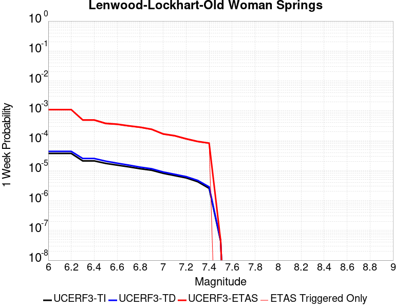 |  |  |  |

| Magnitude | 1 wk TI Prob | 1 wk TD Prob | 1 wk ETAS Prob | 1 wk ETAS/TD Gain | 1 wk ETAS Triggered Only | 1 mo TI Prob | 1 mo TD Prob | 1 mo ETAS Prob | 1 mo ETAS/TD Gain | 1 mo ETAS Triggered Only | 1 yr TI Prob | 1 yr TD Prob | 1 yr ETAS Prob | 1 yr ETAS/TD Gain | 1 yr ETAS Triggered Only | 10 yr TI Prob | 10 yr TD Prob | 10 yr ETAS Prob | 10 yr ETAS/TD Gain | 10 yr ETAS Triggered Only |
|-----|-----|-----|-----|-----|-----|-----|-----|-----|-----|-----|-----|-----|-----|-----|-----|-----|-----|-----|-----|-----|
| 6.0 | 3.744542E-5 | 4.396349E-5 | 0.0011691531 | 26.59373 | 0.0011252391 | 1.604705E-4 | 1.8840231E-4 | 0.0017259393 | 9.160925 | 0.0015378268 | 0.0019519776 | 0.0022915571 | 0.0047239885 | 2.0614753 | 0.002438018 | 0.019349206 | 0.022697281 | 0.026216319 | 1.1550423 | 0.0036007653 |
| 6.1 | 3.744542E-5 | 4.396349E-5 | 0.0011691531 | 26.59373 | 0.0011252391 | 1.604705E-4 | 1.8840231E-4 | 0.0017259393 | 9.160925 | 0.0015378268 | 0.0019519776 | 0.0022915571 | 0.0047239885 | 2.0614753 | 0.002438018 | 0.019349206 | 0.022697281 | 0.026216319 | 1.1550423 | 0.0036007653 |
| 6.2 | 3.744542E-5 | 4.396349E-5 | 0.0011691531 | 26.59373 | 0.0011252391 | 1.604705E-4 | 1.8840231E-4 | 0.0017259393 | 9.160925 | 0.0015378268 | 0.0019519776 | 0.0022915571 | 0.0047239885 | 2.0614753 | 0.002438018 | 0.019349206 | 0.022697281 | 0.026216319 | 1.1550423 | 0.0036007653 |
| 6.3 | 2.1079984E-5 | 2.5354384E-5 | 4.7543863E-4 | 18.751732 | 4.5009566E-4 | 9.0339665E-5 | 1.0865723E-4 | 7.0871954E-4 | 6.5225253 | 6.001275E-4 | 0.0010993304 | 0.0013221189 | 0.0022960368 | 1.7366341 | 9.7520725E-4 | 0.010939079 | 0.013144747 | 0.01466236 | 1.115454 | 0.0015378268 |
| 6.4 | 2.1079984E-5 | 2.5354384E-5 | 4.7543863E-4 | 18.751732 | 4.5009566E-4 | 9.0339665E-5 | 1.0865723E-4 | 7.0871954E-4 | 6.5225253 | 6.001275E-4 | 0.0010993304 | 0.0013221189 | 0.0022960368 | 1.7366341 | 9.7520725E-4 | 0.010939079 | 0.013144747 | 0.01466236 | 1.115454 | 0.0015378268 |
| 6.5 | 1.7397282E-5 | 2.0663285E-5 | 3.9573523E-4 | 19.151613 | 3.7507972E-4 | 7.455765E-5 | 8.8554E-5 | 5.386098E-4 | 6.0822754 | 4.5009566E-4 | 9.073613E-4 | 0.0010776235 | 0.0017895069 | 1.6606051 | 7.126514E-4 | 0.009036654 | 0.010725273 | 0.011875549 | 1.1072491 | 0.001162747 |
| 6.6 | 1.52050325E-5 | 1.7680086E-5 | 3.9275317E-4 | 22.214437 | 3.7507972E-4 | 6.51628E-5 | 7.576964E-5 | 4.8832607E-4 | 6.4448776 | 4.125877E-4 | 7.9306826E-4 | 9.221128E-4 | 0.0015216869 | 1.6502178 | 6.001275E-4 | 0.007902439 | 0.009183729 | 0.010075653 | 1.09712 | 9.001913E-4 |
| 6.7 | 1.332523E-5 | 1.5264379E-5 | 3.5283098E-4 | 23.11466 | 3.3757172E-4 | 5.7106878E-5 | 6.541716E-5 | 4.4047233E-4 | 6.733284 | 3.7507972E-4 | 6.950544E-4 | 7.9616875E-4 | 0.0013583404 | 1.706096 | 5.6261953E-4 | 0.006928845 | 0.0079337945 | 0.008752422 | 1.1031824 | 8.251754E-4 |
| 6.8 | 1.1525329E-5 | 1.3031365E-5 | 3.505987E-4 | 26.904219 | 3.3757172E-4 | 4.9393333E-5 | 5.5847537E-5 | 4.3090628E-4 | 7.715762 | 3.7507972E-4 | 6.011979E-4 | 6.7973585E-4 | 0.0012044905 | 1.7719979 | 5.2511157E-4 | 0.00599574 | 0.0067770192 | 0.0075220945 | 1.1099415 | 7.5015944E-4 |
| 6.9 | 1.0253909E-5 | 1.1514835E-5 | 3.490827E-4 | 30.315908 | 3.3757172E-4 | 4.3944583E-5 | 4.934838E-5 | 4.2440958E-4 | 8.600274 | 3.7507972E-4 | 5.3489394E-4 | 6.006545E-4 | 0.0010504798 | 1.748892 | 4.5009566E-4 | 0.0053360825 | 0.0059906896 | 0.0066245054 | 1.1058002 | 6.376355E-4 |
| 7.0 | 8.104563E-6 | 8.99143E-6 | 2.3403723E-4 | 26.028921 | 2.2504783E-4 | 3.4733377E-5 | 3.853415E-5 | 3.0107982E-4 | 7.8133254 | 2.6255578E-4 | 4.2279682E-4 | 4.6905465E-4 | 8.064681E-4 | 1.7193477 | 3.3757172E-4 | 0.0042199334 | 0.0046808943 | 0.0050915508 | 1.0877303 | 4.125877E-4 |
| 7.1 | 6.7986157E-6 | 7.5159796E-6 | 2.3256212E-4 | 30.942354 | 2.2504783E-4 | 2.91366E-5 | 3.2210955E-5 | 2.5725152E-4 | 7.9864607 | 2.2504783E-4 | 3.5468035E-4 | 3.9209996E-4 | 6.920461E-4 | 1.7649735 | 3.0006375E-4 | 0.003541148 | 0.003914298 | 0.0042879093 | 1.0954479 | 3.7507972E-4 |
| 7.2 | 5.6893327E-6 | 6.280132E-6 | 1.18803335E-4 | 18.917332 | 1.12523914E-4 | 2.4382627E-5 | 2.6914584E-5 | 1.3943546E-4 | 5.180666 | 1.12523914E-4 | 2.9681803E-4 | 3.276378E-4 | 5.151162E-4 | 1.5722125 | 1.8753986E-4 | 0.002964219 | 0.003271746 | 0.0034960576 | 1.0685602 | 2.2504783E-4 |
| 7.3 | 4.253348E-6 | 4.707075E-6 | 1.17230455E-4 | 24.90516 | 1.12523914E-4 | 1.8228506E-5 | 2.017303E-5 | 1.3269467E-4 | 6.577825 | 1.12523914E-4 | 2.2190946E-4 | 2.455808E-4 | 3.580771E-4 | 1.4580826 | 1.12523914E-4 | 0.00221688 | 0.0024532753 | 0.0025655231 | 1.0457543 | 1.12523914E-4 |
| 7.4 | 2.5448119E-6 | 2.8520594E-6 | 1.1537565E-4 | 40.453453 | 1.12523914E-4 | 1.0906291E-5 | 1.2223064E-5 | 1.247456E-4 | 10.205755 | 1.12523914E-4 | 1.3277601E-4 | 1.4880729E-4 | 2.6131448E-4 | 1.7560595 | 1.12523914E-4 | 0.001326967 | 0.0014872387 | 0.0015995953 | 1.0755471 | 1.12523914E-4 |
| 7.5 | 4.3706837E-8 | 4.562909E-8 | 4.562909E-8 | 1.0 | 0.0 | 1.8731501E-7 | 1.9555324E-7 | 1.9555324E-7 | 1.0 | 0.0 | 2.2805577E-6 | 2.3808586E-6 | 2.3808586E-6 | 1.0 | 0.0 | 2.2805343E-5 | 2.3808387E-5 | 2.3808387E-5 | 1.0 | 0.0 |

## Towne Pass
*[(top)](#table-of-contents)*

| 1 Week | 1 Month | 1 Year | 10 Year |
|-----|-----|-----|-----|
|  | 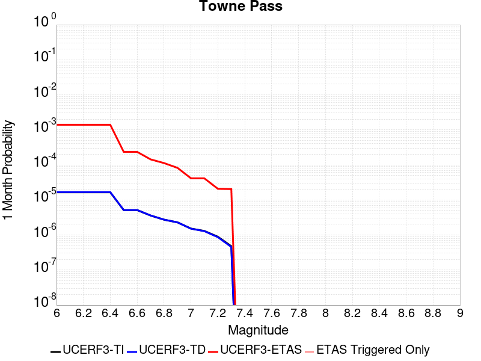 |  |  |

| Magnitude | 1 wk TI Prob | 1 wk TD Prob | 1 wk ETAS Prob | 1 wk ETAS/TD Gain | 1 wk ETAS Triggered Only | 1 mo TI Prob | 1 mo TD Prob | 1 mo ETAS Prob | 1 mo ETAS/TD Gain | 1 mo ETAS Triggered Only | 1 yr TI Prob | 1 yr TD Prob | 1 yr ETAS Prob | 1 yr ETAS/TD Gain | 1 yr ETAS Triggered Only | 10 yr TI Prob | 10 yr TD Prob | 10 yr ETAS Prob | 10 yr ETAS/TD Gain | 10 yr ETAS Triggered Only |
|-----|-----|-----|-----|-----|-----|-----|-----|-----|-----|-----|-----|-----|-----|-----|-----|-----|-----|-----|-----|-----|
| 6.0 | 3.849728E-6 | 3.894542E-6 | 0.0011291293 | 289.9261 | 0.0011252391 | 1.649873E-5 | 1.6690812E-5 | 0.0017420286 | 104.370514 | 0.0017253667 | 2.0085352E-4 | 2.0319606E-4 | 0.002678219 | 13.180468 | 0.002475526 | 0.0020067208 | 0.0020305319 | 0.005287099 | 2.6038003 | 0.0032631934 |
| 6.1 | 3.849728E-6 | 3.894542E-6 | 0.0011291293 | 289.9261 | 0.0011252391 | 1.649873E-5 | 1.6690812E-5 | 0.0017420286 | 104.370514 | 0.0017253667 | 2.0085352E-4 | 2.0319606E-4 | 0.002678219 | 13.180468 | 0.002475526 | 0.0020067208 | 0.0020305319 | 0.005287099 | 2.6038003 | 0.0032631934 |
| 6.2 | 3.849728E-6 | 3.894542E-6 | 0.0011291293 | 289.9261 | 0.0011252391 | 1.649873E-5 | 1.6690812E-5 | 0.0017420286 | 104.370514 | 0.0017253667 | 2.0085352E-4 | 2.0319606E-4 | 0.002678219 | 13.180468 | 0.002475526 | 0.0020067208 | 0.0020305319 | 0.005287099 | 2.6038003 | 0.0032631934 |
| 6.3 | 3.849728E-6 | 3.894542E-6 | 0.0011291293 | 289.9261 | 0.0011252391 | 1.649873E-5 | 1.6690812E-5 | 0.0017420286 | 104.370514 | 0.0017253667 | 2.0085352E-4 | 2.0319606E-4 | 0.002678219 | 13.180468 | 0.002475526 | 0.0020067208 | 0.0020305319 | 0.005287099 | 2.6038003 | 0.0032631934 |
| 6.4 | 3.849728E-6 | 3.894542E-6 | 0.0011291293 | 289.9261 | 0.0011252391 | 1.649873E-5 | 1.6690812E-5 | 0.0017420286 | 104.370514 | 0.0017253667 | 2.0085352E-4 | 2.0319606E-4 | 0.002678219 | 13.180468 | 0.002475526 | 0.0020067208 | 0.0020305319 | 0.005287099 | 2.6038003 | 0.0032631934 |
| 6.5 | 1.1953545E-6 | 1.2030526E-6 | 2.6375853E-4 | 219.24106 | 2.6255578E-4 | 5.1229376E-6 | 5.15593E-6 | 3.802337E-4 | 73.746864 | 3.7507972E-4 | 6.236998E-5 | 6.277176E-5 | 5.5034476E-4 | 8.767394 | 4.8760363E-4 | 6.235248E-4 | 6.2755204E-4 | 0.0013022718 | 2.0751615 | 6.7514344E-4 |
| 6.6 | 1.1953545E-6 | 1.2030526E-6 | 2.6375853E-4 | 219.24106 | 2.6255578E-4 | 5.1229376E-6 | 5.15593E-6 | 3.802337E-4 | 73.746864 | 3.7507972E-4 | 6.236998E-5 | 6.277176E-5 | 5.5034476E-4 | 8.767394 | 4.8760363E-4 | 6.235248E-4 | 6.2755204E-4 | 0.0013022718 | 2.0751615 | 6.7514344E-4 |
| 6.7 | 8.375951E-7 | 8.410676E-7 | 1.5087282E-4 | 179.3825 | 1.5003188E-4 | 3.5896885E-6 | 3.6045708E-6 | 2.2865158E-4 | 63.43379 | 2.2504783E-4 | 4.370358E-5 | 4.3884826E-5 | 3.064291E-4 | 6.9825754 | 2.6255578E-4 | 4.3694986E-4 | 4.3876728E-4 | 8.5117394E-4 | 1.9399211 | 4.125877E-4 |
| 6.8 | 6.38041E-7 | 6.3921624E-7 | 1.13163056E-4 | 177.03407 | 1.12523914E-4 | 2.7344586E-6 | 2.7394954E-6 | 1.9027884E-4 | 69.45762 | 1.8753986E-4 | 3.3291526E-5 | 3.3352884E-5 | 2.583932E-4 | 7.747252 | 2.2504783E-4 | 3.3286537E-4 | 3.334826E-4 | 6.709418E-4 | 2.0119243 | 3.3757172E-4 |
| 6.9 | 5.3460053E-7 | 5.345339E-7 | 7.555044E-5 | 141.33891 | 7.501594E-5 | 2.2911431E-6 | 2.2908578E-6 | 1.5232239E-4 | 66.491425 | 1.5003188E-4 | 2.789431E-5 | 2.7890868E-5 | 2.1542549E-4 | 7.7238717 | 1.8753986E-4 | 2.789081E-4 | 2.78877E-4 | 5.788571E-4 | 2.0756717 | 3.0006375E-4 |
| 7.0 | 3.557783E-7 | 3.5324283E-7 | 3.78612E-5 | 107.18179 | 3.750797E-5 | 1.5247632E-6 | 1.513897E-6 | 3.9021812E-5 | 25.775736 | 3.750797E-5 | 1.8563835E-5 | 1.8431549E-5 | 9.3446106E-5 | 5.0698996 | 7.501594E-5 | 1.8562283E-4 | 1.8430105E-4 | 2.968042E-4 | 1.6104316 | 1.12523914E-4 |
| 7.1 | 3.037942E-7 | 3.0002275E-7 | 3.7807982E-5 | 126.017044 | 3.750797E-5 | 1.3019744E-6 | 1.2858112E-6 | 3.8793733E-5 | 30.17063 | 3.750797E-5 | 1.5851423E-5 | 1.5654647E-5 | 9.066941E-5 | 5.791853 | 7.501594E-5 | 1.5850292E-4 | 1.5653619E-4 | 2.6904247E-4 | 1.7187239 | 1.12523914E-4 |
| 7.2 | 2.0808248E-7 | 2.0217735E-7 | 3.771014E-5 | 186.52011 | 3.750797E-5 | 8.917818E-7 | 8.6647407E-7 | 3.837441E-5 | 44.28801 | 3.750797E-5 | 1.0857389E-5 | 1.0549275E-5 | 8.5564425E-5 | 8.1109295 | 7.501594E-5 | 1.0856859E-4 | 1.0548821E-4 | 1.8049624E-4 | 1.711056 | 7.501594E-5 |
| 7.3 | 1.1162073E-7 | 1.0636902E-7 | 3.7614336E-5 | 353.62115 | 3.750797E-5 | 4.7837443E-7 | 4.5586717E-7 | 3.7963822E-5 | 83.27825 | 3.750797E-5 | 5.8241935E-6 | 5.5501705E-6 | 4.305793E-5 | 7.7579474 | 3.750797E-5 | 5.8240406E-5 | 5.550052E-5 | 9.300641E-5 | 1.6757754 | 3.750797E-5 |

## Paradise
*[(top)](#table-of-contents)*

| 1 Week | 1 Month | 1 Year | 10 Year |
|-----|-----|-----|-----|
|  |  |  |  |

| Magnitude | 1 wk TI Prob | 1 wk TD Prob | 1 wk ETAS Prob | 1 wk ETAS/TD Gain | 1 wk ETAS Triggered Only | 1 mo TI Prob | 1 mo TD Prob | 1 mo ETAS Prob | 1 mo ETAS/TD Gain | 1 mo ETAS Triggered Only | 1 yr TI Prob | 1 yr TD Prob | 1 yr ETAS Prob | 1 yr ETAS/TD Gain | 1 yr ETAS Triggered Only | 10 yr TI Prob | 10 yr TD Prob | 10 yr ETAS Prob | 10 yr ETAS/TD Gain | 10 yr ETAS Triggered Only |
|-----|-----|-----|-----|-----|-----|-----|-----|-----|-----|-----|-----|-----|-----|-----|-----|-----|-----|-----|-----|-----|
| 6.0 | 1.4851273E-5 | 1.6694768E-5 | 8.04349E-4 | 48.179703 | 7.876674E-4 | 6.364676E-5 | 7.154718E-5 | 0.0010466847 | 14.6292925 | 9.7520725E-4 | 7.7462377E-4 | 8.707624E-4 | 0.0023697747 | 2.7214942 | 0.0015003189 | 0.0077192914 | 0.008675884 | 0.010869655 | 1.2528585 | 0.0022129703 |
| 6.1 | 1.4851273E-5 | 1.6694768E-5 | 8.04349E-4 | 48.179703 | 7.876674E-4 | 6.364676E-5 | 7.154718E-5 | 0.0010466847 | 14.6292925 | 9.7520725E-4 | 7.7462377E-4 | 8.707624E-4 | 0.0023697747 | 2.7214942 | 0.0015003189 | 0.0077192914 | 0.008675884 | 0.010869655 | 1.2528585 | 0.0022129703 |
| 6.2 | 1.4851273E-5 | 1.6694768E-5 | 8.04349E-4 | 48.179703 | 7.876674E-4 | 6.364676E-5 | 7.154718E-5 | 0.0010466847 | 14.6292925 | 9.7520725E-4 | 7.7462377E-4 | 8.707624E-4 | 0.0023697747 | 2.7214942 | 0.0015003189 | 0.0077192914 | 0.008675884 | 0.010869655 | 1.2528585 | 0.0022129703 |
| 6.3 | 1.0426831E-5 | 1.1888697E-5 | 3.4945642E-4 | 29.394003 | 3.3757172E-4 | 4.4685654E-5 | 5.09506E-5 | 4.260112E-4 | 8.361259 | 3.7507972E-4 | 5.43912E-4 | 6.201529E-4 | 0.001257393 | 2.027553 | 6.376355E-4 | 0.0054258266 | 0.0061848317 | 0.0070421793 | 1.1386211 | 8.6268334E-4 |
| 6.4 | 1.0426831E-5 | 1.1888697E-5 | 3.4945642E-4 | 29.394003 | 3.3757172E-4 | 4.4685654E-5 | 5.09506E-5 | 4.260112E-4 | 8.361259 | 3.7507972E-4 | 5.43912E-4 | 6.201529E-4 | 0.001257393 | 2.027553 | 6.376355E-4 | 0.0054258266 | 0.0061848317 | 0.0070421793 | 1.1386211 | 8.6268334E-4 |
| 6.5 | 9.25027E-6 | 1.0620037E-5 | 2.7317303E-4 | 25.722418 | 2.6255578E-4 | 3.964341E-5 | 4.551368E-5 | 3.4556378E-4 | 7.592526 | 3.0006375E-4 | 4.8255164E-4 | 5.5399304E-4 | 0.0010788137 | 1.9473416 | 5.2511157E-4 | 0.0048150513 | 0.0055266195 | 0.006198032 | 1.1214869 | 6.7514344E-4 |
| 6.6 | 7.904275E-6 | 9.159602E-6 | 1.5919011E-4 | 17.379587 | 1.5003188E-4 | 3.3875025E-5 | 3.925487E-5 | 1.8928087E-4 | 4.821844 | 1.5003188E-4 | 4.1235037E-4 | 4.7782718E-4 | 8.152376E-4 | 1.7061349 | 3.3757172E-4 | 0.0041158604 | 0.004768395 | 0.0052163443 | 1.0939413 | 4.5009566E-4 |
| 6.7 | 7.2061953E-6 | 8.407326E-6 | 8.342264E-5 | 9.922612 | 7.501594E-5 | 3.088333E-5 | 3.603092E-5 | 1.1104416E-4 | 3.081913 | 7.501594E-5 | 3.7593965E-4 | 4.3859181E-4 | 6.6354097E-4 | 1.5128895 | 2.2504783E-4 | 0.003753043 | 0.004377631 | 0.0047137253 | 1.0767753 | 3.3757172E-4 |
| 6.8 | 6.6948724E-6 | 7.842242E-6 | 8.2857594E-5 | 10.56555 | 7.501594E-5 | 2.8691995E-5 | 3.3609194E-5 | 1.0862261E-4 | 3.2319314 | 7.501594E-5 | 3.4926904E-4 | 4.091187E-4 | 5.590892E-4 | 1.3665696 | 1.5003188E-4 | 0.003487206 | 0.0040840125 | 0.0043081413 | 1.0548795 | 2.2504783E-4 |
| 6.9 | 6.0421025E-6 | 7.1306963E-6 | 4.46384E-5 | 6.2600336 | 3.750797E-5 | 2.5894467E-5 | 3.0559786E-5 | 6.806661E-5 | 2.2273262 | 3.750797E-5 | 3.1521954E-4 | 3.7200528E-4 | 4.8448733E-4 | 1.3023669 | 1.12523914E-4 | 0.0031477278 | 0.0037141638 | 0.0039010071 | 1.0503056 | 1.8753986E-4 |
| 7.0 | 4.134091E-6 | 5.0803824E-6 | 5.0803824E-6 | 1.0 | 0.0 | 1.7717413E-5 | 2.1772896E-5 | 2.1772896E-5 | 1.0 | 0.0 | 2.1568815E-4 | 2.650543E-4 | 3.4005035E-4 | 1.282946 | 7.501594E-5 | 0.0021547892 | 0.0026475347 | 0.0027597607 | 1.0423889 | 1.12523914E-4 |
| 7.1 | 3.7674888E-6 | 4.631936E-6 | 4.631936E-6 | 1.0 | 0.0 | 1.6146281E-5 | 1.9851012E-5 | 1.9851012E-5 | 1.0 | 0.0 | 1.9656324E-4 | 2.4166079E-4 | 3.166586E-4 | 1.3103434 | 7.501594E-5 | 0.0019638946 | 0.0024141306 | 0.002526383 | 1.0464981 | 1.12523914E-4 |
| 7.2 | 3.4065345E-6 | 4.156782E-6 | 4.156782E-6 | 1.0 | 0.0 | 1.4599351E-5 | 1.7814667E-5 | 1.7814667E-5 | 1.0 | 0.0 | 1.777326E-4 | 2.168735E-4 | 2.9187315E-4 | 1.3458222 | 7.501594E-5 | 0.0017759053 | 0.0021667667 | 0.0022790467 | 1.0518192 | 1.12523914E-4 |
| 7.3 | 2.9934936E-6 | 3.6293673E-6 | 3.6293673E-6 | 1.0 | 0.0 | 1.2829195E-5 | 1.5554348E-5 | 1.5554348E-5 | 1.0 | 0.0 | 1.5618425E-4 | 1.8935918E-4 | 2.6436092E-4 | 1.3960818 | 7.501594E-5 | 0.0015607453 | 0.0018921237 | 0.0019669977 | 1.0395714 | 7.501594E-5 |
| 7.4 | 2.4049796E-6 | 2.8890186E-6 | 2.8890186E-6 | 1.0 | 0.0 | 1.0307015E-5 | 1.2381457E-5 | 1.2381457E-5 | 1.0 | 0.0 | 1.2548068E-4 | 1.5073526E-4 | 2.2573989E-4 | 1.4975919 | 7.501594E-5 | 0.0012540985 | 0.0015064715 | 0.0015813746 | 1.0497208 | 7.501594E-5 |
| 7.5 | 1.2710091E-6 | 1.5134859E-6 | 1.5134859E-6 | 1.0 | 0.0 | 5.44717E-6 | 6.4863593E-6 | 6.4863593E-6 | 1.0 | 0.0 | 6.631728E-5 | 7.896981E-5 | 1.5397982E-4 | 1.9498569 | 7.501594E-5 | 6.6297496E-4 | 7.895401E-4 | 8.6449686E-4 | 1.0949372 | 7.501594E-5 |
| 7.6 | 2.21172E-7 | 2.6040198E-7 | 2.6040198E-7 | 1.0 | 0.0 | 9.478797E-7 | 1.1160082E-6 | 1.1160082E-6 | 1.0 | 0.0 | 1.1540374E-5 | 1.3587343E-5 | 1.3587343E-5 | 1.0 | 0.0 | 1.1539775E-4 | 1.3586794E-4 | 1.3586794E-4 | 1.0 | 0.0 |

## Bicycle Lake
*[(top)](#table-of-contents)*

| 1 Week | 1 Month | 1 Year | 10 Year |
|-----|-----|-----|-----|
|  |  |  |  |

| Magnitude | 1 wk TI Prob | 1 wk TD Prob | 1 wk ETAS Prob | 1 wk ETAS/TD Gain | 1 wk ETAS Triggered Only | 1 mo TI Prob | 1 mo TD Prob | 1 mo ETAS Prob | 1 mo ETAS/TD Gain | 1 mo ETAS Triggered Only | 1 yr TI Prob | 1 yr TD Prob | 1 yr ETAS Prob | 1 yr ETAS/TD Gain | 1 yr ETAS Triggered Only | 10 yr TI Prob | 10 yr TD Prob | 10 yr ETAS Prob | 10 yr ETAS/TD Gain | 10 yr ETAS Triggered Only |
|-----|-----|-----|-----|-----|-----|-----|-----|-----|-----|-----|-----|-----|-----|-----|-----|-----|-----|-----|-----|-----|
| 6.0 | 1.9621975E-5 | 2.2097078E-5 | 3.971685E-4 | 17.9738 | 3.7507972E-4 | 8.4091465E-5 | 9.4699084E-5 | 7.697786E-4 | 8.12868 | 6.7514344E-4 | 0.0010233327 | 0.0011524865 | 0.0026510763 | 2.30031 | 0.0015003189 | 0.01018633 | 0.011478408 | 0.013443513 | 1.1712 | 0.0019879225 |
| 6.1 | 1.9621975E-5 | 2.2097078E-5 | 3.971685E-4 | 17.9738 | 3.7507972E-4 | 8.4091465E-5 | 9.4699084E-5 | 7.697786E-4 | 8.12868 | 6.7514344E-4 | 0.0010233327 | 0.0011524865 | 0.0026510763 | 2.30031 | 0.0015003189 | 0.01018633 | 0.011478408 | 0.013443513 | 1.1712 | 0.0019879225 |
| 6.2 | 9.9971285E-6 | 1.125564E-5 | 1.2377829E-4 | 10.997002 | 1.12523914E-4 | 4.2844134E-5 | 4.8237856E-5 | 3.857933E-4 | 7.997729 | 3.3757172E-4 | 5.2150246E-4 | 5.871897E-4 | 0.0015243383 | 2.5959897 | 9.376993E-4 | 0.0052028033 | 0.005861487 | 0.0070547066 | 1.2035695 | 0.001200255 |
| 6.3 | 9.589428E-6 | 1.0798346E-5 | 1.2332105E-4 | 11.420363 | 1.12523914E-4 | 4.10969E-5 | 4.62781E-5 | 3.838342E-4 | 8.294079 | 3.3757172E-4 | 5.002399E-4 | 5.6334207E-4 | 0.001500513 | 2.6635914 | 9.376993E-4 | 0.0049911533 | 0.0056242296 | 0.0068177343 | 1.2122077 | 0.001200255 |
| 6.4 | 9.589428E-6 | 1.0798346E-5 | 1.2332105E-4 | 11.420363 | 1.12523914E-4 | 4.10969E-5 | 4.62781E-5 | 3.838342E-4 | 8.294079 | 3.3757172E-4 | 5.002399E-4 | 5.6334207E-4 | 0.001500513 | 2.6635914 | 9.376993E-4 | 0.0049911533 | 0.0056242296 | 0.0068177343 | 1.2122077 | 0.001200255 |
| 6.5 | 5.557707E-6 | 6.2856016E-6 | 4.3793338E-5 | 6.9672465 | 3.750797E-5 | 2.3818526E-5 | 2.6938165E-5 | 2.894869E-4 | 10.746347 | 2.6255578E-4 | 2.8995197E-4 | 3.279497E-4 | 9.653761E-4 | 2.9436712 | 6.376355E-4 | 0.0028957394 | 0.0032772934 | 0.0040997644 | 1.2509605 | 8.251754E-4 |
| 6.6 | 4.8742945E-6 | 5.5132896E-6 | 4.3021053E-5 | 7.803155 | 3.750797E-5 | 2.0889667E-5 | 2.3628318E-5 | 2.486708E-4 | 10.524271 | 2.2504783E-4 | 2.54302E-4 | 2.87663E-4 | 8.876179E-4 | 3.0856173 | 6.001275E-4 | 0.002540112 | 0.0028754752 | 0.0036234776 | 1.2601317 | 7.5015944E-4 |
| 6.7 | 3.991108E-6 | 4.5159104E-6 | 4.2023712E-5 | 9.305701 | 3.750797E-5 | 1.7104636E-5 | 1.9353902E-5 | 2.0689012E-4 | 10.68984 | 1.8753986E-4 | 2.0822904E-4 | 2.3563375E-4 | 7.2312244E-4 | 3.0688407 | 4.8760363E-4 | 0.0020803404 | 0.0023563374 | 0.0029924705 | 1.2699668 | 6.376355E-4 |

## San Andreas (San Bernardino N)
*[(top)](#table-of-contents)*

| 1 Week | 1 Month | 1 Year | 10 Year |
|-----|-----|-----|-----|
|  |  |  |  |

| Magnitude | 1 wk TI Prob | 1 wk TD Prob | 1 wk ETAS Prob | 1 wk ETAS/TD Gain | 1 wk ETAS Triggered Only | 1 mo TI Prob | 1 mo TD Prob | 1 mo ETAS Prob | 1 mo ETAS/TD Gain | 1 mo ETAS Triggered Only | 1 yr TI Prob | 1 yr TD Prob | 1 yr ETAS Prob | 1 yr ETAS/TD Gain | 1 yr ETAS Triggered Only | 10 yr TI Prob | 10 yr TD Prob | 10 yr ETAS Prob | 10 yr ETAS/TD Gain | 10 yr ETAS Triggered Only |
|-----|-----|-----|-----|-----|-----|-----|-----|-----|-----|-----|-----|-----|-----|-----|-----|-----|-----|-----|-----|-----|
| 6.0 | 1.4273766E-4 | 3.160784E-4 | 0.0010660007 | 3.3725832 | 7.5015944E-4 | 6.115894E-4 | 0.0013539245 | 0.0023652685 | 1.7469723 | 0.0010127152 | 0.0074207084 | 0.016360939 | 0.017726028 | 1.0834359 | 0.0013877949 | 0.07177748 | 0.15021163 | 0.15177344 | 1.0103974 | 0.0018378906 |
| 6.1 | 1.4273766E-4 | 3.160784E-4 | 0.0010660007 | 3.3725832 | 7.5015944E-4 | 6.115894E-4 | 0.0013539245 | 0.0023652685 | 1.7469723 | 0.0010127152 | 0.0074207084 | 0.016360939 | 0.017726028 | 1.0834359 | 0.0013877949 | 0.07177748 | 0.15021163 | 0.15177344 | 1.0103974 | 0.0018378906 |
| 6.2 | 1.4273766E-4 | 3.160784E-4 | 0.0010660007 | 3.3725832 | 7.5015944E-4 | 6.115894E-4 | 0.0013539245 | 0.0023652685 | 1.7469723 | 0.0010127152 | 0.0074207084 | 0.016360939 | 0.017726028 | 1.0834359 | 0.0013877949 | 0.07177748 | 0.15021163 | 0.15177344 | 1.0103974 | 0.0018378906 |
| 6.3 | 1.3730655E-4 | 3.0512668E-4 | 0.0010550572 | 3.4577677 | 7.5015944E-4 | 5.883239E-4 | 0.001307036 | 0.0023184277 | 1.7738054 | 0.0010127152 | 0.0071393442 | 0.015798455 | 0.017164325 | 1.086456 | 0.0013877949 | 0.06914291 | 0.1455135 | 0.14705192 | 1.0105722 | 0.0018003826 |
| 6.4 | 1.3730655E-4 | 3.0512668E-4 | 0.0010550572 | 3.4577677 | 7.5015944E-4 | 5.883239E-4 | 0.001307036 | 0.0023184277 | 1.7738054 | 0.0010127152 | 0.0071393442 | 0.015798455 | 0.017164325 | 1.086456 | 0.0013877949 | 0.06914291 | 0.1455135 | 0.14705192 | 1.0105722 | 0.0018003826 |
| 6.5 | 1.2942807E-4 | 2.8927144E-4 | 0.0010392139 | 3.5925214 | 7.5015944E-4 | 5.545738E-4 | 0.0012391509 | 0.002250611 | 1.8162527 | 0.0010127152 | 0.0067310524 | 0.014983548 | 0.016350549 | 1.0912335 | 0.0013877949 | 0.06530788 | 0.13865088 | 0.14020163 | 1.0111846 | 0.0018003826 |
| 6.6 | 1.1125901E-4 | 2.5365927E-4 | 0.0010036284 | 3.9566007 | 7.5015944E-4 | 4.767372E-4 | 0.0010866605 | 0.002098275 | 1.9309391 | 0.0010127152 | 0.005788839 | 0.0131504685 | 0.014520013 | 1.1041442 | 0.0013877949 | 0.056403454 | 0.12300496 | 0.12455099 | 1.0125688 | 0.0017628747 |
| 6.7 | 1.02209575E-4 | 2.3500937E-4 | 9.849925E-4 | 4.1912904 | 7.5015944E-4 | 4.3796748E-4 | 0.0010067957 | 0.0020184913 | 2.0048668 | 0.0010127152 | 0.0053192247 | 0.012189267 | 0.013560146 | 1.1124661 | 0.0013877949 | 0.051936906 | 0.114792764 | 0.11635327 | 1.0135942 | 0.0017628747 |
| 6.8 | 9.610582E-5 | 2.2026796E-4 | 9.702621E-4 | 4.4049172 | 7.5015944E-4 | 4.1181705E-4 | 9.436647E-4 | 0.0019554242 | 2.07216 | 0.0010127152 | 0.0050023515 | 0.011428859 | 0.012800793 | 1.1200413 | 0.0013877949 | 0.048912346 | 0.10820469 | 0.10977681 | 1.0145291 | 0.0017628747 |
| 6.9 | 9.3877505E-5 | 2.1482339E-4 | 9.6482167E-4 | 4.491232 | 7.5015944E-4 | 4.0227012E-4 | 9.203475E-4 | 0.0019321307 | 2.099349 | 0.0010127152 | 0.0048866454 | 0.011147907 | 0.01252023 | 1.1231015 | 0.0013877949 | 0.04780577 | 0.105798274 | 0.10737464 | 1.0148997 | 0.0017628747 |
| 7.0 | 9.1019785E-5 | 2.0809306E-4 | 9.5809635E-4 | 4.6041727 | 7.5015944E-4 | 3.900265E-4 | 8.915232E-4 | 0.0019033356 | 2.1349254 | 0.0010127152 | 0.0047382377 | 0.0108004995 | 0.012173305 | 1.1271058 | 0.0013877949 | 0.046384744 | 0.10276815 | 0.10434986 | 1.015391 | 0.0017628747 |
| 7.1 | 8.771155E-5 | 1.9983841E-4 | 9.498479E-4 | 4.75308 | 7.5015944E-4 | 3.758525E-4 | 8.5616973E-4 | 0.0018680178 | 2.1818311 | 0.0010127152 | 0.0045664064 | 0.010374243 | 0.011747641 | 1.1323854 | 0.0013877949 | 0.044737056 | 0.09907644 | 0.10066465 | 1.0160302 | 0.0017628747 |
| 7.2 | 8.0830236E-5 | 1.8389444E-4 | 9.339159E-4 | 5.0785437 | 7.5015944E-4 | 3.4636928E-4 | 7.8788114E-4 | 0.0017997985 | 2.2843528 | 0.0010127152 | 0.0042088944 | 0.009550368 | 0.010924909 | 1.1439254 | 0.0013877949 | 0.041300658 | 0.09180518 | 0.09340622 | 1.0174395 | 0.0017628747 |
| 7.3 | 7.7668235E-5 | 1.7333007E-4 | 9.233595E-4 | 5.3271737 | 7.5015944E-4 | 3.328214E-4 | 7.426318E-4 | 0.001754595 | 2.3626714 | 0.0010127152 | 0.0040445733 | 0.009004138 | 0.010379437 | 1.1527407 | 0.0013877949 | 0.03971748 | 0.08706761 | 0.088677 | 1.0184844 | 0.0017628747 |
| 7.4 | 7.520177E-5 | 1.655312E-4 | 9.155664E-4 | 5.531081 | 7.5015944E-4 | 3.2225347E-4 | 7.092266E-4 | 0.0017212236 | 2.4269023 | 0.0010127152 | 0.0039163795 | 0.008600714 | 0.009976572 | 1.1599703 | 0.0013877949 | 0.038480744 | 0.08352157 | 0.0851372 | 1.019344 | 0.0017628747 |
| 7.5 | 7.274697E-5 | 1.584075E-4 | 9.0844807E-4 | 5.7348804 | 7.5015944E-4 | 3.1173544E-4 | 6.7871273E-4 | 0.0016907406 | 2.4910989 | 0.0010127152 | 0.003788775 | 0.008232076 | 0.009608447 | 1.167196 | 0.0013877949 | 0.03724827 | 0.08023654 | 0.081857964 | 1.0202081 | 0.0017628747 |
| 7.6 | 7.1185845E-5 | 1.5410586E-4 | 9.0414967E-4 | 5.867069 | 7.5015944E-4 | 3.0504653E-4 | 6.602866E-4 | 0.0016723331 | 2.5327384 | 0.0010127152 | 0.0037076178 | 0.0080094095 | 0.009386089 | 1.1718827 | 0.0013877949 | 0.036463667 | 0.07822661 | 0.07985158 | 1.0207726 | 0.0017628747 |
| 7.7 | 6.709961E-5 | 1.4319421E-4 | 8.932462E-4 | 6.2380047 | 7.5015944E-4 | 2.8753807E-4 | 6.135452E-4 | 0.001625639 | 2.6495833 | 0.0010127152 | 0.003495157 | 0.0074443663 | 0.00882183 | 1.1850344 | 0.0013877949 | 0.034406938 | 0.07305558 | 0.074689664 | 1.0223677 | 0.0017628747 |
| 7.8 | 6.300812E-5 | 1.320343E-4 | 8.8209467E-4 | 6.680799 | 7.5015944E-4 | 2.7000686E-4 | 5.657386E-4 | 0.0015403942 | 2.722802 | 9.7520725E-4 | 0.0032823787 | 0.006866143 | 0.008207159 | 1.1953084 | 0.0013502869 | 0.032343175 | 0.06771385 | 0.06928741 | 1.0232385 | 0.0016878587 |
| 7.9 | 4.983037E-5 | 9.7241085E-5 | 6.9731026E-4 | 7.170943 | 6.001275E-4 | 2.1354125E-4 | 4.1668097E-4 | 0.0011290355 | 2.709592 | 7.126514E-4 | 0.0025967648 | 0.0050613005 | 0.006106208 | 1.2064505 | 0.0010502231 | 0.025666296 | 0.050650507 | 0.051932402 | 1.0253086 | 0.0013502869 |
| 8.0 | 3.2211527E-5 | 5.3306234E-5 | 2.7834205E-4 | 5.221567 | 2.2504783E-4 | 1.380421E-4 | 2.2843528E-4 | 4.909311E-4 | 2.1491036 | 2.6255578E-4 | 0.0016793669 | 0.0027776542 | 0.003189096 | 1.1481255 | 4.125877E-4 | 0.016667323 | 0.028362568 | 0.02890923 | 1.0192741 | 5.6261953E-4 |
| 8.1 | 1.743376E-5 | 1.8823403E-5 | 5.6330668E-5 | 2.9925869 | 3.750797E-5 | 7.471398E-5 | 8.066923E-5 | 1.18174175E-4 | 1.4649225 | 3.750797E-5 | 9.0926304E-4 | 9.81706E-4 | 0.0010566483 | 1.0763389 | 7.501594E-5 | 0.009055517 | 0.010483979 | 0.0105953235 | 1.0106204 | 1.12523914E-4 |
| 8.2 | 7.831616E-6 | 5.1540533E-6 | 5.1540533E-6 | 1.0 | 0.0 | 3.3563636E-5 | 2.2088612E-5 | 2.2088612E-5 | 1.0 | 0.0 | 4.0856065E-4 | 2.6889573E-4 | 2.6889573E-4 | 1.0 | 0.0 | 0.004078103 | 0.0030413668 | 0.0030413668 | 1.0 | 0.0 |
| 8.3 | 1.983087E-6 | 7.6564595E-7 | 7.6564595E-7 | 1.0 | 0.0 | 8.498917E-6 | 3.281336E-6 | 3.281336E-6 | 1.0 | 0.0 | 1.034694E-4 | 3.9949547E-5 | 3.9949547E-5 | 1.0 | 0.0 | 0.0010342124 | 4.717979E-4 | 4.717979E-4 | 1.0 | 0.0 |

## Garlic Springs
*[(top)](#table-of-contents)*

| 1 Week | 1 Month | 1 Year | 10 Year |
|-----|-----|-----|-----|
|  |  |  |  |

| Magnitude | 1 wk TI Prob | 1 wk TD Prob | 1 wk ETAS Prob | 1 wk ETAS/TD Gain | 1 wk ETAS Triggered Only | 1 mo TI Prob | 1 mo TD Prob | 1 mo ETAS Prob | 1 mo ETAS/TD Gain | 1 mo ETAS Triggered Only | 1 yr TI Prob | 1 yr TD Prob | 1 yr ETAS Prob | 1 yr ETAS/TD Gain | 1 yr ETAS Triggered Only | 10 yr TI Prob | 10 yr TD Prob | 10 yr ETAS Prob | 10 yr ETAS/TD Gain | 10 yr ETAS Triggered Only |
|-----|-----|-----|-----|-----|-----|-----|-----|-----|-----|-----|-----|-----|-----|-----|-----|-----|-----|-----|-----|-----|
| 6.0 | 1.6760017E-5 | 1.8776833E-5 | 3.5634224E-4 | 18.97776 | 3.3757172E-4 | 7.182667E-5 | 8.0470316E-5 | 7.555595E-4 | 9.389294 | 6.7514344E-4 | 8.7413884E-4 | 9.794032E-4 | 0.00210354 | 2.1477776 | 0.0011252391 | 0.008707083 | 0.009762413 | 0.011210944 | 1.1483783 | 0.0014628108 |
| 6.1 | 9.852767E-6 | 1.0973587E-5 | 2.735265E-4 | 24.925898 | 2.6255578E-4 | 4.222546E-5 | 4.702921E-5 | 4.5959748E-4 | 9.772596 | 4.125877E-4 | 5.139737E-4 | 5.7250116E-4 | 0.0012472582 | 2.1786122 | 6.7514344E-4 | 0.005127866 | 0.005717221 | 0.006612266 | 1.1565524 | 9.001913E-4 |
| 6.2 | 9.852767E-6 | 1.0973587E-5 | 2.735265E-4 | 24.925898 | 2.6255578E-4 | 4.222546E-5 | 4.702921E-5 | 4.5959748E-4 | 9.772596 | 4.125877E-4 | 5.139737E-4 | 5.7250116E-4 | 0.0012472582 | 2.1786122 | 6.7514344E-4 | 0.005127866 | 0.005717221 | 0.006612266 | 1.1565524 | 9.001913E-4 |
| 6.3 | 4.3167724E-6 | 4.7780286E-6 | 1.548092E-4 | 32.400223 | 1.5003188E-4 | 1.8500323E-5 | 2.0477235E-5 | 2.4552044E-4 | 11.989923 | 2.2504783E-4 | 2.2521814E-4 | 2.4930484E-4 | 5.867924E-4 | 2.3537145 | 3.3757172E-4 | 0.0022499003 | 0.00249251 | 0.0029788981 | 1.19514 | 4.8760363E-4 |
| 6.4 | 4.3167724E-6 | 4.7780286E-6 | 1.548092E-4 | 32.400223 | 1.5003188E-4 | 1.8500323E-5 | 2.0477235E-5 | 2.4552044E-4 | 11.989923 | 2.2504783E-4 | 2.2521814E-4 | 2.4930484E-4 | 5.867924E-4 | 2.3537145 | 3.3757172E-4 | 0.0022499003 | 0.00249251 | 0.0029788981 | 1.19514 | 4.8760363E-4 |
| 6.5 | 4.3167724E-6 | 4.7780286E-6 | 1.548092E-4 | 32.400223 | 1.5003188E-4 | 1.8500323E-5 | 2.0477235E-5 | 2.4552044E-4 | 11.989923 | 2.2504783E-4 | 2.2521814E-4 | 2.4930484E-4 | 5.867924E-4 | 2.3537145 | 3.3757172E-4 | 0.0022499003 | 0.00249251 | 0.0029788981 | 1.19514 | 4.8760363E-4 |
| 6.6 | 4.301311E-6 | 4.760897E-6 | 1.5479207E-4 | 32.513214 | 1.5003188E-4 | 1.8434059E-5 | 2.0403815E-5 | 2.4544704E-4 | 12.029469 | 2.2504783E-4 | 2.2441156E-4 | 2.4841115E-4 | 5.8589905E-4 | 2.3585858 | 3.3757172E-4 | 0.0022418506 | 0.002483593 | 0.0029699856 | 1.1958423 | 4.8760363E-4 |
| 6.7 | 3.8599724E-6 | 4.27106E-6 | 1.16794494E-4 | 27.345552 | 1.12523914E-4 | 1.6542634E-5 | 1.8304541E-5 | 2.0584096E-4 | 11.245349 | 1.8753986E-4 | 2.0138794E-4 | 2.228578E-4 | 5.228547E-4 | 2.3461359 | 3.0006375E-4 | 0.0020120554 | 0.002228578 | 0.0026402462 | 1.1847223 | 4.125877E-4 |

## Death Valley (Black Mtns Frontal)
*[(top)](#table-of-contents)*

| 1 Week | 1 Month | 1 Year | 10 Year |
|-----|-----|-----|-----|
|  |  |  |  |

| Magnitude | 1 wk TI Prob | 1 wk TD Prob | 1 wk ETAS Prob | 1 wk ETAS/TD Gain | 1 wk ETAS Triggered Only | 1 mo TI Prob | 1 mo TD Prob | 1 mo ETAS Prob | 1 mo ETAS/TD Gain | 1 mo ETAS Triggered Only | 1 yr TI Prob | 1 yr TD Prob | 1 yr ETAS Prob | 1 yr ETAS/TD Gain | 1 yr ETAS Triggered Only | 10 yr TI Prob | 10 yr TD Prob | 10 yr ETAS Prob | 10 yr ETAS/TD Gain | 10 yr ETAS Triggered Only |
|-----|-----|-----|-----|-----|-----|-----|-----|-----|-----|-----|-----|-----|-----|-----|-----|-----|-----|-----|-----|-----|
| 6.0 | 1.6707214E-5 | 1.867027E-5 | 3.562357E-4 | 19.080374 | 3.3757172E-4 | 7.160038E-5 | 8.001303E-5 | 6.4258755E-4 | 8.031037 | 5.6261953E-4 | 8.71386E-4 | 9.737309E-4 | 0.0018355742 | 1.8850939 | 8.6268334E-4 | 0.00867977 | 0.009695496 | 0.010884115 | 1.1225948 | 0.001200255 |
| 6.1 | 1.6707214E-5 | 1.867027E-5 | 3.562357E-4 | 19.080374 | 3.3757172E-4 | 7.160038E-5 | 8.001303E-5 | 6.4258755E-4 | 8.031037 | 5.6261953E-4 | 8.71386E-4 | 9.737309E-4 | 0.0018355742 | 1.8850939 | 8.6268334E-4 | 0.00867977 | 0.009695496 | 0.010884115 | 1.1225948 | 0.001200255 |
| 6.2 | 1.6707214E-5 | 1.867027E-5 | 3.562357E-4 | 19.080374 | 3.3757172E-4 | 7.160038E-5 | 8.001303E-5 | 6.4258755E-4 | 8.031037 | 5.6261953E-4 | 8.71386E-4 | 9.737309E-4 | 0.0018355742 | 1.8850939 | 8.6268334E-4 | 0.00867977 | 0.009695496 | 0.010884115 | 1.1225948 | 0.001200255 |
| 6.3 | 1.6707214E-5 | 1.867027E-5 | 3.562357E-4 | 19.080374 | 3.3757172E-4 | 7.160038E-5 | 8.001303E-5 | 6.4258755E-4 | 8.031037 | 5.6261953E-4 | 8.71386E-4 | 9.737309E-4 | 0.0018355742 | 1.8850939 | 8.6268334E-4 | 0.00867977 | 0.009695496 | 0.010884115 | 1.1225948 | 0.001200255 |
| 6.4 | 1.5515609E-5 | 1.7338214E-5 | 3.1739677E-4 | 18.306198 | 3.0006375E-4 | 6.649377E-5 | 7.4304546E-5 | 5.618719E-4 | 7.5617437 | 4.8760363E-4 | 8.0926094E-4 | 9.042885E-4 | 0.0015413474 | 1.7044864 | 6.376355E-4 | 0.008063202 | 0.009006773 | 0.009861686 | 1.094919 | 8.6268334E-4 |
| 6.5 | 1.5515609E-5 | 1.7338214E-5 | 3.1739677E-4 | 18.306198 | 3.0006375E-4 | 6.649377E-5 | 7.4304546E-5 | 5.618719E-4 | 7.5617437 | 4.8760363E-4 | 8.0926094E-4 | 9.042885E-4 | 0.0015413474 | 1.7044864 | 6.376355E-4 | 0.008063202 | 0.009006773 | 0.009861686 | 1.094919 | 8.6268334E-4 |
| 6.6 | 1.5041828E-5 | 1.6809145E-5 | 2.4185318E-4 | 14.388191 | 2.2504783E-4 | 6.4463384E-5 | 7.203723E-5 | 4.845952E-4 | 6.72701 | 4.125877E-4 | 7.8455906E-4 | 8.767063E-4 | 0.0014013576 | 1.5984344 | 5.2511157E-4 | 0.00781795 | 0.008733132 | 0.009476741 | 1.085148 | 7.5015944E-4 |
| 6.7 | 1.4634985E-5 | 1.6356016E-5 | 2.4140016E-4 | 14.759105 | 2.2504783E-4 | 6.271985E-5 | 7.009536E-5 | 4.826541E-4 | 6.8856783 | 4.125877E-4 | 7.6334673E-4 | 8.5308263E-4 | 0.0013777462 | 1.6150209 | 5.2511157E-4 | 0.007607299 | 0.008498715 | 0.009242499 | 1.0875173 | 7.5015944E-4 |
| 6.8 | 1.4209158E-5 | 1.5882048E-5 | 2.0341892E-4 | 12.8081045 | 1.8753986E-4 | 6.089497E-5 | 6.8064175E-5 | 4.4311836E-4 | 6.510302 | 3.7507972E-4 | 7.4114406E-4 | 8.2837185E-4 | 0.0012780947 | 1.5428996 | 4.5009566E-4 | 0.007386771 | 0.008253456 | 0.008923028 | 1.0811262 | 6.7514344E-4 |
| 6.9 | 1.3780098E-5 | 1.5404594E-5 | 1.6543416E-4 | 10.739275 | 1.5003188E-4 | 5.9056227E-5 | 6.6018045E-5 | 4.0356748E-4 | 6.1129875 | 3.3757172E-4 | 7.1877235E-4 | 8.0347876E-4 | 0.0012157349 | 1.5130891 | 4.125877E-4 | 0.0071645193 | 0.008006332 | 0.008601655 | 1.0743564 | 6.001275E-4 |
| 7.0 | 1.3585064E-5 | 1.5188155E-5 | 1.2771036E-4 | 8.408549 | 1.12523914E-4 | 5.8220405E-5 | 6.50905E-5 | 3.6513474E-4 | 5.609647 | 3.0006375E-4 | 7.086029E-4 | 7.9219416E-4 | 0.0011669768 | 1.4730943 | 3.7507972E-4 | 0.007063476 | 0.007894293 | 0.00841526 | 1.0659927 | 5.2511157E-4 |
| 7.1 | 1.3398601E-5 | 1.49813395E-5 | 5.2488747E-5 | 3.5036085 | 3.750797E-5 | 5.742131E-5 | 6.420419E-5 | 2.51732E-4 | 3.9208033 | 1.8753986E-4 | 6.9888023E-4 | 7.8141113E-4 | 0.0010437617 | 1.3357396 | 2.6255578E-4 | 0.0069668638 | 0.007787224 | 0.008196599 | 1.0525701 | 4.125877E-4 |
| 7.2 | 1.3126312E-5 | 1.4679561E-5 | 5.218698E-5 | 3.5550778 | 3.750797E-5 | 5.6254412E-5 | 6.291092E-5 | 2.1293336E-4 | 3.3846805 | 1.5003188E-4 | 6.846822E-4 | 7.6567667E-4 | 9.905522E-4 | 1.2936951 | 2.2504783E-4 | 0.006825765 | 0.00763097 | 0.008003187 | 1.0487772 | 3.7507972E-4 |
| 7.3 | 1.2922429E-5 | 1.4453788E-5 | 5.1961215E-5 | 3.5949895 | 3.750797E-5 | 5.5380664E-5 | 6.194336E-5 | 2.1196595E-4 | 3.4219315 | 1.5003188E-4 | 6.74051E-4 | 7.53905E-4 | 9.787831E-4 | 1.2982845 | 2.2504783E-4 | 0.006720101 | 0.007514055 | 0.007886316 | 1.049542 | 3.7507972E-4 |
| 7.4 | 1.2768878E-5 | 1.4283772E-5 | 5.1791205E-5 | 3.6258776 | 3.750797E-5 | 5.4722615E-5 | 6.1214756E-5 | 2.1123745E-4 | 3.4507604 | 1.5003188E-4 | 6.660441E-4 | 7.4504025E-4 | 9.699204E-4 | 1.3018363 | 2.2504783E-4 | 0.0066405144 | 0.0074260035 | 0.007798298 | 1.0501338 | 3.7507972E-4 |
| 7.5 | 1.2521929E-5 | 1.40120155E-5 | 5.151946E-5 | 3.676806 | 3.750797E-5 | 5.366431E-5 | 6.005014E-5 | 1.7256729E-4 | 2.8737202 | 1.12523914E-4 | 6.531671E-4 | 7.3087064E-4 | 9.1827346E-4 | 1.2564104 | 1.8753986E-4 | 0.006512506 | 0.0072852457 | 0.0076203584 | 1.0459988 | 3.3757172E-4 |
| 7.6 | 1.1301089E-5 | 1.2648149E-5 | 5.0155646E-5 | 3.9654534 | 3.750797E-5 | 4.8432343E-5 | 5.4205255E-5 | 1.6672307E-4 | 3.075773 | 1.12523914E-4 | 5.895042E-4 | 6.5975444E-4 | 8.0968736E-4 | 1.2272556 | 1.5003188E-4 | 0.0058794282 | 0.00657851 | 0.0068766 | 1.0453126 | 3.0006375E-4 |
| 7.7 | 9.189108E-6 | 1.0283358E-5 | 4.779094E-5 | 4.647406 | 3.750797E-5 | 3.93813E-5 | 4.407082E-5 | 1.1908345E-4 | 2.7020931 | 7.501594E-5 | 4.7936183E-4 | 5.3643517E-4 | 6.488987E-4 | 1.2096498 | 1.12523914E-4 | 0.004783291 | 0.005351914 | 0.0056130644 | 1.0487957 | 2.6255578E-4 |
| 7.8 | 3.4586725E-7 | 3.6482615E-7 | 3.6482615E-7 | 1.0 | 0.0 | 1.4822873E-6 | 1.5635396E-6 | 1.5635396E-6 | 1.0 | 0.0 | 1.80467E-5 | 1.9035933E-5 | 1.9035933E-5 | 1.0 | 0.0 | 1.8045233E-4 | 1.9034347E-4 | 1.9034347E-4 | 1.0 | 0.0 |
| 7.9 | 2.5591178E-9 | 2.6696718E-9 | 2.6696718E-9 | 1.0 | 0.0 | 1.0967647E-8 | 1.14414505E-8 | 1.14414505E-8 | 1.0 | 0.0 | 1.335311E-7 | 1.3929966E-7 | 1.3929966E-7 | 1.0 | 0.0 | 1.3353102E-6 | 1.3929966E-6 | 1.3929966E-6 | 1.0 | 0.0 |

## Coyote Lake
*[(top)](#table-of-contents)*

| 1 Week | 1 Month | 1 Year | 10 Year |
|-----|-----|-----|-----|
| 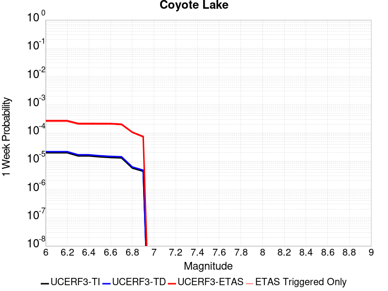 |  |  |  |

| Magnitude | 1 wk TI Prob | 1 wk TD Prob | 1 wk ETAS Prob | 1 wk ETAS/TD Gain | 1 wk ETAS Triggered Only | 1 mo TI Prob | 1 mo TD Prob | 1 mo ETAS Prob | 1 mo ETAS/TD Gain | 1 mo ETAS Triggered Only | 1 yr TI Prob | 1 yr TD Prob | 1 yr ETAS Prob | 1 yr ETAS/TD Gain | 1 yr ETAS Triggered Only | 10 yr TI Prob | 10 yr TD Prob | 10 yr ETAS Prob | 10 yr ETAS/TD Gain | 10 yr ETAS Triggered Only |
|-----|-----|-----|-----|-----|-----|-----|-----|-----|-----|-----|-----|-----|-----|-----|-----|-----|-----|-----|-----|-----|
| 6.0 | 1.980352E-5 | 2.1706745E-5 | 3.967783E-4 | 18.279034 | 3.7507972E-4 | 8.486947E-5 | 9.302599E-5 | 5.805842E-4 | 6.241097 | 4.8760363E-4 | 0.0010327959 | 0.0011320751 | 0.0019563162 | 1.72808 | 8.251754E-4 | 0.010280091 | 0.011270258 | 0.01234573 | 1.0954257 | 0.0010877311 |
| 6.1 | 1.980352E-5 | 2.1706745E-5 | 3.967783E-4 | 18.279034 | 3.7507972E-4 | 8.486947E-5 | 9.302599E-5 | 5.805842E-4 | 6.241097 | 4.8760363E-4 | 0.0010327959 | 0.0011320751 | 0.0019563162 | 1.72808 | 8.251754E-4 | 0.010280091 | 0.011270258 | 0.01234573 | 1.0954257 | 0.0010877311 |
| 6.2 | 1.980352E-5 | 2.1706745E-5 | 3.967783E-4 | 18.279034 | 3.7507972E-4 | 8.486947E-5 | 9.302599E-5 | 5.805842E-4 | 6.241097 | 4.8760363E-4 | 0.0010327959 | 0.0011320751 | 0.0019563162 | 1.72808 | 8.251754E-4 | 0.010280091 | 0.011270258 | 0.01234573 | 1.0954257 | 0.0010877311 |
| 6.3 | 1.5344787E-5 | 1.682067E-5 | 2.418647E-4 | 14.379018 | 2.2504783E-4 | 6.576172E-5 | 7.2086936E-5 | 4.0963435E-4 | 5.6825047 | 3.3757172E-4 | 8.003548E-4 | 8.773662E-4 | 0.0014394922 | 1.640697 | 5.6261953E-4 | 0.007974784 | 0.00874507 | 0.009488668 | 1.0850307 | 7.5015944E-4 |
| 6.4 | 1.5344787E-5 | 1.682067E-5 | 2.418647E-4 | 14.379018 | 2.2504783E-4 | 6.576172E-5 | 7.2086936E-5 | 4.0963435E-4 | 5.6825047 | 3.3757172E-4 | 8.003548E-4 | 8.773662E-4 | 0.0014394922 | 1.640697 | 5.6261953E-4 | 0.007974784 | 0.00874507 | 0.009488668 | 1.0850307 | 7.5015944E-4 |
| 6.5 | 1.4189697E-5 | 1.5557987E-5 | 2.4060231E-4 | 15.464874 | 2.2504783E-4 | 6.081157E-5 | 6.6675726E-5 | 4.0422493E-4 | 6.0625505 | 3.3757172E-4 | 7.401293E-4 | 8.115349E-4 | 0.0013736979 | 1.6927158 | 5.6261953E-4 | 0.0073766913 | 0.008091656 | 0.008835745 | 1.0919576 | 7.5015944E-4 |
| 6.6 | 1.3469301E-5 | 1.4771577E-5 | 2.3981607E-4 | 16.234968 | 2.2504783E-4 | 5.7724297E-5 | 6.330556E-5 | 4.0085593E-4 | 6.332081 | 3.3757172E-4 | 7.025667E-4 | 7.7053264E-4 | 0.0013327186 | 1.729607 | 5.6261953E-4 | 0.0070034964 | 0.0076845144 | 0.008428909 | 1.0968695 | 7.5015944E-4 |
| 6.7 | 1.3027966E-5 | 1.4281745E-5 | 2.0181891E-4 | 14.13125 | 1.8753986E-4 | 5.5832945E-5 | 6.120638E-5 | 3.612518E-4 | 5.9021916 | 3.0006375E-4 | 6.7955407E-4 | 7.4499263E-4 | 0.001269713 | 1.7043296 | 5.2511157E-4 | 0.006774798 | 0.0074308286 | 0.008100956 | 1.090182 | 6.7514344E-4 |
| 6.8 | 5.695434E-6 | 6.2244176E-6 | 8.1239894E-5 | 13.0518055 | 7.501594E-5 | 2.4408775E-5 | 2.6675973E-5 | 1.0168991E-4 | 3.8120415 | 7.501594E-5 | 2.971363E-4 | 3.2476155E-4 | 4.372489E-4 | 1.3463691 | 1.12523914E-4 | 0.0029673933 | 0.0032458105 | 0.0033953553 | 1.0460732 | 1.5003188E-4 |
| 6.9 | 4.385688E-6 | 4.7930553E-6 | 7.980864E-5 | 16.65089 | 7.501594E-5 | 1.879567E-5 | 2.0541665E-5 | 9.555607E-5 | 4.651817 | 7.501594E-5 | 2.2881327E-4 | 2.5009477E-4 | 3.6259057E-4 | 1.4498125 | 1.12523914E-4 | 0.002285778 | 0.0025009478 | 0.0026131903 | 1.04488 | 1.12523914E-4 |

## San Andreas (Big Bend)
*[(top)](#table-of-contents)*

| 1 Week | 1 Month | 1 Year | 10 Year |
|-----|-----|-----|-----|
|  |  |  |  |

| Magnitude | 1 wk TI Prob | 1 wk TD Prob | 1 wk ETAS Prob | 1 wk ETAS/TD Gain | 1 wk ETAS Triggered Only | 1 mo TI Prob | 1 mo TD Prob | 1 mo ETAS Prob | 1 mo ETAS/TD Gain | 1 mo ETAS Triggered Only | 1 yr TI Prob | 1 yr TD Prob | 1 yr ETAS Prob | 1 yr ETAS/TD Gain | 1 yr ETAS Triggered Only | 10 yr TI Prob | 10 yr TD Prob | 10 yr ETAS Prob | 10 yr ETAS/TD Gain | 10 yr ETAS Triggered Only |
|-----|-----|-----|-----|-----|-----|-----|-----|-----|-----|-----|-----|-----|-----|-----|-----|-----|-----|-----|-----|-----|
| 6.0 | 1.0179969E-4 | 2.0073925E-4 | 6.5074454E-4 | 3.2417405 | 4.5009566E-4 | 4.362114E-4 | 8.6002843E-4 | 0.0013846884 | 1.6100496 | 5.2511157E-4 | 0.0052979486 | 0.010420859 | 0.0110147325 | 1.056989 | 6.001275E-4 | 0.051734097 | 0.101455905 | 0.10226477 | 1.0079726 | 9.001913E-4 |
| 6.1 | 1.0179969E-4 | 2.0073925E-4 | 6.5074454E-4 | 3.2417405 | 4.5009566E-4 | 4.362114E-4 | 8.6002843E-4 | 0.0013846884 | 1.6100496 | 5.2511157E-4 | 0.0052979486 | 0.010420859 | 0.0110147325 | 1.056989 | 6.001275E-4 | 0.051734097 | 0.101455905 | 0.10226477 | 1.0079726 | 9.001913E-4 |
| 6.2 | 1.0179969E-4 | 2.0073925E-4 | 6.5074454E-4 | 3.2417405 | 4.5009566E-4 | 4.362114E-4 | 8.6002843E-4 | 0.0013846884 | 1.6100496 | 5.2511157E-4 | 0.0052979486 | 0.010420859 | 0.0110147325 | 1.056989 | 6.001275E-4 | 0.051734097 | 0.101455905 | 0.10226477 | 1.0079726 | 9.001913E-4 |
| 6.3 | 1.0179969E-4 | 2.0073925E-4 | 6.5074454E-4 | 3.2417405 | 4.5009566E-4 | 4.362114E-4 | 8.6002843E-4 | 0.0013846884 | 1.6100496 | 5.2511157E-4 | 0.0052979486 | 0.010420859 | 0.0110147325 | 1.056989 | 6.001275E-4 | 0.051734097 | 0.101455905 | 0.10226477 | 1.0079726 | 9.001913E-4 |
| 6.4 | 9.1639464E-5 | 1.8430917E-4 | 5.968208E-4 | 3.2381504 | 4.125877E-4 | 3.9268145E-4 | 7.896575E-4 | 0.0012768761 | 1.6169999 | 4.8760363E-4 | 0.0047704205 | 0.009571818 | 0.010091904 | 1.0543351 | 5.2511157E-4 | 0.046693064 | 0.09378695 | 0.094364785 | 1.0061611 | 6.376355E-4 |
| 6.5 | 9.1639464E-5 | 1.8430917E-4 | 5.968208E-4 | 3.2381504 | 4.125877E-4 | 3.9268145E-4 | 7.896575E-4 | 0.0012768761 | 1.6169999 | 4.8760363E-4 | 0.0047704205 | 0.009571818 | 0.010091904 | 1.0543351 | 5.2511157E-4 | 0.046693064 | 0.09378695 | 0.094364785 | 1.0061611 | 6.376355E-4 |
| 6.6 | 9.042622E-5 | 1.8238011E-4 | 5.9489254E-4 | 3.261828 | 4.125877E-4 | 3.8748336E-4 | 7.813951E-4 | 0.0012311391 | 1.5755653 | 4.5009566E-4 | 0.0047074095 | 0.0094721 | 0.009917933 | 1.047068 | 4.5009566E-4 | 0.046089325 | 0.09287721 | 0.093387574 | 1.0054951 | 5.6261953E-4 |
| 6.7 | 8.9836685E-5 | 1.8152347E-4 | 5.9403625E-4 | 3.2725039 | 4.125877E-4 | 3.8495753E-4 | 7.7772595E-4 | 0.0012274715 | 1.5782828 | 4.5009566E-4 | 0.00467679 | 0.009427815 | 0.009873667 | 1.0472912 | 4.5009566E-4 | 0.045795817 | 0.09247148 | 0.092982076 | 1.0055217 | 5.6261953E-4 |
| 6.8 | 8.9471854E-5 | 1.8099119E-4 | 5.9350417E-4 | 3.2791882 | 4.125877E-4 | 3.8339442E-4 | 7.754462E-4 | 0.0012251928 | 1.5799843 | 4.5009566E-4 | 0.004657841 | 0.009400298 | 0.009846162 | 1.0474309 | 4.5009566E-4 | 0.04561414 | 0.0922192 | 0.09272994 | 1.0055382 | 5.6261953E-4 |
| 6.9 | 8.858234E-5 | 1.7981093E-4 | 5.548232E-4 | 3.0855923 | 3.7507972E-4 | 3.7958333E-4 | 7.7039085E-4 | 0.0011826607 | 1.5351437 | 4.125877E-4 | 0.004611638 | 0.009339278 | 0.009748013 | 1.0437651 | 4.125877E-4 | 0.04517103 | 0.09165911 | 0.09210201 | 1.0048321 | 4.8760363E-4 |
| 7.0 | 8.7433385E-5 | 1.7819891E-4 | 5.532118E-4 | 3.1044621 | 3.7507972E-4 | 3.746607E-4 | 7.6348626E-4 | 0.0011757589 | 1.539987 | 4.125877E-4 | 0.004551957 | 0.009255932 | 0.0096647 | 1.0441629 | 4.125877E-4 | 0.044598386 | 0.09089323 | 0.09133651 | 1.004877 | 4.8760363E-4 |
| 7.1 | 8.684964E-5 | 1.7731842E-4 | 5.523316E-4 | 3.114914 | 3.7507972E-4 | 3.7215967E-4 | 7.597149E-4 | 0.0011719891 | 1.5426697 | 4.125877E-4 | 0.0045216335 | 0.009210405 | 0.009619192 | 1.0443833 | 4.125877E-4 | 0.04430731 | 0.09047475 | 0.090918235 | 1.0049018 | 4.8760363E-4 |
| 7.2 | 8.606521E-5 | 1.7622454E-4 | 5.5123813E-4 | 3.1280444 | 3.7507972E-4 | 3.6879873E-4 | 7.550296E-4 | 0.0011673057 | 1.5460397 | 4.125877E-4 | 0.0044808835 | 0.009153842 | 0.009562653 | 1.0446601 | 4.125877E-4 | 0.043916024 | 0.08995518 | 0.090364784 | 1.0045534 | 4.5009566E-4 |
| 7.3 | 8.568266E-5 | 1.7564454E-4 | 5.506584E-4 | 3.1350725 | 3.7507972E-4 | 3.6715972E-4 | 7.5254537E-4 | 0.0011648225 | 1.5478436 | 4.125877E-4 | 0.0044610105 | 0.00912385 | 0.009532673 | 1.0448081 | 4.125877E-4 | 0.043725148 | 0.08967623 | 0.09008597 | 1.004569 | 4.5009566E-4 |
| 7.4 | 8.5432206E-5 | 1.752704E-4 | 5.5028434E-4 | 3.139631 | 3.7507972E-4 | 3.6608664E-4 | 7.509428E-4 | 0.0011632206 | 1.5490136 | 4.125877E-4 | 0.004447999 | 0.009104501 | 0.009513333 | 1.0449044 | 4.125877E-4 | 0.043600157 | 0.08949642 | 0.08990623 | 1.0045791 | 4.5009566E-4 |
| 7.5 | 8.4791965E-5 | 1.7396381E-4 | 5.489783E-4 | 3.1557038 | 3.7507972E-4 | 3.633435E-4 | 7.4534636E-4 | 0.0011576265 | 1.553139 | 4.125877E-4 | 0.0044147377 | 0.009036932 | 0.009445792 | 1.0452431 | 4.125877E-4 | 0.043280575 | 0.08887209 | 0.089282185 | 1.0046145 | 4.5009566E-4 |
| 7.6 | 8.241105E-5 | 1.6841735E-4 | 5.434339E-4 | 3.2267098 | 3.7507972E-4 | 3.531424E-4 | 7.2158914E-4 | 0.0011338791 | 1.5713639 | 4.125877E-4 | 0.0042910352 | 0.008750047 | 0.009159025 | 1.04674 | 4.125877E-4 | 0.042091176 | 0.08625032 | 0.0866616 | 1.0047684 | 4.5009566E-4 |
| 7.7 | 7.00432E-5 | 1.4205615E-4 | 4.420773E-4 | 3.1119897 | 3.0006375E-4 | 3.001506E-4 | 6.0867006E-4 | 9.460363E-4 | 1.5542679 | 3.3757172E-4 | 0.0036482112 | 0.0073854174 | 0.007720496 | 1.0453703 | 3.3757172E-4 | 0.035888977 | 0.07352299 | 0.073870495 | 1.0047264 | 3.7507972E-4 |
| 7.8 | 6.415362E-5 | 1.2969968E-4 | 4.2972452E-4 | 3.3132274 | 3.0006375E-4 | 2.749151E-4 | 5.557374E-4 | 8.556344E-4 | 1.539638 | 3.0006375E-4 | 0.0033419547 | 0.0067451415 | 0.0070431815 | 1.0441859 | 3.0006375E-4 | 0.03292141 | 0.06725514 | 0.06757001 | 1.0046817 | 3.3757172E-4 |
| 7.9 | 4.939911E-5 | 9.341721E-5 | 3.18444E-4 | 3.4088366 | 2.2504783E-4 | 2.116933E-4 | 4.0029807E-4 | 6.252558E-4 | 1.5619756 | 2.2504783E-4 | 0.0025743195 | 0.004862747 | 0.005086701 | 1.046055 | 2.2504783E-4 | 0.025447013 | 0.048915803 | 0.049165513 | 1.0051049 | 2.6255578E-4 |
| 8.0 | 3.344983E-5 | 5.2228E-5 | 1.6474603E-4 | 3.1543622 | 1.12523914E-4 | 1.4334853E-4 | 2.2381509E-4 | 3.3631382E-4 | 1.5026414 | 1.12523914E-4 | 0.0017438711 | 0.0027215453 | 0.0028337631 | 1.0412331 | 1.12523914E-4 | 0.017302496 | 0.027923161 | 0.028069004 | 1.005223 | 1.5003188E-4 |
| 8.1 | 1.9104898E-5 | 1.9171663E-5 | 1.9171663E-5 | 1.0 | 0.0 | 8.1875565E-5 | 8.2161685E-5 | 8.2161685E-5 | 1.0 | 0.0 | 9.963791E-4 | 9.9986E-4 | 9.9986E-4 | 1.0 | 0.0 | 0.009919235 | 0.010749552 | 0.010749552 | 1.0 | 0.0 |
| 8.2 | 8.643924E-6 | 5.473668E-6 | 5.473668E-6 | 1.0 | 0.0 | 3.704486E-5 | 2.3458366E-5 | 2.3458366E-5 | 1.0 | 0.0 | 4.5092785E-4 | 2.8556827E-4 | 2.8556827E-4 | 1.0 | 0.0 | 0.0045001395 | 0.0032481793 | 0.0032481793 | 1.0 | 0.0 |
| 8.3 | 1.983087E-6 | 7.6564595E-7 | 7.6564595E-7 | 1.0 | 0.0 | 8.498917E-6 | 3.281336E-6 | 3.281336E-6 | 1.0 | 0.0 | 1.034694E-4 | 3.9949547E-5 | 3.9949547E-5 | 1.0 | 0.0 | 0.0010342124 | 4.717979E-4 | 4.717979E-4 | 1.0 | 0.0 |

## San Andreas (San Bernardino S)
*[(top)](#table-of-contents)*

| 1 Week | 1 Month | 1 Year | 10 Year |
|-----|-----|-----|-----|
|  |  | 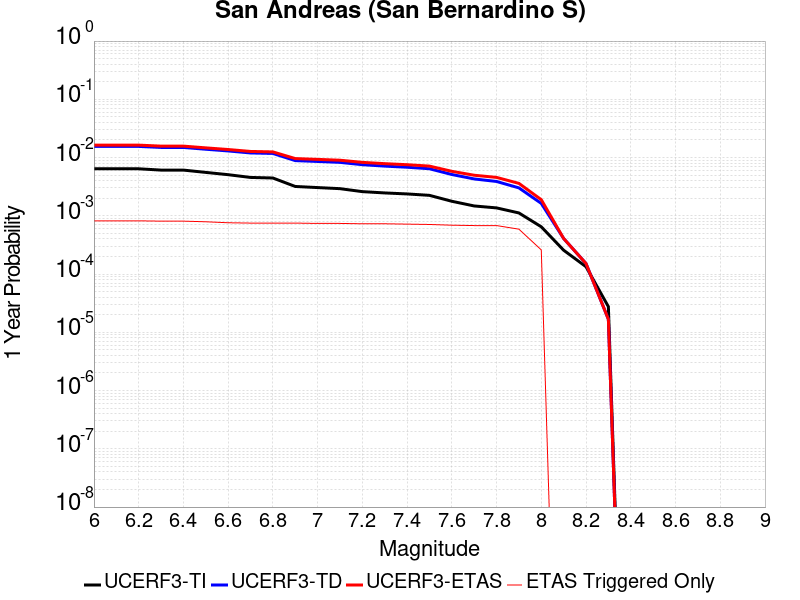 |  |

| Magnitude | 1 wk TI Prob | 1 wk TD Prob | 1 wk ETAS Prob | 1 wk ETAS/TD Gain | 1 wk ETAS Triggered Only | 1 mo TI Prob | 1 mo TD Prob | 1 mo ETAS Prob | 1 mo ETAS/TD Gain | 1 mo ETAS Triggered Only | 1 yr TI Prob | 1 yr TD Prob | 1 yr ETAS Prob | 1 yr ETAS/TD Gain | 1 yr ETAS Triggered Only | 10 yr TI Prob | 10 yr TD Prob | 10 yr ETAS Prob | 10 yr ETAS/TD Gain | 10 yr ETAS Triggered Only |
|-----|-----|-----|-----|-----|-----|-----|-----|-----|-----|-----|-----|-----|-----|-----|-----|-----|-----|-----|-----|-----|
| 6.0 | 1.2336002E-4 | 3.0005194E-4 | 6.0002564E-4 | 1.9997394 | 3.0006375E-4 | 5.2857865E-4 | 0.0012853292 | 0.0016599267 | 1.291441 | 3.7507972E-4 | 0.006416472 | 0.015541554 | 0.01609543 | 1.0356383 | 5.6261953E-4 | 0.06234337 | 0.14294699 | 0.14368635 | 1.0051723 | 8.6268334E-4 |
| 6.1 | 1.2336002E-4 | 3.0005194E-4 | 6.0002564E-4 | 1.9997394 | 3.0006375E-4 | 5.2857865E-4 | 0.0012853292 | 0.0016599267 | 1.291441 | 3.7507972E-4 | 0.006416472 | 0.015541554 | 0.01609543 | 1.0356383 | 5.6261953E-4 | 0.06234337 | 0.14294699 | 0.14368635 | 1.0051723 | 8.6268334E-4 |
| 6.2 | 1.2336002E-4 | 3.0005194E-4 | 6.0002564E-4 | 1.9997394 | 3.0006375E-4 | 5.2857865E-4 | 0.0012853292 | 0.0016599267 | 1.291441 | 3.7507972E-4 | 0.006416472 | 0.015541554 | 0.01609543 | 1.0356383 | 5.6261953E-4 | 0.06234337 | 0.14294699 | 0.14368635 | 1.0051723 | 8.6268334E-4 |
| 6.3 | 1.1712257E-4 | 2.8793467E-4 | 5.8791204E-4 | 2.0418243 | 3.0006375E-4 | 5.018573E-4 | 0.0012334478 | 0.0016080649 | 1.3037153 | 3.7507972E-4 | 0.006093008 | 0.014918666 | 0.015472892 | 1.0371498 | 5.6261953E-4 | 0.059286322 | 0.13765779 | 0.13836937 | 1.0051693 | 8.251754E-4 |
| 6.4 | 1.1712257E-4 | 2.8793467E-4 | 5.8791204E-4 | 2.0418243 | 3.0006375E-4 | 5.018573E-4 | 0.0012334478 | 0.0016080649 | 1.3037153 | 3.7507972E-4 | 0.006093008 | 0.014918666 | 0.015472892 | 1.0371498 | 5.6261953E-4 | 0.059286322 | 0.13765779 | 0.13836937 | 1.0051693 | 8.251754E-4 |
| 6.5 | 1.0689076E-4 | 2.6806415E-4 | 5.6804746E-4 | 2.119073 | 3.0006375E-4 | 4.5802278E-4 | 0.0011483653 | 0.0015230143 | 1.3262454 | 3.7507972E-4 | 0.0055621783 | 0.013896335 | 0.01441415 | 1.0372627 | 5.2511157E-4 | 0.05425003 | 0.1288989 | 0.12958504 | 1.005323 | 7.876674E-4 |
| 6.6 | 9.7648895E-5 | 2.505129E-4 | 5.505015E-4 | 2.1974976 | 3.0006375E-4 | 4.1842813E-4 | 0.0010732086 | 0.0014478858 | 1.3491187 | 3.7507972E-4 | 0.005082469 | 0.012992399 | 0.013510688 | 1.0398917 | 5.2511157E-4 | 0.049677886 | 0.121077746 | 0.12173708 | 1.0054455 | 7.5015944E-4 |
| 6.7 | 8.757013E-5 | 2.3122175E-4 | 5.3121615E-4 | 2.2974315 | 3.0006375E-4 | 3.7524657E-4 | 9.905964E-4 | 0.0013653045 | 1.3782653 | 3.7507972E-4 | 0.00455906 | 0.011997902 | 0.012516714 | 1.0432419 | 5.2511157E-4 | 0.04466656 | 0.112373024 | 0.11303889 | 1.0059254 | 7.5015944E-4 |
| 6.8 | 8.562978E-5 | 2.2682057E-4 | 5.268163E-4 | 2.3226125 | 3.0006375E-4 | 3.6693315E-4 | 9.7174826E-4 | 0.0013464635 | 1.3856094 | 3.7507972E-4 | 0.004458263 | 0.011770921 | 0.012289852 | 1.0440859 | 5.2511157E-4 | 0.043698758 | 0.11037863 | 0.11104599 | 1.006046 | 7.5015944E-4 |
| 6.9 | 6.124075E-5 | 1.7066885E-4 | 4.706814E-4 | 2.7578635 | 3.0006375E-4 | 2.6243398E-4 | 7.312337E-4 | 0.0011060392 | 1.5125659 | 3.7507972E-4 | 0.0031904527 | 0.008866636 | 0.009387092 | 1.0586982 | 5.2511157E-4 | 0.031450346 | 0.08420262 | 0.08485526 | 1.0077509 | 7.126514E-4 |
| 7.0 | 5.8598747E-5 | 1.6495936E-4 | 4.6497362E-4 | 2.8187163 | 3.0006375E-4 | 2.5111332E-4 | 7.067779E-4 | 0.0010815925 | 1.5303146 | 3.7507972E-4 | 0.0030530186 | 0.008571265 | 0.009091876 | 1.060739 | 5.2511157E-4 | 0.03011414 | 0.08151562 | 0.08217017 | 1.0080298 | 7.126514E-4 |
| 7.1 | 5.613814E-5 | 1.5914452E-4 | 4.5916054E-4 | 2.8851798 | 3.0006375E-4 | 2.4056983E-4 | 6.818704E-4 | 0.0010566943 | 1.5496997 | 3.7507972E-4 | 0.0029250039 | 0.008270353 | 0.008791122 | 1.0629681 | 5.2511157E-4 | 0.028868021 | 0.07881268 | 0.07946917 | 1.0083297 | 7.126514E-4 |
| 7.2 | 4.991222E-5 | 1.4520933E-4 | 4.07727E-4 | 2.8078568 | 2.6255578E-4 | 2.1389198E-4 | 6.221777E-4 | 9.595394E-4 | 1.5422273 | 3.3757172E-4 | 0.002601025 | 0.0075488063 | 0.008032729 | 1.0641059 | 4.8760363E-4 | 0.025707912 | 0.07226191 | 0.07288826 | 1.0086678 | 6.7514344E-4 |
| 7.3 | 4.7410045E-5 | 1.371513E-4 | 3.996711E-4 | 2.9140887 | 2.6255578E-4 | 2.0317009E-4 | 5.8765925E-4 | 9.250326E-4 | 1.5740969 | 3.3757172E-4 | 0.0024707897 | 0.0071313656 | 0.0076154917 | 1.067887 | 4.8760363E-4 | 0.024434982 | 0.068541944 | 0.06917081 | 1.009175 | 6.7514344E-4 |
| 7.4 | 4.5556746E-5 | 1.3123035E-4 | 3.937517E-4 | 3.000462 | 2.6255578E-4 | 1.952286E-4 | 5.6229485E-4 | 8.9967676E-4 | 1.600009 | 3.3757172E-4 | 0.002374317 | 0.0068245293 | 0.0073088054 | 1.0709611 | 4.8760363E-4 | 0.023491086 | 0.06579143 | 0.06642215 | 1.0095867 | 6.7514344E-4 |
| 7.5 | 4.3084514E-5 | 1.2358342E-4 | 3.8610678E-4 | 3.1242602 | 2.6255578E-4 | 1.8463485E-4 | 5.2953605E-4 | 8.66929E-4 | 1.6371483 | 3.3757172E-4 | 0.0022456115 | 0.0064281146 | 0.006912584 | 1.0753672 | 4.8760363E-4 | 0.022230545 | 0.062190283 | 0.062823445 | 1.010181 | 6.7514344E-4 |
| 7.6 | 3.408608E-5 | 9.836477E-5 | 3.6089474E-4 | 3.6689432 | 2.6255578E-4 | 1.4607502E-4 | 4.214953E-4 | 7.5892475E-4 | 1.8005533 | 3.3757172E-4 | 0.0017770125 | 0.005119656 | 0.005604763 | 1.0947539 | 4.8760363E-4 | 0.017628696 | 0.05002244 | 0.050663806 | 1.0128217 | 6.7514344E-4 |
| 7.7 | 2.8315713E-5 | 8.2495724E-5 | 3.4502987E-4 | 4.182397 | 2.6255578E-4 | 1.2134742E-4 | 3.5350522E-4 | 6.9095765E-4 | 1.9545896 | 3.3757172E-4 | 0.0014764034 | 0.004295442 | 0.004780951 | 1.1130289 | 4.8760363E-4 | 0.01466633 | 0.042272415 | 0.04291902 | 1.0152961 | 6.7514344E-4 |
| 7.8 | 2.6222975E-5 | 7.463898E-5 | 3.3717518E-4 | 4.517414 | 2.6255578E-4 | 1.1237934E-4 | 3.1984213E-4 | 6.573059E-4 | 2.0550947 | 3.3757172E-4 | 0.0013673597 | 0.003887131 | 0.0043728394 | 1.1249529 | 4.8760363E-4 | 0.013589768 | 0.038437475 | 0.039086666 | 1.0168896 | 6.7514344E-4 |
| 7.9 | 2.1469694E-5 | 5.7884805E-5 | 2.454138E-4 | 4.239693 | 1.8753986E-4 | 9.200973E-5 | 2.4805416E-4 | 4.7304615E-4 | 1.9070277 | 2.2504783E-4 | 0.0011196428 | 0.00301588 | 0.0033898286 | 1.1239932 | 3.7507972E-4 | 0.011140184 | 0.030153265 | 0.03069892 | 1.0180961 | 5.6261953E-4 |
| 8.0 | 1.2420249E-5 | 3.1321662E-5 | 6.8828456E-5 | 2.1974714 | 3.750797E-5 | 5.322855E-5 | 1.342288E-4 | 2.0923467E-4 | 1.5587912 | 7.501594E-5 | 6.478649E-4 | 0.0016330116 | 0.0017827984 | 1.0917243 | 1.5003188E-4 | 0.0064597935 | 0.01652369 | 0.016781908 | 1.0156271 | 2.6255578E-4 |
| 8.1 | 4.9197724E-6 | 7.822525E-6 | 7.822525E-6 | 1.0 | 0.0 | 2.1084568E-5 | 3.3524673E-5 | 3.3524673E-5 | 1.0 | 0.0 | 2.566744E-4 | 4.080866E-4 | 4.080866E-4 | 1.0 | 0.0 | 0.002563781 | 0.004384557 | 0.004384557 | 1.0 | 0.0 |
| 8.2 | 2.5634774E-6 | 2.9065757E-6 | 2.9065757E-6 | 1.0 | 0.0 | 1.0986286E-5 | 1.2456694E-5 | 1.2456694E-5 | 1.0 | 0.0 | 1.3374983E-4 | 1.5164974E-4 | 1.5164974E-4 | 1.0 | 0.0 | 0.0013366934 | 0.001704941 | 0.001704941 | 1.0 | 0.0 |
| 8.3 | 5.2850464E-7 | 3.2080476E-7 | 3.2080476E-7 | 1.0 | 0.0 | 2.2650179E-6 | 1.3748769E-6 | 1.3748769E-6 | 1.0 | 0.0 | 2.7576245E-5 | 1.673901E-5 | 1.673901E-5 | 1.0 | 0.0 | 2.7572823E-4 | 1.986671E-4 | 1.986671E-4 | 1.0 | 0.0 |

## Helendale-So Lockhart
*[(top)](#table-of-contents)*

| 1 Week | 1 Month | 1 Year | 10 Year |
|-----|-----|-----|-----|
|  |  |  |  |

| Magnitude | 1 wk TI Prob | 1 wk TD Prob | 1 wk ETAS Prob | 1 wk ETAS/TD Gain | 1 wk ETAS Triggered Only | 1 mo TI Prob | 1 mo TD Prob | 1 mo ETAS Prob | 1 mo ETAS/TD Gain | 1 mo ETAS Triggered Only | 1 yr TI Prob | 1 yr TD Prob | 1 yr ETAS Prob | 1 yr ETAS/TD Gain | 1 yr ETAS Triggered Only | 10 yr TI Prob | 10 yr TD Prob | 10 yr ETAS Prob | 10 yr ETAS/TD Gain | 10 yr ETAS Triggered Only |
|-----|-----|-----|-----|-----|-----|-----|-----|-----|-----|-----|-----|-----|-----|-----|-----|-----|-----|-----|-----|-----|
| 6.0 | 1.7296055E-5 | 1.8103729E-5 | 1.681329E-4 | 9.287197 | 1.5003188E-4 | 7.412385E-5 | 7.7585224E-5 | 3.0261558E-4 | 3.9004283 | 2.2504783E-4 | 9.0208417E-4 | 9.4421144E-4 | 0.0013564095 | 1.4365528 | 4.125877E-4 | 0.008984311 | 0.009404116 | 0.010221532 | 1.086921 | 8.251754E-4 |
| 6.1 | 1.7296055E-5 | 1.8103729E-5 | 1.681329E-4 | 9.287197 | 1.5003188E-4 | 7.412385E-5 | 7.7585224E-5 | 3.0261558E-4 | 3.9004283 | 2.2504783E-4 | 9.0208417E-4 | 9.4421144E-4 | 0.0013564095 | 1.4365528 | 4.125877E-4 | 0.008984311 | 0.009404116 | 0.010221532 | 1.086921 | 8.251754E-4 |
| 6.2 | 1.7296055E-5 | 1.8103729E-5 | 1.681329E-4 | 9.287197 | 1.5003188E-4 | 7.412385E-5 | 7.7585224E-5 | 3.0261558E-4 | 3.9004283 | 2.2504783E-4 | 9.0208417E-4 | 9.4421144E-4 | 0.0013564095 | 1.4365528 | 4.125877E-4 | 0.008984311 | 0.009404116 | 0.010221532 | 1.086921 | 8.251754E-4 |
| 6.3 | 1.0669118E-5 | 1.1135425E-5 | 8.615053E-5 | 7.7366185 | 7.501594E-5 | 4.5723988E-5 | 4.772239E-5 | 1.6024093E-4 | 3.3577726 | 1.12523914E-4 | 5.5654737E-4 | 5.80868E-4 | 8.4327126E-4 | 1.4517434 | 2.6255578E-4 | 0.0055515557 | 0.0057937936 | 0.0063158628 | 1.0901084 | 5.2511157E-4 |
| 6.4 | 1.0669118E-5 | 1.1135425E-5 | 8.615053E-5 | 7.7366185 | 7.501594E-5 | 4.5723988E-5 | 4.772239E-5 | 1.6024093E-4 | 3.3577726 | 1.12523914E-4 | 5.5654737E-4 | 5.80868E-4 | 8.4327126E-4 | 1.4517434 | 2.6255578E-4 | 0.0055515557 | 0.0057937936 | 0.0063158628 | 1.0901084 | 5.2511157E-4 |
| 6.5 | 8.790038E-6 | 9.170197E-6 | 4.6677822E-5 | 5.090166 | 3.750797E-5 | 3.767105E-5 | 3.930026E-5 | 1.14313254E-4 | 2.908715 | 7.501594E-5 | 4.585485E-4 | 4.7837716E-4 | 6.658273E-4 | 1.391846 | 1.8753986E-4 | 0.0045760344 | 0.004773638 | 0.0051842565 | 1.0860178 | 4.125877E-4 |
| 6.6 | 7.396949E-6 | 7.715537E-6 | 4.522322E-5 | 5.861318 | 3.750797E-5 | 3.1700827E-5 | 3.3066175E-5 | 1.08079636E-4 | 3.2685862 | 7.501594E-5 | 3.858892E-4 | 4.025073E-4 | 5.524788E-4 | 1.3725932 | 1.5003188E-4 | 0.003852198 | 0.00401789 | 0.0042793904 | 1.0650841 | 2.6255578E-4 |
| 6.7 | 6.4600285E-6 | 6.738031E-6 | 4.424575E-5 | 6.5665693 | 3.750797E-5 | 2.7685543E-5 | 2.887696E-5 | 1.03890736E-4 | 3.5977032 | 7.501594E-5 | 3.3701936E-4 | 3.5152107E-4 | 4.6400542E-4 | 1.3199933 | 1.12523914E-4 | 0.0033650869 | 0.003509732 | 0.0036966135 | 1.0532467 | 1.8753986E-4 |
| 6.8 | 5.600104E-6 | 5.836009E-6 | 4.334376E-5 | 7.426952 | 3.750797E-5 | 2.4000226E-5 | 2.5011232E-5 | 1.00025296E-4 | 3.9992151 | 7.501594E-5 | 2.9216358E-4 | 3.044698E-4 | 3.794629E-4 | 1.2463071 | 7.501594E-5 | 0.0029177975 | 0.003040588 | 0.0031901638 | 1.049193 | 1.5003188E-4 |
| 6.9 | 4.839122E-6 | 5.0395092E-6 | 4.254729E-5 | 8.442745 | 3.750797E-5 | 2.0738931E-5 | 2.159772E-5 | 9.661204E-5 | 4.473252 | 7.501594E-5 | 2.5246723E-4 | 2.6292098E-4 | 3.379172E-4 | 1.2852424 | 7.501594E-5 | 0.002521806 | 0.002626147 | 0.0027757846 | 1.05698 | 1.5003188E-4 |
| 7.0 | 3.6937633E-6 | 3.845208E-6 | 4.1353032E-5 | 10.754434 | 3.750797E-5 | 1.5830317E-5 | 1.647936E-5 | 9.149407E-5 | 5.5520396 | 7.501594E-5 | 1.9271708E-4 | 2.0061806E-4 | 2.7561895E-4 | 1.3738492 | 7.501594E-5 | 0.0019255003 | 0.002004401 | 0.0021166992 | 1.0560259 | 1.12523914E-4 |
| 7.1 | 2.7858857E-6 | 2.8978538E-6 | 4.0405717E-5 | 13.943324 | 3.750797E-5 | 1.1939455E-5 | 1.2419316E-5 | 4.992682E-5 | 4.0200944 | 3.750797E-5 | 1.4535317E-4 | 1.511949E-4 | 1.8869719E-4 | 1.2480395 | 3.750797E-5 | 0.0014525814 | 0.0015109418 | 0.0015858443 | 1.0495734 | 7.501594E-5 |
| 7.2 | 2.1672065E-6 | 2.2540128E-6 | 2.2540128E-6 | 1.0 | 0.0 | 9.2879945E-6 | 9.66002E-6 | 9.66002E-6 | 1.0 | 0.0 | 1.1307546E-4 | 1.1760458E-4 | 1.1760458E-4 | 1.0 | 0.0 | 0.0011301794 | 0.0011754417 | 0.0011754417 | 1.0 | 0.0 |
| 7.3 | 1.4823496E-6 | 1.5422102E-6 | 1.5422102E-6 | 1.0 | 0.0 | 6.3529114E-6 | 6.6094562E-6 | 6.6094562E-6 | 1.0 | 0.0 | 7.734395E-5 | 8.046731E-5 | 8.046731E-5 | 1.0 | 0.0 | 7.731704E-4 | 8.0439687E-4 | 8.0439687E-4 | 1.0 | 0.0 |
| 7.4 | 4.2321457E-7 | 4.4108765E-7 | 4.4108765E-7 | 1.0 | 0.0 | 1.8137755E-6 | 1.8903745E-6 | 1.8903745E-6 | 1.0 | 0.0 | 2.2082493E-5 | 2.3015113E-5 | 2.3015113E-5 | 1.0 | 0.0 | 2.2080299E-4 | 2.3013182E-4 | 2.3013182E-4 | 1.0 | 0.0 |
| 7.5 | 5.6942316E-8 | 5.9415648E-8 | 5.9415648E-8 | 1.0 | 0.0 | 2.440385E-7 | 2.5463845E-7 | 2.5463845E-7 | 1.0 | 0.0 | 2.9711643E-6 | 3.1002196E-6 | 3.1002196E-6 | 1.0 | 0.0 | 2.9711247E-5 | 3.1001844E-5 | 3.1001844E-5 | 1.0 | 0.0 |

## Death Valley (No)
*[(top)](#table-of-contents)*

| 1 Week | 1 Month | 1 Year | 10 Year |
|-----|-----|-----|-----|
| 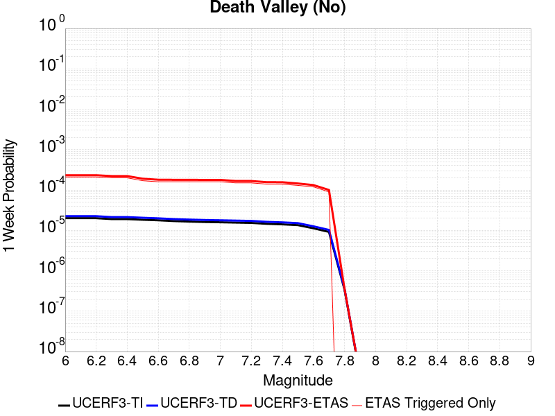 |  |  |  |

| Magnitude | 1 wk TI Prob | 1 wk TD Prob | 1 wk ETAS Prob | 1 wk ETAS/TD Gain | 1 wk ETAS Triggered Only | 1 mo TI Prob | 1 mo TD Prob | 1 mo ETAS Prob | 1 mo ETAS/TD Gain | 1 mo ETAS Triggered Only | 1 yr TI Prob | 1 yr TD Prob | 1 yr ETAS Prob | 1 yr ETAS/TD Gain | 1 yr ETAS Triggered Only | 10 yr TI Prob | 10 yr TD Prob | 10 yr ETAS Prob | 10 yr ETAS/TD Gain | 10 yr ETAS Triggered Only |
|-----|-----|-----|-----|-----|-----|-----|-----|-----|-----|-----|-----|-----|-----|-----|-----|-----|-----|-----|-----|-----|
| 6.0 | 2.0074807E-5 | 2.2500084E-5 | 2.1003572E-4 | 9.334886 | 1.8753986E-4 | 8.603206E-5 | 9.642541E-5 | 3.9646024E-4 | 4.111574 | 3.0006375E-4 | 0.001046937 | 0.0011733545 | 0.001660386 | 1.4150761 | 4.8760363E-4 | 0.010420183 | 0.011672506 | 0.01233977 | 1.0571654 | 6.7514344E-4 |
| 6.1 | 2.0074807E-5 | 2.2500084E-5 | 2.1003572E-4 | 9.334886 | 1.8753986E-4 | 8.603206E-5 | 9.642541E-5 | 3.9646024E-4 | 4.111574 | 3.0006375E-4 | 0.001046937 | 0.0011733545 | 0.001660386 | 1.4150761 | 4.8760363E-4 | 0.010420183 | 0.011672506 | 0.01233977 | 1.0571654 | 6.7514344E-4 |
| 6.2 | 2.0074807E-5 | 2.2500084E-5 | 2.1003572E-4 | 9.334886 | 1.8753986E-4 | 8.603206E-5 | 9.642541E-5 | 3.9646024E-4 | 4.111574 | 3.0006375E-4 | 0.001046937 | 0.0011733545 | 0.001660386 | 1.4150761 | 4.8760363E-4 | 0.010420183 | 0.011672506 | 0.01233977 | 1.0571654 | 6.7514344E-4 |
| 6.3 | 1.9050609E-5 | 2.1336948E-5 | 2.0887279E-4 | 9.789254 | 1.8753986E-4 | 8.164292E-5 | 9.1440896E-5 | 3.9147722E-4 | 4.281205 | 3.0006375E-4 | 9.935491E-4 | 0.001112731 | 0.001599792 | 1.4377167 | 4.8760363E-4 | 0.009891188 | 0.011072419 | 0.011740087 | 1.0603001 | 6.7514344E-4 |
| 6.4 | 1.9050609E-5 | 2.1336948E-5 | 2.0887279E-4 | 9.789254 | 1.8753986E-4 | 8.164292E-5 | 9.1440896E-5 | 3.9147722E-4 | 4.281205 | 3.0006375E-4 | 9.935491E-4 | 0.001112731 | 0.001599792 | 1.4377167 | 4.8760363E-4 | 0.009891188 | 0.011072419 | 0.011740087 | 1.0603001 | 6.7514344E-4 |
| 6.5 | 1.8367004E-5 | 2.0561009E-5 | 9.557541E-5 | 4.648381 | 7.501594E-5 | 7.8713354E-5 | 8.811567E-5 | 2.3813434E-4 | 2.7025197 | 1.5003188E-4 | 9.5791375E-4 | 0.0010722869 | 0.0014094965 | 1.3144772 | 3.3757172E-4 | 0.009537951 | 0.0106719155 | 0.011191423 | 1.0486798 | 5.2511157E-4 |
| 6.6 | 1.779439E-5 | 1.9910927E-5 | 9.492537E-5 | 4.7675014 | 7.501594E-5 | 7.625944E-5 | 8.53298E-5 | 2.3534887E-4 | 2.758109 | 1.5003188E-4 | 9.280632E-4 | 0.0010384015 | 0.0013381537 | 1.288667 | 3.0006375E-4 | 0.009241969 | 0.010336253 | 0.010818817 | 1.0466865 | 4.8760363E-4 |
| 6.7 | 1.7025437E-5 | 1.9043426E-5 | 9.405794E-5 | 4.9391294 | 7.501594E-5 | 7.296412E-5 | 8.161216E-5 | 2.316318E-4 | 2.838202 | 1.5003188E-4 | 8.87976E-4 | 9.931813E-4 | 0.0012554764 | 1.2640958 | 2.6255578E-4 | 0.008844362 | 0.009888145 | 0.01033379 | 1.0450686 | 4.5009566E-4 |
| 6.8 | 1.6545107E-5 | 1.8512545E-5 | 9.3527095E-5 | 5.052093 | 7.501594E-5 | 7.090568E-5 | 7.93371E-5 | 2.2935709E-4 | 2.8909183 | 1.5003188E-4 | 8.629347E-4 | 9.655073E-4 | 0.0012278096 | 1.2716731 | 2.6255578E-4 | 0.008595915 | 0.009613829 | 0.010059597 | 1.0463674 | 4.5009566E-4 |
| 6.9 | 1.615478E-5 | 1.8087594E-5 | 9.310218E-5 | 5.147295 | 7.501594E-5 | 6.9232934E-5 | 7.751599E-5 | 2.2753625E-4 | 2.935346 | 1.5003188E-4 | 8.4258494E-4 | 9.433546E-4 | 0.0012056627 | 1.2780589 | 2.6255578E-4 | 0.008393973 | 0.009394196 | 0.009840063 | 1.047462 | 4.5009566E-4 |
| 7.0 | 1.5894311E-5 | 1.780555E-5 | 9.2820155E-5 | 5.2129903 | 7.501594E-5 | 6.81167E-5 | 7.6307304E-5 | 2.2632774E-4 | 2.9660037 | 1.5003188E-4 | 8.2900526E-4 | 9.286515E-4 | 0.0011909634 | 1.2824655 | 2.6255578E-4 | 0.008259195 | 0.009248397 | 0.00969433 | 1.0482173 | 4.5009566E-4 |
| 7.1 | 1.5602263E-5 | 1.7483504E-5 | 9.2498136E-5 | 5.290595 | 7.501594E-5 | 6.6865134E-5 | 7.492718E-5 | 2.2494783E-4 | 3.0022192 | 1.5003188E-4 | 8.137789E-4 | 9.118627E-4 | 0.0011741791 | 1.287671 | 2.6255578E-4 | 0.008108052 | 0.009081894 | 0.009490735 | 1.0450171 | 4.125877E-4 |
| 7.2 | 1.5323829E-5 | 1.717063E-5 | 9.2185284E-5 | 5.368777 | 7.501594E-5 | 6.56719E-5 | 7.358637E-5 | 2.2360722E-4 | 3.0387042 | 1.5003188E-4 | 7.99262E-4 | 8.9555193E-4 | 0.0011203982 | 1.25107 | 2.2504783E-4 | 0.007963934 | 0.008920107 | 0.009291841 | 1.0416737 | 3.7507972E-4 |
| 7.3 | 1.4556212E-5 | 1.6302456E-5 | 5.3809814E-5 | 3.3007183 | 3.750797E-5 | 6.238227E-5 | 6.9865826E-5 | 1.8238187E-4 | 2.610459 | 1.12523914E-4 | 7.592395E-4 | 8.5029035E-4 | 0.0010376708 | 1.2203722 | 1.8753986E-4 | 0.0075665074 | 0.008471014 | 0.008805727 | 1.0395126 | 3.3757172E-4 |
| 7.4 | 1.411725E-5 | 1.580796E-5 | 5.3315336E-5 | 3.3726892 | 3.750797E-5 | 6.0501097E-5 | 6.7746674E-5 | 1.8026296E-4 | 2.6608386 | 1.12523914E-4 | 7.363519E-4 | 8.245094E-4 | 0.0010118947 | 1.2272687 | 1.8753986E-4 | 0.0073391674 | 0.008215138 | 0.008549937 | 1.0407538 | 3.3757172E-4 |
| 7.5 | 1.3503312E-5 | 1.5126289E-5 | 5.263369E-5 | 3.4796169 | 3.750797E-5 | 5.7870053E-5 | 6.482538E-5 | 1.77342E-4 | 2.735688 | 1.12523914E-4 | 7.043401E-4 | 7.8896893E-4 | 9.7636087E-4 | 1.2375149 | 1.8753986E-4 | 0.007021119 | 0.007862304 | 0.008197222 | 1.0425979 | 3.3757172E-4 |
| 7.6 | 1.1279839E-5 | 1.2626327E-5 | 5.0133825E-5 | 3.9705787 | 3.750797E-5 | 4.834127E-5 | 5.4111737E-5 | 1.6662956E-4 | 3.0793607 | 1.12523914E-4 | 5.88396E-4 | 6.5861654E-4 | 8.0854964E-4 | 1.2276485 | 1.5003188E-4 | 0.005868405 | 0.006567199 | 0.006865292 | 1.0453912 | 3.0006375E-4 |
| 7.7 | 9.189108E-6 | 1.0283358E-5 | 4.779094E-5 | 4.647406 | 3.750797E-5 | 3.93813E-5 | 4.407082E-5 | 1.1908345E-4 | 2.7020931 | 7.501594E-5 | 4.7936183E-4 | 5.3643517E-4 | 6.488987E-4 | 1.2096498 | 1.12523914E-4 | 0.004783291 | 0.005351914 | 0.0056130644 | 1.0487957 | 2.6255578E-4 |
| 7.8 | 3.4586725E-7 | 3.6482615E-7 | 3.6482615E-7 | 1.0 | 0.0 | 1.4822873E-6 | 1.5635396E-6 | 1.5635396E-6 | 1.0 | 0.0 | 1.80467E-5 | 1.9035933E-5 | 1.9035933E-5 | 1.0 | 0.0 | 1.8045233E-4 | 1.9034347E-4 | 1.9034347E-4 | 1.0 | 0.0 |
| 7.9 | 2.5591178E-9 | 2.6696718E-9 | 2.6696718E-9 | 1.0 | 0.0 | 1.0967647E-8 | 1.14414505E-8 | 1.14414505E-8 | 1.0 | 0.0 | 1.335311E-7 | 1.3929966E-7 | 1.3929966E-7 | 1.0 | 0.0 | 1.3353102E-6 | 1.3929966E-6 | 1.3929966E-6 | 1.0 | 0.0 |

## San Andreas (Parkfield)
*[(top)](#table-of-contents)*

| 1 Week | 1 Month | 1 Year | 10 Year |
|-----|-----|-----|-----|
|  |  |  |  |

| Magnitude | 1 wk TI Prob | 1 wk TD Prob | 1 wk ETAS Prob | 1 wk ETAS/TD Gain | 1 wk ETAS Triggered Only | 1 mo TI Prob | 1 mo TD Prob | 1 mo ETAS Prob | 1 mo ETAS/TD Gain | 1 mo ETAS Triggered Only | 1 yr TI Prob | 1 yr TD Prob | 1 yr ETAS Prob | 1 yr ETAS/TD Gain | 1 yr ETAS Triggered Only | 10 yr TI Prob | 10 yr TD Prob | 10 yr ETAS Prob | 10 yr ETAS/TD Gain | 10 yr ETAS Triggered Only |
|-----|-----|-----|-----|-----|-----|-----|-----|-----|-----|-----|-----|-----|-----|-----|-----|-----|-----|-----|-----|-----|
| 6.0 | 5.556969E-4 | 7.778562E-4 | 0.0011526442 | 1.4818217 | 3.7507972E-4 | 0.0023793848 | 0.0033299583 | 0.0037037889 | 1.1122628 | 3.7507972E-4 | 0.028586963 | 0.040235043 | 0.04070303 | 1.0116313 | 4.8760363E-4 | 0.25176284 | 0.3371973 | 0.33759505 | 1.0011796 | 6.001275E-4 |
| 6.1 | 1.925858E-4 | 3.0278185E-4 | 5.6525815E-4 | 1.8668826 | 2.6255578E-4 | 8.2510663E-4 | 0.001297085 | 0.0015593001 | 1.2021574 | 2.6255578E-4 | 0.0099994885 | 0.01577393 | 0.01606926 | 1.0187227 | 3.0006375E-4 | 0.095613256 | 0.14975825 | 0.15004526 | 1.0019165 | 3.3757172E-4 |
| 6.2 | 9.4306815E-5 | 1.8243887E-4 | 4.4494675E-4 | 2.4388814 | 2.6255578E-4 | 4.0410945E-4 | 7.8164786E-4 | 0.0010439984 | 1.3356378 | 2.6255578E-4 | 0.0049089384 | 0.009475246 | 0.009772467 | 1.0313681 | 3.0006375E-4 | 0.048019063 | 0.0918565 | 0.09212901 | 1.0029666 | 3.0006375E-4 |
| 6.3 | 9.283051E-5 | 1.794041E-4 | 4.419128E-4 | 2.4632256 | 2.6255578E-4 | 3.9778434E-4 | 7.686494E-4 | 0.0010310033 | 1.3413181 | 2.6255578E-4 | 0.0048322747 | 0.009318355 | 0.0096156215 | 1.0319014 | 3.0006375E-4 | 0.047285385 | 0.090509474 | 0.090782374 | 1.0030152 | 3.0006375E-4 |
| 6.4 | 9.138826E-5 | 1.7702584E-4 | 4.3953516E-4 | 2.482887 | 2.6255578E-4 | 3.916052E-4 | 7.5846276E-4 | 0.0010208194 | 1.3459058 | 2.6255578E-4 | 0.0047573745 | 0.009195387 | 0.009492692 | 1.032332 | 3.0006375E-4 | 0.046568092 | 0.0894136 | 0.08968683 | 1.0030558 | 3.0006375E-4 |
| 6.5 | 9.000255E-5 | 1.746064E-4 | 4.3711634E-4 | 2.5034385 | 2.6255578E-4 | 3.8566816E-4 | 7.4809964E-4 | 0.001010459 | 1.3507011 | 2.6255578E-4 | 0.0046854047 | 0.009070284 | 0.009367626 | 1.032782 | 3.0006375E-4 | 0.045878403 | 0.08829608 | 0.08856964 | 1.0030984 | 3.0006375E-4 |
| 6.6 | 8.8109264E-5 | 1.7141816E-4 | 4.3392894E-4 | 2.531406 | 2.6255578E-4 | 3.7755648E-4 | 7.3444354E-4 | 9.968065E-4 | 1.3572268 | 2.6255578E-4 | 0.0045870654 | 0.008905404 | 0.009202796 | 1.0333945 | 3.0006375E-4 | 0.04493529 | 0.08682707 | 0.08710108 | 1.0031558 | 3.0006375E-4 |
| 6.7 | 8.738073E-5 | 1.7008898E-4 | 4.3260012E-4 | 2.5433753 | 2.6255578E-4 | 3.7443507E-4 | 7.287503E-4 | 9.911148E-4 | 1.3600197 | 2.6255578E-4 | 0.0045492216 | 0.008836695 | 0.009134107 | 1.0336565 | 3.0006375E-4 | 0.04457213 | 0.0862268 | 0.08650099 | 1.0031799 | 3.0006375E-4 |
| 6.8 | 8.710195E-5 | 1.6954402E-4 | 4.320553E-4 | 2.548337 | 2.6255578E-4 | 3.7324068E-4 | 7.26416E-4 | 9.887811E-4 | 1.3611774 | 2.6255578E-4 | 0.0045347405 | 0.008808513 | 0.009105934 | 1.0337651 | 3.0006375E-4 | 0.04443313 | 0.08597436 | 0.08624863 | 1.00319 | 3.0006375E-4 |
| 6.9 | 8.6801556E-5 | 1.6895356E-4 | 4.3146499E-4 | 2.553749 | 2.6255578E-4 | 3.7195362E-4 | 7.238869E-4 | 9.862526E-4 | 1.3624402 | 2.6255578E-4 | 0.0045191357 | 0.0087779695 | 0.0090753995 | 1.0338837 | 3.0006375E-4 | 0.044283327 | 0.08570042 | 0.08597477 | 1.0032012 | 3.0006375E-4 |
| 7.0 | 8.5571606E-5 | 1.664819E-4 | 4.2899398E-4 | 2.5768206 | 2.6255578E-4 | 3.6668387E-4 | 7.132999E-4 | 9.7566843E-4 | 1.3678236 | 2.6255578E-4 | 0.004455241 | 0.008650103 | 0.008947571 | 1.034389 | 3.0006375E-4 | 0.043669727 | 0.08454836 | 0.08482306 | 1.0032489 | 3.0006375E-4 |
| 7.1 | 7.82589E-5 | 1.5128969E-4 | 4.1380574E-4 | 2.7351882 | 2.6255578E-4 | 3.3535215E-4 | 6.4822397E-4 | 9.1060955E-4 | 1.4047761 | 2.6255578E-4 | 0.0040752706 | 0.007863738 | 0.008161442 | 1.0378579 | 3.0006375E-4 | 0.040013418 | 0.077460445 | 0.077737264 | 1.0035737 | 3.0006375E-4 |
| 7.2 | 7.690929E-5 | 1.4866212E-4 | 4.111789E-4 | 2.765862 | 2.6255578E-4 | 3.2956956E-4 | 6.369685E-4 | 8.993571E-4 | 1.4119333 | 2.6255578E-4 | 0.004005129 | 0.0077276826 | 0.008025427 | 1.0385296 | 3.0006375E-4 | 0.0393371 | 0.07623341 | 0.0765106 | 1.003636 | 3.0006375E-4 |
| 7.3 | 7.5543794E-5 | 1.4562748E-4 | 4.0814505E-4 | 2.802665 | 2.6255578E-4 | 3.2371894E-4 | 6.239692E-4 | 8.863612E-4 | 1.4205207 | 2.6255578E-4 | 0.003934157 | 0.0075705256 | 0.007868318 | 1.0393357 | 3.0006375E-4 | 0.038652334 | 0.07479777 | 0.07507539 | 1.0037116 | 3.0006375E-4 |
| 7.4 | 7.4214564E-5 | 1.4263717E-4 | 4.0515553E-4 | 2.8404622 | 2.6255578E-4 | 3.1802364E-4 | 6.1115966E-4 | 8.73555E-4 | 1.42934 | 2.6255578E-4 | 0.003865065 | 0.0074156416 | 0.00771348 | 1.0401635 | 3.0006375E-4 | 0.03798529 | 0.07337152 | 0.07364957 | 1.0037895 | 3.0006375E-4 |
| 7.5 | 6.149578E-5 | 1.1191443E-4 | 3.7444083E-4 | 3.345778 | 2.6255578E-4 | 2.6352672E-4 | 4.795452E-4 | 7.419751E-4 | 1.5472474 | 2.6255578E-4 | 0.0032037178 | 0.005822865 | 0.0060838917 | 1.0448279 | 2.6255578E-4 | 0.03157923 | 0.058559462 | 0.058806643 | 1.004221 | 2.6255578E-4 |
| 7.6 | 6.0643448E-5 | 1.102009E-4 | 3.7272775E-4 | 3.382257 | 2.6255578E-4 | 2.598746E-4 | 4.7220418E-4 | 7.34636E-4 | 1.5557592 | 2.6255578E-4 | 0.0031593828 | 0.005733962 | 0.0059950124 | 1.045527 | 2.6255578E-4 | 0.031148417 | 0.05772042 | 0.05796782 | 1.0042862 | 2.6255578E-4 |
| 7.7 | 5.1652263E-5 | 9.175265E-5 | 2.792753E-4 | 3.0437846 | 1.8753986E-4 | 2.2134806E-4 | 3.9316638E-4 | 5.806325E-4 | 1.4768112 | 1.8753986E-4 | 0.002691582 | 0.0047763046 | 0.0049629486 | 1.039077 | 1.8753986E-4 | 0.026592141 | 0.04853641 | 0.048714846 | 1.0036764 | 1.8753986E-4 |
| 7.8 | 4.8090482E-5 | 8.560165E-5 | 2.7312545E-4 | 3.1906564 | 1.8753986E-4 | 2.060858E-4 | 3.6681266E-4 | 5.5428373E-4 | 1.5110812 | 1.8753986E-4 | 0.0025062072 | 0.004456807 | 0.004643511 | 1.0418919 | 1.8753986E-4 | 0.024781305 | 0.045302264 | 0.04548131 | 1.0039523 | 1.8753986E-4 |
| 7.9 | 3.970278E-5 | 6.7507375E-5 | 2.1752913E-4 | 3.2223017 | 1.5003188E-4 | 1.7014367E-4 | 2.8928524E-4 | 4.3927372E-4 | 1.5184796 | 1.5003188E-4 | 0.002069531 | 0.0035163634 | 0.003665868 | 1.0425167 | 1.5003188E-4 | 0.020503636 | 0.03588176 | 0.036026407 | 1.0040313 | 1.5003188E-4 |
| 8.0 | 2.8982335E-5 | 4.0698153E-5 | 1.1571104E-4 | 2.843152 | 7.501594E-5 | 1.2420409E-4 | 1.7440901E-4 | 2.4941185E-4 | 1.43004 | 7.501594E-5 | 0.0015111357 | 0.0021213628 | 0.0021962197 | 1.0352871 | 7.501594E-5 | 0.015009012 | 0.02201118 | 0.022084545 | 1.0033331 | 7.501594E-5 |
| 8.1 | 1.8836186E-5 | 1.867974E-5 | 1.867974E-5 | 1.0 | 0.0 | 8.0724014E-5 | 8.005358E-5 | 8.005358E-5 | 1.0 | 0.0 | 9.823717E-4 | 9.742171E-4 | 9.742171E-4 | 1.0 | 0.0 | 0.009780403 | 0.010487711 | 0.010487711 | 1.0 | 0.0 |
| 8.2 | 8.643924E-6 | 5.473668E-6 | 5.473668E-6 | 1.0 | 0.0 | 3.704486E-5 | 2.3458366E-5 | 2.3458366E-5 | 1.0 | 0.0 | 4.5092785E-4 | 2.8556827E-4 | 2.8556827E-4 | 1.0 | 0.0 | 0.0045001395 | 0.0032481793 | 0.0032481793 | 1.0 | 0.0 |
| 8.3 | 1.983087E-6 | 7.6564595E-7 | 7.6564595E-7 | 1.0 | 0.0 | 8.498917E-6 | 3.281336E-6 | 3.281336E-6 | 1.0 | 0.0 | 1.034694E-4 | 3.9949547E-5 | 3.9949547E-5 | 1.0 | 0.0 | 0.0010342124 | 4.717979E-4 | 4.717979E-4 | 1.0 | 0.0 |

## San Andreas (Carrizo) rev
*[(top)](#table-of-contents)*

| 1 Week | 1 Month | 1 Year | 10 Year |
|-----|-----|-----|-----|
|  | 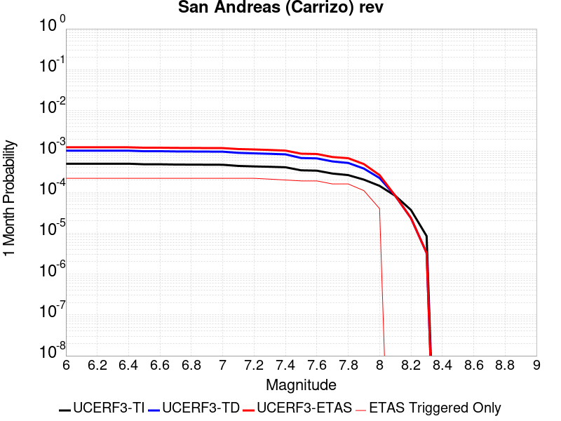 |  |  |

| Magnitude | 1 wk TI Prob | 1 wk TD Prob | 1 wk ETAS Prob | 1 wk ETAS/TD Gain | 1 wk ETAS Triggered Only | 1 mo TI Prob | 1 mo TD Prob | 1 mo ETAS Prob | 1 mo ETAS/TD Gain | 1 mo ETAS Triggered Only | 1 yr TI Prob | 1 yr TD Prob | 1 yr ETAS Prob | 1 yr ETAS/TD Gain | 1 yr ETAS Triggered Only | 10 yr TI Prob | 10 yr TD Prob | 10 yr ETAS Prob | 10 yr ETAS/TD Gain | 10 yr ETAS Triggered Only |
|-----|-----|-----|-----|-----|-----|-----|-----|-----|-----|-----|-----|-----|-----|-----|-----|-----|-----|-----|-----|-----|
| 6.0 | 1.1674632E-4 | 2.4324407E-4 | 6.5573136E-4 | 2.6957755 | 4.125877E-4 | 5.002454E-4 | 0.0010420597 | 0.0014542175 | 1.3955222 | 4.125877E-4 | 0.006073493 | 0.012613757 | 0.013058175 | 1.0352328 | 4.5009566E-4 | 0.0591016 | 0.120640226 | 0.12106901 | 1.0035542 | 4.8760363E-4 |
| 6.1 | 1.1674632E-4 | 2.4324407E-4 | 6.5573136E-4 | 2.6957755 | 4.125877E-4 | 5.002454E-4 | 0.0010420597 | 0.0014542175 | 1.3955222 | 4.125877E-4 | 0.006073493 | 0.012613757 | 0.013058175 | 1.0352328 | 4.5009566E-4 | 0.0591016 | 0.120640226 | 0.12106901 | 1.0035542 | 4.8760363E-4 |
| 6.2 | 1.1674632E-4 | 2.4324407E-4 | 6.5573136E-4 | 2.6957755 | 4.125877E-4 | 5.002454E-4 | 0.0010420597 | 0.0014542175 | 1.3955222 | 4.125877E-4 | 0.006073493 | 0.012613757 | 0.013058175 | 1.0352328 | 4.5009566E-4 | 0.0591016 | 0.120640226 | 0.12106901 | 1.0035542 | 4.8760363E-4 |
| 6.3 | 1.1674632E-4 | 2.4324407E-4 | 6.5573136E-4 | 2.6957755 | 4.125877E-4 | 5.002454E-4 | 0.0010420597 | 0.0014542175 | 1.3955222 | 4.125877E-4 | 0.006073493 | 0.012613757 | 0.013058175 | 1.0352328 | 4.5009566E-4 | 0.0591016 | 0.120640226 | 0.12106901 | 1.0035542 | 4.8760363E-4 |
| 6.4 | 1.1674632E-4 | 2.4324407E-4 | 6.5573136E-4 | 2.6957755 | 4.125877E-4 | 5.002454E-4 | 0.0010420597 | 0.0014542175 | 1.3955222 | 4.125877E-4 | 0.006073493 | 0.012613757 | 0.013058175 | 1.0352328 | 4.5009566E-4 | 0.0591016 | 0.120640226 | 0.12106901 | 1.0035542 | 4.8760363E-4 |
| 6.5 | 1.13136164E-4 | 2.3644442E-4 | 6.489345E-4 | 2.7445543 | 4.125877E-4 | 4.847792E-4 | 0.0010129412 | 0.001425111 | 1.4069039 | 4.125877E-4 | 0.0058862255 | 0.012263271 | 0.012707847 | 1.0362526 | 4.5009566E-4 | 0.057327334 | 0.11761008 | 0.11804034 | 1.0036583 | 4.8760363E-4 |
| 6.6 | 1.13136164E-4 | 2.3644442E-4 | 6.489345E-4 | 2.7445543 | 4.125877E-4 | 4.847792E-4 | 0.0010129412 | 0.001425111 | 1.4069039 | 4.125877E-4 | 0.0058862255 | 0.012263271 | 0.012707847 | 1.0362526 | 4.5009566E-4 | 0.057327334 | 0.11761008 | 0.11804034 | 1.0036583 | 4.8760363E-4 |
| 6.7 | 1.1149675E-4 | 2.3335687E-4 | 6.458483E-4 | 2.767642 | 4.125877E-4 | 4.777557E-4 | 9.997191E-4 | 0.0014118943 | 1.412291 | 4.125877E-4 | 0.0058011734 | 0.012104088 | 0.012548736 | 1.0367353 | 4.5009566E-4 | 0.05652051 | 0.1162291 | 0.116660036 | 1.0037076 | 4.8760363E-4 |
| 6.8 | 1.1103589E-4 | 2.3237852E-4 | 6.4487034E-4 | 2.775086 | 4.125877E-4 | 4.7578133E-4 | 9.955293E-4 | 0.0014077062 | 1.4140279 | 4.125877E-4 | 0.005777263 | 0.012053643 | 0.012498314 | 1.036891 | 4.5009566E-4 | 0.056293584 | 0.11578894 | 0.11622009 | 1.0037235 | 4.8760363E-4 |
| 6.9 | 1.1053259E-4 | 2.3130233E-4 | 6.437946E-4 | 2.7833467 | 4.125877E-4 | 4.7362508E-4 | 9.909206E-4 | 0.0014030995 | 1.4159554 | 4.125877E-4 | 0.0057511497 | 0.011998152 | 0.012442848 | 1.0370636 | 4.5009566E-4 | 0.05604569 | 0.11530445 | 0.11573583 | 1.0037413 | 4.8760363E-4 |
| 7.0 | 1.1005377E-4 | 2.3031076E-4 | 6.4280344E-4 | 2.7910264 | 4.125877E-4 | 4.7157376E-4 | 9.866742E-4 | 0.0013988549 | 1.4177474 | 4.125877E-4 | 0.0057263062 | 0.011947021 | 0.0123917395 | 1.0372242 | 4.5009566E-4 | 0.055809796 | 0.11485658 | 0.11528818 | 1.0037577 | 4.8760363E-4 |
| 7.1 | 1.0308142E-4 | 2.1540876E-4 | 6.279076E-4 | 2.9149582 | 4.125877E-4 | 4.417027E-4 | 9.228548E-4 | 0.0013350617 | 1.4466649 | 4.125877E-4 | 0.0053644776 | 0.011178188 | 0.011623253 | 1.0398154 | 4.5009566E-4 | 0.052368138 | 0.10809042 | 0.10852532 | 1.0040234 | 4.8760363E-4 |
| 7.2 | 1.0027479E-4 | 2.094876E-4 | 6.2198885E-4 | 2.9690962 | 4.125877E-4 | 4.296783E-4 | 8.9749607E-4 | 0.0013097135 | 1.4592972 | 4.125877E-4 | 0.0052187922 | 0.010872566 | 0.011317768 | 1.0409473 | 4.5009566E-4 | 0.050979212 | 0.10539086 | 0.10582708 | 1.0041391 | 4.8760363E-4 |
| 7.3 | 9.816942E-5 | 2.0423878E-4 | 5.792419E-4 | 2.8361013 | 3.7507972E-4 | 4.2065824E-4 | 8.7501644E-4 | 0.001249768 | 1.4282794 | 3.7507972E-4 | 0.005109493 | 0.010601572 | 0.011009785 | 1.038505 | 4.125877E-4 | 0.049935985 | 0.10297546 | 0.103379205 | 1.0039208 | 4.5009566E-4 |
| 7.4 | 9.5634205E-5 | 1.9793298E-4 | 5.354379E-4 | 2.7051475 | 3.3757172E-4 | 4.0979648E-4 | 8.4800937E-4 | 0.0011852948 | 1.3977379 | 3.3757172E-4 | 0.0049778637 | 0.010275901 | 0.0106471265 | 1.0361258 | 3.7507972E-4 | 0.048678253 | 0.100067884 | 0.10043918 | 1.0037105 | 4.125877E-4 |
| 7.5 | 8.052417E-5 | 1.6113915E-4 | 4.986565E-4 | 3.0945706 | 3.3757172E-4 | 3.4505792E-4 | 6.9041376E-4 | 0.0010277524 | 1.4886036 | 3.3757172E-4 | 0.0041929903 | 0.008373471 | 0.008708216 | 1.0399768 | 3.3757172E-4 | 0.04114753 | 0.082815245 | 0.08315926 | 1.0041541 | 3.7507972E-4 |
| 7.6 | 7.897024E-5 | 1.5767086E-4 | 4.951894E-4 | 3.1406524 | 3.3757172E-4 | 3.384E-4 | 6.755574E-4 | 0.0010129011 | 1.499356 | 3.3757172E-4 | 0.0041122385 | 0.00819397 | 0.008528776 | 1.04086 | 3.3757172E-4 | 0.040369697 | 0.08115866 | 0.0815033 | 1.0042465 | 3.7507972E-4 |
| 7.7 | 6.707427E-5 | 1.3277122E-4 | 3.9529215E-4 | 2.9772427 | 2.6255578E-4 | 2.8742946E-4 | 5.688955E-4 | 8.313019E-4 | 1.4612559 | 2.6255578E-4 | 0.003493839 | 0.0069043385 | 0.0071650813 | 1.0377651 | 2.6255578E-4 | 0.034394164 | 0.06905339 | 0.069332734 | 1.0040454 | 3.0006375E-4 |
| 7.8 | 6.147705E-5 | 1.2198445E-4 | 3.8450822E-4 | 3.1521084 | 2.6255578E-4 | 2.6344648E-4 | 5.226858E-4 | 7.8510435E-4 | 1.5020579 | 2.6255578E-4 | 0.0032027436 | 0.006345156 | 0.006606046 | 1.0411164 | 2.6255578E-4 | 0.031569764 | 0.0635172 | 0.063798204 | 1.0044241 | 3.0006375E-4 |
| 7.9 | 4.7636717E-5 | 8.8802946E-5 | 2.7632614E-4 | 3.1116776 | 1.8753986E-4 | 2.0414138E-4 | 3.8052857E-4 | 5.6799705E-4 | 1.4926529 | 1.8753986E-4 | 0.0024825884 | 0.004623101 | 0.004809774 | 1.0403782 | 1.8753986E-4 | 0.024550365 | 0.046629366 | 0.04684392 | 1.0046012 | 2.2504783E-4 |
| 8.0 | 3.3554235E-5 | 5.2138024E-5 | 1.6465607E-4 | 3.1580803 | 1.12523914E-4 | 1.4379594E-4 | 2.2342955E-4 | 3.3592831E-4 | 1.5035089 | 1.12523914E-4 | 0.0017493097 | 0.002716863 | 0.0028290814 | 1.0413043 | 1.12523914E-4 | 0.017356034 | 0.027881905 | 0.028027754 | 1.0052309 | 1.5003188E-4 |
| 8.1 | 1.9175432E-5 | 1.9183564E-5 | 1.9183564E-5 | 1.0 | 0.0 | 8.217783E-5 | 8.221269E-5 | 8.221269E-5 | 1.0 | 0.0 | 0.0010000558 | 0.0010004805 | 0.0010004805 | 1.0 | 0.0 | 0.009955673 | 0.010757771 | 0.010757771 | 1.0 | 0.0 |
| 8.2 | 8.643924E-6 | 5.473668E-6 | 5.473668E-6 | 1.0 | 0.0 | 3.704486E-5 | 2.3458366E-5 | 2.3458366E-5 | 1.0 | 0.0 | 4.5092785E-4 | 2.8556827E-4 | 2.8556827E-4 | 1.0 | 0.0 | 0.0045001395 | 0.0032481793 | 0.0032481793 | 1.0 | 0.0 |
| 8.3 | 1.983087E-6 | 7.6564595E-7 | 7.6564595E-7 | 1.0 | 0.0 | 8.498917E-6 | 3.281336E-6 | 3.281336E-6 | 1.0 | 0.0 | 1.034694E-4 | 3.9949547E-5 | 3.9949547E-5 | 1.0 | 0.0 | 0.0010342124 | 4.717979E-4 | 4.717979E-4 | 1.0 | 0.0 |

## Red Pass
*[(top)](#table-of-contents)*

| 1 Week | 1 Month | 1 Year | 10 Year |
|-----|-----|-----|-----|
|  |  |  | 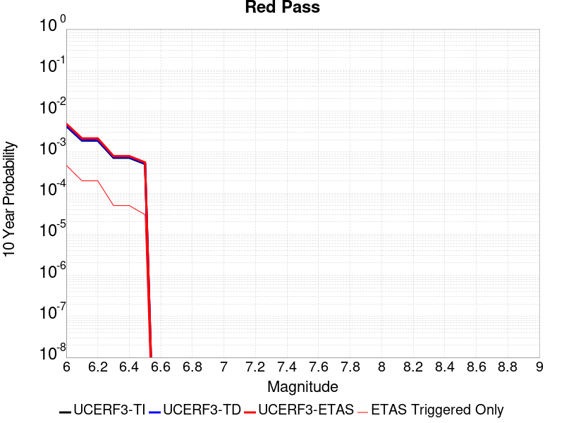 |

| Magnitude | 1 wk TI Prob | 1 wk TD Prob | 1 wk ETAS Prob | 1 wk ETAS/TD Gain | 1 wk ETAS Triggered Only | 1 mo TI Prob | 1 mo TD Prob | 1 mo ETAS Prob | 1 mo ETAS/TD Gain | 1 mo ETAS Triggered Only | 1 yr TI Prob | 1 yr TD Prob | 1 yr ETAS Prob | 1 yr ETAS/TD Gain | 1 yr ETAS Triggered Only | 10 yr TI Prob | 10 yr TD Prob | 10 yr ETAS Prob | 10 yr ETAS/TD Gain | 10 yr ETAS Triggered Only |
|-----|-----|-----|-----|-----|-----|-----|-----|-----|-----|-----|-----|-----|-----|-----|-----|-----|-----|-----|-----|-----|
| 6.0 | 8.258278E-6 | 8.551265E-6 | 8.356656E-5 | 9.772422 | 7.501594E-5 | 3.539214E-5 | 3.6647863E-5 | 1.8667425E-4 | 5.093728 | 1.5003188E-4 | 4.308141E-4 | 4.4611428E-4 | 6.335705E-4 | 1.4201977 | 1.8753986E-4 | 0.0042997985 | 0.004453945 | 0.004939377 | 1.1089892 | 4.8760363E-4 |
| 6.1 | 3.649988E-6 | 3.7753161E-6 | 4.1283143E-5 | 10.935017 | 3.750797E-5 | 1.5642712E-5 | 1.6179853E-5 | 9.119458E-5 | 5.636305 | 7.501594E-5 | 1.9043336E-4 | 1.9697666E-4 | 2.7197783E-4 | 1.3807616 | 7.501594E-5 | 0.0019027026 | 0.001968488 | 0.0021556588 | 1.0950835 | 1.8753986E-4 |
| 6.2 | 3.649988E-6 | 3.7753161E-6 | 4.1283143E-5 | 10.935017 | 3.750797E-5 | 1.5642712E-5 | 1.6179853E-5 | 9.119458E-5 | 5.636305 | 7.501594E-5 | 1.9043336E-4 | 1.9697666E-4 | 2.7197783E-4 | 1.3807616 | 7.501594E-5 | 0.0019027026 | 0.001968488 | 0.0021556588 | 1.0950835 | 1.8753986E-4 |
| 6.3 | 1.3924937E-6 | 1.4411166E-6 | 3.8949034E-5 | 27.026981 | 3.750797E-5 | 5.9678164E-6 | 6.1762075E-6 | 4.3683947E-5 | 7.0729403 | 3.750797E-5 | 7.265574E-5 | 7.519415E-5 | 1.12699294E-4 | 1.4987775 | 3.750797E-5 | 7.263199E-4 | 7.518258E-4 | 8.2678534E-4 | 1.0997033 | 7.501594E-5 |
| 6.4 | 1.3924937E-6 | 1.4411166E-6 | 3.8949034E-5 | 27.026981 | 3.750797E-5 | 5.9678164E-6 | 6.1762075E-6 | 4.3683947E-5 | 7.0729403 | 3.750797E-5 | 7.265574E-5 | 7.519415E-5 | 1.12699294E-4 | 1.4987775 | 3.750797E-5 | 7.263199E-4 | 7.518258E-4 | 8.2678534E-4 | 1.0997033 | 7.501594E-5 |
| 6.5 | 9.876812E-7 | 1.0221912E-6 | 3.8530125E-5 | 37.693657 | 3.750797E-5 | 4.2329125E-6 | 4.3808195E-6 | 4.1888627E-5 | 9.561824 | 3.750797E-5 | 5.153449E-5 | 5.3336476E-5 | 9.084245E-5 | 1.7031955 | 3.750797E-5 | 5.1522546E-4 | 5.333648E-4 | 6.083407E-4 | 1.1405716 | 7.501594E-5 |

## Elsinore (Glen Ivy) rev
*[(top)](#table-of-contents)*

| 1 Week | 1 Month | 1 Year | 10 Year |
|-----|-----|-----|-----|
|  |  |  |  |

| Magnitude | 1 wk TI Prob | 1 wk TD Prob | 1 wk ETAS Prob | 1 wk ETAS/TD Gain | 1 wk ETAS Triggered Only | 1 mo TI Prob | 1 mo TD Prob | 1 mo ETAS Prob | 1 mo ETAS/TD Gain | 1 mo ETAS Triggered Only | 1 yr TI Prob | 1 yr TD Prob | 1 yr ETAS Prob | 1 yr ETAS/TD Gain | 1 yr ETAS Triggered Only | 10 yr TI Prob | 10 yr TD Prob | 10 yr ETAS Prob | 10 yr ETAS/TD Gain | 10 yr ETAS Triggered Only |
|-----|-----|-----|-----|-----|-----|-----|-----|-----|-----|-----|-----|-----|-----|-----|-----|-----|-----|-----|-----|-----|
| 6.0 | 1.6204086E-4 | 2.937271E-4 | 3.68721E-4 | 1.2553183 | 7.501594E-5 | 6.94276E-4 | 0.0012583778 | 0.0013707601 | 1.0893073 | 1.12523914E-4 | 0.008420097 | 0.0152346175 | 0.01553011 | 1.0193961 | 3.0006375E-4 | 0.081081145 | 0.13962454 | 0.13994725 | 1.0023112 | 3.7507972E-4 |
| 6.1 | 1.6204086E-4 | 2.937271E-4 | 3.68721E-4 | 1.2553183 | 7.501594E-5 | 6.94276E-4 | 0.0012583778 | 0.0013707601 | 1.0893073 | 1.12523914E-4 | 0.008420097 | 0.0152346175 | 0.01553011 | 1.0193961 | 3.0006375E-4 | 0.081081145 | 0.13962454 | 0.13994725 | 1.0023112 | 3.7507972E-4 |
| 6.2 | 1.6204086E-4 | 2.937271E-4 | 3.68721E-4 | 1.2553183 | 7.501594E-5 | 6.94276E-4 | 0.0012583778 | 0.0013707601 | 1.0893073 | 1.12523914E-4 | 0.008420097 | 0.0152346175 | 0.01553011 | 1.0193961 | 3.0006375E-4 | 0.081081145 | 0.13962454 | 0.13994725 | 1.0023112 | 3.7507972E-4 |
| 6.3 | 1.0111737E-4 | 1.7703463E-4 | 2.1453595E-4 | 1.2118305 | 3.750797E-5 | 4.332882E-4 | 7.5861585E-4 | 8.335749E-4 | 1.0988103 | 7.501594E-5 | 0.005262531 | 0.0092177205 | 0.00936637 | 1.0161264 | 1.5003188E-4 | 0.0513964 | 0.08707393 | 0.08727939 | 1.0023595 | 2.2504783E-4 |
| 6.4 | 1.0111737E-4 | 1.7703463E-4 | 2.1453595E-4 | 1.2118305 | 3.750797E-5 | 4.332882E-4 | 7.5861585E-4 | 8.335749E-4 | 1.0988103 | 7.501594E-5 | 0.005262531 | 0.0092177205 | 0.00936637 | 1.0161264 | 1.5003188E-4 | 0.0513964 | 0.08707393 | 0.08727939 | 1.0023595 | 2.2504783E-4 |
| 6.5 | 3.6624708E-5 | 4.6391986E-5 | 4.6391986E-5 | 1.0 | 0.0 | 1.569536E-4 | 1.9880968E-4 | 1.9880968E-4 | 1.0 | 0.0 | 0.001909235 | 0.0024181814 | 0.0024555987 | 1.0154734 | 3.750797E-5 | 0.01892915 | 0.023697061 | 0.023733681 | 1.0015453 | 3.750797E-5 |
| 6.6 | 2.5051324E-5 | 2.6147465E-5 | 2.6147465E-5 | 1.0 | 0.0 | 1.073584E-4 | 1.12056E-4 | 1.12056E-4 | 1.0 | 0.0 | 0.0013063047 | 0.0013634725 | 0.0013634725 | 1.0 | 0.0 | 0.012986525 | 0.013565759 | 0.013565759 | 1.0 | 0.0 |
| 6.7 | 2.2189772E-5 | 2.2072489E-5 | 2.2072489E-5 | 1.0 | 0.0 | 9.509556E-5 | 9.459316E-5 | 9.459316E-5 | 1.0 | 0.0 | 0.0011571734 | 0.0011510996 | 0.0011510996 | 1.0 | 0.0 | 0.011511663 | 0.0114663225 | 0.0114663225 | 1.0 | 0.0 |
| 6.8 | 1.6654378E-5 | 1.44376E-5 | 1.44376E-5 | 1.0 | 0.0 | 7.137396E-5 | 6.187399E-5 | 6.187399E-5 | 1.0 | 0.0 | 8.686314E-4 | 7.5306057E-4 | 7.5306057E-4 | 1.0 | 0.0 | 0.008652439 | 0.0075100763 | 0.0075100763 | 1.0 | 0.0 |
| 6.9 | 1.5042909E-5 | 1.2331886E-5 | 1.2331886E-5 | 1.0 | 0.0 | 6.446802E-5 | 5.2849886E-5 | 5.2849886E-5 | 1.0 | 0.0 | 7.8461546E-4 | 6.4326054E-4 | 6.4326054E-4 | 1.0 | 0.0 | 0.007818509 | 0.006417925 | 0.006417925 | 1.0 | 0.0 |
| 7.0 | 1.4361385E-5 | 1.1451172E-5 | 1.1451172E-5 | 1.0 | 0.0 | 6.154734E-5 | 4.9075545E-5 | 4.9075545E-5 | 1.0 | 0.0 | 7.490812E-4 | 5.973339E-4 | 5.973339E-4 | 1.0 | 0.0 | 0.007465612 | 0.005960982 | 0.005960982 | 1.0 | 0.0 |
| 7.1 | 1.3265571E-5 | 1.0244736E-5 | 1.0244736E-5 | 1.0 | 0.0 | 5.6851208E-5 | 4.3905282E-5 | 4.3905282E-5 | 1.0 | 0.0 | 6.919436E-4 | 5.344183E-4 | 5.344183E-4 | 1.0 | 0.0 | 0.006897931 | 0.0053346003 | 0.0053346003 | 1.0 | 0.0 |
| 7.2 | 1.1596403E-5 | 8.504847E-6 | 8.504847E-6 | 1.0 | 0.0 | 4.9697923E-5 | 3.6448844E-5 | 3.6448844E-5 | 1.0 | 0.0 | 6.049042E-4 | 4.4367602E-4 | 4.4367602E-4 | 1.0 | 0.0 | 0.006032603 | 0.004429357 | 0.004429357 | 1.0 | 0.0 |
| 7.3 | 1.0150827E-5 | 7.238537E-6 | 7.238537E-6 | 1.0 | 0.0 | 4.3502816E-5 | 3.102194E-5 | 3.102194E-5 | 1.0 | 0.0 | 5.2951806E-4 | 3.776281E-4 | 3.776281E-4 | 1.0 | 0.0 | 0.005282581 | 0.003770271 | 0.003770271 | 1.0 | 0.0 |
| 7.4 | 9.080705E-6 | 6.352307E-6 | 6.352307E-6 | 1.0 | 0.0 | 3.8916725E-5 | 2.7223898E-5 | 2.7223898E-5 | 1.0 | 0.0 | 4.7370812E-4 | 3.314019E-4 | 3.314019E-4 | 1.0 | 0.0 | 0.004726996 | 0.0033092257 | 0.0033092257 | 1.0 | 0.0 |
| 7.5 | 7.671649E-6 | 5.225419E-6 | 5.225419E-6 | 1.0 | 0.0 | 3.287808E-5 | 2.2394468E-5 | 2.2394468E-5 | 1.0 | 0.0 | 4.0021708E-4 | 2.7261977E-4 | 2.7261977E-4 | 1.0 | 0.0 | 0.0039949706 | 0.0027229784 | 0.0027229784 | 1.0 | 0.0 |
| 7.6 | 6.990086E-6 | 4.687336E-6 | 4.687336E-6 | 1.0 | 0.0 | 2.9957167E-5 | 2.0088435E-5 | 2.0088435E-5 | 1.0 | 0.0 | 3.6466747E-4 | 2.445504E-4 | 2.445504E-4 | 1.0 | 0.0 | 0.0036406964 | 0.0024429292 | 0.0024429292 | 1.0 | 0.0 |
| 7.7 | 4.163505E-6 | 2.329331E-6 | 2.329331E-6 | 1.0 | 0.0 | 1.7843471E-5 | 9.982813E-6 | 9.982813E-6 | 1.0 | 0.0 | 2.172226E-4 | 1.2153471E-4 | 1.2153471E-4 | 1.0 | 0.0 | 0.0021701038 | 0.0012147555 | 0.0012147555 | 1.0 | 0.0 |
| 7.8 | 2.2692414E-7 | 9.384417E-8 | 9.384417E-8 | 1.0 | 0.0 | 9.725317E-7 | 4.0218927E-7 | 4.0218927E-7 | 1.0 | 0.0 | 1.1840509E-5 | 4.8966467E-6 | 4.8966467E-6 | 1.0 | 0.0 | 1.1839878E-4 | 4.8965718E-5 | 4.8965718E-5 | 1.0 | 0.0 |
| 7.9 | 6.676829E-9 | 3.4397174E-9 | 3.4397174E-9 | 1.0 | 0.0 | 2.861498E-8 | 1.4741646E-8 | 1.4741646E-8 | 1.0 | 0.0 | 3.4838732E-7 | 1.7947953E-7 | 1.7947953E-7 | 1.0 | 0.0 | 3.4838679E-6 | 1.794794E-6 | 1.794794E-6 | 1.0 | 0.0 |

## San Andreas (Cholame) rev
*[(top)](#table-of-contents)*

| 1 Week | 1 Month | 1 Year | 10 Year |
|-----|-----|-----|-----|
|  |  |  | 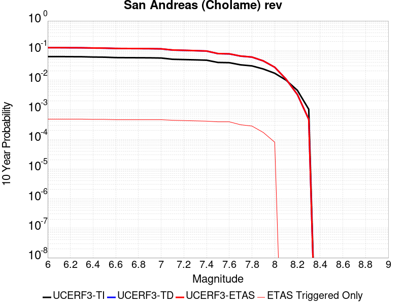 |

| Magnitude | 1 wk TI Prob | 1 wk TD Prob | 1 wk ETAS Prob | 1 wk ETAS/TD Gain | 1 wk ETAS Triggered Only | 1 mo TI Prob | 1 mo TD Prob | 1 mo ETAS Prob | 1 mo ETAS/TD Gain | 1 mo ETAS Triggered Only | 1 yr TI Prob | 1 yr TD Prob | 1 yr ETAS Prob | 1 yr ETAS/TD Gain | 1 yr ETAS Triggered Only | 10 yr TI Prob | 10 yr TD Prob | 10 yr ETAS Prob | 10 yr ETAS/TD Gain | 10 yr ETAS Triggered Only |
|-----|-----|-----|-----|-----|-----|-----|-----|-----|-----|-----|-----|-----|-----|-----|-----|-----|-----|-----|-----|-----|
| 6.0 | 1.2302514E-4 | 2.5205986E-4 | 6.6454354E-4 | 2.6364512 | 4.125877E-4 | 5.27144E-4 | 0.0010798109 | 0.0014919532 | 1.3816799 | 4.125877E-4 | 0.0063991086 | 0.013067958 | 0.013512172 | 1.0339926 | 4.5009566E-4 | 0.06217949 | 0.12438412 | 0.124811076 | 1.0034325 | 4.8760363E-4 |
| 6.1 | 1.2302514E-4 | 2.5205986E-4 | 6.6454354E-4 | 2.6364512 | 4.125877E-4 | 5.27144E-4 | 0.0010798109 | 0.0014919532 | 1.3816799 | 4.125877E-4 | 0.0063991086 | 0.013067958 | 0.013512172 | 1.0339926 | 4.5009566E-4 | 0.06217949 | 0.12438412 | 0.124811076 | 1.0034325 | 4.8760363E-4 |
| 6.2 | 1.2203569E-4 | 2.502277E-4 | 6.6271215E-4 | 2.6484363 | 4.125877E-4 | 5.2290526E-4 | 0.0010719653 | 0.0014841107 | 1.3844764 | 4.125877E-4 | 0.006347804 | 0.012973578 | 0.013417834 | 1.0342431 | 4.5009566E-4 | 0.061695136 | 0.123571314 | 0.123998664 | 1.0034584 | 4.8760363E-4 |
| 6.3 | 1.2142645E-4 | 2.4908737E-4 | 6.6157227E-4 | 2.6559846 | 4.125877E-4 | 5.202953E-4 | 0.0010670823 | 0.0014792297 | 1.3862377 | 4.125877E-4 | 0.006316212 | 0.012914834 | 0.013359116 | 1.0344009 | 4.5009566E-4 | 0.06139677 | 0.12306532 | 0.12349292 | 1.0034746 | 4.8760363E-4 |
| 6.4 | 1.1865206E-4 | 2.4414246E-4 | 6.566294E-4 | 2.689534 | 4.125877E-4 | 5.0840975E-4 | 0.0010459068 | 0.001458063 | 1.3940659 | 4.125877E-4 | 0.006172335 | 0.012660044 | 0.013104442 | 1.0351024 | 4.5009566E-4 | 0.060036868 | 0.12085904 | 0.12128771 | 1.0035468 | 4.8760363E-4 |
| 6.5 | 1.17443946E-4 | 2.4207575E-4 | 6.5456354E-4 | 2.7039616 | 4.125877E-4 | 5.032341E-4 | 0.0010370566 | 0.0014492164 | 1.3974323 | 4.125877E-4 | 0.006109677 | 0.012553536 | 0.012997981 | 1.035404 | 4.5009566E-4 | 0.059444077 | 0.11993008 | 0.120359205 | 1.0035782 | 4.8760363E-4 |
| 6.6 | 1.13579066E-4 | 2.3516564E-4 | 6.4765627E-4 | 2.754043 | 4.125877E-4 | 4.866766E-4 | 0.001007465 | 0.001419637 | 1.4091179 | 4.125877E-4 | 0.0059092017 | 0.012197345 | 0.0126419505 | 1.036451 | 4.5009566E-4 | 0.057545185 | 0.1168492 | 0.11727983 | 1.0036854 | 4.8760363E-4 |
| 6.7 | 1.1271412E-4 | 2.336088E-4 | 6.461001E-4 | 2.7657351 | 4.125877E-4 | 4.829711E-4 | 0.001000798 | 0.0014129727 | 1.4118462 | 4.125877E-4 | 0.005864331 | 0.012117079 | 0.012561721 | 1.0366955 | 4.5009566E-4 | 0.057119697 | 0.11615275 | 0.11658372 | 1.0037104 | 4.8760363E-4 |
| 6.8 | 1.1217975E-4 | 2.3249313E-4 | 6.449849E-4 | 2.7742105 | 4.125877E-4 | 4.8068175E-4 | 9.960202E-4 | 0.0014081969 | 1.4138237 | 4.125877E-4 | 0.005836608 | 0.012059555 | 0.012504223 | 1.0368726 | 4.5009566E-4 | 0.056856725 | 0.11565061 | 0.11608183 | 1.0037286 | 4.8760363E-4 |
| 6.9 | 1.1146753E-4 | 2.3098059E-4 | 6.4347294E-4 | 2.7858315 | 4.125877E-4 | 4.7763053E-4 | 9.895428E-4 | 0.0014017222 | 1.4165353 | 4.125877E-4 | 0.0057996577 | 0.011981564 | 0.012426266 | 1.0371156 | 4.5009566E-4 | 0.056506127 | 0.11497027 | 0.11540181 | 1.0037535 | 4.8760363E-4 |
| 7.0 | 1.0965793E-4 | 2.2721413E-4 | 6.397081E-4 | 2.8154414 | 4.125877E-4 | 4.698779E-4 | 9.734129E-4 | 0.0013855989 | 1.4234442 | 4.125877E-4 | 0.005705768 | 0.011787324 | 0.012232115 | 1.0377346 | 4.5009566E-4 | 0.055614736 | 0.11327011 | 0.11370249 | 1.0038172 | 4.8760363E-4 |
| 7.1 | 9.927982E-5 | 2.0540332E-4 | 6.179063E-4 | 3.0082583 | 4.125877E-4 | 4.2541555E-4 | 8.8000396E-4 | 0.0012922286 | 1.4684349 | 4.125877E-4 | 0.0051671406 | 0.010661708 | 0.011107005 | 1.041766 | 4.5009566E-4 | 0.05048634 | 0.10336573 | 0.103802934 | 1.0042297 | 4.8760363E-4 |
| 7.2 | 9.696786E-5 | 2.0044584E-4 | 6.129508E-4 | 3.0579374 | 4.125877E-4 | 4.1551032E-4 | 8.587718E-4 | 0.0012710051 | 1.4800267 | 4.125877E-4 | 0.00504711 | 0.010405703 | 0.010851116 | 1.0428046 | 4.5009566E-4 | 0.04934009 | 0.10110233 | 0.10154064 | 1.0043353 | 4.8760363E-4 |
| 7.3 | 9.4727984E-5 | 1.9473763E-4 | 5.6974427E-4 | 2.925702 | 3.7507972E-4 | 4.0591392E-4 | 8.343239E-4 | 0.0012090906 | 1.4491862 | 3.7507972E-4 | 0.0049308087 | 0.010110851 | 0.010519267 | 1.0403938 | 4.125877E-4 | 0.048228268 | 0.09847412 | 0.098879896 | 1.0041206 | 4.5009566E-4 |
| 7.4 | 9.220358E-5 | 1.8844259E-4 | 5.259507E-4 | 2.7910395 | 3.3757172E-4 | 3.9509835E-4 | 8.07362E-4 | 0.0011446612 | 1.4177793 | 3.3757172E-4 | 0.004799717 | 0.009785578 | 0.010156987 | 1.0379548 | 3.7507972E-4 | 0.046973653 | 0.09555831 | 0.09593147 | 1.003905 | 4.125877E-4 |
| 7.5 | 7.71631E-5 | 1.5179155E-4 | 4.8931205E-4 | 3.223579 | 3.3757172E-4 | 3.306571E-4 | 6.5037323E-4 | 9.877254E-4 | 1.5187055 | 3.3757172E-4 | 0.0040183207 | 0.007889617 | 0.0082245255 | 1.0424492 | 3.3757172E-4 | 0.03946433 | 0.078289196 | 0.07863491 | 1.0044159 | 3.7507972E-4 |
| 7.6 | 7.5634416E-5 | 1.4838556E-4 | 4.859072E-4 | 3.274626 | 3.3757172E-4 | 3.241072E-4 | 6.357833E-4 | 9.731404E-4 | 1.5306165 | 3.3757172E-4 | 0.0039388672 | 0.007713256 | 0.008048223 | 1.0434276 | 3.3757172E-4 | 0.038697794 | 0.076654874 | 0.07700121 | 1.004518 | 3.7507972E-4 |
| 7.7 | 6.3783E-5 | 1.2359623E-4 | 3.861196E-4 | 3.1240401 | 2.6255578E-4 | 2.7332708E-4 | 5.2959064E-4 | 7.9200737E-4 | 1.4955087 | 2.6255578E-4 | 0.0033226798 | 0.0064287307 | 0.0066895983 | 1.0405785 | 2.6255578E-4 | 0.032734364 | 0.06454488 | 0.06482557 | 1.0043489 | 3.0006375E-4 |
| 7.8 | 5.863422E-5 | 1.14169685E-4 | 3.766955E-4 | 3.2994354 | 2.6255578E-4 | 2.512653E-4 | 4.892069E-4 | 7.516343E-4 | 1.5364342 | 2.6255578E-4 | 0.003054864 | 0.0059398497 | 0.006200846 | 1.0439398 | 2.6255578E-4 | 0.030132094 | 0.05966162 | 0.05994378 | 1.0047294 | 3.0006375E-4 |
| 7.9 | 4.595283E-5 | 8.426815E-5 | 2.717922E-4 | 3.2253253 | 1.8753986E-4 | 1.9692584E-4 | 3.6109926E-4 | 5.4857135E-4 | 1.5191706 | 1.8753986E-4 | 0.0023949358 | 0.0043875277 | 0.0045742444 | 1.0425563 | 1.8753986E-4 | 0.023692891 | 0.044363137 | 0.044578202 | 1.0048478 | 2.2504783E-4 |
| 8.0 | 3.2950178E-5 | 5.077396E-5 | 1.6329216E-4 | 3.216061 | 1.12523914E-4 | 1.412074E-4 | 2.1758456E-4 | 3.3008397E-4 | 1.5170377 | 1.12523914E-4 | 0.0017178444 | 0.0026458753 | 0.0027581016 | 1.0424155 | 1.12523914E-4 | 0.017046256 | 0.027181072 | 0.027327027 | 1.0053697 | 1.5003188E-4 |
| 8.1 | 1.9177472E-5 | 1.9183733E-5 | 1.9183733E-5 | 1.0 | 0.0 | 8.218658E-5 | 8.221342E-5 | 8.221342E-5 | 1.0 | 0.0 | 0.0010001622 | 0.0010004893 | 0.0010004893 | 1.0 | 0.0 | 0.009956728 | 0.010757887 | 0.010757887 | 1.0 | 0.0 |
| 8.2 | 8.643924E-6 | 5.473668E-6 | 5.473668E-6 | 1.0 | 0.0 | 3.704486E-5 | 2.3458366E-5 | 2.3458366E-5 | 1.0 | 0.0 | 4.5092785E-4 | 2.8556827E-4 | 2.8556827E-4 | 1.0 | 0.0 | 0.0045001395 | 0.0032481793 | 0.0032481793 | 1.0 | 0.0 |
| 8.3 | 1.983087E-6 | 7.6564595E-7 | 7.6564595E-7 | 1.0 | 0.0 | 8.498917E-6 | 3.281336E-6 | 3.281336E-6 | 1.0 | 0.0 | 1.034694E-4 | 3.9949547E-5 | 3.9949547E-5 | 1.0 | 0.0 | 0.0010342124 | 4.717979E-4 | 4.717979E-4 | 1.0 | 0.0 |

## San Jacinto (San Bernardino)
*[(top)](#table-of-contents)*

| 1 Week | 1 Month | 1 Year | 10 Year |
|-----|-----|-----|-----|
|  |  |  |  |

| Magnitude | 1 wk TI Prob | 1 wk TD Prob | 1 wk ETAS Prob | 1 wk ETAS/TD Gain | 1 wk ETAS Triggered Only | 1 mo TI Prob | 1 mo TD Prob | 1 mo ETAS Prob | 1 mo ETAS/TD Gain | 1 mo ETAS Triggered Only | 1 yr TI Prob | 1 yr TD Prob | 1 yr ETAS Prob | 1 yr ETAS/TD Gain | 1 yr ETAS Triggered Only | 10 yr TI Prob | 10 yr TD Prob | 10 yr ETAS Prob | 10 yr ETAS/TD Gain | 10 yr ETAS Triggered Only |
|-----|-----|-----|-----|-----|-----|-----|-----|-----|-----|-----|-----|-----|-----|-----|-----|-----|-----|-----|-----|-----|
| 6.0 | 3.409352E-5 | 3.598562E-5 | 2.9853196E-4 | 8.295869 | 2.6255578E-4 | 1.461069E-4 | 1.5421498E-4 | 4.5423248E-4 | 2.9454498 | 3.0006375E-4 | 0.0017774 | 0.0018759521 | 0.0022877657 | 1.2195225 | 4.125877E-4 | 0.01763251 | 0.019349992 | 0.019754598 | 1.0209098 | 4.125877E-4 |
| 6.1 | 3.409352E-5 | 3.598562E-5 | 2.9853196E-4 | 8.295869 | 2.6255578E-4 | 1.461069E-4 | 1.5421498E-4 | 4.5423248E-4 | 2.9454498 | 3.0006375E-4 | 0.0017774 | 0.0018759521 | 0.0022877657 | 1.2195225 | 4.125877E-4 | 0.01763251 | 0.019349992 | 0.019754598 | 1.0209098 | 4.125877E-4 |
| 6.2 | 3.409352E-5 | 3.598562E-5 | 2.9853196E-4 | 8.295869 | 2.6255578E-4 | 1.461069E-4 | 1.5421498E-4 | 4.5423248E-4 | 2.9454498 | 3.0006375E-4 | 0.0017774 | 0.0018759521 | 0.0022877657 | 1.2195225 | 4.125877E-4 | 0.01763251 | 0.019349992 | 0.019754598 | 1.0209098 | 4.125877E-4 |
| 6.3 | 3.409352E-5 | 3.598562E-5 | 2.9853196E-4 | 8.295869 | 2.6255578E-4 | 1.461069E-4 | 1.5421498E-4 | 4.5423248E-4 | 2.9454498 | 3.0006375E-4 | 0.0017774 | 0.0018759521 | 0.0022877657 | 1.2195225 | 4.125877E-4 | 0.01763251 | 0.019349992 | 0.019754598 | 1.0209098 | 4.125877E-4 |
| 6.4 | 3.400795E-5 | 3.5878285E-5 | 2.9842465E-4 | 8.317696 | 2.6255578E-4 | 1.4574021E-4 | 1.5375503E-4 | 4.5377266E-4 | 2.9512703 | 3.0006375E-4 | 0.0017729428 | 0.0018703619 | 0.0022821778 | 1.2201798 | 4.125877E-4 | 0.017588645 | 0.019295074 | 0.019699702 | 1.0209705 | 4.125877E-4 |
| 6.5 | 3.341482E-5 | 3.5138914E-5 | 2.9768547E-4 | 8.471676 | 2.6255578E-4 | 1.4319851E-4 | 1.5058667E-4 | 4.5060524E-4 | 2.9923317 | 3.0006375E-4 | 0.0017420477 | 0.0018318522 | 0.0022436841 | 1.2248172 | 4.125877E-4 | 0.017284546 | 0.018916616 | 0.019321399 | 1.0213983 | 4.125877E-4 |
| 6.6 | 3.3364955E-5 | 3.5076133E-5 | 2.9762273E-4 | 8.485049 | 2.6255578E-4 | 1.4298483E-4 | 1.5031763E-4 | 4.503363E-4 | 2.995898 | 3.0006375E-4 | 0.0017394501 | 0.0018285823 | 0.0022404154 | 1.22522 | 4.125877E-4 | 0.017258976 | 0.01888448 | 0.019289277 | 1.0214354 | 4.125877E-4 |
| 6.7 | 3.335922E-5 | 3.5065907E-5 | 2.9761248E-4 | 8.487232 | 2.6255578E-4 | 1.4296026E-4 | 1.5027382E-4 | 4.502925E-4 | 2.9964802 | 3.0006375E-4 | 0.0017391514 | 0.0018280497 | 0.0022398832 | 1.2252856 | 4.125877E-4 | 0.017256035 | 0.018879272 | 0.01928407 | 1.0214415 | 4.125877E-4 |
| 6.8 | 3.327683E-5 | 3.4959972E-5 | 2.9750657E-4 | 8.50992 | 2.6255578E-4 | 1.4260718E-4 | 1.4981985E-4 | 4.4983867E-4 | 3.0025303 | 3.0006375E-4 | 0.0017348597 | 0.001822532 | 0.002234368 | 1.225969 | 4.125877E-4 | 0.017213784 | 0.018825045 | 0.019229865 | 1.0215044 | 4.125877E-4 |
| 6.9 | 3.3235785E-5 | 3.4900928E-5 | 2.9744755E-4 | 8.522626 | 2.6255578E-4 | 1.4243131E-4 | 1.4956683E-4 | 4.4958573E-4 | 3.0059185 | 3.0006375E-4 | 0.0017327217 | 0.0018194567 | 0.0022312936 | 1.2263516 | 4.125877E-4 | 0.017192734 | 0.018794911 | 0.019199744 | 1.0215394 | 4.125877E-4 |
| 7.0 | 3.3197095E-5 | 3.4840854E-5 | 2.973875E-4 | 8.535597 | 2.6255578E-4 | 1.422655E-4 | 1.4930942E-4 | 4.4932836E-4 | 3.0093775 | 3.0006375E-4 | 0.0017307063 | 0.0018163278 | 0.0022281662 | 1.2267423 | 4.125877E-4 | 0.017172894 | 0.01876429 | 0.019169135 | 1.0215753 | 4.125877E-4 |
| 7.1 | 3.3129716E-5 | 3.4721066E-5 | 2.9726775E-4 | 8.561596 | 2.6255578E-4 | 1.4197677E-4 | 1.4879608E-4 | 4.488152E-4 | 3.0163105 | 3.0006375E-4 | 0.0017271966 | 0.0018100884 | 0.0022219294 | 1.2275252 | 4.125877E-4 | 0.017138338 | 0.018703366 | 0.019108236 | 1.021647 | 4.125877E-4 |
| 7.2 | 3.3034008E-5 | 3.4588513E-5 | 2.9713524E-4 | 8.590575 | 2.6255578E-4 | 1.4156665E-4 | 1.4822806E-4 | 4.4824736E-4 | 3.0240383 | 3.0006375E-4 | 0.0017222111 | 0.0018031843 | 0.002215028 | 1.228398 | 4.125877E-4 | 0.017089253 | 0.01863575 | 0.019040648 | 1.021727 | 4.125877E-4 |
| 7.3 | 3.2956614E-5 | 3.4456265E-5 | 2.9700302E-4 | 8.61971 | 2.6255578E-4 | 1.4123498E-4 | 1.4766137E-4 | 4.4768082E-4 | 3.0318074 | 3.0006375E-4 | 0.0017181796 | 0.0017962961 | 0.0022081425 | 1.2292755 | 4.125877E-4 | 0.017049557 | 0.018568495 | 0.018973423 | 1.0218072 | 4.125877E-4 |
| 7.4 | 3.2915937E-5 | 3.4377957E-5 | 2.9692473E-4 | 8.637067 | 2.6255578E-4 | 1.4106068E-4 | 1.473258E-4 | 4.4734534E-4 | 3.036436 | 3.0006375E-4 | 0.0017160608 | 0.0017922173 | 0.0022040654 | 1.2297982 | 4.125877E-4 | 0.017028693 | 0.018528769 | 0.018933712 | 1.0218549 | 4.125877E-4 |
| 7.5 | 3.281791E-5 | 3.424287E-5 | 2.9678966E-4 | 8.667196 | 2.6255578E-4 | 1.406406E-4 | 1.4674691E-4 | 4.4676664E-4 | 3.0444705 | 3.0006375E-4 | 0.0017109542 | 0.0017851809 | 0.002197032 | 1.2307055 | 4.125877E-4 | 0.016978411 | 0.018459652 | 0.018864624 | 1.0219382 | 4.125877E-4 |
| 7.6 | 3.2521442E-5 | 3.396782E-5 | 2.9651469E-4 | 8.729282 | 2.6255578E-4 | 1.3937015E-4 | 1.4556825E-4 | 4.4558835E-4 | 3.0610268 | 3.0006375E-4 | 0.0016955109 | 0.0017708542 | 0.0021827111 | 1.2325753 | 4.125877E-4 | 0.016826328 | 0.018317295 | 0.018722326 | 1.0221119 | 4.125877E-4 |
| 7.7 | 3.0287873E-5 | 3.245191E-5 | 2.949992E-4 | 9.090348 | 2.6255578E-4 | 1.297987E-4 | 1.3907222E-4 | 4.3909423E-4 | 3.1573112 | 3.0006375E-4 | 0.0015791537 | 0.0016918903 | 0.00210378 | 1.2434493 | 4.125877E-4 | 0.01567979 | 0.017528199 | 0.017933555 | 1.0231259 | 4.125877E-4 |
| 7.8 | 2.6316151E-5 | 2.9662837E-5 | 2.9221084E-4 | 9.851075 | 2.6255578E-4 | 1.1277862E-4 | 1.2712025E-4 | 4.2714586E-4 | 3.3601718 | 3.0006375E-4 | 0.0013722149 | 0.0015465913 | 0.0019585409 | 1.2663597 | 4.125877E-4 | 0.013637724 | 0.016069878 | 0.016475836 | 1.025262 | 4.125877E-4 |
| 7.9 | 2.0761147E-5 | 2.3417291E-5 | 2.8596693E-4 | 12.211785 | 2.6255578E-4 | 8.897331E-5 | 1.0035596E-4 | 4.003896E-4 | 3.9896944 | 3.0006375E-4 | 0.0010827117 | 0.0012211498 | 0.0015957715 | 1.3067778 | 3.7507972E-4 | 0.010774517 | 0.012793272 | 0.013163553 | 1.0289434 | 3.7507972E-4 |
| 8.0 | 1.5738568E-5 | 1.6032505E-5 | 2.0356935E-4 | 12.6972885 | 1.8753986E-4 | 6.744926E-5 | 6.8708934E-5 | 2.562359E-4 | 3.7292953 | 1.8753986E-4 | 8.2088535E-4 | 8.3621085E-4 | 0.0010610705 | 1.268903 | 2.2504783E-4 | 0.008178596 | 0.008865741 | 0.009088794 | 1.0251589 | 2.2504783E-4 |
| 8.1 | 1.0105832E-5 | 8.329479E-6 | 4.5837136E-5 | 5.5030017 | 3.750797E-5 | 4.3309992E-5 | 3.569728E-5 | 7.320391E-5 | 2.050686 | 3.750797E-5 | 5.2717153E-4 | 4.3452822E-4 | 5.0951156E-4 | 1.1725626 | 7.501594E-5 | 0.005259227 | 0.0046768794 | 0.0047515444 | 1.0159647 | 7.501594E-5 |
| 8.2 | 4.189207E-6 | 1.577699E-6 | 1.577699E-6 | 1.0 | 0.0 | 1.7953622E-5 | 6.7615497E-6 | 6.7615497E-6 | 1.0 | 0.0 | 2.1856341E-4 | 8.231879E-5 | 8.231879E-5 | 1.0 | 0.0 | 0.0021834858 | 9.562628E-4 | 9.562628E-4 | 1.0 | 0.0 |
| 8.3 | 1.2758221E-6 | 3.612677E-7 | 3.612677E-7 | 1.0 | 0.0 | 5.4677976E-6 | 1.5482892E-6 | 1.5482892E-6 | 1.0 | 0.0 | 6.65684E-5 | 1.8850264E-5 | 1.8850264E-5 | 1.0 | 0.0 | 6.6548464E-4 | 2.2739546E-4 | 2.2739546E-4 | 1.0 | 0.0 |

## Baker
*[(top)](#table-of-contents)*

| 1 Week | 1 Month | 1 Year | 10 Year |
|-----|-----|-----|-----|
|  |  |  |  |

| Magnitude | 1 wk TI Prob | 1 wk TD Prob | 1 wk ETAS Prob | 1 wk ETAS/TD Gain | 1 wk ETAS Triggered Only | 1 mo TI Prob | 1 mo TD Prob | 1 mo ETAS Prob | 1 mo ETAS/TD Gain | 1 mo ETAS Triggered Only | 1 yr TI Prob | 1 yr TD Prob | 1 yr ETAS Prob | 1 yr ETAS/TD Gain | 1 yr ETAS Triggered Only | 10 yr TI Prob | 10 yr TD Prob | 10 yr ETAS Prob | 10 yr ETAS/TD Gain | 10 yr ETAS Triggered Only |
|-----|-----|-----|-----|-----|-----|-----|-----|-----|-----|-----|-----|-----|-----|-----|-----|-----|-----|-----|-----|-----|
| 6.0 | 5.695525E-6 | 5.8348373E-6 | 4.334259E-5 | 7.428243 | 3.750797E-5 | 2.4409164E-5 | 2.5006228E-5 | 2.1254139E-4 | 8.499538 | 1.8753986E-4 | 2.9714106E-4 | 3.044123E-4 | 5.668882E-4 | 1.862238 | 2.6255578E-4 | 0.0029674405 | 0.0030403486 | 0.003451682 | 1.1352915 | 4.125877E-4 |
| 6.1 | 5.695525E-6 | 5.8348373E-6 | 4.334259E-5 | 7.428243 | 3.750797E-5 | 2.4409164E-5 | 2.5006228E-5 | 2.1254139E-4 | 8.499538 | 1.8753986E-4 | 2.9714106E-4 | 3.044123E-4 | 5.668882E-4 | 1.862238 | 2.6255578E-4 | 0.0029674405 | 0.0030403486 | 0.003451682 | 1.1352915 | 4.125877E-4 |
| 6.2 | 5.695525E-6 | 5.8348373E-6 | 4.334259E-5 | 7.428243 | 3.750797E-5 | 2.4409164E-5 | 2.5006228E-5 | 2.1254139E-4 | 8.499538 | 1.8753986E-4 | 2.9714106E-4 | 3.044123E-4 | 5.668882E-4 | 1.862238 | 2.6255578E-4 | 0.0029674405 | 0.0030403486 | 0.003451682 | 1.1352915 | 4.125877E-4 |
| 6.3 | 3.2995713E-6 | 3.383667E-6 | 4.089151E-5 | 12.084969 | 3.750797E-5 | 1.4140943E-5 | 1.4501353E-5 | 1.6453105E-4 | 11.345911 | 1.5003188E-4 | 1.7215237E-4 | 1.7654014E-4 | 3.640469E-4 | 2.0621197 | 1.8753986E-4 | 0.0017201907 | 0.001764046 | 0.0020635806 | 1.1697997 | 3.0006375E-4 |
| 6.4 | 3.2995713E-6 | 3.383667E-6 | 4.089151E-5 | 12.084969 | 3.750797E-5 | 1.4140943E-5 | 1.4501353E-5 | 1.6453105E-4 | 11.345911 | 1.5003188E-4 | 1.7215237E-4 | 1.7654014E-4 | 3.640469E-4 | 2.0621197 | 1.8753986E-4 | 0.0017201907 | 0.001764046 | 0.0020635806 | 1.1697997 | 3.0006375E-4 |
| 6.5 | 2.782202E-6 | 2.8558404E-6 | 4.0363702E-5 | 14.133739 | 3.750797E-5 | 1.1923668E-5 | 1.223926E-5 | 1.2476179E-4 | 10.193573 | 1.12523914E-4 | 1.4516099E-4 | 1.4900314E-4 | 2.9901267E-4 | 2.0067542 | 1.5003188E-4 | 0.001450662 | 0.0014890651 | 0.0017512299 | 1.1760601 | 2.6255578E-4 |
| 6.6 | 2.3163404E-6 | 2.38092E-6 | 3.98888E-5 | 16.753525 | 3.750797E-5 | 9.927136E-6 | 1.0203904E-5 | 1.2272666E-4 | 12.027423 | 1.12523914E-4 | 1.20856166E-4 | 1.2422565E-4 | 2.742389E-4 | 2.2075868 | 1.5003188E-4 | 0.0012079047 | 0.0012415823 | 0.0015038121 | 1.2112062 | 2.6255578E-4 |
| 6.7 | 2.037056E-6 | 2.0965003E-6 | 2.0965003E-6 | 1.0 | 0.0 | 8.7302105E-6 | 8.984972E-6 | 8.400024E-5 | 9.34897 | 7.501594E-5 | 1.0628513E-4 | 1.093867E-4 | 2.2189831E-4 | 2.0285676 | 1.12523914E-4 | 0.0010623431 | 0.0010933448 | 0.0013181465 | 1.2056092 | 2.2504783E-4 |
| 6.8 | 1.8356744E-6 | 1.8915287E-6 | 1.8915287E-6 | 1.0 | 0.0 | 7.867153E-6 | 8.106527E-6 | 8.312186E-5 | 10.2536955 | 7.501594E-5 | 9.577837E-5 | 9.869264E-5 | 2.1120545E-4 | 2.1400325 | 1.12523914E-4 | 9.57371E-4 | 9.86502E-4 | 0.0012113278 | 1.227902 | 2.2504783E-4 |
| 6.9 | 1.6310546E-6 | 1.6832072E-6 | 1.6832072E-6 | 1.0 | 0.0 | 6.9902153E-6 | 7.213726E-6 | 8.2229126E-5 | 11.398981 | 7.501594E-5 | 8.510255E-5 | 8.782368E-5 | 2.0033772E-4 | 2.2811353 | 1.12523914E-4 | 8.5069967E-4 | 8.7790104E-4 | 0.0010652762 | 1.2134354 | 1.8753986E-4 |
| 7.0 | 1.2058036E-6 | 1.2508665E-6 | 1.2508665E-6 | 1.0 | 0.0 | 5.1677193E-6 | 5.3608455E-6 | 4.2868614E-5 | 7.996614 | 3.750797E-5 | 6.291517E-5 | 6.5266366E-5 | 1.0277189E-4 | 1.5746531 | 3.750797E-5 | 6.289736E-4 | 6.524743E-4 | 7.649248E-4 | 1.1723447 | 1.12523914E-4 |
| 7.1 | 1.052382E-6 | 1.0951609E-6 | 1.0951609E-6 | 1.0 | 0.0 | 4.5102006E-6 | 4.693538E-6 | 4.2201333E-5 | 8.991369 | 3.750797E-5 | 5.491031E-5 | 5.7142337E-5 | 9.464817E-5 | 1.656358 | 3.750797E-5 | 5.4896745E-4 | 5.7127734E-4 | 6.8373693E-4 | 1.1968565 | 1.12523914E-4 |
| 7.2 | 1.0067454E-6 | 1.0487711E-6 | 1.0487711E-6 | 1.0 | 0.0 | 4.3146156E-6 | 4.4947255E-6 | 4.2002528E-5 | 9.344849 | 3.750797E-5 | 5.252918E-5 | 5.4721917E-5 | 9.2227834E-5 | 1.6853912 | 3.750797E-5 | 5.251676E-4 | 5.470853E-4 | 6.5954763E-4 | 1.2055664 | 1.12523914E-4 |
| 7.3 | 9.3596316E-7 | 9.767723E-7 | 9.767723E-7 | 1.0 | 0.0 | 4.0112645E-6 | 4.1861604E-6 | 4.1693973E-5 | 9.959956 | 3.750797E-5 | 4.8836053E-5 | 5.096532E-5 | 8.847138E-5 | 1.7359134 | 3.750797E-5 | 4.8825322E-4 | 5.095371E-4 | 5.845148E-4 | 1.1471487 | 7.501594E-5 |
| 7.4 | 8.8117395E-7 | 9.2076635E-7 | 9.2076635E-7 | 1.0 | 0.0 | 3.7764542E-6 | 3.9461356E-6 | 4.1453957E-5 | 10.504951 | 3.750797E-5 | 4.5977362E-5 | 4.8043148E-5 | 8.554932E-5 | 1.7806767 | 3.750797E-5 | 4.596785E-4 | 4.8032837E-4 | 5.553083E-4 | 1.1561013 | 7.501594E-5 |
| 7.5 | 8.292386E-7 | 8.6745956E-7 | 8.6745956E-7 | 1.0 | 0.0 | 3.5538749E-6 | 3.7176785E-6 | 3.7176785E-6 | 1.0 | 0.0 | 4.326757E-5 | 4.5261804E-5 | 4.5261804E-5 | 1.0 | 0.0 | 4.3259145E-4 | 4.5252658E-4 | 4.900176E-4 | 1.0828482 | 3.750797E-5 |
| 7.6 | 7.553842E-7 | 7.9144706E-7 | 7.9144706E-7 | 1.0 | 0.0 | 3.2373566E-6 | 3.3919116E-6 | 3.3919116E-6 | 1.0 | 0.0 | 3.9414106E-5 | 4.129575E-5 | 4.129575E-5 | 1.0 | 0.0 | 3.9407116E-4 | 4.1288146E-4 | 4.5037392E-4 | 1.0908068 | 3.750797E-5 |
| 7.7 | 6.5285366E-7 | 6.852797E-7 | 6.852797E-7 | 1.0 | 0.0 | 2.797941E-6 | 2.9369096E-6 | 2.9369096E-6 | 1.0 | 0.0 | 3.40644E-5 | 3.5756293E-5 | 3.5756293E-5 | 1.0 | 0.0 | 3.405918E-4 | 3.5750607E-4 | 3.9500065E-4 | 1.1048781 | 3.750797E-5 |
| 7.8 | 3.4586725E-7 | 3.6482615E-7 | 3.6482615E-7 | 1.0 | 0.0 | 1.4822873E-6 | 1.5635396E-6 | 1.5635396E-6 | 1.0 | 0.0 | 1.80467E-5 | 1.9035933E-5 | 1.9035933E-5 | 1.0 | 0.0 | 1.8045233E-4 | 1.9034347E-4 | 1.9034347E-4 | 1.0 | 0.0 |
| 7.9 | 2.5591178E-9 | 2.6696718E-9 | 2.6696718E-9 | 1.0 | 0.0 | 1.0967647E-8 | 1.14414505E-8 | 1.14414505E-8 | 1.0 | 0.0 | 1.335311E-7 | 1.3929966E-7 | 1.3929966E-7 | 1.0 | 0.0 | 1.3353102E-6 | 1.3929966E-6 | 1.3929966E-6 | 1.0 | 0.0 |

## San Jacinto (Stepovers Combined)
*[(top)](#table-of-contents)*

| 1 Week | 1 Month | 1 Year | 10 Year |
|-----|-----|-----|-----|
|  |  |  |  |

| Magnitude | 1 wk TI Prob | 1 wk TD Prob | 1 wk ETAS Prob | 1 wk ETAS/TD Gain | 1 wk ETAS Triggered Only | 1 mo TI Prob | 1 mo TD Prob | 1 mo ETAS Prob | 1 mo ETAS/TD Gain | 1 mo ETAS Triggered Only | 1 yr TI Prob | 1 yr TD Prob | 1 yr ETAS Prob | 1 yr ETAS/TD Gain | 1 yr ETAS Triggered Only | 10 yr TI Prob | 10 yr TD Prob | 10 yr ETAS Prob | 10 yr ETAS/TD Gain | 10 yr ETAS Triggered Only |
|-----|-----|-----|-----|-----|-----|-----|-----|-----|-----|-----|-----|-----|-----|-----|-----|-----|-----|-----|-----|-----|
| 6.0 | 4.0667746E-5 | 3.5271103E-5 | 2.6031098E-4 | 7.3802905 | 2.2504783E-4 | 1.742787E-4 | 1.5115313E-4 | 4.1366924E-4 | 2.736756 | 2.6255578E-4 | 0.0021197782 | 0.0018387372 | 0.0022131272 | 1.2036126 | 3.7507972E-4 | 0.020996714 | 0.018986495 | 0.019354453 | 1.01938 | 3.7507972E-4 |
| 6.1 | 4.0667746E-5 | 3.5271103E-5 | 2.6031098E-4 | 7.3802905 | 2.2504783E-4 | 1.742787E-4 | 1.5115313E-4 | 4.1366924E-4 | 2.736756 | 2.6255578E-4 | 0.0021197782 | 0.0018387372 | 0.0022131272 | 1.2036126 | 3.7507972E-4 | 0.020996714 | 0.018986495 | 0.019354453 | 1.01938 | 3.7507972E-4 |
| 6.2 | 4.0667746E-5 | 3.5271103E-5 | 2.6031098E-4 | 7.3802905 | 2.2504783E-4 | 1.742787E-4 | 1.5115313E-4 | 4.1366924E-4 | 2.736756 | 2.6255578E-4 | 0.0021197782 | 0.0018387372 | 0.0022131272 | 1.2036126 | 3.7507972E-4 | 0.020996714 | 0.018986495 | 0.019354453 | 1.01938 | 3.7507972E-4 |
| 6.3 | 4.0667746E-5 | 3.5271103E-5 | 2.6031098E-4 | 7.3802905 | 2.2504783E-4 | 1.742787E-4 | 1.5115313E-4 | 4.1366924E-4 | 2.736756 | 2.6255578E-4 | 0.0021197782 | 0.0018387372 | 0.0022131272 | 1.2036126 | 3.7507972E-4 | 0.020996714 | 0.018986495 | 0.019354453 | 1.01938 | 3.7507972E-4 |
| 6.4 | 4.0577226E-5 | 3.5143014E-5 | 2.6018292E-4 | 7.4035463 | 2.2504783E-4 | 1.738908E-4 | 1.5060425E-4 | 4.131205E-4 | 2.7430866 | 2.6255578E-4 | 0.0021150648 | 0.0018320669 | 0.0022064594 | 1.2043552 | 3.7507972E-4 | 0.020950472 | 0.018921062 | 0.019289045 | 1.0194483 | 3.7507972E-4 |
| 6.5 | 4.0577226E-5 | 3.5143014E-5 | 2.6018292E-4 | 7.4035463 | 2.2504783E-4 | 1.738908E-4 | 1.5060425E-4 | 4.131205E-4 | 2.7430866 | 2.6255578E-4 | 0.0021150648 | 0.0018320669 | 0.0022064594 | 1.2043552 | 3.7507972E-4 | 0.020950472 | 0.018921062 | 0.019289045 | 1.0194483 | 3.7507972E-4 |
| 6.6 | 4.053861E-5 | 3.5088357E-5 | 2.601283E-4 | 7.4135213 | 2.2504783E-4 | 1.7372532E-4 | 1.5037002E-4 | 4.1288632E-4 | 2.7458022 | 2.6255578E-4 | 0.0021130538 | 0.0018292206 | 0.0022036142 | 1.2046739 | 3.7507972E-4 | 0.020930743 | 0.01889314 | 0.019261133 | 1.0194776 | 3.7507972E-4 |
| 6.7 | 4.0516545E-5 | 3.505743E-5 | 2.6009735E-4 | 7.4191794 | 2.2504783E-4 | 1.7363077E-4 | 1.502375E-4 | 4.1275384E-4 | 2.7473423 | 2.6255578E-4 | 0.002111905 | 0.0018276101 | 0.0022020042 | 1.2048545 | 3.7507972E-4 | 0.020919468 | 0.018877337 | 0.019245336 | 1.0194942 | 3.7507972E-4 |
| 6.8 | 4.049434E-5 | 3.5028992E-5 | 2.6006892E-4 | 7.424391 | 2.2504783E-4 | 1.7353562E-4 | 1.5011564E-4 | 4.12632E-4 | 2.748761 | 2.6255578E-4 | 0.0021107488 | 0.0018261289 | 0.0022005236 | 1.205021 | 3.7507972E-4 | 0.020908125 | 0.018862749 | 0.019230753 | 1.0195096 | 3.7507972E-4 |
| 6.9 | 4.046386E-5 | 3.4991554E-5 | 2.600315E-4 | 7.431265 | 2.2504783E-4 | 1.73405E-4 | 1.499552E-4 | 4.1247162E-4 | 2.7506323 | 2.6255578E-4 | 0.0021091616 | 0.0018241788 | 0.0021985744 | 1.2052406 | 3.7507972E-4 | 0.020892553 | 0.018843522 | 0.019211534 | 1.0195299 | 3.7507972E-4 |
| 7.0 | 4.036382E-5 | 3.4872126E-5 | 2.599121E-4 | 7.4532914 | 2.2504783E-4 | 1.7297632E-4 | 1.4944343E-4 | 4.1195998E-4 | 2.7566285 | 2.6255578E-4 | 0.0021039525 | 0.0018179584 | 0.0021923564 | 1.2059441 | 3.7507972E-4 | 0.02084144 | 0.018782137 | 0.019150171 | 1.0195949 | 3.7507972E-4 |
| 7.1 | 4.0343282E-5 | 3.485059E-5 | 2.5989057E-4 | 7.457279 | 2.2504783E-4 | 1.7288832E-4 | 1.4935112E-4 | 4.1186772E-4 | 2.757714 | 2.6255578E-4 | 0.002102883 | 0.0018168368 | 0.002191235 | 1.2060715 | 3.7507972E-4 | 0.020830948 | 0.018771008 | 0.019139046 | 1.0196068 | 3.7507972E-4 |
| 7.2 | 4.0257353E-5 | 3.475509E-5 | 2.5979508E-4 | 7.4750233 | 2.2504783E-4 | 1.725201E-4 | 1.489419E-4 | 4.1145858E-4 | 2.7625444 | 2.6255578E-4 | 0.0020984085 | 0.0018118626 | 0.0021862627 | 1.2066382 | 3.7507972E-4 | 0.020787042 | 0.018721746 | 0.019089805 | 1.0196594 | 3.7507972E-4 |
| 7.3 | 3.9940667E-5 | 3.458276E-5 | 2.596228E-4 | 7.50729 | 2.2504783E-4 | 1.7116306E-4 | 1.4820343E-4 | 4.107203E-4 | 2.771328 | 2.6255578E-4 | 0.0020819185 | 0.0018028866 | 0.0021772902 | 1.2076689 | 3.7507972E-4 | 0.020625217 | 0.018630387 | 0.01899848 | 1.0197576 | 3.7507972E-4 |
| 7.4 | 3.9721202E-5 | 3.4468165E-5 | 2.5950823E-4 | 7.528925 | 2.2504783E-4 | 1.7022261E-4 | 1.4771236E-4 | 4.1022938E-4 | 2.7772176 | 2.6255578E-4 | 0.0020704903 | 0.0017969179 | 0.0021713236 | 1.20836 | 3.7507972E-4 | 0.020513052 | 0.018569522 | 0.018937636 | 1.0198236 | 3.7507972E-4 |
| 7.5 | 3.7036873E-5 | 3.3535776E-5 | 2.5857604E-4 | 7.710454 | 2.2504783E-4 | 1.5871979E-4 | 1.4371685E-4 | 4.062349E-4 | 2.826634 | 2.6255578E-4 | 0.0019307006 | 0.0017483513 | 0.0021227752 | 1.2141583 | 3.7507972E-4 | 0.019140124 | 0.018071128 | 0.01843943 | 1.0203806 | 3.7507972E-4 |
| 7.6 | 3.2940967E-5 | 3.13167E-5 | 2.5635748E-4 | 8.1859665 | 2.2504783E-4 | 1.4116794E-4 | 1.3420754E-4 | 3.967281E-4 | 2.956079 | 2.6255578E-4 | 0.0017173645 | 0.0016327545 | 0.0020072218 | 1.229347 | 3.7507972E-4 | 0.01704153 | 0.016904091 | 0.01727283 | 1.0218136 | 3.7507972E-4 |
| 7.7 | 2.8236149E-5 | 2.7882697E-5 | 2.5292425E-4 | 9.071011 | 2.2504783E-4 | 1.2100645E-4 | 1.1949181E-4 | 3.8201624E-4 | 3.1970077 | 2.6255578E-4 | 0.0014722579 | 0.0014538429 | 0.0018283773 | 1.2576169 | 3.7507972E-4 | 0.014625421 | 0.015114912 | 0.015484322 | 1.0244402 | 3.7507972E-4 |
| 7.8 | 2.4329287E-5 | 2.5206451E-5 | 2.502486E-4 | 9.9279585 | 2.2504783E-4 | 1.042642E-4 | 1.08023174E-4 | 3.705506E-4 | 3.430288 | 2.6255578E-4 | 0.0012686774 | 0.0013143895 | 0.0016889763 | 1.2849891 | 3.7507972E-4 | 0.012614589 | 0.013712341 | 0.014082277 | 1.0269784 | 3.7507972E-4 |
| 7.9 | 1.9370926E-5 | 2.0420413E-5 | 2.4546363E-4 | 12.020503 | 2.2504783E-4 | 8.301561E-5 | 8.751312E-5 | 3.5004594E-4 | 3.9999251 | 2.6255578E-4 | 0.0010102465 | 0.0010649522 | 0.0014021645 | 1.3166454 | 3.3757172E-4 | 0.0100566605 | 0.011199402 | 0.011533192 | 1.0298043 | 3.3757172E-4 |
| 8.0 | 1.5583017E-5 | 1.5885415E-5 | 2.0342229E-4 | 12.805601 | 1.8753986E-4 | 6.6782646E-5 | 6.807858E-5 | 2.5560567E-4 | 3.754568 | 1.8753986E-4 | 8.127754E-4 | 8.2854216E-4 | 0.0010534035 | 1.271394 | 2.2504783E-4 | 0.008098091 | 0.008781636 | 0.009004707 | 1.0254021 | 2.2504783E-4 |
| 8.1 | 1.0024873E-5 | 8.291399E-6 | 4.5799057E-5 | 5.5236826 | 3.750797E-5 | 4.2963035E-5 | 3.553409E-5 | 7.304073E-5 | 2.0555115 | 3.750797E-5 | 5.229494E-4 | 4.3254215E-4 | 5.0752563E-4 | 1.1733553 | 7.501594E-5 | 0.0052172043 | 0.0046530655 | 0.0047277324 | 1.0160468 | 7.501594E-5 |
| 8.2 | 4.142796E-6 | 1.5602761E-6 | 1.5602761E-6 | 1.0 | 0.0 | 1.775472E-5 | 6.6868806E-6 | 6.6868806E-6 | 1.0 | 0.0 | 2.1614227E-4 | 8.140976E-5 | 8.140976E-5 | 1.0 | 0.0 | 0.0021593217 | 9.4514614E-4 | 9.4514614E-4 | 1.0 | 0.0 |
| 8.3 | 1.2750878E-6 | 3.609817E-7 | 3.609817E-7 | 1.0 | 0.0 | 5.4646503E-6 | 1.5470634E-6 | 1.5470634E-6 | 1.0 | 0.0 | 6.653009E-5 | 1.8835339E-5 | 1.8835339E-5 | 1.0 | 0.0 | 6.6510175E-4 | 2.272251E-4 | 2.272251E-4 | 1.0 | 0.0 |

## San Jacinto (San Jacinto Valley) rev
*[(top)](#table-of-contents)*

| 1 Week | 1 Month | 1 Year | 10 Year |
|-----|-----|-----|-----|
|  |  | 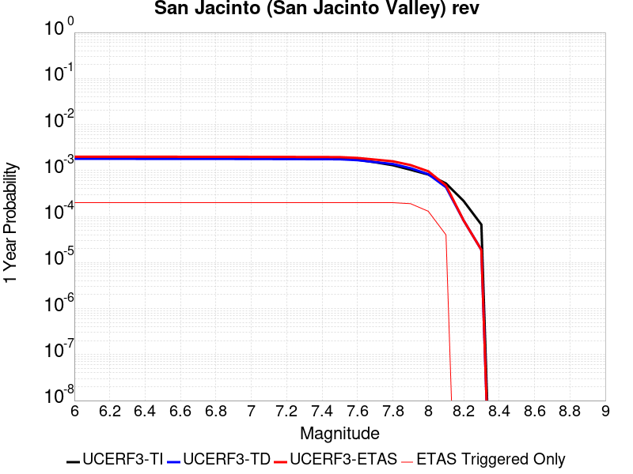 |  |

| Magnitude | 1 wk TI Prob | 1 wk TD Prob | 1 wk ETAS Prob | 1 wk ETAS/TD Gain | 1 wk ETAS Triggered Only | 1 mo TI Prob | 1 mo TD Prob | 1 mo ETAS Prob | 1 mo ETAS/TD Gain | 1 mo ETAS Triggered Only | 1 yr TI Prob | 1 yr TD Prob | 1 yr ETAS Prob | 1 yr ETAS/TD Gain | 1 yr ETAS Triggered Only | 10 yr TI Prob | 10 yr TD Prob | 10 yr ETAS Prob | 10 yr ETAS/TD Gain | 10 yr ETAS Triggered Only |
|-----|-----|-----|-----|-----|-----|-----|-----|-----|-----|-----|-----|-----|-----|-----|-----|-----|-----|-----|-----|-----|
| 6.0 | 3.652694E-5 | 3.4401106E-5 | 2.5944118E-4 | 7.5416527 | 2.2504783E-4 | 1.5653463E-4 | 1.4742499E-4 | 4.0994206E-4 | 2.7806823 | 2.6255578E-4 | 0.0019041431 | 0.0017934233 | 0.0021678305 | 1.2087667 | 3.7507972E-4 | 0.018879099 | 0.018526303 | 0.018894432 | 1.0198708 | 3.7507972E-4 |
| 6.1 | 3.652694E-5 | 3.4401106E-5 | 2.5944118E-4 | 7.5416527 | 2.2504783E-4 | 1.5653463E-4 | 1.4742499E-4 | 4.0994206E-4 | 2.7806823 | 2.6255578E-4 | 0.0019041431 | 0.0017934233 | 0.0021678305 | 1.2087667 | 3.7507972E-4 | 0.018879099 | 0.018526303 | 0.018894432 | 1.0198708 | 3.7507972E-4 |
| 6.2 | 3.652694E-5 | 3.4401106E-5 | 2.5944118E-4 | 7.5416527 | 2.2504783E-4 | 1.5653463E-4 | 1.4742499E-4 | 4.0994206E-4 | 2.7806823 | 2.6255578E-4 | 0.0019041431 | 0.0017934233 | 0.0021678305 | 1.2087667 | 3.7507972E-4 | 0.018879099 | 0.018526303 | 0.018894432 | 1.0198708 | 3.7507972E-4 |
| 6.3 | 3.652694E-5 | 3.4401106E-5 | 2.5944118E-4 | 7.5416527 | 2.2504783E-4 | 1.5653463E-4 | 1.4742499E-4 | 4.0994206E-4 | 2.7806823 | 2.6255578E-4 | 0.0019041431 | 0.0017934233 | 0.0021678305 | 1.2087667 | 3.7507972E-4 | 0.018879099 | 0.018526303 | 0.018894432 | 1.0198708 | 3.7507972E-4 |
| 6.4 | 3.646941E-5 | 3.432268E-5 | 2.5936277E-4 | 7.5566006 | 2.2504783E-4 | 1.5628811E-4 | 1.4708891E-4 | 4.096061E-4 | 2.7847517 | 2.6255578E-4 | 0.0019011468 | 0.0017893389 | 0.0021637473 | 1.2092441 | 3.7507972E-4 | 0.018849645 | 0.018486181 | 0.018854327 | 1.0199146 | 3.7507972E-4 |
| 6.5 | 3.646941E-5 | 3.432268E-5 | 2.5936277E-4 | 7.5566006 | 2.2504783E-4 | 1.5628811E-4 | 1.4708891E-4 | 4.096061E-4 | 2.7847517 | 2.6255578E-4 | 0.0019011468 | 0.0017893389 | 0.0021637473 | 1.2092441 | 3.7507972E-4 | 0.018849645 | 0.018486181 | 0.018854327 | 1.0199146 | 3.7507972E-4 |
| 6.6 | 3.6442503E-5 | 3.4286066E-5 | 2.5932616E-4 | 7.5636024 | 2.2504783E-4 | 1.561728E-4 | 1.4693203E-4 | 4.0944925E-4 | 2.7866576 | 2.6255578E-4 | 0.0018997455 | 0.001787432 | 0.0021618411 | 1.2094676 | 3.7507972E-4 | 0.018835869 | 0.01846745 | 0.018835604 | 1.0199353 | 3.7507972E-4 |
| 6.7 | 3.6432113E-5 | 3.427164E-5 | 2.5931175E-4 | 7.566365 | 2.2504783E-4 | 1.5612828E-4 | 1.4687021E-4 | 4.0938743E-4 | 2.7874095 | 2.6255578E-4 | 0.0018992044 | 0.0017866807 | 0.0021610903 | 1.209556 | 3.7507972E-4 | 0.018830549 | 0.018460074 | 0.01882823 | 1.0199434 | 3.7507972E-4 |
| 6.8 | 3.6409598E-5 | 3.4240697E-5 | 2.5928082E-4 | 7.5722995 | 2.2504783E-4 | 1.560318E-4 | 1.4673761E-4 | 4.0925486E-4 | 2.789025 | 2.6255578E-4 | 0.0018980318 | 0.0017850689 | 0.002159479 | 1.2097455 | 3.7507972E-4 | 0.018819023 | 0.018444229 | 0.01881239 | 1.0199608 | 3.7507972E-4 |
| 6.9 | 3.638078E-5 | 3.4201123E-5 | 2.5924123E-4 | 7.579905 | 2.2504783E-4 | 1.5590832E-4 | 1.4656801E-4 | 4.0908533E-4 | 2.7910955 | 2.6255578E-4 | 0.0018965311 | 0.0017830075 | 0.0021574185 | 1.2099885 | 3.7507972E-4 | 0.018804269 | 0.018423963 | 0.018792132 | 1.0199832 | 3.7507972E-4 |
| 7.0 | 3.6294874E-5 | 3.408314E-5 | 2.591233E-4 | 7.6026826 | 2.2504783E-4 | 1.5554018E-4 | 1.4606243E-4 | 4.085799E-4 | 2.797296 | 2.6255578E-4 | 0.0018920569 | 0.0017768623 | 0.0021512755 | 1.210716 | 3.7507972E-4 | 0.018760284 | 0.018363545 | 0.018731736 | 1.0200502 | 3.7507972E-4 |
| 7.1 | 3.6260717E-5 | 3.403942E-5 | 2.590796E-4 | 7.6111627 | 2.2504783E-4 | 1.5539382E-4 | 1.4587509E-4 | 4.0839257E-4 | 2.7996047 | 2.6255578E-4 | 0.001890278 | 0.0017745851 | 0.0021489991 | 1.2109869 | 3.7507972E-4 | 0.018742796 | 0.018341139 | 0.01870934 | 1.0200751 | 3.7507972E-4 |
| 7.2 | 3.6210204E-5 | 3.397364E-5 | 2.5901382E-4 | 7.623964 | 2.2504783E-4 | 1.5517735E-4 | 1.455932E-4 | 4.0811076E-4 | 2.8030894 | 2.6255578E-4 | 0.001887647 | 0.0017711588 | 0.0021455742 | 1.2113957 | 3.7507972E-4 | 0.01871693 | 0.018307408 | 0.018675622 | 1.0201128 | 3.7507972E-4 |
| 7.3 | 3.6119454E-5 | 3.386193E-5 | 2.5890212E-4 | 7.6458178 | 2.2504783E-4 | 1.5478847E-4 | 1.4511449E-4 | 4.0763218E-4 | 2.8090384 | 2.6255578E-4 | 0.0018829206 | 0.0017653398 | 0.0021397574 | 1.2120937 | 3.7507972E-4 | 0.018670462 | 0.01824996 | 0.018618194 | 1.0201772 | 3.7507972E-4 |
| 7.4 | 3.607848E-5 | 3.380943E-5 | 2.5884964E-4 | 7.656138 | 2.2504783E-4 | 1.5461289E-4 | 1.4488952E-4 | 4.0740726E-4 | 2.811848 | 2.6255578E-4 | 0.0018807866 | 0.0017626052 | 0.0021370237 | 1.2124234 | 3.7507972E-4 | 0.018649481 | 0.018222956 | 0.018591201 | 1.0202078 | 3.7507972E-4 |
| 7.5 | 3.5856774E-5 | 3.3619202E-5 | 2.5865945E-4 | 7.693801 | 2.2504783E-4 | 1.5366284E-4 | 1.4407437E-4 | 4.0659233E-4 | 2.8221006 | 2.6255578E-4 | 0.0018692396 | 0.0017526967 | 0.0021271189 | 1.2136264 | 3.7507972E-4 | 0.018535944 | 0.018124057 | 0.01849234 | 1.02032 | 3.7507972E-4 |
| 7.6 | 3.286655E-5 | 3.2142278E-5 | 2.5718287E-4 | 8.0013895 | 2.2504783E-4 | 1.4084904E-4 | 1.3774536E-4 | 4.0026498E-4 | 2.905833 | 2.6255578E-4 | 0.001713488 | 0.0016757617 | 0.0020502128 | 1.2234514 | 3.7507972E-4 | 0.017003361 | 0.017343804 | 0.017712377 | 1.0212511 | 3.7507972E-4 |
| 7.7 | 2.8882527E-5 | 2.9235205E-5 | 2.5427644E-4 | 8.697611 | 2.2504783E-4 | 1.237764E-4 | 1.2528773E-4 | 3.8781064E-4 | 3.09536 | 2.6255578E-4 | 0.0015059357 | 0.0015243118 | 0.0018988198 | 1.2456899 | 3.7507972E-4 | 0.014957713 | 0.015830338 | 0.01619948 | 1.0233186 | 3.7507972E-4 |
| 7.8 | 2.4950225E-5 | 2.6526219E-5 | 2.5156807E-4 | 9.483751 | 2.2504783E-4 | 1.0692515E-4 | 1.1367885E-4 | 3.7620479E-4 | 3.309365 | 2.6255578E-4 | 0.0013010362 | 0.0013831621 | 0.001757723 | 1.2708005 | 3.7507972E-4 | 0.012934455 | 0.01441176 | 0.014781434 | 1.0256509 | 3.7507972E-4 |
| 7.9 | 1.9881603E-5 | 2.150649E-5 | 2.4654946E-4 | 11.463957 | 2.2504783E-4 | 8.520408E-5 | 9.216742E-5 | 3.54699E-4 | 3.8484206 | 2.6255578E-4 | 0.001036866 | 0.0011215615 | 0.0014587546 | 1.3006462 | 3.3757172E-4 | 0.010320415 | 0.011776998 | 0.012110594 | 1.028326 | 3.3757172E-4 |
| 8.0 | 1.563292E-5 | 1.5936288E-5 | 2.0347314E-4 | 12.767914 | 1.8753986E-4 | 6.6996516E-5 | 6.829659E-5 | 2.5582363E-4 | 3.7457745 | 1.8753986E-4 | 8.153773E-4 | 8.3119445E-4 | 0.0010560552 | 1.2705272 | 2.2504783E-4 | 0.00812392 | 0.008810331 | 0.009033397 | 1.0253186 | 2.2504783E-4 |
| 8.1 | 1.0045313E-5 | 8.300794E-6 | 4.5808454E-5 | 5.518563 | 3.750797E-5 | 4.305063E-5 | 3.557435E-5 | 7.3080984E-5 | 2.0543168 | 3.750797E-5 | 5.2401534E-4 | 4.3303217E-4 | 5.080156E-4 | 1.1731591 | 7.501594E-5 | 0.0052278144 | 0.0046587666 | 0.004733433 | 1.0160271 | 7.501594E-5 |
| 8.2 | 4.1554413E-6 | 1.5648296E-6 | 1.5648296E-6 | 1.0 | 0.0 | 1.7808914E-5 | 6.7063957E-6 | 6.7063957E-6 | 1.0 | 0.0 | 2.1680194E-4 | 8.164734E-5 | 8.164734E-5 | 1.0 | 0.0 | 0.0021659054 | 9.479703E-4 | 9.479703E-4 | 1.0 | 0.0 |
| 8.3 | 1.2758221E-6 | 3.612677E-7 | 3.612677E-7 | 1.0 | 0.0 | 5.4677976E-6 | 1.5482892E-6 | 1.5482892E-6 | 1.0 | 0.0 | 6.65684E-5 | 1.8850264E-5 | 1.8850264E-5 | 1.0 | 0.0 | 6.6548464E-4 | 2.2739546E-4 | 2.2739546E-4 | 1.0 | 0.0 |

## Cady
*[(top)](#table-of-contents)*

| 1 Week | 1 Month | 1 Year | 10 Year |
|-----|-----|-----|-----|
| 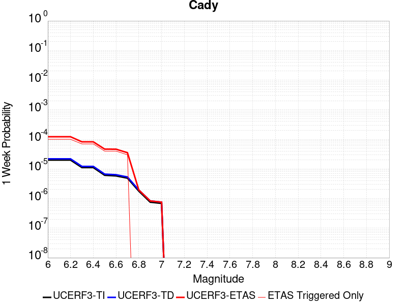 |  | 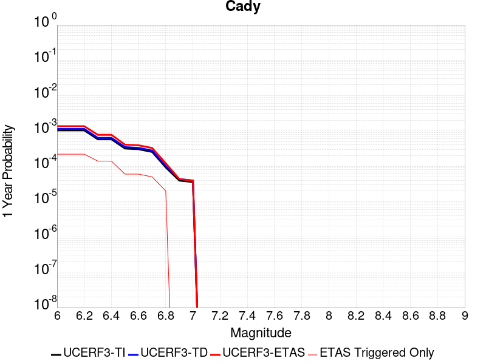 |  |

| Magnitude | 1 wk TI Prob | 1 wk TD Prob | 1 wk ETAS Prob | 1 wk ETAS/TD Gain | 1 wk ETAS Triggered Only | 1 mo TI Prob | 1 mo TD Prob | 1 mo ETAS Prob | 1 mo ETAS/TD Gain | 1 mo ETAS Triggered Only | 1 yr TI Prob | 1 yr TD Prob | 1 yr ETAS Prob | 1 yr ETAS/TD Gain | 1 yr ETAS Triggered Only | 10 yr TI Prob | 10 yr TD Prob | 10 yr ETAS Prob | 10 yr ETAS/TD Gain | 10 yr ETAS Triggered Only |
|-----|-----|-----|-----|-----|-----|-----|-----|-----|-----|-----|-----|-----|-----|-----|-----|-----|-----|-----|-----|-----|
| 6.0 | 1.9892565E-5 | 2.1858728E-5 | 9.687303E-5 | 4.431778 | 7.501594E-5 | 8.525106E-5 | 9.3677416E-5 | 1.6868633E-4 | 1.800715 | 7.501594E-5 | 0.0010374374 | 0.0011400167 | 0.001364808 | 1.1971824 | 2.2504783E-4 | 0.010326075 | 0.011350701 | 0.01168444 | 1.0294026 | 3.3757172E-4 |
| 6.1 | 1.9892565E-5 | 2.1858728E-5 | 9.687303E-5 | 4.431778 | 7.501594E-5 | 8.525106E-5 | 9.3677416E-5 | 1.6868633E-4 | 1.800715 | 7.501594E-5 | 0.0010374374 | 0.0011400167 | 0.001364808 | 1.1971824 | 2.2504783E-4 | 0.010326075 | 0.011350701 | 0.01168444 | 1.0294026 | 3.3757172E-4 |
| 6.2 | 1.9892565E-5 | 2.1858728E-5 | 9.687303E-5 | 4.431778 | 7.501594E-5 | 8.525106E-5 | 9.3677416E-5 | 1.6868633E-4 | 1.800715 | 7.501594E-5 | 0.0010374374 | 0.0011400167 | 0.001364808 | 1.1971824 | 2.2504783E-4 | 0.010326075 | 0.011350701 | 0.01168444 | 1.0294026 | 3.3757172E-4 |
| 6.3 | 1.1117327E-5 | 1.2176583E-5 | 4.96841E-5 | 4.0802984 | 3.750797E-5 | 4.764482E-5 | 5.2184492E-5 | 8.9690504E-5 | 1.7187195 | 3.750797E-5 | 5.7992124E-4 | 6.351925E-4 | 7.476449E-4 | 1.1770368 | 1.12523914E-4 | 0.0057841022 | 0.0063368753 | 0.006560497 | 1.0352889 | 2.2504783E-4 |
| 6.4 | 1.1117327E-5 | 1.2176583E-5 | 4.96841E-5 | 4.0802984 | 3.750797E-5 | 4.764482E-5 | 5.2184492E-5 | 8.9690504E-5 | 1.7187195 | 3.750797E-5 | 5.7992124E-4 | 6.351925E-4 | 7.476449E-4 | 1.1770368 | 1.12523914E-4 | 0.0057841022 | 0.0063368753 | 0.006560497 | 1.0352889 | 2.2504783E-4 |
| 6.5 | 6.103093E-6 | 6.672021E-6 | 6.672021E-6 | 1.0 | 0.0 | 2.615585E-5 | 2.8594131E-5 | 2.8594131E-5 | 1.0 | 0.0 | 3.1840094E-4 | 3.480905E-4 | 3.8558542E-4 | 1.107716 | 3.750797E-5 | 0.0031794512 | 0.0034766865 | 0.0035514417 | 1.0215018 | 7.501594E-5 |
| 6.6 | 5.817237E-6 | 6.3656585E-6 | 6.3656585E-6 | 1.0 | 0.0 | 2.4930776E-5 | 2.728118E-5 | 2.728118E-5 | 1.0 | 0.0 | 3.034899E-4 | 3.3211018E-4 | 3.696057E-4 | 1.1129009 | 3.750797E-5 | 0.0030307577 | 0.0033173605 | 0.0033921276 | 1.0225381 | 7.501594E-5 |
| 6.7 | 4.8846314E-6 | 5.3405684E-6 | 5.3405684E-6 | 1.0 | 0.0 | 2.0933967E-5 | 2.2888014E-5 | 2.2888014E-5 | 1.0 | 0.0 | 2.5484123E-4 | 2.7863772E-4 | 3.1613524E-4 | 1.1345744 | 3.750797E-5 | 0.0025454918 | 0.0027840391 | 0.0028588462 | 1.02687 | 7.501594E-5 |
| 6.8 | 1.7788773E-6 | 1.9399079E-6 | 1.9399079E-6 | 1.0 | 0.0 | 7.6237375E-6 | 8.313874E-6 | 8.313874E-6 | 1.0 | 0.0 | 9.281505E-5 | 1.01218284E-4 | 1.3872246E-4 | 1.3705276 | 3.750797E-5 | 9.2776294E-4 | 0.0010118765 | 0.0010493465 | 1.0370302 | 3.750797E-5 |
| 6.9 | 7.5455404E-7 | 8.297092E-7 | 8.297092E-7 | 1.0 | 0.0 | 3.233799E-6 | 3.5558937E-6 | 3.5558937E-6 | 1.0 | 0.0 | 3.937079E-5 | 4.3292483E-5 | 4.3292483E-5 | 1.0 | 0.0 | 3.9363815E-4 | 4.3287344E-4 | 4.3287344E-4 | 1.0 | 0.0 |
| 7.0 | 6.8578805E-7 | 7.541816E-7 | 7.541816E-7 | 1.0 | 0.0 | 2.9390883E-6 | 3.2322048E-6 | 3.2322048E-6 | 1.0 | 0.0 | 3.578281E-5 | 3.9351715E-5 | 3.9351715E-5 | 1.0 | 0.0 | 3.577705E-4 | 3.9347992E-4 | 3.9347992E-4 | 1.0 | 0.0 |

## Death Valley (Fish Lake Valley)
*[(top)](#table-of-contents)*

| 1 Week | 1 Month | 1 Year | 10 Year |
|-----|-----|-----|-----|
|  |  |  | 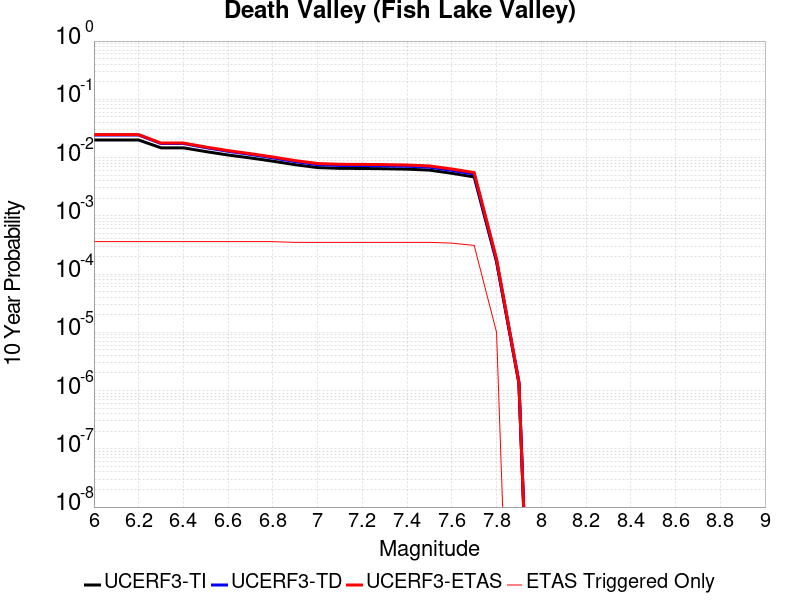 |

| Magnitude | 1 wk TI Prob | 1 wk TD Prob | 1 wk ETAS Prob | 1 wk ETAS/TD Gain | 1 wk ETAS Triggered Only | 1 mo TI Prob | 1 mo TD Prob | 1 mo ETAS Prob | 1 mo ETAS/TD Gain | 1 mo ETAS Triggered Only | 1 yr TI Prob | 1 yr TD Prob | 1 yr ETAS Prob | 1 yr ETAS/TD Gain | 1 yr ETAS Triggered Only | 10 yr TI Prob | 10 yr TD Prob | 10 yr ETAS Prob | 10 yr ETAS/TD Gain | 10 yr ETAS Triggered Only |
|-----|-----|-----|-----|-----|-----|-----|-----|-----|-----|-----|-----|-----|-----|-----|-----|-----|-----|-----|-----|-----|
| 6.0 | 3.872328E-5 | 4.7265705E-5 | 8.47719E-5 | 1.7935182 | 3.750797E-5 | 1.6594635E-4 | 2.0255324E-4 | 3.1505438E-4 | 1.555415 | 1.12523914E-4 | 0.0020185246 | 0.0024635606 | 0.0026506386 | 1.075938 | 1.8753986E-4 | 0.02000288 | 0.024388338 | 0.024717676 | 1.0135039 | 3.3757172E-4 |
| 6.1 | 3.872328E-5 | 4.7265705E-5 | 8.47719E-5 | 1.7935182 | 3.750797E-5 | 1.6594635E-4 | 2.0255324E-4 | 3.1505438E-4 | 1.555415 | 1.12523914E-4 | 0.0020185246 | 0.0024635606 | 0.0026506386 | 1.075938 | 1.8753986E-4 | 0.02000288 | 0.024388338 | 0.024717676 | 1.0135039 | 3.3757172E-4 |
| 6.2 | 3.872328E-5 | 4.7265705E-5 | 8.47719E-5 | 1.7935182 | 3.750797E-5 | 1.6594635E-4 | 2.0255324E-4 | 3.1505438E-4 | 1.555415 | 1.12523914E-4 | 0.0020185246 | 0.0024635606 | 0.0026506386 | 1.075938 | 1.8753986E-4 | 0.02000288 | 0.024388338 | 0.024717676 | 1.0135039 | 3.3757172E-4 |
| 6.3 | 2.8356371E-5 | 3.360979E-5 | 7.11165E-5 | 2.115946 | 3.750797E-5 | 1.2152165E-4 | 1.4403443E-4 | 2.5654215E-4 | 1.7811167 | 1.12523914E-4 | 0.0014785219 | 0.0017522788 | 0.00193949 | 1.1068387 | 1.8753986E-4 | 0.014687235 | 0.017391816 | 0.017723517 | 1.0190722 | 3.3757172E-4 |
| 6.4 | 2.8356371E-5 | 3.360979E-5 | 7.11165E-5 | 2.115946 | 3.750797E-5 | 1.2152165E-4 | 1.4403443E-4 | 2.5654215E-4 | 1.7811167 | 1.12523914E-4 | 0.0014785219 | 0.0017522788 | 0.00193949 | 1.1068387 | 1.8753986E-4 | 0.014687235 | 0.017391816 | 0.017723517 | 1.0190722 | 3.3757172E-4 |
| 6.5 | 2.4448687E-5 | 2.8607585E-5 | 6.611448E-5 | 2.3110824 | 3.750797E-5 | 1.0477588E-4 | 1.2259845E-4 | 2.3510856E-4 | 1.9177125 | 1.12523914E-4 | 0.0012748998 | 0.0014916616 | 0.0016789217 | 1.1255379 | 1.8753986E-4 | 0.012676105 | 0.014821392 | 0.01515396 | 1.0224384 | 3.3757172E-4 |
| 6.6 | 2.1298161E-5 | 2.4660083E-5 | 6.216713E-5 | 2.5209618 | 3.750797E-5 | 9.127464E-5 | 1.0568197E-4 | 2.1819399E-4 | 2.0646284 | 1.12523914E-4 | 0.0011107022 | 0.0012859512 | 0.00147325 | 1.1456499 | 1.8753986E-4 | 0.011051672 | 0.01278853 | 0.013121785 | 1.0260589 | 3.3757172E-4 |
| 6.7 | 1.8959729E-5 | 2.1781027E-5 | 5.928818E-5 | 2.7220104 | 3.750797E-5 | 8.125345E-5 | 9.334406E-5 | 2.0585746E-4 | 2.2053623 | 1.12523914E-4 | 9.888117E-4 | 0.001135897 | 0.0013232238 | 1.1649153 | 1.8753986E-4 | 0.009844234 | 0.01130357 | 0.011637326 | 1.0295266 | 3.3757172E-4 |
| 6.8 | 1.6691629E-5 | 1.9018351E-5 | 5.652561E-5 | 2.9721613 | 3.750797E-5 | 7.153359E-5 | 8.150477E-5 | 1.940195E-4 | 2.3804681 | 1.12523914E-4 | 8.7057345E-4 | 9.918857E-4 | 0.0011792395 | 1.1888865 | 1.8753986E-4 | 0.008671708 | 0.009876343 | 0.010210581 | 1.0338422 | 3.3757172E-4 |
| 6.9 | 1.450505E-5 | 1.638954E-5 | 5.3896896E-5 | 3.2884936 | 3.750797E-5 | 6.216302E-5 | 7.0239046E-5 | 1.8275504E-4 | 2.6019013 | 1.12523914E-4 | 7.5657194E-4 | 8.5483363E-4 | 0.0010422132 | 1.2192 | 1.8753986E-4 | 0.007540013 | 0.008516386 | 0.008813894 | 1.0349337 | 3.0006375E-4 |
| 7.0 | 1.2940855E-5 | 1.4537972E-5 | 5.2045398E-5 | 3.5799627 | 3.750797E-5 | 5.545963E-5 | 6.230414E-5 | 1.7482103E-4 | 2.80593 | 1.12523914E-4 | 6.750118E-4 | 7.5829466E-4 | 9.456923E-4 | 1.2471304 | 1.8753986E-4 | 0.006729651 | 0.0075576897 | 0.007855486 | 1.0394031 | 3.0006375E-4 |
| 7.1 | 1.2544658E-5 | 1.4078208E-5 | 5.158565E-5 | 3.66422 | 3.750797E-5 | 5.3761712E-5 | 6.0333812E-5 | 1.7285094E-4 | 2.86491 | 1.12523914E-4 | 6.5435225E-4 | 7.343222E-4 | 9.217243E-4 | 1.2552042 | 1.8753986E-4 | 0.006524288 | 0.007319551 | 0.007617418 | 1.0406947 | 3.0006375E-4 |
| 7.2 | 1.2489416E-5 | 1.4015674E-5 | 5.152312E-5 | 3.6761072 | 3.750797E-5 | 5.3524967E-5 | 6.0065824E-5 | 1.7258298E-4 | 2.873231 | 1.12523914E-4 | 6.514716E-4 | 7.310616E-4 | 9.184644E-4 | 1.2563432 | 1.8753986E-4 | 0.006495651 | 0.0072871596 | 0.007585037 | 1.040877 | 3.0006375E-4 |
| 7.3 | 1.2368307E-5 | 1.3879812E-5 | 5.1387262E-5 | 3.7023022 | 3.750797E-5 | 5.3005948E-5 | 5.9483587E-5 | 1.720008E-4 | 2.8915675 | 1.12523914E-4 | 6.451563E-4 | 7.2397763E-4 | 9.113817E-4 | 1.2588534 | 1.8753986E-4 | 0.0064328653 | 0.007216782 | 0.0075146803 | 1.0412786 | 3.0006375E-4 |
| 7.4 | 1.2161707E-5 | 1.36478675E-5 | 5.1155326E-5 | 3.7482285 | 3.750797E-5 | 5.212056E-5 | 5.8489582E-5 | 1.7100692E-4 | 2.9237158 | 1.12523914E-4 | 6.3438306E-4 | 7.118836E-4 | 8.9928997E-4 | 1.2632542 | 1.8753986E-4 | 0.006325751 | 0.0070966207 | 0.007394555 | 1.0419825 | 3.0006375E-4 |
| 7.5 | 1.1707948E-5 | 1.3145515E-5 | 5.0652994E-5 | 3.853253 | 3.750797E-5 | 5.0175953E-5 | 5.6336736E-5 | 1.6885431E-4 | 2.9972327 | 1.12523914E-4 | 6.10721E-4 | 6.856895E-4 | 8.7310077E-4 | 1.2733179 | 1.8753986E-4 | 0.0060904534 | 0.006836321 | 0.0071343337 | 1.0435926 | 3.0006375E-4 |
| 7.6 | 1.0319538E-5 | 1.1579622E-5 | 4.9087157E-5 | 4.2390985 | 3.750797E-5 | 4.4225842E-5 | 4.9626036E-5 | 1.6214437E-4 | 3.2673244 | 1.12523914E-4 | 5.383166E-4 | 6.040347E-4 | 7.5397594E-4 | 1.2482328 | 1.5003188E-4 | 0.0053701443 | 0.0060244603 | 0.0062854346 | 1.0433191 | 2.6255578E-4 |
| 7.7 | 8.937764E-6 | 1.0022779E-5 | 4.7530375E-5 | 4.742235 | 3.750797E-5 | 3.830414E-5 | 4.295409E-5 | 1.1796681E-4 | 2.7463465 | 7.501594E-5 | 4.6625308E-4 | 5.228456E-4 | 6.3531066E-4 | 1.215102 | 1.12523914E-4 | 0.0046527605 | 0.005216664 | 0.0054405383 | 1.0429151 | 2.2504783E-4 |
| 7.8 | 3.108007E-7 | 3.284654E-7 | 3.284654E-7 | 1.0 | 0.0 | 1.3320023E-6 | 1.407708E-6 | 1.407708E-6 | 1.0 | 0.0 | 1.6217007E-5 | 1.7138715E-5 | 1.7138715E-5 | 1.0 | 0.0 | 1.6215823E-4 | 1.7137431E-4 | 1.7137431E-4 | 1.0 | 0.0 |
| 7.9 | 2.5591178E-9 | 2.6696718E-9 | 2.6696718E-9 | 1.0 | 0.0 | 1.0967647E-8 | 1.14414505E-8 | 1.14414505E-8 | 1.0 | 0.0 | 1.335311E-7 | 1.3929966E-7 | 1.3929966E-7 | 1.0 | 0.0 | 1.3353102E-6 | 1.3929966E-6 | 1.3929966E-6 | 1.0 | 0.0 |

## Calico-Hidalgo
*[(top)](#table-of-contents)*

| 1 Week | 1 Month | 1 Year | 10 Year |
|-----|-----|-----|-----|
|  |  |  |  |

| Magnitude | 1 wk TI Prob | 1 wk TD Prob | 1 wk ETAS Prob | 1 wk ETAS/TD Gain | 1 wk ETAS Triggered Only | 1 mo TI Prob | 1 mo TD Prob | 1 mo ETAS Prob | 1 mo ETAS/TD Gain | 1 mo ETAS Triggered Only | 1 yr TI Prob | 1 yr TD Prob | 1 yr ETAS Prob | 1 yr ETAS/TD Gain | 1 yr ETAS Triggered Only | 10 yr TI Prob | 10 yr TD Prob | 10 yr ETAS Prob | 10 yr ETAS/TD Gain | 10 yr ETAS Triggered Only |
|-----|-----|-----|-----|-----|-----|-----|-----|-----|-----|-----|-----|-----|-----|-----|-----|-----|-----|-----|-----|-----|
| 6.0 | 4.0906612E-5 | 5.0704355E-5 | 5.0704355E-5 | 1.0 | 0.0 | 1.7530227E-4 | 2.1728857E-4 | 2.5478838E-4 | 1.1725807 | 3.750797E-5 | 0.0021322158 | 0.002642678 | 0.0028671313 | 1.084934 | 2.2504783E-4 | 0.02111873 | 0.026152814 | 0.026445031 | 1.0111734 | 3.0006375E-4 |
| 6.1 | 4.0906612E-5 | 5.0704355E-5 | 5.0704355E-5 | 1.0 | 0.0 | 1.7530227E-4 | 2.1728857E-4 | 2.5478838E-4 | 1.1725807 | 3.750797E-5 | 0.0021322158 | 0.002642678 | 0.0028671313 | 1.084934 | 2.2504783E-4 | 0.02111873 | 0.026152814 | 0.026445031 | 1.0111734 | 3.0006375E-4 |
| 6.2 | 4.0906612E-5 | 5.0704355E-5 | 5.0704355E-5 | 1.0 | 0.0 | 1.7530227E-4 | 2.1728857E-4 | 2.5478838E-4 | 1.1725807 | 3.750797E-5 | 0.0021322158 | 0.002642678 | 0.0028671313 | 1.084934 | 2.2504783E-4 | 0.02111873 | 0.026152814 | 0.026445031 | 1.0111734 | 3.0006375E-4 |
| 6.3 | 2.4242801E-5 | 3.0090967E-5 | 3.0090967E-5 | 1.0 | 0.0 | 1.0389358E-4 | 1.289551E-4 | 1.6645824E-4 | 1.2908232 | 3.750797E-5 | 0.0012641704 | 0.0015689312 | 0.0017936259 | 1.1432152 | 2.2504783E-4 | 0.01257003 | 0.015582229 | 0.015840692 | 1.0165871 | 2.6255578E-4 |
| 6.4 | 2.4242801E-5 | 3.0090967E-5 | 3.0090967E-5 | 1.0 | 0.0 | 1.0389358E-4 | 1.289551E-4 | 1.6645824E-4 | 1.2908232 | 3.750797E-5 | 0.0012641704 | 0.0015689312 | 0.0017936259 | 1.1432152 | 2.2504783E-4 | 0.01257003 | 0.015582229 | 0.015840692 | 1.0165871 | 2.6255578E-4 |
| 6.5 | 2.0286952E-5 | 2.5316054E-5 | 2.5316054E-5 | 1.0 | 0.0 | 8.694118E-5 | 1.0849296E-4 | 1.4599686E-4 | 1.3456805 | 3.750797E-5 | 0.0010579949 | 0.0013201186 | 0.0015074108 | 1.1418754 | 1.8753986E-4 | 0.010529719 | 0.013124701 | 0.013346795 | 1.0169219 | 2.2504783E-4 |
| 6.6 | 2.0269223E-5 | 2.5297004E-5 | 2.5297004E-5 | 1.0 | 0.0 | 8.6865206E-5 | 1.08411325E-4 | 1.4591523E-4 | 1.3459408 | 3.750797E-5 | 0.0010570707 | 0.0013191258 | 0.0015064182 | 1.1419823 | 1.8753986E-4 | 0.010520565 | 0.01311489 | 0.013336986 | 1.0169346 | 2.2504783E-4 |
| 6.7 | 1.799852E-5 | 2.2540933E-5 | 2.2540933E-5 | 1.0 | 0.0 | 7.713423E-5 | 9.660051E-5 | 9.660051E-5 | 1.0 | 0.0 | 9.3870464E-4 | 0.0011754911 | 0.0013253468 | 1.1274834 | 1.5003188E-4 | 0.009347493 | 0.011694346 | 0.011879692 | 1.0158492 | 1.8753986E-4 |
| 6.8 | 1.7458793E-5 | 2.184258E-5 | 2.184258E-5 | 1.0 | 0.0 | 7.4821255E-5 | 9.360778E-5 | 9.360778E-5 | 1.0 | 0.0 | 9.10568E-4 | 0.0011390933 | 0.0012889543 | 1.1315616 | 1.5003188E-4 | 0.009068459 | 0.011334131 | 0.011519545 | 1.016359 | 1.8753986E-4 |
| 6.9 | 1.542884E-5 | 1.9026285E-5 | 1.9026285E-5 | 1.0 | 0.0 | 6.612192E-5 | 8.153875E-5 | 8.153875E-5 | 1.0 | 0.0 | 8.04737E-4 | 9.922953E-4 | 0.0011421783 | 1.1510468 | 1.5003188E-4 | 0.008018291 | 0.009880043 | 0.01006573 | 1.0187942 | 1.8753986E-4 |
| 7.0 | 1.468253E-5 | 1.803109E-5 | 1.803109E-5 | 1.0 | 0.0 | 6.292361E-5 | 7.727389E-5 | 7.727389E-5 | 1.0 | 0.0 | 7.658257E-4 | 9.4041653E-4 | 0.0010903074 | 1.1593877 | 1.5003188E-4 | 0.0076319184 | 0.009365736 | 0.0095515195 | 1.0198365 | 1.8753986E-4 |
| 7.1 | 1.3139281E-5 | 1.620139E-5 | 1.620139E-5 | 1.0 | 0.0 | 5.6309986E-5 | 6.943275E-5 | 6.943275E-5 | 1.0 | 0.0 | 6.853584E-4 | 8.4502844E-4 | 9.949335E-4 | 1.1773965 | 1.5003188E-4 | 0.0068324856 | 0.008419449 | 0.00860541 | 1.0220871 | 1.8753986E-4 |
| 7.2 | 1.1127404E-5 | 1.3867038E-5 | 1.3867038E-5 | 1.0 | 0.0 | 4.7688E-5 | 5.9428872E-5 | 5.9428872E-5 | 1.0 | 0.0 | 5.8044674E-4 | 7.233172E-4 | 8.3575974E-4 | 1.1554539 | 1.12523914E-4 | 0.0057893298 | 0.007210737 | 0.0073596872 | 1.0206567 | 1.5003188E-4 |
| 7.3 | 9.808154E-6 | 1.2176586E-5 | 1.2176586E-5 | 1.0 | 0.0 | 4.2034266E-5 | 5.2184383E-5 | 5.2184383E-5 | 1.0 | 0.0 | 5.11647E-4 | 6.351704E-4 | 7.1013864E-4 | 1.1180286 | 7.501594E-5 | 0.0051047057 | 0.006334625 | 0.006409166 | 1.0117671 | 7.501594E-5 |
| 7.4 | 7.942452E-6 | 9.792348E-6 | 9.792348E-6 | 1.0 | 0.0 | 3.4038632E-5 | 4.1966585E-5 | 4.1966585E-5 | 1.0 | 0.0 | 4.1434157E-4 | 5.108328E-4 | 5.8581046E-4 | 1.1467752 | 7.501594E-5 | 0.0041356985 | 0.005097527 | 0.005172161 | 1.0146412 | 7.501594E-5 |
| 7.5 | 4.7121216E-6 | 5.7729717E-6 | 5.7729717E-6 | 1.0 | 0.0 | 2.019465E-5 | 2.4741115E-5 | 2.4741115E-5 | 1.0 | 0.0 | 2.4584212E-4 | 3.011891E-4 | 3.7618246E-4 | 1.2489909 | 7.501594E-5 | 0.0024557032 | 0.0030085614 | 0.0030833518 | 1.0248592 | 7.501594E-5 |
| 7.6 | 2.21172E-7 | 2.6040198E-7 | 2.6040198E-7 | 1.0 | 0.0 | 9.478797E-7 | 1.1160082E-6 | 1.1160082E-6 | 1.0 | 0.0 | 1.1540374E-5 | 1.3587343E-5 | 1.3587343E-5 | 1.0 | 0.0 | 1.1539775E-4 | 1.3586794E-4 | 1.3586794E-4 | 1.0 | 0.0 |

## San Andreas (Coachella) rev
*[(top)](#table-of-contents)*

| 1 Week | 1 Month | 1 Year | 10 Year |
|-----|-----|-----|-----|
|  |  |  |  |

| Magnitude | 1 wk TI Prob | 1 wk TD Prob | 1 wk ETAS Prob | 1 wk ETAS/TD Gain | 1 wk ETAS Triggered Only | 1 mo TI Prob | 1 mo TD Prob | 1 mo ETAS Prob | 1 mo ETAS/TD Gain | 1 mo ETAS Triggered Only | 1 yr TI Prob | 1 yr TD Prob | 1 yr ETAS Prob | 1 yr ETAS/TD Gain | 1 yr ETAS Triggered Only | 10 yr TI Prob | 10 yr TD Prob | 10 yr ETAS Prob | 10 yr ETAS/TD Gain | 10 yr ETAS Triggered Only |
|-----|-----|-----|-----|-----|-----|-----|-----|-----|-----|-----|-----|-----|-----|-----|-----|-----|-----|-----|-----|-----|
| 6.0 | 1.1925945E-4 | 3.273077E-4 | 4.397948E-4 | 1.3436738 | 1.12523914E-4 | 5.110118E-4 | 0.001401998 | 0.0015518195 | 1.1068629 | 1.5003188E-4 | 0.0062038354 | 0.016937068 | 0.017158303 | 1.0130622 | 2.2504783E-4 | 0.060334753 | 0.15267672 | 0.15293096 | 1.0016652 | 3.0006375E-4 |
| 6.1 | 1.1925945E-4 | 3.273077E-4 | 4.397948E-4 | 1.3436738 | 1.12523914E-4 | 5.110118E-4 | 0.001401998 | 0.0015518195 | 1.1068629 | 1.5003188E-4 | 0.0062038354 | 0.016937068 | 0.017158303 | 1.0130622 | 2.2504783E-4 | 0.060334753 | 0.15267672 | 0.15293096 | 1.0016652 | 3.0006375E-4 |
| 6.2 | 1.07432395E-4 | 3.0231563E-4 | 3.3981225E-4 | 1.1240314 | 3.750797E-5 | 4.603433E-4 | 0.001294999 | 0.0013699179 | 1.0578524 | 7.501594E-5 | 0.005590286 | 0.015653731 | 0.015801415 | 1.0094343 | 1.5003188E-4 | 0.05451731 | 0.14182784 | 0.14202096 | 1.0013617 | 2.2504783E-4 |
| 6.3 | 1.0718766E-4 | 3.0176868E-4 | 3.3926533E-4 | 1.1242563 | 3.750797E-5 | 4.592948E-4 | 0.0012926573 | 0.0013675763 | 1.0579573 | 7.501594E-5 | 0.005577586 | 0.01562563 | 0.015773317 | 1.0094516 | 1.5003188E-4 | 0.054396555 | 0.14159605 | 0.14178924 | 1.0013644 | 2.2504783E-4 |
| 6.4 | 1.0355944E-4 | 2.9384956E-4 | 3.313465E-4 | 1.1276059 | 3.750797E-5 | 4.4375064E-4 | 0.0012587514 | 0.0013336729 | 1.0595205 | 7.501594E-5 | 0.0053892885 | 0.015218662 | 0.015366411 | 1.0097084 | 1.5003188E-4 | 0.052604496 | 0.13815795 | 0.1383519 | 1.0014039 | 2.2504783E-4 |
| 6.5 | 1.0227914E-4 | 2.9104383E-4 | 3.285409E-4 | 1.1288364 | 3.750797E-5 | 4.382655E-4 | 0.0012467385 | 0.0013216608 | 1.0600947 | 7.501594E-5 | 0.0053228354 | 0.015074439 | 0.0152222095 | 1.0098027 | 1.5003188E-4 | 0.051971316 | 0.13694239 | 0.13713661 | 1.0014184 | 2.2504783E-4 |
| 6.6 | 1.0116757E-4 | 2.8870135E-4 | 3.261985E-4 | 1.1298821 | 3.750797E-5 | 4.3350324E-4 | 0.0012367087 | 0.0013116319 | 1.0605828 | 7.501594E-5 | 0.0052651367 | 0.014954008 | 0.015101797 | 1.0098828 | 1.5003188E-4 | 0.051421247 | 0.13591973 | 0.1361142 | 1.0014307 | 2.2504783E-4 |
| 6.7 | 1.0050676E-4 | 2.8728697E-4 | 3.2478417E-4 | 1.1305218 | 3.750797E-5 | 4.3067214E-4 | 0.0012306528 | 0.0013055764 | 1.0608813 | 7.501594E-5 | 0.005230834 | 0.014881288 | 0.015029087 | 1.0099319 | 1.5003188E-4 | 0.051094085 | 0.13530464 | 0.13549925 | 1.0014383 | 2.2504783E-4 |
| 6.8 | 9.976819E-5 | 2.8532353E-4 | 3.228208E-4 | 1.1314201 | 3.750797E-5 | 4.2750788E-4 | 0.001222246 | 0.0012971702 | 1.0613005 | 7.501594E-5 | 0.0051924936 | 0.014780328 | 0.014928143 | 1.0100007 | 1.5003188E-4 | 0.050728295 | 0.13445628 | 0.13465106 | 1.0014488 | 2.2504783E-4 |
| 6.9 | 9.77719E-5 | 2.802926E-4 | 3.1779005E-4 | 1.1337796 | 3.750797E-5 | 4.1895514E-4 | 0.0012007048 | 0.0012756307 | 1.0624015 | 7.501594E-5 | 0.0050888555 | 0.0145215895 | 0.0146694435 | 1.0101817 | 1.5003188E-4 | 0.049738888 | 0.13228476 | 0.13248004 | 1.0014762 | 2.2504783E-4 |
| 7.0 | 8.500761E-5 | 2.4763815E-4 | 2.8513683E-4 | 1.1514254 | 3.750797E-5 | 3.6426744E-4 | 0.0010608779 | 0.0011358142 | 1.0706362 | 7.501594E-5 | 0.0044259406 | 0.01284047 | 0.012988576 | 1.0115342 | 1.5003188E-4 | 0.04338823 | 0.11813616 | 0.11833462 | 1.0016799 | 2.2504783E-4 |
| 7.1 | 8.319876E-5 | 2.4366553E-4 | 2.8116436E-4 | 1.1538947 | 3.750797E-5 | 3.5651738E-4 | 0.0010438662 | 0.0011188037 | 1.0717885 | 7.501594E-5 | 0.004331963 | 0.012635773 | 0.012783909 | 1.0117235 | 1.5003188E-4 | 0.042484846 | 0.11635632 | 0.11655518 | 1.0017091 | 2.2504783E-4 |
| 7.2 | 7.563917E-5 | 2.2414974E-4 | 2.6164931E-4 | 1.1672969 | 3.750797E-5 | 3.2412758E-4 | 9.602912E-4 | 0.0010352351 | 1.0780429 | 7.501594E-5 | 0.0039391145 | 0.011629559 | 0.011777846 | 1.0127509 | 1.5003188E-4 | 0.03870018 | 0.10776202 | 0.10796281 | 1.0018634 | 2.2504783E-4 |
| 7.3 | 7.082985E-5 | 2.07311E-4 | 2.4481118E-4 | 1.1808887 | 3.750797E-5 | 3.0352117E-4 | 8.881761E-4 | 9.631254E-4 | 1.0843856 | 7.501594E-5 | 0.0036891096 | 0.010760553 | 0.010908971 | 1.0137928 | 1.5003188E-4 | 0.03628465 | 0.10028403 | 0.10048651 | 1.002019 | 2.2504783E-4 |
| 7.4 | 5.146215E-5 | 1.4274761E-4 | 1.8025022E-4 | 1.2627198 | 3.750797E-5 | 2.2053342E-4 | 6.1163295E-4 | 6.8660296E-4 | 1.1225736 | 7.501594E-5 | 0.0026816884 | 0.0074213943 | 0.007570313 | 1.0200661 | 1.5003188E-4 | 0.02649557 | 0.07085049 | 0.07105959 | 1.0029514 | 2.2504783E-4 |
| 7.5 | 4.0285166E-5 | 1.0942422E-4 | 1.4692808E-4 | 1.3427383 | 3.750797E-5 | 1.7263928E-4 | 4.6887697E-4 | 5.4385775E-4 | 1.1599157 | 7.501594E-5 | 0.002099857 | 0.0056937044 | 0.005842882 | 1.0262004 | 1.5003188E-4 | 0.020801254 | 0.055013083 | 0.05522575 | 1.0038657 | 2.2504783E-4 |
| 7.6 | 3.1168736E-5 | 8.439599E-5 | 1.219008E-4 | 1.4443908 | 3.750797E-5 | 1.3357346E-4 | 3.616471E-4 | 4.3663592E-4 | 1.2073536 | 7.501594E-5 | 0.0016250437 | 0.004394191 | 0.0045435634 | 1.0339932 | 1.5003188E-4 | 0.016132116 | 0.042812478 | 0.04302789 | 1.0050316 | 2.2504783E-4 |
| 7.7 | 2.2100989E-5 | 6.239345E-5 | 9.989908E-5 | 1.6011149 | 3.750797E-5 | 9.4715084E-5 | 2.6737314E-4 | 3.4236902E-4 | 1.2804915 | 7.501594E-5 | 0.001152546 | 0.0032504152 | 0.0033999593 | 1.0460078 | 1.5003188E-4 | 0.011465867 | 0.031902168 | 0.032120038 | 1.0068293 | 2.2504783E-4 |
| 7.8 | 1.7484861E-5 | 5.180078E-5 | 8.9306806E-5 | 1.7240436 | 3.750797E-5 | 7.493296E-5 | 2.2198448E-4 | 2.9698375E-4 | 1.3378583 | 7.501594E-5 | 9.1192697E-4 | 0.0026993142 | 0.0028489411 | 1.0554315 | 1.5003188E-4 | 0.009081938 | 0.026641788 | 0.026860839 | 1.0082221 | 2.2504783E-4 |
| 7.9 | 1.3967285E-5 | 3.8226146E-5 | 7.5732685E-5 | 1.981175 | 3.750797E-5 | 5.985842E-5 | 1.6381606E-4 | 2.3881972E-4 | 1.4578528 | 7.501594E-5 | 7.2853256E-4 | 0.0019926373 | 0.0021423702 | 1.0751431 | 1.5003188E-4 | 0.0072614877 | 0.019911002 | 0.02013157 | 1.0110776 | 2.2504783E-4 |
| 8.0 | 1.1887396E-5 | 3.106798E-5 | 6.857479E-5 | 2.2072496 | 3.750797E-5 | 5.094499E-5 | 1.331417E-4 | 2.0814766E-4 | 1.5633544 | 7.501594E-5 | 6.200787E-4 | 0.0016197958 | 0.0017695847 | 1.0924739 | 1.5003188E-4 | 0.006183513 | 0.016280567 | 0.01650195 | 1.0135981 | 2.2504783E-4 |
| 8.1 | 5.100864E-6 | 8.973766E-6 | 8.973766E-6 | 1.0 | 0.0 | 2.1860664E-5 | 3.845843E-5 | 3.845843E-5 | 1.0 | 0.0 | 2.6612106E-4 | 4.6813092E-4 | 4.6813092E-4 | 1.0 | 0.0 | 0.002658026 | 0.004918092 | 0.004955415 | 1.007589 | 3.750797E-5 |
| 8.2 | 2.3004484E-6 | 2.7863473E-6 | 2.7863473E-6 | 1.0 | 0.0 | 9.859027E-6 | 1.19414335E-5 | 1.19414335E-5 | 1.0 | 0.0 | 1.2002704E-4 | 1.4537729E-4 | 1.4537729E-4 | 1.0 | 0.0 | 0.0011996223 | 0.0015973782 | 0.0015973782 | 1.0 | 0.0 |
| 8.3 | 1.0424446E-7 | 5.814421E-8 | 5.814421E-8 | 1.0 | 0.0 | 4.4676187E-7 | 2.4918944E-7 | 2.4918944E-7 | 1.0 | 0.0 | 5.439312E-6 | 3.0338776E-6 | 3.0338776E-6 | 1.0 | 0.0 | 5.4391792E-5 | 3.189592E-5 | 3.189592E-5 | 1.0 | 0.0 |

## White Wolf (Extension)
*[(top)](#table-of-contents)*

| 1 Week | 1 Month | 1 Year | 10 Year |
|-----|-----|-----|-----|
|  |  |  |  |

| Magnitude | 1 wk TI Prob | 1 wk TD Prob | 1 wk ETAS Prob | 1 wk ETAS/TD Gain | 1 wk ETAS Triggered Only | 1 mo TI Prob | 1 mo TD Prob | 1 mo ETAS Prob | 1 mo ETAS/TD Gain | 1 mo ETAS Triggered Only | 1 yr TI Prob | 1 yr TD Prob | 1 yr ETAS Prob | 1 yr ETAS/TD Gain | 1 yr ETAS Triggered Only | 10 yr TI Prob | 10 yr TD Prob | 10 yr ETAS Prob | 10 yr ETAS/TD Gain | 10 yr ETAS Triggered Only |
|-----|-----|-----|-----|-----|-----|-----|-----|-----|-----|-----|-----|-----|-----|-----|-----|-----|-----|-----|-----|-----|
| 6.0 | 8.222555E-6 | 6.066615E-6 | 1.1858984E-4 | 19.547943 | 1.12523914E-4 | 3.5239045E-5 | 2.5999556E-5 | 1.3852054E-4 | 5.327804 | 1.12523914E-4 | 4.289509E-4 | 3.1650523E-4 | 5.789779E-4 | 1.8292838 | 2.6255578E-4 | 0.0042812387 | 0.0031611966 | 0.0034603118 | 1.0946208 | 3.0006375E-4 |
| 6.1 | 8.222555E-6 | 6.066615E-6 | 1.1858984E-4 | 19.547943 | 1.12523914E-4 | 3.5239045E-5 | 2.5999556E-5 | 1.3852054E-4 | 5.327804 | 1.12523914E-4 | 4.289509E-4 | 3.1650523E-4 | 5.789779E-4 | 1.8292838 | 2.6255578E-4 | 0.0042812387 | 0.0031611966 | 0.0034603118 | 1.0946208 | 3.0006375E-4 |
| 6.2 | 8.222555E-6 | 6.066615E-6 | 1.1858984E-4 | 19.547943 | 1.12523914E-4 | 3.5239045E-5 | 2.5999556E-5 | 1.3852054E-4 | 5.327804 | 1.12523914E-4 | 4.289509E-4 | 3.1650523E-4 | 5.789779E-4 | 1.8292838 | 2.6255578E-4 | 0.0042812387 | 0.0031611966 | 0.0034603118 | 1.0946208 | 3.0006375E-4 |
| 6.3 | 8.222555E-6 | 6.066615E-6 | 1.1858984E-4 | 19.547943 | 1.12523914E-4 | 3.5239045E-5 | 2.5999556E-5 | 1.3852054E-4 | 5.327804 | 1.12523914E-4 | 4.289509E-4 | 3.1650523E-4 | 5.789779E-4 | 1.8292838 | 2.6255578E-4 | 0.0042812387 | 0.0031611966 | 0.0034603118 | 1.0946208 | 3.0006375E-4 |
| 6.4 | 5.821773E-6 | 3.5571256E-6 | 3.5571256E-6 | 1.0 | 0.0 | 2.4950215E-5 | 1.5244741E-5 | 1.5244741E-5 | 1.0 | 0.0 | 3.0372653E-4 | 1.8559002E-4 | 2.6059203E-4 | 1.4041275 | 7.501594E-5 | 0.0030331176 | 0.0018544586 | 0.0019293354 | 1.0403767 | 7.501594E-5 |
| 6.5 | 5.766023E-6 | 3.4990599E-6 | 3.4990599E-6 | 1.0 | 0.0 | 2.4711293E-5 | 1.49958905E-5 | 1.49958905E-5 | 1.0 | 0.0 | 3.0081844E-4 | 1.8256076E-4 | 2.5756302E-4 | 1.4108344 | 7.501594E-5 | 0.0030041158 | 0.0018242161 | 0.0018990953 | 1.0410472 | 7.501594E-5 |
| 6.6 | 4.643576E-6 | 2.3325733E-6 | 2.3325733E-6 | 1.0 | 0.0 | 1.9900888E-5 | 9.9967065E-6 | 9.9967065E-6 | 1.0 | 0.0 | 2.4226638E-4 | 1.2170354E-4 | 1.5920695E-4 | 1.3081537 | 3.750797E-5 | 0.0024200242 | 0.0012164112 | 0.0012538736 | 1.0307975 | 3.750797E-5 |
| 6.7 | 3.9529173E-6 | 1.6482975E-6 | 1.6482975E-6 | 1.0 | 0.0 | 1.6940963E-5 | 7.064114E-6 | 7.064114E-6 | 1.0 | 0.0 | 2.0623671E-4 | 8.600239E-5 | 1.2350712E-4 | 1.4360896 | 3.750797E-5 | 0.002060454 | 8.597095E-4 | 8.9718524E-4 | 1.0435911 | 3.750797E-5 |
| 6.8 | 3.4377522E-6 | 1.2244764E-6 | 1.2244764E-6 | 1.0 | 0.0 | 1.473314E-5 | 5.247746E-6 | 5.247746E-6 | 1.0 | 0.0 | 1.7936122E-4 | 6.388952E-5 | 1.013951E-4 | 1.5870379 | 3.750797E-5 | 0.0017921652 | 6.3872064E-4 | 6.762047E-4 | 1.0586861 | 3.750797E-5 |
| 6.9 | 3.1367306E-6 | 1.0033316E-6 | 1.0033316E-6 | 1.0 | 0.0 | 1.3443062E-5 | 4.299986E-6 | 4.299986E-6 | 1.0 | 0.0 | 1.63657E-4 | 5.2351144E-5 | 8.985715E-5 | 1.7164315 | 3.750797E-5 | 0.0016353652 | 5.233958E-4 | 5.6088413E-4 | 1.0716252 | 3.750797E-5 |
| 7.0 | 2.8298145E-6 | 7.4282326E-7 | 7.4282326E-7 | 1.0 | 0.0 | 1.2127721E-5 | 3.1835248E-6 | 3.1835248E-6 | 1.0 | 0.0 | 1.47645E-4 | 3.8758775E-5 | 3.8758775E-5 | 1.0 | 0.0 | 0.0014754693 | 3.8752513E-4 | 3.8752513E-4 | 1.0 | 0.0 |
| 7.1 | 2.4091064E-6 | 5.4223835E-7 | 5.4223835E-7 | 1.0 | 0.0 | 1.03247E-5 | 2.3238767E-6 | 2.3238767E-6 | 1.0 | 0.0 | 1.2569598E-4 | 2.8292874E-5 | 2.8292874E-5 | 1.0 | 0.0 | 0.001256249 | 2.8289677E-4 | 2.8289677E-4 | 1.0 | 0.0 |
| 7.2 | 1.3875518E-6 | 1.0740268E-7 | 1.0740268E-7 | 1.0 | 0.0 | 5.9466374E-6 | 4.6029712E-7 | 4.6029712E-7 | 1.0 | 0.0 | 7.23979E-5 | 5.604104E-6 | 5.604104E-6 | 1.0 | 0.0 | 7.2374323E-4 | 5.6039742E-5 | 5.6039742E-5 | 1.0 | 0.0 |
| 7.3 | 7.056077E-7 | 5.0002956E-8 | 5.0002956E-8 | 1.0 | 0.0 | 3.0240296E-6 | 2.1429837E-7 | 2.1429837E-7 | 1.0 | 0.0 | 3.681694E-5 | 2.60908E-6 | 2.60908E-6 | 1.0 | 0.0 | 3.681084E-4 | 2.609054E-5 | 2.609054E-5 | 1.0 | 0.0 |
| 7.4 | 5.9334678E-8 | 4.8638475E-9 | 4.8638475E-9 | 1.0 | 0.0 | 2.5429145E-7 | 2.084506E-8 | 2.084506E-8 | 1.0 | 0.0 | 3.095994E-6 | 2.5378858E-7 | 2.5378858E-7 | 1.0 | 0.0 | 3.095951E-5 | 2.5378843E-6 | 2.5378843E-6 | 1.0 | 0.0 |

## Santa Ynez (West)
*[(top)](#table-of-contents)*

| 1 Week | 1 Month | 1 Year | 10 Year |
|-----|-----|-----|-----|
|  | 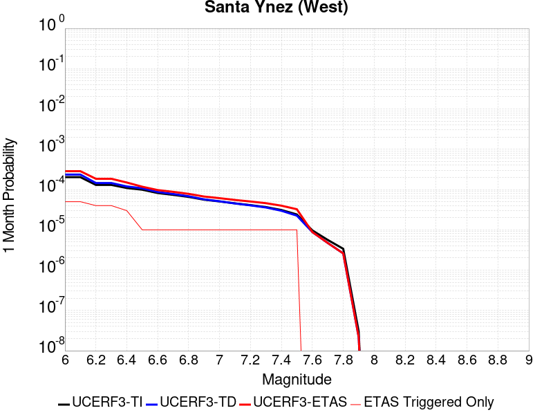 | 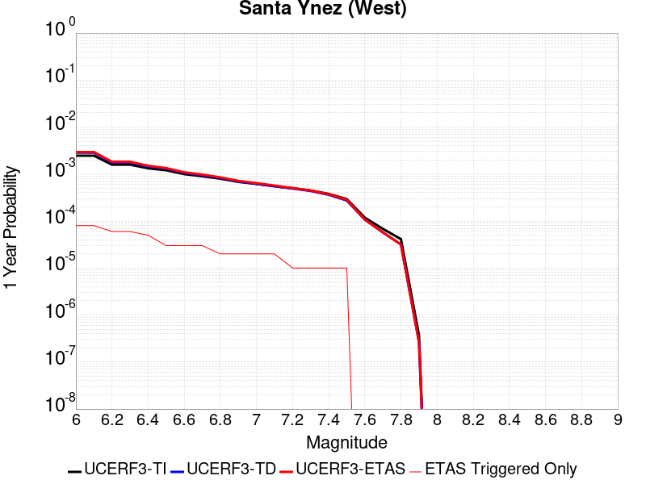 |  |

| Magnitude | 1 wk TI Prob | 1 wk TD Prob | 1 wk ETAS Prob | 1 wk ETAS/TD Gain | 1 wk ETAS Triggered Only | 1 mo TI Prob | 1 mo TD Prob | 1 mo ETAS Prob | 1 mo ETAS/TD Gain | 1 mo ETAS Triggered Only | 1 yr TI Prob | 1 yr TD Prob | 1 yr ETAS Prob | 1 yr ETAS/TD Gain | 1 yr ETAS Triggered Only | 10 yr TI Prob | 10 yr TD Prob | 10 yr ETAS Prob | 10 yr ETAS/TD Gain | 10 yr ETAS Triggered Only |
|-----|-----|-----|-----|-----|-----|-----|-----|-----|-----|-----|-----|-----|-----|-----|-----|-----|-----|-----|-----|-----|
| 6.0 | 4.7352758E-5 | 5.497084E-5 | 9.2476745E-5 | 1.6822873 | 3.750797E-5 | 2.0292461E-4 | 2.3556968E-4 | 3.1056794E-4 | 1.3183697 | 7.501594E-5 | 0.0024678076 | 0.002864558 | 0.0029767596 | 1.039169 | 1.12523914E-4 | 0.024405818 | 0.028304456 | 0.02855958 | 1.0090135 | 2.6255578E-4 |
| 6.1 | 4.7352758E-5 | 5.497084E-5 | 9.2476745E-5 | 1.6822873 | 3.750797E-5 | 2.0292461E-4 | 2.3556968E-4 | 3.1056794E-4 | 1.3183697 | 7.501594E-5 | 0.0024678076 | 0.002864558 | 0.0029767596 | 1.039169 | 1.12523914E-4 | 0.024405818 | 0.028304456 | 0.02855958 | 1.0090135 | 2.6255578E-4 |
| 6.2 | 3.0415853E-5 | 3.3925004E-5 | 7.14317E-5 | 2.1055768 | 3.750797E-5 | 1.3034715E-4 | 1.4538495E-4 | 1.8288748E-4 | 1.2579532 | 3.750797E-5 | 0.0015858212 | 0.0017686592 | 0.0018061008 | 1.0211695 | 3.750797E-5 | 0.015745522 | 0.01754978 | 0.01766033 | 1.0062991 | 1.12523914E-4 |
| 6.3 | 3.0415853E-5 | 3.3925004E-5 | 7.14317E-5 | 2.1055768 | 3.750797E-5 | 1.3034715E-4 | 1.4538495E-4 | 1.8288748E-4 | 1.2579532 | 3.750797E-5 | 0.0015858212 | 0.0017686592 | 0.0018061008 | 1.0211695 | 3.750797E-5 | 0.015745522 | 0.01754978 | 0.01766033 | 1.0062991 | 1.12523914E-4 |
| 6.4 | 2.5452082E-5 | 2.7912318E-5 | 6.541924E-5 | 2.343741 | 3.750797E-5 | 1.09075794E-4 | 1.1961885E-4 | 1.5712234E-4 | 1.3135248 | 3.750797E-5 | 0.0013271887 | 0.0014554056 | 0.001492859 | 1.025734 | 3.750797E-5 | 0.013192902 | 0.01446091 | 0.014571806 | 1.0076687 | 1.12523914E-4 |
| 6.5 | 2.3143784E-5 | 2.5128133E-5 | 2.5128133E-5 | 1.0 | 0.0 | 9.9183875E-5 | 1.07687636E-4 | 1.07687636E-4 | 1.0 | 0.0 | 0.0012068948 | 0.001310323 | 0.001310323 | 1.0 | 0.0 | 0.012003611 | 0.013027638 | 0.0131016765 | 1.0056832 | 7.501594E-5 |
| 6.6 | 1.9118515E-5 | 2.0354244E-5 | 2.0354244E-5 | 1.0 | 0.0 | 8.193392E-5 | 8.722961E-5 | 8.722961E-5 | 1.0 | 0.0 | 9.97089E-4 | 0.001061511 | 0.001061511 | 1.0 | 0.0 | 0.00992627 | 0.010565317 | 0.010602429 | 1.0035126 | 3.750797E-5 |
| 6.7 | 1.722807E-5 | 1.8146253E-5 | 1.8146253E-5 | 1.0 | 0.0 | 7.3832496E-5 | 7.776737E-5 | 7.776737E-5 | 1.0 | 0.0 | 8.985399E-4 | 9.4641204E-4 | 9.4641204E-4 | 1.0 | 0.0 | 0.008949154 | 0.009424461 | 0.009461616 | 1.0039424 | 3.750797E-5 |
| 6.8 | 1.5317364E-5 | 1.5926391E-5 | 1.5926391E-5 | 1.0 | 0.0 | 6.56442E-5 | 6.82542E-5 | 6.82542E-5 | 1.0 | 0.0 | 7.98925E-4 | 8.3068234E-4 | 8.3068234E-4 | 1.0 | 0.0 | 0.007960589 | 0.008276261 | 0.008313458 | 1.0044944 | 3.750797E-5 |
| 6.9 | 1.3071226E-5 | 1.332953E-5 | 1.332953E-5 | 1.0 | 0.0 | 5.6018336E-5 | 5.712532E-5 | 5.712532E-5 | 1.0 | 0.0 | 6.8180985E-4 | 6.952811E-4 | 6.952811E-4 | 1.0 | 0.0 | 0.0067972173 | 0.0069313184 | 0.006968566 | 1.0053738 | 3.750797E-5 |
| 7.0 | 1.1836986E-5 | 1.1932688E-5 | 1.1932688E-5 | 1.0 | 0.0 | 5.0728955E-5 | 5.1139097E-5 | 5.1139097E-5 | 1.0 | 0.0 | 6.1745E-4 | 6.2244234E-4 | 6.2244234E-4 | 1.0 | 0.0 | 0.006157372 | 0.0062071825 | 0.0062444573 | 1.0060052 | 3.750797E-5 |
| 7.1 | 1.0597169E-5 | 1.0542107E-5 | 1.0542107E-5 | 1.0 | 0.0 | 4.541565E-5 | 4.5179684E-5 | 4.5179684E-5 | 1.0 | 0.0 | 5.5279525E-4 | 5.4992497E-4 | 5.4992497E-4 | 1.0 | 0.0 | 0.0055142213 | 0.005485772 | 0.0055230744 | 1.0067998 | 3.750797E-5 |
| 7.2 | 9.59113E-6 | 9.45905E-6 | 9.45905E-6 | 1.0 | 0.0 | 4.11042E-5 | 4.053816E-5 | 4.053816E-5 | 1.0 | 0.0 | 5.0032866E-4 | 4.934414E-4 | 4.934414E-4 | 1.0 | 0.0 | 0.004992037 | 0.0049235765 | 0.0049608997 | 1.0075805 | 3.750797E-5 |
| 7.3 | 8.586084E-6 | 8.379489E-6 | 8.379489E-6 | 1.0 | 0.0 | 3.679698E-5 | 3.591161E-5 | 3.591161E-5 | 1.0 | 0.0 | 4.4791115E-4 | 4.3713715E-4 | 4.3713715E-4 | 1.0 | 0.0 | 0.004470094 | 0.004362884 | 0.0044002286 | 1.0085596 | 3.750797E-5 |
| 7.4 | 7.2622997E-6 | 6.9514485E-6 | 6.9514485E-6 | 1.0 | 0.0 | 3.112377E-5 | 2.9791589E-5 | 2.9791589E-5 | 1.0 | 0.0 | 3.78866E-4 | 3.6265317E-4 | 3.6265317E-4 | 1.0 | 0.0 | 0.0037822074 | 0.003620714 | 0.003658086 | 1.0103217 | 3.750797E-5 |
| 7.5 | 5.627296E-6 | 5.2514984E-6 | 5.2514984E-6 | 1.0 | 0.0 | 2.411676E-5 | 2.2506232E-5 | 2.2506232E-5 | 1.0 | 0.0 | 2.9358198E-4 | 2.7397962E-4 | 2.7397962E-4 | 1.0 | 0.0 | 0.0029319443 | 0.0027364905 | 0.0027738959 | 1.0136691 | 3.750797E-5 |
| 7.6 | 2.265244E-6 | 2.0608632E-6 | 2.0608632E-6 | 1.0 | 0.0 | 9.708152E-6 | 8.832241E-6 | 8.832241E-6 | 1.0 | 0.0 | 1.18190335E-4 | 1.0752732E-4 | 1.0752732E-4 | 1.0 | 0.0 | 0.001181275 | 0.0010747615 | 0.0010747615 | 1.0 | 0.0 |
| 7.7 | 1.3099874E-6 | 1.1016228E-6 | 1.1016228E-6 | 1.0 | 0.0 | 5.61422E-6 | 4.7212325E-6 | 4.7212325E-6 | 1.0 | 0.0 | 6.8350986E-5 | 5.7479516E-5 | 5.7479516E-5 | 1.0 | 0.0 | 6.832996E-4 | 5.7464885E-4 | 5.7464885E-4 | 1.0 | 0.0 |
| 7.8 | 7.903951E-7 | 6.0710704E-7 | 6.0710704E-7 | 1.0 | 0.0 | 3.3874032E-6 | 2.601885E-6 | 2.601885E-6 | 1.0 | 0.0 | 4.1240855E-5 | 3.16775E-5 | 3.16775E-5 | 1.0 | 0.0 | 4.12332E-4 | 3.167312E-4 | 3.167312E-4 | 1.0 | 0.0 |
| 7.9 | 7.0753297E-9 | 5.090092E-9 | 5.090092E-9 | 1.0 | 0.0 | 3.032284E-8 | 2.181468E-8 | 2.181468E-8 | 1.0 | 0.0 | 3.6918053E-7 | 2.655937E-7 | 2.655937E-7 | 1.0 | 0.0 | 3.691799E-6 | 2.6559348E-6 | 2.6559348E-6 | 1.0 | 0.0 |

## San Andreas (Creeping Section) 2011 CFM
*[(top)](#table-of-contents)*

| 1 Week | 1 Month | 1 Year | 10 Year |
|-----|-----|-----|-----|
|  |  |  |  |

| Magnitude | 1 wk TI Prob | 1 wk TD Prob | 1 wk ETAS Prob | 1 wk ETAS/TD Gain | 1 wk ETAS Triggered Only | 1 mo TI Prob | 1 mo TD Prob | 1 mo ETAS Prob | 1 mo ETAS/TD Gain | 1 mo ETAS Triggered Only | 1 yr TI Prob | 1 yr TD Prob | 1 yr ETAS Prob | 1 yr ETAS/TD Gain | 1 yr ETAS Triggered Only | 10 yr TI Prob | 10 yr TD Prob | 10 yr ETAS Prob | 10 yr ETAS/TD Gain | 10 yr ETAS Triggered Only |
|-----|-----|-----|-----|-----|-----|-----|-----|-----|-----|-----|-----|-----|-----|-----|-----|-----|-----|-----|-----|-----|
| 6.0 | 5.986481E-4 | 0.0012275929 | 0.0014149025 | 1.1525829 | 1.8753986E-4 | 0.0025631124 | 0.005245547 | 0.005432103 | 1.0355647 | 1.8753986E-4 | 0.030762846 | 0.06120491 | 0.061416183 | 1.003452 | 2.2504783E-4 | 0.26835477 | 0.42593494 | 0.42606413 | 1.0003033 | 2.2504783E-4 |
| 6.1 | 5.015945E-4 | 0.0010217986 | 0.0012091468 | 1.1833514 | 1.8753986E-4 | 0.00214792 | 0.0043678596 | 0.00455458 | 1.0427488 | 1.8753986E-4 | 0.025839351 | 0.05124837 | 0.051461887 | 1.0041662 | 2.2504783E-4 | 0.23032776 | 0.37285668 | 0.37299782 | 1.0003785 | 2.2504783E-4 |
| 6.2 | 4.073338E-4 | 8.1073755E-4 | 9.981253E-4 | 1.2311325 | 1.8753986E-4 | 0.0017445484 | 0.0034671477 | 0.0036540374 | 1.053903 | 1.8753986E-4 | 0.021034058 | 0.04093317 | 0.041149005 | 1.0052729 | 2.2504783E-4 | 0.19150782 | 0.31303346 | 0.31318808 | 1.0004939 | 2.2504783E-4 |
| 6.3 | 3.464099E-4 | 6.7391695E-4 | 8.613304E-4 | 1.2780958 | 1.8753986E-4 | 0.0014837692 | 0.0028829593 | 0.0030699586 | 1.0648636 | 1.8753986E-4 | 0.017915873 | 0.034189582 | 0.034406934 | 1.0063573 | 2.2504783E-4 | 0.16538359 | 0.2713166 | 0.27148056 | 1.0006044 | 2.2504783E-4 |
| 6.4 | 2.935057E-4 | 5.5442745E-4 | 7.4186333E-4 | 1.3380711 | 1.8753986E-4 | 0.0012572751 | 0.0023725363 | 0.0025596314 | 1.0788586 | 1.8753986E-4 | 0.015200248 | 0.02826451 | 0.028483197 | 1.0077372 | 2.2504783E-4 | 0.14201577 | 0.23298529 | 0.2331579 | 1.0007409 | 2.2504783E-4 |
| 6.5 | 2.3409708E-4 | 4.2093755E-4 | 6.0839846E-4 | 1.4453413 | 1.8753986E-4 | 0.0010028875 | 0.0018019684 | 0.0019891704 | 1.1038874 | 1.8753986E-4 | 0.012141965 | 0.021587461 | 0.021807652 | 1.0101999 | 2.2504783E-4 | 0.11499573 | 0.18682368 | 0.18700668 | 1.0009795 | 2.2504783E-4 |
| 6.6 | 1.5842178E-4 | 2.506933E-4 | 4.3818614E-4 | 1.7478973 | 1.8753986E-4 | 6.7877385E-4 | 0.0010739497 | 0.0012612882 | 1.1744387 | 1.8753986E-4 | 0.0082328 | 0.012995575 | 0.013217698 | 1.0170922 | 2.2504783E-4 | 0.07934396 | 0.12314638 | 0.12334371 | 1.0016024 | 2.2504783E-4 |
| 6.7 | 1.5616413E-4 | 2.4605883E-4 | 4.3355252E-4 | 1.7619873 | 1.8753986E-4 | 6.691031E-4 | 0.0010541069 | 0.001241449 | 1.177726 | 1.8753986E-4 | 0.0081159435 | 0.01275744 | 0.012979617 | 1.0174155 | 2.2504783E-4 | 0.0782586 | 0.12117351 | 0.12137129 | 1.0016322 | 2.2504783E-4 |
| 6.8 | 1.5538467E-4 | 2.4429744E-4 | 4.3179147E-4 | 1.7674826 | 1.8753986E-4 | 6.6576427E-4 | 0.0010465645 | 0.0012339081 | 1.1790081 | 1.8753986E-4 | 0.008075596 | 0.012666838 | 0.012889036 | 1.0175416 | 2.2504783E-4 | 0.07788358 | 0.120404355 | 0.1206023 | 1.001644 | 2.2504783E-4 |
| 6.9 | 1.5153569E-4 | 2.3539034E-4 | 4.2288605E-4 | 1.7965311 | 1.8753986E-4 | 6.49277E-4 | 0.0010084276 | 0.0011957784 | 1.185785 | 1.8753986E-4 | 0.007876333 | 0.01220901 | 0.0124313105 | 1.0182079 | 2.2504783E-4 | 0.07602952 | 0.11647445 | 0.11667328 | 1.0017071 | 2.2504783E-4 |
| 7.0 | 1.4588932E-4 | 2.2396253E-4 | 4.1146038E-4 | 1.837184 | 1.8753986E-4 | 6.250901E-4 | 9.5948833E-4 | 0.0011468482 | 1.1952707 | 1.8753986E-4 | 0.0075839474 | 0.011619697 | 0.01184213 | 1.0191427 | 2.2504783E-4 | 0.073302895 | 0.11132046 | 0.111520454 | 1.0017966 | 2.2504783E-4 |
| 7.1 | 1.1565079E-4 | 1.6281738E-4 | 3.503267E-4 | 2.1516542 | 1.8753986E-4 | 4.955521E-4 | 6.9760304E-4 | 8.8501204E-4 | 1.2686471 | 1.8753986E-4 | 0.006016669 | 0.0084604435 | 0.008683587 | 1.0263749 | 2.2504783E-4 | 0.058563538 | 0.08367046 | 0.08387668 | 1.0024647 | 2.2504783E-4 |
| 7.2 | 1.0393792E-4 | 1.4615769E-4 | 3.3367012E-4 | 2.282946 | 1.8753986E-4 | 4.4537216E-4 | 6.2624045E-4 | 8.136629E-4 | 1.2992818 | 1.8753986E-4 | 0.005408933 | 0.0075979927 | 0.007821331 | 1.0293944 | 2.2504783E-4 | 0.052791595 | 0.07561969 | 0.07582772 | 1.002751 | 2.2504783E-4 |
| 7.3 | 9.332884E-5 | 1.2780898E-4 | 3.1532487E-4 | 2.4671574 | 1.8753986E-4 | 3.999194E-4 | 5.4763845E-4 | 7.3507556E-4 | 1.3422644 | 1.8753986E-4 | 0.0048581534 | 0.006647249 | 0.006870801 | 1.0336307 | 2.2504783E-4 | 0.047533102 | 0.06648326 | 0.06669334 | 1.00316 | 2.2504783E-4 |
| 7.4 | 8.670252E-5 | 1.17032345E-4 | 3.0455025E-4 | 2.6022742 | 1.8753986E-4 | 3.715293E-4 | 5.0147134E-4 | 6.889172E-4 | 1.3737917 | 1.8753986E-4 | 0.004513991 | 0.006088443 | 0.0063121207 | 1.036738 | 2.2504783E-4 | 0.044233937 | 0.061151642 | 0.06136293 | 1.0034552 | 2.2504783E-4 |
| 7.5 | 7.3036405E-5 | 9.005856E-5 | 2.7758154E-4 | 3.0822337 | 1.8753986E-4 | 3.129756E-4 | 3.8590826E-4 | 5.733757E-4 | 1.4857825 | 1.8753986E-4 | 0.0038038217 | 0.0046883323 | 0.004874993 | 1.0398139 | 1.8753986E-4 | 0.03739367 | 0.047877792 | 0.048056353 | 1.0037295 | 1.8753986E-4 |
| 7.6 | 6.3935775E-5 | 8.280385E-5 | 2.7032816E-4 | 3.2646813 | 1.8753986E-4 | 2.7398168E-4 | 3.5482543E-4 | 5.422987E-4 | 1.5283537 | 1.8753986E-4 | 0.0033306254 | 0.004311461 | 0.0044981926 | 1.0433104 | 1.8753986E-4 | 0.032811474 | 0.04399201 | 0.044171296 | 1.0040755 | 1.8753986E-4 |
| 7.7 | 5.5050095E-5 | 6.6618326E-5 | 1.7913475E-4 | 2.6889708 | 1.12523914E-4 | 2.3590765E-4 | 2.854759E-4 | 3.9796767E-4 | 1.39405 | 1.12523914E-4 | 0.0028683927 | 0.003470134 | 0.0035822673 | 1.0323138 | 1.12523914E-4 | 0.0283165 | 0.035796214 | 0.03590471 | 1.0030309 | 1.12523914E-4 |
| 7.8 | 5.027131E-5 | 6.162871E-5 | 1.7414568E-4 | 2.8257234 | 1.12523914E-4 | 2.1543067E-4 | 2.640963E-4 | 3.765905E-4 | 1.425959 | 1.12523914E-4 | 0.0026197135 | 0.003210635 | 0.0033227976 | 1.0349348 | 1.12523914E-4 | 0.025890453 | 0.03312666 | 0.033235457 | 1.0032842 | 1.12523914E-4 |
| 7.9 | 3.7271806E-5 | 5.022507E-5 | 1.2523725E-4 | 2.4935205 | 7.501594E-5 | 1.5972654E-4 | 2.1523255E-4 | 2.9023233E-4 | 1.3484594 | 7.501594E-5 | 0.0019429359 | 0.002617309 | 0.0026921288 | 1.0285865 | 7.501594E-5 | 0.019260362 | 0.027067466 | 0.02714045 | 1.0026964 | 7.501594E-5 |
| 8.0 | 2.7310243E-5 | 3.1427757E-5 | 6.893455E-5 | 2.1934288 | 3.750797E-5 | 1.17038646E-4 | 1.3468343E-4 | 1.7218635E-4 | 1.2784524 | 3.750797E-5 | 0.0014240141 | 0.0016385383 | 0.0016759848 | 1.0228536 | 3.750797E-5 | 0.014149235 | 0.01721386 | 0.017250722 | 1.0021415 | 3.750797E-5 |
| 8.1 | 1.7940547E-5 | 1.7399378E-5 | 1.7399378E-5 | 1.0 | 0.0 | 7.688579E-5 | 7.456663E-5 | 7.456663E-5 | 1.0 | 0.0 | 9.3568244E-4 | 9.074711E-4 | 9.074711E-4 | 1.0 | 0.0 | 0.009317525 | 0.009798636 | 0.009798636 | 1.0 | 0.0 |
| 8.2 | 8.643924E-6 | 5.473668E-6 | 5.473668E-6 | 1.0 | 0.0 | 3.704486E-5 | 2.3458366E-5 | 2.3458366E-5 | 1.0 | 0.0 | 4.5092785E-4 | 2.8556827E-4 | 2.8556827E-4 | 1.0 | 0.0 | 0.0045001395 | 0.0032481793 | 0.0032481793 | 1.0 | 0.0 |
| 8.3 | 1.983087E-6 | 7.6564595E-7 | 7.6564595E-7 | 1.0 | 0.0 | 8.498917E-6 | 3.281336E-6 | 3.281336E-6 | 1.0 | 0.0 | 1.034694E-4 | 3.9949547E-5 | 3.9949547E-5 | 1.0 | 0.0 | 0.0010342124 | 4.717979E-4 | 4.717979E-4 | 1.0 | 0.0 |

## Manix-Afton Hills
*[(top)](#table-of-contents)*

| 1 Week | 1 Month | 1 Year | 10 Year |
|-----|-----|-----|-----|
|  | 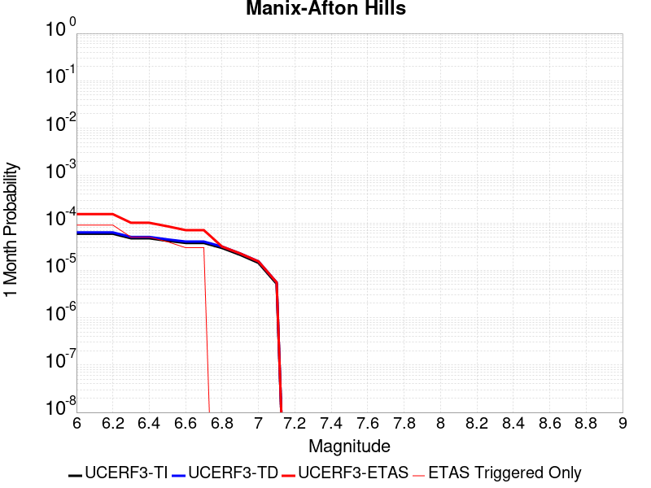 | 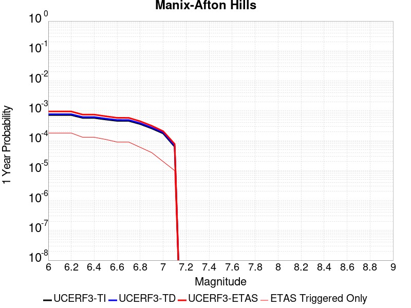 |  |

| Magnitude | 1 wk TI Prob | 1 wk TD Prob | 1 wk ETAS Prob | 1 wk ETAS/TD Gain | 1 wk ETAS Triggered Only | 1 mo TI Prob | 1 mo TD Prob | 1 mo ETAS Prob | 1 mo ETAS/TD Gain | 1 mo ETAS Triggered Only | 1 yr TI Prob | 1 yr TD Prob | 1 yr ETAS Prob | 1 yr ETAS/TD Gain | 1 yr ETAS Triggered Only | 10 yr TI Prob | 10 yr TD Prob | 10 yr ETAS Prob | 10 yr ETAS/TD Gain | 10 yr ETAS Triggered Only |
|-----|-----|-----|-----|-----|-----|-----|-----|-----|-----|-----|-----|-----|-----|-----|-----|-----|-----|-----|-----|-----|
| 6.0 | 1.3783202E-5 | 1.47110895E-5 | 5.2218507E-5 | 3.5496016 | 3.750797E-5 | 5.906953E-5 | 6.30461E-5 | 1.0055171E-4 | 1.5948918 | 3.750797E-5 | 7.189342E-4 | 7.6733343E-4 | 9.547294E-4 | 1.244217 | 1.8753986E-4 | 0.0071661277 | 0.007648596 | 0.007909143 | 1.0340648 | 2.6255578E-4 |
| 6.1 | 1.3783202E-5 | 1.47110895E-5 | 5.2218507E-5 | 3.5496016 | 3.750797E-5 | 5.906953E-5 | 6.30461E-5 | 1.0055171E-4 | 1.5948918 | 3.750797E-5 | 7.189342E-4 | 7.6733343E-4 | 9.547294E-4 | 1.244217 | 1.8753986E-4 | 0.0071661277 | 0.007648596 | 0.007909143 | 1.0340648 | 2.6255578E-4 |
| 6.2 | 1.3783202E-5 | 1.47110895E-5 | 5.2218507E-5 | 3.5496016 | 3.750797E-5 | 5.906953E-5 | 6.30461E-5 | 1.0055171E-4 | 1.5948918 | 3.750797E-5 | 7.189342E-4 | 7.6733343E-4 | 9.547294E-4 | 1.244217 | 1.8753986E-4 | 0.0071661277 | 0.007648596 | 0.007909143 | 1.0340648 | 2.6255578E-4 |
| 6.3 | 1.10494875E-5 | 1.1793136E-5 | 4.9300663E-5 | 4.1804543 | 3.750797E-5 | 4.7354086E-5 | 5.054109E-5 | 8.804716E-5 | 1.7420907 | 3.750797E-5 | 5.763835E-4 | 6.151744E-4 | 8.025989E-4 | 1.3046689 | 1.8753986E-4 | 0.005748908 | 0.0061357557 | 0.0063594226 | 1.036453 | 2.2504783E-4 |
| 6.4 | 1.10494875E-5 | 1.1793136E-5 | 4.9300663E-5 | 4.1804543 | 3.750797E-5 | 4.7354086E-5 | 5.054109E-5 | 8.804716E-5 | 1.7420907 | 3.750797E-5 | 5.763835E-4 | 6.151744E-4 | 8.025989E-4 | 1.3046689 | 1.8753986E-4 | 0.005748908 | 0.0061357557 | 0.0063594226 | 1.036453 | 2.2504783E-4 |
| 6.5 | 9.788949E-6 | 1.045432E-5 | 4.7961898E-5 | 4.587759 | 3.750797E-5 | 4.1951964E-5 | 4.480351E-5 | 8.23098E-5 | 1.8371284 | 3.750797E-5 | 5.1064545E-4 | 5.453555E-4 | 7.3279307E-4 | 1.343698 | 1.8753986E-4 | 0.0050947363 | 0.0054410985 | 0.005664922 | 1.0411357 | 2.2504783E-4 |
| 6.6 | 8.810006E-6 | 9.4136285E-6 | 4.6921246E-5 | 4.9843955 | 3.750797E-5 | 3.775662E-5 | 4.0343548E-5 | 7.785E-5 | 1.9296768 | 3.750797E-5 | 4.5958988E-4 | 4.9108086E-4 | 6.4103905E-4 | 1.3053635 | 1.5003188E-4 | 0.0045864056 | 0.004900839 | 0.00508746 | 1.0380794 | 1.8753986E-4 |
| 6.7 | 8.80128E-6 | 9.404108E-6 | 4.6911726E-5 | 4.988429 | 3.750797E-5 | 3.7719226E-5 | 4.0302748E-5 | 7.780921E-5 | 1.9306179 | 3.750797E-5 | 4.591348E-4 | 4.9058435E-4 | 6.4054265E-4 | 1.3056728 | 1.5003188E-4 | 0.004581874 | 0.0048958957 | 0.0050825174 | 1.038118 | 1.8753986E-4 |
| 6.8 | 6.8994877E-6 | 7.380076E-6 | 7.380076E-6 | 1.0 | 0.0 | 2.9568899E-5 | 3.162856E-5 | 3.162856E-5 | 1.0 | 0.0 | 3.5994186E-4 | 3.8501783E-4 | 4.9749843E-4 | 1.2921438 | 1.12523914E-4 | 0.003593594 | 0.0038443129 | 0.003993768 | 1.0388769 | 1.5003188E-4 |
| 6.9 | 4.9328037E-6 | 5.2709615E-6 | 5.2709615E-6 | 1.0 | 0.0 | 2.1140417E-5 | 2.2589675E-5 | 2.2589675E-5 | 1.0 | 0.0 | 2.5735417E-4 | 2.7500073E-4 | 3.4999603E-4 | 1.2727095 | 7.501594E-5 | 0.0025705635 | 0.0027472095 | 0.0028220194 | 1.0272312 | 7.501594E-5 |
| 7.0 | 3.347973E-6 | 3.59003E-6 | 3.59003E-6 | 1.0 | 0.0 | 1.4348378E-5 | 1.5385775E-5 | 1.5385775E-5 | 1.0 | 0.0 | 1.746775E-4 | 1.8730981E-4 | 2.2481076E-4 | 1.2002081 | 3.750797E-5 | 0.0017454025 | 0.0018719219 | 0.0019093597 | 1.0199996 | 3.750797E-5 |
| 7.1 | 1.2073567E-6 | 1.293482E-6 | 1.293482E-6 | 1.0 | 0.0 | 5.1743755E-6 | 5.543492E-6 | 5.543492E-6 | 1.0 | 0.0 | 6.29962E-5 | 6.749156E-5 | 1.04996994E-4 | 1.5557057 | 3.750797E-5 | 6.297835E-4 | 6.7487074E-4 | 7.123534E-4 | 1.0555404 | 3.750797E-5 |

## Sierra Nevada  (No Extension)
*[(top)](#table-of-contents)*

| 1 Week | 1 Month | 1 Year | 10 Year |
|-----|-----|-----|-----|
|  |  |  |  |

| Magnitude | 1 wk TI Prob | 1 wk TD Prob | 1 wk ETAS Prob | 1 wk ETAS/TD Gain | 1 wk ETAS Triggered Only | 1 mo TI Prob | 1 mo TD Prob | 1 mo ETAS Prob | 1 mo ETAS/TD Gain | 1 mo ETAS Triggered Only | 1 yr TI Prob | 1 yr TD Prob | 1 yr ETAS Prob | 1 yr ETAS/TD Gain | 1 yr ETAS Triggered Only | 10 yr TI Prob | 10 yr TD Prob | 10 yr ETAS Prob | 10 yr ETAS/TD Gain | 10 yr ETAS Triggered Only |
|-----|-----|-----|-----|-----|-----|-----|-----|-----|-----|-----|-----|-----|-----|-----|-----|-----|-----|-----|-----|-----|
| 6.0 | 7.7690465E-6 | 6.9762887E-6 | 1.9451484E-4 | 27.88228 | 1.8753986E-4 | 3.329549E-5 | 2.989824E-5 | 2.1743249E-4 | 7.2724175 | 1.8753986E-4 | 4.0529718E-4 | 3.6398612E-4 | 5.514577E-4 | 1.5150515 | 1.8753986E-4 | 0.004045588 | 0.0036374154 | 0.0038990162 | 1.0719194 | 2.6255578E-4 |
| 6.1 | 7.7690465E-6 | 6.9762887E-6 | 1.9451484E-4 | 27.88228 | 1.8753986E-4 | 3.329549E-5 | 2.989824E-5 | 2.1743249E-4 | 7.2724175 | 1.8753986E-4 | 4.0529718E-4 | 3.6398612E-4 | 5.514577E-4 | 1.5150515 | 1.8753986E-4 | 0.004045588 | 0.0036374154 | 0.0038990162 | 1.0719194 | 2.6255578E-4 |
| 6.2 | 7.7690465E-6 | 6.9762887E-6 | 1.9451484E-4 | 27.88228 | 1.8753986E-4 | 3.329549E-5 | 2.989824E-5 | 2.1743249E-4 | 7.2724175 | 1.8753986E-4 | 4.0529718E-4 | 3.6398612E-4 | 5.514577E-4 | 1.5150515 | 1.8753986E-4 | 0.004045588 | 0.0036374154 | 0.0038990162 | 1.0719194 | 2.6255578E-4 |
| 6.3 | 7.7690465E-6 | 6.9762887E-6 | 1.9451484E-4 | 27.88228 | 1.8753986E-4 | 3.329549E-5 | 2.989824E-5 | 2.1743249E-4 | 7.2724175 | 1.8753986E-4 | 4.0529718E-4 | 3.6398612E-4 | 5.514577E-4 | 1.5150515 | 1.8753986E-4 | 0.004045588 | 0.0036374154 | 0.0038990162 | 1.0719194 | 2.6255578E-4 |
| 6.4 | 7.7690465E-6 | 6.9762887E-6 | 1.9451484E-4 | 27.88228 | 1.8753986E-4 | 3.329549E-5 | 2.989824E-5 | 2.1743249E-4 | 7.2724175 | 1.8753986E-4 | 4.0529718E-4 | 3.6398612E-4 | 5.514577E-4 | 1.5150515 | 1.8753986E-4 | 0.004045588 | 0.0036374154 | 0.0038990162 | 1.0719194 | 2.6255578E-4 |
| 6.5 | 7.7690465E-6 | 6.9762887E-6 | 1.9451484E-4 | 27.88228 | 1.8753986E-4 | 3.329549E-5 | 2.989824E-5 | 2.1743249E-4 | 7.2724175 | 1.8753986E-4 | 4.0529718E-4 | 3.6398612E-4 | 5.514577E-4 | 1.5150515 | 1.8753986E-4 | 0.004045588 | 0.0036374154 | 0.0038990162 | 1.0719194 | 2.6255578E-4 |
| 6.6 | 2.653E-6 | 1.6148208E-6 | 1.8915437E-4 | 117.136444 | 1.8753986E-4 | 1.136995E-5 | 6.9206426E-6 | 1.944592E-4 | 28.09843 | 1.8753986E-4 | 1.3842035E-4 | 8.42556E-5 | 2.7177966E-4 | 3.2256567 | 1.8753986E-4 | 0.0013833415 | 8.4224E-4 | 0.0010670982 | 1.2669765 | 2.2504783E-4 |
| 6.7 | 2.5902466E-6 | 1.5501544E-6 | 1.8908971E-4 | 121.98122 | 1.8753986E-4 | 1.11010095E-5 | 6.643502E-6 | 1.9418211E-4 | 29.228878 | 1.8753986E-4 | 1.351464E-4 | 8.088166E-5 | 2.6840635E-4 | 3.3185067 | 1.8753986E-4 | 0.0013506424 | 8.0852525E-4 | 0.0010333911 | 1.2781185 | 2.2504783E-4 |
| 6.8 | 2.5853892E-6 | 1.5469546E-6 | 1.8908651E-4 | 122.23145 | 1.8753986E-4 | 1.1080193E-5 | 6.629789E-6 | 1.941684E-4 | 29.287268 | 1.8753986E-4 | 1.34893E-4 | 8.071472E-5 | 2.6823944E-4 | 3.3233025 | 1.8753986E-4 | 0.0013481114 | 8.06857E-4 | 0.0010317232 | 1.278694 | 2.2504783E-4 |
| 6.9 | 2.458257E-6 | 1.422029E-6 | 1.514537E-4 | 106.505356 | 1.5003188E-4 | 1.0535345E-5 | 6.0943958E-6 | 1.5612536E-4 | 25.617859 | 1.5003188E-4 | 1.2826028E-4 | 7.419676E-5 | 2.2421751E-4 | 3.0219314 | 1.5003188E-4 | 0.0012818627 | 7.4172183E-4 | 9.2912256E-4 | 1.2526563 | 1.8753986E-4 |
| 7.0 | 2.4341468E-6 | 1.3989927E-6 | 1.5143066E-4 | 108.24264 | 1.5003188E-4 | 1.0432016E-5 | 5.9956697E-6 | 1.5602665E-4 | 26.023224 | 1.5003188E-4 | 1.270024E-4 | 7.299485E-5 | 2.2301578E-4 | 3.055226 | 1.5003188E-4 | 0.0012692984 | 7.297107E-4 | 9.171137E-4 | 1.2568182 | 1.8753986E-4 |
| 7.1 | 2.3652476E-6 | 1.3339427E-6 | 1.5136562E-4 | 113.47236 | 1.5003188E-4 | 1.0136736E-5 | 5.716885E-6 | 1.5574791E-4 | 27.243492 | 1.5003188E-4 | 1.2340778E-4 | 6.9600865E-5 | 2.196223E-4 | 3.1554537 | 1.5003188E-4 | 0.0012333926 | 6.957924E-4 | 8.832017E-4 | 1.2693467 | 1.8753986E-4 |
| 7.2 | 2.272158E-6 | 1.2502497E-6 | 1.5128194E-4 | 121.00138 | 1.5003188E-4 | 9.737784E-6 | 5.358202E-6 | 1.5538928E-4 | 29.000265 | 1.5003188E-4 | 1.1855107E-4 | 6.523417E-5 | 2.1525627E-4 | 3.299747 | 1.5003188E-4 | 0.0011848784 | 6.5215176E-4 | 8.3956926E-4 | 1.2873833 | 1.8753986E-4 |
| 7.3 | 2.1382127E-6 | 1.1419382E-6 | 1.5117365E-4 | 132.38339 | 1.5003188E-4 | 9.163737E-6 | 4.894012E-6 | 1.5492516E-4 | 31.656065 | 1.5003188E-4 | 1.1156279E-4 | 5.9582977E-5 | 2.0960592E-4 | 3.5178826 | 1.5003188E-4 | 0.001115068 | 5.956712E-4 | 7.830993E-4 | 1.3146503 | 1.8753986E-4 |
| 7.4 | 1.9048055E-6 | 9.574928E-7 | 1.5098923E-4 | 157.69228 | 1.5003188E-4 | 8.163426E-6 | 4.103534E-6 | 1.541348E-4 | 37.561474 | 1.5003188E-4 | 9.9385186E-5 | 4.995939E-5 | 1.9998378E-4 | 4.002927 | 1.5003188E-4 | 9.934074E-4 | 4.9948227E-4 | 6.8692846E-4 | 1.375281 | 1.8753986E-4 |
| 7.5 | 1.5373403E-6 | 7.559763E-7 | 1.5078775E-4 | 199.46094 | 1.5003188E-4 | 6.5885843E-6 | 3.2398946E-6 | 1.5327129E-4 | 47.307495 | 1.5003188E-4 | 8.021306E-5 | 3.9445007E-5 | 1.8947097E-4 | 4.803421 | 1.5003188E-4 | 8.0184115E-4 | 3.9438053E-4 | 5.818464E-4 | 1.4753426 | 1.8753986E-4 |
| 7.6 | 1.0680322E-6 | 4.65941E-7 | 1.5049776E-4 | 322.99744 | 1.5003188E-4 | 4.577273E-6 | 1.9968884E-6 | 1.5202847E-4 | 76.13268 | 1.5003188E-4 | 5.5726876E-5 | 2.4311848E-5 | 1.7434008E-4 | 7.1709924 | 1.5003188E-4 | 5.5712904E-4 | 2.4309216E-4 | 4.3058643E-4 | 1.7712889 | 1.8753986E-4 |
| 7.7 | 5.509146E-7 | 1.5578539E-7 | 1.5578539E-7 | 1.0 | 0.0 | 2.3610605E-6 | 6.676515E-7 | 6.676515E-7 | 1.0 | 0.0 | 2.8745531E-5 | 8.128628E-6 | 8.128628E-6 | 1.0 | 0.0 | 2.8741814E-4 | 8.128342E-5 | 8.128342E-5 | 1.0 | 0.0 |

## Tin Mountain
*[(top)](#table-of-contents)*

| 1 Week | 1 Month | 1 Year | 10 Year |
|-----|-----|-----|-----|
|  |  |  |  |

| Magnitude | 1 wk TI Prob | 1 wk TD Prob | 1 wk ETAS Prob | 1 wk ETAS/TD Gain | 1 wk ETAS Triggered Only | 1 mo TI Prob | 1 mo TD Prob | 1 mo ETAS Prob | 1 mo ETAS/TD Gain | 1 mo ETAS Triggered Only | 1 yr TI Prob | 1 yr TD Prob | 1 yr ETAS Prob | 1 yr ETAS/TD Gain | 1 yr ETAS Triggered Only | 10 yr TI Prob | 10 yr TD Prob | 10 yr ETAS Prob | 10 yr ETAS/TD Gain | 10 yr ETAS Triggered Only |
|-----|-----|-----|-----|-----|-----|-----|-----|-----|-----|-----|-----|-----|-----|-----|-----|-----|-----|-----|-----|-----|
| 6.0 | 4.083776E-6 | 4.1815365E-6 | 4.1815365E-6 | 1.0 | 0.0 | 1.750178E-5 | 1.792077E-5 | 9.293536E-5 | 5.1859026 | 7.501594E-5 | 2.1306332E-4 | 2.1816725E-4 | 3.681664E-4 | 1.6875421 | 1.5003188E-4 | 0.0021285915 | 0.0021798965 | 0.0024418798 | 1.1201816 | 2.6255578E-4 |
| 6.1 | 4.083776E-6 | 4.1815365E-6 | 4.1815365E-6 | 1.0 | 0.0 | 1.750178E-5 | 1.792077E-5 | 9.293536E-5 | 5.1859026 | 7.501594E-5 | 2.1306332E-4 | 2.1816725E-4 | 3.681664E-4 | 1.6875421 | 1.5003188E-4 | 0.0021285915 | 0.0021798965 | 0.0024418798 | 1.1201816 | 2.6255578E-4 |
| 6.2 | 4.083776E-6 | 4.1815365E-6 | 4.1815365E-6 | 1.0 | 0.0 | 1.750178E-5 | 1.792077E-5 | 9.293536E-5 | 5.1859026 | 7.501594E-5 | 2.1306332E-4 | 2.1816725E-4 | 3.681664E-4 | 1.6875421 | 1.5003188E-4 | 0.0021285915 | 0.0021798965 | 0.0024418798 | 1.1201816 | 2.6255578E-4 |
| 6.3 | 4.083776E-6 | 4.1815365E-6 | 4.1815365E-6 | 1.0 | 0.0 | 1.750178E-5 | 1.792077E-5 | 9.293536E-5 | 5.1859026 | 7.501594E-5 | 2.1306332E-4 | 2.1816725E-4 | 3.681664E-4 | 1.6875421 | 1.5003188E-4 | 0.0021285915 | 0.0021798965 | 0.0024418798 | 1.1201816 | 2.6255578E-4 |
| 6.4 | 4.083776E-6 | 4.1815365E-6 | 4.1815365E-6 | 1.0 | 0.0 | 1.750178E-5 | 1.792077E-5 | 9.293536E-5 | 5.1859026 | 7.501594E-5 | 2.1306332E-4 | 2.1816725E-4 | 3.681664E-4 | 1.6875421 | 1.5003188E-4 | 0.0021285915 | 0.0021798965 | 0.0024418798 | 1.1201816 | 2.6255578E-4 |
| 6.5 | 2.3143427E-6 | 2.3731573E-6 | 2.3731573E-6 | 1.0 | 0.0 | 9.9185745E-6 | 1.0170638E-5 | 4.7678226E-5 | 4.6878304 | 3.750797E-5 | 1.2075195E-4 | 1.2382126E-4 | 1.6132458E-4 | 1.3028828 | 3.750797E-5 | 0.0012068636 | 0.0012375986 | 0.0013125218 | 1.0605391 | 7.501594E-5 |
| 6.6 | 2.3143427E-6 | 2.3731573E-6 | 2.3731573E-6 | 1.0 | 0.0 | 9.9185745E-6 | 1.0170638E-5 | 4.7678226E-5 | 4.6878304 | 3.750797E-5 | 1.2075195E-4 | 1.2382126E-4 | 1.6132458E-4 | 1.3028828 | 3.750797E-5 | 0.0012068636 | 0.0012375986 | 0.0013125218 | 1.0605391 | 7.501594E-5 |
| 6.7 | 1.7029532E-6 | 1.7497915E-6 | 1.7497915E-6 | 1.0 | 0.0 | 7.2983503E-6 | 7.499088E-6 | 4.500678E-5 | 6.0016336 | 3.750797E-5 | 8.885379E-5 | 9.1298105E-5 | 1.2880265E-4 | 1.4107921 | 3.750797E-5 | 8.881827E-4 | 9.1265864E-4 | 9.876061E-4 | 1.08212 | 7.501594E-5 |
| 6.8 | 1.2914646E-6 | 1.3299378E-6 | 1.3299378E-6 | 1.0 | 0.0 | 5.534837E-6 | 5.6997237E-6 | 5.6997237E-6 | 1.0 | 0.0 | 6.738455E-5 | 6.939237E-5 | 6.939237E-5 | 1.0 | 0.0 | 6.736412E-4 | 6.9375033E-4 | 7.312323E-4 | 1.054028 | 3.750797E-5 |
| 6.9 | 5.8708974E-7 | 6.1169936E-7 | 6.1169936E-7 | 1.0 | 0.0 | 2.5160964E-6 | 2.6215664E-6 | 2.6215664E-6 | 1.0 | 0.0 | 3.0633044E-5 | 3.1917145E-5 | 3.1917145E-5 | 1.0 | 0.0 | 3.0628822E-4 | 3.191297E-4 | 3.566257E-4 | 1.1174946 | 3.750797E-5 |
| 7.0 | 4.6248786E-7 | 4.832015E-7 | 4.832015E-7 | 1.0 | 0.0 | 1.9820893E-6 | 2.0708624E-6 | 2.0708624E-6 | 1.0 | 0.0 | 2.413167E-5 | 2.5212494E-5 | 2.5212494E-5 | 1.0 | 0.0 | 2.412905E-4 | 2.5210003E-4 | 2.8959854E-4 | 1.1487446 | 3.750797E-5 |
| 7.1 | 3.804606E-7 | 3.987147E-7 | 3.987147E-7 | 1.0 | 0.0 | 1.6305444E-6 | 1.7087764E-6 | 1.7087764E-6 | 1.0 | 0.0 | 1.9851697E-5 | 2.0804187E-5 | 2.0804187E-5 | 1.0 | 0.0 | 1.9849923E-4 | 2.0802575E-4 | 2.0802575E-4 | 1.0 | 0.0 |
| 7.2 | 3.5864858E-7 | 3.7616863E-7 | 3.7616863E-7 | 1.0 | 0.0 | 1.5370645E-6 | 1.6121504E-6 | 1.6121504E-6 | 1.0 | 0.0 | 1.87136E-5 | 1.9627789E-5 | 1.9627789E-5 | 1.0 | 0.0 | 1.8712023E-4 | 1.9626386E-4 | 1.9626386E-4 | 1.0 | 0.0 |
| 7.3 | 3.342063E-7 | 3.506347E-7 | 3.506347E-7 | 1.0 | 0.0 | 1.4323119E-6 | 1.5027196E-6 | 1.5027196E-6 | 1.0 | 0.0 | 1.7438259E-5 | 1.829549E-5 | 1.829549E-5 | 1.0 | 0.0 | 1.743689E-4 | 1.8294314E-4 | 1.8294314E-4 | 1.0 | 0.0 |
| 7.4 | 2.971242E-7 | 3.1165817E-7 | 3.1165817E-7 | 1.0 | 0.0 | 1.2733886E-6 | 1.3356774E-6 | 1.3356774E-6 | 1.0 | 0.0 | 1.5503398E-5 | 1.6261785E-5 | 1.6261785E-5 | 1.0 | 0.0 | 1.5502315E-4 | 1.6260923E-4 | 1.6260923E-4 | 1.0 | 0.0 |
| 7.5 | 1.4326713E-7 | 1.5012525E-7 | 1.5012525E-7 | 1.0 | 0.0 | 6.140018E-7 | 6.433939E-7 | 6.433939E-7 | 1.0 | 0.0 | 7.4754466E-6 | 7.8333205E-6 | 7.8333205E-6 | 1.0 | 0.0 | 7.475195E-5 | 7.833321E-5 | 7.833321E-5 | 1.0 | 0.0 |

## Kern Canyon (North Kern) 2011
*[(top)](#table-of-contents)*

| 1 Week | 1 Month | 1 Year | 10 Year |
|-----|-----|-----|-----|
|  |  |  | 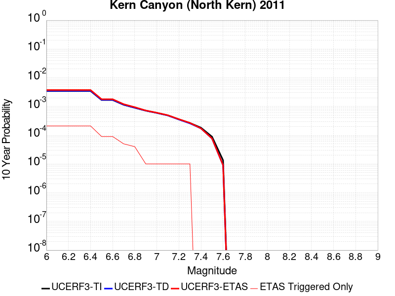 |

| Magnitude | 1 wk TI Prob | 1 wk TD Prob | 1 wk ETAS Prob | 1 wk ETAS/TD Gain | 1 wk ETAS Triggered Only | 1 mo TI Prob | 1 mo TD Prob | 1 mo ETAS Prob | 1 mo ETAS/TD Gain | 1 mo ETAS Triggered Only | 1 yr TI Prob | 1 yr TD Prob | 1 yr ETAS Prob | 1 yr ETAS/TD Gain | 1 yr ETAS Triggered Only | 10 yr TI Prob | 10 yr TD Prob | 10 yr ETAS Prob | 10 yr ETAS/TD Gain | 10 yr ETAS Triggered Only |
|-----|-----|-----|-----|-----|-----|-----|-----|-----|-----|-----|-----|-----|-----|-----|-----|-----|-----|-----|-----|-----|
| 6.0 | 6.6264497E-6 | 6.75733E-6 | 1.1928048E-4 | 17.652014 | 1.12523914E-4 | 2.8398761E-5 | 2.895971E-5 | 1.4148036E-4 | 4.885421 | 1.12523914E-4 | 3.4570007E-4 | 3.5253543E-4 | 4.6501966E-4 | 1.3190721 | 1.12523914E-4 | 0.0034516277 | 0.0035205502 | 0.0037821818 | 1.0743155 | 2.6255578E-4 |
| 6.1 | 6.6264497E-6 | 6.75733E-6 | 1.1928048E-4 | 17.652014 | 1.12523914E-4 | 2.8398761E-5 | 2.895971E-5 | 1.4148036E-4 | 4.885421 | 1.12523914E-4 | 3.4570007E-4 | 3.5253543E-4 | 4.6501966E-4 | 1.3190721 | 1.12523914E-4 | 0.0034516277 | 0.0035205502 | 0.0037821818 | 1.0743155 | 2.6255578E-4 |
| 6.2 | 6.6264497E-6 | 6.75733E-6 | 1.1928048E-4 | 17.652014 | 1.12523914E-4 | 2.8398761E-5 | 2.895971E-5 | 1.4148036E-4 | 4.885421 | 1.12523914E-4 | 3.4570007E-4 | 3.5253543E-4 | 4.6501966E-4 | 1.3190721 | 1.12523914E-4 | 0.0034516277 | 0.0035205502 | 0.0037821818 | 1.0743155 | 2.6255578E-4 |
| 6.3 | 6.6264497E-6 | 6.75733E-6 | 1.1928048E-4 | 17.652014 | 1.12523914E-4 | 2.8398761E-5 | 2.895971E-5 | 1.4148036E-4 | 4.885421 | 1.12523914E-4 | 3.4570007E-4 | 3.5253543E-4 | 4.6501966E-4 | 1.3190721 | 1.12523914E-4 | 0.0034516277 | 0.0035205502 | 0.0037821818 | 1.0743155 | 2.6255578E-4 |
| 6.4 | 6.6264497E-6 | 6.75733E-6 | 1.1928048E-4 | 17.652014 | 1.12523914E-4 | 2.8398761E-5 | 2.895971E-5 | 1.4148036E-4 | 4.885421 | 1.12523914E-4 | 3.4570007E-4 | 3.5253543E-4 | 4.6501966E-4 | 1.3190721 | 1.12523914E-4 | 0.0034516277 | 0.0035205502 | 0.0037821818 | 1.0743155 | 2.6255578E-4 |
| 6.5 | 3.2162225E-6 | 3.2570915E-6 | 4.076494E-5 | 12.515749 | 3.750797E-5 | 1.3783738E-5 | 1.3958894E-5 | 5.146634E-5 | 3.686993 | 3.750797E-5 | 1.6780409E-4 | 1.6993708E-4 | 2.0743869E-4 | 1.2206793 | 3.750797E-5 | 0.0016767744 | 0.001698151 | 0.0018479282 | 1.0882001 | 1.5003188E-4 |
| 6.6 | 3.2162225E-6 | 3.2570915E-6 | 4.076494E-5 | 12.515749 | 3.750797E-5 | 1.3783738E-5 | 1.3958894E-5 | 5.146634E-5 | 3.686993 | 3.750797E-5 | 1.6780409E-4 | 1.6993708E-4 | 2.0743869E-4 | 1.2206793 | 3.750797E-5 | 0.0016767744 | 0.001698151 | 0.0018479282 | 1.0882001 | 1.5003188E-4 |
| 6.7 | 2.1908265E-6 | 2.2071222E-6 | 2.2071222E-6 | 1.0 | 0.0 | 9.389223E-6 | 9.459062E-6 | 9.459062E-6 | 1.0 | 0.0 | 1.1430779E-4 | 1.1515819E-4 | 1.1515819E-4 | 1.0 | 0.0 | 0.0011424901 | 0.0011510046 | 0.0011884694 | 1.0325496 | 3.750797E-5 |
| 6.8 | 1.7303895E-6 | 1.736553E-6 | 1.736553E-6 | 1.0 | 0.0 | 7.415934E-6 | 7.442349E-6 | 7.442349E-6 | 1.0 | 0.0 | 9.028525E-5 | 9.060693E-5 | 9.060693E-5 | 1.0 | 0.0 | 9.024858E-4 | 9.0570963E-4 | 9.0570963E-4 | 1.0 | 0.0 |
| 6.9 | 1.3700314E-6 | 1.3688623E-6 | 1.3688623E-6 | 1.0 | 0.0 | 5.87155E-6 | 5.86654E-6 | 5.86654E-6 | 1.0 | 0.0 | 7.148377E-5 | 7.142283E-5 | 7.142283E-5 | 1.0 | 0.0 | 7.146078E-4 | 7.140033E-4 | 7.140033E-4 | 1.0 | 0.0 |
| 7.0 | 1.1467797E-6 | 1.1413805E-6 | 1.1413805E-6 | 1.0 | 0.0 | 4.9147607E-6 | 4.8916218E-6 | 4.8916218E-6 | 1.0 | 0.0 | 5.983557E-5 | 5.95539E-5 | 5.95539E-5 | 1.0 | 0.0 | 5.981946E-4 | 5.9538253E-4 | 5.9538253E-4 | 1.0 | 0.0 |
| 7.1 | 9.3952065E-7 | 9.3026915E-7 | 9.3026915E-7 | 1.0 | 0.0 | 4.026511E-6 | 3.986862E-6 | 3.986862E-6 | 1.0 | 0.0 | 4.9021666E-5 | 4.853898E-5 | 4.853898E-5 | 1.0 | 0.0 | 4.901085E-4 | 4.8528553E-4 | 4.8528553E-4 | 1.0 | 0.0 |
| 7.2 | 6.858055E-7 | 6.7193014E-7 | 6.7193014E-7 | 1.0 | 0.0 | 2.939163E-6 | 2.8796974E-6 | 2.8796974E-6 | 1.0 | 0.0 | 3.5783723E-5 | 3.5059762E-5 | 3.5059762E-5 | 1.0 | 0.0 | 3.5777962E-4 | 3.5054318E-4 | 3.5054318E-4 | 1.0 | 0.0 |
| 7.3 | 5.1101983E-7 | 4.939301E-7 | 4.939301E-7 | 1.0 | 0.0 | 2.1900833E-6 | 2.1168414E-6 | 2.1168414E-6 | 1.0 | 0.0 | 2.6663936E-5 | 2.5772246E-5 | 2.5772246E-5 | 1.0 | 0.0 | 2.6660739E-4 | 2.5769303E-4 | 2.5769303E-4 | 1.0 | 0.0 |
| 7.4 | 3.4999414E-7 | 3.2995916E-7 | 3.2995916E-7 | 1.0 | 0.0 | 1.499974E-6 | 1.4141099E-6 | 1.4141099E-6 | 1.0 | 0.0 | 1.8262032E-5 | 1.7216655E-5 | 1.7216655E-5 | 1.0 | 0.0 | 1.826053E-4 | 1.7215345E-4 | 1.7215345E-4 | 1.0 | 0.0 |
| 7.5 | 1.7021522E-7 | 1.4750053E-7 | 1.4750053E-7 | 1.0 | 0.0 | 7.2949354E-7 | 6.32145E-7 | 6.32145E-7 | 1.0 | 0.0 | 8.881548E-6 | 7.696339E-6 | 7.696339E-6 | 1.0 | 0.0 | 8.8811925E-5 | 7.696081E-5 | 7.696081E-5 | 1.0 | 0.0 |
| 7.6 | 2.572245E-8 | 1.735264E-8 | 1.735264E-8 | 1.0 | 0.0 | 1.10239064E-7 | 7.436845E-8 | 7.436845E-8 | 1.0 | 0.0 | 1.3421597E-6 | 9.0543557E-7 | 9.0543557E-7 | 1.0 | 0.0 | 1.3421517E-5 | 9.054324E-6 | 9.054324E-6 | 1.0 | 0.0 |

## San Andreas (San Gorgonio Pass-Garnet HIll)
*[(top)](#table-of-contents)*

| 1 Week | 1 Month | 1 Year | 10 Year |
|-----|-----|-----|-----|
|  |  |  |  |

| Magnitude | 1 wk TI Prob | 1 wk TD Prob | 1 wk ETAS Prob | 1 wk ETAS/TD Gain | 1 wk ETAS Triggered Only | 1 mo TI Prob | 1 mo TD Prob | 1 mo ETAS Prob | 1 mo ETAS/TD Gain | 1 mo ETAS Triggered Only | 1 yr TI Prob | 1 yr TD Prob | 1 yr ETAS Prob | 1 yr ETAS/TD Gain | 1 yr ETAS Triggered Only | 10 yr TI Prob | 10 yr TD Prob | 10 yr ETAS Prob | 10 yr ETAS/TD Gain | 10 yr ETAS Triggered Only |
|-----|-----|-----|-----|-----|-----|-----|-----|-----|-----|-----|-----|-----|-----|-----|-----|-----|-----|-----|-----|-----|
| 6.0 | 8.31567E-5 | 2.3384395E-4 | 3.4634155E-4 | 1.4810798 | 1.12523914E-4 | 3.5633717E-4 | 0.0010018025 | 0.0011516841 | 1.149612 | 1.5003188E-4 | 0.004329778 | 0.012128622 | 0.0123138875 | 1.015275 | 1.8753986E-4 | 0.042463828 | 0.11258187 | 0.11281487 | 1.0020696 | 2.6255578E-4 |
| 6.1 | 8.31567E-5 | 2.3384395E-4 | 3.4634155E-4 | 1.4810798 | 1.12523914E-4 | 3.5633717E-4 | 0.0010018025 | 0.0011516841 | 1.149612 | 1.5003188E-4 | 0.004329778 | 0.012128622 | 0.0123138875 | 1.015275 | 1.8753986E-4 | 0.042463828 | 0.11258187 | 0.11281487 | 1.0020696 | 2.6255578E-4 |
| 6.2 | 8.31567E-5 | 2.3384395E-4 | 3.4634155E-4 | 1.4810798 | 1.12523914E-4 | 3.5633717E-4 | 0.0010018025 | 0.0011516841 | 1.149612 | 1.5003188E-4 | 0.004329778 | 0.012128622 | 0.0123138875 | 1.015275 | 1.8753986E-4 | 0.042463828 | 0.11258187 | 0.11281487 | 1.0020696 | 2.6255578E-4 |
| 6.3 | 8.31567E-5 | 2.3384395E-4 | 3.4634155E-4 | 1.4810798 | 1.12523914E-4 | 3.5633717E-4 | 0.0010018025 | 0.0011516841 | 1.149612 | 1.5003188E-4 | 0.004329778 | 0.012128622 | 0.0123138875 | 1.015275 | 1.8753986E-4 | 0.042463828 | 0.11258187 | 0.11281487 | 1.0020696 | 2.6255578E-4 |
| 6.4 | 8.059055E-5 | 2.2941893E-4 | 3.41917E-4 | 1.490361 | 1.12523914E-4 | 3.4534236E-4 | 9.828559E-4 | 0.0011327404 | 1.1524988 | 1.5003188E-4 | 0.0041964394 | 0.011900819 | 0.012086127 | 1.015571 | 1.8753986E-4 | 0.041180745 | 0.110562965 | 0.11079649 | 1.0021122 | 2.6255578E-4 |
| 6.5 | 8.059055E-5 | 2.2941893E-4 | 3.41917E-4 | 1.490361 | 1.12523914E-4 | 3.4534236E-4 | 9.828559E-4 | 0.0011327404 | 1.1524988 | 1.5003188E-4 | 0.0041964394 | 0.011900819 | 0.012086127 | 1.015571 | 1.8753986E-4 | 0.041180745 | 0.110562965 | 0.11079649 | 1.0021122 | 2.6255578E-4 |
| 6.6 | 7.619237E-5 | 2.2186468E-4 | 3.3436363E-4 | 1.5070611 | 1.12523914E-4 | 3.2649786E-4 | 9.5050444E-4 | 0.0011003937 | 1.1576945 | 1.5003188E-4 | 0.0039678677 | 0.0115115335 | 0.011696915 | 1.016104 | 1.8753986E-4 | 0.03897764 | 0.10709954 | 0.10733398 | 1.0021889 | 2.6255578E-4 |
| 6.7 | 7.440636E-5 | 2.1862281E-4 | 3.3112214E-4 | 1.5145818 | 1.12523914E-4 | 3.188454E-4 | 9.3662075E-4 | 0.0010865121 | 1.1600342 | 1.5003188E-4 | 0.0038750346 | 0.011344268 | 0.01152968 | 1.0163442 | 1.8753986E-4 | 0.038081564 | 0.1056081 | 0.105842926 | 1.0022236 | 2.6255578E-4 |
| 6.8 | 7.3735864E-5 | 2.1709445E-4 | 3.2959392E-4 | 1.5182053 | 1.12523914E-4 | 3.1597257E-4 | 9.300753E-4 | 0.0010799676 | 1.1611615 | 1.5003188E-4 | 0.0038401815 | 0.011265406 | 0.011450834 | 1.0164598 | 1.8753986E-4 | 0.03774495 | 0.104909696 | 0.1051447 | 1.0022402 | 2.6255578E-4 |
| 6.9 | 7.27575E-5 | 2.1478413E-4 | 3.2728387E-4 | 1.5237805 | 1.12523914E-4 | 3.117806E-4 | 9.20181E-4 | 0.0010700749 | 1.162896 | 1.5003188E-4 | 0.003789323 | 0.011146182 | 0.011331632 | 1.0166379 | 1.8753986E-4 | 0.037253562 | 0.10385753 | 0.104092814 | 1.0022655 | 2.6255578E-4 |
| 7.0 | 7.102591E-5 | 2.1062451E-4 | 3.2312472E-4 | 1.5341269 | 1.12523914E-4 | 3.0436125E-4 | 9.023664E-4 | 0.001052263 | 1.1661149 | 1.5003188E-4 | 0.003699303 | 0.010931484 | 0.011116974 | 1.0169684 | 1.8753986E-4 | 0.03638325 | 0.101959534 | 0.10219532 | 1.0023125 | 2.6255578E-4 |
| 7.1 | 7.028513E-5 | 2.0898094E-4 | 3.2148132E-4 | 1.5383285 | 1.12523914E-4 | 3.0118722E-4 | 8.953274E-4 | 0.001045225 | 1.167422 | 1.5003188E-4 | 0.0036607897 | 0.010846641 | 0.011032146 | 1.0171026 | 1.8753986E-4 | 0.036010686 | 0.10120243 | 0.10143842 | 1.0023319 | 2.6255578E-4 |
| 7.2 | 6.8498244E-5 | 2.050596E-4 | 2.8006017E-4 | 1.3657501 | 7.501594E-5 | 2.9353087E-4 | 8.7853306E-4 | 9.909581E-4 | 1.127969 | 1.12523914E-4 | 0.003567883 | 0.0106441835 | 0.010792619 | 1.0139452 | 1.5003188E-4 | 0.035111405 | 0.09939449 | 0.09959717 | 1.0020392 | 2.2504783E-4 |
| 7.3 | 6.622592E-5 | 1.9733235E-4 | 2.723335E-4 | 1.3800752 | 7.501594E-5 | 2.8379448E-4 | 8.4543816E-4 | 9.5786696E-4 | 1.1329829 | 1.12523914E-4 | 0.0034497243 | 0.010245111 | 0.010393606 | 1.0144942 | 1.5003188E-4 | 0.033966612 | 0.095891245 | 0.09609471 | 1.0021218 | 2.2504783E-4 |
| 7.4 | 5.1050705E-5 | 1.4690042E-4 | 2.2190534E-4 | 1.5105834 | 7.501594E-5 | 2.1877038E-4 | 6.294222E-4 | 7.418753E-4 | 1.1786609 | 1.12523914E-4 | 0.002660276 | 0.007636482 | 0.0077853682 | 1.0194967 | 1.5003188E-4 | 0.02628654 | 0.07286554 | 0.073074184 | 1.0028635 | 2.2504783E-4 |
| 7.5 | 3.9302922E-5 | 1.11307076E-4 | 1.8631466E-4 | 1.6738799 | 7.501594E-5 | 1.6843023E-4 | 4.7694342E-4 | 5.894137E-4 | 1.2358147 | 1.12523914E-4 | 0.0020487092 | 0.0057913954 | 0.0059405584 | 1.025756 | 1.5003188E-4 | 0.020299247 | 0.05601151 | 0.05622395 | 1.0037929 | 2.2504783E-4 |
| 7.6 | 2.9851626E-5 | 8.4956984E-5 | 1.5996656E-4 | 1.8829123 | 7.501594E-5 | 1.2792926E-4 | 3.6405068E-4 | 4.7653363E-4 | 1.308976 | 1.12523914E-4 | 0.0015564259 | 0.0044233347 | 0.004572703 | 1.0337683 | 1.5003188E-4 | 0.0154556995 | 0.043196145 | 0.043411475 | 1.0049849 | 2.2504783E-4 |
| 7.7 | 2.1135214E-5 | 6.353527E-5 | 1.3854644E-4 | 2.1806226 | 7.501594E-5 | 9.0576345E-5 | 2.722656E-4 | 3.847589E-4 | 1.4131747 | 1.12523914E-4 | 0.0011022091 | 0.0033098008 | 0.003459336 | 1.0451796 | 1.5003188E-4 | 0.010967582 | 0.03258456 | 0.032802276 | 1.0066816 | 2.2504783E-4 |
| 7.8 | 1.883379E-5 | 5.564576E-5 | 1.3065753E-4 | 2.348023 | 7.501594E-5 | 8.0713755E-5 | 2.3846005E-4 | 3.5095713E-4 | 1.4717649 | 1.12523914E-4 | 9.822468E-4 | 0.002899389 | 0.003048986 | 1.051596 | 1.5003188E-4 | 0.0097791655 | 0.028696978 | 0.028915567 | 1.0076171 | 2.2504783E-4 |
| 7.9 | 1.5156185E-5 | 4.1662403E-5 | 1.1667522E-4 | 2.8004918 | 7.501594E-5 | 6.495346E-5 | 1.7854095E-4 | 2.9104477E-4 | 1.630129 | 1.12523914E-4 | 7.9052144E-4 | 0.0021715704 | 0.0023212763 | 1.0689391 | 1.5003188E-4 | 0.007877152 | 0.021760946 | 0.021981096 | 1.0101168 | 2.2504783E-4 |
| 8.0 | 1.1405907E-5 | 2.9976925E-5 | 6.748377E-5 | 2.2511904 | 3.750797E-5 | 4.8881542E-5 | 1.2846621E-4 | 2.0347252E-4 | 1.5838602 | 7.501594E-5 | 5.9497025E-4 | 0.0015629551 | 0.0016753031 | 1.0718818 | 1.12523914E-4 | 0.005933798 | 0.015774013 | 0.015958594 | 1.0117016 | 1.8753986E-4 |
| 8.1 | 4.3511436E-6 | 7.369465E-6 | 7.369465E-6 | 1.0 | 0.0 | 1.8647626E-5 | 3.158304E-5 | 3.158304E-5 | 1.0 | 0.0 | 2.2701119E-4 | 3.844558E-4 | 3.844558E-4 | 1.0 | 0.0 | 0.0022677942 | 0.0041165445 | 0.0041165445 | 1.0 | 0.0 |
| 8.2 | 2.3042528E-6 | 2.7328301E-6 | 2.7328301E-6 | 1.0 | 0.0 | 9.875332E-6 | 1.1712076E-5 | 1.1712076E-5 | 1.0 | 0.0 | 1.2022553E-4 | 1.4258524E-4 | 1.4258524E-4 | 1.0 | 0.0 | 0.0012016051 | 0.0015979637 | 0.0015979637 | 1.0 | 0.0 |
| 8.3 | 5.202968E-7 | 3.1590292E-7 | 3.1590292E-7 | 1.0 | 0.0 | 2.2298414E-6 | 1.353869E-6 | 1.353869E-6 | 1.0 | 0.0 | 2.714798E-5 | 1.6483244E-5 | 1.6483244E-5 | 1.0 | 0.0 | 2.7144665E-4 | 1.955901E-4 | 1.955901E-4 | 1.0 | 0.0 |

## San Jacinto (Coyote Creek)
*[(top)](#table-of-contents)*

| 1 Week | 1 Month | 1 Year | 10 Year |
|-----|-----|-----|-----|
|  |  |  |  |

| Magnitude | 1 wk TI Prob | 1 wk TD Prob | 1 wk ETAS Prob | 1 wk ETAS/TD Gain | 1 wk ETAS Triggered Only | 1 mo TI Prob | 1 mo TD Prob | 1 mo ETAS Prob | 1 mo ETAS/TD Gain | 1 mo ETAS Triggered Only | 1 yr TI Prob | 1 yr TD Prob | 1 yr ETAS Prob | 1 yr ETAS/TD Gain | 1 yr ETAS Triggered Only | 10 yr TI Prob | 10 yr TD Prob | 10 yr ETAS Prob | 10 yr ETAS/TD Gain | 10 yr ETAS Triggered Only |
|-----|-----|-----|-----|-----|-----|-----|-----|-----|-----|-----|-----|-----|-----|-----|-----|-----|-----|-----|-----|-----|
| 6.0 | 2.7374346E-5 | 2.41444E-5 | 2.1167973E-4 | 8.76724 | 1.8753986E-4 | 1.1731335E-4 | 1.034719E-4 | 2.9099235E-4 | 2.8122838 | 1.8753986E-4 | 0.0014273542 | 0.001259045 | 0.0015212703 | 1.2082732 | 2.6255578E-4 | 0.01418221 | 0.012928195 | 0.013187356 | 1.0200462 | 2.6255578E-4 |
| 6.1 | 2.7374346E-5 | 2.41444E-5 | 2.1167973E-4 | 8.76724 | 1.8753986E-4 | 1.1731335E-4 | 1.034719E-4 | 2.9099235E-4 | 2.8122838 | 1.8753986E-4 | 0.0014273542 | 0.001259045 | 0.0015212703 | 1.2082732 | 2.6255578E-4 | 0.01418221 | 0.012928195 | 0.013187356 | 1.0200462 | 2.6255578E-4 |
| 6.2 | 2.7374346E-5 | 2.41444E-5 | 2.1167973E-4 | 8.76724 | 1.8753986E-4 | 1.1731335E-4 | 1.034719E-4 | 2.9099235E-4 | 2.8122838 | 1.8753986E-4 | 0.0014273542 | 0.001259045 | 0.0015212703 | 1.2082732 | 2.6255578E-4 | 0.01418221 | 0.012928195 | 0.013187356 | 1.0200462 | 2.6255578E-4 |
| 6.3 | 2.7374346E-5 | 2.41444E-5 | 2.1167973E-4 | 8.76724 | 1.8753986E-4 | 1.1731335E-4 | 1.034719E-4 | 2.9099235E-4 | 2.8122838 | 1.8753986E-4 | 0.0014273542 | 0.001259045 | 0.0015212703 | 1.2082732 | 2.6255578E-4 | 0.01418221 | 0.012928195 | 0.013187356 | 1.0200462 | 2.6255578E-4 |
| 6.4 | 2.7374346E-5 | 2.41444E-5 | 2.1167973E-4 | 8.76724 | 1.8753986E-4 | 1.1731335E-4 | 1.034719E-4 | 2.9099235E-4 | 2.8122838 | 1.8753986E-4 | 0.0014273542 | 0.001259045 | 0.0015212703 | 1.2082732 | 2.6255578E-4 | 0.01418221 | 0.012928195 | 0.013187356 | 1.0200462 | 2.6255578E-4 |
| 6.5 | 2.7282445E-5 | 2.4030476E-5 | 2.1156583E-4 | 8.804063 | 1.8753986E-4 | 1.16919524E-4 | 1.0298371E-4 | 2.9050425E-4 | 2.820876 | 1.8753986E-4 | 0.0014225657 | 0.001253108 | 0.0015153348 | 1.2092611 | 2.6255578E-4 | 0.014134934 | 0.012869522 | 0.013128699 | 1.0201389 | 2.6255578E-4 |
| 6.6 | 2.7282445E-5 | 2.4030476E-5 | 2.1156583E-4 | 8.804063 | 1.8753986E-4 | 1.16919524E-4 | 1.0298371E-4 | 2.9050425E-4 | 2.820876 | 1.8753986E-4 | 0.0014225657 | 0.001253108 | 0.0015153348 | 1.2092611 | 2.6255578E-4 | 0.014134934 | 0.012869522 | 0.013128699 | 1.0201389 | 2.6255578E-4 |
| 6.7 | 2.7216198E-5 | 2.3955597E-5 | 2.1149096E-4 | 8.828457 | 1.8753986E-4 | 1.1663563E-4 | 1.02662816E-4 | 2.901834E-4 | 2.826568 | 1.8753986E-4 | 0.0014191137 | 0.0012492058 | 0.0015114336 | 1.2099156 | 2.6255578E-4 | 0.014100855 | 0.012830934 | 0.013090121 | 1.0202001 | 2.6255578E-4 |
| 6.8 | 2.7078617E-5 | 2.3872815E-5 | 2.1140819E-4 | 8.855603 | 1.8753986E-4 | 1.1604605E-4 | 1.0230807E-4 | 2.8982875E-4 | 2.832902 | 1.8753986E-4 | 0.001411945 | 0.0012448917 | 0.0015071206 | 1.210644 | 2.6255578E-4 | 0.014030075 | 0.0127880825 | 0.013047281 | 1.0202687 | 2.6255578E-4 |
| 6.9 | 2.6982952E-5 | 2.3792329E-5 | 2.1132772E-4 | 8.882178 | 1.8753986E-4 | 1.15636096E-4 | 1.0196315E-4 | 2.894839E-4 | 2.8391027 | 1.8753986E-4 | 0.0014069602 | 0.0012406971 | 0.0015029272 | 1.211357 | 2.6255578E-4 | 0.013980856 | 0.012746378 | 0.013005587 | 1.0203359 | 2.6255578E-4 |
| 7.0 | 2.6449972E-5 | 2.3369357E-5 | 2.1090482E-4 | 9.024845 | 1.8753986E-4 | 1.1335209E-4 | 1.0015055E-4 | 2.8767163E-4 | 2.8723917 | 1.8753986E-4 | 0.001379188 | 0.0012186535 | 0.0014808894 | 1.2151849 | 2.6255578E-4 | 0.0137065975 | 0.012527733 | 0.012786999 | 1.0206954 | 2.6255578E-4 |
| 7.1 | 2.6257849E-5 | 2.3195396E-5 | 2.107309E-4 | 9.0850315 | 1.8753986E-4 | 1.1252879E-4 | 9.940507E-5 | 2.8692628E-4 | 2.886435 | 1.8753986E-4 | 0.0013691769 | 0.0012095873 | 0.0014718255 | 1.2167997 | 2.6255578E-4 | 0.013607717 | 0.012437661 | 0.012696951 | 1.0208472 | 2.6255578E-4 |
| 7.2 | 2.5270041E-5 | 2.2390155E-5 | 2.0992581E-4 | 9.375809 | 1.8753986E-4 | 1.0829568E-4 | 9.5954296E-5 | 2.8347614E-4 | 2.9542832 | 1.8753986E-4 | 0.0013177024 | 0.0011676198 | 0.001429869 | 1.2246015 | 2.6255578E-4 | 0.013099162 | 0.0120187905 | 0.012278191 | 1.0215828 | 2.6255578E-4 |
| 7.3 | 2.339701E-5 | 2.1122027E-5 | 2.0865792E-4 | 9.878688 | 1.8753986E-4 | 1.0026905E-4 | 9.051985E-5 | 2.7804272E-4 | 3.0716217 | 1.8753986E-4 | 0.001220092 | 0.001101524 | 0.0013637906 | 1.2380943 | 2.6255578E-4 | 0.012134149 | 0.011357642 | 0.011617215 | 1.0228546 | 2.6255578E-4 |
| 7.4 | 2.296333E-5 | 2.0852396E-5 | 2.0838833E-4 | 9.993496 | 1.8753986E-4 | 9.841056E-5 | 8.936436E-5 | 2.7688744E-4 | 3.0984104 | 1.8753986E-4 | 0.0011974899 | 0.0010874701 | 0.0013497403 | 1.2411747 | 2.6255578E-4 | 0.011910575 | 0.011216754 | 0.011476365 | 1.023145 | 2.6255578E-4 |
| 7.5 | 2.2188895E-5 | 2.037534E-5 | 2.0791138E-4 | 10.204068 | 1.8753986E-4 | 9.50918E-5 | 8.731998E-5 | 2.7484345E-4 | 3.1475437 | 1.8753986E-4 | 0.0011571277 | 0.0010626042 | 0.0013248811 | 1.2468245 | 2.6255578E-4 | 0.011511209 | 0.010966369 | 0.011226046 | 1.0236794 | 2.6255578E-4 |
| 7.6 | 2.0013189E-5 | 1.8961666E-5 | 2.0649796E-4 | 10.890286 | 1.8753986E-4 | 8.5767984E-5 | 8.126176E-5 | 2.6878636E-4 | 3.3076613 | 1.8753986E-4 | 0.001043725 | 9.889146E-4 | 0.0012512108 | 1.2652364 | 2.6255578E-4 | 0.010388365 | 0.010224371 | 0.010484243 | 1.0254169 | 2.6255578E-4 |
| 7.7 | 1.7230794E-5 | 1.6743043E-5 | 2.0427976E-4 | 12.200874 | 1.8753986E-4 | 7.384417E-5 | 7.175393E-5 | 2.5928032E-4 | 3.6134653 | 1.8753986E-4 | 8.986819E-4 | 8.732547E-4 | 0.0011355813 | 1.3004009 | 2.6255578E-4 | 0.008950562 | 0.00906292 | 0.009323097 | 1.0287077 | 2.6255578E-4 |
| 7.8 | 1.4478809E-5 | 1.499039E-5 | 2.0252743E-4 | 13.510485 | 1.8753986E-4 | 6.205057E-5 | 6.424295E-5 | 2.5177075E-4 | 3.9190412 | 1.8753986E-4 | 7.552038E-4 | 7.8187784E-4 | 0.0010442283 | 1.335539 | 2.6255578E-4 | 0.0075264242 | 0.008141388 | 0.0084018065 | 1.031987 | 2.6255578E-4 |
| 7.9 | 1.1114467E-5 | 1.1644517E-5 | 1.9918219E-4 | 17.105234 | 1.8753986E-4 | 4.7632562E-5 | 4.990412E-5 | 2.3743461E-4 | 4.757816 | 1.8753986E-4 | 5.797721E-4 | 6.074139E-4 | 8.3232496E-4 | 1.3702766 | 2.2504783E-4 | 0.0057826187 | 0.0063803545 | 0.0066039665 | 1.0350469 | 2.2504783E-4 |
| 8.0 | 9.327402E-6 | 9.8986575E-6 | 1.5992906E-4 | 16.156641 | 1.5003188E-4 | 3.9973966E-5 | 4.2422133E-5 | 1.9244765E-4 | 4.536492 | 1.5003188E-4 | 4.8657437E-4 | 5.163676E-4 | 7.038106E-4 | 1.363003 | 1.8753986E-4 | 0.0048551033 | 0.00544994 | 0.005636458 | 1.0342238 | 1.8753986E-4 |
| 8.1 | 7.0235833E-6 | 6.826985E-6 | 4.4334698E-5 | 6.494038 | 3.750797E-5 | 3.0100724E-5 | 2.9258183E-5 | 6.676505E-5 | 2.2819276 | 3.750797E-5 | 3.664147E-4 | 3.5616063E-4 | 4.3114988E-4 | 1.2105489 | 7.501594E-5 | 0.003658111 | 0.0037874572 | 0.0038621891 | 1.0197314 | 7.501594E-5 |
| 8.2 | 2.0358202E-6 | 8.9912584E-7 | 8.9912584E-7 | 1.0 | 0.0 | 8.724915E-6 | 3.853391E-6 | 3.853391E-6 | 1.0 | 0.0 | 1.06220665E-4 | 4.6914047E-5 | 4.6914047E-5 | 1.0 | 0.0 | 0.001061699 | 5.3239096E-4 | 5.3239096E-4 | 1.0 | 0.0 |
| 8.3 | 2.0051264E-7 | 6.61379E-8 | 6.61379E-8 | 1.0 | 0.0 | 8.5933965E-7 | 2.8344812E-7 | 2.8344812E-7 | 1.0 | 0.0 | 1.046241E-5 | 3.450976E-6 | 3.450976E-6 | 1.0 | 0.0 | 1.0461917E-4 | 4.0120205E-5 | 4.0120205E-5 | 1.0 | 0.0 |

## San Jacinto (Anza) rev
*[(top)](#table-of-contents)*

| 1 Week | 1 Month | 1 Year | 10 Year |
|-----|-----|-----|-----|
|  |  |  |  |

| Magnitude | 1 wk TI Prob | 1 wk TD Prob | 1 wk ETAS Prob | 1 wk ETAS/TD Gain | 1 wk ETAS Triggered Only | 1 mo TI Prob | 1 mo TD Prob | 1 mo ETAS Prob | 1 mo ETAS/TD Gain | 1 mo ETAS Triggered Only | 1 yr TI Prob | 1 yr TD Prob | 1 yr ETAS Prob | 1 yr ETAS/TD Gain | 1 yr ETAS Triggered Only | 10 yr TI Prob | 10 yr TD Prob | 10 yr ETAS Prob | 10 yr ETAS/TD Gain | 10 yr ETAS Triggered Only |
|-----|-----|-----|-----|-----|-----|-----|-----|-----|-----|-----|-----|-----|-----|-----|-----|-----|-----|-----|-----|-----|
| 6.0 | 6.3015636E-5 | 4.3298347E-5 | 2.3083008E-4 | 5.331152 | 1.8753986E-4 | 2.7003905E-4 | 1.8555121E-4 | 3.7305627E-4 | 2.01053 | 1.8753986E-4 | 0.0032827691 | 0.0022567573 | 0.0025187207 | 1.1160794 | 2.6255578E-4 | 0.032346968 | 0.02329361 | 0.02355005 | 1.011009 | 2.6255578E-4 |
| 6.1 | 6.3015636E-5 | 4.3298347E-5 | 2.3083008E-4 | 5.331152 | 1.8753986E-4 | 2.7003905E-4 | 1.8555121E-4 | 3.7305627E-4 | 2.01053 | 1.8753986E-4 | 0.0032827691 | 0.0022567573 | 0.0025187207 | 1.1160794 | 2.6255578E-4 | 0.032346968 | 0.02329361 | 0.02355005 | 1.011009 | 2.6255578E-4 |
| 6.2 | 6.3015636E-5 | 4.3298347E-5 | 2.3083008E-4 | 5.331152 | 1.8753986E-4 | 2.7003905E-4 | 1.8555121E-4 | 3.7305627E-4 | 2.01053 | 1.8753986E-4 | 0.0032827691 | 0.0022567573 | 0.0025187207 | 1.1160794 | 2.6255578E-4 | 0.032346968 | 0.02329361 | 0.02355005 | 1.011009 | 2.6255578E-4 |
| 6.3 | 6.3015636E-5 | 4.3298347E-5 | 2.3083008E-4 | 5.331152 | 1.8753986E-4 | 2.7003905E-4 | 1.8555121E-4 | 3.7305627E-4 | 2.01053 | 1.8753986E-4 | 0.0032827691 | 0.0022567573 | 0.0025187207 | 1.1160794 | 2.6255578E-4 | 0.032346968 | 0.02329361 | 0.02355005 | 1.011009 | 2.6255578E-4 |
| 6.4 | 6.3015636E-5 | 4.3298347E-5 | 2.3083008E-4 | 5.331152 | 1.8753986E-4 | 2.7003905E-4 | 1.8555121E-4 | 3.7305627E-4 | 2.01053 | 1.8753986E-4 | 0.0032827691 | 0.0022567573 | 0.0025187207 | 1.1160794 | 2.6255578E-4 | 0.032346968 | 0.02329361 | 0.02355005 | 1.011009 | 2.6255578E-4 |
| 6.5 | 5.811017E-5 | 4.0080286E-5 | 2.2761262E-4 | 5.6789174 | 1.8753986E-4 | 2.4901982E-4 | 1.7176138E-4 | 3.59269E-4 | 2.0916753 | 1.8753986E-4 | 0.0030276014 | 0.0020891947 | 0.002351202 | 1.1254107 | 2.6255578E-4 | 0.02986684 | 0.021590833 | 0.021847721 | 1.0118979 | 2.6255578E-4 |
| 6.6 | 5.811017E-5 | 4.0080286E-5 | 2.2761262E-4 | 5.6789174 | 1.8753986E-4 | 2.4901982E-4 | 1.7176138E-4 | 3.59269E-4 | 2.0916753 | 1.8753986E-4 | 0.0030276014 | 0.0020891947 | 0.002351202 | 1.1254107 | 2.6255578E-4 | 0.02986684 | 0.021590833 | 0.021847721 | 1.0118979 | 2.6255578E-4 |
| 6.7 | 5.712442E-5 | 3.950301E-5 | 2.2703546E-4 | 5.747295 | 1.8753986E-4 | 2.4479596E-4 | 1.6928767E-4 | 3.5679576E-4 | 2.10763 | 1.8753986E-4 | 0.0029763177 | 0.0020591344 | 0.0023211497 | 1.1272453 | 2.6255578E-4 | 0.029367693 | 0.021282919 | 0.021539886 | 1.0120739 | 2.6255578E-4 |
| 6.8 | 5.6967532E-5 | 3.93593E-5 | 2.2689177E-4 | 5.7646294 | 1.8753986E-4 | 2.4412372E-4 | 1.6867183E-4 | 3.5618004E-4 | 2.1116748 | 1.8753986E-4 | 0.0029681553 | 0.0020516508 | 0.002313668 | 1.1277103 | 2.6255578E-4 | 0.029288229 | 0.02120852 | 0.021465506 | 1.0121171 | 2.6255578E-4 |
| 6.9 | 5.6211324E-5 | 3.9064216E-5 | 2.2659675E-4 | 5.800622 | 1.8753986E-4 | 2.4088343E-4 | 1.6740736E-4 | 3.549158E-4 | 2.120073 | 1.8753986E-4 | 0.0029288116 | 0.0020362847 | 0.002298306 | 1.128676 | 2.6255578E-4 | 0.028905109 | 0.021047527 | 0.021304557 | 1.0122119 | 2.6255578E-4 |
| 7.0 | 5.4383527E-5 | 3.7925012E-5 | 2.2545776E-4 | 5.9448304 | 1.8753986E-4 | 2.3305144E-4 | 1.6252567E-4 | 3.5003503E-4 | 2.1537216 | 1.8753986E-4 | 0.0028337094 | 0.001976959 | 0.0022389956 | 1.1325454 | 2.6255578E-4 | 0.027978465 | 0.02044095 | 0.02069814 | 1.0125821 | 2.6255578E-4 |
| 7.1 | 5.1393665E-5 | 3.638787E-5 | 2.239209E-4 | 6.1537237 | 1.8753986E-4 | 2.2023996E-4 | 1.5593872E-4 | 3.4344933E-4 | 2.2024634 | 1.8753986E-4 | 0.0026781242 | 0.0018969048 | 0.0021589627 | 1.1381502 | 2.6255578E-4 | 0.026460782 | 0.019616077 | 0.019873483 | 1.0131222 | 2.6255578E-4 |
| 7.2 | 4.785222E-5 | 3.4738845E-5 | 2.2227218E-4 | 6.398376 | 1.8753986E-4 | 2.0506482E-4 | 1.4887229E-4 | 3.3638423E-4 | 2.259549 | 1.8753986E-4 | 0.0024938055 | 0.0018110167 | 0.002073097 | 1.1447145 | 2.6255578E-4 | 0.024660049 | 0.018728783 | 0.01898642 | 1.0137563 | 2.6255578E-4 |
| 7.3 | 4.2143256E-5 | 3.3834414E-5 | 2.2136793E-4 | 6.5426855 | 1.8753986E-4 | 1.8060145E-4 | 1.449966E-4 | 3.3250925E-4 | 2.2932212 | 1.8753986E-4 | 0.002196605 | 0.0017639075 | 0.002026 | 1.1485864 | 2.6255578E-4 | 0.02175019 | 0.018236695 | 0.018494463 | 1.0141345 | 2.6255578E-4 |
| 7.4 | 4.0264713E-5 | 3.3472694E-5 | 2.2100627E-4 | 6.602584 | 1.8753986E-4 | 1.7255165E-4 | 1.4344654E-4 | 3.3095948E-4 | 2.3071976 | 1.8753986E-4 | 0.002098792 | 0.0017450659 | 0.0020071636 | 1.1501936 | 2.6255578E-4 | 0.020790804 | 0.018041389 | 0.018299209 | 1.0142905 | 2.6255578E-4 |
| 7.5 | 3.694492E-5 | 3.2186905E-5 | 2.1972072E-4 | 6.8264008 | 1.8753986E-4 | 1.5832575E-4 | 1.379366E-4 | 3.254506E-4 | 2.3594215 | 1.8753986E-4 | 0.0019259118 | 0.0016780876 | 0.0019402028 | 1.1561987 | 2.6255578E-4 | 0.01909306 | 0.017357888 | 0.017615886 | 1.0148635 | 2.6255578E-4 |
| 7.6 | 3.200565E-5 | 2.9502702E-5 | 2.1703703E-4 | 7.356513 | 1.8753986E-4 | 1.3715986E-4 | 1.2643404E-4 | 3.1395018E-4 | 2.4831145 | 1.8753986E-4 | 0.001668642 | 0.0015382497 | 0.0018004016 | 1.1704222 | 2.6255578E-4 | 0.01656168 | 0.015946016 | 0.016204385 | 1.0162027 | 2.6255578E-4 |
| 7.7 | 2.731642E-5 | 2.6091477E-5 | 2.1362644E-4 | 8.187594 | 1.8753986E-4 | 1.1706512E-4 | 1.11815825E-4 | 2.993347E-4 | 2.6770334 | 1.8753986E-4 | 0.001424336 | 0.0013605085 | 0.0016227071 | 1.192721 | 2.6255578E-4 | 0.014152412 | 0.0141668 | 0.014425636 | 1.0182706 | 2.6255578E-4 |
| 7.8 | 2.3466424E-5 | 2.3503619E-5 | 2.1103906E-4 | 8.979003 | 1.8753986E-4 | 1.0056651E-4 | 1.0072591E-4 | 2.8824687E-4 | 2.8616953 | 1.8753986E-4 | 0.0012237094 | 0.0012256489 | 0.0014878829 | 1.2139553 | 2.6255578E-4 | 0.012169928 | 0.012808796 | 0.013067989 | 1.0202355 | 2.6255578E-4 |
| 7.9 | 1.8611925E-5 | 1.890698E-5 | 2.0644329E-4 | 10.918893 | 1.8753986E-4 | 7.9762955E-5 | 8.10274E-5 | 2.6855204E-4 | 3.3143363 | 1.8753986E-4 | 9.7068126E-4 | 9.860628E-4 | 0.0012108887 | 1.2280036 | 2.2504783E-4 | 0.0096645225 | 0.010393705 | 0.010616414 | 1.0214273 | 2.2504783E-4 |
| 8.0 | 1.5460775E-5 | 1.5739915E-5 | 1.6576944E-4 | 10.531787 | 1.5003188E-4 | 6.6258784E-5 | 6.745504E-5 | 2.174768E-4 | 3.224026 | 1.5003188E-4 | 8.0640207E-4 | 8.2095637E-4 | 0.0010083423 | 1.2282531 | 1.8753986E-4 | 0.008034821 | 0.008702706 | 0.008888613 | 1.0213621 | 1.8753986E-4 |
| 8.1 | 9.983884E-6 | 8.268954E-6 | 4.5776615E-5 | 5.5359616 | 3.750797E-5 | 4.2787375E-5 | 3.5437897E-5 | 7.294454E-5 | 2.0583766 | 3.750797E-5 | 5.2081177E-4 | 4.313715E-4 | 5.063551E-4 | 1.173826 | 7.501594E-5 | 0.0051959283 | 0.00463968 | 0.004714348 | 1.0160934 | 7.501594E-5 |
| 8.2 | 4.1226E-6 | 1.5522551E-6 | 1.5522551E-6 | 1.0 | 0.0 | 1.7668166E-5 | 6.6525045E-6 | 6.6525045E-6 | 1.0 | 0.0 | 2.1508869E-4 | 8.099126E-5 | 8.099126E-5 | 1.0 | 0.0 | 0.0021488064 | 9.401847E-4 | 9.401847E-4 | 1.0 | 0.0 |
| 8.3 | 1.2750878E-6 | 3.609817E-7 | 3.609817E-7 | 1.0 | 0.0 | 5.4646503E-6 | 1.5470634E-6 | 1.5470634E-6 | 1.0 | 0.0 | 6.653009E-5 | 1.8835339E-5 | 1.8835339E-5 | 1.0 | 0.0 | 6.6510175E-4 | 2.272251E-4 | 2.272251E-4 | 1.0 | 0.0 |

## Scodie Lineament
*[(top)](#table-of-contents)*

| 1 Week | 1 Month | 1 Year | 10 Year |
|-----|-----|-----|-----|
|  |  |  |  |

| Magnitude | 1 wk TI Prob | 1 wk TD Prob | 1 wk ETAS Prob | 1 wk ETAS/TD Gain | 1 wk ETAS Triggered Only | 1 mo TI Prob | 1 mo TD Prob | 1 mo ETAS Prob | 1 mo ETAS/TD Gain | 1 mo ETAS Triggered Only | 1 yr TI Prob | 1 yr TD Prob | 1 yr ETAS Prob | 1 yr ETAS/TD Gain | 1 yr ETAS Triggered Only | 10 yr TI Prob | 10 yr TD Prob | 10 yr ETAS Prob | 10 yr ETAS/TD Gain | 10 yr ETAS Triggered Only |
|-----|-----|-----|-----|-----|-----|-----|-----|-----|-----|-----|-----|-----|-----|-----|-----|-----|-----|-----|-----|-----|
| 6.0 | 3.2919327E-6 | 3.0133303E-6 | 4.0521187E-5 | 13.4473095 | 3.750797E-5 | 1.4108206E-5 | 1.2914227E-5 | 8.79292E-5 | 6.8087077 | 7.501594E-5 | 1.7175387E-4 | 1.5722254E-4 | 3.4473292E-4 | 2.192643 | 1.8753986E-4 | 0.0017162118 | 0.0015714248 | 0.0017961189 | 1.1429876 | 2.2504783E-4 |
| 6.1 | 1.8663811E-6 | 1.5490382E-6 | 1.5490382E-6 | 1.0 | 0.0 | 7.998751E-6 | 6.6387206E-6 | 6.6387206E-6 | 1.0 | 0.0 | 9.738045E-5 | 8.082393E-5 | 1.558338E-4 | 1.9280653 | 7.501594E-5 | 9.7337784E-4 | 8.079941E-4 | 8.8294945E-4 | 1.0927671 | 7.501594E-5 |
| 6.2 | 1.8663811E-6 | 1.5490382E-6 | 1.5490382E-6 | 1.0 | 0.0 | 7.998751E-6 | 6.6387206E-6 | 6.6387206E-6 | 1.0 | 0.0 | 9.738045E-5 | 8.082393E-5 | 1.558338E-4 | 1.9280653 | 7.501594E-5 | 9.7337784E-4 | 8.079941E-4 | 8.8294945E-4 | 1.0927671 | 7.501594E-5 |
| 6.3 | 1.8663811E-6 | 1.5490382E-6 | 1.5490382E-6 | 1.0 | 0.0 | 7.998751E-6 | 6.6387206E-6 | 6.6387206E-6 | 1.0 | 0.0 | 9.738045E-5 | 8.082393E-5 | 1.558338E-4 | 1.9280653 | 7.501594E-5 | 9.7337784E-4 | 8.079941E-4 | 8.8294945E-4 | 1.0927671 | 7.501594E-5 |
| 6.4 | 1.8663811E-6 | 1.5490382E-6 | 1.5490382E-6 | 1.0 | 0.0 | 7.998751E-6 | 6.6387206E-6 | 6.6387206E-6 | 1.0 | 0.0 | 9.738045E-5 | 8.082393E-5 | 1.558338E-4 | 1.9280653 | 7.501594E-5 | 9.7337784E-4 | 8.079941E-4 | 8.8294945E-4 | 1.0927671 | 7.501594E-5 |
| 6.5 | 1.8106311E-6 | 1.4909722E-6 | 1.4909722E-6 | 1.0 | 0.0 | 7.759824E-6 | 6.389868E-6 | 6.389868E-6 | 1.0 | 0.0 | 9.447177E-5 | 7.779436E-5 | 1.5280447E-4 | 1.96421 | 7.501594E-5 | 9.4431615E-4 | 7.7771995E-4 | 8.526775E-4 | 1.0963812 | 7.501594E-5 |
| 6.6 | 1.2414679E-6 | 8.9974395E-7 | 8.9974395E-7 | 1.0 | 0.0 | 5.320566E-6 | 3.85604E-6 | 3.85604E-6 | 1.0 | 0.0 | 6.477596E-5 | 4.6946367E-5 | 8.445258E-5 | 1.7989161 | 3.750797E-5 | 6.475708E-4 | 4.6937316E-4 | 5.068635E-4 | 1.0798732 | 3.750797E-5 |
| 6.7 | 1.1062215E-6 | 7.594193E-7 | 7.594193E-7 | 1.0 | 0.0 | 4.7409408E-6 | 3.2546504E-6 | 3.2546504E-6 | 1.0 | 0.0 | 5.7719422E-5 | 3.962472E-5 | 7.7131204E-5 | 1.9465425 | 3.750797E-5 | 5.770443E-4 | 3.9618355E-4 | 4.3367664E-4 | 1.0946357 | 3.750797E-5 |
| 6.8 | 1.0006736E-6 | 6.5002786E-7 | 6.5002786E-7 | 1.0 | 0.0 | 4.288594E-6 | 2.7858312E-6 | 2.7858312E-6 | 1.0 | 0.0 | 5.221238E-5 | 3.391703E-5 | 7.1423725E-5 | 2.1058369 | 3.750797E-5 | 5.220012E-4 | 3.3912458E-4 | 3.7661984E-4 | 1.1105648 | 3.750797E-5 |
| 6.9 | 9.167364E-7 | 5.6315065E-7 | 5.6315065E-7 | 1.0 | 0.0 | 3.9288643E-6 | 2.413501E-6 | 2.413501E-6 | 1.0 | 0.0 | 4.7832873E-5 | 2.9384037E-5 | 6.6890905E-5 | 2.2764368 | 3.750797E-5 | 4.782258E-4 | 2.9380718E-4 | 3.3130412E-4 | 1.1276244 | 3.750797E-5 |
| 7.0 | 7.6987664E-7 | 4.113265E-7 | 4.113265E-7 | 1.0 | 0.0 | 3.2994672E-6 | 1.7628269E-6 | 1.7628269E-6 | 1.0 | 0.0 | 4.0170275E-5 | 2.1462245E-5 | 2.1462245E-5 | 1.0 | 0.0 | 4.0163012E-4 | 2.1460558E-4 | 2.1460558E-4 | 1.0 | 0.0 |
| 7.1 | 7.1038727E-7 | 3.5210306E-7 | 3.5210306E-7 | 1.0 | 0.0 | 3.0445133E-6 | 1.5090123E-6 | 1.5090123E-6 | 1.0 | 0.0 | 3.706632E-5 | 1.8372106E-5 | 1.8372106E-5 | 1.0 | 0.0 | 3.7060137E-4 | 1.8370937E-4 | 1.8370937E-4 | 1.0 | 0.0 |
| 7.2 | 2.0799602E-7 | 3.1178534E-8 | 3.1178534E-8 | 1.0 | 0.0 | 8.914113E-7 | 1.3362228E-7 | 1.3362228E-7 | 1.0 | 0.0 | 1.0852878E-5 | 1.6268501E-6 | 1.6268501E-6 | 1.0 | 0.0 | 1.08523476E-4 | 1.626839E-5 | 1.626839E-5 | 1.0 | 0.0 |
| 7.3 | 1.5048182E-7 | 1.5939106E-8 | 1.5939106E-8 | 1.0 | 0.0 | 6.449219E-7 | 6.8310456E-8 | 6.8310456E-8 | 1.0 | 0.0 | 7.851896E-6 | 8.316795E-7 | 8.316795E-7 | 1.0 | 0.0 | 7.851618E-5 | 8.316767E-6 | 8.316767E-6 | 1.0 | 0.0 |
| 7.4 | 5.9334678E-8 | 4.8638475E-9 | 4.8638475E-9 | 1.0 | 0.0 | 2.5429145E-7 | 2.084506E-8 | 2.084506E-8 | 1.0 | 0.0 | 3.095994E-6 | 2.5378858E-7 | 2.5378858E-7 | 1.0 | 0.0 | 3.095951E-5 | 2.5378843E-6 | 2.5378843E-6 | 1.0 | 0.0 |

## Lake Isabella (Seismicity)
*[(top)](#table-of-contents)*

| 1 Week | 1 Month | 1 Year | 10 Year |
|-----|-----|-----|-----|
|  |  |  |  |

| Magnitude | 1 wk TI Prob | 1 wk TD Prob | 1 wk ETAS Prob | 1 wk ETAS/TD Gain | 1 wk ETAS Triggered Only | 1 mo TI Prob | 1 mo TD Prob | 1 mo ETAS Prob | 1 mo ETAS/TD Gain | 1 mo ETAS Triggered Only | 1 yr TI Prob | 1 yr TD Prob | 1 yr ETAS Prob | 1 yr ETAS/TD Gain | 1 yr ETAS Triggered Only | 10 yr TI Prob | 10 yr TD Prob | 10 yr ETAS Prob | 10 yr ETAS/TD Gain | 10 yr ETAS Triggered Only |
|-----|-----|-----|-----|-----|-----|-----|-----|-----|-----|-----|-----|-----|-----|-----|-----|-----|-----|-----|-----|-----|
| 6.0 | 9.431637E-6 | 9.741651E-6 | 1.2226446E-4 | 12.550692 | 1.12523914E-4 | 4.0420677E-5 | 4.1749343E-5 | 2.2928136E-4 | 5.4918556 | 1.8753986E-4 | 4.920106E-4 | 5.0819275E-4 | 7.331262E-4 | 1.4426144 | 2.2504783E-4 | 0.004909227 | 0.005071599 | 0.0052955053 | 1.044149 | 2.2504783E-4 |
| 6.1 | 9.431637E-6 | 9.741651E-6 | 1.2226446E-4 | 12.550692 | 1.12523914E-4 | 4.0420677E-5 | 4.1749343E-5 | 2.2928136E-4 | 5.4918556 | 1.8753986E-4 | 4.920106E-4 | 5.0819275E-4 | 7.331262E-4 | 1.4426144 | 2.2504783E-4 | 0.004909227 | 0.005071599 | 0.0052955053 | 1.044149 | 2.2504783E-4 |
| 6.2 | 9.431637E-6 | 9.741651E-6 | 1.2226446E-4 | 12.550692 | 1.12523914E-4 | 4.0420677E-5 | 4.1749343E-5 | 2.2928136E-4 | 5.4918556 | 1.8753986E-4 | 4.920106E-4 | 5.0819275E-4 | 7.331262E-4 | 1.4426144 | 2.2504783E-4 | 0.004909227 | 0.005071599 | 0.0052955053 | 1.044149 | 2.2504783E-4 |
| 6.3 | 9.431637E-6 | 9.741651E-6 | 1.2226446E-4 | 12.550692 | 1.12523914E-4 | 4.0420677E-5 | 4.1749343E-5 | 2.2928136E-4 | 5.4918556 | 1.8753986E-4 | 4.920106E-4 | 5.0819275E-4 | 7.331262E-4 | 1.4426144 | 2.2504783E-4 | 0.004909227 | 0.005071599 | 0.0052955053 | 1.044149 | 2.2504783E-4 |
| 6.4 | 5.144063E-6 | 5.3000763E-6 | 4.280785E-5 | 8.076837 | 3.750797E-5 | 2.2045799E-5 | 2.2714434E-5 | 9.772867E-5 | 4.302492 | 7.501594E-5 | 2.6837454E-4 | 2.765166E-4 | 3.515118E-4 | 1.2712141 | 7.501594E-5 | 0.0026805066 | 0.0027620657 | 0.0028368745 | 1.0270844 | 7.501594E-5 |
| 6.5 | 5.144063E-6 | 5.3000763E-6 | 4.280785E-5 | 8.076837 | 3.750797E-5 | 2.2045799E-5 | 2.2714434E-5 | 9.772867E-5 | 4.302492 | 7.501594E-5 | 2.6837454E-4 | 2.765166E-4 | 3.515118E-4 | 1.2712141 | 7.501594E-5 | 0.0026805066 | 0.0027620657 | 0.0028368745 | 1.0270844 | 7.501594E-5 |
| 6.6 | 3.4009804E-6 | 3.498786E-6 | 4.1006624E-5 | 11.720243 | 3.750797E-5 | 1.4575549E-5 | 1.4994721E-5 | 9.000954E-5 | 6.0027485 | 7.501594E-5 | 1.7744285E-4 | 1.8254704E-4 | 2.5754928E-4 | 1.4108653 | 7.501594E-5 | 0.0017730123 | 0.0018241286 | 0.0018990077 | 1.0410492 | 7.501594E-5 |
| 6.7 | 3.3880428E-6 | 3.4856528E-6 | 4.099349E-5 | 11.760635 | 3.750797E-5 | 1.4520103E-5 | 1.4938435E-5 | 8.995325E-5 | 6.0215983 | 7.501594E-5 | 1.767679E-4 | 1.8186188E-4 | 2.5686418E-4 | 1.4124135 | 7.501594E-5 | 0.0017662736 | 0.0018172882 | 0.0018921678 | 1.0412041 | 7.501594E-5 |
| 6.8 | 2.6582E-6 | 2.7337003E-6 | 4.0241568E-5 | 14.72055 | 3.750797E-5 | 1.1392236E-5 | 1.1715813E-5 | 4.9223345E-5 | 4.201445 | 3.750797E-5 | 1.3869164E-4 | 1.4263204E-4 | 1.8013465E-4 | 1.2629327 | 3.750797E-5 | 0.0013860512 | 0.0014255369 | 0.0014629915 | 1.026274 | 3.750797E-5 |
| 6.9 | 2.406011E-6 | 2.4743288E-6 | 3.9982206E-5 | 16.158808 | 3.750797E-5 | 1.0311434E-5 | 1.0604231E-5 | 4.8111804E-5 | 4.5370383 | 3.750797E-5 | 1.2553448E-4 | 1.2910018E-4 | 1.666033E-4 | 1.2904963 | 3.750797E-5 | 0.0012546359 | 0.0012903814 | 0.001327841 | 1.0290298 | 3.750797E-5 |
| 7.0 | 1.6953097E-6 | 1.7429371E-6 | 3.925084E-5 | 22.519941 | 3.750797E-5 | 7.265593E-6 | 7.469715E-6 | 4.4977405E-5 | 6.0213013 | 3.750797E-5 | 8.8455E-5 | 9.094104E-5 | 1.284456E-4 | 1.4124053 | 3.750797E-5 | 8.84198E-4 | 9.09141E-4 | 9.4661483E-4 | 1.041219 | 3.750797E-5 |
| 7.1 | 3.5013824E-7 | 3.5714822E-7 | 3.5714822E-7 | 1.0 | 0.0 | 1.5005916E-6 | 1.5306344E-6 | 1.5306344E-6 | 1.0 | 0.0 | 1.826955E-5 | 1.8635317E-5 | 1.8635317E-5 | 1.0 | 0.0 | 1.8268047E-4 | 1.863378E-4 | 1.863378E-4 | 1.0 | 0.0 |
| 7.2 | 2.2321095E-7 | 2.2750574E-7 | 2.2750574E-7 | 1.0 | 0.0 | 9.56618E-7 | 9.750242E-7 | 9.750242E-7 | 1.0 | 0.0 | 1.1646762E-5 | 1.1870856E-5 | 1.1870856E-5 | 1.0 | 0.0 | 1.1646151E-4 | 1.1870232E-4 | 1.1870232E-4 | 1.0 | 0.0 |
| 7.3 | 1.5760406E-7 | 1.6060922E-7 | 1.6060922E-7 | 1.0 | 0.0 | 6.7544585E-7 | 6.8832503E-7 | 6.8832503E-7 | 1.0 | 0.0 | 8.223522E-6 | 8.380326E-6 | 8.380326E-6 | 1.0 | 0.0 | 8.2232174E-5 | 8.3800165E-5 | 8.3800165E-5 | 1.0 | 0.0 |
| 7.4 | 1.1216497E-7 | 1.1431706E-7 | 1.1431706E-7 | 1.0 | 0.0 | 4.8070694E-7 | 4.899302E-7 | 4.899302E-7 | 1.0 | 0.0 | 5.852591E-6 | 5.964884E-6 | 5.964884E-6 | 1.0 | 0.0 | 5.8524372E-5 | 5.9647282E-5 | 5.9647282E-5 | 1.0 | 0.0 |
| 7.5 | 4.885185E-8 | 4.9787737E-8 | 4.9787737E-8 | 1.0 | 0.0 | 2.0936506E-7 | 2.13376E-7 | 2.13376E-7 | 1.0 | 0.0 | 2.5490165E-6 | 2.59785E-6 | 2.59785E-6 | 1.0 | 0.0 | 2.5489873E-5 | 2.5978214E-5 | 2.5978214E-5 | 1.0 | 0.0 |
| 7.6 | 1.504641E-9 | 1.5317903E-9 | 1.5317903E-9 | 1.0 | 0.0 | 6.4484613E-9 | 6.5648154E-9 | 6.5648154E-9 | 1.0 | 0.0 | 7.851001E-8 | 7.992663E-8 | 7.992663E-8 | 1.0 | 0.0 | 7.8509987E-7 | 7.992663E-7 | 7.992663E-7 | 1.0 | 0.0 |

## Ludlow
*[(top)](#table-of-contents)*

| 1 Week | 1 Month | 1 Year | 10 Year |
|-----|-----|-----|-----|
|  |  | 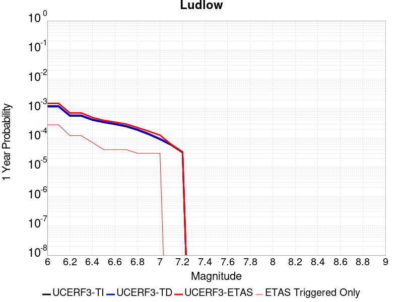 |  |

| Magnitude | 1 wk TI Prob | 1 wk TD Prob | 1 wk ETAS Prob | 1 wk ETAS/TD Gain | 1 wk ETAS Triggered Only | 1 mo TI Prob | 1 mo TD Prob | 1 mo ETAS Prob | 1 mo ETAS/TD Gain | 1 mo ETAS Triggered Only | 1 yr TI Prob | 1 yr TD Prob | 1 yr ETAS Prob | 1 yr ETAS/TD Gain | 1 yr ETAS Triggered Only | 10 yr TI Prob | 10 yr TD Prob | 10 yr ETAS Prob | 10 yr ETAS/TD Gain | 10 yr ETAS Triggered Only |
|-----|-----|-----|-----|-----|-----|-----|-----|-----|-----|-----|-----|-----|-----|-----|-----|-----|-----|-----|-----|-----|
| 6.0 | 2.2407607E-5 | 2.3657254E-5 | 2.3657254E-5 | 1.0 | 0.0 | 9.602906E-5 | 1.0138454E-4 | 1.0138454E-4 | 1.0 | 0.0 | 0.0011685267 | 0.001233702 | 0.0013835487 | 1.1214612 | 1.5003188E-4 | 0.011624013 | 0.012273042 | 0.012495328 | 1.0181117 | 2.2504783E-4 |
| 6.1 | 2.2407607E-5 | 2.3657254E-5 | 2.3657254E-5 | 1.0 | 0.0 | 9.602906E-5 | 1.0138454E-4 | 1.0138454E-4 | 1.0 | 0.0 | 0.0011685267 | 0.001233702 | 0.0013835487 | 1.1214612 | 1.5003188E-4 | 0.011624013 | 0.012273042 | 0.012495328 | 1.0181117 | 2.2504783E-4 |
| 6.2 | 1.0781252E-5 | 1.1365663E-5 | 1.1365663E-5 | 1.0 | 0.0 | 4.620455E-5 | 4.8709102E-5 | 4.8709102E-5 | 1.0 | 0.0 | 5.623952E-4 | 5.9287593E-4 | 6.3036167E-4 | 1.0632269 | 3.750797E-5 | 0.00560974 | 0.0059133614 | 0.0059879334 | 1.0126108 | 7.501594E-5 |
| 6.3 | 1.0781252E-5 | 1.1365663E-5 | 1.1365663E-5 | 1.0 | 0.0 | 4.620455E-5 | 4.8709102E-5 | 4.8709102E-5 | 1.0 | 0.0 | 5.623952E-4 | 5.9287593E-4 | 6.3036167E-4 | 1.0632269 | 3.750797E-5 | 0.00560974 | 0.0059133614 | 0.0059879334 | 1.0126108 | 7.501594E-5 |
| 6.4 | 7.814439E-6 | 8.237729E-6 | 8.237729E-6 | 1.0 | 0.0 | 3.3490025E-5 | 3.530408E-5 | 3.530408E-5 | 1.0 | 0.0 | 4.0766477E-4 | 4.2974384E-4 | 4.2974384E-4 | 1.0 | 0.0 | 0.0040691774 | 0.0042892746 | 0.0043266215 | 1.008707 | 3.750797E-5 |
| 6.5 | 6.4986366E-6 | 6.85092E-6 | 6.85092E-6 | 1.0 | 0.0 | 2.7851002E-5 | 2.9360759E-5 | 2.9360759E-5 | 1.0 | 0.0 | 3.390332E-4 | 3.5740953E-4 | 3.5740953E-4 | 1.0 | 0.0 | 0.003385164 | 0.0035684432 | 0.0036058174 | 1.0104735 | 3.750797E-5 |
| 6.6 | 5.582177E-6 | 5.8860055E-6 | 5.8860055E-6 | 1.0 | 0.0 | 2.3923398E-5 | 2.5225498E-5 | 2.5225498E-5 | 1.0 | 0.0 | 2.9122844E-4 | 3.0707786E-4 | 3.0707786E-4 | 1.0 | 0.0 | 0.0029084706 | 0.003066609 | 0.0031040017 | 1.0121936 | 3.750797E-5 |
| 6.7 | 4.6858763E-6 | 4.940427E-6 | 4.940427E-6 | 1.0 | 0.0 | 2.0082172E-5 | 2.1173091E-5 | 2.1173091E-5 | 1.0 | 0.0 | 2.4447302E-4 | 2.5775246E-4 | 2.5775246E-4 | 1.0 | 0.0 | 0.0024420423 | 0.0025745912 | 0.0025745912 | 1.0 | 0.0 |
| 6.8 | 3.5584908E-6 | 3.7520183E-6 | 3.7520183E-6 | 1.0 | 0.0 | 1.5250586E-5 | 1.6079981E-5 | 1.6079981E-5 | 1.0 | 0.0 | 1.8566006E-4 | 1.957566E-4 | 1.957566E-4 | 1.0 | 0.0 | 0.0018550502 | 0.0019558826 | 0.0019558826 | 1.0 | 0.0 |
| 6.9 | 2.532834E-6 | 2.6710034E-6 | 2.6710034E-6 | 1.0 | 0.0 | 1.0854958E-5 | 1.1447109E-5 | 1.1447109E-5 | 1.0 | 0.0 | 1.3215111E-4 | 1.3935992E-4 | 1.3935992E-4 | 1.0 | 0.0 | 0.0013207254 | 0.0013927529 | 0.0013927529 | 1.0 | 0.0 |
| 7.0 | 1.7083285E-6 | 1.8019439E-6 | 1.8019439E-6 | 1.0 | 0.0 | 7.3213873E-6 | 7.722595E-6 | 7.722595E-6 | 1.0 | 0.0 | 8.913424E-5 | 9.40187E-5 | 9.40187E-5 | 1.0 | 0.0 | 8.9098496E-4 | 9.3980576E-4 | 9.3980576E-4 | 1.0 | 0.0 |
| 7.1 | 1.0905424E-6 | 1.1497619E-6 | 1.1497619E-6 | 1.0 | 0.0 | 4.6737446E-6 | 4.9275427E-6 | 4.9275427E-6 | 1.0 | 0.0 | 5.6901354E-5 | 5.999128E-5 | 5.999128E-5 | 1.0 | 0.0 | 5.6886784E-4 | 5.997606E-4 | 5.997606E-4 | 1.0 | 0.0 |
| 7.2 | 6.06668E-7 | 6.387277E-7 | 6.387277E-7 | 1.0 | 0.0 | 2.600003E-6 | 2.7374022E-6 | 2.7374022E-6 | 1.0 | 0.0 | 3.1654577E-5 | 3.3327433E-5 | 3.3327433E-5 | 1.0 | 0.0 | 3.1650066E-4 | 3.3323118E-4 | 3.3323118E-4 | 1.0 | 0.0 |

## San Andreas (North Branch Mill Creek)
*[(top)](#table-of-contents)*

| 1 Week | 1 Month | 1 Year | 10 Year |
|-----|-----|-----|-----|
|  |  |  |  |

| Magnitude | 1 wk TI Prob | 1 wk TD Prob | 1 wk ETAS Prob | 1 wk ETAS/TD Gain | 1 wk ETAS Triggered Only | 1 mo TI Prob | 1 mo TD Prob | 1 mo ETAS Prob | 1 mo ETAS/TD Gain | 1 mo ETAS Triggered Only | 1 yr TI Prob | 1 yr TD Prob | 1 yr ETAS Prob | 1 yr ETAS/TD Gain | 1 yr ETAS Triggered Only | 10 yr TI Prob | 10 yr TD Prob | 10 yr ETAS Prob | 10 yr ETAS/TD Gain | 10 yr ETAS Triggered Only |
|-----|-----|-----|-----|-----|-----|-----|-----|-----|-----|-----|-----|-----|-----|-----|-----|-----|-----|-----|-----|-----|
| 6.0 | 1.3461156E-5 | 2.3500992E-5 | 6.100808E-5 | 2.595979 | 3.750797E-5 | 5.7689394E-5 | 1.00714664E-4 | 1.7572305E-4 | 1.7447613 | 7.501594E-5 | 7.02142E-4 | 0.0012255146 | 0.0013753626 | 1.1222736 | 1.5003188E-4 | 0.0069992766 | 0.012228744 | 0.01245104 | 1.0181781 | 2.2504783E-4 |
| 6.1 | 1.3461156E-5 | 2.3500992E-5 | 6.100808E-5 | 2.595979 | 3.750797E-5 | 5.7689394E-5 | 1.00714664E-4 | 1.7572305E-4 | 1.7447613 | 7.501594E-5 | 7.02142E-4 | 0.0012255146 | 0.0013753626 | 1.1222736 | 1.5003188E-4 | 0.0069992766 | 0.012228744 | 0.01245104 | 1.0181781 | 2.2504783E-4 |
| 6.2 | 1.3461156E-5 | 2.3500992E-5 | 6.100808E-5 | 2.595979 | 3.750797E-5 | 5.7689394E-5 | 1.00714664E-4 | 1.7572305E-4 | 1.7447613 | 7.501594E-5 | 7.02142E-4 | 0.0012255146 | 0.0013753626 | 1.1222736 | 1.5003188E-4 | 0.0069992766 | 0.012228744 | 0.01245104 | 1.0181781 | 2.2504783E-4 |
| 6.3 | 1.3461156E-5 | 2.3500992E-5 | 6.100808E-5 | 2.595979 | 3.750797E-5 | 5.7689394E-5 | 1.00714664E-4 | 1.7572305E-4 | 1.7447613 | 7.501594E-5 | 7.02142E-4 | 0.0012255146 | 0.0013753626 | 1.1222736 | 1.5003188E-4 | 0.0069992766 | 0.012228744 | 0.01245104 | 1.0181781 | 2.2504783E-4 |
| 6.4 | 1.3461156E-5 | 2.3500992E-5 | 6.100808E-5 | 2.595979 | 3.750797E-5 | 5.7689394E-5 | 1.00714664E-4 | 1.7572305E-4 | 1.7447613 | 7.501594E-5 | 7.02142E-4 | 0.0012255146 | 0.0013753626 | 1.1222736 | 1.5003188E-4 | 0.0069992766 | 0.012228744 | 0.01245104 | 1.0181781 | 2.2504783E-4 |
| 6.5 | 1.3450706E-5 | 2.348995E-5 | 6.099704E-5 | 2.596729 | 3.750797E-5 | 5.764461E-5 | 1.00667356E-4 | 1.7567574E-4 | 1.7451113 | 7.501594E-5 | 7.0159714E-4 | 0.0012249392 | 0.0013747873 | 1.122331 | 1.5003188E-4 | 0.006993862 | 0.012223054 | 0.012445351 | 1.0181867 | 2.2504783E-4 |
| 6.6 | 1.3074523E-5 | 2.3104236E-5 | 6.061134E-5 | 2.6233864 | 3.750797E-5 | 5.6032466E-5 | 9.901441E-5 | 1.7402292E-4 | 1.7575514 | 7.501594E-5 | 6.8198174E-4 | 0.001204837 | 0.0013546882 | 1.1243746 | 1.5003188E-4 | 0.006798926 | 0.012024219 | 0.012246561 | 1.0184911 | 2.2504783E-4 |
| 6.7 | 1.3050216E-5 | 2.3079532E-5 | 6.0586637E-5 | 2.6251242 | 3.750797E-5 | 5.59283E-5 | 9.890855E-5 | 1.7391707E-4 | 1.7583624 | 7.501594E-5 | 6.8071426E-4 | 0.0012035496 | 0.0013534009 | 1.1245078 | 1.5003188E-4 | 0.0067863287 | 0.012011484 | 0.012233829 | 1.018511 | 2.2504783E-4 |
| 6.8 | 1.29049395E-5 | 2.2927941E-5 | 6.043505E-5 | 2.6358693 | 3.750797E-5 | 5.530571E-5 | 9.825892E-5 | 1.7326749E-4 | 1.7633767 | 7.501594E-5 | 6.73139E-4 | 0.001195649 | 0.0013455015 | 1.1253315 | 1.5003188E-4 | 0.0067110364 | 0.011933329 | 0.012155691 | 1.0186337 | 2.2504783E-4 |
| 6.9 | 1.2867369E-5 | 2.2887343E-5 | 6.0394454E-5 | 2.6387708 | 3.750797E-5 | 5.51447E-5 | 9.808494E-5 | 1.7309353E-4 | 1.7647308 | 7.501594E-5 | 6.711799E-4 | 0.0011935332 | 0.001343386 | 1.125554 | 1.5003188E-4 | 0.006691564 | 0.011912397 | 0.012134764 | 1.0186669 | 2.2504783E-4 |
| 7.0 | 1.2495996E-5 | 2.2287419E-5 | 5.9794555E-5 | 2.6828837 | 3.750797E-5 | 5.3553173E-5 | 9.551403E-5 | 1.705228E-4 | 1.7853168 | 7.501594E-5 | 6.518148E-4 | 0.0011622658 | 0.0013121233 | 1.1289357 | 1.5003188E-4 | 0.0064990623 | 0.011603 | 0.011825437 | 1.0191706 | 2.2504783E-4 |
| 7.1 | 1.2452067E-5 | 2.2232492E-5 | 5.973963E-5 | 2.6870415 | 3.750797E-5 | 5.3364907E-5 | 9.527864E-5 | 1.7028744E-4 | 1.7872572 | 7.501594E-5 | 6.4952404E-4 | 0.001159403 | 0.001309261 | 1.1292543 | 1.5003188E-4 | 0.0064762887 | 0.011574671 | 0.011797114 | 1.0192181 | 2.2504783E-4 |
| 7.2 | 1.2002777E-5 | 2.1611015E-5 | 5.9118174E-5 | 2.7355576 | 3.750797E-5 | 5.143946E-5 | 9.261536E-5 | 1.6762436E-4 | 1.809898 | 7.501594E-5 | 6.2609545E-4 | 0.0011270114 | 0.0012768742 | 1.1329737 | 1.5003188E-4 | 0.006243344 | 0.011254058 | 0.011476573 | 1.0197719 | 2.2504783E-4 |
| 7.3 | 1.1923425E-5 | 2.1480853E-5 | 5.898802E-5 | 2.7460742 | 3.750797E-5 | 5.109939E-5 | 9.205757E-5 | 1.6706661E-4 | 1.8148057 | 7.501594E-5 | 6.219575E-4 | 0.0011202273 | 0.001270091 | 1.1337799 | 1.5003188E-4 | 0.0062021962 | 0.011186945 | 0.0114094755 | 1.019892 | 2.2504783E-4 |
| 7.4 | 1.16105175E-5 | 2.0854808E-5 | 5.8361995E-5 | 2.7984912 | 3.750797E-5 | 4.975841E-5 | 8.93747E-5 | 1.6438394E-4 | 1.839267 | 7.501594E-5 | 6.0564023E-4 | 0.0010875963 | 0.0012374651 | 1.1377981 | 1.5003188E-4 | 0.006039923 | 0.010864409 | 0.011087012 | 1.0204892 | 2.2504783E-4 |
| 7.5 | 1.1037265E-5 | 1.9554842E-5 | 5.706208E-5 | 2.9180536 | 3.750797E-5 | 4.7301706E-5 | 8.380379E-5 | 1.5881345E-4 | 1.8950628 | 7.501594E-5 | 5.757461E-4 | 0.0010198357 | 0.0011697146 | 1.1469637 | 1.5003188E-4 | 0.005742567 | 0.010195527 | 0.010418281 | 1.0218482 | 2.2504783E-4 |
| 7.6 | 1.0720915E-5 | 1.8996727E-5 | 5.6503985E-5 | 2.9744062 | 3.750797E-5 | 4.5945973E-5 | 8.141202E-5 | 1.5642185E-4 | 1.9213607 | 7.501594E-5 | 5.592486E-4 | 9.907428E-4 | 0.001140626 | 1.1512837 | 1.5003188E-4 | 0.005578433 | 0.009907238 | 0.010130057 | 1.0224905 | 2.2504783E-4 |
| 7.7 | 9.276279E-6 | 1.6442464E-5 | 5.3949818E-5 | 3.2811272 | 3.750797E-5 | 3.9754876E-5 | 7.046581E-5 | 1.4547646E-4 | 2.0644972 | 7.501594E-5 | 4.839081E-4 | 8.5758517E-4 | 0.0010074885 | 1.1747969 | 1.5003188E-4 | 0.0048285574 | 0.008586576 | 0.008809691 | 1.0259842 | 2.2504783E-4 |
| 7.8 | 5.8346777E-6 | 1.11555855E-5 | 4.8663136E-5 | 4.3622217 | 3.750797E-5 | 2.5005522E-5 | 4.7808775E-5 | 1.2282113E-4 | 2.569008 | 7.501594E-5 | 3.043997E-4 | 5.819165E-4 | 7.318611E-4 | 1.2576737 | 1.5003188E-4 | 0.0030398308 | 0.0058473335 | 0.006071065 | 1.0382622 | 2.2504783E-4 |
| 7.9 | 4.690204E-6 | 8.509473E-6 | 4.6017125E-5 | 5.407752 | 3.750797E-5 | 2.0100719E-5 | 3.6468664E-5 | 1.11481866E-4 | 3.0569222 | 7.501594E-5 | 2.4469878E-4 | 4.439156E-4 | 5.938809E-4 | 1.3378239 | 1.5003188E-4 | 0.002444295 | 0.004471165 | 0.0046952064 | 1.0501081 | 2.2504783E-4 |
| 8.0 | 2.9570454E-6 | 4.8470656E-6 | 4.8470656E-6 | 1.0 | 0.0 | 1.267299E-5 | 2.0772974E-5 | 2.0772974E-5 | 1.0 | 0.0 | 1.5428272E-4 | 2.5288164E-4 | 2.9038012E-4 | 1.1482848 | 3.750797E-5 | 0.0015417566 | 0.002549932 | 0.002624757 | 1.0293437 | 7.501594E-5 |
| 8.1 | 1.6376824E-6 | 2.1968672E-6 | 2.1968672E-6 | 1.0 | 0.0 | 7.01862E-6 | 9.415111E-6 | 9.415111E-6 | 1.0 | 0.0 | 8.544835E-5 | 1.1462297E-4 | 1.1462297E-4 | 1.0 | 0.0 | 8.54155E-4 | 0.0011607445 | 0.0011982089 | 1.0322762 | 3.750797E-5 |
| 8.2 | 6.9631557E-7 | 4.535001E-7 | 4.535001E-7 | 1.0 | 0.0 | 2.984206E-6 | 1.9435704E-6 | 1.9435704E-6 | 1.0 | 0.0 | 3.63321E-5 | 2.3662713E-5 | 2.3662713E-5 | 1.0 | 0.0 | 3.6326164E-4 | 2.4510184E-4 | 2.4510184E-4 | 1.0 | 0.0 |
| 8.3 | 1.7876137E-7 | 8.357368E-8 | 8.357368E-8 | 1.0 | 0.0 | 7.661199E-7 | 3.5817288E-7 | 3.5817288E-7 | 1.0 | 0.0 | 9.32747E-6 | 4.3607465E-6 | 4.3607465E-6 | 1.0 | 0.0 | 9.3270784E-5 | 4.5800018E-5 | 4.5800018E-5 | 1.0 | 0.0 |

## San Jacinto (Borrego)
*[(top)](#table-of-contents)*

| 1 Week | 1 Month | 1 Year | 10 Year |
|-----|-----|-----|-----|
|  |  | 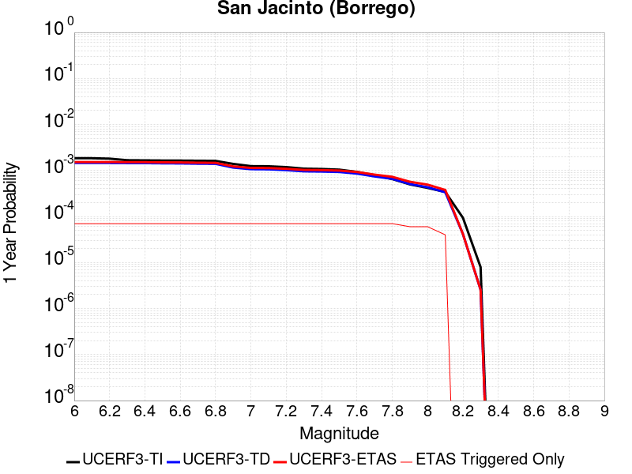 |  |

| Magnitude | 1 wk TI Prob | 1 wk TD Prob | 1 wk ETAS Prob | 1 wk ETAS/TD Gain | 1 wk ETAS Triggered Only | 1 mo TI Prob | 1 mo TD Prob | 1 mo ETAS Prob | 1 mo ETAS/TD Gain | 1 mo ETAS Triggered Only | 1 yr TI Prob | 1 yr TD Prob | 1 yr ETAS Prob | 1 yr ETAS/TD Gain | 1 yr ETAS Triggered Only | 10 yr TI Prob | 10 yr TD Prob | 10 yr ETAS Prob | 10 yr ETAS/TD Gain | 10 yr ETAS Triggered Only |
|-----|-----|-----|-----|-----|-----|-----|-----|-----|-----|-----|-----|-----|-----|-----|-----|-----|-----|-----|-----|-----|
| 6.0 | 3.543992E-5 | 2.7925962E-5 | 1.4044673E-4 | 5.029253 | 1.12523914E-4 | 1.5187653E-4 | 1.1967727E-4 | 2.3218771E-4 | 1.9401153 | 1.12523914E-4 | 0.0018475284 | 0.0014561092 | 0.001643376 | 1.1286076 | 1.8753986E-4 | 0.018322436 | 0.01486815 | 0.0150529025 | 1.012426 | 1.8753986E-4 |
| 6.1 | 3.542281E-5 | 2.7925962E-5 | 1.4044673E-4 | 5.029253 | 1.12523914E-4 | 1.5180321E-4 | 1.1967727E-4 | 2.3218771E-4 | 1.9401153 | 1.12523914E-4 | 0.0018466372 | 0.0014561092 | 0.001643376 | 1.1286076 | 1.8753986E-4 | 0.018313672 | 0.01486815 | 0.0150529025 | 1.012426 | 1.8753986E-4 |
| 6.2 | 3.4688688E-5 | 2.7925962E-5 | 1.4044673E-4 | 5.029253 | 1.12523914E-4 | 1.4865733E-4 | 1.1967727E-4 | 2.3218771E-4 | 1.9401153 | 1.12523914E-4 | 0.0018084005 | 0.0014561091 | 0.001643376 | 1.1286076 | 1.8753986E-4 | 0.017937548 | 0.01486815 | 0.015052902 | 1.012426 | 1.8753986E-4 |
| 6.3 | 3.2087122E-5 | 2.7771312E-5 | 1.402921E-4 | 5.0516915 | 1.12523914E-4 | 1.3750899E-4 | 1.1901455E-4 | 2.3152506E-4 | 1.945351 | 1.12523914E-4 | 0.0016728862 | 0.0014480512 | 0.0016353194 | 1.1293243 | 1.8753986E-4 | 0.016603488 | 0.014789308 | 0.014974074 | 1.0124933 | 1.8753986E-4 |
| 6.4 | 3.1828724E-5 | 2.773829E-5 | 1.4025909E-4 | 5.056515 | 1.12523914E-4 | 1.364017E-4 | 1.1887303E-4 | 2.3138357E-4 | 1.9464766 | 1.12523914E-4 | 0.0016594254 | 0.0014463306 | 0.0016335992 | 1.1294785 | 1.8753986E-4 | 0.016470885 | 0.014772502 | 0.014957271 | 1.0125077 | 1.8753986E-4 |
| 6.5 | 3.1563577E-5 | 2.7477974E-5 | 1.399988E-4 | 5.094946 | 1.12523914E-4 | 1.3526545E-4 | 1.17757496E-4 | 2.3026815E-4 | 1.9554437 | 1.12523914E-4 | 0.0016456128 | 0.0014327668 | 0.001620038 | 1.130706 | 1.8753986E-4 | 0.0163348 | 0.01463991 | 0.014824704 | 1.0126226 | 1.8753986E-4 |
| 6.6 | 3.1467625E-5 | 2.7322194E-5 | 1.3984303E-4 | 5.1182942 | 1.12523914E-4 | 1.3485427E-4 | 1.17089934E-4 | 2.2960067E-4 | 1.9608916 | 1.12523914E-4 | 0.0016406142 | 0.0014246498 | 0.0016119225 | 1.1314517 | 1.8753986E-4 | 0.016285548 | 0.014560228 | 0.014745037 | 1.0126927 | 1.8753986E-4 |
| 6.7 | 3.1223695E-5 | 2.6940217E-5 | 1.394611E-4 | 5.1766877 | 1.12523914E-4 | 1.3380898E-4 | 1.1545303E-4 | 2.2796396E-4 | 1.9745167 | 1.12523914E-4 | 0.0016279068 | 0.0014047464 | 0.0015920228 | 1.1333169 | 1.8753986E-4 | 0.01616033 | 0.01436451 | 0.014549355 | 1.0128683 | 1.8753986E-4 |
| 6.8 | 3.1015585E-5 | 2.6761221E-5 | 1.3928211E-4 | 5.204625 | 1.12523914E-4 | 1.3291716E-4 | 1.1468597E-4 | 2.2719699E-4 | 1.9810355 | 1.12523914E-4 | 0.001617065 | 0.0013954195 | 0.0015826976 | 1.1342093 | 1.8753986E-4 | 0.016053487 | 0.014271772 | 0.014456635 | 1.012953 | 1.8753986E-4 |
| 6.9 | 2.6641965E-5 | 2.2183434E-5 | 1.3470485E-4 | 6.072317 | 1.12523914E-4 | 1.1417485E-4 | 9.506842E-5 | 2.0758163E-4 | 2.1834972 | 1.12523914E-4 | 0.0013891924 | 0.0011568473 | 0.0013441702 | 1.1619253 | 1.8753986E-4 | 0.0138054015 | 0.011882191 | 0.012067502 | 1.0155957 | 1.8753986E-4 |
| 7.0 | 2.3854353E-5 | 2.047825E-5 | 1.3299986E-4 | 6.4946885 | 1.12523914E-4 | 1.02228936E-4 | 8.776099E-5 | 2.0027503E-4 | 2.2820506 | 1.12523914E-4 | 0.0012439266 | 0.0010679689 | 0.0012553085 | 1.1754167 | 1.8753986E-4 | 0.012369866 | 0.0109826205 | 0.0111681 | 1.0168885 | 1.8753986E-4 |
| 7.1 | 2.3672901E-5 | 2.0314741E-5 | 1.3283637E-4 | 6.538915 | 1.12523914E-4 | 1.0145135E-4 | 8.706028E-5 | 1.995744E-4 | 2.29237 | 1.12523914E-4 | 0.0012344702 | 0.0010594461 | 0.0012467873 | 1.1768293 | 1.8753986E-4 | 0.0122763505 | 0.010897858 | 0.011083354 | 1.0170213 | 1.8753986E-4 |
| 7.2 | 2.2717244E-5 | 1.9542116E-5 | 1.3206383E-4 | 6.7579083 | 1.12523914E-4 | 9.735599E-5 | 8.3749255E-5 | 1.9626373E-4 | 2.3434687 | 1.12523914E-4 | 0.0011846646 | 0.0010191725 | 0.0012065212 | 1.1838243 | 1.8753986E-4 | 0.01178369 | 0.010495322 | 0.010680893 | 1.0176814 | 1.8753986E-4 |
| 7.3 | 2.1016205E-5 | 1.8383771E-5 | 1.3090561E-4 | 7.120716 | 1.12523914E-4 | 9.006634E-5 | 7.878522E-5 | 1.9130026E-4 | 2.4281237 | 1.12523914E-4 | 0.001096006 | 9.5879E-4 | 0.00114615 | 1.195413 | 1.8753986E-4 | 0.010906163 | 0.009890901 | 0.010076586 | 1.0187733 | 1.8753986E-4 |
| 7.4 | 2.0683625E-5 | 1.8186302E-5 | 1.3070817E-4 | 7.1871767 | 1.12523914E-4 | 8.86411E-5 | 7.7938974E-5 | 1.9045411E-4 | 2.4436312 | 1.12523914E-4 | 0.001078671 | 9.48496E-4 | 0.001135858 | 1.1975359 | 1.8753986E-4 | 0.010734501 | 0.0097876275 | 0.009973332 | 1.0189734 | 1.8753986E-4 |
| 7.5 | 1.9993966E-5 | 1.7781347E-5 | 1.3030326E-4 | 7.328087 | 1.12523914E-4 | 8.568561E-5 | 7.6203556E-5 | 1.887189E-4 | 2.4765103 | 1.12523914E-4 | 0.001042723 | 9.2738547E-4 | 0.0011147513 | 1.2020367 | 1.8753986E-4 | 0.010378438 | 0.009574548 | 0.009760292 | 1.0193998 | 1.8753986E-4 |
| 7.6 | 1.788966E-5 | 1.6434618E-5 | 1.2895669E-4 | 7.846649 | 1.12523914E-4 | 7.666772E-5 | 7.043219E-5 | 1.8294818E-4 | 2.5975082 | 1.12523914E-4 | 9.3302975E-4 | 8.5717626E-4 | 0.0010445553 | 1.2186004 | 1.8753986E-4 | 0.00929122 | 0.008866415 | 0.009052292 | 1.0209641 | 1.8753986E-4 |
| 7.7 | 1.5125781E-5 | 1.4236738E-5 | 1.2675904E-4 | 8.903658 | 1.12523914E-4 | 6.4823165E-5 | 6.101317E-5 | 1.7353022E-4 | 2.8441436 | 1.12523914E-4 | 7.889362E-4 | 7.4258295E-4 | 9.2998357E-4 | 1.2523632 | 1.8753986E-4 | 0.007861412 | 0.007714161 | 0.007900254 | 1.0241235 | 1.8753986E-4 |
| 7.8 | 1.250089E-5 | 1.262994E-5 | 1.2515244E-4 | 9.909186 | 1.12523914E-4 | 5.3574146E-5 | 5.4127195E-5 | 1.6664501E-4 | 3.0787668 | 1.12523914E-4 | 6.5207E-4 | 6.588E-4 | 8.462163E-4 | 1.2844813 | 1.8753986E-4 | 0.006501599 | 0.006867759 | 0.007054011 | 1.0271198 | 1.8753986E-4 |
| 7.9 | 9.561E-6 | 9.754065E-6 | 1.2227688E-4 | 12.535992 | 1.12523914E-4 | 4.0975072E-5 | 4.180247E-5 | 1.5432168E-4 | 3.691688 | 1.12523914E-4 | 4.987573E-4 | 5.0882675E-4 | 6.587823E-4 | 1.2947085 | 1.5003188E-4 | 0.0049763937 | 0.0053523607 | 0.0055015893 | 1.0278809 | 1.5003188E-4 |
| 8.0 | 8.01699E-6 | 8.292994E-6 | 1.20815974E-4 | 14.568439 | 1.12523914E-4 | 3.4358076E-5 | 3.554092E-5 | 1.4806083E-4 | 4.1659255 | 1.12523914E-4 | 4.1822926E-4 | 4.3262533E-4 | 5.8259227E-4 | 1.346644 | 1.5003188E-4 | 0.0041744304 | 0.0045733186 | 0.0047226646 | 1.0326558 | 1.5003188E-4 |
| 8.1 | 6.541947E-6 | 6.461784E-6 | 4.396951E-5 | 6.804547 | 3.750797E-5 | 2.8036617E-5 | 2.7693068E-5 | 6.52E-5 | 2.3543797 | 3.750797E-5 | 3.4129233E-4 | 3.3711144E-4 | 4.121021E-4 | 1.2224506 | 7.501594E-5 | 0.0034076865 | 0.0035805756 | 0.0036553228 | 1.0208758 | 7.501594E-5 |
| 8.2 | 1.7968189E-6 | 7.9684827E-7 | 7.9684827E-7 | 1.0 | 0.0 | 7.70063E-6 | 3.4150596E-6 | 3.4150596E-6 | 1.0 | 0.0 | 9.3751136E-5 | 4.157758E-5 | 4.157758E-5 | 1.0 | 0.0 | 9.371159E-4 | 4.7107413E-4 | 4.7107413E-4 | 1.0 | 0.0 |
| 8.3 | 1.5167889E-7 | 4.8951257E-8 | 4.8951257E-8 | 1.0 | 0.0 | 6.500522E-7 | 2.0979108E-7 | 2.0979108E-7 | 1.0 | 0.0 | 7.9143565E-6 | 2.5542038E-6 | 2.5542038E-6 | 1.0 | 0.0 | 7.914075E-5 | 2.9679897E-5 | 2.9679897E-5 | 1.0 | 0.0 |

## Pleito
*[(top)](#table-of-contents)*

| 1 Week | 1 Month | 1 Year | 10 Year |
|-----|-----|-----|-----|
|  |  |  |  |

| Magnitude | 1 wk TI Prob | 1 wk TD Prob | 1 wk ETAS Prob | 1 wk ETAS/TD Gain | 1 wk ETAS Triggered Only | 1 mo TI Prob | 1 mo TD Prob | 1 mo ETAS Prob | 1 mo ETAS/TD Gain | 1 mo ETAS Triggered Only | 1 yr TI Prob | 1 yr TD Prob | 1 yr ETAS Prob | 1 yr ETAS/TD Gain | 1 yr ETAS Triggered Only | 10 yr TI Prob | 10 yr TD Prob | 10 yr ETAS Prob | 10 yr ETAS/TD Gain | 10 yr ETAS Triggered Only |
|-----|-----|-----|-----|-----|-----|-----|-----|-----|-----|-----|-----|-----|-----|-----|-----|-----|-----|-----|-----|-----|
| 6.0 | 1.6763008E-5 | 2.4764735E-5 | 9.9778816E-5 | 4.0290685 | 7.501594E-5 | 7.183948E-5 | 1.0613067E-4 | 2.1864264E-4 | 2.0601268 | 1.12523914E-4 | 8.742947E-4 | 0.001291447 | 0.0014412851 | 1.1160234 | 1.5003188E-4 | 0.00870863 | 0.012954412 | 0.013139523 | 1.0142894 | 1.8753986E-4 |
| 6.1 | 1.6763008E-5 | 2.4764735E-5 | 9.9778816E-5 | 4.0290685 | 7.501594E-5 | 7.183948E-5 | 1.0613067E-4 | 2.1864264E-4 | 2.0601268 | 1.12523914E-4 | 8.742947E-4 | 0.001291447 | 0.0014412851 | 1.1160234 | 1.5003188E-4 | 0.00870863 | 0.012954412 | 0.013139523 | 1.0142894 | 1.8753986E-4 |
| 6.2 | 1.6763008E-5 | 2.4764735E-5 | 9.9778816E-5 | 4.0290685 | 7.501594E-5 | 7.183948E-5 | 1.0613067E-4 | 2.1864264E-4 | 2.0601268 | 1.12523914E-4 | 8.742947E-4 | 0.001291447 | 0.0014412851 | 1.1160234 | 1.5003188E-4 | 0.00870863 | 0.012954412 | 0.013139523 | 1.0142894 | 1.8753986E-4 |
| 6.3 | 1.6763008E-5 | 2.4764735E-5 | 9.9778816E-5 | 4.0290685 | 7.501594E-5 | 7.183948E-5 | 1.0613067E-4 | 2.1864264E-4 | 2.0601268 | 1.12523914E-4 | 8.742947E-4 | 0.001291447 | 0.0014412851 | 1.1160234 | 1.5003188E-4 | 0.00870863 | 0.012954412 | 0.013139523 | 1.0142894 | 1.8753986E-4 |
| 6.4 | 1.6763008E-5 | 2.4764735E-5 | 9.9778816E-5 | 4.0290685 | 7.501594E-5 | 7.183948E-5 | 1.0613067E-4 | 2.1864264E-4 | 2.0601268 | 1.12523914E-4 | 8.742947E-4 | 0.001291447 | 0.0014412851 | 1.1160234 | 1.5003188E-4 | 0.00870863 | 0.012954412 | 0.013139523 | 1.0142894 | 1.8753986E-4 |
| 6.5 | 1.6763008E-5 | 2.4764735E-5 | 9.9778816E-5 | 4.0290685 | 7.501594E-5 | 7.183948E-5 | 1.0613067E-4 | 2.1864264E-4 | 2.0601268 | 1.12523914E-4 | 8.742947E-4 | 0.001291447 | 0.0014412851 | 1.1160234 | 1.5003188E-4 | 0.00870863 | 0.012954412 | 0.013139523 | 1.0142894 | 1.8753986E-4 |
| 6.6 | 9.910213E-6 | 1.721552E-5 | 5.4722845E-5 | 3.1786926 | 3.750797E-5 | 4.247165E-5 | 7.3778734E-5 | 1.4878914E-4 | 2.016694 | 7.501594E-5 | 5.169696E-4 | 8.9788967E-4 | 9.728382E-4 | 1.0834719 | 7.501594E-5 | 0.0051576863 | 0.009051226 | 0.0091627315 | 1.0123193 | 1.12523914E-4 |
| 6.7 | 9.910213E-6 | 1.721552E-5 | 5.4722845E-5 | 3.1786926 | 3.750797E-5 | 4.247165E-5 | 7.3778734E-5 | 1.4878914E-4 | 2.016694 | 7.501594E-5 | 5.169696E-4 | 8.9788967E-4 | 9.728382E-4 | 1.0834719 | 7.501594E-5 | 0.0051576863 | 0.009051226 | 0.0091627315 | 1.0123193 | 1.12523914E-4 |
| 6.8 | 8.300162E-6 | 1.5475129E-5 | 5.298252E-5 | 3.4237206 | 3.750797E-5 | 3.557164E-5 | 6.63203E-5 | 1.4133127E-4 | 2.1310408 | 7.501594E-5 | 4.3299864E-4 | 8.07152E-4 | 8.821074E-4 | 1.092864 | 7.501594E-5 | 0.004321559 | 0.008150663 | 0.00826227 | 1.013693 | 1.12523914E-4 |
| 6.9 | 8.183114E-6 | 1.5346344E-5 | 5.285374E-5 | 3.4440606 | 3.750797E-5 | 3.5070017E-5 | 6.57684E-5 | 1.407794E-4 | 2.1405327 | 7.501594E-5 | 4.2689382E-4 | 8.0043747E-4 | 8.753934E-4 | 1.0936437 | 7.501594E-5 | 0.0042607468 | 0.008084008 | 0.008195622 | 1.0138068 | 1.12523914E-4 |
| 7.0 | 7.1748823E-6 | 1.4133306E-5 | 5.1640745E-5 | 3.6538334 | 3.750797E-5 | 3.0749135E-5 | 6.0569906E-5 | 1.355813E-4 | 2.238427 | 7.501594E-5 | 3.743064E-4 | 7.3718966E-4 | 8.121503E-4 | 1.1016843 | 7.501594E-5 | 0.0037367654 | 0.0074553755 | 0.0075670606 | 1.0149804 | 1.12523914E-4 |
| 7.1 | 7.1671807E-6 | 1.4123676E-5 | 5.1631116E-5 | 3.655643 | 3.750797E-5 | 3.0716128E-5 | 6.0528637E-5 | 1.3554003E-4 | 2.2392712 | 7.501594E-5 | 3.7390468E-4 | 7.366875E-4 | 8.116482E-4 | 1.1017537 | 7.501594E-5 | 0.0037327618 | 0.0074503883 | 0.007562074 | 1.0149906 | 1.12523914E-4 |
| 7.2 | 7.0649667E-6 | 1.3970962E-5 | 5.1478408E-5 | 3.6846716 | 3.750797E-5 | 3.0278077E-5 | 5.987418E-5 | 1.3488563E-4 | 2.2528179 | 7.501594E-5 | 3.6857324E-4 | 7.287248E-4 | 8.036861E-4 | 1.1028664 | 7.501594E-5 | 0.0036796255 | 0.0073711374 | 0.007482832 | 1.0151529 | 1.12523914E-4 |
| 7.3 | 7.02082E-6 | 1.3914415E-5 | 5.1421863E-5 | 3.6955822 | 3.750797E-5 | 3.008888E-5 | 5.9631846E-5 | 1.3464331E-4 | 2.2579095 | 7.501594E-5 | 3.6627054E-4 | 7.257764E-4 | 8.0073794E-4 | 1.1032846 | 7.501594E-5 | 0.0036566744 | 0.0073416373 | 0.0074533354 | 1.0152143 | 1.12523914E-4 |
| 7.4 | 6.987146E-6 | 1.3873975E-5 | 5.1381427E-5 | 3.7034392 | 3.750797E-5 | 2.9944567E-5 | 5.9458544E-5 | 1.3447003E-4 | 2.2615762 | 7.501594E-5 | 3.6451413E-4 | 7.2366785E-4 | 7.986295E-4 | 1.1035857 | 7.501594E-5 | 0.0036391679 | 0.007320571 | 0.0074322717 | 1.0152584 | 1.12523914E-4 |
| 7.5 | 6.9494554E-6 | 1.383088E-5 | 5.133833E-5 | 3.711863 | 3.750797E-5 | 2.9783041E-5 | 5.9273858E-5 | 1.3428535E-4 | 2.2655072 | 7.501594E-5 | 3.625482E-4 | 7.2142074E-4 | 7.963826E-4 | 1.1039087 | 7.501594E-5 | 0.0036195726 | 0.007298199 | 0.0074099014 | 1.0153055 | 1.12523914E-4 |
| 7.6 | 6.92694E-6 | 1.3789992E-5 | 5.1297444E-5 | 3.719904 | 3.750797E-5 | 2.9686547E-5 | 5.909863E-5 | 1.3411013E-4 | 2.2692597 | 7.501594E-5 | 3.6137376E-4 | 7.192888E-4 | 7.9425075E-4 | 1.1042168 | 7.501594E-5 | 0.0036078666 | 0.007276951 | 0.007388656 | 1.0153506 | 1.12523914E-4 |
| 7.7 | 6.395867E-6 | 1.26690065E-5 | 5.0176503E-5 | 3.960571 | 3.750797E-5 | 2.741057E-5 | 5.4294615E-5 | 1.2930649E-4 | 2.381571 | 7.501594E-5 | 3.336726E-4 | 6.6083675E-4 | 7.358031E-4 | 1.1134416 | 7.501594E-5 | 0.0033317201 | 0.0066955453 | 0.006807316 | 1.0166932 | 1.12523914E-4 |
| 7.8 | 5.8664327E-6 | 1.1536581E-5 | 4.904412E-5 | 4.251183 | 3.750797E-5 | 2.5141611E-5 | 4.9441554E-5 | 8.694767E-5 | 1.758595 | 3.750797E-5 | 3.060561E-4 | 6.0178485E-4 | 6.392703E-4 | 1.0622903 | 3.750797E-5 | 0.0030563495 | 0.0061010164 | 0.006138296 | 1.0061103 | 3.750797E-5 |
| 7.9 | 3.7167474E-6 | 7.1145205E-6 | 7.1145205E-6 | 1.0 | 0.0 | 1.592882E-5 | 3.0490448E-5 | 3.0490448E-5 | 1.0 | 0.0 | 1.9391612E-4 | 3.7115812E-4 | 3.7115812E-4 | 1.0 | 0.0 | 0.0019374699 | 0.0037676243 | 0.0037676243 | 1.0 | 0.0 |
| 8.0 | 1.0903841E-6 | 1.2879104E-6 | 1.2879104E-6 | 1.0 | 0.0 | 4.6730665E-6 | 5.5196047E-6 | 5.5196047E-6 | 1.0 | 0.0 | 5.68931E-5 | 6.719913E-5 | 6.719913E-5 | 1.0 | 0.0 | 5.6878536E-4 | 6.942094E-4 | 6.942094E-4 | 1.0 | 0.0 |
| 8.1 | 2.6894583E-7 | 1.1056095E-7 | 1.1056095E-7 | 1.0 | 0.0 | 1.1526245E-6 | 4.7383253E-7 | 4.7383253E-7 | 1.0 | 0.0 | 1.4033113E-5 | 5.768896E-6 | 5.768896E-6 | 1.0 | 0.0 | 1.4032227E-4 | 6.454915E-5 | 6.454915E-5 | 1.0 | 0.0 |
| 8.2 | 5.2967013E-9 | 2.4567874E-9 | 2.4567874E-9 | 1.0 | 0.0 | 2.2700148E-8 | 1.0529089E-8 | 1.0529089E-8 | 1.0 | 0.0 | 2.7637427E-7 | 1.2819166E-7 | 1.2819166E-7 | 1.0 | 0.0 | 2.7637393E-6 | 1.4588004E-6 | 1.4588004E-6 | 1.0 | 0.0 |

## Pisgah-Bullion Mtn-Mesquite Lk
*[(top)](#table-of-contents)*

| 1 Week | 1 Month | 1 Year | 10 Year |
|-----|-----|-----|-----|
| 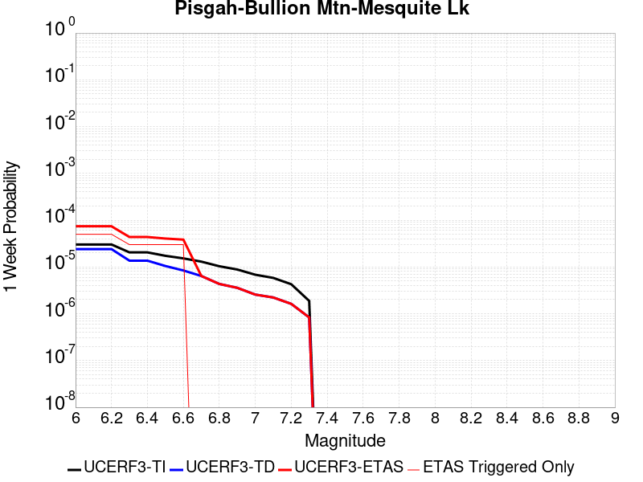 |  |  |  |

| Magnitude | 1 wk TI Prob | 1 wk TD Prob | 1 wk ETAS Prob | 1 wk ETAS/TD Gain | 1 wk ETAS Triggered Only | 1 mo TI Prob | 1 mo TD Prob | 1 mo ETAS Prob | 1 mo ETAS/TD Gain | 1 mo ETAS Triggered Only | 1 yr TI Prob | 1 yr TD Prob | 1 yr ETAS Prob | 1 yr ETAS/TD Gain | 1 yr ETAS Triggered Only | 10 yr TI Prob | 10 yr TD Prob | 10 yr ETAS Prob | 10 yr ETAS/TD Gain | 10 yr ETAS Triggered Only |
|-----|-----|-----|-----|-----|-----|-----|-----|-----|-----|-----|-----|-----|-----|-----|-----|-----|-----|-----|-----|-----|
| 6.0 | 3.0240792E-5 | 2.40909E-5 | 1.7411917E-4 | 7.227591 | 1.5003188E-4 | 1.2959696E-4 | 1.032432E-4 | 2.5325958E-4 | 2.453039 | 1.5003188E-4 | 0.0015767008 | 0.0012563618 | 0.0014062051 | 1.1192677 | 1.5003188E-4 | 0.015655609 | 0.012502613 | 0.012687808 | 1.0148125 | 1.8753986E-4 |
| 6.1 | 3.0240792E-5 | 2.40909E-5 | 1.7411917E-4 | 7.227591 | 1.5003188E-4 | 1.2959696E-4 | 1.032432E-4 | 2.5325958E-4 | 2.453039 | 1.5003188E-4 | 0.0015767008 | 0.0012563618 | 0.0014062051 | 1.1192677 | 1.5003188E-4 | 0.015655609 | 0.012502613 | 0.012687808 | 1.0148125 | 1.8753986E-4 |
| 6.2 | 3.0240792E-5 | 2.40909E-5 | 1.7411917E-4 | 7.227591 | 1.5003188E-4 | 1.2959696E-4 | 1.032432E-4 | 2.5325958E-4 | 2.453039 | 1.5003188E-4 | 0.0015767008 | 0.0012563618 | 0.0014062051 | 1.1192677 | 1.5003188E-4 | 0.015655609 | 0.012502613 | 0.012687808 | 1.0148125 | 1.8753986E-4 |
| 6.3 | 2.0498217E-5 | 1.3638054E-5 | 1.2616043E-4 | 9.250618 | 1.12523914E-4 | 8.784654E-5 | 5.8447586E-5 | 1.7096492E-4 | 2.9250982 | 1.12523914E-4 | 0.0010690069 | 7.1138324E-4 | 8.238271E-4 | 1.1580637 | 1.12523914E-4 | 0.01063879 | 0.0070926864 | 0.0072044125 | 1.0157523 | 1.12523914E-4 |
| 6.4 | 2.0498217E-5 | 1.3638054E-5 | 1.2616043E-4 | 9.250618 | 1.12523914E-4 | 8.784654E-5 | 5.8447586E-5 | 1.7096492E-4 | 2.9250982 | 1.12523914E-4 | 0.0010690069 | 7.1138324E-4 | 8.238271E-4 | 1.1580637 | 1.12523914E-4 | 0.01063879 | 0.0070926864 | 0.0072044125 | 1.0157523 | 1.12523914E-4 |
| 6.5 | 1.7316182E-5 | 1.04769715E-5 | 1.229997E-4 | 11.7400055 | 1.12523914E-4 | 7.42101E-5 | 4.490059E-5 | 1.5741945E-4 | 3.505955 | 1.12523914E-4 | 9.0313336E-4 | 5.465376E-4 | 6.5899995E-4 | 1.2057725 | 1.12523914E-4 | 0.008994718 | 0.00545293 | 0.0055648405 | 1.020523 | 1.12523914E-4 |
| 6.6 | 1.5251077E-5 | 8.414133E-6 | 1.209371E-4 | 14.373091 | 1.12523914E-4 | 6.536012E-5 | 3.606011E-5 | 1.4857996E-4 | 4.1203413 | 1.12523914E-4 | 7.9546886E-4 | 4.3895066E-4 | 5.5142515E-4 | 1.256235 | 1.12523914E-4 | 0.007926274 | 0.0043815537 | 0.0044935844 | 1.0255687 | 1.12523914E-4 |
| 6.7 | 1.2997425E-5 | 6.4112146E-6 | 6.4112146E-6 | 1.0 | 0.0 | 5.570206E-5 | 2.7476372E-5 | 2.7476372E-5 | 1.0 | 0.0 | 6.7796157E-4 | 3.3447813E-4 | 3.3447813E-4 | 1.0 | 0.0 | 0.0067589693 | 0.003340207 | 0.003340207 | 1.0 | 0.0 |
| 6.8 | 1.035386E-5 | 4.333145E-6 | 4.333145E-6 | 1.0 | 0.0 | 4.437293E-5 | 1.8570496E-5 | 1.8570496E-5 | 1.0 | 0.0 | 5.401065E-4 | 2.260732E-4 | 2.260732E-4 | 1.0 | 0.0 | 0.0053879567 | 0.002258519 | 0.002258519 | 1.0 | 0.0 |
| 6.9 | 8.816252E-6 | 3.5805879E-6 | 3.5805879E-6 | 1.0 | 0.0 | 3.778339E-5 | 1.534529E-5 | 1.534529E-5 | 1.0 | 0.0 | 4.5991567E-4 | 1.8681347E-4 | 1.8681347E-4 | 1.0 | 0.0 | 0.00458965 | 0.0018666228 | 0.0018666228 | 1.0 | 0.0 |
| 7.0 | 6.8232207E-6 | 2.5674399E-6 | 2.5674399E-6 | 1.0 | 0.0 | 2.9242048E-5 | 1.100327E-5 | 1.100327E-5 | 1.0 | 0.0 | 3.5596377E-4 | 1.3395688E-4 | 1.3395688E-4 | 1.0 | 0.0 | 0.0035539411 | 0.0013387925 | 0.0013387925 | 1.0 | 0.0 |
| 7.1 | 5.837013E-6 | 2.2273143E-6 | 2.2273143E-6 | 1.0 | 0.0 | 2.501553E-5 | 9.5456E-6 | 9.5456E-6 | 1.0 | 0.0 | 3.045215E-4 | 1.1621177E-4 | 1.1621177E-4 | 1.0 | 0.0 | 0.0030410455 | 0.001161539 | 0.001161539 | 1.0 | 0.0 |
| 7.2 | 4.278052E-6 | 1.6275065E-6 | 1.6275065E-6 | 1.0 | 0.0 | 1.833438E-5 | 6.975011E-6 | 6.975011E-6 | 1.0 | 0.0 | 2.231982E-4 | 8.491768E-5 | 8.491768E-5 | 1.0 | 0.0 | 0.0022297418 | 8.4887556E-4 | 8.4887556E-4 | 1.0 | 0.0 |
| 7.3 | 1.8803692E-6 | 8.344788E-7 | 8.344788E-7 | 1.0 | 0.0 | 8.0587E-6 | 3.5763337E-6 | 3.5763337E-6 | 1.0 | 0.0 | 9.811026E-5 | 4.354114E-5 | 4.354114E-5 | 1.0 | 0.0 | 9.806695E-4 | 4.3534054E-4 | 4.3534054E-4 | 1.0 | 0.0 |

## Owens Valley
*[(top)](#table-of-contents)*

| 1 Week | 1 Month | 1 Year | 10 Year |
|-----|-----|-----|-----|
|  |  |  |  |

| Magnitude | 1 wk TI Prob | 1 wk TD Prob | 1 wk ETAS Prob | 1 wk ETAS/TD Gain | 1 wk ETAS Triggered Only | 1 mo TI Prob | 1 mo TD Prob | 1 mo ETAS Prob | 1 mo ETAS/TD Gain | 1 mo ETAS Triggered Only | 1 yr TI Prob | 1 yr TD Prob | 1 yr ETAS Prob | 1 yr ETAS/TD Gain | 1 yr ETAS Triggered Only | 10 yr TI Prob | 10 yr TD Prob | 10 yr ETAS Prob | 10 yr ETAS/TD Gain | 10 yr ETAS Triggered Only |
|-----|-----|-----|-----|-----|-----|-----|-----|-----|-----|-----|-----|-----|-----|-----|-----|-----|-----|-----|-----|-----|
| 6.0 | 4.83821E-5 | 3.6210524E-6 | 7.863672E-5 | 21.716537 | 7.501594E-5 | 2.0733538E-4 | 1.551871E-5 | 9.053349E-5 | 5.8338284 | 7.501594E-5 | 0.002521386 | 1.889249E-4 | 3.0142756E-4 | 1.5954888 | 1.12523914E-4 | 0.024929691 | 0.0019297141 | 0.0020794566 | 1.0775982 | 1.5003188E-4 |
| 6.1 | 4.83821E-5 | 3.6210524E-6 | 7.863672E-5 | 21.716537 | 7.501594E-5 | 2.0733538E-4 | 1.551871E-5 | 9.053349E-5 | 5.8338284 | 7.501594E-5 | 0.002521386 | 1.889249E-4 | 3.0142756E-4 | 1.5954888 | 1.12523914E-4 | 0.024929691 | 0.0019297141 | 0.0020794566 | 1.0775982 | 1.5003188E-4 |
| 6.2 | 4.83821E-5 | 3.6210524E-6 | 7.863672E-5 | 21.716537 | 7.501594E-5 | 2.0733538E-4 | 1.551871E-5 | 9.053349E-5 | 5.8338284 | 7.501594E-5 | 0.002521386 | 1.889249E-4 | 3.0142756E-4 | 1.5954888 | 1.12523914E-4 | 0.024929691 | 0.0019297141 | 0.0020794566 | 1.0775982 | 1.5003188E-4 |
| 6.3 | 3.953008E-5 | 3.1530958E-6 | 4.0660947E-5 | 12.895563 | 3.750797E-5 | 1.6940363E-4 | 1.3513202E-5 | 5.1020666E-5 | 3.7756162 | 3.750797E-5 | 0.002060538 | 1.6451156E-4 | 2.3951515E-4 | 1.4559169 | 7.501594E-5 | 0.020415364 | 0.0016621627 | 0.0017744997 | 1.0675848 | 1.12523914E-4 |
| 6.4 | 3.953008E-5 | 3.1530958E-6 | 4.0660947E-5 | 12.895563 | 3.750797E-5 | 1.6940363E-4 | 1.3513202E-5 | 5.1020666E-5 | 3.7756162 | 3.750797E-5 | 0.002060538 | 1.6451156E-4 | 2.3951515E-4 | 1.4559169 | 7.501594E-5 | 0.020415364 | 0.0016621627 | 0.0017744997 | 1.0675848 | 1.12523914E-4 |
| 6.5 | 3.457342E-5 | 2.9707387E-6 | 4.0478597E-5 | 13.625768 | 3.750797E-5 | 1.4816338E-4 | 1.273168E-5 | 5.0239174E-5 | 3.9459972 | 3.750797E-5 | 0.0018023965 | 1.5499788E-4 | 2.3000219E-4 | 1.4839054 | 7.501594E-5 | 0.017878477 | 0.0015563119 | 0.0016686606 | 1.0721891 | 1.12523914E-4 |
| 6.6 | 3.1127765E-5 | 2.8737306E-6 | 4.0381594E-5 | 14.051975 | 3.750797E-5 | 1.3339789E-4 | 1.2315934E-5 | 4.9823444E-5 | 4.0454454 | 3.750797E-5 | 0.0016229092 | 1.4993687E-4 | 2.2494157E-4 | 1.5002419 | 7.501594E-5 | 0.016111081 | 0.0015013438 | 0.0016136988 | 1.0748363 | 1.12523914E-4 |
| 6.7 | 2.806885E-5 | 2.8101606E-6 | 4.0318024E-5 | 14.347233 | 3.750797E-5 | 1.2028952E-4 | 1.2043493E-5 | 4.955101E-5 | 4.114339 | 3.750797E-5 | 0.001463541 | 1.4662035E-4 | 2.2162529E-4 | 1.5115589 | 7.501594E-5 | 0.014539397 | 0.0014656087 | 0.0015779677 | 1.0766637 | 1.12523914E-4 |
| 6.8 | 2.524524E-5 | 2.2351392E-6 | 3.9743027E-5 | 17.781008 | 3.750797E-5 | 1.0818939E-4 | 9.579134E-6 | 4.7086745E-5 | 4.9155536 | 3.750797E-5 | 0.0013164099 | 1.16620016E-4 | 1.9162722E-4 | 1.643176 | 7.501594E-5 | 0.01308639 | 0.001165827 | 0.0012782197 | 1.096406 | 1.12523914E-4 |
| 6.9 | 2.2704568E-5 | 1.6079711E-6 | 3.9115883E-5 | 24.326235 | 3.750797E-5 | 9.730166E-5 | 6.8912864E-6 | 4.4399E-5 | 6.442774 | 3.750797E-5 | 0.0011840039 | 8.38982E-5 | 1.5890785E-4 | 1.8940555 | 7.501594E-5 | 0.011777153 | 8.38853E-4 | 9.5128256E-4 | 1.1340277 | 1.12523914E-4 |
| 7.0 | 2.0871712E-5 | 1.5393621E-6 | 3.9047274E-5 | 25.365881 | 3.750797E-5 | 8.944713E-5 | 6.5972495E-6 | 4.4104974E-5 | 6.6853576 | 3.750797E-5 | 0.0010884746 | 8.031857E-5 | 1.5532848E-4 | 1.933905 | 7.501594E-5 | 0.010831586 | 8.030395E-4 | 9.154731E-4 | 1.14001 | 1.12523914E-4 |
| 7.1 | 1.944928E-5 | 1.3862556E-6 | 3.8894173E-5 | 28.057001 | 3.750797E-5 | 8.335139E-5 | 5.941082E-6 | 4.344883E-5 | 7.313286 | 3.750797E-5 | 0.0010143308 | 7.233028E-5 | 1.4734079E-4 | 2.0370555 | 7.501594E-5 | 0.010097133 | 7.2319806E-4 | 8.356406E-4 | 1.1554796 | 1.12523914E-4 |
| 7.2 | 1.7876306E-5 | 1.2487686E-6 | 3.875669E-5 | 31.035929 | 3.750797E-5 | 7.6610486E-5 | 5.3518543E-6 | 4.2859625E-5 | 8.0083685 | 3.750797E-5 | 9.3233347E-4 | 6.515689E-5 | 1.02662416E-4 | 1.5756187 | 3.750797E-5 | 0.009284316 | 6.5148395E-4 | 7.26451E-4 | 1.1150713 | 7.501594E-5 |
| 7.3 | 1.2618672E-5 | 1.1113839E-6 | 3.8619313E-5 | 34.748848 | 3.750797E-5 | 5.40789E-5 | 4.763065E-6 | 4.2270858E-5 | 8.874717 | 3.750797E-5 | 6.582117E-4 | 5.7988782E-5 | 9.549458E-5 | 1.6467767 | 3.750797E-5 | 0.0065626553 | 5.7983754E-4 | 6.5481E-4 | 1.129299 | 7.501594E-5 |
| 7.4 | 7.4874442E-6 | 8.547518E-7 | 3.836269E-5 | 44.88167 | 3.750797E-5 | 3.208865E-5 | 3.6632168E-6 | 4.117105E-5 | 11.239042 | 3.750797E-5 | 3.906093E-4 | 4.4598757E-5 | 8.2105056E-5 | 1.8409718 | 3.750797E-5 | 0.003899234 | 4.459579E-4 | 5.209404E-4 | 1.168138 | 7.501594E-5 |
| 7.5 | 2.4734156E-6 | 6.0679935E-7 | 3.8114747E-5 | 62.812767 | 3.750797E-5 | 1.060031E-5 | 2.6005662E-6 | 4.010844E-5 | 15.422964 | 3.750797E-5 | 1.2905113E-4 | 3.1661435E-5 | 6.916822E-5 | 2.1846204 | 3.750797E-5 | 0.0012897621 | 3.1656958E-4 | 3.9156177E-4 | 1.2368901 | 7.501594E-5 |
| 7.6 | 1.1328841E-6 | 3.1961991E-7 | 3.782758E-5 | 118.35175 | 3.750797E-5 | 4.8552088E-6 | 1.369799E-6 | 3.887772E-5 | 28.382061 | 3.750797E-5 | 5.9110564E-5 | 1.6677177E-5 | 5.4184522E-5 | 3.2490225 | 3.750797E-5 | 5.9094845E-4 | 1.6675945E-4 | 2.4176287E-4 | 1.4497702 | 7.501594E-5 |
| 7.7 | 4.8613185E-7 | 8.962742E-8 | 8.962742E-8 | 1.0 | 0.0 | 2.0834207E-6 | 3.8411747E-7 | 3.8411747E-7 | 1.0 | 0.0 | 2.536535E-5 | 4.676621E-6 | 4.676621E-6 | 1.0 | 0.0 | 2.5362454E-4 | 4.676529E-5 | 4.676529E-5 | 1.0 | 0.0 |

## Mission Ridge-Arroyo Parida-Santa Ana
*[(top)](#table-of-contents)*

| 1 Week | 1 Month | 1 Year | 10 Year |
|-----|-----|-----|-----|
|  |  |  |  |

| Magnitude | 1 wk TI Prob | 1 wk TD Prob | 1 wk ETAS Prob | 1 wk ETAS/TD Gain | 1 wk ETAS Triggered Only | 1 mo TI Prob | 1 mo TD Prob | 1 mo ETAS Prob | 1 mo ETAS/TD Gain | 1 mo ETAS Triggered Only | 1 yr TI Prob | 1 yr TD Prob | 1 yr ETAS Prob | 1 yr ETAS/TD Gain | 1 yr ETAS Triggered Only | 10 yr TI Prob | 10 yr TD Prob | 10 yr ETAS Prob | 10 yr ETAS/TD Gain | 10 yr ETAS Triggered Only |
|-----|-----|-----|-----|-----|-----|-----|-----|-----|-----|-----|-----|-----|-----|-----|-----|-----|-----|-----|-----|-----|
| 6.0 | 4.169034E-5 | 4.7137048E-5 | 8.464325E-5 | 1.7956842 | 3.750797E-5 | 1.7866064E-4 | 2.0200513E-4 | 2.7700592E-4 | 1.3712816 | 7.501594E-5 | 0.0021730233 | 0.0024574657 | 0.0026071288 | 1.0609014 | 1.5003188E-4 | 0.021518968 | 0.02438483 | 0.024531202 | 1.0060027 | 1.5003188E-4 |
| 6.1 | 1.73813E-5 | 1.6854203E-5 | 5.4361542E-5 | 3.2253997 | 3.750797E-5 | 7.4489166E-5 | 7.223036E-5 | 1.0973562E-4 | 1.5192451 | 3.750797E-5 | 9.065282E-4 | 8.790605E-4 | 9.540105E-4 | 1.0852615 | 7.501594E-5 | 0.009028391 | 0.008757128 | 0.008831488 | 1.0084913 | 7.501594E-5 |
| 6.2 | 1.4622182E-5 | 1.3673262E-5 | 1.3673262E-5 | 1.0 | 0.0 | 6.2664985E-5 | 5.85984E-5 | 5.85984E-5 | 1.0 | 0.0 | 7.6267915E-4 | 7.132059E-4 | 7.506871E-4 | 1.0525532 | 3.750797E-5 | 0.007600669 | 0.007109767 | 0.0071470086 | 1.005238 | 3.750797E-5 |
| 6.3 | 1.3552434E-5 | 1.2482174E-5 | 1.2482174E-5 | 1.0 | 0.0 | 5.8080568E-5 | 5.349395E-5 | 5.349395E-5 | 1.0 | 0.0 | 7.069015E-4 | 6.510974E-4 | 6.885809E-4 | 1.0575699 | 3.750797E-5 | 0.00704657 | 0.006492415 | 0.006529679 | 1.0057397 | 3.750797E-5 |
| 6.4 | 1.30977305E-5 | 1.1979128E-5 | 1.1979128E-5 | 1.0 | 0.0 | 5.613192E-5 | 5.133813E-5 | 5.133813E-5 | 1.0 | 0.0 | 6.831918E-4 | 6.2486547E-4 | 6.6235004E-4 | 1.0599881 | 3.750797E-5 | 0.006810953 | 0.006231584 | 0.0062688584 | 1.0059814 | 3.750797E-5 |
| 6.5 | 1.225205E-5 | 1.1048776E-5 | 1.1048776E-5 | 1.0 | 0.0 | 5.2507727E-5 | 4.735105E-5 | 4.735105E-5 | 1.0 | 0.0 | 6.3909404E-4 | 5.7634927E-4 | 6.1383564E-4 | 1.0650411 | 3.750797E-5 | 0.006372592 | 0.005749009 | 0.005786301 | 1.0064868 | 3.750797E-5 |
| 6.6 | 1.1352241E-5 | 1.0063508E-5 | 1.0063508E-5 | 1.0 | 0.0 | 4.8651553E-5 | 4.3128617E-5 | 4.3128617E-5 | 1.0 | 0.0 | 5.921717E-4 | 5.249665E-4 | 5.249665E-4 | 1.0 | 0.0 | 0.0059059616 | 0.0052376646 | 0.0052376646 | 1.0 | 0.0 |
| 6.7 | 1.0864116E-5 | 9.517E-6 | 9.517E-6 | 1.0 | 0.0 | 4.6559664E-5 | 4.0786515E-5 | 4.0786515E-5 | 1.0 | 0.0 | 5.667165E-4 | 4.964647E-4 | 4.964647E-4 | 1.0 | 0.0 | 0.005652734 | 0.0049539437 | 0.0049539437 | 1.0 | 0.0 |
| 6.8 | 1.0666365E-5 | 9.299752E-6 | 9.299752E-6 | 1.0 | 0.0 | 4.571219E-5 | 3.985548E-5 | 3.985548E-5 | 1.0 | 0.0 | 5.564038E-4 | 4.8513446E-4 | 4.8513446E-4 | 1.0 | 0.0 | 0.005550127 | 0.00484114 | 0.00484114 | 1.0 | 0.0 |
| 6.9 | 1.0038665E-5 | 8.592018E-6 | 8.592018E-6 | 1.0 | 0.0 | 4.302214E-5 | 3.682243E-5 | 3.682243E-5 | 1.0 | 0.0 | 5.236687E-4 | 4.4822265E-4 | 4.4822265E-4 | 1.0 | 0.0 | 0.005224364 | 0.0044735507 | 0.0044735507 | 1.0 | 0.0 |
| 7.0 | 9.5379955E-6 | 8.025047E-6 | 8.025047E-6 | 1.0 | 0.0 | 4.0876483E-5 | 3.439261E-5 | 3.439261E-5 | 1.0 | 0.0 | 4.975576E-4 | 4.1865133E-4 | 4.1865133E-4 | 1.0 | 0.0 | 0.00496445 | 0.00417898 | 0.00417898 | 1.0 | 0.0 |
| 7.1 | 9.207389E-6 | 7.652347E-6 | 7.652347E-6 | 1.0 | 0.0 | 3.945964E-5 | 3.2795375E-5 | 3.2795375E-5 | 1.0 | 0.0 | 4.803152E-4 | 3.992122E-4 | 3.992122E-4 | 1.0 | 0.0 | 0.004792784 | 0.003985301 | 0.003985301 | 1.0 | 0.0 |
| 7.2 | 7.638091E-6 | 5.9310923E-6 | 5.9310923E-6 | 1.0 | 0.0 | 3.2734264E-5 | 2.5418722E-5 | 2.5418722E-5 | 1.0 | 0.0 | 3.984668E-4 | 3.094293E-4 | 3.094293E-4 | 1.0 | 0.0 | 0.0039775306 | 0.0030901956 | 0.0030901956 | 1.0 | 0.0 |
| 7.3 | 7.2500147E-6 | 5.596131E-6 | 5.596131E-6 | 1.0 | 0.0 | 3.1071122E-5 | 2.3983199E-5 | 2.3983199E-5 | 1.0 | 0.0 | 3.7822526E-4 | 2.9195662E-4 | 2.9195662E-4 | 1.0 | 0.0 | 0.0037758215 | 0.0029159402 | 0.0029159402 | 1.0 | 0.0 |
| 7.4 | 6.3899715E-6 | 4.9184864E-6 | 4.9184864E-6 | 1.0 | 0.0 | 2.7385306E-5 | 2.1079059E-5 | 2.1079059E-5 | 1.0 | 0.0 | 3.3336508E-4 | 2.566075E-4 | 2.566075E-4 | 1.0 | 0.0 | 0.0033286542 | 0.002563311 | 0.002563311 | 1.0 | 0.0 |
| 7.5 | 5.379025E-6 | 4.0838477E-6 | 4.0838477E-6 | 1.0 | 0.0 | 2.305276E-5 | 1.7502087E-5 | 1.7502087E-5 | 1.0 | 0.0 | 2.806312E-4 | 2.1306718E-4 | 2.1306718E-4 | 1.0 | 0.0 | 0.0028027708 | 0.0021286402 | 0.0021286402 | 1.0 | 0.0 |
| 7.6 | 4.1270696E-6 | 3.0883373E-6 | 3.0883373E-6 | 1.0 | 0.0 | 1.768732E-5 | 1.32356645E-5 | 1.32356645E-5 | 1.0 | 0.0 | 2.1532185E-4 | 1.6113237E-4 | 1.6113237E-4 | 1.0 | 0.0 | 0.0021511333 | 0.0016101635 | 0.0016101635 | 1.0 | 0.0 |
| 7.7 | 2.5406805E-6 | 1.8282044E-6 | 1.8282044E-6 | 1.0 | 0.0 | 1.0888585E-5 | 7.835139E-6 | 7.835139E-6 | 1.0 | 0.0 | 1.3256045E-4 | 9.53887E-5 | 9.53887E-5 | 1.0 | 0.0 | 0.0013248142 | 9.534837E-4 | 9.534837E-4 | 1.0 | 0.0 |
| 7.8 | 4.8608285E-7 | 3.509864E-7 | 3.509864E-7 | 1.0 | 0.0 | 2.0832106E-6 | 1.5042266E-6 | 1.5042266E-6 | 1.0 | 0.0 | 2.5362791E-5 | 1.8313805E-5 | 1.8313805E-5 | 1.0 | 0.0 | 2.5359896E-4 | 1.8312308E-4 | 1.8312308E-4 | 1.0 | 0.0 |
| 7.9 | 2.0472514E-8 | 1.2688718E-8 | 1.2688718E-8 | 1.0 | 0.0 | 8.7739345E-8 | 5.438022E-8 | 5.438022E-8 | 1.0 | 0.0 | 1.068226E-6 | 6.6207895E-7 | 6.6207895E-7 | 1.0 | 0.0 | 1.0682209E-5 | 6.620771E-6 | 6.620771E-6 | 1.0 | 0.0 |
| 8.0 | 4.443582E-9 | 2.032067E-9 | 2.032067E-9 | 1.0 | 0.0 | 1.9043922E-8 | 8.7088585E-9 | 8.7088585E-9 | 1.0 | 0.0 | 2.3185973E-7 | 1.0603035E-7 | 1.0603035E-7 | 1.0 | 0.0 | 2.3185949E-6 | 1.0603031E-6 | 1.0603031E-6 | 1.0 | 0.0 |

## Oceanic - West Huasna
*[(top)](#table-of-contents)*

| 1 Week | 1 Month | 1 Year | 10 Year |
|-----|-----|-----|-----|
|  |  |  |  |

| Magnitude | 1 wk TI Prob | 1 wk TD Prob | 1 wk ETAS Prob | 1 wk ETAS/TD Gain | 1 wk ETAS Triggered Only | 1 mo TI Prob | 1 mo TD Prob | 1 mo ETAS Prob | 1 mo ETAS/TD Gain | 1 mo ETAS Triggered Only | 1 yr TI Prob | 1 yr TD Prob | 1 yr ETAS Prob | 1 yr ETAS/TD Gain | 1 yr ETAS Triggered Only | 10 yr TI Prob | 10 yr TD Prob | 10 yr ETAS Prob | 10 yr ETAS/TD Gain | 10 yr ETAS Triggered Only |
|-----|-----|-----|-----|-----|-----|-----|-----|-----|-----|-----|-----|-----|-----|-----|-----|-----|-----|-----|-----|-----|
| 6.0 | 3.195567E-5 | 2.7926368E-5 | 1.0294021E-4 | 3.6861298 | 7.501594E-5 | 1.3694567E-4 | 1.19679185E-4 | 1.9468614E-4 | 1.6267335 | 7.501594E-5 | 0.0016660384 | 0.0014561634 | 0.0015685234 | 1.0771617 | 1.12523914E-4 | 0.016536033 | 0.01447077 | 0.014618631 | 1.0102179 | 1.5003188E-4 |
| 6.1 | 2.1156782E-5 | 1.7573117E-5 | 9.258774E-5 | 5.268715 | 7.501594E-5 | 9.066878E-5 | 7.531123E-5 | 1.5032153E-4 | 1.996004 | 7.501594E-5 | 0.0011033333 | 9.1653795E-4 | 9.914852E-4 | 1.0817721 | 7.501594E-5 | 0.010978713 | 0.009128587 | 0.009202918 | 1.0081427 | 7.501594E-5 |
| 6.2 | 1.6195117E-5 | 1.3327227E-5 | 1.3327227E-5 | 1.0 | 0.0 | 6.9405796E-5 | 5.7115452E-5 | 5.7115452E-5 | 1.0 | 0.0 | 8.44688E-4 | 6.9516135E-4 | 6.9516135E-4 | 1.0 | 0.0 | 0.008414844 | 0.0069301617 | 0.0069301617 | 1.0 | 0.0 |
| 6.3 | 1.3559345E-5 | 1.1179013E-5 | 1.1179013E-5 | 1.0 | 0.0 | 5.811018E-5 | 4.7909183E-5 | 4.7909183E-5 | 1.0 | 0.0 | 7.072618E-4 | 5.8313913E-4 | 5.8313913E-4 | 1.0 | 0.0 | 0.0070501505 | 0.005816208 | 0.005816208 | 1.0 | 0.0 |
| 6.4 | 1.2120619E-5 | 1.0000874E-5 | 1.0000874E-5 | 1.0 | 0.0 | 5.1944477E-5 | 4.2860185E-5 | 4.2860185E-5 | 1.0 | 0.0 | 6.322405E-4 | 5.216983E-4 | 5.216983E-4 | 1.0 | 0.0 | 0.006304447 | 0.005204804 | 0.005204804 | 1.0 | 0.0 |
| 6.5 | 1.13511915E-5 | 9.367378E-6 | 9.367378E-6 | 1.0 | 0.0 | 4.8647056E-5 | 4.0145293E-5 | 4.0145293E-5 | 1.0 | 0.0 | 5.9211696E-4 | 4.886598E-4 | 4.886598E-4 | 1.0 | 0.0 | 0.0059054173 | 0.0048759114 | 0.0048759114 | 1.0 | 0.0 |
| 6.6 | 9.850605E-6 | 8.1353155E-6 | 8.1353155E-6 | 1.0 | 0.0 | 4.2216197E-5 | 3.4865174E-5 | 3.4865174E-5 | 1.0 | 0.0 | 5.1386096E-4 | 4.2440102E-4 | 4.2440102E-4 | 1.0 | 0.0 | 0.0051267436 | 0.0042359377 | 0.0042359377 | 1.0 | 0.0 |
| 6.7 | 8.8558645E-6 | 7.318341E-6 | 7.318341E-6 | 1.0 | 0.0 | 3.7953152E-5 | 3.1363943E-5 | 3.1363943E-5 | 1.0 | 0.0 | 4.6198163E-4 | 3.8178926E-4 | 3.8178926E-4 | 1.0 | 0.0 | 0.004610224 | 0.0038113592 | 0.0038113592 | 1.0 | 0.0 |
| 6.8 | 7.67136E-6 | 6.39169E-6 | 6.39169E-6 | 1.0 | 0.0 | 3.2876844E-5 | 2.739267E-5 | 2.739267E-5 | 1.0 | 0.0 | 4.0020206E-4 | 3.3345487E-4 | 3.3345487E-4 | 1.0 | 0.0 | 0.003994821 | 0.0033295664 | 0.0033295664 | 1.0 | 0.0 |
| 6.9 | 6.534529E-6 | 5.458261E-6 | 5.458261E-6 | 1.0 | 0.0 | 2.8004823E-5 | 2.3392338E-5 | 2.3392338E-5 | 1.0 | 0.0 | 3.4090536E-4 | 2.8476462E-4 | 2.8476462E-4 | 1.0 | 0.0 | 0.0034038287 | 0.002844014 | 0.002844014 | 1.0 | 0.0 |
| 7.0 | 5.460525E-6 | 4.5699203E-6 | 4.5699203E-6 | 1.0 | 0.0 | 2.3402039E-5 | 1.9585226E-5 | 1.9585226E-5 | 1.0 | 0.0 | 2.8488258E-4 | 2.3842414E-4 | 2.3842414E-4 | 1.0 | 0.0 | 0.0028451765 | 0.0023816973 | 0.0023816973 | 1.0 | 0.0 |
| 7.1 | 4.4825083E-6 | 3.7524153E-6 | 3.7524153E-6 | 1.0 | 0.0 | 1.9210609E-5 | 1.6081682E-5 | 1.6081682E-5 | 1.0 | 0.0 | 2.3386406E-4 | 1.9577699E-4 | 1.9577699E-4 | 1.0 | 0.0 | 0.002336181 | 0.001956057 | 0.001956057 | 1.0 | 0.0 |
| 7.2 | 2.821708E-6 | 2.424941E-6 | 2.424941E-6 | 1.0 | 0.0 | 1.2092979E-5 | 1.0392562E-5 | 1.0392562E-5 | 1.0 | 0.0 | 1.4722206E-4 | 1.265221E-4 | 1.265221E-4 | 1.0 | 0.0 | 0.0014712457 | 0.0012645032 | 0.0012645032 | 1.0 | 0.0 |
| 7.3 | 2.0644757E-6 | 1.7687502E-6 | 1.7687502E-6 | 1.0 | 0.0 | 8.847723E-6 | 7.580336E-6 | 7.580336E-6 | 1.0 | 0.0 | 1.0771569E-4 | 9.228668E-5 | 9.228668E-5 | 1.0 | 0.0 | 0.001076635 | 9.224854E-4 | 9.224854E-4 | 1.0 | 0.0 |
| 7.4 | 1.6980367E-6 | 1.4379966E-6 | 1.4379966E-6 | 1.0 | 0.0 | 7.27728E-6 | 6.1628284E-6 | 6.1628284E-6 | 1.0 | 0.0 | 8.8597284E-5 | 7.502986E-5 | 7.502986E-5 | 1.0 | 0.0 | 8.8561967E-4 | 7.5004686E-4 | 7.5004686E-4 | 1.0 | 0.0 |
| 7.5 | 1.3637683E-6 | 1.1302697E-6 | 1.1302697E-6 | 1.0 | 0.0 | 5.844708E-6 | 4.844004E-6 | 4.844004E-6 | 1.0 | 0.0 | 7.1156996E-5 | 5.897415E-5 | 5.897415E-5 | 1.0 | 0.0 | 7.1134215E-4 | 5.8958656E-4 | 5.8958656E-4 | 1.0 | 0.0 |
| 7.6 | 9.802994E-7 | 7.6772847E-7 | 7.6772847E-7 | 1.0 | 0.0 | 4.2012766E-6 | 3.2902608E-6 | 3.2902608E-6 | 1.0 | 0.0 | 5.1149345E-5 | 4.005819E-5 | 4.005819E-5 | 1.0 | 0.0 | 5.113757E-4 | 4.0051117E-4 | 4.0051117E-4 | 1.0 | 0.0 |
| 7.7 | 5.986191E-7 | 4.0050708E-7 | 4.0050708E-7 | 1.0 | 0.0 | 2.5655079E-6 | 1.7164577E-6 | 1.7164577E-6 | 1.0 | 0.0 | 3.1234613E-5 | 2.0897673E-5 | 2.0897673E-5 | 1.0 | 0.0 | 3.123022E-4 | 2.0895849E-4 | 2.0895849E-4 | 1.0 | 0.0 |
| 7.8 | 2.9189815E-7 | 1.5285202E-7 | 1.5285202E-7 | 1.0 | 0.0 | 1.2509914E-6 | 6.5507993E-7 | 6.5507993E-7 | 1.0 | 0.0 | 1.5230714E-5 | 7.975569E-6 | 7.975569E-6 | 1.0 | 0.0 | 1.522967E-4 | 7.97542E-5 | 7.97542E-5 | 1.0 | 0.0 |
| 7.9 | 1.2057845E-7 | 4.6208047E-8 | 4.6208047E-8 | 1.0 | 0.0 | 5.1676466E-7 | 1.9803447E-7 | 1.9803447E-7 | 1.0 | 0.0 | 6.2915915E-6 | 2.411067E-6 | 2.411067E-6 | 1.0 | 0.0 | 6.2914136E-5 | 2.4111772E-5 | 2.4111772E-5 | 1.0 | 0.0 |
| 8.0 | 3.3806387E-9 | 9.0093144E-10 | 9.0093144E-10 | 1.0 | 0.0 | 1.4488451E-8 | 3.8611354E-9 | 3.8611354E-9 | 1.0 | 0.0 | 1.7639688E-7 | 4.7009323E-8 | 4.7009323E-8 | 1.0 | 0.0 | 1.7639674E-6 | 4.712806E-7 | 4.712806E-7 | 1.0 | 0.0 |

## Santa Cruz Island
*[(top)](#table-of-contents)*

| 1 Week | 1 Month | 1 Year | 10 Year |
|-----|-----|-----|-----|
|  | 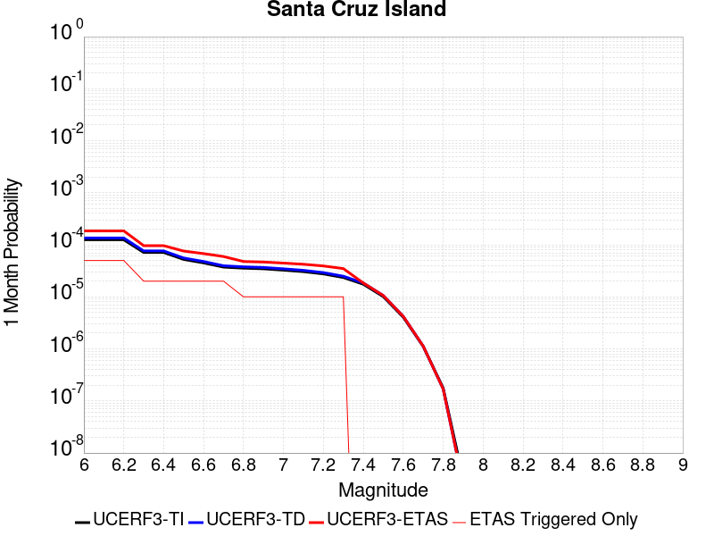 |  |  |

| Magnitude | 1 wk TI Prob | 1 wk TD Prob | 1 wk ETAS Prob | 1 wk ETAS/TD Gain | 1 wk ETAS Triggered Only | 1 mo TI Prob | 1 mo TD Prob | 1 mo ETAS Prob | 1 mo ETAS/TD Gain | 1 mo ETAS Triggered Only | 1 yr TI Prob | 1 yr TD Prob | 1 yr ETAS Prob | 1 yr ETAS/TD Gain | 1 yr ETAS Triggered Only | 10 yr TI Prob | 10 yr TD Prob | 10 yr ETAS Prob | 10 yr ETAS/TD Gain | 10 yr ETAS Triggered Only |
|-----|-----|-----|-----|-----|-----|-----|-----|-----|-----|-----|-----|-----|-----|-----|-----|-----|-----|-----|-----|-----|
| 6.0 | 2.9164563E-5 | 3.1599742E-5 | 1.0661331E-4 | 3.3738663 | 7.501594E-5 | 1.2498499E-4 | 1.3542121E-4 | 2.10427E-4 | 1.5538702 | 7.501594E-5 | 0.0015206301 | 0.0016476426 | 0.0017974272 | 1.0909085 | 1.5003188E-4 | 0.015102667 | 0.016368 | 0.016515575 | 1.0090162 | 1.5003188E-4 |
| 6.1 | 2.9164563E-5 | 3.1599742E-5 | 1.0661331E-4 | 3.3738663 | 7.501594E-5 | 1.2498499E-4 | 1.3542121E-4 | 2.10427E-4 | 1.5538702 | 7.501594E-5 | 0.0015206301 | 0.0016476426 | 0.0017974272 | 1.0909085 | 1.5003188E-4 | 0.015102667 | 0.016368 | 0.016515575 | 1.0090162 | 1.5003188E-4 |
| 6.2 | 2.9164563E-5 | 3.1599742E-5 | 1.0661331E-4 | 3.3738663 | 7.501594E-5 | 1.2498499E-4 | 1.3542121E-4 | 2.10427E-4 | 1.5538702 | 7.501594E-5 | 0.0015206301 | 0.0016476426 | 0.0017974272 | 1.0909085 | 1.5003188E-4 | 0.015102667 | 0.016368 | 0.016515575 | 1.0090162 | 1.5003188E-4 |
| 6.3 | 1.6635553E-5 | 1.780436E-5 | 9.281896E-5 | 5.213272 | 7.501594E-5 | 7.1293274E-5 | 7.630227E-5 | 1.5131249E-4 | 1.9830667 | 7.501594E-5 | 8.6765E-4 | 9.286024E-4 | 0.0010035487 | 1.0807087 | 7.501594E-5 | 0.008642701 | 0.009249094 | 0.009323416 | 1.0080357 | 7.501594E-5 |
| 6.4 | 1.6635553E-5 | 1.780436E-5 | 9.281896E-5 | 5.213272 | 7.501594E-5 | 7.1293274E-5 | 7.630227E-5 | 1.5131249E-4 | 1.9830667 | 7.501594E-5 | 8.6765E-4 | 9.286024E-4 | 0.0010035487 | 1.0807087 | 7.501594E-5 | 0.008642701 | 0.009249094 | 0.009323416 | 1.0080357 | 7.501594E-5 |
| 6.5 | 1.2238748E-5 | 1.3042996E-5 | 8.805796E-5 | 6.75136 | 7.501594E-5 | 5.2450723E-5 | 5.5897377E-5 | 1.3090913E-4 | 2.3419547 | 7.501594E-5 | 6.3840044E-4 | 6.8034173E-4 | 7.553067E-4 | 1.1101872 | 7.501594E-5 | 0.0063656955 | 0.006782988 | 0.0068574953 | 1.0109844 | 7.501594E-5 |
| 6.6 | 1.0489767E-5 | 1.1156636E-5 | 8.617174E-5 | 7.72381 | 7.501594E-5 | 4.495537E-5 | 4.781329E-5 | 1.2282564E-4 | 2.5688598 | 7.501594E-5 | 5.4719415E-4 | 5.819736E-4 | 6.5694586E-4 | 1.1288242 | 7.501594E-5 | 0.005458487 | 0.005804736 | 0.0058793165 | 1.0128483 | 7.501594E-5 |
| 6.7 | 8.699222E-6 | 9.236783E-6 | 8.425203E-5 | 9.121362 | 7.501594E-5 | 3.7281847E-5 | 3.958561E-5 | 1.1459858E-4 | 2.8949554 | 7.501594E-5 | 4.5381195E-4 | 4.818488E-4 | 5.5682857E-4 | 1.1556085 | 7.501594E-5 | 0.0045288634 | 0.004808108 | 0.004882763 | 1.015527 | 7.501594E-5 |
| 6.8 | 8.307732E-6 | 8.8169045E-6 | 4.6324545E-5 | 5.25406 | 3.750797E-5 | 3.560408E-5 | 3.7786187E-5 | 7.5292744E-5 | 1.9925995 | 3.750797E-5 | 4.3339343E-4 | 4.5995016E-4 | 4.9744087E-4 | 1.0815104 | 3.750797E-5 | 0.004325492 | 0.0045900354 | 0.004627371 | 1.0081341 | 3.750797E-5 |
| 6.9 | 8.073121E-6 | 8.564939E-6 | 4.607259E-5 | 5.3792076 | 3.750797E-5 | 3.459863E-5 | 3.670637E-5 | 7.421296E-5 | 2.0218008 | 3.750797E-5 | 4.2115687E-4 | 4.4680882E-4 | 4.8430002E-4 | 1.0839088 | 3.750797E-5 | 0.004203596 | 0.004459156 | 0.004496497 | 1.008374 | 3.750797E-5 |
| 7.0 | 7.617019E-6 | 8.074665E-6 | 4.5582332E-5 | 5.6451054 | 3.750797E-5 | 3.264396E-5 | 3.4605247E-5 | 7.211192E-5 | 2.0838435 | 3.750797E-5 | 3.9736772E-4 | 4.2123784E-4 | 4.5873E-4 | 1.0890048 | 3.750797E-5 | 0.003966579 | 0.0042044413 | 0.0042417916 | 1.0088835 | 3.750797E-5 |
| 7.1 | 7.1224836E-6 | 7.5457883E-6 | 4.5053475E-5 | 5.970679 | 3.750797E-5 | 3.052457E-5 | 3.2338692E-5 | 6.984545E-5 | 2.1598105 | 3.750797E-5 | 3.715733E-4 | 3.9365282E-4 | 4.3114604E-4 | 1.0952443 | 3.750797E-5 | 0.003709526 | 0.0039295983 | 0.0039669587 | 1.0095075 | 3.750797E-5 |
| 7.2 | 6.441115E-6 | 6.8273835E-6 | 4.43351E-5 | 6.493717 | 3.750797E-5 | 2.7604487E-5 | 2.9259889E-5 | 6.676676E-5 | 2.281853 | 3.750797E-5 | 3.360328E-4 | 3.5618115E-4 | 3.9367576E-4 | 1.1052684 | 3.750797E-5 | 0.0033552512 | 0.0035561312 | 0.0035935058 | 1.0105098 | 3.750797E-5 |
| 7.3 | 5.494274E-6 | 5.8199944E-6 | 4.3327746E-5 | 7.444637 | 3.750797E-5 | 2.3546674E-5 | 2.4942596E-5 | 6.244963E-5 | 2.503734 | 3.750797E-5 | 2.8664304E-4 | 3.03634E-4 | 3.4113057E-4 | 1.1234927 | 3.750797E-5 | 0.002862736 | 0.0030322145 | 0.0030696087 | 1.0123323 | 3.750797E-5 |
| 7.4 | 4.0802624E-6 | 4.3122564E-6 | 4.3122564E-6 | 1.0 | 0.0 | 1.7486722E-5 | 1.8480969E-5 | 1.8480969E-5 | 1.0 | 0.0 | 2.1288003E-4 | 2.2498264E-4 | 2.2498264E-4 | 1.0 | 0.0 | 0.0021267622 | 0.0022475577 | 0.0022475577 | 1.0 | 0.0 |
| 7.5 | 2.3584746E-6 | 2.4753099E-6 | 2.4753099E-6 | 1.0 | 0.0 | 1.0107709E-5 | 1.0608428E-5 | 1.0608428E-5 | 1.0 | 0.0 | 1.2305441E-4 | 1.2915001E-4 | 1.2915001E-4 | 1.0 | 0.0 | 0.0012298629 | 0.0012907545 | 0.0012907545 | 1.0 | 0.0 |
| 7.6 | 9.4981914E-7 | 9.860934E-7 | 9.860934E-7 | 1.0 | 0.0 | 4.0706473E-6 | 4.2261076E-6 | 4.2261076E-6 | 1.0 | 0.0 | 4.9559E-5 | 5.1451658E-5 | 5.1451658E-5 | 1.0 | 0.0 | 4.954795E-4 | 5.1439874E-4 | 5.1439874E-4 | 1.0 | 0.0 |
| 7.7 | 2.6013532E-7 | 2.6416632E-7 | 2.6416632E-7 | 1.0 | 0.0 | 1.1148652E-6 | 1.1321408E-6 | 1.1321408E-6 | 1.0 | 0.0 | 1.3573399E-5 | 1.3783729E-5 | 1.3783729E-5 | 1.0 | 0.0 | 1.357257E-4 | 1.378288E-4 | 1.378288E-4 | 1.0 | 0.0 |
| 7.8 | 4.1522263E-8 | 3.965698E-8 | 3.965698E-8 | 1.0 | 0.0 | 1.7795254E-7 | 1.6995848E-7 | 1.6995848E-7 | 1.0 | 0.0 | 2.16657E-6 | 2.0692428E-6 | 2.0692428E-6 | 1.0 | 0.0 | 2.1665488E-5 | 2.0692256E-5 | 2.0692256E-5 | 1.0 | 0.0 |
| 7.9 | 7.7242046E-10 | 5.9475225E-10 | 5.9475225E-10 | 1.0 | 0.0 | 3.3103735E-9 | 2.5489382E-9 | 2.5489382E-9 | 1.0 | 0.0 | 4.0303796E-8 | 3.1033323E-8 | 3.1033323E-8 | 1.0 | 0.0 | 4.030379E-7 | 3.103332E-7 | 3.103332E-7 | 1.0 | 0.0 |

## Independence rev 2011
*[(top)](#table-of-contents)*

| 1 Week | 1 Month | 1 Year | 10 Year |
|-----|-----|-----|-----|
|  |  |  |  |

| Magnitude | 1 wk TI Prob | 1 wk TD Prob | 1 wk ETAS Prob | 1 wk ETAS/TD Gain | 1 wk ETAS Triggered Only | 1 mo TI Prob | 1 mo TD Prob | 1 mo ETAS Prob | 1 mo ETAS/TD Gain | 1 mo ETAS Triggered Only | 1 yr TI Prob | 1 yr TD Prob | 1 yr ETAS Prob | 1 yr ETAS/TD Gain | 1 yr ETAS Triggered Only | 10 yr TI Prob | 10 yr TD Prob | 10 yr ETAS Prob | 10 yr ETAS/TD Gain | 10 yr ETAS Triggered Only |
|-----|-----|-----|-----|-----|-----|-----|-----|-----|-----|-----|-----|-----|-----|-----|-----|-----|-----|-----|-----|-----|
| 6.0 | 4.422171E-6 | 4.3262253E-6 | 1.1684965E-4 | 27.009607 | 1.12523914E-4 | 1.8952025E-5 | 1.8540852E-5 | 1.3106268E-4 | 7.06886 | 1.12523914E-4 | 2.3071647E-4 | 2.2571447E-4 | 3.7571247E-4 | 1.6645477 | 1.5003188E-4 | 0.0023047708 | 0.0022551457 | 0.0024048393 | 1.0663787 | 1.5003188E-4 |
| 6.1 | 4.422171E-6 | 4.3262253E-6 | 1.1684965E-4 | 27.009607 | 1.12523914E-4 | 1.8952025E-5 | 1.8540852E-5 | 1.3106268E-4 | 7.06886 | 1.12523914E-4 | 2.3071647E-4 | 2.2571447E-4 | 3.7571247E-4 | 1.6645477 | 1.5003188E-4 | 0.0023047708 | 0.0022551457 | 0.0024048393 | 1.0663787 | 1.5003188E-4 |
| 6.2 | 4.422171E-6 | 4.3262253E-6 | 1.1684965E-4 | 27.009607 | 1.12523914E-4 | 1.8952025E-5 | 1.8540852E-5 | 1.3106268E-4 | 7.06886 | 1.12523914E-4 | 2.3071647E-4 | 2.2571447E-4 | 3.7571247E-4 | 1.6645477 | 1.5003188E-4 | 0.0023047708 | 0.0022551457 | 0.0024048393 | 1.0663787 | 1.5003188E-4 |
| 6.3 | 4.422171E-6 | 4.3262253E-6 | 1.1684965E-4 | 27.009607 | 1.12523914E-4 | 1.8952025E-5 | 1.8540852E-5 | 1.3106268E-4 | 7.06886 | 1.12523914E-4 | 2.3071647E-4 | 2.2571447E-4 | 3.7571247E-4 | 1.6645477 | 1.5003188E-4 | 0.0023047708 | 0.0022551457 | 0.0024048393 | 1.0663787 | 1.5003188E-4 |
| 6.4 | 4.422171E-6 | 4.3262253E-6 | 1.1684965E-4 | 27.009607 | 1.12523914E-4 | 1.8952025E-5 | 1.8540852E-5 | 1.3106268E-4 | 7.06886 | 1.12523914E-4 | 2.3071647E-4 | 2.2571447E-4 | 3.7571247E-4 | 1.6645477 | 1.5003188E-4 | 0.0023047708 | 0.0022551457 | 0.0024048393 | 1.0663787 | 1.5003188E-4 |
| 6.5 | 4.422171E-6 | 4.3262253E-6 | 1.1684965E-4 | 27.009607 | 1.12523914E-4 | 1.8952025E-5 | 1.8540852E-5 | 1.3106268E-4 | 7.06886 | 1.12523914E-4 | 2.3071647E-4 | 2.2571447E-4 | 3.7571247E-4 | 1.6645477 | 1.5003188E-4 | 0.0023047708 | 0.0022551457 | 0.0024048393 | 1.0663787 | 1.5003188E-4 |
| 6.6 | 2.663744E-6 | 2.5319846E-6 | 1.1505561E-4 | 45.440884 | 1.12523914E-4 | 1.1415996E-5 | 1.08513195E-5 | 1.23374E-4 | 11.3694935 | 1.12523914E-4 | 1.3898089E-4 | 1.321073E-4 | 2.8211935E-4 | 2.135532 | 1.5003188E-4 | 0.0013889399 | 0.0013203359 | 0.0014701698 | 1.1134815 | 1.5003188E-4 |
| 6.7 | 2.663744E-6 | 2.5319846E-6 | 1.1505561E-4 | 45.440884 | 1.12523914E-4 | 1.1415996E-5 | 1.08513195E-5 | 1.23374E-4 | 11.3694935 | 1.12523914E-4 | 1.3898089E-4 | 1.321073E-4 | 2.8211935E-4 | 2.135532 | 1.5003188E-4 | 0.0013889399 | 0.0013203359 | 0.0014701698 | 1.1134815 | 1.5003188E-4 |
| 6.8 | 1.9716529E-6 | 1.8322567E-6 | 1.14355964E-4 | 62.412636 | 1.12523914E-4 | 8.449913E-6 | 7.852505E-6 | 1.2037553E-4 | 15.32957 | 1.12523914E-4 | 1.0287284E-4 | 9.560019E-5 | 2.0811334E-4 | 2.1769135 | 1.12523914E-4 | 0.0010282523 | 9.5560355E-4 | 0.0010680199 | 1.1176392 | 1.12523914E-4 |
| 6.9 | 1.8788617E-6 | 1.7429976E-6 | 1.1426671E-4 | 65.55759 | 1.12523914E-4 | 8.0522395E-6 | 7.4699688E-6 | 1.1999304E-4 | 16.063393 | 1.12523914E-4 | 9.80316E-5 | 9.09432E-5 | 2.0345688E-4 | 2.2371862 | 1.12523914E-4 | 9.798837E-4 | 9.090718E-4 | 0.0010214935 | 1.1236664 | 1.12523914E-4 |
| 7.0 | 1.5045488E-6 | 1.3849498E-6 | 1.139087E-4 | 82.247536 | 1.12523914E-4 | 6.44805E-6 | 5.9354857E-6 | 1.1845873E-4 | 19.957714 | 1.12523914E-4 | 7.8502184E-5 | 7.226219E-5 | 1.8477798E-4 | 2.557049 | 1.12523914E-4 | 7.8474457E-4 | 7.223921E-4 | 8.348347E-4 | 1.1556531 | 1.12523914E-4 |
| 7.1 | 1.272341E-6 | 1.1625089E-6 | 1.1368629E-4 | 97.793915 | 1.12523914E-4 | 5.4528787E-6 | 4.9821715E-6 | 1.1750552E-4 | 23.585201 | 1.12523914E-4 | 6.6386776E-5 | 6.0656283E-5 | 1.7317336E-4 | 2.8549948 | 1.12523914E-4 | 6.636695E-4 | 6.064005E-4 | 7.188562E-4 | 1.1854479 | 1.12523914E-4 |
| 7.2 | 1.0416892E-6 | 9.409871E-7 | 1.1346479E-4 | 120.580605 | 1.12523914E-4 | 4.464375E-6 | 4.032796E-6 | 1.1655625E-4 | 28.902098 | 1.12523914E-4 | 5.4352407E-5 | 4.9098202E-5 | 1.6161658E-4 | 3.2917008 | 1.12523914E-4 | 5.4339116E-4 | 4.908754E-4 | 6.0334406E-4 | 1.2291186 | 1.12523914E-4 |
| 7.3 | 7.9450155E-7 | 7.2350036E-7 | 1.1324733E-4 | 156.52698 | 1.12523914E-4 | 3.4050022E-6 | 3.1007123E-6 | 1.1562427E-4 | 37.289585 | 1.12523914E-4 | 4.1455114E-5 | 3.7750528E-5 | 1.5027019E-4 | 3.9806116 | 1.12523914E-4 | 4.144738E-4 | 3.7744228E-4 | 4.899237E-4 | 1.2980096 | 1.12523914E-4 |
| 7.4 | 5.3893444E-7 | 5.0195166E-7 | 1.1302581E-4 | 225.1727 | 1.12523914E-4 | 2.309717E-6 | 2.1512196E-6 | 1.1467489E-4 | 53.30692 | 1.12523914E-4 | 2.8120441E-5 | 2.6190788E-5 | 1.3871175E-4 | 5.2962036 | 1.12523914E-4 | 2.8116882E-4 | 2.6187746E-4 | 3.743719E-4 | 1.429569 | 1.12523914E-4 |
| 7.5 | 3.8852085E-7 | 3.6825622E-7 | 1.1289213E-4 | 306.55862 | 1.12523914E-4 | 1.6650882E-6 | 1.57824E-6 | 1.14101975E-4 | 72.29697 | 1.12523914E-4 | 2.027226E-5 | 1.9214905E-5 | 1.3173666E-4 | 6.855962 | 1.12523914E-4 | 2.0270412E-4 | 1.9213265E-4 | 3.0463494E-4 | 1.5855448 | 1.12523914E-4 |
| 7.6 | 2.414929E-7 | 2.3457605E-7 | 1.1275846E-4 | 480.69043 | 1.12523914E-4 | 1.0349692E-6 | 1.0053255E-6 | 1.13529124E-4 | 112.92772 | 1.12523914E-4 | 1.2600677E-5 | 1.2239771E-5 | 1.247623E-4 | 10.19319 | 1.12523914E-4 | 1.2599962E-4 | 1.223911E-4 | 2.3490124E-4 | 1.9192674 | 1.12523914E-4 |
| 7.7 | 6.8298014E-8 | 6.8589785E-8 | 6.8589785E-8 | 1.0 | 0.0 | 2.9270575E-7 | 2.939562E-7 | 2.939562E-7 | 1.0 | 0.0 | 3.5636867E-6 | 3.5789112E-6 | 3.5789112E-6 | 1.0 | 0.0 | 3.5636294E-5 | 3.5788584E-5 | 3.5788584E-5 | 1.0 | 0.0 |

## Blue Cut
*[(top)](#table-of-contents)*

| 1 Week | 1 Month | 1 Year | 10 Year |
|-----|-----|-----|-----|
| 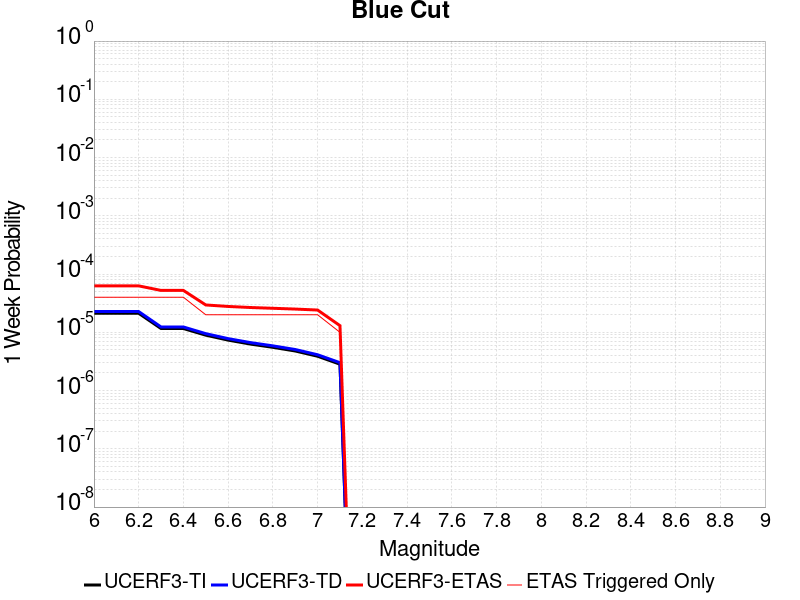 |  |  |  |

| Magnitude | 1 wk TI Prob | 1 wk TD Prob | 1 wk ETAS Prob | 1 wk ETAS/TD Gain | 1 wk ETAS Triggered Only | 1 mo TI Prob | 1 mo TD Prob | 1 mo ETAS Prob | 1 mo ETAS/TD Gain | 1 mo ETAS Triggered Only | 1 yr TI Prob | 1 yr TD Prob | 1 yr ETAS Prob | 1 yr ETAS/TD Gain | 1 yr ETAS Triggered Only | 10 yr TI Prob | 10 yr TD Prob | 10 yr ETAS Prob | 10 yr ETAS/TD Gain | 10 yr ETAS Triggered Only |
|-----|-----|-----|-----|-----|-----|-----|-----|-----|-----|-----|-----|-----|-----|-----|-----|-----|-----|-----|-----|-----|
| 6.0 | 2.1227985E-5 | 2.2719574E-5 | 6.0226692E-5 | 2.6508725 | 3.750797E-5 | 9.097391E-5 | 9.73663E-5 | 1.7237493E-4 | 1.7703757 | 7.501594E-5 | 0.0011070445 | 0.0011848481 | 0.0012972387 | 1.0948565 | 1.12523914E-4 | 0.011015458 | 0.011791152 | 0.011902349 | 1.0094305 | 1.12523914E-4 |
| 6.1 | 2.1227985E-5 | 2.2719574E-5 | 6.0226692E-5 | 2.6508725 | 3.750797E-5 | 9.097391E-5 | 9.73663E-5 | 1.7237493E-4 | 1.7703757 | 7.501594E-5 | 0.0011070445 | 0.0011848481 | 0.0012972387 | 1.0948565 | 1.12523914E-4 | 0.011015458 | 0.011791152 | 0.011902349 | 1.0094305 | 1.12523914E-4 |
| 6.2 | 2.1227985E-5 | 2.2719574E-5 | 6.0226692E-5 | 2.6508725 | 3.750797E-5 | 9.097391E-5 | 9.73663E-5 | 1.7237493E-4 | 1.7703757 | 7.501594E-5 | 0.0011070445 | 0.0011848481 | 0.0012972387 | 1.0948565 | 1.12523914E-4 | 0.011015458 | 0.011791152 | 0.011902349 | 1.0094305 | 1.12523914E-4 |
| 6.3 | 1.1613981E-5 | 1.2353542E-5 | 4.986105E-5 | 4.0361743 | 3.750797E-5 | 4.9773254E-5 | 5.2942745E-5 | 1.2795471E-4 | 2.4168508 | 7.501594E-5 | 6.0582085E-4 | 6.443998E-4 | 7.1936735E-4 | 1.1163371 | 7.501594E-5 | 0.0060417196 | 0.0064265593 | 0.006501093 | 1.0115978 | 7.501594E-5 |
| 6.4 | 1.1613981E-5 | 1.2353542E-5 | 4.986105E-5 | 4.0361743 | 3.750797E-5 | 4.9773254E-5 | 5.2942745E-5 | 1.2795471E-4 | 2.4168508 | 7.501594E-5 | 6.0582085E-4 | 6.443998E-4 | 7.1936735E-4 | 1.1163371 | 7.501594E-5 | 0.0060417196 | 0.0064265593 | 0.006501093 | 1.0115978 | 7.501594E-5 |
| 6.5 | 8.931326E-6 | 9.4816E-6 | 4.6989215E-5 | 4.955832 | 3.750797E-5 | 3.8276554E-5 | 4.0634844E-5 | 7.814129E-5 | 1.9230119 | 3.750797E-5 | 4.6591737E-4 | 4.946261E-4 | 5.321155E-4 | 1.0757935 | 3.750797E-5 | 0.0046494175 | 0.004936161 | 0.0049734837 | 1.0075611 | 3.750797E-5 |
| 6.6 | 7.345353E-6 | 7.79028E-6 | 4.529796E-5 | 5.8146772 | 3.750797E-5 | 3.1479703E-5 | 3.338653E-5 | 7.089325E-5 | 2.1234088 | 3.750797E-5 | 3.83198E-4 | 4.064132E-4 | 4.439059E-4 | 1.0922527 | 3.750797E-5 | 0.0038253788 | 0.0040574907 | 0.0040948465 | 1.0092067 | 3.750797E-5 |
| 6.7 | 6.2775666E-6 | 6.655149E-6 | 4.416287E-5 | 6.635895 | 3.750797E-5 | 2.690358E-5 | 2.8521798E-5 | 6.60287E-5 | 2.3150258 | 3.750797E-5 | 3.2750185E-4 | 3.472051E-4 | 3.8470002E-4 | 1.1079907 | 3.750797E-5 | 0.0032701963 | 0.003467367 | 0.003504745 | 1.0107799 | 3.750797E-5 |
| 6.8 | 5.5234095E-6 | 5.8551113E-6 | 4.3362863E-5 | 7.4059844 | 3.750797E-5 | 2.367154E-5 | 2.5093133E-5 | 6.2600164E-5 | 2.4947128 | 3.750797E-5 | 2.8816288E-4 | 3.0547334E-4 | 3.4296987E-4 | 1.1227489 | 3.750797E-5 | 0.002877895 | 0.0030512505 | 0.003088644 | 1.0122552 | 3.750797E-5 |
| 6.9 | 4.7780054E-6 | 5.0654203E-6 | 4.25732E-5 | 8.404673 | 3.750797E-5 | 2.0477004E-5 | 2.1708804E-5 | 5.921596E-5 | 2.7277393 | 3.750797E-5 | 2.4927902E-4 | 2.642797E-4 | 3.0177773E-4 | 1.1418878 | 3.750797E-5 | 0.0024899957 | 0.002640346 | 0.002677755 | 1.0141681 | 3.750797E-5 |
| 7.0 | 3.883171E-6 | 4.118487E-6 | 4.1626303E-5 | 10.107183 | 3.750797E-5 | 1.6642054E-5 | 1.7650578E-5 | 5.5157885E-5 | 3.1249902 | 3.750797E-5 | 2.0259817E-4 | 2.1488148E-4 | 2.523814E-4 | 1.1745144 | 3.750797E-5 | 0.0020241356 | 0.0021474129 | 0.0021848402 | 1.0174291 | 3.750797E-5 |
| 7.1 | 2.8358215E-6 | 3.0097158E-6 | 4.0517574E-5 | 13.462258 | 3.750797E-5 | 1.2153464E-5 | 1.2898756E-5 | 5.040624E-5 | 3.9078376 | 3.750797E-5 | 1.4795837E-4 | 1.5703762E-4 | 1.945397E-4 | 1.2388096 | 3.750797E-5 | 0.001478599 | 0.0015699116 | 0.0016073607 | 1.0238543 | 3.750797E-5 |

## Cleghorn Pass
*[(top)](#table-of-contents)*

| 1 Week | 1 Month | 1 Year | 10 Year |
|-----|-----|-----|-----|
|  | 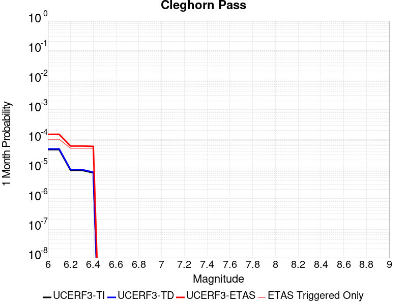 |  |  |

| Magnitude | 1 wk TI Prob | 1 wk TD Prob | 1 wk ETAS Prob | 1 wk ETAS/TD Gain | 1 wk ETAS Triggered Only | 1 mo TI Prob | 1 mo TD Prob | 1 mo ETAS Prob | 1 mo ETAS/TD Gain | 1 mo ETAS Triggered Only | 1 yr TI Prob | 1 yr TD Prob | 1 yr ETAS Prob | 1 yr ETAS/TD Gain | 1 yr ETAS Triggered Only | 10 yr TI Prob | 10 yr TD Prob | 10 yr ETAS Prob | 10 yr ETAS/TD Gain | 10 yr ETAS Triggered Only |
|-----|-----|-----|-----|-----|-----|-----|-----|-----|-----|-----|-----|-----|-----|-----|-----|-----|-----|-----|-----|-----|
| 6.0 | 1.0522846E-5 | 1.1040642E-5 | 8.6055756E-5 | 7.794452 | 7.501594E-5 | 4.509713E-5 | 4.7316473E-5 | 1.2232887E-4 | 2.5853336 | 7.501594E-5 | 5.4891926E-4 | 5.759784E-4 | 6.509512E-4 | 1.1301658 | 7.501594E-5 | 0.0054756533 | 0.005750022 | 0.005861899 | 1.0194567 | 1.12523914E-4 |
| 6.1 | 1.0522846E-5 | 1.1040642E-5 | 8.6055756E-5 | 7.794452 | 7.501594E-5 | 4.509713E-5 | 4.7316473E-5 | 1.2232887E-4 | 2.5853336 | 7.501594E-5 | 5.4891926E-4 | 5.759784E-4 | 6.509512E-4 | 1.1301658 | 7.501594E-5 | 0.0054756533 | 0.005750022 | 0.005861899 | 1.0194567 | 1.12523914E-4 |
| 6.2 | 2.1045846E-6 | 2.2082024E-6 | 2.2082024E-6 | 1.0 | 0.0 | 9.019617E-6 | 9.463714E-6 | 9.463714E-6 | 1.0 | 0.0 | 1.098083E-4 | 1.1521882E-4 | 1.1521882E-4 | 1.0 | 0.0 | 0.0010975406 | 0.0011520023 | 0.0011520023 | 1.0 | 0.0 |
| 6.3 | 2.1045846E-6 | 2.2082024E-6 | 2.2082024E-6 | 1.0 | 0.0 | 9.019617E-6 | 9.463714E-6 | 9.463714E-6 | 1.0 | 0.0 | 1.098083E-4 | 1.1521882E-4 | 1.1521882E-4 | 1.0 | 0.0 | 0.0010975406 | 0.0011520023 | 0.0011520023 | 1.0 | 0.0 |
| 6.4 | 1.7259927E-6 | 1.810877E-6 | 1.810877E-6 | 1.0 | 0.0 | 7.3970905E-6 | 7.760902E-6 | 7.760902E-6 | 1.0 | 0.0 | 9.005586E-5 | 9.4488976E-5 | 9.4488976E-5 | 1.0 | 0.0 | 9.001937E-4 | 9.448898E-4 | 9.448898E-4 | 1.0 | 0.0 |

## Santa Ynez (East)
*[(top)](#table-of-contents)*

| 1 Week | 1 Month | 1 Year | 10 Year |
|-----|-----|-----|-----|
|  | 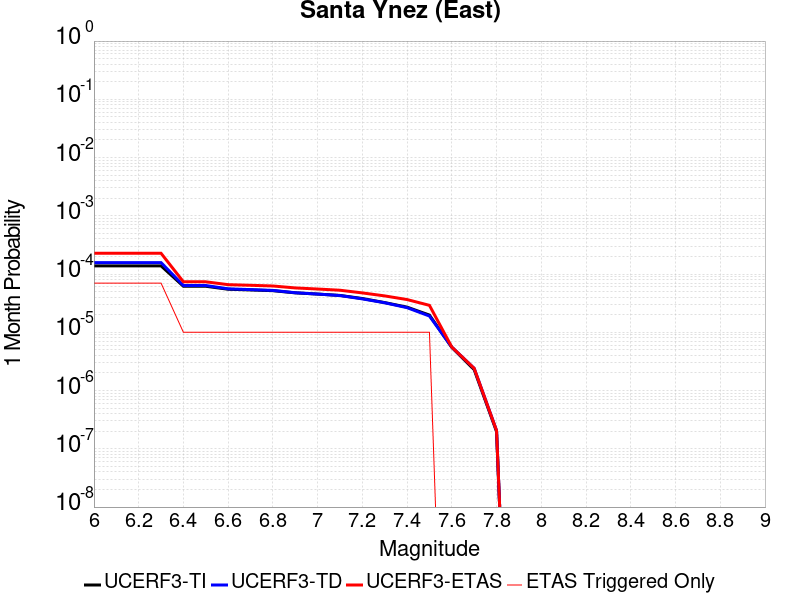 |  |  |

| Magnitude | 1 wk TI Prob | 1 wk TD Prob | 1 wk ETAS Prob | 1 wk ETAS/TD Gain | 1 wk ETAS Triggered Only | 1 mo TI Prob | 1 mo TD Prob | 1 mo ETAS Prob | 1 mo ETAS/TD Gain | 1 mo ETAS Triggered Only | 1 yr TI Prob | 1 yr TD Prob | 1 yr ETAS Prob | 1 yr ETAS/TD Gain | 1 yr ETAS Triggered Only | 10 yr TI Prob | 10 yr TD Prob | 10 yr ETAS Prob | 10 yr ETAS/TD Gain | 10 yr ETAS Triggered Only |
|-----|-----|-----|-----|-----|-----|-----|-----|-----|-----|-----|-----|-----|-----|-----|-----|-----|-----|-----|-----|-----|
| 6.0 | 3.2269712E-5 | 3.6750775E-5 | 7.425737E-5 | 2.020566 | 3.750797E-5 | 1.3829143E-4 | 1.5749714E-4 | 1.949992E-4 | 1.2381127 | 3.750797E-5 | 0.0016823979 | 0.0019164253 | 0.0019538614 | 1.0195343 | 3.750797E-5 | 0.016697178 | 0.019056438 | 0.019166818 | 1.0057923 | 1.12523914E-4 |
| 6.1 | 3.2269712E-5 | 3.6750775E-5 | 7.425737E-5 | 2.020566 | 3.750797E-5 | 1.3829143E-4 | 1.5749714E-4 | 1.949992E-4 | 1.2381127 | 3.750797E-5 | 0.0016823979 | 0.0019164253 | 0.0019538614 | 1.0195343 | 3.750797E-5 | 0.016697178 | 0.019056438 | 0.019166818 | 1.0057923 | 1.12523914E-4 |
| 6.2 | 3.2269712E-5 | 3.6750775E-5 | 7.425737E-5 | 2.020566 | 3.750797E-5 | 1.3829143E-4 | 1.5749714E-4 | 1.949992E-4 | 1.2381127 | 3.750797E-5 | 0.0016823979 | 0.0019164253 | 0.0019538614 | 1.0195343 | 3.750797E-5 | 0.016697178 | 0.019056438 | 0.019166818 | 1.0057923 | 1.12523914E-4 |
| 6.3 | 3.2269712E-5 | 3.6750775E-5 | 7.425737E-5 | 2.020566 | 3.750797E-5 | 1.3829143E-4 | 1.5749714E-4 | 1.949992E-4 | 1.2381127 | 3.750797E-5 | 0.0016823979 | 0.0019164253 | 0.0019538614 | 1.0195343 | 3.750797E-5 | 0.016697178 | 0.019056438 | 0.019166818 | 1.0057923 | 1.12523914E-4 |
| 6.4 | 1.4404779E-5 | 1.48492945E-5 | 1.48492945E-5 | 1.0 | 0.0 | 6.1733306E-5 | 6.363831E-5 | 6.363831E-5 | 1.0 | 0.0 | 7.513438E-4 | 7.7452604E-4 | 7.7452604E-4 | 1.0 | 0.0 | 0.0074880854 | 0.007718817 | 0.0077560353 | 1.0048218 | 3.750797E-5 |
| 6.5 | 1.4404779E-5 | 1.48492945E-5 | 1.48492945E-5 | 1.0 | 0.0 | 6.1733306E-5 | 6.363831E-5 | 6.363831E-5 | 1.0 | 0.0 | 7.513438E-4 | 7.7452604E-4 | 7.7452604E-4 | 1.0 | 0.0 | 0.0074880854 | 0.007718817 | 0.0077560353 | 1.0048218 | 3.750797E-5 |
| 6.6 | 1.280208E-5 | 1.301186E-5 | 1.301186E-5 | 1.0 | 0.0 | 5.4864904E-5 | 5.5763932E-5 | 5.5763932E-5 | 1.0 | 0.0 | 6.6777546E-4 | 6.7871617E-4 | 6.7871617E-4 | 1.0 | 0.0 | 0.006657724 | 0.0067666434 | 0.006803897 | 1.0055056 | 3.750797E-5 |
| 6.7 | 1.2457027E-5 | 1.262838E-5 | 1.262838E-5 | 1.0 | 0.0 | 5.3386164E-5 | 5.4120515E-5 | 5.4120515E-5 | 1.0 | 0.0 | 6.497827E-4 | 6.5871974E-4 | 6.5871974E-4 | 1.0 | 0.0 | 0.00647886 | 0.00656787 | 0.006605131 | 1.0056733 | 3.750797E-5 |
| 6.8 | 1.2095134E-5 | 1.2230827E-5 | 1.2230827E-5 | 1.0 | 0.0 | 5.1835254E-5 | 5.2416784E-5 | 5.2416784E-5 | 1.0 | 0.0 | 6.309115E-4 | 6.3798914E-4 | 6.3798914E-4 | 1.0 | 0.0 | 0.0062912325 | 0.006361764 | 0.006399033 | 1.0058583 | 3.750797E-5 |
| 6.9 | 1.1104036E-5 | 1.115726E-5 | 1.115726E-5 | 1.0 | 0.0 | 4.758786E-5 | 4.781596E-5 | 4.781596E-5 | 1.0 | 0.0 | 5.7922816E-4 | 5.82005E-4 | 5.82005E-4 | 1.0 | 0.0 | 0.005777207 | 0.0058049536 | 0.005842244 | 1.0064238 | 3.750797E-5 |
| 7.0 | 1.0577444E-5 | 1.05815925E-5 | 1.05815925E-5 | 1.0 | 0.0 | 4.5331115E-5 | 4.53489E-5 | 4.53489E-5 | 1.0 | 0.0 | 5.5176654E-4 | 5.5198424E-4 | 5.5198424E-4 | 1.0 | 0.0 | 0.0055039856 | 0.00550627 | 0.0055435714 | 1.0067743 | 3.750797E-5 |
| 7.1 | 1.0021775E-5 | 9.9809E-6 | 9.9809E-6 | 1.0 | 0.0 | 4.294976E-5 | 4.277459E-5 | 4.277459E-5 | 1.0 | 0.0 | 5.2278786E-4 | 5.206574E-4 | 5.206574E-4 | 1.0 | 0.0 | 0.0052155964 | 0.005194508 | 0.0052318214 | 1.0071832 | 3.750797E-5 |
| 7.2 | 8.874109E-6 | 8.748706E-6 | 8.748706E-6 | 1.0 | 0.0 | 3.8031343E-5 | 3.7493923E-5 | 3.7493923E-5 | 1.0 | 0.0 | 4.629332E-4 | 4.56394E-4 | 4.56394E-4 | 1.0 | 0.0 | 0.0046197 | 0.0045546847 | 0.004592022 | 1.0081975 | 3.750797E-5 |
| 7.3 | 7.5504267E-6 | 7.5050243E-6 | 7.5050243E-6 | 1.0 | 0.0 | 3.235857E-5 | 3.2164E-5 | 3.2164E-5 | 1.0 | 0.0 | 3.9389438E-4 | 3.9152734E-4 | 3.9152734E-4 | 1.0 | 0.0 | 0.0039319694 | 0.0039084824 | 0.003945844 | 1.009559 | 3.750797E-5 |
| 7.4 | 6.309394E-6 | 6.183062E-6 | 6.183062E-6 | 1.0 | 0.0 | 2.703998E-5 | 2.6498574E-5 | 2.6498574E-5 | 1.0 | 0.0 | 3.2916202E-4 | 3.2257332E-4 | 3.2257332E-4 | 1.0 | 0.0 | 0.003286749 | 0.0032211484 | 0.0032585354 | 1.0116068 | 3.750797E-5 |
| 7.5 | 4.6103073E-6 | 4.4408016E-6 | 4.4408016E-6 | 1.0 | 0.0 | 1.975831E-5 | 1.9031871E-5 | 1.9031871E-5 | 1.0 | 0.0 | 2.4053088E-4 | 2.316891E-4 | 2.316891E-4 | 1.0 | 0.0 | 0.002402707 | 0.002314545 | 0.002351966 | 1.0161679 | 3.750797E-5 |
| 7.6 | 1.2858658E-6 | 1.3008196E-6 | 1.3008196E-6 | 1.0 | 0.0 | 5.5108417E-6 | 5.574929E-6 | 5.574929E-6 | 1.0 | 0.0 | 6.7092435E-5 | 6.787272E-5 | 6.787272E-5 | 1.0 | 0.0 | 6.707218E-4 | 6.7852676E-4 | 6.7852676E-4 | 1.0 | 0.0 |
| 7.7 | 5.3302307E-7 | 5.612138E-7 | 5.612138E-7 | 1.0 | 0.0 | 2.2843826E-6 | 2.4052001E-6 | 2.4052001E-6 | 1.0 | 0.0 | 2.7812002E-5 | 2.9282955E-5 | 2.9282955E-5 | 1.0 | 0.0 | 2.7808524E-4 | 2.9279455E-4 | 2.9279455E-4 | 1.0 | 0.0 |
| 7.8 | 4.613933E-8 | 4.80301E-8 | 4.80301E-8 | 1.0 | 0.0 | 1.9773998E-7 | 2.0584326E-7 | 2.0584326E-7 | 1.0 | 0.0 | 2.4074816E-6 | 2.5061388E-6 | 2.5061388E-6 | 1.0 | 0.0 | 2.4074554E-5 | 2.5061116E-5 | 2.5061116E-5 | 1.0 | 0.0 |

## Great Valley 03a Dunnigan Hills
*[(top)](#table-of-contents)*

| 1 Week | 1 Month | 1 Year | 10 Year |
|-----|-----|-----|-----|
|  |  |  |  |

| Magnitude | 1 wk TI Prob | 1 wk TD Prob | 1 wk ETAS Prob | 1 wk ETAS/TD Gain | 1 wk ETAS Triggered Only | 1 mo TI Prob | 1 mo TD Prob | 1 mo ETAS Prob | 1 mo ETAS/TD Gain | 1 mo ETAS Triggered Only | 1 yr TI Prob | 1 yr TD Prob | 1 yr ETAS Prob | 1 yr ETAS/TD Gain | 1 yr ETAS Triggered Only | 10 yr TI Prob | 10 yr TD Prob | 10 yr ETAS Prob | 10 yr ETAS/TD Gain | 10 yr ETAS Triggered Only |
|-----|-----|-----|-----|-----|-----|-----|-----|-----|-----|-----|-----|-----|-----|-----|-----|-----|-----|-----|-----|-----|
| 6.0 | 1.6591328E-5 | 1.8107954E-5 | 5.5615244E-5 | 3.0713158 | 3.750797E-5 | 7.110376E-5 | 7.7603596E-5 | 1.5261372E-4 | 1.9665804 | 7.501594E-5 | 8.6534437E-4 | 9.444834E-4 | 0.0010194285 | 1.0793504 | 7.501594E-5 | 0.008619824 | 0.009411525 | 0.00952299 | 1.0118434 | 1.12523914E-4 |
| 6.1 | 8.041125E-6 | 8.769726E-6 | 8.769726E-6 | 1.0 | 0.0 | 3.4461507E-5 | 3.7584115E-5 | 3.7584115E-5 | 1.0 | 0.0 | 4.194881E-4 | 4.5751085E-4 | 4.5751085E-4 | 1.0 | 0.0 | 0.004186971 | 0.004567687 | 0.0046050237 | 1.0081741 | 3.750797E-5 |
| 6.2 | 3.2807004E-6 | 3.5795688E-6 | 3.5795688E-6 | 1.0 | 0.0 | 1.4060069E-5 | 1.5340942E-5 | 1.5340942E-5 | 1.0 | 0.0 | 1.7116789E-4 | 1.8676413E-4 | 1.8676413E-4 | 1.0 | 0.0 | 0.0017103611 | 0.0018664796 | 0.0019039176 | 1.020058 | 3.750797E-5 |
| 6.3 | 1.9339366E-6 | 2.1103806E-6 | 2.1103806E-6 | 1.0 | 0.0 | 8.288273E-6 | 9.044474E-6 | 9.044474E-6 | 1.0 | 0.0 | 1.00905054E-4 | 1.1011375E-4 | 1.1011375E-4 | 1.0 | 0.0 | 0.0010085925 | 0.0011008718 | 0.0011008718 | 1.0 | 0.0 |
| 6.4 | 1.3142635E-6 | 1.4339867E-6 | 1.4339867E-6 | 1.0 | 0.0 | 5.6325457E-6 | 6.145657E-6 | 6.145657E-6 | 1.0 | 0.0 | 6.857408E-5 | 7.482337E-5 | 7.482337E-5 | 1.0 | 0.0 | 6.8552926E-4 | 7.4823375E-4 | 7.4823375E-4 | 1.0 | 0.0 |

## Great Valley 09 (Laguna Seca)
*[(top)](#table-of-contents)*

| 1 Week | 1 Month | 1 Year | 10 Year |
|-----|-----|-----|-----|
|  |  |  | 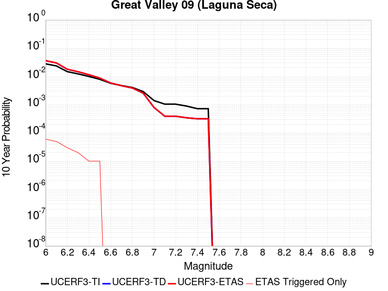 |

| Magnitude | 1 wk TI Prob | 1 wk TD Prob | 1 wk ETAS Prob | 1 wk ETAS/TD Gain | 1 wk ETAS Triggered Only | 1 mo TI Prob | 1 mo TD Prob | 1 mo ETAS Prob | 1 mo ETAS/TD Gain | 1 mo ETAS Triggered Only | 1 yr TI Prob | 1 yr TD Prob | 1 yr ETAS Prob | 1 yr ETAS/TD Gain | 1 yr ETAS Triggered Only | 10 yr TI Prob | 10 yr TD Prob | 10 yr ETAS Prob | 10 yr ETAS/TD Gain | 10 yr ETAS Triggered Only |
|-----|-----|-----|-----|-----|-----|-----|-----|-----|-----|-----|-----|-----|-----|-----|-----|-----|-----|-----|-----|-----|
| 6.0 | 5.4353277E-5 | 7.050019E-5 | 1.0800551E-4 | 1.5319891 | 3.750797E-5 | 2.3292181E-4 | 3.0211007E-4 | 3.3960672E-4 | 1.1241158 | 3.750797E-5 | 0.0028321352 | 0.0036720056 | 0.0037093759 | 1.010177 | 3.750797E-5 | 0.02796312 | 0.036115844 | 0.036224306 | 1.0030031 | 1.12523914E-4 |
| 6.1 | 4.5578287E-5 | 5.822054E-5 | 9.5726326E-5 | 1.644202 | 3.750797E-5 | 1.953209E-4 | 2.4949352E-4 | 2.8699214E-4 | 1.150299 | 3.750797E-5 | 0.0023754383 | 0.0030333549 | 0.003070749 | 1.0123277 | 3.750797E-5 | 0.023502063 | 0.029919893 | 0.029992662 | 1.0024322 | 7.501594E-5 |
| 6.2 | 2.8536782E-5 | 3.4736422E-5 | 3.4736422E-5 | 1.0 | 0.0 | 1.2229476E-4 | 1.4886161E-4 | 1.4886161E-4 | 1.0 | 0.0 | 0.0014879217 | 0.0018108576 | 0.0018108576 | 1.0 | 0.0 | 0.014779986 | 0.017958276 | 0.017958276 | 1.0 | 0.0 |
| 6.3 | 2.3698774E-5 | 2.8213344E-5 | 2.8213344E-5 | 1.0 | 0.0 | 1.01562226E-4 | 1.2090833E-4 | 1.2090833E-4 | 1.0 | 0.0 | 0.0012358186 | 0.001471051 | 0.001471051 | 1.0 | 0.0 | 0.012289686 | 0.014611455 | 0.014611455 | 1.0 | 0.0 |
| 6.4 | 1.9191197E-5 | 2.212289E-5 | 2.212289E-5 | 1.0 | 0.0 | 8.2245395E-5 | 9.4808805E-5 | 9.4808805E-5 | 1.0 | 0.0 | 0.0010008777 | 0.0011536906 | 0.0011536906 | 1.0 | 0.0 | 0.009963818 | 0.011477022 | 0.011477022 | 1.0 | 0.0 |
| 6.5 | 1.5203241E-5 | 1.6801298E-5 | 1.6801298E-5 | 1.0 | 0.0 | 6.5155116E-5 | 7.200338E-5 | 7.200338E-5 | 1.0 | 0.0 | 7.9297484E-4 | 8.76301E-4 | 8.76301E-4 | 1.0 | 0.0 | 0.007901512 | 0.008729581 | 0.008729581 | 1.0 | 0.0 |
| 6.6 | 1.0984925E-5 | 1.12425605E-5 | 1.12425605E-5 | 1.0 | 0.0 | 4.70774E-5 | 4.8181533E-5 | 4.8181533E-5 | 1.0 | 0.0 | 5.730166E-4 | 5.8645604E-4 | 5.8645604E-4 | 1.0 | 0.0 | 0.005715413 | 0.0058494755 | 0.0058494755 | 1.0 | 0.0 |
| 6.7 | 9.134616E-6 | 9.019868E-6 | 9.019868E-6 | 1.0 | 0.0 | 3.9147766E-5 | 3.865602E-5 | 3.865602E-5 | 1.0 | 0.0 | 4.7651984E-4 | 4.7053778E-4 | 4.7053778E-4 | 1.0 | 0.0 | 0.004754993 | 0.00469566 | 0.00469566 | 1.0 | 0.0 |
| 6.8 | 7.785589E-6 | 7.4519185E-6 | 7.4519185E-6 | 1.0 | 0.0 | 3.3366385E-5 | 3.1936415E-5 | 3.1936415E-5 | 1.0 | 0.0 | 4.0616E-4 | 3.887585E-4 | 3.887585E-4 | 1.0 | 0.0 | 0.0040541845 | 0.003880988 | 0.003880988 | 1.0 | 0.0 |
| 6.9 | 5.579095E-6 | 4.8984666E-6 | 4.8984666E-6 | 1.0 | 0.0 | 2.3910188E-5 | 2.0993268E-5 | 2.0993268E-5 | 1.0 | 0.0 | 2.9106764E-4 | 2.5556443E-4 | 2.5556443E-4 | 1.0 | 0.0 | 0.002906867 | 0.0025528427 | 0.0025528427 | 1.0 | 0.0 |
| 7.0 | 2.6816688E-6 | 1.521587E-6 | 1.521587E-6 | 1.0 | 0.0 | 1.1492816E-5 | 6.521071E-6 | 6.521071E-6 | 1.0 | 0.0 | 1.3991605E-4 | 7.939124E-5 | 7.939124E-5 | 1.0 | 0.0 | 0.0013982799 | 7.936375E-4 | 7.936375E-4 | 1.0 | 0.0 |
| 7.1 | 1.9951021E-6 | 7.45357E-7 | 7.45357E-7 | 1.0 | 0.0 | 8.55041E-6 | 3.1943835E-6 | 3.1943835E-6 | 1.0 | 0.0 | 1.0409627E-4 | 3.889097E-5 | 3.889097E-5 | 1.0 | 0.0 | 0.0010404752 | 3.8884574E-4 | 3.8884574E-4 | 1.0 | 0.0 |
| 7.2 | 1.9951021E-6 | 7.45357E-7 | 7.45357E-7 | 1.0 | 0.0 | 8.55041E-6 | 3.1943835E-6 | 3.1943835E-6 | 1.0 | 0.0 | 1.0409627E-4 | 3.889097E-5 | 3.889097E-5 | 1.0 | 0.0 | 0.0010404752 | 3.8884574E-4 | 3.8884574E-4 | 1.0 | 0.0 |
| 7.3 | 1.7087556E-6 | 6.578663E-7 | 6.578663E-7 | 1.0 | 0.0 | 7.3232177E-6 | 2.819424E-6 | 2.819424E-6 | 1.0 | 0.0 | 8.915652E-5 | 3.432599E-5 | 3.432599E-5 | 1.0 | 0.0 | 8.9120766E-4 | 3.432109E-4 | 3.432109E-4 | 1.0 | 0.0 |
| 7.4 | 1.3804846E-6 | 6.0737113E-7 | 6.0737113E-7 | 1.0 | 0.0 | 5.916349E-6 | 2.6030168E-6 | 2.6030168E-6 | 1.0 | 0.0 | 7.2029165E-5 | 3.169131E-5 | 3.169131E-5 | 1.0 | 0.0 | 7.200583E-4 | 3.168719E-4 | 3.168719E-4 | 1.0 | 0.0 |
| 7.5 | 1.3804846E-6 | 6.0737113E-7 | 6.0737113E-7 | 1.0 | 0.0 | 5.916349E-6 | 2.6030168E-6 | 2.6030168E-6 | 1.0 | 0.0 | 7.2029165E-5 | 3.169131E-5 | 3.169131E-5 | 1.0 | 0.0 | 7.200583E-4 | 3.168719E-4 | 3.168719E-4 | 1.0 | 0.0 |

## Brawley (Seismic Zone) alt 1
*[(top)](#table-of-contents)*

| 1 Week | 1 Month | 1 Year | 10 Year |
|-----|-----|-----|-----|
|  |  |  |  |

| Magnitude | 1 wk TI Prob | 1 wk TD Prob | 1 wk ETAS Prob | 1 wk ETAS/TD Gain | 1 wk ETAS Triggered Only | 1 mo TI Prob | 1 mo TD Prob | 1 mo ETAS Prob | 1 mo ETAS/TD Gain | 1 mo ETAS Triggered Only | 1 yr TI Prob | 1 yr TD Prob | 1 yr ETAS Prob | 1 yr ETAS/TD Gain | 1 yr ETAS Triggered Only | 10 yr TI Prob | 10 yr TD Prob | 10 yr ETAS Prob | 10 yr ETAS/TD Gain | 10 yr ETAS Triggered Only |
|-----|-----|-----|-----|-----|-----|-----|-----|-----|-----|-----|-----|-----|-----|-----|-----|-----|-----|-----|-----|-----|
| 6.0 | 2.2521618E-4 | 4.763429E-4 | 5.513231E-4 | 1.157408 | 7.501594E-5 | 9.6485513E-4 | 0.0020399094 | 0.0021147723 | 1.0366992 | 7.501594E-5 | 0.011683988 | 0.024544531 | 0.024617705 | 1.0029813 | 7.501594E-5 | 0.11088423 | 0.21349923 | 0.21358773 | 1.0004145 | 1.12523914E-4 |
| 6.1 | 2.2521618E-4 | 4.763429E-4 | 5.513231E-4 | 1.157408 | 7.501594E-5 | 9.6485513E-4 | 0.0020399094 | 0.0021147723 | 1.0366992 | 7.501594E-5 | 0.011683988 | 0.024544531 | 0.024617705 | 1.0029813 | 7.501594E-5 | 0.11088423 | 0.21349923 | 0.21358773 | 1.0004145 | 1.12523914E-4 |
| 6.2 | 2.198148E-4 | 4.6718874E-4 | 5.421696E-4 | 1.1604939 | 7.501594E-5 | 9.417233E-4 | 0.0020007377 | 0.0020756035 | 1.0374191 | 7.501594E-5 | 0.011405343 | 0.024078513 | 0.024151724 | 1.0030404 | 7.501594E-5 | 0.10837428 | 0.20993572 | 0.21002463 | 1.0004234 | 1.12523914E-4 |
| 6.3 | 2.1704129E-4 | 4.615455E-4 | 5.3652684E-4 | 1.162457 | 7.501594E-5 | 9.298453E-4 | 0.0019765892 | 0.0020514568 | 1.0378772 | 7.501594E-5 | 0.011262234 | 0.023792034 | 0.023865264 | 1.003078 | 7.501594E-5 | 0.107082725 | 0.20782684 | 0.20791598 | 1.0004289 | 1.12523914E-4 |
| 6.4 | 1.876142E-4 | 4.004663E-4 | 4.3795924E-4 | 1.0936233 | 3.750797E-5 | 8.038131E-4 | 0.0017151695 | 0.0017526132 | 1.0218309 | 3.750797E-5 | 0.00974259 | 0.020678662 | 0.020715393 | 1.0017763 | 3.750797E-5 | 0.093263686 | 0.18457787 | 0.18460846 | 1.0001657 | 3.750797E-5 |
| 6.5 | 1.7390939E-4 | 3.7478763E-4 | 4.1228154E-4 | 1.1000404 | 3.750797E-5 | 7.45113E-4 | 0.0016052561 | 0.0016427039 | 1.0233282 | 3.750797E-5 | 0.009034078 | 0.019367293 | 0.019404074 | 1.0018991 | 3.750797E-5 | 0.086755216 | 0.17440015 | 0.17443112 | 1.0001775 | 3.750797E-5 |
| 6.6 | 1.591791E-4 | 3.4893592E-4 | 3.864308E-4 | 1.1074549 | 3.750797E-5 | 6.8201777E-4 | 0.0014945926 | 0.0015320445 | 1.0250583 | 3.750797E-5 | 0.008271996 | 0.018045008 | 0.01808184 | 1.0020411 | 3.750797E-5 | 0.07970774 | 0.16380787 | 0.16383924 | 1.0001915 | 3.750797E-5 |
| 6.7 | 1.4268003E-4 | 3.2059717E-4 | 3.5809312E-4 | 1.1169566 | 3.750797E-5 | 6.1134255E-4 | 0.0013732726 | 0.0014107291 | 1.0272753 | 3.750797E-5 | 0.007417723 | 0.01659171 | 0.016628595 | 1.0022231 | 3.750797E-5 | 0.07174956 | 0.15193594 | 0.15196773 | 1.0002093 | 3.750797E-5 |
| 6.8 | 1.239713E-4 | 2.9055026E-4 | 3.2804735E-4 | 1.1290554 | 3.750797E-5 | 5.3119735E-4 | 0.0012446274 | 0.0012820887 | 1.0300984 | 3.750797E-5 | 0.0064481674 | 0.015049482 | 0.0150864255 | 1.0024548 | 3.750797E-5 | 0.06264243 | 0.13838051 | 0.13841282 | 1.0002335 | 3.750797E-5 |
| 6.9 | 1.0180238E-4 | 2.6255674E-4 | 3.0005487E-4 | 1.1428192 | 3.750797E-5 | 4.3622297E-4 | 0.0011247622 | 0.001162228 | 1.0333099 | 3.750797E-5 | 0.005298089 | 0.013608998 | 0.013645995 | 1.0027186 | 3.750797E-5 | 0.05173543 | 0.12496473 | 0.12499755 | 1.0002626 | 3.750797E-5 |
| 7.0 | 7.6619996E-5 | 2.2400476E-4 | 2.6150435E-4 | 1.1674052 | 3.750797E-5 | 3.283301E-4 | 9.596704E-4 | 9.971424E-4 | 1.0390468 | 3.750797E-5 | 0.0039900932 | 0.011622103 | 0.011659174 | 1.0031898 | 3.750797E-5 | 0.039192066 | 0.10726982 | 0.10730331 | 1.0003122 | 3.750797E-5 |
| 7.1 | 7.5127435E-5 | 2.2083633E-4 | 2.5833602E-4 | 1.1698076 | 3.750797E-5 | 3.2193496E-4 | 9.461013E-4 | 9.835738E-4 | 1.0396073 | 3.750797E-5 | 0.0039125155 | 0.011458648 | 0.011495726 | 1.0032358 | 3.750797E-5 | 0.038443442 | 0.10583378 | 0.10586732 | 1.0003169 | 3.750797E-5 |
| 7.2 | 6.788582E-5 | 2.0211334E-4 | 2.3961373E-4 | 1.1855414 | 3.750797E-5 | 2.9090676E-4 | 8.6591556E-4 | 9.0339105E-4 | 1.0432785 | 3.750797E-5 | 0.0035360386 | 0.0104922 | 0.010529314 | 1.0035373 | 3.750797E-5 | 0.034803 | 0.097503684 | 0.09753753 | 1.0003471 | 3.750797E-5 |
| 7.3 | 6.399602E-5 | 1.8842232E-4 | 2.2592321E-4 | 1.1990258 | 3.750797E-5 | 2.7423984E-4 | 8.0727716E-4 | 8.4475486E-4 | 1.0464249 | 3.750797E-5 | 0.0033337586 | 0.009784897 | 0.009822037 | 1.0037957 | 3.750797E-5 | 0.03284188 | 0.091397986 | 0.091432065 | 1.0003729 | 3.750797E-5 |
| 7.4 | 4.506759E-5 | 1.2530042E-4 | 1.6280368E-4 | 1.2993069 | 3.750797E-5 | 1.9313251E-4 | 5.3689216E-4 | 5.7438E-4 | 1.0698237 | 3.750797E-5 | 0.0023488526 | 0.006517245 | 0.0065545086 | 1.0057176 | 3.750797E-5 | 0.023241805 | 0.062364522 | 0.06239969 | 1.000564 | 3.750797E-5 |
| 7.5 | 3.43289E-5 | 9.336103E-5 | 1.308655E-4 | 1.4017144 | 3.750797E-5 | 1.4711556E-4 | 4.0005764E-4 | 4.3755063E-4 | 1.0937189 | 3.750797E-5 | 0.0017896603 | 0.004859886 | 0.004897212 | 1.0076804 | 3.750797E-5 | 0.01775316 | 0.047057066 | 0.04709281 | 1.0007596 | 3.750797E-5 |
| 7.6 | 2.5980507E-5 | 7.053672E-5 | 1.0804205E-4 | 1.5317135 | 3.750797E-5 | 1.1134028E-4 | 3.0226534E-4 | 3.39762E-4 | 1.124052 | 3.750797E-5 | 0.001354725 | 0.0036738948 | 0.003711265 | 1.0101718 | 3.750797E-5 | 0.013464959 | 0.03584298 | 0.035879143 | 1.001009 | 3.750797E-5 |
| 7.7 | 1.7292105E-5 | 4.9412036E-5 | 8.691815E-5 | 1.7590482 | 3.750797E-5 | 7.4106916E-5 | 2.1174872E-4 | 2.4924875E-4 | 1.1770968 | 3.750797E-5 | 9.018782E-4 | 0.0025749984 | 0.0026124099 | 1.0145288 | 3.750797E-5 | 0.008982267 | 0.025292097 | 0.025328655 | 1.0014455 | 3.750797E-5 |
| 7.8 | 1.2927471E-5 | 3.9697254E-5 | 7.720374E-5 | 1.944813 | 3.750797E-5 | 5.5402274E-5 | 1.7012001E-4 | 2.076216E-4 | 1.2204419 | 3.750797E-5 | 6.743139E-4 | 0.0020692463 | 0.0021066766 | 1.0180889 | 3.750797E-5 | 0.0067227143 | 0.020433145 | 0.020469885 | 1.0017982 | 3.750797E-5 |
| 7.9 | 1.0200774E-5 | 2.8748475E-5 | 6.6255365E-5 | 2.3046567 | 3.750797E-5 | 4.371687E-5 | 1.2320194E-4 | 1.6070528E-4 | 1.3044056 | 3.750797E-5 | 5.321229E-4 | 0.0014989526 | 0.0015364044 | 1.0249853 | 3.750797E-5 | 0.005308505 | 0.014992895 | 0.01502984 | 1.0024642 | 3.750797E-5 |
| 8.0 | 8.650396E-6 | 2.3279512E-5 | 6.078661E-5 | 2.6111634 | 3.750797E-5 | 3.70726E-5 | 9.976552E-5 | 1.3726974E-4 | 1.3759238 | 3.750797E-5 | 4.5126543E-4 | 0.0012139693 | 0.0012514318 | 1.0308595 | 3.750797E-5 | 0.0045035016 | 0.012212164 | 0.012249214 | 1.0030339 | 3.750797E-5 |
| 8.1 | 3.9368224E-6 | 7.3283345E-6 | 7.3283345E-6 | 1.0 | 0.0 | 1.6871985E-5 | 3.1406773E-5 | 3.1406773E-5 | 1.0 | 0.0 | 2.0539707E-4 | 3.8231048E-4 | 3.8231048E-4 | 1.0 | 0.0 | 0.0020520731 | 0.0040015313 | 0.0040015313 | 1.0 | 0.0 |
| 8.2 | 1.7101195E-6 | 2.2178374E-6 | 2.2178374E-6 | 1.0 | 0.0 | 7.329063E-6 | 9.504983E-6 | 9.504983E-6 | 1.0 | 0.0 | 8.922769E-5 | 1.15717055E-4 | 1.15717055E-4 | 1.0 | 0.0 | 8.9191867E-4 | 0.00126669 | 0.00126669 | 1.0 | 0.0 |
| 8.3 | 3.0346666E-8 | 1.721086E-8 | 1.721086E-8 | 1.0 | 0.0 | 1.3005713E-7 | 7.376083E-8 | 7.376083E-8 | 1.0 | 0.0 | 1.5834444E-6 | 8.98038E-7 | 8.98038E-7 | 1.0 | 0.0 | 1.5834332E-5 | 9.36379E-6 | 9.36379E-6 | 1.0 | 0.0 |

## San Jacinto (Superstition Mtn)
*[(top)](#table-of-contents)*

| 1 Week | 1 Month | 1 Year | 10 Year |
|-----|-----|-----|-----|
|  |  |  |  |

| Magnitude | 1 wk TI Prob | 1 wk TD Prob | 1 wk ETAS Prob | 1 wk ETAS/TD Gain | 1 wk ETAS Triggered Only | 1 mo TI Prob | 1 mo TD Prob | 1 mo ETAS Prob | 1 mo ETAS/TD Gain | 1 mo ETAS Triggered Only | 1 yr TI Prob | 1 yr TD Prob | 1 yr ETAS Prob | 1 yr ETAS/TD Gain | 1 yr ETAS Triggered Only | 10 yr TI Prob | 10 yr TD Prob | 10 yr ETAS Prob | 10 yr ETAS/TD Gain | 10 yr ETAS Triggered Only |
|-----|-----|-----|-----|-----|-----|-----|-----|-----|-----|-----|-----|-----|-----|-----|-----|-----|-----|-----|-----|-----|
| 6.0 | 6.4193904E-5 | 9.599558E-5 | 1.3349995E-4 | 1.3906885 | 3.750797E-5 | 2.7508775E-4 | 4.1135435E-4 | 4.488469E-4 | 1.0911442 | 3.750797E-5 | 0.0033440501 | 0.0049981694 | 0.00507281 | 1.0149337 | 7.501594E-5 | 0.03294174 | 0.048820045 | 0.048927076 | 1.0021924 | 1.12523914E-4 |
| 6.1 | 6.4193904E-5 | 9.599558E-5 | 1.3349995E-4 | 1.3906885 | 3.750797E-5 | 2.7508775E-4 | 4.1135435E-4 | 4.488469E-4 | 1.0911442 | 3.750797E-5 | 0.0033440501 | 0.0049981694 | 0.00507281 | 1.0149337 | 7.501594E-5 | 0.03294174 | 0.048820045 | 0.048927076 | 1.0021924 | 1.12523914E-4 |
| 6.2 | 5.7023593E-5 | 8.3144616E-5 | 1.2064947E-4 | 1.4510797 | 3.750797E-5 | 2.4436394E-4 | 3.5629462E-4 | 3.9378923E-4 | 1.1052349 | 3.750797E-5 | 0.002971072 | 0.0043309047 | 0.004405596 | 1.017246 | 7.501594E-5 | 0.029316625 | 0.042502448 | 0.04257428 | 1.0016899 | 7.501594E-5 |
| 6.3 | 5.6940098E-5 | 8.298998E-5 | 1.20494835E-4 | 1.4519203 | 3.750797E-5 | 2.4400617E-4 | 3.5563204E-4 | 3.9312668E-4 | 1.105431 | 3.750797E-5 | 0.002966728 | 0.00432287 | 0.004397562 | 1.0172783 | 7.501594E-5 | 0.029274331 | 0.04242582 | 0.042497654 | 1.0016931 | 7.501594E-5 |
| 6.4 | 5.4171585E-5 | 7.748391E-5 | 1.1498897E-4 | 1.4840368 | 3.750797E-5 | 2.3214328E-4 | 3.3204095E-4 | 3.6953646E-4 | 1.1129243 | 3.750797E-5 | 0.0028226813 | 0.0040367534 | 0.0041114665 | 1.0185082 | 7.501594E-5 | 0.02787096 | 0.039715026 | 0.03978706 | 1.0018139 | 7.501594E-5 |
| 6.5 | 4.375144E-5 | 5.6421442E-5 | 9.3927294E-5 | 1.6647447 | 3.750797E-5 | 1.874927E-4 | 2.417904E-4 | 2.7928932E-4 | 1.1550884 | 3.750797E-5 | 0.0022803338 | 0.002941 | 0.0030157953 | 1.025432 | 7.501594E-5 | 0.022570757 | 0.029235592 | 0.029308414 | 1.0024909 | 7.501594E-5 |
| 6.6 | 2.772192E-5 | 2.5488029E-5 | 6.2995045E-5 | 2.4715543 | 3.750797E-5 | 1.1880282E-4 | 1.0922994E-4 | 1.4673382E-4 | 1.3433479 | 3.750797E-5 | 0.0014454646 | 0.0013290826 | 0.0014039988 | 1.0563669 | 7.501594E-5 | 0.014360986 | 0.013540891 | 0.013614891 | 1.0054649 | 7.501594E-5 |
| 6.7 | 2.7124124E-5 | 2.4699055E-5 | 6.22061E-5 | 2.5185618 | 3.750797E-5 | 1.1624106E-4 | 1.0584891E-4 | 1.4335291E-4 | 1.3543164 | 3.750797E-5 | 0.0014143161 | 0.0012879678 | 0.0013628871 | 1.0581686 | 7.501594E-5 | 0.014053487 | 0.013134248 | 0.013208278 | 1.0056365 | 7.501594E-5 |
| 6.8 | 2.5475807E-5 | 2.2164071E-5 | 5.967121E-5 | 2.6922495 | 3.750797E-5 | 1.0917746E-4 | 9.498548E-5 | 1.3248989E-4 | 1.3948436 | 3.750797E-5 | 0.001328425 | 0.0011558468 | 0.001230776 | 1.0648263 | 7.501594E-5 | 0.0132051185 | 0.011821818 | 0.011895947 | 1.0062705 | 7.501594E-5 |
| 6.9 | 2.1162023E-5 | 1.762564E-5 | 5.513295E-5 | 3.127997 | 3.750797E-5 | 9.069123E-5 | 7.553629E-5 | 1.1304143E-4 | 1.4965181 | 3.750797E-5 | 0.0011036064 | 9.1927015E-4 | 9.942171E-4 | 1.0815288 | 7.501594E-5 | 0.010981417 | 0.009446762 | 0.009521069 | 1.0078659 | 7.501594E-5 |
| 7.0 | 1.8754288E-5 | 1.616099E-5 | 5.3668355E-5 | 3.320858 | 3.750797E-5 | 8.037304E-5 | 6.9259564E-5 | 1.06764935E-4 | 1.541519 | 3.750797E-5 | 9.781026E-4 | 8.429114E-4 | 9.178641E-4 | 1.0889212 | 7.501594E-5 | 0.009738087 | 0.008669995 | 0.00874436 | 1.0085773 | 7.501594E-5 |
| 7.1 | 1.8678527E-5 | 1.6086136E-5 | 5.3593503E-5 | 3.3316581 | 3.750797E-5 | 8.0048376E-5 | 6.8938774E-5 | 1.0644416E-4 | 1.544039 | 3.750797E-5 | 9.7415317E-4 | 8.3900883E-4 | 9.1396185E-4 | 1.0893352 | 7.501594E-5 | 0.009698939 | 0.008631011 | 0.008705379 | 1.0086164 | 7.501594E-5 |
| 7.2 | 1.7804578E-5 | 1.5380709E-5 | 5.2888103E-5 | 3.4385998 | 3.750797E-5 | 7.6303106E-5 | 6.591567E-5 | 1.0342117E-4 | 1.5689921 | 3.750797E-5 | 9.285943E-4 | 8.022301E-4 | 8.7718584E-4 | 1.0934342 | 7.501594E-5 | 0.009247236 | 0.008262424 | 0.00833682 | 1.0090041 | 7.501594E-5 |
| 7.3 | 1.6583685E-5 | 1.4529837E-5 | 5.2037263E-5 | 3.581407 | 3.750797E-5 | 7.1070994E-5 | 6.226926E-5 | 9.9774894E-5 | 1.6023139 | 3.750797E-5 | 8.649459E-4 | 7.5786654E-4 | 8.328256E-4 | 1.0989081 | 7.501594E-5 | 0.00861587 | 0.007817646 | 0.007892076 | 1.0095206 | 7.501594E-5 |
| 7.4 | 1.6387552E-5 | 1.4394727E-5 | 5.190216E-5 | 3.6056366 | 3.750797E-5 | 7.023047E-5 | 6.169024E-5 | 9.91959E-5 | 1.6079674 | 3.750797E-5 | 8.5472054E-4 | 7.508219E-4 | 8.257815E-4 | 1.0998367 | 7.501594E-5 | 0.008514405 | 0.0077470187 | 0.007821454 | 1.0096081 | 7.501594E-5 |
| 7.5 | 1.5790754E-5 | 1.40354305E-5 | 5.1542873E-5 | 3.6723402 | 3.750797E-5 | 6.767291E-5 | 6.015047E-5 | 9.7656186E-5 | 1.6235316 | 3.750797E-5 | 8.236062E-4 | 7.320879E-4 | 8.0704887E-4 | 1.1023935 | 7.501594E-5 | 0.008205604 | 0.007557581 | 0.00763203 | 1.0098509 | 7.501594E-5 |
| 7.6 | 1.4248672E-5 | 1.3054444E-5 | 5.0561925E-5 | 3.873158 | 3.750797E-5 | 6.106431E-5 | 5.5946428E-5 | 9.34523E-5 | 1.670389 | 3.750797E-5 | 7.432043E-4 | 6.809366E-4 | 7.559015E-4 | 1.1100909 | 7.501594E-5 | 0.007407237 | 0.007040175 | 0.007114663 | 1.0105804 | 7.501594E-5 |
| 7.7 | 1.15449975E-5 | 1.0903222E-5 | 4.8410784E-5 | 4.440044 | 3.750797E-5 | 4.947762E-5 | 4.672726E-5 | 8.423348E-5 | 1.8026625 | 3.750797E-5 | 6.022235E-4 | 5.6875666E-4 | 6.4372993E-4 | 1.1318196 | 7.501594E-5 | 0.006005941 | 0.0059102564 | 0.005984829 | 1.0126175 | 7.501594E-5 |
| 7.8 | 9.1391985E-6 | 9.5139185E-6 | 4.702153E-5 | 4.942394 | 3.750797E-5 | 3.9167408E-5 | 4.0773306E-5 | 7.827974E-5 | 1.9198774 | 3.750797E-5 | 4.767588E-4 | 4.963025E-4 | 5.712812E-4 | 1.1510746 | 7.501594E-5 | 0.0047573727 | 0.005176809 | 0.005251437 | 1.0144157 | 7.501594E-5 |
| 7.9 | 6.973017E-6 | 7.3817937E-6 | 4.4889486E-5 | 6.081108 | 3.750797E-5 | 2.9884017E-5 | 3.163588E-5 | 6.914266E-5 | 2.1855774 | 3.750797E-5 | 3.6377716E-4 | 3.8509927E-4 | 4.225928E-4 | 1.0973607 | 3.750797E-5 | 0.0036318225 | 0.004051976 | 0.0040893317 | 1.0092192 | 3.750797E-5 |
| 8.0 | 5.7638235E-6 | 6.259641E-6 | 4.3767377E-5 | 6.991995 | 3.750797E-5 | 2.4701867E-5 | 2.682676E-5 | 6.4333726E-5 | 2.3981175 | 3.750797E-5 | 3.0070372E-4 | 3.2656736E-4 | 3.6406307E-4 | 1.1148177 | 3.750797E-5 | 0.0030029714 | 0.0034535413 | 0.0034909197 | 1.0108232 | 3.750797E-5 |
| 8.1 | 5.1124434E-6 | 5.4953657E-6 | 5.4953657E-6 | 1.0 | 0.0 | 2.1910288E-5 | 2.3551356E-5 | 2.3551356E-5 | 1.0 | 0.0 | 2.6672508E-4 | 2.8670052E-4 | 2.8670052E-4 | 1.0 | 0.0 | 0.0026640517 | 0.0030403896 | 0.0030403896 | 1.0 | 0.0 |
| 8.2 | 1.1075938E-6 | 5.3348367E-7 | 5.3348367E-7 | 1.0 | 0.0 | 4.7468216E-6 | 2.2863567E-6 | 2.2863567E-6 | 1.0 | 0.0 | 5.779102E-5 | 2.7836059E-5 | 2.7836059E-5 | 1.0 | 0.0 | 5.777599E-4 | 3.133962E-4 | 3.133962E-4 | 1.0 | 0.0 |
| 8.3 | 1.3584393E-8 | 4.4718784E-9 | 4.4718784E-9 | 1.0 | 0.0 | 5.8218827E-8 | 1.9165192E-8 | 1.9165192E-8 | 1.0 | 0.0 | 7.0881396E-7 | 2.3333622E-7 | 2.3333622E-7 | 1.0 | 0.0 | 7.0881174E-6 | 2.6140672E-6 | 2.6140672E-6 | 1.0 | 0.0 |

## Big Pine (East)
*[(top)](#table-of-contents)*

| 1 Week | 1 Month | 1 Year | 10 Year |
|-----|-----|-----|-----|
|  |  |  |  |

| Magnitude | 1 wk TI Prob | 1 wk TD Prob | 1 wk ETAS Prob | 1 wk ETAS/TD Gain | 1 wk ETAS Triggered Only | 1 mo TI Prob | 1 mo TD Prob | 1 mo ETAS Prob | 1 mo ETAS/TD Gain | 1 mo ETAS Triggered Only | 1 yr TI Prob | 1 yr TD Prob | 1 yr ETAS Prob | 1 yr ETAS/TD Gain | 1 yr ETAS Triggered Only | 10 yr TI Prob | 10 yr TD Prob | 10 yr ETAS Prob | 10 yr ETAS/TD Gain | 10 yr ETAS Triggered Only |
|-----|-----|-----|-----|-----|-----|-----|-----|-----|-----|-----|-----|-----|-----|-----|-----|-----|-----|-----|-----|-----|
| 6.0 | 9.916913E-6 | 1.28172705E-5 | 5.032476E-5 | 3.9263241 | 3.750797E-5 | 4.250036E-5 | 5.493013E-5 | 9.2436036E-5 | 1.682793 | 3.750797E-5 | 5.173191E-4 | 6.685912E-4 | 7.060741E-4 | 1.0560625 | 3.750797E-5 | 0.0051611643 | 0.006670449 | 0.006782222 | 1.0167565 | 1.12523914E-4 |
| 6.1 | 9.916913E-6 | 1.28172705E-5 | 5.032476E-5 | 3.9263241 | 3.750797E-5 | 4.250036E-5 | 5.493013E-5 | 9.2436036E-5 | 1.682793 | 3.750797E-5 | 5.173191E-4 | 6.685912E-4 | 7.060741E-4 | 1.0560625 | 3.750797E-5 | 0.0051611643 | 0.006670449 | 0.006782222 | 1.0167565 | 1.12523914E-4 |
| 6.2 | 9.916913E-6 | 1.28172705E-5 | 5.032476E-5 | 3.9263241 | 3.750797E-5 | 4.250036E-5 | 5.493013E-5 | 9.2436036E-5 | 1.682793 | 3.750797E-5 | 5.173191E-4 | 6.685912E-4 | 7.060741E-4 | 1.0560625 | 3.750797E-5 | 0.0051611643 | 0.006670449 | 0.006782222 | 1.0167565 | 1.12523914E-4 |
| 6.3 | 5.479711E-6 | 8.1132375E-6 | 4.5620905E-5 | 5.6230206 | 3.750797E-5 | 2.3484265E-5 | 3.4770575E-5 | 7.227724E-5 | 2.0786898 | 3.750797E-5 | 2.858834E-4 | 4.232527E-4 | 4.6074478E-4 | 1.0885808 | 3.750797E-5 | 0.0028551589 | 0.0042272513 | 0.0043392996 | 1.0265062 | 1.12523914E-4 |
| 6.4 | 5.465009E-6 | 8.0975315E-6 | 4.5605197E-5 | 5.631988 | 3.750797E-5 | 2.3421257E-5 | 3.4703262E-5 | 7.220993E-5 | 2.0807822 | 3.750797E-5 | 2.851165E-4 | 4.2243348E-4 | 4.5992562E-4 | 1.0887527 | 3.750797E-5 | 0.0028475097 | 0.00421909 | 0.0043311394 | 1.0265577 | 1.12523914E-4 |
| 6.5 | 4.826767E-6 | 7.4225877E-6 | 4.493028E-5 | 6.053183 | 3.750797E-5 | 2.068598E-5 | 3.1810716E-5 | 6.9317495E-5 | 2.179061 | 3.750797E-5 | 2.518227E-4 | 3.8722943E-4 | 4.2472288E-4 | 1.0968249 | 3.750797E-5 | 0.0025153751 | 0.0038682907 | 0.003980379 | 1.0289763 | 1.12523914E-4 |
| 6.6 | 4.3146847E-6 | 6.8825234E-6 | 4.4390235E-5 | 6.449703 | 3.750797E-5 | 1.8491375E-5 | 2.949621E-5 | 6.700307E-5 | 2.2715826 | 3.750797E-5 | 2.2510924E-4 | 3.5905963E-4 | 3.9655413E-4 | 1.1044241 | 3.750797E-5 | 0.0022488134 | 0.0035875062 | 0.0036996263 | 1.031253 | 1.12523914E-4 |
| 6.7 | 3.6968106E-6 | 5.9957474E-6 | 4.3503493E-5 | 7.2557244 | 3.750797E-5 | 1.5843378E-5 | 2.5695816E-5 | 6.3202824E-5 | 2.4596543 | 3.750797E-5 | 1.9287605E-4 | 3.128032E-4 | 3.5029944E-4 | 1.1198716 | 3.750797E-5 | 0.0019270873 | 0.0031262499 | 0.003238422 | 1.0358807 | 1.12523914E-4 |
| 6.8 | 3.4671132E-6 | 5.7024477E-6 | 4.3210206E-5 | 7.5774837 | 3.750797E-5 | 1.4858972E-5 | 2.4438841E-5 | 6.1945895E-5 | 2.5347314 | 3.750797E-5 | 1.8089297E-4 | 2.9750372E-4 | 3.350005E-4 | 1.1260381 | 3.750797E-5 | 0.0018074579 | 0.0029736666 | 0.0030858559 | 1.0377276 | 1.12523914E-4 |
| 6.9 | 2.7686972E-6 | 4.8254797E-6 | 4.8254797E-6 | 1.0 | 0.0 | 1.1865792E-5 | 2.0680467E-5 | 2.0680467E-5 | 1.0 | 0.0 | 1.4445644E-4 | 2.5175634E-4 | 2.5175634E-4 | 1.0 | 0.0 | 0.0014436257 | 0.002517256 | 0.0025546695 | 1.0148628 | 3.750797E-5 |
| 7.0 | 2.1472624E-6 | 3.985277E-6 | 3.985277E-6 | 1.0 | 0.0 | 9.20252E-6 | 1.707965E-5 | 1.707965E-5 | 1.0 | 0.0 | 1.12034926E-4 | 2.0792543E-4 | 2.0792543E-4 | 1.0 | 0.0 | 0.0011197845 | 0.0020798238 | 0.0021172538 | 1.0179967 | 3.750797E-5 |
| 7.1 | 1.7018335E-6 | 3.3450835E-6 | 3.3450835E-6 | 1.0 | 0.0 | 7.293552E-6 | 1.4335996E-5 | 1.4335996E-5 | 1.0 | 0.0 | 8.879537E-5 | 1.7452713E-4 | 1.7452713E-4 | 1.0 | 0.0 | 8.87599E-4 | 0.0017463792 | 0.0017838216 | 1.02144 | 3.750797E-5 |
| 7.2 | 1.25603E-6 | 2.794679E-6 | 2.794679E-6 | 1.0 | 0.0 | 5.3829745E-6 | 1.1977142E-5 | 1.1977142E-5 | 1.0 | 0.0 | 6.553574E-5 | 1.4581217E-4 | 1.4581217E-4 | 1.0 | 0.0 | 6.551642E-4 | 0.0014596173 | 0.0014596173 | 1.0 | 0.0 |
| 7.3 | 1.112297E-6 | 2.610519E-6 | 2.610519E-6 | 1.0 | 0.0 | 4.7669787E-6 | 1.1187892E-5 | 1.1187892E-5 | 1.0 | 0.0 | 5.803642E-5 | 1.3620428E-4 | 1.3620428E-4 | 1.0 | 0.0 | 5.802127E-4 | 0.001363502 | 0.001363502 | 1.0 | 0.0 |
| 7.4 | 1.0137181E-6 | 2.4836752E-6 | 2.4836752E-6 | 1.0 | 0.0 | 4.3444993E-6 | 1.064428E-5 | 1.064428E-5 | 1.0 | 0.0 | 5.2892992E-5 | 1.2958662E-4 | 1.2958662E-4 | 1.0 | 0.0 | 5.288041E-4 | 0.0012971918 | 0.0012971918 | 1.0 | 0.0 |
| 7.5 | 9.598608E-7 | 2.407328E-6 | 2.407328E-6 | 1.0 | 0.0 | 4.1136827E-6 | 1.03170805E-5 | 1.03170805E-5 | 1.0 | 0.0 | 5.0082934E-5 | 1.2560343E-4 | 1.2560343E-4 | 1.0 | 0.0 | 5.007165E-4 | 0.0012572132 | 0.0012572132 | 1.0 | 0.0 |
| 7.6 | 7.929459E-7 | 2.0450152E-6 | 2.0450152E-6 | 1.0 | 0.0 | 3.3983351E-6 | 8.764322E-6 | 8.764322E-6 | 1.0 | 0.0 | 4.1373947E-5 | 1.0670057E-4 | 1.0670057E-4 | 1.0 | 0.0 | 4.1366243E-4 | 0.0010685825 | 0.0010685825 | 1.0 | 0.0 |
| 7.7 | 4.155788E-7 | 1.1606729E-6 | 1.1606729E-6 | 1.0 | 0.0 | 1.7810507E-6 | 4.974303E-6 | 4.974303E-6 | 1.0 | 0.0 | 2.1684076E-5 | 6.05605E-5 | 6.05605E-5 | 1.0 | 0.0 | 2.1681961E-4 | 6.085995E-4 | 6.085995E-4 | 1.0 | 0.0 |
| 7.8 | 1.14666925E-7 | 2.592197E-7 | 2.592197E-7 | 1.0 | 0.0 | 4.914296E-7 | 1.1109411E-6 | 1.1109411E-6 | 1.0 | 0.0 | 5.9831386E-6 | 1.3525627E-5 | 1.3525627E-5 | 1.0 | 0.0 | 5.9829777E-5 | 1.3636416E-4 | 1.3636416E-4 | 1.0 | 0.0 |
| 7.9 | 2.9231824E-8 | 4.1462318E-8 | 4.1462318E-8 | 1.0 | 0.0 | 1.2527924E-7 | 1.7769564E-7 | 1.7769564E-7 | 1.0 | 0.0 | 1.5252737E-6 | 2.1634426E-6 | 2.1634426E-6 | 1.0 | 0.0 | 1.5252632E-5 | 2.197062E-5 | 2.197062E-5 | 1.0 | 0.0 |

## Mission Creek
*[(top)](#table-of-contents)*

| 1 Week | 1 Month | 1 Year | 10 Year |
|-----|-----|-----|-----|
|  |  | 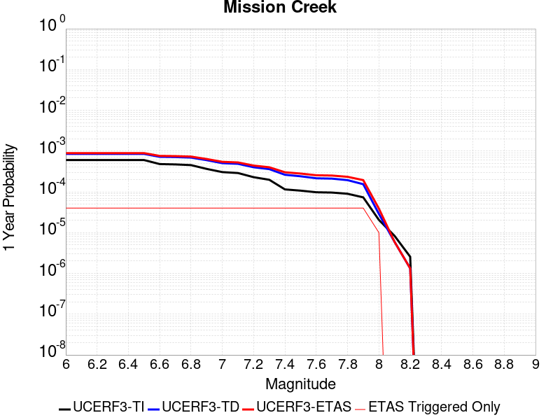 |  |

| Magnitude | 1 wk TI Prob | 1 wk TD Prob | 1 wk ETAS Prob | 1 wk ETAS/TD Gain | 1 wk ETAS Triggered Only | 1 mo TI Prob | 1 mo TD Prob | 1 mo ETAS Prob | 1 mo ETAS/TD Gain | 1 mo ETAS Triggered Only | 1 yr TI Prob | 1 yr TD Prob | 1 yr ETAS Prob | 1 yr ETAS/TD Gain | 1 yr ETAS Triggered Only | 10 yr TI Prob | 10 yr TD Prob | 10 yr ETAS Prob | 10 yr ETAS/TD Gain | 10 yr ETAS Triggered Only |
|-----|-----|-----|-----|-----|-----|-----|-----|-----|-----|-----|-----|-----|-----|-----|-----|-----|-----|-----|-----|-----|
| 6.0 | 1.1549387E-5 | 1.6322783E-5 | 1.6322783E-5 | 1.0 | 0.0 | 4.9496433E-5 | 6.995299E-5 | 6.995299E-5 | 1.0 | 0.0 | 6.0245243E-4 | 8.5135986E-4 | 8.8883593E-4 | 1.044019 | 3.750797E-5 | 0.006008218 | 0.008510157 | 0.008621722 | 1.0131098 | 1.12523914E-4 |
| 6.1 | 1.1549387E-5 | 1.6322783E-5 | 1.6322783E-5 | 1.0 | 0.0 | 4.9496433E-5 | 6.995299E-5 | 6.995299E-5 | 1.0 | 0.0 | 6.0245243E-4 | 8.5135986E-4 | 8.8883593E-4 | 1.044019 | 3.750797E-5 | 0.006008218 | 0.008510157 | 0.008621722 | 1.0131098 | 1.12523914E-4 |
| 6.2 | 1.1549387E-5 | 1.6322783E-5 | 1.6322783E-5 | 1.0 | 0.0 | 4.9496433E-5 | 6.995299E-5 | 6.995299E-5 | 1.0 | 0.0 | 6.0245243E-4 | 8.5135986E-4 | 8.8883593E-4 | 1.044019 | 3.750797E-5 | 0.006008218 | 0.008510157 | 0.008621722 | 1.0131098 | 1.12523914E-4 |
| 6.3 | 1.1549387E-5 | 1.6322783E-5 | 1.6322783E-5 | 1.0 | 0.0 | 4.9496433E-5 | 6.995299E-5 | 6.995299E-5 | 1.0 | 0.0 | 6.0245243E-4 | 8.5135986E-4 | 8.8883593E-4 | 1.044019 | 3.750797E-5 | 0.006008218 | 0.008510157 | 0.008621722 | 1.0131098 | 1.12523914E-4 |
| 6.4 | 1.1549387E-5 | 1.6322783E-5 | 1.6322783E-5 | 1.0 | 0.0 | 4.9496433E-5 | 6.995299E-5 | 6.995299E-5 | 1.0 | 0.0 | 6.0245243E-4 | 8.5135986E-4 | 8.8883593E-4 | 1.044019 | 3.750797E-5 | 0.006008218 | 0.008510157 | 0.008621722 | 1.0131098 | 1.12523914E-4 |
| 6.5 | 1.1549387E-5 | 1.6322783E-5 | 1.6322783E-5 | 1.0 | 0.0 | 4.9496433E-5 | 6.995299E-5 | 6.995299E-5 | 1.0 | 0.0 | 6.0245243E-4 | 8.5135986E-4 | 8.8883593E-4 | 1.044019 | 3.750797E-5 | 0.006008218 | 0.008510157 | 0.008621722 | 1.0131098 | 1.12523914E-4 |
| 6.6 | 9.202681E-6 | 1.3846059E-5 | 1.3846059E-5 | 1.0 | 0.0 | 3.9439463E-5 | 5.9338956E-5 | 5.9338956E-5 | 1.0 | 0.0 | 4.800697E-4 | 7.2222133E-4 | 7.5970223E-4 | 1.0518967 | 3.750797E-5 | 0.004790339 | 0.0072273402 | 0.007339051 | 1.0154567 | 1.12523914E-4 |
| 6.7 | 9.019164E-6 | 1.3651728E-5 | 1.3651728E-5 | 1.0 | 0.0 | 3.8652986E-5 | 5.8506146E-5 | 5.8506146E-5 | 1.0 | 0.0 | 4.7049852E-4 | 7.1208854E-4 | 7.495698E-4 | 1.0526357 | 3.750797E-5 | 0.004695036 | 0.0071266647 | 0.0072383867 | 1.0156766 | 1.12523914E-4 |
| 6.8 | 8.673558E-6 | 1.3273839E-5 | 1.3273839E-5 | 1.0 | 0.0 | 3.717186E-5 | 5.688669E-5 | 5.688669E-5 | 1.0 | 0.0 | 4.524734E-4 | 6.923842E-4 | 7.298662E-4 | 1.0541347 | 3.750797E-5 | 0.0045155324 | 0.0069308523 | 0.0070425966 | 1.0161227 | 1.12523914E-4 |
| 6.9 | 7.002255E-6 | 1.1478069E-5 | 1.1478069E-5 | 1.0 | 0.0 | 3.000932E-5 | 4.9190832E-5 | 4.9190832E-5 | 1.0 | 0.0 | 3.653022E-4 | 5.9874065E-4 | 6.3622615E-4 | 1.0626073 | 3.750797E-5 | 0.0036470229 | 0.005999676 | 0.0061115245 | 1.0186424 | 1.12523914E-4 |
| 7.0 | 5.84644E-6 | 9.675359E-6 | 9.675359E-6 | 1.0 | 0.0 | 2.5055931E-5 | 4.146519E-5 | 4.146519E-5 | 1.0 | 0.0 | 3.0501327E-4 | 5.047263E-4 | 5.4221536E-4 | 1.074276 | 3.750797E-5 | 0.0030459496 | 0.005063994 | 0.005175948 | 1.0221078 | 1.12523914E-4 |
| 7.1 | 5.54703E-6 | 9.329834E-6 | 9.329834E-6 | 1.0 | 0.0 | 2.377277E-5 | 3.9984414E-5 | 3.9984414E-5 | 1.0 | 0.0 | 2.8939504E-4 | 4.8670598E-4 | 5.2419567E-4 | 1.0770274 | 3.750797E-5 | 0.0028901845 | 0.0048845876 | 0.004996562 | 1.022924 | 1.12523914E-4 |
| 7.2 | 4.384709E-6 | 7.681918E-6 | 7.681918E-6 | 1.0 | 0.0 | 1.8791474E-5 | 3.292211E-5 | 3.292211E-5 | 1.0 | 0.0 | 2.2876218E-4 | 4.0075663E-4 | 4.3824958E-4 | 1.0935553 | 3.750797E-5 | 0.0022852682 | 0.004028542 | 0.0041406127 | 1.0278192 | 1.12523914E-4 |
| 7.3 | 3.7888456E-6 | 6.915788E-6 | 6.915788E-6 | 1.0 | 0.0 | 1.623781E-5 | 2.9638775E-5 | 2.9638775E-5 | 1.0 | 0.0 | 1.9767738E-4 | 3.6079568E-4 | 3.982901E-4 | 1.1039215 | 3.750797E-5 | 0.0019750162 | 0.00363027 | 0.0037423854 | 1.0308836 | 1.12523914E-4 |
| 7.4 | 2.1982462E-6 | 5.0241033E-6 | 5.0241033E-6 | 1.0 | 0.0 | 9.421021E-6 | 2.1531694E-5 | 2.1531694E-5 | 1.0 | 0.0 | 1.1469489E-4 | 2.6211704E-4 | 2.9961517E-4 | 1.1430588 | 3.750797E-5 | 0.0011463572 | 0.0026460327 | 0.002758259 | 1.042413 | 1.12523914E-4 |
| 7.5 | 2.051923E-6 | 4.6153277E-6 | 4.6153277E-6 | 1.0 | 0.0 | 8.793926E-6 | 1.9779825E-5 | 1.9779825E-5 | 1.0 | 0.0 | 1.0706078E-4 | 2.4079291E-4 | 2.7829185E-4 | 1.1557311 | 3.750797E-5 | 0.0010700922 | 0.0024335932 | 0.0025458431 | 1.0461253 | 1.12523914E-4 |
| 7.6 | 1.8733427E-6 | 4.1236603E-6 | 4.1236603E-6 | 1.0 | 0.0 | 8.028587E-6 | 1.7672712E-5 | 1.7672712E-5 | 1.0 | 0.0 | 9.774366E-5 | 2.151441E-4 | 2.52644E-4 | 1.1743013 | 3.750797E-5 | 9.770069E-4 | 0.0021782513 | 0.0022905301 | 1.0515454 | 1.12523914E-4 |
| 7.7 | 1.8411953E-6 | 4.0433315E-6 | 4.0433315E-6 | 1.0 | 0.0 | 7.890813E-6 | 1.732845E-5 | 1.732845E-5 | 1.0 | 0.0 | 9.606641E-5 | 2.1095353E-4 | 2.4845358E-4 | 1.1777645 | 3.750797E-5 | 9.6024893E-4 | 0.0021365292 | 0.0022488127 | 1.0525541 | 1.12523914E-4 |
| 7.8 | 1.7194251E-6 | 3.71068E-6 | 3.71068E-6 | 1.0 | 0.0 | 7.368944E-6 | 1.5902819E-5 | 1.5902819E-5 | 1.0 | 0.0 | 8.97132E-5 | 1.9359968E-4 | 2.3110039E-4 | 1.1937023 | 3.750797E-5 | 8.967699E-4 | 0.0019624757 | 0.0020747788 | 1.0572252 | 1.12523914E-4 |
| 7.9 | 1.4035052E-6 | 2.9502596E-6 | 2.9502596E-6 | 1.0 | 0.0 | 6.0150082E-6 | 1.2643909E-5 | 1.2643909E-5 | 1.0 | 0.0 | 7.3230265E-5 | 1.5392878E-4 | 1.9143098E-4 | 1.2436334 | 3.750797E-5 | 7.3206134E-4 | 0.0015631174 | 0.0016754654 | 1.0718744 | 1.12523914E-4 |
| 8.0 | 3.9318823E-7 | 5.528477E-7 | 5.528477E-7 | 1.0 | 0.0 | 1.6850913E-6 | 2.3693453E-6 | 2.3693453E-6 | 1.0 | 0.0 | 2.0515794E-5 | 2.8846403E-5 | 6.635329E-5 | 2.3002276 | 3.750797E-5 | 2.0513899E-4 | 2.990952E-4 | 3.740887E-4 | 1.2507346 | 7.501594E-5 |
| 8.1 | 1.596793E-7 | 1.13775044E-7 | 1.13775044E-7 | 1.0 | 0.0 | 6.8433974E-7 | 4.876072E-7 | 4.876072E-7 | 1.0 | 0.0 | 8.331805E-6 | 5.936602E-6 | 5.936602E-6 | 1.0 | 0.0 | 8.331492E-5 | 6.5494125E-5 | 6.5494125E-5 | 1.0 | 0.0 |
| 8.2 | 4.9003038E-8 | 2.5435753E-8 | 2.5435753E-8 | 1.0 | 0.0 | 2.10013E-7 | 1.09010365E-7 | 1.09010365E-7 | 1.0 | 0.0 | 2.5569052E-6 | 1.3272004E-6 | 1.3272004E-6 | 1.0 | 0.0 | 2.556876E-5 | 1.4952613E-5 | 1.4952613E-5 | 1.0 | 0.0 |

## San Clemente
*[(top)](#table-of-contents)*

| 1 Week | 1 Month | 1 Year | 10 Year |
|-----|-----|-----|-----|
|  |  |  |  |

| Magnitude | 1 wk TI Prob | 1 wk TD Prob | 1 wk ETAS Prob | 1 wk ETAS/TD Gain | 1 wk ETAS Triggered Only | 1 mo TI Prob | 1 mo TD Prob | 1 mo ETAS Prob | 1 mo ETAS/TD Gain | 1 mo ETAS Triggered Only | 1 yr TI Prob | 1 yr TD Prob | 1 yr ETAS Prob | 1 yr ETAS/TD Gain | 1 yr ETAS Triggered Only | 10 yr TI Prob | 10 yr TD Prob | 10 yr ETAS Prob | 10 yr ETAS/TD Gain | 10 yr ETAS Triggered Only |
|-----|-----|-----|-----|-----|-----|-----|-----|-----|-----|-----|-----|-----|-----|-----|-----|-----|-----|-----|-----|-----|
| 6.0 | 6.681379E-5 | 8.163834E-5 | 1.19143246E-4 | 1.4594032 | 3.750797E-5 | 2.8631336E-4 | 3.4983488E-4 | 3.8732975E-4 | 1.1071787 | 3.750797E-5 | 0.003480294 | 0.00425141 | 0.0042887586 | 1.008785 | 3.750797E-5 | 0.03426291 | 0.04175603 | 0.041863855 | 1.0025823 | 1.12523914E-4 |
| 6.1 | 6.681379E-5 | 8.163834E-5 | 1.19143246E-4 | 1.4594032 | 3.750797E-5 | 2.8631336E-4 | 3.4983488E-4 | 3.8732975E-4 | 1.1071787 | 3.750797E-5 | 0.003480294 | 0.00425141 | 0.0042887586 | 1.008785 | 3.750797E-5 | 0.03426291 | 0.04175603 | 0.041863855 | 1.0025823 | 1.12523914E-4 |
| 6.2 | 3.9400576E-5 | 4.6452373E-5 | 8.39586E-5 | 1.8074125 | 3.750797E-5 | 1.6884868E-4 | 1.9906677E-4 | 2.3656727E-4 | 1.1883816 | 3.750797E-5 | 0.0020537945 | 0.0024209984 | 0.0024584157 | 1.0154552 | 3.750797E-5 | 0.020349167 | 0.023952903 | 0.024026122 | 1.0030568 | 7.501594E-5 |
| 6.3 | 3.2590255E-5 | 3.792912E-5 | 7.5435666E-5 | 1.9888589 | 3.750797E-5 | 1.3966505E-4 | 1.6254342E-4 | 2.000453E-4 | 1.2307191 | 3.750797E-5 | 0.0016990956 | 0.0019772002 | 0.002014634 | 1.0189327 | 3.750797E-5 | 0.01686163 | 0.019599883 | 0.019673428 | 1.0037524 | 7.501594E-5 |
| 6.4 | 2.9454652E-5 | 3.4097764E-5 | 7.160445E-5 | 2.099975 | 3.750797E-5 | 1.2622811E-4 | 1.4612524E-4 | 1.8362772E-4 | 1.2566463 | 3.750797E-5 | 0.0015357438 | 0.0017776493 | 0.0018150905 | 1.0210623 | 3.750797E-5 | 0.015251739 | 0.01763747 | 0.017711163 | 1.0041782 | 7.501594E-5 |
| 6.5 | 2.790836E-5 | 3.2247463E-5 | 6.975422E-5 | 2.163092 | 3.750797E-5 | 1.1960178E-4 | 1.3819624E-4 | 1.7569902E-4 | 1.2713734 | 3.750797E-5 | 0.001455179 | 0.0016812662 | 0.0017187112 | 1.0222719 | 3.750797E-5 | 0.014456868 | 0.016688485 | 0.016725367 | 1.00221 | 3.750797E-5 |
| 6.6 | 2.2492153E-5 | 2.5762702E-5 | 6.3269705E-5 | 2.4558644 | 3.750797E-5 | 9.639138E-5 | 1.1040699E-4 | 1.4791082E-4 | 1.3396871 | 3.750797E-5 | 0.0011729331 | 0.0013433909 | 0.0013808486 | 1.0278828 | 3.750797E-5 | 0.011667615 | 0.013354417 | 0.013391424 | 1.0027711 | 3.750797E-5 |
| 6.7 | 1.9862755E-5 | 2.2666423E-5 | 6.0173545E-5 | 2.6547437 | 3.750797E-5 | 8.512331E-5 | 9.713826E-5 | 1.3464259E-4 | 1.3860922 | 3.750797E-5 | 0.0010358836 | 0.0011820279 | 0.0012194916 | 1.0316944 | 3.750797E-5 | 0.010310682 | 0.011758701 | 0.011795768 | 1.0031523 | 3.750797E-5 |
| 6.8 | 1.6697575E-5 | 1.897771E-5 | 5.648497E-5 | 2.9763849 | 3.750797E-5 | 7.155907E-5 | 8.133056E-5 | 1.1883547E-4 | 1.4611418 | 3.750797E-5 | 8.7088346E-4 | 9.897591E-4 | 0.0010272299 | 1.0378586 | 3.750797E-5 | 0.008674784 | 0.0098545365 | 0.009891675 | 1.0037687 | 3.750797E-5 |
| 6.9 | 1.5218415E-5 | 1.72694E-5 | 5.4776723E-5 | 3.1718948 | 3.750797E-5 | 6.522015E-5 | 7.4009666E-5 | 1.1151486E-4 | 1.5067607 | 3.750797E-5 | 7.93766E-4 | 9.00704E-4 | 9.381782E-4 | 1.0416055 | 3.750797E-5 | 0.007909367 | 0.008971481 | 0.009008652 | 1.0041432 | 3.750797E-5 |
| 7.0 | 1.2392958E-5 | 1.4033016E-5 | 5.154046E-5 | 3.6728 | 3.750797E-5 | 5.3111595E-5 | 6.014015E-5 | 9.764587E-5 | 1.6236385 | 3.750797E-5 | 6.4644177E-4 | 7.319679E-4 | 7.6944847E-4 | 1.0512052 | 3.750797E-5 | 0.0064456454 | 0.0072963564 | 0.007333591 | 1.0051031 | 3.750797E-5 |
| 7.1 | 1.0934128E-5 | 1.2375138E-5 | 4.9882645E-5 | 4.0308757 | 3.750797E-5 | 4.6859706E-5 | 5.303527E-5 | 9.054125E-5 | 1.7071894 | 3.750797E-5 | 5.7036756E-4 | 6.455204E-4 | 6.8300415E-4 | 1.0580676 | 3.750797E-5 | 0.0056890585 | 0.0064371997 | 0.0064744665 | 1.0057893 | 3.750797E-5 |
| 7.2 | 9.5798805E-6 | 1.0844935E-5 | 4.83525E-5 | 4.458533 | 3.750797E-5 | 4.1055984E-5 | 4.6477508E-5 | 8.398373E-5 | 1.8069758 | 3.750797E-5 | 4.9974193E-4 | 5.657239E-4 | 6.0321065E-4 | 1.0662633 | 3.750797E-5 | 0.0049861963 | 0.0056435615 | 0.0056808577 | 1.0066086 | 3.750797E-5 |
| 7.3 | 8.0167365E-6 | 9.083918E-6 | 4.6591547E-5 | 5.129015 | 3.750797E-5 | 3.4356988E-5 | 3.8930535E-5 | 7.643704E-5 | 1.9634215 | 3.750797E-5 | 4.1821605E-4 | 4.7388324E-4 | 5.113734E-4 | 1.0791128 | 3.750797E-5 | 0.0041742986 | 0.0047294297 | 0.0047667604 | 1.0078932 | 3.750797E-5 |
| 7.4 | 2.9581017E-6 | 3.3623792E-6 | 3.3623792E-6 | 1.0 | 0.0 | 1.2677518E-5 | 1.4410146E-5 | 1.4410146E-5 | 1.0 | 0.0 | 1.5433785E-4 | 1.7543444E-4 | 1.7543444E-4 | 1.0 | 0.0 | 0.001542307 | 0.0017534546 | 0.0017534546 | 1.0 | 0.0 |

## Imperial
*[(top)](#table-of-contents)*

| 1 Week | 1 Month | 1 Year | 10 Year |
|-----|-----|-----|-----|
|  |  |  |  |

| Magnitude | 1 wk TI Prob | 1 wk TD Prob | 1 wk ETAS Prob | 1 wk ETAS/TD Gain | 1 wk ETAS Triggered Only | 1 mo TI Prob | 1 mo TD Prob | 1 mo ETAS Prob | 1 mo ETAS/TD Gain | 1 mo ETAS Triggered Only | 1 yr TI Prob | 1 yr TD Prob | 1 yr ETAS Prob | 1 yr ETAS/TD Gain | 1 yr ETAS Triggered Only | 10 yr TI Prob | 10 yr TD Prob | 10 yr ETAS Prob | 10 yr ETAS/TD Gain | 10 yr ETAS Triggered Only |
|-----|-----|-----|-----|-----|-----|-----|-----|-----|-----|-----|-----|-----|-----|-----|-----|-----|-----|-----|-----|-----|
| 6.0 | 2.7496446E-4 | 5.055345E-4 | 5.8051257E-4 | 1.1483144 | 7.501594E-5 | 0.0011778869 | 0.002164817 | 0.0022396706 | 1.0345773 | 7.501594E-5 | 0.0142467655 | 0.026048409 | 0.026121471 | 1.0028049 | 7.501594E-5 | 0.13367249 | 0.22807029 | 0.22815715 | 1.0003809 | 1.12523914E-4 |
| 6.1 | 2.5356023E-4 | 4.8657708E-4 | 5.615565E-4 | 1.1540958 | 7.501594E-5 | 0.001086234 | 0.002083702 | 0.0021585617 | 1.0359262 | 7.501594E-5 | 0.013144928 | 0.02507094 | 0.025144074 | 1.0029172 | 7.501594E-5 | 0.123940155 | 0.21949561 | 0.21958344 | 1.0004001 | 1.12523914E-4 |
| 6.2 | 2.4820742E-4 | 4.775311E-4 | 5.5251125E-4 | 1.1570162 | 7.501594E-5 | 0.0010633124 | 0.0020449946 | 0.0021198571 | 1.0366077 | 7.501594E-5 | 0.01286919 | 0.024610676 | 0.024683846 | 1.0029731 | 7.501594E-5 | 0.12148927 | 0.21600136 | 0.21608959 | 1.0004084 | 1.12523914E-4 |
| 6.3 | 2.3205351E-4 | 4.5892023E-4 | 5.3390174E-4 | 1.1633868 | 7.501594E-5 | 9.94136E-4 | 0.0019653554 | 0.002040224 | 1.0380942 | 7.501594E-5 | 0.012036599 | 0.023661187 | 0.023734428 | 1.0030954 | 7.501594E-5 | 0.11405133 | 0.20793827 | 0.2080274 | 1.0004287 | 1.12523914E-4 |
| 6.4 | 2.0304754E-4 | 3.9878016E-4 | 4.3627317E-4 | 1.0940193 | 3.750797E-5 | 8.6991355E-4 | 0.0017079529 | 0.0017453969 | 1.0219233 | 3.750797E-5 | 0.010539869 | 0.020595418 | 0.020632153 | 1.0017837 | 3.750797E-5 | 0.100537635 | 0.18507113 | 0.18510169 | 1.0001651 | 3.750797E-5 |
| 6.5 | 1.854992E-4 | 3.6990462E-4 | 4.0739874E-4 | 1.1013615 | 3.750797E-5 | 7.9475436E-4 | 0.0015843548 | 0.0016218033 | 1.0236365 | 3.750797E-5 | 0.009633281 | 0.01911443 | 0.01915122 | 1.0019248 | 3.750797E-5 | 0.0922623 | 0.1733039 | 0.1733349 | 1.0001789 | 3.750797E-5 |
| 6.6 | 1.6586106E-4 | 3.4036173E-4 | 3.7785695E-4 | 1.1101629 | 3.750797E-5 | 7.106394E-4 | 0.0014578878 | 0.0014953412 | 1.0256901 | 3.750797E-5 | 0.008617763 | 0.017607626 | 0.017644472 | 1.0020927 | 3.750797E-5 | 0.08291132 | 0.16078055 | 0.16081202 | 1.0001957 | 3.750797E-5 |
| 6.7 | 1.4224656E-4 | 3.076812E-4 | 3.4517763E-4 | 1.1218678 | 3.750797E-5 | 6.094856E-4 | 0.0013179756 | 0.0013554341 | 1.0284213 | 3.750797E-5 | 0.0073952693 | 0.015928522 | 0.015965432 | 1.0023173 | 3.750797E-5 | 0.07153955 | 0.14648798 | 0.14651999 | 1.0002185 | 3.750797E-5 |
| 6.8 | 1.2317259E-4 | 2.779231E-4 | 3.1542065E-4 | 1.1349206 | 3.750797E-5 | 5.2777573E-4 | 0.0011905615 | 0.0012280247 | 1.031467 | 3.750797E-5 | 0.0064067547 | 0.014400131 | 0.014437099 | 1.0025672 | 3.750797E-5 | 0.06225166 | 0.13294089 | 0.1329734 | 1.0002446 | 3.750797E-5 |
| 6.9 | 9.859898E-5 | 2.5015484E-4 | 2.876534E-4 | 1.1499015 | 3.750797E-5 | 4.2249862E-4 | 0.0010716559 | 0.0011091237 | 1.0349625 | 3.750797E-5 | 0.0051317946 | 0.012970319 | 0.01300734 | 1.0028543 | 3.750797E-5 | 0.05014893 | 0.119408876 | 0.119441904 | 1.0002766 | 3.750797E-5 |
| 7.0 | 7.3191884E-5 | 2.1267848E-4 | 2.5017848E-4 | 1.1763225 | 3.750797E-5 | 3.136418E-4 | 9.11164E-4 | 9.486378E-4 | 1.0411274 | 3.750797E-5 | 0.003811904 | 0.011037681 | 0.011074775 | 1.0033606 | 3.750797E-5 | 0.037471764 | 0.10206756 | 0.102101244 | 1.00033 | 3.750797E-5 |
| 7.1 | 7.1760296E-5 | 2.0969207E-4 | 2.471922E-4 | 1.1788342 | 3.750797E-5 | 3.0750787E-4 | 8.9837395E-4 | 9.358482E-4 | 1.0417135 | 3.750797E-5 | 0.003737482 | 0.010883528 | 0.010920628 | 1.0034088 | 3.750797E-5 | 0.03675245 | 0.10070406 | 0.100737795 | 1.000335 | 3.750797E-5 |
| 7.2 | 6.46614E-5 | 1.9137723E-4 | 2.2887802E-4 | 1.1959522 | 3.750797E-5 | 2.7709085E-4 | 8.199333E-4 | 8.5741054E-4 | 1.0457076 | 3.750797E-5 | 0.0033683628 | 0.009937617 | 0.009974753 | 1.0037369 | 3.750797E-5 | 0.033177625 | 0.092511006 | 0.09254505 | 1.0003679 | 3.750797E-5 |
| 7.3 | 6.088115E-5 | 1.780939E-4 | 2.155952E-4 | 1.2105703 | 3.750797E-5 | 2.6089314E-4 | 7.6303916E-4 | 8.0051855E-4 | 1.0491185 | 3.750797E-5 | 0.0031717476 | 0.009251006 | 0.009288167 | 1.004017 | 3.750797E-5 | 0.031268585 | 0.08656135 | 0.08659562 | 1.0003958 | 3.750797E-5 |
| 7.4 | 4.199346E-5 | 1.1511097E-4 | 1.5261462E-4 | 1.3258044 | 3.750797E-5 | 1.7995955E-4 | 4.932403E-4 | 5.3072977E-4 | 1.0760065 | 3.750797E-5 | 0.0021888057 | 0.005988835 | 0.0060261185 | 1.0062255 | 3.750797E-5 | 0.02167372 | 0.05744024 | 0.057475593 | 1.0006155 | 3.750797E-5 |
| 7.5 | 3.130448E-5 | 8.333871E-5 | 1.2084356E-4 | 1.4500291 | 3.750797E-5 | 1.3415517E-4 | 3.5711733E-4 | 3.946119E-4 | 1.1049923 | 3.750797E-5 | 0.0016321153 | 0.0043392954 | 0.0043766405 | 1.0086063 | 3.750797E-5 | 0.016201803 | 0.042133506 | 0.042169433 | 1.0008527 | 3.750797E-5 |
| 7.6 | 2.3074248E-5 | 6.0849357E-5 | 9.835504E-5 | 1.6163695 | 3.750797E-5 | 9.888588E-5 | 2.6075702E-4 | 2.982552E-4 | 1.1438051 | 3.750797E-5 | 0.0012032706 | 0.0031701182 | 0.0032075073 | 1.0117942 | 3.750797E-5 | 0.011967761 | 0.03102816 | 0.031064505 | 1.0011714 | 3.750797E-5 |
| 7.7 | 1.45864815E-5 | 4.0128452E-5 | 7.763492E-5 | 1.9346602 | 3.750797E-5 | 6.2511994E-5 | 1.7196777E-4 | 2.0946929E-4 | 1.218073 | 3.750797E-5 | 7.608177E-4 | 0.0020917025 | 0.0021291322 | 1.0178943 | 3.750797E-5 | 0.007582182 | 0.02062909 | 0.020665823 | 1.0017807 | 3.750797E-5 |
| 7.8 | 1.0352979E-5 | 3.096395E-5 | 6.8470756E-5 | 2.2113056 | 3.750797E-5 | 4.4369157E-5 | 1.326959E-4 | 1.701989E-4 | 1.2826236 | 3.750797E-5 | 5.400606E-4 | 0.0016143778 | 0.0016518252 | 1.0231962 | 3.750797E-5 | 0.0053875 | 0.016017893 | 0.0160548 | 1.0023041 | 3.750797E-5 |
| 7.9 | 8.137906E-6 | 2.2151205E-5 | 5.9658345E-5 | 2.6932325 | 3.750797E-5 | 3.4876273E-5 | 9.493029E-5 | 1.324347E-4 | 1.3950732 | 3.750797E-5 | 4.2453592E-4 | 0.0011551644 | 0.0011926291 | 1.0324323 | 3.750797E-5 | 0.004237258 | 0.011618842 | 0.011655915 | 1.0031906 | 3.750797E-5 |
| 8.0 | 6.93792E-6 | 1.8010365E-5 | 5.551766E-5 | 3.0825393 | 3.750797E-5 | 2.9733603E-5 | 7.7185E-5 | 1.14690076E-4 | 1.4859115 | 3.750797E-5 | 3.6194647E-4 | 9.3932304E-4 | 9.767958E-4 | 1.0398934 | 3.750797E-5 | 0.0036135751 | 0.009502415 | 0.009539566 | 1.0039097 | 3.750797E-5 |
| 8.1 | 3.4286315E-6 | 6.380179E-6 | 6.380179E-6 | 1.0 | 0.0 | 1.4694053E-5 | 2.734334E-5 | 2.734334E-5 | 1.0 | 0.0 | 1.7888541E-4 | 3.3285443E-4 | 3.3285443E-4 | 1.0 | 0.0 | 0.0017874148 | 0.0034863674 | 0.0034863674 | 1.0 | 0.0 |
| 8.2 | 1.4906886E-6 | 1.936633E-6 | 1.936633E-6 | 1.0 | 0.0 | 6.3886496E-6 | 8.2998295E-6 | 8.2998295E-6 | 1.0 | 0.0 | 7.7779034E-5 | 1.0104576E-4 | 1.0104576E-4 | 1.0 | 0.0 | 7.775182E-4 | 0.0011075423 | 0.0011075423 | 1.0 | 0.0 |
| 8.3 | 2.5758007E-8 | 1.4495866E-8 | 1.4495866E-8 | 1.0 | 0.0 | 1.10391454E-7 | 6.212514E-8 | 6.212514E-8 | 1.0 | 0.0 | 1.3440151E-6 | 7.563736E-7 | 7.563736E-7 | 1.0 | 0.0 | 1.344007E-5 | 7.884359E-6 | 7.884359E-6 | 1.0 | 0.0 |

## Chino alt 1
*[(top)](#table-of-contents)*

| 1 Week | 1 Month | 1 Year | 10 Year |
|-----|-----|-----|-----|
|  |  |  |  |

| Magnitude | 1 wk TI Prob | 1 wk TD Prob | 1 wk ETAS Prob | 1 wk ETAS/TD Gain | 1 wk ETAS Triggered Only | 1 mo TI Prob | 1 mo TD Prob | 1 mo ETAS Prob | 1 mo ETAS/TD Gain | 1 mo ETAS Triggered Only | 1 yr TI Prob | 1 yr TD Prob | 1 yr ETAS Prob | 1 yr ETAS/TD Gain | 1 yr ETAS Triggered Only | 10 yr TI Prob | 10 yr TD Prob | 10 yr ETAS Prob | 10 yr ETAS/TD Gain | 10 yr ETAS Triggered Only |
|-----|-----|-----|-----|-----|-----|-----|-----|-----|-----|-----|-----|-----|-----|-----|-----|-----|-----|-----|-----|-----|
| 6.0 | 3.939946E-5 | 4.894798E-5 | 8.6454114E-5 | 1.7662448 | 3.750797E-5 | 1.6884391E-4 | 2.0976314E-4 | 2.4726323E-4 | 1.1787735 | 3.750797E-5 | 0.0020537362 | 0.002551385 | 0.0025887974 | 1.0146635 | 3.750797E-5 | 0.020348595 | 0.025280168 | 0.025353288 | 1.0028924 | 7.501594E-5 |
| 6.1 | 2.1505624E-5 | 2.6878823E-5 | 6.4385786E-5 | 2.3954093 | 3.750797E-5 | 9.2163704E-5 | 1.15190494E-4 | 1.5269415E-4 | 1.3255794 | 3.750797E-5 | 0.0011215154 | 0.0014016517 | 0.001439107 | 1.0267223 | 3.750797E-5 | 0.011158722 | 0.013947425 | 0.01398441 | 1.0026517 | 3.750797E-5 |
| 6.2 | 2.1505624E-5 | 2.6878823E-5 | 6.4385786E-5 | 2.3954093 | 3.750797E-5 | 9.2163704E-5 | 1.15190494E-4 | 1.5269415E-4 | 1.3255794 | 3.750797E-5 | 0.0011215154 | 0.0014016517 | 0.001439107 | 1.0267223 | 3.750797E-5 | 0.011158722 | 0.013947425 | 0.01398441 | 1.0026517 | 3.750797E-5 |
| 6.3 | 1.4290785E-5 | 1.8164832E-5 | 1.8164832E-5 | 1.0 | 0.0 | 6.1244784E-5 | 7.784722E-5 | 7.784722E-5 | 1.0 | 0.0 | 7.454001E-4 | 9.4742293E-4 | 9.4742293E-4 | 1.0 | 0.0 | 0.007429048 | 0.00944674 | 0.00944674 | 1.0 | 0.0 |
| 6.4 | 1.4290785E-5 | 1.8164832E-5 | 1.8164832E-5 | 1.0 | 0.0 | 6.1244784E-5 | 7.784722E-5 | 7.784722E-5 | 1.0 | 0.0 | 7.454001E-4 | 9.4742293E-4 | 9.4742293E-4 | 1.0 | 0.0 | 0.007429048 | 0.00944674 | 0.00944674 | 1.0 | 0.0 |
| 6.5 | 1.3017944E-5 | 1.6651793E-5 | 1.6651793E-5 | 1.0 | 0.0 | 5.5789995E-5 | 7.1363116E-5 | 7.1363116E-5 | 1.0 | 0.0 | 6.790315E-4 | 8.6854334E-4 | 8.6854334E-4 | 1.0 | 0.0 | 0.0067696036 | 0.008664233 | 0.008664233 | 1.0 | 0.0 |
| 6.6 | 9.470016E-6 | 1.2039209E-5 | 1.2039209E-5 | 1.0 | 0.0 | 4.058515E-5 | 5.159578E-5 | 5.159578E-5 | 1.0 | 0.0 | 4.940122E-4 | 6.280315E-4 | 6.280315E-4 | 1.0 | 0.0 | 0.004929154 | 0.006273248 | 0.006273248 | 1.0 | 0.0 |
| 6.7 | 8.314155E-6 | 1.040749E-5 | 1.040749E-5 | 1.0 | 0.0 | 3.5631605E-5 | 4.4602948E-5 | 4.4602948E-5 | 1.0 | 0.0 | 4.3372845E-4 | 5.4293784E-4 | 5.4293784E-4 | 1.0 | 0.0 | 0.004328829 | 0.0054270807 | 0.0054270807 | 1.0 | 0.0 |
| 6.8 | 3.4856364E-6 | 3.8134033E-6 | 3.8134033E-6 | 1.0 | 0.0 | 1.4938357E-5 | 1.6343065E-5 | 1.6343065E-5 | 1.0 | 0.0 | 1.8185932E-4 | 1.9896074E-4 | 1.9896074E-4 | 1.0 | 0.0 | 0.0018171056 | 0.0019894529 | 0.0019894529 | 1.0 | 0.0 |
| 6.9 | 2.2645952E-6 | 2.152909E-6 | 2.152909E-6 | 1.0 | 0.0 | 9.705372E-6 | 9.226722E-6 | 9.226722E-6 | 1.0 | 0.0 | 1.18156495E-4 | 1.12329755E-4 | 1.12329755E-4 | 1.0 | 0.0 | 0.0011809369 | 0.0011233138 | 0.0011233138 | 1.0 | 0.0 |
| 7.0 | 1.7864003E-6 | 1.5430741E-6 | 1.5430741E-6 | 1.0 | 0.0 | 7.655979E-6 | 6.613158E-6 | 6.613158E-6 | 1.0 | 0.0 | 9.3207556E-5 | 8.051228E-5 | 8.051228E-5 | 1.0 | 0.0 | 9.316847E-4 | 8.052856E-4 | 8.052856E-4 | 1.0 | 0.0 |
| 7.1 | 1.7315456E-6 | 1.4733466E-6 | 1.4733466E-6 | 1.0 | 0.0 | 7.420889E-6 | 6.314328E-6 | 6.314328E-6 | 1.0 | 0.0 | 9.034557E-5 | 7.687428E-5 | 7.687428E-5 | 1.0 | 0.0 | 9.0308854E-4 | 7.68921E-4 | 7.68921E-4 | 1.0 | 0.0 |
| 7.2 | 1.6008337E-6 | 1.3574178E-6 | 1.3574178E-6 | 1.0 | 0.0 | 6.860698E-6 | 5.817492E-6 | 5.817492E-6 | 1.0 | 0.0 | 8.352579E-5 | 7.082572E-5 | 7.082572E-5 | 1.0 | 0.0 | 8.34944E-4 | 7.0846075E-4 | 7.0846075E-4 | 1.0 | 0.0 |
| 7.3 | 1.3320939E-6 | 1.1217794E-6 | 1.1217794E-6 | 1.0 | 0.0 | 5.7089615E-6 | 4.8076176E-6 | 4.8076176E-6 | 1.0 | 0.0 | 6.9504385E-5 | 5.853122E-5 | 5.853122E-5 | 1.0 | 0.0 | 6.9482654E-4 | 5.8530655E-4 | 5.8530655E-4 | 1.0 | 0.0 |
| 7.4 | 1.114294E-6 | 9.237087E-7 | 9.237087E-7 | 1.0 | 0.0 | 4.775537E-6 | 3.9587458E-6 | 3.9587458E-6 | 1.0 | 0.0 | 5.8140613E-5 | 4.81967E-5 | 4.81967E-5 | 1.0 | 0.0 | 5.81254E-4 | 4.8187698E-4 | 4.8187698E-4 | 1.0 | 0.0 |
| 7.5 | 9.354081E-7 | 7.6233886E-7 | 7.6233886E-7 | 1.0 | 0.0 | 4.0088858E-6 | 3.2671626E-6 | 3.2671626E-6 | 1.0 | 0.0 | 4.8807087E-5 | 3.9777013E-5 | 3.9777013E-5 | 1.0 | 0.0 | 4.879637E-4 | 3.9770233E-4 | 3.9770233E-4 | 1.0 | 0.0 |
| 7.6 | 8.521771E-7 | 6.880688E-7 | 6.880688E-7 | 1.0 | 0.0 | 3.6521824E-6 | 2.948863E-6 | 2.948863E-6 | 1.0 | 0.0 | 4.4464414E-5 | 3.590185E-5 | 3.590185E-5 | 1.0 | 0.0 | 4.4455516E-4 | 3.5896365E-4 | 3.5896365E-4 | 1.0 | 0.0 |
| 7.7 | 2.1803626E-7 | 1.4186368E-7 | 1.4186368E-7 | 1.0 | 0.0 | 9.344408E-7 | 6.0798715E-7 | 6.0798715E-7 | 1.0 | 0.0 | 1.1376757E-5 | 7.4022278E-6 | 7.4022278E-6 | 1.0 | 0.0 | 1.13761744E-4 | 7.402077E-5 | 7.402077E-5 | 1.0 | 0.0 |

## Honey Lake 2011 CFM
*[(top)](#table-of-contents)*

| 1 Week | 1 Month | 1 Year | 10 Year |
|-----|-----|-----|-----|
|  |  |  |  |

| Magnitude | 1 wk TI Prob | 1 wk TD Prob | 1 wk ETAS Prob | 1 wk ETAS/TD Gain | 1 wk ETAS Triggered Only | 1 mo TI Prob | 1 mo TD Prob | 1 mo ETAS Prob | 1 mo ETAS/TD Gain | 1 mo ETAS Triggered Only | 1 yr TI Prob | 1 yr TD Prob | 1 yr ETAS Prob | 1 yr ETAS/TD Gain | 1 yr ETAS Triggered Only | 10 yr TI Prob | 10 yr TD Prob | 10 yr ETAS Prob | 10 yr ETAS/TD Gain | 10 yr ETAS Triggered Only |
|-----|-----|-----|-----|-----|-----|-----|-----|-----|-----|-----|-----|-----|-----|-----|-----|-----|-----|-----|-----|-----|
| 6.0 | 6.155506E-5 | 7.954708E-5 | 1.1705206E-4 | 1.4714817 | 3.750797E-5 | 2.6378073E-4 | 3.4087323E-4 | 4.1586361E-4 | 1.2199949 | 7.501594E-5 | 0.0032068014 | 0.0041426765 | 0.004217382 | 1.018033 | 7.501594E-5 | 0.03160919 | 0.040703055 | 0.040775016 | 1.001768 | 7.501594E-5 |
| 6.1 | 6.155506E-5 | 7.954708E-5 | 1.1705206E-4 | 1.4714817 | 3.750797E-5 | 2.6378073E-4 | 3.4087323E-4 | 4.1586361E-4 | 1.2199949 | 7.501594E-5 | 0.0032068014 | 0.0041426765 | 0.004217382 | 1.018033 | 7.501594E-5 | 0.03160919 | 0.040703055 | 0.040775016 | 1.001768 | 7.501594E-5 |
| 6.2 | 4.1335024E-5 | 5.257652E-5 | 9.008252E-5 | 1.7133602 | 3.750797E-5 | 1.7713808E-4 | 2.2530954E-4 | 2.6280907E-4 | 1.1664356 | 3.750797E-5 | 0.0021545228 | 0.0027398444 | 0.0027772496 | 1.0136523 | 3.750797E-5 | 0.021337535 | 0.027076809 | 0.0271133 | 1.0013478 | 3.750797E-5 |
| 6.3 | 4.1335024E-5 | 5.257652E-5 | 9.008252E-5 | 1.7133602 | 3.750797E-5 | 1.7713808E-4 | 2.2530954E-4 | 2.6280907E-4 | 1.1664356 | 3.750797E-5 | 0.0021545228 | 0.0027398444 | 0.0027772496 | 1.0136523 | 3.750797E-5 | 0.021337535 | 0.027076809 | 0.0271133 | 1.0013478 | 3.750797E-5 |
| 6.4 | 3.2393702E-5 | 4.0887273E-5 | 7.8393714E-5 | 1.9173132 | 3.750797E-5 | 1.3882275E-4 | 1.7522006E-4 | 2.1272147E-4 | 1.2140245 | 3.750797E-5 | 0.0016888566 | 0.0021313233 | 0.0021687516 | 1.017561 | 3.750797E-5 | 0.016760793 | 0.021119867 | 0.021156581 | 1.0017384 | 3.750797E-5 |
| 6.5 | 2.7205504E-5 | 3.4211767E-5 | 7.171846E-5 | 2.0963094 | 3.750797E-5 | 1.1658981E-4 | 1.4661417E-4 | 1.8411664E-4 | 1.2557902 | 3.750797E-5 | 0.0014185566 | 0.0017836596 | 0.0018211006 | 1.0209912 | 3.750797E-5 | 0.014095354 | 0.017702963 | 0.017739806 | 1.0020813 | 3.750797E-5 |
| 6.6 | 2.069265E-5 | 2.5955416E-5 | 6.3462416E-5 | 2.4450548 | 3.750797E-5 | 8.867977E-5 | 1.1123324E-4 | 1.4873703E-4 | 1.3371636 | 3.750797E-5 | 0.0010791414 | 0.0013535074 | 0.0013909646 | 1.0276742 | 3.750797E-5 | 0.010739161 | 0.0134610105 | 0.013498014 | 1.002749 | 3.750797E-5 |
| 6.7 | 1.8060919E-5 | 2.265683E-5 | 2.265683E-5 | 1.0 | 0.0 | 7.7401644E-5 | 9.7097545E-5 | 9.7097545E-5 | 1.0 | 0.0 | 9.419576E-4 | 0.0011816025 | 0.0011816025 | 1.0 | 0.0 | 0.009379748 | 0.0117612425 | 0.0117612425 | 1.0 | 0.0 |
| 6.8 | 1.4474663E-5 | 1.8181274E-5 | 1.8181274E-5 | 1.0 | 0.0 | 6.203279E-5 | 7.791785E-5 | 7.791785E-5 | 1.0 | 0.0 | 7.5498753E-4 | 9.4831345E-4 | 9.4831345E-4 | 1.0 | 0.0 | 0.007524277 | 0.009450195 | 0.009450195 | 1.0 | 0.0 |
| 6.9 | 8.564552E-6 | 1.0802311E-5 | 1.0802311E-5 | 1.0 | 0.0 | 3.6704707E-5 | 4.6295176E-5 | 4.6295176E-5 | 1.0 | 0.0 | 4.4678818E-4 | 5.635644E-4 | 5.635644E-4 | 1.0 | 0.0 | 0.0044589094 | 0.0056278505 | 0.0056278505 | 1.0 | 0.0 |

## Dry Mountain
*[(top)](#table-of-contents)*

| 1 Week | 1 Month | 1 Year | 10 Year |
|-----|-----|-----|-----|
|  |  | 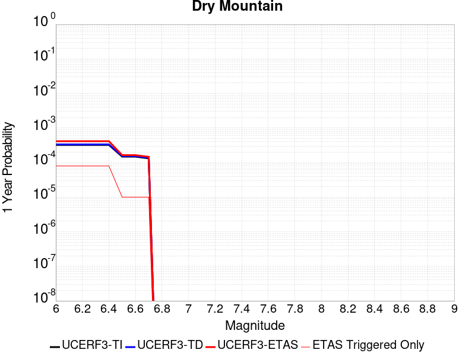 |  |

| Magnitude | 1 wk TI Prob | 1 wk TD Prob | 1 wk ETAS Prob | 1 wk ETAS/TD Gain | 1 wk ETAS Triggered Only | 1 mo TI Prob | 1 mo TD Prob | 1 mo ETAS Prob | 1 mo ETAS/TD Gain | 1 mo ETAS Triggered Only | 1 yr TI Prob | 1 yr TD Prob | 1 yr ETAS Prob | 1 yr ETAS/TD Gain | 1 yr ETAS Triggered Only | 10 yr TI Prob | 10 yr TD Prob | 10 yr ETAS Prob | 10 yr ETAS/TD Gain | 10 yr ETAS Triggered Only |
|-----|-----|-----|-----|-----|-----|-----|-----|-----|-----|-----|-----|-----|-----|-----|-----|-----|-----|-----|-----|-----|
| 6.0 | 6.222801E-6 | 6.439381E-6 | 6.439381E-6 | 1.0 | 0.0 | 2.6668875E-5 | 2.7597147E-5 | 6.510408E-5 | 2.3590875 | 3.750797E-5 | 3.2464517E-4 | 3.3595937E-4 | 3.7345474E-4 | 1.1116068 | 3.750797E-5 | 0.0032417132 | 0.0033560768 | 0.003430841 | 1.0222772 | 7.501594E-5 |
| 6.1 | 6.222801E-6 | 6.439381E-6 | 6.439381E-6 | 1.0 | 0.0 | 2.6668875E-5 | 2.7597147E-5 | 6.510408E-5 | 2.3590875 | 3.750797E-5 | 3.2464517E-4 | 3.3595937E-4 | 3.7345474E-4 | 1.1116068 | 3.750797E-5 | 0.0032417132 | 0.0033560768 | 0.003430841 | 1.0222772 | 7.501594E-5 |
| 6.2 | 6.222801E-6 | 6.439381E-6 | 6.439381E-6 | 1.0 | 0.0 | 2.6668875E-5 | 2.7597147E-5 | 6.510408E-5 | 2.3590875 | 3.750797E-5 | 3.2464517E-4 | 3.3595937E-4 | 3.7345474E-4 | 1.1116068 | 3.750797E-5 | 0.0032417132 | 0.0033560768 | 0.003430841 | 1.0222772 | 7.501594E-5 |
| 6.3 | 6.222801E-6 | 6.439381E-6 | 6.439381E-6 | 1.0 | 0.0 | 2.6668875E-5 | 2.7597147E-5 | 6.510408E-5 | 2.3590875 | 3.750797E-5 | 3.2464517E-4 | 3.3595937E-4 | 3.7345474E-4 | 1.1116068 | 3.750797E-5 | 0.0032417132 | 0.0033560768 | 0.003430841 | 1.0222772 | 7.501594E-5 |
| 6.4 | 6.222801E-6 | 6.439381E-6 | 6.439381E-6 | 1.0 | 0.0 | 2.6668875E-5 | 2.7597147E-5 | 6.510408E-5 | 2.3590875 | 3.750797E-5 | 3.2464517E-4 | 3.3595937E-4 | 3.7345474E-4 | 1.1116068 | 3.750797E-5 | 0.0032417132 | 0.0033560768 | 0.003430841 | 1.0222772 | 7.501594E-5 |
| 6.5 | 2.8528623E-6 | 2.9521684E-6 | 2.9521684E-6 | 1.0 | 0.0 | 1.22264955E-5 | 1.2652138E-5 | 1.2652138E-5 | 1.0 | 0.0 | 1.4884741E-4 | 1.540376E-4 | 1.540376E-4 | 1.0 | 0.0 | 0.0014874774 | 0.0015401616 | 0.0015776118 | 1.0243157 | 3.750797E-5 |
| 6.6 | 2.8528623E-6 | 2.9521684E-6 | 2.9521684E-6 | 1.0 | 0.0 | 1.22264955E-5 | 1.2652138E-5 | 1.2652138E-5 | 1.0 | 0.0 | 1.4884741E-4 | 1.540376E-4 | 1.540376E-4 | 1.0 | 0.0 | 0.0014874774 | 0.0015401616 | 0.0015776118 | 1.0243157 | 3.750797E-5 |
| 6.7 | 2.541E-6 | 2.6293578E-6 | 2.6293578E-6 | 1.0 | 0.0 | 1.0889954E-5 | 1.1268677E-5 | 1.1268677E-5 | 1.0 | 0.0 | 1.3257713E-4 | 1.3719614E-4 | 1.3719614E-4 | 1.0 | 0.0 | 0.0013249806 | 0.0013719613 | 0.0014094178 | 1.0273014 | 3.750797E-5 |

## Calaveras (So) - Paicines extension 2011 CFM
*[(top)](#table-of-contents)*

| 1 Week | 1 Month | 1 Year | 10 Year |
|-----|-----|-----|-----|
|  |  |  |  |

| Magnitude | 1 wk TI Prob | 1 wk TD Prob | 1 wk ETAS Prob | 1 wk ETAS/TD Gain | 1 wk ETAS Triggered Only | 1 mo TI Prob | 1 mo TD Prob | 1 mo ETAS Prob | 1 mo ETAS/TD Gain | 1 mo ETAS Triggered Only | 1 yr TI Prob | 1 yr TD Prob | 1 yr ETAS Prob | 1 yr ETAS/TD Gain | 1 yr ETAS Triggered Only | 10 yr TI Prob | 10 yr TD Prob | 10 yr ETAS Prob | 10 yr ETAS/TD Gain | 10 yr ETAS Triggered Only |
|-----|-----|-----|-----|-----|-----|-----|-----|-----|-----|-----|-----|-----|-----|-----|-----|-----|-----|-----|-----|-----|
| 6.0 | 1.5183659E-4 | 3.0520977E-4 | 3.8020284E-4 | 1.2457099 | 7.501594E-5 | 6.5056595E-4 | 0.0013068188 | 0.0013817367 | 1.0573285 | 7.501594E-5 | 0.007891912 | 0.015696203 | 0.015770042 | 1.0047042 | 7.501594E-5 | 0.076174594 | 0.13848905 | 0.13855368 | 1.0004667 | 7.501594E-5 |
| 6.1 | 1.5024997E-4 | 3.021517E-4 | 3.7714496E-4 | 1.2481974 | 7.501594E-5 | 6.437695E-4 | 0.0012937278 | 0.0013686467 | 1.0579094 | 7.501594E-5 | 0.0078097614 | 0.015539596 | 0.015613446 | 1.0047524 | 7.501594E-5 | 0.075409345 | 0.13715863 | 0.13722336 | 1.000472 | 7.501594E-5 |
| 6.2 | 1.2743923E-4 | 2.5313982E-4 | 3.2813675E-4 | 1.2962669 | 7.501594E-5 | 5.460538E-4 | 0.0010839999 | 0.0011589346 | 1.0691279 | 7.501594E-5 | 0.0066279583 | 0.013046881 | 0.013120919 | 1.0056747 | 7.501594E-5 | 0.064337276 | 0.117256075 | 0.117322296 | 1.0005647 | 7.501594E-5 |
| 6.3 | 1.1525114E-4 | 2.2599236E-4 | 3.0099135E-4 | 1.3318652 | 7.501594E-5 | 4.9383997E-4 | 9.678718E-4 | 0.0010428152 | 1.0774311 | 7.501594E-5 | 0.0059959386 | 0.011668079 | 0.011742219 | 1.0063541 | 7.501594E-5 | 0.058367174 | 0.106372125 | 0.10643916 | 1.0006303 | 7.501594E-5 |
| 6.4 | 1.07200925E-4 | 2.0840544E-4 | 2.8340577E-4 | 1.3598769 | 7.501594E-5 | 4.5935164E-4 | 8.926123E-4 | 9.6756127E-4 | 1.0839659 | 7.501594E-5 | 0.0055782744 | 0.010772959 | 0.010847167 | 1.0068884 | 7.501594E-5 | 0.0544031 | 0.099194765 | 0.09926234 | 1.0006813 | 7.501594E-5 |
| 6.5 | 9.69631E-5 | 1.8734725E-4 | 2.6234915E-4 | 1.4003363 | 7.501594E-5 | 4.1548995E-4 | 8.024631E-4 | 8.7741885E-4 | 1.093407 | 7.501594E-5 | 0.0050468626 | 0.009694842 | 0.00976913 | 1.0076627 | 7.501594E-5 | 0.04933773 | 0.090086564 | 0.09015483 | 1.0007577 | 7.501594E-5 |
| 6.6 | 8.0552316E-5 | 1.507068E-4 | 2.2571142E-4 | 1.4976858 | 7.501594E-5 | 3.4517853E-4 | 6.4569083E-4 | 7.2065834E-4 | 1.1161044 | 7.501594E-5 | 0.0041944524 | 0.007826508 | 0.007900937 | 1.0095098 | 7.501594E-5 | 0.04116161 | 0.0748563 | 0.074925706 | 1.0009271 | 7.501594E-5 |
| 6.7 | 7.815757E-5 | 1.4611272E-4 | 2.211177E-4 | 1.5133364 | 7.501594E-5 | 3.34918E-4 | 6.26014E-4 | 7.0098304E-4 | 1.1197561 | 7.501594E-5 | 0.004070005 | 0.007589312 | 0.007663758 | 1.0098094 | 7.501594E-5 | 0.039962657 | 0.07270582 | 0.07277538 | 1.0009568 | 7.501594E-5 |
| 6.8 | 6.965264E-5 | 1.2722758E-4 | 2.0223399E-4 | 1.589545 | 7.501594E-5 | 2.9847719E-4 | 5.4513285E-4 | 6.2010786E-4 | 1.1375353 | 7.501594E-5 | 0.0036279052 | 0.0066135945 | 0.0066881143 | 1.0112677 | 7.501594E-5 | 0.03569247 | 0.063801065 | 0.063871294 | 1.0011008 | 7.501594E-5 |
| 6.9 | 5.8000453E-5 | 1.01439E-4 | 1.7644733E-4 | 1.7394427 | 7.501594E-5 | 2.4854968E-4 | 4.346666E-4 | 5.096499E-4 | 1.1725076 | 7.501594E-5 | 0.0030218933 | 0.005279322 | 0.005353942 | 1.0141344 | 7.501594E-5 | 0.029811295 | 0.051502965 | 0.05157412 | 1.0013815 | 7.501594E-5 |
| 7.0 | 4.9865852E-5 | 8.568029E-5 | 1.606898E-4 | 1.8754582 | 7.501594E-5 | 2.1369329E-4 | 3.6715003E-4 | 4.421384E-4 | 1.2042446 | 7.501594E-5 | 0.0025986114 | 0.004460979 | 0.0045356597 | 1.016741 | 7.501594E-5 | 0.025684336 | 0.043782018 | 0.04385375 | 1.0016384 | 7.501594E-5 |
| 7.1 | 4.283875E-5 | 7.1124625E-5 | 1.4613524E-4 | 2.0546362 | 7.501594E-5 | 1.8358172E-4 | 3.0478454E-4 | 3.797776E-4 | 1.2460527 | 7.501594E-5 | 0.0022328163 | 0.003704494 | 0.0037792323 | 1.020175 | 7.501594E-5 | 0.022105146 | 0.03673582 | 0.036808085 | 1.0019671 | 7.501594E-5 |
| 7.2 | 3.450115E-5 | 5.5778568E-5 | 1.3079033E-4 | 2.3448133 | 7.501594E-5 | 1.478537E-4 | 2.3902925E-4 | 3.1402727E-4 | 1.3137608 | 7.501594E-5 | 0.0017986323 | 0.0029063264 | 0.0029811244 | 1.0257362 | 7.501594E-5 | 0.017841442 | 0.029079042 | 0.029151877 | 1.0025047 | 7.501594E-5 |
| 7.3 | 2.5709045E-5 | 4.059001E-5 | 1.1560291E-4 | 2.848063 | 7.501594E-5 | 1.1017697E-4 | 1.7394568E-4 | 2.4894858E-4 | 1.4311857 | 7.501594E-5 | 0.0013405791 | 0.0021157486 | 0.0021906057 | 1.035381 | 7.501594E-5 | 0.013325208 | 0.02129686 | 0.021370279 | 1.0034474 | 7.501594E-5 |
| 7.4 | 1.8003093E-5 | 2.8511378E-5 | 1.0352518E-4 | 3.631013 | 7.501594E-5 | 7.715383E-5 | 1.2218591E-4 | 1.9719268E-4 | 1.6138742 | 7.501594E-5 | 9.3894306E-4 | 0.0014866006 | 0.001561505 | 1.0503864 | 7.501594E-5 | 0.009349857 | 0.015051589 | 0.015125477 | 1.0049089 | 7.501594E-5 |
| 7.5 | 1.5595824E-5 | 2.5823752E-5 | 1.0083776E-4 | 3.9048452 | 7.501594E-5 | 6.683753E-5 | 1.10668545E-4 | 1.8567618E-4 | 1.6777683 | 7.501594E-5 | 8.134431E-4 | 0.0013465589 | 0.0014214738 | 1.0556344 | 7.501594E-5 | 0.008104719 | 0.013651571 | 0.013725563 | 1.00542 | 7.501594E-5 |
| 7.6 | 1.1110309E-5 | 1.9223195E-5 | 9.4237694E-5 | 4.902291 | 7.501594E-5 | 4.761474E-5 | 8.2382525E-5 | 1.573923E-4 | 1.9105057 | 7.501594E-5 | 5.795553E-4 | 0.0010025471 | 0.0010774878 | 1.0747503 | 7.501594E-5 | 0.0057804612 | 0.01020344 | 0.01027769 | 1.007277 | 7.501594E-5 |
| 7.7 | 6.2140443E-6 | 1.04376995E-5 | 8.5452855E-5 | 8.186943 | 7.501594E-5 | 2.6631347E-5 | 4.4732235E-5 | 1.1974482E-4 | 2.6769247 | 7.501594E-5 | 3.241884E-4 | 5.4447894E-4 | 6.19454E-4 | 1.1377007 | 7.501594E-5 | 0.0032371588 | 0.005620102 | 0.0056946967 | 1.0132728 | 7.501594E-5 |
| 7.8 | 5.305533E-6 | 9.433651E-6 | 8.444888E-5 | 8.951877 | 7.501594E-5 | 2.27378E-5 | 4.0429306E-5 | 1.1544221E-4 | 2.8554091 | 7.501594E-5 | 2.7679754E-4 | 4.9211574E-4 | 5.670948E-4 | 1.1523606 | 7.501594E-5 | 0.0027645302 | 0.005074622 | 0.0051492574 | 1.0147076 | 7.501594E-5 |
| 7.9 | 3.363505E-6 | 7.3854467E-6 | 4.489314E-5 | 6.078595 | 3.750797E-5 | 1.4414942E-5 | 3.1651532E-5 | 6.915831E-5 | 2.1849911 | 3.750797E-5 | 1.7548777E-4 | 3.8528934E-4 | 4.2278285E-4 | 1.0973127 | 3.750797E-5 | 0.0017534926 | 0.003948784 | 0.003986144 | 1.009461 | 3.750797E-5 |
| 8.0 | 2.0271132E-6 | 4.4134235E-6 | 4.4134235E-6 | 1.0 | 0.0 | 8.687599E-6 | 1.8914534E-5 | 1.8914534E-5 | 1.0 | 0.0 | 1.05766376E-4 | 2.3026018E-4 | 2.3026018E-4 | 1.0 | 0.0 | 0.0010571606 | 0.002351194 | 0.002351194 | 1.0 | 0.0 |
| 8.1 | 1.2206116E-6 | 2.3752666E-6 | 2.3752666E-6 | 1.0 | 0.0 | 5.2311816E-6 | 1.0179674E-5 | 1.0179674E-5 | 1.0 | 0.0 | 6.3687774E-5 | 1.2393051E-4 | 1.2393051E-4 | 1.0 | 0.0 | 6.366953E-4 | 0.0012705618 | 0.0012705618 | 1.0 | 0.0 |

## Great Valley 07 (Orestimba)
*[(top)](#table-of-contents)*

| 1 Week | 1 Month | 1 Year | 10 Year |
|-----|-----|-----|-----|
| 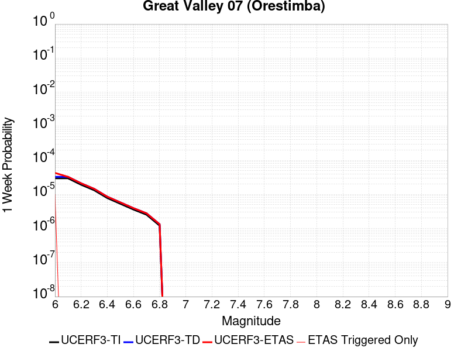 |  |  |  |

| Magnitude | 1 wk TI Prob | 1 wk TD Prob | 1 wk ETAS Prob | 1 wk ETAS/TD Gain | 1 wk ETAS Triggered Only | 1 mo TI Prob | 1 mo TD Prob | 1 mo ETAS Prob | 1 mo ETAS/TD Gain | 1 mo ETAS Triggered Only | 1 yr TI Prob | 1 yr TD Prob | 1 yr ETAS Prob | 1 yr ETAS/TD Gain | 1 yr ETAS Triggered Only | 10 yr TI Prob | 10 yr TD Prob | 10 yr ETAS Prob | 10 yr ETAS/TD Gain | 10 yr ETAS Triggered Only |
|-----|-----|-----|-----|-----|-----|-----|-----|-----|-----|-----|-----|-----|-----|-----|-----|-----|-----|-----|-----|-----|
| 6.0 | 2.9687902E-5 | 3.27575E-5 | 7.026424E-5 | 2.1449819 | 3.750797E-5 | 1.2722766E-4 | 1.4038214E-4 | 1.7788484E-4 | 1.2671473 | 3.750797E-5 | 0.0015478961 | 0.0017078844 | 0.0017827722 | 1.0438483 | 7.501594E-5 | 0.015371585 | 0.016955135 | 0.01702888 | 1.0043494 | 7.501594E-5 |
| 6.1 | 2.9687902E-5 | 3.27575E-5 | 3.27575E-5 | 1.0 | 0.0 | 1.2722766E-4 | 1.4038214E-4 | 1.4038214E-4 | 1.0 | 0.0 | 0.0015478961 | 0.0017078844 | 0.0017078844 | 1.0 | 0.0 | 0.015371585 | 0.016955135 | 0.016955135 | 1.0 | 0.0 |
| 6.2 | 1.9231524E-5 | 2.1159167E-5 | 2.1159167E-5 | 1.0 | 0.0 | 8.2418206E-5 | 9.067912E-5 | 9.067912E-5 | 1.0 | 0.0 | 0.0010029797 | 0.0011034822 | 0.0011034822 | 1.0 | 0.0 | 0.00998465 | 0.010982441 | 0.010982441 | 1.0 | 0.0 |
| 6.3 | 1.324766E-5 | 1.4548534E-5 | 1.4548534E-5 | 1.0 | 0.0 | 5.6774446E-5 | 6.234942E-5 | 6.234942E-5 | 1.0 | 0.0 | 6.910097E-4 | 7.5884897E-4 | 7.5884897E-4 | 1.0 | 0.0 | 0.006888649 | 0.0075635235 | 0.0075635235 | 1.0 | 0.0 |
| 6.4 | 7.818645E-6 | 8.57284E-6 | 8.57284E-6 | 1.0 | 0.0 | 3.3508048E-5 | 3.6740246E-5 | 3.6740246E-5 | 1.0 | 0.0 | 4.078841E-4 | 4.4722404E-4 | 4.4722404E-4 | 1.0 | 0.0 | 0.004071363 | 0.0044635804 | 0.0044635804 | 1.0 | 0.0 |
| 6.5 | 5.3076565E-6 | 5.8178007E-6 | 5.8178007E-6 | 1.0 | 0.0 | 2.27469E-5 | 2.4933206E-5 | 2.4933206E-5 | 1.0 | 0.0 | 2.7690834E-4 | 3.035216E-4 | 3.035216E-4 | 1.0 | 0.0 | 0.0027656353 | 0.00303128 | 0.00303128 | 1.0 | 0.0 |
| 6.6 | 3.6003578E-6 | 3.9484953E-6 | 3.9484953E-6 | 1.0 | 0.0 | 1.5430012E-5 | 1.6922022E-5 | 1.6922022E-5 | 1.0 | 0.0 | 1.8784421E-4 | 2.0600771E-4 | 2.0600771E-4 | 1.0 | 0.0 | 0.0018768552 | 0.0020583214 | 0.0020583214 | 1.0 | 0.0 |
| 6.7 | 2.5361826E-6 | 2.7834678E-6 | 2.7834678E-6 | 1.0 | 0.0 | 1.0869308E-5 | 1.1929101E-5 | 1.1929101E-5 | 1.0 | 0.0 | 1.3232579E-4 | 1.4522845E-4 | 1.4522845E-4 | 1.0 | 0.0 | 0.0013224703 | 0.0014514653 | 0.0014514653 | 1.0 | 0.0 |
| 6.8 | 1.2115831E-6 | 1.3313797E-6 | 1.3313797E-6 | 1.0 | 0.0 | 5.1924885E-6 | 5.7059065E-6 | 5.7059065E-6 | 1.0 | 0.0 | 6.3216714E-5 | 6.9468166E-5 | 6.9468166E-5 | 1.0 | 0.0 | 6.3198735E-4 | 6.945596E-4 | 6.945596E-4 | 1.0 | 0.0 |

## Pinto Mtn
*[(top)](#table-of-contents)*

| 1 Week | 1 Month | 1 Year | 10 Year |
|-----|-----|-----|-----|
|  |  |  |  |

| Magnitude | 1 wk TI Prob | 1 wk TD Prob | 1 wk ETAS Prob | 1 wk ETAS/TD Gain | 1 wk ETAS Triggered Only | 1 mo TI Prob | 1 mo TD Prob | 1 mo ETAS Prob | 1 mo ETAS/TD Gain | 1 mo ETAS Triggered Only | 1 yr TI Prob | 1 yr TD Prob | 1 yr ETAS Prob | 1 yr ETAS/TD Gain | 1 yr ETAS Triggered Only | 10 yr TI Prob | 10 yr TD Prob | 10 yr ETAS Prob | 10 yr ETAS/TD Gain | 10 yr ETAS Triggered Only |
|-----|-----|-----|-----|-----|-----|-----|-----|-----|-----|-----|-----|-----|-----|-----|-----|-----|-----|-----|-----|-----|
| 6.0 | 4.4194956E-5 | 4.7853926E-5 | 8.53601E-5 | 1.7837639 | 3.750797E-5 | 1.893932E-4 | 2.0507304E-4 | 2.4257333E-4 | 1.182863 | 3.750797E-5 | 0.0023034236 | 0.0024940688 | 0.002531483 | 1.0150014 | 3.750797E-5 | 0.022796938 | 0.024678305 | 0.02475147 | 1.0029647 | 7.501594E-5 |
| 6.1 | 4.4194956E-5 | 4.7853926E-5 | 8.53601E-5 | 1.7837639 | 3.750797E-5 | 1.893932E-4 | 2.0507304E-4 | 2.4257333E-4 | 1.182863 | 3.750797E-5 | 0.0023034236 | 0.0024940688 | 0.002531483 | 1.0150014 | 3.750797E-5 | 0.022796938 | 0.024678305 | 0.02475147 | 1.0029647 | 7.501594E-5 |
| 6.2 | 4.4194956E-5 | 4.7853926E-5 | 8.53601E-5 | 1.7837639 | 3.750797E-5 | 1.893932E-4 | 2.0507304E-4 | 2.4257333E-4 | 1.182863 | 3.750797E-5 | 0.0023034236 | 0.0024940688 | 0.002531483 | 1.0150014 | 3.750797E-5 | 0.022796938 | 0.024678305 | 0.02475147 | 1.0029647 | 7.501594E-5 |
| 6.3 | 4.4194956E-5 | 4.7853926E-5 | 8.53601E-5 | 1.7837639 | 3.750797E-5 | 1.893932E-4 | 2.0507304E-4 | 2.4257333E-4 | 1.182863 | 3.750797E-5 | 0.0023034236 | 0.0024940688 | 0.002531483 | 1.0150014 | 3.750797E-5 | 0.022796938 | 0.024678305 | 0.02475147 | 1.0029647 | 7.501594E-5 |
| 6.4 | 3.729929E-5 | 3.960349E-5 | 7.710997E-5 | 1.94705 | 3.750797E-5 | 1.5984432E-4 | 1.6971873E-4 | 2.0722034E-4 | 1.2209632 | 3.750797E-5 | 0.0019443673 | 0.0020644604 | 0.002101891 | 1.0181309 | 3.750797E-5 | 0.019274427 | 0.020462848 | 0.02053633 | 1.003591 | 7.501594E-5 |
| 6.5 | 3.729929E-5 | 3.960349E-5 | 7.710997E-5 | 1.94705 | 3.750797E-5 | 1.5984432E-4 | 1.6971873E-4 | 2.0722034E-4 | 1.2209632 | 3.750797E-5 | 0.0019443673 | 0.0020644604 | 0.002101891 | 1.0181309 | 3.750797E-5 | 0.019274427 | 0.020462848 | 0.02053633 | 1.003591 | 7.501594E-5 |
| 6.6 | 3.0204548E-5 | 3.12056E-5 | 6.87124E-5 | 2.2019253 | 3.750797E-5 | 1.2944164E-4 | 1.3373162E-4 | 1.7123458E-4 | 1.2804345 | 3.750797E-5 | 0.0015748127 | 0.0016270012 | 0.0016644482 | 1.023016 | 3.750797E-5 | 0.015636992 | 0.016154764 | 0.016228568 | 1.0045686 | 7.501594E-5 |
| 6.7 | 2.9857754E-5 | 3.0814987E-5 | 3.0814987E-5 | 1.0 | 0.0 | 1.2795553E-4 | 1.3205773E-4 | 1.3205773E-4 | 1.0 | 0.0 | 0.0015567453 | 0.0016066517 | 0.0016066517 | 1.0 | 0.0 | 0.015458848 | 0.015954204 | 0.015991114 | 1.0023135 | 3.750797E-5 |
| 6.8 | 2.4819734E-5 | 2.5009665E-5 | 2.5009665E-5 | 1.0 | 0.0 | 1.0636595E-4 | 1.0718E-4 | 1.0718E-4 | 1.0 | 0.0 | 0.0012942362 | 0.001304157 | 0.001304157 | 1.0 | 0.0 | 0.012867244 | 0.012967403 | 0.012967403 | 1.0 | 0.0 |
| 6.9 | 2.331124E-5 | 2.3337945E-5 | 2.3337945E-5 | 1.0 | 0.0 | 9.990149E-5 | 1.0001605E-4 | 1.0001605E-4 | 1.0 | 0.0 | 0.001215622 | 0.0012170355 | 0.0012170355 | 1.0 | 0.0 | 0.012089936 | 0.012105897 | 0.012105897 | 1.0 | 0.0 |
| 7.0 | 2.1818534E-5 | 2.1761074E-5 | 2.1761074E-5 | 1.0 | 0.0 | 9.3504656E-5 | 9.3258524E-5 | 9.3258524E-5 | 1.0 | 0.0 | 0.0011378246 | 0.0011348509 | 0.0011348509 | 1.0 | 0.0 | 0.011320163 | 0.01129266 | 0.01129266 | 1.0 | 0.0 |
| 7.1 | 2.066081E-5 | 2.0540718E-5 | 2.0540718E-5 | 1.0 | 0.0 | 8.854332E-5 | 8.8028784E-5 | 8.8028784E-5 | 1.0 | 0.0 | 0.0010774818 | 0.0010712431 | 0.0010712431 | 1.0 | 0.0 | 0.010722724 | 0.0106628435 | 0.0106628435 | 1.0 | 0.0 |
| 7.2 | 1.8990233E-5 | 1.9054001E-5 | 1.9054001E-5 | 1.0 | 0.0 | 8.138417E-5 | 8.165756E-5 | 8.165756E-5 | 1.0 | 0.0 | 9.904018E-4 | 9.937467E-4 | 9.937467E-4 | 1.0 | 0.0 | 0.009859995 | 0.009895029 | 0.009895029 | 1.0 | 0.0 |
| 7.3 | 1.3335872E-5 | 1.4906713E-5 | 1.4906713E-5 | 1.0 | 0.0 | 5.7152483E-5 | 6.388442E-5 | 6.388442E-5 | 1.0 | 0.0 | 6.956093E-4 | 7.77528E-4 | 7.77528E-4 | 1.0 | 0.0 | 0.006934359 | 0.007749376 | 0.007749376 | 1.0 | 0.0 |
| 7.4 | 9.414066E-6 | 1.186096E-5 | 1.186096E-5 | 1.0 | 0.0 | 4.0345374E-5 | 5.083175E-5 | 5.083175E-5 | 1.0 | 0.0 | 4.910942E-4 | 6.1871024E-4 | 6.1871024E-4 | 1.0 | 0.0 | 0.0049001034 | 0.0061708256 | 0.0061708256 | 1.0 | 0.0 |
| 7.5 | 7.2101157E-6 | 9.158192E-6 | 9.158192E-6 | 1.0 | 0.0 | 3.090013E-5 | 3.9248847E-5 | 3.9248847E-5 | 1.0 | 0.0 | 3.7614413E-4 | 4.7775774E-4 | 4.7775774E-4 | 1.0 | 0.0 | 0.0037550807 | 0.004768082 | 0.004768082 | 1.0 | 0.0 |
| 7.6 | 3.296375E-6 | 4.5455017E-6 | 4.5455017E-6 | 1.0 | 0.0 | 1.4127245E-5 | 1.9480583E-5 | 1.9480583E-5 | 1.0 | 0.0 | 1.7198564E-4 | 2.3715167E-4 | 2.3715167E-4 | 1.0 | 0.0 | 0.0017185259 | 0.0023691233 | 0.0023691233 | 1.0 | 0.0 |
| 7.7 | 2.5741092E-6 | 3.5844084E-6 | 3.5844084E-6 | 1.0 | 0.0 | 1.103185E-5 | 1.5361667E-5 | 1.5361667E-5 | 1.0 | 0.0 | 1.3430449E-4 | 1.8701357E-4 | 1.8701357E-4 | 1.0 | 0.0 | 0.0013422335 | 0.0018686918 | 0.0018686918 | 1.0 | 0.0 |

## Channel Islands Thrust
*[(top)](#table-of-contents)*

| 1 Week | 1 Month | 1 Year | 10 Year |
|-----|-----|-----|-----|
|  |  |  |  |

| Magnitude | 1 wk TI Prob | 1 wk TD Prob | 1 wk ETAS Prob | 1 wk ETAS/TD Gain | 1 wk ETAS Triggered Only | 1 mo TI Prob | 1 mo TD Prob | 1 mo ETAS Prob | 1 mo ETAS/TD Gain | 1 mo ETAS Triggered Only | 1 yr TI Prob | 1 yr TD Prob | 1 yr ETAS Prob | 1 yr ETAS/TD Gain | 1 yr ETAS Triggered Only | 10 yr TI Prob | 10 yr TD Prob | 10 yr ETAS Prob | 10 yr ETAS/TD Gain | 10 yr ETAS Triggered Only |
|-----|-----|-----|-----|-----|-----|-----|-----|-----|-----|-----|-----|-----|-----|-----|-----|-----|-----|-----|-----|-----|
| 6.0 | 2.2156251E-5 | 2.4092022E-5 | 6.159909E-5 | 2.5568252 | 3.750797E-5 | 9.495191E-5 | 1.03248036E-4 | 1.4075213E-4 | 1.3632427 | 3.750797E-5 | 0.0011554264 | 0.0012564266 | 0.0013313482 | 1.0596308 | 7.501594E-5 | 0.011494373 | 0.0125038205 | 0.012577899 | 1.0059245 | 7.501594E-5 |
| 6.1 | 2.2156251E-5 | 2.4092022E-5 | 6.159909E-5 | 2.5568252 | 3.750797E-5 | 9.495191E-5 | 1.03248036E-4 | 1.4075213E-4 | 1.3632427 | 3.750797E-5 | 0.0011554264 | 0.0012564266 | 0.0013313482 | 1.0596308 | 7.501594E-5 | 0.011494373 | 0.0125038205 | 0.012577899 | 1.0059245 | 7.501594E-5 |
| 6.2 | 2.2156251E-5 | 2.4092022E-5 | 6.159909E-5 | 2.5568252 | 3.750797E-5 | 9.495191E-5 | 1.03248036E-4 | 1.4075213E-4 | 1.3632427 | 3.750797E-5 | 0.0011554264 | 0.0012564266 | 0.0013313482 | 1.0596308 | 7.501594E-5 | 0.011494373 | 0.0125038205 | 0.012577899 | 1.0059245 | 7.501594E-5 |
| 6.3 | 2.2156251E-5 | 2.4092022E-5 | 6.159909E-5 | 2.5568252 | 3.750797E-5 | 9.495191E-5 | 1.03248036E-4 | 1.4075213E-4 | 1.3632427 | 3.750797E-5 | 0.0011554264 | 0.0012564266 | 0.0013313482 | 1.0596308 | 7.501594E-5 | 0.011494373 | 0.0125038205 | 0.012577899 | 1.0059245 | 7.501594E-5 |
| 6.4 | 2.2156251E-5 | 2.4092022E-5 | 6.159909E-5 | 2.5568252 | 3.750797E-5 | 9.495191E-5 | 1.03248036E-4 | 1.4075213E-4 | 1.3632427 | 3.750797E-5 | 0.0011554264 | 0.0012564266 | 0.0013313482 | 1.0596308 | 7.501594E-5 | 0.011494373 | 0.0125038205 | 0.012577899 | 1.0059245 | 7.501594E-5 |
| 6.5 | 2.2156251E-5 | 2.4092022E-5 | 6.159909E-5 | 2.5568252 | 3.750797E-5 | 9.495191E-5 | 1.03248036E-4 | 1.4075213E-4 | 1.3632427 | 3.750797E-5 | 0.0011554264 | 0.0012564266 | 0.0013313482 | 1.0596308 | 7.501594E-5 | 0.011494373 | 0.0125038205 | 0.012577899 | 1.0059245 | 7.501594E-5 |
| 6.6 | 2.2156251E-5 | 2.4092022E-5 | 6.159909E-5 | 2.5568252 | 3.750797E-5 | 9.495191E-5 | 1.03248036E-4 | 1.4075213E-4 | 1.3632427 | 3.750797E-5 | 0.0011554264 | 0.0012564266 | 0.0013313482 | 1.0596308 | 7.501594E-5 | 0.011494373 | 0.0125038205 | 0.012577899 | 1.0059245 | 7.501594E-5 |
| 6.7 | 1.0601296E-5 | 1.1379544E-5 | 1.1379544E-5 | 1.0 | 0.0 | 4.5433335E-5 | 4.876859E-5 | 4.876859E-5 | 1.0 | 0.0 | 5.5301044E-4 | 5.936007E-4 | 5.936007E-4 | 1.0 | 0.0 | 0.005516363 | 0.005920653 | 0.005920653 | 1.0 | 0.0 |
| 6.8 | 1.0246747E-5 | 1.0996669E-5 | 1.0996669E-5 | 1.0 | 0.0 | 4.391389E-5 | 4.7127756E-5 | 4.7127756E-5 | 1.0 | 0.0 | 5.345204E-4 | 5.7363417E-4 | 5.7363417E-4 | 1.0 | 0.0 | 0.0053323656 | 0.005722025 | 0.005722025 | 1.0 | 0.0 |
| 6.9 | 9.049551E-6 | 9.699645E-6 | 9.699645E-6 | 1.0 | 0.0 | 3.878322E-5 | 4.1569267E-5 | 4.1569267E-5 | 1.0 | 0.0 | 4.7208337E-4 | 5.059924E-4 | 5.059924E-4 | 1.0 | 0.0 | 0.0047108172 | 0.0050488203 | 0.0050488203 | 1.0 | 0.0 |
| 7.0 | 8.6542195E-6 | 9.274603E-6 | 9.274603E-6 | 1.0 | 0.0 | 3.7088983E-5 | 3.9747716E-5 | 3.9747716E-5 | 1.0 | 0.0 | 4.5146482E-4 | 4.8382508E-4 | 4.8382508E-4 | 1.0 | 0.0 | 0.004505487 | 0.0048281294 | 0.0048281294 | 1.0 | 0.0 |
| 7.1 | 8.391028E-6 | 8.992925E-6 | 8.992925E-6 | 1.0 | 0.0 | 3.5961057E-5 | 3.8540562E-5 | 3.8540562E-5 | 1.0 | 0.0 | 4.3773788E-4 | 4.6913436E-4 | 4.6913436E-4 | 1.0 | 0.0 | 0.004368766 | 0.0046818503 | 0.0046818503 | 1.0 | 0.0 |
| 7.2 | 5.965188E-6 | 6.3716957E-6 | 6.3716957E-6 | 1.0 | 0.0 | 2.556484E-5 | 2.7306984E-5 | 2.7306984E-5 | 1.0 | 0.0 | 3.1120746E-4 | 3.3241237E-4 | 3.3241237E-4 | 1.0 | 0.0 | 0.00310772 | 0.0033192094 | 0.0033192094 | 1.0 | 0.0 |
| 7.3 | 4.877518E-6 | 5.206007E-6 | 5.206007E-6 | 1.0 | 0.0 | 2.0903482E-5 | 2.231127E-5 | 2.231127E-5 | 1.0 | 0.0 | 2.5447016E-4 | 2.716063E-4 | 2.716063E-4 | 1.0 | 0.0 | 0.0025417898 | 0.0027127897 | 0.0027127897 | 1.0 | 0.0 |
| 7.4 | 3.8829853E-6 | 4.141863E-6 | 4.141863E-6 | 1.0 | 0.0 | 1.664126E-5 | 1.7750723E-5 | 1.7750723E-5 | 1.0 | 0.0 | 2.0258849E-4 | 2.1609403E-4 | 2.1609403E-4 | 1.0 | 0.0 | 0.002024039 | 0.002158881 | 0.002158881 | 1.0 | 0.0 |
| 7.5 | 1.3489616E-6 | 1.4277905E-6 | 1.4277905E-6 | 1.0 | 0.0 | 5.7812517E-6 | 6.119088E-6 | 6.119088E-6 | 1.0 | 0.0 | 7.038446E-5 | 7.449739E-5 | 7.449739E-5 | 1.0 | 0.0 | 7.036218E-4 | 7.4472814E-4 | 7.4472814E-4 | 1.0 | 0.0 |
| 7.6 | 6.058192E-7 | 6.35378E-7 | 6.35378E-7 | 1.0 | 0.0 | 2.5963652E-6 | 2.7230458E-6 | 2.7230458E-6 | 1.0 | 0.0 | 3.161029E-5 | 3.3152595E-5 | 3.3152595E-5 | 1.0 | 0.0 | 3.1605794E-4 | 3.314781E-4 | 3.314781E-4 | 1.0 | 0.0 |
| 7.7 | 2.2170494E-7 | 2.2607924E-7 | 2.2607924E-7 | 1.0 | 0.0 | 9.5016367E-7 | 9.689107E-7 | 9.689107E-7 | 1.0 | 0.0 | 1.1568181E-5 | 1.17964355E-5 | 1.17964355E-5 | 1.0 | 0.0 | 1.1567579E-4 | 1.179592E-4 | 1.179592E-4 | 1.0 | 0.0 |
| 7.8 | 2.1613102E-8 | 1.5466837E-8 | 1.5466837E-8 | 1.0 | 0.0 | 9.262757E-8 | 6.628645E-8 | 6.628645E-8 | 1.0 | 0.0 | 1.1277401E-6 | 8.070372E-7 | 8.070372E-7 | 1.0 | 0.0 | 1.1277344E-5 | 8.07035E-6 | 8.07035E-6 | 1.0 | 0.0 |

## Santa Rosa Island
*[(top)](#table-of-contents)*

| 1 Week | 1 Month | 1 Year | 10 Year |
|-----|-----|-----|-----|
|  | 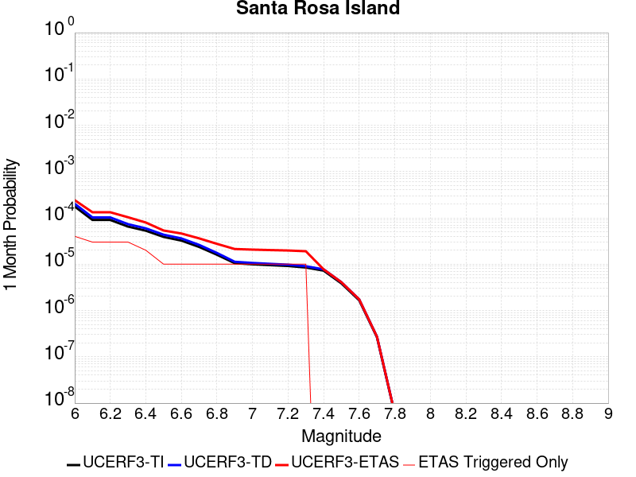 | 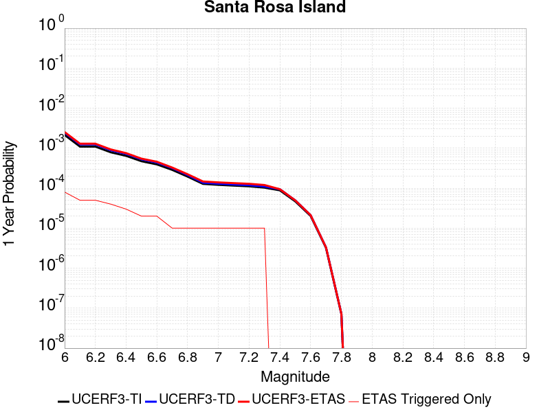 |  |

| Magnitude | 1 wk TI Prob | 1 wk TD Prob | 1 wk ETAS Prob | 1 wk ETAS/TD Gain | 1 wk ETAS Triggered Only | 1 mo TI Prob | 1 mo TD Prob | 1 mo ETAS Prob | 1 mo ETAS/TD Gain | 1 mo ETAS Triggered Only | 1 yr TI Prob | 1 yr TD Prob | 1 yr ETAS Prob | 1 yr ETAS/TD Gain | 1 yr ETAS Triggered Only | 10 yr TI Prob | 10 yr TD Prob | 10 yr ETAS Prob | 10 yr ETAS/TD Gain | 10 yr ETAS Triggered Only |
|-----|-----|-----|-----|-----|-----|-----|-----|-----|-----|-----|-----|-----|-----|-----|-----|-----|-----|-----|-----|-----|
| 6.0 | 4.1143165E-5 | 4.709113E-5 | 8.459733E-5 | 1.7964602 | 3.750797E-5 | 1.7631594E-4 | 2.0180462E-4 | 2.3930502E-4 | 1.1858252 | 3.750797E-5 | 0.002144533 | 0.0024543991 | 0.002529231 | 1.0304888 | 7.501594E-5 | 0.021239553 | 0.024293557 | 0.02436675 | 1.0030129 | 7.501594E-5 |
| 6.1 | 2.1061249E-5 | 2.3864959E-5 | 6.137203E-5 | 2.5716379 | 3.750797E-5 | 9.0259375E-5 | 1.0227455E-4 | 1.3977868E-4 | 1.3667005 | 3.750797E-5 | 0.0010983539 | 0.0012445103 | 0.0012819716 | 1.0301012 | 3.750797E-5 | 0.01092941 | 0.01237845 | 0.012415494 | 1.0029926 | 3.750797E-5 |
| 6.2 | 2.1061249E-5 | 2.3864959E-5 | 6.137203E-5 | 2.5716379 | 3.750797E-5 | 9.0259375E-5 | 1.0227455E-4 | 1.3977868E-4 | 1.3667005 | 3.750797E-5 | 0.0010983539 | 0.0012445103 | 0.0012819716 | 1.0301012 | 3.750797E-5 | 0.01092941 | 0.01237845 | 0.012415494 | 1.0029926 | 3.750797E-5 |
| 6.3 | 1.5158236E-5 | 1.7074419E-5 | 5.458175E-5 | 3.1966975 | 3.750797E-5 | 6.496225E-5 | 7.3174095E-5 | 1.1067932E-4 | 1.5125479 | 3.750797E-5 | 7.906284E-4 | 8.9054246E-4 | 9.28017E-4 | 1.0420806 | 3.750797E-5 | 0.007878214 | 0.00887099 | 0.008908166 | 1.0041907 | 3.750797E-5 |
| 6.4 | 1.2341918E-5 | 1.3852917E-5 | 5.1360366E-5 | 3.707549 | 3.750797E-5 | 5.2892858E-5 | 5.9368336E-5 | 9.687408E-5 | 1.6317465 | 3.750797E-5 | 6.437803E-4 | 7.225779E-4 | 7.600588E-4 | 1.0518711 | 3.750797E-5 | 0.006419184 | 0.0072031217 | 0.0072403597 | 1.0051696 | 3.750797E-5 |
| 6.5 | 9.061158E-6 | 1.0117032E-5 | 4.7624624E-5 | 4.707371 | 3.750797E-5 | 3.883296E-5 | 4.3358017E-5 | 8.086436E-5 | 1.8650383 | 3.750797E-5 | 4.726887E-4 | 5.277613E-4 | 5.652495E-4 | 1.0710324 | 3.750797E-5 | 0.004716845 | 0.0052656177 | 0.005302928 | 1.0070857 | 3.750797E-5 |
| 6.6 | 7.5461685E-6 | 8.400734E-6 | 4.590839E-5 | 5.464807 | 3.750797E-5 | 3.2340322E-5 | 3.600267E-5 | 7.350929E-5 | 2.0417733 | 3.750797E-5 | 3.936723E-4 | 4.3824868E-4 | 4.757402E-4 | 1.0855485 | 3.750797E-5 | 0.003929756 | 0.0043742736 | 0.0044116178 | 1.0085372 | 3.750797E-5 |
| 6.7 | 5.5023775E-6 | 6.087381E-6 | 4.3595122E-5 | 7.1615567 | 3.750797E-5 | 2.3581404E-5 | 2.6088532E-5 | 6.359552E-5 | 2.4376812 | 3.750797E-5 | 2.8706578E-4 | 3.1758484E-4 | 3.550809E-4 | 1.1180663 | 3.750797E-5 | 0.0028669522 | 0.0031716316 | 0.0032090205 | 1.0117886 | 3.750797E-5 |
| 6.8 | 3.7351679E-6 | 4.0831405E-6 | 4.1590956E-5 | 10.186022 | 3.750797E-5 | 1.6007763E-5 | 1.7499071E-5 | 5.5006385E-5 | 3.143389 | 3.750797E-5 | 1.948771E-4 | 2.1303285E-4 | 2.5053282E-4 | 1.1760291 | 3.750797E-5 | 0.0019470629 | 0.0021285315 | 0.0021659597 | 1.017584 | 3.750797E-5 |
| 6.9 | 2.456366E-6 | 2.6292707E-6 | 4.0137144E-5 | 15.265504 | 3.750797E-5 | 1.0527241E-5 | 1.1268255E-5 | 4.87758E-5 | 4.3286033 | 3.750797E-5 | 1.2816161E-4 | 1.3718239E-4 | 1.746852E-4 | 1.2733793 | 3.750797E-5 | 0.0012808773 | 0.0013709799 | 0.0014084366 | 1.027321 | 3.750797E-5 |
| 7.0 | 2.3245157E-6 | 2.4827784E-6 | 3.9990657E-5 | 16.10722 | 3.750797E-5 | 9.962172E-6 | 1.0640436E-5 | 4.8148006E-5 | 4.5250034 | 3.750797E-5 | 1.2128269E-4 | 1.2953962E-4 | 1.6704273E-4 | 1.2895107 | 3.750797E-5 | 0.0012121652 | 0.0012946434 | 0.0013321028 | 1.0289341 | 3.750797E-5 |
| 7.1 | 2.2248344E-6 | 2.37325E-6 | 3.988113E-5 | 16.804438 | 3.750797E-5 | 9.53497E-6 | 1.0171032E-5 | 4.7678623E-5 | 4.6876874 | 3.750797E-5 | 1.1608207E-4 | 1.238253E-4 | 1.6132863E-4 | 1.3028729 | 3.750797E-5 | 0.0011602144 | 0.0012375651 | 0.0012750266 | 1.0302703 | 3.750797E-5 |
| 7.2 | 2.1350402E-6 | 2.2761542E-6 | 3.9784038E-5 | 17.478622 | 3.750797E-5 | 9.150141E-6 | 9.75491E-6 | 4.7262514E-5 | 4.8449974 | 3.750797E-5 | 1.1139726E-4 | 1.1875957E-4 | 1.5626308E-4 | 1.3157936 | 3.750797E-5 | 0.0011134144 | 0.0011869629 | 0.0012244264 | 1.0315624 | 3.750797E-5 |
| 7.3 | 1.9793572E-6 | 2.1087192E-6 | 3.961661E-5 | 18.787048 | 3.750797E-5 | 8.482932E-6 | 9.037337E-6 | 4.6544967E-5 | 5.150297 | 3.750797E-5 | 1.032748E-4 | 1.1002403E-4 | 1.4752788E-4 | 1.3408695 | 3.750797E-5 | 0.0010322682 | 0.0010996974 | 0.0011371642 | 1.03407 | 3.750797E-5 |
| 7.4 | 1.6951194E-6 | 1.8045735E-6 | 1.8045735E-6 | 1.0 | 0.0 | 7.264777E-6 | 7.733864E-6 | 7.733864E-6 | 1.0 | 0.0 | 8.844508E-5 | 9.415574E-5 | 9.415574E-5 | 1.0 | 0.0 | 8.840988E-4 | 9.411601E-4 | 9.411601E-4 | 1.0 | 0.0 |
| 7.5 | 8.987207E-7 | 9.512216E-7 | 9.512216E-7 | 1.0 | 0.0 | 3.8516546E-6 | 4.0766577E-6 | 4.0766577E-6 | 1.0 | 0.0 | 4.6892885E-5 | 4.9632188E-5 | 4.9632188E-5 | 1.0 | 0.0 | 4.688299E-4 | 4.962122E-4 | 4.962122E-4 | 1.0 | 0.0 |
| 7.6 | 3.8783037E-7 | 4.0529335E-7 | 4.0529335E-7 | 1.0 | 0.0 | 1.6621291E-6 | 1.7369704E-6 | 1.7369704E-6 | 1.0 | 0.0 | 2.0236233E-5 | 2.1147416E-5 | 2.1147416E-5 | 1.0 | 0.0 | 2.023439E-4 | 2.114547E-4 | 2.114547E-4 | 1.0 | 0.0 |
| 7.7 | 6.181804E-8 | 6.339047E-8 | 6.339047E-8 | 1.0 | 0.0 | 2.6493444E-7 | 2.7167343E-7 | 2.7167343E-7 | 1.0 | 0.0 | 3.225572E-6 | 3.307619E-6 | 3.307619E-6 | 1.0 | 0.0 | 3.225525E-5 | 3.3075703E-5 | 3.3075703E-5 | 1.0 | 0.0 |
| 7.8 | 1.3704449E-9 | 1.3964153E-9 | 1.3964153E-9 | 1.0 | 0.0 | 5.873335E-9 | 5.984637E-9 | 5.984637E-9 | 1.0 | 0.0 | 7.1507856E-8 | 7.286295E-8 | 7.286295E-8 | 1.0 | 0.0 | 7.1507833E-7 | 7.286294E-7 | 7.286294E-7 | 1.0 | 0.0 |

## Big Pine (Central)
*[(top)](#table-of-contents)*

| 1 Week | 1 Month | 1 Year | 10 Year |
|-----|-----|-----|-----|
|  |  |  |  |

| Magnitude | 1 wk TI Prob | 1 wk TD Prob | 1 wk ETAS Prob | 1 wk ETAS/TD Gain | 1 wk ETAS Triggered Only | 1 mo TI Prob | 1 mo TD Prob | 1 mo ETAS Prob | 1 mo ETAS/TD Gain | 1 mo ETAS Triggered Only | 1 yr TI Prob | 1 yr TD Prob | 1 yr ETAS Prob | 1 yr ETAS/TD Gain | 1 yr ETAS Triggered Only | 10 yr TI Prob | 10 yr TD Prob | 10 yr ETAS Prob | 10 yr ETAS/TD Gain | 10 yr ETAS Triggered Only |
|-----|-----|-----|-----|-----|-----|-----|-----|-----|-----|-----|-----|-----|-----|-----|-----|-----|-----|-----|-----|-----|
| 6.0 | 1.2706755E-5 | 1.4250602E-5 | 1.4250602E-5 | 1.0 | 0.0 | 5.4456385E-5 | 6.107279E-5 | 6.107279E-5 | 1.0 | 0.0 | 6.628048E-4 | 7.433441E-4 | 7.433441E-4 | 1.0 | 0.0 | 0.006608314 | 0.007413639 | 0.007488099 | 1.0100436 | 7.501594E-5 |
| 6.1 | 8.342579E-6 | 9.510835E-6 | 9.510835E-6 | 1.0 | 0.0 | 3.5753423E-5 | 4.076021E-5 | 4.076021E-5 | 1.0 | 0.0 | 4.3521097E-4 | 4.9616426E-4 | 4.9616426E-4 | 1.0 | 0.0 | 0.0043435963 | 0.004954155 | 0.005028799 | 1.015067 | 7.501594E-5 |
| 6.2 | 6.923899E-6 | 7.967221E-6 | 7.967221E-6 | 1.0 | 0.0 | 2.9673516E-5 | 3.4144894E-5 | 3.4144894E-5 | 1.0 | 0.0 | 3.6121515E-4 | 4.1565404E-4 | 4.1565404E-4 | 1.0 | 0.0 | 0.003606286 | 0.0041521094 | 0.004226814 | 1.0179919 | 7.501594E-5 |
| 6.3 | 2.728396E-6 | 3.4243646E-6 | 3.4243646E-6 | 1.0 | 0.0 | 1.1693074E-5 | 1.4675771E-5 | 1.4675771E-5 | 1.0 | 0.0 | 1.4235388E-4 | 1.7866373E-4 | 1.7866373E-4 | 1.0 | 0.0 | 0.0014226272 | 0.0017867433 | 0.0018241842 | 1.0209548 | 3.750797E-5 |
| 6.4 | 2.7136944E-6 | 3.4086581E-6 | 3.4086581E-6 | 1.0 | 0.0 | 1.1630066E-5 | 1.4608458E-5 | 1.4608458E-5 | 1.0 | 0.0 | 1.4158686E-4 | 1.7784433E-4 | 1.7784433E-4 | 1.0 | 0.0 | 0.0014149669 | 0.0017785623 | 0.0018160036 | 1.0210514 | 3.750797E-5 |
| 6.5 | 2.6971882E-6 | 3.3910032E-6 | 3.3910032E-6 | 1.0 | 0.0 | 1.1559327E-5 | 1.4532795E-5 | 1.4532795E-5 | 1.0 | 0.0 | 1.4072572E-4 | 1.7692328E-4 | 1.7692328E-4 | 1.0 | 0.0 | 0.0014063664 | 0.0017693666 | 0.0018068082 | 1.0211611 | 3.750797E-5 |
| 6.6 | 2.669092E-6 | 3.3610236E-6 | 3.3610236E-6 | 1.0 | 0.0 | 1.1438916E-5 | 1.4404312E-5 | 1.4404312E-5 | 1.0 | 0.0 | 1.3925991E-4 | 1.7535927E-4 | 1.7535927E-4 | 1.0 | 0.0 | 0.0013917267 | 0.0017537511 | 0.0017911933 | 1.0213498 | 3.750797E-5 |
| 6.7 | 2.6408059E-6 | 3.3310494E-6 | 3.3310494E-6 | 1.0 | 0.0 | 1.1317691E-5 | 1.4275853E-5 | 1.4275853E-5 | 1.0 | 0.0 | 1.3778417E-4 | 1.737955E-4 | 1.737955E-4 | 1.0 | 0.0 | 0.0013769877 | 0.0017381381 | 0.0017755809 | 1.0215418 | 3.750797E-5 |
| 6.8 | 2.1786943E-6 | 2.8545066E-6 | 2.8545066E-6 | 1.0 | 0.0 | 9.337228E-6 | 1.2233547E-5 | 1.2233547E-5 | 1.0 | 0.0 | 1.1367482E-4 | 1.4893398E-4 | 1.4893398E-4 | 1.0 | 0.0 | 0.0011361669 | 0.0014898704 | 0.0015273225 | 1.0251378 | 3.750797E-5 |
| 6.9 | 1.4411696E-6 | 2.0685677E-6 | 2.0685677E-6 | 1.0 | 0.0 | 6.1764263E-6 | 8.865261E-6 | 8.865261E-6 | 1.0 | 0.0 | 7.51954E-5 | 1.0792949E-4 | 1.0792949E-4 | 1.0 | 0.0 | 7.5169955E-4 | 0.0010802548 | 0.0011177222 | 1.034684 | 3.750797E-5 |
| 7.0 | 1.0073411E-6 | 1.5543274E-6 | 1.5543274E-6 | 1.0 | 0.0 | 4.317169E-6 | 6.661387E-6 | 6.661387E-6 | 1.0 | 0.0 | 5.2560266E-5 | 8.109952E-5 | 8.109952E-5 | 1.0 | 0.0 | 5.2547833E-4 | 8.1217213E-4 | 8.4964966E-4 | 1.0461447 | 3.750797E-5 |
| 7.1 | 8.947104E-7 | 1.430316E-6 | 1.430316E-6 | 1.0 | 0.0 | 3.834468E-6 | 6.1299124E-6 | 6.1299124E-6 | 1.0 | 0.0 | 4.6683643E-5 | 7.462928E-5 | 7.462928E-5 | 1.0 | 0.0 | 4.6673836E-4 | 7.4751483E-4 | 7.8499474E-4 | 1.0501394 | 3.750797E-5 |
| 7.2 | 5.215166E-7 | 1.0112277E-6 | 1.0112277E-6 | 1.0 | 0.0 | 2.2350691E-6 | 4.333826E-6 | 4.333826E-6 | 1.0 | 0.0 | 2.7211627E-5 | 5.27631E-5 | 5.27631E-5 | 1.0 | 0.0 | 2.7208295E-4 | 5.289683E-4 | 5.289683E-4 | 1.0 | 0.0 |
| 7.3 | 4.4024807E-7 | 9.220183E-7 | 9.220183E-7 | 1.0 | 0.0 | 1.8867761E-6 | 3.951501E-6 | 3.951501E-6 | 1.0 | 0.0 | 2.2971257E-5 | 4.8108504E-5 | 4.8108504E-5 | 1.0 | 0.0 | 2.2968883E-4 | 4.824433E-4 | 4.824433E-4 | 1.0 | 0.0 |
| 7.4 | 3.6130905E-7 | 8.359109E-7 | 8.359109E-7 | 1.0 | 0.0 | 1.5484665E-6 | 3.5824705E-6 | 3.5824705E-6 | 1.0 | 0.0 | 1.8852415E-5 | 4.3615746E-5 | 4.3615746E-5 | 1.0 | 0.0 | 1.8850817E-4 | 4.3752496E-4 | 4.3752496E-4 | 1.0 | 0.0 |
| 7.5 | 3.408184E-7 | 8.1087245E-7 | 8.1087245E-7 | 1.0 | 0.0 | 1.4606494E-6 | 3.475163E-6 | 3.475163E-6 | 1.0 | 0.0 | 1.7783263E-5 | 4.230933E-5 | 4.230933E-5 | 1.0 | 0.0 | 1.778184E-4 | 4.2444657E-4 | 4.2444657E-4 | 1.0 | 0.0 |
| 7.6 | 3.1428627E-7 | 7.732167E-7 | 7.732167E-7 | 1.0 | 0.0 | 1.3469405E-6 | 3.313782E-6 | 3.313782E-6 | 1.0 | 0.0 | 1.6398877E-5 | 4.0344585E-5 | 4.0344585E-5 | 1.0 | 0.0 | 1.6397667E-4 | 4.0477706E-4 | 4.0477706E-4 | 1.0 | 0.0 |
| 7.7 | 1.7972785E-7 | 5.0782415E-7 | 5.0782415E-7 | 1.0 | 0.0 | 7.70262E-7 | 2.1763874E-6 | 2.1763874E-6 | 1.0 | 0.0 | 9.377899E-6 | 2.6497206E-5 | 2.6497206E-5 | 1.0 | 0.0 | 9.377503E-5 | 2.6633305E-4 | 2.6633305E-4 | 1.0 | 0.0 |
| 7.8 | 4.9230927E-8 | 1.1981747E-7 | 1.1981747E-7 | 1.0 | 0.0 | 2.1098968E-7 | 5.135033E-7 | 5.135033E-7 | 1.0 | 0.0 | 2.5687964E-6 | 6.2518866E-6 | 6.2518866E-6 | 1.0 | 0.0 | 2.5687666E-5 | 6.2971965E-5 | 6.2971965E-5 | 1.0 | 0.0 |
| 7.9 | 3.6805972E-9 | 4.1051638E-9 | 4.1051638E-9 | 1.0 | 0.0 | 1.5773987E-8 | 1.7593557E-8 | 1.7593557E-8 | 1.0 | 0.0 | 1.9204828E-7 | 2.1420155E-7 | 2.1420155E-7 | 1.0 | 0.0 | 1.920481E-6 | 2.1898923E-6 | 2.1898923E-6 | 1.0 | 0.0 |

## Elysian Park (Upper)
*[(top)](#table-of-contents)*

| 1 Week | 1 Month | 1 Year | 10 Year |
|-----|-----|-----|-----|
|  |  |  |  |

| Magnitude | 1 wk TI Prob | 1 wk TD Prob | 1 wk ETAS Prob | 1 wk ETAS/TD Gain | 1 wk ETAS Triggered Only | 1 mo TI Prob | 1 mo TD Prob | 1 mo ETAS Prob | 1 mo ETAS/TD Gain | 1 mo ETAS Triggered Only | 1 yr TI Prob | 1 yr TD Prob | 1 yr ETAS Prob | 1 yr ETAS/TD Gain | 1 yr ETAS Triggered Only | 10 yr TI Prob | 10 yr TD Prob | 10 yr ETAS Prob | 10 yr ETAS/TD Gain | 10 yr ETAS Triggered Only |
|-----|-----|-----|-----|-----|-----|-----|-----|-----|-----|-----|-----|-----|-----|-----|-----|-----|-----|-----|-----|-----|
| 6.0 | 3.1876025E-5 | 3.7035275E-5 | 3.7035275E-5 | 1.0 | 0.0 | 1.3660437E-4 | 1.5871569E-4 | 1.962177E-4 | 1.2362843 | 3.750797E-5 | 0.0016618895 | 0.001931122 | 0.0020059932 | 1.0387708 | 7.501594E-5 | 0.016495159 | 0.019189863 | 0.019263439 | 1.0038341 | 7.501594E-5 |
| 6.1 | 3.1876025E-5 | 3.7035275E-5 | 3.7035275E-5 | 1.0 | 0.0 | 1.3660437E-4 | 1.5871569E-4 | 1.962177E-4 | 1.2362843 | 3.750797E-5 | 0.0016618895 | 0.001931122 | 0.0020059932 | 1.0387708 | 7.501594E-5 | 0.016495159 | 0.019189863 | 0.019263439 | 1.0038341 | 7.501594E-5 |
| 6.2 | 3.1876025E-5 | 3.7035275E-5 | 3.7035275E-5 | 1.0 | 0.0 | 1.3660437E-4 | 1.5871569E-4 | 1.962177E-4 | 1.2362843 | 3.750797E-5 | 0.0016618895 | 0.001931122 | 0.0020059932 | 1.0387708 | 7.501594E-5 | 0.016495159 | 0.019189863 | 0.019263439 | 1.0038341 | 7.501594E-5 |
| 6.3 | 3.1876025E-5 | 3.7035275E-5 | 3.7035275E-5 | 1.0 | 0.0 | 1.3660437E-4 | 1.5871569E-4 | 1.962177E-4 | 1.2362843 | 3.750797E-5 | 0.0016618895 | 0.001931122 | 0.0020059932 | 1.0387708 | 7.501594E-5 | 0.016495159 | 0.019189863 | 0.019263439 | 1.0038341 | 7.501594E-5 |
| 6.4 | 1.9273462E-5 | 2.120244E-5 | 2.120244E-5 | 1.0 | 0.0 | 8.259794E-5 | 9.086542E-5 | 9.086542E-5 | 1.0 | 0.0 | 0.001005166 | 0.0011058967 | 0.0011058967 | 1.0 | 0.0 | 0.010006315 | 0.011020744 | 0.011020744 | 1.0 | 0.0 |
| 6.5 | 1.9273462E-5 | 2.120244E-5 | 2.120244E-5 | 1.0 | 0.0 | 8.259794E-5 | 9.086542E-5 | 9.086542E-5 | 1.0 | 0.0 | 0.001005166 | 0.0011058967 | 0.0011058967 | 1.0 | 0.0 | 0.010006315 | 0.011020744 | 0.011020744 | 1.0 | 0.0 |
| 6.6 | 9.813258E-6 | 9.665589E-6 | 9.665589E-6 | 1.0 | 0.0 | 4.205614E-5 | 4.1423333E-5 | 4.1423333E-5 | 1.0 | 0.0 | 5.119132E-4 | 5.042196E-4 | 5.042196E-4 | 1.0 | 0.0 | 0.005107356 | 0.0050314795 | 0.0050314795 | 1.0 | 0.0 |
| 6.7 | 9.801478E-6 | 9.653158E-6 | 9.653158E-6 | 1.0 | 0.0 | 4.2005657E-5 | 4.137006E-5 | 4.137006E-5 | 1.0 | 0.0 | 5.112989E-4 | 5.0357135E-4 | 5.0357135E-4 | 1.0 | 0.0 | 0.0051012407 | 0.005025026 | 0.005025026 | 1.0 | 0.0 |
| 6.8 | 8.102489E-6 | 7.772994E-6 | 7.772994E-6 | 1.0 | 0.0 | 3.4724493E-5 | 3.3312434E-5 | 3.3312434E-5 | 1.0 | 0.0 | 4.2268867E-4 | 4.0550836E-4 | 4.0550836E-4 | 1.0 | 0.0 | 0.004218856 | 0.0040481784 | 0.0040481784 | 1.0 | 0.0 |
| 6.9 | 6.08275E-6 | 5.481441E-6 | 5.481441E-6 | 1.0 | 0.0 | 2.6068668E-5 | 2.3491682E-5 | 2.3491682E-5 | 1.0 | 0.0 | 3.173398E-4 | 2.8597447E-4 | 2.8597447E-4 | 1.0 | 0.0 | 0.0031688702 | 0.0028561424 | 0.0028561424 | 1.0 | 0.0 |
| 7.0 | 5.5995934E-6 | 4.9827686E-6 | 4.9827686E-6 | 1.0 | 0.0 | 2.3998036E-5 | 2.1354552E-5 | 2.1354552E-5 | 1.0 | 0.0 | 2.9213692E-4 | 2.5996132E-4 | 2.5996132E-4 | 1.0 | 0.0 | 0.0029175316 | 0.0025966396 | 0.0025966396 | 1.0 | 0.0 |
| 7.1 | 4.709881E-6 | 4.0873906E-6 | 4.0873906E-6 | 1.0 | 0.0 | 2.0185047E-5 | 1.7517272E-5 | 1.7517272E-5 | 1.0 | 0.0 | 2.4572524E-4 | 2.1325232E-4 | 2.1325232E-4 | 1.0 | 0.0 | 0.002454537 | 0.0021305184 | 0.0021305184 | 1.0 | 0.0 |
| 7.2 | 3.6063436E-6 | 2.9779412E-6 | 2.9779412E-6 | 1.0 | 0.0 | 1.5455667E-5 | 1.27625435E-5 | 1.27625435E-5 | 1.0 | 0.0 | 1.881565E-4 | 1.55373E-4 | 1.55373E-4 | 1.0 | 0.0 | 0.0018799726 | 0.0015526549 | 0.0015526549 | 1.0 | 0.0 |
| 7.3 | 2.471135E-6 | 2.0954562E-6 | 2.0954562E-6 | 1.0 | 0.0 | 1.0590536E-5 | 8.980496E-6 | 8.980496E-6 | 1.0 | 0.0 | 1.2893214E-4 | 1.0933213E-4 | 1.0933213E-4 | 1.0 | 0.0 | 0.0012885736 | 0.0010927906 | 0.0010927906 | 1.0 | 0.0 |
| 7.4 | 1.163943E-6 | 1.0275061E-6 | 1.0275061E-6 | 1.0 | 0.0 | 4.988318E-6 | 4.40359E-6 | 4.40359E-6 | 1.0 | 0.0 | 6.0731076E-5 | 5.361242E-5 | 5.361242E-5 | 1.0 | 0.0 | 6.071448E-4 | 5.3599785E-4 | 5.3599785E-4 | 1.0 | 0.0 |
| 7.5 | 4.99459E-7 | 4.917601E-7 | 4.917601E-7 | 1.0 | 0.0 | 2.140537E-6 | 2.1075416E-6 | 2.1075416E-6 | 1.0 | 0.0 | 2.6060725E-5 | 2.5659032E-5 | 2.5659032E-5 | 1.0 | 0.0 | 2.605767E-4 | 2.5656226E-4 | 2.5656226E-4 | 1.0 | 0.0 |
| 7.6 | 2.4667852E-7 | 2.4778313E-7 | 2.4778313E-7 | 1.0 | 0.0 | 1.0571932E-6 | 1.0619274E-6 | 1.0619274E-6 | 1.0 | 0.0 | 1.2871251E-5 | 1.2928893E-5 | 1.2928893E-5 | 1.0 | 0.0 | 1.2870505E-4 | 1.2928178E-4 | 1.2928178E-4 | 1.0 | 0.0 |
| 7.7 | 8.2312795E-8 | 7.3864214E-8 | 7.3864214E-8 | 1.0 | 0.0 | 3.527691E-7 | 3.165609E-7 | 3.165609E-7 | 1.0 | 0.0 | 4.294955E-6 | 3.854123E-6 | 3.854123E-6 | 1.0 | 0.0 | 4.2948723E-5 | 3.854068E-5 | 3.854068E-5 | 1.0 | 0.0 |
| 7.8 | 2.7819295E-8 | 1.7565618E-8 | 1.7565618E-8 | 1.0 | 0.0 | 1.1922555E-7 | 7.528122E-8 | 7.528122E-8 | 1.0 | 0.0 | 1.45157E-6 | 9.1654863E-7 | 9.1654863E-7 | 1.0 | 0.0 | 1.45156055E-5 | 9.165463E-6 | 9.165463E-6 | 1.0 | 0.0 |

## Elmore Ranch
*[(top)](#table-of-contents)*

| 1 Week | 1 Month | 1 Year | 10 Year |
|-----|-----|-----|-----|
|  |  |  |  |

| Magnitude | 1 wk TI Prob | 1 wk TD Prob | 1 wk ETAS Prob | 1 wk ETAS/TD Gain | 1 wk ETAS Triggered Only | 1 mo TI Prob | 1 mo TD Prob | 1 mo ETAS Prob | 1 mo ETAS/TD Gain | 1 mo ETAS Triggered Only | 1 yr TI Prob | 1 yr TD Prob | 1 yr ETAS Prob | 1 yr ETAS/TD Gain | 1 yr ETAS Triggered Only | 10 yr TI Prob | 10 yr TD Prob | 10 yr ETAS Prob | 10 yr ETAS/TD Gain | 10 yr ETAS Triggered Only |
|-----|-----|-----|-----|-----|-----|-----|-----|-----|-----|-----|-----|-----|-----|-----|-----|-----|-----|-----|-----|-----|
| 6.0 | 9.102099E-5 | 8.953848E-5 | 8.953848E-5 | 1.0 | 0.0 | 3.9003167E-4 | 3.836898E-4 | 3.836898E-4 | 1.0 | 0.0 | 0.0047383 | 0.004662132 | 0.004699465 | 1.0080078 | 3.750797E-5 | 0.046385348 | 0.04583787 | 0.04590945 | 1.0015615 | 7.501594E-5 |
| 6.1 | 3.8306698E-5 | 4.14921E-5 | 4.14921E-5 | 1.0 | 0.0 | 1.6416123E-4 | 1.7781362E-4 | 1.7781362E-4 | 1.0 | 0.0 | 0.0019968306 | 0.0021632186 | 0.0021632186 | 1.0 | 0.0 | 0.019789828 | 0.021595007 | 0.021631705 | 1.0016993 | 3.750797E-5 |
| 6.2 | 3.8306698E-5 | 4.14921E-5 | 4.14921E-5 | 1.0 | 0.0 | 1.6416123E-4 | 1.7781362E-4 | 1.7781362E-4 | 1.0 | 0.0 | 0.0019968306 | 0.0021632186 | 0.0021632186 | 1.0 | 0.0 | 0.019789828 | 0.021595007 | 0.021631705 | 1.0016993 | 3.750797E-5 |
| 6.3 | 3.3197924E-5 | 3.6550366E-5 | 3.6550366E-5 | 1.0 | 0.0 | 1.4226905E-4 | 1.56639E-4 | 1.56639E-4 | 1.0 | 0.0 | 0.0017307495 | 0.0019059771 | 0.0019059771 | 1.0 | 0.0 | 0.017173318 | 0.019057386 | 0.019094178 | 1.0019306 | 3.750797E-5 |
| 6.4 | 2.5148964E-5 | 2.7420736E-5 | 2.7420736E-5 | 1.0 | 0.0 | 1.0777682E-4 | 1.17515796E-4 | 1.17515796E-4 | 1.0 | 0.0 | 0.0013113929 | 0.0014304637 | 0.0014304637 | 1.0 | 0.0 | 0.01303681 | 0.014365338 | 0.014365338 | 1.0 | 0.0 |
| 6.5 | 2.5148964E-5 | 2.7420736E-5 | 2.7420736E-5 | 1.0 | 0.0 | 1.0777682E-4 | 1.17515796E-4 | 1.17515796E-4 | 1.0 | 0.0 | 0.0013113929 | 0.0014304637 | 0.0014304637 | 1.0 | 0.0 | 0.01303681 | 0.014365338 | 0.014365338 | 1.0 | 0.0 |

## San Luis Range 2011 CFM
*[(top)](#table-of-contents)*

| 1 Week | 1 Month | 1 Year | 10 Year |
|-----|-----|-----|-----|
|  |  | 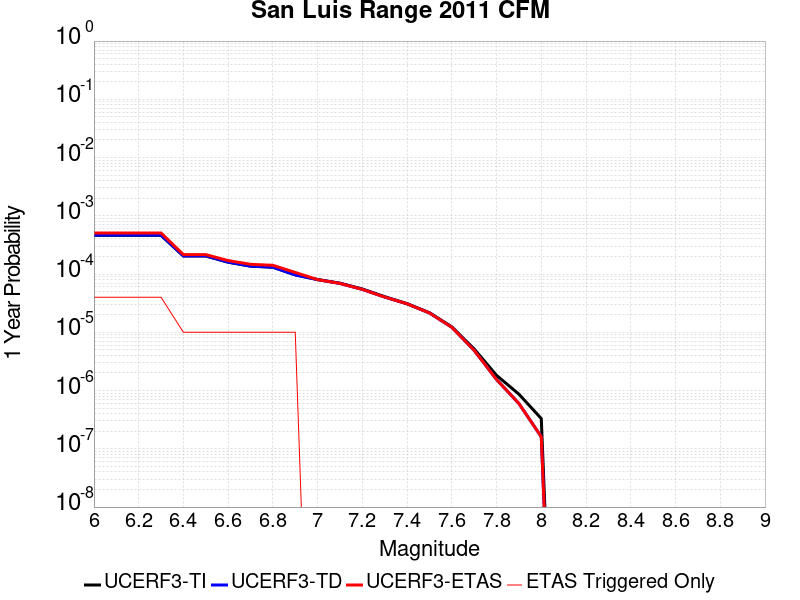 |  |

| Magnitude | 1 wk TI Prob | 1 wk TD Prob | 1 wk ETAS Prob | 1 wk ETAS/TD Gain | 1 wk ETAS Triggered Only | 1 mo TI Prob | 1 mo TD Prob | 1 mo ETAS Prob | 1 mo ETAS/TD Gain | 1 mo ETAS Triggered Only | 1 yr TI Prob | 1 yr TD Prob | 1 yr ETAS Prob | 1 yr ETAS/TD Gain | 1 yr ETAS Triggered Only | 10 yr TI Prob | 10 yr TD Prob | 10 yr ETAS Prob | 10 yr ETAS/TD Gain | 10 yr ETAS Triggered Only |
|-----|-----|-----|-----|-----|-----|-----|-----|-----|-----|-----|-----|-----|-----|-----|-----|-----|-----|-----|-----|-----|
| 6.0 | 8.8368415E-6 | 8.965455E-6 | 8.965455E-6 | 1.0 | 0.0 | 3.787163E-5 | 3.8422855E-5 | 3.8422855E-5 | 1.0 | 0.0 | 4.609895E-4 | 4.6770574E-4 | 5.0519616E-4 | 1.0801581 | 3.750797E-5 | 0.0046003438 | 0.004667997 | 0.0047053294 | 1.0079976 | 3.750797E-5 |
| 6.1 | 8.8368415E-6 | 8.965455E-6 | 8.965455E-6 | 1.0 | 0.0 | 3.787163E-5 | 3.8422855E-5 | 3.8422855E-5 | 1.0 | 0.0 | 4.609895E-4 | 4.6770574E-4 | 5.0519616E-4 | 1.0801581 | 3.750797E-5 | 0.0046003438 | 0.004667997 | 0.0047053294 | 1.0079976 | 3.750797E-5 |
| 6.2 | 8.8368415E-6 | 8.965455E-6 | 8.965455E-6 | 1.0 | 0.0 | 3.787163E-5 | 3.8422855E-5 | 3.8422855E-5 | 1.0 | 0.0 | 4.609895E-4 | 4.6770574E-4 | 5.0519616E-4 | 1.0801581 | 3.750797E-5 | 0.0046003438 | 0.004667997 | 0.0047053294 | 1.0079976 | 3.750797E-5 |
| 6.3 | 8.8368415E-6 | 8.965455E-6 | 8.965455E-6 | 1.0 | 0.0 | 3.787163E-5 | 3.8422855E-5 | 3.8422855E-5 | 1.0 | 0.0 | 4.609895E-4 | 4.6770574E-4 | 5.0519616E-4 | 1.0801581 | 3.750797E-5 | 0.0046003438 | 0.004667997 | 0.0047053294 | 1.0079976 | 3.750797E-5 |
| 6.4 | 3.9094193E-6 | 3.941204E-6 | 3.941204E-6 | 1.0 | 0.0 | 1.6754546E-5 | 1.6890766E-5 | 1.6890766E-5 | 1.0 | 0.0 | 2.039675E-4 | 2.0562594E-4 | 2.4312621E-4 | 1.1823713 | 3.750797E-5 | 0.0020378039 | 0.0020543856 | 0.0020918166 | 1.01822 | 3.750797E-5 |
| 6.5 | 3.9094193E-6 | 3.941204E-6 | 3.941204E-6 | 1.0 | 0.0 | 1.6754546E-5 | 1.6890766E-5 | 1.6890766E-5 | 1.0 | 0.0 | 2.039675E-4 | 2.0562594E-4 | 2.4312621E-4 | 1.1823713 | 3.750797E-5 | 0.0020378039 | 0.0020543856 | 0.0020918166 | 1.01822 | 3.750797E-5 |
| 6.6 | 3.0587726E-6 | 3.0753893E-6 | 3.0753893E-6 | 1.0 | 0.0 | 1.3108959E-5 | 1.3180174E-5 | 1.3180174E-5 | 1.0 | 0.0 | 1.595899E-4 | 1.6045693E-4 | 1.9795887E-4 | 1.2337197 | 3.750797E-5 | 0.0015947534 | 0.0016034227 | 0.0016408705 | 1.0233549 | 3.750797E-5 |
| 6.7 | 2.6160574E-6 | 2.6251284E-6 | 2.6251284E-6 | 1.0 | 0.0 | 1.1211626E-5 | 1.1250502E-5 | 1.1250502E-5 | 1.0 | 0.0 | 1.3649299E-4 | 1.3696631E-4 | 1.7446914E-4 | 1.2738106 | 3.750797E-5 | 0.0013640919 | 0.0013688251 | 0.0014062817 | 1.027364 | 3.750797E-5 |
| 6.8 | 2.5110312E-6 | 2.5181412E-6 | 2.5181412E-6 | 1.0 | 0.0 | 1.0761518E-5 | 1.079199E-5 | 1.079199E-5 | 1.0 | 0.0 | 1.310136E-4 | 1.313846E-4 | 1.6888765E-4 | 1.2854447 | 3.750797E-5 | 0.0013093639 | 0.0013130752 | 0.0013505339 | 1.0285275 | 3.750797E-5 |
| 6.9 | 1.8564405E-6 | 1.852488E-6 | 1.852488E-6 | 1.0 | 0.0 | 7.95615E-6 | 7.93921E-6 | 7.93921E-6 | 1.0 | 0.0 | 9.686181E-5 | 9.665562E-5 | 1.3415997E-4 | 1.3880203 | 3.750797E-5 | 9.68196E-4 | 9.6613786E-4 | 0.0010036096 | 1.0387851 | 3.750797E-5 |
| 7.0 | 1.546127E-6 | 1.5369549E-6 | 1.5369549E-6 | 1.0 | 0.0 | 6.626242E-6 | 6.5869326E-6 | 6.5869326E-6 | 1.0 | 0.0 | 8.06715E-5 | 8.019296E-5 | 8.019296E-5 | 1.0 | 0.0 | 8.0642226E-4 | 8.016409E-4 | 8.016409E-4 | 1.0 | 0.0 |
| 7.1 | 1.3368208E-6 | 1.3235336E-6 | 1.3235336E-6 | 1.0 | 0.0 | 5.7292195E-6 | 5.6722747E-6 | 5.6722747E-6 | 1.0 | 0.0 | 6.975101E-5 | 6.905776E-5 | 6.905776E-5 | 1.0 | 0.0 | 6.972912E-4 | 6.903635E-4 | 6.903635E-4 | 1.0 | 0.0 |
| 7.2 | 1.0623363E-6 | 1.0454378E-6 | 1.0454378E-6 | 1.0 | 0.0 | 4.5528623E-6 | 4.4804397E-6 | 4.4804397E-6 | 1.0 | 0.0 | 5.5429686E-5 | 5.4547992E-5 | 5.4547992E-5 | 1.0 | 0.0 | 5.5415864E-4 | 5.453463E-4 | 5.453463E-4 | 1.0 | 0.0 |
| 7.3 | 7.831679E-7 | 7.727399E-7 | 7.727399E-7 | 1.0 | 0.0 | 3.3564295E-6 | 3.3117383E-6 | 3.3117383E-6 | 1.0 | 0.0 | 4.086376E-5 | 4.031967E-5 | 4.031967E-5 | 1.0 | 0.0 | 4.0856248E-4 | 4.0312367E-4 | 4.0312367E-4 | 1.0 | 0.0 |
| 7.4 | 5.9558846E-7 | 5.910646E-7 | 5.910646E-7 | 1.0 | 0.0 | 2.5525194E-6 | 2.5331315E-6 | 2.5331315E-6 | 1.0 | 0.0 | 3.107648E-5 | 3.084044E-5 | 3.084044E-5 | 1.0 | 0.0 | 3.1072134E-4 | 3.083617E-4 | 3.083617E-4 | 1.0 | 0.0 |
| 7.5 | 4.1616502E-7 | 4.1196404E-7 | 4.1196404E-7 | 1.0 | 0.0 | 1.7835631E-6 | 1.765559E-6 | 1.765559E-6 | 1.0 | 0.0 | 2.1714664E-5 | 2.1495469E-5 | 2.1495469E-5 | 1.0 | 0.0 | 2.1712543E-4 | 2.1493394E-4 | 2.1493394E-4 | 1.0 | 0.0 |
| 7.6 | 2.3816014E-7 | 2.3376614E-7 | 2.3376614E-7 | 1.0 | 0.0 | 1.0206859E-6 | 1.0018545E-6 | 1.0018545E-6 | 1.0 | 0.0 | 1.242678E-5 | 1.219751E-5 | 1.219751E-5 | 1.0 | 0.0 | 1.2426086E-4 | 1.2196843E-4 | 1.2196843E-4 | 1.0 | 0.0 |
| 7.7 | 9.918777E-8 | 9.3868096E-8 | 9.3868096E-8 | 1.0 | 0.0 | 4.2509038E-7 | 4.022918E-7 | 4.022918E-7 | 1.0 | 0.0 | 5.1754632E-6 | 4.8978914E-6 | 4.8978914E-6 | 1.0 | 0.0 | 5.1753424E-5 | 4.897784E-5 | 4.897784E-5 | 1.0 | 0.0 |
| 7.8 | 3.4982556E-8 | 2.968672E-8 | 2.968672E-8 | 1.0 | 0.0 | 1.4992524E-7 | 1.272288E-7 | 1.272288E-7 | 1.0 | 0.0 | 1.8253382E-6 | 1.5490094E-6 | 1.5490094E-6 | 1.0 | 0.0 | 1.8253233E-5 | 1.5489988E-5 | 1.5489988E-5 | 1.0 | 0.0 |
| 7.9 | 1.6624908E-8 | 1.1476994E-8 | 1.1476994E-8 | 1.0 | 0.0 | 7.12496E-8 | 4.9187115E-8 | 4.9187115E-8 | 1.0 | 0.0 | 8.6746354E-7 | 5.988529E-7 | 5.988529E-7 | 1.0 | 0.0 | 8.674601E-6 | 5.9885133E-6 | 5.9885133E-6 | 1.0 | 0.0 |
| 8.0 | 6.3352315E-9 | 3.0886564E-9 | 3.0886564E-9 | 1.0 | 0.0 | 2.715099E-8 | 1.32370985E-8 | 1.32370985E-8 | 1.0 | 0.0 | 3.3056327E-7 | 1.6116167E-7 | 1.6116167E-7 | 1.0 | 0.0 | 3.3056278E-6 | 1.6116155E-6 | 1.6116155E-6 | 1.0 | 0.0 |

## Red Mountain
*[(top)](#table-of-contents)*

| 1 Week | 1 Month | 1 Year | 10 Year |
|-----|-----|-----|-----|
|  |  |  |  |

| Magnitude | 1 wk TI Prob | 1 wk TD Prob | 1 wk ETAS Prob | 1 wk ETAS/TD Gain | 1 wk ETAS Triggered Only | 1 mo TI Prob | 1 mo TD Prob | 1 mo ETAS Prob | 1 mo ETAS/TD Gain | 1 mo ETAS Triggered Only | 1 yr TI Prob | 1 yr TD Prob | 1 yr ETAS Prob | 1 yr ETAS/TD Gain | 1 yr ETAS Triggered Only | 10 yr TI Prob | 10 yr TD Prob | 10 yr ETAS Prob | 10 yr ETAS/TD Gain | 10 yr ETAS Triggered Only |
|-----|-----|-----|-----|-----|-----|-----|-----|-----|-----|-----|-----|-----|-----|-----|-----|-----|-----|-----|-----|-----|
| 6.0 | 4.1810763E-5 | 4.7590016E-5 | 4.7590016E-5 | 1.0 | 0.0 | 1.7917668E-4 | 2.039422E-4 | 2.4144253E-4 | 1.1838772 | 3.750797E-5 | 0.0021792934 | 0.0024803334 | 0.0025177484 | 1.0150846 | 3.750797E-5 | 0.021580452 | 0.02454411 | 0.024617285 | 1.0029813 | 7.501594E-5 |
| 6.1 | 4.1810763E-5 | 4.7590016E-5 | 4.7590016E-5 | 1.0 | 0.0 | 1.7917668E-4 | 2.039422E-4 | 2.4144253E-4 | 1.1838772 | 3.750797E-5 | 0.0021792934 | 0.0024803334 | 0.0025177484 | 1.0150846 | 3.750797E-5 | 0.021580452 | 0.02454411 | 0.024617285 | 1.0029813 | 7.501594E-5 |
| 6.2 | 4.1810763E-5 | 4.7590016E-5 | 4.7590016E-5 | 1.0 | 0.0 | 1.7917668E-4 | 2.039422E-4 | 2.4144253E-4 | 1.1838772 | 3.750797E-5 | 0.0021792934 | 0.0024803334 | 0.0025177484 | 1.0150846 | 3.750797E-5 | 0.021580452 | 0.02454411 | 0.024617285 | 1.0029813 | 7.501594E-5 |
| 6.3 | 4.1810763E-5 | 4.7590016E-5 | 4.7590016E-5 | 1.0 | 0.0 | 1.7917668E-4 | 2.039422E-4 | 2.4144253E-4 | 1.1838772 | 3.750797E-5 | 0.0021792934 | 0.0024803334 | 0.0025177484 | 1.0150846 | 3.750797E-5 | 0.021580452 | 0.02454411 | 0.024617285 | 1.0029813 | 7.501594E-5 |
| 6.4 | 4.1810763E-5 | 4.7590016E-5 | 4.7590016E-5 | 1.0 | 0.0 | 1.7917668E-4 | 2.039422E-4 | 2.4144253E-4 | 1.1838772 | 3.750797E-5 | 0.0021792934 | 0.0024803334 | 0.0025177484 | 1.0150846 | 3.750797E-5 | 0.021580452 | 0.02454411 | 0.024617285 | 1.0029813 | 7.501594E-5 |
| 6.5 | 3.154503E-5 | 3.5359757E-5 | 3.5359757E-5 | 1.0 | 0.0 | 1.3518598E-4 | 1.5153353E-4 | 1.8903583E-4 | 1.247485 | 3.750797E-5 | 0.0016446467 | 0.0018434518 | 0.0018808906 | 1.0203091 | 3.750797E-5 | 0.01632528 | 0.018291244 | 0.018364888 | 1.0040262 | 7.501594E-5 |
| 6.6 | 3.1535834E-5 | 3.5349138E-5 | 3.5349138E-5 | 1.0 | 0.0 | 1.3514658E-4 | 1.5148803E-4 | 1.8899032E-4 | 1.2475594 | 3.750797E-5 | 0.0016441676 | 0.0018428987 | 0.0018803376 | 1.0203152 | 3.750797E-5 | 0.01632056 | 0.018285805 | 0.018359449 | 1.0040274 | 7.501594E-5 |
| 6.7 | 2.8267326E-5 | 3.1469353E-5 | 3.1469353E-5 | 1.0 | 0.0 | 1.2114006E-4 | 1.3486217E-4 | 1.7236508E-4 | 1.2780832 | 3.750797E-5 | 0.0014738824 | 0.0016407954 | 0.0016782418 | 1.0228221 | 3.750797E-5 | 0.014641452 | 0.01629557 | 0.016369365 | 1.0045284 | 7.501594E-5 |
| 6.8 | 2.8212884E-5 | 3.1407242E-5 | 3.1407242E-5 | 1.0 | 0.0 | 1.20906756E-4 | 1.3459599E-4 | 1.7209892E-4 | 1.2786332 | 3.750797E-5 | 0.0014710457 | 0.0016375595 | 0.0016750061 | 1.0228673 | 3.750797E-5 | 0.014613459 | 0.016263688 | 0.016337484 | 1.0045375 | 7.501594E-5 |
| 6.9 | 2.4227871E-5 | 2.6706994E-5 | 2.6706994E-5 | 1.0 | 0.0 | 1.03829596E-4 | 1.1445395E-4 | 1.1445395E-4 | 1.0 | 0.0 | 0.0012633923 | 0.0013926621 | 0.0013926621 | 1.0 | 0.0 | 0.012562336 | 0.0138470335 | 0.013884023 | 1.0026712 | 3.750797E-5 |
| 7.0 | 2.348524E-5 | 2.5835778E-5 | 2.5835778E-5 | 1.0 | 0.0 | 1.0064714E-4 | 1.10720495E-4 | 1.10720495E-4 | 1.0 | 0.0 | 0.0012246901 | 0.001347264 | 0.001347264 | 1.0 | 0.0 | 0.012179627 | 0.013398598 | 0.013435603 | 1.0027618 | 3.750797E-5 |
| 7.1 | 2.2311642E-5 | 2.4462845E-5 | 2.4462845E-5 | 1.0 | 0.0 | 9.561782E-5 | 1.04836974E-4 | 1.04836974E-4 | 1.0 | 0.0 | 0.0011635252 | 0.0012757176 | 0.0012757176 | 1.0 | 0.0 | 0.01157452 | 0.01269146 | 0.012728492 | 1.0029179 | 3.750797E-5 |
| 7.2 | 1.6533986E-5 | 1.7670362E-5 | 1.7670362E-5 | 1.0 | 0.0 | 7.085802E-5 | 7.572828E-5 | 7.572828E-5 | 1.0 | 0.0 | 8.623549E-4 | 9.2166534E-4 | 9.2166534E-4 | 1.0 | 0.0 | 0.008590161 | 0.009184707 | 0.00922187 | 1.0040462 | 3.750797E-5 |
| 7.3 | 1.4703092E-5 | 1.5559537E-5 | 1.5559537E-5 | 1.0 | 0.0 | 6.301173E-5 | 6.668237E-5 | 6.668237E-5 | 1.0 | 0.0 | 7.668978E-4 | 8.1161706E-4 | 8.1161706E-4 | 1.0 | 0.0 | 0.0076425658 | 0.008092604 | 0.008129808 | 1.0045973 | 3.750797E-5 |
| 7.4 | 6.1331984E-6 | 5.5288874E-6 | 5.5288874E-6 | 1.0 | 0.0 | 2.6284872E-5 | 2.3695018E-5 | 2.3695018E-5 | 1.0 | 0.0 | 3.199713E-4 | 2.884492E-4 | 2.884492E-4 | 1.0 | 0.0 | 0.0031951098 | 0.0028808024 | 0.0029182022 | 1.0129825 | 3.750797E-5 |
| 7.5 | 5.954766E-6 | 5.338517E-6 | 5.338517E-6 | 1.0 | 0.0 | 2.5520176E-5 | 2.2879161E-5 | 2.2879161E-5 | 1.0 | 0.0 | 3.1066386E-4 | 2.785187E-4 | 2.785187E-4 | 1.0 | 0.0 | 0.003102299 | 0.0027817504 | 0.002819154 | 1.0134461 | 3.750797E-5 |
| 7.6 | 4.9726646E-6 | 4.315309E-6 | 4.315309E-6 | 1.0 | 0.0 | 2.1311245E-5 | 1.8494053E-5 | 1.8494053E-5 | 1.0 | 0.0 | 2.5943352E-4 | 2.2514217E-4 | 2.2514217E-4 | 1.0 | 0.0 | 0.0025913084 | 0.0022491754 | 0.0022491754 | 1.0 | 0.0 |
| 7.7 | 3.3613894E-6 | 2.8526886E-6 | 2.8526886E-6 | 1.0 | 0.0 | 1.4405875E-5 | 1.22257525E-5 | 1.22257525E-5 | 1.0 | 0.0 | 1.7537741E-4 | 1.4883863E-4 | 1.4883863E-4 | 1.0 | 0.0 | 0.0017523908 | 0.0014874157 | 0.0014874157 | 1.0 | 0.0 |
| 7.8 | 1.1828961E-6 | 1.0122935E-6 | 1.0122935E-6 | 1.0 | 0.0 | 5.069545E-6 | 4.338394E-6 | 4.338394E-6 | 1.0 | 0.0 | 6.171996E-5 | 5.281869E-5 | 5.281869E-5 | 1.0 | 0.0 | 6.170282E-4 | 5.280643E-4 | 5.280643E-4 | 1.0 | 0.0 |
| 7.9 | 2.2967266E-7 | 1.861919E-7 | 1.861919E-7 | 1.0 | 0.0 | 9.843111E-7 | 7.97965E-7 | 7.97965E-7 | 1.0 | 0.0 | 1.19839215E-5 | 9.715184E-6 | 9.715184E-6 | 1.0 | 0.0 | 1.1983275E-4 | 9.714788E-5 | 9.714788E-5 | 1.0 | 0.0 |

## San Jacinto (Lytle Creek connector)
*[(top)](#table-of-contents)*

| 1 Week | 1 Month | 1 Year | 10 Year |
|-----|-----|-----|-----|
|  |  |  |  |

| Magnitude | 1 wk TI Prob | 1 wk TD Prob | 1 wk ETAS Prob | 1 wk ETAS/TD Gain | 1 wk ETAS Triggered Only | 1 mo TI Prob | 1 mo TD Prob | 1 mo ETAS Prob | 1 mo ETAS/TD Gain | 1 mo ETAS Triggered Only | 1 yr TI Prob | 1 yr TD Prob | 1 yr ETAS Prob | 1 yr ETAS/TD Gain | 1 yr ETAS Triggered Only | 10 yr TI Prob | 10 yr TD Prob | 10 yr ETAS Prob | 10 yr ETAS/TD Gain | 10 yr ETAS Triggered Only |
|-----|-----|-----|-----|-----|-----|-----|-----|-----|-----|-----|-----|-----|-----|-----|-----|-----|-----|-----|-----|-----|
| 6.0 | 6.693995E-6 | 6.660123E-6 | 4.4167842E-5 | 6.6316857 | 3.750797E-5 | 2.8688235E-5 | 2.8543072E-5 | 6.604997E-5 | 2.3140457 | 3.750797E-5 | 3.492233E-4 | 3.4745657E-4 | 4.2244644E-4 | 1.2158252 | 7.501594E-5 | 0.00348675 | 0.0035491167 | 0.0036238665 | 1.0210615 | 7.501594E-5 |
| 6.1 | 6.693995E-6 | 6.660123E-6 | 4.4167842E-5 | 6.6316857 | 3.750797E-5 | 2.8688235E-5 | 2.8543072E-5 | 6.604997E-5 | 2.3140457 | 3.750797E-5 | 3.492233E-4 | 3.4745657E-4 | 4.2244644E-4 | 1.2158252 | 7.501594E-5 | 0.00348675 | 0.0035491167 | 0.0036238665 | 1.0210615 | 7.501594E-5 |
| 6.2 | 6.693995E-6 | 6.660123E-6 | 4.4167842E-5 | 6.6316857 | 3.750797E-5 | 2.8688235E-5 | 2.8543072E-5 | 6.604997E-5 | 2.3140457 | 3.750797E-5 | 3.492233E-4 | 3.4745657E-4 | 4.2244644E-4 | 1.2158252 | 7.501594E-5 | 0.00348675 | 0.0035491167 | 0.0036238665 | 1.0210615 | 7.501594E-5 |
| 6.3 | 6.693995E-6 | 6.660123E-6 | 4.4167842E-5 | 6.6316857 | 3.750797E-5 | 2.8688235E-5 | 2.8543072E-5 | 6.604997E-5 | 2.3140457 | 3.750797E-5 | 3.492233E-4 | 3.4745657E-4 | 4.2244644E-4 | 1.2158252 | 7.501594E-5 | 0.00348675 | 0.0035491167 | 0.0036238665 | 1.0210615 | 7.501594E-5 |
| 6.4 | 6.693995E-6 | 6.660123E-6 | 4.4167842E-5 | 6.6316857 | 3.750797E-5 | 2.8688235E-5 | 2.8543072E-5 | 6.604997E-5 | 2.3140457 | 3.750797E-5 | 3.492233E-4 | 3.4745657E-4 | 4.2244644E-4 | 1.2158252 | 7.501594E-5 | 0.00348675 | 0.0035491167 | 0.0036238665 | 1.0210615 | 7.501594E-5 |
| 6.5 | 6.6561875E-6 | 6.620341E-6 | 4.4128064E-5 | 6.6655273 | 3.750797E-5 | 2.8526205E-5 | 2.8372582E-5 | 6.587949E-5 | 2.3219419 | 3.750797E-5 | 3.472512E-4 | 3.453815E-4 | 4.2037154E-4 | 1.2171223 | 7.501594E-5 | 0.0034670907 | 0.0035284322 | 0.0036031834 | 1.0211854 | 7.501594E-5 |
| 6.6 | 6.6561875E-6 | 6.620341E-6 | 4.4128064E-5 | 6.6655273 | 3.750797E-5 | 2.8526205E-5 | 2.8372582E-5 | 6.587949E-5 | 2.3219419 | 3.750797E-5 | 3.472512E-4 | 3.453815E-4 | 4.2037154E-4 | 1.2171223 | 7.501594E-5 | 0.0034670907 | 0.0035284322 | 0.0036031834 | 1.0211854 | 7.501594E-5 |
| 6.7 | 6.5802237E-6 | 6.539518E-6 | 4.4047243E-5 | 6.735549 | 3.750797E-5 | 2.8200653E-5 | 2.8026205E-5 | 6.5533124E-5 | 2.3382804 | 3.750797E-5 | 3.4328885E-4 | 3.4116567E-4 | 4.1615602E-4 | 1.2198062 | 7.501594E-5 | 0.0034275902 | 0.0034864065 | 0.003561161 | 1.0214417 | 7.501594E-5 |
| 6.8 | 6.575632E-6 | 6.5340073E-6 | 4.404173E-5 | 6.740386 | 3.750797E-5 | 2.8180975E-5 | 2.8002589E-5 | 6.550951E-5 | 2.339409 | 3.750797E-5 | 3.4304935E-4 | 3.4087826E-4 | 4.1586862E-4 | 1.2199917 | 7.501594E-5 | 0.0034252026 | 0.0034835413 | 0.003558296 | 1.0214593 | 7.501594E-5 |
| 6.9 | 6.570433E-6 | 6.525401E-6 | 4.4033128E-5 | 6.7479568 | 3.750797E-5 | 2.8158694E-5 | 2.7965707E-5 | 6.5472625E-5 | 2.3411756 | 3.750797E-5 | 3.4277816E-4 | 3.4042934E-4 | 4.1541975E-4 | 1.2202818 | 7.501594E-5 | 0.0034224992 | 0.0034790665 | 0.0035538215 | 1.0214871 | 7.501594E-5 |
| 7.0 | 6.5643826E-6 | 6.5155223E-6 | 4.4023247E-5 | 6.7566724 | 3.750797E-5 | 2.8132765E-5 | 2.7923368E-5 | 6.543029E-5 | 2.343209 | 3.750797E-5 | 3.424626E-4 | 3.3991406E-4 | 4.149045E-4 | 1.2206159 | 7.501594E-5 | 0.0034193532 | 0.0034739296 | 0.003548685 | 1.021519 | 7.501594E-5 |
| 7.1 | 6.557402E-6 | 6.504234E-6 | 4.4011962E-5 | 6.766663 | 3.750797E-5 | 2.8102848E-5 | 2.7874992E-5 | 6.5381915E-5 | 2.3455403 | 3.750797E-5 | 3.4209844E-4 | 3.3932526E-4 | 4.1431573E-4 | 1.2209989 | 7.501594E-5 | 0.0034157229 | 0.0034680606 | 0.0035428165 | 1.0215555 | 7.501594E-5 |
| 7.2 | 6.546394E-6 | 6.4862006E-6 | 4.399393E-5 | 6.7826962 | 3.750797E-5 | 2.8055672E-5 | 2.7797707E-5 | 6.530464E-5 | 2.3492813 | 3.750797E-5 | 3.4152428E-4 | 3.383846E-4 | 4.1337515E-4 | 1.2216134 | 7.501594E-5 | 0.0034099987 | 0.0034586883 | 0.0035334446 | 1.0216141 | 7.501594E-5 |
| 7.3 | 6.5364216E-6 | 6.4669857E-6 | 4.3974713E-5 | 6.799878 | 3.750797E-5 | 2.8012933E-5 | 2.771536E-5 | 6.522229E-5 | 2.3532906 | 3.750797E-5 | 3.4100408E-4 | 3.373823E-4 | 4.1237296E-4 | 1.2222719 | 7.501594E-5 | 0.003404813 | 0.0034487103 | 0.0035234676 | 1.0216769 | 7.501594E-5 |
| 7.4 | 6.5269523E-6 | 6.4480723E-6 | 4.3955803E-5 | 6.8168902 | 3.750797E-5 | 2.7972354E-5 | 2.7634303E-5 | 6.5141234E-5 | 2.35726 | 3.750797E-5 | 3.4051016E-4 | 3.3639578E-4 | 4.1138649E-4 | 1.222924 | 7.501594E-5 | 0.0033998888 | 0.0034388923 | 0.0035136503 | 1.021739 | 7.501594E-5 |
| 7.5 | 6.5111835E-6 | 6.424346E-6 | 4.3932076E-5 | 6.838373 | 3.750797E-5 | 2.7904773E-5 | 2.753262E-5 | 6.503956E-5 | 2.3622727 | 3.750797E-5 | 3.3968766E-4 | 3.3515817E-4 | 4.1014896E-4 | 1.2237475 | 7.501594E-5 | 0.0033916887 | 0.0034265644 | 0.0035013233 | 1.0218174 | 7.501594E-5 |
| 7.6 | 6.4768806E-6 | 6.383454E-6 | 4.3891185E-5 | 6.8757734 | 3.750797E-5 | 2.7757764E-5 | 2.7357375E-5 | 6.486432E-5 | 2.3709993 | 3.750797E-5 | 3.3789838E-4 | 3.330252E-4 | 4.0801617E-4 | 1.225181 | 7.501594E-5 | 0.0033738504 | 0.0034052972 | 0.0034800577 | 1.0219542 | 7.501594E-5 |
| 7.7 | 6.1655364E-6 | 6.1759456E-6 | 4.3683685E-5 | 7.073198 | 3.750797E-5 | 2.642346E-5 | 2.646807E-5 | 6.397505E-5 | 2.4170651 | 3.750797E-5 | 3.2165812E-4 | 3.2220117E-4 | 3.9719293E-4 | 1.2327483 | 7.501594E-5 | 0.0032119295 | 0.0032969362 | 0.0033717048 | 1.0226783 | 7.501594E-5 |
| 7.8 | 5.5043524E-6 | 5.7370175E-6 | 4.3244774E-5 | 7.537849 | 3.750797E-5 | 2.3589868E-5 | 2.4586987E-5 | 6.209403E-5 | 2.5254836 | 3.750797E-5 | 2.871688E-4 | 2.993055E-4 | 3.7429898E-4 | 1.2505584 | 7.501594E-5 | 0.0028679797 | 0.0030670585 | 0.0031418444 | 1.0243835 | 7.501594E-5 |
| 7.9 | 3.889249E-6 | 4.0766436E-6 | 4.1584462E-5 | 10.200661 | 3.750797E-5 | 1.6668104E-5 | 1.7471213E-5 | 5.497853E-5 | 3.1468065 | 3.750797E-5 | 2.0291525E-4 | 2.126913E-4 | 2.5019128E-4 | 1.1763119 | 3.750797E-5 | 0.0020273007 | 0.0021941073 | 0.002231533 | 1.0170573 | 3.750797E-5 |
| 8.0 | 2.668535E-6 | 2.5313454E-6 | 4.003922E-5 | 15.817368 | 3.750797E-5 | 1.1436528E-5 | 1.0848577E-5 | 4.835614E-5 | 4.4573717 | 3.750797E-5 | 1.3923083E-4 | 1.3207346E-4 | 1.6957648E-4 | 1.2839557 | 3.750797E-5 | 0.0013914363 | 0.0013755665 | 0.0014130229 | 1.0272298 | 3.750797E-5 |
| 8.1 | 1.5911459E-6 | 1.2185134E-6 | 3.8726437E-5 | 31.781712 | 3.750797E-5 | 6.8191785E-6 | 5.2221894E-6 | 4.2729964E-5 | 8.1823845 | 3.750797E-5 | 8.3020335E-5 | 6.357832E-5 | 1.0108391E-4 | 1.5899115 | 3.750797E-5 | 8.298933E-4 | 6.6911156E-4 | 7.0659444E-4 | 1.0560188 | 3.750797E-5 |
| 8.2 | 6.1294963E-7 | 2.1802066E-7 | 2.1802066E-7 | 1.0 | 0.0 | 2.6269242E-6 | 9.3437393E-7 | 9.3437393E-7 | 1.0 | 0.0 | 3.1982334E-5 | 1.1375943E-5 | 1.1375943E-5 | 1.0 | 0.0 | 3.1977732E-4 | 1.2778955E-4 | 1.2778955E-4 | 1.0 | 0.0 |
| 8.3 | 1.762871E-7 | 4.7516316E-8 | 4.7516316E-8 | 1.0 | 0.0 | 7.5551594E-7 | 2.0364133E-7 | 2.0364133E-7 | 1.0 | 0.0 | 9.1983675E-6 | 2.4793305E-6 | 2.4793305E-6 | 1.0 | 0.0 | 9.197987E-5 | 2.8671833E-5 | 2.8671833E-5 | 1.0 | 0.0 |

## Ventura-Pitas Point
*[(top)](#table-of-contents)*

| 1 Week | 1 Month | 1 Year | 10 Year |
|-----|-----|-----|-----|
|  |  |  |  |

| Magnitude | 1 wk TI Prob | 1 wk TD Prob | 1 wk ETAS Prob | 1 wk ETAS/TD Gain | 1 wk ETAS Triggered Only | 1 mo TI Prob | 1 mo TD Prob | 1 mo ETAS Prob | 1 mo ETAS/TD Gain | 1 mo ETAS Triggered Only | 1 yr TI Prob | 1 yr TD Prob | 1 yr ETAS Prob | 1 yr ETAS/TD Gain | 1 yr ETAS Triggered Only | 10 yr TI Prob | 10 yr TD Prob | 10 yr ETAS Prob | 10 yr ETAS/TD Gain | 10 yr ETAS Triggered Only |
|-----|-----|-----|-----|-----|-----|-----|-----|-----|-----|-----|-----|-----|-----|-----|-----|-----|-----|-----|-----|-----|
| 6.0 | 3.3179622E-5 | 3.373519E-5 | 7.124189E-5 | 2.1117978 | 3.750797E-5 | 1.4219063E-4 | 1.4457281E-4 | 1.8207535E-4 | 1.2594025 | 3.750797E-5 | 0.0017297962 | 0.0017590097 | 0.0017964516 | 1.0212859 | 3.750797E-5 | 0.017163932 | 0.017476497 | 0.017550202 | 1.0042174 | 7.501594E-5 |
| 6.1 | 3.3179622E-5 | 3.373519E-5 | 7.124189E-5 | 2.1117978 | 3.750797E-5 | 1.4219063E-4 | 1.4457281E-4 | 1.8207535E-4 | 1.2594025 | 3.750797E-5 | 0.0017297962 | 0.0017590097 | 0.0017964516 | 1.0212859 | 3.750797E-5 | 0.017163932 | 0.017476497 | 0.017550202 | 1.0042174 | 7.501594E-5 |
| 6.2 | 3.3179622E-5 | 3.373519E-5 | 7.124189E-5 | 2.1117978 | 3.750797E-5 | 1.4219063E-4 | 1.4457281E-4 | 1.8207535E-4 | 1.2594025 | 3.750797E-5 | 0.0017297962 | 0.0017590097 | 0.0017964516 | 1.0212859 | 3.750797E-5 | 0.017163932 | 0.017476497 | 0.017550202 | 1.0042174 | 7.501594E-5 |
| 6.3 | 3.3179622E-5 | 3.373519E-5 | 7.124189E-5 | 2.1117978 | 3.750797E-5 | 1.4219063E-4 | 1.4457281E-4 | 1.8207535E-4 | 1.2594025 | 3.750797E-5 | 0.0017297962 | 0.0017590097 | 0.0017964516 | 1.0212859 | 3.750797E-5 | 0.017163932 | 0.017476497 | 0.017550202 | 1.0042174 | 7.501594E-5 |
| 6.4 | 1.8754668E-5 | 1.7019594E-5 | 1.7019594E-5 | 1.0 | 0.0 | 8.037467E-5 | 7.2939205E-5 | 7.2939205E-5 | 1.0 | 0.0 | 9.781223E-4 | 8.8769617E-4 | 8.8769617E-4 | 1.0 | 0.0 | 0.009738282 | 0.008843943 | 0.008843943 | 1.0 | 0.0 |
| 6.5 | 1.8754668E-5 | 1.7019594E-5 | 1.7019594E-5 | 1.0 | 0.0 | 8.037467E-5 | 7.2939205E-5 | 7.2939205E-5 | 1.0 | 0.0 | 9.781223E-4 | 8.8769617E-4 | 8.8769617E-4 | 1.0 | 0.0 | 0.009738282 | 0.008843943 | 0.008843943 | 1.0 | 0.0 |
| 6.6 | 1.4361558E-5 | 1.2122258E-5 | 1.2122258E-5 | 1.0 | 0.0 | 6.154808E-5 | 5.1951512E-5 | 5.1951512E-5 | 1.0 | 0.0 | 7.490902E-4 | 6.323284E-4 | 6.323284E-4 | 1.0 | 0.0 | 0.0074657016 | 0.006305652 | 0.006305652 | 1.0 | 0.0 |
| 6.7 | 1.4361558E-5 | 1.2122258E-5 | 1.2122258E-5 | 1.0 | 0.0 | 6.154808E-5 | 5.1951512E-5 | 5.1951512E-5 | 1.0 | 0.0 | 7.490902E-4 | 6.323284E-4 | 6.323284E-4 | 1.0 | 0.0 | 0.0074657016 | 0.006305652 | 0.006305652 | 1.0 | 0.0 |
| 6.8 | 1.3663846E-5 | 1.1344401E-5 | 1.1344401E-5 | 1.0 | 0.0 | 5.8558027E-5 | 4.8617967E-5 | 4.8617967E-5 | 1.0 | 0.0 | 7.127108E-4 | 5.917649E-4 | 5.917649E-4 | 1.0 | 0.0 | 0.007104293 | 0.0059022107 | 0.0059022107 | 1.0 | 0.0 |
| 6.9 | 1.3644157E-5 | 1.1322501E-5 | 1.1322501E-5 | 1.0 | 0.0 | 5.8473648E-5 | 4.8524114E-5 | 4.8524114E-5 | 1.0 | 0.0 | 7.116841E-4 | 5.906229E-4 | 5.906229E-4 | 1.0 | 0.0 | 0.007094092 | 0.0058908514 | 0.0058908514 | 1.0 | 0.0 |
| 7.0 | 1.3568845E-5 | 1.12420685E-5 | 1.12420685E-5 | 1.0 | 0.0 | 5.8150898E-5 | 4.8179416E-5 | 4.8179416E-5 | 1.0 | 0.0 | 7.077572E-4 | 5.8642845E-4 | 5.8642845E-4 | 1.0 | 0.0 | 0.007055073 | 0.005849128 | 0.005849128 | 1.0 | 0.0 |
| 7.1 | 1.306572E-5 | 1.0720521E-5 | 1.0720521E-5 | 1.0 | 0.0 | 5.599474E-5 | 4.594429E-5 | 4.594429E-5 | 1.0 | 0.0 | 6.815227E-4 | 5.5923004E-4 | 5.5923004E-4 | 1.0 | 0.0 | 0.0067943637 | 0.005578536 | 0.005578536 | 1.0 | 0.0 |
| 7.2 | 1.232604E-5 | 9.995121E-6 | 9.995121E-6 | 1.0 | 0.0 | 5.2824813E-5 | 4.283554E-5 | 4.283554E-5 | 1.0 | 0.0 | 6.429523E-4 | 5.2139966E-4 | 5.2139966E-4 | 1.0 | 0.0 | 0.0064109527 | 0.005202059 | 0.005202059 | 1.0 | 0.0 |
| 7.3 | 1.0917261E-5 | 8.843812E-6 | 8.843812E-6 | 1.0 | 0.0 | 4.678742E-5 | 3.7901507E-5 | 3.7901507E-5 | 1.0 | 0.0 | 5.69488E-4 | 4.6135474E-4 | 4.6135474E-4 | 1.0 | 0.0 | 0.0056803077 | 0.004604239 | 0.004604239 | 1.0 | 0.0 |
| 7.4 | 1.039959E-5 | 8.42354E-6 | 8.42354E-6 | 1.0 | 0.0 | 4.456891E-5 | 3.6100395E-5 | 3.6100395E-5 | 1.0 | 0.0 | 5.424914E-4 | 4.394352E-4 | 4.394352E-4 | 1.0 | 0.0 | 0.0054116896 | 0.0043859277 | 0.0043859277 | 1.0 | 0.0 |
| 7.5 | 9.015877E-6 | 7.29752E-6 | 7.29752E-6 | 1.0 | 0.0 | 3.86389E-5 | 3.1274718E-5 | 3.1274718E-5 | 1.0 | 0.0 | 4.7032707E-4 | 3.8070456E-4 | 3.8070456E-4 | 1.0 | 0.0 | 0.004693329 | 0.003800772 | 0.003800772 | 1.0 | 0.0 |
| 7.6 | 4.900162E-6 | 3.874119E-6 | 3.874119E-6 | 1.0 | 0.0 | 2.1000526E-5 | 1.6603262E-5 | 1.6603262E-5 | 1.0 | 0.0 | 2.556514E-4 | 2.0212609E-4 | 2.0212609E-4 | 1.0 | 0.0 | 0.0025535747 | 0.002019436 | 0.002019436 | 1.0 | 0.0 |
| 7.7 | 3.8850626E-6 | 3.12676E-6 | 3.12676E-6 | 1.0 | 0.0 | 1.6650163E-5 | 1.3400332E-5 | 1.3400332E-5 | 1.0 | 0.0 | 2.0269687E-4 | 1.6313691E-4 | 1.6313691E-4 | 1.0 | 0.0 | 0.002025121 | 0.0016301809 | 0.0016301809 | 1.0 | 0.0 |
| 7.8 | 2.4654719E-6 | 2.029902E-6 | 2.029902E-6 | 1.0 | 0.0 | 1.0566265E-5 | 8.699551E-6 | 8.699551E-6 | 1.0 | 0.0 | 1.2863669E-4 | 1.0591193E-4 | 1.0591193E-4 | 1.0 | 0.0 | 0.0012856225 | 0.0010586192 | 0.0010586192 | 1.0 | 0.0 |
| 7.9 | 4.095894E-7 | 3.2765078E-7 | 3.2765078E-7 | 1.0 | 0.0 | 1.7553821E-6 | 1.4042168E-6 | 1.4042168E-6 | 1.0 | 0.0 | 2.1371567E-5 | 1.709621E-5 | 1.709621E-5 | 1.0 | 0.0 | 2.1369511E-4 | 1.7094925E-4 | 1.7094925E-4 | 1.0 | 0.0 |
| 8.0 | 7.791402E-9 | 5.6836056E-9 | 5.6836056E-9 | 1.0 | 0.0 | 3.3391725E-8 | 2.4358311E-8 | 2.4358311E-8 | 1.0 | 0.0 | 4.0654416E-7 | 2.965624E-7 | 2.965624E-7 | 1.0 | 0.0 | 4.065434E-6 | 2.9656223E-6 | 2.9656223E-6 | 1.0 | 0.0 |

## White Mountains
*[(top)](#table-of-contents)*

| 1 Week | 1 Month | 1 Year | 10 Year |
|-----|-----|-----|-----|
|  |  |  |  |

| Magnitude | 1 wk TI Prob | 1 wk TD Prob | 1 wk ETAS Prob | 1 wk ETAS/TD Gain | 1 wk ETAS Triggered Only | 1 mo TI Prob | 1 mo TD Prob | 1 mo ETAS Prob | 1 mo ETAS/TD Gain | 1 mo ETAS Triggered Only | 1 yr TI Prob | 1 yr TD Prob | 1 yr ETAS Prob | 1 yr ETAS/TD Gain | 1 yr ETAS Triggered Only | 10 yr TI Prob | 10 yr TD Prob | 10 yr ETAS Prob | 10 yr ETAS/TD Gain | 10 yr ETAS Triggered Only |
|-----|-----|-----|-----|-----|-----|-----|-----|-----|-----|-----|-----|-----|-----|-----|-----|-----|-----|-----|-----|-----|
| 6.0 | 3.503579E-5 | 3.3784127E-5 | 7.129083E-5 | 2.1101873 | 3.750797E-5 | 1.5014476E-4 | 1.4478175E-4 | 1.8228429E-4 | 1.2590281 | 3.750797E-5 | 0.0018264796 | 0.0017614134 | 0.0017988554 | 1.0212567 | 3.750797E-5 | 0.018115403 | 0.017486857 | 0.01756056 | 1.0042149 | 7.501594E-5 |
| 6.1 | 3.503579E-5 | 3.3784127E-5 | 7.129083E-5 | 2.1101873 | 3.750797E-5 | 1.5014476E-4 | 1.4478175E-4 | 1.8228429E-4 | 1.2590281 | 3.750797E-5 | 0.0018264796 | 0.0017614134 | 0.0017988554 | 1.0212567 | 3.750797E-5 | 0.018115403 | 0.017486857 | 0.01756056 | 1.0042149 | 7.501594E-5 |
| 6.2 | 3.503579E-5 | 3.3784127E-5 | 7.129083E-5 | 2.1101873 | 3.750797E-5 | 1.5014476E-4 | 1.4478175E-4 | 1.8228429E-4 | 1.2590281 | 3.750797E-5 | 0.0018264796 | 0.0017614134 | 0.0017988554 | 1.0212567 | 3.750797E-5 | 0.018115403 | 0.017486857 | 0.01756056 | 1.0042149 | 7.501594E-5 |
| 6.3 | 1.7818425E-5 | 1.591616E-5 | 1.591616E-5 | 1.0 | 0.0 | 7.636245E-5 | 6.821041E-5 | 6.821041E-5 | 1.0 | 0.0 | 9.293162E-4 | 8.301596E-4 | 8.301596E-4 | 1.0 | 0.0 | 0.009254395 | 0.0082720425 | 0.0082720425 | 1.0 | 0.0 |
| 6.4 | 1.7818425E-5 | 1.591616E-5 | 1.591616E-5 | 1.0 | 0.0 | 7.636245E-5 | 6.821041E-5 | 6.821041E-5 | 1.0 | 0.0 | 9.293162E-4 | 8.301596E-4 | 8.301596E-4 | 1.0 | 0.0 | 0.009254395 | 0.0082720425 | 0.0082720425 | 1.0 | 0.0 |
| 6.5 | 1.3397557E-5 | 1.1336374E-5 | 1.1336374E-5 | 1.0 | 0.0 | 5.741684E-5 | 4.8583595E-5 | 4.8583595E-5 | 1.0 | 0.0 | 6.988258E-4 | 5.913517E-4 | 5.913517E-4 | 1.0 | 0.0 | 0.006966323 | 0.005898487 | 0.005898487 | 1.0 | 0.0 |
| 6.6 | 1.0818695E-5 | 8.625434E-6 | 8.625434E-6 | 1.0 | 0.0 | 4.6365014E-5 | 3.6965648E-5 | 3.6965648E-5 | 1.0 | 0.0 | 5.6434784E-4 | 4.4996818E-4 | 4.4996818E-4 | 1.0 | 0.0 | 0.005629168 | 0.0044910074 | 0.0044910074 | 1.0 | 0.0 |
| 6.7 | 9.067908E-6 | 6.802476E-6 | 6.802476E-6 | 1.0 | 0.0 | 3.8861883E-5 | 2.915316E-5 | 2.915316E-5 | 1.0 | 0.0 | 4.7304068E-4 | 3.548851E-4 | 3.548851E-4 | 1.0 | 0.0 | 0.00472035 | 0.003543501 | 0.003543501 | 1.0 | 0.0 |
| 6.8 | 7.295947E-6 | 4.9364285E-6 | 4.9364285E-6 | 1.0 | 0.0 | 3.126797E-5 | 2.1155956E-5 | 2.1155956E-5 | 1.0 | 0.0 | 3.8062103E-4 | 2.5754445E-4 | 2.5754445E-4 | 1.0 | 0.0 | 0.0037996976 | 0.0025725728 | 0.0025725728 | 1.0 | 0.0 |
| 6.9 | 6.2243444E-6 | 3.8322546E-6 | 3.8322546E-6 | 1.0 | 0.0 | 2.6675489E-5 | 1.6423846E-5 | 1.6423846E-5 | 1.0 | 0.0 | 3.2472567E-4 | 1.9994251E-4 | 1.9994251E-4 | 1.0 | 0.0 | 0.0032425157 | 0.001997679 | 0.001997679 | 1.0 | 0.0 |
| 7.0 | 4.9878413E-6 | 2.679564E-6 | 2.679564E-6 | 1.0 | 0.0 | 2.1376287E-5 | 1.1483797E-5 | 1.1483797E-5 | 1.0 | 0.0 | 2.602252E-4 | 1.3980652E-4 | 1.3980652E-4 | 1.0 | 0.0 | 0.002599207 | 0.0013972119 | 0.0013972119 | 1.0 | 0.0 |
| 7.1 | 4.0252844E-6 | 1.885702E-6 | 1.885702E-6 | 1.0 | 0.0 | 1.7251105E-5 | 8.081555E-6 | 8.081555E-6 | 1.0 | 0.0 | 2.1001195E-4 | 9.838863E-5 | 9.838863E-5 | 1.0 | 0.0 | 0.0020981359 | 9.834635E-4 | 9.834635E-4 | 1.0 | 0.0 |
| 7.2 | 3.3284066E-6 | 1.2818929E-6 | 1.2818929E-6 | 1.0 | 0.0 | 1.4264522E-5 | 5.4938155E-6 | 5.4938155E-6 | 1.0 | 0.0 | 1.736567E-4 | 6.688525E-5 | 6.688525E-5 | 1.0 | 0.0 | 0.0017352107 | 6.6866126E-4 | 6.6866126E-4 | 1.0 | 0.0 |
| 7.3 | 2.458226E-6 | 6.056684E-7 | 6.056684E-7 | 1.0 | 0.0 | 1.0535211E-5 | 2.5957193E-6 | 2.5957193E-6 | 1.0 | 0.0 | 1.2825865E-4 | 3.160246E-5 | 3.160246E-5 | 1.0 | 0.0 | 0.0012818464 | 3.1598343E-4 | 3.1598343E-4 | 1.0 | 0.0 |
| 7.4 | 1.965953E-6 | 3.1084684E-7 | 3.1084684E-7 | 1.0 | 0.0 | 8.425486E-6 | 1.3322001E-6 | 1.3322001E-6 | 1.0 | 0.0 | 1.0257547E-4 | 1.6219417E-5 | 1.6219417E-5 | 1.0 | 0.0 | 0.0010252813 | 1.6218246E-4 | 1.6218246E-4 | 1.0 | 0.0 |
| 7.5 | 1.2014192E-6 | 1.8241002E-7 | 1.8241002E-7 | 1.0 | 0.0 | 5.148929E-6 | 7.8175697E-7 | 7.8175697E-7 | 1.0 | 0.0 | 6.2686406E-5 | 9.51785E-6 | 9.51785E-6 | 1.0 | 0.0 | 6.266873E-4 | 9.517451E-5 | 9.517451E-5 | 1.0 | 0.0 |
| 7.6 | 2.5612175E-7 | 4.893784E-8 | 4.893784E-8 | 1.0 | 0.0 | 1.0976642E-6 | 2.0973359E-7 | 2.0973359E-7 | 1.0 | 0.0 | 1.3363979E-5 | 2.5535037E-6 | 2.5535037E-6 | 1.0 | 0.0 | 1.3363175E-4 | 2.553478E-5 | 2.553478E-5 | 1.0 | 0.0 |

## Calaveras (No) 2011 CFM
*[(top)](#table-of-contents)*

| 1 Week | 1 Month | 1 Year | 10 Year |
|-----|-----|-----|-----|
|  |  |  |  |

| Magnitude | 1 wk TI Prob | 1 wk TD Prob | 1 wk ETAS Prob | 1 wk ETAS/TD Gain | 1 wk ETAS Triggered Only | 1 mo TI Prob | 1 mo TD Prob | 1 mo ETAS Prob | 1 mo ETAS/TD Gain | 1 mo ETAS Triggered Only | 1 yr TI Prob | 1 yr TD Prob | 1 yr ETAS Prob | 1 yr ETAS/TD Gain | 1 yr ETAS Triggered Only | 10 yr TI Prob | 10 yr TD Prob | 10 yr ETAS Prob | 10 yr ETAS/TD Gain | 10 yr ETAS Triggered Only |
|-----|-----|-----|-----|-----|-----|-----|-----|-----|-----|-----|-----|-----|-----|-----|-----|-----|-----|-----|-----|-----|
| 6.0 | 4.8694856E-5 | 6.747457E-5 | 6.747457E-5 | 1.0 | 0.0 | 2.0867554E-4 | 2.891453E-4 | 3.2664245E-4 | 1.1296827 | 3.750797E-5 | 0.0025376645 | 0.0035146773 | 0.0035520534 | 1.0106343 | 3.750797E-5 | 0.02508881 | 0.034771074 | 0.034807276 | 1.0010412 | 3.750797E-5 |
| 6.1 | 4.8694856E-5 | 6.747457E-5 | 6.747457E-5 | 1.0 | 0.0 | 2.0867554E-4 | 2.891453E-4 | 3.2664245E-4 | 1.1296827 | 3.750797E-5 | 0.0025376645 | 0.0035146773 | 0.0035520534 | 1.0106343 | 3.750797E-5 | 0.02508881 | 0.034771074 | 0.034807276 | 1.0010412 | 3.750797E-5 |
| 6.2 | 4.7541962E-5 | 6.5805805E-5 | 6.5805805E-5 | 1.0 | 0.0 | 2.0373536E-4 | 2.8199502E-4 | 2.8199502E-4 | 1.0 | 0.0 | 0.0024776561 | 0.003427919 | 0.003427919 | 1.0 | 0.0 | 0.024502134 | 0.0339325 | 0.0339325 | 1.0 | 0.0 |
| 6.3 | 4.6717287E-5 | 6.463939E-5 | 6.463939E-5 | 1.0 | 0.0 | 2.0020158E-4 | 2.7699716E-4 | 2.7699716E-4 | 1.0 | 0.0 | 0.0024347296 | 0.0033672696 | 0.0033672696 | 1.0 | 0.0 | 0.024082264 | 0.033345006 | 0.033345006 | 1.0 | 0.0 |
| 6.4 | 4.6276386E-5 | 6.400103E-5 | 6.400103E-5 | 1.0 | 0.0 | 1.983123E-4 | 2.7426204E-4 | 2.7426204E-4 | 1.0 | 0.0 | 0.0024117786 | 0.00333408 | 0.00333408 | 1.0 | 0.0 | 0.02385771 | 0.03302388 | 0.03302388 | 1.0 | 0.0 |
| 6.5 | 4.5720994E-5 | 6.32025E-5 | 6.32025E-5 | 1.0 | 0.0 | 1.9593239E-4 | 2.7084045E-4 | 2.7084045E-4 | 1.0 | 0.0 | 0.002382867 | 0.0032925585 | 0.0032925585 | 1.0 | 0.0 | 0.023574775 | 0.032621842 | 0.032621842 | 1.0 | 0.0 |
| 6.6 | 4.549134E-5 | 6.285557E-5 | 6.285557E-5 | 1.0 | 0.0 | 1.949483E-4 | 2.693539E-4 | 2.693539E-4 | 1.0 | 0.0 | 0.0023709119 | 0.0032745146 | 0.0032745146 | 1.0 | 0.0 | 0.023457756 | 0.03244731 | 0.03244731 | 1.0 | 0.0 |
| 6.7 | 3.701047E-5 | 5.03607E-5 | 5.03607E-5 | 1.0 | 0.0 | 1.5860666E-4 | 2.1581395E-4 | 2.1581395E-4 | 1.0 | 0.0 | 0.0019293258 | 0.002624412 | 0.002624412 | 1.0 | 0.0 | 0.019126613 | 0.026125198 | 0.026125198 | 1.0 | 0.0 |
| 6.8 | 3.5523568E-5 | 4.834225E-5 | 4.834225E-5 | 1.0 | 0.0 | 1.5223498E-4 | 2.0716486E-4 | 2.0716486E-4 | 1.0 | 0.0 | 0.0018518851 | 0.0025193577 | 0.0025193577 | 1.0 | 0.0 | 0.018365284 | 0.025097623 | 0.025097623 | 1.0 | 0.0 |
| 6.9 | 3.2946147E-5 | 4.4663826E-5 | 4.4663826E-5 | 1.0 | 0.0 | 1.4119013E-4 | 1.9140259E-4 | 1.9140259E-4 | 1.0 | 0.0 | 0.0017176344 | 0.0023278783 | 0.0023278783 | 1.0 | 0.0 | 0.017044188 | 0.023219762 | 0.023219762 | 1.0 | 0.0 |
| 7.0 | 2.7682381E-5 | 3.7023216E-5 | 3.7023216E-5 | 1.0 | 0.0 | 1.1863338E-4 | 1.5866144E-4 | 1.5866144E-4 | 1.0 | 0.0 | 0.0014434044 | 0.0019300217 | 0.0019300217 | 1.0 | 0.0 | 0.01434065 | 0.019311164 | 0.019311164 | 1.0 | 0.0 |
| 7.1 | 2.471967E-5 | 3.328756E-5 | 3.328756E-5 | 1.0 | 0.0 | 1.05937135E-4 | 1.4265333E-4 | 1.4265333E-4 | 1.0 | 0.0 | 0.0012890215 | 0.0017354497 | 0.0017354497 | 1.0 | 0.0 | 0.0128157 | 0.017386293 | 0.017386293 | 1.0 | 0.0 |
| 7.2 | 1.9748062E-5 | 2.6775411E-5 | 2.6775411E-5 | 1.0 | 0.0 | 8.463181E-5 | 1.1474685E-4 | 1.1474685E-4 | 1.0 | 0.0 | 0.0010299052 | 0.001396171 | 0.001396171 | 1.0 | 0.0 | 0.01025145 | 0.014031046 | 0.014031046 | 1.0 | 0.0 |
| 7.3 | 1.1603734E-5 | 1.5784257E-5 | 1.5784257E-5 | 1.0 | 0.0 | 4.9729337E-5 | 6.7645145E-5 | 6.7645145E-5 | 1.0 | 0.0 | 6.052865E-4 | 8.232826E-4 | 8.232826E-4 | 1.0 | 0.0 | 0.0060364045 | 0.008308739 | 0.008308739 | 1.0 | 0.0 |
| 7.4 | 4.885381E-6 | 6.035117E-6 | 6.035117E-6 | 1.0 | 0.0 | 2.0937177E-5 | 2.5864532E-5 | 2.5864532E-5 | 1.0 | 0.0 | 2.5488032E-4 | 3.1485534E-4 | 3.1485534E-4 | 1.0 | 0.0 | 0.0025458818 | 0.0032009764 | 0.0032009764 | 1.0 | 0.0 |
| 7.5 | 3.0571264E-6 | 4.1554085E-6 | 4.1554085E-6 | 1.0 | 0.0 | 1.3101904E-5 | 1.7808772E-5 | 1.7808772E-5 | 1.0 | 0.0 | 1.5950401E-4 | 2.1680034E-4 | 2.1680034E-4 | 1.0 | 0.0 | 0.0015938957 | 0.0022209007 | 0.0022209007 | 1.0 | 0.0 |
| 7.6 | 1.764948E-6 | 2.795641E-6 | 2.795641E-6 | 1.0 | 0.0 | 7.564041E-6 | 1.1981264E-5 | 1.1981264E-5 | 1.0 | 0.0 | 9.208831E-5 | 1.458622E-4 | 1.458622E-4 | 1.0 | 0.0 | 9.205016E-4 | 0.0015124046 | 0.0015124046 | 1.0 | 0.0 |
| 7.7 | 1.3173734E-6 | 2.0585271E-6 | 2.0585271E-6 | 1.0 | 0.0 | 5.645874E-6 | 8.82223E-6 | 8.82223E-6 | 1.0 | 0.0 | 6.873634E-5 | 1.0740537E-4 | 1.0740537E-4 | 1.0 | 0.0 | 6.8715087E-4 | 0.0011261607 | 0.0011261607 | 1.0 | 0.0 |
| 7.8 | 9.4429885E-7 | 1.5490102E-6 | 1.5490102E-6 | 1.0 | 0.0 | 4.0469886E-6 | 6.6385983E-6 | 6.6385983E-6 | 1.0 | 0.0 | 4.9270973E-5 | 8.082195E-5 | 8.082195E-5 | 1.0 | 0.0 | 4.926005E-4 | 8.501931E-4 | 8.501931E-4 | 1.0 | 0.0 |
| 7.9 | 6.388233E-7 | 1.11492E-6 | 1.11492E-6 | 1.0 | 0.0 | 2.7378112E-6 | 4.7782196E-6 | 4.7782196E-6 | 1.0 | 0.0 | 3.3332344E-5 | 5.8173282E-5 | 5.8173282E-5 | 1.0 | 0.0 | 3.3327343E-4 | 6.096674E-4 | 6.096674E-4 | 1.0 | 0.0 |
| 8.0 | 3.087986E-7 | 5.754721E-7 | 5.754721E-7 | 1.0 | 0.0 | 1.323422E-6 | 2.4663066E-6 | 2.4663066E-6 | 1.0 | 0.0 | 1.6112543E-5 | 3.0026871E-5 | 3.0026871E-5 | 1.0 | 0.0 | 1.6111376E-4 | 3.110238E-4 | 3.110238E-4 | 1.0 | 0.0 |
| 8.1 | 1.6725647E-7 | 2.7410795E-7 | 2.7410795E-7 | 1.0 | 0.0 | 7.168133E-7 | 1.1747478E-6 | 1.1747478E-6 | 1.0 | 0.0 | 8.7271665E-6 | 1.4302462E-5 | 1.4302462E-5 | 1.0 | 0.0 | 8.726824E-5 | 1.4847395E-4 | 1.4847395E-4 | 1.0 | 0.0 |

## Mono Lake 2011 CFM
*[(top)](#table-of-contents)*

| 1 Week | 1 Month | 1 Year | 10 Year |
|-----|-----|-----|-----|
|  |  |  |  |

| Magnitude | 1 wk TI Prob | 1 wk TD Prob | 1 wk ETAS Prob | 1 wk ETAS/TD Gain | 1 wk ETAS Triggered Only | 1 mo TI Prob | 1 mo TD Prob | 1 mo ETAS Prob | 1 mo ETAS/TD Gain | 1 mo ETAS Triggered Only | 1 yr TI Prob | 1 yr TD Prob | 1 yr ETAS Prob | 1 yr ETAS/TD Gain | 1 yr ETAS Triggered Only | 10 yr TI Prob | 10 yr TD Prob | 10 yr ETAS Prob | 10 yr ETAS/TD Gain | 10 yr ETAS Triggered Only |
|-----|-----|-----|-----|-----|-----|-----|-----|-----|-----|-----|-----|-----|-----|-----|-----|-----|-----|-----|-----|-----|
| 6.0 | 2.0341662E-5 | 2.3828192E-5 | 6.133527E-5 | 2.574063 | 3.750797E-5 | 8.717564E-5 | 1.0211982E-4 | 1.3962395E-4 | 1.3672563 | 3.750797E-5 | 0.0010608466 | 0.0012431308 | 0.0012805922 | 1.0301347 | 3.750797E-5 | 0.010557966 | 0.012413842 | 0.012450884 | 1.0029839 | 3.750797E-5 |
| 6.1 | 2.0341662E-5 | 2.3828192E-5 | 6.133527E-5 | 2.574063 | 3.750797E-5 | 8.717564E-5 | 1.0211982E-4 | 1.3962395E-4 | 1.3672563 | 3.750797E-5 | 0.0010608466 | 0.0012431308 | 0.0012805922 | 1.0301347 | 3.750797E-5 | 0.010557966 | 0.012413842 | 0.012450884 | 1.0029839 | 3.750797E-5 |
| 6.2 | 2.0341662E-5 | 2.3828192E-5 | 6.133527E-5 | 2.574063 | 3.750797E-5 | 8.717564E-5 | 1.0211982E-4 | 1.3962395E-4 | 1.3672563 | 3.750797E-5 | 0.0010608466 | 0.0012431308 | 0.0012805922 | 1.0301347 | 3.750797E-5 | 0.010557966 | 0.012413842 | 0.012450884 | 1.0029839 | 3.750797E-5 |
| 6.3 | 2.0341662E-5 | 2.3828192E-5 | 6.133527E-5 | 2.574063 | 3.750797E-5 | 8.717564E-5 | 1.0211982E-4 | 1.3962395E-4 | 1.3672563 | 3.750797E-5 | 0.0010608466 | 0.0012431308 | 0.0012805922 | 1.0301347 | 3.750797E-5 | 0.010557966 | 0.012413842 | 0.012450884 | 1.0029839 | 3.750797E-5 |
| 6.4 | 1.749821E-5 | 2.049101E-5 | 2.049101E-5 | 1.0 | 0.0 | 7.499018E-5 | 8.781861E-5 | 8.781861E-5 | 1.0 | 0.0 | 9.1262296E-4 | 0.0010691914 | 0.0010691914 | 1.0 | 0.0 | 0.009088841 | 0.01069187 | 0.01069187 | 1.0 | 0.0 |
| 6.5 | 1.749821E-5 | 2.049101E-5 | 2.049101E-5 | 1.0 | 0.0 | 7.499018E-5 | 8.781861E-5 | 8.781861E-5 | 1.0 | 0.0 | 9.1262296E-4 | 0.0010691914 | 0.0010691914 | 1.0 | 0.0 | 0.009088841 | 0.01069187 | 0.01069187 | 1.0 | 0.0 |

## Hunting Creek - Berryessa 2011 CFM
*[(top)](#table-of-contents)*

| 1 Week | 1 Month | 1 Year | 10 Year |
|-----|-----|-----|-----|
|  |  |  |  |

| Magnitude | 1 wk TI Prob | 1 wk TD Prob | 1 wk ETAS Prob | 1 wk ETAS/TD Gain | 1 wk ETAS Triggered Only | 1 mo TI Prob | 1 mo TD Prob | 1 mo ETAS Prob | 1 mo ETAS/TD Gain | 1 mo ETAS Triggered Only | 1 yr TI Prob | 1 yr TD Prob | 1 yr ETAS Prob | 1 yr ETAS/TD Gain | 1 yr ETAS Triggered Only | 10 yr TI Prob | 10 yr TD Prob | 10 yr ETAS Prob | 10 yr ETAS/TD Gain | 10 yr ETAS Triggered Only |
|-----|-----|-----|-----|-----|-----|-----|-----|-----|-----|-----|-----|-----|-----|-----|-----|-----|-----|-----|-----|-----|
| 6.0 | 1.1270982E-4 | 2.0028367E-4 | 2.0028367E-4 | 1.0 | 0.0 | 4.8295266E-4 | 8.579912E-4 | 8.579912E-4 | 1.0 | 0.0 | 0.0058641075 | 0.010386173 | 0.010423291 | 1.0035738 | 3.750797E-5 | 0.057117578 | 0.09804048 | 0.09807431 | 1.0003451 | 3.750797E-5 |
| 6.1 | 1.1239393E-4 | 1.9976508E-4 | 1.9976508E-4 | 1.0 | 0.0 | 4.8159933E-4 | 8.557703E-4 | 8.557703E-4 | 1.0 | 0.0 | 0.0058477195 | 0.010359417 | 0.010396536 | 1.0035832 | 3.750797E-5 | 0.056962132 | 0.09779895 | 0.09783279 | 1.0003461 | 3.750797E-5 |
| 6.2 | 7.596265E-5 | 1.2933646E-4 | 1.2933646E-4 | 1.0 | 0.0 | 3.2551357E-4 | 5.5415573E-4 | 5.5415573E-4 | 1.0 | 0.0 | 0.0039559277 | 0.0067213587 | 0.006758615 | 1.0055429 | 3.750797E-5 | 0.038862433 | 0.06459229 | 0.06462737 | 1.0005432 | 3.750797E-5 |
| 6.3 | 6.78794E-5 | 1.1448377E-4 | 1.1448377E-4 | 1.0 | 0.0 | 2.9087928E-4 | 4.9052597E-4 | 4.9052597E-4 | 1.0 | 0.0 | 0.003535705 | 0.005952661 | 0.0059899455 | 1.0062635 | 3.750797E-5 | 0.034799766 | 0.057466213 | 0.057501566 | 1.0006152 | 3.750797E-5 |
| 6.4 | 6.2165134E-5 | 1.0434825E-4 | 1.0434825E-4 | 1.0 | 0.0 | 2.6639478E-4 | 4.4711027E-4 | 4.4711027E-4 | 1.0 | 0.0 | 0.0032385332 | 0.0054274183 | 0.005464723 | 1.0068734 | 3.750797E-5 | 0.03191742 | 0.05255138 | 0.052586917 | 1.0006763 | 3.750797E-5 |
| 6.5 | 5.4368087E-5 | 9.070258E-5 | 9.070258E-5 | 1.0 | 0.0 | 2.3298527E-4 | 3.886537E-4 | 3.886537E-4 | 1.0 | 0.0 | 0.0028329059 | 0.0047197016 | 0.0047570327 | 1.0079097 | 3.750797E-5 | 0.027970633 | 0.045881182 | 0.04591697 | 1.00078 | 3.750797E-5 |
| 6.6 | 4.729947E-5 | 7.847101E-5 | 7.847101E-5 | 1.0 | 0.0 | 2.0269625E-4 | 3.3624718E-4 | 3.3624718E-4 | 1.0 | 0.0 | 0.002465034 | 0.004084746 | 0.0041221003 | 1.0091449 | 3.750797E-5 | 0.02437869 | 0.03985269 | 0.039888702 | 1.0009036 | 3.750797E-5 |
| 6.7 | 3.6875328E-5 | 6.0443555E-5 | 6.0443555E-5 | 1.0 | 0.0 | 1.5802756E-4 | 2.5900968E-4 | 2.5900968E-4 | 1.0 | 0.0 | 0.0019222875 | 0.0031482724 | 0.0031856622 | 1.0118763 | 3.750797E-5 | 0.019057442 | 0.03089371 | 0.030930059 | 1.0011766 | 3.750797E-5 |
| 6.8 | 2.0292036E-5 | 2.8976721E-5 | 2.8976721E-5 | 1.0 | 0.0 | 8.6962966E-5 | 1.2417998E-4 | 1.2417998E-4 | 1.0 | 0.0 | 0.0010582599 | 0.0015108302 | 0.0015108302 | 1.0 | 0.0 | 0.010532344 | 0.0149790775 | 0.0149790775 | 1.0 | 0.0 |
| 6.9 | 1.7871042E-5 | 2.4472653E-5 | 2.4472653E-5 | 1.0 | 0.0 | 7.658793E-5 | 1.04878585E-4 | 1.04878585E-4 | 1.0 | 0.0 | 9.320591E-4 | 0.0012761486 | 0.0012761486 | 1.0 | 0.0 | 0.009281595 | 0.012680395 | 0.012680395 | 1.0 | 0.0 |
| 7.0 | 1.6415532E-5 | 2.1906566E-5 | 2.1906566E-5 | 1.0 | 0.0 | 7.035038E-5 | 9.388191E-5 | 9.388191E-5 | 1.0 | 0.0 | 8.561793E-4 | 0.0011424144 | 0.0011424144 | 1.0 | 0.0 | 0.008528882 | 0.011365017 | 0.011365017 | 1.0 | 0.0 |
| 7.1 | 1.5409885E-5 | 2.0346588E-5 | 2.0346588E-5 | 1.0 | 0.0 | 6.6040695E-5 | 8.719676E-5 | 8.719676E-5 | 1.0 | 0.0 | 8.0374884E-4 | 0.0010611062 | 0.0010611062 | 1.0 | 0.0 | 0.00800848 | 0.010560924 | 0.010560924 | 1.0 | 0.0 |
| 7.2 | 1.4497423E-5 | 1.905519E-5 | 1.905519E-5 | 1.0 | 0.0 | 6.213033E-5 | 8.166256E-5 | 8.166256E-5 | 1.0 | 0.0 | 7.5617427E-4 | 9.937913E-4 | 9.937913E-4 | 1.0 | 0.0 | 0.0075360634 | 0.00989425 | 0.00989425 | 1.0 | 0.0 |
| 7.3 | 1.3615175E-5 | 1.7826347E-5 | 1.7826347E-5 | 1.0 | 0.0 | 5.8349444E-5 | 7.6396405E-5 | 7.6396405E-5 | 1.0 | 0.0 | 7.101729E-4 | 9.297323E-4 | 9.297323E-4 | 1.0 | 0.0 | 0.0070790765 | 0.009259124 | 0.009259124 | 1.0 | 0.0 |
| 7.4 | 1.2252825E-5 | 1.6026455E-5 | 1.6026455E-5 | 1.0 | 0.0 | 5.251105E-5 | 6.868302E-5 | 6.868302E-5 | 1.0 | 0.0 | 6.391345E-4 | 8.3589775E-4 | 8.3589775E-4 | 1.0 | 0.0 | 0.0063729943 | 0.008328172 | 0.008328172 | 1.0 | 0.0 |
| 7.5 | 1.0913301E-5 | 1.4241286E-5 | 1.4241286E-5 | 1.0 | 0.0 | 4.6770452E-5 | 6.103267E-5 | 6.103267E-5 | 1.0 | 0.0 | 5.6928146E-4 | 7.428222E-4 | 7.428222E-4 | 1.0 | 0.0 | 0.0056782532 | 0.0074039865 | 0.0074039865 | 1.0 | 0.0 |
| 7.6 | 8.623192E-6 | 1.12347825E-5 | 1.12347825E-5 | 1.0 | 0.0 | 3.6956015E-5 | 4.8148195E-5 | 4.8148195E-5 | 1.0 | 0.0 | 4.4984656E-4 | 5.8604917E-4 | 5.8604917E-4 | 1.0 | 0.0 | 0.00448937 | 0.005845504 | 0.005845504 | 1.0 | 0.0 |
| 7.7 | 2.0993634E-6 | 2.66264E-6 | 2.66264E-6 | 1.0 | 0.0 | 8.997241E-6 | 1.1411265E-5 | 1.1411265E-5 | 1.0 | 0.0 | 1.09535904E-4 | 1.3892337E-4 | 1.3892337E-4 | 1.0 | 0.0 | 0.0010948193 | 0.0013883994 | 0.0013883994 | 1.0 | 0.0 |
| 7.8 | 1.8428308E-7 | 2.1674624E-7 | 2.1674624E-7 | 1.0 | 0.0 | 7.897844E-7 | 9.289122E-7 | 9.289122E-7 | 1.0 | 0.0 | 9.615583E-6 | 1.130945E-5 | 1.130945E-5 | 1.0 | 0.0 | 9.615166E-5 | 1.1308173E-4 | 1.1308173E-4 | 1.0 | 0.0 |

## Anacapa-Dume alt 1
*[(top)](#table-of-contents)*

| 1 Week | 1 Month | 1 Year | 10 Year |
|-----|-----|-----|-----|
|  | 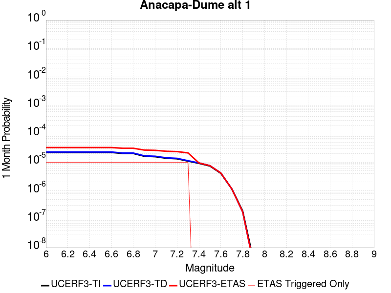 |  | 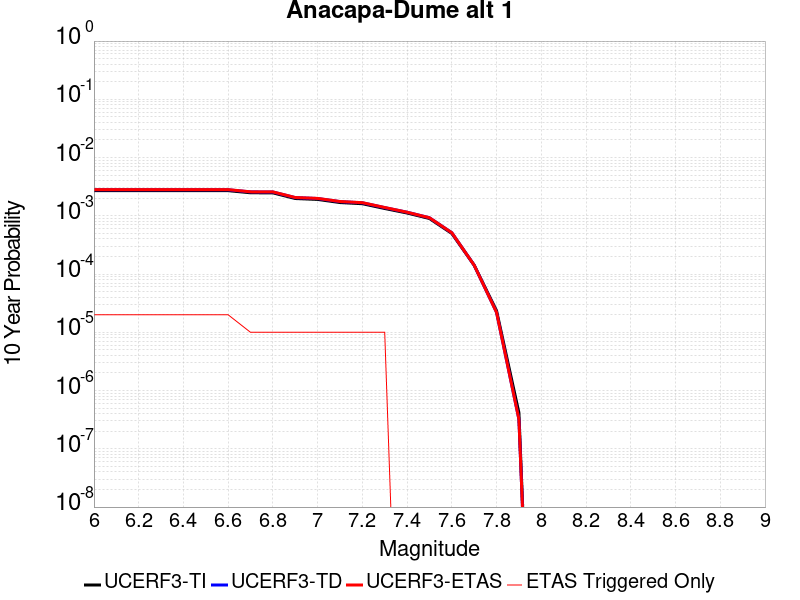 |

| Magnitude | 1 wk TI Prob | 1 wk TD Prob | 1 wk ETAS Prob | 1 wk ETAS/TD Gain | 1 wk ETAS Triggered Only | 1 mo TI Prob | 1 mo TD Prob | 1 mo ETAS Prob | 1 mo ETAS/TD Gain | 1 mo ETAS Triggered Only | 1 yr TI Prob | 1 yr TD Prob | 1 yr ETAS Prob | 1 yr ETAS/TD Gain | 1 yr ETAS Triggered Only | 10 yr TI Prob | 10 yr TD Prob | 10 yr ETAS Prob | 10 yr ETAS/TD Gain | 10 yr ETAS Triggered Only |
|-----|-----|-----|-----|-----|-----|-----|-----|-----|-----|-----|-----|-----|-----|-----|-----|-----|-----|-----|-----|-----|
| 6.0 | 5.1871802E-6 | 5.3673916E-6 | 4.287516E-5 | 7.9880815 | 3.750797E-5 | 2.2230583E-5 | 2.3002909E-5 | 6.0510018E-5 | 2.6305375 | 3.750797E-5 | 2.7062374E-4 | 2.8002527E-4 | 3.1752273E-4 | 1.1339074 | 3.750797E-5 | 0.002702944 | 0.0027968097 | 0.0028342127 | 1.0133735 | 3.750797E-5 |
| 6.1 | 5.1871802E-6 | 5.3673916E-6 | 4.287516E-5 | 7.9880815 | 3.750797E-5 | 2.2230583E-5 | 2.3002909E-5 | 6.0510018E-5 | 2.6305375 | 3.750797E-5 | 2.7062374E-4 | 2.8002527E-4 | 3.1752273E-4 | 1.1339074 | 3.750797E-5 | 0.002702944 | 0.0027968097 | 0.0028342127 | 1.0133735 | 3.750797E-5 |
| 6.2 | 5.1871802E-6 | 5.3673916E-6 | 4.287516E-5 | 7.9880815 | 3.750797E-5 | 2.2230583E-5 | 2.3002909E-5 | 6.0510018E-5 | 2.6305375 | 3.750797E-5 | 2.7062374E-4 | 2.8002527E-4 | 3.1752273E-4 | 1.1339074 | 3.750797E-5 | 0.002702944 | 0.0027968097 | 0.0028342127 | 1.0133735 | 3.750797E-5 |
| 6.3 | 5.1871802E-6 | 5.3673916E-6 | 4.287516E-5 | 7.9880815 | 3.750797E-5 | 2.2230583E-5 | 2.3002909E-5 | 6.0510018E-5 | 2.6305375 | 3.750797E-5 | 2.7062374E-4 | 2.8002527E-4 | 3.1752273E-4 | 1.1339074 | 3.750797E-5 | 0.002702944 | 0.0027968097 | 0.0028342127 | 1.0133735 | 3.750797E-5 |
| 6.4 | 5.1871802E-6 | 5.3673916E-6 | 4.287516E-5 | 7.9880815 | 3.750797E-5 | 2.2230583E-5 | 2.3002909E-5 | 6.0510018E-5 | 2.6305375 | 3.750797E-5 | 2.7062374E-4 | 2.8002527E-4 | 3.1752273E-4 | 1.1339074 | 3.750797E-5 | 0.002702944 | 0.0027968097 | 0.0028342127 | 1.0133735 | 3.750797E-5 |
| 6.5 | 5.1871802E-6 | 5.3673916E-6 | 4.287516E-5 | 7.9880815 | 3.750797E-5 | 2.2230583E-5 | 2.3002909E-5 | 6.0510018E-5 | 2.6305375 | 3.750797E-5 | 2.7062374E-4 | 2.8002527E-4 | 3.1752273E-4 | 1.1339074 | 3.750797E-5 | 0.002702944 | 0.0027968097 | 0.0028342127 | 1.0133735 | 3.750797E-5 |
| 6.6 | 5.1871802E-6 | 5.3673916E-6 | 4.287516E-5 | 7.9880815 | 3.750797E-5 | 2.2230583E-5 | 2.3002909E-5 | 6.0510018E-5 | 2.6305375 | 3.750797E-5 | 2.7062374E-4 | 2.8002527E-4 | 3.1752273E-4 | 1.1339074 | 3.750797E-5 | 0.002702944 | 0.0027968097 | 0.0028342127 | 1.0133735 | 3.750797E-5 |
| 6.7 | 4.7693475E-6 | 4.9366927E-6 | 4.2444477E-5 | 8.597756 | 3.750797E-5 | 2.04399E-5 | 2.1157086E-5 | 5.8664264E-5 | 2.772795 | 3.750797E-5 | 2.4882736E-4 | 2.5755784E-4 | 2.9505615E-4 | 1.1455919 | 3.750797E-5 | 0.0024854892 | 0.0025726694 | 0.0026100809 | 1.0145419 | 3.750797E-5 |
| 6.8 | 4.753408E-6 | 4.920241E-6 | 4.2428026E-5 | 8.62316 | 3.750797E-5 | 2.037159E-5 | 2.108658E-5 | 5.859376E-5 | 2.7787228 | 3.750797E-5 | 2.4799586E-4 | 2.5669963E-4 | 2.9419796E-4 | 1.1460787 | 3.750797E-5 | 0.002477193 | 0.002564107 | 0.0026015188 | 1.0145906 | 3.750797E-5 |
| 6.9 | 3.800069E-6 | 3.937127E-6 | 4.144495E-5 | 10.526699 | 3.750797E-5 | 1.6285909E-5 | 1.6873293E-5 | 5.438063E-5 | 3.2228818 | 3.750797E-5 | 1.9826289E-4 | 2.054132E-4 | 2.4291348E-4 | 1.1825602 | 3.750797E-5 | 0.001980861 | 0.0020522573 | 0.0020896883 | 1.0182389 | 3.750797E-5 |
| 7.0 | 3.6671938E-6 | 3.799919E-6 | 4.1307747E-5 | 10.870691 | 3.750797E-5 | 1.571645E-5 | 1.6285267E-5 | 5.3792628E-5 | 3.3031466 | 3.750797E-5 | 1.9133097E-4 | 1.9825532E-4 | 2.3575586E-4 | 1.1891527 | 3.750797E-5 | 0.0019116632 | 0.0019808079 | 0.0020182414 | 1.0188981 | 3.750797E-5 |
| 7.1 | 3.2394885E-6 | 3.3587942E-6 | 4.086664E-5 | 12.167057 | 3.750797E-5 | 1.3883448E-5 | 1.4394753E-5 | 5.1902185E-5 | 3.605632 | 3.750797E-5 | 1.6901788E-4 | 1.7524212E-4 | 2.1274353E-4 | 1.2139976 | 3.750797E-5 | 0.0016888938 | 0.0017510506 | 0.0017884929 | 1.0213828 | 3.750797E-5 |
| 7.2 | 3.0935948E-6 | 3.2079267E-6 | 4.071578E-5 | 12.69224 | 3.750797E-5 | 1.3258196E-5 | 1.3748186E-5 | 5.125564E-5 | 3.728175 | 3.750797E-5 | 1.6140658E-4 | 1.6737141E-4 | 2.048731E-4 | 1.2240627 | 3.750797E-5 | 0.001612894 | 0.0016724645 | 0.0017099098 | 1.0223893 | 3.750797E-5 |
| 7.3 | 2.5604163E-6 | 2.6470739E-6 | 4.0154944E-5 | 15.1695595 | 3.750797E-5 | 1.0973167E-5 | 1.1344553E-5 | 4.8852096E-5 | 4.3062162 | 3.750797E-5 | 1.3359012E-4 | 1.3811122E-4 | 1.7561401E-4 | 1.2715405 | 3.750797E-5 | 0.0013350984 | 0.0013802585 | 0.0014177148 | 1.027137 | 3.750797E-5 |
| 7.4 | 2.1429005E-6 | 2.2106035E-6 | 2.2106035E-6 | 1.0 | 0.0 | 9.1838265E-6 | 9.473981E-6 | 9.473981E-6 | 1.0 | 0.0 | 1.11807356E-4 | 1.1533964E-4 | 1.1533964E-4 | 1.0 | 0.0 | 0.0011175112 | 0.0011528004 | 0.0011528004 | 1.0 | 0.0 |
| 7.5 | 1.7237151E-6 | 1.7761457E-6 | 1.7761457E-6 | 1.0 | 0.0 | 7.3873293E-6 | 7.6120314E-6 | 7.6120314E-6 | 1.0 | 0.0 | 8.993702E-5 | 9.267256E-5 | 9.267256E-5 | 1.0 | 0.0 | 8.990063E-4 | 9.263415E-4 | 9.263415E-4 | 1.0 | 0.0 |
| 7.6 | 9.541696E-7 | 9.823211E-7 | 9.823211E-7 | 1.0 | 0.0 | 4.089292E-6 | 4.2099414E-6 | 4.2099414E-6 | 1.0 | 0.0 | 4.9785995E-5 | 5.125484E-5 | 5.125484E-5 | 1.0 | 0.0 | 4.9774844E-4 | 5.124315E-4 | 5.124315E-4 | 1.0 | 0.0 |
| 7.7 | 2.7226676E-7 | 2.7172473E-7 | 2.7172473E-7 | 1.0 | 0.0 | 1.166857E-6 | 1.1645341E-6 | 1.1645341E-6 | 1.0 | 0.0 | 1.4206392E-5 | 1.4178111E-5 | 1.4178111E-5 | 1.0 | 0.0 | 1.4205484E-4 | 1.4177214E-4 | 1.4177214E-4 | 1.0 | 0.0 |
| 7.8 | 4.5017995E-8 | 4.215797E-8 | 4.215797E-8 | 1.0 | 0.0 | 1.9293425E-7 | 1.80677E-7 | 1.80677E-7 | 1.0 | 0.0 | 2.348972E-6 | 2.1997405E-6 | 2.1997405E-6 | 1.0 | 0.0 | 2.348947E-5 | 2.1997208E-5 | 2.1997208E-5 | 1.0 | 0.0 |
| 7.9 | 8.007447E-10 | 6.161581E-10 | 6.161581E-10 | 1.0 | 0.0 | 3.4317629E-9 | 2.640678E-9 | 2.640678E-9 | 1.0 | 0.0 | 4.1781714E-8 | 3.2150254E-8 | 3.2150254E-8 | 1.0 | 0.0 | 4.1781706E-7 | 3.2150248E-7 | 3.2150248E-7 | 1.0 | 0.0 |

## Pitas Point (Lower West)
*[(top)](#table-of-contents)*

| 1 Week | 1 Month | 1 Year | 10 Year |
|-----|-----|-----|-----|
|  |  |  |  |

| Magnitude | 1 wk TI Prob | 1 wk TD Prob | 1 wk ETAS Prob | 1 wk ETAS/TD Gain | 1 wk ETAS Triggered Only | 1 mo TI Prob | 1 mo TD Prob | 1 mo ETAS Prob | 1 mo ETAS/TD Gain | 1 mo ETAS Triggered Only | 1 yr TI Prob | 1 yr TD Prob | 1 yr ETAS Prob | 1 yr ETAS/TD Gain | 1 yr ETAS Triggered Only | 10 yr TI Prob | 10 yr TD Prob | 10 yr ETAS Prob | 10 yr ETAS/TD Gain | 10 yr ETAS Triggered Only |
|-----|-----|-----|-----|-----|-----|-----|-----|-----|-----|-----|-----|-----|-----|-----|-----|-----|-----|-----|-----|-----|
| 6.0 | 8.151497E-6 | 7.855796E-6 | 7.855796E-6 | 1.0 | 0.0 | 3.493452E-5 | 3.3667267E-5 | 3.3667267E-5 | 1.0 | 0.0 | 4.252448E-4 | 4.0982262E-4 | 4.0982262E-4 | 1.0 | 0.0 | 0.0042443196 | 0.004090749 | 0.0041281036 | 1.0091314 | 3.750797E-5 |
| 6.1 | 8.151497E-6 | 7.855796E-6 | 7.855796E-6 | 1.0 | 0.0 | 3.493452E-5 | 3.3667267E-5 | 3.3667267E-5 | 1.0 | 0.0 | 4.252448E-4 | 4.0982262E-4 | 4.0982262E-4 | 1.0 | 0.0 | 0.0042443196 | 0.004090749 | 0.0041281036 | 1.0091314 | 3.750797E-5 |
| 6.2 | 8.151497E-6 | 7.855796E-6 | 7.855796E-6 | 1.0 | 0.0 | 3.493452E-5 | 3.3667267E-5 | 3.3667267E-5 | 1.0 | 0.0 | 4.252448E-4 | 4.0982262E-4 | 4.0982262E-4 | 1.0 | 0.0 | 0.0042443196 | 0.004090749 | 0.0041281036 | 1.0091314 | 3.750797E-5 |
| 6.3 | 8.151497E-6 | 7.855796E-6 | 7.855796E-6 | 1.0 | 0.0 | 3.493452E-5 | 3.3667267E-5 | 3.3667267E-5 | 1.0 | 0.0 | 4.252448E-4 | 4.0982262E-4 | 4.0982262E-4 | 1.0 | 0.0 | 0.0042443196 | 0.004090749 | 0.0041281036 | 1.0091314 | 3.750797E-5 |
| 6.4 | 8.151497E-6 | 7.855796E-6 | 7.855796E-6 | 1.0 | 0.0 | 3.493452E-5 | 3.3667267E-5 | 3.3667267E-5 | 1.0 | 0.0 | 4.252448E-4 | 4.0982262E-4 | 4.0982262E-4 | 1.0 | 0.0 | 0.0042443196 | 0.004090749 | 0.0041281036 | 1.0091314 | 3.750797E-5 |
| 6.5 | 8.151497E-6 | 7.855796E-6 | 7.855796E-6 | 1.0 | 0.0 | 3.493452E-5 | 3.3667267E-5 | 3.3667267E-5 | 1.0 | 0.0 | 4.252448E-4 | 4.0982262E-4 | 4.0982262E-4 | 1.0 | 0.0 | 0.0042443196 | 0.004090749 | 0.0041281036 | 1.0091314 | 3.750797E-5 |
| 6.6 | 8.151497E-6 | 7.855796E-6 | 7.855796E-6 | 1.0 | 0.0 | 3.493452E-5 | 3.3667267E-5 | 3.3667267E-5 | 1.0 | 0.0 | 4.252448E-4 | 4.0982262E-4 | 4.0982262E-4 | 1.0 | 0.0 | 0.0042443196 | 0.004090749 | 0.0041281036 | 1.0091314 | 3.750797E-5 |
| 6.7 | 8.151497E-6 | 7.855796E-6 | 7.855796E-6 | 1.0 | 0.0 | 3.493452E-5 | 3.3667267E-5 | 3.3667267E-5 | 1.0 | 0.0 | 4.252448E-4 | 4.0982262E-4 | 4.0982262E-4 | 1.0 | 0.0 | 0.0042443196 | 0.004090749 | 0.0041281036 | 1.0091314 | 3.750797E-5 |
| 6.8 | 8.151497E-6 | 7.855796E-6 | 7.855796E-6 | 1.0 | 0.0 | 3.493452E-5 | 3.3667267E-5 | 3.3667267E-5 | 1.0 | 0.0 | 4.252448E-4 | 4.0982262E-4 | 4.0982262E-4 | 1.0 | 0.0 | 0.0042443196 | 0.004090749 | 0.0041281036 | 1.0091314 | 3.750797E-5 |
| 6.9 | 8.151497E-6 | 7.855796E-6 | 7.855796E-6 | 1.0 | 0.0 | 3.493452E-5 | 3.3667267E-5 | 3.3667267E-5 | 1.0 | 0.0 | 4.252448E-4 | 4.0982262E-4 | 4.0982262E-4 | 1.0 | 0.0 | 0.0042443196 | 0.004090749 | 0.0041281036 | 1.0091314 | 3.750797E-5 |
| 7.0 | 8.103535E-6 | 7.805226E-6 | 7.805226E-6 | 1.0 | 0.0 | 3.4728975E-5 | 3.3450542E-5 | 3.3450542E-5 | 1.0 | 0.0 | 4.2274324E-4 | 4.07185E-4 | 4.07185E-4 | 1.0 | 0.0 | 0.0042193993 | 0.0040644696 | 0.004101825 | 1.0091908 | 3.750797E-5 |
| 7.1 | 7.853298E-6 | 7.540917E-6 | 7.540917E-6 | 1.0 | 0.0 | 3.3656554E-5 | 3.2317817E-5 | 3.2317817E-5 | 1.0 | 0.0 | 4.096915E-4 | 3.9339912E-4 | 3.9339912E-4 | 1.0 | 0.0 | 0.00408937 | 0.0039271032 | 0.0039644637 | 1.0095135 | 3.750797E-5 |
| 7.2 | 7.771102E-6 | 7.453199E-6 | 7.453199E-6 | 1.0 | 0.0 | 3.33043E-5 | 3.1941894E-5 | 3.1941894E-5 | 1.0 | 0.0 | 4.0540437E-4 | 3.8882386E-4 | 3.8882386E-4 | 1.0 | 0.0 | 0.0040466557 | 0.003881511 | 0.0039188736 | 1.0096257 | 3.750797E-5 |
| 7.3 | 7.3945344E-6 | 7.0493033E-6 | 7.0493033E-6 | 1.0 | 0.0 | 3.1690477E-5 | 3.0210955E-5 | 3.0210955E-5 | 1.0 | 0.0 | 3.8576324E-4 | 3.677569E-4 | 3.677569E-4 | 1.0 | 0.0 | 0.0038509427 | 0.003671551 | 0.0037089211 | 1.0101783 | 3.750797E-5 |
| 7.4 | 6.964645E-6 | 6.5901527E-6 | 6.5901527E-6 | 1.0 | 0.0 | 2.9848137E-5 | 2.8243208E-5 | 2.8243208E-5 | 1.0 | 0.0 | 3.6334046E-4 | 3.438073E-4 | 3.438073E-4 | 1.0 | 0.0 | 0.0036274698 | 0.0034328073 | 0.0034701864 | 1.0108888 | 3.750797E-5 |
| 7.5 | 6.6525035E-6 | 6.259191E-6 | 6.259191E-6 | 1.0 | 0.0 | 2.851042E-5 | 2.6824831E-5 | 2.6824831E-5 | 1.0 | 0.0 | 3.4705905E-4 | 3.2654387E-4 | 3.2654387E-4 | 1.0 | 0.0 | 0.0034651754 | 0.0032606919 | 0.0032980775 | 1.0114655 | 3.750797E-5 |
| 7.6 | 5.613338E-6 | 5.15142E-6 | 5.15142E-6 | 1.0 | 0.0 | 2.405694E-5 | 2.2077327E-5 | 2.2077327E-5 | 1.0 | 0.0 | 2.928539E-4 | 2.6875862E-4 | 2.6875862E-4 | 1.0 | 0.0 | 0.0029246826 | 0.0026843674 | 0.0026843674 | 1.0 | 0.0 |
| 7.7 | 4.494704E-6 | 3.996945E-6 | 3.996945E-6 | 1.0 | 0.0 | 1.9262876E-5 | 1.7129652E-5 | 1.7129652E-5 | 1.0 | 0.0 | 2.3450027E-4 | 2.0853379E-4 | 2.0853379E-4 | 1.0 | 0.0 | 0.0023425296 | 0.0020834052 | 0.0020834052 | 1.0 | 0.0 |
| 7.8 | 2.6075882E-6 | 2.1836663E-6 | 2.1836663E-6 | 1.0 | 0.0 | 1.117533E-5 | 9.358537E-6 | 9.358537E-6 | 1.0 | 0.0 | 1.3605114E-4 | 1.1393427E-4 | 1.1393427E-4 | 1.0 | 0.0 | 0.0013596788 | 0.0011387634 | 0.0011387634 | 1.0 | 0.0 |
| 7.9 | 4.045984E-7 | 3.2424057E-7 | 3.2424057E-7 | 1.0 | 0.0 | 1.733992E-6 | 1.3896017E-6 | 1.3896017E-6 | 1.0 | 0.0 | 2.1111147E-5 | 1.6918271E-5 | 1.6918271E-5 | 1.0 | 0.0 | 2.1109142E-4 | 1.6917015E-4 | 1.6917015E-4 | 1.0 | 0.0 |
| 8.0 | 7.791402E-9 | 5.6836056E-9 | 5.6836056E-9 | 1.0 | 0.0 | 3.3391725E-8 | 2.4358311E-8 | 2.4358311E-8 | 1.0 | 0.0 | 4.0654416E-7 | 2.965624E-7 | 2.965624E-7 | 1.0 | 0.0 | 4.065434E-6 | 2.9656223E-6 | 2.9656223E-6 | 1.0 | 0.0 |

## San Pedro Basin
*[(top)](#table-of-contents)*

| 1 Week | 1 Month | 1 Year | 10 Year |
|-----|-----|-----|-----|
|  |  |  |  |

| Magnitude | 1 wk TI Prob | 1 wk TD Prob | 1 wk ETAS Prob | 1 wk ETAS/TD Gain | 1 wk ETAS Triggered Only | 1 mo TI Prob | 1 mo TD Prob | 1 mo ETAS Prob | 1 mo ETAS/TD Gain | 1 mo ETAS Triggered Only | 1 yr TI Prob | 1 yr TD Prob | 1 yr ETAS Prob | 1 yr ETAS/TD Gain | 1 yr ETAS Triggered Only | 10 yr TI Prob | 10 yr TD Prob | 10 yr ETAS Prob | 10 yr ETAS/TD Gain | 10 yr ETAS Triggered Only |
|-----|-----|-----|-----|-----|-----|-----|-----|-----|-----|-----|-----|-----|-----|-----|-----|-----|-----|-----|-----|-----|
| 6.0 | 5.3449043E-5 | 6.337018E-5 | 1.00875775E-4 | 1.5918492 | 3.750797E-5 | 2.2904722E-4 | 2.7156167E-4 | 3.0905945E-4 | 1.138082 | 3.750797E-5 | 0.0027850836 | 0.0033018515 | 0.0033392354 | 1.0113221 | 3.750797E-5 | 0.027504366 | 0.03258948 | 0.03262577 | 1.0011134 | 3.750797E-5 |
| 6.1 | 5.3449043E-5 | 6.337018E-5 | 1.00875775E-4 | 1.5918492 | 3.750797E-5 | 2.2904722E-4 | 2.7156167E-4 | 3.0905945E-4 | 1.138082 | 3.750797E-5 | 0.0027850836 | 0.0033018515 | 0.0033392354 | 1.0113221 | 3.750797E-5 | 0.027504366 | 0.03258948 | 0.03262577 | 1.0011134 | 3.750797E-5 |
| 6.2 | 2.3189454E-5 | 2.6642829E-5 | 2.6642829E-5 | 1.0 | 0.0 | 9.9379584E-5 | 1.1417881E-4 | 1.1417881E-4 | 1.0 | 0.0 | 0.0012092749 | 0.0013892875 | 0.0013892875 | 1.0 | 0.0 | 0.012027155 | 0.01381089 | 0.01381089 | 1.0 | 0.0 |
| 6.3 | 2.3189454E-5 | 2.6642829E-5 | 2.6642829E-5 | 1.0 | 0.0 | 9.9379584E-5 | 1.1417881E-4 | 1.1417881E-4 | 1.0 | 0.0 | 0.0012092749 | 0.0013892875 | 0.0013892875 | 1.0 | 0.0 | 0.012027155 | 0.01381089 | 0.01381089 | 1.0 | 0.0 |
| 6.4 | 1.966056E-5 | 2.246342E-5 | 2.246342E-5 | 1.0 | 0.0 | 8.425682E-5 | 9.626848E-5 | 9.626848E-5 | 1.0 | 0.0 | 0.001025344 | 0.0011714787 | 0.0011714787 | 1.0 | 0.0 | 0.010206259 | 0.011657119 | 0.011657119 | 1.0 | 0.0 |
| 6.5 | 1.7342953E-5 | 1.9745152E-5 | 1.9745152E-5 | 1.0 | 0.0 | 7.4324824E-5 | 8.461954E-5 | 8.461954E-5 | 1.0 | 0.0 | 9.04529E-4 | 0.0010297929 | 0.0010297929 | 1.0 | 0.0 | 0.009008561 | 0.010253932 | 0.010253932 | 1.0 | 0.0 |
| 6.6 | 1.439804E-5 | 1.6322716E-5 | 1.6322716E-5 | 1.0 | 0.0 | 6.170443E-5 | 6.99528E-5 | 6.99528E-5 | 1.0 | 0.0 | 7.509924E-4 | 8.513747E-4 | 8.513747E-4 | 1.0 | 0.0 | 0.0074845953 | 0.008484333 | 0.008484333 | 1.0 | 0.0 |
| 6.7 | 1.2634884E-5 | 1.4285298E-5 | 1.4285298E-5 | 1.0 | 0.0 | 5.414838E-5 | 6.122144E-5 | 6.122144E-5 | 1.0 | 0.0 | 6.590571E-4 | 7.451466E-4 | 7.451466E-4 | 1.0 | 0.0 | 0.006571059 | 0.007429502 | 0.007429502 | 1.0 | 0.0 |
| 6.8 | 1.146091E-5 | 1.2933193E-5 | 1.2933193E-5 | 1.0 | 0.0 | 4.911726E-5 | 5.542696E-5 | 5.542696E-5 | 1.0 | 0.0 | 5.9783855E-4 | 6.74644E-4 | 6.74644E-4 | 1.0 | 0.0 | 0.0059623276 | 0.0067288997 | 0.0067288997 | 1.0 | 0.0 |
| 6.9 | 9.109035E-6 | 1.0235013E-5 | 1.0235013E-5 | 1.0 | 0.0 | 3.9038136E-5 | 4.386376E-5 | 4.386376E-5 | 1.0 | 0.0 | 4.7518566E-4 | 5.339384E-4 | 5.339384E-4 | 1.0 | 0.0 | 0.0047417083 | 0.0053293095 | 0.0053293095 | 1.0 | 0.0 |
| 7.0 | 5.9351028E-6 | 6.583965E-6 | 6.583965E-6 | 1.0 | 0.0 | 2.5435906E-5 | 2.821682E-5 | 2.821682E-5 | 1.0 | 0.0 | 3.0963816E-4 | 3.4350925E-4 | 3.4350925E-4 | 1.0 | 0.0 | 0.0030920706 | 0.0034320997 | 0.0034320997 | 1.0 | 0.0 |
| 7.1 | 2.1557585E-6 | 2.2096492E-6 | 2.2096492E-6 | 1.0 | 0.0 | 9.238933E-6 | 9.469892E-6 | 9.469892E-6 | 1.0 | 0.0 | 1.1247819E-4 | 1.15289986E-4 | 1.15289986E-4 | 1.0 | 0.0 | 0.0011242128 | 0.0011523172 | 0.0011523172 | 1.0 | 0.0 |
| 7.2 | 2.1251979E-6 | 2.1779954E-6 | 2.1779954E-6 | 1.0 | 0.0 | 9.107958E-6 | 9.334234E-6 | 9.334234E-6 | 1.0 | 0.0 | 1.1088375E-4 | 1.13638525E-4 | 1.13638525E-4 | 1.0 | 0.0 | 0.0011082845 | 0.0011358195 | 0.0011358195 | 1.0 | 0.0 |
| 7.3 | 1.7145798E-6 | 1.7442885E-6 | 1.7442885E-6 | 1.0 | 0.0 | 7.3481783E-6 | 7.475501E-6 | 7.475501E-6 | 1.0 | 0.0 | 8.94604E-5 | 9.1010515E-5 | 9.1010515E-5 | 1.0 | 0.0 | 8.9424395E-4 | 9.0974156E-4 | 9.0974156E-4 | 1.0 | 0.0 |
| 7.4 | 1.4467993E-6 | 1.4641878E-6 | 1.4641878E-6 | 1.0 | 0.0 | 6.200554E-6 | 6.275076E-6 | 6.275076E-6 | 1.0 | 0.0 | 7.548913E-5 | 7.639644E-5 | 7.639644E-5 | 1.0 | 0.0 | 7.546349E-4 | 7.6370913E-4 | 7.6370913E-4 | 1.0 | 0.0 |
| 7.5 | 1.2803735E-6 | 1.2931506E-6 | 1.2931506E-6 | 1.0 | 0.0 | 5.487303E-6 | 5.5420624E-6 | 5.5420624E-6 | 1.0 | 0.0 | 6.680587E-5 | 6.747259E-5 | 6.747259E-5 | 1.0 | 0.0 | 6.678579E-4 | 6.745281E-4 | 6.745281E-4 | 1.0 | 0.0 |
| 7.6 | 6.755009E-7 | 6.76947E-7 | 6.76947E-7 | 1.0 | 0.0 | 2.8950008E-6 | 2.9011985E-6 | 2.9011985E-6 | 1.0 | 0.0 | 3.5246063E-5 | 3.532158E-5 | 3.532158E-5 | 1.0 | 0.0 | 3.5240475E-4 | 3.5316538E-4 | 3.5316538E-4 | 1.0 | 0.0 |
| 7.7 | 6.211885E-8 | 4.5699714E-8 | 4.5699714E-8 | 1.0 | 0.0 | 2.6622362E-7 | 1.9585592E-7 | 1.9585592E-7 | 1.0 | 0.0 | 3.2412677E-6 | 2.3845432E-6 | 2.3845432E-6 | 1.0 | 0.0 | 3.2412205E-5 | 2.3845198E-5 | 2.3845198E-5 | 1.0 | 0.0 |
| 7.8 | 2.6580573E-9 | 1.5138054E-9 | 1.5138054E-9 | 1.0 | 0.0 | 1.1391674E-8 | 6.4877375E-9 | 6.4877375E-9 | 1.0 | 0.0 | 1.3869362E-7 | 7.89882E-8 | 7.89882E-8 | 1.0 | 0.0 | 1.3869354E-6 | 7.89882E-7 | 7.89882E-7 | 1.0 | 0.0 |

## Likely 2011 CFM
*[(top)](#table-of-contents)*

| 1 Week | 1 Month | 1 Year | 10 Year |
|-----|-----|-----|-----|
|  |  | 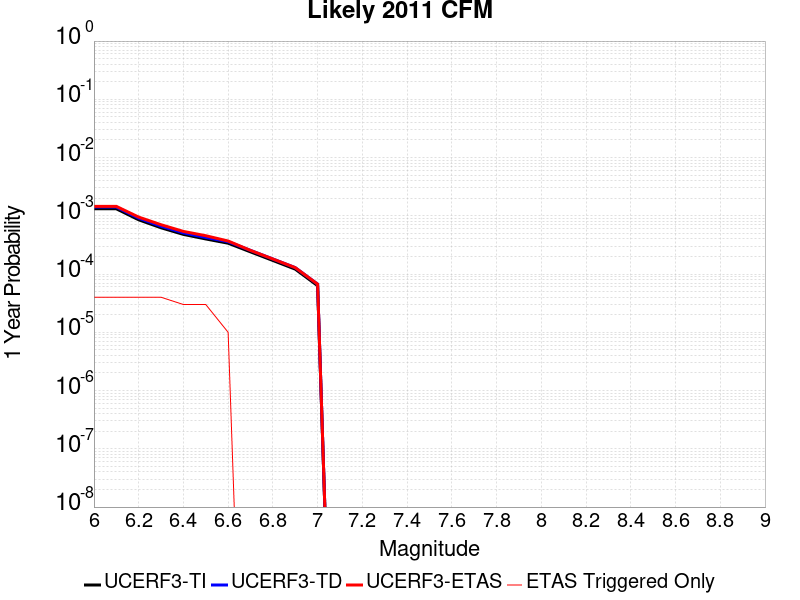 |  |

| Magnitude | 1 wk TI Prob | 1 wk TD Prob | 1 wk ETAS Prob | 1 wk ETAS/TD Gain | 1 wk ETAS Triggered Only | 1 mo TI Prob | 1 mo TD Prob | 1 mo ETAS Prob | 1 mo ETAS/TD Gain | 1 mo ETAS Triggered Only | 1 yr TI Prob | 1 yr TD Prob | 1 yr ETAS Prob | 1 yr ETAS/TD Gain | 1 yr ETAS Triggered Only | 10 yr TI Prob | 10 yr TD Prob | 10 yr ETAS Prob | 10 yr ETAS/TD Gain | 10 yr ETAS Triggered Only |
|-----|-----|-----|-----|-----|-----|-----|-----|-----|-----|-----|-----|-----|-----|-----|-----|-----|-----|-----|-----|-----|
| 6.0 | 2.5315949E-5 | 2.7104748E-5 | 6.4611704E-5 | 2.383778 | 3.750797E-5 | 1.0849241E-4 | 1.16158284E-4 | 1.536619E-4 | 1.3228664 | 3.750797E-5 | 0.0013200947 | 0.0014133542 | 0.0014508092 | 1.0265007 | 3.750797E-5 | 0.013122803 | 0.01404831 | 0.014085291 | 1.0026324 | 3.750797E-5 |
| 6.1 | 2.5315949E-5 | 2.7104748E-5 | 6.4611704E-5 | 2.383778 | 3.750797E-5 | 1.0849241E-4 | 1.16158284E-4 | 1.536619E-4 | 1.3228664 | 3.750797E-5 | 0.0013200947 | 0.0014133542 | 0.0014508092 | 1.0265007 | 3.750797E-5 | 0.013122803 | 0.01404831 | 0.014085291 | 1.0026324 | 3.750797E-5 |
| 6.2 | 1.6375941E-5 | 1.7465842E-5 | 5.4973156E-5 | 3.1474667 | 3.750797E-5 | 7.0180715E-5 | 7.485153E-5 | 1.1235669E-4 | 1.5010607 | 3.750797E-5 | 8.5411523E-4 | 9.109487E-4 | 9.484225E-4 | 1.0411371 | 3.750797E-5 | 0.008508399 | 0.009073433 | 0.0091106 | 1.0040963 | 3.750797E-5 |
| 6.3 | 1.1945543E-5 | 1.2712587E-5 | 5.0220082E-5 | 3.9504218 | 3.750797E-5 | 5.119418E-5 | 5.4481407E-5 | 9.1987335E-5 | 1.688417 | 3.750797E-5 | 6.2311086E-4 | 6.631146E-4 | 7.005977E-4 | 1.0565258 | 3.750797E-5 | 0.0062136655 | 0.0066119144 | 0.0066491743 | 1.0056353 | 3.750797E-5 |
| 6.4 | 9.192729E-6 | 9.768488E-6 | 9.768488E-6 | 1.0 | 0.0 | 3.939681E-5 | 4.1864292E-5 | 4.1864292E-5 | 1.0 | 0.0 | 4.7955062E-4 | 5.0958124E-4 | 5.0958124E-4 | 1.0 | 0.0 | 0.004785171 | 0.0050844094 | 0.0050844094 | 1.0 | 0.0 |
| 6.5 | 7.67906E-6 | 8.152622E-6 | 8.152622E-6 | 1.0 | 0.0 | 3.2909844E-5 | 3.4939352E-5 | 3.4939352E-5 | 1.0 | 0.0 | 4.006037E-4 | 4.2530545E-4 | 4.2530545E-4 | 1.0 | 0.0 | 0.0039988225 | 0.004245108 | 0.004245108 | 1.0 | 0.0 |
| 6.6 | 6.4884057E-6 | 6.8847507E-6 | 6.8847507E-6 | 1.0 | 0.0 | 2.7807157E-5 | 2.9505749E-5 | 2.9505749E-5 | 1.0 | 0.0 | 3.3849955E-4 | 3.591747E-4 | 3.591747E-4 | 1.0 | 0.0 | 0.003379844 | 0.0035860867 | 0.0035860867 | 1.0 | 0.0 |
| 6.7 | 4.6060636E-6 | 4.884041E-6 | 4.884041E-6 | 1.0 | 0.0 | 1.9740122E-5 | 2.0931442E-5 | 2.0931442E-5 | 1.0 | 0.0 | 2.403095E-4 | 2.5481134E-4 | 2.5481134E-4 | 1.0 | 0.0 | 0.002400498 | 0.0025452746 | 0.0025452746 | 1.0 | 0.0 |
| 6.8 | 3.2795615E-6 | 3.4773732E-6 | 3.4773732E-6 | 1.0 | 0.0 | 1.4055187E-5 | 1.4902946E-5 | 1.4902946E-5 | 1.0 | 0.0 | 1.7110848E-4 | 1.8142881E-4 | 1.8142881E-4 | 1.0 | 0.0 | 0.0017097679 | 0.0018128622 | 0.0018128622 | 1.0 | 0.0 |
| 6.9 | 2.3289967E-6 | 2.4705569E-6 | 2.4705569E-6 | 1.0 | 0.0 | 9.981376E-6 | 1.058806E-5 | 1.058806E-5 | 1.0 | 0.0 | 1.2151648E-4 | 1.2890245E-4 | 1.2890245E-4 | 1.0 | 0.0 | 0.0012145005 | 0.0012883197 | 0.0012883197 | 1.0 | 0.0 |
| 7.0 | 1.211292E-6 | 1.2863958E-6 | 1.2863958E-6 | 1.0 | 0.0 | 5.1912407E-6 | 5.5131145E-6 | 5.5131145E-6 | 1.0 | 0.0 | 6.320152E-5 | 6.712041E-5 | 6.712041E-5 | 1.0 | 0.0 | 6.3183554E-4 | 6.710312E-4 | 6.710312E-4 | 1.0 | 0.0 |

## Shoreline
*[(top)](#table-of-contents)*

| 1 Week | 1 Month | 1 Year | 10 Year |
|-----|-----|-----|-----|
|  |  |  |  |

| Magnitude | 1 wk TI Prob | 1 wk TD Prob | 1 wk ETAS Prob | 1 wk ETAS/TD Gain | 1 wk ETAS Triggered Only | 1 mo TI Prob | 1 mo TD Prob | 1 mo ETAS Prob | 1 mo ETAS/TD Gain | 1 mo ETAS Triggered Only | 1 yr TI Prob | 1 yr TD Prob | 1 yr ETAS Prob | 1 yr ETAS/TD Gain | 1 yr ETAS Triggered Only | 10 yr TI Prob | 10 yr TD Prob | 10 yr ETAS Prob | 10 yr ETAS/TD Gain | 10 yr ETAS Triggered Only |
|-----|-----|-----|-----|-----|-----|-----|-----|-----|-----|-----|-----|-----|-----|-----|-----|-----|-----|-----|-----|-----|
| 6.0 | 3.9888673E-6 | 4.0479285E-6 | 4.1555748E-5 | 10.265929 | 3.750797E-5 | 1.7095033E-5 | 1.7348182E-5 | 5.48555E-5 | 3.162032 | 3.750797E-5 | 2.0811215E-4 | 2.1119922E-4 | 2.4869927E-4 | 1.1775577 | 3.750797E-5 | 0.0020791737 | 0.0021105339 | 0.0021479626 | 1.0177343 | 3.750797E-5 |
| 6.1 | 3.9888673E-6 | 4.0479285E-6 | 4.1555748E-5 | 10.265929 | 3.750797E-5 | 1.7095033E-5 | 1.7348182E-5 | 5.48555E-5 | 3.162032 | 3.750797E-5 | 2.0811215E-4 | 2.1119922E-4 | 2.4869927E-4 | 1.1775577 | 3.750797E-5 | 0.0020791737 | 0.0021105339 | 0.0021479626 | 1.0177343 | 3.750797E-5 |
| 6.2 | 1.4039653E-6 | 1.4100885E-6 | 1.4100885E-6 | 1.0 | 0.0 | 6.0169805E-6 | 6.043223E-6 | 6.043223E-6 | 1.0 | 0.0 | 7.325427E-5 | 7.357382E-5 | 7.357382E-5 | 1.0 | 0.0 | 7.3230127E-4 | 7.355006E-4 | 7.355006E-4 | 1.0 | 0.0 |
| 6.3 | 1.4039653E-6 | 1.4100885E-6 | 1.4100885E-6 | 1.0 | 0.0 | 6.0169805E-6 | 6.043223E-6 | 6.043223E-6 | 1.0 | 0.0 | 7.325427E-5 | 7.357382E-5 | 7.357382E-5 | 1.0 | 0.0 | 7.3230127E-4 | 7.355006E-4 | 7.355006E-4 | 1.0 | 0.0 |
| 6.4 | 1.3314152E-6 | 1.33616E-6 | 1.33616E-6 | 1.0 | 0.0 | 5.7060524E-6 | 5.726388E-6 | 5.726388E-6 | 1.0 | 0.0 | 6.946897E-5 | 6.9716596E-5 | 6.9716596E-5 | 1.0 | 0.0 | 6.9447263E-4 | 6.9695263E-4 | 6.9695263E-4 | 1.0 | 0.0 |
| 6.5 | 1.1187026E-6 | 1.1203634E-6 | 1.1203634E-6 | 1.0 | 0.0 | 4.794431E-6 | 4.801549E-6 | 4.801549E-6 | 1.0 | 0.0 | 5.8370628E-5 | 5.8457317E-5 | 5.8457317E-5 | 1.0 | 0.0 | 5.83553E-4 | 5.844219E-4 | 5.844219E-4 | 1.0 | 0.0 |
| 6.6 | 9.793089E-7 | 9.784915E-7 | 9.784915E-7 | 1.0 | 0.0 | 4.1970316E-6 | 4.193528E-6 | 4.193528E-6 | 1.0 | 0.0 | 5.1097657E-5 | 5.1055024E-5 | 5.1055024E-5 | 1.0 | 0.0 | 5.108591E-4 | 5.104342E-4 | 5.104342E-4 | 1.0 | 0.0 |
| 6.7 | 8.995986E-7 | 8.972795E-7 | 8.972795E-7 | 1.0 | 0.0 | 3.8554167E-6 | 3.8454777E-6 | 3.8454777E-6 | 1.0 | 0.0 | 4.693869E-5 | 4.68177E-5 | 4.68177E-5 | 1.0 | 0.0 | 4.6928777E-4 | 4.680793E-4 | 4.680793E-4 | 1.0 | 0.0 |
| 6.8 | 7.931612E-7 | 7.8803976E-7 | 7.8803976E-7 | 1.0 | 0.0 | 3.3992578E-6 | 3.377309E-6 | 3.377309E-6 | 1.0 | 0.0 | 4.1385178E-5 | 4.1117964E-5 | 4.1117964E-5 | 1.0 | 0.0 | 4.1377472E-4 | 4.1110412E-4 | 4.1110412E-4 | 1.0 | 0.0 |
| 6.9 | 7.1465956E-7 | 7.078001E-7 | 7.078001E-7 | 1.0 | 0.0 | 3.062823E-6 | 3.0334254E-6 | 3.0334254E-6 | 1.0 | 0.0 | 3.7289232E-5 | 3.693133E-5 | 3.693133E-5 | 1.0 | 0.0 | 3.7282976E-4 | 3.6925232E-4 | 3.6925232E-4 | 1.0 | 0.0 |
| 7.0 | 6.389046E-7 | 6.299453E-7 | 6.299453E-7 | 1.0 | 0.0 | 2.7381598E-6 | 2.699763E-6 | 2.699763E-6 | 1.0 | 0.0 | 3.3336586E-5 | 3.286912E-5 | 3.286912E-5 | 1.0 | 0.0 | 3.3331584E-4 | 3.286428E-4 | 3.286428E-4 | 1.0 | 0.0 |
| 7.1 | 5.4300875E-7 | 5.311126E-7 | 5.311126E-7 | 1.0 | 0.0 | 2.3271782E-6 | 2.276195E-6 | 2.276195E-6 | 1.0 | 0.0 | 2.8333026E-5 | 2.7712322E-5 | 2.7712322E-5 | 1.0 | 0.0 | 2.8329415E-4 | 2.7708875E-4 | 2.7708875E-4 | 1.0 | 0.0 |
| 7.2 | 4.6768855E-7 | 4.5348904E-7 | 4.5348904E-7 | 1.0 | 0.0 | 2.0043778E-6 | 1.9435229E-6 | 1.9435229E-6 | 1.0 | 0.0 | 2.4403027E-5 | 2.3662134E-5 | 2.3662134E-5 | 1.0 | 0.0 | 2.4400349E-4 | 2.3659621E-4 | 2.3659621E-4 | 1.0 | 0.0 |
| 7.3 | 4.0966103E-7 | 3.9385614E-7 | 3.9385614E-7 | 1.0 | 0.0 | 1.7556889E-6 | 1.6879537E-6 | 1.6879537E-6 | 1.0 | 0.0 | 2.1375303E-5 | 2.0550642E-5 | 2.0550642E-5 | 1.0 | 0.0 | 2.1373246E-4 | 2.0548746E-4 | 2.0548746E-4 | 1.0 | 0.0 |
| 7.4 | 3.5105785E-7 | 3.3363924E-7 | 3.3363924E-7 | 1.0 | 0.0 | 1.5045327E-6 | 1.4298816E-6 | 1.4298816E-6 | 1.0 | 0.0 | 1.8317533E-5 | 1.7408669E-5 | 1.7408669E-5 | 1.0 | 0.0 | 1.8316023E-4 | 1.740731E-4 | 1.740731E-4 | 1.0 | 0.0 |
| 7.5 | 2.8737534E-7 | 2.681999E-7 | 2.681999E-7 | 1.0 | 0.0 | 1.2316079E-6 | 1.1494276E-6 | 1.1494276E-6 | 1.0 | 0.0 | 1.4994724E-5 | 1.399419E-5 | 1.399419E-5 | 1.0 | 0.0 | 1.4993713E-4 | 1.3993312E-4 | 1.3993312E-4 | 1.0 | 0.0 |
| 7.6 | 2.0924051E-7 | 1.8778938E-7 | 1.8778938E-7 | 1.0 | 0.0 | 8.967448E-7 | 8.0481135E-7 | 8.0481135E-7 | 1.0 | 0.0 | 1.0917813E-5 | 9.798534E-6 | 9.798534E-6 | 1.0 | 0.0 | 1.0917276E-4 | 9.798103E-5 | 9.798103E-5 | 1.0 | 0.0 |
| 7.7 | 1.392265E-7 | 1.1543341E-7 | 1.1543341E-7 | 1.0 | 0.0 | 5.9668486E-7 | 4.9471447E-7 | 4.9471447E-7 | 1.0 | 0.0 | 7.2646135E-6 | 6.0231323E-6 | 6.0231323E-6 | 1.0 | 0.0 | 7.2643765E-5 | 6.0229693E-5 | 6.0229693E-5 | 1.0 | 0.0 |
| 7.8 | 8.1080074E-8 | 5.5866355E-8 | 5.5866355E-8 | 1.0 | 0.0 | 3.4748598E-7 | 2.394272E-7 | 2.394272E-7 | 1.0 | 0.0 | 4.2306337E-6 | 2.9150222E-6 | 2.9150222E-6 | 1.0 | 0.0 | 4.230553E-5 | 2.9149842E-5 | 2.9149842E-5 | 1.0 | 0.0 |
| 7.9 | 5.0859036E-8 | 2.7243395E-8 | 2.7243395E-8 | 1.0 | 0.0 | 2.1796728E-7 | 1.16757406E-7 | 1.16757406E-7 | 1.0 | 0.0 | 2.6537484E-6 | 1.4215204E-6 | 1.4215204E-6 | 1.0 | 0.0 | 2.6537167E-5 | 1.4215115E-5 | 1.4215115E-5 | 1.0 | 0.0 |
| 8.0 | 3.1760536E-8 | 1.3575991E-8 | 1.3575991E-8 | 1.0 | 0.0 | 1.3611657E-7 | 5.8182817E-8 | 5.8182817E-8 | 1.0 | 0.0 | 1.6572179E-6 | 7.083755E-7 | 7.083755E-7 | 1.0 | 0.0 | 1.6572056E-5 | 7.083733E-6 | 7.083733E-6 | 1.0 | 0.0 |
| 8.1 | 1.2947896E-8 | 5.6625185E-9 | 5.6625185E-9 | 1.0 | 0.0 | 5.5490982E-8 | 2.4267937E-8 | 2.4267937E-8 | 1.0 | 0.0 | 6.756025E-7 | 2.954621E-7 | 2.954621E-7 | 1.0 | 0.0 | 6.7560045E-6 | 2.9546172E-6 | 2.9546172E-6 | 1.0 | 0.0 |

## Ortigalita (North)
*[(top)](#table-of-contents)*

| 1 Week | 1 Month | 1 Year | 10 Year |
|-----|-----|-----|-----|
| 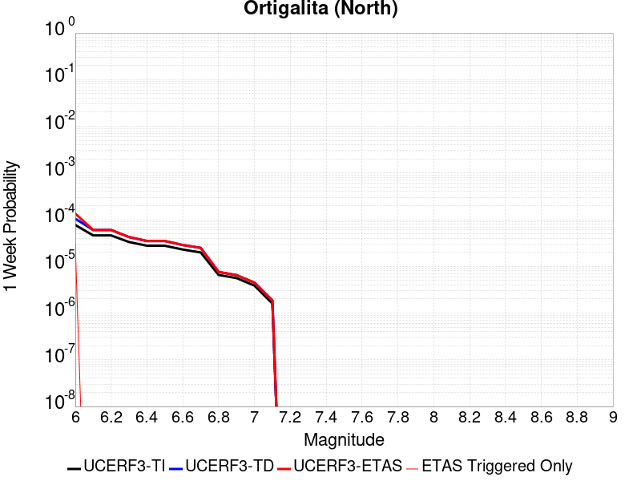 |  |  |  |

| Magnitude | 1 wk TI Prob | 1 wk TD Prob | 1 wk ETAS Prob | 1 wk ETAS/TD Gain | 1 wk ETAS Triggered Only | 1 mo TI Prob | 1 mo TD Prob | 1 mo ETAS Prob | 1 mo ETAS/TD Gain | 1 mo ETAS Triggered Only | 1 yr TI Prob | 1 yr TD Prob | 1 yr ETAS Prob | 1 yr ETAS/TD Gain | 1 yr ETAS Triggered Only | 10 yr TI Prob | 10 yr TD Prob | 10 yr ETAS Prob | 10 yr ETAS/TD Gain | 10 yr ETAS Triggered Only |
|-----|-----|-----|-----|-----|-----|-----|-----|-----|-----|-----|-----|-----|-----|-----|-----|-----|-----|-----|-----|-----|
| 6.0 | 7.711876E-5 | 1.0505308E-4 | 1.4255711E-4 | 1.3570008 | 3.750797E-5 | 3.3046713E-4 | 4.501601E-4 | 4.8765118E-4 | 1.0832839 | 3.750797E-5 | 0.004016016 | 0.0054680547 | 0.0055053574 | 1.006822 | 3.750797E-5 | 0.039442103 | 0.053455614 | 0.053491116 | 1.0006641 | 3.750797E-5 |
| 6.1 | 4.607858E-5 | 6.0239887E-5 | 6.0239887E-5 | 1.0 | 0.0 | 1.9746469E-4 | 2.5814763E-4 | 2.5814763E-4 | 1.0 | 0.0 | 0.0024014818 | 0.0031387366 | 0.0031387366 | 1.0 | 0.0 | 0.023756953 | 0.030975312 | 0.030975312 | 1.0 | 0.0 |
| 6.2 | 4.607858E-5 | 6.0239887E-5 | 6.0239887E-5 | 1.0 | 0.0 | 1.9746469E-4 | 2.5814763E-4 | 2.5814763E-4 | 1.0 | 0.0 | 0.0024014818 | 0.0031387366 | 0.0031387366 | 1.0 | 0.0 | 0.023756953 | 0.030975312 | 0.030975312 | 1.0 | 0.0 |
| 6.3 | 3.327423E-5 | 4.2476124E-5 | 4.2476124E-5 | 1.0 | 0.0 | 1.4259605E-4 | 1.8202956E-4 | 1.8202956E-4 | 1.0 | 0.0 | 0.0017347244 | 0.002214206 | 0.002214206 | 1.0 | 0.0 | 0.017212452 | 0.02194574 | 0.02194574 | 1.0 | 0.0 |
| 6.4 | 2.7732503E-5 | 3.4999008E-5 | 3.4999008E-5 | 1.0 | 0.0 | 1.1884817E-4 | 1.499886E-4 | 1.499886E-4 | 1.0 | 0.0 | 0.001446016 | 0.0018248158 | 0.0018248158 | 1.0 | 0.0 | 0.014366428 | 0.018121297 | 0.018121297 | 1.0 | 0.0 |
| 6.5 | 2.7689714E-5 | 3.4948822E-5 | 3.4948822E-5 | 1.0 | 0.0 | 1.186648E-4 | 1.4977354E-4 | 1.4977354E-4 | 1.0 | 0.0 | 0.0014437864 | 0.0018222018 | 0.0018222018 | 1.0 | 0.0 | 0.014344421 | 0.018095585 | 0.018095585 | 1.0 | 0.0 |
| 6.6 | 2.2976905E-5 | 2.871829E-5 | 2.871829E-5 | 1.0 | 0.0 | 9.846873E-5 | 1.23074E-4 | 1.23074E-4 | 1.0 | 0.0 | 0.0011981975 | 0.0014976348 | 0.0014976348 | 1.0 | 0.0 | 0.011917574 | 0.014898733 | 0.014898733 | 1.0 | 0.0 |
| 6.7 | 1.9871539E-5 | 2.4904637E-5 | 2.4904637E-5 | 1.0 | 0.0 | 8.516096E-5 | 1.067312E-4 | 1.067312E-4 | 1.0 | 0.0 | 0.0010363415 | 0.0012989199 | 0.0012989199 | 1.0 | 0.0 | 0.010315218 | 0.012936938 | 0.012936938 | 1.0 | 0.0 |
| 6.8 | 6.5640475E-6 | 7.6054926E-6 | 7.6054926E-6 | 1.0 | 0.0 | 2.813133E-5 | 3.2594577E-5 | 3.2594577E-5 | 1.0 | 0.0 | 3.424451E-4 | 3.9676955E-4 | 3.9676955E-4 | 1.0 | 0.0 | 0.0034191788 | 0.003960899 | 0.003960899 | 1.0 | 0.0 |
| 6.9 | 5.6219683E-6 | 6.5018376E-6 | 6.5018376E-6 | 1.0 | 0.0 | 2.4093928E-5 | 2.7864735E-5 | 2.7864735E-5 | 1.0 | 0.0 | 2.933041E-4 | 3.3920293E-4 | 3.3920293E-4 | 1.0 | 0.0 | 0.0029291727 | 0.003387109 | 0.003387109 | 1.0 | 0.0 |
| 7.0 | 3.875591E-6 | 4.4847548E-6 | 4.4847548E-6 | 1.0 | 0.0 | 1.6609569E-5 | 1.9220248E-5 | 1.9220248E-5 | 1.0 | 0.0 | 2.0220275E-4 | 2.339835E-4 | 2.339835E-4 | 1.0 | 0.0 | 0.0020201886 | 0.0023375798 | 0.0023375798 | 1.0 | 0.0 |
| 7.1 | 1.6017933E-6 | 1.8570418E-6 | 1.8570418E-6 | 1.0 | 0.0 | 6.8648105E-6 | 7.958732E-6 | 7.958732E-6 | 1.0 | 0.0 | 8.357586E-5 | 9.689432E-5 | 9.689432E-5 | 1.0 | 0.0 | 8.3544437E-4 | 9.686254E-4 | 9.686254E-4 | 1.0 | 0.0 |

## San Jose
*[(top)](#table-of-contents)*

| 1 Week | 1 Month | 1 Year | 10 Year |
|-----|-----|-----|-----|
|  |  |  |  |

| Magnitude | 1 wk TI Prob | 1 wk TD Prob | 1 wk ETAS Prob | 1 wk ETAS/TD Gain | 1 wk ETAS Triggered Only | 1 mo TI Prob | 1 mo TD Prob | 1 mo ETAS Prob | 1 mo ETAS/TD Gain | 1 mo ETAS Triggered Only | 1 yr TI Prob | 1 yr TD Prob | 1 yr ETAS Prob | 1 yr ETAS/TD Gain | 1 yr ETAS Triggered Only | 10 yr TI Prob | 10 yr TD Prob | 10 yr ETAS Prob | 10 yr ETAS/TD Gain | 10 yr ETAS Triggered Only |
|-----|-----|-----|-----|-----|-----|-----|-----|-----|-----|-----|-----|-----|-----|-----|-----|-----|-----|-----|-----|-----|
| 6.0 | 5.0851277E-6 | 4.125642E-6 | 4.125642E-6 | 1.0 | 0.0 | 2.1793223E-5 | 1.768122E-5 | 1.768122E-5 | 1.0 | 0.0 | 2.653002E-4 | 2.152502E-4 | 2.152502E-4 | 1.0 | 0.0 | 0.0026498367 | 0.0021507454 | 0.002188173 | 1.017402 | 3.750797E-5 |
| 6.1 | 5.0851277E-6 | 4.125642E-6 | 4.125642E-6 | 1.0 | 0.0 | 2.1793223E-5 | 1.768122E-5 | 1.768122E-5 | 1.0 | 0.0 | 2.653002E-4 | 2.152502E-4 | 2.152502E-4 | 1.0 | 0.0 | 0.0026498367 | 0.0021507454 | 0.002188173 | 1.017402 | 3.750797E-5 |
| 6.2 | 5.0851277E-6 | 4.125642E-6 | 4.125642E-6 | 1.0 | 0.0 | 2.1793223E-5 | 1.768122E-5 | 1.768122E-5 | 1.0 | 0.0 | 2.653002E-4 | 2.152502E-4 | 2.152502E-4 | 1.0 | 0.0 | 0.0026498367 | 0.0021507454 | 0.002188173 | 1.017402 | 3.750797E-5 |
| 6.3 | 5.0851277E-6 | 4.125642E-6 | 4.125642E-6 | 1.0 | 0.0 | 2.1793223E-5 | 1.768122E-5 | 1.768122E-5 | 1.0 | 0.0 | 2.653002E-4 | 2.152502E-4 | 2.152502E-4 | 1.0 | 0.0 | 0.0026498367 | 0.0021507454 | 0.002188173 | 1.017402 | 3.750797E-5 |
| 6.4 | 4.3115124E-6 | 3.3237525E-6 | 3.3237525E-6 | 1.0 | 0.0 | 1.8477778E-5 | 1.4244589E-5 | 1.4244589E-5 | 1.0 | 0.0 | 2.2494372E-4 | 1.7341628E-4 | 1.7341628E-4 | 1.0 | 0.0 | 0.0022471617 | 0.0017330965 | 0.0017705394 | 1.0216047 | 3.750797E-5 |
| 6.5 | 4.3115124E-6 | 3.3237525E-6 | 3.3237525E-6 | 1.0 | 0.0 | 1.8477778E-5 | 1.4244589E-5 | 1.4244589E-5 | 1.0 | 0.0 | 2.2494372E-4 | 1.7341628E-4 | 1.7341628E-4 | 1.0 | 0.0 | 0.0022471617 | 0.0017330965 | 0.0017705394 | 1.0216047 | 3.750797E-5 |
| 6.6 | 3.110396E-6 | 2.0799562E-6 | 2.0799562E-6 | 1.0 | 0.0 | 1.33302E-5 | 8.9140685E-6 | 8.9140685E-6 | 1.0 | 0.0 | 1.622831E-4 | 1.0852366E-4 | 1.0852366E-4 | 1.0 | 0.0 | 0.0016216465 | 0.001084804 | 0.001084804 | 1.0 | 0.0 |
| 6.7 | 3.110396E-6 | 2.0799562E-6 | 2.0799562E-6 | 1.0 | 0.0 | 1.33302E-5 | 8.9140685E-6 | 8.9140685E-6 | 1.0 | 0.0 | 1.622831E-4 | 1.0852366E-4 | 1.0852366E-4 | 1.0 | 0.0 | 0.0016216465 | 0.001084804 | 0.001084804 | 1.0 | 0.0 |
| 6.8 | 2.856651E-6 | 1.9024077E-6 | 1.9024077E-6 | 1.0 | 0.0 | 1.2242733E-5 | 8.153152E-6 | 8.153152E-6 | 1.0 | 0.0 | 1.4904508E-4 | 9.926035E-5 | 9.926035E-5 | 1.0 | 0.0 | 0.0014894515 | 9.922545E-4 | 9.922545E-4 | 1.0 | 0.0 |
| 6.9 | 2.1618725E-6 | 1.4186406E-6 | 1.4186406E-6 | 1.0 | 0.0 | 9.265135E-6 | 6.0798748E-6 | 6.0798748E-6 | 1.0 | 0.0 | 1.12797185E-4 | 7.402005E-5 | 7.402005E-5 | 1.0 | 0.0 | 0.0011273995 | 7.4003247E-4 | 7.4003247E-4 | 1.0 | 0.0 |
| 7.0 | 1.9684312E-6 | 1.3256082E-6 | 1.3256082E-6 | 1.0 | 0.0 | 8.436106E-6 | 5.681166E-6 | 5.681166E-6 | 1.0 | 0.0 | 1.02704755E-4 | 6.916608E-5 | 6.916608E-5 | 1.0 | 0.0 | 0.001026573 | 6.9152354E-4 | 6.9152354E-4 | 1.0 | 0.0 |
| 7.1 | 1.6070337E-6 | 1.1154867E-6 | 1.1154867E-6 | 1.0 | 0.0 | 6.887269E-6 | 4.7806493E-6 | 4.7806493E-6 | 1.0 | 0.0 | 8.384928E-5 | 5.8202913E-5 | 5.8202913E-5 | 1.0 | 0.0 | 8.3817646E-4 | 5.819527E-4 | 5.819527E-4 | 1.0 | 0.0 |
| 7.2 | 1.0631658E-6 | 6.403567E-7 | 6.403567E-7 | 1.0 | 0.0 | 4.556417E-6 | 2.744383E-6 | 2.744383E-6 | 1.0 | 0.0 | 5.5472963E-5 | 3.3412365E-5 | 3.3412365E-5 | 1.0 | 0.0 | 5.545912E-4 | 3.3414463E-4 | 3.3414463E-4 | 1.0 | 0.0 |
| 7.3 | 7.060711E-7 | 4.5823228E-7 | 4.5823228E-7 | 1.0 | 0.0 | 3.0260155E-6 | 1.9638512E-6 | 1.9638512E-6 | 1.0 | 0.0 | 3.6841117E-5 | 2.3909635E-5 | 2.3909635E-5 | 1.0 | 0.0 | 3.6835007E-4 | 2.3914136E-4 | 2.3914136E-4 | 1.0 | 0.0 |
| 7.4 | 3.3677085E-7 | 2.3231999E-7 | 2.3231999E-7 | 1.0 | 0.0 | 1.4433028E-6 | 9.956567E-7 | 9.956567E-7 | 1.0 | 0.0 | 1.757207E-5 | 1.2122056E-5 | 1.2122056E-5 | 1.0 | 0.0 | 1.7570681E-4 | 1.2128407E-4 | 1.2128407E-4 | 1.0 | 0.0 |
| 7.5 | 3.129161E-7 | 1.9529637E-7 | 1.9529637E-7 | 1.0 | 0.0 | 1.3410682E-6 | 8.3698416E-7 | 8.3698416E-7 | 1.0 | 0.0 | 1.6327383E-5 | 1.0190237E-5 | 1.0190237E-5 | 1.0 | 0.0 | 1.6326184E-4 | 1.0196777E-4 | 1.0196777E-4 | 1.0 | 0.0 |
| 7.6 | 2.8008668E-7 | 1.4240818E-7 | 1.4240818E-7 | 1.0 | 0.0 | 1.2003709E-6 | 6.103206E-7 | 6.103206E-7 | 1.0 | 0.0 | 1.46144175E-5 | 7.43063E-6 | 7.43063E-6 | 1.0 | 0.0 | 1.4613457E-4 | 7.43735E-5 | 7.43735E-5 | 1.0 | 0.0 |
| 7.7 | 2.7852005E-7 | 1.4015403E-7 | 1.4015403E-7 | 1.0 | 0.0 | 1.1936568E-6 | 6.0066003E-7 | 6.0066003E-7 | 1.0 | 0.0 | 1.4532674E-5 | 7.3130127E-6 | 7.3130127E-6 | 1.0 | 0.0 | 1.4531724E-4 | 7.31974E-5 | 7.31974E-5 | 1.0 | 0.0 |
| 7.8 | 1.1810797E-7 | 7.5187074E-8 | 7.5187074E-8 | 1.0 | 0.0 | 5.0617695E-7 | 3.2223028E-7 | 3.2223028E-7 | 1.0 | 0.0 | 6.1626865E-6 | 3.9231472E-6 | 3.9231472E-6 | 1.0 | 0.0 | 6.162516E-5 | 3.9271265E-5 | 3.9271265E-5 | 1.0 | 0.0 |

## Monterey Bay-Tularcitos
*[(top)](#table-of-contents)*

| 1 Week | 1 Month | 1 Year | 10 Year |
|-----|-----|-----|-----|
|  |  |  |  |

| Magnitude | 1 wk TI Prob | 1 wk TD Prob | 1 wk ETAS Prob | 1 wk ETAS/TD Gain | 1 wk ETAS Triggered Only | 1 mo TI Prob | 1 mo TD Prob | 1 mo ETAS Prob | 1 mo ETAS/TD Gain | 1 mo ETAS Triggered Only | 1 yr TI Prob | 1 yr TD Prob | 1 yr ETAS Prob | 1 yr ETAS/TD Gain | 1 yr ETAS Triggered Only | 10 yr TI Prob | 10 yr TD Prob | 10 yr ETAS Prob | 10 yr ETAS/TD Gain | 10 yr ETAS Triggered Only |
|-----|-----|-----|-----|-----|-----|-----|-----|-----|-----|-----|-----|-----|-----|-----|-----|-----|-----|-----|-----|-----|
| 6.0 | 3.0131365E-5 | 3.279877E-5 | 3.279877E-5 | 1.0 | 0.0 | 1.2912804E-4 | 1.4055918E-4 | 1.4055918E-4 | 1.0 | 0.0 | 0.001571 | 0.0017100703 | 0.0017100703 | 1.0 | 0.0 | 0.015599402 | 0.016979916 | 0.017016787 | 1.0021714 | 3.750797E-5 |
| 6.1 | 3.0131365E-5 | 3.279877E-5 | 3.279877E-5 | 1.0 | 0.0 | 1.2912804E-4 | 1.4055918E-4 | 1.4055918E-4 | 1.0 | 0.0 | 0.001571 | 0.0017100703 | 0.0017100703 | 1.0 | 0.0 | 0.015599402 | 0.016979916 | 0.017016787 | 1.0021714 | 3.750797E-5 |
| 6.2 | 3.0131365E-5 | 3.279877E-5 | 3.279877E-5 | 1.0 | 0.0 | 1.2912804E-4 | 1.4055918E-4 | 1.4055918E-4 | 1.0 | 0.0 | 0.001571 | 0.0017100703 | 0.0017100703 | 1.0 | 0.0 | 0.015599402 | 0.016979916 | 0.017016787 | 1.0021714 | 3.750797E-5 |
| 6.3 | 1.6998249E-5 | 1.8330798E-5 | 1.8330798E-5 | 1.0 | 0.0 | 7.28476E-5 | 7.85583E-5 | 7.85583E-5 | 1.0 | 0.0 | 8.865586E-4 | 9.5604634E-4 | 9.5604634E-4 | 1.0 | 0.0 | 0.0088303005 | 0.009521258 | 0.0095584085 | 1.0039018 | 3.750797E-5 |
| 6.4 | 1.6998249E-5 | 1.8330798E-5 | 1.8330798E-5 | 1.0 | 0.0 | 7.28476E-5 | 7.85583E-5 | 7.85583E-5 | 1.0 | 0.0 | 8.865586E-4 | 9.5604634E-4 | 9.5604634E-4 | 1.0 | 0.0 | 0.0088303005 | 0.009521258 | 0.0095584085 | 1.0039018 | 3.750797E-5 |
| 6.5 | 1.27470785E-5 | 1.3693312E-5 | 1.3693312E-5 | 1.0 | 0.0 | 5.4629192E-5 | 5.8684363E-5 | 5.8684363E-5 | 1.0 | 0.0 | 6.649074E-4 | 7.1425823E-4 | 7.1425823E-4 | 1.0 | 0.0 | 0.0066292146 | 0.007120678 | 0.0071579195 | 1.00523 | 3.750797E-5 |
| 6.6 | 1.2739422E-5 | 1.36854E-5 | 1.36854E-5 | 1.0 | 0.0 | 5.4596385E-5 | 5.8650454E-5 | 5.8650454E-5 | 1.0 | 0.0 | 6.645082E-4 | 7.1384566E-4 | 7.1384566E-4 | 1.0 | 0.0 | 0.0066252467 | 0.007116579 | 0.00715382 | 1.005233 | 3.750797E-5 |
| 6.7 | 1.0160109E-5 | 1.0885755E-5 | 1.0885755E-5 | 1.0 | 0.0 | 4.35426E-5 | 4.665244E-5 | 4.665244E-5 | 1.0 | 0.0 | 5.300022E-4 | 5.6785246E-4 | 5.6785246E-4 | 1.0 | 0.0 | 0.005287399 | 0.0056647263 | 0.0057020215 | 1.0065838 | 3.750797E-5 |
| 6.8 | 8.349859E-6 | 8.932587E-6 | 8.932587E-6 | 1.0 | 0.0 | 3.578462E-5 | 3.8281985E-5 | 3.8281985E-5 | 1.0 | 0.0 | 4.3559066E-4 | 4.6598914E-4 | 4.6598914E-4 | 1.0 | 0.0 | 0.004347378 | 0.004650685 | 0.004688019 | 1.0080276 | 3.750797E-5 |
| 6.9 | 5.193639E-6 | 5.53643E-6 | 5.53643E-6 | 1.0 | 0.0 | 2.2258262E-5 | 2.372736E-5 | 2.372736E-5 | 1.0 | 0.0 | 2.7096065E-4 | 2.8884556E-4 | 2.8884556E-4 | 1.0 | 0.0 | 0.0027063051 | 0.0028850224 | 0.0028850224 | 1.0 | 0.0 |
| 7.0 | 4.359381E-6 | 4.643366E-6 | 4.643366E-6 | 1.0 | 0.0 | 1.8682927E-5 | 1.9900004E-5 | 1.9900004E-5 | 1.0 | 0.0 | 2.274409E-4 | 2.422586E-4 | 2.422586E-4 | 1.0 | 0.0 | 0.0022720827 | 0.002420238 | 0.002420238 | 1.0 | 0.0 |
| 7.1 | 3.0398533E-6 | 3.2310427E-6 | 3.2310427E-6 | 1.0 | 0.0 | 1.3027877E-5 | 1.3847267E-5 | 1.3847267E-5 | 1.0 | 0.0 | 1.5860285E-4 | 1.6858005E-4 | 1.6858005E-4 | 1.0 | 0.0 | 0.001584897 | 0.0016847793 | 0.0016847793 | 1.0 | 0.0 |
| 7.2 | 1.642335E-6 | 1.7333153E-6 | 1.7333153E-6 | 1.0 | 0.0 | 7.0385595E-6 | 7.428485E-6 | 7.428485E-6 | 1.0 | 0.0 | 8.569109E-5 | 9.044012E-5 | 9.044012E-5 | 1.0 | 0.0 | 8.5658056E-4 | 9.042358E-4 | 9.042358E-4 | 1.0 | 0.0 |
| 7.3 | 3.356842E-7 | 3.2952389E-7 | 3.2952389E-7 | 1.0 | 0.0 | 1.4386458E-6 | 1.4122445E-6 | 1.4122445E-6 | 1.0 | 0.0 | 1.7515373E-5 | 1.7193941E-5 | 1.7193941E-5 | 1.0 | 0.0 | 1.7513991E-4 | 1.719262E-4 | 1.719262E-4 | 1.0 | 0.0 |
| 7.4 | 2.1973483E-7 | 2.1006414E-7 | 2.1006414E-7 | 1.0 | 0.0 | 9.417204E-7 | 9.002746E-7 | 9.002746E-7 | 1.0 | 0.0 | 1.1465385E-5 | 1.0960788E-5 | 1.0960788E-5 | 1.0 | 0.0 | 1.1464794E-4 | 1.0960251E-4 | 1.0960251E-4 | 1.0 | 0.0 |
| 7.5 | 1.1944135E-7 | 1.0696035E-7 | 1.0696035E-7 | 1.0 | 0.0 | 5.118914E-7 | 4.5840142E-7 | 4.5840142E-7 | 1.0 | 0.0 | 6.23226E-6 | 5.581023E-6 | 5.581023E-6 | 1.0 | 0.0 | 6.2320854E-5 | 5.5808843E-5 | 5.5808843E-5 | 1.0 | 0.0 |
| 7.6 | 4.636058E-8 | 3.3364433E-8 | 3.3364433E-8 | 1.0 | 0.0 | 1.9868818E-7 | 1.4299042E-7 | 1.4299042E-7 | 1.0 | 0.0 | 2.419026E-6 | 1.740907E-6 | 1.740907E-6 | 1.0 | 0.0 | 2.4189996E-5 | 1.7408936E-5 | 1.7408936E-5 | 1.0 | 0.0 |
| 7.7 | 1.8588572E-8 | 8.003168E-9 | 8.003168E-9 | 1.0 | 0.0 | 7.9665305E-8 | 3.429929E-8 | 3.429929E-8 | 1.0 | 0.0 | 9.699246E-7 | 4.1759378E-7 | 4.1759378E-7 | 1.0 | 0.0 | 9.699204E-6 | 4.1759304E-6 | 4.1759304E-6 | 1.0 | 0.0 |
| 7.8 | 2.7960154E-9 | 7.608624E-10 | 7.608624E-10 | 1.0 | 0.0 | 1.1982923E-8 | 3.2608392E-9 | 3.2608392E-9 | 1.0 | 0.0 | 1.4589209E-7 | 3.9700716E-8 | 3.9700716E-8 | 1.0 | 0.0 | 1.4589199E-6 | 3.970071E-7 | 3.970071E-7 | 1.0 | 0.0 |

## Coronado Bank alt1
*[(top)](#table-of-contents)*

| 1 Week | 1 Month | 1 Year | 10 Year |
|-----|-----|-----|-----|
|  |  |  |  |

| Magnitude | 1 wk TI Prob | 1 wk TD Prob | 1 wk ETAS Prob | 1 wk ETAS/TD Gain | 1 wk ETAS Triggered Only | 1 mo TI Prob | 1 mo TD Prob | 1 mo ETAS Prob | 1 mo ETAS/TD Gain | 1 mo ETAS Triggered Only | 1 yr TI Prob | 1 yr TD Prob | 1 yr ETAS Prob | 1 yr ETAS/TD Gain | 1 yr ETAS Triggered Only | 10 yr TI Prob | 10 yr TD Prob | 10 yr ETAS Prob | 10 yr ETAS/TD Gain | 10 yr ETAS Triggered Only |
|-----|-----|-----|-----|-----|-----|-----|-----|-----|-----|-----|-----|-----|-----|-----|-----|-----|-----|-----|-----|-----|
| 6.0 | 7.533492E-5 | 9.3951705E-5 | 9.3951705E-5 | 1.0 | 0.0 | 3.22824E-4 | 4.025903E-4 | 4.4008315E-4 | 1.093129 | 3.750797E-5 | 0.0039233007 | 0.004891121 | 0.0049284454 | 1.0076311 | 3.750797E-5 | 0.03854755 | 0.047904 | 0.04793971 | 1.0007454 | 3.750797E-5 |
| 6.1 | 4.1807285E-5 | 5.0493105E-5 | 5.0493105E-5 | 1.0 | 0.0 | 1.7916178E-4 | 2.1638138E-4 | 2.1638138E-4 | 1.0 | 0.0 | 0.0021791123 | 0.0026313365 | 0.0026313365 | 1.0 | 0.0 | 0.021578677 | 0.026011124 | 0.026011124 | 1.0 | 0.0 |
| 6.2 | 4.1807285E-5 | 5.0493105E-5 | 5.0493105E-5 | 1.0 | 0.0 | 1.7916178E-4 | 2.1638138E-4 | 2.1638138E-4 | 1.0 | 0.0 | 0.0021791123 | 0.0026313365 | 0.0026313365 | 1.0 | 0.0 | 0.021578677 | 0.026011124 | 0.026011124 | 1.0 | 0.0 |
| 6.3 | 3.1793104E-5 | 3.7711125E-5 | 3.7711125E-5 | 1.0 | 0.0 | 1.3624904E-4 | 1.6160926E-4 | 1.6160926E-4 | 1.0 | 0.0 | 0.0016575698 | 0.001965849 | 0.001965849 | 1.0 | 0.0 | 0.016452603 | 0.019488495 | 0.019488495 | 1.0 | 0.0 |
| 6.4 | 2.9878007E-5 | 3.5335797E-5 | 3.5335797E-5 | 1.0 | 0.0 | 1.2804232E-4 | 1.5143053E-4 | 1.5143053E-4 | 1.0 | 0.0 | 0.0015578003 | 0.0018421395 | 0.0018421395 | 1.0 | 0.0 | 0.015469253 | 0.018272463 | 0.018272463 | 1.0 | 0.0 |
| 6.5 | 2.4512565E-5 | 2.8764101E-5 | 2.8764101E-5 | 1.0 | 0.0 | 1.0504962E-4 | 1.2326906E-4 | 1.2326906E-4 | 1.0 | 0.0 | 0.0012782287 | 0.0014997943 | 0.0014997943 | 1.0 | 0.0 | 0.012709012 | 0.0148996925 | 0.0148996925 | 1.0 | 0.0 |
| 6.6 | 2.1317413E-5 | 2.490667E-5 | 2.490667E-5 | 1.0 | 0.0 | 9.135714E-5 | 1.0673863E-4 | 1.0673863E-4 | 1.0 | 0.0 | 0.0011117056 | 0.0012987903 | 0.0012987903 | 1.0 | 0.0 | 0.011061605 | 0.012914407 | 0.012914407 | 1.0 | 0.0 |
| 6.7 | 1.8585655E-5 | 2.1634882E-5 | 2.1634882E-5 | 1.0 | 0.0 | 7.9650374E-5 | 9.271774E-5 | 9.271774E-5 | 1.0 | 0.0 | 9.6931186E-4 | 0.0011282744 | 0.0011282744 | 1.0 | 0.0 | 0.0096509475 | 0.011227623 | 0.011227623 | 1.0 | 0.0 |
| 6.8 | 1.5862879E-5 | 1.8419476E-5 | 1.8419476E-5 | 1.0 | 0.0 | 6.798199E-5 | 7.8938334E-5 | 7.8938334E-5 | 1.0 | 0.0 | 8.273665E-4 | 9.606697E-4 | 9.606697E-4 | 1.0 | 0.0 | 0.008242928 | 0.009567151 | 0.009567151 | 1.0 | 0.0 |
| 6.9 | 1.3021509E-5 | 1.5095266E-5 | 1.5095266E-5 | 1.0 | 0.0 | 5.5805274E-5 | 6.46925E-5 | 6.46925E-5 | 1.0 | 0.0 | 6.792174E-4 | 7.873646E-4 | 7.873646E-4 | 1.0 | 0.0 | 0.006771452 | 0.007847573 | 0.007847573 | 1.0 | 0.0 |
| 7.0 | 1.0974371E-5 | 1.2720105E-5 | 1.2720105E-5 | 1.0 | 0.0 | 4.7032172E-5 | 5.4513697E-5 | 5.4513697E-5 | 1.0 | 0.0 | 5.7246623E-4 | 6.635197E-4 | 6.635197E-4 | 1.0 | 0.0 | 0.0057099373 | 0.0066171354 | 0.0066171354 | 1.0 | 0.0 |
| 7.1 | 8.766221E-6 | 1.0163833E-5 | 1.0163833E-5 | 1.0 | 0.0 | 3.7568978E-5 | 4.3558655E-5 | 4.3558655E-5 | 1.0 | 0.0 | 4.573063E-4 | 5.302148E-4 | 5.302148E-4 | 1.0 | 0.0 | 0.0045636636 | 0.005291197 | 0.005291197 | 1.0 | 0.0 |
| 7.2 | 8.026024E-7 | 8.331776E-7 | 8.331776E-7 | 1.0 | 0.0 | 3.43972E-6 | 3.5707562E-6 | 3.5707562E-6 | 1.0 | 0.0 | 4.1877785E-5 | 4.34731E-5 | 4.34731E-5 | 1.0 | 0.0 | 4.1869894E-4 | 4.3464705E-4 | 4.3464705E-4 | 1.0 | 0.0 |
| 7.3 | 3.7293114E-7 | 3.700106E-7 | 3.700106E-7 | 1.0 | 0.0 | 1.5982754E-6 | 1.5857588E-6 | 1.5857588E-6 | 1.0 | 0.0 | 1.9458828E-5 | 1.9306442E-5 | 1.9306442E-5 | 1.0 | 0.0 | 1.9457124E-4 | 1.9304773E-4 | 1.9304773E-4 | 1.0 | 0.0 |
| 7.4 | 2.0557036E-7 | 1.9674441E-7 | 1.9674441E-7 | 1.0 | 0.0 | 8.810155E-7 | 8.4319004E-7 | 8.4319004E-7 | 1.0 | 0.0 | 1.0726311E-5 | 1.02657905E-5 | 1.02657905E-5 | 1.0 | 0.0 | 1.0725793E-4 | 1.026532E-4 | 1.026532E-4 | 1.0 | 0.0 |
| 7.5 | 6.845446E-8 | 6.2794086E-8 | 6.2794086E-8 | 1.0 | 0.0 | 2.9337625E-7 | 2.6911746E-7 | 2.6911746E-7 | 1.0 | 0.0 | 3.5718497E-6 | 3.2765004E-6 | 3.2765004E-6 | 1.0 | 0.0 | 3.5717923E-5 | 3.276453E-5 | 3.276453E-5 | 1.0 | 0.0 |
| 7.6 | 6.0975145E-9 | 5.531901E-9 | 5.531901E-9 | 1.0 | 0.0 | 2.6132206E-8 | 2.3708148E-8 | 2.3708148E-8 | 1.0 | 0.0 | 3.1815955E-7 | 2.8864667E-7 | 2.8864667E-7 | 1.0 | 0.0 | 3.181591E-6 | 2.886464E-6 | 2.886464E-6 | 1.0 | 0.0 |

## Ortigalita (South)
*[(top)](#table-of-contents)*

| 1 Week | 1 Month | 1 Year | 10 Year |
|-----|-----|-----|-----|
|  |  |  |  |

| Magnitude | 1 wk TI Prob | 1 wk TD Prob | 1 wk ETAS Prob | 1 wk ETAS/TD Gain | 1 wk ETAS Triggered Only | 1 mo TI Prob | 1 mo TD Prob | 1 mo ETAS Prob | 1 mo ETAS/TD Gain | 1 mo ETAS Triggered Only | 1 yr TI Prob | 1 yr TD Prob | 1 yr ETAS Prob | 1 yr ETAS/TD Gain | 1 yr ETAS Triggered Only | 10 yr TI Prob | 10 yr TD Prob | 10 yr ETAS Prob | 10 yr ETAS/TD Gain | 10 yr ETAS Triggered Only |
|-----|-----|-----|-----|-----|-----|-----|-----|-----|-----|-----|-----|-----|-----|-----|-----|-----|-----|-----|-----|-----|
| 6.0 | 3.72394E-5 | 4.32556E-5 | 4.32556E-5 | 1.0 | 0.0 | 1.5958765E-4 | 1.8536886E-4 | 1.8536886E-4 | 1.0 | 0.0 | 0.0019412481 | 0.0022546863 | 0.0022546863 | 1.0 | 0.0 | 0.019243775 | 0.022334501 | 0.022371171 | 1.0016419 | 3.750797E-5 |
| 6.1 | 2.7299884E-5 | 3.1492036E-5 | 3.1492036E-5 | 1.0 | 0.0 | 1.16994255E-4 | 1.349592E-4 | 1.349592E-4 | 1.0 | 0.0 | 0.0014234743 | 0.0016419457 | 0.0016419457 | 1.0 | 0.0 | 0.014143906 | 0.016304072 | 0.016304072 | 1.0 | 0.0 |
| 6.2 | 2.7299884E-5 | 3.1492036E-5 | 3.1492036E-5 | 1.0 | 0.0 | 1.16994255E-4 | 1.349592E-4 | 1.349592E-4 | 1.0 | 0.0 | 0.0014234743 | 0.0016419457 | 0.0016419457 | 1.0 | 0.0 | 0.014143906 | 0.016304072 | 0.016304072 | 1.0 | 0.0 |
| 6.3 | 2.0546433E-5 | 2.3631454E-5 | 2.3631454E-5 | 1.0 | 0.0 | 8.805317E-5 | 1.0127383E-4 | 1.0127383E-4 | 1.0 | 0.0 | 0.00107152 | 0.0012323305 | 0.0012323305 | 1.0 | 0.0 | 0.010663681 | 0.012257031 | 0.012257031 | 1.0 | 0.0 |
| 6.4 | 2.0546433E-5 | 2.3631454E-5 | 2.3631454E-5 | 1.0 | 0.0 | 8.805317E-5 | 1.0127383E-4 | 1.0127383E-4 | 1.0 | 0.0 | 0.00107152 | 0.0012323305 | 0.0012323305 | 1.0 | 0.0 | 0.010663681 | 0.012257031 | 0.012257031 | 1.0 | 0.0 |
| 6.5 | 1.7779594E-5 | 2.0446974E-5 | 2.0446974E-5 | 1.0 | 0.0 | 7.619603E-5 | 8.762703E-5 | 8.762703E-5 | 1.0 | 0.0 | 9.272918E-4 | 0.0010663505 | 0.0010663505 | 1.0 | 0.0 | 0.009234319 | 0.010613804 | 0.010613804 | 1.0 | 0.0 |
| 6.6 | 1.6272212E-5 | 1.8714967E-5 | 1.8714967E-5 | 1.0 | 0.0 | 6.973618E-5 | 8.0204605E-5 | 8.0204605E-5 | 1.0 | 0.0 | 8.487073E-4 | 9.760659E-4 | 9.760659E-4 | 1.0 | 0.0 | 0.008454733 | 0.009719091 | 0.009719091 | 1.0 | 0.0 |
| 6.7 | 1.3051484E-5 | 1.5038758E-5 | 1.5038758E-5 | 1.0 | 0.0 | 5.593373E-5 | 6.445028E-5 | 6.445028E-5 | 1.0 | 0.0 | 6.807804E-4 | 7.844092E-4 | 7.844092E-4 | 1.0 | 0.0 | 0.006786986 | 0.007817388 | 0.007817388 | 1.0 | 0.0 |
| 6.8 | 1.04277415E-5 | 1.1987235E-5 | 1.1987235E-5 | 1.0 | 0.0 | 4.4689557E-5 | 5.1372896E-5 | 5.1372896E-5 | 1.0 | 0.0 | 5.439595E-4 | 6.2529295E-4 | 6.2529295E-4 | 1.0 | 0.0 | 0.0054262993 | 0.00623609 | 0.00623609 | 1.0 | 0.0 |
| 6.9 | 7.639968E-6 | 8.791503E-6 | 8.791503E-6 | 1.0 | 0.0 | 3.274231E-5 | 3.767736E-5 | 3.767736E-5 | 1.0 | 0.0 | 3.9856473E-4 | 4.586312E-4 | 4.586312E-4 | 1.0 | 0.0 | 0.003978506 | 0.004577433 | 0.004577433 | 1.0 | 0.0 |
| 7.0 | 3.919831E-6 | 4.5334014E-6 | 4.5334014E-6 | 1.0 | 0.0 | 1.679917E-5 | 1.942873E-5 | 1.942873E-5 | 1.0 | 0.0 | 2.045107E-4 | 2.3652123E-4 | 2.3652123E-4 | 1.0 | 0.0 | 0.0020432258 | 0.0023629034 | 0.0023629034 | 1.0 | 0.0 |
| 7.1 | 1.6017933E-6 | 1.8570418E-6 | 1.8570418E-6 | 1.0 | 0.0 | 6.8648105E-6 | 7.958732E-6 | 7.958732E-6 | 1.0 | 0.0 | 8.357586E-5 | 9.689432E-5 | 9.689432E-5 | 1.0 | 0.0 | 8.3544437E-4 | 9.686254E-4 | 9.686254E-4 | 1.0 | 0.0 |

## San Luis Range - Oceano 2011 CFM
*[(top)](#table-of-contents)*

| 1 Week | 1 Month | 1 Year | 10 Year |
|-----|-----|-----|-----|
|  |  |  |  |

| Magnitude | 1 wk TI Prob | 1 wk TD Prob | 1 wk ETAS Prob | 1 wk ETAS/TD Gain | 1 wk ETAS Triggered Only | 1 mo TI Prob | 1 mo TD Prob | 1 mo ETAS Prob | 1 mo ETAS/TD Gain | 1 mo ETAS Triggered Only | 1 yr TI Prob | 1 yr TD Prob | 1 yr ETAS Prob | 1 yr ETAS/TD Gain | 1 yr ETAS Triggered Only | 10 yr TI Prob | 10 yr TD Prob | 10 yr ETAS Prob | 10 yr ETAS/TD Gain | 10 yr ETAS Triggered Only |
|-----|-----|-----|-----|-----|-----|-----|-----|-----|-----|-----|-----|-----|-----|-----|-----|-----|-----|-----|-----|-----|
| 6.0 | 1.6025788E-6 | 1.620119E-6 | 1.620119E-6 | 1.0 | 0.0 | 6.8681766E-6 | 6.943351E-6 | 6.943351E-6 | 1.0 | 0.0 | 8.361684E-5 | 8.453243E-5 | 1.2203723E-4 | 1.4436735 | 3.750797E-5 | 8.3585386E-4 | 8.4504357E-4 | 8.825199E-4 | 1.0443484 | 3.750797E-5 |
| 6.1 | 1.6025788E-6 | 1.620119E-6 | 1.620119E-6 | 1.0 | 0.0 | 6.8681766E-6 | 6.943351E-6 | 6.943351E-6 | 1.0 | 0.0 | 8.361684E-5 | 8.453243E-5 | 1.2203723E-4 | 1.4436735 | 3.750797E-5 | 8.3585386E-4 | 8.4504357E-4 | 8.825199E-4 | 1.0443484 | 3.750797E-5 |
| 6.2 | 1.6025788E-6 | 1.620119E-6 | 1.620119E-6 | 1.0 | 0.0 | 6.8681766E-6 | 6.943351E-6 | 6.943351E-6 | 1.0 | 0.0 | 8.361684E-5 | 8.453243E-5 | 1.2203723E-4 | 1.4436735 | 3.750797E-5 | 8.3585386E-4 | 8.4504357E-4 | 8.825199E-4 | 1.0443484 | 3.750797E-5 |
| 6.3 | 1.6025788E-6 | 1.620119E-6 | 1.620119E-6 | 1.0 | 0.0 | 6.8681766E-6 | 6.943351E-6 | 6.943351E-6 | 1.0 | 0.0 | 8.361684E-5 | 8.453243E-5 | 1.2203723E-4 | 1.4436735 | 3.750797E-5 | 8.3585386E-4 | 8.4504357E-4 | 8.825199E-4 | 1.0443484 | 3.750797E-5 |
| 6.4 | 1.1621186E-6 | 1.1749894E-6 | 1.1749894E-6 | 1.0 | 0.0 | 4.980499E-6 | 5.0356607E-6 | 5.0356607E-6 | 1.0 | 0.0 | 6.0635884E-5 | 6.130771E-5 | 9.881339E-5 | 1.611761 | 3.750797E-5 | 6.0619344E-4 | 6.1293464E-4 | 6.504196E-4 | 1.0611566 | 3.750797E-5 |
| 6.5 | 1.1621186E-6 | 1.1749894E-6 | 1.1749894E-6 | 1.0 | 0.0 | 4.980499E-6 | 5.0356607E-6 | 5.0356607E-6 | 1.0 | 0.0 | 6.0635884E-5 | 6.130771E-5 | 9.881339E-5 | 1.611761 | 3.750797E-5 | 6.0619344E-4 | 6.1293464E-4 | 6.504196E-4 | 1.0611566 | 3.750797E-5 |
| 6.6 | 7.164729E-7 | 7.2485784E-7 | 7.2485784E-7 | 1.0 | 0.0 | 3.0705946E-6 | 3.10653E-6 | 3.10653E-6 | 1.0 | 0.0 | 3.738385E-5 | 3.7821363E-5 | 7.532792E-5 | 1.9916763 | 3.750797E-5 | 3.737756E-4 | 3.7815105E-4 | 4.156448E-4 | 1.0991503 | 3.750797E-5 |
| 6.7 | 7.164729E-7 | 7.2485784E-7 | 7.2485784E-7 | 1.0 | 0.0 | 3.0705946E-6 | 3.10653E-6 | 3.10653E-6 | 1.0 | 0.0 | 3.738385E-5 | 3.7821363E-5 | 7.532792E-5 | 1.9916763 | 3.750797E-5 | 3.737756E-4 | 3.7815105E-4 | 4.156448E-4 | 1.0991503 | 3.750797E-5 |
| 6.8 | 6.700177E-7 | 6.7774397E-7 | 6.7774397E-7 | 1.0 | 0.0 | 2.8715012E-6 | 2.904614E-6 | 2.904614E-6 | 1.0 | 0.0 | 3.495997E-5 | 3.536312E-5 | 7.286976E-5 | 2.0606148 | 3.750797E-5 | 3.495447E-4 | 3.5357653E-4 | 3.9107123E-4 | 1.106044 | 3.750797E-5 |
| 6.9 | 5.657865E-7 | 5.7217864E-7 | 5.7217864E-7 | 1.0 | 0.0 | 2.424797E-6 | 2.452192E-6 | 2.452192E-6 | 1.0 | 0.0 | 2.9521503E-5 | 2.9855039E-5 | 6.736189E-5 | 2.2562988 | 3.750797E-5 | 2.9517582E-4 | 2.9851135E-4 | 3.3600812E-4 | 1.1256126 | 3.750797E-5 |
| 7.0 | 4.608413E-7 | 4.660169E-7 | 4.660169E-7 | 1.0 | 0.0 | 1.9750328E-6 | 1.9972138E-6 | 1.9972138E-6 | 1.0 | 0.0 | 2.4045758E-5 | 2.431581E-5 | 2.431581E-5 | 1.0 | 0.0 | 2.4043156E-4 | 2.4313178E-4 | 2.4313178E-4 | 1.0 | 0.0 |
| 7.1 | 3.9177846E-7 | 3.9621602E-7 | 3.9621602E-7 | 1.0 | 0.0 | 1.6790494E-6 | 1.6980675E-6 | 1.6980675E-6 | 1.0 | 0.0 | 2.0442236E-5 | 2.0673779E-5 | 2.0673779E-5 | 1.0 | 0.0 | 2.0440355E-4 | 2.067187E-4 | 2.067187E-4 | 1.0 | 0.0 |
| 7.2 | 3.3974752E-7 | 3.436653E-7 | 3.436653E-7 | 1.0 | 0.0 | 1.45606E-6 | 1.4728505E-6 | 1.4728505E-6 | 1.0 | 0.0 | 1.7727387E-5 | 1.7931809E-5 | 1.7931809E-5 | 1.0 | 0.0 | 1.7725973E-4 | 1.7930372E-4 | 1.7930372E-4 | 1.0 | 0.0 |
| 7.3 | 2.8900928E-7 | 2.923402E-7 | 2.923402E-7 | 1.0 | 0.0 | 1.2386106E-6 | 1.2528859E-6 | 1.2528859E-6 | 1.0 | 0.0 | 1.5079979E-5 | 1.525378E-5 | 1.525378E-5 | 1.0 | 0.0 | 1.5078956E-4 | 1.5252741E-4 | 1.5252741E-4 | 1.0 | 0.0 |
| 7.4 | 2.1881527E-7 | 2.2139594E-7 | 2.2139594E-7 | 1.0 | 0.0 | 9.3777936E-7 | 9.488394E-7 | 9.488394E-7 | 1.0 | 0.0 | 1.14174045E-5 | 1.1552059E-5 | 1.1552059E-5 | 1.0 | 0.0 | 1.1416818E-4 | 1.1551464E-4 | 1.1551464E-4 | 1.0 | 0.0 |
| 7.5 | 1.356398E-7 | 1.3718639E-7 | 1.3718639E-7 | 1.0 | 0.0 | 5.813133E-7 | 5.8794154E-7 | 5.8794154E-7 | 1.0 | 0.0 | 7.0774663E-6 | 7.158165E-6 | 7.158165E-6 | 1.0 | 0.0 | 7.077241E-5 | 7.157937E-5 | 7.157937E-5 | 1.0 | 0.0 |
| 7.6 | 5.9269272E-8 | 6.001364E-8 | 6.001364E-8 | 1.0 | 0.0 | 2.5401116E-7 | 2.572013E-7 | 2.572013E-7 | 1.0 | 0.0 | 3.0925814E-6 | 3.1314214E-6 | 3.1314214E-6 | 1.0 | 0.0 | 3.0925385E-5 | 3.1313786E-5 | 3.1313786E-5 | 1.0 | 0.0 |
| 7.7 | 5.946232E-9 | 6.036928E-9 | 6.036928E-9 | 1.0 | 0.0 | 2.5483851E-8 | 2.5872547E-8 | 2.5872547E-8 | 1.0 | 0.0 | 3.1026585E-7 | 3.1499823E-7 | 3.1499823E-7 | 1.0 | 0.0 | 3.102654E-6 | 3.1499787E-6 | 3.1499787E-6 | 1.0 | 0.0 |

## Deep Springs
*[(top)](#table-of-contents)*

| 1 Week | 1 Month | 1 Year | 10 Year |
|-----|-----|-----|-----|
|  |  |  |  |

| Magnitude | 1 wk TI Prob | 1 wk TD Prob | 1 wk ETAS Prob | 1 wk ETAS/TD Gain | 1 wk ETAS Triggered Only | 1 mo TI Prob | 1 mo TD Prob | 1 mo ETAS Prob | 1 mo ETAS/TD Gain | 1 mo ETAS Triggered Only | 1 yr TI Prob | 1 yr TD Prob | 1 yr ETAS Prob | 1 yr ETAS/TD Gain | 1 yr ETAS Triggered Only | 10 yr TI Prob | 10 yr TD Prob | 10 yr ETAS Prob | 10 yr ETAS/TD Gain | 10 yr ETAS Triggered Only |
|-----|-----|-----|-----|-----|-----|-----|-----|-----|-----|-----|-----|-----|-----|-----|-----|-----|-----|-----|-----|-----|
| 6.0 | 1.9810619E-5 | 2.311252E-5 | 2.311252E-5 | 1.0 | 0.0 | 8.489989E-5 | 9.9052755E-5 | 9.9052755E-5 | 1.0 | 0.0 | 0.001033166 | 0.0012058078 | 0.0012058078 | 1.0 | 0.0 | 0.010283757 | 0.01204243 | 0.012079487 | 1.0030771 | 3.750797E-5 |
| 6.1 | 1.9810619E-5 | 2.311252E-5 | 2.311252E-5 | 1.0 | 0.0 | 8.489989E-5 | 9.9052755E-5 | 9.9052755E-5 | 1.0 | 0.0 | 0.001033166 | 0.0012058078 | 0.0012058078 | 1.0 | 0.0 | 0.010283757 | 0.01204243 | 0.012079487 | 1.0030771 | 3.750797E-5 |
| 6.2 | 1.9810619E-5 | 2.311252E-5 | 2.311252E-5 | 1.0 | 0.0 | 8.489989E-5 | 9.9052755E-5 | 9.9052755E-5 | 1.0 | 0.0 | 0.001033166 | 0.0012058078 | 0.0012058078 | 1.0 | 0.0 | 0.010283757 | 0.01204243 | 0.012079487 | 1.0030771 | 3.750797E-5 |
| 6.3 | 1.9810619E-5 | 2.311252E-5 | 2.311252E-5 | 1.0 | 0.0 | 8.489989E-5 | 9.9052755E-5 | 9.9052755E-5 | 1.0 | 0.0 | 0.001033166 | 0.0012058078 | 0.0012058078 | 1.0 | 0.0 | 0.010283757 | 0.01204243 | 0.012079487 | 1.0030771 | 3.750797E-5 |
| 6.4 | 1.9810619E-5 | 2.311252E-5 | 2.311252E-5 | 1.0 | 0.0 | 8.489989E-5 | 9.9052755E-5 | 9.9052755E-5 | 1.0 | 0.0 | 0.001033166 | 0.0012058078 | 0.0012058078 | 1.0 | 0.0 | 0.010283757 | 0.01204243 | 0.012079487 | 1.0030771 | 3.750797E-5 |
| 6.5 | 1.7190405E-5 | 2.0050558E-5 | 2.0050558E-5 | 1.0 | 0.0 | 7.367108E-5 | 8.593096E-5 | 8.593096E-5 | 1.0 | 0.0 | 8.9657627E-4 | 0.0010462092 | 0.0010462092 | 1.0 | 0.0 | 0.008929676 | 0.010462061 | 0.010499177 | 1.0035477 | 3.750797E-5 |
| 6.6 | 1.7190405E-5 | 2.0050558E-5 | 2.0050558E-5 | 1.0 | 0.0 | 7.367108E-5 | 8.593096E-5 | 8.593096E-5 | 1.0 | 0.0 | 8.9657627E-4 | 0.0010462092 | 0.0010462092 | 1.0 | 0.0 | 0.008929676 | 0.010462061 | 0.010499177 | 1.0035477 | 3.750797E-5 |

## Superstition Hills
*[(top)](#table-of-contents)*

| 1 Week | 1 Month | 1 Year | 10 Year |
|-----|-----|-----|-----|
|  |  |  |  |

| Magnitude | 1 wk TI Prob | 1 wk TD Prob | 1 wk ETAS Prob | 1 wk ETAS/TD Gain | 1 wk ETAS Triggered Only | 1 mo TI Prob | 1 mo TD Prob | 1 mo ETAS Prob | 1 mo ETAS/TD Gain | 1 mo ETAS Triggered Only | 1 yr TI Prob | 1 yr TD Prob | 1 yr ETAS Prob | 1 yr ETAS/TD Gain | 1 yr ETAS Triggered Only | 10 yr TI Prob | 10 yr TD Prob | 10 yr ETAS Prob | 10 yr ETAS/TD Gain | 10 yr ETAS Triggered Only |
|-----|-----|-----|-----|-----|-----|-----|-----|-----|-----|-----|-----|-----|-----|-----|-----|-----|-----|-----|-----|-----|
| 6.0 | 6.6865185E-5 | 1.4137668E-5 | 1.4137668E-5 | 1.0 | 0.0 | 2.8653358E-4 | 6.058869E-5 | 6.058869E-5 | 1.0 | 0.0 | 0.0034829667 | 7.374338E-4 | 7.749141E-4 | 1.0508254 | 3.750797E-5 | 0.03428881 | 0.007520696 | 0.007557922 | 1.0049498 | 3.750797E-5 |
| 6.1 | 6.544851E-5 | 1.4137668E-5 | 1.4137668E-5 | 1.0 | 0.0 | 2.8046346E-4 | 6.058869E-5 | 6.058869E-5 | 1.0 | 0.0 | 0.0034092965 | 7.374338E-4 | 7.749141E-4 | 1.0508254 | 3.750797E-5 | 0.033574644 | 0.0075206957 | 0.007557921 | 1.0049498 | 3.750797E-5 |
| 6.2 | 6.544851E-5 | 1.4137668E-5 | 1.4137668E-5 | 1.0 | 0.0 | 2.8046346E-4 | 6.058869E-5 | 6.058869E-5 | 1.0 | 0.0 | 0.0034092965 | 7.374338E-4 | 7.749141E-4 | 1.0508254 | 3.750797E-5 | 0.033574644 | 0.0075206957 | 0.007557921 | 1.0049498 | 3.750797E-5 |
| 6.3 | 5.2402065E-5 | 1.4137667E-5 | 1.4137667E-5 | 1.0 | 0.0 | 2.2456095E-4 | 6.0588685E-5 | 6.0588685E-5 | 1.0 | 0.0 | 0.0027306017 | 7.374338E-4 | 7.7491405E-4 | 1.0508254 | 3.750797E-5 | 0.02697292 | 0.0075206906 | 0.0075579165 | 1.0049498 | 3.750797E-5 |
| 6.4 | 4.542238E-5 | 1.4137666E-5 | 1.4137666E-5 | 1.0 | 0.0 | 1.9465282E-4 | 6.058868E-5 | 6.058868E-5 | 1.0 | 0.0 | 0.0023673223 | 7.3743373E-4 | 7.7491405E-4 | 1.0508254 | 3.750797E-5 | 0.023422617 | 0.007520688 | 0.007557914 | 1.0049498 | 3.750797E-5 |
| 6.5 | 2.9672969E-5 | 1.4137665E-5 | 1.4137665E-5 | 1.0 | 0.0 | 1.2716366E-4 | 6.0588678E-5 | 6.0588678E-5 | 1.0 | 0.0 | 0.0015471181 | 7.374337E-4 | 7.74914E-4 | 1.0508254 | 3.750797E-5 | 0.015363912 | 0.0075206826 | 0.0075579085 | 1.0049498 | 3.750797E-5 |
| 6.6 | 2.6056105E-5 | 1.3803436E-5 | 1.3803436E-5 | 1.0 | 0.0 | 1.1166424E-4 | 5.915633E-5 | 5.915633E-5 | 1.0 | 0.0 | 0.0013586642 | 7.200064E-4 | 7.574874E-4 | 1.0520564 | 3.750797E-5 | 0.013503874 | 0.0073450673 | 0.0073822998 | 1.005069 | 3.750797E-5 |
| 6.7 | 1.4611248E-5 | 1.338333E-5 | 1.338333E-5 | 1.0 | 0.0 | 6.261813E-5 | 5.7355956E-5 | 5.7355956E-5 | 1.0 | 0.0 | 7.6210906E-4 | 6.9810095E-4 | 7.355828E-4 | 1.053691 | 3.750797E-5 | 0.0075950073 | 0.0071262526 | 0.0071634934 | 1.0052259 | 3.750797E-5 |
| 6.8 | 1.30607E-5 | 1.09787115E-5 | 1.09787115E-5 | 1.0 | 0.0 | 5.597323E-5 | 4.705082E-5 | 4.705082E-5 | 1.0 | 0.0 | 6.8126095E-4 | 5.727019E-4 | 6.101884E-4 | 1.0654556 | 3.750797E-5 | 0.006791762 | 0.005873964 | 0.0059112515 | 1.0063479 | 3.750797E-5 |
| 6.9 | 1.0443096E-5 | 8.19507E-6 | 8.19507E-6 | 1.0 | 0.0 | 4.4755358E-5 | 3.512127E-5 | 3.512127E-5 | 1.0 | 0.0 | 5.447602E-4 | 4.2751993E-4 | 4.6501186E-4 | 1.0876963 | 3.750797E-5 | 0.005434267 | 0.004409497 | 0.0044468394 | 1.0084686 | 3.750797E-5 |
| 7.0 | 8.045912E-6 | 6.739447E-6 | 6.739447E-6 | 1.0 | 0.0 | 3.4482026E-5 | 2.888303E-5 | 2.888303E-5 | 1.0 | 0.0 | 4.197378E-4 | 3.5159517E-4 | 3.8908995E-4 | 1.1066419 | 3.750797E-5 | 0.0041894587 | 0.0036335257 | 0.0036708973 | 1.0102853 | 3.750797E-5 |
| 7.1 | 8.045912E-6 | 6.739447E-6 | 6.739447E-6 | 1.0 | 0.0 | 3.4482026E-5 | 2.888303E-5 | 2.888303E-5 | 1.0 | 0.0 | 4.197378E-4 | 3.5159517E-4 | 3.8908995E-4 | 1.1066419 | 3.750797E-5 | 0.0041894587 | 0.0036335257 | 0.0036708973 | 1.0102853 | 3.750797E-5 |
| 7.2 | 7.375506E-6 | 6.2463805E-6 | 6.2463805E-6 | 1.0 | 0.0 | 3.1608928E-5 | 2.6769932E-5 | 2.6769932E-5 | 1.0 | 0.0 | 3.8477074E-4 | 3.2587603E-4 | 3.633718E-4 | 1.1150614 | 3.750797E-5 | 0.003841052 | 0.0033741172 | 0.0034114986 | 1.0110788 | 3.750797E-5 |
| 7.3 | 6.6063913E-6 | 5.798824E-6 | 5.798824E-6 | 1.0 | 0.0 | 2.8312797E-5 | 2.4851872E-5 | 2.4851872E-5 | 1.0 | 0.0 | 3.446538E-4 | 3.0253024E-4 | 3.4002686E-4 | 1.1239434 | 3.750797E-5 | 0.0034411973 | 0.0031383524 | 0.0031757427 | 1.011914 | 3.750797E-5 |
| 7.4 | 6.4313126E-6 | 5.6802523E-6 | 5.6802523E-6 | 1.0 | 0.0 | 2.7562477E-5 | 2.4343715E-5 | 2.4343715E-5 | 1.0 | 0.0 | 3.355215E-4 | 2.963451E-4 | 3.3384198E-4 | 1.126531 | 3.750797E-5 | 0.0033501536 | 0.003076105 | 0.0031134975 | 1.0121558 | 3.750797E-5 |
| 7.5 | 6.0742927E-6 | 5.476088E-6 | 5.476088E-6 | 1.0 | 0.0 | 2.6032423E-5 | 2.3468741E-5 | 2.3468741E-5 | 1.0 | 0.0 | 3.1689866E-4 | 2.8569513E-4 | 3.231924E-4 | 1.1312492 | 3.750797E-5 | 0.0031644711 | 0.0029679502 | 0.003005347 | 1.0126002 | 3.750797E-5 |
| 7.6 | 5.6987187E-6 | 5.2943155E-6 | 5.2943155E-6 | 1.0 | 0.0 | 2.4422852E-5 | 2.268973E-5 | 2.268973E-5 | 1.0 | 0.0 | 2.9730765E-4 | 2.762131E-4 | 3.137107E-4 | 1.1357561 | 3.750797E-5 | 0.002969102 | 0.0028712032 | 0.0029086035 | 1.013026 | 3.750797E-5 |
| 7.7 | 5.1658035E-6 | 4.925336E-6 | 4.925336E-6 | 1.0 | 0.0 | 2.2138971E-5 | 2.1108413E-5 | 2.1108413E-5 | 1.0 | 0.0 | 2.6950863E-4 | 2.5696523E-4 | 2.9446356E-4 | 1.1459277 | 3.750797E-5 | 0.00269182 | 0.0026763005 | 0.0027137082 | 1.0139774 | 3.750797E-5 |
| 7.8 | 3.6864697E-6 | 4.1963563E-6 | 4.1963563E-6 | 1.0 | 0.0 | 1.579906E-5 | 1.7984263E-5 | 1.7984263E-5 | 1.0 | 0.0 | 1.9233658E-4 | 2.1893687E-4 | 2.5643662E-4 | 1.1712811 | 3.750797E-5 | 0.0019217018 | 0.0022895595 | 0.0023269814 | 1.0163447 | 3.750797E-5 |
| 7.9 | 3.0265903E-6 | 3.5636078E-6 | 3.5636078E-6 | 1.0 | 0.0 | 1.2971037E-5 | 1.5272519E-5 | 1.5272519E-5 | 1.0 | 0.0 | 1.5791094E-4 | 1.8592748E-4 | 1.8592748E-4 | 1.0 | 0.0 | 0.0015779877 | 0.0019537222 | 0.0019537222 | 1.0 | 0.0 |
| 8.0 | 2.5271493E-6 | 3.0866524E-6 | 3.0866524E-6 | 1.0 | 0.0 | 1.0830595E-5 | 1.3228446E-5 | 1.3228446E-5 | 1.0 | 0.0 | 1.3185451E-4 | 1.6104484E-4 | 1.6104484E-4 | 1.0 | 0.0 | 0.0013177631 | 0.0016975543 | 0.0016975543 | 1.0 | 0.0 |
| 8.1 | 2.3749135E-6 | 2.9172957E-6 | 2.9172957E-6 | 1.0 | 0.0 | 1.0178161E-5 | 1.2502638E-5 | 1.2502638E-5 | 1.0 | 0.0 | 1.2391206E-4 | 1.522094E-4 | 1.522094E-4 | 1.0 | 0.0 | 0.0012384299 | 0.0016051348 | 0.0016051348 | 1.0 | 0.0 |
| 8.2 | 1.7186406E-9 | 1.1438838E-9 | 1.1438838E-9 | 1.0 | 0.0 | 7.3656024E-9 | 4.902359E-9 | 4.902359E-9 | 1.0 | 0.0 | 8.9676206E-8 | 5.968622E-8 | 5.968622E-8 | 1.0 | 0.0 | 8.9676166E-7 | 6.386644E-7 | 6.386644E-7 | 1.0 | 0.0 |

## Palos Verdes
*[(top)](#table-of-contents)*

| 1 Week | 1 Month | 1 Year | 10 Year |
|-----|-----|-----|-----|
|  |  |  |  |

| Magnitude | 1 wk TI Prob | 1 wk TD Prob | 1 wk ETAS Prob | 1 wk ETAS/TD Gain | 1 wk ETAS Triggered Only | 1 mo TI Prob | 1 mo TD Prob | 1 mo ETAS Prob | 1 mo ETAS/TD Gain | 1 mo ETAS Triggered Only | 1 yr TI Prob | 1 yr TD Prob | 1 yr ETAS Prob | 1 yr ETAS/TD Gain | 1 yr ETAS Triggered Only | 10 yr TI Prob | 10 yr TD Prob | 10 yr ETAS Prob | 10 yr ETAS/TD Gain | 10 yr ETAS Triggered Only |
|-----|-----|-----|-----|-----|-----|-----|-----|-----|-----|-----|-----|-----|-----|-----|-----|-----|-----|-----|-----|-----|
| 6.0 | 6.126063E-5 | 7.622572E-5 | 1.13730835E-4 | 1.4920269 | 3.750797E-5 | 2.6251914E-4 | 3.266441E-4 | 3.6413982E-4 | 1.1147908 | 3.750797E-5 | 0.0031914865 | 0.0039701737 | 0.0040075327 | 1.0094099 | 3.750797E-5 | 0.031460393 | 0.03904909 | 0.03908513 | 1.000923 | 3.750797E-5 |
| 6.1 | 6.126063E-5 | 7.622572E-5 | 1.13730835E-4 | 1.4920269 | 3.750797E-5 | 2.6251914E-4 | 3.266441E-4 | 3.6413982E-4 | 1.1147908 | 3.750797E-5 | 0.0031914865 | 0.0039701737 | 0.0040075327 | 1.0094099 | 3.750797E-5 | 0.031460393 | 0.03904909 | 0.03908513 | 1.000923 | 3.750797E-5 |
| 6.2 | 6.126063E-5 | 7.622572E-5 | 1.13730835E-4 | 1.4920269 | 3.750797E-5 | 2.6251914E-4 | 3.266441E-4 | 3.6413982E-4 | 1.1147908 | 3.750797E-5 | 0.0031914865 | 0.0039701737 | 0.0040075327 | 1.0094099 | 3.750797E-5 | 0.031460393 | 0.03904909 | 0.03908513 | 1.000923 | 3.750797E-5 |
| 6.3 | 4.0838047E-5 | 4.9749007E-5 | 8.725511E-5 | 1.7539066 | 3.750797E-5 | 1.7500846E-4 | 2.1319388E-4 | 2.5069385E-4 | 1.1758962 | 3.750797E-5 | 0.0021286458 | 0.002592754 | 0.0026301648 | 1.014429 | 3.750797E-5 | 0.021083709 | 0.025646746 | 0.025683293 | 1.001425 | 3.750797E-5 |
| 6.4 | 4.0838047E-5 | 4.9749007E-5 | 8.725511E-5 | 1.7539066 | 3.750797E-5 | 1.7500846E-4 | 2.1319388E-4 | 2.5069385E-4 | 1.1758962 | 3.750797E-5 | 0.0021286458 | 0.002592754 | 0.0026301648 | 1.014429 | 3.750797E-5 | 0.021083709 | 0.025646746 | 0.025683293 | 1.001425 | 3.750797E-5 |
| 6.5 | 3.0512005E-5 | 3.6561592E-5 | 7.406819E-5 | 2.025847 | 3.750797E-5 | 1.3075917E-4 | 1.566838E-4 | 1.9418591E-4 | 1.2393489 | 3.750797E-5 | 0.0015908304 | 0.001906072 | 0.0019435085 | 1.0196407 | 3.750797E-5 | 0.015794903 | 0.018909173 | 0.018945972 | 1.0019461 | 3.750797E-5 |
| 6.6 | 2.9255087E-5 | 3.5154393E-5 | 7.2661045E-5 | 2.0669122 | 3.750797E-5 | 1.2537291E-4 | 1.5065364E-4 | 1.8815596E-4 | 1.2489307 | 3.750797E-5 | 0.0015253464 | 0.0018327782 | 0.0018702174 | 1.0204276 | 3.750797E-5 | 0.015149189 | 0.018188244 | 0.01822507 | 1.0020247 | 3.750797E-5 |
| 6.7 | 2.287198E-5 | 2.724828E-5 | 6.475523E-5 | 2.3764887 | 3.750797E-5 | 9.801909E-5 | 1.16773626E-4 | 1.5427722E-4 | 1.3211648 | 3.750797E-5 | 0.001192729 | 0.0014208833 | 0.001458338 | 1.0263602 | 3.750797E-5 | 0.011863477 | 0.014127217 | 0.014164195 | 1.0026175 | 3.750797E-5 |
| 6.8 | 2.1325764E-5 | 2.5431878E-5 | 6.2938896E-5 | 2.4748032 | 3.750797E-5 | 9.139293E-5 | 1.0898972E-4 | 1.464936E-4 | 1.3441048 | 3.750797E-5 | 0.001112141 | 0.0013262323 | 0.0013636905 | 1.0282441 | 3.750797E-5 | 0.011065915 | 0.013192211 | 0.013229225 | 1.0028057 | 3.750797E-5 |
| 6.9 | 1.9009392E-5 | 2.2613547E-5 | 6.012067E-5 | 2.658613 | 3.750797E-5 | 8.1466285E-5 | 9.6912096E-5 | 1.3441643E-4 | 1.3869933 | 3.750797E-5 | 9.914007E-4 | 0.0011793535 | 0.0012168172 | 1.0317663 | 3.750797E-5 | 0.009869894 | 0.011739633 | 0.011776701 | 1.0031575 | 3.750797E-5 |
| 7.0 | 1.7098473E-5 | 2.0319356E-5 | 5.7826564E-5 | 2.8458858 | 3.750797E-5 | 7.3277115E-5 | 8.708052E-5 | 1.2458523E-4 | 1.4306899 | 3.750797E-5 | 8.917837E-4 | 0.001059775 | 0.0010972432 | 1.0353549 | 3.750797E-5 | 0.008882134 | 0.010555646 | 0.010592759 | 1.0035158 | 3.750797E-5 |
| 7.1 | 1.5982785E-5 | 1.899476E-5 | 5.6502016E-5 | 2.9746108 | 3.750797E-5 | 6.849585E-5 | 8.1404054E-5 | 1.1890897E-4 | 1.4607254 | 3.750797E-5 | 8.336179E-4 | 9.907284E-4 | 0.0010281992 | 1.0378215 | 3.750797E-5 | 0.008304977 | 0.009871479 | 0.0099086175 | 1.0037621 | 3.750797E-5 |
| 7.2 | 1.4468002E-5 | 1.7197237E-5 | 5.470456E-5 | 3.1810088 | 3.750797E-5 | 6.200425E-5 | 7.370083E-5 | 1.11206034E-4 | 1.5088844 | 3.750797E-5 | 7.546402E-4 | 8.970222E-4 | 9.344965E-4 | 1.0417764 | 3.750797E-5 | 0.007520827 | 0.008942284 | 0.0089794565 | 1.004157 | 3.750797E-5 |
| 7.3 | 5.288233E-6 | 6.2036747E-6 | 4.3711414E-5 | 7.0460515 | 3.750797E-5 | 2.2663658E-5 | 2.6587102E-5 | 6.409408E-5 | 2.4107206 | 3.750797E-5 | 2.7589512E-4 | 3.236848E-4 | 3.6118063E-4 | 1.1158406 | 3.750797E-5 | 0.0027555283 | 0.0032355562 | 0.0032729427 | 1.011555 | 3.750797E-5 |
| 7.4 | 8.279556E-7 | 8.408347E-7 | 8.408347E-7 | 1.0 | 0.0 | 3.5483763E-6 | 3.6035726E-6 | 3.6035726E-6 | 1.0 | 0.0 | 4.3200624E-5 | 4.3872686E-5 | 4.3872686E-5 | 1.0 | 0.0 | 4.3192226E-4 | 4.3864746E-4 | 4.3864746E-4 | 1.0 | 0.0 |
| 7.5 | 6.559831E-7 | 6.667229E-7 | 6.667229E-7 | 1.0 | 0.0 | 2.8113532E-6 | 2.857381E-6 | 2.857381E-6 | 1.0 | 0.0 | 3.4227687E-5 | 3.4788125E-5 | 3.4788125E-5 | 1.0 | 0.0 | 3.4222414E-4 | 3.4783344E-4 | 3.4783344E-4 | 1.0 | 0.0 |
| 7.6 | 3.5018968E-7 | 3.5620027E-7 | 3.5620027E-7 | 1.0 | 0.0 | 1.500812E-6 | 1.526572E-6 | 1.526572E-6 | 1.0 | 0.0 | 1.8272232E-5 | 1.8585903E-5 | 1.8585903E-5 | 1.0 | 0.0 | 1.8270731E-4 | 1.8584808E-4 | 1.8584808E-4 | 1.0 | 0.0 |
| 7.7 | 1.1986104E-7 | 1.2198376E-7 | 1.2198376E-7 | 1.0 | 0.0 | 5.1369005E-7 | 5.2278745E-7 | 5.2278745E-7 | 1.0 | 0.0 | 6.2541585E-6 | 6.364919E-6 | 6.364919E-6 | 1.0 | 0.0 | 6.2539824E-5 | 6.364741E-5 | 6.364741E-5 | 1.0 | 0.0 |
| 7.8 | 3.0445005E-8 | 3.1027582E-8 | 3.1027582E-8 | 1.0 | 0.0 | 1.3047858E-7 | 1.3297536E-7 | 1.3297536E-7 | 1.0 | 0.0 | 1.5885756E-6 | 1.6189739E-6 | 1.6189739E-6 | 1.0 | 0.0 | 1.5885644E-5 | 1.6189642E-5 | 1.6189642E-5 | 1.0 | 0.0 |

## Green Valley 2011 CFM
*[(top)](#table-of-contents)*

| 1 Week | 1 Month | 1 Year | 10 Year |
|-----|-----|-----|-----|
|  |  |  |  |

| Magnitude | 1 wk TI Prob | 1 wk TD Prob | 1 wk ETAS Prob | 1 wk ETAS/TD Gain | 1 wk ETAS Triggered Only | 1 mo TI Prob | 1 mo TD Prob | 1 mo ETAS Prob | 1 mo ETAS/TD Gain | 1 mo ETAS Triggered Only | 1 yr TI Prob | 1 yr TD Prob | 1 yr ETAS Prob | 1 yr ETAS/TD Gain | 1 yr ETAS Triggered Only | 10 yr TI Prob | 10 yr TD Prob | 10 yr ETAS Prob | 10 yr ETAS/TD Gain | 10 yr ETAS Triggered Only |
|-----|-----|-----|-----|-----|-----|-----|-----|-----|-----|-----|-----|-----|-----|-----|-----|-----|-----|-----|-----|-----|
| 6.0 | 9.9629346E-5 | 1.7302863E-4 | 1.7302863E-4 | 1.0 | 0.0 | 4.2691303E-4 | 7.41326E-4 | 7.41326E-4 | 1.0 | 0.0 | 0.0051852856 | 0.00898692 | 0.00902409 | 1.0041361 | 3.750797E-5 | 0.050659515 | 0.08553951 | 0.08557381 | 1.000401 | 3.750797E-5 |
| 6.1 | 9.88615E-5 | 1.7150163E-4 | 1.7150163E-4 | 1.0 | 0.0 | 4.2362334E-4 | 7.347854E-4 | 7.347854E-4 | 1.0 | 0.0 | 0.0051454236 | 0.008907947 | 0.0089451205 | 1.0041732 | 3.750797E-5 | 0.050279044 | 0.08482712 | 0.08486144 | 1.0004047 | 3.750797E-5 |
| 6.2 | 9.696895E-5 | 1.6789208E-4 | 1.6789208E-4 | 1.0 | 0.0 | 4.15515E-4 | 7.1932544E-4 | 7.1932544E-4 | 1.0 | 0.0 | 0.0050471667 | 0.00872133 | 0.00875851 | 1.0042632 | 3.750797E-5 | 0.04934063 | 0.08313578 | 0.083170176 | 1.0004137 | 3.750797E-5 |
| 6.3 | 9.275224E-5 | 1.5968543E-4 | 1.5968543E-4 | 1.0 | 0.0 | 3.9744904E-4 | 6.841728E-4 | 6.841728E-4 | 1.0 | 0.0 | 0.0048282105 | 0.008296652 | 0.008333849 | 1.0044833 | 3.750797E-5 | 0.047246475 | 0.07927481 | 0.079309344 | 1.0004356 | 3.750797E-5 |
| 6.4 | 8.391499E-5 | 1.4365884E-4 | 1.4365884E-4 | 1.0 | 0.0 | 3.595861E-4 | 6.155238E-4 | 6.155238E-4 | 1.0 | 0.0 | 0.004369175 | 0.007467181 | 0.0075044087 | 1.0049856 | 3.750797E-5 | 0.04284265 | 0.07164672 | 0.07168154 | 1.000486 | 3.750797E-5 |
| 6.5 | 5.9519385E-5 | 9.932622E-5 | 9.932622E-5 | 1.0 | 0.0 | 2.5505814E-4 | 4.2560388E-4 | 4.2560388E-4 | 1.0 | 0.0 | 0.0031009112 | 0.005168341 | 0.005205655 | 1.0072198 | 3.750797E-5 | 0.030579966 | 0.05014692 | 0.050182547 | 1.0007105 | 3.750797E-5 |
| 6.6 | 4.5361558E-5 | 7.4019794E-5 | 7.4019794E-5 | 1.0 | 0.0 | 1.9439218E-4 | 3.1717744E-4 | 3.1717744E-4 | 1.0 | 0.0 | 0.0023641558 | 0.0038538678 | 0.0038912313 | 1.009695 | 3.750797E-5 | 0.023391623 | 0.03766727 | 0.037703365 | 1.0009582 | 3.750797E-5 |
| 6.7 | 3.8808106E-5 | 6.264382E-5 | 6.264382E-5 | 1.0 | 0.0 | 1.6630985E-4 | 2.6843755E-4 | 2.6843755E-4 | 1.0 | 0.0 | 0.0020229418 | 0.0032627317 | 0.0033001173 | 1.0114584 | 3.750797E-5 | 0.020046256 | 0.032007415 | 0.032043725 | 1.0011344 | 3.750797E-5 |
| 6.8 | 2.2284667E-5 | 3.128574E-5 | 3.128574E-5 | 1.0 | 0.0 | 9.550222E-5 | 1.3407487E-4 | 1.3407487E-4 | 1.0 | 0.0 | 0.0011621192 | 0.0016311383 | 0.0016311383 | 1.0 | 0.0 | 0.011560607 | 0.01616672 | 0.01616672 | 1.0 | 0.0 |
| 6.9 | 1.8050168E-5 | 2.4448536E-5 | 2.4448536E-5 | 1.0 | 0.0 | 7.735557E-5 | 1.0477527E-4 | 1.0477527E-4 | 1.0 | 0.0 | 9.4139716E-4 | 0.0012748954 | 0.0012748954 | 1.0 | 0.0 | 0.009374191 | 0.012669067 | 0.012669067 | 1.0 | 0.0 |
| 7.0 | 1.4763166E-5 | 1.9583236E-5 | 1.9583236E-5 | 1.0 | 0.0 | 6.326917E-5 | 8.3925464E-5 | 8.3925464E-5 | 1.0 | 0.0 | 7.7002996E-4 | 0.001021315 | 0.001021315 | 1.0 | 0.0 | 0.007673672 | 0.01016625 | 0.01016625 | 1.0 | 0.0 |
| 7.1 | 1.2399713E-5 | 1.6304042E-5 | 1.6304042E-5 | 1.0 | 0.0 | 5.3140546E-5 | 6.987261E-5 | 6.987261E-5 | 1.0 | 0.0 | 6.467941E-4 | 8.5036893E-4 | 8.5036893E-4 | 1.0 | 0.0 | 0.006449148 | 0.008471781 | 0.008471781 | 1.0 | 0.0 |
| 7.2 | 1.0584195E-5 | 1.39220465E-5 | 1.39220465E-5 | 1.0 | 0.0 | 4.5360044E-5 | 5.966456E-5 | 5.966456E-5 | 1.0 | 0.0 | 5.521186E-4 | 7.2617555E-4 | 7.2617555E-4 | 1.0 | 0.0 | 0.0055074887 | 0.0072386027 | 0.0072386027 | 1.0 | 0.0 |
| 7.3 | 7.998173E-6 | 1.0544255E-5 | 1.0544255E-5 | 1.0 | 0.0 | 3.4277433E-5 | 4.5188888E-5 | 4.5188888E-5 | 1.0 | 0.0 | 4.1724785E-4 | 5.500369E-4 | 5.500369E-4 | 1.0 | 0.0 | 0.004164653 | 0.005487135 | 0.005487135 | 1.0 | 0.0 |
| 7.4 | 6.7571127E-6 | 8.932903E-6 | 8.932903E-6 | 1.0 | 0.0 | 2.8958733E-5 | 3.8283313E-5 | 3.8283313E-5 | 1.0 | 0.0 | 3.5251552E-4 | 4.660006E-4 | 4.660006E-4 | 1.0 | 0.0 | 0.0035195686 | 0.004650633 | 0.004650633 | 1.0 | 0.0 |
| 7.5 | 5.69878E-6 | 7.516483E-6 | 7.516483E-6 | 1.0 | 0.0 | 2.4423114E-5 | 3.2213105E-5 | 3.2213105E-5 | 1.0 | 0.0 | 2.9731085E-4 | 3.9212484E-4 | 3.9212484E-4 | 1.0 | 0.0 | 0.002969134 | 0.0039147018 | 0.0039147018 | 1.0 | 0.0 |
| 7.6 | 4.503664E-6 | 5.9358217E-6 | 5.9358217E-6 | 1.0 | 0.0 | 1.9301275E-5 | 2.5438992E-5 | 2.5438992E-5 | 1.0 | 0.0 | 2.3496768E-4 | 3.0967654E-4 | 3.0967654E-4 | 1.0 | 0.0 | 0.002347194 | 0.0030927279 | 0.0030927279 | 1.0 | 0.0 |
| 7.7 | 1.0873546E-6 | 1.410754E-6 | 1.410754E-6 | 1.0 | 0.0 | 4.6600826E-6 | 6.0460743E-6 | 6.0460743E-6 | 1.0 | 0.0 | 5.6735033E-5 | 7.36085E-5 | 7.36085E-5 | 1.0 | 0.0 | 5.672055E-4 | 7.3587085E-4 | 7.3587085E-4 | 1.0 | 0.0 |
| 7.8 | 4.9373917E-8 | 6.177967E-8 | 6.177967E-8 | 1.0 | 0.0 | 2.1160248E-7 | 2.6477002E-7 | 2.6477002E-7 | 1.0 | 0.0 | 2.5762572E-6 | 3.2235714E-6 | 3.2235714E-6 | 1.0 | 0.0 | 2.5762274E-5 | 3.2228E-5 | 3.2228E-5 | 1.0 | 0.0 |

## Point Reyes 2011 CFM
*[(top)](#table-of-contents)*

| 1 Week | 1 Month | 1 Year | 10 Year |
|-----|-----|-----|-----|
|  |  |  |  |

| Magnitude | 1 wk TI Prob | 1 wk TD Prob | 1 wk ETAS Prob | 1 wk ETAS/TD Gain | 1 wk ETAS Triggered Only | 1 mo TI Prob | 1 mo TD Prob | 1 mo ETAS Prob | 1 mo ETAS/TD Gain | 1 mo ETAS Triggered Only | 1 yr TI Prob | 1 yr TD Prob | 1 yr ETAS Prob | 1 yr ETAS/TD Gain | 1 yr ETAS Triggered Only | 10 yr TI Prob | 10 yr TD Prob | 10 yr ETAS Prob | 10 yr ETAS/TD Gain | 10 yr ETAS Triggered Only |
|-----|-----|-----|-----|-----|-----|-----|-----|-----|-----|-----|-----|-----|-----|-----|-----|-----|-----|-----|-----|-----|
| 6.0 | 8.8644965E-6 | 8.96716E-6 | 8.96716E-6 | 1.0 | 0.0 | 3.7990147E-5 | 3.8430157E-5 | 7.593669E-5 | 1.9759661 | 3.750797E-5 | 4.624319E-4 | 4.67793E-4 | 5.052834E-4 | 1.0801432 | 3.750797E-5 | 0.0046147075 | 0.004668711 | 0.004706044 | 1.0079964 | 3.750797E-5 |
| 6.1 | 4.526405E-6 | 4.5392153E-6 | 4.5392153E-6 | 1.0 | 0.0 | 1.9398734E-5 | 1.945364E-5 | 5.6960882E-5 | 2.928032 | 3.750797E-5 | 2.36154E-4 | 2.3682338E-4 | 2.7432246E-4 | 1.158342 | 3.750797E-5 | 0.002359032 | 0.0023658164 | 0.0024032355 | 1.0158166 | 3.750797E-5 |
| 6.2 | 4.526405E-6 | 4.5392153E-6 | 4.5392153E-6 | 1.0 | 0.0 | 1.9398734E-5 | 1.945364E-5 | 5.6960882E-5 | 2.928032 | 3.750797E-5 | 2.36154E-4 | 2.3682338E-4 | 2.7432246E-4 | 1.158342 | 3.750797E-5 | 0.002359032 | 0.0023658164 | 0.0024032355 | 1.0158166 | 3.750797E-5 |
| 6.3 | 2.6842322E-6 | 2.660673E-6 | 2.660673E-6 | 1.0 | 0.0 | 1.1503801E-5 | 1.1402836E-5 | 4.8910377E-5 | 4.289317 | 3.750797E-5 | 1.4004979E-4 | 1.3882088E-4 | 1.7632364E-4 | 1.2701522 | 3.750797E-5 | 0.0013996155 | 0.0013873635 | 0.0014248195 | 1.0269979 | 3.750797E-5 |
| 6.4 | 2.6842322E-6 | 2.660673E-6 | 2.660673E-6 | 1.0 | 0.0 | 1.1503801E-5 | 1.1402836E-5 | 4.8910377E-5 | 4.289317 | 3.750797E-5 | 1.4004979E-4 | 1.3882088E-4 | 1.7632364E-4 | 1.2701522 | 3.750797E-5 | 0.0013996155 | 0.0013873635 | 0.0014248195 | 1.0269979 | 3.750797E-5 |
| 6.5 | 1.9281833E-6 | 1.8906233E-6 | 1.8906233E-6 | 1.0 | 0.0 | 8.263617E-6 | 8.1026465E-6 | 4.561031E-5 | 5.6290636 | 3.750797E-5 | 1.0060489E-4 | 9.864534E-5 | 1.3614961E-4 | 1.380193 | 3.750797E-5 | 0.0010055936 | 9.860265E-4 | 0.0010234974 | 1.038002 | 3.750797E-5 |
| 6.6 | 1.4726726E-6 | 1.4269547E-6 | 1.4269547E-6 | 1.0 | 0.0 | 6.3114385E-6 | 6.115506E-6 | 6.115506E-6 | 1.0 | 0.0 | 7.683905E-5 | 7.445379E-5 | 7.445379E-5 | 1.0 | 0.0 | 7.6812494E-4 | 7.442957E-4 | 7.442957E-4 | 1.0 | 0.0 |
| 6.7 | 8.572307E-7 | 8.007182E-7 | 8.007182E-7 | 1.0 | 0.0 | 3.6738406E-6 | 3.431645E-6 | 3.431645E-6 | 1.0 | 0.0 | 4.472809E-5 | 4.1779494E-5 | 4.1779494E-5 | 1.0 | 0.0 | 4.471909E-4 | 4.177204E-4 | 4.177204E-4 | 1.0 | 0.0 |
| 6.8 | 6.6745434E-7 | 6.07727E-7 | 6.07727E-7 | 1.0 | 0.0 | 2.8605155E-6 | 2.6045416E-6 | 2.6045416E-6 | 1.0 | 0.0 | 3.482622E-5 | 3.1709842E-5 | 3.1709842E-5 | 1.0 | 0.0 | 3.4820763E-4 | 3.170566E-4 | 3.170566E-4 | 1.0 | 0.0 |
| 6.9 | 4.291521E-7 | 3.6535639E-7 | 3.6535639E-7 | 1.0 | 0.0 | 1.839222E-6 | 1.5658121E-6 | 1.5658121E-6 | 1.0 | 0.0 | 2.2392298E-5 | 1.90636E-5 | 1.90636E-5 | 1.0 | 0.0 | 2.2390042E-4 | 1.906224E-4 | 1.906224E-4 | 1.0 | 0.0 |
| 7.0 | 2.6812808E-7 | 2.0187117E-7 | 2.0187117E-7 | 1.0 | 0.0 | 1.1491198E-6 | 8.6516184E-7 | 8.6516184E-7 | 1.0 | 0.0 | 1.3990444E-5 | 1.0533295E-5 | 1.0533295E-5 | 1.0 | 0.0 | 1.3989564E-4 | 1.05330415E-4 | 1.05330415E-4 | 1.0 | 0.0 |
| 7.1 | 1.9451231E-7 | 1.2725201E-7 | 1.2725201E-7 | 1.0 | 0.0 | 8.336239E-7 | 5.4536565E-7 | 5.4536565E-7 | 1.0 | 0.0 | 1.0149324E-5 | 6.639806E-6 | 6.639806E-6 | 1.0 | 0.0 | 1.014886E-4 | 6.639846E-5 | 6.639846E-5 | 1.0 | 0.0 |
| 7.2 | 1.6715143E-7 | 1.0042555E-7 | 1.0042555E-7 | 1.0 | 0.0 | 7.1636305E-7 | 4.3039515E-7 | 4.3039515E-7 | 1.0 | 0.0 | 8.721685E-6 | 5.2400483E-6 | 5.2400483E-6 | 1.0 | 0.0 | 8.721343E-5 | 5.240162E-5 | 5.240162E-5 | 1.0 | 0.0 |
| 7.3 | 1.5503173E-7 | 9.012816E-8 | 9.012816E-8 | 1.0 | 0.0 | 6.644215E-7 | 3.8626348E-7 | 3.8626348E-7 | 1.0 | 0.0 | 8.089301E-6 | 4.7027474E-6 | 4.7027474E-6 | 1.0 | 0.0 | 8.089007E-5 | 4.7028854E-5 | 4.7028854E-5 | 1.0 | 0.0 |
| 7.4 | 1.4251614E-7 | 8.097342E-8 | 8.097342E-8 | 1.0 | 0.0 | 6.1078333E-7 | 3.4702887E-7 | 3.4702887E-7 | 1.0 | 0.0 | 7.4362615E-6 | 4.225068E-6 | 4.225068E-6 | 1.0 | 0.0 | 7.436013E-5 | 4.2252257E-5 | 4.2252257E-5 | 1.0 | 0.0 |
| 7.5 | 1.2710186E-7 | 7.029377E-8 | 7.029377E-8 | 1.0 | 0.0 | 5.447221E-7 | 3.0125898E-7 | 3.0125898E-7 | 1.0 | 0.0 | 6.6319717E-6 | 3.6678218E-6 | 3.6678218E-6 | 1.0 | 0.0 | 6.6317734E-5 | 3.667999E-5 | 3.667999E-5 | 1.0 | 0.0 |
| 7.6 | 1.0144708E-7 | 5.494996E-8 | 5.494996E-8 | 1.0 | 0.0 | 4.347731E-7 | 2.354998E-7 | 2.354998E-7 | 1.0 | 0.0 | 5.2933497E-6 | 2.8672061E-6 | 2.8672061E-6 | 1.0 | 0.0 | 5.293224E-5 | 2.8674069E-5 | 2.8674069E-5 | 1.0 | 0.0 |
| 7.7 | 7.090527E-8 | 3.9821334E-8 | 3.9821334E-8 | 1.0 | 0.0 | 3.038797E-7 | 1.7066284E-7 | 1.7066284E-7 | 1.0 | 0.0 | 3.699729E-6 | 2.0778182E-6 | 2.0778182E-6 | 1.0 | 0.0 | 3.6996673E-5 | 2.0780362E-5 | 2.0780362E-5 | 1.0 | 0.0 |
| 7.8 | 3.8712045E-8 | 2.7438638E-8 | 2.7438638E-8 | 1.0 | 0.0 | 1.6590876E-7 | 1.1759416E-7 | 1.1759416E-7 | 1.0 | 0.0 | 2.0199373E-6 | 1.4317079E-6 | 1.4317079E-6 | 1.0 | 0.0 | 2.0199188E-5 | 1.4319363E-5 | 1.4319363E-5 | 1.0 | 0.0 |
| 7.9 | 1.7068782E-8 | 1.183186E-8 | 1.183186E-8 | 1.0 | 0.0 | 7.315192E-8 | 5.0707975E-8 | 5.0707975E-8 | 1.0 | 0.0 | 8.906242E-7 | 6.173694E-7 | 6.173694E-7 | 1.0 | 0.0 | 8.906207E-6 | 6.1760525E-6 | 6.1760525E-6 | 1.0 | 0.0 |
| 8.0 | 1.0172592E-8 | 7.0268076E-9 | 7.0268076E-9 | 1.0 | 0.0 | 4.359682E-8 | 3.011489E-8 | 3.011489E-8 | 1.0 | 0.0 | 5.3079117E-7 | 3.6664872E-7 | 3.6664872E-7 | 1.0 | 0.0 | 5.307899E-6 | 3.6688568E-6 | 3.6688568E-6 | 1.0 | 0.0 |
| 8.1 | 3.7861243E-9 | 3.5448604E-9 | 3.5448604E-9 | 1.0 | 0.0 | 1.6226247E-8 | 1.5192258E-8 | 1.5192258E-8 | 1.0 | 0.0 | 1.9755454E-7 | 1.8496571E-7 | 1.8496571E-7 | 1.0 | 0.0 | 1.9755437E-6 | 1.8514592E-6 | 1.8514592E-6 | 1.0 | 0.0 |

## Malibu Coast (Extension) alt 1
*[(top)](#table-of-contents)*

| 1 Week | 1 Month | 1 Year | 10 Year |
|-----|-----|-----|-----|
|  |  |  |  |

| Magnitude | 1 wk TI Prob | 1 wk TD Prob | 1 wk ETAS Prob | 1 wk ETAS/TD Gain | 1 wk ETAS Triggered Only | 1 mo TI Prob | 1 mo TD Prob | 1 mo ETAS Prob | 1 mo ETAS/TD Gain | 1 mo ETAS Triggered Only | 1 yr TI Prob | 1 yr TD Prob | 1 yr ETAS Prob | 1 yr ETAS/TD Gain | 1 yr ETAS Triggered Only | 10 yr TI Prob | 10 yr TD Prob | 10 yr ETAS Prob | 10 yr ETAS/TD Gain | 10 yr ETAS Triggered Only |
|-----|-----|-----|-----|-----|-----|-----|-----|-----|-----|-----|-----|-----|-----|-----|-----|-----|-----|-----|-----|-----|
| 6.0 | 8.930738E-6 | 9.3292765E-6 | 4.6836896E-5 | 5.020421 | 3.750797E-5 | 3.827403E-5 | 3.998201E-5 | 7.748848E-5 | 1.9380836 | 3.750797E-5 | 4.6588664E-4 | 4.86674E-4 | 5.241637E-4 | 1.0770324 | 3.750797E-5 | 0.0046491115 | 0.004856264 | 0.00489359 | 1.0076861 | 3.750797E-5 |
| 6.1 | 7.199952E-6 | 7.5302974E-6 | 7.5302974E-6 | 1.0 | 0.0 | 3.0856572E-5 | 3.2272306E-5 | 3.2272306E-5 | 1.0 | 0.0 | 3.75614E-4 | 3.928451E-4 | 3.928451E-4 | 1.0 | 0.0 | 0.0037497976 | 0.0039215726 | 0.0039215726 | 1.0 | 0.0 |
| 6.2 | 6.3721413E-6 | 6.666792E-6 | 6.666792E-6 | 1.0 | 0.0 | 2.7308892E-5 | 2.8571656E-5 | 2.8571656E-5 | 1.0 | 0.0 | 3.3243504E-4 | 3.4780474E-4 | 3.4780474E-4 | 1.0 | 0.0 | 0.0033193815 | 0.0034726441 | 0.0034726441 | 1.0 | 0.0 |
| 6.3 | 6.016345E-6 | 6.295159E-6 | 6.295159E-6 | 1.0 | 0.0 | 2.578408E-5 | 2.6978976E-5 | 2.6978976E-5 | 1.0 | 0.0 | 3.1387596E-4 | 3.2841985E-4 | 3.2841985E-4 | 1.0 | 0.0 | 0.00313433 | 0.0032793812 | 0.0032793812 | 1.0 | 0.0 |
| 6.4 | 5.8104883E-6 | 6.0795455E-6 | 6.0795455E-6 | 1.0 | 0.0 | 2.4901856E-5 | 2.6054937E-5 | 2.6054937E-5 | 1.0 | 0.0 | 3.031379E-4 | 3.17173E-4 | 3.17173E-4 | 1.0 | 0.0 | 0.0030272473 | 0.0031672379 | 0.0031672379 | 1.0 | 0.0 |
| 6.5 | 5.476925E-6 | 5.727514E-6 | 5.727514E-6 | 1.0 | 0.0 | 2.3472323E-5 | 2.454626E-5 | 2.454626E-5 | 1.0 | 0.0 | 2.8573806E-4 | 2.9881002E-4 | 2.9881002E-4 | 1.0 | 0.0 | 0.0028537093 | 0.0029841145 | 0.0029841145 | 1.0 | 0.0 |
| 6.6 | 5.222387E-6 | 5.4585807E-6 | 5.4585807E-6 | 1.0 | 0.0 | 2.2381464E-5 | 2.3393708E-5 | 2.3393708E-5 | 1.0 | 0.0 | 2.7246025E-4 | 2.8478145E-4 | 2.8478145E-4 | 1.0 | 0.0 | 0.0027212645 | 0.002844196 | 0.002844196 | 1.0 | 0.0 |
| 6.7 | 5.0337076E-6 | 5.259104E-6 | 5.259104E-6 | 1.0 | 0.0 | 2.1572854E-5 | 2.2538823E-5 | 2.2538823E-5 | 1.0 | 0.0 | 2.6261783E-4 | 2.743759E-4 | 2.743759E-4 | 1.0 | 0.0 | 0.002623077 | 0.0027404015 | 0.0027404015 | 1.0 | 0.0 |
| 6.8 | 4.5675624E-6 | 4.7587173E-6 | 4.7587173E-6 | 1.0 | 0.0 | 1.9575122E-5 | 2.0394344E-5 | 2.0394344E-5 | 1.0 | 0.0 | 2.3830103E-4 | 2.4827302E-4 | 2.4827302E-4 | 1.0 | 0.0 | 0.0023804565 | 0.0024799763 | 0.0024799763 | 1.0 | 0.0 |
| 6.9 | 4.2802412E-6 | 4.4520216E-6 | 4.4520216E-6 | 1.0 | 0.0 | 1.8343762E-5 | 1.9079953E-5 | 1.9079953E-5 | 1.0 | 0.0 | 2.2331243E-4 | 2.3227383E-4 | 2.3227383E-4 | 1.0 | 0.0 | 0.0022308815 | 0.0023203273 | 0.0023203273 | 1.0 | 0.0 |
| 7.0 | 3.9794063E-6 | 4.1301E-6 | 4.1301E-6 | 1.0 | 0.0 | 1.7054486E-5 | 1.770031E-5 | 1.770031E-5 | 1.0 | 0.0 | 2.0761859E-4 | 2.1548007E-4 | 2.1548007E-4 | 1.0 | 0.0 | 0.0020742472 | 0.002152725 | 0.002152725 | 1.0 | 0.0 |
| 7.1 | 3.7730424E-6 | 3.911218E-6 | 3.911218E-6 | 1.0 | 0.0 | 1.6170083E-5 | 1.6762255E-5 | 1.6762255E-5 | 1.0 | 0.0 | 1.9685295E-4 | 2.0406146E-4 | 2.0406146E-4 | 1.0 | 0.0 | 0.0019667868 | 0.0020387538 | 0.0020387538 | 1.0 | 0.0 |
| 7.2 | 3.424985E-6 | 3.541338E-6 | 3.541338E-6 | 1.0 | 0.0 | 1.4678424E-5 | 1.5177075E-5 | 1.5177075E-5 | 1.0 | 0.0 | 1.7869516E-4 | 1.8476533E-4 | 1.8476533E-4 | 1.0 | 0.0 | 0.0017855153 | 0.0018461292 | 0.0018461292 | 1.0 | 0.0 |
| 7.3 | 2.6966375E-6 | 2.759654E-6 | 2.759654E-6 | 1.0 | 0.0 | 1.15569665E-5 | 1.1827035E-5 | 1.1827035E-5 | 1.0 | 0.0 | 1.4069698E-4 | 1.4398468E-4 | 1.4398468E-4 | 1.0 | 0.0 | 0.0014060794 | 0.001438918 | 0.001438918 | 1.0 | 0.0 |
| 7.4 | 2.215957E-6 | 2.249379E-6 | 2.249379E-6 | 1.0 | 0.0 | 9.496924E-6 | 9.64016E-6 | 9.64016E-6 | 1.0 | 0.0 | 1.1561892E-4 | 1.1736266E-4 | 1.1736266E-4 | 1.0 | 0.0 | 0.0011555878 | 0.0011730106 | 0.0011730106 | 1.0 | 0.0 |
| 7.5 | 1.2040218E-6 | 1.2219067E-6 | 1.2219067E-6 | 1.0 | 0.0 | 5.160083E-6 | 5.2367327E-6 | 5.2367327E-6 | 1.0 | 0.0 | 6.2822204E-5 | 6.3755375E-5 | 6.3755375E-5 | 1.0 | 0.0 | 6.280445E-4 | 6.3737266E-4 | 6.3737266E-4 | 1.0 | 0.0 |
| 7.6 | 6.6157446E-7 | 6.6789755E-7 | 6.6789755E-7 | 1.0 | 0.0 | 2.835316E-6 | 2.8624152E-6 | 2.8624152E-6 | 1.0 | 0.0 | 3.4519428E-5 | 3.4849363E-5 | 3.4849363E-5 | 1.0 | 0.0 | 3.4514067E-4 | 3.484405E-4 | 3.484405E-4 | 1.0 | 0.0 |
| 7.7 | 2.6012302E-7 | 2.4357584E-7 | 2.4357584E-7 | 1.0 | 0.0 | 1.1148124E-6 | 1.0438962E-6 | 1.0438962E-6 | 1.0 | 0.0 | 1.3572758E-5 | 1.2709373E-5 | 1.2709373E-5 | 1.0 | 0.0 | 1.3571928E-4 | 1.2708752E-4 | 1.2708752E-4 | 1.0 | 0.0 |
| 7.8 | 2.8323132E-8 | 2.0266642E-8 | 2.0266642E-8 | 1.0 | 0.0 | 1.2138484E-7 | 8.685703E-8 | 8.685703E-8 | 1.0 | 0.0 | 1.4778595E-6 | 1.0574839E-6 | 1.0574839E-6 | 1.0 | 0.0 | 1.4778497E-5 | 1.0574797E-5 | 1.0574797E-5 | 1.0 | 0.0 |

## La Panza 2011
*[(top)](#table-of-contents)*

| 1 Week | 1 Month | 1 Year | 10 Year |
|-----|-----|-----|-----|
|  |  |  |  |

| Magnitude | 1 wk TI Prob | 1 wk TD Prob | 1 wk ETAS Prob | 1 wk ETAS/TD Gain | 1 wk ETAS Triggered Only | 1 mo TI Prob | 1 mo TD Prob | 1 mo ETAS Prob | 1 mo ETAS/TD Gain | 1 mo ETAS Triggered Only | 1 yr TI Prob | 1 yr TD Prob | 1 yr ETAS Prob | 1 yr ETAS/TD Gain | 1 yr ETAS Triggered Only | 10 yr TI Prob | 10 yr TD Prob | 10 yr ETAS Prob | 10 yr ETAS/TD Gain | 10 yr ETAS Triggered Only |
|-----|-----|-----|-----|-----|-----|-----|-----|-----|-----|-----|-----|-----|-----|-----|-----|-----|-----|-----|-----|-----|
| 6.0 | 4.6754544E-6 | 4.7175886E-6 | 4.2225383E-5 | 8.950628 | 3.750797E-5 | 2.0037509E-5 | 2.021809E-5 | 5.7725305E-5 | 2.8551311 | 3.750797E-5 | 2.4392935E-4 | 2.4612944E-4 | 2.8362818E-4 | 1.1523538 | 3.750797E-5 | 0.0024366176 | 0.0024587628 | 0.0024961785 | 1.0152173 | 3.750797E-5 |
| 6.1 | 4.6754544E-6 | 4.7175886E-6 | 4.2225383E-5 | 8.950628 | 3.750797E-5 | 2.0037509E-5 | 2.021809E-5 | 5.7725305E-5 | 2.8551311 | 3.750797E-5 | 2.4392935E-4 | 2.4612944E-4 | 2.8362818E-4 | 1.1523538 | 3.750797E-5 | 0.0024366176 | 0.0024587628 | 0.0024961785 | 1.0152173 | 3.750797E-5 |
| 6.2 | 4.6754544E-6 | 4.7175886E-6 | 4.2225383E-5 | 8.950628 | 3.750797E-5 | 2.0037509E-5 | 2.021809E-5 | 5.7725305E-5 | 2.8551311 | 3.750797E-5 | 2.4392935E-4 | 2.4612944E-4 | 2.8362818E-4 | 1.1523538 | 3.750797E-5 | 0.0024366176 | 0.0024587628 | 0.0024961785 | 1.0152173 | 3.750797E-5 |
| 6.3 | 4.6754544E-6 | 4.7175886E-6 | 4.2225383E-5 | 8.950628 | 3.750797E-5 | 2.0037509E-5 | 2.021809E-5 | 5.7725305E-5 | 2.8551311 | 3.750797E-5 | 2.4392935E-4 | 2.4612944E-4 | 2.8362818E-4 | 1.1523538 | 3.750797E-5 | 0.0024366176 | 0.0024587628 | 0.0024961785 | 1.0152173 | 3.750797E-5 |
| 6.4 | 4.6754544E-6 | 4.7175886E-6 | 4.2225383E-5 | 8.950628 | 3.750797E-5 | 2.0037509E-5 | 2.021809E-5 | 5.7725305E-5 | 2.8551311 | 3.750797E-5 | 2.4392935E-4 | 2.4612944E-4 | 2.8362818E-4 | 1.1523538 | 3.750797E-5 | 0.0024366176 | 0.0024587628 | 0.0024961785 | 1.0152173 | 3.750797E-5 |
| 6.5 | 2.485343E-6 | 2.5006007E-6 | 2.5006007E-6 | 1.0 | 0.0 | 1.0651426E-5 | 1.0716818E-5 | 1.0716818E-5 | 1.0 | 0.0 | 1.296734E-4 | 1.3046984E-4 | 1.3046984E-4 | 1.0 | 0.0 | 0.0012959775 | 0.0013039707 | 0.0013039707 | 1.0 | 0.0 |
| 6.6 | 2.485343E-6 | 2.5006007E-6 | 2.5006007E-6 | 1.0 | 0.0 | 1.0651426E-5 | 1.0716818E-5 | 1.0716818E-5 | 1.0 | 0.0 | 1.296734E-4 | 1.3046984E-4 | 1.3046984E-4 | 1.0 | 0.0 | 0.0012959775 | 0.0013039707 | 0.0013039707 | 1.0 | 0.0 |
| 6.7 | 1.5108508E-6 | 1.514639E-6 | 1.514639E-6 | 1.0 | 0.0 | 6.4750584E-6 | 6.4912947E-6 | 6.4912947E-6 | 1.0 | 0.0 | 7.8830984E-5 | 7.902876E-5 | 7.902876E-5 | 1.0 | 0.0 | 7.880303E-4 | 7.9001737E-4 | 7.9001737E-4 | 1.0 | 0.0 |
| 6.8 | 1.3865837E-6 | 1.3885118E-6 | 1.3885118E-6 | 1.0 | 0.0 | 5.942488E-6 | 5.950752E-6 | 5.950752E-6 | 1.0 | 0.0 | 7.234739E-5 | 7.244809E-5 | 7.244809E-5 | 1.0 | 0.0 | 7.232384E-4 | 7.242546E-4 | 7.242546E-4 | 1.0 | 0.0 |
| 6.9 | 9.826583E-7 | 9.796303E-7 | 9.796303E-7 | 1.0 | 0.0 | 4.2113857E-6 | 4.198409E-6 | 4.198409E-6 | 1.0 | 0.0 | 5.1272415E-5 | 5.1114486E-5 | 5.1114486E-5 | 1.0 | 0.0 | 5.126059E-4 | 5.1103265E-4 | 5.1103265E-4 | 1.0 | 0.0 |
| 7.0 | 6.7797646E-7 | 6.710231E-7 | 6.710231E-7 | 1.0 | 0.0 | 2.9056102E-6 | 2.8758104E-6 | 2.8758104E-6 | 1.0 | 0.0 | 3.537523E-5 | 3.501246E-5 | 3.501246E-5 | 1.0 | 0.0 | 3.5369597E-4 | 3.5007254E-4 | 3.5007254E-4 | 1.0 | 0.0 |
| 7.1 | 3.4979826E-7 | 3.3874045E-7 | 3.3874045E-7 | 1.0 | 0.0 | 1.4991346E-6 | 1.4517441E-6 | 1.4517441E-6 | 1.0 | 0.0 | 1.825181E-5 | 1.7674853E-5 | 1.7674853E-5 | 1.0 | 0.0 | 1.825031E-4 | 1.7673563E-4 | 1.7673563E-4 | 1.0 | 0.0 |
| 7.2 | 2.5088332E-7 | 2.3832064E-7 | 2.3832064E-7 | 1.0 | 0.0 | 1.0752137E-6 | 1.0213738E-6 | 1.0213738E-6 | 1.0 | 0.0 | 1.3090649E-5 | 1.2435164E-5 | 1.2435164E-5 | 1.0 | 0.0 | 1.3089878E-4 | 1.2434553E-4 | 1.2434553E-4 | 1.0 | 0.0 |
| 7.3 | 1.0159086E-7 | 8.644785E-8 | 8.644785E-8 | 1.0 | 0.0 | 4.3538932E-7 | 3.704907E-7 | 3.704907E-7 | 1.0 | 0.0 | 5.300852E-6 | 4.510716E-6 | 4.510716E-6 | 1.0 | 0.0 | 5.3007258E-5 | 4.510628E-5 | 4.510628E-5 | 1.0 | 0.0 |
| 7.4 | 3.5006252E-8 | 1.9403883E-8 | 1.9403883E-8 | 1.0 | 0.0 | 1.5002678E-7 | 8.315949E-8 | 8.315949E-8 | 1.0 | 0.0 | 1.8265745E-6 | 1.0124663E-6 | 1.0124663E-6 | 1.0 | 0.0 | 1.8265595E-5 | 1.012462E-5 | 1.012462E-5 | 1.0 | 0.0 |
| 7.5 | 2.592274E-8 | 1.0238468E-8 | 1.0238468E-8 | 1.0 | 0.0 | 1.1109746E-7 | 4.3879147E-8 | 4.3879147E-8 | 1.0 | 0.0 | 1.3526106E-6 | 5.342285E-7 | 5.342285E-7 | 1.0 | 0.0 | 1.3526024E-5 | 5.342273E-6 | 5.342273E-6 | 1.0 | 0.0 |
| 7.6 | 1.9016717E-8 | 5.2442264E-9 | 5.2442264E-9 | 1.0 | 0.0 | 8.150022E-8 | 2.2475257E-8 | 2.2475257E-8 | 1.0 | 0.0 | 9.922647E-7 | 2.736362E-7 | 2.736362E-7 | 1.0 | 0.0 | 9.922603E-6 | 2.736359E-6 | 2.736359E-6 | 1.0 | 0.0 |
| 7.7 | 1.17738495E-8 | 1.2393437E-9 | 1.2393437E-9 | 1.0 | 0.0 | 5.0459356E-8 | 5.3114735E-9 | 5.3114735E-9 | 1.0 | 0.0 | 6.1434247E-7 | 6.466719E-8 | 6.466719E-8 | 1.0 | 0.0 | 6.143408E-6 | 6.466717E-7 | 6.466717E-7 | 1.0 | 0.0 |
| 7.8 | 5.489079E-9 | 2.009185E-10 | 2.009185E-10 | 1.0 | 0.0 | 2.3524624E-8 | 8.61079E-10 | 8.61079E-10 | 1.0 | 0.0 | 2.8641225E-7 | 1.0483639E-8 | 1.0483639E-8 | 1.0 | 0.0 | 2.8641189E-6 | 1.0483638E-7 | 1.0483638E-7 | 1.0 | 0.0 |
| 7.9 | 2.5081048E-9 | 6.675449E-11 | 6.675449E-11 | 1.0 | 0.0 | 1.0749021E-8 | 2.8609015E-10 | 2.8609015E-10 | 1.0 | 0.0 | 1.3086932E-7 | 3.483148E-9 | 3.483148E-9 | 1.0 | 0.0 | 1.3086925E-6 | 3.483148E-8 | 3.483148E-8 | 1.0 | 0.0 |

## Redondo Canyon alt 1
*[(top)](#table-of-contents)*

| 1 Week | 1 Month | 1 Year | 10 Year |
|-----|-----|-----|-----|
|  | 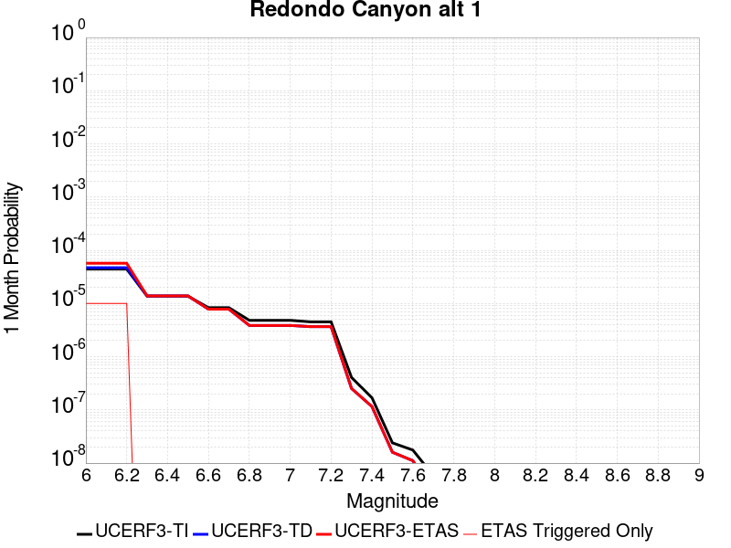 |  |  |

| Magnitude | 1 wk TI Prob | 1 wk TD Prob | 1 wk ETAS Prob | 1 wk ETAS/TD Gain | 1 wk ETAS Triggered Only | 1 mo TI Prob | 1 mo TD Prob | 1 mo ETAS Prob | 1 mo ETAS/TD Gain | 1 mo ETAS Triggered Only | 1 yr TI Prob | 1 yr TD Prob | 1 yr ETAS Prob | 1 yr ETAS/TD Gain | 1 yr ETAS Triggered Only | 10 yr TI Prob | 10 yr TD Prob | 10 yr ETAS Prob | 10 yr ETAS/TD Gain | 10 yr ETAS Triggered Only |
|-----|-----|-----|-----|-----|-----|-----|-----|-----|-----|-----|-----|-----|-----|-----|-----|-----|-----|-----|-----|-----|
| 6.0 | 1.0346246E-5 | 1.0981325E-5 | 4.8488884E-5 | 4.4155765 | 3.750797E-5 | 4.43403E-5 | 4.7062418E-5 | 8.456862E-5 | 1.7969459 | 3.750797E-5 | 5.3970946E-4 | 5.729132E-4 | 6.103997E-4 | 1.0654314 | 3.750797E-5 | 0.0053840056 | 0.0057221013 | 0.0057593947 | 1.0065174 | 3.750797E-5 |
| 6.1 | 1.0346246E-5 | 1.0981325E-5 | 4.8488884E-5 | 4.4155765 | 3.750797E-5 | 4.43403E-5 | 4.7062418E-5 | 8.456862E-5 | 1.7969459 | 3.750797E-5 | 5.3970946E-4 | 5.729132E-4 | 6.103997E-4 | 1.0654314 | 3.750797E-5 | 0.0053840056 | 0.0057221013 | 0.0057593947 | 1.0065174 | 3.750797E-5 |
| 6.2 | 1.0346246E-5 | 1.0981325E-5 | 4.8488884E-5 | 4.4155765 | 3.750797E-5 | 4.43403E-5 | 4.7062418E-5 | 8.456862E-5 | 1.7969459 | 3.750797E-5 | 5.3970946E-4 | 5.729132E-4 | 6.103997E-4 | 1.0654314 | 3.750797E-5 | 0.0053840056 | 0.0057221013 | 0.0057593947 | 1.0065174 | 3.750797E-5 |
| 6.3 | 3.2052794E-6 | 3.2360983E-6 | 3.2360983E-6 | 1.0 | 0.0 | 1.373684E-5 | 1.3868941E-5 | 1.3868941E-5 | 1.0 | 0.0 | 1.6723319E-4 | 1.6884525E-4 | 1.6884525E-4 | 1.0 | 0.0 | 0.001671074 | 0.0016875593 | 0.0016875593 | 1.0 | 0.0 |
| 6.4 | 3.2052794E-6 | 3.2360983E-6 | 3.2360983E-6 | 1.0 | 0.0 | 1.373684E-5 | 1.3868941E-5 | 1.3868941E-5 | 1.0 | 0.0 | 1.6723319E-4 | 1.6884525E-4 | 1.6884525E-4 | 1.0 | 0.0 | 0.001671074 | 0.0016875593 | 0.0016875593 | 1.0 | 0.0 |
| 6.5 | 3.2052794E-6 | 3.2360983E-6 | 3.2360983E-6 | 1.0 | 0.0 | 1.373684E-5 | 1.3868941E-5 | 1.3868941E-5 | 1.0 | 0.0 | 1.6723319E-4 | 1.6884525E-4 | 1.6884525E-4 | 1.0 | 0.0 | 0.001671074 | 0.0016875593 | 0.0016875593 | 1.0 | 0.0 |
| 6.6 | 1.948328E-6 | 1.8288489E-6 | 1.8288489E-6 | 1.0 | 0.0 | 8.349951E-6 | 7.837909E-6 | 7.837909E-6 | 1.0 | 0.0 | 1.016559E-4 | 9.5423864E-5 | 9.5423864E-5 | 1.0 | 0.0 | 0.0010160941 | 9.5397583E-4 | 9.5397583E-4 | 1.0 | 0.0 |
| 6.7 | 1.948328E-6 | 1.8288489E-6 | 1.8288489E-6 | 1.0 | 0.0 | 8.349951E-6 | 7.837909E-6 | 7.837909E-6 | 1.0 | 0.0 | 1.016559E-4 | 9.5423864E-5 | 9.5423864E-5 | 1.0 | 0.0 | 0.0010160941 | 9.5397583E-4 | 9.5397583E-4 | 1.0 | 0.0 |
| 6.8 | 1.1278219E-6 | 9.032885E-7 | 9.032885E-7 | 1.0 | 0.0 | 4.8335132E-6 | 3.871233E-6 | 3.871233E-6 | 1.0 | 0.0 | 5.8846435E-5 | 4.713167E-5 | 4.713167E-5 | 1.0 | 0.0 | 5.8830855E-4 | 4.7125877E-4 | 4.7125877E-4 | 1.0 | 0.0 |
| 6.9 | 1.1278219E-6 | 9.032885E-7 | 9.032885E-7 | 1.0 | 0.0 | 4.8335132E-6 | 3.871233E-6 | 3.871233E-6 | 1.0 | 0.0 | 5.8846435E-5 | 4.713167E-5 | 4.713167E-5 | 1.0 | 0.0 | 5.8830855E-4 | 4.7125877E-4 | 4.7125877E-4 | 1.0 | 0.0 |
| 7.0 | 1.1278219E-6 | 9.032885E-7 | 9.032885E-7 | 1.0 | 0.0 | 4.8335132E-6 | 3.871233E-6 | 3.871233E-6 | 1.0 | 0.0 | 5.8846435E-5 | 4.713167E-5 | 4.713167E-5 | 1.0 | 0.0 | 5.8830855E-4 | 4.7125877E-4 | 4.7125877E-4 | 1.0 | 0.0 |
| 7.1 | 1.0545139E-6 | 8.5690925E-7 | 8.5690925E-7 | 1.0 | 0.0 | 4.5193374E-6 | 3.6724655E-6 | 3.6724655E-6 | 1.0 | 0.0 | 5.5021545E-5 | 4.4711775E-5 | 4.4711775E-5 | 1.0 | 0.0 | 5.500792E-4 | 4.4706953E-4 | 4.4706953E-4 | 1.0 | 0.0 |
| 7.2 | 1.0545139E-6 | 8.5690925E-7 | 8.5690925E-7 | 1.0 | 0.0 | 4.5193374E-6 | 3.6724655E-6 | 3.6724655E-6 | 1.0 | 0.0 | 5.5021545E-5 | 4.4711775E-5 | 4.4711775E-5 | 1.0 | 0.0 | 5.500792E-4 | 4.4706953E-4 | 4.4706953E-4 | 1.0 | 0.0 |
| 7.3 | 9.505161E-8 | 5.8955752E-8 | 5.8955752E-8 | 1.0 | 0.0 | 4.0736398E-7 | 2.526675E-7 | 2.526675E-7 | 1.0 | 0.0 | 4.959645E-6 | 3.0762235E-6 | 3.0762235E-6 | 1.0 | 0.0 | 4.9595343E-5 | 3.076193E-5 | 3.076193E-5 | 1.0 | 0.0 |
| 7.4 | 3.9520785E-8 | 2.6987088E-8 | 2.6987088E-8 | 1.0 | 0.0 | 1.6937479E-7 | 1.1565894E-7 | 1.1565894E-7 | 1.0 | 0.0 | 2.062136E-6 | 1.408147E-6 | 1.408147E-6 | 1.0 | 0.0 | 2.062117E-5 | 1.4081407E-5 | 1.4081407E-5 | 1.0 | 0.0 |
| 7.5 | 5.6133214E-9 | 3.7367687E-9 | 3.7367687E-9 | 1.0 | 0.0 | 2.4057092E-8 | 1.6014722E-8 | 1.6014722E-8 | 1.0 | 0.0 | 2.9289507E-7 | 1.9497922E-7 | 1.9497922E-7 | 1.0 | 0.0 | 2.9289467E-6 | 1.9497909E-6 | 1.9497909E-6 | 1.0 | 0.0 |
| 7.6 | 4.1064334E-9 | 2.5957205E-9 | 2.5957205E-9 | 1.0 | 0.0 | 1.7599E-8 | 1.1124517E-8 | 1.1124517E-8 | 1.0 | 0.0 | 2.142678E-7 | 1.3544098E-7 | 1.3544098E-7 | 1.0 | 0.0 | 2.1426758E-6 | 1.3544093E-6 | 1.3544093E-6 | 1.0 | 0.0 |
| 7.7 | 1.361975E-9 | 6.360521E-10 | 6.360521E-10 | 1.0 | 0.0 | 5.8370353E-9 | 2.7259377E-9 | 2.7259377E-9 | 1.0 | 0.0 | 7.1065905E-8 | 3.318829E-8 | 3.318829E-8 | 1.0 | 0.0 | 7.106588E-7 | 3.3188286E-7 | 3.3188286E-7 | 1.0 | 0.0 |
| 7.8 | 1.361975E-9 | 6.360521E-10 | 6.360521E-10 | 1.0 | 0.0 | 5.8370353E-9 | 2.7259377E-9 | 2.7259377E-9 | 1.0 | 0.0 | 7.1065905E-8 | 3.318829E-8 | 3.318829E-8 | 1.0 | 0.0 | 7.106588E-7 | 3.3188286E-7 | 3.3188286E-7 | 1.0 | 0.0 |

## Emerson-Copper Mtn 2011
*[(top)](#table-of-contents)*

| 1 Week | 1 Month | 1 Year | 10 Year |
|-----|-----|-----|-----|
|  |  |  |  |

| Magnitude | 1 wk TI Prob | 1 wk TD Prob | 1 wk ETAS Prob | 1 wk ETAS/TD Gain | 1 wk ETAS Triggered Only | 1 mo TI Prob | 1 mo TD Prob | 1 mo ETAS Prob | 1 mo ETAS/TD Gain | 1 mo ETAS Triggered Only | 1 yr TI Prob | 1 yr TD Prob | 1 yr ETAS Prob | 1 yr ETAS/TD Gain | 1 yr ETAS Triggered Only | 10 yr TI Prob | 10 yr TD Prob | 10 yr ETAS Prob | 10 yr ETAS/TD Gain | 10 yr ETAS Triggered Only |
|-----|-----|-----|-----|-----|-----|-----|-----|-----|-----|-----|-----|-----|-----|-----|-----|-----|-----|-----|-----|-----|
| 6.0 | 2.1364202E-5 | 9.967999E-6 | 4.7475594E-5 | 4.762801 | 3.750797E-5 | 9.1557646E-5 | 4.2719344E-5 | 8.022571E-5 | 1.8779715 | 3.750797E-5 | 0.0011141442 | 5.1999267E-4 | 5.574811E-4 | 1.0720942 | 3.750797E-5 | 0.011085749 | 0.0051886286 | 0.005225942 | 1.0071914 | 3.750797E-5 |
| 6.1 | 2.1364202E-5 | 9.967999E-6 | 4.7475594E-5 | 4.762801 | 3.750797E-5 | 9.1557646E-5 | 4.2719344E-5 | 8.022571E-5 | 1.8779715 | 3.750797E-5 | 0.0011141442 | 5.1999267E-4 | 5.574811E-4 | 1.0720942 | 3.750797E-5 | 0.011085749 | 0.0051886286 | 0.005225942 | 1.0071914 | 3.750797E-5 |
| 6.2 | 2.1364202E-5 | 9.967999E-6 | 4.7475594E-5 | 4.762801 | 3.750797E-5 | 9.1557646E-5 | 4.2719344E-5 | 8.022571E-5 | 1.8779715 | 3.750797E-5 | 0.0011141442 | 5.1999267E-4 | 5.574811E-4 | 1.0720942 | 3.750797E-5 | 0.011085749 | 0.0051886286 | 0.005225942 | 1.0071914 | 3.750797E-5 |
| 6.3 | 1.7751237E-5 | 8.089109E-6 | 8.089109E-6 | 1.0 | 0.0 | 7.607452E-5 | 3.4667184E-5 | 3.4667184E-5 | 1.0 | 0.0 | 9.258136E-4 | 4.2199748E-4 | 4.2199748E-4 | 1.0 | 0.0 | 0.00921966 | 0.004212584 | 0.004212584 | 1.0 | 0.0 |
| 6.4 | 1.7751237E-5 | 8.089109E-6 | 8.089109E-6 | 1.0 | 0.0 | 7.607452E-5 | 3.4667184E-5 | 3.4667184E-5 | 1.0 | 0.0 | 9.258136E-4 | 4.2199748E-4 | 4.2199748E-4 | 1.0 | 0.0 | 0.00921966 | 0.004212584 | 0.004212584 | 1.0 | 0.0 |
| 6.5 | 1.5886664E-5 | 6.6037437E-6 | 6.6037437E-6 | 1.0 | 0.0 | 6.808392E-5 | 2.830148E-5 | 2.830148E-5 | 1.0 | 0.0 | 8.286065E-4 | 3.4452073E-4 | 3.4452073E-4 | 1.0 | 0.0 | 0.008255237 | 0.0034403303 | 0.0034403303 | 1.0 | 0.0 |
| 6.6 | 1.5886664E-5 | 6.6037437E-6 | 6.6037437E-6 | 1.0 | 0.0 | 6.808392E-5 | 2.830148E-5 | 2.830148E-5 | 1.0 | 0.0 | 8.286065E-4 | 3.4452073E-4 | 3.4452073E-4 | 1.0 | 0.0 | 0.008255237 | 0.0034403303 | 0.0034403303 | 1.0 | 0.0 |
| 6.7 | 1.428471E-5 | 5.4703055E-6 | 5.4703055E-6 | 1.0 | 0.0 | 6.121875E-5 | 2.3443978E-5 | 2.3443978E-5 | 1.0 | 0.0 | 7.450834E-4 | 2.8539696E-4 | 2.8539696E-4 | 1.0 | 0.0 | 0.007425902 | 0.0028506925 | 0.0028506925 | 1.0 | 0.0 |
| 6.8 | 1.3490684E-5 | 5.0735894E-6 | 5.0735894E-6 | 1.0 | 0.0 | 5.7815934E-5 | 2.1743796E-5 | 2.1743796E-5 | 1.0 | 0.0 | 7.0368167E-4 | 2.6470242E-4 | 2.6470242E-4 | 1.0 | 0.0 | 0.007014576 | 0.002644252 | 0.002644252 | 1.0 | 0.0 |
| 6.9 | 1.2235421E-5 | 4.289545E-6 | 4.289545E-6 | 1.0 | 0.0 | 5.2436466E-5 | 1.8383655E-5 | 1.8383655E-5 | 1.0 | 0.0 | 6.38227E-4 | 2.238016E-4 | 2.238016E-4 | 1.0 | 0.0 | 0.0063639707 | 0.0022361164 | 0.0022361164 | 1.0 | 0.0 |
| 7.0 | 1.1009851E-5 | 3.7188345E-6 | 3.7188345E-6 | 1.0 | 0.0 | 4.7184225E-5 | 1.5937783E-5 | 1.5937783E-5 | 1.0 | 0.0 | 5.743165E-4 | 1.9402867E-4 | 1.9402867E-4 | 1.0 | 0.0 | 0.005728345 | 0.0019389305 | 0.0019389305 | 1.0 | 0.0 |
| 7.1 | 9.726373E-6 | 3.2115693E-6 | 3.2115693E-6 | 1.0 | 0.0 | 4.168379E-5 | 1.3763814E-5 | 1.3763814E-5 | 1.0 | 0.0 | 5.07382E-4 | 1.6756494E-4 | 1.6756494E-4 | 1.0 | 0.0 | 0.0050622504 | 0.0016747171 | 0.0016747171 | 1.0 | 0.0 |
| 7.2 | 3.9335127E-6 | 1.1524114E-6 | 1.1524114E-6 | 1.0 | 0.0 | 1.6857803E-5 | 4.9388973E-6 | 4.9388973E-6 | 1.0 | 0.0 | 2.0522442E-4 | 6.0129474E-5 | 6.0129474E-5 | 1.0 | 0.0 | 0.00205035 | 6.01138E-4 | 6.01138E-4 | 1.0 | 0.0 |
| 7.3 | 2.661632E-6 | 6.91098E-7 | 6.91098E-7 | 1.0 | 0.0 | 1.14069435E-5 | 2.9618452E-6 | 2.9618452E-6 | 1.0 | 0.0 | 1.3887069E-4 | 3.605988E-5 | 3.605988E-5 | 1.0 | 0.0 | 0.0013878393 | 3.6054134E-4 | 3.6054134E-4 | 1.0 | 0.0 |
| 7.4 | 2.0893426E-6 | 5.4614605E-7 | 5.4614605E-7 | 1.0 | 0.0 | 8.954295E-6 | 2.340624E-6 | 2.340624E-6 | 1.0 | 0.0 | 1.0901308E-4 | 2.8496728E-5 | 2.8496728E-5 | 1.0 | 0.0 | 0.0010895962 | 2.849313E-4 | 2.849313E-4 | 1.0 | 0.0 |
| 7.5 | 1.1681728E-6 | 3.6028484E-7 | 3.6028484E-7 | 1.0 | 0.0 | 5.0064455E-6 | 1.544077E-6 | 1.544077E-6 | 1.0 | 0.0 | 6.0951766E-5 | 1.879898E-5 | 1.879898E-5 | 1.0 | 0.0 | 6.093505E-4 | 1.8797436E-4 | 1.8797436E-4 | 1.0 | 0.0 |
| 7.6 | 1.3154387E-7 | 7.1196716E-8 | 7.1196716E-8 | 1.0 | 0.0 | 5.6375933E-7 | 3.0512876E-7 | 3.0512876E-7 | 1.0 | 0.0 | 6.863748E-6 | 3.714938E-6 | 3.714938E-6 | 1.0 | 0.0 | 6.863536E-5 | 3.7148915E-5 | 3.7148915E-5 | 1.0 | 0.0 |

## Lost Hills
*[(top)](#table-of-contents)*

| 1 Week | 1 Month | 1 Year | 10 Year |
|-----|-----|-----|-----|
|  |  |  |  |

| Magnitude | 1 wk TI Prob | 1 wk TD Prob | 1 wk ETAS Prob | 1 wk ETAS/TD Gain | 1 wk ETAS Triggered Only | 1 mo TI Prob | 1 mo TD Prob | 1 mo ETAS Prob | 1 mo ETAS/TD Gain | 1 mo ETAS Triggered Only | 1 yr TI Prob | 1 yr TD Prob | 1 yr ETAS Prob | 1 yr ETAS/TD Gain | 1 yr ETAS Triggered Only | 10 yr TI Prob | 10 yr TD Prob | 10 yr ETAS Prob | 10 yr ETAS/TD Gain | 10 yr ETAS Triggered Only |
|-----|-----|-----|-----|-----|-----|-----|-----|-----|-----|-----|-----|-----|-----|-----|-----|-----|-----|-----|-----|-----|
| 6.0 | 2.233523E-5 | 2.5106583E-5 | 2.5106583E-5 | 1.0 | 0.0 | 9.571891E-5 | 1.0759615E-4 | 1.0759615E-4 | 1.0 | 0.0 | 0.0011647546 | 0.001309364 | 0.0013468228 | 1.0286084 | 3.750797E-5 | 0.011586686 | 0.013033091 | 0.01307011 | 1.0028404 | 3.750797E-5 |
| 6.1 | 2.233523E-5 | 2.5106583E-5 | 2.5106583E-5 | 1.0 | 0.0 | 9.571891E-5 | 1.0759615E-4 | 1.0759615E-4 | 1.0 | 0.0 | 0.0011647546 | 0.001309364 | 0.0013468228 | 1.0286084 | 3.750797E-5 | 0.011586686 | 0.013033091 | 0.01307011 | 1.0028404 | 3.750797E-5 |
| 6.2 | 2.233523E-5 | 2.5106583E-5 | 2.5106583E-5 | 1.0 | 0.0 | 9.571891E-5 | 1.0759615E-4 | 1.0759615E-4 | 1.0 | 0.0 | 0.0011647546 | 0.001309364 | 0.0013468228 | 1.0286084 | 3.750797E-5 | 0.011586686 | 0.013033091 | 0.01307011 | 1.0028404 | 3.750797E-5 |
| 6.3 | 2.233523E-5 | 2.5106583E-5 | 2.5106583E-5 | 1.0 | 0.0 | 9.571891E-5 | 1.0759615E-4 | 1.0759615E-4 | 1.0 | 0.0 | 0.0011647546 | 0.001309364 | 0.0013468228 | 1.0286084 | 3.750797E-5 | 0.011586686 | 0.013033091 | 0.01307011 | 1.0028404 | 3.750797E-5 |
| 6.4 | 1.2288092E-5 | 1.3781108E-5 | 1.3781108E-5 | 1.0 | 0.0 | 5.2662188E-5 | 5.906108E-5 | 5.906108E-5 | 1.0 | 0.0 | 6.409735E-4 | 7.189252E-4 | 7.564062E-4 | 1.0521348 | 3.750797E-5 | 0.006391279 | 0.0071752006 | 0.0072124396 | 1.0051899 | 3.750797E-5 |
| 6.5 | 1.2288092E-5 | 1.3781108E-5 | 1.3781108E-5 | 1.0 | 0.0 | 5.2662188E-5 | 5.906108E-5 | 5.906108E-5 | 1.0 | 0.0 | 6.409735E-4 | 7.189252E-4 | 7.564062E-4 | 1.0521348 | 3.750797E-5 | 0.006391279 | 0.0071752006 | 0.0072124396 | 1.0051899 | 3.750797E-5 |
| 6.6 | 8.58281E-6 | 9.63377E-6 | 9.63377E-6 | 1.0 | 0.0 | 3.6782953E-5 | 4.12874E-5 | 4.12874E-5 | 1.0 | 0.0 | 4.4774043E-4 | 5.026414E-4 | 5.401305E-4 | 1.0745842 | 3.750797E-5 | 0.0044683935 | 0.005023205 | 0.0050605247 | 1.0074295 | 3.750797E-5 |
| 6.7 | 7.205685E-6 | 8.088302E-6 | 8.088302E-6 | 1.0 | 0.0 | 3.088114E-5 | 3.466415E-5 | 3.466415E-5 | 1.0 | 0.0 | 3.7591302E-4 | 4.2203604E-4 | 4.5952818E-4 | 1.0888363 | 3.750797E-5 | 0.0037527776 | 0.0042203604 | 0.00425771 | 1.0088499 | 3.750797E-5 |

## Hunting Creek - Bartlett Springs connector 2011
*[(top)](#table-of-contents)*

| 1 Week | 1 Month | 1 Year | 10 Year |
|-----|-----|-----|-----|
|  |  |  |  |

| Magnitude | 1 wk TI Prob | 1 wk TD Prob | 1 wk ETAS Prob | 1 wk ETAS/TD Gain | 1 wk ETAS Triggered Only | 1 mo TI Prob | 1 mo TD Prob | 1 mo ETAS Prob | 1 mo ETAS/TD Gain | 1 mo ETAS Triggered Only | 1 yr TI Prob | 1 yr TD Prob | 1 yr ETAS Prob | 1 yr ETAS/TD Gain | 1 yr ETAS Triggered Only | 10 yr TI Prob | 10 yr TD Prob | 10 yr ETAS Prob | 10 yr ETAS/TD Gain | 10 yr ETAS Triggered Only |
|-----|-----|-----|-----|-----|-----|-----|-----|-----|-----|-----|-----|-----|-----|-----|-----|-----|-----|-----|-----|-----|
| 6.0 | 4.940016E-5 | 6.7870766E-5 | 6.7870766E-5 | 1.0 | 0.0 | 2.1169778E-4 | 2.9084194E-4 | 2.9084194E-4 | 1.0 | 0.0 | 0.002574374 | 0.0035350819 | 0.0035724572 | 1.0105727 | 3.750797E-5 | 0.025447546 | 0.03477475 | 0.034810957 | 1.001041 | 3.750797E-5 |
| 6.1 | 4.940016E-5 | 6.7870766E-5 | 6.7870766E-5 | 1.0 | 0.0 | 2.1169778E-4 | 2.9084194E-4 | 2.9084194E-4 | 1.0 | 0.0 | 0.002574374 | 0.0035350819 | 0.0035724572 | 1.0105727 | 3.750797E-5 | 0.025447546 | 0.03477475 | 0.034810957 | 1.001041 | 3.750797E-5 |
| 6.2 | 4.472471E-5 | 6.100572E-5 | 6.100572E-5 | 1.0 | 0.0 | 1.9166325E-4 | 2.6142647E-4 | 2.6142647E-4 | 1.0 | 0.0 | 0.0023310026 | 0.0031781218 | 0.0031781218 | 1.0 | 0.0 | 0.02306703 | 0.031317808 | 0.031317808 | 1.0 | 0.0 |
| 6.3 | 4.472471E-5 | 6.100572E-5 | 6.100572E-5 | 1.0 | 0.0 | 1.9166325E-4 | 2.6142647E-4 | 2.6142647E-4 | 1.0 | 0.0 | 0.0023310026 | 0.0031781218 | 0.0031781218 | 1.0 | 0.0 | 0.02306703 | 0.031317808 | 0.031317808 | 1.0 | 0.0 |
| 6.4 | 4.0001003E-5 | 5.410516E-5 | 5.410516E-5 | 1.0 | 0.0 | 1.714216E-4 | 2.318579E-4 | 2.318579E-4 | 1.0 | 0.0 | 0.0020850603 | 0.0028191686 | 0.0028191686 | 1.0 | 0.0 | 0.02065605 | 0.027829198 | 0.027829198 | 1.0 | 0.0 |
| 6.5 | 3.8033053E-5 | 5.126649E-5 | 5.126649E-5 | 1.0 | 0.0 | 1.6298861E-4 | 2.1969521E-4 | 2.1969521E-4 | 1.0 | 0.0 | 0.0019825802 | 0.0026714848 | 0.0026714848 | 1.0 | 0.0 | 0.019649856 | 0.026391273 | 0.026391273 | 1.0 | 0.0 |
| 6.6 | 3.653754E-5 | 4.912955E-5 | 4.912955E-5 | 1.0 | 0.0 | 1.5658008E-4 | 2.1053842E-4 | 2.1053842E-4 | 1.0 | 0.0 | 0.0019046954 | 0.0025602889 | 0.0025602889 | 1.0 | 0.0 | 0.018884527 | 0.025307199 | 0.025307199 | 1.0 | 0.0 |
| 6.7 | 3.372024E-5 | 4.5140216E-5 | 4.5140216E-5 | 1.0 | 0.0 | 1.4450731E-4 | 1.9344388E-4 | 1.9344388E-4 | 1.0 | 0.0 | 0.0017579567 | 0.0023526535 | 0.0023526535 | 1.0 | 0.0 | 0.017441148 | 0.023278862 | 0.023278862 | 1.0 | 0.0 |
| 6.8 | 2.9650024E-5 | 3.9411647E-5 | 3.9411647E-5 | 1.0 | 0.0 | 1.2706534E-4 | 1.6889606E-4 | 1.6889606E-4 | 1.0 | 0.0 | 0.0015459227 | 0.0020543607 | 0.0020543607 | 1.0 | 0.0 | 0.015352124 | 0.020351961 | 0.020351961 | 1.0 | 0.0 |
| 6.9 | 2.860775E-5 | 3.7812886E-5 | 3.7812886E-5 | 1.0 | 0.0 | 1.2259888E-4 | 1.620452E-4 | 1.620452E-4 | 1.0 | 0.0 | 0.0014916194 | 0.0019711219 | 0.0019711219 | 1.0 | 0.0 | 0.014816469 | 0.019536555 | 0.019536555 | 1.0 | 0.0 |
| 7.0 | 2.6696067E-5 | 3.5067544E-5 | 3.5067544E-5 | 1.0 | 0.0 | 1.144067E-4 | 1.5028086E-4 | 1.5028086E-4 | 1.0 | 0.0 | 0.0013920115 | 0.0018281427 | 0.0018281427 | 1.0 | 0.0 | 0.013833242 | 0.01813184 | 0.01813184 | 1.0 | 0.0 |
| 7.1 | 2.456087E-5 | 3.2013326E-5 | 3.2013326E-5 | 1.0 | 0.0 | 1.0525662E-4 | 1.3719281E-4 | 1.3719281E-4 | 1.0 | 0.0 | 0.001280746 | 0.0016690517 | 0.0016690517 | 1.0 | 0.0 | 0.012733897 | 0.016566671 | 0.016566671 | 1.0 | 0.0 |
| 7.2 | 2.295761E-5 | 2.9823148E-5 | 2.9823148E-5 | 1.0 | 0.0 | 9.8386045E-5 | 1.2780727E-4 | 1.2780727E-4 | 1.0 | 0.0 | 0.0011971919 | 0.0015549522 | 0.0015549522 | 1.0 | 0.0 | 0.011907627 | 0.015442378 | 0.015442378 | 1.0 | 0.0 |
| 7.3 | 2.1256936E-5 | 2.7542124E-5 | 2.7542124E-5 | 1.0 | 0.0 | 9.109797E-5 | 1.1803238E-4 | 1.1803238E-4 | 1.0 | 0.0 | 0.0011085535 | 0.0014361058 | 0.0014361058 | 1.0 | 0.0 | 0.011030397 | 0.014269741 | 0.014269741 | 1.0 | 0.0 |
| 7.4 | 1.8784336E-5 | 2.430697E-5 | 2.430697E-5 | 1.0 | 0.0 | 8.050181E-5 | 1.0416861E-4 | 1.0416861E-4 | 1.0 | 0.0 | 9.796688E-4 | 0.0012675226 | 0.0012675226 | 1.0 | 0.0 | 0.009753612 | 0.012604194 | 0.012604194 | 1.0 | 0.0 |
| 7.5 | 1.7248298E-5 | 2.2269056E-5 | 2.2269056E-5 | 1.0 | 0.0 | 7.391918E-5 | 9.543537E-5 | 9.543537E-5 | 1.0 | 0.0 | 8.9959445E-4 | 0.0011613137 | 0.0011613137 | 1.0 | 0.0 | 0.008959615 | 0.011553645 | 0.011553645 | 1.0 | 0.0 |
| 7.6 | 1.0653709E-5 | 1.3722259E-5 | 1.3722259E-5 | 1.0 | 0.0 | 4.5657955E-5 | 5.880837E-5 | 5.880837E-5 | 1.0 | 0.0 | 5.557438E-4 | 7.157594E-4 | 7.157594E-4 | 1.0 | 0.0 | 0.0055435603 | 0.0071350415 | 0.0071350415 | 1.0 | 0.0 |
| 7.7 | 3.286316E-6 | 4.0903997E-6 | 4.0903997E-6 | 1.0 | 0.0 | 1.4084137E-5 | 1.7530168E-5 | 1.7530168E-5 | 1.0 | 0.0 | 1.7146087E-4 | 2.1340905E-4 | 2.1340905E-4 | 1.0 | 0.0 | 0.0017132863 | 0.0021320845 | 0.0021320845 | 1.0 | 0.0 |
| 7.8 | 5.1855085E-7 | 5.972095E-7 | 5.972095E-7 | 1.0 | 0.0 | 2.222359E-6 | 2.5594668E-6 | 2.5594668E-6 | 1.0 | 0.0 | 2.7056883E-5 | 3.1161075E-5 | 3.1161075E-5 | 1.0 | 0.0 | 2.705359E-4 | 3.1156064E-4 | 3.1156064E-4 | 1.0 | 0.0 |

## Little Salmon (Onshore)
*[(top)](#table-of-contents)*

| 1 Week | 1 Month | 1 Year | 10 Year |
|-----|-----|-----|-----|
|  | 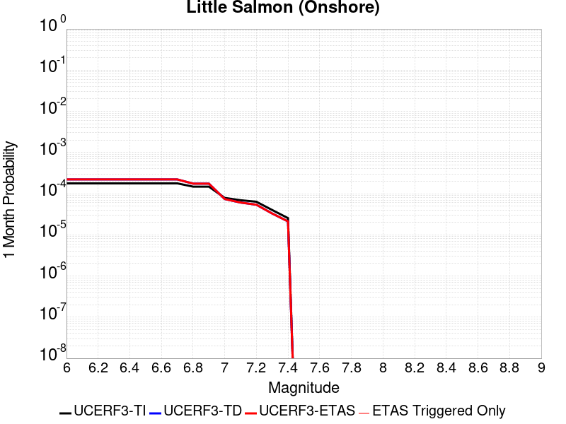 |  |  |

| Magnitude | 1 wk TI Prob | 1 wk TD Prob | 1 wk ETAS Prob | 1 wk ETAS/TD Gain | 1 wk ETAS Triggered Only | 1 mo TI Prob | 1 mo TD Prob | 1 mo ETAS Prob | 1 mo ETAS/TD Gain | 1 mo ETAS Triggered Only | 1 yr TI Prob | 1 yr TD Prob | 1 yr ETAS Prob | 1 yr ETAS/TD Gain | 1 yr ETAS Triggered Only | 10 yr TI Prob | 10 yr TD Prob | 10 yr ETAS Prob | 10 yr ETAS/TD Gain | 10 yr ETAS Triggered Only |
|-----|-----|-----|-----|-----|-----|-----|-----|-----|-----|-----|-----|-----|-----|-----|-----|-----|-----|-----|-----|-----|
| 6.0 | 4.1582247E-5 | 5.1820014E-5 | 5.1820014E-5 | 1.0 | 0.0 | 1.7819746E-4 | 2.2207153E-4 | 2.2207153E-4 | 1.0 | 0.0 | 0.0021673953 | 0.0027011954 | 0.002738602 | 1.0138482 | 3.750797E-5 | 0.021463778 | 0.027034452 | 0.027070945 | 1.0013499 | 3.750797E-5 |
| 6.1 | 4.1582247E-5 | 5.1820014E-5 | 5.1820014E-5 | 1.0 | 0.0 | 1.7819746E-4 | 2.2207153E-4 | 2.2207153E-4 | 1.0 | 0.0 | 0.0021673953 | 0.0027011954 | 0.002738602 | 1.0138482 | 3.750797E-5 | 0.021463778 | 0.027034452 | 0.027070945 | 1.0013499 | 3.750797E-5 |
| 6.2 | 4.1582247E-5 | 5.1820014E-5 | 5.1820014E-5 | 1.0 | 0.0 | 1.7819746E-4 | 2.2207153E-4 | 2.2207153E-4 | 1.0 | 0.0 | 0.0021673953 | 0.0027011954 | 0.002738602 | 1.0138482 | 3.750797E-5 | 0.021463778 | 0.027034452 | 0.027070945 | 1.0013499 | 3.750797E-5 |
| 6.3 | 4.1582247E-5 | 5.1820014E-5 | 5.1820014E-5 | 1.0 | 0.0 | 1.7819746E-4 | 2.2207153E-4 | 2.2207153E-4 | 1.0 | 0.0 | 0.0021673953 | 0.0027011954 | 0.002738602 | 1.0138482 | 3.750797E-5 | 0.021463778 | 0.027034452 | 0.027070945 | 1.0013499 | 3.750797E-5 |
| 6.4 | 4.1582247E-5 | 5.1820014E-5 | 5.1820014E-5 | 1.0 | 0.0 | 1.7819746E-4 | 2.2207153E-4 | 2.2207153E-4 | 1.0 | 0.0 | 0.0021673953 | 0.0027011954 | 0.002738602 | 1.0138482 | 3.750797E-5 | 0.021463778 | 0.027034452 | 0.027070945 | 1.0013499 | 3.750797E-5 |
| 6.5 | 4.1582247E-5 | 5.1820014E-5 | 5.1820014E-5 | 1.0 | 0.0 | 1.7819746E-4 | 2.2207153E-4 | 2.2207153E-4 | 1.0 | 0.0 | 0.0021673953 | 0.0027011954 | 0.002738602 | 1.0138482 | 3.750797E-5 | 0.021463778 | 0.027034452 | 0.027070945 | 1.0013499 | 3.750797E-5 |
| 6.6 | 4.1582247E-5 | 5.1820014E-5 | 5.1820014E-5 | 1.0 | 0.0 | 1.7819746E-4 | 2.2207153E-4 | 2.2207153E-4 | 1.0 | 0.0 | 0.0021673953 | 0.0027011954 | 0.002738602 | 1.0138482 | 3.750797E-5 | 0.021463778 | 0.027034452 | 0.027070945 | 1.0013499 | 3.750797E-5 |
| 6.7 | 4.1582247E-5 | 5.1820014E-5 | 5.1820014E-5 | 1.0 | 0.0 | 1.7819746E-4 | 2.2207153E-4 | 2.2207153E-4 | 1.0 | 0.0 | 0.0021673953 | 0.0027011954 | 0.002738602 | 1.0138482 | 3.750797E-5 | 0.021463778 | 0.027034452 | 0.027070945 | 1.0013499 | 3.750797E-5 |
| 6.8 | 3.4607925E-5 | 4.094412E-5 | 4.094412E-5 | 1.0 | 0.0 | 1.4831126E-4 | 1.7546724E-4 | 1.7546724E-4 | 1.0 | 0.0 | 0.001804194 | 0.0021349725 | 0.0021724002 | 1.0175308 | 3.750797E-5 | 0.01789616 | 0.021454342 | 0.021491045 | 1.0017108 | 3.750797E-5 |
| 6.9 | 3.4607925E-5 | 4.094412E-5 | 4.094412E-5 | 1.0 | 0.0 | 1.4831126E-4 | 1.7546724E-4 | 1.7546724E-4 | 1.0 | 0.0 | 0.001804194 | 0.0021349725 | 0.0021724002 | 1.0175308 | 3.750797E-5 | 0.01789616 | 0.021454342 | 0.021491045 | 1.0017108 | 3.750797E-5 |
| 7.0 | 1.8411014E-5 | 1.7285503E-5 | 1.7285503E-5 | 1.0 | 0.0 | 7.8901954E-5 | 7.4078926E-5 | 7.4078926E-5 | 1.0 | 0.0 | 9.6020795E-4 | 9.0159115E-4 | 9.0159115E-4 | 1.0 | 0.0 | 0.009560696 | 0.009006166 | 0.009006166 | 1.0 | 0.0 |
| 7.1 | 1.6183103E-5 | 1.4205894E-5 | 1.4205894E-5 | 1.0 | 0.0 | 6.935431E-5 | 6.088125E-5 | 6.088125E-5 | 1.0 | 0.0 | 8.440616E-4 | 7.410246E-4 | 7.410246E-4 | 1.0 | 0.0 | 0.008408628 | 0.0074117873 | 0.0074117873 | 1.0 | 0.0 |
| 7.2 | 1.4868988E-5 | 1.2585783E-5 | 1.2585783E-5 | 1.0 | 0.0 | 6.372268E-5 | 5.393821E-5 | 5.393821E-5 | 1.0 | 0.0 | 7.755474E-4 | 6.5654493E-4 | 6.5654493E-4 | 1.0 | 0.0 | 0.0077284635 | 0.0065716365 | 0.0065716365 | 1.0 | 0.0 |
| 7.3 | 9.3599865E-6 | 7.694566E-6 | 7.694566E-6 | 1.0 | 0.0 | 4.011361E-5 | 3.2976495E-5 | 3.2976495E-5 | 1.0 | 0.0 | 4.8827377E-4 | 4.0145052E-4 | 4.0145052E-4 | 1.0 | 0.0 | 0.004872023 | 0.0040242276 | 0.0040242276 | 1.0 | 0.0 |
| 7.4 | 5.941556E-6 | 4.9508285E-6 | 4.9508285E-6 | 1.0 | 0.0 | 2.5463563E-5 | 2.1217837E-5 | 2.1217837E-5 | 1.0 | 0.0 | 3.0997477E-4 | 2.5832717E-4 | 2.5832717E-4 | 1.0 | 0.0 | 0.0030954275 | 0.0025927064 | 0.0025927064 | 1.0 | 0.0 |

## Camp Rock 2011
*[(top)](#table-of-contents)*

| 1 Week | 1 Month | 1 Year | 10 Year |
|-----|-----|-----|-----|
|  | 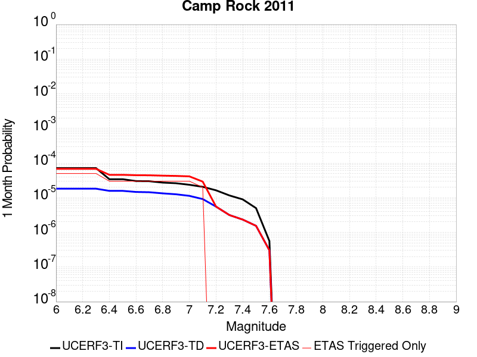 |  |  |

| Magnitude | 1 wk TI Prob | 1 wk TD Prob | 1 wk ETAS Prob | 1 wk ETAS/TD Gain | 1 wk ETAS Triggered Only | 1 mo TI Prob | 1 mo TD Prob | 1 mo ETAS Prob | 1 mo ETAS/TD Gain | 1 mo ETAS Triggered Only | 1 yr TI Prob | 1 yr TD Prob | 1 yr ETAS Prob | 1 yr ETAS/TD Gain | 1 yr ETAS Triggered Only | 10 yr TI Prob | 10 yr TD Prob | 10 yr ETAS Prob | 10 yr ETAS/TD Gain | 10 yr ETAS Triggered Only |
|-----|-----|-----|-----|-----|-----|-----|-----|-----|-----|-----|-----|-----|-----|-----|-----|-----|-----|-----|-----|-----|
| 6.0 | 1.6710783E-5 | 4.249999E-6 | 4.249999E-6 | 1.0 | 0.0 | 7.161568E-5 | 1.8214158E-5 | 1.8214158E-5 | 1.0 | 0.0 | 8.7157206E-4 | 2.2173533E-4 | 2.2173533E-4 | 1.0 | 0.0 | 0.008681616 | 0.0022151938 | 0.0022526188 | 1.0168946 | 3.750797E-5 |
| 6.1 | 1.6710783E-5 | 4.249999E-6 | 4.249999E-6 | 1.0 | 0.0 | 7.161568E-5 | 1.8214158E-5 | 1.8214158E-5 | 1.0 | 0.0 | 8.7157206E-4 | 2.2173533E-4 | 2.2173533E-4 | 1.0 | 0.0 | 0.008681616 | 0.0022151938 | 0.0022526188 | 1.0168946 | 3.750797E-5 |
| 6.2 | 1.6710783E-5 | 4.249999E-6 | 4.249999E-6 | 1.0 | 0.0 | 7.161568E-5 | 1.8214158E-5 | 1.8214158E-5 | 1.0 | 0.0 | 8.7157206E-4 | 2.2173533E-4 | 2.2173533E-4 | 1.0 | 0.0 | 0.008681616 | 0.0022151938 | 0.0022526188 | 1.0168946 | 3.750797E-5 |
| 6.3 | 1.6710783E-5 | 4.249999E-6 | 4.249999E-6 | 1.0 | 0.0 | 7.161568E-5 | 1.8214158E-5 | 1.8214158E-5 | 1.0 | 0.0 | 8.7157206E-4 | 2.2173533E-4 | 2.2173533E-4 | 1.0 | 0.0 | 0.008681616 | 0.0022151938 | 0.0022526188 | 1.0168946 | 3.750797E-5 |
| 6.4 | 7.982846E-6 | 3.6820359E-6 | 3.6820359E-6 | 1.0 | 0.0 | 3.421175E-5 | 1.578006E-5 | 1.578006E-5 | 1.0 | 0.0 | 4.1644843E-4 | 1.9210564E-4 | 1.9210564E-4 | 1.0 | 0.0 | 0.0041566887 | 0.0019194306 | 0.0019568666 | 1.0195037 | 3.750797E-5 |
| 6.5 | 7.982846E-6 | 3.6820359E-6 | 3.6820359E-6 | 1.0 | 0.0 | 3.421175E-5 | 1.578006E-5 | 1.578006E-5 | 1.0 | 0.0 | 4.1644843E-4 | 1.9210564E-4 | 1.9210564E-4 | 1.0 | 0.0 | 0.0041566887 | 0.0019194306 | 0.0019568666 | 1.0195037 | 3.750797E-5 |
| 6.6 | 7.048869E-6 | 3.4242998E-6 | 3.4242998E-6 | 1.0 | 0.0 | 3.0209088E-5 | 1.467549E-5 | 1.467549E-5 | 1.0 | 0.0 | 3.677336E-4 | 1.7865976E-4 | 1.7865976E-4 | 1.0 | 0.0 | 0.0036712566 | 0.0017851929 | 0.0018226339 | 1.0209731 | 3.750797E-5 |
| 6.7 | 6.987307E-6 | 3.3622775E-6 | 3.3622775E-6 | 1.0 | 0.0 | 2.9945259E-5 | 1.4409683E-5 | 1.4409683E-5 | 1.0 | 0.0 | 3.6452254E-4 | 1.7542407E-4 | 1.7542407E-4 | 1.0 | 0.0 | 0.0036392517 | 0.0017528872 | 0.0017903293 | 1.0213603 | 3.750797E-5 |
| 6.8 | 6.3737602E-6 | 3.1178672E-6 | 3.1178672E-6 | 1.0 | 0.0 | 2.731583E-5 | 1.3362222E-5 | 1.3362222E-5 | 1.0 | 0.0 | 3.3251947E-4 | 1.6267318E-4 | 1.6267318E-4 | 1.0 | 0.0 | 0.0033202237 | 0.0016255698 | 0.0016630167 | 1.0230362 | 3.750797E-5 |
| 6.9 | 6.112211E-6 | 2.933078E-6 | 2.933078E-6 | 1.0 | 0.0 | 2.6194928E-5 | 1.2570275E-5 | 1.2570275E-5 | 1.0 | 0.0 | 3.1887658E-4 | 1.5303263E-4 | 1.5303263E-4 | 1.0 | 0.0 | 0.003184194 | 0.0015293002 | 0.0015667509 | 1.0244887 | 3.750797E-5 |
| 7.0 | 5.5140117E-6 | 2.64191E-6 | 2.64191E-6 | 1.0 | 0.0 | 2.3631264E-5 | 1.1322423E-5 | 1.1322423E-5 | 1.0 | 0.0 | 2.8767265E-4 | 1.3784204E-4 | 1.3784204E-4 | 1.0 | 0.0 | 0.0028730053 | 0.0013775907 | 0.001415047 | 1.0271897 | 3.750797E-5 |
| 7.1 | 4.8151105E-6 | 2.1342612E-6 | 2.1342612E-6 | 1.0 | 0.0 | 2.0636026E-5 | 9.146803E-6 | 9.146803E-6 | 1.0 | 0.0 | 2.5121463E-4 | 1.1135685E-4 | 1.1135685E-4 | 1.0 | 0.0 | 0.0025093083 | 0.0011130325 | 0.0011504986 | 1.0336614 | 3.750797E-5 |
| 7.2 | 3.818335E-6 | 1.2937372E-6 | 1.2937372E-6 | 1.0 | 0.0 | 1.6364189E-5 | 5.5445767E-6 | 5.5445767E-6 | 1.0 | 0.0 | 1.9921579E-4 | 6.750321E-5 | 6.750321E-5 | 1.0 | 0.0 | 0.0019903728 | 6.7483535E-4 | 6.7483535E-4 | 1.0 | 0.0 |
| 7.3 | 2.7166698E-6 | 7.383078E-7 | 7.383078E-7 | 1.0 | 0.0 | 1.1642818E-5 | 3.1641725E-6 | 3.1641725E-6 | 1.0 | 0.0 | 1.4174209E-4 | 3.852314E-5 | 3.852314E-5 | 1.0 | 0.0 | 0.0014165172 | 3.8516664E-4 | 3.8516664E-4 | 1.0 | 0.0 |
| 7.4 | 2.0893426E-6 | 5.4614605E-7 | 5.4614605E-7 | 1.0 | 0.0 | 8.954295E-6 | 2.340624E-6 | 2.340624E-6 | 1.0 | 0.0 | 1.0901308E-4 | 2.8496728E-5 | 2.8496728E-5 | 1.0 | 0.0 | 0.0010895962 | 2.849313E-4 | 2.849313E-4 | 1.0 | 0.0 |
| 7.5 | 1.1681728E-6 | 3.6028484E-7 | 3.6028484E-7 | 1.0 | 0.0 | 5.0064455E-6 | 1.544077E-6 | 1.544077E-6 | 1.0 | 0.0 | 6.0951766E-5 | 1.879898E-5 | 1.879898E-5 | 1.0 | 0.0 | 6.093505E-4 | 1.8797436E-4 | 1.8797436E-4 | 1.0 | 0.0 |
| 7.6 | 1.3154387E-7 | 7.1196716E-8 | 7.1196716E-8 | 1.0 | 0.0 | 5.6375933E-7 | 3.0512876E-7 | 3.0512876E-7 | 1.0 | 0.0 | 6.863748E-6 | 3.714938E-6 | 3.714938E-6 | 1.0 | 0.0 | 6.863536E-5 | 3.7148915E-5 | 3.7148915E-5 | 1.0 | 0.0 |

## San Diego Trough north alt1
*[(top)](#table-of-contents)*

| 1 Week | 1 Month | 1 Year | 10 Year |
|-----|-----|-----|-----|
|  | 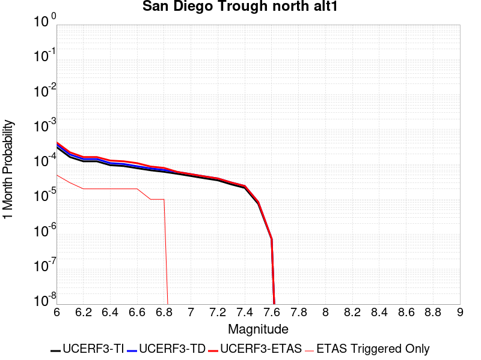 |  |  |

| Magnitude | 1 wk TI Prob | 1 wk TD Prob | 1 wk ETAS Prob | 1 wk ETAS/TD Gain | 1 wk ETAS Triggered Only | 1 mo TI Prob | 1 mo TD Prob | 1 mo ETAS Prob | 1 mo ETAS/TD Gain | 1 mo ETAS Triggered Only | 1 yr TI Prob | 1 yr TD Prob | 1 yr ETAS Prob | 1 yr ETAS/TD Gain | 1 yr ETAS Triggered Only | 10 yr TI Prob | 10 yr TD Prob | 10 yr ETAS Prob | 10 yr ETAS/TD Gain | 10 yr ETAS Triggered Only |
|-----|-----|-----|-----|-----|-----|-----|-----|-----|-----|-----|-----|-----|-----|-----|-----|-----|-----|-----|-----|-----|
| 6.0 | 7.329252E-5 | 8.821269E-5 | 1.2571736E-4 | 1.4251617 | 3.750797E-5 | 3.14073E-4 | 3.7800326E-4 | 4.1549705E-4 | 1.099189 | 3.750797E-5 | 0.0038171355 | 0.0045930487 | 0.0046303845 | 1.0081288 | 3.750797E-5 | 0.03752231 | 0.045045137 | 0.045080956 | 1.0007951 | 3.750797E-5 |
| 6.1 | 3.7940346E-5 | 4.4884906E-5 | 4.4884906E-5 | 1.0 | 0.0 | 1.6259136E-4 | 1.9235026E-4 | 1.9235026E-4 | 1.0 | 0.0 | 0.0019777524 | 0.002339431 | 0.002339431 | 1.0 | 0.0 | 0.019602431 | 0.023156732 | 0.023156732 | 1.0 | 0.0 |
| 6.2 | 2.8645263E-5 | 3.329672E-5 | 3.329672E-5 | 1.0 | 0.0 | 1.2275964E-4 | 1.4269259E-4 | 1.4269259E-4 | 1.0 | 0.0 | 0.0014935739 | 0.0017359206 | 0.0017359206 | 1.0 | 0.0 | 0.0148357535 | 0.017226268 | 0.017226268 | 1.0 | 0.0 |
| 6.3 | 2.8645263E-5 | 3.329672E-5 | 3.329672E-5 | 1.0 | 0.0 | 1.2275964E-4 | 1.4269259E-4 | 1.4269259E-4 | 1.0 | 0.0 | 0.0014935739 | 0.0017359206 | 0.0017359206 | 1.0 | 0.0 | 0.0148357535 | 0.017226268 | 0.017226268 | 1.0 | 0.0 |
| 6.4 | 2.2204576E-5 | 2.544832E-5 | 2.544832E-5 | 1.0 | 0.0 | 9.5159E-5 | 1.0905972E-4 | 1.0905972E-4 | 1.0 | 0.0 | 0.001157945 | 0.0013270028 | 0.0013270028 | 1.0 | 0.0 | 0.011519298 | 0.013191959 | 0.013191959 | 1.0 | 0.0 |
| 6.5 | 2.1004838E-5 | 2.4024695E-5 | 2.4024695E-5 | 1.0 | 0.0 | 9.0017624E-5 | 1.0295897E-4 | 1.0295897E-4 | 1.0 | 0.0 | 0.0010954136 | 0.0012528135 | 0.0012528135 | 1.0 | 0.0 | 0.010900296 | 0.012458592 | 0.012458592 | 1.0 | 0.0 |
| 6.6 | 1.820557E-5 | 2.070479E-5 | 2.070479E-5 | 1.0 | 0.0 | 7.802154E-5 | 8.8731824E-5 | 8.8731824E-5 | 1.0 | 0.0 | 9.4949827E-4 | 0.0010797799 | 0.0010797799 | 1.0 | 0.0 | 0.009454516 | 0.010746005 | 0.010746005 | 1.0 | 0.0 |
| 6.7 | 1.5884485E-5 | 1.7983646E-5 | 1.7983646E-5 | 1.0 | 0.0 | 6.807459E-5 | 7.707051E-5 | 7.707051E-5 | 1.0 | 0.0 | 8.284929E-4 | 9.3793223E-4 | 9.3793223E-4 | 1.0 | 0.0 | 0.008254109 | 0.009340104 | 0.009340104 | 1.0 | 0.0 |
| 6.8 | 1.4331171E-5 | 1.6201066E-5 | 1.6201066E-5 | 1.0 | 0.0 | 6.141786E-5 | 6.94313E-5 | 6.94313E-5 | 1.0 | 0.0 | 7.4750587E-4 | 8.450002E-4 | 8.450002E-4 | 1.0 | 0.0 | 0.0074499645 | 0.008418139 | 0.008418139 | 1.0 | 0.0 |
| 6.9 | 1.2574203E-5 | 1.4205835E-5 | 1.4205835E-5 | 1.0 | 0.0 | 5.3888325E-5 | 6.0880735E-5 | 6.0880735E-5 | 1.0 | 0.0 | 6.558929E-4 | 7.409723E-4 | 7.409723E-4 | 1.0 | 0.0 | 0.0065396037 | 0.007385203 | 0.007385203 | 1.0 | 0.0 |
| 7.0 | 1.0883844E-5 | 1.2289262E-5 | 1.2289262E-5 | 1.0 | 0.0 | 4.664421E-5 | 5.2667205E-5 | 5.2667205E-5 | 1.0 | 0.0 | 5.677453E-4 | 6.4103556E-4 | 6.4103556E-4 | 1.0 | 0.0 | 0.00566297 | 0.006391993 | 0.006391993 | 1.0 | 0.0 |
| 7.1 | 9.393088E-6 | 1.060702E-5 | 1.060702E-5 | 1.0 | 0.0 | 4.025547E-5 | 4.545787E-5 | 4.545787E-5 | 1.0 | 0.0 | 4.900001E-4 | 5.533098E-4 | 5.533098E-4 | 1.0 | 0.0 | 0.0048892107 | 0.005519418 | 0.005519418 | 1.0 | 0.0 |
| 7.2 | 8.190791E-6 | 9.258625E-6 | 9.258625E-6 | 1.0 | 0.0 | 3.510292E-5 | 3.9679224E-5 | 3.9679224E-5 | 1.0 | 0.0 | 4.2729423E-4 | 4.8298817E-4 | 4.8298817E-4 | 1.0 | 0.0 | 0.0042647356 | 0.004819465 | 0.004819465 | 1.0 | 0.0 |
| 7.3 | 6.268162E-6 | 7.089716E-6 | 7.089716E-6 | 1.0 | 0.0 | 2.6863276E-5 | 3.0384144E-5 | 3.0384144E-5 | 1.0 | 0.0 | 3.2701128E-4 | 3.6986457E-4 | 3.6986457E-4 | 1.0 | 0.0 | 0.003265305 | 0.003692536 | 0.003692536 | 1.0 | 0.0 |
| 7.4 | 4.985186E-6 | 5.6426816E-6 | 5.6426816E-6 | 1.0 | 0.0 | 2.1364907E-5 | 2.4182698E-5 | 2.4182698E-5 | 1.0 | 0.0 | 2.600867E-4 | 2.9438498E-4 | 2.9438498E-4 | 1.0 | 0.0 | 0.002597825 | 0.0029399914 | 0.0029399914 | 1.0 | 0.0 |
| 7.5 | 1.7489613E-6 | 1.969678E-6 | 1.969678E-6 | 1.0 | 0.0 | 7.495527E-6 | 8.4414505E-6 | 8.4414505E-6 | 1.0 | 0.0 | 9.125422E-5 | 1.02770035E-4 | 1.02770035E-4 | 1.0 | 0.0 | 9.1216754E-4 | 0.0010272472 | 0.0010272472 | 1.0 | 0.0 |
| 7.6 | 1.6988751E-7 | 1.7533823E-7 | 1.7533823E-7 | 1.0 | 0.0 | 7.2808916E-7 | 7.5144936E-7 | 7.5144936E-7 | 1.0 | 0.0 | 8.864449E-6 | 9.14886E-6 | 9.14886E-6 | 1.0 | 0.0 | 8.8640954E-5 | 9.1485024E-5 | 9.1485024E-5 | 1.0 | 0.0 |

## Owens Valley Keough Hot Springs
*[(top)](#table-of-contents)*

| 1 Week | 1 Month | 1 Year | 10 Year |
|-----|-----|-----|-----|
|  |  |  |  |

| Magnitude | 1 wk TI Prob | 1 wk TD Prob | 1 wk ETAS Prob | 1 wk ETAS/TD Gain | 1 wk ETAS Triggered Only | 1 mo TI Prob | 1 mo TD Prob | 1 mo ETAS Prob | 1 mo ETAS/TD Gain | 1 mo ETAS Triggered Only | 1 yr TI Prob | 1 yr TD Prob | 1 yr ETAS Prob | 1 yr ETAS/TD Gain | 1 yr ETAS Triggered Only | 10 yr TI Prob | 10 yr TD Prob | 10 yr ETAS Prob | 10 yr ETAS/TD Gain | 10 yr ETAS Triggered Only |
|-----|-----|-----|-----|-----|-----|-----|-----|-----|-----|-----|-----|-----|-----|-----|-----|-----|-----|-----|-----|-----|
| 6.0 | 1.5708529E-5 | 4.950463E-6 | 4.950463E-6 | 1.0 | 0.0 | 6.7320536E-5 | 2.1216127E-5 | 2.1216127E-5 | 1.0 | 0.0 | 8.193192E-4 | 2.5828084E-4 | 2.9577914E-4 | 1.1451842 | 3.750797E-5 | 0.008163051 | 0.0025804387 | 0.00261785 | 1.014498 | 3.750797E-5 |
| 6.1 | 1.5708529E-5 | 4.950463E-6 | 4.950463E-6 | 1.0 | 0.0 | 6.7320536E-5 | 2.1216127E-5 | 2.1216127E-5 | 1.0 | 0.0 | 8.193192E-4 | 2.5828084E-4 | 2.9577914E-4 | 1.1451842 | 3.750797E-5 | 0.008163051 | 0.0025804387 | 0.00261785 | 1.014498 | 3.750797E-5 |
| 6.2 | 1.5708529E-5 | 4.950463E-6 | 4.950463E-6 | 1.0 | 0.0 | 6.7320536E-5 | 2.1216127E-5 | 2.1216127E-5 | 1.0 | 0.0 | 8.193192E-4 | 2.5828084E-4 | 2.9577914E-4 | 1.1451842 | 3.750797E-5 | 0.008163051 | 0.0025804387 | 0.00261785 | 1.014498 | 3.750797E-5 |
| 6.3 | 1.5708529E-5 | 4.950463E-6 | 4.950463E-6 | 1.0 | 0.0 | 6.7320536E-5 | 2.1216127E-5 | 2.1216127E-5 | 1.0 | 0.0 | 8.193192E-4 | 2.5828084E-4 | 2.9577914E-4 | 1.1451842 | 3.750797E-5 | 0.008163051 | 0.0025804387 | 0.00261785 | 1.014498 | 3.750797E-5 |
| 6.4 | 1.4622509E-5 | 3.7263276E-6 | 3.7263276E-6 | 1.0 | 0.0 | 6.266639E-5 | 1.5969896E-5 | 1.5969896E-5 | 1.0 | 0.0 | 7.626962E-4 | 1.9441944E-4 | 2.3192012E-4 | 1.1928854 | 3.750797E-5 | 0.007600839 | 0.0019429466 | 0.0019803818 | 1.0192672 | 3.750797E-5 |
| 6.5 | 1.3335527E-5 | 2.2775241E-6 | 2.2775241E-6 | 1.0 | 0.0 | 5.7151006E-5 | 9.760785E-6 | 9.760785E-6 | 1.0 | 0.0 | 6.955913E-4 | 1.1883176E-4 | 1.5633527E-4 | 1.3156017 | 3.750797E-5 | 0.0069341804 | 0.001187878 | 0.0012253415 | 1.0315381 | 3.750797E-5 |
| 6.6 | 1.3332855E-5 | 2.2746733E-6 | 2.2746733E-6 | 1.0 | 0.0 | 5.7139558E-5 | 9.748568E-6 | 9.748568E-6 | 1.0 | 0.0 | 6.9545204E-4 | 1.1868303E-4 | 1.5618655E-4 | 1.3159974 | 3.750797E-5 | 0.0069327964 | 0.0011863923 | 0.0012238558 | 1.0315776 | 3.750797E-5 |
| 6.7 | 1.3318214E-5 | 2.2639038E-6 | 2.2639038E-6 | 1.0 | 0.0 | 5.707681E-5 | 9.702413E-6 | 9.702413E-6 | 1.0 | 0.0 | 6.946886E-4 | 1.18121156E-4 | 1.556247E-4 | 1.3175006 | 3.750797E-5 | 0.0069252094 | 0.0011807795 | 0.0012182432 | 1.0317279 | 3.750797E-5 |
| 6.8 | 1.2441338E-5 | 1.677594E-6 | 1.677594E-6 | 1.0 | 0.0 | 5.331893E-5 | 7.1896707E-6 | 7.1896707E-6 | 1.0 | 0.0 | 6.489646E-4 | 8.753102E-5 | 1.2503572E-4 | 1.4284731 | 3.750797E-5 | 0.0064707273 | 8.751236E-4 | 9.1259874E-4 | 1.0428227 | 3.750797E-5 |
| 6.9 | 1.1130476E-5 | 1.0302234E-6 | 1.0302234E-6 | 1.0 | 0.0 | 4.7701167E-5 | 4.4152357E-6 | 4.4152357E-6 | 1.0 | 0.0 | 5.806069E-4 | 5.3754186E-5 | 9.126014E-5 | 1.6977309 | 3.750797E-5 | 0.0057909233 | 5.375404E-4 | 5.7502824E-4 | 1.0697395 | 3.750797E-5 |
| 7.0 | 1.0986073E-5 | 9.577824E-7 | 9.577824E-7 | 1.0 | 0.0 | 4.7082318E-5 | 4.1047756E-6 | 4.1047756E-6 | 1.0 | 0.0 | 5.730765E-4 | 4.9974507E-5 | 8.748061E-5 | 1.7505046 | 3.750797E-5 | 0.0057160086 | 4.997603E-4 | 5.3724955E-4 | 1.0750144 | 3.750797E-5 |
| 7.1 | 1.0451338E-5 | 7.9988575E-7 | 7.9988575E-7 | 1.0 | 0.0 | 4.4790682E-5 | 3.4280772E-6 | 3.4280772E-6 | 1.0 | 0.0 | 5.451901E-4 | 4.1736046E-5 | 7.9242454E-5 | 1.8986573 | 3.750797E-5 | 0.005438545 | 4.1740583E-4 | 4.5489814E-4 | 1.0898222 | 3.750797E-5 |
| 7.2 | 9.989061E-6 | 6.543693E-7 | 6.543693E-7 | 1.0 | 0.0 | 4.280956E-5 | 2.8044367E-6 | 2.8044367E-6 | 1.0 | 0.0 | 5.2108173E-4 | 3.4143486E-5 | 3.4143486E-5 | 1.0 | 0.0 | 0.0051986156 | 3.41488E-4 | 3.41488E-4 | 1.0 | 0.0 |
| 7.3 | 9.465365E-6 | 5.458855E-7 | 5.458855E-7 | 1.0 | 0.0 | 4.056522E-5 | 2.3395073E-6 | 2.3395073E-6 | 1.0 | 0.0 | 4.937696E-4 | 2.8483131E-5 | 2.8483131E-5 | 1.0 | 0.0 | 0.0049267393 | 2.8489542E-4 | 2.8489542E-4 | 1.0 | 0.0 |
| 7.4 | 6.3824805E-6 | 4.0153776E-7 | 4.0153776E-7 | 1.0 | 0.0 | 2.73532E-5 | 1.7208749E-6 | 1.7208749E-6 | 1.0 | 0.0 | 3.3297433E-4 | 2.0951453E-5 | 2.0951453E-5 | 1.0 | 0.0 | 0.0033247585 | 2.0955436E-4 | 2.0955436E-4 | 1.0 | 0.0 |
| 7.5 | 1.6192645E-6 | 2.5156373E-7 | 2.5156373E-7 | 1.0 | 0.0 | 6.9396865E-6 | 1.0781299E-6 | 1.0781299E-6 | 1.0 | 0.0 | 8.448741E-5 | 1.3126153E-5 | 1.3126153E-5 | 1.0 | 0.0 | 8.4455294E-4 | 1.3125391E-4 | 1.3125391E-4 | 1.0 | 0.0 |
| 7.6 | 5.7062545E-7 | 1.0790214E-7 | 1.0790214E-7 | 1.0 | 0.0 | 2.4455355E-6 | 4.6243767E-7 | 4.6243767E-7 | 1.0 | 0.0 | 2.9773988E-5 | 5.630165E-6 | 5.630165E-6 | 1.0 | 0.0 | 2.977E-4 | 5.6300305E-5 | 5.6300305E-5 | 1.0 | 0.0 |
| 7.7 | 2.5988817E-7 | 4.5445965E-8 | 4.5445965E-8 | 1.0 | 0.0 | 1.113806E-6 | 1.9476842E-7 | 1.9476842E-7 | 1.0 | 0.0 | 1.3560503E-5 | 2.3713033E-6 | 2.3713033E-6 | 1.0 | 0.0 | 1.3559677E-4 | 2.3712824E-5 | 2.3712824E-5 | 1.0 | 0.0 |

## Kern Canyon (South Kern) 2011
*[(top)](#table-of-contents)*

| 1 Week | 1 Month | 1 Year | 10 Year |
|-----|-----|-----|-----|
|  |  |  |  |

| Magnitude | 1 wk TI Prob | 1 wk TD Prob | 1 wk ETAS Prob | 1 wk ETAS/TD Gain | 1 wk ETAS Triggered Only | 1 mo TI Prob | 1 mo TD Prob | 1 mo ETAS Prob | 1 mo ETAS/TD Gain | 1 mo ETAS Triggered Only | 1 yr TI Prob | 1 yr TD Prob | 1 yr ETAS Prob | 1 yr ETAS/TD Gain | 1 yr ETAS Triggered Only | 10 yr TI Prob | 10 yr TD Prob | 10 yr ETAS Prob | 10 yr ETAS/TD Gain | 10 yr ETAS Triggered Only |
|-----|-----|-----|-----|-----|-----|-----|-----|-----|-----|-----|-----|-----|-----|-----|-----|-----|-----|-----|-----|-----|
| 6.0 | 4.105075E-6 | 4.113726E-6 | 4.162154E-5 | 10.117723 | 3.750797E-5 | 1.7593058E-5 | 1.7630138E-5 | 5.5137447E-5 | 3.127454 | 3.750797E-5 | 2.1417443E-4 | 2.1462643E-4 | 2.5212634E-4 | 1.1747218 | 3.750797E-5 | 0.0021396813 | 0.0021442554 | 0.002181683 | 1.0174547 | 3.750797E-5 |
| 6.1 | 4.105075E-6 | 4.113726E-6 | 4.162154E-5 | 10.117723 | 3.750797E-5 | 1.7593058E-5 | 1.7630138E-5 | 5.5137447E-5 | 3.127454 | 3.750797E-5 | 2.1417443E-4 | 2.1462643E-4 | 2.5212634E-4 | 1.1747218 | 3.750797E-5 | 0.0021396813 | 0.0021442554 | 0.002181683 | 1.0174547 | 3.750797E-5 |
| 6.2 | 4.105075E-6 | 4.113726E-6 | 4.162154E-5 | 10.117723 | 3.750797E-5 | 1.7593058E-5 | 1.7630138E-5 | 5.5137447E-5 | 3.127454 | 3.750797E-5 | 2.1417443E-4 | 2.1462643E-4 | 2.5212634E-4 | 1.1747218 | 3.750797E-5 | 0.0021396813 | 0.0021442554 | 0.002181683 | 1.0174547 | 3.750797E-5 |
| 6.3 | 4.105075E-6 | 4.113726E-6 | 4.162154E-5 | 10.117723 | 3.750797E-5 | 1.7593058E-5 | 1.7630138E-5 | 5.5137447E-5 | 3.127454 | 3.750797E-5 | 2.1417443E-4 | 2.1462643E-4 | 2.5212634E-4 | 1.1747218 | 3.750797E-5 | 0.0021396813 | 0.0021442554 | 0.002181683 | 1.0174547 | 3.750797E-5 |
| 6.4 | 4.105075E-6 | 4.113726E-6 | 4.162154E-5 | 10.117723 | 3.750797E-5 | 1.7593058E-5 | 1.7630138E-5 | 5.5137447E-5 | 3.127454 | 3.750797E-5 | 2.1417443E-4 | 2.1462643E-4 | 2.5212634E-4 | 1.1747218 | 3.750797E-5 | 0.0021396813 | 0.0021442554 | 0.002181683 | 1.0174547 | 3.750797E-5 |
| 6.5 | 2.9849807E-6 | 2.973154E-6 | 4.0481013E-5 | 13.615511 | 3.750797E-5 | 1.2792712E-5 | 1.2742028E-5 | 5.024952E-5 | 3.9436047 | 3.750797E-5 | 1.5574014E-4 | 1.551233E-4 | 1.9262545E-4 | 1.241757 | 3.750797E-5 | 0.0015563103 | 0.0015501654 | 0.0015876151 | 1.0241586 | 3.750797E-5 |
| 6.6 | 2.9849807E-6 | 2.973154E-6 | 4.0481013E-5 | 13.615511 | 3.750797E-5 | 1.2792712E-5 | 1.2742028E-5 | 5.024952E-5 | 3.9436047 | 3.750797E-5 | 1.5574014E-4 | 1.551233E-4 | 1.9262545E-4 | 1.241757 | 3.750797E-5 | 0.0015563103 | 0.0015501654 | 0.0015876151 | 1.0241586 | 3.750797E-5 |
| 6.7 | 2.6756725E-6 | 2.6582202E-6 | 4.016609E-5 | 15.110145 | 3.750797E-5 | 1.1467117E-5 | 1.1392323E-5 | 4.8899867E-5 | 4.2923527 | 3.750797E-5 | 1.396032E-4 | 1.386928E-4 | 1.7619558E-4 | 1.2704017 | 3.750797E-5 | 0.0013951553 | 0.0013860734 | 0.0014235295 | 1.0270231 | 3.750797E-5 |
| 6.8 | 2.3283721E-6 | 2.3047783E-6 | 3.981266E-5 | 17.273966 | 3.750797E-5 | 9.9787E-6 | 9.877584E-6 | 4.7385183E-5 | 4.7972445 | 3.750797E-5 | 1.214839E-4 | 1.2025302E-4 | 1.5775648E-4 | 1.3118713 | 3.750797E-5 | 0.001214175 | 0.001201887 | 0.0012393498 | 1.03117 | 3.750797E-5 |
| 6.9 | 2.0972677E-6 | 2.0696405E-6 | 3.9577535E-5 | 19.122902 | 3.750797E-5 | 8.988259E-6 | 8.869858E-6 | 4.6377496E-5 | 5.2286625 | 3.750797E-5 | 1.0942656E-4 | 1.0798523E-4 | 1.4548915E-4 | 1.347306 | 3.750797E-5 | 0.0010937268 | 0.0010793334 | 0.0011168009 | 1.0347135 | 3.750797E-5 |
| 7.0 | 1.7132242E-6 | 1.6787029E-6 | 1.6787029E-6 | 1.0 | 0.0 | 7.3423685E-6 | 7.1944214E-6 | 7.1944214E-6 | 1.0 | 0.0 | 8.938967E-5 | 8.75886E-5 | 8.75886E-5 | 1.0 | 0.0 | 8.935372E-4 | 8.755446E-4 | 8.755446E-4 | 1.0 | 0.0 |
| 7.1 | 1.4215541E-6 | 1.3815746E-6 | 1.3815746E-6 | 1.0 | 0.0 | 6.0923603E-6 | 5.9210206E-6 | 5.9210206E-6 | 1.0 | 0.0 | 7.417196E-5 | 7.208607E-5 | 7.208607E-5 | 1.0 | 0.0 | 7.414721E-4 | 7.206296E-4 | 7.206296E-4 | 1.0 | 0.0 |
| 7.2 | 9.097853E-7 | 8.60377E-7 | 8.60377E-7 | 1.0 | 0.0 | 3.899074E-6 | 3.6873246E-6 | 3.6873246E-6 | 1.0 | 0.0 | 4.7470192E-5 | 4.4892266E-5 | 4.4892266E-5 | 1.0 | 0.0 | 4.7460053E-4 | 4.4883305E-4 | 4.4883305E-4 | 1.0 | 0.0 |
| 7.3 | 6.144169E-7 | 5.628199E-7 | 5.628199E-7 | 1.0 | 0.0 | 2.6332125E-6 | 2.4120832E-6 | 2.4120832E-6 | 1.0 | 0.0 | 3.205889E-5 | 2.9366722E-5 | 2.9366722E-5 | 1.0 | 0.0 | 3.2054266E-4 | 2.9362892E-4 | 2.9362892E-4 | 1.0 | 0.0 |
| 7.4 | 4.049844E-7 | 3.5728252E-7 | 3.5728252E-7 | 1.0 | 0.0 | 1.7356463E-6 | 1.5312098E-6 | 1.5312098E-6 | 1.0 | 0.0 | 2.1131287E-5 | 1.8642324E-5 | 1.8642324E-5 | 1.0 | 0.0 | 2.1129279E-4 | 1.8640784E-4 | 1.8640784E-4 | 1.0 | 0.0 |
| 7.5 | 1.9871162E-7 | 1.5830383E-7 | 1.5830383E-7 | 1.0 | 0.0 | 8.5162094E-7 | 6.784448E-7 | 6.784448E-7 | 1.0 | 0.0 | 1.0368436E-5 | 8.260035E-6 | 8.260035E-6 | 1.0 | 0.0 | 1.0367952E-4 | 8.259736E-5 | 8.259736E-5 | 1.0 | 0.0 |
| 7.6 | 2.572245E-8 | 1.735264E-8 | 1.735264E-8 | 1.0 | 0.0 | 1.10239064E-7 | 7.436845E-8 | 7.436845E-8 | 1.0 | 0.0 | 1.3421597E-6 | 9.0543557E-7 | 9.0543557E-7 | 1.0 | 0.0 | 1.3421517E-5 | 9.054324E-6 | 9.054324E-6 | 1.0 | 0.0 |

## Morales (East)
*[(top)](#table-of-contents)*

| 1 Week | 1 Month | 1 Year | 10 Year |
|-----|-----|-----|-----|
|  |  |  |  |

| Magnitude | 1 wk TI Prob | 1 wk TD Prob | 1 wk ETAS Prob | 1 wk ETAS/TD Gain | 1 wk ETAS Triggered Only | 1 mo TI Prob | 1 mo TD Prob | 1 mo ETAS Prob | 1 mo ETAS/TD Gain | 1 mo ETAS Triggered Only | 1 yr TI Prob | 1 yr TD Prob | 1 yr ETAS Prob | 1 yr ETAS/TD Gain | 1 yr ETAS Triggered Only | 10 yr TI Prob | 10 yr TD Prob | 10 yr ETAS Prob | 10 yr ETAS/TD Gain | 10 yr ETAS Triggered Only |
|-----|-----|-----|-----|-----|-----|-----|-----|-----|-----|-----|-----|-----|-----|-----|-----|-----|-----|-----|-----|-----|
| 6.0 | 1.4942771E-6 | 2.123544E-6 | 2.123544E-6 | 1.0 | 0.0 | 6.404029E-6 | 9.100874E-6 | 9.100874E-6 | 1.0 | 0.0 | 7.7966266E-5 | 1.1079809E-4 | 1.4830192E-4 | 1.3384879 | 3.750797E-5 | 7.793892E-4 | 0.0011074883 | 0.0011449547 | 1.03383 | 3.750797E-5 |
| 6.1 | 1.4942771E-6 | 2.123544E-6 | 2.123544E-6 | 1.0 | 0.0 | 6.404029E-6 | 9.100874E-6 | 9.100874E-6 | 1.0 | 0.0 | 7.7966266E-5 | 1.1079809E-4 | 1.4830192E-4 | 1.3384879 | 3.750797E-5 | 7.793892E-4 | 0.0011074883 | 0.0011449547 | 1.03383 | 3.750797E-5 |
| 6.2 | 1.4942771E-6 | 2.123544E-6 | 2.123544E-6 | 1.0 | 0.0 | 6.404029E-6 | 9.100874E-6 | 9.100874E-6 | 1.0 | 0.0 | 7.7966266E-5 | 1.1079809E-4 | 1.4830192E-4 | 1.3384879 | 3.750797E-5 | 7.793892E-4 | 0.0011074883 | 0.0011449547 | 1.03383 | 3.750797E-5 |
| 6.3 | 1.4942771E-6 | 2.123544E-6 | 2.123544E-6 | 1.0 | 0.0 | 6.404029E-6 | 9.100874E-6 | 9.100874E-6 | 1.0 | 0.0 | 7.7966266E-5 | 1.1079809E-4 | 1.4830192E-4 | 1.3384879 | 3.750797E-5 | 7.793892E-4 | 0.0011074883 | 0.0011449547 | 1.03383 | 3.750797E-5 |
| 6.4 | 8.798845E-7 | 1.5023381E-6 | 1.5023381E-6 | 1.0 | 0.0 | 3.7709283E-6 | 6.4385767E-6 | 6.4385767E-6 | 1.0 | 0.0 | 4.5910085E-5 | 7.838696E-5 | 7.838696E-5 | 1.0 | 0.0 | 4.59006E-4 | 7.836066E-4 | 7.836066E-4 | 1.0 | 0.0 |
| 6.5 | 7.1751725E-7 | 1.3384879E-6 | 1.3384879E-6 | 1.0 | 0.0 | 3.0750705E-6 | 5.7363645E-6 | 5.7363645E-6 | 1.0 | 0.0 | 3.7438338E-5 | 6.9838075E-5 | 6.9838075E-5 | 1.0 | 0.0 | 3.743203E-4 | 6.981715E-4 | 6.981715E-4 | 1.0 | 0.0 |
| 6.6 | 7.1751725E-7 | 1.3384879E-6 | 1.3384879E-6 | 1.0 | 0.0 | 3.0750705E-6 | 5.7363645E-6 | 5.7363645E-6 | 1.0 | 0.0 | 3.7438338E-5 | 6.9838075E-5 | 6.9838075E-5 | 1.0 | 0.0 | 3.743203E-4 | 6.981715E-4 | 6.981715E-4 | 1.0 | 0.0 |
| 6.7 | 7.159057E-7 | 1.3359539E-6 | 1.3359539E-6 | 1.0 | 0.0 | 3.0681638E-6 | 5.7255043E-6 | 5.7255043E-6 | 1.0 | 0.0 | 3.7354253E-5 | 6.9705864E-5 | 6.9705864E-5 | 1.0 | 0.0 | 3.7347974E-4 | 6.968502E-4 | 6.968502E-4 | 1.0 | 0.0 |
| 6.8 | 7.032203E-7 | 1.3175089E-6 | 1.3175089E-6 | 1.0 | 0.0 | 3.0137978E-6 | 5.646455E-6 | 5.646455E-6 | 1.0 | 0.0 | 3.669237E-5 | 6.87435E-5 | 6.87435E-5 | 1.0 | 0.0 | 3.6686313E-4 | 6.872325E-4 | 6.872325E-4 | 1.0 | 0.0 |
| 6.9 | 6.941549E-7 | 1.3025701E-6 | 1.3025701E-6 | 1.0 | 0.0 | 2.974946E-6 | 5.5824316E-6 | 5.5824316E-6 | 1.0 | 0.0 | 3.6219368E-5 | 6.7964065E-5 | 6.7964065E-5 | 1.0 | 0.0 | 3.6213463E-4 | 6.794429E-4 | 6.794429E-4 | 1.0 | 0.0 |
| 7.0 | 6.2932247E-7 | 1.1877994E-6 | 1.1877994E-6 | 1.0 | 0.0 | 2.6970936E-6 | 5.090559E-6 | 5.090559E-6 | 1.0 | 0.0 | 3.283662E-5 | 6.197586E-5 | 6.197586E-5 | 1.0 | 0.0 | 3.283177E-4 | 6.1959465E-4 | 6.1959465E-4 | 1.0 | 0.0 |
| 7.1 | 5.6200963E-7 | 1.064093E-6 | 1.064093E-6 | 1.0 | 0.0 | 2.4086105E-6 | 4.560391E-6 | 4.560391E-6 | 1.0 | 0.0 | 2.9324437E-5 | 5.5521392E-5 | 5.5521392E-5 | 1.0 | 0.0 | 2.9320567E-4 | 5.5508246E-4 | 5.5508246E-4 | 1.0 | 0.0 |
| 7.2 | 4.91044E-7 | 9.2862194E-7 | 9.2862194E-7 | 1.0 | 0.0 | 2.1044725E-6 | 3.9798024E-6 | 3.9798024E-6 | 1.0 | 0.0 | 2.5621652E-5 | 4.8453054E-5 | 4.8453054E-5 | 1.0 | 0.0 | 2.56187E-4 | 4.8443122E-4 | 4.8443122E-4 | 1.0 | 0.0 |
| 7.3 | 4.2978448E-7 | 7.974413E-7 | 7.974413E-7 | 1.0 | 0.0 | 1.8419321E-6 | 3.4176012E-6 | 3.4176012E-6 | 1.0 | 0.0 | 2.2425293E-5 | 4.160853E-5 | 4.160853E-5 | 1.0 | 0.0 | 2.242303E-4 | 4.1601306E-4 | 4.1601306E-4 | 1.0 | 0.0 |
| 7.4 | 3.774317E-7 | 6.807105E-7 | 6.807105E-7 | 1.0 | 0.0 | 1.6175634E-6 | 2.9173275E-6 | 2.9173275E-6 | 1.0 | 0.0 | 1.9693656E-5 | 3.551791E-5 | 3.551791E-5 | 1.0 | 0.0 | 1.969191E-4 | 3.5512767E-4 | 3.5512767E-4 | 1.0 | 0.0 |
| 7.5 | 1.0603232E-7 | 9.8406424E-8 | 9.8406424E-8 | 1.0 | 0.0 | 4.5442414E-7 | 4.2174173E-7 | 4.2174173E-7 | 1.0 | 0.0 | 5.5326E-6 | 5.1346938E-6 | 5.1346938E-6 | 1.0 | 0.0 | 5.532462E-5 | 5.1348336E-5 | 5.1348336E-5 | 1.0 | 0.0 |
| 7.6 | 9.960384E-8 | 8.755028E-8 | 8.755028E-8 | 1.0 | 0.0 | 4.2687353E-7 | 3.7521542E-7 | 3.7521542E-7 | 1.0 | 0.0 | 5.197173E-6 | 4.568238E-6 | 4.568238E-6 | 1.0 | 0.0 | 5.1970514E-5 | 4.5684028E-5 | 4.5684028E-5 | 1.0 | 0.0 |
| 7.7 | 6.499468E-8 | 4.103351E-8 | 4.103351E-8 | 1.0 | 0.0 | 2.785486E-7 | 1.7585788E-7 | 1.7585788E-7 | 1.0 | 0.0 | 3.3913238E-6 | 2.1410676E-6 | 2.1410676E-6 | 1.0 | 0.0 | 3.3912722E-5 | 2.1413045E-5 | 2.1413045E-5 | 1.0 | 0.0 |
| 7.8 | 2.2517119E-8 | 7.1293824E-9 | 7.1293824E-9 | 1.0 | 0.0 | 9.6501935E-8 | 3.0554492E-8 | 3.0554492E-8 | 1.0 | 0.0 | 1.1749105E-6 | 3.720009E-7 | 3.720009E-7 | 1.0 | 0.0 | 1.1749043E-5 | 3.7225666E-6 | 3.7225666E-6 | 1.0 | 0.0 |
| 7.9 | 8.493023E-9 | 9.962774E-10 | 9.962774E-10 | 1.0 | 0.0 | 3.639867E-8 | 4.2697574E-9 | 4.2697574E-9 | 1.0 | 0.0 | 4.4315374E-7 | 5.19843E-8 | 5.19843E-8 | 1.0 | 0.0 | 4.4315284E-6 | 5.2196486E-7 | 5.2196486E-7 | 1.0 | 0.0 |
| 8.0 | 1.4971842E-9 | 5.5340177E-11 | 5.5340177E-11 | 1.0 | 0.0 | 6.4165038E-9 | 2.3717173E-10 | 2.3717173E-10 | 1.0 | 0.0 | 7.812093E-8 | 2.887568E-9 | 2.887568E-9 | 1.0 | 0.0 | 7.81209E-7 | 3.0142694E-8 | 3.0142694E-8 | 1.0 | 0.0 |

## Los Osos 2011
*[(top)](#table-of-contents)*

| 1 Week | 1 Month | 1 Year | 10 Year |
|-----|-----|-----|-----|
|  |  |  |  |

| Magnitude | 1 wk TI Prob | 1 wk TD Prob | 1 wk ETAS Prob | 1 wk ETAS/TD Gain | 1 wk ETAS Triggered Only | 1 mo TI Prob | 1 mo TD Prob | 1 mo ETAS Prob | 1 mo ETAS/TD Gain | 1 mo ETAS Triggered Only | 1 yr TI Prob | 1 yr TD Prob | 1 yr ETAS Prob | 1 yr ETAS/TD Gain | 1 yr ETAS Triggered Only | 10 yr TI Prob | 10 yr TD Prob | 10 yr ETAS Prob | 10 yr ETAS/TD Gain | 10 yr ETAS Triggered Only |
|-----|-----|-----|-----|-----|-----|-----|-----|-----|-----|-----|-----|-----|-----|-----|-----|-----|-----|-----|-----|-----|
| 6.0 | 4.8871775E-6 | 4.9814826E-6 | 4.9814826E-6 | 1.0 | 0.0 | 2.0944879E-5 | 2.1349053E-5 | 2.1349053E-5 | 1.0 | 0.0 | 2.5497406E-4 | 2.598965E-4 | 2.598965E-4 | 1.0 | 0.0 | 0.002546817 | 0.0025962 | 0.0026336105 | 1.0144098 | 3.750797E-5 |
| 6.1 | 4.8871775E-6 | 4.9814826E-6 | 4.9814826E-6 | 1.0 | 0.0 | 2.0944879E-5 | 2.1349053E-5 | 2.1349053E-5 | 1.0 | 0.0 | 2.5497406E-4 | 2.598965E-4 | 2.598965E-4 | 1.0 | 0.0 | 0.002546817 | 0.0025962 | 0.0026336105 | 1.0144098 | 3.750797E-5 |
| 6.2 | 4.8871775E-6 | 4.9814826E-6 | 4.9814826E-6 | 1.0 | 0.0 | 2.0944879E-5 | 2.1349053E-5 | 2.1349053E-5 | 1.0 | 0.0 | 2.5497406E-4 | 2.598965E-4 | 2.598965E-4 | 1.0 | 0.0 | 0.002546817 | 0.0025962 | 0.0026336105 | 1.0144098 | 3.750797E-5 |
| 6.3 | 4.8871775E-6 | 4.9814826E-6 | 4.9814826E-6 | 1.0 | 0.0 | 2.0944879E-5 | 2.1349053E-5 | 2.1349053E-5 | 1.0 | 0.0 | 2.5497406E-4 | 2.598965E-4 | 2.598965E-4 | 1.0 | 0.0 | 0.002546817 | 0.0025962 | 0.0026336105 | 1.0144098 | 3.750797E-5 |
| 6.4 | 4.8871775E-6 | 4.9814826E-6 | 4.9814826E-6 | 1.0 | 0.0 | 2.0944879E-5 | 2.1349053E-5 | 2.1349053E-5 | 1.0 | 0.0 | 2.5497406E-4 | 2.598965E-4 | 2.598965E-4 | 1.0 | 0.0 | 0.002546817 | 0.0025962 | 0.0026336105 | 1.0144098 | 3.750797E-5 |
| 6.5 | 3.1724062E-6 | 3.2233943E-6 | 3.2233943E-6 | 1.0 | 0.0 | 1.3595956E-5 | 1.3814474E-5 | 1.3814474E-5 | 1.0 | 0.0 | 1.6551818E-4 | 1.6817838E-4 | 1.6817838E-4 | 1.0 | 0.0 | 0.0016539496 | 0.0016805246 | 0.0016805246 | 1.0 | 0.0 |
| 6.6 | 3.1022591E-6 | 3.1511038E-6 | 3.1511038E-6 | 1.0 | 0.0 | 1.3295328E-5 | 1.3504661E-5 | 1.3504661E-5 | 1.0 | 0.0 | 1.618586E-4 | 1.6440697E-4 | 1.6440697E-4 | 1.0 | 0.0 | 0.0016174077 | 0.0016428662 | 0.0016428662 | 1.0 | 0.0 |
| 6.7 | 2.611518E-6 | 2.6491825E-6 | 2.6491825E-6 | 1.0 | 0.0 | 1.1192172E-5 | 1.1353591E-5 | 1.1353591E-5 | 1.0 | 0.0 | 1.3625617E-4 | 1.3822124E-4 | 1.3822124E-4 | 1.0 | 0.0 | 0.0013617266 | 0.0013813572 | 0.0013813572 | 1.0 | 0.0 |
| 6.8 | 2.4780884E-6 | 2.5121587E-6 | 2.5121587E-6 | 1.0 | 0.0 | 1.0620336E-5 | 1.076635E-5 | 1.076635E-5 | 1.0 | 0.0 | 1.2929492E-4 | 1.3107246E-4 | 1.3107246E-4 | 1.0 | 0.0 | 0.0012921972 | 0.0013099556 | 0.0013099556 | 1.0 | 0.0 |
| 6.9 | 2.1376322E-6 | 2.1635049E-6 | 2.1635049E-6 | 1.0 | 0.0 | 9.161248E-6 | 9.272131E-6 | 9.272131E-6 | 1.0 | 0.0 | 1.1153249E-4 | 1.1288237E-4 | 1.1288237E-4 | 1.0 | 0.0 | 0.0011147653 | 0.0011282521 | 0.0011282521 | 1.0 | 0.0 |
| 7.0 | 1.9282882E-6 | 1.949458E-6 | 1.949458E-6 | 1.0 | 0.0 | 8.264066E-6 | 8.354793E-6 | 8.354793E-6 | 1.0 | 0.0 | 1.0061036E-4 | 1.0171487E-4 | 1.0171487E-4 | 1.0 | 0.0 | 0.0010056482 | 0.0010166845 | 0.0010166845 | 1.0 | 0.0 |
| 7.1 | 1.6353226E-6 | 1.6501111E-6 | 1.6501111E-6 | 1.0 | 0.0 | 7.0085066E-6 | 7.0718856E-6 | 7.0718856E-6 | 1.0 | 0.0 | 8.532523E-5 | 8.6096814E-5 | 8.6096814E-5 | 1.0 | 0.0 | 8.529247E-4 | 8.6063537E-4 | 8.6063537E-4 | 1.0 | 0.0 |
| 7.2 | 1.4446276E-6 | 1.4553335E-6 | 1.4553335E-6 | 1.0 | 0.0 | 6.191247E-6 | 6.2371287E-6 | 6.2371287E-6 | 1.0 | 0.0 | 7.537582E-5 | 7.59344E-5 | 7.59344E-5 | 1.0 | 0.0 | 7.535026E-4 | 7.590851E-4 | 7.590851E-4 | 1.0 | 0.0 |
| 7.3 | 1.2014582E-6 | 1.2069066E-6 | 1.2069066E-6 | 1.0 | 0.0 | 5.149096E-6 | 5.172447E-6 | 5.172447E-6 | 1.0 | 0.0 | 6.268844E-5 | 6.297272E-5 | 6.297272E-5 | 1.0 | 0.0 | 6.267076E-4 | 6.295492E-4 | 6.295492E-4 | 1.0 | 0.0 |
| 7.4 | 9.707733E-7 | 9.709767E-7 | 9.709767E-7 | 1.0 | 0.0 | 4.16045E-6 | 4.161322E-6 | 4.161322E-6 | 1.0 | 0.0 | 5.0652303E-5 | 5.066292E-5 | 5.066292E-5 | 1.0 | 0.0 | 5.064076E-4 | 5.065139E-4 | 5.065139E-4 | 1.0 | 0.0 |
| 7.5 | 7.174908E-7 | 7.114907E-7 | 7.114907E-7 | 1.0 | 0.0 | 3.074957E-6 | 3.0492424E-6 | 3.0492424E-6 | 1.0 | 0.0 | 3.743696E-5 | 3.7123897E-5 | 3.7123897E-5 | 1.0 | 0.0 | 3.7430652E-4 | 3.7117713E-4 | 3.7117713E-4 | 1.0 | 0.0 |
| 7.6 | 4.5535776E-7 | 4.4207857E-7 | 4.4207857E-7 | 1.0 | 0.0 | 1.9515319E-6 | 1.8946212E-6 | 1.8946212E-6 | 1.0 | 0.0 | 2.3759641E-5 | 2.3066768E-5 | 2.3066768E-5 | 1.0 | 0.0 | 2.37571E-4 | 2.3064384E-4 | 2.3064384E-4 | 1.0 | 0.0 |
| 7.7 | 2.1173553E-7 | 1.9060734E-7 | 1.9060734E-7 | 1.0 | 0.0 | 9.0743765E-7 | 8.1688836E-7 | 8.1688836E-7 | 1.0 | 0.0 | 1.1047998E-5 | 9.94557E-6 | 9.94557E-6 | 1.0 | 0.0 | 1.1047449E-4 | 9.945128E-5 | 9.945128E-5 | 1.0 | 0.0 |
| 7.8 | 9.873608E-8 | 7.367457E-8 | 7.367457E-8 | 1.0 | 0.0 | 4.2315455E-7 | 3.1574814E-7 | 3.1574814E-7 | 1.0 | 0.0 | 5.1518946E-6 | 3.8442267E-6 | 3.8442267E-6 | 1.0 | 0.0 | 5.1517753E-5 | 3.844161E-5 | 3.844161E-5 | 1.0 | 0.0 |
| 7.9 | 5.4399106E-8 | 3.187941E-8 | 3.187941E-8 | 1.0 | 0.0 | 2.33139E-7 | 1.3662603E-7 | 1.3662603E-7 | 1.0 | 0.0 | 2.8384638E-6 | 1.6634207E-6 | 1.6634207E-6 | 1.0 | 0.0 | 2.8384275E-5 | 1.6634083E-5 | 1.6634083E-5 | 1.0 | 0.0 |
| 8.0 | 1.817203E-8 | 8.420079E-9 | 8.420079E-9 | 1.0 | 0.0 | 7.7880124E-8 | 3.6086053E-8 | 3.6086053E-8 | 1.0 | 0.0 | 9.481901E-7 | 4.393476E-7 | 4.393476E-7 | 1.0 | 0.0 | 9.481861E-6 | 4.393468E-6 | 4.393468E-6 | 1.0 | 0.0 |

## Bullion Mountains
*[(top)](#table-of-contents)*

| 1 Week | 1 Month | 1 Year | 10 Year |
|-----|-----|-----|-----|
|  |  |  |  |

| Magnitude | 1 wk TI Prob | 1 wk TD Prob | 1 wk ETAS Prob | 1 wk ETAS/TD Gain | 1 wk ETAS Triggered Only | 1 mo TI Prob | 1 mo TD Prob | 1 mo ETAS Prob | 1 mo ETAS/TD Gain | 1 mo ETAS Triggered Only | 1 yr TI Prob | 1 yr TD Prob | 1 yr ETAS Prob | 1 yr ETAS/TD Gain | 1 yr ETAS Triggered Only | 10 yr TI Prob | 10 yr TD Prob | 10 yr ETAS Prob | 10 yr ETAS/TD Gain | 10 yr ETAS Triggered Only |
|-----|-----|-----|-----|-----|-----|-----|-----|-----|-----|-----|-----|-----|-----|-----|-----|-----|-----|-----|-----|-----|
| 6.0 | 1.6420427E-5 | 1.4692009E-5 | 1.4692009E-5 | 1.0 | 0.0 | 7.037136E-5 | 6.296445E-5 | 6.296445E-5 | 1.0 | 0.0 | 8.5643446E-4 | 7.6636096E-4 | 8.038402E-4 | 1.0489055 | 3.750797E-5 | 0.008531413 | 0.0076409746 | 0.0076781963 | 1.0048712 | 3.750797E-5 |
| 6.1 | 1.6420427E-5 | 1.4692009E-5 | 1.4692009E-5 | 1.0 | 0.0 | 7.037136E-5 | 6.296445E-5 | 6.296445E-5 | 1.0 | 0.0 | 8.5643446E-4 | 7.6636096E-4 | 8.038402E-4 | 1.0489055 | 3.750797E-5 | 0.008531413 | 0.0076409746 | 0.0076781963 | 1.0048712 | 3.750797E-5 |
| 6.2 | 1.6420427E-5 | 1.4692009E-5 | 1.4692009E-5 | 1.0 | 0.0 | 7.037136E-5 | 6.296445E-5 | 6.296445E-5 | 1.0 | 0.0 | 8.5643446E-4 | 7.6636096E-4 | 8.038402E-4 | 1.0489055 | 3.750797E-5 | 0.008531413 | 0.0076409746 | 0.0076781963 | 1.0048712 | 3.750797E-5 |
| 6.3 | 1.2046778E-5 | 9.862255E-6 | 9.862255E-6 | 1.0 | 0.0 | 5.1628023E-5 | 4.2266256E-5 | 4.2266256E-5 | 1.0 | 0.0 | 6.283899E-4 | 5.144933E-4 | 5.51982E-4 | 1.0728652 | 3.750797E-5 | 0.0062661595 | 0.0051353034 | 0.0051726187 | 1.0072664 | 3.750797E-5 |
| 6.4 | 1.2046778E-5 | 9.862255E-6 | 9.862255E-6 | 1.0 | 0.0 | 5.1628023E-5 | 4.2266256E-5 | 4.2266256E-5 | 1.0 | 0.0 | 6.283899E-4 | 5.144933E-4 | 5.51982E-4 | 1.0728652 | 3.750797E-5 | 0.0062661595 | 0.0051353034 | 0.0051726187 | 1.0072664 | 3.750797E-5 |
| 6.5 | 1.0244343E-5 | 7.879378E-6 | 7.879378E-6 | 1.0 | 0.0 | 4.390359E-5 | 3.3768443E-5 | 3.3768443E-5 | 1.0 | 0.0 | 5.343951E-4 | 4.1107394E-4 | 4.4856648E-4 | 1.0912063 | 3.750797E-5 | 0.005331118 | 0.0041051665 | 0.0041425205 | 1.0090992 | 3.750797E-5 |
| 6.6 | 9.605408E-6 | 7.1774166E-6 | 7.1774166E-6 | 1.0 | 0.0 | 4.1165385E-5 | 3.0760108E-5 | 3.0760108E-5 | 1.0 | 0.0 | 5.010733E-4 | 3.7446033E-4 | 4.1195424E-4 | 1.1001279 | 3.750797E-5 | 0.00499945 | 0.0037402906 | 0.0037776583 | 1.0099906 | 3.750797E-5 |
| 6.7 | 8.60418E-6 | 6.123926E-6 | 6.123926E-6 | 1.0 | 0.0 | 3.687454E-5 | 2.6245243E-5 | 2.6245243E-5 | 1.0 | 0.0 | 4.48855E-4 | 3.195085E-4 | 3.5700446E-4 | 1.1173552 | 3.750797E-5 | 0.004479495 | 0.0031924031 | 0.0032297913 | 1.0117116 | 3.750797E-5 |
| 6.8 | 5.187994E-6 | 2.563117E-6 | 2.563117E-6 | 1.0 | 0.0 | 2.223407E-5 | 1.0984763E-5 | 1.0984763E-5 | 1.0 | 0.0 | 2.7066618E-4 | 1.3373529E-4 | 1.3373529E-4 | 1.0 | 0.0 | 0.0027033675 | 0.0013369396 | 0.0013369396 | 1.0 | 0.0 |
| 6.9 | 4.5302368E-6 | 2.3442778E-6 | 2.3442778E-6 | 1.0 | 0.0 | 1.9415156E-5 | 1.0046889E-5 | 1.0046889E-5 | 1.0 | 0.0 | 2.3635388E-4 | 1.2231797E-4 | 1.2231797E-4 | 1.0 | 0.0 | 0.0023610266 | 0.0012228956 | 0.0012228956 | 1.0 | 0.0 |
| 7.0 | 3.431668E-6 | 1.6882177E-6 | 1.6882177E-6 | 1.0 | 0.0 | 1.4707065E-5 | 7.2352186E-6 | 7.2352186E-6 | 1.0 | 0.0 | 1.7904381E-4 | 8.808879E-5 | 8.808879E-5 | 1.0 | 0.0 | 0.0017889962 | 8.8088785E-4 | 8.8088785E-4 | 1.0 | 0.0 |

## Whittier alt 1
*[(top)](#table-of-contents)*

| 1 Week | 1 Month | 1 Year | 10 Year |
|-----|-----|-----|-----|
|  |  |  |  |

| Magnitude | 1 wk TI Prob | 1 wk TD Prob | 1 wk ETAS Prob | 1 wk ETAS/TD Gain | 1 wk ETAS Triggered Only | 1 mo TI Prob | 1 mo TD Prob | 1 mo ETAS Prob | 1 mo ETAS/TD Gain | 1 mo ETAS Triggered Only | 1 yr TI Prob | 1 yr TD Prob | 1 yr ETAS Prob | 1 yr ETAS/TD Gain | 1 yr ETAS Triggered Only | 10 yr TI Prob | 10 yr TD Prob | 10 yr ETAS Prob | 10 yr ETAS/TD Gain | 10 yr ETAS Triggered Only |
|-----|-----|-----|-----|-----|-----|-----|-----|-----|-----|-----|-----|-----|-----|-----|-----|-----|-----|-----|-----|-----|
| 6.0 | 4.2554693E-5 | 4.7252182E-5 | 8.475838E-5 | 1.7937453 | 3.750797E-5 | 1.8236451E-4 | 2.0249544E-4 | 2.3999582E-4 | 1.1851912 | 3.750797E-5 | 0.002218027 | 0.0024629163 | 0.002500332 | 1.0151916 | 3.750797E-5 | 0.02196019 | 0.024390263 | 0.024426857 | 1.0015004 | 3.750797E-5 |
| 6.1 | 4.2554693E-5 | 4.7252182E-5 | 8.475838E-5 | 1.7937453 | 3.750797E-5 | 1.8236451E-4 | 2.0249544E-4 | 2.3999582E-4 | 1.1851912 | 3.750797E-5 | 0.002218027 | 0.0024629163 | 0.002500332 | 1.0151916 | 3.750797E-5 | 0.02196019 | 0.024390263 | 0.024426857 | 1.0015004 | 3.750797E-5 |
| 6.2 | 4.2554693E-5 | 4.7252182E-5 | 8.475838E-5 | 1.7937453 | 3.750797E-5 | 1.8236451E-4 | 2.0249544E-4 | 2.3999582E-4 | 1.1851912 | 3.750797E-5 | 0.002218027 | 0.0024629163 | 0.002500332 | 1.0151916 | 3.750797E-5 | 0.02196019 | 0.024390263 | 0.024426857 | 1.0015004 | 3.750797E-5 |
| 6.3 | 1.9617712E-5 | 1.826841E-5 | 1.826841E-5 | 1.0 | 0.0 | 8.40732E-5 | 7.829095E-5 | 7.829095E-5 | 1.0 | 0.0 | 0.0010231105 | 9.527944E-4 | 9.527944E-4 | 1.0 | 0.0 | 0.01018413 | 0.0094904 | 0.0094904 | 1.0 | 0.0 |
| 6.4 | 1.5611336E-5 | 1.3604089E-5 | 1.3604089E-5 | 1.0 | 0.0 | 6.690401E-5 | 5.8301972E-5 | 5.8301972E-5 | 1.0 | 0.0 | 8.142519E-4 | 7.096013E-4 | 7.096013E-4 | 1.0 | 0.0 | 0.008112748 | 0.0070753377 | 0.0070753377 | 1.0 | 0.0 |
| 6.5 | 1.5150166E-5 | 1.3100744E-5 | 1.3100744E-5 | 1.0 | 0.0 | 6.492767E-5 | 5.614487E-5 | 5.614487E-5 | 1.0 | 0.0 | 7.9020765E-4 | 6.8335526E-4 | 6.8335526E-4 | 1.0 | 0.0 | 0.007874036 | 0.006814508 | 0.006814508 | 1.0 | 0.0 |
| 6.6 | 1.295588E-5 | 1.0380544E-5 | 1.0380544E-5 | 1.0 | 0.0 | 5.552402E-5 | 4.44873E-5 | 4.44873E-5 | 1.0 | 0.0 | 6.7579525E-4 | 5.415002E-4 | 5.415002E-4 | 1.0 | 0.0 | 0.006737438 | 0.005403343 | 0.005403343 | 1.0 | 0.0 |
| 6.7 | 1.2542085E-5 | 9.899189E-6 | 9.899189E-6 | 1.0 | 0.0 | 5.3750682E-5 | 4.2424414E-5 | 4.2424414E-5 | 1.0 | 0.0 | 6.542181E-4 | 5.163967E-4 | 5.163967E-4 | 1.0 | 0.0 | 0.006522954 | 0.005153464 | 0.005153464 | 1.0 | 0.0 |
| 6.8 | 1.2195878E-5 | 9.49523E-6 | 9.49523E-6 | 1.0 | 0.0 | 5.2267E-5 | 4.069322E-5 | 4.069322E-5 | 1.0 | 0.0 | 6.36165E-4 | 4.9532915E-4 | 4.9532915E-4 | 1.0 | 0.0 | 0.0063434686 | 0.0049436963 | 0.0049436963 | 1.0 | 0.0 |
| 6.9 | 1.1580298E-5 | 8.772739E-6 | 8.772739E-6 | 1.0 | 0.0 | 4.9628903E-5 | 3.759692E-5 | 3.759692E-5 | 1.0 | 0.0 | 6.040644E-4 | 4.5764804E-4 | 4.5764804E-4 | 1.0 | 0.0 | 0.00602425 | 0.0045684646 | 0.0045684646 | 1.0 | 0.0 |
| 7.0 | 1.0964795E-5 | 8.083794E-6 | 8.083794E-6 | 1.0 | 0.0 | 4.6991136E-5 | 3.4644378E-5 | 3.4644378E-5 | 1.0 | 0.0 | 5.7196687E-4 | 4.217152E-4 | 4.217152E-4 | 1.0 | 0.0 | 0.0057049696 | 0.004210459 | 0.004210459 | 1.0 | 0.0 |
| 7.1 | 1.0230601E-5 | 7.32646E-6 | 7.32646E-6 | 1.0 | 0.0 | 4.3844695E-5 | 3.1398744E-5 | 3.1398744E-5 | 1.0 | 0.0 | 5.336784E-4 | 3.8221394E-4 | 3.8221394E-4 | 1.0 | 0.0 | 0.005323986 | 0.0038167592 | 0.0038167592 | 1.0 | 0.0 |
| 7.2 | 9.40865E-6 | 6.5430822E-6 | 6.5430822E-6 | 1.0 | 0.0 | 4.032216E-5 | 2.8041486E-5 | 2.8041486E-5 | 1.0 | 0.0 | 4.908117E-4 | 3.4135283E-4 | 3.4135283E-4 | 1.0 | 0.0 | 0.0048972913 | 0.0034094024 | 0.0034094024 | 1.0 | 0.0 |
| 7.3 | 8.237384E-6 | 5.5975433E-6 | 5.5975433E-6 | 1.0 | 0.0 | 3.5302593E-5 | 2.3989258E-5 | 2.3989258E-5 | 1.0 | 0.0 | 4.2972428E-4 | 2.920311E-4 | 2.920311E-4 | 1.0 | 0.0 | 0.0042889426 | 0.0029167992 | 0.0029167992 | 1.0 | 0.0 |
| 7.4 | 7.5316966E-6 | 5.0276153E-6 | 5.0276153E-6 | 1.0 | 0.0 | 3.2278298E-5 | 2.154675E-5 | 2.154675E-5 | 1.0 | 0.0 | 3.9291743E-4 | 2.623011E-4 | 2.623011E-4 | 1.0 | 0.0 | 0.0039222343 | 0.0026200267 | 0.0026200267 | 1.0 | 0.0 |
| 7.5 | 6.149649E-6 | 3.9336355E-6 | 3.9336355E-6 | 1.0 | 0.0 | 2.6355372E-5 | 1.6858336E-5 | 1.6858336E-5 | 1.0 | 0.0 | 3.208294E-4 | 2.052318E-4 | 2.052318E-4 | 1.0 | 0.0 | 0.003203666 | 0.0020505118 | 0.0020505118 | 1.0 | 0.0 |
| 7.6 | 5.457711E-6 | 3.3951796E-6 | 3.3951796E-6 | 1.0 | 0.0 | 2.338998E-5 | 1.4550694E-5 | 1.4550694E-5 | 1.0 | 0.0 | 2.8473578E-4 | 1.771411E-4 | 1.771411E-4 | 1.0 | 0.0 | 0.0028437122 | 0.0017700798 | 0.0017700798 | 1.0 | 0.0 |
| 7.7 | 4.1676276E-6 | 2.3329922E-6 | 2.3329922E-6 | 1.0 | 0.0 | 1.7861139E-5 | 9.998504E-6 | 9.998504E-6 | 1.0 | 0.0 | 2.1743766E-4 | 1.2172572E-4 | 1.2172572E-4 | 1.0 | 0.0 | 0.0021722503 | 0.0012166635 | 0.0012166635 | 1.0 | 0.0 |
| 7.8 | 2.2692414E-7 | 9.384417E-8 | 9.384417E-8 | 1.0 | 0.0 | 9.725317E-7 | 4.0218927E-7 | 4.0218927E-7 | 1.0 | 0.0 | 1.1840509E-5 | 4.8966467E-6 | 4.8966467E-6 | 1.0 | 0.0 | 1.1839878E-4 | 4.8965718E-5 | 4.8965718E-5 | 1.0 | 0.0 |
| 7.9 | 6.676829E-9 | 3.4397174E-9 | 3.4397174E-9 | 1.0 | 0.0 | 2.861498E-8 | 1.4741646E-8 | 1.4741646E-8 | 1.0 | 0.0 | 3.4838732E-7 | 1.7947953E-7 | 1.7947953E-7 | 1.0 | 0.0 | 3.4838679E-6 | 1.794794E-6 | 1.794794E-6 | 1.0 | 0.0 |

## Robinson Creek
*[(top)](#table-of-contents)*

| 1 Week | 1 Month | 1 Year | 10 Year |
|-----|-----|-----|-----|
|  |  |  |  |

| Magnitude | 1 wk TI Prob | 1 wk TD Prob | 1 wk ETAS Prob | 1 wk ETAS/TD Gain | 1 wk ETAS Triggered Only | 1 mo TI Prob | 1 mo TD Prob | 1 mo ETAS Prob | 1 mo ETAS/TD Gain | 1 mo ETAS Triggered Only | 1 yr TI Prob | 1 yr TD Prob | 1 yr ETAS Prob | 1 yr ETAS/TD Gain | 1 yr ETAS Triggered Only | 10 yr TI Prob | 10 yr TD Prob | 10 yr ETAS Prob | 10 yr ETAS/TD Gain | 10 yr ETAS Triggered Only |
|-----|-----|-----|-----|-----|-----|-----|-----|-----|-----|-----|-----|-----|-----|-----|-----|-----|-----|-----|-----|-----|
| 6.0 | 1.3705327E-5 | 1.5285013E-5 | 1.5285013E-5 | 1.0 | 0.0 | 5.8735794E-5 | 6.55072E-5 | 1.0301272E-4 | 1.5725403 | 3.750797E-5 | 7.1487366E-4 | 7.9755014E-4 | 8.350282E-4 | 1.0469915 | 3.750797E-5 | 0.0071257832 | 0.007975501 | 0.00801271 | 1.0046654 | 3.750797E-5 |
| 6.1 | 1.3705327E-5 | 1.5285013E-5 | 1.5285013E-5 | 1.0 | 0.0 | 5.8735794E-5 | 6.55072E-5 | 1.0301272E-4 | 1.5725403 | 3.750797E-5 | 7.1487366E-4 | 7.9755014E-4 | 8.350282E-4 | 1.0469915 | 3.750797E-5 | 0.0071257832 | 0.007975501 | 0.00801271 | 1.0046654 | 3.750797E-5 |
| 6.2 | 1.3705327E-5 | 1.5285013E-5 | 1.5285013E-5 | 1.0 | 0.0 | 5.8735794E-5 | 6.55072E-5 | 1.0301272E-4 | 1.5725403 | 3.750797E-5 | 7.1487366E-4 | 7.9755014E-4 | 8.350282E-4 | 1.0469915 | 3.750797E-5 | 0.0071257832 | 0.007975501 | 0.00801271 | 1.0046654 | 3.750797E-5 |
| 6.3 | 1.3705327E-5 | 1.5285013E-5 | 1.5285013E-5 | 1.0 | 0.0 | 5.8735794E-5 | 6.55072E-5 | 1.0301272E-4 | 1.5725403 | 3.750797E-5 | 7.1487366E-4 | 7.9755014E-4 | 8.350282E-4 | 1.0469915 | 3.750797E-5 | 0.0071257832 | 0.007975501 | 0.00801271 | 1.0046654 | 3.750797E-5 |
| 6.4 | 1.3705327E-5 | 1.5285013E-5 | 1.5285013E-5 | 1.0 | 0.0 | 5.8735794E-5 | 6.55072E-5 | 1.0301272E-4 | 1.5725403 | 3.750797E-5 | 7.1487366E-4 | 7.9755014E-4 | 8.350282E-4 | 1.0469915 | 3.750797E-5 | 0.0071257832 | 0.007975501 | 0.00801271 | 1.0046654 | 3.750797E-5 |

## Rinconada 2011 CFM
*[(top)](#table-of-contents)*

| 1 Week | 1 Month | 1 Year | 10 Year |
|-----|-----|-----|-----|
|  |  | 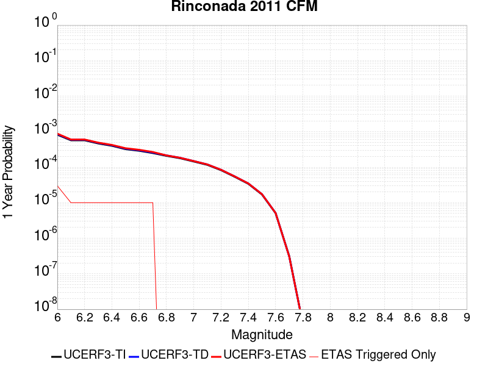 |  |

| Magnitude | 1 wk TI Prob | 1 wk TD Prob | 1 wk ETAS Prob | 1 wk ETAS/TD Gain | 1 wk ETAS Triggered Only | 1 mo TI Prob | 1 mo TD Prob | 1 mo ETAS Prob | 1 mo ETAS/TD Gain | 1 mo ETAS Triggered Only | 1 yr TI Prob | 1 yr TD Prob | 1 yr ETAS Prob | 1 yr ETAS/TD Gain | 1 yr ETAS Triggered Only | 10 yr TI Prob | 10 yr TD Prob | 10 yr ETAS Prob | 10 yr ETAS/TD Gain | 10 yr ETAS Triggered Only |
|-----|-----|-----|-----|-----|-----|-----|-----|-----|-----|-----|-----|-----|-----|-----|-----|-----|-----|-----|-----|-----|
| 6.0 | 1.5752368E-5 | 1.6274716E-5 | 1.6274716E-5 | 1.0 | 0.0 | 6.75084E-5 | 6.974694E-5 | 6.974694E-5 | 1.0 | 0.0 | 8.2160486E-4 | 8.488413E-4 | 8.488413E-4 | 1.0 | 0.0 | 0.008185739 | 0.00845637 | 0.008493561 | 1.004398 | 3.750797E-5 |
| 6.1 | 1.0966133E-5 | 1.1323029E-5 | 1.1323029E-5 | 1.0 | 0.0 | 4.6996865E-5 | 4.852637E-5 | 4.852637E-5 | 1.0 | 0.0 | 5.720366E-4 | 5.9064914E-4 | 5.9064914E-4 | 1.0 | 0.0 | 0.0057056635 | 0.005890889 | 0.005928176 | 1.0063297 | 3.750797E-5 |
| 6.2 | 1.0966133E-5 | 1.1323029E-5 | 1.1323029E-5 | 1.0 | 0.0 | 4.6996865E-5 | 4.852637E-5 | 4.852637E-5 | 1.0 | 0.0 | 5.720366E-4 | 5.9064914E-4 | 5.9064914E-4 | 1.0 | 0.0 | 0.0057056635 | 0.005890889 | 0.005928176 | 1.0063297 | 3.750797E-5 |
| 6.3 | 8.926149E-6 | 9.212772E-6 | 9.212772E-6 | 1.0 | 0.0 | 3.8254362E-5 | 3.948271E-5 | 3.948271E-5 | 1.0 | 0.0 | 4.6564735E-4 | 4.8059633E-4 | 4.8059633E-4 | 1.0 | 0.0 | 0.0046467283 | 0.0047956146 | 0.0048329425 | 1.0077838 | 3.750797E-5 |
| 6.4 | 7.676955E-6 | 7.920191E-6 | 7.920191E-6 | 1.0 | 0.0 | 3.290082E-5 | 3.3943234E-5 | 3.3943234E-5 | 1.0 | 0.0 | 4.0049385E-4 | 4.131807E-4 | 4.131807E-4 | 1.0 | 0.0 | 0.0039977287 | 0.004124151 | 0.0041615046 | 1.0090572 | 3.750797E-5 |
| 6.5 | 6.1671026E-6 | 6.358955E-6 | 6.358955E-6 | 1.0 | 0.0 | 2.6430173E-5 | 2.725238E-5 | 2.725238E-5 | 1.0 | 0.0 | 3.2173982E-4 | 3.317473E-4 | 3.317473E-4 | 1.0 | 0.0 | 0.003212744 | 0.0033125326 | 0.0033499163 | 1.0112855 | 3.750797E-5 |
| 6.6 | 5.553456E-6 | 5.7248126E-6 | 5.7248126E-6 | 1.0 | 0.0 | 2.3800309E-5 | 2.4534682E-5 | 2.4534682E-5 | 1.0 | 0.0 | 2.897302E-4 | 2.9866886E-4 | 2.9866886E-4 | 1.0 | 0.0 | 0.0028935277 | 0.0029826832 | 0.0030200793 | 1.0125377 | 3.750797E-5 |
| 6.7 | 4.787857E-6 | 4.93331E-6 | 4.93331E-6 | 1.0 | 0.0 | 2.0519226E-5 | 2.1142585E-5 | 2.1142585E-5 | 1.0 | 0.0 | 2.4979294E-4 | 2.573806E-4 | 2.573806E-4 | 1.0 | 0.0 | 0.0024951235 | 0.002570831 | 0.002570831 | 1.0 | 0.0 |
| 6.8 | 3.9955166E-6 | 4.1134763E-6 | 4.1134763E-6 | 1.0 | 0.0 | 1.7123532E-5 | 1.7629065E-5 | 1.7629065E-5 | 1.0 | 0.0 | 2.0845905E-4 | 2.1461275E-4 | 2.1461275E-4 | 1.0 | 0.0 | 0.002082636 | 0.0021440587 | 0.0021440587 | 1.0 | 0.0 |
| 6.9 | 3.4250072E-6 | 3.5224466E-6 | 3.5224466E-6 | 1.0 | 0.0 | 1.46785205E-5 | 1.5096112E-5 | 1.5096112E-5 | 1.0 | 0.0 | 1.7869633E-4 | 1.8377969E-4 | 1.8377969E-4 | 1.0 | 0.0 | 0.001785527 | 0.0018362795 | 0.0018362795 | 1.0 | 0.0 |
| 7.0 | 2.7712713E-6 | 2.8467002E-6 | 2.8467002E-6 | 1.0 | 0.0 | 1.1876823E-5 | 1.22000865E-5 | 1.22000865E-5 | 1.0 | 0.0 | 1.4459073E-4 | 1.4852594E-4 | 1.4852594E-4 | 1.0 | 0.0 | 0.0014449668 | 0.0014842683 | 0.0014842683 | 1.0 | 0.0 |
| 7.1 | 2.227358E-6 | 2.2856987E-6 | 2.2856987E-6 | 1.0 | 0.0 | 9.545785E-6 | 9.795815E-6 | 9.795815E-6 | 1.0 | 0.0 | 1.16213734E-4 | 1.1925753E-4 | 1.1925753E-4 | 1.0 | 0.0 | 0.0011615298 | 0.0011919363 | 0.0011919363 | 1.0 | 0.0 |
| 7.2 | 1.581796E-6 | 1.6209015E-6 | 1.6209015E-6 | 1.0 | 0.0 | 6.779108E-6 | 6.946702E-6 | 6.946702E-6 | 1.0 | 0.0 | 8.253252E-5 | 8.4572814E-5 | 8.4572814E-5 | 1.0 | 0.0 | 8.250187E-4 | 8.4540684E-4 | 8.4540684E-4 | 1.0 | 0.0 |
| 7.3 | 1.0306567E-6 | 1.054648E-6 | 1.054648E-6 | 1.0 | 0.0 | 4.4170924E-6 | 4.519912E-6 | 4.519912E-6 | 1.0 | 0.0 | 5.3776774E-5 | 5.502854E-5 | 5.502854E-5 | 1.0 | 0.0 | 5.376376E-4 | 5.501494E-4 | 5.501494E-4 | 1.0 | 0.0 |
| 7.4 | 6.535541E-7 | 6.682744E-7 | 6.682744E-7 | 1.0 | 0.0 | 2.800943E-6 | 2.8640302E-6 | 2.8640302E-6 | 1.0 | 0.0 | 3.4100947E-5 | 3.4869012E-5 | 3.4869012E-5 | 1.0 | 0.0 | 3.4095717E-4 | 3.486355E-4 | 3.486355E-4 | 1.0 | 0.0 |
| 7.5 | 3.2656962E-7 | 3.3316712E-7 | 3.3316712E-7 | 1.0 | 0.0 | 1.3995833E-6 | 1.4278584E-6 | 1.4278584E-6 | 1.0 | 0.0 | 1.7039794E-5 | 1.7384036E-5 | 1.7384036E-5 | 1.0 | 0.0 | 1.7038487E-4 | 1.738268E-4 | 1.738268E-4 | 1.0 | 0.0 |
| 7.6 | 9.754343E-8 | 9.821017E-8 | 9.821017E-8 | 1.0 | 0.0 | 4.180432E-7 | 4.2090065E-7 | 4.2090065E-7 | 1.0 | 0.0 | 5.089664E-6 | 5.1244533E-6 | 5.1244533E-6 | 1.0 | 0.0 | 5.0895473E-5 | 5.124336E-5 | 5.124336E-5 | 1.0 | 0.0 |
| 7.7 | 6.0001453E-9 | 5.8491207E-9 | 5.8491207E-9 | 1.0 | 0.0 | 2.5714908E-8 | 2.506766E-8 | 2.506766E-8 | 1.0 | 0.0 | 3.1307894E-7 | 3.051987E-7 | 3.051987E-7 | 1.0 | 0.0 | 3.1307852E-6 | 3.0519832E-6 | 3.0519832E-6 | 1.0 | 0.0 |
| 7.8 | 7.400003E-11 | 7.4654505E-11 | 7.4654505E-11 | 1.0 | 0.0 | 3.171432E-10 | 3.1994773E-10 | 3.1994773E-10 | 1.0 | 0.0 | 3.861218E-9 | 3.895363E-9 | 3.895363E-9 | 1.0 | 0.0 | 3.861218E-8 | 3.895363E-8 | 3.895363E-8 | 1.0 | 0.0 |

## Calaveras (So) 2011 CFM
*[(top)](#table-of-contents)*

| 1 Week | 1 Month | 1 Year | 10 Year |
|-----|-----|-----|-----|
|  |  |  |  |

| Magnitude | 1 wk TI Prob | 1 wk TD Prob | 1 wk ETAS Prob | 1 wk ETAS/TD Gain | 1 wk ETAS Triggered Only | 1 mo TI Prob | 1 mo TD Prob | 1 mo ETAS Prob | 1 mo ETAS/TD Gain | 1 mo ETAS Triggered Only | 1 yr TI Prob | 1 yr TD Prob | 1 yr ETAS Prob | 1 yr ETAS/TD Gain | 1 yr ETAS Triggered Only | 10 yr TI Prob | 10 yr TD Prob | 10 yr ETAS Prob | 10 yr ETAS/TD Gain | 10 yr ETAS Triggered Only |
|-----|-----|-----|-----|-----|-----|-----|-----|-----|-----|-----|-----|-----|-----|-----|-----|-----|-----|-----|-----|-----|
| 6.0 | 1.5950744E-4 | 3.0713255E-4 | 3.0713255E-4 | 1.0 | 0.0 | 6.834242E-4 | 0.001315409 | 0.001315409 | 1.0 | 0.0 | 0.00828899 | 0.015858326 | 0.01589524 | 1.0023277 | 3.750797E-5 | 0.079865426 | 0.14440185 | 0.14443395 | 1.0002222 | 3.750797E-5 |
| 6.1 | 1.3584697E-4 | 2.603514E-4 | 2.603514E-4 | 1.0 | 0.0 | 5.8207137E-4 | 0.0011151754 | 0.0011151754 | 1.0 | 0.0 | 0.007063716 | 0.013461385 | 0.013498388 | 1.0027488 | 3.750797E-5 | 0.06843361 | 0.124029994 | 0.12406285 | 1.0002649 | 3.750797E-5 |
| 6.2 | 1.14676266E-4 | 2.1714384E-4 | 2.1714384E-4 | 1.0 | 0.0 | 4.9137714E-4 | 9.30223E-4 | 9.30223E-4 | 1.0 | 0.0 | 0.0059661185 | 0.011245058 | 0.011245058 | 1.0 | 0.0 | 0.058084648 | 0.10502057 | 0.10502057 | 1.0 | 0.0 |
| 6.3 | 8.691518E-5 | 1.5987935E-4 | 1.5987935E-4 | 1.0 | 0.0 | 3.7244044E-4 | 6.849807E-4 | 6.849807E-4 | 1.0 | 0.0 | 0.004525038 | 0.008301122 | 0.008301122 | 1.0 | 0.0 | 0.044339992 | 0.0793365 | 0.0793365 | 1.0 | 0.0 |
| 6.4 | 8.50982E-5 | 1.5694331E-4 | 1.5694331E-4 | 1.0 | 0.0 | 3.646556E-4 | 6.724042E-4 | 6.724042E-4 | 1.0 | 0.0 | 0.0044306475 | 0.008149155 | 0.008149155 | 1.0 | 0.0 | 0.04343345 | 0.07794268 | 0.07794268 | 1.0 | 0.0 |
| 6.5 | 8.4062965E-5 | 1.5518743E-4 | 1.5518743E-4 | 1.0 | 0.0 | 3.602201E-4 | 6.6488347E-4 | 6.6488347E-4 | 1.0 | 0.0 | 0.004376863 | 0.008058365 | 0.008058365 | 1.0 | 0.0 | 0.042916555 | 0.07711388 | 0.07711388 | 1.0 | 0.0 |
| 6.6 | 8.194716E-5 | 1.5154552E-4 | 1.5154552E-4 | 1.0 | 0.0 | 3.5115483E-4 | 6.492843E-4 | 6.492843E-4 | 1.0 | 0.0 | 0.0042669317 | 0.007870209 | 0.007870209 | 1.0 | 0.0 | 0.04185927 | 0.07539919 | 0.07539919 | 1.0 | 0.0 |
| 6.7 | 8.012326E-5 | 1.4822475E-4 | 1.4822475E-4 | 1.0 | 0.0 | 3.433402E-4 | 6.350612E-4 | 6.350612E-4 | 1.0 | 0.0 | 0.004172157 | 0.007698701 | 0.007698701 | 1.0 | 0.0 | 0.040946912 | 0.07384132 | 0.07384132 | 1.0 | 0.0 |
| 6.8 | 7.119773E-5 | 1.2881879E-4 | 1.2881879E-4 | 1.0 | 0.0 | 3.0509746E-4 | 5.519494E-4 | 5.519494E-4 | 1.0 | 0.0 | 0.0037082357 | 0.006696066 | 0.006696066 | 1.0 | 0.0 | 0.036469642 | 0.06468575 | 0.06468575 | 1.0 | 0.0 |
| 6.9 | 5.7343088E-5 | 9.919277E-5 | 9.919277E-5 | 1.0 | 0.0 | 2.4573295E-4 | 4.25043E-4 | 4.25043E-4 | 1.0 | 0.0 | 0.0029876942 | 0.005162694 | 0.005162694 | 1.0 | 0.0 | 0.02947844 | 0.05051036 | 0.05051036 | 1.0 | 0.0 |
| 7.0 | 4.8746577E-5 | 8.2850725E-5 | 8.2850725E-5 | 1.0 | 0.0 | 2.0889717E-4 | 3.5502657E-4 | 3.5502657E-4 | 1.0 | 0.0 | 0.0025403565 | 0.004313948 | 0.004313948 | 1.0 | 0.0 | 0.025115121 | 0.042485245 | 0.042485245 | 1.0 | 0.0 |
| 7.1 | 4.2998014E-5 | 7.265203E-5 | 7.265203E-5 | 1.0 | 0.0 | 1.8426418E-4 | 3.1132903E-4 | 3.1132903E-4 | 1.0 | 0.0 | 0.002241108 | 0.003783903 | 0.003783903 | 1.0 | 0.0 | 0.022186412 | 0.037423562 | 0.037423562 | 1.0 | 0.0 |
| 7.2 | 3.221292E-5 | 5.390791E-5 | 5.390791E-5 | 1.0 | 0.0 | 1.3804805E-4 | 2.3101359E-4 | 2.3101359E-4 | 1.0 | 0.0 | 0.0016794393 | 0.0028089907 | 0.0028089907 | 1.0 | 0.0 | 0.016668037 | 0.02803602 | 0.02803602 | 1.0 | 0.0 |
| 7.3 | 2.3756531E-5 | 3.9473416E-5 | 3.9473416E-5 | 1.0 | 0.0 | 1.0180973E-4 | 1.6916092E-4 | 1.6916092E-4 | 1.0 | 0.0 | 0.0012388286 | 0.0020576057 | 0.0020576057 | 1.0 | 0.0 | 0.012319452 | 0.020643145 | 0.020643145 | 1.0 | 0.0 |
| 7.4 | 1.5997684E-5 | 2.7342163E-5 | 2.7342163E-5 | 1.0 | 0.0 | 6.8559704E-5 | 1.1717545E-4 | 1.1717545E-4 | 1.0 | 0.0 | 8.343947E-4 | 0.00142568 | 0.00142568 | 1.0 | 0.0 | 0.008312687 | 0.014376011 | 0.014376011 | 1.0 | 0.0 |
| 7.5 | 1.3814293E-5 | 2.4783874E-5 | 2.4783874E-5 | 1.0 | 0.0 | 5.9202768E-5 | 1.062123E-4 | 1.062123E-4 | 1.0 | 0.0 | 7.205553E-4 | 0.00129237 | 0.00129237 | 1.0 | 0.0 | 0.007182234 | 0.013055085 | 0.013055085 | 1.0 | 0.0 |
| 7.6 | 8.817309E-6 | 1.6430757E-5 | 1.6430757E-5 | 1.0 | 0.0 | 3.7787922E-5 | 7.0415634E-5 | 7.0415634E-5 | 1.0 | 0.0 | 4.5997082E-4 | 8.569745E-4 | 8.569745E-4 | 1.0 | 0.0 | 0.004590199 | 0.008719284 | 0.008719284 | 1.0 | 0.0 |
| 7.7 | 4.0352206E-6 | 7.707318E-6 | 7.707318E-6 | 1.0 | 0.0 | 1.7293689E-5 | 3.3030945E-5 | 3.3030945E-5 | 1.0 | 0.0 | 2.1053031E-4 | 4.0207763E-4 | 4.0207763E-4 | 1.0 | 0.0 | 0.0021033096 | 0.004165172 | 0.004165172 | 1.0 | 0.0 |
| 7.8 | 3.413169E-6 | 6.787282E-6 | 6.787282E-6 | 1.0 | 0.0 | 1.4627784E-5 | 2.9088029E-5 | 2.9088029E-5 | 1.0 | 0.0 | 1.7807873E-4 | 3.5408925E-4 | 3.5408925E-4 | 1.0 | 0.0 | 0.0017793609 | 0.0036665166 | 0.0036665166 | 1.0 | 0.0 |
| 7.9 | 2.4740732E-6 | 5.2791843E-6 | 5.2791843E-6 | 1.0 | 0.0 | 1.06031275E-5 | 2.262488E-5 | 2.262488E-5 | 1.0 | 0.0 | 1.2908543E-4 | 2.7542314E-4 | 2.7542314E-4 | 1.0 | 0.0 | 0.0012901047 | 0.0028347955 | 0.0028347955 | 1.0 | 0.0 |
| 8.0 | 1.5231818E-6 | 3.2889548E-6 | 3.2889548E-6 | 1.0 | 0.0 | 6.527906E-6 | 1.40954435E-5 | 1.40954435E-5 | 1.0 | 0.0 | 7.9474354E-5 | 1.7159856E-4 | 1.7159856E-4 | 1.0 | 0.0 | 7.944594E-4 | 0.0017564303 | 0.0017564303 | 1.0 | 0.0 |
| 8.1 | 1.0104524E-6 | 2.045782E-6 | 2.045782E-6 | 1.0 | 0.0 | 4.330503E-6 | 8.767608E-6 | 8.767608E-6 | 1.0 | 0.0 | 5.2722597E-5 | 1.0674043E-4 | 1.0674043E-4 | 1.0 | 0.0 | 5.271009E-4 | 0.001092934 | 0.001092934 | 1.0 | 0.0 |

## Hat Creek-McArthur-Mayfield
*[(top)](#table-of-contents)*

| 1 Week | 1 Month | 1 Year | 10 Year |
|-----|-----|-----|-----|
|  |  |  |  |

| Magnitude | 1 wk TI Prob | 1 wk TD Prob | 1 wk ETAS Prob | 1 wk ETAS/TD Gain | 1 wk ETAS Triggered Only | 1 mo TI Prob | 1 mo TD Prob | 1 mo ETAS Prob | 1 mo ETAS/TD Gain | 1 mo ETAS Triggered Only | 1 yr TI Prob | 1 yr TD Prob | 1 yr ETAS Prob | 1 yr ETAS/TD Gain | 1 yr ETAS Triggered Only | 10 yr TI Prob | 10 yr TD Prob | 10 yr ETAS Prob | 10 yr ETAS/TD Gain | 10 yr ETAS Triggered Only |
|-----|-----|-----|-----|-----|-----|-----|-----|-----|-----|-----|-----|-----|-----|-----|-----|-----|-----|-----|-----|-----|
| 6.0 | 3.967457E-5 | 4.315831E-5 | 4.315831E-5 | 1.0 | 0.0 | 1.7002279E-4 | 1.8495171E-4 | 1.8495171E-4 | 1.0 | 0.0 | 0.002068062 | 0.002249576 | 0.002249576 | 1.0 | 0.0 | 0.02048922 | 0.022280399 | 0.02231707 | 1.0016459 | 3.750797E-5 |
| 6.1 | 2.5044013E-5 | 2.7071164E-5 | 2.7071164E-5 | 1.0 | 0.0 | 1.0732707E-4 | 1.1601429E-4 | 1.1601429E-4 | 1.0 | 0.0 | 0.0013059238 | 0.0014115906 | 0.0014115906 | 1.0 | 0.0 | 0.01298276 | 0.01402966 | 0.014066642 | 1.002636 | 3.750797E-5 |
| 6.2 | 2.5044013E-5 | 2.7071164E-5 | 2.7071164E-5 | 1.0 | 0.0 | 1.0732707E-4 | 1.1601429E-4 | 1.1601429E-4 | 1.0 | 0.0 | 0.0013059238 | 0.0014115906 | 0.0014115906 | 1.0 | 0.0 | 0.01298276 | 0.01402966 | 0.014066642 | 1.002636 | 3.750797E-5 |
| 6.3 | 1.6624012E-5 | 1.7891072E-5 | 1.7891072E-5 | 1.0 | 0.0 | 7.124382E-5 | 7.6673816E-5 | 7.6673816E-5 | 1.0 | 0.0 | 8.670483E-4 | 9.331125E-4 | 9.331125E-4 | 1.0 | 0.0 | 0.008636732 | 0.009292879 | 0.009330039 | 1.0039988 | 3.750797E-5 |
| 6.4 | 1.6624012E-5 | 1.7891072E-5 | 1.7891072E-5 | 1.0 | 0.0 | 7.124382E-5 | 7.6673816E-5 | 7.6673816E-5 | 1.0 | 0.0 | 8.670483E-4 | 9.331125E-4 | 9.331125E-4 | 1.0 | 0.0 | 0.008636732 | 0.009292879 | 0.009330039 | 1.0039988 | 3.750797E-5 |
| 6.5 | 1.3394842E-5 | 1.4392137E-5 | 1.4392137E-5 | 1.0 | 0.0 | 5.7405203E-5 | 6.167916E-5 | 6.167916E-5 | 1.0 | 0.0 | 6.986842E-4 | 7.506906E-4 | 7.506906E-4 | 1.0 | 0.0 | 0.006964916 | 0.0074821403 | 0.007519368 | 1.0049754 | 3.750797E-5 |
| 6.6 | 1.1137514E-5 | 1.1954546E-5 | 1.1954546E-5 | 1.0 | 0.0 | 4.7731326E-5 | 5.1232782E-5 | 5.1232782E-5 | 1.0 | 0.0 | 5.809739E-4 | 6.2358467E-4 | 6.2358467E-4 | 1.0 | 0.0 | 0.005794574 | 0.00621877 | 0.006256045 | 1.005994 | 3.750797E-5 |
| 6.7 | 7.0200663E-6 | 7.5242897E-6 | 7.5242897E-6 | 1.0 | 0.0 | 3.008565E-5 | 3.2246568E-5 | 3.2246568E-5 | 1.0 | 0.0 | 3.6623122E-4 | 3.925328E-4 | 3.925328E-4 | 1.0 | 0.0 | 0.0036562826 | 0.0039185574 | 0.0039185574 | 1.0 | 0.0 |
| 6.8 | 5.940172E-6 | 6.3654766E-6 | 6.3654766E-6 | 1.0 | 0.0 | 2.545763E-5 | 2.7280335E-5 | 2.7280335E-5 | 1.0 | 0.0 | 3.0990256E-4 | 3.3208873E-4 | 3.3208873E-4 | 1.0 | 0.0 | 0.0030947074 | 0.0033160534 | 0.0033160534 | 1.0 | 0.0 |
| 6.9 | 4.129831E-6 | 4.423547E-6 | 4.423547E-6 | 1.0 | 0.0 | 1.7699154E-5 | 1.8957926E-5 | 1.8957926E-5 | 1.0 | 0.0 | 2.154659E-4 | 2.3078908E-4 | 2.3078908E-4 | 1.0 | 0.0 | 0.002152571 | 0.0023055724 | 0.0023055724 | 1.0 | 0.0 |
| 7.0 | 2.6512955E-6 | 2.8374002E-6 | 2.8374002E-6 | 1.0 | 0.0 | 1.1362646E-5 | 1.2160232E-5 | 1.2160232E-5 | 1.0 | 0.0 | 1.3833142E-4 | 1.480412E-4 | 1.480412E-4 | 1.0 | 0.0 | 0.0013824535 | 0.0014794683 | 0.0014794683 | 1.0 | 0.0 |
| 7.1 | 1.2992575E-6 | 1.3909317E-6 | 1.3909317E-6 | 1.0 | 0.0 | 5.568235E-6 | 5.961124E-6 | 5.961124E-6 | 1.0 | 0.0 | 6.779115E-5 | 7.257448E-5 | 7.257448E-5 | 1.0 | 0.0 | 6.7770475E-4 | 7.2552945E-4 | 7.2552945E-4 | 1.0 | 0.0 |
| 7.2 | 4.968191E-7 | 5.3271475E-7 | 5.3271475E-7 | 1.0 | 0.0 | 2.1292228E-6 | 2.283062E-6 | 2.283062E-6 | 1.0 | 0.0 | 2.592298E-5 | 2.7796052E-5 | 2.7796052E-5 | 1.0 | 0.0 | 2.5919956E-4 | 2.7793812E-4 | 2.7793812E-4 | 1.0 | 0.0 |

