# Parent Section Magnitude-Probability Distributions

Only fault sections with at least one triggered aftershock are plotted. Sections are sorted by total supraseismogenic trigger rate (decreasing)

## Table Of Contents

* [Garlock (Central)](#garlock-central)
* [Tank Canyon](#tank-canyon)
* [Little Lake](#little-lake)
* [Airport Lake](#airport-lake)
* [Owl Lake](#owl-lake)
* [Panamint Valley](#panamint-valley)
* [Garlock (East)](#garlock-east)
* [Hunter Mountain-Saline Valley](#hunter-mountain-saline-valley)
* [Blackwater](#blackwater)
* [Ash Hill](#ash-hill)
* [Garlock (West)](#garlock-west)
* [McLean Lake](#mclean-lake)
* [Gravel Hills-Harper Lk](#gravel-hills-harper-lk)
* [Goldstone Lake](#goldstone-lake)
* [So Sierra Nevada](#so-sierra-nevada)
* [Coyote Canyon](#coyote-canyon)
* [San Andreas (Mojave S)](#san-andreas-mojave-s)
* [San Andreas (Mojave N)](#san-andreas-mojave-n)
* [Death Valley (So)](#death-valley-so)
* [Nelson Lake](#nelson-lake)
* [Lenwood-Lockhart-Old Woman Springs](#lenwood-lockhart-old-woman-springs)
* [Towne Pass](#towne-pass)
* [Paradise](#paradise)
* [San Andreas (San Bernardino N)](#san-andreas-san-bernardino-n)
* [Bicycle Lake](#bicycle-lake)
* [Garlic Springs](#garlic-springs)
* [Death Valley (Black Mtns Frontal)](#death-valley-black-mtns-frontal)
* [San Andreas (San Bernardino S)](#san-andreas-san-bernardino-s)
* [San Andreas (Big Bend)](#san-andreas-big-bend)
* [Coyote Lake](#coyote-lake)
* [Helendale-So Lockhart](#helendale-so-lockhart)
* [Death Valley (No)](#death-valley-no)
* [San Andreas (Parkfield)](#san-andreas-parkfield)
* [Elsinore (Glen Ivy) rev](#elsinore-glen-ivy-rev)
* [Baker](#baker)
* [San Andreas (San Gorgonio Pass-Garnet HIll)](#san-andreas-san-gorgonio-pass-garnet-hill)
* [San Andreas (Carrizo) rev](#san-andreas-carrizo-rev)
* [San Andreas (Cholame) rev](#san-andreas-cholame-rev)
* [San Andreas (Coachella) rev](#san-andreas-coachella-rev)
* [Red Pass](#red-pass)
* [White Wolf (Extension)](#white-wolf-extension)
* [Ludlow](#ludlow)
* [San Jacinto (San Bernardino)](#san-jacinto-san-bernardino)
* [Scodie Lineament](#scodie-lineament)
* [Death Valley (Fish Lake Valley)](#death-valley-fish-lake-valley)
* [Sierra Nevada  (No Extension)](#sierra-nevada--no-extension)
* [Cady](#cady)
* [Manix-Afton Hills](#manix-afton-hills)
* [San Jacinto (Stepovers Combined)](#san-jacinto-stepovers-combined)
* [San Jacinto (San Jacinto Valley) rev](#san-jacinto-san-jacinto-valley-rev)
* [San Andreas (North Branch Mill Creek)](#san-andreas-north-branch-mill-creek)
* [Calico-Hidalgo](#calico-hidalgo)
* [Santa Ynez (West)](#santa-ynez-west)
* [Kern Canyon (North Kern) 2011](#kern-canyon-north-kern-2011)
* [Mission Ridge-Arroyo Parida-Santa Ana](#mission-ridge-arroyo-parida-santa-ana)
* [San Andreas (Creeping Section) 2011 CFM](#san-andreas-creeping-section-2011-cfm)
* [Lake Isabella (Seismicity)](#lake-isabella-seismicity)
* [Tin Mountain](#tin-mountain)
* [Blue Cut](#blue-cut)
* [Pisgah-Bullion Mtn-Mesquite Lk](#pisgah-bullion-mtn-mesquite-lk)
* [Cleghorn Pass](#cleghorn-pass)
* [Owens Valley](#owens-valley)
* [Pleito](#pleito)
* [San Jacinto (Coyote Creek)](#san-jacinto-coyote-creek)
* [San Jacinto (Anza) rev](#san-jacinto-anza-rev)
* [Dry Mountain](#dry-mountain)
* [Brawley (Seismic Zone) alt 1](#brawley-seismic-zone-alt-1)
* [Big Pine (East)](#big-pine-east)
* [Independence rev 2011](#independence-rev-2011)
* [Ventura-Pitas Point](#ventura-pitas-point)
* [Imperial](#imperial)
* [Chino alt 1](#chino-alt-1)
* [San Jacinto (Borrego)](#san-jacinto-borrego)
* [Santa Cruz Island](#santa-cruz-island)
* [Red Mountain](#red-mountain)
* [Whittier alt 1](#whittier-alt-1)
* [Great Valley 09 (Laguna Seca)](#great-valley-09-laguna-seca)
* [Pinto Mtn](#pinto-mtn)
* [Big Pine (Central)](#big-pine-central)
* [Lost Hills](#lost-hills)
* [Camp Rock 2011](#camp-rock-2011)
* [Oceanic - West Huasna](#oceanic---west-huasna)
* [Mission Creek](#mission-creek)
* [San Clemente](#san-clemente)
* [Santa Ynez (East)](#santa-ynez-east)
* [Great Valley 03a Dunnigan Hills](#great-valley-03a-dunnigan-hills)
* [Great Valley 07 (Orestimba)](#great-valley-07-orestimba)
* [Ortigalita (North)](#ortigalita-north)
* [Channel Islands Thrust](#channel-islands-thrust)
* [San Jacinto (Superstition Mtn)](#san-jacinto-superstition-mtn)
* [Santa Rosa Island](#santa-rosa-island)
* [Deep Springs](#deep-springs)
* [Elysian Park (Upper)](#elysian-park-upper)
* [Kern Canyon (South Kern) 2011](#kern-canyon-south-kern-2011)
* [San Luis Range 2011 CFM](#san-luis-range-2011-cfm)
* [San Jacinto (Lytle Creek connector)](#san-jacinto-lytle-creek-connector)
* [Rinconada 2011 CFM](#rinconada-2011-cfm)
* [Cleghorn Lake](#cleghorn-lake)
* [White Mountains](#white-mountains)
* [Anacapa-Dume alt 1](#anacapa-dume-alt-1)
* [Pitas Point (Lower West)](#pitas-point-lower-west)
* [Honey Lake 2011 CFM](#honey-lake-2011-cfm)
* [Calaveras (So) - Paicines extension 2011 CFM](#calaveras-so---paicines-extension-2011-cfm)
* [Point Reyes 2011 CFM](#point-reyes-2011-cfm)
* [Redondo Canyon alt 1](#redondo-canyon-alt-1)
* [Emerson-Copper Mtn 2011](#emerson-copper-mtn-2011)
* [Kern Canyon (Lake Isabella) 2011](#kern-canyon-lake-isabella-2011)
* [Morales (East)](#morales-east)
* [Johnson Valley (No) 2011 rev](#johnson-valley-no-2011-rev)
* [Elmore Ranch](#elmore-ranch)
* [Bullion Mountains](#bullion-mountains)
* [Great Valley 10 (Panoche)](#great-valley-10-panoche)
* [Hat Creek-McArthur-Mayfield](#hat-creek-mcarthur-mayfield)
* [Calaveras (No) 2011 CFM](#calaveras-no-2011-cfm)
* [Mono Lake 2011 CFM](#mono-lake-2011-cfm)
* [Hunting Creek - Berryessa 2011 CFM](#hunting-creek---berryessa-2011-cfm)
* [San Pedro Basin](#san-pedro-basin)
* [Earthquake Valley (So Extension)](#earthquake-valley-so-extension)
* [Likely 2011 CFM](#likely-2011-cfm)
* [Raymond](#raymond)
* [Simi-Santa Rosa](#simi-santa-rosa)
* [San Gabriel](#san-gabriel)
* [Hollywood](#hollywood)
* [Hosgri (Extension)](#hosgri-extension)
* [Shoreline](#shoreline)
* [San Jose](#san-jose)
* [Compton](#compton)
* [Monterey Bay-Tularcitos](#monterey-bay-tularcitos)
* [Los Alamos 2011 CFM](#los-alamos-2011-cfm)
* [San Gorgonio Pass](#san-gorgonio-pass)
* [Coronado Bank alt1](#coronado-bank-alt1)
* [Earthquake Valley (No  Extension)](#earthquake-valley-no--extension)
* [Ortigalita (South)](#ortigalita-south)
* [San Luis Range - Oceano 2011 CFM](#san-luis-range---oceano-2011-cfm)
* [Superstition Hills](#superstition-hills)
* [Santa Monica alt 1](#santa-monica-alt-1)
* [Palos Verdes](#palos-verdes)
* [Los Alamos extension](#los-alamos-extension)
* [Green Valley 2011 CFM](#green-valley-2011-cfm)
* [Malibu Coast (Extension) alt 1](#malibu-coast-extension-alt-1)
* [La Panza 2011](#la-panza-2011)
* [Sheephole](#sheephole)
* [Hunting Creek - Bartlett Springs connector 2011](#hunting-creek---bartlett-springs-connector-2011)
* [Oak Ridge (Onshore)](#oak-ridge-onshore)
* [Little Salmon (Onshore)](#little-salmon-onshore)
* [San Diego Trough north alt1](#san-diego-trough-north-alt1)
* [Owens Valley Keough Hot Springs](#owens-valley-keough-hot-springs)
* [Santa Ynez River](#santa-ynez-river)
* [Sierra Madre](#sierra-madre)
* [Earthquake Valley](#earthquake-valley)
* [East Huasna 2011 CFM](#east-huasna-2011-cfm)
* [Los Osos 2011](#los-osos-2011)
* [Burnt Mtn](#burnt-mtn)
* [Channel Islands Western Deep Ramp](#channel-islands-western-deep-ramp)
* [Robinson Creek](#robinson-creek)
* [Cucamonga](#cucamonga)
* [Northridge](#northridge)
* [San Diego Trough south](#san-diego-trough-south)
* [Cleghorn](#cleghorn)
* [Great Valley 11](#great-valley-11)
* [Calaveras (So) 2011 CFM](#calaveras-so-2011-cfm)
* [San Juan](#san-juan)
* [Yorba Linda](#yorba-linda)
* [White Wolf](#white-wolf)
* [Pitas Point (Lower)-Montalvo](#pitas-point-lower-montalvo)

## Garlock (Central)
*[(top)](#table-of-contents)*

| 1 Week | 1 Month | 1 Year | 10 Year |
|-----|-----|-----|-----|
| 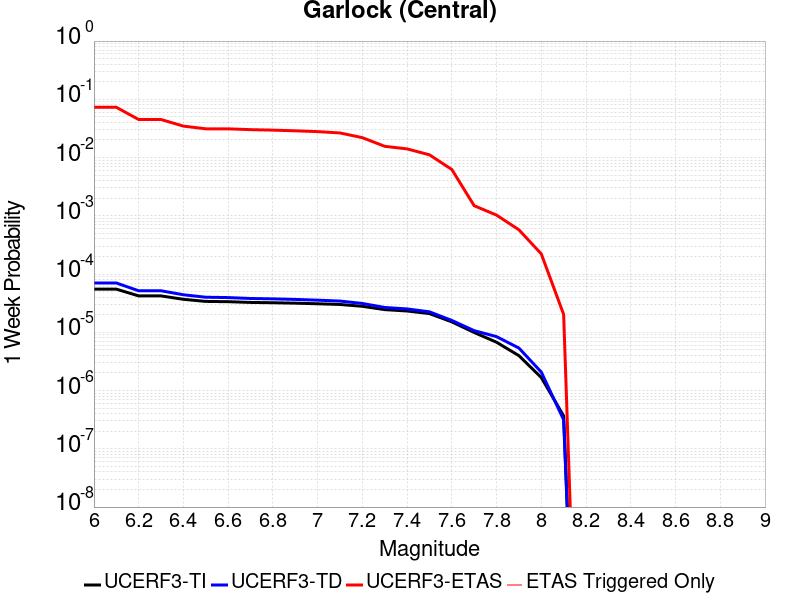 |  |  |  |

| Magnitude | 1 wk TI Prob | 1 wk TD Prob | 1 wk ETAS Prob | 1 wk ETAS/TD Gain | 1 wk ETAS Triggered Only | 1 mo TI Prob | 1 mo TD Prob | 1 mo ETAS Prob | 1 mo ETAS/TD Gain | 1 mo ETAS Triggered Only | 1 yr TI Prob | 1 yr TD Prob | 1 yr ETAS Prob | 1 yr ETAS/TD Gain | 1 yr ETAS Triggered Only | 10 yr TI Prob | 10 yr TD Prob | 10 yr ETAS Prob | 10 yr ETAS/TD Gain | 10 yr ETAS Triggered Only |
|-----|-----|-----|-----|-----|-----|-----|-----|-----|-----|-----|-----|-----|-----|-----|-----|-----|-----|-----|-----|-----|
| 6.0 | 5.5131142E-5 | 7.02476E-5 | 0.070783705 | 1007.63165 | 0.07071842 | 2.3625491E-4 | 3.0102677E-4 | 0.08675581 | 288.19965 | 0.08648082 | 0.0028726095 | 0.003658906 | 0.11573235 | 31.630314 | 0.112485014 | 0.028357591 | 0.036136657 | 0.16516702 | 4.570623 | 0.1338679 |
| 6.1 | 5.5131142E-5 | 7.02476E-5 | 0.070783705 | 1007.63165 | 0.07071842 | 2.3625491E-4 | 3.0102677E-4 | 0.08675581 | 288.19965 | 0.08648082 | 0.0028726095 | 0.003658906 | 0.11573235 | 31.630314 | 0.112485014 | 0.028357591 | 0.036136657 | 0.16516702 | 4.570623 | 0.1338679 |
| 6.2 | 4.216245E-5 | 5.1661802E-5 | 0.043814387 | 848.1003 | 0.04376499 | 1.806837E-4 | 2.213891E-4 | 0.054316126 | 245.34236 | 0.054106716 | 0.0021976046 | 0.002692112 | 0.07386789 | 27.438639 | 0.071367905 | 0.021759989 | 0.026701318 | 0.11028947 | 4.130488 | 0.08588129 |
| 6.3 | 4.216245E-5 | 5.1661802E-5 | 0.043814387 | 848.1003 | 0.04376499 | 1.806837E-4 | 2.213891E-4 | 0.054316126 | 245.34236 | 0.054106716 | 0.0021976046 | 0.002692112 | 0.07386789 | 27.438639 | 0.071367905 | 0.021759989 | 0.026701318 | 0.11028947 | 4.130488 | 0.08588129 |
| 6.4 | 3.6858168E-5 | 4.411026E-5 | 0.033815604 | 766.61536 | 0.033772983 | 1.5795401E-4 | 1.8903041E-4 | 0.042247426 | 223.49538 | 0.042066347 | 0.0019213937 | 0.0022990413 | 0.05825025 | 25.336756 | 0.056080136 | 0.019048655 | 0.022866098 | 0.089550994 | 3.9163215 | 0.0682454 |
| 6.5 | 3.39199E-5 | 4.0018425E-5 | 0.030414503 | 760.01245 | 0.030375699 | 1.453629E-4 | 1.7149639E-4 | 0.03818456 | 222.6552 | 0.038019583 | 0.0017683565 | 0.0020859907 | 0.052814282 | 25.31856 | 0.05083433 | 0.017543508 | 0.020758783 | 0.08125198 | 3.9141011 | 0.06177558 |
| 6.6 | 3.3571985E-5 | 3.947258E-5 | 0.030388994 | 769.87604 | 0.030350719 | 1.4387199E-4 | 1.6915736E-4 | 0.038157336 | 225.57301 | 0.037994605 | 0.0017502342 | 0.0020575672 | 0.052762374 | 25.643087 | 0.050809354 | 0.017365133 | 0.020480042 | 0.08091705 | 3.9510198 | 0.06170064 |
| 6.7 | 3.2580007E-5 | 3.808902E-5 | 0.029288573 | 768.95056 | 0.029251598 | 1.3962112E-4 | 1.6322857E-4 | 0.03675298 | 225.16266 | 0.036595725 | 0.0016985617 | 0.0019855178 | 0.050824206 | 25.597456 | 0.048935853 | 0.016856372 | 0.019770874 | 0.07792545 | 3.941427 | 0.05932754 |
| 6.8 | 3.2185937E-5 | 3.7516216E-5 | 0.028613582 | 762.6991 | 0.028577138 | 1.3793244E-4 | 1.60774E-4 | 0.03602631 | 224.08046 | 0.035871305 | 0.0016780337 | 0.0019556875 | 0.04987338 | 25.501715 | 0.04801159 | 0.016654192 | 0.019477878 | 0.07654764 | 3.9299781 | 0.058203436 |
| 6.9 | 3.165394E-5 | 3.672075E-5 | 0.027913395 | 760.15314 | 0.027877698 | 1.3565269E-4 | 1.5736527E-4 | 0.03519881 | 223.67586 | 0.03504696 | 0.0016503202 | 0.00191426 | 0.04876186 | 25.472956 | 0.04693745 | 0.01638118 | 0.019071518 | 0.07484173 | 3.924267 | 0.056854516 |
| 7.0 | 3.0903822E-5 | 3.562591E-5 | 0.026963124 | 756.8403 | 0.026928457 | 1.3243823E-4 | 1.5267366E-4 | 0.034095332 | 223.32166 | 0.03394784 | 0.0016112428 | 0.0018572382 | 0.047286298 | 25.460545 | 0.04551359 | 0.015996104 | 0.018513493 | 0.07274631 | 3.9293673 | 0.055255797 |
| 7.1 | 3.0069863E-5 | 3.4392175E-5 | 0.02558807 | 744.0085 | 0.025554556 | 1.2886449E-4 | 1.4738683E-4 | 0.032441787 | 220.1132 | 0.03229916 | 0.0015677959 | 0.0017929787 | 0.04510547 | 25.156723 | 0.04339029 | 0.01556781 | 0.01788099 | 0.06969542 | 3.8977387 | 0.052757792 |
| 7.2 | 2.7957109E-5 | 3.128141E-5 | 0.021263631 | 679.75287 | 0.021233013 | 1.1981068E-4 | 1.3405642E-4 | 0.027133834 | 202.40607 | 0.027003398 | 0.0014577188 | 0.0016309345 | 0.0379924 | 23.294863 | 0.036420863 | 0.014481937 | 0.016284352 | 0.059926413 | 3.6799998 | 0.04436451 |
| 7.3 | 2.4519275E-5 | 2.6714602E-5 | 0.015064282 | 563.897 | 0.01503797 | 1.0507837E-4 | 1.1448621E-4 | 0.019321918 | 168.7707 | 0.019209633 | 0.0012785783 | 0.001392993 | 0.027435802 | 19.695578 | 0.026079137 | 0.012712469 | 0.01392861 | 0.045457672 | 3.2636187 | 0.03197442 |
| 7.4 | 2.3225532E-5 | 2.5199166E-5 | 0.01343913 | 533.3164 | 0.013414268 | 9.95342E-5 | 1.0799204E-4 | 0.017217455 | 159.43263 | 0.01711131 | 0.0012111551 | 0.0013140244 | 0.024390176 | 18.561432 | 0.023106515 | 0.012045753 | 0.013146196 | 0.0412737 | 3.1395926 | 0.028502198 |
| 7.5 | 2.097765E-5 | 2.2483406E-5 | 0.010413936 | 463.1832 | 0.010391687 | 8.9901114E-5 | 9.6353964E-5 | 0.013384442 | 138.90909 | 0.013289369 | 0.0010939965 | 0.00117249 | 0.019037211 | 16.236565 | 0.01788569 | 0.010886264 | 0.0117406575 | 0.033687163 | 2.8692741 | 0.022207234 |
| 7.6 | 1.511254E-5 | 1.5990969E-5 | 0.0057113436 | 357.16058 | 0.0056954436 | 6.476642E-5 | 6.8530964E-5 | 0.007187348 | 104.87737 | 0.0071193045 | 7.882459E-4 | 8.34053E-4 | 0.010493256 | 12.581043 | 0.009667266 | 0.007854558 | 0.008383867 | 0.020546226 | 2.450686 | 0.012265188 |
| 7.7 | 9.934069E-6 | 1.0678523E-5 | 0.0013096255 | 122.64107 | 0.0012989609 | 4.2573887E-5 | 4.5764296E-5 | 0.00169437 | 37.023838 | 0.001648681 | 5.182138E-4 | 5.570383E-4 | 0.0030536484 | 5.4819365 | 0.0024980016 | 0.00517007 | 0.005627419 | 0.008856547 | 1.5738204 | 0.0032474021 |
| 7.8 | 6.7562896E-6 | 8.42837E-6 | 8.8272156E-4 | 104.73218 | 8.7430055E-4 | 2.8955206E-5 | 3.6121084E-5 | 0.0011851604 | 32.81076 | 0.0011490807 | 3.5247262E-4 | 4.3968562E-4 | 0.0020377038 | 4.634456 | 0.001598721 | 0.0035191406 | 0.004446416 | 0.0065354076 | 1.4698147 | 0.0020983214 |
| 7.9 | 3.975453E-6 | 5.3710532E-6 | 4.799888E-4 | 89.36587 | 4.746203E-4 | 1.7037546E-5 | 2.3018596E-5 | 6.4750464E-4 | 28.129631 | 6.245004E-4 | 2.0741238E-4 | 2.8021546E-4 | 0.00122919 | 4.386589 | 9.492406E-4 | 0.002072189 | 0.0028335669 | 0.0040043006 | 1.4131662 | 0.0011740607 |
| 8.0 | 1.6729537E-6 | 2.0775192E-6 | 2.268972E-4 | 109.21545 | 2.2482015E-4 | 7.169782E-6 | 8.903624E-6 | 3.0866114E-4 | 34.666912 | 2.997602E-4 | 8.7288594E-5 | 1.0839626E-4 | 5.080332E-4 | 4.686815 | 3.9968026E-4 | 8.7254314E-4 | 0.001096854 | 0.0015709538 | 1.432236 | 4.746203E-4 |
| 8.1 | 3.6733252E-7 | 3.1489736E-7 | 2.5294905E-5 | 80.32746 | 2.4980016E-5 | 1.5742813E-6 | 1.3495595E-6 | 2.6329542E-5 | 19.50973 | 2.4980016E-5 | 1.9166706E-5 | 1.643078E-5 | 6.638999E-5 | 4.0405865 | 4.9960032E-5 | 1.9165053E-4 | 1.662928E-4 | 2.4122038E-4 | 1.4505763 | 7.494005E-5 |

## Tank Canyon
*[(top)](#table-of-contents)*

| 1 Week | 1 Month | 1 Year | 10 Year |
|-----|-----|-----|-----|
|  |  |  |  |

| Magnitude | 1 wk TI Prob | 1 wk TD Prob | 1 wk ETAS Prob | 1 wk ETAS/TD Gain | 1 wk ETAS Triggered Only | 1 mo TI Prob | 1 mo TD Prob | 1 mo ETAS Prob | 1 mo ETAS/TD Gain | 1 mo ETAS Triggered Only | 1 yr TI Prob | 1 yr TD Prob | 1 yr ETAS Prob | 1 yr ETAS/TD Gain | 1 yr ETAS Triggered Only | 10 yr TI Prob | 10 yr TD Prob | 10 yr ETAS Prob | 10 yr ETAS/TD Gain | 10 yr ETAS Triggered Only |
|-----|-----|-----|-----|-----|-----|-----|-----|-----|-----|-----|-----|-----|-----|-----|-----|-----|-----|-----|-----|-----|
| 6.0 | 4.8284557E-5 | 5.796445E-5 | 0.03787552 | 653.42664 | 0.037819743 | 2.0691741E-4 | 2.4839927E-4 | 0.05004618 | 201.47475 | 0.049810153 | 0.0025163088 | 0.0030207336 | 0.07648918 | 25.321392 | 0.07369105 | 0.02488006 | 0.029863616 | 0.12408549 | 4.1550727 | 0.097122304 |
| 6.1 | 1.7796336E-5 | 2.0873378E-5 | 0.012935272 | 619.7019 | 0.012914668 | 7.626778E-5 | 8.945448E-5 | 0.017748745 | 198.41092 | 0.017660871 | 9.281647E-4 | 0.0010886024 | 0.028586613 | 26.259924 | 0.027527977 | 0.009242975 | 0.010836642 | 0.04886428 | 4.5091715 | 0.038444243 |
| 6.2 | 1.7796336E-5 | 2.0873378E-5 | 0.012935272 | 619.7019 | 0.012914668 | 7.626778E-5 | 8.945448E-5 | 0.017748745 | 198.41092 | 0.017660871 | 9.281647E-4 | 0.0010886024 | 0.028586613 | 26.259924 | 0.027527977 | 0.009242975 | 0.010836642 | 0.04886428 | 4.5091715 | 0.038444243 |
| 6.3 | 1.3515912E-5 | 1.5759651E-5 | 0.009682873 | 614.4091 | 0.009667266 | 5.792405E-5 | 6.7539746E-5 | 0.013056271 | 193.3124 | 0.012989609 | 7.049971E-4 | 8.2200987E-4 | 0.020889433 | 25.412632 | 0.020083932 | 0.007027647 | 0.008192157 | 0.035915803 | 4.384169 | 0.027952638 |
| 6.4 | 1.0870146E-5 | 1.2618114E-5 | 0.0071318327 | 565.20593 | 0.0071193045 | 4.658551E-5 | 5.4076605E-5 | 0.009945628 | 183.91739 | 0.0098920865 | 5.67031E-4 | 6.582015E-4 | 0.015910946 | 24.173365 | 0.01526279 | 0.005655863 | 0.006564382 | 0.027285773 | 4.15664 | 0.020858314 |
| 6.5 | 7.964826E-6 | 9.196184E-6 | 0.0043806587 | 476.35617 | 0.004371503 | 3.4134522E-5 | 3.941168E-5 | 0.0062342114 | 158.18182 | 0.006195044 | 4.1550855E-4 | 4.797421E-4 | 0.0100924345 | 21.037209 | 0.009617306 | 0.0041473247 | 0.004788209 | 0.018038806 | 3.7673388 | 0.013314349 |
| 6.6 | 6.6317E-6 | 7.612378E-6 | 0.0031550704 | 414.46582 | 0.003147482 | 2.8421264E-5 | 3.262412E-5 | 0.0045538596 | 139.58566 | 0.004521383 | 3.4597394E-4 | 3.9713533E-4 | 0.007588523 | 19.108152 | 0.007194245 | 0.0034543579 | 0.0039652516 | 0.013693708 | 3.4534276 | 0.009767186 |
| 6.7 | 4.793663E-6 | 5.4308593E-6 | 0.0016041432 | 295.37558 | 0.001598721 | 2.0544108E-5 | 2.3274928E-5 | 0.0023463625 | 100.81072 | 0.0023231416 | 2.500958E-4 | 2.833398E-4 | 0.0040292805 | 14.220667 | 0.0037470025 | 0.0024981452 | 0.0028303189 | 0.007961637 | 2.8129826 | 0.005145883 |
| 6.8 | 4.382823E-6 | 4.969325E-6 | 0.001478783 | 297.58224 | 0.001473821 | 1.8783392E-5 | 2.1296957E-5 | 0.0021945122 | 103.04346 | 0.0021732615 | 2.286638E-4 | 2.5926388E-4 | 0.0036806387 | 14.196497 | 0.0034222621 | 0.0022842865 | 0.0025901233 | 0.0071994564 | 2.7795806 | 0.004621303 |
| 6.9 | 2.729601E-6 | 3.0735862E-6 | 7.274918E-4 | 236.69153 | 7.244205E-4 | 1.1698237E-5 | 1.3172453E-5 | 9.873803E-4 | 74.95796 | 9.7422063E-4 | 1.4241673E-4 | 1.6036403E-4 | 0.0018337567 | 11.434962 | 0.001673661 | 0.001423255 | 0.0016024808 | 0.0037473196 | 2.338449 | 0.0021482813 |
| 7.0 | 1.8987357E-6 | 2.126971E-6 | 2.519266E-4 | 118.44383 | 2.4980016E-4 | 8.137413E-6 | 9.115562E-6 | 3.0887302E-4 | 33.884144 | 2.997602E-4 | 9.90685E-5 | 1.1097702E-4 | 7.354081E-4 | 6.6266704 | 6.245004E-4 | 9.902435E-4 | 0.0011092846 | 0.0018828061 | 1.6973156 | 7.743805E-4 |
| 7.1 | 1.4928986E-6 | 1.6641525E-6 | 2.0150395E-4 | 121.08502 | 1.9984013E-4 | 6.398121E-6 | 7.132066E-6 | 2.319506E-4 | 32.522217 | 2.2482015E-4 | 7.789434E-5 | 8.6830034E-5 | 5.114534E-4 | 5.8902826 | 4.2466028E-4 | 7.786704E-4 | 8.6801895E-4 | 0.0013671856 | 1.5750642 | 4.996003E-4 |
| 7.2 | 1.069082E-6 | 1.1828765E-6 | 7.612284E-5 | 64.354 | 7.494005E-5 | 4.581772E-6 | 5.0694644E-6 | 1.0498902E-4 | 20.710083 | 9.9920064E-5 | 5.5781646E-5 | 6.171951E-5 | 2.3656883E-4 | 3.8329668 | 1.748601E-4 | 5.576765E-4 | 6.1707594E-4 | 8.167928E-4 | 1.3236502 | 1.9984013E-4 |
| 7.3 | 8.776551E-7 | 9.770151E-7 | 7.591699E-5 | 77.70298 | 7.494005E-5 | 3.7613736E-6 | 4.187204E-6 | 1.04106846E-4 | 24.863094 | 9.9920064E-5 | 4.579376E-5 | 5.0978535E-5 | 1.7587225E-4 | 3.4499273 | 1.2490008E-4 | 4.5784327E-4 | 5.097194E-4 | 6.345558E-4 | 1.244912 | 1.2490008E-4 |
| 7.4 | 7.55721E-7 | 8.5103835E-7 | 2.5831034E-5 | 30.352371 | 2.4980016E-5 | 3.2388E-6 | 3.6473052E-6 | 5.3607157E-5 | 14.697743 | 4.9960032E-5 | 3.9431678E-5 | 4.4405555E-5 | 9.4363364E-5 | 2.1250353 | 4.9960032E-5 | 3.942468E-4 | 4.4401767E-4 | 4.939555E-4 | 1.1124681 | 4.9960032E-5 |
| 7.5 | 5.587665E-7 | 6.305732E-7 | 2.5610574E-5 | 40.614754 | 2.4980016E-5 | 2.3947114E-6 | 2.7024564E-6 | 5.266235E-5 | 19.486847 | 4.9960032E-5 | 2.915522E-5 | 3.2902408E-5 | 8.2860795E-5 | 2.5183809 | 4.9960032E-5 | 2.9151395E-4 | 3.2902407E-4 | 3.7896767E-4 | 1.1517931 | 4.9960032E-5 |

## Little Lake
*[(top)](#table-of-contents)*

| 1 Week | 1 Month | 1 Year | 10 Year |
|-----|-----|-----|-----|
|  |  |  |  |

| Magnitude | 1 wk TI Prob | 1 wk TD Prob | 1 wk ETAS Prob | 1 wk ETAS/TD Gain | 1 wk ETAS Triggered Only | 1 mo TI Prob | 1 mo TD Prob | 1 mo ETAS Prob | 1 mo ETAS/TD Gain | 1 mo ETAS Triggered Only | 1 yr TI Prob | 1 yr TD Prob | 1 yr ETAS Prob | 1 yr ETAS/TD Gain | 1 yr ETAS Triggered Only | 10 yr TI Prob | 10 yr TD Prob | 10 yr ETAS Prob | 10 yr ETAS/TD Gain | 10 yr ETAS Triggered Only |
|-----|-----|-----|-----|-----|-----|-----|-----|-----|-----|-----|-----|-----|-----|-----|-----|-----|-----|-----|-----|-----|
| 6.0 | 2.8424427E-5 | 3.1205716E-5 | 0.034027945 | 1090.4396 | 0.0339978 | 1.2181328E-4 | 1.3373268E-4 | 0.040770784 | 304.86777 | 0.040642485 | 0.0014820677 | 0.0016271125 | 0.055870242 | 34.33705 | 0.054331534 | 0.014722223 | 0.016165398 | 0.08131692 | 5.030307 | 0.06622202 |
| 6.1 | 2.8424427E-5 | 3.1205716E-5 | 0.034027945 | 1090.4396 | 0.0339978 | 1.2181328E-4 | 1.3373268E-4 | 0.040770784 | 304.86777 | 0.040642485 | 0.0014820677 | 0.0016271125 | 0.055870242 | 34.33705 | 0.054331534 | 0.014722223 | 0.016165398 | 0.08131692 | 5.030307 | 0.06622202 |
| 6.2 | 2.8424427E-5 | 3.1205716E-5 | 0.034027945 | 1090.4396 | 0.0339978 | 1.2181328E-4 | 1.3373268E-4 | 0.040770784 | 304.86777 | 0.040642485 | 0.0014820677 | 0.0016271125 | 0.055870242 | 34.33705 | 0.054331534 | 0.014722223 | 0.016165398 | 0.08131692 | 5.030307 | 0.06622202 |
| 6.3 | 1.48860645E-5 | 1.6081383E-5 | 0.023846634 | 1482.872 | 0.023830935 | 6.379586E-5 | 6.8918554E-5 | 0.028269414 | 410.1858 | 0.028202439 | 7.7643775E-4 | 8.387886E-4 | 0.038127627 | 45.45559 | 0.037320144 | 0.007737305 | 0.008359045 | 0.0533931 | 6.387464 | 0.04541367 |
| 6.4 | 1.48860645E-5 | 1.6081383E-5 | 0.023846634 | 1482.872 | 0.023830935 | 6.379586E-5 | 6.8918554E-5 | 0.028269414 | 410.1858 | 0.028202439 | 7.7643775E-4 | 8.387886E-4 | 0.038127627 | 45.45559 | 0.037320144 | 0.007737305 | 0.008359045 | 0.0533931 | 6.387464 | 0.04541367 |
| 6.5 | 1.2797581E-5 | 1.376556E-5 | 0.022095796 | 1605.1505 | 0.022082334 | 5.4845623E-5 | 5.8994065E-5 | 0.026261484 | 445.1547 | 0.026204037 | 6.675408E-4 | 7.1804173E-4 | 0.03529052 | 49.148285 | 0.034597322 | 0.006655392 | 0.007159767 | 0.04894973 | 6.8367767 | 0.04209133 |
| 6.6 | 9.661896E-6 | 1.0289033E-5 | 0.018994905 | 1846.1315 | 0.018984811 | 4.1407468E-5 | 4.40952E-5 | 0.022749929 | 515.92755 | 0.022706835 | 5.040193E-4 | 5.36743E-4 | 0.03059654 | 57.004074 | 0.03007594 | 0.005028777 | 0.0053560715 | 0.041780632 | 7.800611 | 0.036620703 |
| 6.7 | 7.767871E-6 | 8.199681E-6 | 0.01696949 | 2069.5305 | 0.016961431 | 3.329045E-5 | 3.5141096E-5 | 0.020193305 | 574.6351 | 0.020158872 | 4.0523586E-4 | 4.2777258E-4 | 0.02699514 | 63.10629 | 0.026578737 | 0.004044977 | 0.004270843 | 0.036432058 | 8.530414 | 0.03229916 |
| 6.8 | 6.4235196E-6 | 6.735739E-6 | 0.013171116 | 1955.4076 | 0.013164468 | 2.752908E-5 | 2.8867207E-5 | 0.01554101 | 538.36206 | 0.01551259 | 3.35115E-4 | 3.5141438E-4 | 0.021127485 | 60.121284 | 0.020783374 | 0.003346101 | 0.0035098472 | 0.02875068 | 8.191433 | 0.025329737 |
| 6.9 | 3.1283696E-6 | 3.1121751E-6 | 0.008321431 | 2673.8315 | 0.008318345 | 1.3407229E-5 | 1.33378335E-5 | 0.009930272 | 744.5191 | 0.009917066 | 1.6322079E-4 | 1.6237753E-4 | 0.01324978 | 81.59861 | 0.013089528 | 0.0016310095 | 0.0016227372 | 0.017733641 | 10.928227 | 0.01613709 |
| 7.0 | 2.290603E-6 | 2.2286763E-6 | 0.0051481007 | 2309.9365 | 0.005145883 | 9.816834E-6 | 9.551441E-6 | 0.006129597 | 641.74585 | 0.006120104 | 1.19513395E-4 | 1.1628362E-4 | 0.00835873 | 71.88227 | 0.008243405 | 0.0011944914 | 0.0011623299 | 0.011067869 | 9.522141 | 0.009917066 |
| 7.1 | 1.293693E-6 | 1.1776774E-6 | 0.0022493764 | 1910.0107 | 0.0022482015 | 5.5443866E-6 | 5.047183E-6 | 0.0028527547 | 565.21716 | 0.0028477218 | 6.750081E-5 | 6.1448416E-5 | 0.003933113 | 64.00674 | 0.0038719026 | 6.7480316E-4 | 6.1438273E-4 | 0.0053826347 | 8.7610445 | 0.0047711832 |
| 7.2 | 4.715842E-7 | 3.091732E-7 | 1.00229205E-4 | 324.18466 | 9.9920064E-5 | 2.0210737E-6 | 1.3250274E-6 | 1.5120492E-4 | 114.11457 | 1.498801E-4 | 2.4606294E-5 | 1.6132095E-5 | 2.15969E-4 | 13.387536 | 1.9984013E-4 | 2.460357E-4 | 1.6130977E-4 | 3.8609366E-4 | 2.393492 | 2.2482015E-4 |
| 7.3 | 3.9430947E-7 | 2.3096938E-7 | 7.5171E-5 | 325.4587 | 7.494005E-5 | 1.6898966E-6 | 9.898685E-7 | 7.592984E-5 | 76.70701 | 7.494005E-5 | 2.0574296E-5 | 1.2051582E-5 | 1.1197044E-4 | 9.290933 | 9.9920064E-5 | 2.0572392E-4 | 1.2050936E-4 | 2.453944E-4 | 2.0363097 | 1.2490008E-4 |
| 7.4 | 3.547123E-7 | 1.9678579E-7 | 7.513682E-5 | 381.82034 | 7.494005E-5 | 1.5201948E-6 | 8.433674E-7 | 7.5783355E-5 | 89.858055 | 7.494005E-5 | 1.8508214E-5 | 1.02679505E-5 | 1.10186986E-4 | 10.731157 | 9.9920064E-5 | 1.8506673E-4 | 1.0267482E-4 | 2.2756208E-4 | 2.2163377 | 1.2490008E-4 |
| 7.5 | 2.6354266E-7 | 1.4422719E-7 | 7.508427E-5 | 520.59717 | 7.494005E-5 | 1.129468E-6 | 6.1811636E-7 | 7.555812E-5 | 122.23931 | 7.494005E-5 | 1.3751187E-5 | 7.525541E-6 | 8.246503E-5 | 10.958019 | 7.494005E-5 | 1.3750336E-4 | 7.5252916E-5 | 1.5018732E-4 | 1.9957675 | 7.494005E-5 |
| 7.6 | 1.269913E-7 | 7.572344E-8 | 7.501576E-5 | 990.6545 | 7.494005E-5 | 5.4424834E-7 | 3.24529E-7 | 7.526455E-5 | 231.91934 | 7.494005E-5 | 6.6262032E-6 | 3.9511337E-6 | 7.889089E-5 | 19.966644 | 7.494005E-5 | 6.626006E-5 | 3.9510673E-5 | 1.1444776E-4 | 2.896629 | 7.494005E-5 |

## Airport Lake
*[(top)](#table-of-contents)*

| 1 Week | 1 Month | 1 Year | 10 Year |
|-----|-----|-----|-----|
|  |  |  |  |

| Magnitude | 1 wk TI Prob | 1 wk TD Prob | 1 wk ETAS Prob | 1 wk ETAS/TD Gain | 1 wk ETAS Triggered Only | 1 mo TI Prob | 1 mo TD Prob | 1 mo ETAS Prob | 1 mo ETAS/TD Gain | 1 mo ETAS Triggered Only | 1 yr TI Prob | 1 yr TD Prob | 1 yr ETAS Prob | 1 yr ETAS/TD Gain | 1 yr ETAS Triggered Only | 10 yr TI Prob | 10 yr TD Prob | 10 yr ETAS Prob | 10 yr ETAS/TD Gain | 10 yr ETAS Triggered Only |
|-----|-----|-----|-----|-----|-----|-----|-----|-----|-----|-----|-----|-----|-----|-----|-----|-----|-----|-----|-----|-----|
| 6.0 | 1.2387061E-5 | 1.3103157E-5 | 0.0322369 | 2460.2393 | 0.03222422 | 5.3086325E-5 | 5.615534E-5 | 0.038198497 | 680.2291 | 0.038144484 | 6.461343E-4 | 6.8350515E-4 | 0.049461093 | 72.36389 | 0.04881095 | 0.0064425888 | 0.0068168393 | 0.064747564 | 9.498179 | 0.058328338 |
| 6.1 | 1.2387061E-5 | 1.3103157E-5 | 0.0322369 | 2460.2393 | 0.03222422 | 5.3086325E-5 | 5.615534E-5 | 0.038198497 | 680.2291 | 0.038144484 | 6.461343E-4 | 6.8350515E-4 | 0.049461093 | 72.36389 | 0.04881095 | 0.0064425888 | 0.0068168393 | 0.064747564 | 9.498179 | 0.058328338 |
| 6.2 | 1.2387061E-5 | 1.3103157E-5 | 0.0322369 | 2460.2393 | 0.03222422 | 5.3086325E-5 | 5.615534E-5 | 0.038198497 | 680.2291 | 0.038144484 | 6.461343E-4 | 6.8350515E-4 | 0.049461093 | 72.36389 | 0.04881095 | 0.0064425888 | 0.0068168393 | 0.064747564 | 9.498179 | 0.058328338 |
| 6.3 | 1.2387061E-5 | 1.3103157E-5 | 0.0322369 | 2460.2393 | 0.03222422 | 5.3086325E-5 | 5.615534E-5 | 0.038198497 | 680.2291 | 0.038144484 | 6.461343E-4 | 6.8350515E-4 | 0.049461093 | 72.36389 | 0.04881095 | 0.0064425888 | 0.0068168393 | 0.064747564 | 9.498179 | 0.058328338 |
| 6.4 | 1.2387061E-5 | 1.3103157E-5 | 0.0322369 | 2460.2393 | 0.03222422 | 5.3086325E-5 | 5.615534E-5 | 0.038198497 | 680.2291 | 0.038144484 | 6.461343E-4 | 6.8350515E-4 | 0.049461093 | 72.36389 | 0.04881095 | 0.0064425888 | 0.0068168393 | 0.064747564 | 9.498179 | 0.058328338 |
| 6.5 | 6.9922594E-6 | 7.384925E-6 | 0.023788184 | 3221.1816 | 0.023780975 | 2.996648E-5 | 3.1649324E-5 | 0.028233195 | 892.06305 | 0.028202439 | 3.6478083E-4 | 3.8526783E-4 | 0.036941923 | 95.88634 | 0.036570743 | 0.003641826 | 0.0038465366 | 0.047791556 | 12.424568 | 0.04411471 |
| 6.6 | 6.9922594E-6 | 7.384925E-6 | 0.023788184 | 3221.1816 | 0.023780975 | 2.996648E-5 | 3.1649324E-5 | 0.028233195 | 892.06305 | 0.028202439 | 3.6478083E-4 | 3.8526783E-4 | 0.036941923 | 95.88634 | 0.036570743 | 0.003641826 | 0.0038465366 | 0.047791556 | 12.424568 | 0.04411471 |
| 6.7 | 5.477277E-6 | 5.7860684E-6 | 0.020764058 | 3588.6301 | 0.020758394 | 2.3473833E-5 | 2.4797222E-5 | 0.024529586 | 989.207 | 0.024505395 | 2.8575645E-4 | 3.0186825E-4 | 0.03209183 | 106.310715 | 0.03179956 | 0.0028538927 | 0.003014966 | 0.041144066 | 13.64661 | 0.038244404 |
| 6.8 | 3.9950432E-6 | 4.2190873E-6 | 0.015716583 | 3725.1145 | 0.01571243 | 1.7121502E-5 | 1.8081691E-5 | 0.01850296 | 1023.298 | 0.018485213 | 2.0843433E-4 | 2.2012512E-4 | 0.02434551 | 110.5985 | 0.024130695 | 0.0020823893 | 0.0021993418 | 0.031237056 | 14.202911 | 0.029101718 |
| 6.9 | 2.95695E-6 | 3.1230243E-6 | 0.011219115 | 3592.388 | 0.011216027 | 1.2672582E-5 | 1.3384334E-5 | 0.013252616 | 990.15875 | 0.013239409 | 1.5427776E-4 | 1.6294434E-4 | 0.017546203 | 107.68218 | 0.017386092 | 0.001541707 | 0.0016284712 | 0.02272715 | 13.956127 | 0.021133093 |
| 7.0 | 1.456072E-6 | 1.540812E-6 | 0.0048476565 | 3146.17 | 0.004846123 | 6.2402937E-6 | 6.603469E-6 | 0.0057519693 | 871.0527 | 0.0057454035 | 7.597293E-5 | 8.039528E-5 | 0.007873533 | 97.93528 | 0.007793765 | 7.594696E-4 | 8.0376083E-4 | 0.010138778 | 12.614173 | 0.009342526 |
| 7.1 | 6.995192E-7 | 7.4089746E-7 | 0.0020740808 | 2799.4167 | 0.0020733413 | 2.997936E-6 | 3.1752747E-6 | 0.0026260687 | 827.0367 | 0.0026229017 | 3.649926E-5 | 3.865897E-5 | 0.003610663 | 93.39781 | 0.0035721422 | 3.6493264E-4 | 3.865897E-4 | 0.004731432 | 12.238898 | 0.004346523 |

## Owl Lake
*[(top)](#table-of-contents)*

| 1 Week | 1 Month | 1 Year | 10 Year |
|-----|-----|-----|-----|
|  |  | 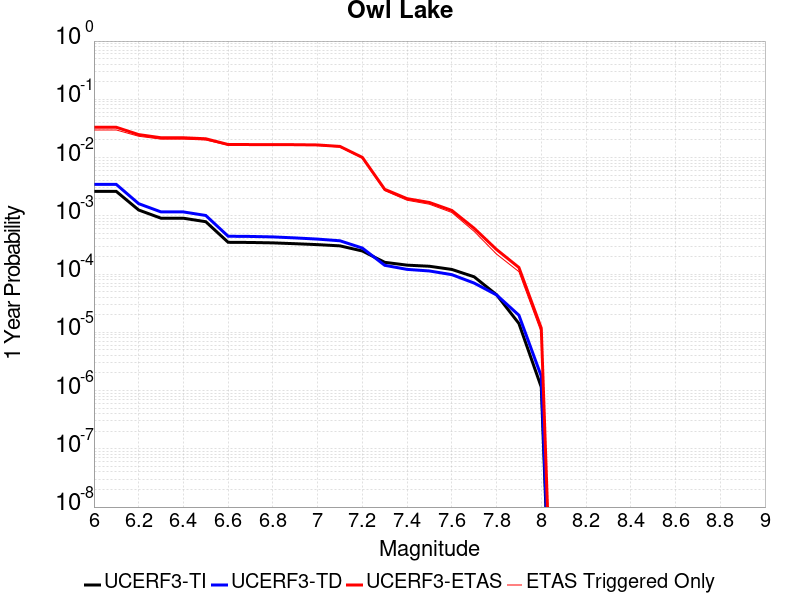 |  |

| Magnitude | 1 wk TI Prob | 1 wk TD Prob | 1 wk ETAS Prob | 1 wk ETAS/TD Gain | 1 wk ETAS Triggered Only | 1 mo TI Prob | 1 mo TD Prob | 1 mo ETAS Prob | 1 mo ETAS/TD Gain | 1 mo ETAS Triggered Only | 1 yr TI Prob | 1 yr TD Prob | 1 yr ETAS Prob | 1 yr ETAS/TD Gain | 1 yr ETAS Triggered Only | 10 yr TI Prob | 10 yr TD Prob | 10 yr ETAS Prob | 10 yr ETAS/TD Gain | 10 yr ETAS Triggered Only |
|-----|-----|-----|-----|-----|-----|-----|-----|-----|-----|-----|-----|-----|-----|-----|-----|-----|-----|-----|-----|-----|
| 6.0 | 5.0320643E-5 | 6.6358676E-5 | 0.015977573 | 240.77594 | 0.01591227 | 2.1564208E-4 | 2.843643E-4 | 0.020762153 | 73.01251 | 0.020483613 | 0.0026222812 | 0.003457547 | 0.033080988 | 9.567761 | 0.029726218 | 0.02591553 | 0.034141295 | 0.07081459 | 2.0741622 | 0.037969623 |
| 6.1 | 5.0320643E-5 | 6.6358676E-5 | 0.015977573 | 240.77594 | 0.01591227 | 2.1564208E-4 | 2.843643E-4 | 0.020762153 | 73.01251 | 0.020483613 | 0.0026222812 | 0.003457547 | 0.033080988 | 9.567761 | 0.029726218 | 0.02591553 | 0.034141295 | 0.07081459 | 2.0741622 | 0.037969623 |
| 6.2 | 2.4125871E-5 | 3.0980515E-5 | 0.013394875 | 432.3645 | 0.0133643085 | 1.0339249E-4 | 1.3276804E-4 | 0.01684218 | 126.85417 | 0.01671163 | 0.0012580766 | 0.0016154252 | 0.025208347 | 15.604774 | 0.023631096 | 0.012509781 | 0.016070755 | 0.04568793 | 2.8429236 | 0.03010092 |
| 6.3 | 1.7433485E-5 | 2.2355545E-5 | 0.012112413 | 541.808 | 0.012090328 | 7.471279E-5 | 9.580685E-5 | 0.015082381 | 157.42487 | 0.01498801 | 9.0924866E-4 | 0.001165962 | 0.022024905 | 18.889902 | 0.020883294 | 0.009055373 | 0.0116291465 | 0.03772597 | 3.2440875 | 0.026403876 |
| 6.4 | 1.7433485E-5 | 2.2355545E-5 | 0.012112413 | 541.808 | 0.012090328 | 7.471279E-5 | 9.580685E-5 | 0.015082381 | 157.42487 | 0.01498801 | 9.0924866E-4 | 0.001165962 | 0.022024905 | 18.889902 | 0.020883294 | 0.009055373 | 0.0116291465 | 0.03772597 | 3.2440875 | 0.026403876 |
| 6.5 | 1.5182742E-5 | 1.9429277E-5 | 0.011809768 | 607.8336 | 0.011790568 | 6.506727E-5 | 8.3266525E-5 | 0.014620425 | 175.58588 | 0.014538369 | 7.919061E-4 | 0.0010134344 | 0.021176832 | 20.896107 | 0.020183854 | 0.0078909 | 0.010118678 | 0.035241567 | 3.4828231 | 0.025379697 |
| 6.6 | 6.7271576E-6 | 8.547518E-6 | 0.010150347 | 1187.5199 | 0.010141887 | 2.8830356E-5 | 3.6631736E-5 | 0.0123013705 | 335.81183 | 0.012265188 | 3.5095305E-4 | 4.4590578E-4 | 0.01702524 | 38.18125 | 0.01658673 | 0.0035039932 | 0.0044680187 | 0.024511954 | 5.4860897 | 0.020133892 |
| 6.7 | 6.682835E-6 | 8.479961E-6 | 0.010125301 | 1194.0269 | 0.010116907 | 2.8640408E-5 | 3.6342215E-5 | 0.012251126 | 337.10455 | 0.012215228 | 3.4864116E-4 | 4.423823E-4 | 0.016971838 | 38.36464 | 0.01653677 | 0.003480947 | 0.0044329325 | 0.024402965 | 5.504926 | 0.020058952 |
| 6.8 | 6.5774975E-6 | 8.326427E-6 | 0.010125149 | 1216.0256 | 0.010116907 | 2.8188972E-5 | 3.5684232E-5 | 0.0122504765 | 343.30225 | 0.012215228 | 3.4314668E-4 | 4.3437455E-4 | 0.016963962 | 39.05377 | 0.01653677 | 0.0034261728 | 0.0043531056 | 0.02432474 | 5.587905 | 0.020058952 |
| 6.9 | 6.363419E-6 | 7.999591E-6 | 0.010074865 | 1259.4226 | 0.010066946 | 2.727151E-5 | 3.428354E-5 | 0.012174156 | 355.10205 | 0.012140288 | 3.3198006E-4 | 4.1732774E-4 | 0.016872289 | 40.429348 | 0.01646183 | 0.0033148455 | 0.0041830647 | 0.024058608 | 5.751431 | 0.019959033 |
| 7.0 | 6.1342453E-6 | 7.631779E-6 | 0.010049522 | 1316.7993 | 0.010041966 | 2.6289357E-5 | 3.2707245E-5 | 0.012122639 | 370.64078 | 0.012090328 | 3.2002592E-4 | 3.9814346E-4 | 0.016728569 | 42.016438 | 0.01633693 | 0.0031956544 | 0.003991739 | 0.023672057 | 5.930262 | 0.019759193 |
| 7.1 | 5.842926E-6 | 7.142312E-6 | 0.009474501 | 1326.5314 | 0.009467426 | 2.504087E-5 | 3.060958E-5 | 0.011471107 | 374.75543 | 0.011440847 | 3.0482994E-4 | 3.7261334E-4 | 0.015854452 | 42.549343 | 0.01548761 | 0.0030441214 | 0.0037371595 | 0.022526588 | 6.02773 | 0.018859912 |
| 7.2 | 4.77173E-6 | 5.358478E-6 | 0.0061004497 | 1138.4668 | 0.006095124 | 2.045011E-5 | 2.2964727E-5 | 0.007491818 | 326.2315 | 0.007469025 | 2.4895166E-4 | 2.7956374E-4 | 0.010493534 | 37.53539 | 0.010216827 | 0.0024867293 | 0.0028086212 | 0.01521373 | 5.4167967 | 0.012440048 |
| 7.3 | 3.0494948E-6 | 2.710356E-6 | 0.0016763669 | 618.5043 | 0.001673661 | 1.3069198E-5 | 1.1615762E-5 | 0.0020599533 | 177.34122 | 0.0020483613 | 1.5910587E-4 | 1.4141288E-4 | 0.002988732 | 21.134794 | 0.0028477218 | 0.0015899199 | 0.0014231089 | 0.0049652234 | 3.4889975 | 0.0035471623 |
| 7.4 | 2.7263884E-6 | 2.3055634E-6 | 0.0011014238 | 477.72437 | 0.0010991207 | 1.1684469E-5 | 9.880949E-6 | 0.0013088289 | 132.45984 | 0.0012989609 | 1.4224913E-4 | 1.2029401E-4 | 0.0019436158 | 16.157211 | 0.0018235411 | 0.0014215811 | 0.0012110578 | 0.003506436 | 2.89535 | 0.0022981614 |
| 7.5 | 2.6090431E-6 | 2.1655019E-6 | 9.5140404E-4 | 439.34576 | 9.492406E-4 | 1.1181565E-5 | 9.2806895E-6 | 0.0010834114 | 116.73824 | 0.0010741407 | 1.3612706E-4 | 1.1298663E-4 | 0.0016365955 | 14.484859 | 0.001523781 | 0.001360437 | 0.0011378126 | 0.003084037 | 2.7104962 | 0.0019484413 |
| 7.6 | 2.3008756E-6 | 1.8726826E-6 | 6.7633187E-4 | 361.1567 | 6.7446043E-4 | 9.860858E-6 | 8.025758E-6 | 7.574202E-4 | 94.373665 | 7.4940047E-4 | 1.20049335E-4 | 9.770931E-5 | 0.0011467675 | 11.736523 | 0.0010491607 | 0.001199845 | 9.848307E-4 | 0.002332423 | 2.3683493 | 0.0013489209 |
| 7.7 | 1.7184348E-6 | 1.341808E-6 | 2.761216E-4 | 205.78325 | 2.7478018E-4 | 7.3646997E-6 | 5.750593E-6 | 3.3048893E-4 | 57.470406 | 3.2474022E-4 | 8.966153E-5 | 7.0011265E-5 | 5.445983E-4 | 7.7787247 | 4.746203E-4 | 8.962536E-4 | 7.0769014E-4 | 0.0013067863 | 1.8465514 | 5.995204E-4 |
| 7.8 | 8.4612907E-7 | 8.4054994E-7 | 1.0076053E-4 | 119.87453 | 9.9920064E-5 | 3.6262625E-6 | 3.602352E-6 | 1.2850198E-4 | 35.671688 | 1.2490008E-4 | 4.4148852E-5 | 4.3857777E-5 | 2.4368914E-4 | 5.5563498 | 1.9984013E-4 | 4.414008E-4 | 4.4386165E-4 | 6.935509E-4 | 1.5625385 | 2.4980016E-4 |
| 7.9 | 2.716738E-7 | 3.7681625E-7 | 5.033683E-5 | 133.58455 | 4.9960032E-5 | 1.1643157E-6 | 1.6149258E-6 | 7.6554854E-5 | 47.404564 | 7.494005E-5 | 1.4175452E-5 | 1.9661555E-5 | 1.4455918E-4 | 7.3523774 | 1.2490008E-4 | 1.4174548E-4 | 1.9829652E-4 | 3.2317181E-4 | 1.6297404 | 1.2490008E-4 |
| 8.0 | 2.1995428E-8 | 3.3853325E-8 | 3.3853325E-8 | 1.0 | 0.0 | 9.426611E-8 | 1.4508568E-7 | 1.4508568E-7 | 1.0 | 0.0 | 1.1476893E-6 | 1.7664173E-6 | 1.7664173E-6 | 1.0 | 0.0 | 1.14768345E-5 | 1.7869768E-5 | 1.7869768E-5 | 1.0 | 0.0 |

## Panamint Valley
*[(top)](#table-of-contents)*

| 1 Week | 1 Month | 1 Year | 10 Year |
|-----|-----|-----|-----|
| 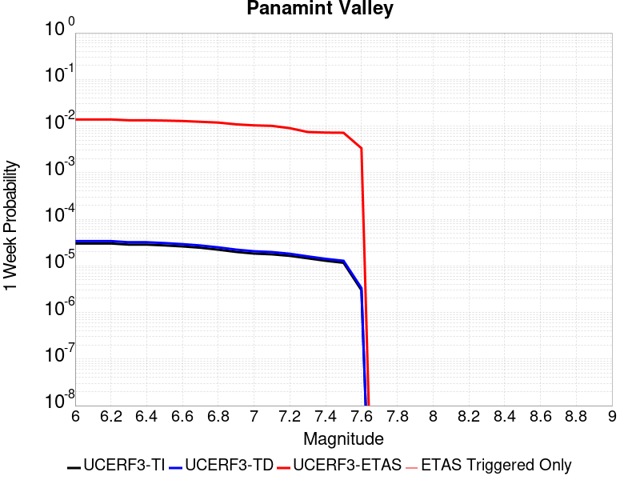 | 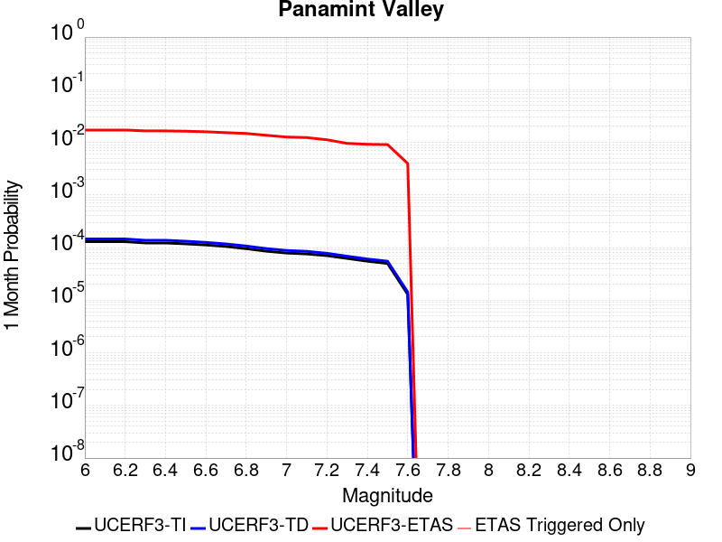 | 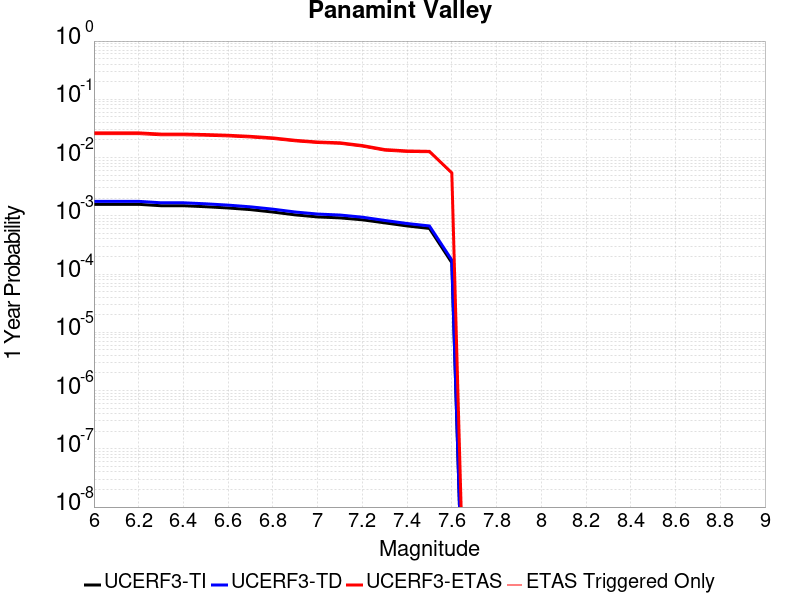 | 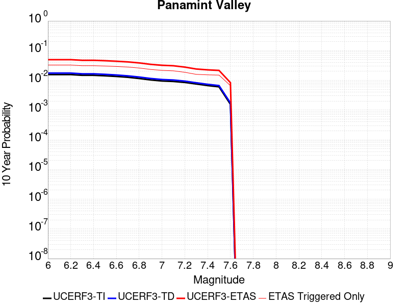 |

| Magnitude | 1 wk TI Prob | 1 wk TD Prob | 1 wk ETAS Prob | 1 wk ETAS/TD Gain | 1 wk ETAS Triggered Only | 1 mo TI Prob | 1 mo TD Prob | 1 mo ETAS Prob | 1 mo ETAS/TD Gain | 1 mo ETAS Triggered Only | 1 yr TI Prob | 1 yr TD Prob | 1 yr ETAS Prob | 1 yr ETAS/TD Gain | 1 yr ETAS Triggered Only | 10 yr TI Prob | 10 yr TD Prob | 10 yr ETAS Prob | 10 yr ETAS/TD Gain | 10 yr ETAS Triggered Only |
|-----|-----|-----|-----|-----|-----|-----|-----|-----|-----|-----|-----|-----|-----|-----|-----|-----|-----|-----|-----|-----|
| 6.0 | 3.0211835E-5 | 3.3984263E-5 | 0.012873276 | 378.80112 | 0.012839728 | 1.2947287E-4 | 1.4563887E-4 | 0.017329387 | 118.98875 | 0.01718625 | 0.0015751923 | 0.0017717406 | 0.026782306 | 15.116381 | 0.025054956 | 0.015640736 | 0.017583003 | 0.049535114 | 2.817216 | 0.032523982 |
| 6.1 | 3.0211835E-5 | 3.3984263E-5 | 0.012873276 | 378.80112 | 0.012839728 | 1.2947287E-4 | 1.4563887E-4 | 0.017329387 | 118.98875 | 0.01718625 | 0.0015751923 | 0.0017717406 | 0.026782306 | 15.116381 | 0.025054956 | 0.015640736 | 0.017583003 | 0.049535114 | 2.817216 | 0.032523982 |
| 6.2 | 3.0211835E-5 | 3.3984263E-5 | 0.012873276 | 378.80112 | 0.012839728 | 1.2947287E-4 | 1.4563887E-4 | 0.017329387 | 118.98875 | 0.01718625 | 0.0015751923 | 0.0017717406 | 0.026782306 | 15.116381 | 0.025054956 | 0.015640736 | 0.017583003 | 0.049535114 | 2.817216 | 0.032523982 |
| 6.3 | 2.8573924E-5 | 3.2102445E-5 | 0.012371834 | 385.38605 | 0.0123401275 | 1.2245393E-4 | 1.375748E-4 | 0.016647093 | 121.003944 | 0.01651179 | 0.001489857 | 0.0016737141 | 0.025539577 | 15.259223 | 0.023905875 | 0.01479908 | 0.016618038 | 0.047103073 | 2.8344548 | 0.0310002 |
| 6.4 | 2.8573924E-5 | 3.2102445E-5 | 0.012371834 | 385.38605 | 0.0123401275 | 1.2245393E-4 | 1.375748E-4 | 0.016647093 | 121.003944 | 0.01651179 | 0.001489857 | 0.0016737141 | 0.025539577 | 15.259223 | 0.023905875 | 0.01479908 | 0.016618038 | 0.047103073 | 2.8344548 | 0.0310002 |
| 6.5 | 2.7468774E-5 | 3.0828138E-5 | 0.012170741 | 394.79327 | 0.012140288 | 1.1771801E-4 | 1.3211406E-4 | 0.01636698 | 123.885216 | 0.016237011 | 0.0014322745 | 0.0016073292 | 0.024951043 | 15.523293 | 0.023381295 | 0.014230782 | 0.015963882 | 0.045682598 | 2.861622 | 0.030200839 |
| 6.6 | 2.6135967E-5 | 2.9252153E-5 | 0.011869433 | 405.76276 | 0.011840528 | 1.1200648E-4 | 1.2536049E-4 | 0.015910752 | 126.91998 | 0.01578737 | 0.0013628257 | 0.0015252219 | 0.02414754 | 15.832149 | 0.022656875 | 0.013544982 | 0.015154343 | 0.04388885 | 2.8961234 | 0.029176658 |
| 6.7 | 2.4498746E-5 | 2.7341044E-5 | 0.011467876 | 419.43808 | 0.011440847 | 1.04990395E-4 | 1.17170785E-4 | 0.015353195 | 131.03262 | 0.01523781 | 0.0012775084 | 0.0014256459 | 0.023102332 | 16.204819 | 0.021707634 | 0.012701893 | 0.014171593 | 0.041728098 | 2.944489 | 0.027952638 |
| 6.8 | 2.2244329E-5 | 2.4935374E-5 | 0.01094093 | 438.77145 | 0.010916267 | 9.532935E-5 | 1.0686163E-4 | 0.014668655 | 137.26773 | 0.014563349 | 0.0011600169 | 0.0013002857 | 0.02160758 | 16.617563 | 0.020333733 | 0.011539802 | 0.012932955 | 0.03852687 | 2.9789689 | 0.025929257 |
| 6.9 | 1.9902658E-5 | 2.2290182E-5 | 0.010138971 | 454.86264 | 0.010116907 | 8.529431E-5 | 9.552596E-5 | 0.013408602 | 140.36606 | 0.013314349 | 0.0010379635 | 0.0011624265 | 0.019526348 | 16.79792 | 0.018385291 | 0.010331288 | 0.011569021 | 0.034556363 | 2.9869738 | 0.023256395 |
| 7.0 | 1.8353881E-5 | 2.056605E-5 | 0.009462818 | 460.11838 | 0.009442446 | 7.865712E-5 | 8.813734E-5 | 0.0125021115 | 141.84807 | 0.012415068 | 9.5722964E-4 | 0.0010725616 | 0.018140566 | 16.91331 | 0.01708633 | 0.009531168 | 0.01067939 | 0.032031633 | 2.999388 | 0.021582734 |
| 7.1 | 1.7667631E-5 | 1.9772435E-5 | 0.009287175 | 469.70316 | 0.009267586 | 7.571623E-5 | 8.4736355E-5 | 0.012248973 | 144.55394 | 0.012165268 | 9.2145515E-4 | 0.0010311945 | 0.017625775 | 17.092583 | 0.01661171 | 0.009176437 | 0.0102695925 | 0.0309137 | 3.0102167 | 0.020858314 |
| 7.2 | 1.6381597E-5 | 1.8158042E-5 | 0.008411291 | 463.22678 | 0.008393286 | 7.020495E-5 | 7.781795E-5 | 0.011093148 | 142.55255 | 0.011016187 | 8.544101E-4 | 9.470391E-4 | 0.015821029 | 16.705782 | 0.014888089 | 0.008511325 | 0.009435269 | 0.028018255 | 2.9695237 | 0.018759992 |
| 7.3 | 1.4520491E-5 | 1.596657E-5 | 0.007110178 | 445.31653 | 0.0070943246 | 6.222919E-5 | 6.842646E-5 | 0.0094602695 | 138.25456 | 0.009392486 | 7.57377E-4 | 8.327899E-4 | 0.013537029 | 16.255035 | 0.012714828 | 0.0075480095 | 0.008300399 | 0.024130138 | 2.9071054 | 0.01596223 |
| 7.4 | 1.2852287E-5 | 1.41454875E-5 | 0.006908532 | 488.39127 | 0.0068944846 | 5.5080065E-5 | 6.06222E-5 | 0.009177775 | 151.39297 | 0.009117706 | 6.7039346E-4 | 7.378411E-4 | 0.012969018 | 17.576979 | 0.012240208 | 0.0066837464 | 0.007357429 | 0.022582313 | 3.0693212 | 0.01533773 |
| 7.5 | 1.1637851E-5 | 1.2836868E-5 | 0.0068073138 | 530.294 | 0.0067945644 | 4.987555E-5 | 5.5014076E-5 | 0.009072304 | 164.90877 | 0.009017786 | 6.070656E-4 | 6.696062E-4 | 0.012776801 | 19.081068 | 0.012115308 | 0.006054099 | 0.0066793845 | 0.02161691 | 3.2363627 | 0.01503797 |
| 7.6 | 3.0068115E-6 | 3.3330623E-6 | 0.0031258247 | 937.82367 | 0.003122502 | 1.2886271E-5 | 1.4284516E-5 | 0.0039860504 | 279.04694 | 0.0039718226 | 1.5687906E-4 | 1.7390738E-4 | 0.005518701 | 31.733566 | 0.0053457236 | 0.0015676835 | 0.0017397973 | 0.008422795 | 4.8412504 | 0.006694644 |

## Garlock (East)
*[(top)](#table-of-contents)*

| 1 Week | 1 Month | 1 Year | 10 Year |
|-----|-----|-----|-----|
| 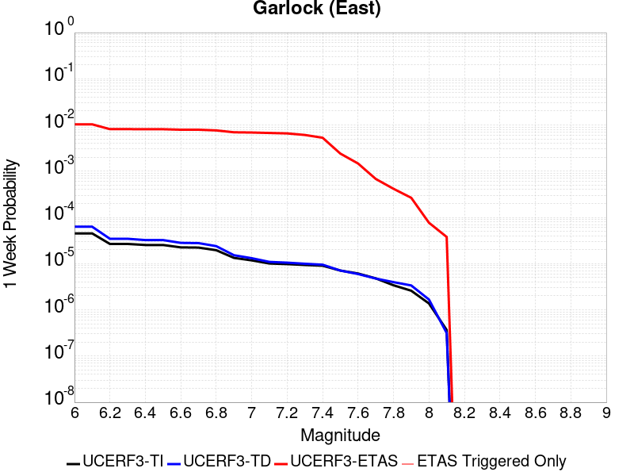 | 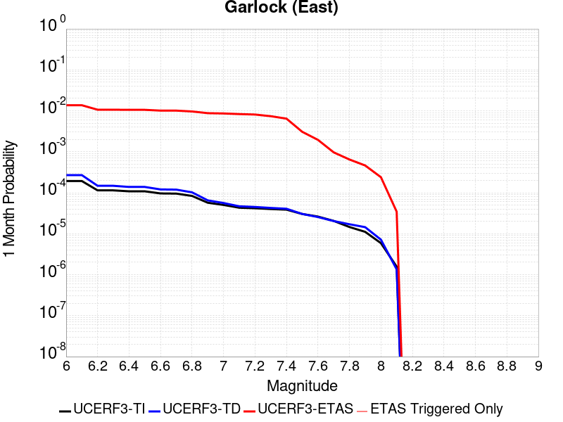 | 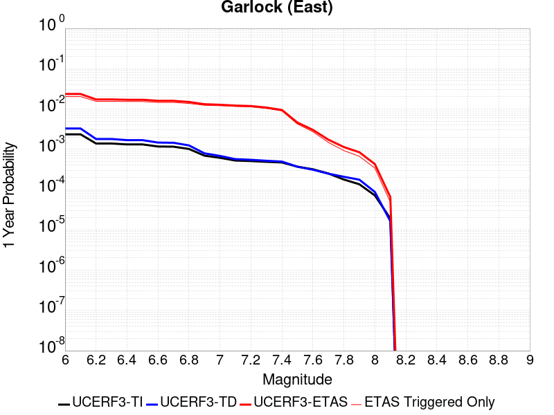 | 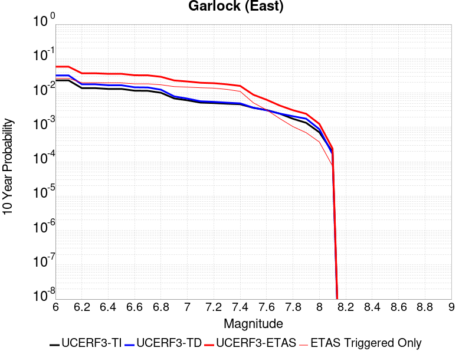 |

| Magnitude | 1 wk TI Prob | 1 wk TD Prob | 1 wk ETAS Prob | 1 wk ETAS/TD Gain | 1 wk ETAS Triggered Only | 1 mo TI Prob | 1 mo TD Prob | 1 mo ETAS Prob | 1 mo ETAS/TD Gain | 1 mo ETAS Triggered Only | 1 yr TI Prob | 1 yr TD Prob | 1 yr ETAS Prob | 1 yr ETAS/TD Gain | 1 yr ETAS Triggered Only | 10 yr TI Prob | 10 yr TD Prob | 10 yr ETAS Prob | 10 yr ETAS/TD Gain | 10 yr ETAS Triggered Only |
|-----|-----|-----|-----|-----|-----|-----|-----|-----|-----|-----|-----|-----|-----|-----|-----|-----|-----|-----|-----|-----|
| 6.0 | 4.5092507E-5 | 6.2904815E-5 | 0.010678744 | 169.76035 | 0.010616506 | 1.9323928E-4 | 2.6956675E-4 | 0.0140797915 | 52.23119 | 0.013813949 | 0.0023501497 | 0.003277482 | 0.023644164 | 7.214125 | 0.020433653 | 0.023254504 | 0.03235377 | 0.058072586 | 1.7949247 | 0.026578737 |
| 6.1 | 4.5092507E-5 | 6.2904815E-5 | 0.010678744 | 169.76035 | 0.010616506 | 1.9323928E-4 | 2.6956675E-4 | 0.0140797915 | 52.23119 | 0.013813949 | 0.0023501497 | 0.003277482 | 0.023644164 | 7.214125 | 0.020433653 | 0.023254504 | 0.03235377 | 0.058072586 | 1.7949247 | 0.026578737 |
| 6.2 | 2.6674514E-5 | 3.4511588E-5 | 0.008477465 | 245.64114 | 0.008443246 | 1.1431433E-4 | 1.4789861E-4 | 0.0109626455 | 74.12271 | 0.010816347 | 0.0013908884 | 0.0017992114 | 0.01753324 | 9.74496 | 0.01576239 | 0.01382215 | 0.017872788 | 0.037376963 | 2.0912776 | 0.019859113 |
| 6.3 | 2.6674514E-5 | 3.4511588E-5 | 0.008477465 | 245.64114 | 0.008443246 | 1.1431433E-4 | 1.4789861E-4 | 0.0109626455 | 74.12271 | 0.010816347 | 0.0013908884 | 0.0017992114 | 0.01753324 | 9.74496 | 0.01576239 | 0.01382215 | 0.017872788 | 0.037376963 | 2.0912776 | 0.019859113 |
| 6.4 | 2.5312667E-5 | 3.2340467E-5 | 0.008450334 | 261.29285 | 0.008418266 | 1.0847834E-4 | 1.3859481E-4 | 0.01090349 | 78.6717 | 0.010766387 | 0.0013199237 | 0.0016861152 | 0.017247362 | 10.2290535 | 0.01558753 | 0.013121112 | 0.016772287 | 0.036028143 | 2.148076 | 0.019584332 |
| 6.5 | 2.5312667E-5 | 3.2340467E-5 | 0.008450334 | 261.29285 | 0.008418266 | 1.0847834E-4 | 1.3859481E-4 | 0.01090349 | 78.6717 | 0.010766387 | 0.0013199237 | 0.0016861152 | 0.017247362 | 10.2290535 | 0.01558753 | 0.013121112 | 0.016772287 | 0.036028143 | 2.148076 | 0.019584332 |
| 6.6 | 2.246556E-5 | 2.8134691E-5 | 0.008146412 | 289.5504 | 0.008118506 | 9.627742E-5 | 1.2057181E-4 | 0.010361143 | 85.93338 | 0.0102418065 | 0.0011715472 | 0.0014669969 | 0.01620853 | 11.048782 | 0.0147631895 | 0.011653901 | 0.014613169 | 0.032779023 | 2.2431154 | 0.018435251 |
| 6.7 | 2.2241198E-5 | 2.7804432E-5 | 0.008146084 | 292.9779 | 0.008118506 | 9.531594E-5 | 1.1915654E-4 | 0.010359743 | 86.94229 | 0.0102418065 | 0.0011598538 | 0.0014497889 | 0.016191576 | 11.168229 | 0.0147631895 | 0.011538187 | 0.014442829 | 0.032611825 | 2.2579942 | 0.018435251 |
| 6.8 | 1.9528685E-5 | 2.3898969E-5 | 0.007817478 | 327.10522 | 0.007793765 | 8.369167E-5 | 1.0242024E-4 | 0.009868606 | 96.354065 | 0.009767186 | 0.0010184698 | 0.0012462728 | 0.015117852 | 12.130452 | 0.013888889 | 0.010138147 | 0.012436723 | 0.02950791 | 2.3726435 | 0.01728617 |
| 6.9 | 1.3318621E-5 | 1.5198818E-5 | 0.0071593747 | 471.04813 | 0.0071442844 | 5.7078556E-5 | 6.51362E-5 | 0.008982421 | 137.90213 | 0.008917865 | 6.9470983E-4 | 7.927504E-4 | 0.013247897 | 16.71131 | 0.012465028 | 0.0069254204 | 0.007940721 | 0.023131875 | 2.9130702 | 0.01531275 |
| 7.0 | 1.1760853E-5 | 1.3107653E-5 | 0.0070324 | 536.51105 | 0.0070193843 | 5.0402683E-5 | 5.6174475E-5 | 0.008798689 | 156.63144 | 0.008743006 | 6.134799E-4 | 6.8371464E-4 | 0.012815702 | 18.744226 | 0.012140288 | 0.0061178906 | 0.006857401 | 0.02156897 | 3.1453564 | 0.014813149 |
| 7.1 | 1.0064758E-5 | 1.0902761E-5 | 0.0068553523 | 628.77216 | 0.0068445243 | 4.3133965E-5 | 4.67253E-5 | 0.008539534 | 182.76039 | 0.0084932055 | 5.2502943E-4 | 5.6873553E-4 | 0.012252734 | 21.543816 | 0.011690647 | 0.005237907 | 0.0057133473 | 0.019820932 | 3.4692328 | 0.014188649 |
| 7.2 | 9.768808E-6 | 1.0498628E-5 | 0.0067050727 | 638.66174 | 0.006694644 | 4.186565E-5 | 4.499337E-5 | 0.008337986 | 185.31589 | 0.008293365 | 5.095951E-4 | 5.4766005E-4 | 0.011982242 | 21.878977 | 0.011440847 | 0.0050842804 | 0.005503584 | 0.019241506 | 3.4961774 | 0.013813949 |
| 7.3 | 9.344516E-6 | 9.9442705E-6 | 0.006154967 | 618.94604 | 0.006145084 | 4.004731E-5 | 4.2617627E-5 | 0.0075363033 | 176.83536 | 0.007494005 | 4.8746695E-4 | 5.187495E-4 | 0.010979947 | 21.166182 | 0.010466627 | 0.0048639905 | 0.005215269 | 0.017838936 | 3.4205208 | 0.012689848 |
| 7.4 | 9.023491E-6 | 9.490441E-6 | 0.0053301835 | 561.637 | 0.005320743 | 3.867153E-5 | 4.0672705E-5 | 0.0065601915 | 161.29224 | 0.006519784 | 4.7072413E-4 | 4.95081E-4 | 0.009508402 | 19.20575 | 0.009017786 | 0.004697283 | 0.0049787266 | 0.016039489 | 3.2216048 | 0.011116107 |
| 7.5 | 7.081253E-6 | 7.0873994E-6 | 0.0025050712 | 353.45422 | 0.0024980016 | 3.0347876E-5 | 3.0374218E-5 | 0.003027885 | 99.68602 | 0.0029976019 | 3.6942272E-4 | 3.697441E-4 | 0.0045148935 | 12.21086 | 0.0041466826 | 0.003688092 | 0.0037244745 | 0.008876079 | 2.383176 | 0.005170863 |
| 7.6 | 6.116396E-6 | 5.9589424E-6 | 0.0015547107 | 260.9038 | 0.001548761 | 2.6212863E-5 | 2.5538076E-5 | 0.0018490327 | 72.40298 | 0.0018235411 | 3.1909486E-4 | 3.1088197E-4 | 0.002808107 | 9.032711 | 0.0024980016 | 0.0031863707 | 0.0031359126 | 0.0063482295 | 2.0243642 | 0.003222422 |
| 7.7 | 4.797145E-6 | 4.7571157E-6 | 7.5415405E-4 | 158.53178 | 7.4940047E-4 | 2.055903E-5 | 2.0387479E-5 | 8.946702E-4 | 43.883316 | 8.7430055E-4 | 2.5027743E-4 | 2.481894E-4 | 0.0016467231 | 6.634945 | 0.0013988808 | 0.0024999576 | 0.0025094065 | 0.0043034544 | 1.7149291 | 0.0017985612 |
| 7.8 | 3.4028885E-6 | 3.978375E-6 | 5.035767E-4 | 126.5785 | 4.996003E-4 | 1.4583726E-5 | 1.7050066E-5 | 6.165602E-4 | 36.16175 | 5.995204E-4 | 1.775424E-4 | 2.0756487E-4 | 0.0010317343 | 4.9706597 | 8.243405E-4 | 0.0017740062 | 0.0021012141 | 0.0031481702 | 1.4982625 | 0.0010491607 |
| 7.9 | 2.5928412E-6 | 3.372436E-6 | 3.0313162E-4 | 89.88506 | 2.997602E-4 | 1.1112129E-5 | 1.4453217E-5 | 3.8914804E-4 | 26.924665 | 3.7470023E-4 | 1.3528178E-4 | 1.7595377E-4 | 7.254174E-4 | 4.1227727 | 5.4956035E-4 | 0.0013519945 | 0.0017812426 | 0.0024794373 | 1.3919705 | 6.994404E-4 |
| 8.0 | 1.3743648E-6 | 1.6734741E-6 | 1.5155332E-4 | 90.562096 | 1.498801E-4 | 5.8901214E-6 | 7.1720124E-6 | 2.070107E-4 | 28.863686 | 1.9984013E-4 | 7.1709874E-5 | 8.731578E-5 | 3.870498E-4 | 4.432759 | 2.997602E-4 | 7.1686733E-4 | 8.837377E-4 | 0.0012581068 | 1.4236201 | 3.7470023E-4 |
| 8.1 | 3.6733252E-7 | 3.1489736E-7 | 2.5294905E-5 | 80.32746 | 2.4980016E-5 | 1.5742813E-6 | 1.3495595E-6 | 2.6329542E-5 | 19.50973 | 2.4980016E-5 | 1.9166706E-5 | 1.643078E-5 | 6.638999E-5 | 4.0405865 | 4.9960032E-5 | 1.9165053E-4 | 1.662928E-4 | 2.4122038E-4 | 1.4505763 | 7.494005E-5 |

## Hunter Mountain-Saline Valley
*[(top)](#table-of-contents)*

| 1 Week | 1 Month | 1 Year | 10 Year |
|-----|-----|-----|-----|
| 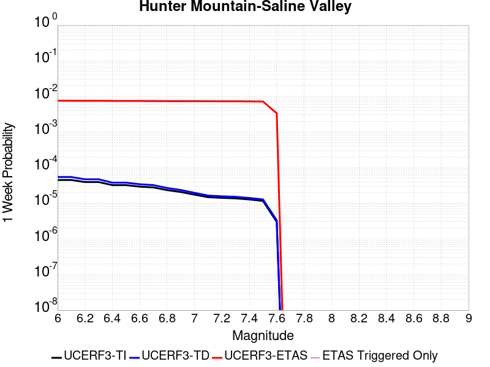 | 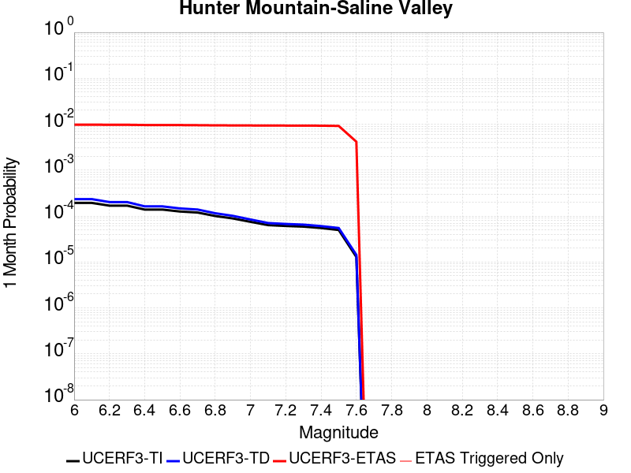 | 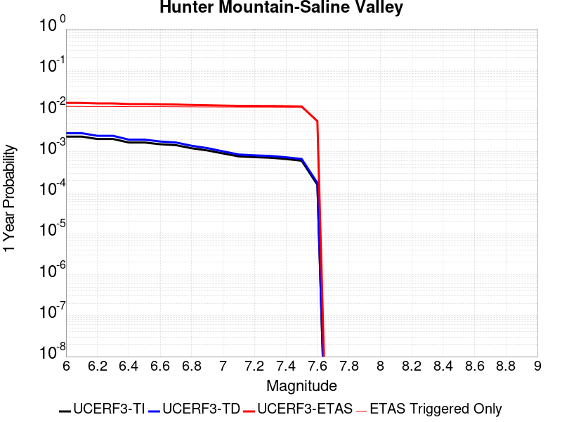 | 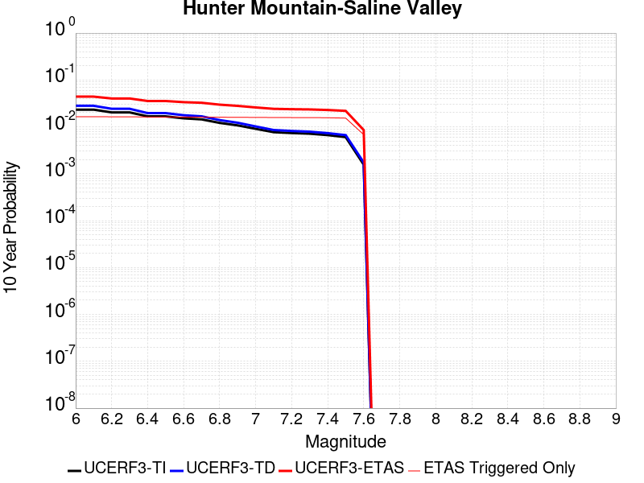 |

| Magnitude | 1 wk TI Prob | 1 wk TD Prob | 1 wk ETAS Prob | 1 wk ETAS/TD Gain | 1 wk ETAS Triggered Only | 1 mo TI Prob | 1 mo TD Prob | 1 mo ETAS Prob | 1 mo ETAS/TD Gain | 1 mo ETAS Triggered Only | 1 yr TI Prob | 1 yr TD Prob | 1 yr ETAS Prob | 1 yr ETAS/TD Gain | 1 yr ETAS Triggered Only | 10 yr TI Prob | 10 yr TD Prob | 10 yr ETAS Prob | 10 yr ETAS/TD Gain | 10 yr ETAS Triggered Only |
|-----|-----|-----|-----|-----|-----|-----|-----|-----|-----|-----|-----|-----|-----|-----|-----|-----|-----|-----|-----|-----|
| 6.0 | 4.5103672E-5 | 5.456906E-5 | 0.007173485 | 131.457 | 0.0071193045 | 1.9328714E-4 | 2.3384714E-4 | 0.009624137 | 41.155674 | 0.009392486 | 0.002350731 | 0.0028435462 | 0.01549731 | 5.449994 | 0.012689848 | 0.023260195 | 0.028092625 | 0.043582156 | 1.5513736 | 0.01593725 |
| 6.1 | 4.5103672E-5 | 5.456906E-5 | 0.007173485 | 131.457 | 0.0071193045 | 1.9328714E-4 | 2.3384714E-4 | 0.009624137 | 41.155674 | 0.009392486 | 0.002350731 | 0.0028435462 | 0.01549731 | 5.449994 | 0.012689848 | 0.023260195 | 0.028092625 | 0.043582156 | 1.5513736 | 0.01593725 |
| 6.2 | 3.9363465E-5 | 4.706271E-5 | 0.007141053 | 151.73485 | 0.0070943246 | 1.6868966E-4 | 2.016826E-4 | 0.009542325 | 47.313572 | 0.009342526 | 0.002051862 | 0.0024528534 | 0.015061738 | 6.1404967 | 0.012639888 | 0.020330196 | 0.024274187 | 0.039775826 | 1.638606 | 0.01588729 |
| 6.3 | 3.9363465E-5 | 4.706271E-5 | 0.007141053 | 151.73485 | 0.0070943246 | 1.6868966E-4 | 2.016826E-4 | 0.009542325 | 47.313572 | 0.009342526 | 0.002051862 | 0.0024528534 | 0.015061738 | 6.1404967 | 0.012639888 | 0.020330196 | 0.024274187 | 0.039775826 | 1.638606 | 0.01588729 |
| 6.4 | 3.2311684E-5 | 3.795112E-5 | 0.0070820483 | 186.60974 | 0.0070443647 | 1.384713E-4 | 1.6263791E-4 | 0.0094536925 | 58.127235 | 0.009292566 | 0.0016845843 | 0.001978387 | 0.014518477 | 7.3385425 | 0.012564948 | 0.016718714 | 0.019617118 | 0.035119276 | 1.7902362 | 0.01581235 |
| 6.5 | 3.2311684E-5 | 3.795112E-5 | 0.0070820483 | 186.60974 | 0.0070443647 | 1.384713E-4 | 1.6263791E-4 | 0.0094536925 | 58.127235 | 0.009292566 | 0.0016845843 | 0.001978387 | 0.014518477 | 7.3385425 | 0.012564948 | 0.016718714 | 0.019617118 | 0.035119276 | 1.7902362 | 0.01581235 |
| 6.6 | 2.9305844E-5 | 3.418196E-5 | 0.007078306 | 207.07721 | 0.0070443647 | 1.2559042E-4 | 1.4648624E-4 | 0.009437691 | 64.42715 | 0.009292566 | 0.0015279909 | 0.0017820727 | 0.014324629 | 8.038184 | 0.012564948 | 0.015175272 | 0.017686324 | 0.033194475 | 1.8768442 | 0.01578737 |
| 6.7 | 2.7826512E-5 | 3.2344353E-5 | 0.007051502 | 218.01338 | 0.0070193843 | 1.19251024E-4 | 1.3861163E-4 | 0.009404913 | 67.85082 | 0.009267586 | 0.0014509142 | 0.0016863506 | 0.014180234 | 8.40883 | 0.012514988 | 0.014414776 | 0.016743818 | 0.032217722 | 1.9241563 | 0.01573741 |
| 6.8 | 2.3389874E-5 | 2.6866792E-5 | 0.0069711246 | 259.46994 | 0.0069444445 | 1.0023846E-4 | 1.1513857E-4 | 0.009306726 | 80.83065 | 0.009192646 | 0.00121972 | 0.001400958 | 0.013823578 | 9.867232 | 0.012440048 | 0.01213047 | 0.013928067 | 0.029347757 | 2.1070948 | 0.01563749 |
| 6.9 | 2.069209E-5 | 2.357011E-5 | 0.006967851 | 295.62234 | 0.0069444445 | 8.867737E-5 | 1.0101105E-4 | 0.009292728 | 91.99715 | 0.009192646 | 0.0010791123 | 0.0012291519 | 0.01362896 | 11.088101 | 0.012415068 | 0.010738871 | 0.012229158 | 0.02765074 | 2.2610502 | 0.01561251 |
| 7.0 | 1.7462342E-5 | 1.9633622E-5 | 0.0069639417 | 354.69467 | 0.0069444445 | 7.483646E-5 | 8.414151E-5 | 0.009251036 | 109.94616 | 0.009167666 | 9.1075303E-4 | 0.0010239641 | 0.013351456 | 13.038988 | 0.0123401275 | 0.009070295 | 0.010196688 | 0.025551101 | 2.5058236 | 0.01551259 |
| 7.1 | 1.4807709E-5 | 1.6441827E-5 | 0.006960772 | 423.3576 | 0.0069444445 | 6.3460066E-5 | 7.046316E-5 | 0.009237483 | 131.09663 | 0.009167666 | 7.723524E-4 | 8.575678E-4 | 0.013137196 | 15.319134 | 0.012290168 | 0.007696735 | 0.008546168 | 0.023851885 | 2.790945 | 0.01543765 |
| 7.2 | 1.4180048E-5 | 1.5698413E-5 | 0.006960034 | 443.35907 | 0.0069444445 | 6.077022E-5 | 6.727727E-5 | 0.009234326 | 137.25775 | 0.009167666 | 7.396263E-4 | 8.1880915E-4 | 0.013098914 | 15.997518 | 0.012290168 | 0.0073716943 | 0.008161469 | 0.02344835 | 2.8730547 | 0.01541267 |
| 7.3 | 1.3730402E-5 | 1.5172151E-5 | 0.0069595114 | 458.70303 | 0.0069444445 | 5.8843252E-5 | 6.502197E-5 | 0.009232092 | 141.98419 | 0.009167666 | 7.161811E-4 | 7.9137104E-4 | 0.013071813 | 16.517931 | 0.012290168 | 0.007138774 | 0.007889058 | 0.023155354 | 2.9351227 | 0.01538769 |
| 7.4 | 1.2810095E-5 | 1.4109353E-5 | 0.0069084964 | 489.6395 | 0.0068944846 | 5.489925E-5 | 6.0467344E-5 | 0.009177621 | 151.77815 | 0.009117706 | 6.681934E-4 | 7.3595706E-4 | 0.012942195 | 17.58553 | 0.012215228 | 0.006661878 | 0.0073386896 | 0.022539064 | 3.0712655 | 0.01531275 |
| 7.5 | 1.1595659E-5 | 1.2800734E-5 | 0.006807278 | 531.78815 | 0.0067945644 | 4.9694736E-5 | 5.485922E-5 | 0.00907215 | 165.37148 | 0.009017786 | 6.0486543E-4 | 6.67722E-4 | 0.0127499765 | 19.094738 | 0.012090328 | 0.006032217 | 0.006660632 | 0.021573626 | 3.2389758 | 0.01501299 |
| 7.6 | 2.997694E-6 | 3.3251877E-6 | 0.0031258168 | 940.04224 | 0.003122502 | 1.28471975E-5 | 1.4250767E-5 | 0.003986017 | 279.7054 | 0.0039718226 | 1.564034E-4 | 1.7349655E-4 | 0.0055182925 | 31.806353 | 0.0053457236 | 0.0015629337 | 0.0017356955 | 0.00841872 | 4.8503437 | 0.006694644 |

## Blackwater
*[(top)](#table-of-contents)*

| 1 Week | 1 Month | 1 Year | 10 Year |
|-----|-----|-----|-----|
| 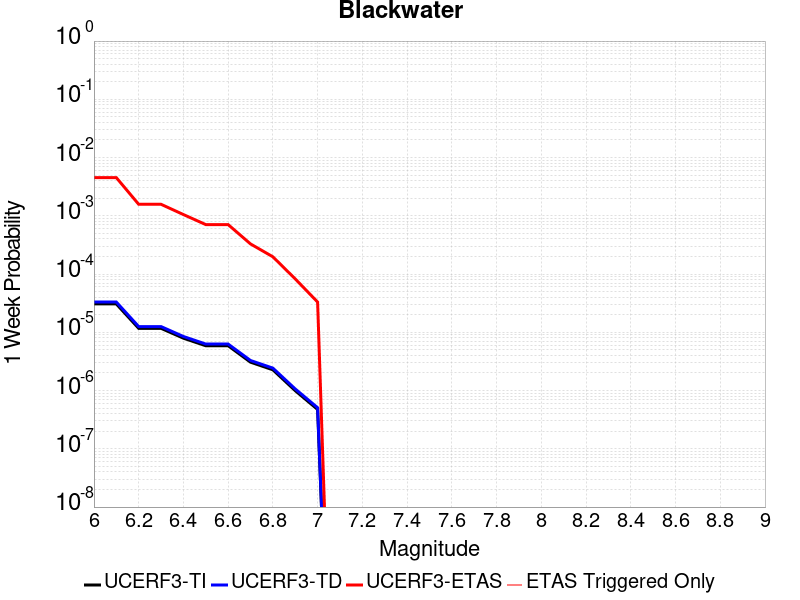 | 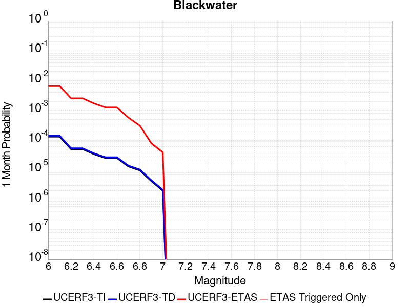 | 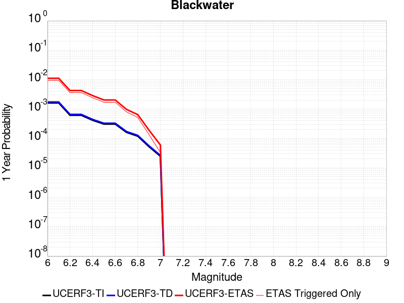 | 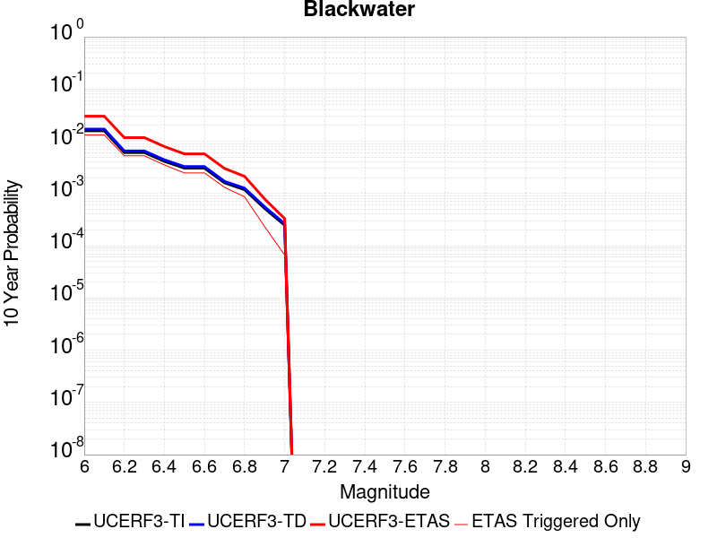 |

| Magnitude | 1 wk TI Prob | 1 wk TD Prob | 1 wk ETAS Prob | 1 wk ETAS/TD Gain | 1 wk ETAS Triggered Only | 1 mo TI Prob | 1 mo TD Prob | 1 mo ETAS Prob | 1 mo ETAS/TD Gain | 1 mo ETAS Triggered Only | 1 yr TI Prob | 1 yr TD Prob | 1 yr ETAS Prob | 1 yr ETAS/TD Gain | 1 yr ETAS Triggered Only | 10 yr TI Prob | 10 yr TD Prob | 10 yr ETAS Prob | 10 yr ETAS/TD Gain | 10 yr ETAS Triggered Only |
|-----|-----|-----|-----|-----|-----|-----|-----|-----|-----|-----|-----|-----|-----|-----|-----|-----|-----|-----|-----|-----|
| 6.0 | 3.0708583E-5 | 3.3095846E-5 | 0.004429433 | 133.83652 | 0.004396483 | 1.3160157E-4 | 1.4183241E-4 | 0.0063359975 | 44.672424 | 0.006195044 | 0.0016010714 | 0.0017255784 | 0.010852488 | 6.2891884 | 0.009142686 | 0.015895851 | 0.017135633 | 0.029829001 | 1.7407585 | 0.012914668 |
| 6.1 | 3.0708583E-5 | 3.3095846E-5 | 0.004429433 | 133.83652 | 0.004396483 | 1.3160157E-4 | 1.4183241E-4 | 0.0063359975 | 44.672424 | 0.006195044 | 0.0016010714 | 0.0017255784 | 0.010852488 | 6.2891884 | 0.009142686 | 0.015895851 | 0.017135633 | 0.029829001 | 1.7407585 | 0.012914668 |
| 6.2 | 1.1707779E-5 | 1.2545122E-5 | 0.0016612055 | 132.41844 | 0.001648681 | 5.017523E-5 | 5.3763757E-5 | 0.002401759 | 44.672455 | 0.0023481215 | 6.107122E-4 | 6.5438676E-4 | 0.0041493005 | 6.3407464 | 0.0034972022 | 0.006090366 | 0.0065255696 | 0.011538605 | 1.7682142 | 0.0050459635 |
| 6.3 | 1.1707779E-5 | 1.2545122E-5 | 0.0016612055 | 132.41844 | 0.001648681 | 5.017523E-5 | 5.3763757E-5 | 0.002401759 | 44.672455 | 0.0023481215 | 6.107122E-4 | 6.5438676E-4 | 0.0041493005 | 6.3407464 | 0.0034972022 | 0.006090366 | 0.0065255696 | 0.011538605 | 1.7682142 | 0.0050459635 |
| 6.4 | 7.929244E-6 | 8.480098E-6 | 0.0011325713 | 133.5564 | 0.0011241008 | 3.3982033E-5 | 3.6342793E-5 | 0.0016100266 | 44.301125 | 0.001573741 | 4.136527E-4 | 4.423877E-4 | 0.0027894704 | 6.305488 | 0.0023481215 | 0.0041288356 | 0.0044154758 | 0.007822627 | 1.7716385 | 0.0034222621 |
| 6.5 | 5.8832115E-6 | 6.285991E-6 | 7.307019E-4 | 116.24291 | 7.244205E-4 | 2.521352E-5 | 2.6939697E-5 | 0.0011510102 | 42.72543 | 0.0011241008 | 3.0693135E-4 | 3.27944E-4 | 0.0020010562 | 6.101823 | 0.001673661 | 0.0030650778 | 0.0032748538 | 0.0057397764 | 1.7526817 | 0.0024730216 |
| 6.6 | 5.8832115E-6 | 6.285991E-6 | 7.307019E-4 | 116.24291 | 7.244205E-4 | 2.521352E-5 | 2.6939697E-5 | 0.0011510102 | 42.72543 | 0.0011241008 | 3.0693135E-4 | 3.27944E-4 | 0.0020010562 | 6.101823 | 0.001673661 | 0.0030650778 | 0.0032748538 | 0.0057397764 | 1.7526817 | 0.0024730216 |
| 6.7 | 3.0715053E-6 | 3.2814662E-6 | 2.7806073E-4 | 84.73674 | 2.7478018E-4 | 1.3163528E-5 | 1.4063357E-5 | 4.6369733E-4 | 32.972023 | 4.496403E-4 | 1.6025416E-4 | 1.7120909E-4 | 9.45457E-4 | 5.5222363 | 7.743805E-4 | 0.0016013865 | 0.0017108864 | 0.002932813 | 1.7142068 | 0.0012240207 |
| 6.8 | 2.2722281E-6 | 2.4287538E-6 | 1.5230848E-4 | 62.710552 | 1.498801E-4 | 9.738084E-6 | 1.0408908E-5 | 2.6020646E-4 | 24.998442 | 2.4980016E-4 | 1.1855473E-4 | 1.26722E-4 | 5.763053E-4 | 4.547792 | 4.496403E-4 | 0.001184915 | 0.0012665876 | 0.0020150389 | 1.5909195 | 7.4940047E-4 |
| 6.9 | 9.952399E-7 | 1.0653489E-6 | 2.6045338E-5 | 24.447708 | 2.4980016E-5 | 4.265307E-6 | 4.5657757E-6 | 5.452558E-5 | 11.942238 | 4.9960032E-5 | 5.1928873E-5 | 5.5587418E-5 | 1.5550193E-4 | 2.7974303 | 9.9920064E-5 | 5.191674E-4 | 5.557858E-4 | 7.5551483E-4 | 1.3593634 | 1.9984013E-4 |
| 7.0 | 4.7385504E-7 | 5.0755597E-7 | 2.548756E-5 | 50.216255 | 2.4980016E-5 | 2.0308057E-6 | 2.1752398E-6 | 2.7155202E-5 | 12.483774 | 2.4980016E-5 | 2.4724779E-5 | 2.6483543E-5 | 7.644225E-5 | 2.8864057 | 4.9960032E-5 | 2.4722028E-4 | 2.6483546E-4 | 3.3975564E-4 | 1.2828934 | 7.494005E-5 |

## Ash Hill
*[(top)](#table-of-contents)*

| 1 Week | 1 Month | 1 Year | 10 Year |
|-----|-----|-----|-----|
| 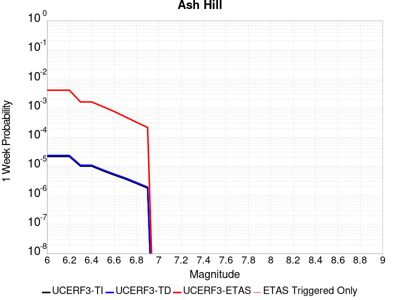 | 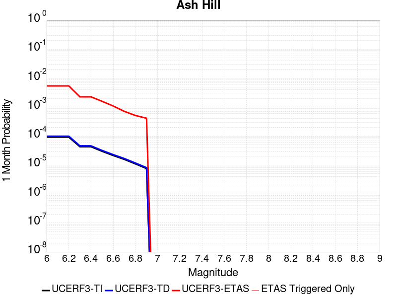 | 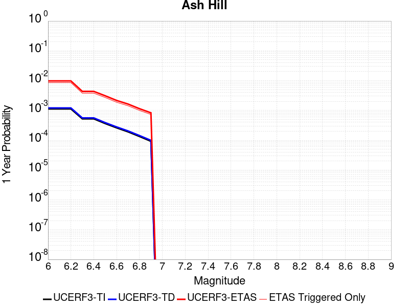 | 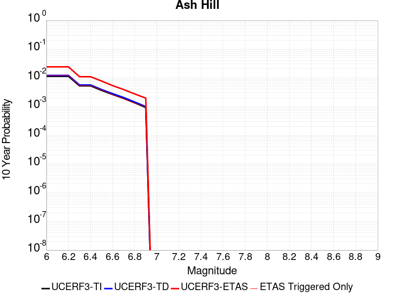 |

| Magnitude | 1 wk TI Prob | 1 wk TD Prob | 1 wk ETAS Prob | 1 wk ETAS/TD Gain | 1 wk ETAS Triggered Only | 1 mo TI Prob | 1 mo TD Prob | 1 mo ETAS Prob | 1 mo ETAS/TD Gain | 1 mo ETAS Triggered Only | 1 yr TI Prob | 1 yr TD Prob | 1 yr ETAS Prob | 1 yr ETAS/TD Gain | 1 yr ETAS Triggered Only | 10 yr TI Prob | 10 yr TD Prob | 10 yr ETAS Prob | 10 yr ETAS/TD Gain | 10 yr ETAS Triggered Only |
|-----|-----|-----|-----|-----|-----|-----|-----|-----|-----|-----|-----|-----|-----|-----|-----|-----|-----|-----|-----|-----|
| 6.0 | 2.1545662E-5 | 2.3194447E-5 | 0.0036951716 | 159.31277 | 0.0036720624 | 9.2335285E-5 | 9.940143E-5 | 0.0052197957 | 52.512276 | 0.0051209033 | 0.0011236023 | 0.0012096206 | 0.009492954 | 7.8478775 | 0.008293365 | 0.011179381 | 0.012038348 | 0.02329211 | 1.9348259 | 0.011390887 |
| 6.1 | 2.1545662E-5 | 2.3194447E-5 | 0.0036951716 | 159.31277 | 0.0036720624 | 9.2335285E-5 | 9.940143E-5 | 0.0052197957 | 52.512276 | 0.0051209033 | 0.0011236023 | 0.0012096206 | 0.009492954 | 7.8478775 | 0.008293365 | 0.011179381 | 0.012038348 | 0.02329211 | 1.9348259 | 0.011390887 |
| 6.2 | 2.1545662E-5 | 2.3194447E-5 | 0.0036951716 | 159.31277 | 0.0036720624 | 9.2335285E-5 | 9.940143E-5 | 0.0052197957 | 52.512276 | 0.0051209033 | 0.0011236023 | 0.0012096206 | 0.009492954 | 7.8478775 | 0.008293365 | 0.011179381 | 0.012038348 | 0.02329211 | 1.9348259 | 0.011390887 |
| 6.3 | 1.0025529E-5 | 1.0746934E-5 | 0.0015594913 | 145.11034 | 0.001548761 | 4.2965847E-5 | 4.605755E-5 | 0.0022941555 | 49.810627 | 0.0022482015 | 5.229836E-4 | 5.6061964E-4 | 0.0043304875 | 7.7244663 | 0.0037719824 | 0.005217545 | 0.0055933665 | 0.010834668 | 1.9370568 | 0.0052707833 |
| 6.4 | 1.0025529E-5 | 1.0746934E-5 | 0.0015594913 | 145.11034 | 0.001548761 | 4.2965847E-5 | 4.605755E-5 | 0.0022941555 | 49.810627 | 0.0022482015 | 5.229836E-4 | 5.6061964E-4 | 0.0043304875 | 7.7244663 | 0.0037719824 | 0.005217545 | 0.0055933665 | 0.010834668 | 1.9370568 | 0.0052707833 |
| 6.5 | 6.9617327E-6 | 7.456634E-6 | 0.0010566094 | 141.70059 | 0.0010491607 | 2.9835655E-5 | 3.195666E-5 | 0.0016556059 | 51.807846 | 0.0016237011 | 3.6318856E-4 | 3.8901155E-4 | 0.0032106552 | 8.253367 | 0.0028227419 | 0.0036259557 | 0.0038841602 | 0.007865438 | 2.0250037 | 0.0039968025 |
| 6.6 | 4.9919777E-6 | 5.3466883E-6 | 7.547432E-4 | 141.16087 | 7.4940047E-4 | 2.1394015E-5 | 2.2914215E-5 | 0.0011969481 | 52.23605 | 0.0011740607 | 2.60441E-4 | 2.7895154E-4 | 0.0022767955 | 8.161974 | 0.0019984012 | 0.0026013597 | 0.0027866727 | 0.0056264587 | 2.01906 | 0.0028477218 |
| 6.7 | 3.6630722E-6 | 3.924624E-6 | 5.03523E-4 | 128.29842 | 4.996003E-4 | 1.5698786E-5 | 1.681974E-5 | 8.411464E-4 | 50.00948 | 8.243405E-4 | 1.9111596E-4 | 2.0476682E-4 | 0.0017781856 | 8.683953 | 0.001573741 | 0.0019095168 | 0.0020463446 | 0.004165301 | 2.0354836 | 0.0021233014 |
| 6.8 | 2.5599613E-6 | 2.744925E-6 | 3.2748425E-4 | 119.30534 | 3.2474022E-4 | 1.0971216E-5 | 1.1763939E-5 | 5.8629754E-4 | 49.83854 | 5.7454035E-4 | 1.3356637E-4 | 1.4322149E-4 | 0.0011922319 | 8.324392 | 0.0010491607 | 0.0013348613 | 0.0014317769 | 0.0029034878 | 2.0278912 | 0.001473821 |
| 6.9 | 1.7684905E-6 | 1.8968707E-6 | 2.5169656E-4 | 132.69041 | 2.4980016E-4 | 7.579223E-6 | 8.129446E-6 | 5.077257E-4 | 62.455143 | 4.996003E-4 | 9.2273134E-5 | 9.8976E-5 | 9.2323497E-4 | 9.327867 | 8.243405E-4 | 9.223483E-4 | 9.8976E-4 | 0.002187614 | 2.2102468 | 0.0011990408 |

## Garlock (West)
*[(top)](#table-of-contents)*

| 1 Week | 1 Month | 1 Year | 10 Year |
|-----|-----|-----|-----|
| 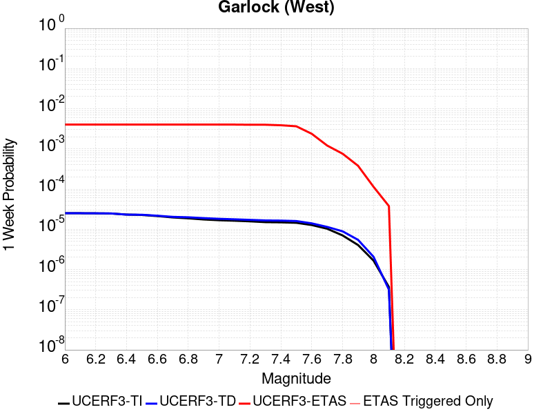 |  | 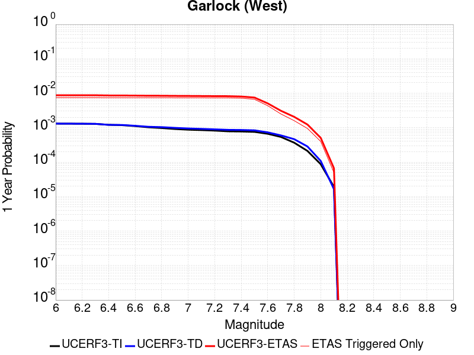 | 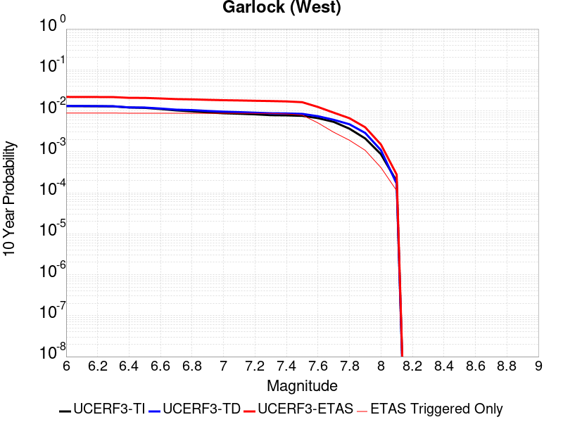 |

| Magnitude | 1 wk TI Prob | 1 wk TD Prob | 1 wk ETAS Prob | 1 wk ETAS/TD Gain | 1 wk ETAS Triggered Only | 1 mo TI Prob | 1 mo TD Prob | 1 mo ETAS Prob | 1 mo ETAS/TD Gain | 1 mo ETAS Triggered Only | 1 yr TI Prob | 1 yr TD Prob | 1 yr ETAS Prob | 1 yr ETAS/TD Gain | 1 yr ETAS Triggered Only | 10 yr TI Prob | 10 yr TD Prob | 10 yr ETAS Prob | 10 yr ETAS/TD Gain | 10 yr ETAS Triggered Only |
|-----|-----|-----|-----|-----|-----|-----|-----|-----|-----|-----|-----|-----|-----|-----|-----|-----|-----|-----|-----|-----|
| 6.0 | 2.5181727E-5 | 2.5197181E-5 | 0.0043716105 | 173.496 | 0.004346523 | 1.0791722E-4 | 1.0798347E-4 | 0.005553039 | 51.424896 | 0.0054456433 | 0.0013131002 | 0.0013139093 | 0.008748174 | 6.658126 | 0.0074440446 | 0.013053683 | 0.013141794 | 0.022558756 | 1.716566 | 0.0095423665 |
| 6.1 | 2.5077732E-5 | 2.5098223E-5 | 0.0043715117 | 174.17615 | 0.004346523 | 1.0747157E-4 | 1.075594E-4 | 0.0055526174 | 51.623726 | 0.0054456433 | 0.001307681 | 0.0013087525 | 0.008743055 | 6.6804495 | 0.0074440446 | 0.013000126 | 0.013090835 | 0.022508284 | 1.7193925 | 0.0095423665 |
| 6.2 | 2.494612E-5 | 2.4979914E-5 | 0.004371394 | 174.99635 | 0.004346523 | 1.0690756E-4 | 1.070524E-4 | 0.005552113 | 51.863506 | 0.0054456433 | 0.0013008224 | 0.0013025872 | 0.008736935 | 6.707371 | 0.0074440446 | 0.012932341 | 0.013029906 | 0.022447936 | 1.7228011 | 0.0095423665 |
| 6.3 | 2.4733758E-5 | 2.4799276E-5 | 0.004371214 | 176.26378 | 0.004346523 | 1.0599751E-4 | 1.06278305E-4 | 0.005551343 | 52.23402 | 0.0054456433 | 0.0012897556 | 0.0012931736 | 0.008727592 | 6.748971 | 0.0074440446 | 0.012822957 | 0.0129368715 | 0.02235579 | 1.7280676 | 0.0095423665 |
| 6.4 | 2.3237335E-5 | 2.3178607E-5 | 0.0043696007 | 188.51868 | 0.004346523 | 9.958477E-5 | 9.933313E-5 | 0.0055444357 | 55.816586 | 0.0054456433 | 0.0012117702 | 0.0012087126 | 0.00861881 | 7.13057 | 0.0074190646 | 0.012051838 | 0.012101731 | 0.021479264 | 1.7748917 | 0.009492406 |
| 6.5 | 2.2732203E-5 | 2.2992977E-5 | 0.004369416 | 190.03262 | 0.004346523 | 9.742009E-5 | 9.8537625E-5 | 0.0055436445 | 56.259167 | 0.0054456433 | 0.0011854442 | 0.0011990381 | 0.008609207 | 7.1800947 | 0.0074190646 | 0.011791403 | 0.012006035 | 0.021384476 | 1.7811438 | 0.009492406 |
| 6.6 | 2.1319436E-5 | 2.1773201E-5 | 0.0043682014 | 200.62283 | 0.004346523 | 9.136581E-5 | 9.3310395E-5 | 0.005538446 | 59.355076 | 0.0054456433 | 0.001111811 | 0.0011354643 | 0.008546105 | 7.526529 | 0.0074190646 | 0.011062649 | 0.011376952 | 0.020761363 | 1.8248616 | 0.009492406 |
| 6.7 | 1.970802E-5 | 2.0393094E-5 | 0.004366827 | 214.13264 | 0.004346523 | 8.446021E-5 | 8.739606E-5 | 0.0055325637 | 63.304497 | 0.0054456433 | 0.001027818 | 0.0010635294 | 0.008474704 | 7.968472 | 0.0074190646 | 0.010230771 | 0.0106646875 | 0.02005586 | 1.8805858 | 0.009492406 |
| 6.8 | 1.8744462E-5 | 1.9900775E-5 | 0.004366337 | 219.40538 | 0.004346523 | 8.033094E-5 | 8.528626E-5 | 0.0055304654 | 64.84592 | 0.0054456433 | 9.775903E-4 | 0.0010378672 | 0.008449232 | 8.140957 | 0.0074190646 | 0.009733009 | 0.010410495 | 0.01977936 | 1.8999443 | 0.009467426 |
| 6.9 | 1.7559682E-5 | 1.8953151E-5 | 0.0043653934 | 230.32547 | 0.004346523 | 7.5253614E-5 | 8.122527E-5 | 0.0055264262 | 68.03826 | 0.0054456433 | 9.158276E-4 | 9.884704E-4 | 0.008375246 | 8.472936 | 0.0073940847 | 0.0091206245 | 0.009921073 | 0.019220376 | 1.9373283 | 0.009392486 |
| 7.0 | 1.6794445E-5 | 1.8215967E-5 | 0.0043646595 | 239.60625 | 0.004346523 | 7.197421E-5 | 7.806611E-5 | 0.0055232844 | 70.75138 | 0.0054456433 | 8.759337E-4 | 9.5004175E-4 | 0.008337102 | 8.775511 | 0.0073940847 | 0.008724891 | 0.009539958 | 0.01884284 | 1.9751492 | 0.009392486 |
| 7.1 | 1.6337795E-5 | 1.771677E-5 | 0.0043641627 | 246.32948 | 0.004346523 | 7.0017246E-5 | 7.592681E-5 | 0.0054961788 | 72.387856 | 0.0054206634 | 8.521265E-4 | 9.2401815E-4 | 0.008286314 | 8.967695 | 0.007369105 | 0.008488664 | 0.009281721 | 0.01856228 | 1.9998748 | 0.009367506 |
| 7.2 | 1.5780008E-5 | 1.71654E-5 | 0.004338634 | 252.75462 | 0.0043215426 | 6.762685E-5 | 7.3563926E-5 | 0.0054688505 | 74.34147 | 0.0053956835 | 8.2304585E-4 | 8.952741E-4 | 0.008232824 | 9.195869 | 0.007344125 | 0.008200042 | 0.008996559 | 0.01823028 | 2.0263612 | 0.009317546 |
| 7.3 | 1.5058865E-5 | 1.6618484E-5 | 0.0043380894 | 261.04004 | 0.0043215426 | 6.45364E-5 | 7.122013E-5 | 0.0054665194 | 76.75526 | 0.0053956835 | 7.854473E-4 | 8.667614E-4 | 0.008204521 | 9.46572 | 0.007344125 | 0.00782677 | 0.008713263 | 0.01792486 | 2.0571926 | 0.009292566 |
| 7.4 | 1.4887923E-5 | 1.6454453E-5 | 0.0042380076 | 257.55994 | 0.004221623 | 6.380382E-5 | 7.0517184E-5 | 0.0052909725 | 75.03097 | 0.0052208235 | 7.7653467E-4 | 8.5820974E-4 | 0.008021321 | 9.346575 | 0.0071692644 | 0.0077382675 | 0.008628101 | 0.01761761 | 2.0418873 | 0.009067746 |
| 7.5 | 1.4509299E-5 | 1.6046468E-5 | 0.0039128666 | 243.84596 | 0.0038968825 | 6.218123E-5 | 6.876877E-5 | 0.004864602 | 70.73853 | 0.004796163 | 7.567935E-4 | 8.369394E-4 | 0.0075010215 | 8.962443 | 0.0066696643 | 0.0075422134 | 0.008416411 | 0.016763825 | 1.9918021 | 0.008418266 |
| 7.6 | 1.2756717E-5 | 1.4050529E-5 | 0.0026119356 | 185.8959 | 0.0025979218 | 5.4670498E-5 | 6.0215163E-5 | 0.003232486 | 53.68226 | 0.003172462 | 6.6541E-4 | 7.328737E-4 | 0.005076211 | 6.9264474 | 0.004346523 | 0.006634211 | 0.007381374 | 0.01296039 | 1.7558236 | 0.005620504 |
| 7.7 | 1.0328985E-5 | 1.146033E-5 | 0.0013104063 | 114.342804 | 0.0012989609 | 4.4266326E-5 | 4.9114777E-5 | 0.0016977149 | 34.566273 | 0.001648681 | 5.388092E-4 | 5.9780874E-4 | 0.003094317 | 5.1760983 | 0.0024980016 | 0.0053750467 | 0.006038286 | 0.009266079 | 1.5345546 | 0.0032474021 |
| 7.8 | 7.0306583E-6 | 8.899537E-6 | 8.831923E-4 | 99.24026 | 8.7430055E-4 | 3.0131043E-5 | 3.8140315E-5 | 0.0011871773 | 31.126572 | 0.0011490807 | 3.667837E-4 | 4.6425956E-4 | 0.0020622383 | 4.4419947 | 0.001598721 | 0.003661789 | 0.0046950667 | 0.006783536 | 1.4448222 | 0.0020983214 |
| 7.9 | 4.060633E-6 | 5.465412E-6 | 4.800831E-4 | 87.84024 | 4.746203E-4 | 1.7402595E-5 | 2.3422985E-5 | 6.479088E-4 | 27.661238 | 6.245004E-4 | 2.11856E-4 | 2.8513762E-4 | 0.0012341075 | 4.328112 | 9.492406E-4 | 0.0021165414 | 0.002884143 | 0.004054818 | 1.4059004 | 0.0011740607 |
| 8.0 | 1.6729537E-6 | 2.0775192E-6 | 2.268972E-4 | 109.21545 | 2.2482015E-4 | 7.169782E-6 | 8.903624E-6 | 3.0866114E-4 | 34.666912 | 2.997602E-4 | 8.7288594E-5 | 1.0839626E-4 | 5.080332E-4 | 4.686815 | 3.9968026E-4 | 8.7254314E-4 | 0.001096854 | 0.0015709538 | 1.432236 | 4.746203E-4 |
| 8.1 | 3.6733252E-7 | 3.1489736E-7 | 2.5294905E-5 | 80.32746 | 2.4980016E-5 | 1.5742813E-6 | 1.3495595E-6 | 2.6329542E-5 | 19.50973 | 2.4980016E-5 | 1.9166706E-5 | 1.643078E-5 | 6.638999E-5 | 4.0405865 | 4.9960032E-5 | 1.9165053E-4 | 1.662928E-4 | 2.4122038E-4 | 1.4505763 | 7.494005E-5 |

## McLean Lake
*[(top)](#table-of-contents)*

| 1 Week | 1 Month | 1 Year | 10 Year |
|-----|-----|-----|-----|
| 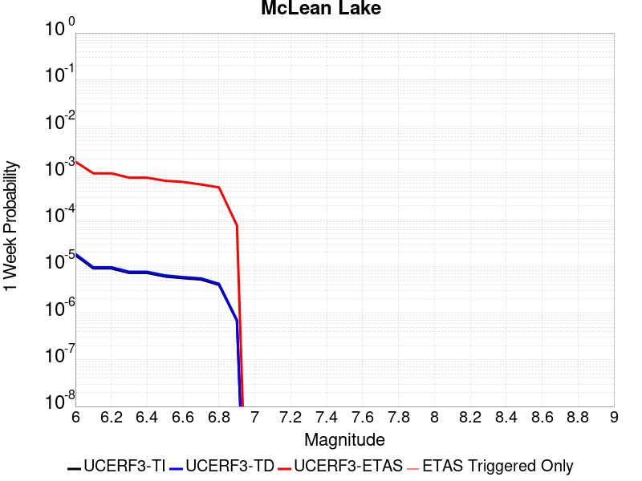 | 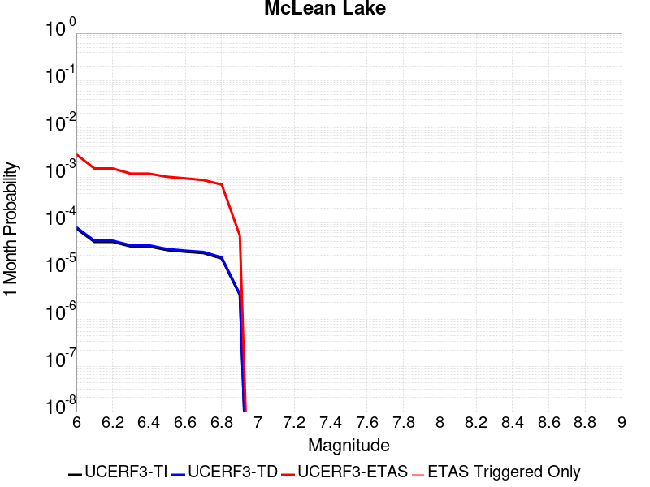 | 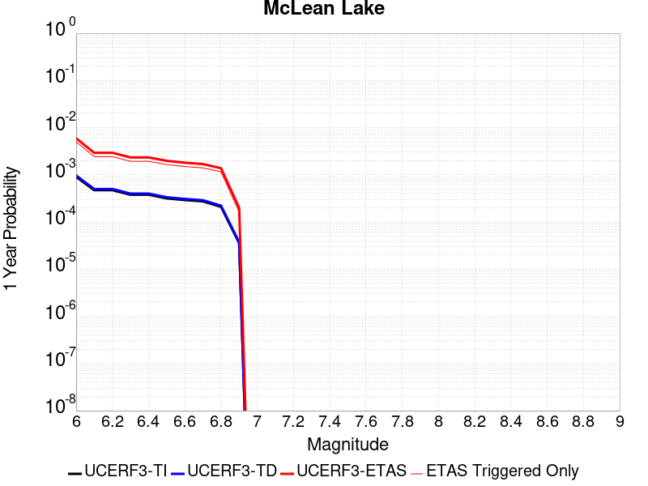 | 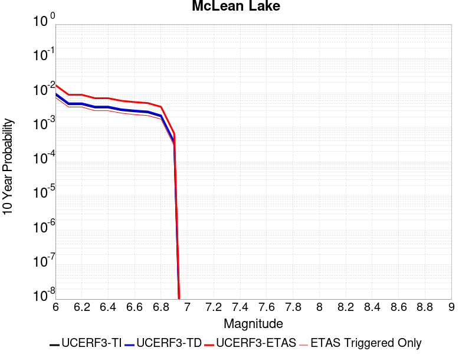 |

| Magnitude | 1 wk TI Prob | 1 wk TD Prob | 1 wk ETAS Prob | 1 wk ETAS/TD Gain | 1 wk ETAS Triggered Only | 1 mo TI Prob | 1 mo TD Prob | 1 mo ETAS Prob | 1 mo ETAS/TD Gain | 1 mo ETAS Triggered Only | 1 yr TI Prob | 1 yr TD Prob | 1 yr ETAS Prob | 1 yr ETAS/TD Gain | 1 yr ETAS Triggered Only | 10 yr TI Prob | 10 yr TD Prob | 10 yr ETAS Prob | 10 yr ETAS/TD Gain | 10 yr ETAS Triggered Only |
|-----|-----|-----|-----|-----|-----|-----|-----|-----|-----|-----|-----|-----|-----|-----|-----|-----|-----|-----|-----|-----|
| 6.0 | 1.7360222E-5 | 1.8501627E-5 | 0.0018669886 | 100.909424 | 0.0018485212 | 7.439883E-5 | 7.9290556E-5 | 0.0027269623 | 34.39202 | 0.0026478816 | 9.0542925E-4 | 9.6498354E-4 | 0.005631739 | 5.836098 | 0.004671263 | 0.009017491 | 0.0096127745 | 0.016812082 | 1.7489313 | 0.0072691846 |
| 6.1 | 9.062689E-6 | 9.592193E-6 | 0.0010587428 | 110.375465 | 0.0010491607 | 3.8839516E-5 | 4.1108804E-5 | 0.0014649112 | 35.634975 | 0.0014238609 | 4.727685E-4 | 5.003936E-4 | 0.00294721 | 5.889784 | 0.0024480415 | 0.0047176396 | 0.004993552 | 0.009020107 | 1.806351 | 0.0040467624 |
| 6.2 | 9.062689E-6 | 9.592193E-6 | 0.0010587428 | 110.375465 | 0.0010491607 | 3.8839516E-5 | 4.1108804E-5 | 0.0014649112 | 35.634975 | 0.0014238609 | 4.727685E-4 | 5.003936E-4 | 0.00294721 | 5.889784 | 0.0024480415 | 0.0047176396 | 0.004993552 | 0.009020107 | 1.806351 | 0.0040467624 |
| 6.3 | 7.2575485E-6 | 7.66771E-6 | 7.5706246E-4 | 98.73385 | 7.4940047E-4 | 3.110341E-5 | 3.2861237E-5 | 0.0010819874 | 32.92595 | 0.0010491607 | 3.786182E-4 | 4.0001926E-4 | 0.0023726511 | 5.931342 | 0.0019734213 | 0.0037797375 | 0.0039936965 | 0.00727789 | 1.8223442 | 0.003297362 |
| 6.4 | 7.2575485E-6 | 7.66771E-6 | 7.5706246E-4 | 98.73385 | 7.4940047E-4 | 3.110341E-5 | 3.2861237E-5 | 0.0010819874 | 32.92595 | 0.0010491607 | 3.786182E-4 | 4.0001926E-4 | 0.0023726511 | 5.931342 | 0.0019734213 | 0.0037797375 | 0.0039936965 | 0.00727789 | 1.8223442 | 0.003297362 |
| 6.5 | 6.06582E-6 | 6.4038773E-6 | 6.8086E-4 | 106.31996 | 6.7446043E-4 | 2.5996113E-5 | 2.7444936E-5 | 9.766595E-4 | 35.586147 | 9.492406E-4 | 3.164567E-4 | 3.3409733E-4 | 0.0020071992 | 6.0078278 | 0.001673661 | 0.0031600643 | 0.0033365893 | 0.006125016 | 1.8357117 | 0.0027977617 |
| 6.6 | 5.598744E-6 | 5.910262E-6 | 6.5538683E-4 | 110.88964 | 6.4948044E-4 | 2.3994397E-5 | 2.5329486E-5 | 9.245873E-4 | 36.50241 | 8.992806E-4 | 2.9209262E-4 | 3.0834923E-4 | 0.0018316604 | 5.9402137 | 0.001523781 | 0.0029170897 | 0.003079843 | 0.0056448607 | 1.8328403 | 0.0025729416 |
| 6.7 | 5.246996E-6 | 5.539162E-6 | 5.8007636E-4 | 104.72276 | 5.7454035E-4 | 2.2486933E-5 | 2.3739085E-5 | 8.4806007E-4 | 35.72421 | 8.243405E-4 | 2.73744E-4 | 2.8899137E-4 | 0.0017124409 | 5.9255776 | 0.0014238609 | 0.0027340704 | 0.0028867796 | 0.005277938 | 1.8283136 | 0.0023980816 |
| 6.8 | 4.02324E-6 | 4.2469046E-6 | 4.788652E-4 | 112.756294 | 4.746203E-4 | 1.7242342E-5 | 1.8200926E-5 | 7.426082E-4 | 40.800575 | 7.244205E-4 | 2.099053E-4 | 2.2157968E-4 | 0.0014952782 | 6.748264 | 0.0012739808 | 0.0020970714 | 0.002214172 | 0.004257998 | 1.9230655 | 0.0020483613 |
| 6.9 | 6.835972E-7 | 7.1399285E-7 | 5.067399E-5 | 70.97269 | 4.9960032E-5 | 2.9296991E-6 | 3.0599674E-6 | 5.3019845E-5 | 17.326931 | 4.9960032E-5 | 3.56685E-5 | 3.7254784E-5 | 2.1210838E-4 | 5.6934533 | 1.748601E-4 | 3.5662777E-4 | 3.7251666E-4 | 7.221066E-4 | 1.9384545 | 3.497202E-4 |

## Gravel Hills-Harper Lk
*[(top)](#table-of-contents)*

| 1 Week | 1 Month | 1 Year | 10 Year |
|-----|-----|-----|-----|
| 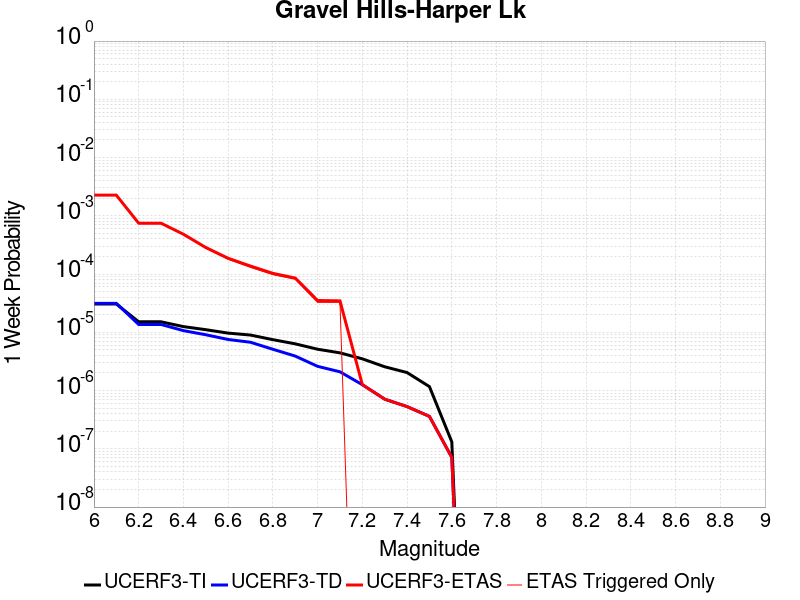 | 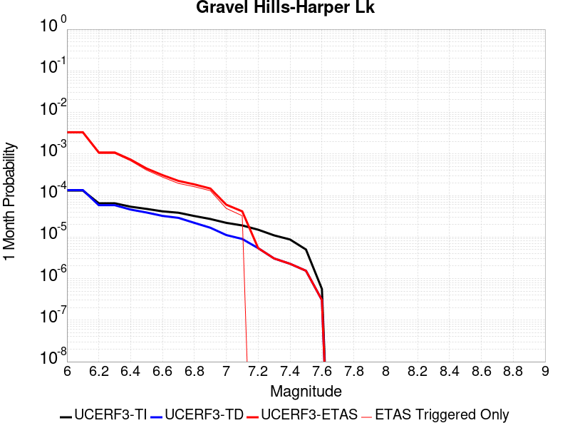 | 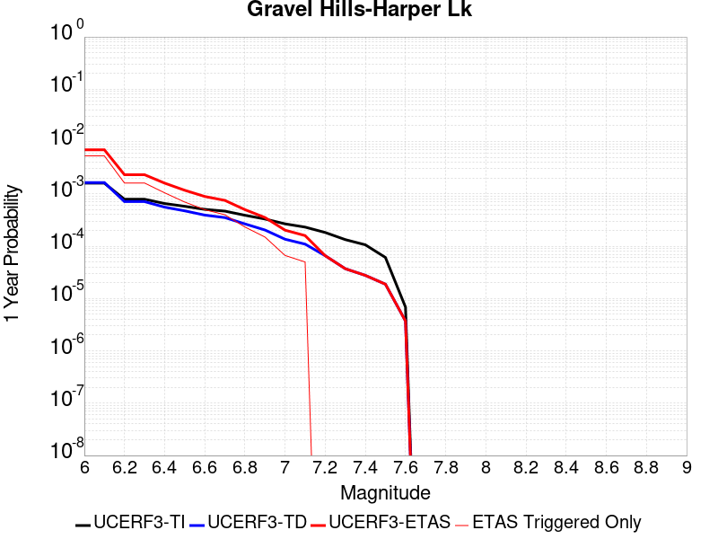 | 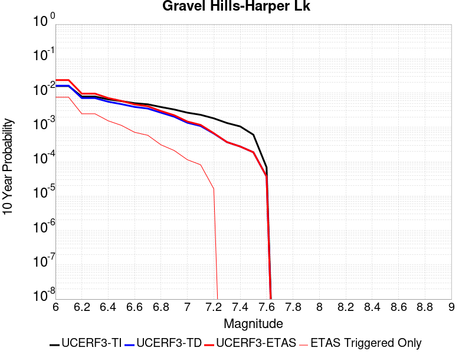 |

| Magnitude | 1 wk TI Prob | 1 wk TD Prob | 1 wk ETAS Prob | 1 wk ETAS/TD Gain | 1 wk ETAS Triggered Only | 1 mo TI Prob | 1 mo TD Prob | 1 mo ETAS Prob | 1 mo ETAS/TD Gain | 1 mo ETAS Triggered Only | 1 yr TI Prob | 1 yr TD Prob | 1 yr ETAS Prob | 1 yr ETAS/TD Gain | 1 yr ETAS Triggered Only | 10 yr TI Prob | 10 yr TD Prob | 10 yr ETAS Prob | 10 yr ETAS/TD Gain | 10 yr ETAS Triggered Only |
|-----|-----|-----|-----|-----|-----|-----|-----|-----|-----|-----|-----|-----|-----|-----|-----|-----|-----|-----|-----|-----|
| 6.0 | 3.0679566E-5 | 3.1464628E-5 | 0.0024044914 | 76.41888 | 0.0023731014 | 1.3147724E-4 | 1.3484266E-4 | 0.00350669 | 26.005793 | 0.003372302 | 0.0015995599 | 0.00164069 | 0.007002582 | 4.268071 | 0.0053707035 | 0.015880952 | 0.016307337 | 0.023605417 | 1.4475335 | 0.0074190646 |
| 6.1 | 3.0679566E-5 | 3.1464628E-5 | 0.0024044914 | 76.41888 | 0.0023731014 | 1.3147724E-4 | 1.3484266E-4 | 0.00350669 | 26.005793 | 0.003372302 | 0.0015995599 | 0.00164069 | 0.007002582 | 4.268071 | 0.0053707035 | 0.015880952 | 0.016307337 | 0.023605417 | 1.4475335 | 0.0074190646 |
| 6.2 | 1.514536E-5 | 1.36352E-5 | 7.630255E-4 | 55.959976 | 7.4940047E-4 | 6.490707E-5 | 5.843533E-5 | 0.0010575776 | 18.098255 | 9.992006E-4 | 7.8995706E-4 | 7.112298E-4 | 0.0021590402 | 3.0356438 | 0.001448841 | 0.007871548 | 0.007090737 | 0.009273391 | 1.3078177 | 0.0021982414 |
| 6.3 | 1.514536E-5 | 1.36352E-5 | 7.630255E-4 | 55.959976 | 7.4940047E-4 | 6.490707E-5 | 5.843533E-5 | 0.0010575776 | 18.098255 | 9.992006E-4 | 7.8995706E-4 | 7.112298E-4 | 0.0021590402 | 3.0356438 | 0.001448841 | 0.007871548 | 0.007090737 | 0.009273391 | 1.3078177 | 0.0021982414 |
| 6.4 | 1.2532521E-5 | 1.0689684E-5 | 5.102847E-4 | 47.73618 | 4.996003E-4 | 5.37097E-5 | 4.581216E-5 | 7.452206E-4 | 16.266872 | 6.994404E-4 | 6.537194E-4 | 5.5762613E-4 | 0.0014813713 | 2.6565673 | 9.242606E-4 | 0.0065179965 | 0.005562859 | 0.006904276 | 1.2411381 | 0.0013489209 |
| 6.5 | 1.1094058E-5 | 9.083657E-6 | 3.0884112E-4 | 33.99965 | 2.997602E-4 | 4.7545094E-5 | 3.89294E-5 | 4.6357315E-4 | 11.908048 | 4.2466028E-4 | 5.787078E-4 | 4.7386638E-4 | 0.0010980709 | 2.3172584 | 6.245004E-4 | 0.0057720304 | 0.004728967 | 0.0057234424 | 1.2102945 | 9.992006E-4 |
| 6.6 | 9.688328E-6 | 7.531688E-6 | 2.073703E-4 | 27.533045 | 1.9984013E-4 | 4.1520743E-5 | 3.227828E-5 | 3.0704957E-4 | 9.512576 | 2.7478018E-4 | 5.053978E-4 | 3.9291973E-4 | 7.9244294E-4 | 2.0168061 | 3.9968026E-4 | 0.0050424994 | 0.0039225067 | 0.0044450294 | 1.1332114 | 5.2458036E-4 |
| 6.7 | 8.974824E-6 | 6.749406E-6 | 1.5662849E-4 | 23.206263 | 1.498801E-4 | 3.8462964E-5 | 2.8925719E-5 | 2.5373936E-4 | 8.772102 | 2.2482015E-4 | 4.6818596E-4 | 3.5211592E-4 | 6.7674177E-4 | 1.921929 | 3.2474022E-4 | 0.004672008 | 0.003515801 | 0.00396386 | 1.1274416 | 4.496403E-4 |
| 6.8 | 7.4780046E-6 | 5.1161865E-6 | 1.0503574E-4 | 20.530085 | 9.9920064E-5 | 3.20482E-5 | 2.1926337E-5 | 1.9678261E-4 | 8.974714 | 1.748601E-4 | 3.9011694E-4 | 2.6692182E-4 | 4.4173526E-4 | 1.6549237 | 1.748601E-4 | 0.0038943281 | 0.0026661505 | 0.0029152846 | 1.0934434 | 2.4980016E-4 |
| 6.9 | 6.3409307E-6 | 3.907489E-6 | 7.8847246E-5 | 20.178493 | 7.494005E-5 | 2.7175134E-5 | 1.674628E-5 | 1.4164427E-4 | 8.458253 | 1.2490008E-4 | 3.3080703E-4 | 2.0386786E-4 | 3.287425E-4 | 1.6125273 | 1.2490008E-4 | 0.0033031502 | 0.0020369065 | 0.0022114106 | 1.0856711 | 1.748601E-4 |
| 7.0 | 5.1239335E-6 | 2.6058492E-6 | 2.75858E-5 | 10.586107 | 2.4980016E-5 | 2.195953E-5 | 1.1167879E-5 | 3.6147616E-5 | 3.2367485 | 2.4980016E-5 | 2.6732447E-4 | 1.359607E-4 | 1.6093731E-4 | 1.1837047 | 2.4980016E-5 | 0.0026700313 | 0.0013588005 | 0.0014336386 | 1.0550767 | 7.494005E-5 |
| 7.1 | 4.438899E-6 | 2.0984692E-6 | 2.7078433E-5 | 12.903897 | 2.4980016E-5 | 1.9023713E-5 | 8.99341E-6 | 3.39732E-5 | 3.7775662 | 2.4980016E-5 | 2.315891E-4 | 1.0948948E-4 | 1.3446677E-4 | 1.228125 | 2.4980016E-5 | 0.002313479 | 0.0010943774 | 0.0011692353 | 1.0684024 | 7.494005E-5 |
| 7.2 | 3.50367E-6 | 1.2615715E-6 | 1.2615715E-6 | 1.0 | 0.0 | 1.5015643E-5 | 5.406724E-6 | 5.406724E-6 | 1.0 | 0.0 | 1.8280011E-4 | 6.5824956E-5 | 6.5824956E-5 | 1.0 | 0.0 | 0.0018264982 | 6.580628E-4 | 6.830264E-4 | 1.0379349 | 2.4980016E-5 |
| 7.3 | 2.561638E-6 | 7.118686E-7 | 7.118686E-7 | 1.0 | 0.0 | 1.0978401E-5 | 3.050862E-6 | 3.050862E-6 | 1.0 | 0.0 | 1.3365384E-4 | 3.7143633E-5 | 3.7143633E-5 | 1.0 | 0.0 | 0.0013357349 | 3.7137623E-4 | 3.7137623E-4 | 1.0 | 0.0 |
| 7.4 | 2.0368864E-6 | 5.304471E-7 | 5.304471E-7 | 1.0 | 0.0 | 8.729483E-6 | 2.2733427E-6 | 2.2733427E-6 | 1.0 | 0.0 | 1.06276275E-4 | 2.76776E-5 | 2.76776E-5 | 1.0 | 0.0 | 0.0010622547 | 2.767421E-4 | 2.767421E-4 | 1.0 | 0.0 |
| 7.5 | 1.1681728E-6 | 3.6028484E-7 | 3.6028484E-7 | 1.0 | 0.0 | 5.0064455E-6 | 1.544077E-6 | 1.544077E-6 | 1.0 | 0.0 | 6.0951766E-5 | 1.879898E-5 | 1.879898E-5 | 1.0 | 0.0 | 6.093505E-4 | 1.8797436E-4 | 1.8797436E-4 | 1.0 | 0.0 |
| 7.6 | 1.3154387E-7 | 7.1196716E-8 | 7.1196716E-8 | 1.0 | 0.0 | 5.6375933E-7 | 3.0512876E-7 | 3.0512876E-7 | 1.0 | 0.0 | 6.863748E-6 | 3.714938E-6 | 3.714938E-6 | 1.0 | 0.0 | 6.863536E-5 | 3.7148915E-5 | 3.7148915E-5 | 1.0 | 0.0 |

## Goldstone Lake
*[(top)](#table-of-contents)*

| 1 Week | 1 Month | 1 Year | 10 Year |
|-----|-----|-----|-----|
| 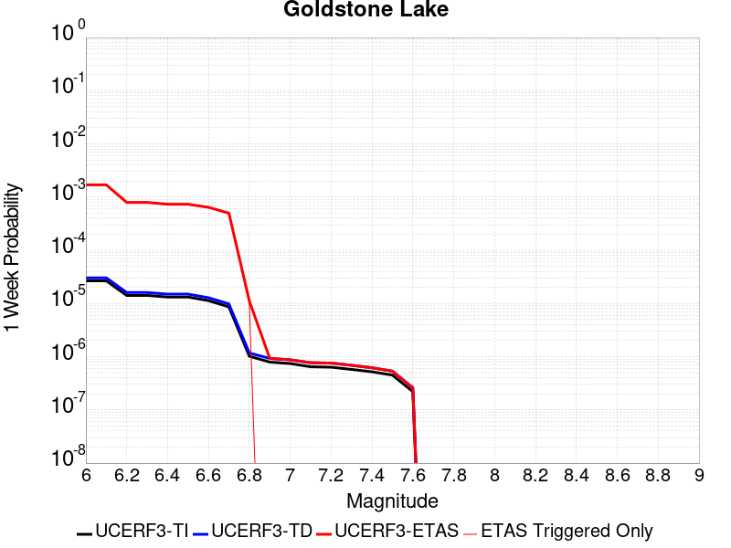 | 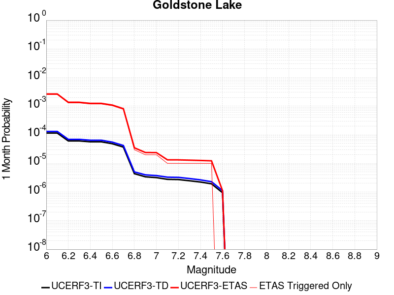 | 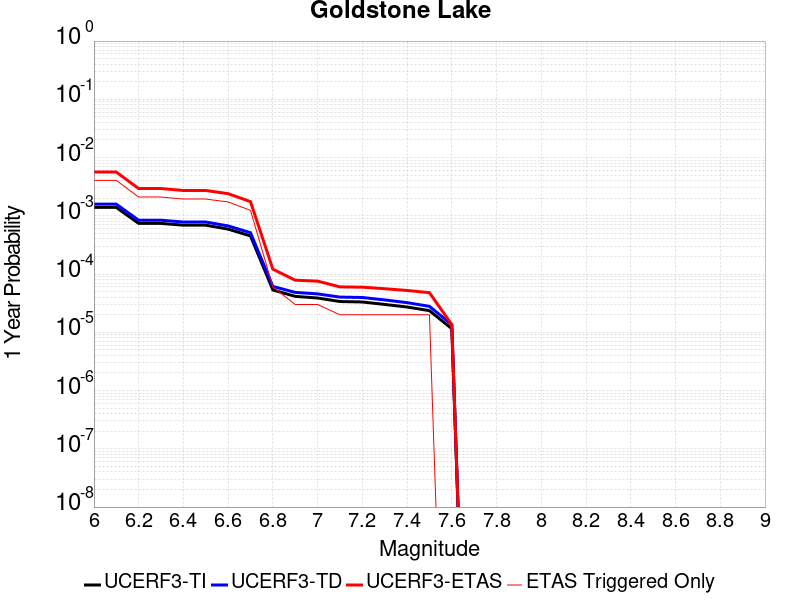 | 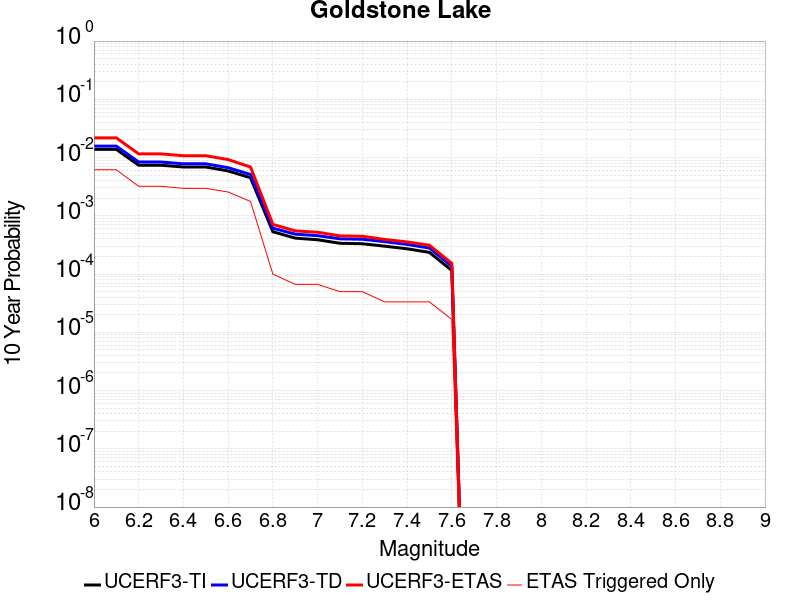 |

| Magnitude | 1 wk TI Prob | 1 wk TD Prob | 1 wk ETAS Prob | 1 wk ETAS/TD Gain | 1 wk ETAS Triggered Only | 1 mo TI Prob | 1 mo TD Prob | 1 mo ETAS Prob | 1 mo ETAS/TD Gain | 1 mo ETAS Triggered Only | 1 yr TI Prob | 1 yr TD Prob | 1 yr ETAS Prob | 1 yr ETAS/TD Gain | 1 yr ETAS Triggered Only | 10 yr TI Prob | 10 yr TD Prob | 10 yr ETAS Prob | 10 yr ETAS/TD Gain | 10 yr ETAS Triggered Only |
|-----|-----|-----|-----|-----|-----|-----|-----|-----|-----|-----|-----|-----|-----|-----|-----|-----|-----|-----|-----|-----|
| 6.0 | 2.671352E-5 | 3.0376103E-5 | 0.0017289656 | 56.91861 | 0.0016986411 | 1.1448149E-4 | 1.3017791E-4 | 0.002777715 | 21.337835 | 0.0026478816 | 0.001392921 | 0.0015839601 | 0.0055494914 | 3.503555 | 0.0039718226 | 0.013842222 | 0.015746202 | 0.021942044 | 1.3934817 | 0.006294964 |
| 6.1 | 2.671352E-5 | 3.0376103E-5 | 0.0017289656 | 56.91861 | 0.0016986411 | 1.1448149E-4 | 1.3017791E-4 | 0.002777715 | 21.337835 | 0.0026478816 | 0.001392921 | 0.0015839601 | 0.0055494914 | 3.503555 | 0.0039718226 | 0.013842222 | 0.015746202 | 0.021942044 | 1.3934817 | 0.006294964 |
| 6.2 | 1.4197047E-5 | 1.6096254E-5 | 6.905458E-4 | 42.901028 | 6.7446043E-4 | 6.0843064E-5 | 6.898268E-5 | 0.0013428757 | 19.466852 | 0.0012739808 | 7.4051257E-4 | 8.3963916E-4 | 0.0028363625 | 3.3780732 | 0.0019984012 | 0.007380498 | 0.008374364 | 0.0116193425 | 1.3874894 | 0.003272382 |
| 6.3 | 1.4197047E-5 | 1.6096254E-5 | 6.905458E-4 | 42.901028 | 6.7446043E-4 | 6.0843064E-5 | 6.898268E-5 | 0.0013428757 | 19.466852 | 0.0012739808 | 7.4051257E-4 | 8.3963916E-4 | 0.0028363625 | 3.3780732 | 0.0019984012 | 0.007380498 | 0.008374364 | 0.0116193425 | 1.3874894 | 0.003272382 |
| 6.4 | 1.3238931E-5 | 1.500847E-5 | 5.645606E-4 | 37.61613 | 5.4956035E-4 | 5.6737044E-5 | 6.432098E-5 | 0.0011134142 | 17.31028 | 0.0010491607 | 6.9055456E-4 | 7.8292453E-4 | 0.0024552753 | 3.1360304 | 0.001673661 | 0.006884126 | 0.007811289 | 0.010686336 | 1.3680631 | 0.002897682 |
| 6.5 | 1.3238931E-5 | 1.500847E-5 | 5.645606E-4 | 37.61613 | 5.4956035E-4 | 5.6737044E-5 | 6.432098E-5 | 0.0011134142 | 17.31028 | 0.0010491607 | 6.9055456E-4 | 7.8292453E-4 | 0.0024552753 | 3.1360304 | 0.001673661 | 0.006884126 | 0.007811289 | 0.010686336 | 1.3680631 | 0.002897682 |
| 6.6 | 1.1328278E-5 | 1.2855176E-5 | 5.1244907E-4 | 39.86325 | 4.996003E-4 | 4.8548856E-5 | 5.5092984E-5 | 0.0010042813 | 18.228842 | 9.492406E-4 | 5.90922E-4 | 6.706464E-4 | 0.0022183687 | 3.307807 | 0.001548761 | 0.0058935313 | 0.0066956137 | 0.009251328 | 1.3816998 | 0.0025729416 |
| 6.7 | 8.651175E-6 | 9.824575E-6 | 3.5954136E-4 | 36.596127 | 3.497202E-4 | 3.707594E-5 | 4.2105148E-5 | 5.9164234E-4 | 14.051544 | 5.4956035E-4 | 4.5130608E-4 | 5.126002E-4 | 0.0014114197 | 2.7534516 | 8.992806E-4 | 0.0045039062 | 0.0051230565 | 0.006862699 | 1.3395714 | 0.0017486011 |
| 6.8 | 1.0215377E-6 | 1.1754802E-6 | 2.6155467E-5 | 22.25088 | 2.4980016E-5 | 4.378012E-6 | 5.037763E-6 | 3.0017653E-5 | 5.958528 | 2.4980016E-5 | 5.3300988E-5 | 6.133315E-5 | 1.362686E-4 | 2.2217772 | 7.494005E-5 | 5.3288206E-4 | 6.131735E-4 | 7.130323E-4 | 1.1628557 | 9.9920064E-5 |
| 6.9 | 7.9360774E-7 | 9.283496E-7 | 9.283496E-7 | 1.0 | 0.0 | 3.4011714E-6 | 3.9786355E-6 | 3.9786355E-6 | 1.0 | 0.0 | 4.1408475E-5 | 4.843888E-5 | 7.341769E-5 | 1.5156767 | 2.4980016E-5 | 4.140076E-4 | 4.842902E-4 | 5.3422607E-4 | 1.1031114 | 4.9960032E-5 |
| 7.0 | 7.4382757E-7 | 8.747428E-7 | 8.747428E-7 | 1.0 | 0.0 | 3.1878285E-6 | 3.7488926E-6 | 3.7488926E-6 | 1.0 | 0.0 | 3.8811122E-5 | 4.564188E-5 | 7.062076E-5 | 1.5472797 | 2.4980016E-5 | 3.8804344E-4 | 4.563317E-4 | 5.0626893E-4 | 1.1094319 | 4.9960032E-5 |
| 7.1 | 6.4709513E-7 | 7.711399E-7 | 7.711399E-7 | 1.0 | 0.0 | 2.773262E-6 | 3.3048816E-6 | 3.3048816E-6 | 1.0 | 0.0 | 3.376394E-5 | 4.023625E-5 | 6.521526E-5 | 1.6208086 | 2.4980016E-5 | 3.375881E-4 | 4.022956E-4 | 4.5223554E-4 | 1.1241374 | 4.9960032E-5 |
| 7.2 | 6.356704E-7 | 7.588459E-7 | 7.588459E-7 | 1.0 | 0.0 | 2.7242988E-6 | 3.252193E-6 | 3.252193E-6 | 1.0 | 0.0 | 3.3167835E-5 | 3.959479E-5 | 6.457382E-5 | 1.6308665 | 2.4980016E-5 | 3.3162883E-4 | 3.9588328E-4 | 4.4582353E-4 | 1.1261489 | 4.9960032E-5 |
| 7.3 | 5.7695723E-7 | 6.896648E-7 | 6.896648E-7 | 1.0 | 0.0 | 2.4726714E-6 | 2.9557032E-6 | 2.9557032E-6 | 1.0 | 0.0 | 3.0104358E-5 | 3.598515E-5 | 6.0964267E-5 | 1.6941507 | 2.4980016E-5 | 3.0100282E-4 | 3.5979896E-4 | 3.8476998E-4 | 1.0694027 | 2.4980016E-5 |
| 7.4 | 5.209647E-7 | 6.193583E-7 | 6.193583E-7 | 1.0 | 0.0 | 2.232704E-6 | 2.6543903E-6 | 2.6543903E-6 | 1.0 | 0.0 | 2.718283E-5 | 3.2316777E-5 | 5.7295987E-5 | 1.7729486 | 2.4980016E-5 | 2.7179506E-4 | 3.2312635E-4 | 3.4809829E-4 | 1.0772823 | 2.4980016E-5 |
| 7.5 | 4.512955E-7 | 5.3489487E-7 | 5.3489487E-7 | 1.0 | 0.0 | 1.934122E-6 | 2.2924048E-6 | 2.2924048E-6 | 1.0 | 0.0 | 2.3547682E-5 | 2.7909726E-5 | 5.2889045E-5 | 1.895004 | 2.4980016E-5 | 2.3545188E-4 | 2.7906752E-4 | 3.0404056E-4 | 1.0894874 | 2.4980016E-5 |
| 7.6 | 2.21172E-7 | 2.6040198E-7 | 2.6040198E-7 | 1.0 | 0.0 | 9.478797E-7 | 1.1160082E-6 | 1.1160082E-6 | 1.0 | 0.0 | 1.1540374E-5 | 1.3587343E-5 | 1.3587343E-5 | 1.0 | 0.0 | 1.1539775E-4 | 1.3586794E-4 | 1.3586794E-4 | 1.0 | 0.0 |

## So Sierra Nevada
*[(top)](#table-of-contents)*

| 1 Week | 1 Month | 1 Year | 10 Year |
|-----|-----|-----|-----|
| 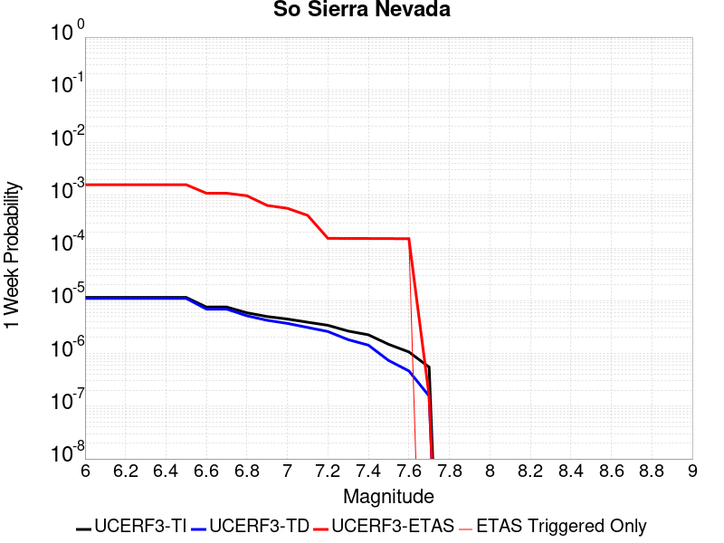 | 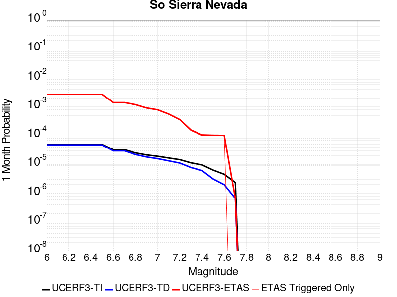 | 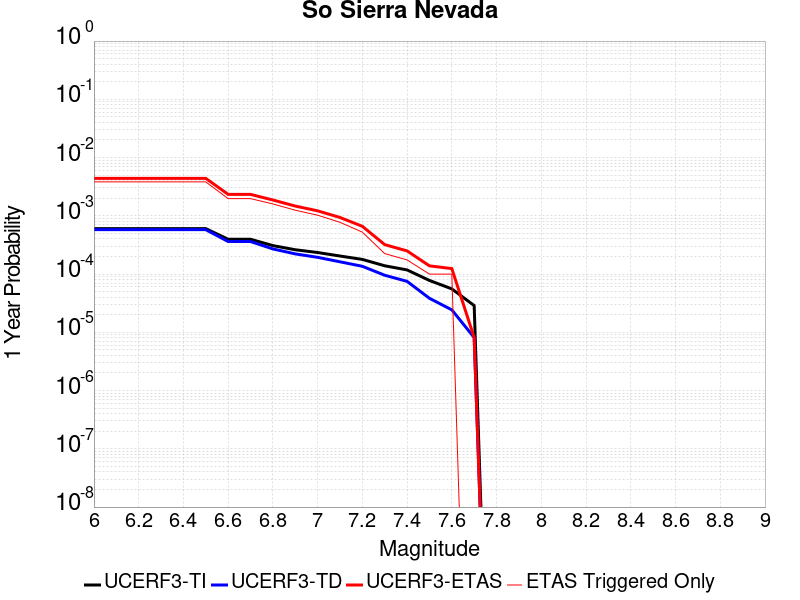 | 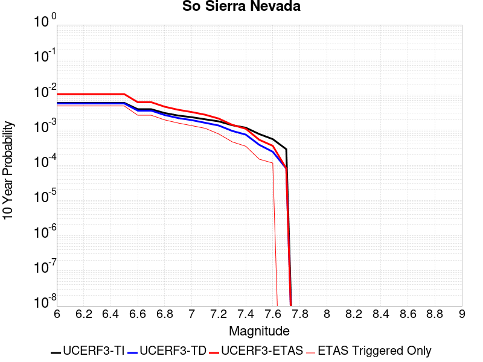 |

| Magnitude | 1 wk TI Prob | 1 wk TD Prob | 1 wk ETAS Prob | 1 wk ETAS/TD Gain | 1 wk ETAS Triggered Only | 1 mo TI Prob | 1 mo TD Prob | 1 mo ETAS Prob | 1 mo ETAS/TD Gain | 1 mo ETAS Triggered Only | 1 yr TI Prob | 1 yr TD Prob | 1 yr ETAS Prob | 1 yr ETAS/TD Gain | 1 yr ETAS Triggered Only | 10 yr TI Prob | 10 yr TD Prob | 10 yr ETAS Prob | 10 yr ETAS/TD Gain | 10 yr ETAS Triggered Only |
|-----|-----|-----|-----|-----|-----|-----|-----|-----|-----|-----|-----|-----|-----|-----|-----|-----|-----|-----|-----|-----|
| 6.0 | 1.15488665E-5 | 1.1079612E-5 | 0.0017596614 | 158.81978 | 0.0017486011 | 4.9494203E-5 | 4.7483256E-5 | 0.0027202182 | 57.28794 | 0.0026728618 | 6.024253E-4 | 5.779681E-4 | 0.0043977015 | 7.6089005 | 0.0038219425 | 0.006007948 | 0.005765918 | 0.011055983 | 1.9174713 | 0.005320743 |
| 6.1 | 1.15488665E-5 | 1.1079612E-5 | 0.0017596614 | 158.81978 | 0.0017486011 | 4.9494203E-5 | 4.7483256E-5 | 0.0027202182 | 57.28794 | 0.0026728618 | 6.024253E-4 | 5.779681E-4 | 0.0043977015 | 7.6089005 | 0.0038219425 | 0.006007948 | 0.005765918 | 0.011055983 | 1.9174713 | 0.005320743 |
| 6.2 | 1.15488665E-5 | 1.1079612E-5 | 0.0017596614 | 158.81978 | 0.0017486011 | 4.9494203E-5 | 4.7483256E-5 | 0.0027202182 | 57.28794 | 0.0026728618 | 6.024253E-4 | 5.779681E-4 | 0.0043977015 | 7.6089005 | 0.0038219425 | 0.006007948 | 0.005765918 | 0.011055983 | 1.9174713 | 0.005320743 |
| 6.3 | 1.15488665E-5 | 1.1079612E-5 | 0.0017596614 | 158.81978 | 0.0017486011 | 4.9494203E-5 | 4.7483256E-5 | 0.0027202182 | 57.28794 | 0.0026728618 | 6.024253E-4 | 5.779681E-4 | 0.0043977015 | 7.6089005 | 0.0038219425 | 0.006007948 | 0.005765918 | 0.011055983 | 1.9174713 | 0.005320743 |
| 6.4 | 1.15488665E-5 | 1.1079612E-5 | 0.0017596614 | 158.81978 | 0.0017486011 | 4.9494203E-5 | 4.7483256E-5 | 0.0027202182 | 57.28794 | 0.0026728618 | 6.024253E-4 | 5.779681E-4 | 0.0043977015 | 7.6089005 | 0.0038219425 | 0.006007948 | 0.005765918 | 0.011055983 | 1.9174713 | 0.005320743 |
| 6.5 | 1.15488665E-5 | 1.1079612E-5 | 0.0017596614 | 158.81978 | 0.0017486011 | 4.9494203E-5 | 4.7483256E-5 | 0.0027202182 | 57.28794 | 0.0026728618 | 6.024253E-4 | 5.779681E-4 | 0.0043977015 | 7.6089005 | 0.0038219425 | 0.006007948 | 0.005765918 | 0.011055983 | 1.9174713 | 0.005320743 |
| 6.6 | 7.587044E-6 | 6.9356042E-6 | 0.001056089 | 152.27066 | 0.0010491607 | 3.2515498E-5 | 2.9723697E-5 | 0.0014035838 | 47.221035 | 0.0013739009 | 3.9580427E-4 | 3.6182883E-4 | 0.002334536 | 6.4520454 | 0.0019734213 | 0.003951 | 0.0036126887 | 0.006300784 | 1.7440705 | 0.0026978417 |
| 6.7 | 7.587044E-6 | 6.9356042E-6 | 0.001056089 | 152.27066 | 0.0010491607 | 3.2515498E-5 | 2.9723697E-5 | 0.0014035838 | 47.221035 | 0.0013739009 | 3.9580427E-4 | 3.6182883E-4 | 0.002334536 | 6.4520454 | 0.0019734213 | 0.003951 | 0.0036126887 | 0.006300784 | 1.7440705 | 0.0026978417 |
| 6.8 | 5.9026956E-6 | 5.179362E-6 | 9.294352E-4 | 179.44974 | 9.242606E-4 | 2.5297022E-5 | 2.2197082E-5 | 0.0011962318 | 53.891396 | 0.0011740607 | 3.0794772E-4 | 2.7021713E-4 | 0.0018685062 | 6.914832 | 0.001598721 | 0.0030752132 | 0.002699002 | 0.0047418345 | 1.7568846 | 0.0020483613 |
| 6.9 | 5.0118915E-6 | 4.2523943E-6 | 7.036899E-4 | 165.48085 | 6.994404E-4 | 2.1479358E-5 | 1.8224424E-5 | 9.174886E-4 | 50.3439 | 8.992806E-4 | 2.614798E-4 | 2.2186051E-4 | 0.0014705842 | 6.628418 | 0.0012490008 | 0.0026117235 | 0.0022164627 | 0.0038864142 | 1.7534308 | 0.001673661 |
| 7.0 | 4.4924795E-6 | 3.7138868E-6 | 5.7825213E-4 | 155.69998 | 5.7454035E-4 | 1.925334E-5 | 1.5916565E-5 | 7.902847E-4 | 49.65172 | 7.743805E-4 | 2.3438422E-4 | 1.9376757E-4 | 0.0012177498 | 6.2845902 | 0.0010241807 | 0.0023413717 | 0.0019360491 | 0.0033072901 | 1.7082677 | 0.0013739009 |
| 7.1 | 3.9118436E-6 | 3.1119469E-6 | 4.0279096E-4 | 129.43375 | 3.9968026E-4 | 1.6764936E-5 | 1.333685E-5 | 5.6288985E-4 | 42.20561 | 5.4956035E-4 | 2.0409399E-4 | 1.6236462E-4 | 9.366194E-4 | 5.7686176 | 7.743805E-4 | 0.0020390663 | 0.0016225161 | 0.002744793 | 1.6916893 | 0.0011241008 |
| 7.2 | 3.4200818E-6 | 2.6054236E-6 | 2.2742499E-4 | 87.28906 | 2.2482015E-4 | 1.4657411E-5 | 1.11660565E-5 | 3.6088238E-4 | 32.31959 | 3.497202E-4 | 1.7843937E-4 | 1.3593875E-4 | 6.604478E-4 | 4.8584213 | 5.2458036E-4 | 0.0017829615 | 0.0013586058 | 0.002082042 | 1.5324843 | 7.244205E-4 |
| 7.3 | 2.6593618E-6 | 1.8283897E-6 | 1.2672824E-4 | 69.31139 | 1.2490008E-4 | 1.13972155E-5 | 7.8359335E-6 | 1.5771485E-4 | 20.127129 | 1.498801E-4 | 1.3875226E-4 | 9.539862E-5 | 3.2019732E-4 | 3.3564148 | 2.2482015E-4 | 0.0013866565 | 9.536055E-4 | 0.0013279484 | 1.3925554 | 3.7470023E-4 |
| 7.4 | 2.2577992E-6 | 1.4364078E-6 | 1.0135633E-4 | 70.56236 | 9.9920064E-5 | 9.676246E-6 | 6.1560204E-6 | 1.06075466E-4 | 17.231176 | 9.9920064E-5 | 1.1780193E-4 | 7.4947224E-5 | 2.4979422E-4 | 3.332935 | 1.748601E-4 | 0.001177395 | 7.4924453E-4 | 0.0010737415 | 1.4330988 | 3.2474022E-4 |
| 7.5 | 1.489319E-6 | 7.353661E-7 | 1.0065536E-4 | 136.87788 | 9.9920064E-5 | 6.3827797E-6 | 3.1515651E-6 | 1.0307132E-4 | 32.704803 | 9.9920064E-5 | 7.770758E-5 | 3.8369635E-5 | 1.3828586E-4 | 3.6040444 | 9.9920064E-5 | 7.7680405E-4 | 3.8363054E-4 | 5.084827E-4 | 1.325449 | 1.2490008E-4 |
| 7.6 | 1.0680322E-6 | 4.65941E-7 | 1.0038596E-4 | 215.44778 | 9.9920064E-5 | 4.577273E-6 | 1.9968884E-6 | 1.01916754E-4 | 51.037777 | 9.9920064E-5 | 5.5726876E-5 | 2.4311848E-5 | 1.2422948E-4 | 5.109833 | 9.9920064E-5 | 5.5712904E-4 | 2.4309216E-4 | 3.6796188E-4 | 1.5136724 | 1.2490008E-4 |
| 7.7 | 5.509146E-7 | 1.5578539E-7 | 1.5578539E-7 | 1.0 | 0.0 | 2.3610605E-6 | 6.676515E-7 | 6.676515E-7 | 1.0 | 0.0 | 2.8745531E-5 | 8.128628E-6 | 8.128628E-6 | 1.0 | 0.0 | 2.8741814E-4 | 8.128342E-5 | 8.128342E-5 | 1.0 | 0.0 |

## Coyote Canyon
*[(top)](#table-of-contents)*

| 1 Week | 1 Month | 1 Year | 10 Year |
|-----|-----|-----|-----|
| 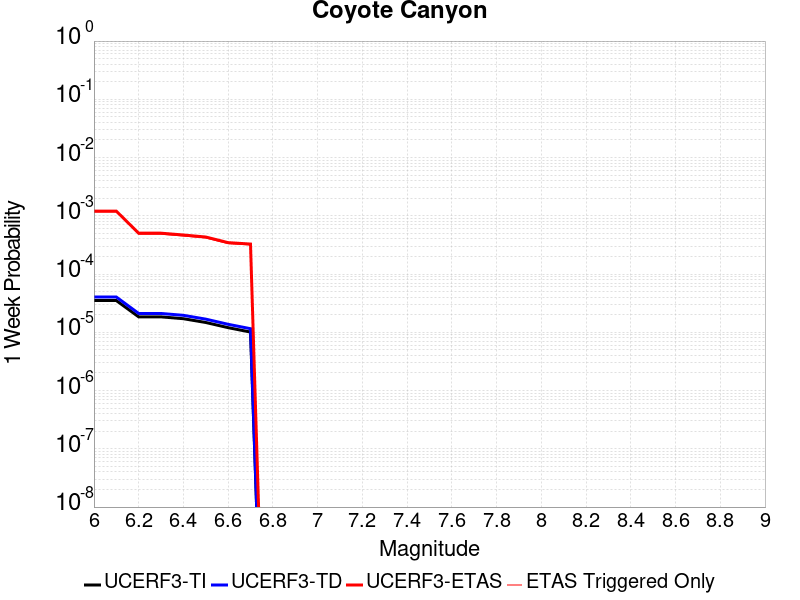 | 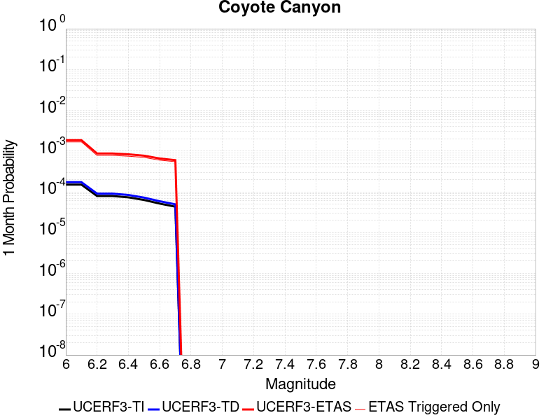 | 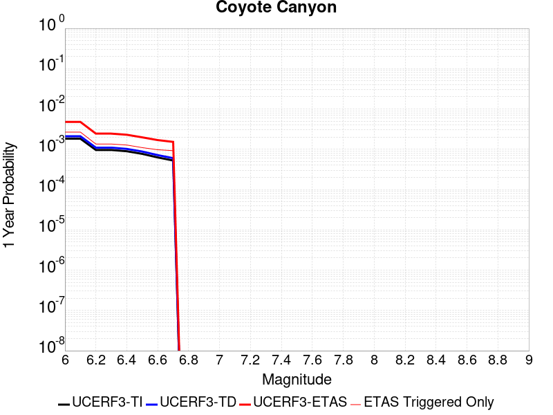 | 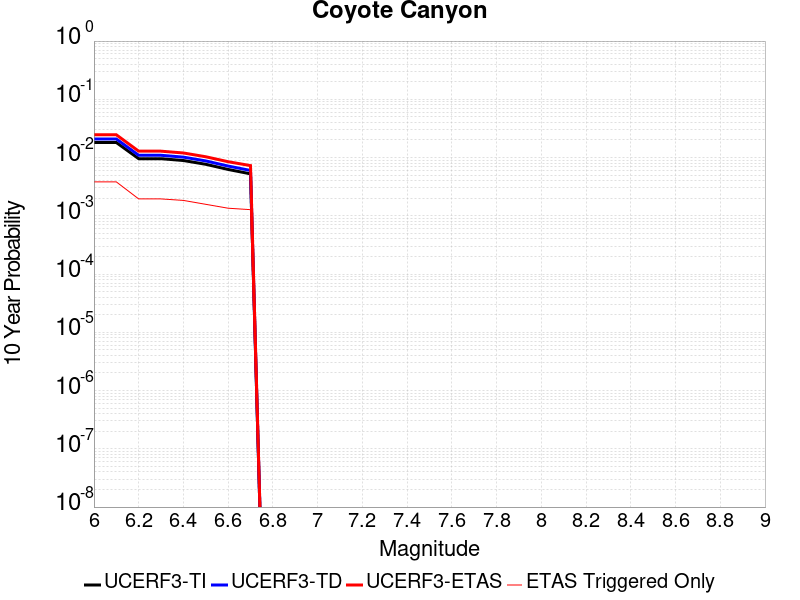 |

| Magnitude | 1 wk TI Prob | 1 wk TD Prob | 1 wk ETAS Prob | 1 wk ETAS/TD Gain | 1 wk ETAS Triggered Only | 1 mo TI Prob | 1 mo TD Prob | 1 mo ETAS Prob | 1 mo ETAS/TD Gain | 1 mo ETAS Triggered Only | 1 yr TI Prob | 1 yr TD Prob | 1 yr ETAS Prob | 1 yr ETAS/TD Gain | 1 yr ETAS Triggered Only | 10 yr TI Prob | 10 yr TD Prob | 10 yr ETAS Prob | 10 yr ETAS/TD Gain | 10 yr ETAS Triggered Only |
|-----|-----|-----|-----|-----|-----|-----|-----|-----|-----|-----|-----|-----|-----|-----|-----|-----|-----|-----|-----|-----|
| 6.0 | 3.5090034E-5 | 4.0364317E-5 | 0.0010395247 | 25.753555 | 9.992006E-4 | 1.503772E-4 | 1.7297991E-4 | 0.0017464487 | 10.0962515 | 0.001573741 | 0.0018293047 | 0.0021042533 | 0.0047714906 | 2.2675457 | 0.0026728618 | 0.018143194 | 0.020869205 | 0.025051642 | 1.2004119 | 0.0042715827 |
| 6.1 | 3.5090034E-5 | 4.0364317E-5 | 0.0010395247 | 25.753555 | 9.992006E-4 | 1.503772E-4 | 1.7297991E-4 | 0.0017464487 | 10.0962515 | 0.001573741 | 0.0018293047 | 0.0021042533 | 0.0047714906 | 2.2675457 | 0.0026728618 | 0.018143194 | 0.020869205 | 0.025051642 | 1.2004119 | 0.0042715827 |
| 6.2 | 1.841879E-5 | 2.1059794E-5 | 3.9575214E-4 | 18.791834 | 3.7470023E-4 | 7.8935285E-5 | 9.025371E-5 | 8.1460876E-4 | 9.025765 | 7.244205E-4 | 9.606133E-4 | 0.0010983871 | 0.0024458263 | 2.2267437 | 0.0013489209 | 0.0095647145 | 0.010939668 | 0.013089154 | 1.1964855 | 0.0021732615 |
| 6.3 | 1.841879E-5 | 2.1059794E-5 | 3.9575214E-4 | 18.791834 | 3.7470023E-4 | 7.8935285E-5 | 9.025371E-5 | 8.1460876E-4 | 9.025765 | 7.244205E-4 | 9.606133E-4 | 0.0010983871 | 0.0024458263 | 2.2267437 | 0.0013489209 | 0.0095647145 | 0.010939668 | 0.013089154 | 1.1964855 | 0.0021732615 |
| 6.4 | 1.712201E-5 | 1.9565212E-5 | 3.692786E-4 | 18.874245 | 3.497202E-4 | 7.337798E-5 | 8.3848776E-5 | 7.832306E-4 | 9.34099 | 6.994404E-4 | 8.930107E-4 | 0.0010204813 | 0.002293162 | 2.2471378 | 0.0012739808 | 0.008894307 | 0.010167871 | 0.012170679 | 1.1969742 | 0.0020233812 |
| 6.5 | 1.4744935E-5 | 1.6836972E-5 | 3.165921E-4 | 18.803389 | 2.997602E-4 | 6.3191044E-5 | 7.215698E-5 | 6.9661235E-4 | 9.654122 | 6.245004E-4 | 7.6907943E-4 | 8.782507E-4 | 0.001976406 | 2.2503896 | 0.0010991207 | 0.007664232 | 0.008756994 | 0.010465522 | 1.1951044 | 0.0017236212 |
| 6.6 | 1.2017839E-5 | 1.3724089E-5 | 2.3854115E-4 | 17.3812 | 2.2482015E-4 | 5.150401E-5 | 5.88167E-5 | 5.833662E-4 | 9.918377 | 5.2458036E-4 | 6.268809E-4 | 7.159466E-4 | 0.0016894698 | 2.3597705 | 9.7422063E-4 | 0.0062511545 | 0.0071450938 | 0.008633186 | 1.2082677 | 0.0014988009 |
| 6.7 | 1.00956095E-5 | 1.1533517E-5 | 2.3635107E-4 | 20.492542 | 2.2482015E-4 | 4.326618E-5 | 4.942891E-5 | 5.4900453E-4 | 11.106952 | 4.996003E-4 | 5.266384E-4 | 6.017178E-4 | 0.0015254222 | 2.5351124 | 9.242606E-4 | 0.005253921 | 0.0060094125 | 0.007424717 | 1.2355146 | 0.0014238609 |

## San Andreas (Mojave S)
*[(top)](#table-of-contents)*

| 1 Week | 1 Month | 1 Year | 10 Year |
|-----|-----|-----|-----|
| 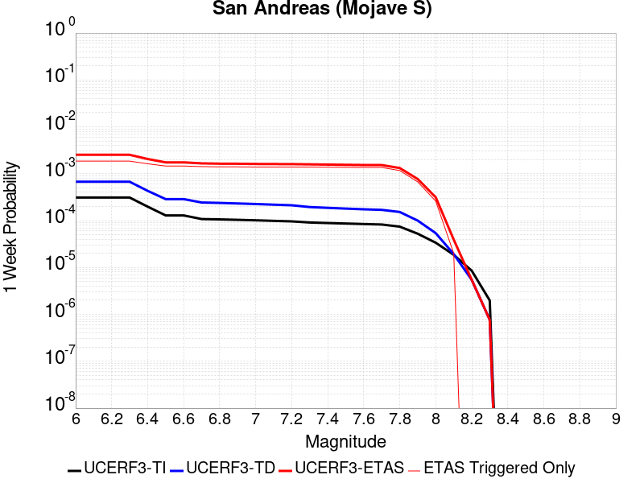 | 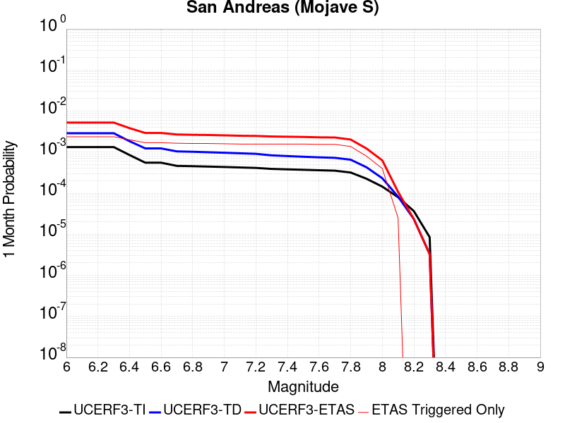 | 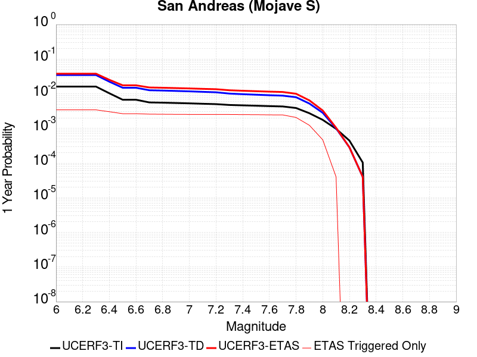 | 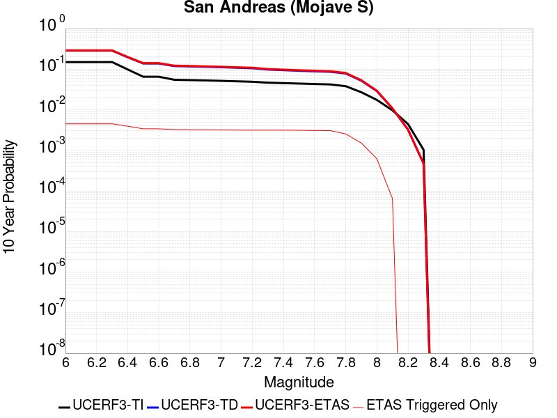 |

| Magnitude | 1 wk TI Prob | 1 wk TD Prob | 1 wk ETAS Prob | 1 wk ETAS/TD Gain | 1 wk ETAS Triggered Only | 1 mo TI Prob | 1 mo TD Prob | 1 mo ETAS Prob | 1 mo ETAS/TD Gain | 1 mo ETAS Triggered Only | 1 yr TI Prob | 1 yr TD Prob | 1 yr ETAS Prob | 1 yr ETAS/TD Gain | 1 yr ETAS Triggered Only | 10 yr TI Prob | 10 yr TD Prob | 10 yr ETAS Prob | 10 yr ETAS/TD Gain | 10 yr ETAS Triggered Only |
|-----|-----|-----|-----|-----|-----|-----|-----|-----|-----|-----|-----|-----|-----|-----|-----|-----|-----|-----|-----|-----|
| 6.0 | 3.1064058E-4 | 6.7462435E-4 | 0.0025468615 | 3.7752292 | 0.0018735012 | 0.0013306376 | 0.002888172 | 0.0052544195 | 1.8192891 | 0.0023731014 | 0.016080605 | 0.034565594 | 0.03774898 | 1.0920969 | 0.003297362 | 0.1496549 | 0.28654557 | 0.28968227 | 1.0109465 | 0.004396483 |
| 6.1 | 3.1064058E-4 | 6.7462435E-4 | 0.0025468615 | 3.7752292 | 0.0018735012 | 0.0013306376 | 0.002888172 | 0.0052544195 | 1.8192891 | 0.0023731014 | 0.016080605 | 0.034565594 | 0.03774898 | 1.0920969 | 0.003297362 | 0.1496549 | 0.28654557 | 0.28968227 | 1.0109465 | 0.004396483 |
| 6.2 | 3.1064058E-4 | 6.7462435E-4 | 0.0025468615 | 3.7752292 | 0.0018735012 | 0.0013306376 | 0.002888172 | 0.0052544195 | 1.8192891 | 0.0023731014 | 0.016080605 | 0.034565594 | 0.03774898 | 1.0920969 | 0.003297362 | 0.1496549 | 0.28654557 | 0.28968227 | 1.0109465 | 0.004396483 |
| 6.3 | 3.1064058E-4 | 6.7462435E-4 | 0.0025468615 | 3.7752292 | 0.0018735012 | 0.0013306376 | 0.002888172 | 0.0052544195 | 1.8192891 | 0.0023731014 | 0.016080605 | 0.034565594 | 0.03774898 | 1.0920969 | 0.003297362 | 0.1496549 | 0.28654557 | 0.28968227 | 1.0109465 | 0.004396483 |
| 6.4 | 1.9872203E-4 | 4.3181062E-4 | 0.0019799029 | 4.5851183 | 0.001548761 | 8.5138786E-4 | 0.0018493326 | 0.0038440381 | 2.0786083 | 0.0019984012 | 0.010316478 | 0.02228931 | 0.025049135 | 1.1238183 | 0.0028227419 | 0.098504856 | 0.19686839 | 0.19985767 | 1.0151842 | 0.0037220223 |
| 6.5 | 1.291105E-4 | 2.8754136E-4 | 0.0016360744 | 5.6898746 | 0.0013489209 | 5.5321335E-4 | 0.0012317409 | 0.0029282898 | 2.3773584 | 0.0016986411 | 0.006714592 | 0.014894155 | 0.017207302 | 1.1553057 | 0.0023481215 | 0.065152965 | 0.13800792 | 0.14067797 | 1.019347 | 0.003097522 |
| 6.6 | 1.291105E-4 | 2.8754136E-4 | 0.0016360744 | 5.6898746 | 0.0013489209 | 5.5321335E-4 | 0.0012317409 | 0.0029282898 | 2.3773584 | 0.0016986411 | 0.006714592 | 0.014894155 | 0.017207302 | 1.1553057 | 0.0023481215 | 0.065152965 | 0.13800792 | 0.14067797 | 1.019347 | 0.003097522 |
| 6.7 | 1.08001186E-4 | 2.4335351E-4 | 0.0015419982 | 6.3364534 | 0.0012989609 | 4.6278012E-4 | 0.0010425274 | 0.0026894896 | 2.5797784 | 0.001648681 | 0.0056198016 | 0.0126192 | 0.014839031 | 1.175909 | 0.0022482015 | 0.054797906 | 0.11918431 | 0.12180264 | 1.0219687 | 0.002972622 |
| 6.8 | 1.0624356E-4 | 2.3853009E-4 | 0.001512207 | 6.3396907 | 0.0012739808 | 4.5525006E-4 | 0.0010218718 | 0.0026439137 | 2.5873241 | 0.0016237011 | 0.0055285925 | 0.012370593 | 0.014566312 | 1.177495 | 0.0022232214 | 0.053930566 | 0.11713308 | 0.11973546 | 1.0222173 | 0.002947642 |
| 6.9 | 1.0393785E-4 | 2.3223337E-4 | 0.0015059183 | 6.484504 | 0.0012739808 | 4.4537184E-4 | 9.949068E-4 | 0.0026169922 | 2.6303897 | 0.0016237011 | 0.0054089287 | 0.012045963 | 0.014242404 | 1.1823384 | 0.0022232214 | 0.05279156 | 0.114433445 | 0.11704378 | 1.0228109 | 0.002947642 |
| 7.0 | 1.0155622E-4 | 2.2592908E-4 | 0.0014746477 | 6.527038 | 0.0012490008 | 4.3516833E-4 | 9.6790853E-4 | 0.0025650822 | 2.6501286 | 0.001598721 | 0.005285311 | 0.011720838 | 0.013893315 | 1.1853516 | 0.0021982414 | 0.05161361 | 0.11169745 | 0.11429366 | 1.0232432 | 0.0029226618 |
| 7.1 | 9.885595E-5 | 2.188132E-4 | 0.0014675407 | 6.7068195 | 0.0012490008 | 4.2359953E-4 | 9.374342E-4 | 0.0025097 | 2.6772013 | 0.001573741 | 0.0051451353 | 0.011353733 | 0.01350232 | 1.1892406 | 0.0021732615 | 0.05027629 | 0.10857607 | 0.11113686 | 1.0235853 | 0.0028727017 |
| 7.2 | 9.6411415E-5 | 2.1244297E-4 | 0.0014611784 | 6.8779798 | 0.0012490008 | 4.1312634E-4 | 9.101525E-4 | 0.0024824613 | 2.7275221 | 0.001573741 | 0.005018219 | 0.011024987 | 0.013174288 | 1.1949482 | 0.0021732615 | 0.049064007 | 0.1057697 | 0.10833856 | 1.0242872 | 0.0028727017 |
| 7.3 | 9.1180635E-5 | 1.9472656E-4 | 0.0014434841 | 7.4128776 | 0.0012490008 | 3.907156E-4 | 8.342756E-4 | 0.0024067038 | 2.8847826 | 0.001573741 | 0.004746591 | 0.010110112 | 0.012261402 | 1.212786 | 0.0021732615 | 0.046464786 | 0.09796176 | 0.10055305 | 1.0264521 | 0.0028727017 |
| 7.4 | 8.887388E-5 | 1.872126E-4 | 0.0014359796 | 7.6703143 | 0.0012490008 | 3.8083247E-4 | 8.020931E-4 | 0.0023745717 | 2.960469 | 0.001573741 | 0.0046267817 | 0.009721855 | 0.011873988 | 1.2213707 | 0.0021732615 | 0.045316286 | 0.094593845 | 0.097194806 | 1.0274961 | 0.0028727017 |
| 7.5 | 8.6750515E-5 | 1.80528E-4 | 0.0014293033 | 7.91735 | 0.0012490008 | 3.7173493E-4 | 7.734621E-4 | 0.002345986 | 3.0330975 | 0.001573741 | 0.004516484 | 0.009376327 | 0.011529211 | 1.2296085 | 0.0021732615 | 0.04425787 | 0.09155606 | 0.09416574 | 1.0285038 | 0.0028727017 |
| 7.6 | 8.453092E-5 | 1.7440386E-4 | 0.0013982112 | 8.017088 | 0.0012240207 | 3.6222505E-4 | 7.4723107E-4 | 0.0022948347 | 3.0711179 | 0.001548761 | 0.0044011753 | 0.009059664 | 0.011163729 | 1.2322453 | 0.0021233014 | 0.04315024 | 0.08871447 | 0.09126404 | 1.028739 | 0.0027977617 |
| 7.7 | 8.259102E-5 | 1.6962511E-4 | 0.0013934383 | 8.214811 | 0.0012240207 | 3.539135E-4 | 7.267622E-4 | 0.0022743978 | 3.1294935 | 0.001548761 | 0.004300386 | 0.0088125 | 0.01091709 | 1.2388186 | 0.0021233014 | 0.042181134 | 0.086465426 | 0.08902128 | 1.0295593 | 0.0027977617 |
| 7.8 | 7.444844E-5 | 1.528469E-4 | 0.0012517996 | 8.189892 | 0.0010991207 | 3.1902574E-4 | 6.5489375E-4 | 0.0020278948 | 3.096525 | 0.0013739009 | 0.0038772223 | 0.007944231 | 0.009802849 | 1.2339581 | 0.0018735012 | 0.03810269 | 0.078293875 | 0.08052722 | 1.0285252 | 0.0024230615 |
| 7.9 | 5.2586525E-5 | 1.0007023E-4 | 7.494857E-4 | 7.4895964 | 6.4948044E-4 | 2.2535135E-4 | 4.2880196E-4 | 0.0012278197 | 2.8633726 | 7.993605E-4 | 0.0027402006 | 0.005208178 | 0.006351274 | 1.219481 | 0.0011490807 | 0.027066574 | 0.052201588 | 0.053551123 | 1.0258523 | 0.0014238609 |
| 8.0 | 3.379877E-5 | 5.4075565E-5 | 3.787982E-4 | 7.0049796 | 3.2474022E-4 | 1.4484383E-4 | 2.3173184E-4 | 6.313195E-4 | 2.7243536 | 3.9968026E-4 | 0.0017620471 | 0.0028176866 | 0.003340789 | 1.1856495 | 5.2458036E-4 | 0.017481409 | 0.028835917 | 0.029466668 | 1.0218738 | 6.4948044E-4 |
| 8.1 | 1.8668277E-5 | 1.9308145E-5 | 4.4287677E-5 | 2.2937305 | 2.4980016E-5 | 8.000444E-5 | 8.274657E-5 | 1.0772452E-4 | 1.3018608 | 2.4980016E-5 | 9.736188E-4 | 0.0010069745 | 0.0010568842 | 1.049564 | 4.9960032E-5 | 0.009693642 | 0.010798624 | 0.010872754 | 1.0068648 | 7.494005E-5 |
| 8.2 | 8.541571E-6 | 5.4596358E-6 | 5.4596358E-6 | 1.0 | 0.0 | 3.660622E-5 | 2.339823E-5 | 2.339823E-5 | 1.0 | 0.0 | 4.455896E-4 | 2.848363E-4 | 2.848363E-4 | 1.0 | 0.0 | 0.0044469717 | 0.003240283 | 0.003240283 | 1.0 | 0.0 |
| 8.3 | 1.983087E-6 | 7.6564595E-7 | 7.6564595E-7 | 1.0 | 0.0 | 8.498917E-6 | 3.281336E-6 | 3.281336E-6 | 1.0 | 0.0 | 1.034694E-4 | 3.9949547E-5 | 3.9949547E-5 | 1.0 | 0.0 | 0.0010342124 | 4.717979E-4 | 4.717979E-4 | 1.0 | 0.0 |

## San Andreas (Mojave N)
*[(top)](#table-of-contents)*

| 1 Week | 1 Month | 1 Year | 10 Year |
|-----|-----|-----|-----|
| 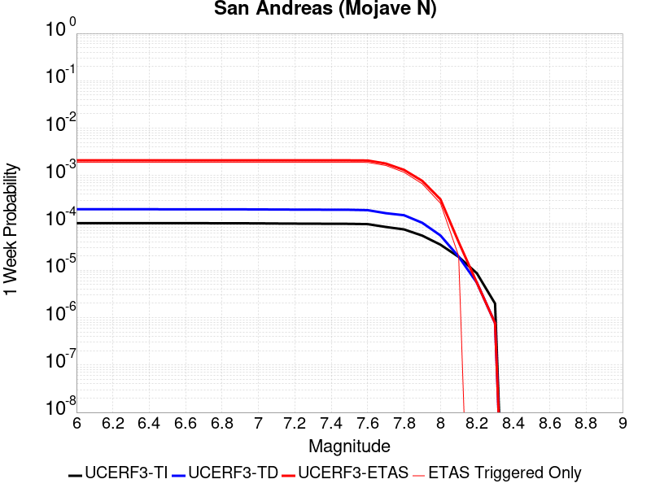 | 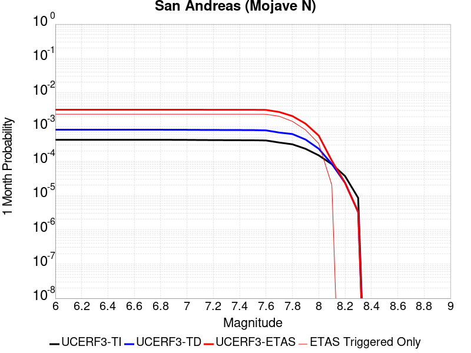 | 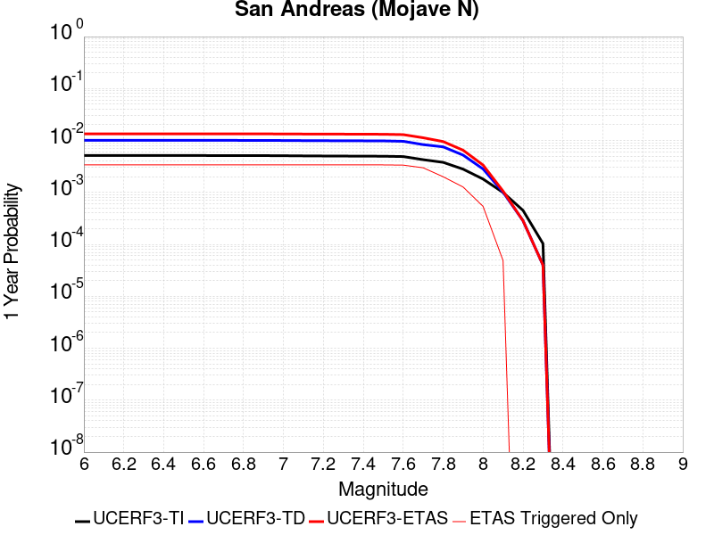 | 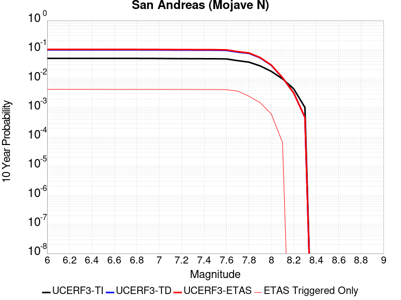 |

| Magnitude | 1 wk TI Prob | 1 wk TD Prob | 1 wk ETAS Prob | 1 wk ETAS/TD Gain | 1 wk ETAS Triggered Only | 1 mo TI Prob | 1 mo TD Prob | 1 mo ETAS Prob | 1 mo ETAS/TD Gain | 1 mo ETAS Triggered Only | 1 yr TI Prob | 1 yr TD Prob | 1 yr ETAS Prob | 1 yr ETAS/TD Gain | 1 yr ETAS Triggered Only | 10 yr TI Prob | 10 yr TD Prob | 10 yr ETAS Prob | 10 yr ETAS/TD Gain | 10 yr ETAS Triggered Only |
|-----|-----|-----|-----|-----|-----|-----|-----|-----|-----|-----|-----|-----|-----|-----|-----|-----|-----|-----|-----|-----|
| 6.0 | 9.877682E-5 | 1.9402112E-4 | 0.001942283 | 10.010678 | 0.0017486011 | 4.2326056E-4 | 8.312543E-4 | 0.0030027092 | 3.6122632 | 0.0021732615 | 0.0051410277 | 0.010073684 | 0.013164731 | 1.3068438 | 0.003122502 | 0.05023708 | 0.09832245 | 0.10206143 | 1.0380276 | 0.0041466826 |
| 6.1 | 9.877682E-5 | 1.9402112E-4 | 0.001942283 | 10.010678 | 0.0017486011 | 4.2326056E-4 | 8.312543E-4 | 0.0030027092 | 3.6122632 | 0.0021732615 | 0.0051410277 | 0.010073684 | 0.013164731 | 1.3068438 | 0.003122502 | 0.05023708 | 0.09832245 | 0.10206143 | 1.0380276 | 0.0041466826 |
| 6.2 | 9.877682E-5 | 1.9402112E-4 | 0.001942283 | 10.010678 | 0.0017486011 | 4.2326056E-4 | 8.312543E-4 | 0.0030027092 | 3.6122632 | 0.0021732615 | 0.0051410277 | 0.010073684 | 0.013164731 | 1.3068438 | 0.003122502 | 0.05023708 | 0.09832245 | 0.10206143 | 1.0380276 | 0.0041466826 |
| 6.3 | 9.877682E-5 | 1.9402112E-4 | 0.001942283 | 10.010678 | 0.0017486011 | 4.2326056E-4 | 8.312543E-4 | 0.0030027092 | 3.6122632 | 0.0021732615 | 0.0051410277 | 0.010073684 | 0.013164731 | 1.3068438 | 0.003122502 | 0.05023708 | 0.09832245 | 0.10206143 | 1.0380276 | 0.0041466826 |
| 6.4 | 9.877682E-5 | 1.9402112E-4 | 0.001942283 | 10.010678 | 0.0017486011 | 4.2326056E-4 | 8.312543E-4 | 0.0030027092 | 3.6122632 | 0.0021732615 | 0.0051410277 | 0.010073684 | 0.013164731 | 1.3068438 | 0.003122502 | 0.05023708 | 0.09832245 | 0.10206143 | 1.0380276 | 0.0041466826 |
| 6.5 | 9.861474E-5 | 1.937588E-4 | 0.0019420211 | 10.02288 | 0.0017486011 | 4.2256617E-4 | 8.3013077E-4 | 0.0030015882 | 3.6158013 | 0.0021732615 | 0.0051326132 | 0.0100601325 | 0.013151222 | 1.3072613 | 0.003122502 | 0.050156746 | 0.09820035 | 0.1019173 | 1.0378507 | 0.0041217026 |
| 6.6 | 9.861474E-5 | 1.937588E-4 | 0.0019420211 | 10.02288 | 0.0017486011 | 4.2256617E-4 | 8.3013077E-4 | 0.0030015882 | 3.6158013 | 0.0021732615 | 0.0051326132 | 0.0100601325 | 0.013151222 | 1.3072613 | 0.003122502 | 0.050156746 | 0.09820035 | 0.1019173 | 1.0378507 | 0.0041217026 |
| 6.7 | 9.8552715E-5 | 1.9365833E-4 | 0.0019419208 | 10.027562 | 0.0017486011 | 4.223004E-4 | 8.2970044E-4 | 0.0030011586 | 3.6171594 | 0.0021732615 | 0.0051293927 | 0.010054941 | 0.013146047 | 1.3074216 | 0.003122502 | 0.050125998 | 0.09815356 | 0.1018707 | 1.0378706 | 0.0041217026 |
| 6.8 | 9.8464974E-5 | 1.9350994E-4 | 0.0019417726 | 10.034486 | 0.0017486011 | 4.219245E-4 | 8.290649E-4 | 0.0030005246 | 3.619167 | 0.0021732615 | 0.0051248376 | 0.010047276 | 0.013138404 | 1.3076584 | 0.003122502 | 0.05008251 | 0.09808378 | 0.10180121 | 1.0379006 | 0.0041217026 |
| 6.9 | 9.825824E-5 | 1.9319002E-4 | 0.0019414533 | 10.049449 | 0.0017486011 | 4.2103877E-4 | 8.276947E-4 | 0.0029991572 | 3.6235068 | 0.0021732615 | 0.0051141046 | 0.010030746 | 0.013121927 | 1.3081706 | 0.003122502 | 0.049980022 | 0.097932965 | 0.10165101 | 1.0379653 | 0.0041217026 |
| 7.0 | 9.781462E-5 | 1.9250368E-4 | 0.0019407682 | 10.08172 | 0.0017486011 | 4.1913814E-4 | 8.247551E-4 | 0.002996224 | 3.6328652 | 0.0021732615 | 0.005091073 | 0.009995285 | 0.013086577 | 1.309275 | 0.003122502 | 0.04976007 | 0.09760912 | 0.10130597 | 1.037874 | 0.0040967227 |
| 7.1 | 9.7121134E-5 | 1.9152075E-4 | 0.001939787 | 10.128339 | 0.0017486011 | 4.1616702E-4 | 8.205452E-4 | 0.0029920232 | 3.6463845 | 0.0021732615 | 0.005055068 | 0.0099444995 | 0.013035949 | 1.3108704 | 0.003122502 | 0.04941613 | 0.09714571 | 0.10084445 | 1.0380741 | 0.0040967227 |
| 7.2 | 9.663819E-5 | 1.9082859E-4 | 0.001939096 | 10.161454 | 0.0017486011 | 4.1409794E-4 | 8.175807E-4 | 0.0029890651 | 3.6559882 | 0.0021732615 | 0.0050299936 | 0.009908735 | 0.013000297 | 1.3120037 | 0.003122502 | 0.049176537 | 0.09681883 | 0.10049635 | 1.0379835 | 0.0040717428 |
| 7.3 | 9.6277574E-5 | 1.9035369E-4 | 0.001938622 | 10.184316 | 0.0017486011 | 4.125529E-4 | 8.1554666E-4 | 0.0029870356 | 3.6626177 | 0.0021732615 | 0.0050112694 | 0.009884195 | 0.012975834 | 1.3127861 | 0.003122502 | 0.04899759 | 0.09659228 | 0.10027072 | 1.0380821 | 0.0040717428 |
| 7.4 | 9.593308E-5 | 1.8975153E-4 | 0.0019380208 | 10.213466 | 0.0017486011 | 4.1107697E-4 | 8.129676E-4 | 0.0029844623 | 3.6710715 | 0.0021732615 | 0.0049933824 | 0.009853081 | 0.012944817 | 1.3137836 | 0.003122502 | 0.04882661 | 0.09630986 | 0.09998945 | 1.0382057 | 0.0040717428 |
| 7.5 | 9.561707E-5 | 1.8921228E-4 | 0.0019374825 | 10.23973 | 0.0017486011 | 4.0972308E-4 | 8.106579E-4 | 0.0029821575 | 3.6786878 | 0.0021732615 | 0.0049769743 | 0.009825215 | 0.012917037 | 1.3146825 | 0.003122502 | 0.048669744 | 0.096056245 | 0.09973687 | 1.0383174 | 0.0040717428 |
| 7.6 | 9.418194E-5 | 1.8573487E-4 | 0.0019090358 | 10.278284 | 0.0017236212 | 4.0357444E-4 | 7.95764E-4 | 0.0029423358 | 3.6974983 | 0.0021482813 | 0.004902454 | 0.009645499 | 0.012688405 | 1.3154742 | 0.003072542 | 0.047957025 | 0.094437465 | 0.09807944 | 1.0385649 | 0.0040217824 |
| 7.7 | 8.202141E-5 | 1.6022482E-4 | 0.0016837616 | 10.508744 | 0.001523781 | 3.51473E-4 | 6.8649714E-4 | 0.002583675 | 3.7635627 | 0.0018984812 | 0.00427079 | 0.008326128 | 0.011075824 | 1.330249 | 0.0027727818 | 0.04189639 | 0.082237914 | 0.085539214 | 1.0401434 | 0.0035971224 |
| 7.8 | 7.2859846E-5 | 1.4517571E-4 | 0.0012441368 | 8.569869 | 0.0010991207 | 3.1221908E-4 | 6.2203326E-4 | 0.0019950795 | 3.2073517 | 0.0013739009 | 0.003794643 | 0.0075469986 | 0.009381569 | 1.2430861 | 0.0018485212 | 0.037304975 | 0.07472766 | 0.07694654 | 1.0296929 | 0.0023980816 |
| 7.9 | 5.3874453E-5 | 1.00462625E-4 | 7.4987777E-4 | 7.4642463 | 6.4948044E-4 | 2.3087008E-4 | 4.3048308E-4 | 0.0012294995 | 2.8560925 | 7.993605E-4 | 0.0028072202 | 0.0052285474 | 0.00637162 | 1.2186215 | 0.0011490807 | 0.02772022 | 0.052425884 | 0.0537751 | 1.0257356 | 0.0014238609 |
| 8.0 | 3.468538E-5 | 5.4261534E-5 | 3.789841E-4 | 6.9843974 | 3.2474022E-4 | 1.4864317E-4 | 2.3252872E-4 | 6.3211605E-4 | 2.718443 | 3.9968026E-4 | 0.0018082283 | 0.0028273636 | 0.003350461 | 1.1850123 | 5.2458036E-4 | 0.017935853 | 0.028948462 | 0.02957914 | 1.0217862 | 6.4948044E-4 |
| 8.1 | 1.9152367E-5 | 1.9401303E-5 | 4.4380835E-5 | 2.2875183 | 2.4980016E-5 | 8.207899E-5 | 8.3145795E-5 | 1.0812373E-4 | 1.3004113 | 2.4980016E-5 | 9.988535E-4 | 0.0010118305 | 0.00106174 | 1.049326 | 4.9960032E-5 | 0.009943757 | 0.01085595 | 0.010930077 | 1.0068282 | 7.494005E-5 |
| 8.2 | 8.643924E-6 | 5.473668E-6 | 5.473668E-6 | 1.0 | 0.0 | 3.704486E-5 | 2.3458366E-5 | 2.3458366E-5 | 1.0 | 0.0 | 4.5092785E-4 | 2.8556827E-4 | 2.8556827E-4 | 1.0 | 0.0 | 0.0045001395 | 0.0032481793 | 0.0032481793 | 1.0 | 0.0 |
| 8.3 | 1.983087E-6 | 7.6564595E-7 | 7.6564595E-7 | 1.0 | 0.0 | 8.498917E-6 | 3.281336E-6 | 3.281336E-6 | 1.0 | 0.0 | 1.034694E-4 | 3.9949547E-5 | 3.9949547E-5 | 1.0 | 0.0 | 0.0010342124 | 4.717979E-4 | 4.717979E-4 | 1.0 | 0.0 |

## Death Valley (So)
*[(top)](#table-of-contents)*

| 1 Week | 1 Month | 1 Year | 10 Year |
|-----|-----|-----|-----|
| 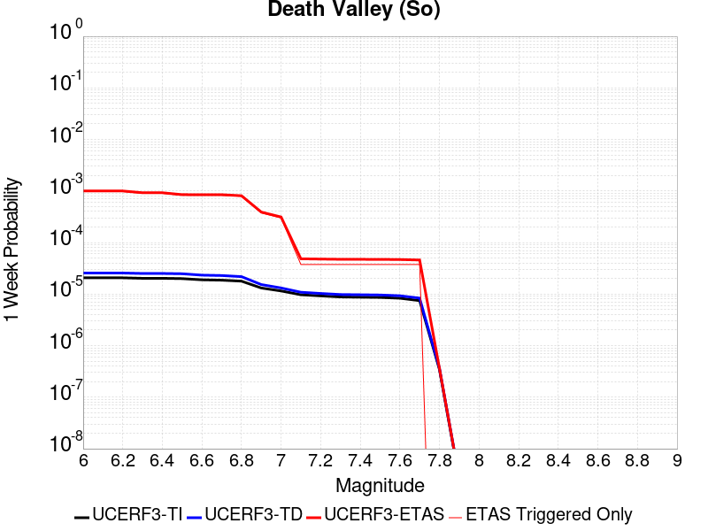 | 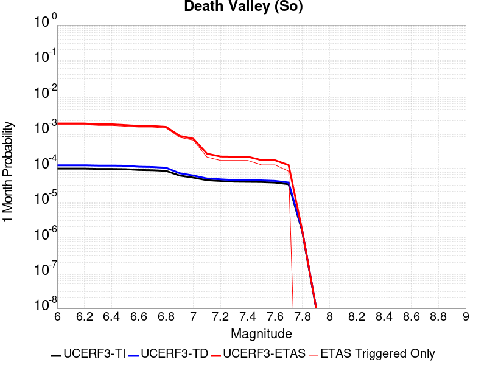 | 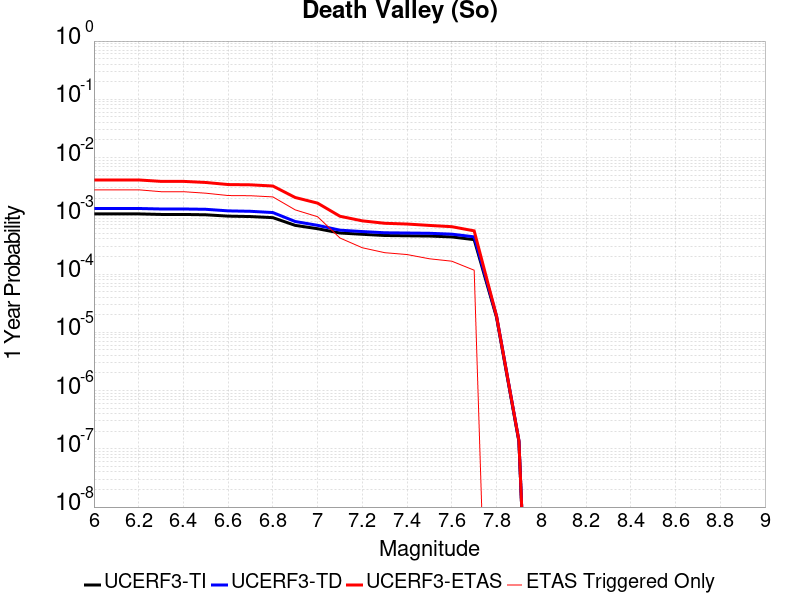 | 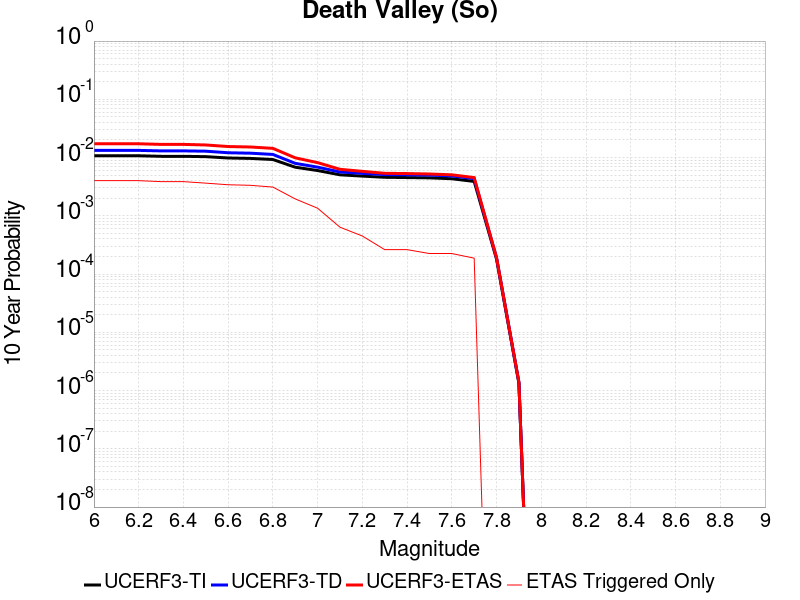 |

| Magnitude | 1 wk TI Prob | 1 wk TD Prob | 1 wk ETAS Prob | 1 wk ETAS/TD Gain | 1 wk ETAS Triggered Only | 1 mo TI Prob | 1 mo TD Prob | 1 mo ETAS Prob | 1 mo ETAS/TD Gain | 1 mo ETAS Triggered Only | 1 yr TI Prob | 1 yr TD Prob | 1 yr ETAS Prob | 1 yr ETAS/TD Gain | 1 yr ETAS Triggered Only | 10 yr TI Prob | 10 yr TD Prob | 10 yr ETAS Prob | 10 yr ETAS/TD Gain | 10 yr ETAS Triggered Only |
|-----|-----|-----|-----|-----|-----|-----|-----|-----|-----|-----|-----|-----|-----|-----|-----|-----|-----|-----|-----|-----|
| 6.0 | 2.0684236E-5 | 2.5618314E-5 | 0.0010247934 | 40.002373 | 9.992006E-4 | 8.864371E-5 | 1.0978825E-4 | 0.001633402 | 14.8777485 | 0.001523781 | 0.0010787029 | 0.0013358692 | 0.0041049467 | 3.072866 | 0.0027727818 | 0.010734817 | 0.013279985 | 0.017371599 | 1.3081039 | 0.0041466826 |
| 6.1 | 2.0684236E-5 | 2.5618314E-5 | 0.0010247934 | 40.002373 | 9.992006E-4 | 8.864371E-5 | 1.0978825E-4 | 0.001633402 | 14.8777485 | 0.001523781 | 0.0010787029 | 0.0013358692 | 0.0041049467 | 3.072866 | 0.0027727818 | 0.010734817 | 0.013279985 | 0.017371599 | 1.3081039 | 0.0041466826 |
| 6.2 | 2.0684236E-5 | 2.5618314E-5 | 0.0010247934 | 40.002373 | 9.992006E-4 | 8.864371E-5 | 1.0978825E-4 | 0.001633402 | 14.8777485 | 0.001523781 | 0.0010787029 | 0.0013358692 | 0.0041049467 | 3.072866 | 0.0027727818 | 0.010734817 | 0.013279985 | 0.017371599 | 1.3081039 | 0.0041466826 |
| 6.3 | 2.0240292E-5 | 2.51184E-5 | 9.743352E-4 | 38.7897 | 9.492406E-4 | 8.6741224E-5 | 1.0764593E-4 | 0.0015813082 | 14.689902 | 0.001473821 | 0.0010555626 | 0.001309818 | 0.0039292844 | 2.9998703 | 0.0026229017 | 0.010505628 | 0.013022543 | 0.016942643 | 1.3010241 | 0.0039718226 |
| 6.4 | 2.0240292E-5 | 2.51184E-5 | 9.743352E-4 | 38.7897 | 9.492406E-4 | 8.6741224E-5 | 1.0764593E-4 | 0.0015813082 | 14.689902 | 0.001473821 | 0.0010555626 | 0.001309818 | 0.0039292844 | 2.9998703 | 0.0026229017 | 0.010505628 | 0.013022543 | 0.016942643 | 1.3010241 | 0.0039718226 |
| 6.5 | 1.9962767E-5 | 2.4807652E-5 | 8.741071E-4 | 35.235382 | 8.4932055E-4 | 8.55519E-5 | 1.0631427E-4 | 0.0014800691 | 13.921641 | 0.0013739009 | 0.0010410968 | 0.0012936244 | 0.0037135514 | 2.8706567 | 0.0024230615 | 0.010362327 | 0.01286249 | 0.01648732 | 1.2818141 | 0.0036720624 |
| 6.6 | 1.8937297E-5 | 2.3311462E-5 | 7.976739E-4 | 34.218098 | 7.743805E-4 | 8.115732E-5 | 9.990252E-5 | 0.0013487785 | 13.500946 | 0.0012490008 | 9.876423E-4 | 0.0012156491 | 0.0034112183 | 2.806088 | 0.0021982414 | 0.009832645 | 0.0120915035 | 0.01542303 | 1.2755262 | 0.003372302 |
| 6.7 | 1.8621096E-5 | 2.2912098E-5 | 7.972749E-4 | 34.797115 | 7.743805E-4 | 7.980225E-5 | 9.8191085E-5 | 0.0013470693 | 13.718854 | 0.0012490008 | 9.711593E-4 | 0.0011948354 | 0.0033655001 | 2.8167062 | 0.0021732615 | 0.009669261 | 0.011885625 | 0.01516848 | 1.2762038 | 0.0033223422 |
| 6.8 | 1.7830353E-5 | 2.1806083E-5 | 7.711902E-4 | 35.36583 | 7.4940047E-4 | 7.641356E-5 | 9.3451374E-5 | 0.00129238 | 13.829439 | 0.0011990408 | 9.29938E-4 | 0.0011371907 | 0.0032081741 | 2.82114 | 0.0020733413 | 0.009260561 | 0.01131609 | 0.01437856 | 1.2706298 | 0.003097522 |
| 6.9 | 1.3135183E-5 | 1.5304031E-5 | 4.399578E-4 | 28.747839 | 4.2466028E-4 | 5.6292425E-5 | 6.558709E-5 | 7.6498167E-4 | 11.663602 | 6.994404E-4 | 6.8514474E-4 | 7.982367E-4 | 0.0020961608 | 2.6259887 | 0.0012989609 | 0.006830362 | 0.007955158 | 0.009937662 | 1.2492099 | 0.0019984012 |
| 7.0 | 1.1507512E-5 | 1.3154237E-5 | 3.3789017E-4 | 25.686792 | 3.2474022E-4 | 4.9316975E-5 | 5.637412E-5 | 6.308821E-4 | 11.190989 | 5.7454035E-4 | 6.002687E-4 | 6.861445E-4 | 0.0016596967 | 2.4188733 | 9.7422063E-4 | 0.0059864987 | 0.0068414924 | 0.008280422 | 1.2103238 | 0.001448841 |
| 7.1 | 9.715903E-6 | 1.0865287E-5 | 8.580452E-5 | 7.8971243 | 7.494005E-5 | 4.1638916E-5 | 4.6564706E-5 | 2.713744E-4 | 5.8278985 | 2.2482015E-4 | 5.068359E-4 | 5.667821E-4 | 0.0010161676 | 1.7928716 | 4.496403E-4 | 0.0050568148 | 0.005653834 | 0.0063989973 | 1.1317979 | 7.4940047E-4 |
| 7.2 | 9.233269E-6 | 1.0286314E-5 | 8.522559E-5 | 8.285338 | 7.494005E-5 | 3.9570554E-5 | 4.408348E-5 | 2.1893588E-4 | 4.966393 | 1.748601E-4 | 4.81665E-4 | 5.365884E-4 | 8.86121E-4 | 1.6513978 | 3.497202E-4 | 0.0048062233 | 0.0053533595 | 0.005899978 | 1.1021075 | 5.4956035E-4 |
| 7.3 | 8.8041315E-6 | 9.808164E-6 | 8.474748E-5 | 8.640504 | 7.494005E-5 | 3.7731446E-5 | 4.2034335E-5 | 2.168871E-4 | 5.1597605 | 1.748601E-4 | 4.592835E-4 | 5.1165203E-4 | 7.862916E-4 | 1.5367702 | 2.7478018E-4 | 0.0045833546 | 0.005105167 | 0.005502807 | 1.0778897 | 3.9968026E-4 |
| 7.4 | 8.708749E-6 | 9.707175E-6 | 8.46465E-5 | 8.719993 | 7.494005E-5 | 3.7322676E-5 | 4.160154E-5 | 2.1645437E-4 | 5.2030377 | 1.748601E-4 | 4.5430884E-4 | 5.0638523E-4 | 7.560589E-4 | 1.4930508 | 2.4980016E-4 | 0.004533812 | 0.0050527398 | 0.005425547 | 1.0737832 | 3.7470023E-4 |
| 7.5 | 8.612678E-6 | 9.604817E-6 | 8.454415E-5 | 8.802265 | 7.494005E-5 | 3.6910955E-5 | 4.1162875E-5 | 1.910368E-4 | 4.6409974 | 1.498801E-4 | 4.492982E-4 | 5.01047E-4 | 7.257545E-4 | 1.448476 | 2.2482015E-4 | 0.004483909 | 0.0049995985 | 0.0053475704 | 1.0696 | 3.497202E-4 |
| 7.6 | 8.319024E-6 | 9.283916E-6 | 8.422327E-5 | 9.071955 | 7.494005E-5 | 3.5652476E-5 | 3.978763E-5 | 1.8966176E-4 | 4.7668524 | 1.498801E-4 | 4.3398244E-4 | 4.8431093E-4 | 6.840543E-4 | 1.4124279 | 1.9984013E-4 | 0.0043313587 | 0.0048329784 | 0.00513129 | 1.0617242 | 2.997602E-4 |
| 7.7 | 7.4718328E-6 | 8.34517E-6 | 8.328459E-5 | 9.979976 | 7.494005E-5 | 3.2021748E-5 | 3.5764548E-5 | 1.3568104E-4 | 3.7937303 | 9.9920064E-5 | 3.8979502E-4 | 4.353504E-4 | 5.601961E-4 | 1.2867706 | 1.2490008E-4 | 0.00389112 | 0.0043453807 | 0.0045692236 | 1.051513 | 2.2482015E-4 |
| 7.8 | 3.4586725E-7 | 3.6482615E-7 | 3.6482615E-7 | 1.0 | 0.0 | 1.4822873E-6 | 1.5635396E-6 | 1.5635396E-6 | 1.0 | 0.0 | 1.80467E-5 | 1.9035933E-5 | 1.9035933E-5 | 1.0 | 0.0 | 1.8045233E-4 | 1.9034347E-4 | 1.9034347E-4 | 1.0 | 0.0 |
| 7.9 | 2.5591178E-9 | 2.6696718E-9 | 2.6696718E-9 | 1.0 | 0.0 | 1.0967647E-8 | 1.14414505E-8 | 1.14414505E-8 | 1.0 | 0.0 | 1.335311E-7 | 1.3929966E-7 | 1.3929966E-7 | 1.0 | 0.0 | 1.3353102E-6 | 1.3929966E-6 | 1.3929966E-6 | 1.0 | 0.0 |

## Nelson Lake
*[(top)](#table-of-contents)*

| 1 Week | 1 Month | 1 Year | 10 Year |
|-----|-----|-----|-----|
| 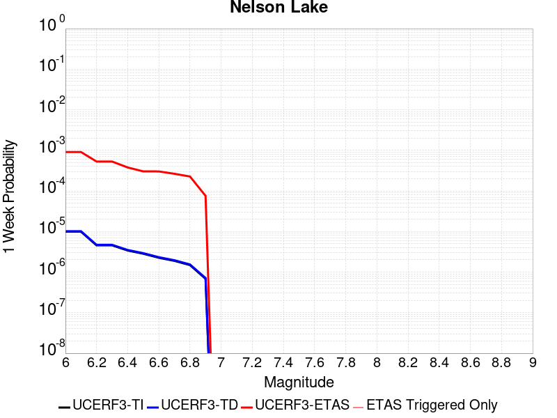 | 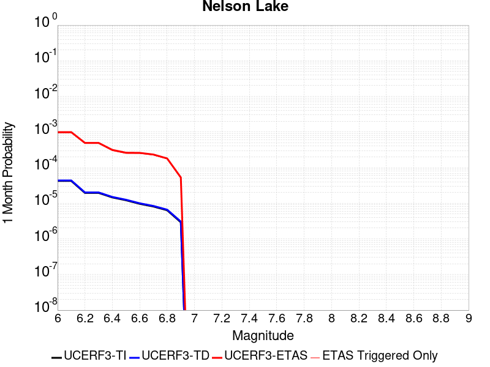 | 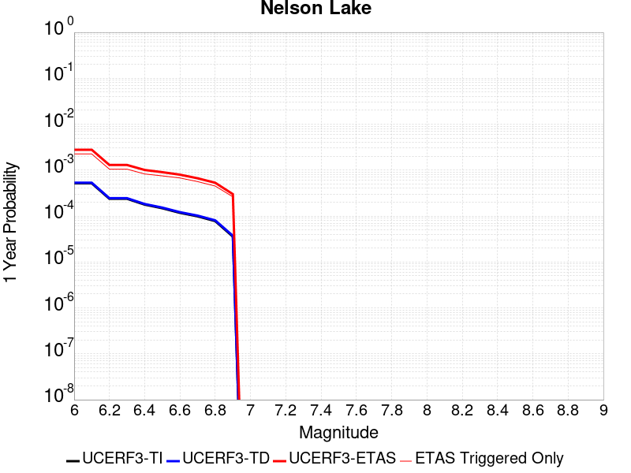 | 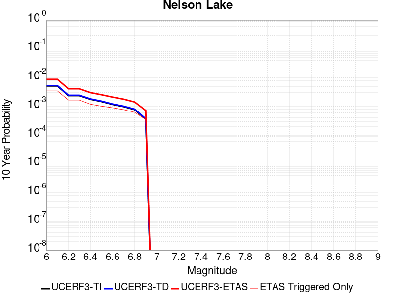 |

| Magnitude | 1 wk TI Prob | 1 wk TD Prob | 1 wk ETAS Prob | 1 wk ETAS/TD Gain | 1 wk ETAS Triggered Only | 1 mo TI Prob | 1 mo TD Prob | 1 mo ETAS Prob | 1 mo ETAS/TD Gain | 1 mo ETAS Triggered Only | 1 yr TI Prob | 1 yr TD Prob | 1 yr ETAS Prob | 1 yr ETAS/TD Gain | 1 yr ETAS Triggered Only | 10 yr TI Prob | 10 yr TD Prob | 10 yr ETAS Prob | 10 yr ETAS/TD Gain | 10 yr ETAS Triggered Only |
|-----|-----|-----|-----|-----|-----|-----|-----|-----|-----|-----|-----|-----|-----|-----|-----|-----|-----|-----|-----|-----|
| 6.0 | 9.913453E-6 | 1.0192255E-5 | 7.845649E-4 | 76.97657 | 7.743805E-4 | 4.2485535E-5 | 4.3680422E-5 | 9.928796E-4 | 22.73054 | 9.492406E-4 | 5.1713863E-4 | 5.316897E-4 | 0.0026039286 | 4.8974595 | 0.0020733413 | 0.0051593683 | 0.005305204 | 0.008759005 | 1.6510214 | 0.0034722222 |
| 6.1 | 9.913453E-6 | 1.0192255E-5 | 7.845649E-4 | 76.97657 | 7.743805E-4 | 4.2485535E-5 | 4.3680422E-5 | 9.928796E-4 | 22.73054 | 9.492406E-4 | 5.1713863E-4 | 5.316897E-4 | 0.0026039286 | 4.8974595 | 0.0020733413 | 0.0051593683 | 0.005305204 | 0.008759005 | 1.6510214 | 0.0034722222 |
| 6.2 | 4.5596407E-6 | 4.696313E-6 | 4.043747E-4 | 86.10471 | 3.9968026E-4 | 1.954117E-5 | 2.0126909E-5 | 4.9473764E-4 | 24.580908 | 4.746203E-4 | 2.3788778E-4 | 2.4501883E-4 | 0.0011940269 | 4.8732047 | 9.492406E-4 | 0.0023763329 | 0.0024476128 | 0.0041171773 | 1.6821196 | 0.001673661 |
| 6.3 | 4.5596407E-6 | 4.696313E-6 | 4.043747E-4 | 86.10471 | 3.9968026E-4 | 1.954117E-5 | 2.0126909E-5 | 4.9473764E-4 | 24.580908 | 4.746203E-4 | 2.3788778E-4 | 2.4501883E-4 | 0.0011940269 | 4.8732047 | 9.492406E-4 | 0.0023763329 | 0.0024476128 | 0.0041171773 | 1.6821196 | 0.001673661 |
| 6.4 | 3.4025713E-6 | 3.5098972E-6 | 2.782891E-4 | 79.286964 | 2.7478018E-4 | 1.4582367E-5 | 1.5042335E-5 | 3.1479803E-4 | 20.927471 | 2.997602E-4 | 1.7752586E-4 | 1.8312587E-4 | 8.824382E-4 | 4.8187523 | 6.994404E-4 | 0.001773841 | 0.0018298327 | 0.0030266794 | 1.6540744 | 0.0011990408 |
| 6.5 | 2.8352947E-6 | 2.927856E-6 | 2.2774734E-4 | 77.786385 | 2.2482015E-4 | 1.2151207E-5 | 1.2547898E-5 | 2.6234493E-4 | 20.907478 | 2.4980016E-4 | 1.479309E-4 | 1.5276071E-4 | 7.771657E-4 | 5.0874715 | 6.245004E-4 | 0.0014783246 | 0.0015266308 | 0.002549248 | 1.6698523 | 0.0010241807 |
| 6.6 | 2.251518E-6 | 2.3290677E-6 | 2.2714869E-4 | 97.52773 | 2.2482015E-4 | 9.649328E-6 | 9.981683E-6 | 2.5977934E-4 | 26.025604 | 2.4980016E-4 | 1.1747423E-4 | 1.2152085E-4 | 6.710144E-4 | 5.521805 | 5.4956035E-4 | 0.0011741214 | 0.0012146058 | 0.002112794 | 1.7394896 | 8.992806E-4 |
| 6.7 | 1.8911853E-6 | 1.9591396E-6 | 2.0179887E-4 | 103.00382 | 1.9984013E-4 | 8.105055E-6 | 8.39629E-6 | 2.3321455E-4 | 27.775908 | 2.2482015E-4 | 9.867457E-5 | 1.0222061E-4 | 5.767924E-4 | 5.6426234 | 4.746203E-4 | 9.863076E-4 | 0.0010217935 | 0.0017953827 | 1.7570896 | 7.743805E-4 |
| 6.8 | 1.4874814E-6 | 1.5438305E-6 | 1.7640367E-4 | 114.263626 | 1.748601E-4 | 6.374905E-6 | 6.6164025E-6 | 1.8147536E-4 | 27.4281 | 1.748601E-4 | 7.76117E-5 | 8.055224E-5 | 4.552223E-4 | 5.651268 | 3.7470023E-4 | 7.75846E-4 | 8.0528157E-4 | 0.0014292791 | 1.7748811 | 6.245004E-4 |
| 6.9 | 6.835972E-7 | 7.1399285E-7 | 5.067399E-5 | 70.97269 | 4.9960032E-5 | 2.9296991E-6 | 3.0599674E-6 | 5.3019845E-5 | 17.326931 | 4.9960032E-5 | 3.56685E-5 | 3.7254784E-5 | 2.1210838E-4 | 5.6934533 | 1.748601E-4 | 3.5662777E-4 | 3.7251666E-4 | 7.221066E-4 | 1.9384545 | 3.497202E-4 |

## Lenwood-Lockhart-Old Woman Springs
*[(top)](#table-of-contents)*

| 1 Week | 1 Month | 1 Year | 10 Year |
|-----|-----|-----|-----|
| 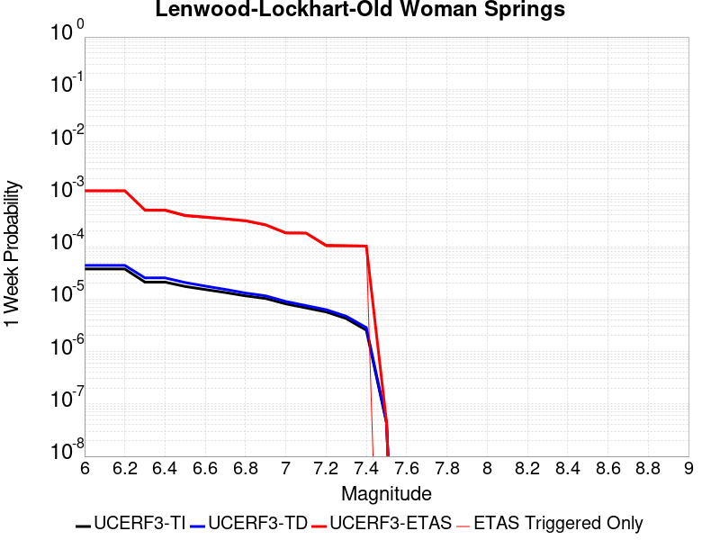 | 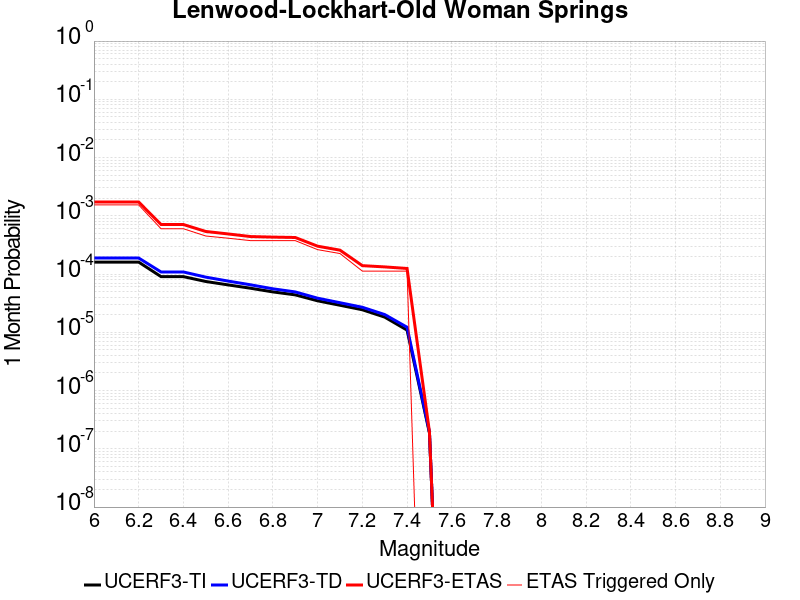 | 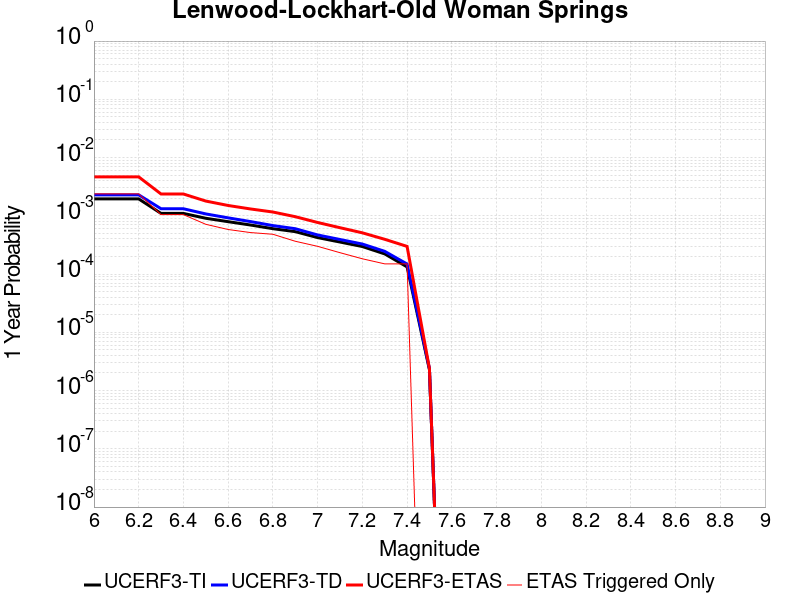 | 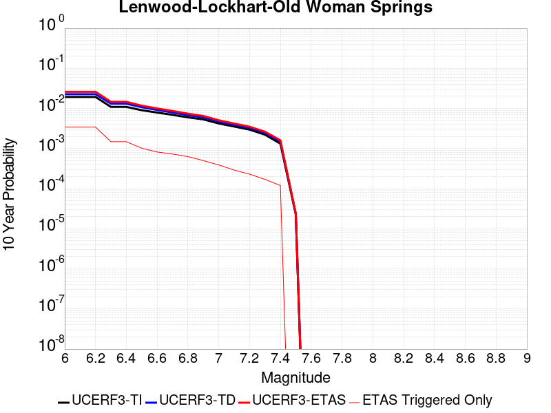 |

| Magnitude | 1 wk TI Prob | 1 wk TD Prob | 1 wk ETAS Prob | 1 wk ETAS/TD Gain | 1 wk ETAS Triggered Only | 1 mo TI Prob | 1 mo TD Prob | 1 mo ETAS Prob | 1 mo ETAS/TD Gain | 1 mo ETAS Triggered Only | 1 yr TI Prob | 1 yr TD Prob | 1 yr ETAS Prob | 1 yr ETAS/TD Gain | 1 yr ETAS Triggered Only | 10 yr TI Prob | 10 yr TD Prob | 10 yr ETAS Prob | 10 yr ETAS/TD Gain | 10 yr ETAS Triggered Only |
|-----|-----|-----|-----|-----|-----|-----|-----|-----|-----|-----|-----|-----|-----|-----|-----|-----|-----|-----|-----|-----|
| 6.0 | 3.744542E-5 | 4.396349E-5 | 0.0011680148 | 26.567837 | 0.0011241008 | 1.604705E-4 | 1.8840231E-4 | 0.0017368715 | 9.21895 | 0.001548761 | 0.0019519776 | 0.0022915571 | 0.004733989 | 2.0658393 | 0.0024480415 | 0.019349206 | 0.022697281 | 0.026237171 | 1.155961 | 0.0036221023 |
| 6.1 | 3.744542E-5 | 4.396349E-5 | 0.0011680148 | 26.567837 | 0.0011241008 | 1.604705E-4 | 1.8840231E-4 | 0.0017368715 | 9.21895 | 0.001548761 | 0.0019519776 | 0.0022915571 | 0.004733989 | 2.0658393 | 0.0024480415 | 0.019349206 | 0.022697281 | 0.026237171 | 1.155961 | 0.0036221023 |
| 6.2 | 3.744542E-5 | 4.396349E-5 | 0.0011680148 | 26.567837 | 0.0011241008 | 1.604705E-4 | 1.8840231E-4 | 0.0017368715 | 9.21895 | 0.001548761 | 0.0019519776 | 0.0022915571 | 0.004733989 | 2.0658393 | 0.0024480415 | 0.019349206 | 0.022697281 | 0.026237171 | 1.155961 | 0.0036221023 |
| 6.3 | 2.1079984E-5 | 2.5354384E-5 | 4.9996265E-4 | 19.718983 | 4.746203E-4 | 9.0339665E-5 | 1.0865723E-4 | 7.3308975E-4 | 6.7468104 | 6.245004E-4 | 0.0010993304 | 0.0013221189 | 0.0023199986 | 1.7547578 | 9.992006E-4 | 0.010939079 | 0.013144747 | 0.014648498 | 1.1143994 | 0.001523781 |
| 6.4 | 2.1079984E-5 | 2.5354384E-5 | 4.9996265E-4 | 19.718983 | 4.746203E-4 | 9.0339665E-5 | 1.0865723E-4 | 7.3308975E-4 | 6.7468104 | 6.245004E-4 | 0.0010993304 | 0.0013221189 | 0.0023199986 | 1.7547578 | 9.992006E-4 | 0.010939079 | 0.013144747 | 0.014648498 | 1.1143994 | 0.001523781 |
| 6.5 | 1.7397282E-5 | 2.0663285E-5 | 3.9535578E-4 | 19.13325 | 3.7470023E-4 | 7.455765E-5 | 8.8554E-5 | 5.3815445E-4 | 6.0771337 | 4.496403E-4 | 9.073613E-4 | 0.0010776235 | 0.0017763101 | 1.648359 | 6.994404E-4 | 0.009036654 | 0.010725273 | 0.011763182 | 1.0967722 | 0.0010491607 |
| 6.6 | 1.52050325E-5 | 1.7680086E-5 | 3.6739412E-4 | 20.780111 | 3.497202E-4 | 6.51628E-5 | 7.576964E-5 | 4.754196E-4 | 6.27454 | 3.9968026E-4 | 7.9306826E-4 | 9.221128E-4 | 0.0014711664 | 1.59543 | 5.4956035E-4 | 0.007902439 | 0.009183729 | 0.009950997 | 1.0835465 | 7.743805E-4 |
| 6.7 | 1.332523E-5 | 1.5264379E-5 | 3.3999962E-4 | 22.274055 | 3.2474022E-4 | 5.7106878E-5 | 6.541716E-5 | 4.400929E-4 | 6.7274837 | 3.7470023E-4 | 6.950544E-4 | 7.9616875E-4 | 0.0012953713 | 1.6270059 | 4.996003E-4 | 0.006928845 | 0.0079337945 | 0.008602903 | 1.0843366 | 6.7446043E-4 |
| 6.8 | 1.1525329E-5 | 1.3031365E-5 | 3.1278766E-4 | 24.002678 | 2.997602E-4 | 4.9393333E-5 | 5.5847537E-5 | 4.0554823E-4 | 7.261703 | 3.497202E-4 | 6.011979E-4 | 6.7973585E-4 | 0.0011290705 | 1.661043 | 4.496403E-4 | 0.00599574 | 0.0067770192 | 0.0073724766 | 1.0878642 | 5.995204E-4 |
| 6.9 | 1.0253909E-5 | 1.1514835E-5 | 2.6131212E-4 | 22.69352 | 2.4980016E-4 | 4.3944583E-5 | 4.934838E-5 | 3.4909378E-4 | 7.074068 | 2.997602E-4 | 5.3489394E-4 | 6.006545E-4 | 9.501647E-4 | 1.5818822 | 3.497202E-4 | 0.0053360825 | 0.0059906896 | 0.0064624664 | 1.0787517 | 4.746203E-4 |
| 7.0 | 8.104563E-6 | 8.99143E-6 | 1.8384997E-4 | 20.447243 | 1.748601E-4 | 3.4733377E-5 | 3.853415E-5 | 2.6334563E-4 | 6.834085 | 2.2482015E-4 | 4.2279682E-4 | 4.6905465E-4 | 7.4370595E-4 | 1.5855422 | 2.7478018E-4 | 0.0042199334 | 0.0046808943 | 0.0050041145 | 1.0690509 | 3.2474022E-4 |
| 7.1 | 6.7986157E-6 | 7.5159796E-6 | 1.8237477E-4 | 24.264936 | 1.748601E-4 | 2.91366E-5 | 3.2210955E-5 | 2.3204465E-4 | 7.203904 | 1.9984013E-4 | 3.5468035E-4 | 3.9209996E-4 | 6.4180215E-4 | 1.6368331 | 2.4980016E-4 | 0.003541148 | 0.003914298 | 0.0042128847 | 1.0762811 | 2.997602E-4 |
| 7.2 | 5.6893327E-6 | 6.280132E-6 | 1.0619957E-4 | 16.910404 | 9.9920064E-5 | 2.4382627E-5 | 2.6914584E-5 | 1.518113E-4 | 5.640485 | 1.2490008E-4 | 2.9681803E-4 | 3.276378E-4 | 5.024406E-4 | 1.5335246 | 1.748601E-4 | 0.002964219 | 0.003271746 | 0.0034709324 | 1.0608808 | 1.9984013E-4 |
| 7.3 | 4.253348E-6 | 4.707075E-6 | 1.0462667E-4 | 22.227535 | 9.9920064E-5 | 1.8228506E-5 | 2.017303E-5 | 1.4507059E-4 | 7.1913133 | 1.2490008E-4 | 2.2190946E-4 | 2.455808E-4 | 3.704502E-4 | 1.5084656 | 1.2490008E-4 | 0.00221688 | 0.0024532753 | 0.002577869 | 1.0507866 | 1.2490008E-4 |
| 7.4 | 2.5448119E-6 | 2.8520594E-6 | 1.0277184E-4 | 36.034256 | 9.9920064E-5 | 1.0906291E-5 | 1.2223064E-5 | 1.3712162E-4 | 11.218268 | 1.2490008E-4 | 1.3277601E-4 | 1.4880729E-4 | 2.7368878E-4 | 1.8392162 | 1.2490008E-4 | 0.001326967 | 0.0014872387 | 0.001611953 | 1.0838563 | 1.2490008E-4 |
| 7.5 | 4.3706837E-8 | 4.562909E-8 | 4.562909E-8 | 1.0 | 0.0 | 1.8731501E-7 | 1.9555324E-7 | 1.9555324E-7 | 1.0 | 0.0 | 2.2805577E-6 | 2.3808586E-6 | 2.3808586E-6 | 1.0 | 0.0 | 2.2805343E-5 | 2.3808387E-5 | 2.3808387E-5 | 1.0 | 0.0 |

## Towne Pass
*[(top)](#table-of-contents)*

| 1 Week | 1 Month | 1 Year | 10 Year |
|-----|-----|-----|-----|
| 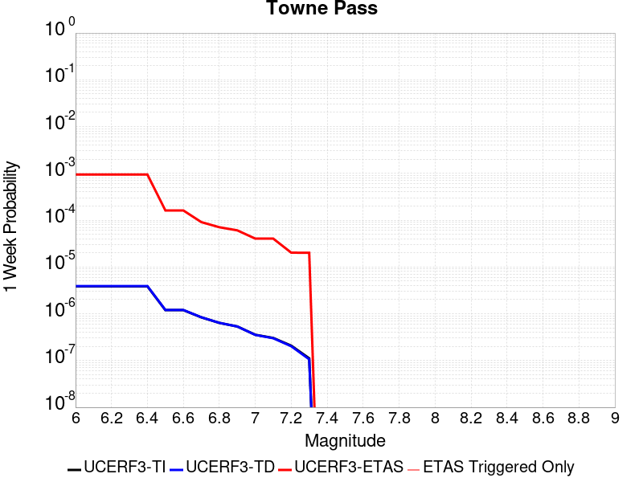 | 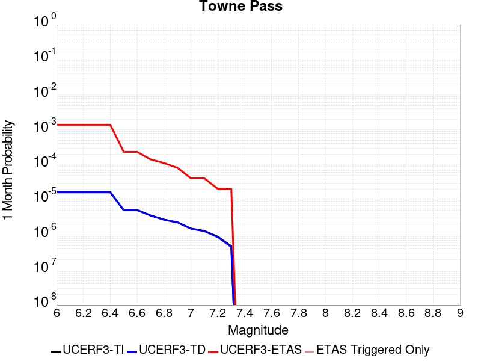 | 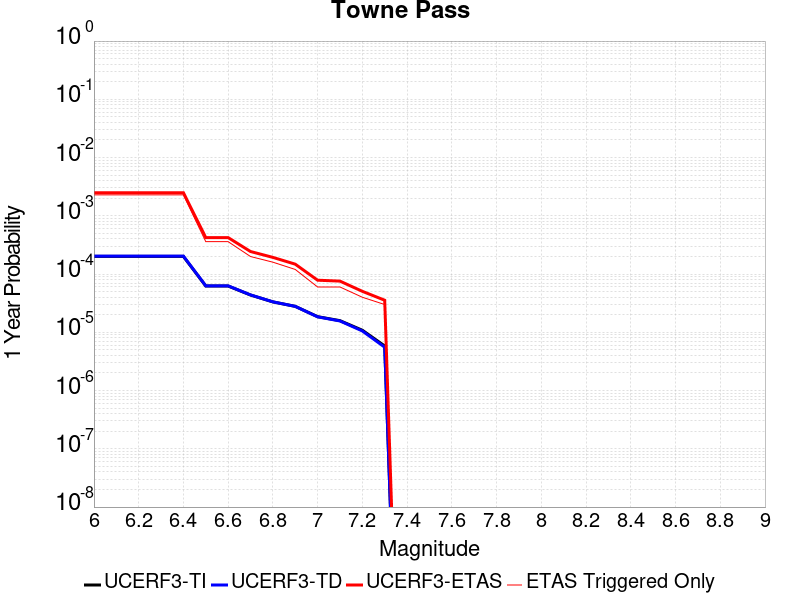 | 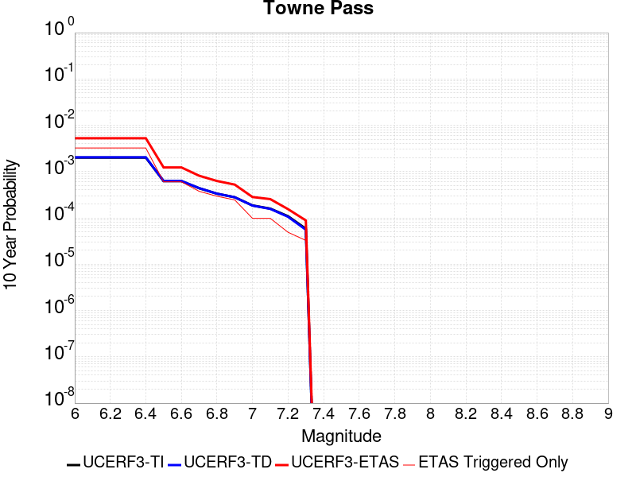 |

| Magnitude | 1 wk TI Prob | 1 wk TD Prob | 1 wk ETAS Prob | 1 wk ETAS/TD Gain | 1 wk ETAS Triggered Only | 1 mo TI Prob | 1 mo TD Prob | 1 mo ETAS Prob | 1 mo ETAS/TD Gain | 1 mo ETAS Triggered Only | 1 yr TI Prob | 1 yr TD Prob | 1 yr ETAS Prob | 1 yr ETAS/TD Gain | 1 yr ETAS Triggered Only | 10 yr TI Prob | 10 yr TD Prob | 10 yr ETAS Prob | 10 yr ETAS/TD Gain | 10 yr ETAS Triggered Only |
|-----|-----|-----|-----|-----|-----|-----|-----|-----|-----|-----|-----|-----|-----|-----|-----|-----|-----|-----|-----|-----|
| 6.0 | 3.849728E-6 | 3.894542E-6 | 9.2815154E-4 | 238.3211 | 9.242606E-4 | 1.649873E-5 | 1.6690812E-5 | 0.0014904871 | 89.29986 | 0.001473821 | 2.0085352E-4 | 2.0319606E-4 | 0.0025508404 | 12.553592 | 0.0023481215 | 0.0020067208 | 0.0020305319 | 0.00527134 | 2.596039 | 0.0032474021 |
| 6.1 | 3.849728E-6 | 3.894542E-6 | 9.2815154E-4 | 238.3211 | 9.242606E-4 | 1.649873E-5 | 1.6690812E-5 | 0.0014904871 | 89.29986 | 0.001473821 | 2.0085352E-4 | 2.0319606E-4 | 0.0025508404 | 12.553592 | 0.0023481215 | 0.0020067208 | 0.0020305319 | 0.00527134 | 2.596039 | 0.0032474021 |
| 6.2 | 3.849728E-6 | 3.894542E-6 | 9.2815154E-4 | 238.3211 | 9.242606E-4 | 1.649873E-5 | 1.6690812E-5 | 0.0014904871 | 89.29986 | 0.001473821 | 2.0085352E-4 | 2.0319606E-4 | 0.0025508404 | 12.553592 | 0.0023481215 | 0.0020067208 | 0.0020305319 | 0.00527134 | 2.596039 | 0.0032474021 |
| 6.3 | 3.849728E-6 | 3.894542E-6 | 9.2815154E-4 | 238.3211 | 9.242606E-4 | 1.649873E-5 | 1.6690812E-5 | 0.0014904871 | 89.29986 | 0.001473821 | 2.0085352E-4 | 2.0319606E-4 | 0.0025508404 | 12.553592 | 0.0023481215 | 0.0020067208 | 0.0020305319 | 0.00527134 | 2.596039 | 0.0032474021 |
| 6.4 | 3.849728E-6 | 3.894542E-6 | 9.2815154E-4 | 238.3211 | 9.242606E-4 | 1.649873E-5 | 1.6690812E-5 | 0.0014904871 | 89.29986 | 0.001473821 | 2.0085352E-4 | 2.0319606E-4 | 0.0025508404 | 12.553592 | 0.0023481215 | 0.0020067208 | 0.0020305319 | 0.00527134 | 2.596039 | 0.0032474021 |
| 6.5 | 1.1953545E-6 | 1.2030526E-6 | 2.0104295E-4 | 167.11069 | 1.9984013E-4 | 5.1229376E-6 | 5.15593E-6 | 3.2989445E-4 | 63.9835 | 3.2474022E-4 | 6.236998E-5 | 6.277176E-5 | 4.8740537E-4 | 7.764724 | 4.2466028E-4 | 6.235248E-4 | 6.2755204E-4 | 0.0012266962 | 1.9547323 | 5.995204E-4 |
| 6.6 | 1.1953545E-6 | 1.2030526E-6 | 2.0104295E-4 | 167.11069 | 1.9984013E-4 | 5.1229376E-6 | 5.15593E-6 | 3.2989445E-4 | 63.9835 | 3.2474022E-4 | 6.236998E-5 | 6.277176E-5 | 4.8740537E-4 | 7.764724 | 4.2466028E-4 | 6.235248E-4 | 6.2755204E-4 | 0.0012266962 | 1.9547323 | 5.995204E-4 |
| 6.7 | 8.375951E-7 | 8.410676E-7 | 1.0076105E-4 | 119.80136 | 9.9920064E-5 | 3.5896885E-6 | 3.6045708E-6 | 2.0344398E-4 | 56.440556 | 1.9984013E-4 | 4.370358E-5 | 4.3884826E-5 | 2.686951E-4 | 6.122734 | 2.2482015E-4 | 4.3694986E-4 | 4.3876728E-4 | 7.8833406E-4 | 1.796702 | 3.497202E-4 |
| 6.8 | 6.38041E-7 | 6.3921624E-7 | 7.557921E-5 | 118.23733 | 7.494005E-5 | 2.7344586E-6 | 2.7394954E-6 | 1.5261918E-4 | 55.71069 | 1.498801E-4 | 3.3291526E-5 | 3.3352884E-5 | 2.0820716E-4 | 6.242553 | 1.748601E-4 | 3.3286537E-4 | 3.334826E-4 | 5.8319943E-4 | 1.7488152 | 2.4980016E-4 |
| 6.9 | 5.3460053E-7 | 5.345339E-7 | 5.049454E-5 | 94.464615 | 4.9960032E-5 | 2.2911431E-6 | 2.2908578E-6 | 1.02210695E-4 | 44.61678 | 9.9920064E-5 | 2.789431E-5 | 2.7890868E-5 | 1.5278747E-4 | 5.478046 | 1.2490008E-4 | 2.789081E-4 | 2.78877E-4 | 4.7866142E-4 | 1.716389 | 1.9984013E-4 |
| 7.0 | 3.557783E-7 | 3.5324283E-7 | 2.533325E-5 | 71.71625 | 2.4980016E-5 | 1.5247632E-6 | 1.513897E-6 | 2.6493875E-5 | 17.500446 | 2.4980016E-5 | 1.8563835E-5 | 1.8431549E-5 | 6.839066E-5 | 3.7105215 | 4.9960032E-5 | 1.8562283E-4 | 1.8430105E-4 | 2.592273E-4 | 1.4065427 | 7.494005E-5 |
| 7.1 | 3.037942E-7 | 3.0002275E-7 | 2.5280031E-5 | 84.260376 | 2.4980016E-5 | 1.3019744E-6 | 1.2858112E-6 | 2.6265796E-5 | 20.427412 | 2.4980016E-5 | 1.5851423E-5 | 1.5654647E-5 | 6.5613895E-5 | 4.1913366 | 4.9960032E-5 | 1.5850292E-4 | 1.5653619E-4 | 2.3146451E-4 | 1.4786645 | 7.494005E-5 |
| 7.2 | 2.0808248E-7 | 2.0217735E-7 | 2.5182188E-5 | 124.55495 | 2.4980016E-5 | 8.917818E-7 | 8.6647407E-7 | 2.5846468E-5 | 29.829477 | 2.4980016E-5 | 1.0857389E-5 | 1.0549275E-5 | 6.050878E-5 | 5.7358236 | 4.9960032E-5 | 1.0856859E-4 | 1.0548821E-4 | 1.5544298E-4 | 1.4735578 | 4.9960032E-5 |
| 7.3 | 1.1162073E-7 | 1.0636902E-7 | 2.5086383E-5 | 235.84294 | 2.4980016E-5 | 4.7837443E-7 | 4.5586717E-7 | 2.5435871E-5 | 55.796673 | 2.4980016E-5 | 5.8241935E-6 | 5.5501705E-6 | 3.053005E-5 | 5.5007405 | 2.4980016E-5 | 5.8240406E-5 | 5.550052E-5 | 8.047915E-5 | 1.4500612 | 2.4980016E-5 |

## Paradise
*[(top)](#table-of-contents)*

| 1 Week | 1 Month | 1 Year | 10 Year |
|-----|-----|-----|-----|
| 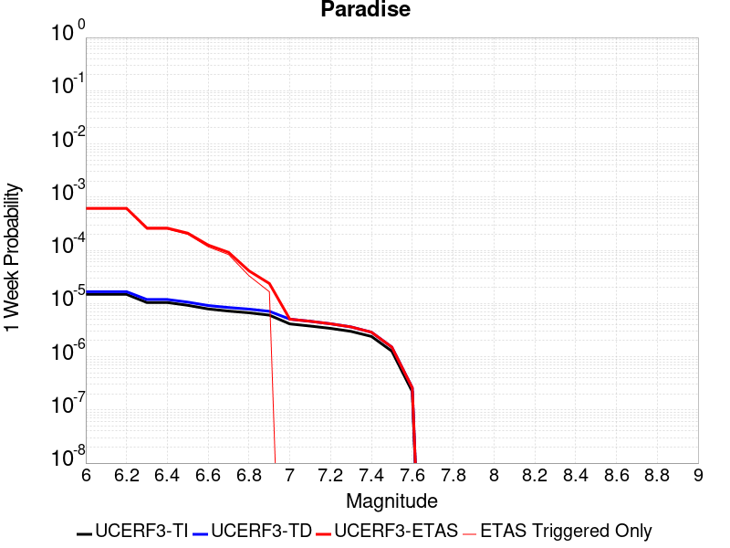 | 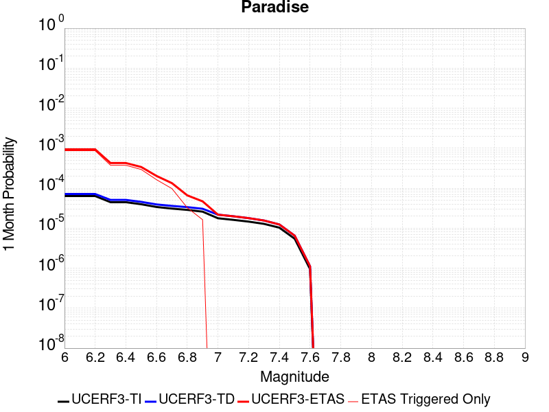 | 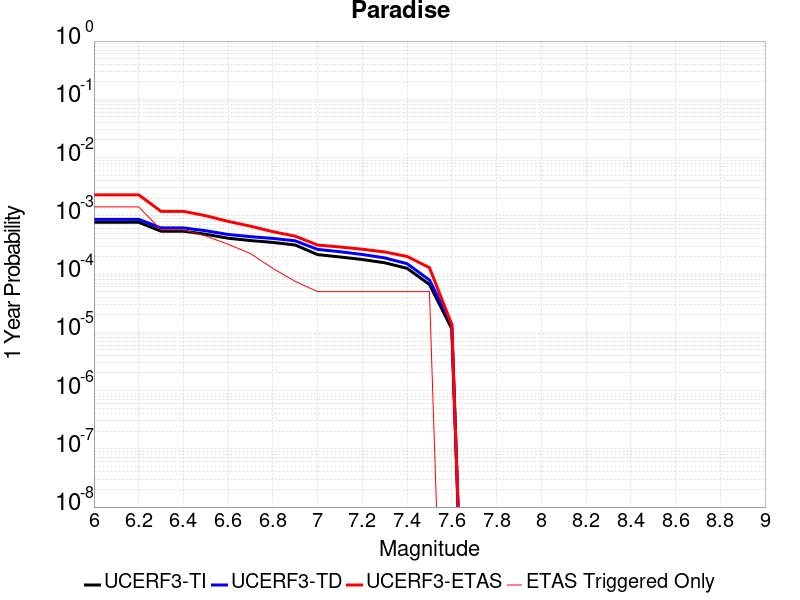 | 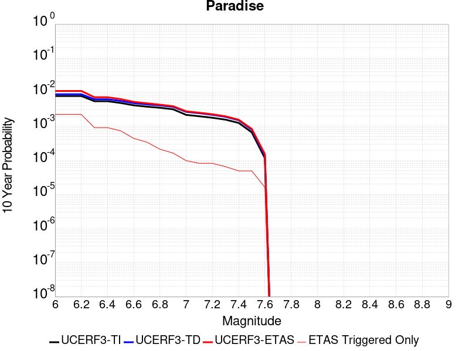 |

| Magnitude | 1 wk TI Prob | 1 wk TD Prob | 1 wk ETAS Prob | 1 wk ETAS/TD Gain | 1 wk ETAS Triggered Only | 1 mo TI Prob | 1 mo TD Prob | 1 mo ETAS Prob | 1 mo ETAS/TD Gain | 1 mo ETAS Triggered Only | 1 yr TI Prob | 1 yr TD Prob | 1 yr ETAS Prob | 1 yr ETAS/TD Gain | 1 yr ETAS Triggered Only | 10 yr TI Prob | 10 yr TD Prob | 10 yr ETAS Prob | 10 yr ETAS/TD Gain | 10 yr ETAS Triggered Only |
|-----|-----|-----|-----|-----|-----|-----|-----|-----|-----|-----|-----|-----|-----|-----|-----|-----|-----|-----|-----|-----|
| 6.0 | 1.4851273E-5 | 1.6694768E-5 | 6.661643E-4 | 39.90258 | 6.4948044E-4 | 6.364676E-5 | 7.154718E-5 | 9.457852E-4 | 13.219042 | 8.7430055E-4 | 7.7462377E-4 | 8.707624E-4 | 0.0022933835 | 2.633765 | 0.0014238609 | 0.0077192914 | 0.008675884 | 0.0108550545 | 1.2511755 | 0.0021982414 |
| 6.1 | 1.4851273E-5 | 1.6694768E-5 | 6.661643E-4 | 39.90258 | 6.4948044E-4 | 6.364676E-5 | 7.154718E-5 | 9.457852E-4 | 13.219042 | 8.7430055E-4 | 7.7462377E-4 | 8.707624E-4 | 0.0022933835 | 2.633765 | 0.0014238609 | 0.0077192914 | 0.008675884 | 0.0108550545 | 1.2511755 | 0.0021982414 |
| 6.2 | 1.4851273E-5 | 1.6694768E-5 | 6.661643E-4 | 39.90258 | 6.4948044E-4 | 6.364676E-5 | 7.154718E-5 | 9.457852E-4 | 13.219042 | 8.7430055E-4 | 7.7462377E-4 | 8.707624E-4 | 0.0022933835 | 2.633765 | 0.0014238609 | 0.0077192914 | 0.008675884 | 0.0108550545 | 1.2511755 | 0.0021982414 |
| 6.3 | 1.0426831E-5 | 1.1888697E-5 | 2.866656E-4 | 24.112448 | 2.7478018E-4 | 4.4685654E-5 | 5.09506E-5 | 4.2563176E-4 | 8.353812 | 3.7470023E-4 | 5.43912E-4 | 6.201529E-4 | 0.001194337 | 1.925875 | 5.7454035E-4 | 0.0054258266 | 0.0061848317 | 0.007103376 | 1.1485156 | 9.242606E-4 |
| 6.4 | 1.0426831E-5 | 1.1888697E-5 | 2.866656E-4 | 24.112448 | 2.7478018E-4 | 4.4685654E-5 | 5.09506E-5 | 4.2563176E-4 | 8.353812 | 3.7470023E-4 | 5.43912E-4 | 6.201529E-4 | 0.001194337 | 1.925875 | 5.7454035E-4 | 0.0054258266 | 0.0061848317 | 0.007103376 | 1.1485156 | 9.242606E-4 |
| 6.5 | 9.25027E-6 | 1.0620037E-5 | 2.1045805E-4 | 19.817072 | 1.9984013E-4 | 3.964341E-5 | 4.551368E-5 | 3.2028134E-4 | 7.037035 | 2.7478018E-4 | 4.8255164E-4 | 5.5399304E-4 | 0.0010033842 | 1.8111856 | 4.496403E-4 | 0.0048150513 | 0.0055266195 | 0.0062221945 | 1.125859 | 6.994404E-4 |
| 6.6 | 7.904275E-6 | 9.159602E-6 | 1.3405854E-4 | 14.635847 | 1.2490008E-4 | 3.3875025E-5 | 3.925487E-5 | 2.1410812E-4 | 5.454307 | 1.748601E-4 | 4.1235037E-4 | 4.7782718E-4 | 8.024122E-4 | 1.6792938 | 3.2474022E-4 | 0.0041158604 | 0.004768395 | 0.0052158907 | 1.0938463 | 4.496403E-4 |
| 6.7 | 7.2061953E-6 | 8.407326E-6 | 8.334674E-5 | 9.913586 | 7.494005E-5 | 3.088333E-5 | 3.603092E-5 | 1.3594738E-4 | 3.7730756 | 9.9920064E-5 | 3.7593965E-4 | 4.3859181E-4 | 6.633134E-4 | 1.5123706 | 2.2482015E-4 | 0.003753043 | 0.004377631 | 0.0047258204 | 1.0795382 | 3.497202E-4 |
| 6.8 | 6.6948724E-6 | 7.842242E-6 | 5.780188E-5 | 7.3705816 | 4.9960032E-5 | 2.8691995E-5 | 3.3609194E-5 | 8.3567546E-5 | 2.486449 | 4.9960032E-5 | 3.4926904E-4 | 4.091187E-4 | 5.339677E-4 | 1.3051656 | 1.2490008E-4 | 0.003487206 | 0.0040840125 | 0.0043079145 | 1.054824 | 2.2482015E-4 |
| 6.9 | 6.0421025E-6 | 7.1306963E-6 | 3.2110533E-5 | 4.5031414 | 2.4980016E-5 | 2.5894467E-5 | 3.0559786E-5 | 5.553904E-5 | 1.8173896 | 2.4980016E-5 | 3.1521954E-4 | 3.7200528E-4 | 4.4691746E-4 | 1.2013739 | 7.494005E-5 | 0.0031477278 | 0.0037141638 | 0.0038883744 | 1.0469044 | 1.748601E-4 |
| 7.0 | 4.134091E-6 | 5.0803824E-6 | 5.0803824E-6 | 1.0 | 0.0 | 1.7717413E-5 | 2.1772896E-5 | 2.1772896E-5 | 1.0 | 0.0 | 2.1568815E-4 | 2.650543E-4 | 3.150011E-4 | 1.1884398 | 4.9960032E-5 | 0.0021547892 | 0.0026475347 | 0.0027222764 | 1.0282307 | 7.494005E-5 |
| 7.1 | 3.7674888E-6 | 4.631936E-6 | 4.631936E-6 | 1.0 | 0.0 | 1.6146281E-5 | 1.9851012E-5 | 1.9851012E-5 | 1.0 | 0.0 | 1.9656324E-4 | 2.4166079E-4 | 2.9160874E-4 | 1.2066863 | 4.9960032E-5 | 0.0019638946 | 0.0024141306 | 0.0024888897 | 1.0309674 | 7.494005E-5 |
| 7.2 | 3.4065345E-6 | 4.156782E-6 | 4.156782E-6 | 1.0 | 0.0 | 1.4599351E-5 | 1.7814667E-5 | 1.7814667E-5 | 1.0 | 0.0 | 1.777326E-4 | 2.168735E-4 | 2.668227E-4 | 1.2303149 | 4.9960032E-5 | 0.0017759053 | 0.0021667667 | 0.0022415442 | 1.0345112 | 7.494005E-5 |
| 7.3 | 2.9934936E-6 | 3.6293673E-6 | 3.6293673E-6 | 1.0 | 0.0 | 1.2829195E-5 | 1.5554348E-5 | 1.5554348E-5 | 1.0 | 0.0 | 1.5618425E-4 | 1.8935918E-4 | 2.3930977E-4 | 1.2637874 | 4.9960032E-5 | 0.0015607453 | 0.0018921237 | 0.0019419893 | 1.0263542 | 4.9960032E-5 |
| 7.4 | 2.4049796E-6 | 2.8890186E-6 | 2.8890186E-6 | 1.0 | 0.0 | 1.0307015E-5 | 1.2381457E-5 | 1.2381457E-5 | 1.0 | 0.0 | 1.2548068E-4 | 1.5073526E-4 | 2.0068776E-4 | 1.3313923 | 4.9960032E-5 | 0.0012540985 | 0.0015064715 | 0.0015563563 | 1.0331136 | 4.9960032E-5 |
| 7.5 | 1.2710091E-6 | 1.5134859E-6 | 1.5134859E-6 | 1.0 | 0.0 | 5.44717E-6 | 6.4863593E-6 | 6.4863593E-6 | 1.0 | 0.0 | 6.631728E-5 | 7.896981E-5 | 1.289259E-4 | 1.6325972 | 4.9960032E-5 | 6.6297496E-4 | 7.895401E-4 | 8.394607E-4 | 1.0632274 | 4.9960032E-5 |
| 7.6 | 2.21172E-7 | 2.6040198E-7 | 2.6040198E-7 | 1.0 | 0.0 | 9.478797E-7 | 1.1160082E-6 | 1.1160082E-6 | 1.0 | 0.0 | 1.1540374E-5 | 1.3587343E-5 | 1.3587343E-5 | 1.0 | 0.0 | 1.1539775E-4 | 1.3586794E-4 | 1.3586794E-4 | 1.0 | 0.0 |

## San Andreas (San Bernardino N)
*[(top)](#table-of-contents)*

| 1 Week | 1 Month | 1 Year | 10 Year |
|-----|-----|-----|-----|
| 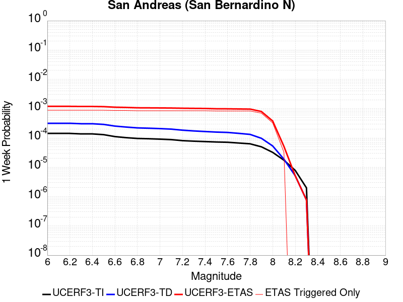 | 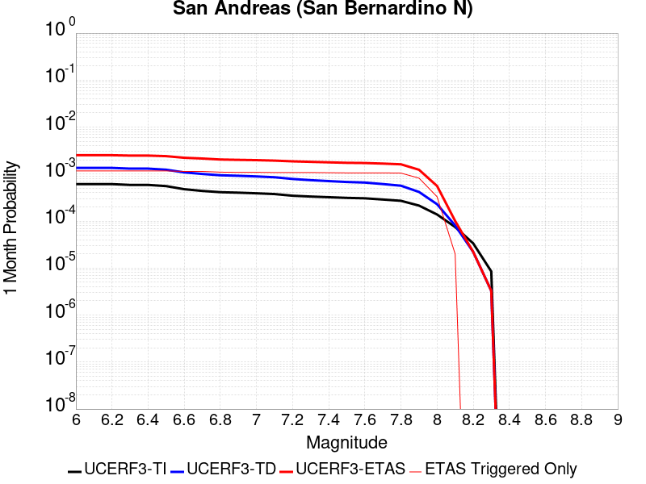 | 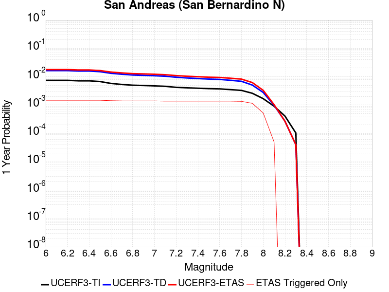 | 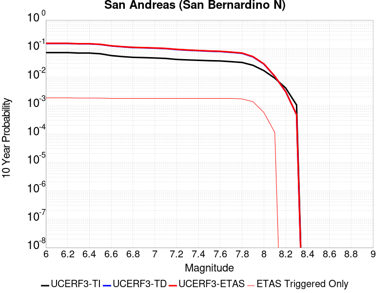 |

| Magnitude | 1 wk TI Prob | 1 wk TD Prob | 1 wk ETAS Prob | 1 wk ETAS/TD Gain | 1 wk ETAS Triggered Only | 1 mo TI Prob | 1 mo TD Prob | 1 mo ETAS Prob | 1 mo ETAS/TD Gain | 1 mo ETAS Triggered Only | 1 yr TI Prob | 1 yr TD Prob | 1 yr ETAS Prob | 1 yr ETAS/TD Gain | 1 yr ETAS Triggered Only | 10 yr TI Prob | 10 yr TD Prob | 10 yr ETAS Prob | 10 yr ETAS/TD Gain | 10 yr ETAS Triggered Only |
|-----|-----|-----|-----|-----|-----|-----|-----|-----|-----|-----|-----|-----|-----|-----|-----|-----|-----|-----|-----|-----|
| 6.0 | 1.4273766E-4 | 3.160784E-4 | 0.0010902141 | 3.449189 | 7.743805E-4 | 6.115894E-4 | 0.0013539245 | 0.0024266108 | 1.7922794 | 0.0010741407 | 0.0074207084 | 0.016360939 | 0.017810646 | 1.0886079 | 0.001473821 | 0.07177748 | 0.15021163 | 0.15186739 | 1.0110229 | 0.0019484413 |
| 6.1 | 1.4273766E-4 | 3.160784E-4 | 0.0010902141 | 3.449189 | 7.743805E-4 | 6.115894E-4 | 0.0013539245 | 0.0024266108 | 1.7922794 | 0.0010741407 | 0.0074207084 | 0.016360939 | 0.017810646 | 1.0886079 | 0.001473821 | 0.07177748 | 0.15021163 | 0.15186739 | 1.0110229 | 0.0019484413 |
| 6.2 | 1.4273766E-4 | 3.160784E-4 | 0.0010902141 | 3.449189 | 7.743805E-4 | 6.115894E-4 | 0.0013539245 | 0.0024266108 | 1.7922794 | 0.0010741407 | 0.0074207084 | 0.016360939 | 0.017810646 | 1.0886079 | 0.001473821 | 0.07177748 | 0.15021163 | 0.15186739 | 1.0110229 | 0.0019484413 |
| 6.3 | 1.3730655E-4 | 3.0512668E-4 | 0.0010792708 | 3.537124 | 7.743805E-4 | 5.883239E-4 | 0.001307036 | 0.0023797727 | 1.82074 | 0.0010741407 | 0.0071393442 | 0.015798455 | 0.017248992 | 1.0918151 | 0.001473821 | 0.06914291 | 0.1455135 | 0.14715709 | 1.011295 | 0.0019234612 |
| 6.4 | 1.3730655E-4 | 3.0512668E-4 | 0.0010792708 | 3.537124 | 7.743805E-4 | 5.883239E-4 | 0.001307036 | 0.0023797727 | 1.82074 | 0.0010741407 | 0.0071393442 | 0.015798455 | 0.017248992 | 1.0918151 | 0.001473821 | 0.06914291 | 0.1455135 | 0.14715709 | 1.011295 | 0.0019234612 |
| 6.5 | 1.2942807E-4 | 2.8927144E-4 | 0.0010634279 | 3.6762285 | 7.743805E-4 | 5.545738E-4 | 0.0012391509 | 0.0023119606 | 1.8657619 | 0.0010741407 | 0.0067310524 | 0.014983548 | 0.016435286 | 1.0968888 | 0.001473821 | 0.06530788 | 0.13865088 | 0.14030765 | 1.0119492 | 0.0019234612 |
| 6.6 | 1.1125901E-4 | 2.5365927E-4 | 0.0010028697 | 3.9536095 | 7.4940047E-4 | 4.767372E-4 | 0.0010866605 | 0.0021097283 | 1.9414787 | 0.0010241807 | 0.005788839 | 0.0131504685 | 0.014555605 | 1.1068506 | 0.0014238609 | 0.056403454 | 0.12300496 | 0.1246261 | 1.0131795 | 0.0018485212 |
| 6.7 | 1.02209575E-4 | 2.3500937E-4 | 9.842337E-4 | 4.1880617 | 7.4940047E-4 | 4.3796748E-4 | 0.0010067957 | 0.0020299451 | 2.0162435 | 0.0010241807 | 0.0053192247 | 0.012189267 | 0.013571097 | 1.1133645 | 0.0013988808 | 0.051936906 | 0.114792764 | 0.11640698 | 1.0140619 | 0.0018235411 |
| 6.8 | 9.610582E-5 | 2.2026796E-4 | 9.6950337E-4 | 4.4014726 | 7.4940047E-4 | 4.1181705E-4 | 9.436647E-4 | 0.0019668788 | 2.0842984 | 0.0010241807 | 0.0050023515 | 0.011428859 | 0.012811753 | 1.1210002 | 0.0013988808 | 0.048912346 | 0.10820469 | 0.109830916 | 1.0150292 | 0.0018235411 |
| 6.9 | 9.3877505E-5 | 2.1482339E-4 | 9.6406287E-4 | 4.4876995 | 7.4940047E-4 | 4.0227012E-4 | 9.203475E-4 | 0.0019435856 | 2.1117954 | 0.0010241807 | 0.0048866454 | 0.011147907 | 0.012531193 | 1.1240848 | 0.0013988808 | 0.04780577 | 0.105798274 | 0.107428886 | 1.0154124 | 0.0018235411 |
| 7.0 | 9.1019785E-5 | 2.0809306E-4 | 9.573376E-4 | 4.6005263 | 7.4940047E-4 | 3.900265E-4 | 8.915232E-4 | 0.0019147907 | 2.1477745 | 0.0010241807 | 0.0047382377 | 0.0108004995 | 0.012184272 | 1.1281211 | 0.0013988808 | 0.046384744 | 0.10276815 | 0.10440429 | 1.0159206 | 0.0018235411 |
| 7.1 | 8.771155E-5 | 1.9983841E-4 | 9.490891E-4 | 4.749283 | 7.4940047E-4 | 3.758525E-4 | 8.5616973E-4 | 0.0018545149 | 2.1660597 | 9.992006E-4 | 0.0045664064 | 0.010374243 | 0.0117338905 | 1.1310599 | 0.0013739009 | 0.044737056 | 0.09907644 | 0.10069681 | 1.0163547 | 0.0017985612 |
| 7.2 | 8.0830236E-5 | 1.8389444E-4 | 9.331571E-4 | 5.074417 | 7.4940047E-4 | 3.4636928E-4 | 7.8788114E-4 | 0.0017862945 | 2.267213 | 9.992006E-4 | 0.0042088944 | 0.009550368 | 0.010911148 | 1.1424845 | 0.0013739009 | 0.041300658 | 0.09180518 | 0.09343863 | 1.0177925 | 0.0017985612 |
| 7.3 | 7.7668235E-5 | 1.7333007E-4 | 9.226007E-4 | 5.3227963 | 7.4940047E-4 | 3.328214E-4 | 7.426318E-4 | 0.0017410904 | 2.3444867 | 9.992006E-4 | 0.0040445733 | 0.009004138 | 0.010365669 | 1.1512116 | 0.0013739009 | 0.03971748 | 0.08706761 | 0.08870958 | 1.0188586 | 0.0017985612 |
| 7.4 | 7.520177E-5 | 1.655312E-4 | 9.148076E-4 | 5.526497 | 7.4940047E-4 | 3.2225347E-4 | 7.092266E-4 | 0.0017077186 | 2.4078603 | 9.992006E-4 | 0.0039163795 | 0.008600714 | 0.009962797 | 1.1583688 | 0.0013739009 | 0.038480744 | 0.08352157 | 0.085169904 | 1.0197356 | 0.0017985612 |
| 7.5 | 7.274697E-5 | 1.584075E-4 | 9.076893E-4 | 5.73009 | 7.4940047E-4 | 3.1173544E-4 | 6.7871273E-4 | 0.0016772352 | 2.4712005 | 9.992006E-4 | 0.003788775 | 0.008232076 | 0.009594667 | 1.1655221 | 0.0013739009 | 0.03724827 | 0.08023654 | 0.08189079 | 1.0206171 | 0.0017985612 |
| 7.6 | 7.1185845E-5 | 1.5410586E-4 | 9.033909E-4 | 5.862145 | 7.4940047E-4 | 3.0504653E-4 | 6.602866E-4 | 0.0016588274 | 2.512284 | 9.992006E-4 | 0.0037076178 | 0.0080094095 | 0.009372306 | 1.170162 | 0.0013739009 | 0.036463667 | 0.07822661 | 0.079861455 | 1.0208988 | 0.0017735811 |
| 7.7 | 6.709961E-5 | 1.4319421E-4 | 8.9248735E-4 | 6.2327056 | 7.4940047E-4 | 2.8753807E-4 | 6.135452E-4 | 0.0016121328 | 2.6275697 | 9.992006E-4 | 0.003495157 | 0.0074443663 | 0.008808039 | 1.1831819 | 0.0013739009 | 0.034406938 | 0.07305558 | 0.07469959 | 1.0225036 | 0.0017735811 |
| 7.8 | 6.300812E-5 | 1.320343E-4 | 8.813358E-4 | 6.675052 | 7.4940047E-4 | 2.7000686E-4 | 5.657386E-4 | 0.0015394081 | 2.7210588 | 9.7422063E-4 | 0.0032823787 | 0.006866143 | 0.008205802 | 1.1951108 | 0.0013489209 | 0.032343175 | 0.06771385 | 0.06932075 | 1.0237309 | 0.0017236212 |
| 7.9 | 4.983037E-5 | 9.7241085E-5 | 7.4665836E-4 | 7.678425 | 6.4948044E-4 | 2.1354125E-4 | 4.1668097E-4 | 0.0012157084 | 2.9176002 | 7.993605E-4 | 0.0025967648 | 0.0050613005 | 0.006204565 | 1.2258836 | 0.0011490807 | 0.025666296 | 0.050650507 | 0.05200225 | 1.0266876 | 0.0014238609 |
| 8.0 | 3.2211527E-5 | 5.3306234E-5 | 3.7802913E-4 | 7.09165 | 3.2474022E-4 | 1.380421E-4 | 2.2843528E-4 | 6.280242E-4 | 2.7492435 | 3.9968026E-4 | 0.0016793669 | 0.0027776542 | 0.0033007774 | 1.1883328 | 5.2458036E-4 | 0.016667323 | 0.028362568 | 0.028993629 | 1.0222497 | 6.4948044E-4 |
| 8.1 | 1.743376E-5 | 1.8823403E-5 | 4.380295E-5 | 2.3270473 | 2.4980016E-5 | 7.471398E-5 | 8.066923E-5 | 1.0564723E-4 | 1.3096348 | 2.4980016E-5 | 9.0926304E-4 | 9.81706E-4 | 0.0010316169 | 1.0508411 | 4.9960032E-5 | 0.009055517 | 0.010483979 | 0.010558134 | 1.0070732 | 7.494005E-5 |
| 8.2 | 7.831616E-6 | 5.1540533E-6 | 5.1540533E-6 | 1.0 | 0.0 | 3.3563636E-5 | 2.2088612E-5 | 2.2088612E-5 | 1.0 | 0.0 | 4.0856065E-4 | 2.6889573E-4 | 2.6889573E-4 | 1.0 | 0.0 | 0.004078103 | 0.0030413668 | 0.0030413668 | 1.0 | 0.0 |
| 8.3 | 1.983087E-6 | 7.6564595E-7 | 7.6564595E-7 | 1.0 | 0.0 | 8.498917E-6 | 3.281336E-6 | 3.281336E-6 | 1.0 | 0.0 | 1.034694E-4 | 3.9949547E-5 | 3.9949547E-5 | 1.0 | 0.0 | 0.0010342124 | 4.717979E-4 | 4.717979E-4 | 1.0 | 0.0 |

## Bicycle Lake
*[(top)](#table-of-contents)*

| 1 Week | 1 Month | 1 Year | 10 Year |
|-----|-----|-----|-----|
| 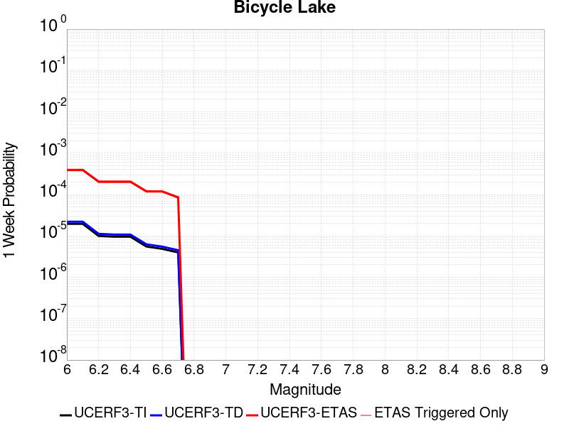 | 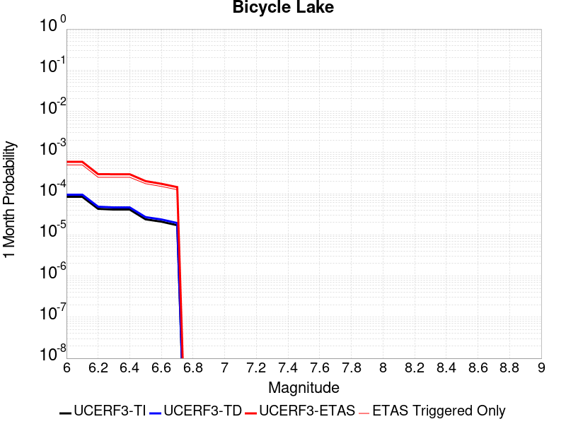 | 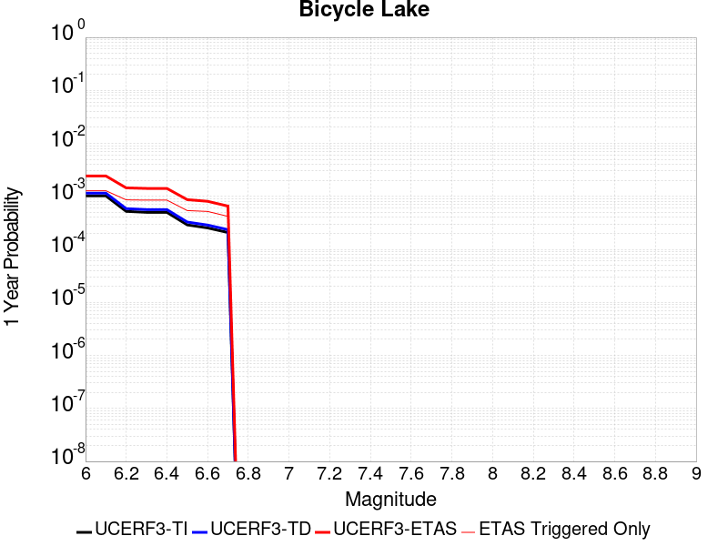 | 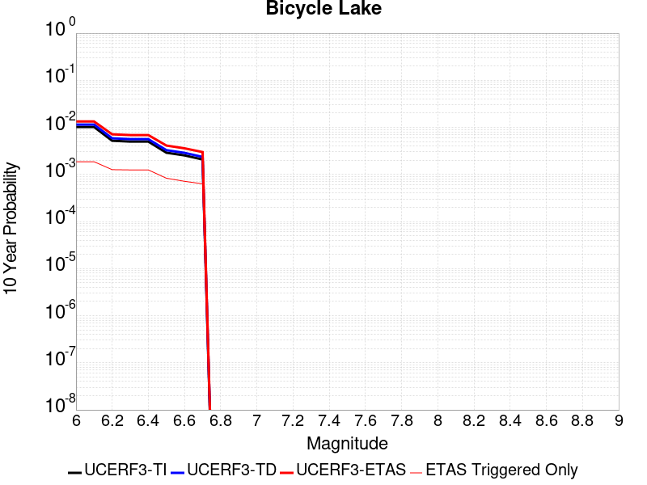 |

| Magnitude | 1 wk TI Prob | 1 wk TD Prob | 1 wk ETAS Prob | 1 wk ETAS/TD Gain | 1 wk ETAS Triggered Only | 1 mo TI Prob | 1 mo TD Prob | 1 mo ETAS Prob | 1 mo ETAS/TD Gain | 1 mo ETAS Triggered Only | 1 yr TI Prob | 1 yr TD Prob | 1 yr ETAS Prob | 1 yr ETAS/TD Gain | 1 yr ETAS Triggered Only | 10 yr TI Prob | 10 yr TD Prob | 10 yr ETAS Prob | 10 yr ETAS/TD Gain | 10 yr ETAS Triggered Only |
|-----|-----|-----|-----|-----|-----|-----|-----|-----|-----|-----|-----|-----|-----|-----|-----|-----|-----|-----|-----|-----|
| 6.0 | 1.9621975E-5 | 2.2097078E-5 | 3.2185065E-4 | 14.565304 | 2.997602E-4 | 8.4091465E-5 | 9.4699084E-5 | 5.942521E-4 | 6.2751617 | 4.996003E-4 | 0.0010233327 | 0.0011524865 | 0.0023501455 | 2.0391955 | 0.0011990408 | 0.01018633 | 0.011478408 | 0.013256324 | 1.1548922 | 0.0017985612 |
| 6.1 | 1.9621975E-5 | 2.2097078E-5 | 3.2185065E-4 | 14.565304 | 2.997602E-4 | 8.4091465E-5 | 9.4699084E-5 | 5.942521E-4 | 6.2751617 | 4.996003E-4 | 0.0010233327 | 0.0011524865 | 0.0023501455 | 2.0391955 | 0.0011990408 | 0.01018633 | 0.011478408 | 0.013256324 | 1.1548922 | 0.0017985612 |
| 6.2 | 9.9971285E-6 | 1.125564E-5 | 1.1117458E-4 | 9.8772335 | 9.9920064E-5 | 4.2844134E-5 | 4.8237856E-5 | 2.9802596E-4 | 6.178259 | 2.4980016E-4 | 5.2150246E-4 | 5.871897E-4 | 0.0013860808 | 2.3605335 | 7.993605E-4 | 0.0052028033 | 0.005861487 | 0.007028666 | 1.1991268 | 0.0011740607 |
| 6.3 | 9.589428E-6 | 1.0798346E-5 | 1.1071733E-4 | 10.253175 | 9.9920064E-5 | 4.10969E-5 | 4.62781E-5 | 2.960667E-4 | 6.3975554 | 2.4980016E-4 | 5.002399E-4 | 5.6334207E-4 | 0.0013622523 | 2.4181619 | 7.993605E-4 | 0.0049911533 | 0.0056242296 | 0.006791687 | 1.2075764 | 0.0011740607 |
| 6.4 | 9.589428E-6 | 1.0798346E-5 | 1.1071733E-4 | 10.253175 | 9.9920064E-5 | 4.10969E-5 | 4.62781E-5 | 2.960667E-4 | 6.3975554 | 2.4980016E-4 | 5.002399E-4 | 5.6334207E-4 | 0.0013622523 | 2.4181619 | 7.993605E-4 | 0.0049911533 | 0.0056242296 | 0.006791687 | 1.2075764 | 0.0011740607 |
| 6.5 | 5.557707E-6 | 6.2856016E-6 | 3.126546E-5 | 4.9741397 | 2.4980016E-5 | 2.3818526E-5 | 2.6938165E-5 | 2.0179356E-4 | 7.4909916 | 1.748601E-4 | 2.8995197E-4 | 3.279497E-4 | 8.2738616E-4 | 2.5229058 | 4.996003E-4 | 0.0028957394 | 0.0032772934 | 0.004024238 | 1.227915 | 7.4940047E-4 |
| 6.6 | 4.8742945E-6 | 5.5132896E-6 | 3.0493167E-5 | 5.530848 | 2.4980016E-5 | 2.0889667E-5 | 2.3628318E-5 | 1.7350487E-4 | 7.34309 | 1.498801E-4 | 2.54302E-4 | 2.87663E-4 | 7.621468E-4 | 2.6494431 | 4.746203E-4 | 0.002540112 | 0.0028754752 | 0.0035479963 | 1.2338817 | 6.7446043E-4 |
| 6.7 | 3.991108E-6 | 4.5159104E-6 | 2.9495814E-5 | 6.5315323 | 2.4980016E-5 | 1.7104636E-5 | 1.9353902E-5 | 1.4425156E-4 | 7.4533587 | 1.2490008E-4 | 2.0822904E-4 | 2.3563375E-4 | 6.102457E-4 | 2.589806 | 3.7470023E-4 | 0.0020803404 | 0.0023563374 | 0.002929524 | 1.2432531 | 5.7454035E-4 |

## Garlic Springs
*[(top)](#table-of-contents)*

| 1 Week | 1 Month | 1 Year | 10 Year |
|-----|-----|-----|-----|
| 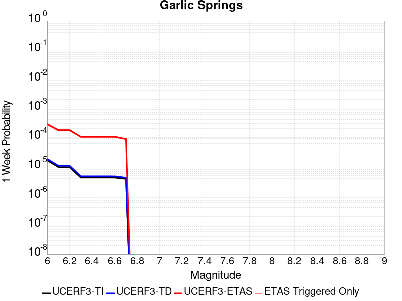 | 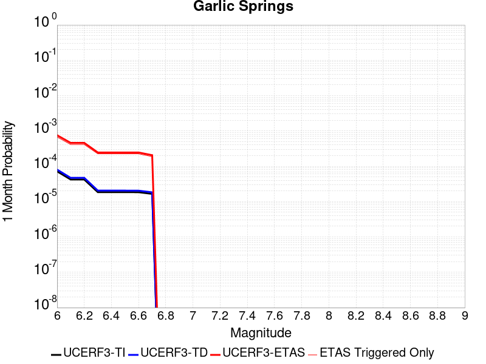 | 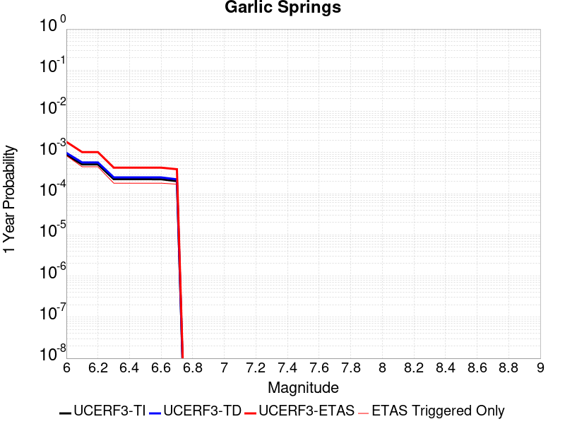 | 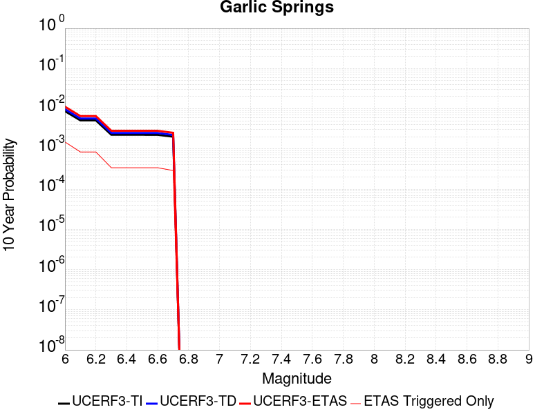 |

| Magnitude | 1 wk TI Prob | 1 wk TD Prob | 1 wk ETAS Prob | 1 wk ETAS/TD Gain | 1 wk ETAS Triggered Only | 1 mo TI Prob | 1 mo TD Prob | 1 mo ETAS Prob | 1 mo ETAS/TD Gain | 1 mo ETAS Triggered Only | 1 yr TI Prob | 1 yr TD Prob | 1 yr ETAS Prob | 1 yr ETAS/TD Gain | 1 yr ETAS Triggered Only | 10 yr TI Prob | 10 yr TD Prob | 10 yr ETAS Prob | 10 yr ETAS/TD Gain | 10 yr ETAS Triggered Only |
|-----|-----|-----|-----|-----|-----|-----|-----|-----|-----|-----|-----|-----|-----|-----|-----|-----|-----|-----|-----|-----|
| 6.0 | 1.6760017E-5 | 1.8776833E-5 | 3.4351094E-4 | 18.294403 | 3.2474022E-4 | 7.182667E-5 | 8.0470316E-5 | 6.2998646E-4 | 7.828805 | 5.4956035E-4 | 8.7413884E-4 | 9.794032E-4 | 0.001877803 | 1.9172932 | 8.992806E-4 | 0.008707083 | 0.009762413 | 0.011172374 | 1.1444274 | 0.0014238609 |
| 6.1 | 9.852767E-6 | 1.0973587E-5 | 2.6077102E-4 | 23.763515 | 2.4980016E-4 | 4.222546E-5 | 4.702921E-5 | 3.96733E-4 | 8.435884 | 3.497202E-4 | 5.139737E-4 | 5.7250116E-4 | 0.001121747 | 1.9593792 | 5.4956035E-4 | 0.005127866 | 0.005717221 | 0.0065865233 | 1.1520498 | 8.7430055E-4 |
| 6.2 | 9.852767E-6 | 1.0973587E-5 | 2.6077102E-4 | 23.763515 | 2.4980016E-4 | 4.222546E-5 | 4.702921E-5 | 3.96733E-4 | 8.435884 | 3.497202E-4 | 5.139737E-4 | 5.7250116E-4 | 0.001121747 | 1.9593792 | 5.4956035E-4 | 0.005127866 | 0.005717221 | 0.0065865233 | 1.1520498 | 8.7430055E-4 |
| 6.3 | 4.3167724E-6 | 4.7780286E-6 | 1.546574E-4 | 32.368458 | 1.498801E-4 | 1.8500323E-5 | 2.0477235E-5 | 2.2031328E-4 | 10.758937 | 1.9984013E-4 | 2.2521814E-4 | 2.4930484E-4 | 5.240165E-4 | 2.1019106 | 2.7478018E-4 | 0.0022499003 | 0.00249251 | 0.0029161118 | 1.1699499 | 4.2466028E-4 |
| 6.4 | 4.3167724E-6 | 4.7780286E-6 | 1.546574E-4 | 32.368458 | 1.498801E-4 | 1.8500323E-5 | 2.0477235E-5 | 2.2031328E-4 | 10.758937 | 1.9984013E-4 | 2.2521814E-4 | 2.4930484E-4 | 5.240165E-4 | 2.1019106 | 2.7478018E-4 | 0.0022499003 | 0.00249251 | 0.0029161118 | 1.1699499 | 4.2466028E-4 |
| 6.5 | 4.3167724E-6 | 4.7780286E-6 | 1.546574E-4 | 32.368458 | 1.498801E-4 | 1.8500323E-5 | 2.0477235E-5 | 2.2031328E-4 | 10.758937 | 1.9984013E-4 | 2.2521814E-4 | 2.4930484E-4 | 5.240165E-4 | 2.1019106 | 2.7478018E-4 | 0.0022499003 | 0.00249251 | 0.0029161118 | 1.1699499 | 4.2466028E-4 |
| 6.6 | 4.301311E-6 | 4.760897E-6 | 1.5464028E-4 | 32.48133 | 1.498801E-4 | 1.8434059E-5 | 2.0403815E-5 | 2.2023986E-4 | 10.794053 | 1.9984013E-4 | 2.2441156E-4 | 2.4841115E-4 | 5.231231E-4 | 2.105876 | 2.7478018E-4 | 0.0022418506 | 0.002483593 | 0.0029071986 | 1.1705616 | 4.2466028E-4 |
| 6.7 | 3.8599724E-6 | 4.27106E-6 | 1.291706E-4 | 30.243221 | 1.2490008E-4 | 1.6542634E-5 | 1.8304541E-5 | 1.9316145E-4 | 10.552651 | 1.748601E-4 | 2.0138794E-4 | 2.228578E-4 | 4.726023E-4 | 2.120645 | 2.4980016E-4 | 0.0020120554 | 0.002228578 | 0.002602443 | 1.1677595 | 3.7470023E-4 |

## Death Valley (Black Mtns Frontal)
*[(top)](#table-of-contents)*

| 1 Week | 1 Month | 1 Year | 10 Year |
|-----|-----|-----|-----|
| 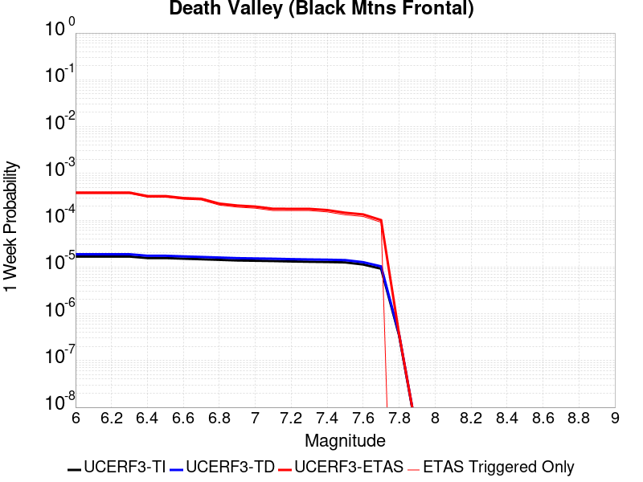 | 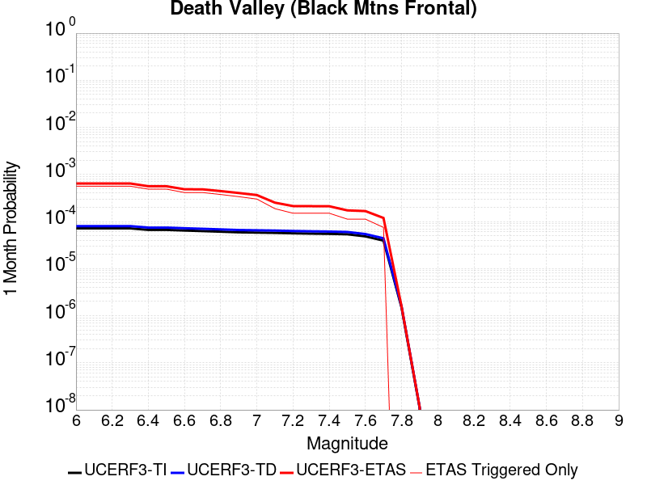 | 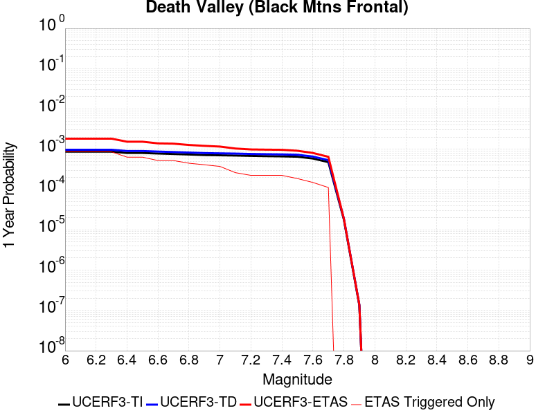 | 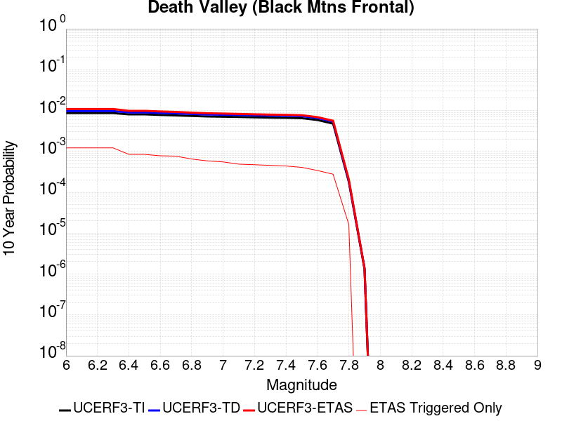 |

| Magnitude | 1 wk TI Prob | 1 wk TD Prob | 1 wk ETAS Prob | 1 wk ETAS/TD Gain | 1 wk ETAS Triggered Only | 1 mo TI Prob | 1 mo TD Prob | 1 mo ETAS Prob | 1 mo ETAS/TD Gain | 1 mo ETAS Triggered Only | 1 yr TI Prob | 1 yr TD Prob | 1 yr ETAS Prob | 1 yr ETAS/TD Gain | 1 yr ETAS Triggered Only | 10 yr TI Prob | 10 yr TD Prob | 10 yr ETAS Prob | 10 yr ETAS/TD Gain | 10 yr ETAS Triggered Only |
|-----|-----|-----|-----|-----|-----|-----|-----|-----|-----|-----|-----|-----|-----|-----|-----|-----|-----|-----|-----|-----|
| 6.0 | 1.6707214E-5 | 1.867027E-5 | 3.933635E-4 | 21.06898 | 3.7470023E-4 | 7.160038E-5 | 8.001303E-5 | 6.295294E-4 | 7.8678365 | 5.4956035E-4 | 8.71386E-4 | 9.737309E-4 | 0.0018471801 | 1.897013 | 8.7430055E-4 | 0.00867977 | 0.009695496 | 0.010882912 | 1.1224709 | 0.0011990408 |
| 6.1 | 1.6707214E-5 | 1.867027E-5 | 3.933635E-4 | 21.06898 | 3.7470023E-4 | 7.160038E-5 | 8.001303E-5 | 6.295294E-4 | 7.8678365 | 5.4956035E-4 | 8.71386E-4 | 9.737309E-4 | 0.0018471801 | 1.897013 | 8.7430055E-4 | 0.00867977 | 0.009695496 | 0.010882912 | 1.1224709 | 0.0011990408 |
| 6.2 | 1.6707214E-5 | 1.867027E-5 | 3.933635E-4 | 21.06898 | 3.7470023E-4 | 7.160038E-5 | 8.001303E-5 | 6.295294E-4 | 7.8678365 | 5.4956035E-4 | 8.71386E-4 | 9.737309E-4 | 0.0018471801 | 1.897013 | 8.7430055E-4 | 0.00867977 | 0.009695496 | 0.010882912 | 1.1224709 | 0.0011990408 |
| 6.3 | 1.6707214E-5 | 1.867027E-5 | 3.933635E-4 | 21.06898 | 3.7470023E-4 | 7.160038E-5 | 8.001303E-5 | 6.295294E-4 | 7.8678365 | 5.4956035E-4 | 8.71386E-4 | 9.737309E-4 | 0.0018471801 | 1.897013 | 8.7430055E-4 | 0.00867977 | 0.009695496 | 0.010882912 | 1.1224709 | 0.0011990408 |
| 6.4 | 1.5515609E-5 | 1.7338214E-5 | 3.420728E-4 | 19.729414 | 3.2474022E-4 | 6.649377E-5 | 7.4304546E-5 | 5.4888957E-4 | 7.3870254 | 4.746203E-4 | 8.0926094E-4 | 9.042885E-4 | 0.001578139 | 1.745172 | 6.7446043E-4 | 0.008063202 | 0.009006773 | 0.009873198 | 1.0961971 | 8.7430055E-4 |
| 6.5 | 1.5515609E-5 | 1.7338214E-5 | 3.420728E-4 | 19.729414 | 3.2474022E-4 | 6.649377E-5 | 7.4304546E-5 | 5.4888957E-4 | 7.3870254 | 4.746203E-4 | 8.0926094E-4 | 9.042885E-4 | 0.001578139 | 1.745172 | 6.7446043E-4 | 0.008063202 | 0.009006773 | 0.009873198 | 1.0961971 | 8.7430055E-4 |
| 6.6 | 1.5041828E-5 | 1.6809145E-5 | 2.915847E-4 | 17.34679 | 2.7478018E-4 | 6.4463384E-5 | 7.203723E-5 | 4.9666694E-4 | 6.894586 | 4.2466028E-4 | 7.8455906E-4 | 8.767063E-4 | 0.0014757011 | 1.6832331 | 5.995204E-4 | 0.00781795 | 0.008733132 | 0.009525512 | 1.0907326 | 7.993605E-4 |
| 6.7 | 1.4634985E-5 | 1.6356016E-5 | 2.6615208E-4 | 16.272429 | 2.4980016E-4 | 6.271985E-5 | 7.009536E-5 | 4.697476E-4 | 6.7015505 | 3.9968026E-4 | 7.6334673E-4 | 8.5308263E-4 | 0.0014271329 | 1.6729128 | 5.7454035E-4 | 0.007607299 | 0.008498715 | 0.009266515 | 1.090343 | 7.743805E-4 |
| 6.8 | 1.4209158E-5 | 1.5882048E-5 | 1.9073939E-4 | 12.0097475 | 1.748601E-4 | 6.089497E-5 | 6.8064175E-5 | 3.9278227E-4 | 5.770764 | 3.2474022E-4 | 7.4114406E-4 | 8.2837185E-4 | 0.001302599 | 1.572481 | 4.746203E-4 | 0.007386771 | 0.008253456 | 0.00892235 | 1.0810441 | 6.7446043E-4 |
| 6.9 | 1.3780098E-5 | 1.5404594E-5 | 1.6528238E-4 | 10.729423 | 1.498801E-4 | 5.9056227E-5 | 6.6018045E-5 | 3.6575846E-4 | 5.54028 | 2.997602E-4 | 7.1877235E-4 | 8.0347876E-4 | 0.0012527577 | 1.5591673 | 4.496403E-4 | 0.0071645193 | 0.008006332 | 0.008625833 | 1.0773762 | 6.245004E-4 |
| 7.0 | 1.3585064E-5 | 1.5188155E-5 | 1.4008634E-4 | 9.223393 | 1.2490008E-4 | 5.8220405E-5 | 6.50905E-5 | 3.398528E-4 | 5.221235 | 2.7478018E-4 | 7.086029E-4 | 7.9219416E-4 | 0.001216518 | 1.5356312 | 4.2466028E-4 | 0.007063476 | 0.007894293 | 0.008464298 | 1.0722047 | 5.7454035E-4 |
| 7.1 | 1.3398601E-5 | 1.49813395E-5 | 8.9920264E-5 | 6.002151 | 7.494005E-5 | 5.742131E-5 | 6.420419E-5 | 2.640315E-4 | 4.1123714 | 1.9984013E-4 | 6.9888023E-4 | 7.8141113E-4 | 0.0011308581 | 1.4471998 | 3.497202E-4 | 0.0069668638 | 0.007787224 | 0.008282934 | 1.0636568 | 4.996003E-4 |
| 7.2 | 1.3126312E-5 | 1.4679561E-5 | 8.961851E-5 | 6.1049857 | 7.494005E-5 | 5.6254412E-5 | 6.291092E-5 | 2.3776003E-4 | 3.7793128 | 1.748601E-4 | 6.846822E-4 | 7.6567667E-4 | 0.0010901683 | 1.4237971 | 3.2474022E-4 | 0.006825765 | 0.00763097 | 0.008101969 | 1.0617219 | 4.746203E-4 |
| 7.3 | 1.2922429E-5 | 1.4453788E-5 | 8.939275E-5 | 6.184728 | 7.494005E-5 | 5.5380664E-5 | 6.194336E-5 | 2.3679265E-4 | 3.8227282 | 1.748601E-4 | 6.74051E-4 | 7.53905E-4 | 0.0010784003 | 1.4304194 | 3.2474022E-4 | 0.006720101 | 0.007514055 | 0.0079851085 | 1.0626897 | 4.746203E-4 |
| 7.4 | 1.2768878E-5 | 1.4283772E-5 | 8.922275E-5 | 6.246442 | 7.494005E-5 | 5.4722615E-5 | 6.1214756E-5 | 2.3606417E-4 | 3.8563278 | 1.748601E-4 | 6.660441E-4 | 7.4504025E-4 | 0.0010445771 | 1.4020412 | 2.997602E-4 | 0.0066405144 | 0.0074260035 | 0.007872305 | 1.0600998 | 4.496403E-4 |
| 7.5 | 1.2521929E-5 | 1.40120155E-5 | 8.895101E-5 | 6.3481956 | 7.494005E-5 | 5.366431E-5 | 6.005014E-5 | 2.0992124E-4 | 3.495766 | 1.498801E-4 | 6.531671E-4 | 7.3087064E-4 | 0.00100545 | 1.3756881 | 2.7478018E-4 | 0.006512506 | 0.0072852457 | 0.007706812 | 1.0578657 | 4.2466028E-4 |
| 7.6 | 1.1301089E-5 | 1.2648149E-5 | 8.758725E-5 | 6.9249067 | 7.494005E-5 | 4.8432343E-5 | 5.4205255E-5 | 2.0407722E-4 | 3.7648973 | 1.498801E-4 | 5.895042E-4 | 6.5975444E-4 | 8.844263E-4 | 1.3405385 | 2.2482015E-4 | 0.0058794282 | 0.00657851 | 0.00692593 | 1.0528113 | 3.497202E-4 |
| 7.7 | 9.189108E-6 | 1.0283358E-5 | 8.522264E-5 | 8.287433 | 7.494005E-5 | 3.93813E-5 | 4.407082E-5 | 1.4398649E-4 | 3.2671614 | 9.9920064E-5 | 4.7936183E-4 | 5.3643517E-4 | 6.8623485E-4 | 1.2792503 | 1.498801E-4 | 0.004783291 | 0.005351914 | 0.0056252233 | 1.0510676 | 2.7478018E-4 |
| 7.8 | 3.4586725E-7 | 3.6482615E-7 | 3.6482615E-7 | 1.0 | 0.0 | 1.4822873E-6 | 1.5635396E-6 | 1.5635396E-6 | 1.0 | 0.0 | 1.80467E-5 | 1.9035933E-5 | 1.9035933E-5 | 1.0 | 0.0 | 1.8045233E-4 | 1.9034347E-4 | 1.9034347E-4 | 1.0 | 0.0 |
| 7.9 | 2.5591178E-9 | 2.6696718E-9 | 2.6696718E-9 | 1.0 | 0.0 | 1.0967647E-8 | 1.14414505E-8 | 1.14414505E-8 | 1.0 | 0.0 | 1.335311E-7 | 1.3929966E-7 | 1.3929966E-7 | 1.0 | 0.0 | 1.3353102E-6 | 1.3929966E-6 | 1.3929966E-6 | 1.0 | 0.0 |

## San Andreas (San Bernardino S)
*[(top)](#table-of-contents)*

| 1 Week | 1 Month | 1 Year | 10 Year |
|-----|-----|-----|-----|
| 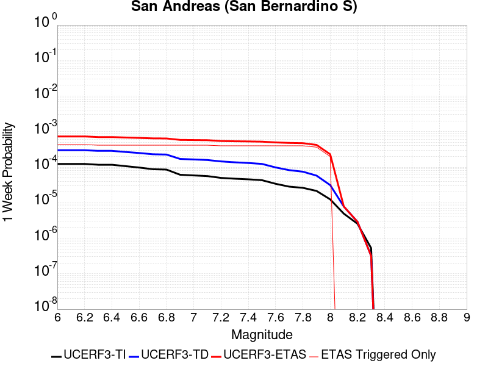 | 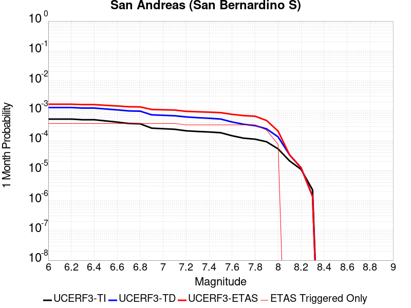 | 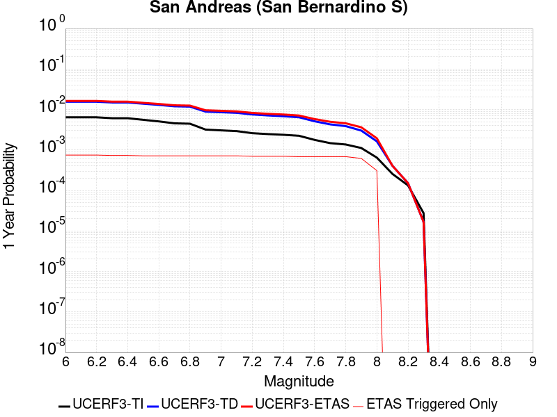 | 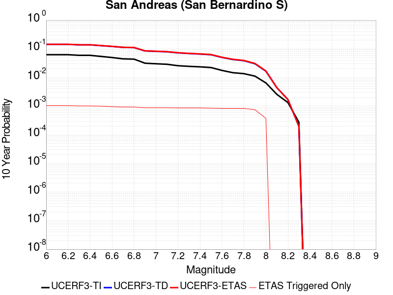 |

| Magnitude | 1 wk TI Prob | 1 wk TD Prob | 1 wk ETAS Prob | 1 wk ETAS/TD Gain | 1 wk ETAS Triggered Only | 1 mo TI Prob | 1 mo TD Prob | 1 mo ETAS Prob | 1 mo ETAS/TD Gain | 1 mo ETAS Triggered Only | 1 yr TI Prob | 1 yr TD Prob | 1 yr ETAS Prob | 1 yr ETAS/TD Gain | 1 yr ETAS Triggered Only | 10 yr TI Prob | 10 yr TD Prob | 10 yr ETAS Prob | 10 yr ETAS/TD Gain | 10 yr ETAS Triggered Only |
|-----|-----|-----|-----|-----|-----|-----|-----|-----|-----|-----|-----|-----|-----|-----|-----|-----|-----|-----|-----|-----|
| 6.0 | 1.2336002E-4 | 3.0005194E-4 | 6.9961225E-4 | 2.3316371 | 3.9968026E-4 | 5.2857865E-4 | 0.0012853292 | 0.0017593395 | 1.3687851 | 4.746203E-4 | 0.006416472 | 0.015541554 | 0.016205532 | 1.0427228 | 6.7446043E-4 | 0.06234337 | 0.14294699 | 0.143889 | 1.0065899 | 0.0010991207 |
| 6.1 | 1.2336002E-4 | 3.0005194E-4 | 6.9961225E-4 | 2.3316371 | 3.9968026E-4 | 5.2857865E-4 | 0.0012853292 | 0.0017593395 | 1.3687851 | 4.746203E-4 | 0.006416472 | 0.015541554 | 0.016205532 | 1.0427228 | 6.7446043E-4 | 0.06234337 | 0.14294699 | 0.143889 | 1.0065899 | 0.0010991207 |
| 6.2 | 1.2336002E-4 | 3.0005194E-4 | 6.9961225E-4 | 2.3316371 | 3.9968026E-4 | 5.2857865E-4 | 0.0012853292 | 0.0017593395 | 1.3687851 | 4.746203E-4 | 0.006416472 | 0.015541554 | 0.016205532 | 1.0427228 | 6.7446043E-4 | 0.06234337 | 0.14294699 | 0.143889 | 1.0065899 | 0.0010991207 |
| 6.3 | 1.1712257E-4 | 2.8793467E-4 | 6.62527E-4 | 2.3009632 | 3.7470023E-4 | 5.018573E-4 | 0.0012334478 | 0.0016825334 | 1.3640897 | 4.496403E-4 | 0.006093008 | 0.014918666 | 0.015558457 | 1.0428853 | 6.4948044E-4 | 0.059286322 | 0.13765779 | 0.13856252 | 1.0065724 | 0.0010491607 |
| 6.4 | 1.1712257E-4 | 2.8793467E-4 | 6.62527E-4 | 2.3009632 | 3.7470023E-4 | 5.018573E-4 | 0.0012334478 | 0.0016825334 | 1.3640897 | 4.496403E-4 | 0.006093008 | 0.014918666 | 0.015558457 | 1.0428853 | 6.4948044E-4 | 0.059286322 | 0.13765779 | 0.13856252 | 1.0065724 | 0.0010491607 |
| 6.5 | 1.0689076E-4 | 2.6806415E-4 | 6.42664E-4 | 2.397426 | 3.7470023E-4 | 4.5802278E-4 | 0.0011483653 | 0.0015974892 | 1.3910985 | 4.496403E-4 | 0.0055621783 | 0.013896335 | 0.014512157 | 1.0443155 | 6.245004E-4 | 0.05425003 | 0.1288989 | 0.12979107 | 1.0069214 | 0.0010241807 |
| 6.6 | 9.7648895E-5 | 2.505129E-4 | 6.251193E-4 | 2.4953575 | 3.7470023E-4 | 4.1842813E-4 | 0.0010732086 | 0.0015223664 | 1.4185185 | 4.496403E-4 | 0.005082469 | 0.012992399 | 0.013608785 | 1.0474421 | 6.245004E-4 | 0.049677886 | 0.121077746 | 0.12193401 | 1.007072 | 9.7422063E-4 |
| 6.7 | 8.757013E-5 | 2.3122175E-4 | 6.0583535E-4 | 2.6201487 | 3.7470023E-4 | 3.7524657E-4 | 9.905964E-4 | 0.0014397912 | 1.453459 | 4.496403E-4 | 0.00455906 | 0.011997902 | 0.01261491 | 1.0514263 | 6.245004E-4 | 0.04466656 | 0.112373024 | 0.113215595 | 1.007498 | 9.492406E-4 |
| 6.8 | 8.562978E-5 | 2.2682057E-4 | 6.0143584E-4 | 2.651593 | 3.7470023E-4 | 3.6693315E-4 | 9.7174826E-4 | 0.0014209516 | 1.4622631 | 4.496403E-4 | 0.004458263 | 0.011770921 | 0.012388071 | 1.05243 | 6.245004E-4 | 0.043698758 | 0.11037863 | 0.111223094 | 1.0076506 | 9.492406E-4 |
| 6.9 | 6.124075E-5 | 1.7066885E-4 | 5.4530514E-4 | 3.1951065 | 3.7470023E-4 | 2.6243398E-4 | 7.312337E-4 | 0.0011805452 | 1.6144568 | 4.496403E-4 | 0.0031904527 | 0.008866636 | 0.0094856 | 1.0698081 | 6.245004E-4 | 0.031450346 | 0.08420262 | 0.0850033 | 1.009509 | 8.7430055E-4 |
| 7.0 | 5.8598747E-5 | 1.6495936E-4 | 5.3959776E-4 | 3.2710953 | 3.7470023E-4 | 2.5111332E-4 | 7.067779E-4 | 0.0011561004 | 1.6357336 | 4.496403E-4 | 0.0030530186 | 0.008571265 | 0.009190413 | 1.0722352 | 6.245004E-4 | 0.03011414 | 0.08151562 | 0.08231865 | 1.0098512 | 8.7430055E-4 |
| 7.1 | 5.613814E-5 | 1.5914452E-4 | 5.3378515E-4 | 3.3540907 | 3.7470023E-4 | 2.4056983E-4 | 6.818704E-4 | 0.0011312041 | 1.6589723 | 4.496403E-4 | 0.0029250039 | 0.008270353 | 0.008889688 | 1.0748862 | 6.245004E-4 | 0.028868021 | 0.07881268 | 0.079618074 | 1.0102191 | 8.7430055E-4 |
| 7.2 | 4.991222E-5 | 1.4520933E-4 | 4.9487874E-4 | 3.408037 | 3.497202E-4 | 2.1389198E-4 | 6.221777E-4 | 0.0010465737 | 1.682114 | 4.2466028E-4 | 0.002601025 | 0.0075488063 | 0.008143801 | 1.0788198 | 5.995204E-4 | 0.025707912 | 0.07226191 | 0.07304985 | 1.0109041 | 8.4932055E-4 |
| 7.3 | 4.7410045E-5 | 1.371513E-4 | 4.8682356E-4 | 3.5495365 | 3.497202E-4 | 2.0317009E-4 | 5.8765925E-4 | 0.00101207 | 1.7222055 | 4.2466028E-4 | 0.0024707897 | 0.0071313656 | 0.0077266106 | 1.0834686 | 5.995204E-4 | 0.024434982 | 0.068541944 | 0.06933305 | 1.011542 | 8.4932055E-4 |
| 7.4 | 4.5556746E-5 | 1.3123035E-4 | 4.8090468E-4 | 3.6645844 | 3.497202E-4 | 1.952286E-4 | 5.6229485E-4 | 9.867164E-4 | 1.7548023 | 4.2466028E-4 | 0.002374317 | 0.0068245293 | 0.0074199582 | 1.0872483 | 5.995204E-4 | 0.023491086 | 0.06579143 | 0.06658487 | 1.0120599 | 8.4932055E-4 |
| 7.5 | 4.3084514E-5 | 1.2358342E-4 | 4.732604E-4 | 3.8294814 | 3.497202E-4 | 1.8463485E-4 | 5.2953605E-4 | 9.539714E-4 | 1.8015232 | 4.2466028E-4 | 0.0022456115 | 0.0064281146 | 0.007023781 | 1.0926658 | 5.995204E-4 | 0.022230545 | 0.062190283 | 0.06298678 | 1.0128075 | 8.4932055E-4 |
| 7.6 | 3.408608E-5 | 9.836477E-5 | 4.480506E-4 | 4.554991 | 3.497202E-4 | 1.4607502E-4 | 4.214953E-4 | 8.459766E-4 | 2.0070844 | 4.2466028E-4 | 0.0017770125 | 0.005119656 | 0.005716107 | 1.1165022 | 5.995204E-4 | 0.017628696 | 0.05002244 | 0.050805543 | 1.015655 | 8.243405E-4 |
| 7.7 | 2.8315713E-5 | 8.2495724E-5 | 4.321871E-4 | 5.238903 | 3.497202E-4 | 1.2134742E-4 | 3.5350522E-4 | 7.7801535E-4 | 2.2008595 | 4.2466028E-4 | 0.0014764034 | 0.004295442 | 0.004892387 | 1.1389718 | 5.995204E-4 | 0.01466633 | 0.042272415 | 0.04306191 | 1.0186763 | 8.243405E-4 |
| 7.8 | 2.6222975E-5 | 7.463898E-5 | 4.243331E-4 | 5.6851406 | 3.497202E-4 | 1.1237934E-4 | 3.1984213E-4 | 7.443666E-4 | 2.3272936 | 4.2466028E-4 | 0.0013673597 | 0.003887131 | 0.004484321 | 1.1536325 | 5.995204E-4 | 0.013589768 | 0.038437475 | 0.03923013 | 1.0206219 | 8.243405E-4 |
| 7.9 | 2.1469694E-5 | 5.7884805E-5 | 3.5762764E-4 | 6.1782646 | 2.997602E-4 | 9.200973E-5 | 2.4805416E-4 | 5.976876E-4 | 2.4095047 | 3.497202E-4 | 0.0011196428 | 0.00301588 | 0.0035388784 | 1.1734148 | 5.2458036E-4 | 0.011140184 | 0.030153265 | 0.030855842 | 1.0233002 | 7.244205E-4 |
| 8.0 | 1.2420249E-5 | 3.1321662E-5 | 2.061763E-4 | 6.582546 | 1.748601E-4 | 5.322855E-5 | 1.342288E-4 | 3.5901877E-4 | 2.6746776 | 2.2482015E-4 | 6.478649E-4 | 0.0016330116 | 0.0019322822 | 1.1832631 | 2.997602E-4 | 0.0064597935 | 0.01652369 | 0.016916767 | 1.0237887 | 3.9968026E-4 |
| 8.1 | 4.9197724E-6 | 7.822525E-6 | 7.822525E-6 | 1.0 | 0.0 | 2.1084568E-5 | 3.3524673E-5 | 3.3524673E-5 | 1.0 | 0.0 | 2.566744E-4 | 4.080866E-4 | 4.080866E-4 | 1.0 | 0.0 | 0.002563781 | 0.004384557 | 0.004384557 | 1.0 | 0.0 |
| 8.2 | 2.5634774E-6 | 2.9065757E-6 | 2.9065757E-6 | 1.0 | 0.0 | 1.0986286E-5 | 1.2456694E-5 | 1.2456694E-5 | 1.0 | 0.0 | 1.3374983E-4 | 1.5164974E-4 | 1.5164974E-4 | 1.0 | 0.0 | 0.0013366934 | 0.001704941 | 0.001704941 | 1.0 | 0.0 |
| 8.3 | 5.2850464E-7 | 3.2080476E-7 | 3.2080476E-7 | 1.0 | 0.0 | 2.2650179E-6 | 1.3748769E-6 | 1.3748769E-6 | 1.0 | 0.0 | 2.7576245E-5 | 1.673901E-5 | 1.673901E-5 | 1.0 | 0.0 | 2.7572823E-4 | 1.986671E-4 | 1.986671E-4 | 1.0 | 0.0 |

## San Andreas (Big Bend)
*[(top)](#table-of-contents)*

| 1 Week | 1 Month | 1 Year | 10 Year |
|-----|-----|-----|-----|
| 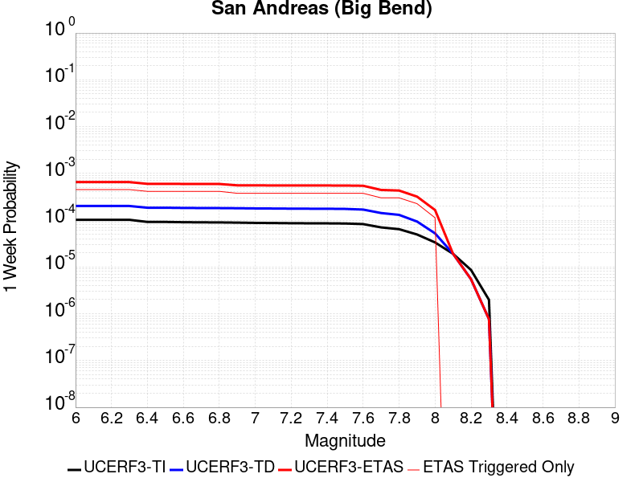 | 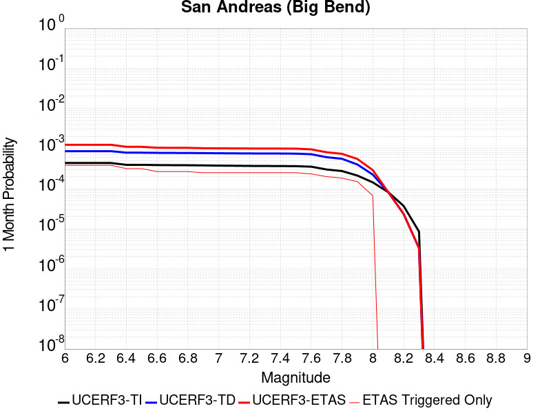 | 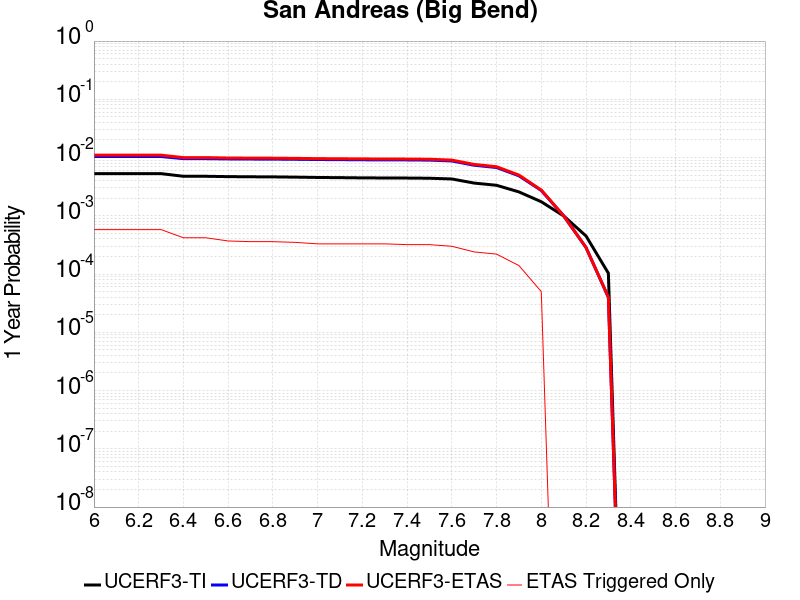 | 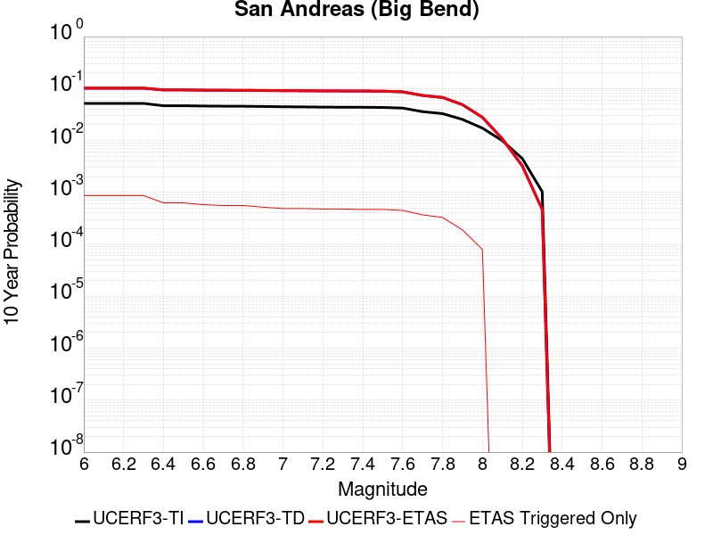 |

| Magnitude | 1 wk TI Prob | 1 wk TD Prob | 1 wk ETAS Prob | 1 wk ETAS/TD Gain | 1 wk ETAS Triggered Only | 1 mo TI Prob | 1 mo TD Prob | 1 mo ETAS Prob | 1 mo ETAS/TD Gain | 1 mo ETAS Triggered Only | 1 yr TI Prob | 1 yr TD Prob | 1 yr ETAS Prob | 1 yr ETAS/TD Gain | 1 yr ETAS Triggered Only | 10 yr TI Prob | 10 yr TD Prob | 10 yr ETAS Prob | 10 yr ETAS/TD Gain | 10 yr ETAS Triggered Only |
|-----|-----|-----|-----|-----|-----|-----|-----|-----|-----|-----|-----|-----|-----|-----|-----|-----|-----|-----|-----|-----|
| 6.0 | 1.0179969E-4 | 2.0073925E-4 | 6.0033926E-4 | 2.990642 | 3.9968026E-4 | 4.362114E-4 | 8.6002843E-4 | 0.001309282 | 1.5223706 | 4.496403E-4 | 0.0052979486 | 0.010420859 | 0.011038852 | 1.0593034 | 6.245004E-4 | 0.051734097 | 0.101455905 | 0.10235374 | 1.0088494 | 9.992006E-4 |
| 6.1 | 1.0179969E-4 | 2.0073925E-4 | 6.0033926E-4 | 2.990642 | 3.9968026E-4 | 4.362114E-4 | 8.6002843E-4 | 0.001309282 | 1.5223706 | 4.496403E-4 | 0.0052979486 | 0.010420859 | 0.011038852 | 1.0593034 | 6.245004E-4 | 0.051734097 | 0.101455905 | 0.10235374 | 1.0088494 | 9.992006E-4 |
| 6.2 | 1.0179969E-4 | 2.0073925E-4 | 6.0033926E-4 | 2.990642 | 3.9968026E-4 | 4.362114E-4 | 8.6002843E-4 | 0.001309282 | 1.5223706 | 4.496403E-4 | 0.0052979486 | 0.010420859 | 0.011038852 | 1.0593034 | 6.245004E-4 | 0.051734097 | 0.101455905 | 0.10235374 | 1.0088494 | 9.992006E-4 |
| 6.3 | 1.0179969E-4 | 2.0073925E-4 | 6.0033926E-4 | 2.990642 | 3.9968026E-4 | 4.362114E-4 | 8.6002843E-4 | 0.001309282 | 1.5223706 | 4.496403E-4 | 0.0052979486 | 0.010420859 | 0.011038852 | 1.0593034 | 6.245004E-4 | 0.051734097 | 0.101455905 | 0.10235374 | 1.0088494 | 9.992006E-4 |
| 6.4 | 9.1639464E-5 | 1.8430917E-4 | 5.3396495E-4 | 2.8971155 | 3.497202E-4 | 3.9268145E-4 | 7.896575E-4 | 0.0011890222 | 1.5057441 | 3.9968026E-4 | 0.0047704205 | 0.009571818 | 0.010041895 | 1.0491105 | 4.746203E-4 | 0.046693064 | 0.09378695 | 0.094398156 | 1.0065169 | 6.7446043E-4 |
| 6.5 | 9.1639464E-5 | 1.8430917E-4 | 5.3396495E-4 | 2.8971155 | 3.497202E-4 | 3.9268145E-4 | 7.896575E-4 | 0.0011890222 | 1.5057441 | 3.9968026E-4 | 0.0047704205 | 0.009571818 | 0.010041895 | 1.0491105 | 4.746203E-4 | 0.046693064 | 0.09378695 | 0.094398156 | 1.0065169 | 6.7446043E-4 |
| 6.6 | 9.042622E-5 | 1.8238011E-4 | 5.070611E-4 | 2.7802434 | 3.2474022E-4 | 3.8748336E-4 | 7.813951E-4 | 0.0011308421 | 1.447209 | 3.497202E-4 | 0.0047074095 | 0.0094721 | 0.009867994 | 1.0417958 | 3.9968026E-4 | 0.046089325 | 0.09287721 | 0.09342105 | 1.0058554 | 5.995204E-4 |
| 6.7 | 8.9836685E-5 | 1.8152347E-4 | 5.062047E-4 | 2.7886462 | 3.2474022E-4 | 3.8495753E-4 | 7.7772595E-4 | 0.0011271742 | 1.4493206 | 3.497202E-4 | 0.00467679 | 0.009427815 | 0.0098237265 | 1.0419941 | 3.9968026E-4 | 0.045795817 | 0.09247148 | 0.09301557 | 1.0058838 | 5.995204E-4 |
| 6.8 | 8.9471854E-5 | 1.8099119E-4 | 5.0567265E-4 | 2.7939074 | 3.2474022E-4 | 3.8339442E-4 | 7.754462E-4 | 0.0011248952 | 1.4506426 | 3.497202E-4 | 0.004657841 | 0.009400298 | 0.009796221 | 1.0421182 | 3.9968026E-4 | 0.04561414 | 0.0922192 | 0.09276344 | 1.0059016 | 5.995204E-4 |
| 6.9 | 8.858234E-5 | 1.7981093E-4 | 4.795172E-4 | 2.6667857 | 2.997602E-4 | 3.7958333E-4 | 7.7039085E-4 | 0.0010948809 | 1.4212018 | 3.2474022E-4 | 0.004611638 | 0.009339278 | 0.009710479 | 1.0397462 | 3.7470023E-4 | 0.04517103 | 0.09165911 | 0.0921356 | 1.0051986 | 5.2458036E-4 |
| 7.0 | 8.7433385E-5 | 1.7819891E-4 | 4.7790568E-4 | 2.6818664 | 2.997602E-4 | 3.746607E-4 | 7.6348626E-4 | 0.0010879785 | 1.4250139 | 3.2474022E-4 | 0.004551957 | 0.009255932 | 0.009602415 | 1.0374336 | 3.497202E-4 | 0.044598386 | 0.09089323 | 0.09132471 | 1.0047472 | 4.746203E-4 |
| 7.1 | 8.684964E-5 | 1.7731842E-4 | 4.7702546E-4 | 2.6902194 | 2.997602E-4 | 3.7215967E-4 | 7.597149E-4 | 0.0010842085 | 1.4271253 | 3.2474022E-4 | 0.0045216335 | 0.009210405 | 0.009556904 | 1.0376204 | 3.497202E-4 | 0.04430731 | 0.09047475 | 0.09090643 | 1.0047712 | 4.746203E-4 |
| 7.2 | 8.606521E-5 | 1.7622454E-4 | 4.759319E-4 | 2.7007132 | 2.997602E-4 | 3.6879873E-4 | 7.550296E-4 | 0.0010795246 | 1.4297779 | 3.2474022E-4 | 0.0044808835 | 0.009153842 | 0.009500361 | 1.037855 | 3.497202E-4 | 0.043916024 | 0.08995518 | 0.090364374 | 1.0045489 | 4.496403E-4 |
| 7.3 | 8.568266E-5 | 1.7564454E-4 | 4.7535208E-4 | 2.7063298 | 2.997602E-4 | 3.6715972E-4 | 7.5254537E-4 | 0.0010770411 | 1.4311976 | 3.2474022E-4 | 0.0044610105 | 0.00912385 | 0.009470379 | 1.0379806 | 3.497202E-4 | 0.043725148 | 0.08967623 | 0.09008555 | 1.0045644 | 4.496403E-4 |
| 7.4 | 8.5432206E-5 | 1.752704E-4 | 4.7497803E-4 | 2.709973 | 2.997602E-4 | 3.6608664E-4 | 7.509428E-4 | 0.0010754392 | 1.4321187 | 3.2474022E-4 | 0.004447999 | 0.009104501 | 0.009451038 | 1.0380621 | 3.497202E-4 | 0.043600157 | 0.08949642 | 0.08990582 | 1.0045744 | 4.496403E-4 |
| 7.5 | 8.4791965E-5 | 1.7396381E-4 | 4.7367185E-4 | 2.7228184 | 2.997602E-4 | 3.633435E-4 | 7.4534636E-4 | 0.0010698445 | 1.4353656 | 3.2474022E-4 | 0.0044147377 | 0.009036932 | 0.009383492 | 1.0383493 | 3.497202E-4 | 0.043280575 | 0.08887209 | 0.08928177 | 1.0046098 | 4.496403E-4 |
| 7.6 | 8.241105E-5 | 1.6841735E-4 | 4.4315125E-4 | 2.6312685 | 2.7478018E-4 | 3.531424E-4 | 7.2158914E-4 | 0.001021133 | 1.415117 | 2.997602E-4 | 0.0042910352 | 0.008750047 | 0.009071945 | 1.0367882 | 3.2474022E-4 | 0.042091176 | 0.08625032 | 0.086638354 | 1.004499 | 4.2466028E-4 |
| 7.7 | 7.00432E-5 | 1.4205615E-4 | 3.6684435E-4 | 2.5823898 | 2.2482015E-4 | 3.001506E-4 | 6.0867006E-4 | 8.583182E-4 | 1.4101534 | 2.4980016E-4 | 0.0036482112 | 0.0073854174 | 0.007658168 | 1.036931 | 2.7478018E-4 | 0.035888977 | 0.07352299 | 0.073846996 | 1.0044069 | 3.497202E-4 |
| 7.8 | 6.415362E-5 | 1.2969968E-4 | 3.5449065E-4 | 2.7331653 | 2.2482015E-4 | 2.749151E-4 | 5.557374E-4 | 7.804326E-4 | 1.404319 | 2.2482015E-4 | 0.0033419547 | 0.0067451415 | 0.0069932565 | 1.0367843 | 2.4980016E-4 | 0.03292141 | 0.06725514 | 0.06753474 | 1.0041573 | 2.997602E-4 |
| 7.9 | 4.939911E-5 | 9.341721E-5 | 2.68261E-4 | 2.871644 | 1.748601E-4 | 2.116933E-4 | 4.0029807E-4 | 5.750882E-4 | 1.4366499 | 1.748601E-4 | 0.0025743195 | 0.004862747 | 0.0050616157 | 1.0408963 | 1.9984013E-4 | 0.025447013 | 0.048915803 | 0.049153384 | 1.004857 | 2.4980016E-4 |
| 8.0 | 3.344983E-5 | 5.2228E-5 | 1.5214285E-4 | 2.9130514 | 9.9920064E-5 | 1.4334853E-4 | 2.2381509E-4 | 3.237128E-4 | 1.4463403 | 9.9920064E-5 | 0.0017438711 | 0.0027215453 | 0.0028461055 | 1.0457681 | 1.2490008E-4 | 0.017302496 | 0.027923161 | 0.028093139 | 1.0060873 | 1.748601E-4 |
| 8.1 | 1.9104898E-5 | 1.9171663E-5 | 1.9171663E-5 | 1.0 | 0.0 | 8.1875565E-5 | 8.2161685E-5 | 8.2161685E-5 | 1.0 | 0.0 | 9.963791E-4 | 9.9986E-4 | 9.9986E-4 | 1.0 | 0.0 | 0.009919235 | 0.010749552 | 0.010749552 | 1.0 | 0.0 |
| 8.2 | 8.643924E-6 | 5.473668E-6 | 5.473668E-6 | 1.0 | 0.0 | 3.704486E-5 | 2.3458366E-5 | 2.3458366E-5 | 1.0 | 0.0 | 4.5092785E-4 | 2.8556827E-4 | 2.8556827E-4 | 1.0 | 0.0 | 0.0045001395 | 0.0032481793 | 0.0032481793 | 1.0 | 0.0 |
| 8.3 | 1.983087E-6 | 7.6564595E-7 | 7.6564595E-7 | 1.0 | 0.0 | 8.498917E-6 | 3.281336E-6 | 3.281336E-6 | 1.0 | 0.0 | 1.034694E-4 | 3.9949547E-5 | 3.9949547E-5 | 1.0 | 0.0 | 0.0010342124 | 4.717979E-4 | 4.717979E-4 | 1.0 | 0.0 |

## Coyote Lake
*[(top)](#table-of-contents)*

| 1 Week | 1 Month | 1 Year | 10 Year |
|-----|-----|-----|-----|
|  | 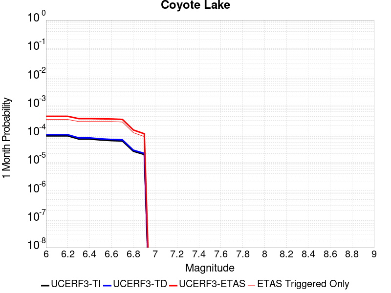 | 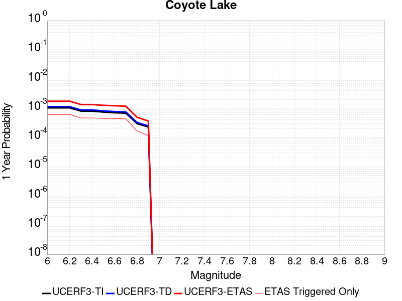 | 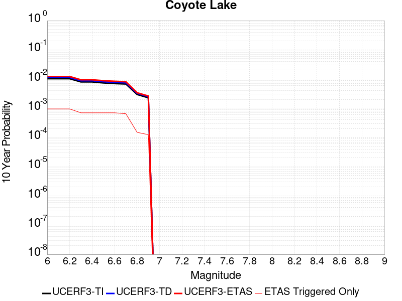 |

| Magnitude | 1 wk TI Prob | 1 wk TD Prob | 1 wk ETAS Prob | 1 wk ETAS/TD Gain | 1 wk ETAS Triggered Only | 1 mo TI Prob | 1 mo TD Prob | 1 mo ETAS Prob | 1 mo ETAS/TD Gain | 1 mo ETAS Triggered Only | 1 yr TI Prob | 1 yr TD Prob | 1 yr ETAS Prob | 1 yr ETAS/TD Gain | 1 yr ETAS Triggered Only | 10 yr TI Prob | 10 yr TD Prob | 10 yr ETAS Prob | 10 yr ETAS/TD Gain | 10 yr ETAS Triggered Only |
|-----|-----|-----|-----|-----|-----|-----|-----|-----|-----|-----|-----|-----|-----|-----|-----|-----|-----|-----|-----|-----|
| 6.0 | 1.980352E-5 | 2.1706745E-5 | 3.2146042E-4 | 14.809241 | 2.997602E-4 | 8.486947E-5 | 9.302599E-5 | 4.9266906E-4 | 5.2960367 | 3.9968026E-4 | 0.0010327959 | 0.0011320751 | 0.0017808202 | 1.5730585 | 6.4948044E-4 | 0.010280091 | 0.011270258 | 0.012208801 | 1.083276 | 9.492406E-4 |
| 6.1 | 1.980352E-5 | 2.1706745E-5 | 3.2146042E-4 | 14.809241 | 2.997602E-4 | 8.486947E-5 | 9.302599E-5 | 4.9266906E-4 | 5.2960367 | 3.9968026E-4 | 0.0010327959 | 0.0011320751 | 0.0017808202 | 1.5730585 | 6.4948044E-4 | 0.010280091 | 0.011270258 | 0.012208801 | 1.083276 | 9.492406E-4 |
| 6.2 | 1.980352E-5 | 2.1706745E-5 | 3.2146042E-4 | 14.809241 | 2.997602E-4 | 8.486947E-5 | 9.302599E-5 | 4.9266906E-4 | 5.2960367 | 3.9968026E-4 | 0.0010327959 | 0.0011320751 | 0.0017808202 | 1.5730585 | 6.4948044E-4 | 0.010280091 | 0.011270258 | 0.012208801 | 1.083276 | 9.492406E-4 |
| 6.3 | 1.5344787E-5 | 1.682067E-5 | 2.1665744E-4 | 12.880429 | 1.9984013E-4 | 6.576172E-5 | 7.2086936E-5 | 3.7182553E-4 | 5.1580153 | 2.997602E-4 | 8.003548E-4 | 8.773662E-4 | 0.0013515701 | 1.5404856 | 4.746203E-4 | 0.007974784 | 0.00874507 | 0.009438393 | 1.0792817 | 6.994404E-4 |
| 6.4 | 1.5344787E-5 | 1.682067E-5 | 2.1665744E-4 | 12.880429 | 1.9984013E-4 | 6.576172E-5 | 7.2086936E-5 | 3.7182553E-4 | 5.1580153 | 2.997602E-4 | 8.003548E-4 | 8.773662E-4 | 0.0013515701 | 1.5404856 | 4.746203E-4 | 0.007974784 | 0.00874507 | 0.009438393 | 1.0792817 | 6.994404E-4 |
| 6.5 | 1.4189697E-5 | 1.5557987E-5 | 2.15395E-4 | 13.844658 | 1.9984013E-4 | 6.081157E-5 | 6.6675726E-5 | 3.6641592E-4 | 5.4954925 | 2.997602E-4 | 7.401293E-4 | 8.115349E-4 | 0.00128577 | 1.5843681 | 4.746203E-4 | 0.0073766913 | 0.008091656 | 0.008785437 | 1.0857403 | 6.994404E-4 |
| 6.6 | 1.3469301E-5 | 1.4771577E-5 | 2.1460875E-4 | 14.528493 | 1.9984013E-4 | 5.7724297E-5 | 6.330556E-5 | 3.6304677E-4 | 5.7348323 | 2.997602E-4 | 7.025667E-4 | 7.7053264E-4 | 0.0012447872 | 1.6154892 | 4.746203E-4 | 0.0070034964 | 0.0076845144 | 0.00837858 | 1.09032 | 6.994404E-4 |
| 6.7 | 1.3027966E-5 | 1.4281745E-5 | 1.8913936E-4 | 13.243435 | 1.748601E-4 | 5.5832945E-5 | 6.120638E-5 | 3.3596973E-4 | 5.4891295 | 2.7478018E-4 | 6.7955407E-4 | 7.4499263E-4 | 0.0011942979 | 1.6031003 | 4.496403E-4 | 0.006774798 | 0.0074308286 | 0.008075483 | 1.086754 | 6.4948044E-4 |
| 6.8 | 5.695434E-6 | 6.2244176E-6 | 5.6184137E-5 | 9.026409 | 4.9960032E-5 | 2.4408775E-5 | 2.6675973E-5 | 1.0161402E-4 | 3.8091965 | 7.494005E-5 | 2.971363E-4 | 3.2476155E-4 | 4.4962106E-4 | 1.3844652 | 1.2490008E-4 | 0.0029673933 | 0.0032458105 | 0.003395204 | 1.0460266 | 1.498801E-4 |
| 6.9 | 4.385688E-6 | 4.7930553E-6 | 5.4752847E-5 | 11.42337 | 4.9960032E-5 | 1.879567E-5 | 2.0541665E-5 | 9.548017E-5 | 4.6481223 | 7.494005E-5 | 2.2881327E-4 | 2.5009477E-4 | 3.7496362E-4 | 1.499286 | 1.2490008E-4 | 0.002285778 | 0.0025009478 | 0.0026255355 | 1.0498163 | 1.2490008E-4 |

## Helendale-So Lockhart
*[(top)](#table-of-contents)*

| 1 Week | 1 Month | 1 Year | 10 Year |
|-----|-----|-----|-----|
| 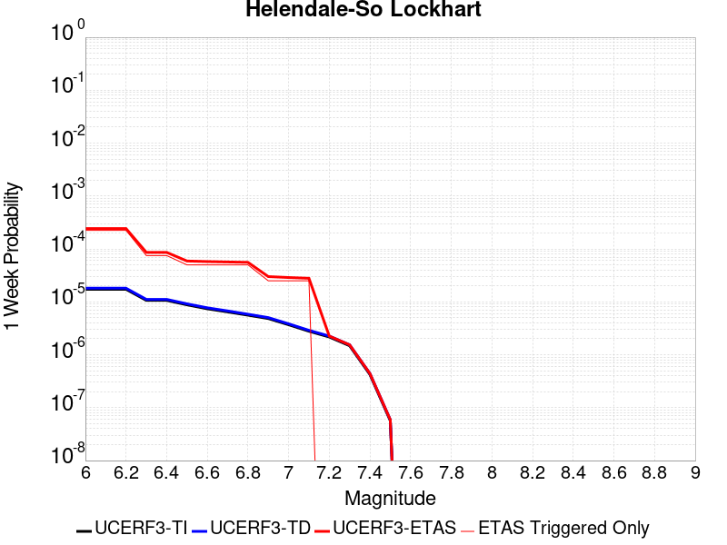 | 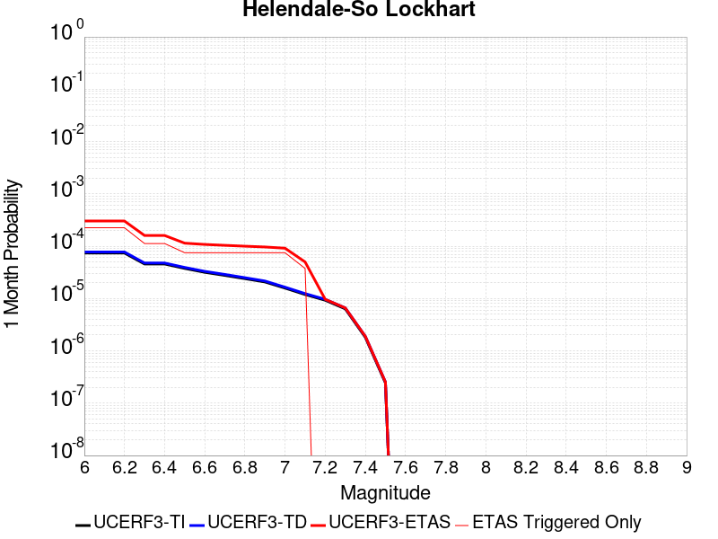 | 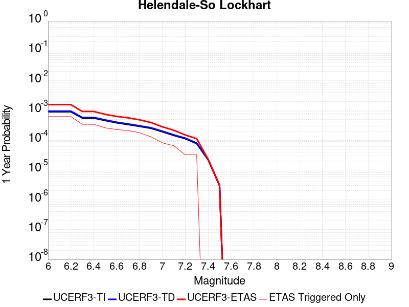 | 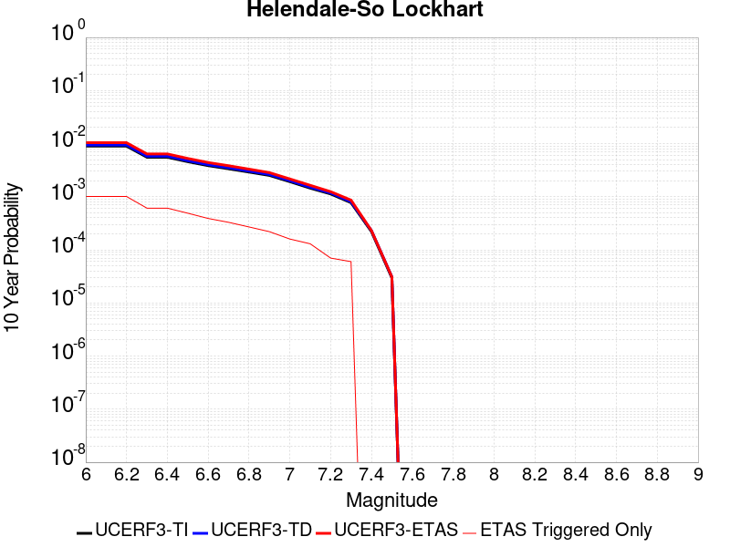 |

| Magnitude | 1 wk TI Prob | 1 wk TD Prob | 1 wk ETAS Prob | 1 wk ETAS/TD Gain | 1 wk ETAS Triggered Only | 1 mo TI Prob | 1 mo TD Prob | 1 mo ETAS Prob | 1 mo ETAS/TD Gain | 1 mo ETAS Triggered Only | 1 yr TI Prob | 1 yr TD Prob | 1 yr ETAS Prob | 1 yr ETAS/TD Gain | 1 yr ETAS Triggered Only | 10 yr TI Prob | 10 yr TD Prob | 10 yr ETAS Prob | 10 yr ETAS/TD Gain | 10 yr ETAS Triggered Only |
|-----|-----|-----|-----|-----|-----|-----|-----|-----|-----|-----|-----|-----|-----|-----|-----|-----|-----|-----|-----|-----|
| 6.0 | 1.7296055E-5 | 1.8103729E-5 | 2.429198E-4 | 13.418219 | 2.2482015E-4 | 7.412385E-5 | 7.7585224E-5 | 4.0230024E-4 | 5.185269 | 3.2474022E-4 | 9.0208417E-4 | 9.4421144E-4 | 0.00144334 | 1.5286195 | 4.996003E-4 | 0.008984311 | 0.009404116 | 0.010171214 | 1.0815705 | 7.743805E-4 |
| 6.1 | 1.7296055E-5 | 1.8103729E-5 | 2.429198E-4 | 13.418219 | 2.2482015E-4 | 7.412385E-5 | 7.7585224E-5 | 4.0230024E-4 | 5.185269 | 3.2474022E-4 | 9.0208417E-4 | 9.4421144E-4 | 0.00144334 | 1.5286195 | 4.996003E-4 | 0.008984311 | 0.009404116 | 0.010171214 | 1.0815705 | 7.743805E-4 |
| 6.2 | 1.7296055E-5 | 1.8103729E-5 | 2.429198E-4 | 13.418219 | 2.2482015E-4 | 7.412385E-5 | 7.7585224E-5 | 4.0230024E-4 | 5.185269 | 3.2474022E-4 | 9.0208417E-4 | 9.4421144E-4 | 0.00144334 | 1.5286195 | 4.996003E-4 | 0.008984311 | 0.009404116 | 0.010171214 | 1.0815705 | 7.743805E-4 |
| 6.3 | 1.0669118E-5 | 1.1135425E-5 | 8.607464E-5 | 7.729803 | 7.494005E-5 | 4.5723988E-5 | 4.772239E-5 | 1.726165E-4 | 3.617097 | 1.2490008E-4 | 5.5654737E-4 | 5.80868E-4 | 8.554886E-4 | 1.4727762 | 2.7478018E-4 | 0.0055515557 | 0.0057937936 | 0.006240829 | 1.0771576 | 4.496403E-4 |
| 6.4 | 1.0669118E-5 | 1.1135425E-5 | 8.607464E-5 | 7.729803 | 7.494005E-5 | 4.5723988E-5 | 4.772239E-5 | 1.726165E-4 | 3.617097 | 1.2490008E-4 | 5.5654737E-4 | 5.80868E-4 | 8.554886E-4 | 1.4727762 | 2.7478018E-4 | 0.0055515557 | 0.0057937936 | 0.006240829 | 1.0771576 | 4.496403E-4 |
| 6.5 | 8.790038E-6 | 9.170197E-6 | 5.9129772E-5 | 6.448037 | 4.9960032E-5 | 3.767105E-5 | 3.930026E-5 | 1.392164E-4 | 3.5423784 | 9.9920064E-5 | 4.585485E-4 | 4.7837716E-4 | 7.0308975E-4 | 1.4697394 | 2.2482015E-4 | 0.0045760344 | 0.004773638 | 0.00514655 | 1.0781189 | 3.7470023E-4 |
| 6.6 | 7.396949E-6 | 7.715537E-6 | 5.7675185E-5 | 7.4752 | 4.9960032E-5 | 3.1700827E-5 | 3.3066175E-5 | 1.3298294E-4 | 4.0217214 | 9.9920064E-5 | 3.858892E-4 | 4.025073E-4 | 6.02267E-4 | 1.4962883 | 1.9984013E-4 | 0.003852198 | 0.00401789 | 0.004291566 | 1.0681144 | 2.7478018E-4 |
| 6.7 | 6.4600285E-6 | 6.738031E-6 | 5.6697725E-5 | 8.414584 | 4.9960032E-5 | 2.7685543E-5 | 2.887696E-5 | 1.2879414E-4 | 4.4601 | 9.9920064E-5 | 3.3701936E-4 | 3.5152107E-4 | 5.263197E-4 | 1.4972637 | 1.748601E-4 | 0.0033650869 | 0.003509732 | 0.003733763 | 1.0638314 | 2.2482015E-4 |
| 6.8 | 5.600104E-6 | 5.836009E-6 | 5.579575E-5 | 9.560599 | 4.9960032E-5 | 2.4000226E-5 | 2.5011232E-5 | 1.249288E-4 | 4.994908 | 9.9920064E-5 | 2.9216358E-4 | 3.044698E-4 | 4.2933185E-4 | 1.4100966 | 1.2490008E-4 | 0.0029177975 | 0.003040588 | 0.0032149164 | 1.0573338 | 1.748601E-4 |
| 6.9 | 4.839122E-6 | 5.0395092E-6 | 3.0019399E-5 | 5.95681 | 2.4980016E-5 | 2.0738931E-5 | 2.159772E-5 | 9.653615E-5 | 4.469738 | 7.494005E-5 | 2.5246723E-4 | 2.6292098E-4 | 3.3784134E-4 | 1.2849538 | 7.494005E-5 | 0.002521806 | 0.002626147 | 0.002750719 | 1.0474353 | 1.2490008E-4 |
| 7.0 | 3.6937633E-6 | 3.845208E-6 | 2.8825129E-5 | 7.496377 | 2.4980016E-5 | 1.5830317E-5 | 1.647936E-5 | 9.141817E-5 | 5.5474343 | 7.494005E-5 | 1.9271708E-4 | 2.0061806E-4 | 2.7554308E-4 | 1.3734709 | 7.494005E-5 | 0.0019255003 | 0.002004401 | 0.0021041208 | 1.0497504 | 9.9920064E-5 |
| 7.1 | 2.7858857E-6 | 2.8978538E-6 | 2.7877797E-5 | 9.620153 | 2.4980016E-5 | 1.1939455E-5 | 1.2419316E-5 | 6.237873E-5 | 5.0227184 | 4.9960032E-5 | 1.4535317E-4 | 1.511949E-4 | 2.0114737E-4 | 1.3303847 | 4.9960032E-5 | 0.0014525814 | 0.0015109418 | 0.0015857685 | 1.0495234 | 7.494005E-5 |
| 7.2 | 2.1672065E-6 | 2.2540128E-6 | 2.2540128E-6 | 1.0 | 0.0 | 9.2879945E-6 | 9.66002E-6 | 9.66002E-6 | 1.0 | 0.0 | 1.1307546E-4 | 1.1760458E-4 | 1.1760458E-4 | 1.0 | 0.0 | 0.0011301794 | 0.0011754417 | 0.0011754417 | 1.0 | 0.0 |
| 7.3 | 1.4823496E-6 | 1.5422102E-6 | 1.5422102E-6 | 1.0 | 0.0 | 6.3529114E-6 | 6.6094562E-6 | 6.6094562E-6 | 1.0 | 0.0 | 7.734395E-5 | 8.046731E-5 | 8.046731E-5 | 1.0 | 0.0 | 7.731704E-4 | 8.0439687E-4 | 8.0439687E-4 | 1.0 | 0.0 |
| 7.4 | 4.2321457E-7 | 4.4108765E-7 | 4.4108765E-7 | 1.0 | 0.0 | 1.8137755E-6 | 1.8903745E-6 | 1.8903745E-6 | 1.0 | 0.0 | 2.2082493E-5 | 2.3015113E-5 | 2.3015113E-5 | 1.0 | 0.0 | 2.2080299E-4 | 2.3013182E-4 | 2.3013182E-4 | 1.0 | 0.0 |
| 7.5 | 5.6942316E-8 | 5.9415648E-8 | 5.9415648E-8 | 1.0 | 0.0 | 2.440385E-7 | 2.5463845E-7 | 2.5463845E-7 | 1.0 | 0.0 | 2.9711643E-6 | 3.1002196E-6 | 3.1002196E-6 | 1.0 | 0.0 | 2.9711247E-5 | 3.1001844E-5 | 3.1001844E-5 | 1.0 | 0.0 |

## Death Valley (No)
*[(top)](#table-of-contents)*

| 1 Week | 1 Month | 1 Year | 10 Year |
|-----|-----|-----|-----|
| 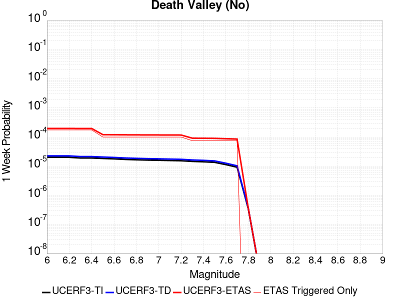 | 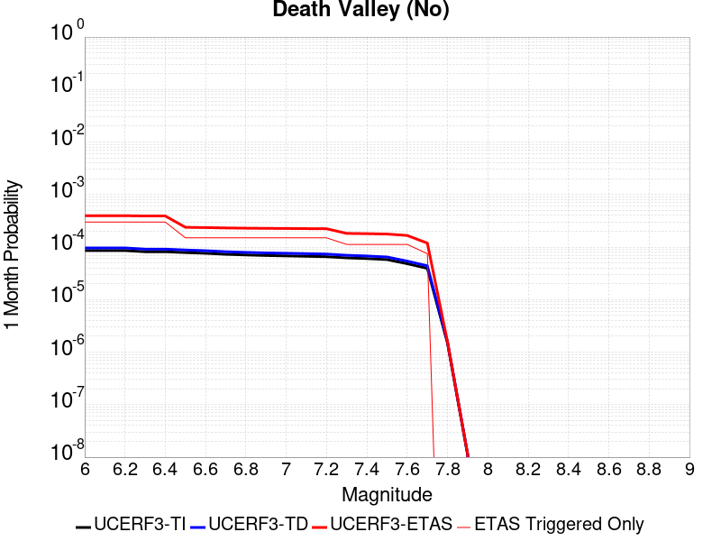 | 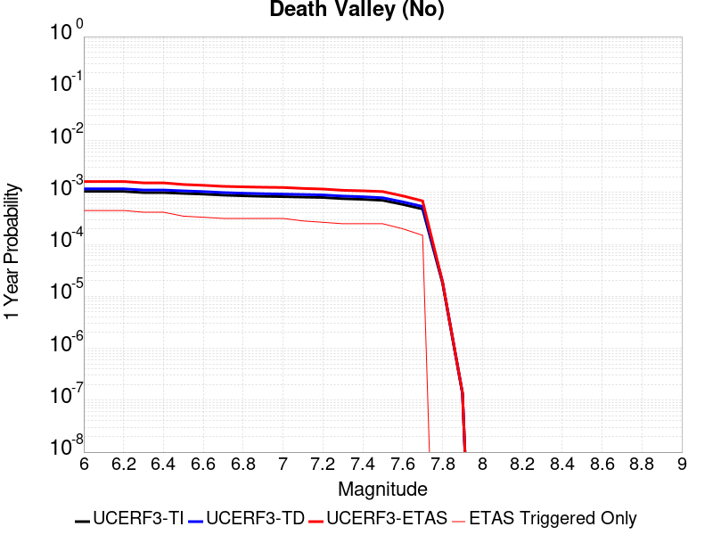 |  |

| Magnitude | 1 wk TI Prob | 1 wk TD Prob | 1 wk ETAS Prob | 1 wk ETAS/TD Gain | 1 wk ETAS Triggered Only | 1 mo TI Prob | 1 mo TD Prob | 1 mo ETAS Prob | 1 mo ETAS/TD Gain | 1 mo ETAS Triggered Only | 1 yr TI Prob | 1 yr TD Prob | 1 yr ETAS Prob | 1 yr ETAS/TD Gain | 1 yr ETAS Triggered Only | 10 yr TI Prob | 10 yr TD Prob | 10 yr ETAS Prob | 10 yr ETAS/TD Gain | 10 yr ETAS Triggered Only |
|-----|-----|-----|-----|-----|-----|-----|-----|-----|-----|-----|-----|-----|-----|-----|-----|-----|-----|-----|-----|-----|
| 6.0 | 2.0074807E-5 | 2.2500084E-5 | 1.9735626E-4 | 8.771357 | 1.748601E-4 | 8.603206E-5 | 9.642541E-5 | 3.7117908E-4 | 3.849391 | 2.7478018E-4 | 0.001046937 | 0.0011733545 | 0.0016723686 | 1.4252884 | 4.996003E-4 | 0.010420183 | 0.011672506 | 0.012339095 | 1.0571076 | 6.7446043E-4 |
| 6.1 | 2.0074807E-5 | 2.2500084E-5 | 1.9735626E-4 | 8.771357 | 1.748601E-4 | 8.603206E-5 | 9.642541E-5 | 3.7117908E-4 | 3.849391 | 2.7478018E-4 | 0.001046937 | 0.0011733545 | 0.0016723686 | 1.4252884 | 4.996003E-4 | 0.010420183 | 0.011672506 | 0.012339095 | 1.0571076 | 6.7446043E-4 |
| 6.2 | 2.0074807E-5 | 2.2500084E-5 | 1.9735626E-4 | 8.771357 | 1.748601E-4 | 8.603206E-5 | 9.642541E-5 | 3.7117908E-4 | 3.849391 | 2.7478018E-4 | 0.001046937 | 0.0011733545 | 0.0016723686 | 1.4252884 | 4.996003E-4 | 0.010420183 | 0.011672506 | 0.012339095 | 1.0571076 | 6.7446043E-4 |
| 6.3 | 1.9050609E-5 | 2.1336948E-5 | 1.9619333E-4 | 9.195004 | 1.748601E-4 | 8.164292E-5 | 9.1440896E-5 | 3.6619595E-4 | 4.0047283 | 2.7478018E-4 | 9.935491E-4 | 0.001112731 | 0.0015868233 | 1.4260617 | 4.746203E-4 | 0.009891188 | 0.011072419 | 0.011714708 | 1.0580081 | 6.4948044E-4 |
| 6.4 | 1.9050609E-5 | 2.1336948E-5 | 1.9619333E-4 | 9.195004 | 1.748601E-4 | 8.164292E-5 | 9.1440896E-5 | 3.6619595E-4 | 4.0047283 | 2.7478018E-4 | 9.935491E-4 | 0.001112731 | 0.0015868233 | 1.4260617 | 4.746203E-4 | 0.009891188 | 0.011072419 | 0.011714708 | 1.0580081 | 6.4948044E-4 |
| 6.5 | 1.8367004E-5 | 2.0561009E-5 | 1.2047902E-4 | 5.859587 | 9.9920064E-5 | 7.8713354E-5 | 8.811567E-5 | 2.6296038E-4 | 2.9842634 | 1.748601E-4 | 9.5791375E-4 | 0.0010722869 | 0.0014465853 | 1.3490657 | 3.7470023E-4 | 0.009537951 | 0.0106719155 | 0.011190898 | 1.0486306 | 5.2458036E-4 |
| 6.6 | 1.779439E-5 | 1.9910927E-5 | 1.19829005E-4 | 6.018253 | 9.9920064E-5 | 7.625944E-5 | 8.53298E-5 | 2.6017497E-4 | 3.049052 | 1.748601E-4 | 9.280632E-4 | 0.0010384015 | 0.0013877585 | 1.3364373 | 3.497202E-4 | 0.009241969 | 0.010336253 | 0.010830689 | 1.0478351 | 4.996003E-4 |
| 6.7 | 1.7025437E-5 | 1.9043426E-5 | 1.1896159E-4 | 6.2468586 | 9.9920064E-5 | 7.296412E-5 | 8.161216E-5 | 2.56458E-4 | 3.1423993 | 1.748601E-4 | 8.87976E-4 | 9.931813E-4 | 0.001317599 | 1.326645 | 3.2474022E-4 | 0.008844362 | 0.009888145 | 0.010358073 | 1.0475243 | 4.746203E-4 |
| 6.8 | 1.6545107E-5 | 1.8512545E-5 | 1.1843076E-4 | 6.3973246 | 9.9920064E-5 | 7.090568E-5 | 7.93371E-5 | 2.5418334E-4 | 3.2038395 | 1.748601E-4 | 8.629347E-4 | 9.655073E-4 | 0.0012899339 | 1.3360168 | 3.2474022E-4 | 0.008595915 | 0.009613829 | 0.010083886 | 1.0488939 | 4.746203E-4 |
| 6.9 | 1.615478E-5 | 1.8087594E-5 | 1.1800585E-4 | 6.524132 | 9.9920064E-5 | 6.9232934E-5 | 7.751599E-5 | 2.5236254E-4 | 3.2556193 | 1.748601E-4 | 8.4258494E-4 | 9.433546E-4 | 0.0012677885 | 1.3439151 | 3.2474022E-4 | 0.008393973 | 0.009394196 | 0.009864357 | 1.0500481 | 4.746203E-4 |
| 7.0 | 1.5894311E-5 | 1.780555E-5 | 1.1772384E-4 | 6.611637 | 9.9920064E-5 | 6.81167E-5 | 7.6307304E-5 | 2.5115407E-4 | 3.2913504 | 1.748601E-4 | 8.2900526E-4 | 9.286515E-4 | 0.0012530901 | 1.3493654 | 3.2474022E-4 | 0.008259195 | 0.009248397 | 0.009718629 | 1.0508446 | 4.746203E-4 |
| 7.1 | 1.5602263E-5 | 1.7483504E-5 | 1.1740182E-4 | 6.7150054 | 9.9920064E-5 | 6.6865134E-5 | 7.492718E-5 | 2.497742E-4 | 3.333559 | 1.748601E-4 | 8.137789E-4 | 9.118627E-4 | 0.0012363069 | 1.3558036 | 3.2474022E-4 | 0.008108052 | 0.009081894 | 0.00952745 | 1.0490599 | 4.496403E-4 |
| 7.2 | 1.5323829E-5 | 1.717063E-5 | 1.1708898E-4 | 6.819143 | 9.9920064E-5 | 6.56719E-5 | 7.358637E-5 | 2.4843361E-4 | 3.376082 | 1.748601E-4 | 7.99262E-4 | 8.9555193E-4 | 0.0011950437 | 1.3344214 | 2.997602E-4 | 0.007963934 | 0.008920107 | 0.009340979 | 1.0471824 | 4.2466028E-4 |
| 7.3 | 1.4556212E-5 | 1.6302456E-5 | 9.124128E-5 | 5.5967817 | 7.494005E-5 | 6.238227E-5 | 6.9865826E-5 | 2.1973545E-4 | 3.1451063 | 1.498801E-4 | 7.592395E-4 | 8.5029035E-4 | 0.0011248369 | 1.3228856 | 2.7478018E-4 | 0.0075665074 | 0.008471014 | 0.0088673085 | 1.0467824 | 3.9968026E-4 |
| 7.4 | 1.411725E-5 | 1.580796E-5 | 9.074682E-5 | 5.7405777 | 7.494005E-5 | 6.0501097E-5 | 6.7746674E-5 | 2.1761662E-4 | 3.2122111 | 1.498801E-4 | 7.363519E-4 | 8.245094E-4 | 0.0010990631 | 1.3329903 | 2.7478018E-4 | 0.0073391674 | 0.008215138 | 0.008611535 | 1.048252 | 3.9968026E-4 |
| 7.5 | 1.3503312E-5 | 1.5126289E-5 | 9.00652E-5 | 5.954217 | 7.494005E-5 | 5.7870053E-5 | 6.482538E-5 | 2.1469576E-4 | 3.3119092 | 1.498801E-4 | 7.043401E-4 | 7.8896893E-4 | 0.0010635323 | 1.3480028 | 2.7478018E-4 | 0.007021119 | 0.007862304 | 0.008258842 | 1.0504353 | 3.9968026E-4 |
| 7.6 | 1.1279839E-5 | 1.2626327E-5 | 8.756543E-5 | 6.935147 | 7.494005E-5 | 4.834127E-5 | 5.4111737E-5 | 2.0398373E-4 | 3.7696762 | 1.498801E-4 | 5.88396E-4 | 6.5861654E-4 | 8.832886E-4 | 1.3411273 | 2.2482015E-4 | 0.005868405 | 0.006567199 | 0.006914622 | 1.0529028 | 3.497202E-4 |
| 7.7 | 9.189108E-6 | 1.0283358E-5 | 8.522264E-5 | 8.287433 | 7.494005E-5 | 3.93813E-5 | 4.407082E-5 | 1.4398649E-4 | 3.2671614 | 9.9920064E-5 | 4.7936183E-4 | 5.3643517E-4 | 6.8623485E-4 | 1.2792503 | 1.498801E-4 | 0.004783291 | 0.005351914 | 0.0056252233 | 1.0510676 | 2.7478018E-4 |
| 7.8 | 3.4586725E-7 | 3.6482615E-7 | 3.6482615E-7 | 1.0 | 0.0 | 1.4822873E-6 | 1.5635396E-6 | 1.5635396E-6 | 1.0 | 0.0 | 1.80467E-5 | 1.9035933E-5 | 1.9035933E-5 | 1.0 | 0.0 | 1.8045233E-4 | 1.9034347E-4 | 1.9034347E-4 | 1.0 | 0.0 |
| 7.9 | 2.5591178E-9 | 2.6696718E-9 | 2.6696718E-9 | 1.0 | 0.0 | 1.0967647E-8 | 1.14414505E-8 | 1.14414505E-8 | 1.0 | 0.0 | 1.335311E-7 | 1.3929966E-7 | 1.3929966E-7 | 1.0 | 0.0 | 1.3353102E-6 | 1.3929966E-6 | 1.3929966E-6 | 1.0 | 0.0 |

## San Andreas (Parkfield)
*[(top)](#table-of-contents)*

| 1 Week | 1 Month | 1 Year | 10 Year |
|-----|-----|-----|-----|
| 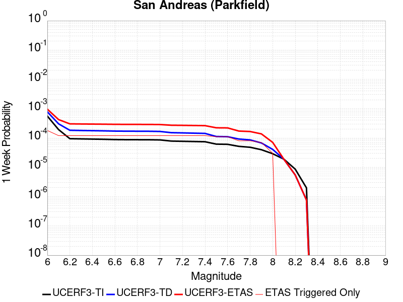 | 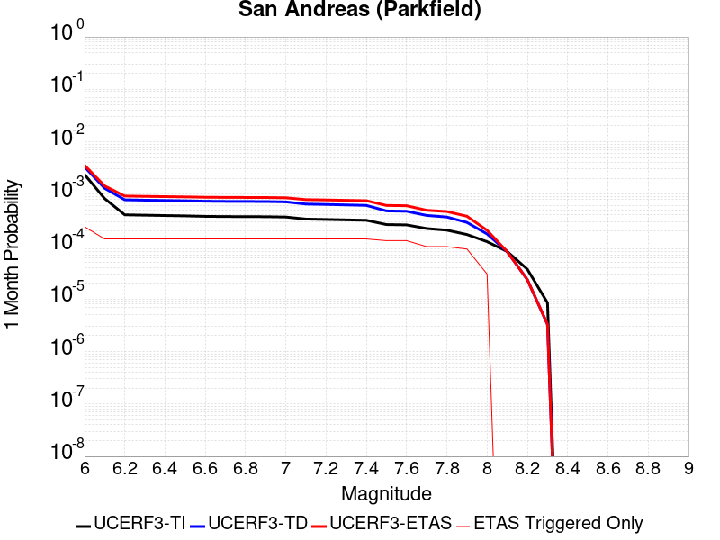 | 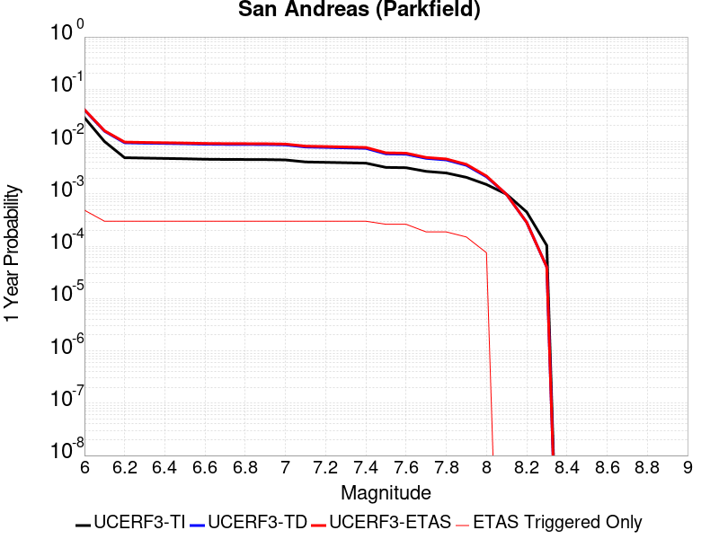 | 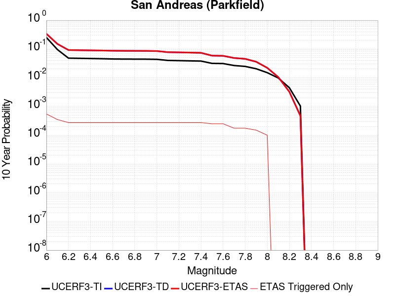 |

| Magnitude | 1 wk TI Prob | 1 wk TD Prob | 1 wk ETAS Prob | 1 wk ETAS/TD Gain | 1 wk ETAS Triggered Only | 1 mo TI Prob | 1 mo TD Prob | 1 mo ETAS Prob | 1 mo ETAS/TD Gain | 1 mo ETAS Triggered Only | 1 yr TI Prob | 1 yr TD Prob | 1 yr ETAS Prob | 1 yr ETAS/TD Gain | 1 yr ETAS Triggered Only | 10 yr TI Prob | 10 yr TD Prob | 10 yr ETAS Prob | 10 yr ETAS/TD Gain | 10 yr ETAS Triggered Only |
|-----|-----|-----|-----|-----|-----|-----|-----|-----|-----|-----|-----|-----|-----|-----|-----|-----|-----|-----|-----|-----|
| 6.0 | 5.556969E-4 | 7.778562E-4 | 0.0010773833 | 1.3850673 | 2.997602E-4 | 0.0023793848 | 0.0033299583 | 0.0036287203 | 1.0897194 | 2.997602E-4 | 0.028586963 | 0.040235043 | 0.04061864 | 1.009534 | 3.9968026E-4 | 0.25176284 | 0.3371973 | 0.33756155 | 1.0010803 | 5.4956035E-4 |
| 6.1 | 1.925858E-4 | 3.0278185E-4 | 5.0256145E-4 | 1.6598138 | 1.9984013E-4 | 8.2510663E-4 | 0.001297085 | 0.0014966659 | 1.1538688 | 1.9984013E-4 | 0.0099994885 | 0.01577393 | 0.01601979 | 1.0155865 | 2.4980016E-4 | 0.095613256 | 0.14975825 | 0.15005559 | 1.0019855 | 3.497202E-4 |
| 6.2 | 9.4306815E-5 | 1.8243887E-4 | 3.8224255E-4 | 2.0951815 | 1.9984013E-4 | 4.0410945E-4 | 7.8164786E-4 | 9.813318E-4 | 1.2554654 | 1.9984013E-4 | 0.0049089384 | 0.009475246 | 0.0096979365 | 1.0235022 | 2.2482015E-4 | 0.048019063 | 0.0918565 | 0.092106044 | 1.0027167 | 2.7478018E-4 |
| 6.3 | 9.283051E-5 | 1.794041E-4 | 3.792084E-4 | 2.1137106 | 1.9984013E-4 | 3.9778434E-4 | 7.686494E-4 | 9.683359E-4 | 1.2597889 | 1.9984013E-4 | 0.0048322747 | 0.009318355 | 0.009541079 | 1.0239018 | 2.2482015E-4 | 0.047285385 | 0.090509474 | 0.09075938 | 1.0027611 | 2.7478018E-4 |
| 6.4 | 9.138826E-5 | 1.7702584E-4 | 3.7683058E-4 | 2.1286757 | 1.9984013E-4 | 3.916052E-4 | 7.5846276E-4 | 9.581513E-4 | 1.2632806 | 1.9984013E-4 | 0.0047573745 | 0.009195387 | 0.00941814 | 1.0242244 | 2.2482015E-4 | 0.046568092 | 0.0894136 | 0.08966381 | 1.0027983 | 2.7478018E-4 |
| 6.5 | 9.000255E-5 | 1.746064E-4 | 3.744116E-4 | 2.144318 | 1.9984013E-4 | 3.8566816E-4 | 7.4809964E-4 | 9.477903E-4 | 1.2669305 | 1.9984013E-4 | 0.0046854047 | 0.009070284 | 0.009293065 | 1.0245616 | 2.2482015E-4 | 0.045878403 | 0.08829608 | 0.0885466 | 1.0028373 | 2.7478018E-4 |
| 6.6 | 8.8109264E-5 | 1.7141816E-4 | 3.71224E-4 | 2.165605 | 1.9984013E-4 | 3.7755648E-4 | 7.3444354E-4 | 9.341369E-4 | 1.2718974 | 1.9984013E-4 | 0.0045870654 | 0.008905404 | 0.009128222 | 1.0250206 | 2.2482015E-4 | 0.04493529 | 0.08682707 | 0.087078 | 1.0028899 | 2.7478018E-4 |
| 6.7 | 8.738073E-5 | 1.7008898E-4 | 3.6989513E-4 | 2.1747153 | 1.9984013E-4 | 3.7443507E-4 | 7.287503E-4 | 9.284448E-4 | 1.2740232 | 1.9984013E-4 | 0.0045492216 | 0.008836695 | 0.009059528 | 1.0252168 | 2.2482015E-4 | 0.04457213 | 0.0862268 | 0.08647788 | 1.0029119 | 2.7478018E-4 |
| 6.8 | 8.710195E-5 | 1.6954402E-4 | 3.6935025E-4 | 2.1784918 | 1.9984013E-4 | 3.7324068E-4 | 7.26416E-4 | 9.2611095E-4 | 1.2749044 | 1.9984013E-4 | 0.0045347405 | 0.008808513 | 0.009031353 | 1.0252982 | 2.2482015E-4 | 0.04443313 | 0.08597436 | 0.08622552 | 1.0029213 | 2.7478018E-4 |
| 6.9 | 8.6801556E-5 | 1.6895356E-4 | 3.687599E-4 | 2.1826112 | 1.9984013E-4 | 3.7195362E-4 | 7.238869E-4 | 9.2358235E-4 | 1.2758656 | 1.9984013E-4 | 0.0045191357 | 0.0087779695 | 0.009000816 | 1.025387 | 2.2482015E-4 | 0.044283327 | 0.08570042 | 0.08595165 | 1.0029315 | 2.7478018E-4 |
| 7.0 | 8.5571606E-5 | 1.664819E-4 | 3.6628876E-4 | 2.2001717 | 1.9984013E-4 | 3.6668387E-4 | 7.132999E-4 | 9.1299746E-4 | 1.279963 | 1.9984013E-4 | 0.004455241 | 0.008650103 | 0.008872978 | 1.0257657 | 2.2482015E-4 | 0.043669727 | 0.08454836 | 0.084799916 | 1.0029752 | 2.7478018E-4 |
| 7.1 | 7.82589E-5 | 1.5128969E-4 | 3.5109956E-4 | 2.3207107 | 1.9984013E-4 | 3.3535215E-4 | 6.4822397E-4 | 8.4793457E-4 | 1.3080889 | 1.9984013E-4 | 0.0040752706 | 0.007863738 | 0.00808679 | 1.0283647 | 2.2482015E-4 | 0.040013418 | 0.077460445 | 0.07771394 | 1.0032725 | 2.7478018E-4 |
| 7.2 | 7.690929E-5 | 1.4866212E-4 | 3.4847253E-4 | 2.3440573 | 1.9984013E-4 | 3.2956956E-4 | 6.369685E-4 | 8.3668134E-4 | 1.3135364 | 1.9984013E-4 | 0.004005129 | 0.0077276826 | 0.007950765 | 1.028868 | 2.2482015E-4 | 0.0393371 | 0.07623341 | 0.07648724 | 1.0033296 | 2.7478018E-4 |
| 7.3 | 7.5543794E-5 | 1.4562748E-4 | 3.4543852E-4 | 2.3720696 | 1.9984013E-4 | 3.2371894E-4 | 6.239692E-4 | 8.236846E-4 | 1.3200725 | 1.9984013E-4 | 0.003934157 | 0.0075705256 | 0.007793644 | 1.029472 | 2.2482015E-4 | 0.038652334 | 0.07479777 | 0.075052 | 1.0033989 | 2.7478018E-4 |
| 7.4 | 7.4214564E-5 | 1.4263717E-4 | 3.424488E-4 | 2.4008384 | 1.9984013E-4 | 3.1802364E-4 | 6.1115966E-4 | 8.1087765E-4 | 1.3267853 | 1.9984013E-4 | 0.003865065 | 0.0074156416 | 0.0076387944 | 1.0300922 | 2.2482015E-4 | 0.03798529 | 0.07337152 | 0.073626146 | 1.0034703 | 2.7478018E-4 |
| 7.5 | 6.149578E-5 | 1.1191443E-4 | 3.117322E-4 | 2.7854514 | 1.9984013E-4 | 2.6352672E-4 | 4.795452E-4 | 6.792895E-4 | 1.4165286 | 1.9984013E-4 | 0.0032037178 | 0.005822865 | 0.0060215415 | 1.0341201 | 1.9984013E-4 | 0.03157923 | 0.058559462 | 0.058794636 | 1.0040159 | 2.4980016E-4 |
| 7.6 | 6.0643448E-5 | 1.102009E-4 | 3.10019E-4 | 2.8132167 | 1.9984013E-4 | 2.598746E-4 | 4.7220418E-4 | 6.7194994E-4 | 1.4230071 | 1.9984013E-4 | 0.0031593828 | 0.005733962 | 0.005932656 | 1.0346522 | 1.9984013E-4 | 0.031148417 | 0.05772042 | 0.057955798 | 1.0040779 | 2.4980016E-4 |
| 7.7 | 5.1652263E-5 | 9.175265E-5 | 2.41619E-4 | 2.6333735 | 1.498801E-4 | 2.2134806E-4 | 3.9316638E-4 | 5.4298755E-4 | 1.381063 | 1.498801E-4 | 0.002691582 | 0.0047763046 | 0.0049254685 | 1.0312301 | 1.498801E-4 | 0.026592141 | 0.04853641 | 0.04870278 | 1.0034277 | 1.748601E-4 |
| 7.8 | 4.8090482E-5 | 8.560165E-5 | 2.3546892E-4 | 2.750752 | 1.498801E-4 | 2.060858E-4 | 3.6681266E-4 | 5.1663775E-4 | 1.4084513 | 1.498801E-4 | 0.0025062072 | 0.004456807 | 0.0046060192 | 1.0334796 | 1.498801E-4 | 0.024781305 | 0.045302264 | 0.045469206 | 1.003685 | 1.748601E-4 |
| 7.9 | 3.970278E-5 | 6.7507375E-5 | 1.9239902E-4 | 2.8500445 | 1.2490008E-4 | 1.7014367E-4 | 2.8928524E-4 | 4.141492E-4 | 1.4316292 | 1.2490008E-4 | 0.002069531 | 0.0035163634 | 0.0036408245 | 1.0353948 | 1.2490008E-4 | 0.020503636 | 0.03588176 | 0.03602626 | 1.0040271 | 1.498801E-4 |
| 8.0 | 2.8982335E-5 | 4.0698153E-5 | 1.1563515E-4 | 2.8412874 | 7.494005E-5 | 1.2420409E-4 | 1.7440901E-4 | 2.4933598E-4 | 1.429605 | 7.494005E-5 | 0.0015111357 | 0.0021213628 | 0.0021961438 | 1.0352514 | 7.494005E-5 | 0.015009012 | 0.02201118 | 0.022108901 | 1.0044396 | 9.9920064E-5 |
| 8.1 | 1.8836186E-5 | 1.867974E-5 | 1.867974E-5 | 1.0 | 0.0 | 8.0724014E-5 | 8.005358E-5 | 8.005358E-5 | 1.0 | 0.0 | 9.823717E-4 | 9.742171E-4 | 9.742171E-4 | 1.0 | 0.0 | 0.009780403 | 0.010487711 | 0.010487711 | 1.0 | 0.0 |
| 8.2 | 8.643924E-6 | 5.473668E-6 | 5.473668E-6 | 1.0 | 0.0 | 3.704486E-5 | 2.3458366E-5 | 2.3458366E-5 | 1.0 | 0.0 | 4.5092785E-4 | 2.8556827E-4 | 2.8556827E-4 | 1.0 | 0.0 | 0.0045001395 | 0.0032481793 | 0.0032481793 | 1.0 | 0.0 |
| 8.3 | 1.983087E-6 | 7.6564595E-7 | 7.6564595E-7 | 1.0 | 0.0 | 8.498917E-6 | 3.281336E-6 | 3.281336E-6 | 1.0 | 0.0 | 1.034694E-4 | 3.9949547E-5 | 3.9949547E-5 | 1.0 | 0.0 | 0.0010342124 | 4.717979E-4 | 4.717979E-4 | 1.0 | 0.0 |

## Elsinore (Glen Ivy) rev
*[(top)](#table-of-contents)*

| 1 Week | 1 Month | 1 Year | 10 Year |
|-----|-----|-----|-----|
| 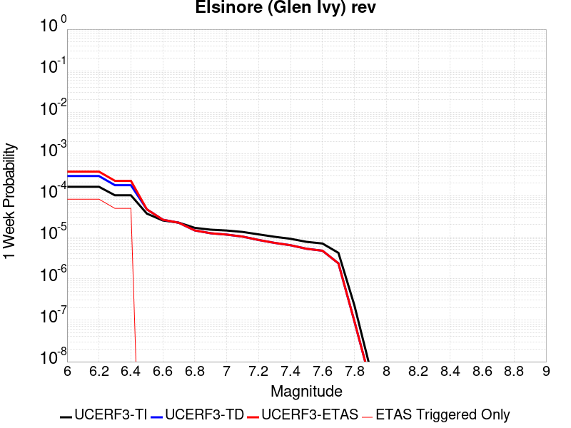 | 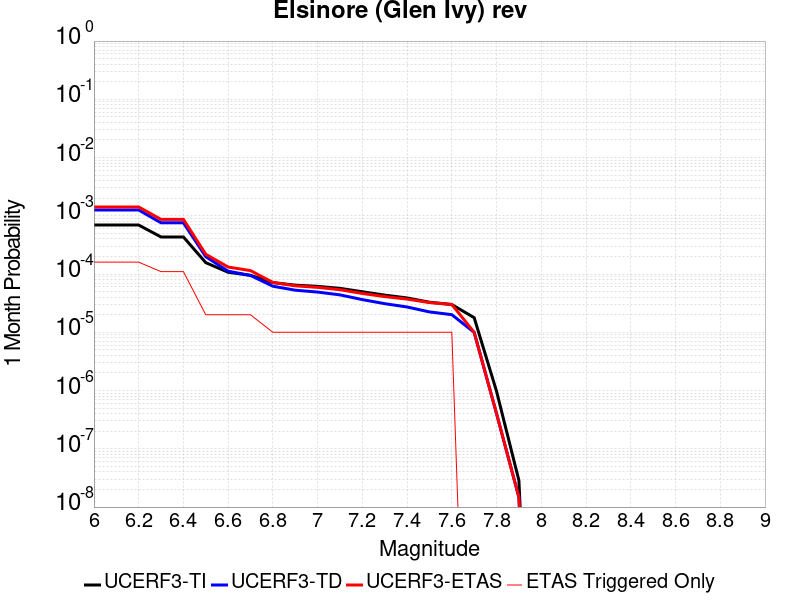 | 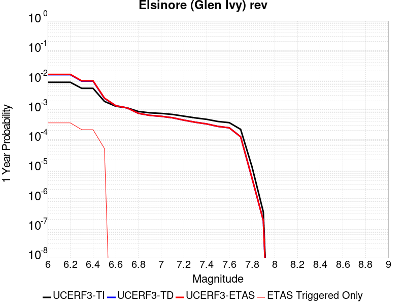 | 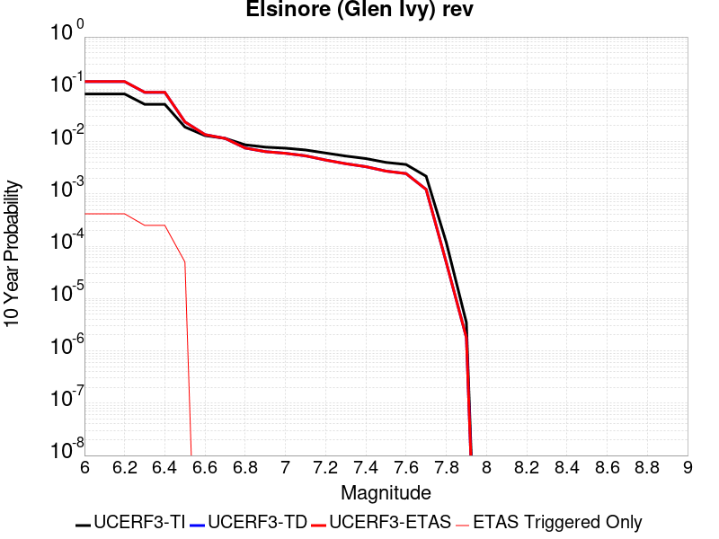 |

| Magnitude | 1 wk TI Prob | 1 wk TD Prob | 1 wk ETAS Prob | 1 wk ETAS/TD Gain | 1 wk ETAS Triggered Only | 1 mo TI Prob | 1 mo TD Prob | 1 mo ETAS Prob | 1 mo ETAS/TD Gain | 1 mo ETAS Triggered Only | 1 yr TI Prob | 1 yr TD Prob | 1 yr ETAS Prob | 1 yr ETAS/TD Gain | 1 yr ETAS Triggered Only | 10 yr TI Prob | 10 yr TD Prob | 10 yr ETAS Prob | 10 yr ETAS/TD Gain | 10 yr ETAS Triggered Only |
|-----|-----|-----|-----|-----|-----|-----|-----|-----|-----|-----|-----|-----|-----|-----|-----|-----|-----|-----|-----|-----|
| 6.0 | 1.6204086E-4 | 2.937271E-4 | 3.4367244E-4 | 1.17004 | 4.9960032E-5 | 6.94276E-4 | 0.0012583778 | 0.0013831208 | 1.0991299 | 1.2490008E-4 | 0.008420097 | 0.0152346175 | 0.015529811 | 1.0193765 | 2.997602E-4 | 0.081081145 | 0.13962454 | 0.13996841 | 1.0024629 | 3.9968026E-4 |
| 6.1 | 1.6204086E-4 | 2.937271E-4 | 3.4367244E-4 | 1.17004 | 4.9960032E-5 | 6.94276E-4 | 0.0012583778 | 0.0013831208 | 1.0991299 | 1.2490008E-4 | 0.008420097 | 0.0152346175 | 0.015529811 | 1.0193765 | 2.997602E-4 | 0.081081145 | 0.13962454 | 0.13996841 | 1.0024629 | 3.9968026E-4 |
| 6.2 | 1.6204086E-4 | 2.937271E-4 | 3.4367244E-4 | 1.17004 | 4.9960032E-5 | 6.94276E-4 | 0.0012583778 | 0.0013831208 | 1.0991299 | 1.2490008E-4 | 0.008420097 | 0.0152346175 | 0.015529811 | 1.0193765 | 2.997602E-4 | 0.081081145 | 0.13962454 | 0.13996841 | 1.0024629 | 3.9968026E-4 |
| 6.3 | 1.0111737E-4 | 1.7703463E-4 | 2.0201021E-4 | 1.1410774 | 2.4980016E-5 | 4.332882E-4 | 7.5861585E-4 | 8.3349907E-4 | 1.0987103 | 7.494005E-5 | 0.005262531 | 0.0092177205 | 0.00936622 | 1.0161101 | 1.498801E-4 | 0.0513964 | 0.08707393 | 0.08727918 | 1.0023571 | 2.2482015E-4 |
| 6.4 | 1.0111737E-4 | 1.7703463E-4 | 2.0201021E-4 | 1.1410774 | 2.4980016E-5 | 4.332882E-4 | 7.5861585E-4 | 8.3349907E-4 | 1.0987103 | 7.494005E-5 | 0.005262531 | 0.0092177205 | 0.00936622 | 1.0161101 | 1.498801E-4 | 0.0513964 | 0.08707393 | 0.08727918 | 1.0023571 | 2.2482015E-4 |
| 6.5 | 3.6624708E-5 | 4.6391986E-5 | 4.6391986E-5 | 1.0 | 0.0 | 1.569536E-4 | 1.9880968E-4 | 1.9880968E-4 | 1.0 | 0.0 | 0.001909235 | 0.0024181814 | 0.0024680207 | 1.0206102 | 4.9960032E-5 | 0.01892915 | 0.023697061 | 0.023745839 | 1.0020583 | 4.9960032E-5 |
| 6.6 | 2.5051324E-5 | 2.6147465E-5 | 2.6147465E-5 | 1.0 | 0.0 | 1.073584E-4 | 1.12056E-4 | 1.12056E-4 | 1.0 | 0.0 | 0.0013063047 | 0.0013634725 | 0.0013634725 | 1.0 | 0.0 | 0.012986525 | 0.013565759 | 0.013565759 | 1.0 | 0.0 |
| 6.7 | 2.2189772E-5 | 2.2072489E-5 | 2.2072489E-5 | 1.0 | 0.0 | 9.509556E-5 | 9.459316E-5 | 9.459316E-5 | 1.0 | 0.0 | 0.0011571734 | 0.0011510996 | 0.0011510996 | 1.0 | 0.0 | 0.011511663 | 0.0114663225 | 0.0114663225 | 1.0 | 0.0 |
| 6.8 | 1.6654378E-5 | 1.44376E-5 | 1.44376E-5 | 1.0 | 0.0 | 7.137396E-5 | 6.187399E-5 | 6.187399E-5 | 1.0 | 0.0 | 8.686314E-4 | 7.5306057E-4 | 7.5306057E-4 | 1.0 | 0.0 | 0.008652439 | 0.0075100763 | 0.0075100763 | 1.0 | 0.0 |
| 6.9 | 1.5042909E-5 | 1.2331886E-5 | 1.2331886E-5 | 1.0 | 0.0 | 6.446802E-5 | 5.2849886E-5 | 5.2849886E-5 | 1.0 | 0.0 | 7.8461546E-4 | 6.4326054E-4 | 6.4326054E-4 | 1.0 | 0.0 | 0.007818509 | 0.006417925 | 0.006417925 | 1.0 | 0.0 |
| 7.0 | 1.4361385E-5 | 1.1451172E-5 | 1.1451172E-5 | 1.0 | 0.0 | 6.154734E-5 | 4.9075545E-5 | 4.9075545E-5 | 1.0 | 0.0 | 7.490812E-4 | 5.973339E-4 | 5.973339E-4 | 1.0 | 0.0 | 0.007465612 | 0.005960982 | 0.005960982 | 1.0 | 0.0 |
| 7.1 | 1.3265571E-5 | 1.0244736E-5 | 1.0244736E-5 | 1.0 | 0.0 | 5.6851208E-5 | 4.3905282E-5 | 4.3905282E-5 | 1.0 | 0.0 | 6.919436E-4 | 5.344183E-4 | 5.344183E-4 | 1.0 | 0.0 | 0.006897931 | 0.0053346003 | 0.0053346003 | 1.0 | 0.0 |
| 7.2 | 1.1596403E-5 | 8.504847E-6 | 8.504847E-6 | 1.0 | 0.0 | 4.9697923E-5 | 3.6448844E-5 | 3.6448844E-5 | 1.0 | 0.0 | 6.049042E-4 | 4.4367602E-4 | 4.4367602E-4 | 1.0 | 0.0 | 0.006032603 | 0.004429357 | 0.004429357 | 1.0 | 0.0 |
| 7.3 | 1.0150827E-5 | 7.238537E-6 | 7.238537E-6 | 1.0 | 0.0 | 4.3502816E-5 | 3.102194E-5 | 3.102194E-5 | 1.0 | 0.0 | 5.2951806E-4 | 3.776281E-4 | 3.776281E-4 | 1.0 | 0.0 | 0.005282581 | 0.003770271 | 0.003770271 | 1.0 | 0.0 |
| 7.4 | 9.080705E-6 | 6.352307E-6 | 6.352307E-6 | 1.0 | 0.0 | 3.8916725E-5 | 2.7223898E-5 | 2.7223898E-5 | 1.0 | 0.0 | 4.7370812E-4 | 3.314019E-4 | 3.314019E-4 | 1.0 | 0.0 | 0.004726996 | 0.0033092257 | 0.0033092257 | 1.0 | 0.0 |
| 7.5 | 7.671649E-6 | 5.225419E-6 | 5.225419E-6 | 1.0 | 0.0 | 3.287808E-5 | 2.2394468E-5 | 2.2394468E-5 | 1.0 | 0.0 | 4.0021708E-4 | 2.7261977E-4 | 2.7261977E-4 | 1.0 | 0.0 | 0.0039949706 | 0.0027229784 | 0.0027229784 | 1.0 | 0.0 |
| 7.6 | 6.990086E-6 | 4.687336E-6 | 4.687336E-6 | 1.0 | 0.0 | 2.9957167E-5 | 2.0088435E-5 | 2.0088435E-5 | 1.0 | 0.0 | 3.6466747E-4 | 2.445504E-4 | 2.445504E-4 | 1.0 | 0.0 | 0.0036406964 | 0.0024429292 | 0.0024429292 | 1.0 | 0.0 |
| 7.7 | 4.163505E-6 | 2.329331E-6 | 2.329331E-6 | 1.0 | 0.0 | 1.7843471E-5 | 9.982813E-6 | 9.982813E-6 | 1.0 | 0.0 | 2.172226E-4 | 1.2153471E-4 | 1.2153471E-4 | 1.0 | 0.0 | 0.0021701038 | 0.0012147555 | 0.0012147555 | 1.0 | 0.0 |
| 7.8 | 2.2692414E-7 | 9.384417E-8 | 9.384417E-8 | 1.0 | 0.0 | 9.725317E-7 | 4.0218927E-7 | 4.0218927E-7 | 1.0 | 0.0 | 1.1840509E-5 | 4.8966467E-6 | 4.8966467E-6 | 1.0 | 0.0 | 1.1839878E-4 | 4.8965718E-5 | 4.8965718E-5 | 1.0 | 0.0 |
| 7.9 | 6.676829E-9 | 3.4397174E-9 | 3.4397174E-9 | 1.0 | 0.0 | 2.861498E-8 | 1.4741646E-8 | 1.4741646E-8 | 1.0 | 0.0 | 3.4838732E-7 | 1.7947953E-7 | 1.7947953E-7 | 1.0 | 0.0 | 3.4838679E-6 | 1.794794E-6 | 1.794794E-6 | 1.0 | 0.0 |

## Baker
*[(top)](#table-of-contents)*

| 1 Week | 1 Month | 1 Year | 10 Year |
|-----|-----|-----|-----|
| 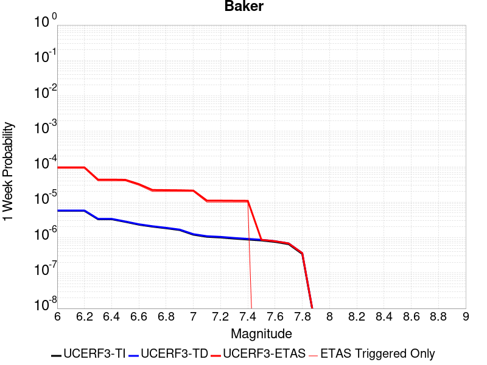 | 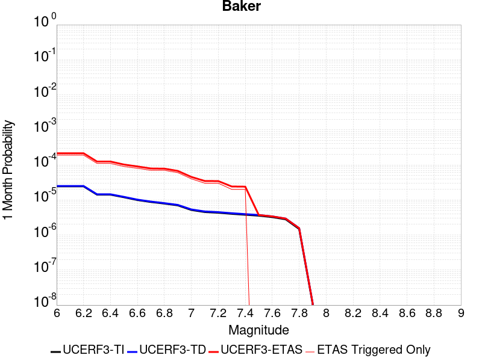 | 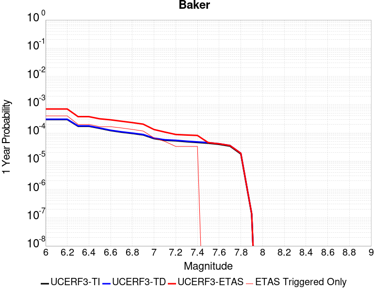 | 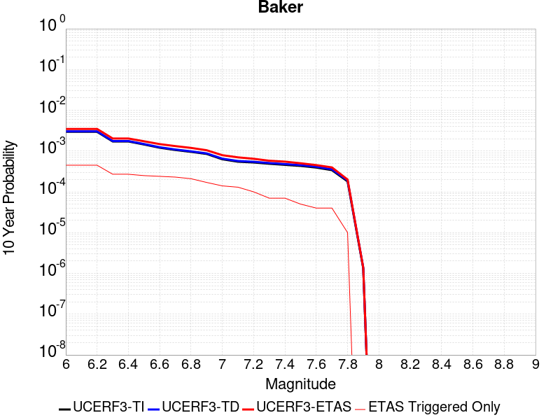 |

| Magnitude | 1 wk TI Prob | 1 wk TD Prob | 1 wk ETAS Prob | 1 wk ETAS/TD Gain | 1 wk ETAS Triggered Only | 1 mo TI Prob | 1 mo TD Prob | 1 mo ETAS Prob | 1 mo ETAS/TD Gain | 1 mo ETAS Triggered Only | 1 yr TI Prob | 1 yr TD Prob | 1 yr ETAS Prob | 1 yr ETAS/TD Gain | 1 yr ETAS Triggered Only | 10 yr TI Prob | 10 yr TD Prob | 10 yr ETAS Prob | 10 yr ETAS/TD Gain | 10 yr ETAS Triggered Only |
|-----|-----|-----|-----|-----|-----|-----|-----|-----|-----|-----|-----|-----|-----|-----|-----|-----|-----|-----|-----|-----|
| 6.0 | 5.695525E-6 | 5.8348373E-6 | 5.579458E-5 | 9.56232 | 4.9960032E-5 | 2.4409164E-5 | 2.5006228E-5 | 1.9986197E-4 | 7.992488 | 1.748601E-4 | 2.9714106E-4 | 3.044123E-4 | 6.290536E-4 | 2.0664527 | 3.2474022E-4 | 0.0029674405 | 0.0030403486 | 0.00353843 | 1.1638237 | 4.996003E-4 |
| 6.1 | 5.695525E-6 | 5.8348373E-6 | 5.579458E-5 | 9.56232 | 4.9960032E-5 | 2.4409164E-5 | 2.5006228E-5 | 1.9986197E-4 | 7.992488 | 1.748601E-4 | 2.9714106E-4 | 3.044123E-4 | 6.290536E-4 | 2.0664527 | 3.2474022E-4 | 0.0029674405 | 0.0030403486 | 0.00353843 | 1.1638237 | 4.996003E-4 |
| 6.2 | 5.695525E-6 | 5.8348373E-6 | 5.579458E-5 | 9.56232 | 4.9960032E-5 | 2.4409164E-5 | 2.5006228E-5 | 1.9986197E-4 | 7.992488 | 1.748601E-4 | 2.9714106E-4 | 3.044123E-4 | 6.290536E-4 | 2.0664527 | 3.2474022E-4 | 0.0029674405 | 0.0030403486 | 0.00353843 | 1.1638237 | 4.996003E-4 |
| 6.3 | 3.2995713E-6 | 3.383667E-6 | 2.8363598E-5 | 8.382503 | 2.4980016E-5 | 1.4140943E-5 | 1.4501353E-5 | 1.3939962E-4 | 9.61287 | 1.2490008E-4 | 1.7215237E-4 | 1.7654014E-4 | 3.5136938E-4 | 1.9903088 | 1.748601E-4 | 0.0017201907 | 0.001764046 | 0.0020882133 | 1.1837635 | 3.2474022E-4 |
| 6.4 | 3.2995713E-6 | 3.383667E-6 | 2.8363598E-5 | 8.382503 | 2.4980016E-5 | 1.4140943E-5 | 1.4501353E-5 | 1.3939962E-4 | 9.61287 | 1.2490008E-4 | 1.7215237E-4 | 1.7654014E-4 | 3.5136938E-4 | 1.9903088 | 1.748601E-4 | 0.0017201907 | 0.001764046 | 0.0020882133 | 1.1837635 | 3.2474022E-4 |
| 6.5 | 2.782202E-6 | 2.8558404E-6 | 2.7835786E-5 | 9.746968 | 2.4980016E-5 | 1.1923668E-5 | 1.223926E-5 | 1.121581E-4 | 9.163797 | 9.9920064E-5 | 1.4516099E-4 | 1.4900314E-4 | 2.988609E-4 | 2.0057356 | 1.498801E-4 | 0.001450662 | 0.0014890651 | 0.0017883789 | 1.2010078 | 2.997602E-4 |
| 6.6 | 2.3163404E-6 | 2.38092E-6 | 2.7360877E-5 | 11.491725 | 2.4980016E-5 | 9.927136E-6 | 1.0203904E-5 | 1.1012295E-4 | 10.792237 | 9.9920064E-5 | 1.20856166E-4 | 1.2422565E-4 | 2.7408713E-4 | 2.2063649 | 1.498801E-4 | 0.0012079047 | 0.0012415823 | 0.0015409703 | 1.2411343 | 2.997602E-4 |
| 6.7 | 2.037056E-6 | 2.0965003E-6 | 2.0965003E-6 | 1.0 | 0.0 | 8.7302105E-6 | 8.984972E-6 | 8.3924344E-5 | 9.340524 | 7.494005E-5 | 1.0628513E-4 | 1.093867E-4 | 2.3427312E-4 | 2.1416965 | 1.2490008E-4 | 0.0010623431 | 0.0010933448 | 0.0013678245 | 1.251046 | 2.7478018E-4 |
| 6.8 | 1.8356744E-6 | 1.8915287E-6 | 1.8915287E-6 | 1.0 | 0.0 | 7.867153E-6 | 8.106527E-6 | 8.304597E-5 | 10.244333 | 7.494005E-5 | 9.577837E-5 | 9.869264E-5 | 2.2358038E-4 | 2.2654212 | 1.2490008E-4 | 9.57371E-4 | 9.86502E-4 | 0.0012610111 | 1.2782651 | 2.7478018E-4 |
| 6.9 | 1.6310546E-6 | 1.6832072E-6 | 1.6832072E-6 | 1.0 | 0.0 | 6.9902153E-6 | 7.213726E-6 | 8.215323E-5 | 11.388461 | 7.494005E-5 | 8.510255E-5 | 8.782368E-5 | 2.127128E-4 | 2.4220436 | 1.2490008E-4 | 8.5069967E-4 | 8.7790104E-4 | 0.0011274819 | 1.2842927 | 2.4980016E-4 |
| 7.0 | 1.2058036E-6 | 1.2508665E-6 | 1.2508665E-6 | 1.0 | 0.0 | 5.1677193E-6 | 5.3608455E-6 | 3.0340729E-5 | 5.6596904 | 2.4980016E-5 | 6.291517E-5 | 6.5266366E-5 | 1.15223134E-4 | 1.765429 | 4.9960032E-5 | 6.289736E-4 | 6.524743E-4 | 8.272203E-4 | 1.2678206 | 1.748601E-4 |
| 7.1 | 1.052382E-6 | 1.0951609E-6 | 1.0951609E-6 | 1.0 | 0.0 | 4.5102006E-6 | 4.693538E-6 | 2.9673436E-5 | 6.3221893 | 2.4980016E-5 | 5.491031E-5 | 5.7142337E-5 | 1.0709951E-4 | 1.8742585 | 4.9960032E-5 | 5.4896745E-4 | 5.7127734E-4 | 7.460375E-4 | 1.3059113 | 1.748601E-4 |
| 7.2 | 1.0067454E-6 | 1.0487711E-6 | 1.0487711E-6 | 1.0 | 0.0 | 4.3146156E-6 | 4.4947255E-6 | 2.947463E-5 | 6.557604 | 2.4980016E-5 | 5.252918E-5 | 5.4721917E-5 | 7.970056E-5 | 1.4564651 | 2.4980016E-5 | 5.251676E-4 | 5.470853E-4 | 6.7191705E-4 | 1.228176 | 1.2490008E-4 |
| 7.3 | 9.3596316E-7 | 9.767723E-7 | 9.767723E-7 | 1.0 | 0.0 | 4.0112645E-6 | 4.1861604E-6 | 2.9166073E-5 | 6.967261 | 2.4980016E-5 | 4.8836053E-5 | 5.096532E-5 | 7.594406E-5 | 1.4901125 | 2.4980016E-5 | 4.8825322E-4 | 5.095371E-4 | 6.0940627E-4 | 1.1959997 | 9.9920064E-5 |
| 7.4 | 8.8117395E-7 | 9.2076635E-7 | 9.2076635E-7 | 1.0 | 0.0 | 3.7764542E-6 | 3.9461356E-6 | 2.8926053E-5 | 7.330223 | 2.4980016E-5 | 4.5977362E-5 | 4.8043148E-5 | 7.302196E-5 | 1.5199246 | 2.4980016E-5 | 4.596785E-4 | 4.8032837E-4 | 5.8020046E-4 | 1.2079246 | 9.9920064E-5 |
| 7.5 | 8.292386E-7 | 8.6745956E-7 | 8.6745956E-7 | 1.0 | 0.0 | 3.5538749E-6 | 3.7176785E-6 | 3.7176785E-6 | 1.0 | 0.0 | 4.326757E-5 | 4.5261804E-5 | 4.5261804E-5 | 1.0 | 0.0 | 4.3259145E-4 | 4.5252658E-4 | 5.274327E-4 | 1.1655287 | 7.494005E-5 |
| 7.6 | 7.553842E-7 | 7.9144706E-7 | 7.9144706E-7 | 1.0 | 0.0 | 3.2373566E-6 | 3.3919116E-6 | 3.3919116E-6 | 1.0 | 0.0 | 3.9414106E-5 | 4.129575E-5 | 4.129575E-5 | 1.0 | 0.0 | 3.9407116E-4 | 4.1288146E-4 | 4.6282084E-4 | 1.1209533 | 4.9960032E-5 |
| 7.7 | 6.5285366E-7 | 6.852797E-7 | 6.852797E-7 | 1.0 | 0.0 | 2.797941E-6 | 2.9369096E-6 | 2.9369096E-6 | 1.0 | 0.0 | 3.40644E-5 | 3.5756293E-5 | 3.5756293E-5 | 1.0 | 0.0 | 3.405918E-4 | 3.5750607E-4 | 4.0744824E-4 | 1.139696 | 4.9960032E-5 |
| 7.8 | 3.4586725E-7 | 3.6482615E-7 | 3.6482615E-7 | 1.0 | 0.0 | 1.4822873E-6 | 1.5635396E-6 | 1.5635396E-6 | 1.0 | 0.0 | 1.80467E-5 | 1.9035933E-5 | 1.9035933E-5 | 1.0 | 0.0 | 1.8045233E-4 | 1.9034347E-4 | 1.9034347E-4 | 1.0 | 0.0 |
| 7.9 | 2.5591178E-9 | 2.6696718E-9 | 2.6696718E-9 | 1.0 | 0.0 | 1.0967647E-8 | 1.14414505E-8 | 1.14414505E-8 | 1.0 | 0.0 | 1.335311E-7 | 1.3929966E-7 | 1.3929966E-7 | 1.0 | 0.0 | 1.3353102E-6 | 1.3929966E-6 | 1.3929966E-6 | 1.0 | 0.0 |

## San Andreas (San Gorgonio Pass-Garnet HIll)
*[(top)](#table-of-contents)*

| 1 Week | 1 Month | 1 Year | 10 Year |
|-----|-----|-----|-----|
| 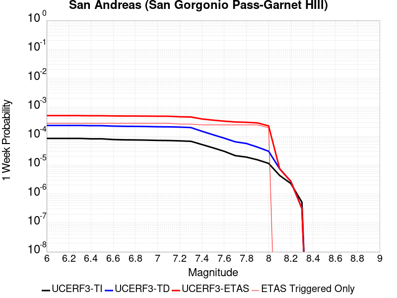 | 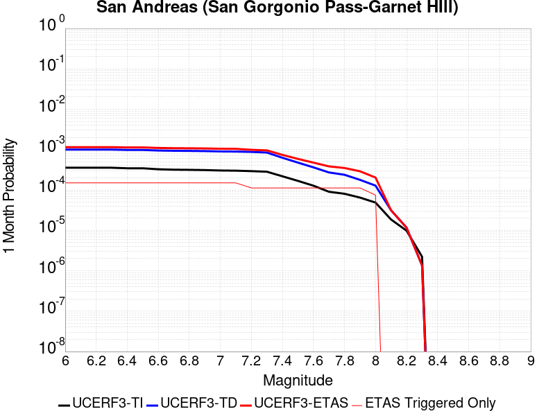 | 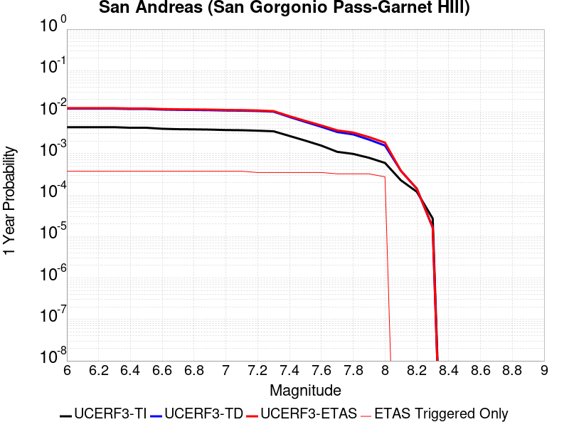 | 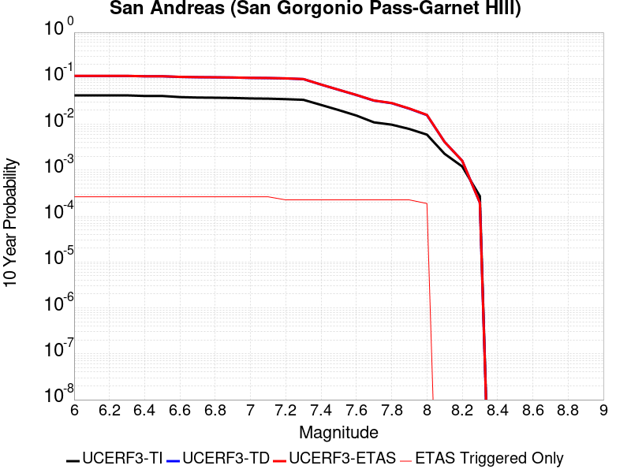 |

| Magnitude | 1 wk TI Prob | 1 wk TD Prob | 1 wk ETAS Prob | 1 wk ETAS/TD Gain | 1 wk ETAS Triggered Only | 1 mo TI Prob | 1 mo TD Prob | 1 mo ETAS Prob | 1 mo ETAS/TD Gain | 1 mo ETAS Triggered Only | 1 yr TI Prob | 1 yr TD Prob | 1 yr ETAS Prob | 1 yr ETAS/TD Gain | 1 yr ETAS Triggered Only | 10 yr TI Prob | 10 yr TD Prob | 10 yr ETAS Prob | 10 yr ETAS/TD Gain | 10 yr ETAS Triggered Only |
|-----|-----|-----|-----|-----|-----|-----|-----|-----|-----|-----|-----|-----|-----|-----|-----|-----|-----|-----|-----|-----|
| 6.0 | 8.31567E-5 | 2.3384395E-4 | 4.835857E-4 | 2.0679846 | 2.4980016E-4 | 3.5633717E-4 | 0.0010018025 | 0.0013262174 | 1.3238312 | 3.2474022E-4 | 0.004329778 | 0.012128622 | 0.012498777 | 1.0305191 | 3.7470023E-4 | 0.042463828 | 0.11258187 | 0.113025226 | 1.0039381 | 4.996003E-4 |
| 6.1 | 8.31567E-5 | 2.3384395E-4 | 4.835857E-4 | 2.0679846 | 2.4980016E-4 | 3.5633717E-4 | 0.0010018025 | 0.0013262174 | 1.3238312 | 3.2474022E-4 | 0.004329778 | 0.012128622 | 0.012498777 | 1.0305191 | 3.7470023E-4 | 0.042463828 | 0.11258187 | 0.113025226 | 1.0039381 | 4.996003E-4 |
| 6.2 | 8.31567E-5 | 2.3384395E-4 | 4.835857E-4 | 2.0679846 | 2.4980016E-4 | 3.5633717E-4 | 0.0010018025 | 0.0013262174 | 1.3238312 | 3.2474022E-4 | 0.004329778 | 0.012128622 | 0.012498777 | 1.0305191 | 3.7470023E-4 | 0.042463828 | 0.11258187 | 0.113025226 | 1.0039381 | 4.996003E-4 |
| 6.3 | 8.31567E-5 | 2.3384395E-4 | 4.835857E-4 | 2.0679846 | 2.4980016E-4 | 3.5633717E-4 | 0.0010018025 | 0.0013262174 | 1.3238312 | 3.2474022E-4 | 0.004329778 | 0.012128622 | 0.012498777 | 1.0305191 | 3.7470023E-4 | 0.042463828 | 0.11258187 | 0.113025226 | 1.0039381 | 4.996003E-4 |
| 6.4 | 8.059055E-5 | 2.2941893E-4 | 4.7916177E-4 | 2.0885887 | 2.4980016E-4 | 3.4534236E-4 | 9.828559E-4 | 0.001307277 | 1.3300799 | 3.2474022E-4 | 0.0041964394 | 0.011900819 | 0.01227106 | 1.0311105 | 3.7470023E-4 | 0.041180745 | 0.110562965 | 0.111007325 | 1.0040191 | 4.996003E-4 |
| 6.5 | 8.059055E-5 | 2.2941893E-4 | 4.7916177E-4 | 2.0885887 | 2.4980016E-4 | 3.4534236E-4 | 9.828559E-4 | 0.001307277 | 1.3300799 | 3.2474022E-4 | 0.0041964394 | 0.011900819 | 0.01227106 | 1.0311105 | 3.7470023E-4 | 0.041180745 | 0.110562965 | 0.111007325 | 1.0040191 | 4.996003E-4 |
| 6.6 | 7.619237E-5 | 2.2186468E-4 | 4.716094E-4 | 2.1256626 | 2.4980016E-4 | 3.2649786E-4 | 9.5050444E-4 | 0.001274936 | 1.3413256 | 3.2474022E-4 | 0.0039678677 | 0.0115115335 | 0.0118819205 | 1.0321753 | 3.7470023E-4 | 0.03897764 | 0.10709954 | 0.10754564 | 1.0041652 | 4.996003E-4 |
| 6.7 | 7.440636E-5 | 2.1862281E-4 | 4.6836835E-4 | 2.142358 | 2.4980016E-4 | 3.188454E-4 | 9.3662075E-4 | 0.0012610568 | 1.34639 | 3.2474022E-4 | 0.0038750346 | 0.011344268 | 0.011714717 | 1.0326552 | 3.7470023E-4 | 0.038081564 | 0.1056081 | 0.10605494 | 1.0042311 | 4.996003E-4 |
| 6.8 | 7.3735864E-5 | 2.1709445E-4 | 4.6684037E-4 | 2.150402 | 2.4980016E-4 | 3.1597257E-4 | 9.300753E-4 | 0.0012545135 | 1.34883 | 3.2474022E-4 | 0.0038401815 | 0.011265406 | 0.011635886 | 1.0328864 | 3.7470023E-4 | 0.03774495 | 0.104909696 | 0.10535688 | 1.0042626 | 4.996003E-4 |
| 6.9 | 7.27575E-5 | 2.1478413E-4 | 4.6453063E-4 | 2.162779 | 2.4980016E-4 | 3.117806E-4 | 9.20181E-4 | 0.0012446224 | 1.3525844 | 3.2474022E-4 | 0.003789323 | 0.011146182 | 0.011516706 | 1.0332422 | 3.7470023E-4 | 0.037253562 | 0.10385753 | 0.104305245 | 1.0043108 | 4.996003E-4 |
| 7.0 | 7.102591E-5 | 2.1062451E-4 | 4.6037204E-4 | 2.1857479 | 2.4980016E-4 | 3.0436125E-4 | 9.023664E-4 | 0.0012268136 | 1.3595514 | 3.2474022E-4 | 0.003699303 | 0.010931484 | 0.011302088 | 1.0339024 | 3.7470023E-4 | 0.03638325 | 0.101959534 | 0.10240819 | 1.0044004 | 4.996003E-4 |
| 7.1 | 7.028513E-5 | 2.0898094E-4 | 4.587289E-4 | 2.1950753 | 2.4980016E-4 | 3.0118722E-4 | 8.953274E-4 | 0.0012197768 | 1.3623807 | 3.2474022E-4 | 0.0036607897 | 0.010846641 | 0.011217277 | 1.0341706 | 3.7470023E-4 | 0.036010686 | 0.10120243 | 0.10165147 | 1.0044371 | 4.996003E-4 |
| 7.2 | 6.8498244E-5 | 2.050596E-4 | 4.2983363E-4 | 2.0961401 | 2.2482015E-4 | 2.9353087E-4 | 8.7853306E-4 | 0.0011780299 | 1.3409055 | 2.997602E-4 | 0.003567883 | 0.0106441835 | 0.010990181 | 1.0325058 | 3.497202E-4 | 0.035111405 | 0.09939449 | 0.09982194 | 1.0043005 | 4.746203E-4 |
| 7.3 | 6.622592E-5 | 1.9733235E-4 | 4.2210813E-4 | 2.1390722 | 2.2482015E-4 | 2.8379448E-4 | 8.4543816E-4 | 0.0011449449 | 1.3542622 | 2.997602E-4 | 0.0034497243 | 0.010245111 | 0.010591248 | 1.0337856 | 3.497202E-4 | 0.033966612 | 0.095891245 | 0.09632035 | 1.004475 | 4.746203E-4 |
| 7.4 | 5.1050705E-5 | 1.4690042E-4 | 3.7168755E-4 | 2.5302007 | 2.2482015E-4 | 2.1877038E-4 | 6.294222E-4 | 9.2899374E-4 | 1.4759468 | 2.997602E-4 | 0.002660276 | 0.007636482 | 0.007983532 | 1.0454463 | 3.497202E-4 | 0.02628654 | 0.07286554 | 0.07330558 | 1.006039 | 4.746203E-4 |
| 7.5 | 3.9302922E-5 | 1.11307076E-4 | 3.3610218E-4 | 3.0195942 | 2.2482015E-4 | 1.6843023E-4 | 4.7694342E-4 | 7.765606E-4 | 1.6282029 | 2.997602E-4 | 0.0020487092 | 0.0057913954 | 0.0061390903 | 1.0600364 | 3.497202E-4 | 0.020299247 | 0.05601151 | 0.056459546 | 1.007999 | 4.746203E-4 |
| 7.6 | 2.9851626E-5 | 8.4956984E-5 | 3.0975803E-4 | 3.6460571 | 2.2482015E-4 | 1.2792926E-4 | 3.6405068E-4 | 6.6370174E-4 | 1.8231026 | 2.997602E-4 | 0.0015564259 | 0.0044233347 | 0.0047715083 | 1.0787128 | 3.497202E-4 | 0.0154556995 | 0.043196145 | 0.043626364 | 1.0099596 | 4.496403E-4 |
| 7.7 | 2.1135214E-5 | 6.353527E-5 | 2.8834114E-4 | 4.538285 | 2.2482015E-4 | 9.0576345E-5 | 2.722656E-4 | 5.46971E-4 | 2.008961 | 2.7478018E-4 | 0.0011022091 | 0.0033098008 | 0.003633466 | 1.09779 | 3.2474022E-4 | 0.010967582 | 0.03258456 | 0.032995384 | 1.0126079 | 4.2466028E-4 |
| 7.8 | 1.883379E-5 | 5.564576E-5 | 2.804534E-4 | 5.0399776 | 2.2482015E-4 | 8.0713755E-5 | 2.3846005E-4 | 5.131747E-4 | 2.1520364 | 2.7478018E-4 | 9.822468E-4 | 0.002899389 | 0.0032231878 | 1.1116782 | 3.2474022E-4 | 0.0097791655 | 0.028696978 | 0.029109452 | 1.0143734 | 4.2466028E-4 |
| 7.9 | 1.5156185E-5 | 4.1662403E-5 | 2.664732E-4 | 6.396011 | 2.2482015E-4 | 6.495346E-5 | 1.7854095E-4 | 4.5327208E-4 | 2.5387568 | 2.7478018E-4 | 7.9052144E-4 | 0.0021715704 | 0.0024956053 | 1.1492169 | 3.2474022E-4 | 0.007877152 | 0.021760946 | 0.022176364 | 1.0190902 | 4.2466028E-4 |
| 8.0 | 1.1405907E-5 | 2.9976925E-5 | 2.048318E-4 | 6.832982 | 1.748601E-4 | 4.8881542E-5 | 1.2846621E-4 | 3.532575E-4 | 2.7498083 | 2.2482015E-4 | 5.9497025E-4 | 0.0015629551 | 0.0018373057 | 1.1755333 | 2.7478018E-4 | 0.005933798 | 0.015774013 | 0.016118217 | 1.0218209 | 3.497202E-4 |
| 8.1 | 4.3511436E-6 | 7.369465E-6 | 7.369465E-6 | 1.0 | 0.0 | 1.8647626E-5 | 3.158304E-5 | 3.158304E-5 | 1.0 | 0.0 | 2.2701119E-4 | 3.844558E-4 | 3.844558E-4 | 1.0 | 0.0 | 0.0022677942 | 0.0041165445 | 0.0041165445 | 1.0 | 0.0 |
| 8.2 | 2.3042528E-6 | 2.7328301E-6 | 2.7328301E-6 | 1.0 | 0.0 | 9.875332E-6 | 1.1712076E-5 | 1.1712076E-5 | 1.0 | 0.0 | 1.2022553E-4 | 1.4258524E-4 | 1.4258524E-4 | 1.0 | 0.0 | 0.0012016051 | 0.0015979637 | 0.0015979637 | 1.0 | 0.0 |
| 8.3 | 5.202968E-7 | 3.1590292E-7 | 3.1590292E-7 | 1.0 | 0.0 | 2.2298414E-6 | 1.353869E-6 | 1.353869E-6 | 1.0 | 0.0 | 2.714798E-5 | 1.6483244E-5 | 1.6483244E-5 | 1.0 | 0.0 | 2.7144665E-4 | 1.955901E-4 | 1.955901E-4 | 1.0 | 0.0 |

## San Andreas (Carrizo) rev
*[(top)](#table-of-contents)*

| 1 Week | 1 Month | 1 Year | 10 Year |
|-----|-----|-----|-----|
| 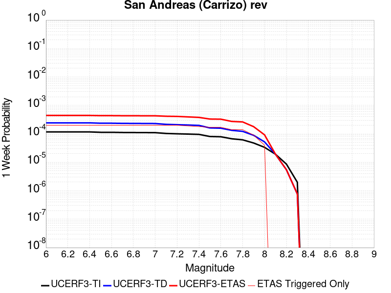 | 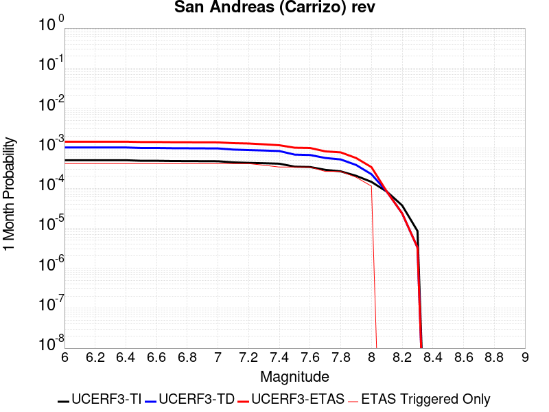 |  | 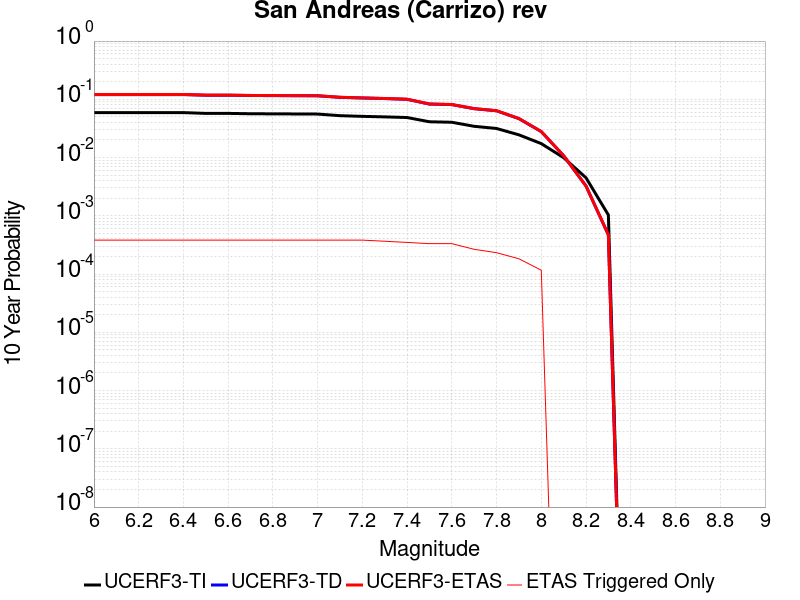 |

| Magnitude | 1 wk TI Prob | 1 wk TD Prob | 1 wk ETAS Prob | 1 wk ETAS/TD Gain | 1 wk ETAS Triggered Only | 1 mo TI Prob | 1 mo TD Prob | 1 mo ETAS Prob | 1 mo ETAS/TD Gain | 1 mo ETAS Triggered Only | 1 yr TI Prob | 1 yr TD Prob | 1 yr ETAS Prob | 1 yr ETAS/TD Gain | 1 yr ETAS Triggered Only | 10 yr TI Prob | 10 yr TD Prob | 10 yr ETAS Prob | 10 yr ETAS/TD Gain | 10 yr ETAS Triggered Only |
|-----|-----|-----|-----|-----|-----|-----|-----|-----|-----|-----|-----|-----|-----|-----|-----|-----|-----|-----|-----|-----|
| 6.0 | 1.1674632E-4 | 2.4324407E-4 | 5.429313E-4 | 2.2320435 | 2.997602E-4 | 5.002454E-4 | 0.0010420597 | 0.0013415075 | 1.2873615 | 2.997602E-4 | 0.006073493 | 0.012613757 | 0.012959066 | 1.0273756 | 3.497202E-4 | 0.0591016 | 0.120640226 | 0.12103562 | 1.0032774 | 4.496403E-4 |
| 6.1 | 1.1674632E-4 | 2.4324407E-4 | 5.429313E-4 | 2.2320435 | 2.997602E-4 | 5.002454E-4 | 0.0010420597 | 0.0013415075 | 1.2873615 | 2.997602E-4 | 0.006073493 | 0.012613757 | 0.012959066 | 1.0273756 | 3.497202E-4 | 0.0591016 | 0.120640226 | 0.12103562 | 1.0032774 | 4.496403E-4 |
| 6.2 | 1.1674632E-4 | 2.4324407E-4 | 5.429313E-4 | 2.2320435 | 2.997602E-4 | 5.002454E-4 | 0.0010420597 | 0.0013415075 | 1.2873615 | 2.997602E-4 | 0.006073493 | 0.012613757 | 0.012959066 | 1.0273756 | 3.497202E-4 | 0.0591016 | 0.120640226 | 0.12103562 | 1.0032774 | 4.496403E-4 |
| 6.3 | 1.1674632E-4 | 2.4324407E-4 | 5.429313E-4 | 2.2320435 | 2.997602E-4 | 5.002454E-4 | 0.0010420597 | 0.0013415075 | 1.2873615 | 2.997602E-4 | 0.006073493 | 0.012613757 | 0.012959066 | 1.0273756 | 3.497202E-4 | 0.0591016 | 0.120640226 | 0.12103562 | 1.0032774 | 4.496403E-4 |
| 6.4 | 1.1674632E-4 | 2.4324407E-4 | 5.429313E-4 | 2.2320435 | 2.997602E-4 | 5.002454E-4 | 0.0010420597 | 0.0013415075 | 1.2873615 | 2.997602E-4 | 0.006073493 | 0.012613757 | 0.012959066 | 1.0273756 | 3.497202E-4 | 0.0591016 | 0.120640226 | 0.12103562 | 1.0032774 | 4.496403E-4 |
| 6.5 | 1.13136164E-4 | 2.3644442E-4 | 5.361337E-4 | 2.2674832 | 2.997602E-4 | 4.847792E-4 | 0.0010129412 | 0.0013123978 | 1.2956307 | 2.997602E-4 | 0.0058862255 | 0.012263271 | 0.012608702 | 1.028168 | 3.497202E-4 | 0.057327334 | 0.11761008 | 0.11800684 | 1.0033735 | 4.496403E-4 |
| 6.6 | 1.13136164E-4 | 2.3644442E-4 | 5.361337E-4 | 2.2674832 | 2.997602E-4 | 4.847792E-4 | 0.0010129412 | 0.0013123978 | 1.2956307 | 2.997602E-4 | 0.0058862255 | 0.012263271 | 0.012608702 | 1.028168 | 3.497202E-4 | 0.057327334 | 0.11761008 | 0.11800684 | 1.0033735 | 4.496403E-4 |
| 6.7 | 1.1149675E-4 | 2.3335687E-4 | 5.3304713E-4 | 2.2842572 | 2.997602E-4 | 4.777557E-4 | 9.997191E-4 | 0.0012991796 | 1.2995447 | 2.997602E-4 | 0.0058011734 | 0.012104088 | 0.012449576 | 1.028543 | 3.497202E-4 | 0.05652051 | 0.1162291 | 0.116626486 | 1.0034189 | 4.496403E-4 |
| 6.8 | 1.1103589E-4 | 2.3237852E-4 | 5.3206907E-4 | 2.2896655 | 2.997602E-4 | 4.7578133E-4 | 9.955293E-4 | 0.0012949911 | 1.3008066 | 2.997602E-4 | 0.005777263 | 0.012053643 | 0.012399148 | 1.0286639 | 3.497202E-4 | 0.056293584 | 0.11578894 | 0.116186514 | 1.0034336 | 4.496403E-4 |
| 6.9 | 1.1053259E-4 | 2.3130233E-4 | 5.309932E-4 | 2.2956672 | 2.997602E-4 | 4.7362508E-4 | 9.909206E-4 | 0.0012903837 | 1.302207 | 2.997602E-4 | 0.0057511497 | 0.011998152 | 0.012343676 | 1.0287981 | 3.497202E-4 | 0.05604569 | 0.11530445 | 0.11570224 | 1.0034499 | 4.496403E-4 |
| 7.0 | 1.1005377E-4 | 2.3031076E-4 | 5.3000194E-4 | 2.301247 | 2.997602E-4 | 4.7157376E-4 | 9.866742E-4 | 0.0012861387 | 1.3035089 | 2.997602E-4 | 0.0057263062 | 0.011947021 | 0.012292563 | 1.0289229 | 3.497202E-4 | 0.055809796 | 0.11485658 | 0.11525458 | 1.0034652 | 4.496403E-4 |
| 7.1 | 1.0308142E-4 | 2.1540876E-4 | 5.151044E-4 | 2.391288 | 2.997602E-4 | 4.417027E-4 | 9.228548E-4 | 0.0012223384 | 1.3245186 | 2.997602E-4 | 0.0053644776 | 0.011178188 | 0.011523999 | 1.0309362 | 3.497202E-4 | 0.052368138 | 0.10809042 | 0.108491465 | 1.0037103 | 4.496403E-4 |
| 7.2 | 1.0027479E-4 | 2.094876E-4 | 5.09185E-4 | 2.4306211 | 2.997602E-4 | 4.296783E-4 | 8.9749607E-4 | 0.0011969872 | 1.3336964 | 2.997602E-4 | 0.0052187922 | 0.010872566 | 0.0112184845 | 1.0318156 | 3.497202E-4 | 0.050979212 | 0.10539086 | 0.10579311 | 1.0038167 | 4.496403E-4 |
| 7.3 | 9.816942E-5 | 2.0423878E-4 | 4.7896284E-4 | 2.345112 | 2.7478018E-4 | 4.2065824E-4 | 8.7501644E-4 | 0.0011495561 | 1.3137538 | 2.7478018E-4 | 0.005109493 | 0.010601572 | 0.01092287 | 1.0303066 | 3.2474022E-4 | 0.049935985 | 0.10297546 | 0.103356384 | 1.0036992 | 4.2466028E-4 |
| 7.4 | 9.5634205E-5 | 1.9793298E-4 | 4.476837E-4 | 2.2617943 | 2.4980016E-4 | 4.0979648E-4 | 8.4800937E-4 | 0.0010975978 | 1.2943226 | 2.4980016E-4 | 0.0049778637 | 0.010275901 | 0.010572582 | 1.0288714 | 2.997602E-4 | 0.048678253 | 0.100067884 | 0.10042757 | 1.0035944 | 3.9968026E-4 |
| 7.5 | 8.052417E-5 | 1.6113915E-4 | 4.1089905E-4 | 2.5499642 | 2.4980016E-4 | 3.4505792E-4 | 6.9041376E-4 | 9.4004144E-4 | 1.3615625 | 2.4980016E-4 | 0.0041929903 | 0.008373471 | 0.008645951 | 1.0325408 | 2.7478018E-4 | 0.04114753 | 0.082815245 | 0.08315892 | 1.0041498 | 3.7470023E-4 |
| 7.6 | 7.897024E-5 | 1.5767086E-4 | 4.0743162E-4 | 2.5840642 | 2.4980016E-4 | 3.384E-4 | 6.755574E-4 | 9.251888E-4 | 1.3695191 | 2.4980016E-4 | 0.0041122385 | 0.00819397 | 0.008466499 | 1.0332596 | 2.7478018E-4 | 0.040369697 | 0.08115866 | 0.08150295 | 1.0042422 | 3.7470023E-4 |
| 7.7 | 6.707427E-5 | 1.3277122E-4 | 3.325848E-4 | 2.5049465 | 1.9984013E-4 | 2.8742946E-4 | 5.688955E-4 | 7.686219E-4 | 1.3510776 | 1.9984013E-4 | 0.003493839 | 0.0069043385 | 0.0071276063 | 1.0323373 | 2.2482015E-4 | 0.034394164 | 0.06905339 | 0.06933245 | 1.0040412 | 2.997602E-4 |
| 7.8 | 6.147705E-5 | 1.2198445E-4 | 3.218002E-4 | 2.6380427 | 1.9984013E-4 | 2.6344648E-4 | 5.226858E-4 | 7.2242145E-4 | 1.3821334 | 1.9984013E-4 | 0.0032027436 | 0.006345156 | 0.0065685497 | 1.0352069 | 2.2482015E-4 | 0.031569764 | 0.0635172 | 0.063774526 | 1.0040513 | 2.7478018E-4 |
| 7.9 | 4.7636717E-5 | 8.8802946E-5 | 2.3866973E-4 | 2.687633 | 1.498801E-4 | 2.0414138E-4 | 3.8052857E-4 | 5.3035165E-4 | 1.3937236 | 1.498801E-4 | 0.0024825884 | 0.004623101 | 0.004797153 | 1.0376482 | 1.748601E-4 | 0.024550365 | 0.046629366 | 0.0468437 | 1.0045966 | 2.2482015E-4 |
| 8.0 | 3.3554235E-5 | 5.2138024E-5 | 1.5205287E-4 | 2.9163527 | 9.9920064E-5 | 1.4379594E-4 | 2.2342955E-4 | 3.233273E-4 | 1.4471107 | 9.9920064E-5 | 0.0017493097 | 0.002716863 | 0.002841424 | 1.0458473 | 1.2490008E-4 | 0.017356034 | 0.027881905 | 0.02805189 | 1.0060966 | 1.748601E-4 |
| 8.1 | 1.9175432E-5 | 1.9183564E-5 | 1.9183564E-5 | 1.0 | 0.0 | 8.217783E-5 | 8.221269E-5 | 8.221269E-5 | 1.0 | 0.0 | 0.0010000558 | 0.0010004805 | 0.0010004805 | 1.0 | 0.0 | 0.009955673 | 0.010757771 | 0.010757771 | 1.0 | 0.0 |
| 8.2 | 8.643924E-6 | 5.473668E-6 | 5.473668E-6 | 1.0 | 0.0 | 3.704486E-5 | 2.3458366E-5 | 2.3458366E-5 | 1.0 | 0.0 | 4.5092785E-4 | 2.8556827E-4 | 2.8556827E-4 | 1.0 | 0.0 | 0.0045001395 | 0.0032481793 | 0.0032481793 | 1.0 | 0.0 |
| 8.3 | 1.983087E-6 | 7.6564595E-7 | 7.6564595E-7 | 1.0 | 0.0 | 8.498917E-6 | 3.281336E-6 | 3.281336E-6 | 1.0 | 0.0 | 1.034694E-4 | 3.9949547E-5 | 3.9949547E-5 | 1.0 | 0.0 | 0.0010342124 | 4.717979E-4 | 4.717979E-4 | 1.0 | 0.0 |

## San Andreas (Cholame) rev
*[(top)](#table-of-contents)*

| 1 Week | 1 Month | 1 Year | 10 Year |
|-----|-----|-----|-----|
| 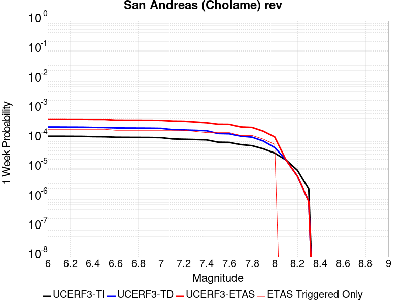 | 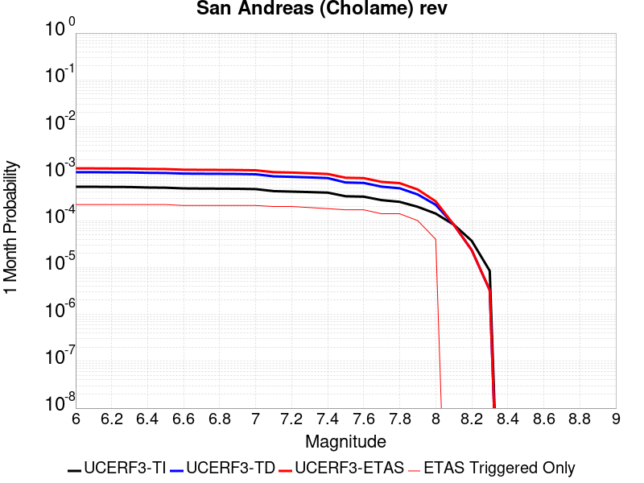 | 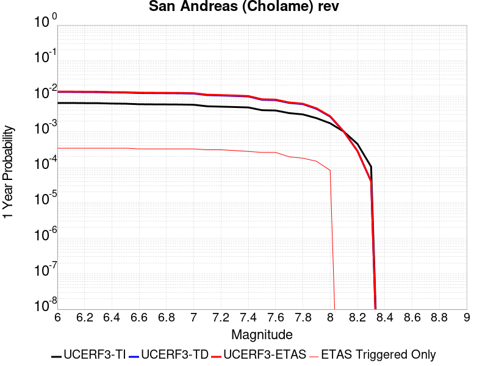 | 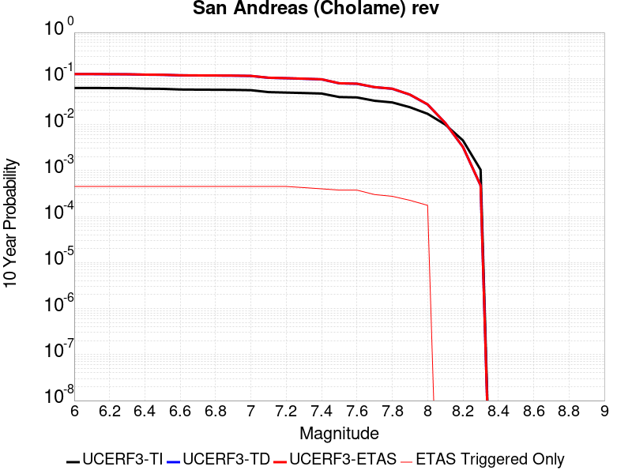 |

| Magnitude | 1 wk TI Prob | 1 wk TD Prob | 1 wk ETAS Prob | 1 wk ETAS/TD Gain | 1 wk ETAS Triggered Only | 1 mo TI Prob | 1 mo TD Prob | 1 mo ETAS Prob | 1 mo ETAS/TD Gain | 1 mo ETAS Triggered Only | 1 yr TI Prob | 1 yr TD Prob | 1 yr ETAS Prob | 1 yr ETAS/TD Gain | 1 yr ETAS Triggered Only | 10 yr TI Prob | 10 yr TD Prob | 10 yr ETAS Prob | 10 yr ETAS/TD Gain | 10 yr ETAS Triggered Only |
|-----|-----|-----|-----|-----|-----|-----|-----|-----|-----|-----|-----|-----|-----|-----|-----|-----|-----|-----|-----|-----|
| 6.0 | 1.2302514E-4 | 2.5205986E-4 | 5.517445E-4 | 2.1889422 | 2.997602E-4 | 5.27144E-4 | 0.0010798109 | 0.0013792474 | 1.2773045 | 2.997602E-4 | 0.0063991086 | 0.013067958 | 0.013413108 | 1.0264119 | 3.497202E-4 | 0.06217949 | 0.12438412 | 0.12477783 | 1.0031652 | 4.496403E-4 |
| 6.1 | 1.2302514E-4 | 2.5205986E-4 | 5.517445E-4 | 2.1889422 | 2.997602E-4 | 5.27144E-4 | 0.0010798109 | 0.0013792474 | 1.2773045 | 2.997602E-4 | 0.0063991086 | 0.013067958 | 0.013413108 | 1.0264119 | 3.497202E-4 | 0.06217949 | 0.12438412 | 0.12477783 | 1.0031652 | 4.496403E-4 |
| 6.2 | 1.2203569E-4 | 2.502277E-4 | 5.4991286E-4 | 2.19765 | 2.997602E-4 | 5.2290526E-4 | 0.0010719653 | 0.0013714042 | 1.2793363 | 2.997602E-4 | 0.006347804 | 0.012973578 | 0.013318761 | 1.0266067 | 3.497202E-4 | 0.061695136 | 0.123571314 | 0.12396539 | 1.0031891 | 4.496403E-4 |
| 6.3 | 1.2142645E-4 | 2.4908737E-4 | 5.487729E-4 | 2.203134 | 2.997602E-4 | 5.202953E-4 | 0.0010670823 | 0.0013665225 | 1.2806159 | 2.997602E-4 | 0.006316212 | 0.012914834 | 0.013260037 | 1.0267292 | 3.497202E-4 | 0.06139677 | 0.12306532 | 0.12345962 | 1.003204 | 4.496403E-4 |
| 6.4 | 1.1865206E-4 | 2.4414246E-4 | 5.4382946E-4 | 2.2275088 | 2.997602E-4 | 5.0840975E-4 | 0.0010459068 | 0.0013453536 | 1.2863034 | 2.997602E-4 | 0.006172335 | 0.012660044 | 0.013005337 | 1.0272743 | 3.497202E-4 | 0.060036868 | 0.12085904 | 0.12125434 | 1.0032707 | 4.496403E-4 |
| 6.5 | 1.17443946E-4 | 2.4207575E-4 | 5.417634E-4 | 2.237991 | 2.997602E-4 | 5.032341E-4 | 0.0010370566 | 0.0013365059 | 1.2887492 | 2.997602E-4 | 0.006109677 | 0.012553536 | 0.012898866 | 1.0275086 | 3.497202E-4 | 0.059444077 | 0.11993008 | 0.1203258 | 1.0032996 | 4.496403E-4 |
| 6.6 | 1.13579066E-4 | 2.3516564E-4 | 5.3485535E-4 | 2.274377 | 2.997602E-4 | 4.866766E-4 | 0.001007465 | 0.0013069231 | 1.2972393 | 2.997602E-4 | 0.0059092017 | 0.012197345 | 0.012542799 | 1.0283221 | 3.497202E-4 | 0.057545185 | 0.1168492 | 0.1172463 | 1.0033984 | 4.496403E-4 |
| 6.7 | 1.1271412E-4 | 2.336088E-4 | 5.3329894E-4 | 2.282872 | 2.997602E-4 | 4.829711E-4 | 0.001000798 | 0.0013002581 | 1.2992214 | 2.997602E-4 | 0.005864331 | 0.012117079 | 0.012462562 | 1.028512 | 3.497202E-4 | 0.057119697 | 0.11615275 | 0.11655016 | 1.0034214 | 4.496403E-4 |
| 6.8 | 1.1217975E-4 | 2.3249313E-4 | 5.321836E-4 | 2.2890296 | 2.997602E-4 | 4.8068175E-4 | 9.960202E-4 | 0.0012954818 | 1.3006582 | 2.997602E-4 | 0.005836608 | 0.012059555 | 0.012405057 | 1.0286497 | 3.497202E-4 | 0.056856725 | 0.11565061 | 0.11604825 | 1.0034382 | 4.496403E-4 |
| 6.9 | 1.1146753E-4 | 2.3098059E-4 | 5.3067156E-4 | 2.2974725 | 2.997602E-4 | 4.7763053E-4 | 9.895428E-4 | 0.0012890063 | 1.3026283 | 2.997602E-4 | 0.0057996577 | 0.011981564 | 0.012327094 | 1.0288385 | 3.497202E-4 | 0.056506127 | 0.11497027 | 0.11536821 | 1.0034612 | 4.496403E-4 |
| 7.0 | 1.0965793E-4 | 2.2721413E-4 | 5.269062E-4 | 2.3189852 | 2.997602E-4 | 4.698779E-4 | 9.734129E-4 | 0.0012728813 | 1.3076478 | 2.997602E-4 | 0.005705768 | 0.011787324 | 0.012132922 | 1.0293194 | 3.497202E-4 | 0.055614736 | 0.11327011 | 0.11366882 | 1.00352 | 4.496403E-4 |
| 7.1 | 9.927982E-5 | 2.0540332E-4 | 5.051019E-4 | 2.4590738 | 2.997602E-4 | 4.2541555E-4 | 8.8000396E-4 | 0.0011795004 | 1.3403352 | 2.997602E-4 | 0.0051671406 | 0.010661708 | 0.0110077 | 1.0324517 | 3.497202E-4 | 0.05048634 | 0.10336573 | 0.10376889 | 1.0039004 | 4.496403E-4 |
| 7.2 | 9.696786E-5 | 2.0044584E-4 | 5.0014595E-4 | 2.4951675 | 2.997602E-4 | 4.1551032E-4 | 8.587718E-4 | 0.0011582745 | 1.3487571 | 2.997602E-4 | 0.00504711 | 0.010405703 | 0.010751785 | 1.0332588 | 3.497202E-4 | 0.04934009 | 0.10110233 | 0.10150652 | 1.0039977 | 4.496403E-4 |
| 7.3 | 9.4727984E-5 | 1.9473763E-4 | 4.6946428E-4 | 2.4107528 | 2.7478018E-4 | 4.0591392E-4 | 8.343239E-4 | 0.0011088748 | 1.32907 | 2.7478018E-4 | 0.0049308087 | 0.010110851 | 0.010432308 | 1.0317932 | 3.2474022E-4 | 0.048228268 | 0.09847412 | 0.09885696 | 1.0038878 | 4.2466028E-4 |
| 7.4 | 9.220358E-5 | 1.8844259E-4 | 4.3819568E-4 | 2.3253539 | 2.4980016E-4 | 3.9509835E-4 | 8.07362E-4 | 0.0010569606 | 1.3091531 | 2.4980016E-4 | 0.004799717 | 0.009785578 | 0.010082404 | 1.030333 | 2.997602E-4 | 0.046973653 | 0.09555831 | 0.095919795 | 1.0037829 | 3.9968026E-4 |
| 7.5 | 7.71631E-5 | 1.5179155E-4 | 4.0155379E-4 | 2.6454291 | 2.4980016E-4 | 3.306571E-4 | 6.5037323E-4 | 9.000109E-4 | 1.3838376 | 2.4980016E-4 | 0.0040183207 | 0.007889617 | 0.008162229 | 1.0345533 | 2.7478018E-4 | 0.03946433 | 0.078289196 | 0.07863456 | 1.0044115 | 3.7470023E-4 |
| 7.6 | 7.5634416E-5 | 1.4838556E-4 | 3.9814867E-4 | 2.6832035 | 2.4980016E-4 | 3.241072E-4 | 6.357833E-4 | 8.854246E-4 | 1.3926517 | 2.4980016E-4 | 0.0039388672 | 0.007713256 | 0.007985917 | 1.0353496 | 2.7478018E-4 | 0.038697794 | 0.076654874 | 0.07700086 | 1.0045135 | 3.7470023E-4 |
| 7.7 | 6.3783E-5 | 1.2359623E-4 | 3.2341166E-4 | 2.616679 | 1.9984013E-4 | 2.7332708E-4 | 5.2959064E-4 | 7.2932494E-4 | 1.3771485 | 1.9984013E-4 | 0.0033226798 | 0.0064287307 | 0.006652105 | 1.0347463 | 2.2482015E-4 | 0.032734364 | 0.06454488 | 0.06482529 | 1.0043445 | 2.997602E-4 |
| 7.8 | 5.863422E-5 | 1.14169685E-4 | 3.13987E-4 | 2.7501783 | 1.9984013E-4 | 2.512653E-4 | 4.892069E-4 | 6.889493E-4 | 1.4082983 | 1.9984013E-4 | 0.003054864 | 0.0059398497 | 0.0061633345 | 1.0376246 | 2.2482015E-4 | 0.030132094 | 0.05966162 | 0.059920006 | 1.0043309 | 2.7478018E-4 |
| 7.9 | 4.595283E-5 | 8.426815E-5 | 2.3413562E-4 | 2.778459 | 1.498801E-4 | 1.9692584E-4 | 3.6109926E-4 | 5.109252E-4 | 1.4149163 | 1.498801E-4 | 0.0023949358 | 0.0043875277 | 0.0045616203 | 1.039679 | 1.748601E-4 | 0.023692891 | 0.044363137 | 0.044577986 | 1.0048429 | 2.2482015E-4 |
| 8.0 | 3.2950178E-5 | 5.077396E-5 | 1.5068895E-4 | 2.9678392 | 9.9920064E-5 | 1.412074E-4 | 2.1758456E-4 | 3.174829E-4 | 1.4591242 | 9.9920064E-5 | 0.0017178444 | 0.0026458753 | 0.002770445 | 1.0470806 | 1.2490008E-4 | 0.017046256 | 0.027181072 | 0.02735118 | 1.0062582 | 1.748601E-4 |
| 8.1 | 1.9177472E-5 | 1.9183733E-5 | 1.9183733E-5 | 1.0 | 0.0 | 8.218658E-5 | 8.221342E-5 | 8.221342E-5 | 1.0 | 0.0 | 0.0010001622 | 0.0010004893 | 0.0010004893 | 1.0 | 0.0 | 0.009956728 | 0.010757887 | 0.010757887 | 1.0 | 0.0 |
| 8.2 | 8.643924E-6 | 5.473668E-6 | 5.473668E-6 | 1.0 | 0.0 | 3.704486E-5 | 2.3458366E-5 | 2.3458366E-5 | 1.0 | 0.0 | 4.5092785E-4 | 2.8556827E-4 | 2.8556827E-4 | 1.0 | 0.0 | 0.0045001395 | 0.0032481793 | 0.0032481793 | 1.0 | 0.0 |
| 8.3 | 1.983087E-6 | 7.6564595E-7 | 7.6564595E-7 | 1.0 | 0.0 | 8.498917E-6 | 3.281336E-6 | 3.281336E-6 | 1.0 | 0.0 | 1.034694E-4 | 3.9949547E-5 | 3.9949547E-5 | 1.0 | 0.0 | 0.0010342124 | 4.717979E-4 | 4.717979E-4 | 1.0 | 0.0 |

## San Andreas (Coachella) rev
*[(top)](#table-of-contents)*

| 1 Week | 1 Month | 1 Year | 10 Year |
|-----|-----|-----|-----|
| 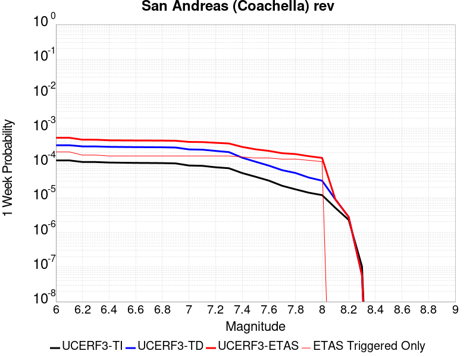 | 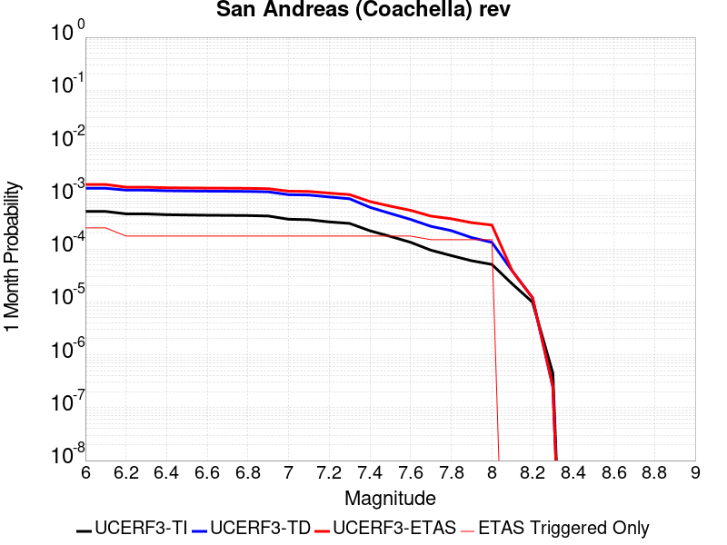 | 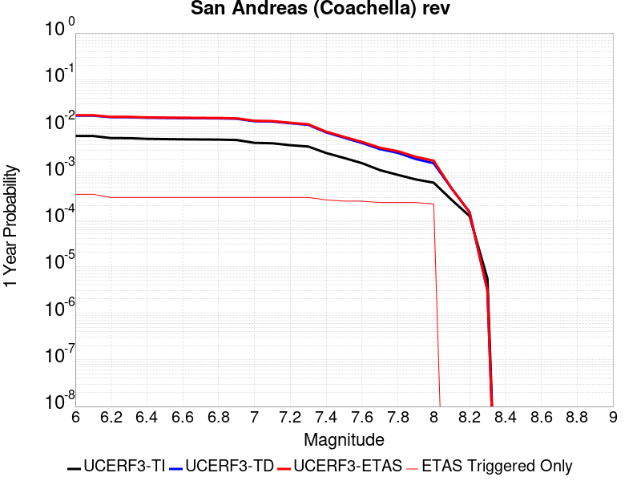 | 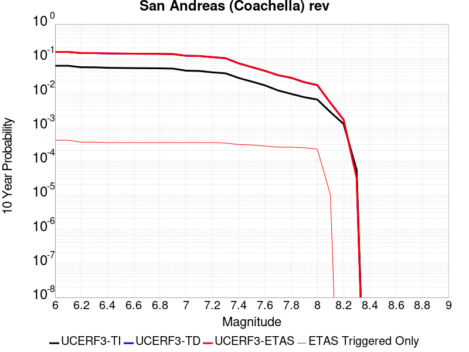 |

| Magnitude | 1 wk TI Prob | 1 wk TD Prob | 1 wk ETAS Prob | 1 wk ETAS/TD Gain | 1 wk ETAS Triggered Only | 1 mo TI Prob | 1 mo TD Prob | 1 mo ETAS Prob | 1 mo ETAS/TD Gain | 1 mo ETAS Triggered Only | 1 yr TI Prob | 1 yr TD Prob | 1 yr ETAS Prob | 1 yr ETAS/TD Gain | 1 yr ETAS Triggered Only | 10 yr TI Prob | 10 yr TD Prob | 10 yr ETAS Prob | 10 yr ETAS/TD Gain | 10 yr ETAS Triggered Only |
|-----|-----|-----|-----|-----|-----|-----|-----|-----|-----|-----|-----|-----|-----|-----|-----|-----|-----|-----|-----|-----|
| 6.0 | 1.1925945E-4 | 3.273077E-4 | 5.270824E-4 | 1.6103575 | 1.9984013E-4 | 5.110118E-4 | 0.001401998 | 0.0016514478 | 1.1779246 | 2.4980016E-4 | 0.0062038354 | 0.016937068 | 0.017256306 | 1.0188487 | 3.2474022E-4 | 0.060334753 | 0.15267672 | 0.15301538 | 1.0022181 | 3.9968026E-4 |
| 6.1 | 1.1925945E-4 | 3.273077E-4 | 5.270824E-4 | 1.6103575 | 1.9984013E-4 | 5.110118E-4 | 0.001401998 | 0.0016514478 | 1.1779246 | 2.4980016E-4 | 0.0062038354 | 0.016937068 | 0.017256306 | 1.0188487 | 3.2474022E-4 | 0.060334753 | 0.15267672 | 0.15301538 | 1.0022181 | 3.9968026E-4 |
| 6.2 | 1.07432395E-4 | 3.0231563E-4 | 4.2717793E-4 | 1.4130198 | 1.2490008E-4 | 4.603433E-4 | 0.001294999 | 0.0014696327 | 1.1348524 | 1.748601E-4 | 0.005590286 | 0.015653731 | 0.015899621 | 1.0157081 | 2.4980016E-4 | 0.05451731 | 0.14182784 | 0.14210652 | 1.0019649 | 3.2474022E-4 |
| 6.3 | 1.0718766E-4 | 3.0176868E-4 | 4.2663107E-4 | 1.4137685 | 1.2490008E-4 | 4.592948E-4 | 0.0012926573 | 0.0014672914 | 1.1350969 | 1.748601E-4 | 0.005577586 | 0.01562563 | 0.015871527 | 1.0157368 | 2.4980016E-4 | 0.054396555 | 0.14159605 | 0.14187482 | 1.0019687 | 3.2474022E-4 |
| 6.4 | 1.0355944E-4 | 2.9384956E-4 | 4.1871294E-4 | 1.4249228 | 1.2490008E-4 | 4.4375064E-4 | 0.0012587514 | 0.0014333914 | 1.1387407 | 1.748601E-4 | 0.0053892885 | 0.015218662 | 0.015464661 | 1.0161643 | 2.4980016E-4 | 0.052604496 | 0.13815795 | 0.13843782 | 1.0020257 | 3.2474022E-4 |
| 6.5 | 1.0227914E-4 | 2.9104383E-4 | 4.159076E-4 | 1.4290203 | 1.2490008E-4 | 4.382655E-4 | 0.0012467385 | 0.0014213806 | 1.1400791 | 1.748601E-4 | 0.0053228354 | 0.015074439 | 0.015320473 | 1.0163213 | 2.4980016E-4 | 0.051971316 | 0.13694239 | 0.13722265 | 1.0020466 | 3.2474022E-4 |
| 6.6 | 1.0116757E-4 | 2.8870135E-4 | 4.1356537E-4 | 1.4325024 | 1.2490008E-4 | 4.3350324E-4 | 0.0012367087 | 0.0014113525 | 1.1412166 | 1.748601E-4 | 0.0052651367 | 0.014954008 | 0.015200073 | 1.0164548 | 2.4980016E-4 | 0.051421247 | 0.13591973 | 0.13620034 | 1.0020645 | 3.2474022E-4 |
| 6.7 | 1.0050676E-4 | 2.8728697E-4 | 4.1215116E-4 | 1.4346323 | 1.2490008E-4 | 4.3067214E-4 | 0.0012306528 | 0.0014052978 | 1.1419125 | 1.748601E-4 | 0.005230834 | 0.014881288 | 0.015127371 | 1.0165364 | 2.4980016E-4 | 0.051094085 | 0.13530464 | 0.13558546 | 1.0020753 | 3.2474022E-4 |
| 6.8 | 9.976819E-5 | 2.8532353E-4 | 4.1018796E-4 | 1.4376241 | 1.2490008E-4 | 4.2750788E-4 | 0.001222246 | 0.0013968924 | 1.1428897 | 1.748601E-4 | 0.0051924936 | 0.014780328 | 0.015026436 | 1.016651 | 2.4980016E-4 | 0.050728295 | 0.13445628 | 0.13473736 | 1.0020905 | 3.2474022E-4 |
| 6.9 | 9.77719E-5 | 2.802926E-4 | 4.0515765E-4 | 1.4454812 | 1.2490008E-4 | 4.1895514E-4 | 0.0012007048 | 0.001375355 | 1.1454563 | 1.748601E-4 | 0.0050888555 | 0.0145215895 | 0.014767762 | 1.0169522 | 2.4980016E-4 | 0.049738888 | 0.13228476 | 0.13256654 | 1.0021302 | 3.2474022E-4 |
| 7.0 | 8.500761E-5 | 2.4763815E-4 | 3.725073E-4 | 1.5042404 | 1.2490008E-4 | 3.6426744E-4 | 0.0010608779 | 0.0012355525 | 1.164651 | 1.748601E-4 | 0.0044259406 | 0.01284047 | 0.013087063 | 1.0192044 | 2.4980016E-4 | 0.04338823 | 0.11813616 | 0.11842253 | 1.0024241 | 3.2474022E-4 |
| 7.1 | 8.319876E-5 | 2.4366553E-4 | 3.6853517E-4 | 1.5124633 | 1.2490008E-4 | 3.5651738E-4 | 0.0010438662 | 0.0012185437 | 1.1673372 | 1.748601E-4 | 0.004331963 | 0.012635773 | 0.012882417 | 1.0195194 | 2.4980016E-4 | 0.042484846 | 0.11635632 | 0.11664327 | 1.0024662 | 3.2474022E-4 |
| 7.2 | 7.563917E-5 | 2.2414974E-4 | 3.4902184E-4 | 1.5570922 | 1.2490008E-4 | 3.2412758E-4 | 9.602912E-4 | 0.0011349834 | 1.1819159 | 1.748601E-4 | 0.0039391145 | 0.011629559 | 0.011876455 | 1.02123 | 2.4980016E-4 | 0.03870018 | 0.10776202 | 0.10805176 | 1.0026888 | 3.2474022E-4 |
| 7.3 | 7.082985E-5 | 2.07311E-4 | 3.3218518E-4 | 1.602352 | 1.2490008E-4 | 3.0352117E-4 | 8.881761E-4 | 0.0010628809 | 1.1967007 | 1.748601E-4 | 0.0036891096 | 0.010760553 | 0.011007666 | 1.0229646 | 2.4980016E-4 | 0.03628465 | 0.10028403 | 0.10057621 | 1.0029135 | 3.2474022E-4 |
| 7.4 | 5.146215E-5 | 1.4274761E-4 | 2.6762986E-4 | 1.8748466 | 1.2490008E-4 | 2.2053342E-4 | 6.1163295E-4 | 7.863861E-4 | 1.2857157 | 1.748601E-4 | 0.0026816884 | 0.0074213943 | 0.0076693404 | 1.0334097 | 2.4980016E-4 | 0.02649557 | 0.07085049 | 0.071152225 | 1.0042588 | 3.2474022E-4 |
| 7.5 | 4.0285166E-5 | 1.0942422E-4 | 2.3431063E-4 | 2.141305 | 1.2490008E-4 | 1.7263928E-4 | 4.6887697E-4 | 6.436551E-4 | 1.372759 | 1.748601E-4 | 0.002099857 | 0.0056937044 | 0.0059420825 | 1.0436232 | 2.4980016E-4 | 0.020801254 | 0.055013083 | 0.055319957 | 1.0055783 | 3.2474022E-4 |
| 7.6 | 3.1168736E-5 | 8.439599E-5 | 2.0928553E-4 | 2.479804 | 1.2490008E-4 | 1.3357346E-4 | 3.616471E-4 | 5.3644396E-4 | 1.4833355 | 1.748601E-4 | 0.0016250437 | 0.004394191 | 0.004642893 | 1.0565981 | 2.4980016E-4 | 0.016132116 | 0.042812478 | 0.043123312 | 1.0072604 | 3.2474022E-4 |
| 7.7 | 2.2100989E-5 | 6.239345E-5 | 1.8728574E-4 | 3.001689 | 1.2490008E-4 | 9.4715084E-5 | 2.6737314E-4 | 4.1721316E-4 | 1.5604154 | 1.498801E-4 | 0.001152546 | 0.0032504152 | 0.0034745045 | 1.0689418 | 2.2482015E-4 | 0.011465867 | 0.031902168 | 0.032192368 | 1.0090965 | 2.997602E-4 |
| 7.8 | 1.7484861E-5 | 5.180078E-5 | 1.7669439E-4 | 3.4110372 | 1.2490008E-4 | 7.493296E-5 | 2.2198448E-4 | 3.718313E-4 | 1.6750329 | 1.498801E-4 | 9.1192697E-4 | 0.0026993142 | 0.0029235275 | 1.083063 | 2.2482015E-4 | 0.009081938 | 0.026641788 | 0.026933562 | 1.0109518 | 2.997602E-4 |
| 7.9 | 1.3967285E-5 | 3.8226146E-5 | 1.6312145E-4 | 4.2672744 | 1.2490008E-4 | 5.985842E-5 | 1.6381606E-4 | 3.136716E-4 | 1.9147793 | 1.498801E-4 | 7.2853256E-4 | 0.0019926373 | 0.0022170094 | 1.1126006 | 2.2482015E-4 | 0.0072614877 | 0.019911002 | 0.020204796 | 1.0147552 | 2.997602E-4 |
| 8.0 | 1.1887396E-5 | 3.106798E-5 | 1.5596418E-4 | 5.020094 | 1.2490008E-4 | 5.094499E-5 | 1.331417E-4 | 2.8300183E-4 | 2.1255689 | 1.498801E-4 | 6.200787E-4 | 0.0016197958 | 0.0018442519 | 1.1385705 | 2.2482015E-4 | 0.006183513 | 0.016280567 | 0.016575446 | 1.0181124 | 2.997602E-4 |
| 8.1 | 5.100864E-6 | 8.973766E-6 | 8.973766E-6 | 1.0 | 0.0 | 2.1860664E-5 | 3.845843E-5 | 3.845843E-5 | 1.0 | 0.0 | 2.6612106E-4 | 4.6813092E-4 | 4.6813092E-4 | 1.0 | 0.0 | 0.002658026 | 0.004918092 | 0.004942949 | 1.0050542 | 2.4980016E-5 |
| 8.2 | 2.3004484E-6 | 2.7863473E-6 | 2.7863473E-6 | 1.0 | 0.0 | 9.859027E-6 | 1.19414335E-5 | 1.19414335E-5 | 1.0 | 0.0 | 1.2002704E-4 | 1.4537729E-4 | 1.4537729E-4 | 1.0 | 0.0 | 0.0011996223 | 0.0015973782 | 0.0015973782 | 1.0 | 0.0 |
| 8.3 | 1.0424446E-7 | 5.814421E-8 | 5.814421E-8 | 1.0 | 0.0 | 4.4676187E-7 | 2.4918944E-7 | 2.4918944E-7 | 1.0 | 0.0 | 5.439312E-6 | 3.0338776E-6 | 3.0338776E-6 | 1.0 | 0.0 | 5.4391792E-5 | 3.189592E-5 | 3.189592E-5 | 1.0 | 0.0 |

## Red Pass
*[(top)](#table-of-contents)*

| 1 Week | 1 Month | 1 Year | 10 Year |
|-----|-----|-----|-----|
| 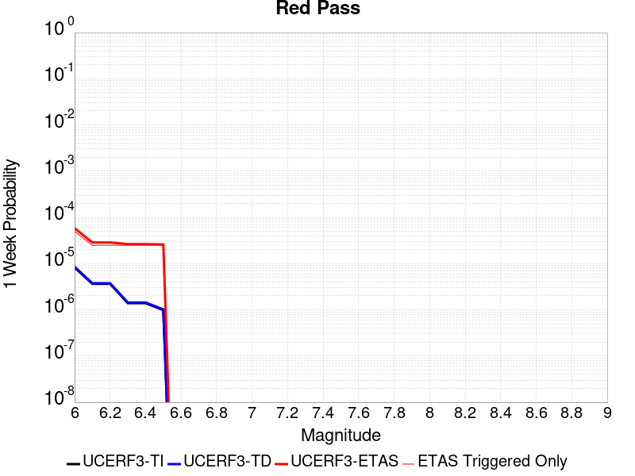 | 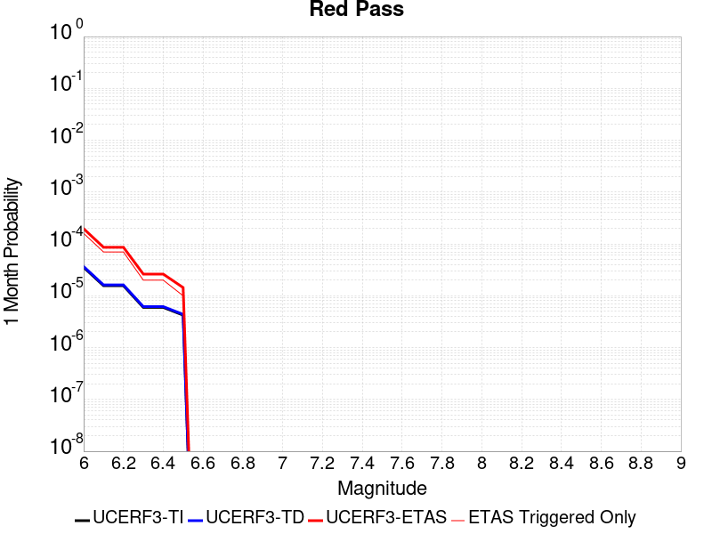 | 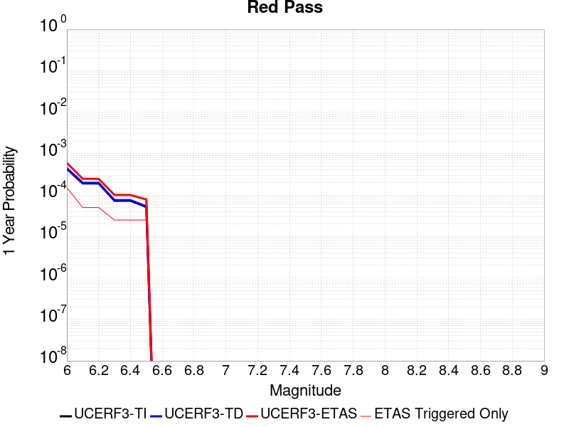 | 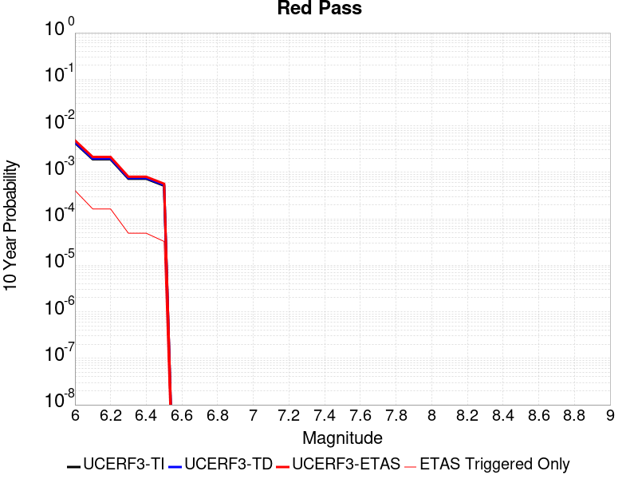 |

| Magnitude | 1 wk TI Prob | 1 wk TD Prob | 1 wk ETAS Prob | 1 wk ETAS/TD Gain | 1 wk ETAS Triggered Only | 1 mo TI Prob | 1 mo TD Prob | 1 mo ETAS Prob | 1 mo ETAS/TD Gain | 1 mo ETAS Triggered Only | 1 yr TI Prob | 1 yr TD Prob | 1 yr ETAS Prob | 1 yr ETAS/TD Gain | 1 yr ETAS Triggered Only | 10 yr TI Prob | 10 yr TD Prob | 10 yr ETAS Prob | 10 yr ETAS/TD Gain | 10 yr ETAS Triggered Only |
|-----|-----|-----|-----|-----|-----|-----|-----|-----|-----|-----|-----|-----|-----|-----|-----|-----|-----|-----|-----|-----|
| 6.0 | 8.258278E-6 | 8.551265E-6 | 5.851087E-5 | 6.8423643 | 4.9960032E-5 | 3.539214E-5 | 3.6647863E-5 | 1.6154337E-4 | 4.4079885 | 1.2490008E-4 | 4.308141E-4 | 4.4611428E-4 | 5.9592753E-4 | 1.335818 | 1.498801E-4 | 0.0042997985 | 0.004453945 | 0.004826976 | 1.083753 | 3.7470023E-4 |
| 6.1 | 3.649988E-6 | 3.7753161E-6 | 2.8755238E-5 | 7.616644 | 2.4980016E-5 | 1.5642712E-5 | 1.6179853E-5 | 6.613907E-5 | 4.087743 | 4.9960032E-5 | 1.9043336E-4 | 1.9697666E-4 | 2.4692685E-4 | 1.2535843 | 4.9960032E-5 | 0.0019027026 | 0.001968488 | 0.0021180732 | 1.0759898 | 1.498801E-4 |
| 6.2 | 3.649988E-6 | 3.7753161E-6 | 2.8755238E-5 | 7.616644 | 2.4980016E-5 | 1.5642712E-5 | 1.6179853E-5 | 6.613907E-5 | 4.087743 | 4.9960032E-5 | 1.9043336E-4 | 1.9697666E-4 | 2.4692685E-4 | 1.2535843 | 4.9960032E-5 | 0.0019027026 | 0.001968488 | 0.0021180732 | 1.0759898 | 1.498801E-4 |
| 6.3 | 1.3924937E-6 | 1.4411166E-6 | 2.6421096E-5 | 18.333767 | 2.4980016E-5 | 5.9678164E-6 | 6.1762075E-6 | 3.115607E-5 | 5.044531 | 2.4980016E-5 | 7.265574E-5 | 7.519415E-5 | 1.00172285E-4 | 1.3321819 | 2.4980016E-5 | 7.263199E-4 | 7.518258E-4 | 8.0174825E-4 | 1.0664016 | 4.9960032E-5 |
| 6.4 | 1.3924937E-6 | 1.4411166E-6 | 2.6421096E-5 | 18.333767 | 2.4980016E-5 | 5.9678164E-6 | 6.1762075E-6 | 3.115607E-5 | 5.044531 | 2.4980016E-5 | 7.265574E-5 | 7.519415E-5 | 1.00172285E-4 | 1.3321819 | 2.4980016E-5 | 7.263199E-4 | 7.518258E-4 | 8.0174825E-4 | 1.0664016 | 4.9960032E-5 |
| 6.5 | 9.876812E-7 | 1.0221912E-6 | 2.6002182E-5 | 25.437689 | 2.4980016E-5 | 4.2329125E-6 | 4.3808195E-6 | 2.9360726E-5 | 6.7021084 | 2.4980016E-5 | 5.153449E-5 | 5.3336476E-5 | 7.831516E-5 | 1.4683228 | 2.4980016E-5 | 5.1522546E-4 | 5.333648E-4 | 5.8329816E-4 | 1.0936196 | 4.9960032E-5 |

## White Wolf (Extension)
*[(top)](#table-of-contents)*

| 1 Week | 1 Month | 1 Year | 10 Year |
|-----|-----|-----|-----|
| 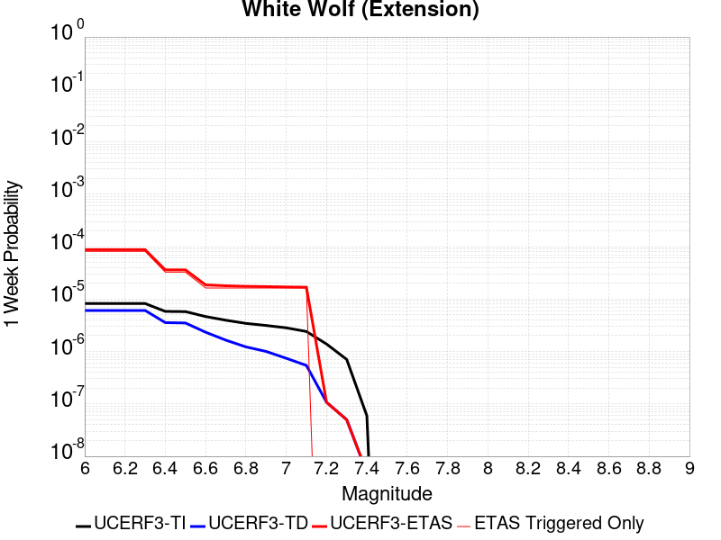 | 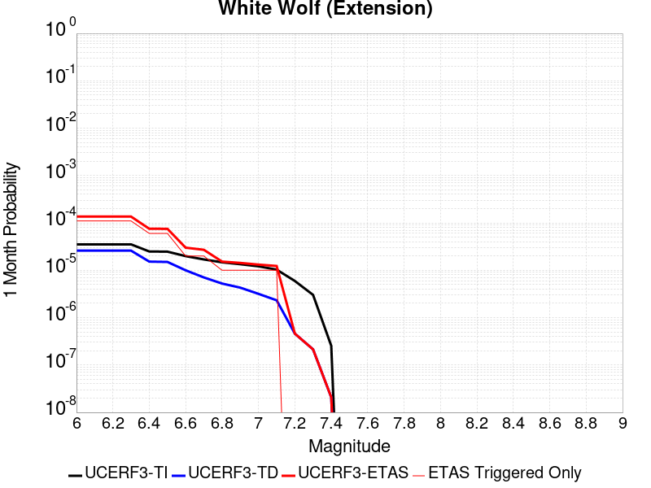 | 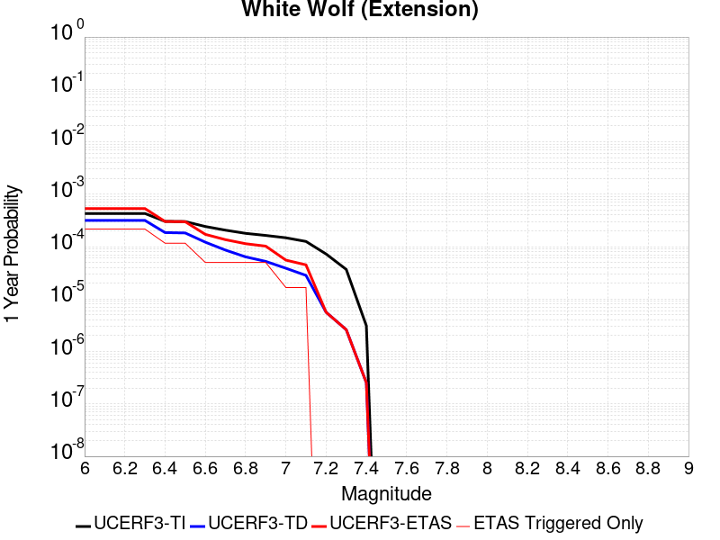 | 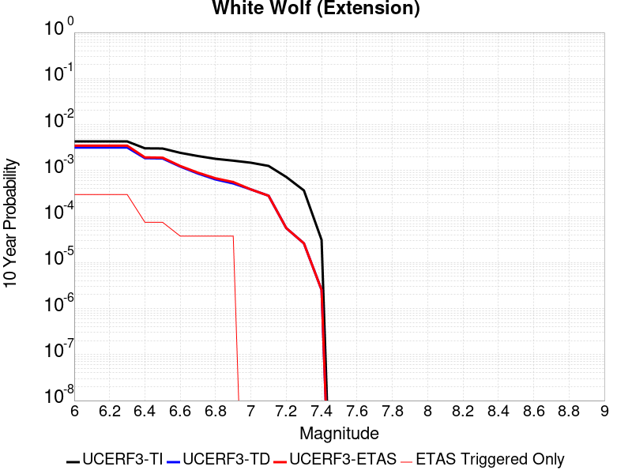 |

| Magnitude | 1 wk TI Prob | 1 wk TD Prob | 1 wk ETAS Prob | 1 wk ETAS/TD Gain | 1 wk ETAS Triggered Only | 1 mo TI Prob | 1 mo TD Prob | 1 mo ETAS Prob | 1 mo ETAS/TD Gain | 1 mo ETAS Triggered Only | 1 yr TI Prob | 1 yr TD Prob | 1 yr ETAS Prob | 1 yr ETAS/TD Gain | 1 yr ETAS Triggered Only | 10 yr TI Prob | 10 yr TD Prob | 10 yr ETAS Prob | 10 yr ETAS/TD Gain | 10 yr ETAS Triggered Only |
|-----|-----|-----|-----|-----|-----|-----|-----|-----|-----|-----|-----|-----|-----|-----|-----|-----|-----|-----|-----|-----|
| 6.0 | 8.222555E-6 | 6.066615E-6 | 1.3096594E-4 | 21.587976 | 1.2490008E-4 | 3.5239045E-5 | 2.5999556E-5 | 1.7587576E-4 | 6.7645674 | 1.498801E-4 | 4.289509E-4 | 3.1650523E-4 | 5.9119845E-4 | 1.8678946 | 2.7478018E-4 | 0.0042812387 | 0.0031611966 | 0.0035098114 | 1.1102793 | 3.497202E-4 |
| 6.1 | 8.222555E-6 | 6.066615E-6 | 1.3096594E-4 | 21.587976 | 1.2490008E-4 | 3.5239045E-5 | 2.5999556E-5 | 1.7587576E-4 | 6.7645674 | 1.498801E-4 | 4.289509E-4 | 3.1650523E-4 | 5.9119845E-4 | 1.8678946 | 2.7478018E-4 | 0.0042812387 | 0.0031611966 | 0.0035098114 | 1.1102793 | 3.497202E-4 |
| 6.2 | 8.222555E-6 | 6.066615E-6 | 1.3096594E-4 | 21.587976 | 1.2490008E-4 | 3.5239045E-5 | 2.5999556E-5 | 1.7587576E-4 | 6.7645674 | 1.498801E-4 | 4.289509E-4 | 3.1650523E-4 | 5.9119845E-4 | 1.8678946 | 2.7478018E-4 | 0.0042812387 | 0.0031611966 | 0.0035098114 | 1.1102793 | 3.497202E-4 |
| 6.3 | 8.222555E-6 | 6.066615E-6 | 1.3096594E-4 | 21.587976 | 1.2490008E-4 | 3.5239045E-5 | 2.5999556E-5 | 1.7587576E-4 | 6.7645674 | 1.498801E-4 | 4.289509E-4 | 3.1650523E-4 | 5.9119845E-4 | 1.8678946 | 2.7478018E-4 | 0.0042812387 | 0.0031611966 | 0.0035098114 | 1.1102793 | 3.497202E-4 |
| 6.4 | 5.821773E-6 | 3.5571256E-6 | 5.351698E-5 | 15.045007 | 4.9960032E-5 | 2.4950215E-5 | 1.5244741E-5 | 9.018365E-5 | 5.915722 | 7.494005E-5 | 3.0372653E-4 | 1.8559002E-4 | 3.354423E-4 | 1.8074372 | 1.498801E-4 | 0.0030331176 | 0.0018544586 | 0.0020289945 | 1.0941169 | 1.748601E-4 |
| 6.5 | 5.766023E-6 | 3.4990599E-6 | 5.3458916E-5 | 15.27808 | 4.9960032E-5 | 2.4711293E-5 | 1.49958905E-5 | 8.9934816E-5 | 5.9972973 | 7.494005E-5 | 3.0081844E-4 | 1.8256076E-4 | 3.324135E-4 | 1.8208375 | 1.498801E-4 | 0.0030041158 | 0.0018242161 | 0.0019987572 | 1.0956801 | 1.748601E-4 |
| 6.6 | 4.643576E-6 | 2.3325733E-6 | 2.7312532E-5 | 11.709185 | 2.4980016E-5 | 1.9900888E-5 | 9.9967065E-6 | 3.4976474E-5 | 3.4987996 | 2.4980016E-5 | 2.4226638E-4 | 1.2170354E-4 | 1.7165749E-4 | 1.4104561 | 4.9960032E-5 | 0.0024200242 | 0.0012164112 | 0.0012912601 | 1.0615325 | 7.494005E-5 |
| 6.7 | 3.9529173E-6 | 1.6482975E-6 | 2.6628273E-5 | 16.155016 | 2.4980016E-5 | 1.6940963E-5 | 7.064114E-6 | 3.2043954E-5 | 4.5361605 | 2.4980016E-5 | 2.0623671E-4 | 8.600239E-5 | 1.3595812E-4 | 1.5808645 | 4.9960032E-5 | 0.002060454 | 8.597095E-4 | 9.096266E-4 | 1.0580627 | 4.9960032E-5 |
| 6.8 | 3.4377522E-6 | 1.2244764E-6 | 2.6204461E-5 | 21.400545 | 2.4980016E-5 | 1.473314E-5 | 5.247746E-6 | 3.0227631E-5 | 5.760117 | 2.4980016E-5 | 1.7936122E-4 | 6.388952E-5 | 1.1384636E-4 | 1.7819254 | 4.9960032E-5 | 0.0017921652 | 6.3872064E-4 | 6.886488E-4 | 1.078169 | 4.9960032E-5 |
| 6.9 | 3.1367306E-6 | 1.0033316E-6 | 2.5983323E-5 | 25.897045 | 2.4980016E-5 | 1.3443062E-5 | 4.299986E-6 | 2.9279894E-5 | 6.8093004 | 2.4980016E-5 | 1.63657E-4 | 5.2351144E-5 | 1.02308564E-4 | 1.9542755 | 4.9960032E-5 | 0.0016353652 | 5.233958E-4 | 5.733296E-4 | 1.0954037 | 4.9960032E-5 |
| 7.0 | 2.8298145E-6 | 7.4282326E-7 | 2.572282E-5 | 34.628452 | 2.4980016E-5 | 1.2127721E-5 | 3.1835248E-6 | 2.8163462E-5 | 8.846629 | 2.4980016E-5 | 1.47645E-4 | 3.8758775E-5 | 6.3737825E-5 | 1.6444746 | 2.4980016E-5 | 0.0014754693 | 3.8752513E-4 | 4.124955E-4 | 1.0644354 | 2.4980016E-5 |
| 7.1 | 2.4091064E-6 | 5.4223835E-7 | 2.552224E-5 | 47.068306 | 2.4980016E-5 | 1.03247E-5 | 2.3238767E-6 | 2.7303835E-5 | 11.749261 | 2.4980016E-5 | 1.2569598E-4 | 2.8292874E-5 | 5.3272182E-5 | 1.8828834 | 2.4980016E-5 | 0.001256249 | 2.8289677E-4 | 3.0786972E-4 | 1.0882758 | 2.4980016E-5 |
| 7.2 | 1.3875518E-6 | 1.0740268E-7 | 1.0740268E-7 | 1.0 | 0.0 | 5.9466374E-6 | 4.6029712E-7 | 4.6029712E-7 | 1.0 | 0.0 | 7.23979E-5 | 5.604104E-6 | 5.604104E-6 | 1.0 | 0.0 | 7.2374323E-4 | 5.6039742E-5 | 5.6039742E-5 | 1.0 | 0.0 |
| 7.3 | 7.056077E-7 | 5.0002956E-8 | 5.0002956E-8 | 1.0 | 0.0 | 3.0240296E-6 | 2.1429837E-7 | 2.1429837E-7 | 1.0 | 0.0 | 3.681694E-5 | 2.60908E-6 | 2.60908E-6 | 1.0 | 0.0 | 3.681084E-4 | 2.609054E-5 | 2.609054E-5 | 1.0 | 0.0 |
| 7.4 | 5.9334678E-8 | 4.8638475E-9 | 4.8638475E-9 | 1.0 | 0.0 | 2.5429145E-7 | 2.084506E-8 | 2.084506E-8 | 1.0 | 0.0 | 3.095994E-6 | 2.5378858E-7 | 2.5378858E-7 | 1.0 | 0.0 | 3.095951E-5 | 2.5378843E-6 | 2.5378843E-6 | 1.0 | 0.0 |

## Ludlow
*[(top)](#table-of-contents)*

| 1 Week | 1 Month | 1 Year | 10 Year |
|-----|-----|-----|-----|
| 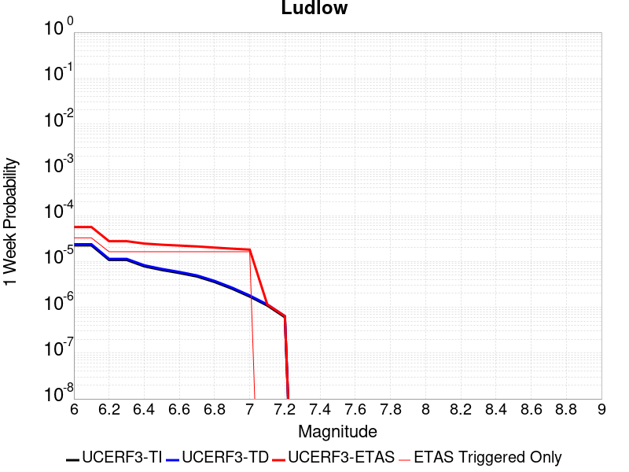 | 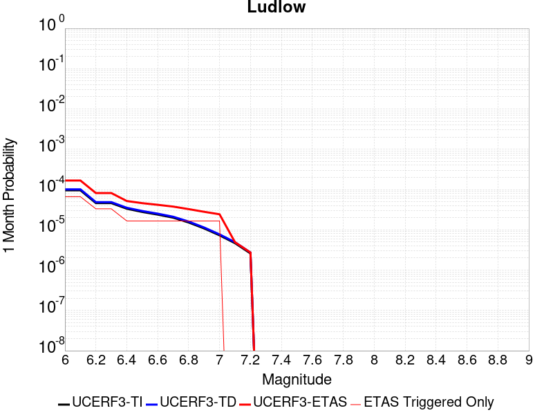 | 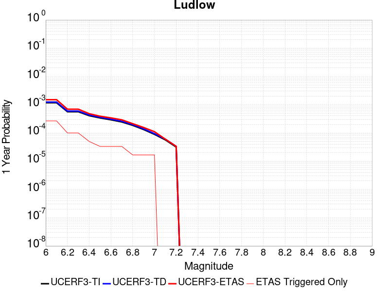 |  |

| Magnitude | 1 wk TI Prob | 1 wk TD Prob | 1 wk ETAS Prob | 1 wk ETAS/TD Gain | 1 wk ETAS Triggered Only | 1 mo TI Prob | 1 mo TD Prob | 1 mo ETAS Prob | 1 mo ETAS/TD Gain | 1 mo ETAS Triggered Only | 1 yr TI Prob | 1 yr TD Prob | 1 yr ETAS Prob | 1 yr ETAS/TD Gain | 1 yr ETAS Triggered Only | 10 yr TI Prob | 10 yr TD Prob | 10 yr ETAS Prob | 10 yr ETAS/TD Gain | 10 yr ETAS Triggered Only |
|-----|-----|-----|-----|-----|-----|-----|-----|-----|-----|-----|-----|-----|-----|-----|-----|-----|-----|-----|-----|-----|
| 6.0 | 2.2407607E-5 | 2.3657254E-5 | 7.36161E-5 | 3.1117773 | 4.9960032E-5 | 9.602906E-5 | 1.0138454E-4 | 1.5133951E-4 | 1.4927276 | 4.9960032E-5 | 0.0011685267 | 0.001233702 | 0.0015081431 | 1.2224534 | 2.7478018E-4 | 0.011624013 | 0.012273042 | 0.01261847 | 1.0281453 | 3.497202E-4 |
| 6.1 | 2.2407607E-5 | 2.3657254E-5 | 7.36161E-5 | 3.1117773 | 4.9960032E-5 | 9.602906E-5 | 1.0138454E-4 | 1.5133951E-4 | 1.4927276 | 4.9960032E-5 | 0.0011685267 | 0.001233702 | 0.0015081431 | 1.2224534 | 2.7478018E-4 | 0.011624013 | 0.012273042 | 0.01261847 | 1.0281453 | 3.497202E-4 |
| 6.2 | 1.0781252E-5 | 1.1365663E-5 | 3.6345395E-5 | 3.1978242 | 2.4980016E-5 | 4.620455E-5 | 4.8709102E-5 | 7.36879E-5 | 1.5128158 | 2.4980016E-5 | 5.623952E-4 | 5.9287593E-4 | 6.9273676E-4 | 1.1684346 | 9.9920064E-5 | 0.00560974 | 0.0059133614 | 0.006062355 | 1.0251961 | 1.498801E-4 |
| 6.3 | 1.0781252E-5 | 1.1365663E-5 | 3.6345395E-5 | 3.1978242 | 2.4980016E-5 | 4.620455E-5 | 4.8709102E-5 | 7.36879E-5 | 1.5128158 | 2.4980016E-5 | 5.623952E-4 | 5.9287593E-4 | 6.9273676E-4 | 1.1684346 | 9.9920064E-5 | 0.00560974 | 0.0059133614 | 0.006062355 | 1.0251961 | 1.498801E-4 |
| 6.4 | 7.814439E-6 | 8.237729E-6 | 3.321754E-5 | 4.0323663 | 2.4980016E-5 | 3.3490025E-5 | 3.530408E-5 | 6.0283215E-5 | 1.7075424 | 2.4980016E-5 | 4.0766477E-4 | 4.2974384E-4 | 4.7968238E-4 | 1.1162055 | 4.9960032E-5 | 0.0040691774 | 0.0042892746 | 0.004388766 | 1.0231954 | 9.9920064E-5 |
| 6.5 | 6.4986366E-6 | 6.85092E-6 | 3.1830765E-5 | 4.646203 | 2.4980016E-5 | 2.7851002E-5 | 2.9360759E-5 | 5.4340042E-5 | 1.8507711 | 2.4980016E-5 | 3.390332E-4 | 3.5740953E-4 | 4.073517E-4 | 1.1397338 | 4.9960032E-5 | 0.003385164 | 0.0035684432 | 0.0036680067 | 1.027901 | 9.9920064E-5 |
| 6.6 | 5.582177E-6 | 5.8860055E-6 | 3.0865875E-5 | 5.2439423 | 2.4980016E-5 | 2.3923398E-5 | 2.5225498E-5 | 5.0204882E-5 | 1.9902436 | 2.4980016E-5 | 2.9122844E-4 | 3.0707786E-4 | 3.5702257E-4 | 1.162645 | 4.9960032E-5 | 0.0029084706 | 0.003066609 | 0.0031662225 | 1.0324833 | 9.9920064E-5 |
| 6.7 | 4.6858763E-6 | 4.940427E-6 | 2.992032E-5 | 6.056221 | 2.4980016E-5 | 2.0082172E-5 | 2.1173091E-5 | 4.6152578E-5 | 2.1797752 | 2.4980016E-5 | 2.4447302E-4 | 2.5775246E-4 | 3.076996E-4 | 1.1937796 | 4.9960032E-5 | 0.0024420423 | 0.0025745912 | 0.0026493385 | 1.0290326 | 7.494005E-5 |
| 6.8 | 3.5584908E-6 | 3.7520183E-6 | 2.873194E-5 | 7.657729 | 2.4980016E-5 | 1.5250586E-5 | 1.6079981E-5 | 4.1059597E-5 | 2.5534604 | 2.4980016E-5 | 1.8566006E-4 | 1.957566E-4 | 2.2073173E-4 | 1.1275826 | 2.4980016E-5 | 0.0018550502 | 0.0019558826 | 0.002005745 | 1.0254935 | 4.9960032E-5 |
| 6.9 | 2.532834E-6 | 2.6710034E-6 | 2.7650953E-5 | 10.352271 | 2.4980016E-5 | 1.0854958E-5 | 1.1447109E-5 | 3.6426838E-5 | 3.1821868 | 2.4980016E-5 | 1.3215111E-4 | 1.3935992E-4 | 1.6433645E-4 | 1.1792232 | 2.4980016E-5 | 0.0013207254 | 0.0013927529 | 0.0014426433 | 1.0358214 | 4.9960032E-5 |
| 7.0 | 1.7083285E-6 | 1.8019439E-6 | 2.6781914E-5 | 14.862791 | 2.4980016E-5 | 7.3213873E-6 | 7.722595E-6 | 3.2702417E-5 | 4.234641 | 2.4980016E-5 | 8.913424E-5 | 9.40187E-5 | 1.18996366E-4 | 1.265667 | 2.4980016E-5 | 8.9098496E-4 | 9.3980576E-4 | 9.897188E-4 | 1.05311 | 4.9960032E-5 |
| 7.1 | 1.0905424E-6 | 1.1497619E-6 | 1.1497619E-6 | 1.0 | 0.0 | 4.6737446E-6 | 4.9275427E-6 | 4.9275427E-6 | 1.0 | 0.0 | 5.6901354E-5 | 5.999128E-5 | 5.999128E-5 | 1.0 | 0.0 | 5.6886784E-4 | 5.997606E-4 | 6.2472565E-4 | 1.041625 | 2.4980016E-5 |
| 7.2 | 6.06668E-7 | 6.387277E-7 | 6.387277E-7 | 1.0 | 0.0 | 2.600003E-6 | 2.7374022E-6 | 2.7374022E-6 | 1.0 | 0.0 | 3.1654577E-5 | 3.3327433E-5 | 3.3327433E-5 | 1.0 | 0.0 | 3.1650066E-4 | 3.3323118E-4 | 3.3323118E-4 | 1.0 | 0.0 |

## San Jacinto (San Bernardino)
*[(top)](#table-of-contents)*

| 1 Week | 1 Month | 1 Year | 10 Year |
|-----|-----|-----|-----|
|  | 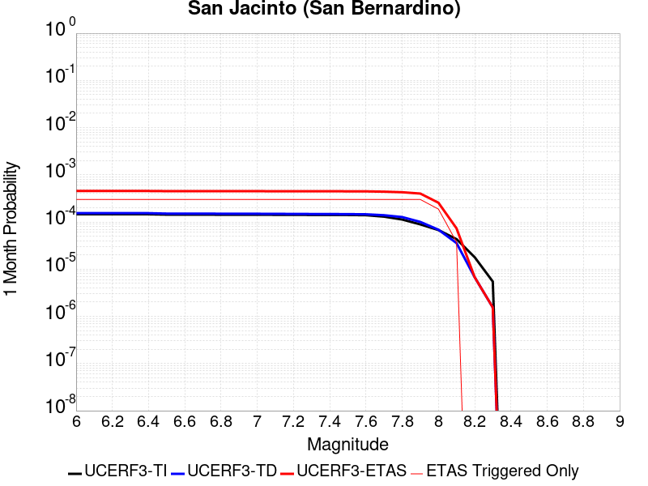 | 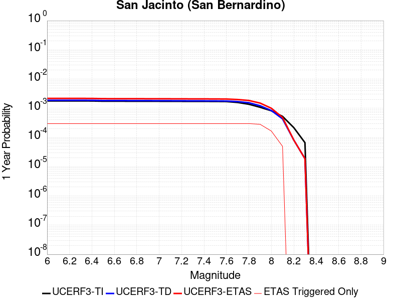 | 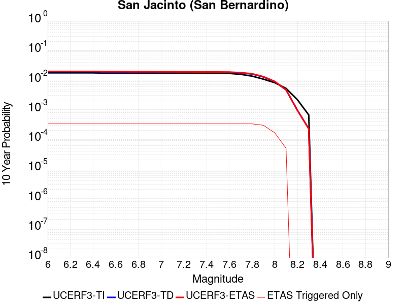 |

| Magnitude | 1 wk TI Prob | 1 wk TD Prob | 1 wk ETAS Prob | 1 wk ETAS/TD Gain | 1 wk ETAS Triggered Only | 1 mo TI Prob | 1 mo TD Prob | 1 mo ETAS Prob | 1 mo ETAS/TD Gain | 1 mo ETAS Triggered Only | 1 yr TI Prob | 1 yr TD Prob | 1 yr ETAS Prob | 1 yr ETAS/TD Gain | 1 yr ETAS Triggered Only | 10 yr TI Prob | 10 yr TD Prob | 10 yr ETAS Prob | 10 yr ETAS/TD Gain | 10 yr ETAS Triggered Only |
|-----|-----|-----|-----|-----|-----|-----|-----|-----|-----|-----|-----|-----|-----|-----|-----|-----|-----|-----|-----|-----|
| 6.0 | 3.409352E-5 | 3.598562E-5 | 2.6079768E-4 | 7.247275 | 2.2482015E-4 | 1.461069E-4 | 1.5421498E-4 | 4.0397662E-4 | 2.6195679 | 2.4980016E-4 | 0.0017774 | 0.0018759521 | 0.002200083 | 1.1727822 | 3.2474022E-4 | 0.01763251 | 0.019349992 | 0.019668449 | 1.0164577 | 3.2474022E-4 |
| 6.1 | 3.409352E-5 | 3.598562E-5 | 2.6079768E-4 | 7.247275 | 2.2482015E-4 | 1.461069E-4 | 1.5421498E-4 | 4.0397662E-4 | 2.6195679 | 2.4980016E-4 | 0.0017774 | 0.0018759521 | 0.002200083 | 1.1727822 | 3.2474022E-4 | 0.01763251 | 0.019349992 | 0.019668449 | 1.0164577 | 3.2474022E-4 |
| 6.2 | 3.409352E-5 | 3.598562E-5 | 2.6079768E-4 | 7.247275 | 2.2482015E-4 | 1.461069E-4 | 1.5421498E-4 | 4.0397662E-4 | 2.6195679 | 2.4980016E-4 | 0.0017774 | 0.0018759521 | 0.002200083 | 1.1727822 | 3.2474022E-4 | 0.01763251 | 0.019349992 | 0.019668449 | 1.0164577 | 3.2474022E-4 |
| 6.3 | 3.409352E-5 | 3.598562E-5 | 2.6079768E-4 | 7.247275 | 2.2482015E-4 | 1.461069E-4 | 1.5421498E-4 | 4.0397662E-4 | 2.6195679 | 2.4980016E-4 | 0.0017774 | 0.0018759521 | 0.002200083 | 1.1727822 | 3.2474022E-4 | 0.01763251 | 0.019349992 | 0.019668449 | 1.0164577 | 3.2474022E-4 |
| 6.4 | 3.400795E-5 | 3.5878285E-5 | 2.6069037E-4 | 7.265965 | 2.2482015E-4 | 1.4574021E-4 | 1.5375503E-4 | 4.0351678E-4 | 2.6244135 | 2.4980016E-4 | 0.0017729428 | 0.0018703619 | 0.0021944947 | 1.1732996 | 3.2474022E-4 | 0.017588645 | 0.019295074 | 0.01961355 | 1.0165055 | 3.2474022E-4 |
| 6.5 | 3.341482E-5 | 3.5138914E-5 | 2.5995116E-4 | 7.3978143 | 2.2482015E-4 | 1.4319851E-4 | 1.5058667E-4 | 4.003492E-4 | 2.6585968 | 2.4980016E-4 | 0.0017420477 | 0.0018318522 | 0.0021559976 | 1.1769495 | 3.2474022E-4 | 0.017284546 | 0.018916616 | 0.019235212 | 1.0168422 | 3.2474022E-4 |
| 6.6 | 3.3364955E-5 | 3.5076133E-5 | 2.598884E-4 | 7.409266 | 2.2482015E-4 | 1.4298483E-4 | 1.5031763E-4 | 4.0008023E-4 | 2.6615655 | 2.4980016E-4 | 0.0017394501 | 0.0018285823 | 0.0021527286 | 1.1772665 | 3.2474022E-4 | 0.017258976 | 0.01888448 | 0.019203087 | 1.0168715 | 3.2474022E-4 |
| 6.7 | 3.335922E-5 | 3.5065907E-5 | 2.5987817E-4 | 7.4111347 | 2.2482015E-4 | 1.4296026E-4 | 1.5027382E-4 | 4.0003643E-4 | 2.6620502 | 2.4980016E-4 | 0.0017391514 | 0.0018280497 | 0.0021521964 | 1.1773182 | 3.2474022E-4 | 0.017256035 | 0.018879272 | 0.019197881 | 1.0168761 | 3.2474022E-4 |
| 6.8 | 3.327683E-5 | 3.4959972E-5 | 2.5977226E-4 | 7.4305625 | 2.2482015E-4 | 1.4260718E-4 | 1.4981985E-4 | 3.9958258E-4 | 2.667087 | 2.4980016E-4 | 0.0017348597 | 0.001822532 | 0.0021466804 | 1.1778561 | 3.2474022E-4 | 0.017213784 | 0.018825045 | 0.01914367 | 1.0169257 | 3.2474022E-4 |
| 6.9 | 3.3235785E-5 | 3.4900928E-5 | 2.597132E-4 | 7.441442 | 2.2482015E-4 | 1.4243131E-4 | 1.4956683E-4 | 3.9932964E-4 | 2.6699076 | 2.4980016E-4 | 0.0017327217 | 0.0018194567 | 0.002143606 | 1.1781572 | 3.2474022E-4 | 0.017192734 | 0.018794911 | 0.019113548 | 1.0169533 | 3.2474022E-4 |
| 7.0 | 3.3197095E-5 | 3.4840854E-5 | 2.5965317E-4 | 7.4525485 | 2.2482015E-4 | 1.422655E-4 | 1.4930942E-4 | 3.9907228E-4 | 2.6727872 | 2.4980016E-4 | 0.0017307063 | 0.0018163278 | 0.0021404782 | 1.1784647 | 3.2474022E-4 | 0.017172894 | 0.01876429 | 0.019082936 | 1.0169816 | 3.2474022E-4 |
| 7.1 | 3.3129716E-5 | 3.4721066E-5 | 2.595334E-4 | 7.474811 | 2.2482015E-4 | 1.4197677E-4 | 1.4879608E-4 | 3.985591E-4 | 2.6785588 | 2.4980016E-4 | 0.0017271966 | 0.0018100884 | 0.002134241 | 1.179081 | 3.2474022E-4 | 0.017138338 | 0.018703366 | 0.019022033 | 1.0170379 | 3.2474022E-4 |
| 7.2 | 3.3034008E-5 | 3.4588513E-5 | 2.5940087E-4 | 7.499625 | 2.2482015E-4 | 1.4156665E-4 | 1.4822806E-4 | 3.9799119E-4 | 2.6849923 | 2.4980016E-4 | 0.0017222111 | 0.0018031843 | 0.002127339 | 1.1797678 | 3.2474022E-4 | 0.017089253 | 0.01863575 | 0.01895444 | 1.0171009 | 3.2474022E-4 |
| 7.3 | 3.2956614E-5 | 3.4456265E-5 | 2.5926865E-4 | 7.5245724 | 2.2482015E-4 | 1.4123498E-4 | 1.4766137E-4 | 3.9742465E-4 | 2.69146 | 2.4980016E-4 | 0.0017181796 | 0.0017962961 | 0.002120453 | 1.1804585 | 3.2474022E-4 | 0.017049557 | 0.018568495 | 0.018887207 | 1.017164 | 3.2474022E-4 |
| 7.4 | 3.2915937E-5 | 3.4377957E-5 | 2.5919036E-4 | 7.5394344 | 2.2482015E-4 | 1.4106068E-4 | 1.473258E-4 | 3.9708914E-4 | 2.6953132 | 2.4980016E-4 | 0.0017160608 | 0.0017922173 | 0.0021163756 | 1.1808699 | 3.2474022E-4 | 0.017028693 | 0.018528769 | 0.018847492 | 1.0172015 | 3.2474022E-4 |
| 7.5 | 3.281791E-5 | 3.424287E-5 | 2.5905532E-4 | 7.5652337 | 2.2482015E-4 | 1.406406E-4 | 1.4674691E-4 | 3.965104E-4 | 2.7020018 | 2.4980016E-4 | 0.0017109542 | 0.0017851809 | 0.0021093413 | 1.1815841 | 3.2474022E-4 | 0.016978411 | 0.018459652 | 0.018778399 | 1.0172671 | 3.2474022E-4 |
| 7.6 | 3.2521442E-5 | 3.396782E-5 | 2.5878032E-4 | 7.6183968 | 2.2482015E-4 | 1.3937015E-4 | 1.4556825E-4 | 3.9533206E-4 | 2.7157848 | 2.4980016E-4 | 0.0016955109 | 0.0017708542 | 0.0020950194 | 1.1830558 | 3.2474022E-4 | 0.016826328 | 0.018317295 | 0.018636087 | 1.0174038 | 3.2474022E-4 |
| 7.7 | 3.0287873E-5 | 3.245191E-5 | 2.5726476E-4 | 7.927569 | 2.2482015E-4 | 1.297987E-4 | 1.3907222E-4 | 3.8883762E-4 | 2.7959404 | 2.4980016E-4 | 0.0015791537 | 0.0016918903 | 0.002016081 | 1.1916145 | 3.2474022E-4 | 0.01567979 | 0.017528199 | 0.017847247 | 1.018202 | 3.2474022E-4 |
| 7.8 | 2.6316151E-5 | 2.9662837E-5 | 2.544763E-4 | 8.57896 | 2.2482015E-4 | 1.1277862E-4 | 1.2712025E-4 | 3.7688867E-4 | 2.96482 | 2.4980016E-4 | 0.0013722149 | 0.0015465913 | 0.0018708293 | 1.2096468 | 3.2474022E-4 | 0.013637724 | 0.016069878 | 0.0163894 | 1.0198833 | 3.2474022E-4 |
| 7.9 | 2.0761147E-5 | 2.3417291E-5 | 2.4823216E-4 | 10.600379 | 2.2482015E-4 | 8.897331E-5 | 1.0035596E-4 | 3.5013104E-4 | 3.4888914 | 2.4980016E-4 | 0.0010827117 | 0.0012211498 | 0.0015205439 | 1.2451739 | 2.997602E-4 | 0.010774517 | 0.012793272 | 0.013089197 | 1.0231314 | 2.997602E-4 |
| 8.0 | 1.5738568E-5 | 1.6032505E-5 | 1.659102E-4 | 10.348364 | 1.498801E-4 | 6.744926E-5 | 6.8708934E-5 | 2.1857873E-4 | 3.1812272 | 1.498801E-4 | 8.2088535E-4 | 8.3621085E-4 | 0.0010109248 | 1.2089353 | 1.748601E-4 | 0.008178596 | 0.008865741 | 0.009039051 | 1.0195483 | 1.748601E-4 |
| 8.1 | 1.0105832E-5 | 8.329479E-6 | 3.3309287E-5 | 3.998964 | 2.4980016E-5 | 4.3309992E-5 | 3.569728E-5 | 6.0676404E-5 | 1.6997486 | 2.4980016E-5 | 5.2717153E-4 | 4.3452822E-4 | 4.8446655E-4 | 1.1149254 | 4.9960032E-5 | 0.005259227 | 0.0046768794 | 0.0047266055 | 1.0106324 | 4.9960032E-5 |
| 8.2 | 4.189207E-6 | 1.577699E-6 | 1.577699E-6 | 1.0 | 0.0 | 1.7953622E-5 | 6.7615497E-6 | 6.7615497E-6 | 1.0 | 0.0 | 2.1856341E-4 | 8.231879E-5 | 8.231879E-5 | 1.0 | 0.0 | 0.0021834858 | 9.562628E-4 | 9.562628E-4 | 1.0 | 0.0 |
| 8.3 | 1.2758221E-6 | 3.612677E-7 | 3.612677E-7 | 1.0 | 0.0 | 5.4677976E-6 | 1.5482892E-6 | 1.5482892E-6 | 1.0 | 0.0 | 6.65684E-5 | 1.8850264E-5 | 1.8850264E-5 | 1.0 | 0.0 | 6.6548464E-4 | 2.2739546E-4 | 2.2739546E-4 | 1.0 | 0.0 |

## Scodie Lineament
*[(top)](#table-of-contents)*

| 1 Week | 1 Month | 1 Year | 10 Year |
|-----|-----|-----|-----|
| 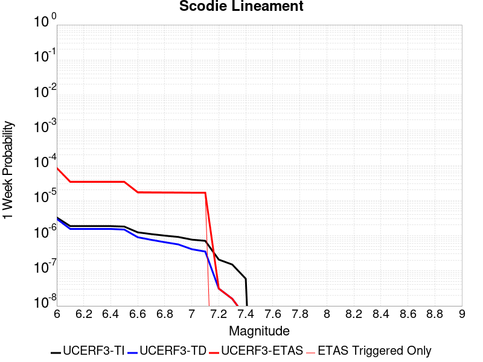 | 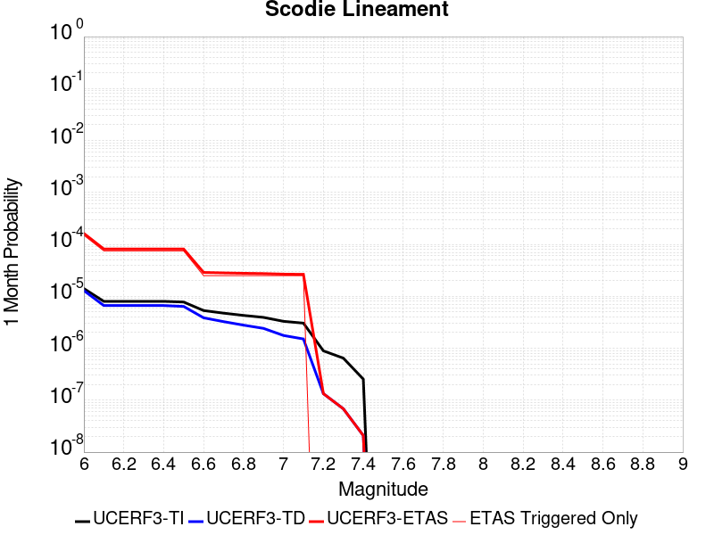 | 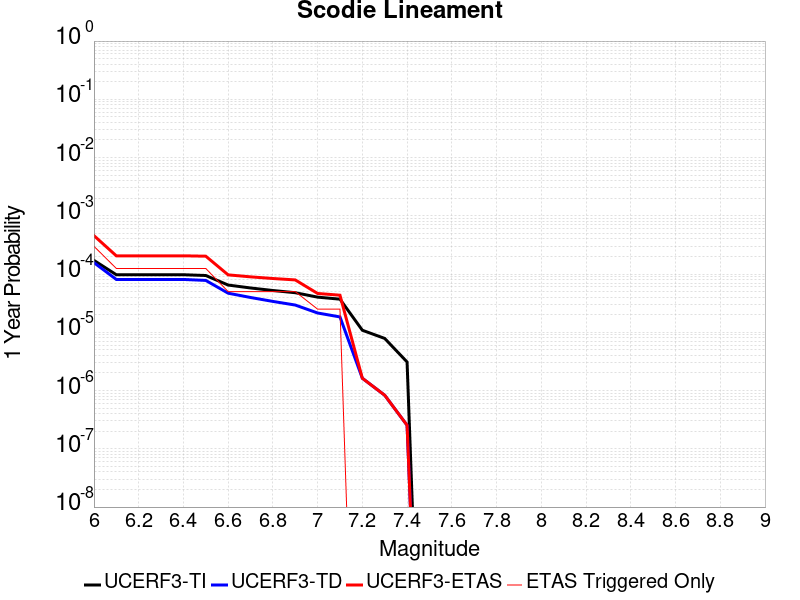 | 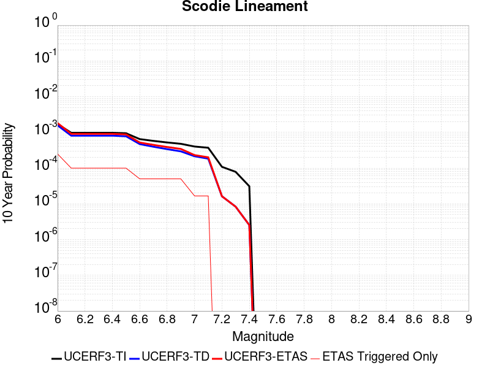 |

| Magnitude | 1 wk TI Prob | 1 wk TD Prob | 1 wk ETAS Prob | 1 wk ETAS/TD Gain | 1 wk ETAS Triggered Only | 1 mo TI Prob | 1 mo TD Prob | 1 mo ETAS Prob | 1 mo ETAS/TD Gain | 1 mo ETAS Triggered Only | 1 yr TI Prob | 1 yr TD Prob | 1 yr ETAS Prob | 1 yr ETAS/TD Gain | 1 yr ETAS Triggered Only | 10 yr TI Prob | 10 yr TD Prob | 10 yr ETAS Prob | 10 yr ETAS/TD Gain | 10 yr ETAS Triggered Only |
|-----|-----|-----|-----|-----|-----|-----|-----|-----|-----|-----|-----|-----|-----|-----|-----|-----|-----|-----|-----|-----|
| 6.0 | 3.2919327E-6 | 3.0133303E-6 | 1.02933096E-4 | 34.159245 | 9.9920064E-5 | 1.4108206E-5 | 1.2914227E-5 | 1.6279239E-4 | 12.605662 | 1.498801E-4 | 1.7175387E-4 | 1.5722254E-4 | 4.569356E-4 | 2.9062982 | 2.997602E-4 | 0.0017162118 | 0.0015714248 | 0.0018956547 | 1.2063286 | 3.2474022E-4 |
| 6.1 | 1.8663811E-6 | 1.5490382E-6 | 5.1508992E-5 | 33.252243 | 4.9960032E-5 | 7.998751E-6 | 6.6387206E-6 | 8.157827E-5 | 12.288252 | 7.494005E-5 | 9.738045E-5 | 8.082393E-5 | 2.057139E-4 | 2.5452106 | 1.2490008E-4 | 9.7337784E-4 | 8.079941E-4 | 9.3279325E-4 | 1.1544555 | 1.2490008E-4 |
| 6.2 | 1.8663811E-6 | 1.5490382E-6 | 5.1508992E-5 | 33.252243 | 4.9960032E-5 | 7.998751E-6 | 6.6387206E-6 | 8.157827E-5 | 12.288252 | 7.494005E-5 | 9.738045E-5 | 8.082393E-5 | 2.057139E-4 | 2.5452106 | 1.2490008E-4 | 9.7337784E-4 | 8.079941E-4 | 9.3279325E-4 | 1.1544555 | 1.2490008E-4 |
| 6.3 | 1.8663811E-6 | 1.5490382E-6 | 5.1508992E-5 | 33.252243 | 4.9960032E-5 | 7.998751E-6 | 6.6387206E-6 | 8.157827E-5 | 12.288252 | 7.494005E-5 | 9.738045E-5 | 8.082393E-5 | 2.057139E-4 | 2.5452106 | 1.2490008E-4 | 9.7337784E-4 | 8.079941E-4 | 9.3279325E-4 | 1.1544555 | 1.2490008E-4 |
| 6.4 | 1.8663811E-6 | 1.5490382E-6 | 5.1508992E-5 | 33.252243 | 4.9960032E-5 | 7.998751E-6 | 6.6387206E-6 | 8.157827E-5 | 12.288252 | 7.494005E-5 | 9.738045E-5 | 8.082393E-5 | 2.057139E-4 | 2.5452106 | 1.2490008E-4 | 9.7337784E-4 | 8.079941E-4 | 9.3279325E-4 | 1.1544555 | 1.2490008E-4 |
| 6.5 | 1.8106311E-6 | 1.4909722E-6 | 5.145093E-5 | 34.50831 | 4.9960032E-5 | 7.759824E-6 | 6.389868E-6 | 8.132944E-5 | 12.727875 | 7.494005E-5 | 9.447177E-5 | 7.779436E-5 | 2.0268472E-4 | 2.605391 | 1.2490008E-4 | 9.4431615E-4 | 7.7771995E-4 | 9.025229E-4 | 1.1604729 | 1.2490008E-4 |
| 6.6 | 1.2414679E-6 | 8.9974395E-7 | 2.5879737E-5 | 28.763447 | 2.4980016E-5 | 5.320566E-6 | 3.85604E-6 | 2.883596E-5 | 7.478127 | 2.4980016E-5 | 6.477596E-5 | 4.6946367E-5 | 9.6904056E-5 | 2.064144 | 4.9960032E-5 | 6.475708E-4 | 4.6937316E-4 | 5.193097E-4 | 1.1063899 | 4.9960032E-5 |
| 6.7 | 1.1062215E-6 | 7.594193E-7 | 2.5739417E-5 | 33.89355 | 2.4980016E-5 | 4.7409408E-6 | 3.2546504E-6 | 2.8234585E-5 | 8.675151 | 2.4980016E-5 | 5.7719422E-5 | 3.962472E-5 | 8.9582776E-5 | 2.2607799 | 4.9960032E-5 | 5.770443E-4 | 3.9618355E-4 | 4.4612377E-4 | 1.1260533 | 4.9960032E-5 |
| 6.8 | 1.0006736E-6 | 6.5002786E-7 | 2.5630028E-5 | 39.42912 | 2.4980016E-5 | 4.288594E-6 | 2.7858312E-6 | 2.7765778E-5 | 9.9667845 | 2.4980016E-5 | 5.221238E-5 | 3.391703E-5 | 8.387536E-5 | 2.4729574 | 4.9960032E-5 | 5.220012E-4 | 3.3912458E-4 | 3.890677E-4 | 1.1472707 | 4.9960032E-5 |
| 6.9 | 9.167364E-7 | 5.6315065E-7 | 2.5543153E-5 | 45.357582 | 2.4980016E-5 | 3.9288643E-6 | 2.413501E-6 | 2.7393457E-5 | 11.350091 | 2.4980016E-5 | 4.7832873E-5 | 2.9384037E-5 | 7.93426E-5 | 2.7001941 | 4.9960032E-5 | 4.782258E-4 | 2.9380718E-4 | 3.4375253E-4 | 1.1699936 | 4.9960032E-5 |
| 7.0 | 7.6987664E-7 | 4.113265E-7 | 2.5391333E-5 | 61.73036 | 2.4980016E-5 | 3.2994672E-6 | 1.7628269E-6 | 2.6742799E-5 | 15.170405 | 2.4980016E-5 | 4.0170275E-5 | 2.1462245E-5 | 4.6441724E-5 | 2.16388 | 2.4980016E-5 | 4.0163012E-4 | 2.1460558E-4 | 2.3958024E-4 | 1.1163747 | 2.4980016E-5 |
| 7.1 | 7.1038727E-7 | 3.5210306E-7 | 2.533211E-5 | 71.94516 | 2.4980016E-5 | 3.0445133E-6 | 1.5090123E-6 | 2.6488991E-5 | 17.55386 | 2.4980016E-5 | 3.706632E-5 | 1.8372106E-5 | 4.3351665E-5 | 2.3596458 | 2.4980016E-5 | 3.7060137E-4 | 1.8370937E-4 | 2.086848E-4 | 1.1359508 | 2.4980016E-5 |
| 7.2 | 2.0799602E-7 | 3.1178534E-8 | 3.1178534E-8 | 1.0 | 0.0 | 8.914113E-7 | 1.3362228E-7 | 1.3362228E-7 | 1.0 | 0.0 | 1.0852878E-5 | 1.6268501E-6 | 1.6268501E-6 | 1.0 | 0.0 | 1.08523476E-4 | 1.626839E-5 | 1.626839E-5 | 1.0 | 0.0 |
| 7.3 | 1.5048182E-7 | 1.5939106E-8 | 1.5939106E-8 | 1.0 | 0.0 | 6.449219E-7 | 6.8310456E-8 | 6.8310456E-8 | 1.0 | 0.0 | 7.851896E-6 | 8.316795E-7 | 8.316795E-7 | 1.0 | 0.0 | 7.851618E-5 | 8.316767E-6 | 8.316767E-6 | 1.0 | 0.0 |
| 7.4 | 5.9334678E-8 | 4.8638475E-9 | 4.8638475E-9 | 1.0 | 0.0 | 2.5429145E-7 | 2.084506E-8 | 2.084506E-8 | 1.0 | 0.0 | 3.095994E-6 | 2.5378858E-7 | 2.5378858E-7 | 1.0 | 0.0 | 3.095951E-5 | 2.5378843E-6 | 2.5378843E-6 | 1.0 | 0.0 |

## Death Valley (Fish Lake Valley)
*[(top)](#table-of-contents)*

| 1 Week | 1 Month | 1 Year | 10 Year |
|-----|-----|-----|-----|
|  | 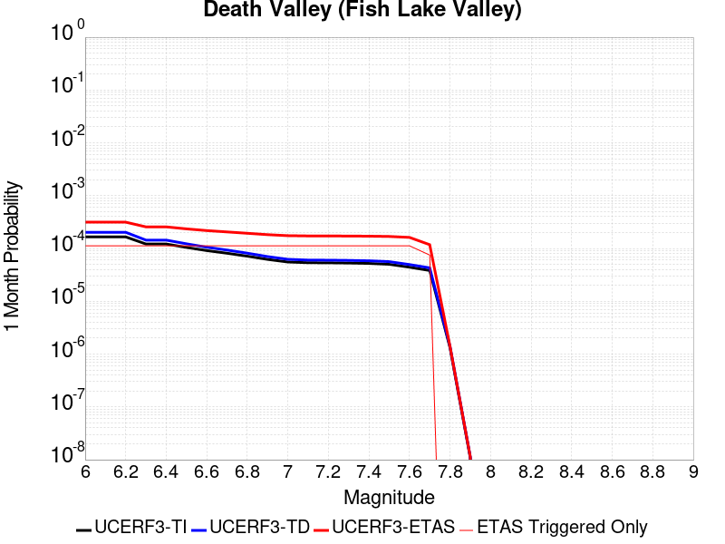 | 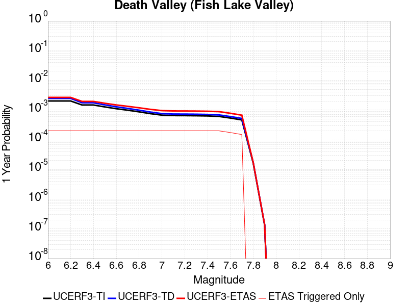 | 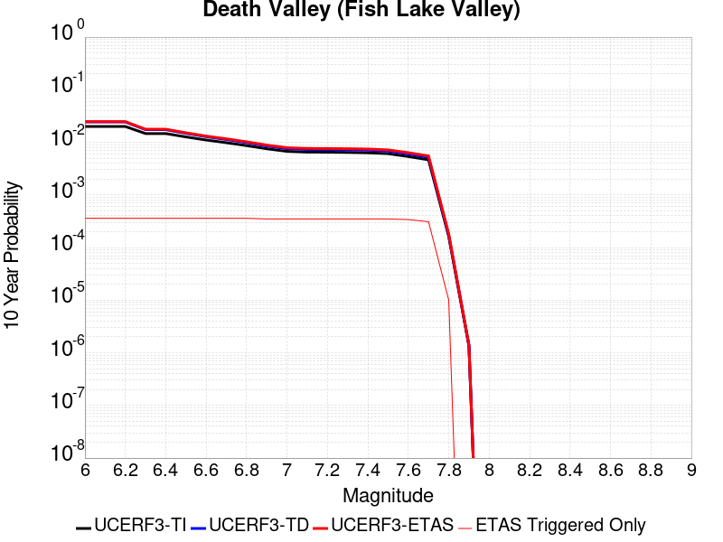 |

| Magnitude | 1 wk TI Prob | 1 wk TD Prob | 1 wk ETAS Prob | 1 wk ETAS/TD Gain | 1 wk ETAS Triggered Only | 1 mo TI Prob | 1 mo TD Prob | 1 mo ETAS Prob | 1 mo ETAS/TD Gain | 1 mo ETAS Triggered Only | 1 yr TI Prob | 1 yr TD Prob | 1 yr ETAS Prob | 1 yr ETAS/TD Gain | 1 yr ETAS Triggered Only | 10 yr TI Prob | 10 yr TD Prob | 10 yr ETAS Prob | 10 yr ETAS/TD Gain | 10 yr ETAS Triggered Only |
|-----|-----|-----|-----|-----|-----|-----|-----|-----|-----|-----|-----|-----|-----|-----|-----|-----|-----|-----|-----|-----|
| 6.0 | 3.872328E-5 | 4.7265705E-5 | 1.2220221E-4 | 2.5854309 | 7.494005E-5 | 1.6594635E-4 | 2.0255324E-4 | 3.2742802E-4 | 1.6165035 | 1.2490008E-4 | 0.0020185246 | 0.0024635606 | 0.0026629085 | 1.0809186 | 1.9984013E-4 | 0.02000288 | 0.024388338 | 0.024705157 | 1.0129906 | 3.2474022E-4 |
| 6.1 | 3.872328E-5 | 4.7265705E-5 | 1.2220221E-4 | 2.5854309 | 7.494005E-5 | 1.6594635E-4 | 2.0255324E-4 | 3.2742802E-4 | 1.6165035 | 1.2490008E-4 | 0.0020185246 | 0.0024635606 | 0.0026629085 | 1.0809186 | 1.9984013E-4 | 0.02000288 | 0.024388338 | 0.024705157 | 1.0129906 | 3.2474022E-4 |
| 6.2 | 3.872328E-5 | 4.7265705E-5 | 1.2220221E-4 | 2.5854309 | 7.494005E-5 | 1.6594635E-4 | 2.0255324E-4 | 3.2742802E-4 | 1.6165035 | 1.2490008E-4 | 0.0020185246 | 0.0024635606 | 0.0026629085 | 1.0809186 | 1.9984013E-4 | 0.02000288 | 0.024388338 | 0.024705157 | 1.0129906 | 3.2474022E-4 |
| 6.3 | 2.8356371E-5 | 3.360979E-5 | 1.0854732E-4 | 3.229634 | 7.494005E-5 | 1.2152165E-4 | 1.4403443E-4 | 2.689165E-4 | 1.8670294 | 1.2490008E-4 | 0.0014785219 | 0.0017522788 | 0.0019517688 | 1.1138461 | 1.9984013E-4 | 0.014687235 | 0.017391816 | 0.01771091 | 1.0183473 | 3.2474022E-4 |
| 6.4 | 2.8356371E-5 | 3.360979E-5 | 1.0854732E-4 | 3.229634 | 7.494005E-5 | 1.2152165E-4 | 1.4403443E-4 | 2.689165E-4 | 1.8670294 | 1.2490008E-4 | 0.0014785219 | 0.0017522788 | 0.0019517688 | 1.1138461 | 1.9984013E-4 | 0.014687235 | 0.017391816 | 0.01771091 | 1.0183473 | 3.2474022E-4 |
| 6.5 | 2.4448687E-5 | 2.8607585E-5 | 1.0354549E-4 | 3.6195116 | 7.494005E-5 | 1.0477588E-4 | 1.2259845E-4 | 2.474832E-4 | 2.0186489 | 1.2490008E-4 | 0.0012748998 | 0.0014916616 | 0.0016912037 | 1.1337717 | 1.9984013E-4 | 0.012676105 | 0.014821392 | 0.015141319 | 1.0215855 | 3.2474022E-4 |
| 6.6 | 2.1298161E-5 | 2.4660083E-5 | 9.9598285E-5 | 4.038846 | 7.494005E-5 | 9.127464E-5 | 1.0568197E-4 | 2.3056884E-4 | 2.1817236 | 1.2490008E-4 | 0.0011107022 | 0.0012859512 | 0.0014855344 | 1.1552027 | 1.9984013E-4 | 0.011051672 | 0.01278853 | 0.013109118 | 1.0250683 | 3.2474022E-4 |
| 6.7 | 1.8959729E-5 | 2.1781027E-5 | 9.671944E-5 | 4.4405365 | 7.494005E-5 | 8.125345E-5 | 9.334406E-5 | 2.1823248E-4 | 2.3379364 | 1.2490008E-4 | 9.888117E-4 | 0.001135897 | 0.00133551 | 1.1757318 | 1.9984013E-4 | 0.009844234 | 0.01130357 | 0.01162464 | 1.0284042 | 3.2474022E-4 |
| 6.8 | 1.6691629E-5 | 1.9018351E-5 | 9.395697E-5 | 4.940332 | 7.494005E-5 | 7.153359E-5 | 8.150477E-5 | 2.0639467E-4 | 2.5323017 | 1.2490008E-4 | 8.7057345E-4 | 9.918857E-4 | 0.0011915276 | 1.2012751 | 1.9984013E-4 | 0.008671708 | 0.009876343 | 0.010197877 | 1.0325558 | 3.2474022E-4 |
| 6.9 | 1.450505E-5 | 1.638954E-5 | 9.132836E-5 | 5.5723567 | 7.494005E-5 | 6.216302E-5 | 7.0239046E-5 | 1.9513036E-4 | 2.7780895 | 1.2490008E-4 | 7.5657194E-4 | 8.5483363E-4 | 0.0010545029 | 1.2335768 | 1.9984013E-4 | 0.007540013 | 0.008516386 | 0.008813593 | 1.0348983 | 2.997602E-4 |
| 7.0 | 1.2940855E-5 | 1.4537972E-5 | 8.947693E-5 | 6.154705 | 7.494005E-5 | 5.545963E-5 | 6.230414E-5 | 1.8719643E-4 | 3.0045586 | 1.2490008E-4 | 6.750118E-4 | 7.5829466E-4 | 9.5798325E-4 | 1.263339 | 1.9984013E-4 | 0.006729651 | 0.0075576897 | 0.007855184 | 1.0393631 | 2.997602E-4 |
| 7.1 | 1.2544658E-5 | 1.4078208E-5 | 8.90172E-5 | 6.323049 | 7.494005E-5 | 5.3761712E-5 | 6.0333812E-5 | 1.8522635E-4 | 3.0700257 | 1.2490008E-4 | 6.5435225E-4 | 7.343222E-4 | 9.3401555E-4 | 1.2719425 | 1.9984013E-4 | 0.006524288 | 0.007319551 | 0.007617117 | 1.0406536 | 2.997602E-4 |
| 7.2 | 1.2489416E-5 | 1.4015674E-5 | 8.895467E-5 | 6.3467994 | 7.494005E-5 | 5.3524967E-5 | 6.0065824E-5 | 1.8495841E-4 | 3.0792618 | 1.2490008E-4 | 6.514716E-4 | 7.310616E-4 | 9.307557E-4 | 1.2731562 | 1.9984013E-4 | 0.006495651 | 0.0072871596 | 0.0075847353 | 1.0408356 | 2.997602E-4 |
| 7.3 | 1.2368307E-5 | 1.3879812E-5 | 8.881882E-5 | 6.399137 | 7.494005E-5 | 5.3005948E-5 | 5.9483587E-5 | 1.8437623E-4 | 3.0996153 | 1.2490008E-4 | 6.451563E-4 | 7.2397763E-4 | 9.2367304E-4 | 1.275831 | 1.9984013E-4 | 0.0064328653 | 0.007216782 | 0.0075143785 | 1.0412368 | 2.997602E-4 |
| 7.4 | 1.2161707E-5 | 1.36478675E-5 | 8.8586894E-5 | 6.490896 | 7.494005E-5 | 5.212056E-5 | 5.8489582E-5 | 1.8338236E-4 | 3.1352994 | 1.2490008E-4 | 6.3438306E-4 | 7.118836E-4 | 9.1158145E-4 | 1.2805204 | 1.9984013E-4 | 0.006325751 | 0.0070966207 | 0.0073942533 | 1.0419401 | 2.997602E-4 |
| 7.5 | 1.1707948E-5 | 1.3145515E-5 | 8.808458E-5 | 6.700732 | 7.494005E-5 | 5.0175953E-5 | 5.6336736E-5 | 1.8122979E-4 | 3.2169023 | 1.2490008E-4 | 6.10721E-4 | 6.856895E-4 | 8.853926E-4 | 1.2912443 | 1.9984013E-4 | 0.0060904534 | 0.006836321 | 0.007134032 | 1.0435485 | 2.997602E-4 |
| 7.6 | 1.0319538E-5 | 1.1579622E-5 | 8.6518805E-5 | 7.471643 | 7.494005E-5 | 4.4225842E-5 | 4.9626036E-5 | 1.7451993E-4 | 3.5167007 | 1.2490008E-4 | 5.383166E-4 | 6.040347E-4 | 7.7878917E-4 | 1.289312 | 1.748601E-4 | 0.0053701443 | 0.0060244603 | 0.006297585 | 1.045336 | 2.7478018E-4 |
| 7.7 | 8.937764E-6 | 1.0022779E-5 | 8.496208E-5 | 8.476898 | 7.494005E-5 | 3.830414E-5 | 4.295409E-5 | 1.4286986E-4 | 3.326106 | 9.9920064E-5 | 4.6625308E-4 | 5.228456E-4 | 6.726473E-4 | 1.2865124 | 1.498801E-4 | 0.0046527605 | 0.005216664 | 0.0054651615 | 1.0476352 | 2.4980016E-4 |
| 7.8 | 3.108007E-7 | 3.284654E-7 | 3.284654E-7 | 1.0 | 0.0 | 1.3320023E-6 | 1.407708E-6 | 1.407708E-6 | 1.0 | 0.0 | 1.6217007E-5 | 1.7138715E-5 | 1.7138715E-5 | 1.0 | 0.0 | 1.6215823E-4 | 1.7137431E-4 | 1.7137431E-4 | 1.0 | 0.0 |
| 7.9 | 2.5591178E-9 | 2.6696718E-9 | 2.6696718E-9 | 1.0 | 0.0 | 1.0967647E-8 | 1.14414505E-8 | 1.14414505E-8 | 1.0 | 0.0 | 1.335311E-7 | 1.3929966E-7 | 1.3929966E-7 | 1.0 | 0.0 | 1.3353102E-6 | 1.3929966E-6 | 1.3929966E-6 | 1.0 | 0.0 |

## Sierra Nevada  (No Extension)
*[(top)](#table-of-contents)*

| 1 Week | 1 Month | 1 Year | 10 Year |
|-----|-----|-----|-----|
| 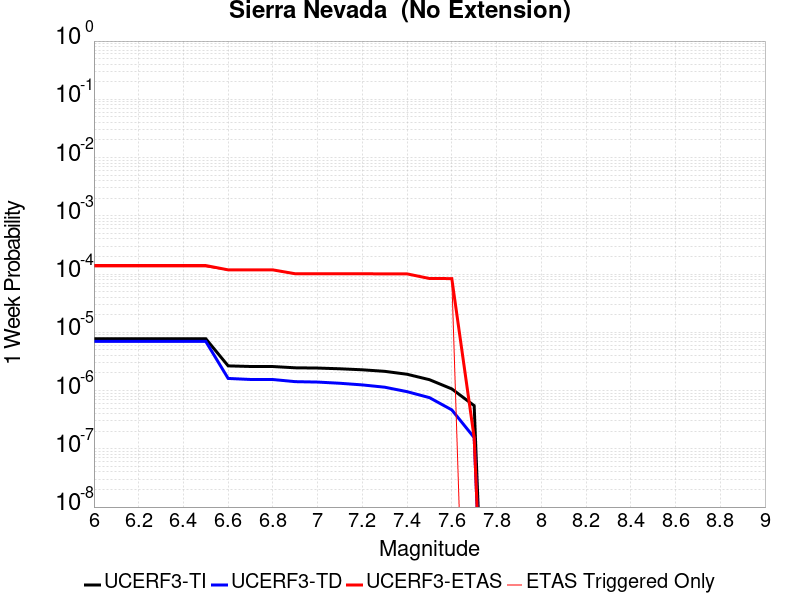 | 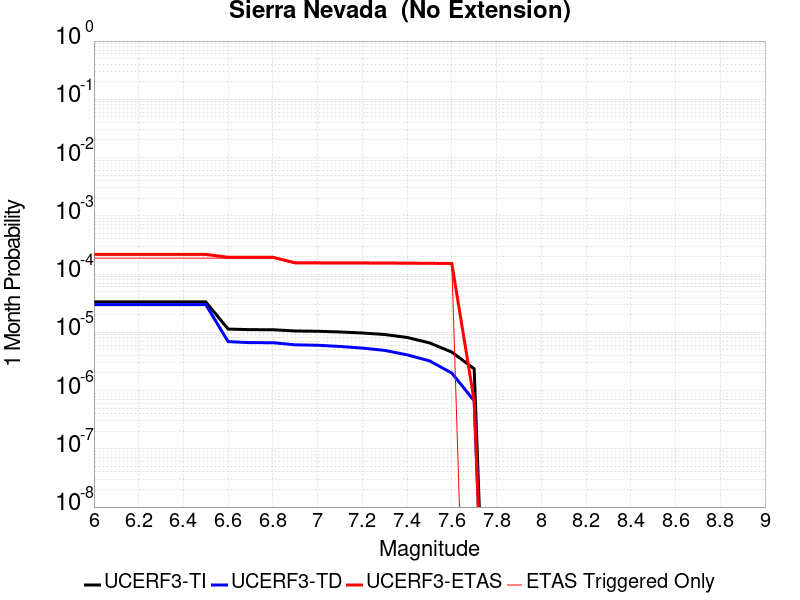 | 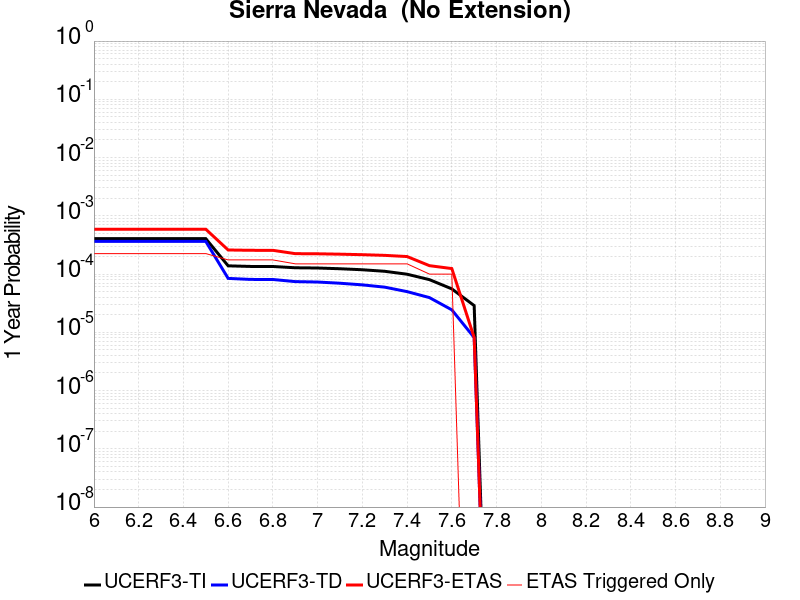 | 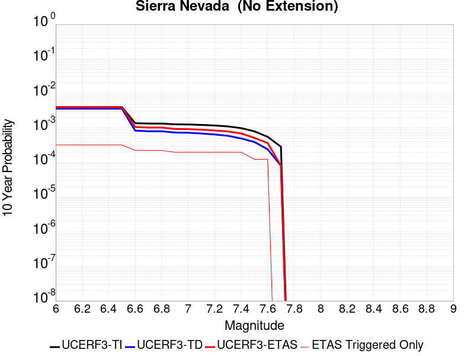 |

| Magnitude | 1 wk TI Prob | 1 wk TD Prob | 1 wk ETAS Prob | 1 wk ETAS/TD Gain | 1 wk ETAS Triggered Only | 1 mo TI Prob | 1 mo TD Prob | 1 mo ETAS Prob | 1 mo ETAS/TD Gain | 1 mo ETAS Triggered Only | 1 yr TI Prob | 1 yr TD Prob | 1 yr ETAS Prob | 1 yr ETAS/TD Gain | 1 yr ETAS Triggered Only | 10 yr TI Prob | 10 yr TD Prob | 10 yr ETAS Prob | 10 yr ETAS/TD Gain | 10 yr ETAS Triggered Only |
|-----|-----|-----|-----|-----|-----|-----|-----|-----|-----|-----|-----|-----|-----|-----|-----|-----|-----|-----|-----|-----|
| 6.0 | 7.7690465E-6 | 6.9762887E-6 | 1.5685534E-4 | 22.484066 | 1.498801E-4 | 3.329549E-5 | 2.989824E-5 | 1.7977385E-4 | 6.0128574 | 1.498801E-4 | 4.0529718E-4 | 3.6398612E-4 | 5.8872445E-4 | 1.6174365 | 2.2482015E-4 | 0.004045588 | 0.0036374154 | 0.0039609745 | 1.088953 | 3.2474022E-4 |
| 6.1 | 7.7690465E-6 | 6.9762887E-6 | 1.5685534E-4 | 22.484066 | 1.498801E-4 | 3.329549E-5 | 2.989824E-5 | 1.7977385E-4 | 6.0128574 | 1.498801E-4 | 4.0529718E-4 | 3.6398612E-4 | 5.8872445E-4 | 1.6174365 | 2.2482015E-4 | 0.004045588 | 0.0036374154 | 0.0039609745 | 1.088953 | 3.2474022E-4 |
| 6.2 | 7.7690465E-6 | 6.9762887E-6 | 1.5685534E-4 | 22.484066 | 1.498801E-4 | 3.329549E-5 | 2.989824E-5 | 1.7977385E-4 | 6.0128574 | 1.498801E-4 | 4.0529718E-4 | 3.6398612E-4 | 5.8872445E-4 | 1.6174365 | 2.2482015E-4 | 0.004045588 | 0.0036374154 | 0.0039609745 | 1.088953 | 3.2474022E-4 |
| 6.3 | 7.7690465E-6 | 6.9762887E-6 | 1.5685534E-4 | 22.484066 | 1.498801E-4 | 3.329549E-5 | 2.989824E-5 | 1.7977385E-4 | 6.0128574 | 1.498801E-4 | 4.0529718E-4 | 3.6398612E-4 | 5.8872445E-4 | 1.6174365 | 2.2482015E-4 | 0.004045588 | 0.0036374154 | 0.0039609745 | 1.088953 | 3.2474022E-4 |
| 6.4 | 7.7690465E-6 | 6.9762887E-6 | 1.5685534E-4 | 22.484066 | 1.498801E-4 | 3.329549E-5 | 2.989824E-5 | 1.7977385E-4 | 6.0128574 | 1.498801E-4 | 4.0529718E-4 | 3.6398612E-4 | 5.8872445E-4 | 1.6174365 | 2.2482015E-4 | 0.004045588 | 0.0036374154 | 0.0039609745 | 1.088953 | 3.2474022E-4 |
| 6.5 | 7.7690465E-6 | 6.9762887E-6 | 1.5685534E-4 | 22.484066 | 1.498801E-4 | 3.329549E-5 | 2.989824E-5 | 1.7977385E-4 | 6.0128574 | 1.498801E-4 | 4.0529718E-4 | 3.6398612E-4 | 5.8872445E-4 | 1.6174365 | 2.2482015E-4 | 0.004045588 | 0.0036374154 | 0.0039609745 | 1.088953 | 3.2474022E-4 |
| 6.6 | 2.653E-6 | 1.6148208E-6 | 1.265147E-4 | 78.34596 | 1.2490008E-4 | 1.136995E-5 | 6.9206426E-6 | 1.3181986E-4 | 19.047344 | 1.2490008E-4 | 1.3842035E-4 | 8.42556E-5 | 2.5910098E-4 | 3.0751781 | 1.748601E-4 | 0.0013833415 | 8.4224E-4 | 0.0010668708 | 1.2667063 | 2.2482015E-4 |
| 6.7 | 2.5902466E-6 | 1.5501544E-6 | 1.2645005E-4 | 81.57255 | 1.2490008E-4 | 1.11010095E-5 | 6.643502E-6 | 1.3154275E-4 | 19.800213 | 1.2490008E-4 | 1.351464E-4 | 8.088166E-5 | 2.5572765E-4 | 3.1617503 | 1.748601E-4 | 0.0013506424 | 8.0852525E-4 | 0.0010331636 | 1.2778372 | 2.2482015E-4 |
| 6.8 | 2.5853892E-6 | 1.5469546E-6 | 1.2644684E-4 | 81.739204 | 1.2490008E-4 | 1.1080193E-5 | 6.629789E-6 | 1.3152904E-4 | 19.8391 | 1.2490008E-4 | 1.34893E-4 | 8.071472E-5 | 2.555607E-4 | 3.1662219 | 1.748601E-4 | 0.0013481114 | 8.06857E-4 | 0.0010314957 | 1.2784121 | 2.2482015E-4 |
| 6.9 | 2.458257E-6 | 1.422029E-6 | 1.0134195E-4 | 71.26575 | 9.9920064E-5 | 1.0535345E-5 | 6.0943958E-6 | 1.0601385E-4 | 17.395302 | 9.9920064E-5 | 1.2826028E-4 | 7.419676E-5 | 2.2406573E-4 | 3.0198858 | 1.498801E-4 | 0.0012818627 | 7.4172183E-4 | 9.4141375E-4 | 1.2692275 | 1.9984013E-4 |
| 7.0 | 2.4341468E-6 | 1.3989927E-6 | 1.0131892E-4 | 72.42276 | 9.9920064E-5 | 1.0432016E-5 | 5.9956697E-6 | 1.0591513E-4 | 17.665272 | 9.9920064E-5 | 1.270024E-4 | 7.299485E-5 | 2.2286401E-4 | 3.0531468 | 1.498801E-4 | 0.0012692984 | 7.297107E-4 | 9.29405E-4 | 1.2736623 | 1.9984013E-4 |
| 7.1 | 2.3652476E-6 | 1.3339427E-6 | 1.0125387E-4 | 75.905716 | 9.9920064E-5 | 1.0136736E-5 | 5.716885E-6 | 1.05636376E-4 | 18.47796 | 9.9920064E-5 | 1.2340778E-4 | 6.9600865E-5 | 2.1947053E-4 | 3.1532729 | 1.498801E-4 | 0.0012333926 | 6.957924E-4 | 8.9549343E-4 | 1.2870125 | 1.9984013E-4 |
| 7.2 | 2.272158E-6 | 1.2502497E-6 | 1.0117019E-4 | 80.91999 | 9.9920064E-5 | 9.737784E-6 | 5.358202E-6 | 1.0527773E-4 | 19.647959 | 9.9920064E-5 | 1.1855107E-4 | 6.523417E-5 | 2.1510449E-4 | 3.2974205 | 1.498801E-4 | 0.0011848784 | 6.5215176E-4 | 8.5186155E-4 | 1.3062321 | 1.9984013E-4 |
| 7.3 | 2.1382127E-6 | 1.1419382E-6 | 1.0106189E-4 | 88.50031 | 9.9920064E-5 | 9.163737E-6 | 4.894012E-6 | 1.0481359E-4 | 21.4167 | 9.9920064E-5 | 1.1156279E-4 | 5.9582977E-5 | 2.0945414E-4 | 3.5153353 | 1.498801E-4 | 0.001115068 | 5.956712E-4 | 7.953923E-4 | 1.3352875 | 1.9984013E-4 |
| 7.4 | 1.9048055E-6 | 9.574928E-7 | 1.0087746E-4 | 105.35584 | 9.9920064E-5 | 8.163426E-6 | 4.103534E-6 | 1.0402319E-4 | 25.349657 | 9.9920064E-5 | 9.9385186E-5 | 4.995939E-5 | 1.99832E-4 | 3.9998887 | 1.498801E-4 | 9.934074E-4 | 4.9948227E-4 | 6.992226E-4 | 1.3998947 | 1.9984013E-4 |
| 7.5 | 1.5373403E-6 | 7.559763E-7 | 1.0067596E-4 | 133.17343 | 9.9920064E-5 | 6.5885843E-6 | 3.2398946E-6 | 1.0315963E-4 | 31.84043 | 9.9920064E-5 | 8.021306E-5 | 3.9445007E-5 | 1.3936113E-4 | 3.5330486 | 9.9920064E-5 | 8.0184115E-4 | 3.9438053E-4 | 5.1923137E-4 | 1.3165745 | 1.2490008E-4 |
| 7.6 | 1.0680322E-6 | 4.65941E-7 | 1.0038596E-4 | 215.44778 | 9.9920064E-5 | 4.577273E-6 | 1.9968884E-6 | 1.01916754E-4 | 51.037777 | 9.9920064E-5 | 5.5726876E-5 | 2.4311848E-5 | 1.2422948E-4 | 5.109833 | 9.9920064E-5 | 5.5712904E-4 | 2.4309216E-4 | 3.6796188E-4 | 1.5136724 | 1.2490008E-4 |
| 7.7 | 5.509146E-7 | 1.5578539E-7 | 1.5578539E-7 | 1.0 | 0.0 | 2.3610605E-6 | 6.676515E-7 | 6.676515E-7 | 1.0 | 0.0 | 2.8745531E-5 | 8.128628E-6 | 8.128628E-6 | 1.0 | 0.0 | 2.8741814E-4 | 8.128342E-5 | 8.128342E-5 | 1.0 | 0.0 |

## Cady
*[(top)](#table-of-contents)*

| 1 Week | 1 Month | 1 Year | 10 Year |
|-----|-----|-----|-----|
| 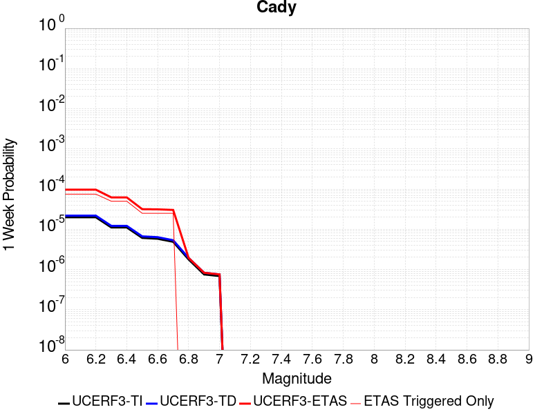 | 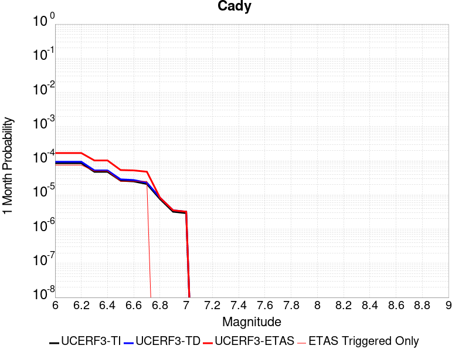 | 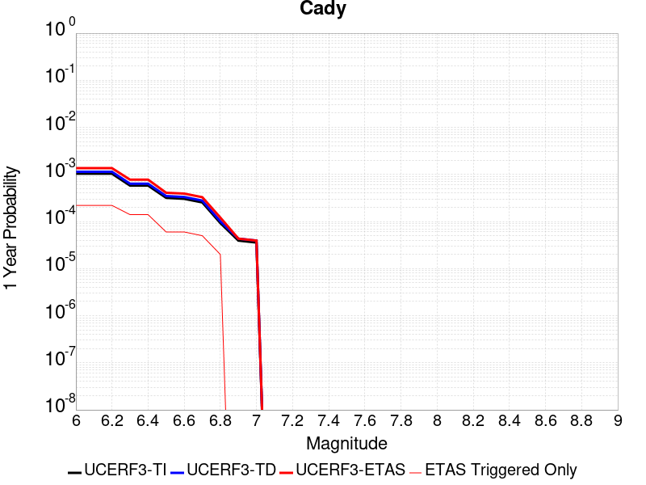 | 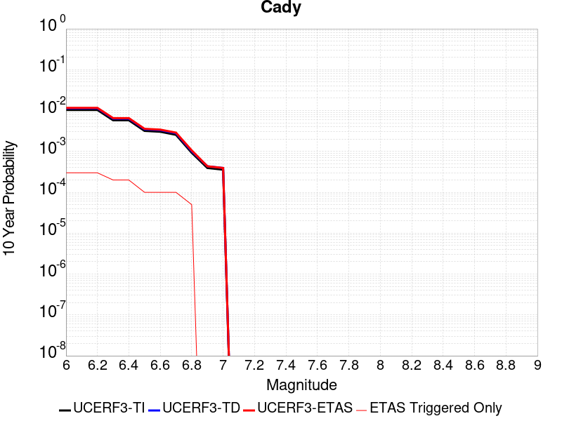 |

| Magnitude | 1 wk TI Prob | 1 wk TD Prob | 1 wk ETAS Prob | 1 wk ETAS/TD Gain | 1 wk ETAS Triggered Only | 1 mo TI Prob | 1 mo TD Prob | 1 mo ETAS Prob | 1 mo ETAS/TD Gain | 1 mo ETAS Triggered Only | 1 yr TI Prob | 1 yr TD Prob | 1 yr ETAS Prob | 1 yr ETAS/TD Gain | 1 yr ETAS Triggered Only | 10 yr TI Prob | 10 yr TD Prob | 10 yr ETAS Prob | 10 yr ETAS/TD Gain | 10 yr ETAS Triggered Only |
|-----|-----|-----|-----|-----|-----|-----|-----|-----|-----|-----|-----|-----|-----|-----|-----|-----|-----|-----|-----|-----|
| 6.0 | 1.9892565E-5 | 2.1858728E-5 | 9.6797135E-5 | 4.428306 | 7.494005E-5 | 8.525106E-5 | 9.3677416E-5 | 1.6861045E-4 | 1.799905 | 7.494005E-5 | 0.0010374374 | 0.0011400167 | 0.0013396291 | 1.1750959 | 1.9984013E-4 | 0.010326075 | 0.011350701 | 0.011647058 | 1.0261092 | 2.997602E-4 |
| 6.1 | 1.9892565E-5 | 2.1858728E-5 | 9.6797135E-5 | 4.428306 | 7.494005E-5 | 8.525106E-5 | 9.3677416E-5 | 1.6861045E-4 | 1.799905 | 7.494005E-5 | 0.0010374374 | 0.0011400167 | 0.0013396291 | 1.1750959 | 1.9984013E-4 | 0.010326075 | 0.011350701 | 0.011647058 | 1.0261092 | 2.997602E-4 |
| 6.2 | 1.9892565E-5 | 2.1858728E-5 | 9.6797135E-5 | 4.428306 | 7.494005E-5 | 8.525106E-5 | 9.3677416E-5 | 1.6861045E-4 | 1.799905 | 7.494005E-5 | 0.0010374374 | 0.0011400167 | 0.0013396291 | 1.1750959 | 1.9984013E-4 | 0.010326075 | 0.011350701 | 0.011647058 | 1.0261092 | 2.997602E-4 |
| 6.3 | 1.1117327E-5 | 1.2176583E-5 | 6.213601E-5 | 5.1029096 | 4.9960032E-5 | 4.764482E-5 | 5.2184492E-5 | 1.02141916E-4 | 1.9573232 | 4.9960032E-5 | 5.7992124E-4 | 6.351925E-4 | 7.6001324E-4 | 1.1965085 | 1.2490008E-4 | 0.0057841022 | 0.0063368753 | 0.006535449 | 1.0313362 | 1.9984013E-4 |
| 6.4 | 1.1117327E-5 | 1.2176583E-5 | 6.213601E-5 | 5.1029096 | 4.9960032E-5 | 4.764482E-5 | 5.2184492E-5 | 1.02141916E-4 | 1.9573232 | 4.9960032E-5 | 5.7992124E-4 | 6.351925E-4 | 7.6001324E-4 | 1.1965085 | 1.2490008E-4 | 0.0057841022 | 0.0063368753 | 0.006535449 | 1.0313362 | 1.9984013E-4 |
| 6.5 | 6.103093E-6 | 6.672021E-6 | 3.165187E-5 | 4.7439704 | 2.4980016E-5 | 2.615585E-5 | 2.8594131E-5 | 5.3573433E-5 | 1.8735814 | 2.4980016E-5 | 3.1840094E-4 | 3.480905E-4 | 4.2300447E-4 | 1.215214 | 7.494005E-5 | 0.0031794512 | 0.0034766865 | 0.0035762594 | 1.0286402 | 9.9920064E-5 |
| 6.6 | 5.817237E-6 | 6.3656585E-6 | 3.1345517E-5 | 4.924159 | 2.4980016E-5 | 2.4930776E-5 | 2.728118E-5 | 5.226051E-5 | 1.9156252 | 2.4980016E-5 | 3.034899E-4 | 3.3211018E-4 | 4.0702533E-4 | 1.2255732 | 7.494005E-5 | 0.0030307577 | 0.0033173605 | 0.0034169492 | 1.0300205 | 9.9920064E-5 |
| 6.7 | 4.8846314E-6 | 5.3405684E-6 | 3.032045E-5 | 5.677383 | 2.4980016E-5 | 2.0933967E-5 | 2.2888014E-5 | 4.786746E-5 | 2.0913765 | 2.4980016E-5 | 2.5484123E-4 | 2.7863772E-4 | 3.5355688E-4 | 1.2688766 | 7.494005E-5 | 0.0025454918 | 0.0027840391 | 0.002883681 | 1.0357904 | 9.9920064E-5 |
| 6.8 | 1.7788773E-6 | 1.9399079E-6 | 1.9399079E-6 | 1.0 | 0.0 | 7.6237375E-6 | 8.313874E-6 | 8.313874E-6 | 1.0 | 0.0 | 9.281505E-5 | 1.01218284E-4 | 1.5117326E-4 | 1.4935371 | 4.9960032E-5 | 9.2776294E-4 | 0.0010118765 | 0.001061786 | 1.0493237 | 4.9960032E-5 |
| 6.9 | 7.5455404E-7 | 8.297092E-7 | 8.297092E-7 | 1.0 | 0.0 | 3.233799E-6 | 3.5558937E-6 | 3.5558937E-6 | 1.0 | 0.0 | 3.937079E-5 | 4.3292483E-5 | 4.3292483E-5 | 1.0 | 0.0 | 3.9363815E-4 | 4.3287344E-4 | 4.3287344E-4 | 1.0 | 0.0 |
| 7.0 | 6.8578805E-7 | 7.541816E-7 | 7.541816E-7 | 1.0 | 0.0 | 2.9390883E-6 | 3.2322048E-6 | 3.2322048E-6 | 1.0 | 0.0 | 3.578281E-5 | 3.9351715E-5 | 3.9351715E-5 | 1.0 | 0.0 | 3.577705E-4 | 3.9347992E-4 | 3.9347992E-4 | 1.0 | 0.0 |

## Manix-Afton Hills
*[(top)](#table-of-contents)*

| 1 Week | 1 Month | 1 Year | 10 Year |
|-----|-----|-----|-----|
| 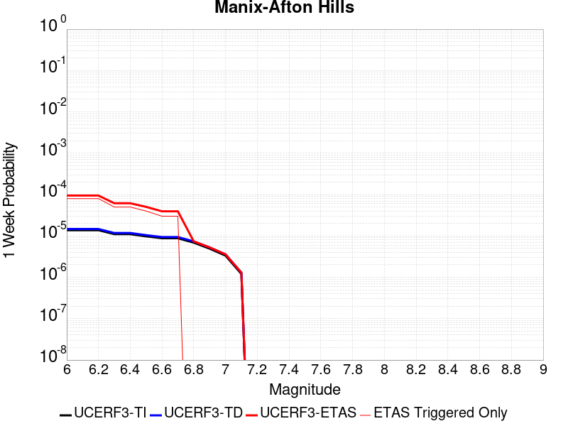 | 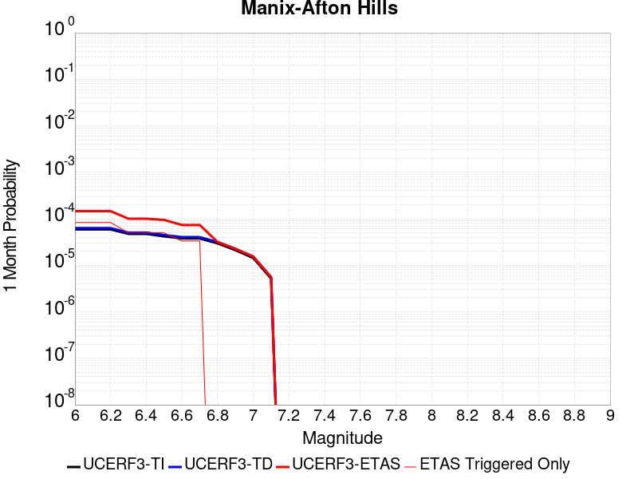 | 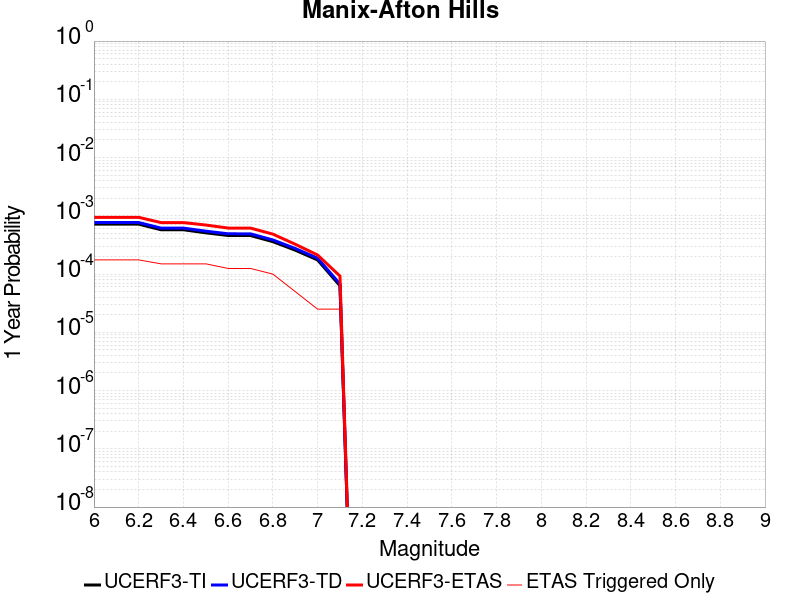 | 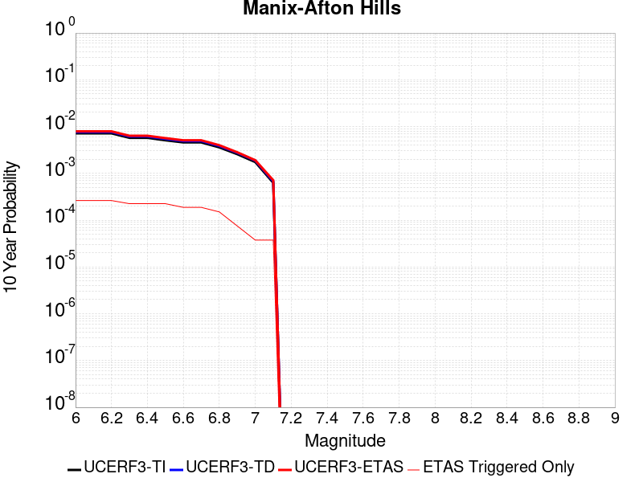 |

| Magnitude | 1 wk TI Prob | 1 wk TD Prob | 1 wk ETAS Prob | 1 wk ETAS/TD Gain | 1 wk ETAS Triggered Only | 1 mo TI Prob | 1 mo TD Prob | 1 mo ETAS Prob | 1 mo ETAS/TD Gain | 1 mo ETAS Triggered Only | 1 yr TI Prob | 1 yr TD Prob | 1 yr ETAS Prob | 1 yr ETAS/TD Gain | 1 yr ETAS Triggered Only | 10 yr TI Prob | 10 yr TD Prob | 10 yr ETAS Prob | 10 yr ETAS/TD Gain | 10 yr ETAS Triggered Only |
|-----|-----|-----|-----|-----|-----|-----|-----|-----|-----|-----|-----|-----|-----|-----|-----|-----|-----|-----|-----|-----|
| 6.0 | 1.3783202E-5 | 1.47110895E-5 | 6.4670385E-5 | 4.3960295 | 4.9960032E-5 | 5.906953E-5 | 6.30461E-5 | 1.13002985E-4 | 1.7923865 | 4.9960032E-5 | 7.189342E-4 | 7.6733343E-4 | 9.420594E-4 | 1.2277054 | 1.748601E-4 | 0.0071661277 | 0.007648596 | 0.007921275 | 1.0356508 | 2.7478018E-4 |
| 6.1 | 1.3783202E-5 | 1.47110895E-5 | 6.4670385E-5 | 4.3960295 | 4.9960032E-5 | 5.906953E-5 | 6.30461E-5 | 1.13002985E-4 | 1.7923865 | 4.9960032E-5 | 7.189342E-4 | 7.6733343E-4 | 9.420594E-4 | 1.2277054 | 1.748601E-4 | 0.0071661277 | 0.007648596 | 0.007921275 | 1.0356508 | 2.7478018E-4 |
| 6.2 | 1.3783202E-5 | 1.47110895E-5 | 6.4670385E-5 | 4.3960295 | 4.9960032E-5 | 5.906953E-5 | 6.30461E-5 | 1.13002985E-4 | 1.7923865 | 4.9960032E-5 | 7.189342E-4 | 7.6733343E-4 | 9.420594E-4 | 1.2277054 | 1.748601E-4 | 0.0071661277 | 0.007648596 | 0.007921275 | 1.0356508 | 2.7478018E-4 |
| 6.3 | 1.10494875E-5 | 1.1793136E-5 | 3.6772857E-5 | 3.1181576 | 2.4980016E-5 | 4.7354086E-5 | 5.054109E-5 | 7.551984E-5 | 1.4942267 | 2.4980016E-5 | 5.763835E-4 | 6.151744E-4 | 7.649623E-4 | 1.2434886 | 1.498801E-4 | 0.005748908 | 0.0061357557 | 0.0063591963 | 1.0364162 | 2.2482015E-4 |
| 6.4 | 1.10494875E-5 | 1.1793136E-5 | 3.6772857E-5 | 3.1181576 | 2.4980016E-5 | 4.7354086E-5 | 5.054109E-5 | 7.551984E-5 | 1.4942267 | 2.4980016E-5 | 5.763835E-4 | 6.151744E-4 | 7.649623E-4 | 1.2434886 | 1.498801E-4 | 0.005748908 | 0.0061357557 | 0.0063591963 | 1.0364162 | 2.2482015E-4 |
| 6.5 | 9.788949E-6 | 1.045432E-5 | 3.5434074E-5 | 3.3894196 | 2.4980016E-5 | 4.1951964E-5 | 4.480351E-5 | 6.978241E-5 | 1.557521 | 2.4980016E-5 | 5.1064545E-4 | 5.453555E-4 | 6.9515384E-4 | 1.2746803 | 1.498801E-4 | 0.0050947363 | 0.0054410985 | 0.005615007 | 1.031962 | 1.748601E-4 |
| 6.6 | 8.810006E-6 | 9.4136285E-6 | 3.4393408E-5 | 3.6535764 | 2.4980016E-5 | 3.775662E-5 | 4.0343548E-5 | 6.532256E-5 | 1.6191574 | 2.4980016E-5 | 4.5958988E-4 | 4.9108086E-4 | 6.159196E-4 | 1.2542121 | 1.2490008E-4 | 0.0045864056 | 0.004900839 | 0.005049985 | 1.0304327 | 1.498801E-4 |
| 6.7 | 8.80128E-6 | 9.404108E-6 | 3.4383887E-5 | 3.6562626 | 2.4980016E-5 | 3.7719226E-5 | 4.0302748E-5 | 6.5281754E-5 | 1.6197842 | 2.4980016E-5 | 4.591348E-4 | 4.9058435E-4 | 6.1542314E-4 | 1.2544696 | 1.2490008E-4 | 0.004581874 | 0.0048958957 | 0.0050450424 | 1.0304636 | 1.498801E-4 |
| 6.8 | 6.8994877E-6 | 7.380076E-6 | 7.380076E-6 | 1.0 | 0.0 | 2.9568899E-5 | 3.162856E-5 | 3.162856E-5 | 1.0 | 0.0 | 3.5994186E-4 | 3.8501783E-4 | 4.8489944E-4 | 1.2594206 | 9.9920064E-5 | 0.003593594 | 0.0038443129 | 0.003968733 | 1.0323647 | 1.2490008E-4 |
| 6.9 | 4.9328037E-6 | 5.2709615E-6 | 5.2709615E-6 | 1.0 | 0.0 | 2.1140417E-5 | 2.2589675E-5 | 2.2589675E-5 | 1.0 | 0.0 | 2.5735417E-4 | 2.7500073E-4 | 3.2494703E-4 | 1.1816224 | 4.9960032E-5 | 0.0025705635 | 0.0027472095 | 0.0027970322 | 1.0181358 | 4.9960032E-5 |
| 7.0 | 3.347973E-6 | 3.59003E-6 | 3.59003E-6 | 1.0 | 0.0 | 1.4348378E-5 | 1.5385775E-5 | 1.5385775E-5 | 1.0 | 0.0 | 1.746775E-4 | 1.8730981E-4 | 2.1228514E-4 | 1.133337 | 2.4980016E-5 | 0.0017454025 | 0.0018719219 | 0.0018968552 | 1.0133196 | 2.4980016E-5 |
| 7.1 | 1.2073567E-6 | 1.293482E-6 | 1.293482E-6 | 1.0 | 0.0 | 5.1743755E-6 | 5.543492E-6 | 5.543492E-6 | 1.0 | 0.0 | 6.29962E-5 | 6.749156E-5 | 9.246989E-5 | 1.3700956 | 2.4980016E-5 | 6.297835E-4 | 6.7487074E-4 | 6.998339E-4 | 1.0369896 | 2.4980016E-5 |

## San Jacinto (Stepovers Combined)
*[(top)](#table-of-contents)*

| 1 Week | 1 Month | 1 Year | 10 Year |
|-----|-----|-----|-----|
| 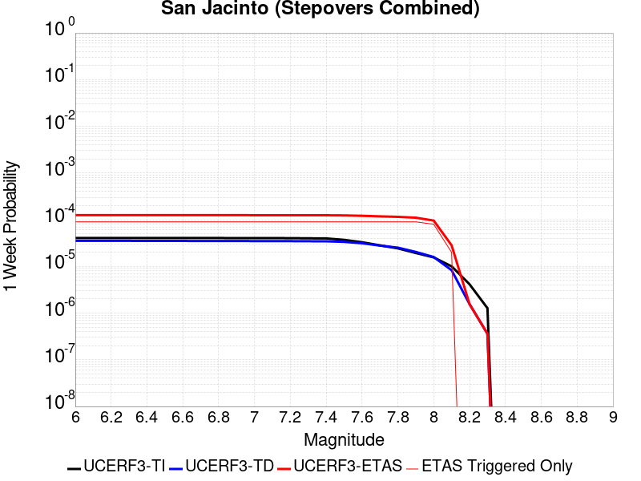 | 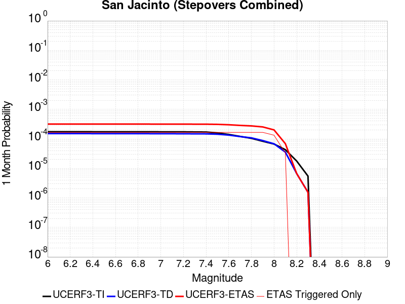 | 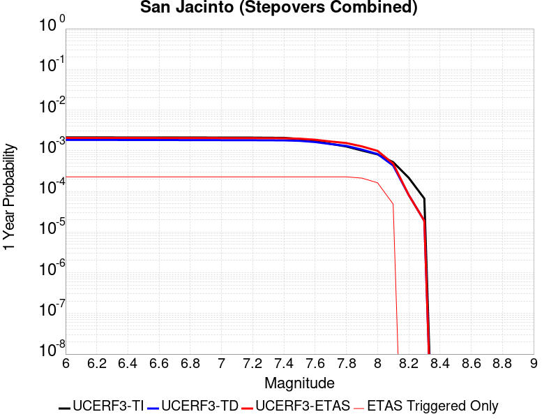 | 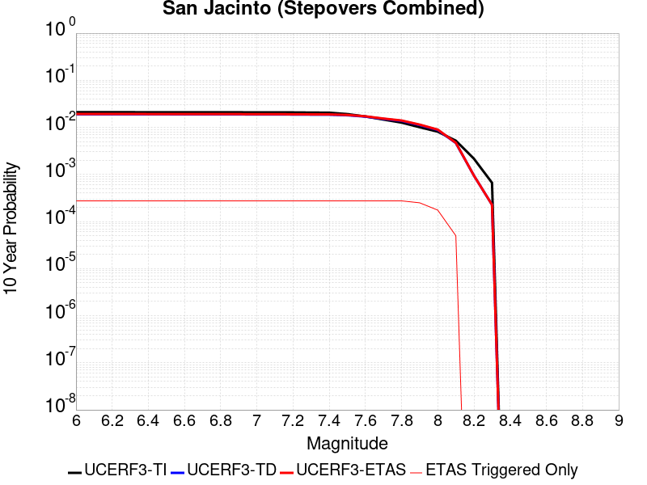 |

| Magnitude | 1 wk TI Prob | 1 wk TD Prob | 1 wk ETAS Prob | 1 wk ETAS/TD Gain | 1 wk ETAS Triggered Only | 1 mo TI Prob | 1 mo TD Prob | 1 mo ETAS Prob | 1 mo ETAS/TD Gain | 1 mo ETAS Triggered Only | 1 yr TI Prob | 1 yr TD Prob | 1 yr ETAS Prob | 1 yr ETAS/TD Gain | 1 yr ETAS Triggered Only | 10 yr TI Prob | 10 yr TD Prob | 10 yr ETAS Prob | 10 yr ETAS/TD Gain | 10 yr ETAS Triggered Only |
|-----|-----|-----|-----|-----|-----|-----|-----|-----|-----|-----|-----|-----|-----|-----|-----|-----|-----|-----|-----|-----|
| 6.0 | 4.0667746E-5 | 3.5271103E-5 | 2.1012504E-4 | 5.9574275 | 1.748601E-4 | 1.742787E-4 | 1.5115313E-4 | 3.5096306E-4 | 2.321904 | 1.9984013E-4 | 0.0021197782 | 0.0018387372 | 0.0021130121 | 1.1491648 | 2.7478018E-4 | 0.020996714 | 0.018986495 | 0.019256057 | 1.0141976 | 2.7478018E-4 |
| 6.1 | 4.0667746E-5 | 3.5271103E-5 | 2.1012504E-4 | 5.9574275 | 1.748601E-4 | 1.742787E-4 | 1.5115313E-4 | 3.5096306E-4 | 2.321904 | 1.9984013E-4 | 0.0021197782 | 0.0018387372 | 0.0021130121 | 1.1491648 | 2.7478018E-4 | 0.020996714 | 0.018986495 | 0.019256057 | 1.0141976 | 2.7478018E-4 |
| 6.2 | 4.0667746E-5 | 3.5271103E-5 | 2.1012504E-4 | 5.9574275 | 1.748601E-4 | 1.742787E-4 | 1.5115313E-4 | 3.5096306E-4 | 2.321904 | 1.9984013E-4 | 0.0021197782 | 0.0018387372 | 0.0021130121 | 1.1491648 | 2.7478018E-4 | 0.020996714 | 0.018986495 | 0.019256057 | 1.0141976 | 2.7478018E-4 |
| 6.3 | 4.0667746E-5 | 3.5271103E-5 | 2.1012504E-4 | 5.9574275 | 1.748601E-4 | 1.742787E-4 | 1.5115313E-4 | 3.5096306E-4 | 2.321904 | 1.9984013E-4 | 0.0021197782 | 0.0018387372 | 0.0021130121 | 1.1491648 | 2.7478018E-4 | 0.020996714 | 0.018986495 | 0.019256057 | 1.0141976 | 2.7478018E-4 |
| 6.4 | 4.0577226E-5 | 3.5143014E-5 | 2.0999699E-4 | 5.9754972 | 1.748601E-4 | 1.738908E-4 | 1.5060425E-4 | 3.5041428E-4 | 2.3267224 | 1.9984013E-4 | 0.0021150648 | 0.0018320669 | 0.0021063436 | 1.1497089 | 2.7478018E-4 | 0.020950472 | 0.018921062 | 0.019190643 | 1.0142477 | 2.7478018E-4 |
| 6.5 | 4.0577226E-5 | 3.5143014E-5 | 2.0999699E-4 | 5.9754972 | 1.748601E-4 | 1.738908E-4 | 1.5060425E-4 | 3.5041428E-4 | 2.3267224 | 1.9984013E-4 | 0.0021150648 | 0.0018320669 | 0.0021063436 | 1.1497089 | 2.7478018E-4 | 0.020950472 | 0.018921062 | 0.019190643 | 1.0142477 | 2.7478018E-4 |
| 6.6 | 4.053861E-5 | 3.5088357E-5 | 2.0994233E-4 | 5.9832478 | 1.748601E-4 | 1.7372532E-4 | 1.5037002E-4 | 3.501801E-4 | 2.3287892 | 1.9984013E-4 | 0.0021130538 | 0.0018292206 | 0.0021034982 | 1.1499423 | 2.7478018E-4 | 0.020930743 | 0.01889314 | 0.01916273 | 1.0142691 | 2.7478018E-4 |
| 6.7 | 4.0516545E-5 | 3.505743E-5 | 2.099114E-4 | 5.9876437 | 1.748601E-4 | 1.7363077E-4 | 1.502375E-4 | 3.500476E-4 | 2.3299615 | 1.9984013E-4 | 0.002111905 | 0.0018276101 | 0.002101888 | 1.1500747 | 2.7478018E-4 | 0.020919468 | 0.018877337 | 0.019146929 | 1.0142813 | 2.7478018E-4 |
| 6.8 | 4.049434E-5 | 3.5028992E-5 | 2.0988299E-4 | 5.991693 | 1.748601E-4 | 1.7353562E-4 | 1.5011564E-4 | 3.4992577E-4 | 2.3310413 | 1.9984013E-4 | 0.0021107488 | 0.0018261289 | 0.0021004074 | 1.1501967 | 2.7478018E-4 | 0.020908125 | 0.018862749 | 0.019132346 | 1.0142926 | 2.7478018E-4 |
| 6.9 | 4.046386E-5 | 3.4991554E-5 | 2.0984554E-4 | 5.9970345 | 1.748601E-4 | 1.73405E-4 | 1.499552E-4 | 3.4976535E-4 | 2.3324656 | 1.9984013E-4 | 0.0021091616 | 0.0018241788 | 0.002098458 | 1.1503575 | 2.7478018E-4 | 0.020892553 | 0.018843522 | 0.019113125 | 1.0143074 | 2.7478018E-4 |
| 7.0 | 4.036382E-5 | 3.4872126E-5 | 2.0972615E-4 | 6.0141487 | 1.748601E-4 | 1.7297632E-4 | 1.4944343E-4 | 3.4925368E-4 | 2.3370295 | 1.9984013E-4 | 0.0021039525 | 0.0018179584 | 0.0020922392 | 1.1508728 | 2.7478018E-4 | 0.02084144 | 0.018782137 | 0.019051755 | 1.0143551 | 2.7478018E-4 |
| 7.1 | 4.0343282E-5 | 3.485059E-5 | 2.0970461E-4 | 6.017247 | 1.748601E-4 | 1.7288832E-4 | 1.4935112E-4 | 3.4916142E-4 | 2.3378558 | 1.9984013E-4 | 0.002102883 | 0.0018168368 | 0.0020911177 | 1.1509662 | 2.7478018E-4 | 0.020830948 | 0.018771008 | 0.01904063 | 1.0143638 | 2.7478018E-4 |
| 7.2 | 4.0257353E-5 | 3.475509E-5 | 2.0960912E-4 | 6.031034 | 1.748601E-4 | 1.725201E-4 | 1.489419E-4 | 3.4875225E-4 | 2.3415322 | 1.9984013E-4 | 0.0020984085 | 0.0018118626 | 0.0020861449 | 1.1513814 | 2.7478018E-4 | 0.020787042 | 0.018721746 | 0.018991383 | 1.0144023 | 2.7478018E-4 |
| 7.3 | 3.9940667E-5 | 3.458276E-5 | 2.0943682E-4 | 6.056105 | 1.748601E-4 | 1.7116306E-4 | 1.4820343E-4 | 3.4801394E-4 | 2.348218 | 1.9984013E-4 | 0.0020819185 | 0.0018028866 | 0.0020771713 | 1.1521364 | 2.7478018E-4 | 0.020625217 | 0.018630387 | 0.018900048 | 1.0144743 | 2.7478018E-4 |
| 7.4 | 3.9721202E-5 | 3.4468165E-5 | 2.0932226E-4 | 6.072915 | 1.748601E-4 | 1.7022261E-4 | 1.4771236E-4 | 3.4752296E-4 | 2.3527007 | 1.9984013E-4 | 0.0020704903 | 0.0017969179 | 0.0020712044 | 1.1526427 | 2.7478018E-4 | 0.020513052 | 0.018569522 | 0.0188392 | 1.0145226 | 2.7478018E-4 |
| 7.5 | 3.7036873E-5 | 3.3535776E-5 | 2.0839002E-4 | 6.2139616 | 1.748601E-4 | 1.5871979E-4 | 1.4371685E-4 | 3.4352826E-4 | 2.3903131 | 1.9984013E-4 | 0.0019307006 | 0.0017483513 | 0.002022651 | 1.1568905 | 2.7478018E-4 | 0.019140124 | 0.018071128 | 0.018340943 | 1.0149307 | 2.7478018E-4 |
| 7.6 | 3.2940967E-5 | 3.13167E-5 | 2.0617133E-4 | 6.583431 | 1.748601E-4 | 1.4116794E-4 | 1.3420754E-4 | 3.3402085E-4 | 2.4888382 | 1.9984013E-4 | 0.0017173645 | 0.0016327545 | 0.001907086 | 1.1680176 | 2.7478018E-4 | 0.01704153 | 0.016904091 | 0.017174227 | 1.0159805 | 2.7478018E-4 |
| 7.7 | 2.8236149E-5 | 2.7882697E-5 | 2.0273794E-4 | 7.271102 | 1.748601E-4 | 1.2100645E-4 | 1.1949181E-4 | 3.1930805E-4 | 2.6722171 | 1.9984013E-4 | 0.0014722579 | 0.0014538429 | 0.0017282236 | 1.1887279 | 2.7478018E-4 | 0.014625421 | 0.015114912 | 0.015385538 | 1.0179046 | 2.7478018E-4 |
| 7.8 | 2.4329287E-5 | 2.5206451E-5 | 2.0006216E-4 | 7.9369426 | 1.748601E-4 | 1.042642E-4 | 1.08023174E-4 | 3.0784172E-4 | 2.8497746 | 1.9984013E-4 | 0.0012686774 | 0.0013143895 | 0.0015888086 | 1.2087805 | 2.7478018E-4 | 0.012614589 | 0.013712341 | 0.013983353 | 1.0197641 | 2.7478018E-4 |
| 7.9 | 1.9370926E-5 | 2.0420413E-5 | 1.9527695E-4 | 9.562831 | 1.748601E-4 | 8.301561E-5 | 8.751312E-5 | 2.8733577E-4 | 3.2833447 | 1.9984013E-4 | 0.0010102465 | 0.0010649522 | 0.0013144864 | 1.2343148 | 2.4980016E-4 | 0.0100566605 | 0.011199402 | 0.011446404 | 1.022055 | 2.4980016E-4 |
| 8.0 | 1.5583017E-5 | 1.5885415E-5 | 1.6576314E-4 | 10.434926 | 1.498801E-4 | 6.6782646E-5 | 6.807858E-5 | 2.1794847E-4 | 3.201425 | 1.498801E-4 | 8.127754E-4 | 8.2854216E-4 | 0.0010032575 | 1.2108706 | 1.748601E-4 | 0.008098091 | 0.008781636 | 0.008954961 | 1.0197371 | 1.748601E-4 |
| 8.1 | 1.0024873E-5 | 8.291399E-6 | 3.3271208E-5 | 4.0127373 | 2.4980016E-5 | 4.2963035E-5 | 3.553409E-5 | 6.0513215E-5 | 1.7029624 | 2.4980016E-5 | 5.229494E-4 | 4.3254215E-4 | 4.8248057E-4 | 1.1154534 | 4.9960032E-5 | 0.0052172043 | 0.0046530655 | 0.004702793 | 1.0106871 | 4.9960032E-5 |
| 8.2 | 4.142796E-6 | 1.5602761E-6 | 1.5602761E-6 | 1.0 | 0.0 | 1.775472E-5 | 6.6868806E-6 | 6.6868806E-6 | 1.0 | 0.0 | 2.1614227E-4 | 8.140976E-5 | 8.140976E-5 | 1.0 | 0.0 | 0.0021593217 | 9.4514614E-4 | 9.4514614E-4 | 1.0 | 0.0 |
| 8.3 | 1.2750878E-6 | 3.609817E-7 | 3.609817E-7 | 1.0 | 0.0 | 5.4646503E-6 | 1.5470634E-6 | 1.5470634E-6 | 1.0 | 0.0 | 6.653009E-5 | 1.8835339E-5 | 1.8835339E-5 | 1.0 | 0.0 | 6.6510175E-4 | 2.272251E-4 | 2.272251E-4 | 1.0 | 0.0 |

## San Jacinto (San Jacinto Valley) rev
*[(top)](#table-of-contents)*

| 1 Week | 1 Month | 1 Year | 10 Year |
|-----|-----|-----|-----|
| 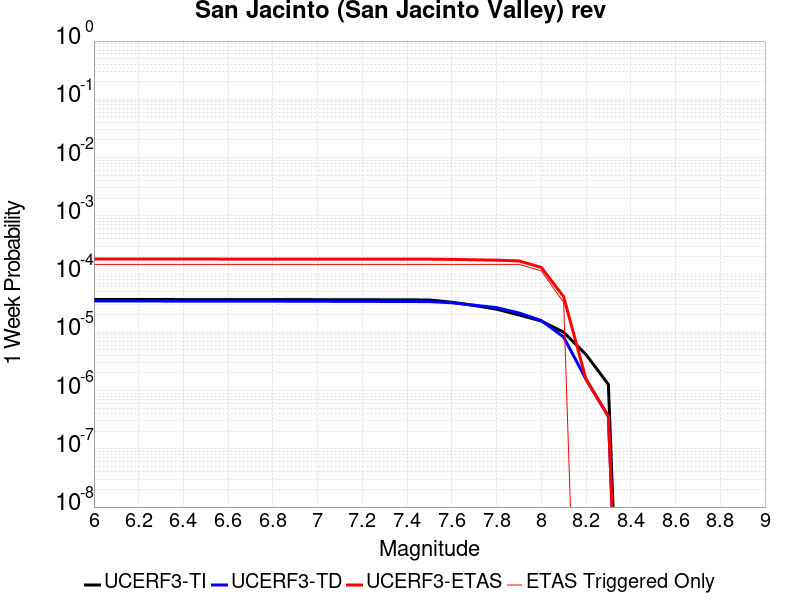 | 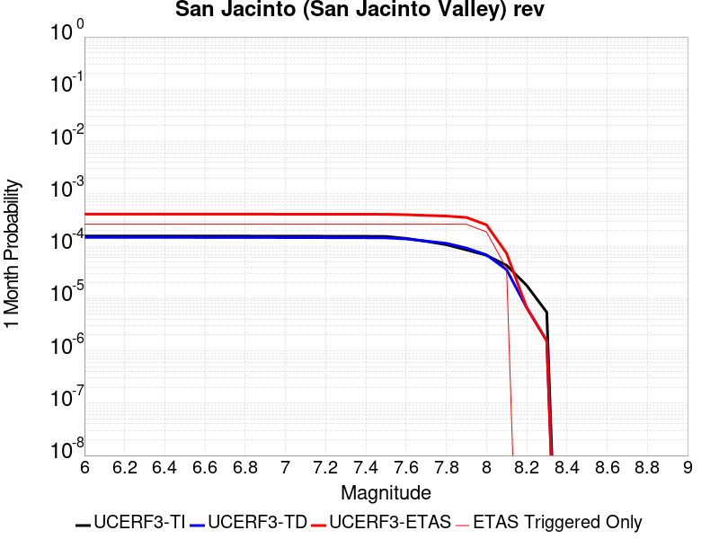 | 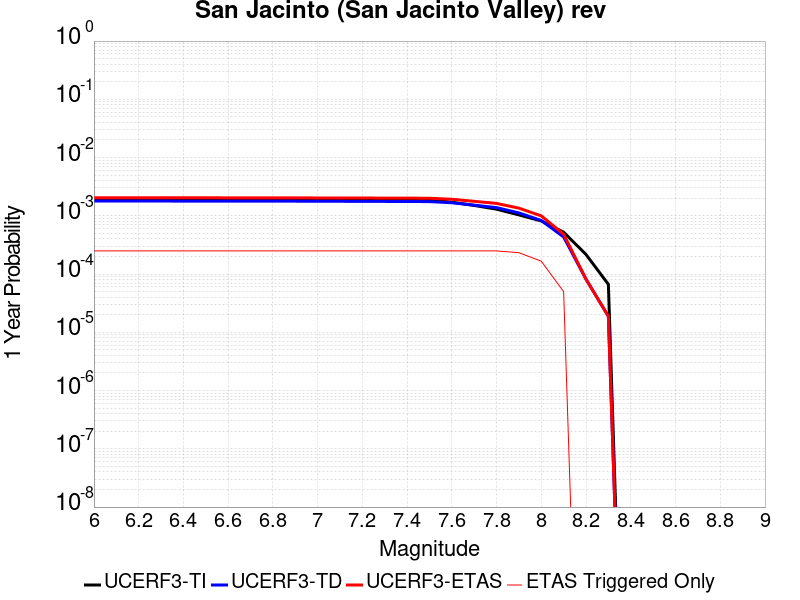 | 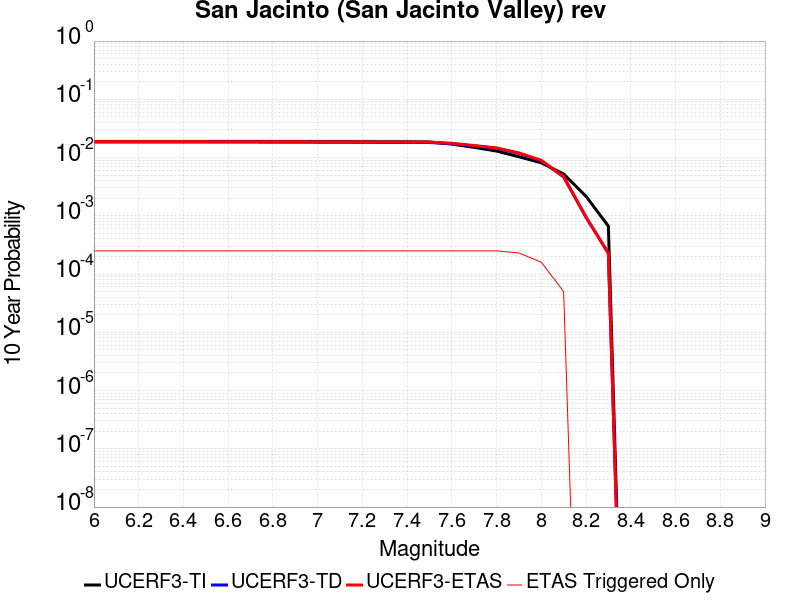 |

| Magnitude | 1 wk TI Prob | 1 wk TD Prob | 1 wk ETAS Prob | 1 wk ETAS/TD Gain | 1 wk ETAS Triggered Only | 1 mo TI Prob | 1 mo TD Prob | 1 mo ETAS Prob | 1 mo ETAS/TD Gain | 1 mo ETAS Triggered Only | 1 yr TI Prob | 1 yr TD Prob | 1 yr ETAS Prob | 1 yr ETAS/TD Gain | 1 yr ETAS Triggered Only | 10 yr TI Prob | 10 yr TD Prob | 10 yr ETAS Prob | 10 yr ETAS/TD Gain | 10 yr ETAS Triggered Only |
|-----|-----|-----|-----|-----|-----|-----|-----|-----|-----|-----|-----|-----|-----|-----|-----|-----|-----|-----|-----|-----|
| 6.0 | 3.652694E-5 | 3.4401106E-5 | 2.092552E-4 | 6.0828047 | 1.748601E-4 | 1.5653463E-4 | 1.4742499E-4 | 3.4723565E-4 | 2.3553379 | 1.9984013E-4 | 0.0019041431 | 0.0017934233 | 0.0020677107 | 1.1529406 | 2.7478018E-4 | 0.018879099 | 0.018526303 | 0.018795991 | 1.0145571 | 2.7478018E-4 |
| 6.1 | 3.652694E-5 | 3.4401106E-5 | 2.092552E-4 | 6.0828047 | 1.748601E-4 | 1.5653463E-4 | 1.4742499E-4 | 3.4723565E-4 | 2.3553379 | 1.9984013E-4 | 0.0019041431 | 0.0017934233 | 0.0020677107 | 1.1529406 | 2.7478018E-4 | 0.018879099 | 0.018526303 | 0.018795991 | 1.0145571 | 2.7478018E-4 |
| 6.2 | 3.652694E-5 | 3.4401106E-5 | 2.092552E-4 | 6.0828047 | 1.748601E-4 | 1.5653463E-4 | 1.4742499E-4 | 3.4723565E-4 | 2.3553379 | 1.9984013E-4 | 0.0019041431 | 0.0017934233 | 0.0020677107 | 1.1529406 | 2.7478018E-4 | 0.018879099 | 0.018526303 | 0.018795991 | 1.0145571 | 2.7478018E-4 |
| 6.3 | 3.652694E-5 | 3.4401106E-5 | 2.092552E-4 | 6.0828047 | 1.748601E-4 | 1.5653463E-4 | 1.4742499E-4 | 3.4723565E-4 | 2.3553379 | 1.9984013E-4 | 0.0019041431 | 0.0017934233 | 0.0020677107 | 1.1529406 | 2.7478018E-4 | 0.018879099 | 0.018526303 | 0.018795991 | 1.0145571 | 2.7478018E-4 |
| 6.4 | 3.646941E-5 | 3.432268E-5 | 2.0917678E-4 | 6.094419 | 1.748601E-4 | 1.5628811E-4 | 1.4708891E-4 | 3.4689964E-4 | 2.358435 | 1.9984013E-4 | 0.0019011468 | 0.0017893389 | 0.0020636274 | 1.1532904 | 2.7478018E-4 | 0.018849645 | 0.018486181 | 0.018755883 | 1.0145893 | 2.7478018E-4 |
| 6.5 | 3.646941E-5 | 3.432268E-5 | 2.0917678E-4 | 6.094419 | 1.748601E-4 | 1.5628811E-4 | 1.4708891E-4 | 3.4689964E-4 | 2.358435 | 1.9984013E-4 | 0.0019011468 | 0.0017893389 | 0.0020636274 | 1.1532904 | 2.7478018E-4 | 0.018849645 | 0.018486181 | 0.018755883 | 1.0145893 | 2.7478018E-4 |
| 6.6 | 3.6442503E-5 | 3.4286066E-5 | 2.0914018E-4 | 6.099859 | 1.748601E-4 | 1.561728E-4 | 1.4693203E-4 | 3.467428E-4 | 2.3598857 | 1.9984013E-4 | 0.0018997455 | 0.001787432 | 0.002061721 | 1.1534543 | 2.7478018E-4 | 0.018835869 | 0.01846745 | 0.018737156 | 1.0146043 | 2.7478018E-4 |
| 6.7 | 3.6432113E-5 | 3.427164E-5 | 2.0912576E-4 | 6.102006 | 1.748601E-4 | 1.5612828E-4 | 1.4687021E-4 | 3.46681E-4 | 2.3604581 | 1.9984013E-4 | 0.0018992044 | 0.0017866807 | 0.0020609698 | 1.1535189 | 2.7478018E-4 | 0.018830549 | 0.018460074 | 0.018729782 | 1.0146103 | 2.7478018E-4 |
| 6.8 | 3.6409598E-5 | 3.4240697E-5 | 2.0909483E-4 | 6.106617 | 1.748601E-4 | 1.560318E-4 | 1.4673761E-4 | 3.4654842E-4 | 2.3616877 | 1.9984013E-4 | 0.0018980318 | 0.0017850689 | 0.0020593586 | 1.1536578 | 2.7478018E-4 | 0.018819023 | 0.018444229 | 0.018713942 | 1.0146232 | 2.7478018E-4 |
| 6.9 | 3.638078E-5 | 3.4201123E-5 | 2.0905526E-4 | 6.1125264 | 1.748601E-4 | 1.5590832E-4 | 1.4656801E-4 | 3.4637886E-4 | 2.3632636 | 1.9984013E-4 | 0.0018965311 | 0.0017830075 | 0.0020572979 | 1.1538358 | 2.7478018E-4 | 0.018804269 | 0.018423963 | 0.01869368 | 1.0146395 | 2.7478018E-4 |
| 7.0 | 3.6294874E-5 | 3.408314E-5 | 2.0893729E-4 | 6.130224 | 1.748601E-4 | 1.5554018E-4 | 1.4606243E-4 | 3.4587338E-4 | 2.367983 | 1.9984013E-4 | 0.0018920569 | 0.0017768623 | 0.0020511542 | 1.1543688 | 2.7478018E-4 | 0.018760284 | 0.018363545 | 0.018633278 | 1.0146886 | 2.7478018E-4 |
| 7.1 | 3.6260717E-5 | 3.403942E-5 | 2.0889359E-4 | 6.1368136 | 1.748601E-4 | 1.5539382E-4 | 1.4587509E-4 | 3.4568607E-4 | 2.3697402 | 1.9984013E-4 | 0.001890278 | 0.0017745851 | 0.0020488778 | 1.1545671 | 2.7478018E-4 | 0.018742796 | 0.018341139 | 0.01861088 | 1.0147069 | 2.7478018E-4 |
| 7.2 | 3.6210204E-5 | 3.397364E-5 | 2.0882781E-4 | 6.14676 | 1.748601E-4 | 1.5517735E-4 | 1.455932E-4 | 3.4540423E-4 | 2.3723924 | 1.9984013E-4 | 0.001887647 | 0.0017711588 | 0.0020454524 | 1.1548667 | 2.7478018E-4 | 0.01871693 | 0.018307408 | 0.018577158 | 1.0147345 | 2.7478018E-4 |
| 7.3 | 3.6119454E-5 | 3.386193E-5 | 2.0871611E-4 | 6.16374 | 1.748601E-4 | 1.5478847E-4 | 1.4511449E-4 | 3.4492562E-4 | 2.3769207 | 1.9984013E-4 | 0.0018829206 | 0.0017653398 | 0.0020396349 | 1.1553781 | 2.7478018E-4 | 0.018670462 | 0.01824996 | 0.018519726 | 1.0147817 | 2.7478018E-4 |
| 7.4 | 3.607848E-5 | 3.380943E-5 | 2.0866362E-4 | 6.1717587 | 1.748601E-4 | 1.5461289E-4 | 1.4488952E-4 | 3.4470067E-4 | 2.3790588 | 1.9984013E-4 | 0.0018807866 | 0.0017626052 | 0.002036901 | 1.1556195 | 2.7478018E-4 | 0.018649481 | 0.018222956 | 0.018492728 | 1.014804 | 2.7478018E-4 |
| 7.5 | 3.5856774E-5 | 3.3619202E-5 | 2.0847344E-4 | 6.2010226 | 1.748601E-4 | 1.5366284E-4 | 1.4407437E-4 | 3.438857E-4 | 2.3868625 | 1.9984013E-4 | 0.0018692396 | 0.0017526967 | 0.0020269952 | 1.1565009 | 2.7478018E-4 | 0.018535944 | 0.018124057 | 0.018393857 | 1.0148863 | 2.7478018E-4 |
| 7.6 | 3.286655E-5 | 3.2142278E-5 | 2.0699677E-4 | 6.440016 | 1.748601E-4 | 1.4084904E-4 | 1.3774536E-4 | 3.3755795E-4 | 2.4505942 | 1.9984013E-4 | 0.001713488 | 0.0016757617 | 0.0019500814 | 1.1636986 | 2.7478018E-4 | 0.017003361 | 0.017343804 | 0.017613817 | 1.0155684 | 2.7478018E-4 |
| 7.7 | 2.8882527E-5 | 2.9235205E-5 | 2.040902E-4 | 6.980974 | 1.748601E-4 | 1.237764E-4 | 1.2528773E-4 | 3.2510282E-4 | 2.5948498 | 1.9984013E-4 | 0.0015059357 | 0.0015243118 | 0.0017986731 | 1.1799903 | 2.7478018E-4 | 0.014957713 | 0.015830338 | 0.016100768 | 1.017083 | 2.7478018E-4 |
| 7.8 | 2.4950225E-5 | 2.6526219E-5 | 2.013817E-4 | 7.591798 | 1.748601E-4 | 1.0692515E-4 | 1.1367885E-4 | 3.1349625E-4 | 2.757736 | 1.9984013E-4 | 0.0013010362 | 0.0013831621 | 0.0016575622 | 1.1983861 | 2.7478018E-4 | 0.012934455 | 0.01441176 | 0.01468258 | 1.0187916 | 2.7478018E-4 |
| 7.9 | 1.9881603E-5 | 2.150649E-5 | 1.9636285E-4 | 9.130399 | 1.748601E-4 | 8.520408E-5 | 9.216742E-5 | 2.9198913E-4 | 3.1680298 | 1.9984013E-4 | 0.001036866 | 0.0011215615 | 0.0013710815 | 1.2224755 | 2.4980016E-4 | 0.010320415 | 0.011776998 | 0.012023856 | 1.020961 | 2.4980016E-4 |
| 8.0 | 1.563292E-5 | 1.5936288E-5 | 1.65814E-4 | 10.404807 | 1.498801E-4 | 6.6996516E-5 | 6.829659E-5 | 2.1816645E-4 | 3.1943974 | 1.498801E-4 | 8.153773E-4 | 8.3119445E-4 | 0.0010059093 | 1.2101972 | 1.748601E-4 | 0.00812392 | 0.008810331 | 0.008983651 | 1.0196723 | 1.748601E-4 |
| 8.1 | 1.0045313E-5 | 8.300794E-6 | 3.32806E-5 | 4.0093274 | 2.4980016E-5 | 4.305063E-5 | 3.557435E-5 | 6.0553477E-5 | 1.7021668 | 2.4980016E-5 | 5.2401534E-4 | 4.3303217E-4 | 4.8297056E-4 | 1.1153226 | 4.9960032E-5 | 0.0052278144 | 0.0046587666 | 0.004708494 | 1.0106739 | 4.9960032E-5 |
| 8.2 | 4.1554413E-6 | 1.5648296E-6 | 1.5648296E-6 | 1.0 | 0.0 | 1.7808914E-5 | 6.7063957E-6 | 6.7063957E-6 | 1.0 | 0.0 | 2.1680194E-4 | 8.164734E-5 | 8.164734E-5 | 1.0 | 0.0 | 0.0021659054 | 9.479703E-4 | 9.479703E-4 | 1.0 | 0.0 |
| 8.3 | 1.2758221E-6 | 3.612677E-7 | 3.612677E-7 | 1.0 | 0.0 | 5.4677976E-6 | 1.5482892E-6 | 1.5482892E-6 | 1.0 | 0.0 | 6.65684E-5 | 1.8850264E-5 | 1.8850264E-5 | 1.0 | 0.0 | 6.6548464E-4 | 2.2739546E-4 | 2.2739546E-4 | 1.0 | 0.0 |

## San Andreas (North Branch Mill Creek)
*[(top)](#table-of-contents)*

| 1 Week | 1 Month | 1 Year | 10 Year |
|-----|-----|-----|-----|
| 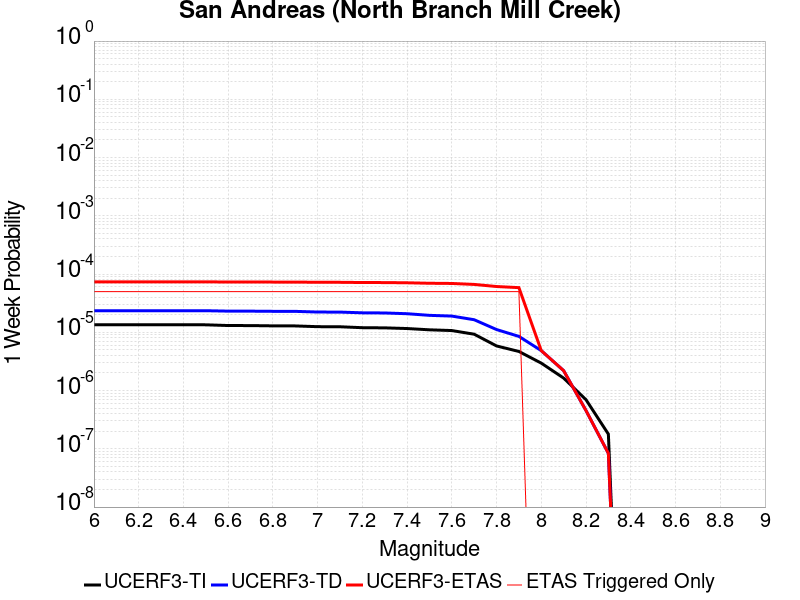 | 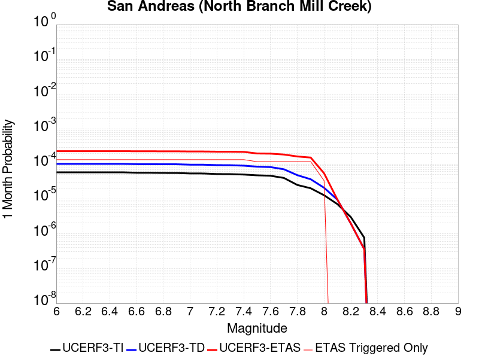 |  | 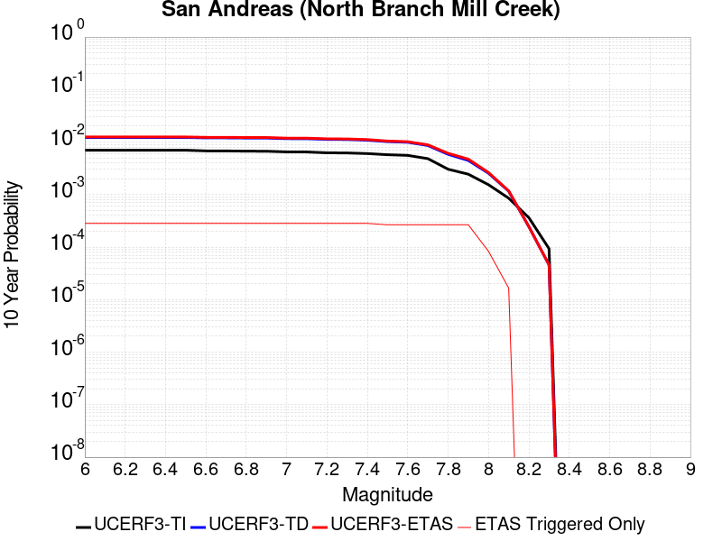 |

| Magnitude | 1 wk TI Prob | 1 wk TD Prob | 1 wk ETAS Prob | 1 wk ETAS/TD Gain | 1 wk ETAS Triggered Only | 1 mo TI Prob | 1 mo TD Prob | 1 mo ETAS Prob | 1 mo ETAS/TD Gain | 1 mo ETAS Triggered Only | 1 yr TI Prob | 1 yr TD Prob | 1 yr ETAS Prob | 1 yr ETAS/TD Gain | 1 yr ETAS Triggered Only | 10 yr TI Prob | 10 yr TD Prob | 10 yr ETAS Prob | 10 yr ETAS/TD Gain | 10 yr ETAS Triggered Only |
|-----|-----|-----|-----|-----|-----|-----|-----|-----|-----|-----|-----|-----|-----|-----|-----|-----|-----|-----|-----|-----|
| 6.0 | 1.3461156E-5 | 2.3500992E-5 | 7.345985E-5 | 3.1258192 | 4.9960032E-5 | 5.7689394E-5 | 1.00714664E-4 | 2.2560217E-4 | 2.2400131 | 1.2490008E-4 | 7.02142E-4 | 0.0012255146 | 0.0014500592 | 1.1832248 | 2.2482015E-4 | 0.0069992766 | 0.012228744 | 0.012500164 | 1.0221952 | 2.7478018E-4 |
| 6.1 | 1.3461156E-5 | 2.3500992E-5 | 7.345985E-5 | 3.1258192 | 4.9960032E-5 | 5.7689394E-5 | 1.00714664E-4 | 2.2560217E-4 | 2.2400131 | 1.2490008E-4 | 7.02142E-4 | 0.0012255146 | 0.0014500592 | 1.1832248 | 2.2482015E-4 | 0.0069992766 | 0.012228744 | 0.012500164 | 1.0221952 | 2.7478018E-4 |
| 6.2 | 1.3461156E-5 | 2.3500992E-5 | 7.345985E-5 | 3.1258192 | 4.9960032E-5 | 5.7689394E-5 | 1.00714664E-4 | 2.2560217E-4 | 2.2400131 | 1.2490008E-4 | 7.02142E-4 | 0.0012255146 | 0.0014500592 | 1.1832248 | 2.2482015E-4 | 0.0069992766 | 0.012228744 | 0.012500164 | 1.0221952 | 2.7478018E-4 |
| 6.3 | 1.3461156E-5 | 2.3500992E-5 | 7.345985E-5 | 3.1258192 | 4.9960032E-5 | 5.7689394E-5 | 1.00714664E-4 | 2.2560217E-4 | 2.2400131 | 1.2490008E-4 | 7.02142E-4 | 0.0012255146 | 0.0014500592 | 1.1832248 | 2.2482015E-4 | 0.0069992766 | 0.012228744 | 0.012500164 | 1.0221952 | 2.7478018E-4 |
| 6.4 | 1.3461156E-5 | 2.3500992E-5 | 7.345985E-5 | 3.1258192 | 4.9960032E-5 | 5.7689394E-5 | 1.00714664E-4 | 2.2560217E-4 | 2.2400131 | 1.2490008E-4 | 7.02142E-4 | 0.0012255146 | 0.0014500592 | 1.1832248 | 2.2482015E-4 | 0.0069992766 | 0.012228744 | 0.012500164 | 1.0221952 | 2.7478018E-4 |
| 6.5 | 1.3450706E-5 | 2.348995E-5 | 7.344881E-5 | 3.1268182 | 4.9960032E-5 | 5.764461E-5 | 1.00667356E-4 | 2.2555486E-4 | 2.2405958 | 1.2490008E-4 | 7.0159714E-4 | 0.0012249392 | 0.001449484 | 1.183311 | 2.2482015E-4 | 0.006993862 | 0.012223054 | 0.012494476 | 1.0222057 | 2.7478018E-4 |
| 6.6 | 1.3074523E-5 | 2.3104236E-5 | 7.3063115E-5 | 3.1623256 | 4.9960032E-5 | 5.6032466E-5 | 9.901441E-5 | 2.2390213E-4 | 2.2613084 | 1.2490008E-4 | 6.8198174E-4 | 0.001204837 | 0.0014293863 | 1.1863731 | 2.2482015E-4 | 0.006798926 | 0.012024219 | 0.012295695 | 1.0225774 | 2.7478018E-4 |
| 6.7 | 1.3050216E-5 | 2.3079532E-5 | 7.303841E-5 | 3.16464 | 4.9960032E-5 | 5.59283E-5 | 9.890855E-5 | 2.2379628E-4 | 2.2626586 | 1.2490008E-4 | 6.8071426E-4 | 0.0012035496 | 0.0014280991 | 1.1865728 | 2.2482015E-4 | 0.0067863287 | 0.012011484 | 0.012282964 | 1.0226017 | 2.7478018E-4 |
| 6.8 | 1.29049395E-5 | 2.2927941E-5 | 7.2886825E-5 | 3.1789522 | 4.9960032E-5 | 5.530571E-5 | 9.825892E-5 | 2.2314672E-4 | 2.2710073 | 1.2490008E-4 | 6.73139E-4 | 0.001195649 | 0.0014202003 | 1.1878071 | 2.2482015E-4 | 0.0067110364 | 0.011933329 | 0.01220483 | 1.0227515 | 2.7478018E-4 |
| 6.9 | 1.2867369E-5 | 2.2887343E-5 | 7.284623E-5 | 3.1828172 | 4.9960032E-5 | 5.51447E-5 | 9.808494E-5 | 2.2297277E-4 | 2.273262 | 1.2490008E-4 | 6.711799E-4 | 0.0011935332 | 0.0014180851 | 1.1881404 | 2.2482015E-4 | 0.006691564 | 0.011912397 | 0.012183905 | 1.022792 | 2.7478018E-4 |
| 7.0 | 1.2495996E-5 | 2.2287419E-5 | 7.224634E-5 | 3.2415748 | 4.9960032E-5 | 5.3553173E-5 | 9.551403E-5 | 2.2040219E-4 | 2.3075373 | 1.2490008E-4 | 6.518148E-4 | 0.0011622658 | 0.0013868246 | 1.1932079 | 2.2482015E-4 | 0.0064990623 | 0.011603 | 0.011874592 | 1.023407 | 2.7478018E-4 |
| 7.1 | 1.2452067E-5 | 2.2232492E-5 | 7.219141E-5 | 3.247113 | 4.9960032E-5 | 5.3364907E-5 | 9.527864E-5 | 2.2016682E-4 | 2.310768 | 1.2490008E-4 | 6.4952404E-4 | 0.001159403 | 0.0013839625 | 1.1936854 | 2.2482015E-4 | 0.0064762887 | 0.011574671 | 0.01184627 | 1.023465 | 2.7478018E-4 |
| 7.2 | 1.2002777E-5 | 2.1611015E-5 | 7.1569964E-5 | 3.3117356 | 4.9960032E-5 | 5.143946E-5 | 9.261536E-5 | 2.1750387E-4 | 2.3484643 | 1.2490008E-4 | 6.2609545E-4 | 0.0011270114 | 0.0013515782 | 1.1992587 | 2.2482015E-4 | 0.006243344 | 0.011254058 | 0.0115257455 | 1.0241413 | 2.7478018E-4 |
| 7.3 | 1.1923425E-5 | 2.1480853E-5 | 7.143981E-5 | 3.3257437 | 4.9960032E-5 | 5.109939E-5 | 9.205757E-5 | 2.1694615E-4 | 2.3566356 | 1.2490008E-4 | 6.219575E-4 | 0.0011202273 | 0.0013447956 | 1.2004668 | 2.2482015E-4 | 0.0062021962 | 0.011186945 | 0.011458651 | 1.0242878 | 2.7478018E-4 |
| 7.4 | 1.16105175E-5 | 2.0854808E-5 | 7.0813796E-5 | 3.3955622 | 4.9960032E-5 | 4.975841E-5 | 8.93747E-5 | 2.1426362E-4 | 2.3973632 | 1.2490008E-4 | 6.0564023E-4 | 0.0010875963 | 0.0013121719 | 1.206488 | 2.2482015E-4 | 0.006039923 | 0.010864409 | 0.011136204 | 1.025017 | 2.7478018E-4 |
| 7.5 | 1.1037265E-5 | 1.9554842E-5 | 6.9513895E-5 | 3.5548177 | 4.9960032E-5 | 4.7301706E-5 | 8.380379E-5 | 2.086934E-4 | 2.4902623 | 1.2490008E-4 | 5.757461E-4 | 0.0010198357 | 0.0012444266 | 1.2202226 | 2.2482015E-4 | 0.005742567 | 0.010195527 | 0.010467506 | 1.0266763 | 2.7478018E-4 |
| 7.6 | 1.0720915E-5 | 1.8996727E-5 | 6.895581E-5 | 3.6298783 | 4.9960032E-5 | 4.5945973E-5 | 8.141202E-5 | 2.0630193E-4 | 2.5340476 | 1.2490008E-4 | 5.592486E-4 | 9.907428E-4 | 0.0012153402 | 1.226696 | 2.2482015E-4 | 0.005578433 | 0.009907238 | 0.010179296 | 1.0274605 | 2.7478018E-4 |
| 7.7 | 9.276279E-6 | 1.6442464E-5 | 6.640168E-5 | 4.038426 | 4.9960032E-5 | 3.9754876E-5 | 7.046581E-5 | 1.9535709E-4 | 2.772367 | 1.2490008E-4 | 4.839081E-4 | 8.5758517E-4 | 0.0010822125 | 1.2619301 | 2.2482015E-4 | 0.0048285574 | 0.008586576 | 0.008858996 | 1.0317264 | 2.7478018E-4 |
| 7.8 | 5.8346777E-6 | 1.11555855E-5 | 6.111506E-5 | 5.478427 | 4.9960032E-5 | 2.5005522E-5 | 4.7808775E-5 | 1.7270289E-4 | 3.6123679 | 1.2490008E-4 | 3.043997E-4 | 5.819165E-4 | 8.0660585E-4 | 1.3861195 | 2.2482015E-4 | 0.0030398308 | 0.0058473335 | 0.0061205067 | 1.0467176 | 2.7478018E-4 |
| 7.9 | 4.690204E-6 | 8.509473E-6 | 5.846908E-5 | 6.871057 | 4.9960032E-5 | 2.0100719E-5 | 3.6468664E-5 | 1.613642E-4 | 4.4247355 | 1.2490008E-4 | 2.4469878E-4 | 4.439156E-4 | 6.6863594E-4 | 1.5062231 | 2.2482015E-4 | 0.002444295 | 0.004471165 | 0.0047447165 | 1.0611813 | 2.7478018E-4 |
| 8.0 | 2.9570454E-6 | 4.8470656E-6 | 4.8470656E-6 | 1.0 | 0.0 | 1.267299E-5 | 2.0772974E-5 | 4.575247E-5 | 2.2024999 | 2.4980016E-5 | 1.5428272E-4 | 2.5288164E-4 | 3.0282902E-4 | 1.197513 | 4.9960032E-5 | 0.0015417566 | 0.002549932 | 0.0026246812 | 1.029314 | 7.494005E-5 |
| 8.1 | 1.6376824E-6 | 2.1968672E-6 | 2.1968672E-6 | 1.0 | 0.0 | 7.01862E-6 | 9.415111E-6 | 9.415111E-6 | 1.0 | 0.0 | 8.544835E-5 | 1.1462297E-4 | 1.1462297E-4 | 1.0 | 0.0 | 8.54155E-4 | 0.0011607445 | 0.0011856954 | 1.0214957 | 2.4980016E-5 |
| 8.2 | 6.9631557E-7 | 4.535001E-7 | 4.535001E-7 | 1.0 | 0.0 | 2.984206E-6 | 1.9435704E-6 | 1.9435704E-6 | 1.0 | 0.0 | 3.63321E-5 | 2.3662713E-5 | 2.3662713E-5 | 1.0 | 0.0 | 3.6326164E-4 | 2.4510184E-4 | 2.4510184E-4 | 1.0 | 0.0 |
| 8.3 | 1.7876137E-7 | 8.357368E-8 | 8.357368E-8 | 1.0 | 0.0 | 7.661199E-7 | 3.5817288E-7 | 3.5817288E-7 | 1.0 | 0.0 | 9.32747E-6 | 4.3607465E-6 | 4.3607465E-6 | 1.0 | 0.0 | 9.3270784E-5 | 4.5800018E-5 | 4.5800018E-5 | 1.0 | 0.0 |

## Calico-Hidalgo
*[(top)](#table-of-contents)*

| 1 Week | 1 Month | 1 Year | 10 Year |
|-----|-----|-----|-----|
| 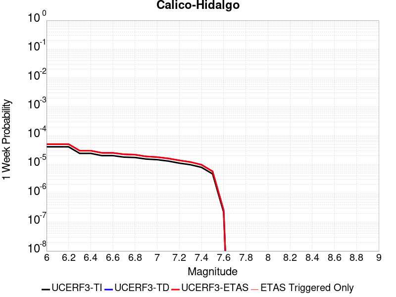 | 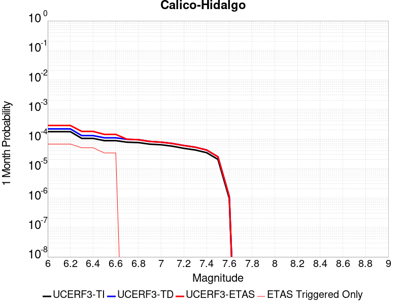 | 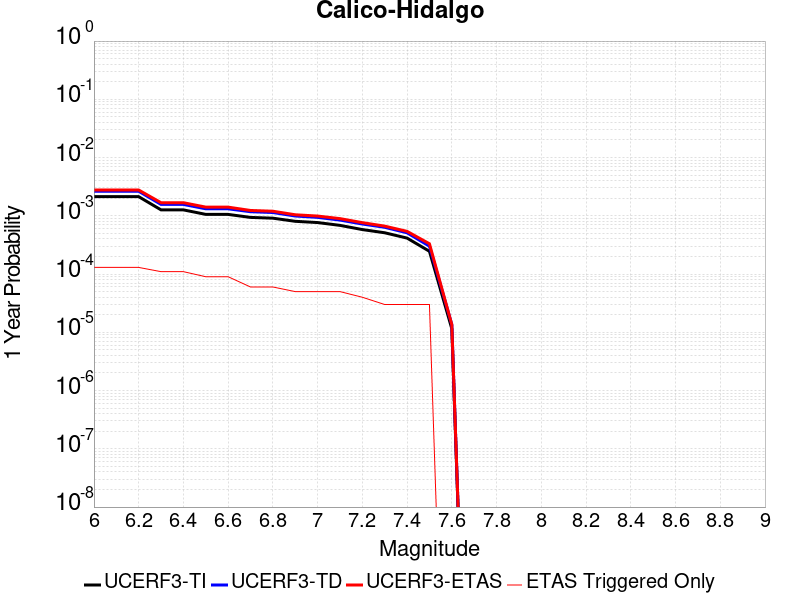 | 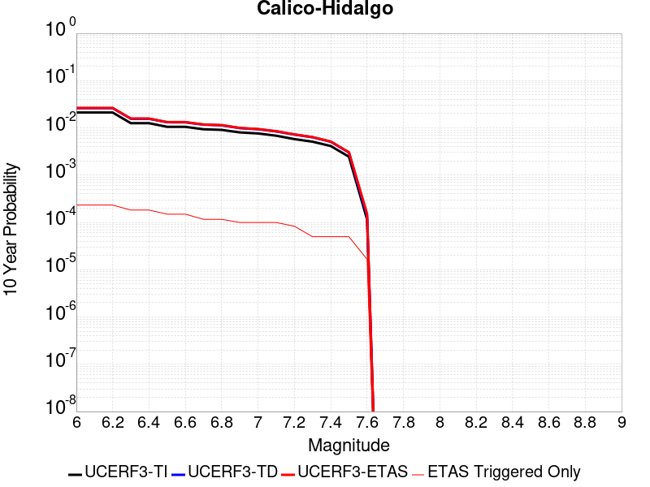 |

| Magnitude | 1 wk TI Prob | 1 wk TD Prob | 1 wk ETAS Prob | 1 wk ETAS/TD Gain | 1 wk ETAS Triggered Only | 1 mo TI Prob | 1 mo TD Prob | 1 mo ETAS Prob | 1 mo ETAS/TD Gain | 1 mo ETAS Triggered Only | 1 yr TI Prob | 1 yr TD Prob | 1 yr ETAS Prob | 1 yr ETAS/TD Gain | 1 yr ETAS Triggered Only | 10 yr TI Prob | 10 yr TD Prob | 10 yr ETAS Prob | 10 yr ETAS/TD Gain | 10 yr ETAS Triggered Only |
|-----|-----|-----|-----|-----|-----|-----|-----|-----|-----|-----|-----|-----|-----|-----|-----|-----|-----|-----|-----|-----|
| 6.0 | 4.0906612E-5 | 5.0704355E-5 | 5.0704355E-5 | 1.0 | 0.0 | 1.7530227E-4 | 2.1728857E-4 | 2.4226315E-4 | 1.1149374 | 2.4980016E-5 | 0.0021322158 | 0.002642678 | 0.0028170762 | 1.065993 | 1.748601E-4 | 0.02111873 | 0.026152814 | 0.02639608 | 1.0093018 | 2.4980016E-4 |
| 6.1 | 4.0906612E-5 | 5.0704355E-5 | 5.0704355E-5 | 1.0 | 0.0 | 1.7530227E-4 | 2.1728857E-4 | 2.4226315E-4 | 1.1149374 | 2.4980016E-5 | 0.0021322158 | 0.002642678 | 0.0028170762 | 1.065993 | 1.748601E-4 | 0.02111873 | 0.026152814 | 0.02639608 | 1.0093018 | 2.4980016E-4 |
| 6.2 | 4.0906612E-5 | 5.0704355E-5 | 5.0704355E-5 | 1.0 | 0.0 | 1.7530227E-4 | 2.1728857E-4 | 2.4226315E-4 | 1.1149374 | 2.4980016E-5 | 0.0021322158 | 0.002642678 | 0.0028170762 | 1.065993 | 1.748601E-4 | 0.02111873 | 0.026152814 | 0.02639608 | 1.0093018 | 2.4980016E-4 |
| 6.3 | 2.4242801E-5 | 3.0090967E-5 | 3.0090967E-5 | 1.0 | 0.0 | 1.0389358E-4 | 1.289551E-4 | 1.5393189E-4 | 1.193686 | 2.4980016E-5 | 0.0012641704 | 0.0015689312 | 0.0017435169 | 1.1112769 | 1.748601E-4 | 0.01257003 | 0.015582229 | 0.015778955 | 1.012625 | 1.9984013E-4 |
| 6.4 | 2.4242801E-5 | 3.0090967E-5 | 3.0090967E-5 | 1.0 | 0.0 | 1.0389358E-4 | 1.289551E-4 | 1.5393189E-4 | 1.193686 | 2.4980016E-5 | 0.0012641704 | 0.0015689312 | 0.0017435169 | 1.1112769 | 1.748601E-4 | 0.01257003 | 0.015582229 | 0.015778955 | 1.012625 | 1.9984013E-4 |
| 6.5 | 2.0286952E-5 | 2.5316054E-5 | 2.5316054E-5 | 1.0 | 0.0 | 8.694118E-5 | 1.0849296E-4 | 1.3347027E-4 | 1.2302206 | 2.4980016E-5 | 0.0010579949 | 0.0013201186 | 0.0014698007 | 1.1133854 | 1.498801E-4 | 0.010529719 | 0.013124701 | 0.013297265 | 1.0131481 | 1.748601E-4 |
| 6.6 | 2.0269223E-5 | 2.5297004E-5 | 2.5297004E-5 | 1.0 | 0.0 | 8.6865206E-5 | 1.08411325E-4 | 1.3338863E-4 | 1.2303939 | 2.4980016E-5 | 0.0010570707 | 0.0013191258 | 0.0014688082 | 1.1134709 | 1.498801E-4 | 0.010520565 | 0.01311489 | 0.013287457 | 1.0131581 | 1.748601E-4 |
| 6.7 | 1.799852E-5 | 2.2540933E-5 | 2.2540933E-5 | 1.0 | 0.0 | 7.713423E-5 | 9.660051E-5 | 9.660051E-5 | 1.0 | 0.0 | 9.3870464E-4 | 0.0011754911 | 0.0013002445 | 1.1061286 | 1.2490008E-4 | 0.009347493 | 0.011694346 | 0.0118424725 | 1.0126666 | 1.498801E-4 |
| 6.8 | 1.7458793E-5 | 2.184258E-5 | 2.184258E-5 | 1.0 | 0.0 | 7.4821255E-5 | 9.360778E-5 | 9.360778E-5 | 1.0 | 0.0 | 9.10568E-4 | 0.0011390933 | 0.0012638512 | 1.1095238 | 1.2490008E-4 | 0.009068459 | 0.011334131 | 0.011482312 | 1.0130739 | 1.498801E-4 |
| 6.9 | 1.542884E-5 | 1.9026285E-5 | 1.9026285E-5 | 1.0 | 0.0 | 6.612192E-5 | 8.153875E-5 | 8.153875E-5 | 1.0 | 0.0 | 8.04737E-4 | 9.922953E-4 | 0.0010921162 | 1.100596 | 9.9920064E-5 | 0.008018291 | 0.009880043 | 0.010003709 | 1.0125167 | 1.2490008E-4 |
| 7.0 | 1.468253E-5 | 1.803109E-5 | 1.803109E-5 | 1.0 | 0.0 | 6.292361E-5 | 7.727389E-5 | 7.727389E-5 | 1.0 | 0.0 | 7.658257E-4 | 9.4041653E-4 | 0.0010402426 | 1.106151 | 9.9920064E-5 | 0.0076319184 | 0.009365736 | 0.009489466 | 1.013211 | 1.2490008E-4 |
| 7.1 | 1.3139281E-5 | 1.620139E-5 | 1.620139E-5 | 1.0 | 0.0 | 5.6309986E-5 | 6.943275E-5 | 6.943275E-5 | 1.0 | 0.0 | 6.853584E-4 | 8.4502844E-4 | 9.4486406E-4 | 1.1181448 | 9.9920064E-5 | 0.0068324856 | 0.008419449 | 0.008543299 | 1.0147098 | 1.2490008E-4 |
| 7.2 | 1.1127404E-5 | 1.3867038E-5 | 1.3867038E-5 | 1.0 | 0.0 | 4.7688E-5 | 5.9428872E-5 | 5.9428872E-5 | 1.0 | 0.0 | 5.8044674E-4 | 7.233172E-4 | 7.9820305E-4 | 1.1035311 | 7.494005E-5 | 0.0057893298 | 0.007210737 | 0.007309937 | 1.0137572 | 9.9920064E-5 |
| 7.3 | 9.808154E-6 | 1.2176586E-5 | 1.2176586E-5 | 1.0 | 0.0 | 4.2034266E-5 | 5.2184383E-5 | 5.2184383E-5 | 1.0 | 0.0 | 5.11647E-4 | 6.351704E-4 | 6.850987E-4 | 1.0786061 | 4.9960032E-5 | 0.0051047057 | 0.006334625 | 0.006384269 | 1.0078368 | 4.9960032E-5 |
| 7.4 | 7.942452E-6 | 9.792348E-6 | 9.792348E-6 | 1.0 | 0.0 | 3.4038632E-5 | 4.1966585E-5 | 4.1966585E-5 | 1.0 | 0.0 | 4.1434157E-4 | 5.108328E-4 | 5.6076737E-4 | 1.0977511 | 4.9960032E-5 | 0.0041356985 | 0.005097527 | 0.0051472327 | 1.0097508 | 4.9960032E-5 |
| 7.5 | 4.7121216E-6 | 5.7729717E-6 | 5.7729717E-6 | 1.0 | 0.0 | 2.019465E-5 | 2.4741115E-5 | 2.4741115E-5 | 1.0 | 0.0 | 2.4584212E-4 | 3.011891E-4 | 3.5113408E-4 | 1.165826 | 4.9960032E-5 | 0.0024557032 | 0.0030085614 | 0.0030583711 | 1.016556 | 4.9960032E-5 |
| 7.6 | 2.21172E-7 | 2.6040198E-7 | 2.6040198E-7 | 1.0 | 0.0 | 9.478797E-7 | 1.1160082E-6 | 1.1160082E-6 | 1.0 | 0.0 | 1.1540374E-5 | 1.3587343E-5 | 1.3587343E-5 | 1.0 | 0.0 | 1.1539775E-4 | 1.3586794E-4 | 1.3586794E-4 | 1.0 | 0.0 |

## Santa Ynez (West)
*[(top)](#table-of-contents)*

| 1 Week | 1 Month | 1 Year | 10 Year |
|-----|-----|-----|-----|
| 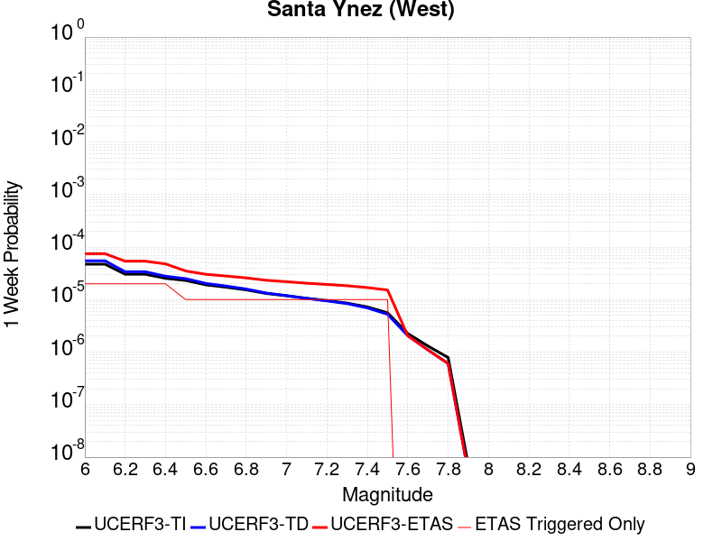 | 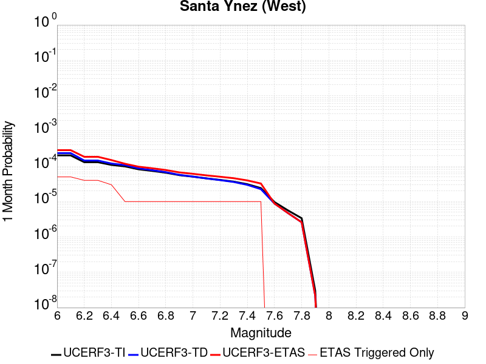 | 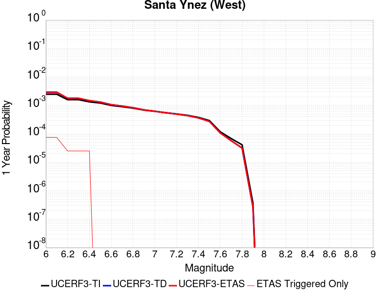 | 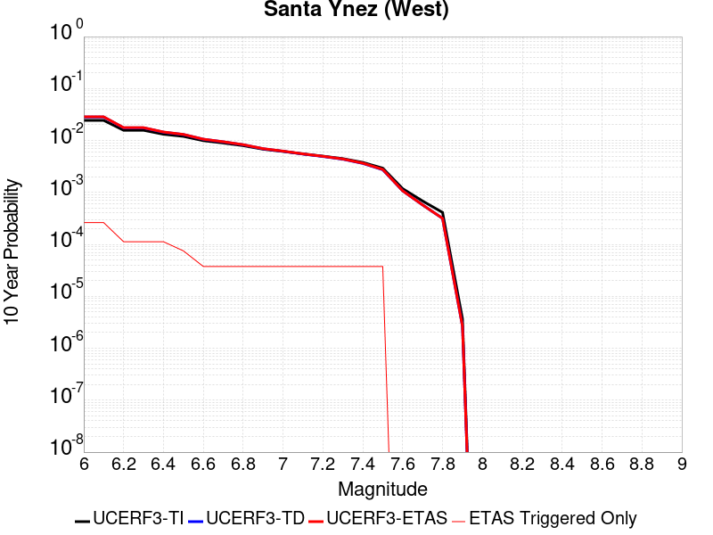 |

| Magnitude | 1 wk TI Prob | 1 wk TD Prob | 1 wk ETAS Prob | 1 wk ETAS/TD Gain | 1 wk ETAS Triggered Only | 1 mo TI Prob | 1 mo TD Prob | 1 mo ETAS Prob | 1 mo ETAS/TD Gain | 1 mo ETAS Triggered Only | 1 yr TI Prob | 1 yr TD Prob | 1 yr ETAS Prob | 1 yr ETAS/TD Gain | 1 yr ETAS Triggered Only | 10 yr TI Prob | 10 yr TD Prob | 10 yr ETAS Prob | 10 yr ETAS/TD Gain | 10 yr ETAS Triggered Only |
|-----|-----|-----|-----|-----|-----|-----|-----|-----|-----|-----|-----|-----|-----|-----|-----|-----|-----|-----|-----|-----|
| 6.0 | 4.7352758E-5 | 5.497084E-5 | 7.994948E-5 | 1.454398 | 2.4980016E-5 | 2.0292461E-4 | 2.3556968E-4 | 2.8551795E-4 | 1.2120318 | 4.9960032E-5 | 0.0024678076 | 0.002864558 | 0.0029392834 | 1.0260862 | 7.494005E-5 | 0.024405818 | 0.028304456 | 0.028498638 | 1.0068605 | 1.9984013E-4 |
| 6.1 | 4.7352758E-5 | 5.497084E-5 | 7.994948E-5 | 1.454398 | 2.4980016E-5 | 2.0292461E-4 | 2.3556968E-4 | 2.8551795E-4 | 1.2120318 | 4.9960032E-5 | 0.0024678076 | 0.002864558 | 0.0029392834 | 1.0260862 | 7.494005E-5 | 0.024405818 | 0.028304456 | 0.028498638 | 1.0068605 | 1.9984013E-4 |
| 6.2 | 3.0415853E-5 | 3.3925004E-5 | 5.890417E-5 | 1.7363056 | 2.4980016E-5 | 1.3034715E-4 | 1.4538495E-4 | 1.7036134E-4 | 1.1717948 | 2.4980016E-5 | 0.0015858212 | 0.0017686592 | 0.001793595 | 1.0140988 | 2.4980016E-5 | 0.015745522 | 0.01754978 | 0.017647946 | 1.0055937 | 9.9920064E-5 |
| 6.3 | 3.0415853E-5 | 3.3925004E-5 | 5.890417E-5 | 1.7363056 | 2.4980016E-5 | 1.3034715E-4 | 1.4538495E-4 | 1.7036134E-4 | 1.1717948 | 2.4980016E-5 | 0.0015858212 | 0.0017686592 | 0.001793595 | 1.0140988 | 2.4980016E-5 | 0.015745522 | 0.01754978 | 0.017647946 | 1.0055937 | 9.9920064E-5 |
| 6.4 | 2.5452082E-5 | 2.7912318E-5 | 5.289164E-5 | 1.894921 | 2.4980016E-5 | 1.09075794E-4 | 1.1961885E-4 | 1.4459588E-4 | 1.2088051 | 2.4980016E-5 | 0.0013271887 | 0.0014554056 | 0.0014803492 | 1.0171386 | 2.4980016E-5 | 0.013192902 | 0.01446091 | 0.014559385 | 1.0068097 | 9.9920064E-5 |
| 6.5 | 2.3143784E-5 | 2.5128133E-5 | 2.5128133E-5 | 1.0 | 0.0 | 9.9183875E-5 | 1.07687636E-4 | 1.07687636E-4 | 1.0 | 0.0 | 0.0012068948 | 0.001310323 | 0.001310323 | 1.0 | 0.0 | 0.012003611 | 0.013027638 | 0.013101602 | 1.0056775 | 7.494005E-5 |
| 6.6 | 1.9118515E-5 | 2.0354244E-5 | 2.0354244E-5 | 1.0 | 0.0 | 8.193392E-5 | 8.722961E-5 | 8.722961E-5 | 1.0 | 0.0 | 9.97089E-4 | 0.001061511 | 0.001061511 | 1.0 | 0.0 | 0.00992627 | 0.010565317 | 0.010614749 | 1.0046787 | 4.9960032E-5 |
| 6.7 | 1.722807E-5 | 1.8146253E-5 | 1.8146253E-5 | 1.0 | 0.0 | 7.3832496E-5 | 7.776737E-5 | 7.776737E-5 | 1.0 | 0.0 | 8.985399E-4 | 9.4641204E-4 | 9.4641204E-4 | 1.0 | 0.0 | 0.008949154 | 0.009424461 | 0.009473951 | 1.0052512 | 4.9960032E-5 |
| 6.8 | 1.5317364E-5 | 1.5926391E-5 | 1.5926391E-5 | 1.0 | 0.0 | 6.56442E-5 | 6.82542E-5 | 6.82542E-5 | 1.0 | 0.0 | 7.98925E-4 | 8.3068234E-4 | 8.3068234E-4 | 1.0 | 0.0 | 0.007960589 | 0.008276261 | 0.008325808 | 1.0059866 | 4.9960032E-5 |
| 6.9 | 1.3071226E-5 | 1.332953E-5 | 1.332953E-5 | 1.0 | 0.0 | 5.6018336E-5 | 5.712532E-5 | 5.712532E-5 | 1.0 | 0.0 | 6.8180985E-4 | 6.952811E-4 | 6.952811E-4 | 1.0 | 0.0 | 0.0067972173 | 0.0069313184 | 0.0069809323 | 1.0071579 | 4.9960032E-5 |
| 7.0 | 1.1836986E-5 | 1.1932688E-5 | 1.1932688E-5 | 1.0 | 0.0 | 5.0728955E-5 | 5.1139097E-5 | 5.1139097E-5 | 1.0 | 0.0 | 6.1745E-4 | 6.2244234E-4 | 6.2244234E-4 | 1.0 | 0.0 | 0.006157372 | 0.0062071825 | 0.0062320074 | 1.0039994 | 2.4980016E-5 |
| 7.1 | 1.0597169E-5 | 1.0542107E-5 | 1.0542107E-5 | 1.0 | 0.0 | 4.541565E-5 | 4.5179684E-5 | 4.5179684E-5 | 1.0 | 0.0 | 5.5279525E-4 | 5.4992497E-4 | 5.4992497E-4 | 1.0 | 0.0 | 0.0055142213 | 0.005485772 | 0.005510615 | 1.0045286 | 2.4980016E-5 |
| 7.2 | 9.59113E-6 | 9.45905E-6 | 9.45905E-6 | 1.0 | 0.0 | 4.11042E-5 | 4.053816E-5 | 4.053816E-5 | 1.0 | 0.0 | 5.0032866E-4 | 4.934414E-4 | 4.934414E-4 | 1.0 | 0.0 | 0.004992037 | 0.0049235765 | 0.0049484335 | 1.0050485 | 2.4980016E-5 |
| 7.3 | 8.586084E-6 | 8.379489E-6 | 8.379489E-6 | 1.0 | 0.0 | 3.679698E-5 | 3.591161E-5 | 3.591161E-5 | 1.0 | 0.0 | 4.4791115E-4 | 4.3713715E-4 | 4.3713715E-4 | 1.0 | 0.0 | 0.004470094 | 0.004362884 | 0.004387755 | 1.0057006 | 2.4980016E-5 |
| 7.4 | 7.2622997E-6 | 6.9514485E-6 | 6.9514485E-6 | 1.0 | 0.0 | 3.112377E-5 | 2.9791589E-5 | 2.9791589E-5 | 1.0 | 0.0 | 3.78866E-4 | 3.6265317E-4 | 3.6265317E-4 | 1.0 | 0.0 | 0.0037822074 | 0.003620714 | 0.0036456035 | 1.0068742 | 2.4980016E-5 |
| 7.5 | 5.627296E-6 | 5.2514984E-6 | 5.2514984E-6 | 1.0 | 0.0 | 2.411676E-5 | 2.2506232E-5 | 2.2506232E-5 | 1.0 | 0.0 | 2.9358198E-4 | 2.7397962E-4 | 2.7397962E-4 | 1.0 | 0.0 | 0.0029319443 | 0.0027364905 | 0.0027614022 | 1.0091035 | 2.4980016E-5 |
| 7.6 | 2.265244E-6 | 2.0608632E-6 | 2.0608632E-6 | 1.0 | 0.0 | 9.708152E-6 | 8.832241E-6 | 8.832241E-6 | 1.0 | 0.0 | 1.18190335E-4 | 1.0752732E-4 | 1.0752732E-4 | 1.0 | 0.0 | 0.001181275 | 0.0010747615 | 0.0010747615 | 1.0 | 0.0 |
| 7.7 | 1.3099874E-6 | 1.1016228E-6 | 1.1016228E-6 | 1.0 | 0.0 | 5.61422E-6 | 4.7212325E-6 | 4.7212325E-6 | 1.0 | 0.0 | 6.8350986E-5 | 5.7479516E-5 | 5.7479516E-5 | 1.0 | 0.0 | 6.832996E-4 | 5.7464885E-4 | 5.7464885E-4 | 1.0 | 0.0 |
| 7.8 | 7.903951E-7 | 6.0710704E-7 | 6.0710704E-7 | 1.0 | 0.0 | 3.3874032E-6 | 2.601885E-6 | 2.601885E-6 | 1.0 | 0.0 | 4.1240855E-5 | 3.16775E-5 | 3.16775E-5 | 1.0 | 0.0 | 4.12332E-4 | 3.167312E-4 | 3.167312E-4 | 1.0 | 0.0 |
| 7.9 | 7.0753297E-9 | 5.090092E-9 | 5.090092E-9 | 1.0 | 0.0 | 3.032284E-8 | 2.181468E-8 | 2.181468E-8 | 1.0 | 0.0 | 3.6918053E-7 | 2.655937E-7 | 2.655937E-7 | 1.0 | 0.0 | 3.691799E-6 | 2.6559348E-6 | 2.6559348E-6 | 1.0 | 0.0 |

## Kern Canyon (North Kern) 2011
*[(top)](#table-of-contents)*

| 1 Week | 1 Month | 1 Year | 10 Year |
|-----|-----|-----|-----|
| 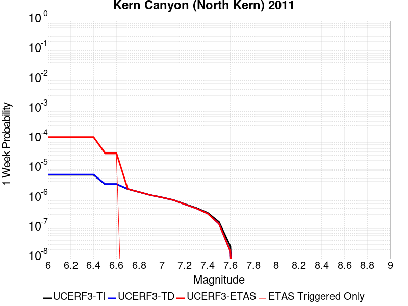 | 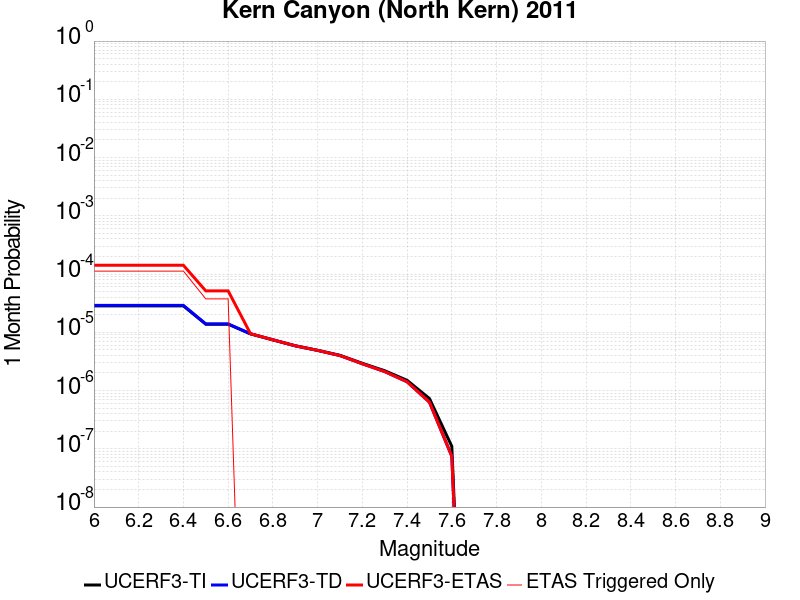 | 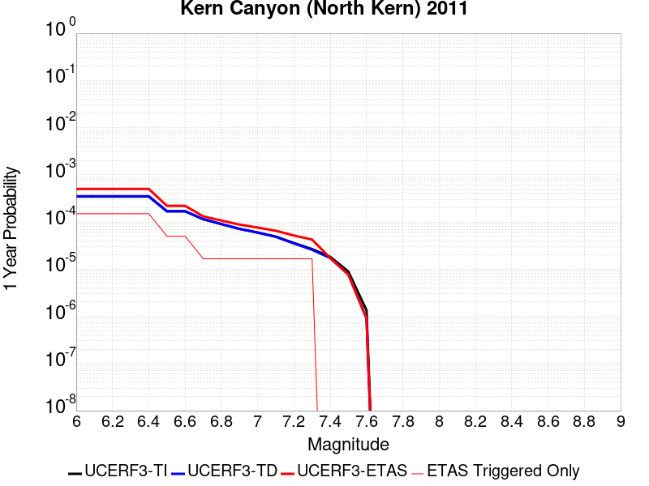 | 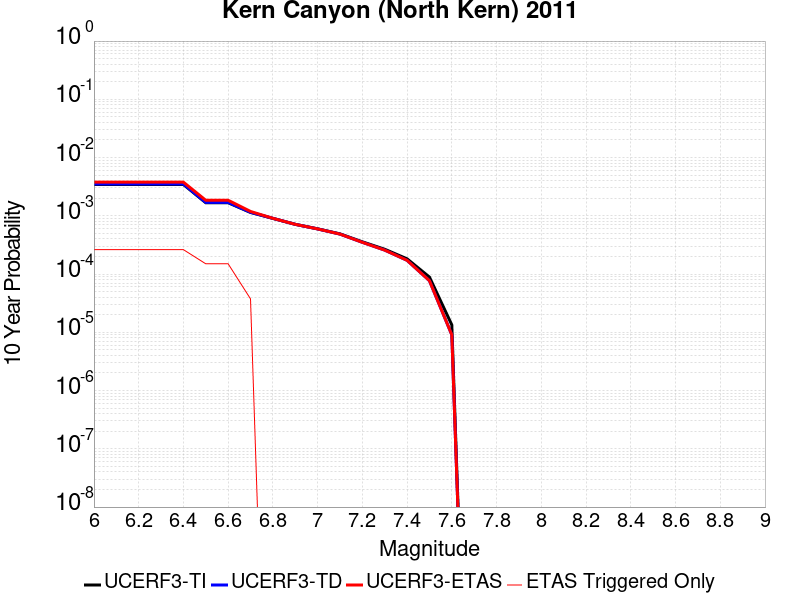 |

| Magnitude | 1 wk TI Prob | 1 wk TD Prob | 1 wk ETAS Prob | 1 wk ETAS/TD Gain | 1 wk ETAS Triggered Only | 1 mo TI Prob | 1 mo TD Prob | 1 mo ETAS Prob | 1 mo ETAS/TD Gain | 1 mo ETAS Triggered Only | 1 yr TI Prob | 1 yr TD Prob | 1 yr ETAS Prob | 1 yr ETAS/TD Gain | 1 yr ETAS Triggered Only | 10 yr TI Prob | 10 yr TD Prob | 10 yr ETAS Prob | 10 yr ETAS/TD Gain | 10 yr ETAS Triggered Only |
|-----|-----|-----|-----|-----|-----|-----|-----|-----|-----|-----|-----|-----|-----|-----|-----|-----|-----|-----|-----|-----|
| 6.0 | 6.6264497E-6 | 6.75733E-6 | 1.0667672E-4 | 15.786815 | 9.9920064E-5 | 2.8398761E-5 | 2.895971E-5 | 1.5385618E-4 | 5.3127666 | 1.2490008E-4 | 3.4570007E-4 | 3.5253543E-4 | 4.7739147E-4 | 1.3541659 | 1.2490008E-4 | 0.0034516277 | 0.0035205502 | 0.003744579 | 1.0636345 | 2.2482015E-4 |
| 6.1 | 6.6264497E-6 | 6.75733E-6 | 1.0667672E-4 | 15.786815 | 9.9920064E-5 | 2.8398761E-5 | 2.895971E-5 | 1.5385618E-4 | 5.3127666 | 1.2490008E-4 | 3.4570007E-4 | 3.5253543E-4 | 4.7739147E-4 | 1.3541659 | 1.2490008E-4 | 0.0034516277 | 0.0035205502 | 0.003744579 | 1.0636345 | 2.2482015E-4 |
| 6.2 | 6.6264497E-6 | 6.75733E-6 | 1.0667672E-4 | 15.786815 | 9.9920064E-5 | 2.8398761E-5 | 2.895971E-5 | 1.5385618E-4 | 5.3127666 | 1.2490008E-4 | 3.4570007E-4 | 3.5253543E-4 | 4.7739147E-4 | 1.3541659 | 1.2490008E-4 | 0.0034516277 | 0.0035205502 | 0.003744579 | 1.0636345 | 2.2482015E-4 |
| 6.3 | 6.6264497E-6 | 6.75733E-6 | 1.0667672E-4 | 15.786815 | 9.9920064E-5 | 2.8398761E-5 | 2.895971E-5 | 1.5385618E-4 | 5.3127666 | 1.2490008E-4 | 3.4570007E-4 | 3.5253543E-4 | 4.7739147E-4 | 1.3541659 | 1.2490008E-4 | 0.0034516277 | 0.0035205502 | 0.003744579 | 1.0636345 | 2.2482015E-4 |
| 6.4 | 6.6264497E-6 | 6.75733E-6 | 1.0667672E-4 | 15.786815 | 9.9920064E-5 | 2.8398761E-5 | 2.895971E-5 | 1.5385618E-4 | 5.3127666 | 1.2490008E-4 | 3.4570007E-4 | 3.5253543E-4 | 4.7739147E-4 | 1.3541659 | 1.2490008E-4 | 0.0034516277 | 0.0035205502 | 0.003744579 | 1.0636345 | 2.2482015E-4 |
| 6.5 | 3.2162225E-6 | 3.2570915E-6 | 2.8237026E-5 | 8.669399 | 2.4980016E-5 | 1.3783738E-5 | 1.3958894E-5 | 3.893856E-5 | 2.7895162 | 2.4980016E-5 | 1.6780409E-4 | 1.6993708E-4 | 1.9491285E-4 | 1.1469707 | 2.4980016E-5 | 0.0016767744 | 0.001698151 | 0.0017979015 | 1.0587406 | 9.9920064E-5 |
| 6.6 | 3.2162225E-6 | 3.2570915E-6 | 2.8237026E-5 | 8.669399 | 2.4980016E-5 | 1.3783738E-5 | 1.3958894E-5 | 3.893856E-5 | 2.7895162 | 2.4980016E-5 | 1.6780409E-4 | 1.6993708E-4 | 1.9491285E-4 | 1.1469707 | 2.4980016E-5 | 0.0016767744 | 0.001698151 | 0.0017979015 | 1.0587406 | 9.9920064E-5 |
| 6.7 | 2.1908265E-6 | 2.2071222E-6 | 2.2071222E-6 | 1.0 | 0.0 | 9.389223E-6 | 9.459062E-6 | 9.459062E-6 | 1.0 | 0.0 | 1.1430779E-4 | 1.1515819E-4 | 1.1515819E-4 | 1.0 | 0.0 | 0.0011424901 | 0.0011510046 | 0.0011759559 | 1.0216779 | 2.4980016E-5 |
| 6.8 | 1.7303895E-6 | 1.736553E-6 | 1.736553E-6 | 1.0 | 0.0 | 7.415934E-6 | 7.442349E-6 | 7.442349E-6 | 1.0 | 0.0 | 9.028525E-5 | 9.060693E-5 | 9.060693E-5 | 1.0 | 0.0 | 9.024858E-4 | 9.0570963E-4 | 9.0570963E-4 | 1.0 | 0.0 |
| 6.9 | 1.3700314E-6 | 1.3688623E-6 | 1.3688623E-6 | 1.0 | 0.0 | 5.87155E-6 | 5.86654E-6 | 5.86654E-6 | 1.0 | 0.0 | 7.148377E-5 | 7.142283E-5 | 7.142283E-5 | 1.0 | 0.0 | 7.146078E-4 | 7.140033E-4 | 7.140033E-4 | 1.0 | 0.0 |
| 7.0 | 1.1467797E-6 | 1.1413805E-6 | 1.1413805E-6 | 1.0 | 0.0 | 4.9147607E-6 | 4.8916218E-6 | 4.8916218E-6 | 1.0 | 0.0 | 5.983557E-5 | 5.95539E-5 | 5.95539E-5 | 1.0 | 0.0 | 5.981946E-4 | 5.9538253E-4 | 5.9538253E-4 | 1.0 | 0.0 |
| 7.1 | 9.3952065E-7 | 9.3026915E-7 | 9.3026915E-7 | 1.0 | 0.0 | 4.026511E-6 | 3.986862E-6 | 3.986862E-6 | 1.0 | 0.0 | 4.9021666E-5 | 4.853898E-5 | 4.853898E-5 | 1.0 | 0.0 | 4.901085E-4 | 4.8528553E-4 | 4.8528553E-4 | 1.0 | 0.0 |
| 7.2 | 6.858055E-7 | 6.7193014E-7 | 6.7193014E-7 | 1.0 | 0.0 | 2.939163E-6 | 2.8796974E-6 | 2.8796974E-6 | 1.0 | 0.0 | 3.5783723E-5 | 3.5059762E-5 | 3.5059762E-5 | 1.0 | 0.0 | 3.5777962E-4 | 3.5054318E-4 | 3.5054318E-4 | 1.0 | 0.0 |
| 7.3 | 5.1101983E-7 | 4.939301E-7 | 4.939301E-7 | 1.0 | 0.0 | 2.1900833E-6 | 2.1168414E-6 | 2.1168414E-6 | 1.0 | 0.0 | 2.6663936E-5 | 2.5772246E-5 | 2.5772246E-5 | 1.0 | 0.0 | 2.6660739E-4 | 2.5769303E-4 | 2.5769303E-4 | 1.0 | 0.0 |
| 7.4 | 3.4999414E-7 | 3.2995916E-7 | 3.2995916E-7 | 1.0 | 0.0 | 1.499974E-6 | 1.4141099E-6 | 1.4141099E-6 | 1.0 | 0.0 | 1.8262032E-5 | 1.7216655E-5 | 1.7216655E-5 | 1.0 | 0.0 | 1.826053E-4 | 1.7215345E-4 | 1.7215345E-4 | 1.0 | 0.0 |
| 7.5 | 1.7021522E-7 | 1.4750053E-7 | 1.4750053E-7 | 1.0 | 0.0 | 7.2949354E-7 | 6.32145E-7 | 6.32145E-7 | 1.0 | 0.0 | 8.881548E-6 | 7.696339E-6 | 7.696339E-6 | 1.0 | 0.0 | 8.8811925E-5 | 7.696081E-5 | 7.696081E-5 | 1.0 | 0.0 |
| 7.6 | 2.572245E-8 | 1.735264E-8 | 1.735264E-8 | 1.0 | 0.0 | 1.10239064E-7 | 7.436845E-8 | 7.436845E-8 | 1.0 | 0.0 | 1.3421597E-6 | 9.0543557E-7 | 9.0543557E-7 | 1.0 | 0.0 | 1.3421517E-5 | 9.054324E-6 | 9.054324E-6 | 1.0 | 0.0 |

## Mission Ridge-Arroyo Parida-Santa Ana
*[(top)](#table-of-contents)*

| 1 Week | 1 Month | 1 Year | 10 Year |
|-----|-----|-----|-----|
| 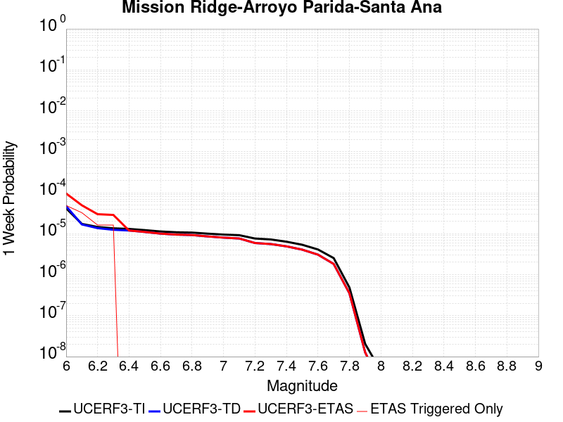 | 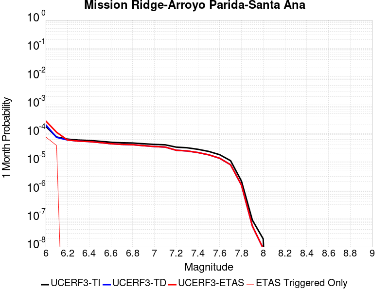 | 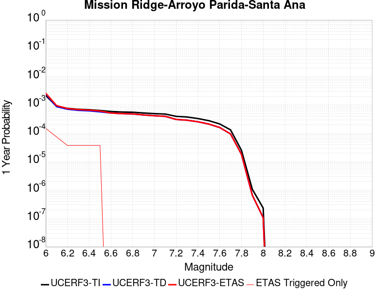 | 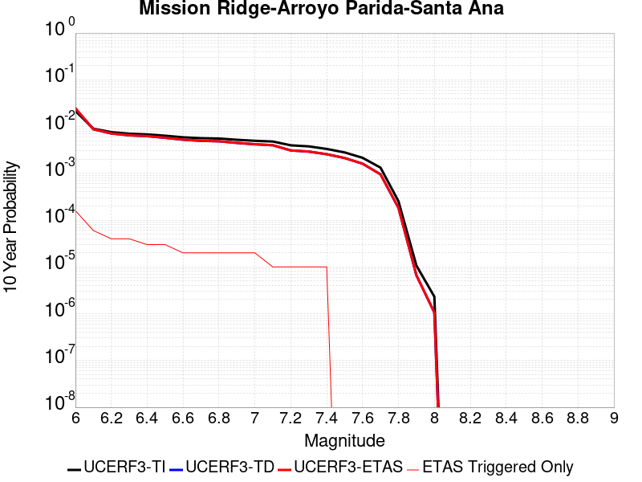 |

| Magnitude | 1 wk TI Prob | 1 wk TD Prob | 1 wk ETAS Prob | 1 wk ETAS/TD Gain | 1 wk ETAS Triggered Only | 1 mo TI Prob | 1 mo TD Prob | 1 mo ETAS Prob | 1 mo ETAS/TD Gain | 1 mo ETAS Triggered Only | 1 yr TI Prob | 1 yr TD Prob | 1 yr ETAS Prob | 1 yr ETAS/TD Gain | 1 yr ETAS Triggered Only | 10 yr TI Prob | 10 yr TD Prob | 10 yr ETAS Prob | 10 yr ETAS/TD Gain | 10 yr ETAS Triggered Only |
|-----|-----|-----|-----|-----|-----|-----|-----|-----|-----|-----|-----|-----|-----|-----|-----|-----|-----|-----|-----|-----|
| 6.0 | 4.169034E-5 | 4.7137048E-5 | 9.709472E-5 | 2.059839 | 4.9960032E-5 | 1.7866064E-4 | 2.0200513E-4 | 2.7693005E-4 | 1.370906 | 7.494005E-5 | 0.0021730233 | 0.0024574657 | 0.0025820588 | 1.0506998 | 1.2490008E-4 | 0.021518968 | 0.02438483 | 0.024555426 | 1.006996 | 1.748601E-4 |
| 6.1 | 1.73813E-5 | 1.6854203E-5 | 4.18338E-5 | 2.4820988 | 2.4980016E-5 | 7.4489166E-5 | 7.223036E-5 | 9.720857E-5 | 1.3458132 | 2.4980016E-5 | 9.065282E-4 | 8.790605E-4 | 9.2897663E-4 | 1.0567834 | 4.9960032E-5 | 0.009028391 | 0.008757128 | 0.008806651 | 1.005655 | 4.9960032E-5 |
| 6.2 | 1.4622182E-5 | 1.3673262E-5 | 1.3673262E-5 | 1.0 | 0.0 | 6.2664985E-5 | 5.85984E-5 | 5.85984E-5 | 1.0 | 0.0 | 7.6267915E-4 | 7.132059E-4 | 7.381681E-4 | 1.035 | 2.4980016E-5 | 0.007600669 | 0.007109767 | 0.0071345693 | 1.0034885 | 2.4980016E-5 |
| 6.3 | 1.3552434E-5 | 1.2482174E-5 | 1.2482174E-5 | 1.0 | 0.0 | 5.8080568E-5 | 5.349395E-5 | 5.349395E-5 | 1.0 | 0.0 | 7.069015E-4 | 6.510974E-4 | 6.7606114E-4 | 1.038341 | 2.4980016E-5 | 0.00704657 | 0.006492415 | 0.0065172324 | 1.0038226 | 2.4980016E-5 |
| 6.4 | 1.30977305E-5 | 1.1979128E-5 | 1.1979128E-5 | 1.0 | 0.0 | 5.613192E-5 | 5.133813E-5 | 5.133813E-5 | 1.0 | 0.0 | 6.831918E-4 | 6.2486547E-4 | 6.498299E-4 | 1.0399517 | 2.4980016E-5 | 0.006810953 | 0.006231584 | 0.0062564085 | 1.0039836 | 2.4980016E-5 |
| 6.5 | 1.225205E-5 | 1.1048776E-5 | 1.1048776E-5 | 1.0 | 0.0 | 5.2507727E-5 | 4.735105E-5 | 4.735105E-5 | 1.0 | 0.0 | 6.3909404E-4 | 5.7634927E-4 | 6.013149E-4 | 1.0433168 | 2.4980016E-5 | 0.006372592 | 0.005749009 | 0.0057738456 | 1.0043201 | 2.4980016E-5 |
| 6.6 | 1.1352241E-5 | 1.0063508E-5 | 1.0063508E-5 | 1.0 | 0.0 | 4.8651553E-5 | 4.3128617E-5 | 4.3128617E-5 | 1.0 | 0.0 | 5.921717E-4 | 5.249665E-4 | 5.249665E-4 | 1.0 | 0.0 | 0.0059059616 | 0.0052376646 | 0.0052376646 | 1.0 | 0.0 |
| 6.7 | 1.0864116E-5 | 9.517E-6 | 9.517E-6 | 1.0 | 0.0 | 4.6559664E-5 | 4.0786515E-5 | 4.0786515E-5 | 1.0 | 0.0 | 5.667165E-4 | 4.964647E-4 | 4.964647E-4 | 1.0 | 0.0 | 0.005652734 | 0.0049539437 | 0.0049539437 | 1.0 | 0.0 |
| 6.8 | 1.0666365E-5 | 9.299752E-6 | 9.299752E-6 | 1.0 | 0.0 | 4.571219E-5 | 3.985548E-5 | 3.985548E-5 | 1.0 | 0.0 | 5.564038E-4 | 4.8513446E-4 | 4.8513446E-4 | 1.0 | 0.0 | 0.005550127 | 0.00484114 | 0.00484114 | 1.0 | 0.0 |
| 6.9 | 1.0038665E-5 | 8.592018E-6 | 8.592018E-6 | 1.0 | 0.0 | 4.302214E-5 | 3.682243E-5 | 3.682243E-5 | 1.0 | 0.0 | 5.236687E-4 | 4.4822265E-4 | 4.4822265E-4 | 1.0 | 0.0 | 0.005224364 | 0.0044735507 | 0.0044735507 | 1.0 | 0.0 |
| 7.0 | 9.5379955E-6 | 8.025047E-6 | 8.025047E-6 | 1.0 | 0.0 | 4.0876483E-5 | 3.439261E-5 | 3.439261E-5 | 1.0 | 0.0 | 4.975576E-4 | 4.1865133E-4 | 4.1865133E-4 | 1.0 | 0.0 | 0.00496445 | 0.00417898 | 0.00417898 | 1.0 | 0.0 |
| 7.1 | 9.207389E-6 | 7.652347E-6 | 7.652347E-6 | 1.0 | 0.0 | 3.945964E-5 | 3.2795375E-5 | 3.2795375E-5 | 1.0 | 0.0 | 4.803152E-4 | 3.992122E-4 | 3.992122E-4 | 1.0 | 0.0 | 0.004792784 | 0.003985301 | 0.003985301 | 1.0 | 0.0 |
| 7.2 | 7.638091E-6 | 5.9310923E-6 | 5.9310923E-6 | 1.0 | 0.0 | 3.2734264E-5 | 2.5418722E-5 | 2.5418722E-5 | 1.0 | 0.0 | 3.984668E-4 | 3.094293E-4 | 3.094293E-4 | 1.0 | 0.0 | 0.0039775306 | 0.0030901956 | 0.0030901956 | 1.0 | 0.0 |
| 7.3 | 7.2500147E-6 | 5.596131E-6 | 5.596131E-6 | 1.0 | 0.0 | 3.1071122E-5 | 2.3983199E-5 | 2.3983199E-5 | 1.0 | 0.0 | 3.7822526E-4 | 2.9195662E-4 | 2.9195662E-4 | 1.0 | 0.0 | 0.0037758215 | 0.0029159402 | 0.0029159402 | 1.0 | 0.0 |
| 7.4 | 6.3899715E-6 | 4.9184864E-6 | 4.9184864E-6 | 1.0 | 0.0 | 2.7385306E-5 | 2.1079059E-5 | 2.1079059E-5 | 1.0 | 0.0 | 3.3336508E-4 | 2.566075E-4 | 2.566075E-4 | 1.0 | 0.0 | 0.0033286542 | 0.002563311 | 0.002563311 | 1.0 | 0.0 |
| 7.5 | 5.379025E-6 | 4.0838477E-6 | 4.0838477E-6 | 1.0 | 0.0 | 2.305276E-5 | 1.7502087E-5 | 1.7502087E-5 | 1.0 | 0.0 | 2.806312E-4 | 2.1306718E-4 | 2.1306718E-4 | 1.0 | 0.0 | 0.0028027708 | 0.0021286402 | 0.0021286402 | 1.0 | 0.0 |
| 7.6 | 4.1270696E-6 | 3.0883373E-6 | 3.0883373E-6 | 1.0 | 0.0 | 1.768732E-5 | 1.32356645E-5 | 1.32356645E-5 | 1.0 | 0.0 | 2.1532185E-4 | 1.6113237E-4 | 1.6113237E-4 | 1.0 | 0.0 | 0.0021511333 | 0.0016101635 | 0.0016101635 | 1.0 | 0.0 |
| 7.7 | 2.5406805E-6 | 1.8282044E-6 | 1.8282044E-6 | 1.0 | 0.0 | 1.0888585E-5 | 7.835139E-6 | 7.835139E-6 | 1.0 | 0.0 | 1.3256045E-4 | 9.53887E-5 | 9.53887E-5 | 1.0 | 0.0 | 0.0013248142 | 9.534837E-4 | 9.534837E-4 | 1.0 | 0.0 |
| 7.8 | 4.8608285E-7 | 3.509864E-7 | 3.509864E-7 | 1.0 | 0.0 | 2.0832106E-6 | 1.5042266E-6 | 1.5042266E-6 | 1.0 | 0.0 | 2.5362791E-5 | 1.8313805E-5 | 1.8313805E-5 | 1.0 | 0.0 | 2.5359896E-4 | 1.8312308E-4 | 1.8312308E-4 | 1.0 | 0.0 |
| 7.9 | 2.0472514E-8 | 1.2688718E-8 | 1.2688718E-8 | 1.0 | 0.0 | 8.7739345E-8 | 5.438022E-8 | 5.438022E-8 | 1.0 | 0.0 | 1.068226E-6 | 6.6207895E-7 | 6.6207895E-7 | 1.0 | 0.0 | 1.0682209E-5 | 6.620771E-6 | 6.620771E-6 | 1.0 | 0.0 |
| 8.0 | 4.443582E-9 | 2.032067E-9 | 2.032067E-9 | 1.0 | 0.0 | 1.9043922E-8 | 8.7088585E-9 | 8.7088585E-9 | 1.0 | 0.0 | 2.3185973E-7 | 1.0603035E-7 | 1.0603035E-7 | 1.0 | 0.0 | 2.3185949E-6 | 1.0603031E-6 | 1.0603031E-6 | 1.0 | 0.0 |

## San Andreas (Creeping Section) 2011 CFM
*[(top)](#table-of-contents)*

| 1 Week | 1 Month | 1 Year | 10 Year |
|-----|-----|-----|-----|
| 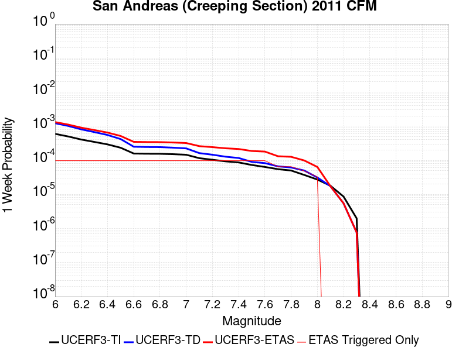 | 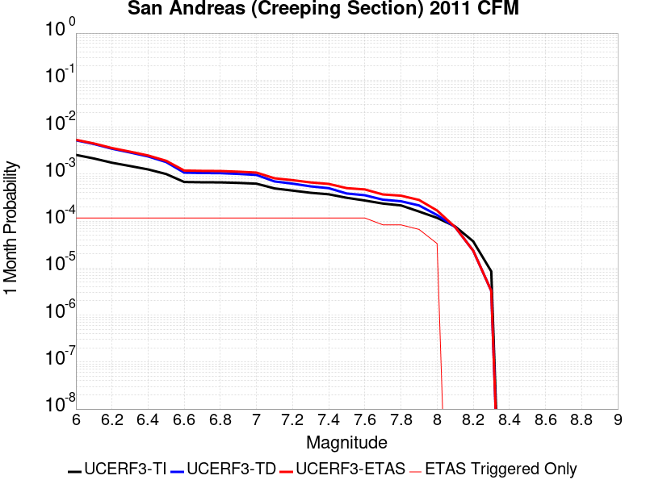 | 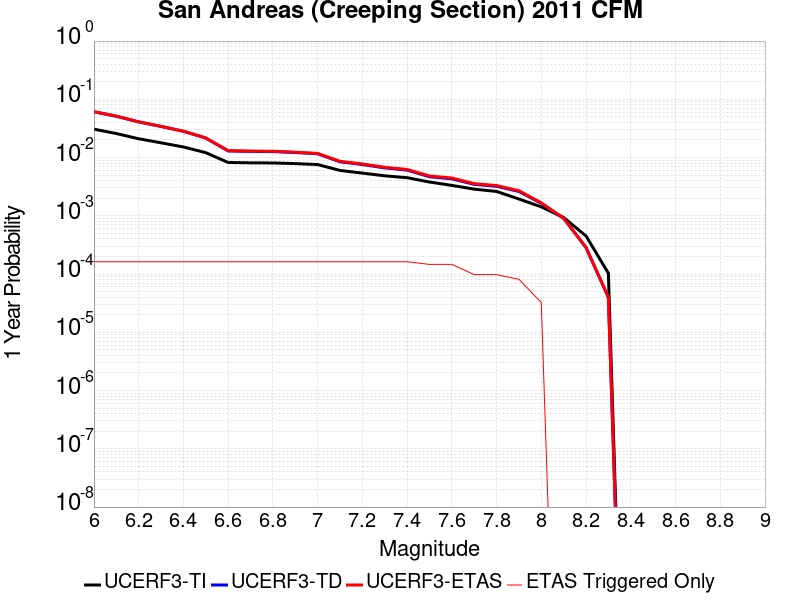 | 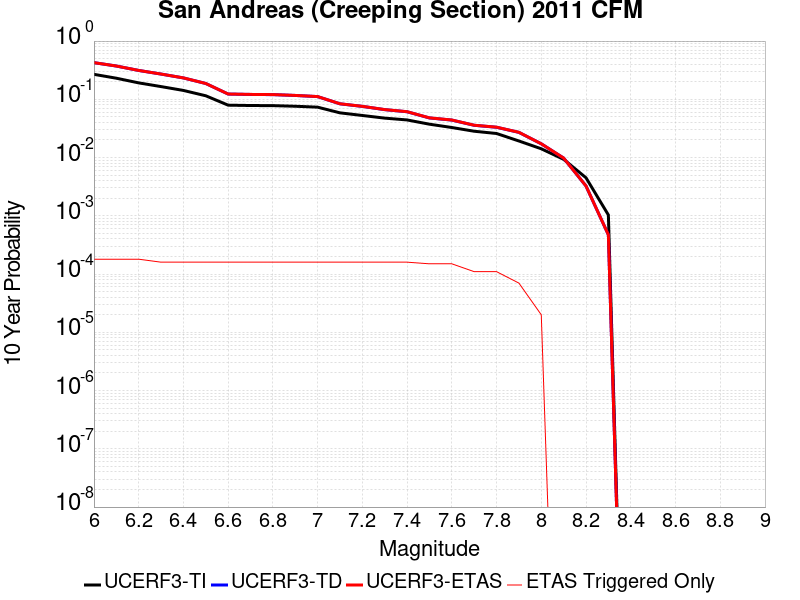 |

| Magnitude | 1 wk TI Prob | 1 wk TD Prob | 1 wk ETAS Prob | 1 wk ETAS/TD Gain | 1 wk ETAS Triggered Only | 1 mo TI Prob | 1 mo TD Prob | 1 mo ETAS Prob | 1 mo ETAS/TD Gain | 1 mo ETAS Triggered Only | 1 yr TI Prob | 1 yr TD Prob | 1 yr ETAS Prob | 1 yr ETAS/TD Gain | 1 yr ETAS Triggered Only | 10 yr TI Prob | 10 yr TD Prob | 10 yr ETAS Prob | 10 yr ETAS/TD Gain | 10 yr ETAS Triggered Only |
|-----|-----|-----|-----|-----|-----|-----|-----|-----|-----|-----|-----|-----|-----|-----|-----|-----|-----|-----|-----|-----|
| 6.0 | 5.986481E-4 | 0.0012275929 | 0.001377289 | 1.1219428 | 1.498801E-4 | 0.0025631124 | 0.005245547 | 0.005394641 | 1.028423 | 1.498801E-4 | 0.030762846 | 0.06120491 | 0.06136907 | 1.0026821 | 1.748601E-4 | 0.26835477 | 0.42593494 | 0.4260353 | 1.0002357 | 1.748601E-4 |
| 6.1 | 5.015945E-4 | 0.0010217986 | 0.0011715255 | 1.1465328 | 1.498801E-4 | 0.00214792 | 0.0043678596 | 0.004517085 | 1.0341644 | 1.498801E-4 | 0.025839351 | 0.05124837 | 0.05141427 | 1.0032371 | 1.748601E-4 | 0.23032776 | 0.37285668 | 0.37296635 | 1.0002941 | 1.748601E-4 |
| 6.2 | 4.073338E-4 | 8.1073755E-4 | 9.604961E-4 | 1.184719 | 1.498801E-4 | 0.0017445484 | 0.0034671477 | 0.003616508 | 1.0430788 | 1.498801E-4 | 0.021034058 | 0.04093317 | 0.04110087 | 1.004097 | 1.748601E-4 | 0.19150782 | 0.31303346 | 0.3131536 | 1.0003837 | 1.748601E-4 |
| 6.3 | 3.464099E-4 | 6.7391695E-4 | 8.23696E-4 | 1.2222515 | 1.498801E-4 | 0.0014837692 | 0.0028829593 | 0.0030324073 | 1.0518384 | 1.498801E-4 | 0.017915873 | 0.034189582 | 0.034358464 | 1.0049396 | 1.748601E-4 | 0.16538359 | 0.2713166 | 0.271444 | 1.0004697 | 1.748601E-4 |
| 6.4 | 2.935057E-4 | 5.5442745E-4 | 7.0422445E-4 | 1.2701832 | 1.498801E-4 | 0.0012572751 | 0.0023725363 | 0.0025220609 | 1.0630231 | 1.498801E-4 | 0.015200248 | 0.02826451 | 0.028434427 | 1.0060117 | 1.748601E-4 | 0.14201577 | 0.23298529 | 0.2331194 | 1.0005757 | 1.748601E-4 |
| 6.5 | 2.3409708E-4 | 4.2093755E-4 | 5.707546E-4 | 1.3559127 | 1.498801E-4 | 0.0010028875 | 0.0018019684 | 0.0019515785 | 1.0830259 | 1.498801E-4 | 0.012141965 | 0.021587461 | 0.021758547 | 1.0079253 | 1.748601E-4 | 0.11499573 | 0.18682368 | 0.18696587 | 1.0007612 | 1.748601E-4 |
| 6.6 | 1.5842178E-4 | 2.506933E-4 | 4.0053582E-4 | 1.5977125 | 1.498801E-4 | 6.7877385E-4 | 0.0010739497 | 0.0012236689 | 1.1394098 | 1.498801E-4 | 0.0082328 | 0.012995575 | 0.013168163 | 1.0132805 | 1.748601E-4 | 0.07934396 | 0.12314638 | 0.1232997 | 1.001245 | 1.748601E-4 |
| 6.7 | 1.5616413E-4 | 2.4605883E-4 | 3.9590203E-4 | 1.6089731 | 1.498801E-4 | 6.691031E-4 | 0.0010541069 | 0.001203829 | 1.1420369 | 1.498801E-4 | 0.0081159435 | 0.01275744 | 0.012930069 | 1.0135317 | 1.748601E-4 | 0.0782586 | 0.12117351 | 0.121327184 | 1.0012681 | 1.748601E-4 |
| 6.8 | 1.5538467E-4 | 2.4429744E-4 | 3.9414092E-4 | 1.6133649 | 1.498801E-4 | 6.6576427E-4 | 0.0010465645 | 0.0011962878 | 1.1430616 | 1.498801E-4 | 0.008075596 | 0.012666838 | 0.012839484 | 1.0136297 | 1.748601E-4 | 0.07788358 | 0.120404355 | 0.12055816 | 1.0012774 | 1.748601E-4 |
| 6.9 | 1.5153569E-4 | 2.3539034E-4 | 3.8523515E-4 | 1.6365801 | 1.498801E-4 | 6.49277E-4 | 0.0010084276 | 0.0011581565 | 1.1484777 | 1.498801E-4 | 0.007876333 | 0.01220901 | 0.012381736 | 1.0141474 | 1.748601E-4 | 0.07602952 | 0.11647445 | 0.11662894 | 1.0013264 | 1.748601E-4 |
| 7.0 | 1.4588932E-4 | 2.2396253E-4 | 3.7380907E-4 | 1.6690696 | 1.498801E-4 | 6.250901E-4 | 9.5948833E-4 | 0.0011092246 | 1.1560584 | 1.498801E-4 | 0.0075839474 | 0.011619697 | 0.011792525 | 1.0148737 | 1.748601E-4 | 0.073302895 | 0.11132046 | 0.11147585 | 1.001396 | 1.748601E-4 |
| 7.1 | 1.1565079E-4 | 1.6281738E-4 | 3.1267307E-4 | 1.9203912 | 1.498801E-4 | 4.955521E-4 | 6.9760304E-4 | 8.473786E-4 | 1.2147002 | 1.498801E-4 | 0.006016669 | 0.0084604435 | 0.008633824 | 1.0204931 | 1.748601E-4 | 0.058563538 | 0.08367046 | 0.08383069 | 1.001915 | 1.748601E-4 |
| 7.2 | 1.0393792E-4 | 1.4615769E-4 | 2.9601587E-4 | 2.0253186 | 1.498801E-4 | 4.4537216E-4 | 6.2624045E-4 | 7.760267E-4 | 1.2391833 | 1.498801E-4 | 0.005408933 | 0.0075979927 | 0.007771524 | 1.0228391 | 1.748601E-4 | 0.052791595 | 0.07561969 | 0.07578133 | 1.0021375 | 1.748601E-4 |
| 7.3 | 9.332884E-5 | 1.2780898E-4 | 2.7766993E-4 | 2.1725385 | 1.498801E-4 | 3.999194E-4 | 5.4763845E-4 | 6.9743645E-4 | 1.2735345 | 1.498801E-4 | 0.0048581534 | 0.006647249 | 0.006820947 | 1.0261308 | 1.748601E-4 | 0.047533102 | 0.06648326 | 0.066646494 | 1.0024552 | 1.748601E-4 |
| 7.4 | 8.670252E-5 | 1.17032345E-4 | 2.668949E-4 | 2.2805226 | 1.498801E-4 | 3.715293E-4 | 5.0147134E-4 | 6.512763E-4 | 1.2987307 | 1.498801E-4 | 0.004513991 | 0.006088443 | 0.0062622386 | 1.0285451 | 1.748601E-4 | 0.044233937 | 0.061151642 | 0.061315812 | 1.0026846 | 1.748601E-4 |
| 7.5 | 7.3036405E-5 | 9.005856E-5 | 2.3992515E-4 | 2.6641016 | 1.498801E-4 | 3.129756E-4 | 3.8590826E-4 | 5.357305E-4 | 1.3882328 | 1.498801E-4 | 0.0038038217 | 0.0046883323 | 0.0048375097 | 1.0318189 | 1.498801E-4 | 0.03739367 | 0.047877792 | 0.048020497 | 1.0029806 | 1.498801E-4 |
| 7.6 | 6.3935775E-5 | 8.280385E-5 | 2.3267153E-4 | 2.8099122 | 1.498801E-4 | 2.7398168E-4 | 3.5482543E-4 | 5.0465233E-4 | 1.4222553 | 1.498801E-4 | 0.0033306254 | 0.004311461 | 0.004460695 | 1.0346133 | 1.498801E-4 | 0.032811474 | 0.04399201 | 0.044135295 | 1.0032572 | 1.498801E-4 |
| 7.7 | 5.5050095E-5 | 6.6618326E-5 | 1.6653174E-4 | 2.4997885 | 9.9920064E-5 | 2.3590765E-4 | 2.854759E-4 | 3.8536743E-4 | 1.3499123 | 9.9920064E-5 | 0.0028683927 | 0.003470134 | 0.0035697073 | 1.0286944 | 9.9920064E-5 | 0.0283165 | 0.035796214 | 0.035892557 | 1.0026914 | 9.9920064E-5 |
| 7.8 | 5.027131E-5 | 6.162871E-5 | 1.6154262E-4 | 2.6212234 | 9.9920064E-5 | 2.1543067E-4 | 2.640963E-4 | 3.6398997E-4 | 1.3782471 | 9.9920064E-5 | 0.0026197135 | 0.003210635 | 0.0033102343 | 1.0310217 | 9.9920064E-5 | 0.025890453 | 0.03312666 | 0.033223268 | 1.0029163 | 9.9920064E-5 |
| 7.9 | 3.7271806E-5 | 5.022507E-5 | 1.2516136E-4 | 2.4920096 | 7.494005E-5 | 1.5972654E-4 | 2.1523255E-4 | 2.9015646E-4 | 1.3481069 | 7.494005E-5 | 0.0019429359 | 0.002617309 | 0.002692053 | 1.0285575 | 7.494005E-5 | 0.019260362 | 0.027067466 | 0.027140377 | 1.0026937 | 7.494005E-5 |
| 8.0 | 2.7310243E-5 | 3.1427757E-5 | 8.138622E-5 | 2.5896287 | 4.9960032E-5 | 1.17038646E-4 | 1.3468343E-4 | 1.8463674E-4 | 1.3708942 | 4.9960032E-5 | 0.0014240141 | 0.0016385383 | 0.0016884165 | 1.0304407 | 4.9960032E-5 | 0.014149235 | 0.01721386 | 0.01726296 | 1.0028523 | 4.9960032E-5 |
| 8.1 | 1.7940547E-5 | 1.7399378E-5 | 1.7399378E-5 | 1.0 | 0.0 | 7.688579E-5 | 7.456663E-5 | 7.456663E-5 | 1.0 | 0.0 | 9.3568244E-4 | 9.074711E-4 | 9.074711E-4 | 1.0 | 0.0 | 0.009317525 | 0.009798636 | 0.009798636 | 1.0 | 0.0 |
| 8.2 | 8.643924E-6 | 5.473668E-6 | 5.473668E-6 | 1.0 | 0.0 | 3.704486E-5 | 2.3458366E-5 | 2.3458366E-5 | 1.0 | 0.0 | 4.5092785E-4 | 2.8556827E-4 | 2.8556827E-4 | 1.0 | 0.0 | 0.0045001395 | 0.0032481793 | 0.0032481793 | 1.0 | 0.0 |
| 8.3 | 1.983087E-6 | 7.6564595E-7 | 7.6564595E-7 | 1.0 | 0.0 | 8.498917E-6 | 3.281336E-6 | 3.281336E-6 | 1.0 | 0.0 | 1.034694E-4 | 3.9949547E-5 | 3.9949547E-5 | 1.0 | 0.0 | 0.0010342124 | 4.717979E-4 | 4.717979E-4 | 1.0 | 0.0 |

## Lake Isabella (Seismicity)
*[(top)](#table-of-contents)*

| 1 Week | 1 Month | 1 Year | 10 Year |
|-----|-----|-----|-----|
| 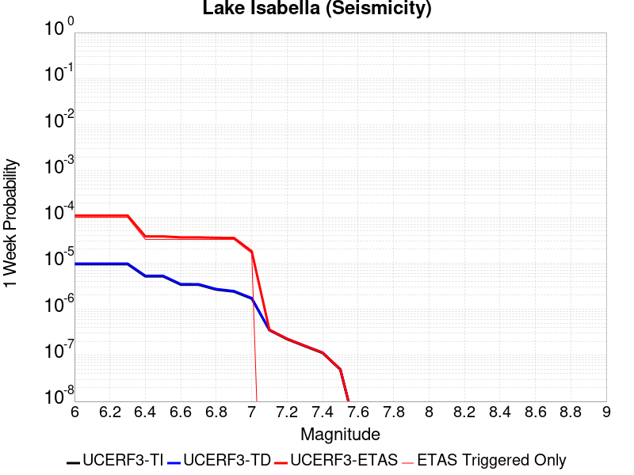 | 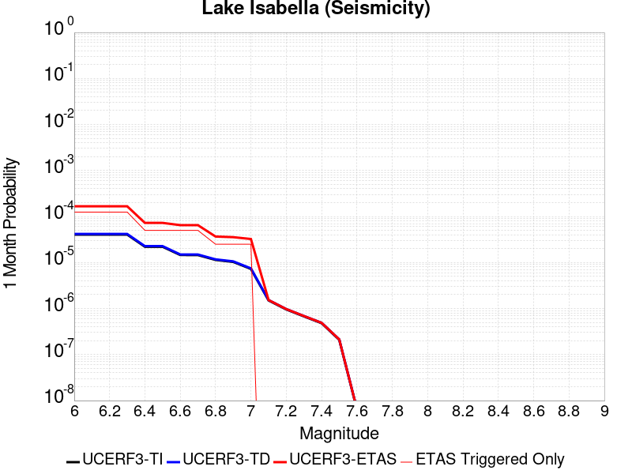 | 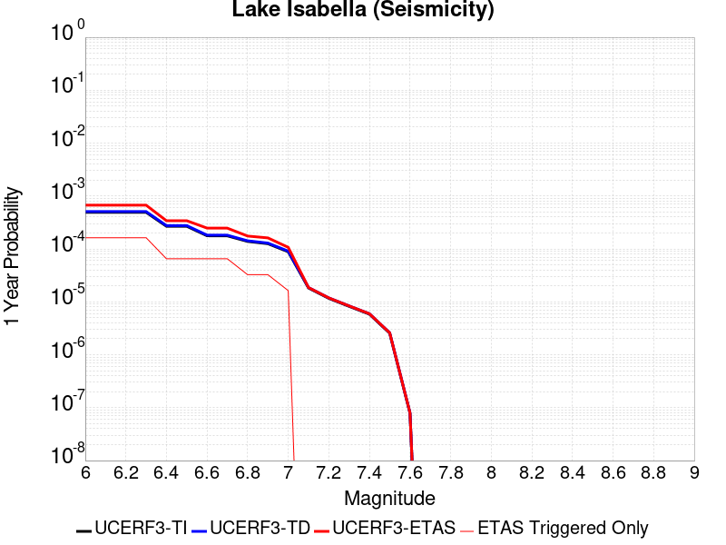 | 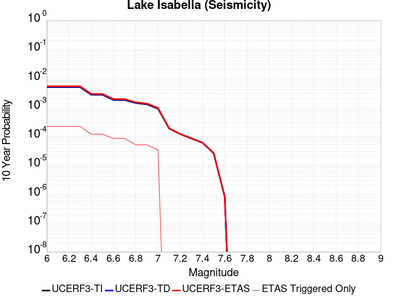 |

| Magnitude | 1 wk TI Prob | 1 wk TD Prob | 1 wk ETAS Prob | 1 wk ETAS/TD Gain | 1 wk ETAS Triggered Only | 1 mo TI Prob | 1 mo TD Prob | 1 mo ETAS Prob | 1 mo ETAS/TD Gain | 1 mo ETAS Triggered Only | 1 yr TI Prob | 1 yr TD Prob | 1 yr ETAS Prob | 1 yr ETAS/TD Gain | 1 yr ETAS Triggered Only | 10 yr TI Prob | 10 yr TD Prob | 10 yr ETAS Prob | 10 yr ETAS/TD Gain | 10 yr ETAS Triggered Only |
|-----|-----|-----|-----|-----|-----|-----|-----|-----|-----|-----|-----|-----|-----|-----|-----|-----|-----|-----|-----|-----|
| 6.0 | 9.431637E-6 | 9.741651E-6 | 8.468097E-5 | 8.692671 | 7.494005E-5 | 4.0420677E-5 | 4.1749343E-5 | 1.6664421E-4 | 3.991541 | 1.2490008E-4 | 4.920106E-4 | 5.0819275E-4 | 6.579967E-4 | 1.2947778 | 1.498801E-4 | 0.004909227 | 0.005071599 | 0.0052704257 | 1.0392039 | 1.9984013E-4 |
| 6.1 | 9.431637E-6 | 9.741651E-6 | 8.468097E-5 | 8.692671 | 7.494005E-5 | 4.0420677E-5 | 4.1749343E-5 | 1.6664421E-4 | 3.991541 | 1.2490008E-4 | 4.920106E-4 | 5.0819275E-4 | 6.579967E-4 | 1.2947778 | 1.498801E-4 | 0.004909227 | 0.005071599 | 0.0052704257 | 1.0392039 | 1.9984013E-4 |
| 6.2 | 9.431637E-6 | 9.741651E-6 | 8.468097E-5 | 8.692671 | 7.494005E-5 | 4.0420677E-5 | 4.1749343E-5 | 1.6664421E-4 | 3.991541 | 1.2490008E-4 | 4.920106E-4 | 5.0819275E-4 | 6.579967E-4 | 1.2947778 | 1.498801E-4 | 0.004909227 | 0.005071599 | 0.0052704257 | 1.0392039 | 1.9984013E-4 |
| 6.3 | 9.431637E-6 | 9.741651E-6 | 8.468097E-5 | 8.692671 | 7.494005E-5 | 4.0420677E-5 | 4.1749343E-5 | 1.6664421E-4 | 3.991541 | 1.2490008E-4 | 4.920106E-4 | 5.0819275E-4 | 6.579967E-4 | 1.2947778 | 1.498801E-4 | 0.004909227 | 0.005071599 | 0.0052704257 | 1.0392039 | 1.9984013E-4 |
| 6.4 | 5.144063E-6 | 5.3000763E-6 | 3.027996E-5 | 5.713118 | 2.4980016E-5 | 2.2045799E-5 | 2.2714434E-5 | 7.2673334E-5 | 3.199434 | 4.9960032E-5 | 2.6837454E-4 | 2.765166E-4 | 3.2646282E-4 | 1.1806265 | 4.9960032E-5 | 0.0026805066 | 0.0027620657 | 0.0028367988 | 1.0270569 | 7.494005E-5 |
| 6.5 | 5.144063E-6 | 5.3000763E-6 | 3.027996E-5 | 5.713118 | 2.4980016E-5 | 2.2045799E-5 | 2.2714434E-5 | 7.2673334E-5 | 3.199434 | 4.9960032E-5 | 2.6837454E-4 | 2.765166E-4 | 3.2646282E-4 | 1.1806265 | 4.9960032E-5 | 0.0026805066 | 0.0027620657 | 0.0028367988 | 1.0270569 | 7.494005E-5 |
| 6.6 | 3.4009804E-6 | 3.498786E-6 | 2.8478715E-5 | 8.139599 | 2.4980016E-5 | 1.4575549E-5 | 1.4994721E-5 | 6.4954E-5 | 4.3317914 | 4.9960032E-5 | 1.7744285E-4 | 1.8254704E-4 | 2.3249794E-4 | 1.2736331 | 4.9960032E-5 | 0.0017730123 | 0.0018241286 | 0.0018739975 | 1.0273385 | 4.9960032E-5 |
| 6.7 | 3.3880428E-6 | 3.4856528E-6 | 2.8465582E-5 | 8.166499 | 2.4980016E-5 | 1.4520103E-5 | 1.4938435E-5 | 6.489772E-5 | 4.344345 | 4.9960032E-5 | 1.767679E-4 | 1.8186188E-4 | 2.3181282E-4 | 1.2746642 | 4.9960032E-5 | 0.0017662736 | 0.0018172882 | 0.0018671574 | 1.0274416 | 4.9960032E-5 |
| 6.8 | 2.6582E-6 | 2.7337003E-6 | 2.7713648E-5 | 10.137779 | 2.4980016E-5 | 1.1392236E-5 | 1.1715813E-5 | 3.6695536E-5 | 3.1321375 | 2.4980016E-5 | 1.3869164E-4 | 1.4263204E-4 | 1.6760848E-4 | 1.175111 | 2.4980016E-5 | 0.0013860512 | 0.0014255369 | 0.0014504814 | 1.0174983 | 2.4980016E-5 |
| 6.9 | 2.406011E-6 | 2.4743288E-6 | 2.7454284E-5 | 11.095649 | 2.4980016E-5 | 1.0311434E-5 | 1.0604231E-5 | 3.558398E-5 | 3.3556402 | 2.4980016E-5 | 1.2553448E-4 | 1.2910018E-4 | 1.5407697E-4 | 1.1934683 | 2.4980016E-5 | 0.0012546359 | 0.0012903814 | 0.0013153292 | 1.0193336 | 2.4980016E-5 |
| 7.0 | 1.6953097E-6 | 1.7429371E-6 | 2.672291E-5 | 15.332113 | 2.4980016E-5 | 7.265593E-6 | 7.469715E-6 | 3.2449545E-5 | 4.3441477 | 2.4980016E-5 | 8.8455E-5 | 9.094104E-5 | 1.1591878E-4 | 1.2746587 | 2.4980016E-5 | 8.84198E-4 | 9.09141E-4 | 9.3409827E-4 | 1.0274515 | 2.4980016E-5 |
| 7.1 | 3.5013824E-7 | 3.5714822E-7 | 3.5714822E-7 | 1.0 | 0.0 | 1.5005916E-6 | 1.5306344E-6 | 1.5306344E-6 | 1.0 | 0.0 | 1.826955E-5 | 1.8635317E-5 | 1.8635317E-5 | 1.0 | 0.0 | 1.8268047E-4 | 1.863378E-4 | 1.863378E-4 | 1.0 | 0.0 |
| 7.2 | 2.2321095E-7 | 2.2750574E-7 | 2.2750574E-7 | 1.0 | 0.0 | 9.56618E-7 | 9.750242E-7 | 9.750242E-7 | 1.0 | 0.0 | 1.1646762E-5 | 1.1870856E-5 | 1.1870856E-5 | 1.0 | 0.0 | 1.1646151E-4 | 1.1870232E-4 | 1.1870232E-4 | 1.0 | 0.0 |
| 7.3 | 1.5760406E-7 | 1.6060922E-7 | 1.6060922E-7 | 1.0 | 0.0 | 6.7544585E-7 | 6.8832503E-7 | 6.8832503E-7 | 1.0 | 0.0 | 8.223522E-6 | 8.380326E-6 | 8.380326E-6 | 1.0 | 0.0 | 8.2232174E-5 | 8.3800165E-5 | 8.3800165E-5 | 1.0 | 0.0 |
| 7.4 | 1.1216497E-7 | 1.1431706E-7 | 1.1431706E-7 | 1.0 | 0.0 | 4.8070694E-7 | 4.899302E-7 | 4.899302E-7 | 1.0 | 0.0 | 5.852591E-6 | 5.964884E-6 | 5.964884E-6 | 1.0 | 0.0 | 5.8524372E-5 | 5.9647282E-5 | 5.9647282E-5 | 1.0 | 0.0 |
| 7.5 | 4.885185E-8 | 4.9787737E-8 | 4.9787737E-8 | 1.0 | 0.0 | 2.0936506E-7 | 2.13376E-7 | 2.13376E-7 | 1.0 | 0.0 | 2.5490165E-6 | 2.59785E-6 | 2.59785E-6 | 1.0 | 0.0 | 2.5489873E-5 | 2.5978214E-5 | 2.5978214E-5 | 1.0 | 0.0 |
| 7.6 | 1.504641E-9 | 1.5317903E-9 | 1.5317903E-9 | 1.0 | 0.0 | 6.4484613E-9 | 6.5648154E-9 | 6.5648154E-9 | 1.0 | 0.0 | 7.851001E-8 | 7.992663E-8 | 7.992663E-8 | 1.0 | 0.0 | 7.8509987E-7 | 7.992663E-7 | 7.992663E-7 | 1.0 | 0.0 |

## Tin Mountain
*[(top)](#table-of-contents)*

| 1 Week | 1 Month | 1 Year | 10 Year |
|-----|-----|-----|-----|
| 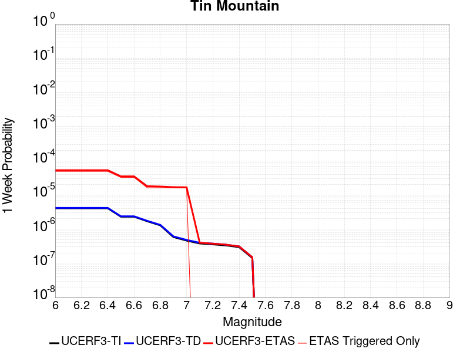 | 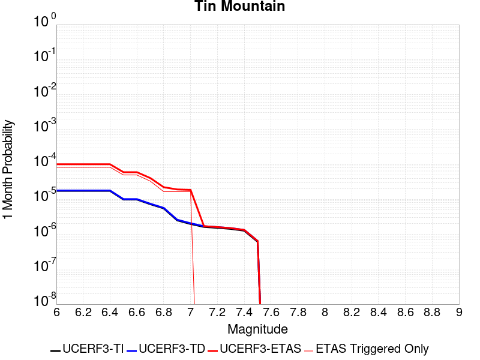 | 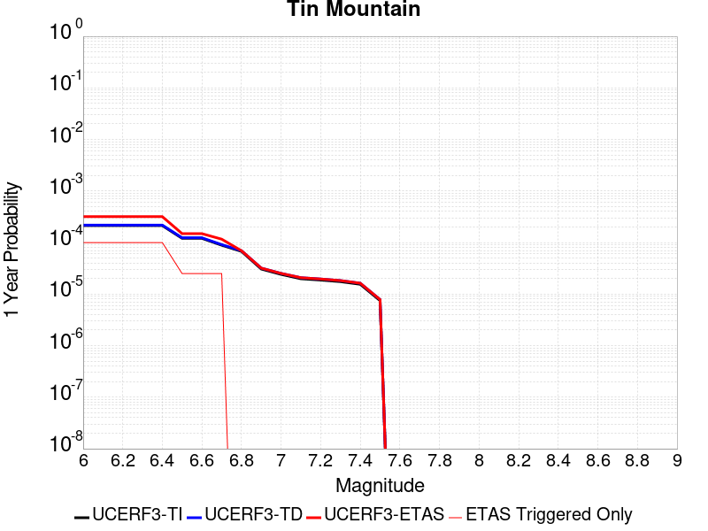 | 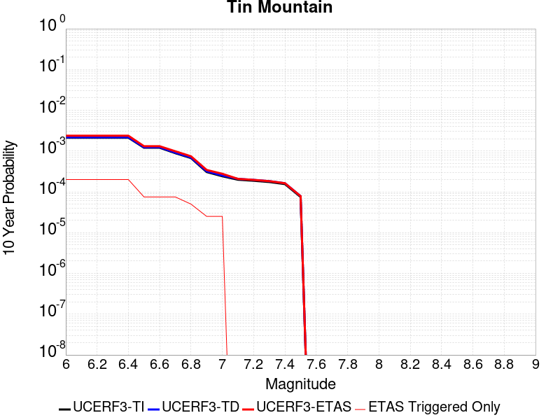 |

| Magnitude | 1 wk TI Prob | 1 wk TD Prob | 1 wk ETAS Prob | 1 wk ETAS/TD Gain | 1 wk ETAS Triggered Only | 1 mo TI Prob | 1 mo TD Prob | 1 mo ETAS Prob | 1 mo ETAS/TD Gain | 1 mo ETAS Triggered Only | 1 yr TI Prob | 1 yr TD Prob | 1 yr ETAS Prob | 1 yr ETAS/TD Gain | 1 yr ETAS Triggered Only | 10 yr TI Prob | 10 yr TD Prob | 10 yr ETAS Prob | 10 yr ETAS/TD Gain | 10 yr ETAS Triggered Only |
|-----|-----|-----|-----|-----|-----|-----|-----|-----|-----|-----|-----|-----|-----|-----|-----|-----|-----|-----|-----|-----|
| 6.0 | 4.083776E-6 | 4.1815365E-6 | 4.1815365E-6 | 1.0 | 0.0 | 1.750178E-5 | 1.792077E-5 | 6.7879904E-5 | 3.7877786 | 4.9960032E-5 | 2.1306332E-4 | 2.1816725E-4 | 3.1806552E-4 | 1.4578977 | 9.9920064E-5 | 0.0021285915 | 0.0021798965 | 0.0023793008 | 1.0914743 | 1.9984013E-4 |
| 6.1 | 4.083776E-6 | 4.1815365E-6 | 4.1815365E-6 | 1.0 | 0.0 | 1.750178E-5 | 1.792077E-5 | 6.7879904E-5 | 3.7877786 | 4.9960032E-5 | 2.1306332E-4 | 2.1816725E-4 | 3.1806552E-4 | 1.4578977 | 9.9920064E-5 | 0.0021285915 | 0.0021798965 | 0.0023793008 | 1.0914743 | 1.9984013E-4 |
| 6.2 | 4.083776E-6 | 4.1815365E-6 | 4.1815365E-6 | 1.0 | 0.0 | 1.750178E-5 | 1.792077E-5 | 6.7879904E-5 | 3.7877786 | 4.9960032E-5 | 2.1306332E-4 | 2.1816725E-4 | 3.1806552E-4 | 1.4578977 | 9.9920064E-5 | 0.0021285915 | 0.0021798965 | 0.0023793008 | 1.0914743 | 1.9984013E-4 |
| 6.3 | 4.083776E-6 | 4.1815365E-6 | 4.1815365E-6 | 1.0 | 0.0 | 1.750178E-5 | 1.792077E-5 | 6.7879904E-5 | 3.7877786 | 4.9960032E-5 | 2.1306332E-4 | 2.1816725E-4 | 3.1806552E-4 | 1.4578977 | 9.9920064E-5 | 0.0021285915 | 0.0021798965 | 0.0023793008 | 1.0914743 | 1.9984013E-4 |
| 6.4 | 4.083776E-6 | 4.1815365E-6 | 4.1815365E-6 | 1.0 | 0.0 | 1.750178E-5 | 1.792077E-5 | 6.7879904E-5 | 3.7877786 | 4.9960032E-5 | 2.1306332E-4 | 2.1816725E-4 | 3.1806552E-4 | 1.4578977 | 9.9920064E-5 | 0.0021285915 | 0.0021798965 | 0.0023793008 | 1.0914743 | 1.9984013E-4 |
| 6.5 | 2.3143427E-6 | 2.3731573E-6 | 2.3731573E-6 | 1.0 | 0.0 | 9.9185745E-6 | 1.0170638E-5 | 3.51504E-5 | 3.4560664 | 2.4980016E-5 | 1.2075195E-4 | 1.2382126E-4 | 1.4879818E-4 | 1.2017176 | 2.4980016E-5 | 0.0012068636 | 0.0012375986 | 0.001312446 | 1.0604779 | 7.494005E-5 |
| 6.6 | 2.3143427E-6 | 2.3731573E-6 | 2.3731573E-6 | 1.0 | 0.0 | 9.9185745E-6 | 1.0170638E-5 | 3.51504E-5 | 3.4560664 | 2.4980016E-5 | 1.2075195E-4 | 1.2382126E-4 | 1.4879818E-4 | 1.2017176 | 2.4980016E-5 | 0.0012068636 | 0.0012375986 | 0.001312446 | 1.0604779 | 7.494005E-5 |
| 6.7 | 1.7029532E-6 | 1.7497915E-6 | 1.7497915E-6 | 1.0 | 0.0 | 7.2983503E-6 | 7.499088E-6 | 3.2478918E-5 | 4.331049 | 2.4980016E-5 | 8.885379E-5 | 9.1298105E-5 | 1.1627584E-4 | 1.2735844 | 2.4980016E-5 | 8.881827E-4 | 9.1265864E-4 | 9.875302E-4 | 1.0820369 | 7.494005E-5 |
| 6.8 | 1.2914646E-6 | 1.3299378E-6 | 1.3299378E-6 | 1.0 | 0.0 | 5.534837E-6 | 5.6997237E-6 | 5.6997237E-6 | 1.0 | 0.0 | 6.738455E-5 | 6.939237E-5 | 6.939237E-5 | 1.0 | 0.0 | 6.736412E-4 | 6.9375033E-4 | 7.4367574E-4 | 1.0719645 | 4.9960032E-5 |
| 6.9 | 5.8708974E-7 | 6.1169936E-7 | 6.1169936E-7 | 1.0 | 0.0 | 2.5160964E-6 | 2.6215664E-6 | 2.6215664E-6 | 1.0 | 0.0 | 3.0633044E-5 | 3.1917145E-5 | 3.1917145E-5 | 1.0 | 0.0 | 3.0628822E-4 | 3.191297E-4 | 3.4410175E-4 | 1.0782504 | 2.4980016E-5 |
| 7.0 | 4.6248786E-7 | 4.832015E-7 | 4.832015E-7 | 1.0 | 0.0 | 1.9820893E-6 | 2.0708624E-6 | 2.0708624E-6 | 1.0 | 0.0 | 2.413167E-5 | 2.5212494E-5 | 2.5212494E-5 | 1.0 | 0.0 | 2.412905E-4 | 2.5210003E-4 | 2.7707373E-4 | 1.0990627 | 2.4980016E-5 |
| 7.1 | 3.804606E-7 | 3.987147E-7 | 3.987147E-7 | 1.0 | 0.0 | 1.6305444E-6 | 1.7087764E-6 | 1.7087764E-6 | 1.0 | 0.0 | 1.9851697E-5 | 2.0804187E-5 | 2.0804187E-5 | 1.0 | 0.0 | 1.9849923E-4 | 2.0802575E-4 | 2.0802575E-4 | 1.0 | 0.0 |
| 7.2 | 3.5864858E-7 | 3.7616863E-7 | 3.7616863E-7 | 1.0 | 0.0 | 1.5370645E-6 | 1.6121504E-6 | 1.6121504E-6 | 1.0 | 0.0 | 1.87136E-5 | 1.9627789E-5 | 1.9627789E-5 | 1.0 | 0.0 | 1.8712023E-4 | 1.9626386E-4 | 1.9626386E-4 | 1.0 | 0.0 |
| 7.3 | 3.342063E-7 | 3.506347E-7 | 3.506347E-7 | 1.0 | 0.0 | 1.4323119E-6 | 1.5027196E-6 | 1.5027196E-6 | 1.0 | 0.0 | 1.7438259E-5 | 1.829549E-5 | 1.829549E-5 | 1.0 | 0.0 | 1.743689E-4 | 1.8294314E-4 | 1.8294314E-4 | 1.0 | 0.0 |
| 7.4 | 2.971242E-7 | 3.1165817E-7 | 3.1165817E-7 | 1.0 | 0.0 | 1.2733886E-6 | 1.3356774E-6 | 1.3356774E-6 | 1.0 | 0.0 | 1.5503398E-5 | 1.6261785E-5 | 1.6261785E-5 | 1.0 | 0.0 | 1.5502315E-4 | 1.6260923E-4 | 1.6260923E-4 | 1.0 | 0.0 |
| 7.5 | 1.4326713E-7 | 1.5012525E-7 | 1.5012525E-7 | 1.0 | 0.0 | 6.140018E-7 | 6.433939E-7 | 6.433939E-7 | 1.0 | 0.0 | 7.4754466E-6 | 7.8333205E-6 | 7.8333205E-6 | 1.0 | 0.0 | 7.475195E-5 | 7.833321E-5 | 7.833321E-5 | 1.0 | 0.0 |

## Blue Cut
*[(top)](#table-of-contents)*

| 1 Week | 1 Month | 1 Year | 10 Year |
|-----|-----|-----|-----|
| 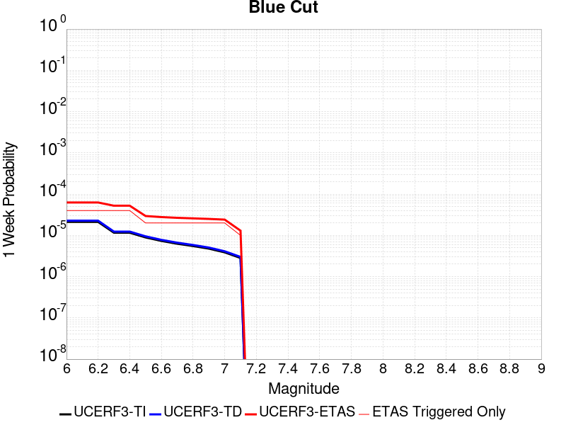 | 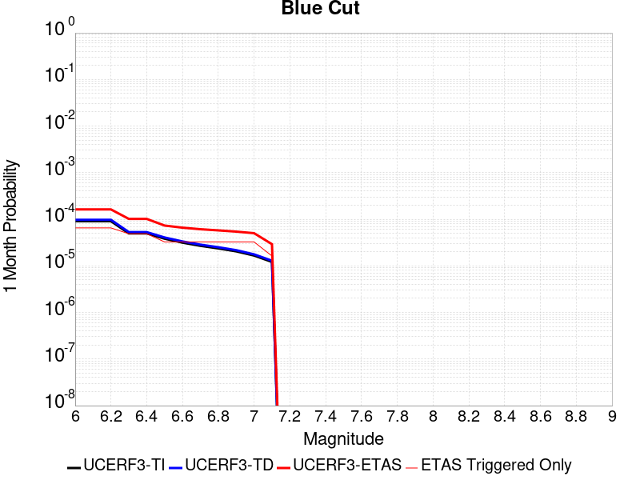 | 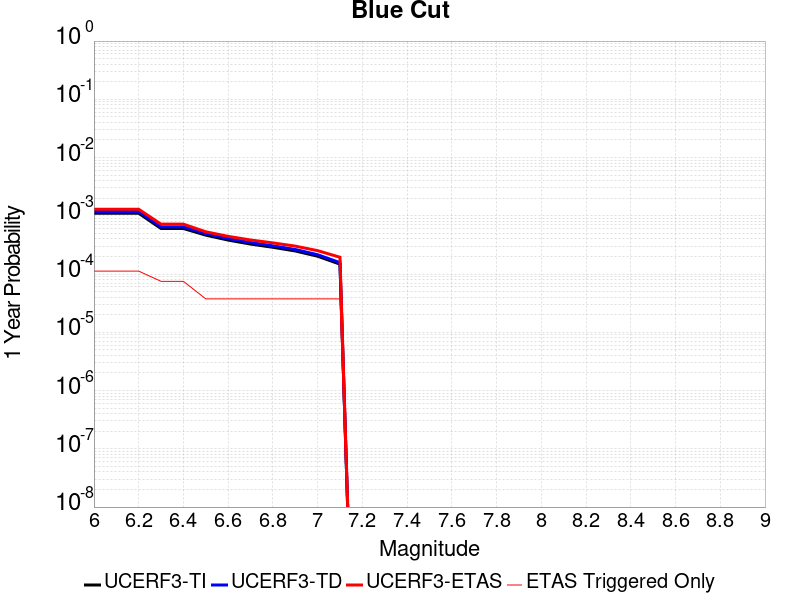 | 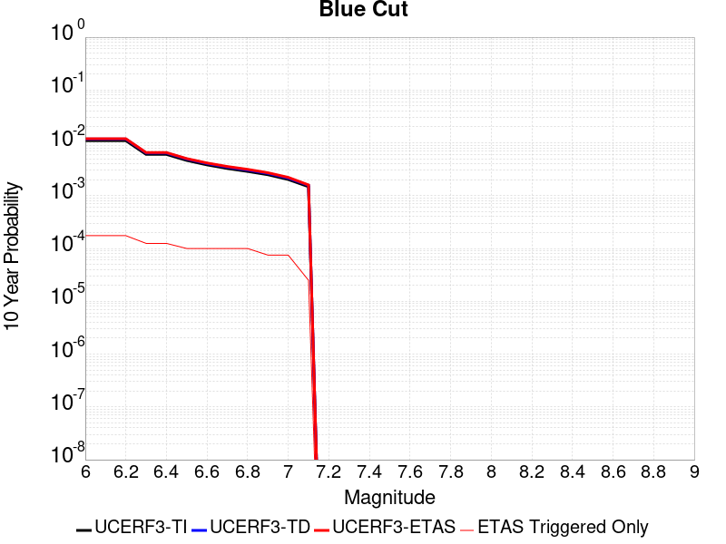 |

| Magnitude | 1 wk TI Prob | 1 wk TD Prob | 1 wk ETAS Prob | 1 wk ETAS/TD Gain | 1 wk ETAS Triggered Only | 1 mo TI Prob | 1 mo TD Prob | 1 mo ETAS Prob | 1 mo ETAS/TD Gain | 1 mo ETAS Triggered Only | 1 yr TI Prob | 1 yr TD Prob | 1 yr ETAS Prob | 1 yr ETAS/TD Gain | 1 yr ETAS Triggered Only | 10 yr TI Prob | 10 yr TD Prob | 10 yr ETAS Prob | 10 yr ETAS/TD Gain | 10 yr ETAS Triggered Only |
|-----|-----|-----|-----|-----|-----|-----|-----|-----|-----|-----|-----|-----|-----|-----|-----|-----|-----|-----|-----|-----|
| 6.0 | 2.1227985E-5 | 2.2719574E-5 | 7.267847E-5 | 3.1989362 | 4.9960032E-5 | 9.097391E-5 | 9.73663E-5 | 1.9727663E-4 | 2.0261285 | 9.9920064E-5 | 0.0011070445 | 0.0011848481 | 0.0013096002 | 1.1052896 | 1.2490008E-4 | 0.011015458 | 0.011791152 | 0.01196395 | 1.0146549 | 1.748601E-4 |
| 6.1 | 2.1227985E-5 | 2.2719574E-5 | 7.267847E-5 | 3.1989362 | 4.9960032E-5 | 9.097391E-5 | 9.73663E-5 | 1.9727663E-4 | 2.0261285 | 9.9920064E-5 | 0.0011070445 | 0.0011848481 | 0.0013096002 | 1.1052896 | 1.2490008E-4 | 0.011015458 | 0.011791152 | 0.01196395 | 1.0146549 | 1.748601E-4 |
| 6.2 | 2.1227985E-5 | 2.2719574E-5 | 7.267847E-5 | 3.1989362 | 4.9960032E-5 | 9.097391E-5 | 9.73663E-5 | 1.9727663E-4 | 2.0261285 | 9.9920064E-5 | 0.0011070445 | 0.0011848481 | 0.0013096002 | 1.1052896 | 1.2490008E-4 | 0.011015458 | 0.011791152 | 0.01196395 | 1.0146549 | 1.748601E-4 |
| 6.3 | 1.1613981E-5 | 1.2353542E-5 | 6.231296E-5 | 5.044137 | 4.9960032E-5 | 4.9773254E-5 | 5.2942745E-5 | 1.2787883E-4 | 2.4154172 | 7.494005E-5 | 6.0582085E-4 | 6.443998E-4 | 7.192915E-4 | 1.1162194 | 7.494005E-5 | 0.0060417196 | 0.0064265593 | 0.0065506566 | 1.0193101 | 1.2490008E-4 |
| 6.4 | 1.1613981E-5 | 1.2353542E-5 | 6.231296E-5 | 5.044137 | 4.9960032E-5 | 4.9773254E-5 | 5.2942745E-5 | 1.2787883E-4 | 2.4154172 | 7.494005E-5 | 6.0582085E-4 | 6.443998E-4 | 7.192915E-4 | 1.1162194 | 7.494005E-5 | 0.0060417196 | 0.0064265593 | 0.0065506566 | 1.0193101 | 1.2490008E-4 |
| 6.5 | 8.931326E-6 | 9.4816E-6 | 5.9441158E-5 | 6.2691064 | 4.9960032E-5 | 3.8276554E-5 | 4.0634844E-5 | 9.059285E-5 | 2.2294374 | 4.9960032E-5 | 4.6591737E-4 | 4.946261E-4 | 5.445614E-4 | 1.1009557 | 4.9960032E-5 | 0.0046494175 | 0.004936161 | 0.005035588 | 1.0201426 | 9.9920064E-5 |
| 6.6 | 7.345353E-6 | 7.79028E-6 | 5.7749923E-5 | 7.413075 | 4.9960032E-5 | 3.1479703E-5 | 3.338653E-5 | 8.3344894E-5 | 2.496363 | 4.9960032E-5 | 3.83198E-4 | 4.064132E-4 | 4.5635292E-4 | 1.1228791 | 4.9960032E-5 | 0.0038253788 | 0.0040574907 | 0.0041570053 | 1.0245261 | 9.9920064E-5 |
| 6.7 | 6.2775666E-6 | 6.655149E-6 | 5.661485E-5 | 8.506925 | 4.9960032E-5 | 2.690358E-5 | 2.8521798E-5 | 7.848041E-5 | 2.7515938 | 4.9960032E-5 | 3.2750185E-4 | 3.472051E-4 | 3.9714776E-4 | 1.143842 | 4.9960032E-5 | 0.0032701963 | 0.003467367 | 0.0035669408 | 1.0287174 | 9.9920064E-5 |
| 6.8 | 5.5234095E-6 | 5.8551113E-6 | 5.581485E-5 | 9.532671 | 4.9960032E-5 | 2.367154E-5 | 2.5093133E-5 | 7.505191E-5 | 2.9909341 | 4.9960032E-5 | 2.8816288E-4 | 3.0547334E-4 | 3.5541813E-4 | 1.1634996 | 4.9960032E-5 | 0.002877895 | 0.0030512505 | 0.0031508657 | 1.0326474 | 9.9920064E-5 |
| 6.9 | 4.7780054E-6 | 5.0654203E-6 | 5.50252E-5 | 10.862908 | 4.9960032E-5 | 2.0477004E-5 | 2.1708804E-5 | 7.166775E-5 | 3.301322 | 4.9960032E-5 | 2.4927902E-4 | 2.642797E-4 | 3.1422652E-4 | 1.1889923 | 4.9960032E-5 | 0.0024899957 | 0.002640346 | 0.0027150882 | 1.0283077 | 7.494005E-5 |
| 7.0 | 3.883171E-6 | 4.118487E-6 | 5.4078315E-5 | 13.130626 | 4.9960032E-5 | 1.6642054E-5 | 1.7650578E-5 | 6.7609726E-5 | 3.8304539 | 4.9960032E-5 | 2.0259817E-4 | 2.1488148E-4 | 2.6483077E-4 | 1.2324505 | 4.9960032E-5 | 0.0020241356 | 0.0021474129 | 0.002222192 | 1.034823 | 7.494005E-5 |
| 7.1 | 2.8358215E-6 | 3.0097158E-6 | 2.7989656E-5 | 9.2997675 | 2.4980016E-5 | 1.2153464E-5 | 1.2898756E-5 | 3.787845E-5 | 2.936597 | 2.4980016E-5 | 1.4795837E-4 | 1.5703762E-4 | 1.8201371E-4 | 1.1590453 | 2.4980016E-5 | 0.001478599 | 0.0015699116 | 0.0015948524 | 1.0158868 | 2.4980016E-5 |

## Pisgah-Bullion Mtn-Mesquite Lk
*[(top)](#table-of-contents)*

| 1 Week | 1 Month | 1 Year | 10 Year |
|-----|-----|-----|-----|
| 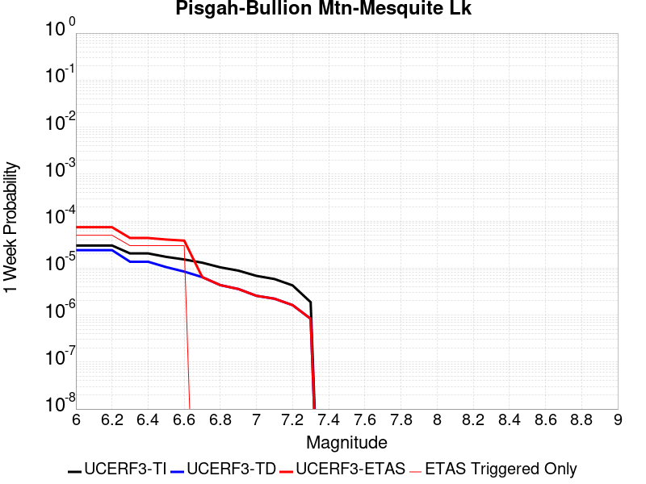 | 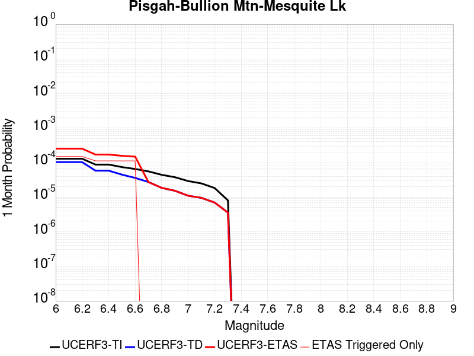 | 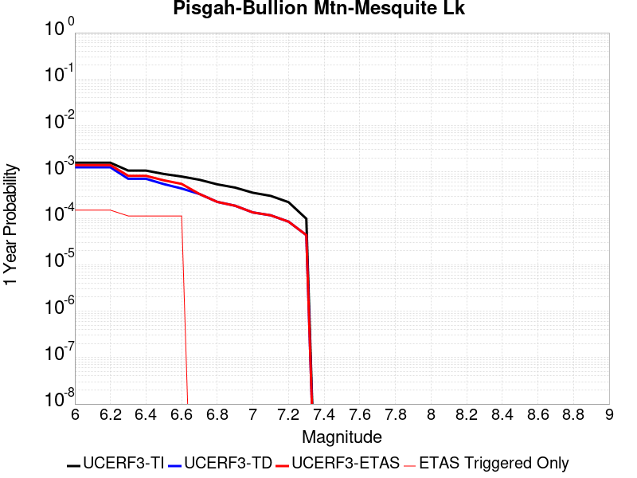 | 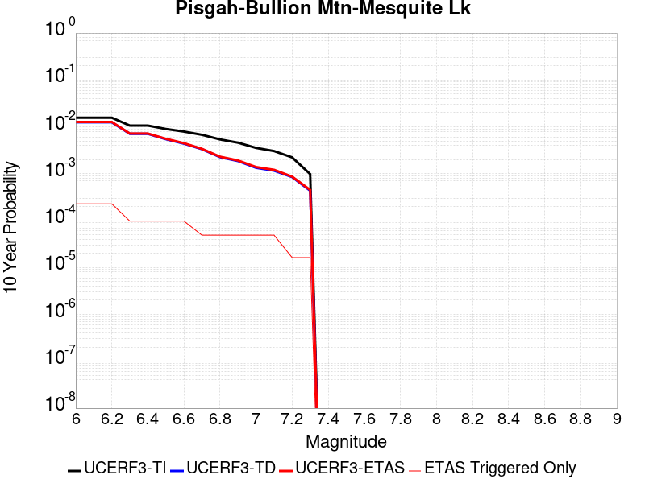 |

| Magnitude | 1 wk TI Prob | 1 wk TD Prob | 1 wk ETAS Prob | 1 wk ETAS/TD Gain | 1 wk ETAS Triggered Only | 1 mo TI Prob | 1 mo TD Prob | 1 mo ETAS Prob | 1 mo ETAS/TD Gain | 1 mo ETAS Triggered Only | 1 yr TI Prob | 1 yr TD Prob | 1 yr ETAS Prob | 1 yr ETAS/TD Gain | 1 yr ETAS Triggered Only | 10 yr TI Prob | 10 yr TD Prob | 10 yr ETAS Prob | 10 yr ETAS/TD Gain | 10 yr ETAS Triggered Only |
|-----|-----|-----|-----|-----|-----|-----|-----|-----|-----|-----|-----|-----|-----|-----|-----|-----|-----|-----|-----|-----|
| 6.0 | 3.0240792E-5 | 2.40909E-5 | 1.2400855E-4 | 5.1475267 | 9.9920064E-5 | 1.2959696E-4 | 1.032432E-4 | 2.0315294E-4 | 1.9677126 | 9.9920064E-5 | 0.0015767008 | 0.0012563618 | 0.0013811049 | 1.0992892 | 1.2490008E-4 | 0.015655609 | 0.012502613 | 0.012699954 | 1.015784 | 1.9984013E-4 |
| 6.1 | 3.0240792E-5 | 2.40909E-5 | 1.2400855E-4 | 5.1475267 | 9.9920064E-5 | 1.2959696E-4 | 1.032432E-4 | 2.0315294E-4 | 1.9677126 | 9.9920064E-5 | 0.0015767008 | 0.0012563618 | 0.0013811049 | 1.0992892 | 1.2490008E-4 | 0.015655609 | 0.012502613 | 0.012699954 | 1.015784 | 1.9984013E-4 |
| 6.2 | 3.0240792E-5 | 2.40909E-5 | 1.2400855E-4 | 5.1475267 | 9.9920064E-5 | 1.2959696E-4 | 1.032432E-4 | 2.0315294E-4 | 1.9677126 | 9.9920064E-5 | 0.0015767008 | 0.0012563618 | 0.0013811049 | 1.0992892 | 1.2490008E-4 | 0.015655609 | 0.012502613 | 0.012699954 | 1.015784 | 1.9984013E-4 |
| 6.3 | 2.0498217E-5 | 1.3638054E-5 | 8.857708E-5 | 6.4948473 | 7.494005E-5 | 8.784654E-5 | 5.8447586E-5 | 1.3338325E-4 | 2.2821002 | 7.494005E-5 | 0.0010690069 | 7.1138324E-4 | 7.8627E-4 | 1.1052692 | 7.494005E-5 | 0.01063879 | 0.0070926864 | 0.007191898 | 1.0139879 | 9.9920064E-5 |
| 6.4 | 2.0498217E-5 | 1.3638054E-5 | 8.857708E-5 | 6.4948473 | 7.494005E-5 | 8.784654E-5 | 5.8447586E-5 | 1.3338325E-4 | 2.2821002 | 7.494005E-5 | 0.0010690069 | 7.1138324E-4 | 7.8627E-4 | 1.1052692 | 7.494005E-5 | 0.01063879 | 0.0070926864 | 0.007191898 | 1.0139879 | 9.9920064E-5 |
| 6.5 | 1.7316182E-5 | 1.04769715E-5 | 8.5416235E-5 | 8.15276 | 7.494005E-5 | 7.42101E-5 | 4.490059E-5 | 1.1983727E-4 | 2.6689465 | 7.494005E-5 | 9.0313336E-4 | 5.465376E-4 | 6.2143663E-4 | 1.1370429 | 7.494005E-5 | 0.008994718 | 0.00545293 | 0.0055523054 | 1.0182242 | 9.9920064E-5 |
| 6.6 | 1.5251077E-5 | 8.414133E-6 | 8.335355E-5 | 9.906374 | 7.494005E-5 | 6.536012E-5 | 3.606011E-5 | 1.10997455E-4 | 3.0781229 | 7.494005E-5 | 7.9546886E-4 | 4.3895066E-4 | 5.138578E-4 | 1.1706505 | 7.494005E-5 | 0.007926274 | 0.0043815537 | 0.0044810358 | 1.0227048 | 9.9920064E-5 |
| 6.7 | 1.2997425E-5 | 6.4112146E-6 | 6.4112146E-6 | 1.0 | 0.0 | 5.570206E-5 | 2.7476372E-5 | 2.7476372E-5 | 1.0 | 0.0 | 6.7796157E-4 | 3.3447813E-4 | 3.3447813E-4 | 1.0 | 0.0 | 0.0067589693 | 0.003340207 | 0.0033651036 | 1.0074536 | 2.4980016E-5 |
| 6.8 | 1.035386E-5 | 4.333145E-6 | 4.333145E-6 | 1.0 | 0.0 | 4.437293E-5 | 1.8570496E-5 | 1.8570496E-5 | 1.0 | 0.0 | 5.401065E-4 | 2.260732E-4 | 2.260732E-4 | 1.0 | 0.0 | 0.0053879567 | 0.002258519 | 0.0022834425 | 1.0110353 | 2.4980016E-5 |
| 6.9 | 8.816252E-6 | 3.5805879E-6 | 3.5805879E-6 | 1.0 | 0.0 | 3.778339E-5 | 1.534529E-5 | 1.534529E-5 | 1.0 | 0.0 | 4.5991567E-4 | 1.8681347E-4 | 1.8681347E-4 | 1.0 | 0.0 | 0.00458965 | 0.0018666228 | 0.0018915562 | 1.0133575 | 2.4980016E-5 |
| 7.0 | 6.8232207E-6 | 2.5674399E-6 | 2.5674399E-6 | 1.0 | 0.0 | 2.9242048E-5 | 1.100327E-5 | 1.100327E-5 | 1.0 | 0.0 | 3.5596377E-4 | 1.3395688E-4 | 1.3395688E-4 | 1.0 | 0.0 | 0.0035539411 | 0.0013387925 | 0.001363739 | 1.0186336 | 2.4980016E-5 |
| 7.1 | 5.837013E-6 | 2.2273143E-6 | 2.2273143E-6 | 1.0 | 0.0 | 2.501553E-5 | 9.5456E-6 | 9.5456E-6 | 1.0 | 0.0 | 3.045215E-4 | 1.1621177E-4 | 1.1621177E-4 | 1.0 | 0.0 | 0.0030410455 | 0.001161539 | 0.0011864901 | 1.021481 | 2.4980016E-5 |
| 7.2 | 4.278052E-6 | 1.6275065E-6 | 1.6275065E-6 | 1.0 | 0.0 | 1.833438E-5 | 6.975011E-6 | 6.975011E-6 | 1.0 | 0.0 | 2.231982E-4 | 8.491768E-5 | 8.491768E-5 | 1.0 | 0.0 | 0.0022297418 | 8.4887556E-4 | 8.7383436E-4 | 1.0294023 | 2.4980016E-5 |
| 7.3 | 1.8803692E-6 | 8.344788E-7 | 8.344788E-7 | 1.0 | 0.0 | 8.0587E-6 | 3.5763337E-6 | 3.5763337E-6 | 1.0 | 0.0 | 9.811026E-5 | 4.354114E-5 | 4.354114E-5 | 1.0 | 0.0 | 9.806695E-4 | 4.3534054E-4 | 4.603097E-4 | 1.0573554 | 2.4980016E-5 |

## Cleghorn Pass
*[(top)](#table-of-contents)*

| 1 Week | 1 Month | 1 Year | 10 Year |
|-----|-----|-----|-----|
| 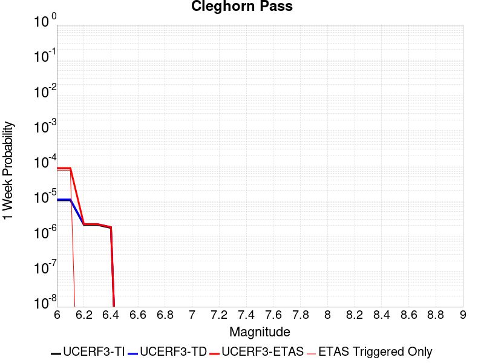 | 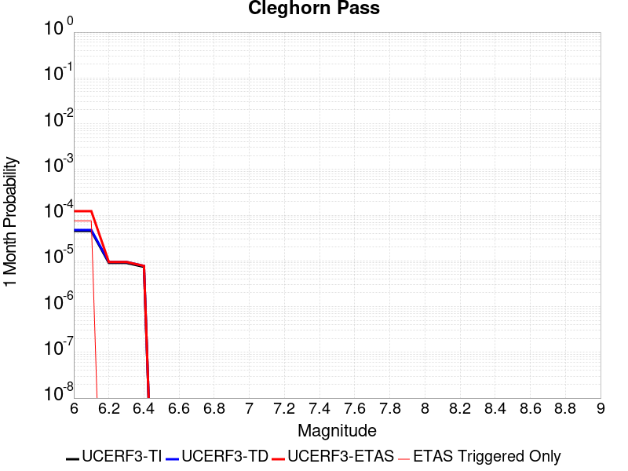 | 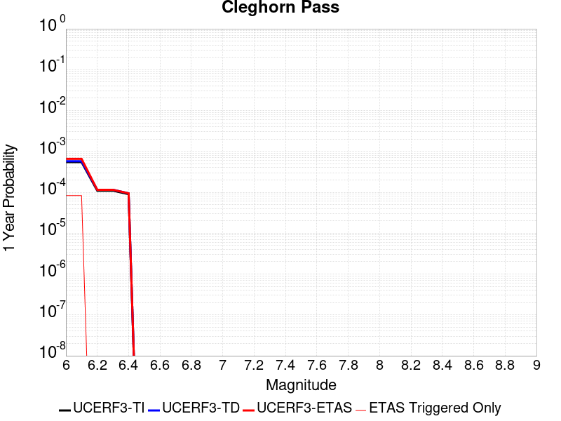 | 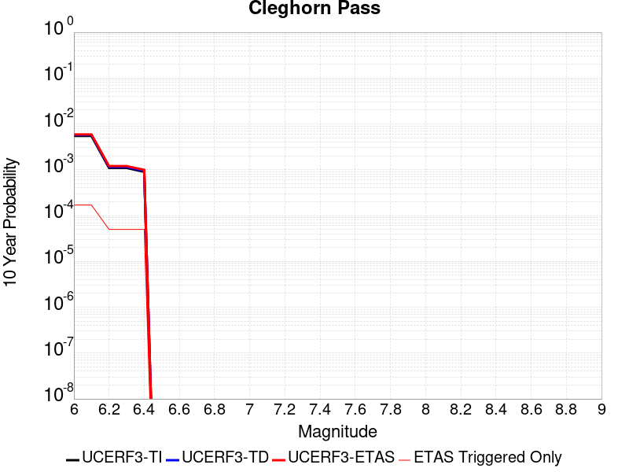 |

| Magnitude | 1 wk TI Prob | 1 wk TD Prob | 1 wk ETAS Prob | 1 wk ETAS/TD Gain | 1 wk ETAS Triggered Only | 1 mo TI Prob | 1 mo TD Prob | 1 mo ETAS Prob | 1 mo ETAS/TD Gain | 1 mo ETAS Triggered Only | 1 yr TI Prob | 1 yr TD Prob | 1 yr ETAS Prob | 1 yr ETAS/TD Gain | 1 yr ETAS Triggered Only | 10 yr TI Prob | 10 yr TD Prob | 10 yr ETAS Prob | 10 yr ETAS/TD Gain | 10 yr ETAS Triggered Only |
|-----|-----|-----|-----|-----|-----|-----|-----|-----|-----|-----|-----|-----|-----|-----|-----|-----|-----|-----|-----|-----|
| 6.0 | 1.0522846E-5 | 1.1040642E-5 | 8.597986E-5 | 7.7875786 | 7.494005E-5 | 4.509713E-5 | 4.7316473E-5 | 1.2225298E-4 | 2.5837295 | 7.494005E-5 | 5.4891926E-4 | 5.759784E-4 | 6.7584094E-4 | 1.173379 | 9.9920064E-5 | 0.0054756533 | 0.005750022 | 0.0059238765 | 1.0302355 | 1.748601E-4 |
| 6.1 | 1.0522846E-5 | 1.1040642E-5 | 8.597986E-5 | 7.7875786 | 7.494005E-5 | 4.509713E-5 | 4.7316473E-5 | 1.2225298E-4 | 2.5837295 | 7.494005E-5 | 5.4891926E-4 | 5.759784E-4 | 6.7584094E-4 | 1.173379 | 9.9920064E-5 | 0.0054756533 | 0.005750022 | 0.0059238765 | 1.0302355 | 1.748601E-4 |
| 6.2 | 2.1045846E-6 | 2.2082024E-6 | 2.2082024E-6 | 1.0 | 0.0 | 9.019617E-6 | 9.463714E-6 | 9.463714E-6 | 1.0 | 0.0 | 1.098083E-4 | 1.1521882E-4 | 1.1521882E-4 | 1.0 | 0.0 | 0.0010975406 | 0.0011520023 | 0.0011520023 | 1.0 | 0.0 |
| 6.3 | 2.1045846E-6 | 2.2082024E-6 | 2.2082024E-6 | 1.0 | 0.0 | 9.019617E-6 | 9.463714E-6 | 9.463714E-6 | 1.0 | 0.0 | 1.098083E-4 | 1.1521882E-4 | 1.1521882E-4 | 1.0 | 0.0 | 0.0010975406 | 0.0011520023 | 0.0011520023 | 1.0 | 0.0 |
| 6.4 | 1.7259927E-6 | 1.810877E-6 | 1.810877E-6 | 1.0 | 0.0 | 7.3970905E-6 | 7.760902E-6 | 7.760902E-6 | 1.0 | 0.0 | 9.005586E-5 | 9.4488976E-5 | 9.4488976E-5 | 1.0 | 0.0 | 9.001937E-4 | 9.448898E-4 | 9.448898E-4 | 1.0 | 0.0 |

## Owens Valley
*[(top)](#table-of-contents)*

| 1 Week | 1 Month | 1 Year | 10 Year |
|-----|-----|-----|-----|
| 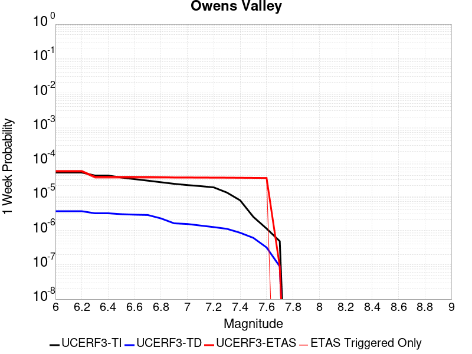 | 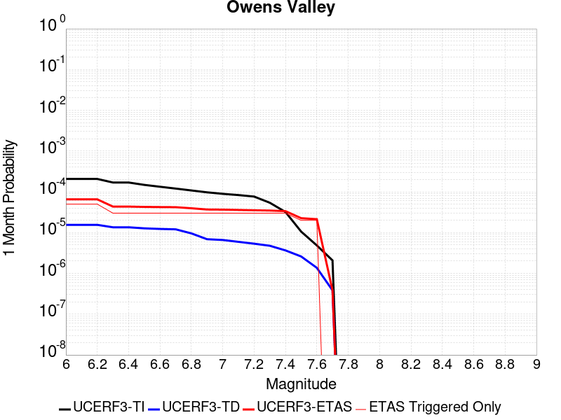 | 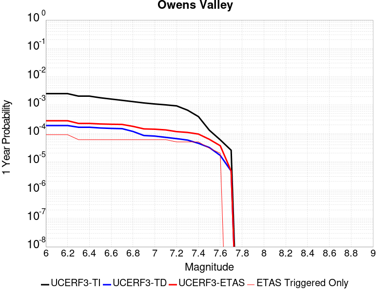 | 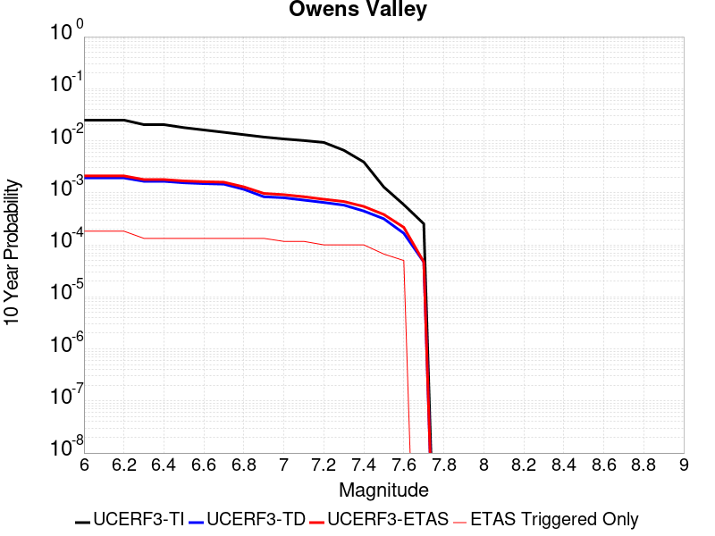 |

| Magnitude | 1 wk TI Prob | 1 wk TD Prob | 1 wk ETAS Prob | 1 wk ETAS/TD Gain | 1 wk ETAS Triggered Only | 1 mo TI Prob | 1 mo TD Prob | 1 mo ETAS Prob | 1 mo ETAS/TD Gain | 1 mo ETAS Triggered Only | 1 yr TI Prob | 1 yr TD Prob | 1 yr ETAS Prob | 1 yr ETAS/TD Gain | 1 yr ETAS Triggered Only | 10 yr TI Prob | 10 yr TD Prob | 10 yr ETAS Prob | 10 yr ETAS/TD Gain | 10 yr ETAS Triggered Only |
|-----|-----|-----|-----|-----|-----|-----|-----|-----|-----|-----|-----|-----|-----|-----|-----|-----|-----|-----|-----|-----|
| 6.0 | 4.83821E-5 | 3.6210524E-6 | 5.3580905E-5 | 14.797052 | 4.9960032E-5 | 2.0733538E-4 | 1.551871E-5 | 9.045759E-5 | 5.828938 | 7.494005E-5 | 0.002521386 | 1.889249E-4 | 3.1380137E-4 | 1.6609848 | 1.2490008E-4 | 0.024929691 | 0.0019297141 | 0.0021042367 | 1.0904397 | 1.748601E-4 |
| 6.1 | 4.83821E-5 | 3.6210524E-6 | 5.3580905E-5 | 14.797052 | 4.9960032E-5 | 2.0733538E-4 | 1.551871E-5 | 9.045759E-5 | 5.828938 | 7.494005E-5 | 0.002521386 | 1.889249E-4 | 3.1380137E-4 | 1.6609848 | 1.2490008E-4 | 0.024929691 | 0.0019297141 | 0.0021042367 | 1.0904397 | 1.748601E-4 |
| 6.2 | 4.83821E-5 | 3.6210524E-6 | 5.3580905E-5 | 14.797052 | 4.9960032E-5 | 2.0733538E-4 | 1.551871E-5 | 9.045759E-5 | 5.828938 | 7.494005E-5 | 0.002521386 | 1.889249E-4 | 3.1380137E-4 | 1.6609848 | 1.2490008E-4 | 0.024929691 | 0.0019297141 | 0.0021042367 | 1.0904397 | 1.748601E-4 |
| 6.3 | 3.953008E-5 | 3.1530958E-6 | 2.8133034E-5 | 8.922353 | 2.4980016E-5 | 1.6940363E-4 | 1.3513202E-5 | 3.849288E-5 | 2.8485389 | 2.4980016E-5 | 0.002060538 | 1.6451156E-4 | 2.3943926E-4 | 1.4554557 | 7.494005E-5 | 0.020415364 | 0.0016621627 | 0.0017868552 | 1.0750182 | 1.2490008E-4 |
| 6.4 | 3.953008E-5 | 3.1530958E-6 | 2.8133034E-5 | 8.922353 | 2.4980016E-5 | 1.6940363E-4 | 1.3513202E-5 | 3.849288E-5 | 2.8485389 | 2.4980016E-5 | 0.002060538 | 1.6451156E-4 | 2.3943926E-4 | 1.4554557 | 7.494005E-5 | 0.020415364 | 0.0016621627 | 0.0017868552 | 1.0750182 | 1.2490008E-4 |
| 6.5 | 3.457342E-5 | 2.9707387E-6 | 2.795068E-5 | 9.408663 | 2.4980016E-5 | 1.4816338E-4 | 1.273168E-5 | 3.771138E-5 | 2.962011 | 2.4980016E-5 | 0.0018023965 | 1.5499788E-4 | 2.299263E-4 | 1.4834158 | 7.494005E-5 | 0.017878477 | 0.0015563119 | 0.0016810175 | 1.080129 | 1.2490008E-4 |
| 6.6 | 3.1127765E-5 | 2.8737306E-6 | 2.7853675E-5 | 9.692514 | 2.4980016E-5 | 1.3339789E-4 | 1.2315934E-5 | 3.7295642E-5 | 3.028243 | 2.4980016E-5 | 0.0016229092 | 1.4993687E-4 | 2.2486568E-4 | 1.4997357 | 7.494005E-5 | 0.016111081 | 0.0015013438 | 0.0016260564 | 1.0830673 | 1.2490008E-4 |
| 6.7 | 2.806885E-5 | 2.8101606E-6 | 2.7790105E-5 | 9.889153 | 2.4980016E-5 | 1.2028952E-4 | 1.2043493E-5 | 3.702321E-5 | 3.0741253 | 2.4980016E-5 | 0.001463541 | 1.4662035E-4 | 2.215494E-4 | 1.5110413 | 7.494005E-5 | 0.014539397 | 0.0014656087 | 0.0015903257 | 1.0850958 | 1.2490008E-4 |
| 6.8 | 2.524524E-5 | 2.2351392E-6 | 2.72151E-5 | 12.176021 | 2.4980016E-5 | 1.0818939E-4 | 9.579134E-6 | 3.455891E-5 | 3.607728 | 2.4980016E-5 | 0.0013164099 | 1.16620016E-4 | 1.9155133E-4 | 1.6425253 | 7.494005E-5 | 0.01308639 | 0.001165827 | 0.0012905815 | 1.1070094 | 1.2490008E-4 |
| 6.9 | 2.2704568E-5 | 1.6079711E-6 | 2.6587946E-5 | 16.535091 | 2.4980016E-5 | 9.730166E-5 | 6.8912864E-6 | 3.187113E-5 | 4.624845 | 2.4980016E-5 | 0.0011840039 | 8.38982E-5 | 1.5883196E-4 | 1.893151 | 7.494005E-5 | 0.011777153 | 8.38853E-4 | 9.636484E-4 | 1.148769 | 1.2490008E-4 |
| 7.0 | 2.0871712E-5 | 1.5393621E-6 | 2.651934E-5 | 17.227486 | 2.4980016E-5 | 8.944713E-5 | 6.5972495E-6 | 3.15771E-5 | 4.7864037 | 2.4980016E-5 | 0.0010884746 | 8.031857E-5 | 1.552526E-4 | 1.9329602 | 7.494005E-5 | 0.010831586 | 8.030395E-4 | 9.278393E-4 | 1.1554092 | 1.2490008E-4 |
| 7.1 | 1.944928E-5 | 1.3862556E-6 | 2.6366237E-5 | 19.019753 | 2.4980016E-5 | 8.335139E-5 | 5.941082E-6 | 3.092095E-5 | 5.2045994 | 2.4980016E-5 | 0.0010143308 | 7.233028E-5 | 1.472649E-4 | 2.0360065 | 7.494005E-5 | 0.010097133 | 7.2319806E-4 | 8.480078E-4 | 1.1725804 | 1.2490008E-4 |
| 7.2 | 1.7876306E-5 | 1.2487686E-6 | 2.6228754E-5 | 21.003695 | 2.4980016E-5 | 7.6610486E-5 | 5.3518543E-6 | 3.0331737E-5 | 5.667519 | 2.4980016E-5 | 9.3233347E-4 | 6.515689E-5 | 1.1511367E-4 | 1.7667152 | 4.9960032E-5 | 0.009284316 | 6.5148395E-4 | 7.513389E-4 | 1.1532731 | 9.9920064E-5 |
| 7.3 | 1.2618672E-5 | 1.1113839E-6 | 2.6091373E-5 | 23.47647 | 2.4980016E-5 | 5.40789E-5 | 4.763065E-6 | 2.9742961E-5 | 6.2445 | 2.4980016E-5 | 6.582117E-4 | 5.7988782E-5 | 1.0794592E-4 | 1.8614966 | 4.9960032E-5 | 0.0065626553 | 5.7983754E-4 | 6.796997E-4 | 1.1722243 | 9.9920064E-5 |
| 7.4 | 7.4874442E-6 | 8.547518E-7 | 2.5834746E-5 | 30.224852 | 2.4980016E-5 | 3.208865E-5 | 3.6632168E-6 | 2.864314E-5 | 7.8191223 | 2.4980016E-5 | 3.906093E-4 | 4.4598757E-5 | 9.455656E-5 | 2.1201613 | 4.9960032E-5 | 0.003899234 | 4.459579E-4 | 5.4583343E-4 | 1.2239573 | 9.9920064E-5 |
| 7.5 | 2.4734156E-6 | 6.0679935E-7 | 2.55868E-5 | 42.16682 | 2.4980016E-5 | 1.060031E-5 | 2.6005662E-6 | 2.7580518E-5 | 10.605582 | 2.4980016E-5 | 1.2905113E-4 | 3.1661435E-5 | 5.664066E-5 | 1.7889479 | 2.4980016E-5 | 0.0012897621 | 3.1656958E-4 | 3.665138E-4 | 1.1577669 | 4.9960032E-5 |
| 7.6 | 1.1328841E-6 | 3.1961991E-7 | 2.5299629E-5 | 79.15535 | 2.4980016E-5 | 4.8552088E-6 | 1.369799E-6 | 2.634978E-5 | 19.236238 | 2.4980016E-5 | 5.9110564E-5 | 1.6677177E-5 | 4.1656775E-5 | 2.4978313 | 2.4980016E-5 | 5.9094845E-4 | 1.6675945E-4 | 2.1671114E-4 | 1.2995435 | 4.9960032E-5 |
| 7.7 | 4.8613185E-7 | 8.962742E-8 | 8.962742E-8 | 1.0 | 0.0 | 2.0834207E-6 | 3.8411747E-7 | 3.8411747E-7 | 1.0 | 0.0 | 2.536535E-5 | 4.676621E-6 | 4.676621E-6 | 1.0 | 0.0 | 2.5362454E-4 | 4.676529E-5 | 4.676529E-5 | 1.0 | 0.0 |

## Pleito
*[(top)](#table-of-contents)*

| 1 Week | 1 Month | 1 Year | 10 Year |
|-----|-----|-----|-----|
| 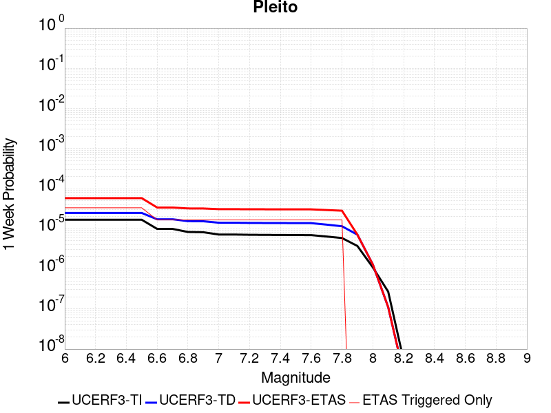 | 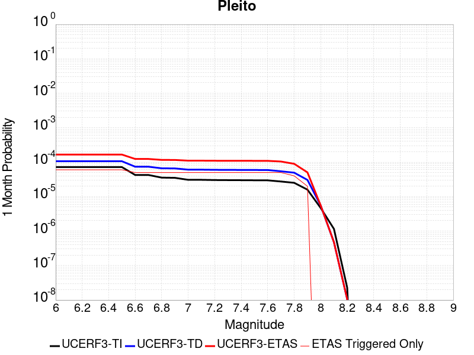 | 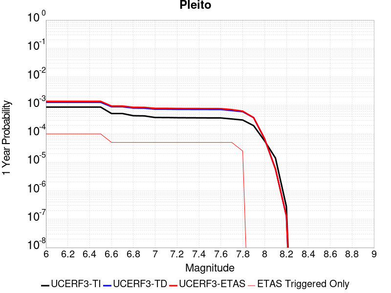 | 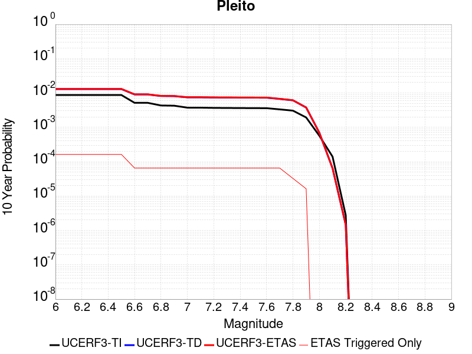 |

| Magnitude | 1 wk TI Prob | 1 wk TD Prob | 1 wk ETAS Prob | 1 wk ETAS/TD Gain | 1 wk ETAS Triggered Only | 1 mo TI Prob | 1 mo TD Prob | 1 mo ETAS Prob | 1 mo ETAS/TD Gain | 1 mo ETAS Triggered Only | 1 yr TI Prob | 1 yr TD Prob | 1 yr ETAS Prob | 1 yr ETAS/TD Gain | 1 yr ETAS Triggered Only | 10 yr TI Prob | 10 yr TD Prob | 10 yr ETAS Prob | 10 yr ETAS/TD Gain | 10 yr ETAS Triggered Only |
|-----|-----|-----|-----|-----|-----|-----|-----|-----|-----|-----|-----|-----|-----|-----|-----|-----|-----|-----|-----|-----|
| 6.0 | 1.6763008E-5 | 2.4764735E-5 | 7.472353E-5 | 3.0173361 | 4.9960032E-5 | 7.183948E-5 | 1.0613067E-4 | 1.8106276E-4 | 1.7060362 | 7.494005E-5 | 8.742947E-4 | 0.001291447 | 0.0013912381 | 1.0772707 | 9.9920064E-5 | 0.00870863 | 0.012954412 | 0.013127007 | 1.0133233 | 1.748601E-4 |
| 6.1 | 1.6763008E-5 | 2.4764735E-5 | 7.472353E-5 | 3.0173361 | 4.9960032E-5 | 7.183948E-5 | 1.0613067E-4 | 1.8106276E-4 | 1.7060362 | 7.494005E-5 | 8.742947E-4 | 0.001291447 | 0.0013912381 | 1.0772707 | 9.9920064E-5 | 0.00870863 | 0.012954412 | 0.013127007 | 1.0133233 | 1.748601E-4 |
| 6.2 | 1.6763008E-5 | 2.4764735E-5 | 7.472353E-5 | 3.0173361 | 4.9960032E-5 | 7.183948E-5 | 1.0613067E-4 | 1.8106276E-4 | 1.7060362 | 7.494005E-5 | 8.742947E-4 | 0.001291447 | 0.0013912381 | 1.0772707 | 9.9920064E-5 | 0.00870863 | 0.012954412 | 0.013127007 | 1.0133233 | 1.748601E-4 |
| 6.3 | 1.6763008E-5 | 2.4764735E-5 | 7.472353E-5 | 3.0173361 | 4.9960032E-5 | 7.183948E-5 | 1.0613067E-4 | 1.8106276E-4 | 1.7060362 | 7.494005E-5 | 8.742947E-4 | 0.001291447 | 0.0013912381 | 1.0772707 | 9.9920064E-5 | 0.00870863 | 0.012954412 | 0.013127007 | 1.0133233 | 1.748601E-4 |
| 6.4 | 1.6763008E-5 | 2.4764735E-5 | 7.472353E-5 | 3.0173361 | 4.9960032E-5 | 7.183948E-5 | 1.0613067E-4 | 1.8106276E-4 | 1.7060362 | 7.494005E-5 | 8.742947E-4 | 0.001291447 | 0.0013912381 | 1.0772707 | 9.9920064E-5 | 0.00870863 | 0.012954412 | 0.013127007 | 1.0133233 | 1.748601E-4 |
| 6.5 | 1.6763008E-5 | 2.4764735E-5 | 7.472353E-5 | 3.0173361 | 4.9960032E-5 | 7.183948E-5 | 1.0613067E-4 | 1.8106276E-4 | 1.7060362 | 7.494005E-5 | 8.742947E-4 | 0.001291447 | 0.0013912381 | 1.0772707 | 9.9920064E-5 | 0.00870863 | 0.012954412 | 0.013127007 | 1.0133233 | 1.748601E-4 |
| 6.6 | 9.910213E-6 | 1.721552E-5 | 4.2195104E-5 | 2.4509923 | 2.4980016E-5 | 4.247165E-5 | 7.3778734E-5 | 1.2373508E-4 | 1.6771103 | 4.9960032E-5 | 5.169696E-4 | 8.9788967E-4 | 9.4780483E-4 | 1.0555917 | 4.9960032E-5 | 0.0051576863 | 0.009051226 | 0.009125488 | 1.0082046 | 7.494005E-5 |
| 6.7 | 9.910213E-6 | 1.721552E-5 | 4.2195104E-5 | 2.4509923 | 2.4980016E-5 | 4.247165E-5 | 7.3778734E-5 | 1.2373508E-4 | 1.6771103 | 4.9960032E-5 | 5.169696E-4 | 8.9788967E-4 | 9.4780483E-4 | 1.0555917 | 4.9960032E-5 | 0.0051576863 | 0.009051226 | 0.009125488 | 1.0082046 | 7.494005E-5 |
| 6.8 | 8.300162E-6 | 1.5475129E-5 | 4.0454757E-5 | 2.6141791 | 2.4980016E-5 | 3.557164E-5 | 6.63203E-5 | 1.1627702E-4 | 1.7532643 | 4.9960032E-5 | 4.3299864E-4 | 8.07152E-4 | 8.570717E-4 | 1.0618467 | 4.9960032E-5 | 0.004321559 | 0.008150663 | 0.008224992 | 1.0091194 | 7.494005E-5 |
| 6.9 | 8.183114E-6 | 1.5346344E-5 | 4.0325976E-5 | 2.6277254 | 2.4980016E-5 | 3.5070017E-5 | 6.57684E-5 | 1.1572514E-4 | 1.7595859 | 4.9960032E-5 | 4.2689382E-4 | 8.0043747E-4 | 8.503575E-4 | 1.0623659 | 4.9960032E-5 | 0.0042607468 | 0.008084008 | 0.008158342 | 1.0091952 | 7.494005E-5 |
| 7.0 | 7.1748823E-6 | 1.4133306E-5 | 3.911297E-5 | 2.7674325 | 2.4980016E-5 | 3.0749135E-5 | 6.0569906E-5 | 1.1052691E-4 | 1.8247826 | 4.9960032E-5 | 3.743064E-4 | 7.3718966E-4 | 7.8711286E-4 | 1.067721 | 4.9960032E-5 | 0.0037367654 | 0.0074553755 | 0.007529757 | 1.0099769 | 7.494005E-5 |
| 7.1 | 7.1671807E-6 | 1.4123676E-5 | 3.910334E-5 | 2.7686377 | 2.4980016E-5 | 3.0716128E-5 | 6.0528637E-5 | 1.1048564E-4 | 1.825345 | 4.9960032E-5 | 3.7390468E-4 | 7.366875E-4 | 7.8661076E-4 | 1.0677671 | 4.9960032E-5 | 0.0037327618 | 0.0074503883 | 0.0075247698 | 1.0099837 | 7.494005E-5 |
| 7.2 | 7.0649667E-6 | 1.3970962E-5 | 3.8950628E-5 | 2.7879705 | 2.4980016E-5 | 3.0278077E-5 | 5.987418E-5 | 1.0983122E-4 | 1.834367 | 4.9960032E-5 | 3.6857324E-4 | 7.287248E-4 | 7.786485E-4 | 1.0685081 | 4.9960032E-5 | 0.0036796255 | 0.0073711374 | 0.0074455254 | 1.0100918 | 7.494005E-5 |
| 7.3 | 7.02082E-6 | 1.3914415E-5 | 3.8894083E-5 | 2.7952366 | 2.4980016E-5 | 3.008888E-5 | 5.9631846E-5 | 1.095889E-4 | 1.837758 | 4.9960032E-5 | 3.6627054E-4 | 7.257764E-4 | 7.757002E-4 | 1.0687867 | 4.9960032E-5 | 0.0036566744 | 0.0073416373 | 0.007416027 | 1.0101326 | 7.494005E-5 |
| 7.4 | 6.987146E-6 | 1.3873975E-5 | 3.8853646E-5 | 2.8004694 | 2.4980016E-5 | 2.9944567E-5 | 5.9458544E-5 | 1.094156E-4 | 1.8402 | 4.9960032E-5 | 3.6451413E-4 | 7.2366785E-4 | 7.735917E-4 | 1.0689873 | 4.9960032E-5 | 0.0036391679 | 0.007320571 | 0.007394963 | 1.010162 | 7.494005E-5 |
| 7.5 | 6.9494554E-6 | 1.383088E-5 | 3.881055E-5 | 2.8060796 | 2.4980016E-5 | 2.9783041E-5 | 5.9273858E-5 | 1.09230925E-4 | 1.8428179 | 4.9960032E-5 | 3.625482E-4 | 7.2142074E-4 | 7.7134476E-4 | 1.0692023 | 4.9960032E-5 | 0.0036195726 | 0.007298199 | 0.007372592 | 1.0101933 | 7.494005E-5 |
| 7.6 | 6.92694E-6 | 1.3789992E-5 | 3.8769664E-5 | 2.8114347 | 2.4980016E-5 | 2.9686547E-5 | 5.909863E-5 | 1.0905571E-4 | 1.845317 | 4.9960032E-5 | 3.6137376E-4 | 7.192888E-4 | 7.692129E-4 | 1.0694076 | 4.9960032E-5 | 0.0036078666 | 0.007276951 | 0.007351346 | 1.0102234 | 7.494005E-5 |
| 7.7 | 6.395867E-6 | 1.26690065E-5 | 3.7648708E-5 | 2.9717174 | 2.4980016E-5 | 2.741057E-5 | 5.4294615E-5 | 1.04251936E-4 | 1.9201156 | 4.9960032E-5 | 3.336726E-4 | 6.6083675E-4 | 7.107638E-4 | 1.0755512 | 4.9960032E-5 | 0.0033317201 | 0.0066955453 | 0.0067699836 | 1.0111176 | 7.494005E-5 |
| 7.8 | 5.8664327E-6 | 1.1536581E-5 | 3.6516307E-5 | 3.1652627 | 2.4980016E-5 | 2.5141611E-5 | 4.9441554E-5 | 7.4420335E-5 | 1.5052184 | 2.4980016E-5 | 3.060561E-4 | 6.0178485E-4 | 6.267499E-4 | 1.041485 | 2.4980016E-5 | 0.0030563495 | 0.0061010164 | 0.006125844 | 1.0040694 | 2.4980016E-5 |
| 7.9 | 3.7167474E-6 | 7.1145205E-6 | 7.1145205E-6 | 1.0 | 0.0 | 1.592882E-5 | 3.0490448E-5 | 3.0490448E-5 | 1.0 | 0.0 | 1.9391612E-4 | 3.7115812E-4 | 3.7115812E-4 | 1.0 | 0.0 | 0.0019374699 | 0.0037676243 | 0.0037676243 | 1.0 | 0.0 |
| 8.0 | 1.0903841E-6 | 1.2879104E-6 | 1.2879104E-6 | 1.0 | 0.0 | 4.6730665E-6 | 5.5196047E-6 | 5.5196047E-6 | 1.0 | 0.0 | 5.68931E-5 | 6.719913E-5 | 6.719913E-5 | 1.0 | 0.0 | 5.6878536E-4 | 6.942094E-4 | 6.942094E-4 | 1.0 | 0.0 |
| 8.1 | 2.6894583E-7 | 1.1056095E-7 | 1.1056095E-7 | 1.0 | 0.0 | 1.1526245E-6 | 4.7383253E-7 | 4.7383253E-7 | 1.0 | 0.0 | 1.4033113E-5 | 5.768896E-6 | 5.768896E-6 | 1.0 | 0.0 | 1.4032227E-4 | 6.454915E-5 | 6.454915E-5 | 1.0 | 0.0 |
| 8.2 | 5.2967013E-9 | 2.4567874E-9 | 2.4567874E-9 | 1.0 | 0.0 | 2.2700148E-8 | 1.0529089E-8 | 1.0529089E-8 | 1.0 | 0.0 | 2.7637427E-7 | 1.2819166E-7 | 1.2819166E-7 | 1.0 | 0.0 | 2.7637393E-6 | 1.4588004E-6 | 1.4588004E-6 | 1.0 | 0.0 |

## San Jacinto (Coyote Creek)
*[(top)](#table-of-contents)*

| 1 Week | 1 Month | 1 Year | 10 Year |
|-----|-----|-----|-----|
| 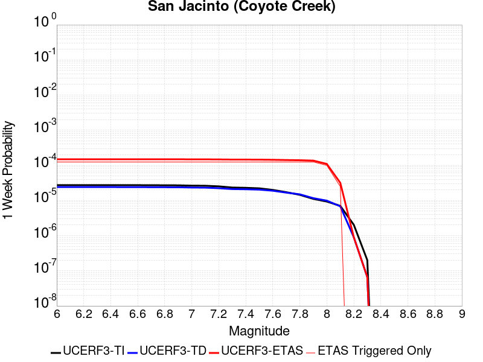 | 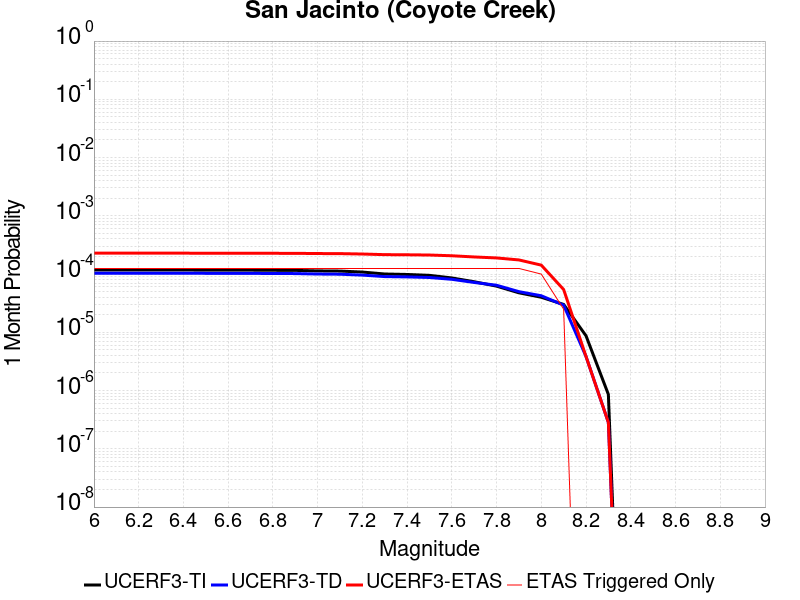 | 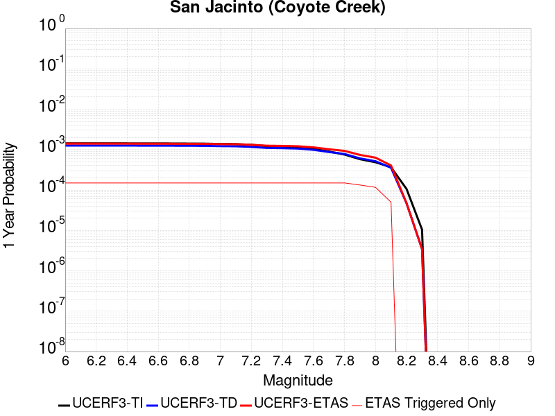 | 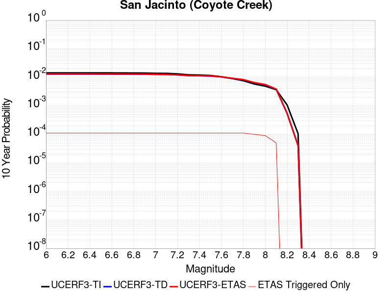 |

| Magnitude | 1 wk TI Prob | 1 wk TD Prob | 1 wk ETAS Prob | 1 wk ETAS/TD Gain | 1 wk ETAS Triggered Only | 1 mo TI Prob | 1 mo TD Prob | 1 mo ETAS Prob | 1 mo ETAS/TD Gain | 1 mo ETAS Triggered Only | 1 yr TI Prob | 1 yr TD Prob | 1 yr ETAS Prob | 1 yr ETAS/TD Gain | 1 yr ETAS Triggered Only | 10 yr TI Prob | 10 yr TD Prob | 10 yr ETAS Prob | 10 yr ETAS/TD Gain | 10 yr ETAS Triggered Only |
|-----|-----|-----|-----|-----|-----|-----|-----|-----|-----|-----|-----|-----|-----|-----|-----|-----|-----|-----|-----|-----|
| 6.0 | 2.7374346E-5 | 2.41444E-5 | 1.4904146E-4 | 6.1729207 | 1.2490008E-4 | 1.1731335E-4 | 1.034719E-4 | 2.2835906E-4 | 2.2069669 | 1.2490008E-4 | 0.0014273542 | 0.001259045 | 0.001433685 | 1.1387082 | 1.748601E-4 | 0.01418221 | 0.012928195 | 0.0131007945 | 1.0133506 | 1.748601E-4 |
| 6.1 | 2.7374346E-5 | 2.41444E-5 | 1.4904146E-4 | 6.1729207 | 1.2490008E-4 | 1.1731335E-4 | 1.034719E-4 | 2.2835906E-4 | 2.2069669 | 1.2490008E-4 | 0.0014273542 | 0.001259045 | 0.001433685 | 1.1387082 | 1.748601E-4 | 0.01418221 | 0.012928195 | 0.0131007945 | 1.0133506 | 1.748601E-4 |
| 6.2 | 2.7374346E-5 | 2.41444E-5 | 1.4904146E-4 | 6.1729207 | 1.2490008E-4 | 1.1731335E-4 | 1.034719E-4 | 2.2835906E-4 | 2.2069669 | 1.2490008E-4 | 0.0014273542 | 0.001259045 | 0.001433685 | 1.1387082 | 1.748601E-4 | 0.01418221 | 0.012928195 | 0.0131007945 | 1.0133506 | 1.748601E-4 |
| 6.3 | 2.7374346E-5 | 2.41444E-5 | 1.4904146E-4 | 6.1729207 | 1.2490008E-4 | 1.1731335E-4 | 1.034719E-4 | 2.2835906E-4 | 2.2069669 | 1.2490008E-4 | 0.0014273542 | 0.001259045 | 0.001433685 | 1.1387082 | 1.748601E-4 | 0.01418221 | 0.012928195 | 0.0131007945 | 1.0133506 | 1.748601E-4 |
| 6.4 | 2.7374346E-5 | 2.41444E-5 | 1.4904146E-4 | 6.1729207 | 1.2490008E-4 | 1.1731335E-4 | 1.034719E-4 | 2.2835906E-4 | 2.2069669 | 1.2490008E-4 | 0.0014273542 | 0.001259045 | 0.001433685 | 1.1387082 | 1.748601E-4 | 0.01418221 | 0.012928195 | 0.0131007945 | 1.0133506 | 1.748601E-4 |
| 6.5 | 2.7282445E-5 | 2.4030476E-5 | 1.4892756E-4 | 6.197445 | 1.2490008E-4 | 1.16919524E-4 | 1.0298371E-4 | 2.2787093E-4 | 2.2126892 | 1.2490008E-4 | 0.0014225657 | 0.001253108 | 0.001427749 | 1.1393663 | 1.748601E-4 | 0.014134934 | 0.012869522 | 0.013042132 | 1.0134122 | 1.748601E-4 |
| 6.6 | 2.7282445E-5 | 2.4030476E-5 | 1.4892756E-4 | 6.197445 | 1.2490008E-4 | 1.16919524E-4 | 1.0298371E-4 | 2.2787093E-4 | 2.2126892 | 1.2490008E-4 | 0.0014225657 | 0.001253108 | 0.001427749 | 1.1393663 | 1.748601E-4 | 0.014134934 | 0.012869522 | 0.013042132 | 1.0134122 | 1.748601E-4 |
| 6.7 | 2.7216198E-5 | 2.3955597E-5 | 1.4885269E-4 | 6.213691 | 1.2490008E-4 | 1.1663563E-4 | 1.02662816E-4 | 2.2755007E-4 | 2.21648 | 1.2490008E-4 | 0.0014191137 | 0.0012492058 | 0.0014238475 | 1.1398022 | 1.748601E-4 | 0.014100855 | 0.012830934 | 0.0130035505 | 1.0134531 | 1.748601E-4 |
| 6.8 | 2.7078617E-5 | 2.3872815E-5 | 1.4876992E-4 | 6.2317705 | 1.2490008E-4 | 1.1604605E-4 | 1.0230807E-4 | 2.2719537E-4 | 2.2206984 | 1.2490008E-4 | 0.001411945 | 0.0012448917 | 0.0014195341 | 1.1402873 | 1.748601E-4 | 0.014030075 | 0.0127880825 | 0.012960706 | 1.0134988 | 1.748601E-4 |
| 6.9 | 2.6982952E-5 | 2.3792329E-5 | 1.4868943E-4 | 6.2494698 | 1.2490008E-4 | 1.15636096E-4 | 1.0196315E-4 | 2.268505E-4 | 2.2248282 | 1.2490008E-4 | 0.0014069602 | 0.0012406971 | 0.0014153402 | 1.1407621 | 1.748601E-4 | 0.013980856 | 0.012746378 | 0.01291901 | 1.0135436 | 1.748601E-4 |
| 7.0 | 2.6449972E-5 | 2.3369357E-5 | 1.4826651E-4 | 6.3444843 | 1.2490008E-4 | 1.1335209E-4 | 1.0015055E-4 | 2.2503812E-4 | 2.2469983 | 1.2490008E-4 | 0.001379188 | 0.0012186535 | 0.0013933006 | 1.1433115 | 1.748601E-4 | 0.0137065975 | 0.012527733 | 0.012700402 | 1.013783 | 1.748601E-4 |
| 7.1 | 2.6257849E-5 | 2.3195396E-5 | 1.4809259E-4 | 6.3845677 | 1.2490008E-4 | 1.1252879E-4 | 9.940507E-5 | 2.2429273E-4 | 2.256351 | 1.2490008E-4 | 0.0013691769 | 0.0012095873 | 0.0013842359 | 1.1443869 | 1.748601E-4 | 0.013607717 | 0.012437661 | 0.012610346 | 1.0138841 | 1.748601E-4 |
| 7.2 | 2.5270041E-5 | 2.2390155E-5 | 1.4728744E-4 | 6.578223 | 1.2490008E-4 | 1.0829568E-4 | 9.5954296E-5 | 2.2084238E-4 | 2.3015373 | 1.2490008E-4 | 0.0013177024 | 0.0011676198 | 0.0013422758 | 1.1495829 | 1.748601E-4 | 0.013099162 | 0.0120187905 | 0.012191549 | 1.014374 | 1.748601E-4 |
| 7.3 | 2.339701E-5 | 2.1122027E-5 | 1.4601946E-4 | 6.913137 | 1.2490008E-4 | 1.0026905E-4 | 9.051985E-5 | 2.1540861E-4 | 2.379684 | 1.2490008E-4 | 0.001220092 | 0.001101524 | 0.0012761914 | 1.158569 | 1.748601E-4 | 0.012134149 | 0.011357642 | 0.011530516 | 1.015221 | 1.748601E-4 |
| 7.4 | 2.296333E-5 | 2.0852396E-5 | 1.4574987E-4 | 6.9895983 | 1.2490008E-4 | 9.841056E-5 | 8.936436E-5 | 2.1425328E-4 | 2.3975248 | 1.2490008E-4 | 0.0011974899 | 0.0010874701 | 0.00126214 | 1.1606205 | 1.748601E-4 | 0.011910575 | 0.011216754 | 0.011389652 | 1.0154144 | 1.748601E-4 |
| 7.5 | 2.2188895E-5 | 2.037534E-5 | 1.4527288E-4 | 7.1298375 | 1.2490008E-4 | 9.50918E-5 | 8.731998E-5 | 2.1220915E-4 | 2.4302473 | 1.2490008E-4 | 0.0011571277 | 0.0010626042 | 0.0012372786 | 1.1643832 | 1.748601E-4 | 0.011511209 | 0.010966369 | 0.011139312 | 1.0157703 | 1.748601E-4 |
| 7.6 | 2.0013189E-5 | 1.8961666E-5 | 1.4385938E-4 | 7.5868535 | 1.2490008E-4 | 8.5767984E-5 | 8.126176E-5 | 2.0615169E-4 | 2.5368843 | 1.2490008E-4 | 0.001043725 | 9.889146E-4 | 0.0011636018 | 1.1766454 | 1.748601E-4 | 0.010388365 | 0.010224371 | 0.010397444 | 1.0169275 | 1.748601E-4 |
| 7.7 | 1.7230794E-5 | 1.6743043E-5 | 1.4164104E-4 | 8.459695 | 1.2490008E-4 | 7.384417E-5 | 7.175393E-5 | 1.9664505E-4 | 2.7405474 | 1.2490008E-4 | 8.986819E-4 | 8.732547E-4 | 0.0010479622 | 1.2000647 | 1.748601E-4 | 0.008950562 | 0.00906292 | 0.009236195 | 1.0191191 | 1.748601E-4 |
| 7.8 | 1.4478809E-5 | 1.499039E-5 | 1.398886E-4 | 9.331885 | 1.2490008E-4 | 6.205057E-5 | 6.424295E-5 | 1.8913501E-4 | 2.9440587 | 1.2490008E-4 | 7.552038E-4 | 7.8187784E-4 | 9.5660123E-4 | 1.2234664 | 1.748601E-4 | 0.0075264242 | 0.008141388 | 0.008314825 | 1.021303 | 1.748601E-4 |
| 7.9 | 1.1114467E-5 | 1.1644517E-5 | 1.3654314E-4 | 11.725961 | 1.2490008E-4 | 4.7632562E-5 | 4.990412E-5 | 1.7479797E-4 | 3.502676 | 1.2490008E-4 | 5.797721E-4 | 6.074139E-4 | 7.572029E-4 | 1.2466013 | 1.498801E-4 | 0.0057826187 | 0.0063803545 | 0.0065292786 | 1.023341 | 1.498801E-4 |
| 8.0 | 9.327402E-6 | 9.8986575E-6 | 1.0981773E-4 | 11.094205 | 9.9920064E-5 | 3.9973966E-5 | 4.2422133E-5 | 1.4233796E-4 | 3.3552759 | 9.9920064E-5 | 4.8657437E-4 | 5.163676E-4 | 6.412032E-4 | 1.2417572 | 1.2490008E-4 | 0.0048551033 | 0.00544994 | 0.00557416 | 1.0227928 | 1.2490008E-4 |
| 8.1 | 7.0235833E-6 | 6.826985E-6 | 3.180683E-5 | 4.6589866 | 2.4980016E-5 | 3.0100724E-5 | 2.9258183E-5 | 5.4237466E-5 | 1.8537538 | 2.4980016E-5 | 3.664147E-4 | 3.5616063E-4 | 4.061029E-4 | 1.1402239 | 4.9960032E-5 | 0.003658111 | 0.0037874572 | 0.003837228 | 1.0131409 | 4.9960032E-5 |
| 8.2 | 2.0358202E-6 | 8.9912584E-7 | 8.9912584E-7 | 1.0 | 0.0 | 8.724915E-6 | 3.853391E-6 | 3.853391E-6 | 1.0 | 0.0 | 1.06220665E-4 | 4.6914047E-5 | 4.6914047E-5 | 1.0 | 0.0 | 0.001061699 | 5.3239096E-4 | 5.3239096E-4 | 1.0 | 0.0 |
| 8.3 | 2.0051264E-7 | 6.61379E-8 | 6.61379E-8 | 1.0 | 0.0 | 8.5933965E-7 | 2.8344812E-7 | 2.8344812E-7 | 1.0 | 0.0 | 1.046241E-5 | 3.450976E-6 | 3.450976E-6 | 1.0 | 0.0 | 1.0461917E-4 | 4.0120205E-5 | 4.0120205E-5 | 1.0 | 0.0 |

## San Jacinto (Anza) rev
*[(top)](#table-of-contents)*

| 1 Week | 1 Month | 1 Year | 10 Year |
|-----|-----|-----|-----|
| 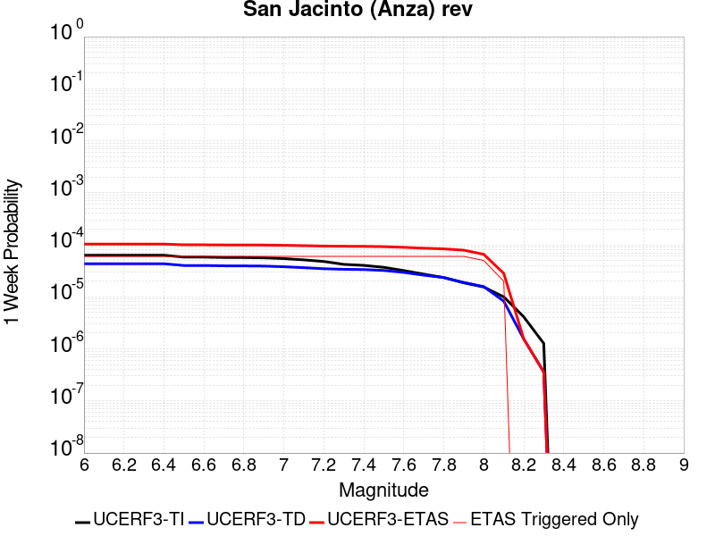 | 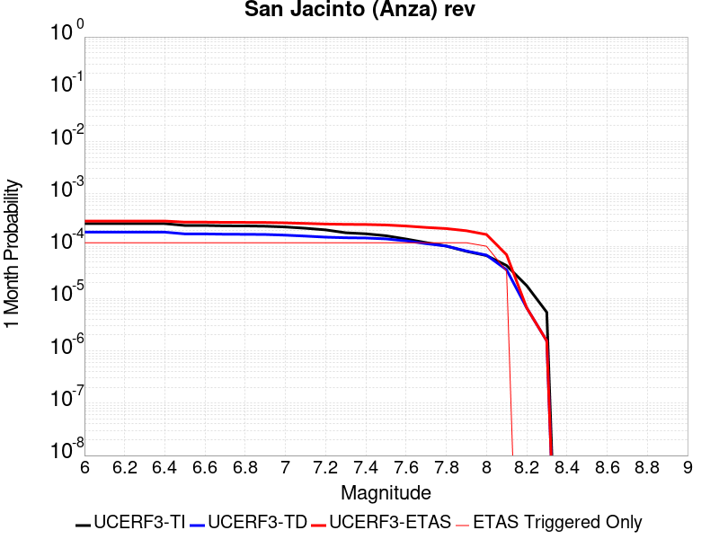 | 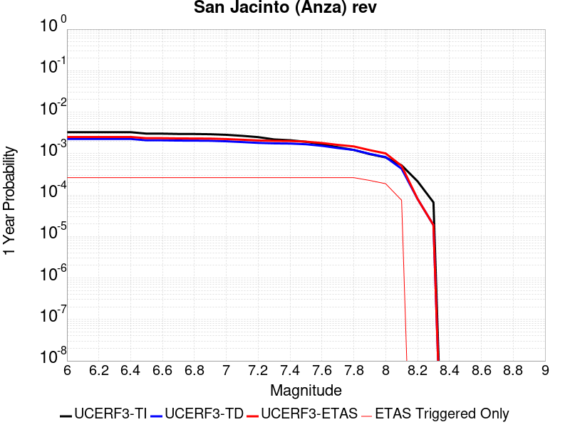 | 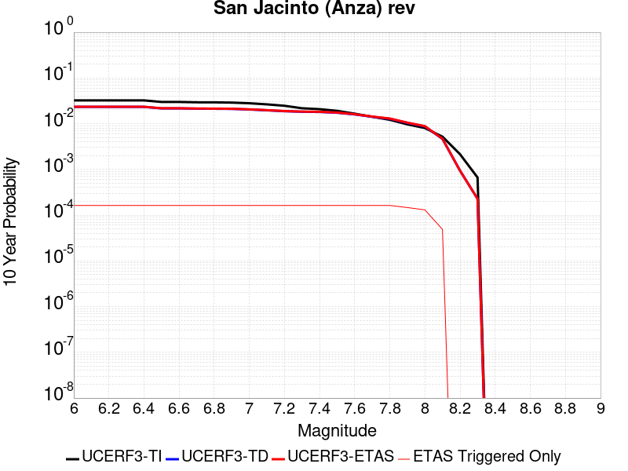 |

| Magnitude | 1 wk TI Prob | 1 wk TD Prob | 1 wk ETAS Prob | 1 wk ETAS/TD Gain | 1 wk ETAS Triggered Only | 1 mo TI Prob | 1 mo TD Prob | 1 mo ETAS Prob | 1 mo ETAS/TD Gain | 1 mo ETAS Triggered Only | 1 yr TI Prob | 1 yr TD Prob | 1 yr ETAS Prob | 1 yr ETAS/TD Gain | 1 yr ETAS Triggered Only | 10 yr TI Prob | 10 yr TD Prob | 10 yr ETAS Prob | 10 yr ETAS/TD Gain | 10 yr ETAS Triggered Only |
|-----|-----|-----|-----|-----|-----|-----|-----|-----|-----|-----|-----|-----|-----|-----|-----|-----|-----|-----|-----|-----|
| 6.0 | 6.3015636E-5 | 4.3298347E-5 | 1.6819302E-4 | 3.8845136 | 1.2490008E-4 | 2.7003905E-4 | 1.8555121E-4 | 3.1042812E-4 | 1.6730051 | 1.2490008E-4 | 0.0032827691 | 0.0022567573 | 0.002431223 | 1.077308 | 1.748601E-4 | 0.032346968 | 0.02329361 | 0.023464398 | 1.007332 | 1.748601E-4 |
| 6.1 | 6.3015636E-5 | 4.3298347E-5 | 1.6819302E-4 | 3.8845136 | 1.2490008E-4 | 2.7003905E-4 | 1.8555121E-4 | 3.1042812E-4 | 1.6730051 | 1.2490008E-4 | 0.0032827691 | 0.0022567573 | 0.002431223 | 1.077308 | 1.748601E-4 | 0.032346968 | 0.02329361 | 0.023464398 | 1.007332 | 1.748601E-4 |
| 6.2 | 6.3015636E-5 | 4.3298347E-5 | 1.6819302E-4 | 3.8845136 | 1.2490008E-4 | 2.7003905E-4 | 1.8555121E-4 | 3.1042812E-4 | 1.6730051 | 1.2490008E-4 | 0.0032827691 | 0.0022567573 | 0.002431223 | 1.077308 | 1.748601E-4 | 0.032346968 | 0.02329361 | 0.023464398 | 1.007332 | 1.748601E-4 |
| 6.3 | 6.3015636E-5 | 4.3298347E-5 | 1.6819302E-4 | 3.8845136 | 1.2490008E-4 | 2.7003905E-4 | 1.8555121E-4 | 3.1042812E-4 | 1.6730051 | 1.2490008E-4 | 0.0032827691 | 0.0022567573 | 0.002431223 | 1.077308 | 1.748601E-4 | 0.032346968 | 0.02329361 | 0.023464398 | 1.007332 | 1.748601E-4 |
| 6.4 | 6.3015636E-5 | 4.3298347E-5 | 1.6819302E-4 | 3.8845136 | 1.2490008E-4 | 2.7003905E-4 | 1.8555121E-4 | 3.1042812E-4 | 1.6730051 | 1.2490008E-4 | 0.0032827691 | 0.0022567573 | 0.002431223 | 1.077308 | 1.748601E-4 | 0.032346968 | 0.02329361 | 0.023464398 | 1.007332 | 1.748601E-4 |
| 6.5 | 5.811017E-5 | 4.0080286E-5 | 1.6497535E-4 | 4.1161222 | 1.2490008E-4 | 2.4901982E-4 | 1.7176138E-4 | 2.9664E-4 | 1.7270472 | 1.2490008E-4 | 0.0030276014 | 0.0020891947 | 0.0022636894 | 1.0835226 | 1.748601E-4 | 0.02986684 | 0.021590833 | 0.021761918 | 1.007924 | 1.748601E-4 |
| 6.6 | 5.811017E-5 | 4.0080286E-5 | 1.6497535E-4 | 4.1161222 | 1.2490008E-4 | 2.4901982E-4 | 1.7176138E-4 | 2.9664E-4 | 1.7270472 | 1.2490008E-4 | 0.0030276014 | 0.0020891947 | 0.0022636894 | 1.0835226 | 1.748601E-4 | 0.02986684 | 0.021590833 | 0.021761918 | 1.007924 | 1.748601E-4 |
| 6.7 | 5.712442E-5 | 3.950301E-5 | 1.6439815E-4 | 4.161661 | 1.2490008E-4 | 2.4479596E-4 | 1.6928767E-4 | 2.9416662E-4 | 1.7376729 | 1.2490008E-4 | 0.0029763177 | 0.0020591344 | 0.0022336345 | 1.0847443 | 1.748601E-4 | 0.029367693 | 0.021282919 | 0.021454057 | 1.0080411 | 1.748601E-4 |
| 6.8 | 5.6967532E-5 | 3.93593E-5 | 1.6425447E-4 | 4.173206 | 1.2490008E-4 | 2.4412372E-4 | 1.6867183E-4 | 2.9355084E-4 | 1.7403667 | 1.2490008E-4 | 0.0029681553 | 0.0020516508 | 0.0022261522 | 1.0850542 | 1.748601E-4 | 0.029288229 | 0.02120852 | 0.02137967 | 1.00807 | 1.748601E-4 |
| 6.9 | 5.6211324E-5 | 3.9064216E-5 | 1.6395941E-4 | 4.1971765 | 1.2490008E-4 | 2.4088343E-4 | 1.6740736E-4 | 2.9228654E-4 | 1.7459599 | 1.2490008E-4 | 0.0029288116 | 0.0020362847 | 0.0022107887 | 1.0856973 | 1.748601E-4 | 0.028905109 | 0.021047527 | 0.021218708 | 1.008133 | 1.748601E-4 |
| 7.0 | 5.4383527E-5 | 3.7925012E-5 | 1.6282036E-4 | 4.293218 | 1.2490008E-4 | 2.3305144E-4 | 1.6252567E-4 | 2.8740545E-4 | 1.7683696 | 1.2490008E-4 | 0.0028337094 | 0.001976959 | 0.0021514734 | 1.0882741 | 1.748601E-4 | 0.027978465 | 0.02044095 | 0.020612236 | 1.0083796 | 1.748601E-4 |
| 7.1 | 5.1393665E-5 | 3.638787E-5 | 1.612834E-4 | 4.4323397 | 1.2490008E-4 | 2.2023996E-4 | 1.5593872E-4 | 2.808193E-4 | 1.8008313 | 1.2490008E-4 | 0.0026781242 | 0.0018969048 | 0.0020714332 | 1.0920069 | 1.748601E-4 | 0.026460782 | 0.019616077 | 0.019787507 | 1.0087392 | 1.748601E-4 |
| 7.2 | 4.785222E-5 | 3.4738845E-5 | 1.5963458E-4 | 4.5952764 | 1.2490008E-4 | 2.0506482E-4 | 1.4887229E-4 | 2.7375377E-4 | 1.8388498 | 1.2490008E-4 | 0.0024938055 | 0.0018110167 | 0.0019855602 | 1.0963787 | 1.748601E-4 | 0.024660049 | 0.018728783 | 0.018900368 | 1.0091616 | 1.748601E-4 |
| 7.3 | 4.2143256E-5 | 3.3834414E-5 | 1.5873027E-4 | 4.6913853 | 1.2490008E-4 | 1.8060145E-4 | 1.449966E-4 | 2.6987857E-4 | 1.8612752 | 1.2490008E-4 | 0.002196605 | 0.0017639075 | 0.0019384591 | 1.0989574 | 1.748601E-4 | 0.02175019 | 0.018236695 | 0.018408367 | 1.0094135 | 1.748601E-4 |
| 7.4 | 4.0264713E-5 | 3.3472694E-5 | 1.583686E-4 | 4.731277 | 1.2490008E-4 | 1.7255165E-4 | 1.4344654E-4 | 2.683287E-4 | 1.8705833 | 1.2490008E-4 | 0.002098792 | 0.0017450659 | 0.0019196209 | 1.1000277 | 1.748601E-4 | 0.020790804 | 0.018041389 | 0.018213095 | 1.0095173 | 1.748601E-4 |
| 7.5 | 3.694492E-5 | 3.2186905E-5 | 1.5708296E-4 | 4.8803377 | 1.2490008E-4 | 1.5832575E-4 | 1.379366E-4 | 2.6281946E-4 | 1.9053642 | 1.2490008E-4 | 0.0019259118 | 0.0016780876 | 0.0018526543 | 1.1040272 | 1.748601E-4 | 0.01909306 | 0.017357888 | 0.017529713 | 1.0098989 | 1.748601E-4 |
| 7.6 | 3.200565E-5 | 2.9502702E-5 | 1.543991E-4 | 5.2333884 | 1.2490008E-4 | 1.3715986E-4 | 1.2643404E-4 | 2.5131833E-4 | 1.9877427 | 1.2490008E-4 | 0.001668642 | 0.0015382497 | 0.0017128409 | 1.1134999 | 1.748601E-4 | 0.01656168 | 0.015946016 | 0.016118089 | 1.010791 | 1.748601E-4 |
| 7.7 | 2.731642E-5 | 2.6091477E-5 | 1.509883E-4 | 5.7868824 | 1.2490008E-4 | 1.1706512E-4 | 1.11815825E-4 | 2.3670193E-4 | 2.1168911 | 1.2490008E-4 | 0.001424336 | 0.0013605085 | 0.0015351307 | 1.1283507 | 1.748601E-4 | 0.014152412 | 0.0141668 | 0.0143391825 | 1.012168 | 1.748601E-4 |
| 7.8 | 2.3466424E-5 | 2.3503619E-5 | 1.4840077E-4 | 6.313954 | 1.2490008E-4 | 1.0056651E-4 | 1.0072591E-4 | 2.2561342E-4 | 2.2398746 | 1.2490008E-4 | 0.0012237094 | 0.0012256489 | 0.0014002947 | 1.1424925 | 1.748601E-4 | 0.012169928 | 0.012808796 | 0.012981417 | 1.0134767 | 1.748601E-4 |
| 7.9 | 1.8611925E-5 | 1.890698E-5 | 1.438047E-4 | 7.6059055 | 1.2490008E-4 | 7.9762955E-5 | 8.10274E-5 | 2.0591736E-4 | 2.5413299 | 1.2490008E-4 | 9.7068126E-4 | 9.860628E-4 | 0.0011357951 | 1.1518487 | 1.498801E-4 | 0.0096645225 | 0.010393705 | 0.010542028 | 1.0142704 | 1.498801E-4 |
| 8.0 | 1.5460775E-5 | 1.5739915E-5 | 1.15658404E-4 | 7.348096 | 9.9920064E-5 | 6.6258784E-5 | 6.745504E-5 | 1.6736836E-4 | 2.481184 | 9.9920064E-5 | 8.0640207E-4 | 8.2095637E-4 | 9.457539E-4 | 1.1520149 | 1.2490008E-4 | 0.008034821 | 0.008702706 | 0.008826518 | 1.0142269 | 1.2490008E-4 |
| 8.1 | 9.983884E-6 | 8.268954E-6 | 3.3248765E-5 | 4.020915 | 2.4980016E-5 | 4.2787375E-5 | 3.5437897E-5 | 6.0417027E-5 | 1.7048706 | 2.4980016E-5 | 5.2081177E-4 | 4.313715E-4 | 4.8130998E-4 | 1.1157668 | 4.9960032E-5 | 0.0051959283 | 0.00463968 | 0.0046894085 | 1.010718 | 4.9960032E-5 |
| 8.2 | 4.1226E-6 | 1.5522551E-6 | 1.5522551E-6 | 1.0 | 0.0 | 1.7668166E-5 | 6.6525045E-6 | 6.6525045E-6 | 1.0 | 0.0 | 2.1508869E-4 | 8.099126E-5 | 8.099126E-5 | 1.0 | 0.0 | 0.0021488064 | 9.401847E-4 | 9.401847E-4 | 1.0 | 0.0 |
| 8.3 | 1.2750878E-6 | 3.609817E-7 | 3.609817E-7 | 1.0 | 0.0 | 5.4646503E-6 | 1.5470634E-6 | 1.5470634E-6 | 1.0 | 0.0 | 6.653009E-5 | 1.8835339E-5 | 1.8835339E-5 | 1.0 | 0.0 | 6.6510175E-4 | 2.272251E-4 | 2.272251E-4 | 1.0 | 0.0 |

## Dry Mountain
*[(top)](#table-of-contents)*

| 1 Week | 1 Month | 1 Year | 10 Year |
|-----|-----|-----|-----|
| 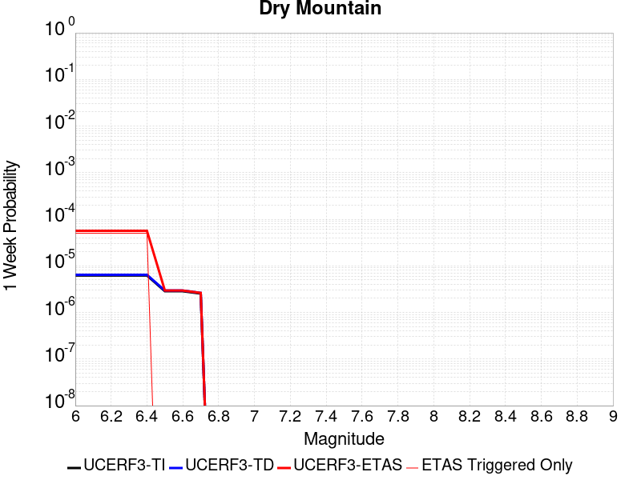 | 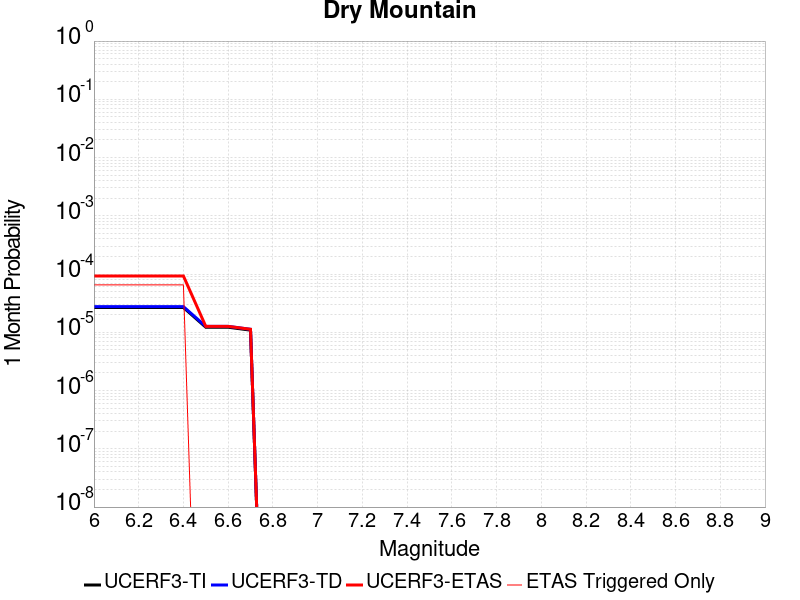 | 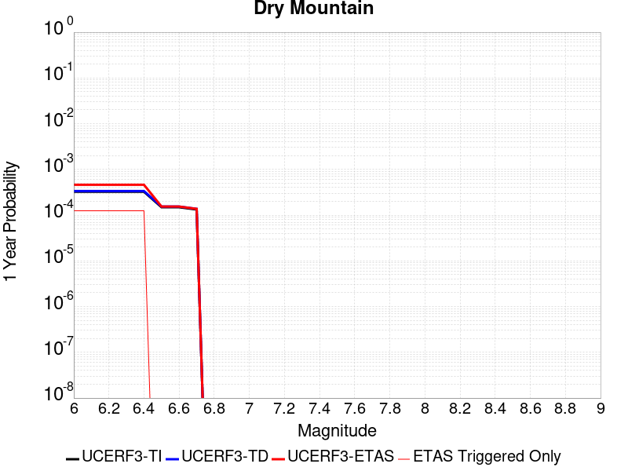 | 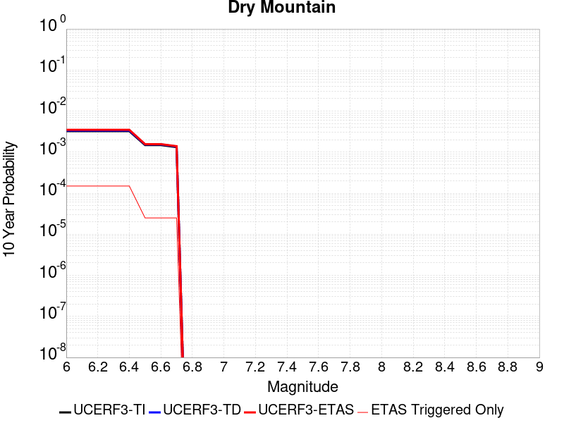 |

| Magnitude | 1 wk TI Prob | 1 wk TD Prob | 1 wk ETAS Prob | 1 wk ETAS/TD Gain | 1 wk ETAS Triggered Only | 1 mo TI Prob | 1 mo TD Prob | 1 mo ETAS Prob | 1 mo ETAS/TD Gain | 1 mo ETAS Triggered Only | 1 yr TI Prob | 1 yr TD Prob | 1 yr ETAS Prob | 1 yr ETAS/TD Gain | 1 yr ETAS Triggered Only | 10 yr TI Prob | 10 yr TD Prob | 10 yr ETAS Prob | 10 yr ETAS/TD Gain | 10 yr ETAS Triggered Only |
|-----|-----|-----|-----|-----|-----|-----|-----|-----|-----|-----|-----|-----|-----|-----|-----|-----|-----|-----|-----|-----|
| 6.0 | 6.222801E-6 | 6.439381E-6 | 5.639909E-5 | 8.758465 | 4.9960032E-5 | 2.6668875E-5 | 2.7597147E-5 | 1.0253512E-4 | 3.715425 | 7.494005E-5 | 3.2464517E-4 | 3.3595937E-4 | 4.6081748E-4 | 1.3716465 | 1.2490008E-4 | 0.0032417132 | 0.0033560768 | 0.003505454 | 1.0445094 | 1.498801E-4 |
| 6.1 | 6.222801E-6 | 6.439381E-6 | 5.639909E-5 | 8.758465 | 4.9960032E-5 | 2.6668875E-5 | 2.7597147E-5 | 1.0253512E-4 | 3.715425 | 7.494005E-5 | 3.2464517E-4 | 3.3595937E-4 | 4.6081748E-4 | 1.3716465 | 1.2490008E-4 | 0.0032417132 | 0.0033560768 | 0.003505454 | 1.0445094 | 1.498801E-4 |
| 6.2 | 6.222801E-6 | 6.439381E-6 | 5.639909E-5 | 8.758465 | 4.9960032E-5 | 2.6668875E-5 | 2.7597147E-5 | 1.0253512E-4 | 3.715425 | 7.494005E-5 | 3.2464517E-4 | 3.3595937E-4 | 4.6081748E-4 | 1.3716465 | 1.2490008E-4 | 0.0032417132 | 0.0033560768 | 0.003505454 | 1.0445094 | 1.498801E-4 |
| 6.3 | 6.222801E-6 | 6.439381E-6 | 5.639909E-5 | 8.758465 | 4.9960032E-5 | 2.6668875E-5 | 2.7597147E-5 | 1.0253512E-4 | 3.715425 | 7.494005E-5 | 3.2464517E-4 | 3.3595937E-4 | 4.6081748E-4 | 1.3716465 | 1.2490008E-4 | 0.0032417132 | 0.0033560768 | 0.003505454 | 1.0445094 | 1.498801E-4 |
| 6.4 | 6.222801E-6 | 6.439381E-6 | 5.639909E-5 | 8.758465 | 4.9960032E-5 | 2.6668875E-5 | 2.7597147E-5 | 1.0253512E-4 | 3.715425 | 7.494005E-5 | 3.2464517E-4 | 3.3595937E-4 | 4.6081748E-4 | 1.3716465 | 1.2490008E-4 | 0.0032417132 | 0.0033560768 | 0.003505454 | 1.0445094 | 1.498801E-4 |
| 6.5 | 2.8528623E-6 | 2.9521684E-6 | 2.9521684E-6 | 1.0 | 0.0 | 1.22264955E-5 | 1.2652138E-5 | 1.2652138E-5 | 1.0 | 0.0 | 1.4884741E-4 | 1.540376E-4 | 1.540376E-4 | 1.0 | 0.0 | 0.0014874774 | 0.0015401616 | 0.0015651032 | 1.0161941 | 2.4980016E-5 |
| 6.6 | 2.8528623E-6 | 2.9521684E-6 | 2.9521684E-6 | 1.0 | 0.0 | 1.22264955E-5 | 1.2652138E-5 | 1.2652138E-5 | 1.0 | 0.0 | 1.4884741E-4 | 1.540376E-4 | 1.540376E-4 | 1.0 | 0.0 | 0.0014874774 | 0.0015401616 | 0.0015651032 | 1.0161941 | 2.4980016E-5 |
| 6.7 | 2.541E-6 | 2.6293578E-6 | 2.6293578E-6 | 1.0 | 0.0 | 1.0889954E-5 | 1.1268677E-5 | 1.1268677E-5 | 1.0 | 0.0 | 1.3257713E-4 | 1.3719614E-4 | 1.3719614E-4 | 1.0 | 0.0 | 0.0013249806 | 0.0013719613 | 0.0013969071 | 1.0181825 | 2.4980016E-5 |

## Brawley (Seismic Zone) alt 1
*[(top)](#table-of-contents)*

| 1 Week | 1 Month | 1 Year | 10 Year |
|-----|-----|-----|-----|
| 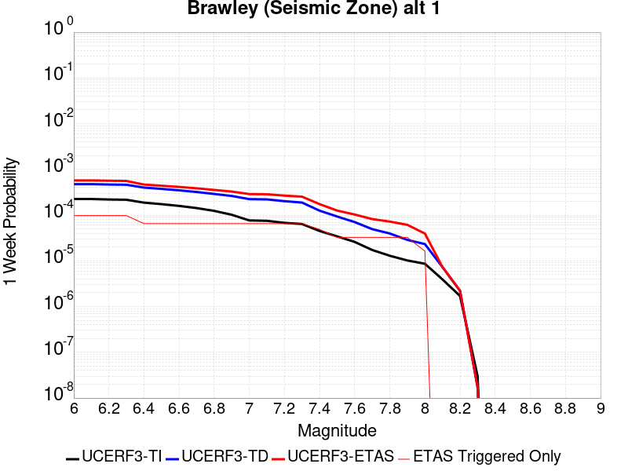 | 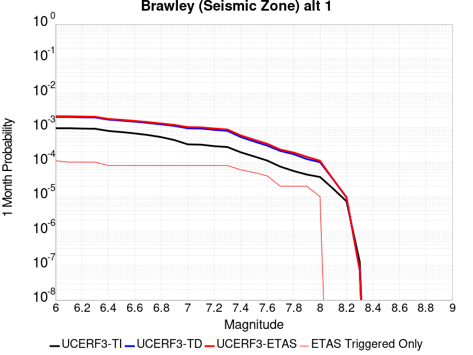 | 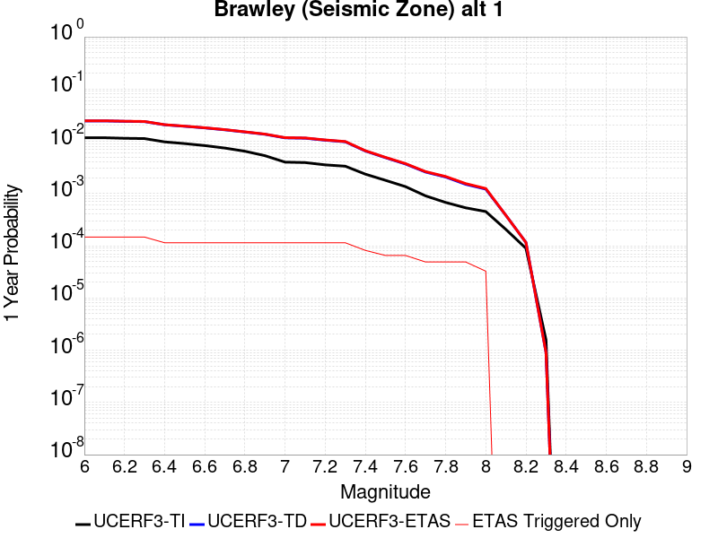 | 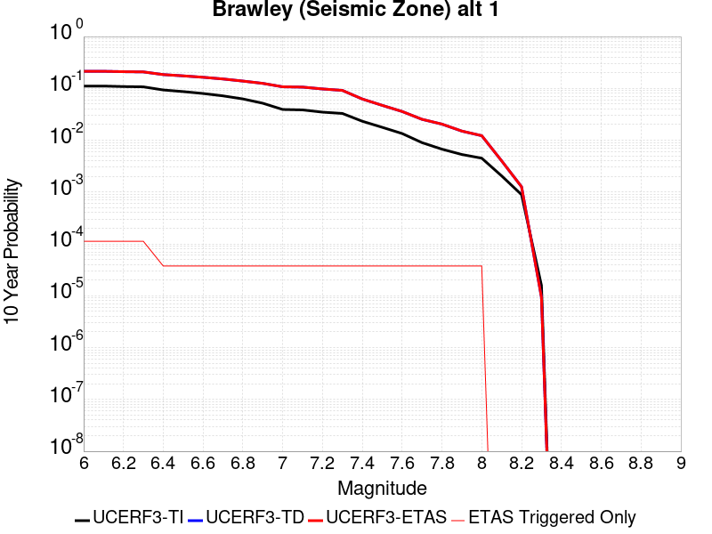 |

| Magnitude | 1 wk TI Prob | 1 wk TD Prob | 1 wk ETAS Prob | 1 wk ETAS/TD Gain | 1 wk ETAS Triggered Only | 1 mo TI Prob | 1 mo TD Prob | 1 mo ETAS Prob | 1 mo ETAS/TD Gain | 1 mo ETAS Triggered Only | 1 yr TI Prob | 1 yr TD Prob | 1 yr ETAS Prob | 1 yr ETAS/TD Gain | 1 yr ETAS Triggered Only | 10 yr TI Prob | 10 yr TD Prob | 10 yr ETAS Prob | 10 yr ETAS/TD Gain | 10 yr ETAS Triggered Only |
|-----|-----|-----|-----|-----|-----|-----|-----|-----|-----|-----|-----|-----|-----|-----|-----|-----|-----|-----|-----|-----|
| 6.0 | 2.2521618E-4 | 4.763429E-4 | 5.512472E-4 | 1.1572489 | 7.494005E-5 | 9.6485513E-4 | 0.0020399094 | 0.0021396256 | 1.0488827 | 9.9920064E-5 | 0.011683988 | 0.024544531 | 0.024666365 | 1.0049638 | 1.2490008E-4 | 0.11088423 | 0.21349923 | 0.21361712 | 1.0005522 | 1.498801E-4 |
| 6.1 | 2.2521618E-4 | 4.763429E-4 | 5.512472E-4 | 1.1572489 | 7.494005E-5 | 9.6485513E-4 | 0.0020399094 | 0.0021396256 | 1.0488827 | 9.9920064E-5 | 0.011683988 | 0.024544531 | 0.024666365 | 1.0049638 | 1.2490008E-4 | 0.11088423 | 0.21349923 | 0.21361712 | 1.0005522 | 1.498801E-4 |
| 6.2 | 2.198148E-4 | 4.6718874E-4 | 5.4209377E-4 | 1.1603314 | 7.494005E-5 | 9.417233E-4 | 0.0020007377 | 0.002100458 | 1.0498416 | 9.9920064E-5 | 0.011405343 | 0.024078513 | 0.024200406 | 1.0050623 | 1.2490008E-4 | 0.10837428 | 0.20993572 | 0.21005414 | 1.0005641 | 1.498801E-4 |
| 6.3 | 2.1704129E-4 | 4.615455E-4 | 5.3645094E-4 | 1.1622927 | 7.494005E-5 | 9.298453E-4 | 0.0019765892 | 0.0020763117 | 1.0504519 | 9.9920064E-5 | 0.011262234 | 0.023792034 | 0.023913963 | 1.0051248 | 1.2490008E-4 | 0.107082725 | 0.20782684 | 0.20794557 | 1.0005713 | 1.498801E-4 |
| 6.4 | 1.876142E-4 | 4.004663E-4 | 4.254363E-4 | 1.0623523 | 2.4980016E-5 | 8.038131E-4 | 0.0017151695 | 0.0017650439 | 1.0290784 | 4.9960032E-5 | 0.00974259 | 0.020678662 | 0.020752052 | 1.0035491 | 7.494005E-5 | 0.093263686 | 0.18457787 | 0.18463898 | 1.000331 | 7.494005E-5 |
| 6.5 | 1.7390939E-4 | 3.7478763E-4 | 3.9975828E-4 | 1.0666262 | 2.4980016E-5 | 7.45113E-4 | 0.0016052561 | 0.001655136 | 1.0310729 | 4.9960032E-5 | 0.009034078 | 0.019367293 | 0.019440781 | 1.0037944 | 7.494005E-5 | 0.086755216 | 0.17440015 | 0.17446202 | 1.0003548 | 7.494005E-5 |
| 6.6 | 1.591791E-4 | 3.4893592E-4 | 3.739072E-4 | 1.0715642 | 2.4980016E-5 | 6.8201777E-4 | 0.0014945926 | 0.001544478 | 1.0333773 | 4.9960032E-5 | 0.008271996 | 0.018045008 | 0.018118596 | 1.004078 | 7.494005E-5 | 0.07970774 | 0.16380787 | 0.16387053 | 1.0003825 | 7.494005E-5 |
| 6.7 | 1.4268003E-4 | 3.2059717E-4 | 3.455692E-4 | 1.0778922 | 2.4980016E-5 | 6.1134255E-4 | 0.0013732726 | 0.001423164 | 1.0363303 | 4.9960032E-5 | 0.007417723 | 0.01659171 | 0.016665407 | 1.0044417 | 7.494005E-5 | 0.07174956 | 0.15193594 | 0.15199949 | 1.0004183 | 7.494005E-5 |
| 6.8 | 1.239713E-4 | 2.9055026E-4 | 3.1552304E-4 | 1.0859499 | 2.4980016E-5 | 5.3119735E-4 | 0.0012446274 | 0.0012945252 | 1.0400906 | 4.9960032E-5 | 0.0064481674 | 0.015049482 | 0.015123295 | 1.0049046 | 7.494005E-5 | 0.06264243 | 0.13838051 | 0.13844508 | 1.0004666 | 7.494005E-5 |
| 6.9 | 1.0180238E-4 | 2.6255674E-4 | 2.8753022E-4 | 1.0951164 | 2.4980016E-5 | 4.3622297E-4 | 0.0011247622 | 0.0011746661 | 1.0443684 | 4.9960032E-5 | 0.005298089 | 0.013608998 | 0.013682918 | 1.0054318 | 7.494005E-5 | 0.05173543 | 0.12496473 | 0.1250303 | 1.0005248 | 7.494005E-5 |
| 7.0 | 7.6619996E-5 | 2.2400476E-4 | 2.489792E-4 | 1.1114906 | 2.4980016E-5 | 3.283301E-4 | 9.596704E-4 | 0.0010095825 | 1.0520096 | 4.9960032E-5 | 0.0039900932 | 0.011622103 | 0.011696172 | 1.0063732 | 7.494005E-5 | 0.039192066 | 0.10726982 | 0.10733673 | 1.0006237 | 7.494005E-5 |
| 7.1 | 7.5127435E-5 | 2.2083633E-4 | 2.4581084E-4 | 1.1130905 | 2.4980016E-5 | 3.2193496E-4 | 9.461013E-4 | 9.960141E-4 | 1.0527563 | 4.9960032E-5 | 0.0039125155 | 0.011458648 | 0.0115327295 | 1.0064651 | 7.494005E-5 | 0.038443442 | 0.10583378 | 0.10590079 | 1.0006331 | 7.494005E-5 |
| 7.2 | 6.788582E-5 | 2.0211334E-4 | 2.2708831E-4 | 1.1235691 | 2.4980016E-5 | 2.9090676E-4 | 8.6591556E-4 | 9.158323E-4 | 1.0576463 | 4.9960032E-5 | 0.0035360386 | 0.0104922 | 0.010566354 | 1.0070676 | 7.494005E-5 | 0.034803 | 0.097503684 | 0.09757132 | 1.0006937 | 7.494005E-5 |
| 7.3 | 6.399602E-5 | 1.8842232E-4 | 2.1339762E-4 | 1.1325496 | 2.4980016E-5 | 2.7423984E-4 | 8.0727716E-4 | 8.5719686E-4 | 1.0618371 | 4.9960032E-5 | 0.0033337586 | 0.009784897 | 0.009859103 | 1.0075839 | 7.494005E-5 | 0.03284188 | 0.091397986 | 0.09146608 | 1.0007449 | 7.494005E-5 |
| 7.4 | 4.506759E-5 | 1.2530042E-4 | 1.5027731E-4 | 1.199336 | 2.4980016E-5 | 1.9313251E-4 | 5.3689216E-4 | 5.8682536E-4 | 1.0930042 | 4.9960032E-5 | 0.0023488526 | 0.006517245 | 0.0065916968 | 1.0114238 | 7.494005E-5 | 0.023241805 | 0.062364522 | 0.06243479 | 1.0011266 | 7.494005E-5 |
| 7.5 | 3.43289E-5 | 9.336103E-5 | 1.18338714E-4 | 1.2675387 | 2.4980016E-5 | 1.4711556E-4 | 4.0005764E-4 | 4.499977E-4 | 1.1248322 | 4.9960032E-5 | 0.0017896603 | 0.004859886 | 0.0049344623 | 1.0153452 | 7.494005E-5 | 0.01775316 | 0.047057066 | 0.04712848 | 1.0015177 | 7.494005E-5 |
| 7.6 | 2.5980507E-5 | 7.053672E-5 | 9.551497E-5 | 1.354117 | 2.4980016E-5 | 1.1134028E-4 | 3.0226534E-4 | 3.5221028E-4 | 1.1652354 | 4.9960032E-5 | 0.001354725 | 0.0036738948 | 0.0037485596 | 1.020323 | 7.494005E-5 | 0.013464959 | 0.03584298 | 0.035915233 | 1.0020158 | 7.494005E-5 |
| 7.7 | 1.7292105E-5 | 4.9412036E-5 | 7.439082E-5 | 1.5055202 | 2.4980016E-5 | 7.4106916E-5 | 2.1174872E-4 | 2.3672344E-4 | 1.1179451 | 2.4980016E-5 | 9.018782E-4 | 0.0025749984 | 0.0026248298 | 1.019352 | 4.9960032E-5 | 0.008982267 | 0.025292097 | 0.025340792 | 1.0019253 | 4.9960032E-5 |
| 7.8 | 1.2927471E-5 | 3.9697254E-5 | 6.467628E-5 | 1.6292381 | 2.4980016E-5 | 5.5402274E-5 | 1.7012001E-4 | 1.9509578E-4 | 1.1468127 | 2.4980016E-5 | 6.743139E-4 | 0.0020692463 | 0.0021191027 | 1.0240941 | 4.9960032E-5 | 0.0067227143 | 0.020433145 | 0.020482084 | 1.002395 | 4.9960032E-5 |
| 7.9 | 1.0200774E-5 | 2.8748475E-5 | 5.3727774E-5 | 1.8688912 | 2.4980016E-5 | 4.371687E-5 | 1.2320194E-4 | 1.4817888E-4 | 1.2027317 | 2.4980016E-5 | 5.321229E-4 | 0.0014989526 | 0.0015488378 | 1.03328 | 4.9960032E-5 | 0.005308505 | 0.014992895 | 0.015042106 | 1.0032823 | 4.9960032E-5 |
| 8.0 | 8.650396E-6 | 2.3279512E-5 | 4.8258946E-5 | 2.0730224 | 2.4980016E-5 | 3.70726E-5 | 9.976552E-5 | 1.2474305E-4 | 1.2503623 | 2.4980016E-5 | 4.5126543E-4 | 0.0012139693 | 0.0012638686 | 1.0411043 | 4.9960032E-5 | 0.0045035016 | 0.012212164 | 0.012261514 | 1.0040411 | 4.9960032E-5 |
| 8.1 | 3.9368224E-6 | 7.3283345E-6 | 7.3283345E-6 | 1.0 | 0.0 | 1.6871985E-5 | 3.1406773E-5 | 3.1406773E-5 | 1.0 | 0.0 | 2.0539707E-4 | 3.8231048E-4 | 3.8231048E-4 | 1.0 | 0.0 | 0.0020520731 | 0.0040015313 | 0.0040015313 | 1.0 | 0.0 |
| 8.2 | 1.7101195E-6 | 2.2178374E-6 | 2.2178374E-6 | 1.0 | 0.0 | 7.329063E-6 | 9.504983E-6 | 9.504983E-6 | 1.0 | 0.0 | 8.922769E-5 | 1.15717055E-4 | 1.15717055E-4 | 1.0 | 0.0 | 8.9191867E-4 | 0.00126669 | 0.00126669 | 1.0 | 0.0 |
| 8.3 | 3.0346666E-8 | 1.721086E-8 | 1.721086E-8 | 1.0 | 0.0 | 1.3005713E-7 | 7.376083E-8 | 7.376083E-8 | 1.0 | 0.0 | 1.5834444E-6 | 8.98038E-7 | 8.98038E-7 | 1.0 | 0.0 | 1.5834332E-5 | 9.36379E-6 | 9.36379E-6 | 1.0 | 0.0 |

## Big Pine (East)
*[(top)](#table-of-contents)*

| 1 Week | 1 Month | 1 Year | 10 Year |
|-----|-----|-----|-----|
| 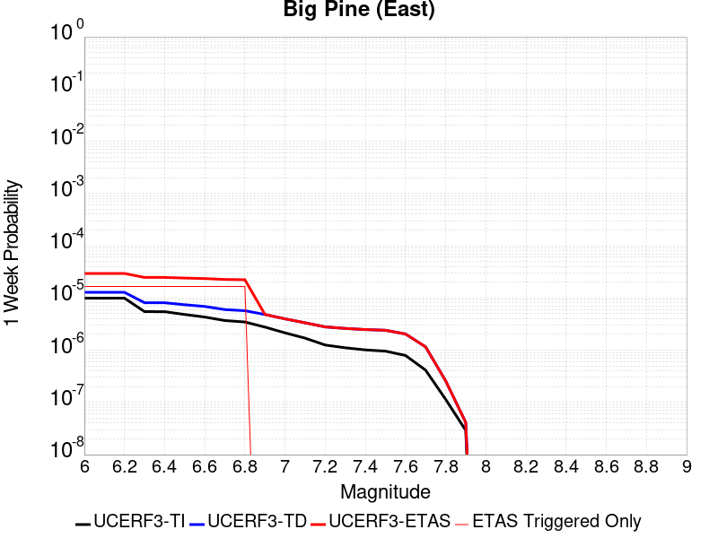 | 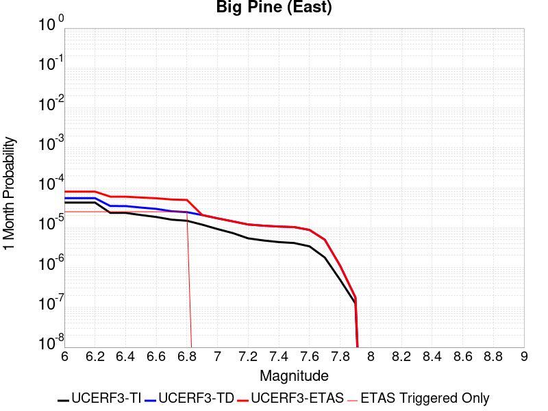 | 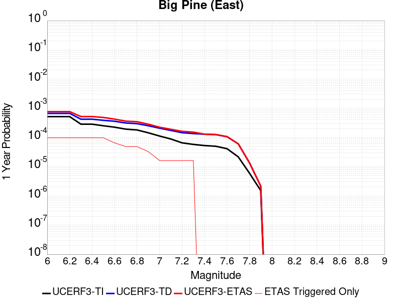 | 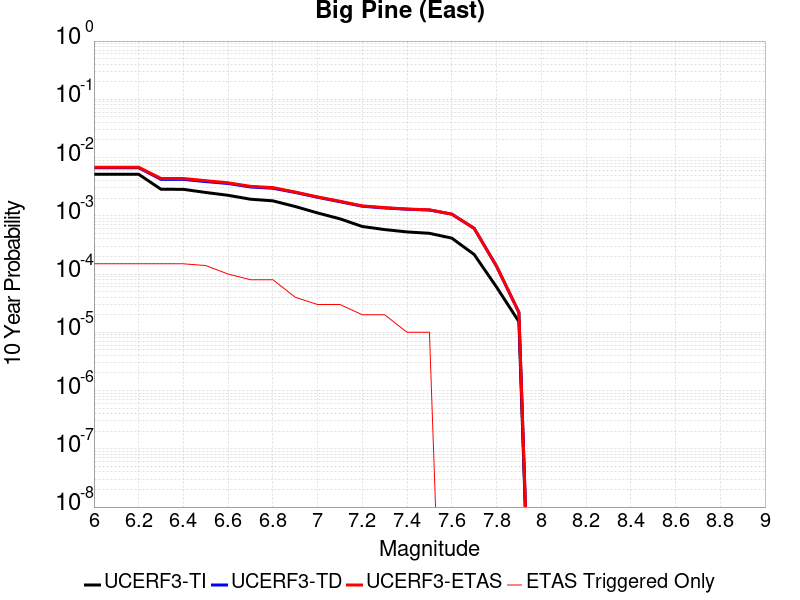 |

| Magnitude | 1 wk TI Prob | 1 wk TD Prob | 1 wk ETAS Prob | 1 wk ETAS/TD Gain | 1 wk ETAS Triggered Only | 1 mo TI Prob | 1 mo TD Prob | 1 mo ETAS Prob | 1 mo ETAS/TD Gain | 1 mo ETAS Triggered Only | 1 yr TI Prob | 1 yr TD Prob | 1 yr ETAS Prob | 1 yr ETAS/TD Gain | 1 yr ETAS Triggered Only | 10 yr TI Prob | 10 yr TD Prob | 10 yr ETAS Prob | 10 yr ETAS/TD Gain | 10 yr ETAS Triggered Only |
|-----|-----|-----|-----|-----|-----|-----|-----|-----|-----|-----|-----|-----|-----|-----|-----|-----|-----|-----|-----|-----|
| 6.0 | 9.916913E-6 | 1.28172705E-5 | 3.7796966E-5 | 2.948909 | 2.4980016E-5 | 4.250036E-5 | 5.493013E-5 | 7.990877E-5 | 1.4547348 | 2.4980016E-5 | 5.173191E-4 | 6.685912E-4 | 7.4348116E-4 | 1.1120116 | 7.494005E-5 | 0.0051611643 | 0.006670449 | 0.006819329 | 1.0223194 | 1.498801E-4 |
| 6.1 | 9.916913E-6 | 1.28172705E-5 | 3.7796966E-5 | 2.948909 | 2.4980016E-5 | 4.250036E-5 | 5.493013E-5 | 7.990877E-5 | 1.4547348 | 2.4980016E-5 | 5.173191E-4 | 6.685912E-4 | 7.4348116E-4 | 1.1120116 | 7.494005E-5 | 0.0051611643 | 0.006670449 | 0.006819329 | 1.0223194 | 1.498801E-4 |
| 6.2 | 9.916913E-6 | 1.28172705E-5 | 3.7796966E-5 | 2.948909 | 2.4980016E-5 | 4.250036E-5 | 5.493013E-5 | 7.990877E-5 | 1.4547348 | 2.4980016E-5 | 5.173191E-4 | 6.685912E-4 | 7.4348116E-4 | 1.1120116 | 7.494005E-5 | 0.0051611643 | 0.006670449 | 0.006819329 | 1.0223194 | 1.498801E-4 |
| 6.3 | 5.479711E-6 | 8.1132375E-6 | 3.3093052E-5 | 4.0788956 | 2.4980016E-5 | 2.3484265E-5 | 3.4770575E-5 | 5.974972E-5 | 1.718399 | 2.4980016E-5 | 2.858834E-4 | 4.232527E-4 | 4.98161E-4 | 1.1769825 | 7.494005E-5 | 0.0028551589 | 0.0042272513 | 0.0043764976 | 1.0353059 | 1.498801E-4 |
| 6.4 | 5.465009E-6 | 8.0975315E-6 | 3.3077344E-5 | 4.084868 | 2.4980016E-5 | 2.3421257E-5 | 3.4703262E-5 | 5.968241E-5 | 1.7197926 | 2.4980016E-5 | 2.851165E-4 | 4.2243348E-4 | 4.9734185E-4 | 1.1773258 | 7.494005E-5 | 0.0028475097 | 0.00421909 | 0.0043683383 | 1.0353744 | 1.498801E-4 |
| 6.5 | 4.826767E-6 | 7.4225877E-6 | 3.240242E-5 | 4.3653803 | 2.4980016E-5 | 2.068598E-5 | 3.1810716E-5 | 5.6789937E-5 | 1.7852454 | 2.4980016E-5 | 2.518227E-4 | 3.8722943E-4 | 4.6214045E-4 | 1.1934539 | 7.494005E-5 | 0.0025153751 | 0.0038682907 | 0.004017591 | 1.0385959 | 1.498801E-4 |
| 6.6 | 4.3146847E-6 | 6.8825234E-6 | 3.1862368E-5 | 4.62946 | 2.4980016E-5 | 1.8491375E-5 | 2.949621E-5 | 5.4475488E-5 | 1.846864 | 2.4980016E-5 | 2.2510924E-4 | 3.5905963E-4 | 4.0900172E-4 | 1.1390914 | 4.9960032E-5 | 0.0022488134 | 0.0035875062 | 0.0037119582 | 1.0346904 | 1.2490008E-4 |
| 6.7 | 3.6968106E-6 | 5.9957474E-6 | 3.0975614E-5 | 5.166264 | 2.4980016E-5 | 1.5843378E-5 | 2.5695816E-5 | 5.067519E-5 | 1.9721184 | 2.4980016E-5 | 1.9287605E-4 | 3.128032E-4 | 3.6274758E-4 | 1.1596671 | 4.9960032E-5 | 0.0019270873 | 0.0031262499 | 0.0032507596 | 1.0398271 | 1.2490008E-4 |
| 6.8 | 3.4671132E-6 | 5.7024477E-6 | 3.068232E-5 | 5.380553 | 2.4980016E-5 | 1.4858972E-5 | 2.4438841E-5 | 4.9418246E-5 | 2.022119 | 2.4980016E-5 | 1.8089297E-4 | 2.9750372E-4 | 3.4744886E-4 | 1.1678808 | 4.9960032E-5 | 0.0018074579 | 0.0029736666 | 0.0030981954 | 1.0418772 | 1.2490008E-4 |
| 6.9 | 2.7686972E-6 | 4.8254797E-6 | 4.8254797E-6 | 1.0 | 0.0 | 1.1865792E-5 | 2.0680467E-5 | 2.0680467E-5 | 1.0 | 0.0 | 1.4445644E-4 | 2.5175634E-4 | 2.7673008E-4 | 1.099198 | 2.4980016E-5 | 0.0014436257 | 0.002517256 | 0.00256709 | 1.0197971 | 4.9960032E-5 |
| 7.0 | 2.1472624E-6 | 3.985277E-6 | 3.985277E-6 | 1.0 | 0.0 | 9.20252E-6 | 1.707965E-5 | 1.707965E-5 | 1.0 | 0.0 | 1.12034926E-4 | 2.0792543E-4 | 2.0792543E-4 | 1.0 | 0.0 | 0.0011197845 | 0.0020798238 | 0.002104752 | 1.0119857 | 2.4980016E-5 |
| 7.1 | 1.7018335E-6 | 3.3450835E-6 | 3.3450835E-6 | 1.0 | 0.0 | 7.293552E-6 | 1.4335996E-5 | 1.4335996E-5 | 1.0 | 0.0 | 8.879537E-5 | 1.7452713E-4 | 1.7452713E-4 | 1.0 | 0.0 | 8.87599E-4 | 0.0017463792 | 0.0017713156 | 1.0142789 | 2.4980016E-5 |
| 7.2 | 1.25603E-6 | 2.794679E-6 | 2.794679E-6 | 1.0 | 0.0 | 5.3829745E-6 | 1.1977142E-5 | 1.1977142E-5 | 1.0 | 0.0 | 6.553574E-5 | 1.4581217E-4 | 1.4581217E-4 | 1.0 | 0.0 | 6.551642E-4 | 0.0014596173 | 0.0014596173 | 1.0 | 0.0 |
| 7.3 | 1.112297E-6 | 2.610519E-6 | 2.610519E-6 | 1.0 | 0.0 | 4.7669787E-6 | 1.1187892E-5 | 1.1187892E-5 | 1.0 | 0.0 | 5.803642E-5 | 1.3620428E-4 | 1.3620428E-4 | 1.0 | 0.0 | 5.802127E-4 | 0.001363502 | 0.001363502 | 1.0 | 0.0 |
| 7.4 | 1.0137181E-6 | 2.4836752E-6 | 2.4836752E-6 | 1.0 | 0.0 | 4.3444993E-6 | 1.064428E-5 | 1.064428E-5 | 1.0 | 0.0 | 5.2892992E-5 | 1.2958662E-4 | 1.2958662E-4 | 1.0 | 0.0 | 5.288041E-4 | 0.0012971918 | 0.0012971918 | 1.0 | 0.0 |
| 7.5 | 9.598608E-7 | 2.407328E-6 | 2.407328E-6 | 1.0 | 0.0 | 4.1136827E-6 | 1.03170805E-5 | 1.03170805E-5 | 1.0 | 0.0 | 5.0082934E-5 | 1.2560343E-4 | 1.2560343E-4 | 1.0 | 0.0 | 5.007165E-4 | 0.0012572132 | 0.0012572132 | 1.0 | 0.0 |
| 7.6 | 7.929459E-7 | 2.0450152E-6 | 2.0450152E-6 | 1.0 | 0.0 | 3.3983351E-6 | 8.764322E-6 | 8.764322E-6 | 1.0 | 0.0 | 4.1373947E-5 | 1.0670057E-4 | 1.0670057E-4 | 1.0 | 0.0 | 4.1366243E-4 | 0.0010685825 | 0.0010685825 | 1.0 | 0.0 |
| 7.7 | 4.155788E-7 | 1.1606729E-6 | 1.1606729E-6 | 1.0 | 0.0 | 1.7810507E-6 | 4.974303E-6 | 4.974303E-6 | 1.0 | 0.0 | 2.1684076E-5 | 6.05605E-5 | 6.05605E-5 | 1.0 | 0.0 | 2.1681961E-4 | 6.085995E-4 | 6.085995E-4 | 1.0 | 0.0 |
| 7.8 | 1.14666925E-7 | 2.592197E-7 | 2.592197E-7 | 1.0 | 0.0 | 4.914296E-7 | 1.1109411E-6 | 1.1109411E-6 | 1.0 | 0.0 | 5.9831386E-6 | 1.3525627E-5 | 1.3525627E-5 | 1.0 | 0.0 | 5.9829777E-5 | 1.3636416E-4 | 1.3636416E-4 | 1.0 | 0.0 |
| 7.9 | 2.9231824E-8 | 4.1462318E-8 | 4.1462318E-8 | 1.0 | 0.0 | 1.2527924E-7 | 1.7769564E-7 | 1.7769564E-7 | 1.0 | 0.0 | 1.5252737E-6 | 2.1634426E-6 | 2.1634426E-6 | 1.0 | 0.0 | 1.5252632E-5 | 2.197062E-5 | 2.197062E-5 | 1.0 | 0.0 |

## Independence rev 2011
*[(top)](#table-of-contents)*

| 1 Week | 1 Month | 1 Year | 10 Year |
|-----|-----|-----|-----|
| 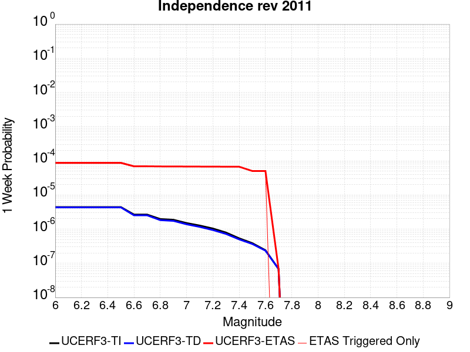 | 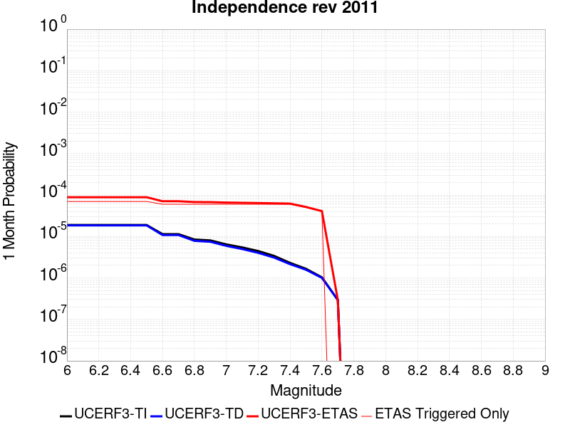 | 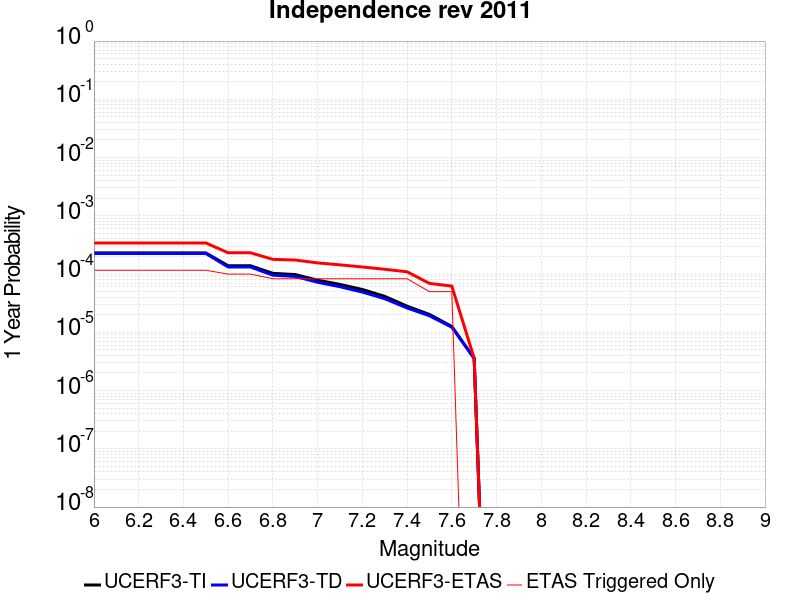 | 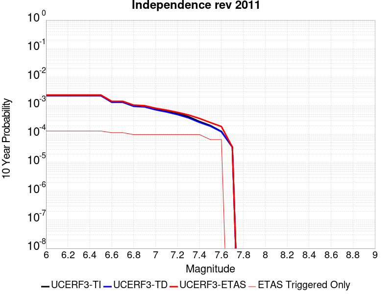 |

| Magnitude | 1 wk TI Prob | 1 wk TD Prob | 1 wk ETAS Prob | 1 wk ETAS/TD Gain | 1 wk ETAS Triggered Only | 1 mo TI Prob | 1 mo TD Prob | 1 mo ETAS Prob | 1 mo ETAS/TD Gain | 1 mo ETAS Triggered Only | 1 yr TI Prob | 1 yr TD Prob | 1 yr ETAS Prob | 1 yr ETAS/TD Gain | 1 yr ETAS Triggered Only | 10 yr TI Prob | 10 yr TD Prob | 10 yr ETAS Prob | 10 yr ETAS/TD Gain | 10 yr ETAS Triggered Only |
|-----|-----|-----|-----|-----|-----|-----|-----|-----|-----|-----|-----|-----|-----|-----|-----|-----|-----|-----|-----|-----|
| 6.0 | 4.422171E-6 | 4.3262253E-6 | 1.0424585E-4 | 24.096262 | 9.9920064E-5 | 1.8952025E-5 | 1.8540852E-5 | 1.18459066E-4 | 6.3890843 | 9.9920064E-5 | 2.3071647E-4 | 2.2571447E-4 | 3.7556072E-4 | 1.6638753 | 1.498801E-4 | 0.0023047708 | 0.0022551457 | 0.0024046877 | 1.0663115 | 1.498801E-4 |
| 6.1 | 4.422171E-6 | 4.3262253E-6 | 1.0424585E-4 | 24.096262 | 9.9920064E-5 | 1.8952025E-5 | 1.8540852E-5 | 1.18459066E-4 | 6.3890843 | 9.9920064E-5 | 2.3071647E-4 | 2.2571447E-4 | 3.7556072E-4 | 1.6638753 | 1.498801E-4 | 0.0023047708 | 0.0022551457 | 0.0024046877 | 1.0663115 | 1.498801E-4 |
| 6.2 | 4.422171E-6 | 4.3262253E-6 | 1.0424585E-4 | 24.096262 | 9.9920064E-5 | 1.8952025E-5 | 1.8540852E-5 | 1.18459066E-4 | 6.3890843 | 9.9920064E-5 | 2.3071647E-4 | 2.2571447E-4 | 3.7556072E-4 | 1.6638753 | 1.498801E-4 | 0.0023047708 | 0.0022551457 | 0.0024046877 | 1.0663115 | 1.498801E-4 |
| 6.3 | 4.422171E-6 | 4.3262253E-6 | 1.0424585E-4 | 24.096262 | 9.9920064E-5 | 1.8952025E-5 | 1.8540852E-5 | 1.18459066E-4 | 6.3890843 | 9.9920064E-5 | 2.3071647E-4 | 2.2571447E-4 | 3.7556072E-4 | 1.6638753 | 1.498801E-4 | 0.0023047708 | 0.0022551457 | 0.0024046877 | 1.0663115 | 1.498801E-4 |
| 6.4 | 4.422171E-6 | 4.3262253E-6 | 1.0424585E-4 | 24.096262 | 9.9920064E-5 | 1.8952025E-5 | 1.8540852E-5 | 1.18459066E-4 | 6.3890843 | 9.9920064E-5 | 2.3071647E-4 | 2.2571447E-4 | 3.7556072E-4 | 1.6638753 | 1.498801E-4 | 0.0023047708 | 0.0022551457 | 0.0024046877 | 1.0663115 | 1.498801E-4 |
| 6.5 | 4.422171E-6 | 4.3262253E-6 | 1.0424585E-4 | 24.096262 | 9.9920064E-5 | 1.8952025E-5 | 1.8540852E-5 | 1.18459066E-4 | 6.3890843 | 9.9920064E-5 | 2.3071647E-4 | 2.2571447E-4 | 3.7556072E-4 | 1.6638753 | 1.498801E-4 | 0.0023047708 | 0.0022551457 | 0.0024046877 | 1.0663115 | 1.498801E-4 |
| 6.6 | 2.663744E-6 | 2.5319846E-6 | 7.747184E-5 | 30.59728 | 7.494005E-5 | 1.1415996E-5 | 1.08513195E-5 | 8.5790554E-5 | 7.9060016 | 7.494005E-5 | 1.3898089E-4 | 1.321073E-4 | 2.5699087E-4 | 1.9453193 | 1.2490008E-4 | 0.0013889399 | 0.0013203359 | 0.0014450711 | 1.0944723 | 1.2490008E-4 |
| 6.7 | 2.663744E-6 | 2.5319846E-6 | 7.747184E-5 | 30.59728 | 7.494005E-5 | 1.1415996E-5 | 1.08513195E-5 | 8.5790554E-5 | 7.9060016 | 7.494005E-5 | 1.3898089E-4 | 1.321073E-4 | 2.5699087E-4 | 1.9453193 | 1.2490008E-4 | 0.0013889399 | 0.0013203359 | 0.0014450711 | 1.0944723 | 1.2490008E-4 |
| 6.8 | 1.9716529E-6 | 1.8322567E-6 | 7.6772165E-5 | 41.900337 | 7.494005E-5 | 8.449913E-6 | 7.852505E-6 | 8.2791965E-5 | 10.543382 | 7.494005E-5 | 1.0287284E-4 | 9.560019E-5 | 1.955107E-4 | 2.0450869 | 9.9920064E-5 | 0.0010282523 | 9.5560355E-4 | 0.0010554281 | 1.1044624 | 9.9920064E-5 |
| 6.9 | 1.8788617E-6 | 1.7429976E-6 | 7.668292E-5 | 43.99485 | 7.494005E-5 | 8.0522395E-6 | 7.4699688E-6 | 8.240946E-5 | 11.032102 | 7.494005E-5 | 9.80316E-5 | 9.09432E-5 | 1.9085417E-4 | 2.0986085 | 9.9920064E-5 | 9.798837E-4 | 9.090718E-4 | 0.001008901 | 1.1098144 | 9.9920064E-5 |
| 7.0 | 1.5045488E-6 | 1.3849498E-6 | 7.63249E-5 | 55.110226 | 7.494005E-5 | 6.44805E-6 | 5.9354857E-6 | 8.087509E-5 | 13.62569 | 7.494005E-5 | 7.8502184E-5 | 7.226219E-5 | 1.7217503E-4 | 2.3826435 | 9.9920064E-5 | 7.8474457E-4 | 7.223921E-4 | 8.2223996E-4 | 1.1382184 | 9.9920064E-5 |
| 7.1 | 1.272341E-6 | 1.1625089E-6 | 7.610247E-5 | 65.46399 | 7.494005E-5 | 5.4528787E-6 | 4.9821715E-6 | 7.992185E-5 | 16.041569 | 7.494005E-5 | 6.6386776E-5 | 6.0656283E-5 | 1.6057029E-4 | 2.647216 | 9.9920064E-5 | 6.636695E-4 | 6.064005E-4 | 7.062599E-4 | 1.1646758 | 9.9920064E-5 |
| 7.2 | 1.0416892E-6 | 9.409871E-7 | 7.588096E-5 | 80.63975 | 7.494005E-5 | 4.464375E-6 | 4.032796E-6 | 7.897254E-5 | 19.582579 | 7.494005E-5 | 5.4352407E-5 | 4.9098202E-5 | 1.4901336E-4 | 3.0350065 | 9.9920064E-5 | 5.4339116E-4 | 4.908754E-4 | 5.907464E-4 | 1.203455 | 9.9920064E-5 |
| 7.3 | 7.9450155E-7 | 7.2350036E-7 | 7.566349E-5 | 104.57976 | 7.494005E-5 | 3.4050022E-6 | 3.1007123E-6 | 7.8040524E-5 | 25.168581 | 7.494005E-5 | 4.1455114E-5 | 3.7750528E-5 | 1.3766682E-4 | 3.646752 | 9.9920064E-5 | 4.144738E-4 | 3.7744228E-4 | 4.7732462E-4 | 1.2646295 | 9.9920064E-5 |
| 7.4 | 5.3893444E-7 | 5.0195166E-7 | 7.544196E-5 | 150.29727 | 7.494005E-5 | 2.309717E-6 | 2.1512196E-6 | 7.709111E-5 | 35.836002 | 7.494005E-5 | 2.8120441E-5 | 2.6190788E-5 | 1.2610824E-4 | 4.8149843 | 9.9920064E-5 | 2.8116882E-4 | 2.6187746E-4 | 3.6177138E-4 | 1.3814528 | 9.9920064E-5 |
| 7.5 | 3.8852085E-7 | 3.6825622E-7 | 7.530828E-5 | 204.49966 | 7.494005E-5 | 1.6650882E-6 | 1.57824E-6 | 7.651817E-5 | 48.483227 | 7.494005E-5 | 2.027226E-5 | 1.9214905E-5 | 9.415351E-5 | 4.900025 | 7.494005E-5 | 2.0270412E-4 | 1.9213265E-4 | 2.670583E-4 | 1.3899683 | 7.494005E-5 |
| 7.6 | 2.414929E-7 | 2.3457605E-7 | 7.5174605E-5 | 320.4701 | 7.494005E-5 | 1.0349692E-6 | 1.0053255E-6 | 7.5945296E-5 | 75.54299 | 7.494005E-5 | 1.2600677E-5 | 1.2239771E-5 | 8.71789E-5 | 7.1225924 | 7.494005E-5 | 1.2599962E-4 | 1.223911E-4 | 1.9732196E-4 | 1.6122249 | 7.494005E-5 |
| 7.7 | 6.8298014E-8 | 6.8589785E-8 | 6.8589785E-8 | 1.0 | 0.0 | 2.9270575E-7 | 2.939562E-7 | 2.939562E-7 | 1.0 | 0.0 | 3.5636867E-6 | 3.5789112E-6 | 3.5789112E-6 | 1.0 | 0.0 | 3.5636294E-5 | 3.5788584E-5 | 3.5788584E-5 | 1.0 | 0.0 |

## Ventura-Pitas Point
*[(top)](#table-of-contents)*

| 1 Week | 1 Month | 1 Year | 10 Year |
|-----|-----|-----|-----|
| 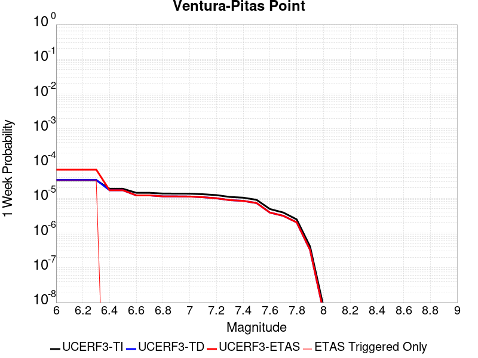 | 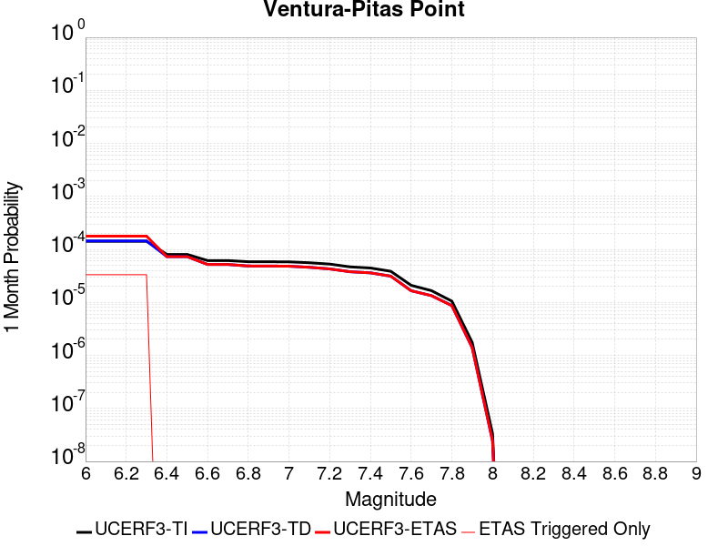 | 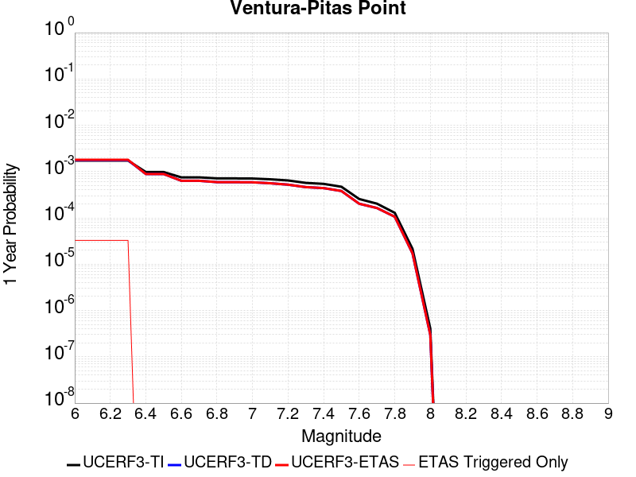 | 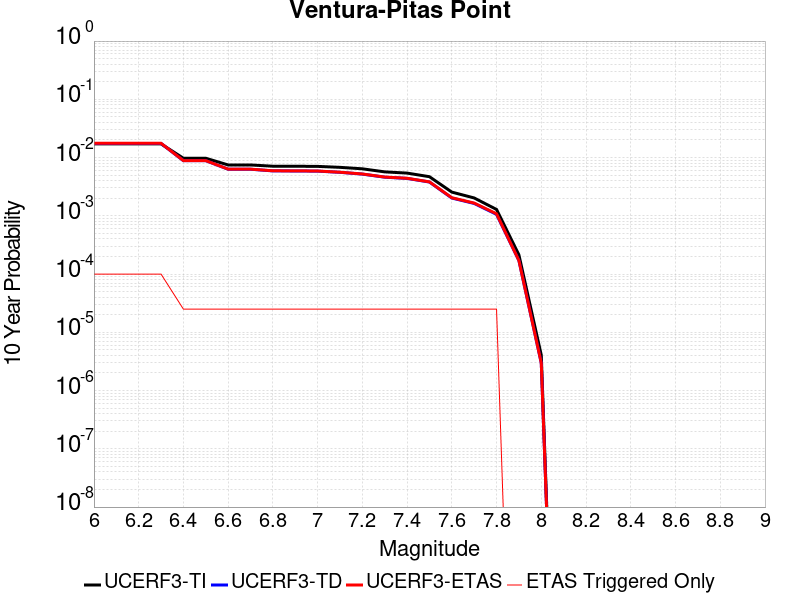 |

| Magnitude | 1 wk TI Prob | 1 wk TD Prob | 1 wk ETAS Prob | 1 wk ETAS/TD Gain | 1 wk ETAS Triggered Only | 1 mo TI Prob | 1 mo TD Prob | 1 mo ETAS Prob | 1 mo ETAS/TD Gain | 1 mo ETAS Triggered Only | 1 yr TI Prob | 1 yr TD Prob | 1 yr ETAS Prob | 1 yr ETAS/TD Gain | 1 yr ETAS Triggered Only | 10 yr TI Prob | 10 yr TD Prob | 10 yr ETAS Prob | 10 yr ETAS/TD Gain | 10 yr ETAS Triggered Only |
|-----|-----|-----|-----|-----|-----|-----|-----|-----|-----|-----|-----|-----|-----|-----|-----|-----|-----|-----|-----|-----|
| 6.0 | 3.3179622E-5 | 3.373519E-5 | 8.3693536E-5 | 2.4808972 | 4.9960032E-5 | 1.4219063E-4 | 1.4457281E-4 | 1.9452562E-4 | 1.34552 | 4.9960032E-5 | 0.0017297962 | 0.0017590097 | 0.0018088819 | 1.0283524 | 4.9960032E-5 | 0.017163932 | 0.017476497 | 0.017574672 | 1.0056175 | 9.9920064E-5 |
| 6.1 | 3.3179622E-5 | 3.373519E-5 | 8.3693536E-5 | 2.4808972 | 4.9960032E-5 | 1.4219063E-4 | 1.4457281E-4 | 1.9452562E-4 | 1.34552 | 4.9960032E-5 | 0.0017297962 | 0.0017590097 | 0.0018088819 | 1.0283524 | 4.9960032E-5 | 0.017163932 | 0.017476497 | 0.017574672 | 1.0056175 | 9.9920064E-5 |
| 6.2 | 3.3179622E-5 | 3.373519E-5 | 8.3693536E-5 | 2.4808972 | 4.9960032E-5 | 1.4219063E-4 | 1.4457281E-4 | 1.9452562E-4 | 1.34552 | 4.9960032E-5 | 0.0017297962 | 0.0017590097 | 0.0018088819 | 1.0283524 | 4.9960032E-5 | 0.017163932 | 0.017476497 | 0.017574672 | 1.0056175 | 9.9920064E-5 |
| 6.3 | 3.3179622E-5 | 3.373519E-5 | 8.3693536E-5 | 2.4808972 | 4.9960032E-5 | 1.4219063E-4 | 1.4457281E-4 | 1.9452562E-4 | 1.34552 | 4.9960032E-5 | 0.0017297962 | 0.0017590097 | 0.0018088819 | 1.0283524 | 4.9960032E-5 | 0.017163932 | 0.017476497 | 0.017574672 | 1.0056175 | 9.9920064E-5 |
| 6.4 | 1.8754668E-5 | 1.7019594E-5 | 1.7019594E-5 | 1.0 | 0.0 | 8.037467E-5 | 7.2939205E-5 | 7.2939205E-5 | 1.0 | 0.0 | 9.781223E-4 | 8.8769617E-4 | 8.8769617E-4 | 1.0 | 0.0 | 0.009738282 | 0.008843943 | 0.008868702 | 1.0027995 | 2.4980016E-5 |
| 6.5 | 1.8754668E-5 | 1.7019594E-5 | 1.7019594E-5 | 1.0 | 0.0 | 8.037467E-5 | 7.2939205E-5 | 7.2939205E-5 | 1.0 | 0.0 | 9.781223E-4 | 8.8769617E-4 | 8.8769617E-4 | 1.0 | 0.0 | 0.009738282 | 0.008843943 | 0.008868702 | 1.0027995 | 2.4980016E-5 |
| 6.6 | 1.4361558E-5 | 1.2122258E-5 | 1.2122258E-5 | 1.0 | 0.0 | 6.154808E-5 | 5.1951512E-5 | 5.1951512E-5 | 1.0 | 0.0 | 7.490902E-4 | 6.323284E-4 | 6.323284E-4 | 1.0 | 0.0 | 0.0074657016 | 0.006305652 | 0.0063304747 | 1.0039365 | 2.4980016E-5 |
| 6.7 | 1.4361558E-5 | 1.2122258E-5 | 1.2122258E-5 | 1.0 | 0.0 | 6.154808E-5 | 5.1951512E-5 | 5.1951512E-5 | 1.0 | 0.0 | 7.490902E-4 | 6.323284E-4 | 6.323284E-4 | 1.0 | 0.0 | 0.0074657016 | 0.006305652 | 0.0063304747 | 1.0039365 | 2.4980016E-5 |
| 6.8 | 1.3663846E-5 | 1.1344401E-5 | 1.1344401E-5 | 1.0 | 0.0 | 5.8558027E-5 | 4.8617967E-5 | 4.8617967E-5 | 1.0 | 0.0 | 7.127108E-4 | 5.917649E-4 | 5.917649E-4 | 1.0 | 0.0 | 0.007104293 | 0.0059022107 | 0.0059270435 | 1.0042074 | 2.4980016E-5 |
| 6.9 | 1.3644157E-5 | 1.1322501E-5 | 1.1322501E-5 | 1.0 | 0.0 | 5.8473648E-5 | 4.8524114E-5 | 4.8524114E-5 | 1.0 | 0.0 | 7.116841E-4 | 5.906229E-4 | 5.906229E-4 | 1.0 | 0.0 | 0.007094092 | 0.0058908514 | 0.005915684 | 1.0042155 | 2.4980016E-5 |
| 7.0 | 1.3568845E-5 | 1.12420685E-5 | 1.12420685E-5 | 1.0 | 0.0 | 5.8150898E-5 | 4.8179416E-5 | 4.8179416E-5 | 1.0 | 0.0 | 7.077572E-4 | 5.8642845E-4 | 5.8642845E-4 | 1.0 | 0.0 | 0.007055073 | 0.005849128 | 0.005873962 | 1.0042458 | 2.4980016E-5 |
| 7.1 | 1.306572E-5 | 1.0720521E-5 | 1.0720521E-5 | 1.0 | 0.0 | 5.599474E-5 | 4.594429E-5 | 4.594429E-5 | 1.0 | 0.0 | 6.815227E-4 | 5.5923004E-4 | 5.5923004E-4 | 1.0 | 0.0 | 0.0067943637 | 0.005578536 | 0.005603377 | 1.004453 | 2.4980016E-5 |
| 7.2 | 1.232604E-5 | 9.995121E-6 | 9.995121E-6 | 1.0 | 0.0 | 5.2824813E-5 | 4.283554E-5 | 4.283554E-5 | 1.0 | 0.0 | 6.429523E-4 | 5.2139966E-4 | 5.2139966E-4 | 1.0 | 0.0 | 0.0064109527 | 0.005202059 | 0.005226909 | 1.004777 | 2.4980016E-5 |
| 7.3 | 1.0917261E-5 | 8.843812E-6 | 8.843812E-6 | 1.0 | 0.0 | 4.678742E-5 | 3.7901507E-5 | 3.7901507E-5 | 1.0 | 0.0 | 5.69488E-4 | 4.6135474E-4 | 4.6135474E-4 | 1.0 | 0.0 | 0.0056803077 | 0.004604239 | 0.004629104 | 1.0054004 | 2.4980016E-5 |
| 7.4 | 1.039959E-5 | 8.42354E-6 | 8.42354E-6 | 1.0 | 0.0 | 4.456891E-5 | 3.6100395E-5 | 3.6100395E-5 | 1.0 | 0.0 | 5.424914E-4 | 4.394352E-4 | 4.394352E-4 | 1.0 | 0.0 | 0.0054116896 | 0.0043859277 | 0.004410798 | 1.0056705 | 2.4980016E-5 |
| 7.5 | 9.015877E-6 | 7.29752E-6 | 7.29752E-6 | 1.0 | 0.0 | 3.86389E-5 | 3.1274718E-5 | 3.1274718E-5 | 1.0 | 0.0 | 4.7032707E-4 | 3.8070456E-4 | 3.8070456E-4 | 1.0 | 0.0 | 0.004693329 | 0.003800772 | 0.003825657 | 1.0065473 | 2.4980016E-5 |
| 7.6 | 4.900162E-6 | 3.874119E-6 | 3.874119E-6 | 1.0 | 0.0 | 2.1000526E-5 | 1.6603262E-5 | 1.6603262E-5 | 1.0 | 0.0 | 2.556514E-4 | 2.0212609E-4 | 2.0212609E-4 | 1.0 | 0.0 | 0.0025535747 | 0.002019436 | 0.0020443657 | 1.0123448 | 2.4980016E-5 |
| 7.7 | 3.8850626E-6 | 3.12676E-6 | 3.12676E-6 | 1.0 | 0.0 | 1.6650163E-5 | 1.3400332E-5 | 1.3400332E-5 | 1.0 | 0.0 | 2.0269687E-4 | 1.6313691E-4 | 1.6313691E-4 | 1.0 | 0.0 | 0.002025121 | 0.0016301809 | 0.0016551202 | 1.0152985 | 2.4980016E-5 |
| 7.8 | 2.4654719E-6 | 2.029902E-6 | 2.029902E-6 | 1.0 | 0.0 | 1.0566265E-5 | 8.699551E-6 | 8.699551E-6 | 1.0 | 0.0 | 1.2863669E-4 | 1.0591193E-4 | 1.0591193E-4 | 1.0 | 0.0 | 0.0012856225 | 0.0010586192 | 0.0010835727 | 1.0235718 | 2.4980016E-5 |
| 7.9 | 4.095894E-7 | 3.2765078E-7 | 3.2765078E-7 | 1.0 | 0.0 | 1.7553821E-6 | 1.4042168E-6 | 1.4042168E-6 | 1.0 | 0.0 | 2.1371567E-5 | 1.709621E-5 | 1.709621E-5 | 1.0 | 0.0 | 2.1369511E-4 | 1.7094925E-4 | 1.7094925E-4 | 1.0 | 0.0 |
| 8.0 | 7.791402E-9 | 5.6836056E-9 | 5.6836056E-9 | 1.0 | 0.0 | 3.3391725E-8 | 2.4358311E-8 | 2.4358311E-8 | 1.0 | 0.0 | 4.0654416E-7 | 2.965624E-7 | 2.965624E-7 | 1.0 | 0.0 | 4.065434E-6 | 2.9656223E-6 | 2.9656223E-6 | 1.0 | 0.0 |

## Imperial
*[(top)](#table-of-contents)*

| 1 Week | 1 Month | 1 Year | 10 Year |
|-----|-----|-----|-----|
| 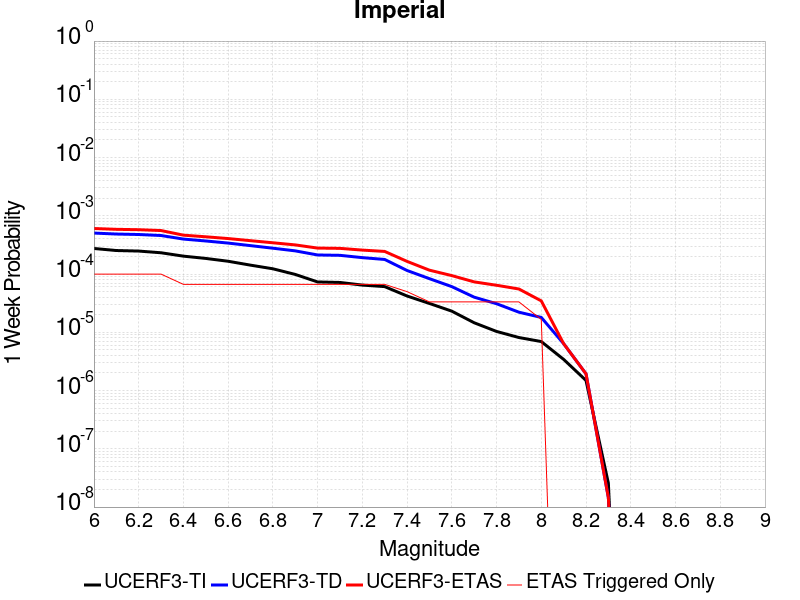 | 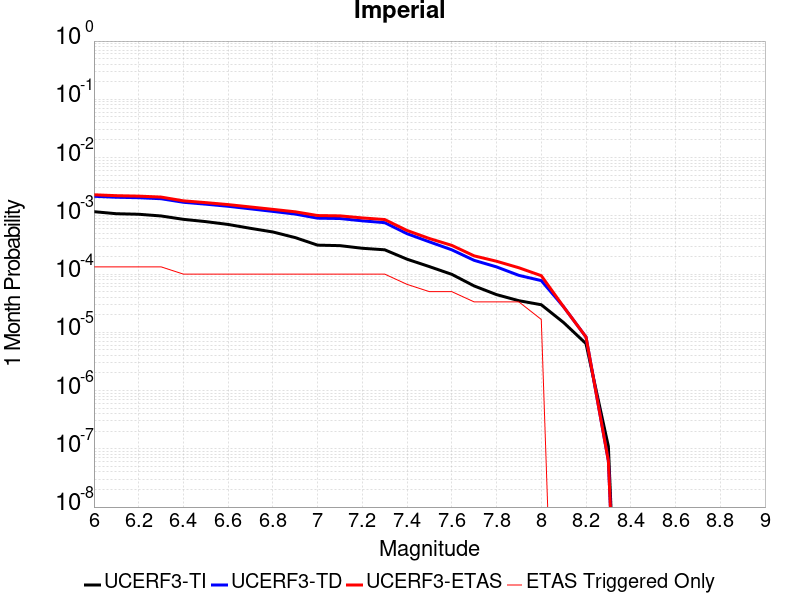 | 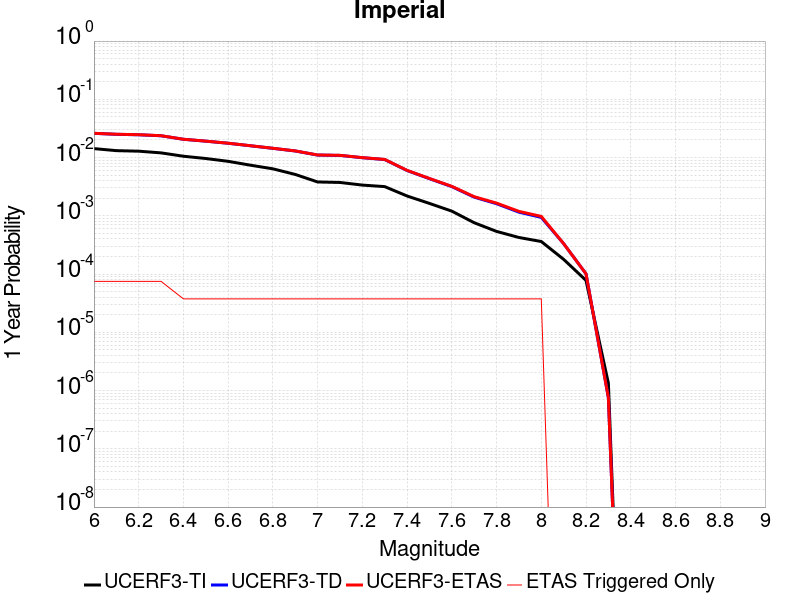 | 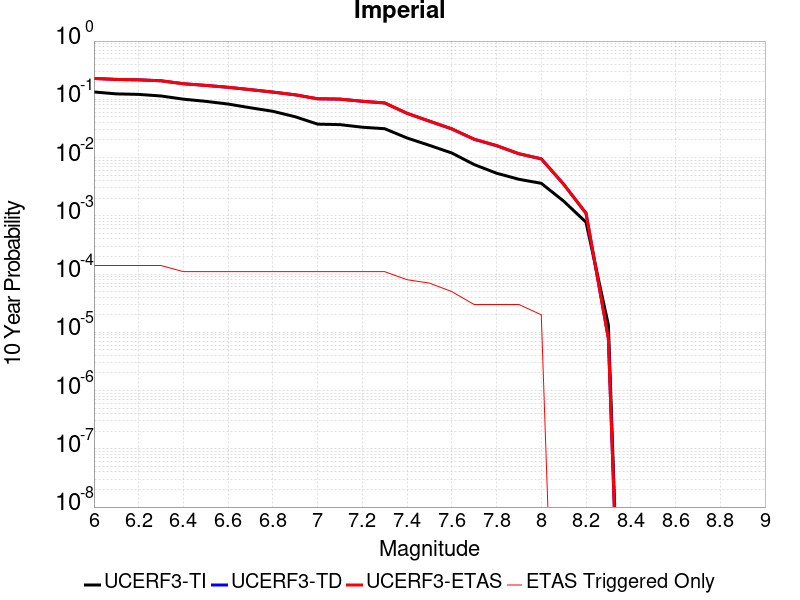 |

| Magnitude | 1 wk TI Prob | 1 wk TD Prob | 1 wk ETAS Prob | 1 wk ETAS/TD Gain | 1 wk ETAS Triggered Only | 1 mo TI Prob | 1 mo TD Prob | 1 mo ETAS Prob | 1 mo ETAS/TD Gain | 1 mo ETAS Triggered Only | 1 yr TI Prob | 1 yr TD Prob | 1 yr ETAS Prob | 1 yr ETAS/TD Gain | 1 yr ETAS Triggered Only | 10 yr TI Prob | 10 yr TD Prob | 10 yr ETAS Prob | 10 yr ETAS/TD Gain | 10 yr ETAS Triggered Only |
|-----|-----|-----|-----|-----|-----|-----|-----|-----|-----|-----|-----|-----|-----|-----|-----|-----|-----|-----|-----|-----|
| 6.0 | 2.7496446E-4 | 5.055345E-4 | 5.804367E-4 | 1.1481643 | 7.494005E-5 | 0.0011778869 | 0.002164817 | 0.0022645209 | 1.0460564 | 9.9920064E-5 | 0.0142467655 | 0.026048409 | 0.026170056 | 1.00467 | 1.2490008E-4 | 0.13367249 | 0.22807029 | 0.22818598 | 1.0005072 | 1.498801E-4 |
| 6.1 | 2.5356023E-4 | 4.8657708E-4 | 5.6148064E-4 | 1.1539398 | 7.494005E-5 | 0.001086234 | 0.002083702 | 0.0021834138 | 1.0478532 | 9.9920064E-5 | 0.013144928 | 0.02507094 | 0.025192708 | 1.004857 | 1.2490008E-4 | 0.123940155 | 0.21949561 | 0.2196126 | 1.000533 | 1.498801E-4 |
| 6.2 | 2.4820742E-4 | 4.775311E-4 | 5.5243535E-4 | 1.1568574 | 7.494005E-5 | 0.0010633124 | 0.0020449946 | 0.0021447104 | 1.0487609 | 9.9920064E-5 | 0.01286919 | 0.024610676 | 0.024732502 | 1.0049502 | 1.2490008E-4 | 0.12148927 | 0.21600136 | 0.21611887 | 1.000544 | 1.498801E-4 |
| 6.3 | 2.3205351E-4 | 4.5892023E-4 | 5.338259E-4 | 1.1632215 | 7.494005E-5 | 9.94136E-4 | 0.0019653554 | 0.002065079 | 1.0507408 | 9.9920064E-5 | 0.012036599 | 0.023661187 | 0.02378313 | 1.0051538 | 1.2490008E-4 | 0.11405133 | 0.20793827 | 0.20805699 | 1.0005709 | 1.498801E-4 |
| 6.4 | 2.0304754E-4 | 3.9878016E-4 | 4.237502E-4 | 1.0626161 | 2.4980016E-5 | 8.6991355E-4 | 0.0017079529 | 0.0017578277 | 1.0292015 | 4.9960032E-5 | 0.010539869 | 0.020595418 | 0.020668816 | 1.0035638 | 7.494005E-5 | 0.100537635 | 0.18507113 | 0.18513219 | 1.00033 | 7.494005E-5 |
| 6.5 | 1.854992E-4 | 3.6990462E-4 | 3.9487542E-4 | 1.067506 | 2.4980016E-5 | 7.9475436E-4 | 0.0015843548 | 0.0016342356 | 1.0314834 | 4.9960032E-5 | 0.009633281 | 0.01911443 | 0.019187937 | 1.0038457 | 7.494005E-5 | 0.0922623 | 0.1733039 | 0.17336585 | 1.0003575 | 7.494005E-5 |
| 6.6 | 1.6586106E-4 | 3.4036173E-4 | 3.6533325E-4 | 1.0733676 | 2.4980016E-5 | 7.106394E-4 | 0.0014578878 | 0.001507775 | 1.0342188 | 4.9960032E-5 | 0.008617763 | 0.017607626 | 0.017681245 | 1.0041811 | 7.494005E-5 | 0.08291132 | 0.16078055 | 0.16084343 | 1.0003911 | 7.494005E-5 |
| 6.7 | 1.4224656E-4 | 3.076812E-4 | 3.3265352E-4 | 1.081163 | 2.4980016E-5 | 6.094856E-4 | 0.0013179756 | 0.0013678697 | 1.0378567 | 4.9960032E-5 | 0.0073952693 | 0.015928522 | 0.016002268 | 1.0046299 | 7.494005E-5 | 0.07153955 | 0.14648798 | 0.14655194 | 1.0004367 | 7.494005E-5 |
| 6.8 | 1.2317259E-4 | 2.779231E-4 | 3.0289617E-4 | 1.089856 | 2.4980016E-5 | 5.2777573E-4 | 0.0011905615 | 0.001240462 | 1.0419135 | 4.9960032E-5 | 0.0064067547 | 0.014400131 | 0.0144739915 | 1.0051292 | 7.494005E-5 | 0.06225166 | 0.13294089 | 0.13300586 | 1.0004888 | 7.494005E-5 |
| 6.9 | 9.859898E-5 | 2.5015484E-4 | 2.751286E-4 | 1.0998333 | 2.4980016E-5 | 4.2249862E-4 | 0.0010716559 | 0.0011215624 | 1.0465695 | 4.9960032E-5 | 0.0051317946 | 0.012970319 | 0.0130442865 | 1.0057029 | 7.494005E-5 | 0.05014893 | 0.119408876 | 0.119474865 | 1.0005527 | 7.494005E-5 |
| 7.0 | 7.3191884E-5 | 2.1267848E-4 | 2.3765319E-4 | 1.1174294 | 2.4980016E-5 | 3.136418E-4 | 9.11164E-4 | 9.610785E-4 | 1.0547811 | 4.9960032E-5 | 0.003811904 | 0.011037681 | 0.011111794 | 1.0067146 | 7.494005E-5 | 0.037471764 | 0.10206756 | 0.10213485 | 1.0006592 | 7.494005E-5 |
| 7.1 | 7.1760296E-5 | 2.0969207E-4 | 2.3466685E-4 | 1.1191021 | 2.4980016E-5 | 3.0750787E-4 | 8.9837395E-4 | 9.482891E-4 | 1.0555617 | 4.9960032E-5 | 0.003737482 | 0.010883528 | 0.010957653 | 1.0068107 | 7.494005E-5 | 0.03675245 | 0.10070406 | 0.10077146 | 1.0006692 | 7.494005E-5 |
| 7.2 | 6.46614E-5 | 1.9137723E-4 | 2.1635246E-4 | 1.1305027 | 2.4980016E-5 | 2.7709085E-4 | 8.199333E-4 | 8.698524E-4 | 1.0608819 | 4.9960032E-5 | 0.0033683628 | 0.009937617 | 0.010011813 | 1.0074661 | 7.494005E-5 | 0.033177625 | 0.092511006 | 0.092579015 | 1.0007352 | 7.494005E-5 |
| 7.3 | 6.088115E-5 | 1.780939E-4 | 2.0306947E-4 | 1.1402382 | 2.4980016E-5 | 2.6089314E-4 | 7.6303916E-4 | 8.129611E-4 | 1.065425 | 4.9960032E-5 | 0.0031717476 | 0.009251006 | 0.009325253 | 1.0080258 | 7.494005E-5 | 0.031268585 | 0.08656135 | 0.08662981 | 1.0007908 | 7.494005E-5 |
| 7.4 | 4.199346E-5 | 1.1511097E-4 | 1.4008812E-4 | 1.2169832 | 2.4980016E-5 | 1.7995955E-4 | 4.932403E-4 | 5.4317573E-4 | 1.1012394 | 4.9960032E-5 | 0.0021888057 | 0.005988835 | 0.0060633263 | 1.0124383 | 7.494005E-5 | 0.02167372 | 0.05744024 | 0.057510875 | 1.0012298 | 7.494005E-5 |
| 7.5 | 3.130448E-5 | 8.333871E-5 | 1.0831664E-4 | 1.2997159 | 2.4980016E-5 | 1.3415517E-4 | 3.5711733E-4 | 4.0705953E-4 | 1.1398481 | 4.9960032E-5 | 0.0016321153 | 0.0043392954 | 0.00441391 | 1.0171951 | 7.494005E-5 | 0.016201803 | 0.042133506 | 0.04220529 | 1.0017037 | 7.494005E-5 |
| 7.6 | 2.3074248E-5 | 6.0849357E-5 | 8.582785E-5 | 1.4104973 | 2.4980016E-5 | 9.888588E-5 | 2.6075702E-4 | 3.1070402E-4 | 1.1915462 | 4.9960032E-5 | 0.0012032706 | 0.0031701182 | 0.0032448207 | 1.0235646 | 7.494005E-5 | 0.011967761 | 0.03102816 | 0.031100776 | 1.0023403 | 7.494005E-5 |
| 7.7 | 1.45864815E-5 | 4.0128452E-5 | 6.5107466E-5 | 1.6224763 | 2.4980016E-5 | 6.2511994E-5 | 1.7196777E-4 | 1.969435E-4 | 1.145235 | 2.4980016E-5 | 7.608177E-4 | 0.0020917025 | 0.002141558 | 1.023835 | 4.9960032E-5 | 0.007582182 | 0.02062909 | 0.02067802 | 1.0023719 | 4.9960032E-5 |
| 7.8 | 1.0352979E-5 | 3.096395E-5 | 5.5943194E-5 | 1.8067201 | 2.4980016E-5 | 4.4369157E-5 | 1.326959E-4 | 1.576726E-4 | 1.1882252 | 2.4980016E-5 | 5.400606E-4 | 0.0016143778 | 0.0016642571 | 1.030897 | 4.9960032E-5 | 0.0053875 | 0.016017893 | 0.016067052 | 1.003069 | 4.9960032E-5 |
| 7.9 | 8.137906E-6 | 2.2151205E-5 | 4.7130667E-5 | 2.1276796 | 2.4980016E-5 | 3.4876273E-5 | 9.493029E-5 | 1.19907934E-4 | 1.2631156 | 2.4980016E-5 | 4.2453592E-4 | 0.0011551644 | 0.0012050668 | 1.0431993 | 4.9960032E-5 | 0.004237258 | 0.011618842 | 0.011668222 | 1.0042499 | 4.9960032E-5 |
| 8.0 | 6.93792E-6 | 1.8010365E-5 | 4.2989934E-5 | 2.386955 | 2.4980016E-5 | 2.9733603E-5 | 7.7185E-5 | 1.0216309E-4 | 1.3236133 | 2.4980016E-5 | 3.6194647E-4 | 9.3932304E-4 | 9.892362E-4 | 1.0531373 | 4.9960032E-5 | 0.0036135751 | 0.009502415 | 0.0095519 | 1.0052077 | 4.9960032E-5 |
| 8.1 | 3.4286315E-6 | 6.380179E-6 | 6.380179E-6 | 1.0 | 0.0 | 1.4694053E-5 | 2.734334E-5 | 2.734334E-5 | 1.0 | 0.0 | 1.7888541E-4 | 3.3285443E-4 | 3.3285443E-4 | 1.0 | 0.0 | 0.0017874148 | 0.0034863674 | 0.0034863674 | 1.0 | 0.0 |
| 8.2 | 1.4906886E-6 | 1.936633E-6 | 1.936633E-6 | 1.0 | 0.0 | 6.3886496E-6 | 8.2998295E-6 | 8.2998295E-6 | 1.0 | 0.0 | 7.7779034E-5 | 1.0104576E-4 | 1.0104576E-4 | 1.0 | 0.0 | 7.775182E-4 | 0.0011075423 | 0.0011075423 | 1.0 | 0.0 |
| 8.3 | 2.5758007E-8 | 1.4495866E-8 | 1.4495866E-8 | 1.0 | 0.0 | 1.10391454E-7 | 6.212514E-8 | 6.212514E-8 | 1.0 | 0.0 | 1.3440151E-6 | 7.563736E-7 | 7.563736E-7 | 1.0 | 0.0 | 1.344007E-5 | 7.884359E-6 | 7.884359E-6 | 1.0 | 0.0 |

## Chino alt 1
*[(top)](#table-of-contents)*

| 1 Week | 1 Month | 1 Year | 10 Year |
|-----|-----|-----|-----|
| 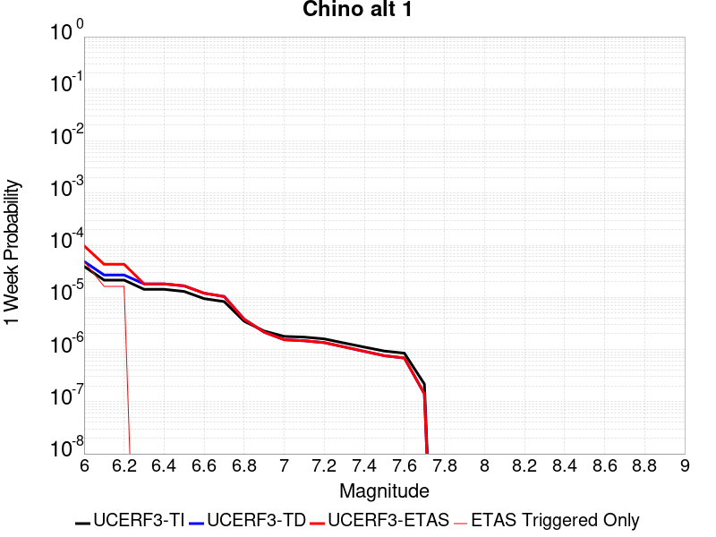 | 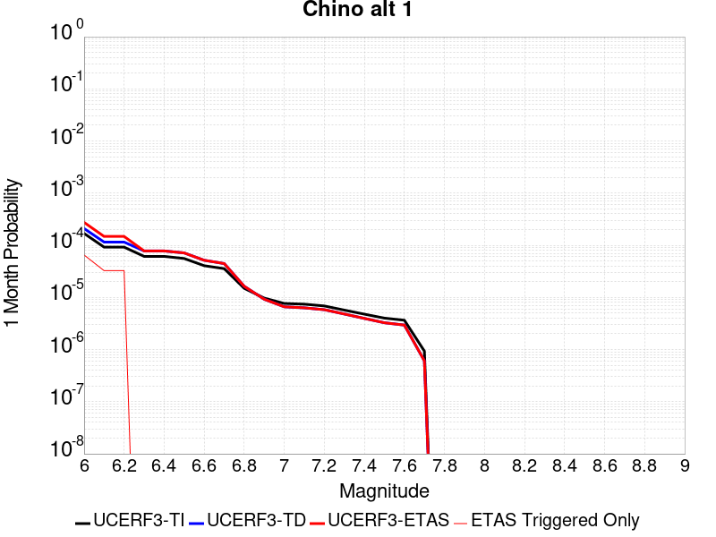 |  | 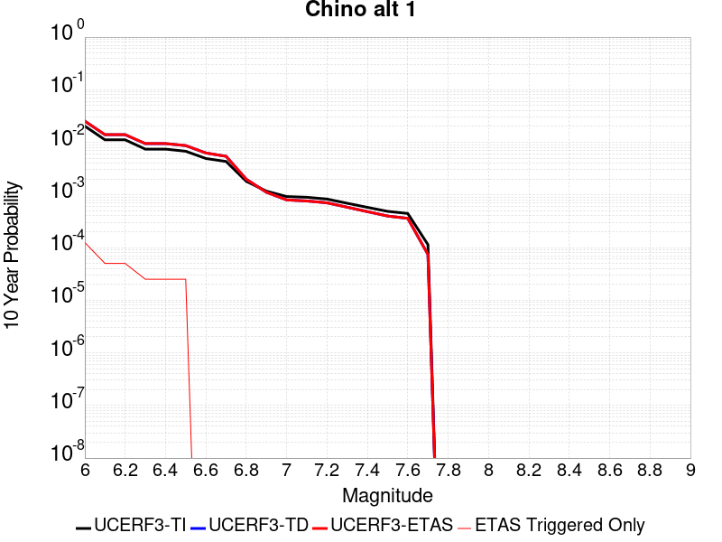 |

| Magnitude | 1 wk TI Prob | 1 wk TD Prob | 1 wk ETAS Prob | 1 wk ETAS/TD Gain | 1 wk ETAS Triggered Only | 1 mo TI Prob | 1 mo TD Prob | 1 mo ETAS Prob | 1 mo ETAS/TD Gain | 1 mo ETAS Triggered Only | 1 yr TI Prob | 1 yr TD Prob | 1 yr ETAS Prob | 1 yr ETAS/TD Gain | 1 yr ETAS Triggered Only | 10 yr TI Prob | 10 yr TD Prob | 10 yr ETAS Prob | 10 yr ETAS/TD Gain | 10 yr ETAS Triggered Only |
|-----|-----|-----|-----|-----|-----|-----|-----|-----|-----|-----|-----|-----|-----|-----|-----|-----|-----|-----|-----|-----|
| 6.0 | 3.939946E-5 | 4.894798E-5 | 9.890557E-5 | 2.020626 | 4.9960032E-5 | 1.6884391E-4 | 2.0976314E-4 | 2.597127E-4 | 1.2381237 | 4.9960032E-5 | 0.0020537362 | 0.002551385 | 0.0026510502 | 1.0390631 | 9.9920064E-5 | 0.020348595 | 0.025280168 | 0.02540191 | 1.0048157 | 1.2490008E-4 |
| 6.1 | 2.1505624E-5 | 2.6878823E-5 | 5.1858166E-5 | 1.9293318 | 2.4980016E-5 | 9.2163704E-5 | 1.15190494E-4 | 1.4016764E-4 | 1.2168334 | 2.4980016E-5 | 0.0011215154 | 0.0014016517 | 0.0014515417 | 1.0355937 | 4.9960032E-5 | 0.011158722 | 0.013947425 | 0.013996689 | 1.003532 | 4.9960032E-5 |
| 6.2 | 2.1505624E-5 | 2.6878823E-5 | 5.1858166E-5 | 1.9293318 | 2.4980016E-5 | 9.2163704E-5 | 1.15190494E-4 | 1.4016764E-4 | 1.2168334 | 2.4980016E-5 | 0.0011215154 | 0.0014016517 | 0.0014515417 | 1.0355937 | 4.9960032E-5 | 0.011158722 | 0.013947425 | 0.013996689 | 1.003532 | 4.9960032E-5 |
| 6.3 | 1.4290785E-5 | 1.8164832E-5 | 1.8164832E-5 | 1.0 | 0.0 | 6.1244784E-5 | 7.784722E-5 | 7.784722E-5 | 1.0 | 0.0 | 7.454001E-4 | 9.4742293E-4 | 9.723793E-4 | 1.0263413 | 2.4980016E-5 | 0.007429048 | 0.00944674 | 0.0094714835 | 1.0026193 | 2.4980016E-5 |
| 6.4 | 1.4290785E-5 | 1.8164832E-5 | 1.8164832E-5 | 1.0 | 0.0 | 6.1244784E-5 | 7.784722E-5 | 7.784722E-5 | 1.0 | 0.0 | 7.454001E-4 | 9.4742293E-4 | 9.723793E-4 | 1.0263413 | 2.4980016E-5 | 0.007429048 | 0.00944674 | 0.0094714835 | 1.0026193 | 2.4980016E-5 |
| 6.5 | 1.3017944E-5 | 1.6651793E-5 | 1.6651793E-5 | 1.0 | 0.0 | 5.5789995E-5 | 7.1363116E-5 | 7.1363116E-5 | 1.0 | 0.0 | 6.790315E-4 | 8.6854334E-4 | 8.935017E-4 | 1.0287359 | 2.4980016E-5 | 0.0067696036 | 0.008664233 | 0.008688997 | 1.0028582 | 2.4980016E-5 |
| 6.6 | 9.470016E-6 | 1.2039209E-5 | 1.2039209E-5 | 1.0 | 0.0 | 4.058515E-5 | 5.159578E-5 | 5.159578E-5 | 1.0 | 0.0 | 4.940122E-4 | 6.280315E-4 | 6.280315E-4 | 1.0 | 0.0 | 0.004929154 | 0.006273248 | 0.006273248 | 1.0 | 0.0 |
| 6.7 | 8.314155E-6 | 1.040749E-5 | 1.040749E-5 | 1.0 | 0.0 | 3.5631605E-5 | 4.4602948E-5 | 4.4602948E-5 | 1.0 | 0.0 | 4.3372845E-4 | 5.4293784E-4 | 5.4293784E-4 | 1.0 | 0.0 | 0.004328829 | 0.0054270807 | 0.0054270807 | 1.0 | 0.0 |
| 6.8 | 3.4856364E-6 | 3.8134033E-6 | 3.8134033E-6 | 1.0 | 0.0 | 1.4938357E-5 | 1.6343065E-5 | 1.6343065E-5 | 1.0 | 0.0 | 1.8185932E-4 | 1.9896074E-4 | 1.9896074E-4 | 1.0 | 0.0 | 0.0018171056 | 0.0019894529 | 0.0019894529 | 1.0 | 0.0 |
| 6.9 | 2.2645952E-6 | 2.152909E-6 | 2.152909E-6 | 1.0 | 0.0 | 9.705372E-6 | 9.226722E-6 | 9.226722E-6 | 1.0 | 0.0 | 1.18156495E-4 | 1.12329755E-4 | 1.12329755E-4 | 1.0 | 0.0 | 0.0011809369 | 0.0011233138 | 0.0011233138 | 1.0 | 0.0 |
| 7.0 | 1.7864003E-6 | 1.5430741E-6 | 1.5430741E-6 | 1.0 | 0.0 | 7.655979E-6 | 6.613158E-6 | 6.613158E-6 | 1.0 | 0.0 | 9.3207556E-5 | 8.051228E-5 | 8.051228E-5 | 1.0 | 0.0 | 9.316847E-4 | 8.052856E-4 | 8.052856E-4 | 1.0 | 0.0 |
| 7.1 | 1.7315456E-6 | 1.4733466E-6 | 1.4733466E-6 | 1.0 | 0.0 | 7.420889E-6 | 6.314328E-6 | 6.314328E-6 | 1.0 | 0.0 | 9.034557E-5 | 7.687428E-5 | 7.687428E-5 | 1.0 | 0.0 | 9.0308854E-4 | 7.68921E-4 | 7.68921E-4 | 1.0 | 0.0 |
| 7.2 | 1.6008337E-6 | 1.3574178E-6 | 1.3574178E-6 | 1.0 | 0.0 | 6.860698E-6 | 5.817492E-6 | 5.817492E-6 | 1.0 | 0.0 | 8.352579E-5 | 7.082572E-5 | 7.082572E-5 | 1.0 | 0.0 | 8.34944E-4 | 7.0846075E-4 | 7.0846075E-4 | 1.0 | 0.0 |
| 7.3 | 1.3320939E-6 | 1.1217794E-6 | 1.1217794E-6 | 1.0 | 0.0 | 5.7089615E-6 | 4.8076176E-6 | 4.8076176E-6 | 1.0 | 0.0 | 6.9504385E-5 | 5.853122E-5 | 5.853122E-5 | 1.0 | 0.0 | 6.9482654E-4 | 5.8530655E-4 | 5.8530655E-4 | 1.0 | 0.0 |
| 7.4 | 1.114294E-6 | 9.237087E-7 | 9.237087E-7 | 1.0 | 0.0 | 4.775537E-6 | 3.9587458E-6 | 3.9587458E-6 | 1.0 | 0.0 | 5.8140613E-5 | 4.81967E-5 | 4.81967E-5 | 1.0 | 0.0 | 5.81254E-4 | 4.8187698E-4 | 4.8187698E-4 | 1.0 | 0.0 |
| 7.5 | 9.354081E-7 | 7.6233886E-7 | 7.6233886E-7 | 1.0 | 0.0 | 4.0088858E-6 | 3.2671626E-6 | 3.2671626E-6 | 1.0 | 0.0 | 4.8807087E-5 | 3.9777013E-5 | 3.9777013E-5 | 1.0 | 0.0 | 4.879637E-4 | 3.9770233E-4 | 3.9770233E-4 | 1.0 | 0.0 |
| 7.6 | 8.521771E-7 | 6.880688E-7 | 6.880688E-7 | 1.0 | 0.0 | 3.6521824E-6 | 2.948863E-6 | 2.948863E-6 | 1.0 | 0.0 | 4.4464414E-5 | 3.590185E-5 | 3.590185E-5 | 1.0 | 0.0 | 4.4455516E-4 | 3.5896365E-4 | 3.5896365E-4 | 1.0 | 0.0 |
| 7.7 | 2.1803626E-7 | 1.4186368E-7 | 1.4186368E-7 | 1.0 | 0.0 | 9.344408E-7 | 6.0798715E-7 | 6.0798715E-7 | 1.0 | 0.0 | 1.1376757E-5 | 7.4022278E-6 | 7.4022278E-6 | 1.0 | 0.0 | 1.13761744E-4 | 7.402077E-5 | 7.402077E-5 | 1.0 | 0.0 |

## San Jacinto (Borrego)
*[(top)](#table-of-contents)*

| 1 Week | 1 Month | 1 Year | 10 Year |
|-----|-----|-----|-----|
| 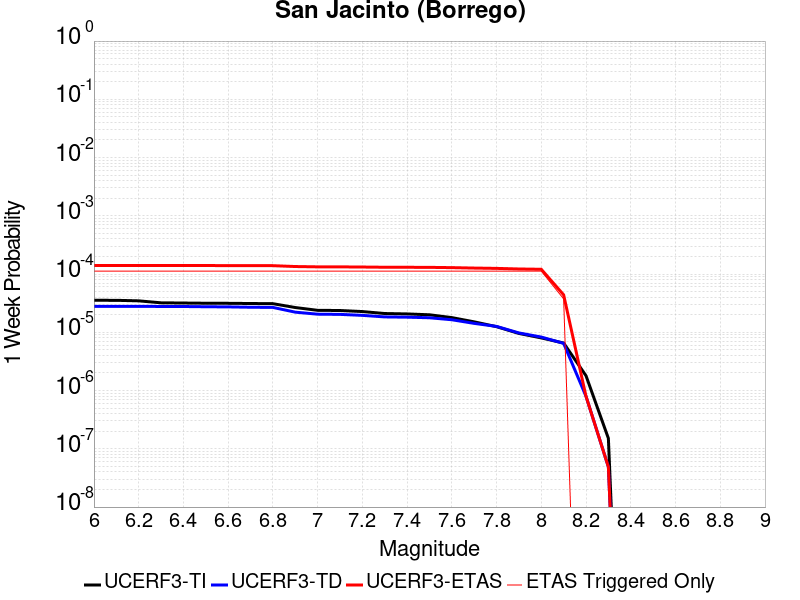 | 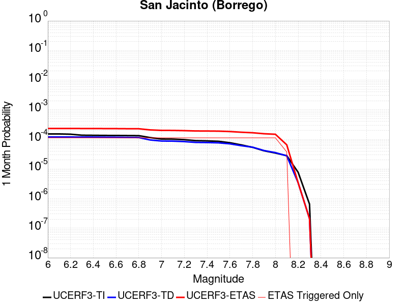 | 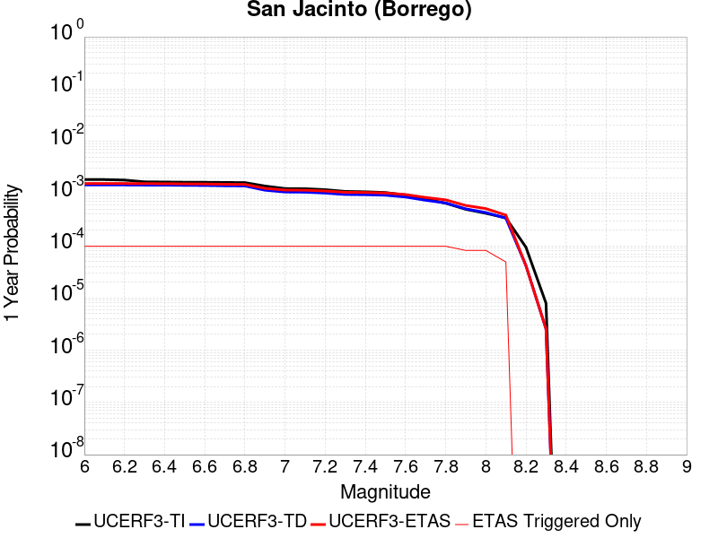 | 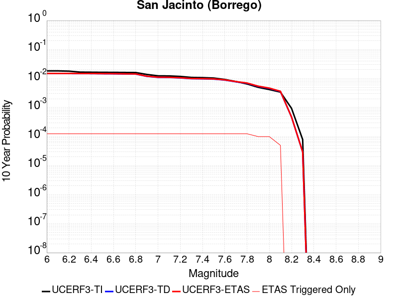 |

| Magnitude | 1 wk TI Prob | 1 wk TD Prob | 1 wk ETAS Prob | 1 wk ETAS/TD Gain | 1 wk ETAS Triggered Only | 1 mo TI Prob | 1 mo TD Prob | 1 mo ETAS Prob | 1 mo ETAS/TD Gain | 1 mo ETAS Triggered Only | 1 yr TI Prob | 1 yr TD Prob | 1 yr ETAS Prob | 1 yr ETAS/TD Gain | 1 yr ETAS Triggered Only | 10 yr TI Prob | 10 yr TD Prob | 10 yr ETAS Prob | 10 yr ETAS/TD Gain | 10 yr ETAS Triggered Only |
|-----|-----|-----|-----|-----|-----|-----|-----|-----|-----|-----|-----|-----|-----|-----|-----|-----|-----|-----|-----|-----|
| 6.0 | 3.543992E-5 | 2.7925962E-5 | 1.02863916E-4 | 3.6834512 | 7.494005E-5 | 1.5187653E-4 | 1.1967727E-4 | 1.9460835E-4 | 1.6261095 | 7.494005E-5 | 0.0018475284 | 0.0014561092 | 0.0015808274 | 1.0856516 | 1.2490008E-4 | 0.018322436 | 0.01486815 | 0.014991194 | 1.0082756 | 1.2490008E-4 |
| 6.1 | 3.542281E-5 | 2.7925962E-5 | 1.02863916E-4 | 3.6834512 | 7.494005E-5 | 1.5180321E-4 | 1.1967727E-4 | 1.9460835E-4 | 1.6261095 | 7.494005E-5 | 0.0018466372 | 0.0014561092 | 0.0015808274 | 1.0856516 | 1.2490008E-4 | 0.018313672 | 0.01486815 | 0.014991194 | 1.0082756 | 1.2490008E-4 |
| 6.2 | 3.4688688E-5 | 2.7925962E-5 | 1.02863916E-4 | 3.6834512 | 7.494005E-5 | 1.4865733E-4 | 1.1967727E-4 | 1.9460835E-4 | 1.6261095 | 7.494005E-5 | 0.0018084005 | 0.0014561091 | 0.0015808274 | 1.0856516 | 1.2490008E-4 | 0.017937548 | 0.01486815 | 0.014991194 | 1.0082756 | 1.2490008E-4 |
| 6.3 | 3.2087122E-5 | 2.7771312E-5 | 1.0270928E-4 | 3.698395 | 7.494005E-5 | 1.3750899E-4 | 1.1901455E-4 | 1.9394567E-4 | 1.6295964 | 7.494005E-5 | 0.0016728862 | 0.0014480512 | 0.0015727704 | 1.0861291 | 1.2490008E-4 | 0.016603488 | 0.014789308 | 0.014912361 | 1.0083205 | 1.2490008E-4 |
| 6.4 | 3.1828724E-5 | 2.773829E-5 | 1.02676255E-4 | 3.7016075 | 7.494005E-5 | 1.364017E-4 | 1.1887303E-4 | 1.9380417E-4 | 1.630346 | 7.494005E-5 | 0.0016594254 | 0.0014463306 | 0.00157105 | 1.0862316 | 1.2490008E-4 | 0.016470885 | 0.014772502 | 0.0148955565 | 1.00833 | 1.2490008E-4 |
| 6.5 | 3.1563577E-5 | 2.7477974E-5 | 1.02415965E-4 | 3.7272022 | 7.494005E-5 | 1.3526545E-4 | 1.17757496E-4 | 1.9268872E-4 | 1.6363181 | 7.494005E-5 | 0.0016456128 | 0.0014327668 | 0.001557488 | 1.0870491 | 1.2490008E-4 | 0.0163348 | 0.01463991 | 0.014762982 | 1.0084065 | 1.2490008E-4 |
| 6.6 | 3.1467625E-5 | 2.7322194E-5 | 1.02260194E-4 | 3.7427518 | 7.494005E-5 | 1.3485427E-4 | 1.17089934E-4 | 1.9202121E-4 | 1.6399463 | 7.494005E-5 | 0.0016406142 | 0.0014246498 | 0.001549372 | 1.0875459 | 1.2490008E-4 | 0.016285548 | 0.014560228 | 0.014683309 | 1.0084532 | 1.2490008E-4 |
| 6.7 | 3.1223695E-5 | 2.6940217E-5 | 1.0187825E-4 | 3.7816415 | 7.494005E-5 | 1.3380898E-4 | 1.1545303E-4 | 1.9038442E-4 | 1.6490206 | 7.494005E-5 | 0.0016279068 | 0.0014047464 | 0.0015294711 | 1.088788 | 1.2490008E-4 | 0.01616033 | 0.01436451 | 0.014487616 | 1.0085702 | 1.2490008E-4 |
| 6.8 | 3.1015585E-5 | 2.6761221E-5 | 1.0169926E-4 | 3.8002474 | 7.494005E-5 | 1.3291716E-4 | 1.1468597E-4 | 1.8961742E-4 | 1.6533619 | 7.494005E-5 | 0.001617065 | 0.0013954195 | 0.0015201452 | 1.0893823 | 1.2490008E-4 | 0.016053487 | 0.014271772 | 0.01439489 | 1.0086267 | 1.2490008E-4 |
| 6.9 | 2.6641965E-5 | 2.2183434E-5 | 9.712182E-5 | 4.3781238 | 7.494005E-5 | 1.1417485E-4 | 9.506842E-5 | 1.7000134E-4 | 1.7881999 | 7.494005E-5 | 0.0013891924 | 0.0011568473 | 0.0012816029 | 1.107841 | 1.2490008E-4 | 0.0138054015 | 0.011882191 | 0.012005607 | 1.0103866 | 1.2490008E-4 |
| 7.0 | 2.3854353E-5 | 2.047825E-5 | 9.541676E-5 | 4.6594195 | 7.494005E-5 | 1.02228936E-4 | 8.776099E-5 | 1.6269446E-4 | 1.8538357 | 7.494005E-5 | 0.0012439266 | 0.0010679689 | 0.0011927356 | 1.1168262 | 1.2490008E-4 | 0.012369866 | 0.0109826205 | 0.011106148 | 1.0112476 | 1.2490008E-4 |
| 7.1 | 2.3672901E-5 | 2.0314741E-5 | 9.5253265E-5 | 4.6888742 | 7.494005E-5 | 1.0145135E-4 | 8.706028E-5 | 1.6199381E-4 | 1.8607085 | 7.494005E-5 | 0.0012344702 | 0.0010594461 | 0.0011842138 | 1.117767 | 1.2490008E-4 | 0.0122763505 | 0.010897858 | 0.011021397 | 1.0113361 | 1.2490008E-4 |
| 7.2 | 2.2717244E-5 | 1.9542116E-5 | 9.44807E-5 | 4.834722 | 7.494005E-5 | 9.735599E-5 | 8.3749255E-5 | 1.5868302E-4 | 1.8947396 | 7.494005E-5 | 0.0011846646 | 0.0010191725 | 0.0011439453 | 1.1224256 | 1.2490008E-4 | 0.01178369 | 0.010495322 | 0.010618911 | 1.0117756 | 1.2490008E-4 |
| 7.3 | 2.1016205E-5 | 1.8383771E-5 | 9.3322444E-5 | 5.0763493 | 7.494005E-5 | 9.006634E-5 | 7.878522E-5 | 1.5371936E-4 | 1.9511193 | 7.494005E-5 | 0.001096006 | 9.5879E-4 | 0.0010835703 | 1.1301435 | 1.2490008E-4 | 0.010906163 | 0.009890901 | 0.010014566 | 1.0125029 | 1.2490008E-4 |
| 7.4 | 2.0683625E-5 | 1.8186302E-5 | 9.312499E-5 | 5.1206117 | 7.494005E-5 | 8.86411E-5 | 7.7938974E-5 | 1.5287318E-4 | 1.9614471 | 7.494005E-5 | 0.001078671 | 9.48496E-4 | 0.0010732776 | 1.1315573 | 1.2490008E-4 | 0.010734501 | 0.0097876275 | 0.009911305 | 1.0126361 | 1.2490008E-4 |
| 7.5 | 1.9993966E-5 | 1.7781347E-5 | 9.272006E-5 | 5.2144566 | 7.494005E-5 | 8.568561E-5 | 7.6203556E-5 | 1.511379E-4 | 1.9833443 | 7.494005E-5 | 0.001042723 | 9.2738547E-4 | 0.0010521697 | 1.1345549 | 1.2490008E-4 | 0.010378438 | 0.009574548 | 0.009698253 | 1.0129201 | 1.2490008E-4 |
| 7.6 | 1.788966E-5 | 1.6434618E-5 | 9.137343E-5 | 5.559815 | 7.494005E-5 | 7.666772E-5 | 7.043219E-5 | 1.4536695E-4 | 2.063928 | 7.494005E-5 | 9.3302975E-4 | 8.5717626E-4 | 9.819693E-4 | 1.1455861 | 1.2490008E-4 | 0.00929122 | 0.008866415 | 0.008990208 | 1.013962 | 1.2490008E-4 |
| 7.7 | 1.5125781E-5 | 1.4236738E-5 | 8.917572E-5 | 6.263775 | 7.494005E-5 | 6.4823165E-5 | 6.101317E-5 | 1.3594865E-4 | 2.2281852 | 7.494005E-5 | 7.889362E-4 | 7.4258295E-4 | 8.673903E-4 | 1.1680719 | 1.2490008E-4 | 0.007861412 | 0.007714161 | 0.007838097 | 1.0160661 | 1.2490008E-4 |
| 7.8 | 1.250089E-5 | 1.262994E-5 | 8.756904E-5 | 6.933449 | 7.494005E-5 | 5.3574146E-5 | 5.4127195E-5 | 1.2906319E-4 | 2.3844426 | 7.494005E-5 | 6.5207E-4 | 6.588E-4 | 7.836178E-4 | 1.1894623 | 1.2490008E-4 | 0.006501599 | 0.006867759 | 0.0069918013 | 1.0180615 | 1.2490008E-4 |
| 7.9 | 9.561E-6 | 9.754065E-6 | 8.469338E-5 | 8.68288 | 7.494005E-5 | 4.0975072E-5 | 4.180247E-5 | 1.16739386E-4 | 2.7926433 | 7.494005E-5 | 4.987573E-4 | 5.0882675E-4 | 6.08696E-4 | 1.1962736 | 9.9920064E-5 | 0.0049763937 | 0.0053523607 | 0.005451746 | 1.0185685 | 9.9920064E-5 |
| 8.0 | 8.01699E-6 | 8.292994E-6 | 8.323242E-5 | 10.036474 | 7.494005E-5 | 3.4358076E-5 | 3.554092E-5 | 1.1047831E-4 | 3.108482 | 7.494005E-5 | 4.1822926E-4 | 4.3262533E-4 | 5.3250213E-4 | 1.2308623 | 9.9920064E-5 | 0.0041744304 | 0.0045733186 | 0.004672782 | 1.0217485 | 9.9920064E-5 |
| 8.1 | 6.541947E-6 | 6.461784E-6 | 3.144164E-5 | 4.865783 | 2.4980016E-5 | 2.8036617E-5 | 2.7693068E-5 | 5.2672392E-5 | 1.9020064 | 2.4980016E-5 | 3.4129233E-4 | 3.3711144E-4 | 3.8705464E-4 | 1.1481503 | 4.9960032E-5 | 0.0034076865 | 0.0035805756 | 0.0036303566 | 1.0139031 | 4.9960032E-5 |
| 8.2 | 1.7968189E-6 | 7.9684827E-7 | 7.9684827E-7 | 1.0 | 0.0 | 7.70063E-6 | 3.4150596E-6 | 3.4150596E-6 | 1.0 | 0.0 | 9.3751136E-5 | 4.157758E-5 | 4.157758E-5 | 1.0 | 0.0 | 9.371159E-4 | 4.7107413E-4 | 4.7107413E-4 | 1.0 | 0.0 |
| 8.3 | 1.5167889E-7 | 4.8951257E-8 | 4.8951257E-8 | 1.0 | 0.0 | 6.500522E-7 | 2.0979108E-7 | 2.0979108E-7 | 1.0 | 0.0 | 7.9143565E-6 | 2.5542038E-6 | 2.5542038E-6 | 1.0 | 0.0 | 7.914075E-5 | 2.9679897E-5 | 2.9679897E-5 | 1.0 | 0.0 |

## Santa Cruz Island
*[(top)](#table-of-contents)*

| 1 Week | 1 Month | 1 Year | 10 Year |
|-----|-----|-----|-----|
| 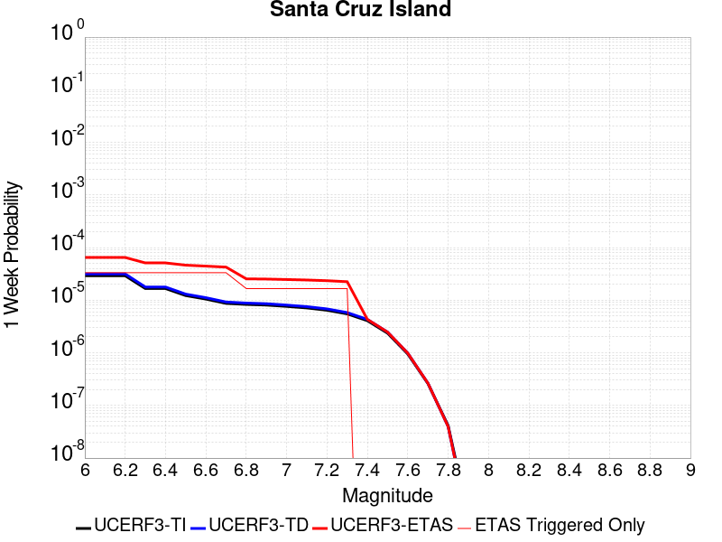 | 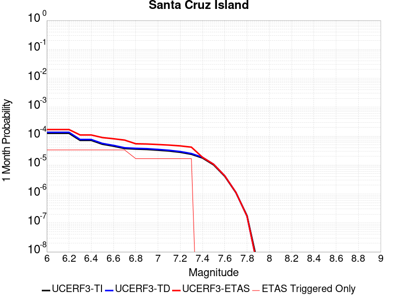 | 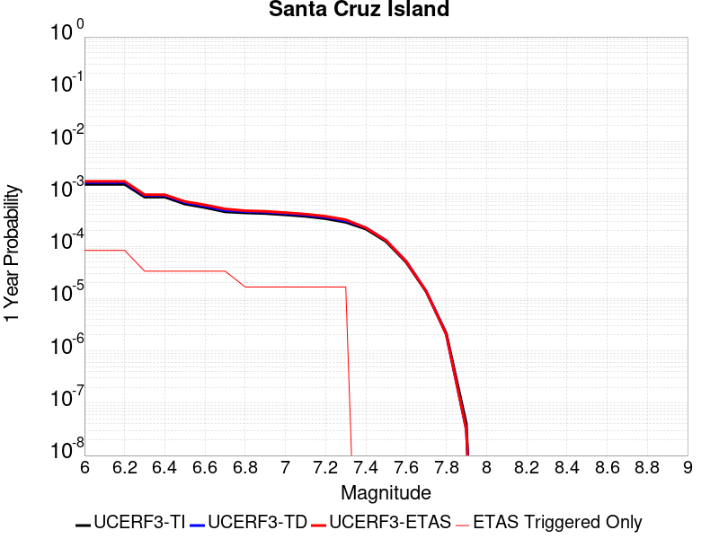 | 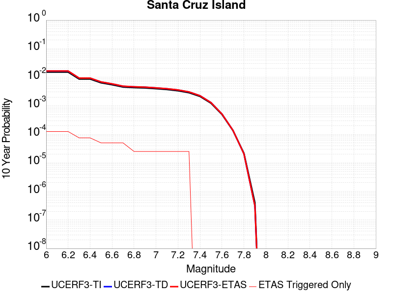 |

| Magnitude | 1 wk TI Prob | 1 wk TD Prob | 1 wk ETAS Prob | 1 wk ETAS/TD Gain | 1 wk ETAS Triggered Only | 1 mo TI Prob | 1 mo TD Prob | 1 mo ETAS Prob | 1 mo ETAS/TD Gain | 1 mo ETAS Triggered Only | 1 yr TI Prob | 1 yr TD Prob | 1 yr ETAS Prob | 1 yr ETAS/TD Gain | 1 yr ETAS Triggered Only | 10 yr TI Prob | 10 yr TD Prob | 10 yr ETAS Prob | 10 yr ETAS/TD Gain | 10 yr ETAS Triggered Only |
|-----|-----|-----|-----|-----|-----|-----|-----|-----|-----|-----|-----|-----|-----|-----|-----|-----|-----|-----|-----|-----|
| 6.0 | 2.9164563E-5 | 3.1599742E-5 | 8.1558195E-5 | 2.5809765 | 4.9960032E-5 | 1.2498499E-4 | 1.3542121E-4 | 1.8537448E-4 | 1.3688732 | 4.9960032E-5 | 0.0015206301 | 0.0016476426 | 0.0017473979 | 1.0605444 | 9.9920064E-5 | 0.015102667 | 0.016368 | 0.016490854 | 1.0075059 | 1.2490008E-4 |
| 6.1 | 2.9164563E-5 | 3.1599742E-5 | 8.1558195E-5 | 2.5809765 | 4.9960032E-5 | 1.2498499E-4 | 1.3542121E-4 | 1.8537448E-4 | 1.3688732 | 4.9960032E-5 | 0.0015206301 | 0.0016476426 | 0.0017473979 | 1.0605444 | 9.9920064E-5 | 0.015102667 | 0.016368 | 0.016490854 | 1.0075059 | 1.2490008E-4 |
| 6.2 | 2.9164563E-5 | 3.1599742E-5 | 8.1558195E-5 | 2.5809765 | 4.9960032E-5 | 1.2498499E-4 | 1.3542121E-4 | 1.8537448E-4 | 1.3688732 | 4.9960032E-5 | 0.0015206301 | 0.0016476426 | 0.0017473979 | 1.0605444 | 9.9920064E-5 | 0.015102667 | 0.016368 | 0.016490854 | 1.0075059 | 1.2490008E-4 |
| 6.3 | 1.6635553E-5 | 1.780436E-5 | 6.77635E-5 | 3.8060062 | 4.9960032E-5 | 7.1293274E-5 | 7.630227E-5 | 1.2625848E-4 | 1.6547147 | 4.9960032E-5 | 8.6765E-4 | 9.286024E-4 | 9.785161E-4 | 1.0537513 | 4.9960032E-5 | 0.008642701 | 0.009249094 | 0.009323341 | 1.0080274 | 7.494005E-5 |
| 6.4 | 1.6635553E-5 | 1.780436E-5 | 6.77635E-5 | 3.8060062 | 4.9960032E-5 | 7.1293274E-5 | 7.630227E-5 | 1.2625848E-4 | 1.6547147 | 4.9960032E-5 | 8.6765E-4 | 9.286024E-4 | 9.785161E-4 | 1.0537513 | 4.9960032E-5 | 0.008642701 | 0.009249094 | 0.009323341 | 1.0080274 | 7.494005E-5 |
| 6.5 | 1.2238748E-5 | 1.3042996E-5 | 6.300238E-5 | 4.830361 | 4.9960032E-5 | 5.2450723E-5 | 5.5897377E-5 | 1.0585462E-4 | 1.8937314 | 4.9960032E-5 | 6.3840044E-4 | 6.8034173E-4 | 7.302678E-4 | 1.0733838 | 4.9960032E-5 | 0.0063656955 | 0.006782988 | 0.006832609 | 1.0073155 | 4.9960032E-5 |
| 6.6 | 1.0489767E-5 | 1.1156636E-5 | 6.111611E-5 | 5.4780054 | 4.9960032E-5 | 4.495537E-5 | 4.781329E-5 | 9.7770935E-5 | 2.0448484 | 4.9960032E-5 | 5.4719415E-4 | 5.819736E-4 | 6.319045E-4 | 1.0857959 | 4.9960032E-5 | 0.005458487 | 0.005804736 | 0.005854406 | 1.0085568 | 4.9960032E-5 |
| 6.7 | 8.699222E-6 | 9.236783E-6 | 5.9196354E-5 | 6.4087634 | 4.9960032E-5 | 3.7281847E-5 | 3.958561E-5 | 8.954367E-5 | 2.2620256 | 4.9960032E-5 | 4.5381195E-4 | 4.818488E-4 | 5.317848E-4 | 1.1036341 | 4.9960032E-5 | 0.0045288634 | 0.004808108 | 0.004857828 | 1.0103408 | 4.9960032E-5 |
| 6.8 | 8.307732E-6 | 8.8169045E-6 | 3.37967E-5 | 3.8331707 | 2.4980016E-5 | 3.560408E-5 | 3.7786187E-5 | 6.276526E-5 | 1.6610636 | 2.4980016E-5 | 4.3339343E-4 | 4.5995016E-4 | 4.8491868E-4 | 1.0542853 | 2.4980016E-5 | 0.004325492 | 0.0045900354 | 0.004614901 | 1.0054172 | 2.4980016E-5 |
| 6.9 | 8.073121E-6 | 8.564939E-6 | 3.354474E-5 | 3.9165182 | 2.4980016E-5 | 3.459863E-5 | 3.670637E-5 | 6.168547E-5 | 1.6805114 | 2.4980016E-5 | 4.2115687E-4 | 4.4680882E-4 | 4.7177766E-4 | 1.0558827 | 2.4980016E-5 | 0.004203596 | 0.004459156 | 0.004484025 | 1.005577 | 2.4980016E-5 |
| 7.0 | 7.617019E-6 | 8.074665E-6 | 3.305448E-5 | 4.093604 | 2.4980016E-5 | 3.264396E-5 | 3.4605247E-5 | 5.95844E-5 | 1.7218313 | 2.4980016E-5 | 3.9736772E-4 | 4.2123784E-4 | 4.4620733E-4 | 1.0592765 | 2.4980016E-5 | 0.003966579 | 0.0042044413 | 0.0042293165 | 1.0059164 | 2.4980016E-5 |
| 7.1 | 7.1224836E-6 | 7.5457883E-6 | 3.2525615E-5 | 4.3104334 | 2.4980016E-5 | 3.052457E-5 | 3.2338692E-5 | 5.7317902E-5 | 1.7724248 | 2.4980016E-5 | 3.715733E-4 | 3.9365282E-4 | 4.18623E-4 | 1.063432 | 2.4980016E-5 | 0.003709526 | 0.0039295983 | 0.00395448 | 1.0063319 | 2.4980016E-5 |
| 7.2 | 6.441115E-6 | 6.8273835E-6 | 3.180723E-5 | 4.658773 | 2.4980016E-5 | 2.7604487E-5 | 2.9259889E-5 | 5.4239175E-5 | 1.8537041 | 2.4980016E-5 | 3.360328E-4 | 3.5618115E-4 | 3.8115226E-4 | 1.0701079 | 2.4980016E-5 | 0.0033552512 | 0.0035561312 | 0.0035810224 | 1.0069995 | 2.4980016E-5 |
| 7.3 | 5.494274E-6 | 5.8199944E-6 | 3.0799863E-5 | 5.292078 | 2.4980016E-5 | 2.3546674E-5 | 2.4942596E-5 | 4.992199E-5 | 2.0014753 | 2.4980016E-5 | 2.8664304E-4 | 3.03634E-4 | 3.2860643E-4 | 1.0822452 | 2.4980016E-5 | 0.002862736 | 0.0030322145 | 0.0030571187 | 1.0082133 | 2.4980016E-5 |
| 7.4 | 4.0802624E-6 | 4.3122564E-6 | 4.3122564E-6 | 1.0 | 0.0 | 1.7486722E-5 | 1.8480969E-5 | 1.8480969E-5 | 1.0 | 0.0 | 2.1288003E-4 | 2.2498264E-4 | 2.2498264E-4 | 1.0 | 0.0 | 0.0021267622 | 0.0022475577 | 0.0022475577 | 1.0 | 0.0 |
| 7.5 | 2.3584746E-6 | 2.4753099E-6 | 2.4753099E-6 | 1.0 | 0.0 | 1.0107709E-5 | 1.0608428E-5 | 1.0608428E-5 | 1.0 | 0.0 | 1.2305441E-4 | 1.2915001E-4 | 1.2915001E-4 | 1.0 | 0.0 | 0.0012298629 | 0.0012907545 | 0.0012907545 | 1.0 | 0.0 |
| 7.6 | 9.4981914E-7 | 9.860934E-7 | 9.860934E-7 | 1.0 | 0.0 | 4.0706473E-6 | 4.2261076E-6 | 4.2261076E-6 | 1.0 | 0.0 | 4.9559E-5 | 5.1451658E-5 | 5.1451658E-5 | 1.0 | 0.0 | 4.954795E-4 | 5.1439874E-4 | 5.1439874E-4 | 1.0 | 0.0 |
| 7.7 | 2.6013532E-7 | 2.6416632E-7 | 2.6416632E-7 | 1.0 | 0.0 | 1.1148652E-6 | 1.1321408E-6 | 1.1321408E-6 | 1.0 | 0.0 | 1.3573399E-5 | 1.3783729E-5 | 1.3783729E-5 | 1.0 | 0.0 | 1.357257E-4 | 1.378288E-4 | 1.378288E-4 | 1.0 | 0.0 |
| 7.8 | 4.1522263E-8 | 3.965698E-8 | 3.965698E-8 | 1.0 | 0.0 | 1.7795254E-7 | 1.6995848E-7 | 1.6995848E-7 | 1.0 | 0.0 | 2.16657E-6 | 2.0692428E-6 | 2.0692428E-6 | 1.0 | 0.0 | 2.1665488E-5 | 2.0692256E-5 | 2.0692256E-5 | 1.0 | 0.0 |
| 7.9 | 7.7242046E-10 | 5.9475225E-10 | 5.9475225E-10 | 1.0 | 0.0 | 3.3103735E-9 | 2.5489382E-9 | 2.5489382E-9 | 1.0 | 0.0 | 4.0303796E-8 | 3.1033323E-8 | 3.1033323E-8 | 1.0 | 0.0 | 4.030379E-7 | 3.103332E-7 | 3.103332E-7 | 1.0 | 0.0 |

## Red Mountain
*[(top)](#table-of-contents)*

| 1 Week | 1 Month | 1 Year | 10 Year |
|-----|-----|-----|-----|
| 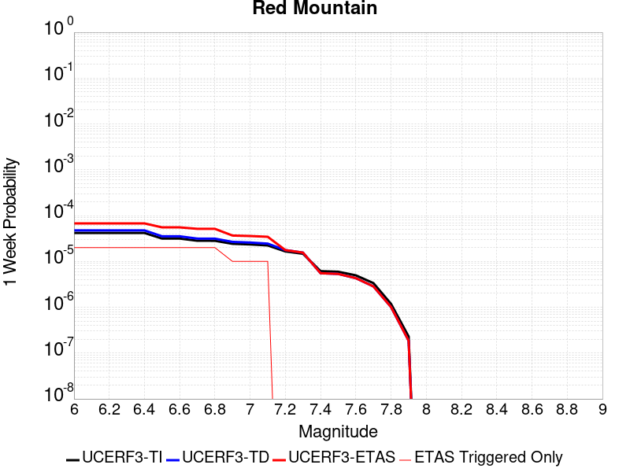 | 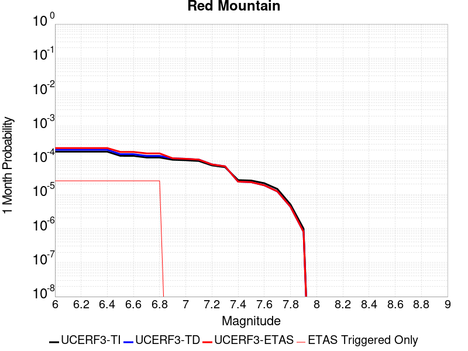 | 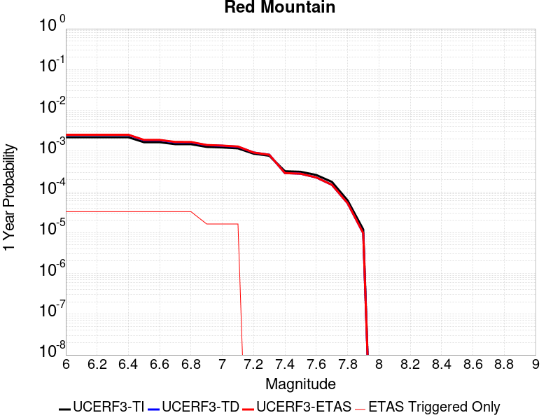 | 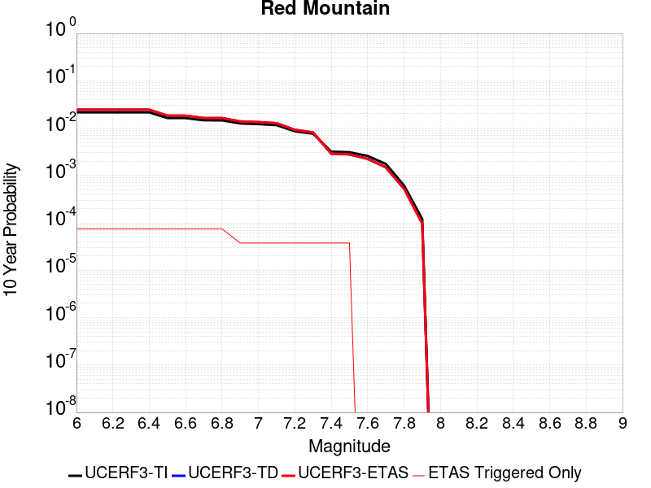 |

| Magnitude | 1 wk TI Prob | 1 wk TD Prob | 1 wk ETAS Prob | 1 wk ETAS/TD Gain | 1 wk ETAS Triggered Only | 1 mo TI Prob | 1 mo TD Prob | 1 mo ETAS Prob | 1 mo ETAS/TD Gain | 1 mo ETAS Triggered Only | 1 yr TI Prob | 1 yr TD Prob | 1 yr ETAS Prob | 1 yr ETAS/TD Gain | 1 yr ETAS Triggered Only | 10 yr TI Prob | 10 yr TD Prob | 10 yr ETAS Prob | 10 yr ETAS/TD Gain | 10 yr ETAS Triggered Only |
|-----|-----|-----|-----|-----|-----|-----|-----|-----|-----|-----|-----|-----|-----|-----|-----|-----|-----|-----|-----|-----|
| 6.0 | 4.1810763E-5 | 4.7590016E-5 | 4.7590016E-5 | 1.0 | 0.0 | 1.7917668E-4 | 2.039422E-4 | 2.2891712E-4 | 1.1224608 | 2.4980016E-5 | 0.0021792934 | 0.0024803334 | 0.0025052514 | 1.0100462 | 2.4980016E-5 | 0.021580452 | 0.02454411 | 0.024617212 | 1.0029783 | 7.494005E-5 |
| 6.1 | 4.1810763E-5 | 4.7590016E-5 | 4.7590016E-5 | 1.0 | 0.0 | 1.7917668E-4 | 2.039422E-4 | 2.2891712E-4 | 1.1224608 | 2.4980016E-5 | 0.0021792934 | 0.0024803334 | 0.0025052514 | 1.0100462 | 2.4980016E-5 | 0.021580452 | 0.02454411 | 0.024617212 | 1.0029783 | 7.494005E-5 |
| 6.2 | 4.1810763E-5 | 4.7590016E-5 | 4.7590016E-5 | 1.0 | 0.0 | 1.7917668E-4 | 2.039422E-4 | 2.2891712E-4 | 1.1224608 | 2.4980016E-5 | 0.0021792934 | 0.0024803334 | 0.0025052514 | 1.0100462 | 2.4980016E-5 | 0.021580452 | 0.02454411 | 0.024617212 | 1.0029783 | 7.494005E-5 |
| 6.3 | 4.1810763E-5 | 4.7590016E-5 | 4.7590016E-5 | 1.0 | 0.0 | 1.7917668E-4 | 2.039422E-4 | 2.2891712E-4 | 1.1224608 | 2.4980016E-5 | 0.0021792934 | 0.0024803334 | 0.0025052514 | 1.0100462 | 2.4980016E-5 | 0.021580452 | 0.02454411 | 0.024617212 | 1.0029783 | 7.494005E-5 |
| 6.4 | 4.1810763E-5 | 4.7590016E-5 | 4.7590016E-5 | 1.0 | 0.0 | 1.7917668E-4 | 2.039422E-4 | 2.2891712E-4 | 1.1224608 | 2.4980016E-5 | 0.0021792934 | 0.0024803334 | 0.0025052514 | 1.0100462 | 2.4980016E-5 | 0.021580452 | 0.02454411 | 0.024617212 | 1.0029783 | 7.494005E-5 |
| 6.5 | 3.154503E-5 | 3.5359757E-5 | 3.5359757E-5 | 1.0 | 0.0 | 1.3518598E-4 | 1.5153353E-4 | 1.7650977E-4 | 1.1648232 | 2.4980016E-5 | 0.0016446467 | 0.0018434518 | 0.0018683857 | 1.0135257 | 2.4980016E-5 | 0.01632528 | 0.018291244 | 0.018364813 | 1.0040221 | 7.494005E-5 |
| 6.6 | 3.1535834E-5 | 3.5349138E-5 | 3.5349138E-5 | 1.0 | 0.0 | 1.3514658E-4 | 1.5148803E-4 | 1.7646427E-4 | 1.1648726 | 2.4980016E-5 | 0.0016441676 | 0.0018428987 | 0.0018678327 | 1.0135298 | 2.4980016E-5 | 0.01632056 | 0.018285805 | 0.018359374 | 1.0040233 | 7.494005E-5 |
| 6.7 | 2.8267326E-5 | 3.1469353E-5 | 3.1469353E-5 | 1.0 | 0.0 | 1.2114006E-4 | 1.3486217E-4 | 1.5983882E-4 | 1.1852013 | 2.4980016E-5 | 0.0014738824 | 0.0016407954 | 0.0016657345 | 1.0151993 | 2.4980016E-5 | 0.014641452 | 0.01629557 | 0.01636929 | 1.0045239 | 7.494005E-5 |
| 6.8 | 2.8212884E-5 | 3.1407242E-5 | 3.1407242E-5 | 1.0 | 0.0 | 1.20906756E-4 | 1.3459599E-4 | 1.5957265E-4 | 1.1855676 | 2.4980016E-5 | 0.0014710457 | 0.0016375595 | 0.0016624987 | 1.0152295 | 2.4980016E-5 | 0.014613459 | 0.016263688 | 0.01633741 | 1.0045329 | 7.494005E-5 |
| 6.9 | 2.4227871E-5 | 2.6706994E-5 | 2.6706994E-5 | 1.0 | 0.0 | 1.03829596E-4 | 1.1445395E-4 | 1.1445395E-4 | 1.0 | 0.0 | 0.0012633923 | 0.0013926621 | 0.0013926621 | 1.0 | 0.0 | 0.012562336 | 0.0138470335 | 0.013896302 | 1.003558 | 4.9960032E-5 |
| 7.0 | 2.348524E-5 | 2.5835778E-5 | 2.5835778E-5 | 1.0 | 0.0 | 1.0064714E-4 | 1.10720495E-4 | 1.10720495E-4 | 1.0 | 0.0 | 0.0012246901 | 0.001347264 | 0.001347264 | 1.0 | 0.0 | 0.012179627 | 0.013398598 | 0.013447888 | 1.0036788 | 4.9960032E-5 |
| 7.1 | 2.2311642E-5 | 2.4462845E-5 | 2.4462845E-5 | 1.0 | 0.0 | 9.561782E-5 | 1.04836974E-4 | 1.04836974E-4 | 1.0 | 0.0 | 0.0011635252 | 0.0012757176 | 0.0012757176 | 1.0 | 0.0 | 0.01157452 | 0.01269146 | 0.012740785 | 1.0038866 | 4.9960032E-5 |
| 7.2 | 1.6533986E-5 | 1.7670362E-5 | 1.7670362E-5 | 1.0 | 0.0 | 7.085802E-5 | 7.572828E-5 | 7.572828E-5 | 1.0 | 0.0 | 8.623549E-4 | 9.2166534E-4 | 9.2166534E-4 | 1.0 | 0.0 | 0.008590161 | 0.009184707 | 0.009234208 | 1.0053896 | 4.9960032E-5 |
| 7.3 | 1.4703092E-5 | 1.5559537E-5 | 1.5559537E-5 | 1.0 | 0.0 | 6.301173E-5 | 6.668237E-5 | 6.668237E-5 | 1.0 | 0.0 | 7.668978E-4 | 8.1161706E-4 | 8.1161706E-4 | 1.0 | 0.0 | 0.0076425658 | 0.008092604 | 0.008142159 | 1.0061235 | 4.9960032E-5 |
| 7.4 | 6.1331984E-6 | 5.5288874E-6 | 5.5288874E-6 | 1.0 | 0.0 | 2.6284872E-5 | 2.3695018E-5 | 2.3695018E-5 | 1.0 | 0.0 | 3.199713E-4 | 2.884492E-4 | 2.884492E-4 | 1.0 | 0.0 | 0.0031951098 | 0.0028808024 | 0.0029306184 | 1.0172925 | 4.9960032E-5 |
| 7.5 | 5.954766E-6 | 5.338517E-6 | 5.338517E-6 | 1.0 | 0.0 | 2.5520176E-5 | 2.2879161E-5 | 2.2879161E-5 | 1.0 | 0.0 | 3.1066386E-4 | 2.785187E-4 | 2.785187E-4 | 1.0 | 0.0 | 0.003102299 | 0.0027817504 | 0.0028315713 | 1.01791 | 4.9960032E-5 |
| 7.6 | 4.9726646E-6 | 4.315309E-6 | 4.315309E-6 | 1.0 | 0.0 | 2.1311245E-5 | 1.8494053E-5 | 1.8494053E-5 | 1.0 | 0.0 | 2.5943352E-4 | 2.2514217E-4 | 2.2514217E-4 | 1.0 | 0.0 | 0.0025913084 | 0.0022491754 | 0.0022740993 | 1.0110813 | 2.4980016E-5 |
| 7.7 | 3.3613894E-6 | 2.8526886E-6 | 2.8526886E-6 | 1.0 | 0.0 | 1.4405875E-5 | 1.22257525E-5 | 1.22257525E-5 | 1.0 | 0.0 | 1.7537741E-4 | 1.4883863E-4 | 1.4883863E-4 | 1.0 | 0.0 | 0.0017523908 | 0.0014874157 | 0.0015123587 | 1.0167693 | 2.4980016E-5 |
| 7.8 | 1.1828961E-6 | 1.0122935E-6 | 1.0122935E-6 | 1.0 | 0.0 | 5.069545E-6 | 4.338394E-6 | 4.338394E-6 | 1.0 | 0.0 | 6.171996E-5 | 5.281869E-5 | 5.281869E-5 | 1.0 | 0.0 | 6.170282E-4 | 5.280643E-4 | 5.5303116E-4 | 1.04728 | 2.4980016E-5 |
| 7.9 | 2.2967266E-7 | 1.861919E-7 | 1.861919E-7 | 1.0 | 0.0 | 9.843111E-7 | 7.97965E-7 | 7.97965E-7 | 1.0 | 0.0 | 1.19839215E-5 | 9.715184E-6 | 9.715184E-6 | 1.0 | 0.0 | 1.1983275E-4 | 9.714788E-5 | 9.714788E-5 | 1.0 | 0.0 |

## Whittier alt 1
*[(top)](#table-of-contents)*

| 1 Week | 1 Month | 1 Year | 10 Year |
|-----|-----|-----|-----|
| 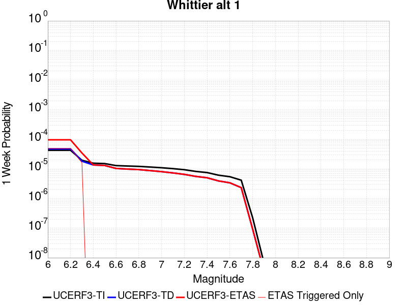 | 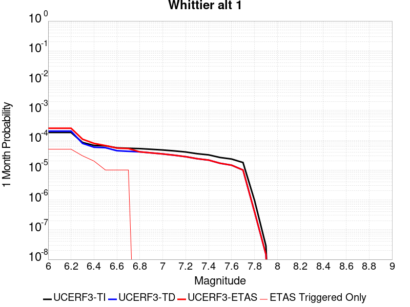 | 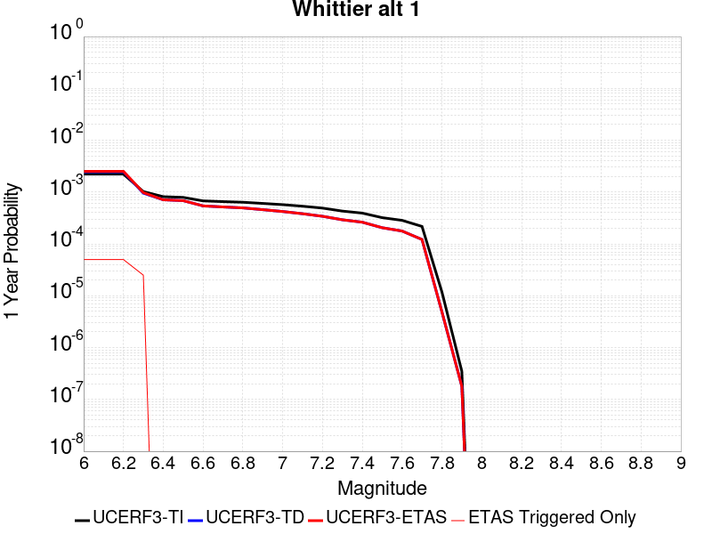 | 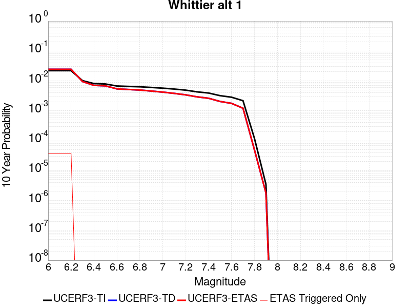 |

| Magnitude | 1 wk TI Prob | 1 wk TD Prob | 1 wk ETAS Prob | 1 wk ETAS/TD Gain | 1 wk ETAS Triggered Only | 1 mo TI Prob | 1 mo TD Prob | 1 mo ETAS Prob | 1 mo ETAS/TD Gain | 1 mo ETAS Triggered Only | 1 yr TI Prob | 1 yr TD Prob | 1 yr ETAS Prob | 1 yr ETAS/TD Gain | 1 yr ETAS Triggered Only | 10 yr TI Prob | 10 yr TD Prob | 10 yr ETAS Prob | 10 yr ETAS/TD Gain | 10 yr ETAS Triggered Only |
|-----|-----|-----|-----|-----|-----|-----|-----|-----|-----|-----|-----|-----|-----|-----|-----|-----|-----|-----|-----|-----|
| 6.0 | 4.2554693E-5 | 4.7252182E-5 | 9.720986E-5 | 2.0572565 | 4.9960032E-5 | 1.8236451E-4 | 2.0249544E-4 | 2.5244537E-4 | 1.2466718 | 4.9960032E-5 | 0.002218027 | 0.0024629163 | 0.0025127535 | 1.020235 | 4.9960032E-5 | 0.02196019 | 0.024390263 | 0.024512118 | 1.004996 | 1.2490008E-4 |
| 6.1 | 4.2554693E-5 | 4.7252182E-5 | 9.720986E-5 | 2.0572565 | 4.9960032E-5 | 1.8236451E-4 | 2.0249544E-4 | 2.5244537E-4 | 1.2466718 | 4.9960032E-5 | 0.002218027 | 0.0024629163 | 0.0025127535 | 1.020235 | 4.9960032E-5 | 0.02196019 | 0.024390263 | 0.024512118 | 1.004996 | 1.2490008E-4 |
| 6.2 | 4.2554693E-5 | 4.7252182E-5 | 9.720986E-5 | 2.0572565 | 4.9960032E-5 | 1.8236451E-4 | 2.0249544E-4 | 2.5244537E-4 | 1.2466718 | 4.9960032E-5 | 0.002218027 | 0.0024629163 | 0.0025127535 | 1.020235 | 4.9960032E-5 | 0.02196019 | 0.024390263 | 0.024512118 | 1.004996 | 1.2490008E-4 |
| 6.3 | 1.9617712E-5 | 1.826841E-5 | 4.324797E-5 | 2.3673637 | 2.4980016E-5 | 8.40732E-5 | 7.829095E-5 | 1.03269005E-4 | 1.3190415 | 2.4980016E-5 | 0.0010231105 | 9.527944E-4 | 9.777506E-4 | 1.0261927 | 2.4980016E-5 | 0.01018413 | 0.0094904 | 0.009539885 | 1.0052143 | 4.9960032E-5 |
| 6.4 | 1.5611336E-5 | 1.3604089E-5 | 1.3604089E-5 | 1.0 | 0.0 | 6.690401E-5 | 5.8301972E-5 | 5.8301972E-5 | 1.0 | 0.0 | 8.142519E-4 | 7.096013E-4 | 7.096013E-4 | 1.0 | 0.0 | 0.008112748 | 0.0070753377 | 0.0070753377 | 1.0 | 0.0 |
| 6.5 | 1.5150166E-5 | 1.3100744E-5 | 1.3100744E-5 | 1.0 | 0.0 | 6.492767E-5 | 5.614487E-5 | 5.614487E-5 | 1.0 | 0.0 | 7.9020765E-4 | 6.8335526E-4 | 6.8335526E-4 | 1.0 | 0.0 | 0.007874036 | 0.006814508 | 0.006814508 | 1.0 | 0.0 |
| 6.6 | 1.295588E-5 | 1.0380544E-5 | 1.0380544E-5 | 1.0 | 0.0 | 5.552402E-5 | 4.44873E-5 | 4.44873E-5 | 1.0 | 0.0 | 6.7579525E-4 | 5.415002E-4 | 5.415002E-4 | 1.0 | 0.0 | 0.006737438 | 0.005403343 | 0.005403343 | 1.0 | 0.0 |
| 6.7 | 1.2542085E-5 | 9.899189E-6 | 9.899189E-6 | 1.0 | 0.0 | 5.3750682E-5 | 4.2424414E-5 | 4.2424414E-5 | 1.0 | 0.0 | 6.542181E-4 | 5.163967E-4 | 5.163967E-4 | 1.0 | 0.0 | 0.006522954 | 0.005153464 | 0.005153464 | 1.0 | 0.0 |
| 6.8 | 1.2195878E-5 | 9.49523E-6 | 9.49523E-6 | 1.0 | 0.0 | 5.2267E-5 | 4.069322E-5 | 4.069322E-5 | 1.0 | 0.0 | 6.36165E-4 | 4.9532915E-4 | 4.9532915E-4 | 1.0 | 0.0 | 0.0063434686 | 0.0049436963 | 0.0049436963 | 1.0 | 0.0 |
| 6.9 | 1.1580298E-5 | 8.772739E-6 | 8.772739E-6 | 1.0 | 0.0 | 4.9628903E-5 | 3.759692E-5 | 3.759692E-5 | 1.0 | 0.0 | 6.040644E-4 | 4.5764804E-4 | 4.5764804E-4 | 1.0 | 0.0 | 0.00602425 | 0.0045684646 | 0.0045684646 | 1.0 | 0.0 |
| 7.0 | 1.0964795E-5 | 8.083794E-6 | 8.083794E-6 | 1.0 | 0.0 | 4.6991136E-5 | 3.4644378E-5 | 3.4644378E-5 | 1.0 | 0.0 | 5.7196687E-4 | 4.217152E-4 | 4.217152E-4 | 1.0 | 0.0 | 0.0057049696 | 0.004210459 | 0.004210459 | 1.0 | 0.0 |
| 7.1 | 1.0230601E-5 | 7.32646E-6 | 7.32646E-6 | 1.0 | 0.0 | 4.3844695E-5 | 3.1398744E-5 | 3.1398744E-5 | 1.0 | 0.0 | 5.336784E-4 | 3.8221394E-4 | 3.8221394E-4 | 1.0 | 0.0 | 0.005323986 | 0.0038167592 | 0.0038167592 | 1.0 | 0.0 |
| 7.2 | 9.40865E-6 | 6.5430822E-6 | 6.5430822E-6 | 1.0 | 0.0 | 4.032216E-5 | 2.8041486E-5 | 2.8041486E-5 | 1.0 | 0.0 | 4.908117E-4 | 3.4135283E-4 | 3.4135283E-4 | 1.0 | 0.0 | 0.0048972913 | 0.0034094024 | 0.0034094024 | 1.0 | 0.0 |
| 7.3 | 8.237384E-6 | 5.5975433E-6 | 5.5975433E-6 | 1.0 | 0.0 | 3.5302593E-5 | 2.3989258E-5 | 2.3989258E-5 | 1.0 | 0.0 | 4.2972428E-4 | 2.920311E-4 | 2.920311E-4 | 1.0 | 0.0 | 0.0042889426 | 0.0029167992 | 0.0029167992 | 1.0 | 0.0 |
| 7.4 | 7.5316966E-6 | 5.0276153E-6 | 5.0276153E-6 | 1.0 | 0.0 | 3.2278298E-5 | 2.154675E-5 | 2.154675E-5 | 1.0 | 0.0 | 3.9291743E-4 | 2.623011E-4 | 2.623011E-4 | 1.0 | 0.0 | 0.0039222343 | 0.0026200267 | 0.0026200267 | 1.0 | 0.0 |
| 7.5 | 6.149649E-6 | 3.9336355E-6 | 3.9336355E-6 | 1.0 | 0.0 | 2.6355372E-5 | 1.6858336E-5 | 1.6858336E-5 | 1.0 | 0.0 | 3.208294E-4 | 2.052318E-4 | 2.052318E-4 | 1.0 | 0.0 | 0.003203666 | 0.0020505118 | 0.0020505118 | 1.0 | 0.0 |
| 7.6 | 5.457711E-6 | 3.3951796E-6 | 3.3951796E-6 | 1.0 | 0.0 | 2.338998E-5 | 1.4550694E-5 | 1.4550694E-5 | 1.0 | 0.0 | 2.8473578E-4 | 1.771411E-4 | 1.771411E-4 | 1.0 | 0.0 | 0.0028437122 | 0.0017700798 | 0.0017700798 | 1.0 | 0.0 |
| 7.7 | 4.1676276E-6 | 2.3329922E-6 | 2.3329922E-6 | 1.0 | 0.0 | 1.7861139E-5 | 9.998504E-6 | 9.998504E-6 | 1.0 | 0.0 | 2.1743766E-4 | 1.2172572E-4 | 1.2172572E-4 | 1.0 | 0.0 | 0.0021722503 | 0.0012166635 | 0.0012166635 | 1.0 | 0.0 |
| 7.8 | 2.2692414E-7 | 9.384417E-8 | 9.384417E-8 | 1.0 | 0.0 | 9.725317E-7 | 4.0218927E-7 | 4.0218927E-7 | 1.0 | 0.0 | 1.1840509E-5 | 4.8966467E-6 | 4.8966467E-6 | 1.0 | 0.0 | 1.1839878E-4 | 4.8965718E-5 | 4.8965718E-5 | 1.0 | 0.0 |
| 7.9 | 6.676829E-9 | 3.4397174E-9 | 3.4397174E-9 | 1.0 | 0.0 | 2.861498E-8 | 1.4741646E-8 | 1.4741646E-8 | 1.0 | 0.0 | 3.4838732E-7 | 1.7947953E-7 | 1.7947953E-7 | 1.0 | 0.0 | 3.4838679E-6 | 1.794794E-6 | 1.794794E-6 | 1.0 | 0.0 |

## Great Valley 09 (Laguna Seca)
*[(top)](#table-of-contents)*

| 1 Week | 1 Month | 1 Year | 10 Year |
|-----|-----|-----|-----|
| 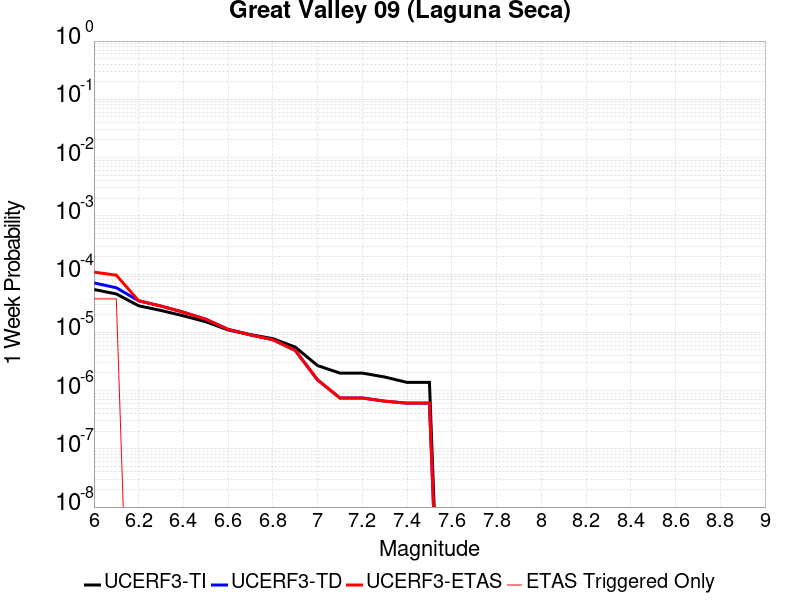 | 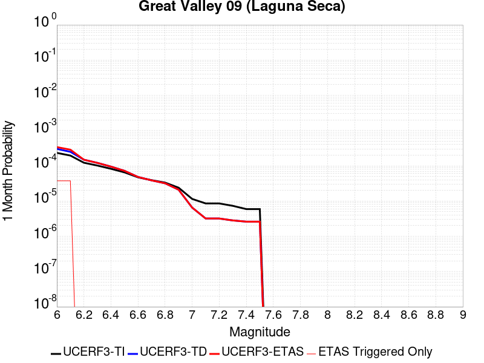 | 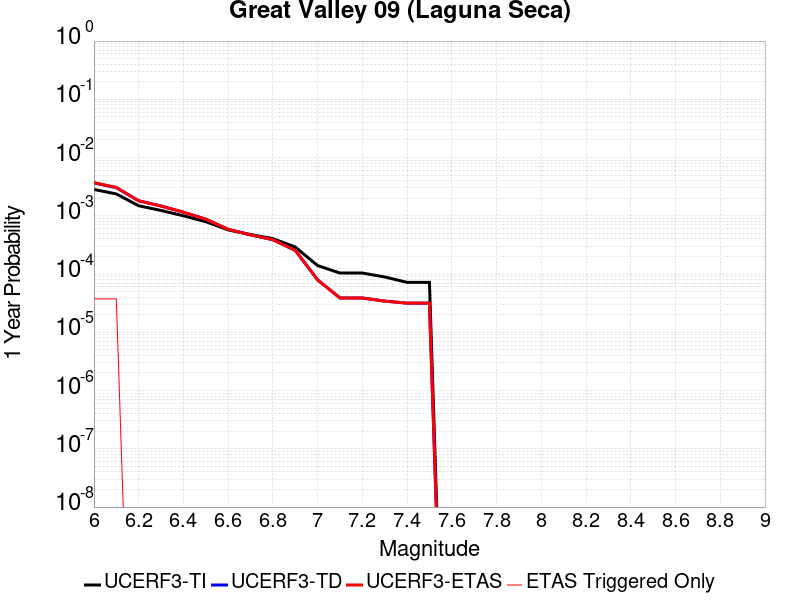 |  |

| Magnitude | 1 wk TI Prob | 1 wk TD Prob | 1 wk ETAS Prob | 1 wk ETAS/TD Gain | 1 wk ETAS Triggered Only | 1 mo TI Prob | 1 mo TD Prob | 1 mo ETAS Prob | 1 mo ETAS/TD Gain | 1 mo ETAS Triggered Only | 1 yr TI Prob | 1 yr TD Prob | 1 yr ETAS Prob | 1 yr ETAS/TD Gain | 1 yr ETAS Triggered Only | 10 yr TI Prob | 10 yr TD Prob | 10 yr ETAS Prob | 10 yr ETAS/TD Gain | 10 yr ETAS Triggered Only |
|-----|-----|-----|-----|-----|-----|-----|-----|-----|-----|-----|-----|-----|-----|-----|-----|-----|-----|-----|-----|-----|
| 6.0 | 5.4353277E-5 | 7.050019E-5 | 9.547844E-5 | 1.3543006 | 2.4980016E-5 | 2.3292181E-4 | 3.0211007E-4 | 3.2708255E-4 | 1.0826602 | 2.4980016E-5 | 0.0028321352 | 0.0036720056 | 0.0037217822 | 1.0135556 | 4.9960032E-5 | 0.02796312 | 0.036115844 | 0.036212157 | 1.0026667 | 9.9920064E-5 |
| 6.1 | 4.5578287E-5 | 5.822054E-5 | 8.3199106E-5 | 1.4290335 | 2.4980016E-5 | 1.953209E-4 | 2.4949352E-4 | 2.744673E-4 | 1.1000979 | 2.4980016E-5 | 0.0023754383 | 0.0030333549 | 0.0030831634 | 1.0164202 | 4.9960032E-5 | 0.023502063 | 0.029919893 | 0.02999259 | 1.0024297 | 7.494005E-5 |
| 6.2 | 2.8536782E-5 | 3.4736422E-5 | 3.4736422E-5 | 1.0 | 0.0 | 1.2229476E-4 | 1.4886161E-4 | 1.4886161E-4 | 1.0 | 0.0 | 0.0014879217 | 0.0018108576 | 0.0018357923 | 1.0137696 | 2.4980016E-5 | 0.014779986 | 0.017958276 | 0.017982807 | 1.001366 | 2.4980016E-5 |
| 6.3 | 2.3698774E-5 | 2.8213344E-5 | 2.8213344E-5 | 1.0 | 0.0 | 1.01562226E-4 | 1.2090833E-4 | 1.2090833E-4 | 1.0 | 0.0 | 0.0012358186 | 0.001471051 | 0.0014959943 | 1.0169561 | 2.4980016E-5 | 0.012289686 | 0.014611455 | 0.01463607 | 1.0016847 | 2.4980016E-5 |
| 6.4 | 1.9191197E-5 | 2.212289E-5 | 2.212289E-5 | 1.0 | 0.0 | 8.2245395E-5 | 9.4808805E-5 | 9.4808805E-5 | 1.0 | 0.0 | 0.0010008777 | 0.0011536906 | 0.0011786418 | 1.0216273 | 2.4980016E-5 | 0.009963818 | 0.011477022 | 0.0115017155 | 1.0021515 | 2.4980016E-5 |
| 6.5 | 1.5203241E-5 | 1.6801298E-5 | 1.6801298E-5 | 1.0 | 0.0 | 6.5155116E-5 | 7.200338E-5 | 7.200338E-5 | 1.0 | 0.0 | 7.9297484E-4 | 8.76301E-4 | 9.0125913E-4 | 1.0284812 | 2.4980016E-5 | 0.007901512 | 0.008729581 | 0.008754343 | 1.0028366 | 2.4980016E-5 |
| 6.6 | 1.0984925E-5 | 1.12425605E-5 | 1.12425605E-5 | 1.0 | 0.0 | 4.70774E-5 | 4.8181533E-5 | 4.8181533E-5 | 1.0 | 0.0 | 5.730166E-4 | 5.8645604E-4 | 5.8645604E-4 | 1.0 | 0.0 | 0.005715413 | 0.0058494755 | 0.0058494755 | 1.0 | 0.0 |
| 6.7 | 9.134616E-6 | 9.019868E-6 | 9.019868E-6 | 1.0 | 0.0 | 3.9147766E-5 | 3.865602E-5 | 3.865602E-5 | 1.0 | 0.0 | 4.7651984E-4 | 4.7053778E-4 | 4.7053778E-4 | 1.0 | 0.0 | 0.004754993 | 0.00469566 | 0.00469566 | 1.0 | 0.0 |
| 6.8 | 7.785589E-6 | 7.4519185E-6 | 7.4519185E-6 | 1.0 | 0.0 | 3.3366385E-5 | 3.1936415E-5 | 3.1936415E-5 | 1.0 | 0.0 | 4.0616E-4 | 3.887585E-4 | 3.887585E-4 | 1.0 | 0.0 | 0.0040541845 | 0.003880988 | 0.003880988 | 1.0 | 0.0 |
| 6.9 | 5.579095E-6 | 4.8984666E-6 | 4.8984666E-6 | 1.0 | 0.0 | 2.3910188E-5 | 2.0993268E-5 | 2.0993268E-5 | 1.0 | 0.0 | 2.9106764E-4 | 2.5556443E-4 | 2.5556443E-4 | 1.0 | 0.0 | 0.002906867 | 0.0025528427 | 0.0025528427 | 1.0 | 0.0 |
| 7.0 | 2.6816688E-6 | 1.521587E-6 | 1.521587E-6 | 1.0 | 0.0 | 1.1492816E-5 | 6.521071E-6 | 6.521071E-6 | 1.0 | 0.0 | 1.3991605E-4 | 7.939124E-5 | 7.939124E-5 | 1.0 | 0.0 | 0.0013982799 | 7.936375E-4 | 7.936375E-4 | 1.0 | 0.0 |
| 7.1 | 1.9951021E-6 | 7.45357E-7 | 7.45357E-7 | 1.0 | 0.0 | 8.55041E-6 | 3.1943835E-6 | 3.1943835E-6 | 1.0 | 0.0 | 1.0409627E-4 | 3.889097E-5 | 3.889097E-5 | 1.0 | 0.0 | 0.0010404752 | 3.8884574E-4 | 3.8884574E-4 | 1.0 | 0.0 |
| 7.2 | 1.9951021E-6 | 7.45357E-7 | 7.45357E-7 | 1.0 | 0.0 | 8.55041E-6 | 3.1943835E-6 | 3.1943835E-6 | 1.0 | 0.0 | 1.0409627E-4 | 3.889097E-5 | 3.889097E-5 | 1.0 | 0.0 | 0.0010404752 | 3.8884574E-4 | 3.8884574E-4 | 1.0 | 0.0 |
| 7.3 | 1.7087556E-6 | 6.578663E-7 | 6.578663E-7 | 1.0 | 0.0 | 7.3232177E-6 | 2.819424E-6 | 2.819424E-6 | 1.0 | 0.0 | 8.915652E-5 | 3.432599E-5 | 3.432599E-5 | 1.0 | 0.0 | 8.9120766E-4 | 3.432109E-4 | 3.432109E-4 | 1.0 | 0.0 |
| 7.4 | 1.3804846E-6 | 6.0737113E-7 | 6.0737113E-7 | 1.0 | 0.0 | 5.916349E-6 | 2.6030168E-6 | 2.6030168E-6 | 1.0 | 0.0 | 7.2029165E-5 | 3.169131E-5 | 3.169131E-5 | 1.0 | 0.0 | 7.200583E-4 | 3.168719E-4 | 3.168719E-4 | 1.0 | 0.0 |
| 7.5 | 1.3804846E-6 | 6.0737113E-7 | 6.0737113E-7 | 1.0 | 0.0 | 5.916349E-6 | 2.6030168E-6 | 2.6030168E-6 | 1.0 | 0.0 | 7.2029165E-5 | 3.169131E-5 | 3.169131E-5 | 1.0 | 0.0 | 7.200583E-4 | 3.168719E-4 | 3.168719E-4 | 1.0 | 0.0 |

## Pinto Mtn
*[(top)](#table-of-contents)*

| 1 Week | 1 Month | 1 Year | 10 Year |
|-----|-----|-----|-----|
| 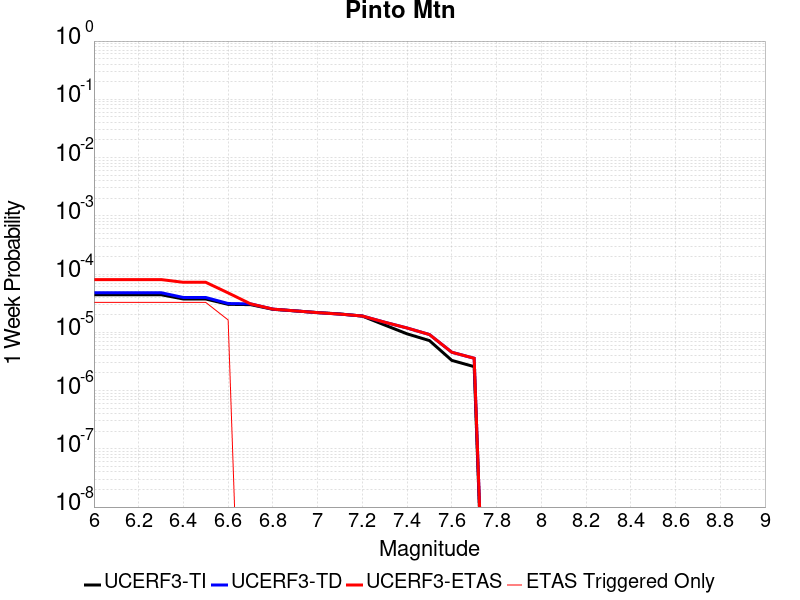 | 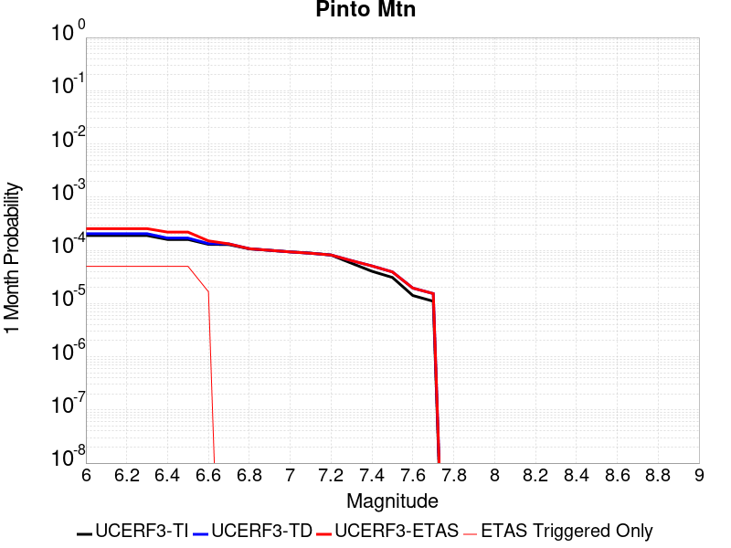 | 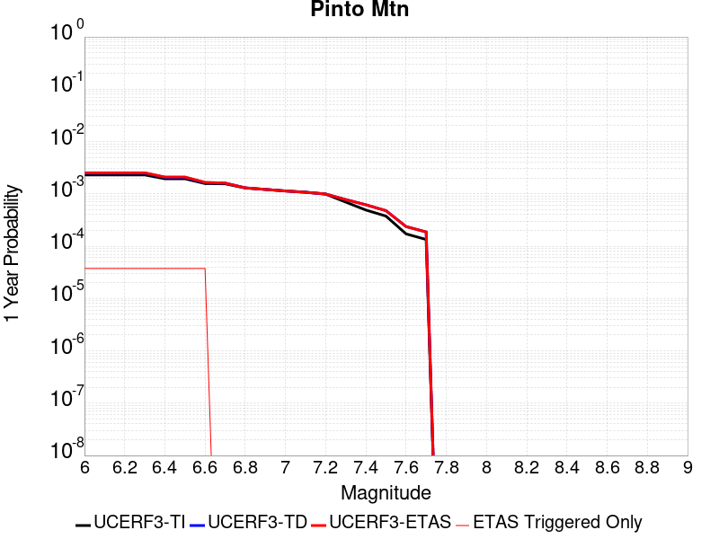 | 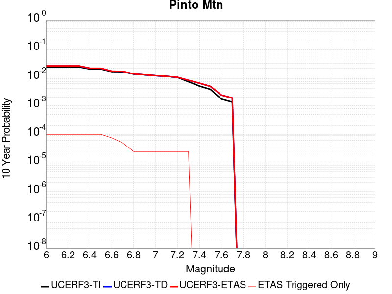 |

| Magnitude | 1 wk TI Prob | 1 wk TD Prob | 1 wk ETAS Prob | 1 wk ETAS/TD Gain | 1 wk ETAS Triggered Only | 1 mo TI Prob | 1 mo TD Prob | 1 mo ETAS Prob | 1 mo ETAS/TD Gain | 1 mo ETAS Triggered Only | 1 yr TI Prob | 1 yr TD Prob | 1 yr ETAS Prob | 1 yr ETAS/TD Gain | 1 yr ETAS Triggered Only | 10 yr TI Prob | 10 yr TD Prob | 10 yr ETAS Prob | 10 yr ETAS/TD Gain | 10 yr ETAS Triggered Only |
|-----|-----|-----|-----|-----|-----|-----|-----|-----|-----|-----|-----|-----|-----|-----|-----|-----|-----|-----|-----|-----|
| 6.0 | 4.4194956E-5 | 4.7853926E-5 | 9.7811564E-5 | 2.0439613 | 4.9960032E-5 | 1.893932E-4 | 2.0507304E-4 | 2.5502284E-4 | 1.2435707 | 4.9960032E-5 | 0.0023034236 | 0.0024940688 | 0.0025439041 | 1.0199816 | 4.9960032E-5 | 0.022796938 | 0.024678305 | 0.024775758 | 1.0039489 | 9.9920064E-5 |
| 6.1 | 4.4194956E-5 | 4.7853926E-5 | 9.7811564E-5 | 2.0439613 | 4.9960032E-5 | 1.893932E-4 | 2.0507304E-4 | 2.5502284E-4 | 1.2435707 | 4.9960032E-5 | 0.0023034236 | 0.0024940688 | 0.0025439041 | 1.0199816 | 4.9960032E-5 | 0.022796938 | 0.024678305 | 0.024775758 | 1.0039489 | 9.9920064E-5 |
| 6.2 | 4.4194956E-5 | 4.7853926E-5 | 9.7811564E-5 | 2.0439613 | 4.9960032E-5 | 1.893932E-4 | 2.0507304E-4 | 2.5502284E-4 | 1.2435707 | 4.9960032E-5 | 0.0023034236 | 0.0024940688 | 0.0025439041 | 1.0199816 | 4.9960032E-5 | 0.022796938 | 0.024678305 | 0.024775758 | 1.0039489 | 9.9920064E-5 |
| 6.3 | 4.4194956E-5 | 4.7853926E-5 | 9.7811564E-5 | 2.0439613 | 4.9960032E-5 | 1.893932E-4 | 2.0507304E-4 | 2.5502284E-4 | 1.2435707 | 4.9960032E-5 | 0.0023034236 | 0.0024940688 | 0.0025439041 | 1.0199816 | 4.9960032E-5 | 0.022796938 | 0.024678305 | 0.024775758 | 1.0039489 | 9.9920064E-5 |
| 6.4 | 3.729929E-5 | 3.960349E-5 | 8.9561545E-5 | 2.2614558 | 4.9960032E-5 | 1.5984432E-4 | 1.6971873E-4 | 2.1967028E-4 | 1.2943196 | 4.9960032E-5 | 0.0019443673 | 0.0020644604 | 0.0021143174 | 1.0241501 | 4.9960032E-5 | 0.019274427 | 0.020462848 | 0.020560723 | 1.004783 | 9.9920064E-5 |
| 6.5 | 3.729929E-5 | 3.960349E-5 | 8.9561545E-5 | 2.2614558 | 4.9960032E-5 | 1.5984432E-4 | 1.6971873E-4 | 2.1967028E-4 | 1.2943196 | 4.9960032E-5 | 0.0019443673 | 0.0020644604 | 0.0021143174 | 1.0241501 | 4.9960032E-5 | 0.019274427 | 0.020462848 | 0.020560723 | 1.004783 | 9.9920064E-5 |
| 6.6 | 3.0204548E-5 | 3.12056E-5 | 5.6184836E-5 | 1.8004729 | 2.4980016E-5 | 1.2944164E-4 | 1.3373162E-4 | 1.5870831E-4 | 1.1867671 | 2.4980016E-5 | 0.0015748127 | 0.0016270012 | 0.0016519406 | 1.0153284 | 2.4980016E-5 | 0.015636992 | 0.016154764 | 0.016228493 | 1.0045639 | 7.494005E-5 |
| 6.7 | 2.9857754E-5 | 3.0814987E-5 | 3.0814987E-5 | 1.0 | 0.0 | 1.2795553E-4 | 1.3205773E-4 | 1.3205773E-4 | 1.0 | 0.0 | 0.0015567453 | 0.0016066517 | 0.0016066517 | 1.0 | 0.0 | 0.015458848 | 0.015954204 | 0.016003367 | 1.0030816 | 4.9960032E-5 |
| 6.8 | 2.4819734E-5 | 2.5009665E-5 | 2.5009665E-5 | 1.0 | 0.0 | 1.0636595E-4 | 1.0718E-4 | 1.0718E-4 | 1.0 | 0.0 | 0.0012942362 | 0.001304157 | 0.001304157 | 1.0 | 0.0 | 0.012867244 | 0.012967403 | 0.012992059 | 1.0019014 | 2.4980016E-5 |
| 6.9 | 2.331124E-5 | 2.3337945E-5 | 2.3337945E-5 | 1.0 | 0.0 | 9.990149E-5 | 1.0001605E-4 | 1.0001605E-4 | 1.0 | 0.0 | 0.001215622 | 0.0012170355 | 0.0012170355 | 1.0 | 0.0 | 0.012089936 | 0.012105897 | 0.012130575 | 1.0020385 | 2.4980016E-5 |
| 7.0 | 2.1818534E-5 | 2.1761074E-5 | 2.1761074E-5 | 1.0 | 0.0 | 9.3504656E-5 | 9.3258524E-5 | 9.3258524E-5 | 1.0 | 0.0 | 0.0011378246 | 0.0011348509 | 0.0011348509 | 1.0 | 0.0 | 0.011320163 | 0.01129266 | 0.011317357 | 1.0021871 | 2.4980016E-5 |
| 7.1 | 2.066081E-5 | 2.0540718E-5 | 2.0540718E-5 | 1.0 | 0.0 | 8.854332E-5 | 8.8028784E-5 | 8.8028784E-5 | 1.0 | 0.0 | 0.0010774818 | 0.0010712431 | 0.0010712431 | 1.0 | 0.0 | 0.010722724 | 0.0106628435 | 0.010687557 | 1.0023178 | 2.4980016E-5 |
| 7.2 | 1.8990233E-5 | 1.9054001E-5 | 1.9054001E-5 | 1.0 | 0.0 | 8.138417E-5 | 8.165756E-5 | 8.165756E-5 | 1.0 | 0.0 | 9.904018E-4 | 9.937467E-4 | 9.937467E-4 | 1.0 | 0.0 | 0.009859995 | 0.009895029 | 0.009919762 | 1.0024996 | 2.4980016E-5 |
| 7.3 | 1.3335872E-5 | 1.4906713E-5 | 1.4906713E-5 | 1.0 | 0.0 | 5.7152483E-5 | 6.388442E-5 | 6.388442E-5 | 1.0 | 0.0 | 6.956093E-4 | 7.77528E-4 | 7.77528E-4 | 1.0 | 0.0 | 0.006934359 | 0.007749376 | 0.007774162 | 1.0031985 | 2.4980016E-5 |
| 7.4 | 9.414066E-6 | 1.186096E-5 | 1.186096E-5 | 1.0 | 0.0 | 4.0345374E-5 | 5.083175E-5 | 5.083175E-5 | 1.0 | 0.0 | 4.910942E-4 | 6.1871024E-4 | 6.1871024E-4 | 1.0 | 0.0 | 0.0049001034 | 0.0061708256 | 0.0061708256 | 1.0 | 0.0 |
| 7.5 | 7.2101157E-6 | 9.158192E-6 | 9.158192E-6 | 1.0 | 0.0 | 3.090013E-5 | 3.9248847E-5 | 3.9248847E-5 | 1.0 | 0.0 | 3.7614413E-4 | 4.7775774E-4 | 4.7775774E-4 | 1.0 | 0.0 | 0.0037550807 | 0.004768082 | 0.004768082 | 1.0 | 0.0 |
| 7.6 | 3.296375E-6 | 4.5455017E-6 | 4.5455017E-6 | 1.0 | 0.0 | 1.4127245E-5 | 1.9480583E-5 | 1.9480583E-5 | 1.0 | 0.0 | 1.7198564E-4 | 2.3715167E-4 | 2.3715167E-4 | 1.0 | 0.0 | 0.0017185259 | 0.0023691233 | 0.0023691233 | 1.0 | 0.0 |
| 7.7 | 2.5741092E-6 | 3.5844084E-6 | 3.5844084E-6 | 1.0 | 0.0 | 1.103185E-5 | 1.5361667E-5 | 1.5361667E-5 | 1.0 | 0.0 | 1.3430449E-4 | 1.8701357E-4 | 1.8701357E-4 | 1.0 | 0.0 | 0.0013422335 | 0.0018686918 | 0.0018686918 | 1.0 | 0.0 |

## Big Pine (Central)
*[(top)](#table-of-contents)*

| 1 Week | 1 Month | 1 Year | 10 Year |
|-----|-----|-----|-----|
| 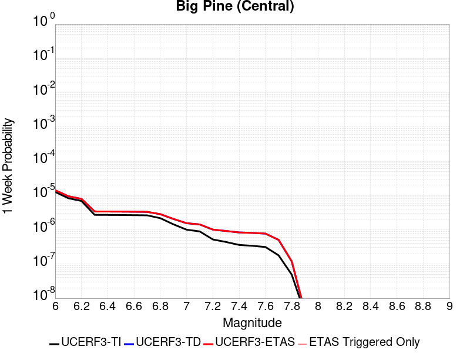 |  | 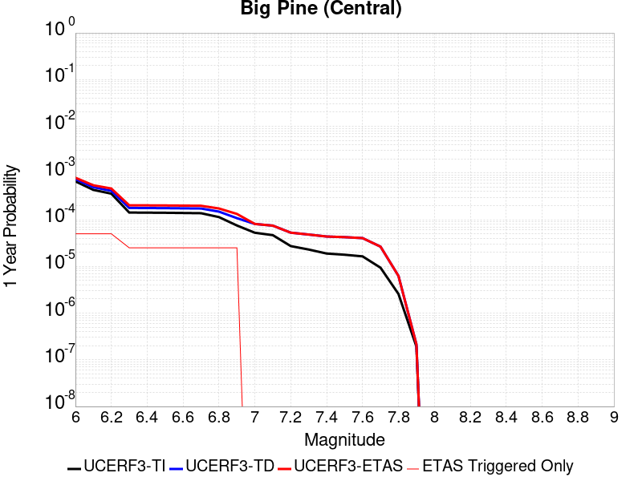 | 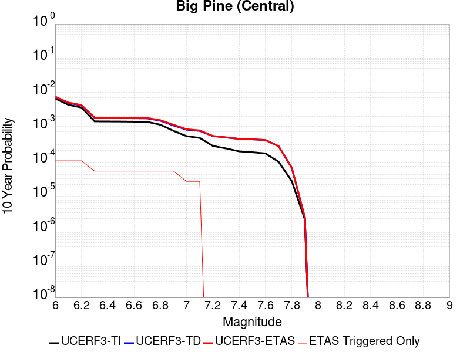 |

| Magnitude | 1 wk TI Prob | 1 wk TD Prob | 1 wk ETAS Prob | 1 wk ETAS/TD Gain | 1 wk ETAS Triggered Only | 1 mo TI Prob | 1 mo TD Prob | 1 mo ETAS Prob | 1 mo ETAS/TD Gain | 1 mo ETAS Triggered Only | 1 yr TI Prob | 1 yr TD Prob | 1 yr ETAS Prob | 1 yr ETAS/TD Gain | 1 yr ETAS Triggered Only | 10 yr TI Prob | 10 yr TD Prob | 10 yr ETAS Prob | 10 yr ETAS/TD Gain | 10 yr ETAS Triggered Only |
|-----|-----|-----|-----|-----|-----|-----|-----|-----|-----|-----|-----|-----|-----|-----|-----|-----|-----|-----|-----|-----|
| 6.0 | 1.2706755E-5 | 1.4250602E-5 | 1.4250602E-5 | 1.0 | 0.0 | 5.4456385E-5 | 6.107279E-5 | 6.107279E-5 | 1.0 | 0.0 | 6.628048E-4 | 7.433441E-4 | 7.93267E-4 | 1.0671599 | 4.9960032E-5 | 0.006608314 | 0.007413639 | 0.0075128186 | 1.0133779 | 9.9920064E-5 |
| 6.1 | 8.342579E-6 | 9.510835E-6 | 9.510835E-6 | 1.0 | 0.0 | 3.5753423E-5 | 4.076021E-5 | 4.076021E-5 | 1.0 | 0.0 | 4.3521097E-4 | 4.9616426E-4 | 5.460995E-4 | 1.1006426 | 4.9960032E-5 | 0.0043435963 | 0.004954155 | 0.0050535803 | 1.020069 | 9.9920064E-5 |
| 6.2 | 6.923899E-6 | 7.967221E-6 | 7.967221E-6 | 1.0 | 0.0 | 2.9673516E-5 | 3.4144894E-5 | 3.4144894E-5 | 1.0 | 0.0 | 3.6121515E-4 | 4.1565404E-4 | 4.655933E-4 | 1.1201463 | 4.9960032E-5 | 0.003606286 | 0.0041521094 | 0.0042516147 | 1.023965 | 9.9920064E-5 |
| 6.3 | 2.728396E-6 | 3.4243646E-6 | 3.4243646E-6 | 1.0 | 0.0 | 1.1693074E-5 | 1.4675771E-5 | 1.4675771E-5 | 1.0 | 0.0 | 1.4235388E-4 | 1.7866373E-4 | 2.0363928E-4 | 1.1397909 | 2.4980016E-5 | 0.0014226272 | 0.0017867433 | 0.0018366141 | 1.0279115 | 4.9960032E-5 |
| 6.4 | 2.7136944E-6 | 3.4086581E-6 | 3.4086581E-6 | 1.0 | 0.0 | 1.1630066E-5 | 1.4608458E-5 | 1.4608458E-5 | 1.0 | 0.0 | 1.4158686E-4 | 1.7784433E-4 | 2.0281991E-4 | 1.140435 | 2.4980016E-5 | 0.0014149669 | 0.0017785623 | 0.0018284335 | 1.0280402 | 4.9960032E-5 |
| 6.5 | 2.6971882E-6 | 3.3910032E-6 | 3.3910032E-6 | 1.0 | 0.0 | 1.1559327E-5 | 1.4532795E-5 | 1.4532795E-5 | 1.0 | 0.0 | 1.4072572E-4 | 1.7692328E-4 | 2.0189887E-4 | 1.1411662 | 2.4980016E-5 | 0.0014063664 | 0.0017693666 | 0.0018192382 | 1.0281862 | 4.9960032E-5 |
| 6.6 | 2.669092E-6 | 3.3610236E-6 | 3.3610236E-6 | 1.0 | 0.0 | 1.1438916E-5 | 1.4404312E-5 | 1.4404312E-5 | 1.0 | 0.0 | 1.3925991E-4 | 1.7535927E-4 | 2.003349E-4 | 1.1424255 | 2.4980016E-5 | 0.0013917267 | 0.0017537511 | 0.0018036235 | 1.0284376 | 4.9960032E-5 |
| 6.7 | 2.6408059E-6 | 3.3310494E-6 | 3.3310494E-6 | 1.0 | 0.0 | 1.1317691E-5 | 1.4275853E-5 | 1.4275853E-5 | 1.0 | 0.0 | 1.3778417E-4 | 1.737955E-4 | 1.9877119E-4 | 1.1437073 | 2.4980016E-5 | 0.0013769877 | 0.0017381381 | 0.0017880113 | 1.0286934 | 4.9960032E-5 |
| 6.8 | 2.1786943E-6 | 2.8545066E-6 | 2.8545066E-6 | 1.0 | 0.0 | 9.337228E-6 | 1.2233547E-5 | 1.2233547E-5 | 1.0 | 0.0 | 1.1367482E-4 | 1.4893398E-4 | 1.7391027E-4 | 1.1677004 | 2.4980016E-5 | 0.0011361669 | 0.0014898704 | 0.001539756 | 1.0334831 | 4.9960032E-5 |
| 6.9 | 1.4411696E-6 | 2.0685677E-6 | 2.0685677E-6 | 1.0 | 0.0 | 6.1764263E-6 | 8.865261E-6 | 8.865261E-6 | 1.0 | 0.0 | 7.51954E-5 | 1.0792949E-4 | 1.329068E-4 | 1.2314225 | 2.4980016E-5 | 7.5169955E-4 | 0.0010802548 | 0.0011301609 | 1.0461984 | 4.9960032E-5 |
| 7.0 | 1.0073411E-6 | 1.5543274E-6 | 1.5543274E-6 | 1.0 | 0.0 | 4.317169E-6 | 6.661387E-6 | 6.661387E-6 | 1.0 | 0.0 | 5.2560266E-5 | 8.109952E-5 | 8.109952E-5 | 1.0 | 0.0 | 5.2547833E-4 | 8.1217213E-4 | 8.3713187E-4 | 1.030732 | 2.4980016E-5 |
| 7.1 | 8.947104E-7 | 1.430316E-6 | 1.430316E-6 | 1.0 | 0.0 | 3.834468E-6 | 6.1299124E-6 | 6.1299124E-6 | 1.0 | 0.0 | 4.6683643E-5 | 7.462928E-5 | 7.462928E-5 | 1.0 | 0.0 | 4.6673836E-4 | 7.4751483E-4 | 7.7247614E-4 | 1.0333924 | 2.4980016E-5 |
| 7.2 | 5.215166E-7 | 1.0112277E-6 | 1.0112277E-6 | 1.0 | 0.0 | 2.2350691E-6 | 4.333826E-6 | 4.333826E-6 | 1.0 | 0.0 | 2.7211627E-5 | 5.27631E-5 | 5.27631E-5 | 1.0 | 0.0 | 2.7208295E-4 | 5.289683E-4 | 5.289683E-4 | 1.0 | 0.0 |
| 7.3 | 4.4024807E-7 | 9.220183E-7 | 9.220183E-7 | 1.0 | 0.0 | 1.8867761E-6 | 3.951501E-6 | 3.951501E-6 | 1.0 | 0.0 | 2.2971257E-5 | 4.8108504E-5 | 4.8108504E-5 | 1.0 | 0.0 | 2.2968883E-4 | 4.824433E-4 | 4.824433E-4 | 1.0 | 0.0 |
| 7.4 | 3.6130905E-7 | 8.359109E-7 | 8.359109E-7 | 1.0 | 0.0 | 1.5484665E-6 | 3.5824705E-6 | 3.5824705E-6 | 1.0 | 0.0 | 1.8852415E-5 | 4.3615746E-5 | 4.3615746E-5 | 1.0 | 0.0 | 1.8850817E-4 | 4.3752496E-4 | 4.3752496E-4 | 1.0 | 0.0 |
| 7.5 | 3.408184E-7 | 8.1087245E-7 | 8.1087245E-7 | 1.0 | 0.0 | 1.4606494E-6 | 3.475163E-6 | 3.475163E-6 | 1.0 | 0.0 | 1.7783263E-5 | 4.230933E-5 | 4.230933E-5 | 1.0 | 0.0 | 1.778184E-4 | 4.2444657E-4 | 4.2444657E-4 | 1.0 | 0.0 |
| 7.6 | 3.1428627E-7 | 7.732167E-7 | 7.732167E-7 | 1.0 | 0.0 | 1.3469405E-6 | 3.313782E-6 | 3.313782E-6 | 1.0 | 0.0 | 1.6398877E-5 | 4.0344585E-5 | 4.0344585E-5 | 1.0 | 0.0 | 1.6397667E-4 | 4.0477706E-4 | 4.0477706E-4 | 1.0 | 0.0 |
| 7.7 | 1.7972785E-7 | 5.0782415E-7 | 5.0782415E-7 | 1.0 | 0.0 | 7.70262E-7 | 2.1763874E-6 | 2.1763874E-6 | 1.0 | 0.0 | 9.377899E-6 | 2.6497206E-5 | 2.6497206E-5 | 1.0 | 0.0 | 9.377503E-5 | 2.6633305E-4 | 2.6633305E-4 | 1.0 | 0.0 |
| 7.8 | 4.9230927E-8 | 1.1981747E-7 | 1.1981747E-7 | 1.0 | 0.0 | 2.1098968E-7 | 5.135033E-7 | 5.135033E-7 | 1.0 | 0.0 | 2.5687964E-6 | 6.2518866E-6 | 6.2518866E-6 | 1.0 | 0.0 | 2.5687666E-5 | 6.2971965E-5 | 6.2971965E-5 | 1.0 | 0.0 |
| 7.9 | 3.6805972E-9 | 4.1051638E-9 | 4.1051638E-9 | 1.0 | 0.0 | 1.5773987E-8 | 1.7593557E-8 | 1.7593557E-8 | 1.0 | 0.0 | 1.9204828E-7 | 2.1420155E-7 | 2.1420155E-7 | 1.0 | 0.0 | 1.920481E-6 | 2.1898923E-6 | 2.1898923E-6 | 1.0 | 0.0 |

## Lost Hills
*[(top)](#table-of-contents)*

| 1 Week | 1 Month | 1 Year | 10 Year |
|-----|-----|-----|-----|
| 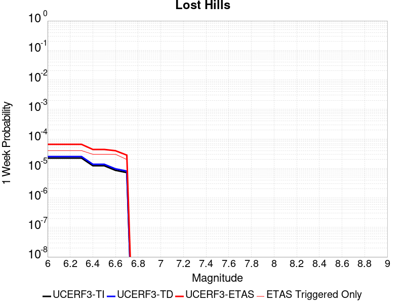 | 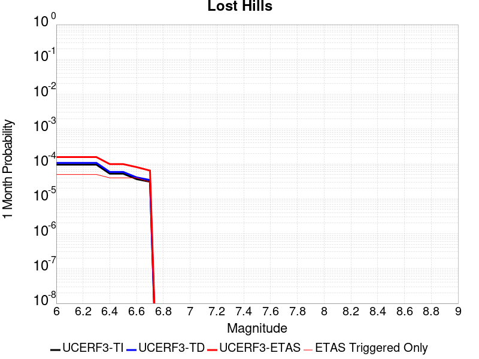 |  | 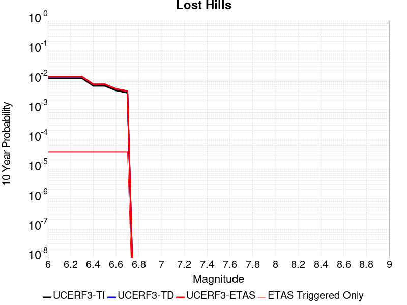 |

| Magnitude | 1 wk TI Prob | 1 wk TD Prob | 1 wk ETAS Prob | 1 wk ETAS/TD Gain | 1 wk ETAS Triggered Only | 1 mo TI Prob | 1 mo TD Prob | 1 mo ETAS Prob | 1 mo ETAS/TD Gain | 1 mo ETAS Triggered Only | 1 yr TI Prob | 1 yr TD Prob | 1 yr ETAS Prob | 1 yr ETAS/TD Gain | 1 yr ETAS Triggered Only | 10 yr TI Prob | 10 yr TD Prob | 10 yr ETAS Prob | 10 yr ETAS/TD Gain | 10 yr ETAS Triggered Only |
|-----|-----|-----|-----|-----|-----|-----|-----|-----|-----|-----|-----|-----|-----|-----|-----|-----|-----|-----|-----|-----|
| 6.0 | 2.233523E-5 | 2.5106583E-5 | 2.5106583E-5 | 1.0 | 0.0 | 9.571891E-5 | 1.0759615E-4 | 1.3257348E-4 | 1.2321396 | 2.4980016E-5 | 0.0011647546 | 0.001309364 | 0.0013842059 | 1.057159 | 7.494005E-5 | 0.011586686 | 0.013033091 | 0.013131709 | 1.0075667 | 9.9920064E-5 |
| 6.1 | 2.233523E-5 | 2.5106583E-5 | 2.5106583E-5 | 1.0 | 0.0 | 9.571891E-5 | 1.0759615E-4 | 1.3257348E-4 | 1.2321396 | 2.4980016E-5 | 0.0011647546 | 0.001309364 | 0.0013842059 | 1.057159 | 7.494005E-5 | 0.011586686 | 0.013033091 | 0.013131709 | 1.0075667 | 9.9920064E-5 |
| 6.2 | 2.233523E-5 | 2.5106583E-5 | 2.5106583E-5 | 1.0 | 0.0 | 9.571891E-5 | 1.0759615E-4 | 1.3257348E-4 | 1.2321396 | 2.4980016E-5 | 0.0011647546 | 0.001309364 | 0.0013842059 | 1.057159 | 7.494005E-5 | 0.011586686 | 0.013033091 | 0.013131709 | 1.0075667 | 9.9920064E-5 |
| 6.3 | 2.233523E-5 | 2.5106583E-5 | 2.5106583E-5 | 1.0 | 0.0 | 9.571891E-5 | 1.0759615E-4 | 1.3257348E-4 | 1.2321396 | 2.4980016E-5 | 0.0011647546 | 0.001309364 | 0.0013842059 | 1.057159 | 7.494005E-5 | 0.011586686 | 0.013033091 | 0.013131709 | 1.0075667 | 9.9920064E-5 |
| 6.4 | 1.2288092E-5 | 1.3781108E-5 | 1.3781108E-5 | 1.0 | 0.0 | 5.2662188E-5 | 5.906108E-5 | 8.4039624E-5 | 1.4229273 | 2.4980016E-5 | 6.409735E-4 | 7.189252E-4 | 7.938114E-4 | 1.104164 | 7.494005E-5 | 0.006391279 | 0.0071752006 | 0.0072744037 | 1.0138258 | 9.9920064E-5 |
| 6.5 | 1.2288092E-5 | 1.3781108E-5 | 1.3781108E-5 | 1.0 | 0.0 | 5.2662188E-5 | 5.906108E-5 | 8.4039624E-5 | 1.4229273 | 2.4980016E-5 | 6.409735E-4 | 7.189252E-4 | 7.938114E-4 | 1.104164 | 7.494005E-5 | 0.006391279 | 0.0071752006 | 0.0072744037 | 1.0138258 | 9.9920064E-5 |
| 6.6 | 8.58281E-6 | 9.63377E-6 | 9.63377E-6 | 1.0 | 0.0 | 3.6782953E-5 | 4.12874E-5 | 6.626639E-5 | 1.6050026 | 2.4980016E-5 | 4.4774043E-4 | 5.026414E-4 | 5.7754375E-4 | 1.1490176 | 7.494005E-5 | 0.0044683935 | 0.005023205 | 0.0051226234 | 1.0197917 | 9.9920064E-5 |
| 6.7 | 7.205685E-6 | 8.088302E-6 | 8.088302E-6 | 1.0 | 0.0 | 3.088114E-5 | 3.466415E-5 | 5.9643302E-5 | 1.7206047 | 2.4980016E-5 | 3.7591302E-4 | 4.2203604E-4 | 4.9694447E-4 | 1.177493 | 7.494005E-5 | 0.0037527776 | 0.0042203604 | 0.0043198587 | 1.0235758 | 9.9920064E-5 |

## Camp Rock 2011
*[(top)](#table-of-contents)*

| 1 Week | 1 Month | 1 Year | 10 Year |
|-----|-----|-----|-----|
| 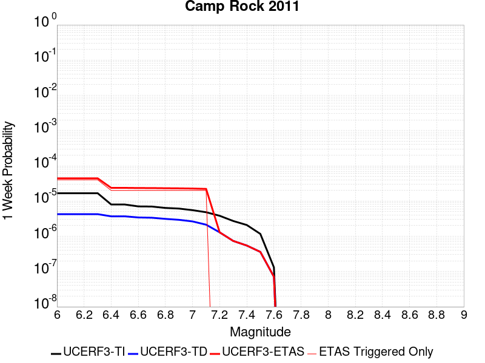 | 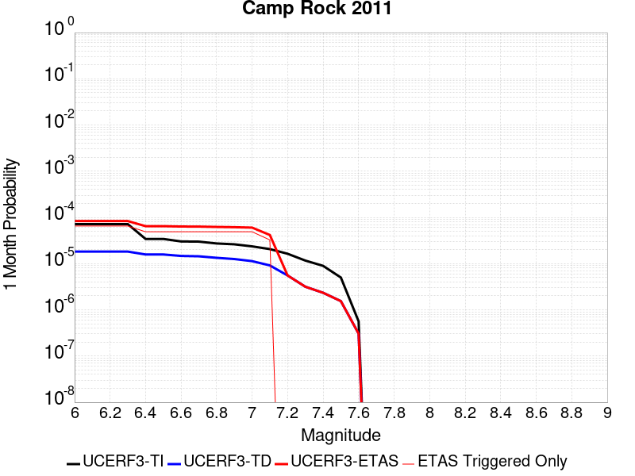 | 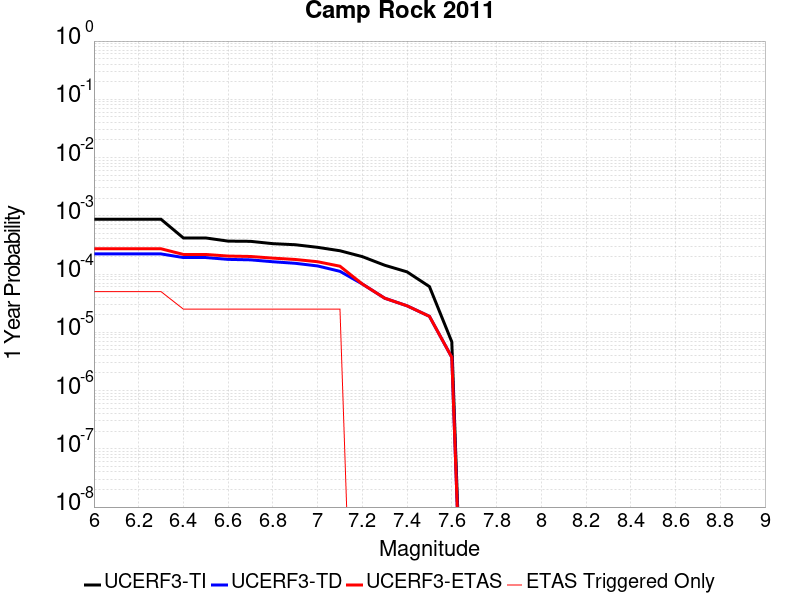 | 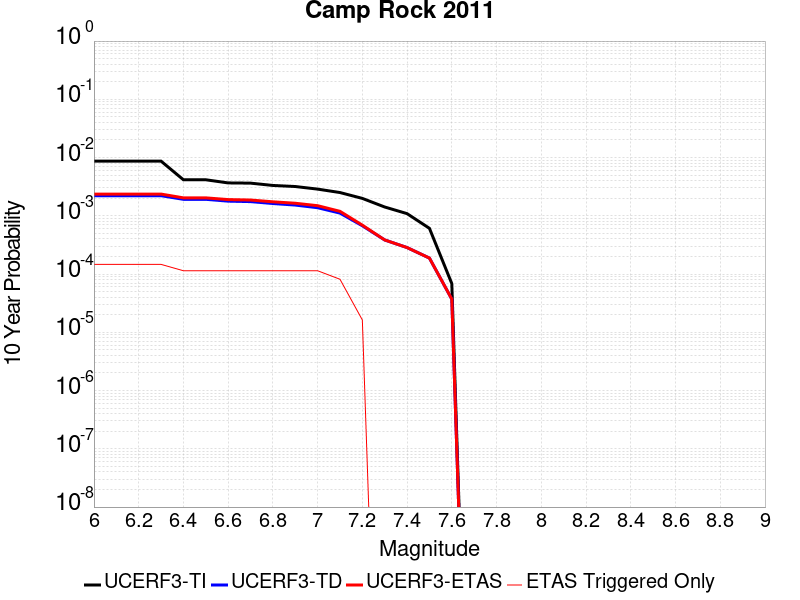 |

| Magnitude | 1 wk TI Prob | 1 wk TD Prob | 1 wk ETAS Prob | 1 wk ETAS/TD Gain | 1 wk ETAS Triggered Only | 1 mo TI Prob | 1 mo TD Prob | 1 mo ETAS Prob | 1 mo ETAS/TD Gain | 1 mo ETAS Triggered Only | 1 yr TI Prob | 1 yr TD Prob | 1 yr ETAS Prob | 1 yr ETAS/TD Gain | 1 yr ETAS Triggered Only | 10 yr TI Prob | 10 yr TD Prob | 10 yr ETAS Prob | 10 yr ETAS/TD Gain | 10 yr ETAS Triggered Only |
|-----|-----|-----|-----|-----|-----|-----|-----|-----|-----|-----|-----|-----|-----|-----|-----|-----|-----|-----|-----|-----|
| 6.0 | 1.6710783E-5 | 4.249999E-6 | 2.9229908E-5 | 6.877627 | 2.4980016E-5 | 7.161568E-5 | 1.8214158E-5 | 4.319372E-5 | 2.3714366 | 2.4980016E-5 | 8.7157206E-4 | 2.2173533E-4 | 2.716843E-4 | 1.2252638 | 4.9960032E-5 | 0.008681616 | 0.0022151938 | 0.0023148926 | 1.0450068 | 9.9920064E-5 |
| 6.1 | 1.6710783E-5 | 4.249999E-6 | 2.9229908E-5 | 6.877627 | 2.4980016E-5 | 7.161568E-5 | 1.8214158E-5 | 4.319372E-5 | 2.3714366 | 2.4980016E-5 | 8.7157206E-4 | 2.2173533E-4 | 2.716843E-4 | 1.2252638 | 4.9960032E-5 | 0.008681616 | 0.0022151938 | 0.0023148926 | 1.0450068 | 9.9920064E-5 |
| 6.2 | 1.6710783E-5 | 4.249999E-6 | 2.9229908E-5 | 6.877627 | 2.4980016E-5 | 7.161568E-5 | 1.8214158E-5 | 4.319372E-5 | 2.3714366 | 2.4980016E-5 | 8.7157206E-4 | 2.2173533E-4 | 2.716843E-4 | 1.2252638 | 4.9960032E-5 | 0.008681616 | 0.0022151938 | 0.0023148926 | 1.0450068 | 9.9920064E-5 |
| 6.3 | 1.6710783E-5 | 4.249999E-6 | 2.9229908E-5 | 6.877627 | 2.4980016E-5 | 7.161568E-5 | 1.8214158E-5 | 4.319372E-5 | 2.3714366 | 2.4980016E-5 | 8.7157206E-4 | 2.2173533E-4 | 2.716843E-4 | 1.2252638 | 4.9960032E-5 | 0.008681616 | 0.0022151938 | 0.0023148926 | 1.0450068 | 9.9920064E-5 |
| 6.4 | 7.982846E-6 | 3.6820359E-6 | 2.866196E-5 | 7.78427 | 2.4980016E-5 | 3.421175E-5 | 1.578006E-5 | 4.075968E-5 | 2.5829864 | 2.4980016E-5 | 4.1644843E-4 | 1.9210564E-4 | 2.1708086E-4 | 1.1300077 | 2.4980016E-5 | 0.0041566887 | 0.0019194306 | 0.0019942268 | 1.038968 | 7.494005E-5 |
| 6.5 | 7.982846E-6 | 3.6820359E-6 | 2.866196E-5 | 7.78427 | 2.4980016E-5 | 3.421175E-5 | 1.578006E-5 | 4.075968E-5 | 2.5829864 | 2.4980016E-5 | 4.1644843E-4 | 1.9210564E-4 | 2.1708086E-4 | 1.1300077 | 2.4980016E-5 | 0.0041566887 | 0.0019194306 | 0.0019942268 | 1.038968 | 7.494005E-5 |
| 6.6 | 7.048869E-6 | 3.4242998E-6 | 2.840423E-5 | 8.294902 | 2.4980016E-5 | 3.0209088E-5 | 1.467549E-5 | 3.965514E-5 | 2.702134 | 2.4980016E-5 | 3.677336E-4 | 1.7865976E-4 | 2.0363531E-4 | 1.139794 | 2.4980016E-5 | 0.0036712566 | 0.0017851929 | 0.0018599991 | 1.0419037 | 7.494005E-5 |
| 6.7 | 6.987307E-6 | 3.3622775E-6 | 2.8342209E-5 | 8.429468 | 2.4980016E-5 | 2.9945259E-5 | 1.4409683E-5 | 3.938934E-5 | 2.7335327 | 2.4980016E-5 | 3.6452254E-4 | 1.7542407E-4 | 2.003997E-4 | 1.1423728 | 2.4980016E-5 | 0.0036392517 | 0.0017528872 | 0.0018276958 | 1.0426774 | 7.494005E-5 |
| 6.8 | 6.3737602E-6 | 3.1178672E-6 | 2.8097806E-5 | 9.011867 | 2.4980016E-5 | 2.731583E-5 | 1.3362222E-5 | 3.8341903E-5 | 2.8694258 | 2.4980016E-5 | 3.3251947E-4 | 1.6267318E-4 | 1.8764914E-4 | 1.1535345 | 2.4980016E-5 | 0.0033202237 | 0.0016255698 | 0.0017003879 | 1.0460259 | 7.494005E-5 |
| 6.9 | 6.112211E-6 | 2.933078E-6 | 2.791302E-5 | 9.516631 | 2.4980016E-5 | 2.6194928E-5 | 1.2570275E-5 | 3.7549977E-5 | 2.987204 | 2.4980016E-5 | 3.1887658E-4 | 1.5303263E-4 | 1.7800882E-4 | 1.1632082 | 2.4980016E-5 | 0.003184194 | 0.0015293002 | 0.0016041257 | 1.0489279 | 7.494005E-5 |
| 7.0 | 5.5140117E-6 | 2.64191E-6 | 2.762186E-5 | 10.455262 | 2.4980016E-5 | 2.3631264E-5 | 1.1322423E-5 | 3.6302157E-5 | 3.206218 | 2.4980016E-5 | 2.8767265E-4 | 1.3784204E-4 | 1.6281861E-4 | 1.181197 | 2.4980016E-5 | 0.0028730053 | 0.0013775907 | 0.0014524275 | 1.0543244 | 7.494005E-5 |
| 7.1 | 4.8151105E-6 | 2.1342612E-6 | 2.7114223E-5 | 12.7042675 | 2.4980016E-5 | 2.0636026E-5 | 9.146803E-6 | 3.412659E-5 | 3.7309859 | 2.4980016E-5 | 2.5121463E-4 | 1.1135685E-4 | 1.3633409E-4 | 1.2242991 | 2.4980016E-5 | 0.0025093083 | 0.0011130325 | 0.001187889 | 1.0672547 | 7.494005E-5 |
| 7.2 | 3.818335E-6 | 1.2937372E-6 | 1.2937372E-6 | 1.0 | 0.0 | 1.6364189E-5 | 5.5445767E-6 | 5.5445767E-6 | 1.0 | 0.0 | 1.9921579E-4 | 6.750321E-5 | 6.750321E-5 | 1.0 | 0.0 | 0.0019903728 | 6.7483535E-4 | 6.997985E-4 | 1.0369915 | 2.4980016E-5 |
| 7.3 | 2.7166698E-6 | 7.383078E-7 | 7.383078E-7 | 1.0 | 0.0 | 1.1642818E-5 | 3.1641725E-6 | 3.1641725E-6 | 1.0 | 0.0 | 1.4174209E-4 | 3.852314E-5 | 3.852314E-5 | 1.0 | 0.0 | 0.0014165172 | 3.8516664E-4 | 3.8516664E-4 | 1.0 | 0.0 |
| 7.4 | 2.0893426E-6 | 5.4614605E-7 | 5.4614605E-7 | 1.0 | 0.0 | 8.954295E-6 | 2.340624E-6 | 2.340624E-6 | 1.0 | 0.0 | 1.0901308E-4 | 2.8496728E-5 | 2.8496728E-5 | 1.0 | 0.0 | 0.0010895962 | 2.849313E-4 | 2.849313E-4 | 1.0 | 0.0 |
| 7.5 | 1.1681728E-6 | 3.6028484E-7 | 3.6028484E-7 | 1.0 | 0.0 | 5.0064455E-6 | 1.544077E-6 | 1.544077E-6 | 1.0 | 0.0 | 6.0951766E-5 | 1.879898E-5 | 1.879898E-5 | 1.0 | 0.0 | 6.093505E-4 | 1.8797436E-4 | 1.8797436E-4 | 1.0 | 0.0 |
| 7.6 | 1.3154387E-7 | 7.1196716E-8 | 7.1196716E-8 | 1.0 | 0.0 | 5.6375933E-7 | 3.0512876E-7 | 3.0512876E-7 | 1.0 | 0.0 | 6.863748E-6 | 3.714938E-6 | 3.714938E-6 | 1.0 | 0.0 | 6.863536E-5 | 3.7148915E-5 | 3.7148915E-5 | 1.0 | 0.0 |

## Oceanic - West Huasna
*[(top)](#table-of-contents)*

| 1 Week | 1 Month | 1 Year | 10 Year |
|-----|-----|-----|-----|
| 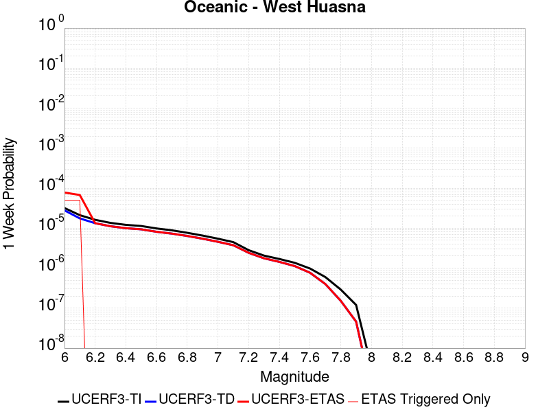 | 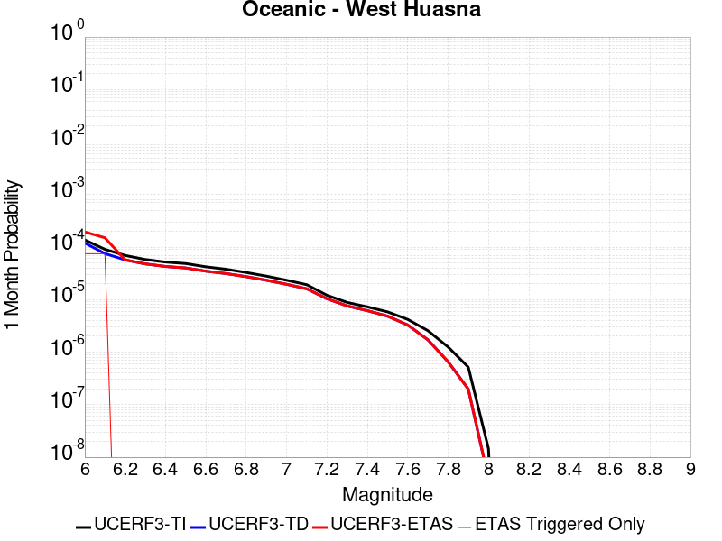 | 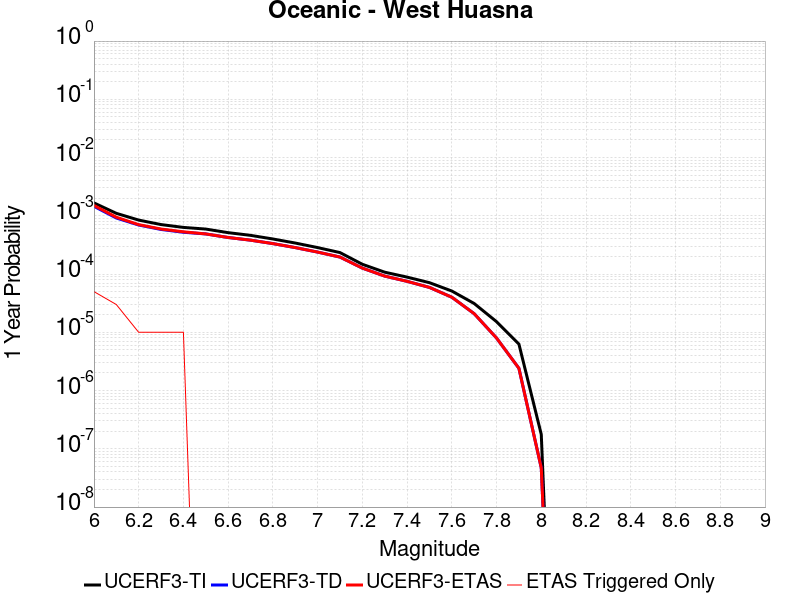 | 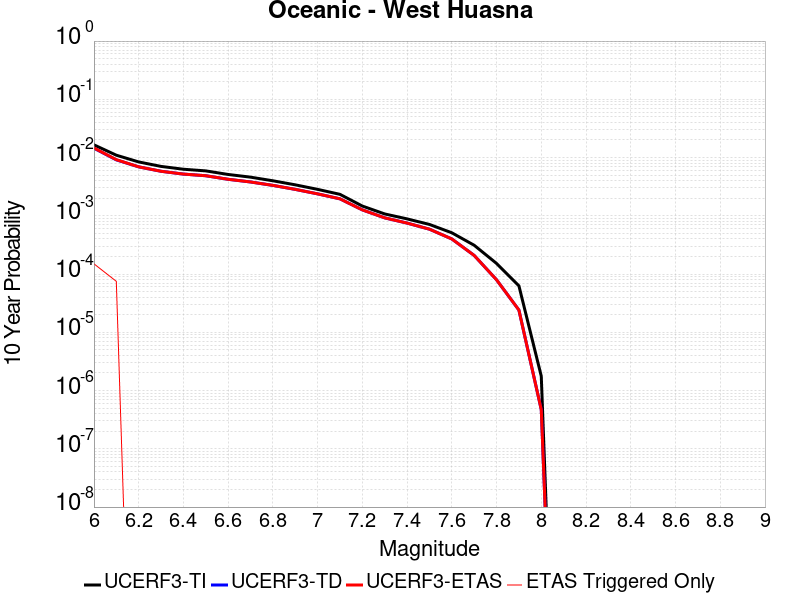 |

| Magnitude | 1 wk TI Prob | 1 wk TD Prob | 1 wk ETAS Prob | 1 wk ETAS/TD Gain | 1 wk ETAS Triggered Only | 1 mo TI Prob | 1 mo TD Prob | 1 mo ETAS Prob | 1 mo ETAS/TD Gain | 1 mo ETAS Triggered Only | 1 yr TI Prob | 1 yr TD Prob | 1 yr ETAS Prob | 1 yr ETAS/TD Gain | 1 yr ETAS Triggered Only | 10 yr TI Prob | 10 yr TD Prob | 10 yr ETAS Prob | 10 yr ETAS/TD Gain | 10 yr ETAS Triggered Only |
|-----|-----|-----|-----|-----|-----|-----|-----|-----|-----|-----|-----|-----|-----|-----|-----|-----|-----|-----|-----|-----|
| 6.0 | 3.195567E-5 | 2.7926368E-5 | 7.788501E-5 | 2.7889414 | 4.9960032E-5 | 1.3694567E-4 | 1.19679185E-4 | 1.6963323E-4 | 1.4173996 | 4.9960032E-5 | 0.0016660384 | 0.0014561634 | 0.0015309942 | 1.0513891 | 7.494005E-5 | 0.016536033 | 0.01447077 | 0.014569244 | 1.0068051 | 9.9920064E-5 |
| 6.1 | 2.1156782E-5 | 1.7573117E-5 | 6.753227E-5 | 3.8429308 | 4.9960032E-5 | 9.066878E-5 | 7.531123E-5 | 1.252675E-4 | 1.6633309 | 4.9960032E-5 | 0.0011033333 | 9.1653795E-4 | 9.6645224E-4 | 1.0544596 | 4.9960032E-5 | 0.010978713 | 0.009128587 | 0.009178091 | 1.005423 | 4.9960032E-5 |
| 6.2 | 1.6195117E-5 | 1.3327227E-5 | 1.3327227E-5 | 1.0 | 0.0 | 6.9405796E-5 | 5.7115452E-5 | 5.7115452E-5 | 1.0 | 0.0 | 8.44688E-4 | 6.9516135E-4 | 6.9516135E-4 | 1.0 | 0.0 | 0.008414844 | 0.0069301617 | 0.0069301617 | 1.0 | 0.0 |
| 6.3 | 1.3559345E-5 | 1.1179013E-5 | 1.1179013E-5 | 1.0 | 0.0 | 5.811018E-5 | 4.7909183E-5 | 4.7909183E-5 | 1.0 | 0.0 | 7.072618E-4 | 5.8313913E-4 | 5.8313913E-4 | 1.0 | 0.0 | 0.0070501505 | 0.005816208 | 0.005816208 | 1.0 | 0.0 |
| 6.4 | 1.2120619E-5 | 1.0000874E-5 | 1.0000874E-5 | 1.0 | 0.0 | 5.1944477E-5 | 4.2860185E-5 | 4.2860185E-5 | 1.0 | 0.0 | 6.322405E-4 | 5.216983E-4 | 5.216983E-4 | 1.0 | 0.0 | 0.006304447 | 0.005204804 | 0.005204804 | 1.0 | 0.0 |
| 6.5 | 1.13511915E-5 | 9.367378E-6 | 9.367378E-6 | 1.0 | 0.0 | 4.8647056E-5 | 4.0145293E-5 | 4.0145293E-5 | 1.0 | 0.0 | 5.9211696E-4 | 4.886598E-4 | 4.886598E-4 | 1.0 | 0.0 | 0.0059054173 | 0.0048759114 | 0.0048759114 | 1.0 | 0.0 |
| 6.6 | 9.850605E-6 | 8.1353155E-6 | 8.1353155E-6 | 1.0 | 0.0 | 4.2216197E-5 | 3.4865174E-5 | 3.4865174E-5 | 1.0 | 0.0 | 5.1386096E-4 | 4.2440102E-4 | 4.2440102E-4 | 1.0 | 0.0 | 0.0051267436 | 0.0042359377 | 0.0042359377 | 1.0 | 0.0 |
| 6.7 | 8.8558645E-6 | 7.318341E-6 | 7.318341E-6 | 1.0 | 0.0 | 3.7953152E-5 | 3.1363943E-5 | 3.1363943E-5 | 1.0 | 0.0 | 4.6198163E-4 | 3.8178926E-4 | 3.8178926E-4 | 1.0 | 0.0 | 0.004610224 | 0.0038113592 | 0.0038113592 | 1.0 | 0.0 |
| 6.8 | 7.67136E-6 | 6.39169E-6 | 6.39169E-6 | 1.0 | 0.0 | 3.2876844E-5 | 2.739267E-5 | 2.739267E-5 | 1.0 | 0.0 | 4.0020206E-4 | 3.3345487E-4 | 3.3345487E-4 | 1.0 | 0.0 | 0.003994821 | 0.0033295664 | 0.0033295664 | 1.0 | 0.0 |
| 6.9 | 6.534529E-6 | 5.458261E-6 | 5.458261E-6 | 1.0 | 0.0 | 2.8004823E-5 | 2.3392338E-5 | 2.3392338E-5 | 1.0 | 0.0 | 3.4090536E-4 | 2.8476462E-4 | 2.8476462E-4 | 1.0 | 0.0 | 0.0034038287 | 0.002844014 | 0.002844014 | 1.0 | 0.0 |
| 7.0 | 5.460525E-6 | 4.5699203E-6 | 4.5699203E-6 | 1.0 | 0.0 | 2.3402039E-5 | 1.9585226E-5 | 1.9585226E-5 | 1.0 | 0.0 | 2.8488258E-4 | 2.3842414E-4 | 2.3842414E-4 | 1.0 | 0.0 | 0.0028451765 | 0.0023816973 | 0.0023816973 | 1.0 | 0.0 |
| 7.1 | 4.4825083E-6 | 3.7524153E-6 | 3.7524153E-6 | 1.0 | 0.0 | 1.9210609E-5 | 1.6081682E-5 | 1.6081682E-5 | 1.0 | 0.0 | 2.3386406E-4 | 1.9577699E-4 | 1.9577699E-4 | 1.0 | 0.0 | 0.002336181 | 0.001956057 | 0.001956057 | 1.0 | 0.0 |
| 7.2 | 2.821708E-6 | 2.424941E-6 | 2.424941E-6 | 1.0 | 0.0 | 1.2092979E-5 | 1.0392562E-5 | 1.0392562E-5 | 1.0 | 0.0 | 1.4722206E-4 | 1.265221E-4 | 1.265221E-4 | 1.0 | 0.0 | 0.0014712457 | 0.0012645032 | 0.0012645032 | 1.0 | 0.0 |
| 7.3 | 2.0644757E-6 | 1.7687502E-6 | 1.7687502E-6 | 1.0 | 0.0 | 8.847723E-6 | 7.580336E-6 | 7.580336E-6 | 1.0 | 0.0 | 1.0771569E-4 | 9.228668E-5 | 9.228668E-5 | 1.0 | 0.0 | 0.001076635 | 9.224854E-4 | 9.224854E-4 | 1.0 | 0.0 |
| 7.4 | 1.6980367E-6 | 1.4379966E-6 | 1.4379966E-6 | 1.0 | 0.0 | 7.27728E-6 | 6.1628284E-6 | 6.1628284E-6 | 1.0 | 0.0 | 8.8597284E-5 | 7.502986E-5 | 7.502986E-5 | 1.0 | 0.0 | 8.8561967E-4 | 7.5004686E-4 | 7.5004686E-4 | 1.0 | 0.0 |
| 7.5 | 1.3637683E-6 | 1.1302697E-6 | 1.1302697E-6 | 1.0 | 0.0 | 5.844708E-6 | 4.844004E-6 | 4.844004E-6 | 1.0 | 0.0 | 7.1156996E-5 | 5.897415E-5 | 5.897415E-5 | 1.0 | 0.0 | 7.1134215E-4 | 5.8958656E-4 | 5.8958656E-4 | 1.0 | 0.0 |
| 7.6 | 9.802994E-7 | 7.6772847E-7 | 7.6772847E-7 | 1.0 | 0.0 | 4.2012766E-6 | 3.2902608E-6 | 3.2902608E-6 | 1.0 | 0.0 | 5.1149345E-5 | 4.005819E-5 | 4.005819E-5 | 1.0 | 0.0 | 5.113757E-4 | 4.0051117E-4 | 4.0051117E-4 | 1.0 | 0.0 |
| 7.7 | 5.986191E-7 | 4.0050708E-7 | 4.0050708E-7 | 1.0 | 0.0 | 2.5655079E-6 | 1.7164577E-6 | 1.7164577E-6 | 1.0 | 0.0 | 3.1234613E-5 | 2.0897673E-5 | 2.0897673E-5 | 1.0 | 0.0 | 3.123022E-4 | 2.0895849E-4 | 2.0895849E-4 | 1.0 | 0.0 |
| 7.8 | 2.9189815E-7 | 1.5285202E-7 | 1.5285202E-7 | 1.0 | 0.0 | 1.2509914E-6 | 6.5507993E-7 | 6.5507993E-7 | 1.0 | 0.0 | 1.5230714E-5 | 7.975569E-6 | 7.975569E-6 | 1.0 | 0.0 | 1.522967E-4 | 7.97542E-5 | 7.97542E-5 | 1.0 | 0.0 |
| 7.9 | 1.2057845E-7 | 4.6208047E-8 | 4.6208047E-8 | 1.0 | 0.0 | 5.1676466E-7 | 1.9803447E-7 | 1.9803447E-7 | 1.0 | 0.0 | 6.2915915E-6 | 2.411067E-6 | 2.411067E-6 | 1.0 | 0.0 | 6.2914136E-5 | 2.4111772E-5 | 2.4111772E-5 | 1.0 | 0.0 |
| 8.0 | 3.3806387E-9 | 9.0093144E-10 | 9.0093144E-10 | 1.0 | 0.0 | 1.4488451E-8 | 3.8611354E-9 | 3.8611354E-9 | 1.0 | 0.0 | 1.7639688E-7 | 4.7009323E-8 | 4.7009323E-8 | 1.0 | 0.0 | 1.7639674E-6 | 4.712806E-7 | 4.712806E-7 | 1.0 | 0.0 |

## Mission Creek
*[(top)](#table-of-contents)*

| 1 Week | 1 Month | 1 Year | 10 Year |
|-----|-----|-----|-----|
| 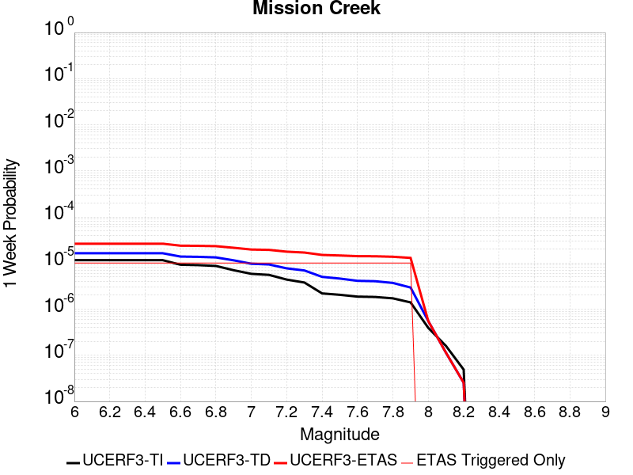 | 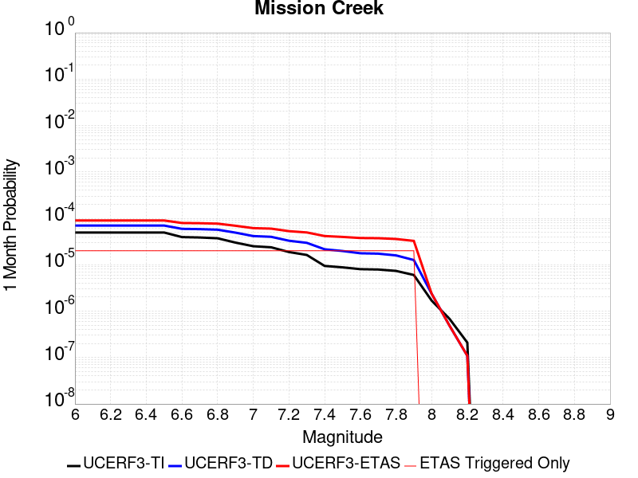 | 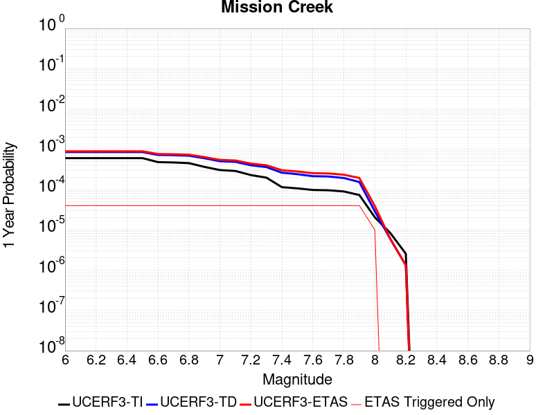 | 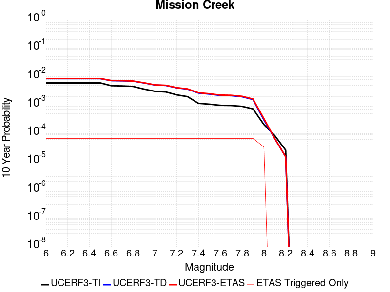 |

| Magnitude | 1 wk TI Prob | 1 wk TD Prob | 1 wk ETAS Prob | 1 wk ETAS/TD Gain | 1 wk ETAS Triggered Only | 1 mo TI Prob | 1 mo TD Prob | 1 mo ETAS Prob | 1 mo ETAS/TD Gain | 1 mo ETAS Triggered Only | 1 yr TI Prob | 1 yr TD Prob | 1 yr ETAS Prob | 1 yr ETAS/TD Gain | 1 yr ETAS Triggered Only | 10 yr TI Prob | 10 yr TD Prob | 10 yr ETAS Prob | 10 yr ETAS/TD Gain | 10 yr ETAS Triggered Only |
|-----|-----|-----|-----|-----|-----|-----|-----|-----|-----|-----|-----|-----|-----|-----|-----|-----|-----|-----|-----|-----|
| 6.0 | 1.1549387E-5 | 1.6322783E-5 | 1.6322783E-5 | 1.0 | 0.0 | 4.9496433E-5 | 6.995299E-5 | 6.995299E-5 | 1.0 | 0.0 | 6.0245243E-4 | 8.5135986E-4 | 9.012774E-4 | 1.0586326 | 4.9960032E-5 | 0.006008218 | 0.008510157 | 0.008609226 | 1.0116414 | 9.9920064E-5 |
| 6.1 | 1.1549387E-5 | 1.6322783E-5 | 1.6322783E-5 | 1.0 | 0.0 | 4.9496433E-5 | 6.995299E-5 | 6.995299E-5 | 1.0 | 0.0 | 6.0245243E-4 | 8.5135986E-4 | 9.012774E-4 | 1.0586326 | 4.9960032E-5 | 0.006008218 | 0.008510157 | 0.008609226 | 1.0116414 | 9.9920064E-5 |
| 6.2 | 1.1549387E-5 | 1.6322783E-5 | 1.6322783E-5 | 1.0 | 0.0 | 4.9496433E-5 | 6.995299E-5 | 6.995299E-5 | 1.0 | 0.0 | 6.0245243E-4 | 8.5135986E-4 | 9.012774E-4 | 1.0586326 | 4.9960032E-5 | 0.006008218 | 0.008510157 | 0.008609226 | 1.0116414 | 9.9920064E-5 |
| 6.3 | 1.1549387E-5 | 1.6322783E-5 | 1.6322783E-5 | 1.0 | 0.0 | 4.9496433E-5 | 6.995299E-5 | 6.995299E-5 | 1.0 | 0.0 | 6.0245243E-4 | 8.5135986E-4 | 9.012774E-4 | 1.0586326 | 4.9960032E-5 | 0.006008218 | 0.008510157 | 0.008609226 | 1.0116414 | 9.9920064E-5 |
| 6.4 | 1.1549387E-5 | 1.6322783E-5 | 1.6322783E-5 | 1.0 | 0.0 | 4.9496433E-5 | 6.995299E-5 | 6.995299E-5 | 1.0 | 0.0 | 6.0245243E-4 | 8.5135986E-4 | 9.012774E-4 | 1.0586326 | 4.9960032E-5 | 0.006008218 | 0.008510157 | 0.008609226 | 1.0116414 | 9.9920064E-5 |
| 6.5 | 1.1549387E-5 | 1.6322783E-5 | 1.6322783E-5 | 1.0 | 0.0 | 4.9496433E-5 | 6.995299E-5 | 6.995299E-5 | 1.0 | 0.0 | 6.0245243E-4 | 8.5135986E-4 | 9.012774E-4 | 1.0586326 | 4.9960032E-5 | 0.006008218 | 0.008510157 | 0.008609226 | 1.0116414 | 9.9920064E-5 |
| 6.6 | 9.202681E-6 | 1.3846059E-5 | 1.3846059E-5 | 1.0 | 0.0 | 3.9439463E-5 | 5.9338956E-5 | 5.9338956E-5 | 1.0 | 0.0 | 4.800697E-4 | 7.2222133E-4 | 7.721453E-4 | 1.0691255 | 4.9960032E-5 | 0.004790339 | 0.0072273402 | 0.007326538 | 1.0137254 | 9.9920064E-5 |
| 6.7 | 9.019164E-6 | 1.3651728E-5 | 1.3651728E-5 | 1.0 | 0.0 | 3.8652986E-5 | 5.8506146E-5 | 5.8506146E-5 | 1.0 | 0.0 | 4.7049852E-4 | 7.1208854E-4 | 7.62013E-4 | 1.0701098 | 4.9960032E-5 | 0.004695036 | 0.0071266647 | 0.0072258725 | 1.0139207 | 9.9920064E-5 |
| 6.8 | 8.673558E-6 | 1.3273839E-5 | 1.3273839E-5 | 1.0 | 0.0 | 3.717186E-5 | 5.688669E-5 | 5.688669E-5 | 1.0 | 0.0 | 4.524734E-4 | 6.923842E-4 | 7.4230967E-4 | 1.0721066 | 4.9960032E-5 | 0.0045155324 | 0.0069308523 | 0.00703008 | 1.0143168 | 9.9920064E-5 |
| 6.9 | 7.002255E-6 | 1.1478069E-5 | 1.1478069E-5 | 1.0 | 0.0 | 3.000932E-5 | 4.9190832E-5 | 4.9190832E-5 | 1.0 | 0.0 | 3.653022E-4 | 5.9874065E-4 | 6.486708E-4 | 1.0833919 | 4.9960032E-5 | 0.0036470229 | 0.005999676 | 0.0060989964 | 1.0165544 | 9.9920064E-5 |
| 7.0 | 5.84644E-6 | 9.675359E-6 | 9.675359E-6 | 1.0 | 0.0 | 2.5055931E-5 | 4.146519E-5 | 4.146519E-5 | 1.0 | 0.0 | 3.0501327E-4 | 5.047263E-4 | 5.5466115E-4 | 1.0989344 | 4.9960032E-5 | 0.0030459496 | 0.005063994 | 0.005163408 | 1.0196315 | 9.9920064E-5 |
| 7.1 | 5.54703E-6 | 9.329834E-6 | 9.329834E-6 | 1.0 | 0.0 | 2.377277E-5 | 3.9984414E-5 | 3.9984414E-5 | 1.0 | 0.0 | 2.8939504E-4 | 4.8670598E-4 | 5.366417E-4 | 1.1025994 | 4.9960032E-5 | 0.0028901845 | 0.0048845876 | 0.0049840193 | 1.0203563 | 9.9920064E-5 |
| 7.2 | 4.384709E-6 | 7.681918E-6 | 7.681918E-6 | 1.0 | 0.0 | 1.8791474E-5 | 3.292211E-5 | 3.292211E-5 | 1.0 | 0.0 | 2.2876218E-4 | 4.0075663E-4 | 4.5069665E-4 | 1.1246144 | 4.9960032E-5 | 0.0022852682 | 0.004028542 | 0.0041280594 | 1.0247031 | 9.9920064E-5 |
| 7.3 | 3.7888456E-6 | 6.915788E-6 | 6.915788E-6 | 1.0 | 0.0 | 1.623781E-5 | 2.9638775E-5 | 2.9638775E-5 | 1.0 | 0.0 | 1.9767738E-4 | 3.6079568E-4 | 4.107377E-4 | 1.1384219 | 4.9960032E-5 | 0.0019750162 | 0.00363027 | 0.0037298272 | 1.0274242 | 9.9920064E-5 |
| 7.4 | 2.1982462E-6 | 5.0241033E-6 | 5.0241033E-6 | 1.0 | 0.0 | 9.421021E-6 | 2.1531694E-5 | 2.1531694E-5 | 1.0 | 0.0 | 1.1469489E-4 | 2.6211704E-4 | 3.1206396E-4 | 1.190552 | 4.9960032E-5 | 0.0011463572 | 0.0026460327 | 0.0027456884 | 1.0376623 | 9.9920064E-5 |
| 7.5 | 2.051923E-6 | 4.6153277E-6 | 4.6153277E-6 | 1.0 | 0.0 | 8.793926E-6 | 1.9779825E-5 | 1.9779825E-5 | 1.0 | 0.0 | 1.0706078E-4 | 2.4079291E-4 | 2.9074092E-4 | 1.2074313 | 4.9960032E-5 | 0.0010700922 | 0.0024335932 | 0.00253327 | 1.0409588 | 9.9920064E-5 |
| 7.6 | 1.8733427E-6 | 4.1236603E-6 | 4.1236603E-6 | 1.0 | 0.0 | 8.028587E-6 | 1.7672712E-5 | 1.7672712E-5 | 1.0 | 0.0 | 9.774366E-5 | 2.151441E-4 | 2.6509337E-4 | 1.2321666 | 4.9960032E-5 | 9.770069E-4 | 0.0021782513 | 0.0022779536 | 1.0457717 | 9.9920064E-5 |
| 7.7 | 1.8411953E-6 | 4.0433315E-6 | 4.0433315E-6 | 1.0 | 0.0 | 7.890813E-6 | 1.732845E-5 | 1.732845E-5 | 1.0 | 0.0 | 9.606641E-5 | 2.1095353E-4 | 2.6090303E-4 | 1.2367796 | 4.9960032E-5 | 9.6024893E-4 | 0.0021365292 | 0.0022362357 | 1.0466676 | 9.9920064E-5 |
| 7.8 | 1.7194251E-6 | 3.71068E-6 | 3.71068E-6 | 1.0 | 0.0 | 7.368944E-6 | 1.5902819E-5 | 1.5902819E-5 | 1.0 | 0.0 | 8.97132E-5 | 1.9359968E-4 | 2.4355004E-4 | 1.2580085 | 4.9960032E-5 | 8.967699E-4 | 0.0019624757 | 0.0020621996 | 1.0508153 | 9.9920064E-5 |
| 7.9 | 1.4035052E-6 | 2.9502596E-6 | 2.9502596E-6 | 1.0 | 0.0 | 6.0150082E-6 | 1.2643909E-5 | 1.2643909E-5 | 1.0 | 0.0 | 7.3230265E-5 | 1.5392878E-4 | 2.0388112E-4 | 1.3245159 | 4.9960032E-5 | 7.3206134E-4 | 0.0015631174 | 0.0016628812 | 1.0638237 | 9.9920064E-5 |
| 8.0 | 3.9318823E-7 | 5.528477E-7 | 5.528477E-7 | 1.0 | 0.0 | 1.6850913E-6 | 2.3693453E-6 | 2.3693453E-6 | 1.0 | 0.0 | 2.0515794E-5 | 2.8846403E-5 | 5.38257E-5 | 1.8659414 | 2.4980016E-5 | 2.0513899E-4 | 2.990952E-4 | 3.4904032E-4 | 1.1669873 | 4.9960032E-5 |
| 8.1 | 1.596793E-7 | 1.13775044E-7 | 1.13775044E-7 | 1.0 | 0.0 | 6.8433974E-7 | 4.876072E-7 | 4.876072E-7 | 1.0 | 0.0 | 8.331805E-6 | 5.936602E-6 | 5.936602E-6 | 1.0 | 0.0 | 8.331492E-5 | 6.5494125E-5 | 6.5494125E-5 | 1.0 | 0.0 |
| 8.2 | 4.9003038E-8 | 2.5435753E-8 | 2.5435753E-8 | 1.0 | 0.0 | 2.10013E-7 | 1.09010365E-7 | 1.09010365E-7 | 1.0 | 0.0 | 2.5569052E-6 | 1.3272004E-6 | 1.3272004E-6 | 1.0 | 0.0 | 2.556876E-5 | 1.4952613E-5 | 1.4952613E-5 | 1.0 | 0.0 |

## San Clemente
*[(top)](#table-of-contents)*

| 1 Week | 1 Month | 1 Year | 10 Year |
|-----|-----|-----|-----|
| 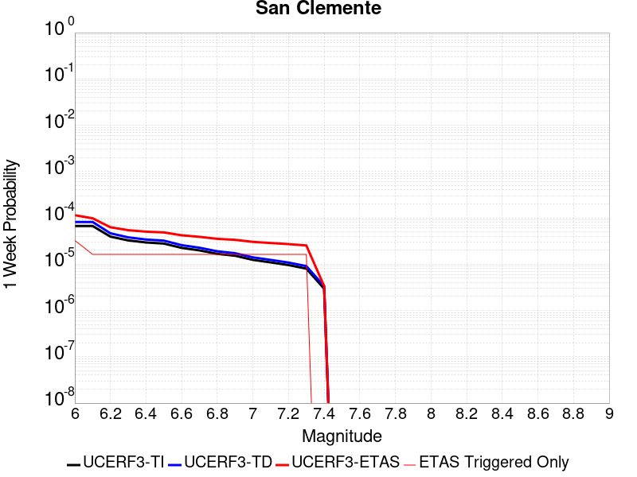 | 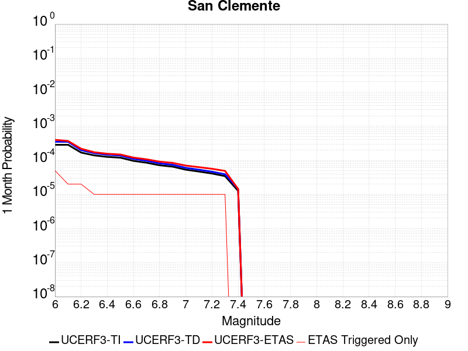 | 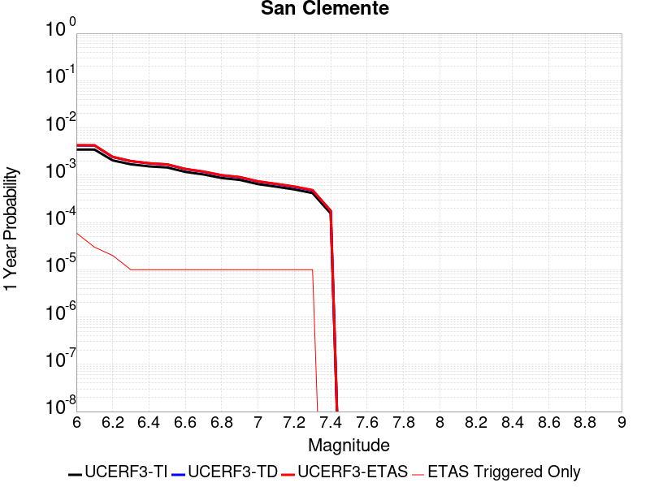 | 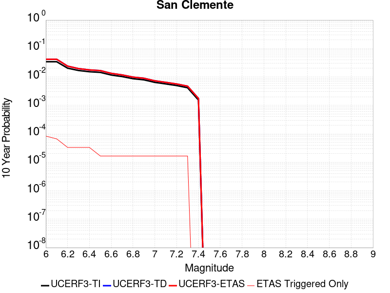 |

| Magnitude | 1 wk TI Prob | 1 wk TD Prob | 1 wk ETAS Prob | 1 wk ETAS/TD Gain | 1 wk ETAS Triggered Only | 1 mo TI Prob | 1 mo TD Prob | 1 mo ETAS Prob | 1 mo ETAS/TD Gain | 1 mo ETAS Triggered Only | 1 yr TI Prob | 1 yr TD Prob | 1 yr ETAS Prob | 1 yr ETAS/TD Gain | 1 yr ETAS Triggered Only | 10 yr TI Prob | 10 yr TD Prob | 10 yr ETAS Prob | 10 yr ETAS/TD Gain | 10 yr ETAS Triggered Only |
|-----|-----|-----|-----|-----|-----|-----|-----|-----|-----|-----|-----|-----|-----|-----|-----|-----|-----|-----|-----|-----|
| 6.0 | 6.681379E-5 | 8.163834E-5 | 1.315943E-4 | 1.6119179 | 4.9960032E-5 | 2.8631336E-4 | 3.4983488E-4 | 3.9977746E-4 | 1.1427604 | 4.9960032E-5 | 0.003480294 | 0.00425141 | 0.004301158 | 1.0117015 | 4.9960032E-5 | 0.03426291 | 0.04175603 | 0.041851778 | 1.002293 | 9.9920064E-5 |
| 6.1 | 6.681379E-5 | 8.163834E-5 | 1.0661632E-4 | 1.3059589 | 2.4980016E-5 | 2.8631336E-4 | 3.4983488E-4 | 3.7480617E-4 | 1.0713801 | 2.4980016E-5 | 0.003480294 | 0.00425141 | 0.004276284 | 1.0058507 | 2.4980016E-5 | 0.03426291 | 0.04175603 | 0.04182784 | 1.0017197 | 7.494005E-5 |
| 6.2 | 3.9400576E-5 | 4.6452373E-5 | 7.143123E-5 | 1.5377305 | 2.4980016E-5 | 1.6884868E-4 | 1.9906677E-4 | 2.2404181E-4 | 1.1254606 | 2.4980016E-5 | 0.0020537945 | 0.0024209984 | 0.002445918 | 1.0102931 | 2.4980016E-5 | 0.020349167 | 0.023952903 | 0.024001667 | 1.0020359 | 4.9960032E-5 |
| 6.3 | 3.2590255E-5 | 3.792912E-5 | 6.2908184E-5 | 1.6585723 | 2.4980016E-5 | 1.3966505E-4 | 1.6254342E-4 | 1.8751937E-4 | 1.1536571 | 2.4980016E-5 | 0.0016990956 | 0.0019772002 | 0.0020021307 | 1.012609 | 2.4980016E-5 | 0.01686163 | 0.019599883 | 0.019648863 | 1.002499 | 4.9960032E-5 |
| 6.4 | 2.9454652E-5 | 3.4097764E-5 | 5.9076927E-5 | 1.7325748 | 2.4980016E-5 | 1.2622811E-4 | 1.4612524E-4 | 1.7110161E-4 | 1.1709244 | 2.4980016E-5 | 0.0015357438 | 0.0017776493 | 0.0018025849 | 1.0140272 | 2.4980016E-5 | 0.015251739 | 0.01763747 | 0.01768655 | 1.0027827 | 4.9960032E-5 |
| 6.5 | 2.790836E-5 | 3.2247463E-5 | 5.7226673E-5 | 1.7746102 | 2.4980016E-5 | 1.1960178E-4 | 1.3819624E-4 | 1.631728E-4 | 1.1807326 | 2.4980016E-5 | 0.001455179 | 0.0016812662 | 0.0017062043 | 1.0148329 | 2.4980016E-5 | 0.014456868 | 0.016688485 | 0.016713047 | 1.0014719 | 2.4980016E-5 |
| 6.6 | 2.2492153E-5 | 2.5762702E-5 | 5.0742074E-5 | 1.9695945 | 2.4980016E-5 | 9.639138E-5 | 1.1040699E-4 | 1.3538425E-4 | 1.226229 | 2.4980016E-5 | 0.0011729331 | 0.0013433909 | 0.0013683374 | 1.0185698 | 2.4980016E-5 | 0.011667615 | 0.013354417 | 0.013379063 | 1.0018456 | 2.4980016E-5 |
| 6.7 | 1.9862755E-5 | 2.2666423E-5 | 4.7645874E-5 | 2.1020465 | 2.4980016E-5 | 8.512331E-5 | 9.713826E-5 | 1.2211585E-4 | 1.2571344 | 2.4980016E-5 | 0.0010358836 | 0.0011820279 | 0.0012069785 | 1.0211082 | 2.4980016E-5 | 0.010310682 | 0.011758701 | 0.011783387 | 1.0020994 | 2.4980016E-5 |
| 6.8 | 1.6697575E-5 | 1.897771E-5 | 4.395725E-5 | 2.316257 | 2.4980016E-5 | 7.155907E-5 | 8.133056E-5 | 1.06308544E-4 | 1.3071169 | 2.4980016E-5 | 8.7088346E-4 | 9.897591E-4 | 0.0010147144 | 1.0252135 | 2.4980016E-5 | 0.008674784 | 0.0098545365 | 0.009879271 | 1.00251 | 2.4980016E-5 |
| 6.9 | 1.5218415E-5 | 1.72694E-5 | 4.2248987E-5 | 2.446465 | 2.4980016E-5 | 6.522015E-5 | 7.4009666E-5 | 9.898783E-5 | 1.3374987 | 2.4980016E-5 | 7.93766E-4 | 9.00704E-4 | 9.2566153E-4 | 1.0277089 | 2.4980016E-5 | 0.007909367 | 0.008971481 | 0.008996236 | 1.0027595 | 2.4980016E-5 |
| 7.0 | 1.2392958E-5 | 1.4033016E-5 | 3.901268E-5 | 2.780064 | 2.4980016E-5 | 5.3111595E-5 | 6.014015E-5 | 8.511866E-5 | 1.4153384 | 2.4980016E-5 | 6.4644177E-4 | 7.319679E-4 | 7.569297E-4 | 1.0341022 | 2.4980016E-5 | 0.0064456454 | 0.0072963564 | 0.0073211542 | 1.0033987 | 2.4980016E-5 |
| 7.1 | 1.0934128E-5 | 1.2375138E-5 | 3.7354846E-5 | 3.0185397 | 2.4980016E-5 | 4.6859706E-5 | 5.303527E-5 | 7.801396E-5 | 1.4709827 | 2.4980016E-5 | 5.7036756E-4 | 6.455204E-4 | 6.704843E-4 | 1.0386724 | 2.4980016E-5 | 0.0056890585 | 0.0064371997 | 0.006462019 | 1.0038556 | 2.4980016E-5 |
| 7.2 | 9.5798805E-6 | 1.0844935E-5 | 3.582468E-5 | 3.303356 | 2.4980016E-5 | 4.1055984E-5 | 4.6477508E-5 | 7.1456365E-5 | 1.5374397 | 2.4980016E-5 | 4.9974193E-4 | 5.657239E-4 | 5.906898E-4 | 1.0441309 | 2.4980016E-5 | 0.0049861963 | 0.0056435615 | 0.0056684003 | 1.0044013 | 2.4980016E-5 |
| 7.3 | 8.0167365E-6 | 9.083918E-6 | 3.4063705E-5 | 3.7498918 | 2.4980016E-5 | 3.4356988E-5 | 3.8930535E-5 | 6.3909574E-5 | 1.6416311 | 2.4980016E-5 | 4.1821605E-4 | 4.7388324E-4 | 4.988514E-4 | 1.0526885 | 2.4980016E-5 | 0.0041742986 | 0.0047294297 | 0.004754292 | 1.0052569 | 2.4980016E-5 |
| 7.4 | 2.9581017E-6 | 3.3623792E-6 | 3.3623792E-6 | 1.0 | 0.0 | 1.2677518E-5 | 1.4410146E-5 | 1.4410146E-5 | 1.0 | 0.0 | 1.5433785E-4 | 1.7543444E-4 | 1.7543444E-4 | 1.0 | 0.0 | 0.001542307 | 0.0017534546 | 0.0017534546 | 1.0 | 0.0 |

## Santa Ynez (East)
*[(top)](#table-of-contents)*

| 1 Week | 1 Month | 1 Year | 10 Year |
|-----|-----|-----|-----|
| 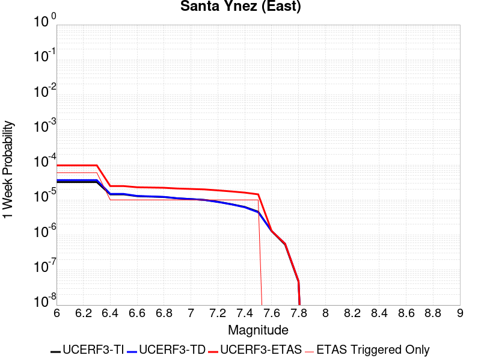 | 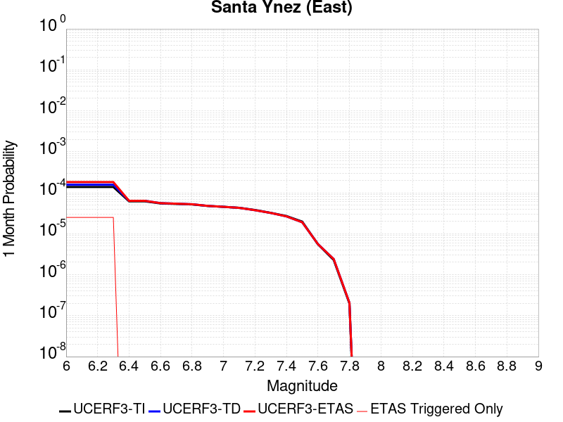 | 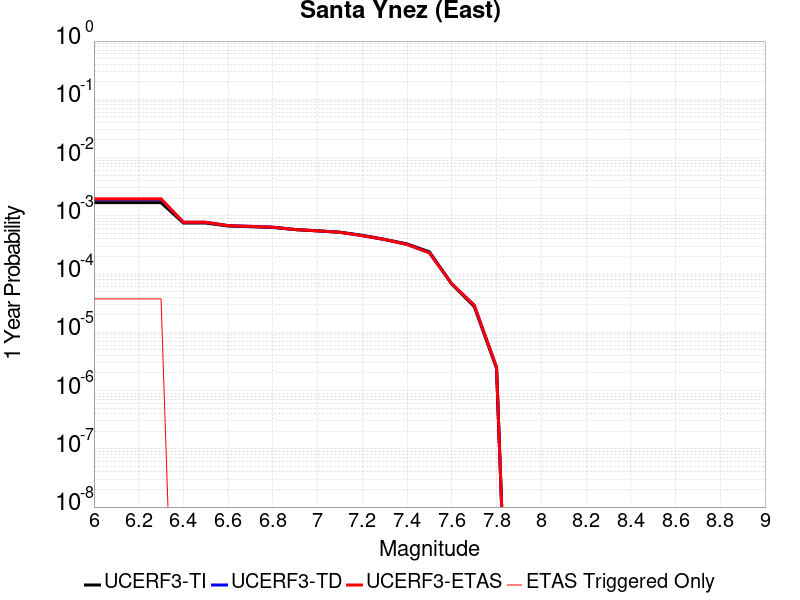 | 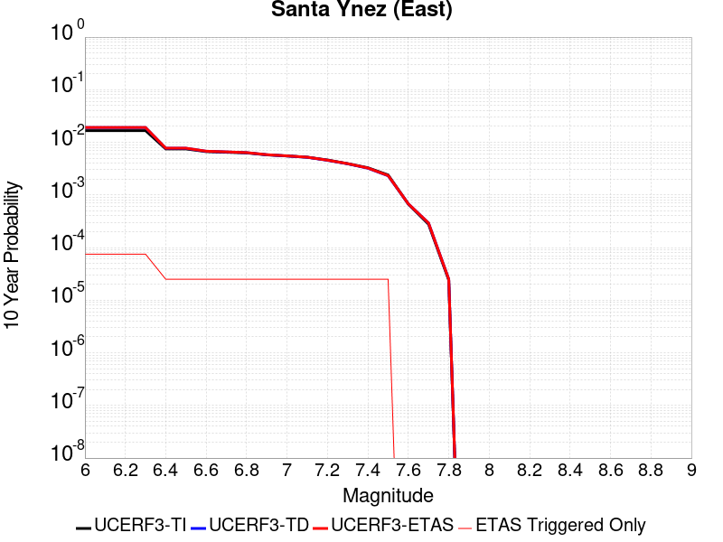 |

| Magnitude | 1 wk TI Prob | 1 wk TD Prob | 1 wk ETAS Prob | 1 wk ETAS/TD Gain | 1 wk ETAS Triggered Only | 1 mo TI Prob | 1 mo TD Prob | 1 mo ETAS Prob | 1 mo ETAS/TD Gain | 1 mo ETAS Triggered Only | 1 yr TI Prob | 1 yr TD Prob | 1 yr ETAS Prob | 1 yr ETAS/TD Gain | 1 yr ETAS Triggered Only | 10 yr TI Prob | 10 yr TD Prob | 10 yr ETAS Prob | 10 yr ETAS/TD Gain | 10 yr ETAS Triggered Only |
|-----|-----|-----|-----|-----|-----|-----|-----|-----|-----|-----|-----|-----|-----|-----|-----|-----|-----|-----|-----|-----|
| 6.0 | 3.2269712E-5 | 3.6750775E-5 | 6.172987E-5 | 1.679689 | 2.4980016E-5 | 1.3829143E-4 | 1.5749714E-4 | 1.8247322E-4 | 1.1585811 | 2.4980016E-5 | 0.0016823979 | 0.0019164253 | 0.0019413574 | 1.0130097 | 2.4980016E-5 | 0.016697178 | 0.019056438 | 0.01912995 | 1.0038576 | 7.494005E-5 |
| 6.1 | 3.2269712E-5 | 3.6750775E-5 | 6.172987E-5 | 1.679689 | 2.4980016E-5 | 1.3829143E-4 | 1.5749714E-4 | 1.8247322E-4 | 1.1585811 | 2.4980016E-5 | 0.0016823979 | 0.0019164253 | 0.0019413574 | 1.0130097 | 2.4980016E-5 | 0.016697178 | 0.019056438 | 0.01912995 | 1.0038576 | 7.494005E-5 |
| 6.2 | 3.2269712E-5 | 3.6750775E-5 | 6.172987E-5 | 1.679689 | 2.4980016E-5 | 1.3829143E-4 | 1.5749714E-4 | 1.8247322E-4 | 1.1585811 | 2.4980016E-5 | 0.0016823979 | 0.0019164253 | 0.0019413574 | 1.0130097 | 2.4980016E-5 | 0.016697178 | 0.019056438 | 0.01912995 | 1.0038576 | 7.494005E-5 |
| 6.3 | 3.2269712E-5 | 3.6750775E-5 | 6.172987E-5 | 1.679689 | 2.4980016E-5 | 1.3829143E-4 | 1.5749714E-4 | 1.8247322E-4 | 1.1585811 | 2.4980016E-5 | 0.0016823979 | 0.0019164253 | 0.0019413574 | 1.0130097 | 2.4980016E-5 | 0.016697178 | 0.019056438 | 0.01912995 | 1.0038576 | 7.494005E-5 |
| 6.4 | 1.4404779E-5 | 1.48492945E-5 | 1.48492945E-5 | 1.0 | 0.0 | 6.1733306E-5 | 6.363831E-5 | 6.363831E-5 | 1.0 | 0.0 | 7.513438E-4 | 7.7452604E-4 | 7.7452604E-4 | 1.0 | 0.0 | 0.0074880854 | 0.007718817 | 0.007743604 | 1.0032113 | 2.4980016E-5 |
| 6.5 | 1.4404779E-5 | 1.48492945E-5 | 1.48492945E-5 | 1.0 | 0.0 | 6.1733306E-5 | 6.363831E-5 | 6.363831E-5 | 1.0 | 0.0 | 7.513438E-4 | 7.7452604E-4 | 7.7452604E-4 | 1.0 | 0.0 | 0.0074880854 | 0.007718817 | 0.007743604 | 1.0032113 | 2.4980016E-5 |
| 6.6 | 1.280208E-5 | 1.301186E-5 | 1.301186E-5 | 1.0 | 0.0 | 5.4864904E-5 | 5.5763932E-5 | 5.5763932E-5 | 1.0 | 0.0 | 6.6777546E-4 | 6.7871617E-4 | 6.7871617E-4 | 1.0 | 0.0 | 0.006657724 | 0.0067666434 | 0.0067914543 | 1.0036666 | 2.4980016E-5 |
| 6.7 | 1.2457027E-5 | 1.262838E-5 | 1.262838E-5 | 1.0 | 0.0 | 5.3386164E-5 | 5.4120515E-5 | 5.4120515E-5 | 1.0 | 0.0 | 6.497827E-4 | 6.5871974E-4 | 6.5871974E-4 | 1.0 | 0.0 | 0.00647886 | 0.00656787 | 0.006592686 | 1.0037783 | 2.4980016E-5 |
| 6.8 | 1.2095134E-5 | 1.2230827E-5 | 1.2230827E-5 | 1.0 | 0.0 | 5.1835254E-5 | 5.2416784E-5 | 5.2416784E-5 | 1.0 | 0.0 | 6.309115E-4 | 6.3798914E-4 | 6.3798914E-4 | 1.0 | 0.0 | 0.0062912325 | 0.006361764 | 0.0063865846 | 1.0039016 | 2.4980016E-5 |
| 6.9 | 1.1104036E-5 | 1.115726E-5 | 1.115726E-5 | 1.0 | 0.0 | 4.758786E-5 | 4.781596E-5 | 4.781596E-5 | 1.0 | 0.0 | 5.7922816E-4 | 5.82005E-4 | 5.82005E-4 | 1.0 | 0.0 | 0.005777207 | 0.0058049536 | 0.0058297887 | 1.0042783 | 2.4980016E-5 |
| 7.0 | 1.0577444E-5 | 1.05815925E-5 | 1.05815925E-5 | 1.0 | 0.0 | 4.5331115E-5 | 4.53489E-5 | 4.53489E-5 | 1.0 | 0.0 | 5.5176654E-4 | 5.5198424E-4 | 5.5198424E-4 | 1.0 | 0.0 | 0.0055039856 | 0.00550627 | 0.0055311127 | 1.0045117 | 2.4980016E-5 |
| 7.1 | 1.0021775E-5 | 9.9809E-6 | 9.9809E-6 | 1.0 | 0.0 | 4.294976E-5 | 4.277459E-5 | 4.277459E-5 | 1.0 | 0.0 | 5.2278786E-4 | 5.206574E-4 | 5.206574E-4 | 1.0 | 0.0 | 0.0052155964 | 0.005194508 | 0.0052193585 | 1.004784 | 2.4980016E-5 |
| 7.2 | 8.874109E-6 | 8.748706E-6 | 8.748706E-6 | 1.0 | 0.0 | 3.8031343E-5 | 3.7493923E-5 | 3.7493923E-5 | 1.0 | 0.0 | 4.629332E-4 | 4.56394E-4 | 4.56394E-4 | 1.0 | 0.0 | 0.0046197 | 0.0045546847 | 0.004579551 | 1.0054594 | 2.4980016E-5 |
| 7.3 | 7.5504267E-6 | 7.5050243E-6 | 7.5050243E-6 | 1.0 | 0.0 | 3.235857E-5 | 3.2164E-5 | 3.2164E-5 | 1.0 | 0.0 | 3.9389438E-4 | 3.9152734E-4 | 3.9152734E-4 | 1.0 | 0.0 | 0.0039319694 | 0.0039084824 | 0.003933365 | 1.0063663 | 2.4980016E-5 |
| 7.4 | 6.309394E-6 | 6.183062E-6 | 6.183062E-6 | 1.0 | 0.0 | 2.703998E-5 | 2.6498574E-5 | 2.6498574E-5 | 1.0 | 0.0 | 3.2916202E-4 | 3.2257332E-4 | 3.2257332E-4 | 1.0 | 0.0 | 0.003286749 | 0.0032211484 | 0.0032460478 | 1.00773 | 2.4980016E-5 |
| 7.5 | 4.6103073E-6 | 4.4408016E-6 | 4.4408016E-6 | 1.0 | 0.0 | 1.975831E-5 | 1.9031871E-5 | 1.9031871E-5 | 1.0 | 0.0 | 2.4053088E-4 | 2.316891E-4 | 2.316891E-4 | 1.0 | 0.0 | 0.002402707 | 0.002314545 | 0.0023394672 | 1.0107677 | 2.4980016E-5 |
| 7.6 | 1.2858658E-6 | 1.3008196E-6 | 1.3008196E-6 | 1.0 | 0.0 | 5.5108417E-6 | 5.574929E-6 | 5.574929E-6 | 1.0 | 0.0 | 6.7092435E-5 | 6.787272E-5 | 6.787272E-5 | 1.0 | 0.0 | 6.707218E-4 | 6.7852676E-4 | 6.7852676E-4 | 1.0 | 0.0 |
| 7.7 | 5.3302307E-7 | 5.612138E-7 | 5.612138E-7 | 1.0 | 0.0 | 2.2843826E-6 | 2.4052001E-6 | 2.4052001E-6 | 1.0 | 0.0 | 2.7812002E-5 | 2.9282955E-5 | 2.9282955E-5 | 1.0 | 0.0 | 2.7808524E-4 | 2.9279455E-4 | 2.9279455E-4 | 1.0 | 0.0 |
| 7.8 | 4.613933E-8 | 4.80301E-8 | 4.80301E-8 | 1.0 | 0.0 | 1.9773998E-7 | 2.0584326E-7 | 2.0584326E-7 | 1.0 | 0.0 | 2.4074816E-6 | 2.5061388E-6 | 2.5061388E-6 | 1.0 | 0.0 | 2.4074554E-5 | 2.5061116E-5 | 2.5061116E-5 | 1.0 | 0.0 |

## Great Valley 03a Dunnigan Hills
*[(top)](#table-of-contents)*

| 1 Week | 1 Month | 1 Year | 10 Year |
|-----|-----|-----|-----|
| 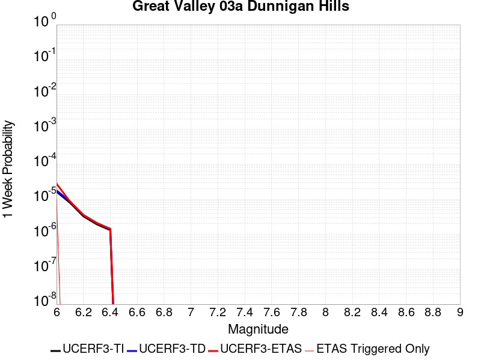 | 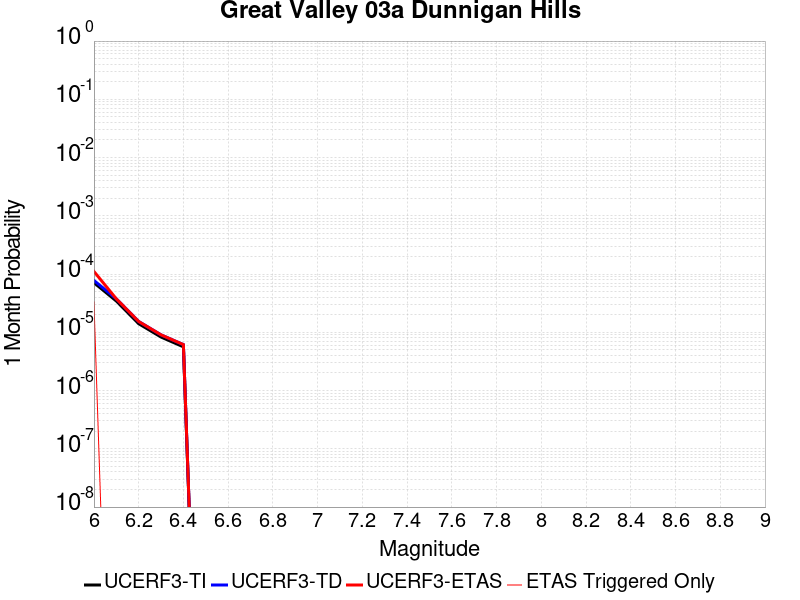 | 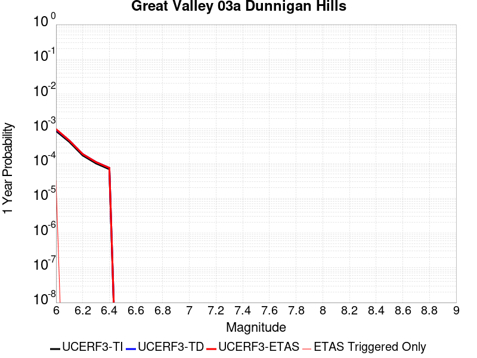 | 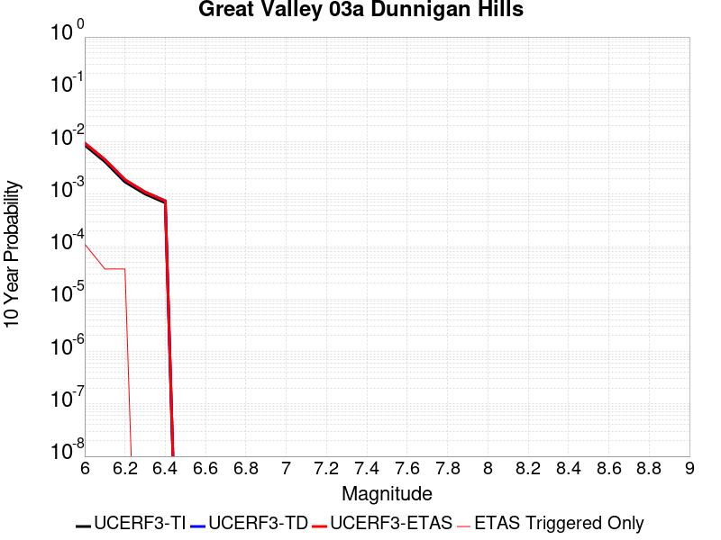 |

| Magnitude | 1 wk TI Prob | 1 wk TD Prob | 1 wk ETAS Prob | 1 wk ETAS/TD Gain | 1 wk ETAS Triggered Only | 1 mo TI Prob | 1 mo TD Prob | 1 mo ETAS Prob | 1 mo ETAS/TD Gain | 1 mo ETAS Triggered Only | 1 yr TI Prob | 1 yr TD Prob | 1 yr ETAS Prob | 1 yr ETAS/TD Gain | 1 yr ETAS Triggered Only | 10 yr TI Prob | 10 yr TD Prob | 10 yr ETAS Prob | 10 yr ETAS/TD Gain | 10 yr ETAS Triggered Only |
|-----|-----|-----|-----|-----|-----|-----|-----|-----|-----|-----|-----|-----|-----|-----|-----|-----|-----|-----|-----|-----|
| 6.0 | 1.6591328E-5 | 1.8107954E-5 | 4.308752E-5 | 2.3794801 | 2.4980016E-5 | 7.110376E-5 | 7.7603596E-5 | 1.2755976E-4 | 1.643735 | 4.9960032E-5 | 8.6534437E-4 | 9.444834E-4 | 9.943963E-4 | 1.0528467 | 4.9960032E-5 | 0.008619824 | 0.009411525 | 0.00948576 | 1.0078876 | 7.494005E-5 |
| 6.1 | 8.041125E-6 | 8.769726E-6 | 8.769726E-6 | 1.0 | 0.0 | 3.4461507E-5 | 3.7584115E-5 | 3.7584115E-5 | 1.0 | 0.0 | 4.194881E-4 | 4.5751085E-4 | 4.5751085E-4 | 1.0 | 0.0 | 0.004186971 | 0.004567687 | 0.004592553 | 1.0054439 | 2.4980016E-5 |
| 6.2 | 3.2807004E-6 | 3.5795688E-6 | 3.5795688E-6 | 1.0 | 0.0 | 1.4060069E-5 | 1.5340942E-5 | 1.5340942E-5 | 1.0 | 0.0 | 1.7116789E-4 | 1.8676413E-4 | 1.8676413E-4 | 1.0 | 0.0 | 0.0017103611 | 0.0018664796 | 0.001891413 | 1.0133585 | 2.4980016E-5 |
| 6.3 | 1.9339366E-6 | 2.1103806E-6 | 2.1103806E-6 | 1.0 | 0.0 | 8.288273E-6 | 9.044474E-6 | 9.044474E-6 | 1.0 | 0.0 | 1.00905054E-4 | 1.1011375E-4 | 1.1011375E-4 | 1.0 | 0.0 | 0.0010085925 | 0.0011008718 | 0.0011008718 | 1.0 | 0.0 |
| 6.4 | 1.3142635E-6 | 1.4339867E-6 | 1.4339867E-6 | 1.0 | 0.0 | 5.6325457E-6 | 6.145657E-6 | 6.145657E-6 | 1.0 | 0.0 | 6.857408E-5 | 7.482337E-5 | 7.482337E-5 | 1.0 | 0.0 | 6.8552926E-4 | 7.4823375E-4 | 7.4823375E-4 | 1.0 | 0.0 |

## Great Valley 07 (Orestimba)
*[(top)](#table-of-contents)*

| 1 Week | 1 Month | 1 Year | 10 Year |
|-----|-----|-----|-----|
| 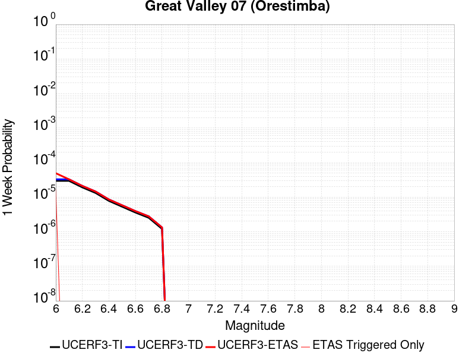 | 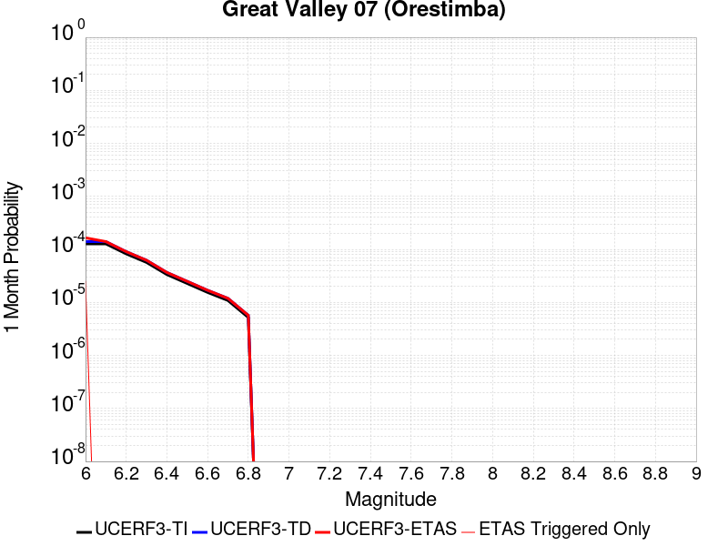 | 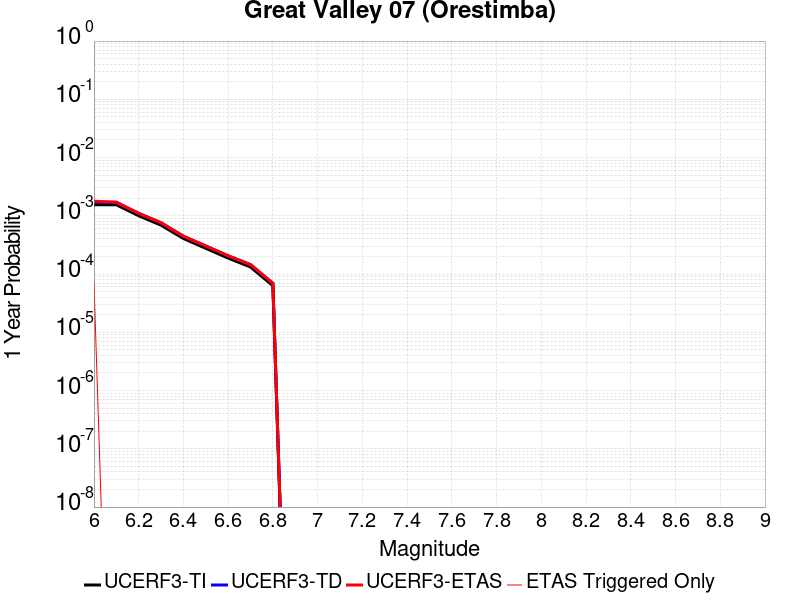 | 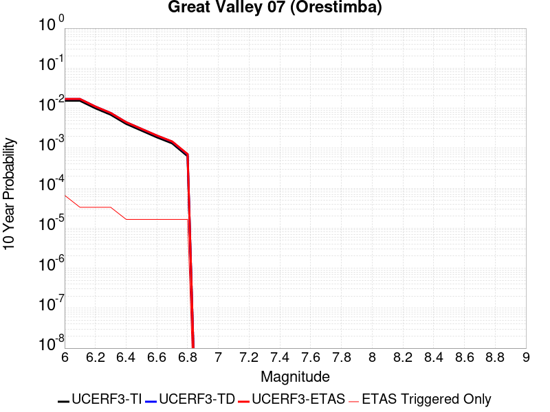 |

| Magnitude | 1 wk TI Prob | 1 wk TD Prob | 1 wk ETAS Prob | 1 wk ETAS/TD Gain | 1 wk ETAS Triggered Only | 1 mo TI Prob | 1 mo TD Prob | 1 mo ETAS Prob | 1 mo ETAS/TD Gain | 1 mo ETAS Triggered Only | 1 yr TI Prob | 1 yr TD Prob | 1 yr ETAS Prob | 1 yr ETAS/TD Gain | 1 yr ETAS Triggered Only | 10 yr TI Prob | 10 yr TD Prob | 10 yr ETAS Prob | 10 yr ETAS/TD Gain | 10 yr ETAS Triggered Only |
|-----|-----|-----|-----|-----|-----|-----|-----|-----|-----|-----|-----|-----|-----|-----|-----|-----|-----|-----|-----|-----|
| 6.0 | 2.9687902E-5 | 3.27575E-5 | 5.7736695E-5 | 1.762549 | 2.4980016E-5 | 1.2722766E-4 | 1.4038214E-4 | 1.6535864E-4 | 1.177918 | 2.4980016E-5 | 0.0015478961 | 0.0017078844 | 0.0017577591 | 1.0292026 | 4.9960032E-5 | 0.015371585 | 0.016955135 | 0.017028805 | 1.0043449 | 7.494005E-5 |
| 6.1 | 2.9687902E-5 | 3.27575E-5 | 3.27575E-5 | 1.0 | 0.0 | 1.2722766E-4 | 1.4038214E-4 | 1.4038214E-4 | 1.0 | 0.0 | 0.0015478961 | 0.0017078844 | 0.0017078844 | 1.0 | 0.0 | 0.015371585 | 0.016955135 | 0.016979693 | 1.0014483 | 2.4980016E-5 |
| 6.2 | 1.9231524E-5 | 2.1159167E-5 | 2.1159167E-5 | 1.0 | 0.0 | 8.2418206E-5 | 9.067912E-5 | 9.067912E-5 | 1.0 | 0.0 | 0.0010029797 | 0.0011034822 | 0.0011034822 | 1.0 | 0.0 | 0.00998465 | 0.010982441 | 0.011007146 | 1.0022496 | 2.4980016E-5 |
| 6.3 | 1.324766E-5 | 1.4548534E-5 | 1.4548534E-5 | 1.0 | 0.0 | 5.6774446E-5 | 6.234942E-5 | 6.234942E-5 | 1.0 | 0.0 | 6.910097E-4 | 7.5884897E-4 | 7.5884897E-4 | 1.0 | 0.0 | 0.006888649 | 0.0075635235 | 0.007588315 | 1.0032777 | 2.4980016E-5 |
| 6.4 | 7.818645E-6 | 8.57284E-6 | 8.57284E-6 | 1.0 | 0.0 | 3.3508048E-5 | 3.6740246E-5 | 3.6740246E-5 | 1.0 | 0.0 | 4.078841E-4 | 4.4722404E-4 | 4.4722404E-4 | 1.0 | 0.0 | 0.004071363 | 0.0044635804 | 0.004488449 | 1.0055715 | 2.4980016E-5 |
| 6.5 | 5.3076565E-6 | 5.8178007E-6 | 5.8178007E-6 | 1.0 | 0.0 | 2.27469E-5 | 2.4933206E-5 | 2.4933206E-5 | 1.0 | 0.0 | 2.7690834E-4 | 3.035216E-4 | 3.035216E-4 | 1.0 | 0.0 | 0.0027656353 | 0.00303128 | 0.0030561842 | 1.0082158 | 2.4980016E-5 |
| 6.6 | 3.6003578E-6 | 3.9484953E-6 | 3.9484953E-6 | 1.0 | 0.0 | 1.5430012E-5 | 1.6922022E-5 | 1.6922022E-5 | 1.0 | 0.0 | 1.8784421E-4 | 2.0600771E-4 | 2.0600771E-4 | 1.0 | 0.0 | 0.0018768552 | 0.0020583214 | 0.00208325 | 1.0121112 | 2.4980016E-5 |
| 6.7 | 2.5361826E-6 | 2.7834678E-6 | 2.7834678E-6 | 1.0 | 0.0 | 1.0869308E-5 | 1.1929101E-5 | 1.1929101E-5 | 1.0 | 0.0 | 1.3232579E-4 | 1.4522845E-4 | 1.4522845E-4 | 1.0 | 0.0 | 0.0013224703 | 0.0014514653 | 0.0014764091 | 1.0171852 | 2.4980016E-5 |
| 6.8 | 1.2115831E-6 | 1.3313797E-6 | 1.3313797E-6 | 1.0 | 0.0 | 5.1924885E-6 | 5.7059065E-6 | 5.7059065E-6 | 1.0 | 0.0 | 6.3216714E-5 | 6.9468166E-5 | 6.9468166E-5 | 1.0 | 0.0 | 6.3198735E-4 | 6.945596E-4 | 7.195223E-4 | 1.0359403 | 2.4980016E-5 |

## Ortigalita (North)
*[(top)](#table-of-contents)*

| 1 Week | 1 Month | 1 Year | 10 Year |
|-----|-----|-----|-----|
| 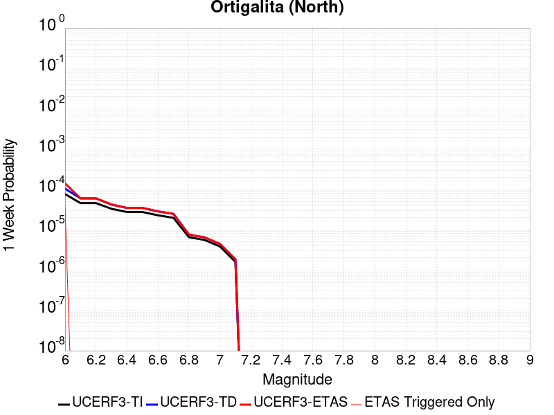 | 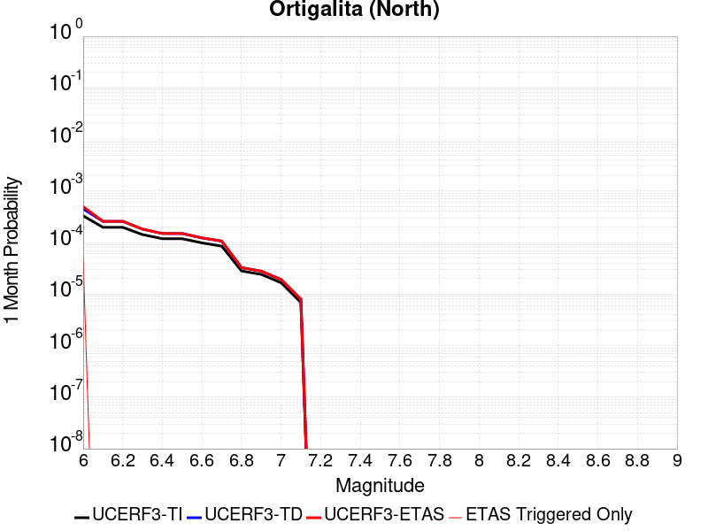 | 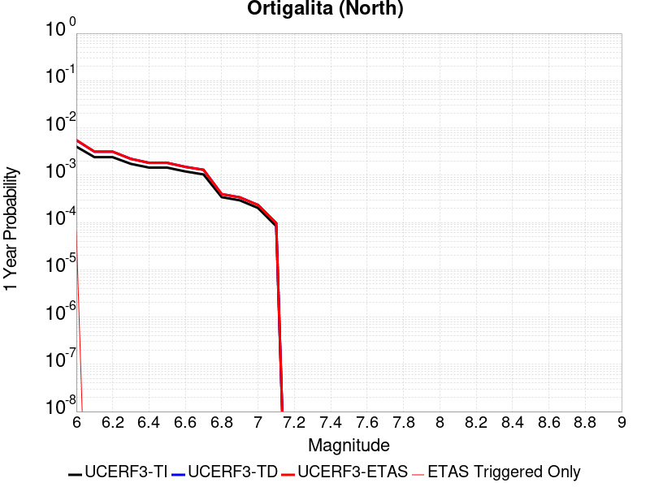 | 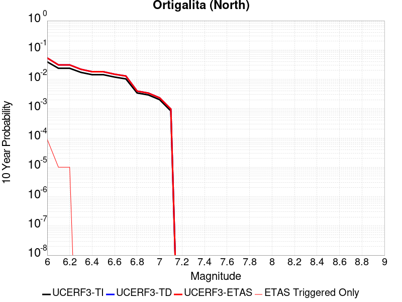 |

| Magnitude | 1 wk TI Prob | 1 wk TD Prob | 1 wk ETAS Prob | 1 wk ETAS/TD Gain | 1 wk ETAS Triggered Only | 1 mo TI Prob | 1 mo TD Prob | 1 mo ETAS Prob | 1 mo ETAS/TD Gain | 1 mo ETAS Triggered Only | 1 yr TI Prob | 1 yr TD Prob | 1 yr ETAS Prob | 1 yr ETAS/TD Gain | 1 yr ETAS Triggered Only | 10 yr TI Prob | 10 yr TD Prob | 10 yr ETAS Prob | 10 yr ETAS/TD Gain | 10 yr ETAS Triggered Only |
|-----|-----|-----|-----|-----|-----|-----|-----|-----|-----|-----|-----|-----|-----|-----|-----|-----|-----|-----|-----|-----|
| 6.0 | 7.711876E-5 | 1.0505308E-4 | 1.5500786E-4 | 1.4755194 | 4.9960032E-5 | 3.3046713E-4 | 4.501601E-4 | 5.0009764E-4 | 1.1109328 | 4.9960032E-5 | 0.004016016 | 0.0054680547 | 0.005542585 | 1.0136302 | 7.494005E-5 | 0.039442103 | 0.053455614 | 0.053526547 | 1.0013269 | 7.494005E-5 |
| 6.1 | 4.607858E-5 | 6.0239887E-5 | 6.0239887E-5 | 1.0 | 0.0 | 1.9746469E-4 | 2.5814763E-4 | 2.5814763E-4 | 1.0 | 0.0 | 0.0024014818 | 0.0031387366 | 0.0031387366 | 1.0 | 0.0 | 0.023756953 | 0.030975312 | 0.030975312 | 1.0 | 0.0 |
| 6.2 | 4.607858E-5 | 6.0239887E-5 | 6.0239887E-5 | 1.0 | 0.0 | 1.9746469E-4 | 2.5814763E-4 | 2.5814763E-4 | 1.0 | 0.0 | 0.0024014818 | 0.0031387366 | 0.0031387366 | 1.0 | 0.0 | 0.023756953 | 0.030975312 | 0.030975312 | 1.0 | 0.0 |
| 6.3 | 3.327423E-5 | 4.2476124E-5 | 4.2476124E-5 | 1.0 | 0.0 | 1.4259605E-4 | 1.8202956E-4 | 1.8202956E-4 | 1.0 | 0.0 | 0.0017347244 | 0.002214206 | 0.002214206 | 1.0 | 0.0 | 0.017212452 | 0.02194574 | 0.02194574 | 1.0 | 0.0 |
| 6.4 | 2.7732503E-5 | 3.4999008E-5 | 3.4999008E-5 | 1.0 | 0.0 | 1.1884817E-4 | 1.499886E-4 | 1.499886E-4 | 1.0 | 0.0 | 0.001446016 | 0.0018248158 | 0.0018248158 | 1.0 | 0.0 | 0.014366428 | 0.018121297 | 0.018121297 | 1.0 | 0.0 |
| 6.5 | 2.7689714E-5 | 3.4948822E-5 | 3.4948822E-5 | 1.0 | 0.0 | 1.186648E-4 | 1.4977354E-4 | 1.4977354E-4 | 1.0 | 0.0 | 0.0014437864 | 0.0018222018 | 0.0018222018 | 1.0 | 0.0 | 0.014344421 | 0.018095585 | 0.018095585 | 1.0 | 0.0 |
| 6.6 | 2.2976905E-5 | 2.871829E-5 | 2.871829E-5 | 1.0 | 0.0 | 9.846873E-5 | 1.23074E-4 | 1.23074E-4 | 1.0 | 0.0 | 0.0011981975 | 0.0014976348 | 0.0014976348 | 1.0 | 0.0 | 0.011917574 | 0.014898733 | 0.014898733 | 1.0 | 0.0 |
| 6.7 | 1.9871539E-5 | 2.4904637E-5 | 2.4904637E-5 | 1.0 | 0.0 | 8.516096E-5 | 1.067312E-4 | 1.067312E-4 | 1.0 | 0.0 | 0.0010363415 | 0.0012989199 | 0.0012989199 | 1.0 | 0.0 | 0.010315218 | 0.012936938 | 0.012936938 | 1.0 | 0.0 |
| 6.8 | 6.5640475E-6 | 7.6054926E-6 | 7.6054926E-6 | 1.0 | 0.0 | 2.813133E-5 | 3.2594577E-5 | 3.2594577E-5 | 1.0 | 0.0 | 3.424451E-4 | 3.9676955E-4 | 3.9676955E-4 | 1.0 | 0.0 | 0.0034191788 | 0.003960899 | 0.003960899 | 1.0 | 0.0 |
| 6.9 | 5.6219683E-6 | 6.5018376E-6 | 6.5018376E-6 | 1.0 | 0.0 | 2.4093928E-5 | 2.7864735E-5 | 2.7864735E-5 | 1.0 | 0.0 | 2.933041E-4 | 3.3920293E-4 | 3.3920293E-4 | 1.0 | 0.0 | 0.0029291727 | 0.003387109 | 0.003387109 | 1.0 | 0.0 |
| 7.0 | 3.875591E-6 | 4.4847548E-6 | 4.4847548E-6 | 1.0 | 0.0 | 1.6609569E-5 | 1.9220248E-5 | 1.9220248E-5 | 1.0 | 0.0 | 2.0220275E-4 | 2.339835E-4 | 2.339835E-4 | 1.0 | 0.0 | 0.0020201886 | 0.0023375798 | 0.0023375798 | 1.0 | 0.0 |
| 7.1 | 1.6017933E-6 | 1.8570418E-6 | 1.8570418E-6 | 1.0 | 0.0 | 6.8648105E-6 | 7.958732E-6 | 7.958732E-6 | 1.0 | 0.0 | 8.357586E-5 | 9.689432E-5 | 9.689432E-5 | 1.0 | 0.0 | 8.3544437E-4 | 9.686254E-4 | 9.686254E-4 | 1.0 | 0.0 |

## Channel Islands Thrust
*[(top)](#table-of-contents)*

| 1 Week | 1 Month | 1 Year | 10 Year |
|-----|-----|-----|-----|
| 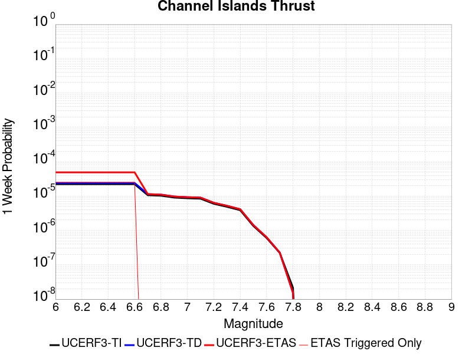 | 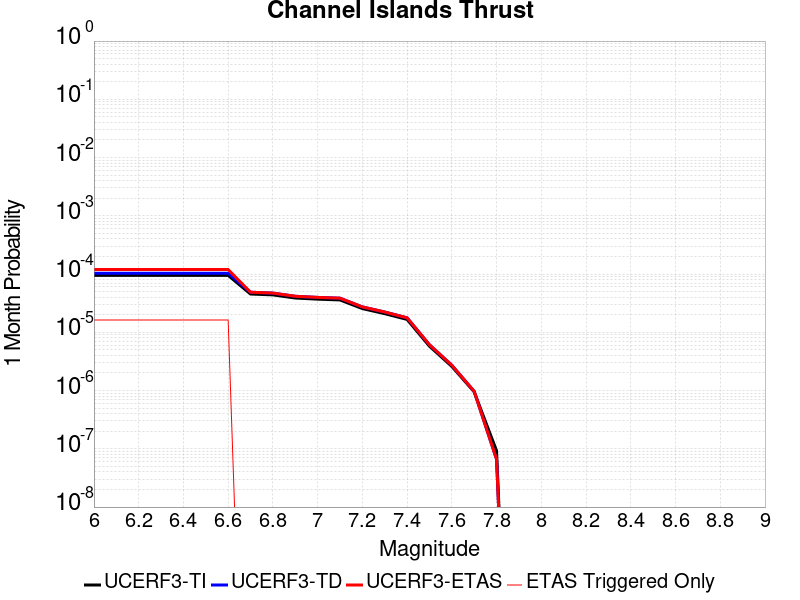 | 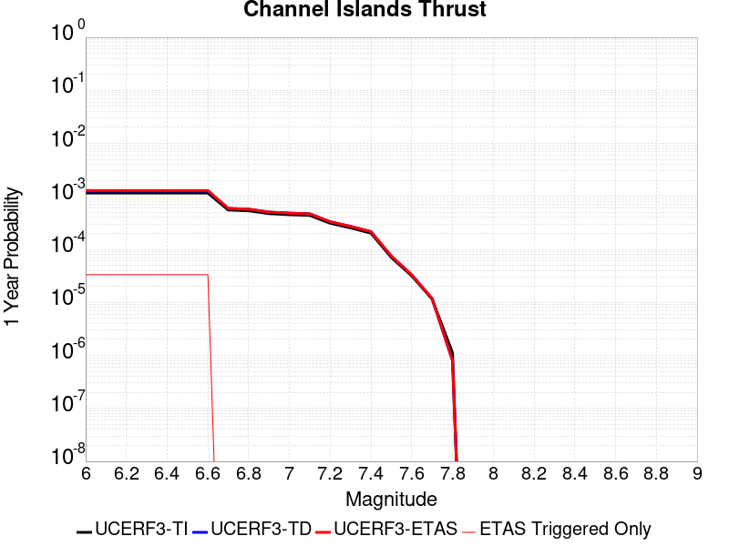 | 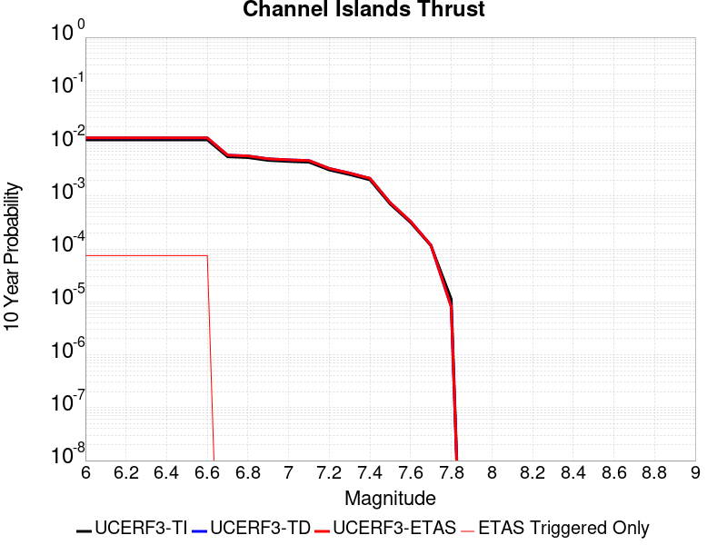 |

| Magnitude | 1 wk TI Prob | 1 wk TD Prob | 1 wk ETAS Prob | 1 wk ETAS/TD Gain | 1 wk ETAS Triggered Only | 1 mo TI Prob | 1 mo TD Prob | 1 mo ETAS Prob | 1 mo ETAS/TD Gain | 1 mo ETAS Triggered Only | 1 yr TI Prob | 1 yr TD Prob | 1 yr ETAS Prob | 1 yr ETAS/TD Gain | 1 yr ETAS Triggered Only | 10 yr TI Prob | 10 yr TD Prob | 10 yr ETAS Prob | 10 yr ETAS/TD Gain | 10 yr ETAS Triggered Only |
|-----|-----|-----|-----|-----|-----|-----|-----|-----|-----|-----|-----|-----|-----|-----|-----|-----|-----|-----|-----|-----|
| 6.0 | 2.2156251E-5 | 2.4092022E-5 | 4.9071437E-5 | 2.0368335 | 2.4980016E-5 | 9.495191E-5 | 1.03248036E-4 | 1.2822548E-4 | 1.2419168 | 2.4980016E-5 | 0.0011554264 | 0.0012564266 | 0.0013063238 | 1.0397136 | 4.9960032E-5 | 0.011494373 | 0.0125038205 | 0.012577823 | 1.0059184 | 7.494005E-5 |
| 6.1 | 2.2156251E-5 | 2.4092022E-5 | 4.9071437E-5 | 2.0368335 | 2.4980016E-5 | 9.495191E-5 | 1.03248036E-4 | 1.2822548E-4 | 1.2419168 | 2.4980016E-5 | 0.0011554264 | 0.0012564266 | 0.0013063238 | 1.0397136 | 4.9960032E-5 | 0.011494373 | 0.0125038205 | 0.012577823 | 1.0059184 | 7.494005E-5 |
| 6.2 | 2.2156251E-5 | 2.4092022E-5 | 4.9071437E-5 | 2.0368335 | 2.4980016E-5 | 9.495191E-5 | 1.03248036E-4 | 1.2822548E-4 | 1.2419168 | 2.4980016E-5 | 0.0011554264 | 0.0012564266 | 0.0013063238 | 1.0397136 | 4.9960032E-5 | 0.011494373 | 0.0125038205 | 0.012577823 | 1.0059184 | 7.494005E-5 |
| 6.3 | 2.2156251E-5 | 2.4092022E-5 | 4.9071437E-5 | 2.0368335 | 2.4980016E-5 | 9.495191E-5 | 1.03248036E-4 | 1.2822548E-4 | 1.2419168 | 2.4980016E-5 | 0.0011554264 | 0.0012564266 | 0.0013063238 | 1.0397136 | 4.9960032E-5 | 0.011494373 | 0.0125038205 | 0.012577823 | 1.0059184 | 7.494005E-5 |
| 6.4 | 2.2156251E-5 | 2.4092022E-5 | 4.9071437E-5 | 2.0368335 | 2.4980016E-5 | 9.495191E-5 | 1.03248036E-4 | 1.2822548E-4 | 1.2419168 | 2.4980016E-5 | 0.0011554264 | 0.0012564266 | 0.0013063238 | 1.0397136 | 4.9960032E-5 | 0.011494373 | 0.0125038205 | 0.012577823 | 1.0059184 | 7.494005E-5 |
| 6.5 | 2.2156251E-5 | 2.4092022E-5 | 4.9071437E-5 | 2.0368335 | 2.4980016E-5 | 9.495191E-5 | 1.03248036E-4 | 1.2822548E-4 | 1.2419168 | 2.4980016E-5 | 0.0011554264 | 0.0012564266 | 0.0013063238 | 1.0397136 | 4.9960032E-5 | 0.011494373 | 0.0125038205 | 0.012577823 | 1.0059184 | 7.494005E-5 |
| 6.6 | 2.2156251E-5 | 2.4092022E-5 | 4.9071437E-5 | 2.0368335 | 2.4980016E-5 | 9.495191E-5 | 1.03248036E-4 | 1.2822548E-4 | 1.2419168 | 2.4980016E-5 | 0.0011554264 | 0.0012564266 | 0.0013063238 | 1.0397136 | 4.9960032E-5 | 0.011494373 | 0.0125038205 | 0.012577823 | 1.0059184 | 7.494005E-5 |
| 6.7 | 1.0601296E-5 | 1.1379544E-5 | 1.1379544E-5 | 1.0 | 0.0 | 4.5433335E-5 | 4.876859E-5 | 4.876859E-5 | 1.0 | 0.0 | 5.5301044E-4 | 5.936007E-4 | 5.936007E-4 | 1.0 | 0.0 | 0.005516363 | 0.005920653 | 0.005920653 | 1.0 | 0.0 |
| 6.8 | 1.0246747E-5 | 1.0996669E-5 | 1.0996669E-5 | 1.0 | 0.0 | 4.391389E-5 | 4.7127756E-5 | 4.7127756E-5 | 1.0 | 0.0 | 5.345204E-4 | 5.7363417E-4 | 5.7363417E-4 | 1.0 | 0.0 | 0.0053323656 | 0.005722025 | 0.005722025 | 1.0 | 0.0 |
| 6.9 | 9.049551E-6 | 9.699645E-6 | 9.699645E-6 | 1.0 | 0.0 | 3.878322E-5 | 4.1569267E-5 | 4.1569267E-5 | 1.0 | 0.0 | 4.7208337E-4 | 5.059924E-4 | 5.059924E-4 | 1.0 | 0.0 | 0.0047108172 | 0.0050488203 | 0.0050488203 | 1.0 | 0.0 |
| 7.0 | 8.6542195E-6 | 9.274603E-6 | 9.274603E-6 | 1.0 | 0.0 | 3.7088983E-5 | 3.9747716E-5 | 3.9747716E-5 | 1.0 | 0.0 | 4.5146482E-4 | 4.8382508E-4 | 4.8382508E-4 | 1.0 | 0.0 | 0.004505487 | 0.0048281294 | 0.0048281294 | 1.0 | 0.0 |
| 7.1 | 8.391028E-6 | 8.992925E-6 | 8.992925E-6 | 1.0 | 0.0 | 3.5961057E-5 | 3.8540562E-5 | 3.8540562E-5 | 1.0 | 0.0 | 4.3773788E-4 | 4.6913436E-4 | 4.6913436E-4 | 1.0 | 0.0 | 0.004368766 | 0.0046818503 | 0.0046818503 | 1.0 | 0.0 |
| 7.2 | 5.965188E-6 | 6.3716957E-6 | 6.3716957E-6 | 1.0 | 0.0 | 2.556484E-5 | 2.7306984E-5 | 2.7306984E-5 | 1.0 | 0.0 | 3.1120746E-4 | 3.3241237E-4 | 3.3241237E-4 | 1.0 | 0.0 | 0.00310772 | 0.0033192094 | 0.0033192094 | 1.0 | 0.0 |
| 7.3 | 4.877518E-6 | 5.206007E-6 | 5.206007E-6 | 1.0 | 0.0 | 2.0903482E-5 | 2.231127E-5 | 2.231127E-5 | 1.0 | 0.0 | 2.5447016E-4 | 2.716063E-4 | 2.716063E-4 | 1.0 | 0.0 | 0.0025417898 | 0.0027127897 | 0.0027127897 | 1.0 | 0.0 |
| 7.4 | 3.8829853E-6 | 4.141863E-6 | 4.141863E-6 | 1.0 | 0.0 | 1.664126E-5 | 1.7750723E-5 | 1.7750723E-5 | 1.0 | 0.0 | 2.0258849E-4 | 2.1609403E-4 | 2.1609403E-4 | 1.0 | 0.0 | 0.002024039 | 0.002158881 | 0.002158881 | 1.0 | 0.0 |
| 7.5 | 1.3489616E-6 | 1.4277905E-6 | 1.4277905E-6 | 1.0 | 0.0 | 5.7812517E-6 | 6.119088E-6 | 6.119088E-6 | 1.0 | 0.0 | 7.038446E-5 | 7.449739E-5 | 7.449739E-5 | 1.0 | 0.0 | 7.036218E-4 | 7.4472814E-4 | 7.4472814E-4 | 1.0 | 0.0 |
| 7.6 | 6.058192E-7 | 6.35378E-7 | 6.35378E-7 | 1.0 | 0.0 | 2.5963652E-6 | 2.7230458E-6 | 2.7230458E-6 | 1.0 | 0.0 | 3.161029E-5 | 3.3152595E-5 | 3.3152595E-5 | 1.0 | 0.0 | 3.1605794E-4 | 3.314781E-4 | 3.314781E-4 | 1.0 | 0.0 |
| 7.7 | 2.2170494E-7 | 2.2607924E-7 | 2.2607924E-7 | 1.0 | 0.0 | 9.5016367E-7 | 9.689107E-7 | 9.689107E-7 | 1.0 | 0.0 | 1.1568181E-5 | 1.17964355E-5 | 1.17964355E-5 | 1.0 | 0.0 | 1.1567579E-4 | 1.179592E-4 | 1.179592E-4 | 1.0 | 0.0 |
| 7.8 | 2.1613102E-8 | 1.5466837E-8 | 1.5466837E-8 | 1.0 | 0.0 | 9.262757E-8 | 6.628645E-8 | 6.628645E-8 | 1.0 | 0.0 | 1.1277401E-6 | 8.070372E-7 | 8.070372E-7 | 1.0 | 0.0 | 1.1277344E-5 | 8.07035E-6 | 8.07035E-6 | 1.0 | 0.0 |

## San Jacinto (Superstition Mtn)
*[(top)](#table-of-contents)*

| 1 Week | 1 Month | 1 Year | 10 Year |
|-----|-----|-----|-----|
| 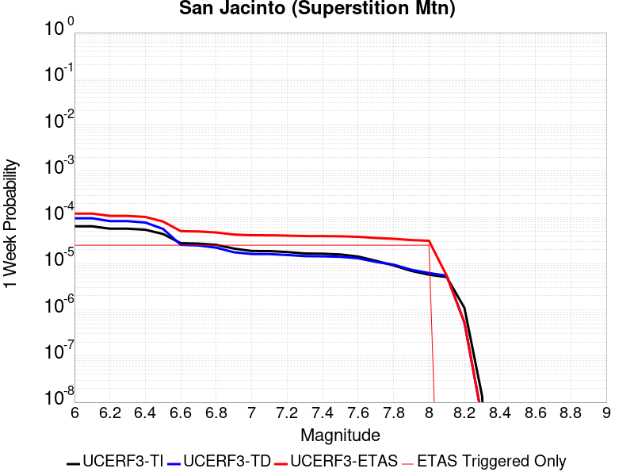 | 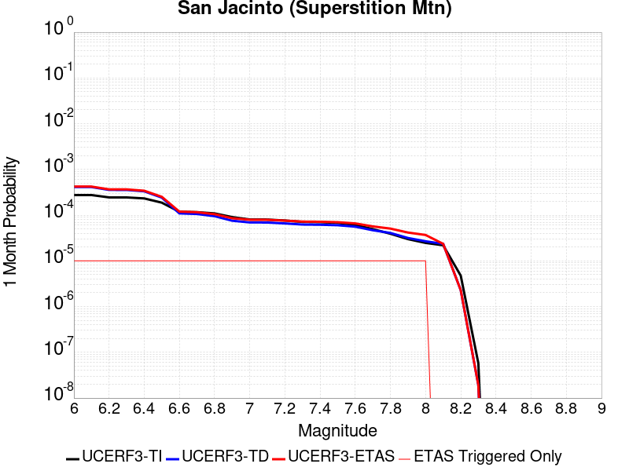 |  | 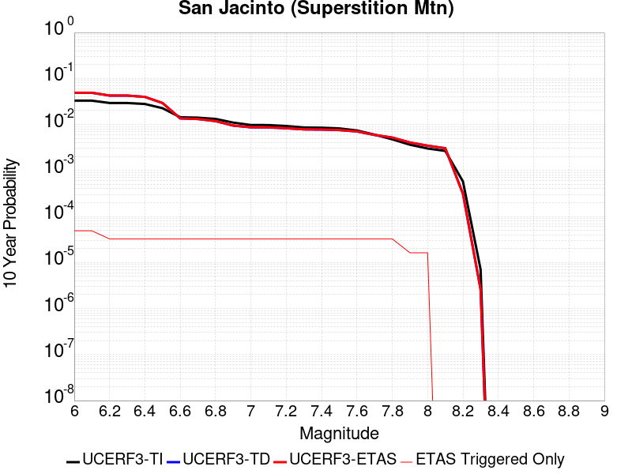 |

| Magnitude | 1 wk TI Prob | 1 wk TD Prob | 1 wk ETAS Prob | 1 wk ETAS/TD Gain | 1 wk ETAS Triggered Only | 1 mo TI Prob | 1 mo TD Prob | 1 mo ETAS Prob | 1 mo ETAS/TD Gain | 1 mo ETAS Triggered Only | 1 yr TI Prob | 1 yr TD Prob | 1 yr ETAS Prob | 1 yr ETAS/TD Gain | 1 yr ETAS Triggered Only | 10 yr TI Prob | 10 yr TD Prob | 10 yr ETAS Prob | 10 yr ETAS/TD Gain | 10 yr ETAS Triggered Only |
|-----|-----|-----|-----|-----|-----|-----|-----|-----|-----|-----|-----|-----|-----|-----|-----|-----|-----|-----|-----|-----|
| 6.0 | 6.4193904E-5 | 9.599558E-5 | 1.209732E-4 | 1.2601955 | 2.4980016E-5 | 2.7508775E-4 | 4.1135435E-4 | 4.363241E-4 | 1.0607013 | 2.4980016E-5 | 0.0033440501 | 0.0049981694 | 0.0050478796 | 1.0099458 | 4.9960032E-5 | 0.03294174 | 0.048820045 | 0.048891325 | 1.0014601 | 7.494005E-5 |
| 6.1 | 6.4193904E-5 | 9.599558E-5 | 1.209732E-4 | 1.2601955 | 2.4980016E-5 | 2.7508775E-4 | 4.1135435E-4 | 4.363241E-4 | 1.0607013 | 2.4980016E-5 | 0.0033440501 | 0.0049981694 | 0.0050478796 | 1.0099458 | 4.9960032E-5 | 0.03294174 | 0.048820045 | 0.048891325 | 1.0014601 | 7.494005E-5 |
| 6.2 | 5.7023593E-5 | 8.3144616E-5 | 1.0812256E-4 | 1.3004156 | 2.4980016E-5 | 2.4436394E-4 | 3.5629462E-4 | 3.8126574E-4 | 1.0700855 | 2.4980016E-5 | 0.002971072 | 0.0043309047 | 0.0043806485 | 1.0114857 | 4.9960032E-5 | 0.029316625 | 0.042502448 | 0.042550284 | 1.0011255 | 4.9960032E-5 |
| 6.3 | 5.6940098E-5 | 8.298998E-5 | 1.0796792E-4 | 1.3009754 | 2.4980016E-5 | 2.4400617E-4 | 3.5563204E-4 | 3.806032E-4 | 1.0702162 | 2.4980016E-5 | 0.002966728 | 0.00432287 | 0.0043726144 | 1.0115072 | 4.9960032E-5 | 0.029274331 | 0.04242582 | 0.04247366 | 1.0011276 | 4.9960032E-5 |
| 6.4 | 5.4171585E-5 | 7.748391E-5 | 1.0246199E-4 | 1.3223647 | 2.4980016E-5 | 2.3214328E-4 | 3.3204095E-4 | 3.5701267E-4 | 1.0752068 | 2.4980016E-5 | 0.0028226813 | 0.0040367534 | 0.0040865117 | 1.0123264 | 4.9960032E-5 | 0.02787096 | 0.039715026 | 0.039763004 | 1.001208 | 4.9960032E-5 |
| 6.5 | 4.375144E-5 | 5.6421442E-5 | 8.140005E-5 | 1.4427148 | 2.4980016E-5 | 1.874927E-4 | 2.417904E-4 | 2.6676437E-4 | 1.1032877 | 2.4980016E-5 | 0.0022803338 | 0.002941 | 0.002990813 | 1.0169375 | 4.9960032E-5 | 0.022570757 | 0.029235592 | 0.029284092 | 1.0016589 | 4.9960032E-5 |
| 6.6 | 2.772192E-5 | 2.5488029E-5 | 5.0467406E-5 | 1.9800436 | 2.4980016E-5 | 1.1880282E-4 | 1.0922994E-4 | 1.3420724E-4 | 1.228667 | 2.4980016E-5 | 0.0014454646 | 0.0013290826 | 0.0013789763 | 1.03754 | 4.9960032E-5 | 0.014360986 | 0.013540891 | 0.013590175 | 1.0036396 | 4.9960032E-5 |
| 6.7 | 2.7124124E-5 | 2.4699055E-5 | 4.9678452E-5 | 2.0113504 | 2.4980016E-5 | 1.1624106E-4 | 1.0584891E-4 | 1.3082627E-4 | 1.2359719 | 2.4980016E-5 | 0.0014143161 | 0.0012879678 | 0.0013378635 | 1.0387398 | 4.9960032E-5 | 0.014053487 | 0.013134248 | 0.013183552 | 1.0037538 | 4.9960032E-5 |
| 6.8 | 2.5475807E-5 | 2.2164071E-5 | 4.7143534E-5 | 2.1270251 | 2.4980016E-5 | 1.0917746E-4 | 9.498548E-5 | 1.1996313E-4 | 1.2629627 | 2.4980016E-5 | 0.001328425 | 0.0011558468 | 0.001205749 | 1.0431738 | 4.9960032E-5 | 0.0132051185 | 0.011821818 | 0.011871187 | 1.0041761 | 4.9960032E-5 |
| 6.9 | 2.1162023E-5 | 1.762564E-5 | 4.2605217E-5 | 2.4172294 | 2.4980016E-5 | 9.069123E-5 | 7.553629E-5 | 1.0051442E-4 | 1.3306772 | 2.4980016E-5 | 0.0011036064 | 9.1927015E-4 | 9.691843E-4 | 1.0542976 | 4.9960032E-5 | 0.010981417 | 0.009446762 | 0.00949625 | 1.0052387 | 4.9960032E-5 |
| 7.0 | 1.8754288E-5 | 1.616099E-5 | 4.1140604E-5 | 2.5456734 | 2.4980016E-5 | 8.037304E-5 | 6.9259564E-5 | 9.423785E-5 | 1.3606474 | 2.4980016E-5 | 9.781026E-4 | 8.429114E-4 | 8.928293E-4 | 1.0592208 | 4.9960032E-5 | 0.009738087 | 0.008669995 | 0.008719522 | 1.0057124 | 4.9960032E-5 |
| 7.1 | 1.8678527E-5 | 1.6086136E-5 | 4.106575E-5 | 2.552866 | 2.4980016E-5 | 8.0048376E-5 | 6.8938774E-5 | 9.3917064E-5 | 1.3623258 | 2.4980016E-5 | 9.7415317E-4 | 8.3900883E-4 | 8.889269E-4 | 1.0594965 | 4.9960032E-5 | 0.009698939 | 0.008631011 | 0.008680539 | 1.0057385 | 4.9960032E-5 |
| 7.2 | 1.7804578E-5 | 1.5380709E-5 | 4.036034E-5 | 2.6240885 | 2.4980016E-5 | 7.6303106E-5 | 6.591567E-5 | 9.089404E-5 | 1.3789443 | 2.4980016E-5 | 9.285943E-4 | 8.022301E-4 | 8.5215E-4 | 1.0622265 | 4.9960032E-5 | 0.009247236 | 0.008262424 | 0.008311971 | 1.0059967 | 4.9960032E-5 |
| 7.3 | 1.6583685E-5 | 1.4529837E-5 | 3.950949E-5 | 2.719197 | 2.4980016E-5 | 7.1070994E-5 | 6.226926E-5 | 8.724772E-5 | 1.4011363 | 2.4980016E-5 | 8.649459E-4 | 7.5786654E-4 | 8.077887E-4 | 1.065872 | 4.9960032E-5 | 0.00861587 | 0.007817646 | 0.007867215 | 1.0063407 | 4.9960032E-5 |
| 7.4 | 1.6387552E-5 | 1.4394727E-5 | 3.9374383E-5 | 2.7353337 | 2.4980016E-5 | 7.023047E-5 | 6.169024E-5 | 8.666872E-5 | 1.4049015 | 2.4980016E-5 | 8.5472054E-4 | 7.508219E-4 | 8.007444E-4 | 1.0664905 | 4.9960032E-5 | 0.008514405 | 0.0077470187 | 0.0077965916 | 1.006399 | 4.9960032E-5 |
| 7.5 | 1.5790754E-5 | 1.40354305E-5 | 3.9015096E-5 | 2.7797577 | 2.4980016E-5 | 6.767291E-5 | 6.015047E-5 | 8.512898E-5 | 1.4152671 | 2.4980016E-5 | 8.236062E-4 | 7.320879E-4 | 7.820113E-4 | 1.0681933 | 4.9960032E-5 | 0.008205604 | 0.007557581 | 0.007607164 | 1.0065607 | 4.9960032E-5 |
| 7.6 | 1.4248672E-5 | 1.3054444E-5 | 3.8034133E-5 | 2.9135008 | 2.4980016E-5 | 6.106431E-5 | 5.5946428E-5 | 8.092505E-5 | 1.4464738 | 2.4980016E-5 | 7.432043E-4 | 6.809366E-4 | 7.308626E-4 | 1.0733197 | 4.9960032E-5 | 0.007407237 | 0.007040175 | 0.0070897834 | 1.0070465 | 4.9960032E-5 |
| 7.7 | 1.15449975E-5 | 1.0903222E-5 | 3.5882964E-5 | 3.2910423 | 2.4980016E-5 | 4.947762E-5 | 4.672726E-5 | 7.170611E-5 | 1.534567 | 2.4980016E-5 | 6.022235E-4 | 5.6875666E-4 | 6.186883E-4 | 1.0877908 | 4.9960032E-5 | 0.006005941 | 0.0059102564 | 0.005959921 | 1.0084032 | 4.9960032E-5 |
| 7.8 | 9.1391985E-6 | 9.5139185E-6 | 3.4493696E-5 | 3.6256034 | 2.4980016E-5 | 3.9167408E-5 | 4.0773306E-5 | 6.5752305E-5 | 1.6126312 | 2.4980016E-5 | 4.767588E-4 | 4.963025E-4 | 5.4623774E-4 | 1.1006145 | 4.9960032E-5 | 0.0047573727 | 0.005176809 | 0.0052265106 | 1.0096008 | 4.9960032E-5 |
| 7.9 | 6.973017E-6 | 7.3817937E-6 | 3.2361626E-5 | 4.3839784 | 2.4980016E-5 | 2.9884017E-5 | 3.163588E-5 | 5.6615103E-5 | 1.7895854 | 2.4980016E-5 | 3.6377716E-4 | 3.8509927E-4 | 4.1006968E-4 | 1.0648415 | 2.4980016E-5 | 0.0036318225 | 0.004051976 | 0.004076855 | 1.0061399 | 2.4980016E-5 |
| 8.0 | 5.7638235E-6 | 6.259641E-6 | 3.1239502E-5 | 4.9906216 | 2.4980016E-5 | 2.4701867E-5 | 2.682676E-5 | 5.1806106E-5 | 1.9311354 | 2.4980016E-5 | 3.0070372E-4 | 3.2656736E-4 | 3.515392E-4 | 1.0764678 | 2.4980016E-5 | 0.0030029714 | 0.0034535413 | 0.003478435 | 1.0072082 | 2.4980016E-5 |
| 8.1 | 5.1124434E-6 | 5.4953657E-6 | 5.4953657E-6 | 1.0 | 0.0 | 2.1910288E-5 | 2.3551356E-5 | 2.3551356E-5 | 1.0 | 0.0 | 2.6672508E-4 | 2.8670052E-4 | 2.8670052E-4 | 1.0 | 0.0 | 0.0026640517 | 0.0030403896 | 0.0030403896 | 1.0 | 0.0 |
| 8.2 | 1.1075938E-6 | 5.3348367E-7 | 5.3348367E-7 | 1.0 | 0.0 | 4.7468216E-6 | 2.2863567E-6 | 2.2863567E-6 | 1.0 | 0.0 | 5.779102E-5 | 2.7836059E-5 | 2.7836059E-5 | 1.0 | 0.0 | 5.777599E-4 | 3.133962E-4 | 3.133962E-4 | 1.0 | 0.0 |
| 8.3 | 1.3584393E-8 | 4.4718784E-9 | 4.4718784E-9 | 1.0 | 0.0 | 5.8218827E-8 | 1.9165192E-8 | 1.9165192E-8 | 1.0 | 0.0 | 7.0881396E-7 | 2.3333622E-7 | 2.3333622E-7 | 1.0 | 0.0 | 7.0881174E-6 | 2.6140672E-6 | 2.6140672E-6 | 1.0 | 0.0 |

## Santa Rosa Island
*[(top)](#table-of-contents)*

| 1 Week | 1 Month | 1 Year | 10 Year |
|-----|-----|-----|-----|
| 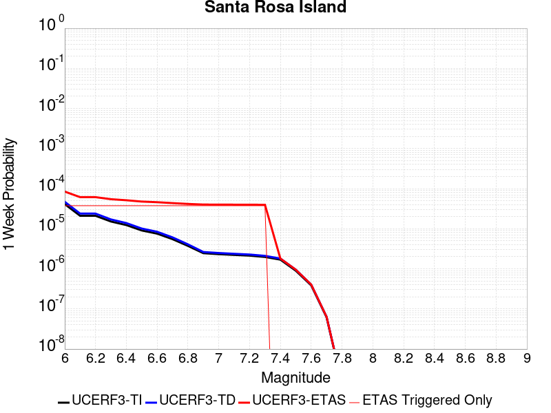 | 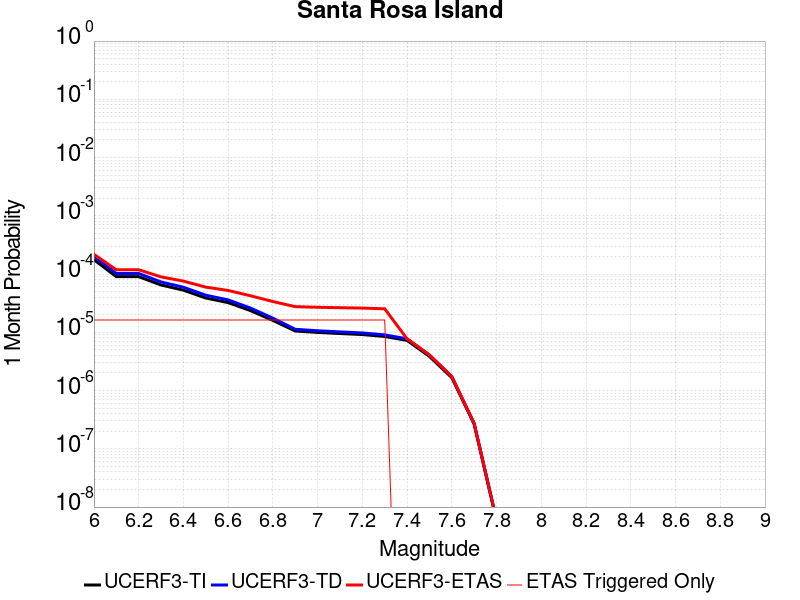 | 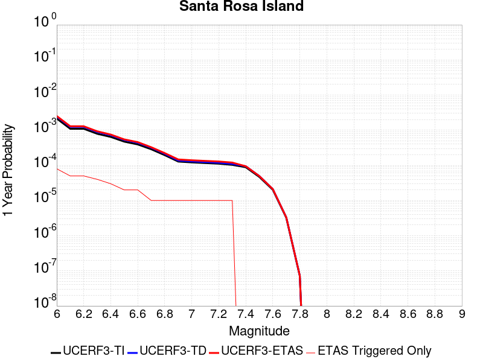 | 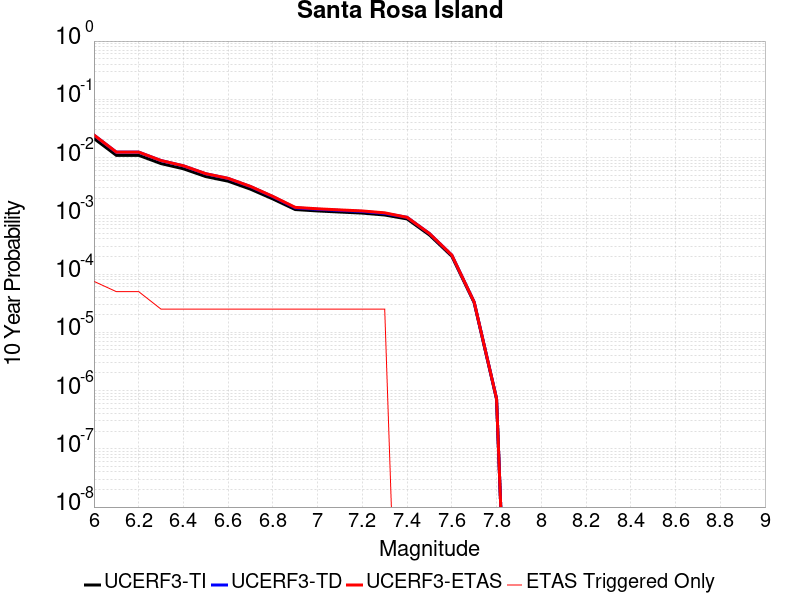 |

| Magnitude | 1 wk TI Prob | 1 wk TD Prob | 1 wk ETAS Prob | 1 wk ETAS/TD Gain | 1 wk ETAS Triggered Only | 1 mo TI Prob | 1 mo TD Prob | 1 mo ETAS Prob | 1 mo ETAS/TD Gain | 1 mo ETAS Triggered Only | 1 yr TI Prob | 1 yr TD Prob | 1 yr ETAS Prob | 1 yr ETAS/TD Gain | 1 yr ETAS Triggered Only | 10 yr TI Prob | 10 yr TD Prob | 10 yr ETAS Prob | 10 yr ETAS/TD Gain | 10 yr ETAS Triggered Only |
|-----|-----|-----|-----|-----|-----|-----|-----|-----|-----|-----|-----|-----|-----|-----|-----|-----|-----|-----|-----|-----|
| 6.0 | 4.1143165E-5 | 4.709113E-5 | 7.206997E-5 | 1.5304362 | 2.4980016E-5 | 1.7631594E-4 | 2.0180462E-4 | 2.267796E-4 | 1.1237582 | 2.4980016E-5 | 0.002144533 | 0.0024543991 | 0.0025042365 | 1.0203054 | 4.9960032E-5 | 0.021239553 | 0.024293557 | 0.024366677 | 1.0030098 | 7.494005E-5 |
| 6.1 | 2.1061249E-5 | 2.3864959E-5 | 4.884438E-5 | 2.0466986 | 2.4980016E-5 | 9.0259375E-5 | 1.0227455E-4 | 1.2725202E-4 | 1.2442197 | 2.4980016E-5 | 0.0010983539 | 0.0012445103 | 0.0012694593 | 1.0200472 | 2.4980016E-5 | 0.01092941 | 0.01237845 | 0.012427792 | 1.0039861 | 4.9960032E-5 |
| 6.2 | 2.1061249E-5 | 2.3864959E-5 | 4.884438E-5 | 2.0466986 | 2.4980016E-5 | 9.0259375E-5 | 1.0227455E-4 | 1.2725202E-4 | 1.2442197 | 2.4980016E-5 | 0.0010983539 | 0.0012445103 | 0.0012694593 | 1.0200472 | 2.4980016E-5 | 0.01092941 | 0.01237845 | 0.012427792 | 1.0039861 | 4.9960032E-5 |
| 6.3 | 1.5158236E-5 | 1.7074419E-5 | 4.205401E-5 | 2.4629834 | 2.4980016E-5 | 6.496225E-5 | 7.3174095E-5 | 9.815228E-5 | 1.3413529 | 2.4980016E-5 | 7.906284E-4 | 8.9054246E-4 | 9.155002E-4 | 1.0280254 | 2.4980016E-5 | 0.007878214 | 0.00887099 | 0.008895748 | 1.0027909 | 2.4980016E-5 |
| 6.4 | 1.2341918E-5 | 1.3852917E-5 | 3.8832586E-5 | 2.8032064 | 2.4980016E-5 | 5.2892858E-5 | 5.9368336E-5 | 8.434687E-5 | 1.4207383 | 2.4980016E-5 | 6.437803E-4 | 7.225779E-4 | 7.475399E-4 | 1.0345457 | 2.4980016E-5 | 0.006419184 | 0.0072031217 | 0.007227922 | 1.003443 | 2.4980016E-5 |
| 6.5 | 9.061158E-6 | 1.0117032E-5 | 3.5096793E-5 | 3.4690804 | 2.4980016E-5 | 3.883296E-5 | 4.3358017E-5 | 6.833695E-5 | 1.5761088 | 2.4980016E-5 | 4.726887E-4 | 5.277613E-4 | 5.5272813E-4 | 1.047307 | 2.4980016E-5 | 0.004716845 | 0.0052656177 | 0.005290466 | 1.004719 | 2.4980016E-5 |
| 6.6 | 7.5461685E-6 | 8.400734E-6 | 3.338054E-5 | 3.9735267 | 2.4980016E-5 | 3.2340322E-5 | 3.600267E-5 | 6.098179E-5 | 1.6938128 | 2.4980016E-5 | 3.936723E-4 | 4.3824868E-4 | 4.6321773E-4 | 1.0569746 | 2.4980016E-5 | 0.003929756 | 0.0043742736 | 0.0043991446 | 1.0056857 | 2.4980016E-5 |
| 6.7 | 5.5023775E-6 | 6.087381E-6 | 3.1067244E-5 | 5.1035485 | 2.4980016E-5 | 2.3581404E-5 | 2.6088532E-5 | 5.10679E-5 | 1.9574845 | 2.4980016E-5 | 2.8706578E-4 | 3.1758484E-4 | 3.4255692E-4 | 1.0786312 | 2.4980016E-5 | 0.0028669522 | 0.0031716316 | 0.0031965324 | 1.0078511 | 2.4980016E-5 |
| 6.8 | 3.7351679E-6 | 4.0831405E-6 | 2.9063054E-5 | 7.117819 | 2.4980016E-5 | 1.6007763E-5 | 1.7499071E-5 | 4.247865E-5 | 2.4274802 | 2.4980016E-5 | 1.948771E-4 | 2.1303285E-4 | 2.3800755E-4 | 1.117234 | 2.4980016E-5 | 0.0019470629 | 0.0021285315 | 0.0021534583 | 1.0117108 | 2.4980016E-5 |
| 6.9 | 2.456366E-6 | 2.6292707E-6 | 2.7609221E-5 | 10.500714 | 2.4980016E-5 | 1.0527241E-5 | 1.1268255E-5 | 3.6247988E-5 | 3.2168238 | 2.4980016E-5 | 1.2816161E-4 | 1.3718239E-4 | 1.6215898E-4 | 1.1820685 | 2.4980016E-5 | 0.0012808773 | 0.0013709799 | 0.0013959258 | 1.0181956 | 2.4980016E-5 |
| 7.0 | 2.3245157E-6 | 2.4827784E-6 | 2.7462733E-5 | 11.06129 | 2.4980016E-5 | 9.962172E-6 | 1.0640436E-5 | 3.5620185E-5 | 3.3476248 | 2.4980016E-5 | 1.2128269E-4 | 1.2953962E-4 | 1.545164E-4 | 1.1928118 | 2.4980016E-5 | 0.0012121652 | 0.0012946434 | 0.0013195911 | 1.01927 | 2.4980016E-5 |
| 7.1 | 2.2248344E-6 | 2.37325E-6 | 2.7353206E-5 | 11.525632 | 2.4980016E-5 | 9.53497E-6 | 1.0171032E-5 | 3.5150795E-5 | 3.4559712 | 2.4980016E-5 | 1.1608207E-4 | 1.238253E-4 | 1.4880222E-4 | 1.2017109 | 2.4980016E-5 | 0.0011602144 | 0.0012375651 | 0.0012625142 | 1.0201598 | 2.4980016E-5 |
| 7.2 | 2.1350402E-6 | 2.2761542E-6 | 2.7256114E-5 | 11.974634 | 2.4980016E-5 | 9.150141E-6 | 9.75491E-6 | 3.4734683E-5 | 3.5607386 | 2.4980016E-5 | 1.1139726E-4 | 1.1875957E-4 | 1.4373662E-4 | 1.2103161 | 2.4980016E-5 | 0.0011134144 | 0.0011869629 | 0.0012119133 | 1.0210203 | 2.4980016E-5 |
| 7.3 | 1.9793572E-6 | 2.1087192E-6 | 2.7088683E-5 | 12.846036 | 2.4980016E-5 | 8.482932E-6 | 9.037337E-6 | 3.401713E-5 | 3.7640655 | 2.4980016E-5 | 1.032748E-4 | 1.1002403E-4 | 1.350013E-4 | 1.2270164 | 2.4980016E-5 | 0.0010322682 | 0.0010996974 | 0.00112465 | 1.0226904 | 2.4980016E-5 |
| 7.4 | 1.6951194E-6 | 1.8045735E-6 | 1.8045735E-6 | 1.0 | 0.0 | 7.264777E-6 | 7.733864E-6 | 7.733864E-6 | 1.0 | 0.0 | 8.844508E-5 | 9.415574E-5 | 9.415574E-5 | 1.0 | 0.0 | 8.840988E-4 | 9.411601E-4 | 9.411601E-4 | 1.0 | 0.0 |
| 7.5 | 8.987207E-7 | 9.512216E-7 | 9.512216E-7 | 1.0 | 0.0 | 3.8516546E-6 | 4.0766577E-6 | 4.0766577E-6 | 1.0 | 0.0 | 4.6892885E-5 | 4.9632188E-5 | 4.9632188E-5 | 1.0 | 0.0 | 4.688299E-4 | 4.962122E-4 | 4.962122E-4 | 1.0 | 0.0 |
| 7.6 | 3.8783037E-7 | 4.0529335E-7 | 4.0529335E-7 | 1.0 | 0.0 | 1.6621291E-6 | 1.7369704E-6 | 1.7369704E-6 | 1.0 | 0.0 | 2.0236233E-5 | 2.1147416E-5 | 2.1147416E-5 | 1.0 | 0.0 | 2.023439E-4 | 2.114547E-4 | 2.114547E-4 | 1.0 | 0.0 |
| 7.7 | 6.181804E-8 | 6.339047E-8 | 6.339047E-8 | 1.0 | 0.0 | 2.6493444E-7 | 2.7167343E-7 | 2.7167343E-7 | 1.0 | 0.0 | 3.225572E-6 | 3.307619E-6 | 3.307619E-6 | 1.0 | 0.0 | 3.225525E-5 | 3.3075703E-5 | 3.3075703E-5 | 1.0 | 0.0 |
| 7.8 | 1.3704449E-9 | 1.3964153E-9 | 1.3964153E-9 | 1.0 | 0.0 | 5.873335E-9 | 5.984637E-9 | 5.984637E-9 | 1.0 | 0.0 | 7.1507856E-8 | 7.286295E-8 | 7.286295E-8 | 1.0 | 0.0 | 7.1507833E-7 | 7.286294E-7 | 7.286294E-7 | 1.0 | 0.0 |

## Deep Springs
*[(top)](#table-of-contents)*

| 1 Week | 1 Month | 1 Year | 10 Year |
|-----|-----|-----|-----|
| 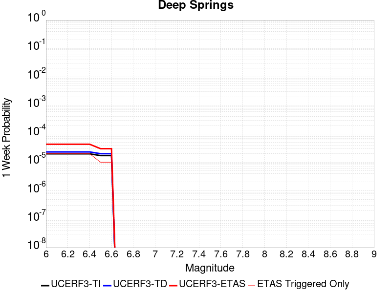 | 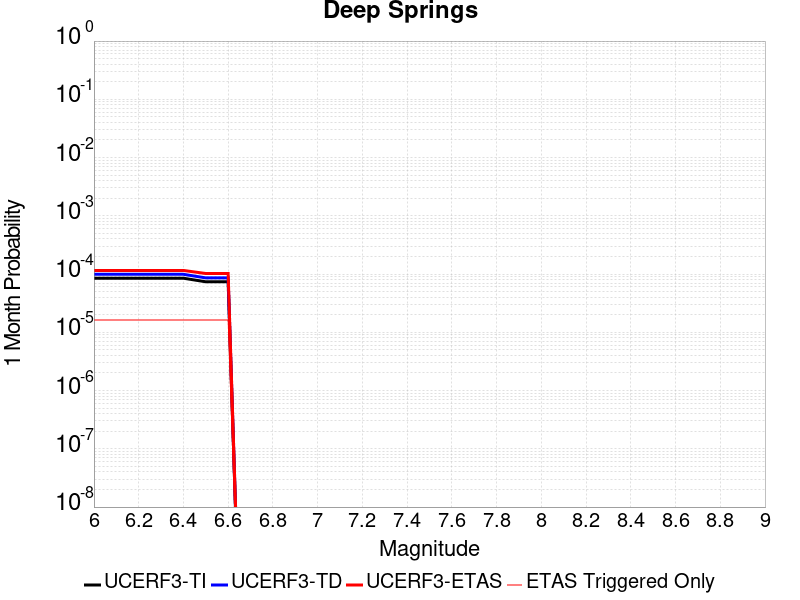 | 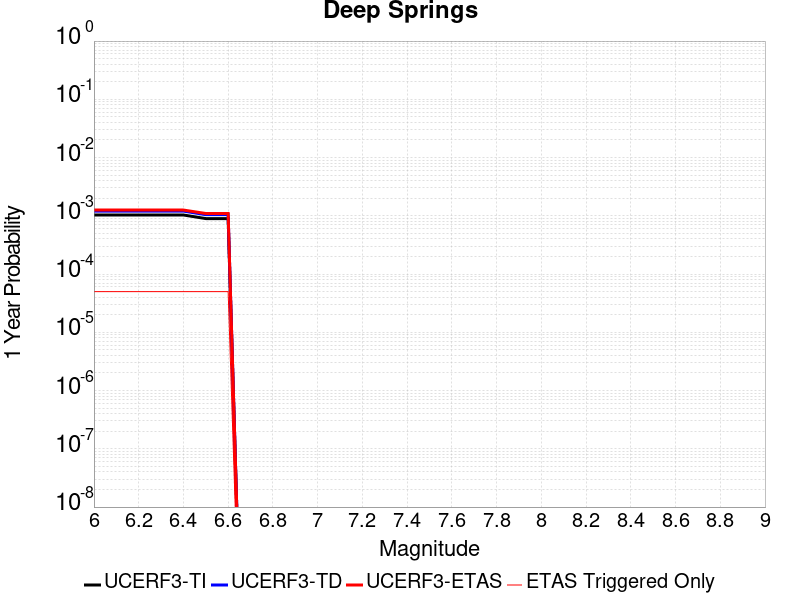 | 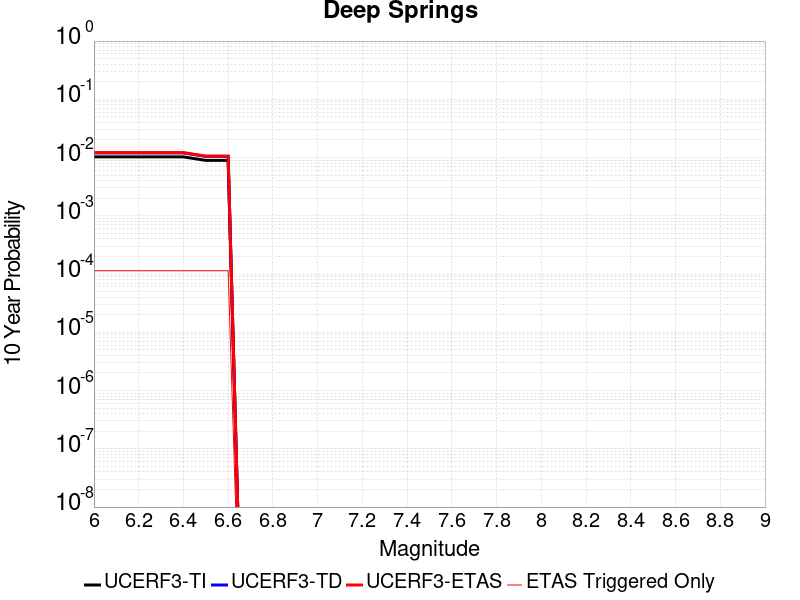 |

| Magnitude | 1 wk TI Prob | 1 wk TD Prob | 1 wk ETAS Prob | 1 wk ETAS/TD Gain | 1 wk ETAS Triggered Only | 1 mo TI Prob | 1 mo TD Prob | 1 mo ETAS Prob | 1 mo ETAS/TD Gain | 1 mo ETAS Triggered Only | 1 yr TI Prob | 1 yr TD Prob | 1 yr ETAS Prob | 1 yr ETAS/TD Gain | 1 yr ETAS Triggered Only | 10 yr TI Prob | 10 yr TD Prob | 10 yr ETAS Prob | 10 yr ETAS/TD Gain | 10 yr ETAS Triggered Only |
|-----|-----|-----|-----|-----|-----|-----|-----|-----|-----|-----|-----|-----|-----|-----|-----|-----|-----|-----|-----|-----|
| 6.0 | 1.9810619E-5 | 2.311252E-5 | 2.311252E-5 | 1.0 | 0.0 | 8.489989E-5 | 9.9052755E-5 | 9.9052755E-5 | 1.0 | 0.0 | 0.001033166 | 0.0012058078 | 0.0012557076 | 1.0413829 | 4.9960032E-5 | 0.010283757 | 0.01204243 | 0.012116468 | 1.0061481 | 7.494005E-5 |
| 6.1 | 1.9810619E-5 | 2.311252E-5 | 2.311252E-5 | 1.0 | 0.0 | 8.489989E-5 | 9.9052755E-5 | 9.9052755E-5 | 1.0 | 0.0 | 0.001033166 | 0.0012058078 | 0.0012557076 | 1.0413829 | 4.9960032E-5 | 0.010283757 | 0.01204243 | 0.012116468 | 1.0061481 | 7.494005E-5 |
| 6.2 | 1.9810619E-5 | 2.311252E-5 | 2.311252E-5 | 1.0 | 0.0 | 8.489989E-5 | 9.9052755E-5 | 9.9052755E-5 | 1.0 | 0.0 | 0.001033166 | 0.0012058078 | 0.0012557076 | 1.0413829 | 4.9960032E-5 | 0.010283757 | 0.01204243 | 0.012116468 | 1.0061481 | 7.494005E-5 |
| 6.3 | 1.9810619E-5 | 2.311252E-5 | 2.311252E-5 | 1.0 | 0.0 | 8.489989E-5 | 9.9052755E-5 | 9.9052755E-5 | 1.0 | 0.0 | 0.001033166 | 0.0012058078 | 0.0012557076 | 1.0413829 | 4.9960032E-5 | 0.010283757 | 0.01204243 | 0.012116468 | 1.0061481 | 7.494005E-5 |
| 6.4 | 1.9810619E-5 | 2.311252E-5 | 2.311252E-5 | 1.0 | 0.0 | 8.489989E-5 | 9.9052755E-5 | 9.9052755E-5 | 1.0 | 0.0 | 0.001033166 | 0.0012058078 | 0.0012557076 | 1.0413829 | 4.9960032E-5 | 0.010283757 | 0.01204243 | 0.012116468 | 1.0061481 | 7.494005E-5 |
| 6.5 | 1.7190405E-5 | 2.0050558E-5 | 2.0050558E-5 | 1.0 | 0.0 | 7.367108E-5 | 8.593096E-5 | 8.593096E-5 | 1.0 | 0.0 | 8.9657627E-4 | 0.0010462092 | 0.001096117 | 1.0477034 | 4.9960032E-5 | 0.008929676 | 0.010462061 | 0.010536217 | 1.0070881 | 7.494005E-5 |
| 6.6 | 1.7190405E-5 | 2.0050558E-5 | 2.0050558E-5 | 1.0 | 0.0 | 7.367108E-5 | 8.593096E-5 | 8.593096E-5 | 1.0 | 0.0 | 8.9657627E-4 | 0.0010462092 | 0.001096117 | 1.0477034 | 4.9960032E-5 | 0.008929676 | 0.010462061 | 0.010536217 | 1.0070881 | 7.494005E-5 |

## Elysian Park (Upper)
*[(top)](#table-of-contents)*

| 1 Week | 1 Month | 1 Year | 10 Year |
|-----|-----|-----|-----|
| 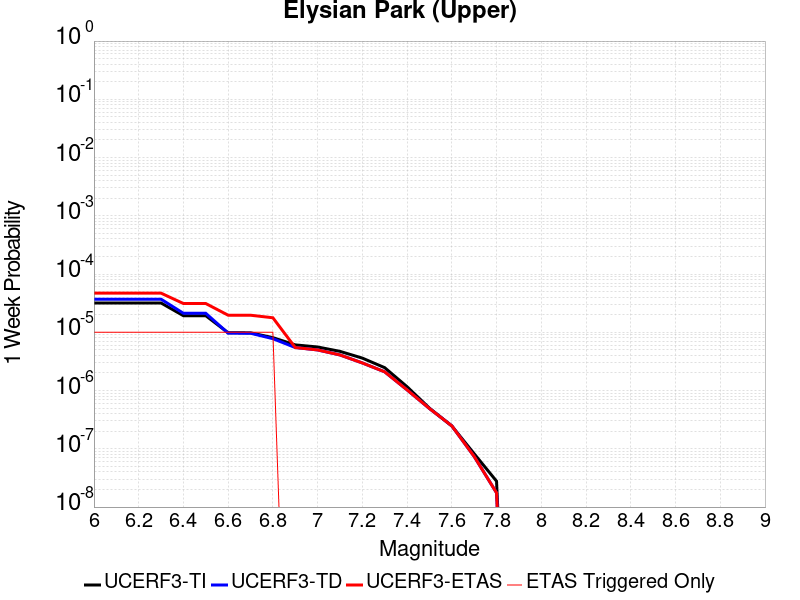 | 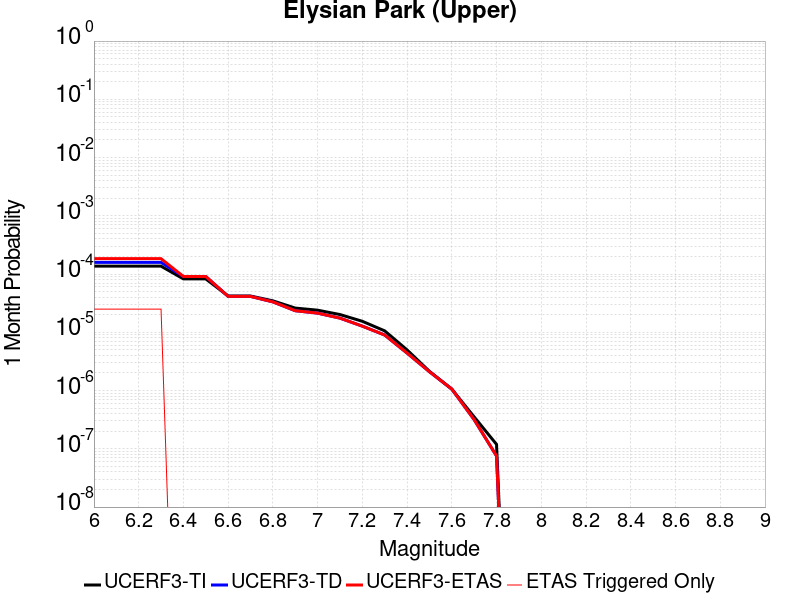 | 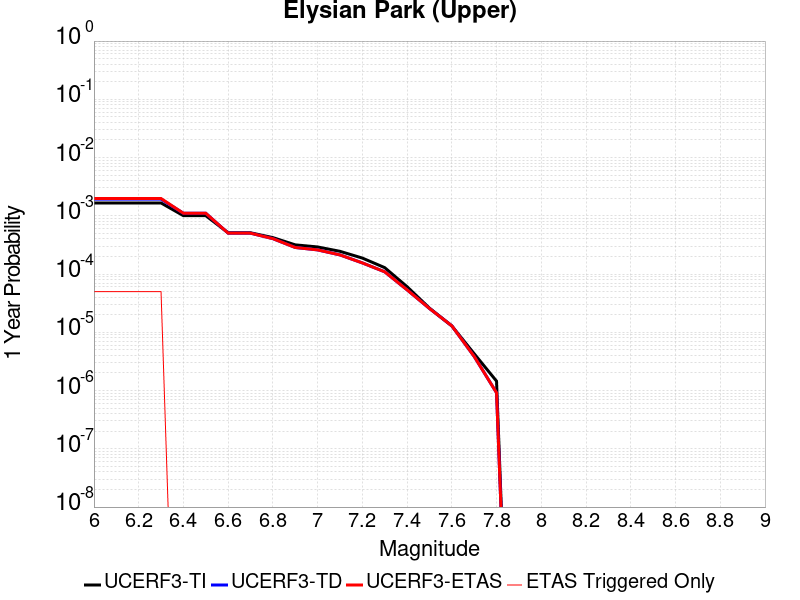 | 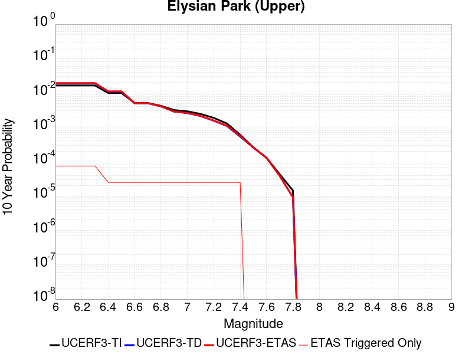 |

| Magnitude | 1 wk TI Prob | 1 wk TD Prob | 1 wk ETAS Prob | 1 wk ETAS/TD Gain | 1 wk ETAS Triggered Only | 1 mo TI Prob | 1 mo TD Prob | 1 mo ETAS Prob | 1 mo ETAS/TD Gain | 1 mo ETAS Triggered Only | 1 yr TI Prob | 1 yr TD Prob | 1 yr ETAS Prob | 1 yr ETAS/TD Gain | 1 yr ETAS Triggered Only | 10 yr TI Prob | 10 yr TD Prob | 10 yr ETAS Prob | 10 yr ETAS/TD Gain | 10 yr ETAS Triggered Only |
|-----|-----|-----|-----|-----|-----|-----|-----|-----|-----|-----|-----|-----|-----|-----|-----|-----|-----|-----|-----|-----|
| 6.0 | 3.1876025E-5 | 3.7035275E-5 | 3.7035275E-5 | 1.0 | 0.0 | 1.3660437E-4 | 1.5871569E-4 | 1.8369174E-4 | 1.1573634 | 2.4980016E-5 | 0.0016618895 | 0.001931122 | 0.0019809855 | 1.025821 | 4.9960032E-5 | 0.016495159 | 0.019189863 | 0.019263364 | 1.0038302 | 7.494005E-5 |
| 6.1 | 3.1876025E-5 | 3.7035275E-5 | 3.7035275E-5 | 1.0 | 0.0 | 1.3660437E-4 | 1.5871569E-4 | 1.8369174E-4 | 1.1573634 | 2.4980016E-5 | 0.0016618895 | 0.001931122 | 0.0019809855 | 1.025821 | 4.9960032E-5 | 0.016495159 | 0.019189863 | 0.019263364 | 1.0038302 | 7.494005E-5 |
| 6.2 | 3.1876025E-5 | 3.7035275E-5 | 3.7035275E-5 | 1.0 | 0.0 | 1.3660437E-4 | 1.5871569E-4 | 1.8369174E-4 | 1.1573634 | 2.4980016E-5 | 0.0016618895 | 0.001931122 | 0.0019809855 | 1.025821 | 4.9960032E-5 | 0.016495159 | 0.019189863 | 0.019263364 | 1.0038302 | 7.494005E-5 |
| 6.3 | 3.1876025E-5 | 3.7035275E-5 | 3.7035275E-5 | 1.0 | 0.0 | 1.3660437E-4 | 1.5871569E-4 | 1.8369174E-4 | 1.1573634 | 2.4980016E-5 | 0.0016618895 | 0.001931122 | 0.0019809855 | 1.025821 | 4.9960032E-5 | 0.016495159 | 0.019189863 | 0.019263364 | 1.0038302 | 7.494005E-5 |
| 6.4 | 1.9273462E-5 | 2.120244E-5 | 2.120244E-5 | 1.0 | 0.0 | 8.259794E-5 | 9.086542E-5 | 9.086542E-5 | 1.0 | 0.0 | 0.001005166 | 0.0011058967 | 0.0011058967 | 1.0 | 0.0 | 0.010006315 | 0.011020744 | 0.0110454485 | 1.0022416 | 2.4980016E-5 |
| 6.5 | 1.9273462E-5 | 2.120244E-5 | 2.120244E-5 | 1.0 | 0.0 | 8.259794E-5 | 9.086542E-5 | 9.086542E-5 | 1.0 | 0.0 | 0.001005166 | 0.0011058967 | 0.0011058967 | 1.0 | 0.0 | 0.010006315 | 0.011020744 | 0.0110454485 | 1.0022416 | 2.4980016E-5 |
| 6.6 | 9.813258E-6 | 9.665589E-6 | 9.665589E-6 | 1.0 | 0.0 | 4.205614E-5 | 4.1423333E-5 | 4.1423333E-5 | 1.0 | 0.0 | 5.119132E-4 | 5.042196E-4 | 5.042196E-4 | 1.0 | 0.0 | 0.005107356 | 0.0050314795 | 0.0050563337 | 1.0049398 | 2.4980016E-5 |
| 6.7 | 9.801478E-6 | 9.653158E-6 | 9.653158E-6 | 1.0 | 0.0 | 4.2005657E-5 | 4.137006E-5 | 4.137006E-5 | 1.0 | 0.0 | 5.112989E-4 | 5.0357135E-4 | 5.0357135E-4 | 1.0 | 0.0 | 0.0051012407 | 0.005025026 | 0.0050498806 | 1.0049461 | 2.4980016E-5 |
| 6.8 | 8.102489E-6 | 7.772994E-6 | 7.772994E-6 | 1.0 | 0.0 | 3.4724493E-5 | 3.3312434E-5 | 3.3312434E-5 | 1.0 | 0.0 | 4.2268867E-4 | 4.0550836E-4 | 4.0550836E-4 | 1.0 | 0.0 | 0.004218856 | 0.0040481784 | 0.0040730573 | 1.0061457 | 2.4980016E-5 |
| 6.9 | 6.08275E-6 | 5.481441E-6 | 5.481441E-6 | 1.0 | 0.0 | 2.6068668E-5 | 2.3491682E-5 | 2.3491682E-5 | 1.0 | 0.0 | 3.173398E-4 | 2.8597447E-4 | 2.8597447E-4 | 1.0 | 0.0 | 0.0031688702 | 0.0028561424 | 0.002881051 | 1.0087211 | 2.4980016E-5 |
| 7.0 | 5.5995934E-6 | 4.9827686E-6 | 4.9827686E-6 | 1.0 | 0.0 | 2.3998036E-5 | 2.1354552E-5 | 2.1354552E-5 | 1.0 | 0.0 | 2.9213692E-4 | 2.5996132E-4 | 2.5996132E-4 | 1.0 | 0.0 | 0.0029175316 | 0.0025966396 | 0.0026215548 | 1.0095952 | 2.4980016E-5 |
| 7.1 | 4.709881E-6 | 4.0873906E-6 | 4.0873906E-6 | 1.0 | 0.0 | 2.0185047E-5 | 1.7517272E-5 | 1.7517272E-5 | 1.0 | 0.0 | 2.4572524E-4 | 2.1325232E-4 | 2.1325232E-4 | 1.0 | 0.0 | 0.002454537 | 0.0021305184 | 0.002155445 | 1.0116999 | 2.4980016E-5 |
| 7.2 | 3.6063436E-6 | 2.9779412E-6 | 2.9779412E-6 | 1.0 | 0.0 | 1.5455667E-5 | 1.27625435E-5 | 1.27625435E-5 | 1.0 | 0.0 | 1.881565E-4 | 1.55373E-4 | 1.55373E-4 | 1.0 | 0.0 | 0.0018799726 | 0.0015526549 | 0.0015775962 | 1.0160636 | 2.4980016E-5 |
| 7.3 | 2.471135E-6 | 2.0954562E-6 | 2.0954562E-6 | 1.0 | 0.0 | 1.0590536E-5 | 8.980496E-6 | 8.980496E-6 | 1.0 | 0.0 | 1.2893214E-4 | 1.0933213E-4 | 1.0933213E-4 | 1.0 | 0.0 | 0.0012885736 | 0.0010927906 | 0.0011177433 | 1.022834 | 2.4980016E-5 |
| 7.4 | 1.163943E-6 | 1.0275061E-6 | 1.0275061E-6 | 1.0 | 0.0 | 4.988318E-6 | 4.40359E-6 | 4.40359E-6 | 1.0 | 0.0 | 6.0731076E-5 | 5.361242E-5 | 5.361242E-5 | 1.0 | 0.0 | 6.071448E-4 | 5.3599785E-4 | 5.6096446E-4 | 1.0465797 | 2.4980016E-5 |
| 7.5 | 4.99459E-7 | 4.917601E-7 | 4.917601E-7 | 1.0 | 0.0 | 2.140537E-6 | 2.1075416E-6 | 2.1075416E-6 | 1.0 | 0.0 | 2.6060725E-5 | 2.5659032E-5 | 2.5659032E-5 | 1.0 | 0.0 | 2.605767E-4 | 2.5656226E-4 | 2.5656226E-4 | 1.0 | 0.0 |
| 7.6 | 2.4667852E-7 | 2.4778313E-7 | 2.4778313E-7 | 1.0 | 0.0 | 1.0571932E-6 | 1.0619274E-6 | 1.0619274E-6 | 1.0 | 0.0 | 1.2871251E-5 | 1.2928893E-5 | 1.2928893E-5 | 1.0 | 0.0 | 1.2870505E-4 | 1.2928178E-4 | 1.2928178E-4 | 1.0 | 0.0 |
| 7.7 | 8.2312795E-8 | 7.3864214E-8 | 7.3864214E-8 | 1.0 | 0.0 | 3.527691E-7 | 3.165609E-7 | 3.165609E-7 | 1.0 | 0.0 | 4.294955E-6 | 3.854123E-6 | 3.854123E-6 | 1.0 | 0.0 | 4.2948723E-5 | 3.854068E-5 | 3.854068E-5 | 1.0 | 0.0 |
| 7.8 | 2.7819295E-8 | 1.7565618E-8 | 1.7565618E-8 | 1.0 | 0.0 | 1.1922555E-7 | 7.528122E-8 | 7.528122E-8 | 1.0 | 0.0 | 1.45157E-6 | 9.1654863E-7 | 9.1654863E-7 | 1.0 | 0.0 | 1.45156055E-5 | 9.165463E-6 | 9.165463E-6 | 1.0 | 0.0 |

## Kern Canyon (South Kern) 2011
*[(top)](#table-of-contents)*

| 1 Week | 1 Month | 1 Year | 10 Year |
|-----|-----|-----|-----|
| 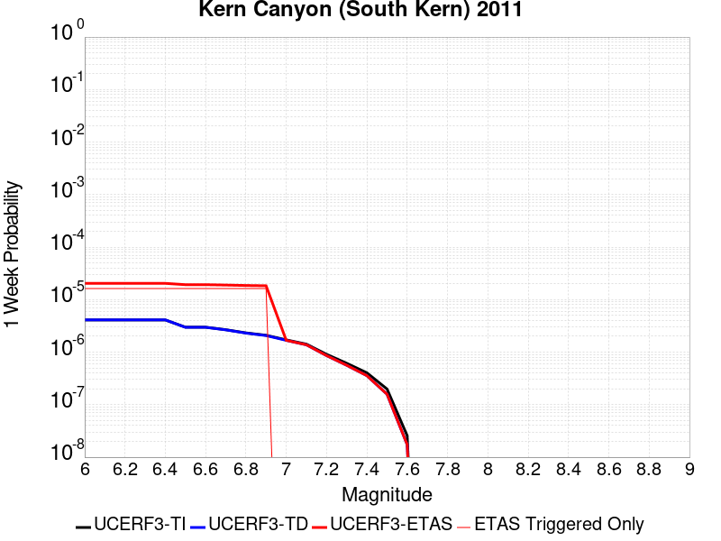 | 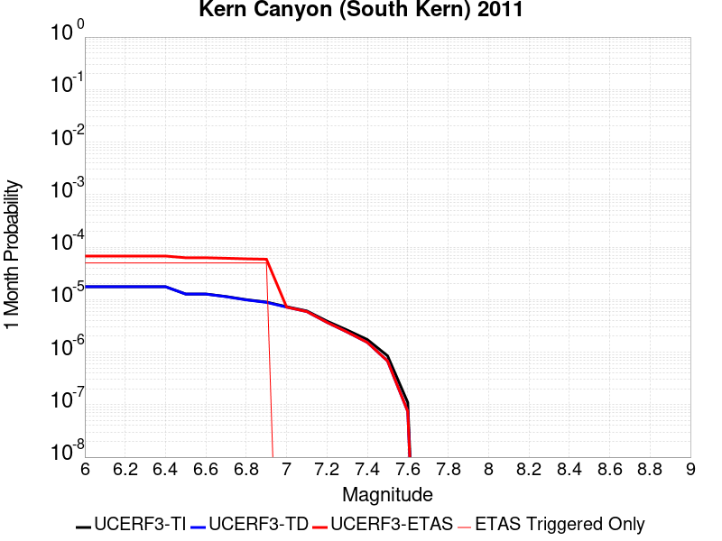 | 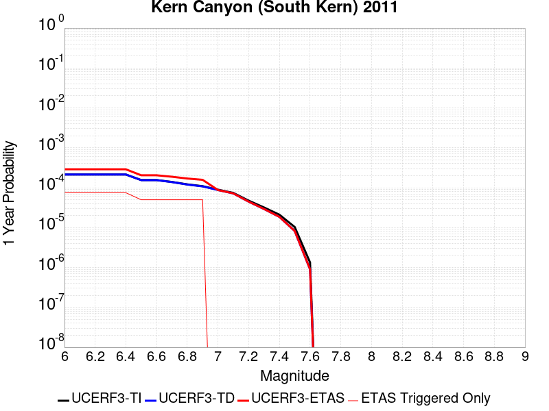 | 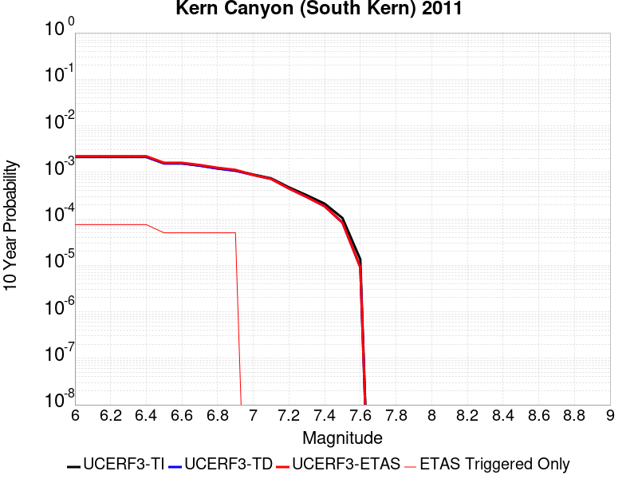 |

| Magnitude | 1 wk TI Prob | 1 wk TD Prob | 1 wk ETAS Prob | 1 wk ETAS/TD Gain | 1 wk ETAS Triggered Only | 1 mo TI Prob | 1 mo TD Prob | 1 mo ETAS Prob | 1 mo ETAS/TD Gain | 1 mo ETAS Triggered Only | 1 yr TI Prob | 1 yr TD Prob | 1 yr ETAS Prob | 1 yr ETAS/TD Gain | 1 yr ETAS Triggered Only | 10 yr TI Prob | 10 yr TD Prob | 10 yr ETAS Prob | 10 yr ETAS/TD Gain | 10 yr ETAS Triggered Only |
|-----|-----|-----|-----|-----|-----|-----|-----|-----|-----|-----|-----|-----|-----|-----|-----|-----|-----|-----|-----|-----|
| 6.0 | 4.105075E-6 | 4.113726E-6 | 2.9093639E-5 | 7.072333 | 2.4980016E-5 | 1.7593058E-5 | 1.7630138E-5 | 6.758929E-5 | 3.8337357 | 4.9960032E-5 | 2.1417443E-4 | 2.1462643E-4 | 2.895504E-4 | 1.3490901 | 7.494005E-5 | 0.0021396813 | 0.0021442554 | 0.0022190348 | 1.0348743 | 7.494005E-5 |
| 6.1 | 4.105075E-6 | 4.113726E-6 | 2.9093639E-5 | 7.072333 | 2.4980016E-5 | 1.7593058E-5 | 1.7630138E-5 | 6.758929E-5 | 3.8337357 | 4.9960032E-5 | 2.1417443E-4 | 2.1462643E-4 | 2.895504E-4 | 1.3490901 | 7.494005E-5 | 0.0021396813 | 0.0021442554 | 0.0022190348 | 1.0348743 | 7.494005E-5 |
| 6.2 | 4.105075E-6 | 4.113726E-6 | 2.9093639E-5 | 7.072333 | 2.4980016E-5 | 1.7593058E-5 | 1.7630138E-5 | 6.758929E-5 | 3.8337357 | 4.9960032E-5 | 2.1417443E-4 | 2.1462643E-4 | 2.895504E-4 | 1.3490901 | 7.494005E-5 | 0.0021396813 | 0.0021442554 | 0.0022190348 | 1.0348743 | 7.494005E-5 |
| 6.3 | 4.105075E-6 | 4.113726E-6 | 2.9093639E-5 | 7.072333 | 2.4980016E-5 | 1.7593058E-5 | 1.7630138E-5 | 6.758929E-5 | 3.8337357 | 4.9960032E-5 | 2.1417443E-4 | 2.1462643E-4 | 2.895504E-4 | 1.3490901 | 7.494005E-5 | 0.0021396813 | 0.0021442554 | 0.0022190348 | 1.0348743 | 7.494005E-5 |
| 6.4 | 4.105075E-6 | 4.113726E-6 | 2.9093639E-5 | 7.072333 | 2.4980016E-5 | 1.7593058E-5 | 1.7630138E-5 | 6.758929E-5 | 3.8337357 | 4.9960032E-5 | 2.1417443E-4 | 2.1462643E-4 | 2.895504E-4 | 1.3490901 | 7.494005E-5 | 0.0021396813 | 0.0021442554 | 0.0022190348 | 1.0348743 | 7.494005E-5 |
| 6.5 | 2.9849807E-6 | 2.973154E-6 | 2.7953096E-5 | 9.401832 | 2.4980016E-5 | 1.2792712E-5 | 1.2742028E-5 | 6.270142E-5 | 4.9208355 | 4.9960032E-5 | 1.5574014E-4 | 1.551233E-4 | 2.0507557E-4 | 1.3220166 | 4.9960032E-5 | 0.0015563103 | 0.0015501654 | 0.0016000479 | 1.0321789 | 4.9960032E-5 |
| 6.6 | 2.9849807E-6 | 2.973154E-6 | 2.7953096E-5 | 9.401832 | 2.4980016E-5 | 1.2792712E-5 | 1.2742028E-5 | 6.270142E-5 | 4.9208355 | 4.9960032E-5 | 1.5574014E-4 | 1.551233E-4 | 2.0507557E-4 | 1.3220166 | 4.9960032E-5 | 0.0015563103 | 0.0015501654 | 0.0016000479 | 1.0321789 | 4.9960032E-5 |
| 6.7 | 2.6756725E-6 | 2.6582202E-6 | 2.7638169E-5 | 10.397246 | 2.4980016E-5 | 1.1467117E-5 | 1.1392323E-5 | 6.1351784E-5 | 5.385362 | 4.9960032E-5 | 1.396032E-4 | 1.386928E-4 | 1.8864592E-4 | 1.3601708 | 4.9960032E-5 | 0.0013951553 | 0.0013860734 | 0.0014359643 | 1.0359943 | 4.9960032E-5 |
| 6.8 | 2.3283721E-6 | 2.3047783E-6 | 2.7284737E-5 | 11.838335 | 2.4980016E-5 | 9.9787E-6 | 9.877584E-6 | 5.9837123E-5 | 6.0578704 | 4.9960032E-5 | 1.214839E-4 | 1.2025302E-4 | 1.7020704E-4 | 1.4154077 | 4.9960032E-5 | 0.001214175 | 0.001201887 | 0.001251787 | 1.0415181 | 4.9960032E-5 |
| 6.9 | 2.0972677E-6 | 2.0696405E-6 | 2.7049606E-5 | 13.069712 | 2.4980016E-5 | 8.988259E-6 | 8.869858E-6 | 5.8829446E-5 | 6.6325126 | 4.9960032E-5 | 1.0942656E-4 | 1.0798523E-4 | 1.5793987E-4 | 1.4626062 | 4.9960032E-5 | 0.0010937268 | 0.0010793334 | 0.0011292396 | 1.046238 | 4.9960032E-5 |
| 7.0 | 1.7132242E-6 | 1.6787029E-6 | 1.6787029E-6 | 1.0 | 0.0 | 7.3423685E-6 | 7.1944214E-6 | 7.1944214E-6 | 1.0 | 0.0 | 8.938967E-5 | 8.75886E-5 | 8.75886E-5 | 1.0 | 0.0 | 8.935372E-4 | 8.755446E-4 | 8.755446E-4 | 1.0 | 0.0 |
| 7.1 | 1.4215541E-6 | 1.3815746E-6 | 1.3815746E-6 | 1.0 | 0.0 | 6.0923603E-6 | 5.9210206E-6 | 5.9210206E-6 | 1.0 | 0.0 | 7.417196E-5 | 7.208607E-5 | 7.208607E-5 | 1.0 | 0.0 | 7.414721E-4 | 7.206296E-4 | 7.206296E-4 | 1.0 | 0.0 |
| 7.2 | 9.097853E-7 | 8.60377E-7 | 8.60377E-7 | 1.0 | 0.0 | 3.899074E-6 | 3.6873246E-6 | 3.6873246E-6 | 1.0 | 0.0 | 4.7470192E-5 | 4.4892266E-5 | 4.4892266E-5 | 1.0 | 0.0 | 4.7460053E-4 | 4.4883305E-4 | 4.4883305E-4 | 1.0 | 0.0 |
| 7.3 | 6.144169E-7 | 5.628199E-7 | 5.628199E-7 | 1.0 | 0.0 | 2.6332125E-6 | 2.4120832E-6 | 2.4120832E-6 | 1.0 | 0.0 | 3.205889E-5 | 2.9366722E-5 | 2.9366722E-5 | 1.0 | 0.0 | 3.2054266E-4 | 2.9362892E-4 | 2.9362892E-4 | 1.0 | 0.0 |
| 7.4 | 4.049844E-7 | 3.5728252E-7 | 3.5728252E-7 | 1.0 | 0.0 | 1.7356463E-6 | 1.5312098E-6 | 1.5312098E-6 | 1.0 | 0.0 | 2.1131287E-5 | 1.8642324E-5 | 1.8642324E-5 | 1.0 | 0.0 | 2.1129279E-4 | 1.8640784E-4 | 1.8640784E-4 | 1.0 | 0.0 |
| 7.5 | 1.9871162E-7 | 1.5830383E-7 | 1.5830383E-7 | 1.0 | 0.0 | 8.5162094E-7 | 6.784448E-7 | 6.784448E-7 | 1.0 | 0.0 | 1.0368436E-5 | 8.260035E-6 | 8.260035E-6 | 1.0 | 0.0 | 1.0367952E-4 | 8.259736E-5 | 8.259736E-5 | 1.0 | 0.0 |
| 7.6 | 2.572245E-8 | 1.735264E-8 | 1.735264E-8 | 1.0 | 0.0 | 1.10239064E-7 | 7.436845E-8 | 7.436845E-8 | 1.0 | 0.0 | 1.3421597E-6 | 9.0543557E-7 | 9.0543557E-7 | 1.0 | 0.0 | 1.3421517E-5 | 9.054324E-6 | 9.054324E-6 | 1.0 | 0.0 |

## San Luis Range 2011 CFM
*[(top)](#table-of-contents)*

| 1 Week | 1 Month | 1 Year | 10 Year |
|-----|-----|-----|-----|
| 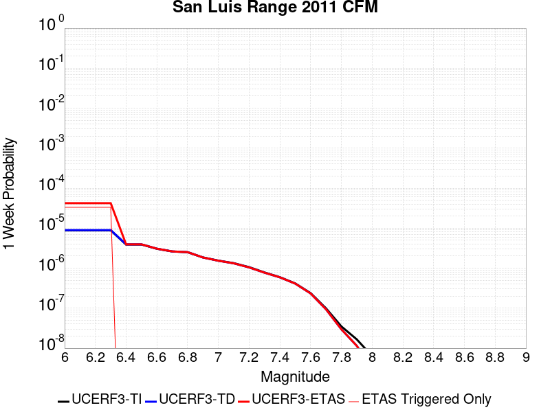 | 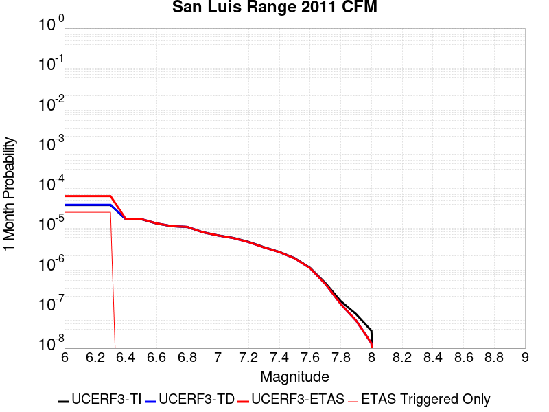 | 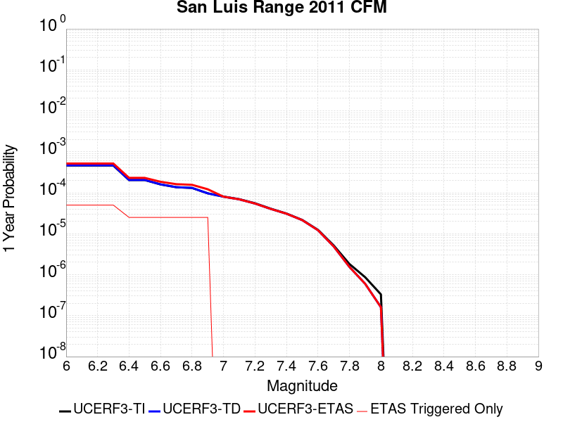 | 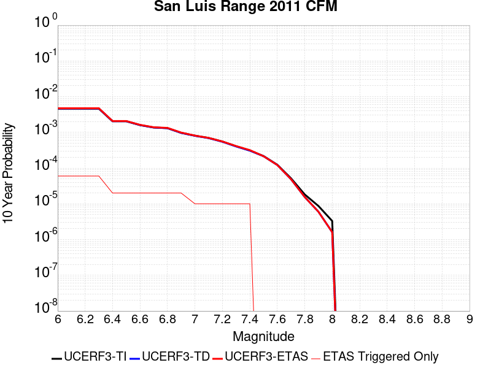 |

| Magnitude | 1 wk TI Prob | 1 wk TD Prob | 1 wk ETAS Prob | 1 wk ETAS/TD Gain | 1 wk ETAS Triggered Only | 1 mo TI Prob | 1 mo TD Prob | 1 mo ETAS Prob | 1 mo ETAS/TD Gain | 1 mo ETAS Triggered Only | 1 yr TI Prob | 1 yr TD Prob | 1 yr ETAS Prob | 1 yr ETAS/TD Gain | 1 yr ETAS Triggered Only | 10 yr TI Prob | 10 yr TD Prob | 10 yr ETAS Prob | 10 yr ETAS/TD Gain | 10 yr ETAS Triggered Only |
|-----|-----|-----|-----|-----|-----|-----|-----|-----|-----|-----|-----|-----|-----|-----|-----|-----|-----|-----|-----|-----|
| 6.0 | 8.8368415E-6 | 8.965455E-6 | 3.3945245E-5 | 3.786227 | 2.4980016E-5 | 3.787163E-5 | 3.8422855E-5 | 6.340191E-5 | 1.6501093 | 2.4980016E-5 | 4.609895E-4 | 4.6770574E-4 | 5.176424E-4 | 1.1067694 | 4.9960032E-5 | 0.0046003438 | 0.004667997 | 0.0047177235 | 1.0106527 | 4.9960032E-5 |
| 6.1 | 8.8368415E-6 | 8.965455E-6 | 3.3945245E-5 | 3.786227 | 2.4980016E-5 | 3.787163E-5 | 3.8422855E-5 | 6.340191E-5 | 1.6501093 | 2.4980016E-5 | 4.609895E-4 | 4.6770574E-4 | 5.176424E-4 | 1.1067694 | 4.9960032E-5 | 0.0046003438 | 0.004667997 | 0.0047177235 | 1.0106527 | 4.9960032E-5 |
| 6.2 | 8.8368415E-6 | 8.965455E-6 | 3.3945245E-5 | 3.786227 | 2.4980016E-5 | 3.787163E-5 | 3.8422855E-5 | 6.340191E-5 | 1.6501093 | 2.4980016E-5 | 4.609895E-4 | 4.6770574E-4 | 5.176424E-4 | 1.1067694 | 4.9960032E-5 | 0.0046003438 | 0.004667997 | 0.0047177235 | 1.0106527 | 4.9960032E-5 |
| 6.3 | 8.8368415E-6 | 8.965455E-6 | 3.3945245E-5 | 3.786227 | 2.4980016E-5 | 3.787163E-5 | 3.8422855E-5 | 6.340191E-5 | 1.6501093 | 2.4980016E-5 | 4.609895E-4 | 4.6770574E-4 | 5.176424E-4 | 1.1067694 | 4.9960032E-5 | 0.0046003438 | 0.004667997 | 0.0047177235 | 1.0106527 | 4.9960032E-5 |
| 6.4 | 3.9094193E-6 | 3.941204E-6 | 3.941204E-6 | 1.0 | 0.0 | 1.6754546E-5 | 1.6890766E-5 | 1.6890766E-5 | 1.0 | 0.0 | 2.039675E-4 | 2.0562594E-4 | 2.3060082E-4 | 1.1214578 | 2.4980016E-5 | 0.0020378039 | 0.0020543856 | 0.0020793143 | 1.0121344 | 2.4980016E-5 |
| 6.5 | 3.9094193E-6 | 3.941204E-6 | 3.941204E-6 | 1.0 | 0.0 | 1.6754546E-5 | 1.6890766E-5 | 1.6890766E-5 | 1.0 | 0.0 | 2.039675E-4 | 2.0562594E-4 | 2.3060082E-4 | 1.1214578 | 2.4980016E-5 | 0.0020378039 | 0.0020543856 | 0.0020793143 | 1.0121344 | 2.4980016E-5 |
| 6.6 | 3.0587726E-6 | 3.0753893E-6 | 3.0753893E-6 | 1.0 | 0.0 | 1.3108959E-5 | 1.3180174E-5 | 1.3180174E-5 | 1.0 | 0.0 | 1.595899E-4 | 1.6045693E-4 | 1.8543293E-4 | 1.1556555 | 2.4980016E-5 | 0.0015947534 | 0.0016034227 | 0.0016283626 | 1.0155542 | 2.4980016E-5 |
| 6.7 | 2.6160574E-6 | 2.6251284E-6 | 2.6251284E-6 | 1.0 | 0.0 | 1.1211626E-5 | 1.1250502E-5 | 1.1250502E-5 | 1.0 | 0.0 | 1.3649299E-4 | 1.3696631E-4 | 1.6194291E-4 | 1.1823558 | 2.4980016E-5 | 0.0013640919 | 0.0013688251 | 0.0013937709 | 1.0182242 | 2.4980016E-5 |
| 6.8 | 2.5110312E-6 | 2.5181412E-6 | 2.5181412E-6 | 1.0 | 0.0 | 1.0761518E-5 | 1.079199E-5 | 1.079199E-5 | 1.0 | 0.0 | 1.310136E-4 | 1.313846E-4 | 1.5636133E-4 | 1.190104 | 2.4980016E-5 | 0.0013093639 | 0.0013130752 | 0.0013380224 | 1.0189991 | 2.4980016E-5 |
| 6.9 | 1.8564405E-6 | 1.852488E-6 | 1.852488E-6 | 1.0 | 0.0 | 7.95615E-6 | 7.93921E-6 | 7.93921E-6 | 1.0 | 0.0 | 9.686181E-5 | 9.665562E-5 | 1.21633224E-4 | 1.2584186 | 2.4980016E-5 | 9.68196E-4 | 9.6613786E-4 | 9.910937E-4 | 1.0258305 | 2.4980016E-5 |
| 7.0 | 1.546127E-6 | 1.5369549E-6 | 1.5369549E-6 | 1.0 | 0.0 | 6.626242E-6 | 6.5869326E-6 | 6.5869326E-6 | 1.0 | 0.0 | 8.06715E-5 | 8.019296E-5 | 8.019296E-5 | 1.0 | 0.0 | 8.0642226E-4 | 8.016409E-4 | 8.016409E-4 | 1.0 | 0.0 |
| 7.1 | 1.3368208E-6 | 1.3235336E-6 | 1.3235336E-6 | 1.0 | 0.0 | 5.7292195E-6 | 5.6722747E-6 | 5.6722747E-6 | 1.0 | 0.0 | 6.975101E-5 | 6.905776E-5 | 6.905776E-5 | 1.0 | 0.0 | 6.972912E-4 | 6.903635E-4 | 6.903635E-4 | 1.0 | 0.0 |
| 7.2 | 1.0623363E-6 | 1.0454378E-6 | 1.0454378E-6 | 1.0 | 0.0 | 4.5528623E-6 | 4.4804397E-6 | 4.4804397E-6 | 1.0 | 0.0 | 5.5429686E-5 | 5.4547992E-5 | 5.4547992E-5 | 1.0 | 0.0 | 5.5415864E-4 | 5.453463E-4 | 5.453463E-4 | 1.0 | 0.0 |
| 7.3 | 7.831679E-7 | 7.727399E-7 | 7.727399E-7 | 1.0 | 0.0 | 3.3564295E-6 | 3.3117383E-6 | 3.3117383E-6 | 1.0 | 0.0 | 4.086376E-5 | 4.031967E-5 | 4.031967E-5 | 1.0 | 0.0 | 4.0856248E-4 | 4.0312367E-4 | 4.0312367E-4 | 1.0 | 0.0 |
| 7.4 | 5.9558846E-7 | 5.910646E-7 | 5.910646E-7 | 1.0 | 0.0 | 2.5525194E-6 | 2.5331315E-6 | 2.5331315E-6 | 1.0 | 0.0 | 3.107648E-5 | 3.084044E-5 | 3.084044E-5 | 1.0 | 0.0 | 3.1072134E-4 | 3.083617E-4 | 3.083617E-4 | 1.0 | 0.0 |
| 7.5 | 4.1616502E-7 | 4.1196404E-7 | 4.1196404E-7 | 1.0 | 0.0 | 1.7835631E-6 | 1.765559E-6 | 1.765559E-6 | 1.0 | 0.0 | 2.1714664E-5 | 2.1495469E-5 | 2.1495469E-5 | 1.0 | 0.0 | 2.1712543E-4 | 2.1493394E-4 | 2.1493394E-4 | 1.0 | 0.0 |
| 7.6 | 2.3816014E-7 | 2.3376614E-7 | 2.3376614E-7 | 1.0 | 0.0 | 1.0206859E-6 | 1.0018545E-6 | 1.0018545E-6 | 1.0 | 0.0 | 1.242678E-5 | 1.219751E-5 | 1.219751E-5 | 1.0 | 0.0 | 1.2426086E-4 | 1.2196843E-4 | 1.2196843E-4 | 1.0 | 0.0 |
| 7.7 | 9.918777E-8 | 9.3868096E-8 | 9.3868096E-8 | 1.0 | 0.0 | 4.2509038E-7 | 4.022918E-7 | 4.022918E-7 | 1.0 | 0.0 | 5.1754632E-6 | 4.8978914E-6 | 4.8978914E-6 | 1.0 | 0.0 | 5.1753424E-5 | 4.897784E-5 | 4.897784E-5 | 1.0 | 0.0 |
| 7.8 | 3.4982556E-8 | 2.968672E-8 | 2.968672E-8 | 1.0 | 0.0 | 1.4992524E-7 | 1.272288E-7 | 1.272288E-7 | 1.0 | 0.0 | 1.8253382E-6 | 1.5490094E-6 | 1.5490094E-6 | 1.0 | 0.0 | 1.8253233E-5 | 1.5489988E-5 | 1.5489988E-5 | 1.0 | 0.0 |
| 7.9 | 1.6624908E-8 | 1.1476994E-8 | 1.1476994E-8 | 1.0 | 0.0 | 7.12496E-8 | 4.9187115E-8 | 4.9187115E-8 | 1.0 | 0.0 | 8.6746354E-7 | 5.988529E-7 | 5.988529E-7 | 1.0 | 0.0 | 8.674601E-6 | 5.9885133E-6 | 5.9885133E-6 | 1.0 | 0.0 |
| 8.0 | 6.3352315E-9 | 3.0886564E-9 | 3.0886564E-9 | 1.0 | 0.0 | 2.715099E-8 | 1.32370985E-8 | 1.32370985E-8 | 1.0 | 0.0 | 3.3056327E-7 | 1.6116167E-7 | 1.6116167E-7 | 1.0 | 0.0 | 3.3056278E-6 | 1.6116155E-6 | 1.6116155E-6 | 1.0 | 0.0 |

## San Jacinto (Lytle Creek connector)
*[(top)](#table-of-contents)*

| 1 Week | 1 Month | 1 Year | 10 Year |
|-----|-----|-----|-----|
| 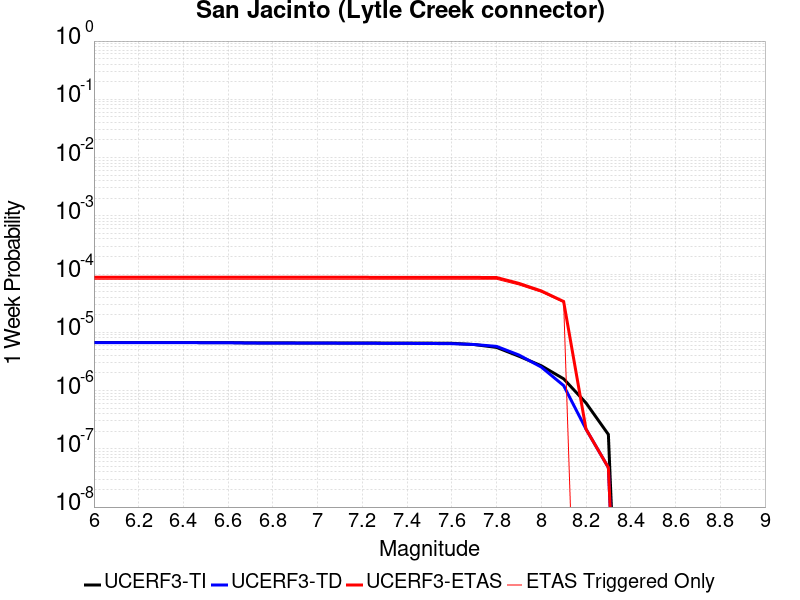 | 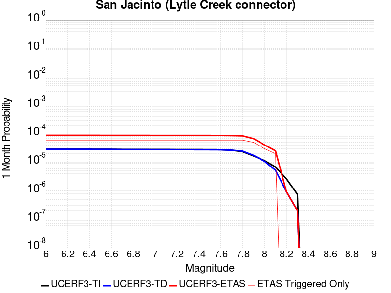 | 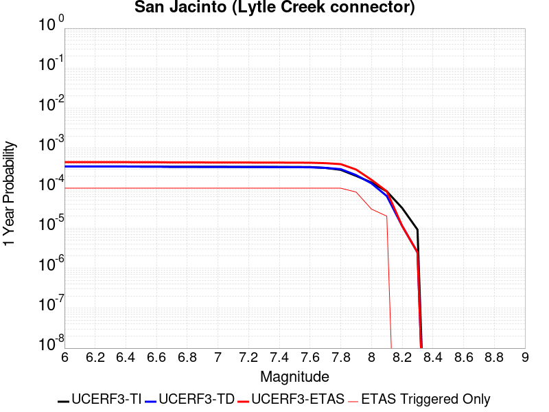 | 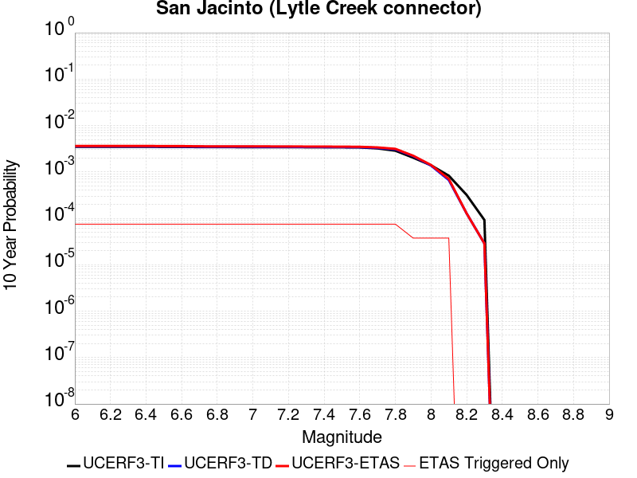 |

| Magnitude | 1 wk TI Prob | 1 wk TD Prob | 1 wk ETAS Prob | 1 wk ETAS/TD Gain | 1 wk ETAS Triggered Only | 1 mo TI Prob | 1 mo TD Prob | 1 mo ETAS Prob | 1 mo ETAS/TD Gain | 1 mo ETAS Triggered Only | 1 yr TI Prob | 1 yr TD Prob | 1 yr ETAS Prob | 1 yr ETAS/TD Gain | 1 yr ETAS Triggered Only | 10 yr TI Prob | 10 yr TD Prob | 10 yr ETAS Prob | 10 yr ETAS/TD Gain | 10 yr ETAS Triggered Only |
|-----|-----|-----|-----|-----|-----|-----|-----|-----|-----|-----|-----|-----|-----|-----|-----|-----|-----|-----|-----|-----|
| 6.0 | 6.693995E-6 | 6.660123E-6 | 5.661982E-5 | 8.501318 | 4.9960032E-5 | 2.8688235E-5 | 2.8543072E-5 | 7.8501675E-5 | 2.7502882 | 4.9960032E-5 | 3.492233E-4 | 3.4745657E-4 | 4.223706E-4 | 1.2156068 | 7.494005E-5 | 0.00348675 | 0.0035491167 | 0.0036237908 | 1.0210402 | 7.494005E-5 |
| 6.1 | 6.693995E-6 | 6.660123E-6 | 5.661982E-5 | 8.501318 | 4.9960032E-5 | 2.8688235E-5 | 2.8543072E-5 | 7.8501675E-5 | 2.7502882 | 4.9960032E-5 | 3.492233E-4 | 3.4745657E-4 | 4.223706E-4 | 1.2156068 | 7.494005E-5 | 0.00348675 | 0.0035491167 | 0.0036237908 | 1.0210402 | 7.494005E-5 |
| 6.2 | 6.693995E-6 | 6.660123E-6 | 5.661982E-5 | 8.501318 | 4.9960032E-5 | 2.8688235E-5 | 2.8543072E-5 | 7.8501675E-5 | 2.7502882 | 4.9960032E-5 | 3.492233E-4 | 3.4745657E-4 | 4.223706E-4 | 1.2156068 | 7.494005E-5 | 0.00348675 | 0.0035491167 | 0.0036237908 | 1.0210402 | 7.494005E-5 |
| 6.3 | 6.693995E-6 | 6.660123E-6 | 5.661982E-5 | 8.501318 | 4.9960032E-5 | 2.8688235E-5 | 2.8543072E-5 | 7.8501675E-5 | 2.7502882 | 4.9960032E-5 | 3.492233E-4 | 3.4745657E-4 | 4.223706E-4 | 1.2156068 | 7.494005E-5 | 0.00348675 | 0.0035491167 | 0.0036237908 | 1.0210402 | 7.494005E-5 |
| 6.4 | 6.693995E-6 | 6.660123E-6 | 5.661982E-5 | 8.501318 | 4.9960032E-5 | 2.8688235E-5 | 2.8543072E-5 | 7.8501675E-5 | 2.7502882 | 4.9960032E-5 | 3.492233E-4 | 3.4745657E-4 | 4.223706E-4 | 1.2156068 | 7.494005E-5 | 0.00348675 | 0.0035491167 | 0.0036237908 | 1.0210402 | 7.494005E-5 |
| 6.5 | 6.6561875E-6 | 6.620341E-6 | 5.6580044E-5 | 8.546394 | 4.9960032E-5 | 2.8526205E-5 | 2.8372582E-5 | 7.83312E-5 | 2.760806 | 4.9960032E-5 | 3.472512E-4 | 3.453815E-4 | 4.2029566E-4 | 1.2169026 | 7.494005E-5 | 0.0034670907 | 0.0035284322 | 0.0036031078 | 1.021164 | 7.494005E-5 |
| 6.6 | 6.6561875E-6 | 6.620341E-6 | 5.6580044E-5 | 8.546394 | 4.9960032E-5 | 2.8526205E-5 | 2.8372582E-5 | 7.83312E-5 | 2.760806 | 4.9960032E-5 | 3.472512E-4 | 3.453815E-4 | 4.2029566E-4 | 1.2169026 | 7.494005E-5 | 0.0034670907 | 0.0035284322 | 0.0036031078 | 1.021164 | 7.494005E-5 |
| 6.7 | 6.5802237E-6 | 6.539518E-6 | 5.6499222E-5 | 8.639662 | 4.9960032E-5 | 2.8200653E-5 | 2.8026205E-5 | 7.7984834E-5 | 2.7825687 | 4.9960032E-5 | 3.4328885E-4 | 3.4116567E-4 | 4.1608015E-4 | 1.2195839 | 7.494005E-5 | 0.0034275902 | 0.0034864065 | 0.0035610853 | 1.02142 | 7.494005E-5 |
| 6.8 | 6.575632E-6 | 6.5340073E-6 | 5.6493715E-5 | 8.646105 | 4.9960032E-5 | 2.8180975E-5 | 2.8002589E-5 | 7.7961224E-5 | 2.784072 | 4.9960032E-5 | 3.4304935E-4 | 3.4087826E-4 | 4.1579275E-4 | 1.2197691 | 7.494005E-5 | 0.0034252026 | 0.0034835413 | 0.0035582203 | 1.0214376 | 7.494005E-5 |
| 6.9 | 6.570433E-6 | 6.525401E-6 | 5.6485107E-5 | 8.656189 | 4.9960032E-5 | 2.8158694E-5 | 2.7965707E-5 | 7.792434E-5 | 2.7864249 | 4.9960032E-5 | 3.4277816E-4 | 3.4042934E-4 | 4.1534388E-4 | 1.220059 | 7.494005E-5 | 0.0034224992 | 0.0034790665 | 0.0035537458 | 1.0214653 | 7.494005E-5 |
| 7.0 | 6.5643826E-6 | 6.5155223E-6 | 5.647523E-5 | 8.667798 | 4.9960032E-5 | 2.8132765E-5 | 2.7923368E-5 | 7.7882E-5 | 2.7891335 | 4.9960032E-5 | 3.424626E-4 | 3.3991406E-4 | 4.1482862E-4 | 1.2203927 | 7.494005E-5 | 0.0034193532 | 0.0034739296 | 0.0035486093 | 1.0214971 | 7.494005E-5 |
| 7.1 | 6.557402E-6 | 6.504234E-6 | 5.646394E-5 | 8.681106 | 4.9960032E-5 | 2.8102848E-5 | 2.7874992E-5 | 7.783363E-5 | 2.7922387 | 4.9960032E-5 | 3.4209844E-4 | 3.3932526E-4 | 4.1423985E-4 | 1.2207752 | 7.494005E-5 | 0.0034157229 | 0.0034680606 | 0.0035427408 | 1.0215337 | 7.494005E-5 |
| 7.2 | 6.546394E-6 | 6.4862006E-6 | 5.6445908E-5 | 8.702461 | 4.9960032E-5 | 2.8055672E-5 | 2.7797707E-5 | 7.775635E-5 | 2.797222 | 4.9960032E-5 | 3.4152428E-4 | 3.383846E-4 | 4.1329928E-4 | 1.2213892 | 7.494005E-5 | 0.0034099987 | 0.0034586883 | 0.003533369 | 1.0215923 | 7.494005E-5 |
| 7.3 | 6.5364216E-6 | 6.4669857E-6 | 5.6426696E-5 | 8.725347 | 4.9960032E-5 | 2.8012933E-5 | 2.771536E-5 | 7.7674005E-5 | 2.8025618 | 4.9960032E-5 | 3.4100408E-4 | 3.373823E-4 | 4.122971E-4 | 1.2220471 | 7.494005E-5 | 0.003404813 | 0.0034487103 | 0.003523392 | 1.021655 | 7.494005E-5 |
| 7.4 | 6.5269523E-6 | 6.4480723E-6 | 5.640778E-5 | 8.748007 | 4.9960032E-5 | 2.7972354E-5 | 2.7634303E-5 | 7.759295E-5 | 2.8078492 | 4.9960032E-5 | 3.4051016E-4 | 3.3639578E-4 | 4.113106E-4 | 1.2226986 | 7.494005E-5 | 0.0033998888 | 0.0034388923 | 0.0035135746 | 1.021717 | 7.494005E-5 |
| 7.5 | 6.5111835E-6 | 6.424346E-6 | 5.638406E-5 | 8.776622 | 4.9960032E-5 | 2.7904773E-5 | 2.753262E-5 | 7.749128E-5 | 2.814526 | 4.9960032E-5 | 3.3968766E-4 | 3.3515817E-4 | 4.100731E-4 | 1.2235211 | 7.494005E-5 | 0.0033916887 | 0.0034265644 | 0.0035012476 | 1.0217954 | 7.494005E-5 |
| 7.6 | 6.4768806E-6 | 6.383454E-6 | 5.6343168E-5 | 8.826439 | 4.9960032E-5 | 2.7757764E-5 | 2.7357375E-5 | 7.731604E-5 | 2.82615 | 4.9960032E-5 | 3.3789838E-4 | 3.330252E-4 | 4.079403E-4 | 1.2249532 | 7.494005E-5 | 0.0033738504 | 0.0034052972 | 0.003479982 | 1.021932 | 7.494005E-5 |
| 7.7 | 6.1655364E-6 | 6.1759456E-6 | 5.613567E-5 | 9.089405 | 4.9960032E-5 | 2.642346E-5 | 2.646807E-5 | 7.642678E-5 | 2.8875086 | 4.9960032E-5 | 3.2165812E-4 | 3.2220117E-4 | 3.9711708E-4 | 1.2325128 | 7.494005E-5 | 0.0032119295 | 0.0032969362 | 0.0033716292 | 1.0226552 | 7.494005E-5 |
| 7.8 | 5.5043524E-6 | 5.7370175E-6 | 5.5696764E-5 | 9.708313 | 4.9960032E-5 | 2.3589868E-5 | 2.4586987E-5 | 7.454579E-5 | 3.0319204 | 4.9960032E-5 | 2.871688E-4 | 2.993055E-4 | 3.7422313E-4 | 1.2503048 | 7.494005E-5 | 0.0028679797 | 0.0030670585 | 0.0031417687 | 1.0243589 | 7.494005E-5 |
| 7.9 | 3.889249E-6 | 4.0766436E-6 | 5.403647E-5 | 13.255137 | 4.9960032E-5 | 1.6668104E-5 | 1.7471213E-5 | 6.7430374E-5 | 3.8595128 | 4.9960032E-5 | 2.0291525E-4 | 2.126913E-4 | 2.626407E-4 | 1.2348446 | 4.9960032E-5 | 0.0020273007 | 0.0021941073 | 0.0022439577 | 1.0227201 | 4.9960032E-5 |
| 8.0 | 2.668535E-6 | 2.5313454E-6 | 5.249125E-5 | 20.736504 | 4.9960032E-5 | 1.1436528E-5 | 1.0848577E-5 | 6.0808066E-5 | 5.605165 | 4.9960032E-5 | 1.3923083E-4 | 1.3207346E-4 | 1.820269E-4 | 1.3782246 | 4.9960032E-5 | 0.0013914363 | 0.0013755665 | 0.0014254578 | 1.0362697 | 4.9960032E-5 |
| 8.1 | 1.5911459E-6 | 1.2185134E-6 | 2.6198499E-5 | 21.50038 | 2.4980016E-5 | 6.8191785E-6 | 5.2221894E-6 | 3.0202074E-5 | 5.7834125 | 2.4980016E-5 | 8.3020335E-5 | 6.357832E-5 | 8.855675E-5 | 1.3928765 | 2.4980016E-5 | 8.298933E-4 | 6.6911156E-4 | 6.9407484E-4 | 1.0373081 | 2.4980016E-5 |
| 8.2 | 6.1294963E-7 | 2.1802066E-7 | 2.1802066E-7 | 1.0 | 0.0 | 2.6269242E-6 | 9.3437393E-7 | 9.3437393E-7 | 1.0 | 0.0 | 3.1982334E-5 | 1.1375943E-5 | 1.1375943E-5 | 1.0 | 0.0 | 3.1977732E-4 | 1.2778955E-4 | 1.2778955E-4 | 1.0 | 0.0 |
| 8.3 | 1.762871E-7 | 4.7516316E-8 | 4.7516316E-8 | 1.0 | 0.0 | 7.5551594E-7 | 2.0364133E-7 | 2.0364133E-7 | 1.0 | 0.0 | 9.1983675E-6 | 2.4793305E-6 | 2.4793305E-6 | 1.0 | 0.0 | 9.197987E-5 | 2.8671833E-5 | 2.8671833E-5 | 1.0 | 0.0 |

## Rinconada 2011 CFM
*[(top)](#table-of-contents)*

| 1 Week | 1 Month | 1 Year | 10 Year |
|-----|-----|-----|-----|
| 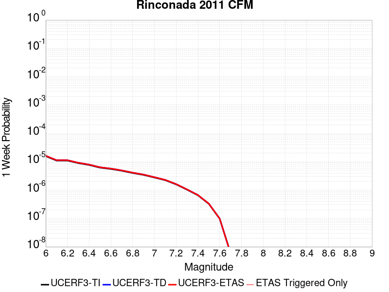 | 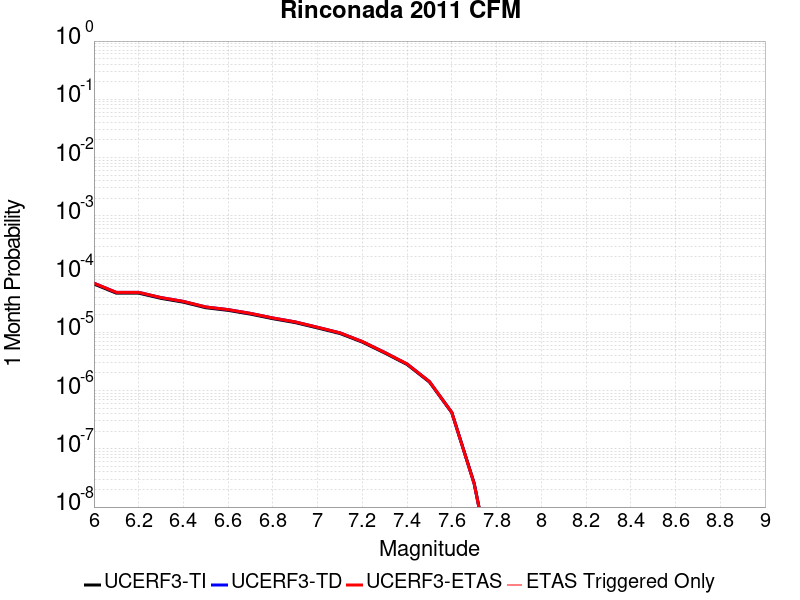 | 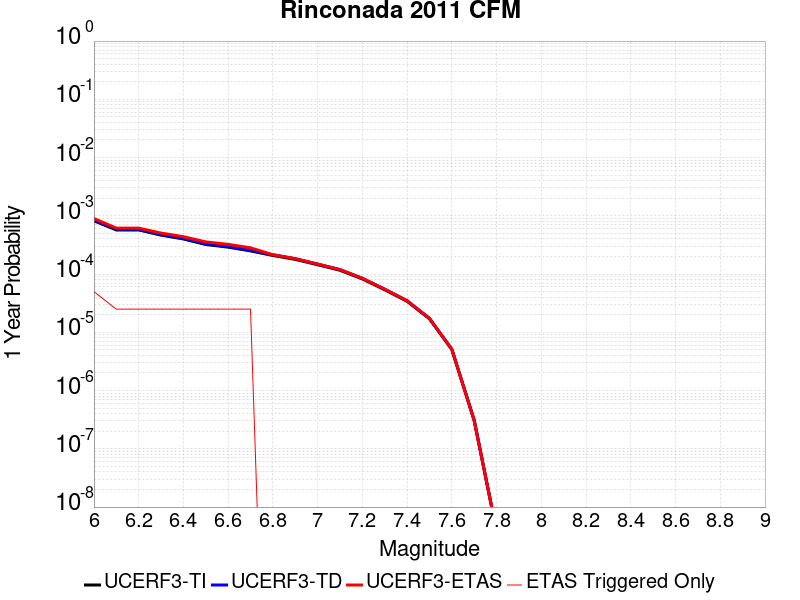 | 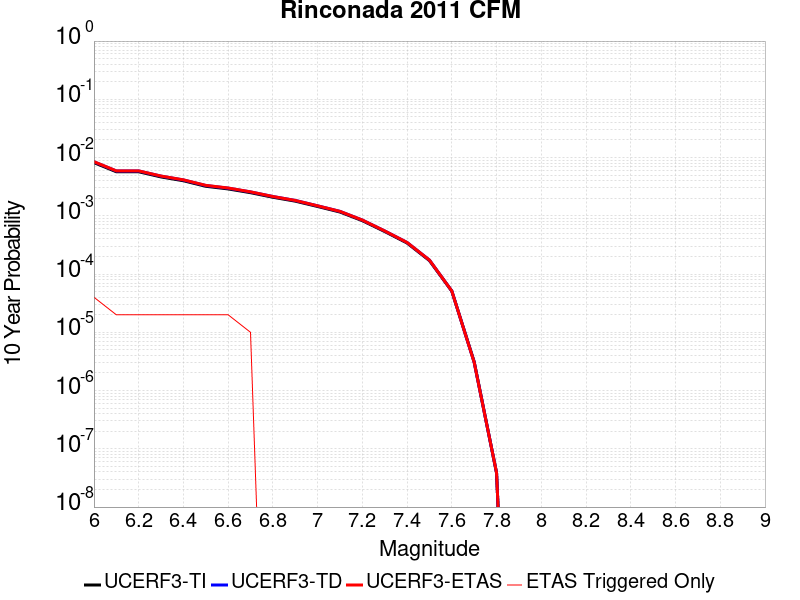 |

| Magnitude | 1 wk TI Prob | 1 wk TD Prob | 1 wk ETAS Prob | 1 wk ETAS/TD Gain | 1 wk ETAS Triggered Only | 1 mo TI Prob | 1 mo TD Prob | 1 mo ETAS Prob | 1 mo ETAS/TD Gain | 1 mo ETAS Triggered Only | 1 yr TI Prob | 1 yr TD Prob | 1 yr ETAS Prob | 1 yr ETAS/TD Gain | 1 yr ETAS Triggered Only | 10 yr TI Prob | 10 yr TD Prob | 10 yr ETAS Prob | 10 yr ETAS/TD Gain | 10 yr ETAS Triggered Only |
|-----|-----|-----|-----|-----|-----|-----|-----|-----|-----|-----|-----|-----|-----|-----|-----|-----|-----|-----|-----|-----|
| 6.0 | 1.5752368E-5 | 1.6274716E-5 | 1.6274716E-5 | 1.0 | 0.0 | 6.75084E-5 | 6.974694E-5 | 6.974694E-5 | 1.0 | 0.0 | 8.2160486E-4 | 8.488413E-4 | 8.987589E-4 | 1.0588068 | 4.9960032E-5 | 0.008185739 | 0.00845637 | 0.008530676 | 1.008787 | 7.494005E-5 |
| 6.1 | 1.0966133E-5 | 1.1323029E-5 | 1.1323029E-5 | 1.0 | 0.0 | 4.6996865E-5 | 4.852637E-5 | 4.852637E-5 | 1.0 | 0.0 | 5.720366E-4 | 5.9064914E-4 | 6.156144E-4 | 1.0422674 | 2.4980016E-5 | 0.0057056635 | 0.005890889 | 0.0059405547 | 1.008431 | 4.9960032E-5 |
| 6.2 | 1.0966133E-5 | 1.1323029E-5 | 1.1323029E-5 | 1.0 | 0.0 | 4.6996865E-5 | 4.852637E-5 | 4.852637E-5 | 1.0 | 0.0 | 5.720366E-4 | 5.9064914E-4 | 6.156144E-4 | 1.0422674 | 2.4980016E-5 | 0.0057056635 | 0.005890889 | 0.0059405547 | 1.008431 | 4.9960032E-5 |
| 6.3 | 8.926149E-6 | 9.212772E-6 | 9.212772E-6 | 1.0 | 0.0 | 3.8254362E-5 | 3.948271E-5 | 3.948271E-5 | 1.0 | 0.0 | 4.6564735E-4 | 4.8059633E-4 | 5.055643E-4 | 1.0519521 | 2.4980016E-5 | 0.0046467283 | 0.0047956146 | 0.004845335 | 1.0103679 | 4.9960032E-5 |
| 6.4 | 7.676955E-6 | 7.920191E-6 | 7.920191E-6 | 1.0 | 0.0 | 3.290082E-5 | 3.3943234E-5 | 3.3943234E-5 | 1.0 | 0.0 | 4.0049385E-4 | 4.131807E-4 | 4.381504E-4 | 1.0604329 | 2.4980016E-5 | 0.0039977287 | 0.004124151 | 0.004173905 | 1.0120641 | 4.9960032E-5 |
| 6.5 | 6.1671026E-6 | 6.358955E-6 | 6.358955E-6 | 1.0 | 0.0 | 2.6430173E-5 | 2.725238E-5 | 2.725238E-5 | 1.0 | 0.0 | 3.2173982E-4 | 3.317473E-4 | 3.56719E-4 | 1.0752734 | 2.4980016E-5 | 0.003212744 | 0.0033125326 | 0.003362327 | 1.0150322 | 4.9960032E-5 |
| 6.6 | 5.553456E-6 | 5.7248126E-6 | 5.7248126E-6 | 1.0 | 0.0 | 2.3800309E-5 | 2.4534682E-5 | 2.4534682E-5 | 1.0 | 0.0 | 2.897302E-4 | 2.9866886E-4 | 3.236414E-4 | 1.0836128 | 2.4980016E-5 | 0.0028935277 | 0.0029826832 | 0.0030324943 | 1.0167 | 4.9960032E-5 |
| 6.7 | 4.787857E-6 | 4.93331E-6 | 4.93331E-6 | 1.0 | 0.0 | 2.0519226E-5 | 2.1142585E-5 | 2.1142585E-5 | 1.0 | 0.0 | 2.4979294E-4 | 2.573806E-4 | 2.823542E-4 | 1.0970298 | 2.4980016E-5 | 0.0024951235 | 0.002570831 | 0.0025957467 | 1.0096917 | 2.4980016E-5 |
| 6.8 | 3.9955166E-6 | 4.1134763E-6 | 4.1134763E-6 | 1.0 | 0.0 | 1.7123532E-5 | 1.7629065E-5 | 1.7629065E-5 | 1.0 | 0.0 | 2.0845905E-4 | 2.1461275E-4 | 2.1461275E-4 | 1.0 | 0.0 | 0.002082636 | 0.0021440587 | 0.0021440587 | 1.0 | 0.0 |
| 6.9 | 3.4250072E-6 | 3.5224466E-6 | 3.5224466E-6 | 1.0 | 0.0 | 1.46785205E-5 | 1.5096112E-5 | 1.5096112E-5 | 1.0 | 0.0 | 1.7869633E-4 | 1.8377969E-4 | 1.8377969E-4 | 1.0 | 0.0 | 0.001785527 | 0.0018362795 | 0.0018362795 | 1.0 | 0.0 |
| 7.0 | 2.7712713E-6 | 2.8467002E-6 | 2.8467002E-6 | 1.0 | 0.0 | 1.1876823E-5 | 1.22000865E-5 | 1.22000865E-5 | 1.0 | 0.0 | 1.4459073E-4 | 1.4852594E-4 | 1.4852594E-4 | 1.0 | 0.0 | 0.0014449668 | 0.0014842683 | 0.0014842683 | 1.0 | 0.0 |
| 7.1 | 2.227358E-6 | 2.2856987E-6 | 2.2856987E-6 | 1.0 | 0.0 | 9.545785E-6 | 9.795815E-6 | 9.795815E-6 | 1.0 | 0.0 | 1.16213734E-4 | 1.1925753E-4 | 1.1925753E-4 | 1.0 | 0.0 | 0.0011615298 | 0.0011919363 | 0.0011919363 | 1.0 | 0.0 |
| 7.2 | 1.581796E-6 | 1.6209015E-6 | 1.6209015E-6 | 1.0 | 0.0 | 6.779108E-6 | 6.946702E-6 | 6.946702E-6 | 1.0 | 0.0 | 8.253252E-5 | 8.4572814E-5 | 8.4572814E-5 | 1.0 | 0.0 | 8.250187E-4 | 8.4540684E-4 | 8.4540684E-4 | 1.0 | 0.0 |
| 7.3 | 1.0306567E-6 | 1.054648E-6 | 1.054648E-6 | 1.0 | 0.0 | 4.4170924E-6 | 4.519912E-6 | 4.519912E-6 | 1.0 | 0.0 | 5.3776774E-5 | 5.502854E-5 | 5.502854E-5 | 1.0 | 0.0 | 5.376376E-4 | 5.501494E-4 | 5.501494E-4 | 1.0 | 0.0 |
| 7.4 | 6.535541E-7 | 6.682744E-7 | 6.682744E-7 | 1.0 | 0.0 | 2.800943E-6 | 2.8640302E-6 | 2.8640302E-6 | 1.0 | 0.0 | 3.4100947E-5 | 3.4869012E-5 | 3.4869012E-5 | 1.0 | 0.0 | 3.4095717E-4 | 3.486355E-4 | 3.486355E-4 | 1.0 | 0.0 |
| 7.5 | 3.2656962E-7 | 3.3316712E-7 | 3.3316712E-7 | 1.0 | 0.0 | 1.3995833E-6 | 1.4278584E-6 | 1.4278584E-6 | 1.0 | 0.0 | 1.7039794E-5 | 1.7384036E-5 | 1.7384036E-5 | 1.0 | 0.0 | 1.7038487E-4 | 1.738268E-4 | 1.738268E-4 | 1.0 | 0.0 |
| 7.6 | 9.754343E-8 | 9.821017E-8 | 9.821017E-8 | 1.0 | 0.0 | 4.180432E-7 | 4.2090065E-7 | 4.2090065E-7 | 1.0 | 0.0 | 5.089664E-6 | 5.1244533E-6 | 5.1244533E-6 | 1.0 | 0.0 | 5.0895473E-5 | 5.124336E-5 | 5.124336E-5 | 1.0 | 0.0 |
| 7.7 | 6.0001453E-9 | 5.8491207E-9 | 5.8491207E-9 | 1.0 | 0.0 | 2.5714908E-8 | 2.506766E-8 | 2.506766E-8 | 1.0 | 0.0 | 3.1307894E-7 | 3.051987E-7 | 3.051987E-7 | 1.0 | 0.0 | 3.1307852E-6 | 3.0519832E-6 | 3.0519832E-6 | 1.0 | 0.0 |
| 7.8 | 7.400003E-11 | 7.4654505E-11 | 7.4654505E-11 | 1.0 | 0.0 | 3.171432E-10 | 3.1994773E-10 | 3.1994773E-10 | 1.0 | 0.0 | 3.861218E-9 | 3.895363E-9 | 3.895363E-9 | 1.0 | 0.0 | 3.861218E-8 | 3.895363E-8 | 3.895363E-8 | 1.0 | 0.0 |

## Cleghorn Lake
*[(top)](#table-of-contents)*

| 1 Week | 1 Month | 1 Year | 10 Year |
|-----|-----|-----|-----|
| 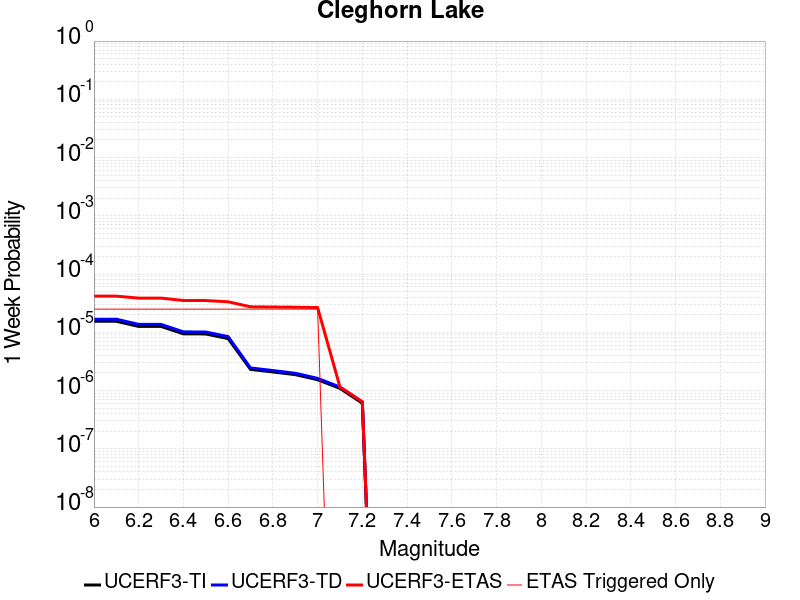 | 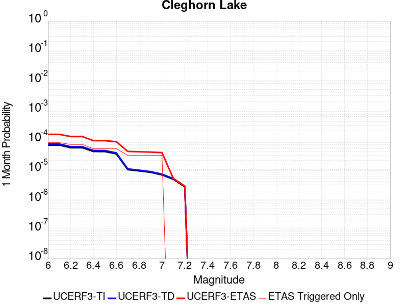 | 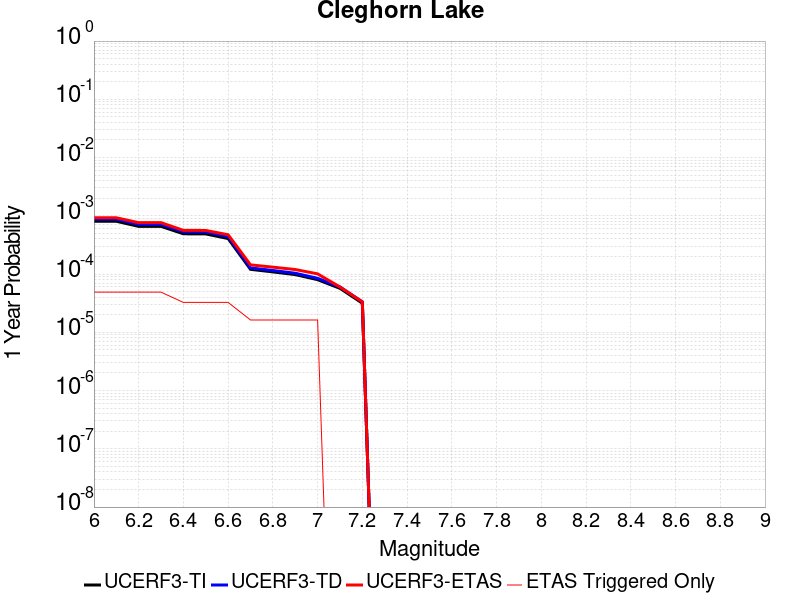 | 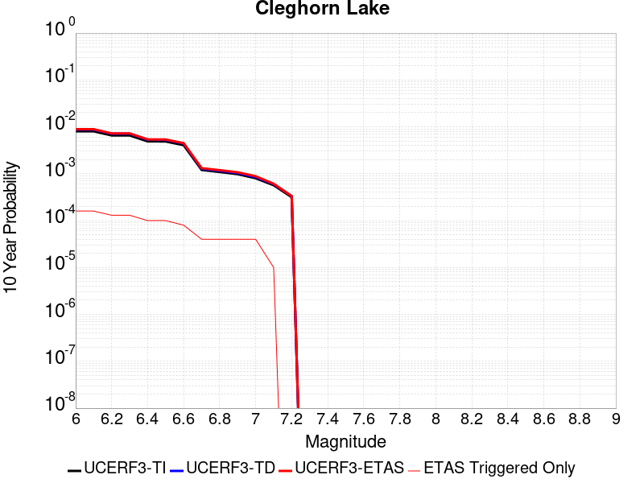 |

| Magnitude | 1 wk TI Prob | 1 wk TD Prob | 1 wk ETAS Prob | 1 wk ETAS/TD Gain | 1 wk ETAS Triggered Only | 1 mo TI Prob | 1 mo TD Prob | 1 mo ETAS Prob | 1 mo ETAS/TD Gain | 1 mo ETAS Triggered Only | 1 yr TI Prob | 1 yr TD Prob | 1 yr ETAS Prob | 1 yr ETAS/TD Gain | 1 yr ETAS Triggered Only | 10 yr TI Prob | 10 yr TD Prob | 10 yr ETAS Prob | 10 yr ETAS/TD Gain | 10 yr ETAS Triggered Only |
|-----|-----|-----|-----|-----|-----|-----|-----|-----|-----|-----|-----|-----|-----|-----|-----|-----|-----|-----|-----|-----|
| 6.0 | 1.5467183E-5 | 1.6794203E-5 | 4.17738E-5 | 2.4873939 | 2.4980016E-5 | 6.6286244E-5 | 7.197348E-5 | 9.69517E-5 | 1.3470476 | 2.4980016E-5 | 8.067362E-4 | 8.759797E-4 | 9.009379E-4 | 1.0284917 | 2.4980016E-5 | 0.008038137 | 0.008730696 | 0.008804982 | 1.0085086 | 7.494005E-5 |
| 6.1 | 1.5467183E-5 | 1.6794203E-5 | 4.17738E-5 | 2.4873939 | 2.4980016E-5 | 6.6286244E-5 | 7.197348E-5 | 9.69517E-5 | 1.3470476 | 2.4980016E-5 | 8.067362E-4 | 8.759797E-4 | 9.009379E-4 | 1.0284917 | 2.4980016E-5 | 0.008038137 | 0.008730696 | 0.008804982 | 1.0085086 | 7.494005E-5 |
| 6.2 | 1.2624631E-5 | 1.3681544E-5 | 3.866122E-5 | 2.8257935 | 2.4980016E-5 | 5.410444E-5 | 5.863415E-5 | 8.36127E-5 | 1.4260069 | 2.4980016E-5 | 6.585225E-4 | 7.1368564E-4 | 7.386478E-4 | 1.0349765 | 2.4980016E-5 | 0.0065657445 | 0.0071187317 | 0.0071931384 | 1.0104523 | 7.494005E-5 |
| 6.3 | 1.2624631E-5 | 1.3681544E-5 | 3.866122E-5 | 2.8257935 | 2.4980016E-5 | 5.410444E-5 | 5.863415E-5 | 8.36127E-5 | 1.4260069 | 2.4980016E-5 | 6.585225E-4 | 7.1368564E-4 | 7.386478E-4 | 1.0349765 | 2.4980016E-5 | 0.0065657445 | 0.0071187317 | 0.0071931384 | 1.0104523 | 7.494005E-5 |
| 6.4 | 9.417684E-6 | 1.0170118E-5 | 3.514988E-5 | 3.456192 | 2.4980016E-5 | 4.036088E-5 | 4.3585722E-5 | 6.856465E-5 | 1.5730989 | 2.4980016E-5 | 4.912829E-4 | 5.3056807E-4 | 5.555348E-4 | 1.0470567 | 2.4980016E-5 | 0.004901982 | 0.005297049 | 0.0053467443 | 1.0093818 | 4.9960032E-5 |
| 6.5 | 9.368219E-6 | 1.0117545E-5 | 3.5097306E-5 | 3.4689553 | 2.4980016E-5 | 4.014889E-5 | 4.3360415E-5 | 6.8339345E-5 | 1.5760769 | 2.4980016E-5 | 4.8870314E-4 | 5.2782625E-4 | 5.527931E-4 | 1.0473012 | 2.4980016E-5 | 0.004876298 | 0.0052697617 | 0.0053194584 | 1.0094305 | 4.9960032E-5 |
| 6.6 | 7.803798E-6 | 8.441831E-6 | 3.3421635E-5 | 3.9590507 | 2.4980016E-5 | 3.3444423E-5 | 3.6179E-5 | 6.115811E-5 | 1.6904312 | 2.4980016E-5 | 4.0710976E-4 | 4.4043022E-4 | 4.6539924E-4 | 1.0566924 | 2.4980016E-5 | 0.0040636472 | 0.0043994905 | 0.0044492306 | 1.0113059 | 4.9960032E-5 |
| 6.7 | 2.3108669E-6 | 2.4438336E-6 | 2.7423788E-5 | 11.221626 | 2.4980016E-5 | 9.903678E-6 | 1.0473532E-5 | 3.5453286E-5 | 3.3850365 | 2.4980016E-5 | 1.205706E-4 | 1.2750797E-4 | 1.524848E-4 | 1.1958845 | 2.4980016E-5 | 0.001205052 | 0.0012743667 | 0.0013242632 | 1.0391538 | 4.9960032E-5 |
| 6.8 | 2.0882828E-6 | 2.2062823E-6 | 2.7186243E-5 | 12.322197 | 2.4980016E-5 | 8.949753E-6 | 9.455462E-6 | 3.443524E-5 | 3.641836 | 2.4980016E-5 | 1.08957785E-4 | 1.1511434E-4 | 1.4009148E-4 | 1.2169768 | 2.4980016E-5 | 0.0010890438 | 0.0011505639 | 0.0012004665 | 1.0433723 | 4.9960032E-5 |
| 6.9 | 1.876935E-6 | 1.981051E-6 | 2.6961017E-5 | 13.609451 | 2.4980016E-5 | 8.043982E-6 | 8.490192E-6 | 3.3469994E-5 | 3.9421954 | 2.4980016E-5 | 9.7931086E-5 | 1.03363345E-4 | 1.2834078E-4 | 1.2416469 | 2.4980016E-5 | 9.788794E-4 | 0.0010331686 | 0.001083077 | 1.0483061 | 4.9960032E-5 |
| 7.0 | 1.5357559E-6 | 1.6202807E-6 | 2.6600257E-5 | 16.417067 | 2.4980016E-5 | 6.5817944E-6 | 6.9440425E-6 | 3.1923886E-5 | 4.597306 | 2.4980016E-5 | 8.01304E-5 | 8.454057E-5 | 1.0951847E-4 | 1.2954546 | 2.4980016E-5 | 8.010151E-4 | 8.450965E-4 | 8.9501427E-4 | 1.0590676 | 4.9960032E-5 |
| 7.1 | 1.0905424E-6 | 1.1497619E-6 | 1.1497619E-6 | 1.0 | 0.0 | 4.6737446E-6 | 4.9275427E-6 | 4.9275427E-6 | 1.0 | 0.0 | 5.6901354E-5 | 5.999128E-5 | 5.999128E-5 | 1.0 | 0.0 | 5.6886784E-4 | 5.997606E-4 | 6.2472565E-4 | 1.041625 | 2.4980016E-5 |
| 7.2 | 6.06668E-7 | 6.387277E-7 | 6.387277E-7 | 1.0 | 0.0 | 2.600003E-6 | 2.7374022E-6 | 2.7374022E-6 | 1.0 | 0.0 | 3.1654577E-5 | 3.3327433E-5 | 3.3327433E-5 | 1.0 | 0.0 | 3.1650066E-4 | 3.3323118E-4 | 3.3323118E-4 | 1.0 | 0.0 |

## White Mountains
*[(top)](#table-of-contents)*

| 1 Week | 1 Month | 1 Year | 10 Year |
|-----|-----|-----|-----|
| 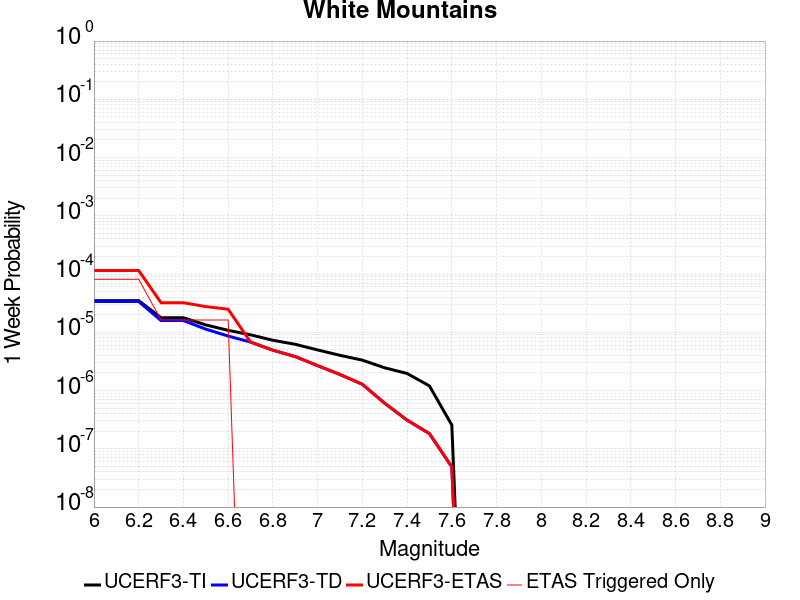 | 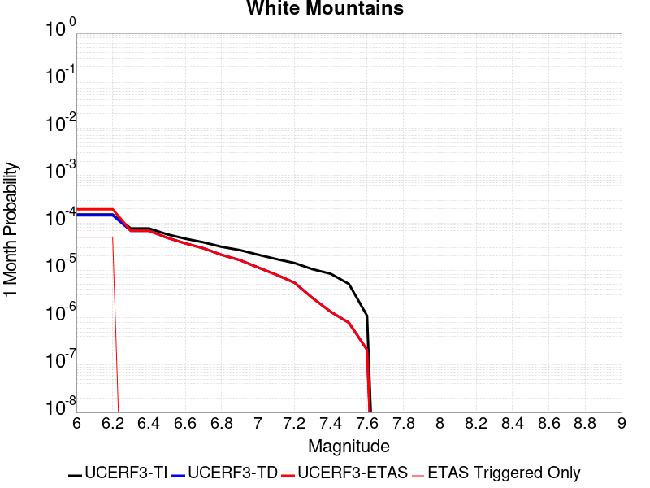 | 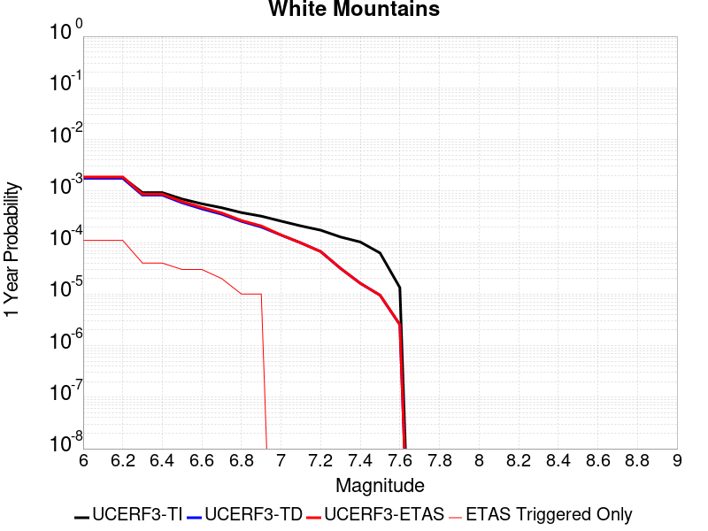 | 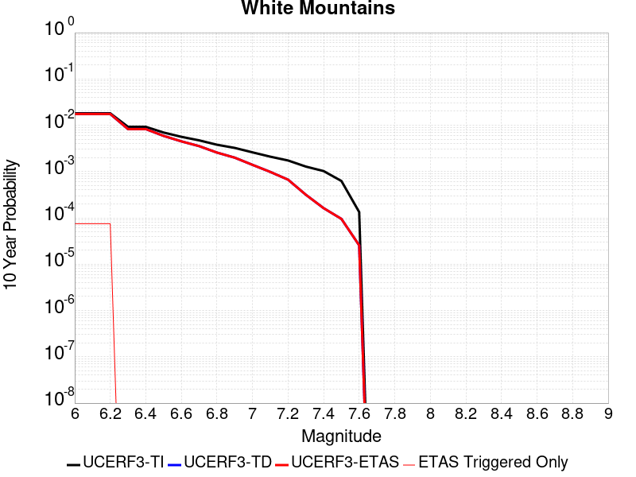 |

| Magnitude | 1 wk TI Prob | 1 wk TD Prob | 1 wk ETAS Prob | 1 wk ETAS/TD Gain | 1 wk ETAS Triggered Only | 1 mo TI Prob | 1 mo TD Prob | 1 mo ETAS Prob | 1 mo ETAS/TD Gain | 1 mo ETAS Triggered Only | 1 yr TI Prob | 1 yr TD Prob | 1 yr ETAS Prob | 1 yr ETAS/TD Gain | 1 yr ETAS Triggered Only | 10 yr TI Prob | 10 yr TD Prob | 10 yr ETAS Prob | 10 yr ETAS/TD Gain | 10 yr ETAS Triggered Only |
|-----|-----|-----|-----|-----|-----|-----|-----|-----|-----|-----|-----|-----|-----|-----|-----|-----|-----|-----|-----|-----|
| 6.0 | 3.503579E-5 | 3.3784127E-5 | 5.8763297E-5 | 1.7393761 | 2.4980016E-5 | 1.5014476E-4 | 1.4478175E-4 | 1.9473454E-4 | 1.3450214 | 4.9960032E-5 | 0.0018264796 | 0.0017614134 | 0.0018112855 | 1.0283136 | 4.9960032E-5 | 0.018115403 | 0.017486857 | 0.017560486 | 1.0042106 | 7.494005E-5 |
| 6.1 | 3.503579E-5 | 3.3784127E-5 | 5.8763297E-5 | 1.7393761 | 2.4980016E-5 | 1.5014476E-4 | 1.4478175E-4 | 1.9473454E-4 | 1.3450214 | 4.9960032E-5 | 0.0018264796 | 0.0017614134 | 0.0018112855 | 1.0283136 | 4.9960032E-5 | 0.018115403 | 0.017486857 | 0.017560486 | 1.0042106 | 7.494005E-5 |
| 6.2 | 3.503579E-5 | 3.3784127E-5 | 5.8763297E-5 | 1.7393761 | 2.4980016E-5 | 1.5014476E-4 | 1.4478175E-4 | 1.9473454E-4 | 1.3450214 | 4.9960032E-5 | 0.0018264796 | 0.0017614134 | 0.0018112855 | 1.0283136 | 4.9960032E-5 | 0.018115403 | 0.017486857 | 0.017560486 | 1.0042106 | 7.494005E-5 |
| 6.3 | 1.7818425E-5 | 1.591616E-5 | 1.591616E-5 | 1.0 | 0.0 | 7.636245E-5 | 6.821041E-5 | 6.821041E-5 | 1.0 | 0.0 | 9.293162E-4 | 8.301596E-4 | 8.301596E-4 | 1.0 | 0.0 | 0.009254395 | 0.0082720425 | 0.0082720425 | 1.0 | 0.0 |
| 6.4 | 1.7818425E-5 | 1.591616E-5 | 1.591616E-5 | 1.0 | 0.0 | 7.636245E-5 | 6.821041E-5 | 6.821041E-5 | 1.0 | 0.0 | 9.293162E-4 | 8.301596E-4 | 8.301596E-4 | 1.0 | 0.0 | 0.009254395 | 0.0082720425 | 0.0082720425 | 1.0 | 0.0 |
| 6.5 | 1.3397557E-5 | 1.1336374E-5 | 1.1336374E-5 | 1.0 | 0.0 | 5.741684E-5 | 4.8583595E-5 | 4.8583595E-5 | 1.0 | 0.0 | 6.988258E-4 | 5.913517E-4 | 5.913517E-4 | 1.0 | 0.0 | 0.006966323 | 0.005898487 | 0.005898487 | 1.0 | 0.0 |
| 6.6 | 1.0818695E-5 | 8.625434E-6 | 8.625434E-6 | 1.0 | 0.0 | 4.6365014E-5 | 3.6965648E-5 | 3.6965648E-5 | 1.0 | 0.0 | 5.6434784E-4 | 4.4996818E-4 | 4.4996818E-4 | 1.0 | 0.0 | 0.005629168 | 0.0044910074 | 0.0044910074 | 1.0 | 0.0 |
| 6.7 | 9.067908E-6 | 6.802476E-6 | 6.802476E-6 | 1.0 | 0.0 | 3.8861883E-5 | 2.915316E-5 | 2.915316E-5 | 1.0 | 0.0 | 4.7304068E-4 | 3.548851E-4 | 3.548851E-4 | 1.0 | 0.0 | 0.00472035 | 0.003543501 | 0.003543501 | 1.0 | 0.0 |
| 6.8 | 7.295947E-6 | 4.9364285E-6 | 4.9364285E-6 | 1.0 | 0.0 | 3.126797E-5 | 2.1155956E-5 | 2.1155956E-5 | 1.0 | 0.0 | 3.8062103E-4 | 2.5754445E-4 | 2.5754445E-4 | 1.0 | 0.0 | 0.0037996976 | 0.0025725728 | 0.0025725728 | 1.0 | 0.0 |
| 6.9 | 6.2243444E-6 | 3.8322546E-6 | 3.8322546E-6 | 1.0 | 0.0 | 2.6675489E-5 | 1.6423846E-5 | 1.6423846E-5 | 1.0 | 0.0 | 3.2472567E-4 | 1.9994251E-4 | 1.9994251E-4 | 1.0 | 0.0 | 0.0032425157 | 0.001997679 | 0.001997679 | 1.0 | 0.0 |
| 7.0 | 4.9878413E-6 | 2.679564E-6 | 2.679564E-6 | 1.0 | 0.0 | 2.1376287E-5 | 1.1483797E-5 | 1.1483797E-5 | 1.0 | 0.0 | 2.602252E-4 | 1.3980652E-4 | 1.3980652E-4 | 1.0 | 0.0 | 0.002599207 | 0.0013972119 | 0.0013972119 | 1.0 | 0.0 |
| 7.1 | 4.0252844E-6 | 1.885702E-6 | 1.885702E-6 | 1.0 | 0.0 | 1.7251105E-5 | 8.081555E-6 | 8.081555E-6 | 1.0 | 0.0 | 2.1001195E-4 | 9.838863E-5 | 9.838863E-5 | 1.0 | 0.0 | 0.0020981359 | 9.834635E-4 | 9.834635E-4 | 1.0 | 0.0 |
| 7.2 | 3.3284066E-6 | 1.2818929E-6 | 1.2818929E-6 | 1.0 | 0.0 | 1.4264522E-5 | 5.4938155E-6 | 5.4938155E-6 | 1.0 | 0.0 | 1.736567E-4 | 6.688525E-5 | 6.688525E-5 | 1.0 | 0.0 | 0.0017352107 | 6.6866126E-4 | 6.6866126E-4 | 1.0 | 0.0 |
| 7.3 | 2.458226E-6 | 6.056684E-7 | 6.056684E-7 | 1.0 | 0.0 | 1.0535211E-5 | 2.5957193E-6 | 2.5957193E-6 | 1.0 | 0.0 | 1.2825865E-4 | 3.160246E-5 | 3.160246E-5 | 1.0 | 0.0 | 0.0012818464 | 3.1598343E-4 | 3.1598343E-4 | 1.0 | 0.0 |
| 7.4 | 1.965953E-6 | 3.1084684E-7 | 3.1084684E-7 | 1.0 | 0.0 | 8.425486E-6 | 1.3322001E-6 | 1.3322001E-6 | 1.0 | 0.0 | 1.0257547E-4 | 1.6219417E-5 | 1.6219417E-5 | 1.0 | 0.0 | 0.0010252813 | 1.6218246E-4 | 1.6218246E-4 | 1.0 | 0.0 |
| 7.5 | 1.2014192E-6 | 1.8241002E-7 | 1.8241002E-7 | 1.0 | 0.0 | 5.148929E-6 | 7.8175697E-7 | 7.8175697E-7 | 1.0 | 0.0 | 6.2686406E-5 | 9.51785E-6 | 9.51785E-6 | 1.0 | 0.0 | 6.266873E-4 | 9.517451E-5 | 9.517451E-5 | 1.0 | 0.0 |
| 7.6 | 2.5612175E-7 | 4.893784E-8 | 4.893784E-8 | 1.0 | 0.0 | 1.0976642E-6 | 2.0973359E-7 | 2.0973359E-7 | 1.0 | 0.0 | 1.3363979E-5 | 2.5535037E-6 | 2.5535037E-6 | 1.0 | 0.0 | 1.3363175E-4 | 2.553478E-5 | 2.553478E-5 | 1.0 | 0.0 |

## Anacapa-Dume alt 1
*[(top)](#table-of-contents)*

| 1 Week | 1 Month | 1 Year | 10 Year |
|-----|-----|-----|-----|
| 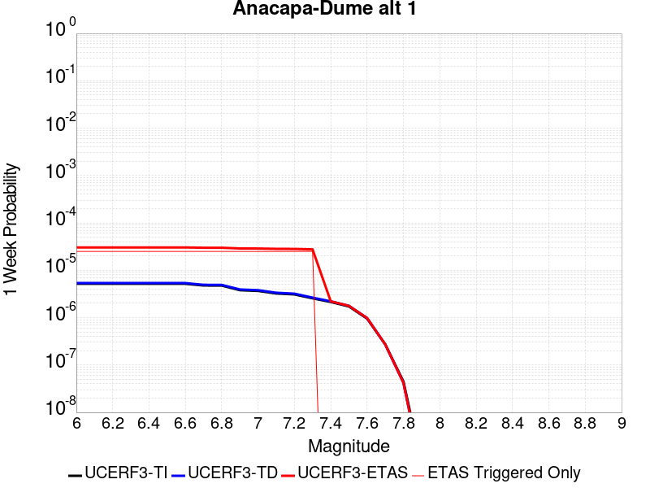 |  | 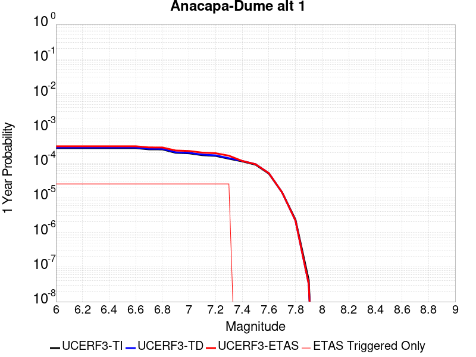 | 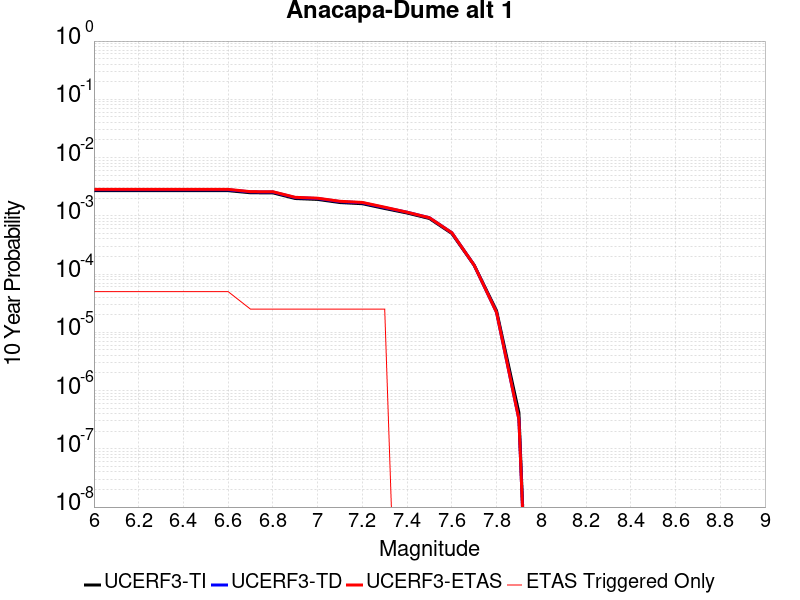 |

| Magnitude | 1 wk TI Prob | 1 wk TD Prob | 1 wk ETAS Prob | 1 wk ETAS/TD Gain | 1 wk ETAS Triggered Only | 1 mo TI Prob | 1 mo TD Prob | 1 mo ETAS Prob | 1 mo ETAS/TD Gain | 1 mo ETAS Triggered Only | 1 yr TI Prob | 1 yr TD Prob | 1 yr ETAS Prob | 1 yr ETAS/TD Gain | 1 yr ETAS Triggered Only | 10 yr TI Prob | 10 yr TD Prob | 10 yr ETAS Prob | 10 yr ETAS/TD Gain | 10 yr ETAS Triggered Only |
|-----|-----|-----|-----|-----|-----|-----|-----|-----|-----|-----|-----|-----|-----|-----|-----|-----|-----|-----|-----|-----|
| 6.0 | 5.1871802E-6 | 5.3673916E-6 | 3.0347273E-5 | 5.6540074 | 2.4980016E-5 | 2.2230583E-5 | 2.3002909E-5 | 4.798235E-5 | 2.0859253 | 2.4980016E-5 | 2.7062374E-4 | 2.8002527E-4 | 3.049983E-4 | 1.0891813 | 2.4980016E-5 | 0.002702944 | 0.0027968097 | 0.0028466298 | 1.0178132 | 4.9960032E-5 |
| 6.1 | 5.1871802E-6 | 5.3673916E-6 | 3.0347273E-5 | 5.6540074 | 2.4980016E-5 | 2.2230583E-5 | 2.3002909E-5 | 4.798235E-5 | 2.0859253 | 2.4980016E-5 | 2.7062374E-4 | 2.8002527E-4 | 3.049983E-4 | 1.0891813 | 2.4980016E-5 | 0.002702944 | 0.0027968097 | 0.0028466298 | 1.0178132 | 4.9960032E-5 |
| 6.2 | 5.1871802E-6 | 5.3673916E-6 | 3.0347273E-5 | 5.6540074 | 2.4980016E-5 | 2.2230583E-5 | 2.3002909E-5 | 4.798235E-5 | 2.0859253 | 2.4980016E-5 | 2.7062374E-4 | 2.8002527E-4 | 3.049983E-4 | 1.0891813 | 2.4980016E-5 | 0.002702944 | 0.0027968097 | 0.0028466298 | 1.0178132 | 4.9960032E-5 |
| 6.3 | 5.1871802E-6 | 5.3673916E-6 | 3.0347273E-5 | 5.6540074 | 2.4980016E-5 | 2.2230583E-5 | 2.3002909E-5 | 4.798235E-5 | 2.0859253 | 2.4980016E-5 | 2.7062374E-4 | 2.8002527E-4 | 3.049983E-4 | 1.0891813 | 2.4980016E-5 | 0.002702944 | 0.0027968097 | 0.0028466298 | 1.0178132 | 4.9960032E-5 |
| 6.4 | 5.1871802E-6 | 5.3673916E-6 | 3.0347273E-5 | 5.6540074 | 2.4980016E-5 | 2.2230583E-5 | 2.3002909E-5 | 4.798235E-5 | 2.0859253 | 2.4980016E-5 | 2.7062374E-4 | 2.8002527E-4 | 3.049983E-4 | 1.0891813 | 2.4980016E-5 | 0.002702944 | 0.0027968097 | 0.0028466298 | 1.0178132 | 4.9960032E-5 |
| 6.5 | 5.1871802E-6 | 5.3673916E-6 | 3.0347273E-5 | 5.6540074 | 2.4980016E-5 | 2.2230583E-5 | 2.3002909E-5 | 4.798235E-5 | 2.0859253 | 2.4980016E-5 | 2.7062374E-4 | 2.8002527E-4 | 3.049983E-4 | 1.0891813 | 2.4980016E-5 | 0.002702944 | 0.0027968097 | 0.0028466298 | 1.0178132 | 4.9960032E-5 |
| 6.6 | 5.1871802E-6 | 5.3673916E-6 | 3.0347273E-5 | 5.6540074 | 2.4980016E-5 | 2.2230583E-5 | 2.3002909E-5 | 4.798235E-5 | 2.0859253 | 2.4980016E-5 | 2.7062374E-4 | 2.8002527E-4 | 3.049983E-4 | 1.0891813 | 2.4980016E-5 | 0.002702944 | 0.0027968097 | 0.0028466298 | 1.0178132 | 4.9960032E-5 |
| 6.7 | 4.7693475E-6 | 4.9366927E-6 | 2.9916586E-5 | 6.060046 | 2.4980016E-5 | 2.04399E-5 | 2.1157086E-5 | 4.6136574E-5 | 2.1806676 | 2.4980016E-5 | 2.4882736E-4 | 2.5755784E-4 | 2.8253143E-4 | 1.096963 | 2.4980016E-5 | 0.0024854892 | 0.0025726694 | 0.002597585 | 1.0096848 | 2.4980016E-5 |
| 6.8 | 4.753408E-6 | 4.920241E-6 | 2.9900133E-5 | 6.0769653 | 2.4980016E-5 | 2.037159E-5 | 2.108658E-5 | 4.606607E-5 | 2.1846154 | 2.4980016E-5 | 2.4799586E-4 | 2.5669963E-4 | 2.8167322E-4 | 1.0972873 | 2.4980016E-5 | 0.002477193 | 0.002564107 | 0.002589023 | 1.0097172 | 2.4980016E-5 |
| 6.9 | 3.800069E-6 | 3.937127E-6 | 2.8917044E-5 | 7.344707 | 2.4980016E-5 | 1.6285909E-5 | 1.6873293E-5 | 4.1852887E-5 | 2.480422 | 2.4980016E-5 | 1.9826289E-4 | 2.054132E-4 | 2.3038809E-4 | 1.1215836 | 2.4980016E-5 | 0.001980861 | 0.0020522573 | 0.002077186 | 1.012147 | 2.4980016E-5 |
| 7.0 | 3.6671938E-6 | 3.799919E-6 | 2.877984E-5 | 7.5738034 | 2.4980016E-5 | 1.571645E-5 | 1.6285267E-5 | 4.1264877E-5 | 2.5338778 | 2.4980016E-5 | 1.9133097E-4 | 1.9825532E-4 | 2.2323038E-4 | 1.1259743 | 2.4980016E-5 | 0.0019116632 | 0.0019808079 | 0.0020057382 | 1.012586 | 2.4980016E-5 |
| 7.1 | 3.2394885E-6 | 3.3587942E-6 | 2.8338725E-5 | 8.437173 | 2.4980016E-5 | 1.3883448E-5 | 1.4394753E-5 | 3.937441E-5 | 2.7353306 | 2.4980016E-5 | 1.6901788E-4 | 1.7524212E-4 | 2.0021776E-4 | 1.1425208 | 2.4980016E-5 | 0.0016888938 | 0.0017510506 | 0.0017759869 | 1.0142407 | 2.4980016E-5 |
| 7.2 | 3.0935948E-6 | 3.2079267E-6 | 2.8187862E-5 | 8.786941 | 2.4980016E-5 | 1.3258196E-5 | 1.3748186E-5 | 3.872786E-5 | 2.8169432 | 2.4980016E-5 | 1.6140658E-4 | 1.6737141E-4 | 1.9234724E-4 | 1.149224 | 2.4980016E-5 | 0.001612894 | 0.0016724645 | 0.0016974028 | 1.014911 | 2.4980016E-5 |
| 7.3 | 2.5604163E-6 | 2.6470739E-6 | 2.7627024E-5 | 10.436816 | 2.4980016E-5 | 1.0973167E-5 | 1.1344553E-5 | 3.6324287E-5 | 3.201914 | 2.4980016E-5 | 1.3359012E-4 | 1.3811122E-4 | 1.630878E-4 | 1.1808438 | 2.4980016E-5 | 0.0013350984 | 0.0013802585 | 0.0014052041 | 1.0180731 | 2.4980016E-5 |
| 7.4 | 2.1429005E-6 | 2.2106035E-6 | 2.2106035E-6 | 1.0 | 0.0 | 9.1838265E-6 | 9.473981E-6 | 9.473981E-6 | 1.0 | 0.0 | 1.11807356E-4 | 1.1533964E-4 | 1.1533964E-4 | 1.0 | 0.0 | 0.0011175112 | 0.0011528004 | 0.0011528004 | 1.0 | 0.0 |
| 7.5 | 1.7237151E-6 | 1.7761457E-6 | 1.7761457E-6 | 1.0 | 0.0 | 7.3873293E-6 | 7.6120314E-6 | 7.6120314E-6 | 1.0 | 0.0 | 8.993702E-5 | 9.267256E-5 | 9.267256E-5 | 1.0 | 0.0 | 8.990063E-4 | 9.263415E-4 | 9.263415E-4 | 1.0 | 0.0 |
| 7.6 | 9.541696E-7 | 9.823211E-7 | 9.823211E-7 | 1.0 | 0.0 | 4.089292E-6 | 4.2099414E-6 | 4.2099414E-6 | 1.0 | 0.0 | 4.9785995E-5 | 5.125484E-5 | 5.125484E-5 | 1.0 | 0.0 | 4.9774844E-4 | 5.124315E-4 | 5.124315E-4 | 1.0 | 0.0 |
| 7.7 | 2.7226676E-7 | 2.7172473E-7 | 2.7172473E-7 | 1.0 | 0.0 | 1.166857E-6 | 1.1645341E-6 | 1.1645341E-6 | 1.0 | 0.0 | 1.4206392E-5 | 1.4178111E-5 | 1.4178111E-5 | 1.0 | 0.0 | 1.4205484E-4 | 1.4177214E-4 | 1.4177214E-4 | 1.0 | 0.0 |
| 7.8 | 4.5017995E-8 | 4.215797E-8 | 4.215797E-8 | 1.0 | 0.0 | 1.9293425E-7 | 1.80677E-7 | 1.80677E-7 | 1.0 | 0.0 | 2.348972E-6 | 2.1997405E-6 | 2.1997405E-6 | 1.0 | 0.0 | 2.348947E-5 | 2.1997208E-5 | 2.1997208E-5 | 1.0 | 0.0 |
| 7.9 | 8.007447E-10 | 6.161581E-10 | 6.161581E-10 | 1.0 | 0.0 | 3.4317629E-9 | 2.640678E-9 | 2.640678E-9 | 1.0 | 0.0 | 4.1781714E-8 | 3.2150254E-8 | 3.2150254E-8 | 1.0 | 0.0 | 4.1781706E-7 | 3.2150248E-7 | 3.2150248E-7 | 1.0 | 0.0 |

## Pitas Point (Lower West)
*[(top)](#table-of-contents)*

| 1 Week | 1 Month | 1 Year | 10 Year |
|-----|-----|-----|-----|
| 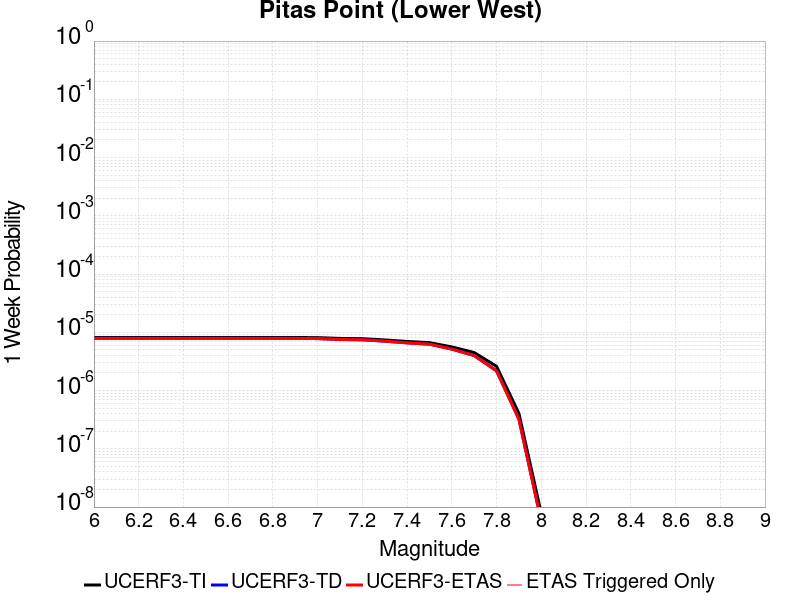 | 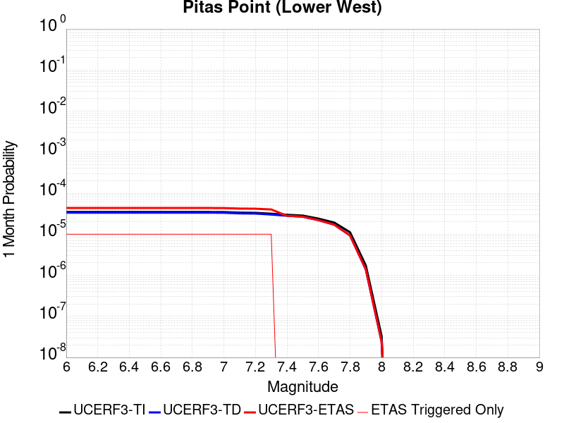 | 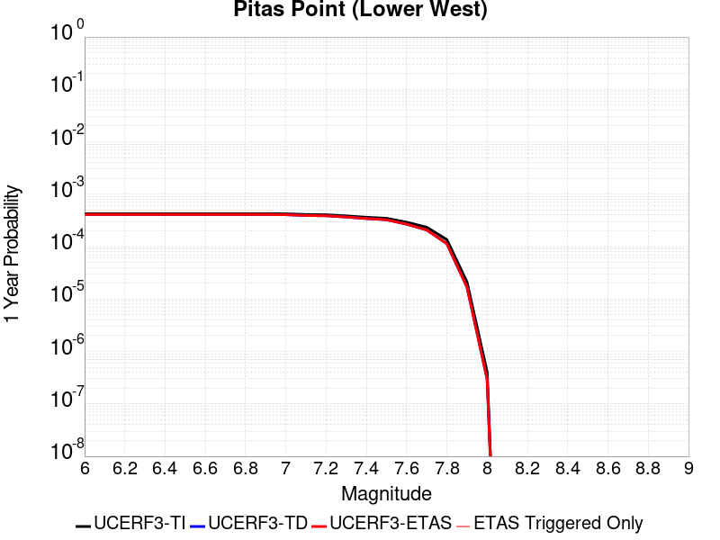 | 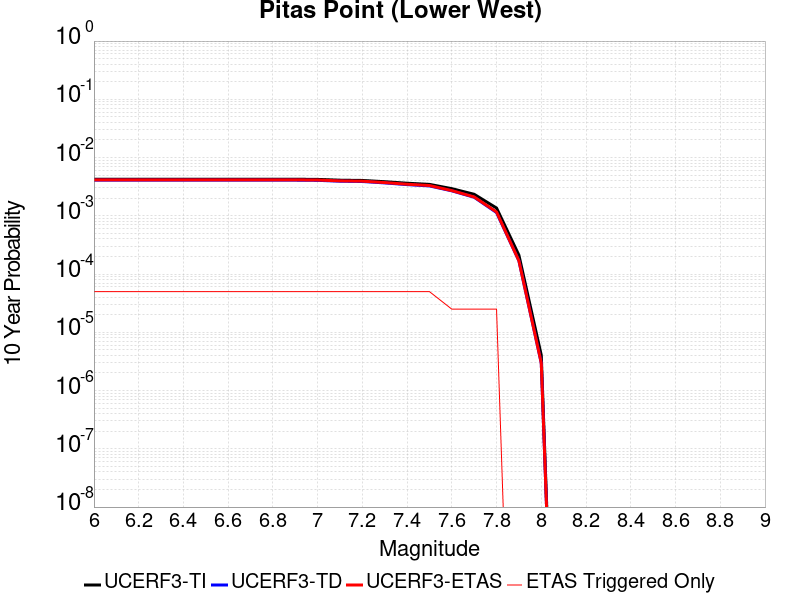 |

| Magnitude | 1 wk TI Prob | 1 wk TD Prob | 1 wk ETAS Prob | 1 wk ETAS/TD Gain | 1 wk ETAS Triggered Only | 1 mo TI Prob | 1 mo TD Prob | 1 mo ETAS Prob | 1 mo ETAS/TD Gain | 1 mo ETAS Triggered Only | 1 yr TI Prob | 1 yr TD Prob | 1 yr ETAS Prob | 1 yr ETAS/TD Gain | 1 yr ETAS Triggered Only | 10 yr TI Prob | 10 yr TD Prob | 10 yr ETAS Prob | 10 yr ETAS/TD Gain | 10 yr ETAS Triggered Only |
|-----|-----|-----|-----|-----|-----|-----|-----|-----|-----|-----|-----|-----|-----|-----|-----|-----|-----|-----|-----|-----|
| 6.0 | 8.151497E-6 | 7.855796E-6 | 7.855796E-6 | 1.0 | 0.0 | 3.493452E-5 | 3.3667267E-5 | 3.3667267E-5 | 1.0 | 0.0 | 4.252448E-4 | 4.0982262E-4 | 4.0982262E-4 | 1.0 | 0.0 | 0.0042443196 | 0.004090749 | 0.004140505 | 1.0121629 | 4.9960032E-5 |
| 6.1 | 8.151497E-6 | 7.855796E-6 | 7.855796E-6 | 1.0 | 0.0 | 3.493452E-5 | 3.3667267E-5 | 3.3667267E-5 | 1.0 | 0.0 | 4.252448E-4 | 4.0982262E-4 | 4.0982262E-4 | 1.0 | 0.0 | 0.0042443196 | 0.004090749 | 0.004140505 | 1.0121629 | 4.9960032E-5 |
| 6.2 | 8.151497E-6 | 7.855796E-6 | 7.855796E-6 | 1.0 | 0.0 | 3.493452E-5 | 3.3667267E-5 | 3.3667267E-5 | 1.0 | 0.0 | 4.252448E-4 | 4.0982262E-4 | 4.0982262E-4 | 1.0 | 0.0 | 0.0042443196 | 0.004090749 | 0.004140505 | 1.0121629 | 4.9960032E-5 |
| 6.3 | 8.151497E-6 | 7.855796E-6 | 7.855796E-6 | 1.0 | 0.0 | 3.493452E-5 | 3.3667267E-5 | 3.3667267E-5 | 1.0 | 0.0 | 4.252448E-4 | 4.0982262E-4 | 4.0982262E-4 | 1.0 | 0.0 | 0.0042443196 | 0.004090749 | 0.004140505 | 1.0121629 | 4.9960032E-5 |
| 6.4 | 8.151497E-6 | 7.855796E-6 | 7.855796E-6 | 1.0 | 0.0 | 3.493452E-5 | 3.3667267E-5 | 3.3667267E-5 | 1.0 | 0.0 | 4.252448E-4 | 4.0982262E-4 | 4.0982262E-4 | 1.0 | 0.0 | 0.0042443196 | 0.004090749 | 0.004140505 | 1.0121629 | 4.9960032E-5 |
| 6.5 | 8.151497E-6 | 7.855796E-6 | 7.855796E-6 | 1.0 | 0.0 | 3.493452E-5 | 3.3667267E-5 | 3.3667267E-5 | 1.0 | 0.0 | 4.252448E-4 | 4.0982262E-4 | 4.0982262E-4 | 1.0 | 0.0 | 0.0042443196 | 0.004090749 | 0.004140505 | 1.0121629 | 4.9960032E-5 |
| 6.6 | 8.151497E-6 | 7.855796E-6 | 7.855796E-6 | 1.0 | 0.0 | 3.493452E-5 | 3.3667267E-5 | 3.3667267E-5 | 1.0 | 0.0 | 4.252448E-4 | 4.0982262E-4 | 4.0982262E-4 | 1.0 | 0.0 | 0.0042443196 | 0.004090749 | 0.004140505 | 1.0121629 | 4.9960032E-5 |
| 6.7 | 8.151497E-6 | 7.855796E-6 | 7.855796E-6 | 1.0 | 0.0 | 3.493452E-5 | 3.3667267E-5 | 3.3667267E-5 | 1.0 | 0.0 | 4.252448E-4 | 4.0982262E-4 | 4.0982262E-4 | 1.0 | 0.0 | 0.0042443196 | 0.004090749 | 0.004140505 | 1.0121629 | 4.9960032E-5 |
| 6.8 | 8.151497E-6 | 7.855796E-6 | 7.855796E-6 | 1.0 | 0.0 | 3.493452E-5 | 3.3667267E-5 | 3.3667267E-5 | 1.0 | 0.0 | 4.252448E-4 | 4.0982262E-4 | 4.0982262E-4 | 1.0 | 0.0 | 0.0042443196 | 0.004090749 | 0.004140505 | 1.0121629 | 4.9960032E-5 |
| 6.9 | 8.151497E-6 | 7.855796E-6 | 7.855796E-6 | 1.0 | 0.0 | 3.493452E-5 | 3.3667267E-5 | 3.3667267E-5 | 1.0 | 0.0 | 4.252448E-4 | 4.0982262E-4 | 4.0982262E-4 | 1.0 | 0.0 | 0.0042443196 | 0.004090749 | 0.004140505 | 1.0121629 | 4.9960032E-5 |
| 7.0 | 8.103535E-6 | 7.805226E-6 | 7.805226E-6 | 1.0 | 0.0 | 3.4728975E-5 | 3.3450542E-5 | 3.3450542E-5 | 1.0 | 0.0 | 4.2274324E-4 | 4.07185E-4 | 4.07185E-4 | 1.0 | 0.0 | 0.0042193993 | 0.0040644696 | 0.0041142264 | 1.012242 | 4.9960032E-5 |
| 7.1 | 7.853298E-6 | 7.540917E-6 | 7.540917E-6 | 1.0 | 0.0 | 3.3656554E-5 | 3.2317817E-5 | 3.2317817E-5 | 1.0 | 0.0 | 4.096915E-4 | 3.9339912E-4 | 3.9339912E-4 | 1.0 | 0.0 | 0.00408937 | 0.0039271032 | 0.003976867 | 1.012672 | 4.9960032E-5 |
| 7.2 | 7.771102E-6 | 7.453199E-6 | 7.453199E-6 | 1.0 | 0.0 | 3.33043E-5 | 3.1941894E-5 | 3.1941894E-5 | 1.0 | 0.0 | 4.0540437E-4 | 3.8882386E-4 | 3.8882386E-4 | 1.0 | 0.0 | 0.0040466557 | 0.003881511 | 0.0039312774 | 1.0128213 | 4.9960032E-5 |
| 7.3 | 7.3945344E-6 | 7.0493033E-6 | 7.0493033E-6 | 1.0 | 0.0 | 3.1690477E-5 | 3.0210955E-5 | 3.0210955E-5 | 1.0 | 0.0 | 3.8576324E-4 | 3.677569E-4 | 3.677569E-4 | 1.0 | 0.0 | 0.0038509427 | 0.003671551 | 0.0037213275 | 1.0135574 | 4.9960032E-5 |
| 7.4 | 6.964645E-6 | 6.5901527E-6 | 6.5901527E-6 | 1.0 | 0.0 | 2.9848137E-5 | 2.8243208E-5 | 2.8243208E-5 | 1.0 | 0.0 | 3.6334046E-4 | 3.438073E-4 | 3.438073E-4 | 1.0 | 0.0 | 0.0036274698 | 0.0034328073 | 0.0034825958 | 1.0145037 | 4.9960032E-5 |
| 7.5 | 6.6525035E-6 | 6.259191E-6 | 6.259191E-6 | 1.0 | 0.0 | 2.851042E-5 | 2.6824831E-5 | 2.6824831E-5 | 1.0 | 0.0 | 3.4705905E-4 | 3.2654387E-4 | 3.2654387E-4 | 1.0 | 0.0 | 0.0034651754 | 0.0032606919 | 0.003310489 | 1.0152719 | 4.9960032E-5 |
| 7.6 | 5.613338E-6 | 5.15142E-6 | 5.15142E-6 | 1.0 | 0.0 | 2.405694E-5 | 2.2077327E-5 | 2.2077327E-5 | 1.0 | 0.0 | 2.928539E-4 | 2.6875862E-4 | 2.6875862E-4 | 1.0 | 0.0 | 0.0029246826 | 0.0026843674 | 0.0027092805 | 1.0092808 | 2.4980016E-5 |
| 7.7 | 4.494704E-6 | 3.996945E-6 | 3.996945E-6 | 1.0 | 0.0 | 1.9262876E-5 | 1.7129652E-5 | 1.7129652E-5 | 1.0 | 0.0 | 2.3450027E-4 | 2.0853379E-4 | 2.0853379E-4 | 1.0 | 0.0 | 0.0023425296 | 0.0020834052 | 0.0021083332 | 1.011965 | 2.4980016E-5 |
| 7.8 | 2.6075882E-6 | 2.1836663E-6 | 2.1836663E-6 | 1.0 | 0.0 | 1.117533E-5 | 9.358537E-6 | 9.358537E-6 | 1.0 | 0.0 | 1.3605114E-4 | 1.1393427E-4 | 1.1393427E-4 | 1.0 | 0.0 | 0.0013596788 | 0.0011387634 | 0.0011637149 | 1.0219111 | 2.4980016E-5 |
| 7.9 | 4.045984E-7 | 3.2424057E-7 | 3.2424057E-7 | 1.0 | 0.0 | 1.733992E-6 | 1.3896017E-6 | 1.3896017E-6 | 1.0 | 0.0 | 2.1111147E-5 | 1.6918271E-5 | 1.6918271E-5 | 1.0 | 0.0 | 2.1109142E-4 | 1.6917015E-4 | 1.6917015E-4 | 1.0 | 0.0 |
| 8.0 | 7.791402E-9 | 5.6836056E-9 | 5.6836056E-9 | 1.0 | 0.0 | 3.3391725E-8 | 2.4358311E-8 | 2.4358311E-8 | 1.0 | 0.0 | 4.0654416E-7 | 2.965624E-7 | 2.965624E-7 | 1.0 | 0.0 | 4.065434E-6 | 2.9656223E-6 | 2.9656223E-6 | 1.0 | 0.0 |

## Honey Lake 2011 CFM
*[(top)](#table-of-contents)*

| 1 Week | 1 Month | 1 Year | 10 Year |
|-----|-----|-----|-----|
| 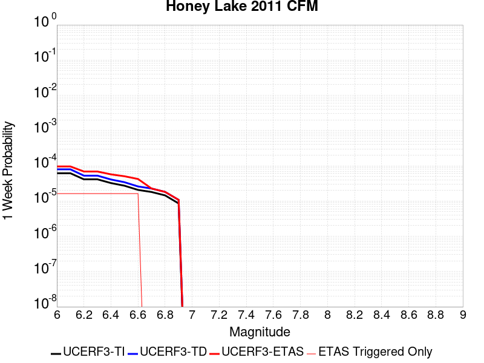 | 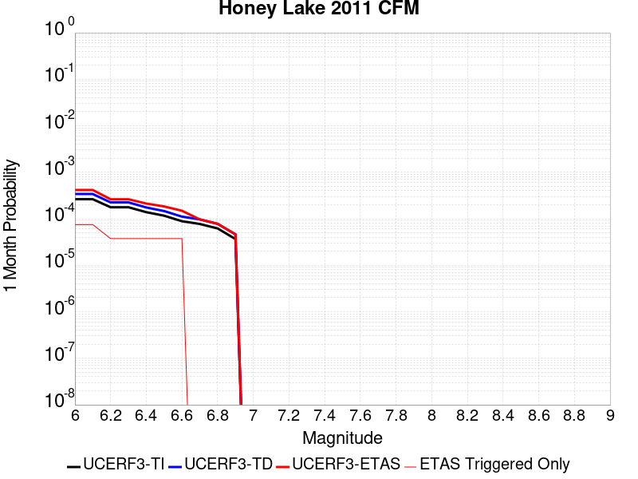 | 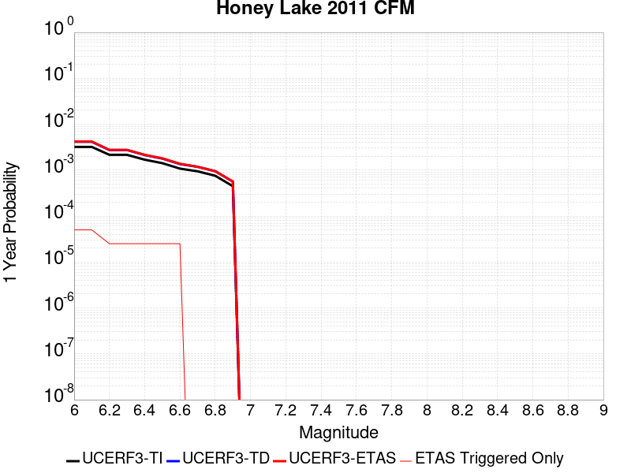 | 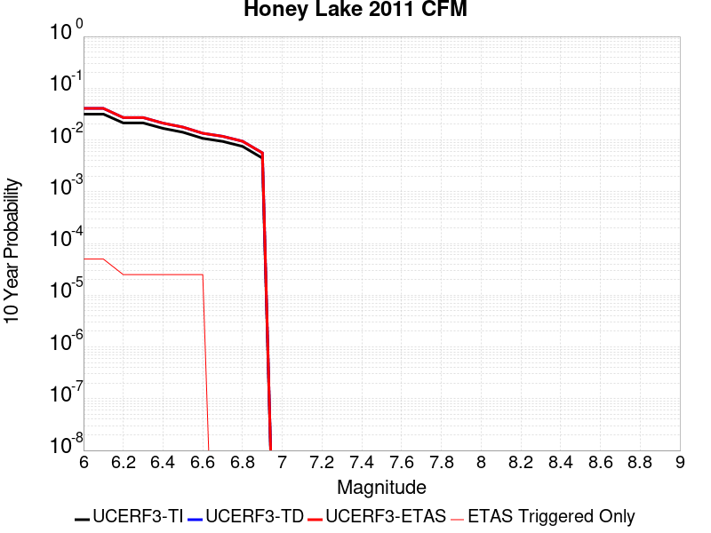 |

| Magnitude | 1 wk TI Prob | 1 wk TD Prob | 1 wk ETAS Prob | 1 wk ETAS/TD Gain | 1 wk ETAS Triggered Only | 1 mo TI Prob | 1 mo TD Prob | 1 mo ETAS Prob | 1 mo ETAS/TD Gain | 1 mo ETAS Triggered Only | 1 yr TI Prob | 1 yr TD Prob | 1 yr ETAS Prob | 1 yr ETAS/TD Gain | 1 yr ETAS Triggered Only | 10 yr TI Prob | 10 yr TD Prob | 10 yr ETAS Prob | 10 yr ETAS/TD Gain | 10 yr ETAS Triggered Only |
|-----|-----|-----|-----|-----|-----|-----|-----|-----|-----|-----|-----|-----|-----|-----|-----|-----|-----|-----|-----|-----|
| 6.0 | 6.155506E-5 | 7.954708E-5 | 1.04525105E-4 | 1.3140031 | 2.4980016E-5 | 2.6378073E-4 | 3.4087323E-4 | 3.9081625E-4 | 1.1465149 | 4.9960032E-5 | 0.0032068014 | 0.0041426765 | 0.0041924296 | 1.0120099 | 4.9960032E-5 | 0.03160919 | 0.040703055 | 0.04075098 | 1.0011774 | 4.9960032E-5 |
| 6.1 | 6.155506E-5 | 7.954708E-5 | 1.04525105E-4 | 1.3140031 | 2.4980016E-5 | 2.6378073E-4 | 3.4087323E-4 | 3.9081625E-4 | 1.1465149 | 4.9960032E-5 | 0.0032068014 | 0.0041426765 | 0.0041924296 | 1.0120099 | 4.9960032E-5 | 0.03160919 | 0.040703055 | 0.04075098 | 1.0011774 | 4.9960032E-5 |
| 6.2 | 4.1335024E-5 | 5.257652E-5 | 7.7555225E-5 | 1.4750923 | 2.4980016E-5 | 1.7713808E-4 | 2.2530954E-4 | 2.5028392E-4 | 1.1108447 | 2.4980016E-5 | 0.0021545228 | 0.0027398444 | 0.0027647559 | 1.0090923 | 2.4980016E-5 | 0.021337535 | 0.027076809 | 0.027101113 | 1.0008975 | 2.4980016E-5 |
| 6.3 | 4.1335024E-5 | 5.257652E-5 | 7.7555225E-5 | 1.4750923 | 2.4980016E-5 | 1.7713808E-4 | 2.2530954E-4 | 2.5028392E-4 | 1.1108447 | 2.4980016E-5 | 0.0021545228 | 0.0027398444 | 0.0027647559 | 1.0090923 | 2.4980016E-5 | 0.021337535 | 0.027076809 | 0.027101113 | 1.0008975 | 2.4980016E-5 |
| 6.4 | 3.2393702E-5 | 4.0887273E-5 | 6.586627E-5 | 1.6109234 | 2.4980016E-5 | 1.3882275E-4 | 1.7522006E-4 | 2.001957E-4 | 1.1425387 | 2.4980016E-5 | 0.0016888566 | 0.0021313233 | 0.0021562502 | 1.0116955 | 2.4980016E-5 | 0.016760793 | 0.021119867 | 0.02114432 | 1.0011578 | 2.4980016E-5 |
| 6.5 | 2.7205504E-5 | 3.4211767E-5 | 5.919093E-5 | 1.7301335 | 2.4980016E-5 | 1.1658981E-4 | 1.4661417E-4 | 1.7159052E-4 | 1.1703542 | 2.4980016E-5 | 0.0014185566 | 0.0017836596 | 0.001808595 | 1.0139799 | 2.4980016E-5 | 0.014095354 | 0.017702963 | 0.0177275 | 1.001386 | 2.4980016E-5 |
| 6.6 | 2.069265E-5 | 2.5955416E-5 | 5.0934785E-5 | 1.9623952 | 2.4980016E-5 | 8.867977E-5 | 1.1123324E-4 | 1.3621048E-4 | 1.2245483 | 2.4980016E-5 | 0.0010791414 | 0.0013535074 | 0.0013784536 | 1.0184308 | 2.4980016E-5 | 0.010739161 | 0.0134610105 | 0.013485654 | 1.0018307 | 2.4980016E-5 |
| 6.7 | 1.8060919E-5 | 2.265683E-5 | 2.265683E-5 | 1.0 | 0.0 | 7.7401644E-5 | 9.7097545E-5 | 9.7097545E-5 | 1.0 | 0.0 | 9.419576E-4 | 0.0011816025 | 0.0011816025 | 1.0 | 0.0 | 0.009379748 | 0.0117612425 | 0.0117612425 | 1.0 | 0.0 |
| 6.8 | 1.4474663E-5 | 1.8181274E-5 | 1.8181274E-5 | 1.0 | 0.0 | 6.203279E-5 | 7.791785E-5 | 7.791785E-5 | 1.0 | 0.0 | 7.5498753E-4 | 9.4831345E-4 | 9.4831345E-4 | 1.0 | 0.0 | 0.007524277 | 0.009450195 | 0.009450195 | 1.0 | 0.0 |
| 6.9 | 8.564552E-6 | 1.0802311E-5 | 1.0802311E-5 | 1.0 | 0.0 | 3.6704707E-5 | 4.6295176E-5 | 4.6295176E-5 | 1.0 | 0.0 | 4.4678818E-4 | 5.635644E-4 | 5.635644E-4 | 1.0 | 0.0 | 0.0044589094 | 0.0056278505 | 0.0056278505 | 1.0 | 0.0 |

## Calaveras (So) - Paicines extension 2011 CFM
*[(top)](#table-of-contents)*

| 1 Week | 1 Month | 1 Year | 10 Year |
|-----|-----|-----|-----|
| 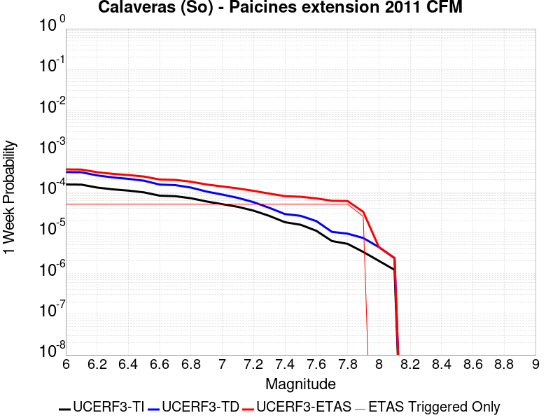 | 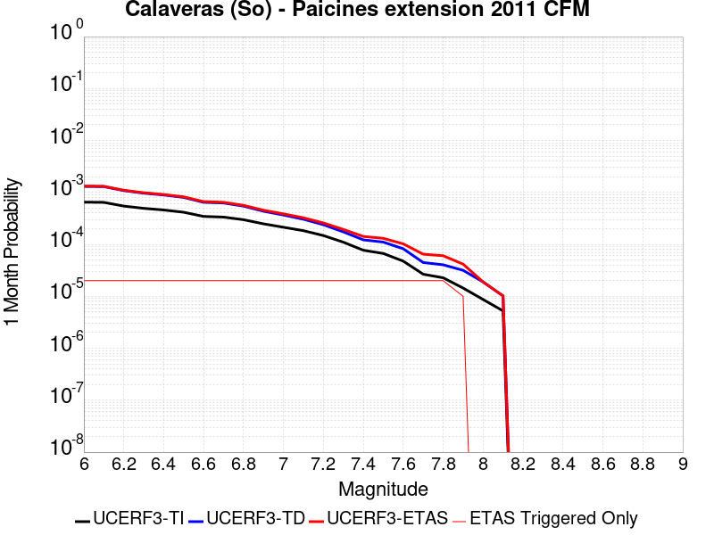 | 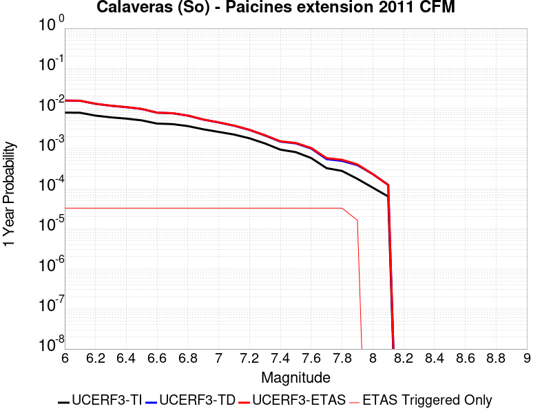 |  |

| Magnitude | 1 wk TI Prob | 1 wk TD Prob | 1 wk ETAS Prob | 1 wk ETAS/TD Gain | 1 wk ETAS Triggered Only | 1 mo TI Prob | 1 mo TD Prob | 1 mo ETAS Prob | 1 mo ETAS/TD Gain | 1 mo ETAS Triggered Only | 1 yr TI Prob | 1 yr TD Prob | 1 yr ETAS Prob | 1 yr ETAS/TD Gain | 1 yr ETAS Triggered Only | 10 yr TI Prob | 10 yr TD Prob | 10 yr ETAS Prob | 10 yr ETAS/TD Gain | 10 yr ETAS Triggered Only |
|-----|-----|-----|-----|-----|-----|-----|-----|-----|-----|-----|-----|-----|-----|-----|-----|-----|-----|-----|-----|-----|
| 6.0 | 1.5183659E-4 | 3.0520977E-4 | 3.5515457E-4 | 1.1636409 | 4.9960032E-5 | 6.5056595E-4 | 0.0013068188 | 0.0013567136 | 1.0381804 | 4.9960032E-5 | 0.007891912 | 0.015696203 | 0.01574538 | 1.0031329 | 4.9960032E-5 | 0.076174594 | 0.13848905 | 0.13853209 | 1.0003108 | 4.9960032E-5 |
| 6.1 | 1.5024997E-4 | 3.021517E-4 | 3.5209663E-4 | 1.1652975 | 4.9960032E-5 | 6.437695E-4 | 0.0012937278 | 0.0013436233 | 1.0385672 | 4.9960032E-5 | 0.0078097614 | 0.015539596 | 0.01558878 | 1.003165 | 4.9960032E-5 | 0.075409345 | 0.13715863 | 0.13720174 | 1.0003142 | 4.9960032E-5 |
| 6.2 | 1.2743923E-4 | 2.5313982E-4 | 3.030872E-4 | 1.1973114 | 4.9960032E-5 | 5.460538E-4 | 0.0010839999 | 0.0011339057 | 1.0460386 | 4.9960032E-5 | 0.0066279583 | 0.013046881 | 0.01309619 | 1.0037793 | 4.9960032E-5 | 0.064337276 | 0.117256075 | 0.117300175 | 1.0003761 | 4.9960032E-5 |
| 6.3 | 1.1525114E-4 | 2.2599236E-4 | 2.759411E-4 | 1.2210196 | 4.9960032E-5 | 4.9383997E-4 | 9.678718E-4 | 0.0010177834 | 1.0515685 | 4.9960032E-5 | 0.0059959386 | 0.011668079 | 0.011717455 | 1.0042318 | 4.9960032E-5 | 0.058367174 | 0.106372125 | 0.10641677 | 1.0004197 | 4.9960032E-5 |
| 6.4 | 1.07200925E-4 | 2.0840544E-4 | 2.5835505E-4 | 1.2396752 | 4.9960032E-5 | 4.5935164E-4 | 8.926123E-4 | 9.425277E-4 | 1.0559206 | 4.9960032E-5 | 0.0055782744 | 0.010772959 | 0.010822381 | 1.0045875 | 4.9960032E-5 | 0.0544031 | 0.099194765 | 0.099239774 | 1.0004537 | 4.9960032E-5 |
| 6.5 | 9.69631E-5 | 1.8734725E-4 | 2.3729792E-4 | 1.2666208 | 4.9960032E-5 | 4.1548995E-4 | 8.024631E-4 | 8.5238303E-4 | 1.0622084 | 4.9960032E-5 | 0.0050468626 | 0.009694842 | 0.009744317 | 1.0051033 | 4.9960032E-5 | 0.04933773 | 0.090086564 | 0.09013203 | 1.0005046 | 4.9960032E-5 |
| 6.6 | 8.0552316E-5 | 1.507068E-4 | 2.0065928E-4 | 1.3314549 | 4.9960032E-5 | 3.4517853E-4 | 6.4569083E-4 | 6.956186E-4 | 1.0773246 | 4.9960032E-5 | 0.0041944524 | 0.007826508 | 0.007876078 | 1.0063335 | 4.9960032E-5 | 0.04116161 | 0.0748563 | 0.07490253 | 1.0006175 | 4.9960032E-5 |
| 6.7 | 7.815757E-5 | 1.4611272E-4 | 1.9606545E-4 | 1.341878 | 4.9960032E-5 | 3.34918E-4 | 6.26014E-4 | 6.759428E-4 | 1.0797566 | 4.9960032E-5 | 0.004070005 | 0.007589312 | 0.0076388926 | 1.006533 | 4.9960032E-5 | 0.039962657 | 0.07270582 | 0.07275215 | 1.0006372 | 4.9960032E-5 |
| 6.8 | 6.965264E-5 | 1.2722758E-4 | 1.7718127E-4 | 1.3926324 | 4.9960032E-5 | 2.9847719E-4 | 5.4513285E-4 | 5.9506565E-4 | 1.0915974 | 4.9960032E-5 | 0.0036279052 | 0.0066135945 | 0.006663224 | 1.0075042 | 4.9960032E-5 | 0.03569247 | 0.063801065 | 0.06384784 | 1.0007331 | 4.9960032E-5 |
| 6.9 | 5.8000453E-5 | 1.01439E-4 | 1.5139396E-4 | 1.4924631 | 4.9960032E-5 | 2.4854968E-4 | 4.346666E-4 | 4.8460494E-4 | 1.1148888 | 4.9960032E-5 | 0.0030218933 | 0.005279322 | 0.0053290185 | 1.0094134 | 4.9960032E-5 | 0.029811295 | 0.051502965 | 0.05155035 | 1.00092 | 4.9960032E-5 |
| 7.0 | 4.9865852E-5 | 8.568029E-5 | 1.3563603E-4 | 1.5830483 | 4.9960032E-5 | 2.1369329E-4 | 3.6715003E-4 | 4.170917E-4 | 1.1360253 | 4.9960032E-5 | 0.0025986114 | 0.004460979 | 0.0045107156 | 1.0111494 | 4.9960032E-5 | 0.025684336 | 0.043782018 | 0.043829788 | 1.0010911 | 4.9960032E-5 |
| 7.1 | 4.283875E-5 | 7.1124625E-5 | 1.2108111E-4 | 1.7023795 | 4.9960032E-5 | 1.8358172E-4 | 3.0478454E-4 | 3.5472933E-4 | 1.1638693 | 4.9960032E-5 | 0.0022328163 | 0.003704494 | 0.003754269 | 1.0134363 | 4.9960032E-5 | 0.022105146 | 0.03673582 | 0.03678395 | 1.00131 | 4.9960032E-5 |
| 7.2 | 3.450115E-5 | 5.5778568E-5 | 1.0573581E-4 | 1.8956351 | 4.9960032E-5 | 1.478537E-4 | 2.3902925E-4 | 2.8897735E-4 | 1.2089622 | 4.9960032E-5 | 0.0017986323 | 0.0029063264 | 0.0029561413 | 1.0171402 | 4.9960032E-5 | 0.017841442 | 0.029079042 | 0.02912755 | 1.0016681 | 4.9960032E-5 |
| 7.3 | 2.5709045E-5 | 4.059001E-5 | 9.054801E-5 | 2.2307956 | 4.9960032E-5 | 1.1017697E-4 | 1.7394568E-4 | 2.2389703E-4 | 1.2871664 | 4.9960032E-5 | 0.0013405791 | 0.0021157486 | 0.002165603 | 1.0235635 | 4.9960032E-5 | 0.013325208 | 0.02129686 | 0.021345757 | 1.002296 | 4.9960032E-5 |
| 7.4 | 1.8003093E-5 | 2.8511378E-5 | 7.846999E-5 | 2.752234 | 4.9960032E-5 | 7.715383E-5 | 1.2218591E-4 | 1.7213984E-4 | 1.4088354 | 4.9960032E-5 | 9.3894306E-4 | 0.0014866006 | 0.0015364864 | 1.0335569 | 4.9960032E-5 | 0.009349857 | 0.015051589 | 0.015100798 | 1.0032693 | 4.9960032E-5 |
| 7.5 | 1.5595824E-5 | 2.5823752E-5 | 7.57825E-5 | 2.9346042 | 4.9960032E-5 | 6.683753E-5 | 1.10668545E-4 | 1.6062305E-4 | 1.4513885 | 4.9960032E-5 | 8.134431E-4 | 0.0013465589 | 0.0013964517 | 1.037052 | 4.9960032E-5 | 0.008104719 | 0.013651571 | 0.013700849 | 1.0036097 | 4.9960032E-5 |
| 7.6 | 1.1110309E-5 | 1.9223195E-5 | 6.9182264E-5 | 3.5988953 | 4.9960032E-5 | 4.761474E-5 | 8.2382525E-5 | 1.3233845E-4 | 1.6063896 | 4.9960032E-5 | 5.795553E-4 | 0.0010025471 | 0.001052457 | 1.0497831 | 4.9960032E-5 | 0.0057804612 | 0.01020344 | 0.01025289 | 1.0048465 | 4.9960032E-5 |
| 7.7 | 6.2140443E-6 | 1.04376995E-5 | 6.039721E-5 | 5.786448 | 4.9960032E-5 | 2.6631347E-5 | 4.4732235E-5 | 9.469003E-5 | 2.1168187 | 4.9960032E-5 | 3.241884E-4 | 5.4447894E-4 | 5.944118E-4 | 1.0917076 | 4.9960032E-5 | 0.0032371588 | 0.005620102 | 0.0056697815 | 1.0088396 | 4.9960032E-5 |
| 7.8 | 5.305533E-6 | 9.433651E-6 | 5.9393213E-5 | 6.295888 | 4.9960032E-5 | 2.27378E-5 | 4.0429306E-5 | 9.038732E-5 | 2.235688 | 4.9960032E-5 | 2.7679754E-4 | 4.9211574E-4 | 5.4205116E-4 | 1.101471 | 4.9960032E-5 | 0.0027645302 | 0.005074622 | 0.0051243287 | 1.0097951 | 4.9960032E-5 |
| 7.9 | 3.363505E-6 | 7.3854467E-6 | 3.236528E-5 | 4.3823047 | 2.4980016E-5 | 1.4414942E-5 | 3.1651532E-5 | 5.6630757E-5 | 1.7891948 | 2.4980016E-5 | 1.7548777E-4 | 3.8528934E-4 | 4.1025973E-4 | 1.0648094 | 2.4980016E-5 | 0.0017534926 | 0.003948784 | 0.0039736656 | 1.006301 | 2.4980016E-5 |
| 8.0 | 2.0271132E-6 | 4.4134235E-6 | 4.4134235E-6 | 1.0 | 0.0 | 8.687599E-6 | 1.8914534E-5 | 1.8914534E-5 | 1.0 | 0.0 | 1.05766376E-4 | 2.3026018E-4 | 2.3026018E-4 | 1.0 | 0.0 | 0.0010571606 | 0.002351194 | 0.002351194 | 1.0 | 0.0 |
| 8.1 | 1.2206116E-6 | 2.3752666E-6 | 2.3752666E-6 | 1.0 | 0.0 | 5.2311816E-6 | 1.0179674E-5 | 1.0179674E-5 | 1.0 | 0.0 | 6.3687774E-5 | 1.2393051E-4 | 1.2393051E-4 | 1.0 | 0.0 | 6.366953E-4 | 0.0012705618 | 0.0012705618 | 1.0 | 0.0 |

## Point Reyes 2011 CFM
*[(top)](#table-of-contents)*

| 1 Week | 1 Month | 1 Year | 10 Year |
|-----|-----|-----|-----|
| 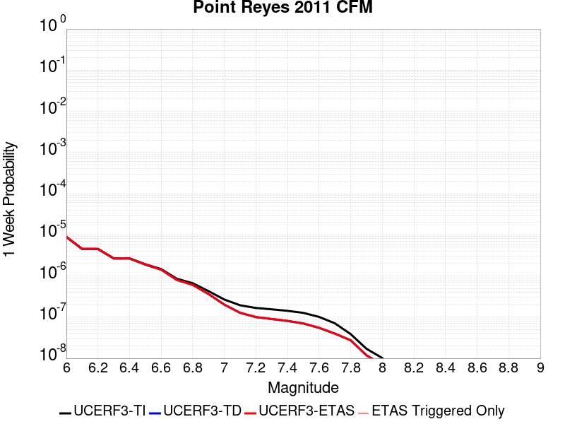 | 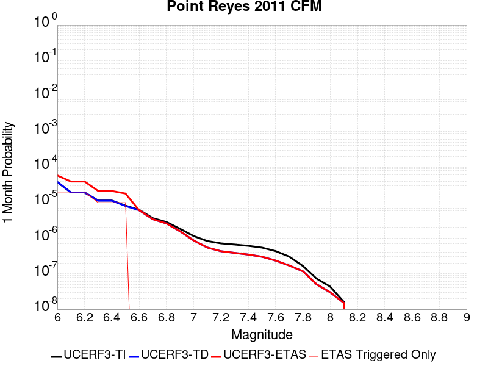 | 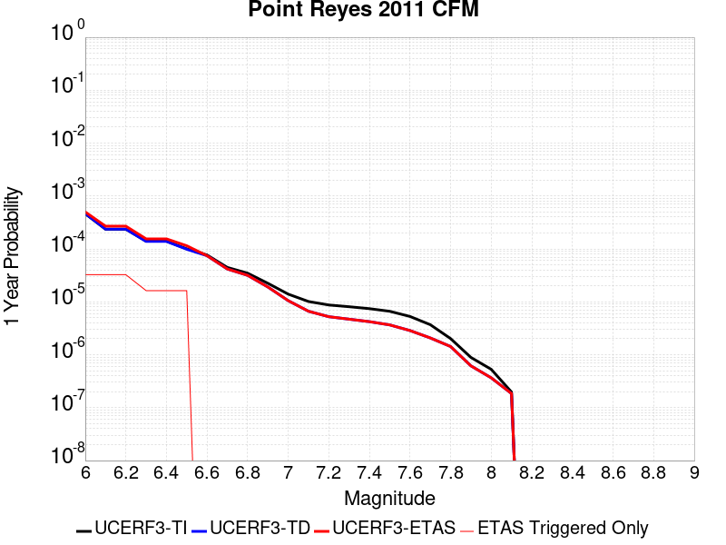 | 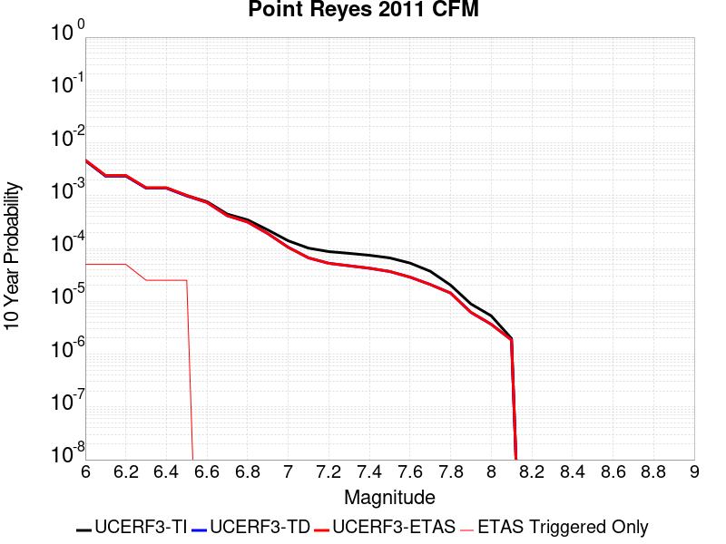 |

| Magnitude | 1 wk TI Prob | 1 wk TD Prob | 1 wk ETAS Prob | 1 wk ETAS/TD Gain | 1 wk ETAS Triggered Only | 1 mo TI Prob | 1 mo TD Prob | 1 mo ETAS Prob | 1 mo ETAS/TD Gain | 1 mo ETAS Triggered Only | 1 yr TI Prob | 1 yr TD Prob | 1 yr ETAS Prob | 1 yr ETAS/TD Gain | 1 yr ETAS Triggered Only | 10 yr TI Prob | 10 yr TD Prob | 10 yr ETAS Prob | 10 yr ETAS/TD Gain | 10 yr ETAS Triggered Only |
|-----|-----|-----|-----|-----|-----|-----|-----|-----|-----|-----|-----|-----|-----|-----|-----|-----|-----|-----|-----|-----|
| 6.0 | 8.8644965E-6 | 8.96716E-6 | 8.96716E-6 | 1.0 | 0.0 | 3.7990147E-5 | 3.8430157E-5 | 6.3409214E-5 | 1.6499858 | 2.4980016E-5 | 4.624319E-4 | 4.67793E-4 | 5.1772967E-4 | 1.1067495 | 4.9960032E-5 | 0.0046147075 | 0.004668711 | 0.0047184383 | 1.0106511 | 4.9960032E-5 |
| 6.1 | 4.526405E-6 | 4.5392153E-6 | 4.5392153E-6 | 1.0 | 0.0 | 1.9398734E-5 | 1.945364E-5 | 4.443317E-5 | 2.2840543 | 2.4980016E-5 | 2.36154E-4 | 2.3682338E-4 | 2.867716E-4 | 1.2109091 | 4.9960032E-5 | 0.002359032 | 0.0023658164 | 0.0024156582 | 1.0210675 | 4.9960032E-5 |
| 6.2 | 4.526405E-6 | 4.5392153E-6 | 4.5392153E-6 | 1.0 | 0.0 | 1.9398734E-5 | 1.945364E-5 | 4.443317E-5 | 2.2840543 | 2.4980016E-5 | 2.36154E-4 | 2.3682338E-4 | 2.867716E-4 | 1.2109091 | 4.9960032E-5 | 0.002359032 | 0.0023658164 | 0.0024156582 | 1.0210675 | 4.9960032E-5 |
| 6.3 | 2.6842322E-6 | 2.660673E-6 | 2.660673E-6 | 1.0 | 0.0 | 1.1503801E-5 | 1.1402836E-5 | 3.6382567E-5 | 3.1906595 | 2.4980016E-5 | 1.4004979E-4 | 1.3882088E-4 | 1.6379742E-4 | 1.1799192 | 2.4980016E-5 | 0.0013996155 | 0.0013873635 | 0.0014123089 | 1.0179805 | 2.4980016E-5 |
| 6.4 | 2.6842322E-6 | 2.660673E-6 | 2.660673E-6 | 1.0 | 0.0 | 1.1503801E-5 | 1.1402836E-5 | 3.6382567E-5 | 3.1906595 | 2.4980016E-5 | 1.4004979E-4 | 1.3882088E-4 | 1.6379742E-4 | 1.1799192 | 2.4980016E-5 | 0.0013996155 | 0.0013873635 | 0.0014123089 | 1.0179805 | 2.4980016E-5 |
| 6.5 | 1.9281833E-6 | 1.8906233E-6 | 1.8906233E-6 | 1.0 | 0.0 | 8.263617E-6 | 8.1026465E-6 | 3.308246E-5 | 4.0829206 | 2.4980016E-5 | 1.0060489E-4 | 9.864534E-5 | 1.2362289E-4 | 1.2532055 | 2.4980016E-5 | 0.0010055936 | 9.860265E-4 | 0.0010109819 | 1.0253091 | 2.4980016E-5 |
| 6.6 | 1.4726726E-6 | 1.4269547E-6 | 1.4269547E-6 | 1.0 | 0.0 | 6.3114385E-6 | 6.115506E-6 | 6.115506E-6 | 1.0 | 0.0 | 7.683905E-5 | 7.445379E-5 | 7.445379E-5 | 1.0 | 0.0 | 7.6812494E-4 | 7.442957E-4 | 7.442957E-4 | 1.0 | 0.0 |
| 6.7 | 8.572307E-7 | 8.007182E-7 | 8.007182E-7 | 1.0 | 0.0 | 3.6738406E-6 | 3.431645E-6 | 3.431645E-6 | 1.0 | 0.0 | 4.472809E-5 | 4.1779494E-5 | 4.1779494E-5 | 1.0 | 0.0 | 4.471909E-4 | 4.177204E-4 | 4.177204E-4 | 1.0 | 0.0 |
| 6.8 | 6.6745434E-7 | 6.07727E-7 | 6.07727E-7 | 1.0 | 0.0 | 2.8605155E-6 | 2.6045416E-6 | 2.6045416E-6 | 1.0 | 0.0 | 3.482622E-5 | 3.1709842E-5 | 3.1709842E-5 | 1.0 | 0.0 | 3.4820763E-4 | 3.170566E-4 | 3.170566E-4 | 1.0 | 0.0 |
| 6.9 | 4.291521E-7 | 3.6535639E-7 | 3.6535639E-7 | 1.0 | 0.0 | 1.839222E-6 | 1.5658121E-6 | 1.5658121E-6 | 1.0 | 0.0 | 2.2392298E-5 | 1.90636E-5 | 1.90636E-5 | 1.0 | 0.0 | 2.2390042E-4 | 1.906224E-4 | 1.906224E-4 | 1.0 | 0.0 |
| 7.0 | 2.6812808E-7 | 2.0187117E-7 | 2.0187117E-7 | 1.0 | 0.0 | 1.1491198E-6 | 8.6516184E-7 | 8.6516184E-7 | 1.0 | 0.0 | 1.3990444E-5 | 1.0533295E-5 | 1.0533295E-5 | 1.0 | 0.0 | 1.3989564E-4 | 1.05330415E-4 | 1.05330415E-4 | 1.0 | 0.0 |
| 7.1 | 1.9451231E-7 | 1.2725201E-7 | 1.2725201E-7 | 1.0 | 0.0 | 8.336239E-7 | 5.4536565E-7 | 5.4536565E-7 | 1.0 | 0.0 | 1.0149324E-5 | 6.639806E-6 | 6.639806E-6 | 1.0 | 0.0 | 1.014886E-4 | 6.639846E-5 | 6.639846E-5 | 1.0 | 0.0 |
| 7.2 | 1.6715143E-7 | 1.0042555E-7 | 1.0042555E-7 | 1.0 | 0.0 | 7.1636305E-7 | 4.3039515E-7 | 4.3039515E-7 | 1.0 | 0.0 | 8.721685E-6 | 5.2400483E-6 | 5.2400483E-6 | 1.0 | 0.0 | 8.721343E-5 | 5.240162E-5 | 5.240162E-5 | 1.0 | 0.0 |
| 7.3 | 1.5503173E-7 | 9.012816E-8 | 9.012816E-8 | 1.0 | 0.0 | 6.644215E-7 | 3.8626348E-7 | 3.8626348E-7 | 1.0 | 0.0 | 8.089301E-6 | 4.7027474E-6 | 4.7027474E-6 | 1.0 | 0.0 | 8.089007E-5 | 4.7028854E-5 | 4.7028854E-5 | 1.0 | 0.0 |
| 7.4 | 1.4251614E-7 | 8.097342E-8 | 8.097342E-8 | 1.0 | 0.0 | 6.1078333E-7 | 3.4702887E-7 | 3.4702887E-7 | 1.0 | 0.0 | 7.4362615E-6 | 4.225068E-6 | 4.225068E-6 | 1.0 | 0.0 | 7.436013E-5 | 4.2252257E-5 | 4.2252257E-5 | 1.0 | 0.0 |
| 7.5 | 1.2710186E-7 | 7.029377E-8 | 7.029377E-8 | 1.0 | 0.0 | 5.447221E-7 | 3.0125898E-7 | 3.0125898E-7 | 1.0 | 0.0 | 6.6319717E-6 | 3.6678218E-6 | 3.6678218E-6 | 1.0 | 0.0 | 6.6317734E-5 | 3.667999E-5 | 3.667999E-5 | 1.0 | 0.0 |
| 7.6 | 1.0144708E-7 | 5.494996E-8 | 5.494996E-8 | 1.0 | 0.0 | 4.347731E-7 | 2.354998E-7 | 2.354998E-7 | 1.0 | 0.0 | 5.2933497E-6 | 2.8672061E-6 | 2.8672061E-6 | 1.0 | 0.0 | 5.293224E-5 | 2.8674069E-5 | 2.8674069E-5 | 1.0 | 0.0 |
| 7.7 | 7.090527E-8 | 3.9821334E-8 | 3.9821334E-8 | 1.0 | 0.0 | 3.038797E-7 | 1.7066284E-7 | 1.7066284E-7 | 1.0 | 0.0 | 3.699729E-6 | 2.0778182E-6 | 2.0778182E-6 | 1.0 | 0.0 | 3.6996673E-5 | 2.0780362E-5 | 2.0780362E-5 | 1.0 | 0.0 |
| 7.8 | 3.8712045E-8 | 2.7438638E-8 | 2.7438638E-8 | 1.0 | 0.0 | 1.6590876E-7 | 1.1759416E-7 | 1.1759416E-7 | 1.0 | 0.0 | 2.0199373E-6 | 1.4317079E-6 | 1.4317079E-6 | 1.0 | 0.0 | 2.0199188E-5 | 1.4319363E-5 | 1.4319363E-5 | 1.0 | 0.0 |
| 7.9 | 1.7068782E-8 | 1.183186E-8 | 1.183186E-8 | 1.0 | 0.0 | 7.315192E-8 | 5.0707975E-8 | 5.0707975E-8 | 1.0 | 0.0 | 8.906242E-7 | 6.173694E-7 | 6.173694E-7 | 1.0 | 0.0 | 8.906207E-6 | 6.1760525E-6 | 6.1760525E-6 | 1.0 | 0.0 |
| 8.0 | 1.0172592E-8 | 7.0268076E-9 | 7.0268076E-9 | 1.0 | 0.0 | 4.359682E-8 | 3.011489E-8 | 3.011489E-8 | 1.0 | 0.0 | 5.3079117E-7 | 3.6664872E-7 | 3.6664872E-7 | 1.0 | 0.0 | 5.307899E-6 | 3.6688568E-6 | 3.6688568E-6 | 1.0 | 0.0 |
| 8.1 | 3.7861243E-9 | 3.5448604E-9 | 3.5448604E-9 | 1.0 | 0.0 | 1.6226247E-8 | 1.5192258E-8 | 1.5192258E-8 | 1.0 | 0.0 | 1.9755454E-7 | 1.8496571E-7 | 1.8496571E-7 | 1.0 | 0.0 | 1.9755437E-6 | 1.8514592E-6 | 1.8514592E-6 | 1.0 | 0.0 |

## Redondo Canyon alt 1
*[(top)](#table-of-contents)*

| 1 Week | 1 Month | 1 Year | 10 Year |
|-----|-----|-----|-----|
| 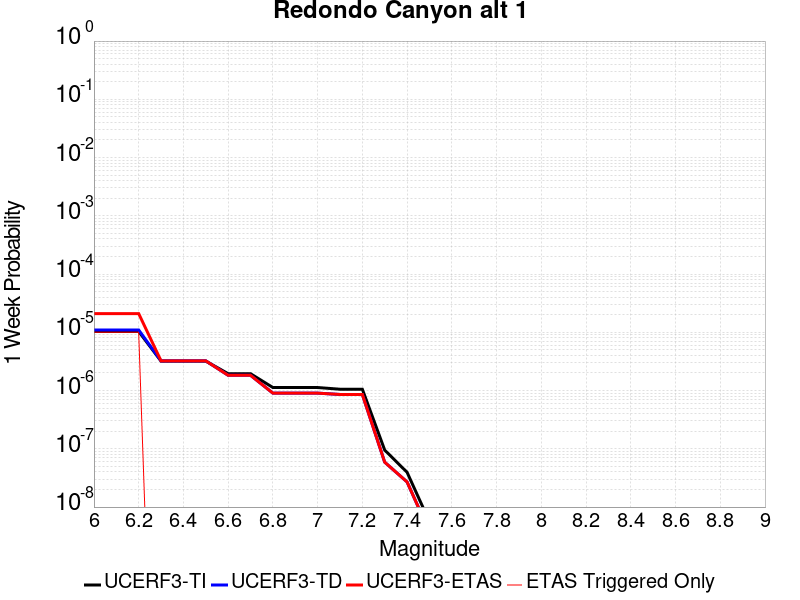 | 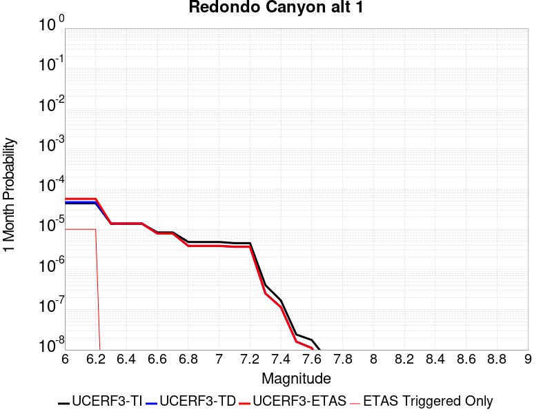 | 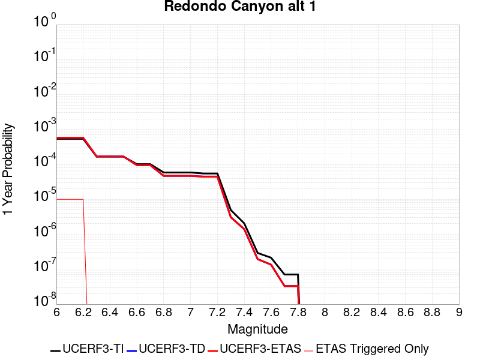 |  |

| Magnitude | 1 wk TI Prob | 1 wk TD Prob | 1 wk ETAS Prob | 1 wk ETAS/TD Gain | 1 wk ETAS Triggered Only | 1 mo TI Prob | 1 mo TD Prob | 1 mo ETAS Prob | 1 mo ETAS/TD Gain | 1 mo ETAS Triggered Only | 1 yr TI Prob | 1 yr TD Prob | 1 yr ETAS Prob | 1 yr ETAS/TD Gain | 1 yr ETAS Triggered Only | 10 yr TI Prob | 10 yr TD Prob | 10 yr ETAS Prob | 10 yr ETAS/TD Gain | 10 yr ETAS Triggered Only |
|-----|-----|-----|-----|-----|-----|-----|-----|-----|-----|-----|-----|-----|-----|-----|-----|-----|-----|-----|-----|-----|
| 6.0 | 1.0346246E-5 | 1.0981325E-5 | 3.5961068E-5 | 3.2747474 | 2.4980016E-5 | 4.43403E-5 | 4.7062418E-5 | 7.204126E-5 | 1.5307598 | 2.4980016E-5 | 5.3970946E-4 | 5.729132E-4 | 5.9787894E-4 | 1.0435767 | 2.4980016E-5 | 0.0053840056 | 0.0057221013 | 0.0057717753 | 1.008681 | 4.9960032E-5 |
| 6.1 | 1.0346246E-5 | 1.0981325E-5 | 3.5961068E-5 | 3.2747474 | 2.4980016E-5 | 4.43403E-5 | 4.7062418E-5 | 7.204126E-5 | 1.5307598 | 2.4980016E-5 | 5.3970946E-4 | 5.729132E-4 | 5.9787894E-4 | 1.0435767 | 2.4980016E-5 | 0.0053840056 | 0.0057221013 | 0.0057717753 | 1.008681 | 4.9960032E-5 |
| 6.2 | 1.0346246E-5 | 1.0981325E-5 | 3.5961068E-5 | 3.2747474 | 2.4980016E-5 | 4.43403E-5 | 4.7062418E-5 | 7.204126E-5 | 1.5307598 | 2.4980016E-5 | 5.3970946E-4 | 5.729132E-4 | 5.9787894E-4 | 1.0435767 | 2.4980016E-5 | 0.0053840056 | 0.0057221013 | 0.0057717753 | 1.008681 | 4.9960032E-5 |
| 6.3 | 3.2052794E-6 | 3.2360983E-6 | 3.2360983E-6 | 1.0 | 0.0 | 1.373684E-5 | 1.3868941E-5 | 1.3868941E-5 | 1.0 | 0.0 | 1.6723319E-4 | 1.6884525E-4 | 1.6884525E-4 | 1.0 | 0.0 | 0.001671074 | 0.0016875593 | 0.0017124971 | 1.0147774 | 2.4980016E-5 |
| 6.4 | 3.2052794E-6 | 3.2360983E-6 | 3.2360983E-6 | 1.0 | 0.0 | 1.373684E-5 | 1.3868941E-5 | 1.3868941E-5 | 1.0 | 0.0 | 1.6723319E-4 | 1.6884525E-4 | 1.6884525E-4 | 1.0 | 0.0 | 0.001671074 | 0.0016875593 | 0.0017124971 | 1.0147774 | 2.4980016E-5 |
| 6.5 | 3.2052794E-6 | 3.2360983E-6 | 3.2360983E-6 | 1.0 | 0.0 | 1.373684E-5 | 1.3868941E-5 | 1.3868941E-5 | 1.0 | 0.0 | 1.6723319E-4 | 1.6884525E-4 | 1.6884525E-4 | 1.0 | 0.0 | 0.001671074 | 0.0016875593 | 0.0017124971 | 1.0147774 | 2.4980016E-5 |
| 6.6 | 1.948328E-6 | 1.8288489E-6 | 1.8288489E-6 | 1.0 | 0.0 | 8.349951E-6 | 7.837909E-6 | 7.837909E-6 | 1.0 | 0.0 | 1.016559E-4 | 9.5423864E-5 | 9.5423864E-5 | 1.0 | 0.0 | 0.0010160941 | 9.5397583E-4 | 9.78932E-4 | 1.0261602 | 2.4980016E-5 |
| 6.7 | 1.948328E-6 | 1.8288489E-6 | 1.8288489E-6 | 1.0 | 0.0 | 8.349951E-6 | 7.837909E-6 | 7.837909E-6 | 1.0 | 0.0 | 1.016559E-4 | 9.5423864E-5 | 9.5423864E-5 | 1.0 | 0.0 | 0.0010160941 | 9.5397583E-4 | 9.78932E-4 | 1.0261602 | 2.4980016E-5 |
| 6.8 | 1.1278219E-6 | 9.032885E-7 | 9.032885E-7 | 1.0 | 0.0 | 4.8335132E-6 | 3.871233E-6 | 3.871233E-6 | 1.0 | 0.0 | 5.8846435E-5 | 4.713167E-5 | 4.713167E-5 | 1.0 | 0.0 | 5.8830855E-4 | 4.7125877E-4 | 4.96227E-4 | 1.052982 | 2.4980016E-5 |
| 6.9 | 1.1278219E-6 | 9.032885E-7 | 9.032885E-7 | 1.0 | 0.0 | 4.8335132E-6 | 3.871233E-6 | 3.871233E-6 | 1.0 | 0.0 | 5.8846435E-5 | 4.713167E-5 | 4.713167E-5 | 1.0 | 0.0 | 5.8830855E-4 | 4.7125877E-4 | 4.96227E-4 | 1.052982 | 2.4980016E-5 |
| 7.0 | 1.1278219E-6 | 9.032885E-7 | 9.032885E-7 | 1.0 | 0.0 | 4.8335132E-6 | 3.871233E-6 | 3.871233E-6 | 1.0 | 0.0 | 5.8846435E-5 | 4.713167E-5 | 4.713167E-5 | 1.0 | 0.0 | 5.8830855E-4 | 4.7125877E-4 | 4.96227E-4 | 1.052982 | 2.4980016E-5 |
| 7.1 | 1.0545139E-6 | 8.5690925E-7 | 8.5690925E-7 | 1.0 | 0.0 | 4.5193374E-6 | 3.6724655E-6 | 3.6724655E-6 | 1.0 | 0.0 | 5.5021545E-5 | 4.4711775E-5 | 4.4711775E-5 | 1.0 | 0.0 | 5.500792E-4 | 4.4706953E-4 | 4.7203837E-4 | 1.05585 | 2.4980016E-5 |
| 7.2 | 1.0545139E-6 | 8.5690925E-7 | 8.5690925E-7 | 1.0 | 0.0 | 4.5193374E-6 | 3.6724655E-6 | 3.6724655E-6 | 1.0 | 0.0 | 5.5021545E-5 | 4.4711775E-5 | 4.4711775E-5 | 1.0 | 0.0 | 5.500792E-4 | 4.4706953E-4 | 4.7203837E-4 | 1.05585 | 2.4980016E-5 |
| 7.3 | 9.505161E-8 | 5.8955752E-8 | 5.8955752E-8 | 1.0 | 0.0 | 4.0736398E-7 | 2.526675E-7 | 2.526675E-7 | 1.0 | 0.0 | 4.959645E-6 | 3.0762235E-6 | 3.0762235E-6 | 1.0 | 0.0 | 4.9595343E-5 | 3.076193E-5 | 3.076193E-5 | 1.0 | 0.0 |
| 7.4 | 3.9520785E-8 | 2.6987088E-8 | 2.6987088E-8 | 1.0 | 0.0 | 1.6937479E-7 | 1.1565894E-7 | 1.1565894E-7 | 1.0 | 0.0 | 2.062136E-6 | 1.408147E-6 | 1.408147E-6 | 1.0 | 0.0 | 2.062117E-5 | 1.4081407E-5 | 1.4081407E-5 | 1.0 | 0.0 |
| 7.5 | 5.6133214E-9 | 3.7367687E-9 | 3.7367687E-9 | 1.0 | 0.0 | 2.4057092E-8 | 1.6014722E-8 | 1.6014722E-8 | 1.0 | 0.0 | 2.9289507E-7 | 1.9497922E-7 | 1.9497922E-7 | 1.0 | 0.0 | 2.9289467E-6 | 1.9497909E-6 | 1.9497909E-6 | 1.0 | 0.0 |
| 7.6 | 4.1064334E-9 | 2.5957205E-9 | 2.5957205E-9 | 1.0 | 0.0 | 1.7599E-8 | 1.1124517E-8 | 1.1124517E-8 | 1.0 | 0.0 | 2.142678E-7 | 1.3544098E-7 | 1.3544098E-7 | 1.0 | 0.0 | 2.1426758E-6 | 1.3544093E-6 | 1.3544093E-6 | 1.0 | 0.0 |
| 7.7 | 1.361975E-9 | 6.360521E-10 | 6.360521E-10 | 1.0 | 0.0 | 5.8370353E-9 | 2.7259377E-9 | 2.7259377E-9 | 1.0 | 0.0 | 7.1065905E-8 | 3.318829E-8 | 3.318829E-8 | 1.0 | 0.0 | 7.106588E-7 | 3.3188286E-7 | 3.3188286E-7 | 1.0 | 0.0 |
| 7.8 | 1.361975E-9 | 6.360521E-10 | 6.360521E-10 | 1.0 | 0.0 | 5.8370353E-9 | 2.7259377E-9 | 2.7259377E-9 | 1.0 | 0.0 | 7.1065905E-8 | 3.318829E-8 | 3.318829E-8 | 1.0 | 0.0 | 7.106588E-7 | 3.3188286E-7 | 3.3188286E-7 | 1.0 | 0.0 |

## Emerson-Copper Mtn 2011
*[(top)](#table-of-contents)*

| 1 Week | 1 Month | 1 Year | 10 Year |
|-----|-----|-----|-----|
| 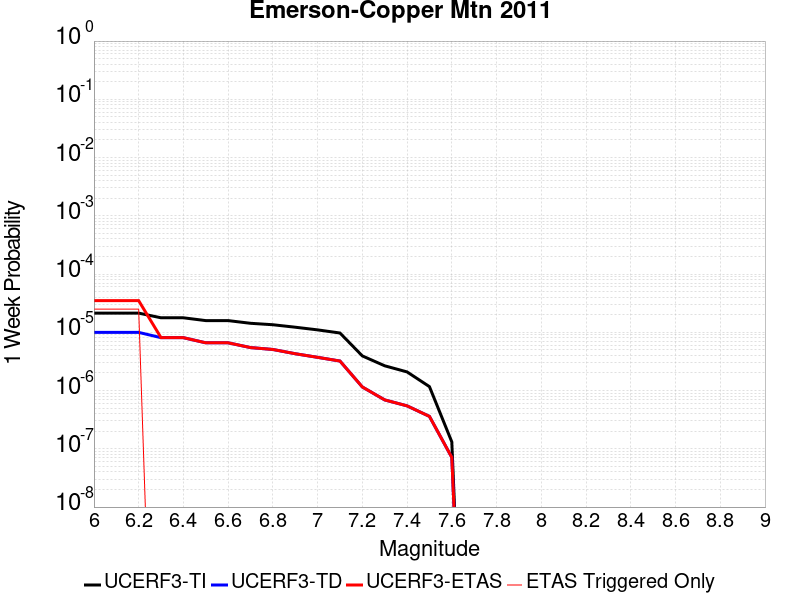 | 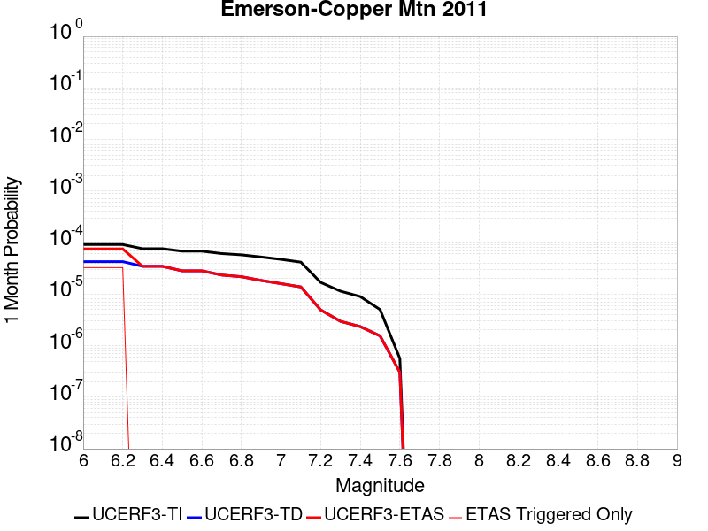 | 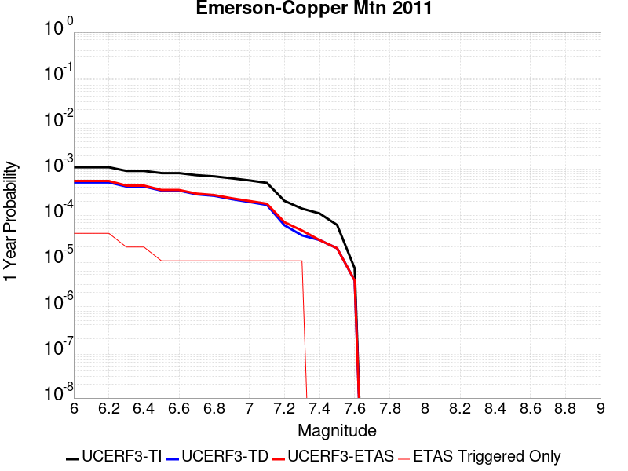 | 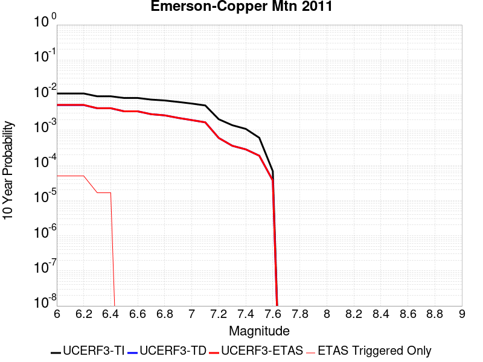 |

| Magnitude | 1 wk TI Prob | 1 wk TD Prob | 1 wk ETAS Prob | 1 wk ETAS/TD Gain | 1 wk ETAS Triggered Only | 1 mo TI Prob | 1 mo TD Prob | 1 mo ETAS Prob | 1 mo ETAS/TD Gain | 1 mo ETAS Triggered Only | 1 yr TI Prob | 1 yr TD Prob | 1 yr ETAS Prob | 1 yr ETAS/TD Gain | 1 yr ETAS Triggered Only | 10 yr TI Prob | 10 yr TD Prob | 10 yr ETAS Prob | 10 yr ETAS/TD Gain | 10 yr ETAS Triggered Only |
|-----|-----|-----|-----|-----|-----|-----|-----|-----|-----|-----|-----|-----|-----|-----|-----|-----|-----|-----|-----|-----|
| 6.0 | 2.1364202E-5 | 9.967999E-6 | 3.4947767E-5 | 3.5059962 | 2.4980016E-5 | 9.1557646E-5 | 4.2719344E-5 | 6.7698296E-5 | 1.5847222 | 2.4980016E-5 | 0.0011141442 | 5.1999267E-4 | 5.699267E-4 | 1.0960283 | 4.9960032E-5 | 0.011085749 | 0.0051886286 | 0.0052383295 | 1.0095788 | 4.9960032E-5 |
| 6.1 | 2.1364202E-5 | 9.967999E-6 | 3.4947767E-5 | 3.5059962 | 2.4980016E-5 | 9.1557646E-5 | 4.2719344E-5 | 6.7698296E-5 | 1.5847222 | 2.4980016E-5 | 0.0011141442 | 5.1999267E-4 | 5.699267E-4 | 1.0960283 | 4.9960032E-5 | 0.011085749 | 0.0051886286 | 0.0052383295 | 1.0095788 | 4.9960032E-5 |
| 6.2 | 2.1364202E-5 | 9.967999E-6 | 3.4947767E-5 | 3.5059962 | 2.4980016E-5 | 9.1557646E-5 | 4.2719344E-5 | 6.7698296E-5 | 1.5847222 | 2.4980016E-5 | 0.0011141442 | 5.1999267E-4 | 5.699267E-4 | 1.0960283 | 4.9960032E-5 | 0.011085749 | 0.0051886286 | 0.0052383295 | 1.0095788 | 4.9960032E-5 |
| 6.3 | 1.7751237E-5 | 8.089109E-6 | 8.089109E-6 | 1.0 | 0.0 | 7.607452E-5 | 3.4667184E-5 | 3.4667184E-5 | 1.0 | 0.0 | 9.258136E-4 | 4.2199748E-4 | 4.4696697E-4 | 1.0591698 | 2.4980016E-5 | 0.00921966 | 0.004212584 | 0.0042374586 | 1.0059049 | 2.4980016E-5 |
| 6.4 | 1.7751237E-5 | 8.089109E-6 | 8.089109E-6 | 1.0 | 0.0 | 7.607452E-5 | 3.4667184E-5 | 3.4667184E-5 | 1.0 | 0.0 | 9.258136E-4 | 4.2199748E-4 | 4.4696697E-4 | 1.0591698 | 2.4980016E-5 | 0.00921966 | 0.004212584 | 0.0042374586 | 1.0059049 | 2.4980016E-5 |
| 6.5 | 1.5886664E-5 | 6.6037437E-6 | 6.6037437E-6 | 1.0 | 0.0 | 6.808392E-5 | 2.830148E-5 | 2.830148E-5 | 1.0 | 0.0 | 8.286065E-4 | 3.4452073E-4 | 3.4452073E-4 | 1.0 | 0.0 | 0.008255237 | 0.0034403303 | 0.0034403303 | 1.0 | 0.0 |
| 6.6 | 1.5886664E-5 | 6.6037437E-6 | 6.6037437E-6 | 1.0 | 0.0 | 6.808392E-5 | 2.830148E-5 | 2.830148E-5 | 1.0 | 0.0 | 8.286065E-4 | 3.4452073E-4 | 3.4452073E-4 | 1.0 | 0.0 | 0.008255237 | 0.0034403303 | 0.0034403303 | 1.0 | 0.0 |
| 6.7 | 1.428471E-5 | 5.4703055E-6 | 5.4703055E-6 | 1.0 | 0.0 | 6.121875E-5 | 2.3443978E-5 | 2.3443978E-5 | 1.0 | 0.0 | 7.450834E-4 | 2.8539696E-4 | 2.8539696E-4 | 1.0 | 0.0 | 0.007425902 | 0.0028506925 | 0.0028506925 | 1.0 | 0.0 |
| 6.8 | 1.3490684E-5 | 5.0735894E-6 | 5.0735894E-6 | 1.0 | 0.0 | 5.7815934E-5 | 2.1743796E-5 | 2.1743796E-5 | 1.0 | 0.0 | 7.0368167E-4 | 2.6470242E-4 | 2.6470242E-4 | 1.0 | 0.0 | 0.007014576 | 0.002644252 | 0.002644252 | 1.0 | 0.0 |
| 6.9 | 1.2235421E-5 | 4.289545E-6 | 4.289545E-6 | 1.0 | 0.0 | 5.2436466E-5 | 1.8383655E-5 | 1.8383655E-5 | 1.0 | 0.0 | 6.38227E-4 | 2.238016E-4 | 2.238016E-4 | 1.0 | 0.0 | 0.0063639707 | 0.0022361164 | 0.0022361164 | 1.0 | 0.0 |
| 7.0 | 1.1009851E-5 | 3.7188345E-6 | 3.7188345E-6 | 1.0 | 0.0 | 4.7184225E-5 | 1.5937783E-5 | 1.5937783E-5 | 1.0 | 0.0 | 5.743165E-4 | 1.9402867E-4 | 1.9402867E-4 | 1.0 | 0.0 | 0.005728345 | 0.0019389305 | 0.0019389305 | 1.0 | 0.0 |
| 7.1 | 9.726373E-6 | 3.2115693E-6 | 3.2115693E-6 | 1.0 | 0.0 | 4.168379E-5 | 1.3763814E-5 | 1.3763814E-5 | 1.0 | 0.0 | 5.07382E-4 | 1.6756494E-4 | 1.6756494E-4 | 1.0 | 0.0 | 0.0050622504 | 0.0016747171 | 0.0016747171 | 1.0 | 0.0 |
| 7.2 | 3.9335127E-6 | 1.1524114E-6 | 1.1524114E-6 | 1.0 | 0.0 | 1.6857803E-5 | 4.9388973E-6 | 4.9388973E-6 | 1.0 | 0.0 | 2.0522442E-4 | 6.0129474E-5 | 6.0129474E-5 | 1.0 | 0.0 | 0.00205035 | 6.01138E-4 | 6.01138E-4 | 1.0 | 0.0 |
| 7.3 | 2.661632E-6 | 6.91098E-7 | 6.91098E-7 | 1.0 | 0.0 | 1.14069435E-5 | 2.9618452E-6 | 2.9618452E-6 | 1.0 | 0.0 | 1.3887069E-4 | 3.605988E-5 | 3.605988E-5 | 1.0 | 0.0 | 0.0013878393 | 3.6054134E-4 | 3.6054134E-4 | 1.0 | 0.0 |
| 7.4 | 2.0893426E-6 | 5.4614605E-7 | 5.4614605E-7 | 1.0 | 0.0 | 8.954295E-6 | 2.340624E-6 | 2.340624E-6 | 1.0 | 0.0 | 1.0901308E-4 | 2.8496728E-5 | 2.8496728E-5 | 1.0 | 0.0 | 0.0010895962 | 2.849313E-4 | 2.849313E-4 | 1.0 | 0.0 |
| 7.5 | 1.1681728E-6 | 3.6028484E-7 | 3.6028484E-7 | 1.0 | 0.0 | 5.0064455E-6 | 1.544077E-6 | 1.544077E-6 | 1.0 | 0.0 | 6.0951766E-5 | 1.879898E-5 | 1.879898E-5 | 1.0 | 0.0 | 6.093505E-4 | 1.8797436E-4 | 1.8797436E-4 | 1.0 | 0.0 |
| 7.6 | 1.3154387E-7 | 7.1196716E-8 | 7.1196716E-8 | 1.0 | 0.0 | 5.6375933E-7 | 3.0512876E-7 | 3.0512876E-7 | 1.0 | 0.0 | 6.863748E-6 | 3.714938E-6 | 3.714938E-6 | 1.0 | 0.0 | 6.863536E-5 | 3.7148915E-5 | 3.7148915E-5 | 1.0 | 0.0 |

## Kern Canyon (Lake Isabella) 2011
*[(top)](#table-of-contents)*

| 1 Week | 1 Month | 1 Year | 10 Year |
|-----|-----|-----|-----|
| 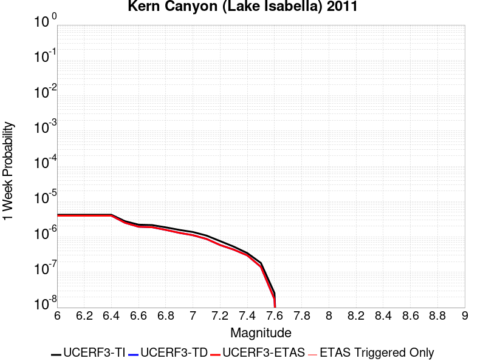 | 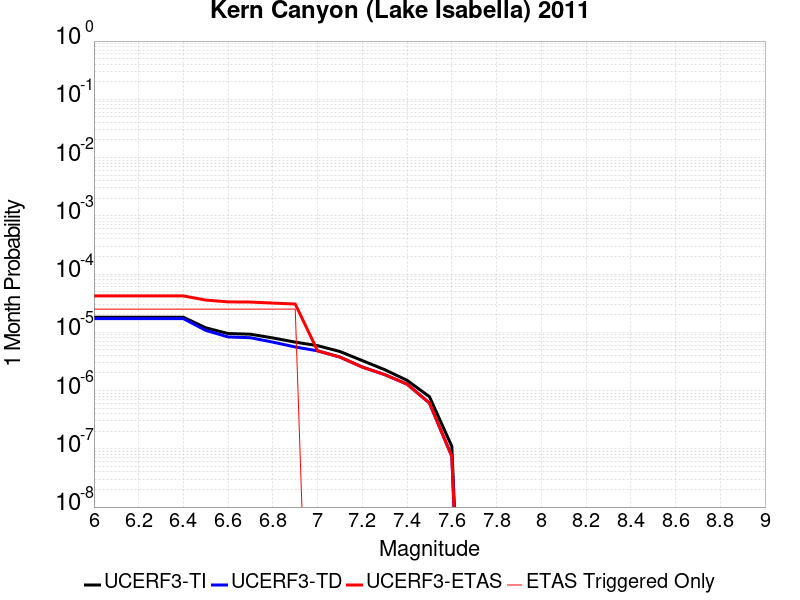 | 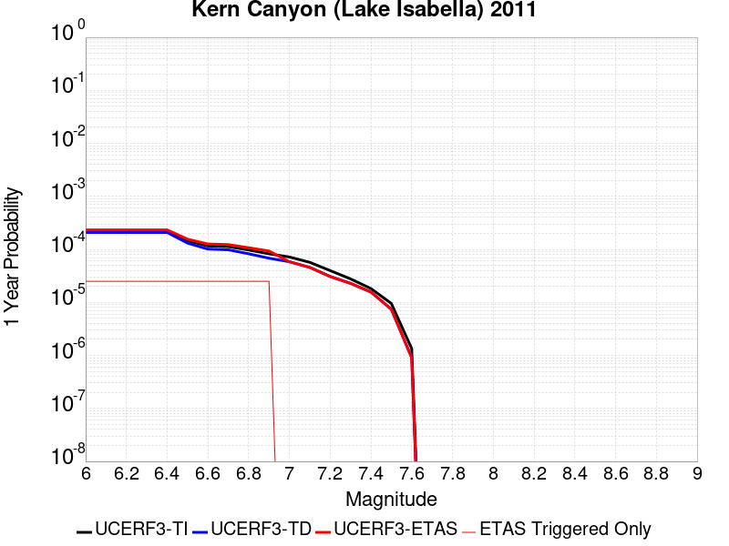 | 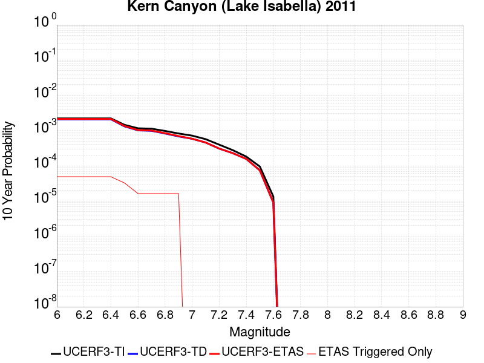 |

| Magnitude | 1 wk TI Prob | 1 wk TD Prob | 1 wk ETAS Prob | 1 wk ETAS/TD Gain | 1 wk ETAS Triggered Only | 1 mo TI Prob | 1 mo TD Prob | 1 mo ETAS Prob | 1 mo ETAS/TD Gain | 1 mo ETAS Triggered Only | 1 yr TI Prob | 1 yr TD Prob | 1 yr ETAS Prob | 1 yr ETAS/TD Gain | 1 yr ETAS Triggered Only | 10 yr TI Prob | 10 yr TD Prob | 10 yr ETAS Prob | 10 yr ETAS/TD Gain | 10 yr ETAS Triggered Only |
|-----|-----|-----|-----|-----|-----|-----|-----|-----|-----|-----|-----|-----|-----|-----|-----|-----|-----|-----|-----|-----|
| 6.0 | 4.2387383E-6 | 4.0016344E-6 | 4.0016344E-6 | 1.0 | 0.0 | 1.8165894E-5 | 1.7149758E-5 | 4.2129344E-5 | 2.4565563 | 2.4980016E-5 | 2.2114732E-4 | 2.0878017E-4 | 2.3375497E-4 | 1.1196225 | 2.4980016E-5 | 0.0022092736 | 0.002086024 | 0.00213588 | 1.0238999 | 4.9960032E-5 |
| 6.1 | 4.2387383E-6 | 4.0016344E-6 | 4.0016344E-6 | 1.0 | 0.0 | 1.8165894E-5 | 1.7149758E-5 | 4.2129344E-5 | 2.4565563 | 2.4980016E-5 | 2.2114732E-4 | 2.0878017E-4 | 2.3375497E-4 | 1.1196225 | 2.4980016E-5 | 0.0022092736 | 0.002086024 | 0.00213588 | 1.0238999 | 4.9960032E-5 |
| 6.2 | 4.2387383E-6 | 4.0016344E-6 | 4.0016344E-6 | 1.0 | 0.0 | 1.8165894E-5 | 1.7149758E-5 | 4.2129344E-5 | 2.4565563 | 2.4980016E-5 | 2.2114732E-4 | 2.0878017E-4 | 2.3375497E-4 | 1.1196225 | 2.4980016E-5 | 0.0022092736 | 0.002086024 | 0.00213588 | 1.0238999 | 4.9960032E-5 |
| 6.3 | 4.2387383E-6 | 4.0016344E-6 | 4.0016344E-6 | 1.0 | 0.0 | 1.8165894E-5 | 1.7149758E-5 | 4.2129344E-5 | 2.4565563 | 2.4980016E-5 | 2.2114732E-4 | 2.0878017E-4 | 2.3375497E-4 | 1.1196225 | 2.4980016E-5 | 0.0022092736 | 0.002086024 | 0.00213588 | 1.0238999 | 4.9960032E-5 |
| 6.4 | 4.2387383E-6 | 4.0016344E-6 | 4.0016344E-6 | 1.0 | 0.0 | 1.8165894E-5 | 1.7149758E-5 | 4.2129344E-5 | 2.4565563 | 2.4980016E-5 | 2.2114732E-4 | 2.0878017E-4 | 2.3375497E-4 | 1.1196225 | 2.4980016E-5 | 0.0022092736 | 0.002086024 | 0.00213588 | 1.0238999 | 4.9960032E-5 |
| 6.5 | 2.7857532E-6 | 2.5178624E-6 | 2.5178624E-6 | 1.0 | 0.0 | 1.1938888E-5 | 1.0790796E-5 | 3.5770543E-5 | 3.3149123 | 2.4980016E-5 | 1.4534626E-4 | 1.3137035E-4 | 1.5634709E-4 | 1.1901246 | 2.4980016E-5 | 0.0014525123 | 0.0013129596 | 0.0013379068 | 1.0190008 | 2.4980016E-5 |
| 6.6 | 2.2233348E-6 | 1.944119E-6 | 1.944119E-6 | 1.0 | 0.0 | 9.528543E-6 | 8.331913E-6 | 3.331172E-5 | 3.9980881 | 2.4980016E-5 | 1.1600384E-4 | 1.014364E-4 | 1.2641388E-4 | 1.2462379 | 2.4980016E-5 | 0.001159433 | 0.0010139096 | 0.0010388644 | 1.0246123 | 2.4980016E-5 |
| 6.7 | 2.1635126E-6 | 1.8834991E-6 | 1.8834991E-6 | 1.0 | 0.0 | 9.272164E-6 | 8.072114E-6 | 3.305193E-5 | 4.0945816 | 2.4980016E-5 | 1.1288274E-4 | 9.827364E-5 | 1.232512E-4 | 1.2541634 | 2.4980016E-5 | 0.0011282542 | 9.8231E-4 | 0.0010072654 | 1.0254049 | 2.4980016E-5 |
| 6.8 | 1.8685711E-6 | 1.583138E-6 | 1.583138E-6 | 1.0 | 0.0 | 8.008137E-6 | 6.7848596E-6 | 3.1764706E-5 | 4.681704 | 2.4980016E-5 | 9.74947E-5 | 8.2602586E-5 | 1.0758054E-4 | 1.302387 | 2.4980016E-5 | 9.745194E-4 | 8.2572375E-4 | 8.5068314E-4 | 1.0302273 | 2.4980016E-5 |
| 6.9 | 1.5815071E-6 | 1.3064887E-6 | 1.3064887E-6 | 1.0 | 0.0 | 6.77787E-6 | 5.5992255E-6 | 3.05791E-5 | 5.461309 | 2.4980016E-5 | 8.251744E-5 | 6.816846E-5 | 9.314678E-5 | 1.3664204 | 2.4980016E-5 | 8.248681E-4 | 6.8147824E-4 | 7.0644123E-4 | 1.0366306 | 2.4980016E-5 |
| 7.0 | 1.3772564E-6 | 1.1210681E-6 | 1.1210681E-6 | 1.0 | 0.0 | 5.9025137E-6 | 4.8045686E-6 | 4.8045686E-6 | 1.0 | 0.0 | 7.186073E-5 | 5.8494075E-5 | 5.8494075E-5 | 1.0 | 0.0 | 7.18375E-4 | 5.8478885E-4 | 5.8478885E-4 | 1.0 | 0.0 |
| 7.1 | 1.0916998E-6 | 8.7637505E-7 | 8.7637505E-7 | 1.0 | 0.0 | 4.678705E-6 | 3.7558877E-6 | 3.7558877E-6 | 1.0 | 0.0 | 5.6961744E-5 | 4.5726985E-5 | 4.5726985E-5 | 1.0 | 0.0 | 5.6947145E-4 | 4.571771E-4 | 4.571771E-4 | 1.0 | 0.0 |
| 7.2 | 7.6277024E-7 | 5.901439E-7 | 5.901439E-7 | 1.0 | 0.0 | 3.2690114E-6 | 2.5291856E-6 | 2.5291856E-6 | 1.0 | 0.0 | 3.9799485E-5 | 3.0792406E-5 | 3.0792406E-5 | 1.0 | 0.0 | 3.9792358E-4 | 3.07882E-4 | 3.07882E-4 | 1.0 | 0.0 |
| 7.3 | 5.3265916E-7 | 4.3824264E-7 | 4.3824264E-7 | 1.0 | 0.0 | 2.282823E-6 | 1.8781814E-6 | 1.8781814E-6 | 1.0 | 0.0 | 2.7793016E-5 | 2.2866623E-5 | 2.2866623E-5 | 1.0 | 0.0 | 2.778954E-4 | 2.2864307E-4 | 2.2864307E-4 | 1.0 | 0.0 |
| 7.4 | 3.4946007E-7 | 3.0065647E-7 | 3.0065647E-7 | 1.0 | 0.0 | 1.497685E-6 | 1.2885271E-6 | 1.2885271E-6 | 1.0 | 0.0 | 1.8234163E-5 | 1.5687707E-5 | 1.5687707E-5 | 1.0 | 0.0 | 1.8232666E-4 | 1.5686621E-4 | 1.5686621E-4 | 1.0 | 0.0 |
| 7.5 | 1.8317026E-7 | 1.4244755E-7 | 1.4244755E-7 | 1.0 | 0.0 | 7.850152E-7 | 6.1048934E-7 | 6.1048934E-7 | 1.0 | 0.0 | 9.557518E-6 | 7.432683E-6 | 7.432683E-6 | 1.0 | 0.0 | 9.5571064E-5 | 7.432442E-5 | 7.432442E-5 | 1.0 | 0.0 |
| 7.6 | 2.572245E-8 | 1.735264E-8 | 1.735264E-8 | 1.0 | 0.0 | 1.10239064E-7 | 7.436845E-8 | 7.436845E-8 | 1.0 | 0.0 | 1.3421597E-6 | 9.0543557E-7 | 9.0543557E-7 | 1.0 | 0.0 | 1.3421517E-5 | 9.054324E-6 | 9.054324E-6 | 1.0 | 0.0 |

## Morales (East)
*[(top)](#table-of-contents)*

| 1 Week | 1 Month | 1 Year | 10 Year |
|-----|-----|-----|-----|
|  | 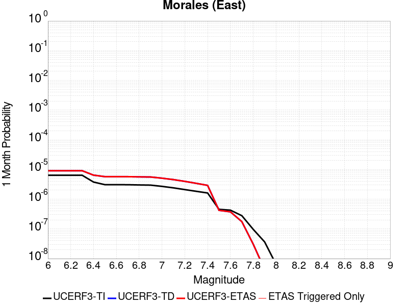 | 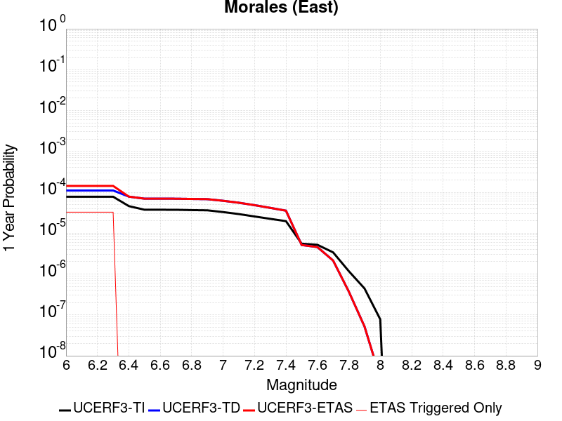 | 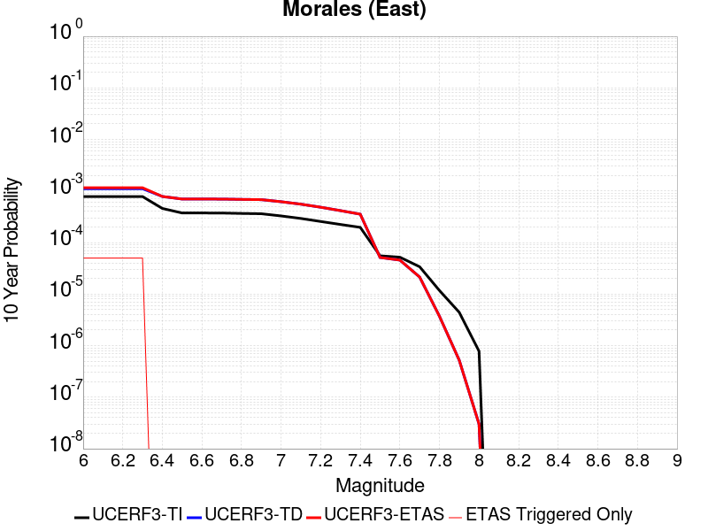 |

| Magnitude | 1 wk TI Prob | 1 wk TD Prob | 1 wk ETAS Prob | 1 wk ETAS/TD Gain | 1 wk ETAS Triggered Only | 1 mo TI Prob | 1 mo TD Prob | 1 mo ETAS Prob | 1 mo ETAS/TD Gain | 1 mo ETAS Triggered Only | 1 yr TI Prob | 1 yr TD Prob | 1 yr ETAS Prob | 1 yr ETAS/TD Gain | 1 yr ETAS Triggered Only | 10 yr TI Prob | 10 yr TD Prob | 10 yr ETAS Prob | 10 yr ETAS/TD Gain | 10 yr ETAS Triggered Only |
|-----|-----|-----|-----|-----|-----|-----|-----|-----|-----|-----|-----|-----|-----|-----|-----|-----|-----|-----|-----|-----|
| 6.0 | 1.4942771E-6 | 2.123544E-6 | 2.123544E-6 | 1.0 | 0.0 | 6.404029E-6 | 9.100874E-6 | 9.100874E-6 | 1.0 | 0.0 | 7.7966266E-5 | 1.1079809E-4 | 1.6075259E-4 | 1.4508606 | 4.9960032E-5 | 7.793892E-4 | 0.0011074883 | 0.001157393 | 1.0450611 | 4.9960032E-5 |
| 6.1 | 1.4942771E-6 | 2.123544E-6 | 2.123544E-6 | 1.0 | 0.0 | 6.404029E-6 | 9.100874E-6 | 9.100874E-6 | 1.0 | 0.0 | 7.7966266E-5 | 1.1079809E-4 | 1.6075259E-4 | 1.4508606 | 4.9960032E-5 | 7.793892E-4 | 0.0011074883 | 0.001157393 | 1.0450611 | 4.9960032E-5 |
| 6.2 | 1.4942771E-6 | 2.123544E-6 | 2.123544E-6 | 1.0 | 0.0 | 6.404029E-6 | 9.100874E-6 | 9.100874E-6 | 1.0 | 0.0 | 7.7966266E-5 | 1.1079809E-4 | 1.6075259E-4 | 1.4508606 | 4.9960032E-5 | 7.793892E-4 | 0.0011074883 | 0.001157393 | 1.0450611 | 4.9960032E-5 |
| 6.3 | 1.4942771E-6 | 2.123544E-6 | 2.123544E-6 | 1.0 | 0.0 | 6.404029E-6 | 9.100874E-6 | 9.100874E-6 | 1.0 | 0.0 | 7.7966266E-5 | 1.1079809E-4 | 1.6075259E-4 | 1.4508606 | 4.9960032E-5 | 7.793892E-4 | 0.0011074883 | 0.001157393 | 1.0450611 | 4.9960032E-5 |
| 6.4 | 8.798845E-7 | 1.5023381E-6 | 1.5023381E-6 | 1.0 | 0.0 | 3.7709283E-6 | 6.4385767E-6 | 6.4385767E-6 | 1.0 | 0.0 | 4.5910085E-5 | 7.838696E-5 | 7.838696E-5 | 1.0 | 0.0 | 4.59006E-4 | 7.836066E-4 | 7.836066E-4 | 1.0 | 0.0 |
| 6.5 | 7.1751725E-7 | 1.3384879E-6 | 1.3384879E-6 | 1.0 | 0.0 | 3.0750705E-6 | 5.7363645E-6 | 5.7363645E-6 | 1.0 | 0.0 | 3.7438338E-5 | 6.9838075E-5 | 6.9838075E-5 | 1.0 | 0.0 | 3.743203E-4 | 6.981715E-4 | 6.981715E-4 | 1.0 | 0.0 |
| 6.6 | 7.1751725E-7 | 1.3384879E-6 | 1.3384879E-6 | 1.0 | 0.0 | 3.0750705E-6 | 5.7363645E-6 | 5.7363645E-6 | 1.0 | 0.0 | 3.7438338E-5 | 6.9838075E-5 | 6.9838075E-5 | 1.0 | 0.0 | 3.743203E-4 | 6.981715E-4 | 6.981715E-4 | 1.0 | 0.0 |
| 6.7 | 7.159057E-7 | 1.3359539E-6 | 1.3359539E-6 | 1.0 | 0.0 | 3.0681638E-6 | 5.7255043E-6 | 5.7255043E-6 | 1.0 | 0.0 | 3.7354253E-5 | 6.9705864E-5 | 6.9705864E-5 | 1.0 | 0.0 | 3.7347974E-4 | 6.968502E-4 | 6.968502E-4 | 1.0 | 0.0 |
| 6.8 | 7.032203E-7 | 1.3175089E-6 | 1.3175089E-6 | 1.0 | 0.0 | 3.0137978E-6 | 5.646455E-6 | 5.646455E-6 | 1.0 | 0.0 | 3.669237E-5 | 6.87435E-5 | 6.87435E-5 | 1.0 | 0.0 | 3.6686313E-4 | 6.872325E-4 | 6.872325E-4 | 1.0 | 0.0 |
| 6.9 | 6.941549E-7 | 1.3025701E-6 | 1.3025701E-6 | 1.0 | 0.0 | 2.974946E-6 | 5.5824316E-6 | 5.5824316E-6 | 1.0 | 0.0 | 3.6219368E-5 | 6.7964065E-5 | 6.7964065E-5 | 1.0 | 0.0 | 3.6213463E-4 | 6.794429E-4 | 6.794429E-4 | 1.0 | 0.0 |
| 7.0 | 6.2932247E-7 | 1.1877994E-6 | 1.1877994E-6 | 1.0 | 0.0 | 2.6970936E-6 | 5.090559E-6 | 5.090559E-6 | 1.0 | 0.0 | 3.283662E-5 | 6.197586E-5 | 6.197586E-5 | 1.0 | 0.0 | 3.283177E-4 | 6.1959465E-4 | 6.1959465E-4 | 1.0 | 0.0 |
| 7.1 | 5.6200963E-7 | 1.064093E-6 | 1.064093E-6 | 1.0 | 0.0 | 2.4086105E-6 | 4.560391E-6 | 4.560391E-6 | 1.0 | 0.0 | 2.9324437E-5 | 5.5521392E-5 | 5.5521392E-5 | 1.0 | 0.0 | 2.9320567E-4 | 5.5508246E-4 | 5.5508246E-4 | 1.0 | 0.0 |
| 7.2 | 4.91044E-7 | 9.2862194E-7 | 9.2862194E-7 | 1.0 | 0.0 | 2.1044725E-6 | 3.9798024E-6 | 3.9798024E-6 | 1.0 | 0.0 | 2.5621652E-5 | 4.8453054E-5 | 4.8453054E-5 | 1.0 | 0.0 | 2.56187E-4 | 4.8443122E-4 | 4.8443122E-4 | 1.0 | 0.0 |
| 7.3 | 4.2978448E-7 | 7.974413E-7 | 7.974413E-7 | 1.0 | 0.0 | 1.8419321E-6 | 3.4176012E-6 | 3.4176012E-6 | 1.0 | 0.0 | 2.2425293E-5 | 4.160853E-5 | 4.160853E-5 | 1.0 | 0.0 | 2.242303E-4 | 4.1601306E-4 | 4.1601306E-4 | 1.0 | 0.0 |
| 7.4 | 3.774317E-7 | 6.807105E-7 | 6.807105E-7 | 1.0 | 0.0 | 1.6175634E-6 | 2.9173275E-6 | 2.9173275E-6 | 1.0 | 0.0 | 1.9693656E-5 | 3.551791E-5 | 3.551791E-5 | 1.0 | 0.0 | 1.969191E-4 | 3.5512767E-4 | 3.5512767E-4 | 1.0 | 0.0 |
| 7.5 | 1.0603232E-7 | 9.8406424E-8 | 9.8406424E-8 | 1.0 | 0.0 | 4.5442414E-7 | 4.2174173E-7 | 4.2174173E-7 | 1.0 | 0.0 | 5.5326E-6 | 5.1346938E-6 | 5.1346938E-6 | 1.0 | 0.0 | 5.532462E-5 | 5.1348336E-5 | 5.1348336E-5 | 1.0 | 0.0 |
| 7.6 | 9.960384E-8 | 8.755028E-8 | 8.755028E-8 | 1.0 | 0.0 | 4.2687353E-7 | 3.7521542E-7 | 3.7521542E-7 | 1.0 | 0.0 | 5.197173E-6 | 4.568238E-6 | 4.568238E-6 | 1.0 | 0.0 | 5.1970514E-5 | 4.5684028E-5 | 4.5684028E-5 | 1.0 | 0.0 |
| 7.7 | 6.499468E-8 | 4.103351E-8 | 4.103351E-8 | 1.0 | 0.0 | 2.785486E-7 | 1.7585788E-7 | 1.7585788E-7 | 1.0 | 0.0 | 3.3913238E-6 | 2.1410676E-6 | 2.1410676E-6 | 1.0 | 0.0 | 3.3912722E-5 | 2.1413045E-5 | 2.1413045E-5 | 1.0 | 0.0 |
| 7.8 | 2.2517119E-8 | 7.1293824E-9 | 7.1293824E-9 | 1.0 | 0.0 | 9.6501935E-8 | 3.0554492E-8 | 3.0554492E-8 | 1.0 | 0.0 | 1.1749105E-6 | 3.720009E-7 | 3.720009E-7 | 1.0 | 0.0 | 1.1749043E-5 | 3.7225666E-6 | 3.7225666E-6 | 1.0 | 0.0 |
| 7.9 | 8.493023E-9 | 9.962774E-10 | 9.962774E-10 | 1.0 | 0.0 | 3.639867E-8 | 4.2697574E-9 | 4.2697574E-9 | 1.0 | 0.0 | 4.4315374E-7 | 5.19843E-8 | 5.19843E-8 | 1.0 | 0.0 | 4.4315284E-6 | 5.2196486E-7 | 5.2196486E-7 | 1.0 | 0.0 |
| 8.0 | 1.4971842E-9 | 5.5340177E-11 | 5.5340177E-11 | 1.0 | 0.0 | 6.4165038E-9 | 2.3717173E-10 | 2.3717173E-10 | 1.0 | 0.0 | 7.812093E-8 | 2.887568E-9 | 2.887568E-9 | 1.0 | 0.0 | 7.81209E-7 | 3.0142694E-8 | 3.0142694E-8 | 1.0 | 0.0 |

## Johnson Valley (No) 2011 rev
*[(top)](#table-of-contents)*

| 1 Week | 1 Month | 1 Year | 10 Year |
|-----|-----|-----|-----|
| 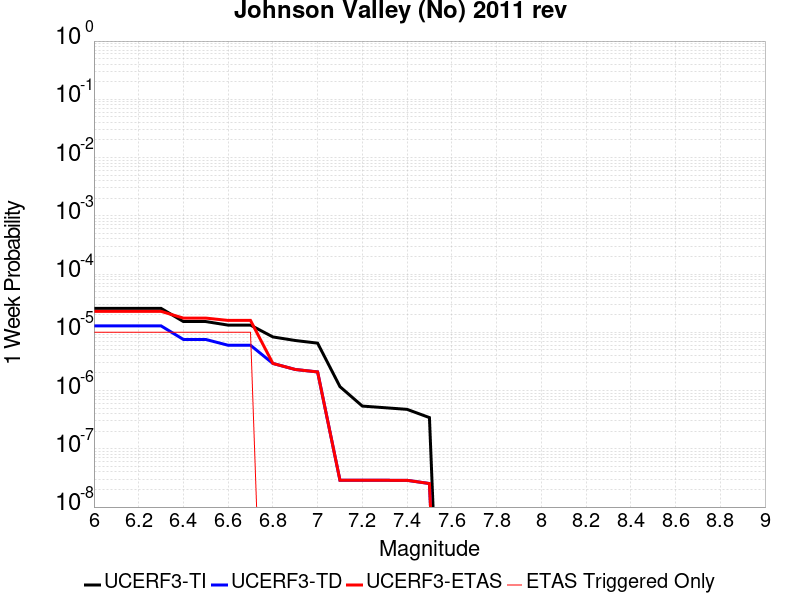 | 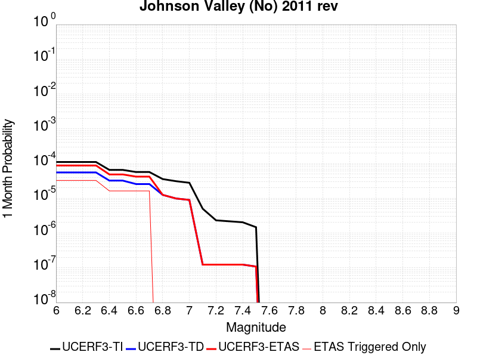 | 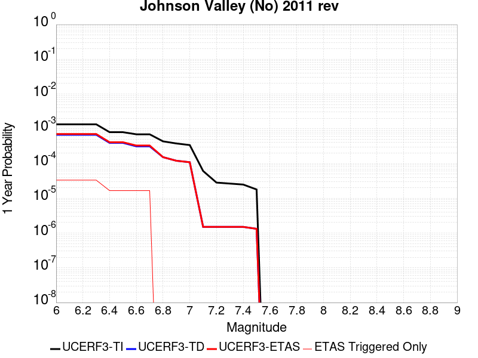 | 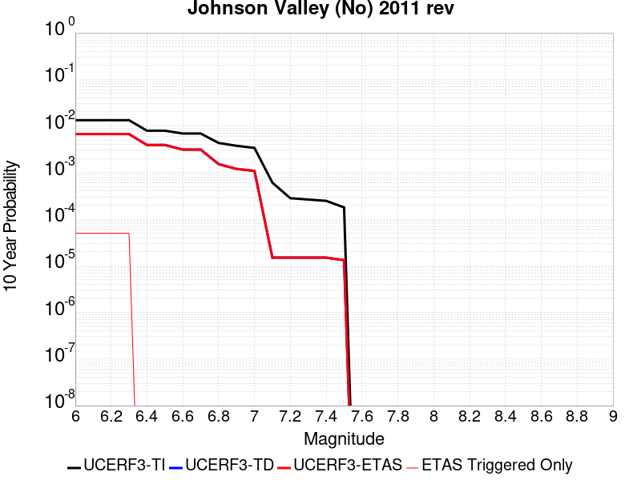 |

| Magnitude | 1 wk TI Prob | 1 wk TD Prob | 1 wk ETAS Prob | 1 wk ETAS/TD Gain | 1 wk ETAS Triggered Only | 1 mo TI Prob | 1 mo TD Prob | 1 mo ETAS Prob | 1 mo ETAS/TD Gain | 1 mo ETAS Triggered Only | 1 yr TI Prob | 1 yr TD Prob | 1 yr ETAS Prob | 1 yr ETAS/TD Gain | 1 yr ETAS Triggered Only | 10 yr TI Prob | 10 yr TD Prob | 10 yr ETAS Prob | 10 yr ETAS/TD Gain | 10 yr ETAS Triggered Only |
|-----|-----|-----|-----|-----|-----|-----|-----|-----|-----|-----|-----|-----|-----|-----|-----|-----|-----|-----|-----|-----|
| 6.0 | 2.577707E-5 | 1.2901208E-5 | 1.2901208E-5 | 1.0 | 0.0 | 1.1046848E-4 | 5.528994E-5 | 8.0268575E-5 | 1.4517754 | 2.4980016E-5 | 0.0013441239 | 6.729868E-4 | 6.9795E-4 | 1.0370932 | 2.4980016E-5 | 0.013360229 | 0.006713397 | 0.0067630215 | 1.0073919 | 4.9960032E-5 |
| 6.1 | 2.577707E-5 | 1.2901208E-5 | 1.2901208E-5 | 1.0 | 0.0 | 1.1046848E-4 | 5.528994E-5 | 8.0268575E-5 | 1.4517754 | 2.4980016E-5 | 0.0013441239 | 6.729868E-4 | 6.9795E-4 | 1.0370932 | 2.4980016E-5 | 0.013360229 | 0.006713397 | 0.0067630215 | 1.0073919 | 4.9960032E-5 |
| 6.2 | 2.577707E-5 | 1.2901208E-5 | 1.2901208E-5 | 1.0 | 0.0 | 1.1046848E-4 | 5.528994E-5 | 8.0268575E-5 | 1.4517754 | 2.4980016E-5 | 0.0013441239 | 6.729868E-4 | 6.9795E-4 | 1.0370932 | 2.4980016E-5 | 0.013360229 | 0.006713397 | 0.0067630215 | 1.0073919 | 4.9960032E-5 |
| 6.3 | 2.577707E-5 | 1.2901208E-5 | 1.2901208E-5 | 1.0 | 0.0 | 1.1046848E-4 | 5.528994E-5 | 8.0268575E-5 | 1.4517754 | 2.4980016E-5 | 0.0013441239 | 6.729868E-4 | 6.9795E-4 | 1.0370932 | 2.4980016E-5 | 0.013360229 | 0.006713397 | 0.0067630215 | 1.0073919 | 4.9960032E-5 |
| 6.4 | 1.5296591E-5 | 7.5369735E-6 | 7.5369735E-6 | 1.0 | 0.0 | 6.555518E-5 | 3.230102E-5 | 3.230102E-5 | 1.0 | 0.0 | 7.97842E-4 | 3.9321271E-4 | 3.9321271E-4 | 1.0 | 0.0 | 0.007949836 | 0.003927011 | 0.003927011 | 1.0 | 0.0 |
| 6.5 | 1.5296591E-5 | 7.5369735E-6 | 7.5369735E-6 | 1.0 | 0.0 | 6.555518E-5 | 3.230102E-5 | 3.230102E-5 | 1.0 | 0.0 | 7.97842E-4 | 3.9321271E-4 | 3.9321271E-4 | 1.0 | 0.0 | 0.007949836 | 0.003927011 | 0.003927011 | 1.0 | 0.0 |
| 6.6 | 1.3289383E-5 | 5.9919316E-6 | 5.9919316E-6 | 1.0 | 0.0 | 5.6953253E-5 | 2.567955E-5 | 2.567955E-5 | 1.0 | 0.0 | 6.9318525E-4 | 3.1262063E-4 | 3.1262063E-4 | 1.0 | 0.0 | 0.0069102696 | 0.0031234731 | 0.0031234731 | 1.0 | 0.0 |
| 6.7 | 1.3289383E-5 | 5.9919316E-6 | 5.9919316E-6 | 1.0 | 0.0 | 5.6953253E-5 | 2.567955E-5 | 2.567955E-5 | 1.0 | 0.0 | 6.9318525E-4 | 3.1262063E-4 | 3.1262063E-4 | 1.0 | 0.0 | 0.0069102696 | 0.0031234731 | 0.0031234731 | 1.0 | 0.0 |
| 6.8 | 8.330789E-6 | 2.9214577E-6 | 2.9214577E-6 | 1.0 | 0.0 | 3.570289E-5 | 1.2520505E-5 | 1.2520505E-5 | 1.0 | 0.0 | 4.34596E-4 | 1.524322E-4 | 1.524322E-4 | 1.0 | 0.0 | 0.0043374705 | 0.0015238364 | 0.0015238364 | 1.0 | 0.0 |
| 6.9 | 7.2359003E-6 | 2.3014702E-6 | 2.3014702E-6 | 1.0 | 0.0 | 3.1010633E-5 | 9.863436E-6 | 9.863436E-6 | 1.0 | 0.0 | 3.7748902E-4 | 1.2008605E-4 | 1.2008605E-4 | 1.0 | 0.0 | 0.0037684843 | 0.0012007345 | 0.0012007345 | 1.0 | 0.0 |
| 7.0 | 6.5149957E-6 | 2.0886398E-6 | 2.0886398E-6 | 1.0 | 0.0 | 2.792111E-5 | 8.951313E-6 | 8.951313E-6 | 1.0 | 0.0 | 3.398865E-4 | 1.0898209E-4 | 1.0898209E-4 | 1.0 | 0.0 | 0.003393671 | 0.0010898062 | 0.0010898062 | 1.0 | 0.0 |
| 7.1 | 1.1662233E-6 | 2.8793124E-8 | 2.8793124E-8 | 1.0 | 0.0 | 4.9980904E-6 | 1.2339909E-7 | 1.2339909E-7 | 1.0 | 0.0 | 6.0850052E-5 | 1.5023832E-6 | 1.5023832E-6 | 1.0 | 0.0 | 6.083339E-4 | 1.5023746E-5 | 1.5023746E-5 | 1.0 | 0.0 |
| 7.2 | 5.413881E-7 | 2.8793124E-8 | 2.8793124E-8 | 1.0 | 0.0 | 2.3202326E-6 | 1.2339909E-7 | 1.2339909E-7 | 1.0 | 0.0 | 2.8248465E-5 | 1.5023832E-6 | 1.5023832E-6 | 1.0 | 0.0 | 2.8244875E-4 | 1.5023746E-5 | 1.5023746E-5 | 1.0 | 0.0 |
| 7.3 | 5.076821E-7 | 2.8793124E-8 | 2.8793124E-8 | 1.0 | 0.0 | 2.1757785E-6 | 1.2339909E-7 | 1.2339909E-7 | 1.0 | 0.0 | 2.648978E-5 | 1.5023832E-6 | 1.5023832E-6 | 1.0 | 0.0 | 2.6486625E-4 | 1.5023746E-5 | 1.5023746E-5 | 1.0 | 0.0 |
| 7.4 | 4.7568687E-7 | 2.8775073E-8 | 2.8775073E-8 | 1.0 | 0.0 | 2.0386565E-6 | 1.2332174E-7 | 1.2332174E-7 | 1.0 | 0.0 | 2.482036E-5 | 1.5014413E-6 | 1.5014413E-6 | 1.0 | 0.0 | 2.4817587E-4 | 1.5014328E-5 | 1.5014328E-5 | 1.0 | 0.0 |
| 7.5 | 3.435626E-7 | 2.5350424E-8 | 2.5350424E-8 | 1.0 | 0.0 | 1.4724103E-6 | 1.0864467E-7 | 1.0864467E-7 | 1.0 | 0.0 | 1.7926448E-5 | 1.3227482E-6 | 1.3227482E-6 | 1.0 | 0.0 | 1.7925001E-4 | 1.3227419E-5 | 1.3227419E-5 | 1.0 | 0.0 |

## Elmore Ranch
*[(top)](#table-of-contents)*

| 1 Week | 1 Month | 1 Year | 10 Year |
|-----|-----|-----|-----|
|  |  | 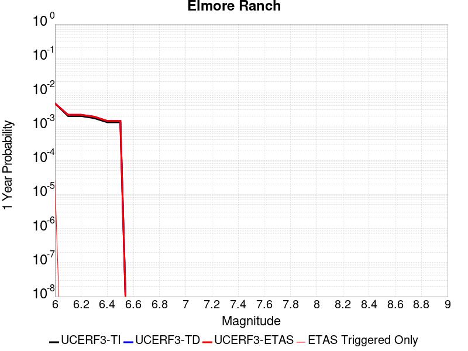 | 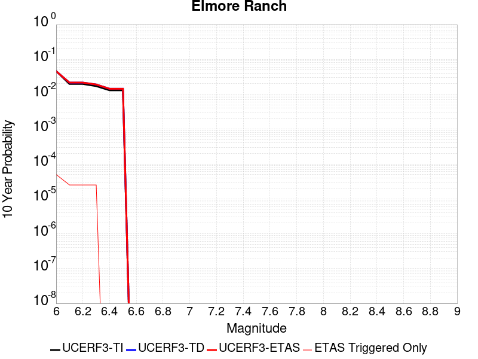 |

| Magnitude | 1 wk TI Prob | 1 wk TD Prob | 1 wk ETAS Prob | 1 wk ETAS/TD Gain | 1 wk ETAS Triggered Only | 1 mo TI Prob | 1 mo TD Prob | 1 mo ETAS Prob | 1 mo ETAS/TD Gain | 1 mo ETAS Triggered Only | 1 yr TI Prob | 1 yr TD Prob | 1 yr ETAS Prob | 1 yr ETAS/TD Gain | 1 yr ETAS Triggered Only | 10 yr TI Prob | 10 yr TD Prob | 10 yr ETAS Prob | 10 yr ETAS/TD Gain | 10 yr ETAS Triggered Only |
|-----|-----|-----|-----|-----|-----|-----|-----|-----|-----|-----|-----|-----|-----|-----|-----|-----|-----|-----|-----|-----|
| 6.0 | 9.102099E-5 | 8.953848E-5 | 8.953848E-5 | 1.0 | 0.0 | 3.9003167E-4 | 3.836898E-4 | 3.836898E-4 | 1.0 | 0.0 | 0.0047383 | 0.004662132 | 0.0046869954 | 1.0053331 | 2.4980016E-5 | 0.046385348 | 0.04583787 | 0.045885544 | 1.00104 | 4.9960032E-5 |
| 6.1 | 3.8306698E-5 | 4.14921E-5 | 4.14921E-5 | 1.0 | 0.0 | 1.6416123E-4 | 1.7781362E-4 | 1.7781362E-4 | 1.0 | 0.0 | 0.0019968306 | 0.0021632186 | 0.0021632186 | 1.0 | 0.0 | 0.019789828 | 0.021595007 | 0.021619448 | 1.0011318 | 2.4980016E-5 |
| 6.2 | 3.8306698E-5 | 4.14921E-5 | 4.14921E-5 | 1.0 | 0.0 | 1.6416123E-4 | 1.7781362E-4 | 1.7781362E-4 | 1.0 | 0.0 | 0.0019968306 | 0.0021632186 | 0.0021632186 | 1.0 | 0.0 | 0.019789828 | 0.021595007 | 0.021619448 | 1.0011318 | 2.4980016E-5 |
| 6.3 | 3.3197924E-5 | 3.6550366E-5 | 3.6550366E-5 | 1.0 | 0.0 | 1.4226905E-4 | 1.56639E-4 | 1.56639E-4 | 1.0 | 0.0 | 0.0017307495 | 0.0019059771 | 0.0019059771 | 1.0 | 0.0 | 0.017173318 | 0.019057386 | 0.019081889 | 1.0012858 | 2.4980016E-5 |
| 6.4 | 2.5148964E-5 | 2.7420736E-5 | 2.7420736E-5 | 1.0 | 0.0 | 1.0777682E-4 | 1.17515796E-4 | 1.17515796E-4 | 1.0 | 0.0 | 0.0013113929 | 0.0014304637 | 0.0014304637 | 1.0 | 0.0 | 0.01303681 | 0.014365338 | 0.014365338 | 1.0 | 0.0 |
| 6.5 | 2.5148964E-5 | 2.7420736E-5 | 2.7420736E-5 | 1.0 | 0.0 | 1.0777682E-4 | 1.17515796E-4 | 1.17515796E-4 | 1.0 | 0.0 | 0.0013113929 | 0.0014304637 | 0.0014304637 | 1.0 | 0.0 | 0.01303681 | 0.014365338 | 0.014365338 | 1.0 | 0.0 |

## Bullion Mountains
*[(top)](#table-of-contents)*

| 1 Week | 1 Month | 1 Year | 10 Year |
|-----|-----|-----|-----|
| 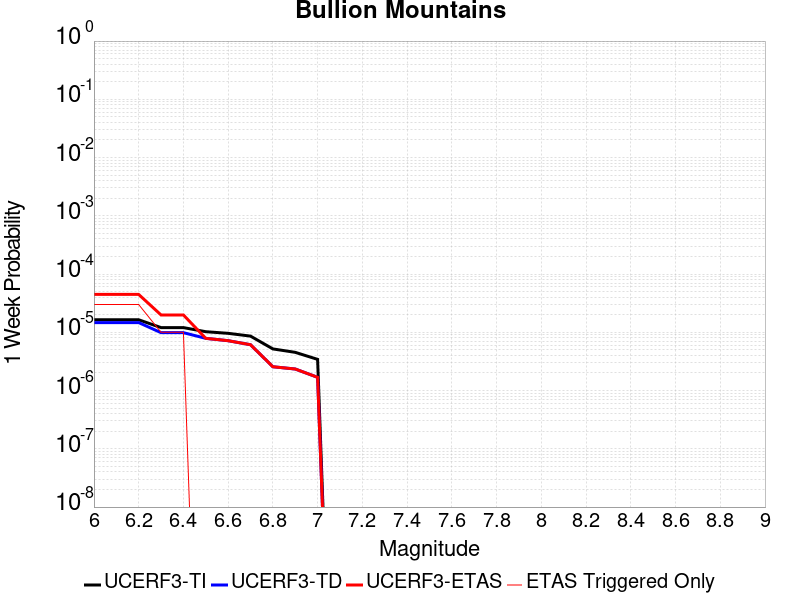 | 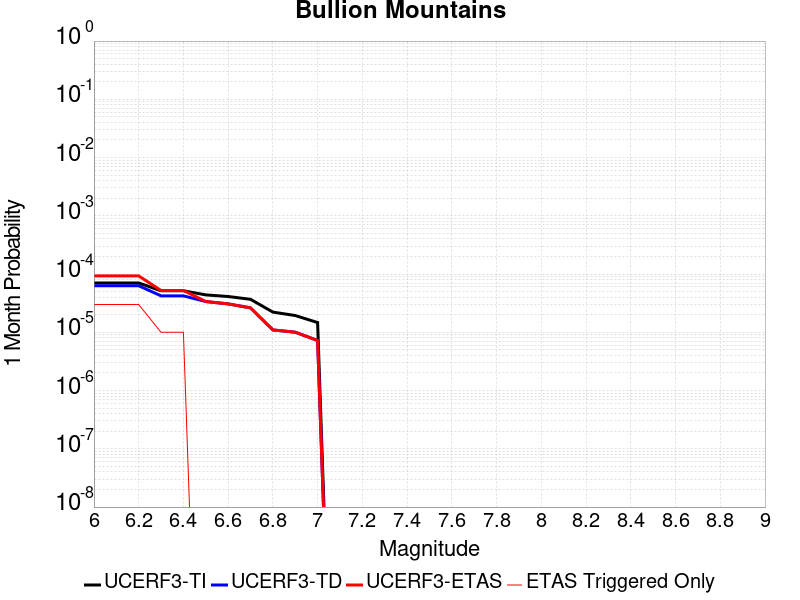 | 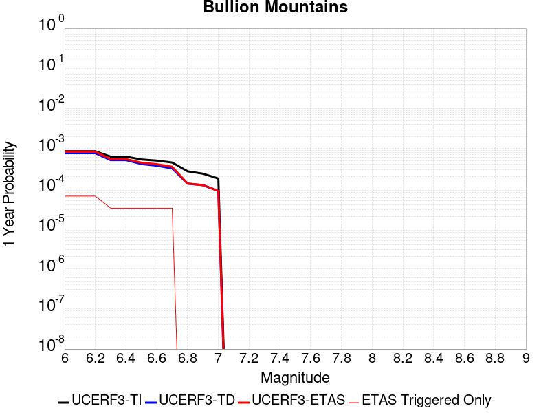 | 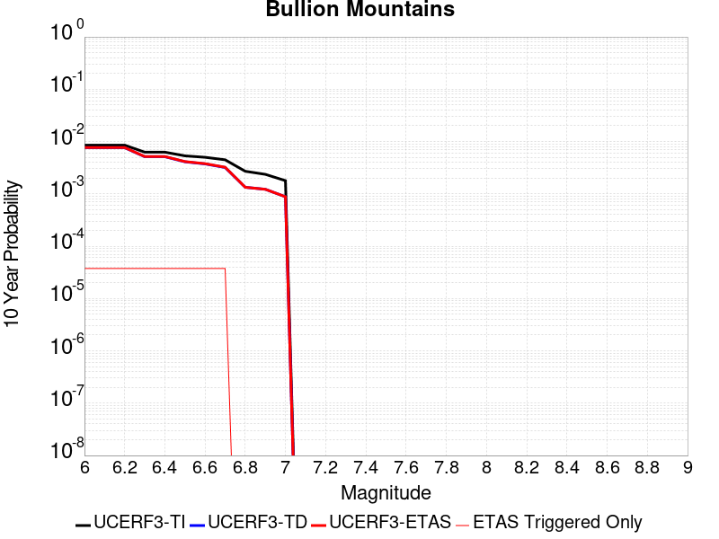 |

| Magnitude | 1 wk TI Prob | 1 wk TD Prob | 1 wk ETAS Prob | 1 wk ETAS/TD Gain | 1 wk ETAS Triggered Only | 1 mo TI Prob | 1 mo TD Prob | 1 mo ETAS Prob | 1 mo ETAS/TD Gain | 1 mo ETAS Triggered Only | 1 yr TI Prob | 1 yr TD Prob | 1 yr ETAS Prob | 1 yr ETAS/TD Gain | 1 yr ETAS Triggered Only | 10 yr TI Prob | 10 yr TD Prob | 10 yr ETAS Prob | 10 yr ETAS/TD Gain | 10 yr ETAS Triggered Only |
|-----|-----|-----|-----|-----|-----|-----|-----|-----|-----|-----|-----|-----|-----|-----|-----|-----|-----|-----|-----|-----|
| 6.0 | 1.6420427E-5 | 1.4692009E-5 | 1.4692009E-5 | 1.0 | 0.0 | 7.037136E-5 | 6.296445E-5 | 6.296445E-5 | 1.0 | 0.0 | 8.5643446E-4 | 7.6636096E-4 | 8.162827E-4 | 1.0651413 | 4.9960032E-5 | 0.008531413 | 0.0076409746 | 0.007690553 | 1.0064884 | 4.9960032E-5 |
| 6.1 | 1.6420427E-5 | 1.4692009E-5 | 1.4692009E-5 | 1.0 | 0.0 | 7.037136E-5 | 6.296445E-5 | 6.296445E-5 | 1.0 | 0.0 | 8.5643446E-4 | 7.6636096E-4 | 8.162827E-4 | 1.0651413 | 4.9960032E-5 | 0.008531413 | 0.0076409746 | 0.007690553 | 1.0064884 | 4.9960032E-5 |
| 6.2 | 1.6420427E-5 | 1.4692009E-5 | 1.4692009E-5 | 1.0 | 0.0 | 7.037136E-5 | 6.296445E-5 | 6.296445E-5 | 1.0 | 0.0 | 8.5643446E-4 | 7.6636096E-4 | 8.162827E-4 | 1.0651413 | 4.9960032E-5 | 0.008531413 | 0.0076409746 | 0.007690553 | 1.0064884 | 4.9960032E-5 |
| 6.3 | 1.2046778E-5 | 9.862255E-6 | 9.862255E-6 | 1.0 | 0.0 | 5.1628023E-5 | 4.2266256E-5 | 4.2266256E-5 | 1.0 | 0.0 | 6.283899E-4 | 5.144933E-4 | 5.394605E-4 | 1.0485277 | 2.4980016E-5 | 0.0062661595 | 0.0051353034 | 0.0051601552 | 1.0048394 | 2.4980016E-5 |
| 6.4 | 1.2046778E-5 | 9.862255E-6 | 9.862255E-6 | 1.0 | 0.0 | 5.1628023E-5 | 4.2266256E-5 | 4.2266256E-5 | 1.0 | 0.0 | 6.283899E-4 | 5.144933E-4 | 5.394605E-4 | 1.0485277 | 2.4980016E-5 | 0.0062661595 | 0.0051353034 | 0.0051601552 | 1.0048394 | 2.4980016E-5 |
| 6.5 | 1.0244343E-5 | 7.879378E-6 | 7.879378E-6 | 1.0 | 0.0 | 4.390359E-5 | 3.3768443E-5 | 3.3768443E-5 | 1.0 | 0.0 | 5.343951E-4 | 4.1107394E-4 | 4.360437E-4 | 1.0607427 | 2.4980016E-5 | 0.005331118 | 0.0041051665 | 0.004130044 | 1.00606 | 2.4980016E-5 |
| 6.6 | 9.605408E-6 | 7.1774166E-6 | 7.1774166E-6 | 1.0 | 0.0 | 4.1165385E-5 | 3.0760108E-5 | 3.0760108E-5 | 1.0 | 0.0 | 5.010733E-4 | 3.7446033E-4 | 3.9943098E-4 | 1.0666844 | 2.4980016E-5 | 0.00499945 | 0.0037402906 | 0.0037651772 | 1.0066537 | 2.4980016E-5 |
| 6.7 | 8.60418E-6 | 6.123926E-6 | 6.123926E-6 | 1.0 | 0.0 | 3.687454E-5 | 2.6245243E-5 | 2.6245243E-5 | 1.0 | 0.0 | 4.48855E-4 | 3.195085E-4 | 3.4448053E-4 | 1.0781577 | 2.4980016E-5 | 0.004479495 | 0.0031924031 | 0.0032173034 | 1.0077999 | 2.4980016E-5 |
| 6.8 | 5.187994E-6 | 2.563117E-6 | 2.563117E-6 | 1.0 | 0.0 | 2.223407E-5 | 1.0984763E-5 | 1.0984763E-5 | 1.0 | 0.0 | 2.7066618E-4 | 1.3373529E-4 | 1.3373529E-4 | 1.0 | 0.0 | 0.0027033675 | 0.0013369396 | 0.0013369396 | 1.0 | 0.0 |
| 6.9 | 4.5302368E-6 | 2.3442778E-6 | 2.3442778E-6 | 1.0 | 0.0 | 1.9415156E-5 | 1.0046889E-5 | 1.0046889E-5 | 1.0 | 0.0 | 2.3635388E-4 | 1.2231797E-4 | 1.2231797E-4 | 1.0 | 0.0 | 0.0023610266 | 0.0012228956 | 0.0012228956 | 1.0 | 0.0 |
| 7.0 | 3.431668E-6 | 1.6882177E-6 | 1.6882177E-6 | 1.0 | 0.0 | 1.4707065E-5 | 7.2352186E-6 | 7.2352186E-6 | 1.0 | 0.0 | 1.7904381E-4 | 8.808879E-5 | 8.808879E-5 | 1.0 | 0.0 | 0.0017889962 | 8.8088785E-4 | 8.8088785E-4 | 1.0 | 0.0 |

## Great Valley 10 (Panoche)
*[(top)](#table-of-contents)*

| 1 Week | 1 Month | 1 Year | 10 Year |
|-----|-----|-----|-----|
|  | 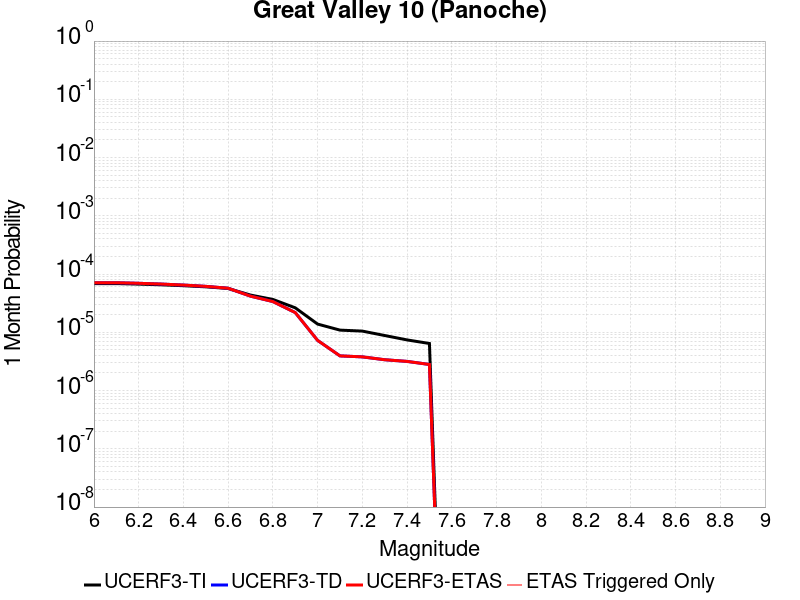 | 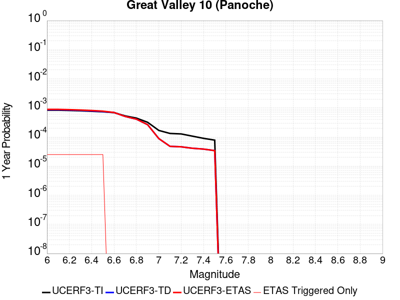 | 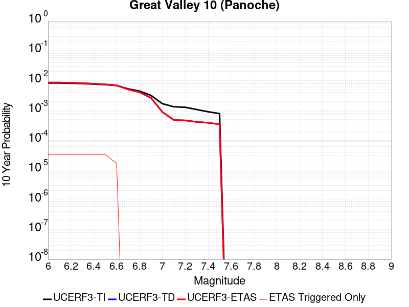 |

| Magnitude | 1 wk TI Prob | 1 wk TD Prob | 1 wk ETAS Prob | 1 wk ETAS/TD Gain | 1 wk ETAS Triggered Only | 1 mo TI Prob | 1 mo TD Prob | 1 mo ETAS Prob | 1 mo ETAS/TD Gain | 1 mo ETAS Triggered Only | 1 yr TI Prob | 1 yr TD Prob | 1 yr ETAS Prob | 1 yr ETAS/TD Gain | 1 yr ETAS Triggered Only | 10 yr TI Prob | 10 yr TD Prob | 10 yr ETAS Prob | 10 yr ETAS/TD Gain | 10 yr ETAS Triggered Only |
|-----|-----|-----|-----|-----|-----|-----|-----|-----|-----|-----|-----|-----|-----|-----|-----|-----|-----|-----|-----|-----|
| 6.0 | 1.6014626E-5 | 1.6575357E-5 | 1.6575357E-5 | 1.0 | 0.0 | 6.863231E-5 | 7.103534E-5 | 7.103534E-5 | 1.0 | 0.0 | 8.35278E-4 | 8.6451764E-4 | 8.8947604E-4 | 1.0288697 | 2.4980016E-5 | 0.008321454 | 0.008612158 | 0.008661687 | 1.0057511 | 4.9960032E-5 |
| 6.1 | 1.6014626E-5 | 1.6575357E-5 | 1.6575357E-5 | 1.0 | 0.0 | 6.863231E-5 | 7.103534E-5 | 7.103534E-5 | 1.0 | 0.0 | 8.35278E-4 | 8.6451764E-4 | 8.8947604E-4 | 1.0288697 | 2.4980016E-5 | 0.008321454 | 0.008612158 | 0.008661687 | 1.0057511 | 4.9960032E-5 |
| 6.2 | 1.56782E-5 | 1.6198404E-5 | 1.6198404E-5 | 1.0 | 0.0 | 6.719056E-5 | 6.941991E-5 | 6.941991E-5 | 1.0 | 0.0 | 8.17738E-4 | 8.4486516E-4 | 8.698241E-4 | 1.0295419 | 2.4980016E-5 | 0.008147354 | 0.008417133 | 0.008466673 | 1.0058856 | 4.9960032E-5 |
| 6.3 | 1.5263338E-5 | 1.5723472E-5 | 1.5723472E-5 | 1.0 | 0.0 | 6.541267E-5 | 6.73846E-5 | 6.73846E-5 | 1.0 | 0.0 | 7.961082E-4 | 8.201041E-4 | 8.450636E-4 | 1.0304346 | 2.4980016E-5 | 0.007932622 | 0.008171363 | 0.008220915 | 1.006064 | 4.9960032E-5 |
| 6.4 | 1.4720723E-5 | 1.5099334E-5 | 1.5099334E-5 | 1.0 | 0.0 | 6.308728E-5 | 6.470986E-5 | 6.470986E-5 | 1.0 | 0.0 | 7.67817E-4 | 7.87563E-4 | 8.125233E-4 | 1.0316931 | 2.4980016E-5 | 0.007651695 | 0.007848289 | 0.007897857 | 1.0063157 | 4.9960032E-5 |
| 6.5 | 1.408264E-5 | 1.4355928E-5 | 1.4355928E-5 | 1.0 | 0.0 | 6.0352773E-5 | 6.1523984E-5 | 6.1523984E-5 | 1.0 | 0.0 | 7.3454727E-4 | 7.488022E-4 | 7.737636E-4 | 1.033335 | 2.4980016E-5 | 0.0073212404 | 0.0074633416 | 0.007512929 | 1.0066441 | 4.9960032E-5 |
| 6.6 | 1.3197086E-5 | 1.33218455E-5 | 1.33218455E-5 | 1.0 | 0.0 | 5.6557717E-5 | 5.7092402E-5 | 5.7092402E-5 | 1.0 | 0.0 | 6.8837265E-4 | 6.948834E-4 | 6.948834E-4 | 1.0 | 0.0 | 0.006862442 | 0.0069276392 | 0.006952446 | 1.0035809 | 2.4980016E-5 |
| 6.7 | 1.017583E-5 | 9.745348E-6 | 9.745348E-6 | 1.0 | 0.0 | 4.360997E-5 | 4.176512E-5 | 4.176512E-5 | 1.0 | 0.0 | 5.30822E-4 | 5.083741E-4 | 5.083741E-4 | 1.0 | 0.0 | 0.0052955584 | 0.0050723637 | 0.0050723637 | 1.0 | 0.0 |
| 6.8 | 8.557912E-6 | 7.8726725E-6 | 7.8726725E-6 | 1.0 | 0.0 | 3.667625E-5 | 3.37396E-5 | 3.37396E-5 | 1.0 | 0.0 | 4.4644187E-4 | 4.1070423E-4 | 4.1070423E-4 | 1.0 | 0.0 | 0.0044554602 | 0.004099659 | 0.004099659 | 1.0 | 0.0 |
| 6.9 | 6.14664E-6 | 5.0920366E-6 | 5.0920366E-6 | 1.0 | 0.0 | 2.6342475E-5 | 2.182284E-5 | 2.182284E-5 | 1.0 | 0.0 | 3.2067244E-4 | 2.6566206E-4 | 2.6566206E-4 | 1.0 | 0.0 | 0.003202101 | 0.0026535832 | 0.0026535832 | 1.0 | 0.0 |
| 7.0 | 3.2310581E-6 | 1.6950871E-6 | 1.6950871E-6 | 1.0 | 0.0 | 1.3847319E-5 | 7.2646394E-6 | 7.2646394E-6 | 1.0 | 0.0 | 1.6857806E-4 | 8.844349E-5 | 8.844349E-5 | 1.0 | 0.0 | 0.0016845023 | 8.840923E-4 | 8.840923E-4 | 1.0 | 0.0 |
| 7.1 | 2.544492E-6 | 9.188573E-7 | 9.188573E-7 | 1.0 | 0.0 | 1.090492E-5 | 3.9379543E-6 | 3.9379543E-6 | 1.0 | 0.0 | 1.327593E-4 | 4.7943588E-5 | 4.7943588E-5 | 1.0 | 0.0 | 0.0013268003 | 4.793372E-4 | 4.793372E-4 | 1.0 | 0.0 |
| 7.2 | 2.4479045E-6 | 8.840978E-7 | 8.840978E-7 | 1.0 | 0.0 | 1.0490977E-5 | 3.7889852E-6 | 3.7889852E-6 | 1.0 | 0.0 | 1.2772017E-4 | 4.6129968E-5 | 4.6129968E-5 | 1.0 | 0.0 | 0.0012764678 | 4.6120866E-4 | 4.6120866E-4 | 1.0 | 0.0 |
| 7.3 | 2.0559578E-6 | 7.892521E-7 | 7.892521E-7 | 1.0 | 0.0 | 8.811218E-6 | 3.382505E-6 | 3.382505E-6 | 1.0 | 0.0 | 1.072713E-4 | 4.1181265E-5 | 4.1181265E-5 | 1.0 | 0.0 | 0.0010721954 | 4.1174097E-4 | 4.1174097E-4 | 1.0 | 0.0 |
| 7.4 | 1.727687E-6 | 7.3875697E-7 | 7.3875697E-7 | 1.0 | 0.0 | 7.404352E-6 | 3.1660977E-6 | 3.1660977E-6 | 1.0 | 0.0 | 9.0144255E-5 | 3.8546605E-5 | 3.8546605E-5 | 1.0 | 0.0 | 9.0107694E-4 | 3.854038E-4 | 3.854038E-4 | 1.0 | 0.0 |
| 7.5 | 1.5002679E-6 | 6.545985E-7 | 6.545985E-7 | 1.0 | 0.0 | 6.4297037E-6 | 2.8054194E-6 | 2.8054194E-6 | 1.0 | 0.0 | 7.827883E-5 | 3.4155488E-5 | 3.4155488E-5 | 1.0 | 0.0 | 7.825126E-4 | 3.4150656E-4 | 3.4150656E-4 | 1.0 | 0.0 |

## Hat Creek-McArthur-Mayfield
*[(top)](#table-of-contents)*

| 1 Week | 1 Month | 1 Year | 10 Year |
|-----|-----|-----|-----|
| 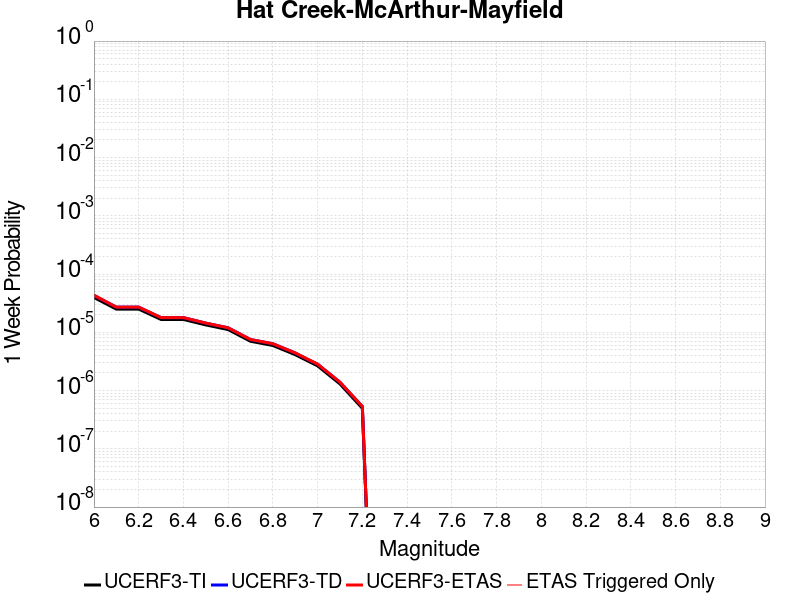 |  | 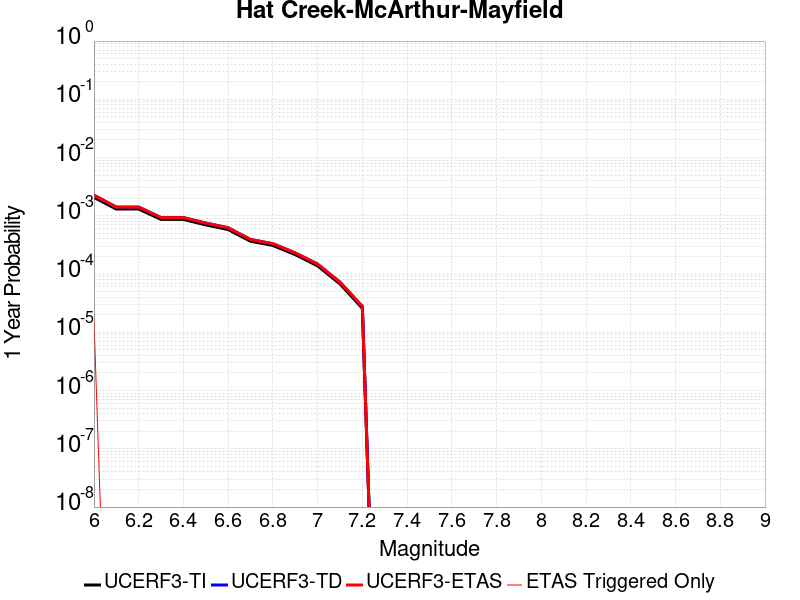 | 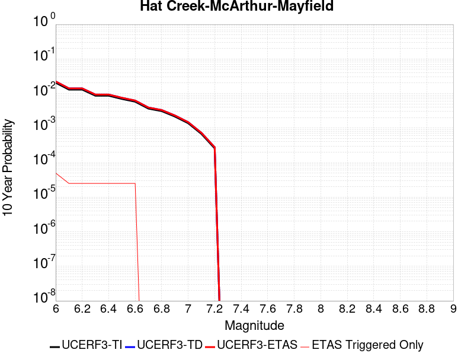 |

| Magnitude | 1 wk TI Prob | 1 wk TD Prob | 1 wk ETAS Prob | 1 wk ETAS/TD Gain | 1 wk ETAS Triggered Only | 1 mo TI Prob | 1 mo TD Prob | 1 mo ETAS Prob | 1 mo ETAS/TD Gain | 1 mo ETAS Triggered Only | 1 yr TI Prob | 1 yr TD Prob | 1 yr ETAS Prob | 1 yr ETAS/TD Gain | 1 yr ETAS Triggered Only | 10 yr TI Prob | 10 yr TD Prob | 10 yr ETAS Prob | 10 yr ETAS/TD Gain | 10 yr ETAS Triggered Only |
|-----|-----|-----|-----|-----|-----|-----|-----|-----|-----|-----|-----|-----|-----|-----|-----|-----|-----|-----|-----|-----|
| 6.0 | 3.967457E-5 | 4.315831E-5 | 4.315831E-5 | 1.0 | 0.0 | 1.7002279E-4 | 1.8495171E-4 | 1.8495171E-4 | 1.0 | 0.0 | 0.002068062 | 0.002249576 | 0.0022744997 | 1.0110793 | 2.4980016E-5 | 0.02048922 | 0.022280399 | 0.022329245 | 1.0021924 | 4.9960032E-5 |
| 6.1 | 2.5044013E-5 | 2.7071164E-5 | 2.7071164E-5 | 1.0 | 0.0 | 1.0732707E-4 | 1.1601429E-4 | 1.1601429E-4 | 1.0 | 0.0 | 0.0013059238 | 0.0014115906 | 0.0014115906 | 1.0 | 0.0 | 0.01298276 | 0.01402966 | 0.01405429 | 1.0017555 | 2.4980016E-5 |
| 6.2 | 2.5044013E-5 | 2.7071164E-5 | 2.7071164E-5 | 1.0 | 0.0 | 1.0732707E-4 | 1.1601429E-4 | 1.1601429E-4 | 1.0 | 0.0 | 0.0013059238 | 0.0014115906 | 0.0014115906 | 1.0 | 0.0 | 0.01298276 | 0.01402966 | 0.01405429 | 1.0017555 | 2.4980016E-5 |
| 6.3 | 1.6624012E-5 | 1.7891072E-5 | 1.7891072E-5 | 1.0 | 0.0 | 7.124382E-5 | 7.6673816E-5 | 7.6673816E-5 | 1.0 | 0.0 | 8.670483E-4 | 9.331125E-4 | 9.331125E-4 | 1.0 | 0.0 | 0.008636732 | 0.009292879 | 0.009317627 | 1.0026631 | 2.4980016E-5 |
| 6.4 | 1.6624012E-5 | 1.7891072E-5 | 1.7891072E-5 | 1.0 | 0.0 | 7.124382E-5 | 7.6673816E-5 | 7.6673816E-5 | 1.0 | 0.0 | 8.670483E-4 | 9.331125E-4 | 9.331125E-4 | 1.0 | 0.0 | 0.008636732 | 0.009292879 | 0.009317627 | 1.0026631 | 2.4980016E-5 |
| 6.5 | 1.3394842E-5 | 1.4392137E-5 | 1.4392137E-5 | 1.0 | 0.0 | 5.7405203E-5 | 6.167916E-5 | 6.167916E-5 | 1.0 | 0.0 | 6.986842E-4 | 7.506906E-4 | 7.506906E-4 | 1.0 | 0.0 | 0.006964916 | 0.0074821403 | 0.0075069335 | 1.0033137 | 2.4980016E-5 |
| 6.6 | 1.1137514E-5 | 1.1954546E-5 | 1.1954546E-5 | 1.0 | 0.0 | 4.7731326E-5 | 5.1232782E-5 | 5.1232782E-5 | 1.0 | 0.0 | 5.809739E-4 | 6.2358467E-4 | 6.2358467E-4 | 1.0 | 0.0 | 0.005794574 | 0.00621877 | 0.006243595 | 1.0039918 | 2.4980016E-5 |
| 6.7 | 7.0200663E-6 | 7.5242897E-6 | 7.5242897E-6 | 1.0 | 0.0 | 3.008565E-5 | 3.2246568E-5 | 3.2246568E-5 | 1.0 | 0.0 | 3.6623122E-4 | 3.925328E-4 | 3.925328E-4 | 1.0 | 0.0 | 0.0036562826 | 0.0039185574 | 0.0039185574 | 1.0 | 0.0 |
| 6.8 | 5.940172E-6 | 6.3654766E-6 | 6.3654766E-6 | 1.0 | 0.0 | 2.545763E-5 | 2.7280335E-5 | 2.7280335E-5 | 1.0 | 0.0 | 3.0990256E-4 | 3.3208873E-4 | 3.3208873E-4 | 1.0 | 0.0 | 0.0030947074 | 0.0033160534 | 0.0033160534 | 1.0 | 0.0 |
| 6.9 | 4.129831E-6 | 4.423547E-6 | 4.423547E-6 | 1.0 | 0.0 | 1.7699154E-5 | 1.8957926E-5 | 1.8957926E-5 | 1.0 | 0.0 | 2.154659E-4 | 2.3078908E-4 | 2.3078908E-4 | 1.0 | 0.0 | 0.002152571 | 0.0023055724 | 0.0023055724 | 1.0 | 0.0 |
| 7.0 | 2.6512955E-6 | 2.8374002E-6 | 2.8374002E-6 | 1.0 | 0.0 | 1.1362646E-5 | 1.2160232E-5 | 1.2160232E-5 | 1.0 | 0.0 | 1.3833142E-4 | 1.480412E-4 | 1.480412E-4 | 1.0 | 0.0 | 0.0013824535 | 0.0014794683 | 0.0014794683 | 1.0 | 0.0 |
| 7.1 | 1.2992575E-6 | 1.3909317E-6 | 1.3909317E-6 | 1.0 | 0.0 | 5.568235E-6 | 5.961124E-6 | 5.961124E-6 | 1.0 | 0.0 | 6.779115E-5 | 7.257448E-5 | 7.257448E-5 | 1.0 | 0.0 | 6.7770475E-4 | 7.2552945E-4 | 7.2552945E-4 | 1.0 | 0.0 |
| 7.2 | 4.968191E-7 | 5.3271475E-7 | 5.3271475E-7 | 1.0 | 0.0 | 2.1292228E-6 | 2.283062E-6 | 2.283062E-6 | 1.0 | 0.0 | 2.592298E-5 | 2.7796052E-5 | 2.7796052E-5 | 1.0 | 0.0 | 2.5919956E-4 | 2.7793812E-4 | 2.7793812E-4 | 1.0 | 0.0 |

## Calaveras (No) 2011 CFM
*[(top)](#table-of-contents)*

| 1 Week | 1 Month | 1 Year | 10 Year |
|-----|-----|-----|-----|
|  | 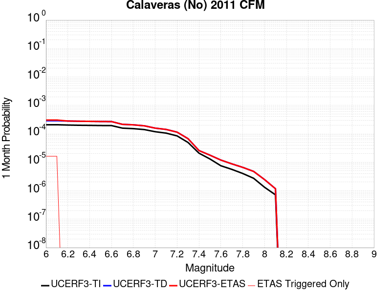 |  | 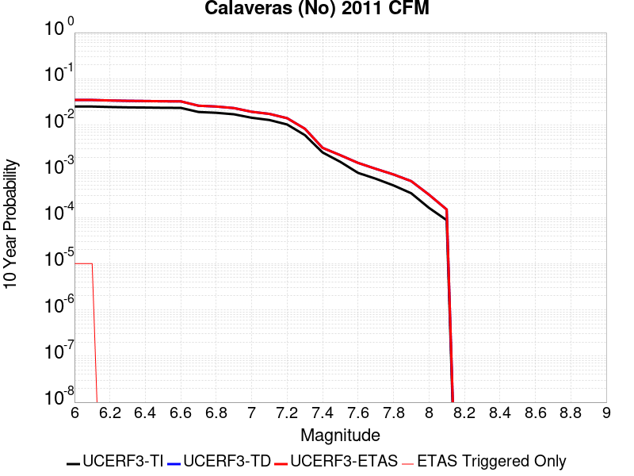 |

| Magnitude | 1 wk TI Prob | 1 wk TD Prob | 1 wk ETAS Prob | 1 wk ETAS/TD Gain | 1 wk ETAS Triggered Only | 1 mo TI Prob | 1 mo TD Prob | 1 mo ETAS Prob | 1 mo ETAS/TD Gain | 1 mo ETAS Triggered Only | 1 yr TI Prob | 1 yr TD Prob | 1 yr ETAS Prob | 1 yr ETAS/TD Gain | 1 yr ETAS Triggered Only | 10 yr TI Prob | 10 yr TD Prob | 10 yr ETAS Prob | 10 yr ETAS/TD Gain | 10 yr ETAS Triggered Only |
|-----|-----|-----|-----|-----|-----|-----|-----|-----|-----|-----|-----|-----|-----|-----|-----|-----|-----|-----|-----|-----|
| 6.0 | 4.8694856E-5 | 6.747457E-5 | 6.747457E-5 | 1.0 | 0.0 | 2.0867554E-4 | 2.891453E-4 | 3.141181E-4 | 1.0863676 | 2.4980016E-5 | 0.0025376645 | 0.0035146773 | 0.0035395694 | 1.0070823 | 2.4980016E-5 | 0.02508881 | 0.034771074 | 0.034795184 | 1.0006934 | 2.4980016E-5 |
| 6.1 | 4.8694856E-5 | 6.747457E-5 | 6.747457E-5 | 1.0 | 0.0 | 2.0867554E-4 | 2.891453E-4 | 3.141181E-4 | 1.0863676 | 2.4980016E-5 | 0.0025376645 | 0.0035146773 | 0.0035395694 | 1.0070823 | 2.4980016E-5 | 0.02508881 | 0.034771074 | 0.034795184 | 1.0006934 | 2.4980016E-5 |
| 6.2 | 4.7541962E-5 | 6.5805805E-5 | 6.5805805E-5 | 1.0 | 0.0 | 2.0373536E-4 | 2.8199502E-4 | 2.8199502E-4 | 1.0 | 0.0 | 0.0024776561 | 0.003427919 | 0.003427919 | 1.0 | 0.0 | 0.024502134 | 0.0339325 | 0.0339325 | 1.0 | 0.0 |
| 6.3 | 4.6717287E-5 | 6.463939E-5 | 6.463939E-5 | 1.0 | 0.0 | 2.0020158E-4 | 2.7699716E-4 | 2.7699716E-4 | 1.0 | 0.0 | 0.0024347296 | 0.0033672696 | 0.0033672696 | 1.0 | 0.0 | 0.024082264 | 0.033345006 | 0.033345006 | 1.0 | 0.0 |
| 6.4 | 4.6276386E-5 | 6.400103E-5 | 6.400103E-5 | 1.0 | 0.0 | 1.983123E-4 | 2.7426204E-4 | 2.7426204E-4 | 1.0 | 0.0 | 0.0024117786 | 0.00333408 | 0.00333408 | 1.0 | 0.0 | 0.02385771 | 0.03302388 | 0.03302388 | 1.0 | 0.0 |
| 6.5 | 4.5720994E-5 | 6.32025E-5 | 6.32025E-5 | 1.0 | 0.0 | 1.9593239E-4 | 2.7084045E-4 | 2.7084045E-4 | 1.0 | 0.0 | 0.002382867 | 0.0032925585 | 0.0032925585 | 1.0 | 0.0 | 0.023574775 | 0.032621842 | 0.032621842 | 1.0 | 0.0 |
| 6.6 | 4.549134E-5 | 6.285557E-5 | 6.285557E-5 | 1.0 | 0.0 | 1.949483E-4 | 2.693539E-4 | 2.693539E-4 | 1.0 | 0.0 | 0.0023709119 | 0.0032745146 | 0.0032745146 | 1.0 | 0.0 | 0.023457756 | 0.03244731 | 0.03244731 | 1.0 | 0.0 |
| 6.7 | 3.701047E-5 | 5.03607E-5 | 5.03607E-5 | 1.0 | 0.0 | 1.5860666E-4 | 2.1581395E-4 | 2.1581395E-4 | 1.0 | 0.0 | 0.0019293258 | 0.002624412 | 0.002624412 | 1.0 | 0.0 | 0.019126613 | 0.026125198 | 0.026125198 | 1.0 | 0.0 |
| 6.8 | 3.5523568E-5 | 4.834225E-5 | 4.834225E-5 | 1.0 | 0.0 | 1.5223498E-4 | 2.0716486E-4 | 2.0716486E-4 | 1.0 | 0.0 | 0.0018518851 | 0.0025193577 | 0.0025193577 | 1.0 | 0.0 | 0.018365284 | 0.025097623 | 0.025097623 | 1.0 | 0.0 |
| 6.9 | 3.2946147E-5 | 4.4663826E-5 | 4.4663826E-5 | 1.0 | 0.0 | 1.4119013E-4 | 1.9140259E-4 | 1.9140259E-4 | 1.0 | 0.0 | 0.0017176344 | 0.0023278783 | 0.0023278783 | 1.0 | 0.0 | 0.017044188 | 0.023219762 | 0.023219762 | 1.0 | 0.0 |
| 7.0 | 2.7682381E-5 | 3.7023216E-5 | 3.7023216E-5 | 1.0 | 0.0 | 1.1863338E-4 | 1.5866144E-4 | 1.5866144E-4 | 1.0 | 0.0 | 0.0014434044 | 0.0019300217 | 0.0019300217 | 1.0 | 0.0 | 0.01434065 | 0.019311164 | 0.019311164 | 1.0 | 0.0 |
| 7.1 | 2.471967E-5 | 3.328756E-5 | 3.328756E-5 | 1.0 | 0.0 | 1.05937135E-4 | 1.4265333E-4 | 1.4265333E-4 | 1.0 | 0.0 | 0.0012890215 | 0.0017354497 | 0.0017354497 | 1.0 | 0.0 | 0.0128157 | 0.017386293 | 0.017386293 | 1.0 | 0.0 |
| 7.2 | 1.9748062E-5 | 2.6775411E-5 | 2.6775411E-5 | 1.0 | 0.0 | 8.463181E-5 | 1.1474685E-4 | 1.1474685E-4 | 1.0 | 0.0 | 0.0010299052 | 0.001396171 | 0.001396171 | 1.0 | 0.0 | 0.01025145 | 0.014031046 | 0.014031046 | 1.0 | 0.0 |
| 7.3 | 1.1603734E-5 | 1.5784257E-5 | 1.5784257E-5 | 1.0 | 0.0 | 4.9729337E-5 | 6.7645145E-5 | 6.7645145E-5 | 1.0 | 0.0 | 6.052865E-4 | 8.232826E-4 | 8.232826E-4 | 1.0 | 0.0 | 0.0060364045 | 0.008308739 | 0.008308739 | 1.0 | 0.0 |
| 7.4 | 4.885381E-6 | 6.035117E-6 | 6.035117E-6 | 1.0 | 0.0 | 2.0937177E-5 | 2.5864532E-5 | 2.5864532E-5 | 1.0 | 0.0 | 2.5488032E-4 | 3.1485534E-4 | 3.1485534E-4 | 1.0 | 0.0 | 0.0025458818 | 0.0032009764 | 0.0032009764 | 1.0 | 0.0 |
| 7.5 | 3.0571264E-6 | 4.1554085E-6 | 4.1554085E-6 | 1.0 | 0.0 | 1.3101904E-5 | 1.7808772E-5 | 1.7808772E-5 | 1.0 | 0.0 | 1.5950401E-4 | 2.1680034E-4 | 2.1680034E-4 | 1.0 | 0.0 | 0.0015938957 | 0.0022209007 | 0.0022209007 | 1.0 | 0.0 |
| 7.6 | 1.764948E-6 | 2.795641E-6 | 2.795641E-6 | 1.0 | 0.0 | 7.564041E-6 | 1.1981264E-5 | 1.1981264E-5 | 1.0 | 0.0 | 9.208831E-5 | 1.458622E-4 | 1.458622E-4 | 1.0 | 0.0 | 9.205016E-4 | 0.0015124046 | 0.0015124046 | 1.0 | 0.0 |
| 7.7 | 1.3173734E-6 | 2.0585271E-6 | 2.0585271E-6 | 1.0 | 0.0 | 5.645874E-6 | 8.82223E-6 | 8.82223E-6 | 1.0 | 0.0 | 6.873634E-5 | 1.0740537E-4 | 1.0740537E-4 | 1.0 | 0.0 | 6.8715087E-4 | 0.0011261607 | 0.0011261607 | 1.0 | 0.0 |
| 7.8 | 9.4429885E-7 | 1.5490102E-6 | 1.5490102E-6 | 1.0 | 0.0 | 4.0469886E-6 | 6.6385983E-6 | 6.6385983E-6 | 1.0 | 0.0 | 4.9270973E-5 | 8.082195E-5 | 8.082195E-5 | 1.0 | 0.0 | 4.926005E-4 | 8.501931E-4 | 8.501931E-4 | 1.0 | 0.0 |
| 7.9 | 6.388233E-7 | 1.11492E-6 | 1.11492E-6 | 1.0 | 0.0 | 2.7378112E-6 | 4.7782196E-6 | 4.7782196E-6 | 1.0 | 0.0 | 3.3332344E-5 | 5.8173282E-5 | 5.8173282E-5 | 1.0 | 0.0 | 3.3327343E-4 | 6.096674E-4 | 6.096674E-4 | 1.0 | 0.0 |
| 8.0 | 3.087986E-7 | 5.754721E-7 | 5.754721E-7 | 1.0 | 0.0 | 1.323422E-6 | 2.4663066E-6 | 2.4663066E-6 | 1.0 | 0.0 | 1.6112543E-5 | 3.0026871E-5 | 3.0026871E-5 | 1.0 | 0.0 | 1.6111376E-4 | 3.110238E-4 | 3.110238E-4 | 1.0 | 0.0 |
| 8.1 | 1.6725647E-7 | 2.7410795E-7 | 2.7410795E-7 | 1.0 | 0.0 | 7.168133E-7 | 1.1747478E-6 | 1.1747478E-6 | 1.0 | 0.0 | 8.7271665E-6 | 1.4302462E-5 | 1.4302462E-5 | 1.0 | 0.0 | 8.726824E-5 | 1.4847395E-4 | 1.4847395E-4 | 1.0 | 0.0 |

## Mono Lake 2011 CFM
*[(top)](#table-of-contents)*

| 1 Week | 1 Month | 1 Year | 10 Year |
|-----|-----|-----|-----|
| 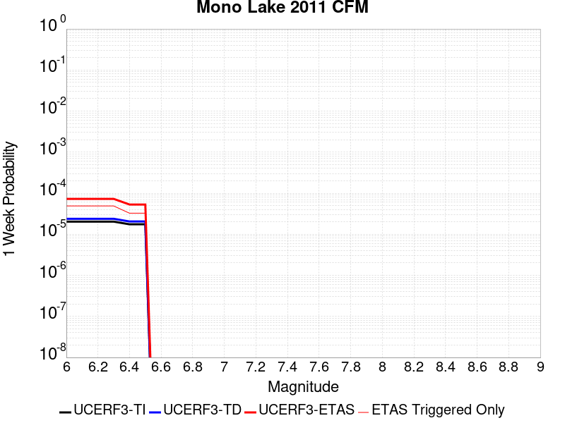 | 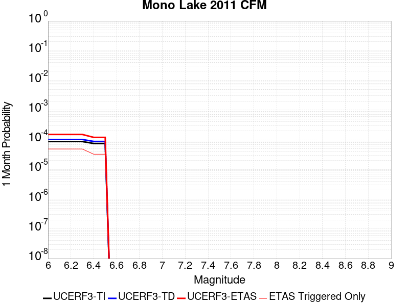 | 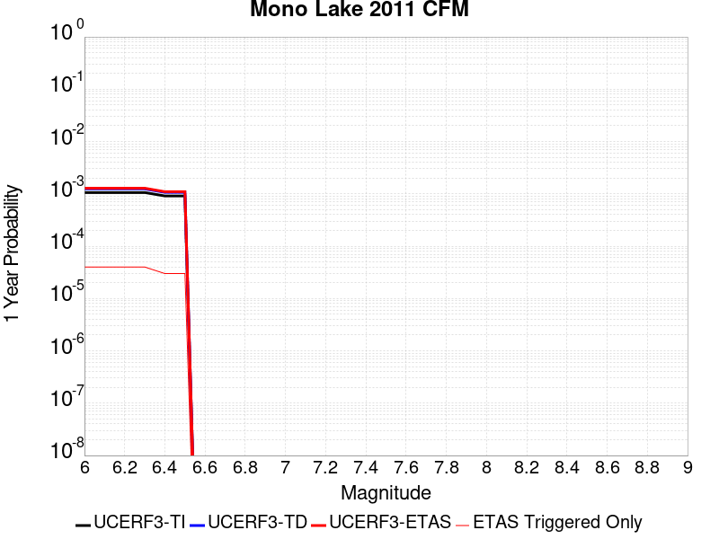 | 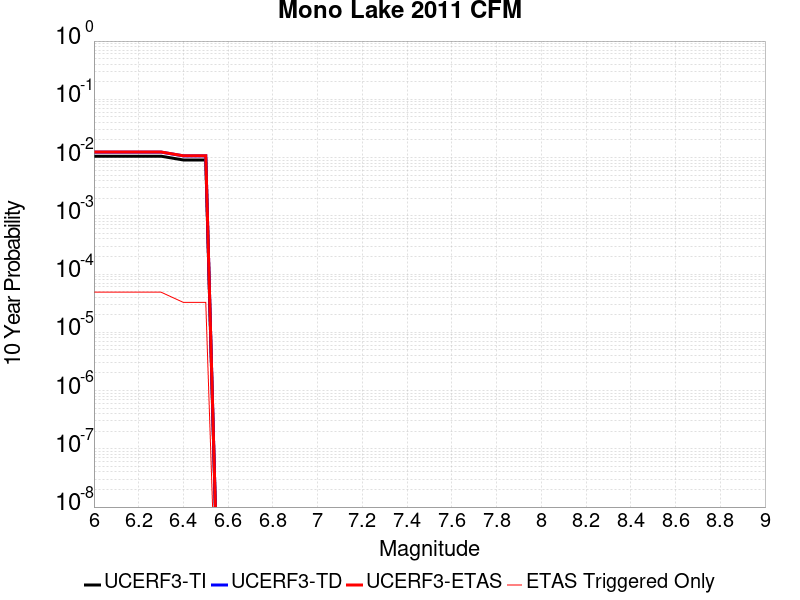 |

| Magnitude | 1 wk TI Prob | 1 wk TD Prob | 1 wk ETAS Prob | 1 wk ETAS/TD Gain | 1 wk ETAS Triggered Only | 1 mo TI Prob | 1 mo TD Prob | 1 mo ETAS Prob | 1 mo ETAS/TD Gain | 1 mo ETAS Triggered Only | 1 yr TI Prob | 1 yr TD Prob | 1 yr ETAS Prob | 1 yr ETAS/TD Gain | 1 yr ETAS Triggered Only | 10 yr TI Prob | 10 yr TD Prob | 10 yr ETAS Prob | 10 yr ETAS/TD Gain | 10 yr ETAS Triggered Only |
|-----|-----|-----|-----|-----|-----|-----|-----|-----|-----|-----|-----|-----|-----|-----|-----|-----|-----|-----|-----|-----|
| 6.0 | 2.0341662E-5 | 2.3828192E-5 | 4.880761E-5 | 2.0483139 | 2.4980016E-5 | 8.717564E-5 | 1.0211982E-4 | 1.2709729E-4 | 1.2445898 | 2.4980016E-5 | 0.0010608466 | 0.0012431308 | 0.0012680797 | 1.0200695 | 2.4980016E-5 | 0.010557966 | 0.012413842 | 0.0124385115 | 1.0019873 | 2.4980016E-5 |
| 6.1 | 2.0341662E-5 | 2.3828192E-5 | 4.880761E-5 | 2.0483139 | 2.4980016E-5 | 8.717564E-5 | 1.0211982E-4 | 1.2709729E-4 | 1.2445898 | 2.4980016E-5 | 0.0010608466 | 0.0012431308 | 0.0012680797 | 1.0200695 | 2.4980016E-5 | 0.010557966 | 0.012413842 | 0.0124385115 | 1.0019873 | 2.4980016E-5 |
| 6.2 | 2.0341662E-5 | 2.3828192E-5 | 4.880761E-5 | 2.0483139 | 2.4980016E-5 | 8.717564E-5 | 1.0211982E-4 | 1.2709729E-4 | 1.2445898 | 2.4980016E-5 | 0.0010608466 | 0.0012431308 | 0.0012680797 | 1.0200695 | 2.4980016E-5 | 0.010557966 | 0.012413842 | 0.0124385115 | 1.0019873 | 2.4980016E-5 |
| 6.3 | 2.0341662E-5 | 2.3828192E-5 | 4.880761E-5 | 2.0483139 | 2.4980016E-5 | 8.717564E-5 | 1.0211982E-4 | 1.2709729E-4 | 1.2445898 | 2.4980016E-5 | 0.0010608466 | 0.0012431308 | 0.0012680797 | 1.0200695 | 2.4980016E-5 | 0.010557966 | 0.012413842 | 0.0124385115 | 1.0019873 | 2.4980016E-5 |
| 6.4 | 1.749821E-5 | 2.049101E-5 | 2.049101E-5 | 1.0 | 0.0 | 7.499018E-5 | 8.781861E-5 | 8.781861E-5 | 1.0 | 0.0 | 9.1262296E-4 | 0.0010691914 | 0.0010691914 | 1.0 | 0.0 | 0.009088841 | 0.01069187 | 0.01069187 | 1.0 | 0.0 |
| 6.5 | 1.749821E-5 | 2.049101E-5 | 2.049101E-5 | 1.0 | 0.0 | 7.499018E-5 | 8.781861E-5 | 8.781861E-5 | 1.0 | 0.0 | 9.1262296E-4 | 0.0010691914 | 0.0010691914 | 1.0 | 0.0 | 0.009088841 | 0.01069187 | 0.01069187 | 1.0 | 0.0 |

## Hunting Creek - Berryessa 2011 CFM
*[(top)](#table-of-contents)*

| 1 Week | 1 Month | 1 Year | 10 Year |
|-----|-----|-----|-----|
| 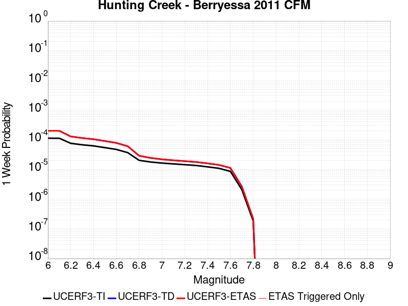 |  | 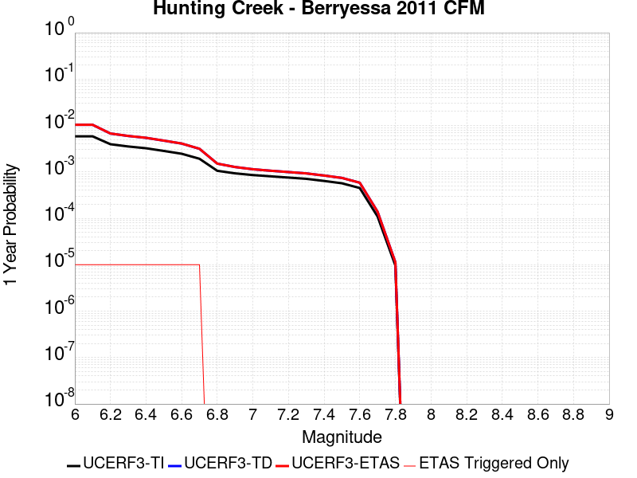 |  |

| Magnitude | 1 wk TI Prob | 1 wk TD Prob | 1 wk ETAS Prob | 1 wk ETAS/TD Gain | 1 wk ETAS Triggered Only | 1 mo TI Prob | 1 mo TD Prob | 1 mo ETAS Prob | 1 mo ETAS/TD Gain | 1 mo ETAS Triggered Only | 1 yr TI Prob | 1 yr TD Prob | 1 yr ETAS Prob | 1 yr ETAS/TD Gain | 1 yr ETAS Triggered Only | 10 yr TI Prob | 10 yr TD Prob | 10 yr ETAS Prob | 10 yr ETAS/TD Gain | 10 yr ETAS Triggered Only |
|-----|-----|-----|-----|-----|-----|-----|-----|-----|-----|-----|-----|-----|-----|-----|-----|-----|-----|-----|-----|-----|
| 6.0 | 1.1270982E-4 | 2.0028367E-4 | 2.0028367E-4 | 1.0 | 0.0 | 4.8295266E-4 | 8.579912E-4 | 8.579912E-4 | 1.0 | 0.0 | 0.0058641075 | 0.010386173 | 0.010410893 | 1.0023801 | 2.4980016E-5 | 0.057117578 | 0.09804048 | 0.09806301 | 1.0002298 | 2.4980016E-5 |
| 6.1 | 1.1239393E-4 | 1.9976508E-4 | 1.9976508E-4 | 1.0 | 0.0 | 4.8159933E-4 | 8.557703E-4 | 8.557703E-4 | 1.0 | 0.0 | 0.0058477195 | 0.010359417 | 0.010384138 | 1.0023863 | 2.4980016E-5 | 0.056962132 | 0.09779895 | 0.09782149 | 1.0002304 | 2.4980016E-5 |
| 6.2 | 7.596265E-5 | 1.2933646E-4 | 1.2933646E-4 | 1.0 | 0.0 | 3.2551357E-4 | 5.5415573E-4 | 5.5415573E-4 | 1.0 | 0.0 | 0.0039559277 | 0.0067213587 | 0.006746171 | 1.0036916 | 2.4980016E-5 | 0.038862433 | 0.06459229 | 0.06461565 | 1.0003618 | 2.4980016E-5 |
| 6.3 | 6.78794E-5 | 1.1448377E-4 | 1.1448377E-4 | 1.0 | 0.0 | 2.9087928E-4 | 4.9052597E-4 | 4.9052597E-4 | 1.0 | 0.0 | 0.003535705 | 0.005952661 | 0.0059774923 | 1.0041715 | 2.4980016E-5 | 0.034799766 | 0.057466213 | 0.057489756 | 1.0004097 | 2.4980016E-5 |
| 6.4 | 6.2165134E-5 | 1.0434825E-4 | 1.0434825E-4 | 1.0 | 0.0 | 2.6639478E-4 | 4.4711027E-4 | 4.4711027E-4 | 1.0 | 0.0 | 0.0032385332 | 0.0054274183 | 0.0054522627 | 1.0045776 | 2.4980016E-5 | 0.03191742 | 0.05255138 | 0.052575048 | 1.0004504 | 2.4980016E-5 |
| 6.5 | 5.4368087E-5 | 9.070258E-5 | 9.070258E-5 | 1.0 | 0.0 | 2.3298527E-4 | 3.886537E-4 | 3.886537E-4 | 1.0 | 0.0 | 0.0028329059 | 0.0047197016 | 0.0047445637 | 1.0052677 | 2.4980016E-5 | 0.027970633 | 0.045881182 | 0.045905016 | 1.0005195 | 2.4980016E-5 |
| 6.6 | 4.729947E-5 | 7.847101E-5 | 7.847101E-5 | 1.0 | 0.0 | 2.0269625E-4 | 3.3624718E-4 | 3.3624718E-4 | 1.0 | 0.0 | 0.002465034 | 0.004084746 | 0.004109624 | 1.0060904 | 2.4980016E-5 | 0.02437869 | 0.03985269 | 0.039876673 | 1.0006019 | 2.4980016E-5 |
| 6.7 | 3.6875328E-5 | 6.0443555E-5 | 6.0443555E-5 | 1.0 | 0.0 | 1.5802756E-4 | 2.5900968E-4 | 2.5900968E-4 | 1.0 | 0.0 | 0.0019222875 | 0.0031482724 | 0.0031731739 | 1.0079095 | 2.4980016E-5 | 0.019057442 | 0.03089371 | 0.030917918 | 1.0007836 | 2.4980016E-5 |
| 6.8 | 2.0292036E-5 | 2.8976721E-5 | 2.8976721E-5 | 1.0 | 0.0 | 8.6962966E-5 | 1.2417998E-4 | 1.2417998E-4 | 1.0 | 0.0 | 0.0010582599 | 0.0015108302 | 0.0015108302 | 1.0 | 0.0 | 0.010532344 | 0.0149790775 | 0.0149790775 | 1.0 | 0.0 |
| 6.9 | 1.7871042E-5 | 2.4472653E-5 | 2.4472653E-5 | 1.0 | 0.0 | 7.658793E-5 | 1.04878585E-4 | 1.04878585E-4 | 1.0 | 0.0 | 9.320591E-4 | 0.0012761486 | 0.0012761486 | 1.0 | 0.0 | 0.009281595 | 0.012680395 | 0.012680395 | 1.0 | 0.0 |
| 7.0 | 1.6415532E-5 | 2.1906566E-5 | 2.1906566E-5 | 1.0 | 0.0 | 7.035038E-5 | 9.388191E-5 | 9.388191E-5 | 1.0 | 0.0 | 8.561793E-4 | 0.0011424144 | 0.0011424144 | 1.0 | 0.0 | 0.008528882 | 0.011365017 | 0.011365017 | 1.0 | 0.0 |
| 7.1 | 1.5409885E-5 | 2.0346588E-5 | 2.0346588E-5 | 1.0 | 0.0 | 6.6040695E-5 | 8.719676E-5 | 8.719676E-5 | 1.0 | 0.0 | 8.0374884E-4 | 0.0010611062 | 0.0010611062 | 1.0 | 0.0 | 0.00800848 | 0.010560924 | 0.010560924 | 1.0 | 0.0 |
| 7.2 | 1.4497423E-5 | 1.905519E-5 | 1.905519E-5 | 1.0 | 0.0 | 6.213033E-5 | 8.166256E-5 | 8.166256E-5 | 1.0 | 0.0 | 7.5617427E-4 | 9.937913E-4 | 9.937913E-4 | 1.0 | 0.0 | 0.0075360634 | 0.00989425 | 0.00989425 | 1.0 | 0.0 |
| 7.3 | 1.3615175E-5 | 1.7826347E-5 | 1.7826347E-5 | 1.0 | 0.0 | 5.8349444E-5 | 7.6396405E-5 | 7.6396405E-5 | 1.0 | 0.0 | 7.101729E-4 | 9.297323E-4 | 9.297323E-4 | 1.0 | 0.0 | 0.0070790765 | 0.009259124 | 0.009259124 | 1.0 | 0.0 |
| 7.4 | 1.2252825E-5 | 1.6026455E-5 | 1.6026455E-5 | 1.0 | 0.0 | 5.251105E-5 | 6.868302E-5 | 6.868302E-5 | 1.0 | 0.0 | 6.391345E-4 | 8.3589775E-4 | 8.3589775E-4 | 1.0 | 0.0 | 0.0063729943 | 0.008328172 | 0.008328172 | 1.0 | 0.0 |
| 7.5 | 1.0913301E-5 | 1.4241286E-5 | 1.4241286E-5 | 1.0 | 0.0 | 4.6770452E-5 | 6.103267E-5 | 6.103267E-5 | 1.0 | 0.0 | 5.6928146E-4 | 7.428222E-4 | 7.428222E-4 | 1.0 | 0.0 | 0.0056782532 | 0.0074039865 | 0.0074039865 | 1.0 | 0.0 |
| 7.6 | 8.623192E-6 | 1.12347825E-5 | 1.12347825E-5 | 1.0 | 0.0 | 3.6956015E-5 | 4.8148195E-5 | 4.8148195E-5 | 1.0 | 0.0 | 4.4984656E-4 | 5.8604917E-4 | 5.8604917E-4 | 1.0 | 0.0 | 0.00448937 | 0.005845504 | 0.005845504 | 1.0 | 0.0 |
| 7.7 | 2.0993634E-6 | 2.66264E-6 | 2.66264E-6 | 1.0 | 0.0 | 8.997241E-6 | 1.1411265E-5 | 1.1411265E-5 | 1.0 | 0.0 | 1.09535904E-4 | 1.3892337E-4 | 1.3892337E-4 | 1.0 | 0.0 | 0.0010948193 | 0.0013883994 | 0.0013883994 | 1.0 | 0.0 |
| 7.8 | 1.8428308E-7 | 2.1674624E-7 | 2.1674624E-7 | 1.0 | 0.0 | 7.897844E-7 | 9.289122E-7 | 9.289122E-7 | 1.0 | 0.0 | 9.615583E-6 | 1.130945E-5 | 1.130945E-5 | 1.0 | 0.0 | 9.615166E-5 | 1.1308173E-4 | 1.1308173E-4 | 1.0 | 0.0 |

## San Pedro Basin
*[(top)](#table-of-contents)*

| 1 Week | 1 Month | 1 Year | 10 Year |
|-----|-----|-----|-----|
| 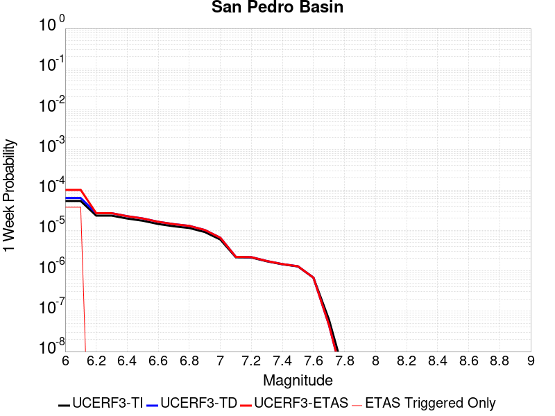 | 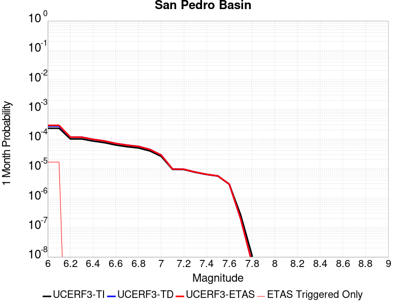 |  | 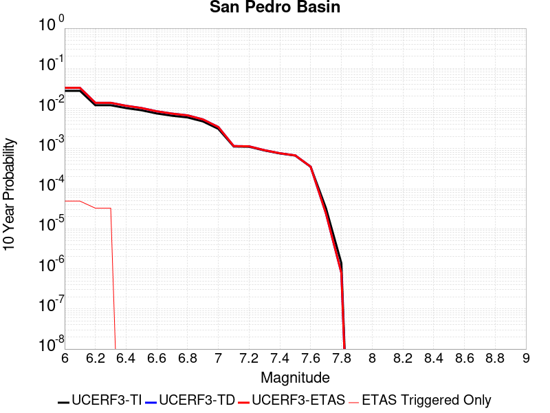 |

| Magnitude | 1 wk TI Prob | 1 wk TD Prob | 1 wk ETAS Prob | 1 wk ETAS/TD Gain | 1 wk ETAS Triggered Only | 1 mo TI Prob | 1 mo TD Prob | 1 mo ETAS Prob | 1 mo ETAS/TD Gain | 1 mo ETAS Triggered Only | 1 yr TI Prob | 1 yr TD Prob | 1 yr ETAS Prob | 1 yr ETAS/TD Gain | 1 yr ETAS Triggered Only | 10 yr TI Prob | 10 yr TD Prob | 10 yr ETAS Prob | 10 yr ETAS/TD Gain | 10 yr ETAS Triggered Only |
|-----|-----|-----|-----|-----|-----|-----|-----|-----|-----|-----|-----|-----|-----|-----|-----|-----|-----|-----|-----|-----|
| 6.0 | 5.3449043E-5 | 6.337018E-5 | 8.8348614E-5 | 1.394167 | 2.4980016E-5 | 2.2904722E-4 | 2.7156167E-4 | 2.965349E-4 | 1.0919615 | 2.4980016E-5 | 0.0027850836 | 0.0033018515 | 0.003326749 | 1.0075405 | 2.4980016E-5 | 0.027504366 | 0.03258948 | 0.032613646 | 1.0007415 | 2.4980016E-5 |
| 6.1 | 5.3449043E-5 | 6.337018E-5 | 8.8348614E-5 | 1.394167 | 2.4980016E-5 | 2.2904722E-4 | 2.7156167E-4 | 2.965349E-4 | 1.0919615 | 2.4980016E-5 | 0.0027850836 | 0.0033018515 | 0.003326749 | 1.0075405 | 2.4980016E-5 | 0.027504366 | 0.03258948 | 0.032613646 | 1.0007415 | 2.4980016E-5 |
| 6.2 | 2.3189454E-5 | 2.6642829E-5 | 2.6642829E-5 | 1.0 | 0.0 | 9.9379584E-5 | 1.1417881E-4 | 1.1417881E-4 | 1.0 | 0.0 | 0.0012092749 | 0.0013892875 | 0.0013892875 | 1.0 | 0.0 | 0.012027155 | 0.01381089 | 0.01381089 | 1.0 | 0.0 |
| 6.3 | 2.3189454E-5 | 2.6642829E-5 | 2.6642829E-5 | 1.0 | 0.0 | 9.9379584E-5 | 1.1417881E-4 | 1.1417881E-4 | 1.0 | 0.0 | 0.0012092749 | 0.0013892875 | 0.0013892875 | 1.0 | 0.0 | 0.012027155 | 0.01381089 | 0.01381089 | 1.0 | 0.0 |
| 6.4 | 1.966056E-5 | 2.246342E-5 | 2.246342E-5 | 1.0 | 0.0 | 8.425682E-5 | 9.626848E-5 | 9.626848E-5 | 1.0 | 0.0 | 0.001025344 | 0.0011714787 | 0.0011714787 | 1.0 | 0.0 | 0.010206259 | 0.011657119 | 0.011657119 | 1.0 | 0.0 |
| 6.5 | 1.7342953E-5 | 1.9745152E-5 | 1.9745152E-5 | 1.0 | 0.0 | 7.4324824E-5 | 8.461954E-5 | 8.461954E-5 | 1.0 | 0.0 | 9.04529E-4 | 0.0010297929 | 0.0010297929 | 1.0 | 0.0 | 0.009008561 | 0.010253932 | 0.010253932 | 1.0 | 0.0 |
| 6.6 | 1.439804E-5 | 1.6322716E-5 | 1.6322716E-5 | 1.0 | 0.0 | 6.170443E-5 | 6.99528E-5 | 6.99528E-5 | 1.0 | 0.0 | 7.509924E-4 | 8.513747E-4 | 8.513747E-4 | 1.0 | 0.0 | 0.0074845953 | 0.008484333 | 0.008484333 | 1.0 | 0.0 |
| 6.7 | 1.2634884E-5 | 1.4285298E-5 | 1.4285298E-5 | 1.0 | 0.0 | 5.414838E-5 | 6.122144E-5 | 6.122144E-5 | 1.0 | 0.0 | 6.590571E-4 | 7.451466E-4 | 7.451466E-4 | 1.0 | 0.0 | 0.006571059 | 0.007429502 | 0.007429502 | 1.0 | 0.0 |
| 6.8 | 1.146091E-5 | 1.2933193E-5 | 1.2933193E-5 | 1.0 | 0.0 | 4.911726E-5 | 5.542696E-5 | 5.542696E-5 | 1.0 | 0.0 | 5.9783855E-4 | 6.74644E-4 | 6.74644E-4 | 1.0 | 0.0 | 0.0059623276 | 0.0067288997 | 0.0067288997 | 1.0 | 0.0 |
| 6.9 | 9.109035E-6 | 1.0235013E-5 | 1.0235013E-5 | 1.0 | 0.0 | 3.9038136E-5 | 4.386376E-5 | 4.386376E-5 | 1.0 | 0.0 | 4.7518566E-4 | 5.339384E-4 | 5.339384E-4 | 1.0 | 0.0 | 0.0047417083 | 0.0053293095 | 0.0053293095 | 1.0 | 0.0 |
| 7.0 | 5.9351028E-6 | 6.583965E-6 | 6.583965E-6 | 1.0 | 0.0 | 2.5435906E-5 | 2.821682E-5 | 2.821682E-5 | 1.0 | 0.0 | 3.0963816E-4 | 3.4350925E-4 | 3.4350925E-4 | 1.0 | 0.0 | 0.0030920706 | 0.0034320997 | 0.0034320997 | 1.0 | 0.0 |
| 7.1 | 2.1557585E-6 | 2.2096492E-6 | 2.2096492E-6 | 1.0 | 0.0 | 9.238933E-6 | 9.469892E-6 | 9.469892E-6 | 1.0 | 0.0 | 1.1247819E-4 | 1.15289986E-4 | 1.15289986E-4 | 1.0 | 0.0 | 0.0011242128 | 0.0011523172 | 0.0011523172 | 1.0 | 0.0 |
| 7.2 | 2.1251979E-6 | 2.1779954E-6 | 2.1779954E-6 | 1.0 | 0.0 | 9.107958E-6 | 9.334234E-6 | 9.334234E-6 | 1.0 | 0.0 | 1.1088375E-4 | 1.13638525E-4 | 1.13638525E-4 | 1.0 | 0.0 | 0.0011082845 | 0.0011358195 | 0.0011358195 | 1.0 | 0.0 |
| 7.3 | 1.7145798E-6 | 1.7442885E-6 | 1.7442885E-6 | 1.0 | 0.0 | 7.3481783E-6 | 7.475501E-6 | 7.475501E-6 | 1.0 | 0.0 | 8.94604E-5 | 9.1010515E-5 | 9.1010515E-5 | 1.0 | 0.0 | 8.9424395E-4 | 9.0974156E-4 | 9.0974156E-4 | 1.0 | 0.0 |
| 7.4 | 1.4467993E-6 | 1.4641878E-6 | 1.4641878E-6 | 1.0 | 0.0 | 6.200554E-6 | 6.275076E-6 | 6.275076E-6 | 1.0 | 0.0 | 7.548913E-5 | 7.639644E-5 | 7.639644E-5 | 1.0 | 0.0 | 7.546349E-4 | 7.6370913E-4 | 7.6370913E-4 | 1.0 | 0.0 |
| 7.5 | 1.2803735E-6 | 1.2931506E-6 | 1.2931506E-6 | 1.0 | 0.0 | 5.487303E-6 | 5.5420624E-6 | 5.5420624E-6 | 1.0 | 0.0 | 6.680587E-5 | 6.747259E-5 | 6.747259E-5 | 1.0 | 0.0 | 6.678579E-4 | 6.745281E-4 | 6.745281E-4 | 1.0 | 0.0 |
| 7.6 | 6.755009E-7 | 6.76947E-7 | 6.76947E-7 | 1.0 | 0.0 | 2.8950008E-6 | 2.9011985E-6 | 2.9011985E-6 | 1.0 | 0.0 | 3.5246063E-5 | 3.532158E-5 | 3.532158E-5 | 1.0 | 0.0 | 3.5240475E-4 | 3.5316538E-4 | 3.5316538E-4 | 1.0 | 0.0 |
| 7.7 | 6.211885E-8 | 4.5699714E-8 | 4.5699714E-8 | 1.0 | 0.0 | 2.6622362E-7 | 1.9585592E-7 | 1.9585592E-7 | 1.0 | 0.0 | 3.2412677E-6 | 2.3845432E-6 | 2.3845432E-6 | 1.0 | 0.0 | 3.2412205E-5 | 2.3845198E-5 | 2.3845198E-5 | 1.0 | 0.0 |
| 7.8 | 2.6580573E-9 | 1.5138054E-9 | 1.5138054E-9 | 1.0 | 0.0 | 1.1391674E-8 | 6.4877375E-9 | 6.4877375E-9 | 1.0 | 0.0 | 1.3869362E-7 | 7.89882E-8 | 7.89882E-8 | 1.0 | 0.0 | 1.3869354E-6 | 7.89882E-7 | 7.89882E-7 | 1.0 | 0.0 |

## Earthquake Valley (So Extension)
*[(top)](#table-of-contents)*

| 1 Week | 1 Month | 1 Year | 10 Year |
|-----|-----|-----|-----|
| 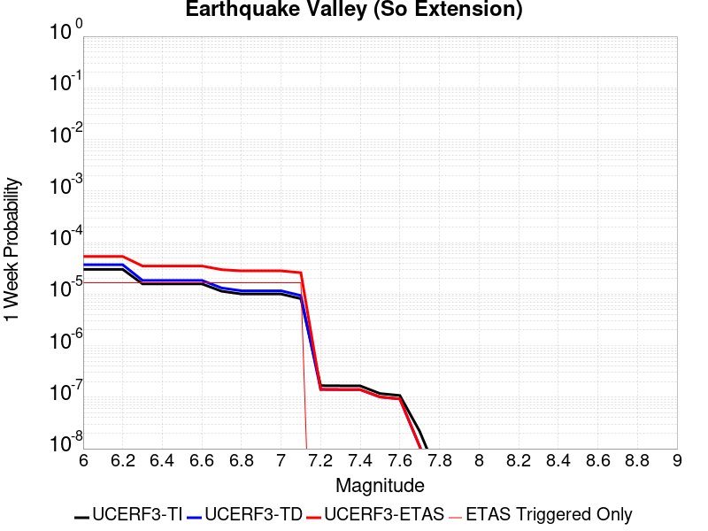 | 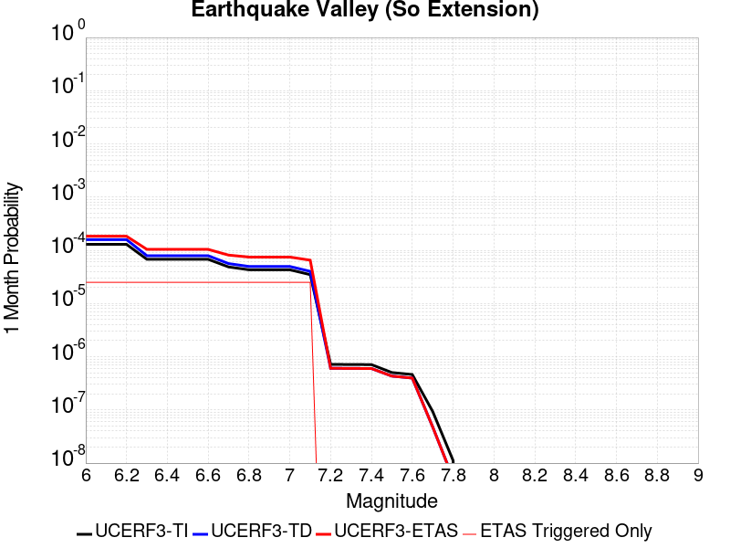 | 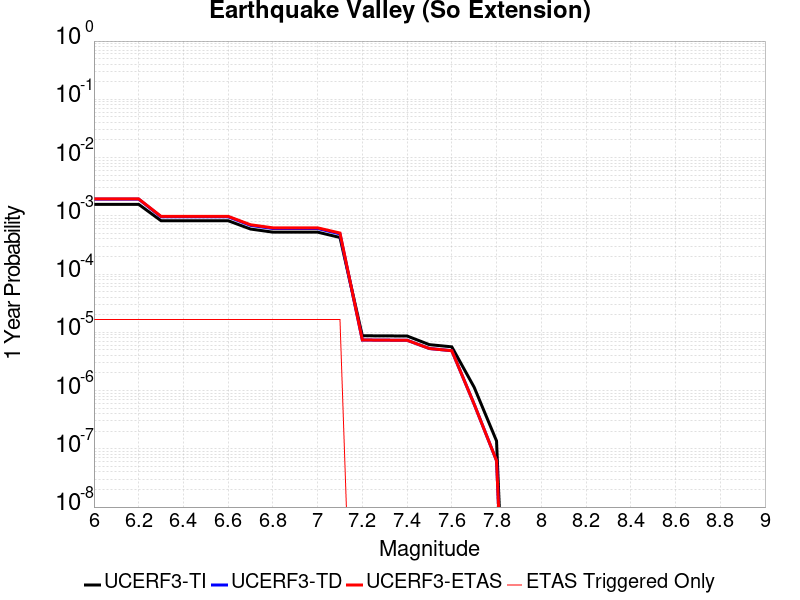 | 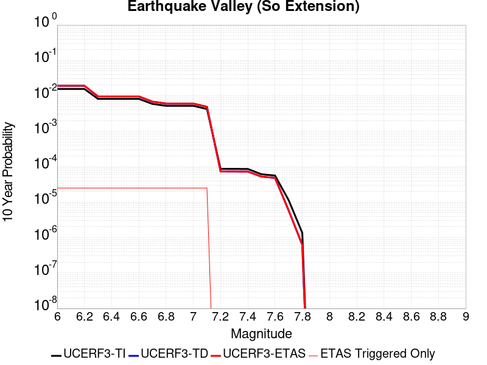 |

| Magnitude | 1 wk TI Prob | 1 wk TD Prob | 1 wk ETAS Prob | 1 wk ETAS/TD Gain | 1 wk ETAS Triggered Only | 1 mo TI Prob | 1 mo TD Prob | 1 mo ETAS Prob | 1 mo ETAS/TD Gain | 1 mo ETAS Triggered Only | 1 yr TI Prob | 1 yr TD Prob | 1 yr ETAS Prob | 1 yr ETAS/TD Gain | 1 yr ETAS Triggered Only | 10 yr TI Prob | 10 yr TD Prob | 10 yr ETAS Prob | 10 yr ETAS/TD Gain | 10 yr ETAS Triggered Only |
|-----|-----|-----|-----|-----|-----|-----|-----|-----|-----|-----|-----|-----|-----|-----|-----|-----|-----|-----|-----|-----|
| 6.0 | 3.0194888E-5 | 3.707208E-5 | 6.205117E-5 | 1.6737978 | 2.4980016E-5 | 1.2940024E-4 | 1.5887374E-4 | 1.8384978E-4 | 1.1572069 | 2.4980016E-5 | 0.0015743093 | 0.0019330877 | 0.0019580196 | 1.0128974 | 2.4980016E-5 | 0.01563203 | 0.0192131 | 0.019237602 | 1.0012752 | 2.4980016E-5 |
| 6.1 | 3.0194888E-5 | 3.707208E-5 | 6.205117E-5 | 1.6737978 | 2.4980016E-5 | 1.2940024E-4 | 1.5887374E-4 | 1.8384978E-4 | 1.1572069 | 2.4980016E-5 | 0.0015743093 | 0.0019330877 | 0.0019580196 | 1.0128974 | 2.4980016E-5 | 0.01563203 | 0.0192131 | 0.019237602 | 1.0012752 | 2.4980016E-5 |
| 6.2 | 3.0194888E-5 | 3.707208E-5 | 6.205117E-5 | 1.6737978 | 2.4980016E-5 | 1.2940024E-4 | 1.5887374E-4 | 1.8384978E-4 | 1.1572069 | 2.4980016E-5 | 0.0015743093 | 0.0019330877 | 0.0019580196 | 1.0128974 | 2.4980016E-5 | 0.01563203 | 0.0192131 | 0.019237602 | 1.0012752 | 2.4980016E-5 |
| 6.3 | 1.5795305E-5 | 1.8446612E-5 | 4.3426167E-5 | 2.354154 | 2.4980016E-5 | 6.769241E-5 | 7.905514E-5 | 1.04033184E-4 | 1.3159572 | 2.4980016E-5 | 8.238434E-4 | 9.621823E-4 | 9.871382E-4 | 1.0259368 | 2.4980016E-5 | 0.008207959 | 0.0095910635 | 0.009615804 | 1.0025796 | 2.4980016E-5 |
| 6.4 | 1.5795305E-5 | 1.8446612E-5 | 4.3426167E-5 | 2.354154 | 2.4980016E-5 | 6.769241E-5 | 7.905514E-5 | 1.04033184E-4 | 1.3159572 | 2.4980016E-5 | 8.238434E-4 | 9.621823E-4 | 9.871382E-4 | 1.0259368 | 2.4980016E-5 | 0.008207959 | 0.0095910635 | 0.009615804 | 1.0025796 | 2.4980016E-5 |
| 6.5 | 1.5795305E-5 | 1.8446612E-5 | 4.3426167E-5 | 2.354154 | 2.4980016E-5 | 6.769241E-5 | 7.905514E-5 | 1.04033184E-4 | 1.3159572 | 2.4980016E-5 | 8.238434E-4 | 9.621823E-4 | 9.871382E-4 | 1.0259368 | 2.4980016E-5 | 0.008207959 | 0.0095910635 | 0.009615804 | 1.0025796 | 2.4980016E-5 |
| 6.6 | 1.5795305E-5 | 1.8446612E-5 | 4.3426167E-5 | 2.354154 | 2.4980016E-5 | 6.769241E-5 | 7.905514E-5 | 1.04033184E-4 | 1.3159572 | 2.4980016E-5 | 8.238434E-4 | 9.621823E-4 | 9.871382E-4 | 1.0259368 | 2.4980016E-5 | 0.008207959 | 0.0095910635 | 0.009615804 | 1.0025796 | 2.4980016E-5 |
| 6.7 | 1.1363076E-5 | 1.3138288E-5 | 3.8117974E-5 | 2.9012895 | 2.4980016E-5 | 4.8697988E-5 | 5.6306162E-5 | 8.128477E-5 | 1.4436213 | 2.4980016E-5 | 5.927367E-4 | 6.8538805E-4 | 7.103509E-4 | 1.0364215 | 2.4980016E-5 | 0.0059115817 | 0.006840215 | 0.006865024 | 1.003627 | 2.4980016E-5 |
| 6.8 | 1.0049611E-5 | 1.1594328E-5 | 3.6574053E-5 | 3.1544783 | 2.4980016E-5 | 4.306905E-5 | 4.968944E-5 | 7.466821E-5 | 1.5026978 | 2.4980016E-5 | 5.242395E-4 | 6.0487416E-4 | 6.298391E-4 | 1.0412729 | 2.4980016E-5 | 0.0052300454 | 0.0060394546 | 0.006064284 | 1.0041112 | 2.4980016E-5 |
| 6.9 | 1.0049611E-5 | 1.1594328E-5 | 3.6574053E-5 | 3.1544783 | 2.4980016E-5 | 4.306905E-5 | 4.968944E-5 | 7.466821E-5 | 1.5026978 | 2.4980016E-5 | 5.242395E-4 | 6.0487416E-4 | 6.298391E-4 | 1.0412729 | 2.4980016E-5 | 0.0052300454 | 0.0060394546 | 0.006064284 | 1.0041112 | 2.4980016E-5 |
| 7.0 | 1.0049611E-5 | 1.1594328E-5 | 3.6574053E-5 | 3.1544783 | 2.4980016E-5 | 4.306905E-5 | 4.968944E-5 | 7.466821E-5 | 1.5026978 | 2.4980016E-5 | 5.242395E-4 | 6.0487416E-4 | 6.298391E-4 | 1.0412729 | 2.4980016E-5 | 0.0052300454 | 0.0060394546 | 0.006064284 | 1.0041112 | 2.4980016E-5 |
| 7.1 | 8.140254E-6 | 9.3834515E-6 | 3.4363235E-5 | 3.6621103 | 2.4980016E-5 | 3.4886336E-5 | 4.021455E-5 | 6.519356E-5 | 1.6211436 | 2.4980016E-5 | 4.2465836E-4 | 4.895692E-4 | 5.14537E-4 | 1.0509995 | 2.4980016E-5 | 0.0042384774 | 0.004891483 | 0.004916341 | 1.0050819 | 2.4980016E-5 |
| 7.2 | 1.673835E-7 | 1.4153493E-7 | 1.4153493E-7 | 1.0 | 0.0 | 7.173577E-7 | 6.065781E-7 | 6.065781E-7 | 1.0 | 0.0 | 8.733795E-6 | 7.3850674E-6 | 7.3850674E-6 | 1.0 | 0.0 | 8.733451E-5 | 7.3848576E-5 | 7.3848576E-5 | 1.0 | 0.0 |
| 7.3 | 1.6632116E-7 | 1.4051723E-7 | 1.4051723E-7 | 1.0 | 0.0 | 7.1280476E-7 | 6.022166E-7 | 6.022166E-7 | 1.0 | 0.0 | 8.678364E-6 | 7.331966E-6 | 7.331966E-6 | 1.0 | 0.0 | 8.6780245E-5 | 7.33176E-5 | 7.33176E-5 | 1.0 | 0.0 |
| 7.4 | 1.6569169E-7 | 1.3996352E-7 | 1.3996352E-7 | 1.0 | 0.0 | 7.1010703E-7 | 5.9984353E-7 | 5.9984353E-7 | 1.0 | 0.0 | 8.645519E-6 | 7.303074E-6 | 7.303074E-6 | 1.0 | 0.0 | 8.645182E-5 | 7.30287E-5 | 7.30287E-5 | 1.0 | 0.0 |
| 7.5 | 1.1764555E-7 | 1.0095245E-7 | 1.0095245E-7 | 1.0 | 0.0 | 5.041951E-7 | 4.3265328E-7 | 4.3265328E-7 | 1.0 | 0.0 | 6.138558E-6 | 5.267543E-6 | 5.267543E-6 | 1.0 | 0.0 | 6.1383886E-5 | 5.2674397E-5 | 5.2674397E-5 | 1.0 | 0.0 |
| 7.6 | 1.07927605E-7 | 9.2600665E-8 | 9.2600665E-8 | 1.0 | 0.0 | 4.6254678E-7 | 3.9685995E-7 | 3.9685995E-7 | 1.0 | 0.0 | 5.6314925E-6 | 4.8317615E-6 | 4.8317615E-6 | 1.0 | 0.0 | 5.63135E-5 | 4.831677E-5 | 4.831677E-5 | 1.0 | 0.0 |
| 7.7 | 2.1826905E-8 | 1.1179958E-8 | 1.1179958E-8 | 1.0 | 0.0 | 9.3543875E-8 | 4.791411E-8 | 4.791411E-8 | 1.0 | 0.0 | 1.1388961E-6 | 5.8335416E-7 | 5.8335416E-7 | 1.0 | 0.0 | 1.1388902E-5 | 5.8335318E-6 | 5.8335318E-6 | 1.0 | 0.0 |
| 7.8 | 2.6169649E-9 | 1.1968753E-9 | 1.1968753E-9 | 1.0 | 0.0 | 1.1215564E-8 | 5.1294657E-9 | 5.1294657E-9 | 1.0 | 0.0 | 1.3654947E-7 | 6.245124E-8 | 6.245124E-8 | 1.0 | 0.0 | 1.365494E-6 | 6.2451244E-7 | 6.2451244E-7 | 1.0 | 0.0 |

## Likely 2011 CFM
*[(top)](#table-of-contents)*

| 1 Week | 1 Month | 1 Year | 10 Year |
|-----|-----|-----|-----|
| 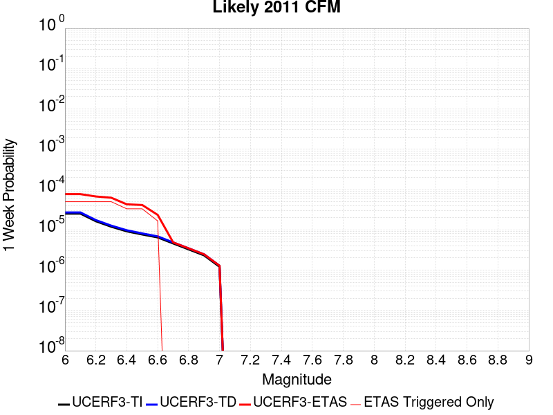 | 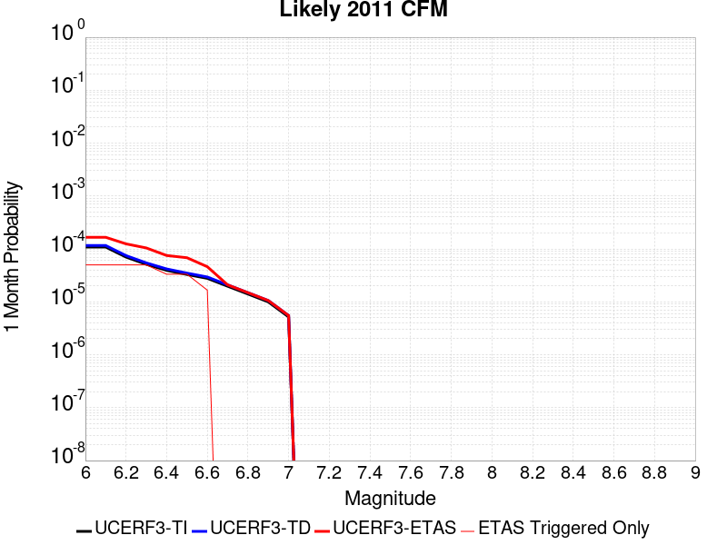 | 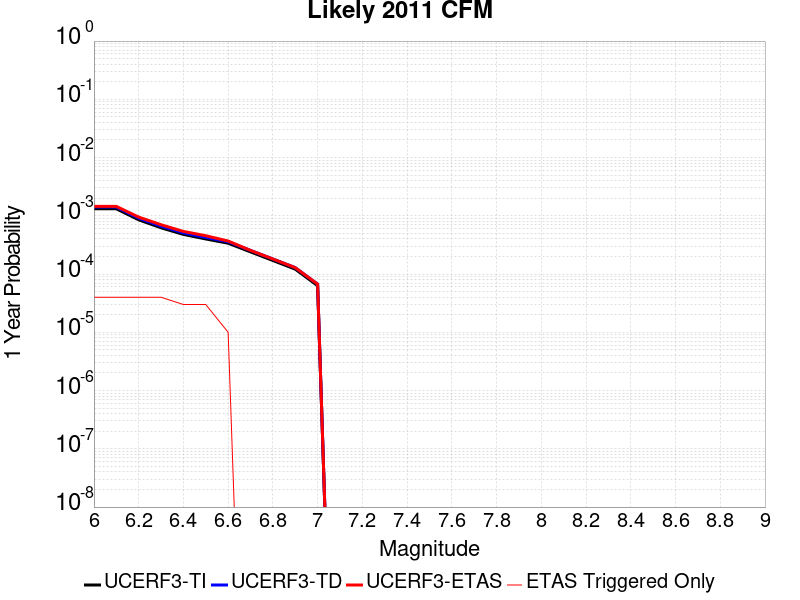 | 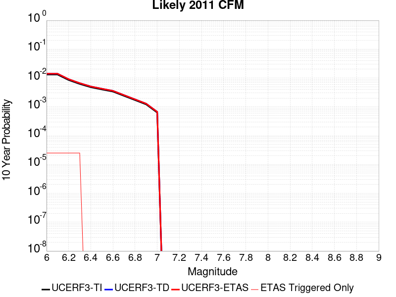 |

| Magnitude | 1 wk TI Prob | 1 wk TD Prob | 1 wk ETAS Prob | 1 wk ETAS/TD Gain | 1 wk ETAS Triggered Only | 1 mo TI Prob | 1 mo TD Prob | 1 mo ETAS Prob | 1 mo ETAS/TD Gain | 1 mo ETAS Triggered Only | 1 yr TI Prob | 1 yr TD Prob | 1 yr ETAS Prob | 1 yr ETAS/TD Gain | 1 yr ETAS Triggered Only | 10 yr TI Prob | 10 yr TD Prob | 10 yr ETAS Prob | 10 yr ETAS/TD Gain | 10 yr ETAS Triggered Only |
|-----|-----|-----|-----|-----|-----|-----|-----|-----|-----|-----|-----|-----|-----|-----|-----|-----|-----|-----|-----|-----|
| 6.0 | 2.5315949E-5 | 2.7104748E-5 | 5.2084088E-5 | 1.9215853 | 2.4980016E-5 | 1.0849241E-4 | 1.16158284E-4 | 1.411354E-4 | 1.2150265 | 2.4980016E-5 | 0.0013200947 | 0.0014133542 | 0.001438299 | 1.0176493 | 2.4980016E-5 | 0.013122803 | 0.01404831 | 0.01407294 | 1.0017532 | 2.4980016E-5 |
| 6.1 | 2.5315949E-5 | 2.7104748E-5 | 5.2084088E-5 | 1.9215853 | 2.4980016E-5 | 1.0849241E-4 | 1.16158284E-4 | 1.411354E-4 | 1.2150265 | 2.4980016E-5 | 0.0013200947 | 0.0014133542 | 0.001438299 | 1.0176493 | 2.4980016E-5 | 0.013122803 | 0.01404831 | 0.01407294 | 1.0017532 | 2.4980016E-5 |
| 6.2 | 1.6375941E-5 | 1.7465842E-5 | 4.2445423E-5 | 2.430196 | 2.4980016E-5 | 7.0180715E-5 | 7.485153E-5 | 9.9829675E-5 | 1.3337026 | 2.4980016E-5 | 8.5411523E-4 | 9.109487E-4 | 9.359059E-4 | 1.027397 | 2.4980016E-5 | 0.008508399 | 0.009073433 | 0.009098186 | 1.0027281 | 2.4980016E-5 |
| 6.3 | 1.1945543E-5 | 1.2712587E-5 | 3.7692284E-5 | 2.964958 | 2.4980016E-5 | 5.119418E-5 | 5.4481407E-5 | 7.9460064E-5 | 1.4584804 | 2.4980016E-5 | 6.2311086E-4 | 6.631146E-4 | 6.8807806E-4 | 1.0376458 | 2.4980016E-5 | 0.0062136655 | 0.0066119144 | 0.0066367295 | 1.0037531 | 2.4980016E-5 |
| 6.4 | 9.192729E-6 | 9.768488E-6 | 9.768488E-6 | 1.0 | 0.0 | 3.939681E-5 | 4.1864292E-5 | 4.1864292E-5 | 1.0 | 0.0 | 4.7955062E-4 | 5.0958124E-4 | 5.0958124E-4 | 1.0 | 0.0 | 0.004785171 | 0.0050844094 | 0.0050844094 | 1.0 | 0.0 |
| 6.5 | 7.67906E-6 | 8.152622E-6 | 8.152622E-6 | 1.0 | 0.0 | 3.2909844E-5 | 3.4939352E-5 | 3.4939352E-5 | 1.0 | 0.0 | 4.006037E-4 | 4.2530545E-4 | 4.2530545E-4 | 1.0 | 0.0 | 0.0039988225 | 0.004245108 | 0.004245108 | 1.0 | 0.0 |
| 6.6 | 6.4884057E-6 | 6.8847507E-6 | 6.8847507E-6 | 1.0 | 0.0 | 2.7807157E-5 | 2.9505749E-5 | 2.9505749E-5 | 1.0 | 0.0 | 3.3849955E-4 | 3.591747E-4 | 3.591747E-4 | 1.0 | 0.0 | 0.003379844 | 0.0035860867 | 0.0035860867 | 1.0 | 0.0 |
| 6.7 | 4.6060636E-6 | 4.884041E-6 | 4.884041E-6 | 1.0 | 0.0 | 1.9740122E-5 | 2.0931442E-5 | 2.0931442E-5 | 1.0 | 0.0 | 2.403095E-4 | 2.5481134E-4 | 2.5481134E-4 | 1.0 | 0.0 | 0.002400498 | 0.0025452746 | 0.0025452746 | 1.0 | 0.0 |
| 6.8 | 3.2795615E-6 | 3.4773732E-6 | 3.4773732E-6 | 1.0 | 0.0 | 1.4055187E-5 | 1.4902946E-5 | 1.4902946E-5 | 1.0 | 0.0 | 1.7110848E-4 | 1.8142881E-4 | 1.8142881E-4 | 1.0 | 0.0 | 0.0017097679 | 0.0018128622 | 0.0018128622 | 1.0 | 0.0 |
| 6.9 | 2.3289967E-6 | 2.4705569E-6 | 2.4705569E-6 | 1.0 | 0.0 | 9.981376E-6 | 1.058806E-5 | 1.058806E-5 | 1.0 | 0.0 | 1.2151648E-4 | 1.2890245E-4 | 1.2890245E-4 | 1.0 | 0.0 | 0.0012145005 | 0.0012883197 | 0.0012883197 | 1.0 | 0.0 |
| 7.0 | 1.211292E-6 | 1.2863958E-6 | 1.2863958E-6 | 1.0 | 0.0 | 5.1912407E-6 | 5.5131145E-6 | 5.5131145E-6 | 1.0 | 0.0 | 6.320152E-5 | 6.712041E-5 | 6.712041E-5 | 1.0 | 0.0 | 6.3183554E-4 | 6.710312E-4 | 6.710312E-4 | 1.0 | 0.0 |

## Raymond
*[(top)](#table-of-contents)*

| 1 Week | 1 Month | 1 Year | 10 Year |
|-----|-----|-----|-----|
| 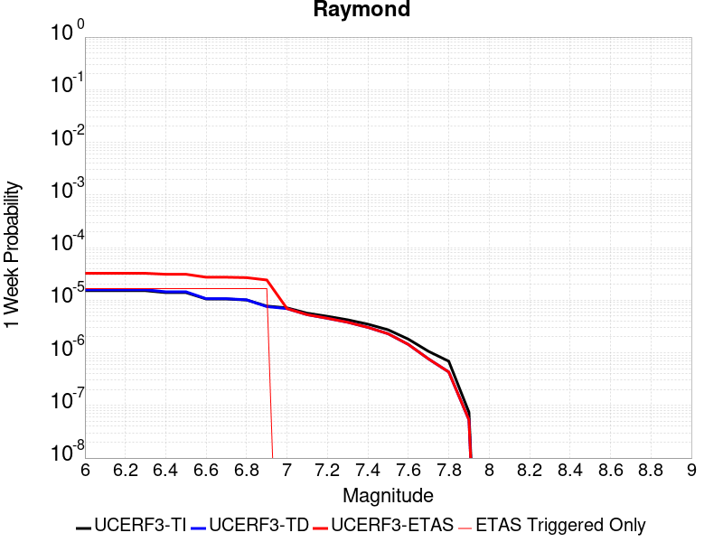 | 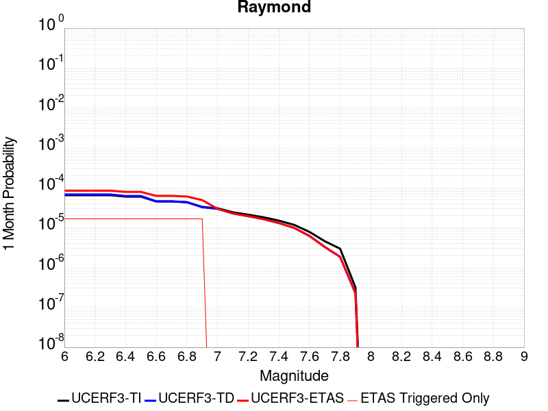 | 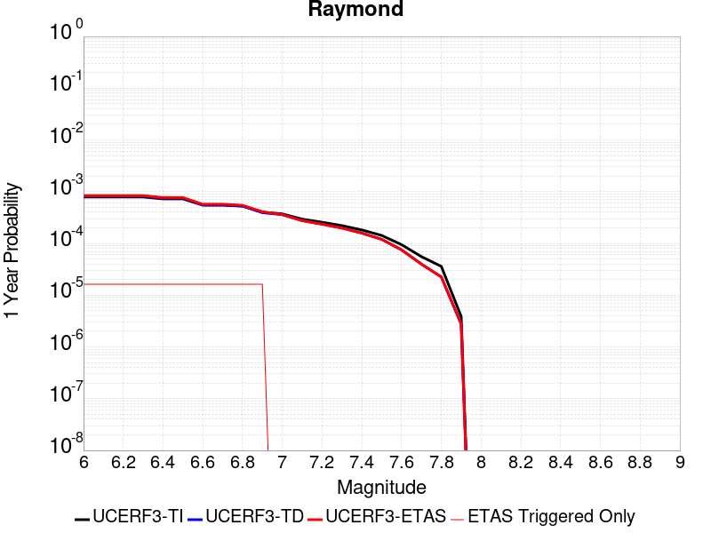 | 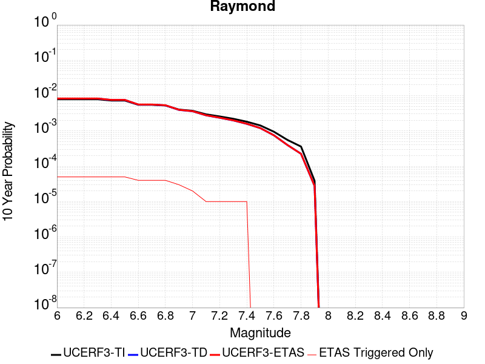 |

| Magnitude | 1 wk TI Prob | 1 wk TD Prob | 1 wk ETAS Prob | 1 wk ETAS/TD Gain | 1 wk ETAS Triggered Only | 1 mo TI Prob | 1 mo TD Prob | 1 mo ETAS Prob | 1 mo ETAS/TD Gain | 1 mo ETAS Triggered Only | 1 yr TI Prob | 1 yr TD Prob | 1 yr ETAS Prob | 1 yr ETAS/TD Gain | 1 yr ETAS Triggered Only | 10 yr TI Prob | 10 yr TD Prob | 10 yr ETAS Prob | 10 yr ETAS/TD Gain | 10 yr ETAS Triggered Only |
|-----|-----|-----|-----|-----|-----|-----|-----|-----|-----|-----|-----|-----|-----|-----|-----|-----|-----|-----|-----|-----|
| 6.0 | 1.5157413E-5 | 1.5810125E-5 | 1.5810125E-5 | 1.0 | 0.0 | 6.4958724E-5 | 6.775606E-5 | 6.775606E-5 | 1.0 | 0.0 | 7.905855E-4 | 8.246429E-4 | 8.246429E-4 | 1.0 | 0.0 | 0.007877788 | 0.008218355 | 0.00824313 | 1.0030146 | 2.4980016E-5 |
| 6.1 | 1.5157413E-5 | 1.5810125E-5 | 1.5810125E-5 | 1.0 | 0.0 | 6.4958724E-5 | 6.775606E-5 | 6.775606E-5 | 1.0 | 0.0 | 7.905855E-4 | 8.246429E-4 | 8.246429E-4 | 1.0 | 0.0 | 0.007877788 | 0.008218355 | 0.00824313 | 1.0030146 | 2.4980016E-5 |
| 6.2 | 1.5157413E-5 | 1.5810125E-5 | 1.5810125E-5 | 1.0 | 0.0 | 6.4958724E-5 | 6.775606E-5 | 6.775606E-5 | 1.0 | 0.0 | 7.905855E-4 | 8.246429E-4 | 8.246429E-4 | 1.0 | 0.0 | 0.007877788 | 0.008218355 | 0.00824313 | 1.0030146 | 2.4980016E-5 |
| 6.3 | 1.5157413E-5 | 1.5810125E-5 | 1.5810125E-5 | 1.0 | 0.0 | 6.4958724E-5 | 6.775606E-5 | 6.775606E-5 | 1.0 | 0.0 | 7.905855E-4 | 8.246429E-4 | 8.246429E-4 | 1.0 | 0.0 | 0.007877788 | 0.008218355 | 0.00824313 | 1.0030146 | 2.4980016E-5 |
| 6.4 | 1.3941944E-5 | 1.4454688E-5 | 1.4454688E-5 | 1.0 | 0.0 | 5.9749822E-5 | 6.194732E-5 | 6.194732E-5 | 1.0 | 0.0 | 7.2721124E-4 | 7.53971E-4 | 7.53971E-4 | 1.0 | 0.0 | 0.007248361 | 0.007516471 | 0.0075412635 | 1.0032984 | 2.4980016E-5 |
| 6.5 | 1.3941944E-5 | 1.4454688E-5 | 1.4454688E-5 | 1.0 | 0.0 | 5.9749822E-5 | 6.194732E-5 | 6.194732E-5 | 1.0 | 0.0 | 7.2721124E-4 | 7.53971E-4 | 7.53971E-4 | 1.0 | 0.0 | 0.007248361 | 0.007516471 | 0.0075412635 | 1.0032984 | 2.4980016E-5 |
| 6.6 | 1.0542609E-5 | 1.067111E-5 | 1.067111E-5 | 1.0 | 0.0 | 4.5181827E-5 | 4.573256E-5 | 4.573256E-5 | 1.0 | 0.0 | 5.499499E-4 | 5.566571E-4 | 5.566571E-4 | 1.0 | 0.0 | 0.005485909 | 0.0055531966 | 0.005578038 | 1.0044733 | 2.4980016E-5 |
| 6.7 | 1.0542609E-5 | 1.067111E-5 | 1.067111E-5 | 1.0 | 0.0 | 4.5181827E-5 | 4.573256E-5 | 4.573256E-5 | 1.0 | 0.0 | 5.499499E-4 | 5.566571E-4 | 5.566571E-4 | 1.0 | 0.0 | 0.005485909 | 0.0055531966 | 0.005578038 | 1.0044733 | 2.4980016E-5 |
| 6.8 | 1.0079132E-5 | 1.0176644E-5 | 1.0176644E-5 | 1.0 | 0.0 | 4.3195567E-5 | 4.3613487E-5 | 4.3613487E-5 | 1.0 | 0.0 | 5.257791E-4 | 5.308702E-4 | 5.308702E-4 | 1.0 | 0.0 | 0.0052453685 | 0.0052965777 | 0.0053214254 | 1.0046912 | 2.4980016E-5 |
| 6.9 | 7.721598E-6 | 7.548902E-6 | 7.548902E-6 | 1.0 | 0.0 | 3.3092143E-5 | 3.2352043E-5 | 3.2352043E-5 | 1.0 | 0.0 | 4.0282236E-4 | 3.9381615E-4 | 3.9381615E-4 | 1.0 | 0.0 | 0.0040209293 | 0.003931324 | 0.0039562057 | 1.006329 | 2.4980016E-5 |
| 7.0 | 7.137566E-6 | 6.911303E-6 | 6.911303E-6 | 1.0 | 0.0 | 3.058921E-5 | 2.961954E-5 | 2.961954E-5 | 1.0 | 0.0 | 3.7236E-4 | 3.605593E-4 | 3.605593E-4 | 1.0 | 0.0 | 0.0037173668 | 0.003599869 | 0.0036247591 | 1.0069141 | 2.4980016E-5 |
| 7.1 | 5.654976E-6 | 5.299538E-6 | 5.299538E-6 | 1.0 | 0.0 | 2.4235387E-5 | 2.2712107E-5 | 2.2712107E-5 | 1.0 | 0.0 | 2.9502588E-4 | 2.7648505E-4 | 2.7648505E-4 | 1.0 | 0.0 | 0.0029463451 | 0.0027614492 | 0.0027863602 | 1.009021 | 2.4980016E-5 |
| 7.2 | 4.9358455E-6 | 4.526655E-6 | 4.526655E-6 | 1.0 | 0.0 | 2.1153453E-5 | 1.9399806E-5 | 1.9399806E-5 | 1.0 | 0.0 | 2.5751285E-4 | 2.3616718E-4 | 2.3616718E-4 | 1.0 | 0.0 | 0.0025721465 | 0.002359192 | 0.002384113 | 1.0105634 | 2.4980016E-5 |
| 7.3 | 4.2368597E-6 | 3.8056128E-6 | 3.8056128E-6 | 1.0 | 0.0 | 1.8157843E-5 | 1.6309668E-5 | 1.6309668E-5 | 1.0 | 0.0 | 2.2104931E-4 | 1.9855222E-4 | 1.9855222E-4 | 1.0 | 0.0 | 0.0022082955 | 0.0019837746 | 0.0020087052 | 1.0125672 | 2.4980016E-5 |
| 7.4 | 3.4999923E-6 | 3.0437407E-6 | 3.0437407E-6 | 1.0 | 0.0 | 1.49998805E-5 | 1.3044538E-5 | 1.3044538E-5 | 1.0 | 0.0 | 1.8260824E-4 | 1.5880575E-4 | 1.5880575E-4 | 1.0 | 0.0 | 0.0018245826 | 0.0015869461 | 0.0016118864 | 1.015716 | 2.4980016E-5 |
| 7.5 | 2.738017E-6 | 2.3020405E-6 | 2.3020405E-6 | 1.0 | 0.0 | 1.1734306E-5 | 9.865851E-6 | 9.865851E-6 | 1.0 | 0.0 | 1.428558E-4 | 1.20110184E-4 | 1.20110184E-4 | 1.0 | 0.0 | 0.0014276401 | 0.0012004747 | 0.0012004747 | 1.0 | 0.0 |
| 7.6 | 1.8186392E-6 | 1.442302E-6 | 1.442302E-6 | 1.0 | 0.0 | 7.794145E-6 | 6.1812802E-6 | 6.1812802E-6 | 1.0 | 0.0 | 9.488958E-5 | 7.5254524E-5 | 7.5254524E-5 | 1.0 | 0.0 | 9.4849075E-4 | 7.5230957E-4 | 7.5230957E-4 | 1.0 | 0.0 |
| 7.7 | 1.0660348E-6 | 7.6437E-7 | 7.6437E-7 | 1.0 | 0.0 | 4.5687125E-6 | 3.2758674E-6 | 3.2758674E-6 | 1.0 | 0.0 | 5.5622655E-5 | 3.988297E-5 | 3.988297E-5 | 1.0 | 0.0 | 5.5608735E-4 | 3.9877492E-4 | 3.9877492E-4 | 1.0 | 0.0 |
| 7.8 | 6.913602E-7 | 4.3202903E-7 | 4.3202903E-7 | 1.0 | 0.0 | 2.962969E-6 | 1.8515517E-6 | 1.8515517E-6 | 1.0 | 0.0 | 3.607355E-5 | 2.2542416E-5 | 2.2542416E-5 | 1.0 | 0.0 | 3.6067693E-4 | 2.2541684E-4 | 2.2541684E-4 | 1.0 | 0.0 |
| 7.9 | 7.425201E-8 | 5.322267E-8 | 5.322267E-8 | 1.0 | 0.0 | 3.1822285E-7 | 2.2809714E-7 | 2.2809714E-7 | 1.0 | 0.0 | 3.874356E-6 | 2.7770805E-6 | 2.7770805E-6 | 1.0 | 0.0 | 3.8742884E-5 | 2.7770588E-5 | 2.7770588E-5 | 1.0 | 0.0 |

## Simi-Santa Rosa
*[(top)](#table-of-contents)*

| 1 Week | 1 Month | 1 Year | 10 Year |
|-----|-----|-----|-----|
| 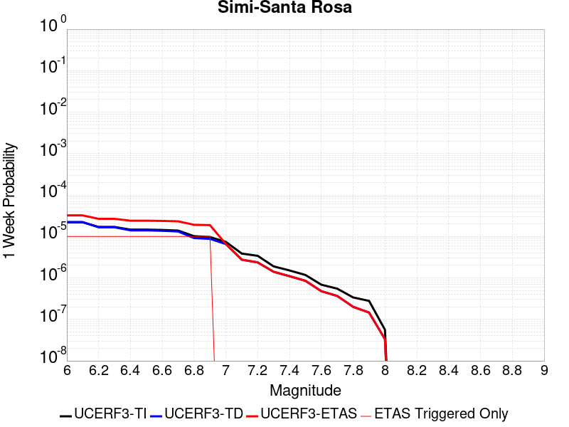 | 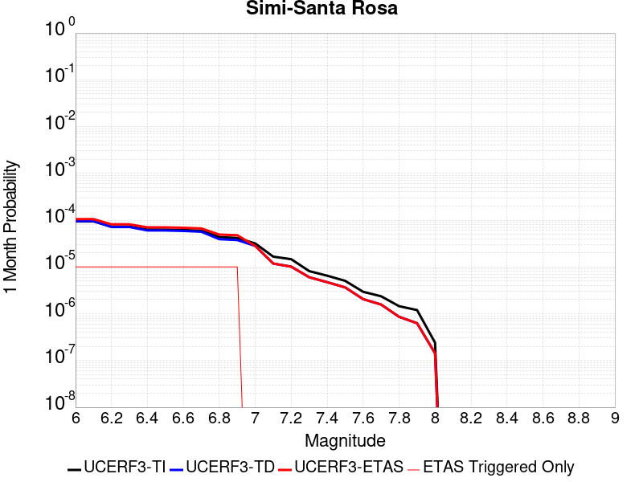 | 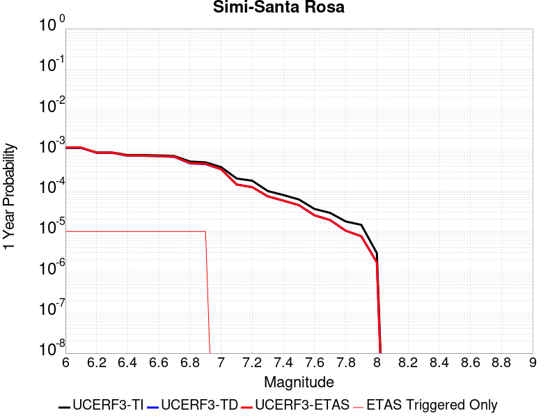 | 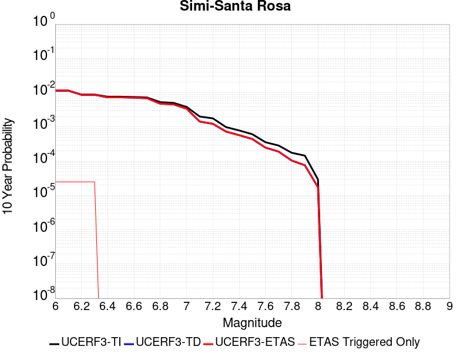 |

| Magnitude | 1 wk TI Prob | 1 wk TD Prob | 1 wk ETAS Prob | 1 wk ETAS/TD Gain | 1 wk ETAS Triggered Only | 1 mo TI Prob | 1 mo TD Prob | 1 mo ETAS Prob | 1 mo ETAS/TD Gain | 1 mo ETAS Triggered Only | 1 yr TI Prob | 1 yr TD Prob | 1 yr ETAS Prob | 1 yr ETAS/TD Gain | 1 yr ETAS Triggered Only | 10 yr TI Prob | 10 yr TD Prob | 10 yr ETAS Prob | 10 yr ETAS/TD Gain | 10 yr ETAS Triggered Only |
|-----|-----|-----|-----|-----|-----|-----|-----|-----|-----|-----|-----|-----|-----|-----|-----|-----|-----|-----|-----|-----|
| 6.0 | 2.198912E-5 | 2.2275388E-5 | 2.2275388E-5 | 1.0 | 0.0 | 9.4235686E-5 | 9.54627E-5 | 9.54627E-5 | 1.0 | 0.0 | 0.0011467156 | 0.0011616825 | 0.0011616825 | 1.0 | 0.0 | 0.011408163 | 0.011560547 | 0.011585238 | 1.0021359 | 2.4980016E-5 |
| 6.1 | 2.198912E-5 | 2.2275388E-5 | 2.2275388E-5 | 1.0 | 0.0 | 9.4235686E-5 | 9.54627E-5 | 9.54627E-5 | 1.0 | 0.0 | 0.0011467156 | 0.0011616825 | 0.0011616825 | 1.0 | 0.0 | 0.011408163 | 0.011560547 | 0.011585238 | 1.0021359 | 2.4980016E-5 |
| 6.2 | 1.69983E-5 | 1.6668506E-5 | 1.6668506E-5 | 1.0 | 0.0 | 7.284782E-5 | 7.143466E-5 | 7.143466E-5 | 1.0 | 0.0 | 8.865613E-4 | 8.6939917E-4 | 8.6939917E-4 | 1.0 | 0.0 | 0.008830327 | 0.0086629 | 0.008687663 | 1.0028586 | 2.4980016E-5 |
| 6.3 | 1.69983E-5 | 1.6668506E-5 | 1.6668506E-5 | 1.0 | 0.0 | 7.284782E-5 | 7.143466E-5 | 7.143466E-5 | 1.0 | 0.0 | 8.865613E-4 | 8.6939917E-4 | 8.6939917E-4 | 1.0 | 0.0 | 0.008830327 | 0.0086629 | 0.008687663 | 1.0028586 | 2.4980016E-5 |
| 6.4 | 1.4666188E-5 | 1.4052489E-5 | 1.4052489E-5 | 1.0 | 0.0 | 6.285358E-5 | 6.0223705E-5 | 6.0223705E-5 | 1.0 | 0.0 | 7.6497364E-4 | 7.330018E-4 | 7.330018E-4 | 1.0 | 0.0 | 0.0076234564 | 0.0073083164 | 0.0073083164 | 1.0 | 0.0 |
| 6.5 | 1.4666188E-5 | 1.4052489E-5 | 1.4052489E-5 | 1.0 | 0.0 | 6.285358E-5 | 6.0223705E-5 | 6.0223705E-5 | 1.0 | 0.0 | 7.6497364E-4 | 7.330018E-4 | 7.330018E-4 | 1.0 | 0.0 | 0.0076234564 | 0.0073083164 | 0.0073083164 | 1.0 | 0.0 |
| 6.6 | 1.4377586E-5 | 1.3729529E-5 | 1.3729529E-5 | 1.0 | 0.0 | 6.1616774E-5 | 5.883965E-5 | 5.883965E-5 | 1.0 | 0.0 | 7.4992597E-4 | 7.1616215E-4 | 7.1616215E-4 | 1.0 | 0.0 | 0.007474003 | 0.0071410104 | 0.0071410104 | 1.0 | 0.0 |
| 6.7 | 1.3881404E-5 | 1.3207497E-5 | 1.3207497E-5 | 1.0 | 0.0 | 5.9490372E-5 | 5.6602472E-5 | 5.6602472E-5 | 1.0 | 0.0 | 7.240546E-4 | 6.889419E-4 | 6.889419E-4 | 1.0 | 0.0 | 0.007217 | 0.0068705105 | 0.0068705105 | 1.0 | 0.0 |
| 6.8 | 1.0176516E-5 | 9.1541E-6 | 9.1541E-6 | 1.0 | 0.0 | 4.3612912E-5 | 3.923136E-5 | 3.923136E-5 | 1.0 | 0.0 | 5.308578E-4 | 4.775537E-4 | 4.775537E-4 | 1.0 | 0.0 | 0.0052959146 | 0.004766908 | 0.004766908 | 1.0 | 0.0 |
| 6.9 | 9.699797E-6 | 8.774672E-6 | 8.774672E-6 | 1.0 | 0.0 | 4.15699E-5 | 3.760529E-5 | 3.760529E-5 | 1.0 | 0.0 | 5.05996E-4 | 4.5776463E-4 | 4.5776463E-4 | 1.0 | 0.0 | 0.005048454 | 0.0045698346 | 0.0045698346 | 1.0 | 0.0 |
| 7.0 | 7.4049476E-6 | 6.559291E-6 | 6.559291E-6 | 1.0 | 0.0 | 3.1735104E-5 | 2.8111013E-5 | 2.8111013E-5 | 1.0 | 0.0 | 3.8630638E-4 | 3.422105E-4 | 3.422105E-4 | 1.0 | 0.0 | 0.0038563553 | 0.0034180775 | 0.0034180775 | 1.0 | 0.0 |
| 7.1 | 3.873439E-6 | 2.759473E-6 | 2.759473E-6 | 1.0 | 0.0 | 1.6600346E-5 | 1.1826261E-5 | 1.1826261E-5 | 1.0 | 0.0 | 2.0209046E-4 | 1.4397544E-4 | 1.4397544E-4 | 1.0 | 0.0 | 0.0020190678 | 0.0014388453 | 0.0014388453 | 1.0 | 0.0 |
| 7.2 | 3.417706E-6 | 2.367616E-6 | 2.367616E-6 | 1.0 | 0.0 | 1.4647229E-5 | 1.0146887E-5 | 1.0146887E-5 | 1.0 | 0.0 | 1.7831543E-4 | 1.2353157E-4 | 1.2353157E-4 | 1.0 | 0.0 | 0.0017817242 | 0.0012346513 | 0.0012346513 | 1.0 | 0.0 |
| 7.3 | 1.90225E-6 | 1.4073756E-6 | 1.4073756E-6 | 1.0 | 0.0 | 8.152474E-6 | 6.031596E-6 | 6.031596E-6 | 1.0 | 0.0 | 9.9251854E-5 | 7.343223E-5 | 7.343223E-5 | 1.0 | 0.0 | 9.920754E-4 | 7.340819E-4 | 7.340819E-4 | 1.0 | 0.0 |
| 7.4 | 1.5170556E-6 | 1.1024792E-6 | 1.1024792E-6 | 1.0 | 0.0 | 6.5016507E-6 | 4.7249023E-6 | 4.7249023E-6 | 1.0 | 0.0 | 7.915472E-5 | 5.752418E-5 | 5.752418E-5 | 1.0 | 0.0 | 7.9126534E-4 | 5.75094E-4 | 5.75094E-4 | 1.0 | 0.0 |
| 7.5 | 1.178732E-6 | 8.5351127E-7 | 8.5351127E-7 | 1.0 | 0.0 | 5.0516987E-6 | 3.6579004E-6 | 3.6579004E-6 | 1.0 | 0.0 | 6.1502695E-5 | 4.4534037E-5 | 4.4534037E-5 | 1.0 | 0.0 | 6.148568E-4 | 4.4525208E-4 | 4.4525208E-4 | 1.0 | 0.0 |
| 7.6 | 6.8722386E-7 | 4.793211E-7 | 4.793211E-7 | 1.0 | 0.0 | 2.9452417E-6 | 2.0542318E-6 | 2.0542318E-6 | 1.0 | 0.0 | 3.5857727E-5 | 2.5009986E-5 | 2.5009986E-5 | 1.0 | 0.0 | 3.5851944E-4 | 2.5007184E-4 | 2.5007184E-4 | 1.0 | 0.0 |
| 7.7 | 5.5126515E-7 | 3.6731117E-7 | 3.6731117E-7 | 1.0 | 0.0 | 2.3625628E-6 | 1.5741898E-6 | 1.5741898E-6 | 1.0 | 0.0 | 2.8763823E-5 | 1.9165593E-5 | 1.9165593E-5 | 1.0 | 0.0 | 2.87601E-4 | 1.9163951E-4 | 1.9163951E-4 | 1.0 | 0.0 |
| 7.8 | 3.3860243E-7 | 2.0075514E-7 | 2.0075514E-7 | 1.0 | 0.0 | 1.4511525E-6 | 8.6037886E-7 | 8.6037886E-7 | 1.0 | 0.0 | 1.7667637E-5 | 1.0475063E-5 | 1.0475063E-5 | 1.0 | 0.0 | 1.7666233E-4 | 1.0474575E-4 | 1.0474575E-4 | 1.0 | 0.0 |
| 7.9 | 2.7955386E-7 | 1.4648724E-7 | 1.4648724E-7 | 1.0 | 0.0 | 1.1980875E-6 | 6.278023E-7 | 6.278023E-7 | 1.0 | 0.0 | 1.4586617E-5 | 7.643467E-6 | 7.643467E-6 | 1.0 | 0.0 | 1.458566E-4 | 7.643208E-5 | 7.643208E-5 | 1.0 | 0.0 |
| 8.0 | 5.6259015E-8 | 3.335318E-8 | 3.335318E-8 | 1.0 | 0.0 | 2.4111003E-7 | 1.429422E-7 | 1.429422E-7 | 1.0 | 0.0 | 2.9355108E-6 | 1.7403199E-6 | 1.7403199E-6 | 1.0 | 0.0 | 2.935472E-5 | 1.7403077E-5 | 1.7403077E-5 | 1.0 | 0.0 |

## San Gabriel
*[(top)](#table-of-contents)*

| 1 Week | 1 Month | 1 Year | 10 Year |
|-----|-----|-----|-----|
| 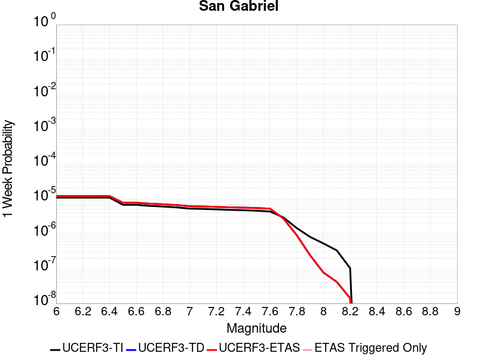 |  | 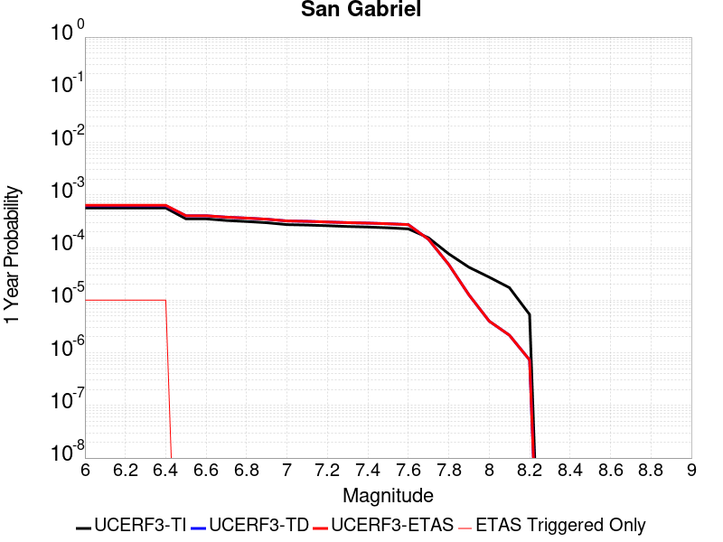 | 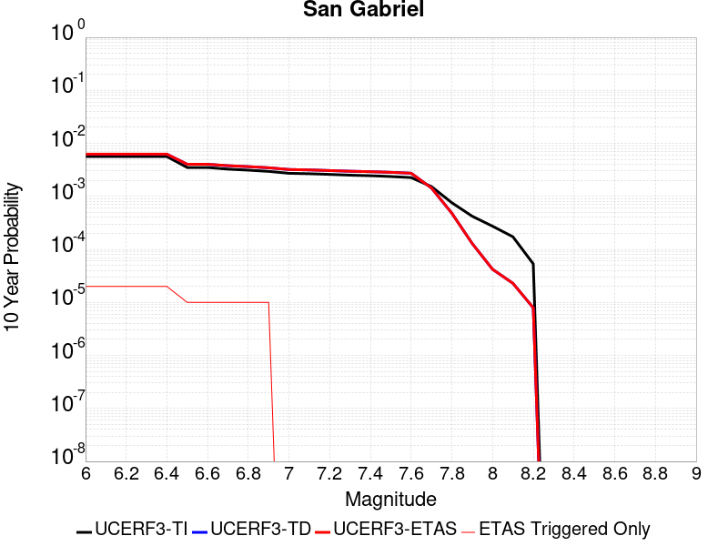 |

| Magnitude | 1 wk TI Prob | 1 wk TD Prob | 1 wk ETAS Prob | 1 wk ETAS/TD Gain | 1 wk ETAS Triggered Only | 1 mo TI Prob | 1 mo TD Prob | 1 mo ETAS Prob | 1 mo ETAS/TD Gain | 1 mo ETAS Triggered Only | 1 yr TI Prob | 1 yr TD Prob | 1 yr ETAS Prob | 1 yr ETAS/TD Gain | 1 yr ETAS Triggered Only | 10 yr TI Prob | 10 yr TD Prob | 10 yr ETAS Prob | 10 yr ETAS/TD Gain | 10 yr ETAS Triggered Only |
|-----|-----|-----|-----|-----|-----|-----|-----|-----|-----|-----|-----|-----|-----|-----|-----|-----|-----|-----|-----|-----|
| 6.0 | 1.083775E-5 | 1.198525E-5 | 1.198525E-5 | 1.0 | 0.0 | 4.6446676E-5 | 5.1364408E-5 | 5.1364408E-5 | 1.0 | 0.0 | 5.653415E-4 | 6.251936E-4 | 6.251936E-4 | 1.0 | 0.0 | 0.0056390543 | 0.0062463325 | 0.0062711565 | 1.0039742 | 2.4980016E-5 |
| 6.1 | 1.083775E-5 | 1.198525E-5 | 1.198525E-5 | 1.0 | 0.0 | 4.6446676E-5 | 5.1364408E-5 | 5.1364408E-5 | 1.0 | 0.0 | 5.653415E-4 | 6.251936E-4 | 6.251936E-4 | 1.0 | 0.0 | 0.0056390543 | 0.0062463325 | 0.0062711565 | 1.0039742 | 2.4980016E-5 |
| 6.2 | 1.083775E-5 | 1.198525E-5 | 1.198525E-5 | 1.0 | 0.0 | 4.6446676E-5 | 5.1364408E-5 | 5.1364408E-5 | 1.0 | 0.0 | 5.653415E-4 | 6.251936E-4 | 6.251936E-4 | 1.0 | 0.0 | 0.0056390543 | 0.0062463325 | 0.0062711565 | 1.0039742 | 2.4980016E-5 |
| 6.3 | 1.083775E-5 | 1.198525E-5 | 1.198525E-5 | 1.0 | 0.0 | 4.6446676E-5 | 5.1364408E-5 | 5.1364408E-5 | 1.0 | 0.0 | 5.653415E-4 | 6.251936E-4 | 6.251936E-4 | 1.0 | 0.0 | 0.0056390543 | 0.0062463325 | 0.0062711565 | 1.0039742 | 2.4980016E-5 |
| 6.4 | 1.083775E-5 | 1.198525E-5 | 1.198525E-5 | 1.0 | 0.0 | 4.6446676E-5 | 5.1364408E-5 | 5.1364408E-5 | 1.0 | 0.0 | 5.653415E-4 | 6.251936E-4 | 6.251936E-4 | 1.0 | 0.0 | 0.0056390543 | 0.0062463325 | 0.0062711565 | 1.0039742 | 2.4980016E-5 |
| 6.5 | 6.7317824E-6 | 7.717007E-6 | 7.717007E-6 | 1.0 | 0.0 | 2.8850178E-5 | 3.3072472E-5 | 3.3072472E-5 | 1.0 | 0.0 | 3.511943E-4 | 4.0258403E-4 | 4.0258403E-4 | 1.0 | 0.0 | 0.003506398 | 0.004029533 | 0.0040544122 | 1.0061742 | 2.4980016E-5 |
| 6.6 | 6.7317824E-6 | 7.717007E-6 | 7.717007E-6 | 1.0 | 0.0 | 2.8850178E-5 | 3.3072472E-5 | 3.3072472E-5 | 1.0 | 0.0 | 3.511943E-4 | 4.0258403E-4 | 4.0258403E-4 | 1.0 | 0.0 | 0.003506398 | 0.004029533 | 0.0040544122 | 1.0061742 | 2.4980016E-5 |
| 6.7 | 6.274881E-6 | 7.2459275E-6 | 7.2459275E-6 | 1.0 | 0.0 | 2.6892068E-5 | 3.105361E-5 | 3.105361E-5 | 1.0 | 0.0 | 3.2736175E-4 | 3.7801306E-4 | 3.7801306E-4 | 1.0 | 0.0 | 0.0032687993 | 0.0037846796 | 0.0038095652 | 1.0065753 | 2.4980016E-5 |
| 6.8 | 5.996209E-6 | 6.958647E-6 | 6.958647E-6 | 1.0 | 0.0 | 2.5697784E-5 | 2.9822439E-5 | 2.9822439E-5 | 1.0 | 0.0 | 3.128256E-4 | 3.6302864E-4 | 3.6302864E-4 | 1.0 | 0.0 | 0.003123856 | 0.0036353325 | 0.0036602218 | 1.0068464 | 2.4980016E-5 |
| 6.9 | 5.686331E-6 | 6.6236917E-6 | 6.6236917E-6 | 1.0 | 0.0 | 2.4369761E-5 | 2.8386947E-5 | 2.8386947E-5 | 1.0 | 0.0 | 2.9666146E-4 | 3.4555717E-4 | 3.4555717E-4 | 1.0 | 0.0 | 0.0029626573 | 0.0034611735 | 0.003486067 | 1.0071923 | 2.4980016E-5 |
| 7.0 | 5.2329838E-6 | 6.1475757E-6 | 6.1475757E-6 | 1.0 | 0.0 | 2.242688E-5 | 2.6346492E-5 | 2.6346492E-5 | 1.0 | 0.0 | 2.7301308E-4 | 3.207221E-4 | 3.207221E-4 | 1.0 | 0.0 | 0.002726779 | 0.0032135549 | 0.0032135549 | 1.0 | 0.0 |
| 7.1 | 5.135671E-6 | 6.0377E-6 | 6.0377E-6 | 1.0 | 0.0 | 2.2009834E-5 | 2.5875606E-5 | 2.5875606E-5 | 1.0 | 0.0 | 2.6793676E-4 | 3.1499073E-4 | 3.1499073E-4 | 1.0 | 0.0 | 0.0026761394 | 0.0031564054 | 0.0031564054 | 1.0 | 0.0 |
| 7.2 | 4.989062E-6 | 5.8710784E-6 | 5.8710784E-6 | 1.0 | 0.0 | 2.1381518E-5 | 2.5161527E-5 | 2.5161527E-5 | 1.0 | 0.0 | 2.6028889E-4 | 3.0629928E-4 | 3.0629928E-4 | 1.0 | 0.0 | 0.0025998424 | 0.003069734 | 0.003069734 | 1.0 | 0.0 |
| 7.3 | 4.8219395E-6 | 5.7026323E-6 | 5.7026323E-6 | 1.0 | 0.0 | 2.0665291E-5 | 2.4439627E-5 | 2.4439627E-5 | 1.0 | 0.0 | 2.5157086E-4 | 2.975126E-4 | 2.975126E-4 | 1.0 | 0.0 | 0.0025128627 | 0.002982106 | 0.002982106 | 1.0 | 0.0 |
| 7.4 | 4.7118383E-6 | 5.5911896E-6 | 5.5911896E-6 | 1.0 | 0.0 | 2.0193436E-5 | 2.3962024E-5 | 2.3962024E-5 | 1.0 | 0.0 | 2.4582737E-4 | 2.9169934E-4 | 2.9169934E-4 | 1.0 | 0.0 | 0.002455556 | 0.0029241266 | 0.0029241266 | 1.0 | 0.0 |
| 7.5 | 4.5506545E-6 | 5.4365555E-6 | 5.4365555E-6 | 1.0 | 0.0 | 1.9502659E-5 | 2.329932E-5 | 2.329932E-5 | 1.0 | 0.0 | 2.37419E-4 | 2.8363304E-4 | 2.8363304E-4 | 1.0 | 0.0 | 0.002371655 | 0.0028436715 | 0.0028436715 | 1.0 | 0.0 |
| 7.6 | 4.343636E-6 | 5.2294336E-6 | 5.2294336E-6 | 1.0 | 0.0 | 1.861545E-5 | 2.241167E-5 | 2.241167E-5 | 1.0 | 0.0 | 2.2661954E-4 | 2.7282868E-4 | 2.7282868E-4 | 1.0 | 0.0 | 0.0022638857 | 0.0027358893 | 0.0027358893 | 1.0 | 0.0 |
| 7.7 | 2.936235E-6 | 2.743946E-6 | 2.743946E-6 | 1.0 | 0.0 | 1.2583803E-5 | 1.1759716E-5 | 1.1759716E-5 | 1.0 | 0.0 | 1.5319703E-4 | 1.4316518E-4 | 1.4316518E-4 | 1.0 | 0.0 | 0.0015309147 | 0.0014379849 | 0.0014379849 | 1.0 | 0.0 |
| 7.8 | 1.4541639E-6 | 9.122518E-7 | 9.122518E-7 | 1.0 | 0.0 | 6.232116E-6 | 3.9096444E-6 | 3.9096444E-6 | 1.0 | 0.0 | 7.587337E-5 | 4.7598885E-5 | 4.7598885E-5 | 1.0 | 0.0 | 7.584747E-4 | 4.8078224E-4 | 4.8078224E-4 | 1.0 | 0.0 |
| 7.9 | 8.098958E-7 | 2.4165956E-7 | 2.4165956E-7 | 1.0 | 0.0 | 3.4709774E-6 | 1.0356835E-6 | 1.0356835E-6 | 1.0 | 0.0 | 4.225833E-5 | 1.2609373E-5 | 1.2609373E-5 | 1.0 | 0.0 | 4.2250296E-4 | 1.2917137E-4 | 1.2917137E-4 | 1.0 | 0.0 |
| 8.0 | 5.2473234E-7 | 7.672734E-8 | 7.672734E-8 | 1.0 | 0.0 | 2.248851E-6 | 3.2883142E-7 | 3.2883142E-7 | 1.0 | 0.0 | 2.7379416E-5 | 4.003515E-6 | 4.003515E-6 | 1.0 | 0.0 | 2.7376044E-4 | 4.215796E-5 | 4.215796E-5 | 1.0 | 0.0 |
| 8.1 | 3.3162388E-7 | 4.1457096E-8 | 4.1457096E-8 | 1.0 | 0.0 | 1.4212444E-6 | 1.7767324E-7 | 1.7767324E-7 | 1.0 | 0.0 | 1.7303513E-5 | 2.1631695E-6 | 2.1631695E-6 | 1.0 | 0.0 | 1.7302166E-4 | 2.294416E-5 | 2.294416E-5 | 1.0 | 0.0 |
| 8.2 | 1.0235345E-7 | 1.4032201E-8 | 1.4032201E-8 | 1.0 | 0.0 | 4.3865757E-7 | 6.013801E-8 | 6.013801E-8 | 1.0 | 0.0 | 5.340643E-6 | 7.3217996E-7 | 7.3217996E-7 | 1.0 | 0.0 | 5.3405143E-5 | 7.921925E-6 | 7.921925E-6 | 1.0 | 0.0 |

## Hollywood
*[(top)](#table-of-contents)*

| 1 Week | 1 Month | 1 Year | 10 Year |
|-----|-----|-----|-----|
|  | 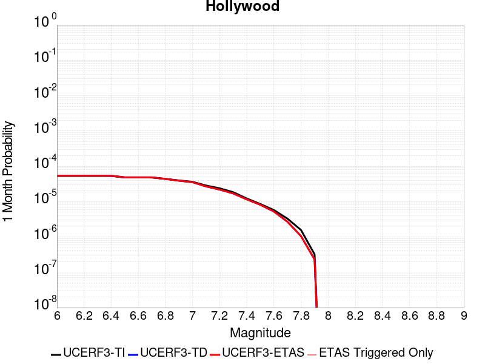 | 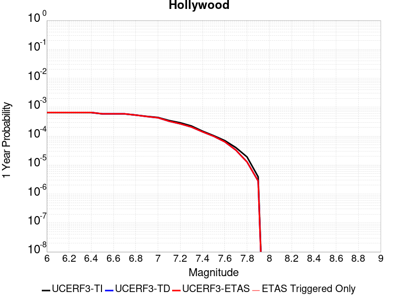 | 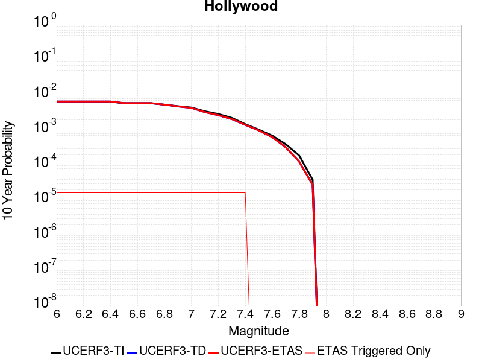 |

| Magnitude | 1 wk TI Prob | 1 wk TD Prob | 1 wk ETAS Prob | 1 wk ETAS/TD Gain | 1 wk ETAS Triggered Only | 1 mo TI Prob | 1 mo TD Prob | 1 mo ETAS Prob | 1 mo ETAS/TD Gain | 1 mo ETAS Triggered Only | 1 yr TI Prob | 1 yr TD Prob | 1 yr ETAS Prob | 1 yr ETAS/TD Gain | 1 yr ETAS Triggered Only | 10 yr TI Prob | 10 yr TD Prob | 10 yr ETAS Prob | 10 yr ETAS/TD Gain | 10 yr ETAS Triggered Only |
|-----|-----|-----|-----|-----|-----|-----|-----|-----|-----|-----|-----|-----|-----|-----|-----|-----|-----|-----|-----|-----|
| 6.0 | 1.24487615E-5 | 1.2593229E-5 | 1.2593229E-5 | 1.0 | 0.0 | 5.3350745E-5 | 5.3969892E-5 | 5.3969892E-5 | 1.0 | 0.0 | 6.4935174E-4 | 6.5689E-4 | 6.5689E-4 | 1.0 | 0.0 | 0.0064745755 | 0.0065499707 | 0.006574787 | 1.0037888 | 2.4980016E-5 |
| 6.1 | 1.24487615E-5 | 1.2593229E-5 | 1.2593229E-5 | 1.0 | 0.0 | 5.3350745E-5 | 5.3969892E-5 | 5.3969892E-5 | 1.0 | 0.0 | 6.4935174E-4 | 6.5689E-4 | 6.5689E-4 | 1.0 | 0.0 | 0.0064745755 | 0.0065499707 | 0.006574787 | 1.0037888 | 2.4980016E-5 |
| 6.2 | 1.24487615E-5 | 1.2593229E-5 | 1.2593229E-5 | 1.0 | 0.0 | 5.3350745E-5 | 5.3969892E-5 | 5.3969892E-5 | 1.0 | 0.0 | 6.4935174E-4 | 6.5689E-4 | 6.5689E-4 | 1.0 | 0.0 | 0.0064745755 | 0.0065499707 | 0.006574787 | 1.0037888 | 2.4980016E-5 |
| 6.3 | 1.24487615E-5 | 1.2593229E-5 | 1.2593229E-5 | 1.0 | 0.0 | 5.3350745E-5 | 5.3969892E-5 | 5.3969892E-5 | 1.0 | 0.0 | 6.4935174E-4 | 6.5689E-4 | 6.5689E-4 | 1.0 | 0.0 | 0.0064745755 | 0.0065499707 | 0.006574787 | 1.0037888 | 2.4980016E-5 |
| 6.4 | 1.2431024E-5 | 1.25738425E-5 | 1.25738425E-5 | 1.0 | 0.0 | 5.327473E-5 | 5.388681E-5 | 5.388681E-5 | 1.0 | 0.0 | 6.4842677E-4 | 6.558791E-4 | 6.558791E-4 | 1.0 | 0.0 | 0.0064653796 | 0.0065399213 | 0.0065647378 | 1.0037947 | 2.4980016E-5 |
| 6.5 | 1.1242222E-5 | 1.1317804E-5 | 1.1317804E-5 | 1.0 | 0.0 | 4.8180063E-5 | 4.8503985E-5 | 4.8503985E-5 | 1.0 | 0.0 | 5.864344E-4 | 5.903787E-4 | 5.903787E-4 | 1.0 | 0.0 | 0.0058488925 | 0.00588839 | 0.0059132227 | 1.0042173 | 2.4980016E-5 |
| 6.6 | 1.1234066E-5 | 1.1308918E-5 | 1.1308918E-5 | 1.0 | 0.0 | 4.8145106E-5 | 4.8465907E-5 | 4.8465907E-5 | 1.0 | 0.0 | 5.86009E-4 | 5.899153E-4 | 5.899153E-4 | 1.0 | 0.0 | 0.005844661 | 0.0058837803 | 0.0059086136 | 1.0042206 | 2.4980016E-5 |
| 6.7 | 1.12294E-5 | 1.1303661E-5 | 1.1303661E-5 | 1.0 | 0.0 | 4.812511E-5 | 4.8443377E-5 | 4.8443377E-5 | 1.0 | 0.0 | 5.857657E-4 | 5.896412E-4 | 5.896412E-4 | 1.0 | 0.0 | 0.0058422405 | 0.005881054 | 0.0059058866 | 1.0042225 | 2.4980016E-5 |
| 6.8 | 1.0252819E-5 | 1.0218449E-5 | 1.0218449E-5 | 1.0 | 0.0 | 4.3939912E-5 | 4.3792625E-5 | 4.3792625E-5 | 1.0 | 0.0 | 5.3483713E-4 | 5.330469E-4 | 5.330469E-4 | 1.0 | 0.0 | 0.005335517 | 0.0053179096 | 0.0053427564 | 1.0046724 | 2.4980016E-5 |
| 6.9 | 9.252289E-6 | 9.110309E-6 | 9.110309E-6 | 1.0 | 0.0 | 3.9652066E-5 | 3.9043607E-5 | 3.9043607E-5 | 1.0 | 0.0 | 4.8265693E-4 | 4.752539E-4 | 4.752539E-4 | 1.0 | 0.0 | 0.0048161 | 0.004742549 | 0.0047674105 | 1.0052422 | 2.4980016E-5 |
| 7.0 | 8.474604E-6 | 8.25826E-6 | 8.25826E-6 | 1.0 | 0.0 | 3.6319227E-5 | 3.5392073E-5 | 3.5392073E-5 | 1.0 | 0.0 | 4.4209688E-4 | 4.3081472E-4 | 4.3081472E-4 | 1.0 | 0.0 | 0.004412184 | 0.0042999457 | 0.0043248185 | 1.0057844 | 2.4980016E-5 |
| 7.1 | 6.643643E-6 | 6.2683707E-6 | 6.2683707E-6 | 1.0 | 0.0 | 2.8472443E-5 | 2.686417E-5 | 2.686417E-5 | 1.0 | 0.0 | 3.4659685E-4 | 3.2702263E-4 | 3.2702263E-4 | 1.0 | 0.0 | 0.0034605677 | 0.0032654598 | 0.0032903585 | 1.0076247 | 2.4980016E-5 |
| 7.2 | 5.549002E-6 | 5.1087086E-6 | 5.1087086E-6 | 1.0 | 0.0 | 2.378122E-5 | 2.1894282E-5 | 2.1894282E-5 | 1.0 | 0.0 | 2.8949787E-4 | 2.665304E-4 | 2.665304E-4 | 1.0 | 0.0 | 0.0028912104 | 0.002662124 | 0.0026870375 | 1.0093585 | 2.4980016E-5 |
| 7.3 | 4.3059727E-6 | 3.9598913E-6 | 3.9598913E-6 | 1.0 | 0.0 | 1.8454039E-5 | 1.6970853E-5 | 1.6970853E-5 | 1.0 | 0.0 | 2.2465475E-4 | 2.0660064E-4 | 2.0660064E-4 | 1.0 | 0.0 | 0.0022442779 | 0.0020640958 | 0.0020890243 | 1.0120772 | 2.4980016E-5 |
| 7.4 | 2.8550733E-6 | 2.7013002E-6 | 2.7013002E-6 | 1.0 | 0.0 | 1.2235971E-5 | 1.1576949E-5 | 1.1576949E-5 | 1.0 | 0.0 | 1.4896276E-4 | 1.4094029E-4 | 1.4094029E-4 | 1.0 | 0.0 | 0.0014886294 | 0.0014085141 | 0.001433459 | 1.0177101 | 2.4980016E-5 |
| 7.5 | 1.9927045E-6 | 1.8976393E-6 | 1.8976393E-6 | 1.0 | 0.0 | 8.540134E-6 | 8.132714E-6 | 8.132714E-6 | 1.0 | 0.0 | 1.0397117E-4 | 9.901134E-5 | 9.901134E-5 | 1.0 | 0.0 | 0.0010392254 | 9.896759E-4 | 9.896759E-4 | 1.0 | 0.0 |
| 7.6 | 1.345084E-6 | 1.2216018E-6 | 1.2216018E-6 | 1.0 | 0.0 | 5.764633E-6 | 5.2354258E-6 | 5.2354258E-6 | 1.0 | 0.0 | 7.018215E-5 | 6.373946E-5 | 6.373946E-5 | 1.0 | 0.0 | 7.0159987E-4 | 6.372138E-4 | 6.372138E-4 | 1.0 | 0.0 |
| 7.7 | 7.6835164E-7 | 6.2777013E-7 | 6.2777013E-7 | 1.0 | 0.0 | 3.2929315E-6 | 2.6904406E-6 | 2.6904406E-6 | 1.0 | 0.0 | 4.00907E-5 | 3.2755637E-5 | 3.2755637E-5 | 1.0 | 0.0 | 4.0083472E-4 | 3.2750957E-4 | 3.2750957E-4 | 1.0 | 0.0 |
| 7.8 | 3.6562128E-7 | 2.4534745E-7 | 2.4534745E-7 | 1.0 | 0.0 | 1.5669474E-6 | 1.0514887E-6 | 1.0514887E-6 | 1.0 | 0.0 | 1.9077417E-5 | 1.2801803E-5 | 1.2801803E-5 | 1.0 | 0.0 | 1.907578E-4 | 1.2801103E-4 | 1.2801103E-4 | 1.0 | 0.0 |
| 7.9 | 7.5024424E-8 | 5.381742E-8 | 5.381742E-8 | 1.0 | 0.0 | 3.215332E-7 | 2.3064608E-7 | 2.3064608E-7 | 1.0 | 0.0 | 3.91466E-6 | 2.8081138E-6 | 2.8081138E-6 | 1.0 | 0.0 | 3.9145907E-5 | 2.8080913E-5 | 2.8080913E-5 | 1.0 | 0.0 |

## Hosgri (Extension)
*[(top)](#table-of-contents)*

| 1 Week | 1 Month | 1 Year | 10 Year |
|-----|-----|-----|-----|
| 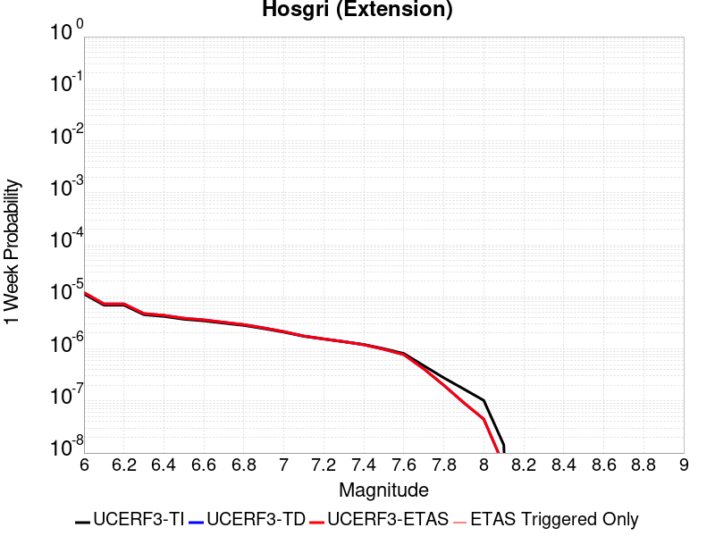 | 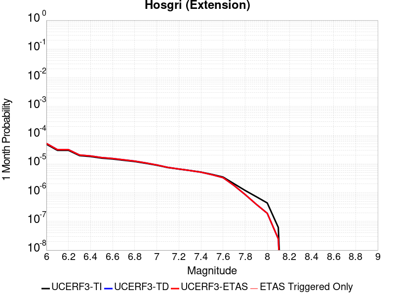 | 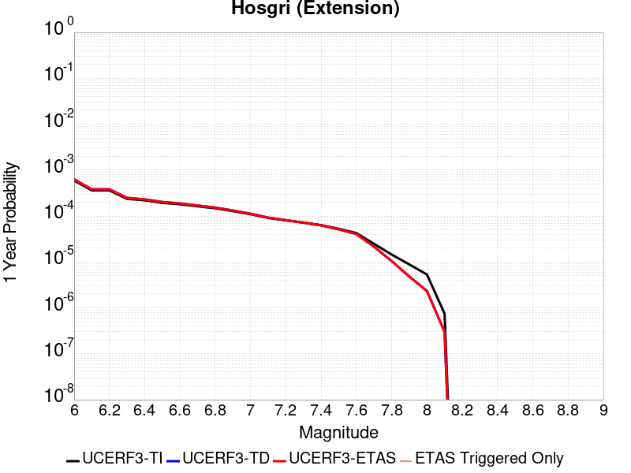 | 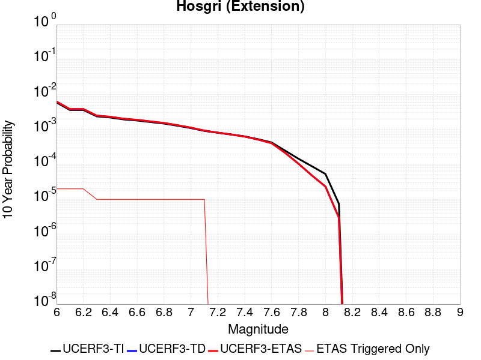 |

| Magnitude | 1 wk TI Prob | 1 wk TD Prob | 1 wk ETAS Prob | 1 wk ETAS/TD Gain | 1 wk ETAS Triggered Only | 1 mo TI Prob | 1 mo TD Prob | 1 mo ETAS Prob | 1 mo ETAS/TD Gain | 1 mo ETAS Triggered Only | 1 yr TI Prob | 1 yr TD Prob | 1 yr ETAS Prob | 1 yr ETAS/TD Gain | 1 yr ETAS Triggered Only | 10 yr TI Prob | 10 yr TD Prob | 10 yr ETAS Prob | 10 yr ETAS/TD Gain | 10 yr ETAS Triggered Only |
|-----|-----|-----|-----|-----|-----|-----|-----|-----|-----|-----|-----|-----|-----|-----|-----|-----|-----|-----|-----|-----|
| 6.0 | 1.1369135E-5 | 1.2083073E-5 | 1.2083073E-5 | 1.0 | 0.0 | 4.8723956E-5 | 5.17837E-5 | 5.17837E-5 | 1.0 | 0.0 | 5.9305265E-4 | 6.303069E-4 | 6.303069E-4 | 1.0 | 0.0 | 0.005914725 | 0.00628744 | 0.006312263 | 1.003948 | 2.4980016E-5 |
| 6.1 | 6.934979E-6 | 7.324556E-6 | 7.324556E-6 | 1.0 | 0.0 | 2.9721E-5 | 3.13906E-5 | 3.13906E-5 | 1.0 | 0.0 | 3.617931E-4 | 3.821177E-4 | 3.821177E-4 | 1.0 | 0.0 | 0.0036120464 | 0.003815019 | 0.0038399037 | 1.0065228 | 2.4980016E-5 |
| 6.2 | 6.934979E-6 | 7.324556E-6 | 7.324556E-6 | 1.0 | 0.0 | 2.9721E-5 | 3.13906E-5 | 3.13906E-5 | 1.0 | 0.0 | 3.617931E-4 | 3.821177E-4 | 3.821177E-4 | 1.0 | 0.0 | 0.0036120464 | 0.003815019 | 0.0038399037 | 1.0065228 | 2.4980016E-5 |
| 6.3 | 4.5484676E-6 | 4.769331E-6 | 4.769331E-6 | 1.0 | 0.0 | 1.9493287E-5 | 2.0439833E-5 | 2.0439833E-5 | 1.0 | 0.0 | 2.3730492E-4 | 2.4882698E-4 | 2.4882698E-4 | 1.0 | 0.0 | 0.0023705168 | 0.0024855263 | 0.0024855263 | 1.0 | 0.0 |
| 6.4 | 4.218095E-6 | 4.416863E-6 | 4.416863E-6 | 1.0 | 0.0 | 1.8077424E-5 | 1.8929275E-5 | 1.8929275E-5 | 1.0 | 0.0 | 2.2007042E-4 | 2.3043988E-4 | 2.3043988E-4 | 1.0 | 0.0 | 0.002198526 | 0.002302043 | 0.002302043 | 1.0 | 0.0 |
| 6.5 | 3.717374E-6 | 3.883879E-6 | 3.883879E-6 | 1.0 | 0.0 | 1.5931506E-5 | 1.664509E-5 | 1.664509E-5 | 1.0 | 0.0 | 1.9394881E-4 | 2.026353E-4 | 2.026353E-4 | 1.0 | 0.0 | 0.0019377962 | 0.0020245241 | 0.0020245241 | 1.0 | 0.0 |
| 6.6 | 3.4605036E-6 | 3.6083072E-6 | 3.6083072E-6 | 1.0 | 0.0 | 1.4830645E-5 | 1.5464082E-5 | 1.5464082E-5 | 1.0 | 0.0 | 1.8054814E-4 | 1.8825909E-4 | 1.8825909E-4 | 1.0 | 0.0 | 0.0018040152 | 0.0018810107 | 0.0018810107 | 1.0 | 0.0 |
| 6.7 | 3.123439E-6 | 3.2465698E-6 | 3.2465698E-6 | 1.0 | 0.0 | 1.33860985E-5 | 1.39137965E-5 | 1.39137965E-5 | 1.0 | 0.0 | 1.6296357E-4 | 1.6938741E-4 | 1.6938741E-4 | 1.0 | 0.0 | 0.001628441 | 0.001692594 | 0.001692594 | 1.0 | 0.0 |
| 6.8 | 2.8290783E-6 | 2.9305413E-6 | 2.9305413E-6 | 1.0 | 0.0 | 1.2124565E-5 | 1.2559403E-5 | 1.2559403E-5 | 1.0 | 0.0 | 1.4760658E-4 | 1.5290009E-4 | 1.5290009E-4 | 1.0 | 0.0 | 0.0014750857 | 0.0015279576 | 0.0015279576 | 1.0 | 0.0 |
| 6.9 | 2.454112E-6 | 2.5283207E-6 | 2.5283207E-6 | 1.0 | 0.0 | 1.0517581E-5 | 1.0835615E-5 | 1.0835615E-5 | 1.0 | 0.0 | 1.2804402E-4 | 1.3191569E-4 | 1.3191569E-4 | 1.0 | 0.0 | 0.0012797028 | 0.0013183799 | 0.0013183799 | 1.0 | 0.0 |
| 7.0 | 2.1008145E-6 | 2.1498715E-6 | 2.1498715E-6 | 1.0 | 0.0 | 9.003459E-6 | 9.2137025E-6 | 9.2137025E-6 | 1.0 | 0.0 | 1.096116E-4 | 1.1217109E-4 | 1.1217109E-4 | 1.0 | 0.0 | 0.0010955755 | 0.0011211485 | 0.0011211485 | 1.0 | 0.0 |
| 7.1 | 1.744384E-6 | 1.7686364E-6 | 1.7686364E-6 | 1.0 | 0.0 | 7.47591E-6 | 7.579848E-6 | 7.579848E-6 | 1.0 | 0.0 | 9.1015405E-5 | 9.228076E-5 | 9.228076E-5 | 1.0 | 0.0 | 9.097813E-4 | 9.224261E-4 | 9.224261E-4 | 1.0 | 0.0 |
| 7.2 | 1.5456587E-6 | 1.5562894E-6 | 1.5562894E-6 | 1.0 | 0.0 | 6.6242346E-6 | 6.6697944E-6 | 6.6697944E-6 | 1.0 | 0.0 | 8.064707E-5 | 8.120173E-5 | 8.120173E-5 | 1.0 | 0.0 | 8.0617814E-4 | 8.117219E-4 | 8.117219E-4 | 1.0 | 0.0 |
| 7.3 | 1.3775123E-6 | 1.3766092E-6 | 1.3766092E-6 | 1.0 | 0.0 | 5.9036106E-6 | 5.8997407E-6 | 5.8997407E-6 | 1.0 | 0.0 | 7.187409E-5 | 7.182699E-5 | 7.182699E-5 | 1.0 | 0.0 | 7.185085E-4 | 7.180387E-4 | 7.180387E-4 | 1.0 | 0.0 |
| 7.4 | 1.214491E-6 | 1.2023471E-6 | 1.2023471E-6 | 1.0 | 0.0 | 5.2049513E-6 | 5.152906E-6 | 5.152906E-6 | 1.0 | 0.0 | 6.336844E-5 | 6.2734835E-5 | 6.2734835E-5 | 1.0 | 0.0 | 6.335037E-4 | 6.2717206E-4 | 6.2717206E-4 | 1.0 | 0.0 |
| 7.5 | 1.0101123E-6 | 9.842256E-7 | 9.842256E-7 | 1.0 | 0.0 | 4.3290456E-6 | 4.218103E-6 | 4.218103E-6 | 1.0 | 0.0 | 5.2704854E-5 | 5.13542E-5 | 5.13542E-5 | 1.0 | 0.0 | 5.2692357E-4 | 5.1342393E-4 | 5.1342393E-4 | 1.0 | 0.0 |
| 7.6 | 8.1558215E-7 | 7.765977E-7 | 7.765977E-7 | 1.0 | 0.0 | 3.4953473E-6 | 3.3282718E-6 | 3.3282718E-6 | 1.0 | 0.0 | 4.255502E-5 | 4.0520958E-5 | 4.0520958E-5 | 1.0 | 0.0 | 4.2546875E-4 | 4.0513615E-4 | 4.0513615E-4 | 1.0 | 0.0 |
| 7.7 | 4.757816E-7 | 4.1308996E-7 | 4.1308996E-7 | 1.0 | 0.0 | 2.0390623E-6 | 1.7703843E-6 | 1.7703843E-6 | 1.0 | 0.0 | 2.4825302E-5 | 2.1554217E-5 | 2.1554217E-5 | 1.0 | 0.0 | 2.482253E-4 | 2.1552139E-4 | 2.1552139E-4 | 1.0 | 0.0 |
| 7.8 | 2.782787E-7 | 2.004783E-7 | 2.004783E-7 | 1.0 | 0.0 | 1.1926223E-6 | 8.591924E-7 | 8.591924E-7 | 1.0 | 0.0 | 1.452008E-5 | 1.0460618E-5 | 1.0460618E-5 | 1.0 | 0.0 | 1.4519131E-4 | 1.04601284E-4 | 1.04601284E-4 | 1.0 | 0.0 |
| 7.9 | 1.6948086E-7 | 9.243938E-8 | 9.243938E-8 | 1.0 | 0.0 | 7.2634634E-7 | 3.961687E-7 | 3.961687E-7 | 1.0 | 0.0 | 8.843231E-6 | 4.8233433E-6 | 4.8233433E-6 | 1.0 | 0.0 | 8.842879E-5 | 4.8232392E-5 | 4.8232392E-5 | 1.0 | 0.0 |
| 8.0 | 1.0225492E-7 | 4.473497E-8 | 4.473497E-8 | 1.0 | 0.0 | 4.382353E-7 | 1.917213E-7 | 1.917213E-7 | 1.0 | 0.0 | 5.335502E-6 | 2.3342043E-6 | 2.3342043E-6 | 1.0 | 0.0 | 5.335374E-5 | 2.33418E-5 | 2.33418E-5 | 1.0 | 0.0 |
| 8.1 | 1.43711345E-8 | 5.78716E-9 | 5.78716E-9 | 1.0 | 0.0 | 6.1590576E-8 | 2.4802116E-8 | 2.4802116E-8 | 1.0 | 0.0 | 7.4986497E-7 | 3.019657E-7 | 3.019657E-7 | 1.0 | 0.0 | 7.4986247E-6 | 3.0196536E-6 | 3.0196536E-6 | 1.0 | 0.0 |

## Shoreline
*[(top)](#table-of-contents)*

| 1 Week | 1 Month | 1 Year | 10 Year |
|-----|-----|-----|-----|
| 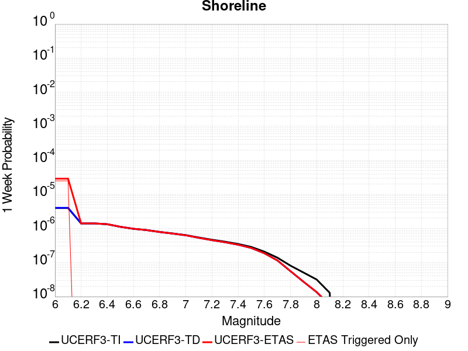 | 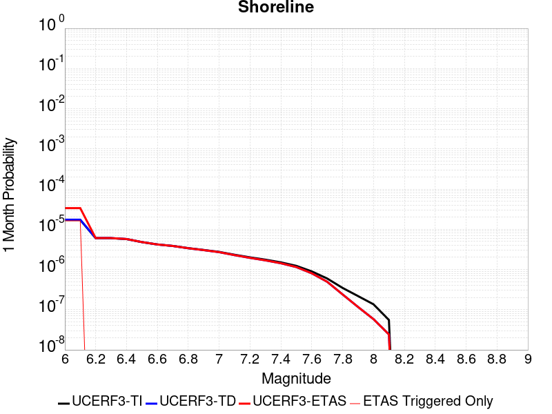 | 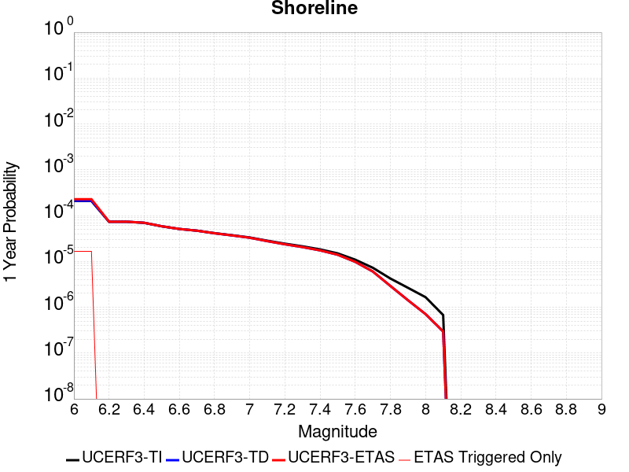 | 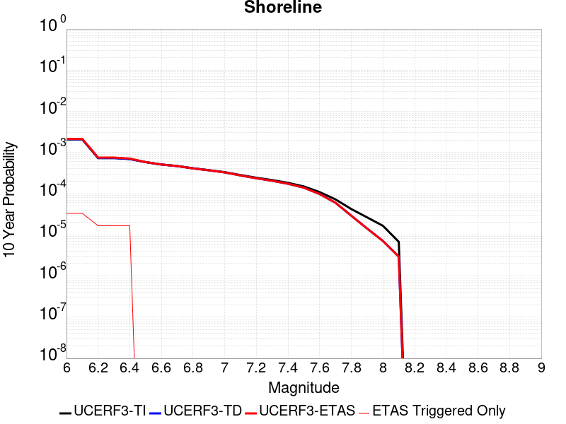 |

| Magnitude | 1 wk TI Prob | 1 wk TD Prob | 1 wk ETAS Prob | 1 wk ETAS/TD Gain | 1 wk ETAS Triggered Only | 1 mo TI Prob | 1 mo TD Prob | 1 mo ETAS Prob | 1 mo ETAS/TD Gain | 1 mo ETAS Triggered Only | 1 yr TI Prob | 1 yr TD Prob | 1 yr ETAS Prob | 1 yr ETAS/TD Gain | 1 yr ETAS Triggered Only | 10 yr TI Prob | 10 yr TD Prob | 10 yr ETAS Prob | 10 yr ETAS/TD Gain | 10 yr ETAS Triggered Only |
|-----|-----|-----|-----|-----|-----|-----|-----|-----|-----|-----|-----|-----|-----|-----|-----|-----|-----|-----|-----|-----|
| 6.0 | 3.9888673E-6 | 4.0479285E-6 | 2.9027844E-5 | 7.1710367 | 2.4980016E-5 | 1.7095033E-5 | 1.7348182E-5 | 4.2327763E-5 | 2.4398963 | 2.4980016E-5 | 2.0811215E-4 | 2.1119922E-4 | 2.3617396E-4 | 1.118252 | 2.4980016E-5 | 0.0020791737 | 0.0021105339 | 0.0021354612 | 1.0118109 | 2.4980016E-5 |
| 6.1 | 3.9888673E-6 | 4.0479285E-6 | 2.9027844E-5 | 7.1710367 | 2.4980016E-5 | 1.7095033E-5 | 1.7348182E-5 | 4.2327763E-5 | 2.4398963 | 2.4980016E-5 | 2.0811215E-4 | 2.1119922E-4 | 2.3617396E-4 | 1.118252 | 2.4980016E-5 | 0.0020791737 | 0.0021105339 | 0.0021354612 | 1.0118109 | 2.4980016E-5 |
| 6.2 | 1.4039653E-6 | 1.4100885E-6 | 1.4100885E-6 | 1.0 | 0.0 | 6.0169805E-6 | 6.043223E-6 | 6.043223E-6 | 1.0 | 0.0 | 7.325427E-5 | 7.357382E-5 | 7.357382E-5 | 1.0 | 0.0 | 7.3230127E-4 | 7.355006E-4 | 7.355006E-4 | 1.0 | 0.0 |
| 6.3 | 1.4039653E-6 | 1.4100885E-6 | 1.4100885E-6 | 1.0 | 0.0 | 6.0169805E-6 | 6.043223E-6 | 6.043223E-6 | 1.0 | 0.0 | 7.325427E-5 | 7.357382E-5 | 7.357382E-5 | 1.0 | 0.0 | 7.3230127E-4 | 7.355006E-4 | 7.355006E-4 | 1.0 | 0.0 |
| 6.4 | 1.3314152E-6 | 1.33616E-6 | 1.33616E-6 | 1.0 | 0.0 | 5.7060524E-6 | 5.726388E-6 | 5.726388E-6 | 1.0 | 0.0 | 6.946897E-5 | 6.9716596E-5 | 6.9716596E-5 | 1.0 | 0.0 | 6.9447263E-4 | 6.9695263E-4 | 6.9695263E-4 | 1.0 | 0.0 |
| 6.5 | 1.1187026E-6 | 1.1203634E-6 | 1.1203634E-6 | 1.0 | 0.0 | 4.794431E-6 | 4.801549E-6 | 4.801549E-6 | 1.0 | 0.0 | 5.8370628E-5 | 5.8457317E-5 | 5.8457317E-5 | 1.0 | 0.0 | 5.83553E-4 | 5.844219E-4 | 5.844219E-4 | 1.0 | 0.0 |
| 6.6 | 9.793089E-7 | 9.784915E-7 | 9.784915E-7 | 1.0 | 0.0 | 4.1970316E-6 | 4.193528E-6 | 4.193528E-6 | 1.0 | 0.0 | 5.1097657E-5 | 5.1055024E-5 | 5.1055024E-5 | 1.0 | 0.0 | 5.108591E-4 | 5.104342E-4 | 5.104342E-4 | 1.0 | 0.0 |
| 6.7 | 8.995986E-7 | 8.972795E-7 | 8.972795E-7 | 1.0 | 0.0 | 3.8554167E-6 | 3.8454777E-6 | 3.8454777E-6 | 1.0 | 0.0 | 4.693869E-5 | 4.68177E-5 | 4.68177E-5 | 1.0 | 0.0 | 4.6928777E-4 | 4.680793E-4 | 4.680793E-4 | 1.0 | 0.0 |
| 6.8 | 7.931612E-7 | 7.8803976E-7 | 7.8803976E-7 | 1.0 | 0.0 | 3.3992578E-6 | 3.377309E-6 | 3.377309E-6 | 1.0 | 0.0 | 4.1385178E-5 | 4.1117964E-5 | 4.1117964E-5 | 1.0 | 0.0 | 4.1377472E-4 | 4.1110412E-4 | 4.1110412E-4 | 1.0 | 0.0 |
| 6.9 | 7.1465956E-7 | 7.078001E-7 | 7.078001E-7 | 1.0 | 0.0 | 3.062823E-6 | 3.0334254E-6 | 3.0334254E-6 | 1.0 | 0.0 | 3.7289232E-5 | 3.693133E-5 | 3.693133E-5 | 1.0 | 0.0 | 3.7282976E-4 | 3.6925232E-4 | 3.6925232E-4 | 1.0 | 0.0 |
| 7.0 | 6.389046E-7 | 6.299453E-7 | 6.299453E-7 | 1.0 | 0.0 | 2.7381598E-6 | 2.699763E-6 | 2.699763E-6 | 1.0 | 0.0 | 3.3336586E-5 | 3.286912E-5 | 3.286912E-5 | 1.0 | 0.0 | 3.3331584E-4 | 3.286428E-4 | 3.286428E-4 | 1.0 | 0.0 |
| 7.1 | 5.4300875E-7 | 5.311126E-7 | 5.311126E-7 | 1.0 | 0.0 | 2.3271782E-6 | 2.276195E-6 | 2.276195E-6 | 1.0 | 0.0 | 2.8333026E-5 | 2.7712322E-5 | 2.7712322E-5 | 1.0 | 0.0 | 2.8329415E-4 | 2.7708875E-4 | 2.7708875E-4 | 1.0 | 0.0 |
| 7.2 | 4.6768855E-7 | 4.5348904E-7 | 4.5348904E-7 | 1.0 | 0.0 | 2.0043778E-6 | 1.9435229E-6 | 1.9435229E-6 | 1.0 | 0.0 | 2.4403027E-5 | 2.3662134E-5 | 2.3662134E-5 | 1.0 | 0.0 | 2.4400349E-4 | 2.3659621E-4 | 2.3659621E-4 | 1.0 | 0.0 |
| 7.3 | 4.0966103E-7 | 3.9385614E-7 | 3.9385614E-7 | 1.0 | 0.0 | 1.7556889E-6 | 1.6879537E-6 | 1.6879537E-6 | 1.0 | 0.0 | 2.1375303E-5 | 2.0550642E-5 | 2.0550642E-5 | 1.0 | 0.0 | 2.1373246E-4 | 2.0548746E-4 | 2.0548746E-4 | 1.0 | 0.0 |
| 7.4 | 3.5105785E-7 | 3.3363924E-7 | 3.3363924E-7 | 1.0 | 0.0 | 1.5045327E-6 | 1.4298816E-6 | 1.4298816E-6 | 1.0 | 0.0 | 1.8317533E-5 | 1.7408669E-5 | 1.7408669E-5 | 1.0 | 0.0 | 1.8316023E-4 | 1.740731E-4 | 1.740731E-4 | 1.0 | 0.0 |
| 7.5 | 2.8737534E-7 | 2.681999E-7 | 2.681999E-7 | 1.0 | 0.0 | 1.2316079E-6 | 1.1494276E-6 | 1.1494276E-6 | 1.0 | 0.0 | 1.4994724E-5 | 1.399419E-5 | 1.399419E-5 | 1.0 | 0.0 | 1.4993713E-4 | 1.3993312E-4 | 1.3993312E-4 | 1.0 | 0.0 |
| 7.6 | 2.0924051E-7 | 1.8778938E-7 | 1.8778938E-7 | 1.0 | 0.0 | 8.967448E-7 | 8.0481135E-7 | 8.0481135E-7 | 1.0 | 0.0 | 1.0917813E-5 | 9.798534E-6 | 9.798534E-6 | 1.0 | 0.0 | 1.0917276E-4 | 9.798103E-5 | 9.798103E-5 | 1.0 | 0.0 |
| 7.7 | 1.392265E-7 | 1.1543341E-7 | 1.1543341E-7 | 1.0 | 0.0 | 5.9668486E-7 | 4.9471447E-7 | 4.9471447E-7 | 1.0 | 0.0 | 7.2646135E-6 | 6.0231323E-6 | 6.0231323E-6 | 1.0 | 0.0 | 7.2643765E-5 | 6.0229693E-5 | 6.0229693E-5 | 1.0 | 0.0 |
| 7.8 | 8.1080074E-8 | 5.5866355E-8 | 5.5866355E-8 | 1.0 | 0.0 | 3.4748598E-7 | 2.394272E-7 | 2.394272E-7 | 1.0 | 0.0 | 4.2306337E-6 | 2.9150222E-6 | 2.9150222E-6 | 1.0 | 0.0 | 4.230553E-5 | 2.9149842E-5 | 2.9149842E-5 | 1.0 | 0.0 |
| 7.9 | 5.0859036E-8 | 2.7243395E-8 | 2.7243395E-8 | 1.0 | 0.0 | 2.1796728E-7 | 1.16757406E-7 | 1.16757406E-7 | 1.0 | 0.0 | 2.6537484E-6 | 1.4215204E-6 | 1.4215204E-6 | 1.0 | 0.0 | 2.6537167E-5 | 1.4215115E-5 | 1.4215115E-5 | 1.0 | 0.0 |
| 8.0 | 3.1760536E-8 | 1.3575991E-8 | 1.3575991E-8 | 1.0 | 0.0 | 1.3611657E-7 | 5.8182817E-8 | 5.8182817E-8 | 1.0 | 0.0 | 1.6572179E-6 | 7.083755E-7 | 7.083755E-7 | 1.0 | 0.0 | 1.6572056E-5 | 7.083733E-6 | 7.083733E-6 | 1.0 | 0.0 |
| 8.1 | 1.2947896E-8 | 5.6625185E-9 | 5.6625185E-9 | 1.0 | 0.0 | 5.5490982E-8 | 2.4267937E-8 | 2.4267937E-8 | 1.0 | 0.0 | 6.756025E-7 | 2.954621E-7 | 2.954621E-7 | 1.0 | 0.0 | 6.7560045E-6 | 2.9546172E-6 | 2.9546172E-6 | 1.0 | 0.0 |

## San Jose
*[(top)](#table-of-contents)*

| 1 Week | 1 Month | 1 Year | 10 Year |
|-----|-----|-----|-----|
|  |  | 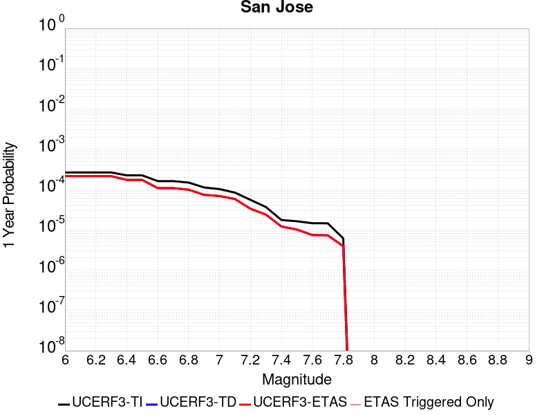 | 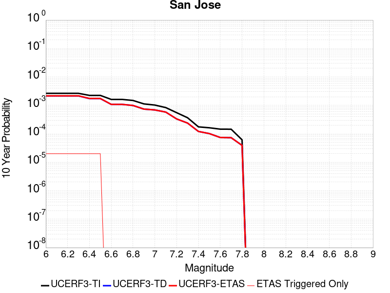 |

| Magnitude | 1 wk TI Prob | 1 wk TD Prob | 1 wk ETAS Prob | 1 wk ETAS/TD Gain | 1 wk ETAS Triggered Only | 1 mo TI Prob | 1 mo TD Prob | 1 mo ETAS Prob | 1 mo ETAS/TD Gain | 1 mo ETAS Triggered Only | 1 yr TI Prob | 1 yr TD Prob | 1 yr ETAS Prob | 1 yr ETAS/TD Gain | 1 yr ETAS Triggered Only | 10 yr TI Prob | 10 yr TD Prob | 10 yr ETAS Prob | 10 yr ETAS/TD Gain | 10 yr ETAS Triggered Only |
|-----|-----|-----|-----|-----|-----|-----|-----|-----|-----|-----|-----|-----|-----|-----|-----|-----|-----|-----|-----|-----|
| 6.0 | 5.0851277E-6 | 4.125642E-6 | 4.125642E-6 | 1.0 | 0.0 | 2.1793223E-5 | 1.768122E-5 | 1.768122E-5 | 1.0 | 0.0 | 2.653002E-4 | 2.152502E-4 | 2.152502E-4 | 1.0 | 0.0 | 0.0026498367 | 0.0021507454 | 0.0021756717 | 1.0115896 | 2.4980016E-5 |
| 6.1 | 5.0851277E-6 | 4.125642E-6 | 4.125642E-6 | 1.0 | 0.0 | 2.1793223E-5 | 1.768122E-5 | 1.768122E-5 | 1.0 | 0.0 | 2.653002E-4 | 2.152502E-4 | 2.152502E-4 | 1.0 | 0.0 | 0.0026498367 | 0.0021507454 | 0.0021756717 | 1.0115896 | 2.4980016E-5 |
| 6.2 | 5.0851277E-6 | 4.125642E-6 | 4.125642E-6 | 1.0 | 0.0 | 2.1793223E-5 | 1.768122E-5 | 1.768122E-5 | 1.0 | 0.0 | 2.653002E-4 | 2.152502E-4 | 2.152502E-4 | 1.0 | 0.0 | 0.0026498367 | 0.0021507454 | 0.0021756717 | 1.0115896 | 2.4980016E-5 |
| 6.3 | 5.0851277E-6 | 4.125642E-6 | 4.125642E-6 | 1.0 | 0.0 | 2.1793223E-5 | 1.768122E-5 | 1.768122E-5 | 1.0 | 0.0 | 2.653002E-4 | 2.152502E-4 | 2.152502E-4 | 1.0 | 0.0 | 0.0026498367 | 0.0021507454 | 0.0021756717 | 1.0115896 | 2.4980016E-5 |
| 6.4 | 4.3115124E-6 | 3.3237525E-6 | 3.3237525E-6 | 1.0 | 0.0 | 1.8477778E-5 | 1.4244589E-5 | 1.4244589E-5 | 1.0 | 0.0 | 2.2494372E-4 | 1.7341628E-4 | 1.7341628E-4 | 1.0 | 0.0 | 0.0022471617 | 0.0017330965 | 0.0017580332 | 1.0143886 | 2.4980016E-5 |
| 6.5 | 4.3115124E-6 | 3.3237525E-6 | 3.3237525E-6 | 1.0 | 0.0 | 1.8477778E-5 | 1.4244589E-5 | 1.4244589E-5 | 1.0 | 0.0 | 2.2494372E-4 | 1.7341628E-4 | 1.7341628E-4 | 1.0 | 0.0 | 0.0022471617 | 0.0017330965 | 0.0017580332 | 1.0143886 | 2.4980016E-5 |
| 6.6 | 3.110396E-6 | 2.0799562E-6 | 2.0799562E-6 | 1.0 | 0.0 | 1.33302E-5 | 8.9140685E-6 | 8.9140685E-6 | 1.0 | 0.0 | 1.622831E-4 | 1.0852366E-4 | 1.0852366E-4 | 1.0 | 0.0 | 0.0016216465 | 0.001084804 | 0.001084804 | 1.0 | 0.0 |
| 6.7 | 3.110396E-6 | 2.0799562E-6 | 2.0799562E-6 | 1.0 | 0.0 | 1.33302E-5 | 8.9140685E-6 | 8.9140685E-6 | 1.0 | 0.0 | 1.622831E-4 | 1.0852366E-4 | 1.0852366E-4 | 1.0 | 0.0 | 0.0016216465 | 0.001084804 | 0.001084804 | 1.0 | 0.0 |
| 6.8 | 2.856651E-6 | 1.9024077E-6 | 1.9024077E-6 | 1.0 | 0.0 | 1.2242733E-5 | 8.153152E-6 | 8.153152E-6 | 1.0 | 0.0 | 1.4904508E-4 | 9.926035E-5 | 9.926035E-5 | 1.0 | 0.0 | 0.0014894515 | 9.922545E-4 | 9.922545E-4 | 1.0 | 0.0 |
| 6.9 | 2.1618725E-6 | 1.4186406E-6 | 1.4186406E-6 | 1.0 | 0.0 | 9.265135E-6 | 6.0798748E-6 | 6.0798748E-6 | 1.0 | 0.0 | 1.12797185E-4 | 7.402005E-5 | 7.402005E-5 | 1.0 | 0.0 | 0.0011273995 | 7.4003247E-4 | 7.4003247E-4 | 1.0 | 0.0 |
| 7.0 | 1.9684312E-6 | 1.3256082E-6 | 1.3256082E-6 | 1.0 | 0.0 | 8.436106E-6 | 5.681166E-6 | 5.681166E-6 | 1.0 | 0.0 | 1.02704755E-4 | 6.916608E-5 | 6.916608E-5 | 1.0 | 0.0 | 0.001026573 | 6.9152354E-4 | 6.9152354E-4 | 1.0 | 0.0 |
| 7.1 | 1.6070337E-6 | 1.1154867E-6 | 1.1154867E-6 | 1.0 | 0.0 | 6.887269E-6 | 4.7806493E-6 | 4.7806493E-6 | 1.0 | 0.0 | 8.384928E-5 | 5.8202913E-5 | 5.8202913E-5 | 1.0 | 0.0 | 8.3817646E-4 | 5.819527E-4 | 5.819527E-4 | 1.0 | 0.0 |
| 7.2 | 1.0631658E-6 | 6.403567E-7 | 6.403567E-7 | 1.0 | 0.0 | 4.556417E-6 | 2.744383E-6 | 2.744383E-6 | 1.0 | 0.0 | 5.5472963E-5 | 3.3412365E-5 | 3.3412365E-5 | 1.0 | 0.0 | 5.545912E-4 | 3.3414463E-4 | 3.3414463E-4 | 1.0 | 0.0 |
| 7.3 | 7.060711E-7 | 4.5823228E-7 | 4.5823228E-7 | 1.0 | 0.0 | 3.0260155E-6 | 1.9638512E-6 | 1.9638512E-6 | 1.0 | 0.0 | 3.6841117E-5 | 2.3909635E-5 | 2.3909635E-5 | 1.0 | 0.0 | 3.6835007E-4 | 2.3914136E-4 | 2.3914136E-4 | 1.0 | 0.0 |
| 7.4 | 3.3677085E-7 | 2.3231999E-7 | 2.3231999E-7 | 1.0 | 0.0 | 1.4433028E-6 | 9.956567E-7 | 9.956567E-7 | 1.0 | 0.0 | 1.757207E-5 | 1.2122056E-5 | 1.2122056E-5 | 1.0 | 0.0 | 1.7570681E-4 | 1.2128407E-4 | 1.2128407E-4 | 1.0 | 0.0 |
| 7.5 | 3.129161E-7 | 1.9529637E-7 | 1.9529637E-7 | 1.0 | 0.0 | 1.3410682E-6 | 8.3698416E-7 | 8.3698416E-7 | 1.0 | 0.0 | 1.6327383E-5 | 1.0190237E-5 | 1.0190237E-5 | 1.0 | 0.0 | 1.6326184E-4 | 1.0196777E-4 | 1.0196777E-4 | 1.0 | 0.0 |
| 7.6 | 2.8008668E-7 | 1.4240818E-7 | 1.4240818E-7 | 1.0 | 0.0 | 1.2003709E-6 | 6.103206E-7 | 6.103206E-7 | 1.0 | 0.0 | 1.46144175E-5 | 7.43063E-6 | 7.43063E-6 | 1.0 | 0.0 | 1.4613457E-4 | 7.43735E-5 | 7.43735E-5 | 1.0 | 0.0 |
| 7.7 | 2.7852005E-7 | 1.4015403E-7 | 1.4015403E-7 | 1.0 | 0.0 | 1.1936568E-6 | 6.0066003E-7 | 6.0066003E-7 | 1.0 | 0.0 | 1.4532674E-5 | 7.3130127E-6 | 7.3130127E-6 | 1.0 | 0.0 | 1.4531724E-4 | 7.31974E-5 | 7.31974E-5 | 1.0 | 0.0 |
| 7.8 | 1.1810797E-7 | 7.5187074E-8 | 7.5187074E-8 | 1.0 | 0.0 | 5.0617695E-7 | 3.2223028E-7 | 3.2223028E-7 | 1.0 | 0.0 | 6.1626865E-6 | 3.9231472E-6 | 3.9231472E-6 | 1.0 | 0.0 | 6.162516E-5 | 3.9271265E-5 | 3.9271265E-5 | 1.0 | 0.0 |

## Compton
*[(top)](#table-of-contents)*

| 1 Week | 1 Month | 1 Year | 10 Year |
|-----|-----|-----|-----|
| 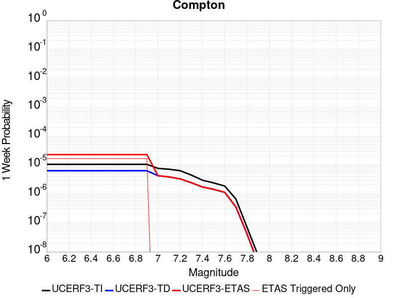 | 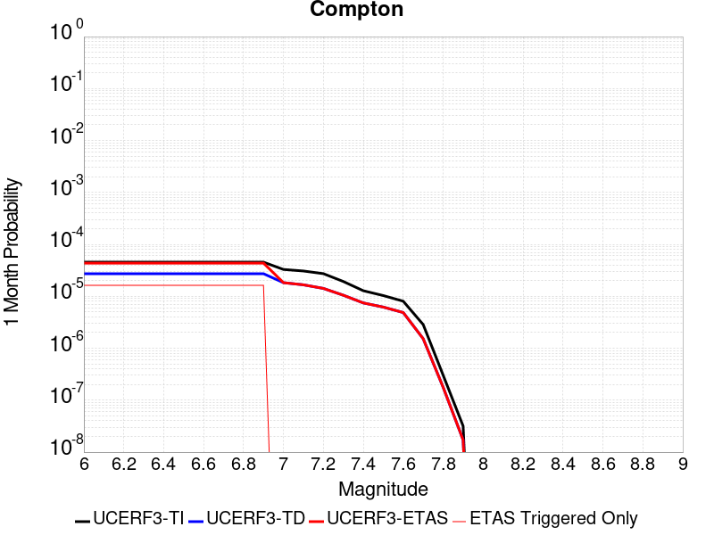 | 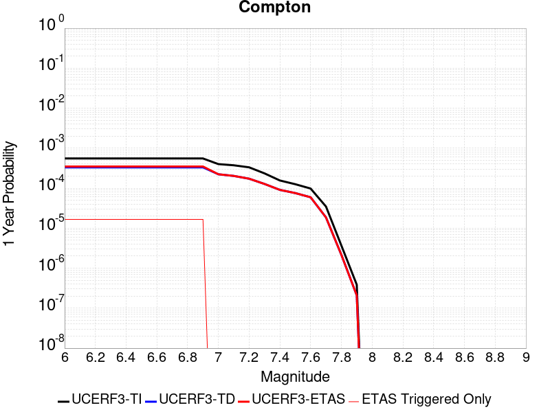 | 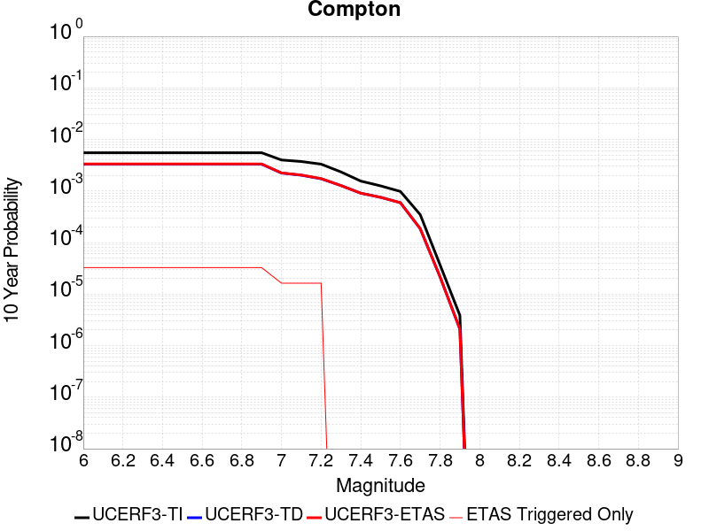 |

| Magnitude | 1 wk TI Prob | 1 wk TD Prob | 1 wk ETAS Prob | 1 wk ETAS/TD Gain | 1 wk ETAS Triggered Only | 1 mo TI Prob | 1 mo TD Prob | 1 mo ETAS Prob | 1 mo ETAS/TD Gain | 1 mo ETAS Triggered Only | 1 yr TI Prob | 1 yr TD Prob | 1 yr ETAS Prob | 1 yr ETAS/TD Gain | 1 yr ETAS Triggered Only | 10 yr TI Prob | 10 yr TD Prob | 10 yr ETAS Prob | 10 yr ETAS/TD Gain | 10 yr ETAS Triggered Only |
|-----|-----|-----|-----|-----|-----|-----|-----|-----|-----|-----|-----|-----|-----|-----|-----|-----|-----|-----|-----|-----|
| 6.0 | 1.06050875E-5 | 6.35892E-6 | 6.35892E-6 | 1.0 | 0.0 | 4.5449582E-5 | 2.7252245E-5 | 2.7252245E-5 | 1.0 | 0.0 | 5.5320817E-4 | 3.3174842E-4 | 3.3174842E-4 | 1.0 | 0.0 | 0.0055183303 | 0.003312816 | 0.0033377132 | 1.0075154 | 2.4980016E-5 |
| 6.1 | 1.06050875E-5 | 6.35892E-6 | 6.35892E-6 | 1.0 | 0.0 | 4.5449582E-5 | 2.7252245E-5 | 2.7252245E-5 | 1.0 | 0.0 | 5.5320817E-4 | 3.3174842E-4 | 3.3174842E-4 | 1.0 | 0.0 | 0.0055183303 | 0.003312816 | 0.0033377132 | 1.0075154 | 2.4980016E-5 |
| 6.2 | 1.06050875E-5 | 6.35892E-6 | 6.35892E-6 | 1.0 | 0.0 | 4.5449582E-5 | 2.7252245E-5 | 2.7252245E-5 | 1.0 | 0.0 | 5.5320817E-4 | 3.3174842E-4 | 3.3174842E-4 | 1.0 | 0.0 | 0.0055183303 | 0.003312816 | 0.0033377132 | 1.0075154 | 2.4980016E-5 |
| 6.3 | 1.06050875E-5 | 6.35892E-6 | 6.35892E-6 | 1.0 | 0.0 | 4.5449582E-5 | 2.7252245E-5 | 2.7252245E-5 | 1.0 | 0.0 | 5.5320817E-4 | 3.3174842E-4 | 3.3174842E-4 | 1.0 | 0.0 | 0.0055183303 | 0.003312816 | 0.0033377132 | 1.0075154 | 2.4980016E-5 |
| 6.4 | 1.06050875E-5 | 6.35892E-6 | 6.35892E-6 | 1.0 | 0.0 | 4.5449582E-5 | 2.7252245E-5 | 2.7252245E-5 | 1.0 | 0.0 | 5.5320817E-4 | 3.3174842E-4 | 3.3174842E-4 | 1.0 | 0.0 | 0.0055183303 | 0.003312816 | 0.0033377132 | 1.0075154 | 2.4980016E-5 |
| 6.5 | 1.06050875E-5 | 6.35892E-6 | 6.35892E-6 | 1.0 | 0.0 | 4.5449582E-5 | 2.7252245E-5 | 2.7252245E-5 | 1.0 | 0.0 | 5.5320817E-4 | 3.3174842E-4 | 3.3174842E-4 | 1.0 | 0.0 | 0.0055183303 | 0.003312816 | 0.0033377132 | 1.0075154 | 2.4980016E-5 |
| 6.6 | 1.06050875E-5 | 6.35892E-6 | 6.35892E-6 | 1.0 | 0.0 | 4.5449582E-5 | 2.7252245E-5 | 2.7252245E-5 | 1.0 | 0.0 | 5.5320817E-4 | 3.3174842E-4 | 3.3174842E-4 | 1.0 | 0.0 | 0.0055183303 | 0.003312816 | 0.0033377132 | 1.0075154 | 2.4980016E-5 |
| 6.7 | 1.06050875E-5 | 6.35892E-6 | 6.35892E-6 | 1.0 | 0.0 | 4.5449582E-5 | 2.7252245E-5 | 2.7252245E-5 | 1.0 | 0.0 | 5.5320817E-4 | 3.3174842E-4 | 3.3174842E-4 | 1.0 | 0.0 | 0.0055183303 | 0.003312816 | 0.0033377132 | 1.0075154 | 2.4980016E-5 |
| 6.8 | 1.06050875E-5 | 6.35892E-6 | 6.35892E-6 | 1.0 | 0.0 | 4.5449582E-5 | 2.7252245E-5 | 2.7252245E-5 | 1.0 | 0.0 | 5.5320817E-4 | 3.3174842E-4 | 3.3174842E-4 | 1.0 | 0.0 | 0.0055183303 | 0.003312816 | 0.0033377132 | 1.0075154 | 2.4980016E-5 |
| 6.9 | 1.06050875E-5 | 6.35892E-6 | 6.35892E-6 | 1.0 | 0.0 | 4.5449582E-5 | 2.7252245E-5 | 2.7252245E-5 | 1.0 | 0.0 | 5.5320817E-4 | 3.3174842E-4 | 3.3174842E-4 | 1.0 | 0.0 | 0.0055183303 | 0.003312816 | 0.0033377132 | 1.0075154 | 2.4980016E-5 |
| 7.0 | 7.672486E-6 | 4.272077E-6 | 4.272077E-6 | 1.0 | 0.0 | 3.288167E-5 | 1.8308778E-5 | 1.8308778E-5 | 1.0 | 0.0 | 4.0026082E-4 | 2.2288719E-4 | 2.2288719E-4 | 1.0 | 0.0 | 0.0039954064 | 0.0022266984 | 0.002251623 | 1.0111934 | 2.4980016E-5 |
| 7.1 | 7.163992E-6 | 3.883783E-6 | 3.883783E-6 | 1.0 | 0.0 | 3.0702464E-5 | 1.664468E-5 | 1.664468E-5 | 1.0 | 0.0 | 3.7373835E-4 | 2.0263072E-4 | 2.0263072E-4 | 1.0 | 0.0 | 0.0037311043 | 0.0020245167 | 0.002049446 | 1.0123137 | 2.4980016E-5 |
| 7.2 | 6.3689185E-6 | 3.3101053E-6 | 3.3101053E-6 | 1.0 | 0.0 | 2.729508E-5 | 1.4186091E-5 | 1.4186091E-5 | 1.0 | 0.0 | 3.322669E-4 | 1.7270239E-4 | 1.7270239E-4 | 1.0 | 0.0 | 0.0033177056 | 0.0017257235 | 0.0017506605 | 1.0144501 | 2.4980016E-5 |
| 7.3 | 4.4987873E-6 | 2.4480198E-6 | 2.4480198E-6 | 1.0 | 0.0 | 1.9280375E-5 | 1.0491473E-5 | 1.0491473E-5 | 1.0 | 0.0 | 2.3471327E-4 | 1.2772651E-4 | 1.2772651E-4 | 1.0 | 0.0 | 0.002344655 | 0.0012765612 | 0.0012765612 | 1.0 | 0.0 |
| 7.4 | 2.987296E-6 | 1.7394043E-6 | 1.7394043E-6 | 1.0 | 0.0 | 1.2802635E-5 | 7.4545687E-6 | 7.4545687E-6 | 1.0 | 0.0 | 1.5586092E-4 | 9.075565E-5 | 9.075565E-5 | 1.0 | 0.0 | 0.0015575165 | 9.071917E-4 | 9.071917E-4 | 1.0 | 0.0 |
| 7.5 | 2.4111696E-6 | 1.4471991E-6 | 1.4471991E-6 | 1.0 | 0.0 | 1.0333543E-5 | 6.2022677E-6 | 6.2022677E-6 | 1.0 | 0.0 | 1.2580362E-4 | 7.551004E-5 | 7.551004E-5 | 1.0 | 0.0 | 0.0012573242 | 7.548485E-4 | 7.548485E-4 | 1.0 | 0.0 |
| 7.6 | 1.8783096E-6 | 1.1360306E-6 | 1.1360306E-6 | 1.0 | 0.0 | 8.049874E-6 | 4.868694E-6 | 4.868694E-6 | 1.0 | 0.0 | 9.8002805E-5 | 5.9274775E-5 | 5.9274775E-5 | 1.0 | 0.0 | 9.795959E-4 | 5.925936E-4 | 5.925936E-4 | 1.0 | 0.0 |
| 7.7 | 6.6646817E-7 | 3.5601457E-7 | 3.5601457E-7 | 1.0 | 0.0 | 2.856289E-6 | 1.5257759E-6 | 1.5257759E-6 | 1.0 | 0.0 | 3.4774763E-5 | 1.8576176E-5 | 1.8576176E-5 | 1.0 | 0.0 | 3.4769322E-4 | 1.8574759E-4 | 1.8574759E-4 | 1.0 | 0.0 |
| 7.8 | 7.054689E-8 | 4.1342012E-8 | 4.1342012E-8 | 1.0 | 0.0 | 3.0234378E-7 | 1.7718004E-7 | 1.7718004E-7 | 1.0 | 0.0 | 3.6810293E-6 | 2.157165E-6 | 2.157165E-6 | 1.0 | 0.0 | 3.6809684E-5 | 2.157145E-5 | 2.157145E-5 | 1.0 | 0.0 |
| 7.9 | 7.420925E-9 | 4.0130637E-9 | 4.0130637E-9 | 1.0 | 0.0 | 3.1803964E-8 | 1.7198845E-8 | 1.7198845E-8 | 1.0 | 0.0 | 3.872132E-7 | 2.0939592E-7 | 2.0939592E-7 | 1.0 | 0.0 | 3.872125E-6 | 2.0939574E-6 | 2.0939574E-6 | 1.0 | 0.0 |

## Monterey Bay-Tularcitos
*[(top)](#table-of-contents)*

| 1 Week | 1 Month | 1 Year | 10 Year |
|-----|-----|-----|-----|
|  | 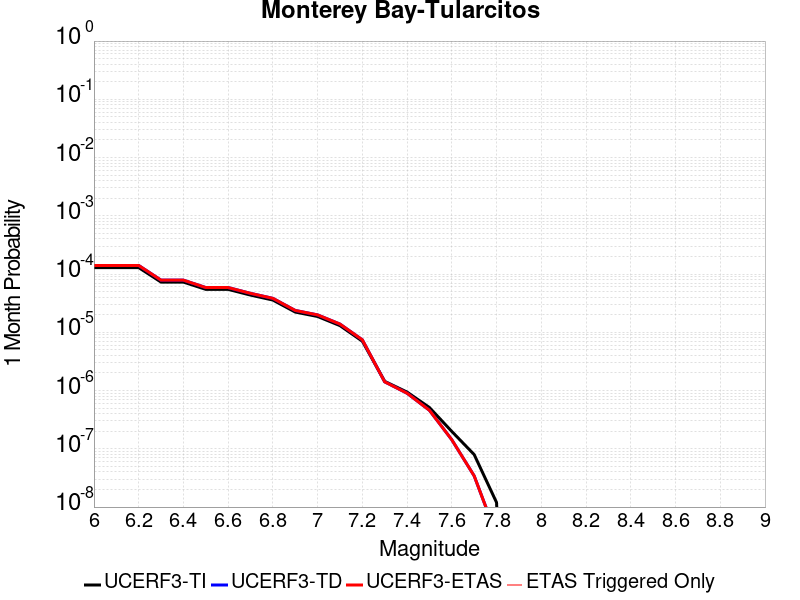 | 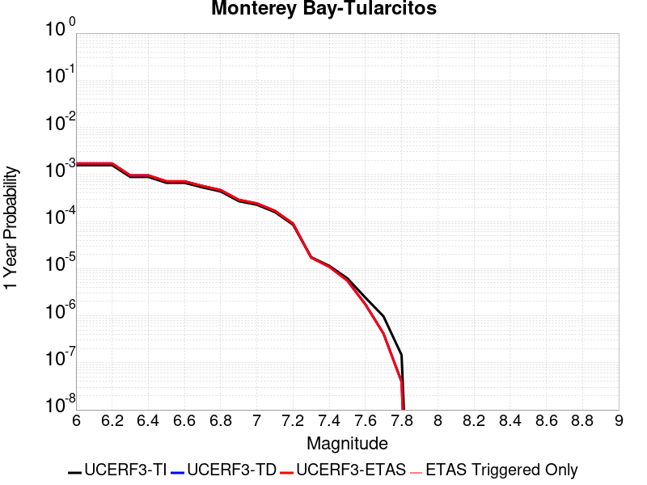 | 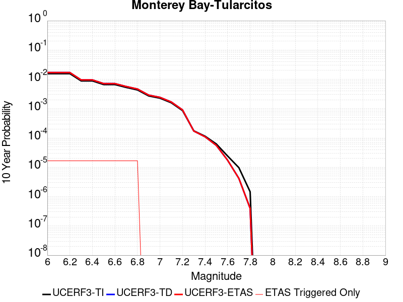 |

| Magnitude | 1 wk TI Prob | 1 wk TD Prob | 1 wk ETAS Prob | 1 wk ETAS/TD Gain | 1 wk ETAS Triggered Only | 1 mo TI Prob | 1 mo TD Prob | 1 mo ETAS Prob | 1 mo ETAS/TD Gain | 1 mo ETAS Triggered Only | 1 yr TI Prob | 1 yr TD Prob | 1 yr ETAS Prob | 1 yr ETAS/TD Gain | 1 yr ETAS Triggered Only | 10 yr TI Prob | 10 yr TD Prob | 10 yr ETAS Prob | 10 yr ETAS/TD Gain | 10 yr ETAS Triggered Only |
|-----|-----|-----|-----|-----|-----|-----|-----|-----|-----|-----|-----|-----|-----|-----|-----|-----|-----|-----|-----|-----|
| 6.0 | 3.0131365E-5 | 3.279877E-5 | 3.279877E-5 | 1.0 | 0.0 | 1.2912804E-4 | 1.4055918E-4 | 1.4055918E-4 | 1.0 | 0.0 | 0.001571 | 0.0017100703 | 0.0017100703 | 1.0 | 0.0 | 0.015599402 | 0.016979916 | 0.017004473 | 1.0014461 | 2.4980016E-5 |
| 6.1 | 3.0131365E-5 | 3.279877E-5 | 3.279877E-5 | 1.0 | 0.0 | 1.2912804E-4 | 1.4055918E-4 | 1.4055918E-4 | 1.0 | 0.0 | 0.001571 | 0.0017100703 | 0.0017100703 | 1.0 | 0.0 | 0.015599402 | 0.016979916 | 0.017004473 | 1.0014461 | 2.4980016E-5 |
| 6.2 | 3.0131365E-5 | 3.279877E-5 | 3.279877E-5 | 1.0 | 0.0 | 1.2912804E-4 | 1.4055918E-4 | 1.4055918E-4 | 1.0 | 0.0 | 0.001571 | 0.0017100703 | 0.0017100703 | 1.0 | 0.0 | 0.015599402 | 0.016979916 | 0.017004473 | 1.0014461 | 2.4980016E-5 |
| 6.3 | 1.6998249E-5 | 1.8330798E-5 | 1.8330798E-5 | 1.0 | 0.0 | 7.28476E-5 | 7.85583E-5 | 7.85583E-5 | 1.0 | 0.0 | 8.865586E-4 | 9.5604634E-4 | 9.5604634E-4 | 1.0 | 0.0 | 0.0088303005 | 0.009521258 | 0.0095460005 | 1.0025986 | 2.4980016E-5 |
| 6.4 | 1.6998249E-5 | 1.8330798E-5 | 1.8330798E-5 | 1.0 | 0.0 | 7.28476E-5 | 7.85583E-5 | 7.85583E-5 | 1.0 | 0.0 | 8.865586E-4 | 9.5604634E-4 | 9.5604634E-4 | 1.0 | 0.0 | 0.0088303005 | 0.009521258 | 0.0095460005 | 1.0025986 | 2.4980016E-5 |
| 6.5 | 1.27470785E-5 | 1.3693312E-5 | 1.3693312E-5 | 1.0 | 0.0 | 5.4629192E-5 | 5.8684363E-5 | 5.8684363E-5 | 1.0 | 0.0 | 6.649074E-4 | 7.1425823E-4 | 7.1425823E-4 | 1.0 | 0.0 | 0.0066292146 | 0.007120678 | 0.0071454807 | 1.003483 | 2.4980016E-5 |
| 6.6 | 1.2739422E-5 | 1.36854E-5 | 1.36854E-5 | 1.0 | 0.0 | 5.4596385E-5 | 5.8650454E-5 | 5.8650454E-5 | 1.0 | 0.0 | 6.645082E-4 | 7.1384566E-4 | 7.1384566E-4 | 1.0 | 0.0 | 0.0066252467 | 0.007116579 | 0.007141381 | 1.0034851 | 2.4980016E-5 |
| 6.7 | 1.0160109E-5 | 1.0885755E-5 | 1.0885755E-5 | 1.0 | 0.0 | 4.35426E-5 | 4.665244E-5 | 4.665244E-5 | 1.0 | 0.0 | 5.300022E-4 | 5.6785246E-4 | 5.6785246E-4 | 1.0 | 0.0 | 0.005287399 | 0.0056647263 | 0.0056895646 | 1.0043848 | 2.4980016E-5 |
| 6.8 | 8.349859E-6 | 8.932587E-6 | 8.932587E-6 | 1.0 | 0.0 | 3.578462E-5 | 3.8281985E-5 | 3.8281985E-5 | 1.0 | 0.0 | 4.3559066E-4 | 4.6598914E-4 | 4.6598914E-4 | 1.0 | 0.0 | 0.004347378 | 0.004650685 | 0.004675549 | 1.0053463 | 2.4980016E-5 |
| 6.9 | 5.193639E-6 | 5.53643E-6 | 5.53643E-6 | 1.0 | 0.0 | 2.2258262E-5 | 2.372736E-5 | 2.372736E-5 | 1.0 | 0.0 | 2.7096065E-4 | 2.8884556E-4 | 2.8884556E-4 | 1.0 | 0.0 | 0.0027063051 | 0.0028850224 | 0.0028850224 | 1.0 | 0.0 |
| 7.0 | 4.359381E-6 | 4.643366E-6 | 4.643366E-6 | 1.0 | 0.0 | 1.8682927E-5 | 1.9900004E-5 | 1.9900004E-5 | 1.0 | 0.0 | 2.274409E-4 | 2.422586E-4 | 2.422586E-4 | 1.0 | 0.0 | 0.0022720827 | 0.002420238 | 0.002420238 | 1.0 | 0.0 |
| 7.1 | 3.0398533E-6 | 3.2310427E-6 | 3.2310427E-6 | 1.0 | 0.0 | 1.3027877E-5 | 1.3847267E-5 | 1.3847267E-5 | 1.0 | 0.0 | 1.5860285E-4 | 1.6858005E-4 | 1.6858005E-4 | 1.0 | 0.0 | 0.001584897 | 0.0016847793 | 0.0016847793 | 1.0 | 0.0 |
| 7.2 | 1.642335E-6 | 1.7333153E-6 | 1.7333153E-6 | 1.0 | 0.0 | 7.0385595E-6 | 7.428485E-6 | 7.428485E-6 | 1.0 | 0.0 | 8.569109E-5 | 9.044012E-5 | 9.044012E-5 | 1.0 | 0.0 | 8.5658056E-4 | 9.042358E-4 | 9.042358E-4 | 1.0 | 0.0 |
| 7.3 | 3.356842E-7 | 3.2952389E-7 | 3.2952389E-7 | 1.0 | 0.0 | 1.4386458E-6 | 1.4122445E-6 | 1.4122445E-6 | 1.0 | 0.0 | 1.7515373E-5 | 1.7193941E-5 | 1.7193941E-5 | 1.0 | 0.0 | 1.7513991E-4 | 1.719262E-4 | 1.719262E-4 | 1.0 | 0.0 |
| 7.4 | 2.1973483E-7 | 2.1006414E-7 | 2.1006414E-7 | 1.0 | 0.0 | 9.417204E-7 | 9.002746E-7 | 9.002746E-7 | 1.0 | 0.0 | 1.1465385E-5 | 1.0960788E-5 | 1.0960788E-5 | 1.0 | 0.0 | 1.1464794E-4 | 1.0960251E-4 | 1.0960251E-4 | 1.0 | 0.0 |
| 7.5 | 1.1944135E-7 | 1.0696035E-7 | 1.0696035E-7 | 1.0 | 0.0 | 5.118914E-7 | 4.5840142E-7 | 4.5840142E-7 | 1.0 | 0.0 | 6.23226E-6 | 5.581023E-6 | 5.581023E-6 | 1.0 | 0.0 | 6.2320854E-5 | 5.5808843E-5 | 5.5808843E-5 | 1.0 | 0.0 |
| 7.6 | 4.636058E-8 | 3.3364433E-8 | 3.3364433E-8 | 1.0 | 0.0 | 1.9868818E-7 | 1.4299042E-7 | 1.4299042E-7 | 1.0 | 0.0 | 2.419026E-6 | 1.740907E-6 | 1.740907E-6 | 1.0 | 0.0 | 2.4189996E-5 | 1.7408936E-5 | 1.7408936E-5 | 1.0 | 0.0 |
| 7.7 | 1.8588572E-8 | 8.003168E-9 | 8.003168E-9 | 1.0 | 0.0 | 7.9665305E-8 | 3.429929E-8 | 3.429929E-8 | 1.0 | 0.0 | 9.699246E-7 | 4.1759378E-7 | 4.1759378E-7 | 1.0 | 0.0 | 9.699204E-6 | 4.1759304E-6 | 4.1759304E-6 | 1.0 | 0.0 |
| 7.8 | 2.7960154E-9 | 7.608624E-10 | 7.608624E-10 | 1.0 | 0.0 | 1.1982923E-8 | 3.2608392E-9 | 3.2608392E-9 | 1.0 | 0.0 | 1.4589209E-7 | 3.9700716E-8 | 3.9700716E-8 | 1.0 | 0.0 | 1.4589199E-6 | 3.970071E-7 | 3.970071E-7 | 1.0 | 0.0 |

## Los Alamos 2011 CFM
*[(top)](#table-of-contents)*

| 1 Week | 1 Month | 1 Year | 10 Year |
|-----|-----|-----|-----|
|  | 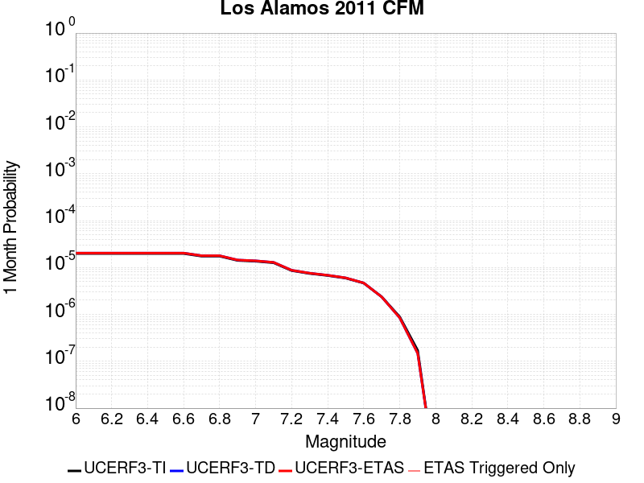 |  | 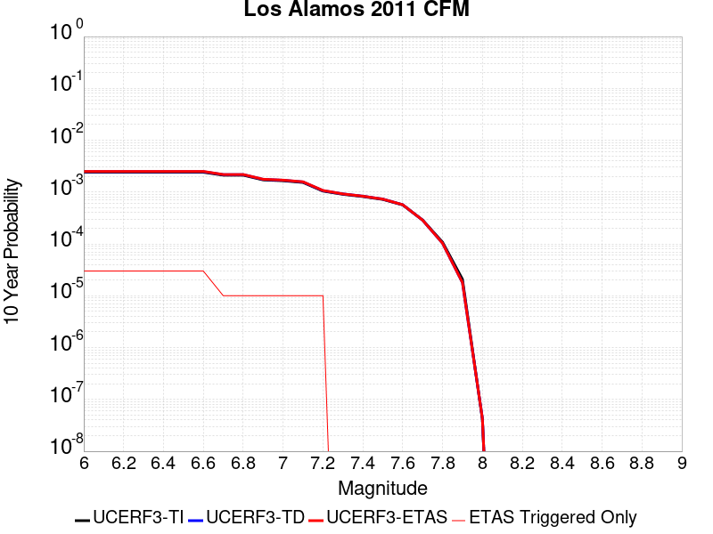 |

| Magnitude | 1 wk TI Prob | 1 wk TD Prob | 1 wk ETAS Prob | 1 wk ETAS/TD Gain | 1 wk ETAS Triggered Only | 1 mo TI Prob | 1 mo TD Prob | 1 mo ETAS Prob | 1 mo ETAS/TD Gain | 1 mo ETAS Triggered Only | 1 yr TI Prob | 1 yr TD Prob | 1 yr ETAS Prob | 1 yr ETAS/TD Gain | 1 yr ETAS Triggered Only | 10 yr TI Prob | 10 yr TD Prob | 10 yr ETAS Prob | 10 yr ETAS/TD Gain | 10 yr ETAS Triggered Only |
|-----|-----|-----|-----|-----|-----|-----|-----|-----|-----|-----|-----|-----|-----|-----|-----|-----|-----|-----|-----|-----|
| 6.0 | 4.6284417E-6 | 4.7517333E-6 | 4.7517333E-6 | 1.0 | 0.0 | 1.9836029E-5 | 2.0364423E-5 | 2.0364423E-5 | 1.0 | 0.0 | 2.4147688E-4 | 2.479104E-4 | 2.479104E-4 | 1.0 | 0.0 | 0.0024121467 | 0.0024765125 | 0.0025014307 | 1.0100617 | 2.4980016E-5 |
| 6.1 | 4.6284417E-6 | 4.7517333E-6 | 4.7517333E-6 | 1.0 | 0.0 | 1.9836029E-5 | 2.0364423E-5 | 2.0364423E-5 | 1.0 | 0.0 | 2.4147688E-4 | 2.479104E-4 | 2.479104E-4 | 1.0 | 0.0 | 0.0024121467 | 0.0024765125 | 0.0025014307 | 1.0100617 | 2.4980016E-5 |
| 6.2 | 4.6284417E-6 | 4.7517333E-6 | 4.7517333E-6 | 1.0 | 0.0 | 1.9836029E-5 | 2.0364423E-5 | 2.0364423E-5 | 1.0 | 0.0 | 2.4147688E-4 | 2.479104E-4 | 2.479104E-4 | 1.0 | 0.0 | 0.0024121467 | 0.0024765125 | 0.0025014307 | 1.0100617 | 2.4980016E-5 |
| 6.3 | 4.6284417E-6 | 4.7517333E-6 | 4.7517333E-6 | 1.0 | 0.0 | 1.9836029E-5 | 2.0364423E-5 | 2.0364423E-5 | 1.0 | 0.0 | 2.4147688E-4 | 2.479104E-4 | 2.479104E-4 | 1.0 | 0.0 | 0.0024121467 | 0.0024765125 | 0.0025014307 | 1.0100617 | 2.4980016E-5 |
| 6.4 | 4.6284417E-6 | 4.7517333E-6 | 4.7517333E-6 | 1.0 | 0.0 | 1.9836029E-5 | 2.0364423E-5 | 2.0364423E-5 | 1.0 | 0.0 | 2.4147688E-4 | 2.479104E-4 | 2.479104E-4 | 1.0 | 0.0 | 0.0024121467 | 0.0024765125 | 0.0025014307 | 1.0100617 | 2.4980016E-5 |
| 6.5 | 4.6284417E-6 | 4.7517333E-6 | 4.7517333E-6 | 1.0 | 0.0 | 1.9836029E-5 | 2.0364423E-5 | 2.0364423E-5 | 1.0 | 0.0 | 2.4147688E-4 | 2.479104E-4 | 2.479104E-4 | 1.0 | 0.0 | 0.0024121467 | 0.0024765125 | 0.0025014307 | 1.0100617 | 2.4980016E-5 |
| 6.6 | 4.6284417E-6 | 4.7517333E-6 | 4.7517333E-6 | 1.0 | 0.0 | 1.9836029E-5 | 2.0364423E-5 | 2.0364423E-5 | 1.0 | 0.0 | 2.4147688E-4 | 2.479104E-4 | 2.479104E-4 | 1.0 | 0.0 | 0.0024121467 | 0.0024765125 | 0.0025014307 | 1.0100617 | 2.4980016E-5 |
| 6.7 | 4.062321E-6 | 4.166351E-6 | 4.166351E-6 | 1.0 | 0.0 | 1.7409831E-5 | 1.7855677E-5 | 1.7855677E-5 | 1.0 | 0.0 | 2.1194408E-4 | 2.1737268E-4 | 2.1737268E-4 | 1.0 | 0.0 | 0.0021174205 | 0.0021717504 | 0.0021717504 | 1.0 | 0.0 |
| 6.8 | 4.062321E-6 | 4.166351E-6 | 4.166351E-6 | 1.0 | 0.0 | 1.7409831E-5 | 1.7855677E-5 | 1.7855677E-5 | 1.0 | 0.0 | 2.1194408E-4 | 2.1737268E-4 | 2.1737268E-4 | 1.0 | 0.0 | 0.0021174205 | 0.0021717504 | 0.0021717504 | 1.0 | 0.0 |
| 6.9 | 3.2936077E-6 | 3.37296E-6 | 3.37296E-6 | 1.0 | 0.0 | 1.4115385E-5 | 1.4455468E-5 | 1.4455468E-5 | 1.0 | 0.0 | 1.7184127E-4 | 1.7598206E-4 | 1.7598206E-4 | 1.0 | 0.0 | 0.0017170844 | 0.0017585196 | 0.0017585196 | 1.0 | 0.0 |
| 7.0 | 3.1687898E-6 | 3.2448177E-6 | 3.2448177E-6 | 1.0 | 0.0 | 1.3580457E-5 | 1.3906293E-5 | 1.3906293E-5 | 1.0 | 0.0 | 1.6532952E-4 | 1.692969E-4 | 1.692969E-4 | 1.0 | 0.0 | 0.0016520657 | 0.0016917707 | 0.0016917707 | 1.0 | 0.0 |
| 7.1 | 2.9379228E-6 | 3.007328E-6 | 3.007328E-6 | 1.0 | 0.0 | 1.25910365E-5 | 1.288849E-5 | 1.288849E-5 | 1.0 | 0.0 | 1.5328509E-4 | 1.5690697E-4 | 1.5690697E-4 | 1.0 | 0.0 | 0.001531794 | 0.001568051 | 0.001568051 | 1.0 | 0.0 |
| 7.2 | 2.0020686E-6 | 2.041632E-6 | 2.041632E-6 | 1.0 | 0.0 | 8.580266E-6 | 8.749822E-6 | 8.749822E-6 | 1.0 | 0.0 | 1.0445973E-4 | 1.0652392E-4 | 1.0652392E-4 | 1.0 | 0.0 | 0.0010441064 | 0.001064733 | 0.001064733 | 1.0 | 0.0 |
| 7.3 | 1.7364243E-6 | 1.7678824E-6 | 1.7678824E-6 | 1.0 | 0.0 | 7.441797E-6 | 7.576617E-6 | 7.576617E-6 | 1.0 | 0.0 | 9.0600115E-5 | 9.224144E-5 | 9.224144E-5 | 1.0 | 0.0 | 9.0563187E-4 | 9.2203467E-4 | 9.2203467E-4 | 1.0 | 0.0 |
| 7.4 | 1.5718434E-6 | 1.5983198E-6 | 1.5983198E-6 | 1.0 | 0.0 | 6.7364545E-6 | 6.8499244E-6 | 6.8499244E-6 | 1.0 | 0.0 | 8.201325E-5 | 8.339467E-5 | 8.339467E-5 | 1.0 | 0.0 | 8.198299E-4 | 8.3363673E-4 | 8.3363673E-4 | 1.0 | 0.0 |
| 7.5 | 1.3841119E-6 | 1.4042814E-6 | 1.4042814E-6 | 1.0 | 0.0 | 5.9318945E-6 | 6.018335E-6 | 6.018335E-6 | 1.0 | 0.0 | 7.221842E-5 | 7.327079E-5 | 7.327079E-5 | 1.0 | 0.0 | 7.2194956E-4 | 7.3246926E-4 | 7.3246926E-4 | 1.0 | 0.0 |
| 7.6 | 1.0843726E-6 | 1.0934443E-6 | 1.0934443E-6 | 1.0 | 0.0 | 4.647303E-6 | 4.6861815E-6 | 4.6861815E-6 | 1.0 | 0.0 | 5.6579443E-5 | 5.705279E-5 | 5.705279E-5 | 1.0 | 0.0 | 5.656504E-4 | 5.70384E-4 | 5.70384E-4 | 1.0 | 0.0 |
| 7.7 | 5.544814E-7 | 5.501884E-7 | 5.501884E-7 | 1.0 | 0.0 | 2.3763469E-6 | 2.3579482E-6 | 2.3579482E-6 | 1.0 | 0.0 | 2.8931638E-5 | 2.8707644E-5 | 2.8707644E-5 | 1.0 | 0.0 | 2.8927872E-4 | 2.870395E-4 | 2.870395E-4 | 1.0 | 0.0 |
| 7.8 | 2.0707465E-7 | 1.9778598E-7 | 1.9778598E-7 | 1.0 | 0.0 | 8.874625E-7 | 8.476539E-7 | 8.476539E-7 | 1.0 | 0.0 | 1.08048025E-5 | 1.0320137E-5 | 1.0320137E-5 | 1.0 | 0.0 | 1.0804277E-4 | 1.0319663E-4 | 1.0319663E-4 | 1.0 | 0.0 |
| 7.9 | 3.9821284E-8 | 3.4331528E-8 | 3.4331528E-8 | 1.0 | 0.0 | 1.7066264E-7 | 1.4713511E-7 | 1.4713511E-7 | 1.0 | 0.0 | 2.0778157E-6 | 1.7913685E-6 | 1.7913685E-6 | 1.0 | 0.0 | 2.0777963E-5 | 1.7913546E-5 | 1.7913546E-5 | 1.0 | 0.0 |
| 8.0 | 7.880441E-11 | 8.2353124E-11 | 8.2353124E-11 | 1.0 | 0.0 | 3.3773329E-10 | 3.52942E-10 | 3.52942E-10 | 1.0 | 0.0 | 4.1119033E-9 | 4.2970694E-9 | 4.2970694E-9 | 1.0 | 0.0 | 4.1119034E-8 | 4.2970694E-8 | 4.2970694E-8 | 1.0 | 0.0 |

## San Gorgonio Pass
*[(top)](#table-of-contents)*

| 1 Week | 1 Month | 1 Year | 10 Year |
|-----|-----|-----|-----|
| 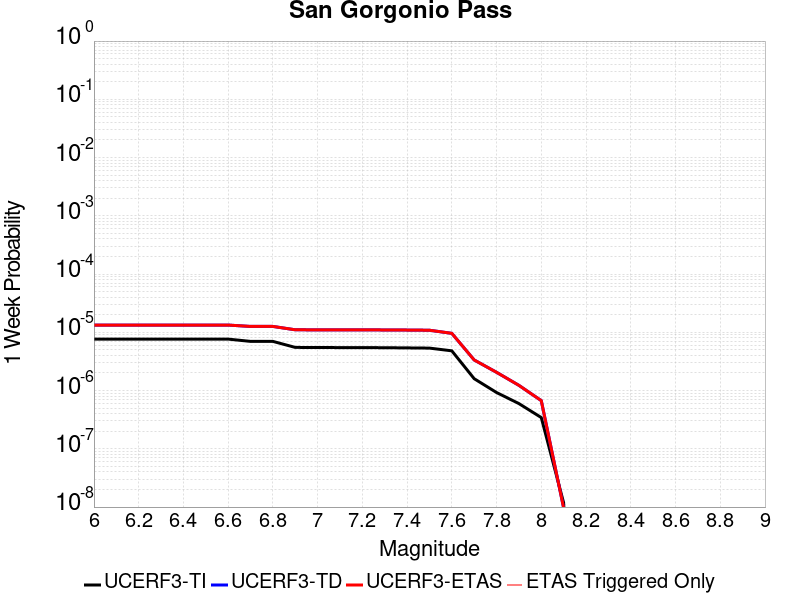 | 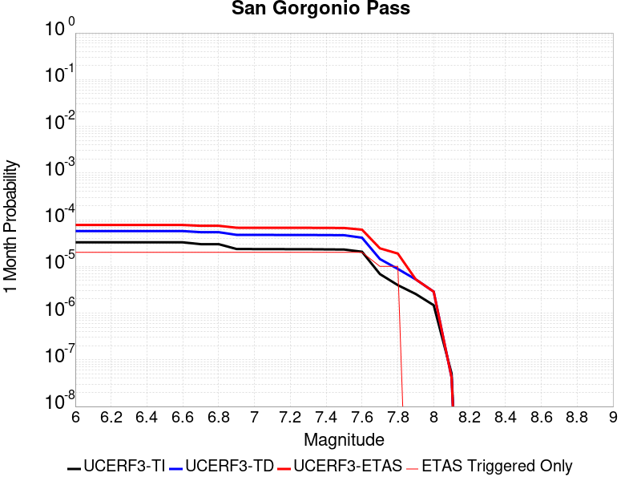 | 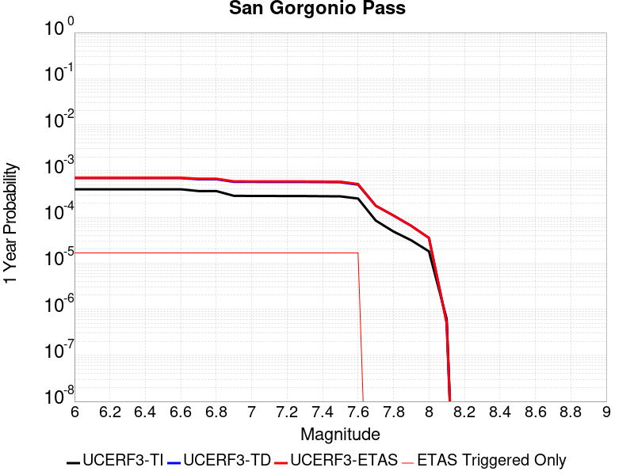 | 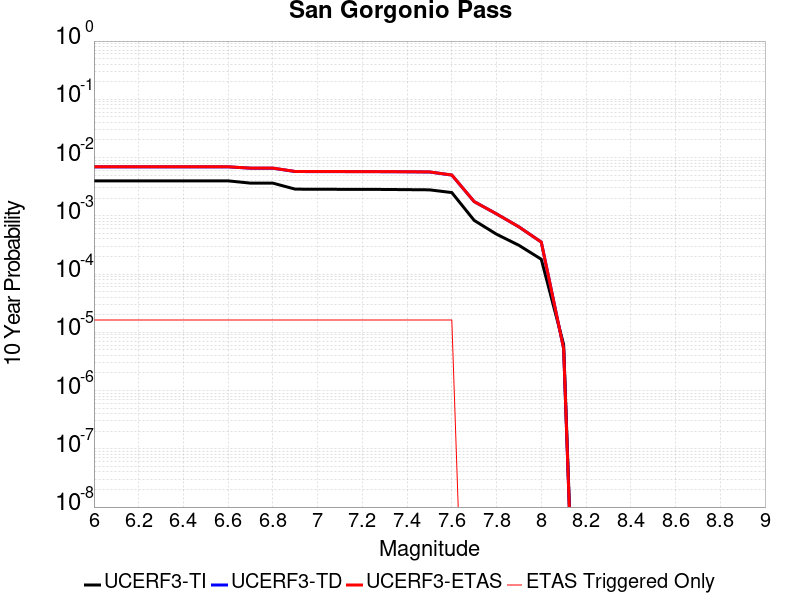 |

| Magnitude | 1 wk TI Prob | 1 wk TD Prob | 1 wk ETAS Prob | 1 wk ETAS/TD Gain | 1 wk ETAS Triggered Only | 1 mo TI Prob | 1 mo TD Prob | 1 mo ETAS Prob | 1 mo ETAS/TD Gain | 1 mo ETAS Triggered Only | 1 yr TI Prob | 1 yr TD Prob | 1 yr ETAS Prob | 1 yr ETAS/TD Gain | 1 yr ETAS Triggered Only | 10 yr TI Prob | 10 yr TD Prob | 10 yr ETAS Prob | 10 yr ETAS/TD Gain | 10 yr ETAS Triggered Only |
|-----|-----|-----|-----|-----|-----|-----|-----|-----|-----|-----|-----|-----|-----|-----|-----|-----|-----|-----|-----|-----|
| 6.0 | 7.644328E-6 | 1.331474E-5 | 1.331474E-5 | 1.0 | 0.0 | 3.2760996E-5 | 5.706197E-5 | 8.204056E-5 | 1.437745 | 2.4980016E-5 | 3.987921E-4 | 6.945166E-4 | 7.194793E-4 | 1.0359426 | 2.4980016E-5 | 0.003980772 | 0.006930024 | 0.0069548306 | 1.0035796 | 2.4980016E-5 |
| 6.1 | 7.644328E-6 | 1.331474E-5 | 1.331474E-5 | 1.0 | 0.0 | 3.2760996E-5 | 5.706197E-5 | 8.204056E-5 | 1.437745 | 2.4980016E-5 | 3.987921E-4 | 6.945166E-4 | 7.194793E-4 | 1.0359426 | 2.4980016E-5 | 0.003980772 | 0.006930024 | 0.0069548306 | 1.0035796 | 2.4980016E-5 |
| 6.2 | 7.644328E-6 | 1.331474E-5 | 1.331474E-5 | 1.0 | 0.0 | 3.2760996E-5 | 5.706197E-5 | 8.204056E-5 | 1.437745 | 2.4980016E-5 | 3.987921E-4 | 6.945166E-4 | 7.194793E-4 | 1.0359426 | 2.4980016E-5 | 0.003980772 | 0.006930024 | 0.0069548306 | 1.0035796 | 2.4980016E-5 |
| 6.3 | 7.644328E-6 | 1.331474E-5 | 1.331474E-5 | 1.0 | 0.0 | 3.2760996E-5 | 5.706197E-5 | 8.204056E-5 | 1.437745 | 2.4980016E-5 | 3.987921E-4 | 6.945166E-4 | 7.194793E-4 | 1.0359426 | 2.4980016E-5 | 0.003980772 | 0.006930024 | 0.0069548306 | 1.0035796 | 2.4980016E-5 |
| 6.4 | 7.644328E-6 | 1.331474E-5 | 1.331474E-5 | 1.0 | 0.0 | 3.2760996E-5 | 5.706197E-5 | 8.204056E-5 | 1.437745 | 2.4980016E-5 | 3.987921E-4 | 6.945166E-4 | 7.194793E-4 | 1.0359426 | 2.4980016E-5 | 0.003980772 | 0.006930024 | 0.0069548306 | 1.0035796 | 2.4980016E-5 |
| 6.5 | 7.644328E-6 | 1.331474E-5 | 1.331474E-5 | 1.0 | 0.0 | 3.2760996E-5 | 5.706197E-5 | 8.204056E-5 | 1.437745 | 2.4980016E-5 | 3.987921E-4 | 6.945166E-4 | 7.194793E-4 | 1.0359426 | 2.4980016E-5 | 0.003980772 | 0.006930024 | 0.0069548306 | 1.0035796 | 2.4980016E-5 |
| 6.6 | 7.644328E-6 | 1.331474E-5 | 1.331474E-5 | 1.0 | 0.0 | 3.2760996E-5 | 5.706197E-5 | 8.204056E-5 | 1.437745 | 2.4980016E-5 | 3.987921E-4 | 6.945166E-4 | 7.194793E-4 | 1.0359426 | 2.4980016E-5 | 0.003980772 | 0.006930024 | 0.0069548306 | 1.0035796 | 2.4980016E-5 |
| 6.7 | 6.987586E-6 | 1.2619013E-5 | 1.2619013E-5 | 1.0 | 0.0 | 2.9946454E-5 | 5.408041E-5 | 7.905908E-5 | 1.4618801 | 2.4980016E-5 | 3.645371E-4 | 6.582382E-4 | 6.8320177E-4 | 1.0379249 | 2.4980016E-5 | 0.0036393967 | 0.0065694 | 0.006594216 | 1.0037775 | 2.4980016E-5 |
| 6.8 | 6.987586E-6 | 1.2619013E-5 | 1.2619013E-5 | 1.0 | 0.0 | 2.9946454E-5 | 5.408041E-5 | 7.905908E-5 | 1.4618801 | 2.4980016E-5 | 3.645371E-4 | 6.582382E-4 | 6.8320177E-4 | 1.0379249 | 2.4980016E-5 | 0.0036393967 | 0.0065694 | 0.006594216 | 1.0037775 | 2.4980016E-5 |
| 6.9 | 5.504702E-6 | 1.1049877E-5 | 1.1049877E-5 | 1.0 | 0.0 | 2.3591367E-5 | 4.7355785E-5 | 7.233462E-5 | 1.5274717 | 2.4980016E-5 | 2.8718702E-4 | 5.764092E-4 | 6.0137484E-4 | 1.0433123 | 2.4980016E-5 | 0.0028681618 | 0.0057553523 | 0.005780189 | 1.0043154 | 2.4980016E-5 |
| 7.0 | 5.4825764E-6 | 1.1026218E-5 | 1.1026218E-5 | 1.0 | 0.0 | 2.3496545E-5 | 4.725439E-5 | 7.2233226E-5 | 1.5286034 | 2.4980016E-5 | 2.8603288E-4 | 5.751754E-4 | 6.0014107E-4 | 1.0434053 | 2.4980016E-5 | 0.00285665 | 0.0057430784 | 0.005767915 | 1.0043246 | 2.4980016E-5 |
| 7.1 | 5.4692787E-6 | 1.1011928E-5 | 1.1011928E-5 | 1.0 | 0.0 | 2.3439556E-5 | 4.719315E-5 | 7.2171984E-5 | 1.5292895 | 2.4980016E-5 | 2.8533922E-4 | 5.744302E-4 | 5.9939583E-4 | 1.0434616 | 2.4980016E-5 | 0.0028497311 | 0.0057356646 | 0.0057605016 | 1.0043303 | 2.4980016E-5 |
| 7.2 | 5.453661E-6 | 1.0994954E-5 | 1.0994954E-5 | 1.0 | 0.0 | 2.3372622E-5 | 4.712041E-5 | 7.209925E-5 | 1.5301065 | 2.4980016E-5 | 2.8452452E-4 | 5.7354505E-4 | 5.985107E-4 | 1.0435287 | 2.4980016E-5 | 0.002841605 | 0.005726859 | 0.005751696 | 1.004337 | 2.4980016E-5 |
| 7.3 | 5.4422303E-6 | 1.09818775E-5 | 1.09818775E-5 | 1.0 | 0.0 | 2.3323635E-5 | 4.7064368E-5 | 7.204321E-5 | 1.5307379 | 2.4980016E-5 | 2.8392827E-4 | 5.728631E-4 | 5.9782877E-4 | 1.0435805 | 2.4980016E-5 | 0.0028356577 | 0.0057200743 | 0.0057449113 | 1.0043421 | 2.4980016E-5 |
| 7.4 | 5.398595E-6 | 1.0929241E-5 | 1.0929241E-5 | 1.0 | 0.0 | 2.313663E-5 | 4.6838795E-5 | 7.181764E-5 | 1.533294 | 2.4980016E-5 | 2.8165206E-4 | 5.701182E-4 | 5.950839E-4 | 1.0437906 | 2.4980016E-5 | 0.0028129534 | 0.0056927665 | 0.0057176044 | 1.0043631 | 2.4980016E-5 |
| 7.5 | 5.3578788E-6 | 1.0855785E-5 | 1.0855785E-5 | 1.0 | 0.0 | 2.2962136E-5 | 4.6523994E-5 | 7.1502844E-5 | 1.5369027 | 2.4980016E-5 | 2.7952815E-4 | 5.662875E-4 | 5.9125334E-4 | 1.0440869 | 2.4980016E-5 | 0.002791768 | 0.0056546913 | 0.00567953 | 1.0043926 | 2.4980016E-5 |
| 7.6 | 4.8091474E-6 | 9.604131E-6 | 9.604131E-6 | 1.0 | 0.0 | 2.0610469E-5 | 4.1159943E-5 | 6.613893E-5 | 1.6068761 | 2.4980016E-5 | 2.5090357E-4 | 5.010119E-4 | 5.259794E-4 | 1.0498341 | 2.4980016E-5 | 0.0025062046 | 0.0050054584 | 0.0050303135 | 1.0049655 | 2.4980016E-5 |
| 7.7 | 1.5991155E-6 | 3.353035E-6 | 3.353035E-6 | 1.0 | 0.0 | 6.853334E-6 | 1.4370073E-5 | 1.4370073E-5 | 1.0 | 0.0 | 8.343615E-5 | 1.7494184E-4 | 1.7494184E-4 | 1.0 | 0.0 | 8.340483E-4 | 0.0017535852 | 0.0017535852 | 1.0 | 0.0 |
| 7.8 | 9.258398E-7 | 2.0581049E-6 | 2.0581049E-6 | 1.0 | 0.0 | 3.967879E-6 | 8.82042E-6 | 8.82042E-6 | 1.0 | 0.0 | 4.8307855E-5 | 1.0738334E-4 | 1.0738334E-4 | 1.0 | 0.0 | 4.8297356E-4 | 0.0010788103 | 0.0010788103 | 1.0 | 0.0 |
| 7.9 | 5.975575E-7 | 1.2292295E-6 | 1.2292295E-6 | 1.0 | 0.0 | 2.5609581E-6 | 5.2681157E-6 | 5.2681157E-6 | 1.0 | 0.0 | 3.117922E-5 | 6.413743E-5 | 6.413743E-5 | 1.0 | 0.0 | 3.1174847E-4 | 6.464778E-4 | 6.464778E-4 | 1.0 | 0.0 |
| 8.0 | 3.4413725E-7 | 6.714992E-7 | 6.714992E-7 | 1.0 | 0.0 | 1.4748731E-6 | 2.8778506E-6 | 2.8778506E-6 | 1.0 | 0.0 | 1.7956432E-5 | 3.5037272E-5 | 3.5037272E-5 | 1.0 | 0.0 | 1.7954981E-4 | 3.5392298E-4 | 3.5392298E-4 | 1.0 | 0.0 |
| 8.1 | 1.1787731E-8 | 9.6332045E-9 | 9.6332045E-9 | 1.0 | 0.0 | 5.0518846E-8 | 4.1285162E-8 | 4.1285162E-8 | 1.0 | 0.0 | 6.1506677E-7 | 5.0264674E-7 | 5.0264674E-7 | 1.0 | 0.0 | 6.1506507E-6 | 5.2417968E-6 | 5.2417968E-6 | 1.0 | 0.0 |

## Coronado Bank alt1
*[(top)](#table-of-contents)*

| 1 Week | 1 Month | 1 Year | 10 Year |
|-----|-----|-----|-----|
| 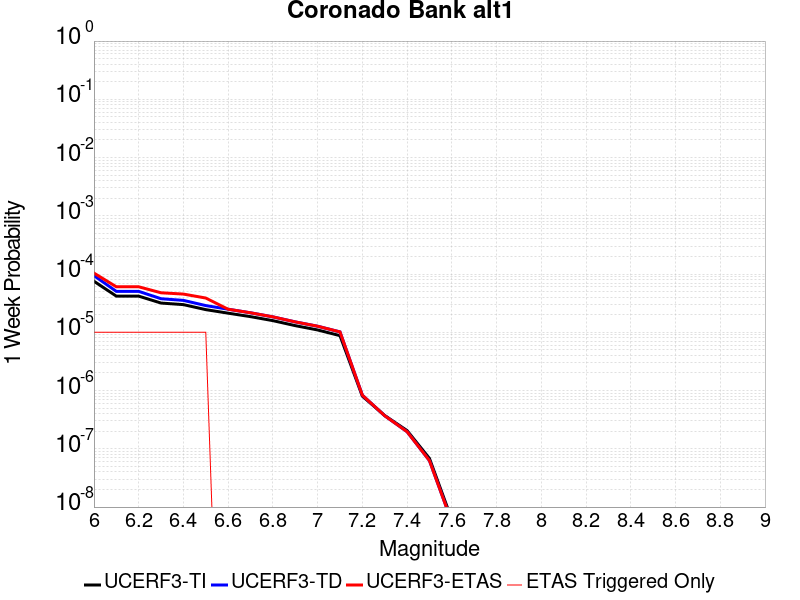 | 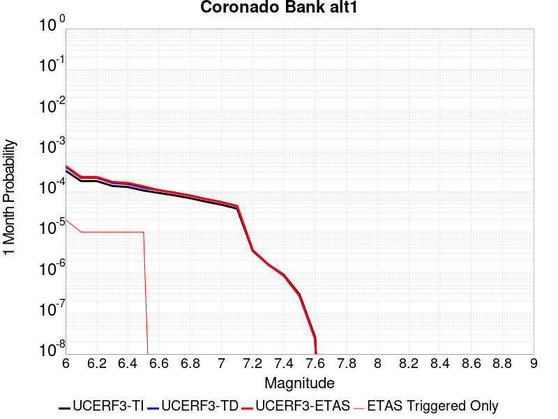 | 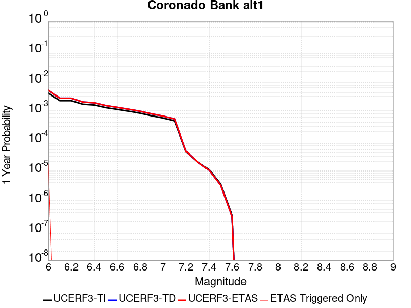 | 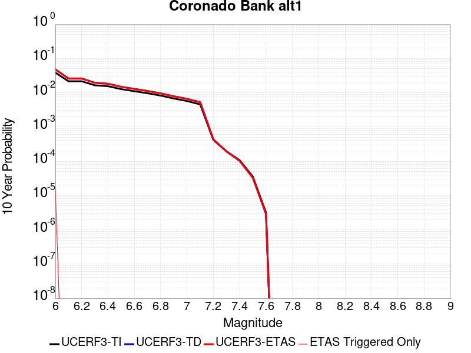 |

| Magnitude | 1 wk TI Prob | 1 wk TD Prob | 1 wk ETAS Prob | 1 wk ETAS/TD Gain | 1 wk ETAS Triggered Only | 1 mo TI Prob | 1 mo TD Prob | 1 mo ETAS Prob | 1 mo ETAS/TD Gain | 1 mo ETAS Triggered Only | 1 yr TI Prob | 1 yr TD Prob | 1 yr ETAS Prob | 1 yr ETAS/TD Gain | 1 yr ETAS Triggered Only | 10 yr TI Prob | 10 yr TD Prob | 10 yr ETAS Prob | 10 yr ETAS/TD Gain | 10 yr ETAS Triggered Only |
|-----|-----|-----|-----|-----|-----|-----|-----|-----|-----|-----|-----|-----|-----|-----|-----|-----|-----|-----|-----|-----|
| 6.0 | 7.533492E-5 | 9.3951705E-5 | 9.3951705E-5 | 1.0 | 0.0 | 3.22824E-4 | 4.025903E-4 | 4.2756024E-4 | 1.0620233 | 2.4980016E-5 | 0.0039233007 | 0.004891121 | 0.0049159788 | 1.0050822 | 2.4980016E-5 | 0.03854755 | 0.047904 | 0.047927782 | 1.0004965 | 2.4980016E-5 |
| 6.1 | 4.1807285E-5 | 5.0493105E-5 | 5.0493105E-5 | 1.0 | 0.0 | 1.7916178E-4 | 2.1638138E-4 | 2.1638138E-4 | 1.0 | 0.0 | 0.0021791123 | 0.0026313365 | 0.0026313365 | 1.0 | 0.0 | 0.021578677 | 0.026011124 | 0.026011124 | 1.0 | 0.0 |
| 6.2 | 4.1807285E-5 | 5.0493105E-5 | 5.0493105E-5 | 1.0 | 0.0 | 1.7916178E-4 | 2.1638138E-4 | 2.1638138E-4 | 1.0 | 0.0 | 0.0021791123 | 0.0026313365 | 0.0026313365 | 1.0 | 0.0 | 0.021578677 | 0.026011124 | 0.026011124 | 1.0 | 0.0 |
| 6.3 | 3.1793104E-5 | 3.7711125E-5 | 3.7711125E-5 | 1.0 | 0.0 | 1.3624904E-4 | 1.6160926E-4 | 1.6160926E-4 | 1.0 | 0.0 | 0.0016575698 | 0.001965849 | 0.001965849 | 1.0 | 0.0 | 0.016452603 | 0.019488495 | 0.019488495 | 1.0 | 0.0 |
| 6.4 | 2.9878007E-5 | 3.5335797E-5 | 3.5335797E-5 | 1.0 | 0.0 | 1.2804232E-4 | 1.5143053E-4 | 1.5143053E-4 | 1.0 | 0.0 | 0.0015578003 | 0.0018421395 | 0.0018421395 | 1.0 | 0.0 | 0.015469253 | 0.018272463 | 0.018272463 | 1.0 | 0.0 |
| 6.5 | 2.4512565E-5 | 2.8764101E-5 | 2.8764101E-5 | 1.0 | 0.0 | 1.0504962E-4 | 1.2326906E-4 | 1.2326906E-4 | 1.0 | 0.0 | 0.0012782287 | 0.0014997943 | 0.0014997943 | 1.0 | 0.0 | 0.012709012 | 0.0148996925 | 0.0148996925 | 1.0 | 0.0 |
| 6.6 | 2.1317413E-5 | 2.490667E-5 | 2.490667E-5 | 1.0 | 0.0 | 9.135714E-5 | 1.0673863E-4 | 1.0673863E-4 | 1.0 | 0.0 | 0.0011117056 | 0.0012987903 | 0.0012987903 | 1.0 | 0.0 | 0.011061605 | 0.012914407 | 0.012914407 | 1.0 | 0.0 |
| 6.7 | 1.8585655E-5 | 2.1634882E-5 | 2.1634882E-5 | 1.0 | 0.0 | 7.9650374E-5 | 9.271774E-5 | 9.271774E-5 | 1.0 | 0.0 | 9.6931186E-4 | 0.0011282744 | 0.0011282744 | 1.0 | 0.0 | 0.0096509475 | 0.011227623 | 0.011227623 | 1.0 | 0.0 |
| 6.8 | 1.5862879E-5 | 1.8419476E-5 | 1.8419476E-5 | 1.0 | 0.0 | 6.798199E-5 | 7.8938334E-5 | 7.8938334E-5 | 1.0 | 0.0 | 8.273665E-4 | 9.606697E-4 | 9.606697E-4 | 1.0 | 0.0 | 0.008242928 | 0.009567151 | 0.009567151 | 1.0 | 0.0 |
| 6.9 | 1.3021509E-5 | 1.5095266E-5 | 1.5095266E-5 | 1.0 | 0.0 | 5.5805274E-5 | 6.46925E-5 | 6.46925E-5 | 1.0 | 0.0 | 6.792174E-4 | 7.873646E-4 | 7.873646E-4 | 1.0 | 0.0 | 0.006771452 | 0.007847573 | 0.007847573 | 1.0 | 0.0 |
| 7.0 | 1.0974371E-5 | 1.2720105E-5 | 1.2720105E-5 | 1.0 | 0.0 | 4.7032172E-5 | 5.4513697E-5 | 5.4513697E-5 | 1.0 | 0.0 | 5.7246623E-4 | 6.635197E-4 | 6.635197E-4 | 1.0 | 0.0 | 0.0057099373 | 0.0066171354 | 0.0066171354 | 1.0 | 0.0 |
| 7.1 | 8.766221E-6 | 1.0163833E-5 | 1.0163833E-5 | 1.0 | 0.0 | 3.7568978E-5 | 4.3558655E-5 | 4.3558655E-5 | 1.0 | 0.0 | 4.573063E-4 | 5.302148E-4 | 5.302148E-4 | 1.0 | 0.0 | 0.0045636636 | 0.005291197 | 0.005291197 | 1.0 | 0.0 |
| 7.2 | 8.026024E-7 | 8.331776E-7 | 8.331776E-7 | 1.0 | 0.0 | 3.43972E-6 | 3.5707562E-6 | 3.5707562E-6 | 1.0 | 0.0 | 4.1877785E-5 | 4.34731E-5 | 4.34731E-5 | 1.0 | 0.0 | 4.1869894E-4 | 4.3464705E-4 | 4.3464705E-4 | 1.0 | 0.0 |
| 7.3 | 3.7293114E-7 | 3.700106E-7 | 3.700106E-7 | 1.0 | 0.0 | 1.5982754E-6 | 1.5857588E-6 | 1.5857588E-6 | 1.0 | 0.0 | 1.9458828E-5 | 1.9306442E-5 | 1.9306442E-5 | 1.0 | 0.0 | 1.9457124E-4 | 1.9304773E-4 | 1.9304773E-4 | 1.0 | 0.0 |
| 7.4 | 2.0557036E-7 | 1.9674441E-7 | 1.9674441E-7 | 1.0 | 0.0 | 8.810155E-7 | 8.4319004E-7 | 8.4319004E-7 | 1.0 | 0.0 | 1.0726311E-5 | 1.02657905E-5 | 1.02657905E-5 | 1.0 | 0.0 | 1.0725793E-4 | 1.026532E-4 | 1.026532E-4 | 1.0 | 0.0 |
| 7.5 | 6.845446E-8 | 6.2794086E-8 | 6.2794086E-8 | 1.0 | 0.0 | 2.9337625E-7 | 2.6911746E-7 | 2.6911746E-7 | 1.0 | 0.0 | 3.5718497E-6 | 3.2765004E-6 | 3.2765004E-6 | 1.0 | 0.0 | 3.5717923E-5 | 3.276453E-5 | 3.276453E-5 | 1.0 | 0.0 |
| 7.6 | 6.0975145E-9 | 5.531901E-9 | 5.531901E-9 | 1.0 | 0.0 | 2.6132206E-8 | 2.3708148E-8 | 2.3708148E-8 | 1.0 | 0.0 | 3.1815955E-7 | 2.8864667E-7 | 2.8864667E-7 | 1.0 | 0.0 | 3.181591E-6 | 2.886464E-6 | 2.886464E-6 | 1.0 | 0.0 |

## Earthquake Valley (No  Extension)
*[(top)](#table-of-contents)*

| 1 Week | 1 Month | 1 Year | 10 Year |
|-----|-----|-----|-----|
| 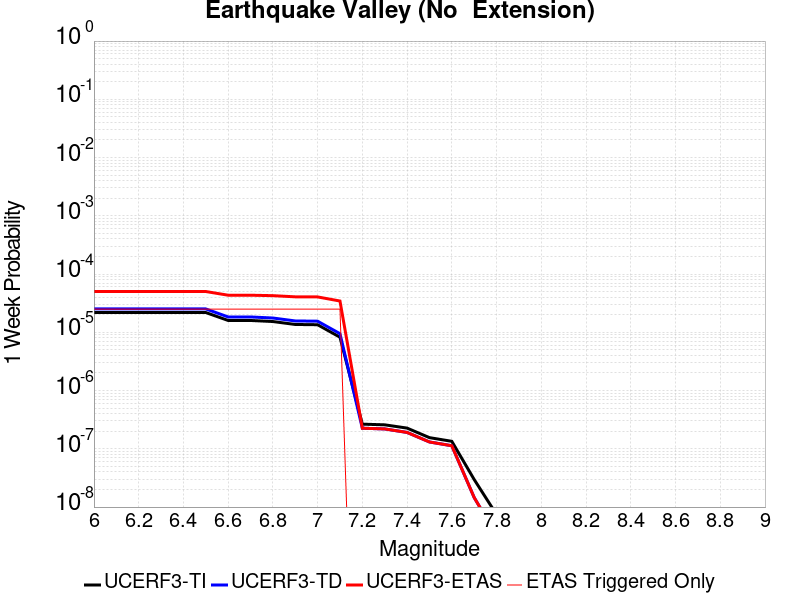 | 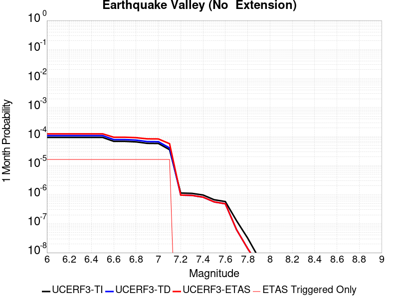 | 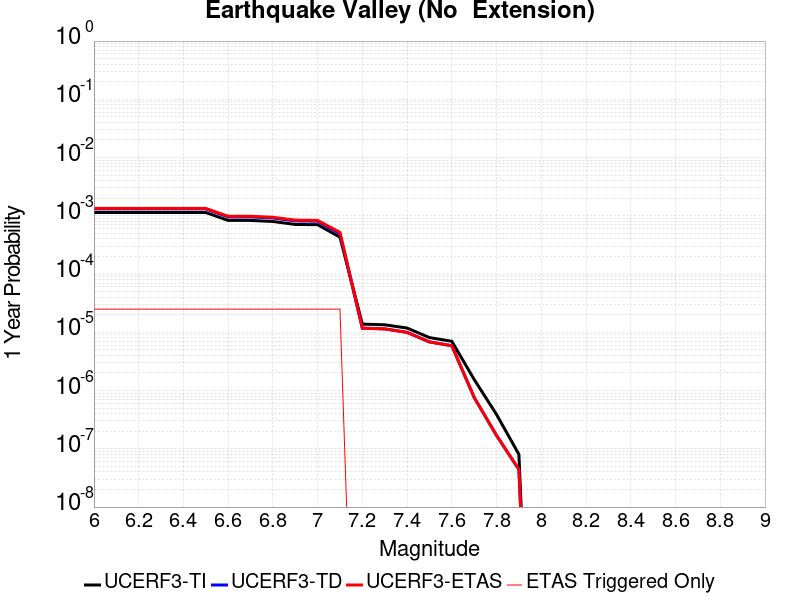 | 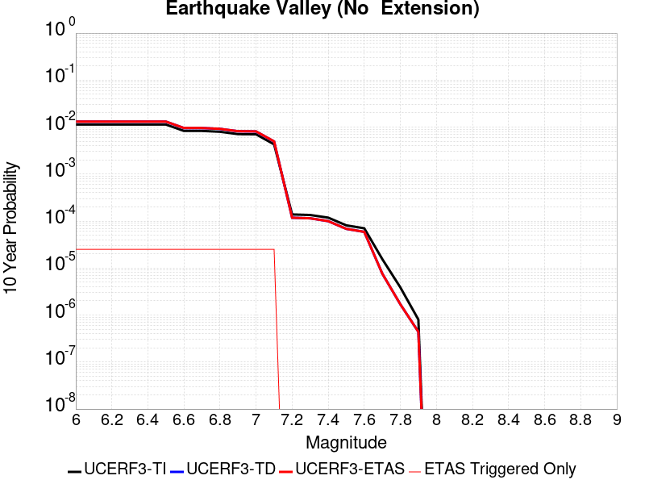 |

| Magnitude | 1 wk TI Prob | 1 wk TD Prob | 1 wk ETAS Prob | 1 wk ETAS/TD Gain | 1 wk ETAS Triggered Only | 1 mo TI Prob | 1 mo TD Prob | 1 mo ETAS Prob | 1 mo ETAS/TD Gain | 1 mo ETAS Triggered Only | 1 yr TI Prob | 1 yr TD Prob | 1 yr ETAS Prob | 1 yr ETAS/TD Gain | 1 yr ETAS Triggered Only | 10 yr TI Prob | 10 yr TD Prob | 10 yr ETAS Prob | 10 yr ETAS/TD Gain | 10 yr ETAS Triggered Only |
|-----|-----|-----|-----|-----|-----|-----|-----|-----|-----|-----|-----|-----|-----|-----|-----|-----|-----|-----|-----|-----|
| 6.0 | 2.1859703E-5 | 2.5198351E-5 | 5.017774E-5 | 1.9913104 | 2.4980016E-5 | 9.3681076E-5 | 1.0798928E-4 | 1.329666E-4 | 1.2312944 | 2.4980016E-5 | 0.0011399703 | 0.0013141216 | 0.0013390689 | 1.018984 | 2.4980016E-5 | 0.011341401 | 0.013077869 | 0.013102522 | 1.0018852 | 2.4980016E-5 |
| 6.1 | 2.1859703E-5 | 2.5198351E-5 | 5.017774E-5 | 1.9913104 | 2.4980016E-5 | 9.3681076E-5 | 1.0798928E-4 | 1.329666E-4 | 1.2312944 | 2.4980016E-5 | 0.0011399703 | 0.0013141216 | 0.0013390689 | 1.018984 | 2.4980016E-5 | 0.011341401 | 0.013077869 | 0.013102522 | 1.0018852 | 2.4980016E-5 |
| 6.2 | 2.1859703E-5 | 2.5198351E-5 | 5.017774E-5 | 1.9913104 | 2.4980016E-5 | 9.3681076E-5 | 1.0798928E-4 | 1.329666E-4 | 1.2312944 | 2.4980016E-5 | 0.0011399703 | 0.0013141216 | 0.0013390689 | 1.018984 | 2.4980016E-5 | 0.011341401 | 0.013077869 | 0.013102522 | 1.0018852 | 2.4980016E-5 |
| 6.3 | 2.1859703E-5 | 2.5198351E-5 | 5.017774E-5 | 1.9913104 | 2.4980016E-5 | 9.3681076E-5 | 1.0798928E-4 | 1.329666E-4 | 1.2312944 | 2.4980016E-5 | 0.0011399703 | 0.0013141216 | 0.0013390689 | 1.018984 | 2.4980016E-5 | 0.011341401 | 0.013077869 | 0.013102522 | 1.0018852 | 2.4980016E-5 |
| 6.4 | 2.1859703E-5 | 2.5198351E-5 | 5.017774E-5 | 1.9913104 | 2.4980016E-5 | 9.3681076E-5 | 1.0798928E-4 | 1.329666E-4 | 1.2312944 | 2.4980016E-5 | 0.0011399703 | 0.0013141216 | 0.0013390689 | 1.018984 | 2.4980016E-5 | 0.011341401 | 0.013077869 | 0.013102522 | 1.0018852 | 2.4980016E-5 |
| 6.5 | 2.1859703E-5 | 2.5198351E-5 | 5.017774E-5 | 1.9913104 | 2.4980016E-5 | 9.3681076E-5 | 1.0798928E-4 | 1.329666E-4 | 1.2312944 | 2.4980016E-5 | 0.0011399703 | 0.0013141216 | 0.0013390689 | 1.018984 | 2.4980016E-5 | 0.011341401 | 0.013077869 | 0.013102522 | 1.0018852 | 2.4980016E-5 |
| 6.6 | 1.597E-5 | 1.835627E-5 | 4.3335825E-5 | 2.3608189 | 2.4980016E-5 | 6.8441055E-5 | 7.866784E-5 | 1.0364589E-4 | 1.3175129 | 2.4980016E-5 | 8.329513E-4 | 9.5744745E-4 | 9.824035E-4 | 1.0260652 | 2.4980016E-5 | 0.008298361 | 0.009541833 | 0.009566574 | 1.0025929 | 2.4980016E-5 |
| 6.7 | 1.597E-5 | 1.835627E-5 | 4.3335825E-5 | 2.3608189 | 2.4980016E-5 | 6.8441055E-5 | 7.866784E-5 | 1.0364589E-4 | 1.3175129 | 2.4980016E-5 | 8.329513E-4 | 9.5744745E-4 | 9.824035E-4 | 1.0260652 | 2.4980016E-5 | 0.008298361 | 0.009541833 | 0.009566574 | 1.0025929 | 2.4980016E-5 |
| 6.8 | 1.5315149E-5 | 1.7602086E-5 | 4.258166E-5 | 2.419126 | 2.4980016E-5 | 6.5634704E-5 | 7.543582E-5 | 1.0041395E-4 | 1.3311176 | 2.4980016E-5 | 7.988095E-4 | 9.1813074E-4 | 9.4308786E-4 | 1.0271825 | 2.4980016E-5 | 0.007959441 | 0.009151915 | 0.009176667 | 1.0027045 | 2.4980016E-5 |
| 6.9 | 1.3634728E-5 | 1.5675814E-5 | 4.065544E-5 | 2.5935137 | 2.4980016E-5 | 5.8433237E-5 | 6.7180794E-5 | 9.2159135E-5 | 1.3718077 | 2.4980016E-5 | 7.1119244E-4 | 8.1770134E-4 | 8.4266096E-4 | 1.0305241 | 2.4980016E-5 | 0.007089207 | 0.008154998 | 0.008179774 | 1.0030382 | 2.4980016E-5 |
| 7.0 | 1.3496271E-5 | 1.5517848E-5 | 4.0497474E-5 | 2.6097355 | 2.4980016E-5 | 5.783988E-5 | 6.6503824E-5 | 9.148218E-5 | 1.3755927 | 2.4980016E-5 | 7.03973E-4 | 8.0946536E-4 | 8.3442515E-4 | 1.0308349 | 2.4980016E-5 | 0.007017471 | 0.008073238 | 0.008098016 | 1.0030692 | 2.4980016E-5 |
| 7.1 | 8.242798E-6 | 9.472594E-6 | 3.4452372E-5 | 3.637058 | 2.4980016E-5 | 3.53258E-5 | 4.0596577E-5 | 6.557558E-5 | 1.6152983 | 2.4980016E-5 | 4.300067E-4 | 4.9421826E-4 | 5.1918597E-4 | 1.0505195 | 2.4980016E-5 | 0.004291756 | 0.0049377684 | 0.004962625 | 1.005034 | 2.4980016E-5 |
| 7.2 | 2.6506527E-7 | 2.2559628E-7 | 2.2559628E-7 | 1.0 | 0.0 | 1.1359936E-6 | 9.668408E-7 | 9.668408E-7 | 1.0 | 0.0 | 1.3830633E-5 | 1.1771229E-5 | 1.1771229E-5 | 1.0 | 0.0 | 1.3829772E-4 | 1.1770646E-4 | 1.1770646E-4 | 1.0 | 0.0 |
| 7.3 | 2.5810488E-7 | 2.1954757E-7 | 2.1954757E-7 | 1.0 | 0.0 | 1.1061633E-6 | 9.4091786E-7 | 9.4091786E-7 | 1.0 | 0.0 | 1.3467455E-5 | 1.1455619E-5 | 1.1455619E-5 | 1.0 | 0.0 | 1.3466639E-4 | 1.145507E-4 | 1.145507E-4 | 1.0 | 0.0 |
| 7.4 | 2.2676066E-7 | 1.9109943E-7 | 1.9109943E-7 | 1.0 | 0.0 | 9.71831E-7 | 8.189973E-7 | 8.189973E-7 | 1.0 | 0.0 | 1.1831979E-5 | 9.971251E-6 | 9.971251E-6 | 1.0 | 0.0 | 1.1831349E-4 | 9.970842E-5 | 9.970842E-5 | 1.0 | 0.0 |
| 7.5 | 1.5553917E-7 | 1.311138E-7 | 1.311138E-7 | 1.0 | 0.0 | 6.6659624E-7 | 5.619162E-7 | 5.619162E-7 | 1.0 | 0.0 | 8.115779E-6 | 6.84131E-6 | 6.84131E-6 | 1.0 | 0.0 | 8.115482E-5 | 6.841121E-5 | 6.841121E-5 | 1.0 | 0.0 |
| 7.6 | 1.3448629E-7 | 1.1287708E-7 | 1.1287708E-7 | 1.0 | 0.0 | 5.7636964E-7 | 4.8375887E-7 | 4.8375887E-7 | 1.0 | 0.0 | 7.017278E-6 | 5.8897504E-6 | 5.8897504E-6 | 1.0 | 0.0 | 7.0170565E-5 | 5.8896156E-5 | 5.8896156E-5 | 1.0 | 0.0 |
| 7.7 | 2.9719402E-8 | 1.4581234E-8 | 1.4581234E-8 | 1.0 | 0.0 | 1.2736886E-7 | 6.2491004E-8 | 6.2491004E-8 | 1.0 | 0.0 | 1.5507147E-6 | 7.6082773E-7 | 7.6082773E-7 | 1.0 | 0.0 | 1.550704E-5 | 7.608257E-6 | 7.608257E-6 | 1.0 | 0.0 |
| 7.8 | 7.4390196E-9 | 3.249962E-9 | 3.249962E-9 | 1.0 | 0.0 | 3.1881513E-8 | 1.39284095E-8 | 1.39284095E-8 | 1.0 | 0.0 | 3.8815733E-7 | 1.6957837E-7 | 1.6957837E-7 | 1.0 | 0.0 | 3.8815665E-6 | 1.6957828E-6 | 1.6957828E-6 | 1.0 | 0.0 |
| 7.9 | 1.5373532E-9 | 8.4400953E-10 | 8.4400953E-10 | 1.0 | 0.0 | 6.5886567E-9 | 3.6171839E-9 | 3.6171839E-9 | 1.0 | 0.0 | 8.021689E-8 | 4.403921E-8 | 4.403921E-8 | 1.0 | 0.0 | 8.0216864E-7 | 4.403921E-7 | 4.403921E-7 | 1.0 | 0.0 |

## Ortigalita (South)
*[(top)](#table-of-contents)*

| 1 Week | 1 Month | 1 Year | 10 Year |
|-----|-----|-----|-----|
| 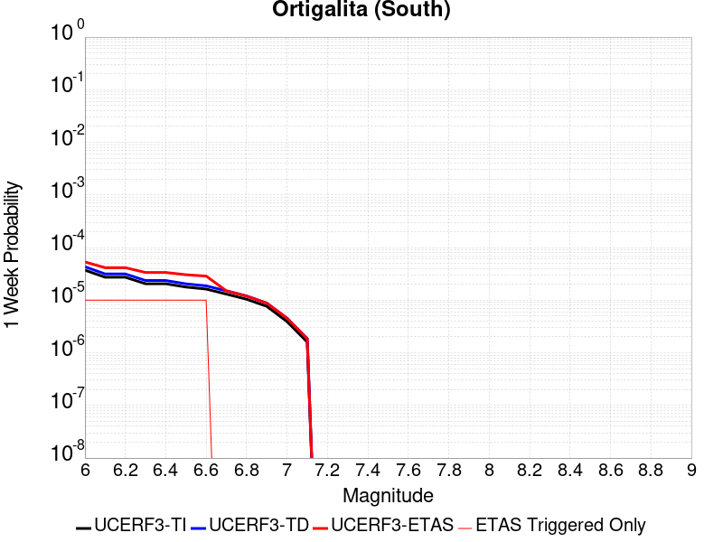 | 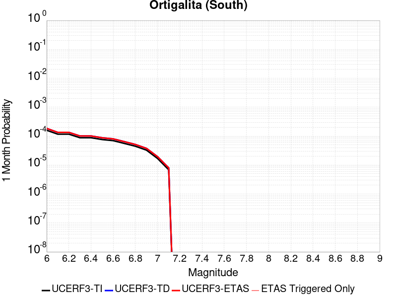 | 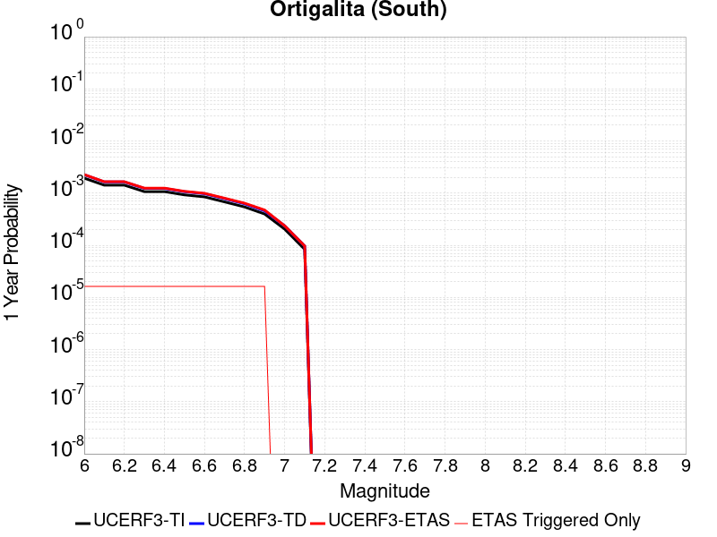 | 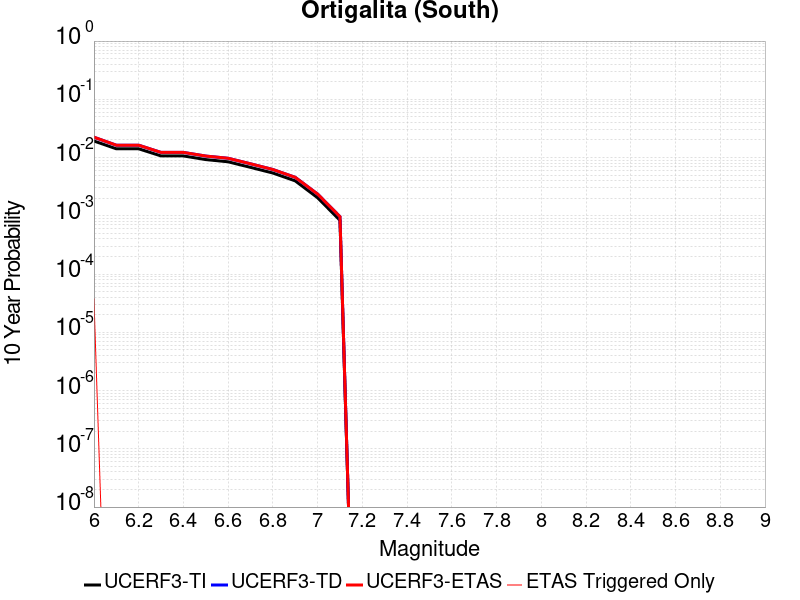 |

| Magnitude | 1 wk TI Prob | 1 wk TD Prob | 1 wk ETAS Prob | 1 wk ETAS/TD Gain | 1 wk ETAS Triggered Only | 1 mo TI Prob | 1 mo TD Prob | 1 mo ETAS Prob | 1 mo ETAS/TD Gain | 1 mo ETAS Triggered Only | 1 yr TI Prob | 1 yr TD Prob | 1 yr ETAS Prob | 1 yr ETAS/TD Gain | 1 yr ETAS Triggered Only | 10 yr TI Prob | 10 yr TD Prob | 10 yr ETAS Prob | 10 yr ETAS/TD Gain | 10 yr ETAS Triggered Only |
|-----|-----|-----|-----|-----|-----|-----|-----|-----|-----|-----|-----|-----|-----|-----|-----|-----|-----|-----|-----|-----|
| 6.0 | 3.72394E-5 | 4.32556E-5 | 4.32556E-5 | 1.0 | 0.0 | 1.5958765E-4 | 1.8536886E-4 | 1.8536886E-4 | 1.0 | 0.0 | 0.0019412481 | 0.0022546863 | 0.0022546863 | 1.0 | 0.0 | 0.019243775 | 0.022334501 | 0.022358924 | 1.0010935 | 2.4980016E-5 |
| 6.1 | 2.7299884E-5 | 3.1492036E-5 | 3.1492036E-5 | 1.0 | 0.0 | 1.16994255E-4 | 1.349592E-4 | 1.349592E-4 | 1.0 | 0.0 | 0.0014234743 | 0.0016419457 | 0.0016419457 | 1.0 | 0.0 | 0.014143906 | 0.016304072 | 0.016304072 | 1.0 | 0.0 |
| 6.2 | 2.7299884E-5 | 3.1492036E-5 | 3.1492036E-5 | 1.0 | 0.0 | 1.16994255E-4 | 1.349592E-4 | 1.349592E-4 | 1.0 | 0.0 | 0.0014234743 | 0.0016419457 | 0.0016419457 | 1.0 | 0.0 | 0.014143906 | 0.016304072 | 0.016304072 | 1.0 | 0.0 |
| 6.3 | 2.0546433E-5 | 2.3631454E-5 | 2.3631454E-5 | 1.0 | 0.0 | 8.805317E-5 | 1.0127383E-4 | 1.0127383E-4 | 1.0 | 0.0 | 0.00107152 | 0.0012323305 | 0.0012323305 | 1.0 | 0.0 | 0.010663681 | 0.012257031 | 0.012257031 | 1.0 | 0.0 |
| 6.4 | 2.0546433E-5 | 2.3631454E-5 | 2.3631454E-5 | 1.0 | 0.0 | 8.805317E-5 | 1.0127383E-4 | 1.0127383E-4 | 1.0 | 0.0 | 0.00107152 | 0.0012323305 | 0.0012323305 | 1.0 | 0.0 | 0.010663681 | 0.012257031 | 0.012257031 | 1.0 | 0.0 |
| 6.5 | 1.7779594E-5 | 2.0446974E-5 | 2.0446974E-5 | 1.0 | 0.0 | 7.619603E-5 | 8.762703E-5 | 8.762703E-5 | 1.0 | 0.0 | 9.272918E-4 | 0.0010663505 | 0.0010663505 | 1.0 | 0.0 | 0.009234319 | 0.010613804 | 0.010613804 | 1.0 | 0.0 |
| 6.6 | 1.6272212E-5 | 1.8714967E-5 | 1.8714967E-5 | 1.0 | 0.0 | 6.973618E-5 | 8.0204605E-5 | 8.0204605E-5 | 1.0 | 0.0 | 8.487073E-4 | 9.760659E-4 | 9.760659E-4 | 1.0 | 0.0 | 0.008454733 | 0.009719091 | 0.009719091 | 1.0 | 0.0 |
| 6.7 | 1.3051484E-5 | 1.5038758E-5 | 1.5038758E-5 | 1.0 | 0.0 | 5.593373E-5 | 6.445028E-5 | 6.445028E-5 | 1.0 | 0.0 | 6.807804E-4 | 7.844092E-4 | 7.844092E-4 | 1.0 | 0.0 | 0.006786986 | 0.007817388 | 0.007817388 | 1.0 | 0.0 |
| 6.8 | 1.04277415E-5 | 1.1987235E-5 | 1.1987235E-5 | 1.0 | 0.0 | 4.4689557E-5 | 5.1372896E-5 | 5.1372896E-5 | 1.0 | 0.0 | 5.439595E-4 | 6.2529295E-4 | 6.2529295E-4 | 1.0 | 0.0 | 0.0054262993 | 0.00623609 | 0.00623609 | 1.0 | 0.0 |
| 6.9 | 7.639968E-6 | 8.791503E-6 | 8.791503E-6 | 1.0 | 0.0 | 3.274231E-5 | 3.767736E-5 | 3.767736E-5 | 1.0 | 0.0 | 3.9856473E-4 | 4.586312E-4 | 4.586312E-4 | 1.0 | 0.0 | 0.003978506 | 0.004577433 | 0.004577433 | 1.0 | 0.0 |
| 7.0 | 3.919831E-6 | 4.5334014E-6 | 4.5334014E-6 | 1.0 | 0.0 | 1.679917E-5 | 1.942873E-5 | 1.942873E-5 | 1.0 | 0.0 | 2.045107E-4 | 2.3652123E-4 | 2.3652123E-4 | 1.0 | 0.0 | 0.0020432258 | 0.0023629034 | 0.0023629034 | 1.0 | 0.0 |
| 7.1 | 1.6017933E-6 | 1.8570418E-6 | 1.8570418E-6 | 1.0 | 0.0 | 6.8648105E-6 | 7.958732E-6 | 7.958732E-6 | 1.0 | 0.0 | 8.357586E-5 | 9.689432E-5 | 9.689432E-5 | 1.0 | 0.0 | 8.3544437E-4 | 9.686254E-4 | 9.686254E-4 | 1.0 | 0.0 |

## San Luis Range - Oceano 2011 CFM
*[(top)](#table-of-contents)*

| 1 Week | 1 Month | 1 Year | 10 Year |
|-----|-----|-----|-----|
|  |  | 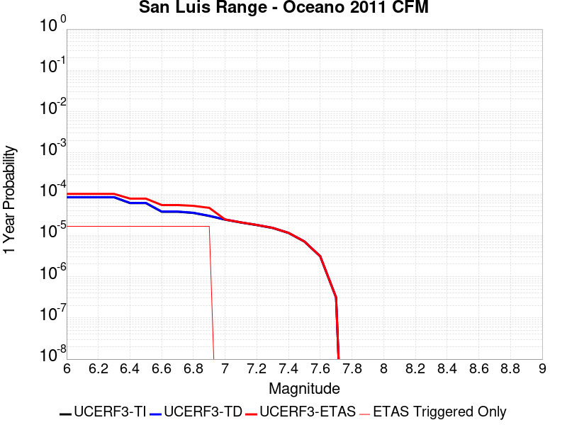 | 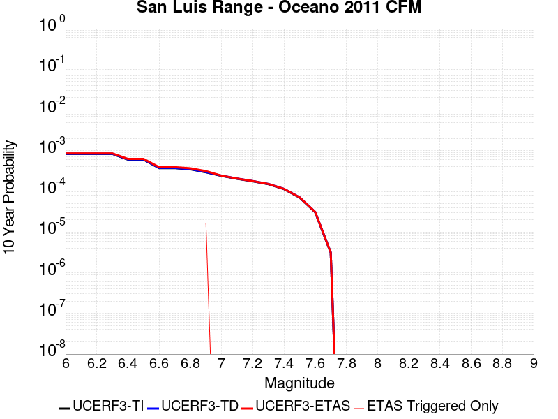 |

| Magnitude | 1 wk TI Prob | 1 wk TD Prob | 1 wk ETAS Prob | 1 wk ETAS/TD Gain | 1 wk ETAS Triggered Only | 1 mo TI Prob | 1 mo TD Prob | 1 mo ETAS Prob | 1 mo ETAS/TD Gain | 1 mo ETAS Triggered Only | 1 yr TI Prob | 1 yr TD Prob | 1 yr ETAS Prob | 1 yr ETAS/TD Gain | 1 yr ETAS Triggered Only | 10 yr TI Prob | 10 yr TD Prob | 10 yr ETAS Prob | 10 yr ETAS/TD Gain | 10 yr ETAS Triggered Only |
|-----|-----|-----|-----|-----|-----|-----|-----|-----|-----|-----|-----|-----|-----|-----|-----|-----|-----|-----|-----|-----|
| 6.0 | 1.6025788E-6 | 1.620119E-6 | 1.620119E-6 | 1.0 | 0.0 | 6.8681766E-6 | 6.943351E-6 | 6.943351E-6 | 1.0 | 0.0 | 8.361684E-5 | 8.453243E-5 | 1.09510336E-4 | 1.2954831 | 2.4980016E-5 | 8.3585386E-4 | 8.4504357E-4 | 8.700025E-4 | 1.0295357 | 2.4980016E-5 |
| 6.1 | 1.6025788E-6 | 1.620119E-6 | 1.620119E-6 | 1.0 | 0.0 | 6.8681766E-6 | 6.943351E-6 | 6.943351E-6 | 1.0 | 0.0 | 8.361684E-5 | 8.453243E-5 | 1.09510336E-4 | 1.2954831 | 2.4980016E-5 | 8.3585386E-4 | 8.4504357E-4 | 8.700025E-4 | 1.0295357 | 2.4980016E-5 |
| 6.2 | 1.6025788E-6 | 1.620119E-6 | 1.620119E-6 | 1.0 | 0.0 | 6.8681766E-6 | 6.943351E-6 | 6.943351E-6 | 1.0 | 0.0 | 8.361684E-5 | 8.453243E-5 | 1.09510336E-4 | 1.2954831 | 2.4980016E-5 | 8.3585386E-4 | 8.4504357E-4 | 8.700025E-4 | 1.0295357 | 2.4980016E-5 |
| 6.3 | 1.6025788E-6 | 1.620119E-6 | 1.620119E-6 | 1.0 | 0.0 | 6.8681766E-6 | 6.943351E-6 | 6.943351E-6 | 1.0 | 0.0 | 8.361684E-5 | 8.453243E-5 | 1.09510336E-4 | 1.2954831 | 2.4980016E-5 | 8.3585386E-4 | 8.4504357E-4 | 8.700025E-4 | 1.0295357 | 2.4980016E-5 |
| 6.4 | 1.1621186E-6 | 1.1749894E-6 | 1.1749894E-6 | 1.0 | 0.0 | 4.980499E-6 | 5.0356607E-6 | 5.0356607E-6 | 1.0 | 0.0 | 6.0635884E-5 | 6.130771E-5 | 8.62862E-5 | 1.407428 | 2.4980016E-5 | 6.0619344E-4 | 6.1293464E-4 | 6.378993E-4 | 1.0407298 | 2.4980016E-5 |
| 6.5 | 1.1621186E-6 | 1.1749894E-6 | 1.1749894E-6 | 1.0 | 0.0 | 4.980499E-6 | 5.0356607E-6 | 5.0356607E-6 | 1.0 | 0.0 | 6.0635884E-5 | 6.130771E-5 | 8.62862E-5 | 1.407428 | 2.4980016E-5 | 6.0619344E-4 | 6.1293464E-4 | 6.378993E-4 | 1.0407298 | 2.4980016E-5 |
| 6.6 | 7.164729E-7 | 7.2485784E-7 | 7.2485784E-7 | 1.0 | 0.0 | 3.0705946E-6 | 3.10653E-6 | 3.10653E-6 | 1.0 | 0.0 | 3.738385E-5 | 3.7821363E-5 | 6.2800435E-5 | 1.6604487 | 2.4980016E-5 | 3.737756E-4 | 3.7815105E-4 | 4.031216E-4 | 1.0660334 | 2.4980016E-5 |
| 6.7 | 7.164729E-7 | 7.2485784E-7 | 7.2485784E-7 | 1.0 | 0.0 | 3.0705946E-6 | 3.10653E-6 | 3.10653E-6 | 1.0 | 0.0 | 3.738385E-5 | 3.7821363E-5 | 6.2800435E-5 | 1.6604487 | 2.4980016E-5 | 3.737756E-4 | 3.7815105E-4 | 4.031216E-4 | 1.0660334 | 2.4980016E-5 |
| 6.8 | 6.700177E-7 | 6.7774397E-7 | 6.7774397E-7 | 1.0 | 0.0 | 2.8715012E-6 | 2.904614E-6 | 2.904614E-6 | 1.0 | 0.0 | 3.495997E-5 | 3.536312E-5 | 6.034225E-5 | 1.7063612 | 2.4980016E-5 | 3.495447E-4 | 3.5357653E-4 | 3.785477E-4 | 1.0706246 | 2.4980016E-5 |
| 6.9 | 5.657865E-7 | 5.7217864E-7 | 5.7217864E-7 | 1.0 | 0.0 | 2.424797E-6 | 2.452192E-6 | 2.452192E-6 | 1.0 | 0.0 | 2.9521503E-5 | 2.9855039E-5 | 5.483431E-5 | 1.8366853 | 2.4980016E-5 | 2.9517582E-4 | 2.9851135E-4 | 3.234839E-4 | 1.083657 | 2.4980016E-5 |
| 7.0 | 4.608413E-7 | 4.660169E-7 | 4.660169E-7 | 1.0 | 0.0 | 1.9750328E-6 | 1.9972138E-6 | 1.9972138E-6 | 1.0 | 0.0 | 2.4045758E-5 | 2.431581E-5 | 2.431581E-5 | 1.0 | 0.0 | 2.4043156E-4 | 2.4313178E-4 | 2.4313178E-4 | 1.0 | 0.0 |
| 7.1 | 3.9177846E-7 | 3.9621602E-7 | 3.9621602E-7 | 1.0 | 0.0 | 1.6790494E-6 | 1.6980675E-6 | 1.6980675E-6 | 1.0 | 0.0 | 2.0442236E-5 | 2.0673779E-5 | 2.0673779E-5 | 1.0 | 0.0 | 2.0440355E-4 | 2.067187E-4 | 2.067187E-4 | 1.0 | 0.0 |
| 7.2 | 3.3974752E-7 | 3.436653E-7 | 3.436653E-7 | 1.0 | 0.0 | 1.45606E-6 | 1.4728505E-6 | 1.4728505E-6 | 1.0 | 0.0 | 1.7727387E-5 | 1.7931809E-5 | 1.7931809E-5 | 1.0 | 0.0 | 1.7725973E-4 | 1.7930372E-4 | 1.7930372E-4 | 1.0 | 0.0 |
| 7.3 | 2.8900928E-7 | 2.923402E-7 | 2.923402E-7 | 1.0 | 0.0 | 1.2386106E-6 | 1.2528859E-6 | 1.2528859E-6 | 1.0 | 0.0 | 1.5079979E-5 | 1.525378E-5 | 1.525378E-5 | 1.0 | 0.0 | 1.5078956E-4 | 1.5252741E-4 | 1.5252741E-4 | 1.0 | 0.0 |
| 7.4 | 2.1881527E-7 | 2.2139594E-7 | 2.2139594E-7 | 1.0 | 0.0 | 9.3777936E-7 | 9.488394E-7 | 9.488394E-7 | 1.0 | 0.0 | 1.14174045E-5 | 1.1552059E-5 | 1.1552059E-5 | 1.0 | 0.0 | 1.1416818E-4 | 1.1551464E-4 | 1.1551464E-4 | 1.0 | 0.0 |
| 7.5 | 1.356398E-7 | 1.3718639E-7 | 1.3718639E-7 | 1.0 | 0.0 | 5.813133E-7 | 5.8794154E-7 | 5.8794154E-7 | 1.0 | 0.0 | 7.0774663E-6 | 7.158165E-6 | 7.158165E-6 | 1.0 | 0.0 | 7.077241E-5 | 7.157937E-5 | 7.157937E-5 | 1.0 | 0.0 |
| 7.6 | 5.9269272E-8 | 6.001364E-8 | 6.001364E-8 | 1.0 | 0.0 | 2.5401116E-7 | 2.572013E-7 | 2.572013E-7 | 1.0 | 0.0 | 3.0925814E-6 | 3.1314214E-6 | 3.1314214E-6 | 1.0 | 0.0 | 3.0925385E-5 | 3.1313786E-5 | 3.1313786E-5 | 1.0 | 0.0 |
| 7.7 | 5.946232E-9 | 6.036928E-9 | 6.036928E-9 | 1.0 | 0.0 | 2.5483851E-8 | 2.5872547E-8 | 2.5872547E-8 | 1.0 | 0.0 | 3.1026585E-7 | 3.1499823E-7 | 3.1499823E-7 | 1.0 | 0.0 | 3.102654E-6 | 3.1499787E-6 | 3.1499787E-6 | 1.0 | 0.0 |

## Superstition Hills
*[(top)](#table-of-contents)*

| 1 Week | 1 Month | 1 Year | 10 Year |
|-----|-----|-----|-----|
| 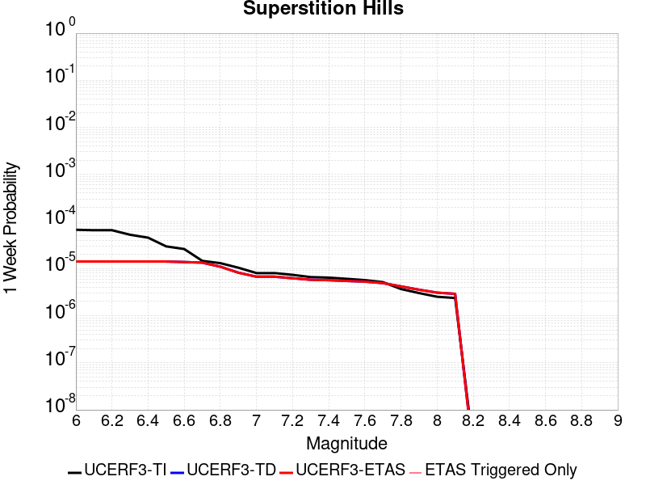 | 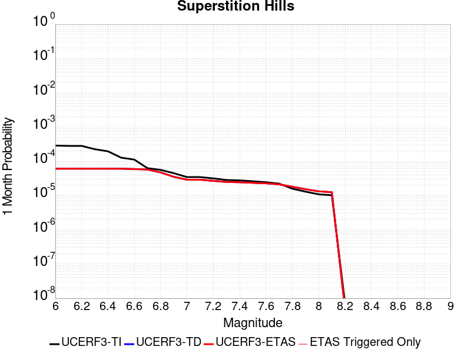 |  | 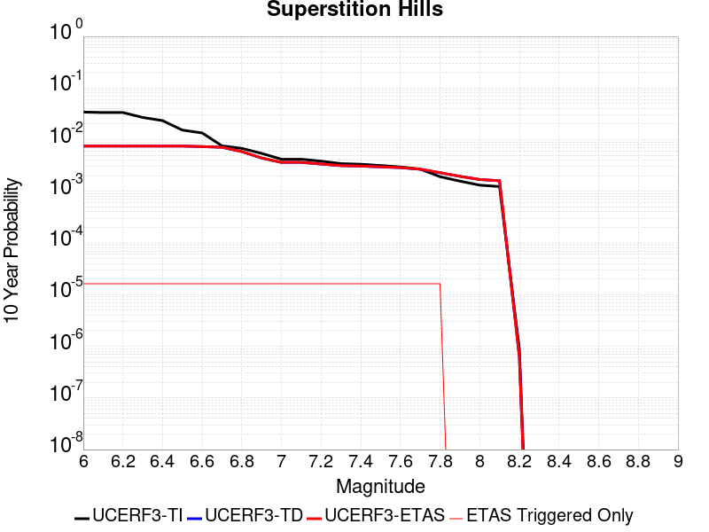 |

| Magnitude | 1 wk TI Prob | 1 wk TD Prob | 1 wk ETAS Prob | 1 wk ETAS/TD Gain | 1 wk ETAS Triggered Only | 1 mo TI Prob | 1 mo TD Prob | 1 mo ETAS Prob | 1 mo ETAS/TD Gain | 1 mo ETAS Triggered Only | 1 yr TI Prob | 1 yr TD Prob | 1 yr ETAS Prob | 1 yr ETAS/TD Gain | 1 yr ETAS Triggered Only | 10 yr TI Prob | 10 yr TD Prob | 10 yr ETAS Prob | 10 yr ETAS/TD Gain | 10 yr ETAS Triggered Only |
|-----|-----|-----|-----|-----|-----|-----|-----|-----|-----|-----|-----|-----|-----|-----|-----|-----|-----|-----|-----|-----|
| 6.0 | 6.6865185E-5 | 1.4137668E-5 | 1.4137668E-5 | 1.0 | 0.0 | 2.8653358E-4 | 6.058869E-5 | 6.058869E-5 | 1.0 | 0.0 | 0.0034829667 | 7.374338E-4 | 7.623954E-4 | 1.0338492 | 2.4980016E-5 | 0.03428881 | 0.007520696 | 0.007545488 | 1.0032965 | 2.4980016E-5 |
| 6.1 | 6.544851E-5 | 1.4137668E-5 | 1.4137668E-5 | 1.0 | 0.0 | 2.8046346E-4 | 6.058869E-5 | 6.058869E-5 | 1.0 | 0.0 | 0.0034092965 | 7.374338E-4 | 7.623954E-4 | 1.0338492 | 2.4980016E-5 | 0.033574644 | 0.0075206957 | 0.0075454875 | 1.0032965 | 2.4980016E-5 |
| 6.2 | 6.544851E-5 | 1.4137668E-5 | 1.4137668E-5 | 1.0 | 0.0 | 2.8046346E-4 | 6.058869E-5 | 6.058869E-5 | 1.0 | 0.0 | 0.0034092965 | 7.374338E-4 | 7.623954E-4 | 1.0338492 | 2.4980016E-5 | 0.033574644 | 0.0075206957 | 0.0075454875 | 1.0032965 | 2.4980016E-5 |
| 6.3 | 5.2402065E-5 | 1.4137667E-5 | 1.4137667E-5 | 1.0 | 0.0 | 2.2456095E-4 | 6.0588685E-5 | 6.0588685E-5 | 1.0 | 0.0 | 0.0027306017 | 7.374338E-4 | 7.623953E-4 | 1.0338492 | 2.4980016E-5 | 0.02697292 | 0.0075206906 | 0.007545483 | 1.0032965 | 2.4980016E-5 |
| 6.4 | 4.542238E-5 | 1.4137666E-5 | 1.4137666E-5 | 1.0 | 0.0 | 1.9465282E-4 | 6.058868E-5 | 6.058868E-5 | 1.0 | 0.0 | 0.0023673223 | 7.3743373E-4 | 7.623953E-4 | 1.0338492 | 2.4980016E-5 | 0.023422617 | 0.007520688 | 0.0075454805 | 1.0032965 | 2.4980016E-5 |
| 6.5 | 2.9672969E-5 | 1.4137665E-5 | 1.4137665E-5 | 1.0 | 0.0 | 1.2716366E-4 | 6.0588678E-5 | 6.0588678E-5 | 1.0 | 0.0 | 0.0015471181 | 7.374337E-4 | 7.6239527E-4 | 1.0338492 | 2.4980016E-5 | 0.015363912 | 0.0075206826 | 0.007545475 | 1.0032965 | 2.4980016E-5 |
| 6.6 | 2.6056105E-5 | 1.3803436E-5 | 1.3803436E-5 | 1.0 | 0.0 | 1.1166424E-4 | 5.915633E-5 | 5.915633E-5 | 1.0 | 0.0 | 0.0013586642 | 7.200064E-4 | 7.449684E-4 | 1.0346692 | 2.4980016E-5 | 0.013503874 | 0.0073450673 | 0.007369864 | 1.0033759 | 2.4980016E-5 |
| 6.7 | 1.4611248E-5 | 1.338333E-5 | 1.338333E-5 | 1.0 | 0.0 | 6.261813E-5 | 5.7355956E-5 | 5.7355956E-5 | 1.0 | 0.0 | 7.6210906E-4 | 6.9810095E-4 | 7.2306354E-4 | 1.0357578 | 2.4980016E-5 | 0.0075950073 | 0.0071262526 | 0.0071510547 | 1.0034803 | 2.4980016E-5 |
| 6.8 | 1.30607E-5 | 1.09787115E-5 | 1.09787115E-5 | 1.0 | 0.0 | 5.597323E-5 | 4.705082E-5 | 4.705082E-5 | 1.0 | 0.0 | 6.8126095E-4 | 5.727019E-4 | 5.976676E-4 | 1.0435928 | 2.4980016E-5 | 0.006791762 | 0.005873964 | 0.0058987974 | 1.0042276 | 2.4980016E-5 |
| 6.9 | 1.0443096E-5 | 8.19507E-6 | 8.19507E-6 | 1.0 | 0.0 | 4.4755358E-5 | 3.512127E-5 | 3.512127E-5 | 1.0 | 0.0 | 5.447602E-4 | 4.2751993E-4 | 4.5248924E-4 | 1.058405 | 2.4980016E-5 | 0.005434267 | 0.004409497 | 0.0044343667 | 1.00564 | 2.4980016E-5 |
| 7.0 | 8.045912E-6 | 6.739447E-6 | 6.739447E-6 | 1.0 | 0.0 | 3.4482026E-5 | 2.888303E-5 | 2.888303E-5 | 1.0 | 0.0 | 4.197378E-4 | 3.5159517E-4 | 3.765664E-4 | 1.0710226 | 2.4980016E-5 | 0.0041894587 | 0.0036335257 | 0.003658415 | 1.0068499 | 2.4980016E-5 |
| 7.1 | 8.045912E-6 | 6.739447E-6 | 6.739447E-6 | 1.0 | 0.0 | 3.4482026E-5 | 2.888303E-5 | 2.888303E-5 | 1.0 | 0.0 | 4.197378E-4 | 3.5159517E-4 | 3.765664E-4 | 1.0710226 | 2.4980016E-5 | 0.0041894587 | 0.0036335257 | 0.003658415 | 1.0068499 | 2.4980016E-5 |
| 7.2 | 7.375506E-6 | 6.2463805E-6 | 6.2463805E-6 | 1.0 | 0.0 | 3.1608928E-5 | 2.6769932E-5 | 2.6769932E-5 | 1.0 | 0.0 | 3.8477074E-4 | 3.2587603E-4 | 3.5084793E-4 | 1.07663 | 2.4980016E-5 | 0.003841052 | 0.0033741172 | 0.003399013 | 1.0073785 | 2.4980016E-5 |
| 7.3 | 6.6063913E-6 | 5.798824E-6 | 5.798824E-6 | 1.0 | 0.0 | 2.8312797E-5 | 2.4851872E-5 | 2.4851872E-5 | 1.0 | 0.0 | 3.446538E-4 | 3.0253024E-4 | 3.275027E-4 | 1.0825453 | 2.4980016E-5 | 0.0034411973 | 0.0031383524 | 0.0031632541 | 1.0079346 | 2.4980016E-5 |
| 7.4 | 6.4313126E-6 | 5.6802523E-6 | 5.6802523E-6 | 1.0 | 0.0 | 2.7562477E-5 | 2.4343715E-5 | 2.4343715E-5 | 1.0 | 0.0 | 3.355215E-4 | 2.963451E-4 | 3.2131773E-4 | 1.0842687 | 2.4980016E-5 | 0.0033501536 | 0.003076105 | 0.003101008 | 1.0080957 | 2.4980016E-5 |
| 7.5 | 6.0742927E-6 | 5.476088E-6 | 5.476088E-6 | 1.0 | 0.0 | 2.6032423E-5 | 2.3468741E-5 | 2.3468741E-5 | 1.0 | 0.0 | 3.1689866E-4 | 2.8569513E-4 | 3.1066802E-4 | 1.0874109 | 2.4980016E-5 | 0.0031644711 | 0.0029679502 | 0.002992856 | 1.0083916 | 2.4980016E-5 |
| 7.6 | 5.6987187E-6 | 5.2943155E-6 | 5.2943155E-6 | 1.0 | 0.0 | 2.4422852E-5 | 2.268973E-5 | 2.268973E-5 | 1.0 | 0.0 | 2.9730765E-4 | 2.762131E-4 | 3.0118623E-4 | 1.0904125 | 2.4980016E-5 | 0.002969102 | 0.0028712032 | 0.0028961117 | 1.0086752 | 2.4980016E-5 |
| 7.7 | 5.1658035E-6 | 4.925336E-6 | 4.925336E-6 | 1.0 | 0.0 | 2.2138971E-5 | 2.1108413E-5 | 2.1108413E-5 | 1.0 | 0.0 | 2.6950863E-4 | 2.5696523E-4 | 2.8193885E-4 | 1.0971867 | 2.4980016E-5 | 0.00269182 | 0.0026763005 | 0.0027012136 | 1.0093088 | 2.4980016E-5 |
| 7.8 | 3.6864697E-6 | 4.1963563E-6 | 4.1963563E-6 | 1.0 | 0.0 | 1.579906E-5 | 1.7984263E-5 | 1.7984263E-5 | 1.0 | 0.0 | 1.9233658E-4 | 2.1893687E-4 | 2.439114E-4 | 1.114072 | 2.4980016E-5 | 0.0019217018 | 0.0022895595 | 0.0023144821 | 1.0108855 | 2.4980016E-5 |
| 7.9 | 3.0265903E-6 | 3.5636078E-6 | 3.5636078E-6 | 1.0 | 0.0 | 1.2971037E-5 | 1.5272519E-5 | 1.5272519E-5 | 1.0 | 0.0 | 1.5791094E-4 | 1.8592748E-4 | 1.8592748E-4 | 1.0 | 0.0 | 0.0015779877 | 0.0019537222 | 0.0019537222 | 1.0 | 0.0 |
| 8.0 | 2.5271493E-6 | 3.0866524E-6 | 3.0866524E-6 | 1.0 | 0.0 | 1.0830595E-5 | 1.3228446E-5 | 1.3228446E-5 | 1.0 | 0.0 | 1.3185451E-4 | 1.6104484E-4 | 1.6104484E-4 | 1.0 | 0.0 | 0.0013177631 | 0.0016975543 | 0.0016975543 | 1.0 | 0.0 |
| 8.1 | 2.3749135E-6 | 2.9172957E-6 | 2.9172957E-6 | 1.0 | 0.0 | 1.0178161E-5 | 1.2502638E-5 | 1.2502638E-5 | 1.0 | 0.0 | 1.2391206E-4 | 1.522094E-4 | 1.522094E-4 | 1.0 | 0.0 | 0.0012384299 | 0.0016051348 | 0.0016051348 | 1.0 | 0.0 |
| 8.2 | 1.7186406E-9 | 1.1438838E-9 | 1.1438838E-9 | 1.0 | 0.0 | 7.3656024E-9 | 4.902359E-9 | 4.902359E-9 | 1.0 | 0.0 | 8.9676206E-8 | 5.968622E-8 | 5.968622E-8 | 1.0 | 0.0 | 8.9676166E-7 | 6.386644E-7 | 6.386644E-7 | 1.0 | 0.0 |

## Santa Monica alt 1
*[(top)](#table-of-contents)*

| 1 Week | 1 Month | 1 Year | 10 Year |
|-----|-----|-----|-----|
| 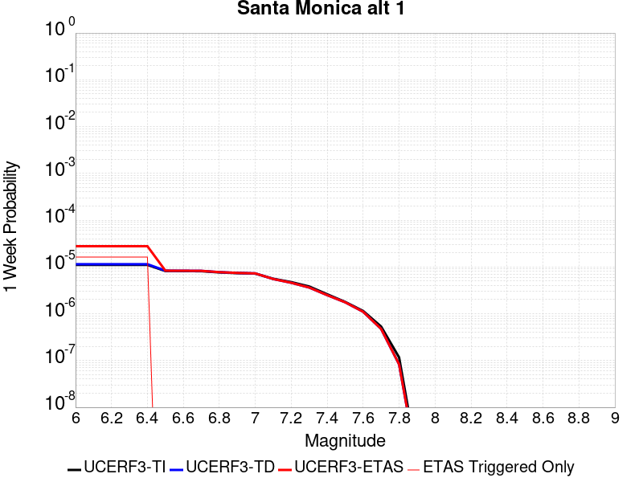 | 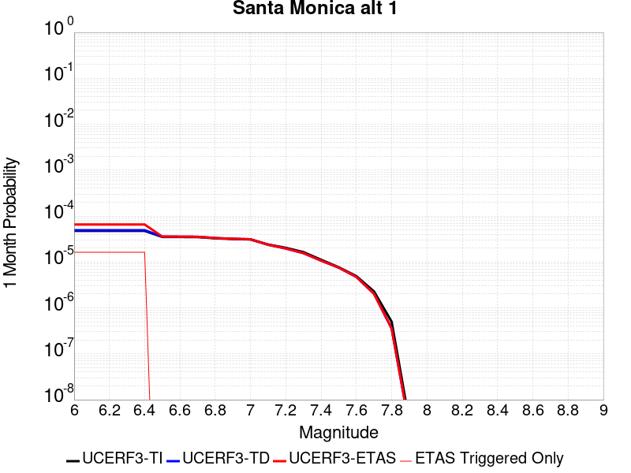 | 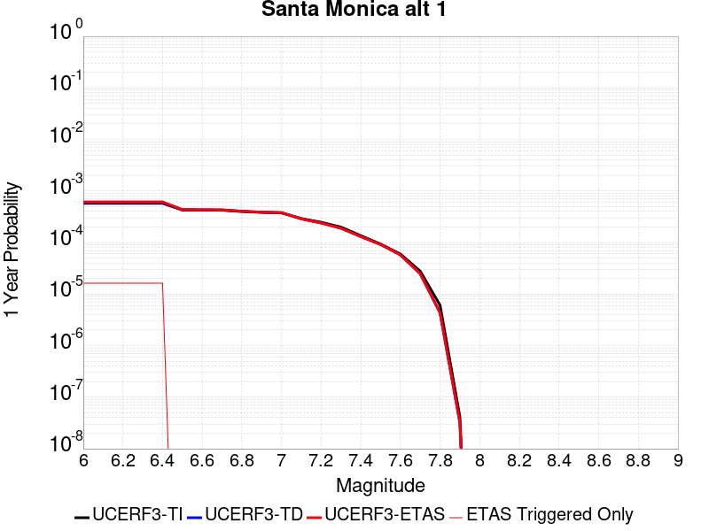 | 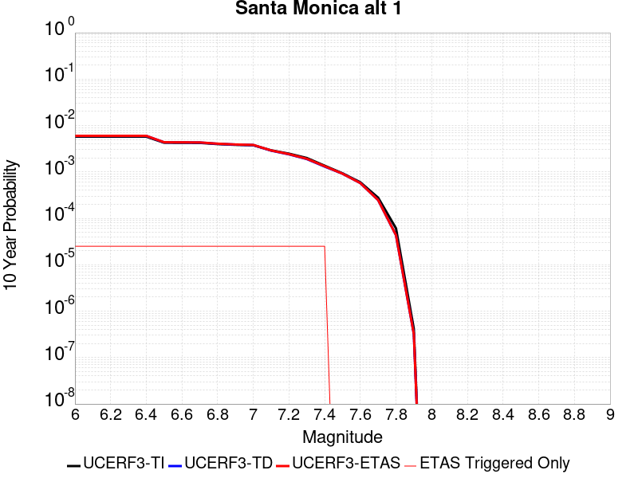 |

| Magnitude | 1 wk TI Prob | 1 wk TD Prob | 1 wk ETAS Prob | 1 wk ETAS/TD Gain | 1 wk ETAS Triggered Only | 1 mo TI Prob | 1 mo TD Prob | 1 mo ETAS Prob | 1 mo ETAS/TD Gain | 1 mo ETAS Triggered Only | 1 yr TI Prob | 1 yr TD Prob | 1 yr ETAS Prob | 1 yr ETAS/TD Gain | 1 yr ETAS Triggered Only | 10 yr TI Prob | 10 yr TD Prob | 10 yr ETAS Prob | 10 yr ETAS/TD Gain | 10 yr ETAS Triggered Only |
|-----|-----|-----|-----|-----|-----|-----|-----|-----|-----|-----|-----|-----|-----|-----|-----|-----|-----|-----|-----|-----|
| 6.0 | 1.1066008E-5 | 1.1480312E-5 | 1.1480312E-5 | 1.0 | 0.0 | 4.742488E-5 | 4.920049E-5 | 4.920049E-5 | 1.0 | 0.0 | 5.7724497E-4 | 5.9886527E-4 | 5.9886527E-4 | 1.0 | 0.0 | 0.005757478 | 0.0059739016 | 0.005998732 | 1.0041566 | 2.4980016E-5 |
| 6.1 | 1.1066008E-5 | 1.1480312E-5 | 1.1480312E-5 | 1.0 | 0.0 | 4.742488E-5 | 4.920049E-5 | 4.920049E-5 | 1.0 | 0.0 | 5.7724497E-4 | 5.9886527E-4 | 5.9886527E-4 | 1.0 | 0.0 | 0.005757478 | 0.0059739016 | 0.005998732 | 1.0041566 | 2.4980016E-5 |
| 6.2 | 1.1066008E-5 | 1.1480312E-5 | 1.1480312E-5 | 1.0 | 0.0 | 4.742488E-5 | 4.920049E-5 | 4.920049E-5 | 1.0 | 0.0 | 5.7724497E-4 | 5.9886527E-4 | 5.9886527E-4 | 1.0 | 0.0 | 0.005757478 | 0.0059739016 | 0.005998732 | 1.0041566 | 2.4980016E-5 |
| 6.3 | 1.1066008E-5 | 1.1480312E-5 | 1.1480312E-5 | 1.0 | 0.0 | 4.742488E-5 | 4.920049E-5 | 4.920049E-5 | 1.0 | 0.0 | 5.7724497E-4 | 5.9886527E-4 | 5.9886527E-4 | 1.0 | 0.0 | 0.005757478 | 0.0059739016 | 0.005998732 | 1.0041566 | 2.4980016E-5 |
| 6.4 | 1.1066008E-5 | 1.1480312E-5 | 1.1480312E-5 | 1.0 | 0.0 | 4.742488E-5 | 4.920049E-5 | 4.920049E-5 | 1.0 | 0.0 | 5.7724497E-4 | 5.9886527E-4 | 5.9886527E-4 | 1.0 | 0.0 | 0.005757478 | 0.0059739016 | 0.005998732 | 1.0041566 | 2.4980016E-5 |
| 6.5 | 8.183544E-6 | 8.335434E-6 | 8.335434E-6 | 1.0 | 0.0 | 3.5071862E-5 | 3.572281E-5 | 3.572281E-5 | 1.0 | 0.0 | 4.2691626E-4 | 4.3483998E-4 | 4.3483998E-4 | 1.0 | 0.0 | 0.0042609703 | 0.004340057 | 0.0043649287 | 1.0057307 | 2.4980016E-5 |
| 6.6 | 8.1543285E-6 | 8.303648E-6 | 8.303648E-6 | 1.0 | 0.0 | 3.4946657E-5 | 3.558659E-5 | 3.558659E-5 | 1.0 | 0.0 | 4.2539247E-4 | 4.3318217E-4 | 4.3318217E-4 | 1.0 | 0.0 | 0.0042457907 | 0.004323543 | 0.0043484154 | 1.0057527 | 2.4980016E-5 |
| 6.7 | 8.110878E-6 | 8.257045E-6 | 8.257045E-6 | 1.0 | 0.0 | 3.4760444E-5 | 3.5386864E-5 | 3.5386864E-5 | 1.0 | 0.0 | 4.231262E-4 | 4.3075148E-4 | 4.3075148E-4 | 1.0 | 0.0 | 0.0042232145 | 0.004299331 | 0.0043242034 | 1.0057852 | 2.4980016E-5 |
| 6.8 | 7.644036E-6 | 7.751063E-6 | 7.751063E-6 | 1.0 | 0.0 | 3.275974E-5 | 3.3218425E-5 | 3.3218425E-5 | 1.0 | 0.0 | 3.9877684E-4 | 4.043607E-4 | 4.043607E-4 | 1.0 | 0.0 | 0.00398062 | 0.004036396 | 0.0040612747 | 1.0061637 | 2.4980016E-5 |
| 6.9 | 7.3698293E-6 | 7.4557215E-6 | 7.4557215E-6 | 1.0 | 0.0 | 3.15846E-5 | 3.195271E-5 | 3.195271E-5 | 1.0 | 0.0 | 3.8447464E-4 | 3.889562E-4 | 3.889562E-4 | 1.0 | 0.0 | 0.0038381014 | 0.0038828978 | 0.0039077806 | 1.0064083 | 2.4980016E-5 |
| 7.0 | 7.209872E-6 | 7.2856283E-6 | 7.2856283E-6 | 1.0 | 0.0 | 3.0899086E-5 | 3.1223753E-5 | 3.1223753E-5 | 1.0 | 0.0 | 3.7613141E-4 | 3.800843E-4 | 3.800843E-4 | 1.0 | 0.0 | 0.0037549543 | 0.003794485 | 0.0038193702 | 1.0065583 | 2.4980016E-5 |
| 7.1 | 5.603456E-6 | 5.5238947E-6 | 5.5238947E-6 | 1.0 | 0.0 | 2.4014591E-5 | 2.3673623E-5 | 2.3673623E-5 | 1.0 | 0.0 | 2.923384E-4 | 2.8818863E-4 | 2.8818863E-4 | 1.0 | 0.0 | 0.0029195412 | 0.002878191 | 0.002903099 | 1.0086541 | 2.4980016E-5 |
| 7.2 | 4.7483613E-6 | 4.591135E-6 | 4.591135E-6 | 1.0 | 0.0 | 2.0349962E-5 | 1.9676147E-5 | 1.9676147E-5 | 1.0 | 0.0 | 2.4773262E-4 | 2.3953087E-4 | 2.3953087E-4 | 1.0 | 0.0 | 0.0024745662 | 0.0023927412 | 0.0024176612 | 1.010415 | 2.4980016E-5 |
| 7.3 | 3.829015E-6 | 3.6342271E-6 | 3.6342271E-6 | 1.0 | 0.0 | 1.6409962E-5 | 1.5575166E-5 | 1.5575166E-5 | 1.0 | 0.0 | 1.9977297E-4 | 1.8961124E-4 | 1.8961124E-4 | 1.0 | 0.0 | 0.0019959346 | 0.0018945034 | 0.0019194362 | 1.0131606 | 2.4980016E-5 |
| 7.4 | 2.610755E-6 | 2.4995722E-6 | 2.4995722E-6 | 1.0 | 0.0 | 1.1188902E-5 | 1.0712408E-5 | 1.0712408E-5 | 1.0 | 0.0 | 1.3621636E-4 | 1.304158E-4 | 1.304158E-4 | 1.0 | 0.0 | 0.001361329 | 0.0013033971 | 0.0013283446 | 1.0191404 | 2.4980016E-5 |
| 7.5 | 1.792146E-6 | 1.7584194E-6 | 1.7584194E-6 | 1.0 | 0.0 | 7.680603E-6 | 7.5360617E-6 | 7.5360617E-6 | 1.0 | 0.0 | 9.3507326E-5 | 9.174772E-5 | 9.174772E-5 | 1.0 | 0.0 | 9.3467993E-4 | 9.1710157E-4 | 9.1710157E-4 | 1.0 | 0.0 |
| 7.6 | 1.1473018E-6 | 1.102916E-6 | 1.102916E-6 | 1.0 | 0.0 | 4.9169985E-6 | 4.7267745E-6 | 4.7267745E-6 | 1.0 | 0.0 | 5.986281E-5 | 5.7546975E-5 | 5.7546975E-5 | 1.0 | 0.0 | 5.984669E-4 | 5.753224E-4 | 5.753224E-4 | 1.0 | 0.0 |
| 7.7 | 5.330919E-7 | 4.7452562E-7 | 4.7452562E-7 | 1.0 | 0.0 | 2.2846775E-6 | 2.0336797E-6 | 2.0336797E-6 | 1.0 | 0.0 | 2.7815593E-5 | 2.4759782E-5 | 2.4759782E-5 | 1.0 | 0.0 | 2.7812112E-4 | 2.4757136E-4 | 2.4757136E-4 | 1.0 | 0.0 |
| 7.8 | 1.1668574E-7 | 8.296564E-8 | 8.296564E-8 | 1.0 | 0.0 | 5.000816E-7 | 3.5556698E-7 | 3.5556698E-7 | 1.0 | 0.0 | 6.0884768E-6 | 4.3290197E-6 | 4.3290197E-6 | 1.0 | 0.0 | 6.08831E-5 | 4.3289383E-5 | 4.3289383E-5 | 1.0 | 0.0 |
| 7.9 | 8.007447E-10 | 6.161581E-10 | 6.161581E-10 | 1.0 | 0.0 | 3.4317629E-9 | 2.640678E-9 | 2.640678E-9 | 1.0 | 0.0 | 4.1781714E-8 | 3.2150254E-8 | 3.2150254E-8 | 1.0 | 0.0 | 4.1781706E-7 | 3.2150248E-7 | 3.2150248E-7 | 1.0 | 0.0 |

## Palos Verdes
*[(top)](#table-of-contents)*

| 1 Week | 1 Month | 1 Year | 10 Year |
|-----|-----|-----|-----|
| 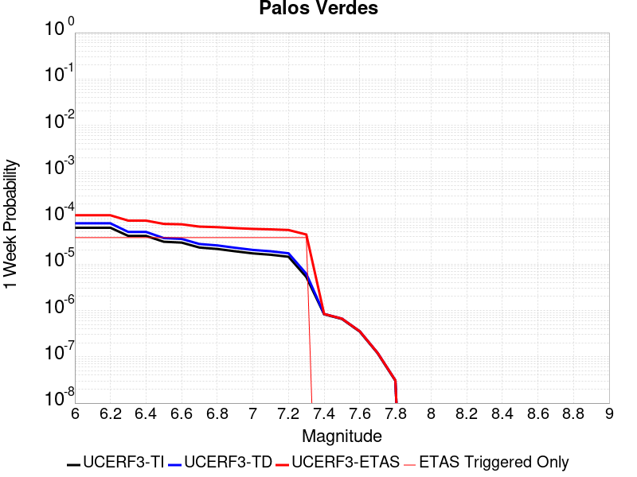 | 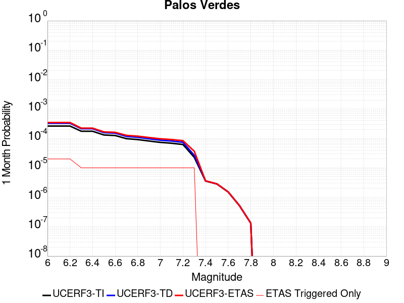 | 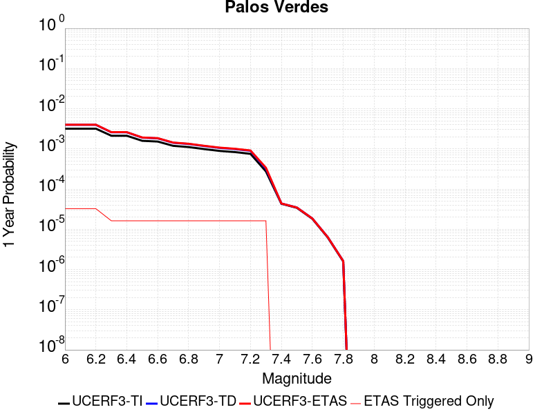 | 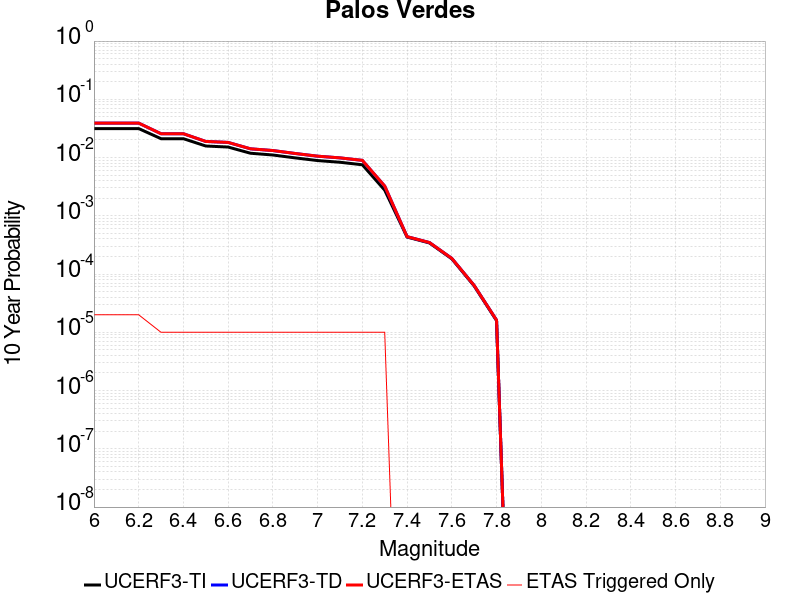 |

| Magnitude | 1 wk TI Prob | 1 wk TD Prob | 1 wk ETAS Prob | 1 wk ETAS/TD Gain | 1 wk ETAS Triggered Only | 1 mo TI Prob | 1 mo TD Prob | 1 mo ETAS Prob | 1 mo ETAS/TD Gain | 1 mo ETAS Triggered Only | 1 yr TI Prob | 1 yr TD Prob | 1 yr ETAS Prob | 1 yr ETAS/TD Gain | 1 yr ETAS Triggered Only | 10 yr TI Prob | 10 yr TD Prob | 10 yr ETAS Prob | 10 yr ETAS/TD Gain | 10 yr ETAS Triggered Only |
|-----|-----|-----|-----|-----|-----|-----|-----|-----|-----|-----|-----|-----|-----|-----|-----|-----|-----|-----|-----|-----|
| 6.0 | 6.126063E-5 | 7.622572E-5 | 1.01203834E-4 | 1.3276861 | 2.4980016E-5 | 2.6251914E-4 | 3.266441E-4 | 3.5161598E-4 | 1.0764498 | 2.4980016E-5 | 0.0031914865 | 0.0039701737 | 0.003995055 | 1.006267 | 2.4980016E-5 | 0.031460393 | 0.03904909 | 0.03907309 | 1.0006148 | 2.4980016E-5 |
| 6.1 | 6.126063E-5 | 7.622572E-5 | 1.01203834E-4 | 1.3276861 | 2.4980016E-5 | 2.6251914E-4 | 3.266441E-4 | 3.5161598E-4 | 1.0764498 | 2.4980016E-5 | 0.0031914865 | 0.0039701737 | 0.003995055 | 1.006267 | 2.4980016E-5 | 0.031460393 | 0.03904909 | 0.03907309 | 1.0006148 | 2.4980016E-5 |
| 6.2 | 6.126063E-5 | 7.622572E-5 | 1.01203834E-4 | 1.3276861 | 2.4980016E-5 | 2.6251914E-4 | 3.266441E-4 | 3.5161598E-4 | 1.0764498 | 2.4980016E-5 | 0.0031914865 | 0.0039701737 | 0.003995055 | 1.006267 | 2.4980016E-5 | 0.031460393 | 0.03904909 | 0.03907309 | 1.0006148 | 2.4980016E-5 |
| 6.3 | 4.0838047E-5 | 4.9749007E-5 | 7.472778E-5 | 1.5020959 | 2.4980016E-5 | 1.7500846E-4 | 2.1319388E-4 | 2.3816856E-4 | 1.1171454 | 2.4980016E-5 | 0.0021286458 | 0.002592754 | 0.0026176695 | 1.0096096 | 2.4980016E-5 | 0.021083709 | 0.025646746 | 0.025671085 | 1.000949 | 2.4980016E-5 |
| 6.4 | 4.0838047E-5 | 4.9749007E-5 | 7.472778E-5 | 1.5020959 | 2.4980016E-5 | 1.7500846E-4 | 2.1319388E-4 | 2.3816856E-4 | 1.1171454 | 2.4980016E-5 | 0.0021286458 | 0.002592754 | 0.0026176695 | 1.0096096 | 2.4980016E-5 | 0.021083709 | 0.025646746 | 0.025671085 | 1.000949 | 2.4980016E-5 |
| 6.5 | 3.0512005E-5 | 3.6561592E-5 | 6.15407E-5 | 1.6832061 | 2.4980016E-5 | 1.3075917E-4 | 1.566838E-4 | 1.8165991E-4 | 1.1594045 | 2.4980016E-5 | 0.0015908304 | 0.001906072 | 0.0019310045 | 1.0130805 | 2.4980016E-5 | 0.015794903 | 0.018909173 | 0.01893368 | 1.001296 | 2.4980016E-5 |
| 6.6 | 2.9255087E-5 | 3.5154393E-5 | 6.013353E-5 | 1.7105553 | 2.4980016E-5 | 1.2537291E-4 | 1.5065364E-4 | 1.7562989E-4 | 1.1657859 | 2.4980016E-5 | 0.0015253464 | 0.0018327782 | 0.0018577124 | 1.0136046 | 2.4980016E-5 | 0.015149189 | 0.018188244 | 0.01821277 | 1.0013484 | 2.4980016E-5 |
| 6.7 | 2.287198E-5 | 2.724828E-5 | 5.2227613E-5 | 1.9167308 | 2.4980016E-5 | 9.801909E-5 | 1.16773626E-4 | 1.4175073E-4 | 1.2138933 | 2.4980016E-5 | 0.001192729 | 0.0014208833 | 0.0014458279 | 1.0175556 | 2.4980016E-5 | 0.011863477 | 0.014127217 | 0.014151844 | 1.0017432 | 2.4980016E-5 |
| 6.8 | 2.1325764E-5 | 2.5431878E-5 | 5.0411258E-5 | 1.9822075 | 2.4980016E-5 | 9.139293E-5 | 1.0898972E-4 | 1.3396701E-4 | 1.2291712 | 2.4980016E-5 | 0.001112141 | 0.0013262323 | 0.0013511792 | 1.0188104 | 2.4980016E-5 | 0.011065915 | 0.013192211 | 0.0132168615 | 1.0018686 | 2.4980016E-5 |
| 6.9 | 1.9009392E-5 | 2.2613547E-5 | 4.7593E-5 | 2.1046233 | 2.4980016E-5 | 8.1466285E-5 | 9.6912096E-5 | 1.21889694E-4 | 1.2577345 | 2.4980016E-5 | 9.914007E-4 | 0.0011793535 | 0.001204304 | 1.0211561 | 2.4980016E-5 | 0.009869894 | 0.011739633 | 0.01176432 | 1.0021029 | 2.4980016E-5 |
| 7.0 | 1.7098473E-5 | 2.0319356E-5 | 4.5298864E-5 | 2.2293456 | 2.4980016E-5 | 7.3277115E-5 | 8.708052E-5 | 1.1205837E-4 | 1.2868361 | 2.4980016E-5 | 8.917837E-4 | 0.001059775 | 0.0010847285 | 1.0235461 | 2.4980016E-5 | 0.008882134 | 0.010555646 | 0.010580363 | 1.0023415 | 2.4980016E-5 |
| 7.1 | 1.5982785E-5 | 1.899476E-5 | 4.39743E-5 | 2.3150754 | 2.4980016E-5 | 6.849585E-5 | 8.1404054E-5 | 1.0638204E-4 | 1.3068396 | 2.4980016E-5 | 8.336179E-4 | 9.907284E-4 | 0.0010156836 | 1.0251888 | 2.4980016E-5 | 0.008304977 | 0.009871479 | 0.009896213 | 1.0025055 | 2.4980016E-5 |
| 7.2 | 1.4468002E-5 | 1.7197237E-5 | 4.2176824E-5 | 2.452535 | 2.4980016E-5 | 6.200425E-5 | 7.370083E-5 | 9.8679004E-5 | 1.3389131 | 2.4980016E-5 | 7.546402E-4 | 8.970222E-4 | 9.2197984E-4 | 1.0278227 | 2.4980016E-5 | 0.007520827 | 0.008942284 | 0.00896704 | 1.0027685 | 2.4980016E-5 |
| 7.3 | 5.288233E-6 | 6.2036747E-6 | 3.1183536E-5 | 5.0266232 | 2.4980016E-5 | 2.2663658E-5 | 2.6587102E-5 | 5.1566454E-5 | 1.939529 | 2.4980016E-5 | 2.7589512E-4 | 3.236848E-4 | 3.4865673E-4 | 1.0771489 | 2.4980016E-5 | 0.0027555283 | 0.0032355562 | 0.0032604553 | 1.0076954 | 2.4980016E-5 |
| 7.4 | 8.279556E-7 | 8.408347E-7 | 8.408347E-7 | 1.0 | 0.0 | 3.5483763E-6 | 3.6035726E-6 | 3.6035726E-6 | 1.0 | 0.0 | 4.3200624E-5 | 4.3872686E-5 | 4.3872686E-5 | 1.0 | 0.0 | 4.3192226E-4 | 4.3864746E-4 | 4.3864746E-4 | 1.0 | 0.0 |
| 7.5 | 6.559831E-7 | 6.667229E-7 | 6.667229E-7 | 1.0 | 0.0 | 2.8113532E-6 | 2.857381E-6 | 2.857381E-6 | 1.0 | 0.0 | 3.4227687E-5 | 3.4788125E-5 | 3.4788125E-5 | 1.0 | 0.0 | 3.4222414E-4 | 3.4783344E-4 | 3.4783344E-4 | 1.0 | 0.0 |
| 7.6 | 3.5018968E-7 | 3.5620027E-7 | 3.5620027E-7 | 1.0 | 0.0 | 1.500812E-6 | 1.526572E-6 | 1.526572E-6 | 1.0 | 0.0 | 1.8272232E-5 | 1.8585903E-5 | 1.8585903E-5 | 1.0 | 0.0 | 1.8270731E-4 | 1.8584808E-4 | 1.8584808E-4 | 1.0 | 0.0 |
| 7.7 | 1.1986104E-7 | 1.2198376E-7 | 1.2198376E-7 | 1.0 | 0.0 | 5.1369005E-7 | 5.2278745E-7 | 5.2278745E-7 | 1.0 | 0.0 | 6.2541585E-6 | 6.364919E-6 | 6.364919E-6 | 1.0 | 0.0 | 6.2539824E-5 | 6.364741E-5 | 6.364741E-5 | 1.0 | 0.0 |
| 7.8 | 3.0445005E-8 | 3.1027582E-8 | 3.1027582E-8 | 1.0 | 0.0 | 1.3047858E-7 | 1.3297536E-7 | 1.3297536E-7 | 1.0 | 0.0 | 1.5885756E-6 | 1.6189739E-6 | 1.6189739E-6 | 1.0 | 0.0 | 1.5885644E-5 | 1.6189642E-5 | 1.6189642E-5 | 1.0 | 0.0 |

## Los Alamos extension
*[(top)](#table-of-contents)*

| 1 Week | 1 Month | 1 Year | 10 Year |
|-----|-----|-----|-----|
| 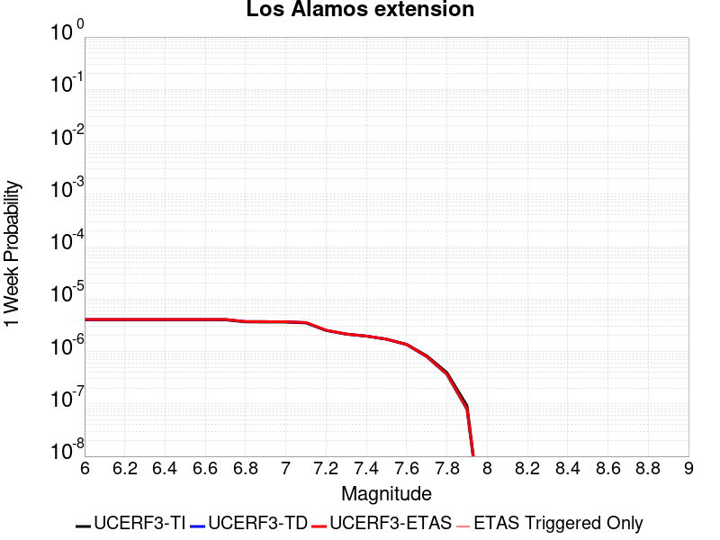 | 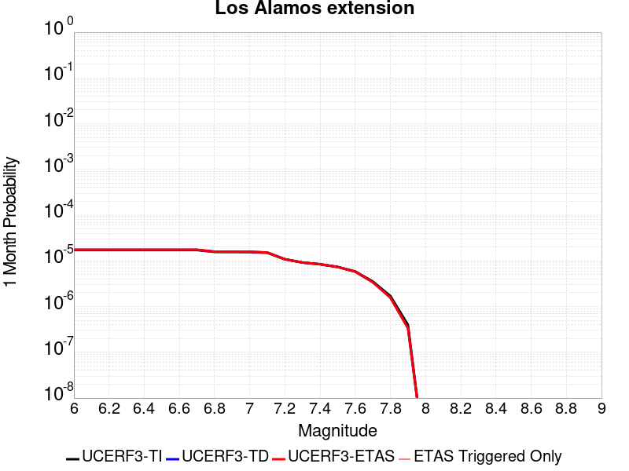 | 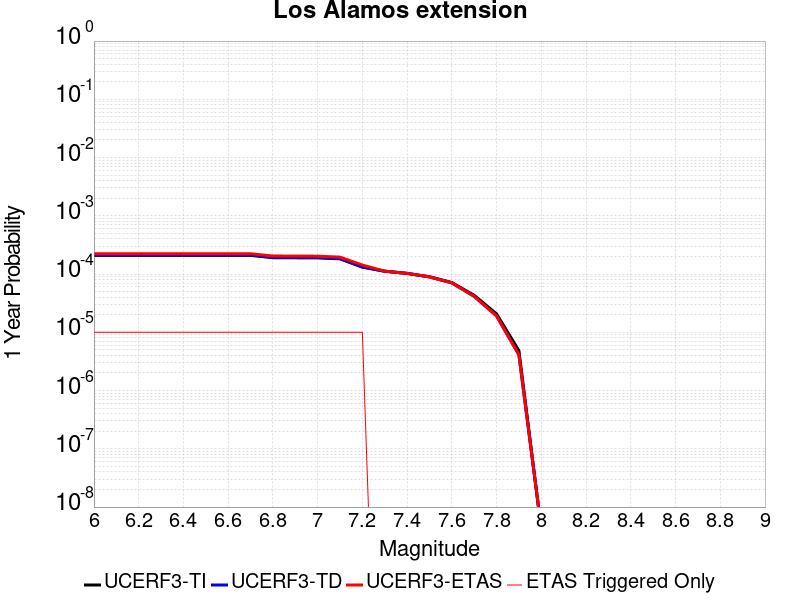 | 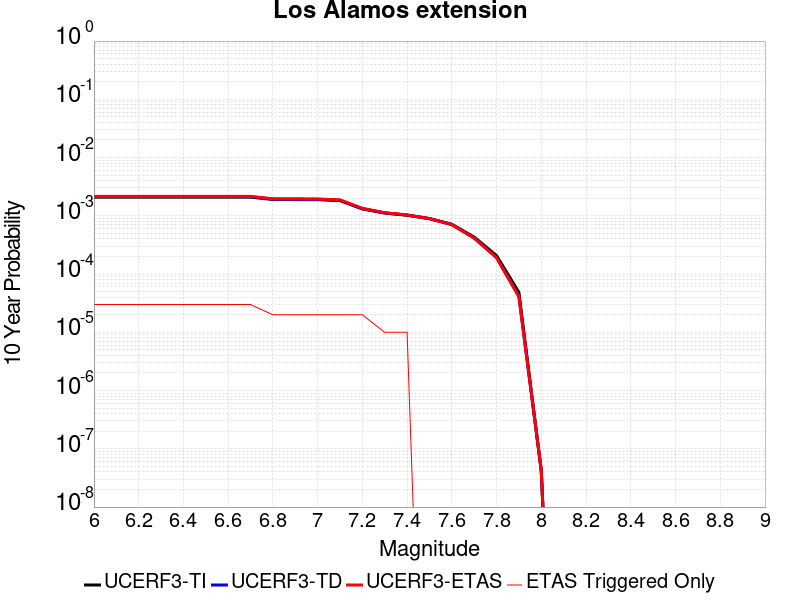 |

| Magnitude | 1 wk TI Prob | 1 wk TD Prob | 1 wk ETAS Prob | 1 wk ETAS/TD Gain | 1 wk ETAS Triggered Only | 1 mo TI Prob | 1 mo TD Prob | 1 mo ETAS Prob | 1 mo ETAS/TD Gain | 1 mo ETAS Triggered Only | 1 yr TI Prob | 1 yr TD Prob | 1 yr ETAS Prob | 1 yr ETAS/TD Gain | 1 yr ETAS Triggered Only | 10 yr TI Prob | 10 yr TD Prob | 10 yr ETAS Prob | 10 yr ETAS/TD Gain | 10 yr ETAS Triggered Only |
|-----|-----|-----|-----|-----|-----|-----|-----|-----|-----|-----|-----|-----|-----|-----|-----|-----|-----|-----|-----|-----|
| 6.0 | 4.0146506E-6 | 4.086164E-6 | 4.086164E-6 | 1.0 | 0.0 | 1.7205533E-5 | 1.7512022E-5 | 1.7512022E-5 | 1.0 | 0.0 | 2.0945723E-4 | 2.1318911E-4 | 2.1318911E-4 | 1.0 | 0.0 | 0.0020925992 | 0.002129955 | 0.0021548818 | 1.011703 | 2.4980016E-5 |
| 6.1 | 4.0146506E-6 | 4.086164E-6 | 4.086164E-6 | 1.0 | 0.0 | 1.7205533E-5 | 1.7512022E-5 | 1.7512022E-5 | 1.0 | 0.0 | 2.0945723E-4 | 2.1318911E-4 | 2.1318911E-4 | 1.0 | 0.0 | 0.0020925992 | 0.002129955 | 0.0021548818 | 1.011703 | 2.4980016E-5 |
| 6.2 | 4.0146506E-6 | 4.086164E-6 | 4.086164E-6 | 1.0 | 0.0 | 1.7205533E-5 | 1.7512022E-5 | 1.7512022E-5 | 1.0 | 0.0 | 2.0945723E-4 | 2.1318911E-4 | 2.1318911E-4 | 1.0 | 0.0 | 0.0020925992 | 0.002129955 | 0.0021548818 | 1.011703 | 2.4980016E-5 |
| 6.3 | 4.0146506E-6 | 4.086164E-6 | 4.086164E-6 | 1.0 | 0.0 | 1.7205533E-5 | 1.7512022E-5 | 1.7512022E-5 | 1.0 | 0.0 | 2.0945723E-4 | 2.1318911E-4 | 2.1318911E-4 | 1.0 | 0.0 | 0.0020925992 | 0.002129955 | 0.0021548818 | 1.011703 | 2.4980016E-5 |
| 6.4 | 4.0146506E-6 | 4.086164E-6 | 4.086164E-6 | 1.0 | 0.0 | 1.7205533E-5 | 1.7512022E-5 | 1.7512022E-5 | 1.0 | 0.0 | 2.0945723E-4 | 2.1318911E-4 | 2.1318911E-4 | 1.0 | 0.0 | 0.0020925992 | 0.002129955 | 0.0021548818 | 1.011703 | 2.4980016E-5 |
| 6.5 | 4.0146506E-6 | 4.086164E-6 | 4.086164E-6 | 1.0 | 0.0 | 1.7205533E-5 | 1.7512022E-5 | 1.7512022E-5 | 1.0 | 0.0 | 2.0945723E-4 | 2.1318911E-4 | 2.1318911E-4 | 1.0 | 0.0 | 0.0020925992 | 0.002129955 | 0.0021548818 | 1.011703 | 2.4980016E-5 |
| 6.6 | 4.0146506E-6 | 4.086164E-6 | 4.086164E-6 | 1.0 | 0.0 | 1.7205533E-5 | 1.7512022E-5 | 1.7512022E-5 | 1.0 | 0.0 | 2.0945723E-4 | 2.1318911E-4 | 2.1318911E-4 | 1.0 | 0.0 | 0.0020925992 | 0.002129955 | 0.0021548818 | 1.011703 | 2.4980016E-5 |
| 6.7 | 4.0146506E-6 | 4.086164E-6 | 4.086164E-6 | 1.0 | 0.0 | 1.7205533E-5 | 1.7512022E-5 | 1.7512022E-5 | 1.0 | 0.0 | 2.0945723E-4 | 2.1318911E-4 | 2.1318911E-4 | 1.0 | 0.0 | 0.0020925992 | 0.002129955 | 0.0021548818 | 1.011703 | 2.4980016E-5 |
| 6.8 | 3.6584688E-6 | 3.7188636E-6 | 3.7188636E-6 | 1.0 | 0.0 | 1.5679057E-5 | 1.5937894E-5 | 1.5937894E-5 | 1.0 | 0.0 | 1.9087581E-4 | 1.9402753E-4 | 1.9402753E-4 | 1.0 | 0.0 | 0.0019071194 | 0.0019386737 | 0.0019386737 | 1.0 | 0.0 |
| 6.9 | 3.644631E-6 | 3.7045736E-6 | 3.7045736E-6 | 1.0 | 0.0 | 1.5619753E-5 | 1.5876652E-5 | 1.5876652E-5 | 1.0 | 0.0 | 1.901539E-4 | 1.9328203E-4 | 1.9328203E-4 | 1.0 | 0.0 | 0.0018999127 | 0.0019312317 | 0.0019312317 | 1.0 | 0.0 |
| 7.0 | 3.6318522E-6 | 3.691334E-6 | 3.691334E-6 | 1.0 | 0.0 | 1.5564989E-5 | 1.5819913E-5 | 1.5819913E-5 | 1.0 | 0.0 | 1.8948725E-4 | 1.9259135E-4 | 1.9259135E-4 | 1.0 | 0.0 | 0.0018932576 | 0.0019243368 | 0.0019243368 | 1.0 | 0.0 |
| 7.1 | 3.5001724E-6 | 3.5554046E-6 | 3.5554046E-6 | 1.0 | 0.0 | 1.5000653E-5 | 1.5237365E-5 | 1.5237365E-5 | 1.0 | 0.0 | 1.8261763E-4 | 1.8550004E-4 | 1.8550004E-4 | 1.0 | 0.0 | 0.0018246764 | 0.0018535426 | 0.0018535426 | 1.0 | 0.0 |
| 7.2 | 2.5204702E-6 | 2.5436989E-6 | 2.5436989E-6 | 1.0 | 0.0 | 1.080197E-5 | 1.0901522E-5 | 1.0901522E-5 | 1.0 | 0.0 | 1.3150605E-4 | 1.3271799E-4 | 1.3271799E-4 | 1.0 | 0.0 | 0.0013142825 | 0.001326393 | 0.001326393 | 1.0 | 0.0 |
| 7.3 | 2.1399692E-6 | 2.1501362E-6 | 2.1501362E-6 | 1.0 | 0.0 | 9.1712645E-6 | 9.2148375E-6 | 9.2148375E-6 | 1.0 | 0.0 | 1.1165442E-4 | 1.121849E-4 | 1.121849E-4 | 1.0 | 0.0 | 0.0011159834 | 0.001121286 | 0.001121286 | 1.0 | 0.0 |
| 7.4 | 1.9660122E-6 | 1.970241E-6 | 1.970241E-6 | 1.0 | 0.0 | 8.42574E-6 | 8.4438625E-6 | 8.4438625E-6 | 1.0 | 0.0 | 1.0257855E-4 | 1.0279921E-4 | 1.0279921E-4 | 1.0 | 0.0 | 0.0010253121 | 0.0010275197 | 0.0010275197 | 1.0 | 0.0 |
| 7.5 | 1.7204633E-6 | 1.7151029E-6 | 1.7151029E-6 | 1.0 | 0.0 | 7.373393E-6 | 7.3504207E-6 | 7.3504207E-6 | 1.0 | 0.0 | 8.976737E-5 | 8.948772E-5 | 8.948772E-5 | 1.0 | 0.0 | 8.9731114E-4 | 8.945199E-4 | 8.945199E-4 | 1.0 | 0.0 |
| 7.6 | 1.3717638E-6 | 1.3535872E-6 | 1.3535872E-6 | 1.0 | 0.0 | 5.878974E-6 | 5.801075E-6 | 5.801075E-6 | 1.0 | 0.0 | 7.157416E-5 | 7.062583E-5 | 7.062583E-5 | 1.0 | 0.0 | 7.1551115E-4 | 7.0603646E-4 | 7.0603646E-4 | 1.0 | 0.0 |
| 7.7 | 8.272564E-7 | 7.9576733E-7 | 7.9576733E-7 | 1.0 | 0.0 | 3.5453797E-6 | 3.4104269E-6 | 3.4104269E-6 | 1.0 | 0.0 | 4.3164142E-5 | 4.1521158E-5 | 4.1521158E-5 | 1.0 | 0.0 | 4.315576E-4 | 4.151342E-4 | 4.151342E-4 | 1.0 | 0.0 |
| 7.8 | 3.9708277E-7 | 3.671937E-7 | 3.671937E-7 | 1.0 | 0.0 | 1.7017821E-6 | 1.5736864E-6 | 1.5736864E-6 | 1.0 | 0.0 | 2.0719E-5 | 1.9159465E-5 | 1.9159465E-5 | 1.0 | 0.0 | 2.071707E-4 | 1.9157819E-4 | 1.9157819E-4 | 1.0 | 0.0 |
| 7.9 | 9.292528E-8 | 7.889168E-8 | 7.889168E-8 | 1.0 | 0.0 | 3.9825116E-7 | 3.3810713E-7 | 3.3810713E-7 | 1.0 | 0.0 | 4.848697E-6 | 4.1164467E-6 | 4.1164467E-6 | 1.0 | 0.0 | 4.8485912E-5 | 4.1163716E-5 | 4.1163716E-5 | 1.0 | 0.0 |
| 8.0 | 7.880441E-11 | 8.2353124E-11 | 8.2353124E-11 | 1.0 | 0.0 | 3.3773329E-10 | 3.52942E-10 | 3.52942E-10 | 1.0 | 0.0 | 4.1119033E-9 | 4.2970694E-9 | 4.2970694E-9 | 1.0 | 0.0 | 4.1119034E-8 | 4.2970694E-8 | 4.2970694E-8 | 1.0 | 0.0 |

## Green Valley 2011 CFM
*[(top)](#table-of-contents)*

| 1 Week | 1 Month | 1 Year | 10 Year |
|-----|-----|-----|-----|
|  | 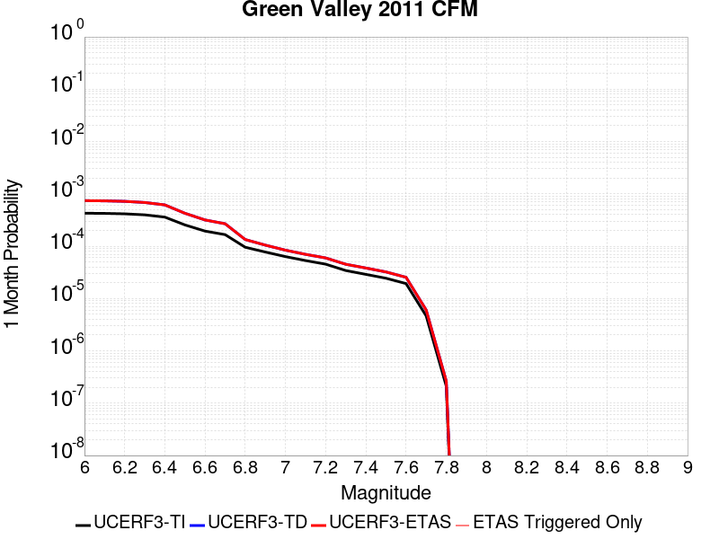 | 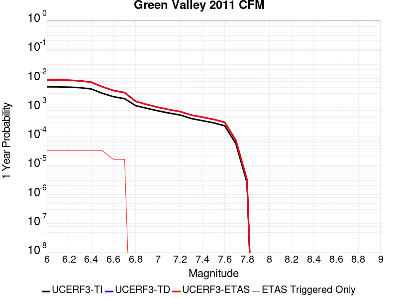 | 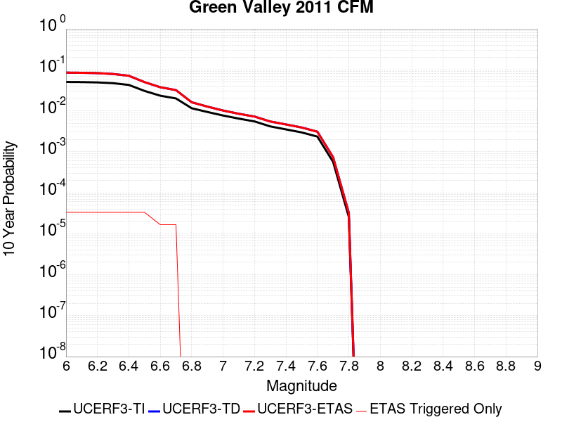 |

| Magnitude | 1 wk TI Prob | 1 wk TD Prob | 1 wk ETAS Prob | 1 wk ETAS/TD Gain | 1 wk ETAS Triggered Only | 1 mo TI Prob | 1 mo TD Prob | 1 mo ETAS Prob | 1 mo ETAS/TD Gain | 1 mo ETAS Triggered Only | 1 yr TI Prob | 1 yr TD Prob | 1 yr ETAS Prob | 1 yr ETAS/TD Gain | 1 yr ETAS Triggered Only | 10 yr TI Prob | 10 yr TD Prob | 10 yr ETAS Prob | 10 yr ETAS/TD Gain | 10 yr ETAS Triggered Only |
|-----|-----|-----|-----|-----|-----|-----|-----|-----|-----|-----|-----|-----|-----|-----|-----|-----|-----|-----|-----|-----|
| 6.0 | 9.9629346E-5 | 1.7302863E-4 | 1.7302863E-4 | 1.0 | 0.0 | 4.2691303E-4 | 7.41326E-4 | 7.41326E-4 | 1.0 | 0.0 | 0.0051852856 | 0.00898692 | 0.009011676 | 1.0027546 | 2.4980016E-5 | 0.050659515 | 0.08553951 | 0.085562356 | 1.000267 | 2.4980016E-5 |
| 6.1 | 9.88615E-5 | 1.7150163E-4 | 1.7150163E-4 | 1.0 | 0.0 | 4.2362334E-4 | 7.347854E-4 | 7.347854E-4 | 1.0 | 0.0 | 0.0051454236 | 0.008907947 | 0.008932704 | 1.0027792 | 2.4980016E-5 | 0.050279044 | 0.08482712 | 0.084849976 | 1.0002695 | 2.4980016E-5 |
| 6.2 | 9.696895E-5 | 1.6789208E-4 | 1.6789208E-4 | 1.0 | 0.0 | 4.15515E-4 | 7.1932544E-4 | 7.1932544E-4 | 1.0 | 0.0 | 0.0050471667 | 0.00872133 | 0.008746092 | 1.0028392 | 2.4980016E-5 | 0.04934063 | 0.08313578 | 0.08315869 | 1.0002755 | 2.4980016E-5 |
| 6.3 | 9.275224E-5 | 1.5968543E-4 | 1.5968543E-4 | 1.0 | 0.0 | 3.9744904E-4 | 6.841728E-4 | 6.841728E-4 | 1.0 | 0.0 | 0.0048282105 | 0.008296652 | 0.008321424 | 1.0029858 | 2.4980016E-5 | 0.047246475 | 0.07927481 | 0.07929781 | 1.0002902 | 2.4980016E-5 |
| 6.4 | 8.391499E-5 | 1.4365884E-4 | 1.4365884E-4 | 1.0 | 0.0 | 3.595861E-4 | 6.155238E-4 | 6.155238E-4 | 1.0 | 0.0 | 0.004369175 | 0.007467181 | 0.0074919746 | 1.0033203 | 2.4980016E-5 | 0.04284265 | 0.07164672 | 0.07166991 | 1.0003237 | 2.4980016E-5 |
| 6.5 | 5.9519385E-5 | 9.932622E-5 | 9.932622E-5 | 1.0 | 0.0 | 2.5505814E-4 | 4.2560388E-4 | 4.2560388E-4 | 1.0 | 0.0 | 0.0031009112 | 0.005168341 | 0.005193192 | 1.0048083 | 2.4980016E-5 | 0.030579966 | 0.05014692 | 0.05017065 | 1.0004731 | 2.4980016E-5 |
| 6.6 | 4.5361558E-5 | 7.4019794E-5 | 7.4019794E-5 | 1.0 | 0.0 | 1.9439218E-4 | 3.1717744E-4 | 3.1717744E-4 | 1.0 | 0.0 | 0.0023641558 | 0.0038538678 | 0.0038787515 | 1.0064569 | 2.4980016E-5 | 0.023391623 | 0.03766727 | 0.037691306 | 1.0006382 | 2.4980016E-5 |
| 6.7 | 3.8808106E-5 | 6.264382E-5 | 6.264382E-5 | 1.0 | 0.0 | 1.6630985E-4 | 2.6843755E-4 | 2.6843755E-4 | 1.0 | 0.0 | 0.0020229418 | 0.0032627317 | 0.0032876302 | 1.0076312 | 2.4980016E-5 | 0.020046256 | 0.032007415 | 0.032031596 | 1.0007554 | 2.4980016E-5 |
| 6.8 | 2.2284667E-5 | 3.128574E-5 | 3.128574E-5 | 1.0 | 0.0 | 9.550222E-5 | 1.3407487E-4 | 1.3407487E-4 | 1.0 | 0.0 | 0.0011621192 | 0.0016311383 | 0.0016311383 | 1.0 | 0.0 | 0.011560607 | 0.01616672 | 0.01616672 | 1.0 | 0.0 |
| 6.9 | 1.8050168E-5 | 2.4448536E-5 | 2.4448536E-5 | 1.0 | 0.0 | 7.735557E-5 | 1.0477527E-4 | 1.0477527E-4 | 1.0 | 0.0 | 9.4139716E-4 | 0.0012748954 | 0.0012748954 | 1.0 | 0.0 | 0.009374191 | 0.012669067 | 0.012669067 | 1.0 | 0.0 |
| 7.0 | 1.4763166E-5 | 1.9583236E-5 | 1.9583236E-5 | 1.0 | 0.0 | 6.326917E-5 | 8.3925464E-5 | 8.3925464E-5 | 1.0 | 0.0 | 7.7002996E-4 | 0.001021315 | 0.001021315 | 1.0 | 0.0 | 0.007673672 | 0.01016625 | 0.01016625 | 1.0 | 0.0 |
| 7.1 | 1.2399713E-5 | 1.6304042E-5 | 1.6304042E-5 | 1.0 | 0.0 | 5.3140546E-5 | 6.987261E-5 | 6.987261E-5 | 1.0 | 0.0 | 6.467941E-4 | 8.5036893E-4 | 8.5036893E-4 | 1.0 | 0.0 | 0.006449148 | 0.008471781 | 0.008471781 | 1.0 | 0.0 |
| 7.2 | 1.0584195E-5 | 1.39220465E-5 | 1.39220465E-5 | 1.0 | 0.0 | 4.5360044E-5 | 5.966456E-5 | 5.966456E-5 | 1.0 | 0.0 | 5.521186E-4 | 7.2617555E-4 | 7.2617555E-4 | 1.0 | 0.0 | 0.0055074887 | 0.0072386027 | 0.0072386027 | 1.0 | 0.0 |
| 7.3 | 7.998173E-6 | 1.0544255E-5 | 1.0544255E-5 | 1.0 | 0.0 | 3.4277433E-5 | 4.5188888E-5 | 4.5188888E-5 | 1.0 | 0.0 | 4.1724785E-4 | 5.500369E-4 | 5.500369E-4 | 1.0 | 0.0 | 0.004164653 | 0.005487135 | 0.005487135 | 1.0 | 0.0 |
| 7.4 | 6.7571127E-6 | 8.932903E-6 | 8.932903E-6 | 1.0 | 0.0 | 2.8958733E-5 | 3.8283313E-5 | 3.8283313E-5 | 1.0 | 0.0 | 3.5251552E-4 | 4.660006E-4 | 4.660006E-4 | 1.0 | 0.0 | 0.0035195686 | 0.004650633 | 0.004650633 | 1.0 | 0.0 |
| 7.5 | 5.69878E-6 | 7.516483E-6 | 7.516483E-6 | 1.0 | 0.0 | 2.4423114E-5 | 3.2213105E-5 | 3.2213105E-5 | 1.0 | 0.0 | 2.9731085E-4 | 3.9212484E-4 | 3.9212484E-4 | 1.0 | 0.0 | 0.002969134 | 0.0039147018 | 0.0039147018 | 1.0 | 0.0 |
| 7.6 | 4.503664E-6 | 5.9358217E-6 | 5.9358217E-6 | 1.0 | 0.0 | 1.9301275E-5 | 2.5438992E-5 | 2.5438992E-5 | 1.0 | 0.0 | 2.3496768E-4 | 3.0967654E-4 | 3.0967654E-4 | 1.0 | 0.0 | 0.002347194 | 0.0030927279 | 0.0030927279 | 1.0 | 0.0 |
| 7.7 | 1.0873546E-6 | 1.410754E-6 | 1.410754E-6 | 1.0 | 0.0 | 4.6600826E-6 | 6.0460743E-6 | 6.0460743E-6 | 1.0 | 0.0 | 5.6735033E-5 | 7.36085E-5 | 7.36085E-5 | 1.0 | 0.0 | 5.672055E-4 | 7.3587085E-4 | 7.3587085E-4 | 1.0 | 0.0 |
| 7.8 | 4.9373917E-8 | 6.177967E-8 | 6.177967E-8 | 1.0 | 0.0 | 2.1160248E-7 | 2.6477002E-7 | 2.6477002E-7 | 1.0 | 0.0 | 2.5762572E-6 | 3.2235714E-6 | 3.2235714E-6 | 1.0 | 0.0 | 2.5762274E-5 | 3.2228E-5 | 3.2228E-5 | 1.0 | 0.0 |

## Malibu Coast (Extension) alt 1
*[(top)](#table-of-contents)*

| 1 Week | 1 Month | 1 Year | 10 Year |
|-----|-----|-----|-----|
| 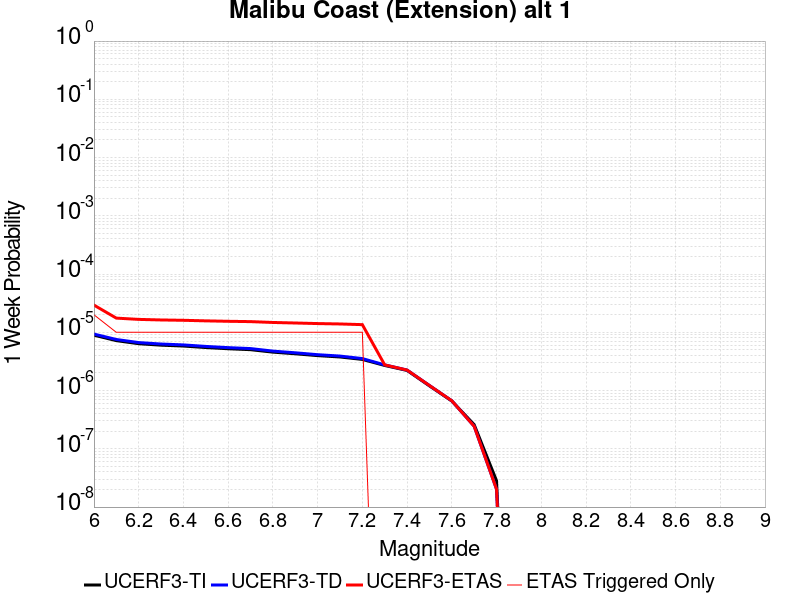 | 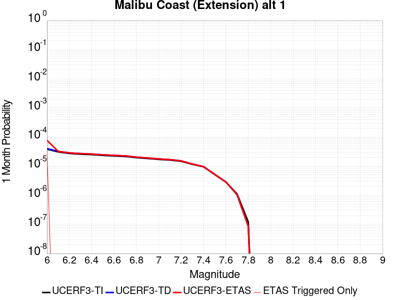 | 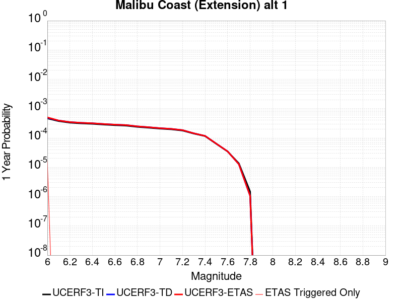 | 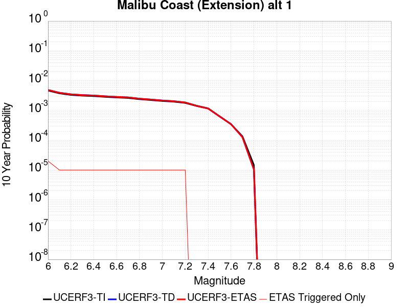 |

| Magnitude | 1 wk TI Prob | 1 wk TD Prob | 1 wk ETAS Prob | 1 wk ETAS/TD Gain | 1 wk ETAS Triggered Only | 1 mo TI Prob | 1 mo TD Prob | 1 mo ETAS Prob | 1 mo ETAS/TD Gain | 1 mo ETAS Triggered Only | 1 yr TI Prob | 1 yr TD Prob | 1 yr ETAS Prob | 1 yr ETAS/TD Gain | 1 yr ETAS Triggered Only | 10 yr TI Prob | 10 yr TD Prob | 10 yr ETAS Prob | 10 yr ETAS/TD Gain | 10 yr ETAS Triggered Only |
|-----|-----|-----|-----|-----|-----|-----|-----|-----|-----|-----|-----|-----|-----|-----|-----|-----|-----|-----|-----|-----|
| 6.0 | 8.930738E-6 | 9.3292765E-6 | 3.4309058E-5 | 3.6775692 | 2.4980016E-5 | 3.827403E-5 | 3.998201E-5 | 6.496103E-5 | 1.6247565 | 2.4980016E-5 | 4.6588664E-4 | 4.86674E-4 | 5.1164185E-4 | 1.051303 | 2.4980016E-5 | 0.0046491115 | 0.004856264 | 0.004881123 | 1.0051188 | 2.4980016E-5 |
| 6.1 | 7.199952E-6 | 7.5302974E-6 | 7.5302974E-6 | 1.0 | 0.0 | 3.0856572E-5 | 3.2272306E-5 | 3.2272306E-5 | 1.0 | 0.0 | 3.75614E-4 | 3.928451E-4 | 3.928451E-4 | 1.0 | 0.0 | 0.0037497976 | 0.0039215726 | 0.0039215726 | 1.0 | 0.0 |
| 6.2 | 6.3721413E-6 | 6.666792E-6 | 6.666792E-6 | 1.0 | 0.0 | 2.7308892E-5 | 2.8571656E-5 | 2.8571656E-5 | 1.0 | 0.0 | 3.3243504E-4 | 3.4780474E-4 | 3.4780474E-4 | 1.0 | 0.0 | 0.0033193815 | 0.0034726441 | 0.0034726441 | 1.0 | 0.0 |
| 6.3 | 6.016345E-6 | 6.295159E-6 | 6.295159E-6 | 1.0 | 0.0 | 2.578408E-5 | 2.6978976E-5 | 2.6978976E-5 | 1.0 | 0.0 | 3.1387596E-4 | 3.2841985E-4 | 3.2841985E-4 | 1.0 | 0.0 | 0.00313433 | 0.0032793812 | 0.0032793812 | 1.0 | 0.0 |
| 6.4 | 5.8104883E-6 | 6.0795455E-6 | 6.0795455E-6 | 1.0 | 0.0 | 2.4901856E-5 | 2.6054937E-5 | 2.6054937E-5 | 1.0 | 0.0 | 3.031379E-4 | 3.17173E-4 | 3.17173E-4 | 1.0 | 0.0 | 0.0030272473 | 0.0031672379 | 0.0031672379 | 1.0 | 0.0 |
| 6.5 | 5.476925E-6 | 5.727514E-6 | 5.727514E-6 | 1.0 | 0.0 | 2.3472323E-5 | 2.454626E-5 | 2.454626E-5 | 1.0 | 0.0 | 2.8573806E-4 | 2.9881002E-4 | 2.9881002E-4 | 1.0 | 0.0 | 0.0028537093 | 0.0029841145 | 0.0029841145 | 1.0 | 0.0 |
| 6.6 | 5.222387E-6 | 5.4585807E-6 | 5.4585807E-6 | 1.0 | 0.0 | 2.2381464E-5 | 2.3393708E-5 | 2.3393708E-5 | 1.0 | 0.0 | 2.7246025E-4 | 2.8478145E-4 | 2.8478145E-4 | 1.0 | 0.0 | 0.0027212645 | 0.002844196 | 0.002844196 | 1.0 | 0.0 |
| 6.7 | 5.0337076E-6 | 5.259104E-6 | 5.259104E-6 | 1.0 | 0.0 | 2.1572854E-5 | 2.2538823E-5 | 2.2538823E-5 | 1.0 | 0.0 | 2.6261783E-4 | 2.743759E-4 | 2.743759E-4 | 1.0 | 0.0 | 0.002623077 | 0.0027404015 | 0.0027404015 | 1.0 | 0.0 |
| 6.8 | 4.5675624E-6 | 4.7587173E-6 | 4.7587173E-6 | 1.0 | 0.0 | 1.9575122E-5 | 2.0394344E-5 | 2.0394344E-5 | 1.0 | 0.0 | 2.3830103E-4 | 2.4827302E-4 | 2.4827302E-4 | 1.0 | 0.0 | 0.0023804565 | 0.0024799763 | 0.0024799763 | 1.0 | 0.0 |
| 6.9 | 4.2802412E-6 | 4.4520216E-6 | 4.4520216E-6 | 1.0 | 0.0 | 1.8343762E-5 | 1.9079953E-5 | 1.9079953E-5 | 1.0 | 0.0 | 2.2331243E-4 | 2.3227383E-4 | 2.3227383E-4 | 1.0 | 0.0 | 0.0022308815 | 0.0023203273 | 0.0023203273 | 1.0 | 0.0 |
| 7.0 | 3.9794063E-6 | 4.1301E-6 | 4.1301E-6 | 1.0 | 0.0 | 1.7054486E-5 | 1.770031E-5 | 1.770031E-5 | 1.0 | 0.0 | 2.0761859E-4 | 2.1548007E-4 | 2.1548007E-4 | 1.0 | 0.0 | 0.0020742472 | 0.002152725 | 0.002152725 | 1.0 | 0.0 |
| 7.1 | 3.7730424E-6 | 3.911218E-6 | 3.911218E-6 | 1.0 | 0.0 | 1.6170083E-5 | 1.6762255E-5 | 1.6762255E-5 | 1.0 | 0.0 | 1.9685295E-4 | 2.0406146E-4 | 2.0406146E-4 | 1.0 | 0.0 | 0.0019667868 | 0.0020387538 | 0.0020387538 | 1.0 | 0.0 |
| 7.2 | 3.424985E-6 | 3.541338E-6 | 3.541338E-6 | 1.0 | 0.0 | 1.4678424E-5 | 1.5177075E-5 | 1.5177075E-5 | 1.0 | 0.0 | 1.7869516E-4 | 1.8476533E-4 | 1.8476533E-4 | 1.0 | 0.0 | 0.0017855153 | 0.0018461292 | 0.0018461292 | 1.0 | 0.0 |
| 7.3 | 2.6966375E-6 | 2.759654E-6 | 2.759654E-6 | 1.0 | 0.0 | 1.15569665E-5 | 1.1827035E-5 | 1.1827035E-5 | 1.0 | 0.0 | 1.4069698E-4 | 1.4398468E-4 | 1.4398468E-4 | 1.0 | 0.0 | 0.0014060794 | 0.001438918 | 0.001438918 | 1.0 | 0.0 |
| 7.4 | 2.215957E-6 | 2.249379E-6 | 2.249379E-6 | 1.0 | 0.0 | 9.496924E-6 | 9.64016E-6 | 9.64016E-6 | 1.0 | 0.0 | 1.1561892E-4 | 1.1736266E-4 | 1.1736266E-4 | 1.0 | 0.0 | 0.0011555878 | 0.0011730106 | 0.0011730106 | 1.0 | 0.0 |
| 7.5 | 1.2040218E-6 | 1.2219067E-6 | 1.2219067E-6 | 1.0 | 0.0 | 5.160083E-6 | 5.2367327E-6 | 5.2367327E-6 | 1.0 | 0.0 | 6.2822204E-5 | 6.3755375E-5 | 6.3755375E-5 | 1.0 | 0.0 | 6.280445E-4 | 6.3737266E-4 | 6.3737266E-4 | 1.0 | 0.0 |
| 7.6 | 6.6157446E-7 | 6.6789755E-7 | 6.6789755E-7 | 1.0 | 0.0 | 2.835316E-6 | 2.8624152E-6 | 2.8624152E-6 | 1.0 | 0.0 | 3.4519428E-5 | 3.4849363E-5 | 3.4849363E-5 | 1.0 | 0.0 | 3.4514067E-4 | 3.484405E-4 | 3.484405E-4 | 1.0 | 0.0 |
| 7.7 | 2.6012302E-7 | 2.4357584E-7 | 2.4357584E-7 | 1.0 | 0.0 | 1.1148124E-6 | 1.0438962E-6 | 1.0438962E-6 | 1.0 | 0.0 | 1.3572758E-5 | 1.2709373E-5 | 1.2709373E-5 | 1.0 | 0.0 | 1.3571928E-4 | 1.2708752E-4 | 1.2708752E-4 | 1.0 | 0.0 |
| 7.8 | 2.8323132E-8 | 2.0266642E-8 | 2.0266642E-8 | 1.0 | 0.0 | 1.2138484E-7 | 8.685703E-8 | 8.685703E-8 | 1.0 | 0.0 | 1.4778595E-6 | 1.0574839E-6 | 1.0574839E-6 | 1.0 | 0.0 | 1.4778497E-5 | 1.0574797E-5 | 1.0574797E-5 | 1.0 | 0.0 |

## La Panza 2011
*[(top)](#table-of-contents)*

| 1 Week | 1 Month | 1 Year | 10 Year |
|-----|-----|-----|-----|
| 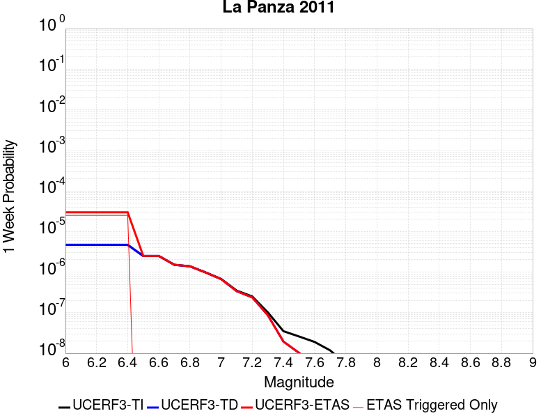 | 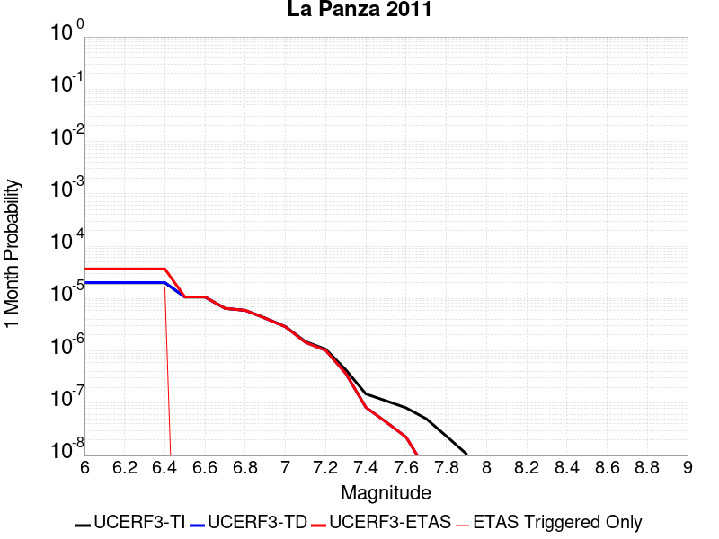 | 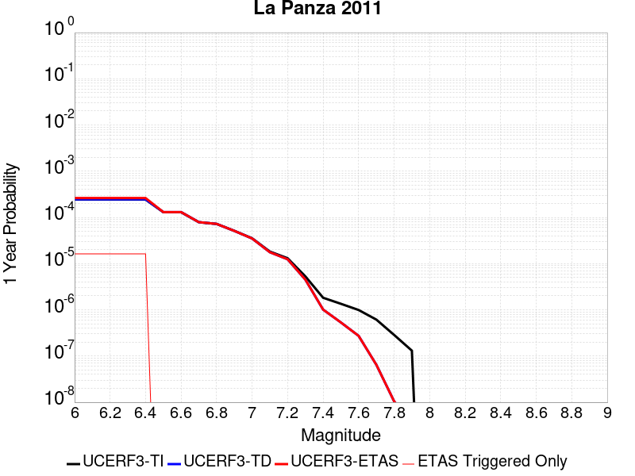 | 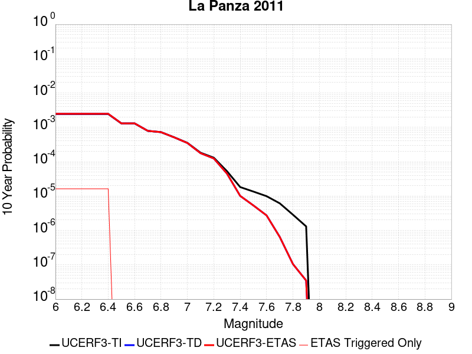 |

| Magnitude | 1 wk TI Prob | 1 wk TD Prob | 1 wk ETAS Prob | 1 wk ETAS/TD Gain | 1 wk ETAS Triggered Only | 1 mo TI Prob | 1 mo TD Prob | 1 mo ETAS Prob | 1 mo ETAS/TD Gain | 1 mo ETAS Triggered Only | 1 yr TI Prob | 1 yr TD Prob | 1 yr ETAS Prob | 1 yr ETAS/TD Gain | 1 yr ETAS Triggered Only | 10 yr TI Prob | 10 yr TD Prob | 10 yr ETAS Prob | 10 yr ETAS/TD Gain | 10 yr ETAS Triggered Only |
|-----|-----|-----|-----|-----|-----|-----|-----|-----|-----|-----|-----|-----|-----|-----|-----|-----|-----|-----|-----|-----|
| 6.0 | 4.6754544E-6 | 4.7175886E-6 | 2.9697487E-5 | 6.2950563 | 2.4980016E-5 | 2.0037509E-5 | 2.021809E-5 | 4.51976E-5 | 2.235503 | 2.4980016E-5 | 2.4392935E-4 | 2.4612944E-4 | 2.711033E-4 | 1.1014664 | 2.4980016E-5 | 0.0024366176 | 0.0024587628 | 0.0024836813 | 1.0101346 | 2.4980016E-5 |
| 6.1 | 4.6754544E-6 | 4.7175886E-6 | 2.9697487E-5 | 6.2950563 | 2.4980016E-5 | 2.0037509E-5 | 2.021809E-5 | 4.51976E-5 | 2.235503 | 2.4980016E-5 | 2.4392935E-4 | 2.4612944E-4 | 2.711033E-4 | 1.1014664 | 2.4980016E-5 | 0.0024366176 | 0.0024587628 | 0.0024836813 | 1.0101346 | 2.4980016E-5 |
| 6.2 | 4.6754544E-6 | 4.7175886E-6 | 2.9697487E-5 | 6.2950563 | 2.4980016E-5 | 2.0037509E-5 | 2.021809E-5 | 4.51976E-5 | 2.235503 | 2.4980016E-5 | 2.4392935E-4 | 2.4612944E-4 | 2.711033E-4 | 1.1014664 | 2.4980016E-5 | 0.0024366176 | 0.0024587628 | 0.0024836813 | 1.0101346 | 2.4980016E-5 |
| 6.3 | 4.6754544E-6 | 4.7175886E-6 | 2.9697487E-5 | 6.2950563 | 2.4980016E-5 | 2.0037509E-5 | 2.021809E-5 | 4.51976E-5 | 2.235503 | 2.4980016E-5 | 2.4392935E-4 | 2.4612944E-4 | 2.711033E-4 | 1.1014664 | 2.4980016E-5 | 0.0024366176 | 0.0024587628 | 0.0024836813 | 1.0101346 | 2.4980016E-5 |
| 6.4 | 4.6754544E-6 | 4.7175886E-6 | 2.9697487E-5 | 6.2950563 | 2.4980016E-5 | 2.0037509E-5 | 2.021809E-5 | 4.51976E-5 | 2.235503 | 2.4980016E-5 | 2.4392935E-4 | 2.4612944E-4 | 2.711033E-4 | 1.1014664 | 2.4980016E-5 | 0.0024366176 | 0.0024587628 | 0.0024836813 | 1.0101346 | 2.4980016E-5 |
| 6.5 | 2.485343E-6 | 2.5006007E-6 | 2.5006007E-6 | 1.0 | 0.0 | 1.0651426E-5 | 1.0716818E-5 | 1.0716818E-5 | 1.0 | 0.0 | 1.296734E-4 | 1.3046984E-4 | 1.3046984E-4 | 1.0 | 0.0 | 0.0012959775 | 0.0013039707 | 0.0013039707 | 1.0 | 0.0 |
| 6.6 | 2.485343E-6 | 2.5006007E-6 | 2.5006007E-6 | 1.0 | 0.0 | 1.0651426E-5 | 1.0716818E-5 | 1.0716818E-5 | 1.0 | 0.0 | 1.296734E-4 | 1.3046984E-4 | 1.3046984E-4 | 1.0 | 0.0 | 0.0012959775 | 0.0013039707 | 0.0013039707 | 1.0 | 0.0 |
| 6.7 | 1.5108508E-6 | 1.514639E-6 | 1.514639E-6 | 1.0 | 0.0 | 6.4750584E-6 | 6.4912947E-6 | 6.4912947E-6 | 1.0 | 0.0 | 7.8830984E-5 | 7.902876E-5 | 7.902876E-5 | 1.0 | 0.0 | 7.880303E-4 | 7.9001737E-4 | 7.9001737E-4 | 1.0 | 0.0 |
| 6.8 | 1.3865837E-6 | 1.3885118E-6 | 1.3885118E-6 | 1.0 | 0.0 | 5.942488E-6 | 5.950752E-6 | 5.950752E-6 | 1.0 | 0.0 | 7.234739E-5 | 7.244809E-5 | 7.244809E-5 | 1.0 | 0.0 | 7.232384E-4 | 7.242546E-4 | 7.242546E-4 | 1.0 | 0.0 |
| 6.9 | 9.826583E-7 | 9.796303E-7 | 9.796303E-7 | 1.0 | 0.0 | 4.2113857E-6 | 4.198409E-6 | 4.198409E-6 | 1.0 | 0.0 | 5.1272415E-5 | 5.1114486E-5 | 5.1114486E-5 | 1.0 | 0.0 | 5.126059E-4 | 5.1103265E-4 | 5.1103265E-4 | 1.0 | 0.0 |
| 7.0 | 6.7797646E-7 | 6.710231E-7 | 6.710231E-7 | 1.0 | 0.0 | 2.9056102E-6 | 2.8758104E-6 | 2.8758104E-6 | 1.0 | 0.0 | 3.537523E-5 | 3.501246E-5 | 3.501246E-5 | 1.0 | 0.0 | 3.5369597E-4 | 3.5007254E-4 | 3.5007254E-4 | 1.0 | 0.0 |
| 7.1 | 3.4979826E-7 | 3.3874045E-7 | 3.3874045E-7 | 1.0 | 0.0 | 1.4991346E-6 | 1.4517441E-6 | 1.4517441E-6 | 1.0 | 0.0 | 1.825181E-5 | 1.7674853E-5 | 1.7674853E-5 | 1.0 | 0.0 | 1.825031E-4 | 1.7673563E-4 | 1.7673563E-4 | 1.0 | 0.0 |
| 7.2 | 2.5088332E-7 | 2.3832064E-7 | 2.3832064E-7 | 1.0 | 0.0 | 1.0752137E-6 | 1.0213738E-6 | 1.0213738E-6 | 1.0 | 0.0 | 1.3090649E-5 | 1.2435164E-5 | 1.2435164E-5 | 1.0 | 0.0 | 1.3089878E-4 | 1.2434553E-4 | 1.2434553E-4 | 1.0 | 0.0 |
| 7.3 | 1.0159086E-7 | 8.644785E-8 | 8.644785E-8 | 1.0 | 0.0 | 4.3538932E-7 | 3.704907E-7 | 3.704907E-7 | 1.0 | 0.0 | 5.300852E-6 | 4.510716E-6 | 4.510716E-6 | 1.0 | 0.0 | 5.3007258E-5 | 4.510628E-5 | 4.510628E-5 | 1.0 | 0.0 |
| 7.4 | 3.5006252E-8 | 1.9403883E-8 | 1.9403883E-8 | 1.0 | 0.0 | 1.5002678E-7 | 8.315949E-8 | 8.315949E-8 | 1.0 | 0.0 | 1.8265745E-6 | 1.0124663E-6 | 1.0124663E-6 | 1.0 | 0.0 | 1.8265595E-5 | 1.012462E-5 | 1.012462E-5 | 1.0 | 0.0 |
| 7.5 | 2.592274E-8 | 1.0238468E-8 | 1.0238468E-8 | 1.0 | 0.0 | 1.1109746E-7 | 4.3879147E-8 | 4.3879147E-8 | 1.0 | 0.0 | 1.3526106E-6 | 5.342285E-7 | 5.342285E-7 | 1.0 | 0.0 | 1.3526024E-5 | 5.342273E-6 | 5.342273E-6 | 1.0 | 0.0 |
| 7.6 | 1.9016717E-8 | 5.2442264E-9 | 5.2442264E-9 | 1.0 | 0.0 | 8.150022E-8 | 2.2475257E-8 | 2.2475257E-8 | 1.0 | 0.0 | 9.922647E-7 | 2.736362E-7 | 2.736362E-7 | 1.0 | 0.0 | 9.922603E-6 | 2.736359E-6 | 2.736359E-6 | 1.0 | 0.0 |
| 7.7 | 1.17738495E-8 | 1.2393437E-9 | 1.2393437E-9 | 1.0 | 0.0 | 5.0459356E-8 | 5.3114735E-9 | 5.3114735E-9 | 1.0 | 0.0 | 6.1434247E-7 | 6.466719E-8 | 6.466719E-8 | 1.0 | 0.0 | 6.143408E-6 | 6.466717E-7 | 6.466717E-7 | 1.0 | 0.0 |
| 7.8 | 5.489079E-9 | 2.009185E-10 | 2.009185E-10 | 1.0 | 0.0 | 2.3524624E-8 | 8.61079E-10 | 8.61079E-10 | 1.0 | 0.0 | 2.8641225E-7 | 1.0483639E-8 | 1.0483639E-8 | 1.0 | 0.0 | 2.8641189E-6 | 1.0483638E-7 | 1.0483638E-7 | 1.0 | 0.0 |
| 7.9 | 2.5081048E-9 | 6.675449E-11 | 6.675449E-11 | 1.0 | 0.0 | 1.0749021E-8 | 2.8609015E-10 | 2.8609015E-10 | 1.0 | 0.0 | 1.3086932E-7 | 3.483148E-9 | 3.483148E-9 | 1.0 | 0.0 | 1.3086925E-6 | 3.483148E-8 | 3.483148E-8 | 1.0 | 0.0 |

## Sheephole
*[(top)](#table-of-contents)*

| 1 Week | 1 Month | 1 Year | 10 Year |
|-----|-----|-----|-----|
|  | 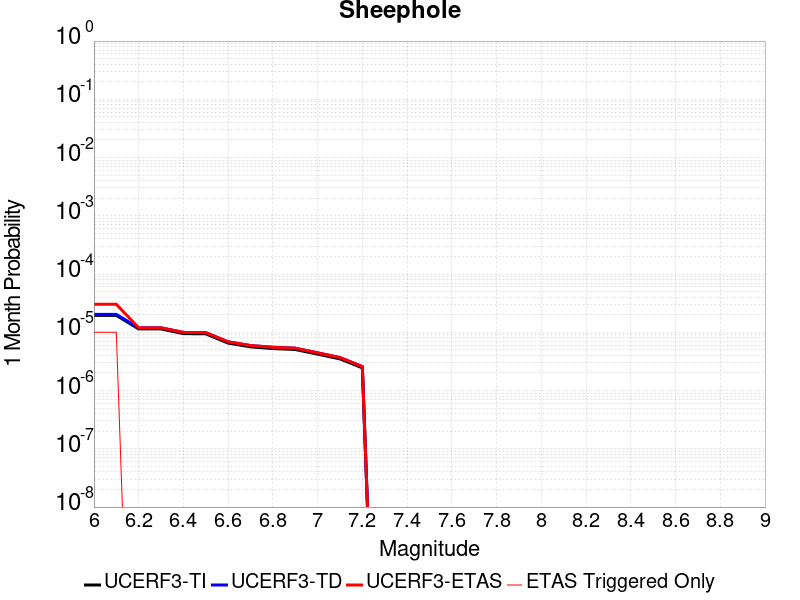 | 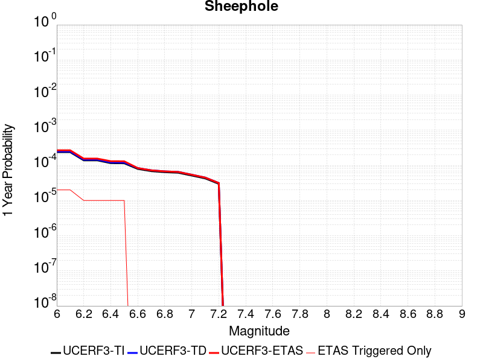 | 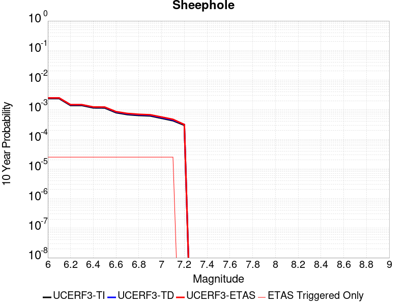 |

| Magnitude | 1 wk TI Prob | 1 wk TD Prob | 1 wk ETAS Prob | 1 wk ETAS/TD Gain | 1 wk ETAS Triggered Only | 1 mo TI Prob | 1 mo TD Prob | 1 mo ETAS Prob | 1 mo ETAS/TD Gain | 1 mo ETAS Triggered Only | 1 yr TI Prob | 1 yr TD Prob | 1 yr ETAS Prob | 1 yr ETAS/TD Gain | 1 yr ETAS Triggered Only | 10 yr TI Prob | 10 yr TD Prob | 10 yr ETAS Prob | 10 yr ETAS/TD Gain | 10 yr ETAS Triggered Only |
|-----|-----|-----|-----|-----|-----|-----|-----|-----|-----|-----|-----|-----|-----|-----|-----|-----|-----|-----|-----|-----|
| 6.0 | 4.5579695E-6 | 4.7412627E-6 | 4.7412627E-6 | 1.0 | 0.0 | 1.9534009E-5 | 2.031957E-5 | 2.031957E-5 | 1.0 | 0.0 | 2.3780059E-4 | 2.473682E-4 | 2.473682E-4 | 1.0 | 0.0 | 0.0023754628 | 0.002471473 | 0.0024963915 | 1.0100824 | 2.4980016E-5 |
| 6.1 | 4.5579695E-6 | 4.7412627E-6 | 4.7412627E-6 | 1.0 | 0.0 | 1.9534009E-5 | 2.031957E-5 | 2.031957E-5 | 1.0 | 0.0 | 2.3780059E-4 | 2.473682E-4 | 2.473682E-4 | 1.0 | 0.0 | 0.0023754628 | 0.002471473 | 0.0024963915 | 1.0100824 | 2.4980016E-5 |
| 6.2 | 2.6677674E-6 | 2.7873941E-6 | 2.7873941E-6 | 1.0 | 0.0 | 1.1433239E-5 | 1.1945926E-5 | 1.1945926E-5 | 1.0 | 0.0 | 1.3919079E-4 | 1.4543302E-4 | 1.4543302E-4 | 1.0 | 0.0 | 0.0013910364 | 0.0014534844 | 0.0014784281 | 1.0171614 | 2.4980016E-5 |
| 6.3 | 2.6677674E-6 | 2.7873941E-6 | 2.7873941E-6 | 1.0 | 0.0 | 1.1433239E-5 | 1.1945926E-5 | 1.1945926E-5 | 1.0 | 0.0 | 1.3919079E-4 | 1.4543302E-4 | 1.4543302E-4 | 1.0 | 0.0 | 0.0013910364 | 0.0014534844 | 0.0014784281 | 1.0171614 | 2.4980016E-5 |
| 6.4 | 2.2159759E-6 | 2.3228788E-6 | 2.3228788E-6 | 1.0 | 0.0 | 9.497005E-6 | 9.955161E-6 | 9.955161E-6 | 1.0 | 0.0 | 1.156199E-4 | 1.2119815E-4 | 1.2119815E-4 | 1.0 | 0.0 | 0.0011555976 | 0.0012113999 | 0.0012363497 | 1.0205958 | 2.4980016E-5 |
| 6.5 | 2.1986082E-6 | 2.304759E-6 | 2.304759E-6 | 1.0 | 0.0 | 9.4225725E-6 | 9.877506E-6 | 9.877506E-6 | 1.0 | 0.0 | 1.1471378E-4 | 1.2025281E-4 | 1.2025281E-4 | 1.0 | 0.0 | 0.0011465458 | 0.0012019566 | 0.0012269067 | 1.0207578 | 2.4980016E-5 |
| 6.6 | 1.5232331E-6 | 1.6018919E-6 | 1.6018919E-6 | 1.0 | 0.0 | 6.5281256E-6 | 6.865234E-6 | 6.865234E-6 | 1.0 | 0.0 | 7.947703E-5 | 8.35812E-5 | 8.35812E-5 | 1.0 | 0.0 | 7.9448614E-4 | 8.3551643E-4 | 8.604756E-4 | 1.0298728 | 2.4980016E-5 |
| 6.7 | 1.3137362E-6 | 1.382819E-6 | 1.382819E-6 | 1.0 | 0.0 | 5.6302856E-6 | 5.926355E-6 | 5.926355E-6 | 1.0 | 0.0 | 6.854657E-5 | 7.215112E-5 | 7.215112E-5 | 1.0 | 0.0 | 6.8525434E-4 | 7.212908E-4 | 7.4625283E-4 | 1.0346074 | 2.4980016E-5 |
| 6.8 | 1.2275751E-6 | 1.2922847E-6 | 1.2922847E-6 | 1.0 | 0.0 | 5.2610258E-6 | 5.5383516E-6 | 5.5383516E-6 | 1.0 | 0.0 | 6.4051106E-5 | 6.7427485E-5 | 6.7427485E-5 | 1.0 | 0.0 | 6.4032647E-4 | 6.740836E-4 | 6.9904677E-4 | 1.0370327 | 2.4980016E-5 |
| 6.9 | 1.1837088E-6 | 1.246102E-6 | 1.246102E-6 | 1.0 | 0.0 | 5.0730278E-6 | 5.340427E-6 | 5.340427E-6 | 1.0 | 0.0 | 6.176237E-5 | 6.501789E-5 | 6.501789E-5 | 1.0 | 0.0 | 6.17452E-4 | 6.5000186E-4 | 6.749656E-4 | 1.0384057 | 2.4980016E-5 |
| 7.0 | 9.849371E-7 | 1.0366288E-6 | 1.0366288E-6 | 1.0 | 0.0 | 4.2211523E-6 | 4.442688E-6 | 4.442688E-6 | 1.0 | 0.0 | 5.1391315E-5 | 5.4088487E-5 | 5.4088487E-5 | 1.0 | 0.0 | 5.137943E-4 | 5.407633E-4 | 5.657298E-4 | 1.046169 | 2.4980016E-5 |
| 7.1 | 8.1643645E-7 | 8.591669E-7 | 8.591669E-7 | 1.0 | 0.0 | 3.4990085E-6 | 3.682139E-6 | 3.682139E-6 | 1.0 | 0.0 | 4.2599597E-5 | 4.482921E-5 | 4.482921E-5 | 1.0 | 0.0 | 4.259143E-4 | 4.4821028E-4 | 4.7317913E-4 | 1.0557078 | 2.4980016E-5 |
| 7.2 | 5.7295756E-7 | 6.029502E-7 | 6.029502E-7 | 1.0 | 0.0 | 2.45553E-6 | 2.58407E-6 | 2.58407E-6 | 1.0 | 0.0 | 2.9895667E-5 | 3.1460666E-5 | 3.1460666E-5 | 1.0 | 0.0 | 2.9891645E-4 | 3.145688E-4 | 3.145688E-4 | 1.0 | 0.0 |

## Hunting Creek - Bartlett Springs connector 2011
*[(top)](#table-of-contents)*

| 1 Week | 1 Month | 1 Year | 10 Year |
|-----|-----|-----|-----|
|  |  | 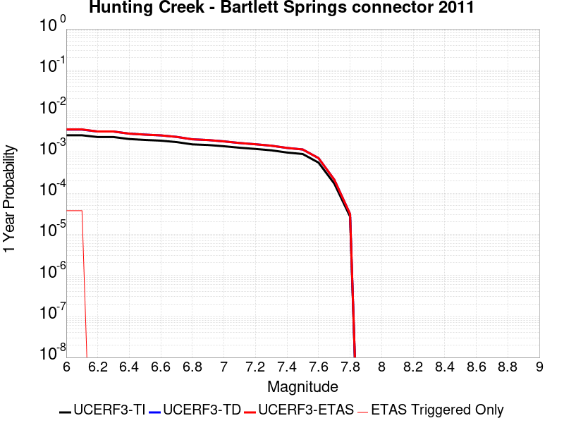 |  |

| Magnitude | 1 wk TI Prob | 1 wk TD Prob | 1 wk ETAS Prob | 1 wk ETAS/TD Gain | 1 wk ETAS Triggered Only | 1 mo TI Prob | 1 mo TD Prob | 1 mo ETAS Prob | 1 mo ETAS/TD Gain | 1 mo ETAS Triggered Only | 1 yr TI Prob | 1 yr TD Prob | 1 yr ETAS Prob | 1 yr ETAS/TD Gain | 1 yr ETAS Triggered Only | 10 yr TI Prob | 10 yr TD Prob | 10 yr ETAS Prob | 10 yr ETAS/TD Gain | 10 yr ETAS Triggered Only |
|-----|-----|-----|-----|-----|-----|-----|-----|-----|-----|-----|-----|-----|-----|-----|-----|-----|-----|-----|-----|-----|
| 6.0 | 4.940016E-5 | 6.7870766E-5 | 6.7870766E-5 | 1.0 | 0.0 | 2.1169778E-4 | 2.9084194E-4 | 2.9084194E-4 | 1.0 | 0.0 | 0.002574374 | 0.0035350819 | 0.0035599736 | 1.0070413 | 2.4980016E-5 | 0.025447546 | 0.03477475 | 0.034798864 | 1.0006933 | 2.4980016E-5 |
| 6.1 | 4.940016E-5 | 6.7870766E-5 | 6.7870766E-5 | 1.0 | 0.0 | 2.1169778E-4 | 2.9084194E-4 | 2.9084194E-4 | 1.0 | 0.0 | 0.002574374 | 0.0035350819 | 0.0035599736 | 1.0070413 | 2.4980016E-5 | 0.025447546 | 0.03477475 | 0.034798864 | 1.0006933 | 2.4980016E-5 |
| 6.2 | 4.472471E-5 | 6.100572E-5 | 6.100572E-5 | 1.0 | 0.0 | 1.9166325E-4 | 2.6142647E-4 | 2.6142647E-4 | 1.0 | 0.0 | 0.0023310026 | 0.0031781218 | 0.0031781218 | 1.0 | 0.0 | 0.02306703 | 0.031317808 | 0.031317808 | 1.0 | 0.0 |
| 6.3 | 4.472471E-5 | 6.100572E-5 | 6.100572E-5 | 1.0 | 0.0 | 1.9166325E-4 | 2.6142647E-4 | 2.6142647E-4 | 1.0 | 0.0 | 0.0023310026 | 0.0031781218 | 0.0031781218 | 1.0 | 0.0 | 0.02306703 | 0.031317808 | 0.031317808 | 1.0 | 0.0 |
| 6.4 | 4.0001003E-5 | 5.410516E-5 | 5.410516E-5 | 1.0 | 0.0 | 1.714216E-4 | 2.318579E-4 | 2.318579E-4 | 1.0 | 0.0 | 0.0020850603 | 0.0028191686 | 0.0028191686 | 1.0 | 0.0 | 0.02065605 | 0.027829198 | 0.027829198 | 1.0 | 0.0 |
| 6.5 | 3.8033053E-5 | 5.126649E-5 | 5.126649E-5 | 1.0 | 0.0 | 1.6298861E-4 | 2.1969521E-4 | 2.1969521E-4 | 1.0 | 0.0 | 0.0019825802 | 0.0026714848 | 0.0026714848 | 1.0 | 0.0 | 0.019649856 | 0.026391273 | 0.026391273 | 1.0 | 0.0 |
| 6.6 | 3.653754E-5 | 4.912955E-5 | 4.912955E-5 | 1.0 | 0.0 | 1.5658008E-4 | 2.1053842E-4 | 2.1053842E-4 | 1.0 | 0.0 | 0.0019046954 | 0.0025602889 | 0.0025602889 | 1.0 | 0.0 | 0.018884527 | 0.025307199 | 0.025307199 | 1.0 | 0.0 |
| 6.7 | 3.372024E-5 | 4.5140216E-5 | 4.5140216E-5 | 1.0 | 0.0 | 1.4450731E-4 | 1.9344388E-4 | 1.9344388E-4 | 1.0 | 0.0 | 0.0017579567 | 0.0023526535 | 0.0023526535 | 1.0 | 0.0 | 0.017441148 | 0.023278862 | 0.023278862 | 1.0 | 0.0 |
| 6.8 | 2.9650024E-5 | 3.9411647E-5 | 3.9411647E-5 | 1.0 | 0.0 | 1.2706534E-4 | 1.6889606E-4 | 1.6889606E-4 | 1.0 | 0.0 | 0.0015459227 | 0.0020543607 | 0.0020543607 | 1.0 | 0.0 | 0.015352124 | 0.020351961 | 0.020351961 | 1.0 | 0.0 |
| 6.9 | 2.860775E-5 | 3.7812886E-5 | 3.7812886E-5 | 1.0 | 0.0 | 1.2259888E-4 | 1.620452E-4 | 1.620452E-4 | 1.0 | 0.0 | 0.0014916194 | 0.0019711219 | 0.0019711219 | 1.0 | 0.0 | 0.014816469 | 0.019536555 | 0.019536555 | 1.0 | 0.0 |
| 7.0 | 2.6696067E-5 | 3.5067544E-5 | 3.5067544E-5 | 1.0 | 0.0 | 1.144067E-4 | 1.5028086E-4 | 1.5028086E-4 | 1.0 | 0.0 | 0.0013920115 | 0.0018281427 | 0.0018281427 | 1.0 | 0.0 | 0.013833242 | 0.01813184 | 0.01813184 | 1.0 | 0.0 |
| 7.1 | 2.456087E-5 | 3.2013326E-5 | 3.2013326E-5 | 1.0 | 0.0 | 1.0525662E-4 | 1.3719281E-4 | 1.3719281E-4 | 1.0 | 0.0 | 0.001280746 | 0.0016690517 | 0.0016690517 | 1.0 | 0.0 | 0.012733897 | 0.016566671 | 0.016566671 | 1.0 | 0.0 |
| 7.2 | 2.295761E-5 | 2.9823148E-5 | 2.9823148E-5 | 1.0 | 0.0 | 9.8386045E-5 | 1.2780727E-4 | 1.2780727E-4 | 1.0 | 0.0 | 0.0011971919 | 0.0015549522 | 0.0015549522 | 1.0 | 0.0 | 0.011907627 | 0.015442378 | 0.015442378 | 1.0 | 0.0 |
| 7.3 | 2.1256936E-5 | 2.7542124E-5 | 2.7542124E-5 | 1.0 | 0.0 | 9.109797E-5 | 1.1803238E-4 | 1.1803238E-4 | 1.0 | 0.0 | 0.0011085535 | 0.0014361058 | 0.0014361058 | 1.0 | 0.0 | 0.011030397 | 0.014269741 | 0.014269741 | 1.0 | 0.0 |
| 7.4 | 1.8784336E-5 | 2.430697E-5 | 2.430697E-5 | 1.0 | 0.0 | 8.050181E-5 | 1.0416861E-4 | 1.0416861E-4 | 1.0 | 0.0 | 9.796688E-4 | 0.0012675226 | 0.0012675226 | 1.0 | 0.0 | 0.009753612 | 0.012604194 | 0.012604194 | 1.0 | 0.0 |
| 7.5 | 1.7248298E-5 | 2.2269056E-5 | 2.2269056E-5 | 1.0 | 0.0 | 7.391918E-5 | 9.543537E-5 | 9.543537E-5 | 1.0 | 0.0 | 8.9959445E-4 | 0.0011613137 | 0.0011613137 | 1.0 | 0.0 | 0.008959615 | 0.011553645 | 0.011553645 | 1.0 | 0.0 |
| 7.6 | 1.0653709E-5 | 1.3722259E-5 | 1.3722259E-5 | 1.0 | 0.0 | 4.5657955E-5 | 5.880837E-5 | 5.880837E-5 | 1.0 | 0.0 | 5.557438E-4 | 7.157594E-4 | 7.157594E-4 | 1.0 | 0.0 | 0.0055435603 | 0.0071350415 | 0.0071350415 | 1.0 | 0.0 |
| 7.7 | 3.286316E-6 | 4.0903997E-6 | 4.0903997E-6 | 1.0 | 0.0 | 1.4084137E-5 | 1.7530168E-5 | 1.7530168E-5 | 1.0 | 0.0 | 1.7146087E-4 | 2.1340905E-4 | 2.1340905E-4 | 1.0 | 0.0 | 0.0017132863 | 0.0021320845 | 0.0021320845 | 1.0 | 0.0 |
| 7.8 | 5.1855085E-7 | 5.972095E-7 | 5.972095E-7 | 1.0 | 0.0 | 2.222359E-6 | 2.5594668E-6 | 2.5594668E-6 | 1.0 | 0.0 | 2.7056883E-5 | 3.1161075E-5 | 3.1161075E-5 | 1.0 | 0.0 | 2.705359E-4 | 3.1156064E-4 | 3.1156064E-4 | 1.0 | 0.0 |

## Oak Ridge (Onshore)
*[(top)](#table-of-contents)*

| 1 Week | 1 Month | 1 Year | 10 Year |
|-----|-----|-----|-----|
| 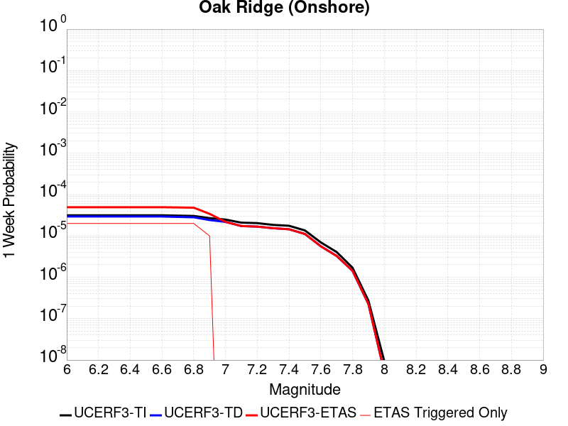 | 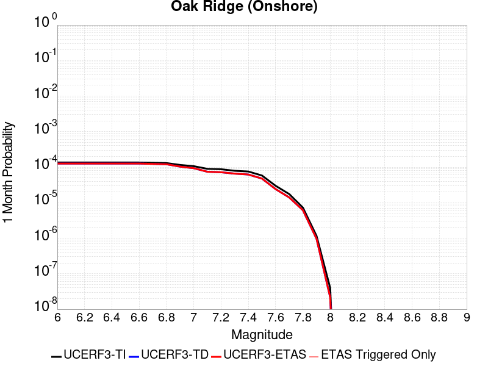 | 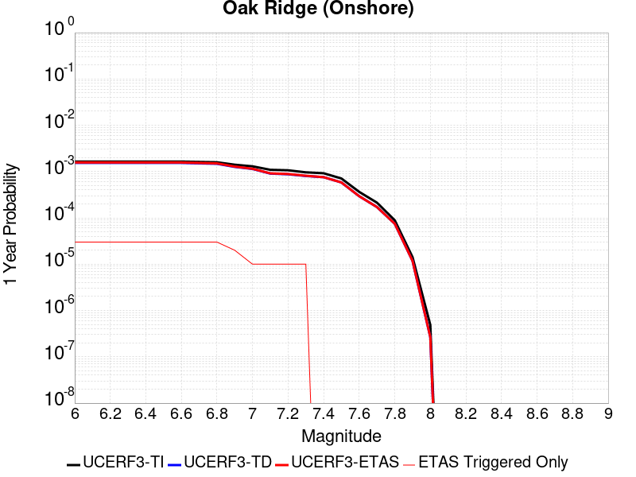 | 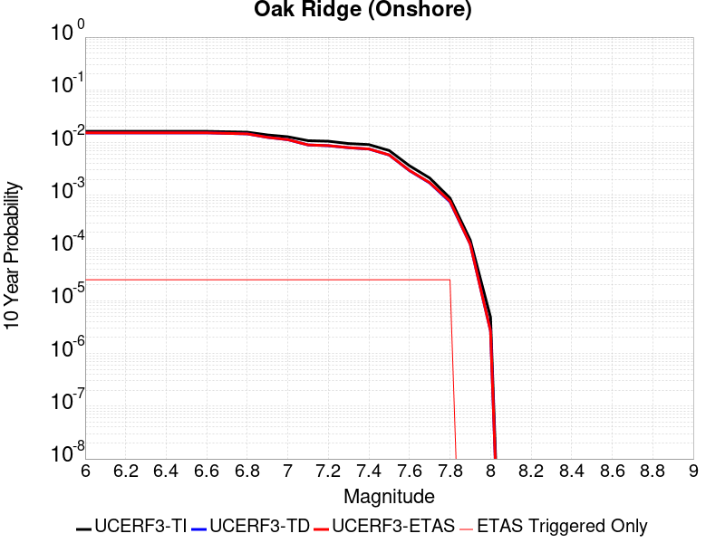 |

| Magnitude | 1 wk TI Prob | 1 wk TD Prob | 1 wk ETAS Prob | 1 wk ETAS/TD Gain | 1 wk ETAS Triggered Only | 1 mo TI Prob | 1 mo TD Prob | 1 mo ETAS Prob | 1 mo ETAS/TD Gain | 1 mo ETAS Triggered Only | 1 yr TI Prob | 1 yr TD Prob | 1 yr ETAS Prob | 1 yr ETAS/TD Gain | 1 yr ETAS Triggered Only | 10 yr TI Prob | 10 yr TD Prob | 10 yr ETAS Prob | 10 yr ETAS/TD Gain | 10 yr ETAS Triggered Only |
|-----|-----|-----|-----|-----|-----|-----|-----|-----|-----|-----|-----|-----|-----|-----|-----|-----|-----|-----|-----|-----|
| 6.0 | 3.155064E-5 | 2.9526076E-5 | 2.9526076E-5 | 1.0 | 0.0 | 1.3521002E-4 | 1.265344E-4 | 1.265344E-4 | 1.0 | 0.0 | 0.001644939 | 0.0015395058 | 0.0015395058 | 1.0 | 0.0 | 0.01632816 | 0.015293054 | 0.015317652 | 1.0016085 | 2.4980016E-5 |
| 6.1 | 3.155064E-5 | 2.9526076E-5 | 2.9526076E-5 | 1.0 | 0.0 | 1.3521002E-4 | 1.265344E-4 | 1.265344E-4 | 1.0 | 0.0 | 0.001644939 | 0.0015395058 | 0.0015395058 | 1.0 | 0.0 | 0.01632816 | 0.015293054 | 0.015317652 | 1.0016085 | 2.4980016E-5 |
| 6.2 | 3.155064E-5 | 2.9526076E-5 | 2.9526076E-5 | 1.0 | 0.0 | 1.3521002E-4 | 1.265344E-4 | 1.265344E-4 | 1.0 | 0.0 | 0.001644939 | 0.0015395058 | 0.0015395058 | 1.0 | 0.0 | 0.01632816 | 0.015293054 | 0.015317652 | 1.0016085 | 2.4980016E-5 |
| 6.3 | 3.155064E-5 | 2.9526076E-5 | 2.9526076E-5 | 1.0 | 0.0 | 1.3521002E-4 | 1.265344E-4 | 1.265344E-4 | 1.0 | 0.0 | 0.001644939 | 0.0015395058 | 0.0015395058 | 1.0 | 0.0 | 0.01632816 | 0.015293054 | 0.015317652 | 1.0016085 | 2.4980016E-5 |
| 6.4 | 3.155064E-5 | 2.9526076E-5 | 2.9526076E-5 | 1.0 | 0.0 | 1.3521002E-4 | 1.265344E-4 | 1.265344E-4 | 1.0 | 0.0 | 0.001644939 | 0.0015395058 | 0.0015395058 | 1.0 | 0.0 | 0.01632816 | 0.015293054 | 0.015317652 | 1.0016085 | 2.4980016E-5 |
| 6.5 | 3.155064E-5 | 2.9526076E-5 | 2.9526076E-5 | 1.0 | 0.0 | 1.3521002E-4 | 1.265344E-4 | 1.265344E-4 | 1.0 | 0.0 | 0.001644939 | 0.0015395058 | 0.0015395058 | 1.0 | 0.0 | 0.01632816 | 0.015293054 | 0.015317652 | 1.0016085 | 2.4980016E-5 |
| 6.6 | 3.155064E-5 | 2.9526076E-5 | 2.9526076E-5 | 1.0 | 0.0 | 1.3521002E-4 | 1.265344E-4 | 1.265344E-4 | 1.0 | 0.0 | 0.001644939 | 0.0015395058 | 0.0015395058 | 1.0 | 0.0 | 0.01632816 | 0.015293054 | 0.015317652 | 1.0016085 | 2.4980016E-5 |
| 6.7 | 3.098897E-5 | 2.8864279E-5 | 2.8864279E-5 | 1.0 | 0.0 | 1.328031E-4 | 1.236984E-4 | 1.236984E-4 | 1.0 | 0.0 | 0.0016156785 | 0.0015050253 | 0.0015050253 | 1.0 | 0.0 | 0.016039822 | 0.014952909 | 0.014977516 | 1.0016456 | 2.4980016E-5 |
| 6.8 | 3.0449872E-5 | 2.8239476E-5 | 2.8239476E-5 | 1.0 | 0.0 | 1.3049292E-4 | 1.2102092E-4 | 1.2102092E-4 | 1.0 | 0.0 | 0.0015875935 | 0.001472471 | 0.001472471 | 1.0 | 0.0 | 0.015762992 | 0.014631658 | 0.014656272 | 1.0016823 | 2.4980016E-5 |
| 6.9 | 2.697928E-5 | 2.4219877E-5 | 2.4219877E-5 | 1.0 | 0.0 | 1.15620365E-4 | 1.03795464E-4 | 1.03795464E-4 | 1.0 | 0.0 | 0.0014067689 | 0.0012629988 | 0.0012629988 | 1.0 | 0.0 | 0.0139789665 | 0.012561066 | 0.012585732 | 1.0019637 | 2.4980016E-5 |
| 7.0 | 2.4893961E-5 | 2.1862146E-5 | 2.1862146E-5 | 1.0 | 0.0 | 1.0668404E-4 | 9.369165E-5 | 9.369165E-5 | 1.0 | 0.0 | 0.0012981043 | 0.0011401166 | 0.0011401166 | 1.0 | 0.0 | 0.012905477 | 0.011345102 | 0.011369799 | 1.0021769 | 2.4980016E-5 |
| 7.1 | 2.0945363E-5 | 1.7354592E-5 | 1.7354592E-5 | 1.0 | 0.0 | 8.976275E-5 | 7.437473E-5 | 7.437473E-5 | 1.0 | 0.0 | 0.0010923136 | 9.0514094E-4 | 9.0514094E-4 | 1.0 | 0.0 | 0.0108696 | 0.009015621 | 0.009040375 | 1.0027457 | 2.4980016E-5 |
| 7.2 | 2.0439404E-5 | 1.680953E-5 | 1.680953E-5 | 1.0 | 0.0 | 8.7594504E-5 | 7.203888E-5 | 7.203888E-5 | 1.0 | 0.0 | 0.0010659413 | 8.767251E-4 | 8.767251E-4 | 1.0 | 0.0 | 0.010608427 | 0.008733723 | 0.008758485 | 1.0028352 | 2.4980016E-5 |
| 7.3 | 1.8463334E-5 | 1.5381947E-5 | 1.5381947E-5 | 1.0 | 0.0 | 7.912617E-5 | 6.592098E-5 | 6.592098E-5 | 1.0 | 0.0 | 9.6293533E-4 | 8.0229685E-4 | 8.0229685E-4 | 1.0 | 0.0 | 0.009587734 | 0.0079950085 | 0.008019789 | 1.0030994 | 2.4980016E-5 |
| 7.4 | 1.763139E-5 | 1.4516977E-5 | 1.4516977E-5 | 1.0 | 0.0 | 7.556091E-5 | 6.221415E-5 | 6.221415E-5 | 1.0 | 0.0 | 9.1956573E-4 | 7.57198E-4 | 7.57198E-4 | 1.0 | 0.0 | 0.009157699 | 0.007547126 | 0.0075719175 | 1.0032849 | 2.4980016E-5 |
| 7.5 | 1.3594944E-5 | 1.1163363E-5 | 1.1163363E-5 | 1.0 | 0.0 | 5.8262744E-5 | 4.7842117E-5 | 4.7842117E-5 | 1.0 | 0.0 | 7.0911803E-4 | 5.8232463E-4 | 5.8232463E-4 | 1.0 | 0.0 | 0.007068595 | 0.005808362 | 0.0058331965 | 1.0042757 | 2.4980016E-5 |
| 7.6 | 6.9889534E-6 | 5.6367194E-6 | 5.6367194E-6 | 1.0 | 0.0 | 2.9952313E-5 | 2.4157147E-5 | 2.4157147E-5 | 1.0 | 0.0 | 3.646084E-4 | 2.94074E-4 | 2.94074E-4 | 1.0 | 0.0 | 0.0036401073 | 0.0029368924 | 0.0029617993 | 1.0084807 | 2.4980016E-5 |
| 7.7 | 4.0824193E-6 | 3.2832731E-6 | 3.2832731E-6 | 1.0 | 0.0 | 1.7495966E-5 | 1.4071096E-5 | 1.4071096E-5 | 1.0 | 0.0 | 2.1299256E-4 | 1.7130225E-4 | 1.7130225E-4 | 1.0 | 0.0 | 0.0021278851 | 0.0017117155 | 0.0017366528 | 1.0145686 | 2.4980016E-5 |
| 7.8 | 1.7023609E-6 | 1.43706E-6 | 1.43706E-6 | 1.0 | 0.0 | 7.295812E-6 | 6.158814E-6 | 6.158814E-6 | 1.0 | 0.0 | 8.882289E-5 | 7.4981006E-5 | 7.4981006E-5 | 1.0 | 0.0 | 8.8787393E-4 | 7.4955984E-4 | 7.7452115E-4 | 1.0333012 | 2.4980016E-5 |
| 7.9 | 2.721225E-7 | 2.261692E-7 | 2.261692E-7 | 1.0 | 0.0 | 1.1662388E-6 | 9.692963E-7 | 9.692963E-7 | 1.0 | 0.0 | 1.4198865E-5 | 1.1801121E-5 | 1.1801121E-5 | 1.0 | 0.0 | 1.4197957E-4 | 1.1800523E-4 | 1.1800523E-4 | 1.0 | 0.0 |
| 8.0 | 9.364255E-9 | 5.1204916E-9 | 5.1204916E-9 | 1.0 | 0.0 | 4.0132523E-8 | 2.1944963E-8 | 2.1944963E-8 | 1.0 | 0.0 | 4.8861335E-7 | 2.671799E-7 | 2.671799E-7 | 1.0 | 0.0 | 4.8861225E-6 | 2.6717962E-6 | 2.6717962E-6 | 1.0 | 0.0 |

## Little Salmon (Onshore)
*[(top)](#table-of-contents)*

| 1 Week | 1 Month | 1 Year | 10 Year |
|-----|-----|-----|-----|
|  | 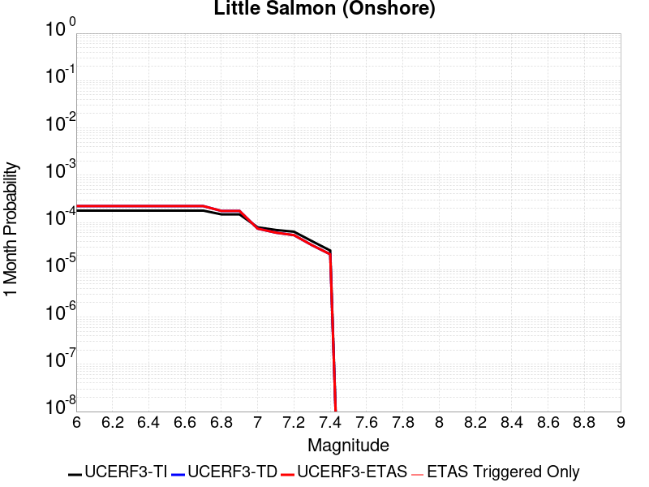 | 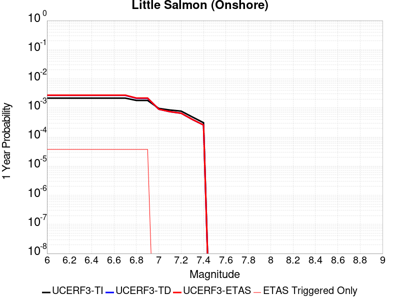 | 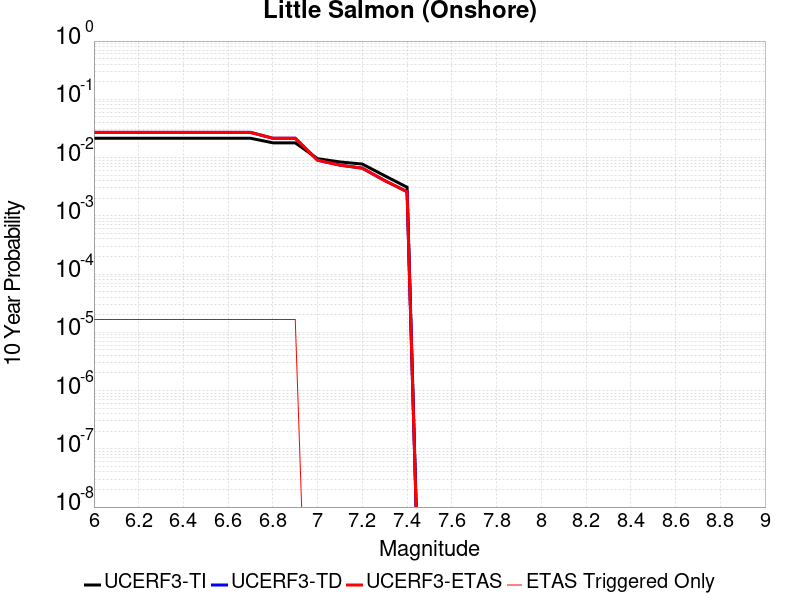 |

| Magnitude | 1 wk TI Prob | 1 wk TD Prob | 1 wk ETAS Prob | 1 wk ETAS/TD Gain | 1 wk ETAS Triggered Only | 1 mo TI Prob | 1 mo TD Prob | 1 mo ETAS Prob | 1 mo ETAS/TD Gain | 1 mo ETAS Triggered Only | 1 yr TI Prob | 1 yr TD Prob | 1 yr ETAS Prob | 1 yr ETAS/TD Gain | 1 yr ETAS Triggered Only | 10 yr TI Prob | 10 yr TD Prob | 10 yr ETAS Prob | 10 yr ETAS/TD Gain | 10 yr ETAS Triggered Only |
|-----|-----|-----|-----|-----|-----|-----|-----|-----|-----|-----|-----|-----|-----|-----|-----|-----|-----|-----|-----|-----|
| 6.0 | 4.1582247E-5 | 5.1820014E-5 | 5.1820014E-5 | 1.0 | 0.0 | 1.7819746E-4 | 2.2207153E-4 | 2.2207153E-4 | 1.0 | 0.0 | 0.0021673953 | 0.0027011954 | 0.0027261078 | 1.0092227 | 2.4980016E-5 | 0.021463778 | 0.027034452 | 0.027058756 | 1.0008991 | 2.4980016E-5 |
| 6.1 | 4.1582247E-5 | 5.1820014E-5 | 5.1820014E-5 | 1.0 | 0.0 | 1.7819746E-4 | 2.2207153E-4 | 2.2207153E-4 | 1.0 | 0.0 | 0.0021673953 | 0.0027011954 | 0.0027261078 | 1.0092227 | 2.4980016E-5 | 0.021463778 | 0.027034452 | 0.027058756 | 1.0008991 | 2.4980016E-5 |
| 6.2 | 4.1582247E-5 | 5.1820014E-5 | 5.1820014E-5 | 1.0 | 0.0 | 1.7819746E-4 | 2.2207153E-4 | 2.2207153E-4 | 1.0 | 0.0 | 0.0021673953 | 0.0027011954 | 0.0027261078 | 1.0092227 | 2.4980016E-5 | 0.021463778 | 0.027034452 | 0.027058756 | 1.0008991 | 2.4980016E-5 |
| 6.3 | 4.1582247E-5 | 5.1820014E-5 | 5.1820014E-5 | 1.0 | 0.0 | 1.7819746E-4 | 2.2207153E-4 | 2.2207153E-4 | 1.0 | 0.0 | 0.0021673953 | 0.0027011954 | 0.0027261078 | 1.0092227 | 2.4980016E-5 | 0.021463778 | 0.027034452 | 0.027058756 | 1.0008991 | 2.4980016E-5 |
| 6.4 | 4.1582247E-5 | 5.1820014E-5 | 5.1820014E-5 | 1.0 | 0.0 | 1.7819746E-4 | 2.2207153E-4 | 2.2207153E-4 | 1.0 | 0.0 | 0.0021673953 | 0.0027011954 | 0.0027261078 | 1.0092227 | 2.4980016E-5 | 0.021463778 | 0.027034452 | 0.027058756 | 1.0008991 | 2.4980016E-5 |
| 6.5 | 4.1582247E-5 | 5.1820014E-5 | 5.1820014E-5 | 1.0 | 0.0 | 1.7819746E-4 | 2.2207153E-4 | 2.2207153E-4 | 1.0 | 0.0 | 0.0021673953 | 0.0027011954 | 0.0027261078 | 1.0092227 | 2.4980016E-5 | 0.021463778 | 0.027034452 | 0.027058756 | 1.0008991 | 2.4980016E-5 |
| 6.6 | 4.1582247E-5 | 5.1820014E-5 | 5.1820014E-5 | 1.0 | 0.0 | 1.7819746E-4 | 2.2207153E-4 | 2.2207153E-4 | 1.0 | 0.0 | 0.0021673953 | 0.0027011954 | 0.0027261078 | 1.0092227 | 2.4980016E-5 | 0.021463778 | 0.027034452 | 0.027058756 | 1.0008991 | 2.4980016E-5 |
| 6.7 | 4.1582247E-5 | 5.1820014E-5 | 5.1820014E-5 | 1.0 | 0.0 | 1.7819746E-4 | 2.2207153E-4 | 2.2207153E-4 | 1.0 | 0.0 | 0.0021673953 | 0.0027011954 | 0.0027261078 | 1.0092227 | 2.4980016E-5 | 0.021463778 | 0.027034452 | 0.027058756 | 1.0008991 | 2.4980016E-5 |
| 6.8 | 3.4607925E-5 | 4.094412E-5 | 4.094412E-5 | 1.0 | 0.0 | 1.4831126E-4 | 1.7546724E-4 | 1.7546724E-4 | 1.0 | 0.0 | 0.001804194 | 0.0021349725 | 0.002159899 | 1.0116754 | 2.4980016E-5 | 0.01789616 | 0.021454342 | 0.021478785 | 1.0011394 | 2.4980016E-5 |
| 6.9 | 3.4607925E-5 | 4.094412E-5 | 4.094412E-5 | 1.0 | 0.0 | 1.4831126E-4 | 1.7546724E-4 | 1.7546724E-4 | 1.0 | 0.0 | 0.001804194 | 0.0021349725 | 0.002159899 | 1.0116754 | 2.4980016E-5 | 0.01789616 | 0.021454342 | 0.021478785 | 1.0011394 | 2.4980016E-5 |
| 7.0 | 1.8411014E-5 | 1.7285503E-5 | 1.7285503E-5 | 1.0 | 0.0 | 7.8901954E-5 | 7.4078926E-5 | 7.4078926E-5 | 1.0 | 0.0 | 9.6020795E-4 | 9.0159115E-4 | 9.0159115E-4 | 1.0 | 0.0 | 0.009560696 | 0.009006166 | 0.009006166 | 1.0 | 0.0 |
| 7.1 | 1.6183103E-5 | 1.4205894E-5 | 1.4205894E-5 | 1.0 | 0.0 | 6.935431E-5 | 6.088125E-5 | 6.088125E-5 | 1.0 | 0.0 | 8.440616E-4 | 7.410246E-4 | 7.410246E-4 | 1.0 | 0.0 | 0.008408628 | 0.0074117873 | 0.0074117873 | 1.0 | 0.0 |
| 7.2 | 1.4868988E-5 | 1.2585783E-5 | 1.2585783E-5 | 1.0 | 0.0 | 6.372268E-5 | 5.393821E-5 | 5.393821E-5 | 1.0 | 0.0 | 7.755474E-4 | 6.5654493E-4 | 6.5654493E-4 | 1.0 | 0.0 | 0.0077284635 | 0.0065716365 | 0.0065716365 | 1.0 | 0.0 |
| 7.3 | 9.3599865E-6 | 7.694566E-6 | 7.694566E-6 | 1.0 | 0.0 | 4.011361E-5 | 3.2976495E-5 | 3.2976495E-5 | 1.0 | 0.0 | 4.8827377E-4 | 4.0145052E-4 | 4.0145052E-4 | 1.0 | 0.0 | 0.004872023 | 0.0040242276 | 0.0040242276 | 1.0 | 0.0 |
| 7.4 | 5.941556E-6 | 4.9508285E-6 | 4.9508285E-6 | 1.0 | 0.0 | 2.5463563E-5 | 2.1217837E-5 | 2.1217837E-5 | 1.0 | 0.0 | 3.0997477E-4 | 2.5832717E-4 | 2.5832717E-4 | 1.0 | 0.0 | 0.0030954275 | 0.0025927064 | 0.0025927064 | 1.0 | 0.0 |

## San Diego Trough north alt1
*[(top)](#table-of-contents)*

| 1 Week | 1 Month | 1 Year | 10 Year |
|-----|-----|-----|-----|
| 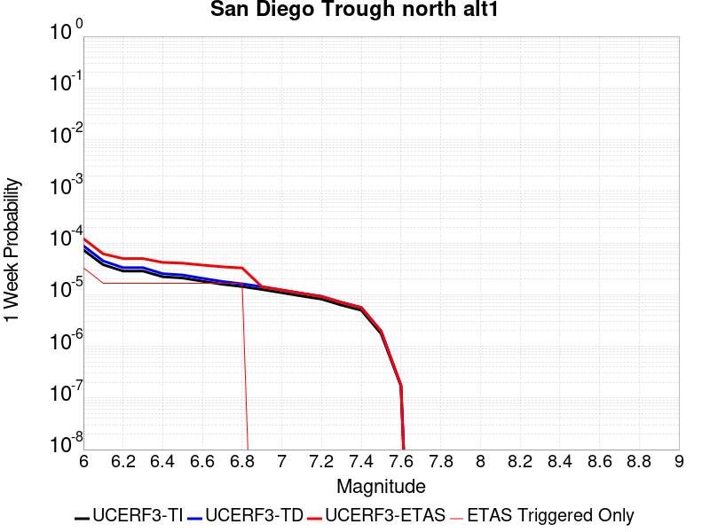 | 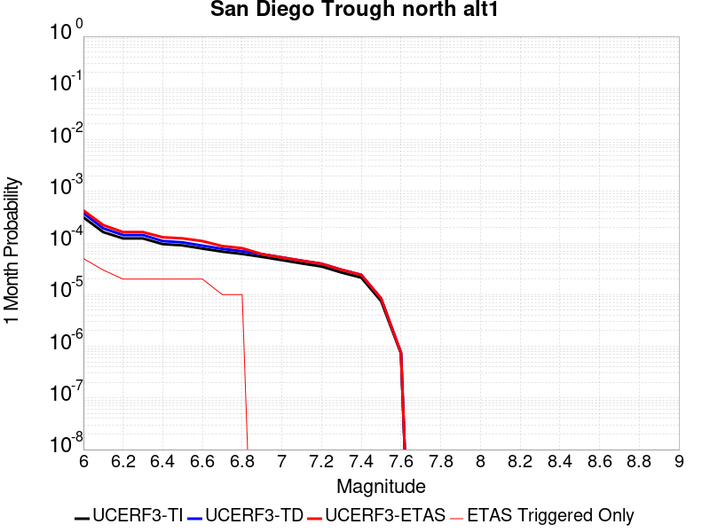 | 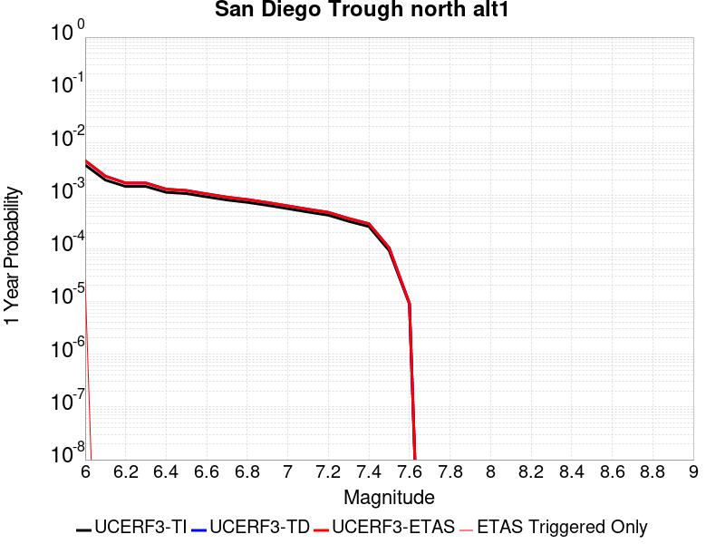 | 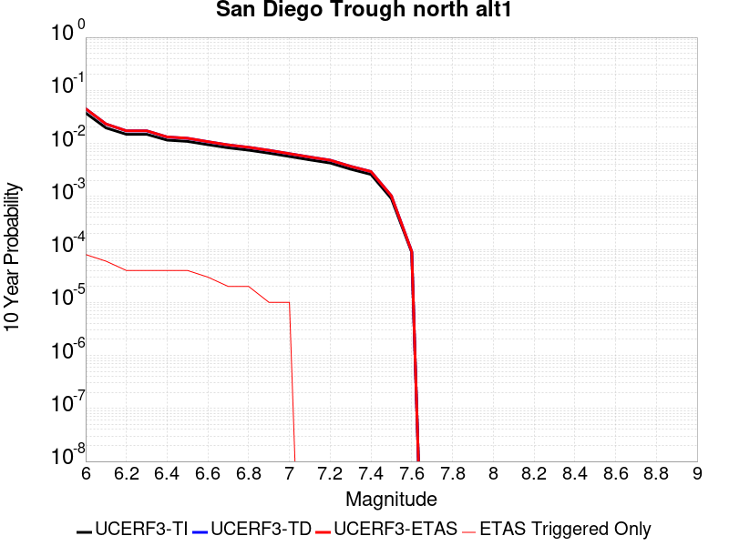 |

| Magnitude | 1 wk TI Prob | 1 wk TD Prob | 1 wk ETAS Prob | 1 wk ETAS/TD Gain | 1 wk ETAS Triggered Only | 1 mo TI Prob | 1 mo TD Prob | 1 mo ETAS Prob | 1 mo ETAS/TD Gain | 1 mo ETAS Triggered Only | 1 yr TI Prob | 1 yr TD Prob | 1 yr ETAS Prob | 1 yr ETAS/TD Gain | 1 yr ETAS Triggered Only | 10 yr TI Prob | 10 yr TD Prob | 10 yr ETAS Prob | 10 yr ETAS/TD Gain | 10 yr ETAS Triggered Only |
|-----|-----|-----|-----|-----|-----|-----|-----|-----|-----|-----|-----|-----|-----|-----|-----|-----|-----|-----|-----|-----|
| 6.0 | 7.329252E-5 | 8.821269E-5 | 1.1319051E-4 | 1.2831544 | 2.4980016E-5 | 3.14073E-4 | 3.7800326E-4 | 4.0297382E-4 | 1.0660591 | 2.4980016E-5 | 0.0038171355 | 0.0045930487 | 0.004617914 | 1.0054137 | 2.4980016E-5 | 0.03752231 | 0.045045137 | 0.04506899 | 1.0005295 | 2.4980016E-5 |
| 6.1 | 3.7940346E-5 | 4.4884906E-5 | 4.4884906E-5 | 1.0 | 0.0 | 1.6259136E-4 | 1.9235026E-4 | 1.9235026E-4 | 1.0 | 0.0 | 0.0019777524 | 0.002339431 | 0.002339431 | 1.0 | 0.0 | 0.019602431 | 0.023156732 | 0.023156732 | 1.0 | 0.0 |
| 6.2 | 2.8645263E-5 | 3.329672E-5 | 3.329672E-5 | 1.0 | 0.0 | 1.2275964E-4 | 1.4269259E-4 | 1.4269259E-4 | 1.0 | 0.0 | 0.0014935739 | 0.0017359206 | 0.0017359206 | 1.0 | 0.0 | 0.0148357535 | 0.017226268 | 0.017226268 | 1.0 | 0.0 |
| 6.3 | 2.8645263E-5 | 3.329672E-5 | 3.329672E-5 | 1.0 | 0.0 | 1.2275964E-4 | 1.4269259E-4 | 1.4269259E-4 | 1.0 | 0.0 | 0.0014935739 | 0.0017359206 | 0.0017359206 | 1.0 | 0.0 | 0.0148357535 | 0.017226268 | 0.017226268 | 1.0 | 0.0 |
| 6.4 | 2.2204576E-5 | 2.544832E-5 | 2.544832E-5 | 1.0 | 0.0 | 9.5159E-5 | 1.0905972E-4 | 1.0905972E-4 | 1.0 | 0.0 | 0.001157945 | 0.0013270028 | 0.0013270028 | 1.0 | 0.0 | 0.011519298 | 0.013191959 | 0.013191959 | 1.0 | 0.0 |
| 6.5 | 2.1004838E-5 | 2.4024695E-5 | 2.4024695E-5 | 1.0 | 0.0 | 9.0017624E-5 | 1.0295897E-4 | 1.0295897E-4 | 1.0 | 0.0 | 0.0010954136 | 0.0012528135 | 0.0012528135 | 1.0 | 0.0 | 0.010900296 | 0.012458592 | 0.012458592 | 1.0 | 0.0 |
| 6.6 | 1.820557E-5 | 2.070479E-5 | 2.070479E-5 | 1.0 | 0.0 | 7.802154E-5 | 8.8731824E-5 | 8.8731824E-5 | 1.0 | 0.0 | 9.4949827E-4 | 0.0010797799 | 0.0010797799 | 1.0 | 0.0 | 0.009454516 | 0.010746005 | 0.010746005 | 1.0 | 0.0 |
| 6.7 | 1.5884485E-5 | 1.7983646E-5 | 1.7983646E-5 | 1.0 | 0.0 | 6.807459E-5 | 7.707051E-5 | 7.707051E-5 | 1.0 | 0.0 | 8.284929E-4 | 9.3793223E-4 | 9.3793223E-4 | 1.0 | 0.0 | 0.008254109 | 0.009340104 | 0.009340104 | 1.0 | 0.0 |
| 6.8 | 1.4331171E-5 | 1.6201066E-5 | 1.6201066E-5 | 1.0 | 0.0 | 6.141786E-5 | 6.94313E-5 | 6.94313E-5 | 1.0 | 0.0 | 7.4750587E-4 | 8.450002E-4 | 8.450002E-4 | 1.0 | 0.0 | 0.0074499645 | 0.008418139 | 0.008418139 | 1.0 | 0.0 |
| 6.9 | 1.2574203E-5 | 1.4205835E-5 | 1.4205835E-5 | 1.0 | 0.0 | 5.3888325E-5 | 6.0880735E-5 | 6.0880735E-5 | 1.0 | 0.0 | 6.558929E-4 | 7.409723E-4 | 7.409723E-4 | 1.0 | 0.0 | 0.0065396037 | 0.007385203 | 0.007385203 | 1.0 | 0.0 |
| 7.0 | 1.0883844E-5 | 1.2289262E-5 | 1.2289262E-5 | 1.0 | 0.0 | 4.664421E-5 | 5.2667205E-5 | 5.2667205E-5 | 1.0 | 0.0 | 5.677453E-4 | 6.4103556E-4 | 6.4103556E-4 | 1.0 | 0.0 | 0.00566297 | 0.006391993 | 0.006391993 | 1.0 | 0.0 |
| 7.1 | 9.393088E-6 | 1.060702E-5 | 1.060702E-5 | 1.0 | 0.0 | 4.025547E-5 | 4.545787E-5 | 4.545787E-5 | 1.0 | 0.0 | 4.900001E-4 | 5.533098E-4 | 5.533098E-4 | 1.0 | 0.0 | 0.0048892107 | 0.005519418 | 0.005519418 | 1.0 | 0.0 |
| 7.2 | 8.190791E-6 | 9.258625E-6 | 9.258625E-6 | 1.0 | 0.0 | 3.510292E-5 | 3.9679224E-5 | 3.9679224E-5 | 1.0 | 0.0 | 4.2729423E-4 | 4.8298817E-4 | 4.8298817E-4 | 1.0 | 0.0 | 0.0042647356 | 0.004819465 | 0.004819465 | 1.0 | 0.0 |
| 7.3 | 6.268162E-6 | 7.089716E-6 | 7.089716E-6 | 1.0 | 0.0 | 2.6863276E-5 | 3.0384144E-5 | 3.0384144E-5 | 1.0 | 0.0 | 3.2701128E-4 | 3.6986457E-4 | 3.6986457E-4 | 1.0 | 0.0 | 0.003265305 | 0.003692536 | 0.003692536 | 1.0 | 0.0 |
| 7.4 | 4.985186E-6 | 5.6426816E-6 | 5.6426816E-6 | 1.0 | 0.0 | 2.1364907E-5 | 2.4182698E-5 | 2.4182698E-5 | 1.0 | 0.0 | 2.600867E-4 | 2.9438498E-4 | 2.9438498E-4 | 1.0 | 0.0 | 0.002597825 | 0.0029399914 | 0.0029399914 | 1.0 | 0.0 |
| 7.5 | 1.7489613E-6 | 1.969678E-6 | 1.969678E-6 | 1.0 | 0.0 | 7.495527E-6 | 8.4414505E-6 | 8.4414505E-6 | 1.0 | 0.0 | 9.125422E-5 | 1.02770035E-4 | 1.02770035E-4 | 1.0 | 0.0 | 9.1216754E-4 | 0.0010272472 | 0.0010272472 | 1.0 | 0.0 |
| 7.6 | 1.6988751E-7 | 1.7533823E-7 | 1.7533823E-7 | 1.0 | 0.0 | 7.2808916E-7 | 7.5144936E-7 | 7.5144936E-7 | 1.0 | 0.0 | 8.864449E-6 | 9.14886E-6 | 9.14886E-6 | 1.0 | 0.0 | 8.8640954E-5 | 9.1485024E-5 | 9.1485024E-5 | 1.0 | 0.0 |

## Owens Valley Keough Hot Springs
*[(top)](#table-of-contents)*

| 1 Week | 1 Month | 1 Year | 10 Year |
|-----|-----|-----|-----|
| 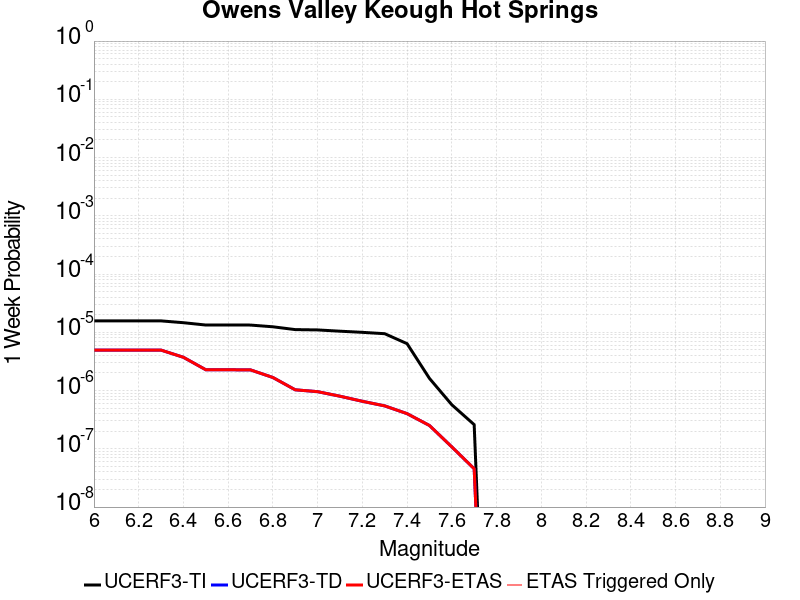 |  | 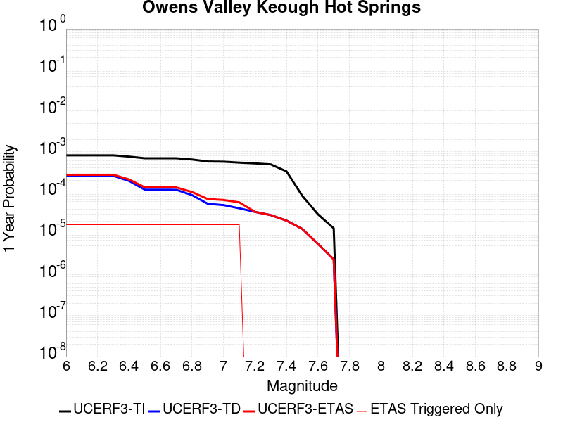 | 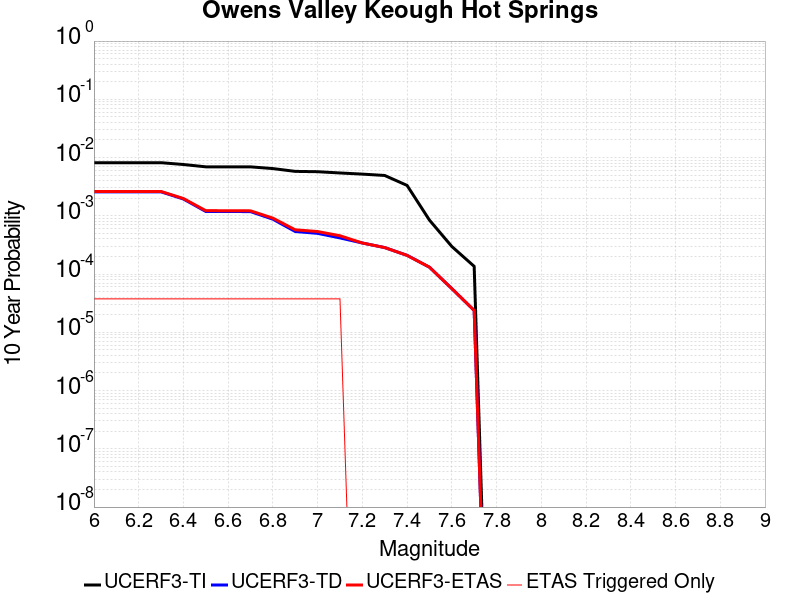 |

| Magnitude | 1 wk TI Prob | 1 wk TD Prob | 1 wk ETAS Prob | 1 wk ETAS/TD Gain | 1 wk ETAS Triggered Only | 1 mo TI Prob | 1 mo TD Prob | 1 mo ETAS Prob | 1 mo ETAS/TD Gain | 1 mo ETAS Triggered Only | 1 yr TI Prob | 1 yr TD Prob | 1 yr ETAS Prob | 1 yr ETAS/TD Gain | 1 yr ETAS Triggered Only | 10 yr TI Prob | 10 yr TD Prob | 10 yr ETAS Prob | 10 yr ETAS/TD Gain | 10 yr ETAS Triggered Only |
|-----|-----|-----|-----|-----|-----|-----|-----|-----|-----|-----|-----|-----|-----|-----|-----|-----|-----|-----|-----|-----|
| 6.0 | 1.5708529E-5 | 4.950463E-6 | 4.950463E-6 | 1.0 | 0.0 | 6.7320536E-5 | 2.1216127E-5 | 2.1216127E-5 | 1.0 | 0.0 | 8.193192E-4 | 2.5828084E-4 | 2.8325443E-4 | 1.0966915 | 2.4980016E-5 | 0.008163051 | 0.0025804387 | 0.0026053542 | 1.0096556 | 2.4980016E-5 |
| 6.1 | 1.5708529E-5 | 4.950463E-6 | 4.950463E-6 | 1.0 | 0.0 | 6.7320536E-5 | 2.1216127E-5 | 2.1216127E-5 | 1.0 | 0.0 | 8.193192E-4 | 2.5828084E-4 | 2.8325443E-4 | 1.0966915 | 2.4980016E-5 | 0.008163051 | 0.0025804387 | 0.0026053542 | 1.0096556 | 2.4980016E-5 |
| 6.2 | 1.5708529E-5 | 4.950463E-6 | 4.950463E-6 | 1.0 | 0.0 | 6.7320536E-5 | 2.1216127E-5 | 2.1216127E-5 | 1.0 | 0.0 | 8.193192E-4 | 2.5828084E-4 | 2.8325443E-4 | 1.0966915 | 2.4980016E-5 | 0.008163051 | 0.0025804387 | 0.0026053542 | 1.0096556 | 2.4980016E-5 |
| 6.3 | 1.5708529E-5 | 4.950463E-6 | 4.950463E-6 | 1.0 | 0.0 | 6.7320536E-5 | 2.1216127E-5 | 2.1216127E-5 | 1.0 | 0.0 | 8.193192E-4 | 2.5828084E-4 | 2.8325443E-4 | 1.0966915 | 2.4980016E-5 | 0.008163051 | 0.0025804387 | 0.0026053542 | 1.0096556 | 2.4980016E-5 |
| 6.4 | 1.4622509E-5 | 3.7263276E-6 | 3.7263276E-6 | 1.0 | 0.0 | 6.266639E-5 | 1.5969896E-5 | 1.5969896E-5 | 1.0 | 0.0 | 7.626962E-4 | 1.9441944E-4 | 2.193946E-4 | 1.1284602 | 2.4980016E-5 | 0.007600839 | 0.0019429466 | 0.001967878 | 1.0128318 | 2.4980016E-5 |
| 6.5 | 1.3335527E-5 | 2.2775241E-6 | 2.2775241E-6 | 1.0 | 0.0 | 5.7151006E-5 | 9.760785E-6 | 9.760785E-6 | 1.0 | 0.0 | 6.955913E-4 | 1.1883176E-4 | 1.4380881E-4 | 1.2101883 | 2.4980016E-5 | 0.0069341804 | 0.001187878 | 0.0012128283 | 1.0210041 | 2.4980016E-5 |
| 6.6 | 1.3332855E-5 | 2.2746733E-6 | 2.2746733E-6 | 1.0 | 0.0 | 5.7139558E-5 | 9.748568E-6 | 9.748568E-6 | 1.0 | 0.0 | 6.9545204E-4 | 1.1868303E-4 | 1.4366009E-4 | 1.2104517 | 2.4980016E-5 | 0.0069327964 | 0.0011863923 | 0.0012113426 | 1.0210304 | 2.4980016E-5 |
| 6.7 | 1.3318214E-5 | 2.2639038E-6 | 2.2639038E-6 | 1.0 | 0.0 | 5.707681E-5 | 9.702413E-6 | 9.702413E-6 | 1.0 | 0.0 | 6.946886E-4 | 1.18121156E-4 | 1.4309822E-4 | 1.211453 | 2.4980016E-5 | 0.0069252094 | 0.0011807795 | 0.00120573 | 1.0211306 | 2.4980016E-5 |
| 6.8 | 1.2441338E-5 | 1.677594E-6 | 1.677594E-6 | 1.0 | 0.0 | 5.331893E-5 | 7.1896707E-6 | 7.1896707E-6 | 1.0 | 0.0 | 6.489646E-4 | 8.753102E-5 | 1.1250885E-4 | 1.2853597 | 2.4980016E-5 | 0.0064707273 | 8.751236E-4 | 9.0008177E-4 | 1.0285196 | 2.4980016E-5 |
| 6.9 | 1.1130476E-5 | 1.0302234E-6 | 1.0302234E-6 | 1.0 | 0.0 | 4.7701167E-5 | 4.4152357E-6 | 4.4152357E-6 | 1.0 | 0.0 | 5.806069E-4 | 5.3754186E-5 | 7.873286E-5 | 1.4646833 | 2.4980016E-5 | 0.0057909233 | 5.375404E-4 | 5.62507E-4 | 1.046446 | 2.4980016E-5 |
| 7.0 | 1.0986073E-5 | 9.577824E-7 | 9.577824E-7 | 1.0 | 0.0 | 4.7082318E-5 | 4.1047756E-6 | 4.1047756E-6 | 1.0 | 0.0 | 5.730765E-4 | 4.9974507E-5 | 7.495328E-5 | 1.4998302 | 2.4980016E-5 | 0.0057160086 | 4.997603E-4 | 5.2472786E-4 | 1.0499591 | 2.4980016E-5 |
| 7.1 | 1.0451338E-5 | 7.9988575E-7 | 7.9988575E-7 | 1.0 | 0.0 | 4.4790682E-5 | 3.4280772E-6 | 3.4280772E-6 | 1.0 | 0.0 | 5.451901E-4 | 4.1736046E-5 | 6.6715016E-5 | 1.5984988 | 2.4980016E-5 | 0.005438545 | 4.1740583E-4 | 4.4237543E-4 | 1.0598209 | 2.4980016E-5 |
| 7.2 | 9.989061E-6 | 6.543693E-7 | 6.543693E-7 | 1.0 | 0.0 | 4.280956E-5 | 2.8044367E-6 | 2.8044367E-6 | 1.0 | 0.0 | 5.2108173E-4 | 3.4143486E-5 | 3.4143486E-5 | 1.0 | 0.0 | 0.0051986156 | 3.41488E-4 | 3.41488E-4 | 1.0 | 0.0 |
| 7.3 | 9.465365E-6 | 5.458855E-7 | 5.458855E-7 | 1.0 | 0.0 | 4.056522E-5 | 2.3395073E-6 | 2.3395073E-6 | 1.0 | 0.0 | 4.937696E-4 | 2.8483131E-5 | 2.8483131E-5 | 1.0 | 0.0 | 0.0049267393 | 2.8489542E-4 | 2.8489542E-4 | 1.0 | 0.0 |
| 7.4 | 6.3824805E-6 | 4.0153776E-7 | 4.0153776E-7 | 1.0 | 0.0 | 2.73532E-5 | 1.7208749E-6 | 1.7208749E-6 | 1.0 | 0.0 | 3.3297433E-4 | 2.0951453E-5 | 2.0951453E-5 | 1.0 | 0.0 | 0.0033247585 | 2.0955436E-4 | 2.0955436E-4 | 1.0 | 0.0 |
| 7.5 | 1.6192645E-6 | 2.5156373E-7 | 2.5156373E-7 | 1.0 | 0.0 | 6.9396865E-6 | 1.0781299E-6 | 1.0781299E-6 | 1.0 | 0.0 | 8.448741E-5 | 1.3126153E-5 | 1.3126153E-5 | 1.0 | 0.0 | 8.4455294E-4 | 1.3125391E-4 | 1.3125391E-4 | 1.0 | 0.0 |
| 7.6 | 5.7062545E-7 | 1.0790214E-7 | 1.0790214E-7 | 1.0 | 0.0 | 2.4455355E-6 | 4.6243767E-7 | 4.6243767E-7 | 1.0 | 0.0 | 2.9773988E-5 | 5.630165E-6 | 5.630165E-6 | 1.0 | 0.0 | 2.977E-4 | 5.6300305E-5 | 5.6300305E-5 | 1.0 | 0.0 |
| 7.7 | 2.5988817E-7 | 4.5445965E-8 | 4.5445965E-8 | 1.0 | 0.0 | 1.113806E-6 | 1.9476842E-7 | 1.9476842E-7 | 1.0 | 0.0 | 1.3560503E-5 | 2.3713033E-6 | 2.3713033E-6 | 1.0 | 0.0 | 1.3559677E-4 | 2.3712824E-5 | 2.3712824E-5 | 1.0 | 0.0 |

## Santa Ynez River
*[(top)](#table-of-contents)*

| 1 Week | 1 Month | 1 Year | 10 Year |
|-----|-----|-----|-----|
|  |  | 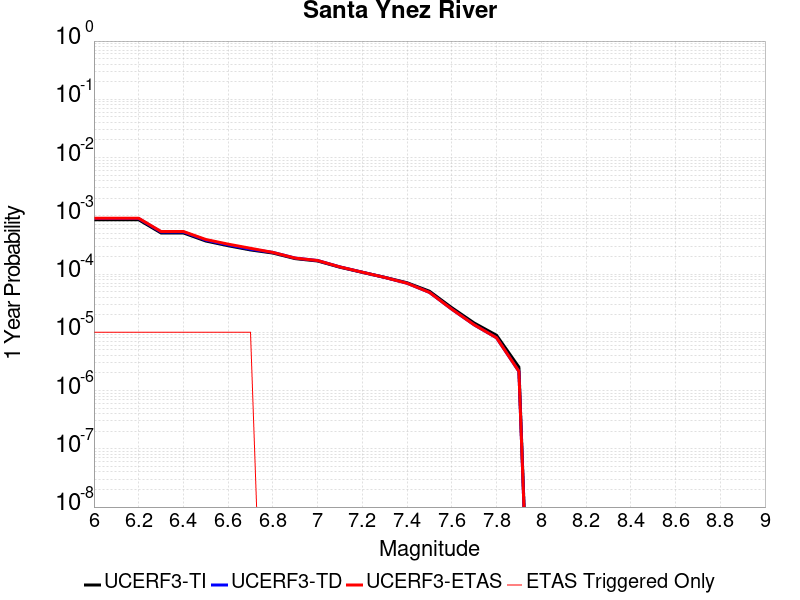 | 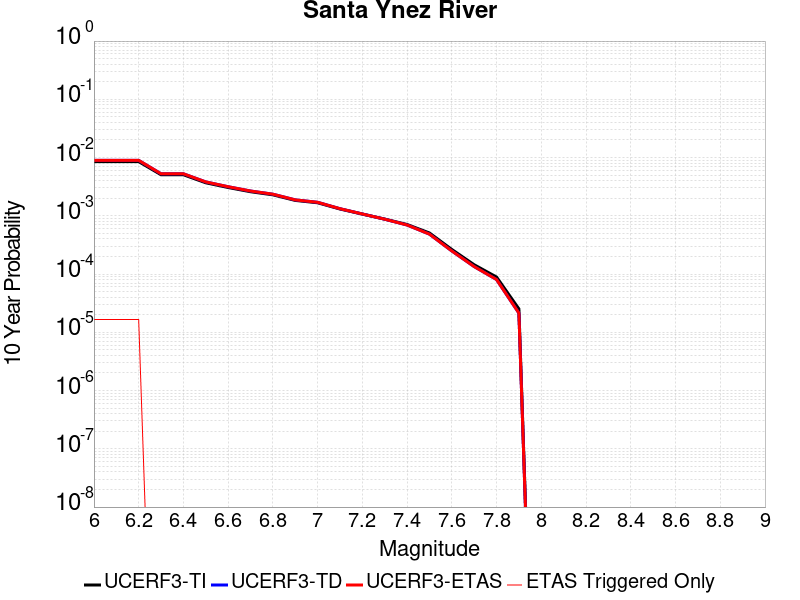 |

| Magnitude | 1 wk TI Prob | 1 wk TD Prob | 1 wk ETAS Prob | 1 wk ETAS/TD Gain | 1 wk ETAS Triggered Only | 1 mo TI Prob | 1 mo TD Prob | 1 mo ETAS Prob | 1 mo ETAS/TD Gain | 1 mo ETAS Triggered Only | 1 yr TI Prob | 1 yr TD Prob | 1 yr ETAS Prob | 1 yr ETAS/TD Gain | 1 yr ETAS Triggered Only | 10 yr TI Prob | 10 yr TD Prob | 10 yr ETAS Prob | 10 yr ETAS/TD Gain | 10 yr ETAS Triggered Only |
|-----|-----|-----|-----|-----|-----|-----|-----|-----|-----|-----|-----|-----|-----|-----|-----|-----|-----|-----|-----|-----|
| 6.0 | 1.6396456E-5 | 1.7209444E-5 | 1.7209444E-5 | 1.0 | 0.0 | 7.026863E-5 | 7.3752875E-5 | 7.3752875E-5 | 1.0 | 0.0 | 8.551848E-4 | 8.976069E-4 | 8.976069E-4 | 1.0 | 0.0 | 0.0085190125 | 0.008943363 | 0.0089681195 | 1.0027682 | 2.4980016E-5 |
| 6.1 | 1.6396456E-5 | 1.7209444E-5 | 1.7209444E-5 | 1.0 | 0.0 | 7.026863E-5 | 7.3752875E-5 | 7.3752875E-5 | 1.0 | 0.0 | 8.551848E-4 | 8.976069E-4 | 8.976069E-4 | 1.0 | 0.0 | 0.0085190125 | 0.008943363 | 0.0089681195 | 1.0027682 | 2.4980016E-5 |
| 6.2 | 1.6396456E-5 | 1.7209444E-5 | 1.7209444E-5 | 1.0 | 0.0 | 7.026863E-5 | 7.3752875E-5 | 7.3752875E-5 | 1.0 | 0.0 | 8.551848E-4 | 8.976069E-4 | 8.976069E-4 | 1.0 | 0.0 | 0.0085190125 | 0.008943363 | 0.0089681195 | 1.0027682 | 2.4980016E-5 |
| 6.3 | 9.736976E-6 | 1.01223395E-5 | 1.01223395E-5 | 1.0 | 0.0 | 4.172923E-5 | 4.338076E-5 | 4.338076E-5 | 1.0 | 0.0 | 5.0793495E-4 | 5.280378E-4 | 5.280378E-4 | 1.0 | 0.0 | 0.005067755 | 0.0052683367 | 0.0052683367 | 1.0 | 0.0 |
| 6.4 | 9.736976E-6 | 1.01223395E-5 | 1.01223395E-5 | 1.0 | 0.0 | 4.172923E-5 | 4.338076E-5 | 4.338076E-5 | 1.0 | 0.0 | 5.0793495E-4 | 5.280378E-4 | 5.280378E-4 | 1.0 | 0.0 | 0.005067755 | 0.0052683367 | 0.0052683367 | 1.0 | 0.0 |
| 6.5 | 7.081964E-6 | 7.329905E-6 | 7.329905E-6 | 1.0 | 0.0 | 3.035092E-5 | 3.141351E-5 | 3.141351E-5 | 1.0 | 0.0 | 3.694598E-4 | 3.8239395E-4 | 3.8239395E-4 | 1.0 | 0.0 | 0.0036884616 | 0.0038175215 | 0.0038175215 | 1.0 | 0.0 |
| 6.6 | 5.873247E-6 | 6.0597517E-6 | 6.0597517E-6 | 1.0 | 0.0 | 2.5170815E-5 | 2.5970112E-5 | 2.5970112E-5 | 1.0 | 0.0 | 3.064116E-4 | 3.161411E-4 | 3.161411E-4 | 1.0 | 0.0 | 0.0030598943 | 0.003157001 | 0.003157001 | 1.0 | 0.0 |
| 6.7 | 4.973277E-6 | 5.11591E-6 | 5.11591E-6 | 1.0 | 0.0 | 2.1313872E-5 | 2.1925147E-5 | 2.1925147E-5 | 1.0 | 0.0 | 2.5946548E-4 | 2.6690646E-4 | 2.6690646E-4 | 1.0 | 0.0 | 0.0025916274 | 0.0026659078 | 0.0026659078 | 1.0 | 0.0 |
| 6.8 | 4.396492E-6 | 4.510987E-6 | 4.510987E-6 | 1.0 | 0.0 | 1.884197E-5 | 1.933266E-5 | 1.933266E-5 | 1.0 | 0.0 | 2.2937685E-4 | 2.3535005E-4 | 2.3535005E-4 | 1.0 | 0.0 | 0.0022914023 | 0.0023510433 | 0.0023510433 | 1.0 | 0.0 |
| 6.9 | 3.5255632E-6 | 3.6013423E-6 | 3.6013423E-6 | 1.0 | 0.0 | 1.5109469E-5 | 1.5434234E-5 | 1.5434234E-5 | 1.0 | 0.0 | 1.8394225E-4 | 1.8789574E-4 | 1.8789574E-4 | 1.0 | 0.0 | 0.0018379007 | 0.001877385 | 0.001877385 | 1.0 | 0.0 |
| 7.0 | 3.211603E-6 | 3.273663E-6 | 3.273663E-6 | 1.0 | 0.0 | 1.376394E-5 | 1.402991E-5 | 1.402991E-5 | 1.0 | 0.0 | 1.6756308E-4 | 1.708009E-4 | 1.708009E-4 | 1.0 | 0.0 | 0.0016743679 | 0.0017067104 | 0.0017067104 | 1.0 | 0.0 |
| 7.1 | 2.5094619E-6 | 2.5409295E-6 | 2.5409295E-6 | 1.0 | 0.0 | 1.0754793E-5 | 1.0889652E-5 | 1.0889652E-5 | 1.0 | 0.0 | 1.3093173E-4 | 1.325735E-4 | 1.325735E-4 | 1.0 | 0.0 | 0.0013085462 | 0.0013249503 | 0.0013249503 | 1.0 | 0.0 |
| 7.2 | 2.0515774E-6 | 2.0619466E-6 | 2.0619466E-6 | 1.0 | 0.0 | 8.792445E-6 | 8.836884E-6 | 8.836884E-6 | 1.0 | 0.0 | 1.0704277E-4 | 1.0758379E-4 | 1.0758379E-4 | 1.0 | 0.0 | 0.0010699122 | 0.0010753215 | 0.0010753215 | 1.0 | 0.0 |
| 7.3 | 1.6845745E-6 | 1.6773996E-6 | 1.6773996E-6 | 1.0 | 0.0 | 7.219585E-6 | 7.1888358E-6 | 7.1888358E-6 | 1.0 | 0.0 | 8.78949E-5 | 8.752059E-5 | 8.752059E-5 | 1.0 | 0.0 | 8.7860145E-4 | 8.7486405E-4 | 8.7486405E-4 | 1.0 | 0.0 |
| 7.4 | 1.3600285E-6 | 1.3333447E-6 | 1.3333447E-6 | 1.0 | 0.0 | 5.82868E-6 | 5.714322E-6 | 5.714322E-6 | 1.0 | 0.0 | 7.096187E-5 | 6.956967E-5 | 6.956967E-5 | 1.0 | 0.0 | 7.0939213E-4 | 6.9548114E-4 | 6.9548114E-4 | 1.0 | 0.0 |
| 7.5 | 9.735342E-7 | 9.2901894E-7 | 9.2901894E-7 | 1.0 | 0.0 | 4.172283E-6 | 3.9815036E-6 | 3.9815036E-6 | 1.0 | 0.0 | 5.079636E-5 | 4.8473747E-5 | 4.8473747E-5 | 1.0 | 0.0 | 5.0784746E-4 | 4.8463346E-4 | 4.8463346E-4 | 1.0 | 0.0 |
| 7.6 | 5.067187E-7 | 4.778609E-7 | 4.778609E-7 | 1.0 | 0.0 | 2.1716498E-6 | 2.0479738E-6 | 2.0479738E-6 | 1.0 | 0.0 | 2.6439517E-5 | 2.4933803E-5 | 2.4933803E-5 | 1.0 | 0.0 | 2.643637E-4 | 2.493108E-4 | 2.493108E-4 | 1.0 | 0.0 |
| 7.7 | 2.769089E-7 | 2.5759346E-7 | 2.5759346E-7 | 1.0 | 0.0 | 1.1867519E-6 | 1.1039714E-6 | 1.1039714E-6 | 1.0 | 0.0 | 1.4448608E-5 | 1.344077E-5 | 1.344077E-5 | 1.0 | 0.0 | 1.444767E-4 | 1.343996E-4 | 1.343996E-4 | 1.0 | 0.0 |
| 7.8 | 1.7044663E-7 | 1.5449208E-7 | 1.5449208E-7 | 1.0 | 0.0 | 7.3048534E-7 | 6.6210873E-7 | 6.6210873E-7 | 1.0 | 0.0 | 8.893623E-6 | 8.061144E-6 | 8.061144E-6 | 1.0 | 0.0 | 8.893267E-5 | 8.060854E-5 | 8.060854E-5 | 1.0 | 0.0 |
| 7.9 | 4.8344287E-8 | 4.0911143E-8 | 4.0911143E-8 | 1.0 | 0.0 | 2.0718979E-7 | 1.7533345E-7 | 1.7533345E-7 | 1.0 | 0.0 | 2.5225327E-6 | 2.1346827E-6 | 2.1346827E-6 | 1.0 | 0.0 | 2.5225041E-5 | 2.1346626E-5 | 2.1346626E-5 | 1.0 | 0.0 |

## Sierra Madre
*[(top)](#table-of-contents)*

| 1 Week | 1 Month | 1 Year | 10 Year |
|-----|-----|-----|-----|
| 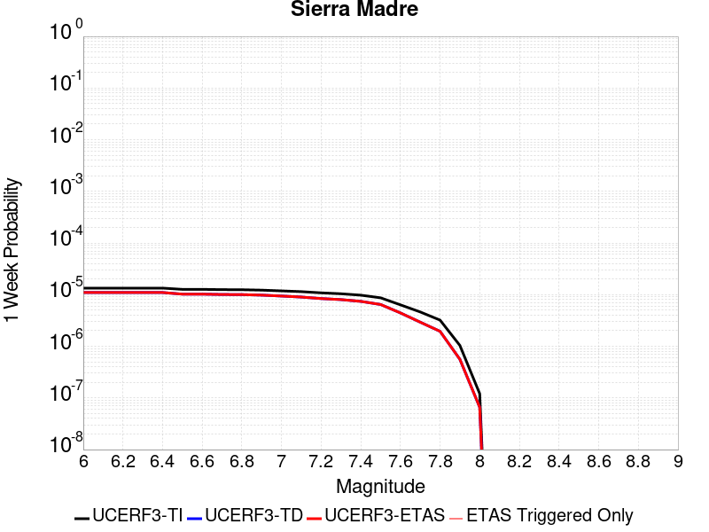 | 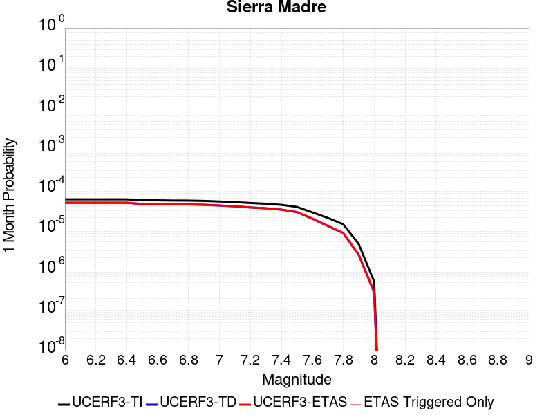 | 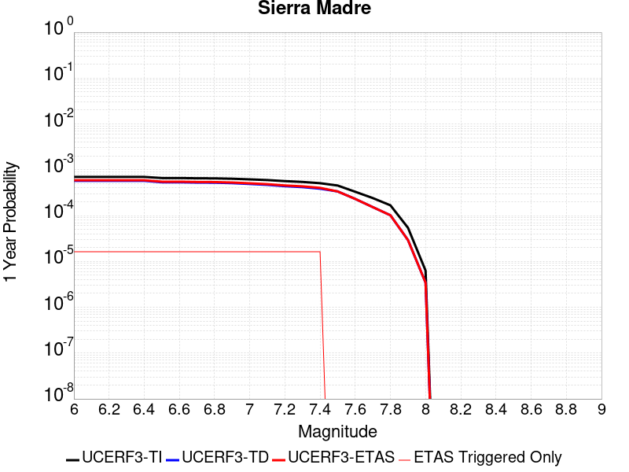 | 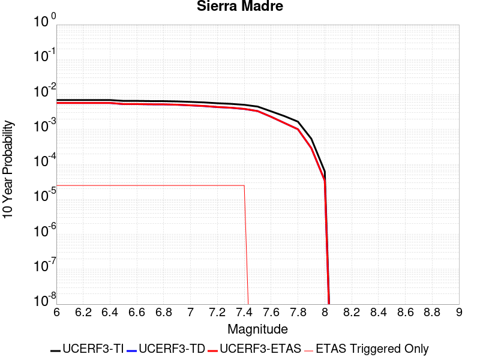 |

| Magnitude | 1 wk TI Prob | 1 wk TD Prob | 1 wk ETAS Prob | 1 wk ETAS/TD Gain | 1 wk ETAS Triggered Only | 1 mo TI Prob | 1 mo TD Prob | 1 mo ETAS Prob | 1 mo ETAS/TD Gain | 1 mo ETAS Triggered Only | 1 yr TI Prob | 1 yr TD Prob | 1 yr ETAS Prob | 1 yr ETAS/TD Gain | 1 yr ETAS Triggered Only | 10 yr TI Prob | 10 yr TD Prob | 10 yr ETAS Prob | 10 yr ETAS/TD Gain | 10 yr ETAS Triggered Only |
|-----|-----|-----|-----|-----|-----|-----|-----|-----|-----|-----|-----|-----|-----|-----|-----|-----|-----|-----|-----|-----|
| 6.0 | 1.3379373E-5 | 1.1000776E-5 | 1.1000776E-5 | 1.0 | 0.0 | 5.7338908E-5 | 4.714534E-5 | 4.714534E-5 | 1.0 | 0.0 | 6.978776E-4 | 5.738448E-4 | 5.738448E-4 | 1.0 | 0.0 | 0.0069569005 | 0.0057238447 | 0.005748682 | 1.0043392 | 2.4980016E-5 |
| 6.1 | 1.3379373E-5 | 1.1000776E-5 | 1.1000776E-5 | 1.0 | 0.0 | 5.7338908E-5 | 4.714534E-5 | 4.714534E-5 | 1.0 | 0.0 | 6.978776E-4 | 5.738448E-4 | 5.738448E-4 | 1.0 | 0.0 | 0.0069569005 | 0.0057238447 | 0.005748682 | 1.0043392 | 2.4980016E-5 |
| 6.2 | 1.3379373E-5 | 1.1000776E-5 | 1.1000776E-5 | 1.0 | 0.0 | 5.7338908E-5 | 4.714534E-5 | 4.714534E-5 | 1.0 | 0.0 | 6.978776E-4 | 5.738448E-4 | 5.738448E-4 | 1.0 | 0.0 | 0.0069569005 | 0.0057238447 | 0.005748682 | 1.0043392 | 2.4980016E-5 |
| 6.3 | 1.3379373E-5 | 1.1000776E-5 | 1.1000776E-5 | 1.0 | 0.0 | 5.7338908E-5 | 4.714534E-5 | 4.714534E-5 | 1.0 | 0.0 | 6.978776E-4 | 5.738448E-4 | 5.738448E-4 | 1.0 | 0.0 | 0.0069569005 | 0.0057238447 | 0.005748682 | 1.0043392 | 2.4980016E-5 |
| 6.4 | 1.3379373E-5 | 1.1000776E-5 | 1.1000776E-5 | 1.0 | 0.0 | 5.7338908E-5 | 4.714534E-5 | 4.714534E-5 | 1.0 | 0.0 | 6.978776E-4 | 5.738448E-4 | 5.738448E-4 | 1.0 | 0.0 | 0.0069569005 | 0.0057238447 | 0.005748682 | 1.0043392 | 2.4980016E-5 |
| 6.5 | 1.26563245E-5 | 1.0230232E-5 | 1.0230232E-5 | 1.0 | 0.0 | 5.4240263E-5 | 4.384312E-5 | 4.384312E-5 | 1.0 | 0.0 | 6.601751E-4 | 5.3366035E-4 | 5.3366035E-4 | 1.0 | 0.0 | 0.006582173 | 0.0053239604 | 0.005348807 | 1.004667 | 2.4980016E-5 |
| 6.6 | 1.26563245E-5 | 1.0230232E-5 | 1.0230232E-5 | 1.0 | 0.0 | 5.4240263E-5 | 4.384312E-5 | 4.384312E-5 | 1.0 | 0.0 | 6.601751E-4 | 5.3366035E-4 | 5.3366035E-4 | 1.0 | 0.0 | 0.006582173 | 0.0053239604 | 0.005348807 | 1.004667 | 2.4980016E-5 |
| 6.7 | 1.2502474E-5 | 1.00663765E-5 | 1.00663765E-5 | 1.0 | 0.0 | 5.3580934E-5 | 4.3140906E-5 | 4.3140906E-5 | 1.0 | 0.0 | 6.521526E-4 | 5.25115E-4 | 5.25115E-4 | 1.0 | 0.0 | 0.0065024206 | 0.0052389116 | 0.0052637607 | 1.0047432 | 2.4980016E-5 |
| 6.8 | 1.2454966E-5 | 1.0018662E-5 | 1.0018662E-5 | 1.0 | 0.0 | 5.3377335E-5 | 4.293642E-5 | 4.293642E-5 | 1.0 | 0.0 | 6.4967526E-4 | 5.226266E-4 | 5.226266E-4 | 1.0 | 0.0 | 0.006477792 | 0.0052141445 | 0.005238994 | 1.0047659 | 2.4980016E-5 |
| 6.9 | 1.2225574E-5 | 9.792639E-6 | 9.792639E-6 | 1.0 | 0.0 | 5.2394265E-5 | 4.196778E-5 | 4.196778E-5 | 1.0 | 0.0 | 6.3771347E-4 | 5.10839E-4 | 5.10839E-4 | 1.0 | 0.0 | 0.006358865 | 0.0050968137 | 0.0051216665 | 1.0048761 | 2.4980016E-5 |
| 7.0 | 1.182946E-5 | 9.399179E-6 | 9.399179E-6 | 1.0 | 0.0 | 5.06967E-5 | 4.0281582E-5 | 4.0281582E-5 | 1.0 | 0.0 | 6.1705755E-4 | 4.903189E-4 | 4.903189E-4 | 1.0 | 0.0 | 0.006153469 | 0.004892533 | 0.004917391 | 1.0050808 | 2.4980016E-5 |
| 7.1 | 1.14369095E-5 | 8.986194E-6 | 8.986194E-6 | 1.0 | 0.0 | 4.9014405E-5 | 3.85117E-5 | 3.85117E-5 | 1.0 | 0.0 | 5.9658696E-4 | 4.6878002E-4 | 4.6878002E-4 | 1.0 | 0.0 | 0.005949879 | 0.0046780678 | 0.004702931 | 1.0053148 | 2.4980016E-5 |
| 7.2 | 1.0836419E-5 | 8.39959E-6 | 8.39959E-6 | 1.0 | 0.0 | 4.644097E-5 | 3.599775E-5 | 3.599775E-5 | 1.0 | 0.0 | 5.652721E-4 | 4.3818538E-4 | 4.3818538E-4 | 1.0 | 0.0 | 0.0056383642 | 0.0043733614 | 0.0043982323 | 1.0056869 | 2.4980016E-5 |
| 7.3 | 1.0403439E-5 | 8.020854E-6 | 8.020854E-6 | 1.0 | 0.0 | 4.4585406E-5 | 3.437464E-5 | 3.437464E-5 | 1.0 | 0.0 | 5.426921E-4 | 4.184318E-4 | 4.184318E-4 | 1.0 | 0.0 | 0.005413687 | 0.004176585 | 0.0042014606 | 1.0059559 | 2.4980016E-5 |
| 7.4 | 9.768864E-6 | 7.4144855E-6 | 7.4144855E-6 | 1.0 | 0.0 | 4.186589E-5 | 3.1775984E-5 | 3.1775984E-5 | 1.0 | 0.0 | 5.09598E-4 | 3.868048E-4 | 3.868048E-4 | 1.0 | 0.0 | 0.0050843097 | 0.0038614576 | 0.0038863411 | 1.0064441 | 2.4980016E-5 |
| 7.5 | 8.687089E-6 | 6.450183E-6 | 6.450183E-6 | 1.0 | 0.0 | 3.722985E-5 | 2.7643353E-5 | 2.7643353E-5 | 1.0 | 0.0 | 4.5317915E-4 | 3.3650672E-4 | 3.3650672E-4 | 1.0 | 0.0 | 0.004522561 | 0.003360109 | 0.003360109 | 1.0 | 0.0 |
| 7.6 | 6.3506063E-6 | 4.430329E-6 | 4.430329E-6 | 1.0 | 0.0 | 2.72166E-5 | 1.8986988E-5 | 1.8986988E-5 | 1.0 | 0.0 | 3.3131172E-4 | 2.3114232E-4 | 2.3114232E-4 | 1.0 | 0.0 | 0.003308182 | 0.0023090935 | 0.0023090935 | 1.0 | 0.0 |
| 7.7 | 4.62223E-6 | 2.9329542E-6 | 2.9329542E-6 | 1.0 | 0.0 | 1.9809406E-5 | 1.2569743E-5 | 1.2569743E-5 | 1.0 | 0.0 | 2.4115283E-4 | 1.5302589E-4 | 1.5302589E-4 | 1.0 | 0.0 | 0.0024089129 | 0.0015292577 | 0.0015292577 | 1.0 | 0.0 |
| 7.8 | 3.2145008E-6 | 1.949411E-6 | 1.949411E-6 | 1.0 | 0.0 | 1.3776359E-5 | 8.354592E-6 | 8.354592E-6 | 1.0 | 0.0 | 1.6771426E-4 | 1.01712416E-4 | 1.01712416E-4 | 1.0 | 0.0 | 0.0016758774 | 0.0010166786 | 0.0010166786 | 1.0 | 0.0 |
| 7.9 | 1.0391769E-6 | 5.602482E-7 | 5.602482E-7 | 1.0 | 0.0 | 4.4536077E-6 | 2.4010617E-6 | 2.4010617E-6 | 1.0 | 0.0 | 5.4221324E-5 | 2.9232539E-5 | 2.9232539E-5 | 1.0 | 0.0 | 5.4208096E-4 | 2.9228735E-4 | 2.9228735E-4 | 1.0 | 0.0 |
| 8.0 | 1.210983E-7 | 6.613497E-8 | 6.613497E-8 | 1.0 | 0.0 | 5.1899264E-7 | 2.8343558E-7 | 2.8343558E-7 | 1.0 | 0.0 | 6.3187167E-6 | 3.4508228E-6 | 3.4508228E-6 | 1.0 | 0.0 | 6.318537E-5 | 3.450771E-5 | 3.450771E-5 | 1.0 | 0.0 |

## Earthquake Valley
*[(top)](#table-of-contents)*

| 1 Week | 1 Month | 1 Year | 10 Year |
|-----|-----|-----|-----|
| 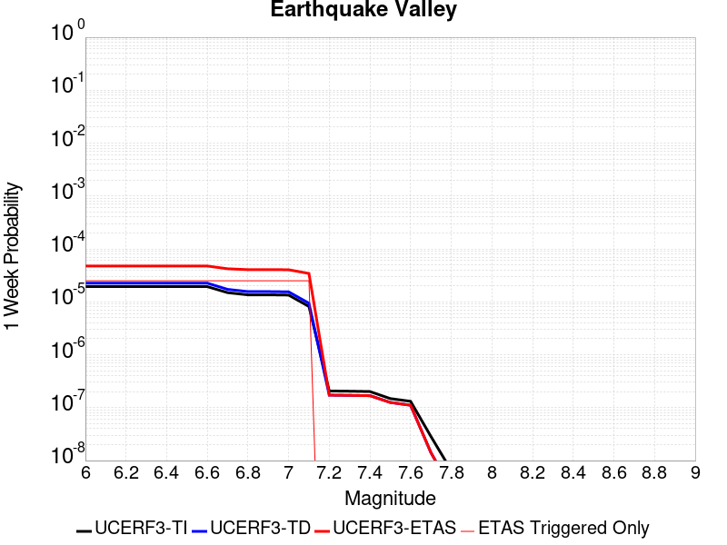 | 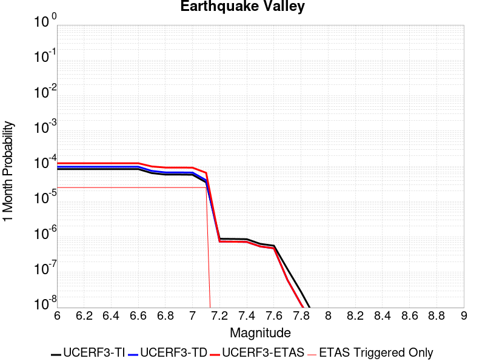 | 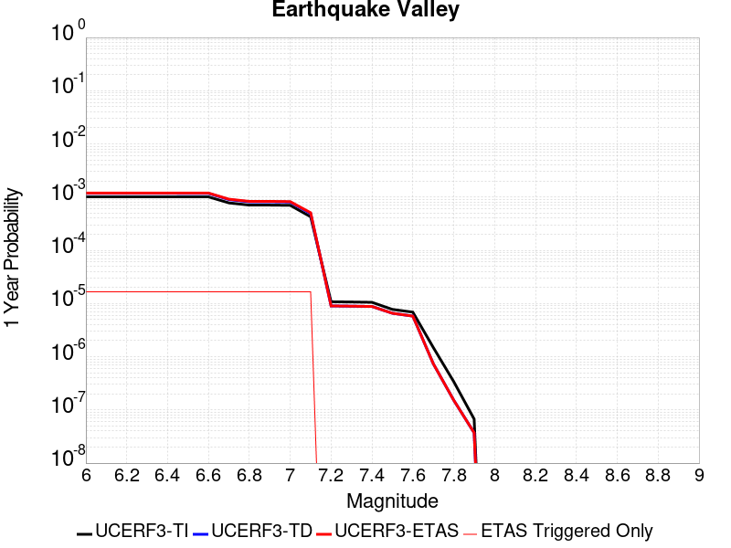 | 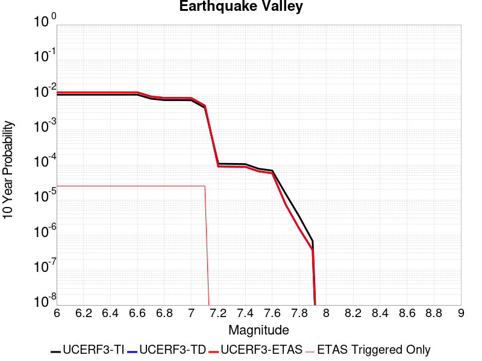 |

| Magnitude | 1 wk TI Prob | 1 wk TD Prob | 1 wk ETAS Prob | 1 wk ETAS/TD Gain | 1 wk ETAS Triggered Only | 1 mo TI Prob | 1 mo TD Prob | 1 mo ETAS Prob | 1 mo ETAS/TD Gain | 1 mo ETAS Triggered Only | 1 yr TI Prob | 1 yr TD Prob | 1 yr ETAS Prob | 1 yr ETAS/TD Gain | 1 yr ETAS Triggered Only | 10 yr TI Prob | 10 yr TD Prob | 10 yr ETAS Prob | 10 yr ETAS/TD Gain | 10 yr ETAS Triggered Only |
|-----|-----|-----|-----|-----|-----|-----|-----|-----|-----|-----|-----|-----|-----|-----|-----|-----|-----|-----|-----|-----|
| 6.0 | 1.9416384E-5 | 2.258411E-5 | 4.756356E-5 | 2.1060631 | 2.4980016E-5 | 8.321042E-5 | 9.6786134E-5 | 1.2176373E-4 | 1.25807 | 2.4980016E-5 | 0.001012616 | 0.001177854 | 0.0012028046 | 1.0211831 | 2.4980016E-5 | 0.010080142 | 0.011727945 | 0.011752632 | 1.002105 | 2.4980016E-5 |
| 6.1 | 1.9416384E-5 | 2.258411E-5 | 4.756356E-5 | 2.1060631 | 2.4980016E-5 | 8.321042E-5 | 9.6786134E-5 | 1.2176373E-4 | 1.25807 | 2.4980016E-5 | 0.001012616 | 0.001177854 | 0.0012028046 | 1.0211831 | 2.4980016E-5 | 0.010080142 | 0.011727945 | 0.011752632 | 1.002105 | 2.4980016E-5 |
| 6.2 | 1.9416384E-5 | 2.258411E-5 | 4.756356E-5 | 2.1060631 | 2.4980016E-5 | 8.321042E-5 | 9.6786134E-5 | 1.2176373E-4 | 1.25807 | 2.4980016E-5 | 0.001012616 | 0.001177854 | 0.0012028046 | 1.0211831 | 2.4980016E-5 | 0.010080142 | 0.011727945 | 0.011752632 | 1.002105 | 2.4980016E-5 |
| 6.3 | 1.9416384E-5 | 2.258411E-5 | 4.756356E-5 | 2.1060631 | 2.4980016E-5 | 8.321042E-5 | 9.6786134E-5 | 1.2176373E-4 | 1.25807 | 2.4980016E-5 | 0.001012616 | 0.001177854 | 0.0012028046 | 1.0211831 | 2.4980016E-5 | 0.010080142 | 0.011727945 | 0.011752632 | 1.002105 | 2.4980016E-5 |
| 6.4 | 1.9416384E-5 | 2.258411E-5 | 4.756356E-5 | 2.1060631 | 2.4980016E-5 | 8.321042E-5 | 9.6786134E-5 | 1.2176373E-4 | 1.25807 | 2.4980016E-5 | 0.001012616 | 0.001177854 | 0.0012028046 | 1.0211831 | 2.4980016E-5 | 0.010080142 | 0.011727945 | 0.011752632 | 1.002105 | 2.4980016E-5 |
| 6.5 | 1.9389157E-5 | 2.25527E-5 | 4.7532154E-5 | 2.1076035 | 2.4980016E-5 | 8.309374E-5 | 9.665152E-5 | 1.2162913E-4 | 1.2584294 | 2.4980016E-5 | 0.0010111968 | 0.001176217 | 0.0012011676 | 1.0212126 | 2.4980016E-5 | 0.010066078 | 0.011711747 | 0.011736435 | 1.002108 | 2.4980016E-5 |
| 6.6 | 1.9389157E-5 | 2.25527E-5 | 4.7532154E-5 | 2.1076035 | 2.4980016E-5 | 8.309374E-5 | 9.665152E-5 | 1.2162913E-4 | 1.2584294 | 2.4980016E-5 | 0.0010111968 | 0.001176217 | 0.0012011676 | 1.0212126 | 2.4980016E-5 | 0.010066078 | 0.011711747 | 0.011736435 | 1.002108 | 2.4980016E-5 |
| 6.7 | 1.4925434E-5 | 1.720822E-5 | 4.2187807E-5 | 2.4516077 | 2.4980016E-5 | 6.396457E-5 | 7.374791E-5 | 9.872609E-5 | 1.3386967 | 2.4980016E-5 | 7.7849044E-4 | 8.97596E-4 | 9.225536E-4 | 1.027805 | 2.4980016E-5 | 0.007757689 | 0.008948081 | 0.008972838 | 1.0027667 | 2.4980016E-5 |
| 6.8 | 1.3570335E-5 | 1.5616837E-5 | 4.0596464E-5 | 2.5995317 | 2.4980016E-5 | 5.8157282E-5 | 6.692804E-5 | 9.190639E-5 | 1.3732119 | 2.4980016E-5 | 7.0783484E-4 | 8.146264E-4 | 8.395861E-4 | 1.0306394 | 2.4980016E-5 | 0.0070558446 | 0.008124473 | 0.00814925 | 1.0030497 | 2.4980016E-5 |
| 6.9 | 1.3570335E-5 | 1.5616837E-5 | 4.0596464E-5 | 2.5995317 | 2.4980016E-5 | 5.8157282E-5 | 6.692804E-5 | 9.190639E-5 | 1.3732119 | 2.4980016E-5 | 7.0783484E-4 | 8.146264E-4 | 8.395861E-4 | 1.0306394 | 2.4980016E-5 | 0.0070558446 | 0.008124473 | 0.00814925 | 1.0030497 | 2.4980016E-5 |
| 7.0 | 1.3433392E-5 | 1.546038E-5 | 4.044001E-5 | 2.615719 | 2.4980016E-5 | 5.757041E-5 | 6.6257555E-5 | 9.123591E-5 | 1.3769889 | 2.4980016E-5 | 7.0069433E-4 | 8.064692E-4 | 8.314291E-4 | 1.0309496 | 2.4980016E-5 | 0.006984891 | 0.008043493 | 0.008068272 | 1.0030806 | 2.4980016E-5 |
| 7.1 | 8.181609E-6 | 9.4168445E-6 | 3.4396624E-5 | 3.6526701 | 2.4980016E-5 | 3.5063567E-5 | 4.0357656E-5 | 6.5336666E-5 | 1.618941 | 2.4980016E-5 | 4.268153E-4 | 4.913108E-4 | 5.162785E-4 | 1.0508187 | 2.4980016E-5 | 0.0042599645 | 0.004908822 | 0.0049336795 | 1.0050638 | 2.4980016E-5 |
| 7.2 | 2.0663983E-7 | 1.7262263E-7 | 1.7262263E-7 | 1.0 | 0.0 | 8.855989E-7 | 7.398111E-7 | 7.398111E-7 | 1.0 | 0.0 | 1.0782113E-5 | 9.007167E-6 | 9.007167E-6 | 1.0 | 0.0 | 1.07815904E-4 | 9.006837E-5 | 9.006837E-5 | 1.0 | 0.0 |
| 7.3 | 2.0462376E-7 | 1.7077758E-7 | 1.7077758E-7 | 1.0 | 0.0 | 8.7695867E-7 | 7.319037E-7 | 7.319037E-7 | 1.0 | 0.0 | 1.0676919E-5 | 8.910895E-6 | 8.910895E-6 | 1.0 | 0.0 | 1.0676406E-4 | 8.9105735E-5 | 8.9105735E-5 | 1.0 | 0.0 |
| 7.4 | 2.0171088E-7 | 1.6860244E-7 | 1.6860244E-7 | 1.0 | 0.0 | 8.644749E-7 | 7.2258166E-7 | 7.2258166E-7 | 1.0 | 0.0 | 1.0524931E-5 | 8.7974E-6 | 8.7974E-6 | 1.0 | 0.0 | 1.05244326E-4 | 8.7970875E-5 | 8.7970875E-5 | 1.0 | 0.0 |
| 7.5 | 1.4847944E-7 | 1.2558573E-7 | 1.2558573E-7 | 1.0 | 0.0 | 6.363403E-7 | 5.382244E-7 | 5.382244E-7 | 1.0 | 0.0 | 7.747416E-6 | 6.5528648E-6 | 6.5528648E-6 | 1.0 | 0.0 | 7.747146E-5 | 6.552693E-5 | 6.552693E-5 | 1.0 | 0.0 |
| 7.6 | 1.3185847E-7 | 1.1122516E-7 | 1.1122516E-7 | 1.0 | 0.0 | 5.6510765E-7 | 4.766792E-7 | 4.766792E-7 | 1.0 | 0.0 | 6.8801637E-6 | 5.803556E-6 | 5.803556E-6 | 1.0 | 0.0 | 6.8799505E-5 | 5.8034257E-5 | 5.8034257E-5 | 1.0 | 0.0 |
| 7.7 | 2.8609954E-8 | 1.4170218E-8 | 1.4170218E-8 | 1.0 | 0.0 | 1.2261408E-7 | 6.0729505E-8 | 6.0729505E-8 | 1.0 | 0.0 | 1.4928254E-6 | 7.393815E-7 | 7.393815E-7 | 1.0 | 0.0 | 1.4928154E-5 | 7.393796E-6 | 7.393796E-6 | 1.0 | 0.0 |
| 7.8 | 6.527266E-9 | 2.9232412E-9 | 2.9232412E-9 | 1.0 | 0.0 | 2.7973995E-8 | 1.2528178E-8 | 1.2528178E-8 | 1.0 | 0.0 | 3.4058334E-7 | 1.5253055E-7 | 1.5253055E-7 | 1.0 | 0.0 | 3.4058282E-6 | 1.5253047E-6 | 1.5253047E-6 | 1.0 | 0.0 |
| 7.9 | 1.2898267E-9 | 7.127704E-10 | 7.127704E-10 | 1.0 | 0.0 | 5.527829E-9 | 3.0547302E-9 | 3.0547302E-9 | 1.0 | 0.0 | 6.7301315E-8 | 3.719134E-8 | 3.719134E-8 | 1.0 | 0.0 | 6.7301295E-7 | 3.7191342E-7 | 3.7191342E-7 | 1.0 | 0.0 |

## East Huasna 2011 CFM
*[(top)](#table-of-contents)*

| 1 Week | 1 Month | 1 Year | 10 Year |
|-----|-----|-----|-----|
| 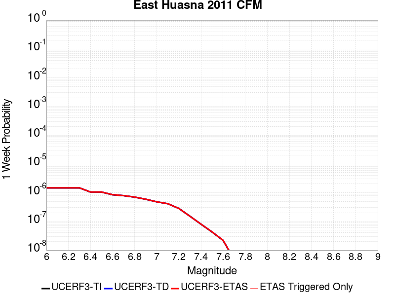 | 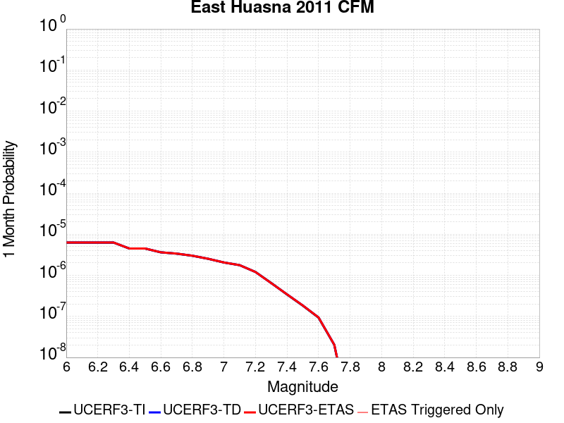 | 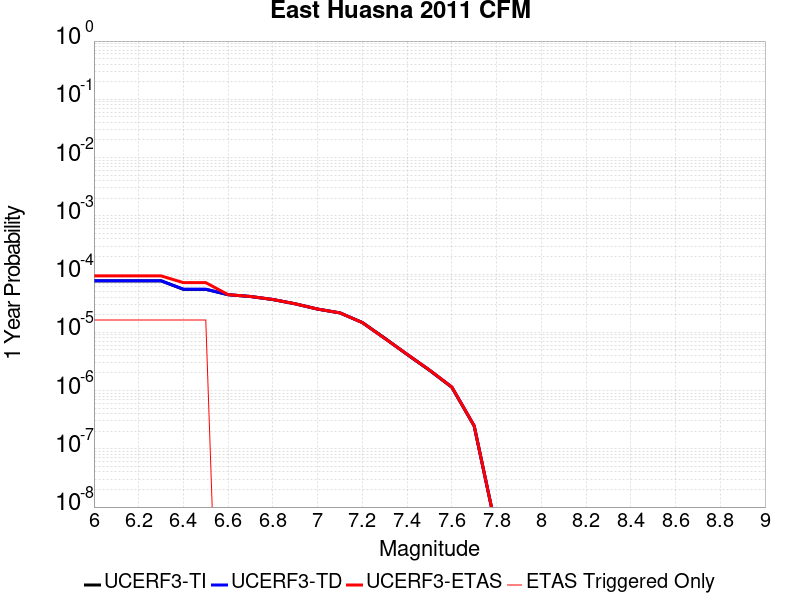 | 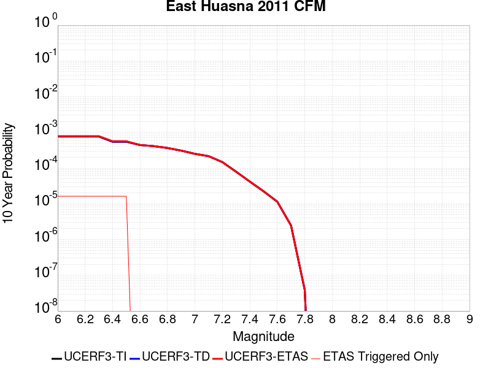 |

| Magnitude | 1 wk TI Prob | 1 wk TD Prob | 1 wk ETAS Prob | 1 wk ETAS/TD Gain | 1 wk ETAS Triggered Only | 1 mo TI Prob | 1 mo TD Prob | 1 mo ETAS Prob | 1 mo ETAS/TD Gain | 1 mo ETAS Triggered Only | 1 yr TI Prob | 1 yr TD Prob | 1 yr ETAS Prob | 1 yr ETAS/TD Gain | 1 yr ETAS Triggered Only | 10 yr TI Prob | 10 yr TD Prob | 10 yr ETAS Prob | 10 yr ETAS/TD Gain | 10 yr ETAS Triggered Only |
|-----|-----|-----|-----|-----|-----|-----|-----|-----|-----|-----|-----|-----|-----|-----|-----|-----|-----|-----|-----|-----|
| 6.0 | 1.4658423E-6 | 1.471566E-6 | 1.471566E-6 | 1.0 | 0.0 | 6.282166E-6 | 6.3066964E-6 | 6.3066964E-6 | 1.0 | 0.0 | 7.6482684E-5 | 7.67814E-5 | 1.0175949E-4 | 1.3253144 | 2.4980016E-5 | 7.645637E-4 | 7.6755567E-4 | 7.925165E-4 | 1.0325199 | 2.4980016E-5 |
| 6.1 | 1.4658423E-6 | 1.471566E-6 | 1.471566E-6 | 1.0 | 0.0 | 6.282166E-6 | 6.3066964E-6 | 6.3066964E-6 | 1.0 | 0.0 | 7.6482684E-5 | 7.67814E-5 | 1.0175949E-4 | 1.3253144 | 2.4980016E-5 | 7.645637E-4 | 7.6755567E-4 | 7.925165E-4 | 1.0325199 | 2.4980016E-5 |
| 6.2 | 1.4658423E-6 | 1.471566E-6 | 1.471566E-6 | 1.0 | 0.0 | 6.282166E-6 | 6.3066964E-6 | 6.3066964E-6 | 1.0 | 0.0 | 7.6482684E-5 | 7.67814E-5 | 1.0175949E-4 | 1.3253144 | 2.4980016E-5 | 7.645637E-4 | 7.6755567E-4 | 7.925165E-4 | 1.0325199 | 2.4980016E-5 |
| 6.3 | 1.4658423E-6 | 1.471566E-6 | 1.471566E-6 | 1.0 | 0.0 | 6.282166E-6 | 6.3066964E-6 | 6.3066964E-6 | 1.0 | 0.0 | 7.6482684E-5 | 7.67814E-5 | 1.0175949E-4 | 1.3253144 | 2.4980016E-5 | 7.645637E-4 | 7.6755567E-4 | 7.925165E-4 | 1.0325199 | 2.4980016E-5 |
| 6.4 | 1.0488257E-6 | 1.0527515E-6 | 1.0527515E-6 | 1.0 | 0.0 | 4.4949593E-6 | 4.5117845E-6 | 4.5117845E-6 | 1.0 | 0.0 | 5.472476E-5 | 5.492961E-5 | 7.9908255E-5 | 1.4547392 | 2.4980016E-5 | 5.4711284E-4 | 5.491622E-4 | 5.741285E-4 | 1.0454625 | 2.4980016E-5 |
| 6.5 | 1.0488257E-6 | 1.0527515E-6 | 1.0527515E-6 | 1.0 | 0.0 | 4.4949593E-6 | 4.5117845E-6 | 4.5117845E-6 | 1.0 | 0.0 | 5.472476E-5 | 5.492961E-5 | 7.9908255E-5 | 1.4547392 | 2.4980016E-5 | 5.4711284E-4 | 5.491622E-4 | 5.741285E-4 | 1.0454625 | 2.4980016E-5 |
| 6.6 | 8.463064E-7 | 8.4936323E-7 | 8.4936323E-7 | 1.0 | 0.0 | 3.6270226E-6 | 3.6401232E-6 | 3.6401232E-6 | 1.0 | 0.0 | 4.4158103E-5 | 4.4317607E-5 | 4.4317607E-5 | 1.0 | 0.0 | 4.414933E-4 | 4.4308856E-4 | 4.4308856E-4 | 1.0 | 0.0 |
| 6.7 | 7.876149E-7 | 7.902533E-7 | 7.902533E-7 | 1.0 | 0.0 | 3.375488E-6 | 3.3867955E-6 | 3.3867955E-6 | 1.0 | 0.0 | 4.109579E-5 | 4.1233463E-5 | 4.1233463E-5 | 1.0 | 0.0 | 4.108819E-4 | 4.1225873E-4 | 4.1225873E-4 | 1.0 | 0.0 |
| 6.8 | 6.9940785E-7 | 7.0165777E-7 | 7.0165777E-7 | 1.0 | 0.0 | 2.9974588E-6 | 3.0071012E-6 | 3.0071012E-6 | 1.0 | 0.0 | 3.649345E-5 | 3.6610847E-5 | 3.6610847E-5 | 1.0 | 0.0 | 3.6487455E-4 | 3.6604863E-4 | 3.6604863E-4 | 1.0 | 0.0 |
| 6.9 | 5.899658E-7 | 5.9155997E-7 | 5.9155997E-7 | 1.0 | 0.0 | 2.5284223E-6 | 2.5352545E-6 | 2.5352545E-6 | 1.0 | 0.0 | 3.0783107E-5 | 3.086629E-5 | 3.086629E-5 | 1.0 | 0.0 | 3.0778843E-4 | 3.086203E-4 | 3.086203E-4 | 1.0 | 0.0 |
| 7.0 | 4.793814E-7 | 4.803273E-7 | 4.803273E-7 | 1.0 | 0.0 | 2.05449E-6 | 2.058544E-6 | 2.058544E-6 | 1.0 | 0.0 | 2.501313E-5 | 2.5062485E-5 | 2.5062485E-5 | 1.0 | 0.0 | 2.5010316E-4 | 2.505968E-4 | 2.505968E-4 | 1.0 | 0.0 |
| 7.1 | 4.1256908E-7 | 4.129941E-7 | 4.129941E-7 | 1.0 | 0.0 | 1.768152E-6 | 1.7699736E-6 | 1.7699736E-6 | 1.0 | 0.0 | 2.1527037E-5 | 2.1549216E-5 | 2.1549216E-5 | 1.0 | 0.0 | 2.1524953E-4 | 2.1547142E-4 | 2.1547142E-4 | 1.0 | 0.0 |
| 7.2 | 2.822599E-7 | 2.8161418E-7 | 2.8161418E-7 | 1.0 | 0.0 | 1.2096847E-6 | 1.2069174E-6 | 1.2069174E-6 | 1.0 | 0.0 | 1.47278115E-5 | 1.4694121E-5 | 1.4694121E-5 | 1.0 | 0.0 | 1.4726835E-4 | 1.4693156E-4 | 1.4693156E-4 | 1.0 | 0.0 |
| 7.3 | 1.5261652E-7 | 1.5075021E-7 | 1.5075021E-7 | 1.0 | 0.0 | 6.540707E-7 | 6.460722E-7 | 6.460722E-7 | 1.0 | 0.0 | 7.963281E-6 | 7.8659E-6 | 7.8659E-6 | 1.0 | 0.0 | 7.962996E-5 | 7.865624E-5 | 7.865624E-5 | 1.0 | 0.0 |
| 7.4 | 7.976414E-8 | 8.057865E-8 | 8.057865E-8 | 1.0 | 0.0 | 3.418463E-7 | 3.45337E-7 | 3.45337E-7 | 1.0 | 0.0 | 4.1619705E-6 | 4.2044703E-6 | 4.2044703E-6 | 1.0 | 0.0 | 4.161893E-5 | 4.2043914E-5 | 4.2043914E-5 | 1.0 | 0.0 |
| 7.5 | 4.2715055E-8 | 4.3202512E-8 | 4.3202512E-8 | 1.0 | 0.0 | 1.830645E-7 | 1.8515361E-7 | 1.8515361E-7 | 1.0 | 0.0 | 2.228808E-6 | 2.2542429E-6 | 2.2542429E-6 | 1.0 | 0.0 | 2.2287857E-5 | 2.2542203E-5 | 2.2542203E-5 | 1.0 | 0.0 |
| 7.6 | 2.1807532E-8 | 2.2057476E-8 | 2.2057476E-8 | 1.0 | 0.0 | 9.346085E-8 | 9.4532034E-8 | 9.4532034E-8 | 1.0 | 0.0 | 1.1378852E-6 | 1.1509269E-6 | 1.1509269E-6 | 1.0 | 0.0 | 1.1378794E-5 | 1.1509211E-5 | 1.1509211E-5 | 1.0 | 0.0 |
| 7.7 | 4.7196043E-9 | 4.767283E-9 | 4.767283E-9 | 1.0 | 0.0 | 2.0226874E-8 | 2.0431212E-8 | 2.0431212E-8 | 1.0 | 0.0 | 2.4626218E-7 | 2.4874998E-7 | 2.4874998E-7 | 1.0 | 0.0 | 2.462619E-6 | 2.487497E-6 | 2.487497E-6 | 1.0 | 0.0 |
| 7.8 | 7.400003E-11 | 7.4654505E-11 | 7.4654505E-11 | 1.0 | 0.0 | 3.171432E-10 | 3.1994773E-10 | 3.1994773E-10 | 1.0 | 0.0 | 3.861218E-9 | 3.895363E-9 | 3.895363E-9 | 1.0 | 0.0 | 3.861218E-8 | 3.895363E-8 | 3.895363E-8 | 1.0 | 0.0 |

## Los Osos 2011
*[(top)](#table-of-contents)*

| 1 Week | 1 Month | 1 Year | 10 Year |
|-----|-----|-----|-----|
| 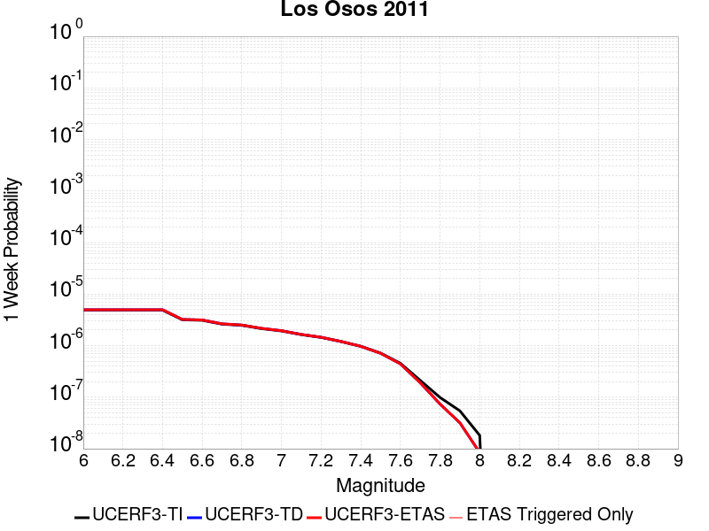 |  | 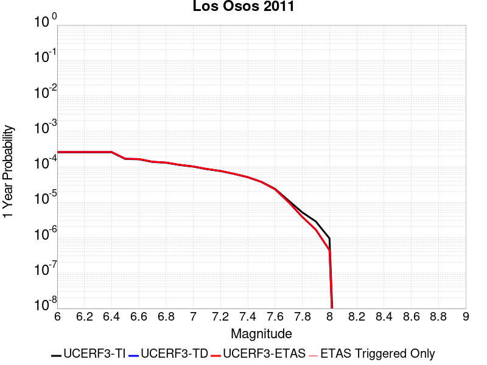 | 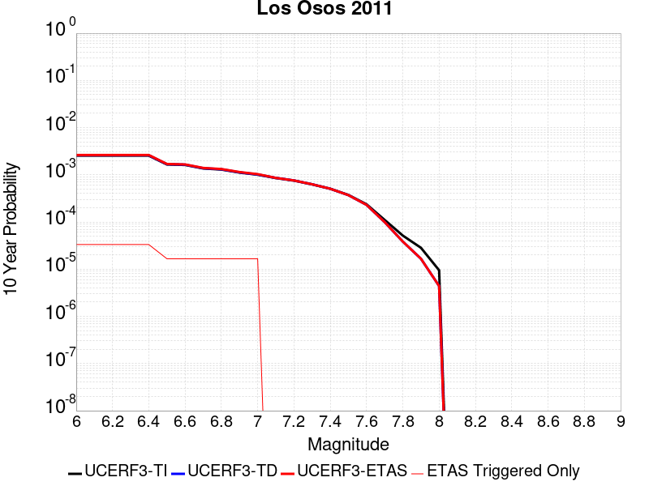 |

| Magnitude | 1 wk TI Prob | 1 wk TD Prob | 1 wk ETAS Prob | 1 wk ETAS/TD Gain | 1 wk ETAS Triggered Only | 1 mo TI Prob | 1 mo TD Prob | 1 mo ETAS Prob | 1 mo ETAS/TD Gain | 1 mo ETAS Triggered Only | 1 yr TI Prob | 1 yr TD Prob | 1 yr ETAS Prob | 1 yr ETAS/TD Gain | 1 yr ETAS Triggered Only | 10 yr TI Prob | 10 yr TD Prob | 10 yr ETAS Prob | 10 yr ETAS/TD Gain | 10 yr ETAS Triggered Only |
|-----|-----|-----|-----|-----|-----|-----|-----|-----|-----|-----|-----|-----|-----|-----|-----|-----|-----|-----|-----|-----|
| 6.0 | 4.8871775E-6 | 4.9814826E-6 | 4.9814826E-6 | 1.0 | 0.0 | 2.0944879E-5 | 2.1349053E-5 | 2.1349053E-5 | 1.0 | 0.0 | 2.5497406E-4 | 2.598965E-4 | 2.598965E-4 | 1.0 | 0.0 | 0.002546817 | 0.0025962 | 0.0026211152 | 1.0095968 | 2.4980016E-5 |
| 6.1 | 4.8871775E-6 | 4.9814826E-6 | 4.9814826E-6 | 1.0 | 0.0 | 2.0944879E-5 | 2.1349053E-5 | 2.1349053E-5 | 1.0 | 0.0 | 2.5497406E-4 | 2.598965E-4 | 2.598965E-4 | 1.0 | 0.0 | 0.002546817 | 0.0025962 | 0.0026211152 | 1.0095968 | 2.4980016E-5 |
| 6.2 | 4.8871775E-6 | 4.9814826E-6 | 4.9814826E-6 | 1.0 | 0.0 | 2.0944879E-5 | 2.1349053E-5 | 2.1349053E-5 | 1.0 | 0.0 | 2.5497406E-4 | 2.598965E-4 | 2.598965E-4 | 1.0 | 0.0 | 0.002546817 | 0.0025962 | 0.0026211152 | 1.0095968 | 2.4980016E-5 |
| 6.3 | 4.8871775E-6 | 4.9814826E-6 | 4.9814826E-6 | 1.0 | 0.0 | 2.0944879E-5 | 2.1349053E-5 | 2.1349053E-5 | 1.0 | 0.0 | 2.5497406E-4 | 2.598965E-4 | 2.598965E-4 | 1.0 | 0.0 | 0.002546817 | 0.0025962 | 0.0026211152 | 1.0095968 | 2.4980016E-5 |
| 6.4 | 4.8871775E-6 | 4.9814826E-6 | 4.9814826E-6 | 1.0 | 0.0 | 2.0944879E-5 | 2.1349053E-5 | 2.1349053E-5 | 1.0 | 0.0 | 2.5497406E-4 | 2.598965E-4 | 2.598965E-4 | 1.0 | 0.0 | 0.002546817 | 0.0025962 | 0.0026211152 | 1.0095968 | 2.4980016E-5 |
| 6.5 | 3.1724062E-6 | 3.2233943E-6 | 3.2233943E-6 | 1.0 | 0.0 | 1.3595956E-5 | 1.3814474E-5 | 1.3814474E-5 | 1.0 | 0.0 | 1.6551818E-4 | 1.6817838E-4 | 1.6817838E-4 | 1.0 | 0.0 | 0.0016539496 | 0.0016805246 | 0.0016805246 | 1.0 | 0.0 |
| 6.6 | 3.1022591E-6 | 3.1511038E-6 | 3.1511038E-6 | 1.0 | 0.0 | 1.3295328E-5 | 1.3504661E-5 | 1.3504661E-5 | 1.0 | 0.0 | 1.618586E-4 | 1.6440697E-4 | 1.6440697E-4 | 1.0 | 0.0 | 0.0016174077 | 0.0016428662 | 0.0016428662 | 1.0 | 0.0 |
| 6.7 | 2.611518E-6 | 2.6491825E-6 | 2.6491825E-6 | 1.0 | 0.0 | 1.1192172E-5 | 1.1353591E-5 | 1.1353591E-5 | 1.0 | 0.0 | 1.3625617E-4 | 1.3822124E-4 | 1.3822124E-4 | 1.0 | 0.0 | 0.0013617266 | 0.0013813572 | 0.0013813572 | 1.0 | 0.0 |
| 6.8 | 2.4780884E-6 | 2.5121587E-6 | 2.5121587E-6 | 1.0 | 0.0 | 1.0620336E-5 | 1.076635E-5 | 1.076635E-5 | 1.0 | 0.0 | 1.2929492E-4 | 1.3107246E-4 | 1.3107246E-4 | 1.0 | 0.0 | 0.0012921972 | 0.0013099556 | 0.0013099556 | 1.0 | 0.0 |
| 6.9 | 2.1376322E-6 | 2.1635049E-6 | 2.1635049E-6 | 1.0 | 0.0 | 9.161248E-6 | 9.272131E-6 | 9.272131E-6 | 1.0 | 0.0 | 1.1153249E-4 | 1.1288237E-4 | 1.1288237E-4 | 1.0 | 0.0 | 0.0011147653 | 0.0011282521 | 0.0011282521 | 1.0 | 0.0 |
| 7.0 | 1.9282882E-6 | 1.949458E-6 | 1.949458E-6 | 1.0 | 0.0 | 8.264066E-6 | 8.354793E-6 | 8.354793E-6 | 1.0 | 0.0 | 1.0061036E-4 | 1.0171487E-4 | 1.0171487E-4 | 1.0 | 0.0 | 0.0010056482 | 0.0010166845 | 0.0010166845 | 1.0 | 0.0 |
| 7.1 | 1.6353226E-6 | 1.6501111E-6 | 1.6501111E-6 | 1.0 | 0.0 | 7.0085066E-6 | 7.0718856E-6 | 7.0718856E-6 | 1.0 | 0.0 | 8.532523E-5 | 8.6096814E-5 | 8.6096814E-5 | 1.0 | 0.0 | 8.529247E-4 | 8.6063537E-4 | 8.6063537E-4 | 1.0 | 0.0 |
| 7.2 | 1.4446276E-6 | 1.4553335E-6 | 1.4553335E-6 | 1.0 | 0.0 | 6.191247E-6 | 6.2371287E-6 | 6.2371287E-6 | 1.0 | 0.0 | 7.537582E-5 | 7.59344E-5 | 7.59344E-5 | 1.0 | 0.0 | 7.535026E-4 | 7.590851E-4 | 7.590851E-4 | 1.0 | 0.0 |
| 7.3 | 1.2014582E-6 | 1.2069066E-6 | 1.2069066E-6 | 1.0 | 0.0 | 5.149096E-6 | 5.172447E-6 | 5.172447E-6 | 1.0 | 0.0 | 6.268844E-5 | 6.297272E-5 | 6.297272E-5 | 1.0 | 0.0 | 6.267076E-4 | 6.295492E-4 | 6.295492E-4 | 1.0 | 0.0 |
| 7.4 | 9.707733E-7 | 9.709767E-7 | 9.709767E-7 | 1.0 | 0.0 | 4.16045E-6 | 4.161322E-6 | 4.161322E-6 | 1.0 | 0.0 | 5.0652303E-5 | 5.066292E-5 | 5.066292E-5 | 1.0 | 0.0 | 5.064076E-4 | 5.065139E-4 | 5.065139E-4 | 1.0 | 0.0 |
| 7.5 | 7.174908E-7 | 7.114907E-7 | 7.114907E-7 | 1.0 | 0.0 | 3.074957E-6 | 3.0492424E-6 | 3.0492424E-6 | 1.0 | 0.0 | 3.743696E-5 | 3.7123897E-5 | 3.7123897E-5 | 1.0 | 0.0 | 3.7430652E-4 | 3.7117713E-4 | 3.7117713E-4 | 1.0 | 0.0 |
| 7.6 | 4.5535776E-7 | 4.4207857E-7 | 4.4207857E-7 | 1.0 | 0.0 | 1.9515319E-6 | 1.8946212E-6 | 1.8946212E-6 | 1.0 | 0.0 | 2.3759641E-5 | 2.3066768E-5 | 2.3066768E-5 | 1.0 | 0.0 | 2.37571E-4 | 2.3064384E-4 | 2.3064384E-4 | 1.0 | 0.0 |
| 7.7 | 2.1173553E-7 | 1.9060734E-7 | 1.9060734E-7 | 1.0 | 0.0 | 9.0743765E-7 | 8.1688836E-7 | 8.1688836E-7 | 1.0 | 0.0 | 1.1047998E-5 | 9.94557E-6 | 9.94557E-6 | 1.0 | 0.0 | 1.1047449E-4 | 9.945128E-5 | 9.945128E-5 | 1.0 | 0.0 |
| 7.8 | 9.873608E-8 | 7.367457E-8 | 7.367457E-8 | 1.0 | 0.0 | 4.2315455E-7 | 3.1574814E-7 | 3.1574814E-7 | 1.0 | 0.0 | 5.1518946E-6 | 3.8442267E-6 | 3.8442267E-6 | 1.0 | 0.0 | 5.1517753E-5 | 3.844161E-5 | 3.844161E-5 | 1.0 | 0.0 |
| 7.9 | 5.4399106E-8 | 3.187941E-8 | 3.187941E-8 | 1.0 | 0.0 | 2.33139E-7 | 1.3662603E-7 | 1.3662603E-7 | 1.0 | 0.0 | 2.8384638E-6 | 1.6634207E-6 | 1.6634207E-6 | 1.0 | 0.0 | 2.8384275E-5 | 1.6634083E-5 | 1.6634083E-5 | 1.0 | 0.0 |
| 8.0 | 1.817203E-8 | 8.420079E-9 | 8.420079E-9 | 1.0 | 0.0 | 7.7880124E-8 | 3.6086053E-8 | 3.6086053E-8 | 1.0 | 0.0 | 9.481901E-7 | 4.393476E-7 | 4.393476E-7 | 1.0 | 0.0 | 9.481861E-6 | 4.393468E-6 | 4.393468E-6 | 1.0 | 0.0 |

## Burnt Mtn
*[(top)](#table-of-contents)*

| 1 Week | 1 Month | 1 Year | 10 Year |
|-----|-----|-----|-----|
| 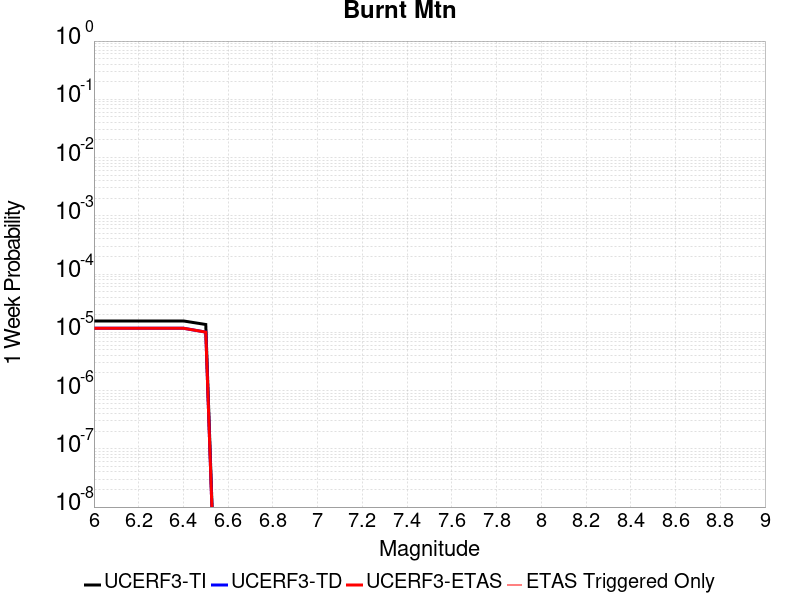 |  | 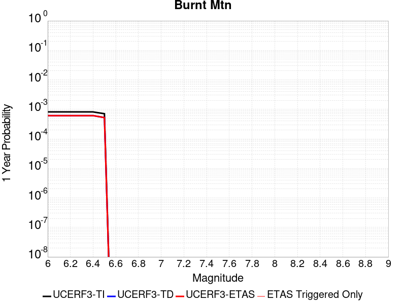 | 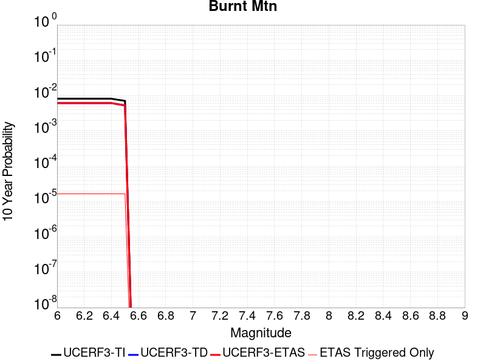 |

| Magnitude | 1 wk TI Prob | 1 wk TD Prob | 1 wk ETAS Prob | 1 wk ETAS/TD Gain | 1 wk ETAS Triggered Only | 1 mo TI Prob | 1 mo TD Prob | 1 mo ETAS Prob | 1 mo ETAS/TD Gain | 1 mo ETAS Triggered Only | 1 yr TI Prob | 1 yr TD Prob | 1 yr ETAS Prob | 1 yr ETAS/TD Gain | 1 yr ETAS Triggered Only | 10 yr TI Prob | 10 yr TD Prob | 10 yr ETAS Prob | 10 yr ETAS/TD Gain | 10 yr ETAS Triggered Only |
|-----|-----|-----|-----|-----|-----|-----|-----|-----|-----|-----|-----|-----|-----|-----|-----|-----|-----|-----|-----|-----|
| 6.0 | 1.5673151E-5 | 1.1749247E-5 | 1.1749247E-5 | 1.0 | 0.0 | 6.716892E-5 | 5.0353672E-5 | 5.0353672E-5 | 1.0 | 0.0 | 8.1747473E-4 | 6.130124E-4 | 6.130124E-4 | 1.0 | 0.0 | 0.008144741 | 0.006125855 | 0.0061506815 | 1.0040529 | 2.4980016E-5 |
| 6.1 | 1.5673151E-5 | 1.1749247E-5 | 1.1749247E-5 | 1.0 | 0.0 | 6.716892E-5 | 5.0353672E-5 | 5.0353672E-5 | 1.0 | 0.0 | 8.1747473E-4 | 6.130124E-4 | 6.130124E-4 | 1.0 | 0.0 | 0.008144741 | 0.006125855 | 0.0061506815 | 1.0040529 | 2.4980016E-5 |
| 6.2 | 1.5673151E-5 | 1.1749247E-5 | 1.1749247E-5 | 1.0 | 0.0 | 6.716892E-5 | 5.0353672E-5 | 5.0353672E-5 | 1.0 | 0.0 | 8.1747473E-4 | 6.130124E-4 | 6.130124E-4 | 1.0 | 0.0 | 0.008144741 | 0.006125855 | 0.0061506815 | 1.0040529 | 2.4980016E-5 |
| 6.3 | 1.5673151E-5 | 1.1749247E-5 | 1.1749247E-5 | 1.0 | 0.0 | 6.716892E-5 | 5.0353672E-5 | 5.0353672E-5 | 1.0 | 0.0 | 8.1747473E-4 | 6.130124E-4 | 6.130124E-4 | 1.0 | 0.0 | 0.008144741 | 0.006125855 | 0.0061506815 | 1.0040529 | 2.4980016E-5 |
| 6.4 | 1.5673151E-5 | 1.1749247E-5 | 1.1749247E-5 | 1.0 | 0.0 | 6.716892E-5 | 5.0353672E-5 | 5.0353672E-5 | 1.0 | 0.0 | 8.1747473E-4 | 6.130124E-4 | 6.130124E-4 | 1.0 | 0.0 | 0.008144741 | 0.006125855 | 0.0061506815 | 1.0040529 | 2.4980016E-5 |
| 6.5 | 1.36191375E-5 | 1.007816E-5 | 1.007816E-5 | 1.0 | 0.0 | 5.8366426E-5 | 4.319211E-5 | 4.319211E-5 | 1.0 | 0.0 | 7.103795E-4 | 5.2586396E-4 | 5.2586396E-4 | 1.0 | 0.0 | 0.0070811296 | 0.00525864 | 0.0052834884 | 1.0047253 | 2.4980016E-5 |

## Channel Islands Western Deep Ramp
*[(top)](#table-of-contents)*

| 1 Week | 1 Month | 1 Year | 10 Year |
|-----|-----|-----|-----|
|  | 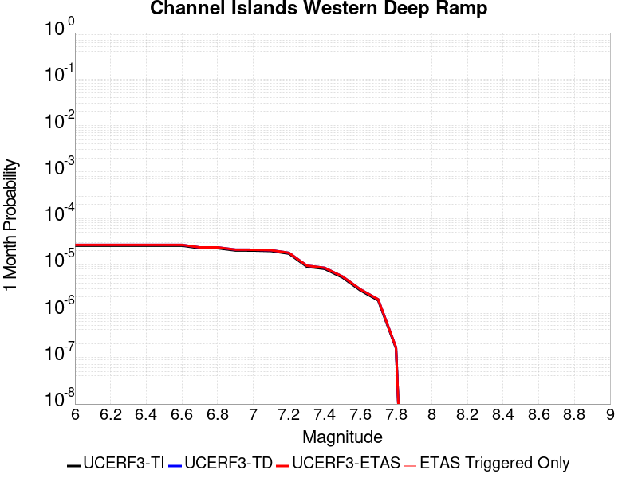 | 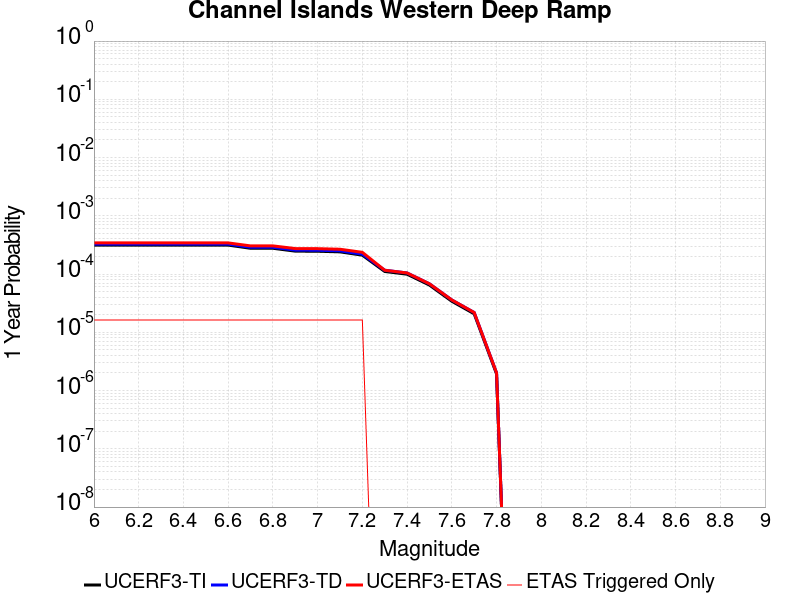 | 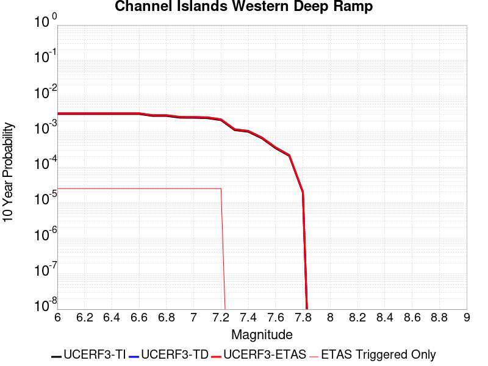 |

| Magnitude | 1 wk TI Prob | 1 wk TD Prob | 1 wk ETAS Prob | 1 wk ETAS/TD Gain | 1 wk ETAS Triggered Only | 1 mo TI Prob | 1 mo TD Prob | 1 mo ETAS Prob | 1 mo ETAS/TD Gain | 1 mo ETAS Triggered Only | 1 yr TI Prob | 1 yr TD Prob | 1 yr ETAS Prob | 1 yr ETAS/TD Gain | 1 yr ETAS Triggered Only | 10 yr TI Prob | 10 yr TD Prob | 10 yr ETAS Prob | 10 yr ETAS/TD Gain | 10 yr ETAS Triggered Only |
|-----|-----|-----|-----|-----|-----|-----|-----|-----|-----|-----|-----|-----|-----|-----|-----|-----|-----|-----|-----|-----|
| 6.0 | 6.0213506E-6 | 6.2548684E-6 | 6.2548684E-6 | 1.0 | 0.0 | 2.5805533E-5 | 2.6806329E-5 | 2.6806329E-5 | 1.0 | 0.0 | 3.1413708E-4 | 3.2632265E-4 | 3.512945E-4 | 1.0765251 | 2.4980016E-5 | 0.0031369338 | 0.0032588763 | 0.003283775 | 1.0076402 | 2.4980016E-5 |
| 6.1 | 6.0213506E-6 | 6.2548684E-6 | 6.2548684E-6 | 1.0 | 0.0 | 2.5805533E-5 | 2.6806329E-5 | 2.6806329E-5 | 1.0 | 0.0 | 3.1413708E-4 | 3.2632265E-4 | 3.512945E-4 | 1.0765251 | 2.4980016E-5 | 0.0031369338 | 0.0032588763 | 0.003283775 | 1.0076402 | 2.4980016E-5 |
| 6.2 | 6.0213506E-6 | 6.2548684E-6 | 6.2548684E-6 | 1.0 | 0.0 | 2.5805533E-5 | 2.6806329E-5 | 2.6806329E-5 | 1.0 | 0.0 | 3.1413708E-4 | 3.2632265E-4 | 3.512945E-4 | 1.0765251 | 2.4980016E-5 | 0.0031369338 | 0.0032588763 | 0.003283775 | 1.0076402 | 2.4980016E-5 |
| 6.3 | 6.0213506E-6 | 6.2548684E-6 | 6.2548684E-6 | 1.0 | 0.0 | 2.5805533E-5 | 2.6806329E-5 | 2.6806329E-5 | 1.0 | 0.0 | 3.1413708E-4 | 3.2632265E-4 | 3.512945E-4 | 1.0765251 | 2.4980016E-5 | 0.0031369338 | 0.0032588763 | 0.003283775 | 1.0076402 | 2.4980016E-5 |
| 6.4 | 6.0213506E-6 | 6.2548684E-6 | 6.2548684E-6 | 1.0 | 0.0 | 2.5805533E-5 | 2.6806329E-5 | 2.6806329E-5 | 1.0 | 0.0 | 3.1413708E-4 | 3.2632265E-4 | 3.512945E-4 | 1.0765251 | 2.4980016E-5 | 0.0031369338 | 0.0032588763 | 0.003283775 | 1.0076402 | 2.4980016E-5 |
| 6.5 | 6.0213506E-6 | 6.2548684E-6 | 6.2548684E-6 | 1.0 | 0.0 | 2.5805533E-5 | 2.6806329E-5 | 2.6806329E-5 | 1.0 | 0.0 | 3.1413708E-4 | 3.2632265E-4 | 3.512945E-4 | 1.0765251 | 2.4980016E-5 | 0.0031369338 | 0.0032588763 | 0.003283775 | 1.0076402 | 2.4980016E-5 |
| 6.6 | 6.0213506E-6 | 6.2548684E-6 | 6.2548684E-6 | 1.0 | 0.0 | 2.5805533E-5 | 2.6806329E-5 | 2.6806329E-5 | 1.0 | 0.0 | 3.1413708E-4 | 3.2632265E-4 | 3.512945E-4 | 1.0765251 | 2.4980016E-5 | 0.0031369338 | 0.0032588763 | 0.003283775 | 1.0076402 | 2.4980016E-5 |
| 6.7 | 5.313309E-6 | 5.5252403E-6 | 5.5252403E-6 | 1.0 | 0.0 | 2.2771126E-5 | 2.367941E-5 | 2.367941E-5 | 1.0 | 0.0 | 2.772032E-4 | 2.8826276E-4 | 3.132356E-4 | 1.0866321 | 2.4980016E-5 | 0.0027685766 | 0.0028792918 | 0.0029041998 | 1.0086508 | 2.4980016E-5 |
| 6.8 | 5.313309E-6 | 5.5252403E-6 | 5.5252403E-6 | 1.0 | 0.0 | 2.2771126E-5 | 2.367941E-5 | 2.367941E-5 | 1.0 | 0.0 | 2.772032E-4 | 2.8826276E-4 | 3.132356E-4 | 1.0866321 | 2.4980016E-5 | 0.0027685766 | 0.0028792918 | 0.0029041998 | 1.0086508 | 2.4980016E-5 |
| 6.9 | 4.744377E-6 | 4.9394303E-6 | 4.9394303E-6 | 1.0 | 0.0 | 2.0332885E-5 | 2.1168837E-5 | 2.1168837E-5 | 1.0 | 0.0 | 2.4752476E-4 | 2.5770385E-4 | 2.826774E-4 | 1.0969081 | 2.4980016E-5 | 0.0024724922 | 0.0025744175 | 0.0025993332 | 1.0096782 | 2.4980016E-5 |
| 7.0 | 4.722209E-6 | 4.9164732E-6 | 4.9164732E-6 | 1.0 | 0.0 | 2.0237881E-5 | 2.107045E-5 | 2.107045E-5 | 1.0 | 0.0 | 2.4636835E-4 | 2.5650626E-4 | 2.8147988E-4 | 1.0973606 | 2.4980016E-5 | 0.002460954 | 0.0025624693 | 0.0025873852 | 1.0097234 | 2.4980016E-5 |
| 7.1 | 4.611174E-6 | 4.801409E-6 | 4.801409E-6 | 1.0 | 0.0 | 1.9762025E-5 | 2.0577325E-5 | 2.0577325E-5 | 1.0 | 0.0 | 2.4057609E-4 | 2.5050386E-4 | 2.7547762E-4 | 1.0996941 | 2.4980016E-5 | 0.002403158 | 0.002502582 | 0.0025274993 | 1.0099567 | 2.4980016E-5 |
| 7.2 | 4.043994E-6 | 4.2120264E-6 | 4.2120264E-6 | 1.0 | 0.0 | 1.7331287E-5 | 1.8051438E-5 | 1.8051438E-5 | 1.0 | 0.0 | 2.10988E-4 | 2.1975765E-4 | 2.447322E-4 | 1.1136458 | 2.4980016E-5 | 0.002107878 | 0.0021957543 | 0.0022206793 | 1.0113516 | 2.4980016E-5 |
| 7.3 | 2.1233036E-6 | 2.2297875E-6 | 2.2297875E-6 | 1.0 | 0.0 | 9.099841E-6 | 9.556197E-6 | 9.556197E-6 | 1.0 | 0.0 | 1.1078493E-4 | 1.1634055E-4 | 1.1634055E-4 | 1.0 | 0.0 | 0.0011072971 | 0.001162802 | 0.001162802 | 1.0 | 0.0 |
| 7.4 | 1.9051884E-6 | 2.0014973E-6 | 2.0014973E-6 | 1.0 | 0.0 | 8.165067E-6 | 8.577817E-6 | 8.577817E-6 | 1.0 | 0.0 | 9.940516E-5 | 1.0442998E-4 | 1.0442998E-4 | 1.0 | 0.0 | 9.93607E-4 | 0.0010438144 | 0.0010438144 | 1.0 | 0.0 |
| 7.5 | 1.2408497E-6 | 1.3038839E-6 | 1.3038839E-6 | 1.0 | 0.0 | 5.317916E-6 | 5.588062E-6 | 5.588062E-6 | 1.0 | 0.0 | 6.4743705E-5 | 6.8032554E-5 | 6.8032554E-5 | 1.0 | 0.0 | 6.4724847E-4 | 6.8011944E-4 | 6.8011944E-4 | 1.0 | 0.0 |
| 7.6 | 6.5440025E-7 | 6.886718E-7 | 6.886718E-7 | 1.0 | 0.0 | 2.8045695E-6 | 2.9514472E-6 | 2.9514472E-6 | 1.0 | 0.0 | 3.4145098E-5 | 3.593329E-5 | 3.593329E-5 | 1.0 | 0.0 | 3.4139853E-4 | 3.5927625E-4 | 3.5927625E-4 | 1.0 | 0.0 |
| 7.7 | 3.985963E-7 | 4.1930787E-7 | 4.1930787E-7 | 1.0 | 0.0 | 1.7082689E-6 | 1.7970326E-6 | 1.7970326E-6 | 1.0 | 0.0 | 2.0797976E-5 | 2.1878664E-5 | 2.1878664E-5 | 1.0 | 0.0 | 2.0796029E-4 | 2.1876628E-4 | 2.1876628E-4 | 1.0 | 0.0 |
| 7.8 | 3.706329E-8 | 3.8591796E-8 | 3.8591796E-8 | 1.0 | 0.0 | 1.5884267E-7 | 1.653934E-7 | 1.653934E-7 | 1.0 | 0.0 | 1.9339077E-6 | 2.0136629E-6 | 2.0136629E-6 | 1.0 | 0.0 | 1.933891E-5 | 2.0136458E-5 | 2.0136458E-5 | 1.0 | 0.0 |

## Robinson Creek
*[(top)](#table-of-contents)*

| 1 Week | 1 Month | 1 Year | 10 Year |
|-----|-----|-----|-----|
|  | 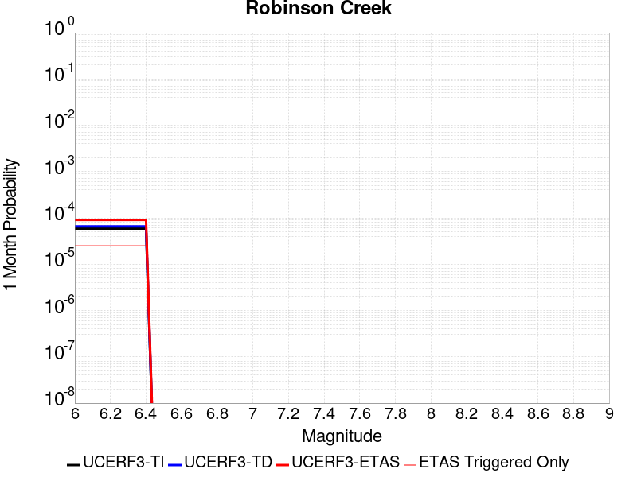 | 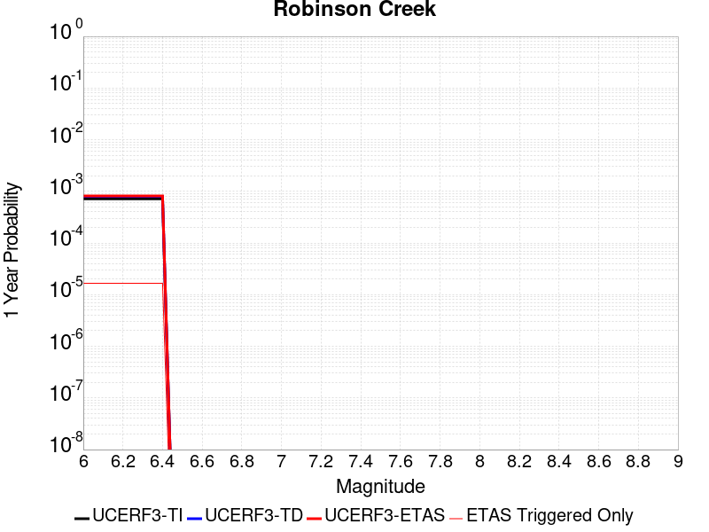 | 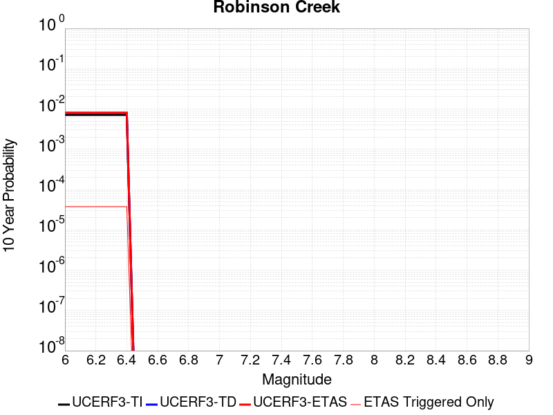 |

| Magnitude | 1 wk TI Prob | 1 wk TD Prob | 1 wk ETAS Prob | 1 wk ETAS/TD Gain | 1 wk ETAS Triggered Only | 1 mo TI Prob | 1 mo TD Prob | 1 mo ETAS Prob | 1 mo ETAS/TD Gain | 1 mo ETAS Triggered Only | 1 yr TI Prob | 1 yr TD Prob | 1 yr ETAS Prob | 1 yr ETAS/TD Gain | 1 yr ETAS Triggered Only | 10 yr TI Prob | 10 yr TD Prob | 10 yr ETAS Prob | 10 yr ETAS/TD Gain | 10 yr ETAS Triggered Only |
|-----|-----|-----|-----|-----|-----|-----|-----|-----|-----|-----|-----|-----|-----|-----|-----|-----|-----|-----|-----|-----|
| 6.0 | 1.3705327E-5 | 1.5285013E-5 | 1.5285013E-5 | 1.0 | 0.0 | 5.8735794E-5 | 6.55072E-5 | 9.048558E-5 | 1.3813074 | 2.4980016E-5 | 7.1487366E-4 | 7.9755014E-4 | 8.225103E-4 | 1.0312959 | 2.4980016E-5 | 0.0071257832 | 0.007975501 | 0.008000283 | 1.0031071 | 2.4980016E-5 |
| 6.1 | 1.3705327E-5 | 1.5285013E-5 | 1.5285013E-5 | 1.0 | 0.0 | 5.8735794E-5 | 6.55072E-5 | 9.048558E-5 | 1.3813074 | 2.4980016E-5 | 7.1487366E-4 | 7.9755014E-4 | 8.225103E-4 | 1.0312959 | 2.4980016E-5 | 0.0071257832 | 0.007975501 | 0.008000283 | 1.0031071 | 2.4980016E-5 |
| 6.2 | 1.3705327E-5 | 1.5285013E-5 | 1.5285013E-5 | 1.0 | 0.0 | 5.8735794E-5 | 6.55072E-5 | 9.048558E-5 | 1.3813074 | 2.4980016E-5 | 7.1487366E-4 | 7.9755014E-4 | 8.225103E-4 | 1.0312959 | 2.4980016E-5 | 0.0071257832 | 0.007975501 | 0.008000283 | 1.0031071 | 2.4980016E-5 |
| 6.3 | 1.3705327E-5 | 1.5285013E-5 | 1.5285013E-5 | 1.0 | 0.0 | 5.8735794E-5 | 6.55072E-5 | 9.048558E-5 | 1.3813074 | 2.4980016E-5 | 7.1487366E-4 | 7.9755014E-4 | 8.225103E-4 | 1.0312959 | 2.4980016E-5 | 0.0071257832 | 0.007975501 | 0.008000283 | 1.0031071 | 2.4980016E-5 |
| 6.4 | 1.3705327E-5 | 1.5285013E-5 | 1.5285013E-5 | 1.0 | 0.0 | 5.8735794E-5 | 6.55072E-5 | 9.048558E-5 | 1.3813074 | 2.4980016E-5 | 7.1487366E-4 | 7.9755014E-4 | 8.225103E-4 | 1.0312959 | 2.4980016E-5 | 0.0071257832 | 0.007975501 | 0.008000283 | 1.0031071 | 2.4980016E-5 |

## Cucamonga
*[(top)](#table-of-contents)*

| 1 Week | 1 Month | 1 Year | 10 Year |
|-----|-----|-----|-----|
|  | 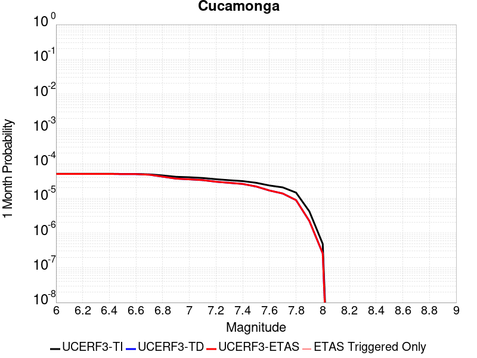 | 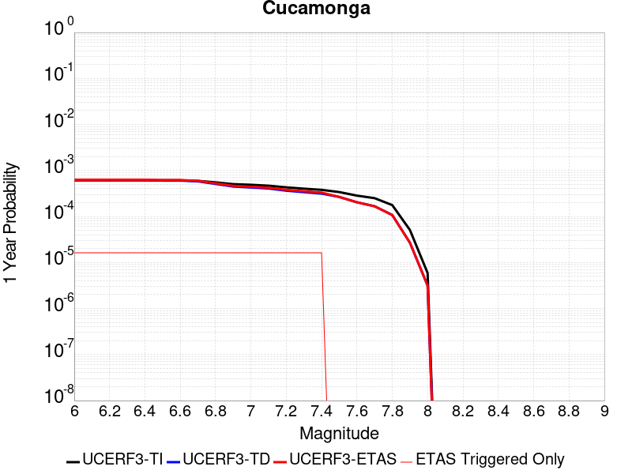 | 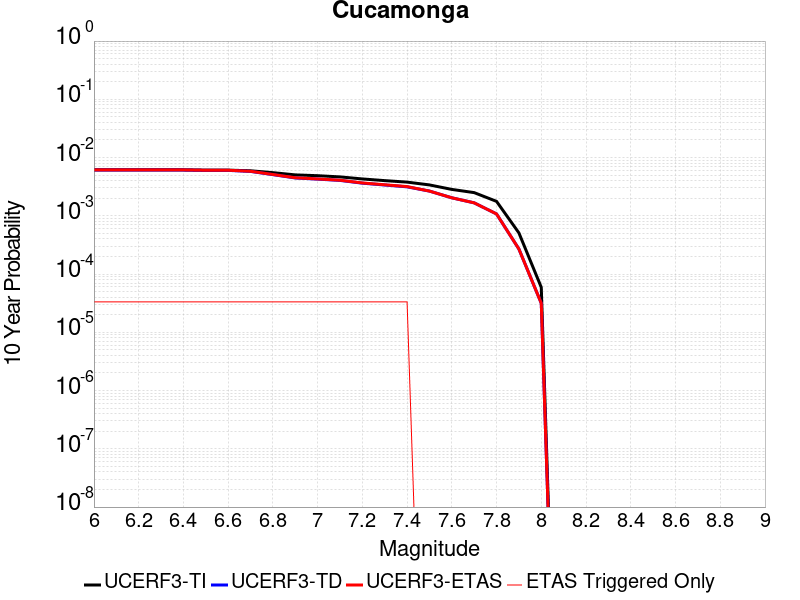 |

| Magnitude | 1 wk TI Prob | 1 wk TD Prob | 1 wk ETAS Prob | 1 wk ETAS/TD Gain | 1 wk ETAS Triggered Only | 1 mo TI Prob | 1 mo TD Prob | 1 mo ETAS Prob | 1 mo ETAS/TD Gain | 1 mo ETAS Triggered Only | 1 yr TI Prob | 1 yr TD Prob | 1 yr ETAS Prob | 1 yr ETAS/TD Gain | 1 yr ETAS Triggered Only | 10 yr TI Prob | 10 yr TD Prob | 10 yr ETAS Prob | 10 yr ETAS/TD Gain | 10 yr ETAS Triggered Only |
|-----|-----|-----|-----|-----|-----|-----|-----|-----|-----|-----|-----|-----|-----|-----|-----|-----|-----|-----|-----|-----|
| 6.0 | 1.1848348E-5 | 1.1737109E-5 | 1.1737109E-5 | 1.0 | 0.0 | 5.0777642E-5 | 5.0300943E-5 | 5.0300943E-5 | 1.0 | 0.0 | 6.180424E-4 | 6.122446E-4 | 6.122446E-4 | 1.0 | 0.0 | 0.0061632637 | 0.006106745 | 0.006131572 | 1.0040656 | 2.4980016E-5 |
| 6.1 | 1.1848348E-5 | 1.1737109E-5 | 1.1737109E-5 | 1.0 | 0.0 | 5.0777642E-5 | 5.0300943E-5 | 5.0300943E-5 | 1.0 | 0.0 | 6.180424E-4 | 6.122446E-4 | 6.122446E-4 | 1.0 | 0.0 | 0.0061632637 | 0.006106745 | 0.006131572 | 1.0040656 | 2.4980016E-5 |
| 6.2 | 1.1848348E-5 | 1.1737109E-5 | 1.1737109E-5 | 1.0 | 0.0 | 5.0777642E-5 | 5.0300943E-5 | 5.0300943E-5 | 1.0 | 0.0 | 6.180424E-4 | 6.122446E-4 | 6.122446E-4 | 1.0 | 0.0 | 0.0061632637 | 0.006106745 | 0.006131572 | 1.0040656 | 2.4980016E-5 |
| 6.3 | 1.1848348E-5 | 1.1737109E-5 | 1.1737109E-5 | 1.0 | 0.0 | 5.0777642E-5 | 5.0300943E-5 | 5.0300943E-5 | 1.0 | 0.0 | 6.180424E-4 | 6.122446E-4 | 6.122446E-4 | 1.0 | 0.0 | 0.0061632637 | 0.006106745 | 0.006131572 | 1.0040656 | 2.4980016E-5 |
| 6.4 | 1.1848348E-5 | 1.1737109E-5 | 1.1737109E-5 | 1.0 | 0.0 | 5.0777642E-5 | 5.0300943E-5 | 5.0300943E-5 | 1.0 | 0.0 | 6.180424E-4 | 6.122446E-4 | 6.122446E-4 | 1.0 | 0.0 | 0.0061632637 | 0.006106745 | 0.006131572 | 1.0040656 | 2.4980016E-5 |
| 6.5 | 1.16988695E-5 | 1.157614E-5 | 1.157614E-5 | 1.0 | 0.0 | 5.013705E-5 | 4.9611102E-5 | 4.9611102E-5 | 1.0 | 0.0 | 6.102476E-4 | 6.0385047E-4 | 6.0385047E-4 | 1.0 | 0.0 | 0.006085745 | 0.0060232594 | 0.006048089 | 1.0041223 | 2.4980016E-5 |
| 6.6 | 1.16988695E-5 | 1.157614E-5 | 1.157614E-5 | 1.0 | 0.0 | 5.013705E-5 | 4.9611102E-5 | 4.9611102E-5 | 1.0 | 0.0 | 6.102476E-4 | 6.0385047E-4 | 6.0385047E-4 | 1.0 | 0.0 | 0.006085745 | 0.0060232594 | 0.006048089 | 1.0041223 | 2.4980016E-5 |
| 6.7 | 1.1397107E-5 | 1.1115039E-5 | 1.1115039E-5 | 1.0 | 0.0 | 4.884383E-5 | 4.7635025E-5 | 4.7635025E-5 | 1.0 | 0.0 | 5.9451134E-4 | 5.798046E-4 | 5.798046E-4 | 1.0 | 0.0 | 0.005929234 | 0.005784061 | 0.0058088964 | 1.0042938 | 2.4980016E-5 |
| 6.8 | 1.058387E-5 | 9.785037E-6 | 9.785037E-6 | 1.0 | 0.0 | 4.5358654E-5 | 4.1935207E-5 | 4.1935207E-5 | 1.0 | 0.0 | 5.521017E-4 | 5.1044265E-4 | 5.1044265E-4 | 1.0 | 0.0 | 0.00550732 | 0.005093702 | 0.005118555 | 1.0048791 | 2.4980016E-5 |
| 6.9 | 9.690046E-6 | 8.579504E-6 | 8.579504E-6 | 1.0 | 0.0 | 4.1528107E-5 | 3.6768783E-5 | 3.6768783E-5 | 1.0 | 0.0 | 5.054874E-4 | 4.475684E-4 | 4.475684E-4 | 1.0 | 0.0 | 0.005043391 | 0.0044675954 | 0.004492464 | 1.0055664 | 2.4980016E-5 |
| 7.0 | 9.381461E-6 | 8.18712E-6 | 8.18712E-6 | 1.0 | 0.0 | 4.020564E-5 | 3.508719E-5 | 3.508719E-5 | 1.0 | 0.0 | 4.893937E-4 | 4.2710314E-4 | 4.2710314E-4 | 1.0 | 0.0 | 0.0048831734 | 0.004263747 | 0.004288621 | 1.0058337 | 2.4980016E-5 |
| 7.1 | 8.946492E-6 | 7.781904E-6 | 7.781904E-6 | 1.0 | 0.0 | 3.8341543E-5 | 3.3350592E-5 | 3.3350592E-5 | 1.0 | 0.0 | 4.667083E-4 | 4.0596814E-4 | 4.0596814E-4 | 1.0 | 0.0 | 0.0046572937 | 0.0040531927 | 0.004078071 | 1.0061381 | 2.4980016E-5 |
| 7.2 | 8.251016E-6 | 6.9752878E-6 | 6.9752878E-6 | 1.0 | 0.0 | 3.5361016E-5 | 2.9893748E-5 | 2.9893748E-5 | 1.0 | 0.0 | 4.3043532E-4 | 3.6389584E-4 | 3.6389584E-4 | 1.0 | 0.0 | 0.0042960253 | 0.0036339252 | 0.0036588144 | 1.0068492 | 2.4980016E-5 |
| 7.3 | 7.717881E-6 | 6.4863584E-6 | 6.4863584E-6 | 1.0 | 0.0 | 3.3076216E-5 | 2.7798384E-5 | 2.7798384E-5 | 1.0 | 0.0 | 4.026285E-4 | 3.38393E-4 | 3.38393E-4 | 1.0 | 0.0 | 0.004018998 | 0.0033797103 | 0.003404606 | 1.0073662 | 2.4980016E-5 |
| 7.4 | 7.275623E-6 | 6.032004E-6 | 6.032004E-6 | 1.0 | 0.0 | 3.118087E-5 | 2.5851192E-5 | 2.5851192E-5 | 1.0 | 0.0 | 3.7956095E-4 | 3.1469302E-4 | 3.1469302E-4 | 1.0 | 0.0 | 0.0037891332 | 0.0031434046 | 0.003168306 | 1.0079218 | 2.4980016E-5 |
| 7.5 | 6.5109502E-6 | 5.100593E-6 | 5.100593E-6 | 1.0 | 0.0 | 2.7903774E-5 | 2.1859503E-5 | 2.1859503E-5 | 1.0 | 0.0 | 3.3967546E-4 | 2.661071E-4 | 2.661071E-4 | 1.0 | 0.0 | 0.0033915674 | 0.0026588016 | 0.0026588016 | 1.0 | 0.0 |
| 7.6 | 5.4495326E-6 | 3.908547E-6 | 3.908547E-6 | 1.0 | 0.0 | 2.335493E-5 | 1.6750808E-5 | 1.6750808E-5 | 1.0 | 0.0 | 2.8430918E-4 | 2.0392207E-4 | 2.0392207E-4 | 1.0 | 0.0 | 0.0028394572 | 0.0020382616 | 0.0020382616 | 1.0 | 0.0 |
| 7.7 | 4.7997164E-6 | 3.2002263E-6 | 3.2002263E-6 | 1.0 | 0.0 | 2.057005E-5 | 1.3715184E-5 | 1.3715184E-5 | 1.0 | 0.0 | 2.504116E-4 | 1.6696959E-4 | 1.6696959E-4 | 1.0 | 0.0 | 0.002501296 | 0.0016693701 | 0.0016693701 | 1.0 | 0.0 |
| 7.8 | 3.3941733E-6 | 2.0641678E-6 | 2.0641678E-6 | 1.0 | 0.0 | 1.4546376E-5 | 8.846404E-6 | 8.846404E-6 | 1.0 | 0.0 | 1.7708774E-4 | 1.07699656E-4 | 1.07699656E-4 | 1.0 | 0.0 | 0.0017694668 | 0.0010766032 | 0.0010766032 | 1.0 | 0.0 |
| 7.9 | 9.750552E-7 | 5.155798E-7 | 5.155798E-7 | 1.0 | 0.0 | 4.178801E-6 | 2.2096258E-6 | 2.2096258E-6 | 1.0 | 0.0 | 5.0875715E-5 | 2.6901867E-5 | 2.6901867E-5 | 1.0 | 0.0 | 5.086407E-4 | 2.689865E-4 | 2.689865E-4 | 1.0 | 0.0 |
| 8.0 | 1.133857E-7 | 6.053372E-8 | 6.053372E-8 | 1.0 | 0.0 | 4.8593864E-7 | 2.594302E-7 | 2.594302E-7 | 1.0 | 0.0 | 5.9162867E-6 | 3.1585582E-6 | 3.1585582E-6 | 1.0 | 0.0 | 5.916129E-5 | 3.158515E-5 | 3.158515E-5 | 1.0 | 0.0 |

## Northridge
*[(top)](#table-of-contents)*

| 1 Week | 1 Month | 1 Year | 10 Year |
|-----|-----|-----|-----|
| 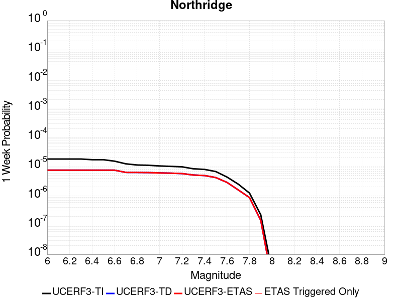 |  | 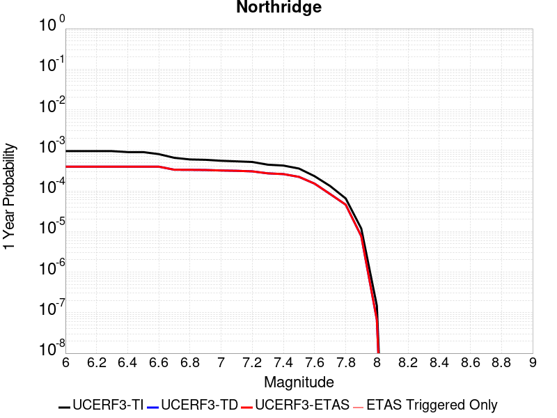 |  |

| Magnitude | 1 wk TI Prob | 1 wk TD Prob | 1 wk ETAS Prob | 1 wk ETAS/TD Gain | 1 wk ETAS Triggered Only | 1 mo TI Prob | 1 mo TD Prob | 1 mo ETAS Prob | 1 mo ETAS/TD Gain | 1 mo ETAS Triggered Only | 1 yr TI Prob | 1 yr TD Prob | 1 yr ETAS Prob | 1 yr ETAS/TD Gain | 1 yr ETAS Triggered Only | 10 yr TI Prob | 10 yr TD Prob | 10 yr ETAS Prob | 10 yr ETAS/TD Gain | 10 yr ETAS Triggered Only |
|-----|-----|-----|-----|-----|-----|-----|-----|-----|-----|-----|-----|-----|-----|-----|-----|-----|-----|-----|-----|-----|
| 6.0 | 1.8340852E-5 | 7.5878907E-6 | 7.5878907E-6 | 1.0 | 0.0 | 7.860128E-5 | 3.251914E-5 | 3.251914E-5 | 1.0 | 0.0 | 9.565505E-4 | 3.9585077E-4 | 3.9585077E-4 | 1.0 | 0.0 | 0.009524435 | 0.0039516874 | 0.0039765686 | 1.0062964 | 2.4980016E-5 |
| 6.1 | 1.8340852E-5 | 7.5878907E-6 | 7.5878907E-6 | 1.0 | 0.0 | 7.860128E-5 | 3.251914E-5 | 3.251914E-5 | 1.0 | 0.0 | 9.565505E-4 | 3.9585077E-4 | 3.9585077E-4 | 1.0 | 0.0 | 0.009524435 | 0.0039516874 | 0.0039765686 | 1.0062964 | 2.4980016E-5 |
| 6.2 | 1.8340852E-5 | 7.5878907E-6 | 7.5878907E-6 | 1.0 | 0.0 | 7.860128E-5 | 3.251914E-5 | 3.251914E-5 | 1.0 | 0.0 | 9.565505E-4 | 3.9585077E-4 | 3.9585077E-4 | 1.0 | 0.0 | 0.009524435 | 0.0039516874 | 0.0039765686 | 1.0062964 | 2.4980016E-5 |
| 6.3 | 1.8340852E-5 | 7.5878907E-6 | 7.5878907E-6 | 1.0 | 0.0 | 7.860128E-5 | 3.251914E-5 | 3.251914E-5 | 1.0 | 0.0 | 9.565505E-4 | 3.9585077E-4 | 3.9585077E-4 | 1.0 | 0.0 | 0.009524435 | 0.0039516874 | 0.0039765686 | 1.0062964 | 2.4980016E-5 |
| 6.4 | 1.7361892E-5 | 7.5878907E-6 | 7.5878907E-6 | 1.0 | 0.0 | 7.440598E-5 | 3.251914E-5 | 3.251914E-5 | 1.0 | 0.0 | 9.055163E-4 | 3.9585077E-4 | 3.9585077E-4 | 1.0 | 0.0 | 0.009018354 | 0.0039516874 | 0.0039765686 | 1.0062964 | 2.4980016E-5 |
| 6.5 | 1.7361892E-5 | 7.5878907E-6 | 7.5878907E-6 | 1.0 | 0.0 | 7.440598E-5 | 3.251914E-5 | 3.251914E-5 | 1.0 | 0.0 | 9.055163E-4 | 3.9585077E-4 | 3.9585077E-4 | 1.0 | 0.0 | 0.009018354 | 0.0039516874 | 0.0039765686 | 1.0062964 | 2.4980016E-5 |
| 6.6 | 1.5458201E-5 | 7.5878907E-6 | 7.5878907E-6 | 1.0 | 0.0 | 6.624775E-5 | 3.251914E-5 | 3.251914E-5 | 1.0 | 0.0 | 8.0626784E-4 | 3.9585077E-4 | 3.9585077E-4 | 1.0 | 0.0 | 0.008033488 | 0.0039516874 | 0.0039765686 | 1.0062964 | 2.4980016E-5 |
| 6.7 | 1.2538368E-5 | 6.381497E-6 | 6.381497E-6 | 1.0 | 0.0 | 5.3734755E-5 | 2.7348988E-5 | 2.7348988E-5 | 1.0 | 0.0 | 6.5402425E-4 | 3.329235E-4 | 3.329235E-4 | 1.0 | 0.0 | 0.0065210275 | 0.0033243035 | 0.0033492006 | 1.0074893 | 2.4980016E-5 |
| 6.8 | 1.1438097E-5 | 6.350156E-6 | 6.350156E-6 | 1.0 | 0.0 | 4.9019498E-5 | 2.7214674E-5 | 2.7214674E-5 | 1.0 | 0.0 | 5.9664896E-4 | 3.3128873E-4 | 3.3128873E-4 | 1.0 | 0.0 | 0.005950495 | 0.0033080047 | 0.003332902 | 1.0075264 | 2.4980016E-5 |
| 6.9 | 1.1204891E-5 | 6.2866116E-6 | 6.2866116E-6 | 1.0 | 0.0 | 4.8020076E-5 | 2.6942345E-5 | 2.6942345E-5 | 1.0 | 0.0 | 5.8448757E-4 | 3.2797412E-4 | 3.2797412E-4 | 1.0 | 0.0 | 0.0058295266 | 0.0032749567 | 0.003299855 | 1.0076026 | 2.4980016E-5 |
| 7.0 | 1.061046E-5 | 6.1152687E-6 | 6.1152687E-6 | 1.0 | 0.0 | 4.5472607E-5 | 2.6208034E-5 | 2.6208034E-5 | 1.0 | 0.0 | 5.534883E-4 | 3.190365E-4 | 3.190365E-4 | 1.0 | 0.0 | 0.0055211177 | 0.0031858315 | 0.0032107318 | 1.007816 | 2.4980016E-5 |
| 7.1 | 1.0266979E-5 | 6.0041907E-6 | 6.0041907E-6 | 1.0 | 0.0 | 4.40006E-5 | 2.5731995E-5 | 2.5731995E-5 | 1.0 | 0.0 | 5.355756E-4 | 3.1324243E-4 | 3.1324243E-4 | 1.0 | 0.0 | 0.0053428668 | 0.0031280548 | 0.0031529565 | 1.0079608 | 2.4980016E-5 |
| 7.2 | 9.91273E-6 | 5.819906E-6 | 5.819906E-6 | 1.0 | 0.0 | 4.248244E-5 | 2.4942217E-5 | 2.4942217E-5 | 1.0 | 0.0 | 5.171009E-4 | 3.036296E-4 | 3.036296E-4 | 1.0 | 0.0 | 0.0051589934 | 0.0030321924 | 0.0030570966 | 1.0082133 | 2.4980016E-5 |
| 7.3 | 8.4959265E-6 | 5.1930183E-6 | 5.1930183E-6 | 1.0 | 0.0 | 3.6410605E-5 | 2.2255605E-5 | 2.2255605E-5 | 1.0 | 0.0 | 4.4320893E-4 | 2.7092852E-4 | 2.7092852E-4 | 1.0 | 0.0 | 0.00442326 | 0.0027060085 | 0.002730921 | 1.0092063 | 2.4980016E-5 |
| 7.4 | 8.0847185E-6 | 4.9818977E-6 | 4.9818977E-6 | 1.0 | 0.0 | 3.4648332E-5 | 2.1350817E-5 | 2.1350817E-5 | 1.0 | 0.0 | 4.2176177E-4 | 2.5991542E-4 | 2.5991542E-4 | 1.0 | 0.0 | 0.0042096223 | 0.0025961401 | 0.0026210553 | 1.009597 | 2.4980016E-5 |
| 7.5 | 6.8220684E-6 | 4.2532647E-6 | 4.2532647E-6 | 1.0 | 0.0 | 2.9237108E-5 | 1.8228153E-5 | 1.8228153E-5 | 1.0 | 0.0 | 3.5590364E-4 | 2.2190536E-4 | 2.2190536E-4 | 1.0 | 0.0 | 0.0035533418 | 0.0022168586 | 0.0022417833 | 1.0112432 | 2.4980016E-5 |
| 7.6 | 4.4224143E-6 | 2.8999295E-6 | 2.8999295E-6 | 1.0 | 0.0 | 1.8953066E-5 | 1.24282105E-5 | 1.24282105E-5 | 1.0 | 0.0 | 2.3072914E-4 | 1.5130307E-4 | 1.5130307E-4 | 1.0 | 0.0 | 0.0023048974 | 0.0015120122 | 0.0015369544 | 1.0164961 | 2.4980016E-5 |
| 7.7 | 2.5297056E-6 | 1.6045943E-6 | 1.6045943E-6 | 1.0 | 0.0 | 1.0841551E-5 | 6.876815E-6 | 6.876815E-6 | 1.0 | 0.0 | 1.319879E-4 | 8.372205E-5 | 8.372205E-5 | 1.0 | 0.0 | 0.0013190953 | 8.369098E-4 | 8.618689E-4 | 1.029823 | 2.4980016E-5 |
| 7.8 | 1.2508156E-6 | 8.780148E-7 | 8.780148E-7 | 1.0 | 0.0 | 5.3606273E-6 | 3.7629154E-6 | 3.7629154E-6 | 1.0 | 0.0 | 6.526368E-5 | 4.5812543E-5 | 4.5812543E-5 | 1.0 | 0.0 | 6.524452E-4 | 4.580323E-4 | 4.8300085E-4 | 1.0545127 | 2.4980016E-5 |
| 7.9 | 2.262199E-7 | 1.466491E-7 | 1.466491E-7 | 1.0 | 0.0 | 9.695135E-7 | 6.2849597E-7 | 6.2849597E-7 | 1.0 | 0.0 | 1.1803763E-5 | 7.651913E-6 | 7.651913E-6 | 1.0 | 0.0 | 1.1803136E-4 | 7.651657E-5 | 7.651657E-5 | 1.0 | 0.0 |
| 8.0 | 2.865362E-9 | 1.27525E-9 | 1.27525E-9 | 1.0 | 0.0 | 1.2280123E-8 | 5.465357E-9 | 5.465357E-9 | 1.0 | 0.0 | 1.4951048E-7 | 6.654073E-8 | 6.654073E-8 | 1.0 | 0.0 | 1.4951038E-6 | 6.6540724E-7 | 6.6540724E-7 | 1.0 | 0.0 |

## San Diego Trough south
*[(top)](#table-of-contents)*

| 1 Week | 1 Month | 1 Year | 10 Year |
|-----|-----|-----|-----|
| 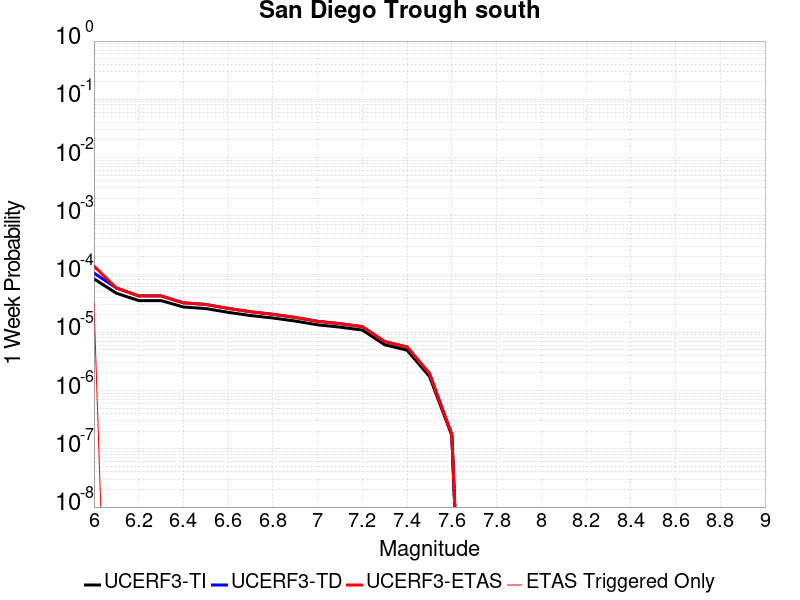 | 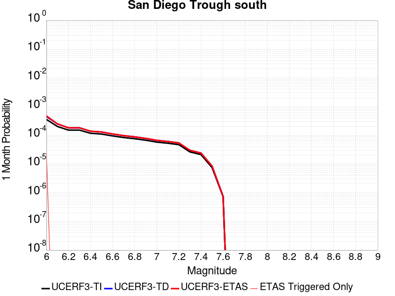 | 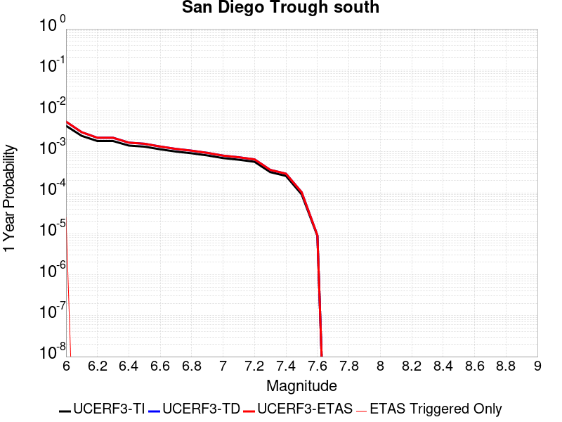 | 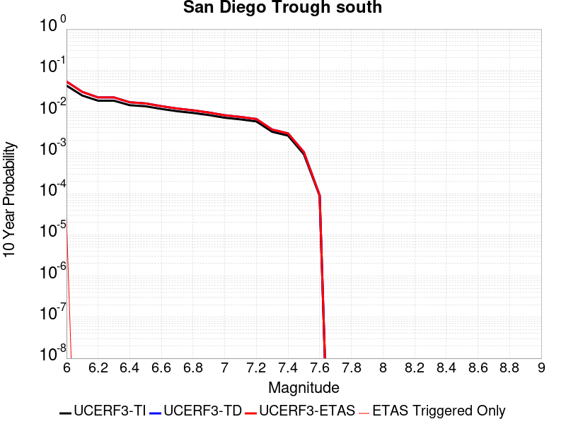 |

| Magnitude | 1 wk TI Prob | 1 wk TD Prob | 1 wk ETAS Prob | 1 wk ETAS/TD Gain | 1 wk ETAS Triggered Only | 1 mo TI Prob | 1 mo TD Prob | 1 mo ETAS Prob | 1 mo ETAS/TD Gain | 1 mo ETAS Triggered Only | 1 yr TI Prob | 1 yr TD Prob | 1 yr ETAS Prob | 1 yr ETAS/TD Gain | 1 yr ETAS Triggered Only | 10 yr TI Prob | 10 yr TD Prob | 10 yr ETAS Prob | 10 yr ETAS/TD Gain | 10 yr ETAS Triggered Only |
|-----|-----|-----|-----|-----|-----|-----|-----|-----|-----|-----|-----|-----|-----|-----|-----|-----|-----|-----|-----|-----|
| 6.0 | 8.279495E-5 | 1.0425541E-4 | 1.2923282E-4 | 1.2395791 | 2.4980016E-5 | 3.5478722E-4 | 4.4673498E-4 | 4.7170382E-4 | 1.0558919 | 2.4980016E-5 | 0.004310982 | 0.0054259133 | 0.005450758 | 1.0045788 | 2.4980016E-5 | 0.042283054 | 0.05299303 | 0.053016685 | 1.0004464 | 2.4980016E-5 |
| 6.1 | 4.6961468E-5 | 5.773024E-5 | 5.773024E-5 | 1.0 | 0.0 | 2.0124791E-4 | 2.473905E-4 | 2.473905E-4 | 1.0 | 0.0 | 0.00244744 | 0.003007886 | 0.003007886 | 1.0 | 0.0 | 0.024206603 | 0.029679636 | 0.029679636 | 1.0 | 0.0 |
| 6.2 | 3.5079658E-5 | 4.214258E-5 | 4.214258E-5 | 1.0 | 0.0 | 1.5033272E-4 | 1.8059829E-4 | 1.8059829E-4 | 1.0 | 0.0 | 0.0018287642 | 0.002196587 | 0.002196587 | 1.0 | 0.0 | 0.018137876 | 0.021751188 | 0.021751188 | 1.0 | 0.0 |
| 6.3 | 3.5079658E-5 | 4.214258E-5 | 4.214258E-5 | 1.0 | 0.0 | 1.5033272E-4 | 1.8059829E-4 | 1.8059829E-4 | 1.0 | 0.0 | 0.0018287642 | 0.002196587 | 0.002196587 | 1.0 | 0.0 | 0.018137876 | 0.021751188 | 0.021751188 | 1.0 | 0.0 |
| 6.4 | 2.7196904E-5 | 3.208715E-5 | 3.208715E-5 | 1.0 | 0.0 | 1.16552954E-4 | 1.3750911E-4 | 1.3750911E-4 | 1.0 | 0.0 | 0.0014181085 | 0.0016728995 | 0.0016728995 | 1.0 | 0.0 | 0.014090929 | 0.016604666 | 0.016604666 | 1.0 | 0.0 |
| 6.5 | 2.5584688E-5 | 3.0101632E-5 | 3.0101632E-5 | 1.0 | 0.0 | 1.0964406E-4 | 1.2900059E-4 | 1.2900059E-4 | 1.0 | 0.0 | 0.0013340989 | 0.0015694627 | 0.0015694627 | 1.0 | 0.0 | 0.013261181 | 0.015585332 | 0.015585332 | 1.0 | 0.0 |
| 6.6 | 2.2034688E-5 | 2.574271E-5 | 2.574271E-5 | 1.0 | 0.0 | 9.443096E-5 | 1.1032127E-4 | 1.1032127E-4 | 1.0 | 0.0 | 0.0011490905 | 0.0013423412 | 0.0013423412 | 1.0 | 0.0 | 0.011431668 | 0.013343325 | 0.013343325 | 1.0 | 0.0 |
| 6.7 | 1.9394853E-5 | 2.254176E-5 | 2.254176E-5 | 1.0 | 0.0 | 8.311815E-5 | 9.6604E-5 | 9.6604E-5 | 1.0 | 0.0 | 0.0010114936 | 0.0011755243 | 0.0011755243 | 1.0 | 0.0 | 0.01006902 | 0.011693766 | 0.011693766 | 1.0 | 0.0 |
| 6.8 | 1.7615313E-5 | 2.0403182E-5 | 2.0403182E-5 | 1.0 | 0.0 | 7.549201E-5 | 8.743931E-5 | 8.743931E-5 | 1.0 | 0.0 | 9.1872766E-4 | 0.0010640579 | 0.0010640579 | 1.0 | 0.0 | 0.009149387 | 0.010590198 | 0.010590198 | 1.0 | 0.0 |
| 6.9 | 1.5621423E-5 | 1.8026114E-5 | 1.8026114E-5 | 1.0 | 0.0 | 6.6947236E-5 | 7.725251E-5 | 7.725251E-5 | 1.0 | 0.0 | 8.147778E-4 | 9.40147E-4 | 9.40147E-4 | 1.0 | 0.0 | 0.008117969 | 0.009362142 | 0.009362142 | 1.0 | 0.0 |
| 7.0 | 1.3444376E-5 | 1.544809E-5 | 1.544809E-5 | 1.0 | 0.0 | 5.7617483E-5 | 6.620443E-5 | 6.620443E-5 | 1.0 | 0.0 | 7.0126704E-4 | 8.057436E-4 | 8.057436E-4 | 1.0 | 0.0 | 0.006990582 | 0.008028555 | 0.008028555 | 1.0 | 0.0 |
| 7.1 | 1.2268361E-5 | 1.407303E-5 | 1.407303E-5 | 1.0 | 0.0 | 5.2577634E-5 | 6.0311606E-5 | 6.0311606E-5 | 1.0 | 0.0 | 6.399447E-4 | 7.3404907E-4 | 7.3404907E-4 | 1.0 | 0.0 | 0.0063810493 | 0.0073165493 | 0.0073165493 | 1.0 | 0.0 |
| 7.2 | 1.0922655E-5 | 1.2513563E-5 | 1.2513563E-5 | 1.0 | 0.0 | 4.681054E-5 | 5.3628468E-5 | 5.3628468E-5 | 1.0 | 0.0 | 5.697693E-4 | 6.5273355E-4 | 6.5273355E-4 | 1.0 | 0.0 | 0.0056831064 | 0.0065084435 | 0.0065084435 | 1.0 | 0.0 |
| 7.3 | 6.1106753E-6 | 6.928925E-6 | 6.928925E-6 | 1.0 | 0.0 | 2.6188345E-5 | 2.9695057E-5 | 2.9695057E-5 | 1.0 | 0.0 | 3.1879646E-4 | 3.6147775E-4 | 3.6147775E-4 | 1.0 | 0.0 | 0.0031833951 | 0.003608943 | 0.003608943 | 1.0 | 0.0 |
| 7.4 | 4.933187E-6 | 5.5895525E-6 | 5.5895525E-6 | 1.0 | 0.0 | 2.114206E-5 | 2.3955008E-5 | 2.3955008E-5 | 1.0 | 0.0 | 2.5737417E-4 | 2.9161357E-4 | 2.9161357E-4 | 1.0 | 0.0 | 0.002570763 | 0.0029123505 | 0.0029123505 | 1.0 | 0.0 |
| 7.5 | 1.7489613E-6 | 1.969678E-6 | 1.969678E-6 | 1.0 | 0.0 | 7.495527E-6 | 8.4414505E-6 | 8.4414505E-6 | 1.0 | 0.0 | 9.125422E-5 | 1.02770035E-4 | 1.02770035E-4 | 1.0 | 0.0 | 9.1216754E-4 | 0.0010272472 | 0.0010272472 | 1.0 | 0.0 |
| 7.6 | 1.6988751E-7 | 1.7533823E-7 | 1.7533823E-7 | 1.0 | 0.0 | 7.2808916E-7 | 7.5144936E-7 | 7.5144936E-7 | 1.0 | 0.0 | 8.864449E-6 | 9.14886E-6 | 9.14886E-6 | 1.0 | 0.0 | 8.8640954E-5 | 9.1485024E-5 | 9.1485024E-5 | 1.0 | 0.0 |

## Cleghorn
*[(top)](#table-of-contents)*

| 1 Week | 1 Month | 1 Year | 10 Year |
|-----|-----|-----|-----|
|  | 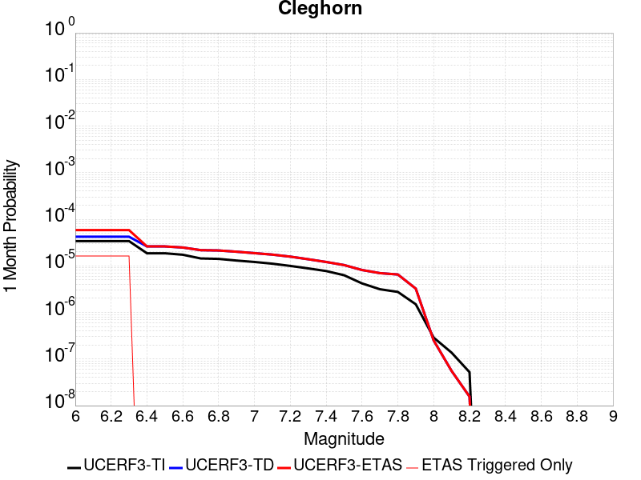 | 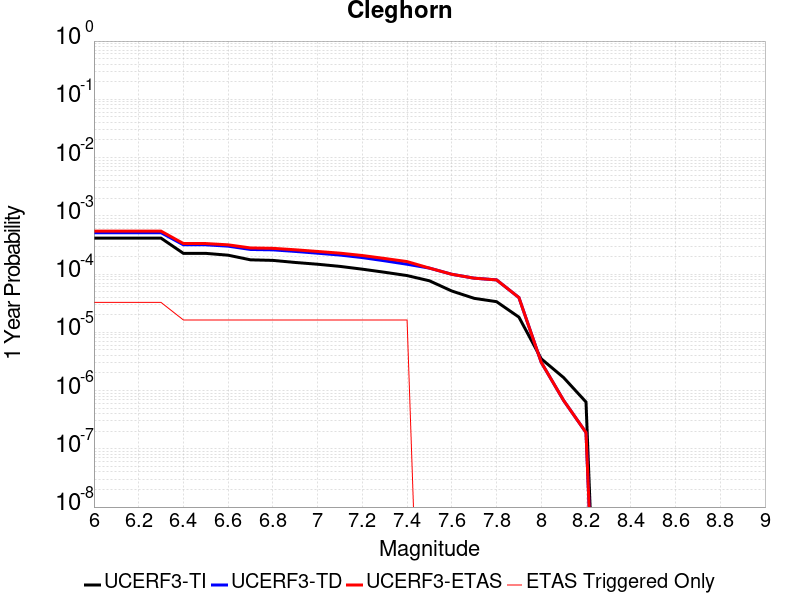 | 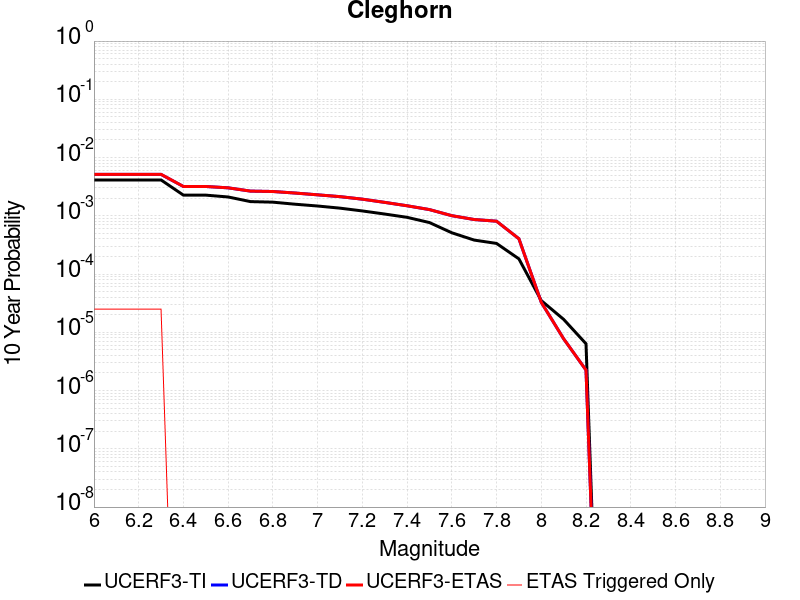 |

| Magnitude | 1 wk TI Prob | 1 wk TD Prob | 1 wk ETAS Prob | 1 wk ETAS/TD Gain | 1 wk ETAS Triggered Only | 1 mo TI Prob | 1 mo TD Prob | 1 mo ETAS Prob | 1 mo ETAS/TD Gain | 1 mo ETAS Triggered Only | 1 yr TI Prob | 1 yr TD Prob | 1 yr ETAS Prob | 1 yr ETAS/TD Gain | 1 yr ETAS Triggered Only | 10 yr TI Prob | 10 yr TD Prob | 10 yr ETAS Prob | 10 yr ETAS/TD Gain | 10 yr ETAS Triggered Only |
|-----|-----|-----|-----|-----|-----|-----|-----|-----|-----|-----|-----|-----|-----|-----|-----|-----|-----|-----|-----|-----|
| 6.0 | 7.9267165E-6 | 9.831764E-6 | 9.831764E-6 | 1.0 | 0.0 | 3.39712E-5 | 4.2135514E-5 | 6.711447E-5 | 1.5928245 | 2.4980016E-5 | 4.1352084E-4 | 5.1288976E-4 | 5.3785695E-4 | 1.0486795 | 2.4980016E-5 | 0.004127522 | 0.005132214 | 0.005157066 | 1.0048423 | 2.4980016E-5 |
| 6.1 | 7.9267165E-6 | 9.831764E-6 | 9.831764E-6 | 1.0 | 0.0 | 3.39712E-5 | 4.2135514E-5 | 6.711447E-5 | 1.5928245 | 2.4980016E-5 | 4.1352084E-4 | 5.1288976E-4 | 5.3785695E-4 | 1.0486795 | 2.4980016E-5 | 0.004127522 | 0.005132214 | 0.005157066 | 1.0048423 | 2.4980016E-5 |
| 6.2 | 7.9267165E-6 | 9.831764E-6 | 9.831764E-6 | 1.0 | 0.0 | 3.39712E-5 | 4.2135514E-5 | 6.711447E-5 | 1.5928245 | 2.4980016E-5 | 4.1352084E-4 | 5.1288976E-4 | 5.3785695E-4 | 1.0486795 | 2.4980016E-5 | 0.004127522 | 0.005132214 | 0.005157066 | 1.0048423 | 2.4980016E-5 |
| 6.3 | 7.9267165E-6 | 9.831764E-6 | 9.831764E-6 | 1.0 | 0.0 | 3.39712E-5 | 4.2135514E-5 | 6.711447E-5 | 1.5928245 | 2.4980016E-5 | 4.1352084E-4 | 5.1288976E-4 | 5.3785695E-4 | 1.0486795 | 2.4980016E-5 | 0.004127522 | 0.005132214 | 0.005157066 | 1.0048423 | 2.4980016E-5 |
| 6.4 | 4.3445207E-6 | 6.0916254E-6 | 6.0916254E-6 | 1.0 | 0.0 | 1.8619241E-5 | 2.6106709E-5 | 2.6106709E-5 | 1.0 | 0.0 | 2.2666567E-4 | 3.1780385E-4 | 3.1780385E-4 | 1.0 | 0.0 | 0.0022643462 | 0.0031877246 | 0.0031877246 | 1.0 | 0.0 |
| 6.5 | 4.3445207E-6 | 6.0916254E-6 | 6.0916254E-6 | 1.0 | 0.0 | 1.8619241E-5 | 2.6106709E-5 | 2.6106709E-5 | 1.0 | 0.0 | 2.2666567E-4 | 3.1780385E-4 | 3.1780385E-4 | 1.0 | 0.0 | 0.0022643462 | 0.0031877246 | 0.0031877246 | 1.0 | 0.0 |
| 6.6 | 4.040109E-6 | 5.774033E-6 | 5.774033E-6 | 1.0 | 0.0 | 1.7314638E-5 | 2.4745626E-5 | 2.4745626E-5 | 1.0 | 0.0 | 2.1078532E-4 | 3.0123728E-4 | 3.0123728E-4 | 1.0 | 0.0 | 0.002105855 | 0.0030225143 | 0.0030225143 | 1.0 | 0.0 |
| 6.7 | 3.3632055E-6 | 5.06753E-6 | 5.06753E-6 | 1.0 | 0.0 | 1.4413658E-5 | 2.1717806E-5 | 2.1717806E-5 | 1.0 | 0.0 | 1.7547216E-4 | 2.643825E-4 | 2.643825E-4 | 1.0 | 0.0 | 0.0017533366 | 0.0026548486 | 0.0026548486 | 1.0 | 0.0 |
| 6.8 | 3.2902772E-6 | 4.9894375E-6 | 4.9894375E-6 | 1.0 | 0.0 | 1.4101111E-5 | 2.138313E-5 | 2.138313E-5 | 1.0 | 0.0 | 1.716675E-4 | 2.6030882E-4 | 2.6030882E-4 | 1.0 | 0.0 | 0.0017153495 | 0.0026142076 | 0.0026142076 | 1.0 | 0.0 |
| 6.9 | 3.031547E-6 | 4.6911987E-6 | 4.6911987E-6 | 1.0 | 0.0 | 1.299228E-5 | 2.0104984E-5 | 2.0104984E-5 | 1.0 | 0.0 | 1.5816953E-4 | 2.4475096E-4 | 2.4475096E-4 | 1.0 | 0.0 | 0.00158057 | 0.0024589805 | 0.0024589805 | 1.0 | 0.0 |
| 7.0 | 2.8259715E-6 | 4.3707637E-6 | 4.3707637E-6 | 1.0 | 0.0 | 1.211125E-5 | 1.8731711E-5 | 1.8731711E-5 | 1.0 | 0.0 | 1.4744449E-4 | 2.2803496E-4 | 2.2803496E-4 | 1.0 | 0.0 | 0.001473467 | 0.0022921748 | 0.0022921748 | 1.0 | 0.0 |
| 7.1 | 2.5962665E-6 | 4.065983E-6 | 4.065983E-6 | 1.0 | 0.0 | 1.1126809E-5 | 1.7425526E-5 | 1.7425526E-5 | 1.0 | 0.0 | 1.3546048E-4 | 2.1213535E-4 | 2.1213535E-4 | 1.0 | 0.0 | 0.0013537793 | 0.0021334959 | 0.0021334959 | 1.0 | 0.0 |
| 7.2 | 2.3247253E-6 | 3.6765352E-6 | 3.6765352E-6 | 1.0 | 0.0 | 9.96307E-6 | 1.5756486E-5 | 1.5756486E-5 | 1.0 | 0.0 | 1.21293626E-4 | 1.9181852E-4 | 1.9181852E-4 | 1.0 | 0.0 | 0.0012122744 | 0.0019307166 | 0.0019307166 | 1.0 | 0.0 |
| 7.3 | 2.056928E-6 | 3.235253E-6 | 3.235253E-6 | 1.0 | 0.0 | 8.815376E-6 | 1.3865297E-5 | 1.3865297E-5 | 1.0 | 0.0 | 1.0732192E-4 | 1.6879707E-4 | 1.6879707E-4 | 1.0 | 0.0 | 0.001072701 | 0.0017009423 | 0.0017009423 | 1.0 | 0.0 |
| 7.4 | 1.8055999E-6 | 2.8256538E-6 | 2.8256538E-6 | 1.0 | 0.0 | 7.738263E-6 | 1.210989E-5 | 1.210989E-5 | 1.0 | 0.0 | 9.4209274E-5 | 1.4742807E-4 | 1.4742807E-4 | 1.0 | 0.0 | 9.4169343E-4 | 0.0014876705 | 0.0014876705 | 1.0 | 0.0 |
| 7.5 | 1.4683443E-6 | 2.4248943E-6 | 2.4248943E-6 | 1.0 | 0.0 | 6.292889E-6 | 1.0392363E-5 | 1.0392363E-5 | 1.0 | 0.0 | 7.661323E-5 | 1.2651978E-4 | 1.2651978E-4 | 1.0 | 0.0 | 7.658682E-4 | 0.0012788812 | 0.0012788812 | 1.0 | 0.0 |
| 7.6 | 9.804088E-7 | 1.9004091E-6 | 1.9004091E-6 | 1.0 | 0.0 | 4.201745E-6 | 8.144585E-6 | 8.144585E-6 | 1.0 | 0.0 | 5.1155046E-5 | 9.915586E-5 | 9.915586E-5 | 1.0 | 0.0 | 5.114327E-4 | 0.0010055583 | 0.0010055583 | 1.0 | 0.0 |
| 7.7 | 7.3434086E-7 | 1.6285549E-6 | 1.6285549E-6 | 1.0 | 0.0 | 3.1471714E-6 | 6.9795024E-6 | 6.9795024E-6 | 1.0 | 0.0 | 3.831614E-5 | 8.4972155E-5 | 8.4972155E-5 | 1.0 | 0.0 | 3.8309532E-4 | 8.6387293E-4 | 8.6387293E-4 | 1.0 | 0.0 |
| 7.8 | 6.434184E-7 | 1.5221389E-6 | 1.5221389E-6 | 1.0 | 0.0 | 2.7575045E-6 | 6.523436E-6 | 6.523436E-6 | 1.0 | 0.0 | 3.35721E-5 | 7.9419966E-5 | 7.9419966E-5 | 1.0 | 0.0 | 3.3567028E-4 | 8.080443E-4 | 8.080443E-4 | 1.0 | 0.0 |
| 7.9 | 3.4943926E-7 | 7.5750586E-7 | 7.5750586E-7 | 1.0 | 0.0 | 1.497596E-6 | 3.2464498E-6 | 3.2464498E-6 | 1.0 | 0.0 | 1.8233079E-5 | 3.9524817E-5 | 3.9524817E-5 | 1.0 | 0.0 | 1.8231584E-4 | 4.0401975E-4 | 4.0401975E-4 | 1.0 | 0.0 |
| 8.0 | 6.717524E-8 | 5.837515E-8 | 5.837515E-8 | 1.0 | 0.0 | 2.8789387E-7 | 2.501792E-7 | 2.501792E-7 | 1.0 | 0.0 | 3.505102E-6 | 3.0459275E-6 | 3.0459275E-6 | 1.0 | 0.0 | 3.5050467E-5 | 3.2751934E-5 | 3.2751934E-5 | 1.0 | 0.0 |
| 8.1 | 3.1984914E-8 | 1.2949885E-8 | 1.2949885E-8 | 1.0 | 0.0 | 1.370782E-7 | 5.549951E-8 | 5.549951E-8 | 1.0 | 0.0 | 1.6689258E-6 | 6.757063E-7 | 6.757063E-7 | 1.0 | 0.0 | 1.6689133E-5 | 7.741151E-6 | 7.741151E-6 | 1.0 | 0.0 |
| 8.2 | 1.21887656E-8 | 3.6471115E-9 | 3.6471115E-9 | 1.0 | 0.0 | 5.2237567E-8 | 1.563048E-8 | 1.563048E-8 | 1.0 | 0.0 | 6.359922E-7 | 1.9030107E-7 | 1.9030107E-7 | 1.0 | 0.0 | 6.3599036E-6 | 2.245849E-6 | 2.245849E-6 | 1.0 | 0.0 |

## Great Valley 11
*[(top)](#table-of-contents)*

| 1 Week | 1 Month | 1 Year | 10 Year |
|-----|-----|-----|-----|
| 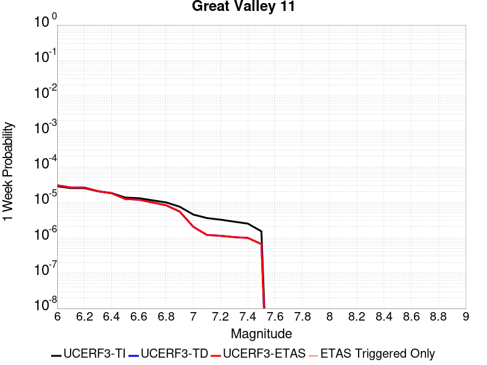 | 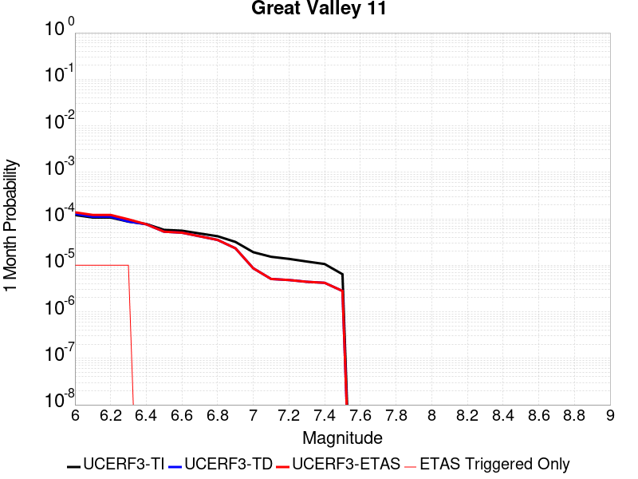 | 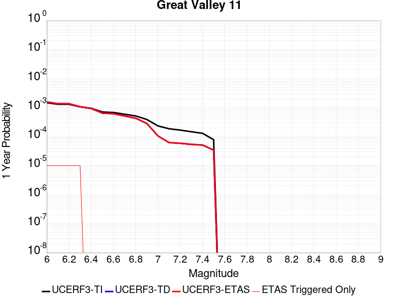 | 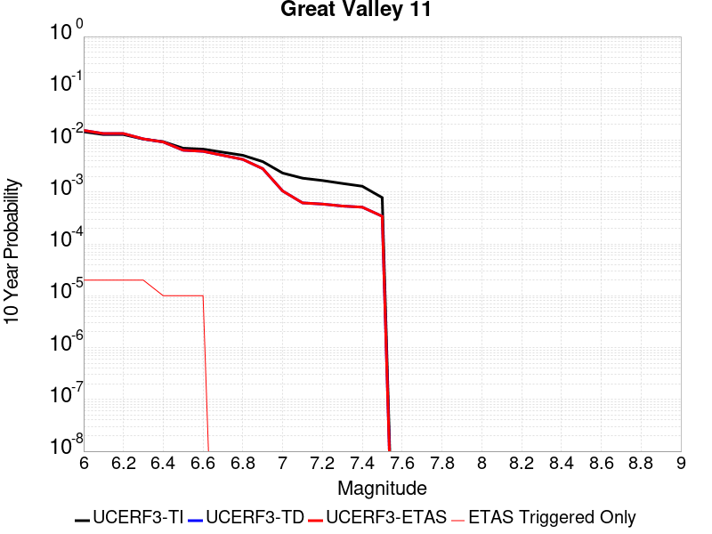 |

| Magnitude | 1 wk TI Prob | 1 wk TD Prob | 1 wk ETAS Prob | 1 wk ETAS/TD Gain | 1 wk ETAS Triggered Only | 1 mo TI Prob | 1 mo TD Prob | 1 mo ETAS Prob | 1 mo ETAS/TD Gain | 1 mo ETAS Triggered Only | 1 yr TI Prob | 1 yr TD Prob | 1 yr ETAS Prob | 1 yr ETAS/TD Gain | 1 yr ETAS Triggered Only | 10 yr TI Prob | 10 yr TD Prob | 10 yr ETAS Prob | 10 yr ETAS/TD Gain | 10 yr ETAS Triggered Only |
|-----|-----|-----|-----|-----|-----|-----|-----|-----|-----|-----|-----|-----|-----|-----|-----|-----|-----|-----|-----|-----|
| 6.0 | 2.8099583E-5 | 2.983214E-5 | 2.983214E-5 | 1.0 | 0.0 | 1.20421224E-4 | 1.2784619E-4 | 1.2784619E-4 | 1.0 | 0.0 | 0.0014651422 | 0.0015554894 | 0.0015554894 | 1.0 | 0.0 | 0.0145552 | 0.015453546 | 0.015478141 | 1.0015914 | 2.4980016E-5 |
| 6.1 | 2.483194E-5 | 2.5907144E-5 | 2.5907144E-5 | 1.0 | 0.0 | 1.0641825E-4 | 1.11026246E-4 | 1.11026246E-4 | 1.0 | 0.0 | 0.0012948721 | 0.0013509697 | 0.0013509697 | 1.0 | 0.0 | 0.012873529 | 0.013433979 | 0.013458623 | 1.0018345 | 2.4980016E-5 |
| 6.2 | 2.483194E-5 | 2.5907144E-5 | 2.5907144E-5 | 1.0 | 0.0 | 1.0641825E-4 | 1.11026246E-4 | 1.11026246E-4 | 1.0 | 0.0 | 0.0012948721 | 0.0013509697 | 0.0013509697 | 1.0 | 0.0 | 0.012873529 | 0.013433979 | 0.013458623 | 1.0018345 | 2.4980016E-5 |
| 6.3 | 2.0257901E-5 | 2.0398915E-5 | 2.0398915E-5 | 1.0 | 0.0 | 8.681669E-5 | 8.742122E-5 | 8.742122E-5 | 1.0 | 0.0 | 0.0010564806 | 0.0010638753 | 0.0010638753 | 1.0 | 0.0 | 0.01051472 | 0.010591993 | 0.010616709 | 1.0023334 | 2.4980016E-5 |
| 6.4 | 1.8054898E-5 | 1.7780852E-5 | 1.7780852E-5 | 1.0 | 0.0 | 7.737584E-5 | 7.6201635E-5 | 7.6201635E-5 | 1.0 | 0.0 | 9.416436E-4 | 9.2739763E-4 | 9.2739763E-4 | 1.0 | 0.0 | 0.009376635 | 0.009239015 | 0.009263764 | 1.0026788 | 2.4980016E-5 |
| 6.5 | 1.34804895E-5 | 1.2321004E-5 | 1.2321004E-5 | 1.0 | 0.0 | 5.777225E-5 | 5.2803258E-5 | 5.2803258E-5 | 1.0 | 0.0 | 7.031501E-4 | 6.426942E-4 | 6.426942E-4 | 1.0 | 0.0 | 0.007009294 | 0.006408792 | 0.006433612 | 1.0038728 | 2.4980016E-5 |
| 6.6 | 1.294883E-5 | 1.1732261E-5 | 1.1732261E-5 | 1.0 | 0.0 | 5.5493805E-5 | 5.028017E-5 | 5.028017E-5 | 1.0 | 0.0 | 6.754276E-4 | 6.1199325E-4 | 6.1199325E-4 | 1.0 | 0.0 | 0.006733784 | 0.0061035044 | 0.006128332 | 1.0040678 | 2.4980016E-5 |
| 6.7 | 1.1272237E-5 | 9.811834E-6 | 9.811834E-6 | 1.0 | 0.0 | 4.8308695E-5 | 4.205006E-5 | 4.205006E-5 | 1.0 | 0.0 | 5.879996E-4 | 5.1184196E-4 | 5.1184196E-4 | 1.0 | 0.0 | 0.005864462 | 0.005106915 | 0.005106915 | 1.0 | 0.0 |
| 6.8 | 9.8337505E-6 | 8.193719E-6 | 8.193719E-6 | 1.0 | 0.0 | 4.2143965E-5 | 3.5115478E-5 | 3.5115478E-5 | 1.0 | 0.0 | 5.1298196E-4 | 4.2744912E-4 | 4.2744912E-4 | 1.0 | 0.0 | 0.005117994 | 0.0042664795 | 0.0042664795 | 1.0 | 0.0 |
| 6.9 | 7.4224813E-6 | 5.4130837E-6 | 5.4130837E-6 | 1.0 | 0.0 | 3.1810247E-5 | 2.3198732E-5 | 2.3198732E-5 | 1.0 | 0.0 | 3.872209E-4 | 2.8240937E-4 | 2.8240937E-4 | 1.0 | 0.0 | 0.0038654688 | 0.0028206457 | 0.0028206457 | 1.0 | 0.0 |
| 7.0 | 4.4628923E-6 | 2.0110294E-6 | 2.0110294E-6 | 1.0 | 0.0 | 1.912654E-5 | 8.61867E-6 | 8.61867E-6 | 1.0 | 0.0 | 2.3284076E-4 | 1.0492737E-4 | 1.0492737E-4 | 1.0 | 0.0 | 0.0023259693 | 0.0010487898 | 0.0010487898 | 1.0 | 0.0 |
| 7.1 | 3.5546527E-6 | 1.1855383E-6 | 1.1855383E-6 | 1.0 | 0.0 | 1.5234136E-5 | 5.080869E-6 | 5.080869E-6 | 1.0 | 0.0 | 1.8545982E-4 | 6.185789E-5 | 6.185789E-5 | 1.0 | 0.0 | 0.0018530512 | 6.1841356E-4 | 6.1841356E-4 | 1.0 | 0.0 |
| 7.2 | 3.2039936E-6 | 1.1253728E-6 | 1.1253728E-6 | 1.0 | 0.0 | 1.3731329E-5 | 4.8230177E-6 | 4.8230177E-6 | 1.0 | 0.0 | 1.671661E-4 | 5.8718724E-5 | 5.8718724E-5 | 1.0 | 0.0 | 0.0016704041 | 5.870388E-4 | 5.870388E-4 | 1.0 | 0.0 |
| 7.3 | 2.8120473E-6 | 1.0305271E-6 | 1.0305271E-6 | 1.0 | 0.0 | 1.2051575E-5 | 4.4165376E-6 | 4.4165376E-6 | 1.0 | 0.0 | 1.4671806E-4 | 5.3770087E-5 | 5.3770087E-5 | 1.0 | 0.0 | 0.0014662122 | 5.375774E-4 | 5.375774E-4 | 1.0 | 0.0 |
| 7.4 | 2.4837766E-6 | 9.80032E-7 | 9.80032E-7 | 1.0 | 0.0 | 1.0644713E-5 | 4.2001307E-6 | 4.2001307E-6 | 1.0 | 0.0 | 1.2959167E-4 | 5.113546E-5 | 5.113546E-5 | 1.0 | 0.0 | 0.0012951613 | 5.1124353E-4 | 5.1124353E-4 | 1.0 | 0.0 |
| 7.5 | 1.5002679E-6 | 6.545985E-7 | 6.545985E-7 | 1.0 | 0.0 | 6.4297037E-6 | 2.8054194E-6 | 2.8054194E-6 | 1.0 | 0.0 | 7.827883E-5 | 3.4155488E-5 | 3.4155488E-5 | 1.0 | 0.0 | 7.825126E-4 | 3.4150656E-4 | 3.4150656E-4 | 1.0 | 0.0 |

## Calaveras (So) 2011 CFM
*[(top)](#table-of-contents)*

| 1 Week | 1 Month | 1 Year | 10 Year |
|-----|-----|-----|-----|
|  | 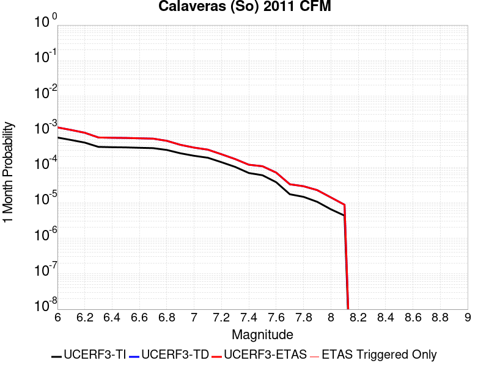 | 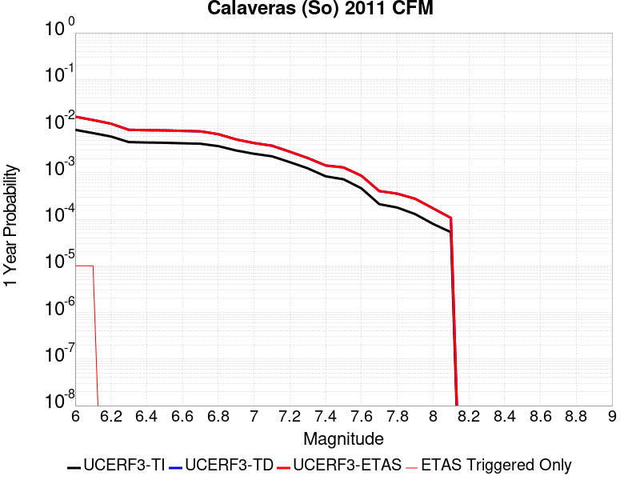 | 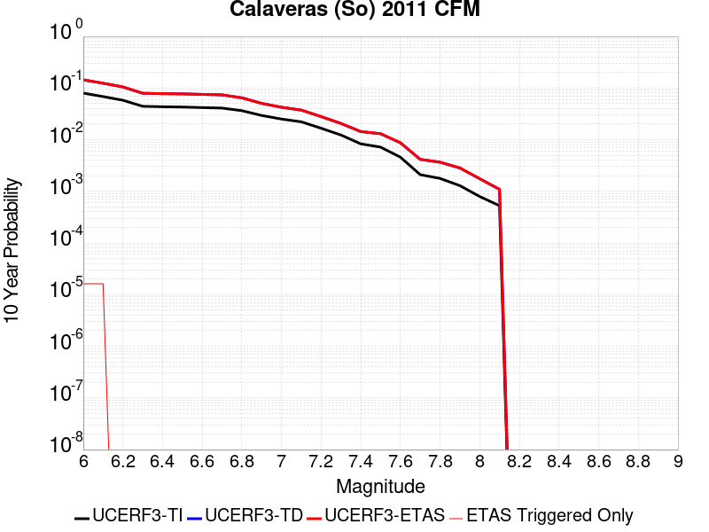 |

| Magnitude | 1 wk TI Prob | 1 wk TD Prob | 1 wk ETAS Prob | 1 wk ETAS/TD Gain | 1 wk ETAS Triggered Only | 1 mo TI Prob | 1 mo TD Prob | 1 mo ETAS Prob | 1 mo ETAS/TD Gain | 1 mo ETAS Triggered Only | 1 yr TI Prob | 1 yr TD Prob | 1 yr ETAS Prob | 1 yr ETAS/TD Gain | 1 yr ETAS Triggered Only | 10 yr TI Prob | 10 yr TD Prob | 10 yr ETAS Prob | 10 yr ETAS/TD Gain | 10 yr ETAS Triggered Only |
|-----|-----|-----|-----|-----|-----|-----|-----|-----|-----|-----|-----|-----|-----|-----|-----|-----|-----|-----|-----|-----|
| 6.0 | 1.5950744E-4 | 3.0713255E-4 | 3.0713255E-4 | 1.0 | 0.0 | 6.834242E-4 | 0.001315409 | 0.001315409 | 1.0 | 0.0 | 0.00828899 | 0.015858326 | 0.01588291 | 1.0015502 | 2.4980016E-5 | 0.079865426 | 0.14440185 | 0.14442322 | 1.000148 | 2.4980016E-5 |
| 6.1 | 1.3584697E-4 | 2.603514E-4 | 2.603514E-4 | 1.0 | 0.0 | 5.8207137E-4 | 0.0011151754 | 0.0011151754 | 1.0 | 0.0 | 0.007063716 | 0.013461385 | 0.013486029 | 1.0018307 | 2.4980016E-5 | 0.06843361 | 0.124029994 | 0.12405188 | 1.0001764 | 2.4980016E-5 |
| 6.2 | 1.14676266E-4 | 2.1714384E-4 | 2.1714384E-4 | 1.0 | 0.0 | 4.9137714E-4 | 9.30223E-4 | 9.30223E-4 | 1.0 | 0.0 | 0.0059661185 | 0.011245058 | 0.011245058 | 1.0 | 0.0 | 0.058084648 | 0.10502057 | 0.10502057 | 1.0 | 0.0 |
| 6.3 | 8.691518E-5 | 1.5987935E-4 | 1.5987935E-4 | 1.0 | 0.0 | 3.7244044E-4 | 6.849807E-4 | 6.849807E-4 | 1.0 | 0.0 | 0.004525038 | 0.008301122 | 0.008301122 | 1.0 | 0.0 | 0.044339992 | 0.0793365 | 0.0793365 | 1.0 | 0.0 |
| 6.4 | 8.50982E-5 | 1.5694331E-4 | 1.5694331E-4 | 1.0 | 0.0 | 3.646556E-4 | 6.724042E-4 | 6.724042E-4 | 1.0 | 0.0 | 0.0044306475 | 0.008149155 | 0.008149155 | 1.0 | 0.0 | 0.04343345 | 0.07794268 | 0.07794268 | 1.0 | 0.0 |
| 6.5 | 8.4062965E-5 | 1.5518743E-4 | 1.5518743E-4 | 1.0 | 0.0 | 3.602201E-4 | 6.6488347E-4 | 6.6488347E-4 | 1.0 | 0.0 | 0.004376863 | 0.008058365 | 0.008058365 | 1.0 | 0.0 | 0.042916555 | 0.07711388 | 0.07711388 | 1.0 | 0.0 |
| 6.6 | 8.194716E-5 | 1.5154552E-4 | 1.5154552E-4 | 1.0 | 0.0 | 3.5115483E-4 | 6.492843E-4 | 6.492843E-4 | 1.0 | 0.0 | 0.0042669317 | 0.007870209 | 0.007870209 | 1.0 | 0.0 | 0.04185927 | 0.07539919 | 0.07539919 | 1.0 | 0.0 |
| 6.7 | 8.012326E-5 | 1.4822475E-4 | 1.4822475E-4 | 1.0 | 0.0 | 3.433402E-4 | 6.350612E-4 | 6.350612E-4 | 1.0 | 0.0 | 0.004172157 | 0.007698701 | 0.007698701 | 1.0 | 0.0 | 0.040946912 | 0.07384132 | 0.07384132 | 1.0 | 0.0 |
| 6.8 | 7.119773E-5 | 1.2881879E-4 | 1.2881879E-4 | 1.0 | 0.0 | 3.0509746E-4 | 5.519494E-4 | 5.519494E-4 | 1.0 | 0.0 | 0.0037082357 | 0.006696066 | 0.006696066 | 1.0 | 0.0 | 0.036469642 | 0.06468575 | 0.06468575 | 1.0 | 0.0 |
| 6.9 | 5.7343088E-5 | 9.919277E-5 | 9.919277E-5 | 1.0 | 0.0 | 2.4573295E-4 | 4.25043E-4 | 4.25043E-4 | 1.0 | 0.0 | 0.0029876942 | 0.005162694 | 0.005162694 | 1.0 | 0.0 | 0.02947844 | 0.05051036 | 0.05051036 | 1.0 | 0.0 |
| 7.0 | 4.8746577E-5 | 8.2850725E-5 | 8.2850725E-5 | 1.0 | 0.0 | 2.0889717E-4 | 3.5502657E-4 | 3.5502657E-4 | 1.0 | 0.0 | 0.0025403565 | 0.004313948 | 0.004313948 | 1.0 | 0.0 | 0.025115121 | 0.042485245 | 0.042485245 | 1.0 | 0.0 |
| 7.1 | 4.2998014E-5 | 7.265203E-5 | 7.265203E-5 | 1.0 | 0.0 | 1.8426418E-4 | 3.1132903E-4 | 3.1132903E-4 | 1.0 | 0.0 | 0.002241108 | 0.003783903 | 0.003783903 | 1.0 | 0.0 | 0.022186412 | 0.037423562 | 0.037423562 | 1.0 | 0.0 |
| 7.2 | 3.221292E-5 | 5.390791E-5 | 5.390791E-5 | 1.0 | 0.0 | 1.3804805E-4 | 2.3101359E-4 | 2.3101359E-4 | 1.0 | 0.0 | 0.0016794393 | 0.0028089907 | 0.0028089907 | 1.0 | 0.0 | 0.016668037 | 0.02803602 | 0.02803602 | 1.0 | 0.0 |
| 7.3 | 2.3756531E-5 | 3.9473416E-5 | 3.9473416E-5 | 1.0 | 0.0 | 1.0180973E-4 | 1.6916092E-4 | 1.6916092E-4 | 1.0 | 0.0 | 0.0012388286 | 0.0020576057 | 0.0020576057 | 1.0 | 0.0 | 0.012319452 | 0.020643145 | 0.020643145 | 1.0 | 0.0 |
| 7.4 | 1.5997684E-5 | 2.7342163E-5 | 2.7342163E-5 | 1.0 | 0.0 | 6.8559704E-5 | 1.1717545E-4 | 1.1717545E-4 | 1.0 | 0.0 | 8.343947E-4 | 0.00142568 | 0.00142568 | 1.0 | 0.0 | 0.008312687 | 0.014376011 | 0.014376011 | 1.0 | 0.0 |
| 7.5 | 1.3814293E-5 | 2.4783874E-5 | 2.4783874E-5 | 1.0 | 0.0 | 5.9202768E-5 | 1.062123E-4 | 1.062123E-4 | 1.0 | 0.0 | 7.205553E-4 | 0.00129237 | 0.00129237 | 1.0 | 0.0 | 0.007182234 | 0.013055085 | 0.013055085 | 1.0 | 0.0 |
| 7.6 | 8.817309E-6 | 1.6430757E-5 | 1.6430757E-5 | 1.0 | 0.0 | 3.7787922E-5 | 7.0415634E-5 | 7.0415634E-5 | 1.0 | 0.0 | 4.5997082E-4 | 8.569745E-4 | 8.569745E-4 | 1.0 | 0.0 | 0.004590199 | 0.008719284 | 0.008719284 | 1.0 | 0.0 |
| 7.7 | 4.0352206E-6 | 7.707318E-6 | 7.707318E-6 | 1.0 | 0.0 | 1.7293689E-5 | 3.3030945E-5 | 3.3030945E-5 | 1.0 | 0.0 | 2.1053031E-4 | 4.0207763E-4 | 4.0207763E-4 | 1.0 | 0.0 | 0.0021033096 | 0.004165172 | 0.004165172 | 1.0 | 0.0 |
| 7.8 | 3.413169E-6 | 6.787282E-6 | 6.787282E-6 | 1.0 | 0.0 | 1.4627784E-5 | 2.9088029E-5 | 2.9088029E-5 | 1.0 | 0.0 | 1.7807873E-4 | 3.5408925E-4 | 3.5408925E-4 | 1.0 | 0.0 | 0.0017793609 | 0.0036665166 | 0.0036665166 | 1.0 | 0.0 |
| 7.9 | 2.4740732E-6 | 5.2791843E-6 | 5.2791843E-6 | 1.0 | 0.0 | 1.06031275E-5 | 2.262488E-5 | 2.262488E-5 | 1.0 | 0.0 | 1.2908543E-4 | 2.7542314E-4 | 2.7542314E-4 | 1.0 | 0.0 | 0.0012901047 | 0.0028347955 | 0.0028347955 | 1.0 | 0.0 |
| 8.0 | 1.5231818E-6 | 3.2889548E-6 | 3.2889548E-6 | 1.0 | 0.0 | 6.527906E-6 | 1.40954435E-5 | 1.40954435E-5 | 1.0 | 0.0 | 7.9474354E-5 | 1.7159856E-4 | 1.7159856E-4 | 1.0 | 0.0 | 7.944594E-4 | 0.0017564303 | 0.0017564303 | 1.0 | 0.0 |
| 8.1 | 1.0104524E-6 | 2.045782E-6 | 2.045782E-6 | 1.0 | 0.0 | 4.330503E-6 | 8.767608E-6 | 8.767608E-6 | 1.0 | 0.0 | 5.2722597E-5 | 1.0674043E-4 | 1.0674043E-4 | 1.0 | 0.0 | 5.271009E-4 | 0.001092934 | 0.001092934 | 1.0 | 0.0 |

## San Juan
*[(top)](#table-of-contents)*

| 1 Week | 1 Month | 1 Year | 10 Year |
|-----|-----|-----|-----|
| 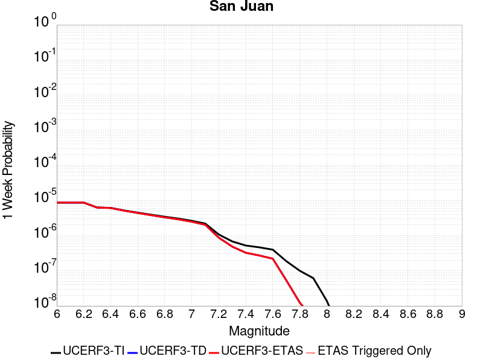 |  | 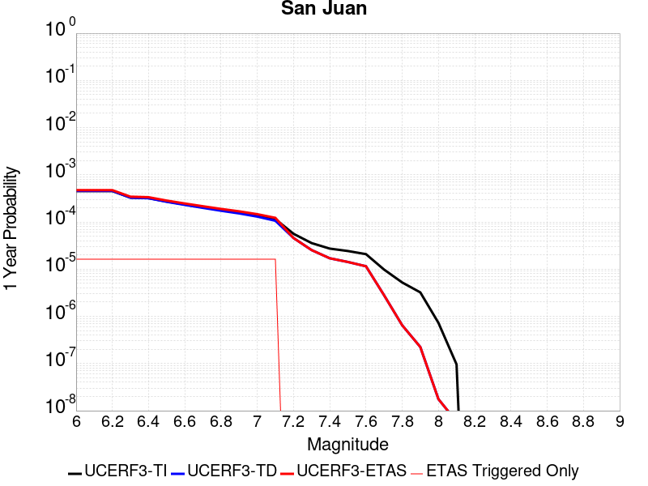 | 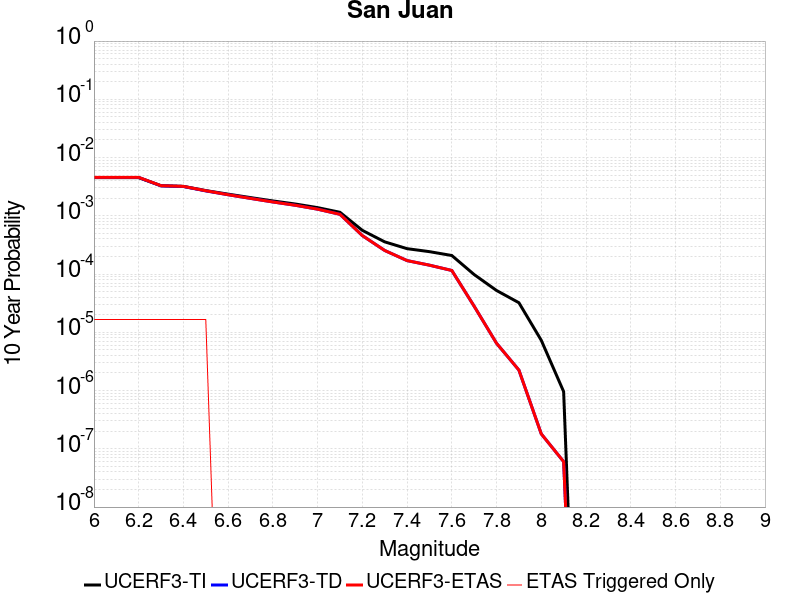 |

| Magnitude | 1 wk TI Prob | 1 wk TD Prob | 1 wk ETAS Prob | 1 wk ETAS/TD Gain | 1 wk ETAS Triggered Only | 1 mo TI Prob | 1 mo TD Prob | 1 mo ETAS Prob | 1 mo ETAS/TD Gain | 1 mo ETAS Triggered Only | 1 yr TI Prob | 1 yr TD Prob | 1 yr ETAS Prob | 1 yr ETAS/TD Gain | 1 yr ETAS Triggered Only | 10 yr TI Prob | 10 yr TD Prob | 10 yr ETAS Prob | 10 yr ETAS/TD Gain | 10 yr ETAS Triggered Only |
|-----|-----|-----|-----|-----|-----|-----|-----|-----|-----|-----|-----|-----|-----|-----|-----|-----|-----|-----|-----|-----|
| 6.0 | 8.682808E-6 | 8.74917E-6 | 8.74917E-6 | 1.0 | 0.0 | 3.72115E-5 | 3.749593E-5 | 3.749593E-5 | 1.0 | 0.0 | 4.5295584E-4 | 4.5642213E-4 | 4.5642213E-4 | 1.0 | 0.0 | 0.004520337 | 0.004555389 | 0.0045802547 | 1.0054586 | 2.4980016E-5 |
| 6.1 | 8.682808E-6 | 8.74917E-6 | 8.74917E-6 | 1.0 | 0.0 | 3.72115E-5 | 3.749593E-5 | 3.749593E-5 | 1.0 | 0.0 | 4.5295584E-4 | 4.5642213E-4 | 4.5642213E-4 | 1.0 | 0.0 | 0.004520337 | 0.004555389 | 0.0045802547 | 1.0054586 | 2.4980016E-5 |
| 6.2 | 8.682808E-6 | 8.74917E-6 | 8.74917E-6 | 1.0 | 0.0 | 3.72115E-5 | 3.749593E-5 | 3.749593E-5 | 1.0 | 0.0 | 4.5295584E-4 | 4.5642213E-4 | 4.5642213E-4 | 1.0 | 0.0 | 0.004520337 | 0.004555389 | 0.0045802547 | 1.0054586 | 2.4980016E-5 |
| 6.3 | 6.3054235E-6 | 6.282591E-6 | 6.282591E-6 | 1.0 | 0.0 | 2.7022963E-5 | 2.692512E-5 | 2.692512E-5 | 1.0 | 0.0 | 3.2895492E-4 | 3.2776545E-4 | 3.2776545E-4 | 1.0 | 0.0 | 0.003284684 | 0.0032730205 | 0.0032979187 | 1.0076071 | 2.4980016E-5 |
| 6.4 | 6.1490473E-6 | 6.1144706E-6 | 6.1144706E-6 | 1.0 | 0.0 | 2.6352795E-5 | 2.6204618E-5 | 2.6204618E-5 | 1.0 | 0.0 | 3.2079802E-4 | 3.189959E-4 | 3.189959E-4 | 1.0 | 0.0 | 0.0032033534 | 0.0031855768 | 0.003210477 | 1.0078167 | 2.4980016E-5 |
| 6.5 | 5.204848E-6 | 5.137238E-6 | 5.137238E-6 | 1.0 | 0.0 | 2.23063E-5 | 2.2016555E-5 | 2.2016555E-5 | 1.0 | 0.0 | 2.7154534E-4 | 2.6801953E-4 | 2.6801953E-4 | 1.0 | 0.0 | 0.0027121378 | 0.0026771172 | 0.0027020306 | 1.009306 | 2.4980016E-5 |
| 6.6 | 4.5179986E-6 | 4.415036E-6 | 4.415036E-6 | 1.0 | 0.0 | 1.9362706E-5 | 1.892145E-5 | 1.892145E-5 | 1.0 | 0.0 | 2.3571544E-4 | 2.303451E-4 | 2.303451E-4 | 1.0 | 0.0 | 0.0023546559 | 0.0023012008 | 0.0023012008 | 1.0 | 0.0 |
| 6.7 | 3.9442616E-6 | 3.8198336E-6 | 3.8198336E-6 | 1.0 | 0.0 | 1.6903869E-5 | 1.6370615E-5 | 1.6370615E-5 | 1.0 | 0.0 | 2.0578515E-4 | 1.9929469E-4 | 1.9929469E-4 | 1.0 | 0.0 | 0.002055947 | 0.001991285 | 0.001991285 | 1.0 | 0.0 |
| 6.8 | 3.4536245E-6 | 3.3163408E-6 | 3.3163408E-6 | 1.0 | 0.0 | 1.4801163E-5 | 1.4212815E-5 | 1.4212815E-5 | 1.0 | 0.0 | 1.8018926E-4 | 1.7302789E-4 | 1.7302789E-4 | 1.0 | 0.0 | 0.0018004322 | 0.001729051 | 0.001729051 | 1.0 | 0.0 |
| 6.9 | 3.059865E-6 | 2.9120363E-6 | 2.9120363E-6 | 1.0 | 0.0 | 1.3113641E-5 | 1.2480099E-5 | 1.2480099E-5 | 1.0 | 0.0 | 1.596469E-4 | 1.5193518E-4 | 1.5193518E-4 | 1.0 | 0.0 | 0.0015953224 | 0.0015184281 | 0.0015184281 | 1.0 | 0.0 |
| 7.0 | 2.6504351E-6 | 2.492005E-6 | 2.492005E-6 | 1.0 | 0.0 | 1.1358958E-5 | 1.0679981E-5 | 1.0679981E-5 | 1.0 | 0.0 | 1.3828653E-4 | 1.3002155E-4 | 1.3002155E-4 | 1.0 | 0.0 | 0.0013820052 | 0.001299567 | 0.001299567 | 1.0 | 0.0 |
| 7.1 | 2.2039317E-6 | 2.0338366E-6 | 2.0338366E-6 | 1.0 | 0.0 | 9.445387E-6 | 8.716416E-6 | 8.716416E-6 | 1.0 | 0.0 | 1.1499152E-4 | 1.0611773E-4 | 1.0611773E-4 | 1.0 | 0.0 | 0.0011493203 | 0.0010607811 | 0.0010607811 | 1.0 | 0.0 |
| 7.2 | 1.0786707E-6 | 8.770239E-7 | 8.770239E-7 | 1.0 | 0.0 | 4.622866E-6 | 3.7586685E-6 | 3.7586685E-6 | 1.0 | 0.0 | 5.628194E-5 | 4.576084E-5 | 4.576084E-5 | 1.0 | 0.0 | 5.6267687E-4 | 4.5757365E-4 | 4.5757365E-4 | 1.0 | 0.0 |
| 7.3 | 6.846433E-7 | 4.868812E-7 | 4.868812E-7 | 1.0 | 0.0 | 2.9341822E-6 | 2.086632E-6 | 2.086632E-6 | 1.0 | 0.0 | 3.5723086E-5 | 2.5404452E-5 | 2.5404452E-5 | 1.0 | 0.0 | 3.571734E-4 | 2.5405022E-4 | 2.5405022E-4 | 1.0 | 0.0 |
| 7.4 | 5.23043E-7 | 3.2627884E-7 | 3.2627884E-7 | 1.0 | 0.0 | 2.2416111E-6 | 1.3983371E-6 | 1.3983371E-6 | 1.0 | 0.0 | 2.7291273E-5 | 1.7024622E-5 | 1.7024622E-5 | 1.0 | 0.0 | 2.7287923E-4 | 1.7026608E-4 | 1.7026608E-4 | 1.0 | 0.0 |
| 7.5 | 4.648444E-7 | 2.723464E-7 | 2.723464E-7 | 1.0 | 0.0 | 1.9921886E-6 | 1.1671983E-6 | 1.1671983E-6 | 1.0 | 0.0 | 2.4254627E-5 | 1.4210547E-5 | 1.4210547E-5 | 1.0 | 0.0 | 2.425198E-4 | 1.4212691E-4 | 1.4212691E-4 | 1.0 | 0.0 |
| 7.6 | 3.9906567E-7 | 2.2083036E-7 | 2.2083036E-7 | 1.0 | 0.0 | 1.7102802E-6 | 9.4641547E-7 | 9.4641547E-7 | 1.0 | 0.0 | 2.0822463E-5 | 1.1522548E-5 | 1.1522548E-5 | 1.0 | 0.0 | 2.0820512E-4 | 1.15244526E-4 | 1.15244526E-4 | 1.0 | 0.0 |
| 7.7 | 1.8784601E-7 | 5.366277E-8 | 5.366277E-8 | 1.0 | 0.0 | 8.0505407E-7 | 2.2998329E-7 | 2.2998329E-7 | 1.0 | 0.0 | 9.80149E-6 | 2.800043E-6 | 2.800043E-6 | 1.0 | 0.0 | 9.801057E-5 | 2.8008939E-5 | 2.8008939E-5 | 1.0 | 0.0 |
| 7.8 | 1.00154914E-7 | 1.2412917E-8 | 1.2412917E-8 | 1.0 | 0.0 | 4.2923529E-7 | 5.3198217E-8 | 5.3198217E-8 | 1.0 | 0.0 | 5.225927E-6 | 6.476881E-7 | 6.476881E-7 | 1.0 | 0.0 | 5.225804E-5 | 6.4827886E-6 | 6.4827886E-6 | 1.0 | 0.0 |
| 7.9 | 6.171429E-8 | 4.2946513E-9 | 4.2946513E-9 | 1.0 | 0.0 | 2.6448978E-7 | 1.8405647E-8 | 1.8405647E-8 | 1.0 | 0.0 | 3.2201583E-6 | 2.2408874E-7 | 2.2408874E-7 | 1.0 | 0.0 | 3.2201115E-5 | 2.2462114E-6 | 2.2462114E-6 | 1.0 | 0.0 |
| 8.0 | 1.3974572E-8 | 3.3737857E-10 | 3.3737857E-10 | 1.0 | 0.0 | 5.989102E-8 | 1.4459075E-9 | 1.4459075E-9 | 1.0 | 0.0 | 7.2917294E-7 | 1.760392E-8 | 1.760392E-8 | 1.0 | 0.0 | 7.2917055E-6 | 1.8038004E-7 | 1.8038004E-7 | 1.0 | 0.0 |
| 8.1 | 1.8403477E-9 | 1.1291601E-10 | 1.1291601E-10 | 1.0 | 0.0 | 7.887204E-9 | 4.839261E-10 | 4.839261E-10 | 1.0 | 0.0 | 9.602671E-8 | 5.8917977E-9 | 5.8917977E-9 | 1.0 | 0.0 | 9.602667E-7 | 6.0206084E-8 | 6.0206084E-8 | 1.0 | 0.0 |

## Yorba Linda
*[(top)](#table-of-contents)*

| 1 Week | 1 Month | 1 Year | 10 Year |
|-----|-----|-----|-----|
|  |  | 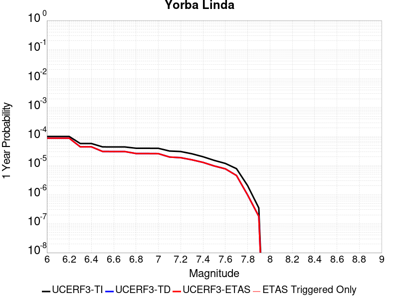 | 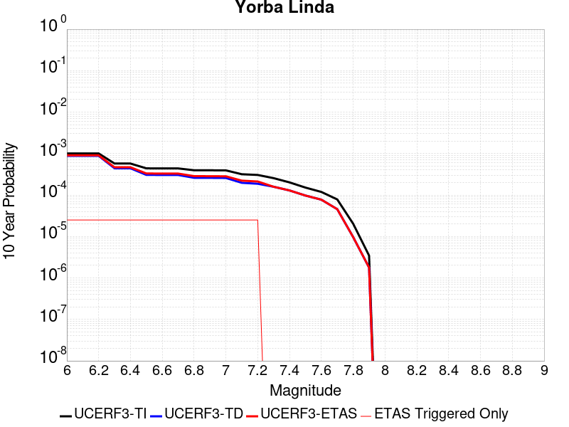 |

| Magnitude | 1 wk TI Prob | 1 wk TD Prob | 1 wk ETAS Prob | 1 wk ETAS/TD Gain | 1 wk ETAS Triggered Only | 1 mo TI Prob | 1 mo TD Prob | 1 mo ETAS Prob | 1 mo ETAS/TD Gain | 1 mo ETAS Triggered Only | 1 yr TI Prob | 1 yr TD Prob | 1 yr ETAS Prob | 1 yr ETAS/TD Gain | 1 yr ETAS Triggered Only | 10 yr TI Prob | 10 yr TD Prob | 10 yr ETAS Prob | 10 yr ETAS/TD Gain | 10 yr ETAS Triggered Only |
|-----|-----|-----|-----|-----|-----|-----|-----|-----|-----|-----|-----|-----|-----|-----|-----|-----|-----|-----|-----|-----|
| 6.0 | 1.9346849E-6 | 1.6909112E-6 | 1.6909112E-6 | 1.0 | 0.0 | 8.29148E-6 | 7.2467474E-6 | 7.2467474E-6 | 1.0 | 0.0 | 1.009441E-4 | 8.822652E-5 | 8.822652E-5 | 1.0 | 0.0 | 0.0010089825 | 8.8200805E-4 | 9.0696604E-4 | 1.0282968 | 2.4980016E-5 |
| 6.1 | 1.9346849E-6 | 1.6909112E-6 | 1.6909112E-6 | 1.0 | 0.0 | 8.29148E-6 | 7.2467474E-6 | 7.2467474E-6 | 1.0 | 0.0 | 1.009441E-4 | 8.822652E-5 | 8.822652E-5 | 1.0 | 0.0 | 0.0010089825 | 8.8200805E-4 | 9.0696604E-4 | 1.0282968 | 2.4980016E-5 |
| 6.2 | 1.9346849E-6 | 1.6909112E-6 | 1.6909112E-6 | 1.0 | 0.0 | 8.29148E-6 | 7.2467474E-6 | 7.2467474E-6 | 1.0 | 0.0 | 1.009441E-4 | 8.822652E-5 | 8.822652E-5 | 1.0 | 0.0 | 0.0010089825 | 8.8200805E-4 | 9.0696604E-4 | 1.0282968 | 2.4980016E-5 |
| 6.3 | 1.1028608E-6 | 8.481863E-7 | 8.481863E-7 | 1.0 | 0.0 | 4.7265376E-6 | 3.6350793E-6 | 3.6350793E-6 | 1.0 | 0.0 | 5.754407E-5 | 4.425626E-5 | 4.425626E-5 | 1.0 | 0.0 | 5.7529175E-4 | 4.42481E-4 | 4.6744995E-4 | 1.0564295 | 2.4980016E-5 |
| 6.4 | 1.1028608E-6 | 8.481863E-7 | 8.481863E-7 | 1.0 | 0.0 | 4.7265376E-6 | 3.6350793E-6 | 3.6350793E-6 | 1.0 | 0.0 | 5.754407E-5 | 4.425626E-5 | 4.425626E-5 | 1.0 | 0.0 | 5.7529175E-4 | 4.42481E-4 | 4.6744995E-4 | 1.0564295 | 2.4980016E-5 |
| 6.5 | 8.4451364E-7 | 5.869109E-7 | 5.869109E-7 | 1.0 | 0.0 | 3.619339E-6 | 2.5153304E-6 | 2.5153304E-6 | 1.0 | 0.0 | 4.406456E-5 | 3.0623738E-5 | 3.0623738E-5 | 1.0 | 0.0 | 4.4055824E-4 | 3.0619733E-4 | 3.311697E-4 | 1.0815564 | 2.4980016E-5 |
| 6.6 | 8.422957E-7 | 5.844643E-7 | 5.844643E-7 | 1.0 | 0.0 | 3.6098338E-6 | 2.5048448E-6 | 2.5048448E-6 | 1.0 | 0.0 | 4.3948843E-5 | 3.049608E-5 | 3.049608E-5 | 1.0 | 0.0 | 4.394015E-4 | 3.049211E-4 | 3.298935E-4 | 1.0818979 | 2.4980016E-5 |
| 6.7 | 8.4119705E-7 | 5.832485E-7 | 5.832485E-7 | 1.0 | 0.0 | 3.6051254E-6 | 2.499634E-6 | 2.499634E-6 | 1.0 | 0.0 | 4.3891516E-5 | 3.0432642E-5 | 3.0432642E-5 | 1.0 | 0.0 | 4.388285E-4 | 3.042869E-4 | 3.292593E-4 | 1.0820687 | 2.4980016E-5 |
| 6.8 | 7.5919155E-7 | 4.9949944E-7 | 4.9949944E-7 | 1.0 | 0.0 | 3.253674E-6 | 2.1407102E-6 | 2.1407102E-6 | 1.0 | 0.0 | 3.961276E-5 | 2.6062853E-5 | 2.6062853E-5 | 1.0 | 0.0 | 3.9605703E-4 | 2.6059969E-4 | 2.855732E-4 | 1.0958309 | 2.4980016E-5 |
| 6.9 | 7.5804564E-7 | 4.981178E-7 | 4.981178E-7 | 1.0 | 0.0 | 3.248763E-6 | 2.134789E-6 | 2.134789E-6 | 1.0 | 0.0 | 3.955297E-5 | 2.5990763E-5 | 2.5990763E-5 | 1.0 | 0.0 | 3.9545933E-4 | 2.5987893E-4 | 2.8485246E-4 | 1.0960968 | 2.4980016E-5 |
| 7.0 | 7.539293E-7 | 4.943313E-7 | 4.943313E-7 | 1.0 | 0.0 | 3.2311218E-6 | 2.118561E-6 | 2.118561E-6 | 1.0 | 0.0 | 3.9338196E-5 | 2.5793192E-5 | 2.5793192E-5 | 1.0 | 0.0 | 3.9331234E-4 | 2.579037E-4 | 2.8287727E-4 | 1.096833 | 2.4980016E-5 |
| 7.1 | 6.0900885E-7 | 3.7817128E-7 | 3.7817128E-7 | 1.0 | 0.0 | 2.6100352E-6 | 1.6207331E-6 | 1.6207331E-6 | 1.0 | 0.0 | 3.1776715E-5 | 1.973225E-5 | 1.973225E-5 | 1.0 | 0.0 | 3.1772171E-4 | 1.9730533E-4 | 2.2228042E-4 | 1.126581 | 2.4980016E-5 |
| 7.2 | 5.849925E-7 | 3.5878818E-7 | 3.5878818E-7 | 1.0 | 0.0 | 2.5071083E-6 | 1.5376628E-6 | 1.5376628E-6 | 1.0 | 0.0 | 3.0523614E-5 | 1.8720886E-5 | 1.8720886E-5 | 1.0 | 0.0 | 3.0519423E-4 | 1.8719342E-4 | 2.1216877E-4 | 1.13342 | 2.4980016E-5 |
| 7.3 | 4.89808E-7 | 3.0379488E-7 | 3.0379488E-7 | 1.0 | 0.0 | 2.0991754E-6 | 1.3019775E-6 | 1.3019775E-6 | 1.0 | 0.0 | 2.5557161E-5 | 1.5851463E-5 | 1.5851463E-5 | 1.0 | 0.0 | 2.5554223E-4 | 1.5850355E-4 | 1.5850355E-4 | 1.0 | 0.0 |
| 7.4 | 3.8700415E-7 | 2.4722343E-7 | 2.4722343E-7 | 1.0 | 0.0 | 1.6585881E-6 | 1.0595286E-6 | 1.0595286E-6 | 1.0 | 0.0 | 2.0193123E-5 | 1.2899685E-5 | 1.2899685E-5 | 1.0 | 0.0 | 2.0191289E-4 | 1.2898949E-4 | 1.2898949E-4 | 1.0 | 0.0 |
| 7.5 | 2.900565E-7 | 1.8637462E-7 | 1.8637462E-7 | 1.0 | 0.0 | 1.2430987E-6 | 7.9874815E-7 | 7.9874815E-7 | 1.0 | 0.0 | 1.5134622E-5 | 9.724716E-6 | 9.724716E-6 | 1.0 | 0.0 | 1.5133592E-4 | 9.7242984E-5 | 9.7242984E-5 | 1.0 | 0.0 |
| 7.6 | 2.2770318E-7 | 1.4814276E-7 | 1.4814276E-7 | 1.0 | 0.0 | 9.758704E-7 | 6.348974E-7 | 6.348974E-7 | 1.0 | 0.0 | 1.1881158E-5 | 7.729848E-6 | 7.729848E-6 | 1.0 | 0.0 | 1.1880523E-4 | 7.729585E-5 | 7.729585E-5 | 1.0 | 0.0 |
| 7.7 | 1.5017194E-7 | 8.7355275E-8 | 8.7355275E-8 | 1.0 | 0.0 | 6.4359386E-7 | 3.7437968E-7 | 3.7437968E-7 | 1.0 | 0.0 | 7.835727E-6 | 4.5580637E-6 | 4.5580637E-6 | 1.0 | 0.0 | 7.835451E-5 | 4.5579727E-5 | 4.5579727E-5 | 1.0 | 0.0 |
| 7.8 | 3.895753E-8 | 1.8532088E-8 | 1.8532088E-8 | 1.0 | 0.0 | 1.6696083E-7 | 7.942323E-8 | 7.942323E-8 | 1.0 | 0.0 | 2.0327461E-6 | 9.669774E-7 | 9.669774E-7 | 1.0 | 0.0 | 2.0327276E-5 | 9.669734E-6 | 9.669734E-6 | 1.0 | 0.0 |
| 7.9 | 6.648505E-9 | 3.4183114E-9 | 3.4183114E-9 | 1.0 | 0.0 | 2.8493591E-8 | 1.4649906E-8 | 1.4649906E-8 | 1.0 | 0.0 | 3.4690942E-7 | 1.783626E-7 | 1.783626E-7 | 1.0 | 0.0 | 3.4690888E-6 | 1.7836247E-6 | 1.7836247E-6 | 1.0 | 0.0 |

## White Wolf
*[(top)](#table-of-contents)*

| 1 Week | 1 Month | 1 Year | 10 Year |
|-----|-----|-----|-----|
| 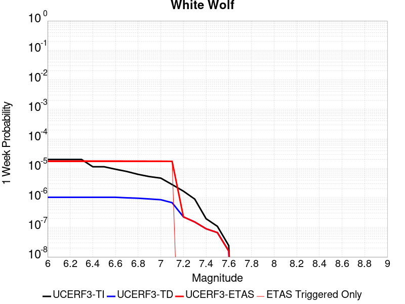 | 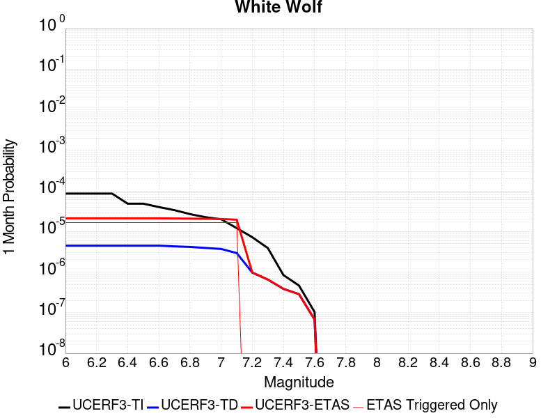 | 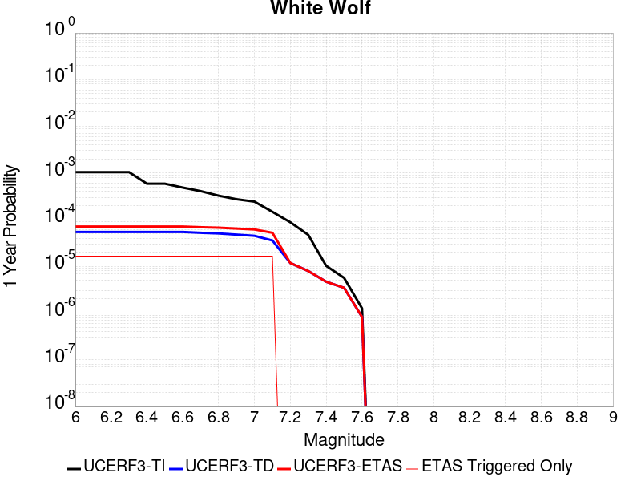 | 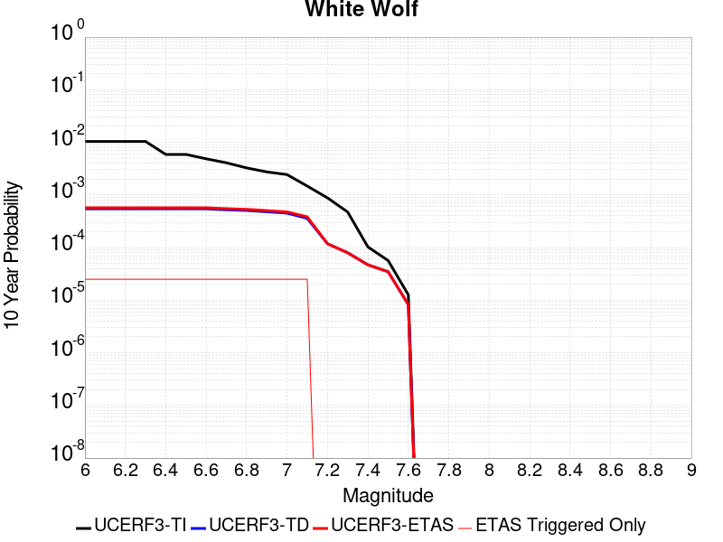 |

| Magnitude | 1 wk TI Prob | 1 wk TD Prob | 1 wk ETAS Prob | 1 wk ETAS/TD Gain | 1 wk ETAS Triggered Only | 1 mo TI Prob | 1 mo TD Prob | 1 mo ETAS Prob | 1 mo ETAS/TD Gain | 1 mo ETAS Triggered Only | 1 yr TI Prob | 1 yr TD Prob | 1 yr ETAS Prob | 1 yr ETAS/TD Gain | 1 yr ETAS Triggered Only | 10 yr TI Prob | 10 yr TD Prob | 10 yr ETAS Prob | 10 yr ETAS/TD Gain | 10 yr ETAS Triggered Only |
|-----|-----|-----|-----|-----|-----|-----|-----|-----|-----|-----|-----|-----|-----|-----|-----|-----|-----|-----|-----|-----|
| 6.0 | 2.0037822E-5 | 1.0468583E-6 | 2.6026848E-5 | 24.861864 | 2.4980016E-5 | 8.587355E-5 | 4.4865283E-6 | 2.9466431E-5 | 6.567758 | 2.4980016E-5 | 0.001045009 | 5.4622164E-5 | 7.960082E-5 | 1.4572989 | 2.4980016E-5 | 0.010401085 | 5.4609246E-4 | 5.7105883E-4 | 1.0457182 | 2.4980016E-5 |
| 6.1 | 2.0037822E-5 | 1.0468583E-6 | 2.6026848E-5 | 24.861864 | 2.4980016E-5 | 8.587355E-5 | 4.4865283E-6 | 2.9466431E-5 | 6.567758 | 2.4980016E-5 | 0.001045009 | 5.4622164E-5 | 7.960082E-5 | 1.4572989 | 2.4980016E-5 | 0.010401085 | 5.4609246E-4 | 5.7105883E-4 | 1.0457182 | 2.4980016E-5 |
| 6.2 | 2.0037822E-5 | 1.0468583E-6 | 2.6026848E-5 | 24.861864 | 2.4980016E-5 | 8.587355E-5 | 4.4865283E-6 | 2.9466431E-5 | 6.567758 | 2.4980016E-5 | 0.001045009 | 5.4622164E-5 | 7.960082E-5 | 1.4572989 | 2.4980016E-5 | 0.010401085 | 5.4609246E-4 | 5.7105883E-4 | 1.0457182 | 2.4980016E-5 |
| 6.3 | 2.0037822E-5 | 1.0468583E-6 | 2.6026848E-5 | 24.861864 | 2.4980016E-5 | 8.587355E-5 | 4.4865283E-6 | 2.9466431E-5 | 6.567758 | 2.4980016E-5 | 0.001045009 | 5.4622164E-5 | 7.960082E-5 | 1.4572989 | 2.4980016E-5 | 0.010401085 | 5.4609246E-4 | 5.7105883E-4 | 1.0457182 | 2.4980016E-5 |
| 6.4 | 1.132487E-5 | 1.0468583E-6 | 2.6026848E-5 | 24.861864 | 2.4980016E-5 | 4.8534253E-5 | 4.4865283E-6 | 2.9466431E-5 | 6.567758 | 2.4980016E-5 | 5.907443E-4 | 5.4622164E-5 | 7.960082E-5 | 1.4572989 | 2.4980016E-5 | 0.005891764 | 5.4609246E-4 | 5.7105883E-4 | 1.0457182 | 2.4980016E-5 |
| 6.5 | 1.132487E-5 | 1.0468583E-6 | 2.6026848E-5 | 24.861864 | 2.4980016E-5 | 4.8534253E-5 | 4.4865283E-6 | 2.9466431E-5 | 6.567758 | 2.4980016E-5 | 5.907443E-4 | 5.4622164E-5 | 7.960082E-5 | 1.4572989 | 2.4980016E-5 | 0.005891764 | 5.4609246E-4 | 5.7105883E-4 | 1.0457182 | 2.4980016E-5 |
| 6.6 | 9.347473E-6 | 1.0468583E-6 | 2.6026848E-5 | 24.861864 | 2.4980016E-5 | 4.0059982E-5 | 4.4865283E-6 | 2.9466431E-5 | 6.567758 | 2.4980016E-5 | 4.8762115E-4 | 5.4622164E-5 | 7.960082E-5 | 1.4572989 | 2.4980016E-5 | 0.0048655253 | 5.4609246E-4 | 5.7105883E-4 | 1.0457182 | 2.4980016E-5 |
| 6.7 | 7.842647E-6 | 1.0047773E-6 | 2.5984767E-5 | 25.861221 | 2.4980016E-5 | 3.361091E-5 | 4.306182E-6 | 2.928609E-5 | 6.8009415 | 2.4980016E-5 | 4.0913603E-4 | 5.2426552E-5 | 7.740526E-5 | 1.4764514 | 2.4980016E-5 | 0.004083836 | 5.241468E-4 | 5.491137E-4 | 1.0476334 | 2.4980016E-5 |
| 6.8 | 6.26597E-6 | 9.734289E-7 | 2.595342E-5 | 26.661858 | 2.4980016E-5 | 2.685388E-5 | 4.1718313E-6 | 2.9151743E-5 | 6.9877567 | 2.4980016E-5 | 3.2689696E-4 | 5.0790914E-5 | 7.576966E-5 | 1.4917955 | 2.4980016E-5 | 0.003264165 | 5.07798E-4 | 5.327653E-4 | 1.0491679 | 2.4980016E-5 |
| 6.9 | 5.258436E-6 | 9.1827343E-7 | 2.5898267E-5 | 28.203218 | 2.4980016E-5 | 2.2535958E-5 | 3.935452E-6 | 2.891537E-5 | 7.347408 | 2.4980016E-5 | 2.7434074E-4 | 4.7913123E-5 | 7.289194E-5 | 1.5213356 | 2.4980016E-5 | 0.0027400232 | 4.7903272E-4 | 5.0400075E-4 | 1.0521218 | 2.4980016E-5 |
| 7.0 | 4.675028E-6 | 8.660704E-7 | 2.5846064E-5 | 29.842915 | 2.4980016E-5 | 2.003568E-5 | 3.7117254E-6 | 2.869165E-5 | 7.7300034 | 2.4980016E-5 | 2.4390711E-4 | 4.518937E-5 | 7.016825E-5 | 1.5527602 | 2.4980016E-5 | 0.0024363957 | 4.518065E-4 | 4.7677523E-4 | 1.0552642 | 2.4980016E-5 |
| 7.1 | 2.8270078E-6 | 6.8737717E-7 | 2.5667376E-5 | 37.341038 | 2.4980016E-5 | 1.2115692E-5 | 2.945899E-6 | 2.7925842E-5 | 9.479566 | 2.4980016E-5 | 1.4749856E-4 | 3.586577E-5 | 6.084489E-5 | 1.6964612 | 2.4980016E-5 | 0.001474007 | 3.5860392E-4 | 3.8357498E-4 | 1.0696341 | 2.4980016E-5 |
| 7.2 | 1.6881406E-6 | 2.2703432E-7 | 2.2703432E-7 | 1.0 | 0.0 | 7.2348685E-6 | 9.730038E-7 | 9.730038E-7 | 1.0 | 0.0 | 8.808096E-5 | 1.1846259E-5 | 1.1846259E-5 | 1.0 | 0.0 | 8.8046055E-4 | 1.1845643E-4 | 1.1845643E-4 | 1.0 | 0.0 |
| 7.3 | 9.086107E-7 | 1.5264496E-7 | 1.5264496E-7 | 1.0 | 0.0 | 3.8940398E-6 | 6.5419255E-7 | 6.5419255E-7 | 1.0 | 0.0 | 4.7408903E-5 | 7.964766E-6 | 7.964766E-6 | 1.0 | 0.0 | 4.739879E-4 | 7.964489E-5 | 7.964489E-5 | 1.0 | 0.0 |
| 7.4 | 1.9717383E-7 | 9.003399E-8 | 9.003399E-8 | 1.0 | 0.0 | 8.450304E-7 | 3.8585992E-7 | 3.8585992E-7 | 1.0 | 0.0 | 1.0288197E-5 | 4.697835E-6 | 4.697835E-6 | 1.0 | 0.0 | 1.028772E-4 | 4.6977384E-5 | 4.6977384E-5 | 1.0 | 0.0 |
| 7.5 | 1.086975E-7 | 6.659662E-8 | 6.659662E-8 | 1.0 | 0.0 | 4.6584634E-7 | 2.8541407E-7 | 2.8541407E-7 | 1.0 | 0.0 | 5.6716644E-6 | 3.474911E-6 | 3.474911E-6 | 1.0 | 0.0 | 5.6715195E-5 | 3.474859E-5 | 3.474859E-5 | 1.0 | 0.0 |
| 7.6 | 2.4217808E-8 | 1.5820849E-8 | 1.5820849E-8 | 1.0 | 0.0 | 1.03790605E-7 | 6.780364E-8 | 6.780364E-8 | 1.0 | 0.0 | 1.2636499E-6 | 8.25509E-7 | 8.25509E-7 | 1.0 | 0.0 | 1.2636427E-5 | 8.255064E-6 | 8.255064E-6 | 1.0 | 0.0 |

## Pitas Point (Lower)-Montalvo
*[(top)](#table-of-contents)*

| 1 Week | 1 Month | 1 Year | 10 Year |
|-----|-----|-----|-----|
|  | 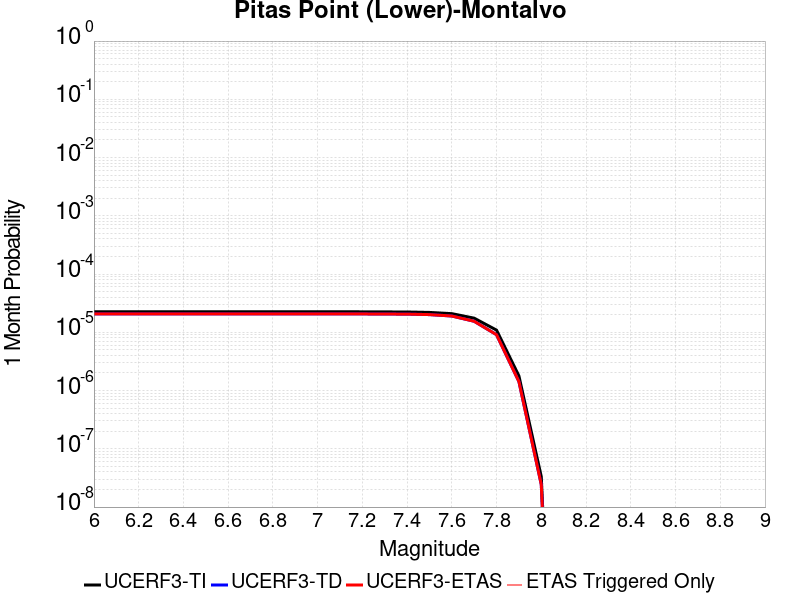 |  | 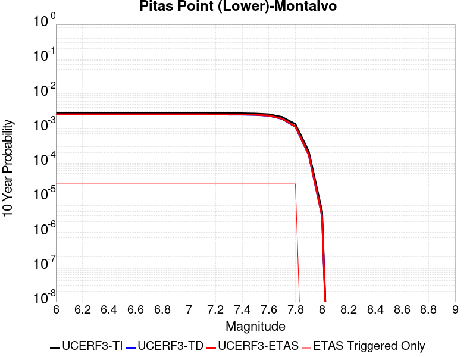 |

| Magnitude | 1 wk TI Prob | 1 wk TD Prob | 1 wk ETAS Prob | 1 wk ETAS/TD Gain | 1 wk ETAS Triggered Only | 1 mo TI Prob | 1 mo TD Prob | 1 mo ETAS Prob | 1 mo ETAS/TD Gain | 1 mo ETAS Triggered Only | 1 yr TI Prob | 1 yr TD Prob | 1 yr ETAS Prob | 1 yr ETAS/TD Gain | 1 yr ETAS Triggered Only | 10 yr TI Prob | 10 yr TD Prob | 10 yr ETAS Prob | 10 yr ETAS/TD Gain | 10 yr ETAS Triggered Only |
|-----|-----|-----|-----|-----|-----|-----|-----|-----|-----|-----|-----|-----|-----|-----|-----|-----|-----|-----|-----|-----|
| 6.0 | 5.2543637E-6 | 4.8379025E-6 | 4.8379025E-6 | 1.0 | 0.0 | 2.2518509E-5 | 2.0733705E-5 | 2.0733705E-5 | 1.0 | 0.0 | 2.7412834E-4 | 2.5240393E-4 | 2.5240393E-4 | 1.0 | 0.0 | 0.0027379042 | 0.0025212052 | 0.002546122 | 1.0098829 | 2.4980016E-5 |
| 6.1 | 5.2543637E-6 | 4.8379025E-6 | 4.8379025E-6 | 1.0 | 0.0 | 2.2518509E-5 | 2.0733705E-5 | 2.0733705E-5 | 1.0 | 0.0 | 2.7412834E-4 | 2.5240393E-4 | 2.5240393E-4 | 1.0 | 0.0 | 0.0027379042 | 0.0025212052 | 0.002546122 | 1.0098829 | 2.4980016E-5 |
| 6.2 | 5.2543637E-6 | 4.8379025E-6 | 4.8379025E-6 | 1.0 | 0.0 | 2.2518509E-5 | 2.0733705E-5 | 2.0733705E-5 | 1.0 | 0.0 | 2.7412834E-4 | 2.5240393E-4 | 2.5240393E-4 | 1.0 | 0.0 | 0.0027379042 | 0.0025212052 | 0.002546122 | 1.0098829 | 2.4980016E-5 |
| 6.3 | 5.2543637E-6 | 4.8379025E-6 | 4.8379025E-6 | 1.0 | 0.0 | 2.2518509E-5 | 2.0733705E-5 | 2.0733705E-5 | 1.0 | 0.0 | 2.7412834E-4 | 2.5240393E-4 | 2.5240393E-4 | 1.0 | 0.0 | 0.0027379042 | 0.0025212052 | 0.002546122 | 1.0098829 | 2.4980016E-5 |
| 6.4 | 5.2543637E-6 | 4.8379025E-6 | 4.8379025E-6 | 1.0 | 0.0 | 2.2518509E-5 | 2.0733705E-5 | 2.0733705E-5 | 1.0 | 0.0 | 2.7412834E-4 | 2.5240393E-4 | 2.5240393E-4 | 1.0 | 0.0 | 0.0027379042 | 0.0025212052 | 0.002546122 | 1.0098829 | 2.4980016E-5 |
| 6.5 | 5.2543637E-6 | 4.8379025E-6 | 4.8379025E-6 | 1.0 | 0.0 | 2.2518509E-5 | 2.0733705E-5 | 2.0733705E-5 | 1.0 | 0.0 | 2.7412834E-4 | 2.5240393E-4 | 2.5240393E-4 | 1.0 | 0.0 | 0.0027379042 | 0.0025212052 | 0.002546122 | 1.0098829 | 2.4980016E-5 |
| 6.6 | 5.2543637E-6 | 4.8379025E-6 | 4.8379025E-6 | 1.0 | 0.0 | 2.2518509E-5 | 2.0733705E-5 | 2.0733705E-5 | 1.0 | 0.0 | 2.7412834E-4 | 2.5240393E-4 | 2.5240393E-4 | 1.0 | 0.0 | 0.0027379042 | 0.0025212052 | 0.002546122 | 1.0098829 | 2.4980016E-5 |
| 6.7 | 5.2543637E-6 | 4.8379025E-6 | 4.8379025E-6 | 1.0 | 0.0 | 2.2518509E-5 | 2.0733705E-5 | 2.0733705E-5 | 1.0 | 0.0 | 2.7412834E-4 | 2.5240393E-4 | 2.5240393E-4 | 1.0 | 0.0 | 0.0027379042 | 0.0025212052 | 0.002546122 | 1.0098829 | 2.4980016E-5 |
| 6.8 | 5.2543637E-6 | 4.8379025E-6 | 4.8379025E-6 | 1.0 | 0.0 | 2.2518509E-5 | 2.0733705E-5 | 2.0733705E-5 | 1.0 | 0.0 | 2.7412834E-4 | 2.5240393E-4 | 2.5240393E-4 | 1.0 | 0.0 | 0.0027379042 | 0.0025212052 | 0.002546122 | 1.0098829 | 2.4980016E-5 |
| 6.9 | 5.2543637E-6 | 4.8379025E-6 | 4.8379025E-6 | 1.0 | 0.0 | 2.2518509E-5 | 2.0733705E-5 | 2.0733705E-5 | 1.0 | 0.0 | 2.7412834E-4 | 2.5240393E-4 | 2.5240393E-4 | 1.0 | 0.0 | 0.0027379042 | 0.0025212052 | 0.002546122 | 1.0098829 | 2.4980016E-5 |
| 7.0 | 5.2543637E-6 | 4.8379025E-6 | 4.8379025E-6 | 1.0 | 0.0 | 2.2518509E-5 | 2.0733705E-5 | 2.0733705E-5 | 1.0 | 0.0 | 2.7412834E-4 | 2.5240393E-4 | 2.5240393E-4 | 1.0 | 0.0 | 0.0027379042 | 0.0025212052 | 0.002546122 | 1.0098829 | 2.4980016E-5 |
| 7.1 | 5.2543637E-6 | 4.8379025E-6 | 4.8379025E-6 | 1.0 | 0.0 | 2.2518509E-5 | 2.0733705E-5 | 2.0733705E-5 | 1.0 | 0.0 | 2.7412834E-4 | 2.5240393E-4 | 2.5240393E-4 | 1.0 | 0.0 | 0.0027379042 | 0.0025212052 | 0.002546122 | 1.0098829 | 2.4980016E-5 |
| 7.2 | 5.2458695E-6 | 4.8290563E-6 | 4.8290563E-6 | 1.0 | 0.0 | 2.2482105E-5 | 2.0695794E-5 | 2.0695794E-5 | 1.0 | 0.0 | 2.7368523E-4 | 2.5194246E-4 | 2.5194246E-4 | 1.0 | 0.0 | 0.0027334841 | 0.002516601 | 0.002541518 | 1.0099012 | 2.4980016E-5 |
| 7.3 | 5.22665E-6 | 4.8089737E-6 | 4.8089737E-6 | 1.0 | 0.0 | 2.2399736E-5 | 2.0609727E-5 | 2.0609727E-5 | 1.0 | 0.0 | 2.7268266E-4 | 2.5089484E-4 | 2.5089484E-4 | 1.0 | 0.0 | 0.002723483 | 0.0025061483 | 0.0025310656 | 1.0099425 | 2.4980016E-5 |
| 7.4 | 5.210642E-6 | 4.7921862E-6 | 4.7921862E-6 | 1.0 | 0.0 | 2.233113E-5 | 2.053778E-5 | 2.053778E-5 | 1.0 | 0.0 | 2.718476E-4 | 2.500191E-4 | 2.500191E-4 | 1.0 | 0.0 | 0.002715153 | 0.0024974106 | 0.0025223282 | 1.0099773 | 2.4980016E-5 |
| 7.5 | 5.1226016E-6 | 4.7000726E-6 | 4.7000726E-6 | 1.0 | 0.0 | 2.1953823E-5 | 2.0143016E-5 | 2.0143016E-5 | 1.0 | 0.0 | 2.67255E-4 | 2.4521392E-4 | 2.4521392E-4 | 1.0 | 0.0 | 0.0026693381 | 0.002449465 | 0.002474384 | 1.0101732 | 2.4980016E-5 |
| 7.6 | 4.8796987E-6 | 4.4449725E-6 | 4.4449725E-6 | 1.0 | 0.0 | 2.0912828E-5 | 1.9049745E-5 | 1.9049745E-5 | 1.0 | 0.0 | 2.5458392E-4 | 2.3190626E-4 | 2.3190626E-4 | 1.0 | 0.0 | 0.0025429246 | 0.0023166733 | 0.0023415952 | 1.0107577 | 2.4980016E-5 |
| 7.7 | 4.0834398E-6 | 3.6091444E-6 | 3.6091444E-6 | 1.0 | 0.0 | 1.7500339E-5 | 1.546767E-5 | 1.546767E-5 | 1.0 | 0.0 | 2.1304579E-4 | 1.8830286E-4 | 1.8830286E-4 | 1.0 | 0.0 | 0.0021284167 | 0.0018814567 | 0.0019063897 | 1.013252 | 2.4980016E-5 |
| 7.8 | 2.5445438E-6 | 2.1212566E-6 | 2.1212566E-6 | 1.0 | 0.0 | 1.0905142E-5 | 9.091068E-6 | 9.091068E-6 | 1.0 | 0.0 | 1.3276201E-4 | 1.1067818E-4 | 1.1067818E-4 | 1.0 | 0.0 | 0.0013268272 | 0.0011062352 | 0.0011311877 | 1.0225562 | 2.4980016E-5 |
| 7.9 | 4.1677114E-7 | 3.3294015E-7 | 3.3294015E-7 | 1.0 | 0.0 | 1.7861609E-6 | 1.4268857E-6 | 1.4268857E-6 | 1.0 | 0.0 | 2.1746291E-5 | 1.7372196E-5 | 1.7372196E-5 | 1.0 | 0.0 | 2.1744163E-4 | 1.737087E-4 | 1.737087E-4 | 1.0 | 0.0 |
| 8.0 | 7.791402E-9 | 5.6836056E-9 | 5.6836056E-9 | 1.0 | 0.0 | 3.3391725E-8 | 2.4358311E-8 | 2.4358311E-8 | 1.0 | 0.0 | 4.0654416E-7 | 2.965624E-7 | 2.965624E-7 | 1.0 | 0.0 | 4.065434E-6 | 2.9656223E-6 | 2.9656223E-6 | 1.0 | 0.0 |

