# Parent Section Magnitude-Probability Distributions

Only fault sections with at least one triggered aftershock are plotted. Sections are sorted by total supraseismogenic trigger rate (decreasing)

## Table Of Contents

* [Garlock (Central)](#garlock-central)
* [Tank Canyon](#tank-canyon)
* [Little Lake](#little-lake)
* [Airport Lake](#airport-lake)
* [Owl Lake](#owl-lake)
* [Panamint Valley](#panamint-valley)
* [Garlock (East)](#garlock-east)
* [Hunter Mountain-Saline Valley](#hunter-mountain-saline-valley)
* [Blackwater](#blackwater)
* [Ash Hill](#ash-hill)
* [Garlock (West)](#garlock-west)
* [McLean Lake](#mclean-lake)
* [Gravel Hills-Harper Lk](#gravel-hills-harper-lk)
* [Goldstone Lake](#goldstone-lake)
* [So Sierra Nevada](#so-sierra-nevada)
* [San Andreas (Mojave S)](#san-andreas-mojave-s)
* [Coyote Canyon](#coyote-canyon)
* [San Andreas (Mojave N)](#san-andreas-mojave-n)
* [Death Valley (So)](#death-valley-so)
* [Nelson Lake](#nelson-lake)
* [Lenwood-Lockhart-Old Woman Springs](#lenwood-lockhart-old-woman-springs)
* [Towne Pass](#towne-pass)
* [Paradise](#paradise)
* [San Andreas (San Bernardino N)](#san-andreas-san-bernardino-n)
* [Bicycle Lake](#bicycle-lake)
* [Garlic Springs](#garlic-springs)
* [Death Valley (Black Mtns Frontal)](#death-valley-black-mtns-frontal)
* [San Andreas (San Bernardino S)](#san-andreas-san-bernardino-s)
* [Helendale-So Lockhart](#helendale-so-lockhart)
* [San Andreas (Big Bend)](#san-andreas-big-bend)
* [Coyote Lake](#coyote-lake)
* [Death Valley (No)](#death-valley-no)
* [Baker](#baker)
* [San Andreas (Parkfield)](#san-andreas-parkfield)
* [San Andreas (San Gorgonio Pass-Garnet HIll)](#san-andreas-san-gorgonio-pass-garnet-hill)
* [Elsinore (Glen Ivy) rev](#elsinore-glen-ivy-rev)
* [San Andreas (Cholame) rev](#san-andreas-cholame-rev)
* [San Andreas (Carrizo) rev](#san-andreas-carrizo-rev)
* [San Andreas (Coachella) rev](#san-andreas-coachella-rev)
* [Red Pass](#red-pass)
* [Ludlow](#ludlow)
* [Manix-Afton Hills](#manix-afton-hills)
* [San Jacinto (San Bernardino)](#san-jacinto-san-bernardino)
* [White Wolf (Extension)](#white-wolf-extension)
* [Death Valley (Fish Lake Valley)](#death-valley-fish-lake-valley)
* [Sierra Nevada  (No Extension)](#sierra-nevada--no-extension)
* [Cady](#cady)
* [San Jacinto (San Jacinto Valley) rev](#san-jacinto-san-jacinto-valley-rev)
* [San Andreas (North Branch Mill Creek)](#san-andreas-north-branch-mill-creek)
* [Calico-Hidalgo](#calico-hidalgo)
* [Kern Canyon (North Kern) 2011](#kern-canyon-north-kern-2011)
* [Scodie Lineament](#scodie-lineament)
* [San Jacinto (Stepovers Combined)](#san-jacinto-stepovers-combined)
* [San Andreas (Creeping Section) 2011 CFM](#san-andreas-creeping-section-2011-cfm)
* [Lake Isabella (Seismicity)](#lake-isabella-seismicity)
* [Tin Mountain](#tin-mountain)
* [Pisgah-Bullion Mtn-Mesquite Lk](#pisgah-bullion-mtn-mesquite-lk)
* [Mission Ridge-Arroyo Parida-Santa Ana](#mission-ridge-arroyo-parida-santa-ana)
* [White Mountains](#white-mountains)
* [Santa Ynez (West)](#santa-ynez-west)
* [Owens Valley](#owens-valley)
* [Brawley (Seismic Zone) alt 1](#brawley-seismic-zone-alt-1)
* [Big Pine (East)](#big-pine-east)
* [Blue Cut](#blue-cut)
* [Imperial](#imperial)
* [Cleghorn Pass](#cleghorn-pass)
* [Pleito](#pleito)
* [San Jacinto (Anza) rev](#san-jacinto-anza-rev)
* [Chino alt 1](#chino-alt-1)
* [Pinto Mtn](#pinto-mtn)
* [Camp Rock 2011](#camp-rock-2011)
* [San Jacinto (Coyote Creek)](#san-jacinto-coyote-creek)
* [Oceanic - West Huasna](#oceanic---west-huasna)
* [Independence rev 2011](#independence-rev-2011)
* [Whittier alt 1](#whittier-alt-1)
* [Dry Mountain](#dry-mountain)
* [Deep Springs](#deep-springs)
* [Santa Cruz Island](#santa-cruz-island)
* [Bullion Mountains](#bullion-mountains)
* [Red Mountain](#red-mountain)
* [San Jacinto (Lytle Creek connector)](#san-jacinto-lytle-creek-connector)
* [Cleghorn Lake](#cleghorn-lake)
* [Santa Ynez (East)](#santa-ynez-east)
* [San Jacinto (Borrego)](#san-jacinto-borrego)
* [San Luis Range 2011 CFM](#san-luis-range-2011-cfm)
* [Ventura-Pitas Point](#ventura-pitas-point)
* [Rose Canyon](#rose-canyon)
* [Big Pine (Central)](#big-pine-central)
* [Elysian Park (Upper)](#elysian-park-upper)
* [Kern Canyon (South Kern) 2011](#kern-canyon-south-kern-2011)
* [San Clemente](#san-clemente)
* [Great Valley 09 (Laguna Seca)](#great-valley-09-laguna-seca)
* [Great Valley 07 (Orestimba)](#great-valley-07-orestimba)
* [Ortigalita (North)](#ortigalita-north)
* [Santa Rosa Island](#santa-rosa-island)
* [Lost Hills](#lost-hills)
* [Mission Creek](#mission-creek)
* [Hosgri](#hosgri)
* [Rinconada 2011 CFM](#rinconada-2011-cfm)
* [Mono Lake 2011 CFM](#mono-lake-2011-cfm)
* [Pine Mtn](#pine-mtn)
* [Pitas Point (Lower West)](#pitas-point-lower-west)
* [Great Valley 03a Dunnigan Hills](#great-valley-03a-dunnigan-hills)
* [San Pedro Basin](#san-pedro-basin)
* [Likely 2011 CFM](#likely-2011-cfm)
* [Calaveras (So) - Paicines extension 2011 CFM](#calaveras-so---paicines-extension-2011-cfm)
* [Channel Islands Thrust](#channel-islands-thrust)
* [San Jacinto (Superstition Mtn)](#san-jacinto-superstition-mtn)
* [Emerson-Copper Mtn 2011](#emerson-copper-mtn-2011)
* [San Diego Trough north alt1](#san-diego-trough-north-alt1)
* [Kern Canyon (Lake Isabella) 2011](#kern-canyon-lake-isabella-2011)
* [Santa Ynez River](#santa-ynez-river)
* [Johnson Valley (No) 2011 rev](#johnson-valley-no-2011-rev)
* [Los Osos 2011](#los-osos-2011)
* [Cleghorn](#cleghorn)
* [Santa Cruz Catalina Ridge alt1](#santa-cruz-catalina-ridge-alt1)
* [Hat Creek-McArthur-Mayfield](#hat-creek-mcarthur-mayfield)
* [Anacapa-Dume alt 1](#anacapa-dume-alt-1)
* [Raymond](#raymond)
* [Honey Lake 2011 CFM](#honey-lake-2011-cfm)
* [Shoreline](#shoreline)
* [Compton](#compton)
* [Ortigalita (South)](#ortigalita-south)
* [North Frontal  (West)](#north-frontal--west)
* [Santa Monica alt 1](#santa-monica-alt-1)
* [Palos Verdes](#palos-verdes)
* [Los Alamos extension](#los-alamos-extension)
* [Green Valley 2011 CFM](#green-valley-2011-cfm)
* [Point Reyes 2011 CFM](#point-reyes-2011-cfm)
* [Redondo Canyon alt 1](#redondo-canyon-alt-1)
* [Oak Ridge (Onshore)](#oak-ridge-onshore)
* [Owens Valley Keough Hot Springs](#owens-valley-keough-hot-springs)
* [Sierra Madre](#sierra-madre)
* [Morales (East)](#morales-east)
* [Elmore Ranch](#elmore-ranch)
* [Robinson Creek](#robinson-creek)
* [Cucamonga](#cucamonga)
* [San Diego Trough south](#san-diego-trough-south)
* [San Juan](#san-juan)
* [Great Valley 10 (Panoche)](#great-valley-10-panoche)
* [Calaveras (No) 2011 CFM](#calaveras-no-2011-cfm)
* [San Andreas (Santa Cruz Mts) 2011 CFM](#san-andreas-santa-cruz-mts-2011-cfm)
* [Hunting Creek - Berryessa 2011 CFM](#hunting-creek---berryessa-2011-cfm)
* [Earthquake Valley (So Extension)](#earthquake-valley-so-extension)
* [Hector Mine](#hector-mine)
* [Hayward (So) 2011 CFM](#hayward-so-2011-cfm)
* [Simi-Santa Rosa](#simi-santa-rosa)
* [Santa Susana East (connector)](#santa-susana-east-connector)
* [San Gabriel](#san-gabriel)
* [Hollywood](#hollywood)
* [Hosgri (Extension)](#hosgri-extension)
* [West Napa 2011 CFM](#west-napa-2011-cfm)
* [San Jose](#san-jose)
* [Santa Susana alt 1](#santa-susana-alt-1)
* [Monterey Bay-Tularcitos](#monterey-bay-tularcitos)
* [Los Alamos 2011 CFM](#los-alamos-2011-cfm)
* [Concord 2011 CFM](#concord-2011-cfm)
* [San Gorgonio Pass](#san-gorgonio-pass)
* [Coronado Bank alt1](#coronado-bank-alt1)
* [Earthquake Valley (No  Extension)](#earthquake-valley-no--extension)
* [San Luis Range - Oceano 2011 CFM](#san-luis-range---oceano-2011-cfm)
* [Clamshell-Sawpit](#clamshell-sawpit)
* [Superstition Hills](#superstition-hills)
* [San Jacinto (Clark) rev](#san-jacinto-clark-rev)
* [Mission Hills 2011](#mission-hills-2011)
* [Malibu Coast (Extension) alt 1](#malibu-coast-extension-alt-1)
* [La Panza 2011](#la-panza-2011)
* [Hayward (No) 2011 CFM](#hayward-no-2011-cfm)
* [Sheephole](#sheephole)
* [Hunting Creek - Bartlett Springs connector 2011](#hunting-creek---bartlett-springs-connector-2011)
* [Little Salmon (Onshore)](#little-salmon-onshore)
* [Verdugo](#verdugo)
* [Earthquake Valley](#earthquake-valley)
* [East Huasna 2011 CFM](#east-huasna-2011-cfm)
* [Burnt Mtn](#burnt-mtn)
* [Channel Islands Western Deep Ramp](#channel-islands-western-deep-ramp)
* [San Luis Range - Pecho 2011 CFM](#san-luis-range---pecho-2011-cfm)
* [Cedar Mtn-Mahogany Mtn](#cedar-mtn-mahogany-mtn)
* [Northridge](#northridge)
* [Fontana (Seismicity)](#fontana-seismicity)
* [Fitzhugh Creek](#fitzhugh-creek)
* [Great Valley 11](#great-valley-11)
* [Calaveras (So) 2011 CFM](#calaveras-so-2011-cfm)
* [Yorba Linda](#yorba-linda)
* [Richfield](#richfield)
* [White Wolf](#white-wolf)
* [Peralta Hills](#peralta-hills)
* [Greenville (No) 2011 CFM](#greenville-no-2011-cfm)
* [Pitas Point (Lower)-Montalvo](#pitas-point-lower-montalvo)

## Garlock (Central)
*[(top)](#table-of-contents)*

| 1 Week | 1 Month | 1 Year | 10 Year |
|-----|-----|-----|-----|
|  |  |  |  |

| Magnitude | 1 wk TI Prob | 1 wk TD Prob | 1 wk ETAS Prob | 1 wk ETAS/TD Gain | 1 wk ETAS Triggered Only | 1 mo TI Prob | 1 mo TD Prob | 1 mo ETAS Prob | 1 mo ETAS/TD Gain | 1 mo ETAS Triggered Only | 1 yr TI Prob | 1 yr TD Prob | 1 yr ETAS Prob | 1 yr ETAS/TD Gain | 1 yr ETAS Triggered Only | 10 yr TI Prob | 10 yr TD Prob | 10 yr ETAS Prob | 10 yr ETAS/TD Gain | 10 yr ETAS Triggered Only |
|-----|-----|-----|-----|-----|-----|-----|-----|-----|-----|-----|-----|-----|-----|-----|-----|-----|-----|-----|-----|-----|
| 6.0 | 5.5131142E-5 | 7.02476E-5 | 0.07245384 | 1031.4066 | 0.07238868 | 2.3625491E-4 | 3.0102677E-4 | 0.088304244 | 293.3435 | 0.08802972 | 0.0028726095 | 0.003658906 | 0.117859006 | 32.211544 | 0.114619486 | 0.028357591 | 0.036136657 | 0.1680344 | 4.649971 | 0.13684279 |
| 6.1 | 5.5131142E-5 | 7.02476E-5 | 0.07245384 | 1031.4066 | 0.07238868 | 2.3625491E-4 | 3.0102677E-4 | 0.088304244 | 293.3435 | 0.08802972 | 0.0028726095 | 0.003658906 | 0.117859006 | 32.211544 | 0.114619486 | 0.028357591 | 0.036136657 | 0.1680344 | 4.649971 | 0.13684279 |
| 6.2 | 4.216245E-5 | 5.1661802E-5 | 0.044675194 | 864.7626 | 0.044625837 | 1.806837E-4 | 2.213891E-4 | 0.05521353 | 249.39587 | 0.055004317 | 0.0021976046 | 0.002692112 | 0.07493466 | 27.834898 | 0.072437555 | 0.021759989 | 0.026701318 | 0.111952364 | 4.1927657 | 0.087589815 |
| 6.3 | 4.216245E-5 | 5.1661802E-5 | 0.044675194 | 864.7626 | 0.044625837 | 1.806837E-4 | 2.213891E-4 | 0.05521353 | 249.39587 | 0.055004317 | 0.0021976046 | 0.002692112 | 0.07493466 | 27.834898 | 0.072437555 | 0.021759989 | 0.026701318 | 0.111952364 | 4.1927657 | 0.087589815 |
| 6.4 | 3.6858168E-5 | 4.411026E-5 | 0.034436584 | 780.6933 | 0.034393992 | 1.5795401E-4 | 1.8903041E-4 | 0.04291683 | 227.03664 | 0.04273588 | 0.0019213937 | 0.0022990413 | 0.058964983 | 25.64764 | 0.05679652 | 0.019048655 | 0.022866098 | 0.090558775 | 3.9603946 | 0.069276765 |
| 6.5 | 3.39199E-5 | 4.0018425E-5 | 0.031027585 | 775.33246 | 0.030988807 | 1.453629E-4 | 1.7149639E-4 | 0.03869724 | 225.64462 | 0.03853235 | 0.0017683565 | 0.0020859907 | 0.05326857 | 25.53634 | 0.05128957 | 0.017543508 | 0.020758783 | 0.081944406 | 3.947457 | 0.06248269 |
| 6.6 | 3.3571985E-5 | 3.947258E-5 | 0.031010764 | 785.628 | 0.030972514 | 1.4387199E-4 | 1.6915736E-4 | 0.0386787 | 228.65514 | 0.038516056 | 0.0017502342 | 0.0020575672 | 0.053225346 | 25.868097 | 0.05127328 | 0.017365133 | 0.020480042 | 0.08163521 | 3.986086 | 0.06243381 |
| 6.7 | 3.2580007E-5 | 3.808902E-5 | 0.029966727 | 786.755 | 0.029929778 | 1.3962112E-4 | 1.6322857E-4 | 0.03727205 | 228.3427 | 0.03711488 | 0.0016985617 | 0.0019855178 | 0.051173225 | 25.773237 | 0.049285565 | 0.016856372 | 0.019770874 | 0.07852681 | 3.9718432 | 0.05994102 |
| 6.8 | 3.2185937E-5 | 3.7516216E-5 | 0.029314486 | 781.3818 | 0.029278068 | 1.3793244E-4 | 1.60774E-4 | 0.03655292 | 227.35594 | 0.036398 | 0.0016780337 | 0.0019556875 | 0.05016921 | 25.652979 | 0.048308 | 0.016654192 | 0.019477878 | 0.077165045 | 3.9616764 | 0.058833115 |
| 6.9 | 3.165394E-5 | 3.672075E-5 | 0.028613152 | 779.20935 | 0.02857748 | 1.3565269E-4 | 1.5736527E-4 | 0.035669968 | 226.66988 | 0.03551819 | 0.0016503202 | 0.00191426 | 0.048991475 | 25.592905 | 0.047167506 | 0.01638118 | 0.019071518 | 0.07542412 | 3.9548044 | 0.05744823 |
| 7.0 | 3.0903822E-5 | 3.562591E-5 | 0.027699726 | 777.5163 | 0.027665086 | 1.3243823E-4 | 1.5267366E-4 | 0.034557704 | 226.35014 | 0.034410283 | 0.0016112428 | 0.0018572382 | 0.047522306 | 25.58762 | 0.045750037 | 0.015996104 | 0.018513493 | 0.07333103 | 3.9609504 | 0.05585154 |
| 7.1 | 3.0069863E-5 | 3.4392175E-5 | 0.02623223 | 762.73834 | 0.02619874 | 1.2886449E-4 | 1.4738683E-4 | 0.03277695 | 222.38725 | 0.032634374 | 0.0015677959 | 0.0017929787 | 0.0451353 | 25.17336 | 0.043420173 | 0.01556781 | 0.01788099 | 0.07006161 | 3.918218 | 0.053130653 |
| 7.2 | 2.7957109E-5 | 3.128141E-5 | 0.021732543 | 694.743 | 0.021701941 | 1.1981068E-4 | 1.3405642E-4 | 0.027290426 | 203.57419 | 0.027160011 | 0.0014577188 | 0.0016309345 | 0.037790645 | 23.171158 | 0.036218777 | 0.014481937 | 0.016284352 | 0.05999116 | 3.6839757 | 0.044430323 |
| 7.3 | 2.4519275E-5 | 2.6714602E-5 | 0.015602166 | 584.0314 | 0.015575867 | 1.0507837E-4 | 1.1448621E-4 | 0.019712418 | 172.1816 | 0.019600175 | 0.0012785783 | 0.001392993 | 0.027571507 | 19.792997 | 0.026215032 | 0.012712469 | 0.01392861 | 0.04565859 | 3.2780435 | 0.03217818 |
| 7.4 | 2.3225532E-5 | 2.5199166E-5 | 0.013955148 | 553.794 | 0.013930299 | 9.95342E-5 | 1.0799204E-4 | 0.017685968 | 163.77104 | 0.017579876 | 0.0012111551 | 0.0013140244 | 0.024777295 | 18.856037 | 0.023494143 | 0.012045753 | 0.013146196 | 0.04179819 | 3.1794894 | 0.029033678 |
| 7.5 | 2.097765E-5 | 2.2483406E-5 | 0.0110687185 | 492.3061 | 0.011046483 | 8.9901114E-5 | 9.6353964E-5 | 0.013943856 | 144.7149 | 0.013848836 | 0.0010939965 | 0.00117249 | 0.019545436 | 16.670023 | 0.018394513 | 0.010886264 | 0.0117406575 | 0.03437931 | 2.9282272 | 0.022907604 |
| 7.6 | 1.511254E-5 | 1.5990969E-5 | 0.006239721 | 390.20282 | 0.00622383 | 6.476642E-5 | 6.8530964E-5 | 0.007758181 | 113.20694 | 0.0076901773 | 7.882459E-4 | 8.34053E-4 | 0.011106202 | 13.315944 | 0.010280724 | 0.007854558 | 0.008383867 | 0.021114916 | 2.5185173 | 0.012838686 |
| 7.7 | 9.934069E-6 | 1.0678523E-5 | 0.0014770102 | 138.31596 | 0.0014663474 | 4.2573887E-5 | 4.5764296E-5 | 0.0018541765 | 40.51579 | 0.001808495 | 5.182138E-4 | 5.570383E-4 | 0.0032926952 | 5.9110756 | 0.0027371817 | 0.00517007 | 0.005627419 | 0.009045843 | 1.6074586 | 0.0034377698 |
| 7.8 | 6.7562896E-6 | 8.42837E-6 | 0.0010022776 | 118.91714 | 9.938576E-4 | 2.8955206E-5 | 3.6121084E-5 | 0.0012743252 | 35.279263 | 0.0012382489 | 3.5247262E-4 | 4.3968562E-4 | 0.0022310999 | 5.074307 | 0.0017922022 | 0.0035191406 | 0.004446416 | 0.0067010387 | 1.507065 | 0.002264692 |
| 7.9 | 3.975453E-6 | 5.3710532E-6 | 5.7561416E-4 | 107.16971 | 5.702462E-4 | 1.7037546E-5 | 2.3018596E-5 | 7.39883E-4 | 32.142838 | 7.168809E-4 | 2.0741238E-4 | 2.8021546E-4 | 0.0013715237 | 4.8945327 | 0.0010916141 | 0.002072189 | 0.0028335669 | 0.0041332934 | 1.4586892 | 0.0013034198 |
| 8.0 | 1.6729537E-6 | 2.0775192E-6 | 2.6276094E-4 | 126.478226 | 2.6068397E-4 | 7.169782E-6 | 8.903624E-6 | 3.347557E-4 | 37.59769 | 3.2585496E-4 | 8.7288594E-5 | 1.0839626E-4 | 5.6454376E-4 | 5.208148 | 4.5619695E-4 | 8.7254314E-4 | 0.001096854 | 0.0016013752 | 1.4599712 | 5.050752E-4 |
| 8.1 | 3.6733252E-7 | 3.1489736E-7 | 3.2900385E-5 | 104.4797 | 3.2585496E-5 | 1.5742813E-6 | 1.3495595E-6 | 3.393501E-5 | 25.14525 | 3.2585496E-5 | 1.9166706E-5 | 1.643078E-5 | 6.5308224E-5 | 3.9747486 | 4.8878243E-5 | 1.9165053E-4 | 1.662928E-4 | 2.3145294E-4 | 1.39184 | 6.517099E-5 |

## Tank Canyon
*[(top)](#table-of-contents)*

| 1 Week | 1 Month | 1 Year | 10 Year |
|-----|-----|-----|-----|
|  |  |  |  |

| Magnitude | 1 wk TI Prob | 1 wk TD Prob | 1 wk ETAS Prob | 1 wk ETAS/TD Gain | 1 wk ETAS Triggered Only | 1 mo TI Prob | 1 mo TD Prob | 1 mo ETAS Prob | 1 mo ETAS/TD Gain | 1 mo ETAS Triggered Only | 1 yr TI Prob | 1 yr TD Prob | 1 yr ETAS Prob | 1 yr ETAS/TD Gain | 1 yr ETAS Triggered Only | 10 yr TI Prob | 10 yr TD Prob | 10 yr ETAS Prob | 10 yr ETAS/TD Gain | 10 yr ETAS Triggered Only |
|-----|-----|-----|-----|-----|-----|-----|-----|-----|-----|-----|-----|-----|-----|-----|-----|-----|-----|-----|-----|-----|
| 6.0 | 4.8284557E-5 | 5.796445E-5 | 0.039907716 | 688.4861 | 0.03985206 | 2.0691741E-4 | 2.4839927E-4 | 0.052323375 | 210.64224 | 0.052087914 | 0.0025163088 | 0.0030207336 | 0.07887803 | 26.11221 | 0.07608713 | 0.02488006 | 0.029863616 | 0.12628137 | 4.2286024 | 0.09938576 |
| 6.1 | 1.7796336E-5 | 2.0873378E-5 | 0.013348063 | 639.4779 | 0.013327468 | 7.626778E-5 | 8.945448E-5 | 0.018368283 | 205.33664 | 0.018280463 | 9.281647E-4 | 0.0010886024 | 0.028902598 | 26.55019 | 0.027844306 | 0.009242975 | 0.010836642 | 0.048806384 | 4.503829 | 0.038385715 |
| 6.2 | 1.7796336E-5 | 2.0873378E-5 | 0.013348063 | 639.4779 | 0.013327468 | 7.626778E-5 | 8.945448E-5 | 0.018368283 | 205.33664 | 0.018280463 | 9.281647E-4 | 0.0010886024 | 0.028902598 | 26.55019 | 0.027844306 | 0.009242975 | 0.010836642 | 0.048806384 | 4.503829 | 0.038385715 |
| 6.3 | 1.3515912E-5 | 1.5759651E-5 | 0.009937887 | 630.5905 | 0.009922284 | 5.792405E-5 | 6.7539746E-5 | 0.013573316 | 200.96782 | 0.013506688 | 7.049971E-4 | 8.2200987E-4 | 0.021464232 | 26.11189 | 0.020659205 | 0.007027647 | 0.008192157 | 0.036357775 | 4.43812 | 0.02839826 |
| 6.4 | 1.0870146E-5 | 1.2618114E-5 | 0.0074094324 | 587.206 | 0.0073969075 | 4.658551E-5 | 5.4076605E-5 | 0.010252785 | 189.59743 | 0.01019926 | 5.67031E-4 | 6.582015E-4 | 0.016354073 | 24.846605 | 0.01570621 | 0.005655863 | 0.006564382 | 0.027622104 | 4.2078757 | 0.021196865 |
| 6.5 | 7.964826E-6 | 9.196184E-6 | 0.004750342 | 516.55585 | 0.0047411895 | 3.4134522E-5 | 3.941168E-5 | 0.006637715 | 168.41998 | 0.006598563 | 4.1550855E-4 | 4.797421E-4 | 0.010413551 | 21.70656 | 0.009938576 | 0.0041473247 | 0.004788209 | 0.018262655 | 3.8140886 | 0.013539273 |
| 6.6 | 6.6317E-6 | 7.612378E-6 | 0.0033964782 | 446.17834 | 0.0033888917 | 2.8421264E-5 | 3.262412E-5 | 0.004757367 | 145.82361 | 0.004724897 | 3.4597394E-4 | 3.9713533E-4 | 0.0076771015 | 19.331198 | 0.0072828582 | 0.0034543579 | 0.0039652516 | 0.01376705 | 3.4719236 | 0.00984082 |
| 6.7 | 4.793663E-6 | 5.4308593E-6 | 0.0017161601 | 316.0016 | 0.0017107385 | 2.0544108E-5 | 2.3274928E-5 | 0.0025160073 | 108.09947 | 0.0024927903 | 2.500958E-4 | 2.833398E-4 | 0.0041924915 | 14.796692 | 0.0039102593 | 0.0024981452 | 0.0028303189 | 0.008110475 | 2.8655694 | 0.005295143 |
| 6.8 | 4.382823E-6 | 4.969325E-6 | 0.0016016507 | 322.3075 | 0.0015966893 | 1.8783392E-5 | 2.1296957E-5 | 0.0023674027 | 111.161545 | 0.0023461557 | 2.286638E-4 | 2.5926388E-4 | 0.0038590278 | 14.884556 | 0.0036006973 | 0.0022842865 | 0.0025901233 | 0.0074002855 | 2.857117 | 0.0048226533 |
| 6.9 | 2.729601E-6 | 3.0735862E-6 | 7.688304E-4 | 250.14116 | 7.6575915E-4 | 1.1698237E-5 | 1.3172453E-5 | 0.0010884797 | 82.633026 | 0.0010753213 | 1.4241673E-4 | 1.6036403E-4 | 0.0018708282 | 11.666134 | 0.0017107385 | 0.001423255 | 0.0016024808 | 0.0038310103 | 2.3906748 | 0.0022321064 |
| 7.0 | 1.8987357E-6 | 2.126971E-6 | 3.1168852E-4 | 146.54103 | 3.0956222E-4 | 8.137413E-6 | 9.115562E-6 | 4.0013794E-4 | 43.896137 | 3.9102594E-4 | 9.90685E-5 | 1.1097702E-4 | 8.440693E-4 | 7.605803 | 7.331737E-4 | 9.902435E-4 | 0.0011092846 | 0.0021020398 | 1.8949509 | 9.938576E-4 |
| 7.1 | 1.4928986E-6 | 1.6641525E-6 | 2.623477E-4 | 157.64642 | 2.6068397E-4 | 6.398121E-6 | 7.132066E-6 | 3.0039944E-4 | 42.119553 | 2.9326946E-4 | 7.789434E-5 | 8.6830034E-5 | 5.7557004E-4 | 6.6286974 | 4.887824E-4 | 7.786704E-4 | 8.6801895E-4 | 0.001486606 | 1.7126423 | 6.1912445E-4 |
| 7.2 | 1.069082E-6 | 1.1828765E-6 | 1.315247E-4 | 111.19056 | 1.3034198E-4 | 4.581772E-6 | 5.0694644E-6 | 1.5170345E-4 | 29.924948 | 1.4663473E-4 | 5.5781646E-5 | 6.171951E-5 | 3.0609564E-4 | 4.959463 | 2.443912E-4 | 5.576765E-4 | 6.1707594E-4 | 9.1016444E-4 | 1.4749634 | 2.9326946E-4 |
| 7.3 | 8.776551E-7 | 9.770151E-7 | 4.985521E-5 | 51.028084 | 4.8878243E-5 | 3.7613736E-6 | 4.187204E-6 | 6.935792E-5 | 16.564257 | 6.517099E-5 | 4.579376E-5 | 5.0978535E-5 | 1.6502196E-4 | 3.237087 | 1.1404924E-4 | 4.5784327E-4 | 5.097194E-4 | 6.5627944E-4 | 1.2875307 | 1.4663473E-4 |
| 7.4 | 7.55721E-7 | 8.5103835E-7 | 1.7143773E-5 | 20.144535 | 1.6292748E-5 | 3.2388E-6 | 3.6473052E-6 | 3.6232683E-5 | 9.934096 | 3.2585496E-5 | 3.9431678E-5 | 4.4405555E-5 | 7.69896E-5 | 1.7337832 | 3.2585496E-5 | 3.942468E-4 | 4.4401767E-4 | 5.091597E-4 | 1.1467105 | 6.517099E-5 |
| 7.5 | 5.587665E-7 | 6.305732E-7 | 1.6923312E-5 | 26.83798 | 1.6292748E-5 | 2.3947114E-6 | 2.7024564E-6 | 3.5287863E-5 | 13.057699 | 3.2585496E-5 | 2.915522E-5 | 3.2902408E-5 | 6.5486835E-5 | 1.9903356 | 3.2585496E-5 | 2.9151395E-4 | 3.2902407E-4 | 3.9417364E-4 | 1.1980084 | 6.517099E-5 |

## Little Lake
*[(top)](#table-of-contents)*

| 1 Week | 1 Month | 1 Year | 10 Year |
|-----|-----|-----|-----|
|  |  |  |  |

| Magnitude | 1 wk TI Prob | 1 wk TD Prob | 1 wk ETAS Prob | 1 wk ETAS/TD Gain | 1 wk ETAS Triggered Only | 1 mo TI Prob | 1 mo TD Prob | 1 mo ETAS Prob | 1 mo ETAS/TD Gain | 1 mo ETAS Triggered Only | 1 yr TI Prob | 1 yr TD Prob | 1 yr ETAS Prob | 1 yr ETAS/TD Gain | 1 yr ETAS Triggered Only | 10 yr TI Prob | 10 yr TD Prob | 10 yr ETAS Prob | 10 yr ETAS/TD Gain | 10 yr ETAS Triggered Only |
|-----|-----|-----|-----|-----|-----|-----|-----|-----|-----|-----|-----|-----|-----|-----|-----|-----|-----|-----|-----|-----|
| 6.0 | 2.8424427E-5 | 3.1205716E-5 | 0.03533649 | 1132.3723 | 0.035306387 | 1.2181328E-4 | 1.3373268E-4 | 0.042521793 | 317.96115 | 0.04239373 | 0.0014820677 | 0.0016271125 | 0.057778165 | 35.509632 | 0.056242567 | 0.014722223 | 0.016165398 | 0.08353684 | 5.1676326 | 0.06847842 |
| 6.1 | 2.8424427E-5 | 3.1205716E-5 | 0.03533649 | 1132.3723 | 0.035306387 | 1.2181328E-4 | 1.3373268E-4 | 0.042521793 | 317.96115 | 0.04239373 | 0.0014820677 | 0.0016271125 | 0.057778165 | 35.509632 | 0.056242567 | 0.014722223 | 0.016165398 | 0.08353684 | 5.1676326 | 0.06847842 |
| 6.2 | 2.8424427E-5 | 3.1205716E-5 | 0.03533649 | 1132.3723 | 0.035306387 | 1.2181328E-4 | 1.3373268E-4 | 0.042521793 | 317.96115 | 0.04239373 | 0.0014820677 | 0.0016271125 | 0.057778165 | 35.509632 | 0.056242567 | 0.014722223 | 0.016165398 | 0.08353684 | 5.1676326 | 0.06847842 |
| 6.3 | 1.48860645E-5 | 1.6081383E-5 | 0.024894707 | 1548.045 | 0.024879027 | 6.379586E-5 | 6.8918554E-5 | 0.02976855 | 431.9381 | 0.02970168 | 7.7643775E-4 | 8.387886E-4 | 0.03985975 | 47.52061 | 0.039053716 | 0.007737305 | 0.008359045 | 0.05543925 | 6.632247 | 0.047477067 |
| 6.4 | 1.48860645E-5 | 1.6081383E-5 | 0.024894707 | 1548.045 | 0.024879027 | 6.379586E-5 | 6.8918554E-5 | 0.02976855 | 431.9381 | 0.02970168 | 7.7643775E-4 | 8.387886E-4 | 0.03985975 | 47.52061 | 0.039053716 | 0.007737305 | 0.008359045 | 0.05543925 | 6.632247 | 0.047477067 |
| 6.5 | 1.2797581E-5 | 1.376556E-5 | 0.023181735 | 1684.0387 | 0.023168288 | 5.4845623E-5 | 5.8994065E-5 | 0.027787615 | 471.0239 | 0.027730258 | 6.675408E-4 | 7.1804173E-4 | 0.037057344 | 51.6089 | 0.036365412 | 0.006655392 | 0.007159767 | 0.050883755 | 7.1069007 | 0.044039298 |
| 6.6 | 9.661896E-6 | 1.0289033E-5 | 0.020131625 | 1956.6102 | 0.020121545 | 4.1407468E-5 | 4.40952E-5 | 0.024254052 | 550.0384 | 0.024211023 | 5.040193E-4 | 5.36743E-4 | 0.03232312 | 60.22084 | 0.031803444 | 0.005028777 | 0.0053560715 | 0.043746863 | 8.167714 | 0.03859752 |
| 6.7 | 7.767871E-6 | 8.199681E-6 | 0.017913783 | 2184.6926 | 0.01790573 | 3.329045E-5 | 3.5141096E-5 | 0.021426767 | 609.73535 | 0.021392379 | 4.0523586E-4 | 4.2777258E-4 | 0.028553313 | 66.74882 | 0.028137576 | 0.004044977 | 0.004270843 | 0.038209703 | 8.946642 | 0.034084428 |
| 6.8 | 6.4235196E-6 | 6.735739E-6 | 0.013774015 | 2044.9152 | 0.013767372 | 2.752908E-5 | 2.8867207E-5 | 0.016484067 | 571.03094 | 0.016455676 | 3.35115E-4 | 3.5141438E-4 | 0.022371469 | 63.66122 | 0.022027796 | 0.003346101 | 0.0035098472 | 0.030152407 | 8.590803 | 0.0267364 |
| 6.9 | 3.1283696E-6 | 3.1121751E-6 | 0.008719705 | 2801.8042 | 0.0087166205 | 1.3407229E-5 | 1.33378335E-5 | 0.01039168 | 779.11304 | 0.010378481 | 1.6322079E-4 | 1.6237753E-4 | 0.014025255 | 86.37436 | 0.013865129 | 0.0016310095 | 0.0016227372 | 0.018539699 | 11.424954 | 0.016944459 |
| 7.0 | 2.290603E-6 | 2.2286763E-6 | 0.0055417507 | 2486.5662 | 0.005539534 | 9.816834E-6 | 9.551441E-6 | 0.00641254 | 671.36896 | 0.00640305 | 1.19513395E-4 | 1.1628362E-4 | 0.008750436 | 75.2508 | 0.008635157 | 0.0011944914 | 0.0011623299 | 0.011496199 | 9.890651 | 0.010345895 |
| 7.1 | 1.293693E-6 | 1.1776774E-6 | 0.0023799161 | 2020.8557 | 0.0023787413 | 5.5443866E-6 | 5.047183E-6 | 0.0029377271 | 582.0528 | 0.0029326947 | 6.750081E-5 | 6.1448416E-5 | 0.004004051 | 65.16117 | 0.003942845 | 6.7480316E-4 | 6.1438273E-4 | 0.005401508 | 8.791763 | 0.004790068 |
| 7.2 | 4.715842E-7 | 3.091732E-7 | 9.806563E-5 | 317.1867 | 9.7756485E-5 | 2.0210737E-6 | 1.3250274E-6 | 1.3166683E-4 | 99.36915 | 1.3034198E-4 | 2.4606294E-5 | 1.6132095E-5 | 1.7905695E-4 | 11.099423 | 1.6292748E-4 | 2.460357E-4 | 1.6130977E-4 | 3.5679122E-4 | 2.2118387 | 1.9551297E-4 |
| 7.3 | 3.9430947E-7 | 2.3096938E-7 | 8.169469E-5 | 353.70355 | 8.146374E-5 | 1.6898966E-6 | 9.898685E-7 | 8.245353E-5 | 83.29746 | 8.146374E-5 | 2.0574296E-5 | 1.2051582E-5 | 1.0980689E-4 | 9.111409 | 9.7756485E-5 | 2.0572392E-4 | 1.2050936E-4 | 2.5083564E-4 | 2.081462 | 1.3034198E-4 |
| 7.4 | 3.547123E-7 | 1.9678579E-7 | 8.166051E-5 | 414.9716 | 8.146374E-5 | 1.5201948E-6 | 8.433674E-7 | 8.230704E-5 | 97.59334 | 8.146374E-5 | 1.8508214E-5 | 1.02679505E-5 | 1.08023436E-4 | 10.520448 | 9.7756485E-5 | 1.8506673E-4 | 1.0267482E-4 | 2.3300342E-4 | 2.2693336 | 1.3034198E-4 |
| 7.5 | 2.6354266E-7 | 1.4422719E-7 | 6.531521E-5 | 452.86337 | 6.517099E-5 | 1.129468E-6 | 6.1811636E-7 | 6.578907E-5 | 106.43476 | 6.517099E-5 | 1.3751187E-5 | 7.525541E-6 | 7.269604E-5 | 9.659909 | 6.517099E-5 | 1.3750336E-4 | 7.5252916E-5 | 1.5671052E-4 | 2.082451 | 8.146374E-5 |
| 7.6 | 1.269913E-7 | 7.572344E-8 | 6.524671E-5 | 861.6448 | 6.517099E-5 | 5.4424834E-7 | 3.24529E-7 | 6.54955E-5 | 201.8171 | 6.517099E-5 | 6.6262032E-6 | 3.9511337E-6 | 6.912187E-5 | 17.494186 | 6.517099E-5 | 6.626006E-5 | 3.9510673E-5 | 1.2097119E-4 | 3.0617347 | 8.146374E-5 |

## Airport Lake
*[(top)](#table-of-contents)*

| 1 Week | 1 Month | 1 Year | 10 Year |
|-----|-----|-----|-----|
|  | 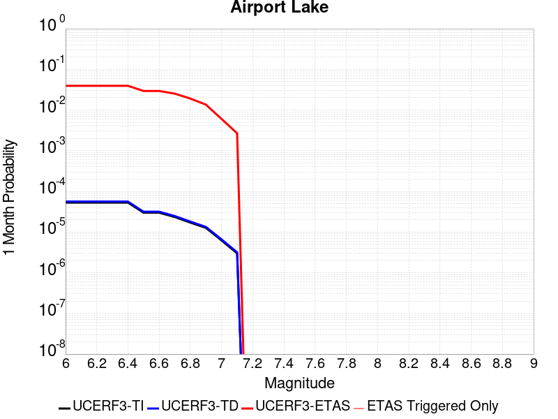 |  |  |

| Magnitude | 1 wk TI Prob | 1 wk TD Prob | 1 wk ETAS Prob | 1 wk ETAS/TD Gain | 1 wk ETAS Triggered Only | 1 mo TI Prob | 1 mo TD Prob | 1 mo ETAS Prob | 1 mo ETAS/TD Gain | 1 mo ETAS Triggered Only | 1 yr TI Prob | 1 yr TD Prob | 1 yr ETAS Prob | 1 yr ETAS/TD Gain | 1 yr ETAS Triggered Only | 10 yr TI Prob | 10 yr TD Prob | 10 yr ETAS Prob | 10 yr ETAS/TD Gain | 10 yr ETAS Triggered Only |
|-----|-----|-----|-----|-----|-----|-----|-----|-----|-----|-----|-----|-----|-----|-----|-----|-----|-----|-----|-----|-----|
| 6.0 | 1.2387061E-5 | 1.3103157E-5 | 0.03290773 | 2511.4353 | 0.03289506 | 5.3086325E-5 | 5.615534E-5 | 0.0392706 | 699.32086 | 0.039216645 | 6.461343E-4 | 6.8350515E-4 | 0.05114022 | 74.82053 | 0.050491225 | 0.0064425888 | 0.0068168393 | 0.06698034 | 9.825718 | 0.06057644 |
| 6.1 | 1.2387061E-5 | 1.3103157E-5 | 0.03290773 | 2511.4353 | 0.03289506 | 5.3086325E-5 | 5.615534E-5 | 0.0392706 | 699.32086 | 0.039216645 | 6.461343E-4 | 6.8350515E-4 | 0.05114022 | 74.82053 | 0.050491225 | 0.0064425888 | 0.0068168393 | 0.06698034 | 9.825718 | 0.06057644 |
| 6.2 | 1.2387061E-5 | 1.3103157E-5 | 0.03290773 | 2511.4353 | 0.03289506 | 5.3086325E-5 | 5.615534E-5 | 0.0392706 | 699.32086 | 0.039216645 | 6.461343E-4 | 6.8350515E-4 | 0.05114022 | 74.82053 | 0.050491225 | 0.0064425888 | 0.0068168393 | 0.06698034 | 9.825718 | 0.06057644 |
| 6.3 | 1.2387061E-5 | 1.3103157E-5 | 0.03290773 | 2511.4353 | 0.03289506 | 5.3086325E-5 | 5.615534E-5 | 0.0392706 | 699.32086 | 0.039216645 | 6.461343E-4 | 6.8350515E-4 | 0.05114022 | 74.82053 | 0.050491225 | 0.0064425888 | 0.0068168393 | 0.06698034 | 9.825718 | 0.06057644 |
| 6.4 | 1.2387061E-5 | 1.3103157E-5 | 0.03290773 | 2511.4353 | 0.03289506 | 5.3086325E-5 | 5.615534E-5 | 0.0392706 | 699.32086 | 0.039216645 | 6.461343E-4 | 6.8350515E-4 | 0.05114022 | 74.82053 | 0.050491225 | 0.0064425888 | 0.0068168393 | 0.06698034 | 9.825718 | 0.06057644 |
| 6.5 | 6.9922594E-6 | 7.384925E-6 | 0.024495205 | 3316.9197 | 0.024488 | 2.996648E-5 | 3.1649324E-5 | 0.029325083 | 926.5626 | 0.02929436 | 3.6478083E-4 | 3.8526783E-4 | 0.03839789 | 99.66544 | 0.038027275 | 0.003641826 | 0.0038465366 | 0.049631584 | 12.902928 | 0.045961842 |
| 6.6 | 6.9922594E-6 | 7.384925E-6 | 0.024495205 | 3316.9197 | 0.024488 | 2.996648E-5 | 3.1649324E-5 | 0.029325083 | 926.5626 | 0.02929436 | 3.6478083E-4 | 3.8526783E-4 | 0.03839789 | 99.66544 | 0.038027275 | 0.003641826 | 0.0038465366 | 0.049631584 | 12.902928 | 0.045961842 |
| 6.7 | 5.477277E-6 | 5.7860684E-6 | 0.021316577 | 3684.121 | 0.021310914 | 2.3473833E-5 | 2.4797222E-5 | 0.02540827 | 1024.6417 | 0.025384102 | 2.8575645E-4 | 3.0186825E-4 | 0.033317298 | 110.37033 | 0.0330254 | 0.0028538927 | 0.003014966 | 0.042828094 | 14.205167 | 0.039933525 |
| 6.8 | 3.9950432E-6 | 4.2190873E-6 | 0.016199142 | 3839.49 | 0.016194992 | 1.7121502E-5 | 1.8081691E-5 | 0.01925947 | 1065.1365 | 0.019241735 | 2.0843433E-4 | 2.2012512E-4 | 0.025533482 | 115.995316 | 0.02531893 | 0.0020823893 | 0.0021993418 | 0.032681055 | 14.859472 | 0.030548902 |
| 6.9 | 2.95695E-6 | 3.1230243E-6 | 0.01152206 | 3689.3916 | 0.011518973 | 1.2672582E-5 | 1.3384334E-5 | 0.013617647 | 1017.43176 | 0.013604444 | 1.5427776E-4 | 1.6294434E-4 | 0.01840785 | 112.97016 | 0.018247878 | 0.001541707 | 0.0016284712 | 0.023734258 | 14.574565 | 0.022141844 |
| 7.0 | 1.456072E-6 | 1.540812E-6 | 0.0052640904 | 3416.4392 | 0.0052625574 | 6.2402937E-6 | 6.603469E-6 | 0.0060674655 | 918.8301 | 0.0060609025 | 7.597293E-5 | 8.039528E-5 | 0.0083075715 | 103.334076 | 0.008227838 | 7.594696E-4 | 8.0376083E-4 | 0.010620391 | 13.213373 | 0.009824527 |
| 7.1 | 6.995192E-7 | 7.4089746E-7 | 0.002216553 | 2991.7136 | 0.0022158138 | 2.997936E-6 | 3.1752747E-6 | 0.0027240557 | 857.896 | 0.002720889 | 3.649926E-5 | 3.865897E-5 | 0.0037043856 | 95.82215 | 0.0036658684 | 3.6493264E-4 | 3.865897E-4 | 0.0048002177 | 12.416827 | 0.0044153347 |

## Owl Lake
*[(top)](#table-of-contents)*

| 1 Week | 1 Month | 1 Year | 10 Year |
|-----|-----|-----|-----|
| 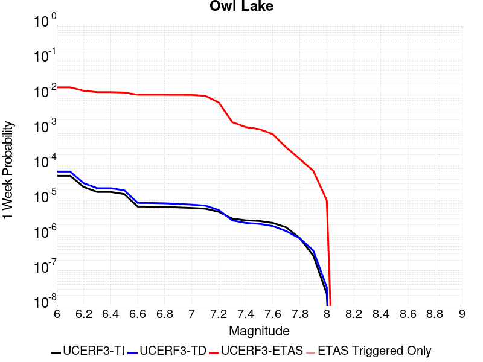 |  |  |  |

| Magnitude | 1 wk TI Prob | 1 wk TD Prob | 1 wk ETAS Prob | 1 wk ETAS/TD Gain | 1 wk ETAS Triggered Only | 1 mo TI Prob | 1 mo TD Prob | 1 mo ETAS Prob | 1 mo ETAS/TD Gain | 1 mo ETAS Triggered Only | 1 yr TI Prob | 1 yr TD Prob | 1 yr ETAS Prob | 1 yr ETAS/TD Gain | 1 yr ETAS Triggered Only | 10 yr TI Prob | 10 yr TD Prob | 10 yr ETAS Prob | 10 yr ETAS/TD Gain | 10 yr ETAS Triggered Only |
|-----|-----|-----|-----|-----|-----|-----|-----|-----|-----|-----|-----|-----|-----|-----|-----|-----|-----|-----|-----|-----|
| 6.0 | 5.0320643E-5 | 6.6358676E-5 | 0.016358025 | 246.50922 | 0.016292749 | 2.1564208E-4 | 2.843643E-4 | 0.021068 | 74.08806 | 0.020789547 | 0.0026222812 | 0.003457547 | 0.03315395 | 9.588864 | 0.029799437 | 0.02591553 | 0.034141295 | 0.07121647 | 2.0859334 | 0.038385715 |
| 6.1 | 5.0320643E-5 | 6.6358676E-5 | 0.016358025 | 246.50922 | 0.016292749 | 2.1564208E-4 | 2.843643E-4 | 0.021068 | 74.08806 | 0.020789547 | 0.0026222812 | 0.003457547 | 0.03315395 | 9.588864 | 0.029799437 | 0.02591553 | 0.034141295 | 0.07121647 | 2.0859334 | 0.038385715 |
| 6.2 | 2.4125871E-5 | 3.0980515E-5 | 0.013325451 | 430.1236 | 0.013294882 | 1.0339249E-4 | 1.3276804E-4 | 0.016846908 | 126.889786 | 0.01671636 | 0.0012580766 | 0.0016154252 | 0.024941484 | 15.439578 | 0.0233638 | 0.012509781 | 0.016070755 | 0.045647785 | 2.8404257 | 0.03006012 |
| 6.3 | 1.7433485E-5 | 2.2355545E-5 | 0.011980966 | 535.9281 | 0.011958878 | 7.471279E-5 | 9.580685E-5 | 0.014969661 | 156.24834 | 0.014875279 | 9.0924866E-4 | 0.001165962 | 0.021801079 | 18.697933 | 0.020659205 | 0.009055373 | 0.0116291465 | 0.03774866 | 3.246039 | 0.026426837 |
| 6.4 | 1.7433485E-5 | 2.2355545E-5 | 0.011980966 | 535.9281 | 0.011958878 | 7.471279E-5 | 9.580685E-5 | 0.014969661 | 156.24834 | 0.014875279 | 9.0924866E-4 | 0.001165962 | 0.021801079 | 18.697933 | 0.020659205 | 0.009055373 | 0.0116291465 | 0.03774866 | 3.246039 | 0.026426837 |
| 6.5 | 1.5182742E-5 | 1.9429277E-5 | 0.011652226 | 599.7251 | 0.011633022 | 6.506727E-5 | 8.3266525E-5 | 0.014501148 | 174.1534 | 0.014419082 | 7.919061E-4 | 0.0010134344 | 0.020902995 | 20.6259 | 0.019909738 | 0.0078909 | 0.010118678 | 0.03521367 | 3.4800663 | 0.025351517 |
| 6.6 | 6.7271576E-6 | 8.547518E-6 | 0.010109965 | 1182.7954 | 0.010101504 | 2.8830356E-5 | 3.6631736E-5 | 0.012125408 | 331.00827 | 0.012089219 | 3.5095305E-4 | 4.4590578E-4 | 0.01676396 | 37.595295 | 0.016325334 | 0.0035039932 | 0.0044680187 | 0.02462942 | 5.51238 | 0.020251885 |
| 6.7 | 6.682835E-6 | 8.479961E-6 | 0.010093605 | 1190.2892 | 0.010085211 | 2.8640408E-5 | 3.6342215E-5 | 0.012092537 | 332.74078 | 0.012056634 | 3.4864116E-4 | 4.423823E-4 | 0.016711637 | 37.77646 | 0.016276455 | 0.003480947 | 0.0044329325 | 0.024530161 | 5.5336194 | 0.020186715 |
| 6.8 | 6.5774975E-6 | 8.326427E-6 | 0.010093453 | 1212.219 | 0.010085211 | 2.8188972E-5 | 3.5684232E-5 | 0.012091887 | 338.858 | 0.012056634 | 3.4314668E-4 | 4.3437455E-4 | 0.01670376 | 38.45474 | 0.016276455 | 0.0034261728 | 0.0043531056 | 0.024451945 | 5.617127 | 0.020186715 |
| 6.9 | 6.363419E-6 | 7.999591E-6 | 0.010060545 | 1257.6324 | 0.010052626 | 2.727151E-5 | 3.428354E-5 | 0.012041627 | 351.2364 | 0.012007755 | 3.3198006E-4 | 4.1732774E-4 | 0.016621847 | 39.82924 | 0.016211284 | 0.0033148455 | 0.0041830647 | 0.02418799 | 5.782361 | 0.020088958 |
| 7.0 | 6.1342453E-6 | 7.631779E-6 | 0.010011302 | 1311.7915 | 0.010003747 | 2.6289357E-5 | 3.2707245E-5 | 0.011958608 | 365.62567 | 0.0119262915 | 3.2002592E-4 | 3.9814346E-4 | 0.01644011 | 41.291927 | 0.016048357 | 0.0031956544 | 0.003991739 | 0.023757093 | 5.9515643 | 0.019844567 |
| 7.1 | 5.842926E-6 | 7.142312E-6 | 0.009391698 | 1314.9381 | 0.009384623 | 2.504087E-5 | 3.060958E-5 | 0.011239677 | 367.19473 | 0.011209411 | 3.0482994E-4 | 3.7261334E-4 | 0.015470363 | 41.518543 | 0.015103377 | 0.0030441214 | 0.0037371595 | 0.02242003 | 5.9992166 | 0.018752953 |
| 7.2 | 4.77173E-6 | 5.358478E-6 | 0.0060010576 | 1119.9182 | 0.0059957313 | 2.045011E-5 | 2.2964727E-5 | 0.007191609 | 313.1589 | 0.007168809 | 2.4895166E-4 | 2.7956374E-4 | 0.009971038 | 35.666424 | 0.009694185 | 0.0024867293 | 0.0028086212 | 0.014928875 | 5.315375 | 0.01215439 |
| 7.3 | 3.0494948E-6 | 2.710356E-6 | 0.0017949078 | 662.24054 | 0.0017922022 | 1.3069198E-5 | 1.1615762E-5 | 0.0021133558 | 181.93864 | 0.0021017645 | 1.5910587E-4 | 1.4141288E-4 | 0.0029270789 | 20.698814 | 0.0027860599 | 0.0015899199 | 0.0014231089 | 0.0048885257 | 3.435103 | 0.0034703554 |
| 7.4 | 2.7263884E-6 | 2.3055634E-6 | 0.0011916735 | 516.86865 | 0.0011893706 | 1.1684469E-5 | 9.880949E-6 | 0.0013784582 | 139.50667 | 0.0013685909 | 1.4224913E-4 | 1.2029401E-4 | 0.001961153 | 16.302998 | 0.0018410805 | 0.0014215811 | 0.0012110578 | 0.0035380991 | 2.921495 | 0.002329863 |
| 7.5 | 2.6090431E-6 | 2.1655019E-6 | 0.0010448991 | 482.52054 | 0.0010427359 | 1.1181565E-5 | 9.2806895E-6 | 0.0011823477 | 127.39869 | 0.0011730778 | 1.3612706E-4 | 1.1298663E-4 | 0.0016606228 | 14.6975155 | 0.0015478111 | 0.001360437 | 0.0011378126 | 0.0031395406 | 2.759277 | 0.002004008 |
| 7.6 | 2.3008756E-6 | 1.8726826E-6 | 7.676304E-4 | 409.90952 | 7.6575915E-4 | 9.860858E-6 | 8.025758E-6 | 8.7153446E-4 | 108.59217 | 8.6351566E-4 | 1.20049335E-4 | 9.770931E-5 | 0.0012380902 | 12.67116 | 0.0011404924 | 0.001199845 | 9.848307E-4 | 0.0024660106 | 2.5039947 | 0.00148264 |
| 7.7 | 1.7184348E-6 | 1.341808E-6 | 2.946109E-4 | 219.56262 | 2.9326946E-4 | 7.3646997E-6 | 5.750593E-6 | 3.316037E-4 | 57.664257 | 3.2585496E-4 | 8.966153E-5 | 7.0011265E-5 | 5.587595E-4 | 7.980994 | 4.887824E-4 | 8.962536E-4 | 7.0769014E-4 | 0.0013426576 | 1.8972394 | 6.354172E-4 |
| 7.8 | 8.4612907E-7 | 8.4054994E-7 | 9.859696E-5 | 117.30053 | 9.7756485E-5 | 3.6262625E-6 | 3.602352E-6 | 1.1765118E-4 | 32.659542 | 1.1404924E-4 | 4.4148852E-5 | 4.3857777E-5 | 2.2307015E-4 | 5.0862164 | 1.7922022E-4 | 4.414008E-4 | 4.4386165E-4 | 6.881444E-4 | 1.5503578 | 2.443912E-4 |
| 7.9 | 2.716738E-7 | 3.7681625E-7 | 4.9255043E-5 | 130.71368 | 4.8878243E-5 | 1.1643157E-6 | 1.6149258E-6 | 6.678581E-5 | 41.355343 | 6.517099E-5 | 1.4175452E-5 | 1.9661555E-5 | 1.3370856E-4 | 6.800507 | 1.1404924E-4 | 1.4174548E-4 | 1.9829652E-4 | 3.1232313E-4 | 1.5750309 | 1.1404924E-4 |
| 8.0 | 2.1995428E-8 | 3.3853325E-8 | 1.6326601E-5 | 482.27466 | 1.6292748E-5 | 9.426611E-8 | 1.4508568E-7 | 1.643783E-5 | 113.29741 | 1.6292748E-5 | 1.1476893E-6 | 1.7664173E-6 | 1.8059136E-5 | 10.223596 | 1.6292748E-5 | 1.14768345E-5 | 1.7869768E-5 | 3.4162225E-5 | 1.9117329 | 1.6292748E-5 |

## Panamint Valley
*[(top)](#table-of-contents)*

| 1 Week | 1 Month | 1 Year | 10 Year |
|-----|-----|-----|-----|
| 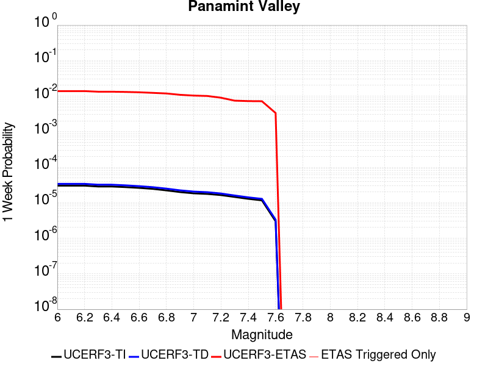 |  |  |  |

| Magnitude | 1 wk TI Prob | 1 wk TD Prob | 1 wk ETAS Prob | 1 wk ETAS/TD Gain | 1 wk ETAS Triggered Only | 1 mo TI Prob | 1 mo TD Prob | 1 mo ETAS Prob | 1 mo ETAS/TD Gain | 1 mo ETAS Triggered Only | 1 yr TI Prob | 1 yr TD Prob | 1 yr ETAS Prob | 1 yr ETAS/TD Gain | 1 yr ETAS Triggered Only | 10 yr TI Prob | 10 yr TD Prob | 10 yr ETAS Prob | 10 yr ETAS/TD Gain | 10 yr ETAS Triggered Only |
|-----|-----|-----|-----|-----|-----|-----|-----|-----|-----|-----|-----|-----|-----|-----|-----|-----|-----|-----|-----|-----|
| 6.0 | 3.0211835E-5 | 3.3984263E-5 | 0.013866058 | 408.01407 | 0.013832543 | 1.2947287E-4 | 1.4563887E-4 | 0.018390859 | 126.27713 | 0.018247878 | 0.0015751923 | 0.0017717406 | 0.027615048 | 15.586394 | 0.025889177 | 0.015640736 | 0.017583003 | 0.05039586 | 2.8661692 | 0.033400133 |
| 6.1 | 3.0211835E-5 | 3.3984263E-5 | 0.013866058 | 408.01407 | 0.013832543 | 1.2947287E-4 | 1.4563887E-4 | 0.018390859 | 126.27713 | 0.018247878 | 0.0015751923 | 0.0017717406 | 0.027615048 | 15.586394 | 0.025889177 | 0.015640736 | 0.017583003 | 0.05039586 | 2.8661692 | 0.033400133 |
| 6.2 | 3.0211835E-5 | 3.3984263E-5 | 0.013866058 | 408.01407 | 0.013832543 | 1.2947287E-4 | 1.4563887E-4 | 0.018390859 | 126.27713 | 0.018247878 | 0.0015751923 | 0.0017717406 | 0.027615048 | 15.586394 | 0.025889177 | 0.015640736 | 0.017583003 | 0.05039586 | 2.8661692 | 0.033400133 |
| 6.3 | 2.8573924E-5 | 3.2102445E-5 | 0.01334285 | 415.63348 | 0.013311176 | 1.2245393E-4 | 1.375748E-4 | 0.017649869 | 128.2929 | 0.017514704 | 0.001489857 | 0.0016737141 | 0.02633218 | 15.732781 | 0.024699805 | 0.01479908 | 0.016618038 | 0.04795706 | 2.8858438 | 0.031868614 |
| 6.4 | 2.8573924E-5 | 3.2102445E-5 | 0.01334285 | 415.63348 | 0.013311176 | 1.2245393E-4 | 1.375748E-4 | 0.017649869 | 128.2929 | 0.017514704 | 0.001489857 | 0.0016737141 | 0.02633218 | 15.732781 | 0.024699805 | 0.01479908 | 0.016618038 | 0.04795706 | 2.8858438 | 0.031868614 |
| 6.5 | 2.7468774E-5 | 3.0828138E-5 | 0.013162378 | 426.95987 | 0.013131955 | 1.1771801E-4 | 1.3211406E-4 | 0.017383855 | 131.58217 | 0.017254021 | 0.0014322745 | 0.0016073292 | 0.02581197 | 16.05892 | 0.02424361 | 0.014230782 | 0.015963882 | 0.046490055 | 2.9122021 | 0.031021392 |
| 6.6 | 2.6135967E-5 | 2.9252153E-5 | 0.012834977 | 438.7704 | 0.0128061 | 1.1200648E-4 | 1.2536049E-4 | 0.01693737 | 135.1093 | 0.016814116 | 0.0013628257 | 0.0015252219 | 0.024967263 | 16.369595 | 0.02347785 | 0.013544982 | 0.015154343 | 0.044630557 | 2.945067 | 0.029929778 |
| 6.7 | 2.4498746E-5 | 2.7341044E-5 | 0.0122954445 | 449.70648 | 0.012268439 | 1.04990395E-4 | 1.17170785E-4 | 0.016277684 | 138.92271 | 0.016162407 | 0.0012775084 | 0.0014256459 | 0.023779968 | 16.680136 | 0.022386236 | 0.012701893 | 0.014171593 | 0.042344086 | 2.9879553 | 0.02857748 |
| 6.8 | 2.2244329E-5 | 2.4935374E-5 | 0.011755422 | 471.43555 | 0.011730779 | 9.532935E-5 | 1.0686163E-4 | 0.015550736 | 145.52216 | 0.015445525 | 0.0011600169 | 0.0013002857 | 0.022339417 | 17.180391 | 0.021066524 | 0.011539802 | 0.012932955 | 0.039211 | 3.031867 | 0.026622351 |
| 6.9 | 1.9902658E-5 | 2.2290182E-5 | 0.010856726 | 487.06314 | 0.010834677 | 8.529431E-5 | 9.552596E-5 | 0.014187407 | 148.51886 | 0.014093227 | 0.0010379635 | 0.0011624265 | 0.020121414 | 17.309837 | 0.01898105 | 0.010331288 | 0.011569021 | 0.035113446 | 3.0351267 | 0.023819998 |
| 7.0 | 1.8353881E-5 | 2.056605E-5 | 0.010235909 | 497.709 | 0.010215553 | 7.865712E-5 | 8.813734E-5 | 0.013316683 | 151.09013 | 0.013229712 | 9.5722964E-4 | 0.0010725616 | 0.01881261 | 17.539888 | 0.017759096 | 0.009531168 | 0.01067939 | 0.03266537 | 3.0587296 | 0.022223309 |
| 7.1 | 1.7667631E-5 | 1.9772435E-5 | 0.010007029 | 506.11014 | 0.009987455 | 7.571623E-5 | 8.4736355E-5 | 0.012987499 | 153.26952 | 0.012903856 | 9.2145515E-4 | 0.0010311945 | 0.018202318 | 17.651686 | 0.017188849 | 0.009176437 | 0.0102695925 | 0.03144228 | 3.0616872 | 0.021392379 |
| 7.2 | 1.6381597E-5 | 1.8158042E-5 | 0.008946422 | 492.6975 | 0.008928426 | 7.020495E-5 | 7.781795E-5 | 0.0116447685 | 149.64116 | 0.0115678515 | 8.544101E-4 | 9.470391E-4 | 0.016247718 | 17.156334 | 0.015315183 | 0.008511325 | 0.009435269 | 0.02839862 | 3.0098367 | 0.019143978 |
| 7.3 | 1.4520491E-5 | 1.596657E-5 | 0.007445341 | 466.30807 | 0.007429493 | 6.222919E-5 | 6.842646E-5 | 0.0097456565 | 142.42526 | 0.009677893 | 7.57377E-4 | 8.327899E-4 | 0.013774738 | 16.540472 | 0.012952735 | 0.0075480095 | 0.008300399 | 0.024441754 | 2.9446478 | 0.016276455 |
| 7.4 | 1.2852287E-5 | 1.41454875E-5 | 0.0072480235 | 512.3912 | 0.00723398 | 5.5080065E-5 | 6.06222E-5 | 0.009460968 | 156.06442 | 0.009400915 | 6.7039346E-4 | 7.378411E-4 | 0.013208877 | 17.902061 | 0.012480245 | 0.0066837464 | 0.007357429 | 0.022915736 | 3.114639 | 0.015673624 |
| 7.5 | 1.1637851E-5 | 1.2836868E-5 | 0.0071652615 | 558.17834 | 0.0071525164 | 4.987555E-5 | 5.5014076E-5 | 0.009357661 | 170.09576 | 0.009303159 | 6.070656E-4 | 6.696062E-4 | 0.012994958 | 19.406866 | 0.01233361 | 0.006054099 | 0.0066793845 | 0.021957008 | 3.28728 | 0.015380355 |
| 7.6 | 3.0068115E-6 | 3.3330623E-6 | 0.003359628 | 1007.97034 | 0.003356306 | 1.2886271E-5 | 1.4284516E-5 | 0.004234046 | 296.40808 | 0.0042198217 | 1.5687906E-4 | 1.7390738E-4 | 0.0057124784 | 32.84782 | 0.005539534 | 0.0015676835 | 0.0017397973 | 0.008554582 | 4.916999 | 0.0068266615 |

## Garlock (East)
*[(top)](#table-of-contents)*

| 1 Week | 1 Month | 1 Year | 10 Year |
|-----|-----|-----|-----|
|  |  |  | 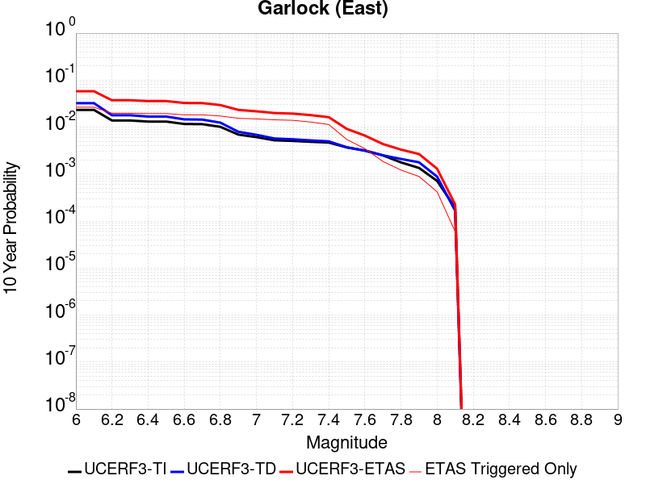 |

| Magnitude | 1 wk TI Prob | 1 wk TD Prob | 1 wk ETAS Prob | 1 wk ETAS/TD Gain | 1 wk ETAS Triggered Only | 1 mo TI Prob | 1 mo TD Prob | 1 mo ETAS Prob | 1 mo ETAS/TD Gain | 1 mo ETAS Triggered Only | 1 yr TI Prob | 1 yr TD Prob | 1 yr ETAS Prob | 1 yr ETAS/TD Gain | 1 yr ETAS Triggered Only | 10 yr TI Prob | 10 yr TD Prob | 10 yr ETAS Prob | 10 yr ETAS/TD Gain | 10 yr ETAS Triggered Only |
|-----|-----|-----|-----|-----|-----|-----|-----|-----|-----|-----|-----|-----|-----|-----|-----|-----|-----|-----|-----|-----|
| 6.0 | 4.5092507E-5 | 6.2904815E-5 | 0.010619941 | 168.82556 | 0.010557701 | 1.9323928E-4 | 2.6956675E-4 | 0.014016939 | 51.99803 | 0.013751079 | 0.0023501497 | 0.003277482 | 0.02352795 | 7.1786666 | 0.020317057 | 0.023254504 | 0.03235377 | 0.05795713 | 1.7913563 | 0.026459424 |
| 6.1 | 4.5092507E-5 | 6.2904815E-5 | 0.010619941 | 168.82556 | 0.010557701 | 1.9323928E-4 | 2.6956675E-4 | 0.014016939 | 51.99803 | 0.013751079 | 0.0023501497 | 0.003277482 | 0.02352795 | 7.1786666 | 0.020317057 | 0.023254504 | 0.03235377 | 0.05795713 | 1.7913563 | 0.026459424 |
| 6.2 | 2.6674514E-5 | 3.4511588E-5 | 0.008408695 | 243.64845 | 0.008374472 | 1.1431433E-4 | 1.4789861E-4 | 0.010866941 | 73.47562 | 0.010720628 | 0.0013908884 | 0.0017992114 | 0.017265737 | 9.596281 | 0.015494403 | 0.01382215 | 0.017872788 | 0.03710665 | 2.0761535 | 0.019583883 |
| 6.3 | 2.6674514E-5 | 3.4511588E-5 | 0.008408695 | 243.64845 | 0.008374472 | 1.1431433E-4 | 1.4789861E-4 | 0.010866941 | 73.47562 | 0.010720628 | 0.0013908884 | 0.0017992114 | 0.017265737 | 9.596281 | 0.015494403 | 0.01382215 | 0.017872788 | 0.03710665 | 2.0761535 | 0.019583883 |
| 6.4 | 2.5312667E-5 | 3.2340467E-5 | 0.0083576655 | 258.42746 | 0.0083255945 | 1.0847834E-4 | 1.3859481E-4 | 0.010776285 | 77.75388 | 0.010639165 | 0.0013199237 | 0.0016861152 | 0.01695921 | 10.058156 | 0.015298891 | 0.013121112 | 0.016772287 | 0.03573935 | 2.1308575 | 0.019290613 |
| 6.5 | 2.5312667E-5 | 3.2340467E-5 | 0.0083576655 | 258.42746 | 0.0083255945 | 1.0847834E-4 | 1.3859481E-4 | 0.010776285 | 77.75388 | 0.010639165 | 0.0013199237 | 0.0016861152 | 0.01695921 | 10.058156 | 0.015298891 | 0.013121112 | 0.016772287 | 0.03573935 | 2.1308575 | 0.019290613 |
| 6.6 | 2.246556E-5 | 2.8134691E-5 | 0.008043941 | 285.9083 | 0.008016032 | 9.627742E-5 | 1.2057181E-4 | 0.010302312 | 85.44544 | 0.010182967 | 0.0011715472 | 0.0014669969 | 0.01596254 | 10.8811 | 0.014516839 | 0.011653901 | 0.014613169 | 0.032498058 | 2.2238886 | 0.018150121 |
| 6.7 | 2.2241198E-5 | 2.7804432E-5 | 0.008043613 | 289.2925 | 0.008016032 | 9.531594E-5 | 1.1915654E-4 | 0.010300911 | 86.448555 | 0.010182967 | 0.0011598538 | 0.0014497889 | 0.015945582 | 10.998553 | 0.014516839 | 0.011538187 | 0.014442829 | 0.03233081 | 2.2385373 | 0.018150121 |
| 6.8 | 1.9528685E-5 | 2.3898969E-5 | 0.0077627692 | 324.8161 | 0.0077390554 | 8.369167E-5 | 1.0242024E-4 | 0.009828195 | 95.959496 | 0.00972677 | 0.0010184698 | 0.0012462728 | 0.01494767 | 11.993899 | 0.013718494 | 0.010138147 | 0.012436723 | 0.029283078 | 2.3545654 | 0.017058507 |
| 6.9 | 1.3318621E-5 | 1.5198818E-5 | 0.0071024364 | 467.30188 | 0.0070873452 | 5.7078556E-5 | 6.51362E-5 | 0.008944105 | 137.3139 | 0.008879548 | 6.9470983E-4 | 7.927504E-4 | 0.013149143 | 16.586739 | 0.012366196 | 0.0069254204 | 0.007940721 | 0.022956492 | 2.8909836 | 0.015135963 |
| 7.0 | 1.1760853E-5 | 1.3107653E-5 | 0.007002605 | 534.2379 | 0.006989589 | 5.0402683E-5 | 5.6174475E-5 | 0.008788597 | 156.45178 | 0.008732913 | 6.134799E-4 | 6.8371464E-4 | 0.012732105 | 18.621958 | 0.012056634 | 0.0061178906 | 0.006857401 | 0.021452684 | 3.1283984 | 0.014696059 |
| 7.1 | 1.0064758E-5 | 1.0902761E-5 | 0.006821197 | 625.63947 | 0.0068103685 | 4.3133965E-5 | 4.67253E-5 | 0.008502266 | 181.9628 | 0.008455936 | 5.2502943E-4 | 5.6873553E-4 | 0.012146291 | 21.356659 | 0.011584144 | 0.005237907 | 0.0057133473 | 0.019726055 | 3.4526265 | 0.014093227 |
| 7.2 | 9.768808E-6 | 1.0498628E-5 | 0.0066415775 | 632.61383 | 0.0066311485 | 4.186565E-5 | 4.499337E-5 | 0.008272461 | 183.85956 | 0.008227838 | 5.095951E-4 | 5.4766005E-4 | 0.011832351 | 21.605284 | 0.011290874 | 0.0050842804 | 0.005503584 | 0.019130373 | 3.4759848 | 0.013702201 |
| 7.3 | 9.344516E-6 | 9.9442705E-6 | 0.006119664 | 615.396 | 0.0061097806 | 4.004731E-5 | 4.2617627E-5 | 0.0075532543 | 177.23311 | 0.007510957 | 4.8746695E-4 | 5.187495E-4 | 0.010842993 | 20.902176 | 0.010329602 | 0.0048639905 | 0.005215269 | 0.017695257 | 3.392971 | 0.012545416 |
| 7.4 | 9.023491E-6 | 9.490441E-6 | 0.005288291 | 557.22284 | 0.0052788504 | 3.867153E-5 | 4.0672705E-5 | 0.006590091 | 162.02736 | 0.006549685 | 4.7072413E-4 | 4.95081E-4 | 0.009467941 | 19.124023 | 0.008977304 | 0.004697283 | 0.0049787266 | 0.015986424 | 3.2109463 | 0.011062776 |
| 7.5 | 7.081253E-6 | 7.0873994E-6 | 0.002597616 | 366.51187 | 0.0025905469 | 3.0347876E-5 | 3.0374218E-5 | 0.0031421946 | 103.449394 | 0.003111915 | 3.6942272E-4 | 3.697441E-4 | 0.004604292 | 12.452646 | 0.0042361147 | 0.003688092 | 0.0037244745 | 0.00903236 | 2.4251368 | 0.0053277286 |
| 7.6 | 6.116396E-6 | 5.9589424E-6 | 0.0016678093 | 279.88345 | 0.0016618603 | 2.6212863E-5 | 2.5538076E-5 | 0.0020132025 | 78.83141 | 0.0019877153 | 3.1909486E-4 | 3.1088197E-4 | 0.003030925 | 9.749439 | 0.002720889 | 0.0031863707 | 0.0031359126 | 0.0065791435 | 2.0979996 | 0.0034540626 |
| 7.7 | 4.797145E-6 | 4.7571157E-6 | 8.0309797E-4 | 168.82036 | 7.9834467E-4 | 2.055903E-5 | 2.0387479E-5 | 9.816401E-4 | 48.149162 | 9.6127216E-4 | 2.5027743E-4 | 2.481894E-4 | 0.0017304615 | 6.972342 | 0.00148264 | 0.0024999576 | 0.0025094065 | 0.0043458673 | 1.7318306 | 0.0018410805 |
| 7.8 | 3.4028885E-6 | 3.978375E-6 | 5.416369E-4 | 136.14528 | 5.376607E-4 | 1.4583726E-5 | 1.7050066E-5 | 6.6874886E-4 | 39.222656 | 6.517099E-4 | 1.775424E-4 | 2.0756487E-4 | 0.0011360587 | 5.473271 | 9.2868664E-4 | 0.0017740062 | 0.0021012141 | 0.00323931 | 1.5416373 | 0.0011404924 |
| 7.9 | 2.5928412E-6 | 3.372436E-6 | 3.781044E-4 | 112.116104 | 3.747332E-4 | 1.1112129E-5 | 1.4453217E-5 | 4.7064357E-4 | 32.56324 | 4.5619695E-4 | 1.3528178E-4 | 1.7595377E-4 | 8.438389E-4 | 4.795799 | 6.680027E-4 | 0.0013519945 | 0.0017812426 | 0.0025781651 | 1.447397 | 7.9834467E-4 |
| 8.0 | 1.3743648E-6 | 1.6734741E-6 | 1.808934E-4 | 108.094536 | 1.7922022E-4 | 5.8901214E-6 | 7.1720124E-6 | 2.3526885E-4 | 32.803745 | 2.2809848E-4 | 7.1709874E-5 | 8.731578E-5 | 4.2943362E-4 | 4.9181676 | 3.4214772E-4 | 7.1686733E-4 | 8.837377E-4 | 0.0012744181 | 1.4420773 | 3.9102594E-4 |
| 8.1 | 3.6733252E-7 | 3.1489736E-7 | 3.2900385E-5 | 104.4797 | 3.2585496E-5 | 1.5742813E-6 | 1.3495595E-6 | 3.393501E-5 | 25.14525 | 3.2585496E-5 | 1.9166706E-5 | 1.643078E-5 | 6.5308224E-5 | 3.9747486 | 4.8878243E-5 | 1.9165053E-4 | 1.662928E-4 | 2.3145294E-4 | 1.39184 | 6.517099E-5 |

## Hunter Mountain-Saline Valley
*[(top)](#table-of-contents)*

| 1 Week | 1 Month | 1 Year | 10 Year |
|-----|-----|-----|-----|
|  |  |  |  |

| Magnitude | 1 wk TI Prob | 1 wk TD Prob | 1 wk ETAS Prob | 1 wk ETAS/TD Gain | 1 wk ETAS Triggered Only | 1 mo TI Prob | 1 mo TD Prob | 1 mo ETAS Prob | 1 mo ETAS/TD Gain | 1 mo ETAS Triggered Only | 1 yr TI Prob | 1 yr TD Prob | 1 yr ETAS Prob | 1 yr ETAS/TD Gain | 1 yr ETAS Triggered Only | 10 yr TI Prob | 10 yr TD Prob | 10 yr ETAS Prob | 10 yr ETAS/TD Gain | 10 yr ETAS Triggered Only |
|-----|-----|-----|-----|-----|-----|-----|-----|-----|-----|-----|-----|-----|-----|-----|-----|-----|-----|-----|-----|-----|
| 6.0 | 4.5103672E-5 | 5.456906E-5 | 0.0075488244 | 138.33524 | 0.0074946643 | 1.9328714E-4 | 2.3384714E-4 | 0.009974632 | 42.6545 | 0.009743064 | 0.002350731 | 0.0028435462 | 0.015856927 | 5.5764623 | 0.013050491 | 0.023260195 | 0.028092625 | 0.044086017 | 1.5693094 | 0.016455676 |
| 6.1 | 4.5103672E-5 | 5.456906E-5 | 0.0075488244 | 138.33524 | 0.0074946643 | 1.9328714E-4 | 2.3384714E-4 | 0.009974632 | 42.6545 | 0.009743064 | 0.002350731 | 0.0028435462 | 0.015856927 | 5.5764623 | 0.013050491 | 0.023260195 | 0.028092625 | 0.044086017 | 1.5693094 | 0.016455676 |
| 6.2 | 3.9363465E-5 | 4.706271E-5 | 0.007525082 | 159.89479 | 0.0074783713 | 1.6868966E-4 | 2.016826E-4 | 0.009910202 | 49.137615 | 0.009710478 | 0.002051862 | 0.0024528534 | 0.015422575 | 6.2876062 | 0.013001613 | 0.020330196 | 0.024274187 | 0.040250927 | 1.6581782 | 0.016374212 |
| 6.3 | 3.9363465E-5 | 4.706271E-5 | 0.007525082 | 159.89479 | 0.0074783713 | 1.6868966E-4 | 2.016826E-4 | 0.009910202 | 49.137615 | 0.009710478 | 0.002051862 | 0.0024528534 | 0.015422575 | 6.2876062 | 0.013001613 | 0.020330196 | 0.024274187 | 0.040250927 | 1.6581782 | 0.016374212 |
| 6.4 | 3.2311684E-5 | 3.795112E-5 | 0.0074671623 | 196.75737 | 0.007429493 | 1.384713E-4 | 1.6263791E-4 | 0.009790086 | 60.195595 | 0.009629014 | 0.0016845843 | 0.001978387 | 0.014856715 | 7.509509 | 0.012903856 | 0.016718714 | 0.019617118 | 0.035526358 | 1.8109876 | 0.016227577 |
| 6.5 | 3.2311684E-5 | 3.795112E-5 | 0.0074671623 | 196.75737 | 0.007429493 | 1.384713E-4 | 1.6263791E-4 | 0.009790086 | 60.195595 | 0.009629014 | 0.0016845843 | 0.001978387 | 0.014856715 | 7.509509 | 0.012903856 | 0.016718714 | 0.019617118 | 0.035526358 | 1.8109876 | 0.016227577 |
| 6.6 | 2.9305844E-5 | 3.418196E-5 | 0.007447129 | 217.86722 | 0.0074132006 | 1.2559042E-4 | 1.4648624E-4 | 0.009757799 | 66.6124 | 0.009612721 | 0.0015279909 | 0.0017820727 | 0.01464667 | 8.218896 | 0.012887564 | 0.015175272 | 0.017686324 | 0.033594888 | 1.8994838 | 0.016194992 |
| 6.7 | 2.7826512E-5 | 3.2344353E-5 | 0.0074127205 | 229.18129 | 0.007380615 | 1.19251024E-4 | 1.3861163E-4 | 0.009701129 | 69.98784 | 0.009563843 | 0.0014509142 | 0.0016863506 | 0.01448712 | 8.590812 | 0.012822392 | 0.014414776 | 0.016743818 | 0.032603566 | 1.9472001 | 0.016129822 |
| 6.8 | 2.3389874E-5 | 2.6866792E-5 | 0.0073584067 | 273.88483 | 0.007331737 | 1.0023846E-4 | 1.1513857E-4 | 0.009629008 | 83.62973 | 0.009514965 | 0.00121972 | 0.001400958 | 0.014124038 | 10.081699 | 0.012740929 | 0.01213047 | 0.013928067 | 0.02972077 | 2.133876 | 0.016015772 |
| 6.9 | 2.069209E-5 | 2.357011E-5 | 0.0073388414 | 311.3622 | 0.007315444 | 8.867737E-5 | 1.0101105E-4 | 0.009598724 | 95.026474 | 0.009498673 | 0.0010791123 | 0.0012291519 | 0.0139056025 | 11.313169 | 0.012692051 | 0.010738871 | 0.012229158 | 0.027984696 | 2.2883584 | 0.0159506 |
| 7.0 | 1.7462342E-5 | 1.9633622E-5 | 0.007334934 | 373.59045 | 0.007315444 | 7.483646E-5 | 8.414151E-5 | 0.009565723 | 113.686134 | 0.009482379 | 9.1075303E-4 | 0.0010239641 | 0.01365419 | 13.334638 | 0.012643172 | 0.009070295 | 0.010196688 | 0.025920138 | 2.5420156 | 0.01588543 |
| 7.1 | 1.4807709E-5 | 1.6441827E-5 | 0.0072991806 | 443.93976 | 0.0072828582 | 6.3460066E-5 | 7.046316E-5 | 0.009519591 | 135.10027 | 0.009449794 | 7.723524E-4 | 8.575678E-4 | 0.013424783 | 15.654486 | 0.012578001 | 0.007696735 | 0.008546168 | 0.02421507 | 2.833442 | 0.015803965 |
| 7.2 | 1.4180048E-5 | 1.5698413E-5 | 0.00728215 | 463.87808 | 0.0072665657 | 6.077022E-5 | 6.727727E-5 | 0.009500144 | 141.20882 | 0.009433501 | 7.396263E-4 | 8.1880915E-4 | 0.013353953 | 16.308992 | 0.012545416 | 0.0073716943 | 0.008161469 | 0.023787972 | 2.9146678 | 0.015755087 |
| 7.3 | 1.3730402E-5 | 1.5172151E-5 | 0.0072816275 | 479.93378 | 0.0072665657 | 5.8843252E-5 | 6.502197E-5 | 0.00949791 | 146.07231 | 0.009433501 | 7.161811E-4 | 7.9137104E-4 | 0.013326859 | 16.840216 | 0.012545416 | 0.007138774 | 0.007889058 | 0.02350369 | 2.979277 | 0.015738795 |
| 7.4 | 1.2810095E-5 | 1.4109353E-5 | 0.007231695 | 512.54614 | 0.0072176876 | 5.489925E-5 | 6.0467344E-5 | 0.009444523 | 156.19212 | 0.009384623 | 6.681934E-4 | 7.3595706E-4 | 0.013174456 | 17.90112 | 0.01244766 | 0.006661878 | 0.0073386896 | 0.022864943 | 3.1156712 | 0.015641037 |
| 7.5 | 1.1595659E-5 | 1.2800734E-5 | 0.007148933 | 558.4784 | 0.007136224 | 4.9694736E-5 | 5.485922E-5 | 0.009341216 | 170.27614 | 0.0092868665 | 6.0486543E-4 | 6.67722E-4 | 0.012960534 | 19.410072 | 0.012301025 | 0.006032217 | 0.006660632 | 0.021906175 | 3.2889035 | 0.015347769 |
| 7.6 | 2.997694E-6 | 3.3251877E-6 | 0.0033596202 | 1010.35504 | 0.003356306 | 1.28471975E-5 | 1.4250767E-5 | 0.004234012 | 297.1077 | 0.0042198217 | 1.564034E-4 | 1.7349655E-4 | 0.00571207 | 32.923244 | 0.005539534 | 0.0015629337 | 0.0017356955 | 0.008550508 | 4.926272 | 0.0068266615 |

## Blackwater
*[(top)](#table-of-contents)*

| 1 Week | 1 Month | 1 Year | 10 Year |
|-----|-----|-----|-----|
|  | 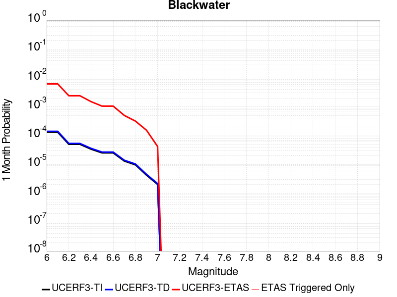 | 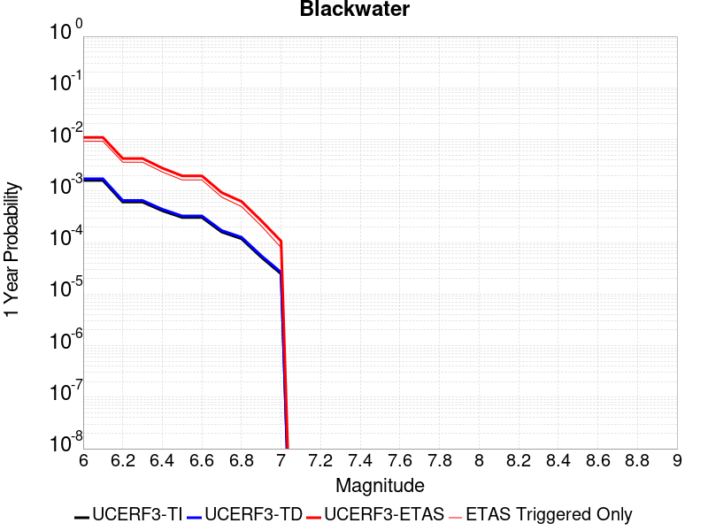 |  |

| Magnitude | 1 wk TI Prob | 1 wk TD Prob | 1 wk ETAS Prob | 1 wk ETAS/TD Gain | 1 wk ETAS Triggered Only | 1 mo TI Prob | 1 mo TD Prob | 1 mo ETAS Prob | 1 mo ETAS/TD Gain | 1 mo ETAS Triggered Only | 1 yr TI Prob | 1 yr TD Prob | 1 yr ETAS Prob | 1 yr ETAS/TD Gain | 1 yr ETAS Triggered Only | 10 yr TI Prob | 10 yr TD Prob | 10 yr ETAS Prob | 10 yr ETAS/TD Gain | 10 yr ETAS Triggered Only |
|-----|-----|-----|-----|-----|-----|-----|-----|-----|-----|-----|-----|-----|-----|-----|-----|-----|-----|-----|-----|-----|
| 6.0 | 3.0708583E-5 | 3.3095846E-5 | 0.0045297453 | 136.8675 | 0.0044967984 | 1.3160157E-4 | 1.4183241E-4 | 0.0064299414 | 45.33478 | 0.0062890006 | 0.0016010714 | 0.0017255784 | 0.01120786 | 6.495132 | 0.009498673 | 0.015895851 | 0.017135633 | 0.030234726 | 1.7644359 | 0.013327468 |
| 6.1 | 3.0708583E-5 | 3.3095846E-5 | 0.0045297453 | 136.8675 | 0.0044967984 | 1.3160157E-4 | 1.4183241E-4 | 0.0064299414 | 45.33478 | 0.0062890006 | 0.0016010714 | 0.0017255784 | 0.01120786 | 6.495132 | 0.009498673 | 0.015895851 | 0.017135633 | 0.030234726 | 1.7644359 | 0.013327468 |
| 6.2 | 1.1707779E-5 | 1.2545122E-5 | 0.0015766294 | 125.67668 | 0.0015641038 | 5.017523E-5 | 5.3763757E-5 | 0.002334626 | 43.423786 | 0.0022809848 | 6.107122E-4 | 6.5438676E-4 | 0.0042527276 | 6.498799 | 0.0036006973 | 0.006090366 | 0.0065255696 | 0.011753786 | 1.8011893 | 0.0052625574 |
| 6.3 | 1.1707779E-5 | 1.2545122E-5 | 0.0015766294 | 125.67668 | 0.0015641038 | 5.017523E-5 | 5.3763757E-5 | 0.002334626 | 43.423786 | 0.0022809848 | 6.107122E-4 | 6.5438676E-4 | 0.0042527276 | 6.498799 | 0.0036006973 | 0.006090366 | 0.0065255696 | 0.011753786 | 1.8011893 | 0.0052625574 |
| 6.4 | 7.929244E-6 | 8.480098E-6 | 0.0010512072 | 123.96167 | 0.0010427359 | 3.3982033E-5 | 3.6342793E-5 | 0.0015515133 | 42.691086 | 0.0015152256 | 4.136527E-4 | 4.423877E-4 | 0.0028526478 | 6.4482975 | 0.0024113266 | 0.0041288356 | 0.0044154758 | 0.007919171 | 1.7935033 | 0.0035192335 |
| 6.5 | 5.8832115E-6 | 6.285991E-6 | 7.0686976E-4 | 112.45161 | 7.0058816E-4 | 2.521352E-5 | 2.6939697E-5 | 0.0010859398 | 40.310024 | 0.0010590287 | 3.0693135E-4 | 3.27944E-4 | 0.0020381215 | 6.214846 | 0.0017107385 | 0.0030650778 | 0.0032748538 | 0.0057432414 | 1.7537398 | 0.0024764978 |
| 6.6 | 5.8832115E-6 | 6.285991E-6 | 7.0686976E-4 | 112.45161 | 7.0058816E-4 | 2.521352E-5 | 2.6939697E-5 | 0.0010859398 | 40.310024 | 0.0010590287 | 3.0693135E-4 | 3.27944E-4 | 0.0020381215 | 6.214846 | 0.0017107385 | 0.0030650778 | 0.0032748538 | 0.0057432414 | 1.7537398 | 0.0024764978 |
| 6.7 | 3.0715053E-6 | 3.2814662E-6 | 3.2913536E-4 | 100.30131 | 3.2585496E-4 | 1.3163528E-5 | 1.4063357E-5 | 5.191314E-4 | 36.913765 | 5.050752E-4 | 1.6025416E-4 | 1.7120909E-4 | 9.85707E-4 | 5.757329 | 8.146374E-4 | 0.0016013865 | 0.0017108864 | 0.003028341 | 1.7700422 | 0.0013197126 |
| 6.8 | 2.2722281E-6 | 2.4287538E-6 | 1.9794126E-4 | 81.49911 | 1.9551297E-4 | 9.738084E-6 | 1.0408908E-5 | 3.199679E-4 | 30.739815 | 3.0956222E-4 | 1.1855473E-4 | 1.26722E-4 | 6.6431455E-4 | 5.2422986 | 5.376607E-4 | 0.001184915 | 0.0012665876 | 0.0021452815 | 1.6937492 | 8.798084E-4 |
| 6.9 | 9.952399E-7 | 1.0653489E-6 | 8.2529004E-5 | 77.466644 | 8.146374E-5 | 4.265307E-6 | 4.5657757E-6 | 1.18614495E-4 | 25.979044 | 1.1404924E-4 | 5.1928873E-5 | 5.5587418E-5 | 2.1850584E-4 | 3.9308507 | 1.6292748E-4 | 5.191674E-4 | 5.557858E-4 | 8.1632484E-4 | 1.4687761 | 2.6068397E-4 |
| 7.0 | 4.7385504E-7 | 5.0755597E-7 | 3.3093034E-5 | 65.20077 | 3.2585496E-5 | 2.0308057E-6 | 2.1752398E-6 | 3.4760666E-5 | 15.980153 | 3.2585496E-5 | 2.4724779E-5 | 2.6483543E-5 | 7.536049E-5 | 2.8455594 | 4.8878243E-5 | 2.4722028E-4 | 2.6483546E-4 | 3.462776E-4 | 1.3075199 | 8.146374E-5 |

## Ash Hill
*[(top)](#table-of-contents)*

| 1 Week | 1 Month | 1 Year | 10 Year |
|-----|-----|-----|-----|
|  |  |  |  |

| Magnitude | 1 wk TI Prob | 1 wk TD Prob | 1 wk ETAS Prob | 1 wk ETAS/TD Gain | 1 wk ETAS Triggered Only | 1 mo TI Prob | 1 mo TD Prob | 1 mo ETAS Prob | 1 mo ETAS/TD Gain | 1 mo ETAS Triggered Only | 1 yr TI Prob | 1 yr TD Prob | 1 yr ETAS Prob | 1 yr ETAS/TD Gain | 1 yr ETAS Triggered Only | 10 yr TI Prob | 10 yr TD Prob | 10 yr ETAS Prob | 10 yr ETAS/TD Gain | 10 yr ETAS Triggered Only |
|-----|-----|-----|-----|-----|-----|-----|-----|-----|-----|-----|-----|-----|-----|-----|-----|-----|-----|-----|-----|-----|
| 6.0 | 2.1545662E-5 | 2.3194447E-5 | 0.0039822403 | 171.68939 | 0.003959138 | 9.2335285E-5 | 9.940143E-5 | 0.0054428917 | 54.75667 | 0.0053440216 | 0.0011236023 | 0.0012096206 | 0.009964516 | 8.2377205 | 0.008765498 | 0.011179381 | 0.012038348 | 0.023933744 | 1.9881252 | 0.012040341 |
| 6.1 | 2.1545662E-5 | 2.3194447E-5 | 0.0039822403 | 171.68939 | 0.003959138 | 9.2335285E-5 | 9.940143E-5 | 0.0054428917 | 54.75667 | 0.0053440216 | 0.0011236023 | 0.0012096206 | 0.009964516 | 8.2377205 | 0.008765498 | 0.011179381 | 0.012038348 | 0.023933744 | 1.9881252 | 0.012040341 |
| 6.2 | 2.1545662E-5 | 2.3194447E-5 | 0.0039822403 | 171.68939 | 0.003959138 | 9.2335285E-5 | 9.940143E-5 | 0.0054428917 | 54.75667 | 0.0053440216 | 0.0011236023 | 0.0012096206 | 0.009964516 | 8.2377205 | 0.008765498 | 0.011179381 | 0.012038348 | 0.023933744 | 1.9881252 | 0.012040341 |
| 6.3 | 1.0025529E-5 | 1.0746934E-5 | 0.0015911266 | 148.05399 | 0.0015803966 | 4.2965847E-5 | 4.605755E-5 | 0.0022780614 | 49.46119 | 0.0022321064 | 5.229836E-4 | 5.6061964E-4 | 0.004387269 | 7.8257494 | 0.0038287959 | 0.005217545 | 0.0055933665 | 0.0109399 | 1.9558704 | 0.0053766067 |
| 6.4 | 1.0025529E-5 | 1.0746934E-5 | 0.0015911266 | 148.05399 | 0.0015803966 | 4.2965847E-5 | 4.605755E-5 | 0.0022780614 | 49.46119 | 0.0022321064 | 5.229836E-4 | 5.6061964E-4 | 0.004387269 | 7.8257494 | 0.0038287959 | 0.005217545 | 0.0055933665 | 0.0109399 | 1.9558704 | 0.0053766067 |
| 6.5 | 6.9617327E-6 | 7.456634E-6 | 0.0010990626 | 147.39394 | 0.0010916141 | 2.9835655E-5 | 3.195666E-5 | 0.0015960105 | 49.94297 | 0.0015641038 | 3.6318856E-4 | 3.8901155E-4 | 0.0031414148 | 8.0753765 | 0.0027534745 | 0.0036259557 | 0.0038841602 | 0.0077792318 | 2.002809 | 0.0039102593 |
| 6.6 | 4.9919777E-6 | 5.3466883E-6 | 7.5480907E-4 | 141.1732 | 7.494664E-4 | 2.1394015E-5 | 2.2914215E-5 | 0.0010982109 | 47.92706 | 0.0010753213 | 2.60441E-4 | 2.7895154E-4 | 0.0021358067 | 7.656551 | 0.0018573733 | 0.0026013597 | 0.0027866727 | 0.005353753 | 1.9211992 | 0.0025742543 |
| 6.7 | 3.6630722E-6 | 3.924624E-6 | 4.7641248E-4 | 121.39061 | 4.724897E-4 | 1.5698786E-5 | 1.681974E-5 | 7.1739615E-4 | 42.652035 | 7.0058816E-4 | 1.9111596E-4 | 2.0476682E-4 | 0.0016056562 | 7.8413887 | 0.0014011763 | 0.0019095168 | 0.0020463446 | 0.0039161765 | 1.9137424 | 0.0018736661 |
| 6.8 | 2.5599613E-6 | 2.744925E-6 | 3.2859898E-4 | 119.711464 | 3.2585496E-4 | 1.0971216E-5 | 1.1763939E-5 | 5.168332E-4 | 43.93368 | 5.050752E-4 | 1.3356637E-4 | 1.4322149E-4 | 0.0011206464 | 7.8245683 | 9.775648E-4 | 0.0013348613 | 0.0014317769 | 0.0027496 | 1.9204109 | 0.0013197126 |
| 6.9 | 1.7684905E-6 | 1.8968707E-6 | 2.4628761E-4 | 129.83891 | 2.443912E-4 | 7.579223E-6 | 8.129446E-6 | 4.1544484E-4 | 51.10371 | 4.073187E-4 | 9.2273134E-5 | 9.8976E-5 | 8.1578596E-4 | 8.24226 | 7.168809E-4 | 9.223483E-4 | 9.8976E-4 | 0.001982634 | 2.0031462 | 9.938576E-4 |

## Garlock (West)
*[(top)](#table-of-contents)*

| 1 Week | 1 Month | 1 Year | 10 Year |
|-----|-----|-----|-----|
|  |  |  |  |

| Magnitude | 1 wk TI Prob | 1 wk TD Prob | 1 wk ETAS Prob | 1 wk ETAS/TD Gain | 1 wk ETAS Triggered Only | 1 mo TI Prob | 1 mo TD Prob | 1 mo ETAS Prob | 1 mo ETAS/TD Gain | 1 mo ETAS Triggered Only | 1 yr TI Prob | 1 yr TD Prob | 1 yr ETAS Prob | 1 yr ETAS/TD Gain | 1 yr ETAS Triggered Only | 10 yr TI Prob | 10 yr TD Prob | 10 yr ETAS Prob | 10 yr ETAS/TD Gain | 10 yr ETAS Triggered Only |
|-----|-----|-----|-----|-----|-----|-----|-----|-----|-----|-----|-----|-----|-----|-----|-----|-----|-----|-----|-----|-----|
| 6.0 | 2.5181727E-5 | 2.5197181E-5 | 0.0047173905 | 187.21896 | 0.0046923114 | 1.0791722E-4 | 1.0798347E-4 | 0.0058749933 | 54.406414 | 0.0057676327 | 0.0013131002 | 0.0013139093 | 0.009059068 | 6.8947434 | 0.007755348 | 0.013053683 | 0.013141794 | 0.022853289 | 1.7389778 | 0.00984082 |
| 6.1 | 2.5077732E-5 | 2.5098223E-5 | 0.004717292 | 187.95322 | 0.0046923114 | 1.0747157E-4 | 1.075594E-4 | 0.005874572 | 54.617 | 0.0057676327 | 0.001307681 | 0.0013087525 | 0.009053951 | 6.9180007 | 0.007755348 | 0.013000126 | 0.013090835 | 0.02280283 | 1.7418927 | 0.00984082 |
| 6.2 | 2.494612E-5 | 2.4979914E-5 | 0.004717174 | 188.83868 | 0.0046923114 | 1.0690756E-4 | 1.070524E-4 | 0.005874068 | 54.870956 | 0.0057676327 | 0.0013008224 | 0.0013025872 | 0.009047833 | 6.9460483 | 0.007755348 | 0.012932341 | 0.013029906 | 0.0227425 | 1.7454079 | 0.00984082 |
| 6.3 | 2.4733758E-5 | 2.4799276E-5 | 0.0047169942 | 190.20694 | 0.0046923114 | 1.0599751E-4 | 1.06278305E-4 | 0.0058732983 | 55.26338 | 0.0057676327 | 0.0012897556 | 0.0012931736 | 0.009038493 | 6.989388 | 0.007755348 | 0.012822957 | 0.0129368715 | 0.022650382 | 1.7508392 | 0.00984082 |
| 6.4 | 2.3237335E-5 | 2.3178607E-5 | 0.0046827965 | 202.03096 | 0.004659726 | 9.958477E-5 | 9.933313E-5 | 0.0058338107 | 58.729763 | 0.005735047 | 0.0012117702 | 0.0012087126 | 0.008905867 | 7.36806 | 0.00770647 | 0.012051838 | 0.012101731 | 0.021759078 | 1.7980136 | 0.009775649 |
| 6.5 | 2.2732203E-5 | 2.2992977E-5 | 0.0046826117 | 203.654 | 0.004659726 | 9.742009E-5 | 9.8537625E-5 | 0.00583302 | 59.195866 | 0.005735047 | 0.0011854442 | 0.0011990381 | 0.008896268 | 7.4195037 | 0.00770647 | 0.011791403 | 0.012006035 | 0.021664318 | 1.8044522 | 0.009775649 |
| 6.6 | 2.1319436E-5 | 2.1773201E-5 | 0.0046813977 | 215.00732 | 0.004659726 | 9.136581E-5 | 9.3310395E-5 | 0.0058278227 | 62.456306 | 0.005735047 | 0.001111811 | 0.0011354643 | 0.008833184 | 7.7793584 | 0.00770647 | 0.011062649 | 0.011376952 | 0.021041384 | 1.8494747 | 0.009775649 |
| 6.7 | 1.970802E-5 | 2.0393094E-5 | 0.0046637314 | 228.6917 | 0.0046434333 | 8.446021E-5 | 8.739606E-5 | 0.0058056507 | 66.42921 | 0.0057187546 | 0.001027818 | 0.0010635294 | 0.008745528 | 8.223119 | 0.0076901773 | 0.010230771 | 0.0106646875 | 0.020319963 | 1.9053501 | 0.009759356 |
| 6.8 | 1.8744462E-5 | 1.9900775E-5 | 0.0046632416 | 234.32463 | 0.0046434333 | 8.033094E-5 | 8.528626E-5 | 0.005803553 | 68.04793 | 0.0057187546 | 9.775903E-4 | 0.0010378672 | 0.008720063 | 8.401906 | 0.0076901773 | 0.009733009 | 0.010410495 | 0.020052128 | 1.9261456 | 0.009743064 |
| 6.9 | 1.7559682E-5 | 1.8953151E-5 | 0.004662298 | 245.99068 | 0.0046434333 | 7.5253614E-5 | 8.122527E-5 | 0.005799515 | 71.40038 | 0.0057187546 | 9.158276E-4 | 9.884704E-4 | 0.0086547695 | 8.755719 | 0.0076738843 | 0.0091206245 | 0.009921073 | 0.019519081 | 1.9674366 | 0.009694185 |
| 7.0 | 1.6794445E-5 | 1.8215967E-5 | 0.004645272 | 255.011 | 0.0046271402 | 7.197421E-5 | 7.806611E-5 | 0.0057800827 | 74.04088 | 0.005702462 | 8.759337E-4 | 9.5004175E-4 | 0.008600358 | 9.05261 | 0.0076575917 | 0.008724891 | 0.009539958 | 0.019125523 | 2.0047808 | 0.009677893 |
| 7.1 | 1.6337795E-5 | 1.771677E-5 | 0.0046447753 | 262.1683 | 0.0046271402 | 7.0017246E-5 | 7.592681E-5 | 0.0057616644 | 75.88445 | 0.005686169 | 8.521265E-4 | 9.2401815E-4 | 0.008558257 | 9.262 | 0.0076412987 | 0.008488664 | 0.009281721 | 0.018853644 | 2.031266 | 0.0096616 |
| 7.2 | 1.5780008E-5 | 1.71654E-5 | 0.004627934 | 269.6083 | 0.0046108477 | 6.762685E-5 | 7.3563926E-5 | 0.005743023 | 78.06847 | 0.0056698765 | 8.2304585E-4 | 8.952741E-4 | 0.008513453 | 9.509327 | 0.007625006 | 0.008200042 | 0.008996559 | 0.018538946 | 2.0606706 | 0.009629014 |
| 7.3 | 1.5058865E-5 | 1.6618484E-5 | 0.0046110973 | 277.468 | 0.004594555 | 6.45364E-5 | 7.122013E-5 | 0.005724401 | 80.37617 | 0.0056535834 | 7.854473E-4 | 8.667614E-4 | 0.008468879 | 9.770717 | 0.0076087136 | 0.00782677 | 0.008713263 | 0.018226076 | 2.0917623 | 0.009596429 |
| 7.4 | 1.4887923E-5 | 1.6454453E-5 | 0.004513179 | 274.28314 | 0.0044967984 | 6.380382E-5 | 7.0517184E-5 | 0.005560786 | 78.85718 | 0.005490656 | 7.7653467E-4 | 8.5820974E-4 | 0.008281327 | 9.649537 | 0.007429493 | 0.0077382675 | 0.008628101 | 0.017931754 | 2.0782964 | 0.009384623 |
| 7.5 | 1.4509299E-5 | 1.6046468E-5 | 0.0042032157 | 261.94022 | 0.004187236 | 6.218123E-5 | 6.876877E-5 | 0.005135465 | 74.677284 | 0.005067045 | 7.567935E-4 | 8.369394E-4 | 0.0077230036 | 9.2276745 | 0.006891832 | 0.0075422134 | 0.008416411 | 0.017059667 | 2.026953 | 0.0087166205 |
| 7.6 | 1.2756717E-5 | 1.4050529E-5 | 0.002914119 | 207.4028 | 0.0029001092 | 5.4670498E-5 | 6.0215163E-5 | 0.0035629452 | 59.170227 | 0.0035029408 | 6.6541E-4 | 7.328737E-4 | 0.00550315 | 7.509002 | 0.004773775 | 0.006634211 | 0.007381374 | 0.013397538 | 1.8150467 | 0.0060609025 |
| 7.7 | 1.0328985E-5 | 1.146033E-5 | 0.0014777909 | 128.94836 | 0.0014663474 | 4.4266326E-5 | 4.9114777E-5 | 0.001857521 | 37.820004 | 0.001808495 | 5.388092E-4 | 5.9780874E-4 | 0.0033333541 | 5.575954 | 0.0027371817 | 0.0053750467 | 0.006038286 | 0.009455297 | 1.565891 | 0.0034377698 |
| 7.8 | 7.0306583E-6 | 8.899537E-6 | 0.0010027484 | 112.67422 | 9.938576E-4 | 3.0131043E-5 | 3.8140315E-5 | 0.001276342 | 33.46438 | 0.0012382489 | 3.667837E-4 | 4.6425956E-4 | 0.0022556297 | 4.8585534 | 0.0017922022 | 0.003661789 | 0.0046950667 | 0.006949126 | 1.480091 | 0.002264692 |
| 7.9 | 4.060633E-6 | 5.465412E-6 | 5.7570846E-4 | 105.3367 | 5.702462E-4 | 1.7402595E-5 | 2.3422985E-5 | 7.402871E-4 | 31.605156 | 7.168809E-4 | 2.11856E-4 | 2.8513762E-4 | 0.0013764405 | 4.827285 | 0.0010916141 | 0.0021165414 | 0.002884143 | 0.0041838037 | 1.4506228 | 0.0013034198 |
| 8.0 | 1.6729537E-6 | 2.0775192E-6 | 2.6276094E-4 | 126.478226 | 2.6068397E-4 | 7.169782E-6 | 8.903624E-6 | 3.347557E-4 | 37.59769 | 3.2585496E-4 | 8.7288594E-5 | 1.0839626E-4 | 5.6454376E-4 | 5.208148 | 4.5619695E-4 | 8.7254314E-4 | 0.001096854 | 0.0016013752 | 1.4599712 | 5.050752E-4 |
| 8.1 | 3.6733252E-7 | 3.1489736E-7 | 3.2900385E-5 | 104.4797 | 3.2585496E-5 | 1.5742813E-6 | 1.3495595E-6 | 3.393501E-5 | 25.14525 | 3.2585496E-5 | 1.9166706E-5 | 1.643078E-5 | 6.5308224E-5 | 3.9747486 | 4.8878243E-5 | 1.9165053E-4 | 1.662928E-4 | 2.3145294E-4 | 1.39184 | 6.517099E-5 |

## McLean Lake
*[(top)](#table-of-contents)*

| 1 Week | 1 Month | 1 Year | 10 Year |
|-----|-----|-----|-----|
|  |  |  |  |

| Magnitude | 1 wk TI Prob | 1 wk TD Prob | 1 wk ETAS Prob | 1 wk ETAS/TD Gain | 1 wk ETAS Triggered Only | 1 mo TI Prob | 1 mo TD Prob | 1 mo ETAS Prob | 1 mo ETAS/TD Gain | 1 mo ETAS Triggered Only | 1 yr TI Prob | 1 yr TD Prob | 1 yr ETAS Prob | 1 yr ETAS/TD Gain | 1 yr ETAS Triggered Only | 10 yr TI Prob | 10 yr TD Prob | 10 yr ETAS Prob | 10 yr ETAS/TD Gain | 10 yr ETAS Triggered Only |
|-----|-----|-----|-----|-----|-----|-----|-----|-----|-----|-----|-----|-----|-----|-----|-----|-----|-----|-----|-----|-----|
| 6.0 | 1.7360222E-5 | 1.8501627E-5 | 0.0018595482 | 100.50727 | 0.0018410805 | 7.439883E-5 | 7.9290556E-5 | 0.0028488382 | 35.9291 | 0.002769767 | 9.0542925E-4 | 9.6498354E-4 | 0.0059457533 | 6.1615076 | 0.0049855807 | 0.009017491 | 0.0096127745 | 0.016970849 | 1.7654476 | 0.007429493 |
| 6.1 | 9.062689E-6 | 9.592193E-6 | 9.545625E-4 | 99.51452 | 9.449794E-4 | 3.8839516E-5 | 4.1108804E-5 | 0.0014096433 | 34.290546 | 0.0013685909 | 4.727685E-4 | 5.003936E-4 | 0.0029267983 | 5.848992 | 0.0024276194 | 0.0047176396 | 0.004993552 | 0.0088518625 | 1.7726586 | 0.003877674 |
| 6.2 | 9.062689E-6 | 9.592193E-6 | 9.545625E-4 | 99.51452 | 9.449794E-4 | 3.8839516E-5 | 4.1108804E-5 | 0.0014096433 | 34.290546 | 0.0013685909 | 4.727685E-4 | 5.003936E-4 | 0.0029267983 | 5.848992 | 0.0024276194 | 0.0047176396 | 0.004993552 | 0.0088518625 | 1.7726586 | 0.003877674 |
| 6.3 | 7.2575485E-6 | 7.66771E-6 | 7.245431E-4 | 94.492775 | 7.168809E-4 | 3.110341E-5 | 3.2861237E-5 | 0.0011081473 | 33.72202 | 0.0010753213 | 3.786182E-4 | 4.0001926E-4 | 0.0023380807 | 5.8449206 | 0.001938837 | 0.0037797375 | 0.0039936965 | 0.007076956 | 1.7720314 | 0.0030956222 |
| 6.4 | 7.2575485E-6 | 7.66771E-6 | 7.245431E-4 | 94.492775 | 7.168809E-4 | 3.110341E-5 | 3.2861237E-5 | 0.0011081473 | 33.72202 | 0.0010753213 | 3.786182E-4 | 4.0001926E-4 | 0.0023380807 | 5.8449206 | 0.001938837 | 0.0037797375 | 0.0039936965 | 0.007076956 | 1.7720314 | 0.0030956222 |
| 6.5 | 6.06582E-6 | 6.4038773E-6 | 5.9293903E-4 | 92.59064 | 5.865389E-4 | 2.5996113E-5 | 2.7444936E-5 | 9.561061E-4 | 34.83725 | 9.2868664E-4 | 3.164567E-4 | 3.3409733E-4 | 0.0019791152 | 5.923768 | 0.0016455676 | 0.0031600643 | 0.0033365893 | 0.0059672077 | 1.7884154 | 0.0026394252 |
| 6.6 | 5.598744E-6 | 5.910262E-6 | 5.5986043E-4 | 94.72683 | 5.5395346E-4 | 2.3994397E-5 | 2.5329486E-5 | 8.8882324E-4 | 35.090458 | 8.6351566E-4 | 2.9209262E-4 | 3.0834923E-4 | 0.0018068198 | 5.859654 | 0.0014989328 | 0.0029170897 | 0.003079843 | 0.0054675005 | 1.775253 | 0.002395034 |
| 6.7 | 5.246996E-6 | 5.539162E-6 | 4.943189E-4 | 89.24074 | 4.887824E-4 | 2.2486933E-5 | 2.3739085E-5 | 8.0577243E-4 | 33.94286 | 7.820519E-4 | 2.73744E-4 | 2.8899137E-4 | 0.0016897628 | 5.8471045 | 0.0014011763 | 0.0027340704 | 0.0028867796 | 0.005128688 | 1.7766123 | 0.0022483992 |
| 6.8 | 4.02324E-6 | 4.2469046E-6 | 3.6268585E-4 | 85.40005 | 3.5844045E-4 | 1.7242342E-5 | 1.8200926E-5 | 6.373141E-4 | 35.015476 | 6.1912445E-4 | 2.099053E-4 | 2.2157968E-4 | 0.0013781085 | 6.219471 | 0.0011567851 | 0.0020970714 | 0.002214172 | 0.0040186625 | 1.8149731 | 0.001808495 |
| 6.9 | 6.835972E-7 | 7.1399285E-7 | 4.9592203E-5 | 69.457565 | 4.8878243E-5 | 2.9296991E-6 | 3.0599674E-6 | 5.1938063E-5 | 16.973404 | 4.8878243E-5 | 3.56685E-5 | 3.7254784E-5 | 2.0017619E-4 | 5.3731675 | 1.6292748E-4 | 3.5662777E-4 | 3.7251666E-4 | 6.656769E-4 | 1.786972 | 2.9326946E-4 |

## Gravel Hills-Harper Lk
*[(top)](#table-of-contents)*

| 1 Week | 1 Month | 1 Year | 10 Year |
|-----|-----|-----|-----|
|  |  |  |  |

| Magnitude | 1 wk TI Prob | 1 wk TD Prob | 1 wk ETAS Prob | 1 wk ETAS/TD Gain | 1 wk ETAS Triggered Only | 1 mo TI Prob | 1 mo TD Prob | 1 mo ETAS Prob | 1 mo ETAS/TD Gain | 1 mo ETAS Triggered Only | 1 yr TI Prob | 1 yr TD Prob | 1 yr ETAS Prob | 1 yr ETAS/TD Gain | 1 yr ETAS Triggered Only | 10 yr TI Prob | 10 yr TD Prob | 10 yr ETAS Prob | 10 yr ETAS/TD Gain | 10 yr ETAS Triggered Only |
|-----|-----|-----|-----|-----|-----|-----|-----|-----|-----|-----|-----|-----|-----|-----|-----|-----|-----|-----|-----|-----|
| 6.0 | 3.0679566E-5 | 3.1464628E-5 | 0.0022635008 | 71.93796 | 0.0022321064 | 1.3147724E-4 | 1.3484266E-4 | 0.0033277906 | 24.679066 | 0.0031933787 | 0.0015995599 | 0.00164069 | 0.0069596777 | 4.241921 | 0.0053277286 | 0.015880952 | 0.016307337 | 0.023711838 | 1.4540594 | 0.0075272494 |
| 6.1 | 3.0679566E-5 | 3.1464628E-5 | 0.0022635008 | 71.93796 | 0.0022321064 | 1.3147724E-4 | 1.3484266E-4 | 0.0033277906 | 24.679066 | 0.0031933787 | 0.0015995599 | 0.00164069 | 0.0069596777 | 4.241921 | 0.0053277286 | 0.015880952 | 0.016307337 | 0.023711838 | 1.4540594 | 0.0075272494 |
| 6.2 | 1.514536E-5 | 1.36352E-5 | 7.467989E-4 | 54.769924 | 7.331737E-4 | 6.490707E-5 | 5.843533E-5 | 0.0010848185 | 18.564428 | 0.0010264431 | 7.8995706E-4 | 7.112298E-4 | 0.002355627 | 3.3120477 | 0.0016455676 | 0.007871548 | 0.007090737 | 0.009549675 | 1.3467816 | 0.0024764978 |
| 6.3 | 1.514536E-5 | 1.36352E-5 | 7.467989E-4 | 54.769924 | 7.331737E-4 | 6.490707E-5 | 5.843533E-5 | 0.0010848185 | 18.564428 | 0.0010264431 | 7.8995706E-4 | 7.112298E-4 | 0.002355627 | 3.3120477 | 0.0016455676 | 0.007871548 | 0.007090737 | 0.009549675 | 1.3467816 | 0.0024764978 |
| 6.4 | 1.2532521E-5 | 1.0689684E-5 | 4.831743E-4 | 45.200058 | 4.724897E-4 | 5.37097E-5 | 4.581216E-5 | 7.300762E-4 | 15.936298 | 6.8429543E-4 | 6.537194E-4 | 5.5762613E-4 | 0.0016323479 | 2.927316 | 0.0010753213 | 0.0065179965 | 0.005562859 | 0.00710206 | 1.2766924 | 0.0015478111 |
| 6.5 | 1.1094058E-5 | 9.083657E-6 | 2.8605785E-4 | 31.491488 | 2.7697673E-4 | 4.7545094E-5 | 3.89294E-5 | 4.4623224E-4 | 11.462604 | 4.073187E-4 | 5.787078E-4 | 4.7386638E-4 | 0.0012066927 | 2.5464828 | 7.331737E-4 | 0.0057720304 | 0.004728967 | 0.005864066 | 1.2400311 | 0.0011404924 |
| 6.6 | 9.688328E-6 | 7.531688E-6 | 1.8675056E-4 | 24.795313 | 1.7922022E-4 | 4.1520743E-5 | 3.227828E-5 | 3.0924607E-4 | 9.580625 | 2.7697673E-4 | 5.053978E-4 | 3.9291973E-4 | 9.140828E-4 | 2.3263857 | 5.2136794E-4 | 0.0050424994 | 0.0039225067 | 0.004636576 | 1.182044 | 7.168809E-4 |
| 6.7 | 8.974824E-6 | 6.749406E-6 | 1.3709051E-4 | 20.311493 | 1.3034198E-4 | 3.8462964E-5 | 2.8925719E-5 | 2.2443304E-4 | 7.7589445 | 1.9551297E-4 | 4.6818596E-4 | 3.5211592E-4 | 7.755782E-4 | 2.202622 | 4.2361146E-4 | 0.004672008 | 0.003515801 | 0.0041002776 | 1.1662428 | 5.865389E-4 |
| 6.8 | 7.4780046E-6 | 5.1161865E-6 | 1.02872174E-4 | 20.107199 | 9.7756485E-5 | 3.20482E-5 | 2.1926337E-5 | 1.8485024E-4 | 8.430512 | 1.6292748E-4 | 3.9011694E-4 | 2.6692182E-4 | 5.1124784E-4 | 1.9153466 | 2.443912E-4 | 0.0038943281 | 0.0026661505 | 0.0029748874 | 1.1157987 | 3.0956222E-4 |
| 6.9 | 6.3409307E-6 | 3.907489E-6 | 8.537091E-5 | 21.848022 | 8.146374E-5 | 2.7175134E-5 | 1.674628E-5 | 1.4708609E-4 | 8.78321 | 1.3034198E-4 | 3.3080703E-4 | 2.0386786E-4 | 3.6676213E-4 | 1.7990189 | 1.6292748E-4 | 0.0033031502 | 0.0020369065 | 0.002248281 | 1.1037722 | 2.1180573E-4 |
| 7.0 | 5.1239335E-6 | 2.6058492E-6 | 3.519126E-5 | 13.504719 | 3.2585496E-5 | 2.195953E-5 | 1.1167879E-5 | 6.004558E-5 | 5.376632 | 4.8878243E-5 | 2.6732447E-4 | 1.359607E-4 | 2.1741337E-4 | 1.5990897 | 8.146374E-5 | 0.0026700313 | 0.0013588005 | 0.0014726947 | 1.0838197 | 1.1404924E-4 |
| 7.1 | 4.438899E-6 | 2.0984692E-6 | 3.4683897E-5 | 16.528189 | 3.2585496E-5 | 1.9023713E-5 | 8.99341E-6 | 4.1578613E-5 | 4.623231 | 3.2585496E-5 | 2.315891E-4 | 1.0948948E-4 | 1.5836238E-4 | 1.4463706 | 4.8878243E-5 | 0.002313479 | 0.0010943774 | 0.0011757519 | 1.074357 | 8.146374E-5 |
| 7.2 | 3.50367E-6 | 1.2615715E-6 | 1.2615715E-6 | 1.0 | 0.0 | 1.5015643E-5 | 5.406724E-6 | 5.406724E-6 | 1.0 | 0.0 | 1.8280011E-4 | 6.5824956E-5 | 6.5824956E-5 | 1.0 | 0.0 | 0.0018264982 | 6.580628E-4 | 6.7434483E-4 | 1.0247424 | 1.6292748E-5 |
| 7.3 | 2.561638E-6 | 7.118686E-7 | 7.118686E-7 | 1.0 | 0.0 | 1.0978401E-5 | 3.050862E-6 | 3.050862E-6 | 1.0 | 0.0 | 1.3365384E-4 | 3.7143633E-5 | 3.7143633E-5 | 1.0 | 0.0 | 0.0013357349 | 3.7137623E-4 | 3.7137623E-4 | 1.0 | 0.0 |
| 7.4 | 2.0368864E-6 | 5.304471E-7 | 5.304471E-7 | 1.0 | 0.0 | 8.729483E-6 | 2.2733427E-6 | 2.2733427E-6 | 1.0 | 0.0 | 1.06276275E-4 | 2.76776E-5 | 2.76776E-5 | 1.0 | 0.0 | 0.0010622547 | 2.767421E-4 | 2.767421E-4 | 1.0 | 0.0 |
| 7.5 | 1.1681728E-6 | 3.6028484E-7 | 3.6028484E-7 | 1.0 | 0.0 | 5.0064455E-6 | 1.544077E-6 | 1.544077E-6 | 1.0 | 0.0 | 6.0951766E-5 | 1.879898E-5 | 1.879898E-5 | 1.0 | 0.0 | 6.093505E-4 | 1.8797436E-4 | 1.8797436E-4 | 1.0 | 0.0 |
| 7.6 | 1.3154387E-7 | 7.1196716E-8 | 7.1196716E-8 | 1.0 | 0.0 | 5.6375933E-7 | 3.0512876E-7 | 3.0512876E-7 | 1.0 | 0.0 | 6.863748E-6 | 3.714938E-6 | 3.714938E-6 | 1.0 | 0.0 | 6.863536E-5 | 3.7148915E-5 | 3.7148915E-5 | 1.0 | 0.0 |

## Goldstone Lake
*[(top)](#table-of-contents)*

| 1 Week | 1 Month | 1 Year | 10 Year |
|-----|-----|-----|-----|
| 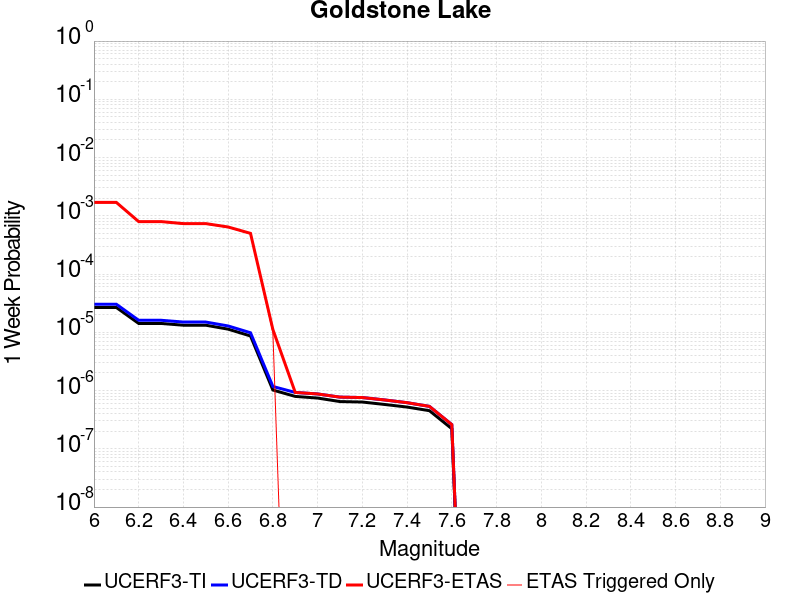 |  |  |  |

| Magnitude | 1 wk TI Prob | 1 wk TD Prob | 1 wk ETAS Prob | 1 wk ETAS/TD Gain | 1 wk ETAS Triggered Only | 1 mo TI Prob | 1 mo TD Prob | 1 mo ETAS Prob | 1 mo ETAS/TD Gain | 1 mo ETAS Triggered Only | 1 yr TI Prob | 1 yr TD Prob | 1 yr ETAS Prob | 1 yr ETAS/TD Gain | 1 yr ETAS Triggered Only | 10 yr TI Prob | 10 yr TD Prob | 10 yr ETAS Prob | 10 yr ETAS/TD Gain | 10 yr ETAS Triggered Only |
|-----|-----|-----|-----|-----|-----|-----|-----|-----|-----|-----|-----|-----|-----|-----|-----|-----|-----|-----|-----|-----|
| 6.0 | 2.671352E-5 | 3.0376103E-5 | 0.001822524 | 59.998608 | 0.0017922022 | 1.1448149E-4 | 1.3017791E-4 | 0.0027529688 | 21.147741 | 0.0026231324 | 0.001392921 | 0.0015839601 | 0.0056669624 | 3.5777178 | 0.00408948 | 0.013842222 | 0.015746202 | 0.021936174 | 1.393109 | 0.0062890006 |
| 6.1 | 2.671352E-5 | 3.0376103E-5 | 0.001822524 | 59.998608 | 0.0017922022 | 1.1448149E-4 | 1.3017791E-4 | 0.0027529688 | 21.147741 | 0.0026231324 | 0.001392921 | 0.0015839601 | 0.0056669624 | 3.5777178 | 0.00408948 | 0.013842222 | 0.015746202 | 0.021936174 | 1.393109 | 0.0062890006 |
| 6.2 | 1.4197047E-5 | 1.6096254E-5 | 8.144281E-4 | 50.597366 | 7.9834467E-4 | 6.0843064E-5 | 6.898268E-5 | 0.0013886043 | 20.129751 | 0.0013197126 | 7.4051257E-4 | 8.3963916E-4 | 0.0028908018 | 3.4429097 | 0.0020528862 | 0.007380498 | 0.008374364 | 0.011589469 | 1.3839223 | 0.0032422568 |
| 6.3 | 1.4197047E-5 | 1.6096254E-5 | 8.144281E-4 | 50.597366 | 7.9834467E-4 | 6.0843064E-5 | 6.898268E-5 | 0.0013886043 | 20.129751 | 0.0013197126 | 7.4051257E-4 | 8.3963916E-4 | 0.0028908018 | 3.4429097 | 0.0020528862 | 0.007380498 | 0.008374364 | 0.011589469 | 1.3839223 | 0.0032422568 |
| 6.4 | 1.3238931E-5 | 1.500847E-5 | 7.318786E-4 | 48.764374 | 7.168809E-4 | 5.6737044E-5 | 6.432098E-5 | 0.0012373234 | 19.2367 | 0.0011730778 | 6.9055456E-4 | 7.8292453E-4 | 0.0026225636 | 3.3497016 | 0.0018410805 | 0.006884126 | 0.007811289 | 0.010785737 | 1.3807884 | 0.0029978657 |
| 6.5 | 1.3238931E-5 | 1.500847E-5 | 7.318786E-4 | 48.764374 | 7.168809E-4 | 5.6737044E-5 | 6.432098E-5 | 0.0012373234 | 19.2367 | 0.0011730778 | 6.9055456E-4 | 7.8292453E-4 | 0.0026225636 | 3.3497016 | 0.0018410805 | 0.006884126 | 0.007811289 | 0.010785737 | 1.3807884 | 0.0029978657 |
| 6.6 | 1.1328278E-5 | 1.2855176E-5 | 6.3197163E-4 | 49.160873 | 6.1912445E-4 | 4.8548856E-5 | 5.5092984E-5 | 0.001032604 | 18.742931 | 9.775648E-4 | 5.90922E-4 | 6.706464E-4 | 0.0022662648 | 3.379225 | 0.0015966893 | 0.0058935313 | 0.0066956137 | 0.009268816 | 1.3843116 | 0.0025905469 |
| 6.7 | 8.651175E-6 | 9.824575E-6 | 4.4972444E-4 | 45.775463 | 4.399042E-4 | 3.707594E-5 | 4.2105148E-5 | 6.612035E-4 | 15.703626 | 6.1912445E-4 | 4.5130608E-4 | 5.126002E-4 | 0.0015385171 | 3.001398 | 0.0010264431 | 0.0045039062 | 0.0051230565 | 0.006906077 | 1.3480384 | 0.0017922022 |
| 6.8 | 1.0215377E-6 | 1.1754802E-6 | 1.746821E-5 | 14.860488 | 1.6292748E-5 | 4.378012E-6 | 5.037763E-6 | 2.1330428E-5 | 4.234107 | 1.6292748E-5 | 5.3300988E-5 | 6.133315E-5 | 1.102084E-4 | 1.7968813 | 4.8878243E-5 | 5.3288206E-4 | 6.131735E-4 | 7.108701E-4 | 1.1593294 | 9.7756485E-5 |
| 6.9 | 7.9360774E-7 | 9.283496E-7 | 9.283496E-7 | 1.0 | 0.0 | 3.4011714E-6 | 3.9786355E-6 | 3.9786355E-6 | 1.0 | 0.0 | 4.1408475E-5 | 4.843888E-5 | 6.473084E-5 | 1.3363405 | 1.6292748E-5 | 4.140076E-4 | 4.842902E-4 | 5.494297E-4 | 1.1345049 | 6.517099E-5 |
| 7.0 | 7.4382757E-7 | 8.747428E-7 | 8.747428E-7 | 1.0 | 0.0 | 3.1878285E-6 | 3.7488926E-6 | 3.7488926E-6 | 1.0 | 0.0 | 3.8811122E-5 | 4.564188E-5 | 6.193388E-5 | 1.356953 | 1.6292748E-5 | 3.8804344E-4 | 4.563317E-4 | 5.2147295E-4 | 1.1427498 | 6.517099E-5 |
| 7.1 | 6.4709513E-7 | 7.711399E-7 | 7.711399E-7 | 1.0 | 0.0 | 2.773262E-6 | 3.3048816E-6 | 3.3048816E-6 | 1.0 | 0.0 | 3.376394E-5 | 4.023625E-5 | 5.6528344E-5 | 1.4049108 | 1.6292748E-5 | 3.375881E-4 | 4.022956E-4 | 4.511542E-4 | 1.1214495 | 4.8878243E-5 |
| 7.2 | 6.356704E-7 | 7.588459E-7 | 7.588459E-7 | 1.0 | 0.0 | 2.7242988E-6 | 3.252193E-6 | 3.252193E-6 | 1.0 | 0.0 | 3.3167835E-5 | 3.959479E-5 | 5.5886892E-5 | 1.4114709 | 1.6292748E-5 | 3.3162883E-4 | 3.9588328E-4 | 4.4474218E-4 | 1.1234174 | 4.8878243E-5 |
| 7.3 | 5.7695723E-7 | 6.896648E-7 | 6.896648E-7 | 1.0 | 0.0 | 2.4726714E-6 | 2.9557032E-6 | 2.9557032E-6 | 1.0 | 0.0 | 3.0104358E-5 | 3.598515E-5 | 5.227731E-5 | 1.4527467 | 1.6292748E-5 | 3.0100282E-4 | 3.5979896E-4 | 3.9237275E-4 | 1.0905333 | 3.2585496E-5 |
| 7.4 | 5.209647E-7 | 6.193583E-7 | 6.193583E-7 | 1.0 | 0.0 | 2.232704E-6 | 2.6543903E-6 | 2.6543903E-6 | 1.0 | 0.0 | 2.718283E-5 | 3.2316777E-5 | 4.8609E-5 | 1.5041412 | 1.6292748E-5 | 2.7179506E-4 | 3.2312635E-4 | 3.557013E-4 | 1.1008118 | 3.2585496E-5 |
| 7.5 | 4.512955E-7 | 5.3489487E-7 | 5.3489487E-7 | 1.0 | 0.0 | 1.934122E-6 | 2.2924048E-6 | 2.2924048E-6 | 1.0 | 0.0 | 2.3547682E-5 | 2.7909726E-5 | 4.420202E-5 | 1.5837497 | 1.6292748E-5 | 2.3545188E-4 | 2.7906752E-4 | 3.1164393E-4 | 1.1167331 | 3.2585496E-5 |
| 7.6 | 2.21172E-7 | 2.6040198E-7 | 2.6040198E-7 | 1.0 | 0.0 | 9.478797E-7 | 1.1160082E-6 | 1.1160082E-6 | 1.0 | 0.0 | 1.1540374E-5 | 1.3587343E-5 | 1.3587343E-5 | 1.0 | 0.0 | 1.1539775E-4 | 1.3586794E-4 | 1.5215848E-4 | 1.1198997 | 1.6292748E-5 |

## So Sierra Nevada
*[(top)](#table-of-contents)*

| 1 Week | 1 Month | 1 Year | 10 Year |
|-----|-----|-----|-----|
|  |  |  |  |

| Magnitude | 1 wk TI Prob | 1 wk TD Prob | 1 wk ETAS Prob | 1 wk ETAS/TD Gain | 1 wk ETAS Triggered Only | 1 mo TI Prob | 1 mo TD Prob | 1 mo ETAS Prob | 1 mo ETAS/TD Gain | 1 mo ETAS Triggered Only | 1 yr TI Prob | 1 yr TD Prob | 1 yr ETAS Prob | 1 yr ETAS/TD Gain | 1 yr ETAS Triggered Only | 10 yr TI Prob | 10 yr TD Prob | 10 yr ETAS Prob | 10 yr ETAS/TD Gain | 10 yr ETAS Triggered Only |
|-----|-----|-----|-----|-----|-----|-----|-----|-----|-----|-----|-----|-----|-----|-----|-----|-----|-----|-----|-----|-----|
| 6.0 | 1.15488665E-5 | 1.1079612E-5 | 0.0016403364 | 148.04999 | 0.0016292748 | 4.9494203E-5 | 4.7483256E-5 | 0.0024912795 | 52.46648 | 0.0024439122 | 6.024253E-4 | 5.779681E-4 | 0.004160301 | 7.19815 | 0.0035844045 | 0.006007948 | 0.005765918 | 0.010706554 | 1.8568689 | 0.004969288 |
| 6.1 | 1.15488665E-5 | 1.1079612E-5 | 0.0016403364 | 148.04999 | 0.0016292748 | 4.9494203E-5 | 4.7483256E-5 | 0.0024912795 | 52.46648 | 0.0024439122 | 6.024253E-4 | 5.779681E-4 | 0.004160301 | 7.19815 | 0.0035844045 | 0.006007948 | 0.005765918 | 0.010706554 | 1.8568689 | 0.004969288 |
| 6.2 | 1.15488665E-5 | 1.1079612E-5 | 0.0016403364 | 148.04999 | 0.0016292748 | 4.9494203E-5 | 4.7483256E-5 | 0.0024912795 | 52.46648 | 0.0024439122 | 6.024253E-4 | 5.779681E-4 | 0.004160301 | 7.19815 | 0.0035844045 | 0.006007948 | 0.005765918 | 0.010706554 | 1.8568689 | 0.004969288 |
| 6.3 | 1.15488665E-5 | 1.1079612E-5 | 0.0016403364 | 148.04999 | 0.0016292748 | 4.9494203E-5 | 4.7483256E-5 | 0.0024912795 | 52.46648 | 0.0024439122 | 6.024253E-4 | 5.779681E-4 | 0.004160301 | 7.19815 | 0.0035844045 | 0.006007948 | 0.005765918 | 0.010706554 | 1.8568689 | 0.004969288 |
| 6.4 | 1.15488665E-5 | 1.1079612E-5 | 0.0016403364 | 148.04999 | 0.0016292748 | 4.9494203E-5 | 4.7483256E-5 | 0.0024912795 | 52.46648 | 0.0024439122 | 6.024253E-4 | 5.779681E-4 | 0.004160301 | 7.19815 | 0.0035844045 | 0.006007948 | 0.005765918 | 0.010706554 | 1.8568689 | 0.004969288 |
| 6.5 | 1.15488665E-5 | 1.1079612E-5 | 0.0016403364 | 148.04999 | 0.0016292748 | 4.9494203E-5 | 4.7483256E-5 | 0.0024912795 | 52.46648 | 0.0024439122 | 6.024253E-4 | 5.779681E-4 | 0.004160301 | 7.19815 | 0.0035844045 | 0.006007948 | 0.005765918 | 0.010706554 | 1.8568689 | 0.004969288 |
| 6.6 | 7.587044E-6 | 6.9356042E-6 | 0.0010659569 | 153.69344 | 0.0010590287 | 3.2515498E-5 | 2.9723697E-5 | 0.0014145661 | 47.59052 | 0.0013848835 | 3.9580427E-4 | 3.6182883E-4 | 0.0023813986 | 6.581561 | 0.0020203008 | 0.003951 | 0.0036126887 | 0.00629128 | 1.7414398 | 0.0026883034 |
| 6.7 | 7.587044E-6 | 6.9356042E-6 | 0.0010659569 | 153.69344 | 0.0010590287 | 3.2515498E-5 | 2.9723697E-5 | 0.0014145661 | 47.59052 | 0.0013848835 | 3.9580427E-4 | 3.6182883E-4 | 0.0023813986 | 6.581561 | 0.0020203008 | 0.003951 | 0.0036126887 | 0.00629128 | 1.7414398 | 0.0026883034 |
| 6.8 | 5.9026956E-6 | 5.179362E-6 | 8.6869055E-4 | 167.72154 | 8.6351566E-4 | 2.5297022E-5 | 2.2197082E-5 | 0.001113787 | 50.177177 | 0.0010916141 | 3.0794772E-4 | 2.7021713E-4 | 0.0017850333 | 6.6059217 | 0.0015152256 | 0.0030752132 | 0.002699002 | 0.0046813525 | 1.7344754 | 0.0019877153 |
| 6.9 | 5.0118915E-6 | 4.2523943E-6 | 6.5595953E-4 | 154.25652 | 6.517099E-4 | 2.1479358E-5 | 1.8224424E-5 | 8.491394E-4 | 46.593483 | 8.3093013E-4 | 2.614798E-4 | 2.2186051E-4 | 0.0013946781 | 6.286284 | 0.0011730778 | 0.0026117235 | 0.0022164627 | 0.0038258696 | 1.7261151 | 0.001612982 |
| 7.0 | 4.4924795E-6 | 3.7138868E-6 | 5.5766525E-4 | 150.15677 | 5.5395346E-4 | 1.925334E-5 | 1.5916565E-5 | 7.490786E-4 | 47.06283 | 7.331737E-4 | 2.3438422E-4 | 1.9376757E-4 | 0.0012037222 | 6.2121964 | 0.0010101504 | 0.0023413717 | 0.0019360491 | 0.0033019902 | 1.7055302 | 0.0013685909 |
| 7.1 | 3.9118436E-6 | 3.1119469E-6 | 4.1042938E-4 | 131.88829 | 4.073187E-4 | 1.6764936E-5 | 1.333685E-5 | 5.5099034E-4 | 41.31338 | 5.376607E-4 | 2.0409399E-4 | 1.6236462E-4 | 9.6057967E-4 | 5.9161882 | 7.9834467E-4 | 0.0020390663 | 0.0016225161 | 0.002761158 | 1.7017754 | 0.0011404924 |
| 7.2 | 3.4200818E-6 | 2.6054236E-6 | 2.795814E-4 | 107.30747 | 2.7697673E-4 | 1.4657411E-5 | 1.11660565E-5 | 3.8589508E-4 | 34.559658 | 3.747332E-4 | 1.7843937E-4 | 1.3593875E-4 | 7.061074E-4 | 5.1943054 | 5.702462E-4 | 0.0017829615 | 0.0013586058 | 0.0021233247 | 1.5628703 | 7.6575915E-4 |
| 7.3 | 2.6593618E-6 | 1.8283897E-6 | 1.6475558E-4 | 90.10966 | 1.6292748E-4 | 1.13972155E-5 | 7.8359335E-6 | 2.0334737E-4 | 25.950624 | 1.9551297E-4 | 1.3875226E-4 | 9.539862E-5 | 4.0493128E-4 | 4.2446246 | 3.0956222E-4 | 0.0013866565 | 9.536055E-4 | 0.0014093674 | 1.4779354 | 4.5619695E-4 |
| 7.4 | 2.2577992E-6 | 1.4364078E-6 | 1.317782E-4 | 91.7415 | 1.3034198E-4 | 9.676246E-6 | 6.1560204E-6 | 1.364972E-4 | 22.172962 | 1.3034198E-4 | 1.1780193E-4 | 7.4947224E-5 | 2.7044554E-4 | 3.6084797 | 1.9551297E-4 | 0.001177395 | 7.4924453E-4 | 0.0010911359 | 1.4563148 | 3.4214772E-4 |
| 7.5 | 1.489319E-6 | 7.353661E-7 | 8.219905E-5 | 111.77976 | 8.146374E-5 | 6.3827797E-6 | 3.1515651E-6 | 8.461505E-5 | 26.84858 | 8.146374E-5 | 7.770758E-5 | 3.8369635E-5 | 1.3612237E-4 | 3.547659 | 9.7756485E-5 | 7.7680405E-4 | 3.8363054E-4 | 5.30209E-4 | 1.3820825 | 1.4663473E-4 |
| 7.6 | 1.0680322E-6 | 4.65941E-7 | 8.192964E-5 | 175.83694 | 8.146374E-5 | 4.577273E-6 | 1.9968884E-6 | 8.3460465E-5 | 41.795258 | 8.146374E-5 | 5.5726876E-5 | 2.4311848E-5 | 1.0577361E-4 | 4.350702 | 8.146374E-5 | 5.5712904E-4 | 2.4309216E-4 | 3.5711366E-4 | 1.4690465 | 1.1404924E-4 |
| 7.7 | 5.509146E-7 | 1.5578539E-7 | 1.5578539E-7 | 1.0 | 0.0 | 2.3610605E-6 | 6.676515E-7 | 6.676515E-7 | 1.0 | 0.0 | 2.8745531E-5 | 8.128628E-6 | 8.128628E-6 | 1.0 | 0.0 | 2.8741814E-4 | 8.128342E-5 | 8.128342E-5 | 1.0 | 0.0 |

## San Andreas (Mojave S)
*[(top)](#table-of-contents)*

| 1 Week | 1 Month | 1 Year | 10 Year |
|-----|-----|-----|-----|
|  | 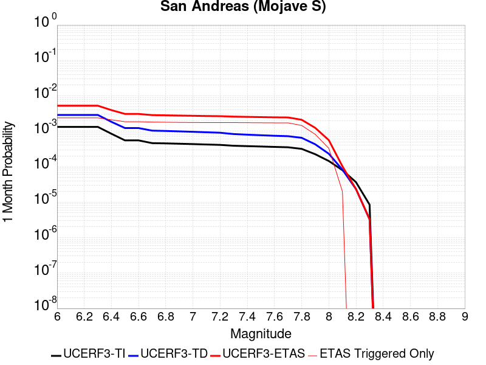 |  |  |

| Magnitude | 1 wk TI Prob | 1 wk TD Prob | 1 wk ETAS Prob | 1 wk ETAS/TD Gain | 1 wk ETAS Triggered Only | 1 mo TI Prob | 1 mo TD Prob | 1 mo ETAS Prob | 1 mo ETAS/TD Gain | 1 mo ETAS Triggered Only | 1 yr TI Prob | 1 yr TD Prob | 1 yr ETAS Prob | 1 yr ETAS/TD Gain | 1 yr ETAS Triggered Only | 10 yr TI Prob | 10 yr TD Prob | 10 yr ETAS Prob | 10 yr ETAS/TD Gain | 10 yr ETAS Triggered Only |
|-----|-----|-----|-----|-----|-----|-----|-----|-----|-----|-----|-----|-----|-----|-----|-----|-----|-----|-----|-----|-----|
| 6.0 | 3.1064058E-4 | 6.7462435E-4 | 0.0026121533 | 3.8720117 | 0.001938837 | 0.0013306376 | 0.002888172 | 0.0053412714 | 1.8493606 | 0.002460205 | 0.016080605 | 0.034565594 | 0.037963185 | 1.0982939 | 0.0035192335 | 0.1496549 | 0.28654557 | 0.28976548 | 1.0112369 | 0.0045130914 |
| 6.1 | 3.1064058E-4 | 6.7462435E-4 | 0.0026121533 | 3.8720117 | 0.001938837 | 0.0013306376 | 0.002888172 | 0.0053412714 | 1.8493606 | 0.002460205 | 0.016080605 | 0.034565594 | 0.037963185 | 1.0982939 | 0.0035192335 | 0.1496549 | 0.28654557 | 0.28976548 | 1.0112369 | 0.0045130914 |
| 6.2 | 3.1064058E-4 | 6.7462435E-4 | 0.0026121533 | 3.8720117 | 0.001938837 | 0.0013306376 | 0.002888172 | 0.0053412714 | 1.8493606 | 0.002460205 | 0.016080605 | 0.034565594 | 0.037963185 | 1.0982939 | 0.0035192335 | 0.1496549 | 0.28654557 | 0.28976548 | 1.0112369 | 0.0045130914 |
| 6.3 | 3.1064058E-4 | 6.7462435E-4 | 0.0026121533 | 3.8720117 | 0.001938837 | 0.0013306376 | 0.002888172 | 0.0053412714 | 1.8493606 | 0.002460205 | 0.016080605 | 0.034565594 | 0.037963185 | 1.0982939 | 0.0035192335 | 0.1496549 | 0.28654557 | 0.28976548 | 1.0112369 | 0.0045130914 |
| 6.4 | 1.9872203E-4 | 4.3181062E-4 | 0.0021255247 | 4.922354 | 0.0016944458 | 8.5138786E-4 | 0.0018493326 | 0.0040285233 | 2.178366 | 0.0021832283 | 0.010316478 | 0.02228931 | 0.025315933 | 1.1357881 | 0.0030956222 | 0.098504856 | 0.19686839 | 0.20003502 | 1.016085 | 0.003942845 |
| 6.5 | 1.291105E-4 | 2.8754136E-4 | 0.0017860432 | 6.21143 | 0.0014989328 | 5.5321335E-4 | 0.0012317409 | 0.0031193718 | 2.53249 | 0.0018899587 | 0.006714592 | 0.014894155 | 0.017526368 | 1.1767279 | 0.0026720108 | 0.065152965 | 0.13800792 | 0.14092913 | 1.0211669 | 0.0033888917 |
| 6.6 | 1.291105E-4 | 2.8754136E-4 | 0.0017860432 | 6.21143 | 0.0014989328 | 5.5321335E-4 | 0.0012317409 | 0.0031193718 | 2.53249 | 0.0018899587 | 0.006714592 | 0.014894155 | 0.017526368 | 1.1767279 | 0.0026720108 | 0.065152965 | 0.13800792 | 0.14092913 | 1.0211669 | 0.0033888917 |
| 6.7 | 1.08001186E-4 | 2.4335351E-4 | 0.0016767664 | 6.8902497 | 0.0014337618 | 4.6278012E-4 | 0.0010425274 | 0.0028654127 | 2.7485251 | 0.0018247878 | 0.0056198016 | 0.0126192 | 0.0151609685 | 1.2014208 | 0.0025742543 | 0.054797906 | 0.11918431 | 0.12205449 | 1.0240818 | 0.0032585496 |
| 6.8 | 1.0624356E-4 | 2.3853009E-4 | 0.0016393722 | 6.872811 | 0.0014011763 | 4.5525006E-4 | 0.0010218718 | 0.0028122426 | 2.7520504 | 0.0017922022 | 0.0055285925 | 0.012370593 | 0.014880819 | 1.2029189 | 0.0025416687 | 0.053930566 | 0.11713308 | 0.11998118 | 1.024315 | 0.003225964 |
| 6.9 | 1.0393785E-4 | 2.3223337E-4 | 0.0016330843 | 7.0320826 | 0.0014011763 | 4.4537184E-4 | 9.949068E-4 | 0.0027690495 | 2.783225 | 0.0017759096 | 0.0054089287 | 0.012045963 | 0.014540918 | 1.2071196 | 0.002525376 | 0.05279156 | 0.114433445 | 0.11727583 | 1.0248387 | 0.0032096715 |
| 7.0 | 1.0155622E-4 | 2.2592908E-4 | 0.0016104998 | 7.1283426 | 0.0013848835 | 4.3516833E-4 | 9.6790853E-4 | 0.0027258222 | 2.816198 | 0.0017596168 | 0.005285311 | 0.011720838 | 0.014200513 | 1.2115612 | 0.0025090831 | 0.05161361 | 0.11169745 | 0.11453414 | 1.0253961 | 0.0031933787 |
| 7.1 | 9.885595E-5 | 2.188132E-4 | 0.0016033938 | 7.327683 | 0.0013848835 | 4.2359953E-4 | 9.374342E-4 | 0.002679124 | 2.8579328 | 0.0017433241 | 0.0051451353 | 0.011353733 | 0.013818221 | 1.2170641 | 0.0024927903 | 0.05027629 | 0.10857607 | 0.111393675 | 1.0259506 | 0.003160793 |
| 7.2 | 9.6411415E-5 | 2.1244297E-4 | 0.0015970323 | 7.5174637 | 0.0013848835 | 4.1312634E-4 | 9.101525E-4 | 0.0026518898 | 2.9136765 | 0.0017433241 | 0.005018219 | 0.011024987 | 0.013490294 | 1.2236109 | 0.0024927903 | 0.049064007 | 0.1057697 | 0.10859618 | 1.0267229 | 0.003160793 |
| 7.3 | 9.1180635E-5 | 1.9472656E-4 | 0.0015793404 | 8.110555 | 0.0013848835 | 3.907156E-4 | 8.342756E-4 | 0.002576145 | 3.0878828 | 0.0017433241 | 0.004746591 | 0.010110112 | 0.0125777 | 1.2440712 | 0.0024927903 | 0.046464786 | 0.09796176 | 0.10081292 | 1.0291048 | 0.003160793 |
| 7.4 | 8.887388E-5 | 1.872126E-4 | 0.0015718369 | 8.395999 | 0.0013848835 | 3.8083247E-4 | 8.020931E-4 | 0.002544019 | 3.171725 | 0.0017433241 | 0.0046267817 | 0.009721855 | 0.012174277 | 1.2522587 | 0.0024764978 | 0.045316286 | 0.094593845 | 0.0974409 | 1.0300976 | 0.0031445003 |
| 7.5 | 8.6750515E-5 | 1.80528E-4 | 0.0015488717 | 8.579676 | 0.0013685909 | 3.7173493E-4 | 7.734621E-4 | 0.0024991576 | 3.2311313 | 0.0017270313 | 0.004516484 | 0.009376327 | 0.011813464 | 1.2599245 | 0.002460205 | 0.04425787 | 0.09155606 | 0.09439786 | 1.0310389 | 0.0031282075 |
| 7.6 | 8.453092E-5 | 1.7440386E-4 | 0.0015264661 | 8.752479 | 0.0013522981 | 3.6222505E-4 | 7.4723107E-4 | 0.0024566913 | 3.2877264 | 0.0017107385 | 0.0044011753 | 0.009059664 | 0.011465291 | 1.2655315 | 0.0024276194 | 0.04315024 | 0.08871447 | 0.09152062 | 1.0316312 | 0.0030793294 |
| 7.7 | 8.259102E-5 | 1.6962511E-4 | 0.0015216938 | 8.970923 | 0.0013522981 | 3.539135E-4 | 7.267622E-4 | 0.0024362574 | 3.352207 | 0.0017107385 | 0.004300386 | 0.0088125 | 0.0112025775 | 1.2712144 | 0.0024113266 | 0.042181134 | 0.086465426 | 0.08926362 | 1.032362 | 0.0030630366 |
| 7.8 | 7.444844E-5 | 1.528469E-4 | 0.0013094553 | 8.567103 | 0.0011567851 | 3.1902574E-4 | 6.5489375E-4 | 0.0020877167 | 3.1878707 | 0.0014337618 | 0.0038772223 | 0.007944231 | 0.009948482 | 1.2522901 | 0.0020203008 | 0.03810269 | 0.078293875 | 0.080636546 | 1.0299215 | 0.0025416687 |
| 7.9 | 5.2586525E-5 | 1.0007023E-4 | 8.005883E-4 | 8.000264 | 7.0058816E-4 | 2.2535135E-4 | 4.2880196E-4 | 0.0013082331 | 3.0509028 | 8.798084E-4 | 0.0027402006 | 0.005208178 | 0.0064723934 | 1.2427367 | 0.0012708344 | 0.027066574 | 0.052201588 | 0.053637717 | 1.0275112 | 0.0015152256 |
| 8.0 | 3.379877E-5 | 5.4075565E-5 | 3.799129E-4 | 7.0255933 | 3.2585496E-4 | 1.4484383E-4 | 2.3173184E-4 | 6.226672E-4 | 2.687016 | 3.9102594E-4 | 0.0017620471 | 0.0028176866 | 0.0033538325 | 1.1902786 | 5.376607E-4 | 0.017481409 | 0.028835917 | 0.029437188 | 1.0208515 | 6.1912445E-4 |
| 8.1 | 1.8668277E-5 | 1.9308145E-5 | 5.189301E-5 | 2.687623 | 3.2585496E-5 | 8.000444E-5 | 8.274657E-5 | 1.1532937E-4 | 1.3937662 | 3.2585496E-5 | 9.736188E-4 | 0.0010069745 | 0.0010558035 | 1.0484909 | 4.8878243E-5 | 0.009693642 | 0.010798624 | 0.010863091 | 1.00597 | 6.517099E-5 |
| 8.2 | 8.541571E-6 | 5.4596358E-6 | 5.4596358E-6 | 1.0 | 0.0 | 3.660622E-5 | 2.339823E-5 | 2.339823E-5 | 1.0 | 0.0 | 4.455896E-4 | 2.848363E-4 | 2.848363E-4 | 1.0 | 0.0 | 0.0044469717 | 0.003240283 | 0.003240283 | 1.0 | 0.0 |
| 8.3 | 1.983087E-6 | 7.6564595E-7 | 7.6564595E-7 | 1.0 | 0.0 | 8.498917E-6 | 3.281336E-6 | 3.281336E-6 | 1.0 | 0.0 | 1.034694E-4 | 3.9949547E-5 | 3.9949547E-5 | 1.0 | 0.0 | 0.0010342124 | 4.717979E-4 | 4.717979E-4 | 1.0 | 0.0 |

## Coyote Canyon
*[(top)](#table-of-contents)*

| 1 Week | 1 Month | 1 Year | 10 Year |
|-----|-----|-----|-----|
|  |  |  | 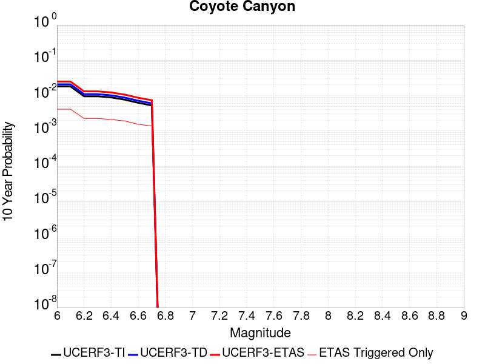 |

| Magnitude | 1 wk TI Prob | 1 wk TD Prob | 1 wk ETAS Prob | 1 wk ETAS/TD Gain | 1 wk ETAS Triggered Only | 1 mo TI Prob | 1 mo TD Prob | 1 mo ETAS Prob | 1 mo ETAS/TD Gain | 1 mo ETAS Triggered Only | 1 yr TI Prob | 1 yr TD Prob | 1 yr ETAS Prob | 1 yr ETAS/TD Gain | 1 yr ETAS Triggered Only | 10 yr TI Prob | 10 yr TD Prob | 10 yr ETAS Prob | 10 yr ETAS/TD Gain | 10 yr ETAS Triggered Only |
|-----|-----|-----|-----|-----|-----|-----|-----|-----|-----|-----|-----|-----|-----|-----|-----|-----|-----|-----|-----|-----|
| 6.0 | 3.5090034E-5 | 4.0364317E-5 | 0.0011971027 | 29.657452 | 0.0011567851 | 1.503772E-4 | 1.7297991E-4 | 0.0018508427 | 10.699755 | 0.001678153 | 0.0018293047 | 0.0021042533 | 0.004819417 | 2.2903216 | 0.002720889 | 0.018143194 | 0.020869205 | 0.024969056 | 1.1964546 | 0.004187236 |
| 6.1 | 3.5090034E-5 | 4.0364317E-5 | 0.0011971027 | 29.657452 | 0.0011567851 | 1.503772E-4 | 1.7297991E-4 | 0.0018508427 | 10.699755 | 0.001678153 | 0.0018293047 | 0.0021042533 | 0.004819417 | 2.2903216 | 0.002720889 | 0.018143194 | 0.020869205 | 0.024969056 | 1.1964546 | 0.004187236 |
| 6.2 | 1.841879E-5 | 2.1059794E-5 | 5.0983194E-4 | 24.208782 | 4.887824E-4 | 7.8935285E-5 | 9.025371E-5 | 8.7223505E-4 | 9.664257 | 7.820519E-4 | 9.606133E-4 | 0.0010983871 | 0.0024817495 | 2.259449 | 0.0013848835 | 0.0095647145 | 0.010939668 | 0.013195699 | 1.2062249 | 0.0022809848 |
| 6.3 | 1.841879E-5 | 2.1059794E-5 | 5.0983194E-4 | 24.208782 | 4.887824E-4 | 7.8935285E-5 | 9.025371E-5 | 8.7223505E-4 | 9.664257 | 7.820519E-4 | 9.606133E-4 | 0.0010983871 | 0.0024817495 | 2.259449 | 0.0013848835 | 0.0095647145 | 0.010939668 | 0.013195699 | 1.2062249 | 0.0022809848 |
| 6.4 | 1.712201E-5 | 1.9565212E-5 | 4.7575324E-4 | 24.316284 | 4.5619695E-4 | 7.337798E-5 | 8.3848776E-5 | 8.332523E-4 | 9.937561 | 7.494664E-4 | 8.930107E-4 | 0.0010204813 | 0.0023062949 | 2.260007 | 0.0012871271 | 0.008894307 | 0.010167871 | 0.012264392 | 1.2061908 | 0.0021180573 |
| 6.5 | 1.4744935E-5 | 1.6836972E-5 | 4.4044128E-4 | 26.159176 | 4.2361146E-4 | 6.3191044E-5 | 7.215698E-5 | 7.726946E-4 | 10.708522 | 7.0058816E-4 | 7.6907943E-4 | 8.782507E-4 | 0.0020177413 | 2.297455 | 0.0011404924 | 0.007664232 | 0.008756994 | 0.010614253 | 1.2120886 | 0.0018736661 |
| 6.6 | 1.2017839E-5 | 1.3724089E-5 | 3.5586712E-4 | 25.930107 | 3.4214772E-4 | 5.150401E-5 | 5.88167E-5 | 6.616129E-4 | 11.248726 | 6.0283166E-4 | 6.268809E-4 | 7.159466E-4 | 0.0017090926 | 2.387179 | 9.938576E-4 | 0.0062511545 | 0.0071450938 | 0.008649493 | 1.21055 | 0.0015152256 |
| 6.7 | 1.00956095E-5 | 1.1533517E-5 | 3.2109217E-4 | 27.839918 | 3.0956222E-4 | 4.326618E-5 | 4.942891E-5 | 5.87063E-4 | 11.876916 | 5.376607E-4 | 5.266384E-4 | 6.017178E-4 | 0.0014809968 | 2.4612813 | 8.798084E-4 | 0.005253921 | 0.0060094125 | 0.007369779 | 1.2263726 | 0.0013685909 |

## San Andreas (Mojave N)
*[(top)](#table-of-contents)*

| 1 Week | 1 Month | 1 Year | 10 Year |
|-----|-----|-----|-----|
|  | 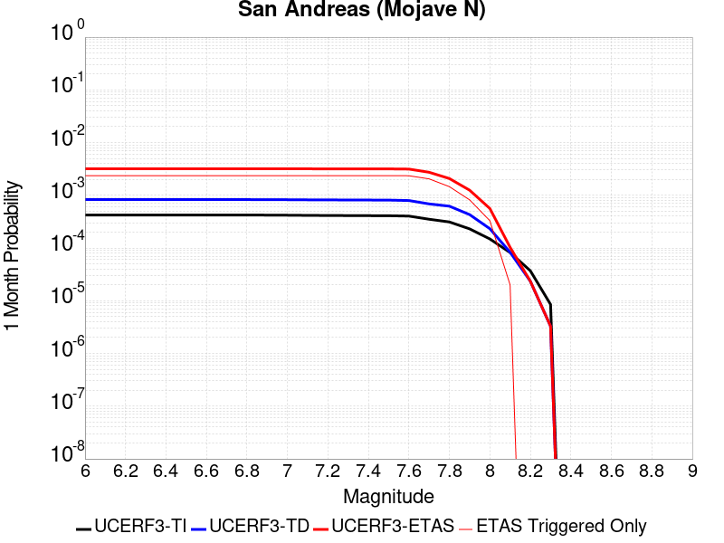 |  | 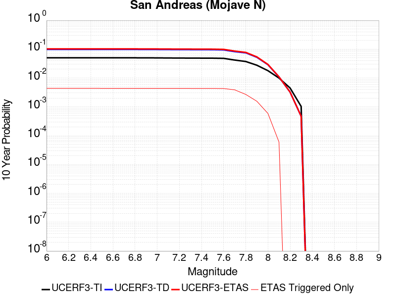 |

| Magnitude | 1 wk TI Prob | 1 wk TD Prob | 1 wk ETAS Prob | 1 wk ETAS/TD Gain | 1 wk ETAS Triggered Only | 1 mo TI Prob | 1 mo TD Prob | 1 mo ETAS Prob | 1 mo ETAS/TD Gain | 1 mo ETAS Triggered Only | 1 yr TI Prob | 1 yr TD Prob | 1 yr ETAS Prob | 1 yr ETAS/TD Gain | 1 yr ETAS Triggered Only | 10 yr TI Prob | 10 yr TD Prob | 10 yr ETAS Prob | 10 yr ETAS/TD Gain | 10 yr ETAS Triggered Only |
|-----|-----|-----|-----|-----|-----|-----|-----|-----|-----|-----|-----|-----|-----|-----|-----|-----|-----|-----|-----|-----|
| 6.0 | 9.877682E-5 | 1.9402112E-4 | 0.0020836133 | 10.739105 | 0.0018899587 | 4.2326056E-4 | 8.312543E-4 | 0.0031591805 | 3.8004985 | 0.002329863 | 0.0051410277 | 0.010073684 | 0.013444566 | 1.3346225 | 0.0034051843 | 0.05023708 | 0.09832245 | 0.1022449 | 1.0398936 | 0.004350164 |
| 6.1 | 9.877682E-5 | 1.9402112E-4 | 0.0020836133 | 10.739105 | 0.0018899587 | 4.2326056E-4 | 8.312543E-4 | 0.0031591805 | 3.8004985 | 0.002329863 | 0.0051410277 | 0.010073684 | 0.013444566 | 1.3346225 | 0.0034051843 | 0.05023708 | 0.09832245 | 0.1022449 | 1.0398936 | 0.004350164 |
| 6.2 | 9.877682E-5 | 1.9402112E-4 | 0.0020836133 | 10.739105 | 0.0018899587 | 4.2326056E-4 | 8.312543E-4 | 0.0031591805 | 3.8004985 | 0.002329863 | 0.0051410277 | 0.010073684 | 0.013444566 | 1.3346225 | 0.0034051843 | 0.05023708 | 0.09832245 | 0.1022449 | 1.0398936 | 0.004350164 |
| 6.3 | 9.877682E-5 | 1.9402112E-4 | 0.0020836133 | 10.739105 | 0.0018899587 | 4.2326056E-4 | 8.312543E-4 | 0.0031591805 | 3.8004985 | 0.002329863 | 0.0051410277 | 0.010073684 | 0.013444566 | 1.3346225 | 0.0034051843 | 0.05023708 | 0.09832245 | 0.1022449 | 1.0398936 | 0.004350164 |
| 6.4 | 9.877682E-5 | 1.9402112E-4 | 0.0020836133 | 10.739105 | 0.0018899587 | 4.2326056E-4 | 8.312543E-4 | 0.0031591805 | 3.8004985 | 0.002329863 | 0.0051410277 | 0.010073684 | 0.013444566 | 1.3346225 | 0.0034051843 | 0.05023708 | 0.09832245 | 0.1022449 | 1.0398936 | 0.004350164 |
| 6.5 | 9.861474E-5 | 1.937588E-4 | 0.0020833514 | 10.752293 | 0.0018899587 | 4.2256617E-4 | 8.3013077E-4 | 0.0031580597 | 3.8042917 | 0.002329863 | 0.0051326132 | 0.0100601325 | 0.01343106 | 1.3350779 | 0.0034051843 | 0.050156746 | 0.09820035 | 0.102108635 | 1.0397991 | 0.004333871 |
| 6.6 | 9.861474E-5 | 1.937588E-4 | 0.0020833514 | 10.752293 | 0.0018899587 | 4.2256617E-4 | 8.3013077E-4 | 0.0031580597 | 3.8042917 | 0.002329863 | 0.0051326132 | 0.0100601325 | 0.01343106 | 1.3350779 | 0.0034051843 | 0.050156746 | 0.09820035 | 0.102108635 | 1.0397991 | 0.004333871 |
| 6.7 | 9.8552715E-5 | 1.9365833E-4 | 0.002083251 | 10.757354 | 0.0018899587 | 4.223004E-4 | 8.2970044E-4 | 0.0031576303 | 3.8057475 | 0.002329863 | 0.0051293927 | 0.010054941 | 0.013425887 | 1.3352526 | 0.0034051843 | 0.050125998 | 0.09815356 | 0.10206205 | 1.0398201 | 0.004333871 |
| 6.8 | 9.8464974E-5 | 1.9350994E-4 | 0.002083103 | 10.764837 | 0.0018899587 | 4.219245E-4 | 8.290649E-4 | 0.0031569963 | 3.8079 | 0.002329863 | 0.0051248376 | 0.010047276 | 0.013418247 | 1.335511 | 0.0034051843 | 0.05008251 | 0.09808378 | 0.10199257 | 1.0398515 | 0.004333871 |
| 6.9 | 9.825824E-5 | 1.9319002E-4 | 0.0020827837 | 10.781011 | 0.0018899587 | 4.2103877E-4 | 8.276947E-4 | 0.0031556292 | 3.8125522 | 0.002329863 | 0.0051141046 | 0.010030746 | 0.013401775 | 1.3360695 | 0.0034051843 | 0.049980022 | 0.097932965 | 0.1018424 | 1.0399196 | 0.004333871 |
| 7.0 | 9.781462E-5 | 1.9250368E-4 | 0.0020820987 | 10.81589 | 0.0018899587 | 4.1913814E-4 | 8.247551E-4 | 0.0031526964 | 3.822585 | 0.002329863 | 0.005091073 | 0.009995285 | 0.013366434 | 1.3372738 | 0.0034051843 | 0.04976007 | 0.09760912 | 0.101505265 | 1.0399158 | 0.0043175784 |
| 7.1 | 9.7121134E-5 | 1.9152075E-4 | 0.0020811176 | 10.866278 | 0.0018899587 | 4.1616702E-4 | 8.205452E-4 | 0.0031484964 | 3.8370786 | 0.002329863 | 0.005055068 | 0.0099444995 | 0.013315821 | 1.3390137 | 0.0034051843 | 0.04941613 | 0.09714571 | 0.10104385 | 1.0401268 | 0.0043175784 |
| 7.2 | 9.663819E-5 | 1.9082859E-4 | 0.0020804268 | 10.90207 | 0.0018899587 | 4.1409794E-4 | 8.175807E-4 | 0.0031455387 | 3.8473742 | 0.002329863 | 0.0050299936 | 0.009908735 | 0.013280178 | 1.3402497 | 0.0034051843 | 0.049176537 | 0.09681883 | 0.100703664 | 1.0401249 | 0.0043012854 |
| 7.3 | 9.6277574E-5 | 1.9035369E-4 | 0.0020799527 | 10.926779 | 0.0018899587 | 4.125529E-4 | 8.1554666E-4 | 0.0031435096 | 3.8544817 | 0.002329863 | 0.0050112694 | 0.009884195 | 0.013255723 | 1.3411028 | 0.0034051843 | 0.04899759 | 0.09659228 | 0.10047809 | 1.0402291 | 0.0043012854 |
| 7.4 | 9.593308E-5 | 1.8975153E-4 | 0.0020793518 | 10.958286 | 0.0018899587 | 4.1107697E-4 | 8.129676E-4 | 0.0031409364 | 3.8635445 | 0.002329863 | 0.0049933824 | 0.009853081 | 0.013208581 | 1.3405534 | 0.0033888917 | 0.04882661 | 0.09630986 | 0.10018217 | 1.0402068 | 0.004284993 |
| 7.5 | 9.561707E-5 | 1.8921228E-4 | 0.0020788135 | 10.986673 | 0.0018899587 | 4.0972308E-4 | 8.106579E-4 | 0.0031386323 | 3.8717096 | 0.002329863 | 0.0049769743 | 0.009825215 | 0.013180809 | 1.3415289 | 0.0033888917 | 0.048669744 | 0.096056245 | 0.09992964 | 1.0403242 | 0.004284993 |
| 7.6 | 9.418194E-5 | 1.8573487E-4 | 0.002059053 | 11.0859785 | 0.0018736661 | 4.0357444E-4 | 7.95764E-4 | 0.003107493 | 3.9050438 | 0.0023135701 | 0.004902454 | 0.009645499 | 0.0129694315 | 1.3446097 | 0.003356306 | 0.047957025 | 0.094437465 | 0.09827353 | 1.0406202 | 0.0042361147 |
| 7.7 | 8.202141E-5 | 1.6022482E-4 | 0.0017892385 | 11.16705 | 0.0016292748 | 3.51473E-4 | 6.8649714E-4 | 0.002705411 | 3.940892 | 0.0020203008 | 0.00427079 | 0.008326128 | 0.011282876 | 1.3551167 | 0.0029815729 | 0.04189639 | 0.082237914 | 0.085692026 | 1.0420015 | 0.0037636247 |
| 7.8 | 7.2859846E-5 | 1.4517571E-4 | 0.0013017929 | 8.967016 | 0.0011567851 | 3.1221908E-4 | 6.2203326E-4 | 0.0020549032 | 3.3035262 | 0.0014337618 | 0.003794643 | 0.0075469986 | 0.009535883 | 1.2635331 | 0.002004008 | 0.037304975 | 0.07472766 | 0.07706432 | 1.0312691 | 0.002525376 |
| 7.9 | 5.3874453E-5 | 1.00462625E-4 | 8.0098043E-4 | 7.972919 | 7.0058816E-4 | 2.3087008E-4 | 4.3048308E-4 | 0.0013099128 | 3.04289 | 8.798084E-4 | 0.0028072202 | 0.0052285474 | 0.006492737 | 1.241786 | 0.0012708344 | 0.02772022 | 0.052425884 | 0.053861674 | 1.027387 | 0.0015152256 |
| 8.0 | 3.468538E-5 | 5.4261534E-5 | 3.8009882E-4 | 7.00494 | 3.2585496E-4 | 1.4864317E-4 | 2.3252872E-4 | 6.2346377E-4 | 2.6812334 | 3.9102594E-4 | 0.0018082283 | 0.0028273636 | 0.003363504 | 1.1896256 | 5.376607E-4 | 0.017935853 | 0.028948462 | 0.029549664 | 1.020768 | 6.1912445E-4 |
| 8.1 | 1.9152367E-5 | 1.9401303E-5 | 5.1986168E-5 | 2.6795194 | 3.2585496E-5 | 8.207899E-5 | 8.3145795E-5 | 1.1572858E-4 | 1.3918754 | 3.2585496E-5 | 9.988535E-4 | 0.0010118305 | 0.0010606593 | 1.0482578 | 4.8878243E-5 | 0.009943757 | 0.01085595 | 0.010920415 | 1.005938 | 6.517099E-5 |
| 8.2 | 8.643924E-6 | 5.473668E-6 | 5.473668E-6 | 1.0 | 0.0 | 3.704486E-5 | 2.3458366E-5 | 2.3458366E-5 | 1.0 | 0.0 | 4.5092785E-4 | 2.8556827E-4 | 2.8556827E-4 | 1.0 | 0.0 | 0.0045001395 | 0.0032481793 | 0.0032481793 | 1.0 | 0.0 |
| 8.3 | 1.983087E-6 | 7.6564595E-7 | 7.6564595E-7 | 1.0 | 0.0 | 8.498917E-6 | 3.281336E-6 | 3.281336E-6 | 1.0 | 0.0 | 1.034694E-4 | 3.9949547E-5 | 3.9949547E-5 | 1.0 | 0.0 | 0.0010342124 | 4.717979E-4 | 4.717979E-4 | 1.0 | 0.0 |

## Death Valley (So)
*[(top)](#table-of-contents)*

| 1 Week | 1 Month | 1 Year | 10 Year |
|-----|-----|-----|-----|
|  | 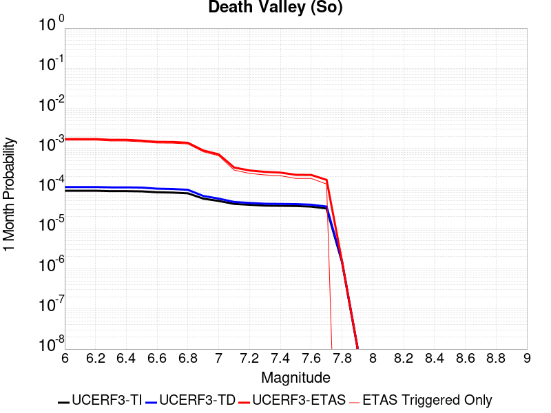 |  |  |

| Magnitude | 1 wk TI Prob | 1 wk TD Prob | 1 wk ETAS Prob | 1 wk ETAS/TD Gain | 1 wk ETAS Triggered Only | 1 mo TI Prob | 1 mo TD Prob | 1 mo ETAS Prob | 1 mo ETAS/TD Gain | 1 mo ETAS Triggered Only | 1 yr TI Prob | 1 yr TD Prob | 1 yr ETAS Prob | 1 yr ETAS/TD Gain | 1 yr ETAS Triggered Only | 10 yr TI Prob | 10 yr TD Prob | 10 yr ETAS Prob | 10 yr ETAS/TD Gain | 10 yr ETAS Triggered Only |
|-----|-----|-----|-----|-----|-----|-----|-----|-----|-----|-----|-----|-----|-----|-----|-----|-----|-----|-----|-----|-----|
| 6.0 | 2.0684236E-5 | 2.5618314E-5 | 0.0011334968 | 44.245567 | 0.0011079069 | 8.864371E-5 | 1.0978825E-4 | 0.0017714661 | 16.135298 | 0.0016618603 | 0.0010787029 | 0.0013358692 | 0.004150749 | 3.1071525 | 0.0028186454 | 0.010734817 | 0.013279985 | 0.017395537 | 1.3099065 | 0.0041709435 |
| 6.1 | 2.0684236E-5 | 2.5618314E-5 | 0.0011334968 | 44.245567 | 0.0011079069 | 8.864371E-5 | 1.0978825E-4 | 0.0017714661 | 16.135298 | 0.0016618603 | 0.0010787029 | 0.0013358692 | 0.004150749 | 3.1071525 | 0.0028186454 | 0.010734817 | 0.013279985 | 0.017395537 | 1.3099065 | 0.0041709435 |
| 6.2 | 2.0684236E-5 | 2.5618314E-5 | 0.0011334968 | 44.245567 | 0.0011079069 | 8.864371E-5 | 1.0978825E-4 | 0.0017714661 | 16.135298 | 0.0016618603 | 0.0010787029 | 0.0013358692 | 0.004150749 | 3.1071525 | 0.0028186454 | 0.010734817 | 0.013279985 | 0.017395537 | 1.3099065 | 0.0041709435 |
| 6.3 | 2.0240292E-5 | 2.51184E-5 | 0.0010841205 | 43.16041 | 0.0010590287 | 8.6741224E-5 | 1.0764593E-4 | 0.0016878723 | 15.6798525 | 0.0015803966 | 0.0010555626 | 0.001309818 | 0.0039295144 | 3.0000463 | 0.0026231324 | 0.010505628 | 0.013022543 | 0.01684972 | 1.2938886 | 0.003877674 |
| 6.4 | 2.0240292E-5 | 2.51184E-5 | 0.0010841205 | 43.16041 | 0.0010590287 | 8.6741224E-5 | 1.0764593E-4 | 0.0016878723 | 15.6798525 | 0.0015803966 | 0.0010555626 | 0.001309818 | 0.0039295144 | 3.0000463 | 0.0026231324 | 0.010505628 | 0.013022543 | 0.01684972 | 1.2938886 | 0.003877674 |
| 6.5 | 1.9962767E-5 | 2.4807652E-5 | 0.0010023483 | 40.404804 | 9.775648E-4 | 8.55519E-5 | 1.0631427E-4 | 0.0016050878 | 15.097576 | 0.0014989328 | 0.0010410968 | 0.0012936244 | 0.0037506467 | 2.8993323 | 0.002460205 | 0.010362327 | 0.01286249 | 0.01644904 | 1.2788379 | 0.0036332828 |
| 6.6 | 1.8937297E-5 | 2.3311462E-5 | 9.193917E-4 | 39.43947 | 8.961011E-4 | 8.115732E-5 | 9.990252E-5 | 0.0014683566 | 14.697893 | 0.0013685909 | 9.876423E-4 | 0.0012156491 | 0.003461315 | 2.847298 | 0.0022483992 | 0.009832645 | 0.0120915035 | 0.015375035 | 1.271557 | 0.0033237205 |
| 6.7 | 1.8621096E-5 | 2.2912098E-5 | 9.1899274E-4 | 40.109497 | 8.961011E-4 | 7.980225E-5 | 9.8191085E-5 | 0.0014666475 | 14.9366665 | 0.0013685909 | 9.711593E-4 | 0.0011948354 | 0.003424275 | 2.8658967 | 0.0022321064 | 0.009669261 | 0.011885625 | 0.015137644 | 1.2736093 | 0.0032911352 |
| 6.8 | 1.7830353E-5 | 2.1806083E-5 | 8.853029E-4 | 40.598896 | 8.6351566E-4 | 7.641356E-5 | 9.3451374E-5 | 0.0013967494 | 14.946269 | 0.0013034198 | 9.29938E-4 | 0.0011371907 | 0.0032691136 | 2.8747277 | 0.00213435 | 0.009260561 | 0.01131609 | 0.014392789 | 1.2718872 | 0.003111915 |
| 6.9 | 1.3135183E-5 | 1.5304031E-5 | 4.71494E-4 | 30.808485 | 4.5619695E-4 | 5.6292425E-5 | 6.558709E-5 | 7.82421E-4 | 11.929498 | 7.168809E-4 | 6.8514474E-4 | 7.982367E-4 | 0.0020843365 | 2.6111758 | 0.0012871271 | 0.006830362 | 0.007955158 | 0.009813919 | 1.2336547 | 0.0018736661 |
| 7.0 | 1.1507512E-5 | 1.3154237E-5 | 3.8788252E-4 | 29.487267 | 3.747332E-4 | 4.9316975E-5 | 5.637412E-5 | 6.5917184E-4 | 11.692809 | 6.0283166E-4 | 6.002687E-4 | 6.861445E-4 | 0.0016630386 | 2.423744 | 9.775648E-4 | 0.0059864987 | 0.0068414924 | 0.0082330825 | 1.2034044 | 0.0014011763 |
| 7.1 | 9.715903E-6 | 1.0865287E-5 | 1.4120585E-4 | 12.996055 | 1.3034198E-4 | 4.1638916E-5 | 4.6564706E-5 | 2.9094456E-4 | 6.2481775 | 2.443912E-4 | 5.068359E-4 | 5.667821E-4 | 0.001006437 | 1.7757035 | 4.399042E-4 | 0.0050568148 | 0.005653834 | 0.006350461 | 1.1232133 | 7.0058816E-4 |
| 7.2 | 9.233269E-6 | 1.0286314E-5 | 1.2433437E-4 | 12.08736 | 1.1404924E-4 | 3.9570554E-5 | 4.408348E-5 | 2.3958784E-4 | 5.4348664 | 1.9551297E-4 | 4.81665E-4 | 5.365884E-4 | 8.4598456E-4 | 1.5765985 | 3.0956222E-4 | 0.0048062233 | 0.0053533595 | 0.0058557307 | 1.0938423 | 5.050752E-4 |
| 7.3 | 8.8041315E-6 | 9.808164E-6 | 1.2385628E-4 | 12.627876 | 1.1404924E-4 | 3.7731446E-5 | 4.2034335E-5 | 2.3753909E-4 | 5.651073 | 1.9551297E-4 | 4.592835E-4 | 5.1165203E-4 | 7.722026E-4 | 1.509234 | 2.6068397E-4 | 0.0045833546 | 0.005105167 | 0.005477987 | 1.073028 | 3.747332E-4 |
| 7.4 | 8.708749E-6 | 9.707175E-6 | 1.2375531E-4 | 12.748849 | 1.1404924E-4 | 3.7322676E-5 | 4.160154E-5 | 2.3710639E-4 | 5.699462 | 1.9551297E-4 | 4.5430884E-4 | 5.0638523E-4 | 7.506527E-4 | 1.4823748 | 2.443912E-4 | 0.004533812 | 0.0050527398 | 0.005409369 | 1.0705814 | 3.5844045E-4 |
| 7.5 | 8.612678E-6 | 9.604817E-6 | 1.0736036E-4 | 11.177763 | 9.7756485E-5 | 3.6910955E-5 | 4.1162875E-5 | 2.0408366E-4 | 4.957954 | 1.6292748E-4 | 4.492982E-4 | 5.01047E-4 | 7.127466E-4 | 1.4225144 | 2.1180573E-4 | 0.004483909 | 0.0049995985 | 0.0053238245 | 1.0648503 | 3.2585496E-4 |
| 7.6 | 8.319024E-6 | 9.283916E-6 | 1.070395E-4 | 11.529563 | 9.7756485E-5 | 3.5652476E-5 | 3.978763E-5 | 2.0270863E-4 | 5.094765 | 1.6292748E-4 | 4.3398244E-4 | 4.8431093E-4 | 6.797292E-4 | 1.4034976 | 1.9551297E-4 | 0.0043313587 | 0.0048329784 | 0.0051248306 | 1.0603876 | 2.9326946E-4 |
| 7.7 | 7.4718328E-6 | 8.34517E-6 | 8.980823E-5 | 10.761702 | 8.146374E-5 | 3.2021748E-5 | 3.5764548E-5 | 1.498097E-4 | 4.188777 | 1.1404924E-4 | 3.8979502E-4 | 4.353504E-4 | 5.656356E-4 | 1.2992653 | 1.3034198E-4 | 0.00389112 | 0.0043453807 | 0.004572488 | 1.0522641 | 2.2809848E-4 |
| 7.8 | 3.4586725E-7 | 3.6482615E-7 | 3.6482615E-7 | 1.0 | 0.0 | 1.4822873E-6 | 1.5635396E-6 | 1.5635396E-6 | 1.0 | 0.0 | 1.80467E-5 | 1.9035933E-5 | 1.9035933E-5 | 1.0 | 0.0 | 1.8045233E-4 | 1.9034347E-4 | 2.0663312E-4 | 1.0855802 | 1.6292748E-5 |
| 7.9 | 2.5591178E-9 | 2.6696718E-9 | 2.6696718E-9 | 1.0 | 0.0 | 1.0967647E-8 | 1.14414505E-8 | 1.14414505E-8 | 1.0 | 0.0 | 1.335311E-7 | 1.3929966E-7 | 1.3929966E-7 | 1.0 | 0.0 | 1.3353102E-6 | 1.3929966E-6 | 1.3929966E-6 | 1.0 | 0.0 |

## Nelson Lake
*[(top)](#table-of-contents)*

| 1 Week | 1 Month | 1 Year | 10 Year |
|-----|-----|-----|-----|
|  |  |  |  |

| Magnitude | 1 wk TI Prob | 1 wk TD Prob | 1 wk ETAS Prob | 1 wk ETAS/TD Gain | 1 wk ETAS Triggered Only | 1 mo TI Prob | 1 mo TD Prob | 1 mo ETAS Prob | 1 mo ETAS/TD Gain | 1 mo ETAS Triggered Only | 1 yr TI Prob | 1 yr TD Prob | 1 yr ETAS Prob | 1 yr ETAS/TD Gain | 1 yr ETAS Triggered Only | 10 yr TI Prob | 10 yr TD Prob | 10 yr ETAS Prob | 10 yr ETAS/TD Gain | 10 yr ETAS Triggered Only |
|-----|-----|-----|-----|-----|-----|-----|-----|-----|-----|-----|-----|-----|-----|-----|-----|-----|-----|-----|-----|-----|
| 6.0 | 9.913453E-6 | 1.0192255E-5 | 7.107733E-4 | 69.7366 | 7.0058816E-4 | 4.2485535E-5 | 4.3680422E-5 | 0.0010374946 | 23.751938 | 9.938576E-4 | 5.1713863E-4 | 5.316897E-4 | 0.0025672005 | 4.828381 | 0.0020365936 | 0.0051593683 | 0.005305204 | 0.008578879 | 1.6170686 | 0.0032911352 |
| 6.1 | 9.913453E-6 | 1.0192255E-5 | 7.107733E-4 | 69.7366 | 7.0058816E-4 | 4.2485535E-5 | 4.3680422E-5 | 0.0010374946 | 23.751938 | 9.938576E-4 | 5.1713863E-4 | 5.316897E-4 | 0.0025672005 | 4.828381 | 0.0020365936 | 0.0051593683 | 0.005305204 | 0.008578879 | 1.6170686 | 0.0032911352 |
| 6.2 | 4.5596407E-6 | 4.696313E-6 | 3.9572042E-4 | 84.26193 | 3.9102594E-4 | 1.954117E-5 | 2.0126909E-5 | 5.088995E-4 | 25.284534 | 4.887824E-4 | 2.3788778E-4 | 2.4501883E-4 | 0.0011897667 | 4.8558173 | 9.449794E-4 | 0.0023763329 | 0.0024476128 | 0.004024141 | 1.6441085 | 0.0015803966 |
| 6.3 | 4.5596407E-6 | 4.696313E-6 | 3.9572042E-4 | 84.26193 | 3.9102594E-4 | 1.954117E-5 | 2.0126909E-5 | 5.088995E-4 | 25.284534 | 4.887824E-4 | 2.3788778E-4 | 2.4501883E-4 | 0.0011897667 | 4.8558173 | 9.449794E-4 | 0.0023763329 | 0.0024476128 | 0.004024141 | 1.6441085 | 0.0015803966 |
| 6.4 | 3.4025713E-6 | 3.5098972E-6 | 2.9677834E-4 | 84.55471 | 2.9326946E-4 | 1.4582367E-5 | 1.5042335E-5 | 3.734774E-4 | 24.82842 | 3.5844045E-4 | 1.7752586E-4 | 1.8312587E-4 | 8.835858E-4 | 4.8250184 | 7.0058816E-4 | 0.001773841 | 0.0018298327 | 0.0029519752 | 1.6132487 | 0.0011241996 |
| 6.5 | 2.8352947E-6 | 2.927856E-6 | 2.3102567E-4 | 78.90608 | 2.2809848E-4 | 1.2151207E-5 | 1.2547898E-5 | 3.0581368E-4 | 24.371706 | 2.9326946E-4 | 1.479309E-4 | 1.5276071E-4 | 7.7179057E-4 | 5.0522847 | 6.1912445E-4 | 0.0014783246 | 0.0015266308 | 0.0024864355 | 1.6287078 | 9.6127216E-4 |
| 6.6 | 2.251518E-6 | 2.3290677E-6 | 1.8154888E-4 | 77.949165 | 1.7922022E-4 | 9.649328E-6 | 9.981683E-6 | 2.5437048E-4 | 25.483725 | 2.443912E-4 | 1.1747423E-4 | 1.2152085E-4 | 6.4282544E-4 | 5.2898364 | 5.2136794E-4 | 0.0011741214 | 0.0012146058 | 0.0020119806 | 1.6564888 | 7.9834467E-4 |
| 6.7 | 1.8911853E-6 | 1.9591396E-6 | 1.648863E-4 | 84.162605 | 1.6292748E-4 | 8.105055E-6 | 8.39629E-6 | 2.2020024E-4 | 26.225899 | 2.1180573E-4 | 9.867457E-5 | 1.0222061E-4 | 5.583709E-4 | 5.4624104 | 4.5619695E-4 | 9.863076E-4 | 0.0010217935 | 0.0017216657 | 1.684945 | 7.0058816E-4 |
| 6.8 | 1.4874814E-6 | 1.5438305E-6 | 1.4817834E-4 | 95.980965 | 1.4663473E-4 | 6.374905E-6 | 6.6164025E-6 | 1.8583545E-4 | 28.087082 | 1.7922022E-4 | 7.76117E-5 | 8.055224E-5 | 4.5525527E-4 | 5.651677 | 3.747332E-4 | 7.75846E-4 | 8.0528157E-4 | 0.0013913482 | 1.7277786 | 5.865389E-4 |
| 6.9 | 6.835972E-7 | 7.1399285E-7 | 4.9592203E-5 | 69.457565 | 4.8878243E-5 | 2.9296991E-6 | 3.0599674E-6 | 5.1938063E-5 | 16.973404 | 4.8878243E-5 | 3.56685E-5 | 3.7254784E-5 | 2.0017619E-4 | 5.3731675 | 1.6292748E-4 | 3.5662777E-4 | 3.7251666E-4 | 6.656769E-4 | 1.786972 | 2.9326946E-4 |

## Lenwood-Lockhart-Old Woman Springs
*[(top)](#table-of-contents)*

| 1 Week | 1 Month | 1 Year | 10 Year |
|-----|-----|-----|-----|
|  |  |  |  |

| Magnitude | 1 wk TI Prob | 1 wk TD Prob | 1 wk ETAS Prob | 1 wk ETAS/TD Gain | 1 wk ETAS Triggered Only | 1 mo TI Prob | 1 mo TD Prob | 1 mo ETAS Prob | 1 mo ETAS/TD Gain | 1 mo ETAS Triggered Only | 1 yr TI Prob | 1 yr TD Prob | 1 yr ETAS Prob | 1 yr ETAS/TD Gain | 1 yr ETAS Triggered Only | 10 yr TI Prob | 10 yr TD Prob | 10 yr ETAS Prob | 10 yr ETAS/TD Gain | 10 yr ETAS Triggered Only |
|-----|-----|-----|-----|-----|-----|-----|-----|-----|-----|-----|-----|-----|-----|-----|-----|-----|-----|-----|-----|-----|
| 6.0 | 3.744542E-5 | 4.396349E-5 | 0.0010703615 | 24.346601 | 0.0010264431 | 1.604705E-4 | 1.8840231E-4 | 0.0016381837 | 8.695136 | 0.0014500546 | 0.0019519776 | 0.0022915571 | 0.004681103 | 2.0427606 | 0.002395034 | 0.019349206 | 0.022697281 | 0.026104793 | 1.1501286 | 0.0034866482 |
| 6.1 | 3.744542E-5 | 4.396349E-5 | 0.0010703615 | 24.346601 | 0.0010264431 | 1.604705E-4 | 1.8840231E-4 | 0.0016381837 | 8.695136 | 0.0014500546 | 0.0019519776 | 0.0022915571 | 0.004681103 | 2.0427606 | 0.002395034 | 0.019349206 | 0.022697281 | 0.026104793 | 1.1501286 | 0.0034866482 |
| 6.2 | 3.744542E-5 | 4.396349E-5 | 0.0010703615 | 24.346601 | 0.0010264431 | 1.604705E-4 | 1.8840231E-4 | 0.0016381837 | 8.695136 | 0.0014500546 | 0.0019519776 | 0.0022915571 | 0.004681103 | 2.0427606 | 0.002395034 | 0.019349206 | 0.022697281 | 0.026104793 | 1.1501286 | 0.0034866482 |
| 6.3 | 2.1079984E-5 | 2.5354384E-5 | 5.1412446E-4 | 20.277536 | 4.887824E-4 | 9.0339665E-5 | 1.0865723E-4 | 7.6029636E-4 | 6.9971995 | 6.517099E-4 | 0.0010993304 | 0.0013221189 | 0.0023960187 | 1.8122565 | 0.0010753213 | 0.010939079 | 0.013144747 | 0.014768684 | 1.1235427 | 0.0016455676 |
| 6.4 | 2.1079984E-5 | 2.5354384E-5 | 5.1412446E-4 | 20.277536 | 4.887824E-4 | 9.0339665E-5 | 1.0865723E-4 | 7.6029636E-4 | 6.9971995 | 6.517099E-4 | 0.0010993304 | 0.0013221189 | 0.0023960187 | 1.8122565 | 0.0010753213 | 0.010939079 | 0.013144747 | 0.014768684 | 1.1235427 | 0.0016455676 |
| 6.5 | 1.7397282E-5 | 2.0663285E-5 | 3.9538875E-4 | 19.134844 | 3.747332E-4 | 7.455765E-5 | 8.8554E-5 | 5.7729316E-4 | 6.519109 | 4.887824E-4 | 9.073613E-4 | 0.0010776235 | 0.0018262821 | 1.6947314 | 7.494664E-4 | 0.009036654 | 0.010725273 | 0.011853534 | 1.1051964 | 0.0011404924 |
| 6.6 | 1.52050325E-5 | 1.7680086E-5 | 3.5982174E-4 | 20.35181 | 3.4214772E-4 | 6.51628E-5 | 7.576964E-5 | 5.156405E-4 | 6.8053713 | 4.399042E-4 | 7.9306826E-4 | 9.221128E-4 | 0.0015406663 | 1.6708003 | 6.1912445E-4 | 0.007902439 | 0.009183729 | 0.0100716 | 1.0966787 | 8.961011E-4 |
| 6.7 | 1.332523E-5 | 1.5264379E-5 | 3.2482186E-4 | 21.27973 | 3.0956222E-4 | 5.7106878E-5 | 6.541716E-5 | 4.7270922E-4 | 7.2260733 | 4.073187E-4 | 6.950544E-4 | 7.9616875E-4 | 0.0013334014 | 1.6747723 | 5.376607E-4 | 0.006928845 | 0.0079337945 | 0.008725805 | 1.0998275 | 7.9834467E-4 |
| 6.8 | 1.1525329E-5 | 1.3031365E-5 | 3.06297E-4 | 23.504599 | 2.9326946E-4 | 4.9393333E-5 | 5.5847537E-5 | 4.4685166E-4 | 8.001278 | 3.9102594E-4 | 6.011979E-4 | 6.7973585E-4 | 0.0011844677 | 1.7425412 | 5.050752E-4 | 0.00599574 | 0.0067770192 | 0.007505224 | 1.1074522 | 7.331737E-4 |
| 6.9 | 1.0253909E-5 | 1.1514835E-5 | 2.5590323E-4 | 22.223787 | 2.443912E-4 | 4.3944583E-5 | 4.934838E-5 | 3.7518726E-4 | 7.6028285 | 3.2585496E-4 | 5.3489394E-4 | 6.006545E-4 | 9.914456E-4 | 1.6506088 | 3.9102594E-4 | 0.0053360825 | 0.0059906896 | 0.0065413243 | 1.0919151 | 5.5395346E-4 |
| 7.0 | 8.104563E-6 | 8.99143E-6 | 1.8821005E-4 | 20.93216 | 1.7922022E-4 | 3.4733377E-5 | 3.853415E-5 | 2.9920807E-4 | 7.7647514 | 2.6068397E-4 | 4.2279682E-4 | 4.6905465E-4 | 7.9475675E-4 | 1.6943799 | 3.2585496E-4 | 0.0042199334 | 0.0046808943 | 0.0051187393 | 1.0935388 | 4.399042E-4 |
| 7.1 | 6.7986157E-6 | 7.5159796E-6 | 1.7044223E-4 | 22.677315 | 1.6292748E-4 | 2.91366E-5 | 3.2210955E-5 | 2.4400986E-4 | 7.5753684 | 2.1180573E-4 | 3.5468035E-4 | 3.9209996E-4 | 6.526817E-4 | 1.6645799 | 2.6068397E-4 | 0.003541148 | 0.003914298 | 0.004255106 | 1.0870676 | 3.4214772E-4 |
| 7.2 | 5.6893327E-6 | 6.280132E-6 | 1.2032865E-4 | 19.160212 | 1.1404924E-4 | 2.4382627E-5 | 2.6914584E-5 | 1.8983768E-4 | 7.0533385 | 1.6292748E-4 | 2.9681803E-4 | 3.276378E-4 | 5.3937413E-4 | 1.6462512 | 2.1180573E-4 | 0.002964219 | 0.003271746 | 0.0035478165 | 1.0843801 | 2.7697673E-4 |
| 7.3 | 4.253348E-6 | 4.707075E-6 | 1.1875577E-4 | 25.22921 | 1.1404924E-4 | 1.8228506E-5 | 2.017303E-5 | 1.8309723E-4 | 9.076337 | 1.6292748E-4 | 2.2190946E-4 | 2.455808E-4 | 4.2475702E-4 | 1.7296019 | 1.7922022E-4 | 0.00221688 | 0.0024532753 | 0.0026645614 | 1.0861241 | 2.1180573E-4 |
| 7.4 | 2.5448119E-6 | 2.8520594E-6 | 1.1690097E-4 | 40.988266 | 1.1404924E-4 | 1.0906291E-5 | 1.2223064E-5 | 1.5885601E-4 | 12.996414 | 1.4663473E-4 | 1.3277601E-4 | 1.4880729E-4 | 2.954202E-4 | 1.9852536 | 1.4663473E-4 | 0.001326967 | 0.0014872387 | 0.0016499239 | 1.1093874 | 1.6292748E-4 |
| 7.5 | 4.3706837E-8 | 4.562909E-8 | 4.562909E-8 | 1.0 | 0.0 | 1.8731501E-7 | 1.9555324E-7 | 1.9555324E-7 | 1.0 | 0.0 | 2.2805577E-6 | 2.3808586E-6 | 2.3808586E-6 | 1.0 | 0.0 | 2.2805343E-5 | 2.3808387E-5 | 2.3808387E-5 | 1.0 | 0.0 |

## Towne Pass
*[(top)](#table-of-contents)*

| 1 Week | 1 Month | 1 Year | 10 Year |
|-----|-----|-----|-----|
|  |  |  |  |

| Magnitude | 1 wk TI Prob | 1 wk TD Prob | 1 wk ETAS Prob | 1 wk ETAS/TD Gain | 1 wk ETAS Triggered Only | 1 mo TI Prob | 1 mo TD Prob | 1 mo ETAS Prob | 1 mo ETAS/TD Gain | 1 mo ETAS Triggered Only | 1 yr TI Prob | 1 yr TD Prob | 1 yr ETAS Prob | 1 yr ETAS/TD Gain | 1 yr ETAS Triggered Only | 10 yr TI Prob | 10 yr TD Prob | 10 yr ETAS Prob | 10 yr ETAS/TD Gain | 10 yr ETAS Triggered Only |
|-----|-----|-----|-----|-----|-----|-----|-----|-----|-----|-----|-----|-----|-----|-----|-----|-----|-----|-----|-----|-----|
| 6.0 | 3.849728E-6 | 3.894542E-6 | 9.325776E-4 | 239.45758 | 9.2868664E-4 | 1.649873E-5 | 1.6690812E-5 | 0.0014504287 | 86.899826 | 0.0014337618 | 2.0085352E-4 | 2.0319606E-4 | 0.0025162962 | 12.383588 | 0.0023135701 | 0.0020067208 | 0.0020305319 | 0.0052499454 | 2.5855029 | 0.003225964 |
| 6.1 | 3.849728E-6 | 3.894542E-6 | 9.325776E-4 | 239.45758 | 9.2868664E-4 | 1.649873E-5 | 1.6690812E-5 | 0.0014504287 | 86.899826 | 0.0014337618 | 2.0085352E-4 | 2.0319606E-4 | 0.0025162962 | 12.383588 | 0.0023135701 | 0.0020067208 | 0.0020305319 | 0.0052499454 | 2.5855029 | 0.003225964 |
| 6.2 | 3.849728E-6 | 3.894542E-6 | 9.325776E-4 | 239.45758 | 9.2868664E-4 | 1.649873E-5 | 1.6690812E-5 | 0.0014504287 | 86.899826 | 0.0014337618 | 2.0085352E-4 | 2.0319606E-4 | 0.0025162962 | 12.383588 | 0.0023135701 | 0.0020067208 | 0.0020305319 | 0.0052499454 | 2.5855029 | 0.003225964 |
| 6.3 | 3.849728E-6 | 3.894542E-6 | 9.325776E-4 | 239.45758 | 9.2868664E-4 | 1.649873E-5 | 1.6690812E-5 | 0.0014504287 | 86.899826 | 0.0014337618 | 2.0085352E-4 | 2.0319606E-4 | 0.0025162962 | 12.383588 | 0.0023135701 | 0.0020067208 | 0.0020305319 | 0.0052499454 | 2.5855029 | 0.003225964 |
| 6.4 | 3.849728E-6 | 3.894542E-6 | 9.325776E-4 | 239.45758 | 9.2868664E-4 | 1.649873E-5 | 1.6690812E-5 | 0.0014504287 | 86.899826 | 0.0014337618 | 2.0085352E-4 | 2.0319606E-4 | 0.0025162962 | 12.383588 | 0.0023135701 | 0.0020067208 | 0.0020305319 | 0.0052499454 | 2.5855029 | 0.003225964 |
| 6.5 | 1.1953545E-6 | 1.2030526E-6 | 1.9671579E-4 | 163.51387 | 1.9551297E-4 | 5.1229376E-6 | 5.15593E-6 | 2.984239E-4 | 57.879738 | 2.9326946E-4 | 6.236998E-5 | 6.277176E-5 | 4.5377316E-4 | 7.228938 | 3.9102594E-4 | 6.235248E-4 | 6.2755204E-4 | 0.0012300054 | 1.9600055 | 6.0283166E-4 |
| 6.6 | 1.1953545E-6 | 1.2030526E-6 | 1.9671579E-4 | 163.51387 | 1.9551297E-4 | 5.1229376E-6 | 5.15593E-6 | 2.984239E-4 | 57.879738 | 2.9326946E-4 | 6.236998E-5 | 6.277176E-5 | 4.5377316E-4 | 7.228938 | 3.9102594E-4 | 6.235248E-4 | 6.2755204E-4 | 0.0012300054 | 1.9600055 | 6.0283166E-4 |
| 6.7 | 8.375951E-7 | 8.410676E-7 | 1.3118294E-4 | 155.97194 | 1.3034198E-4 | 3.5896885E-6 | 3.6045708E-6 | 1.9911684E-4 | 55.240097 | 1.9551297E-4 | 4.370358E-5 | 4.3884826E-5 | 2.5568125E-4 | 5.8261886 | 2.1180573E-4 | 4.3694986E-4 | 4.3876728E-4 | 8.1333605E-4 | 1.8536844 | 3.747332E-4 |
| 6.8 | 6.38041E-7 | 6.3921624E-7 | 9.839564E-5 | 153.9317 | 9.7756485E-5 | 2.7344586E-6 | 2.7394954E-6 | 1.4937382E-4 | 54.526035 | 1.4663473E-4 | 3.3291526E-5 | 3.3352884E-5 | 1.9627494E-4 | 5.884796 | 1.6292748E-4 | 3.3286537E-4 | 3.334826E-4 | 6.2665425E-4 | 1.8791213 | 2.9326946E-4 |
| 6.9 | 5.3460053E-7 | 5.345339E-7 | 8.199823E-5 | 153.40137 | 8.146374E-5 | 2.2911431E-6 | 2.2908578E-6 | 1.16339834E-4 | 50.7844 | 1.1404924E-4 | 2.789431E-5 | 2.7890868E-5 | 1.5822922E-4 | 5.673155 | 1.3034198E-4 | 2.789081E-4 | 2.78877E-4 | 5.232001E-4 | 1.8760961 | 2.443912E-4 |
| 7.0 | 3.557783E-7 | 3.5324283E-7 | 4.923147E-5 | 139.37004 | 4.8878243E-5 | 1.5247632E-6 | 1.513897E-6 | 5.0392067E-5 | 33.286324 | 4.8878243E-5 | 1.8563835E-5 | 1.8431549E-5 | 8.360134E-5 | 4.5357738 | 6.517099E-5 | 1.8562283E-4 | 1.8430105E-4 | 2.8203952E-4 | 1.5303197 | 9.7756485E-5 |
| 7.1 | 3.037942E-7 | 3.0002275E-7 | 4.9178252E-5 | 163.91507 | 4.8878243E-5 | 1.3019744E-6 | 1.2858112E-6 | 5.016399E-5 | 39.013496 | 4.8878243E-5 | 1.5851423E-5 | 1.5654647E-5 | 8.082462E-5 | 5.1629796 | 6.517099E-5 | 1.5850292E-4 | 1.5653619E-4 | 2.5427737E-4 | 1.6243999 | 9.7756485E-5 |
| 7.2 | 2.0808248E-7 | 2.0217735E-7 | 1.6494922E-5 | 81.5864 | 1.6292748E-5 | 8.917818E-7 | 8.6647407E-7 | 1.7159207E-5 | 19.803488 | 1.6292748E-5 | 1.0857389E-5 | 1.0549275E-5 | 4.3134427E-5 | 4.0888524 | 3.2585496E-5 | 1.0856859E-4 | 1.0548821E-4 | 1.5436129E-4 | 1.4633038 | 4.8878243E-5 |
| 7.3 | 1.1162073E-7 | 1.0636902E-7 | 1.6399115E-5 | 154.1719 | 1.6292748E-5 | 4.7837443E-7 | 4.5586717E-7 | 1.6748609E-5 | 36.740105 | 1.6292748E-5 | 5.8241935E-6 | 5.5501705E-6 | 2.1842829E-5 | 3.9355237 | 1.6292748E-5 | 5.8240406E-5 | 5.550052E-5 | 8.8084205E-5 | 1.587088 | 3.2585496E-5 |

## Paradise
*[(top)](#table-of-contents)*

| 1 Week | 1 Month | 1 Year | 10 Year |
|-----|-----|-----|-----|
|  |  |  |  |

| Magnitude | 1 wk TI Prob | 1 wk TD Prob | 1 wk ETAS Prob | 1 wk ETAS/TD Gain | 1 wk ETAS Triggered Only | 1 mo TI Prob | 1 mo TD Prob | 1 mo ETAS Prob | 1 mo ETAS/TD Gain | 1 mo ETAS Triggered Only | 1 yr TI Prob | 1 yr TD Prob | 1 yr ETAS Prob | 1 yr ETAS/TD Gain | 1 yr ETAS Triggered Only | 10 yr TI Prob | 10 yr TD Prob | 10 yr ETAS Prob | 10 yr ETAS/TD Gain | 10 yr ETAS Triggered Only |
|-----|-----|-----|-----|-----|-----|-----|-----|-----|-----|-----|-----|-----|-----|-----|-----|-----|-----|-----|-----|-----|
| 6.0 | 1.4851273E-5 | 1.6694768E-5 | 6.1951636E-4 | 37.108414 | 6.0283166E-4 | 6.364676E-5 | 7.154718E-5 | 9.3500107E-4 | 13.068315 | 8.6351566E-4 | 7.7462377E-4 | 8.707624E-4 | 0.0022381616 | 2.570347 | 0.0013685909 | 0.0077192914 | 0.008675884 | 0.010872474 | 1.2531834 | 0.0022158138 |
| 6.1 | 1.4851273E-5 | 1.6694768E-5 | 6.1951636E-4 | 37.108414 | 6.0283166E-4 | 6.364676E-5 | 7.154718E-5 | 9.3500107E-4 | 13.068315 | 8.6351566E-4 | 7.7462377E-4 | 8.707624E-4 | 0.0022381616 | 2.570347 | 0.0013685909 | 0.0077192914 | 0.008675884 | 0.010872474 | 1.2531834 | 0.0022158138 |
| 6.2 | 1.4851273E-5 | 1.6694768E-5 | 6.1951636E-4 | 37.108414 | 6.0283166E-4 | 6.364676E-5 | 7.154718E-5 | 9.3500107E-4 | 13.068315 | 8.6351566E-4 | 7.7462377E-4 | 8.707624E-4 | 0.0022381616 | 2.570347 | 0.0013685909 | 0.0077192914 | 0.008675884 | 0.010872474 | 1.2531834 | 0.0022158138 |
| 6.3 | 1.0426831E-5 | 1.1888697E-5 | 2.56277E-4 | 21.556356 | 2.443912E-4 | 4.4685654E-5 | 5.09506E-5 | 4.256647E-4 | 8.354459 | 3.747332E-4 | 5.43912E-4 | 6.201529E-4 | 0.0011737628 | 1.892699 | 5.5395346E-4 | 0.0054258266 | 0.0061848317 | 0.0070915828 | 1.1466088 | 9.123939E-4 |
| 6.4 | 1.0426831E-5 | 1.1888697E-5 | 2.56277E-4 | 21.556356 | 2.443912E-4 | 4.4685654E-5 | 5.09506E-5 | 4.256647E-4 | 8.354459 | 3.747332E-4 | 5.43912E-4 | 6.201529E-4 | 0.0011737628 | 1.892699 | 5.5395346E-4 | 0.0054258266 | 0.0061848317 | 0.0070915828 | 1.1466088 | 9.123939E-4 |
| 6.5 | 9.25027E-6 | 1.0620037E-5 | 2.0613094E-4 | 19.409624 | 1.9551297E-4 | 3.964341E-5 | 4.551368E-5 | 3.387698E-4 | 7.4432526 | 2.9326946E-4 | 4.8255164E-4 | 5.5399304E-4 | 9.936535E-4 | 1.793621 | 4.399042E-4 | 0.0048150513 | 0.0055266195 | 0.006255741 | 1.131929 | 7.331737E-4 |
| 6.6 | 7.904275E-6 | 9.159602E-6 | 1.2320779E-4 | 13.451217 | 1.1404924E-4 | 3.3875025E-5 | 3.925487E-5 | 2.0217596E-4 | 5.1503406 | 1.6292748E-4 | 4.1235037E-4 | 4.7782718E-4 | 7.546715E-4 | 1.5793818 | 2.7697673E-4 | 0.0041158604 | 0.004768395 | 0.005206201 | 1.0918143 | 4.399042E-4 |
| 6.7 | 7.2061953E-6 | 8.407326E-6 | 8.987038E-5 | 10.689532 | 8.146374E-5 | 3.088333E-5 | 3.603092E-5 | 1.3378389E-4 | 3.71303 | 9.7756485E-5 | 3.7593965E-4 | 4.3859181E-4 | 6.1773346E-4 | 1.4084473 | 1.7922022E-4 | 0.003753043 | 0.004377631 | 0.0047182813 | 1.077816 | 3.4214772E-4 |
| 6.8 | 6.6948724E-6 | 7.842242E-6 | 4.0427483E-5 | 5.1550927 | 3.2585496E-5 | 2.8691995E-5 | 3.3609194E-5 | 6.61936E-5 | 1.9695085 | 3.2585496E-5 | 3.4926904E-4 | 4.091187E-4 | 4.905491E-4 | 1.1990386 | 8.146374E-5 | 0.003487206 | 0.0040840125 | 0.0042949533 | 1.0516504 | 2.1180573E-4 |
| 6.9 | 6.0421025E-6 | 7.1306963E-6 | 2.3423328E-5 | 3.2848585 | 1.6292748E-5 | 2.5894467E-5 | 3.0559786E-5 | 4.6852037E-5 | 1.5331271 | 1.6292748E-5 | 3.1521954E-4 | 3.7200528E-4 | 4.2086534E-4 | 1.1313424 | 4.8878243E-5 | 0.0031477278 | 0.0037141638 | 0.0038764863 | 1.0437036 | 1.6292748E-4 |
| 7.0 | 4.134091E-6 | 5.0803824E-6 | 5.0803824E-6 | 1.0 | 0.0 | 1.7717413E-5 | 2.1772896E-5 | 2.1772896E-5 | 1.0 | 0.0 | 2.1568815E-4 | 2.650543E-4 | 2.9763114E-4 | 1.1229063 | 3.2585496E-5 | 0.0021547892 | 0.0026475347 | 0.0027450323 | 1.0368258 | 9.7756485E-5 |
| 7.1 | 3.7674888E-6 | 4.631936E-6 | 4.631936E-6 | 1.0 | 0.0 | 1.6146281E-5 | 1.9851012E-5 | 1.9851012E-5 | 1.0 | 0.0 | 1.9656324E-4 | 2.4166079E-4 | 2.742384E-4 | 1.1348072 | 3.2585496E-5 | 0.0019638946 | 0.0024141306 | 0.0024953976 | 1.033663 | 8.146374E-5 |
| 7.2 | 3.4065345E-6 | 4.156782E-6 | 4.156782E-6 | 1.0 | 0.0 | 1.4599351E-5 | 1.7814667E-5 | 1.7814667E-5 | 1.0 | 0.0 | 1.777326E-4 | 2.168735E-4 | 2.4945193E-4 | 1.1502186 | 3.2585496E-5 | 0.0017759053 | 0.0021667667 | 0.002248054 | 1.0375154 | 8.146374E-5 |
| 7.3 | 2.9934936E-6 | 3.6293673E-6 | 3.6293673E-6 | 1.0 | 0.0 | 1.2829195E-5 | 1.5554348E-5 | 1.5554348E-5 | 1.0 | 0.0 | 1.5618425E-4 | 1.8935918E-4 | 2.2193852E-4 | 1.1720504 | 3.2585496E-5 | 0.0015607453 | 0.0018921237 | 0.0019571714 | 1.0343782 | 6.517099E-5 |
| 7.4 | 2.4049796E-6 | 2.8890186E-6 | 2.8890186E-6 | 1.0 | 0.0 | 1.0307015E-5 | 1.2381457E-5 | 1.2381457E-5 | 1.0 | 0.0 | 1.2548068E-4 | 1.5073526E-4 | 1.8331585E-4 | 1.2161444 | 3.2585496E-5 | 0.0012540985 | 0.0015064715 | 0.0015552762 | 1.0323967 | 4.8878243E-5 |
| 7.5 | 1.2710091E-6 | 1.5134859E-6 | 1.5134859E-6 | 1.0 | 0.0 | 5.44717E-6 | 6.4863593E-6 | 6.4863593E-6 | 1.0 | 0.0 | 6.631728E-5 | 7.896981E-5 | 1.11552734E-4 | 1.4125997 | 3.2585496E-5 | 6.6297496E-4 | 7.895401E-4 | 8.383798E-4 | 1.0618583 | 4.8878243E-5 |
| 7.6 | 2.21172E-7 | 2.6040198E-7 | 2.6040198E-7 | 1.0 | 0.0 | 9.478797E-7 | 1.1160082E-6 | 1.1160082E-6 | 1.0 | 0.0 | 1.1540374E-5 | 1.3587343E-5 | 1.3587343E-5 | 1.0 | 0.0 | 1.1539775E-4 | 1.3586794E-4 | 1.5215848E-4 | 1.1198997 | 1.6292748E-5 |

## San Andreas (San Bernardino N)
*[(top)](#table-of-contents)*

| 1 Week | 1 Month | 1 Year | 10 Year |
|-----|-----|-----|-----|
| 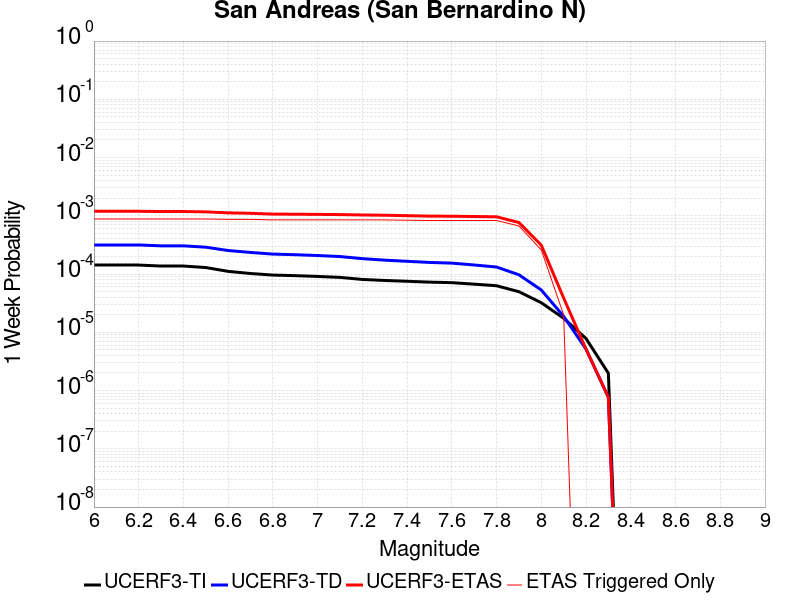 |  |  |  |

| Magnitude | 1 wk TI Prob | 1 wk TD Prob | 1 wk ETAS Prob | 1 wk ETAS/TD Gain | 1 wk ETAS Triggered Only | 1 mo TI Prob | 1 mo TD Prob | 1 mo ETAS Prob | 1 mo ETAS/TD Gain | 1 mo ETAS Triggered Only | 1 yr TI Prob | 1 yr TD Prob | 1 yr ETAS Prob | 1 yr ETAS/TD Gain | 1 yr ETAS Triggered Only | 10 yr TI Prob | 10 yr TD Prob | 10 yr ETAS Prob | 10 yr ETAS/TD Gain | 10 yr ETAS Triggered Only |
|-----|-----|-----|-----|-----|-----|-----|-----|-----|-----|-----|-----|-----|-----|-----|-----|-----|-----|-----|-----|-----|
| 6.0 | 1.4273766E-4 | 3.160784E-4 | 0.0011956088 | 3.7826333 | 8.798084E-4 | 6.115894E-4 | 0.0013539245 | 0.002525414 | 1.8652548 | 0.0011730778 | 0.0074207084 | 0.016360939 | 0.01799561 | 1.099913 | 0.0016618603 | 0.07177748 | 0.15021163 | 0.15199769 | 1.0118903 | 0.0021017645 |
| 6.1 | 1.4273766E-4 | 3.160784E-4 | 0.0011956088 | 3.7826333 | 8.798084E-4 | 6.115894E-4 | 0.0013539245 | 0.002525414 | 1.8652548 | 0.0011730778 | 0.0074207084 | 0.016360939 | 0.01799561 | 1.099913 | 0.0016618603 | 0.07177748 | 0.15021163 | 0.15199769 | 1.0118903 | 0.0021017645 |
| 6.2 | 1.4273766E-4 | 3.160784E-4 | 0.0011956088 | 3.7826333 | 8.798084E-4 | 6.115894E-4 | 0.0013539245 | 0.002525414 | 1.8652548 | 0.0011730778 | 0.0074207084 | 0.016360939 | 0.01799561 | 1.099913 | 0.0016618603 | 0.07177748 | 0.15021163 | 0.15199769 | 1.0118903 | 0.0021017645 |
| 6.3 | 1.3730655E-4 | 3.0512668E-4 | 0.0011846666 | 3.8825402 | 8.798084E-4 | 5.883239E-4 | 0.001307036 | 0.0024785807 | 1.8963369 | 0.0011730778 | 0.0071393442 | 0.015798455 | 0.01743406 | 1.1035295 | 0.0016618603 | 0.06914291 | 0.1455135 | 0.14729552 | 1.0122464 | 0.0020854718 |
| 6.4 | 1.3730655E-4 | 3.0512668E-4 | 0.0011846666 | 3.8825402 | 8.798084E-4 | 5.883239E-4 | 0.001307036 | 0.0024785807 | 1.8963369 | 0.0011730778 | 0.0071393442 | 0.015798455 | 0.01743406 | 1.1035295 | 0.0016618603 | 0.06914291 | 0.1455135 | 0.14729552 | 1.0122464 | 0.0020854718 |
| 6.5 | 1.2942807E-4 | 2.8927144E-4 | 0.0011688253 | 4.040583 | 8.798084E-4 | 5.545738E-4 | 0.0012391509 | 0.002410775 | 1.9455057 | 0.0011730778 | 0.0067310524 | 0.014983548 | 0.016620507 | 1.1092504 | 0.0016618603 | 0.06530788 | 0.13865088 | 0.14043316 | 1.0128545 | 0.002069179 |
| 6.6 | 1.1125901E-4 | 2.5365927E-4 | 0.0011169559 | 4.4033713 | 8.6351566E-4 | 4.767372E-4 | 0.0010866605 | 0.0022259136 | 2.0483983 | 0.0011404924 | 0.005788839 | 0.0131504685 | 0.014758318 | 1.1222656 | 0.0016292748 | 0.056403454 | 0.12300496 | 0.12476246 | 1.0142881 | 0.002004008 |
| 6.7 | 1.02209575E-4 | 2.3500937E-4 | 0.0010983221 | 4.6735244 | 8.6351566E-4 | 4.3796748E-4 | 0.0010067957 | 0.0021461397 | 2.1316538 | 0.0011404924 | 0.0053192247 | 0.012189267 | 0.013782588 | 1.1307151 | 0.001612982 | 0.051936906 | 0.114792764 | 0.11655231 | 1.0153279 | 0.0019877153 |
| 6.8 | 9.610582E-5 | 2.2026796E-4 | 0.0010673043 | 4.8454814 | 8.472229E-4 | 4.1181705E-4 | 9.436647E-4 | 0.0020668034 | 2.1901884 | 0.0011241996 | 0.0050023515 | 0.011428859 | 0.0130073 | 1.1381102 | 0.0015966893 | 0.048912346 | 0.10820469 | 0.1099628 | 1.016248 | 0.0019714225 |
| 6.9 | 9.3877505E-5 | 2.1482339E-4 | 0.0010618643 | 4.942964 | 8.472229E-4 | 4.0227012E-4 | 9.203475E-4 | 0.0020272348 | 2.202684 | 0.0011079069 | 0.0048866454 | 0.011147907 | 0.012710686 | 1.1401858 | 0.0015803966 | 0.04780577 | 0.105798274 | 0.10754655 | 1.0165247 | 0.0019551297 |
| 7.0 | 9.1019785E-5 | 2.0809306E-4 | 0.0010551397 | 5.0705185 | 8.472229E-4 | 3.900265E-4 | 8.915232E-4 | 0.0019984422 | 2.2416043 | 0.0011079069 | 0.0047382377 | 0.0108004995 | 0.012363827 | 1.1447458 | 0.0015803966 | 0.046384744 | 0.10276815 | 0.104522355 | 1.0170696 | 0.0019551297 |
| 7.1 | 8.771155E-5 | 1.9983841E-4 | 0.001046892 | 5.2386928 | 8.472229E-4 | 3.758525E-4 | 8.5616973E-4 | 0.0019468493 | 2.2739058 | 0.0010916141 | 0.0045664064 | 0.010374243 | 0.01192212 | 1.1492039 | 0.0015641038 | 0.044737056 | 0.09907644 | 0.10082319 | 1.0176302 | 0.001938837 |
| 7.2 | 8.0830236E-5 | 1.8389444E-4 | 0.0010309615 | 5.6062684 | 8.472229E-4 | 3.4636928E-4 | 7.8788114E-4 | 0.0018786351 | 2.3844144 | 0.0010916141 | 0.0042088944 | 0.009550368 | 0.011099535 | 1.1622101 | 0.0015641038 | 0.041300658 | 0.09180518 | 0.09356603 | 1.0191802 | 0.001938837 |
| 7.3 | 7.7668235E-5 | 1.7333007E-4 | 0.0010204061 | 5.887069 | 8.472229E-4 | 3.328214E-4 | 7.426318E-4 | 0.0018334353 | 2.4688349 | 0.0010916141 | 0.0040445733 | 0.009004138 | 0.010554159 | 1.1721454 | 0.0015641038 | 0.03971748 | 0.08706761 | 0.08883764 | 1.0203294 | 0.001938837 |
| 7.4 | 7.520177E-5 | 1.655312E-4 | 0.0010126139 | 6.1173596 | 8.472229E-4 | 3.2225347E-4 | 7.092266E-4 | 0.0018000664 | 2.5380697 | 0.0010916141 | 0.0039163795 | 0.008600714 | 0.010151365 | 1.1802933 | 0.0015641038 | 0.038480744 | 0.08352157 | 0.08529846 | 1.0212748 | 0.001938837 |
| 7.5 | 7.274697E-5 | 1.584075E-4 | 9.89206E-4 | 6.244692 | 8.3093013E-4 | 3.1173544E-4 | 6.7871273E-4 | 0.0017533043 | 2.583279 | 0.0010753213 | 0.003788775 | 0.008232076 | 0.009767145 | 1.1864742 | 0.0015478111 | 0.03724827 | 0.08023654 | 0.08200482 | 1.0220385 | 0.0019225443 |
| 7.6 | 7.1185845E-5 | 1.5410586E-4 | 9.84908E-4 | 6.3911133 | 8.3093013E-4 | 3.0504653E-4 | 6.602866E-4 | 0.001734898 | 2.6274924 | 0.0010753213 | 0.0037076178 | 0.0080094095 | 0.009544823 | 1.1917013 | 0.0015478111 | 0.036463667 | 0.07822661 | 0.07998375 | 1.0224621 | 0.0019062515 |
| 7.7 | 6.709961E-5 | 1.4319421E-4 | 9.740054E-4 | 6.8019886 | 8.3093013E-4 | 2.8753807E-4 | 6.135452E-4 | 0.0016882068 | 2.7515607 | 0.0010753213 | 0.003495157 | 0.0074443663 | 0.008964484 | 1.2041969 | 0.0015315183 | 0.034406938 | 0.07305558 | 0.074807465 | 1.0239801 | 0.0018899587 |
| 7.8 | 6.300812E-5 | 1.320343E-4 | 9.6285477E-4 | 7.292459 | 8.3093013E-4 | 2.7000686E-4 | 5.657386E-4 | 0.0016241681 | 2.8708808 | 0.0010590287 | 0.0032823787 | 0.006866143 | 0.008370965 | 1.2191656 | 0.0015152256 | 0.032343175 | 0.06771385 | 0.069445446 | 1.0255724 | 0.0018573733 |
| 7.9 | 4.983037E-5 | 9.7241085E-5 | 7.9776114E-4 | 8.203952 | 7.0058816E-4 | 2.1354125E-4 | 4.1668097E-4 | 0.0012961228 | 3.1105878 | 8.798084E-4 | 0.0025967648 | 0.0050613005 | 0.0063257026 | 1.2498177 | 0.0012708344 | 0.025666296 | 0.050650507 | 0.052088987 | 1.0284001 | 0.0015152256 |
| 8.0 | 3.2211527E-5 | 5.3306234E-5 | 3.7914384E-4 | 7.1125607 | 3.2585496E-4 | 1.380421E-4 | 2.2843528E-4 | 6.193719E-4 | 2.7113671 | 3.9102594E-4 | 0.0016793669 | 0.0027776542 | 0.0033138215 | 1.1930288 | 5.376607E-4 | 0.016667323 | 0.028362568 | 0.028964134 | 1.0212098 | 6.1912445E-4 |
| 8.1 | 1.743376E-5 | 1.8823403E-5 | 5.1408286E-5 | 2.7310836 | 3.2585496E-5 | 7.471398E-5 | 8.066923E-5 | 1.132521E-4 | 1.4039071 | 3.2585496E-5 | 9.0926304E-4 | 9.81706E-4 | 0.0010305363 | 1.0497402 | 4.8878243E-5 | 0.009055517 | 0.010483979 | 0.010548467 | 1.0061511 | 6.517099E-5 |
| 8.2 | 7.831616E-6 | 5.1540533E-6 | 5.1540533E-6 | 1.0 | 0.0 | 3.3563636E-5 | 2.2088612E-5 | 2.2088612E-5 | 1.0 | 0.0 | 4.0856065E-4 | 2.6889573E-4 | 2.6889573E-4 | 1.0 | 0.0 | 0.004078103 | 0.0030413668 | 0.0030413668 | 1.0 | 0.0 |
| 8.3 | 1.983087E-6 | 7.6564595E-7 | 7.6564595E-7 | 1.0 | 0.0 | 8.498917E-6 | 3.281336E-6 | 3.281336E-6 | 1.0 | 0.0 | 1.034694E-4 | 3.9949547E-5 | 3.9949547E-5 | 1.0 | 0.0 | 0.0010342124 | 4.717979E-4 | 4.717979E-4 | 1.0 | 0.0 |

## Bicycle Lake
*[(top)](#table-of-contents)*

| 1 Week | 1 Month | 1 Year | 10 Year |
|-----|-----|-----|-----|
|  |  |  |  |

| Magnitude | 1 wk TI Prob | 1 wk TD Prob | 1 wk ETAS Prob | 1 wk ETAS/TD Gain | 1 wk ETAS Triggered Only | 1 mo TI Prob | 1 mo TD Prob | 1 mo ETAS Prob | 1 mo ETAS/TD Gain | 1 mo ETAS Triggered Only | 1 yr TI Prob | 1 yr TD Prob | 1 yr ETAS Prob | 1 yr ETAS/TD Gain | 1 yr ETAS Triggered Only | 10 yr TI Prob | 10 yr TD Prob | 10 yr ETAS Prob | 10 yr ETAS/TD Gain | 10 yr ETAS Triggered Only |
|-----|-----|-----|-----|-----|-----|-----|-----|-----|-----|-----|-----|-----|-----|-----|-----|-----|-----|-----|-----|-----|
| 6.0 | 1.9621975E-5 | 2.2097078E-5 | 3.96822E-4 | 17.95812 | 3.747332E-4 | 8.4091465E-5 | 9.4699084E-5 | 7.626385E-4 | 8.053283 | 6.680027E-4 | 0.0010233327 | 0.0011524865 | 0.0023893083 | 2.0731769 | 0.0012382489 | 0.01018633 | 0.011478408 | 0.013362779 | 1.1641666 | 0.0019062515 |
| 6.1 | 1.9621975E-5 | 2.2097078E-5 | 3.96822E-4 | 17.95812 | 3.747332E-4 | 8.4091465E-5 | 9.4699084E-5 | 7.626385E-4 | 8.053283 | 6.680027E-4 | 0.0010233327 | 0.0011524865 | 0.0023893083 | 2.0731769 | 0.0012382489 | 0.01018633 | 0.011478408 | 0.013362779 | 1.1641666 | 0.0019062515 |
| 6.2 | 9.9971285E-6 | 1.125564E-5 | 2.0676642E-4 | 18.370028 | 1.9551297E-4 | 4.2844134E-5 | 4.8237856E-5 | 4.06661E-4 | 8.430329 | 3.5844045E-4 | 5.2150246E-4 | 5.871897E-4 | 0.0014013487 | 2.3865352 | 8.146374E-4 | 0.0052028033 | 0.005861487 | 0.0071410695 | 1.2183034 | 0.0012871271 |
| 6.3 | 9.589428E-6 | 1.0798346E-5 | 2.0630921E-4 | 19.10563 | 1.9551297E-4 | 4.10969E-5 | 4.62781E-5 | 4.0470198E-4 | 8.745 | 3.5844045E-4 | 5.002399E-4 | 5.6334207E-4 | 0.0013775205 | 2.4452648 | 8.146374E-4 | 0.0049911533 | 0.0056242296 | 0.0068879165 | 1.2246863 | 0.0012708344 |
| 6.4 | 9.589428E-6 | 1.0798346E-5 | 2.0630921E-4 | 19.10563 | 1.9551297E-4 | 4.10969E-5 | 4.62781E-5 | 4.0470198E-4 | 8.745 | 3.5844045E-4 | 5.002399E-4 | 5.6334207E-4 | 0.0013775205 | 2.4452648 | 8.146374E-4 | 0.0049911533 | 0.0056242296 | 0.0068879165 | 1.2246863 | 0.0012708344 |
| 6.5 | 5.557707E-6 | 6.2856016E-6 | 1.2033412E-4 | 19.144407 | 1.1404924E-4 | 2.3818526E-5 | 2.6938165E-5 | 2.876151E-4 | 10.676864 | 2.6068397E-4 | 2.8995197E-4 | 3.279497E-4 | 8.491466E-4 | 2.589259 | 5.2136794E-4 | 0.0028957394 | 0.0032772934 | 0.00412174 | 1.2576658 | 8.472229E-4 |
| 6.6 | 4.8742945E-6 | 5.5132896E-6 | 1.195619E-4 | 21.686127 | 1.1404924E-4 | 2.0889667E-5 | 2.3628318E-5 | 2.6801377E-4 | 11.342905 | 2.443912E-4 | 2.54302E-4 | 2.87663E-4 | 7.925929E-4 | 2.7552826 | 5.050752E-4 | 0.002540112 | 0.0028754752 | 0.0035902949 | 1.2485918 | 7.168809E-4 |
| 6.7 | 3.991108E-6 | 4.5159104E-6 | 8.5979285E-5 | 19.039192 | 8.146374E-5 | 1.7104636E-5 | 1.9353902E-5 | 2.1486309E-4 | 11.101797 | 1.9551297E-4 | 2.0822904E-4 | 2.3563375E-4 | 6.4285647E-4 | 2.728202 | 4.073187E-4 | 0.0020803404 | 0.0023563374 | 0.002974003 | 1.2621295 | 6.1912445E-4 |

## Garlic Springs
*[(top)](#table-of-contents)*

| 1 Week | 1 Month | 1 Year | 10 Year |
|-----|-----|-----|-----|
|  |  | 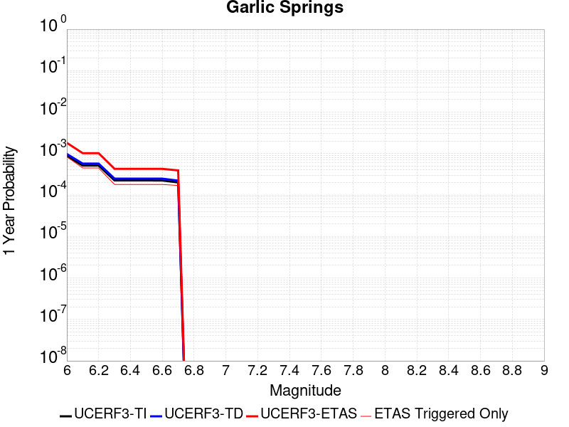 |  |

| Magnitude | 1 wk TI Prob | 1 wk TD Prob | 1 wk ETAS Prob | 1 wk ETAS/TD Gain | 1 wk ETAS Triggered Only | 1 mo TI Prob | 1 mo TD Prob | 1 mo ETAS Prob | 1 mo ETAS/TD Gain | 1 mo ETAS Triggered Only | 1 yr TI Prob | 1 yr TD Prob | 1 yr ETAS Prob | 1 yr ETAS/TD Gain | 1 yr ETAS Triggered Only | 10 yr TI Prob | 10 yr TD Prob | 10 yr ETAS Prob | 10 yr ETAS/TD Gain | 10 yr ETAS Triggered Only |
|-----|-----|-----|-----|-----|-----|-----|-----|-----|-----|-----|-----|-----|-----|-----|-----|-----|-----|-----|-----|-----|
| 6.0 | 1.6760017E-5 | 1.8776833E-5 | 2.9574835E-4 | 15.750705 | 2.7697673E-4 | 7.182667E-5 | 8.0470316E-5 | 5.692134E-4 | 7.073582 | 4.887824E-4 | 8.7413884E-4 | 9.794032E-4 | 0.0018095195 | 1.8475736 | 8.3093013E-4 | 0.008707083 | 0.009762413 | 0.011182178 | 1.1454318 | 0.0014337618 |
| 6.1 | 9.852767E-6 | 1.0973587E-5 | 1.7389929E-4 | 15.847077 | 1.6292748E-4 | 4.222546E-5 | 4.702921E-5 | 3.402849E-4 | 7.235607 | 2.9326946E-4 | 5.139737E-4 | 5.7250116E-4 | 0.0010772872 | 1.8817205 | 5.050752E-4 | 0.005127866 | 0.005717221 | 0.0065758 | 1.1501741 | 8.6351566E-4 |
| 6.2 | 9.852767E-6 | 1.0973587E-5 | 1.7389929E-4 | 15.847077 | 1.6292748E-4 | 4.222546E-5 | 4.702921E-5 | 3.402849E-4 | 7.235607 | 2.9326946E-4 | 5.139737E-4 | 5.7250116E-4 | 0.0010772872 | 1.8817205 | 5.050752E-4 | 0.005127866 | 0.005717221 | 0.0065758 | 1.1501741 | 8.6351566E-4 |
| 6.3 | 4.3167724E-6 | 4.7780286E-6 | 1.0253405E-4 | 21.459488 | 9.7756485E-5 | 1.8500323E-5 | 2.0477235E-5 | 1.8340138E-4 | 8.956355 | 1.6292748E-4 | 2.2521814E-4 | 2.4930484E-4 | 4.6105776E-4 | 1.8493735 | 2.1180573E-4 | 0.0022499003 | 0.00249251 | 0.002850057 | 1.1434486 | 3.5844045E-4 |
| 6.4 | 4.3167724E-6 | 4.7780286E-6 | 1.0253405E-4 | 21.459488 | 9.7756485E-5 | 1.8500323E-5 | 2.0477235E-5 | 1.8340138E-4 | 8.956355 | 1.6292748E-4 | 2.2521814E-4 | 2.4930484E-4 | 4.6105776E-4 | 1.8493735 | 2.1180573E-4 | 0.0022499003 | 0.00249251 | 0.002850057 | 1.1434486 | 3.5844045E-4 |
| 6.5 | 4.3167724E-6 | 4.7780286E-6 | 1.0253405E-4 | 21.459488 | 9.7756485E-5 | 1.8500323E-5 | 2.0477235E-5 | 1.8340138E-4 | 8.956355 | 1.6292748E-4 | 2.2521814E-4 | 2.4930484E-4 | 4.6105776E-4 | 1.8493735 | 2.1180573E-4 | 0.0022499003 | 0.00249251 | 0.002850057 | 1.1434486 | 3.5844045E-4 |
| 6.6 | 4.301311E-6 | 4.760897E-6 | 1.0251692E-4 | 21.53311 | 9.7756485E-5 | 1.8434059E-5 | 2.0403815E-5 | 1.8332797E-4 | 8.984985 | 1.6292748E-4 | 2.2441156E-4 | 2.4841115E-4 | 4.6016427E-4 | 1.85243 | 2.1180573E-4 | 0.0022418506 | 0.002483593 | 0.0028411434 | 1.1439649 | 3.5844045E-4 |
| 6.7 | 3.8599724E-6 | 4.27106E-6 | 8.573445E-5 | 20.073343 | 8.146374E-5 | 1.6542634E-5 | 1.8304541E-5 | 1.6493659E-4 | 9.010692 | 1.4663473E-4 | 2.0138794E-4 | 2.228578E-4 | 4.183272E-4 | 1.8771037 | 1.9551297E-4 | 0.0020120554 | 0.002228578 | 0.0025537068 | 1.1458907 | 3.2585496E-4 |

## Death Valley (Black Mtns Frontal)
*[(top)](#table-of-contents)*

| 1 Week | 1 Month | 1 Year | 10 Year |
|-----|-----|-----|-----|
|  |  |  | 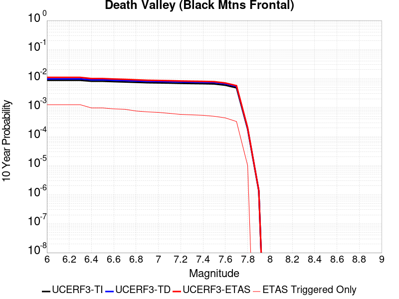 |

| Magnitude | 1 wk TI Prob | 1 wk TD Prob | 1 wk ETAS Prob | 1 wk ETAS/TD Gain | 1 wk ETAS Triggered Only | 1 mo TI Prob | 1 mo TD Prob | 1 mo ETAS Prob | 1 mo ETAS/TD Gain | 1 mo ETAS Triggered Only | 1 yr TI Prob | 1 yr TD Prob | 1 yr ETAS Prob | 1 yr ETAS/TD Gain | 1 yr ETAS Triggered Only | 10 yr TI Prob | 10 yr TD Prob | 10 yr ETAS Prob | 10 yr ETAS/TD Gain | 10 yr ETAS Triggered Only |
|-----|-----|-----|-----|-----|-----|-----|-----|-----|-----|-----|-----|-----|-----|-----|-----|-----|-----|-----|-----|-----|
| 6.0 | 1.6707214E-5 | 1.867027E-5 | 3.9339648E-4 | 21.070745 | 3.747332E-4 | 7.160038E-5 | 8.001303E-5 | 6.339221E-4 | 7.9227366 | 5.5395346E-4 | 8.71386E-4 | 9.737309E-4 | 0.0018852364 | 1.936096 | 9.123939E-4 | 0.00867977 | 0.009695496 | 0.010905606 | 1.1248114 | 0.0012219561 |
| 6.1 | 1.6707214E-5 | 1.867027E-5 | 3.9339648E-4 | 21.070745 | 3.747332E-4 | 7.160038E-5 | 8.001303E-5 | 6.339221E-4 | 7.9227366 | 5.5395346E-4 | 8.71386E-4 | 9.737309E-4 | 0.0018852364 | 1.936096 | 9.123939E-4 | 0.00867977 | 0.009695496 | 0.010905606 | 1.1248114 | 0.0012219561 |
| 6.2 | 1.6707214E-5 | 1.867027E-5 | 3.9339648E-4 | 21.070745 | 3.747332E-4 | 7.160038E-5 | 8.001303E-5 | 6.339221E-4 | 7.9227366 | 5.5395346E-4 | 8.71386E-4 | 9.737309E-4 | 0.0018852364 | 1.936096 | 9.123939E-4 | 0.00867977 | 0.009695496 | 0.010905606 | 1.1248114 | 0.0012219561 |
| 6.3 | 1.6707214E-5 | 1.867027E-5 | 3.9339648E-4 | 21.070745 | 3.747332E-4 | 7.160038E-5 | 8.001303E-5 | 6.339221E-4 | 7.9227366 | 5.5395346E-4 | 8.71386E-4 | 9.737309E-4 | 0.0018852364 | 1.936096 | 9.123939E-4 | 0.00867977 | 0.009695496 | 0.010905606 | 1.1248114 | 0.0012219561 |
| 6.4 | 1.5515609E-5 | 1.7338214E-5 | 3.4318754E-4 | 19.793707 | 3.2585496E-4 | 6.649377E-5 | 7.4304546E-5 | 5.304676E-4 | 7.1391 | 4.5619695E-4 | 8.0926094E-4 | 9.042885E-4 | 0.001571687 | 1.7380372 | 6.680027E-4 | 0.008063202 | 0.009006773 | 0.009846365 | 1.0932178 | 8.472229E-4 |
| 6.5 | 1.5515609E-5 | 1.7338214E-5 | 3.4318754E-4 | 19.793707 | 3.2585496E-4 | 6.649377E-5 | 7.4304546E-5 | 5.304676E-4 | 7.1391 | 4.5619695E-4 | 8.0926094E-4 | 9.042885E-4 | 0.001571687 | 1.7380372 | 6.680027E-4 | 0.008063202 | 0.009006773 | 0.009846365 | 1.0932178 | 8.472229E-4 |
| 6.6 | 1.5041828E-5 | 1.6809145E-5 | 3.100737E-4 | 18.446726 | 2.9326946E-4 | 6.4463384E-5 | 7.203723E-5 | 4.9561815E-4 | 6.880028 | 4.2361146E-4 | 7.8455906E-4 | 8.767063E-4 | 0.0014790095 | 1.6870067 | 6.0283166E-4 | 0.00781795 | 0.008733132 | 0.009508355 | 1.0887679 | 7.820519E-4 |
| 6.7 | 1.4634985E-5 | 1.6356016E-5 | 2.933282E-4 | 17.933964 | 2.7697673E-4 | 6.271985E-5 | 7.009536E-5 | 4.773855E-4 | 6.810515 | 4.073187E-4 | 7.6334673E-4 | 8.5308263E-4 | 0.0014391212 | 1.6869657 | 5.865389E-4 | 0.007607299 | 0.008498715 | 0.009257967 | 1.0893371 | 7.6575915E-4 |
| 6.8 | 1.4209158E-5 | 1.5882048E-5 | 1.9509943E-4 | 12.284274 | 1.7922022E-4 | 6.089497E-5 | 6.8064175E-5 | 3.7760532E-4 | 5.547784 | 3.0956222E-4 | 7.4114406E-4 | 8.2837185E-4 | 0.0013004702 | 1.5699111 | 4.724897E-4 | 0.007386771 | 0.008253456 | 0.008899787 | 1.0783104 | 6.517099E-4 |
| 6.9 | 1.3780098E-5 | 1.5404594E-5 | 1.7832956E-4 | 11.576389 | 1.6292748E-4 | 5.9056227E-5 | 6.6018045E-5 | 3.5926816E-4 | 5.441969 | 2.9326946E-4 | 7.1877235E-4 | 8.0347876E-4 | 0.0012267499 | 1.5267981 | 4.2361146E-4 | 0.0071645193 | 0.008006332 | 0.008588175 | 1.0726728 | 5.865389E-4 |
| 7.0 | 1.3585064E-5 | 1.5188155E-5 | 1.6182066E-4 | 10.654399 | 1.4663473E-4 | 5.8220405E-5 | 6.50905E-5 | 3.420492E-4 | 5.2549787 | 2.7697673E-4 | 7.086029E-4 | 7.9219416E-4 | 0.0011991902 | 1.513758 | 4.073187E-4 | 0.007063476 | 0.007894293 | 0.008443874 | 1.0696174 | 5.5395346E-4 |
| 7.1 | 1.3398601E-5 | 1.49813395E-5 | 1.2902886E-4 | 8.612639 | 1.1404924E-4 | 5.742131E-5 | 6.420419E-5 | 2.759963E-4 | 4.2987275 | 2.1180573E-4 | 6.9888023E-4 | 7.8141113E-4 | 0.0011232914 | 1.4375166 | 3.4214772E-4 | 0.0069668638 | 0.007787224 | 0.0082722 | 1.0622784 | 4.887824E-4 |
| 7.2 | 1.3126312E-5 | 1.4679561E-5 | 1.2872713E-4 | 8.76914 | 1.1404924E-4 | 5.6254412E-5 | 6.291092E-5 | 2.584116E-4 | 4.1075797 | 1.9551297E-4 | 6.846822E-4 | 7.6567667E-4 | 0.0010912821 | 1.4252518 | 3.2585496E-4 | 0.006825765 | 0.00763097 | 0.008099854 | 1.0614449 | 4.724897E-4 |
| 7.3 | 1.2922429E-5 | 1.4453788E-5 | 1.2850137E-4 | 8.890498 | 1.1404924E-4 | 5.5380664E-5 | 6.194336E-5 | 2.5744422E-4 | 4.1561227 | 1.9551297E-4 | 6.74051E-4 | 7.53905E-4 | 0.0010795143 | 1.431897 | 3.2585496E-4 | 0.006720101 | 0.007514055 | 0.007966824 | 1.0602562 | 4.5619695E-4 |
| 7.4 | 1.2768878E-5 | 1.4283772E-5 | 1.2833138E-4 | 8.984419 | 1.1404924E-4 | 5.4722615E-5 | 6.1214756E-5 | 2.5671578E-4 | 4.193691 | 1.9551297E-4 | 6.660441E-4 | 7.4504025E-4 | 0.0010543718 | 1.4151877 | 3.0956222E-4 | 0.0066405144 | 0.0074260035 | 0.007862641 | 1.0587984 | 4.399042E-4 |
| 7.5 | 1.2521929E-5 | 1.40120155E-5 | 1.11767135E-4 | 7.976521 | 9.7756485E-5 | 5.366431E-5 | 6.005014E-5 | 2.2296784E-4 | 3.7130277 | 1.6292748E-4 | 6.531671E-4 | 7.3087064E-4 | 0.0010076449 | 1.3786912 | 2.7697673E-4 | 0.006512506 | 0.0072852457 | 0.007689597 | 1.0555028 | 4.073187E-4 |
| 7.6 | 1.1301089E-5 | 1.2648149E-5 | 1.104034E-4 | 8.728819 | 9.7756485E-5 | 4.8432343E-5 | 5.4205255E-5 | 2.171239E-4 | 4.0055876 | 1.6292748E-4 | 5.895042E-4 | 6.5975444E-4 | 8.8770245E-4 | 1.3455043 | 2.2809848E-4 | 0.0058794282 | 0.00657851 | 0.006918407 | 1.0516678 | 3.4214772E-4 |
| 7.7 | 9.189108E-6 | 1.0283358E-5 | 9.174626E-5 | 8.921819 | 8.146374E-5 | 3.93813E-5 | 4.407082E-5 | 1.5811503E-4 | 3.5877488 | 1.1404924E-4 | 4.7936183E-4 | 5.3643517E-4 | 6.9927523E-4 | 1.3035597 | 1.6292748E-4 | 0.004783291 | 0.005351914 | 0.005627408 | 1.0514759 | 2.7697673E-4 |
| 7.8 | 3.4586725E-7 | 3.6482615E-7 | 3.6482615E-7 | 1.0 | 0.0 | 1.4822873E-6 | 1.5635396E-6 | 1.5635396E-6 | 1.0 | 0.0 | 1.80467E-5 | 1.9035933E-5 | 1.9035933E-5 | 1.0 | 0.0 | 1.8045233E-4 | 1.9034347E-4 | 2.0663312E-4 | 1.0855802 | 1.6292748E-5 |
| 7.9 | 2.5591178E-9 | 2.6696718E-9 | 2.6696718E-9 | 1.0 | 0.0 | 1.0967647E-8 | 1.14414505E-8 | 1.14414505E-8 | 1.0 | 0.0 | 1.335311E-7 | 1.3929966E-7 | 1.3929966E-7 | 1.0 | 0.0 | 1.3353102E-6 | 1.3929966E-6 | 1.3929966E-6 | 1.0 | 0.0 |

## San Andreas (San Bernardino S)
*[(top)](#table-of-contents)*

| 1 Week | 1 Month | 1 Year | 10 Year |
|-----|-----|-----|-----|
|  | 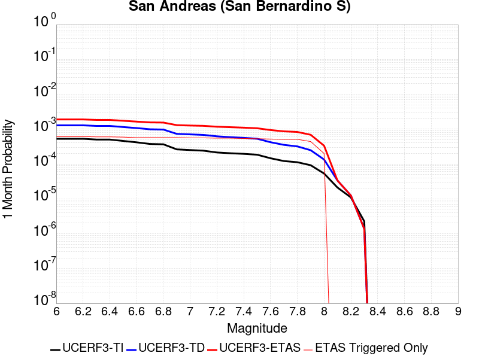 |  |  |

| Magnitude | 1 wk TI Prob | 1 wk TD Prob | 1 wk ETAS Prob | 1 wk ETAS/TD Gain | 1 wk ETAS Triggered Only | 1 mo TI Prob | 1 mo TD Prob | 1 mo ETAS Prob | 1 mo ETAS/TD Gain | 1 mo ETAS Triggered Only | 1 yr TI Prob | 1 yr TD Prob | 1 yr ETAS Prob | 1 yr ETAS/TD Gain | 1 yr ETAS Triggered Only | 10 yr TI Prob | 10 yr TD Prob | 10 yr ETAS Prob | 10 yr ETAS/TD Gain | 10 yr ETAS Triggered Only |
|-----|-----|-----|-----|-----|-----|-----|-----|-----|-----|-----|-----|-----|-----|-----|-----|-----|-----|-----|-----|-----|
| 6.0 | 1.2336002E-4 | 3.0005194E-4 | 7.3982414E-4 | 2.4656537 | 4.399042E-4 | 5.2857865E-4 | 0.0012853292 | 0.0018222987 | 1.4177681 | 5.376607E-4 | 0.006416472 | 0.015541554 | 0.016279373 | 1.0474739 | 7.494664E-4 | 0.06234337 | 0.14294699 | 0.14384067 | 1.0062518 | 0.0010427359 |
| 6.1 | 1.2336002E-4 | 3.0005194E-4 | 7.3982414E-4 | 2.4656537 | 4.399042E-4 | 5.2857865E-4 | 0.0012853292 | 0.0018222987 | 1.4177681 | 5.376607E-4 | 0.006416472 | 0.015541554 | 0.016279373 | 1.0474739 | 7.494664E-4 | 0.06234337 | 0.14294699 | 0.14384067 | 1.0062518 | 0.0010427359 |
| 6.2 | 1.2336002E-4 | 3.0005194E-4 | 7.3982414E-4 | 2.4656537 | 4.399042E-4 | 5.2857865E-4 | 0.0012853292 | 0.0018222987 | 1.4177681 | 5.376607E-4 | 0.006416472 | 0.015541554 | 0.016279373 | 1.0474739 | 7.494664E-4 | 0.06234337 | 0.14294699 | 0.14384067 | 1.0062518 | 0.0010427359 |
| 6.3 | 1.1712257E-4 | 2.8793467E-4 | 7.1142416E-4 | 2.4707832 | 4.2361146E-4 | 5.018573E-4 | 0.0012334478 | 0.0017541726 | 1.4221702 | 5.2136794E-4 | 0.006093008 | 0.014918666 | 0.015640901 | 1.0484115 | 7.331737E-4 | 0.059286322 | 0.13765779 | 0.13852888 | 1.006328 | 0.0010101504 |
| 6.4 | 1.1712257E-4 | 2.8793467E-4 | 7.1142416E-4 | 2.4707832 | 4.2361146E-4 | 5.018573E-4 | 0.0012334478 | 0.0017541726 | 1.4221702 | 5.2136794E-4 | 0.006093008 | 0.014918666 | 0.015640901 | 1.0484115 | 7.331737E-4 | 0.059286322 | 0.13765779 | 0.13852888 | 1.006328 | 0.0010101504 |
| 6.5 | 1.0689076E-4 | 2.6806415E-4 | 6.915621E-4 | 2.5798378 | 4.2361146E-4 | 4.5802278E-4 | 0.0011483653 | 0.0016691346 | 1.4534874 | 5.2136794E-4 | 0.0055621783 | 0.013896335 | 0.014603254 | 1.0508709 | 7.168809E-4 | 0.05425003 | 0.1288989 | 0.12976466 | 1.0067165 | 9.938576E-4 |
| 6.6 | 9.7648895E-5 | 2.505129E-4 | 6.740182E-4 | 2.690553 | 4.2361146E-4 | 4.1842813E-4 | 0.0010732086 | 0.001594017 | 1.4852816 | 5.2136794E-4 | 0.005082469 | 0.012992399 | 0.013699966 | 1.05446 | 7.168809E-4 | 0.049677886 | 0.121077746 | 0.12192263 | 1.006978 | 9.6127216E-4 |
| 6.7 | 8.757013E-5 | 2.3122175E-4 | 6.5473525E-4 | 2.8316333 | 4.2361146E-4 | 3.7524657E-4 | 9.905964E-4 | 0.0015114478 | 1.5257959 | 5.2136794E-4 | 0.00455906 | 0.011997902 | 0.012706182 | 1.0590336 | 7.168809E-4 | 0.04466656 | 0.112373024 | 0.11319735 | 1.0073357 | 9.2868664E-4 |
| 6.8 | 8.562978E-5 | 2.2682057E-4 | 6.503359E-4 | 2.8671823 | 4.2361146E-4 | 3.6693315E-4 | 9.7174826E-4 | 0.0014926095 | 1.5360044 | 5.2136794E-4 | 0.004458263 | 0.011770921 | 0.012479364 | 1.0601858 | 7.168809E-4 | 0.043698758 | 0.11037863 | 0.11120481 | 1.0074849 | 9.2868664E-4 |
| 6.9 | 6.124075E-5 | 1.7066885E-4 | 5.94208E-4 | 3.481643 | 4.2361146E-4 | 2.6243398E-4 | 7.312337E-4 | 0.0012522204 | 1.7124764 | 5.2136794E-4 | 0.0031904527 | 0.008866636 | 0.009577161 | 1.0801346 | 7.168809E-4 | 0.031450346 | 0.08420262 | 0.085008346 | 1.0095689 | 8.798084E-4 |
| 7.0 | 5.8598747E-5 | 1.6495936E-4 | 5.8850093E-4 | 3.5675511 | 4.2361146E-4 | 2.5111332E-4 | 7.067779E-4 | 0.0012277773 | 1.7371473 | 5.2136794E-4 | 0.0030530186 | 0.008571265 | 0.009282001 | 1.0829208 | 7.168809E-4 | 0.03011414 | 0.08151562 | 0.08232371 | 1.0099133 | 8.798084E-4 |
| 7.1 | 5.613814E-5 | 1.5914452E-4 | 5.8268855E-4 | 3.66138 | 4.2361146E-4 | 2.4056983E-4 | 6.818704E-4 | 0.0012028828 | 1.764093 | 5.2136794E-4 | 0.0029250039 | 0.008270353 | 0.008981305 | 1.085964 | 7.168809E-4 | 0.028868021 | 0.07881268 | 0.07962315 | 1.0102835 | 8.798084E-4 |
| 7.2 | 4.991222E-5 | 1.4520933E-4 | 5.524689E-4 | 3.8046377 | 4.073187E-4 | 2.1389198E-4 | 6.221777E-4 | 0.0011269386 | 1.8112811 | 5.050752E-4 | 0.002601025 | 0.0075488063 | 0.008244106 | 1.0921072 | 7.0058816E-4 | 0.025707912 | 0.07226191 | 0.07306302 | 1.0110863 | 8.6351566E-4 |
| 7.3 | 4.7410045E-5 | 1.371513E-4 | 5.4441416E-4 | 3.969442 | 4.073187E-4 | 2.0317009E-4 | 5.8765925E-4 | 0.0010924377 | 1.8589644 | 5.050752E-4 | 0.0024707897 | 0.0071313656 | 0.007826958 | 1.0975398 | 7.0058816E-4 | 0.024434982 | 0.068541944 | 0.06934627 | 1.0117348 | 8.6351566E-4 |
| 7.4 | 4.5556746E-5 | 1.3123035E-4 | 5.384956E-4 | 4.103438 | 4.073187E-4 | 1.952286E-4 | 5.6229485E-4 | 0.001067086 | 1.8977339 | 5.050752E-4 | 0.002374317 | 0.0068245293 | 0.0075203367 | 1.1019567 | 7.0058816E-4 | 0.023491086 | 0.06579143 | 0.06659813 | 1.0122615 | 8.6351566E-4 |
| 7.5 | 4.3084514E-5 | 1.2358342E-4 | 5.145611E-4 | 4.163674 | 3.9102594E-4 | 1.8463485E-4 | 5.2953605E-4 | 0.0010180597 | 1.9225503 | 4.887824E-4 | 0.0022456115 | 0.0064281146 | 0.0071080113 | 1.1057693 | 6.8429543E-4 | 0.022230545 | 0.062190283 | 0.06298482 | 1.0127759 | 8.472229E-4 |
| 7.6 | 3.408608E-5 | 9.836477E-5 | 4.893523E-4 | 4.9748735 | 3.9102594E-4 | 1.4607502E-4 | 4.214953E-4 | 9.100717E-4 | 2.1591504 | 4.887824E-4 | 0.0017770125 | 0.005119656 | 0.005800448 | 1.1329762 | 6.8429543E-4 | 0.017628696 | 0.05002244 | 0.0508118 | 1.0157802 | 8.3093013E-4 |
| 7.7 | 2.8315713E-5 | 8.2495724E-5 | 4.7348943E-4 | 5.739563 | 3.9102594E-4 | 1.2134742E-4 | 3.5350522E-4 | 8.421149E-4 | 2.382185 | 4.887824E-4 | 0.0014764034 | 0.004295442 | 0.004976798 | 1.1586231 | 6.8429543E-4 | 0.01466633 | 0.042272415 | 0.04306822 | 1.0188257 | 8.3093013E-4 |
| 7.8 | 2.6222975E-5 | 7.463898E-5 | 4.6563573E-4 | 6.2385063 | 3.9102594E-4 | 1.1237934E-4 | 3.1984213E-4 | 8.0846826E-4 | 2.5277102 | 4.887824E-4 | 0.0013673597 | 0.003887131 | 0.0045687663 | 1.175357 | 6.8429543E-4 | 0.013589768 | 0.038437475 | 0.039236467 | 1.0207868 | 8.3093013E-4 |
| 7.9 | 2.1469694E-5 | 5.7884805E-5 | 4.163045E-4 | 7.191948 | 3.5844045E-4 | 9.200973E-5 | 2.4805416E-4 | 6.8784924E-4 | 2.77298 | 4.399042E-4 | 0.0011196428 | 0.00301588 | 0.0036331373 | 1.204669 | 6.1912445E-4 | 0.011140184 | 0.030153265 | 0.030880133 | 1.0241058 | 7.494664E-4 |
| 8.0 | 1.2420249E-5 | 3.1321662E-5 | 2.2682852E-4 | 7.241905 | 1.9551297E-4 | 5.322855E-5 | 1.342288E-4 | 3.6229665E-4 | 2.6990979 | 2.2809848E-4 | 6.478649E-4 | 0.0016330116 | 0.0019420682 | 1.1892557 | 3.0956222E-4 | 0.0064597935 | 0.01652369 | 0.016892232 | 1.0223038 | 3.747332E-4 |
| 8.1 | 4.9197724E-6 | 7.822525E-6 | 7.822525E-6 | 1.0 | 0.0 | 2.1084568E-5 | 3.3524673E-5 | 3.3524673E-5 | 1.0 | 0.0 | 2.566744E-4 | 4.080866E-4 | 4.080866E-4 | 1.0 | 0.0 | 0.002563781 | 0.004384557 | 0.004384557 | 1.0 | 0.0 |
| 8.2 | 2.5634774E-6 | 2.9065757E-6 | 2.9065757E-6 | 1.0 | 0.0 | 1.0986286E-5 | 1.2456694E-5 | 1.2456694E-5 | 1.0 | 0.0 | 1.3374983E-4 | 1.5164974E-4 | 1.5164974E-4 | 1.0 | 0.0 | 0.0013366934 | 0.001704941 | 0.001704941 | 1.0 | 0.0 |
| 8.3 | 5.2850464E-7 | 3.2080476E-7 | 3.2080476E-7 | 1.0 | 0.0 | 2.2650179E-6 | 1.3748769E-6 | 1.3748769E-6 | 1.0 | 0.0 | 2.7576245E-5 | 1.673901E-5 | 1.673901E-5 | 1.0 | 0.0 | 2.7572823E-4 | 1.986671E-4 | 1.986671E-4 | 1.0 | 0.0 |

## Helendale-So Lockhart
*[(top)](#table-of-contents)*

| 1 Week | 1 Month | 1 Year | 10 Year |
|-----|-----|-----|-----|
|  |  |  |  |

| Magnitude | 1 wk TI Prob | 1 wk TD Prob | 1 wk ETAS Prob | 1 wk ETAS/TD Gain | 1 wk ETAS Triggered Only | 1 mo TI Prob | 1 mo TD Prob | 1 mo ETAS Prob | 1 mo ETAS/TD Gain | 1 mo ETAS Triggered Only | 1 yr TI Prob | 1 yr TD Prob | 1 yr ETAS Prob | 1 yr ETAS/TD Gain | 1 yr ETAS Triggered Only | 10 yr TI Prob | 10 yr TD Prob | 10 yr ETAS Prob | 10 yr ETAS/TD Gain | 10 yr ETAS Triggered Only |
|-----|-----|-----|-----|-----|-----|-----|-----|-----|-----|-----|-----|-----|-----|-----|-----|-----|-----|-----|-----|-----|
| 6.0 | 1.7296055E-5 | 1.8103729E-5 | 2.6249053E-4 | 14.499251 | 2.443912E-4 | 7.412385E-5 | 7.7585224E-5 | 4.5228936E-4 | 5.8295813 | 3.747332E-4 | 9.0208417E-4 | 9.4421144E-4 | 0.0015627512 | 1.6550862 | 6.1912445E-4 | 0.008984311 | 0.009404116 | 0.010356349 | 1.101257 | 9.6127216E-4 |
| 6.1 | 1.7296055E-5 | 1.8103729E-5 | 2.6249053E-4 | 14.499251 | 2.443912E-4 | 7.412385E-5 | 7.7585224E-5 | 4.5228936E-4 | 5.8295813 | 3.747332E-4 | 9.0208417E-4 | 9.4421144E-4 | 0.0015627512 | 1.6550862 | 6.1912445E-4 | 0.008984311 | 0.009404116 | 0.010356349 | 1.101257 | 9.6127216E-4 |
| 6.2 | 1.7296055E-5 | 1.8103729E-5 | 2.6249053E-4 | 14.499251 | 2.443912E-4 | 7.412385E-5 | 7.7585224E-5 | 4.5228936E-4 | 5.8295813 | 3.747332E-4 | 9.0208417E-4 | 9.4421144E-4 | 0.0015627512 | 1.6550862 | 6.1912445E-4 | 0.008984311 | 0.009404116 | 0.010356349 | 1.101257 | 9.6127216E-4 |
| 6.3 | 1.0669118E-5 | 1.1135425E-5 | 1.08890825E-4 | 9.778776 | 9.7756485E-5 | 4.5723988E-5 | 4.772239E-5 | 2.2693406E-4 | 4.7552953 | 1.7922022E-4 | 5.5654737E-4 | 5.80868E-4 | 9.22817E-4 | 1.5886862 | 3.4214772E-4 | 0.0055515557 | 0.0057937936 | 0.0063445377 | 1.0950576 | 5.5395346E-4 |
| 6.4 | 1.0669118E-5 | 1.1135425E-5 | 1.08890825E-4 | 9.778776 | 9.7756485E-5 | 4.5723988E-5 | 4.772239E-5 | 2.2693406E-4 | 4.7552953 | 1.7922022E-4 | 5.5654737E-4 | 5.80868E-4 | 9.22817E-4 | 1.5886862 | 3.4214772E-4 | 0.0055515557 | 0.0057937936 | 0.0063445377 | 1.0950576 | 5.5395346E-4 |
| 6.5 | 8.790038E-6 | 9.170197E-6 | 7.434059E-5 | 8.106761 | 6.517099E-5 | 3.767105E-5 | 3.930026E-5 | 1.8592922E-4 | 4.7309923 | 1.4663473E-4 | 4.585485E-4 | 4.7837716E-4 | 7.389364E-4 | 1.5446733 | 2.6068397E-4 | 0.0045760344 | 0.004773638 | 0.0052114427 | 1.091713 | 4.399042E-4 |
| 6.6 | 7.396949E-6 | 7.715537E-6 | 7.2886025E-5 | 9.446656 | 6.517099E-5 | 3.1700827E-5 | 3.3066175E-5 | 1.6340385E-4 | 4.9417224 | 1.3034198E-4 | 3.858892E-4 | 4.025073E-4 | 6.30514E-4 | 1.5664659 | 2.2809848E-4 | 0.003852198 | 0.00401789 | 0.004326208 | 1.0767365 | 3.0956222E-4 |
| 6.7 | 6.4600285E-6 | 6.738031E-6 | 7.190859E-5 | 10.672047 | 6.517099E-5 | 2.7685543E-5 | 2.887696E-5 | 1.5921518E-4 | 5.5135713 | 1.3034198E-4 | 3.3701936E-4 | 3.5152107E-4 | 5.632523E-4 | 1.6023289 | 2.1180573E-4 | 0.0033650869 | 0.003509732 | 0.0037857366 | 1.0786397 | 2.7697673E-4 |
| 6.8 | 5.600104E-6 | 5.836009E-6 | 7.100662E-5 | 12.166982 | 6.517099E-5 | 2.4000226E-5 | 2.5011232E-5 | 1.5534996E-4 | 6.2112074 | 1.3034198E-4 | 2.9216358E-4 | 3.044698E-4 | 4.8363546E-4 | 1.5884514 | 1.7922022E-4 | 0.0029177975 | 0.003040588 | 0.0032842362 | 1.0801319 | 2.443912E-4 |
| 6.9 | 4.839122E-6 | 5.0395092E-6 | 5.391751E-5 | 10.69896 | 4.8878243E-5 | 2.0738931E-5 | 2.159772E-5 | 1.356445E-4 | 6.2805004 | 1.1404924E-4 | 2.5246723E-4 | 2.6292098E-4 | 3.932287E-4 | 1.4956155 | 1.3034198E-4 | 0.002521806 | 0.002626147 | 0.0028048963 | 1.0680653 | 1.7922022E-4 |
| 7.0 | 3.6937633E-6 | 3.845208E-6 | 2.0137893E-5 | 5.23714 | 1.6292748E-5 | 1.5830317E-5 | 1.647936E-5 | 8.1649276E-5 | 4.954639 | 6.517099E-5 | 1.9271708E-4 | 2.0061806E-4 | 2.8206545E-4 | 1.4059824 | 8.146374E-5 | 0.0019255003 | 0.002004401 | 0.0021182215 | 1.0567853 | 1.1404924E-4 |
| 7.1 | 2.7858857E-6 | 2.8978538E-6 | 1.9190555E-5 | 6.6223335 | 1.6292748E-5 | 1.1939455E-5 | 1.2419316E-5 | 6.129695E-5 | 4.9356146 | 4.8878243E-5 | 1.4535317E-4 | 1.511949E-4 | 2.1635603E-4 | 1.4309745 | 6.517099E-5 | 0.0014525814 | 0.0015109418 | 0.0016085505 | 1.0646013 | 9.7756485E-5 |
| 7.2 | 2.1672065E-6 | 2.2540128E-6 | 2.2540128E-6 | 1.0 | 0.0 | 9.2879945E-6 | 9.66002E-6 | 2.5952611E-5 | 2.6866 | 1.6292748E-5 | 1.1307546E-4 | 1.1760458E-4 | 1.5018624E-4 | 1.2770442 | 3.2585496E-5 | 0.0011301794 | 0.0011754417 | 0.0012242624 | 1.041534 | 4.8878243E-5 |
| 7.3 | 1.4823496E-6 | 1.5422102E-6 | 1.5422102E-6 | 1.0 | 0.0 | 6.3529114E-6 | 6.6094562E-6 | 2.2902097E-5 | 3.46505 | 1.6292748E-5 | 7.734395E-5 | 8.046731E-5 | 1.1305019E-4 | 1.4049206 | 3.2585496E-5 | 7.731704E-4 | 8.0439687E-4 | 8.5323583E-4 | 1.060715 | 4.8878243E-5 |
| 7.4 | 4.2321457E-7 | 4.4108765E-7 | 4.4108765E-7 | 1.0 | 0.0 | 1.8137755E-6 | 1.8903745E-6 | 1.8903745E-6 | 1.0 | 0.0 | 2.2082493E-5 | 2.3015113E-5 | 2.3015113E-5 | 1.0 | 0.0 | 2.2080299E-4 | 2.3013182E-4 | 2.3013182E-4 | 1.0 | 0.0 |
| 7.5 | 5.6942316E-8 | 5.9415648E-8 | 5.9415648E-8 | 1.0 | 0.0 | 2.440385E-7 | 2.5463845E-7 | 2.5463845E-7 | 1.0 | 0.0 | 2.9711643E-6 | 3.1002196E-6 | 3.1002196E-6 | 1.0 | 0.0 | 2.9711247E-5 | 3.1001844E-5 | 3.1001844E-5 | 1.0 | 0.0 |

## San Andreas (Big Bend)
*[(top)](#table-of-contents)*

| 1 Week | 1 Month | 1 Year | 10 Year |
|-----|-----|-----|-----|
|  |  |  |  |

| Magnitude | 1 wk TI Prob | 1 wk TD Prob | 1 wk ETAS Prob | 1 wk ETAS/TD Gain | 1 wk ETAS Triggered Only | 1 mo TI Prob | 1 mo TD Prob | 1 mo ETAS Prob | 1 mo ETAS/TD Gain | 1 mo ETAS Triggered Only | 1 yr TI Prob | 1 yr TD Prob | 1 yr ETAS Prob | 1 yr ETAS/TD Gain | 1 yr ETAS Triggered Only | 10 yr TI Prob | 10 yr TD Prob | 10 yr ETAS Prob | 10 yr ETAS/TD Gain | 10 yr ETAS Triggered Only |
|-----|-----|-----|-----|-----|-----|-----|-----|-----|-----|-----|-----|-----|-----|-----|-----|-----|-----|-----|-----|-----|
| 6.0 | 1.0179969E-4 | 2.0073925E-4 | 5.1023933E-4 | 2.5418015 | 3.0956222E-4 | 4.362114E-4 | 8.6002843E-4 | 0.0012507181 | 1.4542753 | 3.9102594E-4 | 0.0052979486 | 0.010420859 | 0.011049655 | 1.06034 | 6.354172E-4 | 0.051734097 | 0.101455905 | 0.10229038 | 1.008225 | 9.2868664E-4 |
| 6.1 | 1.0179969E-4 | 2.0073925E-4 | 5.1023933E-4 | 2.5418015 | 3.0956222E-4 | 4.362114E-4 | 8.6002843E-4 | 0.0012507181 | 1.4542753 | 3.9102594E-4 | 0.0052979486 | 0.010420859 | 0.011049655 | 1.06034 | 6.354172E-4 | 0.051734097 | 0.101455905 | 0.10229038 | 1.008225 | 9.2868664E-4 |
| 6.2 | 1.0179969E-4 | 2.0073925E-4 | 5.1023933E-4 | 2.5418015 | 3.0956222E-4 | 4.362114E-4 | 8.6002843E-4 | 0.0012507181 | 1.4542753 | 3.9102594E-4 | 0.0052979486 | 0.010420859 | 0.011049655 | 1.06034 | 6.354172E-4 | 0.051734097 | 0.101455905 | 0.10229038 | 1.008225 | 9.2868664E-4 |
| 6.3 | 1.0179969E-4 | 2.0073925E-4 | 5.1023933E-4 | 2.5418015 | 3.0956222E-4 | 4.362114E-4 | 8.6002843E-4 | 0.0012507181 | 1.4542753 | 3.9102594E-4 | 0.0052979486 | 0.010420859 | 0.011049655 | 1.06034 | 6.354172E-4 | 0.051734097 | 0.101455905 | 0.10229038 | 1.008225 | 9.2868664E-4 |
| 6.4 | 9.1639464E-5 | 1.8430917E-4 | 4.449451E-4 | 2.4141235 | 2.6068397E-4 | 3.9268145E-4 | 7.896575E-4 | 0.0011152552 | 1.4123276 | 3.2585496E-4 | 0.0047704205 | 0.009571818 | 0.010023648 | 1.0472043 | 4.5619695E-4 | 0.046693064 | 0.09378695 | 0.094348006 | 1.0059823 | 6.1912445E-4 |
| 6.5 | 9.1639464E-5 | 1.8430917E-4 | 4.449451E-4 | 2.4141235 | 2.6068397E-4 | 3.9268145E-4 | 7.896575E-4 | 0.0011152552 | 1.4123276 | 3.2585496E-4 | 0.0047704205 | 0.009571818 | 0.010023648 | 1.0472043 | 4.5619695E-4 | 0.046693064 | 0.09378695 | 0.094348006 | 1.0059823 | 6.1912445E-4 |
| 6.6 | 9.042622E-5 | 1.8238011E-4 | 4.10437E-4 | 2.2504482 | 2.2809848E-4 | 3.8748336E-4 | 7.813951E-4 | 0.0010581554 | 1.3541874 | 2.7697673E-4 | 0.0047074095 | 0.0094721 | 0.009859422 | 1.0408908 | 3.9102594E-4 | 0.046089325 | 0.09287721 | 0.09337971 | 1.0054104 | 5.5395346E-4 |
| 6.7 | 8.9836685E-5 | 1.8152347E-4 | 4.0958053E-4 | 2.2563503 | 2.2809848E-4 | 3.8495753E-4 | 7.7772595E-4 | 0.0010544873 | 1.3558596 | 2.7697673E-4 | 0.00467679 | 0.009427815 | 0.009799015 | 1.0393729 | 3.747332E-4 | 0.045795817 | 0.09247148 | 0.09295943 | 1.0052767 | 5.376607E-4 |
| 6.8 | 8.9471854E-5 | 1.8099119E-4 | 4.090484E-4 | 2.2600458 | 2.2809848E-4 | 3.8339442E-4 | 7.754462E-4 | 0.0010522081 | 1.3569067 | 2.7697673E-4 | 0.004657841 | 0.009400298 | 0.009771508 | 1.0394893 | 3.747332E-4 | 0.04561414 | 0.0922192 | 0.092707284 | 1.0052925 | 5.376607E-4 |
| 6.9 | 8.858234E-5 | 1.7981093E-4 | 3.9157856E-4 | 2.1777241 | 2.1180573E-4 | 3.7958333E-4 | 7.7039085E-4 | 0.001030874 | 1.3381182 | 2.6068397E-4 | 0.004611638 | 0.009339278 | 0.009694371 | 1.0380214 | 3.5844045E-4 | 0.04517103 | 0.09165911 | 0.09210309 | 1.0048438 | 4.887824E-4 |
| 7.0 | 8.7433385E-5 | 1.7819891E-4 | 3.8996688E-4 | 2.1883798 | 2.1180573E-4 | 3.746607E-4 | 7.6348626E-4 | 0.0010239712 | 1.3411783 | 2.6068397E-4 | 0.004551957 | 0.009255932 | 0.009594913 | 1.0366231 | 3.4214772E-4 | 0.044598386 | 0.09089323 | 0.09130796 | 1.0045629 | 4.5619695E-4 |
| 7.1 | 8.684964E-5 | 1.7731842E-4 | 3.8908658E-4 | 2.1942818 | 2.1180573E-4 | 3.7215967E-4 | 7.597149E-4 | 0.0010202009 | 1.3428732 | 2.6068397E-4 | 0.0045216335 | 0.009210405 | 0.009549402 | 1.0368057 | 3.4214772E-4 | 0.04430731 | 0.09047475 | 0.09088967 | 1.0045861 | 4.5619695E-4 |
| 7.2 | 8.606521E-5 | 1.7622454E-4 | 3.8799294E-4 | 2.2016964 | 2.1180573E-4 | 3.6879873E-4 | 7.550296E-4 | 0.0010155167 | 1.3450025 | 2.6068397E-4 | 0.0044808835 | 0.009153842 | 0.009492857 | 1.0370353 | 3.4214772E-4 | 0.043916024 | 0.08995518 | 0.090355515 | 1.0044503 | 4.399042E-4 |
| 7.3 | 8.568266E-5 | 1.7564454E-4 | 3.8741308E-4 | 2.2056653 | 2.1180573E-4 | 3.6715972E-4 | 7.5254537E-4 | 0.0010130332 | 1.3461423 | 2.6068397E-4 | 0.0044610105 | 0.00912385 | 0.009462876 | 1.0371583 | 3.4214772E-4 | 0.043725148 | 0.08967623 | 0.09007669 | 1.0044656 | 4.399042E-4 |
| 7.4 | 8.5432206E-5 | 1.752704E-4 | 3.87039E-4 | 2.2082396 | 2.1180573E-4 | 3.6608664E-4 | 7.509428E-4 | 0.001011431 | 1.3468816 | 2.6068397E-4 | 0.004447999 | 0.009104501 | 0.00942739 | 1.0354646 | 3.2585496E-4 | 0.043600157 | 0.08949642 | 0.08988212 | 1.0043097 | 4.2361146E-4 |
| 7.5 | 8.4791965E-5 | 1.7396381E-4 | 3.8573268E-4 | 2.2173157 | 2.1180573E-4 | 3.633435E-4 | 7.4534636E-4 | 0.0010058361 | 1.3494881 | 2.6068397E-4 | 0.0044147377 | 0.009036932 | 0.009359843 | 1.0357323 | 3.2585496E-4 | 0.043280575 | 0.08887209 | 0.08925805 | 1.0043429 | 4.2361146E-4 |
| 7.6 | 8.241105E-5 | 1.6841735E-4 | 3.638974E-4 | 2.1606884 | 1.9551297E-4 | 3.531424E-4 | 7.2158914E-4 | 9.65804E-4 | 1.3384403 | 2.443912E-4 | 0.0042910352 | 0.008750047 | 0.009056901 | 1.0350688 | 3.0956222E-4 | 0.042091176 | 0.08625032 | 0.08662251 | 1.0043153 | 4.073187E-4 |
| 7.7 | 7.00432E-5 | 1.4205615E-4 | 3.0496047E-4 | 2.1467602 | 1.6292748E-4 | 3.001506E-4 | 6.0867006E-4 | 8.203469E-4 | 1.3477694 | 2.1180573E-4 | 0.0036482112 | 0.0073854174 | 0.0076280036 | 1.0328467 | 2.443912E-4 | 0.035888977 | 0.07352299 | 0.07382489 | 1.0041062 | 3.2585496E-4 |
| 7.8 | 6.415362E-5 | 1.2969968E-4 | 2.9260604E-4 | 2.2560275 | 1.6292748E-4 | 2.749151E-4 | 5.557374E-4 | 7.511417E-4 | 1.3516127 | 1.9551297E-4 | 0.0033419547 | 0.0067451415 | 0.0069555184 | 1.0311894 | 2.1180573E-4 | 0.03292141 | 0.06725514 | 0.06749829 | 1.0036154 | 2.6068397E-4 |
| 7.9 | 4.939911E-5 | 9.341721E-5 | 2.2374702E-4 | 2.3951368 | 1.3034198E-4 | 2.116933E-4 | 4.0029807E-4 | 5.6316034E-4 | 1.4068525 | 1.6292748E-4 | 0.0025743195 | 0.004862747 | 0.005041096 | 1.0366765 | 1.7922022E-4 | 0.025447013 | 0.048915803 | 0.04911725 | 1.0041182 | 2.1180573E-4 |
| 8.0 | 3.344983E-5 | 5.2228E-5 | 1.1739559E-4 | 2.247752 | 6.517099E-5 | 1.4334853E-4 | 2.2381509E-4 | 2.889715E-4 | 1.2911171 | 6.517099E-5 | 0.0017438711 | 0.0027215453 | 0.0028027873 | 1.0298514 | 8.146374E-5 | 0.017302496 | 0.027923161 | 0.028034026 | 1.0039704 | 1.1404924E-4 |
| 8.1 | 1.9104898E-5 | 1.9171663E-5 | 1.9171663E-5 | 1.0 | 0.0 | 8.1875565E-5 | 8.2161685E-5 | 8.2161685E-5 | 1.0 | 0.0 | 9.963791E-4 | 9.9986E-4 | 9.9986E-4 | 1.0 | 0.0 | 0.009919235 | 0.010749552 | 0.010749552 | 1.0 | 0.0 |
| 8.2 | 8.643924E-6 | 5.473668E-6 | 5.473668E-6 | 1.0 | 0.0 | 3.704486E-5 | 2.3458366E-5 | 2.3458366E-5 | 1.0 | 0.0 | 4.5092785E-4 | 2.8556827E-4 | 2.8556827E-4 | 1.0 | 0.0 | 0.0045001395 | 0.0032481793 | 0.0032481793 | 1.0 | 0.0 |
| 8.3 | 1.983087E-6 | 7.6564595E-7 | 7.6564595E-7 | 1.0 | 0.0 | 8.498917E-6 | 3.281336E-6 | 3.281336E-6 | 1.0 | 0.0 | 1.034694E-4 | 3.9949547E-5 | 3.9949547E-5 | 1.0 | 0.0 | 0.0010342124 | 4.717979E-4 | 4.717979E-4 | 1.0 | 0.0 |

## Coyote Lake
*[(top)](#table-of-contents)*

| 1 Week | 1 Month | 1 Year | 10 Year |
|-----|-----|-----|-----|
|  |  |  |  |

| Magnitude | 1 wk TI Prob | 1 wk TD Prob | 1 wk ETAS Prob | 1 wk ETAS/TD Gain | 1 wk ETAS Triggered Only | 1 mo TI Prob | 1 mo TD Prob | 1 mo ETAS Prob | 1 mo ETAS/TD Gain | 1 mo ETAS Triggered Only | 1 yr TI Prob | 1 yr TD Prob | 1 yr ETAS Prob | 1 yr ETAS/TD Gain | 1 yr ETAS Triggered Only | 10 yr TI Prob | 10 yr TD Prob | 10 yr ETAS Prob | 10 yr ETAS/TD Gain | 10 yr ETAS Triggered Only |
|-----|-----|-----|-----|-----|-----|-----|-----|-----|-----|-----|-----|-----|-----|-----|-----|-----|-----|-----|-----|-----|
| 6.0 | 1.980352E-5 | 2.1706745E-5 | 2.9867745E-4 | 13.759661 | 2.7697673E-4 | 8.486947E-5 | 9.302599E-5 | 4.6772434E-4 | 5.027889 | 3.747332E-4 | 0.0010327959 | 0.0011320751 | 0.0017342243 | 1.5318987 | 6.0283166E-4 | 0.010280091 | 0.011270258 | 0.012140151 | 1.0771848 | 8.798084E-4 |
| 6.1 | 1.980352E-5 | 2.1706745E-5 | 2.9867745E-4 | 13.759661 | 2.7697673E-4 | 8.486947E-5 | 9.302599E-5 | 4.6772434E-4 | 5.027889 | 3.747332E-4 | 0.0010327959 | 0.0011320751 | 0.0017342243 | 1.5318987 | 6.0283166E-4 | 0.010280091 | 0.011270258 | 0.012140151 | 1.0771848 | 8.798084E-4 |
| 6.2 | 1.980352E-5 | 2.1706745E-5 | 2.9867745E-4 | 13.759661 | 2.7697673E-4 | 8.486947E-5 | 9.302599E-5 | 4.6772434E-4 | 5.027889 | 3.747332E-4 | 0.0010327959 | 0.0011320751 | 0.0017342243 | 1.5318987 | 6.0283166E-4 | 0.010280091 | 0.011270258 | 0.012140151 | 1.0771848 | 8.798084E-4 |
| 6.3 | 1.5344787E-5 | 1.682067E-5 | 2.1233036E-4 | 12.623181 | 1.9551297E-4 | 6.576172E-5 | 7.2086936E-5 | 3.6533526E-4 | 5.0679817 | 2.9326946E-4 | 8.003548E-4 | 8.773662E-4 | 0.001333163 | 1.5195056 | 4.5619695E-4 | 0.007974784 | 0.00874507 | 0.009423381 | 1.077565 | 6.8429543E-4 |
| 6.4 | 1.5344787E-5 | 1.682067E-5 | 2.1233036E-4 | 12.623181 | 1.9551297E-4 | 6.576172E-5 | 7.2086936E-5 | 3.6533526E-4 | 5.0679817 | 2.9326946E-4 | 8.003548E-4 | 8.773662E-4 | 0.001333163 | 1.5195056 | 4.5619695E-4 | 0.007974784 | 0.00874507 | 0.009423381 | 1.077565 | 6.8429543E-4 |
| 6.5 | 1.4189697E-5 | 1.5557987E-5 | 2.1106792E-4 | 13.566532 | 1.9551297E-4 | 6.081157E-5 | 6.6675726E-5 | 3.5992565E-4 | 5.3981514 | 2.9326946E-4 | 7.401293E-4 | 8.115349E-4 | 0.001251082 | 1.5416245 | 4.399042E-4 | 0.0073766913 | 0.008091656 | 0.008754253 | 1.0818865 | 6.680027E-4 |
| 6.6 | 1.3469301E-5 | 1.4771577E-5 | 2.1028167E-4 | 14.235559 | 1.9551297E-4 | 5.7724297E-5 | 6.330556E-5 | 3.5655647E-4 | 5.6323085 | 2.9326946E-4 | 7.025667E-4 | 7.7053264E-4 | 0.0012100979 | 1.5704694 | 4.399042E-4 | 0.0070034964 | 0.0076845144 | 0.008347384 | 1.0862604 | 6.680027E-4 |
| 6.7 | 1.3027966E-5 | 1.4281745E-5 | 1.9349942E-4 | 13.548723 | 1.7922022E-4 | 5.5832945E-5 | 6.120638E-5 | 3.3816614E-4 | 5.525015 | 2.7697673E-4 | 6.7955407E-4 | 7.4499263E-4 | 0.0011682885 | 1.568188 | 4.2361146E-4 | 0.006774798 | 0.0074308286 | 0.0080615245 | 1.0848756 | 6.354172E-4 |
| 6.8 | 5.695434E-6 | 6.2244176E-6 | 8.768765E-5 | 14.0876875 | 8.146374E-5 | 2.4408775E-5 | 2.6675973E-5 | 1.2442985E-4 | 4.6644917 | 9.7756485E-5 | 2.971363E-4 | 3.2476155E-4 | 4.8763613E-4 | 1.5015205 | 1.6292748E-4 | 0.0029673933 | 0.0032458105 | 0.0034406888 | 1.06004 | 1.9551297E-4 |
| 6.9 | 4.385688E-6 | 4.7930553E-6 | 6.996374E-5 | 14.596897 | 6.517099E-5 | 1.879567E-5 | 2.0541665E-5 | 1.0200373E-4 | 4.965699 | 8.146374E-5 | 2.2881327E-4 | 2.5009477E-4 | 3.641155E-4 | 1.45591 | 1.1404924E-4 | 0.002285778 | 0.0025009478 | 0.002630964 | 1.0519867 | 1.3034198E-4 |

## Death Valley (No)
*[(top)](#table-of-contents)*

| 1 Week | 1 Month | 1 Year | 10 Year |
|-----|-----|-----|-----|
|  |  | 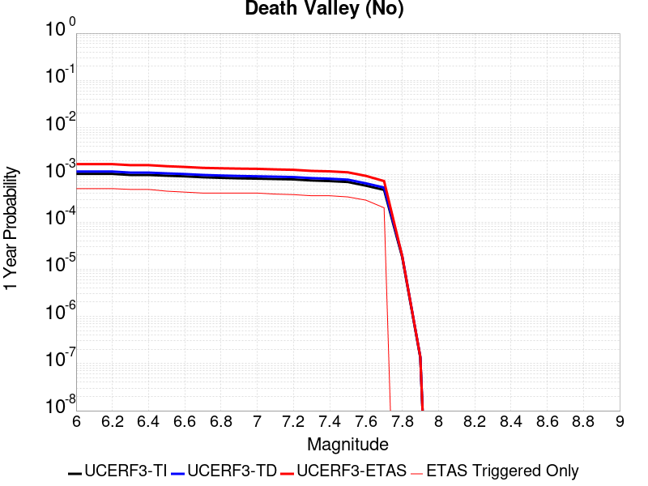 |  |

| Magnitude | 1 wk TI Prob | 1 wk TD Prob | 1 wk ETAS Prob | 1 wk ETAS/TD Gain | 1 wk ETAS Triggered Only | 1 mo TI Prob | 1 mo TD Prob | 1 mo ETAS Prob | 1 mo ETAS/TD Gain | 1 mo ETAS Triggered Only | 1 yr TI Prob | 1 yr TD Prob | 1 yr ETAS Prob | 1 yr ETAS/TD Gain | 1 yr ETAS Triggered Only | 10 yr TI Prob | 10 yr TD Prob | 10 yr ETAS Prob | 10 yr ETAS/TD Gain | 10 yr ETAS Triggered Only |
|-----|-----|-----|-----|-----|-----|-----|-----|-----|-----|-----|-----|-----|-----|-----|-----|-----|-----|-----|-----|-----|
| 6.0 | 2.0074807E-5 | 2.2500084E-5 | 2.1800866E-4 | 9.689238 | 1.9551297E-4 | 8.603206E-5 | 9.642541E-5 | 3.896666E-4 | 4.0411196 | 2.9326946E-4 | 0.001046937 | 0.0011733545 | 0.0016452898 | 1.4022104 | 4.724897E-4 | 0.010420183 | 0.011672506 | 0.012300507 | 1.0538017 | 6.354172E-4 |
| 6.1 | 2.0074807E-5 | 2.2500084E-5 | 2.1800866E-4 | 9.689238 | 1.9551297E-4 | 8.603206E-5 | 9.642541E-5 | 3.896666E-4 | 4.0411196 | 2.9326946E-4 | 0.001046937 | 0.0011733545 | 0.0016452898 | 1.4022104 | 4.724897E-4 | 0.010420183 | 0.011672506 | 0.012300507 | 1.0538017 | 6.354172E-4 |
| 6.2 | 2.0074807E-5 | 2.2500084E-5 | 2.1800866E-4 | 9.689238 | 1.9551297E-4 | 8.603206E-5 | 9.642541E-5 | 3.896666E-4 | 4.0411196 | 2.9326946E-4 | 0.001046937 | 0.0011733545 | 0.0016452898 | 1.4022104 | 4.724897E-4 | 0.010420183 | 0.011672506 | 0.012300507 | 1.0538017 | 6.354172E-4 |
| 6.3 | 1.9050609E-5 | 2.1336948E-5 | 2.0055335E-4 | 9.399346 | 1.7922022E-4 | 8.164292E-5 | 9.1440896E-5 | 3.6839227E-4 | 4.0287476 | 2.7697673E-4 | 9.935491E-4 | 0.001112731 | 0.0015521457 | 1.3948975 | 4.399042E-4 | 0.009891188 | 0.011072419 | 0.011668576 | 1.0538416 | 6.0283166E-4 |
| 6.4 | 1.9050609E-5 | 2.1336948E-5 | 2.0055335E-4 | 9.399346 | 1.7922022E-4 | 8.164292E-5 | 9.1440896E-5 | 3.6839227E-4 | 4.0287476 | 2.7697673E-4 | 9.935491E-4 | 0.001112731 | 0.0015521457 | 1.3948975 | 4.399042E-4 | 0.009891188 | 0.011072419 | 0.011668576 | 1.0538416 | 6.0283166E-4 |
| 6.5 | 1.8367004E-5 | 2.0561009E-5 | 1.5090032E-4 | 7.3391495 | 1.3034198E-4 | 7.8713354E-5 | 8.811567E-5 | 2.9990272E-4 | 3.403512 | 2.1180573E-4 | 9.5791375E-4 | 0.0010722869 | 0.0014466182 | 1.3490963 | 3.747332E-4 | 0.009537951 | 0.0106719155 | 0.011187719 | 1.0483328 | 5.2136794E-4 |
| 6.6 | 1.779439E-5 | 1.9910927E-5 | 1.5025031E-4 | 7.5461235 | 1.3034198E-4 | 7.625944E-5 | 8.53298E-5 | 2.9711745E-4 | 3.4819896 | 2.1180573E-4 | 9.280632E-4 | 0.0010384015 | 0.0013964698 | 1.3448265 | 3.5844045E-4 | 0.009241969 | 0.010336253 | 0.010836108 | 1.0483594 | 5.050752E-4 |
| 6.7 | 1.7025437E-5 | 1.9043426E-5 | 1.4938293E-4 | 7.844331 | 1.3034198E-4 | 7.296412E-5 | 8.161216E-5 | 2.934006E-4 | 3.5950599 | 2.1180573E-4 | 8.87976E-4 | 9.931813E-4 | 0.0013349892 | 1.3441546 | 3.4214772E-4 | 0.008844362 | 0.009888145 | 0.010372095 | 1.0489423 | 4.887824E-4 |
| 6.8 | 1.6545107E-5 | 1.8512545E-5 | 1.4885212E-4 | 8.040607 | 1.3034198E-4 | 7.090568E-5 | 7.93371E-5 | 2.9112602E-4 | 3.6694815 | 2.1180573E-4 | 8.629347E-4 | 9.655073E-4 | 0.0013073246 | 1.3540288 | 3.4214772E-4 | 0.008595915 | 0.009613829 | 0.010081776 | 1.0486743 | 4.724897E-4 |
| 6.9 | 1.615478E-5 | 1.8087594E-5 | 1.4842722E-4 | 8.206023 | 1.3034198E-4 | 6.9232934E-5 | 7.751599E-5 | 2.893053E-4 | 3.7322016 | 2.1180573E-4 | 8.4258494E-4 | 9.433546E-4 | 0.0012851796 | 1.3623505 | 3.4214772E-4 | 0.008393973 | 0.009394196 | 0.009862247 | 1.0498234 | 4.724897E-4 |
| 7.0 | 1.5894311E-5 | 1.780555E-5 | 1.4814522E-4 | 8.32017 | 1.3034198E-4 | 6.81167E-5 | 7.6307304E-5 | 2.8809687E-4 | 3.7754822 | 2.1180573E-4 | 8.2900526E-4 | 9.286515E-4 | 0.0012704815 | 1.3680929 | 3.4214772E-4 | 0.008259195 | 0.009248397 | 0.009716517 | 1.0506164 | 4.724897E-4 |
| 7.1 | 1.5602263E-5 | 1.7483504E-5 | 1.3153075E-4 | 7.5231347 | 1.1404924E-4 | 6.6865134E-5 | 7.492718E-5 | 2.5413398E-4 | 3.3917463 | 1.7922022E-4 | 8.137789E-4 | 9.118627E-4 | 0.0012211427 | 1.3391738 | 3.0956222E-4 | 0.008108052 | 0.009081894 | 0.009501658 | 1.04622 | 4.2361146E-4 |
| 7.2 | 1.5323829E-5 | 1.717063E-5 | 1.3121791E-4 | 7.6419973 | 1.1404924E-4 | 6.56719E-5 | 7.358637E-5 | 2.5279343E-4 | 3.4353292 | 1.7922022E-4 | 7.99262E-4 | 8.9555193E-4 | 0.0011885588 | 1.3271801 | 2.9326946E-4 | 0.007963934 | 0.008920107 | 0.009323792 | 1.0452557 | 4.073187E-4 |
| 7.3 | 1.4556212E-5 | 1.6302456E-5 | 1.1405735E-4 | 6.99633 | 9.7756485E-5 | 6.238227E-5 | 6.9865826E-5 | 2.3278192E-4 | 3.3318424 | 1.6292748E-4 | 7.592395E-4 | 8.5029035E-4 | 0.0011270315 | 1.3254668 | 2.7697673E-4 | 0.0075665074 | 0.008471014 | 0.008858728 | 1.0457695 | 3.9102594E-4 |
| 7.4 | 1.411725E-5 | 1.580796E-5 | 1.13562906E-4 | 7.183906 | 9.7756485E-5 | 6.0501097E-5 | 6.7746674E-5 | 2.3066312E-4 | 3.4047887 | 1.6292748E-4 | 7.363519E-4 | 8.245094E-4 | 0.0011012577 | 1.3356521 | 2.7697673E-4 | 0.0073391674 | 0.008215138 | 0.008602952 | 1.0472072 | 3.9102594E-4 |
| 7.5 | 1.3503312E-5 | 1.5126289E-5 | 1.128813E-4 | 7.46259 | 9.7756485E-5 | 5.7870053E-5 | 6.482538E-5 | 2.2774229E-4 | 3.513166 | 1.6292748E-4 | 7.043401E-4 | 7.8896893E-4 | 0.0010657271 | 1.3507847 | 2.7697673E-4 | 0.007021119 | 0.007862304 | 0.008250256 | 1.0493432 | 3.9102594E-4 |
| 7.6 | 1.1279839E-5 | 1.2626327E-5 | 1.1038158E-4 | 8.742177 | 9.7756485E-5 | 4.834127E-5 | 5.4111737E-5 | 2.170304E-4 | 4.0107822 | 1.6292748E-4 | 5.88396E-4 | 6.5861654E-4 | 8.865648E-4 | 1.3461016 | 2.2809848E-4 | 0.005868405 | 0.006567199 | 0.0069070994 | 1.0517573 | 3.4214772E-4 |
| 7.7 | 9.189108E-6 | 1.0283358E-5 | 9.174626E-5 | 8.921819 | 8.146374E-5 | 3.93813E-5 | 4.407082E-5 | 1.5811503E-4 | 3.5877488 | 1.1404924E-4 | 4.7936183E-4 | 5.3643517E-4 | 6.9927523E-4 | 1.3035597 | 1.6292748E-4 | 0.004783291 | 0.005351914 | 0.005627408 | 1.0514759 | 2.7697673E-4 |
| 7.8 | 3.4586725E-7 | 3.6482615E-7 | 3.6482615E-7 | 1.0 | 0.0 | 1.4822873E-6 | 1.5635396E-6 | 1.5635396E-6 | 1.0 | 0.0 | 1.80467E-5 | 1.9035933E-5 | 1.9035933E-5 | 1.0 | 0.0 | 1.8045233E-4 | 1.9034347E-4 | 2.0663312E-4 | 1.0855802 | 1.6292748E-5 |
| 7.9 | 2.5591178E-9 | 2.6696718E-9 | 2.6696718E-9 | 1.0 | 0.0 | 1.0967647E-8 | 1.14414505E-8 | 1.14414505E-8 | 1.0 | 0.0 | 1.335311E-7 | 1.3929966E-7 | 1.3929966E-7 | 1.0 | 0.0 | 1.3353102E-6 | 1.3929966E-6 | 1.3929966E-6 | 1.0 | 0.0 |

## Baker
*[(top)](#table-of-contents)*

| 1 Week | 1 Month | 1 Year | 10 Year |
|-----|-----|-----|-----|
|  | 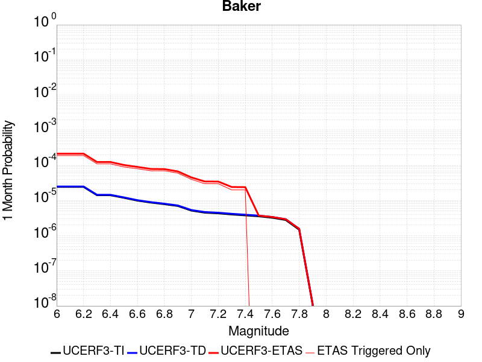 |  |  |

| Magnitude | 1 wk TI Prob | 1 wk TD Prob | 1 wk ETAS Prob | 1 wk ETAS/TD Gain | 1 wk ETAS Triggered Only | 1 mo TI Prob | 1 mo TD Prob | 1 mo ETAS Prob | 1 mo ETAS/TD Gain | 1 mo ETAS Triggered Only | 1 yr TI Prob | 1 yr TD Prob | 1 yr ETAS Prob | 1 yr ETAS/TD Gain | 1 yr ETAS Triggered Only | 10 yr TI Prob | 10 yr TD Prob | 10 yr ETAS Prob | 10 yr ETAS/TD Gain | 10 yr ETAS Triggered Only |
|-----|-----|-----|-----|-----|-----|-----|-----|-----|-----|-----|-----|-----|-----|-----|-----|-----|-----|-----|-----|-----|
| 6.0 | 5.695525E-6 | 5.8348373E-6 | 1.03590755E-4 | 17.753838 | 9.7756485E-5 | 2.4409164E-5 | 2.5006228E-5 | 2.6939134E-4 | 10.77297 | 2.443912E-4 | 2.9714106E-4 | 3.044123E-4 | 6.953192E-4 | 2.2841365 | 3.9102594E-4 | 0.0029674405 | 0.0030403486 | 0.0036251044 | 1.1923318 | 5.865389E-4 |
| 6.1 | 5.695525E-6 | 5.8348373E-6 | 1.03590755E-4 | 17.753838 | 9.7756485E-5 | 2.4409164E-5 | 2.5006228E-5 | 2.6939134E-4 | 10.77297 | 2.443912E-4 | 2.9714106E-4 | 3.044123E-4 | 6.953192E-4 | 2.2841365 | 3.9102594E-4 | 0.0029674405 | 0.0030403486 | 0.0036251044 | 1.1923318 | 5.865389E-4 |
| 6.2 | 5.695525E-6 | 5.8348373E-6 | 1.03590755E-4 | 17.753838 | 9.7756485E-5 | 2.4409164E-5 | 2.5006228E-5 | 2.6939134E-4 | 10.77297 | 2.443912E-4 | 2.9714106E-4 | 3.044123E-4 | 6.953192E-4 | 2.2841365 | 3.9102594E-4 | 0.0029674405 | 0.0030403486 | 0.0036251044 | 1.1923318 | 5.865389E-4 |
| 6.3 | 3.2995713E-6 | 3.383667E-6 | 5.2261745E-5 | 15.445298 | 4.8878243E-5 | 1.4140943E-5 | 1.4501353E-5 | 1.6113395E-4 | 11.11165 | 1.4663473E-4 | 1.7215237E-4 | 1.7654014E-4 | 3.720186E-4 | 2.107275 | 1.9551297E-4 | 0.0017201907 | 0.001764046 | 0.002121854 | 1.2028338 | 3.5844045E-4 |
| 6.4 | 3.2995713E-6 | 3.383667E-6 | 5.2261745E-5 | 15.445298 | 4.8878243E-5 | 1.4140943E-5 | 1.4501353E-5 | 1.6113395E-4 | 11.11165 | 1.4663473E-4 | 1.7215237E-4 | 1.7654014E-4 | 3.720186E-4 | 2.107275 | 1.9551297E-4 | 0.0017201907 | 0.001764046 | 0.002121854 | 1.2028338 | 3.5844045E-4 |
| 6.5 | 2.782202E-6 | 2.8558404E-6 | 5.1733947E-5 | 18.115139 | 4.8878243E-5 | 1.1923668E-5 | 1.223926E-5 | 1.2628711E-4 | 10.318197 | 1.1404924E-4 | 1.4516099E-4 | 1.4900314E-4 | 3.1190633E-4 | 2.093287 | 1.6292748E-4 | 0.001450662 | 0.0014890651 | 0.0018144348 | 1.2185061 | 3.2585496E-4 |
| 6.6 | 2.3163404E-6 | 2.38092E-6 | 5.125905E-5 | 21.529093 | 4.8878243E-5 | 9.927136E-6 | 1.0203904E-5 | 1.2425198E-4 | 12.176906 | 1.1404924E-4 | 1.20856166E-4 | 1.2422565E-4 | 2.871329E-4 | 2.3113816 | 1.6292748E-4 | 0.0012079047 | 0.0012415823 | 0.0015670327 | 1.2621255 | 3.2585496E-4 |
| 6.7 | 2.037056E-6 | 2.0965003E-6 | 3.468193E-5 | 16.542772 | 3.2585496E-5 | 8.7302105E-6 | 8.984972E-6 | 1.0674058E-4 | 11.879902 | 9.7756485E-5 | 1.0628513E-4 | 1.093867E-4 | 2.5600538E-4 | 2.3403704 | 1.4663473E-4 | 0.0010623431 | 0.0010933448 | 0.0014025685 | 1.2828237 | 3.0956222E-4 |
| 6.8 | 1.8356744E-6 | 1.8915287E-6 | 3.447696E-5 | 18.227037 | 3.2585496E-5 | 7.867153E-6 | 8.106527E-6 | 1.0586222E-4 | 13.0588875 | 9.7756485E-5 | 9.577837E-5 | 9.869264E-5 | 2.2902175E-4 | 2.3205557 | 1.3034198E-4 | 9.57371E-4 | 9.86502E-4 | 0.0012794822 | 1.2969888 | 2.9326946E-4 |
| 6.9 | 1.6310546E-6 | 1.6832072E-6 | 3.4268647E-5 | 20.359138 | 3.2585496E-5 | 6.9902153E-6 | 7.213726E-6 | 8.8676876E-5 | 12.292799 | 8.146374E-5 | 8.510255E-5 | 8.782368E-5 | 2.018629E-4 | 2.298502 | 1.1404924E-4 | 8.5069967E-4 | 8.7790104E-4 | 0.0011057992 | 1.2595944 | 2.2809848E-4 |
| 7.0 | 1.2058036E-6 | 1.2508665E-6 | 3.383632E-5 | 27.050304 | 3.2585496E-5 | 5.1677193E-6 | 5.3608455E-6 | 5.423883E-5 | 10.117588 | 4.8878243E-5 | 6.291517E-5 | 6.5266366E-5 | 1.3043311E-4 | 1.9984735 | 6.517099E-5 | 6.289736E-4 | 6.524743E-4 | 8.315776E-4 | 1.2744986 | 1.7922022E-4 |
| 7.1 | 1.052382E-6 | 1.0951609E-6 | 1.738789E-5 | 15.87702 | 1.6292748E-5 | 4.5102006E-6 | 4.693538E-6 | 3.727888E-5 | 7.942597 | 3.2585496E-5 | 5.491031E-5 | 5.7142337E-5 | 1.0601779E-4 | 1.8553282 | 4.8878243E-5 | 5.4896745E-4 | 5.7127734E-4 | 7.341117E-4 | 1.2850356 | 1.6292748E-4 |
| 7.2 | 1.0067454E-6 | 1.0487711E-6 | 1.7341503E-5 | 16.535069 | 1.6292748E-5 | 4.3146156E-6 | 4.4947255E-6 | 3.7080074E-5 | 8.249686 | 3.2585496E-5 | 5.252918E-5 | 5.4721917E-5 | 8.730563E-5 | 1.5954417 | 3.2585496E-5 | 5.251676E-4 | 5.470853E-4 | 6.77356E-4 | 1.2381177 | 1.3034198E-4 |
| 7.3 | 9.3596316E-7 | 9.767723E-7 | 1.7269505E-5 | 17.680174 | 1.6292748E-5 | 4.0112645E-6 | 4.1861604E-6 | 3.6771522E-5 | 8.784068 | 3.2585496E-5 | 4.8836053E-5 | 5.096532E-5 | 8.354915E-5 | 1.6393335 | 3.2585496E-5 | 4.8825322E-4 | 5.095371E-4 | 6.072438E-4 | 1.1917558 | 9.7756485E-5 |
| 7.4 | 8.8117395E-7 | 9.2076635E-7 | 1.7213499E-5 | 18.694754 | 1.6292748E-5 | 3.7764542E-6 | 3.9461356E-6 | 3.6531503E-5 | 9.257539 | 3.2585496E-5 | 4.5977362E-5 | 4.8043148E-5 | 8.062708E-5 | 1.6782222 | 3.2585496E-5 | 4.596785E-4 | 4.8032837E-4 | 5.780379E-4 | 1.2034223 | 9.7756485E-5 |
| 7.5 | 8.292386E-7 | 8.6745956E-7 | 8.6745956E-7 | 1.0 | 0.0 | 3.5538749E-6 | 3.7176785E-6 | 3.7176785E-6 | 1.0 | 0.0 | 4.326757E-5 | 4.5261804E-5 | 4.5261804E-5 | 1.0 | 0.0 | 4.3259145E-4 | 4.5252658E-4 | 5.176681E-4 | 1.1439507 | 6.517099E-5 |
| 7.6 | 7.553842E-7 | 7.9144706E-7 | 7.9144706E-7 | 1.0 | 0.0 | 3.2373566E-6 | 3.3919116E-6 | 3.3919116E-6 | 1.0 | 0.0 | 3.9414106E-5 | 4.129575E-5 | 4.129575E-5 | 1.0 | 0.0 | 3.9407116E-4 | 4.1288146E-4 | 4.6173952E-4 | 1.1183344 | 4.8878243E-5 |
| 7.7 | 6.5285366E-7 | 6.852797E-7 | 6.852797E-7 | 1.0 | 0.0 | 2.797941E-6 | 2.9369096E-6 | 2.9369096E-6 | 1.0 | 0.0 | 3.40644E-5 | 3.5756293E-5 | 3.5756293E-5 | 1.0 | 0.0 | 3.405918E-4 | 3.5750607E-4 | 4.0636686E-4 | 1.1366712 | 4.8878243E-5 |
| 7.8 | 3.4586725E-7 | 3.6482615E-7 | 3.6482615E-7 | 1.0 | 0.0 | 1.4822873E-6 | 1.5635396E-6 | 1.5635396E-6 | 1.0 | 0.0 | 1.80467E-5 | 1.9035933E-5 | 1.9035933E-5 | 1.0 | 0.0 | 1.8045233E-4 | 1.9034347E-4 | 2.0663312E-4 | 1.0855802 | 1.6292748E-5 |
| 7.9 | 2.5591178E-9 | 2.6696718E-9 | 2.6696718E-9 | 1.0 | 0.0 | 1.0967647E-8 | 1.14414505E-8 | 1.14414505E-8 | 1.0 | 0.0 | 1.335311E-7 | 1.3929966E-7 | 1.3929966E-7 | 1.0 | 0.0 | 1.3353102E-6 | 1.3929966E-6 | 1.3929966E-6 | 1.0 | 0.0 |

## San Andreas (Parkfield)
*[(top)](#table-of-contents)*

| 1 Week | 1 Month | 1 Year | 10 Year |
|-----|-----|-----|-----|
|  |  |  |  |

| Magnitude | 1 wk TI Prob | 1 wk TD Prob | 1 wk ETAS Prob | 1 wk ETAS/TD Gain | 1 wk ETAS Triggered Only | 1 mo TI Prob | 1 mo TD Prob | 1 mo ETAS Prob | 1 mo ETAS/TD Gain | 1 mo ETAS Triggered Only | 1 yr TI Prob | 1 yr TD Prob | 1 yr ETAS Prob | 1 yr ETAS/TD Gain | 1 yr ETAS Triggered Only | 10 yr TI Prob | 10 yr TD Prob | 10 yr ETAS Prob | 10 yr ETAS/TD Gain | 10 yr ETAS Triggered Only |
|-----|-----|-----|-----|-----|-----|-----|-----|-----|-----|-----|-----|-----|-----|-----|-----|-----|-----|-----|-----|-----|
| 6.0 | 5.556969E-4 | 7.778562E-4 | 9.7321713E-4 | 1.251153 | 1.9551297E-4 | 0.0023793848 | 0.0033299583 | 0.0036060126 | 1.0829003 | 2.7697673E-4 | 0.028586963 | 0.040235043 | 0.040610336 | 1.0093275 | 3.9102594E-4 | 0.25176284 | 0.3371973 | 0.33756444 | 1.0010889 | 5.5395346E-4 |
| 6.1 | 1.925858E-4 | 3.0278185E-4 | 4.3308438E-4 | 1.4303511 | 1.3034198E-4 | 8.2510663E-4 | 0.001297085 | 0.0014598011 | 1.1254475 | 1.6292748E-4 | 0.0099994885 | 0.01577393 | 0.01599843 | 1.0142324 | 2.2809848E-4 | 0.095613256 | 0.14975825 | 0.15000759 | 1.001665 | 2.9326946E-4 |
| 6.2 | 9.4306815E-5 | 1.8243887E-4 | 3.1275707E-4 | 1.7143116 | 1.3034198E-4 | 4.0410945E-4 | 7.8164786E-4 | 9.4444794E-4 | 1.2082781 | 1.6292748E-4 | 0.0049089384 | 0.009475246 | 0.009685045 | 1.0221418 | 2.1180573E-4 | 0.048019063 | 0.0918565 | 0.09207845 | 1.0024161 | 2.443912E-4 |
| 6.3 | 9.283051E-5 | 1.794041E-4 | 3.097227E-4 | 1.726397 | 1.3034198E-4 | 3.9778434E-4 | 7.686494E-4 | 9.314516E-4 | 1.211803 | 1.6292748E-4 | 0.0048322747 | 0.009318355 | 0.009528186 | 1.0225182 | 2.1180573E-4 | 0.047285385 | 0.090509474 | 0.09073174 | 1.0024558 | 2.443912E-4 |
| 6.4 | 9.138826E-5 | 1.7702584E-4 | 3.0734474E-4 | 1.7361575 | 1.3034198E-4 | 3.916052E-4 | 7.5846276E-4 | 9.212666E-4 | 1.2146498 | 1.6292748E-4 | 0.0047573745 | 0.009195387 | 0.009405245 | 1.0228221 | 2.1180573E-4 | 0.046568092 | 0.0894136 | 0.08963614 | 1.0024889 | 2.443912E-4 |
| 6.5 | 9.000255E-5 | 1.746064E-4 | 3.049256E-4 | 1.7463601 | 1.3034198E-4 | 3.8566816E-4 | 7.4809964E-4 | 9.1090525E-4 | 1.2176255 | 1.6292748E-4 | 0.0046854047 | 0.009070284 | 0.009280168 | 1.0231398 | 2.1180573E-4 | 0.045878403 | 0.08829608 | 0.08851889 | 1.0025234 | 2.443912E-4 |
| 6.6 | 8.8109264E-5 | 1.7141816E-4 | 3.017378E-4 | 1.7602441 | 1.3034198E-4 | 3.7755648E-4 | 7.3444354E-4 | 8.9725136E-4 | 1.221675 | 1.6292748E-4 | 0.0045870654 | 0.008905404 | 0.009115323 | 1.0235722 | 2.1180573E-4 | 0.04493529 | 0.08682707 | 0.087050244 | 1.0025703 | 2.443912E-4 |
| 6.7 | 8.738073E-5 | 1.7008898E-4 | 3.004088E-4 | 1.7661861 | 1.3034198E-4 | 3.7443507E-4 | 7.287503E-4 | 8.9155906E-4 | 1.2234081 | 1.6292748E-4 | 0.0045492216 | 0.008836695 | 0.009046629 | 1.0237571 | 2.1180573E-4 | 0.04457213 | 0.0862268 | 0.086450115 | 1.00259 | 2.443912E-4 |
| 6.8 | 8.710195E-5 | 1.6954402E-4 | 2.998639E-4 | 1.7686493 | 1.3034198E-4 | 3.7324068E-4 | 7.26416E-4 | 8.8922516E-4 | 1.2241266 | 1.6292748E-4 | 0.0045347405 | 0.008808513 | 0.009018453 | 1.0238338 | 2.1180573E-4 | 0.04443313 | 0.08597436 | 0.08619774 | 1.0025982 | 2.443912E-4 |
| 6.9 | 8.6801556E-5 | 1.6895356E-4 | 2.9927352E-4 | 1.771336 | 1.3034198E-4 | 3.7195362E-4 | 7.238869E-4 | 8.8669645E-4 | 1.2249101 | 1.6292748E-4 | 0.0045191357 | 0.0087779695 | 0.008987916 | 1.0239174 | 2.1180573E-4 | 0.044283327 | 0.08570042 | 0.085923865 | 1.0026073 | 2.443912E-4 |
| 7.0 | 8.5571606E-5 | 1.664819E-4 | 2.9680217E-4 | 1.7827895 | 1.3034198E-4 | 3.6668387E-4 | 7.132999E-4 | 8.7611115E-4 | 1.2282507 | 1.6292748E-4 | 0.004455241 | 0.008650103 | 0.008860077 | 1.0242741 | 2.1180573E-4 | 0.043669727 | 0.08454836 | 0.084772095 | 1.0026462 | 2.443912E-4 |
| 7.1 | 7.82589E-5 | 1.5128969E-4 | 2.8161195E-4 | 1.8614088 | 1.3034198E-4 | 3.3535215E-4 | 6.4822397E-4 | 8.110458E-4 | 1.2511815 | 1.6292748E-4 | 0.0040752706 | 0.007863738 | 0.0080577135 | 1.0246671 | 1.9551297E-4 | 0.040013418 | 0.077460445 | 0.07767087 | 1.0027167 | 2.2809848E-4 |
| 7.2 | 7.690929E-5 | 1.4866212E-4 | 2.7898472E-4 | 1.8766363 | 1.3034198E-4 | 3.2956956E-4 | 6.369685E-4 | 7.9979224E-4 | 1.2556229 | 1.6292748E-4 | 0.004005129 | 0.0077276826 | 0.0079216845 | 1.0251049 | 1.9551297E-4 | 0.0393371 | 0.07623341 | 0.07644412 | 1.002764 | 2.2809848E-4 |
| 7.3 | 7.5543794E-5 | 1.4562748E-4 | 2.7595047E-4 | 1.8949066 | 1.3034198E-4 | 3.2371894E-4 | 6.239692E-4 | 7.86795E-4 | 1.2609516 | 1.6292748E-4 | 0.003934157 | 0.0075705256 | 0.007764559 | 1.02563 | 1.9551297E-4 | 0.038652334 | 0.07479777 | 0.07500881 | 1.0028214 | 2.2809848E-4 |
| 7.4 | 7.4214564E-5 | 1.4263717E-4 | 2.7296058E-4 | 1.9136707 | 1.3034198E-4 | 3.1802364E-4 | 6.1115966E-4 | 7.7398756E-4 | 1.2664245 | 1.6292748E-4 | 0.003865065 | 0.0074156416 | 0.0076097045 | 1.0261694 | 1.9551297E-4 | 0.03798529 | 0.07337152 | 0.07358289 | 1.0028807 | 2.2809848E-4 |
| 7.5 | 6.149578E-5 | 1.1191443E-4 | 2.4224183E-4 | 2.1645272 | 1.3034198E-4 | 2.6352672E-4 | 4.795452E-4 | 6.4239453E-4 | 1.3395913 | 1.6292748E-4 | 0.0032037178 | 0.005822865 | 0.0060010417 | 1.0305995 | 1.7922022E-4 | 0.03157923 | 0.058559462 | 0.058758866 | 1.0034051 | 2.1180573E-4 |
| 7.6 | 6.0643448E-5 | 1.102009E-4 | 2.4052852E-4 | 2.1826367 | 1.3034198E-4 | 2.598746E-4 | 4.7220418E-4 | 6.350547E-4 | 1.3448732 | 1.6292748E-4 | 0.0031593828 | 0.005733962 | 0.0059121544 | 1.0310767 | 1.7922022E-4 | 0.031148417 | 0.05772042 | 0.057919998 | 1.0034577 | 2.1180573E-4 |
| 7.7 | 5.1652263E-5 | 9.175265E-5 | 1.8950016E-4 | 2.0653374 | 9.7756485E-5 | 2.2134806E-4 | 3.9316638E-4 | 5.234571E-4 | 1.3313882 | 1.3034198E-4 | 0.002691582 | 0.0047763046 | 0.004906024 | 1.027159 | 1.3034198E-4 | 0.026592141 | 0.04853641 | 0.048675925 | 1.0028745 | 1.4663473E-4 |
| 7.8 | 4.8090482E-5 | 8.560165E-5 | 1.8334977E-4 | 2.1418953 | 9.7756485E-5 | 2.060858E-4 | 3.6681266E-4 | 4.971068E-4 | 1.3552064 | 1.3034198E-4 | 0.0025062072 | 0.004456807 | 0.004586568 | 1.0291152 | 1.3034198E-4 | 0.024781305 | 0.045302264 | 0.045442257 | 1.0030901 | 1.4663473E-4 |
| 7.9 | 3.970278E-5 | 6.7507375E-5 | 1.4896561E-4 | 2.206657 | 8.146374E-5 | 1.7014367E-4 | 2.8928524E-4 | 4.033015E-4 | 1.3941308 | 1.1404924E-4 | 0.002069531 | 0.0035163634 | 0.0036300118 | 1.0323198 | 1.1404924E-4 | 0.020503636 | 0.03588176 | 0.036007427 | 1.0035022 | 1.3034198E-4 |
| 8.0 | 2.8982335E-5 | 4.0698153E-5 | 8.957441E-5 | 2.2009454 | 4.8878243E-5 | 1.2420409E-4 | 1.7440901E-4 | 2.2327872E-4 | 1.2802018 | 4.8878243E-5 | 0.0015111357 | 0.0021213628 | 0.0021701374 | 1.0229921 | 4.8878243E-5 | 0.015009012 | 0.02201118 | 0.022074917 | 1.0028956 | 6.517099E-5 |
| 8.1 | 1.8836186E-5 | 1.867974E-5 | 1.867974E-5 | 1.0 | 0.0 | 8.0724014E-5 | 8.005358E-5 | 8.005358E-5 | 1.0 | 0.0 | 9.823717E-4 | 9.742171E-4 | 9.742171E-4 | 1.0 | 0.0 | 0.009780403 | 0.010487711 | 0.010487711 | 1.0 | 0.0 |
| 8.2 | 8.643924E-6 | 5.473668E-6 | 5.473668E-6 | 1.0 | 0.0 | 3.704486E-5 | 2.3458366E-5 | 2.3458366E-5 | 1.0 | 0.0 | 4.5092785E-4 | 2.8556827E-4 | 2.8556827E-4 | 1.0 | 0.0 | 0.0045001395 | 0.0032481793 | 0.0032481793 | 1.0 | 0.0 |
| 8.3 | 1.983087E-6 | 7.6564595E-7 | 7.6564595E-7 | 1.0 | 0.0 | 8.498917E-6 | 3.281336E-6 | 3.281336E-6 | 1.0 | 0.0 | 1.034694E-4 | 3.9949547E-5 | 3.9949547E-5 | 1.0 | 0.0 | 0.0010342124 | 4.717979E-4 | 4.717979E-4 | 1.0 | 0.0 |

## San Andreas (San Gorgonio Pass-Garnet HIll)
*[(top)](#table-of-contents)*

| 1 Week | 1 Month | 1 Year | 10 Year |
|-----|-----|-----|-----|
| 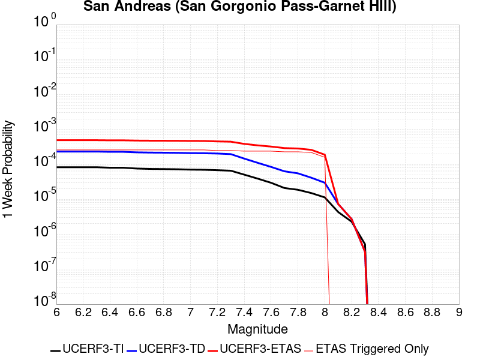 | 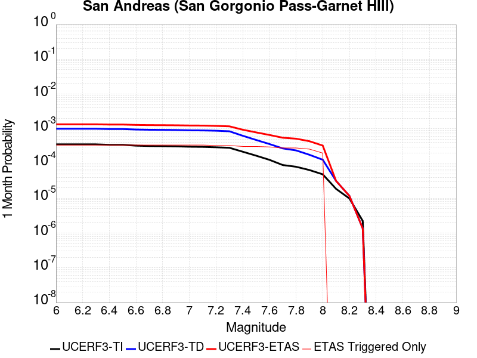 |  |  |

| Magnitude | 1 wk TI Prob | 1 wk TD Prob | 1 wk ETAS Prob | 1 wk ETAS/TD Gain | 1 wk ETAS Triggered Only | 1 mo TI Prob | 1 mo TD Prob | 1 mo ETAS Prob | 1 mo ETAS/TD Gain | 1 mo ETAS Triggered Only | 1 yr TI Prob | 1 yr TD Prob | 1 yr ETAS Prob | 1 yr ETAS/TD Gain | 1 yr ETAS Triggered Only | 10 yr TI Prob | 10 yr TD Prob | 10 yr ETAS Prob | 10 yr ETAS/TD Gain | 10 yr ETAS Triggered Only |
|-----|-----|-----|-----|-----|-----|-----|-----|-----|-----|-----|-----|-----|-----|-----|-----|-----|-----|-----|-----|-----|
| 6.0 | 8.31567E-5 | 2.3384395E-4 | 5.107559E-4 | 2.184174 | 2.7697673E-4 | 3.5633717E-4 | 0.0010018025 | 0.0013436074 | 1.34119 | 3.4214772E-4 | 0.004329778 | 0.012128622 | 0.01256319 | 1.03583 | 4.399042E-4 | 0.042463828 | 0.11258187 | 0.11305901 | 1.0042381 | 5.376607E-4 |
| 6.1 | 8.31567E-5 | 2.3384395E-4 | 5.107559E-4 | 2.184174 | 2.7697673E-4 | 3.5633717E-4 | 0.0010018025 | 0.0013436074 | 1.34119 | 3.4214772E-4 | 0.004329778 | 0.012128622 | 0.01256319 | 1.03583 | 4.399042E-4 | 0.042463828 | 0.11258187 | 0.11305901 | 1.0042381 | 5.376607E-4 |
| 6.2 | 8.31567E-5 | 2.3384395E-4 | 5.107559E-4 | 2.184174 | 2.7697673E-4 | 3.5633717E-4 | 0.0010018025 | 0.0013436074 | 1.34119 | 3.4214772E-4 | 0.004329778 | 0.012128622 | 0.01256319 | 1.03583 | 4.399042E-4 | 0.042463828 | 0.11258187 | 0.11305901 | 1.0042381 | 5.376607E-4 |
| 6.3 | 8.31567E-5 | 2.3384395E-4 | 5.107559E-4 | 2.184174 | 2.7697673E-4 | 3.5633717E-4 | 0.0010018025 | 0.0013436074 | 1.34119 | 3.4214772E-4 | 0.004329778 | 0.012128622 | 0.01256319 | 1.03583 | 4.399042E-4 | 0.042463828 | 0.11258187 | 0.11305901 | 1.0042381 | 5.376607E-4 |
| 6.4 | 8.059055E-5 | 2.2941893E-4 | 5.063321E-4 | 2.2070198 | 2.7697673E-4 | 3.4534236E-4 | 9.828559E-4 | 0.0013246674 | 1.3477737 | 3.4214772E-4 | 0.0041964394 | 0.011900819 | 0.012335488 | 1.0365243 | 4.399042E-4 | 0.041180745 | 0.110562965 | 0.11104118 | 1.0043253 | 5.376607E-4 |
| 6.5 | 8.059055E-5 | 2.2941893E-4 | 5.063321E-4 | 2.2070198 | 2.7697673E-4 | 3.4534236E-4 | 9.828559E-4 | 0.0013246674 | 1.3477737 | 3.4214772E-4 | 0.0041964394 | 0.011900819 | 0.012335488 | 1.0365243 | 4.399042E-4 | 0.041180745 | 0.110562965 | 0.11104118 | 1.0043253 | 5.376607E-4 |
| 6.6 | 7.619237E-5 | 2.2186468E-4 | 4.9877993E-4 | 2.248127 | 2.7697673E-4 | 3.2649786E-4 | 9.5050444E-4 | 0.001292327 | 1.3596222 | 3.4214772E-4 | 0.0039678677 | 0.0115115335 | 0.011946374 | 1.0377743 | 4.399042E-4 | 0.03897764 | 0.10709954 | 0.10757962 | 1.0044825 | 5.376607E-4 |
| 6.7 | 7.440636E-5 | 2.1862281E-4 | 4.95539E-4 | 2.266639 | 2.7697673E-4 | 3.188454E-4 | 9.3662075E-4 | 0.001278448 | 1.364958 | 3.4214772E-4 | 0.0038750346 | 0.011344268 | 0.011779182 | 1.0383377 | 4.399042E-4 | 0.038081564 | 0.1056081 | 0.10608898 | 1.0045534 | 5.376607E-4 |
| 6.8 | 7.3735864E-5 | 2.1709445E-4 | 4.9401104E-4 | 2.275558 | 2.7697673E-4 | 3.1597257E-4 | 9.300753E-4 | 0.0012719048 | 1.3675288 | 3.4214772E-4 | 0.0038401815 | 0.011265406 | 0.011700355 | 1.0386093 | 4.399042E-4 | 0.03774495 | 0.104909696 | 0.10539095 | 1.0045873 | 5.376607E-4 |
| 6.9 | 7.27575E-5 | 2.1478413E-4 | 4.9170136E-4 | 2.2892816 | 2.7697673E-4 | 3.117806E-4 | 9.20181E-4 | 0.0012620138 | 1.3714844 | 3.4214772E-4 | 0.003789323 | 0.011146182 | 0.011581183 | 1.0390269 | 4.399042E-4 | 0.037253562 | 0.10385753 | 0.104339354 | 1.0046393 | 5.376607E-4 |
| 7.0 | 7.102591E-5 | 2.1062451E-4 | 4.875429E-4 | 2.314749 | 2.7697673E-4 | 3.0436125E-4 | 9.023664E-4 | 0.0012442054 | 1.378825 | 3.4214772E-4 | 0.003699303 | 0.010931484 | 0.01136658 | 1.0398021 | 4.399042E-4 | 0.03638325 | 0.101959534 | 0.10244238 | 1.0047356 | 5.376607E-4 |
| 7.1 | 7.028513E-5 | 2.0898094E-4 | 4.8589977E-4 | 2.3250914 | 2.7697673E-4 | 3.0118722E-4 | 8.953274E-4 | 0.0012371688 | 1.381806 | 3.4214772E-4 | 0.0036607897 | 0.010846641 | 0.011281773 | 1.0401168 | 4.399042E-4 | 0.036010686 | 0.10120243 | 0.10168568 | 1.004775 | 5.376607E-4 |
| 7.2 | 6.8498244E-5 | 2.050596E-4 | 4.656901E-4 | 2.270999 | 2.6068397E-4 | 2.9353087E-4 | 8.7853306E-4 | 0.0012041017 | 1.3705822 | 3.2585496E-4 | 0.003567883 | 0.0106441835 | 0.011063286 | 1.0393739 | 4.2361146E-4 | 0.035111405 | 0.09939449 | 0.099864036 | 1.004724 | 5.2136794E-4 |
| 7.3 | 6.622592E-5 | 1.9733235E-4 | 4.579649E-4 | 2.3207796 | 2.6068397E-4 | 2.8379448E-4 | 8.4543816E-4 | 0.0011710176 | 1.3851014 | 3.2585496E-4 | 0.0034497243 | 0.010245111 | 0.010664382 | 1.0409241 | 4.2361146E-4 | 0.033966612 | 0.095891245 | 0.09636262 | 1.0049157 | 5.2136794E-4 |
| 7.4 | 5.1050705E-5 | 1.4690042E-4 | 3.9125574E-4 | 2.6634078 | 2.443912E-4 | 2.1877038E-4 | 6.294222E-4 | 9.225071E-4 | 1.4656411 | 2.9326946E-4 | 0.002660276 | 0.007636482 | 0.008024522 | 1.0508139 | 3.9102594E-4 | 0.02628654 | 0.07286554 | 0.073303595 | 1.006012 | 4.724897E-4 |
| 7.5 | 3.9302922E-5 | 1.11307076E-4 | 3.556711E-4 | 3.1954043 | 2.443912E-4 | 1.6843023E-4 | 4.7694342E-4 | 7.7007303E-4 | 1.6146003 | 2.9326946E-4 | 0.0020487092 | 0.0057913954 | 0.0061801565 | 1.0671275 | 3.9102594E-4 | 0.020299247 | 0.05601151 | 0.056457534 | 1.0079631 | 4.724897E-4 |
| 7.6 | 2.9851626E-5 | 8.4956984E-5 | 3.2932745E-4 | 3.8764021 | 2.443912E-4 | 1.2792926E-4 | 3.6405068E-4 | 6.572134E-4 | 1.8052799 | 2.9326946E-4 | 0.0015564259 | 0.0044233347 | 0.0048126313 | 1.0880097 | 3.9102594E-4 | 0.0154556995 | 0.043196145 | 0.043632638 | 1.0101049 | 4.5619695E-4 |
| 7.7 | 2.1135214E-5 | 6.353527E-5 | 3.0791096E-4 | 4.8462996 | 2.443912E-4 | 9.0576345E-5 | 2.722656E-4 | 5.491669E-4 | 2.0170264 | 2.7697673E-4 | 0.0011022091 | 0.0033098008 | 0.0036832937 | 1.1128446 | 3.747332E-4 | 0.010967582 | 0.03258456 | 0.033010133 | 1.0130605 | 4.399042E-4 |
| 7.8 | 1.883379E-5 | 5.564576E-5 | 3.0002338E-4 | 5.3916664 | 2.443912E-4 | 8.0713755E-5 | 2.3846005E-4 | 5.1537075E-4 | 2.1612456 | 2.7697673E-4 | 9.822468E-4 | 0.002899389 | 0.0032730359 | 1.1288708 | 3.747332E-4 | 0.0097791655 | 0.028696978 | 0.029124258 | 1.0148894 | 4.399042E-4 |
| 7.9 | 1.5156185E-5 | 4.1662403E-5 | 2.8604345E-4 | 6.865745 | 2.443912E-4 | 6.495346E-5 | 1.7854095E-4 | 4.5546822E-4 | 2.5510573 | 2.7697673E-4 | 7.9052144E-4 | 0.0021715704 | 0.0025454897 | 1.1721885 | 3.747332E-4 | 0.007877152 | 0.021760946 | 0.022191277 | 1.0197754 | 4.399042E-4 |
| 8.0 | 1.1405907E-5 | 2.9976925E-5 | 2.2548404E-4 | 7.52192 | 1.9551297E-4 | 4.8881542E-5 | 1.2846621E-4 | 3.565354E-4 | 2.775324 | 2.2809848E-4 | 5.9497025E-4 | 0.0015629551 | 0.0018557662 | 1.1873446 | 2.9326946E-4 | 0.005933798 | 0.015774013 | 0.016110763 | 1.0213485 | 3.4214772E-4 |
| 8.1 | 4.3511436E-6 | 7.369465E-6 | 7.369465E-6 | 1.0 | 0.0 | 1.8647626E-5 | 3.158304E-5 | 3.158304E-5 | 1.0 | 0.0 | 2.2701119E-4 | 3.844558E-4 | 3.844558E-4 | 1.0 | 0.0 | 0.0022677942 | 0.0041165445 | 0.0041165445 | 1.0 | 0.0 |
| 8.2 | 2.3042528E-6 | 2.7328301E-6 | 2.7328301E-6 | 1.0 | 0.0 | 9.875332E-6 | 1.1712076E-5 | 1.1712076E-5 | 1.0 | 0.0 | 1.2022553E-4 | 1.4258524E-4 | 1.4258524E-4 | 1.0 | 0.0 | 0.0012016051 | 0.0015979637 | 0.0015979637 | 1.0 | 0.0 |
| 8.3 | 5.202968E-7 | 3.1590292E-7 | 3.1590292E-7 | 1.0 | 0.0 | 2.2298414E-6 | 1.353869E-6 | 1.353869E-6 | 1.0 | 0.0 | 2.714798E-5 | 1.6483244E-5 | 1.6483244E-5 | 1.0 | 0.0 | 2.7144665E-4 | 1.955901E-4 | 1.955901E-4 | 1.0 | 0.0 |

## Elsinore (Glen Ivy) rev
*[(top)](#table-of-contents)*

| 1 Week | 1 Month | 1 Year | 10 Year |
|-----|-----|-----|-----|
|  |  |  |  |

| Magnitude | 1 wk TI Prob | 1 wk TD Prob | 1 wk ETAS Prob | 1 wk ETAS/TD Gain | 1 wk ETAS Triggered Only | 1 mo TI Prob | 1 mo TD Prob | 1 mo ETAS Prob | 1 mo ETAS/TD Gain | 1 mo ETAS Triggered Only | 1 yr TI Prob | 1 yr TD Prob | 1 yr ETAS Prob | 1 yr ETAS/TD Gain | 1 yr ETAS Triggered Only | 10 yr TI Prob | 10 yr TD Prob | 10 yr ETAS Prob | 10 yr ETAS/TD Gain | 10 yr ETAS Triggered Only |
|-----|-----|-----|-----|-----|-----|-----|-----|-----|-----|-----|-----|-----|-----|-----|-----|-----|-----|-----|-----|-----|
| 6.0 | 1.6204086E-4 | 2.937271E-4 | 3.751669E-4 | 1.2772635 | 8.146374E-5 | 6.94276E-4 | 0.0012583778 | 0.0014211003 | 1.1293113 | 1.6292748E-4 | 0.008420097 | 0.0152346175 | 0.015587598 | 1.0231696 | 3.5844045E-4 | 0.081081145 | 0.13962454 | 0.14000303 | 1.0027107 | 4.399042E-4 |
| 6.1 | 1.6204086E-4 | 2.937271E-4 | 3.751669E-4 | 1.2772635 | 8.146374E-5 | 6.94276E-4 | 0.0012583778 | 0.0014211003 | 1.1293113 | 1.6292748E-4 | 0.008420097 | 0.0152346175 | 0.015587598 | 1.0231696 | 3.5844045E-4 | 0.081081145 | 0.13962454 | 0.14000303 | 1.0027107 | 4.399042E-4 |
| 6.2 | 1.6204086E-4 | 2.937271E-4 | 3.751669E-4 | 1.2772635 | 8.146374E-5 | 6.94276E-4 | 0.0012583778 | 0.0014211003 | 1.1293113 | 1.6292748E-4 | 0.008420097 | 0.0152346175 | 0.015587598 | 1.0231696 | 3.5844045E-4 | 0.081081145 | 0.13962454 | 0.14000303 | 1.0027107 | 4.399042E-4 |
| 6.3 | 1.0111737E-4 | 1.7703463E-4 | 2.2590421E-4 | 1.2760454 | 4.8878243E-5 | 4.332882E-4 | 7.5861585E-4 | 8.725786E-4 | 1.1502246 | 1.1404924E-4 | 0.005262531 | 0.0092177205 | 0.009427574 | 1.0227664 | 2.1180573E-4 | 0.0513964 | 0.08707393 | 0.087311916 | 1.0027331 | 2.6068397E-4 |
| 6.4 | 1.0111737E-4 | 1.7703463E-4 | 2.2590421E-4 | 1.2760454 | 4.8878243E-5 | 4.332882E-4 | 7.5861585E-4 | 8.725786E-4 | 1.1502246 | 1.1404924E-4 | 0.005262531 | 0.0092177205 | 0.009427574 | 1.0227664 | 2.1180573E-4 | 0.0513964 | 0.08707393 | 0.087311916 | 1.0027331 | 2.6068397E-4 |
| 6.5 | 3.6624708E-5 | 4.6391986E-5 | 4.6391986E-5 | 1.0 | 0.0 | 1.569536E-4 | 1.9880968E-4 | 1.9880968E-4 | 1.0 | 0.0 | 0.001909235 | 0.0024181814 | 0.0024669415 | 1.0201639 | 4.8878243E-5 | 0.01892915 | 0.023697061 | 0.023744782 | 1.0020138 | 4.8878243E-5 |
| 6.6 | 2.5051324E-5 | 2.6147465E-5 | 2.6147465E-5 | 1.0 | 0.0 | 1.073584E-4 | 1.12056E-4 | 1.12056E-4 | 1.0 | 0.0 | 0.0013063047 | 0.0013634725 | 0.0013634725 | 1.0 | 0.0 | 0.012986525 | 0.013565759 | 0.013565759 | 1.0 | 0.0 |
| 6.7 | 2.2189772E-5 | 2.2072489E-5 | 2.2072489E-5 | 1.0 | 0.0 | 9.509556E-5 | 9.459316E-5 | 9.459316E-5 | 1.0 | 0.0 | 0.0011571734 | 0.0011510996 | 0.0011510996 | 1.0 | 0.0 | 0.011511663 | 0.0114663225 | 0.0114663225 | 1.0 | 0.0 |
| 6.8 | 1.6654378E-5 | 1.44376E-5 | 1.44376E-5 | 1.0 | 0.0 | 7.137396E-5 | 6.187399E-5 | 6.187399E-5 | 1.0 | 0.0 | 8.686314E-4 | 7.5306057E-4 | 7.5306057E-4 | 1.0 | 0.0 | 0.008652439 | 0.0075100763 | 0.0075100763 | 1.0 | 0.0 |
| 6.9 | 1.5042909E-5 | 1.2331886E-5 | 1.2331886E-5 | 1.0 | 0.0 | 6.446802E-5 | 5.2849886E-5 | 5.2849886E-5 | 1.0 | 0.0 | 7.8461546E-4 | 6.4326054E-4 | 6.4326054E-4 | 1.0 | 0.0 | 0.007818509 | 0.006417925 | 0.006417925 | 1.0 | 0.0 |
| 7.0 | 1.4361385E-5 | 1.1451172E-5 | 1.1451172E-5 | 1.0 | 0.0 | 6.154734E-5 | 4.9075545E-5 | 4.9075545E-5 | 1.0 | 0.0 | 7.490812E-4 | 5.973339E-4 | 5.973339E-4 | 1.0 | 0.0 | 0.007465612 | 0.005960982 | 0.005960982 | 1.0 | 0.0 |
| 7.1 | 1.3265571E-5 | 1.0244736E-5 | 1.0244736E-5 | 1.0 | 0.0 | 5.6851208E-5 | 4.3905282E-5 | 4.3905282E-5 | 1.0 | 0.0 | 6.919436E-4 | 5.344183E-4 | 5.344183E-4 | 1.0 | 0.0 | 0.006897931 | 0.0053346003 | 0.0053346003 | 1.0 | 0.0 |
| 7.2 | 1.1596403E-5 | 8.504847E-6 | 8.504847E-6 | 1.0 | 0.0 | 4.9697923E-5 | 3.6448844E-5 | 3.6448844E-5 | 1.0 | 0.0 | 6.049042E-4 | 4.4367602E-4 | 4.4367602E-4 | 1.0 | 0.0 | 0.006032603 | 0.004429357 | 0.004429357 | 1.0 | 0.0 |
| 7.3 | 1.0150827E-5 | 7.238537E-6 | 7.238537E-6 | 1.0 | 0.0 | 4.3502816E-5 | 3.102194E-5 | 3.102194E-5 | 1.0 | 0.0 | 5.2951806E-4 | 3.776281E-4 | 3.776281E-4 | 1.0 | 0.0 | 0.005282581 | 0.003770271 | 0.003770271 | 1.0 | 0.0 |
| 7.4 | 9.080705E-6 | 6.352307E-6 | 6.352307E-6 | 1.0 | 0.0 | 3.8916725E-5 | 2.7223898E-5 | 2.7223898E-5 | 1.0 | 0.0 | 4.7370812E-4 | 3.314019E-4 | 3.314019E-4 | 1.0 | 0.0 | 0.004726996 | 0.0033092257 | 0.0033092257 | 1.0 | 0.0 |
| 7.5 | 7.671649E-6 | 5.225419E-6 | 5.225419E-6 | 1.0 | 0.0 | 3.287808E-5 | 2.2394468E-5 | 2.2394468E-5 | 1.0 | 0.0 | 4.0021708E-4 | 2.7261977E-4 | 2.7261977E-4 | 1.0 | 0.0 | 0.0039949706 | 0.0027229784 | 0.0027229784 | 1.0 | 0.0 |
| 7.6 | 6.990086E-6 | 4.687336E-6 | 4.687336E-6 | 1.0 | 0.0 | 2.9957167E-5 | 2.0088435E-5 | 2.0088435E-5 | 1.0 | 0.0 | 3.6466747E-4 | 2.445504E-4 | 2.445504E-4 | 1.0 | 0.0 | 0.0036406964 | 0.0024429292 | 0.0024429292 | 1.0 | 0.0 |
| 7.7 | 4.163505E-6 | 2.329331E-6 | 2.329331E-6 | 1.0 | 0.0 | 1.7843471E-5 | 9.982813E-6 | 9.982813E-6 | 1.0 | 0.0 | 2.172226E-4 | 1.2153471E-4 | 1.2153471E-4 | 1.0 | 0.0 | 0.0021701038 | 0.0012147555 | 0.0012147555 | 1.0 | 0.0 |
| 7.8 | 2.2692414E-7 | 9.384417E-8 | 9.384417E-8 | 1.0 | 0.0 | 9.725317E-7 | 4.0218927E-7 | 4.0218927E-7 | 1.0 | 0.0 | 1.1840509E-5 | 4.8966467E-6 | 4.8966467E-6 | 1.0 | 0.0 | 1.1839878E-4 | 4.8965718E-5 | 4.8965718E-5 | 1.0 | 0.0 |
| 7.9 | 6.676829E-9 | 3.4397174E-9 | 3.4397174E-9 | 1.0 | 0.0 | 2.861498E-8 | 1.4741646E-8 | 1.4741646E-8 | 1.0 | 0.0 | 3.4838732E-7 | 1.7947953E-7 | 1.7947953E-7 | 1.0 | 0.0 | 3.4838679E-6 | 1.794794E-6 | 1.794794E-6 | 1.0 | 0.0 |

## San Andreas (Cholame) rev
*[(top)](#table-of-contents)*

| 1 Week | 1 Month | 1 Year | 10 Year |
|-----|-----|-----|-----|
|  |  |  |  |

| Magnitude | 1 wk TI Prob | 1 wk TD Prob | 1 wk ETAS Prob | 1 wk ETAS/TD Gain | 1 wk ETAS Triggered Only | 1 mo TI Prob | 1 mo TD Prob | 1 mo ETAS Prob | 1 mo ETAS/TD Gain | 1 mo ETAS Triggered Only | 1 yr TI Prob | 1 yr TD Prob | 1 yr ETAS Prob | 1 yr ETAS/TD Gain | 1 yr ETAS Triggered Only | 10 yr TI Prob | 10 yr TD Prob | 10 yr ETAS Prob | 10 yr ETAS/TD Gain | 10 yr ETAS Triggered Only |
|-----|-----|-----|-----|-----|-----|-----|-----|-----|-----|-----|-----|-----|-----|-----|-----|-----|-----|-----|-----|-----|
| 6.0 | 1.2302514E-4 | 2.5205986E-4 | 4.638122E-4 | 1.8400875 | 2.1180573E-4 | 5.27144E-4 | 0.0010798109 | 0.0013239383 | 1.2260834 | 2.443912E-4 | 0.0063991086 | 0.013067958 | 0.013405634 | 1.02584 | 3.4214772E-4 | 0.06217949 | 0.12438412 | 0.12476931 | 1.0030967 | 4.399042E-4 |
| 6.1 | 1.2302514E-4 | 2.5205986E-4 | 4.638122E-4 | 1.8400875 | 2.1180573E-4 | 5.27144E-4 | 0.0010798109 | 0.0013239383 | 1.2260834 | 2.443912E-4 | 0.0063991086 | 0.013067958 | 0.013405634 | 1.02584 | 3.4214772E-4 | 0.06217949 | 0.12438412 | 0.12476931 | 1.0030967 | 4.399042E-4 |
| 6.2 | 1.2203569E-4 | 2.502277E-4 | 4.619804E-4 | 1.8462402 | 2.1180573E-4 | 5.2290526E-4 | 0.0010719653 | 0.0013160945 | 1.2277399 | 2.443912E-4 | 0.006347804 | 0.012973578 | 0.013311287 | 1.0260305 | 3.4214772E-4 | 0.061695136 | 0.123571314 | 0.12395686 | 1.0031201 | 4.399042E-4 |
| 6.3 | 1.2142645E-4 | 2.4908737E-4 | 4.6084035E-4 | 1.8501152 | 2.1180573E-4 | 5.202953E-4 | 0.0010670823 | 0.0013112127 | 1.2287831 | 2.443912E-4 | 0.006316212 | 0.012914834 | 0.013252562 | 1.0261505 | 3.4214772E-4 | 0.06139677 | 0.12306532 | 0.12345109 | 1.0031346 | 4.399042E-4 |
| 6.4 | 1.1865206E-4 | 2.4414246E-4 | 4.558965E-4 | 1.867338 | 2.1180573E-4 | 5.0840975E-4 | 0.0010459068 | 0.0012900424 | 1.23342 | 2.443912E-4 | 0.006172335 | 0.012660044 | 0.01299786 | 1.0266837 | 3.4214772E-4 | 0.060036868 | 0.12085904 | 0.12124578 | 1.0031999 | 4.399042E-4 |
| 6.5 | 1.17443946E-4 | 2.4207575E-4 | 4.538302E-4 | 1.8747445 | 2.1180573E-4 | 5.032341E-4 | 0.0010370566 | 0.0012811944 | 1.2354141 | 2.443912E-4 | 0.006109677 | 0.012553536 | 0.0128913885 | 1.0269129 | 3.4214772E-4 | 0.059444077 | 0.11993008 | 0.12031723 | 1.0032281 | 4.399042E-4 |
| 6.6 | 1.13579066E-4 | 2.3516564E-4 | 4.3063264E-4 | 1.8311886 | 1.9551297E-4 | 4.866766E-4 | 0.001007465 | 0.0012353336 | 1.2261802 | 2.2809848E-4 | 0.0059092017 | 0.012197345 | 0.012519225 | 1.0263894 | 3.2585496E-4 | 0.057545185 | 0.1168492 | 0.117223315 | 1.0032017 | 4.2361146E-4 |
| 6.7 | 1.1271412E-4 | 2.336088E-4 | 4.290761E-4 | 1.8367292 | 1.9551297E-4 | 4.829711E-4 | 0.001000798 | 0.0012286681 | 1.2276886 | 2.2809848E-4 | 0.005864331 | 0.012117079 | 0.0124389855 | 1.0265664 | 3.2585496E-4 | 0.057119697 | 0.11615275 | 0.11652716 | 1.0032234 | 4.2361146E-4 |
| 6.8 | 1.1217975E-4 | 2.3249313E-4 | 4.2796065E-4 | 1.8407454 | 1.9551297E-4 | 4.8068175E-4 | 9.960202E-4 | 0.0012238914 | 1.2287818 | 2.2809848E-4 | 0.005836608 | 0.012059555 | 0.01238148 | 1.0266947 | 3.2585496E-4 | 0.056856725 | 0.11565061 | 0.11602523 | 1.0032393 | 4.2361146E-4 |
| 6.9 | 1.1146753E-4 | 2.3098059E-4 | 4.2644842E-4 | 1.8462522 | 1.9551297E-4 | 4.7763053E-4 | 9.895428E-4 | 0.0012174156 | 1.2302809 | 2.2809848E-4 | 0.0057996577 | 0.011981564 | 0.012303514 | 1.0268705 | 3.2585496E-4 | 0.056506127 | 0.11497027 | 0.11534517 | 1.003261 | 4.2361146E-4 |
| 7.0 | 1.0965793E-4 | 2.2721413E-4 | 4.2268267E-4 | 1.8602835 | 1.9551297E-4 | 4.698779E-4 | 9.734129E-4 | 0.0012012894 | 1.2341005 | 2.2809848E-4 | 0.005705768 | 0.011787324 | 0.012109338 | 1.0273187 | 3.2585496E-4 | 0.055614736 | 0.11327011 | 0.11364574 | 1.0033162 | 4.2361146E-4 |
| 7.1 | 9.927982E-5 | 2.0540332E-4 | 4.0087613E-4 | 1.9516536 | 1.9551297E-4 | 4.2541555E-4 | 8.8000396E-4 | 0.0011079017 | 1.2589735 | 2.2809848E-4 | 0.0051671406 | 0.010661708 | 0.01096797 | 1.0287254 | 3.0956222E-4 | 0.05048634 | 0.10336573 | 0.10373095 | 1.0035332 | 4.073187E-4 |
| 7.2 | 9.696786E-5 | 2.0044584E-4 | 3.9591963E-4 | 1.975195 | 1.9551297E-4 | 4.1551032E-4 | 8.587718E-4 | 0.0010866744 | 1.265382 | 2.2809848E-4 | 0.00504711 | 0.010405703 | 0.010712044 | 1.0294397 | 3.0956222E-4 | 0.04934009 | 0.10110233 | 0.10146847 | 1.0036215 | 4.073187E-4 |
| 7.3 | 9.4727984E-5 | 1.9473763E-4 | 3.7392296E-4 | 1.9201372 | 1.7922022E-4 | 4.0591392E-4 | 8.343239E-4 | 0.0010459529 | 1.2536533 | 2.1180573E-4 | 0.0049308087 | 0.010110851 | 0.010401155 | 1.0287122 | 2.9326946E-4 | 0.048228268 | 0.09847412 | 0.09882665 | 1.0035799 | 3.9102594E-4 |
| 7.4 | 9.220358E-5 | 1.8844259E-4 | 3.5133935E-4 | 1.8644372 | 1.6292748E-4 | 3.9509835E-4 | 8.07362E-4 | 0.0010027172 | 1.2419672 | 1.9551297E-4 | 0.004799717 | 0.009785578 | 0.010059844 | 1.0280277 | 2.7697673E-4 | 0.046973653 | 0.09555831 | 0.095897235 | 1.0035468 | 3.747332E-4 |
| 7.5 | 7.71631E-5 | 1.5179155E-4 | 3.146943E-4 | 2.0732005 | 1.6292748E-4 | 3.306571E-4 | 6.5037323E-4 | 8.45759E-4 | 1.3004211 | 1.9551297E-4 | 0.0040183207 | 0.007889617 | 0.008148244 | 1.0327808 | 2.6068397E-4 | 0.03946433 | 0.078289196 | 0.07861958 | 1.00422 | 3.5844045E-4 |
| 7.6 | 7.5634416E-5 | 1.4838556E-4 | 3.1128887E-4 | 2.097838 | 1.6292748E-4 | 3.241072E-4 | 6.357833E-4 | 8.31172E-4 | 1.3073196 | 1.9551297E-4 | 0.0039388672 | 0.007713256 | 0.007971929 | 1.0335362 | 2.6068397E-4 | 0.038697794 | 0.076654874 | 0.07698584 | 1.0043176 | 3.5844045E-4 |
| 7.7 | 6.3783E-5 | 1.2359623E-4 | 2.539221E-4 | 2.0544486 | 1.3034198E-4 | 2.7332708E-4 | 5.2959064E-4 | 6.924318E-4 | 1.307485 | 1.6292748E-4 | 0.0033226798 | 0.0064287307 | 0.0066229864 | 1.0302168 | 1.9551297E-4 | 0.032734364 | 0.06454488 | 0.06480398 | 1.0040143 | 2.7697673E-4 |
| 7.8 | 5.863422E-5 | 1.14169685E-4 | 2.444968E-4 | 2.141521 | 1.3034198E-4 | 2.512653E-4 | 4.892069E-4 | 6.5205473E-4 | 1.3328812 | 1.6292748E-4 | 0.003054864 | 0.0059398497 | 0.006118005 | 1.0299933 | 1.7922022E-4 | 0.030132094 | 0.05966162 | 0.05987611 | 1.0035951 | 2.2809848E-4 |
| 7.9 | 4.595283E-5 | 8.426815E-5 | 1.820164E-4 | 2.1599667 | 9.7756485E-5 | 1.9692584E-4 | 3.6109926E-4 | 4.9139414E-4 | 1.3608285 | 1.3034198E-4 | 0.0023949358 | 0.0043875277 | 0.004533519 | 1.0332742 | 1.4663473E-4 | 0.023692891 | 0.044363137 | 0.044534408 | 1.0038606 | 1.7922022E-4 |
| 8.0 | 3.2950178E-5 | 5.077396E-5 | 1.1594164E-4 | 2.2834864 | 6.517099E-5 | 1.412074E-4 | 2.1758456E-4 | 2.8274136E-4 | 1.2994552 | 6.517099E-5 | 0.0017178444 | 0.0026458753 | 0.0027271237 | 1.0307075 | 8.146374E-5 | 0.017046256 | 0.027181072 | 0.027292022 | 1.0040818 | 1.1404924E-4 |
| 8.1 | 1.9177472E-5 | 1.9183733E-5 | 1.9183733E-5 | 1.0 | 0.0 | 8.218658E-5 | 8.221342E-5 | 8.221342E-5 | 1.0 | 0.0 | 0.0010001622 | 0.0010004893 | 0.0010004893 | 1.0 | 0.0 | 0.009956728 | 0.010757887 | 0.010757887 | 1.0 | 0.0 |
| 8.2 | 8.643924E-6 | 5.473668E-6 | 5.473668E-6 | 1.0 | 0.0 | 3.704486E-5 | 2.3458366E-5 | 2.3458366E-5 | 1.0 | 0.0 | 4.5092785E-4 | 2.8556827E-4 | 2.8556827E-4 | 1.0 | 0.0 | 0.0045001395 | 0.0032481793 | 0.0032481793 | 1.0 | 0.0 |
| 8.3 | 1.983087E-6 | 7.6564595E-7 | 7.6564595E-7 | 1.0 | 0.0 | 8.498917E-6 | 3.281336E-6 | 3.281336E-6 | 1.0 | 0.0 | 1.034694E-4 | 3.9949547E-5 | 3.9949547E-5 | 1.0 | 0.0 | 0.0010342124 | 4.717979E-4 | 4.717979E-4 | 1.0 | 0.0 |

## San Andreas (Carrizo) rev
*[(top)](#table-of-contents)*

| 1 Week | 1 Month | 1 Year | 10 Year |
|-----|-----|-----|-----|
|  |  |  |  |

| Magnitude | 1 wk TI Prob | 1 wk TD Prob | 1 wk ETAS Prob | 1 wk ETAS/TD Gain | 1 wk ETAS Triggered Only | 1 mo TI Prob | 1 mo TD Prob | 1 mo ETAS Prob | 1 mo ETAS/TD Gain | 1 mo ETAS Triggered Only | 1 yr TI Prob | 1 yr TD Prob | 1 yr ETAS Prob | 1 yr ETAS/TD Gain | 1 yr ETAS Triggered Only | 10 yr TI Prob | 10 yr TD Prob | 10 yr ETAS Prob | 10 yr ETAS/TD Gain | 10 yr ETAS Triggered Only |
|-----|-----|-----|-----|-----|-----|-----|-----|-----|-----|-----|-----|-----|-----|-----|-----|-----|-----|-----|-----|-----|
| 6.0 | 1.1674632E-4 | 2.4324407E-4 | 4.5499826E-4 | 1.8705422 | 2.1180573E-4 | 5.002454E-4 | 0.0010420597 | 0.0012861963 | 1.2342827 | 2.443912E-4 | 0.006073493 | 0.012613757 | 0.0129355015 | 1.0255075 | 3.2585496E-4 | 0.0591016 | 0.120640226 | 0.12101273 | 1.0030878 | 4.2361146E-4 |
| 6.1 | 1.1674632E-4 | 2.4324407E-4 | 4.5499826E-4 | 1.8705422 | 2.1180573E-4 | 5.002454E-4 | 0.0010420597 | 0.0012861963 | 1.2342827 | 2.443912E-4 | 0.006073493 | 0.012613757 | 0.0129355015 | 1.0255075 | 3.2585496E-4 | 0.0591016 | 0.120640226 | 0.12101273 | 1.0030878 | 4.2361146E-4 |
| 6.2 | 1.1674632E-4 | 2.4324407E-4 | 4.5499826E-4 | 1.8705422 | 2.1180573E-4 | 5.002454E-4 | 0.0010420597 | 0.0012861963 | 1.2342827 | 2.443912E-4 | 0.006073493 | 0.012613757 | 0.0129355015 | 1.0255075 | 3.2585496E-4 | 0.0591016 | 0.120640226 | 0.12101273 | 1.0030878 | 4.2361146E-4 |
| 6.3 | 1.1674632E-4 | 2.4324407E-4 | 4.5499826E-4 | 1.8705422 | 2.1180573E-4 | 5.002454E-4 | 0.0010420597 | 0.0012861963 | 1.2342827 | 2.443912E-4 | 0.006073493 | 0.012613757 | 0.0129355015 | 1.0255075 | 3.2585496E-4 | 0.0591016 | 0.120640226 | 0.12101273 | 1.0030878 | 4.2361146E-4 |
| 6.4 | 1.1674632E-4 | 2.4324407E-4 | 4.5499826E-4 | 1.8705422 | 2.1180573E-4 | 5.002454E-4 | 0.0010420597 | 0.0012861963 | 1.2342827 | 2.443912E-4 | 0.006073493 | 0.012613757 | 0.0129355015 | 1.0255075 | 3.2585496E-4 | 0.0591016 | 0.120640226 | 0.12101273 | 1.0030878 | 4.2361146E-4 |
| 6.5 | 1.13136164E-4 | 2.3644442E-4 | 4.4820007E-4 | 1.8955832 | 2.1180573E-4 | 4.847792E-4 | 0.0010129412 | 0.0012570849 | 1.2410245 | 2.443912E-4 | 0.0058862255 | 0.012263271 | 0.01258513 | 1.0262457 | 3.2585496E-4 | 0.057327334 | 0.11761008 | 0.11798387 | 1.0031782 | 4.2361146E-4 |
| 6.6 | 1.13136164E-4 | 2.3644442E-4 | 4.4820007E-4 | 1.8955832 | 2.1180573E-4 | 4.847792E-4 | 0.0010129412 | 0.0012570849 | 1.2410245 | 2.443912E-4 | 0.0058862255 | 0.012263271 | 0.01258513 | 1.0262457 | 3.2585496E-4 | 0.057327334 | 0.11761008 | 0.11798387 | 1.0031782 | 4.2361146E-4 |
| 6.7 | 1.1149675E-4 | 2.3335687E-4 | 4.4511317E-4 | 1.9074354 | 2.1180573E-4 | 4.777557E-4 | 9.997191E-4 | 0.0012438659 | 1.2442155 | 2.443912E-4 | 0.0058011734 | 0.012104088 | 0.012425999 | 1.0265952 | 3.2585496E-4 | 0.05652051 | 0.1162291 | 0.11660348 | 1.003221 | 4.2361146E-4 |
| 6.8 | 1.1103589E-4 | 2.3237852E-4 | 4.4413502E-4 | 1.9112568 | 2.1180573E-4 | 4.7578133E-4 | 9.955293E-4 | 0.0012396772 | 1.2452444 | 2.443912E-4 | 0.005777263 | 0.012053643 | 0.01237557 | 1.0267079 | 3.2585496E-4 | 0.056293584 | 0.11578894 | 0.1161635 | 1.0032349 | 4.2361146E-4 |
| 6.9 | 1.1053259E-4 | 2.3130233E-4 | 4.4305908E-4 | 1.9154977 | 2.1180573E-4 | 4.7362508E-4 | 9.909206E-4 | 0.0012350697 | 1.246386 | 2.443912E-4 | 0.0057511497 | 0.011998152 | 0.012320098 | 1.0268329 | 3.2585496E-4 | 0.05604569 | 0.11530445 | 0.11567921 | 1.0032502 | 4.2361146E-4 |
| 7.0 | 1.1005377E-4 | 2.3031076E-4 | 4.420677E-4 | 1.91944 | 2.1180573E-4 | 4.7157376E-4 | 9.866742E-4 | 0.0012308244 | 1.2474475 | 2.443912E-4 | 0.0057263062 | 0.011947021 | 0.012268983 | 1.0269492 | 3.2585496E-4 | 0.055809796 | 0.11485658 | 0.11523154 | 1.0032645 | 4.2361146E-4 |
| 7.1 | 1.0308142E-4 | 2.1540876E-4 | 4.2716885E-4 | 1.9830617 | 2.1180573E-4 | 4.417027E-4 | 9.228548E-4 | 0.0011670205 | 1.2645764 | 2.443912E-4 | 0.0053644776 | 0.011178188 | 0.0115004005 | 1.0288252 | 3.2585496E-4 | 0.052368138 | 0.10809042 | 0.10846825 | 1.0034955 | 4.2361146E-4 |
| 7.2 | 1.0027479E-4 | 2.094876E-4 | 4.2124896E-4 | 2.010854 | 2.1180573E-4 | 4.296783E-4 | 8.9749607E-4 | 0.001141668 | 1.272059 | 2.443912E-4 | 0.0052187922 | 0.010872566 | 0.011194878 | 1.0296445 | 3.2585496E-4 | 0.050979212 | 0.10539086 | 0.10576983 | 1.0035958 | 4.2361146E-4 |
| 7.3 | 9.816942E-5 | 2.0423878E-4 | 3.9971183E-4 | 1.957081 | 1.9551297E-4 | 4.2065824E-4 | 8.7501644E-4 | 0.0011029153 | 1.260451 | 2.2809848E-4 | 0.005109493 | 0.010601572 | 0.010907852 | 1.0288901 | 3.0956222E-4 | 0.049935985 | 0.10297546 | 0.103340834 | 1.0035481 | 4.073187E-4 |
| 7.4 | 9.5634205E-5 | 1.9793298E-4 | 3.7711774E-4 | 1.9052799 | 1.7922022E-4 | 4.0979648E-4 | 8.4800937E-4 | 0.0010596355 | 1.2495563 | 2.1180573E-4 | 0.0049778637 | 0.010275901 | 0.010566157 | 1.0282463 | 2.9326946E-4 | 0.048678253 | 0.100067884 | 0.10041978 | 1.0035166 | 3.9102594E-4 |
| 7.5 | 8.052417E-5 | 1.6113915E-4 | 3.403305E-4 | 2.1120286 | 1.7922022E-4 | 3.4505792E-4 | 6.9041376E-4 | 9.020733E-4 | 1.3065691 | 2.1180573E-4 | 0.0041929903 | 0.008373471 | 0.008648129 | 1.0328009 | 2.7697673E-4 | 0.04114753 | 0.082815245 | 0.08315895 | 1.0041502 | 3.747332E-4 |
| 7.6 | 7.897024E-5 | 1.5767086E-4 | 3.3686284E-4 | 2.136494 | 1.7922022E-4 | 3.384E-4 | 6.755574E-4 | 8.872201E-4 | 1.3133155 | 2.1180573E-4 | 0.0041122385 | 0.00819397 | 0.008468677 | 1.0335256 | 2.7697673E-4 | 0.040369697 | 0.08115866 | 0.08150298 | 1.0042425 | 3.747332E-4 |
| 7.7 | 6.707427E-5 | 1.3277122E-4 | 2.793865E-4 | 2.10427 | 1.4663473E-4 | 2.8742946E-4 | 5.688955E-4 | 7.480138E-4 | 1.3148527 | 1.7922022E-4 | 0.003493839 | 0.0069043385 | 0.007114682 | 1.0304654 | 2.1180573E-4 | 0.034394164 | 0.06905339 | 0.06932641 | 1.0039537 | 2.9326946E-4 |
| 7.8 | 6.147705E-5 | 1.2198445E-4 | 2.686013E-4 | 2.2019305 | 1.4663473E-4 | 2.6344648E-4 | 5.226858E-4 | 7.018123E-4 | 1.342704 | 1.7922022E-4 | 0.0032027436 | 0.006345156 | 0.0065394286 | 1.0306175 | 1.9551297E-4 | 0.031569764 | 0.0635172 | 0.063746065 | 1.0036032 | 2.443912E-4 |
| 7.9 | 4.7636717E-5 | 8.8802946E-5 | 2.0284206E-4 | 2.2841816 | 1.1404924E-4 | 2.0414138E-4 | 3.8052857E-4 | 5.271075E-4 | 1.3851982 | 1.4663473E-4 | 0.0024825884 | 0.004623101 | 0.0047852756 | 1.0350791 | 1.6292748E-4 | 0.024550365 | 0.046629366 | 0.04681576 | 1.0039974 | 1.9551297E-4 |
| 8.0 | 3.3554235E-5 | 5.2138024E-5 | 1.1730562E-4 | 2.2499053 | 6.517099E-5 | 1.4379594E-4 | 2.2342955E-4 | 2.88586E-4 | 1.2916195 | 6.517099E-5 | 0.0017493097 | 0.002716863 | 0.0027981056 | 1.029903 | 8.146374E-5 | 0.017356034 | 0.027881905 | 0.027992776 | 1.0039763 | 1.1404924E-4 |
| 8.1 | 1.9175432E-5 | 1.9183564E-5 | 1.9183564E-5 | 1.0 | 0.0 | 8.217783E-5 | 8.221269E-5 | 8.221269E-5 | 1.0 | 0.0 | 0.0010000558 | 0.0010004805 | 0.0010004805 | 1.0 | 0.0 | 0.009955673 | 0.010757771 | 0.010757771 | 1.0 | 0.0 |
| 8.2 | 8.643924E-6 | 5.473668E-6 | 5.473668E-6 | 1.0 | 0.0 | 3.704486E-5 | 2.3458366E-5 | 2.3458366E-5 | 1.0 | 0.0 | 4.5092785E-4 | 2.8556827E-4 | 2.8556827E-4 | 1.0 | 0.0 | 0.0045001395 | 0.0032481793 | 0.0032481793 | 1.0 | 0.0 |
| 8.3 | 1.983087E-6 | 7.6564595E-7 | 7.6564595E-7 | 1.0 | 0.0 | 8.498917E-6 | 3.281336E-6 | 3.281336E-6 | 1.0 | 0.0 | 1.034694E-4 | 3.9949547E-5 | 3.9949547E-5 | 1.0 | 0.0 | 0.0010342124 | 4.717979E-4 | 4.717979E-4 | 1.0 | 0.0 |

## San Andreas (Coachella) rev
*[(top)](#table-of-contents)*

| 1 Week | 1 Month | 1 Year | 10 Year |
|-----|-----|-----|-----|
|  | 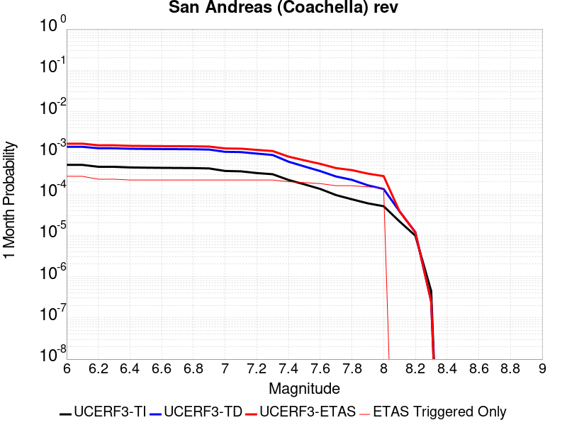 |  |  |

| Magnitude | 1 wk TI Prob | 1 wk TD Prob | 1 wk ETAS Prob | 1 wk ETAS/TD Gain | 1 wk ETAS Triggered Only | 1 mo TI Prob | 1 mo TD Prob | 1 mo ETAS Prob | 1 mo ETAS/TD Gain | 1 mo ETAS Triggered Only | 1 yr TI Prob | 1 yr TD Prob | 1 yr ETAS Prob | 1 yr ETAS/TD Gain | 1 yr ETAS Triggered Only | 10 yr TI Prob | 10 yr TD Prob | 10 yr ETAS Prob | 10 yr ETAS/TD Gain | 10 yr ETAS Triggered Only |
|-----|-----|-----|-----|-----|-----|-----|-----|-----|-----|-----|-----|-----|-----|-----|-----|-----|-----|-----|-----|-----|
| 6.0 | 1.1925945E-4 | 3.273077E-4 | 5.553315E-4 | 1.6966649 | 2.2809848E-4 | 5.110118E-4 | 0.001401998 | 0.0016785864 | 1.1972816 | 2.7697673E-4 | 0.0062038354 | 0.016937068 | 0.01727342 | 1.019859 | 3.4214772E-4 | 0.060334753 | 0.15267672 | 0.15302184 | 1.0022606 | 4.073187E-4 |
| 6.1 | 1.1925945E-4 | 3.273077E-4 | 5.553315E-4 | 1.6966649 | 2.2809848E-4 | 5.110118E-4 | 0.001401998 | 0.0016785864 | 1.1972816 | 2.7697673E-4 | 0.0062038354 | 0.016937068 | 0.01727342 | 1.019859 | 3.4214772E-4 | 0.060334753 | 0.15267672 | 0.15302184 | 1.0022606 | 4.073187E-4 |
| 6.2 | 1.07432395E-4 | 3.0231563E-4 | 4.8148166E-4 | 1.5926456 | 1.7922022E-4 | 4.603433E-4 | 0.001294999 | 0.0015228022 | 1.1759099 | 2.2809848E-4 | 0.005590286 | 0.015653731 | 0.01594241 | 1.0184416 | 2.9326946E-4 | 0.05451731 | 0.14182784 | 0.14213544 | 1.0021689 | 3.5844045E-4 |
| 6.3 | 1.0718766E-4 | 3.0176868E-4 | 4.8093483E-4 | 1.5937202 | 1.7922022E-4 | 4.592948E-4 | 0.0012926573 | 0.0015204609 | 1.1762289 | 2.2809848E-4 | 0.005577586 | 0.01562563 | 0.015914317 | 1.0184752 | 2.9326946E-4 | 0.054396555 | 0.14159605 | 0.14190374 | 1.002173 | 3.5844045E-4 |
| 6.4 | 1.0355944E-4 | 2.9384956E-4 | 4.730171E-4 | 1.6097255 | 1.7922022E-4 | 4.4375064E-4 | 0.0012587514 | 0.0014865627 | 1.180982 | 2.2809848E-4 | 0.0053892885 | 0.015218662 | 0.015507469 | 1.0189772 | 2.9326946E-4 | 0.052604496 | 0.13815795 | 0.13846686 | 1.002236 | 3.5844045E-4 |
| 6.5 | 1.0227914E-4 | 2.9104383E-4 | 4.702119E-4 | 1.6156051 | 1.7922022E-4 | 4.382655E-4 | 0.0012467385 | 0.0014745526 | 1.182728 | 2.2809848E-4 | 0.0053228354 | 0.015074439 | 0.015363287 | 1.0191615 | 2.9326946E-4 | 0.051971316 | 0.13694239 | 0.13725173 | 1.002259 | 3.5844045E-4 |
| 6.6 | 1.0116757E-4 | 2.8870135E-4 | 4.6786983E-4 | 1.6206015 | 1.7922022E-4 | 4.3350324E-4 | 0.0012367087 | 0.0014645251 | 1.1842119 | 2.2809848E-4 | 0.0052651367 | 0.014954008 | 0.015242892 | 1.0193181 | 2.9326946E-4 | 0.051421247 | 0.13591973 | 0.13622946 | 1.0022787 | 3.5844045E-4 |
| 6.7 | 1.0050676E-4 | 2.8728697E-4 | 4.664557E-4 | 1.6236577 | 1.7922022E-4 | 4.3067214E-4 | 0.0012306528 | 0.0014584706 | 1.1851194 | 2.2809848E-4 | 0.005230834 | 0.014881288 | 0.015170193 | 1.019414 | 2.9326946E-4 | 0.051094085 | 0.13530464 | 0.13561459 | 1.0022907 | 3.5844045E-4 |
| 6.8 | 9.976819E-5 | 2.8532353E-4 | 4.6449262E-4 | 1.6279507 | 1.7922022E-4 | 4.2750788E-4 | 0.001222246 | 0.0014500656 | 1.1863943 | 2.2809848E-4 | 0.0051924936 | 0.014780328 | 0.015069263 | 1.0195487 | 2.9326946E-4 | 0.050728295 | 0.13445628 | 0.13476652 | 1.0023074 | 3.5844045E-4 |
| 6.9 | 9.77719E-5 | 2.802926E-4 | 4.5946258E-4 | 1.6392249 | 1.7922022E-4 | 4.1895514E-4 | 0.0012007048 | 0.0014285294 | 1.1897423 | 2.2809848E-4 | 0.0050888555 | 0.0145215895 | 0.0148106 | 1.0199021 | 2.9326946E-4 | 0.049738888 | 0.13228476 | 0.13259578 | 1.0023512 | 3.5844045E-4 |
| 7.0 | 8.500761E-5 | 2.4763815E-4 | 4.26814E-4 | 1.723539 | 1.7922022E-4 | 3.6426744E-4 | 0.0010608779 | 0.0012887344 | 1.214781 | 2.2809848E-4 | 0.0044259406 | 0.01284047 | 0.013129974 | 1.0225462 | 2.9326946E-4 | 0.04338823 | 0.11813616 | 0.11845225 | 1.0026757 | 3.5844045E-4 |
| 7.1 | 8.319876E-5 | 2.4366553E-4 | 4.2284207E-4 | 1.7353382 | 1.7922022E-4 | 3.5651738E-4 | 0.0010438662 | 0.0012717264 | 1.2182851 | 2.2809848E-4 | 0.004331963 | 0.012635773 | 0.012925337 | 1.0229162 | 2.9326946E-4 | 0.042484846 | 0.11635632 | 0.11667305 | 1.0027221 | 3.5844045E-4 |
| 7.2 | 7.563917E-5 | 2.2414974E-4 | 4.0332982E-4 | 1.7993766 | 1.7922022E-4 | 3.2412758E-4 | 9.602912E-4 | 0.0011881706 | 1.2373024 | 2.2809848E-4 | 0.0039391145 | 0.011629559 | 0.011919418 | 1.0249243 | 2.9326946E-4 | 0.03870018 | 0.10776202 | 0.108081825 | 1.0029678 | 3.5844045E-4 |
| 7.3 | 7.082985E-5 | 2.07311E-4 | 3.8649407E-4 | 1.8643202 | 1.7922022E-4 | 3.0352117E-4 | 8.881761E-4 | 0.001116072 | 1.2565886 | 2.2809848E-4 | 0.0036891096 | 0.010760553 | 0.011050668 | 1.0269608 | 2.9326946E-4 | 0.03628465 | 0.10028403 | 0.10060653 | 1.0032158 | 3.5844045E-4 |
| 7.4 | 5.146215E-5 | 1.4274761E-4 | 3.0565183E-4 | 2.1412046 | 1.6292748E-4 | 2.2053342E-4 | 6.1163295E-4 | 8.0702634E-4 | 1.3194618 | 1.9551297E-4 | 0.0026816884 | 0.0074213943 | 0.0076801437 | 1.0348654 | 2.6068397E-4 | 0.02649557 | 0.07085049 | 0.07113812 | 1.0040597 | 3.0956222E-4 |
| 7.5 | 4.0285166E-5 | 1.0942422E-4 | 2.560429E-4 | 2.3399107 | 1.4663473E-4 | 1.7263928E-4 | 4.6887697E-4 | 6.4801314E-4 | 1.3820537 | 1.7922022E-4 | 0.002099857 | 0.0056937044 | 0.005936704 | 1.0426787 | 2.443912E-4 | 0.020801254 | 0.055013083 | 0.05529022 | 1.0050377 | 2.9326946E-4 |
| 7.6 | 3.1168736E-5 | 8.439599E-5 | 2.3101835E-4 | 2.7373142 | 1.4663473E-4 | 1.3357346E-4 | 3.616471E-4 | 5.4080255E-4 | 1.4953874 | 1.7922022E-4 | 0.0016250437 | 0.004394191 | 0.004637508 | 1.0553725 | 2.443912E-4 | 0.016132116 | 0.042812478 | 0.04309319 | 1.0065569 | 2.9326946E-4 |
| 7.7 | 2.2100989E-5 | 6.239345E-5 | 2.0901904E-4 | 3.3500156 | 1.4663473E-4 | 9.4715084E-5 | 2.6737314E-4 | 4.3025706E-4 | 1.6092008 | 1.6292748E-4 | 0.001152546 | 0.0032504152 | 0.0034777722 | 1.0699471 | 2.2809848E-4 | 0.011465867 | 0.031902168 | 0.03217031 | 1.0084051 | 2.7697673E-4 |
| 7.8 | 1.7484861E-5 | 5.180078E-5 | 1.9842792E-4 | 3.830597 | 1.4663473E-4 | 7.493296E-5 | 2.2198448E-4 | 3.8487578E-4 | 1.733796 | 1.6292748E-4 | 9.1192697E-4 | 0.0026993142 | 0.002926797 | 1.0842743 | 2.2809848E-4 | 0.009081938 | 0.026641788 | 0.026911385 | 1.0101193 | 2.7697673E-4 |
| 7.9 | 1.3967285E-5 | 3.8226146E-5 | 1.8485528E-4 | 4.835833 | 1.4663473E-4 | 5.985842E-5 | 1.6381606E-4 | 3.2671686E-4 | 1.9944128 | 1.6292748E-4 | 7.2853256E-4 | 0.0019926373 | 0.0022202814 | 1.1142426 | 2.2809848E-4 | 0.0072614877 | 0.019911002 | 0.020182464 | 1.0136337 | 2.7697673E-4 |
| 8.0 | 1.1887396E-5 | 3.106798E-5 | 1.6140591E-4 | 5.1952496 | 1.3034198E-4 | 5.094499E-5 | 1.331417E-4 | 2.797569E-4 | 2.1011968 | 1.4663473E-4 | 6.200787E-4 | 0.0016197958 | 0.0018312585 | 1.130549 | 2.1180573E-4 | 0.006183513 | 0.016280567 | 0.016537007 | 1.0157512 | 2.6068397E-4 |
| 8.1 | 5.100864E-6 | 8.973766E-6 | 8.973766E-6 | 1.0 | 0.0 | 2.1860664E-5 | 3.845843E-5 | 3.845843E-5 | 1.0 | 0.0 | 2.6612106E-4 | 4.6813092E-4 | 4.6813092E-4 | 1.0 | 0.0 | 0.002658026 | 0.004918092 | 0.0049343044 | 1.0032965 | 1.6292748E-5 |
| 8.2 | 2.3004484E-6 | 2.7863473E-6 | 2.7863473E-6 | 1.0 | 0.0 | 9.859027E-6 | 1.19414335E-5 | 1.19414335E-5 | 1.0 | 0.0 | 1.2002704E-4 | 1.4537729E-4 | 1.4537729E-4 | 1.0 | 0.0 | 0.0011996223 | 0.0015973782 | 0.0015973782 | 1.0 | 0.0 |
| 8.3 | 1.0424446E-7 | 5.814421E-8 | 5.814421E-8 | 1.0 | 0.0 | 4.4676187E-7 | 2.4918944E-7 | 2.4918944E-7 | 1.0 | 0.0 | 5.439312E-6 | 3.0338776E-6 | 3.0338776E-6 | 1.0 | 0.0 | 5.4391792E-5 | 3.189592E-5 | 3.189592E-5 | 1.0 | 0.0 |

## Red Pass
*[(top)](#table-of-contents)*

| 1 Week | 1 Month | 1 Year | 10 Year |
|-----|-----|-----|-----|
|  | 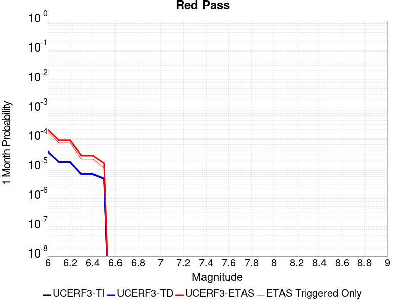 |  |  |

| Magnitude | 1 wk TI Prob | 1 wk TD Prob | 1 wk ETAS Prob | 1 wk ETAS/TD Gain | 1 wk ETAS Triggered Only | 1 mo TI Prob | 1 mo TD Prob | 1 mo ETAS Prob | 1 mo ETAS/TD Gain | 1 mo ETAS Triggered Only | 1 yr TI Prob | 1 yr TD Prob | 1 yr ETAS Prob | 1 yr ETAS/TD Gain | 1 yr ETAS Triggered Only | 10 yr TI Prob | 10 yr TD Prob | 10 yr ETAS Prob | 10 yr ETAS/TD Gain | 10 yr ETAS Triggered Only |
|-----|-----|-----|-----|-----|-----|-----|-----|-----|-----|-----|-----|-----|-----|-----|-----|-----|-----|-----|-----|-----|
| 6.0 | 8.258278E-6 | 8.551265E-6 | 7.37217E-5 | 8.621145 | 6.517099E-5 | 3.539214E-5 | 3.6647863E-5 | 1.8327723E-4 | 5.0010343 | 1.4663473E-4 | 4.308141E-4 | 4.4611428E-4 | 6.252545E-4 | 1.401557 | 1.7922022E-4 | 0.0042997985 | 0.004453945 | 0.0048594493 | 1.091044 | 4.073187E-4 |
| 6.1 | 3.649988E-6 | 3.7753161E-6 | 3.636069E-5 | 9.631165 | 3.2585496E-5 | 1.5642712E-5 | 1.6179853E-5 | 8.134979E-5 | 5.027845 | 6.517099E-5 | 1.9043336E-4 | 1.9697666E-4 | 2.6213482E-4 | 1.3307912 | 6.517099E-5 | 0.0019027026 | 0.001968488 | 0.0021310947 | 1.0826049 | 1.6292748E-4 |
| 6.2 | 3.649988E-6 | 3.7753161E-6 | 3.636069E-5 | 9.631165 | 3.2585496E-5 | 1.5642712E-5 | 1.6179853E-5 | 8.134979E-5 | 5.027845 | 6.517099E-5 | 1.9043336E-4 | 1.9697666E-4 | 2.6213482E-4 | 1.3307912 | 6.517099E-5 | 0.0019027026 | 0.001968488 | 0.0021310947 | 1.0826049 | 1.6292748E-4 |
| 6.3 | 1.3924937E-6 | 1.4411166E-6 | 1.773384E-5 | 12.305625 | 1.6292748E-5 | 5.9678164E-6 | 6.1762075E-6 | 2.2468856E-5 | 3.6379695 | 1.6292748E-5 | 7.265574E-5 | 7.519415E-5 | 9.148567E-5 | 1.2166594 | 1.6292748E-5 | 7.263199E-4 | 7.518258E-4 | 8.006673E-4 | 1.0649638 | 4.8878243E-5 |
| 6.4 | 1.3924937E-6 | 1.4411166E-6 | 1.773384E-5 | 12.305625 | 1.6292748E-5 | 5.9678164E-6 | 6.1762075E-6 | 2.2468856E-5 | 3.6379695 | 1.6292748E-5 | 7.265574E-5 | 7.519415E-5 | 9.148567E-5 | 1.2166594 | 1.6292748E-5 | 7.263199E-4 | 7.518258E-4 | 8.006673E-4 | 1.0649638 | 4.8878243E-5 |
| 6.5 | 9.876812E-7 | 1.0221912E-6 | 1.7314922E-5 | 16.939026 | 1.6292748E-5 | 4.2329125E-6 | 4.3808195E-6 | 2.0673497E-5 | 4.7190933 | 1.6292748E-5 | 5.153449E-5 | 5.3336476E-5 | 6.962835E-5 | 1.3054547 | 1.6292748E-5 | 5.1522546E-4 | 5.333648E-4 | 5.659329E-4 | 1.0610616 | 3.2585496E-5 |

## Ludlow
*[(top)](#table-of-contents)*

| 1 Week | 1 Month | 1 Year | 10 Year |
|-----|-----|-----|-----|
|  |  |  |  |

| Magnitude | 1 wk TI Prob | 1 wk TD Prob | 1 wk ETAS Prob | 1 wk ETAS/TD Gain | 1 wk ETAS Triggered Only | 1 mo TI Prob | 1 mo TD Prob | 1 mo ETAS Prob | 1 mo ETAS/TD Gain | 1 mo ETAS Triggered Only | 1 yr TI Prob | 1 yr TD Prob | 1 yr ETAS Prob | 1 yr ETAS/TD Gain | 1 yr ETAS Triggered Only | 10 yr TI Prob | 10 yr TD Prob | 10 yr ETAS Prob | 10 yr ETAS/TD Gain | 10 yr ETAS Triggered Only |
|-----|-----|-----|-----|-----|-----|-----|-----|-----|-----|-----|-----|-----|-----|-----|-----|-----|-----|-----|-----|-----|
| 6.0 | 2.2407607E-5 | 2.3657254E-5 | 5.6241977E-5 | 2.3773673 | 3.2585496E-5 | 9.602906E-5 | 1.0138454E-4 | 1.6654893E-4 | 1.6427448 | 6.517099E-5 | 0.0011685267 | 0.001233702 | 0.0015103369 | 1.2242316 | 2.7697673E-4 | 0.011624013 | 0.012273042 | 0.012675362 | 1.0327808 | 4.073187E-4 |
| 6.1 | 2.2407607E-5 | 2.3657254E-5 | 5.6241977E-5 | 2.3773673 | 3.2585496E-5 | 9.602906E-5 | 1.0138454E-4 | 1.6654893E-4 | 1.6427448 | 6.517099E-5 | 0.0011685267 | 0.001233702 | 0.0015103369 | 1.2242316 | 2.7697673E-4 | 0.011624013 | 0.012273042 | 0.012675362 | 1.0327808 | 4.073187E-4 |
| 6.2 | 1.0781252E-5 | 1.1365663E-5 | 2.7658227E-5 | 2.4334898 | 1.6292748E-5 | 4.620455E-5 | 4.8709102E-5 | 8.129301E-5 | 1.6689491 | 3.2585496E-5 | 5.623952E-4 | 5.9287593E-4 | 6.9057447E-4 | 1.1647875 | 9.7756485E-5 | 0.00560974 | 0.0059133614 | 0.0060753254 | 1.0273895 | 1.6292748E-4 |
| 6.3 | 1.0781252E-5 | 1.1365663E-5 | 2.7658227E-5 | 2.4334898 | 1.6292748E-5 | 4.620455E-5 | 4.8709102E-5 | 8.129301E-5 | 1.6689491 | 3.2585496E-5 | 5.623952E-4 | 5.9287593E-4 | 6.9057447E-4 | 1.1647875 | 9.7756485E-5 | 0.00560974 | 0.0059133614 | 0.0060753254 | 1.0273895 | 1.6292748E-4 |
| 6.4 | 7.814439E-6 | 8.237729E-6 | 2.4530344E-5 | 2.9778042 | 1.6292748E-5 | 3.3490025E-5 | 3.530408E-5 | 5.1596257E-5 | 1.4614813 | 1.6292748E-5 | 4.0766477E-4 | 4.2974384E-4 | 4.7860105E-4 | 1.1136892 | 4.8878243E-5 | 0.0040691774 | 0.0042892746 | 0.0043866117 | 1.0226932 | 9.7756485E-5 |
| 6.5 | 6.4986366E-6 | 6.85092E-6 | 2.3143557E-5 | 3.3781679 | 1.6292748E-5 | 2.7851002E-5 | 2.9360759E-5 | 4.565303E-5 | 1.5548995 | 1.6292748E-5 | 3.390332E-4 | 3.5740953E-4 | 3.8998338E-4 | 1.0911387 | 3.2585496E-5 | 0.003385164 | 0.0035684432 | 0.0036496164 | 1.0227475 | 8.146374E-5 |
| 6.6 | 5.582177E-6 | 5.8860055E-6 | 2.2178658E-5 | 3.768032 | 1.6292748E-5 | 2.3923398E-5 | 2.5225498E-5 | 4.1517837E-5 | 1.6458678 | 1.6292748E-5 | 2.9122844E-4 | 3.0707786E-4 | 3.3965337E-4 | 1.1060822 | 3.2585496E-5 | 0.0029084706 | 0.003066609 | 0.00313158 | 1.0211866 | 6.517099E-5 |
| 6.7 | 4.6858763E-6 | 4.940427E-6 | 2.1233094E-5 | 4.297826 | 1.6292748E-5 | 2.0082172E-5 | 2.1173091E-5 | 3.7465496E-5 | 1.7694863 | 1.6292748E-5 | 2.4447302E-4 | 2.5775246E-4 | 2.9032954E-4 | 1.1263891 | 3.2585496E-5 | 0.0024420423 | 0.0025745912 | 0.0026233436 | 1.0189359 | 4.8878243E-5 |
| 6.8 | 3.5584908E-6 | 3.7520183E-6 | 2.0044705E-5 | 5.3423796 | 1.6292748E-5 | 1.5250586E-5 | 1.6079981E-5 | 3.2372467E-5 | 2.0132155 | 1.6292748E-5 | 1.8566006E-4 | 1.957566E-4 | 2.1204616E-4 | 1.0832133 | 1.6292748E-5 | 0.0018550502 | 0.0019558826 | 0.0019884044 | 1.0166277 | 3.2585496E-5 |
| 6.9 | 2.532834E-6 | 2.6710034E-6 | 1.8963708E-5 | 7.099844 | 1.6292748E-5 | 1.0854958E-5 | 1.1447109E-5 | 2.773967E-5 | 2.4232905 | 1.6292748E-5 | 1.3215111E-4 | 1.3935992E-4 | 1.556504E-4 | 1.116895 | 1.6292748E-5 | 0.0013207254 | 0.0013927529 | 0.0014252929 | 1.0233638 | 3.2585496E-5 |
| 7.0 | 1.7083285E-6 | 1.8019439E-6 | 1.8094663E-5 | 10.041746 | 1.6292748E-5 | 7.3213873E-6 | 7.722595E-6 | 2.4015217E-5 | 3.1097343 | 1.6292748E-5 | 8.913424E-5 | 9.40187E-5 | 1.1030991E-4 | 1.1732763 | 1.6292748E-5 | 8.9098496E-4 | 9.3980576E-4 | 9.723606E-4 | 1.03464 | 3.2585496E-5 |
| 7.1 | 1.0905424E-6 | 1.1497619E-6 | 1.1497619E-6 | 1.0 | 0.0 | 4.6737446E-6 | 4.9275427E-6 | 4.9275427E-6 | 1.0 | 0.0 | 5.6901354E-5 | 5.999128E-5 | 5.999128E-5 | 1.0 | 0.0 | 5.6886784E-4 | 5.997606E-4 | 6.160436E-4 | 1.0271491 | 1.6292748E-5 |
| 7.2 | 6.06668E-7 | 6.387277E-7 | 6.387277E-7 | 1.0 | 0.0 | 2.600003E-6 | 2.7374022E-6 | 2.7374022E-6 | 1.0 | 0.0 | 3.1654577E-5 | 3.3327433E-5 | 3.3327433E-5 | 1.0 | 0.0 | 3.1650066E-4 | 3.3323118E-4 | 3.3323118E-4 | 1.0 | 0.0 |

## Manix-Afton Hills
*[(top)](#table-of-contents)*

| 1 Week | 1 Month | 1 Year | 10 Year |
|-----|-----|-----|-----|
| 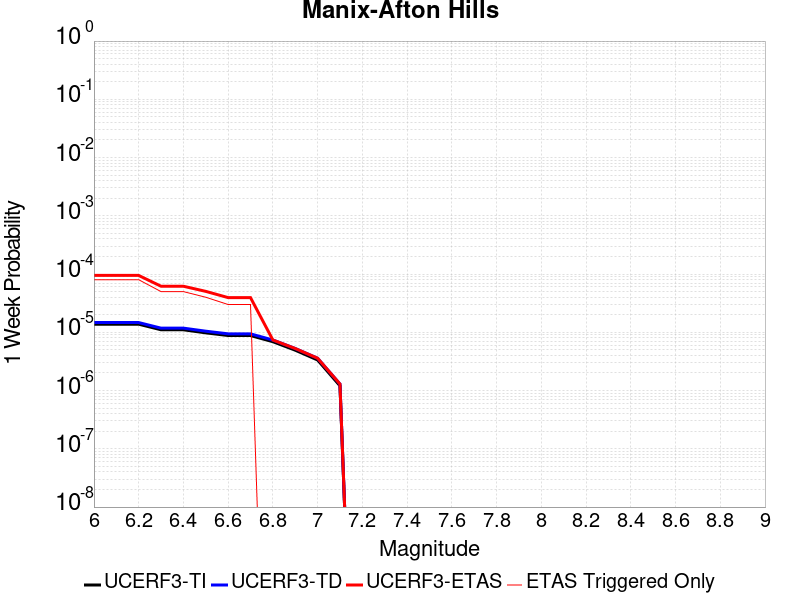 |  |  |  |

| Magnitude | 1 wk TI Prob | 1 wk TD Prob | 1 wk ETAS Prob | 1 wk ETAS/TD Gain | 1 wk ETAS Triggered Only | 1 mo TI Prob | 1 mo TD Prob | 1 mo ETAS Prob | 1 mo ETAS/TD Gain | 1 mo ETAS Triggered Only | 1 yr TI Prob | 1 yr TD Prob | 1 yr ETAS Prob | 1 yr ETAS/TD Gain | 1 yr ETAS Triggered Only | 10 yr TI Prob | 10 yr TD Prob | 10 yr ETAS Prob | 10 yr ETAS/TD Gain | 10 yr ETAS Triggered Only |
|-----|-----|-----|-----|-----|-----|-----|-----|-----|-----|-----|-----|-----|-----|-----|-----|-----|-----|-----|-----|-----|
| 6.0 | 1.3783202E-5 | 1.47110895E-5 | 1.1246614E-4 | 7.6449904 | 9.7756485E-5 | 5.906953E-5 | 6.30461E-5 | 1.6079642E-4 | 2.550458 | 9.7756485E-5 | 7.189342E-4 | 7.6733343E-4 | 9.789766E-4 | 1.2758164 | 2.1180573E-4 | 0.0071661277 | 0.007648596 | 0.008004295 | 1.0465051 | 3.5844045E-4 |
| 6.1 | 1.3783202E-5 | 1.47110895E-5 | 1.1246614E-4 | 7.6449904 | 9.7756485E-5 | 5.906953E-5 | 6.30461E-5 | 1.6079642E-4 | 2.550458 | 9.7756485E-5 | 7.189342E-4 | 7.6733343E-4 | 9.789766E-4 | 1.2758164 | 2.1180573E-4 | 0.0071661277 | 0.007648596 | 0.008004295 | 1.0465051 | 3.5844045E-4 |
| 6.2 | 1.3783202E-5 | 1.47110895E-5 | 1.1246614E-4 | 7.6449904 | 9.7756485E-5 | 5.906953E-5 | 6.30461E-5 | 1.6079642E-4 | 2.550458 | 9.7756485E-5 | 7.189342E-4 | 7.6733343E-4 | 9.789766E-4 | 1.2758164 | 2.1180573E-4 | 0.0071661277 | 0.007648596 | 0.008004295 | 1.0465051 | 3.5844045E-4 |
| 6.3 | 1.10494875E-5 | 1.1793136E-5 | 6.06708E-5 | 5.144586 | 4.8878243E-5 | 4.7354086E-5 | 5.054109E-5 | 9.9416866E-5 | 1.9670503 | 4.8878243E-5 | 5.763835E-4 | 6.151744E-4 | 7.780017E-4 | 1.2646847 | 1.6292748E-4 | 0.005748908 | 0.0061357557 | 0.0064110328 | 1.0448644 | 2.7697673E-4 |
| 6.4 | 1.10494875E-5 | 1.1793136E-5 | 6.06708E-5 | 5.144586 | 4.8878243E-5 | 4.7354086E-5 | 5.054109E-5 | 9.9416866E-5 | 1.9670503 | 4.8878243E-5 | 5.763835E-4 | 6.151744E-4 | 7.780017E-4 | 1.2646847 | 1.6292748E-4 | 0.005748908 | 0.0061357557 | 0.0064110328 | 1.0448644 | 2.7697673E-4 |
| 6.5 | 9.788949E-6 | 1.045432E-5 | 5.9332055E-5 | 5.6753626 | 4.8878243E-5 | 4.1951964E-5 | 4.480351E-5 | 9.367956E-5 | 2.0908978 | 4.8878243E-5 | 5.1064545E-4 | 5.453555E-4 | 6.919103E-4 | 1.2687325 | 1.4663473E-4 | 0.0050947363 | 0.0054410985 | 0.005667956 | 1.0416933 | 2.2809848E-4 |
| 6.6 | 8.810006E-6 | 9.4136285E-6 | 4.1998817E-5 | 4.461491 | 3.2585496E-5 | 3.775662E-5 | 4.0343548E-5 | 7.292773E-5 | 1.8076677 | 3.2585496E-5 | 4.5958988E-4 | 4.9108086E-4 | 6.050741E-4 | 1.2321272 | 1.1404924E-4 | 0.0045864056 | 0.004900839 | 0.005079181 | 1.0363901 | 1.7922022E-4 |
| 6.7 | 8.80128E-6 | 9.404108E-6 | 4.1989297E-5 | 4.4649954 | 3.2585496E-5 | 3.7719226E-5 | 4.0302748E-5 | 7.288693E-5 | 1.8084854 | 3.2585496E-5 | 4.591348E-4 | 4.9058435E-4 | 6.0457765E-4 | 1.2323623 | 1.1404924E-4 | 0.004581874 | 0.0048958957 | 0.005074239 | 1.036427 | 1.7922022E-4 |
| 6.8 | 6.8994877E-6 | 7.380076E-6 | 7.380076E-6 | 1.0 | 0.0 | 2.9568899E-5 | 3.162856E-5 | 3.162856E-5 | 1.0 | 0.0 | 3.5994186E-4 | 3.8501783E-4 | 4.664502E-4 | 1.2115029 | 8.146374E-5 | 0.003593594 | 0.0038443129 | 0.0039579235 | 1.0295529 | 1.1404924E-4 |
| 6.9 | 4.9328037E-6 | 5.2709615E-6 | 5.2709615E-6 | 1.0 | 0.0 | 2.1140417E-5 | 2.2589675E-5 | 2.2589675E-5 | 1.0 | 0.0 | 2.5735417E-4 | 2.7500073E-4 | 3.2386553E-4 | 1.1776897 | 4.8878243E-5 | 0.0025705635 | 0.0027472095 | 0.0027959535 | 1.0177431 | 4.8878243E-5 |
| 7.0 | 3.347973E-6 | 3.59003E-6 | 3.59003E-6 | 1.0 | 0.0 | 1.4348378E-5 | 1.5385775E-5 | 1.5385775E-5 | 1.0 | 0.0 | 1.746775E-4 | 1.8730981E-4 | 2.198892E-4 | 1.1739331 | 3.2585496E-5 | 0.0017454025 | 0.0018719219 | 0.0019044465 | 1.0173749 | 3.2585496E-5 |
| 7.1 | 1.2073567E-6 | 1.293482E-6 | 1.293482E-6 | 1.0 | 0.0 | 5.1743755E-6 | 5.543492E-6 | 5.543492E-6 | 1.0 | 0.0 | 6.29962E-5 | 6.749156E-5 | 8.3783205E-5 | 1.241388 | 1.6292748E-5 | 6.297835E-4 | 6.7487074E-4 | 6.911525E-4 | 1.0241257 | 1.6292748E-5 |

## San Jacinto (San Bernardino)
*[(top)](#table-of-contents)*

| 1 Week | 1 Month | 1 Year | 10 Year |
|-----|-----|-----|-----|
| 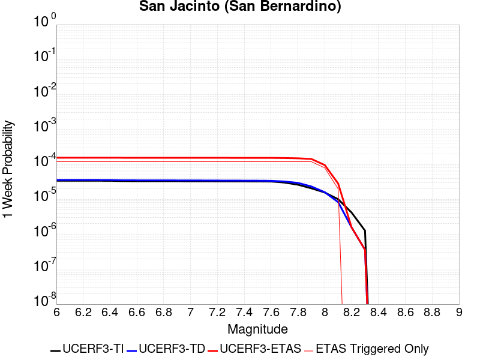 |  |  | 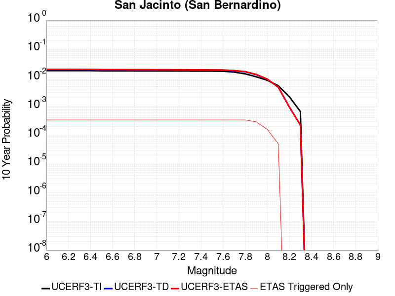 |

| Magnitude | 1 wk TI Prob | 1 wk TD Prob | 1 wk ETAS Prob | 1 wk ETAS/TD Gain | 1 wk ETAS Triggered Only | 1 mo TI Prob | 1 mo TD Prob | 1 mo ETAS Prob | 1 mo ETAS/TD Gain | 1 mo ETAS Triggered Only | 1 yr TI Prob | 1 yr TD Prob | 1 yr ETAS Prob | 1 yr ETAS/TD Gain | 1 yr ETAS Triggered Only | 10 yr TI Prob | 10 yr TD Prob | 10 yr ETAS Prob | 10 yr ETAS/TD Gain | 10 yr ETAS Triggered Only |
|-----|-----|-----|-----|-----|-----|-----|-----|-----|-----|-----|-----|-----|-----|-----|-----|-----|-----|-----|-----|-----|
| 6.0 | 3.409352E-5 | 3.598562E-5 | 2.151994E-4 | 5.9801497 | 1.7922022E-4 | 1.461069E-4 | 1.5421498E-4 | 3.6598803E-4 | 2.3732328 | 2.1180573E-4 | 0.0017774 | 0.0018759521 | 0.0021849335 | 1.1647065 | 3.0956222E-4 | 0.01763251 | 0.019349992 | 0.01968552 | 1.01734 | 3.4214772E-4 |
| 6.1 | 3.409352E-5 | 3.598562E-5 | 2.151994E-4 | 5.9801497 | 1.7922022E-4 | 1.461069E-4 | 1.5421498E-4 | 3.6598803E-4 | 2.3732328 | 2.1180573E-4 | 0.0017774 | 0.0018759521 | 0.0021849335 | 1.1647065 | 3.0956222E-4 | 0.01763251 | 0.019349992 | 0.01968552 | 1.01734 | 3.4214772E-4 |
| 6.2 | 3.409352E-5 | 3.598562E-5 | 2.151994E-4 | 5.9801497 | 1.7922022E-4 | 1.461069E-4 | 1.5421498E-4 | 3.6598803E-4 | 2.3732328 | 2.1180573E-4 | 0.0017774 | 0.0018759521 | 0.0021849335 | 1.1647065 | 3.0956222E-4 | 0.01763251 | 0.019349992 | 0.01968552 | 1.01734 | 3.4214772E-4 |
| 6.3 | 3.409352E-5 | 3.598562E-5 | 2.151994E-4 | 5.9801497 | 1.7922022E-4 | 1.461069E-4 | 1.5421498E-4 | 3.6598803E-4 | 2.3732328 | 2.1180573E-4 | 0.0017774 | 0.0018759521 | 0.0021849335 | 1.1647065 | 3.0956222E-4 | 0.01763251 | 0.019349992 | 0.01968552 | 1.01734 | 3.4214772E-4 |
| 6.4 | 3.400795E-5 | 3.5878285E-5 | 2.1509208E-4 | 5.9950495 | 1.7922022E-4 | 1.4574021E-4 | 1.5375503E-4 | 3.655282E-4 | 2.3773413 | 2.1180573E-4 | 0.0017729428 | 0.0018703619 | 0.002179345 | 1.1651998 | 3.0956222E-4 | 0.017588645 | 0.019295074 | 0.01963062 | 1.0173903 | 3.4214772E-4 |
| 6.5 | 3.341482E-5 | 3.5138914E-5 | 2.1435284E-4 | 6.1001554 | 1.7922022E-4 | 1.4319851E-4 | 1.5058667E-4 | 3.623605E-4 | 2.4063253 | 2.1180573E-4 | 0.0017420477 | 0.0018318522 | 0.0021408475 | 1.1686791 | 3.0956222E-4 | 0.017284546 | 0.018916616 | 0.019252291 | 1.017745 | 3.4214772E-4 |
| 6.6 | 3.3364955E-5 | 3.5076133E-5 | 2.1429008E-4 | 6.1092844 | 1.7922022E-4 | 1.4298483E-4 | 1.5031763E-4 | 3.6209152E-4 | 2.4088426 | 2.1180573E-4 | 0.0017394501 | 0.0018285823 | 0.0021375786 | 1.1689813 | 3.0956222E-4 | 0.017258976 | 0.01888448 | 0.019220168 | 1.0177758 | 3.4214772E-4 |
| 6.7 | 3.335922E-5 | 3.5065907E-5 | 2.1427985E-4 | 6.1107745 | 1.7922022E-4 | 1.4296026E-4 | 1.5027382E-4 | 3.620477E-4 | 2.4092536 | 2.1180573E-4 | 0.0017391514 | 0.0018280497 | 0.002137046 | 1.1690305 | 3.0956222E-4 | 0.017256035 | 0.018879272 | 0.01921496 | 1.0177808 | 3.4214772E-4 |
| 6.8 | 3.327683E-5 | 3.4959972E-5 | 2.1417394E-4 | 6.1262617 | 1.7922022E-4 | 1.4260718E-4 | 1.4981985E-4 | 3.6159385E-4 | 2.4135242 | 2.1180573E-4 | 0.0017348597 | 0.001822532 | 0.00213153 | 1.1695433 | 3.0956222E-4 | 0.017213784 | 0.018825045 | 0.019160751 | 1.017833 | 3.4214772E-4 |
| 6.9 | 3.3235785E-5 | 3.4900928E-5 | 2.141149E-4 | 6.1349344 | 1.7922022E-4 | 1.4243131E-4 | 1.4956683E-4 | 3.6134088E-4 | 2.415916 | 2.1180573E-4 | 0.0017327217 | 0.0018194567 | 0.0021284556 | 1.1698303 | 3.0956222E-4 | 0.017192734 | 0.018794911 | 0.019130629 | 1.0178621 | 3.4214772E-4 |
| 7.0 | 3.3197095E-5 | 3.4840854E-5 | 2.1405485E-4 | 6.1437883 | 1.7922022E-4 | 1.422655E-4 | 1.4930942E-4 | 3.610835E-4 | 2.4183574 | 2.1180573E-4 | 0.0017307063 | 0.0018163278 | 0.0021253277 | 1.1701235 | 3.0956222E-4 | 0.017172894 | 0.01876429 | 0.019100016 | 1.0178919 | 3.4214772E-4 |
| 7.1 | 3.3129716E-5 | 3.4721066E-5 | 2.1393507E-4 | 6.1615353 | 1.7922022E-4 | 1.4197677E-4 | 1.4879608E-4 | 3.605703E-4 | 2.4232512 | 2.1180573E-4 | 0.0017271966 | 0.0018100884 | 0.0021190904 | 1.1707109 | 3.0956222E-4 | 0.017138338 | 0.018703366 | 0.019039115 | 1.0179513 | 3.4214772E-4 |
| 7.2 | 3.3034008E-5 | 3.4588513E-5 | 2.1380254E-4 | 6.181317 | 1.7922022E-4 | 1.4156665E-4 | 1.4822806E-4 | 3.600024E-4 | 2.4287062 | 2.1180573E-4 | 0.0017222111 | 0.0018031843 | 0.0021121884 | 1.1713657 | 3.0956222E-4 | 0.017089253 | 0.01863575 | 0.018971521 | 1.0180176 | 3.4214772E-4 |
| 7.3 | 3.2956614E-5 | 3.4456265E-5 | 2.1367033E-4 | 6.2012033 | 1.7922022E-4 | 1.4123498E-4 | 1.4766137E-4 | 3.594358E-4 | 2.43419 | 2.1180573E-4 | 0.0017181796 | 0.0017962961 | 0.0021053022 | 1.172024 | 3.0956222E-4 | 0.017049557 | 0.018568495 | 0.018904291 | 1.018084 | 3.4214772E-4 |
| 7.4 | 3.2915937E-5 | 3.4377957E-5 | 2.1359202E-4 | 6.2130513 | 1.7922022E-4 | 1.4106068E-4 | 1.473258E-4 | 3.5910032E-4 | 2.437457 | 2.1180573E-4 | 0.0017160608 | 0.0017922173 | 0.0021012246 | 1.1724162 | 3.0956222E-4 | 0.017028693 | 0.018528769 | 0.018864578 | 1.0181236 | 3.4214772E-4 |
| 7.5 | 3.281791E-5 | 3.424287E-5 | 2.1345697E-4 | 6.233618 | 1.7922022E-4 | 1.406406E-4 | 1.4674691E-4 | 3.5852156E-4 | 2.4431286 | 2.1180573E-4 | 0.0017109542 | 0.0017851809 | 0.0020941906 | 1.173097 | 3.0956222E-4 | 0.016978411 | 0.018459652 | 0.018795485 | 1.0181928 | 3.4214772E-4 |
| 7.6 | 3.2521442E-5 | 3.396782E-5 | 2.1318196E-4 | 6.2759976 | 1.7922022E-4 | 1.3937015E-4 | 1.4556825E-4 | 3.5734315E-4 | 2.4548151 | 2.1180573E-4 | 0.0016955109 | 0.0017708542 | 0.0020798682 | 1.1745 | 3.0956222E-4 | 0.016826328 | 0.018317295 | 0.018653175 | 1.0183368 | 3.4214772E-4 |
| 7.7 | 3.0287873E-5 | 3.245191E-5 | 2.1166632E-4 | 6.522461 | 1.7922022E-4 | 1.297987E-4 | 1.3907222E-4 | 3.5084848E-4 | 2.5227792 | 2.1180573E-4 | 0.0015791537 | 0.0016918903 | 0.0020009289 | 1.1826587 | 3.0956222E-4 | 0.01567979 | 0.017528199 | 0.01786435 | 1.0191777 | 3.4214772E-4 |
| 7.8 | 2.6316151E-5 | 2.9662837E-5 | 2.0887775E-4 | 7.0417323 | 1.7922022E-4 | 1.1277862E-4 | 1.2712025E-4 | 3.3889906E-4 | 2.6659722 | 2.1180573E-4 | 0.0013722149 | 0.0015465913 | 0.0018556747 | 1.1998482 | 3.0956222E-4 | 0.013637724 | 0.016069878 | 0.016406527 | 1.0209491 | 3.4214772E-4 |
| 7.9 | 2.0761147E-5 | 2.3417291E-5 | 2.0263332E-4 | 8.65315 | 1.7922022E-4 | 8.897331E-5 | 1.0035596E-4 | 3.1214044E-4 | 3.1103327 | 2.1180573E-4 | 0.0010827117 | 0.0012211498 | 0.0015140611 | 1.2398652 | 2.9326946E-4 | 0.010774517 | 0.012793272 | 0.013098873 | 1.0238878 | 3.0956222E-4 |
| 8.0 | 1.5738568E-5 | 1.6032505E-5 | 1.3007992E-4 | 8.113511 | 1.1404924E-4 | 6.744926E-5 | 6.8708934E-5 | 1.9904196E-4 | 2.8968863 | 1.3034198E-4 | 8.2088535E-4 | 8.3621085E-4 | 9.990021E-4 | 1.1946772 | 1.6292748E-4 | 0.008178596 | 0.008865741 | 0.009027224 | 1.0182142 | 1.6292748E-4 |
| 8.1 | 1.0105832E-5 | 8.329479E-6 | 4.0914703E-5 | 4.9120364 | 3.2585496E-5 | 4.3309992E-5 | 3.569728E-5 | 6.828161E-5 | 1.912796 | 3.2585496E-5 | 5.2717153E-4 | 4.3452822E-4 | 4.8338523E-4 | 1.1124369 | 4.8878243E-5 | 0.005259227 | 0.0046768794 | 0.004725529 | 1.0104022 | 4.8878243E-5 |
| 8.2 | 4.189207E-6 | 1.577699E-6 | 1.577699E-6 | 1.0 | 0.0 | 1.7953622E-5 | 6.7615497E-6 | 6.7615497E-6 | 1.0 | 0.0 | 2.1856341E-4 | 8.231879E-5 | 8.231879E-5 | 1.0 | 0.0 | 0.0021834858 | 9.562628E-4 | 9.562628E-4 | 1.0 | 0.0 |
| 8.3 | 1.2758221E-6 | 3.612677E-7 | 3.612677E-7 | 1.0 | 0.0 | 5.4677976E-6 | 1.5482892E-6 | 1.5482892E-6 | 1.0 | 0.0 | 6.65684E-5 | 1.8850264E-5 | 1.8850264E-5 | 1.0 | 0.0 | 6.6548464E-4 | 2.2739546E-4 | 2.2739546E-4 | 1.0 | 0.0 |

## White Wolf (Extension)
*[(top)](#table-of-contents)*

| 1 Week | 1 Month | 1 Year | 10 Year |
|-----|-----|-----|-----|
| 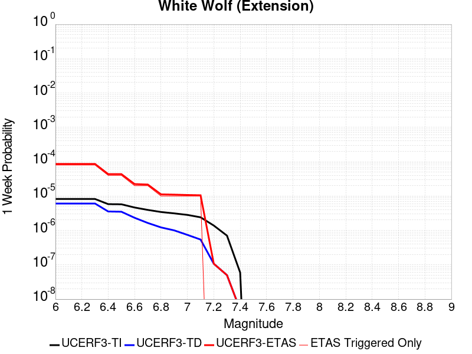 |  |  |  |

| Magnitude | 1 wk TI Prob | 1 wk TD Prob | 1 wk ETAS Prob | 1 wk ETAS/TD Gain | 1 wk ETAS Triggered Only | 1 mo TI Prob | 1 mo TD Prob | 1 mo ETAS Prob | 1 mo ETAS/TD Gain | 1 mo ETAS Triggered Only | 1 yr TI Prob | 1 yr TD Prob | 1 yr ETAS Prob | 1 yr ETAS/TD Gain | 1 yr ETAS Triggered Only | 10 yr TI Prob | 10 yr TD Prob | 10 yr ETAS Prob | 10 yr ETAS/TD Gain | 10 yr ETAS Triggered Only |
|-----|-----|-----|-----|-----|-----|-----|-----|-----|-----|-----|-----|-----|-----|-----|-----|-----|-----|-----|-----|-----|
| 6.0 | 8.222555E-6 | 6.066615E-6 | 8.7529865E-5 | 14.4281225 | 8.146374E-5 | 3.5239045E-5 | 2.5999556E-5 | 1.237535E-4 | 4.7598314 | 9.7756485E-5 | 4.289509E-4 | 3.1650523E-4 | 5.2824395E-4 | 1.6689895 | 2.1180573E-4 | 0.0042812387 | 0.0031611966 | 0.0034860214 | 1.1027538 | 3.2585496E-4 |
| 6.1 | 8.222555E-6 | 6.066615E-6 | 8.7529865E-5 | 14.4281225 | 8.146374E-5 | 3.5239045E-5 | 2.5999556E-5 | 1.237535E-4 | 4.7598314 | 9.7756485E-5 | 4.289509E-4 | 3.1650523E-4 | 5.2824395E-4 | 1.6689895 | 2.1180573E-4 | 0.0042812387 | 0.0031611966 | 0.0034860214 | 1.1027538 | 3.2585496E-4 |
| 6.2 | 8.222555E-6 | 6.066615E-6 | 8.7529865E-5 | 14.4281225 | 8.146374E-5 | 3.5239045E-5 | 2.5999556E-5 | 1.237535E-4 | 4.7598314 | 9.7756485E-5 | 4.289509E-4 | 3.1650523E-4 | 5.2824395E-4 | 1.6689895 | 2.1180573E-4 | 0.0042812387 | 0.0031611966 | 0.0034860214 | 1.1027538 | 3.2585496E-4 |
| 6.3 | 8.222555E-6 | 6.066615E-6 | 8.7529865E-5 | 14.4281225 | 8.146374E-5 | 3.5239045E-5 | 2.5999556E-5 | 1.237535E-4 | 4.7598314 | 9.7756485E-5 | 4.289509E-4 | 3.1650523E-4 | 5.2824395E-4 | 1.6689895 | 2.1180573E-4 | 0.0042812387 | 0.0031611966 | 0.0034860214 | 1.1027538 | 3.2585496E-4 |
| 6.4 | 5.821773E-6 | 3.5571256E-6 | 3.6142505E-5 | 10.160593 | 3.2585496E-5 | 2.4950215E-5 | 1.5244741E-5 | 6.412224E-5 | 4.2061877 | 4.8878243E-5 | 3.0372653E-4 | 1.8559002E-4 | 2.9961808E-4 | 1.6144084 | 1.1404924E-4 | 0.0030331176 | 0.0018544586 | 0.002017084 | 1.0876943 | 1.6292748E-4 |
| 6.5 | 5.766023E-6 | 3.4990599E-6 | 3.6084442E-5 | 10.312611 | 3.2585496E-5 | 2.4711293E-5 | 1.49958905E-5 | 6.3873405E-5 | 4.2593937 | 4.8878243E-5 | 3.0081844E-4 | 1.8256076E-4 | 2.965892E-4 | 1.6246053 | 1.1404924E-4 | 0.0030041158 | 0.0018242161 | 0.0019868463 | 1.0891508 | 1.6292748E-4 |
| 6.6 | 4.643576E-6 | 2.3325733E-6 | 1.8625284E-5 | 7.984865 | 1.6292748E-5 | 1.9900888E-5 | 9.9967065E-6 | 2.6289292E-5 | 2.6297953 | 1.6292748E-5 | 2.4226638E-4 | 1.2170354E-4 | 1.7057583E-4 | 1.4015684 | 4.8878243E-5 | 0.0024200242 | 0.0012164112 | 0.0013140489 | 1.080267 | 9.7756485E-5 |
| 6.7 | 3.9529173E-6 | 1.6482975E-6 | 1.7941018E-5 | 10.884576 | 1.6292748E-5 | 1.6940963E-5 | 7.064114E-6 | 2.3356748E-5 | 3.3063943 | 1.6292748E-5 | 2.0623671E-4 | 8.600239E-5 | 1.3487642E-4 | 1.568287 | 4.8878243E-5 | 0.002060454 | 8.597095E-4 | 9.248245E-4 | 1.0757407 | 6.517099E-5 |
| 6.8 | 3.4377522E-6 | 1.2244764E-6 | 1.7517204E-5 | 14.305874 | 1.6292748E-5 | 1.473314E-5 | 5.247746E-6 | 2.1540409E-5 | 4.104697 | 1.6292748E-5 | 1.7936122E-4 | 6.388952E-5 | 1.1276465E-4 | 1.7649943 | 4.8878243E-5 | 0.0017921652 | 6.3872064E-4 | 6.875677E-4 | 1.0764763 | 4.8878243E-5 |
| 6.9 | 3.1367306E-6 | 1.0033316E-6 | 1.7296063E-5 | 17.238632 | 1.6292748E-5 | 1.3443062E-5 | 4.299986E-6 | 2.0592664E-5 | 4.7890077 | 1.6292748E-5 | 1.63657E-4 | 5.2351144E-5 | 1.0122683E-4 | 1.9336125 | 4.8878243E-5 | 0.0016353652 | 5.233958E-4 | 5.722484E-4 | 1.0933379 | 4.8878243E-5 |
| 7.0 | 2.8298145E-6 | 7.4282326E-7 | 1.703556E-5 | 22.933529 | 1.6292748E-5 | 1.2127721E-5 | 3.1835248E-6 | 1.9476221E-5 | 6.117817 | 1.6292748E-5 | 1.47645E-4 | 3.8758775E-5 | 5.5050892E-5 | 1.4203465 | 1.6292748E-5 | 0.0014754693 | 3.8752513E-4 | 4.0381157E-4 | 1.0420268 | 1.6292748E-5 |
| 7.1 | 2.4091064E-6 | 5.4223835E-7 | 1.6834978E-5 | 31.047192 | 1.6292748E-5 | 1.03247E-5 | 2.3238767E-6 | 1.8616587E-5 | 8.011004 | 1.6292748E-5 | 1.2569598E-4 | 2.8292874E-5 | 4.4585162E-5 | 1.5758442 | 1.6292748E-5 | 0.001256249 | 2.8289677E-4 | 2.991849E-4 | 1.0575763 | 1.6292748E-5 |
| 7.2 | 1.3875518E-6 | 1.0740268E-7 | 1.0740268E-7 | 1.0 | 0.0 | 5.9466374E-6 | 4.6029712E-7 | 4.6029712E-7 | 1.0 | 0.0 | 7.23979E-5 | 5.604104E-6 | 5.604104E-6 | 1.0 | 0.0 | 7.2374323E-4 | 5.6039742E-5 | 5.6039742E-5 | 1.0 | 0.0 |
| 7.3 | 7.056077E-7 | 5.0002956E-8 | 5.0002956E-8 | 1.0 | 0.0 | 3.0240296E-6 | 2.1429837E-7 | 2.1429837E-7 | 1.0 | 0.0 | 3.681694E-5 | 2.60908E-6 | 2.60908E-6 | 1.0 | 0.0 | 3.681084E-4 | 2.609054E-5 | 2.609054E-5 | 1.0 | 0.0 |
| 7.4 | 5.9334678E-8 | 4.8638475E-9 | 4.8638475E-9 | 1.0 | 0.0 | 2.5429145E-7 | 2.084506E-8 | 2.084506E-8 | 1.0 | 0.0 | 3.095994E-6 | 2.5378858E-7 | 2.5378858E-7 | 1.0 | 0.0 | 3.095951E-5 | 2.5378843E-6 | 2.5378843E-6 | 1.0 | 0.0 |

## Death Valley (Fish Lake Valley)
*[(top)](#table-of-contents)*

| 1 Week | 1 Month | 1 Year | 10 Year |
|-----|-----|-----|-----|
|  |  | 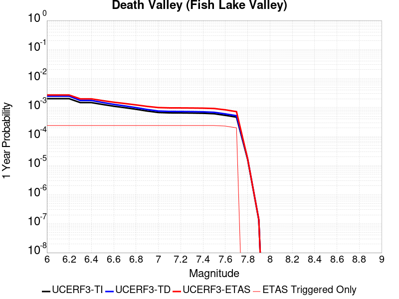 |  |

| Magnitude | 1 wk TI Prob | 1 wk TD Prob | 1 wk ETAS Prob | 1 wk ETAS/TD Gain | 1 wk ETAS Triggered Only | 1 mo TI Prob | 1 mo TD Prob | 1 mo ETAS Prob | 1 mo ETAS/TD Gain | 1 mo ETAS Triggered Only | 1 yr TI Prob | 1 yr TD Prob | 1 yr ETAS Prob | 1 yr ETAS/TD Gain | 1 yr ETAS Triggered Only | 10 yr TI Prob | 10 yr TD Prob | 10 yr ETAS Prob | 10 yr ETAS/TD Gain | 10 yr ETAS Triggered Only |
|-----|-----|-----|-----|-----|-----|-----|-----|-----|-----|-----|-----|-----|-----|-----|-----|-----|-----|-----|-----|-----|
| 6.0 | 3.872328E-5 | 4.7265705E-5 | 1.4501758E-4 | 3.0681353 | 9.7756485E-5 | 1.6594635E-4 | 2.0255324E-4 | 3.4915828E-4 | 1.7237852 | 1.4663473E-4 | 0.0020185246 | 0.0024635606 | 0.0026748446 | 1.0857637 | 2.1180573E-4 | 0.02000288 | 0.024388338 | 0.024706244 | 1.0130353 | 3.2585496E-4 |
| 6.1 | 3.872328E-5 | 4.7265705E-5 | 1.4501758E-4 | 3.0681353 | 9.7756485E-5 | 1.6594635E-4 | 2.0255324E-4 | 3.4915828E-4 | 1.7237852 | 1.4663473E-4 | 0.0020185246 | 0.0024635606 | 0.0026748446 | 1.0857637 | 2.1180573E-4 | 0.02000288 | 0.024388338 | 0.024706244 | 1.0130353 | 3.2585496E-4 |
| 6.2 | 3.872328E-5 | 4.7265705E-5 | 1.4501758E-4 | 3.0681353 | 9.7756485E-5 | 1.6594635E-4 | 2.0255324E-4 | 3.4915828E-4 | 1.7237852 | 1.4663473E-4 | 0.0020185246 | 0.0024635606 | 0.0026748446 | 1.0857637 | 2.1180573E-4 | 0.02000288 | 0.024388338 | 0.024706244 | 1.0130353 | 3.2585496E-4 |
| 6.3 | 2.8356371E-5 | 3.360979E-5 | 1.3136299E-4 | 3.908474 | 9.7756485E-5 | 1.2152165E-4 | 1.4403443E-4 | 2.9064805E-4 | 2.0179067 | 1.4663473E-4 | 0.0014785219 | 0.0017522788 | 0.0019637134 | 1.1206627 | 2.1180573E-4 | 0.014687235 | 0.017391816 | 0.017712004 | 1.0184102 | 3.2585496E-4 |
| 6.4 | 2.8356371E-5 | 3.360979E-5 | 1.3136299E-4 | 3.908474 | 9.7756485E-5 | 1.2152165E-4 | 1.4403443E-4 | 2.9064805E-4 | 2.0179067 | 1.4663473E-4 | 0.0014785219 | 0.0017522788 | 0.0019637134 | 1.1206627 | 2.1180573E-4 | 0.014687235 | 0.017391816 | 0.017712004 | 1.0184102 | 3.2585496E-4 |
| 6.5 | 2.4448687E-5 | 2.8607585E-5 | 1.2636128E-4 | 4.417055 | 9.7756485E-5 | 1.0477588E-4 | 1.2259845E-4 | 2.692152E-4 | 2.1959105 | 1.4663473E-4 | 0.0012748998 | 0.0014916616 | 0.0017031515 | 1.1417813 | 2.1180573E-4 | 0.012676105 | 0.014821392 | 0.015142417 | 1.0216596 | 3.2585496E-4 |
| 6.6 | 2.1298161E-5 | 2.4660083E-5 | 1.2241416E-4 | 4.9640613 | 9.7756485E-5 | 9.127464E-5 | 1.0568197E-4 | 2.523012E-4 | 2.387363 | 1.4663473E-4 | 0.0011107022 | 0.0012859512 | 0.0014974846 | 1.1644956 | 2.1180573E-4 | 0.011051672 | 0.01278853 | 0.013110218 | 1.0251544 | 3.2585496E-4 |
| 6.7 | 1.8959729E-5 | 2.1781027E-5 | 1.1953538E-4 | 5.488051 | 9.7756485E-5 | 8.125345E-5 | 9.334406E-5 | 2.399651E-4 | 2.5707593 | 1.4663473E-4 | 9.888117E-4 | 0.001135897 | 0.0013474621 | 1.1862538 | 2.1180573E-4 | 0.009844234 | 0.01130357 | 0.011625742 | 1.0285017 | 3.2585496E-4 |
| 6.8 | 1.6691629E-5 | 1.9018351E-5 | 1.1677298E-4 | 6.1400156 | 9.7756485E-5 | 7.153359E-5 | 8.150477E-5 | 2.2812755E-4 | 2.7989473 | 1.4663473E-4 | 8.7057345E-4 | 9.918857E-4 | 0.0012034813 | 1.2133267 | 2.1180573E-4 | 0.008671708 | 0.009876343 | 0.010198981 | 1.0326676 | 3.2585496E-4 |
| 6.9 | 1.450505E-5 | 1.638954E-5 | 1.1414442E-4 | 6.964468 | 9.7756485E-5 | 6.216302E-5 | 7.0239046E-5 | 2.1686348E-4 | 3.087506 | 1.4663473E-4 | 7.5657194E-4 | 8.5483363E-4 | 0.0010664583 | 1.2475624 | 2.1180573E-4 | 0.007540013 | 0.008516386 | 0.008823312 | 1.0360395 | 3.0956222E-4 |
| 7.0 | 1.2940855E-5 | 1.4537972E-5 | 1.1229304E-4 | 7.72412 | 9.7756485E-5 | 5.545963E-5 | 6.230414E-5 | 2.0892973E-4 | 3.3533845 | 1.4663473E-4 | 6.750118E-4 | 7.5829466E-4 | 9.699398E-4 | 1.2791067 | 2.1180573E-4 | 0.006729651 | 0.0075576897 | 0.007864913 | 1.0406504 | 3.0956222E-4 |
| 7.1 | 1.2544658E-5 | 1.4078208E-5 | 1.1183332E-4 | 7.9437184 | 9.7756485E-5 | 5.3761712E-5 | 6.0333812E-5 | 2.069597E-4 | 3.430244 | 1.4663473E-4 | 6.5435225E-4 | 7.343222E-4 | 9.459724E-4 | 1.2882253 | 2.1180573E-4 | 0.006524288 | 0.007319551 | 0.0076268474 | 1.041983 | 3.0956222E-4 |
| 7.2 | 1.2489416E-5 | 1.4015674E-5 | 1.11770794E-4 | 7.9746995 | 9.7756485E-5 | 5.3524967E-5 | 6.0065824E-5 | 2.0669175E-4 | 3.4410875 | 1.4663473E-4 | 6.514716E-4 | 7.310616E-4 | 9.4271253E-4 | 1.2895117 | 2.1180573E-4 | 0.006495651 | 0.0072871596 | 0.007594466 | 1.0421709 | 3.0956222E-4 |
| 7.3 | 1.2368307E-5 | 1.3879812E-5 | 1.11634945E-4 | 8.042972 | 9.7756485E-5 | 5.3005948E-5 | 5.9483587E-5 | 2.061096E-4 | 3.4649827 | 1.4663473E-4 | 6.451563E-4 | 7.2397763E-4 | 9.3563E-4 | 1.2923466 | 2.1180573E-4 | 0.0064328653 | 0.007216782 | 0.00752411 | 1.0425853 | 3.0956222E-4 |
| 7.4 | 1.2161707E-5 | 1.36478675E-5 | 1.11403024E-4 | 8.162668 | 9.7756485E-5 | 5.212056E-5 | 5.8489582E-5 | 2.0511574E-4 | 3.5068765 | 1.4663473E-4 | 6.3438306E-4 | 7.118836E-4 | 9.235385E-4 | 1.2973168 | 2.1180573E-4 | 0.006325751 | 0.0070966207 | 0.007403986 | 1.0433115 | 3.0956222E-4 |
| 7.5 | 1.1707948E-5 | 1.3145515E-5 | 1.1090072E-4 | 8.436392 | 9.7756485E-5 | 5.0175953E-5 | 5.6336736E-5 | 2.029632E-4 | 3.6026795 | 1.4663473E-4 | 6.10721E-4 | 6.856895E-4 | 8.9734996E-4 | 1.3086827 | 2.1180573E-4 | 0.0060904534 | 0.006836321 | 0.007143767 | 1.0449724 | 3.0956222E-4 |
| 7.6 | 1.0319538E-5 | 1.1579622E-5 | 1.0933498E-4 | 9.442016 | 9.7756485E-5 | 4.4225842E-5 | 4.9626036E-5 | 1.9625349E-4 | 3.9546475 | 1.4663473E-4 | 5.383166E-4 | 6.040347E-4 | 7.9942954E-4 | 1.3234829 | 1.9551297E-4 | 0.0053701443 | 0.0060244603 | 0.006315963 | 1.0483866 | 2.9326946E-4 |
| 7.7 | 8.937764E-6 | 1.0022779E-5 | 9.14857E-5 | 9.127778 | 8.146374E-5 | 3.830414E-5 | 4.295409E-5 | 1.5699843E-4 | 3.6550286 | 1.1404924E-4 | 4.6625308E-4 | 5.228456E-4 | 6.856879E-4 | 1.3114539 | 1.6292748E-4 | 0.0046527605 | 0.005216664 | 0.005475988 | 1.0497108 | 2.6068397E-4 |
| 7.8 | 3.108007E-7 | 3.284654E-7 | 3.284654E-7 | 1.0 | 0.0 | 1.3320023E-6 | 1.407708E-6 | 1.407708E-6 | 1.0 | 0.0 | 1.6217007E-5 | 1.7138715E-5 | 1.7138715E-5 | 1.0 | 0.0 | 1.6215823E-4 | 1.7137431E-4 | 1.8766428E-4 | 1.0950549 | 1.6292748E-5 |
| 7.9 | 2.5591178E-9 | 2.6696718E-9 | 2.6696718E-9 | 1.0 | 0.0 | 1.0967647E-8 | 1.14414505E-8 | 1.14414505E-8 | 1.0 | 0.0 | 1.335311E-7 | 1.3929966E-7 | 1.3929966E-7 | 1.0 | 0.0 | 1.3353102E-6 | 1.3929966E-6 | 1.3929966E-6 | 1.0 | 0.0 |

## Sierra Nevada  (No Extension)
*[(top)](#table-of-contents)*

| 1 Week | 1 Month | 1 Year | 10 Year |
|-----|-----|-----|-----|
|  |  |  |  |

| Magnitude | 1 wk TI Prob | 1 wk TD Prob | 1 wk ETAS Prob | 1 wk ETAS/TD Gain | 1 wk ETAS Triggered Only | 1 mo TI Prob | 1 mo TD Prob | 1 mo ETAS Prob | 1 mo ETAS/TD Gain | 1 mo ETAS Triggered Only | 1 yr TI Prob | 1 yr TD Prob | 1 yr ETAS Prob | 1 yr ETAS/TD Gain | 1 yr ETAS Triggered Only | 10 yr TI Prob | 10 yr TD Prob | 10 yr ETAS Prob | 10 yr ETAS/TD Gain | 10 yr ETAS Triggered Only |
|-----|-----|-----|-----|-----|-----|-----|-----|-----|-----|-----|-----|-----|-----|-----|-----|-----|-----|-----|-----|-----|
| 6.0 | 7.7690465E-6 | 6.9762887E-6 | 1.3731736E-4 | 19.683441 | 1.3034198E-4 | 3.329549E-5 | 2.989824E-5 | 1.6023633E-4 | 5.3593903 | 1.3034198E-4 | 4.0529718E-4 | 3.6398612E-4 | 5.7571474E-4 | 1.5816942 | 2.1180573E-4 | 0.004045588 | 0.0036374154 | 0.0039458517 | 1.0847955 | 3.0956222E-4 |
| 6.1 | 7.7690465E-6 | 6.9762887E-6 | 1.3731736E-4 | 19.683441 | 1.3034198E-4 | 3.329549E-5 | 2.989824E-5 | 1.6023633E-4 | 5.3593903 | 1.3034198E-4 | 4.0529718E-4 | 3.6398612E-4 | 5.7571474E-4 | 1.5816942 | 2.1180573E-4 | 0.004045588 | 0.0036374154 | 0.0039458517 | 1.0847955 | 3.0956222E-4 |
| 6.2 | 7.7690465E-6 | 6.9762887E-6 | 1.3731736E-4 | 19.683441 | 1.3034198E-4 | 3.329549E-5 | 2.989824E-5 | 1.6023633E-4 | 5.3593903 | 1.3034198E-4 | 4.0529718E-4 | 3.6398612E-4 | 5.7571474E-4 | 1.5816942 | 2.1180573E-4 | 0.004045588 | 0.0036374154 | 0.0039458517 | 1.0847955 | 3.0956222E-4 |
| 6.3 | 7.7690465E-6 | 6.9762887E-6 | 1.3731736E-4 | 19.683441 | 1.3034198E-4 | 3.329549E-5 | 2.989824E-5 | 1.6023633E-4 | 5.3593903 | 1.3034198E-4 | 4.0529718E-4 | 3.6398612E-4 | 5.7571474E-4 | 1.5816942 | 2.1180573E-4 | 0.004045588 | 0.0036374154 | 0.0039458517 | 1.0847955 | 3.0956222E-4 |
| 6.4 | 7.7690465E-6 | 6.9762887E-6 | 1.3731736E-4 | 19.683441 | 1.3034198E-4 | 3.329549E-5 | 2.989824E-5 | 1.6023633E-4 | 5.3593903 | 1.3034198E-4 | 4.0529718E-4 | 3.6398612E-4 | 5.7571474E-4 | 1.5816942 | 2.1180573E-4 | 0.004045588 | 0.0036374154 | 0.0039458517 | 1.0847955 | 3.0956222E-4 |
| 6.5 | 7.7690465E-6 | 6.9762887E-6 | 1.3731736E-4 | 19.683441 | 1.3034198E-4 | 3.329549E-5 | 2.989824E-5 | 1.6023633E-4 | 5.3593903 | 1.3034198E-4 | 4.0529718E-4 | 3.6398612E-4 | 5.7571474E-4 | 1.5816942 | 2.1180573E-4 | 0.004045588 | 0.0036374154 | 0.0039458517 | 1.0847955 | 3.0956222E-4 |
| 6.6 | 2.653E-6 | 1.6148208E-6 | 1.15663875E-4 | 71.62644 | 1.1404924E-4 | 1.136995E-5 | 6.9206426E-6 | 1.2096909E-4 | 17.47946 | 1.1404924E-4 | 1.3842035E-4 | 8.42556E-5 | 2.6346074E-4 | 3.1269224 | 1.7922022E-4 | 0.0013833415 | 8.4224E-4 | 0.0010864254 | 1.2899238 | 2.443912E-4 |
| 6.7 | 2.5902466E-6 | 1.5501544E-6 | 1.15599214E-4 | 74.57271 | 1.1404924E-4 | 1.11010095E-5 | 6.643502E-6 | 1.20691984E-4 | 18.166922 | 1.1404924E-4 | 1.351464E-4 | 8.088166E-5 | 2.600874E-4 | 3.2156534 | 1.7922022E-4 | 0.0013506424 | 8.0852525E-4 | 0.0010527188 | 1.3020235 | 2.443912E-4 |
| 6.8 | 2.5853892E-6 | 1.5469546E-6 | 1.1559601E-4 | 74.72489 | 1.1404924E-4 | 1.1080193E-5 | 6.629789E-6 | 1.2067827E-4 | 18.20243 | 1.1404924E-4 | 1.34893E-4 | 8.071472E-5 | 2.599205E-4 | 3.2202365 | 1.7922022E-4 | 0.0013481114 | 8.06857E-4 | 0.0010510511 | 1.3026484 | 2.443912E-4 |
| 6.9 | 2.458257E-6 | 1.422029E-6 | 9.917838E-5 | 69.74428 | 9.7756485E-5 | 1.0535345E-5 | 6.0943958E-6 | 1.0385029E-4 | 17.040293 | 9.7756485E-5 | 1.2826028E-4 | 7.419676E-5 | 2.3711215E-4 | 3.1957211 | 1.6292748E-4 | 0.0012818627 | 7.4172183E-4 | 9.696511E-4 | 1.3072976 | 2.2809848E-4 |
| 7.0 | 2.4341468E-6 | 1.3989927E-6 | 9.9155346E-5 | 70.876236 | 9.7756485E-5 | 1.0432016E-5 | 5.9956697E-6 | 1.0375157E-4 | 17.304419 | 9.7756485E-5 | 1.270024E-4 | 7.299485E-5 | 2.3591044E-4 | 3.2318778 | 1.6292748E-4 | 0.0012692984 | 7.297107E-4 | 9.576427E-4 | 1.3123595 | 2.2809848E-4 |
| 7.1 | 2.3652476E-6 | 1.3339427E-6 | 9.90903E-5 | 74.283775 | 9.7756485E-5 | 1.0136736E-5 | 5.716885E-6 | 1.0347281E-4 | 18.09951 | 9.7756485E-5 | 1.2340778E-4 | 6.9600865E-5 | 2.32517E-4 | 3.34072 | 1.6292748E-4 | 0.0012333926 | 6.957924E-4 | 9.237321E-4 | 1.3275974 | 2.2809848E-4 |
| 7.2 | 2.272158E-6 | 1.2502497E-6 | 9.900662E-5 | 79.189476 | 9.7756485E-5 | 9.737784E-6 | 5.358202E-6 | 1.03114166E-4 | 19.244173 | 9.7756485E-5 | 1.1855107E-4 | 6.523417E-5 | 2.2815102E-4 | 3.4974158 | 1.6292748E-4 | 0.0011848784 | 6.5215176E-4 | 8.8010146E-4 | 1.3495347 | 2.2809848E-4 |
| 7.3 | 2.1382127E-6 | 1.1419382E-6 | 9.8898316E-5 | 86.60566 | 9.7756485E-5 | 9.163737E-6 | 4.894012E-6 | 1.02650025E-4 | 20.974617 | 9.7756485E-5 | 1.1156279E-4 | 5.9582977E-5 | 2.2250075E-4 | 3.7343006 | 1.6292748E-4 | 0.001115068 | 5.956712E-4 | 8.236338E-4 | 1.3826987 | 2.2809848E-4 |
| 7.4 | 1.9048055E-6 | 9.574928E-7 | 9.8713885E-5 | 103.096214 | 9.7756485E-5 | 8.163426E-6 | 4.103534E-6 | 1.0185962E-4 | 24.822412 | 9.7756485E-5 | 9.9385186E-5 | 4.995939E-5 | 1.965868E-4 | 3.9349318 | 1.4663473E-4 | 9.934074E-4 | 4.9948227E-4 | 7.1118225E-4 | 1.4238387 | 2.1180573E-4 |
| 7.5 | 1.5373403E-6 | 7.559763E-7 | 8.221965E-5 | 108.75957 | 8.146374E-5 | 6.5885843E-6 | 3.2398946E-6 | 8.470337E-5 | 26.143867 | 8.146374E-5 | 8.021306E-5 | 3.9445007E-5 | 1.3719764E-4 | 3.4782004 | 9.7756485E-5 | 8.0184115E-4 | 3.9438053E-4 | 5.4095744E-4 | 1.3716637 | 1.4663473E-4 |
| 7.6 | 1.0680322E-6 | 4.65941E-7 | 8.192964E-5 | 175.83694 | 8.146374E-5 | 4.577273E-6 | 1.9968884E-6 | 8.3460465E-5 | 41.795258 | 8.146374E-5 | 5.5726876E-5 | 2.4311848E-5 | 1.0577361E-4 | 4.350702 | 8.146374E-5 | 5.5712904E-4 | 2.4309216E-4 | 3.5711366E-4 | 1.4690465 | 1.1404924E-4 |
| 7.7 | 5.509146E-7 | 1.5578539E-7 | 1.5578539E-7 | 1.0 | 0.0 | 2.3610605E-6 | 6.676515E-7 | 6.676515E-7 | 1.0 | 0.0 | 2.8745531E-5 | 8.128628E-6 | 8.128628E-6 | 1.0 | 0.0 | 2.8741814E-4 | 8.128342E-5 | 8.128342E-5 | 1.0 | 0.0 |

## Cady
*[(top)](#table-of-contents)*

| 1 Week | 1 Month | 1 Year | 10 Year |
|-----|-----|-----|-----|
|  |  |  |  |

| Magnitude | 1 wk TI Prob | 1 wk TD Prob | 1 wk ETAS Prob | 1 wk ETAS/TD Gain | 1 wk ETAS Triggered Only | 1 mo TI Prob | 1 mo TD Prob | 1 mo ETAS Prob | 1 mo ETAS/TD Gain | 1 mo ETAS Triggered Only | 1 yr TI Prob | 1 yr TD Prob | 1 yr ETAS Prob | 1 yr ETAS/TD Gain | 1 yr ETAS Triggered Only | 10 yr TI Prob | 10 yr TD Prob | 10 yr ETAS Prob | 10 yr ETAS/TD Gain | 10 yr ETAS Triggered Only |
|-----|-----|-----|-----|-----|-----|-----|-----|-----|-----|-----|-----|-----|-----|-----|-----|-----|-----|-----|-----|-----|
| 6.0 | 1.9892565E-5 | 2.1858728E-5 | 1.03320686E-4 | 4.7267475 | 8.146374E-5 | 8.525106E-5 | 9.3677416E-5 | 1.7513352E-4 | 1.8695384 | 8.146374E-5 | 0.0010374374 | 0.0011400167 | 0.0013353068 | 1.1713046 | 1.9551297E-4 | 0.010326075 | 0.011350701 | 0.011624534 | 1.0241247 | 2.7697673E-4 |
| 6.1 | 1.9892565E-5 | 2.1858728E-5 | 1.03320686E-4 | 4.7267475 | 8.146374E-5 | 8.525106E-5 | 9.3677416E-5 | 1.7513352E-4 | 1.8695384 | 8.146374E-5 | 0.0010374374 | 0.0011400167 | 0.0013353068 | 1.1713046 | 1.9551297E-4 | 0.010326075 | 0.011350701 | 0.011624534 | 1.0241247 | 2.7697673E-4 |
| 6.2 | 1.9892565E-5 | 2.1858728E-5 | 1.03320686E-4 | 4.7267475 | 8.146374E-5 | 8.525106E-5 | 9.3677416E-5 | 1.7513352E-4 | 1.8695384 | 8.146374E-5 | 0.0010374374 | 0.0011400167 | 0.0013353068 | 1.1713046 | 1.9551297E-4 | 0.010326075 | 0.011350701 | 0.011624534 | 1.0241247 | 2.7697673E-4 |
| 6.3 | 1.1117327E-5 | 1.2176583E-5 | 6.1054234E-5 | 5.014069 | 4.8878243E-5 | 4.764482E-5 | 5.2184492E-5 | 1.01060185E-4 | 1.9365942 | 4.8878243E-5 | 5.7992124E-4 | 6.351925E-4 | 7.4916927E-4 | 1.1794366 | 1.1404924E-4 | 0.0057841022 | 0.0063368753 | 0.00651496 | 1.0281029 | 1.7922022E-4 |
| 6.4 | 1.1117327E-5 | 1.2176583E-5 | 6.1054234E-5 | 5.014069 | 4.8878243E-5 | 4.764482E-5 | 5.2184492E-5 | 1.01060185E-4 | 1.9365942 | 4.8878243E-5 | 5.7992124E-4 | 6.351925E-4 | 7.4916927E-4 | 1.1794366 | 1.1404924E-4 | 0.0057841022 | 0.0063368753 | 0.00651496 | 1.0281029 | 1.7922022E-4 |
| 6.5 | 6.103093E-6 | 6.672021E-6 | 3.92573E-5 | 5.8838696 | 3.2585496E-5 | 2.615585E-5 | 2.8594131E-5 | 6.1178696E-5 | 2.1395543 | 3.2585496E-5 | 3.1840094E-4 | 3.480905E-4 | 4.132388E-4 | 1.1871591 | 6.517099E-5 | 0.0031794512 | 0.0034766865 | 0.0035741033 | 1.0280199 | 9.7756485E-5 |
| 6.6 | 5.817237E-6 | 6.3656585E-6 | 3.8950948E-5 | 6.118919 | 3.2585496E-5 | 2.4930776E-5 | 2.728118E-5 | 5.9865786E-5 | 2.1943989 | 3.2585496E-5 | 3.034899E-4 | 3.3211018E-4 | 3.9725952E-4 | 1.1961678 | 6.517099E-5 | 0.0030307577 | 0.0033173605 | 0.0033985542 | 1.0244753 | 8.146374E-5 |
| 6.7 | 4.8846314E-6 | 5.3405684E-6 | 3.792589E-5 | 7.101471 | 3.2585496E-5 | 2.0933967E-5 | 2.2888014E-5 | 5.5472767E-5 | 2.42366 | 3.2585496E-5 | 2.5484123E-4 | 2.7863772E-4 | 3.4379057E-4 | 1.2338263 | 6.517099E-5 | 0.0025454918 | 0.0027840391 | 0.002865276 | 1.0291796 | 8.146374E-5 |
| 6.8 | 1.7788773E-6 | 1.9399079E-6 | 1.9399079E-6 | 1.0 | 0.0 | 7.6237375E-6 | 8.313874E-6 | 8.313874E-6 | 1.0 | 0.0 | 9.281505E-5 | 1.01218284E-4 | 1.3380048E-4 | 1.3219004 | 3.2585496E-5 | 9.2776294E-4 | 0.0010118765 | 0.001044429 | 1.0321704 | 3.2585496E-5 |
| 6.9 | 7.5455404E-7 | 8.297092E-7 | 8.297092E-7 | 1.0 | 0.0 | 3.233799E-6 | 3.5558937E-6 | 3.5558937E-6 | 1.0 | 0.0 | 3.937079E-5 | 4.3292483E-5 | 4.3292483E-5 | 1.0 | 0.0 | 3.9363815E-4 | 4.3287344E-4 | 4.3287344E-4 | 1.0 | 0.0 |
| 7.0 | 6.8578805E-7 | 7.541816E-7 | 7.541816E-7 | 1.0 | 0.0 | 2.9390883E-6 | 3.2322048E-6 | 3.2322048E-6 | 1.0 | 0.0 | 3.578281E-5 | 3.9351715E-5 | 3.9351715E-5 | 1.0 | 0.0 | 3.577705E-4 | 3.9347992E-4 | 3.9347992E-4 | 1.0 | 0.0 |

## San Jacinto (San Jacinto Valley) rev
*[(top)](#table-of-contents)*

| 1 Week | 1 Month | 1 Year | 10 Year |
|-----|-----|-----|-----|
|  | 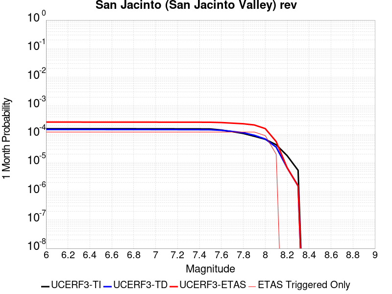 |  |  |

| Magnitude | 1 wk TI Prob | 1 wk TD Prob | 1 wk ETAS Prob | 1 wk ETAS/TD Gain | 1 wk ETAS Triggered Only | 1 mo TI Prob | 1 mo TD Prob | 1 mo ETAS Prob | 1 mo ETAS/TD Gain | 1 mo ETAS Triggered Only | 1 yr TI Prob | 1 yr TD Prob | 1 yr ETAS Prob | 1 yr ETAS/TD Gain | 1 yr ETAS Triggered Only | 10 yr TI Prob | 10 yr TD Prob | 10 yr ETAS Prob | 10 yr ETAS/TD Gain | 10 yr ETAS Triggered Only |
|-----|-----|-----|-----|-----|-----|-----|-----|-----|-----|-----|-----|-----|-----|-----|-----|-----|-----|-----|-----|-----|
| 6.0 | 3.652694E-5 | 3.4401106E-5 | 1.8103079E-4 | 5.262354 | 1.4663473E-4 | 1.5653463E-4 | 1.4742499E-4 | 3.2661879E-4 | 2.2154915 | 1.7922022E-4 | 0.0019041431 | 0.0017934233 | 0.0020536399 | 1.1450949 | 2.6068397E-4 | 0.018879099 | 0.018526303 | 0.018798146 | 1.0146735 | 2.7697673E-4 |
| 6.1 | 3.652694E-5 | 3.4401106E-5 | 1.8103079E-4 | 5.262354 | 1.4663473E-4 | 1.5653463E-4 | 1.4742499E-4 | 3.2661879E-4 | 2.2154915 | 1.7922022E-4 | 0.0019041431 | 0.0017934233 | 0.0020536399 | 1.1450949 | 2.6068397E-4 | 0.018879099 | 0.018526303 | 0.018798146 | 1.0146735 | 2.7697673E-4 |
| 6.2 | 3.652694E-5 | 3.4401106E-5 | 1.8103079E-4 | 5.262354 | 1.4663473E-4 | 1.5653463E-4 | 1.4742499E-4 | 3.2661879E-4 | 2.2154915 | 1.7922022E-4 | 0.0019041431 | 0.0017934233 | 0.0020536399 | 1.1450949 | 2.6068397E-4 | 0.018879099 | 0.018526303 | 0.018798146 | 1.0146735 | 2.7697673E-4 |
| 6.3 | 3.652694E-5 | 3.4401106E-5 | 1.8103079E-4 | 5.262354 | 1.4663473E-4 | 1.5653463E-4 | 1.4742499E-4 | 3.2661879E-4 | 2.2154915 | 1.7922022E-4 | 0.0019041431 | 0.0017934233 | 0.0020536399 | 1.1450949 | 2.6068397E-4 | 0.018879099 | 0.018526303 | 0.018798146 | 1.0146735 | 2.7697673E-4 |
| 6.4 | 3.646941E-5 | 3.432268E-5 | 1.8095238E-4 | 5.272094 | 1.4663473E-4 | 1.5628811E-4 | 1.4708891E-4 | 3.2628278E-4 | 2.218269 | 1.7922022E-4 | 0.0019011468 | 0.0017893389 | 0.0020495562 | 1.1454266 | 2.6068397E-4 | 0.018849645 | 0.018486181 | 0.018758038 | 1.0147059 | 2.7697673E-4 |
| 6.5 | 3.646941E-5 | 3.432268E-5 | 1.8095238E-4 | 5.272094 | 1.4663473E-4 | 1.5628811E-4 | 1.4708891E-4 | 3.2628278E-4 | 2.218269 | 1.7922022E-4 | 0.0019011468 | 0.0017893389 | 0.0020495562 | 1.1454266 | 2.6068397E-4 | 0.018849645 | 0.018486181 | 0.018758038 | 1.0147059 | 2.7697673E-4 |
| 6.6 | 3.6442503E-5 | 3.4286066E-5 | 1.8091577E-4 | 5.2766557 | 1.4663473E-4 | 1.561728E-4 | 1.4693203E-4 | 3.261259E-4 | 2.2195702 | 1.7922022E-4 | 0.0018997455 | 0.001787432 | 0.00204765 | 1.1455821 | 2.6068397E-4 | 0.018835869 | 0.01846745 | 0.018739313 | 1.0147212 | 2.7697673E-4 |
| 6.7 | 3.6432113E-5 | 3.427164E-5 | 1.8090135E-4 | 5.2784557 | 1.4663473E-4 | 1.5612828E-4 | 1.4687021E-4 | 3.2606412E-4 | 2.2200835 | 1.7922022E-4 | 0.0018992044 | 0.0017866807 | 0.002046899 | 1.1456434 | 2.6068397E-4 | 0.018830549 | 0.018460074 | 0.018731939 | 1.0147271 | 2.7697673E-4 |
| 6.8 | 3.6409598E-5 | 3.4240697E-5 | 1.8087041E-4 | 5.2823224 | 1.4663473E-4 | 1.560318E-4 | 1.4673761E-4 | 3.2593153E-4 | 2.2211862 | 1.7922022E-4 | 0.0018980318 | 0.0017850689 | 0.0020452875 | 1.1457751 | 2.6068397E-4 | 0.018819023 | 0.018444229 | 0.018716097 | 1.01474 | 2.7697673E-4 |
| 6.9 | 3.638078E-5 | 3.4201123E-5 | 1.8083084E-4 | 5.287278 | 1.4663473E-4 | 1.5590832E-4 | 1.4656801E-4 | 3.2576197E-4 | 2.2225993 | 1.7922022E-4 | 0.0018965311 | 0.0017830075 | 0.0020432267 | 1.145944 | 2.6068397E-4 | 0.018804269 | 0.018423963 | 0.018695837 | 1.0147566 | 2.7697673E-4 |
| 7.0 | 3.6294874E-5 | 3.408314E-5 | 1.8071287E-4 | 5.3021193 | 1.4663473E-4 | 1.5554018E-4 | 1.4606243E-4 | 3.252565E-4 | 2.226832 | 1.7922022E-4 | 0.0018920569 | 0.0017768623 | 0.002037083 | 1.1464496 | 2.6068397E-4 | 0.018760284 | 0.018363545 | 0.018635435 | 1.014806 | 2.7697673E-4 |
| 7.1 | 3.6260717E-5 | 3.403942E-5 | 1.8066916E-4 | 5.307645 | 1.4663473E-4 | 1.5539382E-4 | 1.4587509E-4 | 3.2506918E-4 | 2.2284076 | 1.7922022E-4 | 0.001890278 | 0.0017745851 | 0.0020348064 | 1.1466379 | 2.6068397E-4 | 0.018742796 | 0.018341139 | 0.018613035 | 1.0148244 | 2.7697673E-4 |
| 7.2 | 3.6210204E-5 | 3.397364E-5 | 1.806034E-4 | 5.3159857 | 1.4663473E-4 | 1.5517735E-4 | 1.455932E-4 | 3.2478734E-4 | 2.2307863 | 1.7922022E-4 | 0.001887647 | 0.0017711588 | 0.002031381 | 1.146922 | 2.6068397E-4 | 0.01871693 | 0.018307408 | 0.018579314 | 1.0148523 | 2.7697673E-4 |
| 7.3 | 3.6119454E-5 | 3.386193E-5 | 1.804917E-4 | 5.330225 | 1.4663473E-4 | 1.5478847E-4 | 1.4511449E-4 | 3.243087E-4 | 2.2348473 | 1.7922022E-4 | 0.0018829206 | 0.0017653398 | 0.0020255635 | 1.1474072 | 2.6068397E-4 | 0.018670462 | 0.01824996 | 0.018521883 | 1.0148998 | 2.7697673E-4 |
| 7.4 | 3.607848E-5 | 3.380943E-5 | 1.8043921E-4 | 5.3369493 | 1.4663473E-4 | 1.5461289E-4 | 1.4488952E-4 | 3.2408378E-4 | 2.236765 | 1.7922022E-4 | 0.0018807866 | 0.0017626052 | 0.0020228296 | 1.1476363 | 2.6068397E-4 | 0.018649481 | 0.018222956 | 0.018494885 | 1.0149224 | 2.7697673E-4 |
| 7.5 | 3.5856774E-5 | 3.3619202E-5 | 1.80249E-4 | 5.3614893 | 1.4663473E-4 | 1.5366284E-4 | 1.4407437E-4 | 3.2326876E-4 | 2.2437634 | 1.7922022E-4 | 0.0018692396 | 0.0017526967 | 0.0020129238 | 1.1484724 | 2.6068397E-4 | 0.018535944 | 0.018124057 | 0.018396012 | 1.0150054 | 2.7697673E-4 |
| 7.6 | 3.286655E-5 | 3.2142278E-5 | 1.787723E-4 | 5.5619054 | 1.4663473E-4 | 1.4084904E-4 | 1.3774536E-4 | 3.169409E-4 | 2.300919 | 1.7922022E-4 | 0.001713488 | 0.0016757617 | 0.0019360088 | 1.1553009 | 2.6068397E-4 | 0.017003361 | 0.017343804 | 0.017615976 | 1.0156928 | 2.7697673E-4 |
| 7.7 | 2.8882527E-5 | 2.9235205E-5 | 1.7586566E-4 | 6.0155435 | 1.4663473E-4 | 1.237764E-4 | 1.2528773E-4 | 3.044855E-4 | 2.43029 | 1.7922022E-4 | 0.0015059357 | 0.0015243118 | 0.0017845985 | 1.1707568 | 2.6068397E-4 | 0.014957713 | 0.015830338 | 0.01610293 | 1.0172195 | 2.7697673E-4 |
| 7.8 | 2.4950225E-5 | 2.6526219E-5 | 1.7315707E-4 | 6.52777 | 1.4663473E-4 | 1.0692515E-4 | 1.1367885E-4 | 2.928787E-4 | 2.5763693 | 1.7922022E-4 | 0.0013010362 | 0.0013831621 | 0.0016434855 | 1.1882089 | 2.6068397E-4 | 0.012934455 | 0.01441176 | 0.014684744 | 1.0189419 | 2.7697673E-4 |
| 7.9 | 1.9881603E-5 | 2.150649E-5 | 1.6813807E-4 | 7.818015 | 1.4663473E-4 | 8.520408E-5 | 9.216742E-5 | 2.7137113E-4 | 2.944328 | 1.7922022E-4 | 0.001036866 | 0.0011215615 | 0.0013656786 | 1.2176583 | 2.443912E-4 | 0.010320415 | 0.011776998 | 0.012034612 | 1.0218743 | 2.6068397E-4 |
| 8.0 | 1.563292E-5 | 1.5936288E-5 | 1.299837E-4 | 8.156461 | 1.1404924E-4 | 6.6996516E-5 | 6.829659E-5 | 1.9862967E-4 | 2.9083395 | 1.3034198E-4 | 8.153773E-4 | 8.3119445E-4 | 9.939865E-4 | 1.1958531 | 1.6292748E-4 | 0.00812392 | 0.008810331 | 0.008971823 | 1.0183299 | 1.6292748E-4 |
| 8.1 | 1.0045313E-5 | 8.300794E-6 | 4.088602E-5 | 4.925555 | 3.2585496E-5 | 4.305063E-5 | 3.557435E-5 | 6.815869E-5 | 1.9159503 | 3.2585496E-5 | 5.2401534E-4 | 4.3303217E-4 | 4.8188923E-4 | 1.1128255 | 4.8878243E-5 | 0.0052278144 | 0.0046587666 | 0.0047074175 | 1.0104427 | 4.8878243E-5 |
| 8.2 | 4.1554413E-6 | 1.5648296E-6 | 1.5648296E-6 | 1.0 | 0.0 | 1.7808914E-5 | 6.7063957E-6 | 6.7063957E-6 | 1.0 | 0.0 | 2.1680194E-4 | 8.164734E-5 | 8.164734E-5 | 1.0 | 0.0 | 0.0021659054 | 9.479703E-4 | 9.479703E-4 | 1.0 | 0.0 |
| 8.3 | 1.2758221E-6 | 3.612677E-7 | 3.612677E-7 | 1.0 | 0.0 | 5.4677976E-6 | 1.5482892E-6 | 1.5482892E-6 | 1.0 | 0.0 | 6.65684E-5 | 1.8850264E-5 | 1.8850264E-5 | 1.0 | 0.0 | 6.6548464E-4 | 2.2739546E-4 | 2.2739546E-4 | 1.0 | 0.0 |

## San Andreas (North Branch Mill Creek)
*[(top)](#table-of-contents)*

| 1 Week | 1 Month | 1 Year | 10 Year |
|-----|-----|-----|-----|
|  |  |  |  |

| Magnitude | 1 wk TI Prob | 1 wk TD Prob | 1 wk ETAS Prob | 1 wk ETAS/TD Gain | 1 wk ETAS Triggered Only | 1 mo TI Prob | 1 mo TD Prob | 1 mo ETAS Prob | 1 mo ETAS/TD Gain | 1 mo ETAS Triggered Only | 1 yr TI Prob | 1 yr TD Prob | 1 yr ETAS Prob | 1 yr ETAS/TD Gain | 1 yr ETAS Triggered Only | 10 yr TI Prob | 10 yr TD Prob | 10 yr ETAS Prob | 10 yr ETAS/TD Gain | 10 yr ETAS Triggered Only |
|-----|-----|-----|-----|-----|-----|-----|-----|-----|-----|-----|-----|-----|-----|-----|-----|-----|-----|-----|-----|-----|
| 6.0 | 1.3461156E-5 | 2.3500992E-5 | 1.0496282E-4 | 4.4663143 | 8.146374E-5 | 5.7689394E-5 | 1.00714664E-4 | 2.3104352E-4 | 2.2940404 | 1.3034198E-4 | 7.02142E-4 | 0.0012255146 | 0.0014533335 | 1.1858965 | 2.2809848E-4 | 0.0069992766 | 0.012228744 | 0.012502334 | 1.0223727 | 2.7697673E-4 |
| 6.1 | 1.3461156E-5 | 2.3500992E-5 | 1.0496282E-4 | 4.4663143 | 8.146374E-5 | 5.7689394E-5 | 1.00714664E-4 | 2.3104352E-4 | 2.2940404 | 1.3034198E-4 | 7.02142E-4 | 0.0012255146 | 0.0014533335 | 1.1858965 | 2.2809848E-4 | 0.0069992766 | 0.012228744 | 0.012502334 | 1.0223727 | 2.7697673E-4 |
| 6.2 | 1.3461156E-5 | 2.3500992E-5 | 1.0496282E-4 | 4.4663143 | 8.146374E-5 | 5.7689394E-5 | 1.00714664E-4 | 2.3104352E-4 | 2.2940404 | 1.3034198E-4 | 7.02142E-4 | 0.0012255146 | 0.0014533335 | 1.1858965 | 2.2809848E-4 | 0.0069992766 | 0.012228744 | 0.012502334 | 1.0223727 | 2.7697673E-4 |
| 6.3 | 1.3461156E-5 | 2.3500992E-5 | 1.0496282E-4 | 4.4663143 | 8.146374E-5 | 5.7689394E-5 | 1.00714664E-4 | 2.3104352E-4 | 2.2940404 | 1.3034198E-4 | 7.02142E-4 | 0.0012255146 | 0.0014533335 | 1.1858965 | 2.2809848E-4 | 0.0069992766 | 0.012228744 | 0.012502334 | 1.0223727 | 2.7697673E-4 |
| 6.4 | 1.3461156E-5 | 2.3500992E-5 | 1.0496282E-4 | 4.4663143 | 8.146374E-5 | 5.7689394E-5 | 1.00714664E-4 | 2.3104352E-4 | 2.2940404 | 1.3034198E-4 | 7.02142E-4 | 0.0012255146 | 0.0014533335 | 1.1858965 | 2.2809848E-4 | 0.0069992766 | 0.012228744 | 0.012502334 | 1.0223727 | 2.7697673E-4 |
| 6.5 | 1.3450706E-5 | 2.348995E-5 | 1.0495178E-4 | 4.4679437 | 8.146374E-5 | 5.764461E-5 | 1.00667356E-4 | 2.3099621E-4 | 2.2946486 | 1.3034198E-4 | 7.0159714E-4 | 0.0012249392 | 0.0014527583 | 1.185984 | 2.2809848E-4 | 0.006993862 | 0.012223054 | 0.012496645 | 1.0223832 | 2.7697673E-4 |
| 6.6 | 1.3074523E-5 | 2.3104236E-5 | 1.045661E-4 | 4.5258408 | 8.146374E-5 | 5.6032466E-5 | 9.901441E-5 | 2.293435E-4 | 2.3162637 | 1.3034198E-4 | 6.8198174E-4 | 0.001204837 | 0.0014326607 | 1.1890908 | 2.2809848E-4 | 0.006798926 | 0.012024219 | 0.012297866 | 1.0227579 | 2.7697673E-4 |
| 6.7 | 1.3050216E-5 | 2.3079532E-5 | 1.04541396E-4 | 4.529615 | 8.146374E-5 | 5.59283E-5 | 9.890855E-5 | 2.2923764E-4 | 2.3176727 | 1.3034198E-4 | 6.8071426E-4 | 0.0012035496 | 0.0014313735 | 1.1892934 | 2.2809848E-4 | 0.0067863287 | 0.012011484 | 0.012285134 | 1.0227823 | 2.7697673E-4 |
| 6.8 | 1.29049395E-5 | 2.2927941E-5 | 1.04389816E-4 | 4.552952 | 8.146374E-5 | 5.530571E-5 | 9.825892E-5 | 2.2858809E-4 | 2.3263853 | 1.3034198E-4 | 6.73139E-4 | 0.001195649 | 0.0014234748 | 1.1905457 | 2.2809848E-4 | 0.0067110364 | 0.011933329 | 0.012207 | 1.0229334 | 2.7697673E-4 |
| 6.9 | 1.2867369E-5 | 2.2887343E-5 | 1.04349216E-4 | 4.559254 | 8.146374E-5 | 5.51447E-5 | 9.808494E-5 | 2.2841414E-4 | 2.328738 | 1.3034198E-4 | 6.711799E-4 | 0.0011935332 | 0.0014213595 | 1.1908839 | 2.2809848E-4 | 0.006691564 | 0.011912397 | 0.012186075 | 1.0229741 | 2.7697673E-4 |
| 7.0 | 1.2495996E-5 | 2.2287419E-5 | 1.0374934E-4 | 4.655063 | 8.146374E-5 | 5.3553173E-5 | 9.551403E-5 | 2.2584357E-4 | 2.3645067 | 1.3034198E-4 | 6.518148E-4 | 0.0011622658 | 0.0013900992 | 1.1960251 | 2.2809848E-4 | 0.0064990623 | 0.011603 | 0.011876763 | 1.0235941 | 2.7697673E-4 |
| 7.1 | 1.2452067E-5 | 2.2232492E-5 | 1.0369442E-4 | 4.6640935 | 8.146374E-5 | 5.3364907E-5 | 9.527864E-5 | 2.2560821E-4 | 2.367878 | 1.3034198E-4 | 6.4952404E-4 | 0.001159403 | 0.001387237 | 1.1965097 | 2.2809848E-4 | 0.0064762887 | 0.011574671 | 0.011848441 | 1.0236526 | 2.7697673E-4 |
| 7.2 | 1.2002777E-5 | 2.1611015E-5 | 1.0307299E-4 | 4.769466 | 8.146374E-5 | 5.143946E-5 | 9.261536E-5 | 2.2294528E-4 | 2.407217 | 1.3034198E-4 | 6.2609545E-4 | 0.0011270114 | 0.0013548528 | 1.2021643 | 2.2809848E-4 | 0.006243344 | 0.011254058 | 0.011527917 | 1.0243343 | 2.7697673E-4 |
| 7.3 | 1.1923425E-5 | 2.1480853E-5 | 1.02942846E-4 | 4.792307 | 8.146374E-5 | 5.109939E-5 | 9.205757E-5 | 2.2238755E-4 | 2.4157443 | 1.3034198E-4 | 6.219575E-4 | 0.0011202273 | 0.0013480702 | 1.2033899 | 2.2809848E-4 | 0.0062021962 | 0.011186945 | 0.011460823 | 1.0244819 | 2.7697673E-4 |
| 7.4 | 1.16105175E-5 | 2.0854808E-5 | 1.0231685E-4 | 4.906152 | 8.146374E-5 | 4.975841E-5 | 8.93747E-5 | 2.1970503E-4 | 2.4582465 | 1.3034198E-4 | 6.0564023E-4 | 0.0010875963 | 0.0013154467 | 1.209499 | 2.2809848E-4 | 0.006039923 | 0.010864409 | 0.011138377 | 1.0252169 | 2.7697673E-4 |
| 7.5 | 1.1037265E-5 | 1.9554842E-5 | 8.472456E-5 | 4.332664 | 6.517099E-5 | 4.7301706E-5 | 8.380379E-5 | 1.9784346E-4 | 2.3607938 | 1.1404924E-4 | 5.757461E-4 | 0.0010198357 | 0.0012314254 | 1.2074744 | 2.1180573E-4 | 0.005742567 | 0.010195527 | 0.010453554 | 1.0253078 | 2.6068397E-4 |
| 7.6 | 1.0720915E-5 | 1.8996727E-5 | 8.416648E-5 | 4.4305778 | 6.517099E-5 | 4.5945973E-5 | 8.141202E-5 | 1.9545197E-4 | 2.4007754 | 1.1404924E-4 | 5.592486E-4 | 9.907428E-4 | 0.0012023386 | 1.213573 | 2.1180573E-4 | 0.005578433 | 0.009907238 | 0.01016534 | 1.0260518 | 2.6068397E-4 |
| 7.7 | 9.276279E-6 | 1.6442464E-5 | 8.161239E-5 | 4.963513 | 6.517099E-5 | 3.9754876E-5 | 7.046581E-5 | 1.8450701E-4 | 2.6183906 | 1.1404924E-4 | 4.839081E-4 | 8.5758517E-4 | 0.0010692093 | 1.2467674 | 2.1180573E-4 | 0.0048285574 | 0.008586576 | 0.008845022 | 1.0300988 | 2.6068397E-4 |
| 7.8 | 5.8346777E-6 | 1.11555855E-5 | 7.632585E-5 | 6.8419404 | 6.517099E-5 | 2.5005522E-5 | 4.7808775E-5 | 1.6185256E-4 | 3.3854153 | 1.1404924E-4 | 3.043997E-4 | 5.819165E-4 | 7.93599E-4 | 1.3637677 | 2.1180573E-4 | 0.0030398308 | 0.0058473335 | 0.006106493 | 1.0443211 | 2.6068397E-4 |
| 7.9 | 4.690204E-6 | 8.509473E-6 | 7.367991E-5 | 8.658574 | 6.517099E-5 | 2.0100719E-5 | 3.6468664E-5 | 1.5051375E-4 | 4.1272073 | 1.1404924E-4 | 2.4469878E-4 | 4.439156E-4 | 6.5562734E-4 | 1.4769188 | 2.1180573E-4 | 0.002444295 | 0.004471165 | 0.0047306833 | 1.0580426 | 2.6068397E-4 |
| 8.0 | 2.9570454E-6 | 4.8470656E-6 | 2.1139735E-5 | 4.3613467 | 1.6292748E-5 | 1.267299E-5 | 2.0772974E-5 | 5.335779E-5 | 2.5686162 | 3.2585496E-5 | 1.5428272E-4 | 2.5288164E-4 | 3.1803615E-4 | 1.2576482 | 6.517099E-5 | 0.0015417566 | 0.002549932 | 0.0026311881 | 1.031866 | 8.146374E-5 |
| 8.1 | 1.6376824E-6 | 2.1968672E-6 | 2.1968672E-6 | 1.0 | 0.0 | 7.01862E-6 | 9.415111E-6 | 9.415111E-6 | 1.0 | 0.0 | 8.544835E-5 | 1.1462297E-4 | 1.1462297E-4 | 1.0 | 0.0 | 8.54155E-4 | 0.0011607445 | 0.0011770183 | 1.0140202 | 1.6292748E-5 |
| 8.2 | 6.9631557E-7 | 4.535001E-7 | 4.535001E-7 | 1.0 | 0.0 | 2.984206E-6 | 1.9435704E-6 | 1.9435704E-6 | 1.0 | 0.0 | 3.63321E-5 | 2.3662713E-5 | 2.3662713E-5 | 1.0 | 0.0 | 3.6326164E-4 | 2.4510184E-4 | 2.4510184E-4 | 1.0 | 0.0 |
| 8.3 | 1.7876137E-7 | 8.357368E-8 | 8.357368E-8 | 1.0 | 0.0 | 7.661199E-7 | 3.5817288E-7 | 3.5817288E-7 | 1.0 | 0.0 | 9.32747E-6 | 4.3607465E-6 | 4.3607465E-6 | 1.0 | 0.0 | 9.3270784E-5 | 4.5800018E-5 | 4.5800018E-5 | 1.0 | 0.0 |

## Calico-Hidalgo
*[(top)](#table-of-contents)*

| 1 Week | 1 Month | 1 Year | 10 Year |
|-----|-----|-----|-----|
|  |  | 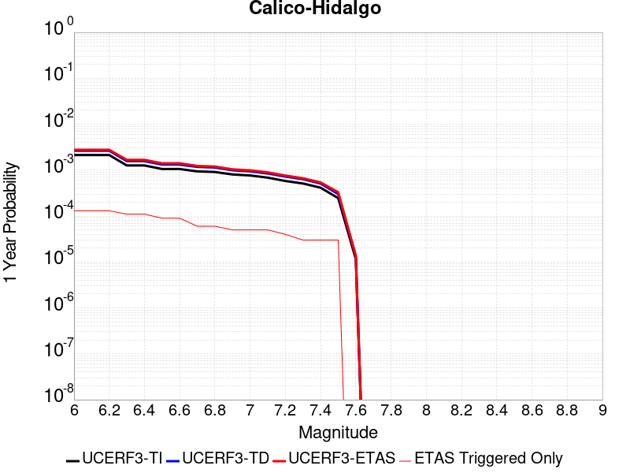 |  |

| Magnitude | 1 wk TI Prob | 1 wk TD Prob | 1 wk ETAS Prob | 1 wk ETAS/TD Gain | 1 wk ETAS Triggered Only | 1 mo TI Prob | 1 mo TD Prob | 1 mo ETAS Prob | 1 mo ETAS/TD Gain | 1 mo ETAS Triggered Only | 1 yr TI Prob | 1 yr TD Prob | 1 yr ETAS Prob | 1 yr ETAS/TD Gain | 1 yr ETAS Triggered Only | 10 yr TI Prob | 10 yr TD Prob | 10 yr ETAS Prob | 10 yr ETAS/TD Gain | 10 yr ETAS Triggered Only |
|-----|-----|-----|-----|-----|-----|-----|-----|-----|-----|-----|-----|-----|-----|-----|-----|-----|-----|-----|-----|-----|
| 6.0 | 4.0906612E-5 | 5.0704355E-5 | 9.9580124E-5 | 1.9639362 | 4.8878243E-5 | 1.7530227E-4 | 2.1728857E-4 | 2.824454E-4 | 1.2998631 | 6.517099E-5 | 0.0021322158 | 0.002642678 | 0.002805175 | 1.0614895 | 1.6292748E-4 | 0.02111873 | 0.026152814 | 0.026406681 | 1.0097071 | 2.6068397E-4 |
| 6.1 | 4.0906612E-5 | 5.0704355E-5 | 9.9580124E-5 | 1.9639362 | 4.8878243E-5 | 1.7530227E-4 | 2.1728857E-4 | 2.824454E-4 | 1.2998631 | 6.517099E-5 | 0.0021322158 | 0.002642678 | 0.002805175 | 1.0614895 | 1.6292748E-4 | 0.02111873 | 0.026152814 | 0.026406681 | 1.0097071 | 2.6068397E-4 |
| 6.2 | 4.0906612E-5 | 5.0704355E-5 | 9.9580124E-5 | 1.9639362 | 4.8878243E-5 | 1.7530227E-4 | 2.1728857E-4 | 2.824454E-4 | 1.2998631 | 6.517099E-5 | 0.0021322158 | 0.002642678 | 0.002805175 | 1.0614895 | 1.6292748E-4 | 0.02111873 | 0.026152814 | 0.026406681 | 1.0097071 | 2.6068397E-4 |
| 6.3 | 2.4242801E-5 | 3.0090967E-5 | 6.2675485E-5 | 2.082867 | 3.2585496E-5 | 1.0389358E-4 | 1.289551E-4 | 1.7782704E-4 | 1.3789842 | 4.8878243E-5 | 0.0012641704 | 0.0015689312 | 0.0017153359 | 1.0933149 | 1.4663473E-4 | 0.01257003 | 0.015582229 | 0.015774695 | 1.0123516 | 1.9551297E-4 |
| 6.4 | 2.4242801E-5 | 3.0090967E-5 | 6.2675485E-5 | 2.082867 | 3.2585496E-5 | 1.0389358E-4 | 1.289551E-4 | 1.7782704E-4 | 1.3789842 | 4.8878243E-5 | 0.0012641704 | 0.0015689312 | 0.0017153359 | 1.0933149 | 1.4663473E-4 | 0.01257003 | 0.015582229 | 0.015774695 | 1.0123516 | 1.9551297E-4 |
| 6.5 | 2.0286952E-5 | 2.5316054E-5 | 4.160839E-5 | 1.6435574 | 1.6292748E-5 | 8.694118E-5 | 1.0849296E-4 | 1.4107492E-4 | 1.3003141 | 3.2585496E-5 | 0.0010579949 | 0.0013201186 | 0.0014340172 | 1.0862792 | 1.1404924E-4 | 0.010529719 | 0.013124701 | 0.01328549 | 1.0122509 | 1.6292748E-4 |
| 6.6 | 2.0269223E-5 | 2.5297004E-5 | 4.158934E-5 | 1.6440421 | 1.6292748E-5 | 8.6865206E-5 | 1.08411325E-4 | 1.4099329E-4 | 1.3005402 | 3.2585496E-5 | 0.0010570707 | 0.0013191258 | 0.0014330245 | 1.0863441 | 1.1404924E-4 | 0.010520565 | 0.01311489 | 0.013275681 | 1.0122602 | 1.6292748E-4 |
| 6.7 | 1.799852E-5 | 2.2540933E-5 | 2.2540933E-5 | 1.0 | 0.0 | 7.713423E-5 | 9.660051E-5 | 9.660051E-5 | 1.0 | 0.0 | 9.3870464E-4 | 0.0011754911 | 0.0012568592 | 1.0692204 | 8.146374E-5 | 0.009347493 | 0.011694346 | 0.011823163 | 1.0110154 | 1.3034198E-4 |
| 6.8 | 1.7458793E-5 | 2.184258E-5 | 2.184258E-5 | 1.0 | 0.0 | 7.4821255E-5 | 9.360778E-5 | 9.360778E-5 | 1.0 | 0.0 | 9.10568E-4 | 0.0011390933 | 0.0012204642 | 1.0714349 | 8.146374E-5 | 0.009068459 | 0.011334131 | 0.011462995 | 1.0113696 | 1.3034198E-4 |
| 6.9 | 1.542884E-5 | 1.9026285E-5 | 1.9026285E-5 | 1.0 | 0.0 | 6.612192E-5 | 8.153875E-5 | 8.153875E-5 | 1.0 | 0.0 | 8.04737E-4 | 9.922953E-4 | 0.0010574016 | 1.0656118 | 6.517099E-5 | 0.008018291 | 0.009880043 | 0.0099929655 | 1.0114293 | 1.1404924E-4 |
| 7.0 | 1.468253E-5 | 1.803109E-5 | 1.803109E-5 | 1.0 | 0.0 | 6.292361E-5 | 7.727389E-5 | 7.727389E-5 | 1.0 | 0.0 | 7.658257E-4 | 9.4041653E-4 | 0.0010055263 | 1.069235 | 6.517099E-5 | 0.0076319184 | 0.009365736 | 0.009478717 | 1.0120633 | 1.1404924E-4 |
| 7.1 | 1.3139281E-5 | 1.620139E-5 | 1.620139E-5 | 1.0 | 0.0 | 5.6309986E-5 | 6.943275E-5 | 6.943275E-5 | 1.0 | 0.0 | 6.853584E-4 | 8.4502844E-4 | 9.1014436E-4 | 1.0770577 | 6.517099E-5 | 0.0068324856 | 0.008419449 | 0.008532539 | 1.0134319 | 1.1404924E-4 |
| 7.2 | 1.1127404E-5 | 1.3867038E-5 | 1.3867038E-5 | 1.0 | 0.0 | 4.7688E-5 | 5.9428872E-5 | 5.9428872E-5 | 1.0 | 0.0 | 5.8044674E-4 | 7.233172E-4 | 7.721601E-4 | 1.0675262 | 4.8878243E-5 | 0.0057893298 | 0.007210737 | 0.007307789 | 1.0134593 | 9.7756485E-5 |
| 7.3 | 9.808154E-6 | 1.2176586E-5 | 1.2176586E-5 | 1.0 | 0.0 | 4.2034266E-5 | 5.2184383E-5 | 5.2184383E-5 | 1.0 | 0.0 | 5.11647E-4 | 6.351704E-4 | 6.677352E-4 | 1.0512694 | 3.2585496E-5 | 0.0051047057 | 0.006334625 | 0.0063993833 | 1.0102229 | 6.517099E-5 |
| 7.4 | 7.942452E-6 | 9.792348E-6 | 9.792348E-6 | 1.0 | 0.0 | 3.4038632E-5 | 4.1966585E-5 | 4.1966585E-5 | 1.0 | 0.0 | 4.1434157E-4 | 5.108328E-4 | 5.434017E-4 | 1.0637563 | 3.2585496E-5 | 0.0041356985 | 0.005097527 | 0.0051461565 | 1.0095397 | 4.8878243E-5 |
| 7.5 | 4.7121216E-6 | 5.7729717E-6 | 5.7729717E-6 | 1.0 | 0.0 | 2.019465E-5 | 2.4741115E-5 | 2.4741115E-5 | 1.0 | 0.0 | 2.4584212E-4 | 3.011891E-4 | 3.337648E-4 | 1.1081569 | 3.2585496E-5 | 0.0024557032 | 0.0030085614 | 0.0030572927 | 1.0161976 | 4.8878243E-5 |
| 7.6 | 2.21172E-7 | 2.6040198E-7 | 2.6040198E-7 | 1.0 | 0.0 | 9.478797E-7 | 1.1160082E-6 | 1.1160082E-6 | 1.0 | 0.0 | 1.1540374E-5 | 1.3587343E-5 | 1.3587343E-5 | 1.0 | 0.0 | 1.1539775E-4 | 1.3586794E-4 | 1.5215848E-4 | 1.1198997 | 1.6292748E-5 |

## Kern Canyon (North Kern) 2011
*[(top)](#table-of-contents)*

| 1 Week | 1 Month | 1 Year | 10 Year |
|-----|-----|-----|-----|
| 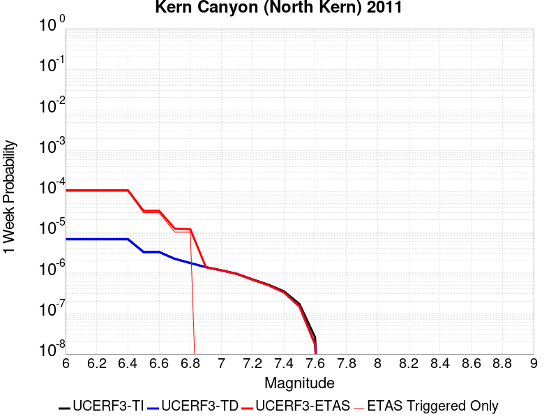 |  |  |  |

| Magnitude | 1 wk TI Prob | 1 wk TD Prob | 1 wk ETAS Prob | 1 wk ETAS/TD Gain | 1 wk ETAS Triggered Only | 1 mo TI Prob | 1 mo TD Prob | 1 mo ETAS Prob | 1 mo ETAS/TD Gain | 1 mo ETAS Triggered Only | 1 yr TI Prob | 1 yr TD Prob | 1 yr ETAS Prob | 1 yr ETAS/TD Gain | 1 yr ETAS Triggered Only | 10 yr TI Prob | 10 yr TD Prob | 10 yr ETAS Prob | 10 yr ETAS/TD Gain | 10 yr ETAS Triggered Only |
|-----|-----|-----|-----|-----|-----|-----|-----|-----|-----|-----|-----|-----|-----|-----|-----|-----|-----|-----|-----|-----|
| 6.0 | 6.6264497E-6 | 6.75733E-6 | 1.20805795E-4 | 17.87774 | 1.1404924E-4 | 2.8398761E-5 | 2.895971E-5 | 1.7559019E-4 | 6.063258 | 1.4663473E-4 | 3.4570007E-4 | 3.5253543E-4 | 5.154055E-4 | 1.4619962 | 1.6292748E-4 | 0.0034516277 | 0.0035205502 | 0.0037803166 | 1.0737857 | 2.6068397E-4 |
| 6.1 | 6.6264497E-6 | 6.75733E-6 | 1.20805795E-4 | 17.87774 | 1.1404924E-4 | 2.8398761E-5 | 2.895971E-5 | 1.7559019E-4 | 6.063258 | 1.4663473E-4 | 3.4570007E-4 | 3.5253543E-4 | 5.154055E-4 | 1.4619962 | 1.6292748E-4 | 0.0034516277 | 0.0035205502 | 0.0037803166 | 1.0737857 | 2.6068397E-4 |
| 6.2 | 6.6264497E-6 | 6.75733E-6 | 1.20805795E-4 | 17.87774 | 1.1404924E-4 | 2.8398761E-5 | 2.895971E-5 | 1.7559019E-4 | 6.063258 | 1.4663473E-4 | 3.4570007E-4 | 3.5253543E-4 | 5.154055E-4 | 1.4619962 | 1.6292748E-4 | 0.0034516277 | 0.0035205502 | 0.0037803166 | 1.0737857 | 2.6068397E-4 |
| 6.3 | 6.6264497E-6 | 6.75733E-6 | 1.20805795E-4 | 17.87774 | 1.1404924E-4 | 2.8398761E-5 | 2.895971E-5 | 1.7559019E-4 | 6.063258 | 1.4663473E-4 | 3.4570007E-4 | 3.5253543E-4 | 5.154055E-4 | 1.4619962 | 1.6292748E-4 | 0.0034516277 | 0.0035205502 | 0.0037803166 | 1.0737857 | 2.6068397E-4 |
| 6.4 | 6.6264497E-6 | 6.75733E-6 | 1.20805795E-4 | 17.87774 | 1.1404924E-4 | 2.8398761E-5 | 2.895971E-5 | 1.7559019E-4 | 6.063258 | 1.4663473E-4 | 3.4570007E-4 | 3.5253543E-4 | 5.154055E-4 | 1.4619962 | 1.6292748E-4 | 0.0034516277 | 0.0035205502 | 0.0037803166 | 1.0737857 | 2.6068397E-4 |
| 6.5 | 3.2162225E-6 | 3.2570915E-6 | 3.584248E-5 | 11.004444 | 3.2585496E-5 | 1.3783738E-5 | 1.3958894E-5 | 6.283646E-5 | 4.5015354 | 4.8878243E-5 | 1.6780409E-4 | 1.6993708E-4 | 2.1880702E-4 | 1.2875767 | 4.8878243E-5 | 0.0016767744 | 0.001698151 | 0.0018282717 | 1.0766249 | 1.3034198E-4 |
| 6.6 | 3.2162225E-6 | 3.2570915E-6 | 3.584248E-5 | 11.004444 | 3.2585496E-5 | 1.3783738E-5 | 1.3958894E-5 | 6.283646E-5 | 4.5015354 | 4.8878243E-5 | 1.6780409E-4 | 1.6993708E-4 | 2.1880702E-4 | 1.2875767 | 4.8878243E-5 | 0.0016767744 | 0.001698151 | 0.0018282717 | 1.0766249 | 1.3034198E-4 |
| 6.7 | 2.1908265E-6 | 2.2071222E-6 | 2.2071222E-6 | 1.0 | 0.0 | 9.389223E-6 | 9.459062E-6 | 2.5751657E-5 | 2.7224324 | 1.6292748E-5 | 1.1430779E-4 | 1.1515819E-4 | 1.3144907E-4 | 1.1414652 | 1.6292748E-5 | 0.0011424901 | 0.0011510046 | 0.0012161005 | 1.0565557 | 6.517099E-5 |
| 6.8 | 1.7303895E-6 | 1.736553E-6 | 1.736553E-6 | 1.0 | 0.0 | 7.415934E-6 | 7.442349E-6 | 2.3734976E-5 | 3.189178 | 1.6292748E-5 | 9.028525E-5 | 9.060693E-5 | 1.068982E-4 | 1.1798016 | 1.6292748E-5 | 9.024858E-4 | 9.0570963E-4 | 9.545436E-4 | 1.0539179 | 4.8878243E-5 |
| 6.9 | 1.3700314E-6 | 1.3688623E-6 | 1.3688623E-6 | 1.0 | 0.0 | 5.87155E-6 | 5.86654E-6 | 2.2159193E-5 | 3.7772167 | 1.6292748E-5 | 7.148377E-5 | 7.142283E-5 | 8.771441E-5 | 1.2281005 | 1.6292748E-5 | 7.146078E-4 | 7.140033E-4 | 7.3028443E-4 | 1.0228026 | 1.6292748E-5 |
| 7.0 | 1.1467797E-6 | 1.1413805E-6 | 1.1413805E-6 | 1.0 | 0.0 | 4.9147607E-6 | 4.8916218E-6 | 2.118429E-5 | 4.3307295 | 1.6292748E-5 | 5.983557E-5 | 5.95539E-5 | 7.584568E-5 | 1.2735636 | 1.6292748E-5 | 5.981946E-4 | 5.9538253E-4 | 6.116656E-4 | 1.0273489 | 1.6292748E-5 |
| 7.1 | 9.3952065E-7 | 9.3026915E-7 | 9.3026915E-7 | 1.0 | 0.0 | 4.026511E-6 | 3.986862E-6 | 2.0279545E-5 | 5.0865936 | 1.6292748E-5 | 4.9021666E-5 | 4.853898E-5 | 6.4830936E-5 | 1.3356469 | 1.6292748E-5 | 4.901085E-4 | 4.8528553E-4 | 5.015704E-4 | 1.0335572 | 1.6292748E-5 |
| 7.2 | 6.858055E-7 | 6.7193014E-7 | 6.7193014E-7 | 1.0 | 0.0 | 2.939163E-6 | 2.8796974E-6 | 1.91724E-5 | 6.657782 | 1.6292748E-5 | 3.5783723E-5 | 3.5059762E-5 | 5.1351937E-5 | 1.4646974 | 1.6292748E-5 | 3.5777962E-4 | 3.5054318E-4 | 3.6683024E-4 | 1.0464623 | 1.6292748E-5 |
| 7.3 | 5.1101983E-7 | 4.939301E-7 | 4.939301E-7 | 1.0 | 0.0 | 2.1900833E-6 | 2.1168414E-6 | 1.8409555E-5 | 8.69671 | 1.6292748E-5 | 2.6663936E-5 | 2.5772246E-5 | 4.2064574E-5 | 1.6321657 | 1.6292748E-5 | 2.6660739E-4 | 2.5769303E-4 | 2.739816E-4 | 1.0632092 | 1.6292748E-5 |
| 7.4 | 3.4999414E-7 | 3.2995916E-7 | 3.2995916E-7 | 1.0 | 0.0 | 1.499974E-6 | 1.4141099E-6 | 1.4141099E-6 | 1.0 | 0.0 | 1.8262032E-5 | 1.7216655E-5 | 1.7216655E-5 | 1.0 | 0.0 | 1.826053E-4 | 1.7215345E-4 | 1.7215345E-4 | 1.0 | 0.0 |
| 7.5 | 1.7021522E-7 | 1.4750053E-7 | 1.4750053E-7 | 1.0 | 0.0 | 7.2949354E-7 | 6.32145E-7 | 6.32145E-7 | 1.0 | 0.0 | 8.881548E-6 | 7.696339E-6 | 7.696339E-6 | 1.0 | 0.0 | 8.8811925E-5 | 7.696081E-5 | 7.696081E-5 | 1.0 | 0.0 |
| 7.6 | 2.572245E-8 | 1.735264E-8 | 1.735264E-8 | 1.0 | 0.0 | 1.10239064E-7 | 7.436845E-8 | 7.436845E-8 | 1.0 | 0.0 | 1.3421597E-6 | 9.0543557E-7 | 9.0543557E-7 | 1.0 | 0.0 | 1.3421517E-5 | 9.054324E-6 | 9.054324E-6 | 1.0 | 0.0 |

## Scodie Lineament
*[(top)](#table-of-contents)*

| 1 Week | 1 Month | 1 Year | 10 Year |
|-----|-----|-----|-----|
|  |  |  |  |

| Magnitude | 1 wk TI Prob | 1 wk TD Prob | 1 wk ETAS Prob | 1 wk ETAS/TD Gain | 1 wk ETAS Triggered Only | 1 mo TI Prob | 1 mo TD Prob | 1 mo ETAS Prob | 1 mo ETAS/TD Gain | 1 mo ETAS Triggered Only | 1 yr TI Prob | 1 yr TD Prob | 1 yr ETAS Prob | 1 yr ETAS/TD Gain | 1 yr ETAS Triggered Only | 10 yr TI Prob | 10 yr TD Prob | 10 yr ETAS Prob | 10 yr ETAS/TD Gain | 10 yr ETAS Triggered Only |
|-----|-----|-----|-----|-----|-----|-----|-----|-----|-----|-----|-----|-----|-----|-----|-----|-----|-----|-----|-----|-----|
| 6.0 | 3.2919327E-6 | 3.0133303E-6 | 8.447682E-5 | 28.034372 | 8.146374E-5 | 1.4108206E-5 | 1.2914227E-5 | 1.26962E-4 | 9.831172 | 1.1404924E-4 | 1.7175387E-4 | 1.5722254E-4 | 3.8528515E-4 | 2.450572 | 2.2809848E-4 | 0.0017162118 | 0.0015714248 | 0.001815432 | 1.1552777 | 2.443912E-4 |
| 6.1 | 1.8663811E-6 | 1.5490382E-6 | 3.4134482E-5 | 22.035923 | 3.2585496E-5 | 7.998751E-6 | 6.6387206E-6 | 5.551664E-5 | 8.362551 | 4.8878243E-5 | 9.738045E-5 | 8.082393E-5 | 1.7857252E-4 | 2.2094016 | 9.7756485E-5 | 9.7337784E-4 | 8.079941E-4 | 9.056716E-4 | 1.1208888 | 9.7756485E-5 |
| 6.2 | 1.8663811E-6 | 1.5490382E-6 | 3.4134482E-5 | 22.035923 | 3.2585496E-5 | 7.998751E-6 | 6.6387206E-6 | 5.551664E-5 | 8.362551 | 4.8878243E-5 | 9.738045E-5 | 8.082393E-5 | 1.7857252E-4 | 2.2094016 | 9.7756485E-5 | 9.7337784E-4 | 8.079941E-4 | 9.056716E-4 | 1.1208888 | 9.7756485E-5 |
| 6.3 | 1.8663811E-6 | 1.5490382E-6 | 3.4134482E-5 | 22.035923 | 3.2585496E-5 | 7.998751E-6 | 6.6387206E-6 | 5.551664E-5 | 8.362551 | 4.8878243E-5 | 9.738045E-5 | 8.082393E-5 | 1.7857252E-4 | 2.2094016 | 9.7756485E-5 | 9.7337784E-4 | 8.079941E-4 | 9.056716E-4 | 1.1208888 | 9.7756485E-5 |
| 6.4 | 1.8663811E-6 | 1.5490382E-6 | 3.4134482E-5 | 22.035923 | 3.2585496E-5 | 7.998751E-6 | 6.6387206E-6 | 5.551664E-5 | 8.362551 | 4.8878243E-5 | 9.738045E-5 | 8.082393E-5 | 1.7857252E-4 | 2.2094016 | 9.7756485E-5 | 9.7337784E-4 | 8.079941E-4 | 9.056716E-4 | 1.1208888 | 9.7756485E-5 |
| 6.5 | 1.8106311E-6 | 1.4909722E-6 | 3.407642E-5 | 22.85517 | 3.2585496E-5 | 7.759824E-6 | 6.389868E-6 | 5.52678E-5 | 8.649287 | 4.8878243E-5 | 9.447177E-5 | 7.779436E-5 | 1.7554325E-4 | 2.2565036 | 9.7756485E-5 | 9.4431615E-4 | 7.7771995E-4 | 8.754004E-4 | 1.1255985 | 9.7756485E-5 |
| 6.6 | 1.2414679E-6 | 8.9974395E-7 | 1.7192477E-5 | 19.108189 | 1.6292748E-5 | 5.320566E-6 | 3.85604E-6 | 2.0148726E-5 | 5.2252374 | 1.6292748E-5 | 6.477596E-5 | 4.6946367E-5 | 9.582232E-5 | 2.041102 | 4.8878243E-5 | 6.475708E-4 | 4.6937316E-4 | 5.1822845E-4 | 1.1040863 | 4.8878243E-5 |
| 6.7 | 1.1062215E-6 | 7.594193E-7 | 1.7052154E-5 | 22.454203 | 1.6292748E-5 | 4.7409408E-6 | 3.2546504E-6 | 1.9547346E-5 | 6.005974 | 1.6292748E-5 | 5.7719422E-5 | 3.962472E-5 | 8.850103E-5 | 2.2334802 | 4.8878243E-5 | 5.770443E-4 | 3.9618355E-4 | 4.4504242E-4 | 1.1233238 | 4.8878243E-5 |
| 6.8 | 1.0006736E-6 | 6.5002786E-7 | 1.6942766E-5 | 26.064674 | 1.6292748E-5 | 4.288594E-6 | 2.7858312E-6 | 1.9078534E-5 | 6.8484173 | 1.6292748E-5 | 5.221238E-5 | 3.391703E-5 | 8.279362E-5 | 2.4410634 | 4.8878243E-5 | 5.220012E-4 | 3.3912458E-4 | 3.8798625E-4 | 1.1440817 | 4.8878243E-5 |
| 6.9 | 9.167364E-7 | 5.6315065E-7 | 1.6855889E-5 | 29.931402 | 1.6292748E-5 | 3.9288643E-6 | 2.413501E-6 | 1.870621E-5 | 7.7506533 | 1.6292748E-5 | 4.7832873E-5 | 2.9384037E-5 | 7.826085E-5 | 2.6633797 | 4.8878243E-5 | 4.782258E-4 | 2.9380718E-4 | 3.4267106E-4 | 1.1663128 | 4.8878243E-5 |
| 7.0 | 7.6987664E-7 | 4.113265E-7 | 1.6704067E-5 | 40.61024 | 1.6292748E-5 | 3.2994672E-6 | 1.7628269E-6 | 1.8055547E-5 | 10.242382 | 1.6292748E-5 | 4.0170275E-5 | 2.1462245E-5 | 3.7754642E-5 | 1.759119 | 1.6292748E-5 | 4.0163012E-4 | 2.1460558E-4 | 2.3089483E-4 | 1.0759032 | 1.6292748E-5 |
| 7.1 | 7.1038727E-7 | 3.5210306E-7 | 1.6644846E-5 | 47.272655 | 1.6292748E-5 | 3.0445133E-6 | 1.5090123E-6 | 1.7801736E-5 | 11.796945 | 1.6292748E-5 | 3.706632E-5 | 1.8372106E-5 | 3.4664554E-5 | 1.8868035 | 1.6292748E-5 | 3.7060137E-4 | 1.8370937E-4 | 1.9999912E-4 | 1.0886713 | 1.6292748E-5 |
| 7.2 | 2.0799602E-7 | 3.1178534E-8 | 3.1178534E-8 | 1.0 | 0.0 | 8.914113E-7 | 1.3362228E-7 | 1.3362228E-7 | 1.0 | 0.0 | 1.0852878E-5 | 1.6268501E-6 | 1.6268501E-6 | 1.0 | 0.0 | 1.08523476E-4 | 1.626839E-5 | 1.626839E-5 | 1.0 | 0.0 |
| 7.3 | 1.5048182E-7 | 1.5939106E-8 | 1.5939106E-8 | 1.0 | 0.0 | 6.449219E-7 | 6.8310456E-8 | 6.8310456E-8 | 1.0 | 0.0 | 7.851896E-6 | 8.316795E-7 | 8.316795E-7 | 1.0 | 0.0 | 7.851618E-5 | 8.316767E-6 | 8.316767E-6 | 1.0 | 0.0 |
| 7.4 | 5.9334678E-8 | 4.8638475E-9 | 4.8638475E-9 | 1.0 | 0.0 | 2.5429145E-7 | 2.084506E-8 | 2.084506E-8 | 1.0 | 0.0 | 3.095994E-6 | 2.5378858E-7 | 2.5378858E-7 | 1.0 | 0.0 | 3.095951E-5 | 2.5378843E-6 | 2.5378843E-6 | 1.0 | 0.0 |

## San Jacinto (Stepovers Combined)
*[(top)](#table-of-contents)*

| 1 Week | 1 Month | 1 Year | 10 Year |
|-----|-----|-----|-----|
|  |  |  |  |

| Magnitude | 1 wk TI Prob | 1 wk TD Prob | 1 wk ETAS Prob | 1 wk ETAS/TD Gain | 1 wk ETAS Triggered Only | 1 mo TI Prob | 1 mo TD Prob | 1 mo ETAS Prob | 1 mo ETAS/TD Gain | 1 mo ETAS Triggered Only | 1 yr TI Prob | 1 yr TD Prob | 1 yr ETAS Prob | 1 yr ETAS/TD Gain | 1 yr ETAS Triggered Only | 10 yr TI Prob | 10 yr TD Prob | 10 yr ETAS Prob | 10 yr ETAS/TD Gain | 10 yr ETAS Triggered Only |
|-----|-----|-----|-----|-----|-----|-----|-----|-----|-----|-----|-----|-----|-----|-----|-----|-----|-----|-----|-----|-----|
| 6.0 | 4.0667746E-5 | 3.5271103E-5 | 1.656085E-4 | 4.6953025 | 1.3034198E-4 | 1.742787E-4 | 1.5115313E-4 | 3.1405597E-4 | 2.077734 | 1.6292748E-4 | 0.0021197782 | 0.0018387372 | 0.0020664162 | 1.1238236 | 2.2809848E-4 | 0.020996714 | 0.018986495 | 0.019226246 | 1.0126275 | 2.443912E-4 |
| 6.1 | 4.0667746E-5 | 3.5271103E-5 | 1.656085E-4 | 4.6953025 | 1.3034198E-4 | 1.742787E-4 | 1.5115313E-4 | 3.1405597E-4 | 2.077734 | 1.6292748E-4 | 0.0021197782 | 0.0018387372 | 0.0020664162 | 1.1238236 | 2.2809848E-4 | 0.020996714 | 0.018986495 | 0.019226246 | 1.0126275 | 2.443912E-4 |
| 6.2 | 4.0667746E-5 | 3.5271103E-5 | 1.656085E-4 | 4.6953025 | 1.3034198E-4 | 1.742787E-4 | 1.5115313E-4 | 3.1405597E-4 | 2.077734 | 1.6292748E-4 | 0.0021197782 | 0.0018387372 | 0.0020664162 | 1.1238236 | 2.2809848E-4 | 0.020996714 | 0.018986495 | 0.019226246 | 1.0126275 | 2.443912E-4 |
| 6.3 | 4.0667746E-5 | 3.5271103E-5 | 1.656085E-4 | 4.6953025 | 1.3034198E-4 | 1.742787E-4 | 1.5115313E-4 | 3.1405597E-4 | 2.077734 | 1.6292748E-4 | 0.0021197782 | 0.0018387372 | 0.0020664162 | 1.1238236 | 2.2809848E-4 | 0.020996714 | 0.018986495 | 0.019226246 | 1.0126275 | 2.443912E-4 |
| 6.4 | 4.0577226E-5 | 3.5143014E-5 | 1.6548042E-4 | 4.708771 | 1.3034198E-4 | 1.738908E-4 | 1.5060425E-4 | 3.135072E-4 | 2.0816624 | 1.6292748E-4 | 0.0021150648 | 0.0018320669 | 0.0020597475 | 1.1242752 | 2.2809848E-4 | 0.020950472 | 0.018921062 | 0.01916083 | 1.012672 | 2.443912E-4 |
| 6.5 | 4.0577226E-5 | 3.5143014E-5 | 1.6548042E-4 | 4.708771 | 1.3034198E-4 | 1.738908E-4 | 1.5060425E-4 | 3.135072E-4 | 2.0816624 | 1.6292748E-4 | 0.0021150648 | 0.0018320669 | 0.0020597475 | 1.1242752 | 2.2809848E-4 | 0.020950472 | 0.018921062 | 0.01916083 | 1.012672 | 2.443912E-4 |
| 6.6 | 4.053861E-5 | 3.5088357E-5 | 1.6542576E-4 | 4.7145486 | 1.3034198E-4 | 1.7372532E-4 | 1.5037002E-4 | 3.13273E-4 | 2.0833476 | 1.6292748E-4 | 0.0021130538 | 0.0018292206 | 0.0020569018 | 1.124469 | 2.2809848E-4 | 0.020930743 | 0.01889314 | 0.019132914 | 1.012691 | 2.443912E-4 |
| 6.7 | 4.0516545E-5 | 3.505743E-5 | 1.6539484E-4 | 4.7178254 | 1.3034198E-4 | 1.7363077E-4 | 1.502375E-4 | 3.131405E-4 | 2.0843031 | 1.6292748E-4 | 0.002111905 | 0.0018276101 | 0.0020552916 | 1.1245788 | 2.2809848E-4 | 0.020919468 | 0.018877337 | 0.019117115 | 1.0127019 | 2.443912E-4 |
| 6.8 | 4.049434E-5 | 3.5028992E-5 | 1.6536641E-4 | 4.720844 | 1.3034198E-4 | 1.7353562E-4 | 1.5011564E-4 | 3.1301865E-4 | 2.0851836 | 1.6292748E-4 | 0.0021107488 | 0.0018261289 | 0.0020538107 | 1.12468 | 2.2809848E-4 | 0.020908125 | 0.018862749 | 0.01910253 | 1.0127119 | 2.443912E-4 |
| 6.9 | 4.046386E-5 | 3.4991554E-5 | 1.6532898E-4 | 4.7248254 | 1.3034198E-4 | 1.73405E-4 | 1.499552E-4 | 3.1285826E-4 | 2.0863447 | 1.6292748E-4 | 0.0021091616 | 0.0018241788 | 0.0020518613 | 1.1248137 | 2.2809848E-4 | 0.020892553 | 0.018843522 | 0.019083308 | 1.0127251 | 2.443912E-4 |
| 7.0 | 4.036382E-5 | 3.4872126E-5 | 1.6520957E-4 | 4.737582 | 1.3034198E-4 | 1.7297632E-4 | 1.4944343E-4 | 3.1234656E-4 | 2.0900657 | 1.6292748E-4 | 0.0021039525 | 0.0018179584 | 0.0020456424 | 1.1252415 | 2.2809848E-4 | 0.02084144 | 0.018782137 | 0.019021938 | 1.0127676 | 2.443912E-4 |
| 7.1 | 4.0343282E-5 | 3.485059E-5 | 1.6518803E-4 | 4.739892 | 1.3034198E-4 | 1.7288832E-4 | 1.4935112E-4 | 3.1225427E-4 | 2.0907393 | 1.6292748E-4 | 0.002102883 | 0.0018168368 | 0.0020445208 | 1.1253189 | 2.2809848E-4 | 0.020830948 | 0.018771008 | 0.01901081 | 1.0127752 | 2.443912E-4 |
| 7.2 | 4.0257353E-5 | 3.475509E-5 | 1.6509254E-4 | 4.7501693 | 1.3034198E-4 | 1.725201E-4 | 1.489419E-4 | 3.118451E-4 | 2.0937366 | 1.6292748E-4 | 0.0020984085 | 0.0018118626 | 0.0020395478 | 1.1256636 | 2.2809848E-4 | 0.020787042 | 0.018721746 | 0.018961562 | 1.0128095 | 2.443912E-4 |
| 7.3 | 3.9940667E-5 | 3.458276E-5 | 1.6492023E-4 | 4.768857 | 1.3034198E-4 | 1.7116306E-4 | 1.4820343E-4 | 3.1110676E-4 | 2.0991874 | 1.6292748E-4 | 0.0020819185 | 0.0018028866 | 0.0020305738 | 1.1262903 | 2.2809848E-4 | 0.020625217 | 0.018630387 | 0.018870225 | 1.0128735 | 2.443912E-4 |
| 7.4 | 3.9721202E-5 | 3.4468165E-5 | 1.6480566E-4 | 4.7813873 | 1.3034198E-4 | 1.7022261E-4 | 1.4771236E-4 | 3.1061578E-4 | 2.102842 | 1.6292748E-4 | 0.0020704903 | 0.0017969179 | 0.0020246066 | 1.1267107 | 2.2809848E-4 | 0.020513052 | 0.018569522 | 0.018809374 | 1.0129164 | 2.443912E-4 |
| 7.5 | 3.7036873E-5 | 3.3535776E-5 | 1.638734E-4 | 4.8865247 | 1.3034198E-4 | 1.5871979E-4 | 1.4371685E-4 | 3.066209E-4 | 2.133507 | 1.6292748E-4 | 0.0019307006 | 0.0017483513 | 0.001976051 | 1.1302367 | 2.2809848E-4 | 0.019140124 | 0.018071128 | 0.018311104 | 1.0132794 | 2.443912E-4 |
| 7.6 | 3.2940967E-5 | 3.13167E-5 | 1.616546E-4 | 5.1619296 | 1.3034198E-4 | 1.4116794E-4 | 1.3420754E-4 | 2.9711315E-4 | 2.2138336 | 1.6292748E-4 | 0.0017173645 | 0.0016327545 | 0.0018604805 | 1.1394736 | 2.2809848E-4 | 0.01704153 | 0.016904091 | 0.01714435 | 1.0142131 | 2.443912E-4 |
| 7.7 | 2.8236149E-5 | 2.7882697E-5 | 1.5822105E-4 | 5.6745243 | 1.3034198E-4 | 1.2100645E-4 | 1.1949181E-4 | 2.8239982E-4 | 2.3633404 | 1.6292748E-4 | 0.0014722579 | 0.0014538429 | 0.0016816098 | 1.1566653 | 2.2809848E-4 | 0.014625421 | 0.015114912 | 0.015355609 | 1.0159245 | 2.443912E-4 |
| 7.8 | 2.4329287E-5 | 2.5206451E-5 | 1.5554515E-4 | 6.170847 | 1.3034198E-4 | 1.042642E-4 | 1.08023174E-4 | 2.7093306E-4 | 2.5081012 | 1.6292748E-4 | 0.0012686774 | 0.0013143895 | 0.0015421882 | 1.1733114 | 2.2809848E-4 | 0.012614589 | 0.013712341 | 0.01395338 | 1.0175784 | 2.443912E-4 |
| 7.9 | 1.9370926E-5 | 2.0420413E-5 | 1.5075973E-4 | 7.382796 | 1.3034198E-4 | 8.301561E-5 | 8.751312E-5 | 2.5042635E-4 | 2.861586 | 1.6292748E-4 | 0.0010102465 | 0.0010649522 | 0.0012765324 | 1.1986758 | 2.1180573E-4 | 0.0100566605 | 0.011199402 | 0.011424946 | 1.020139 | 2.2809848E-4 |
| 8.0 | 1.5583017E-5 | 1.5885415E-5 | 1.2993284E-4 | 8.179379 | 1.1404924E-4 | 6.6782646E-5 | 6.807858E-5 | 1.9841168E-4 | 2.9144511 | 1.3034198E-4 | 8.127754E-4 | 8.2854216E-4 | 9.913347E-4 | 1.1964806 | 1.6292748E-4 | 0.008098091 | 0.008781636 | 0.008943133 | 1.0183903 | 1.6292748E-4 |
| 8.1 | 1.0024873E-5 | 8.291399E-6 | 4.0876625E-5 | 4.930003 | 3.2585496E-5 | 4.2963035E-5 | 3.553409E-5 | 6.8118425E-5 | 1.9169881 | 3.2585496E-5 | 5.229494E-4 | 4.3254215E-4 | 4.8139924E-4 | 1.1129534 | 4.8878243E-5 | 0.0052172043 | 0.0046530655 | 0.0047017164 | 1.0104556 | 4.8878243E-5 |
| 8.2 | 4.142796E-6 | 1.5602761E-6 | 1.5602761E-6 | 1.0 | 0.0 | 1.775472E-5 | 6.6868806E-6 | 6.6868806E-6 | 1.0 | 0.0 | 2.1614227E-4 | 8.140976E-5 | 8.140976E-5 | 1.0 | 0.0 | 0.0021593217 | 9.4514614E-4 | 9.4514614E-4 | 1.0 | 0.0 |
| 8.3 | 1.2750878E-6 | 3.609817E-7 | 3.609817E-7 | 1.0 | 0.0 | 5.4646503E-6 | 1.5470634E-6 | 1.5470634E-6 | 1.0 | 0.0 | 6.653009E-5 | 1.8835339E-5 | 1.8835339E-5 | 1.0 | 0.0 | 6.6510175E-4 | 2.272251E-4 | 2.272251E-4 | 1.0 | 0.0 |

## San Andreas (Creeping Section) 2011 CFM
*[(top)](#table-of-contents)*

| 1 Week | 1 Month | 1 Year | 10 Year |
|-----|-----|-----|-----|
|  |  |  |  |

| Magnitude | 1 wk TI Prob | 1 wk TD Prob | 1 wk ETAS Prob | 1 wk ETAS/TD Gain | 1 wk ETAS Triggered Only | 1 mo TI Prob | 1 mo TD Prob | 1 mo ETAS Prob | 1 mo ETAS/TD Gain | 1 mo ETAS Triggered Only | 1 yr TI Prob | 1 yr TD Prob | 1 yr ETAS Prob | 1 yr ETAS/TD Gain | 1 yr ETAS Triggered Only | 10 yr TI Prob | 10 yr TD Prob | 10 yr ETAS Prob | 10 yr ETAS/TD Gain | 10 yr ETAS Triggered Only |
|-----|-----|-----|-----|-----|-----|-----|-----|-----|-----|-----|-----|-----|-----|-----|-----|-----|-----|-----|-----|-----|
| 6.0 | 5.986481E-4 | 0.0012275929 | 0.0013252294 | 1.0795349 | 9.7756485E-5 | 0.0025631124 | 0.005245547 | 0.005375205 | 1.0247178 | 1.3034198E-4 | 0.030762846 | 0.06120491 | 0.061357867 | 1.0024991 | 1.6292748E-4 | 0.26835477 | 0.42593494 | 0.42604718 | 1.0002635 | 1.9551297E-4 |
| 6.1 | 5.015945E-4 | 0.0010217986 | 0.0011194552 | 1.0955732 | 9.7756485E-5 | 0.00214792 | 0.0043678596 | 0.004497632 | 1.0297108 | 1.3034198E-4 | 0.025839351 | 0.05124837 | 0.05140295 | 1.0030162 | 1.6292748E-4 | 0.23032776 | 0.37285668 | 0.37297928 | 1.0003289 | 1.9551297E-4 |
| 6.2 | 4.073338E-4 | 8.1073755E-4 | 9.084148E-4 | 1.1204795 | 9.7756485E-5 | 0.0017445484 | 0.0034671477 | 0.0035970376 | 1.0374631 | 1.3034198E-4 | 0.021034058 | 0.04093317 | 0.041089427 | 1.0038174 | 1.6292748E-4 | 0.19150782 | 0.31303346 | 0.31316778 | 1.000429 | 1.9551297E-4 |
| 6.3 | 3.464099E-4 | 6.7391695E-4 | 7.7160756E-4 | 1.1449594 | 9.7756485E-5 | 0.0014837692 | 0.0028829593 | 0.0030129256 | 1.0450808 | 1.3034198E-4 | 0.017915873 | 0.034189582 | 0.034346938 | 1.0046024 | 1.6292748E-4 | 0.16538359 | 0.2713166 | 0.2714353 | 1.0004376 | 1.6292748E-4 |
| 6.4 | 2.935057E-4 | 5.5442745E-4 | 6.521297E-4 | 1.176222 | 9.7756485E-5 | 0.0012572751 | 0.0023725363 | 0.002502569 | 1.0548074 | 1.3034198E-4 | 0.015200248 | 0.02826451 | 0.028422832 | 1.0056014 | 1.6292748E-4 | 0.14201577 | 0.23298529 | 0.23311025 | 1.0005363 | 1.6292748E-4 |
| 6.5 | 2.3409708E-4 | 4.2093755E-4 | 5.186529E-4 | 1.2321373 | 9.7756485E-5 | 0.0010028875 | 0.0018019684 | 0.0019320756 | 1.0722028 | 1.3034198E-4 | 0.012141965 | 0.021587461 | 0.021746872 | 1.0073844 | 1.6292748E-4 | 0.11499573 | 0.18682368 | 0.18695617 | 1.0007092 | 1.6292748E-4 |
| 6.6 | 1.5842178E-4 | 2.506933E-4 | 3.484253E-4 | 1.3898468 | 9.7756485E-5 | 6.7877385E-4 | 0.0010739497 | 0.0012041518 | 1.1212366 | 1.3034198E-4 | 0.0082328 | 0.012995575 | 0.013156385 | 1.0123743 | 1.6292748E-4 | 0.07934396 | 0.12314638 | 0.12328924 | 1.0011601 | 1.6292748E-4 |
| 6.7 | 1.5616413E-4 | 2.4605883E-4 | 3.4379127E-4 | 1.3971914 | 9.7756485E-5 | 6.691031E-4 | 0.0010541069 | 0.0011843115 | 1.1235212 | 1.3034198E-4 | 0.0081159435 | 0.01275744 | 0.012918289 | 1.0126083 | 1.6292748E-4 | 0.0782586 | 0.12117351 | 0.12131669 | 1.0011816 | 1.6292748E-4 |
| 6.8 | 1.5538467E-4 | 2.4429744E-4 | 3.4203005E-4 | 1.4000558 | 9.7756485E-5 | 6.6576427E-4 | 0.0010465645 | 0.0011767701 | 1.1244124 | 1.3034198E-4 | 0.008075596 | 0.012666838 | 0.012827703 | 1.0126996 | 1.6292748E-4 | 0.07788358 | 0.120404355 | 0.12054767 | 1.0011902 | 1.6292748E-4 |
| 6.9 | 1.5153569E-4 | 2.3539034E-4 | 3.331238E-4 | 1.4151975 | 9.7756485E-5 | 6.49277E-4 | 0.0010084276 | 0.0011386381 | 1.1291224 | 1.3034198E-4 | 0.007876333 | 0.01220901 | 0.012369948 | 1.0131819 | 1.6292748E-4 | 0.07602952 | 0.11647445 | 0.116618395 | 1.0012358 | 1.6292748E-4 |
| 7.0 | 1.4588932E-4 | 2.2396253E-4 | 3.2169712E-4 | 1.4363881 | 9.7756485E-5 | 6.250901E-4 | 9.5948833E-4 | 0.0010897053 | 1.135715 | 1.3034198E-4 | 0.0075839474 | 0.011619697 | 0.011780731 | 1.0138588 | 1.6292748E-4 | 0.073302895 | 0.11132046 | 0.111465245 | 1.0013007 | 1.6292748E-4 |
| 7.1 | 1.1565079E-4 | 1.6281738E-4 | 2.6055795E-4 | 1.600308 | 9.7756485E-5 | 4.955521E-4 | 6.9760304E-4 | 8.278541E-4 | 1.1867123 | 1.3034198E-4 | 0.006016669 | 0.0084604435 | 0.008621993 | 1.0190946 | 1.6292748E-4 | 0.058563538 | 0.08367046 | 0.083819754 | 1.0017843 | 1.6292748E-4 |
| 7.2 | 1.0393792E-4 | 1.4615769E-4 | 2.4389988E-4 | 1.6687449 | 9.7756485E-5 | 4.4537216E-4 | 6.2624045E-4 | 7.565008E-4 | 1.2080038 | 1.3034198E-4 | 0.005408933 | 0.0075979927 | 0.0077596824 | 1.0212805 | 1.6292748E-4 | 0.052791595 | 0.07561969 | 0.075770296 | 1.0019916 | 1.6292748E-4 |
| 7.3 | 9.332884E-5 | 1.2780898E-4 | 2.2555298E-4 | 1.7647662 | 9.7756485E-5 | 3.999194E-4 | 5.4763845E-4 | 6.7790906E-4 | 1.237877 | 1.3034198E-4 | 0.0048581534 | 0.006647249 | 0.0068090935 | 1.0243475 | 1.6292748E-4 | 0.047533102 | 0.06648326 | 0.066635355 | 1.0022877 | 1.6292748E-4 |
| 7.4 | 8.670252E-5 | 1.17032345E-4 | 2.1477739E-4 | 1.8351969 | 9.7756485E-5 | 3.715293E-4 | 5.0147134E-4 | 6.31748E-4 | 1.2597888 | 1.3034198E-4 | 0.004513991 | 0.006088443 | 0.0062503787 | 1.0265971 | 1.6292748E-4 | 0.044233937 | 0.061151642 | 0.061304606 | 1.0025014 | 1.6292748E-4 |
| 7.5 | 7.3036405E-5 | 9.005856E-5 | 1.8780625E-4 | 2.0853791 | 9.7756485E-5 | 3.129756E-4 | 3.8590826E-4 | 5.161999E-4 | 1.3376235 | 1.3034198E-4 | 0.0038038217 | 0.0046883323 | 0.0048342794 | 1.0311298 | 1.4663473E-4 | 0.03739367 | 0.047877792 | 0.04801741 | 1.0029161 | 1.4663473E-4 |
| 7.6 | 6.3935775E-5 | 8.280385E-5 | 1.8055223E-4 | 2.1804814 | 9.7756485E-5 | 2.7398168E-4 | 3.5482543E-4 | 4.8512119E-4 | 1.3672109 | 1.3034198E-4 | 0.0033306254 | 0.004311461 | 0.004457464 | 1.0338638 | 1.4663473E-4 | 0.032811474 | 0.04399201 | 0.04413219 | 1.0031866 | 1.4663473E-4 |
| 7.7 | 5.5050095E-5 | 6.6618326E-5 | 1.3178498E-4 | 1.978209 | 6.517099E-5 | 2.3590765E-4 | 2.854759E-4 | 3.832045E-4 | 1.3423357 | 9.7756485E-5 | 0.0028683927 | 0.003470134 | 0.0035675513 | 1.0280731 | 9.7756485E-5 | 0.0283165 | 0.035796214 | 0.03589047 | 1.0026332 | 9.7756485E-5 |
| 7.8 | 5.027131E-5 | 6.162871E-5 | 1.2679568E-4 | 2.0574126 | 6.517099E-5 | 2.1543067E-4 | 2.640963E-4 | 3.6182697E-4 | 1.370057 | 9.7756485E-5 | 0.0026197135 | 0.003210635 | 0.0033080776 | 1.03035 | 9.7756485E-5 | 0.025890453 | 0.03312666 | 0.033221178 | 1.0028533 | 9.7756485E-5 |
| 7.9 | 3.7271806E-5 | 5.022507E-5 | 9.910086E-5 | 1.9731354 | 4.8878243E-5 | 1.5972654E-4 | 2.1523255E-4 | 2.9667874E-4 | 1.3784102 | 8.146374E-5 | 0.0019429359 | 0.002617309 | 0.0026985598 | 1.0310435 | 8.146374E-5 | 0.019260362 | 0.027067466 | 0.027146723 | 1.0029281 | 8.146374E-5 |
| 8.0 | 2.7310243E-5 | 3.1427757E-5 | 6.401223E-5 | 2.0368056 | 3.2585496E-5 | 1.17038646E-4 | 1.3468343E-4 | 1.6726454E-4 | 1.2419088 | 3.2585496E-5 | 0.0014240141 | 0.0016385383 | 0.0016710705 | 1.0198543 | 3.2585496E-5 | 0.014149235 | 0.01721386 | 0.017245885 | 1.0018604 | 3.2585496E-5 |
| 8.1 | 1.7940547E-5 | 1.7399378E-5 | 1.7399378E-5 | 1.0 | 0.0 | 7.688579E-5 | 7.456663E-5 | 7.456663E-5 | 1.0 | 0.0 | 9.3568244E-4 | 9.074711E-4 | 9.074711E-4 | 1.0 | 0.0 | 0.009317525 | 0.009798636 | 0.009798636 | 1.0 | 0.0 |
| 8.2 | 8.643924E-6 | 5.473668E-6 | 5.473668E-6 | 1.0 | 0.0 | 3.704486E-5 | 2.3458366E-5 | 2.3458366E-5 | 1.0 | 0.0 | 4.5092785E-4 | 2.8556827E-4 | 2.8556827E-4 | 1.0 | 0.0 | 0.0045001395 | 0.0032481793 | 0.0032481793 | 1.0 | 0.0 |
| 8.3 | 1.983087E-6 | 7.6564595E-7 | 7.6564595E-7 | 1.0 | 0.0 | 8.498917E-6 | 3.281336E-6 | 3.281336E-6 | 1.0 | 0.0 | 1.034694E-4 | 3.9949547E-5 | 3.9949547E-5 | 1.0 | 0.0 | 0.0010342124 | 4.717979E-4 | 4.717979E-4 | 1.0 | 0.0 |

## Lake Isabella (Seismicity)
*[(top)](#table-of-contents)*

| 1 Week | 1 Month | 1 Year | 10 Year |
|-----|-----|-----|-----|
|  | 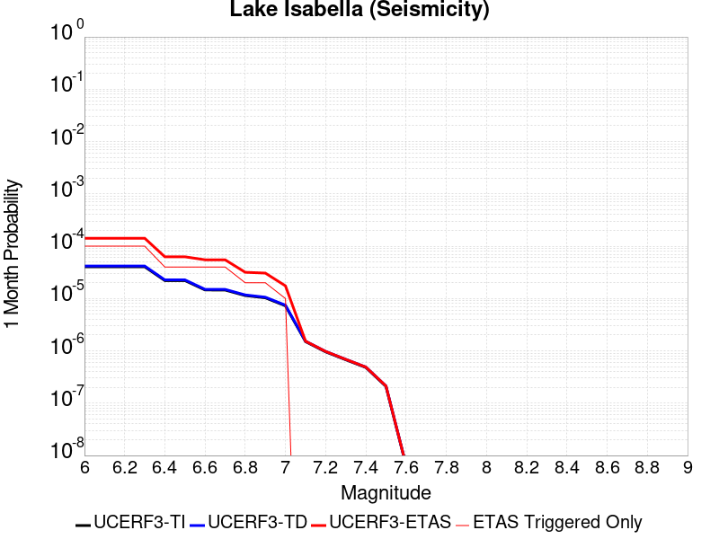 |  |  |

| Magnitude | 1 wk TI Prob | 1 wk TD Prob | 1 wk ETAS Prob | 1 wk ETAS/TD Gain | 1 wk ETAS Triggered Only | 1 mo TI Prob | 1 mo TD Prob | 1 mo ETAS Prob | 1 mo ETAS/TD Gain | 1 mo ETAS Triggered Only | 1 yr TI Prob | 1 yr TD Prob | 1 yr ETAS Prob | 1 yr ETAS/TD Gain | 1 yr ETAS Triggered Only | 10 yr TI Prob | 10 yr TD Prob | 10 yr ETAS Prob | 10 yr ETAS/TD Gain | 10 yr ETAS Triggered Only |
|-----|-----|-----|-----|-----|-----|-----|-----|-----|-----|-----|-----|-----|-----|-----|-----|-----|-----|-----|-----|-----|
| 6.0 | 9.431637E-6 | 9.741651E-6 | 1.0749719E-4 | 11.0348015 | 9.7756485E-5 | 4.0420677E-5 | 4.1749343E-5 | 1.7208589E-4 | 4.1218824 | 1.3034198E-4 | 4.920106E-4 | 5.0819275E-4 | 6.710374E-4 | 1.3204389 | 1.6292748E-4 | 0.004909227 | 0.005071599 | 0.0052985405 | 1.0447476 | 2.2809848E-4 |
| 6.1 | 9.431637E-6 | 9.741651E-6 | 1.0749719E-4 | 11.0348015 | 9.7756485E-5 | 4.0420677E-5 | 4.1749343E-5 | 1.7208589E-4 | 4.1218824 | 1.3034198E-4 | 4.920106E-4 | 5.0819275E-4 | 6.710374E-4 | 1.3204389 | 1.6292748E-4 | 0.004909227 | 0.005071599 | 0.0052985405 | 1.0447476 | 2.2809848E-4 |
| 6.2 | 9.431637E-6 | 9.741651E-6 | 1.0749719E-4 | 11.0348015 | 9.7756485E-5 | 4.0420677E-5 | 4.1749343E-5 | 1.7208589E-4 | 4.1218824 | 1.3034198E-4 | 4.920106E-4 | 5.0819275E-4 | 6.710374E-4 | 1.3204389 | 1.6292748E-4 | 0.004909227 | 0.005071599 | 0.0052985405 | 1.0447476 | 2.2809848E-4 |
| 6.3 | 9.431637E-6 | 9.741651E-6 | 1.0749719E-4 | 11.0348015 | 9.7756485E-5 | 4.0420677E-5 | 4.1749343E-5 | 1.7208589E-4 | 4.1218824 | 1.3034198E-4 | 4.920106E-4 | 5.0819275E-4 | 6.710374E-4 | 1.3204389 | 1.6292748E-4 | 0.004909227 | 0.005071599 | 0.0052985405 | 1.0447476 | 2.2809848E-4 |
| 6.4 | 5.144063E-6 | 5.3000763E-6 | 3.78854E-5 | 7.148086 | 3.2585496E-5 | 2.2045799E-5 | 2.2714434E-5 | 7.159157E-5 | 3.1518095 | 4.8878243E-5 | 2.6837454E-4 | 2.765166E-4 | 3.4166957E-4 | 1.2356205 | 6.517099E-5 | 0.0026805066 | 0.0027620657 | 0.0028758 | 1.0411773 | 1.1404924E-4 |
| 6.5 | 5.144063E-6 | 5.3000763E-6 | 3.78854E-5 | 7.148086 | 3.2585496E-5 | 2.2045799E-5 | 2.2714434E-5 | 7.159157E-5 | 3.1518095 | 4.8878243E-5 | 2.6837454E-4 | 2.765166E-4 | 3.4166957E-4 | 1.2356205 | 6.517099E-5 | 0.0026805066 | 0.0027620657 | 0.0028758 | 1.0411773 | 1.1404924E-4 |
| 6.6 | 3.4009804E-6 | 3.498786E-6 | 3.608417E-5 | 10.313339 | 3.2585496E-5 | 1.4575549E-5 | 1.4994721E-5 | 6.3872234E-5 | 4.259648 | 4.8878243E-5 | 1.7744285E-4 | 1.8254704E-4 | 2.4770614E-4 | 1.3569442 | 6.517099E-5 | 0.0017730123 | 0.0018241286 | 0.0019054437 | 1.0445775 | 8.146374E-5 |
| 6.7 | 3.3880428E-6 | 3.4856528E-6 | 3.6071036E-5 | 10.348431 | 3.2585496E-5 | 1.4520103E-5 | 1.4938435E-5 | 6.381595E-5 | 4.2719297 | 4.8878243E-5 | 1.767679E-4 | 1.8186188E-4 | 2.47021E-4 | 1.3582891 | 6.517099E-5 | 0.0017662736 | 0.0018172882 | 0.0018986039 | 1.0447457 | 8.146374E-5 |
| 6.8 | 2.6582E-6 | 2.7337003E-6 | 3.5319106E-5 | 12.91989 | 3.2585496E-5 | 1.1392236E-5 | 1.1715813E-5 | 4.4300927E-5 | 3.7812934 | 3.2585496E-5 | 1.3869164E-4 | 1.4263204E-4 | 1.7521287E-4 | 1.2284259 | 3.2585496E-5 | 0.0013860512 | 0.0014255369 | 0.0014743455 | 1.0342387 | 4.8878243E-5 |
| 6.9 | 2.406011E-6 | 2.4743288E-6 | 3.5059744E-5 | 14.169395 | 3.2585496E-5 | 1.0311434E-5 | 1.0604231E-5 | 4.3189382E-5 | 4.0728445 | 3.2585496E-5 | 1.2553448E-4 | 1.2910018E-4 | 1.6168147E-4 | 1.2523721 | 3.2585496E-5 | 0.0012546359 | 0.0012903814 | 0.0013391966 | 1.03783 | 4.8878243E-5 |
| 7.0 | 1.6953097E-6 | 1.7429371E-6 | 1.8035656E-5 | 10.347853 | 1.6292748E-5 | 7.265593E-6 | 7.469715E-6 | 2.376234E-5 | 3.1811576 | 1.6292748E-5 | 8.8455E-5 | 9.094104E-5 | 1.072323E-4 | 1.1791409 | 1.6292748E-5 | 8.84198E-4 | 9.09141E-4 | 9.416968E-4 | 1.0358095 | 3.2585496E-5 |
| 7.1 | 3.5013824E-7 | 3.5714822E-7 | 3.5714822E-7 | 1.0 | 0.0 | 1.5005916E-6 | 1.5306344E-6 | 1.5306344E-6 | 1.0 | 0.0 | 1.826955E-5 | 1.8635317E-5 | 1.8635317E-5 | 1.0 | 0.0 | 1.8268047E-4 | 1.863378E-4 | 1.863378E-4 | 1.0 | 0.0 |
| 7.2 | 2.2321095E-7 | 2.2750574E-7 | 2.2750574E-7 | 1.0 | 0.0 | 9.56618E-7 | 9.750242E-7 | 9.750242E-7 | 1.0 | 0.0 | 1.1646762E-5 | 1.1870856E-5 | 1.1870856E-5 | 1.0 | 0.0 | 1.1646151E-4 | 1.1870232E-4 | 1.1870232E-4 | 1.0 | 0.0 |
| 7.3 | 1.5760406E-7 | 1.6060922E-7 | 1.6060922E-7 | 1.0 | 0.0 | 6.7544585E-7 | 6.8832503E-7 | 6.8832503E-7 | 1.0 | 0.0 | 8.223522E-6 | 8.380326E-6 | 8.380326E-6 | 1.0 | 0.0 | 8.2232174E-5 | 8.3800165E-5 | 8.3800165E-5 | 1.0 | 0.0 |
| 7.4 | 1.1216497E-7 | 1.1431706E-7 | 1.1431706E-7 | 1.0 | 0.0 | 4.8070694E-7 | 4.899302E-7 | 4.899302E-7 | 1.0 | 0.0 | 5.852591E-6 | 5.964884E-6 | 5.964884E-6 | 1.0 | 0.0 | 5.8524372E-5 | 5.9647282E-5 | 5.9647282E-5 | 1.0 | 0.0 |
| 7.5 | 4.885185E-8 | 4.9787737E-8 | 4.9787737E-8 | 1.0 | 0.0 | 2.0936506E-7 | 2.13376E-7 | 2.13376E-7 | 1.0 | 0.0 | 2.5490165E-6 | 2.59785E-6 | 2.59785E-6 | 1.0 | 0.0 | 2.5489873E-5 | 2.5978214E-5 | 2.5978214E-5 | 1.0 | 0.0 |
| 7.6 | 1.504641E-9 | 1.5317903E-9 | 1.5317903E-9 | 1.0 | 0.0 | 6.4484613E-9 | 6.5648154E-9 | 6.5648154E-9 | 1.0 | 0.0 | 7.851001E-8 | 7.992663E-8 | 7.992663E-8 | 1.0 | 0.0 | 7.8509987E-7 | 7.992663E-7 | 7.992663E-7 | 1.0 | 0.0 |

## Tin Mountain
*[(top)](#table-of-contents)*

| 1 Week | 1 Month | 1 Year | 10 Year |
|-----|-----|-----|-----|
|  |  |  |  |

| Magnitude | 1 wk TI Prob | 1 wk TD Prob | 1 wk ETAS Prob | 1 wk ETAS/TD Gain | 1 wk ETAS Triggered Only | 1 mo TI Prob | 1 mo TD Prob | 1 mo ETAS Prob | 1 mo ETAS/TD Gain | 1 mo ETAS Triggered Only | 1 yr TI Prob | 1 yr TD Prob | 1 yr ETAS Prob | 1 yr ETAS/TD Gain | 1 yr ETAS Triggered Only | 10 yr TI Prob | 10 yr TD Prob | 10 yr ETAS Prob | 10 yr ETAS/TD Gain | 10 yr ETAS Triggered Only |
|-----|-----|-----|-----|-----|-----|-----|-----|-----|-----|-----|-----|-----|-----|-----|-----|-----|-----|-----|-----|-----|
| 6.0 | 4.083776E-6 | 4.1815365E-6 | 5.3059575E-5 | 12.6890135 | 4.8878243E-5 | 1.750178E-5 | 1.792077E-5 | 9.938305E-5 | 5.545691 | 8.146374E-5 | 2.1306332E-4 | 2.1816725E-4 | 3.484808E-4 | 1.5973103 | 1.3034198E-4 | 0.0021285915 | 0.0021798965 | 0.0023912403 | 1.0969514 | 2.1180573E-4 |
| 6.1 | 4.083776E-6 | 4.1815365E-6 | 5.3059575E-5 | 12.6890135 | 4.8878243E-5 | 1.750178E-5 | 1.792077E-5 | 9.938305E-5 | 5.545691 | 8.146374E-5 | 2.1306332E-4 | 2.1816725E-4 | 3.484808E-4 | 1.5973103 | 1.3034198E-4 | 0.0021285915 | 0.0021798965 | 0.0023912403 | 1.0969514 | 2.1180573E-4 |
| 6.2 | 4.083776E-6 | 4.1815365E-6 | 5.3059575E-5 | 12.6890135 | 4.8878243E-5 | 1.750178E-5 | 1.792077E-5 | 9.938305E-5 | 5.545691 | 8.146374E-5 | 2.1306332E-4 | 2.1816725E-4 | 3.484808E-4 | 1.5973103 | 1.3034198E-4 | 0.0021285915 | 0.0021798965 | 0.0023912403 | 1.0969514 | 2.1180573E-4 |
| 6.3 | 4.083776E-6 | 4.1815365E-6 | 5.3059575E-5 | 12.6890135 | 4.8878243E-5 | 1.750178E-5 | 1.792077E-5 | 9.938305E-5 | 5.545691 | 8.146374E-5 | 2.1306332E-4 | 2.1816725E-4 | 3.484808E-4 | 1.5973103 | 1.3034198E-4 | 0.0021285915 | 0.0021798965 | 0.0023912403 | 1.0969514 | 2.1180573E-4 |
| 6.4 | 4.083776E-6 | 4.1815365E-6 | 5.3059575E-5 | 12.6890135 | 4.8878243E-5 | 1.750178E-5 | 1.792077E-5 | 9.938305E-5 | 5.545691 | 8.146374E-5 | 2.1306332E-4 | 2.1816725E-4 | 3.484808E-4 | 1.5973103 | 1.3034198E-4 | 0.0021285915 | 0.0021798965 | 0.0023912403 | 1.0969514 | 2.1180573E-4 |
| 6.5 | 2.3143427E-6 | 2.3731573E-6 | 3.4958575E-5 | 14.73083 | 3.2585496E-5 | 9.9185745E-6 | 1.0170638E-5 | 5.9048387E-5 | 5.80577 | 4.8878243E-5 | 1.2075195E-4 | 1.2382126E-4 | 1.7269344E-4 | 1.3946996 | 4.8878243E-5 | 0.0012068636 | 0.0012375986 | 0.0013352341 | 1.078891 | 9.7756485E-5 |
| 6.6 | 2.3143427E-6 | 2.3731573E-6 | 3.4958575E-5 | 14.73083 | 3.2585496E-5 | 9.9185745E-6 | 1.0170638E-5 | 5.9048387E-5 | 5.80577 | 4.8878243E-5 | 1.2075195E-4 | 1.2382126E-4 | 1.7269344E-4 | 1.3946996 | 4.8878243E-5 | 0.0012068636 | 0.0012375986 | 0.0013352341 | 1.078891 | 9.7756485E-5 |
| 6.7 | 1.7029532E-6 | 1.7497915E-6 | 1.804251E-5 | 10.311234 | 1.6292748E-5 | 7.2983503E-6 | 7.499088E-6 | 4.008434E-5 | 5.3452287 | 3.2585496E-5 | 8.885379E-5 | 9.1298105E-5 | 1.2388063E-4 | 1.3568805 | 3.2585496E-5 | 8.881827E-4 | 9.1265864E-4 | 9.94048E-4 | 1.0891783 | 8.146374E-5 |
| 6.8 | 1.2914646E-6 | 1.3299378E-6 | 1.7622664E-5 | 13.250743 | 1.6292748E-5 | 5.534837E-6 | 5.6997237E-6 | 2.1992379E-5 | 3.858499 | 1.6292748E-5 | 6.738455E-5 | 6.939237E-5 | 8.568398E-5 | 1.2347753 | 1.6292748E-5 | 6.736412E-4 | 6.9375033E-4 | 7.425947E-4 | 1.0704062 | 4.8878243E-5 |
| 6.9 | 5.8708974E-7 | 6.1169936E-7 | 1.6904438E-5 | 27.635204 | 1.6292748E-5 | 2.5160964E-6 | 2.6215664E-6 | 1.8914272E-5 | 7.2148743 | 1.6292748E-5 | 3.0633044E-5 | 3.1917145E-5 | 4.820937E-5 | 1.5104538 | 1.6292748E-5 | 3.0628822E-4 | 3.191297E-4 | 3.517048E-4 | 1.1020747 | 3.2585496E-5 |
| 7.0 | 4.6248786E-7 | 4.832015E-7 | 1.6775943E-5 | 34.71831 | 1.6292748E-5 | 1.9820893E-6 | 2.0708624E-6 | 1.8363577E-5 | 8.8675995 | 1.6292748E-5 | 2.413167E-5 | 2.5212494E-5 | 4.150483E-5 | 1.6462009 | 1.6292748E-5 | 2.412905E-4 | 2.5210003E-4 | 2.846773E-4 | 1.1292236 | 3.2585496E-5 |
| 7.1 | 3.804606E-7 | 3.987147E-7 | 3.987147E-7 | 1.0 | 0.0 | 1.6305444E-6 | 1.7087764E-6 | 1.7087764E-6 | 1.0 | 0.0 | 1.9851697E-5 | 2.0804187E-5 | 2.0804187E-5 | 1.0 | 0.0 | 1.9849923E-4 | 2.0802575E-4 | 2.0802575E-4 | 1.0 | 0.0 |
| 7.2 | 3.5864858E-7 | 3.7616863E-7 | 3.7616863E-7 | 1.0 | 0.0 | 1.5370645E-6 | 1.6121504E-6 | 1.6121504E-6 | 1.0 | 0.0 | 1.87136E-5 | 1.9627789E-5 | 1.9627789E-5 | 1.0 | 0.0 | 1.8712023E-4 | 1.9626386E-4 | 1.9626386E-4 | 1.0 | 0.0 |
| 7.3 | 3.342063E-7 | 3.506347E-7 | 3.506347E-7 | 1.0 | 0.0 | 1.4323119E-6 | 1.5027196E-6 | 1.5027196E-6 | 1.0 | 0.0 | 1.7438259E-5 | 1.829549E-5 | 1.829549E-5 | 1.0 | 0.0 | 1.743689E-4 | 1.8294314E-4 | 1.8294314E-4 | 1.0 | 0.0 |
| 7.4 | 2.971242E-7 | 3.1165817E-7 | 3.1165817E-7 | 1.0 | 0.0 | 1.2733886E-6 | 1.3356774E-6 | 1.3356774E-6 | 1.0 | 0.0 | 1.5503398E-5 | 1.6261785E-5 | 1.6261785E-5 | 1.0 | 0.0 | 1.5502315E-4 | 1.6260923E-4 | 1.6260923E-4 | 1.0 | 0.0 |
| 7.5 | 1.4326713E-7 | 1.5012525E-7 | 1.5012525E-7 | 1.0 | 0.0 | 6.140018E-7 | 6.433939E-7 | 6.433939E-7 | 1.0 | 0.0 | 7.4754466E-6 | 7.8333205E-6 | 7.8333205E-6 | 1.0 | 0.0 | 7.475195E-5 | 7.833321E-5 | 7.833321E-5 | 1.0 | 0.0 |

## Pisgah-Bullion Mtn-Mesquite Lk
*[(top)](#table-of-contents)*

| 1 Week | 1 Month | 1 Year | 10 Year |
|-----|-----|-----|-----|
|  |  |  | 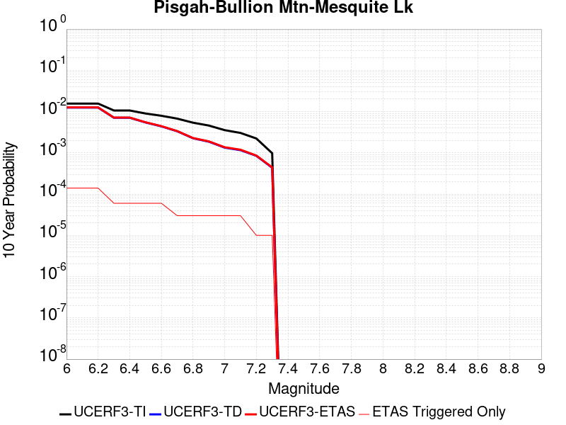 |

| Magnitude | 1 wk TI Prob | 1 wk TD Prob | 1 wk ETAS Prob | 1 wk ETAS/TD Gain | 1 wk ETAS Triggered Only | 1 mo TI Prob | 1 mo TD Prob | 1 mo ETAS Prob | 1 mo ETAS/TD Gain | 1 mo ETAS Triggered Only | 1 yr TI Prob | 1 yr TD Prob | 1 yr ETAS Prob | 1 yr ETAS/TD Gain | 1 yr ETAS Triggered Only | 10 yr TI Prob | 10 yr TD Prob | 10 yr ETAS Prob | 10 yr ETAS/TD Gain | 10 yr ETAS Triggered Only |
|-----|-----|-----|-----|-----|-----|-----|-----|-----|-----|-----|-----|-----|-----|-----|-----|-----|-----|-----|-----|-----|
| 6.0 | 3.0240792E-5 | 2.40909E-5 | 1.0555268E-4 | 4.3814335 | 8.146374E-5 | 1.2959696E-4 | 1.032432E-4 | 1.8469853E-4 | 1.7889656 | 8.146374E-5 | 0.0015767008 | 0.0012563618 | 0.00138654 | 1.1036153 | 1.3034198E-4 | 0.015655609 | 0.012502613 | 0.012727859 | 1.018016 | 2.2809848E-4 |
| 6.1 | 3.0240792E-5 | 2.40909E-5 | 1.0555268E-4 | 4.3814335 | 8.146374E-5 | 1.2959696E-4 | 1.032432E-4 | 1.8469853E-4 | 1.7889656 | 8.146374E-5 | 0.0015767008 | 0.0012563618 | 0.00138654 | 1.1036153 | 1.3034198E-4 | 0.015655609 | 0.012502613 | 0.012727859 | 1.018016 | 2.2809848E-4 |
| 6.2 | 3.0240792E-5 | 2.40909E-5 | 1.0555268E-4 | 4.3814335 | 8.146374E-5 | 1.2959696E-4 | 1.032432E-4 | 1.8469853E-4 | 1.7889656 | 8.146374E-5 | 0.0015767008 | 0.0012563618 | 0.00138654 | 1.1036153 | 1.3034198E-4 | 0.015655609 | 0.012502613 | 0.012727859 | 1.018016 | 2.2809848E-4 |
| 6.3 | 2.0498217E-5 | 1.3638054E-5 | 6.251563E-5 | 4.5839114 | 4.8878243E-5 | 8.784654E-5 | 5.8447586E-5 | 1.0732297E-4 | 1.836226 | 4.8878243E-5 | 0.0010690069 | 7.1138324E-4 | 7.765079E-4 | 1.0915465 | 6.517099E-5 | 0.01063879 | 0.0070926864 | 0.0071897497 | 1.013685 | 9.7756485E-5 |
| 6.4 | 2.0498217E-5 | 1.3638054E-5 | 6.251563E-5 | 4.5839114 | 4.8878243E-5 | 8.784654E-5 | 5.8447586E-5 | 1.0732297E-4 | 1.836226 | 4.8878243E-5 | 0.0010690069 | 7.1138324E-4 | 7.765079E-4 | 1.0915465 | 6.517099E-5 | 0.01063879 | 0.0070926864 | 0.0071897497 | 1.013685 | 9.7756485E-5 |
| 6.5 | 1.7316182E-5 | 1.04769715E-5 | 5.9354705E-5 | 5.6652536 | 4.8878243E-5 | 7.42101E-5 | 4.490059E-5 | 9.377664E-5 | 2.0885391 | 4.8878243E-5 | 9.0313336E-4 | 5.465376E-4 | 6.1167293E-4 | 1.1191782 | 6.517099E-5 | 0.008994718 | 0.00545293 | 0.0055501536 | 1.0178295 | 9.7756485E-5 |
| 6.6 | 1.5251077E-5 | 8.414133E-6 | 5.7291967E-5 | 6.809016 | 4.8878243E-5 | 6.536012E-5 | 3.606011E-5 | 8.49366E-5 | 2.3554168 | 4.8878243E-5 | 7.9546886E-4 | 4.3895066E-4 | 5.04093E-4 | 1.1484048 | 6.517099E-5 | 0.007926274 | 0.0043815537 | 0.0044788816 | 1.0222132 | 9.7756485E-5 |
| 6.7 | 1.2997425E-5 | 6.4112146E-6 | 6.4112146E-6 | 1.0 | 0.0 | 5.570206E-5 | 2.7476372E-5 | 2.7476372E-5 | 1.0 | 0.0 | 6.7796157E-4 | 3.3447813E-4 | 3.5076542E-4 | 1.0486946 | 1.6292748E-5 | 0.0067589693 | 0.003340207 | 0.0033889222 | 1.0145844 | 4.8878243E-5 |
| 6.8 | 1.035386E-5 | 4.333145E-6 | 4.333145E-6 | 1.0 | 0.0 | 4.437293E-5 | 1.8570496E-5 | 1.8570496E-5 | 1.0 | 0.0 | 5.401065E-4 | 2.260732E-4 | 2.4236226E-4 | 1.0720521 | 1.6292748E-5 | 0.0053879567 | 0.002258519 | 0.0023072867 | 1.0215929 | 4.8878243E-5 |
| 6.9 | 8.816252E-6 | 3.5805879E-6 | 3.5805879E-6 | 1.0 | 0.0 | 3.778339E-5 | 1.534529E-5 | 1.534529E-5 | 1.0 | 0.0 | 4.5991567E-4 | 1.8681347E-4 | 2.0310318E-4 | 1.0871977 | 1.6292748E-5 | 0.00458965 | 0.0018666228 | 0.0019154098 | 1.0261365 | 4.8878243E-5 |
| 7.0 | 6.8232207E-6 | 2.5674399E-6 | 2.5674399E-6 | 1.0 | 0.0 | 2.9242048E-5 | 1.100327E-5 | 1.100327E-5 | 1.0 | 0.0 | 3.5596377E-4 | 1.3395688E-4 | 1.5024745E-4 | 1.1216105 | 1.6292748E-5 | 0.0035539411 | 0.0013387925 | 0.0013876052 | 1.0364603 | 4.8878243E-5 |
| 7.1 | 5.837013E-6 | 2.2273143E-6 | 2.2273143E-6 | 1.0 | 0.0 | 2.501553E-5 | 9.5456E-6 | 9.5456E-6 | 1.0 | 0.0 | 3.045215E-4 | 1.1621177E-4 | 1.3250262E-4 | 1.1401825 | 1.6292748E-5 | 0.0030410455 | 0.001161539 | 0.0012103604 | 1.0420318 | 4.8878243E-5 |
| 7.2 | 4.278052E-6 | 1.6275065E-6 | 1.6275065E-6 | 1.0 | 0.0 | 1.833438E-5 | 6.975011E-6 | 6.975011E-6 | 1.0 | 0.0 | 2.231982E-4 | 8.491768E-5 | 8.491768E-5 | 1.0 | 0.0 | 0.0022297418 | 8.4887556E-4 | 8.6515443E-4 | 1.0191771 | 1.6292748E-5 |
| 7.3 | 1.8803692E-6 | 8.344788E-7 | 8.344788E-7 | 1.0 | 0.0 | 8.0587E-6 | 3.5763337E-6 | 3.5763337E-6 | 1.0 | 0.0 | 9.811026E-5 | 4.354114E-5 | 4.354114E-5 | 1.0 | 0.0 | 9.806695E-4 | 4.3534054E-4 | 4.516262E-4 | 1.037409 | 1.6292748E-5 |

## Mission Ridge-Arroyo Parida-Santa Ana
*[(top)](#table-of-contents)*

| 1 Week | 1 Month | 1 Year | 10 Year |
|-----|-----|-----|-----|
|  |  |  |  |

| Magnitude | 1 wk TI Prob | 1 wk TD Prob | 1 wk ETAS Prob | 1 wk ETAS/TD Gain | 1 wk ETAS Triggered Only | 1 mo TI Prob | 1 mo TD Prob | 1 mo ETAS Prob | 1 mo ETAS/TD Gain | 1 mo ETAS Triggered Only | 1 yr TI Prob | 1 yr TD Prob | 1 yr ETAS Prob | 1 yr ETAS/TD Gain | 1 yr ETAS Triggered Only | 10 yr TI Prob | 10 yr TD Prob | 10 yr ETAS Prob | 10 yr ETAS/TD Gain | 10 yr ETAS Triggered Only |
|-----|-----|-----|-----|-----|-----|-----|-----|-----|-----|-----|-----|-----|-----|-----|-----|-----|-----|-----|-----|-----|
| 6.0 | 4.169034E-5 | 4.7137048E-5 | 9.6012984E-5 | 2.0368903 | 4.8878243E-5 | 1.7866064E-4 | 2.0200513E-4 | 2.8345242E-4 | 1.4031942 | 8.146374E-5 | 0.0021730233 | 0.0024574657 | 0.0025712347 | 1.0462953 | 1.1404924E-4 | 0.021518968 | 0.02438483 | 0.024543785 | 1.0065186 | 1.6292748E-4 |
| 6.1 | 1.73813E-5 | 1.6854203E-5 | 4.943915E-5 | 2.9333425 | 3.2585496E-5 | 7.4489166E-5 | 7.223036E-5 | 1.048135E-4 | 1.4511003 | 3.2585496E-5 | 9.065282E-4 | 8.790605E-4 | 9.278958E-4 | 1.0555539 | 4.8878243E-5 | 0.009028391 | 0.008757128 | 0.008821729 | 1.0073769 | 6.517099E-5 |
| 6.2 | 1.4622182E-5 | 1.3673262E-5 | 2.9965788E-5 | 2.191561 | 1.6292748E-5 | 6.2664985E-5 | 5.85984E-5 | 7.4890195E-5 | 1.2780246 | 1.6292748E-5 | 7.6267915E-4 | 7.132059E-4 | 7.4576813E-4 | 1.0456562 | 3.2585496E-5 | 0.007600669 | 0.007109767 | 0.0071582976 | 1.0068259 | 4.8878243E-5 |
| 6.3 | 1.3552434E-5 | 1.2482174E-5 | 2.8774719E-5 | 2.305265 | 1.6292748E-5 | 5.8080568E-5 | 5.349395E-5 | 6.978583E-5 | 1.3045555 | 1.6292748E-5 | 7.069015E-4 | 6.510974E-4 | 6.8366167E-4 | 1.0500145 | 3.2585496E-5 | 0.00704657 | 0.006492415 | 0.0065409755 | 1.0074797 | 4.8878243E-5 |
| 6.4 | 1.30977305E-5 | 1.1979128E-5 | 1.1979128E-5 | 1.0 | 0.0 | 5.613192E-5 | 5.133813E-5 | 5.133813E-5 | 1.0 | 0.0 | 6.831918E-4 | 6.2486547E-4 | 6.411481E-4 | 1.0260577 | 1.6292748E-5 | 0.006810953 | 0.006231584 | 0.0062639667 | 1.0051965 | 3.2585496E-5 |
| 6.5 | 1.225205E-5 | 1.1048776E-5 | 1.1048776E-5 | 1.0 | 0.0 | 5.2507727E-5 | 4.735105E-5 | 4.735105E-5 | 1.0 | 0.0 | 6.3909404E-4 | 5.7634927E-4 | 5.926326E-4 | 1.0282526 | 1.6292748E-5 | 0.006372592 | 0.005749009 | 0.005781407 | 1.0056354 | 3.2585496E-5 |
| 6.6 | 1.1352241E-5 | 1.0063508E-5 | 1.0063508E-5 | 1.0 | 0.0 | 4.8651553E-5 | 4.3128617E-5 | 4.3128617E-5 | 1.0 | 0.0 | 5.921717E-4 | 5.249665E-4 | 5.249665E-4 | 1.0 | 0.0 | 0.0059059616 | 0.0052376646 | 0.005253872 | 1.0030944 | 1.6292748E-5 |
| 6.7 | 1.0864116E-5 | 9.517E-6 | 9.517E-6 | 1.0 | 0.0 | 4.6559664E-5 | 4.0786515E-5 | 4.0786515E-5 | 1.0 | 0.0 | 5.667165E-4 | 4.964647E-4 | 4.964647E-4 | 1.0 | 0.0 | 0.005652734 | 0.0049539437 | 0.0049701557 | 1.0032725 | 1.6292748E-5 |
| 6.8 | 1.0666365E-5 | 9.299752E-6 | 9.299752E-6 | 1.0 | 0.0 | 4.571219E-5 | 3.985548E-5 | 3.985548E-5 | 1.0 | 0.0 | 5.564038E-4 | 4.8513446E-4 | 4.8513446E-4 | 1.0 | 0.0 | 0.005550127 | 0.00484114 | 0.004857354 | 1.0033492 | 1.6292748E-5 |
| 6.9 | 1.0038665E-5 | 8.592018E-6 | 8.592018E-6 | 1.0 | 0.0 | 4.302214E-5 | 3.682243E-5 | 3.682243E-5 | 1.0 | 0.0 | 5.236687E-4 | 4.4822265E-4 | 4.4822265E-4 | 1.0 | 0.0 | 0.005224364 | 0.0044735507 | 0.0044897706 | 1.0036258 | 1.6292748E-5 |
| 7.0 | 9.5379955E-6 | 8.025047E-6 | 8.025047E-6 | 1.0 | 0.0 | 4.0876483E-5 | 3.439261E-5 | 3.439261E-5 | 1.0 | 0.0 | 4.975576E-4 | 4.1865133E-4 | 4.1865133E-4 | 1.0 | 0.0 | 0.00496445 | 0.00417898 | 0.0041952045 | 1.0038824 | 1.6292748E-5 |
| 7.1 | 9.207389E-6 | 7.652347E-6 | 7.652347E-6 | 1.0 | 0.0 | 3.945964E-5 | 3.2795375E-5 | 3.2795375E-5 | 1.0 | 0.0 | 4.803152E-4 | 3.992122E-4 | 3.992122E-4 | 1.0 | 0.0 | 0.004792784 | 0.003985301 | 0.004001529 | 1.004072 | 1.6292748E-5 |
| 7.2 | 7.638091E-6 | 5.9310923E-6 | 5.9310923E-6 | 1.0 | 0.0 | 3.2734264E-5 | 2.5418722E-5 | 2.5418722E-5 | 1.0 | 0.0 | 3.984668E-4 | 3.094293E-4 | 3.094293E-4 | 1.0 | 0.0 | 0.0039775306 | 0.0030901956 | 0.003106438 | 1.005256 | 1.6292748E-5 |
| 7.3 | 7.2500147E-6 | 5.596131E-6 | 5.596131E-6 | 1.0 | 0.0 | 3.1071122E-5 | 2.3983199E-5 | 2.3983199E-5 | 1.0 | 0.0 | 3.7822526E-4 | 2.9195662E-4 | 2.9195662E-4 | 1.0 | 0.0 | 0.0037758215 | 0.0029159402 | 0.0029321855 | 1.0055711 | 1.6292748E-5 |
| 7.4 | 6.3899715E-6 | 4.9184864E-6 | 4.9184864E-6 | 1.0 | 0.0 | 2.7385306E-5 | 2.1079059E-5 | 2.1079059E-5 | 1.0 | 0.0 | 3.3336508E-4 | 2.566075E-4 | 2.566075E-4 | 1.0 | 0.0 | 0.0033286542 | 0.002563311 | 0.002579562 | 1.0063398 | 1.6292748E-5 |
| 7.5 | 5.379025E-6 | 4.0838477E-6 | 4.0838477E-6 | 1.0 | 0.0 | 2.305276E-5 | 1.7502087E-5 | 1.7502087E-5 | 1.0 | 0.0 | 2.806312E-4 | 2.1306718E-4 | 2.1306718E-4 | 1.0 | 0.0 | 0.0028027708 | 0.0021286402 | 0.0021286402 | 1.0 | 0.0 |
| 7.6 | 4.1270696E-6 | 3.0883373E-6 | 3.0883373E-6 | 1.0 | 0.0 | 1.768732E-5 | 1.32356645E-5 | 1.32356645E-5 | 1.0 | 0.0 | 2.1532185E-4 | 1.6113237E-4 | 1.6113237E-4 | 1.0 | 0.0 | 0.0021511333 | 0.0016101635 | 0.0016101635 | 1.0 | 0.0 |
| 7.7 | 2.5406805E-6 | 1.8282044E-6 | 1.8282044E-6 | 1.0 | 0.0 | 1.0888585E-5 | 7.835139E-6 | 7.835139E-6 | 1.0 | 0.0 | 1.3256045E-4 | 9.53887E-5 | 9.53887E-5 | 1.0 | 0.0 | 0.0013248142 | 9.534837E-4 | 9.534837E-4 | 1.0 | 0.0 |
| 7.8 | 4.8608285E-7 | 3.509864E-7 | 3.509864E-7 | 1.0 | 0.0 | 2.0832106E-6 | 1.5042266E-6 | 1.5042266E-6 | 1.0 | 0.0 | 2.5362791E-5 | 1.8313805E-5 | 1.8313805E-5 | 1.0 | 0.0 | 2.5359896E-4 | 1.8312308E-4 | 1.8312308E-4 | 1.0 | 0.0 |
| 7.9 | 2.0472514E-8 | 1.2688718E-8 | 1.2688718E-8 | 1.0 | 0.0 | 8.7739345E-8 | 5.438022E-8 | 5.438022E-8 | 1.0 | 0.0 | 1.068226E-6 | 6.6207895E-7 | 6.6207895E-7 | 1.0 | 0.0 | 1.0682209E-5 | 6.620771E-6 | 6.620771E-6 | 1.0 | 0.0 |
| 8.0 | 4.443582E-9 | 2.032067E-9 | 2.032067E-9 | 1.0 | 0.0 | 1.9043922E-8 | 8.7088585E-9 | 8.7088585E-9 | 1.0 | 0.0 | 2.3185973E-7 | 1.0603035E-7 | 1.0603035E-7 | 1.0 | 0.0 | 2.3185949E-6 | 1.0603031E-6 | 1.0603031E-6 | 1.0 | 0.0 |

## White Mountains
*[(top)](#table-of-contents)*

| 1 Week | 1 Month | 1 Year | 10 Year |
|-----|-----|-----|-----|
|  |  |  |  |

| Magnitude | 1 wk TI Prob | 1 wk TD Prob | 1 wk ETAS Prob | 1 wk ETAS/TD Gain | 1 wk ETAS Triggered Only | 1 mo TI Prob | 1 mo TD Prob | 1 mo ETAS Prob | 1 mo ETAS/TD Gain | 1 mo ETAS Triggered Only | 1 yr TI Prob | 1 yr TD Prob | 1 yr ETAS Prob | 1 yr ETAS/TD Gain | 1 yr ETAS Triggered Only | 10 yr TI Prob | 10 yr TD Prob | 10 yr ETAS Prob | 10 yr ETAS/TD Gain | 10 yr ETAS Triggered Only |
|-----|-----|-----|-----|-----|-----|-----|-----|-----|-----|-----|-----|-----|-----|-----|-----|-----|-----|-----|-----|-----|
| 6.0 | 3.503579E-5 | 3.3784127E-5 | 1.15245115E-4 | 3.4112208 | 8.146374E-5 | 1.5014476E-4 | 1.4478175E-4 | 2.5881449E-4 | 1.787618 | 1.1404924E-4 | 0.0018264796 | 0.0017614134 | 0.0019077898 | 1.0831017 | 1.4663473E-4 | 0.018115403 | 0.017486857 | 0.01767895 | 1.010985 | 1.9551297E-4 |
| 6.1 | 3.503579E-5 | 3.3784127E-5 | 1.15245115E-4 | 3.4112208 | 8.146374E-5 | 1.5014476E-4 | 1.4478175E-4 | 2.5881449E-4 | 1.787618 | 1.1404924E-4 | 0.0018264796 | 0.0017614134 | 0.0019077898 | 1.0831017 | 1.4663473E-4 | 0.018115403 | 0.017486857 | 0.01767895 | 1.010985 | 1.9551297E-4 |
| 6.2 | 3.503579E-5 | 3.3784127E-5 | 1.15245115E-4 | 3.4112208 | 8.146374E-5 | 1.5014476E-4 | 1.4478175E-4 | 2.5881449E-4 | 1.787618 | 1.1404924E-4 | 0.0018264796 | 0.0017614134 | 0.0019077898 | 1.0831017 | 1.4663473E-4 | 0.018115403 | 0.017486857 | 0.01767895 | 1.010985 | 1.9551297E-4 |
| 6.3 | 1.7818425E-5 | 1.591616E-5 | 3.220865E-5 | 2.0236444 | 1.6292748E-5 | 7.636245E-5 | 6.821041E-5 | 1.0079368E-4 | 1.4776877 | 3.2585496E-5 | 9.293162E-4 | 8.301596E-4 | 8.789972E-4 | 1.0588293 | 4.8878243E-5 | 0.009254395 | 0.0082720425 | 0.00836899 | 1.01172 | 9.7756485E-5 |
| 6.4 | 1.7818425E-5 | 1.591616E-5 | 3.220865E-5 | 2.0236444 | 1.6292748E-5 | 7.636245E-5 | 6.821041E-5 | 1.0079368E-4 | 1.4776877 | 3.2585496E-5 | 9.293162E-4 | 8.301596E-4 | 8.789972E-4 | 1.0588293 | 4.8878243E-5 | 0.009254395 | 0.0082720425 | 0.00836899 | 1.01172 | 9.7756485E-5 |
| 6.5 | 1.3397557E-5 | 1.1336374E-5 | 2.7628937E-5 | 2.4371936 | 1.6292748E-5 | 5.741684E-5 | 4.8583595E-5 | 8.1167505E-5 | 1.6706773 | 3.2585496E-5 | 6.988258E-4 | 5.913517E-4 | 6.4020103E-4 | 1.0826062 | 4.8878243E-5 | 0.006966323 | 0.005898487 | 0.0059632733 | 1.0109836 | 6.517099E-5 |
| 6.6 | 1.0818695E-5 | 8.625434E-6 | 2.4918041E-5 | 2.888903 | 1.6292748E-5 | 4.6365014E-5 | 3.6965648E-5 | 6.954994E-5 | 1.881475 | 3.2585496E-5 | 5.6434784E-4 | 4.4996818E-4 | 4.988244E-4 | 1.1085771 | 4.8878243E-5 | 0.005629168 | 0.0044910074 | 0.004539666 | 1.0108347 | 4.8878243E-5 |
| 6.7 | 9.067908E-6 | 6.802476E-6 | 6.802476E-6 | 1.0 | 0.0 | 3.8861883E-5 | 2.915316E-5 | 4.5445435E-5 | 1.558851 | 1.6292748E-5 | 4.7304068E-4 | 3.548851E-4 | 3.8745903E-4 | 1.0917872 | 3.2585496E-5 | 0.00472035 | 0.003543501 | 0.0035759711 | 1.0091633 | 3.2585496E-5 |
| 6.8 | 7.295947E-6 | 4.9364285E-6 | 4.9364285E-6 | 1.0 | 0.0 | 3.126797E-5 | 2.1155956E-5 | 3.744836E-5 | 1.7701095 | 1.6292748E-5 | 3.8062103E-4 | 2.5754445E-4 | 2.73833E-4 | 1.0632457 | 1.6292748E-5 | 0.0037996976 | 0.0025725728 | 0.0025888234 | 1.0063169 | 1.6292748E-5 |
| 6.9 | 6.2243444E-6 | 3.8322546E-6 | 3.8322546E-6 | 1.0 | 0.0 | 2.6675489E-5 | 1.6423846E-5 | 3.271633E-5 | 1.9920014 | 1.6292748E-5 | 3.2472567E-4 | 1.9994251E-4 | 2.1623202E-4 | 1.0814708 | 1.6292748E-5 | 0.0032425157 | 0.001997679 | 0.0020139392 | 1.0081395 | 1.6292748E-5 |
| 7.0 | 4.9878413E-6 | 2.679564E-6 | 2.679564E-6 | 1.0 | 0.0 | 2.1376287E-5 | 1.1483797E-5 | 1.1483797E-5 | 1.0 | 0.0 | 2.602252E-4 | 1.3980652E-4 | 1.3980652E-4 | 1.0 | 0.0 | 0.002599207 | 0.0013972119 | 0.0013972119 | 1.0 | 0.0 |
| 7.1 | 4.0252844E-6 | 1.885702E-6 | 1.885702E-6 | 1.0 | 0.0 | 1.7251105E-5 | 8.081555E-6 | 8.081555E-6 | 1.0 | 0.0 | 2.1001195E-4 | 9.838863E-5 | 9.838863E-5 | 1.0 | 0.0 | 0.0020981359 | 9.834635E-4 | 9.834635E-4 | 1.0 | 0.0 |
| 7.2 | 3.3284066E-6 | 1.2818929E-6 | 1.2818929E-6 | 1.0 | 0.0 | 1.4264522E-5 | 5.4938155E-6 | 5.4938155E-6 | 1.0 | 0.0 | 1.736567E-4 | 6.688525E-5 | 6.688525E-5 | 1.0 | 0.0 | 0.0017352107 | 6.6866126E-4 | 6.6866126E-4 | 1.0 | 0.0 |
| 7.3 | 2.458226E-6 | 6.056684E-7 | 6.056684E-7 | 1.0 | 0.0 | 1.0535211E-5 | 2.5957193E-6 | 2.5957193E-6 | 1.0 | 0.0 | 1.2825865E-4 | 3.160246E-5 | 3.160246E-5 | 1.0 | 0.0 | 0.0012818464 | 3.1598343E-4 | 3.1598343E-4 | 1.0 | 0.0 |
| 7.4 | 1.965953E-6 | 3.1084684E-7 | 3.1084684E-7 | 1.0 | 0.0 | 8.425486E-6 | 1.3322001E-6 | 1.3322001E-6 | 1.0 | 0.0 | 1.0257547E-4 | 1.6219417E-5 | 1.6219417E-5 | 1.0 | 0.0 | 0.0010252813 | 1.6218246E-4 | 1.6218246E-4 | 1.0 | 0.0 |
| 7.5 | 1.2014192E-6 | 1.8241002E-7 | 1.8241002E-7 | 1.0 | 0.0 | 5.148929E-6 | 7.8175697E-7 | 7.8175697E-7 | 1.0 | 0.0 | 6.2686406E-5 | 9.51785E-6 | 9.51785E-6 | 1.0 | 0.0 | 6.266873E-4 | 9.517451E-5 | 9.517451E-5 | 1.0 | 0.0 |
| 7.6 | 2.5612175E-7 | 4.893784E-8 | 4.893784E-8 | 1.0 | 0.0 | 1.0976642E-6 | 2.0973359E-7 | 2.0973359E-7 | 1.0 | 0.0 | 1.3363979E-5 | 2.5535037E-6 | 2.5535037E-6 | 1.0 | 0.0 | 1.3363175E-4 | 2.553478E-5 | 2.553478E-5 | 1.0 | 0.0 |

## Santa Ynez (West)
*[(top)](#table-of-contents)*

| 1 Week | 1 Month | 1 Year | 10 Year |
|-----|-----|-----|-----|
| 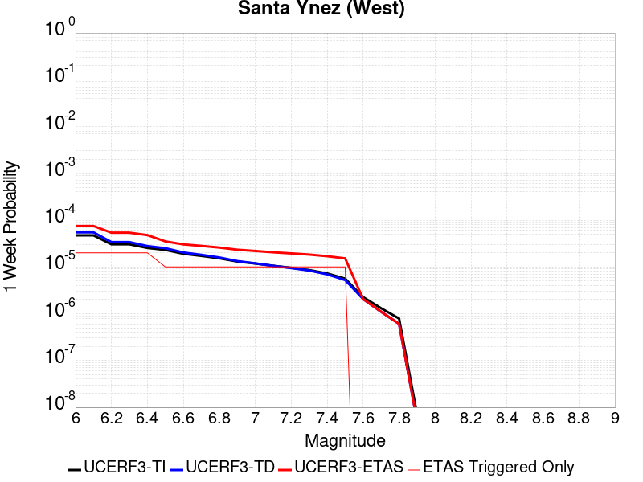 |  |  |  |

| Magnitude | 1 wk TI Prob | 1 wk TD Prob | 1 wk ETAS Prob | 1 wk ETAS/TD Gain | 1 wk ETAS Triggered Only | 1 mo TI Prob | 1 mo TD Prob | 1 mo ETAS Prob | 1 mo ETAS/TD Gain | 1 mo ETAS Triggered Only | 1 yr TI Prob | 1 yr TD Prob | 1 yr ETAS Prob | 1 yr ETAS/TD Gain | 1 yr ETAS Triggered Only | 10 yr TI Prob | 10 yr TD Prob | 10 yr ETAS Prob | 10 yr ETAS/TD Gain | 10 yr ETAS Triggered Only |
|-----|-----|-----|-----|-----|-----|-----|-----|-----|-----|-----|-----|-----|-----|-----|-----|-----|-----|-----|-----|-----|
| 6.0 | 4.7352758E-5 | 5.497084E-5 | 7.126269E-5 | 1.2963727 | 1.6292748E-5 | 2.0292461E-4 | 2.3556968E-4 | 2.681475E-4 | 1.1382937 | 3.2585496E-5 | 0.0024678076 | 0.002864558 | 0.0029132962 | 1.0170143 | 4.8878243E-5 | 0.024405818 | 0.028304456 | 0.028446939 | 1.005034 | 1.4663473E-4 |
| 6.1 | 4.7352758E-5 | 5.497084E-5 | 7.126269E-5 | 1.2963727 | 1.6292748E-5 | 2.0292461E-4 | 2.3556968E-4 | 2.681475E-4 | 1.1382937 | 3.2585496E-5 | 0.0024678076 | 0.002864558 | 0.0029132962 | 1.0170143 | 4.8878243E-5 | 0.024405818 | 0.028304456 | 0.028446939 | 1.005034 | 1.4663473E-4 |
| 6.2 | 3.0415853E-5 | 3.3925004E-5 | 5.0217197E-5 | 1.4802415 | 1.6292748E-5 | 1.3034715E-4 | 1.4538495E-4 | 1.6167534E-4 | 1.1120499 | 1.6292748E-5 | 0.0015858212 | 0.0017686592 | 0.0017849231 | 1.0091957 | 1.6292748E-5 | 0.015745522 | 0.01754978 | 0.017629813 | 1.0045604 | 8.146374E-5 |
| 6.3 | 3.0415853E-5 | 3.3925004E-5 | 5.0217197E-5 | 1.4802415 | 1.6292748E-5 | 1.3034715E-4 | 1.4538495E-4 | 1.6167534E-4 | 1.1120499 | 1.6292748E-5 | 0.0015858212 | 0.0017686592 | 0.0017849231 | 1.0091957 | 1.6292748E-5 | 0.015745522 | 0.01754978 | 0.017629813 | 1.0045604 | 8.146374E-5 |
| 6.4 | 2.5452082E-5 | 2.7912318E-5 | 4.420461E-5 | 1.5836954 | 1.6292748E-5 | 1.09075794E-4 | 1.1961885E-4 | 1.3590965E-4 | 1.1361892 | 1.6292748E-5 | 0.0013271887 | 0.0014554056 | 0.0014716747 | 1.0111784 | 1.6292748E-5 | 0.013192902 | 0.01446091 | 0.014541196 | 1.0055519 | 8.146374E-5 |
| 6.5 | 2.3143784E-5 | 2.5128133E-5 | 2.5128133E-5 | 1.0 | 0.0 | 9.9183875E-5 | 1.07687636E-4 | 1.07687636E-4 | 1.0 | 0.0 | 0.0012068948 | 0.001310323 | 0.001310323 | 1.0 | 0.0 | 0.012003611 | 0.013027638 | 0.01309196 | 1.0049373 | 6.517099E-5 |
| 6.6 | 1.9118515E-5 | 2.0354244E-5 | 2.0354244E-5 | 1.0 | 0.0 | 8.193392E-5 | 8.722961E-5 | 8.722961E-5 | 1.0 | 0.0 | 9.97089E-4 | 0.001061511 | 0.001061511 | 1.0 | 0.0 | 0.00992627 | 0.010565317 | 0.010613679 | 1.0045774 | 4.8878243E-5 |
| 6.7 | 1.722807E-5 | 1.8146253E-5 | 1.8146253E-5 | 1.0 | 0.0 | 7.3832496E-5 | 7.776737E-5 | 7.776737E-5 | 1.0 | 0.0 | 8.985399E-4 | 9.4641204E-4 | 9.4641204E-4 | 1.0 | 0.0 | 0.008949154 | 0.009424461 | 0.00945674 | 1.003425 | 3.2585496E-5 |
| 6.8 | 1.5317364E-5 | 1.5926391E-5 | 1.5926391E-5 | 1.0 | 0.0 | 6.56442E-5 | 6.82542E-5 | 6.82542E-5 | 1.0 | 0.0 | 7.98925E-4 | 8.3068234E-4 | 8.3068234E-4 | 1.0 | 0.0 | 0.007960589 | 0.008276261 | 0.008308576 | 1.0039046 | 3.2585496E-5 |
| 6.9 | 1.3071226E-5 | 1.332953E-5 | 1.332953E-5 | 1.0 | 0.0 | 5.6018336E-5 | 5.712532E-5 | 5.712532E-5 | 1.0 | 0.0 | 6.8180985E-4 | 6.952811E-4 | 6.952811E-4 | 1.0 | 0.0 | 0.0067972173 | 0.0069313184 | 0.006963678 | 1.0046686 | 3.2585496E-5 |
| 7.0 | 1.1836986E-5 | 1.1932688E-5 | 1.1932688E-5 | 1.0 | 0.0 | 5.0728955E-5 | 5.1139097E-5 | 5.1139097E-5 | 1.0 | 0.0 | 6.1745E-4 | 6.2244234E-4 | 6.2244234E-4 | 1.0 | 0.0 | 0.006157372 | 0.0062071825 | 0.006223374 | 1.0026085 | 1.6292748E-5 |
| 7.1 | 1.0597169E-5 | 1.0542107E-5 | 1.0542107E-5 | 1.0 | 0.0 | 4.541565E-5 | 4.5179684E-5 | 4.5179684E-5 | 1.0 | 0.0 | 5.5279525E-4 | 5.4992497E-4 | 5.4992497E-4 | 1.0 | 0.0 | 0.0055142213 | 0.005485772 | 0.0055019753 | 1.0029536 | 1.6292748E-5 |
| 7.2 | 9.59113E-6 | 9.45905E-6 | 9.45905E-6 | 1.0 | 0.0 | 4.11042E-5 | 4.053816E-5 | 4.053816E-5 | 1.0 | 0.0 | 5.0032866E-4 | 4.934414E-4 | 4.934414E-4 | 1.0 | 0.0 | 0.004992037 | 0.0049235765 | 0.004939789 | 1.0032928 | 1.6292748E-5 |
| 7.3 | 8.586084E-6 | 8.379489E-6 | 8.379489E-6 | 1.0 | 0.0 | 3.679698E-5 | 3.591161E-5 | 3.591161E-5 | 1.0 | 0.0 | 4.4791115E-4 | 4.3713715E-4 | 4.3713715E-4 | 1.0 | 0.0 | 0.004470094 | 0.004362884 | 0.0043791058 | 1.0037181 | 1.6292748E-5 |
| 7.4 | 7.2622997E-6 | 6.9514485E-6 | 6.9514485E-6 | 1.0 | 0.0 | 3.112377E-5 | 2.9791589E-5 | 2.9791589E-5 | 1.0 | 0.0 | 3.78866E-4 | 3.6265317E-4 | 3.6265317E-4 | 1.0 | 0.0 | 0.0037822074 | 0.003620714 | 0.0036369478 | 1.0044836 | 1.6292748E-5 |
| 7.5 | 5.627296E-6 | 5.2514984E-6 | 5.2514984E-6 | 1.0 | 0.0 | 2.411676E-5 | 2.2506232E-5 | 2.2506232E-5 | 1.0 | 0.0 | 2.9358198E-4 | 2.7397962E-4 | 2.7397962E-4 | 1.0 | 0.0 | 0.0029319443 | 0.0027364905 | 0.0027527385 | 1.0059376 | 1.6292748E-5 |
| 7.6 | 2.265244E-6 | 2.0608632E-6 | 2.0608632E-6 | 1.0 | 0.0 | 9.708152E-6 | 8.832241E-6 | 8.832241E-6 | 1.0 | 0.0 | 1.18190335E-4 | 1.0752732E-4 | 1.0752732E-4 | 1.0 | 0.0 | 0.001181275 | 0.0010747615 | 0.0010747615 | 1.0 | 0.0 |
| 7.7 | 1.3099874E-6 | 1.1016228E-6 | 1.1016228E-6 | 1.0 | 0.0 | 5.61422E-6 | 4.7212325E-6 | 4.7212325E-6 | 1.0 | 0.0 | 6.8350986E-5 | 5.7479516E-5 | 5.7479516E-5 | 1.0 | 0.0 | 6.832996E-4 | 5.7464885E-4 | 5.7464885E-4 | 1.0 | 0.0 |
| 7.8 | 7.903951E-7 | 6.0710704E-7 | 6.0710704E-7 | 1.0 | 0.0 | 3.3874032E-6 | 2.601885E-6 | 2.601885E-6 | 1.0 | 0.0 | 4.1240855E-5 | 3.16775E-5 | 3.16775E-5 | 1.0 | 0.0 | 4.12332E-4 | 3.167312E-4 | 3.167312E-4 | 1.0 | 0.0 |
| 7.9 | 7.0753297E-9 | 5.090092E-9 | 5.090092E-9 | 1.0 | 0.0 | 3.032284E-8 | 2.181468E-8 | 2.181468E-8 | 1.0 | 0.0 | 3.6918053E-7 | 2.655937E-7 | 2.655937E-7 | 1.0 | 0.0 | 3.691799E-6 | 2.6559348E-6 | 2.6559348E-6 | 1.0 | 0.0 |

## Owens Valley
*[(top)](#table-of-contents)*

| 1 Week | 1 Month | 1 Year | 10 Year |
|-----|-----|-----|-----|
|  |  |  |  |

| Magnitude | 1 wk TI Prob | 1 wk TD Prob | 1 wk ETAS Prob | 1 wk ETAS/TD Gain | 1 wk ETAS Triggered Only | 1 mo TI Prob | 1 mo TD Prob | 1 mo ETAS Prob | 1 mo ETAS/TD Gain | 1 mo ETAS Triggered Only | 1 yr TI Prob | 1 yr TD Prob | 1 yr ETAS Prob | 1 yr ETAS/TD Gain | 1 yr ETAS Triggered Only | 10 yr TI Prob | 10 yr TD Prob | 10 yr ETAS Prob | 10 yr ETAS/TD Gain | 10 yr ETAS Triggered Only |
|-----|-----|-----|-----|-----|-----|-----|-----|-----|-----|-----|-----|-----|-----|-----|-----|-----|-----|-----|-----|-----|
| 6.0 | 4.83821E-5 | 3.6210524E-6 | 5.249912E-5 | 14.498304 | 4.8878243E-5 | 2.0733538E-4 | 1.551871E-5 | 8.068869E-5 | 5.1994457 | 6.517099E-5 | 0.002521386 | 1.889249E-4 | 3.029526E-4 | 1.6035609 | 1.1404924E-4 | 0.024929691 | 0.0019297141 | 0.0021085886 | 1.0926948 | 1.7922022E-4 |
| 6.1 | 4.83821E-5 | 3.6210524E-6 | 5.249912E-5 | 14.498304 | 4.8878243E-5 | 2.0733538E-4 | 1.551871E-5 | 8.068869E-5 | 5.1994457 | 6.517099E-5 | 0.002521386 | 1.889249E-4 | 3.029526E-4 | 1.6035609 | 1.1404924E-4 | 0.024929691 | 0.0019297141 | 0.0021085886 | 1.0926948 | 1.7922022E-4 |
| 6.2 | 4.83821E-5 | 3.6210524E-6 | 5.249912E-5 | 14.498304 | 4.8878243E-5 | 2.0733538E-4 | 1.551871E-5 | 8.068869E-5 | 5.1994457 | 6.517099E-5 | 0.002521386 | 1.889249E-4 | 3.029526E-4 | 1.6035609 | 1.1404924E-4 | 0.024929691 | 0.0019297141 | 0.0021085886 | 1.0926948 | 1.7922022E-4 |
| 6.3 | 3.953008E-5 | 3.1530958E-6 | 3.573849E-5 | 11.334413 | 3.2585496E-5 | 1.6940363E-4 | 1.3513202E-5 | 4.609826E-5 | 3.4113498 | 3.2585496E-5 | 0.002060538 | 1.6451156E-4 | 2.2967182E-4 | 1.3960832 | 6.517099E-5 | 0.020415364 | 0.0016621627 | 0.001792288 | 1.0782868 | 1.3034198E-4 |
| 6.4 | 3.953008E-5 | 3.1530958E-6 | 3.573849E-5 | 11.334413 | 3.2585496E-5 | 1.6940363E-4 | 1.3513202E-5 | 4.609826E-5 | 3.4113498 | 3.2585496E-5 | 0.002060538 | 1.6451156E-4 | 2.2967182E-4 | 1.3960832 | 6.517099E-5 | 0.020415364 | 0.0016621627 | 0.001792288 | 1.0782868 | 1.3034198E-4 |
| 6.5 | 3.457342E-5 | 2.9707387E-6 | 3.555614E-5 | 11.968786 | 3.2585496E-5 | 1.4816338E-4 | 1.273168E-5 | 4.531676E-5 | 3.5593703 | 3.2585496E-5 | 0.0018023965 | 1.5499788E-4 | 2.2015876E-4 | 1.4203986 | 6.517099E-5 | 0.017878477 | 0.0015563119 | 0.0016864509 | 1.0836202 | 1.3034198E-4 |
| 6.6 | 3.1127765E-5 | 2.8737306E-6 | 3.5459132E-5 | 12.33906 | 3.2585496E-5 | 1.3339789E-4 | 1.2315934E-5 | 4.490103E-5 | 3.6457672 | 3.2585496E-5 | 0.0016229092 | 1.4993687E-4 | 2.1509809E-4 | 1.434591 | 6.517099E-5 | 0.016111081 | 0.0015013438 | 0.0016314901 | 1.0866865 | 1.3034198E-4 |
| 6.7 | 2.806885E-5 | 2.8101606E-6 | 3.5395566E-5 | 12.595567 | 3.2585496E-5 | 1.2028952E-4 | 1.2043493E-5 | 4.4628596E-5 | 3.7056189 | 3.2585496E-5 | 0.001463541 | 1.4662035E-4 | 2.117818E-4 | 1.4444228 | 6.517099E-5 | 0.014539397 | 0.0014656087 | 0.0015957596 | 1.0888033 | 1.3034198E-4 |
| 6.8 | 2.524524E-5 | 2.2351392E-6 | 3.482056E-5 | 15.5787 | 3.2585496E-5 | 1.0818939E-4 | 9.579134E-6 | 4.216432E-5 | 4.401684 | 3.2585496E-5 | 0.0013164099 | 1.16620016E-4 | 1.8178341E-4 | 1.5587667 | 6.517099E-5 | 0.01308639 | 0.001165827 | 0.0012960171 | 1.1116718 | 1.3034198E-4 |
| 6.9 | 2.2704568E-5 | 1.6079711E-6 | 3.4193414E-5 | 21.264944 | 3.2585496E-5 | 9.730166E-5 | 6.8912864E-6 | 3.947656E-5 | 5.7284746 | 3.2585496E-5 | 0.0011840039 | 8.38982E-5 | 1.4906372E-4 | 1.7767214 | 6.517099E-5 | 0.011777153 | 8.38853E-4 | 9.6908567E-4 | 1.1552509 | 1.3034198E-4 |
| 7.0 | 2.0871712E-5 | 1.5393621E-6 | 3.412481E-5 | 22.168148 | 3.2585496E-5 | 8.944713E-5 | 6.5972495E-6 | 3.918253E-5 | 5.9392223 | 3.2585496E-5 | 0.0010884746 | 8.031857E-5 | 1.4548433E-4 | 1.8113412 | 6.517099E-5 | 0.010831586 | 8.030395E-4 | 9.169972E-4 | 1.1419079 | 1.1404924E-4 |
| 7.1 | 1.944928E-5 | 1.3862556E-6 | 3.3971708E-5 | 24.506092 | 3.2585496E-5 | 8.335139E-5 | 5.941082E-6 | 3.8526385E-5 | 6.484742 | 3.2585496E-5 | 0.0010143308 | 7.233028E-5 | 1.3749657E-4 | 1.9009544 | 6.517099E-5 | 0.010097133 | 7.2319806E-4 | 8.371648E-4 | 1.1575872 | 1.1404924E-4 |
| 7.2 | 1.7876306E-5 | 1.2487686E-6 | 3.3834225E-5 | 27.09407 | 3.2585496E-5 | 7.6610486E-5 | 5.3518543E-6 | 3.7937178E-5 | 7.088604 | 3.2585496E-5 | 9.3233347E-4 | 6.515689E-5 | 1.1403195E-4 | 1.7501135 | 4.8878243E-5 | 0.009284316 | 6.5148395E-4 | 7.491768E-4 | 1.1499543 | 9.7756485E-5 |
| 7.3 | 1.2618672E-5 | 1.1113839E-6 | 3.3696844E-5 | 30.319715 | 3.2585496E-5 | 5.40789E-5 | 4.763065E-6 | 3.7348407E-5 | 7.841254 | 3.2585496E-5 | 6.582117E-4 | 5.7988782E-5 | 1.06864194E-4 | 1.8428425 | 4.8878243E-5 | 0.0065626553 | 5.7983754E-4 | 6.7753735E-4 | 1.1684952 | 9.7756485E-5 |
| 7.4 | 7.4874442E-6 | 8.547518E-7 | 3.344022E-5 | 39.122726 | 3.2585496E-5 | 3.208865E-5 | 3.6632168E-6 | 3.6248595E-5 | 9.89529 | 3.2585496E-5 | 3.906093E-4 | 4.4598757E-5 | 9.3474824E-5 | 2.0959065 | 4.8878243E-5 | 0.003899234 | 4.459579E-4 | 5.436708E-4 | 1.2191079 | 9.7756485E-5 |
| 7.5 | 2.4734156E-6 | 6.0679935E-7 | 3.3192275E-5 | 54.700577 | 3.2585496E-5 | 1.060031E-5 | 2.6005662E-6 | 3.5185978E-5 | 13.530122 | 3.2585496E-5 | 1.2905113E-4 | 3.1661435E-5 | 6.42459E-5 | 2.029153 | 3.2585496E-5 | 0.0012897621 | 3.1656958E-4 | 3.8171993E-4 | 1.2058011 | 6.517099E-5 |
| 7.6 | 1.1328841E-6 | 3.1961991E-7 | 3.2905107E-5 | 102.95073 | 3.2585496E-5 | 4.8552088E-6 | 1.369799E-6 | 3.395525E-5 | 24.788492 | 3.2585496E-5 | 5.9110564E-5 | 1.6677177E-5 | 4.926213E-5 | 2.953865 | 3.2585496E-5 | 5.9094845E-4 | 1.6675945E-4 | 2.1562954E-4 | 1.2930574 | 4.8878243E-5 |
| 7.7 | 4.8613185E-7 | 8.962742E-8 | 8.962742E-8 | 1.0 | 0.0 | 2.0834207E-6 | 3.8411747E-7 | 3.8411747E-7 | 1.0 | 0.0 | 2.536535E-5 | 4.676621E-6 | 4.676621E-6 | 1.0 | 0.0 | 2.5362454E-4 | 4.676529E-5 | 4.676529E-5 | 1.0 | 0.0 |

## Brawley (Seismic Zone) alt 1
*[(top)](#table-of-contents)*

| 1 Week | 1 Month | 1 Year | 10 Year |
|-----|-----|-----|-----|
|  |  |  |  |

| Magnitude | 1 wk TI Prob | 1 wk TD Prob | 1 wk ETAS Prob | 1 wk ETAS/TD Gain | 1 wk ETAS Triggered Only | 1 mo TI Prob | 1 mo TD Prob | 1 mo ETAS Prob | 1 mo ETAS/TD Gain | 1 mo ETAS Triggered Only | 1 yr TI Prob | 1 yr TD Prob | 1 yr ETAS Prob | 1 yr ETAS/TD Gain | 1 yr ETAS Triggered Only | 10 yr TI Prob | 10 yr TD Prob | 10 yr ETAS Prob | 10 yr ETAS/TD Gain | 10 yr ETAS Triggered Only |
|-----|-----|-----|-----|-----|-----|-----|-----|-----|-----|-----|-----|-----|-----|-----|-----|-----|-----|-----|-----|-----|
| 6.0 | 2.2521618E-4 | 4.763429E-4 | 5.740528E-4 | 1.2051252 | 9.7756485E-5 | 9.6485513E-4 | 0.0020399094 | 0.0021699856 | 1.0637656 | 1.3034198E-4 | 0.011683988 | 0.024544531 | 0.024687568 | 1.0058275 | 1.4663473E-4 | 0.11088423 | 0.21349923 | 0.21364018 | 1.0006602 | 1.7922022E-4 |
| 6.1 | 2.2521618E-4 | 4.763429E-4 | 5.740528E-4 | 1.2051252 | 9.7756485E-5 | 9.6485513E-4 | 0.0020399094 | 0.0021699856 | 1.0637656 | 1.3034198E-4 | 0.011683988 | 0.024544531 | 0.024687568 | 1.0058275 | 1.4663473E-4 | 0.11088423 | 0.21349923 | 0.21364018 | 1.0006602 | 1.7922022E-4 |
| 6.2 | 2.198148E-4 | 4.6718874E-4 | 5.648995E-4 | 1.2091464 | 9.7756485E-5 | 9.417233E-4 | 0.0020007377 | 0.002130819 | 1.0650166 | 1.3034198E-4 | 0.011405343 | 0.024078513 | 0.024221618 | 1.0059432 | 1.4663473E-4 | 0.10837428 | 0.20993572 | 0.21007733 | 1.0006745 | 1.7922022E-4 |
| 6.3 | 2.1704129E-4 | 4.615455E-4 | 5.592569E-4 | 1.2117047 | 9.7756485E-5 | 9.298453E-4 | 0.0019765892 | 0.0021066735 | 1.0658126 | 1.3034198E-4 | 0.011262234 | 0.023792034 | 0.02393518 | 1.0060165 | 1.4663473E-4 | 0.107082725 | 0.20782684 | 0.20796882 | 1.0006832 | 1.7922022E-4 |
| 6.4 | 1.876142E-4 | 4.004663E-4 | 4.656112E-4 | 1.1626726 | 6.517099E-5 | 8.038131E-4 | 0.0017151695 | 0.0018127584 | 1.0568975 | 9.7756485E-5 | 0.00974259 | 0.020678662 | 0.020790352 | 1.0054013 | 1.1404924E-4 | 0.093263686 | 0.18457787 | 0.18468416 | 1.0005758 | 1.3034198E-4 |
| 6.5 | 1.7390939E-4 | 3.7478763E-4 | 4.399342E-4 | 1.1738226 | 6.517099E-5 | 7.45113E-4 | 0.0016052561 | 0.0017028557 | 1.0608 | 9.7756485E-5 | 0.009034078 | 0.019367293 | 0.019479133 | 1.0057747 | 1.1404924E-4 | 0.086755216 | 0.17440015 | 0.17450777 | 1.000617 | 1.3034198E-4 |
| 6.6 | 1.591791E-4 | 3.4893592E-4 | 4.1408415E-4 | 1.1867055 | 6.517099E-5 | 6.8201777E-4 | 0.0014945926 | 0.001592203 | 1.065309 | 9.7756485E-5 | 0.008271996 | 0.018045008 | 0.018157 | 1.0062063 | 1.1404924E-4 | 0.07970774 | 0.16380787 | 0.16391686 | 1.0006653 | 1.3034198E-4 |
| 6.7 | 1.4268003E-4 | 3.2059717E-4 | 3.857473E-4 | 1.2032148 | 6.517099E-5 | 6.1134255E-4 | 0.0013732726 | 0.0014708949 | 1.0710872 | 9.7756485E-5 | 0.007417723 | 0.01659171 | 0.016703866 | 1.0067598 | 1.1404924E-4 | 0.07174956 | 0.15193594 | 0.15204647 | 1.0007275 | 1.3034198E-4 |
| 6.8 | 1.239713E-4 | 2.9055026E-4 | 3.5570233E-4 | 1.2242367 | 6.517099E-5 | 5.3119735E-4 | 0.0012446274 | 0.0013422621 | 1.0784451 | 9.7756485E-5 | 0.0064481674 | 0.015049482 | 0.015161815 | 1.0074643 | 1.1404924E-4 | 0.06264243 | 0.13838051 | 0.13849281 | 1.0008116 | 1.3034198E-4 |
| 6.9 | 1.0180238E-4 | 2.6255674E-4 | 3.2771064E-4 | 1.2481517 | 6.517099E-5 | 4.3622297E-4 | 0.0011247622 | 0.0012224087 | 1.0868152 | 9.7756485E-5 | 0.005298089 | 0.013608998 | 0.013721495 | 1.0082663 | 1.1404924E-4 | 0.05173543 | 0.12496473 | 0.12507878 | 1.0009127 | 1.3034198E-4 |
| 7.0 | 7.6619996E-5 | 2.2400476E-4 | 2.8916117E-4 | 1.2908705 | 6.517099E-5 | 3.283301E-4 | 9.596704E-4 | 0.0010573331 | 1.101767 | 9.7756485E-5 | 0.0039900932 | 0.011622103 | 0.0117348265 | 1.0096991 | 1.1404924E-4 | 0.039192066 | 0.10726982 | 0.10738619 | 1.0010847 | 1.3034198E-4 |
| 7.1 | 7.5127435E-5 | 2.2083633E-4 | 2.8599292E-4 | 1.2950448 | 6.517099E-5 | 3.2193496E-4 | 9.461013E-4 | 0.0010437653 | 1.1032279 | 9.7756485E-5 | 0.0039125155 | 0.011458648 | 0.011571391 | 1.009839 | 1.1404924E-4 | 0.038443442 | 0.10583378 | 0.105950326 | 1.0011013 | 1.3034198E-4 |
| 7.2 | 6.788582E-5 | 2.0211334E-4 | 2.6727116E-4 | 1.3223826 | 6.517099E-5 | 2.9090676E-4 | 8.6591556E-4 | 9.635874E-4 | 1.1127961 | 9.7756485E-5 | 0.0035360386 | 0.0104922 | 0.010605052 | 1.0107559 | 1.1404924E-4 | 0.034803 | 0.097503684 | 0.097621314 | 1.0012064 | 1.3034198E-4 |
| 7.3 | 6.399602E-5 | 1.8842232E-4 | 2.5358103E-4 | 1.3458121 | 6.517099E-5 | 2.7423984E-4 | 8.0727716E-4 | 9.0495474E-4 | 1.1209964 | 9.7756485E-5 | 0.0033337586 | 0.009784897 | 0.00989783 | 1.0115416 | 1.1404924E-4 | 0.03284188 | 0.091397986 | 0.09151641 | 1.0012958 | 1.3034198E-4 |
| 7.4 | 4.506759E-5 | 1.2530042E-4 | 1.7417253E-4 | 1.3900396 | 4.8878243E-5 | 1.9313251E-4 | 5.3689216E-4 | 6.0202816E-4 | 1.1213205 | 6.517099E-5 | 0.0023488526 | 0.006517245 | 0.006598178 | 1.0124183 | 8.146374E-5 | 0.023241805 | 0.062364522 | 0.062440906 | 1.0012248 | 8.146374E-5 |
| 7.5 | 3.43289E-5 | 9.336103E-5 | 1.2594348E-4 | 1.3489941 | 3.2585496E-5 | 1.4711556E-4 | 4.0005764E-4 | 4.4891634E-4 | 1.1221291 | 4.8878243E-5 | 0.0017896603 | 0.004859886 | 0.0049247406 | 1.0133448 | 6.517099E-5 | 0.01775316 | 0.047057066 | 0.04711917 | 1.0013198 | 6.517099E-5 |
| 7.6 | 2.5980507E-5 | 7.053672E-5 | 1.0311992E-4 | 1.4619324 | 3.2585496E-5 | 1.1134028E-4 | 3.0226534E-4 | 3.511288E-4 | 1.1616576 | 4.8878243E-5 | 0.001354725 | 0.0036738948 | 0.0037388264 | 1.0176737 | 6.517099E-5 | 0.013464959 | 0.03584298 | 0.035905816 | 1.0017531 | 6.517099E-5 |
| 7.7 | 1.7292105E-5 | 4.9412036E-5 | 8.1995924E-5 | 1.6594322 | 3.2585496E-5 | 7.4106916E-5 | 2.1174872E-4 | 2.4432733E-4 | 1.153855 | 3.2585496E-5 | 9.018782E-4 | 0.0025749984 | 0.0026237508 | 1.0189329 | 4.8878243E-5 | 0.008982267 | 0.025292097 | 0.025339738 | 1.0018836 | 4.8878243E-5 |
| 7.8 | 1.2927471E-5 | 3.9697254E-5 | 7.228146E-5 | 1.8208175 | 3.2585496E-5 | 5.5402274E-5 | 1.7012001E-4 | 2.0269997E-4 | 1.1915116 | 3.2585496E-5 | 6.743139E-4 | 0.0020692463 | 0.0021180233 | 1.0235724 | 4.8878243E-5 | 0.0067227143 | 0.020433145 | 0.020481024 | 1.0023432 | 4.8878243E-5 |
| 7.9 | 1.0200774E-5 | 2.8748475E-5 | 6.1333034E-5 | 2.1334362 | 3.2585496E-5 | 4.371687E-5 | 1.2320194E-4 | 1.5578342E-4 | 1.2644559 | 3.2585496E-5 | 5.321229E-4 | 0.0014989526 | 0.0015477575 | 1.0325594 | 4.8878243E-5 | 0.005308505 | 0.014992895 | 0.01504104 | 1.0032113 | 4.8878243E-5 |
| 8.0 | 8.650396E-6 | 2.3279512E-5 | 3.957188E-5 | 1.6998587 | 1.6292748E-5 | 3.70726E-5 | 9.976552E-5 | 1.16056646E-4 | 1.1632941 | 1.6292748E-5 | 4.5126543E-4 | 0.0012139693 | 0.0012465152 | 1.0268096 | 3.2585496E-5 | 0.0045035016 | 0.012212164 | 0.012244351 | 1.0026357 | 3.2585496E-5 |
| 8.1 | 3.9368224E-6 | 7.3283345E-6 | 7.3283345E-6 | 1.0 | 0.0 | 1.6871985E-5 | 3.1406773E-5 | 3.1406773E-5 | 1.0 | 0.0 | 2.0539707E-4 | 3.8231048E-4 | 3.8231048E-4 | 1.0 | 0.0 | 0.0020520731 | 0.0040015313 | 0.0040015313 | 1.0 | 0.0 |
| 8.2 | 1.7101195E-6 | 2.2178374E-6 | 2.2178374E-6 | 1.0 | 0.0 | 7.329063E-6 | 9.504983E-6 | 9.504983E-6 | 1.0 | 0.0 | 8.922769E-5 | 1.15717055E-4 | 1.15717055E-4 | 1.0 | 0.0 | 8.9191867E-4 | 0.00126669 | 0.00126669 | 1.0 | 0.0 |
| 8.3 | 3.0346666E-8 | 1.721086E-8 | 1.721086E-8 | 1.0 | 0.0 | 1.3005713E-7 | 7.376083E-8 | 7.376083E-8 | 1.0 | 0.0 | 1.5834444E-6 | 8.98038E-7 | 8.98038E-7 | 1.0 | 0.0 | 1.5834332E-5 | 9.36379E-6 | 9.36379E-6 | 1.0 | 0.0 |

## Big Pine (East)
*[(top)](#table-of-contents)*

| 1 Week | 1 Month | 1 Year | 10 Year |
|-----|-----|-----|-----|
|  |  |  | 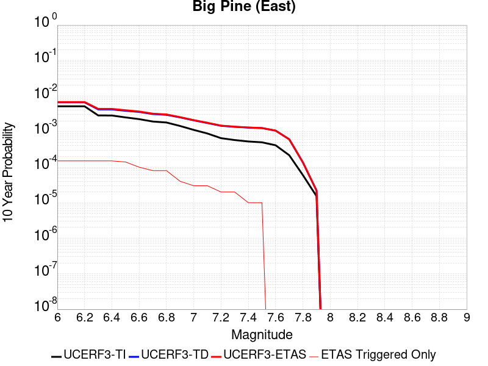 |

| Magnitude | 1 wk TI Prob | 1 wk TD Prob | 1 wk ETAS Prob | 1 wk ETAS/TD Gain | 1 wk ETAS Triggered Only | 1 mo TI Prob | 1 mo TD Prob | 1 mo ETAS Prob | 1 mo ETAS/TD Gain | 1 mo ETAS Triggered Only | 1 yr TI Prob | 1 yr TD Prob | 1 yr ETAS Prob | 1 yr ETAS/TD Gain | 1 yr ETAS Triggered Only | 10 yr TI Prob | 10 yr TD Prob | 10 yr ETAS Prob | 10 yr ETAS/TD Gain | 10 yr ETAS Triggered Only |
|-----|-----|-----|-----|-----|-----|-----|-----|-----|-----|-----|-----|-----|-----|-----|-----|-----|-----|-----|-----|-----|
| 6.0 | 9.916913E-6 | 1.28172705E-5 | 2.910981E-5 | 2.2711396 | 1.6292748E-5 | 4.250036E-5 | 5.493013E-5 | 7.1221984E-5 | 1.2965924 | 1.6292748E-5 | 5.173191E-4 | 6.685912E-4 | 7.662823E-4 | 1.146115 | 9.7756485E-5 | 0.0051611643 | 0.006670449 | 0.0068484736 | 1.0266886 | 1.7922022E-4 |
| 6.1 | 9.916913E-6 | 1.28172705E-5 | 2.910981E-5 | 2.2711396 | 1.6292748E-5 | 4.250036E-5 | 5.493013E-5 | 7.1221984E-5 | 1.2965924 | 1.6292748E-5 | 5.173191E-4 | 6.685912E-4 | 7.662823E-4 | 1.146115 | 9.7756485E-5 | 0.0051611643 | 0.006670449 | 0.0068484736 | 1.0266886 | 1.7922022E-4 |
| 6.2 | 9.916913E-6 | 1.28172705E-5 | 2.910981E-5 | 2.2711396 | 1.6292748E-5 | 4.250036E-5 | 5.493013E-5 | 7.1221984E-5 | 1.2965924 | 1.6292748E-5 | 5.173191E-4 | 6.685912E-4 | 7.662823E-4 | 1.146115 | 9.7756485E-5 | 0.0051611643 | 0.006670449 | 0.0068484736 | 1.0266886 | 1.7922022E-4 |
| 6.3 | 5.479711E-6 | 8.1132375E-6 | 2.4405854E-5 | 3.0081522 | 1.6292748E-5 | 2.3484265E-5 | 3.4770575E-5 | 5.1062754E-5 | 1.4685624 | 1.6292748E-5 | 2.858834E-4 | 4.232527E-4 | 5.209678E-4 | 1.230867 | 9.7756485E-5 | 0.0028551589 | 0.0042272513 | 0.004405714 | 1.0422171 | 1.7922022E-4 |
| 6.4 | 5.465009E-6 | 8.0975315E-6 | 2.4390147E-5 | 3.0120473 | 1.6292748E-5 | 2.3421257E-5 | 3.4703262E-5 | 5.0995444E-5 | 1.4694712 | 1.6292748E-5 | 2.851165E-4 | 4.2243348E-4 | 5.2014866E-4 | 1.231315 | 9.7756485E-5 | 0.0028475097 | 0.00421909 | 0.0043975543 | 1.0422992 | 1.7922022E-4 |
| 6.5 | 4.826767E-6 | 7.4225877E-6 | 2.3715214E-5 | 3.1950064 | 1.6292748E-5 | 2.068598E-5 | 3.1810716E-5 | 4.8102946E-5 | 1.5121616 | 1.6292748E-5 | 2.518227E-4 | 3.8722943E-4 | 4.8494808E-4 | 1.2523533 | 9.7756485E-5 | 0.0025153751 | 0.0038682907 | 0.004030588 | 1.0419558 | 1.6292748E-4 |
| 6.6 | 4.3146847E-6 | 6.8825234E-6 | 2.317516E-5 | 3.3672473 | 1.6292748E-5 | 1.8491375E-5 | 2.949621E-5 | 4.5788478E-5 | 1.5523512 | 1.6292748E-5 | 2.2510924E-4 | 3.5905963E-4 | 4.2420722E-4 | 1.1814395 | 6.517099E-5 | 0.0022488134 | 0.0035875062 | 0.0037011462 | 1.0316767 | 1.1404924E-4 |
| 6.7 | 3.6968106E-6 | 5.9957474E-6 | 2.2288397E-5 | 3.7173676 | 1.6292748E-5 | 1.5843378E-5 | 2.5695816E-5 | 4.1988147E-5 | 1.634046 | 1.6292748E-5 | 1.9287605E-4 | 3.128032E-4 | 3.6166614E-4 | 1.15621 | 4.8878243E-5 | 0.0019270873 | 0.0031262499 | 0.0032237007 | 1.0311718 | 9.7756485E-5 |
| 6.8 | 3.4671132E-6 | 5.7024477E-6 | 2.1995103E-5 | 3.8571336 | 1.6292748E-5 | 1.4858972E-5 | 2.4438841E-5 | 4.073119E-5 | 1.666658 | 1.6292748E-5 | 1.8089297E-4 | 2.9750372E-4 | 3.4636742E-4 | 1.1642457 | 4.8878243E-5 | 0.0018074579 | 0.0029736666 | 0.0030711323 | 1.0327764 | 9.7756485E-5 |
| 6.9 | 2.7686972E-6 | 4.8254797E-6 | 4.8254797E-6 | 1.0 | 0.0 | 1.1865792E-5 | 2.0680467E-5 | 2.0680467E-5 | 1.0 | 0.0 | 1.4445644E-4 | 2.5175634E-4 | 2.8433366E-4 | 1.1294001 | 3.2585496E-5 | 0.0014436257 | 0.002517256 | 0.0025660112 | 1.0193684 | 4.8878243E-5 |
| 7.0 | 2.1472624E-6 | 3.985277E-6 | 3.985277E-6 | 1.0 | 0.0 | 9.20252E-6 | 1.707965E-5 | 1.707965E-5 | 1.0 | 0.0 | 1.12034926E-4 | 2.0792543E-4 | 2.2421479E-4 | 1.0783423 | 1.6292748E-5 | 0.0011197845 | 0.0020798238 | 0.0021123416 | 1.0156349 | 3.2585496E-5 |
| 7.1 | 1.7018335E-6 | 3.3450835E-6 | 3.3450835E-6 | 1.0 | 0.0 | 7.293552E-6 | 1.4335996E-5 | 1.4335996E-5 | 1.0 | 0.0 | 8.879537E-5 | 1.7452713E-4 | 1.9081704E-4 | 1.0933374 | 1.6292748E-5 | 8.87599E-4 | 0.0017463792 | 0.0017789078 | 1.0186263 | 3.2585496E-5 |
| 7.2 | 1.25603E-6 | 2.794679E-6 | 2.794679E-6 | 1.0 | 0.0 | 5.3829745E-6 | 1.1977142E-5 | 1.1977142E-5 | 1.0 | 0.0 | 6.553574E-5 | 1.4581217E-4 | 1.6210254E-4 | 1.1117216 | 1.6292748E-5 | 6.551642E-4 | 0.0014596173 | 0.0014758862 | 1.0111461 | 1.6292748E-5 |
| 7.3 | 1.112297E-6 | 2.610519E-6 | 2.610519E-6 | 1.0 | 0.0 | 4.7669787E-6 | 1.1187892E-5 | 1.1187892E-5 | 1.0 | 0.0 | 5.803642E-5 | 1.3620428E-4 | 1.5249482E-4 | 1.1196036 | 1.6292748E-5 | 5.802127E-4 | 0.001363502 | 0.0013797726 | 1.0119328 | 1.6292748E-5 |
| 7.4 | 1.0137181E-6 | 2.4836752E-6 | 2.4836752E-6 | 1.0 | 0.0 | 4.3444993E-6 | 1.064428E-5 | 1.064428E-5 | 1.0 | 0.0 | 5.2892992E-5 | 1.2958662E-4 | 1.2958662E-4 | 1.0 | 0.0 | 5.288041E-4 | 0.0012971918 | 0.0012971918 | 1.0 | 0.0 |
| 7.5 | 9.598608E-7 | 2.407328E-6 | 2.407328E-6 | 1.0 | 0.0 | 4.1136827E-6 | 1.03170805E-5 | 1.03170805E-5 | 1.0 | 0.0 | 5.0082934E-5 | 1.2560343E-4 | 1.2560343E-4 | 1.0 | 0.0 | 5.007165E-4 | 0.0012572132 | 0.0012572132 | 1.0 | 0.0 |
| 7.6 | 7.929459E-7 | 2.0450152E-6 | 2.0450152E-6 | 1.0 | 0.0 | 3.3983351E-6 | 8.764322E-6 | 8.764322E-6 | 1.0 | 0.0 | 4.1373947E-5 | 1.0670057E-4 | 1.0670057E-4 | 1.0 | 0.0 | 4.1366243E-4 | 0.0010685825 | 0.0010685825 | 1.0 | 0.0 |
| 7.7 | 4.155788E-7 | 1.1606729E-6 | 1.1606729E-6 | 1.0 | 0.0 | 1.7810507E-6 | 4.974303E-6 | 4.974303E-6 | 1.0 | 0.0 | 2.1684076E-5 | 6.05605E-5 | 6.05605E-5 | 1.0 | 0.0 | 2.1681961E-4 | 6.085995E-4 | 6.085995E-4 | 1.0 | 0.0 |
| 7.8 | 1.14666925E-7 | 2.592197E-7 | 2.592197E-7 | 1.0 | 0.0 | 4.914296E-7 | 1.1109411E-6 | 1.1109411E-6 | 1.0 | 0.0 | 5.9831386E-6 | 1.3525627E-5 | 1.3525627E-5 | 1.0 | 0.0 | 5.9829777E-5 | 1.3636416E-4 | 1.3636416E-4 | 1.0 | 0.0 |
| 7.9 | 2.9231824E-8 | 4.1462318E-8 | 4.1462318E-8 | 1.0 | 0.0 | 1.2527924E-7 | 1.7769564E-7 | 1.7769564E-7 | 1.0 | 0.0 | 1.5252737E-6 | 2.1634426E-6 | 2.1634426E-6 | 1.0 | 0.0 | 1.5252632E-5 | 2.197062E-5 | 2.197062E-5 | 1.0 | 0.0 |

## Blue Cut
*[(top)](#table-of-contents)*

| 1 Week | 1 Month | 1 Year | 10 Year |
|-----|-----|-----|-----|
|  |  |  |  |

| Magnitude | 1 wk TI Prob | 1 wk TD Prob | 1 wk ETAS Prob | 1 wk ETAS/TD Gain | 1 wk ETAS Triggered Only | 1 mo TI Prob | 1 mo TD Prob | 1 mo ETAS Prob | 1 mo ETAS/TD Gain | 1 mo ETAS Triggered Only | 1 yr TI Prob | 1 yr TD Prob | 1 yr ETAS Prob | 1 yr ETAS/TD Gain | 1 yr ETAS Triggered Only | 10 yr TI Prob | 10 yr TD Prob | 10 yr ETAS Prob | 10 yr ETAS/TD Gain | 10 yr ETAS Triggered Only |
|-----|-----|-----|-----|-----|-----|-----|-----|-----|-----|-----|-----|-----|-----|-----|-----|-----|-----|-----|-----|-----|
| 6.0 | 2.1227985E-5 | 2.2719574E-5 | 5.5304332E-5 | 2.434215 | 3.2585496E-5 | 9.097391E-5 | 9.73663E-5 | 1.6253095E-4 | 1.6692731 | 6.517099E-5 | 0.0011070445 | 0.0011848481 | 0.0012987622 | 1.0961424 | 1.1404924E-4 | 0.011015458 | 0.011791152 | 0.011952158 | 1.0136548 | 1.6292748E-4 |
| 6.1 | 2.1227985E-5 | 2.2719574E-5 | 5.5304332E-5 | 2.434215 | 3.2585496E-5 | 9.097391E-5 | 9.73663E-5 | 1.6253095E-4 | 1.6692731 | 6.517099E-5 | 0.0011070445 | 0.0011848481 | 0.0012987622 | 1.0961424 | 1.1404924E-4 | 0.011015458 | 0.011791152 | 0.011952158 | 1.0136548 | 1.6292748E-4 |
| 6.2 | 2.1227985E-5 | 2.2719574E-5 | 5.5304332E-5 | 2.434215 | 3.2585496E-5 | 9.097391E-5 | 9.73663E-5 | 1.6253095E-4 | 1.6692731 | 6.517099E-5 | 0.0011070445 | 0.0011848481 | 0.0012987622 | 1.0961424 | 1.1404924E-4 | 0.011015458 | 0.011791152 | 0.011952158 | 1.0136548 | 1.6292748E-4 |
| 6.3 | 1.1613981E-5 | 1.2353542E-5 | 4.4938635E-5 | 3.6377127 | 3.2585496E-5 | 4.9773254E-5 | 5.2942745E-5 | 1.01818405E-4 | 1.9231795 | 4.8878243E-5 | 6.0582085E-4 | 6.443998E-4 | 7.0952874E-4 | 1.1010692 | 6.517099E-5 | 0.0060417196 | 0.0064265593 | 0.0065398756 | 1.0176325 | 1.1404924E-4 |
| 6.4 | 1.1613981E-5 | 1.2353542E-5 | 4.4938635E-5 | 3.6377127 | 3.2585496E-5 | 4.9773254E-5 | 5.2942745E-5 | 1.01818405E-4 | 1.9231795 | 4.8878243E-5 | 6.0582085E-4 | 6.443998E-4 | 7.0952874E-4 | 1.1010692 | 6.517099E-5 | 0.0060417196 | 0.0064265593 | 0.0065398756 | 1.0176325 | 1.1404924E-4 |
| 6.5 | 8.931326E-6 | 9.4816E-6 | 4.2066786E-5 | 4.436676 | 3.2585496E-5 | 3.8276554E-5 | 4.0634844E-5 | 7.321902E-5 | 1.8018776 | 3.2585496E-5 | 4.6591737E-4 | 4.946261E-4 | 5.4348016E-4 | 1.0987697 | 4.8878243E-5 | 0.0046494175 | 0.004936161 | 0.005033435 | 1.0197064 | 9.7756485E-5 |
| 6.6 | 7.345353E-6 | 7.79028E-6 | 4.0375522E-5 | 5.182808 | 3.2585496E-5 | 3.1479703E-5 | 3.338653E-5 | 6.597094E-5 | 1.9759747 | 3.2585496E-5 | 3.83198E-4 | 4.064132E-4 | 4.5527157E-4 | 1.1202185 | 4.8878243E-5 | 0.0038253788 | 0.0040574907 | 0.0041548507 | 1.023995 | 9.7756485E-5 |
| 6.7 | 6.2775666E-6 | 6.655149E-6 | 3.924043E-5 | 5.8962507 | 3.2585496E-5 | 2.690358E-5 | 2.8521798E-5 | 6.1106366E-5 | 2.1424444 | 3.2585496E-5 | 3.2750185E-4 | 3.472051E-4 | 3.9606635E-4 | 1.1407274 | 4.8878243E-5 | 0.0032701963 | 0.003467367 | 0.0035647845 | 1.0280955 | 9.7756485E-5 |
| 6.8 | 5.5234095E-6 | 5.8551113E-6 | 3.8440416E-5 | 6.565275 | 3.2585496E-5 | 2.367154E-5 | 2.5093133E-5 | 5.767781E-5 | 2.2985497 | 3.2585496E-5 | 2.8816288E-4 | 3.0547334E-4 | 3.5433666E-4 | 1.1599593 | 4.8878243E-5 | 0.002877895 | 0.0030512505 | 0.0031487087 | 1.0319405 | 9.7756485E-5 |
| 6.9 | 4.7780054E-6 | 5.0654203E-6 | 3.7650752E-5 | 7.4328976 | 3.2585496E-5 | 2.0477004E-5 | 2.1708804E-5 | 5.4293592E-5 | 2.5009942 | 3.2585496E-5 | 2.4927902E-4 | 2.642797E-4 | 2.9685657E-4 | 1.1232667 | 3.2585496E-5 | 0.0024899957 | 0.002640346 | 0.002705345 | 1.0246176 | 6.517099E-5 |
| 7.0 | 3.883171E-6 | 4.118487E-6 | 3.670385E-5 | 8.911974 | 3.2585496E-5 | 1.6642054E-5 | 1.7650578E-5 | 5.02355E-5 | 2.8461106 | 3.2585496E-5 | 2.0259817E-4 | 2.1488148E-4 | 2.4745998E-4 | 1.1516114 | 3.2585496E-5 | 0.0020241356 | 0.0021474129 | 0.0022124439 | 1.0302835 | 6.517099E-5 |
| 7.1 | 2.8358215E-6 | 3.0097158E-6 | 1.9302415E-5 | 6.4133677 | 1.6292748E-5 | 1.2153464E-5 | 1.2898756E-5 | 2.9191293E-5 | 2.2631092 | 1.6292748E-5 | 1.4795837E-4 | 1.5703762E-4 | 1.733278E-4 | 1.1037344 | 1.6292748E-5 | 0.001478599 | 0.0015699116 | 0.0015861788 | 1.0103618 | 1.6292748E-5 |

## Imperial
*[(top)](#table-of-contents)*

| 1 Week | 1 Month | 1 Year | 10 Year |
|-----|-----|-----|-----|
|  |  | 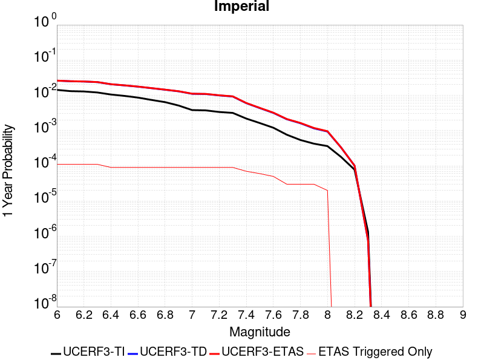 |  |

| Magnitude | 1 wk TI Prob | 1 wk TD Prob | 1 wk ETAS Prob | 1 wk ETAS/TD Gain | 1 wk ETAS Triggered Only | 1 mo TI Prob | 1 mo TD Prob | 1 mo ETAS Prob | 1 mo ETAS/TD Gain | 1 mo ETAS Triggered Only | 1 yr TI Prob | 1 yr TD Prob | 1 yr ETAS Prob | 1 yr ETAS/TD Gain | 1 yr ETAS Triggered Only | 10 yr TI Prob | 10 yr TD Prob | 10 yr ETAS Prob | 10 yr ETAS/TD Gain | 10 yr ETAS Triggered Only |
|-----|-----|-----|-----|-----|-----|-----|-----|-----|-----|-----|-----|-----|-----|-----|-----|-----|-----|-----|-----|-----|
| 6.0 | 2.7496446E-4 | 5.055345E-4 | 6.032416E-4 | 1.1932747 | 9.7756485E-5 | 0.0011778869 | 0.002164817 | 0.0022948768 | 1.0600789 | 1.3034198E-4 | 0.0142467655 | 0.026048409 | 0.026191225 | 1.0054827 | 1.4663473E-4 | 0.13367249 | 0.22807029 | 0.22820863 | 1.0006065 | 1.7922022E-4 |
| 6.1 | 2.5356023E-4 | 4.8657708E-4 | 5.84286E-4 | 1.2008088 | 9.7756485E-5 | 0.001086234 | 0.002083702 | 0.0022137724 | 1.0624228 | 1.3034198E-4 | 0.013144928 | 0.02507094 | 0.025213897 | 1.0057021 | 1.4663473E-4 | 0.123940155 | 0.21949561 | 0.2196355 | 1.0006373 | 1.7922022E-4 |
| 6.2 | 2.4820742E-4 | 4.775311E-4 | 5.7524093E-4 | 1.2046145 | 9.7756485E-5 | 0.0010633124 | 0.0020449946 | 0.00217507 | 1.0636067 | 1.3034198E-4 | 0.01286919 | 0.024610676 | 0.024753701 | 1.0058116 | 1.4663473E-4 | 0.12148927 | 0.21600136 | 0.21614188 | 1.0006505 | 1.7922022E-4 |
| 6.3 | 2.3205351E-4 | 4.5892023E-4 | 5.566319E-4 | 1.2129164 | 9.7756485E-5 | 9.94136E-4 | 0.0019653554 | 0.002095441 | 1.0661894 | 1.3034198E-4 | 0.012036599 | 0.023661187 | 0.023804352 | 1.0060506 | 1.4663473E-4 | 0.11405133 | 0.20793827 | 0.20808022 | 1.0006827 | 1.7922022E-4 |
| 6.4 | 2.0304754E-4 | 3.9878016E-4 | 4.6392516E-4 | 1.1633607 | 6.517099E-5 | 8.6991355E-4 | 0.0017079529 | 0.0018055425 | 1.0571383 | 9.7756485E-5 | 0.010539869 | 0.020595418 | 0.02070712 | 1.0054235 | 1.1404924E-4 | 0.100537635 | 0.18507113 | 0.18517734 | 1.000574 | 1.3034198E-4 |
| 6.5 | 1.854992E-4 | 3.6990462E-4 | 4.350515E-4 | 1.176118 | 6.517099E-5 | 7.9475436E-4 | 0.0015843548 | 0.0016819563 | 1.0616034 | 9.7756485E-5 | 0.009633281 | 0.01911443 | 0.019226298 | 1.0058526 | 1.1404924E-4 | 0.0922623 | 0.1733039 | 0.17341165 | 1.0006218 | 1.3034198E-4 |
| 6.6 | 1.6586106E-4 | 3.4036173E-4 | 4.0551057E-4 | 1.1914105 | 6.517099E-5 | 7.106394E-4 | 0.0014578878 | 0.0015555018 | 1.0669558 | 9.7756485E-5 | 0.008617763 | 0.017607626 | 0.017719666 | 1.0063633 | 1.1404924E-4 | 0.08291132 | 0.16078055 | 0.16088992 | 1.0006803 | 1.3034198E-4 |
| 6.7 | 1.4224656E-4 | 3.076812E-4 | 3.7283215E-4 | 1.2117482 | 6.517099E-5 | 6.094856E-4 | 0.0013179756 | 0.0014156032 | 1.0740739 | 9.7756485E-5 | 0.0073952693 | 0.015928522 | 0.016040754 | 1.007046 | 1.1404924E-4 | 0.07153955 | 0.14648798 | 0.14659923 | 1.0007595 | 1.3034198E-4 |
| 6.8 | 1.2317259E-4 | 2.779231E-4 | 3.4307598E-4 | 1.2344277 | 6.517099E-5 | 5.2777573E-4 | 0.0011905615 | 0.0012882015 | 1.0820118 | 9.7756485E-5 | 0.0064067547 | 0.014400131 | 0.014512538 | 1.007806 | 1.1404924E-4 | 0.06225166 | 0.13294089 | 0.1330539 | 1.0008501 | 1.3034198E-4 |
| 6.9 | 9.859898E-5 | 2.5015484E-4 | 3.1530953E-4 | 1.2604574 | 6.517099E-5 | 4.2249862E-4 | 0.0010716559 | 0.0011693076 | 1.0911223 | 9.7756485E-5 | 0.0051317946 | 0.012970319 | 0.013082889 | 1.008679 | 1.1404924E-4 | 0.05014893 | 0.119408876 | 0.11952365 | 1.0009612 | 1.3034198E-4 |
| 7.0 | 7.3191884E-5 | 2.1267848E-4 | 2.778356E-4 | 1.3063644 | 6.517099E-5 | 3.136418E-4 | 9.11164E-4 | 0.0010088314 | 1.1071898 | 9.7756485E-5 | 0.003811904 | 0.011037681 | 0.011150472 | 1.0102186 | 1.1404924E-4 | 0.037471764 | 0.10206756 | 0.1021846 | 1.0011467 | 1.3034198E-4 |
| 7.1 | 7.1760296E-5 | 2.0969207E-4 | 2.748494E-4 | 1.3107287 | 6.517099E-5 | 3.0750787E-4 | 8.9837395E-4 | 9.960426E-4 | 1.1087172 | 9.7756485E-5 | 0.003737482 | 0.010883528 | 0.010996336 | 1.010365 | 1.1404924E-4 | 0.03675245 | 0.10070406 | 0.10082128 | 1.001164 | 1.3034198E-4 |
| 7.2 | 6.46614E-5 | 1.9137723E-4 | 2.5653574E-4 | 1.3404716 | 6.517099E-5 | 2.7709085E-4 | 8.199333E-4 | 9.1760966E-4 | 1.1191272 | 9.7756485E-5 | 0.0033683628 | 0.009937617 | 0.010050533 | 1.0113624 | 1.1404924E-4 | 0.033177625 | 0.092511006 | 0.09262929 | 1.0012786 | 1.3034198E-4 |
| 7.3 | 6.088115E-5 | 1.780939E-4 | 2.432533E-4 | 1.365871 | 6.517099E-5 | 2.6089314E-4 | 7.6303916E-4 | 8.6072105E-4 | 1.1280168 | 9.7756485E-5 | 0.0031717476 | 0.009251006 | 0.0093640005 | 1.0122143 | 1.1404924E-4 | 0.031268585 | 0.08656135 | 0.08668041 | 1.0013754 | 1.3034198E-4 |
| 7.4 | 4.199346E-5 | 1.1511097E-4 | 1.6398358E-4 | 1.4245696 | 4.8878243E-5 | 1.7995955E-4 | 4.932403E-4 | 5.5837916E-4 | 1.1320632 | 6.517099E-5 | 0.0021888057 | 0.005988835 | 0.006069811 | 1.0135212 | 8.146374E-5 | 0.02167372 | 0.05744024 | 0.057517026 | 1.0013368 | 8.146374E-5 |
| 7.5 | 3.130448E-5 | 8.333871E-5 | 1.15921495E-4 | 1.3909681 | 3.2585496E-5 | 1.3415517E-4 | 3.5711733E-4 | 4.0597812E-4 | 1.13682 | 4.8878243E-5 | 0.0016321153 | 0.0043392954 | 0.0044041835 | 1.0149536 | 6.517099E-5 | 0.016201803 | 0.042133506 | 0.04219593 | 1.0014817 | 6.517099E-5 |
| 7.6 | 2.3074248E-5 | 6.0849357E-5 | 9.343287E-5 | 1.5354784 | 3.2585496E-5 | 9.888588E-5 | 2.6075702E-4 | 3.0962253E-4 | 1.1873986 | 4.8878243E-5 | 0.0012032706 | 0.0031701182 | 0.0032350826 | 1.0204928 | 6.517099E-5 | 0.011967761 | 0.03102816 | 0.03109131 | 1.0020353 | 6.517099E-5 |
| 7.7 | 1.45864815E-5 | 4.0128452E-5 | 7.271264E-5 | 1.8119972 | 3.2585496E-5 | 6.2511994E-5 | 1.7196777E-4 | 2.0454766E-4 | 1.1894535 | 3.2585496E-5 | 7.608177E-4 | 0.0020917025 | 0.0021404785 | 1.0233188 | 4.8878243E-5 | 0.007582182 | 0.02062909 | 0.02067696 | 1.0023205 | 4.8878243E-5 |
| 7.8 | 1.0352979E-5 | 3.096395E-5 | 6.354844E-5 | 2.0523362 | 3.2585496E-5 | 4.4369157E-5 | 1.326959E-4 | 1.6527707E-4 | 1.2455326 | 3.2585496E-5 | 5.400606E-4 | 0.0016143778 | 0.0016631772 | 1.0302279 | 4.8878243E-5 | 0.0053875 | 0.016017893 | 0.016065989 | 1.0030026 | 4.8878243E-5 |
| 7.9 | 8.137906E-6 | 2.2151205E-5 | 5.473598E-5 | 2.471016 | 3.2585496E-5 | 3.4876273E-5 | 9.493029E-5 | 1.275127E-4 | 1.3432245 | 3.2585496E-5 | 4.2453592E-4 | 0.0011551644 | 0.0012039862 | 1.0422639 | 4.8878243E-5 | 0.004237258 | 0.011618842 | 0.011667153 | 1.0041579 | 4.8878243E-5 |
| 8.0 | 6.93792E-6 | 1.8010365E-5 | 3.4302822E-5 | 1.9046154 | 1.6292748E-5 | 2.9733603E-5 | 7.7185E-5 | 9.347649E-5 | 1.2110707 | 1.6292748E-5 | 3.6194647E-4 | 9.3932304E-4 | 9.718779E-4 | 1.0346578 | 3.2585496E-5 | 0.0036135751 | 0.009502415 | 0.0095346905 | 1.0033966 | 3.2585496E-5 |
| 8.1 | 3.4286315E-6 | 6.380179E-6 | 6.380179E-6 | 1.0 | 0.0 | 1.4694053E-5 | 2.734334E-5 | 2.734334E-5 | 1.0 | 0.0 | 1.7888541E-4 | 3.3285443E-4 | 3.3285443E-4 | 1.0 | 0.0 | 0.0017874148 | 0.0034863674 | 0.0034863674 | 1.0 | 0.0 |
| 8.2 | 1.4906886E-6 | 1.936633E-6 | 1.936633E-6 | 1.0 | 0.0 | 6.3886496E-6 | 8.2998295E-6 | 8.2998295E-6 | 1.0 | 0.0 | 7.7779034E-5 | 1.0104576E-4 | 1.0104576E-4 | 1.0 | 0.0 | 7.775182E-4 | 0.0011075423 | 0.0011075423 | 1.0 | 0.0 |
| 8.3 | 2.5758007E-8 | 1.4495866E-8 | 1.4495866E-8 | 1.0 | 0.0 | 1.10391454E-7 | 6.212514E-8 | 6.212514E-8 | 1.0 | 0.0 | 1.3440151E-6 | 7.563736E-7 | 7.563736E-7 | 1.0 | 0.0 | 1.344007E-5 | 7.884359E-6 | 7.884359E-6 | 1.0 | 0.0 |

## Cleghorn Pass
*[(top)](#table-of-contents)*

| 1 Week | 1 Month | 1 Year | 10 Year |
|-----|-----|-----|-----|
|  |  |  | 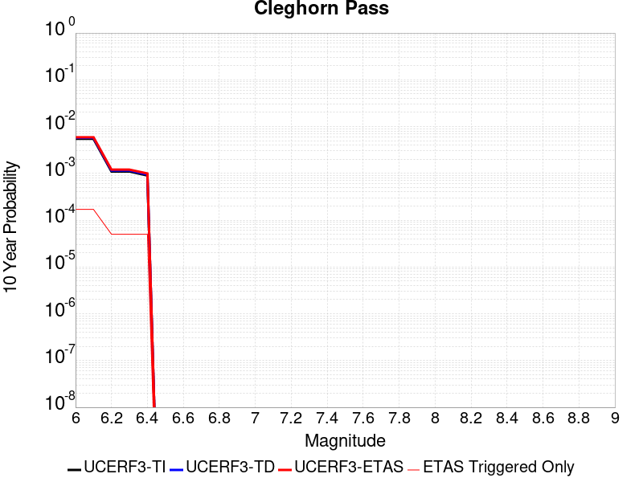 |

| Magnitude | 1 wk TI Prob | 1 wk TD Prob | 1 wk ETAS Prob | 1 wk ETAS/TD Gain | 1 wk ETAS Triggered Only | 1 mo TI Prob | 1 mo TD Prob | 1 mo ETAS Prob | 1 mo ETAS/TD Gain | 1 mo ETAS Triggered Only | 1 yr TI Prob | 1 yr TD Prob | 1 yr ETAS Prob | 1 yr ETAS/TD Gain | 1 yr ETAS Triggered Only | 10 yr TI Prob | 10 yr TD Prob | 10 yr ETAS Prob | 10 yr ETAS/TD Gain | 10 yr ETAS Triggered Only |
|-----|-----|-----|-----|-----|-----|-----|-----|-----|-----|-----|-----|-----|-----|-----|-----|-----|-----|-----|-----|-----|
| 6.0 | 1.0522846E-5 | 1.1040642E-5 | 5.9918348E-5 | 5.427071 | 4.8878243E-5 | 4.509713E-5 | 4.7316473E-5 | 9.619241E-5 | 2.032958 | 4.8878243E-5 | 5.4891926E-4 | 5.759784E-4 | 6.573953E-4 | 1.141354 | 8.146374E-5 | 0.0054756533 | 0.005750022 | 0.0058958135 | 1.025355 | 1.4663473E-4 |
| 6.1 | 1.0522846E-5 | 1.1040642E-5 | 5.9918348E-5 | 5.427071 | 4.8878243E-5 | 4.509713E-5 | 4.7316473E-5 | 9.619241E-5 | 2.032958 | 4.8878243E-5 | 5.4891926E-4 | 5.759784E-4 | 6.573953E-4 | 1.141354 | 8.146374E-5 | 0.0054756533 | 0.005750022 | 0.0058958135 | 1.025355 | 1.4663473E-4 |
| 6.2 | 2.1045846E-6 | 2.2082024E-6 | 2.2082024E-6 | 1.0 | 0.0 | 9.019617E-6 | 9.463714E-6 | 9.463714E-6 | 1.0 | 0.0 | 1.098083E-4 | 1.1521882E-4 | 1.1521882E-4 | 1.0 | 0.0 | 0.0010975406 | 0.0011520023 | 0.0011520023 | 1.0 | 0.0 |
| 6.3 | 2.1045846E-6 | 2.2082024E-6 | 2.2082024E-6 | 1.0 | 0.0 | 9.019617E-6 | 9.463714E-6 | 9.463714E-6 | 1.0 | 0.0 | 1.098083E-4 | 1.1521882E-4 | 1.1521882E-4 | 1.0 | 0.0 | 0.0010975406 | 0.0011520023 | 0.0011520023 | 1.0 | 0.0 |
| 6.4 | 1.7259927E-6 | 1.810877E-6 | 1.810877E-6 | 1.0 | 0.0 | 7.3970905E-6 | 7.760902E-6 | 7.760902E-6 | 1.0 | 0.0 | 9.005586E-5 | 9.4488976E-5 | 9.4488976E-5 | 1.0 | 0.0 | 9.001937E-4 | 9.448898E-4 | 9.448898E-4 | 1.0 | 0.0 |

## Pleito
*[(top)](#table-of-contents)*

| 1 Week | 1 Month | 1 Year | 10 Year |
|-----|-----|-----|-----|
|  |  |  |  |

| Magnitude | 1 wk TI Prob | 1 wk TD Prob | 1 wk ETAS Prob | 1 wk ETAS/TD Gain | 1 wk ETAS Triggered Only | 1 mo TI Prob | 1 mo TD Prob | 1 mo ETAS Prob | 1 mo ETAS/TD Gain | 1 mo ETAS Triggered Only | 1 yr TI Prob | 1 yr TD Prob | 1 yr ETAS Prob | 1 yr ETAS/TD Gain | 1 yr ETAS Triggered Only | 10 yr TI Prob | 10 yr TD Prob | 10 yr ETAS Prob | 10 yr ETAS/TD Gain | 10 yr ETAS Triggered Only |
|-----|-----|-----|-----|-----|-----|-----|-----|-----|-----|-----|-----|-----|-----|-----|-----|-----|-----|-----|-----|-----|
| 6.0 | 1.6763008E-5 | 2.4764735E-5 | 5.7349425E-5 | 2.3157697 | 3.2585496E-5 | 7.183948E-5 | 1.0613067E-4 | 1.7129474E-4 | 1.6139985 | 6.517099E-5 | 8.742947E-4 | 0.001291447 | 0.001405349 | 1.0881971 | 1.1404924E-4 | 0.00870863 | 0.012954412 | 0.013115229 | 1.0124141 | 1.6292748E-4 |
| 6.1 | 1.6763008E-5 | 2.4764735E-5 | 5.7349425E-5 | 2.3157697 | 3.2585496E-5 | 7.183948E-5 | 1.0613067E-4 | 1.7129474E-4 | 1.6139985 | 6.517099E-5 | 8.742947E-4 | 0.001291447 | 0.001405349 | 1.0881971 | 1.1404924E-4 | 0.00870863 | 0.012954412 | 0.013115229 | 1.0124141 | 1.6292748E-4 |
| 6.2 | 1.6763008E-5 | 2.4764735E-5 | 5.7349425E-5 | 2.3157697 | 3.2585496E-5 | 7.183948E-5 | 1.0613067E-4 | 1.7129474E-4 | 1.6139985 | 6.517099E-5 | 8.742947E-4 | 0.001291447 | 0.001405349 | 1.0881971 | 1.1404924E-4 | 0.00870863 | 0.012954412 | 0.013115229 | 1.0124141 | 1.6292748E-4 |
| 6.3 | 1.6763008E-5 | 2.4764735E-5 | 5.7349425E-5 | 2.3157697 | 3.2585496E-5 | 7.183948E-5 | 1.0613067E-4 | 1.7129474E-4 | 1.6139985 | 6.517099E-5 | 8.742947E-4 | 0.001291447 | 0.001405349 | 1.0881971 | 1.1404924E-4 | 0.00870863 | 0.012954412 | 0.013115229 | 1.0124141 | 1.6292748E-4 |
| 6.4 | 1.6763008E-5 | 2.4764735E-5 | 5.7349425E-5 | 2.3157697 | 3.2585496E-5 | 7.183948E-5 | 1.0613067E-4 | 1.7129474E-4 | 1.6139985 | 6.517099E-5 | 8.742947E-4 | 0.001291447 | 0.001405349 | 1.0881971 | 1.1404924E-4 | 0.00870863 | 0.012954412 | 0.013115229 | 1.0124141 | 1.6292748E-4 |
| 6.5 | 1.6763008E-5 | 2.4764735E-5 | 5.7349425E-5 | 2.3157697 | 3.2585496E-5 | 7.183948E-5 | 1.0613067E-4 | 1.7129474E-4 | 1.6139985 | 6.517099E-5 | 8.742947E-4 | 0.001291447 | 0.001405349 | 1.0881971 | 1.1404924E-4 | 0.00870863 | 0.012954412 | 0.013115229 | 1.0124141 | 1.6292748E-4 |
| 6.6 | 9.910213E-6 | 1.721552E-5 | 3.350799E-5 | 1.9463825 | 1.6292748E-5 | 4.247165E-5 | 7.3778734E-5 | 1.2265338E-4 | 1.6624489 | 4.8878243E-5 | 5.169696E-4 | 8.9788967E-4 | 9.46724E-4 | 1.0543879 | 4.8878243E-5 | 0.0051576863 | 0.009051226 | 0.009115807 | 1.007135 | 6.517099E-5 |
| 6.7 | 9.910213E-6 | 1.721552E-5 | 3.350799E-5 | 1.9463825 | 1.6292748E-5 | 4.247165E-5 | 7.3778734E-5 | 1.2265338E-4 | 1.6624489 | 4.8878243E-5 | 5.169696E-4 | 8.9788967E-4 | 9.46724E-4 | 1.0543879 | 4.8878243E-5 | 0.0051576863 | 0.009051226 | 0.009115807 | 1.007135 | 6.517099E-5 |
| 6.8 | 8.300162E-6 | 1.5475129E-5 | 3.1767624E-5 | 2.052818 | 1.6292748E-5 | 3.557164E-5 | 6.63203E-5 | 1.15195304E-4 | 1.7369539 | 4.8878243E-5 | 4.3299864E-4 | 8.07152E-4 | 8.559908E-4 | 1.0605075 | 4.8878243E-5 | 0.004321559 | 0.008150663 | 0.008215303 | 1.0079306 | 6.517099E-5 |
| 6.9 | 8.183114E-6 | 1.5346344E-5 | 3.1638843E-5 | 2.0616534 | 1.6292748E-5 | 3.5070017E-5 | 6.57684E-5 | 1.1464342E-4 | 1.7431386 | 4.8878243E-5 | 4.2689382E-4 | 8.0043747E-4 | 8.492766E-4 | 1.0610155 | 4.8878243E-5 | 0.0042607468 | 0.008084008 | 0.008148652 | 1.0079966 | 6.517099E-5 |
| 7.0 | 7.1748823E-6 | 1.4133306E-5 | 3.0425823E-5 | 2.1527748 | 1.6292748E-5 | 3.0749135E-5 | 6.0569906E-5 | 1.09445195E-4 | 1.8069235 | 4.8878243E-5 | 3.743064E-4 | 7.3718966E-4 | 7.8603183E-4 | 1.0662546 | 4.8878243E-5 | 0.0037367654 | 0.0074553755 | 0.0075200605 | 1.0086763 | 6.517099E-5 |
| 7.1 | 7.1671807E-6 | 1.4123676E-5 | 3.0416193E-5 | 2.1535609 | 1.6292748E-5 | 3.0716128E-5 | 6.0528637E-5 | 1.09403925E-4 | 1.8074738 | 4.8878243E-5 | 3.7390468E-4 | 7.366875E-4 | 7.8552973E-4 | 1.0662998 | 4.8878243E-5 | 0.0037327618 | 0.0074503883 | 0.0075150738 | 1.0086821 | 6.517099E-5 |
| 7.2 | 7.0649667E-6 | 1.3970962E-5 | 3.0263482E-5 | 2.1661704 | 1.6292748E-5 | 3.0278077E-5 | 5.987418E-5 | 1.087495E-4 | 1.8163004 | 4.8878243E-5 | 3.6857324E-4 | 7.287248E-4 | 7.7756745E-4 | 1.0670248 | 4.8878243E-5 | 0.0036796255 | 0.0073711374 | 0.007435828 | 1.0087762 | 6.517099E-5 |
| 7.3 | 7.02082E-6 | 1.3914415E-5 | 3.0206937E-5 | 2.1709096 | 1.6292748E-5 | 3.008888E-5 | 5.9631846E-5 | 1.0850718E-4 | 1.8196179 | 4.8878243E-5 | 3.6627054E-4 | 7.257764E-4 | 7.7461917E-4 | 1.0672972 | 4.8878243E-5 | 0.0036566744 | 0.0073416373 | 0.00740633 | 1.0088117 | 6.517099E-5 |
| 7.4 | 6.987146E-6 | 1.3873975E-5 | 3.0166497E-5 | 2.1743226 | 1.6292748E-5 | 2.9944567E-5 | 5.9458544E-5 | 1.0833388E-4 | 1.8220071 | 4.8878243E-5 | 3.6451413E-4 | 7.2366785E-4 | 7.725107E-4 | 1.0674934 | 4.8878243E-5 | 0.0036391679 | 0.007320571 | 0.0073852655 | 1.0088372 | 6.517099E-5 |
| 7.5 | 6.9494554E-6 | 1.383088E-5 | 3.0123403E-5 | 2.1779816 | 1.6292748E-5 | 2.9783041E-5 | 5.9273858E-5 | 1.081492E-4 | 1.8245684 | 4.8878243E-5 | 3.625482E-4 | 7.2142074E-4 | 7.702637E-4 | 1.0677038 | 4.8878243E-5 | 0.0036195726 | 0.007298199 | 0.0073628942 | 1.0088645 | 6.517099E-5 |
| 7.6 | 6.92694E-6 | 1.3789992E-5 | 3.0082516E-5 | 2.1814744 | 1.6292748E-5 | 2.9686547E-5 | 5.909863E-5 | 1.0797399E-4 | 1.8270134 | 4.8878243E-5 | 3.6137376E-4 | 7.192888E-4 | 7.6813187E-4 | 1.0679047 | 4.8878243E-5 | 0.0036078666 | 0.007276951 | 0.0073416475 | 1.0088906 | 6.517099E-5 |
| 7.7 | 6.395867E-6 | 1.26690065E-5 | 2.896155E-5 | 2.2860157 | 1.6292748E-5 | 2.741057E-5 | 5.4294615E-5 | 1.03170205E-4 | 1.9001923 | 4.8878243E-5 | 3.336726E-4 | 6.6083675E-4 | 7.096827E-4 | 1.0739152 | 4.8878243E-5 | 0.0033317201 | 0.0066955453 | 0.00676028 | 1.0096684 | 6.517099E-5 |
| 7.8 | 5.8664327E-6 | 1.1536581E-5 | 2.782914E-5 | 2.4122522 | 1.6292748E-5 | 2.5141611E-5 | 4.9441554E-5 | 8.2025435E-5 | 1.6590384 | 3.2585496E-5 | 3.060561E-4 | 6.0178485E-4 | 6.3435076E-4 | 1.0541155 | 3.2585496E-5 | 0.0030563495 | 0.0061010164 | 0.006133403 | 1.0053084 | 3.2585496E-5 |
| 7.9 | 3.7167474E-6 | 7.1145205E-6 | 7.1145205E-6 | 1.0 | 0.0 | 1.592882E-5 | 3.0490448E-5 | 4.6782698E-5 | 1.5343395 | 1.6292748E-5 | 1.9391612E-4 | 3.7115812E-4 | 3.8744483E-4 | 1.0438808 | 1.6292748E-5 | 0.0019374699 | 0.0037676243 | 0.0037838558 | 1.0043081 | 1.6292748E-5 |
| 8.0 | 1.0903841E-6 | 1.2879104E-6 | 1.2879104E-6 | 1.0 | 0.0 | 4.6730665E-6 | 5.5196047E-6 | 5.5196047E-6 | 1.0 | 0.0 | 5.68931E-5 | 6.719913E-5 | 6.719913E-5 | 1.0 | 0.0 | 5.6878536E-4 | 6.942094E-4 | 6.942094E-4 | 1.0 | 0.0 |
| 8.1 | 2.6894583E-7 | 1.1056095E-7 | 1.1056095E-7 | 1.0 | 0.0 | 1.1526245E-6 | 4.7383253E-7 | 4.7383253E-7 | 1.0 | 0.0 | 1.4033113E-5 | 5.768896E-6 | 5.768896E-6 | 1.0 | 0.0 | 1.4032227E-4 | 6.454915E-5 | 6.454915E-5 | 1.0 | 0.0 |
| 8.2 | 5.2967013E-9 | 2.4567874E-9 | 2.4567874E-9 | 1.0 | 0.0 | 2.2700148E-8 | 1.0529089E-8 | 1.0529089E-8 | 1.0 | 0.0 | 2.7637427E-7 | 1.2819166E-7 | 1.2819166E-7 | 1.0 | 0.0 | 2.7637393E-6 | 1.4588004E-6 | 1.4588004E-6 | 1.0 | 0.0 |

## San Jacinto (Anza) rev
*[(top)](#table-of-contents)*

| 1 Week | 1 Month | 1 Year | 10 Year |
|-----|-----|-----|-----|
|  |  |  | 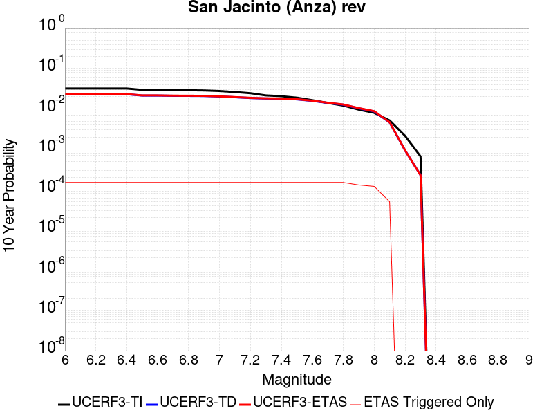 |

| Magnitude | 1 wk TI Prob | 1 wk TD Prob | 1 wk ETAS Prob | 1 wk ETAS/TD Gain | 1 wk ETAS Triggered Only | 1 mo TI Prob | 1 mo TD Prob | 1 mo ETAS Prob | 1 mo ETAS/TD Gain | 1 mo ETAS Triggered Only | 1 yr TI Prob | 1 yr TD Prob | 1 yr ETAS Prob | 1 yr ETAS/TD Gain | 1 yr ETAS Triggered Only | 10 yr TI Prob | 10 yr TD Prob | 10 yr ETAS Prob | 10 yr ETAS/TD Gain | 10 yr ETAS Triggered Only |
|-----|-----|-----|-----|-----|-----|-----|-----|-----|-----|-----|-----|-----|-----|-----|-----|-----|-----|-----|-----|-----|
| 6.0 | 6.3015636E-5 | 4.3298347E-5 | 1.4105061E-4 | 3.257644 | 9.7756485E-5 | 2.7003905E-4 | 1.8555121E-4 | 2.995793E-4 | 1.6145369 | 1.1404924E-4 | 0.0032827691 | 0.0022567573 | 0.0024193171 | 1.0720325 | 1.6292748E-4 | 0.032346968 | 0.02329361 | 0.023452744 | 1.0068315 | 1.6292748E-4 |
| 6.1 | 6.3015636E-5 | 4.3298347E-5 | 1.4105061E-4 | 3.257644 | 9.7756485E-5 | 2.7003905E-4 | 1.8555121E-4 | 2.995793E-4 | 1.6145369 | 1.1404924E-4 | 0.0032827691 | 0.0022567573 | 0.0024193171 | 1.0720325 | 1.6292748E-4 | 0.032346968 | 0.02329361 | 0.023452744 | 1.0068315 | 1.6292748E-4 |
| 6.2 | 6.3015636E-5 | 4.3298347E-5 | 1.4105061E-4 | 3.257644 | 9.7756485E-5 | 2.7003905E-4 | 1.8555121E-4 | 2.995793E-4 | 1.6145369 | 1.1404924E-4 | 0.0032827691 | 0.0022567573 | 0.0024193171 | 1.0720325 | 1.6292748E-4 | 0.032346968 | 0.02329361 | 0.023452744 | 1.0068315 | 1.6292748E-4 |
| 6.3 | 6.3015636E-5 | 4.3298347E-5 | 1.4105061E-4 | 3.257644 | 9.7756485E-5 | 2.7003905E-4 | 1.8555121E-4 | 2.995793E-4 | 1.6145369 | 1.1404924E-4 | 0.0032827691 | 0.0022567573 | 0.0024193171 | 1.0720325 | 1.6292748E-4 | 0.032346968 | 0.02329361 | 0.023452744 | 1.0068315 | 1.6292748E-4 |
| 6.4 | 6.3015636E-5 | 4.3298347E-5 | 1.4105061E-4 | 3.257644 | 9.7756485E-5 | 2.7003905E-4 | 1.8555121E-4 | 2.995793E-4 | 1.6145369 | 1.1404924E-4 | 0.0032827691 | 0.0022567573 | 0.0024193171 | 1.0720325 | 1.6292748E-4 | 0.032346968 | 0.02329361 | 0.023452744 | 1.0068315 | 1.6292748E-4 |
| 6.5 | 5.811017E-5 | 4.0080286E-5 | 1.3783286E-4 | 3.438919 | 9.7756485E-5 | 2.4901982E-4 | 1.7176138E-4 | 2.8579103E-4 | 1.6638842 | 1.1404924E-4 | 0.0030276014 | 0.0020891947 | 0.0022517818 | 1.0778228 | 1.6292748E-4 | 0.02986684 | 0.021590833 | 0.021750243 | 1.0073832 | 1.6292748E-4 |
| 6.6 | 5.811017E-5 | 4.0080286E-5 | 1.3783286E-4 | 3.438919 | 9.7756485E-5 | 2.4901982E-4 | 1.7176138E-4 | 2.8579103E-4 | 1.6638842 | 1.1404924E-4 | 0.0030276014 | 0.0020891947 | 0.0022517818 | 1.0778228 | 1.6292748E-4 | 0.02986684 | 0.021590833 | 0.021750243 | 1.0073832 | 1.6292748E-4 |
| 6.7 | 5.712442E-5 | 3.950301E-5 | 1.3725564E-4 | 3.4745615 | 9.7756485E-5 | 2.4479596E-4 | 1.6928767E-4 | 2.833176E-4 | 1.6735867 | 1.1404924E-4 | 0.0029763177 | 0.0020591344 | 0.0022217266 | 1.0789614 | 1.6292748E-4 | 0.029367693 | 0.021282919 | 0.021442378 | 1.0074924 | 1.6292748E-4 |
| 6.8 | 5.6967532E-5 | 3.93593E-5 | 1.3711194E-4 | 3.483597 | 9.7756485E-5 | 2.4412372E-4 | 1.6867183E-4 | 2.8270183E-4 | 1.6760465 | 1.1404924E-4 | 0.0029681553 | 0.0020516508 | 0.002214244 | 1.07925 | 1.6292748E-4 | 0.029288229 | 0.02120852 | 0.021367991 | 1.0075192 | 1.6292748E-4 |
| 6.9 | 5.6211324E-5 | 3.9064216E-5 | 1.3681689E-4 | 3.5023584 | 9.7756485E-5 | 2.4088343E-4 | 1.6740736E-4 | 2.814375E-4 | 1.6811538 | 1.1404924E-4 | 0.0029288116 | 0.0020362847 | 0.0021988805 | 1.0798492 | 1.6292748E-4 | 0.028905109 | 0.021047527 | 0.021207025 | 1.007578 | 1.6292748E-4 |
| 7.0 | 5.4383527E-5 | 3.7925012E-5 | 1.356778E-4 | 3.577528 | 9.7756485E-5 | 2.3305144E-4 | 1.6252567E-4 | 2.7655635E-4 | 1.7016165 | 1.1404924E-4 | 0.0028337094 | 0.001976959 | 0.0021395644 | 1.0822502 | 1.6292748E-4 | 0.027978465 | 0.02044095 | 0.020600546 | 1.0078077 | 1.6292748E-4 |
| 7.1 | 5.1393665E-5 | 3.638787E-5 | 1.341408E-4 | 3.6864152 | 9.7756485E-5 | 2.2023996E-4 | 1.5593872E-4 | 2.6997016E-4 | 1.7312582 | 1.1404924E-4 | 0.0026781242 | 0.0018969048 | 0.0020595232 | 1.0857283 | 1.6292748E-4 | 0.026460782 | 0.019616077 | 0.019775808 | 1.0081428 | 1.6292748E-4 |
| 7.2 | 4.785222E-5 | 3.4738845E-5 | 1.3249194E-4 | 3.813942 | 9.7756485E-5 | 2.0506482E-4 | 1.4887229E-4 | 2.6290453E-4 | 1.7659737 | 1.1404924E-4 | 0.0024938055 | 0.0018110167 | 0.0019736493 | 1.0898017 | 1.6292748E-4 | 0.024660049 | 0.018728783 | 0.01888866 | 1.0085363 | 1.6292748E-4 |
| 7.3 | 4.2143256E-5 | 3.3834414E-5 | 1.315876E-4 | 3.8891644 | 9.7756485E-5 | 1.8060145E-4 | 1.449966E-4 | 2.590293E-4 | 1.786451 | 1.1404924E-4 | 0.002196605 | 0.0017639075 | 0.0019265475 | 1.0922045 | 1.6292748E-4 | 0.02175019 | 0.018236695 | 0.018396651 | 1.0087711 | 1.6292748E-4 |
| 7.4 | 4.0264713E-5 | 3.3472694E-5 | 1.3122591E-4 | 3.9203868 | 9.7756485E-5 | 1.7255165E-4 | 1.4344654E-4 | 2.574794E-4 | 1.7949504 | 1.1404924E-4 | 0.002098792 | 0.0017450659 | 0.001907709 | 1.0932018 | 1.6292748E-4 | 0.020790804 | 0.018041389 | 0.018201377 | 1.0088679 | 1.6292748E-4 |
| 7.5 | 3.694492E-5 | 3.2186905E-5 | 1.2994025E-4 | 4.037053 | 9.7756485E-5 | 1.5832575E-4 | 1.379366E-4 | 2.519701E-4 | 1.8267095 | 1.1404924E-4 | 0.0019259118 | 0.0016780876 | 0.0018407417 | 1.0969282 | 1.6292748E-4 | 0.01909306 | 0.017357888 | 0.017517988 | 1.0092235 | 1.6292748E-4 |
| 7.6 | 3.200565E-5 | 2.9502702E-5 | 1.2725631E-4 | 4.313378 | 9.7756485E-5 | 1.3715986E-4 | 1.2643404E-4 | 2.4046886E-4 | 1.9019313 | 1.1404924E-4 | 0.001668642 | 0.0015382497 | 0.0017009266 | 1.1057545 | 1.6292748E-4 | 0.01656168 | 0.015946016 | 0.016106347 | 1.0100545 | 1.6292748E-4 |
| 7.7 | 2.731642E-5 | 2.6091477E-5 | 1.2384541E-4 | 4.7465854 | 9.7756485E-5 | 1.1706512E-4 | 1.11815825E-4 | 2.258523E-4 | 2.01986 | 1.1404924E-4 | 0.001424336 | 0.0013605085 | 0.0015232143 | 1.119592 | 1.6292748E-4 | 0.014152412 | 0.0141668 | 0.014327419 | 1.0113378 | 1.6292748E-4 |
| 7.8 | 2.3466424E-5 | 2.3503619E-5 | 1.2125781E-4 | 5.1591125 | 9.7756485E-5 | 1.0056651E-4 | 1.0072591E-4 | 2.1476366E-4 | 2.132159 | 1.1404924E-4 | 0.0012237094 | 0.0012256489 | 0.0013883767 | 1.1327686 | 1.6292748E-4 | 0.012169928 | 0.012808796 | 0.012969637 | 1.012557 | 1.6292748E-4 |
| 7.9 | 1.8611925E-5 | 1.890698E-5 | 1.1666162E-4 | 6.170294 | 9.7756485E-5 | 7.9762955E-5 | 8.10274E-5 | 1.9506739E-4 | 2.4074252 | 1.1404924E-4 | 9.7068126E-4 | 9.860628E-4 | 0.001132553 | 1.1485606 | 1.4663473E-4 | 0.0096645225 | 0.010393705 | 0.010538816 | 1.0139614 | 1.4663473E-4 |
| 8.0 | 1.5460775E-5 | 1.5739915E-5 | 9.720238E-5 | 6.1755333 | 8.146374E-5 | 6.6258784E-5 | 6.745504E-5 | 1.6520494E-4 | 2.4491117 | 9.7756485E-5 | 8.0640207E-4 | 8.2095637E-4 | 9.5119135E-4 | 1.1586381 | 1.3034198E-4 | 0.008034821 | 0.008702706 | 0.008831914 | 1.0148468 | 1.3034198E-4 |
| 8.1 | 9.983884E-6 | 8.268954E-6 | 4.0854182E-5 | 4.940671 | 3.2585496E-5 | 4.2787375E-5 | 3.5437897E-5 | 6.802224E-5 | 1.9194773 | 3.2585496E-5 | 5.2081177E-4 | 4.313715E-4 | 4.8022866E-4 | 1.11326 | 4.8878243E-5 | 0.0051959283 | 0.00463968 | 0.004688332 | 1.010486 | 4.8878243E-5 |
| 8.2 | 4.1226E-6 | 1.5522551E-6 | 1.5522551E-6 | 1.0 | 0.0 | 1.7668166E-5 | 6.6525045E-6 | 6.6525045E-6 | 1.0 | 0.0 | 2.1508869E-4 | 8.099126E-5 | 8.099126E-5 | 1.0 | 0.0 | 0.0021488064 | 9.401847E-4 | 9.401847E-4 | 1.0 | 0.0 |
| 8.3 | 1.2750878E-6 | 3.609817E-7 | 3.609817E-7 | 1.0 | 0.0 | 5.4646503E-6 | 1.5470634E-6 | 1.5470634E-6 | 1.0 | 0.0 | 6.653009E-5 | 1.8835339E-5 | 1.8835339E-5 | 1.0 | 0.0 | 6.6510175E-4 | 2.272251E-4 | 2.272251E-4 | 1.0 | 0.0 |

## Chino alt 1
*[(top)](#table-of-contents)*

| 1 Week | 1 Month | 1 Year | 10 Year |
|-----|-----|-----|-----|
|  |  |  |  |

| Magnitude | 1 wk TI Prob | 1 wk TD Prob | 1 wk ETAS Prob | 1 wk ETAS/TD Gain | 1 wk ETAS Triggered Only | 1 mo TI Prob | 1 mo TD Prob | 1 mo ETAS Prob | 1 mo ETAS/TD Gain | 1 mo ETAS Triggered Only | 1 yr TI Prob | 1 yr TD Prob | 1 yr ETAS Prob | 1 yr ETAS/TD Gain | 1 yr ETAS Triggered Only | 10 yr TI Prob | 10 yr TD Prob | 10 yr ETAS Prob | 10 yr ETAS/TD Gain | 10 yr ETAS Triggered Only |
|-----|-----|-----|-----|-----|-----|-----|-----|-----|-----|-----|-----|-----|-----|-----|-----|-----|-----|-----|-----|-----|
| 6.0 | 3.939946E-5 | 4.894798E-5 | 9.782383E-5 | 1.9985265 | 4.8878243E-5 | 1.6884391E-4 | 2.0976314E-4 | 2.7492046E-4 | 1.3106233 | 6.517099E-5 | 0.0020537362 | 0.002551385 | 0.002648892 | 1.0382173 | 9.7756485E-5 | 0.020348595 | 0.025280168 | 0.025407216 | 1.0050255 | 1.3034198E-4 |
| 6.1 | 2.1505624E-5 | 2.6878823E-5 | 4.3171134E-5 | 1.6061393 | 1.6292748E-5 | 9.2163704E-5 | 1.15190494E-4 | 1.4777224E-4 | 1.282851 | 3.2585496E-5 | 0.0011215154 | 0.0014016517 | 0.0014504613 | 1.0348231 | 4.8878243E-5 | 0.011158722 | 0.013947425 | 0.014011687 | 1.0046074 | 6.517099E-5 |
| 6.2 | 2.1505624E-5 | 2.6878823E-5 | 4.3171134E-5 | 1.6061393 | 1.6292748E-5 | 9.2163704E-5 | 1.15190494E-4 | 1.4777224E-4 | 1.282851 | 3.2585496E-5 | 0.0011215154 | 0.0014016517 | 0.0014504613 | 1.0348231 | 4.8878243E-5 | 0.011158722 | 0.013947425 | 0.014011687 | 1.0046074 | 6.517099E-5 |
| 6.3 | 1.4290785E-5 | 1.8164832E-5 | 1.8164832E-5 | 1.0 | 0.0 | 6.1244784E-5 | 7.784722E-5 | 7.784722E-5 | 1.0 | 0.0 | 7.454001E-4 | 9.4742293E-4 | 9.6370024E-4 | 1.0171806 | 1.6292748E-5 | 0.007429048 | 0.00944674 | 0.009479017 | 1.0034168 | 3.2585496E-5 |
| 6.4 | 1.4290785E-5 | 1.8164832E-5 | 1.8164832E-5 | 1.0 | 0.0 | 6.1244784E-5 | 7.784722E-5 | 7.784722E-5 | 1.0 | 0.0 | 7.454001E-4 | 9.4742293E-4 | 9.6370024E-4 | 1.0171806 | 1.6292748E-5 | 0.007429048 | 0.00944674 | 0.009479017 | 1.0034168 | 3.2585496E-5 |
| 6.5 | 1.3017944E-5 | 1.6651793E-5 | 1.6651793E-5 | 1.0 | 0.0 | 5.5789995E-5 | 7.1363116E-5 | 7.1363116E-5 | 1.0 | 0.0 | 6.790315E-4 | 8.6854334E-4 | 8.84822E-4 | 1.0187424 | 1.6292748E-5 | 0.0067696036 | 0.008664233 | 0.008696536 | 1.0037284 | 3.2585496E-5 |
| 6.6 | 9.470016E-6 | 1.2039209E-5 | 1.2039209E-5 | 1.0 | 0.0 | 4.058515E-5 | 5.159578E-5 | 5.159578E-5 | 1.0 | 0.0 | 4.940122E-4 | 6.280315E-4 | 6.280315E-4 | 1.0 | 0.0 | 0.004929154 | 0.006273248 | 0.0062894383 | 1.0025809 | 1.6292748E-5 |
| 6.7 | 8.314155E-6 | 1.040749E-5 | 1.040749E-5 | 1.0 | 0.0 | 3.5631605E-5 | 4.4602948E-5 | 4.4602948E-5 | 1.0 | 0.0 | 4.3372845E-4 | 5.4293784E-4 | 5.4293784E-4 | 1.0 | 0.0 | 0.004328829 | 0.0054270807 | 0.005443285 | 1.0029858 | 1.6292748E-5 |
| 6.8 | 3.4856364E-6 | 3.8134033E-6 | 3.8134033E-6 | 1.0 | 0.0 | 1.4938357E-5 | 1.6343065E-5 | 1.6343065E-5 | 1.0 | 0.0 | 1.8185932E-4 | 1.9896074E-4 | 1.9896074E-4 | 1.0 | 0.0 | 0.0018171056 | 0.0019894529 | 0.002005713 | 1.0081732 | 1.6292748E-5 |
| 6.9 | 2.2645952E-6 | 2.152909E-6 | 2.152909E-6 | 1.0 | 0.0 | 9.705372E-6 | 9.226722E-6 | 9.226722E-6 | 1.0 | 0.0 | 1.18156495E-4 | 1.12329755E-4 | 1.12329755E-4 | 1.0 | 0.0 | 0.0011809369 | 0.0011233138 | 0.0011395882 | 1.0144879 | 1.6292748E-5 |
| 7.0 | 1.7864003E-6 | 1.5430741E-6 | 1.5430741E-6 | 1.0 | 0.0 | 7.655979E-6 | 6.613158E-6 | 6.613158E-6 | 1.0 | 0.0 | 9.3207556E-5 | 8.051228E-5 | 8.051228E-5 | 1.0 | 0.0 | 9.316847E-4 | 8.052856E-4 | 8.052856E-4 | 1.0 | 0.0 |
| 7.1 | 1.7315456E-6 | 1.4733466E-6 | 1.4733466E-6 | 1.0 | 0.0 | 7.420889E-6 | 6.314328E-6 | 6.314328E-6 | 1.0 | 0.0 | 9.034557E-5 | 7.687428E-5 | 7.687428E-5 | 1.0 | 0.0 | 9.0308854E-4 | 7.68921E-4 | 7.68921E-4 | 1.0 | 0.0 |
| 7.2 | 1.6008337E-6 | 1.3574178E-6 | 1.3574178E-6 | 1.0 | 0.0 | 6.860698E-6 | 5.817492E-6 | 5.817492E-6 | 1.0 | 0.0 | 8.352579E-5 | 7.082572E-5 | 7.082572E-5 | 1.0 | 0.0 | 8.34944E-4 | 7.0846075E-4 | 7.0846075E-4 | 1.0 | 0.0 |
| 7.3 | 1.3320939E-6 | 1.1217794E-6 | 1.1217794E-6 | 1.0 | 0.0 | 5.7089615E-6 | 4.8076176E-6 | 4.8076176E-6 | 1.0 | 0.0 | 6.9504385E-5 | 5.853122E-5 | 5.853122E-5 | 1.0 | 0.0 | 6.9482654E-4 | 5.8530655E-4 | 5.8530655E-4 | 1.0 | 0.0 |
| 7.4 | 1.114294E-6 | 9.237087E-7 | 9.237087E-7 | 1.0 | 0.0 | 4.775537E-6 | 3.9587458E-6 | 3.9587458E-6 | 1.0 | 0.0 | 5.8140613E-5 | 4.81967E-5 | 4.81967E-5 | 1.0 | 0.0 | 5.81254E-4 | 4.8187698E-4 | 4.8187698E-4 | 1.0 | 0.0 |
| 7.5 | 9.354081E-7 | 7.6233886E-7 | 7.6233886E-7 | 1.0 | 0.0 | 4.0088858E-6 | 3.2671626E-6 | 3.2671626E-6 | 1.0 | 0.0 | 4.8807087E-5 | 3.9777013E-5 | 3.9777013E-5 | 1.0 | 0.0 | 4.879637E-4 | 3.9770233E-4 | 3.9770233E-4 | 1.0 | 0.0 |
| 7.6 | 8.521771E-7 | 6.880688E-7 | 6.880688E-7 | 1.0 | 0.0 | 3.6521824E-6 | 2.948863E-6 | 2.948863E-6 | 1.0 | 0.0 | 4.4464414E-5 | 3.590185E-5 | 3.590185E-5 | 1.0 | 0.0 | 4.4455516E-4 | 3.5896365E-4 | 3.5896365E-4 | 1.0 | 0.0 |
| 7.7 | 2.1803626E-7 | 1.4186368E-7 | 1.4186368E-7 | 1.0 | 0.0 | 9.344408E-7 | 6.0798715E-7 | 6.0798715E-7 | 1.0 | 0.0 | 1.1376757E-5 | 7.4022278E-6 | 7.4022278E-6 | 1.0 | 0.0 | 1.13761744E-4 | 7.402077E-5 | 7.402077E-5 | 1.0 | 0.0 |

## Pinto Mtn
*[(top)](#table-of-contents)*

| 1 Week | 1 Month | 1 Year | 10 Year |
|-----|-----|-----|-----|
|  |  |  |  |

| Magnitude | 1 wk TI Prob | 1 wk TD Prob | 1 wk ETAS Prob | 1 wk ETAS/TD Gain | 1 wk ETAS Triggered Only | 1 mo TI Prob | 1 mo TD Prob | 1 mo ETAS Prob | 1 mo ETAS/TD Gain | 1 mo ETAS Triggered Only | 1 yr TI Prob | 1 yr TD Prob | 1 yr ETAS Prob | 1 yr ETAS/TD Gain | 1 yr ETAS Triggered Only | 10 yr TI Prob | 10 yr TD Prob | 10 yr ETAS Prob | 10 yr ETAS/TD Gain | 10 yr ETAS Triggered Only |
|-----|-----|-----|-----|-----|-----|-----|-----|-----|-----|-----|-----|-----|-----|-----|-----|-----|-----|-----|-----|-----|
| 6.0 | 4.4194956E-5 | 4.7853926E-5 | 8.043786E-5 | 1.6809042 | 3.2585496E-5 | 1.893932E-4 | 2.0507304E-4 | 2.5394125E-4 | 1.2382966 | 4.8878243E-5 | 0.0023034236 | 0.0024940688 | 0.0025590772 | 1.0260652 | 6.517099E-5 | 0.022796938 | 0.024678305 | 0.02478954 | 1.0045074 | 1.1404924E-4 |
| 6.1 | 4.4194956E-5 | 4.7853926E-5 | 8.043786E-5 | 1.6809042 | 3.2585496E-5 | 1.893932E-4 | 2.0507304E-4 | 2.5394125E-4 | 1.2382966 | 4.8878243E-5 | 0.0023034236 | 0.0024940688 | 0.0025590772 | 1.0260652 | 6.517099E-5 | 0.022796938 | 0.024678305 | 0.02478954 | 1.0045074 | 1.1404924E-4 |
| 6.2 | 4.4194956E-5 | 4.7853926E-5 | 8.043786E-5 | 1.6809042 | 3.2585496E-5 | 1.893932E-4 | 2.0507304E-4 | 2.5394125E-4 | 1.2382966 | 4.8878243E-5 | 0.0023034236 | 0.0024940688 | 0.0025590772 | 1.0260652 | 6.517099E-5 | 0.022796938 | 0.024678305 | 0.02478954 | 1.0045074 | 1.1404924E-4 |
| 6.3 | 4.4194956E-5 | 4.7853926E-5 | 8.043786E-5 | 1.6809042 | 3.2585496E-5 | 1.893932E-4 | 2.0507304E-4 | 2.5394125E-4 | 1.2382966 | 4.8878243E-5 | 0.0023034236 | 0.0024940688 | 0.0025590772 | 1.0260652 | 6.517099E-5 | 0.022796938 | 0.024678305 | 0.02478954 | 1.0045074 | 1.1404924E-4 |
| 6.4 | 3.729929E-5 | 3.960349E-5 | 7.218769E-5 | 1.8227609 | 3.2585496E-5 | 1.5984432E-4 | 1.6971873E-4 | 2.1858867E-4 | 1.2879467 | 4.8878243E-5 | 0.0019443673 | 0.0020644604 | 0.0021294968 | 1.0315028 | 6.517099E-5 | 0.019274427 | 0.020462848 | 0.020574564 | 1.0054594 | 1.1404924E-4 |
| 6.5 | 3.729929E-5 | 3.960349E-5 | 7.218769E-5 | 1.8227609 | 3.2585496E-5 | 1.5984432E-4 | 1.6971873E-4 | 2.1858867E-4 | 1.2879467 | 4.8878243E-5 | 0.0019443673 | 0.0020644604 | 0.0021294968 | 1.0315028 | 6.517099E-5 | 0.019274427 | 0.020462848 | 0.020574564 | 1.0054594 | 1.1404924E-4 |
| 6.6 | 3.0204548E-5 | 3.12056E-5 | 4.749784E-5 | 1.5220934 | 1.6292748E-5 | 1.2944164E-4 | 1.3373162E-4 | 1.500222E-4 | 1.1218153 | 1.6292748E-5 | 0.0015748127 | 0.0016270012 | 0.0016595337 | 1.0199953 | 3.2585496E-5 | 0.015636992 | 0.016154764 | 0.016234912 | 1.0049613 | 8.146374E-5 |
| 6.7 | 2.9857754E-5 | 3.0814987E-5 | 3.0814987E-5 | 1.0 | 0.0 | 1.2795553E-4 | 1.3205773E-4 | 1.3205773E-4 | 1.0 | 0.0 | 0.0015567453 | 0.0016066517 | 0.0016229183 | 1.0101246 | 1.6292748E-5 | 0.015458848 | 0.015954204 | 0.016018335 | 1.0040197 | 6.517099E-5 |
| 6.8 | 2.4819734E-5 | 2.5009665E-5 | 2.5009665E-5 | 1.0 | 0.0 | 1.0636595E-4 | 1.0718E-4 | 1.0718E-4 | 1.0 | 0.0 | 0.0012942362 | 0.001304157 | 0.001304157 | 1.0 | 0.0 | 0.012867244 | 0.012967403 | 0.012999566 | 1.0024803 | 3.2585496E-5 |
| 6.9 | 2.331124E-5 | 2.3337945E-5 | 2.3337945E-5 | 1.0 | 0.0 | 9.990149E-5 | 1.0001605E-4 | 1.0001605E-4 | 1.0 | 0.0 | 0.001215622 | 0.0012170355 | 0.0012170355 | 1.0 | 0.0 | 0.012089936 | 0.012105897 | 0.012138088 | 1.0026591 | 3.2585496E-5 |
| 7.0 | 2.1818534E-5 | 2.1761074E-5 | 2.1761074E-5 | 1.0 | 0.0 | 9.3504656E-5 | 9.3258524E-5 | 9.3258524E-5 | 1.0 | 0.0 | 0.0011378246 | 0.0011348509 | 0.0011348509 | 1.0 | 0.0 | 0.011320163 | 0.01129266 | 0.011324877 | 1.0028529 | 3.2585496E-5 |
| 7.1 | 2.066081E-5 | 2.0540718E-5 | 2.0540718E-5 | 1.0 | 0.0 | 8.854332E-5 | 8.8028784E-5 | 8.8028784E-5 | 1.0 | 0.0 | 0.0010774818 | 0.0010712431 | 0.0010712431 | 1.0 | 0.0 | 0.010722724 | 0.0106628435 | 0.010695081 | 1.0030234 | 3.2585496E-5 |
| 7.2 | 1.8990233E-5 | 1.9054001E-5 | 1.9054001E-5 | 1.0 | 0.0 | 8.138417E-5 | 8.165756E-5 | 8.165756E-5 | 1.0 | 0.0 | 9.904018E-4 | 9.937467E-4 | 9.937467E-4 | 1.0 | 0.0 | 0.009859995 | 0.009895029 | 0.009927292 | 1.0032605 | 3.2585496E-5 |
| 7.3 | 1.3335872E-5 | 1.4906713E-5 | 1.4906713E-5 | 1.0 | 0.0 | 5.7152483E-5 | 6.388442E-5 | 6.388442E-5 | 1.0 | 0.0 | 6.956093E-4 | 7.77528E-4 | 7.77528E-4 | 1.0 | 0.0 | 0.006934359 | 0.007749376 | 0.0077817086 | 1.0041723 | 3.2585496E-5 |
| 7.4 | 9.414066E-6 | 1.186096E-5 | 1.186096E-5 | 1.0 | 0.0 | 4.0345374E-5 | 5.083175E-5 | 5.083175E-5 | 1.0 | 0.0 | 4.910942E-4 | 6.1871024E-4 | 6.1871024E-4 | 1.0 | 0.0 | 0.0049001034 | 0.0061708256 | 0.0061870175 | 1.002624 | 1.6292748E-5 |
| 7.5 | 7.2101157E-6 | 9.158192E-6 | 9.158192E-6 | 1.0 | 0.0 | 3.090013E-5 | 3.9248847E-5 | 3.9248847E-5 | 1.0 | 0.0 | 3.7614413E-4 | 4.7775774E-4 | 4.7775774E-4 | 1.0 | 0.0 | 0.0037550807 | 0.004768082 | 0.004784297 | 1.0034008 | 1.6292748E-5 |
| 7.6 | 3.296375E-6 | 4.5455017E-6 | 4.5455017E-6 | 1.0 | 0.0 | 1.4127245E-5 | 1.9480583E-5 | 1.9480583E-5 | 1.0 | 0.0 | 1.7198564E-4 | 2.3715167E-4 | 2.3715167E-4 | 1.0 | 0.0 | 0.0017185259 | 0.0023691233 | 0.0023853774 | 1.0068609 | 1.6292748E-5 |
| 7.7 | 2.5741092E-6 | 3.5844084E-6 | 3.5844084E-6 | 1.0 | 0.0 | 1.103185E-5 | 1.5361667E-5 | 1.5361667E-5 | 1.0 | 0.0 | 1.3430449E-4 | 1.8701357E-4 | 1.8701357E-4 | 1.0 | 0.0 | 0.0013422335 | 0.0018686918 | 0.0018686918 | 1.0 | 0.0 |

## Camp Rock 2011
*[(top)](#table-of-contents)*

| 1 Week | 1 Month | 1 Year | 10 Year |
|-----|-----|-----|-----|
|  |  |  |  |

| Magnitude | 1 wk TI Prob | 1 wk TD Prob | 1 wk ETAS Prob | 1 wk ETAS/TD Gain | 1 wk ETAS Triggered Only | 1 mo TI Prob | 1 mo TD Prob | 1 mo ETAS Prob | 1 mo ETAS/TD Gain | 1 mo ETAS Triggered Only | 1 yr TI Prob | 1 yr TD Prob | 1 yr ETAS Prob | 1 yr ETAS/TD Gain | 1 yr ETAS Triggered Only | 10 yr TI Prob | 10 yr TD Prob | 10 yr ETAS Prob | 10 yr ETAS/TD Gain | 10 yr ETAS Triggered Only |
|-----|-----|-----|-----|-----|-----|-----|-----|-----|-----|-----|-----|-----|-----|-----|-----|-----|-----|-----|-----|-----|
| 6.0 | 1.6710783E-5 | 4.249999E-6 | 5.3128035E-5 | 12.500716 | 4.8878243E-5 | 7.161568E-5 | 1.8214158E-5 | 8.3383966E-5 | 4.5779753 | 6.517099E-5 | 8.7157206E-4 | 2.2173533E-4 | 3.3575928E-4 | 1.5142344 | 1.1404924E-4 | 0.008681616 | 0.0022151938 | 0.0023615037 | 1.0660484 | 1.4663473E-4 |
| 6.1 | 1.6710783E-5 | 4.249999E-6 | 5.3128035E-5 | 12.500716 | 4.8878243E-5 | 7.161568E-5 | 1.8214158E-5 | 8.3383966E-5 | 4.5779753 | 6.517099E-5 | 8.7157206E-4 | 2.2173533E-4 | 3.3575928E-4 | 1.5142344 | 1.1404924E-4 | 0.008681616 | 0.0022151938 | 0.0023615037 | 1.0660484 | 1.4663473E-4 |
| 6.2 | 1.6710783E-5 | 4.249999E-6 | 5.3128035E-5 | 12.500716 | 4.8878243E-5 | 7.161568E-5 | 1.8214158E-5 | 8.3383966E-5 | 4.5779753 | 6.517099E-5 | 8.7157206E-4 | 2.2173533E-4 | 3.3575928E-4 | 1.5142344 | 1.1404924E-4 | 0.008681616 | 0.0022151938 | 0.0023615037 | 1.0660484 | 1.4663473E-4 |
| 6.3 | 1.6710783E-5 | 4.249999E-6 | 5.3128035E-5 | 12.500716 | 4.8878243E-5 | 7.161568E-5 | 1.8214158E-5 | 8.3383966E-5 | 4.5779753 | 6.517099E-5 | 8.7157206E-4 | 2.2173533E-4 | 3.3575928E-4 | 1.5142344 | 1.1404924E-4 | 0.008681616 | 0.0022151938 | 0.0023615037 | 1.0660484 | 1.4663473E-4 |
| 6.4 | 7.982846E-6 | 3.6820359E-6 | 3.626741E-5 | 9.849826 | 3.2585496E-5 | 3.421175E-5 | 1.578006E-5 | 6.4657535E-5 | 4.0974197 | 4.8878243E-5 | 4.1644843E-4 | 1.9210564E-4 | 2.7355374E-4 | 1.4239756 | 8.146374E-5 | 0.0041566887 | 0.0019194306 | 0.002033261 | 1.0593042 | 1.1404924E-4 |
| 6.5 | 7.982846E-6 | 3.6820359E-6 | 3.626741E-5 | 9.849826 | 3.2585496E-5 | 3.421175E-5 | 1.578006E-5 | 6.4657535E-5 | 4.0974197 | 4.8878243E-5 | 4.1644843E-4 | 1.9210564E-4 | 2.7355374E-4 | 1.4239756 | 8.146374E-5 | 0.0041566887 | 0.0019194306 | 0.002033261 | 1.0593042 | 1.1404924E-4 |
| 6.6 | 7.048869E-6 | 3.4242998E-6 | 3.6009686E-5 | 10.515926 | 3.2585496E-5 | 3.0209088E-5 | 1.467549E-5 | 6.3553016E-5 | 4.330555 | 4.8878243E-5 | 3.677336E-4 | 1.7865976E-4 | 2.6010894E-4 | 1.4558899 | 8.146374E-5 | 0.0036712566 | 0.0017851929 | 0.0018990386 | 1.0637722 | 1.1404924E-4 |
| 6.7 | 6.987307E-6 | 3.3622775E-6 | 3.5947665E-5 | 10.6914625 | 3.2585496E-5 | 2.9945259E-5 | 1.4409683E-5 | 6.3287225E-5 | 4.391993 | 4.8878243E-5 | 3.6452254E-4 | 1.7542407E-4 | 2.5687352E-4 | 1.4643003 | 8.146374E-5 | 0.0036392517 | 0.0017528872 | 0.0018667364 | 1.0649496 | 1.1404924E-4 |
| 6.8 | 6.3737602E-6 | 3.1178672E-6 | 3.5703262E-5 | 11.45118 | 3.2585496E-5 | 2.731583E-5 | 1.3362222E-5 | 6.2239815E-5 | 4.657894 | 4.8878243E-5 | 3.3251947E-4 | 1.6267318E-4 | 2.4412367E-4 | 1.5007001 | 8.146374E-5 | 0.0033202237 | 0.0016255698 | 0.0017394336 | 1.0700455 | 1.1404924E-4 |
| 6.9 | 6.112211E-6 | 2.933078E-6 | 3.551848E-5 | 12.109627 | 3.2585496E-5 | 2.6194928E-5 | 1.2570275E-5 | 6.144791E-5 | 4.88835 | 4.8878243E-5 | 3.1887658E-4 | 1.5303263E-4 | 2.344839E-4 | 1.5322478 | 8.146374E-5 | 0.003184194 | 0.0015293002 | 0.0016431751 | 1.074462 | 1.1404924E-4 |
| 7.0 | 5.5140117E-6 | 2.64191E-6 | 3.522732E-5 | 13.334036 | 3.2585496E-5 | 2.3631264E-5 | 1.1322423E-5 | 6.0200113E-5 | 5.316893 | 4.8878243E-5 | 2.8767265E-4 | 1.3784204E-4 | 2.1929455E-4 | 1.590912 | 8.146374E-5 | 0.0028730053 | 0.0013775907 | 0.0014914828 | 1.0826749 | 1.1404924E-4 |
| 7.1 | 4.8151105E-6 | 2.1342612E-6 | 3.4719687E-5 | 16.267778 | 3.2585496E-5 | 2.0636026E-5 | 9.146803E-6 | 4.1732E-5 | 4.5624685 | 3.2585496E-5 | 2.5121463E-4 | 1.1135685E-4 | 1.6022965E-4 | 1.4388845 | 4.8878243E-5 | 0.0025093083 | 0.0011130325 | 0.0011944055 | 1.0731094 | 8.146374E-5 |
| 7.2 | 3.818335E-6 | 1.2937372E-6 | 1.2937372E-6 | 1.0 | 0.0 | 1.6364189E-5 | 5.5445767E-6 | 5.5445767E-6 | 1.0 | 0.0 | 1.9921579E-4 | 6.750321E-5 | 6.750321E-5 | 1.0 | 0.0 | 0.0019903728 | 6.7483535E-4 | 6.911171E-4 | 1.024127 | 1.6292748E-5 |
| 7.3 | 2.7166698E-6 | 7.383078E-7 | 7.383078E-7 | 1.0 | 0.0 | 1.1642818E-5 | 3.1641725E-6 | 3.1641725E-6 | 1.0 | 0.0 | 1.4174209E-4 | 3.852314E-5 | 3.852314E-5 | 1.0 | 0.0 | 0.0014165172 | 3.8516664E-4 | 3.8516664E-4 | 1.0 | 0.0 |
| 7.4 | 2.0893426E-6 | 5.4614605E-7 | 5.4614605E-7 | 1.0 | 0.0 | 8.954295E-6 | 2.340624E-6 | 2.340624E-6 | 1.0 | 0.0 | 1.0901308E-4 | 2.8496728E-5 | 2.8496728E-5 | 1.0 | 0.0 | 0.0010895962 | 2.849313E-4 | 2.849313E-4 | 1.0 | 0.0 |
| 7.5 | 1.1681728E-6 | 3.6028484E-7 | 3.6028484E-7 | 1.0 | 0.0 | 5.0064455E-6 | 1.544077E-6 | 1.544077E-6 | 1.0 | 0.0 | 6.0951766E-5 | 1.879898E-5 | 1.879898E-5 | 1.0 | 0.0 | 6.093505E-4 | 1.8797436E-4 | 1.8797436E-4 | 1.0 | 0.0 |
| 7.6 | 1.3154387E-7 | 7.1196716E-8 | 7.1196716E-8 | 1.0 | 0.0 | 5.6375933E-7 | 3.0512876E-7 | 3.0512876E-7 | 1.0 | 0.0 | 6.863748E-6 | 3.714938E-6 | 3.714938E-6 | 1.0 | 0.0 | 6.863536E-5 | 3.7148915E-5 | 3.7148915E-5 | 1.0 | 0.0 |

## San Jacinto (Coyote Creek)
*[(top)](#table-of-contents)*

| 1 Week | 1 Month | 1 Year | 10 Year |
|-----|-----|-----|-----|
|  |  | 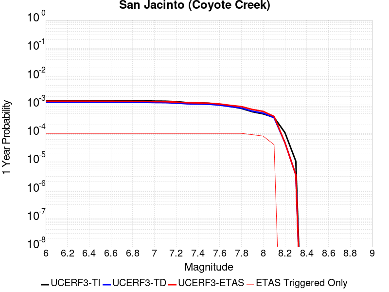 |  |

| Magnitude | 1 wk TI Prob | 1 wk TD Prob | 1 wk ETAS Prob | 1 wk ETAS/TD Gain | 1 wk ETAS Triggered Only | 1 mo TI Prob | 1 mo TD Prob | 1 mo ETAS Prob | 1 mo ETAS/TD Gain | 1 mo ETAS Triggered Only | 1 yr TI Prob | 1 yr TD Prob | 1 yr ETAS Prob | 1 yr ETAS/TD Gain | 1 yr ETAS Triggered Only | 10 yr TI Prob | 10 yr TD Prob | 10 yr ETAS Prob | 10 yr ETAS/TD Gain | 10 yr ETAS Triggered Only |
|-----|-----|-----|-----|-----|-----|-----|-----|-----|-----|-----|-----|-----|-----|-----|-----|-----|-----|-----|-----|-----|
| 6.0 | 2.7374346E-5 | 2.41444E-5 | 1.2189853E-4 | 5.048729 | 9.7756485E-5 | 1.1731335E-4 | 1.034719E-4 | 2.1750934E-4 | 2.1021101 | 1.1404924E-4 | 0.0014273542 | 0.001259045 | 0.0014054951 | 1.1163185 | 1.4663473E-4 | 0.01418221 | 0.012928195 | 0.013072934 | 1.0111957 | 1.4663473E-4 |
| 6.1 | 2.7374346E-5 | 2.41444E-5 | 1.2189853E-4 | 5.048729 | 9.7756485E-5 | 1.1731335E-4 | 1.034719E-4 | 2.1750934E-4 | 2.1021101 | 1.1404924E-4 | 0.0014273542 | 0.001259045 | 0.0014054951 | 1.1163185 | 1.4663473E-4 | 0.01418221 | 0.012928195 | 0.013072934 | 1.0111957 | 1.4663473E-4 |
| 6.2 | 2.7374346E-5 | 2.41444E-5 | 1.2189853E-4 | 5.048729 | 9.7756485E-5 | 1.1731335E-4 | 1.034719E-4 | 2.1750934E-4 | 2.1021101 | 1.1404924E-4 | 0.0014273542 | 0.001259045 | 0.0014054951 | 1.1163185 | 1.4663473E-4 | 0.01418221 | 0.012928195 | 0.013072934 | 1.0111957 | 1.4663473E-4 |
| 6.3 | 2.7374346E-5 | 2.41444E-5 | 1.2189853E-4 | 5.048729 | 9.7756485E-5 | 1.1731335E-4 | 1.034719E-4 | 2.1750934E-4 | 2.1021101 | 1.1404924E-4 | 0.0014273542 | 0.001259045 | 0.0014054951 | 1.1163185 | 1.4663473E-4 | 0.01418221 | 0.012928195 | 0.013072934 | 1.0111957 | 1.4663473E-4 |
| 6.4 | 2.7374346E-5 | 2.41444E-5 | 1.2189853E-4 | 5.048729 | 9.7756485E-5 | 1.1731335E-4 | 1.034719E-4 | 2.1750934E-4 | 2.1021101 | 1.1404924E-4 | 0.0014273542 | 0.001259045 | 0.0014054951 | 1.1163185 | 1.4663473E-4 | 0.01418221 | 0.012928195 | 0.013072934 | 1.0111957 | 1.4663473E-4 |
| 6.5 | 2.7282445E-5 | 2.4030476E-5 | 1.21784615E-4 | 5.0679235 | 9.7756485E-5 | 1.16919524E-4 | 1.0298371E-4 | 2.170212E-4 | 2.1073353 | 1.1404924E-4 | 0.0014225657 | 0.001253108 | 0.0013995591 | 1.1168702 | 1.4663473E-4 | 0.014134934 | 0.012869522 | 0.01301427 | 1.0112473 | 1.4663473E-4 |
| 6.6 | 2.7282445E-5 | 2.4030476E-5 | 1.21784615E-4 | 5.0679235 | 9.7756485E-5 | 1.16919524E-4 | 1.0298371E-4 | 2.170212E-4 | 2.1073353 | 1.1404924E-4 | 0.0014225657 | 0.001253108 | 0.0013995591 | 1.1168702 | 1.4663473E-4 | 0.014134934 | 0.012869522 | 0.01301427 | 1.0112473 | 1.4663473E-4 |
| 6.7 | 2.7216198E-5 | 2.3955597E-5 | 1.21709745E-4 | 5.0806394 | 9.7756485E-5 | 1.1663563E-4 | 1.02662816E-4 | 2.1670034E-4 | 2.1107967 | 1.1404924E-4 | 0.0014191137 | 0.0012492058 | 0.0013956573 | 1.1172358 | 1.4663473E-4 | 0.014100855 | 0.012830934 | 0.012975687 | 1.0112816 | 1.4663473E-4 |
| 6.8 | 2.7078617E-5 | 2.3872815E-5 | 1.21626974E-4 | 5.0947895 | 9.7756485E-5 | 1.1604605E-4 | 1.0230807E-4 | 2.1634564E-4 | 2.1146488 | 1.1404924E-4 | 0.001411945 | 0.0012448917 | 0.0013913439 | 1.1176425 | 1.4663473E-4 | 0.014030075 | 0.0127880825 | 0.012932842 | 1.0113199 | 1.4663473E-4 |
| 6.9 | 2.6982952E-5 | 2.3792329E-5 | 1.21546494E-4 | 5.108642 | 9.7756485E-5 | 1.15636096E-4 | 1.0196315E-4 | 2.1600076E-4 | 2.11842 | 1.1404924E-4 | 0.0014069602 | 0.0012406971 | 0.0013871499 | 1.1180407 | 1.4663473E-4 | 0.013980856 | 0.012746378 | 0.012891144 | 1.0113574 | 1.4663473E-4 |
| 7.0 | 2.6449972E-5 | 2.3369357E-5 | 1.2112356E-4 | 5.183008 | 9.7756485E-5 | 1.1335209E-4 | 1.0015055E-4 | 2.1418837E-4 | 2.1386638 | 1.1404924E-4 | 0.001379188 | 0.0012186535 | 0.0013651096 | 1.1201786 | 1.4663473E-4 | 0.0137065975 | 0.012527733 | 0.0126725305 | 1.0115582 | 1.4663473E-4 |
| 7.1 | 2.6257849E-5 | 2.3195396E-5 | 1.2094962E-4 | 5.2143803 | 9.7756485E-5 | 1.1252879E-4 | 9.940507E-5 | 2.1344297E-4 | 2.1472042 | 1.1404924E-4 | 0.0013691769 | 0.0012095873 | 0.0013560447 | 1.1210804 | 1.4663473E-4 | 0.013607717 | 0.012437661 | 0.012582472 | 1.0116429 | 1.4663473E-4 |
| 7.2 | 2.5270041E-5 | 2.2390155E-5 | 1.20144454E-4 | 5.36595 | 9.7756485E-5 | 1.0829568E-4 | 9.5954296E-5 | 2.0999259E-4 | 2.1884646 | 1.1404924E-4 | 0.0013177024 | 0.0011676198 | 0.0013140833 | 1.1254377 | 1.4663473E-4 | 0.013099162 | 0.0120187905 | 0.012163662 | 1.0120538 | 1.4663473E-4 |
| 7.3 | 2.339701E-5 | 2.1122027E-5 | 1.1887645E-4 | 5.62808 | 9.7756485E-5 | 1.0026905E-4 | 9.051985E-5 | 2.0455876E-4 | 2.2598224 | 1.1404924E-4 | 0.001220092 | 0.001101524 | 0.0012479972 | 1.1329732 | 1.4663473E-4 | 0.012134149 | 0.011357642 | 0.011502611 | 1.012764 | 1.4663473E-4 |
| 7.4 | 2.296333E-5 | 2.0852396E-5 | 1.1860685E-4 | 5.6879244 | 9.7756485E-5 | 9.841056E-5 | 8.936436E-5 | 2.034034E-4 | 2.2761133 | 1.1404924E-4 | 0.0011974899 | 0.0010874701 | 0.0012339454 | 1.1346936 | 1.4663473E-4 | 0.011910575 | 0.011216754 | 0.011361743 | 1.0129262 | 1.4663473E-4 |
| 7.5 | 2.2188895E-5 | 2.037534E-5 | 1.18129836E-4 | 5.797686 | 9.7756485E-5 | 9.50918E-5 | 8.731998E-5 | 2.0135926E-4 | 2.3059928 | 1.1404924E-4 | 0.0011571277 | 0.0010626042 | 0.0012090832 | 1.137849 | 1.4663473E-4 | 0.011511209 | 0.010966369 | 0.011111396 | 1.0132247 | 1.4663473E-4 |
| 7.6 | 2.0013189E-5 | 1.8961666E-5 | 1.167163E-4 | 6.155382 | 9.7756485E-5 | 8.5767984E-5 | 8.126176E-5 | 1.9530173E-4 | 2.4033659 | 1.1404924E-4 | 0.001043725 | 9.889146E-4 | 0.0011354043 | 1.1481318 | 1.4663473E-4 | 0.010388365 | 0.010224371 | 0.010369507 | 1.0141951 | 1.4663473E-4 |
| 7.7 | 1.7230794E-5 | 1.6743043E-5 | 1.14497896E-4 | 6.838536 | 9.7756485E-5 | 7.384417E-5 | 7.175393E-5 | 1.8579498E-4 | 2.5893352 | 1.1404924E-4 | 8.986819E-4 | 8.732547E-4 | 0.0010197614 | 1.1677709 | 1.4663473E-4 | 0.008950562 | 0.00906292 | 0.009208226 | 1.016033 | 1.4663473E-4 |
| 7.8 | 1.4478809E-5 | 1.499039E-5 | 1.12745416E-4 | 7.5211797 | 9.7756485E-5 | 6.205057E-5 | 6.424295E-5 | 1.7828486E-4 | 2.7751663 | 1.1404924E-4 | 7.552038E-4 | 7.8187784E-4 | 9.2839793E-4 | 1.1873951 | 1.4663473E-4 | 0.0075264242 | 0.008141388 | 0.008286829 | 1.0178643 | 1.4663473E-4 |
| 7.9 | 1.1114467E-5 | 1.1644517E-5 | 1.09399865E-4 | 9.394968 | 9.7756485E-5 | 4.7632562E-5 | 4.990412E-5 | 1.6394767E-4 | 3.285253 | 1.1404924E-4 | 5.797721E-4 | 6.074139E-4 | 7.376767E-4 | 1.2144548 | 1.3034198E-4 | 0.0057826187 | 0.0063803545 | 0.006509865 | 1.0202982 | 1.3034198E-4 |
| 8.0 | 9.327402E-6 | 9.8986575E-6 | 9.1361595E-5 | 9.229695 | 8.146374E-5 | 3.9973966E-5 | 4.2422133E-5 | 1.4017447E-4 | 3.304277 | 9.7756485E-5 | 4.8657437E-4 | 5.163676E-4 | 6.3035794E-4 | 1.2207543 | 1.1404924E-4 | 0.0048551033 | 0.00544994 | 0.005563368 | 1.0208126 | 1.1404924E-4 |
| 8.1 | 7.0235833E-6 | 6.826985E-6 | 3.9412258E-5 | 5.7730107 | 3.2585496E-5 | 3.0100724E-5 | 2.9258183E-5 | 6.184272E-5 | 2.11369 | 3.2585496E-5 | 3.664147E-4 | 3.5616063E-4 | 4.0502148E-4 | 1.1371876 | 4.8878243E-5 | 0.003658111 | 0.0037874572 | 0.0038361503 | 1.0128564 | 4.8878243E-5 |
| 8.2 | 2.0358202E-6 | 8.9912584E-7 | 8.9912584E-7 | 1.0 | 0.0 | 8.724915E-6 | 3.853391E-6 | 3.853391E-6 | 1.0 | 0.0 | 1.06220665E-4 | 4.6914047E-5 | 4.6914047E-5 | 1.0 | 0.0 | 0.001061699 | 5.3239096E-4 | 5.3239096E-4 | 1.0 | 0.0 |
| 8.3 | 2.0051264E-7 | 6.61379E-8 | 6.61379E-8 | 1.0 | 0.0 | 8.5933965E-7 | 2.8344812E-7 | 2.8344812E-7 | 1.0 | 0.0 | 1.046241E-5 | 3.450976E-6 | 3.450976E-6 | 1.0 | 0.0 | 1.0461917E-4 | 4.0120205E-5 | 4.0120205E-5 | 1.0 | 0.0 |

## Oceanic - West Huasna
*[(top)](#table-of-contents)*

| 1 Week | 1 Month | 1 Year | 10 Year |
|-----|-----|-----|-----|
|  |  |  |  |

| Magnitude | 1 wk TI Prob | 1 wk TD Prob | 1 wk ETAS Prob | 1 wk ETAS/TD Gain | 1 wk ETAS Triggered Only | 1 mo TI Prob | 1 mo TD Prob | 1 mo ETAS Prob | 1 mo ETAS/TD Gain | 1 mo ETAS Triggered Only | 1 yr TI Prob | 1 yr TD Prob | 1 yr ETAS Prob | 1 yr ETAS/TD Gain | 1 yr ETAS Triggered Only | 10 yr TI Prob | 10 yr TD Prob | 10 yr ETAS Prob | 10 yr ETAS/TD Gain | 10 yr ETAS Triggered Only |
|-----|-----|-----|-----|-----|-----|-----|-----|-----|-----|-----|-----|-----|-----|-----|-----|-----|-----|-----|-----|-----|
| 6.0 | 3.195567E-5 | 2.7926368E-5 | 6.0510953E-5 | 2.1668036 | 3.2585496E-5 | 1.3694567E-4 | 1.19679185E-4 | 1.6855157E-4 | 1.4083617 | 4.8878243E-5 | 0.0016660384 | 0.0014561634 | 0.0015212394 | 1.0446901 | 6.517099E-5 | 0.016536033 | 0.01447077 | 0.0145831695 | 1.0077673 | 1.1404924E-4 |
| 6.1 | 2.1156782E-5 | 1.7573117E-5 | 5.015804E-5 | 2.8542483 | 3.2585496E-5 | 9.066878E-5 | 7.531123E-5 | 1.241858E-4 | 1.6489677 | 4.8878243E-5 | 0.0011033333 | 9.1653795E-4 | 9.6537144E-4 | 1.0532804 | 4.8878243E-5 | 0.010978713 | 0.009128587 | 0.009209307 | 1.0088426 | 8.146374E-5 |
| 6.2 | 1.6195117E-5 | 1.3327227E-5 | 1.3327227E-5 | 1.0 | 0.0 | 6.9405796E-5 | 5.7115452E-5 | 7.340727E-5 | 1.2852436 | 1.6292748E-5 | 8.44688E-4 | 6.9516135E-4 | 7.114428E-4 | 1.023421 | 1.6292748E-5 | 0.008414844 | 0.0069301617 | 0.0069625215 | 1.0046694 | 3.2585496E-5 |
| 6.3 | 1.3559345E-5 | 1.1179013E-5 | 1.1179013E-5 | 1.0 | 0.0 | 5.811018E-5 | 4.7909183E-5 | 6.420115E-5 | 1.3400594 | 1.6292748E-5 | 7.072618E-4 | 5.8313913E-4 | 5.994224E-4 | 1.0279235 | 1.6292748E-5 | 0.0070501505 | 0.005816208 | 0.005848604 | 1.0055699 | 3.2585496E-5 |
| 6.4 | 1.2120619E-5 | 1.0000874E-5 | 1.0000874E-5 | 1.0 | 0.0 | 5.1944477E-5 | 4.2860185E-5 | 5.9152237E-5 | 1.3801209 | 1.6292748E-5 | 6.322405E-4 | 5.216983E-4 | 5.3798256E-4 | 1.0312139 | 1.6292748E-5 | 0.006304447 | 0.005204804 | 0.0052210116 | 1.003114 | 1.6292748E-5 |
| 6.5 | 1.13511915E-5 | 9.367378E-6 | 9.367378E-6 | 1.0 | 0.0 | 4.8647056E-5 | 4.0145293E-5 | 4.0145293E-5 | 1.0 | 0.0 | 5.9211696E-4 | 4.886598E-4 | 4.886598E-4 | 1.0 | 0.0 | 0.0059054173 | 0.0048759114 | 0.0048759114 | 1.0 | 0.0 |
| 6.6 | 9.850605E-6 | 8.1353155E-6 | 8.1353155E-6 | 1.0 | 0.0 | 4.2216197E-5 | 3.4865174E-5 | 3.4865174E-5 | 1.0 | 0.0 | 5.1386096E-4 | 4.2440102E-4 | 4.2440102E-4 | 1.0 | 0.0 | 0.0051267436 | 0.0042359377 | 0.0042359377 | 1.0 | 0.0 |
| 6.7 | 8.8558645E-6 | 7.318341E-6 | 7.318341E-6 | 1.0 | 0.0 | 3.7953152E-5 | 3.1363943E-5 | 3.1363943E-5 | 1.0 | 0.0 | 4.6198163E-4 | 3.8178926E-4 | 3.8178926E-4 | 1.0 | 0.0 | 0.004610224 | 0.0038113592 | 0.0038113592 | 1.0 | 0.0 |
| 6.8 | 7.67136E-6 | 6.39169E-6 | 6.39169E-6 | 1.0 | 0.0 | 3.2876844E-5 | 2.739267E-5 | 2.739267E-5 | 1.0 | 0.0 | 4.0020206E-4 | 3.3345487E-4 | 3.3345487E-4 | 1.0 | 0.0 | 0.003994821 | 0.0033295664 | 0.0033295664 | 1.0 | 0.0 |
| 6.9 | 6.534529E-6 | 5.458261E-6 | 5.458261E-6 | 1.0 | 0.0 | 2.8004823E-5 | 2.3392338E-5 | 2.3392338E-5 | 1.0 | 0.0 | 3.4090536E-4 | 2.8476462E-4 | 2.8476462E-4 | 1.0 | 0.0 | 0.0034038287 | 0.002844014 | 0.002844014 | 1.0 | 0.0 |
| 7.0 | 5.460525E-6 | 4.5699203E-6 | 4.5699203E-6 | 1.0 | 0.0 | 2.3402039E-5 | 1.9585226E-5 | 1.9585226E-5 | 1.0 | 0.0 | 2.8488258E-4 | 2.3842414E-4 | 2.3842414E-4 | 1.0 | 0.0 | 0.0028451765 | 0.0023816973 | 0.0023816973 | 1.0 | 0.0 |
| 7.1 | 4.4825083E-6 | 3.7524153E-6 | 3.7524153E-6 | 1.0 | 0.0 | 1.9210609E-5 | 1.6081682E-5 | 1.6081682E-5 | 1.0 | 0.0 | 2.3386406E-4 | 1.9577699E-4 | 1.9577699E-4 | 1.0 | 0.0 | 0.002336181 | 0.001956057 | 0.001956057 | 1.0 | 0.0 |
| 7.2 | 2.821708E-6 | 2.424941E-6 | 2.424941E-6 | 1.0 | 0.0 | 1.2092979E-5 | 1.0392562E-5 | 1.0392562E-5 | 1.0 | 0.0 | 1.4722206E-4 | 1.265221E-4 | 1.265221E-4 | 1.0 | 0.0 | 0.0014712457 | 0.0012645032 | 0.0012645032 | 1.0 | 0.0 |
| 7.3 | 2.0644757E-6 | 1.7687502E-6 | 1.7687502E-6 | 1.0 | 0.0 | 8.847723E-6 | 7.580336E-6 | 7.580336E-6 | 1.0 | 0.0 | 1.0771569E-4 | 9.228668E-5 | 9.228668E-5 | 1.0 | 0.0 | 0.001076635 | 9.224854E-4 | 9.224854E-4 | 1.0 | 0.0 |
| 7.4 | 1.6980367E-6 | 1.4379966E-6 | 1.4379966E-6 | 1.0 | 0.0 | 7.27728E-6 | 6.1628284E-6 | 6.1628284E-6 | 1.0 | 0.0 | 8.8597284E-5 | 7.502986E-5 | 7.502986E-5 | 1.0 | 0.0 | 8.8561967E-4 | 7.5004686E-4 | 7.5004686E-4 | 1.0 | 0.0 |
| 7.5 | 1.3637683E-6 | 1.1302697E-6 | 1.1302697E-6 | 1.0 | 0.0 | 5.844708E-6 | 4.844004E-6 | 4.844004E-6 | 1.0 | 0.0 | 7.1156996E-5 | 5.897415E-5 | 5.897415E-5 | 1.0 | 0.0 | 7.1134215E-4 | 5.8958656E-4 | 5.8958656E-4 | 1.0 | 0.0 |
| 7.6 | 9.802994E-7 | 7.6772847E-7 | 7.6772847E-7 | 1.0 | 0.0 | 4.2012766E-6 | 3.2902608E-6 | 3.2902608E-6 | 1.0 | 0.0 | 5.1149345E-5 | 4.005819E-5 | 4.005819E-5 | 1.0 | 0.0 | 5.113757E-4 | 4.0051117E-4 | 4.0051117E-4 | 1.0 | 0.0 |
| 7.7 | 5.986191E-7 | 4.0050708E-7 | 4.0050708E-7 | 1.0 | 0.0 | 2.5655079E-6 | 1.7164577E-6 | 1.7164577E-6 | 1.0 | 0.0 | 3.1234613E-5 | 2.0897673E-5 | 2.0897673E-5 | 1.0 | 0.0 | 3.123022E-4 | 2.0895849E-4 | 2.0895849E-4 | 1.0 | 0.0 |
| 7.8 | 2.9189815E-7 | 1.5285202E-7 | 1.5285202E-7 | 1.0 | 0.0 | 1.2509914E-6 | 6.5507993E-7 | 6.5507993E-7 | 1.0 | 0.0 | 1.5230714E-5 | 7.975569E-6 | 7.975569E-6 | 1.0 | 0.0 | 1.522967E-4 | 7.97542E-5 | 7.97542E-5 | 1.0 | 0.0 |
| 7.9 | 1.2057845E-7 | 4.6208047E-8 | 4.6208047E-8 | 1.0 | 0.0 | 5.1676466E-7 | 1.9803447E-7 | 1.9803447E-7 | 1.0 | 0.0 | 6.2915915E-6 | 2.411067E-6 | 2.411067E-6 | 1.0 | 0.0 | 6.2914136E-5 | 2.4111772E-5 | 2.4111772E-5 | 1.0 | 0.0 |
| 8.0 | 3.3806387E-9 | 9.0093144E-10 | 9.0093144E-10 | 1.0 | 0.0 | 1.4488451E-8 | 3.8611354E-9 | 3.8611354E-9 | 1.0 | 0.0 | 1.7639688E-7 | 4.7009323E-8 | 4.7009323E-8 | 1.0 | 0.0 | 1.7639674E-6 | 4.712806E-7 | 4.712806E-7 | 1.0 | 0.0 |

## Independence rev 2011
*[(top)](#table-of-contents)*

| 1 Week | 1 Month | 1 Year | 10 Year |
|-----|-----|-----|-----|
|  |  |  |  |

| Magnitude | 1 wk TI Prob | 1 wk TD Prob | 1 wk ETAS Prob | 1 wk ETAS/TD Gain | 1 wk ETAS Triggered Only | 1 mo TI Prob | 1 mo TD Prob | 1 mo ETAS Prob | 1 mo ETAS/TD Gain | 1 mo ETAS Triggered Only | 1 yr TI Prob | 1 yr TD Prob | 1 yr ETAS Prob | 1 yr ETAS/TD Gain | 1 yr ETAS Triggered Only | 10 yr TI Prob | 10 yr TD Prob | 10 yr ETAS Prob | 10 yr ETAS/TD Gain | 10 yr ETAS Triggered Only |
|-----|-----|-----|-----|-----|-----|-----|-----|-----|-----|-----|-----|-----|-----|-----|-----|-----|-----|-----|-----|-----|
| 6.0 | 4.422171E-6 | 4.3262253E-6 | 8.5789616E-5 | 19.83013 | 8.146374E-5 | 1.8952025E-5 | 1.8540852E-5 | 1.0000308E-4 | 5.393662 | 8.146374E-5 | 2.3071647E-4 | 2.2571447E-4 | 3.3973795E-4 | 1.505167 | 1.1404924E-4 | 0.0023047708 | 0.0022551457 | 0.0023851937 | 1.0576673 | 1.3034198E-4 |
| 6.1 | 4.422171E-6 | 4.3262253E-6 | 8.5789616E-5 | 19.83013 | 8.146374E-5 | 1.8952025E-5 | 1.8540852E-5 | 1.0000308E-4 | 5.393662 | 8.146374E-5 | 2.3071647E-4 | 2.2571447E-4 | 3.3973795E-4 | 1.505167 | 1.1404924E-4 | 0.0023047708 | 0.0022551457 | 0.0023851937 | 1.0576673 | 1.3034198E-4 |
| 6.2 | 4.422171E-6 | 4.3262253E-6 | 8.5789616E-5 | 19.83013 | 8.146374E-5 | 1.8952025E-5 | 1.8540852E-5 | 1.0000308E-4 | 5.393662 | 8.146374E-5 | 2.3071647E-4 | 2.2571447E-4 | 3.3973795E-4 | 1.505167 | 1.1404924E-4 | 0.0023047708 | 0.0022551457 | 0.0023851937 | 1.0576673 | 1.3034198E-4 |
| 6.3 | 4.422171E-6 | 4.3262253E-6 | 8.5789616E-5 | 19.83013 | 8.146374E-5 | 1.8952025E-5 | 1.8540852E-5 | 1.0000308E-4 | 5.393662 | 8.146374E-5 | 2.3071647E-4 | 2.2571447E-4 | 3.3973795E-4 | 1.505167 | 1.1404924E-4 | 0.0023047708 | 0.0022551457 | 0.0023851937 | 1.0576673 | 1.3034198E-4 |
| 6.4 | 4.422171E-6 | 4.3262253E-6 | 8.5789616E-5 | 19.83013 | 8.146374E-5 | 1.8952025E-5 | 1.8540852E-5 | 1.0000308E-4 | 5.393662 | 8.146374E-5 | 2.3071647E-4 | 2.2571447E-4 | 3.3973795E-4 | 1.505167 | 1.1404924E-4 | 0.0023047708 | 0.0022551457 | 0.0023851937 | 1.0576673 | 1.3034198E-4 |
| 6.5 | 4.422171E-6 | 4.3262253E-6 | 8.5789616E-5 | 19.83013 | 8.146374E-5 | 1.8952025E-5 | 1.8540852E-5 | 1.0000308E-4 | 5.393662 | 8.146374E-5 | 2.3071647E-4 | 2.2571447E-4 | 3.3973795E-4 | 1.505167 | 1.1404924E-4 | 0.0023047708 | 0.0022551457 | 0.0023851937 | 1.0576673 | 1.3034198E-4 |
| 6.6 | 2.663744E-6 | 2.5319846E-6 | 6.7702815E-5 | 26.73903 | 6.517099E-5 | 1.1415996E-5 | 1.08513195E-5 | 7.6021606E-5 | 7.0057473 | 6.517099E-5 | 1.3898089E-4 | 1.321073E-4 | 2.2985088E-4 | 1.7398802 | 9.7756485E-5 | 0.0013889399 | 0.0013203359 | 0.0014342346 | 1.0862648 | 1.1404924E-4 |
| 6.7 | 2.663744E-6 | 2.5319846E-6 | 6.7702815E-5 | 26.73903 | 6.517099E-5 | 1.1415996E-5 | 1.08513195E-5 | 7.6021606E-5 | 7.0057473 | 6.517099E-5 | 1.3898089E-4 | 1.321073E-4 | 2.2985088E-4 | 1.7398802 | 9.7756485E-5 | 0.0013889399 | 0.0013203359 | 0.0014342346 | 1.0862648 | 1.1404924E-4 |
| 6.8 | 1.9716529E-6 | 1.8322567E-6 | 6.700313E-5 | 36.568638 | 6.517099E-5 | 8.449913E-6 | 7.852505E-6 | 7.302299E-5 | 9.299323 | 6.517099E-5 | 1.0287284E-4 | 9.560019E-5 | 1.7705614E-4 | 1.852048 | 8.146374E-5 | 0.0010282523 | 9.5560355E-4 | 0.0010532666 | 1.1022004 | 9.7756485E-5 |
| 6.9 | 1.8788617E-6 | 1.7429976E-6 | 6.6913875E-5 | 38.390114 | 6.517099E-5 | 8.0522395E-6 | 7.4699688E-6 | 7.2640476E-5 | 9.724335 | 6.517099E-5 | 9.80316E-5 | 9.09432E-5 | 1.7239952E-4 | 1.8956836 | 8.146374E-5 | 9.798837E-4 | 9.090718E-4 | 0.0010067394 | 1.1074367 | 9.7756485E-5 |
| 7.0 | 1.5045488E-6 | 1.3849498E-6 | 6.6555855E-5 | 48.05651 | 6.517099E-5 | 6.44805E-6 | 5.9354857E-6 | 7.110609E-5 | 11.979827 | 6.517099E-5 | 7.8502184E-5 | 7.226219E-5 | 1.5372004E-4 | 2.127254 | 8.146374E-5 | 7.8474457E-4 | 7.223921E-4 | 8.2007796E-4 | 1.1352255 | 9.7756485E-5 |
| 7.1 | 1.272341E-6 | 1.1625089E-6 | 6.633343E-5 | 57.060577 | 6.517099E-5 | 5.4528787E-6 | 4.9821715E-6 | 7.015284E-5 | 14.080775 | 6.517099E-5 | 6.6386776E-5 | 6.0656283E-5 | 1.4211508E-4 | 2.3429573 | 8.146374E-5 | 6.636695E-4 | 6.064005E-4 | 7.040977E-4 | 1.16111 | 9.7756485E-5 |
| 7.2 | 1.0416892E-6 | 9.409871E-7 | 6.611192E-5 | 70.25805 | 6.517099E-5 | 4.464375E-6 | 4.032796E-6 | 6.9203525E-5 | 17.160187 | 6.517099E-5 | 5.4352407E-5 | 4.9098202E-5 | 1.3055794E-4 | 2.6591187 | 8.146374E-5 | 5.4339116E-4 | 4.908754E-4 | 5.885839E-4 | 1.1990495 | 9.7756485E-5 |
| 7.3 | 7.9450155E-7 | 7.2350036E-7 | 6.589445E-5 | 91.07728 | 6.517099E-5 | 3.4050022E-6 | 3.1007123E-6 | 6.82715E-5 | 22.018007 | 6.517099E-5 | 4.1455114E-5 | 3.7750528E-5 | 1.19211196E-4 | 3.1578681 | 8.146374E-5 | 4.144738E-4 | 3.7744228E-4 | 4.7516185E-4 | 1.2588995 | 9.7756485E-5 |
| 7.4 | 5.3893444E-7 | 5.0195166E-7 | 6.567291E-5 | 130.83513 | 6.517099E-5 | 2.309717E-6 | 2.1512196E-6 | 6.732207E-5 | 31.29484 | 6.517099E-5 | 2.8120441E-5 | 2.6190788E-5 | 1.076524E-4 | 4.1103153 | 8.146374E-5 | 2.8116882E-4 | 2.6187746E-4 | 3.5960836E-4 | 1.3731931 | 9.7756485E-5 |
| 7.5 | 3.8852085E-7 | 3.6825622E-7 | 4.9246482E-5 | 133.72885 | 4.8878243E-5 | 1.6650882E-6 | 1.57824E-6 | 5.045641E-5 | 31.970047 | 4.8878243E-5 | 2.027226E-5 | 1.9214905E-5 | 6.809221E-5 | 3.5437183 | 4.8878243E-5 | 2.0270412E-4 | 1.9213265E-4 | 2.5729113E-4 | 1.3391328 | 6.517099E-5 |
| 7.6 | 2.414929E-7 | 2.3457605E-7 | 4.911281E-5 | 209.3684 | 4.8878243E-5 | 1.0349692E-6 | 1.0053255E-6 | 4.988352E-5 | 49.61927 | 4.8878243E-5 | 1.2600677E-5 | 1.2239771E-5 | 6.111742E-5 | 4.9933467 | 4.8878243E-5 | 1.2599962E-4 | 1.223911E-4 | 1.875541E-4 | 1.5324163 | 6.517099E-5 |
| 7.7 | 6.8298014E-8 | 6.8589785E-8 | 6.8589785E-8 | 1.0 | 0.0 | 2.9270575E-7 | 2.939562E-7 | 2.939562E-7 | 1.0 | 0.0 | 3.5636867E-6 | 3.5789112E-6 | 3.5789112E-6 | 1.0 | 0.0 | 3.5636294E-5 | 3.5788584E-5 | 3.5788584E-5 | 1.0 | 0.0 |

## Whittier alt 1
*[(top)](#table-of-contents)*

| 1 Week | 1 Month | 1 Year | 10 Year |
|-----|-----|-----|-----|
|  | 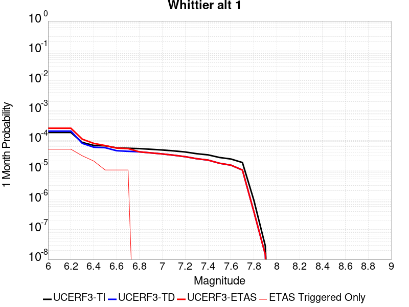 |  | 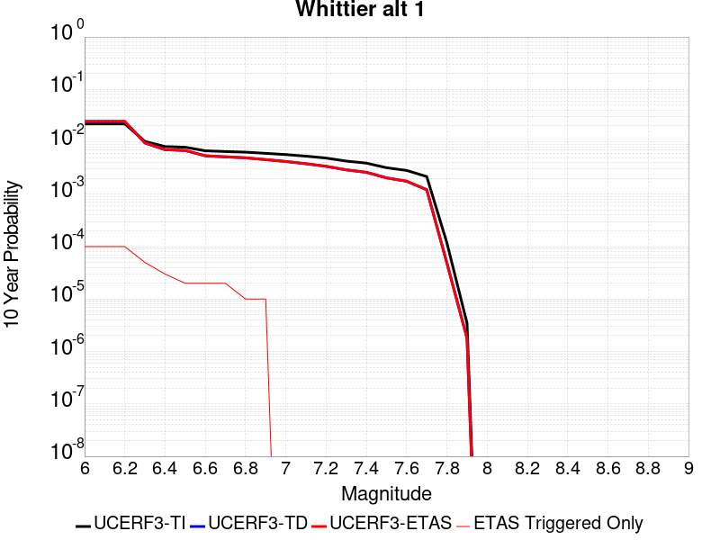 |

| Magnitude | 1 wk TI Prob | 1 wk TD Prob | 1 wk ETAS Prob | 1 wk ETAS/TD Gain | 1 wk ETAS Triggered Only | 1 mo TI Prob | 1 mo TD Prob | 1 mo ETAS Prob | 1 mo ETAS/TD Gain | 1 mo ETAS Triggered Only | 1 yr TI Prob | 1 yr TD Prob | 1 yr ETAS Prob | 1 yr ETAS/TD Gain | 1 yr ETAS Triggered Only | 10 yr TI Prob | 10 yr TD Prob | 10 yr ETAS Prob | 10 yr ETAS/TD Gain | 10 yr ETAS Triggered Only |
|-----|-----|-----|-----|-----|-----|-----|-----|-----|-----|-----|-----|-----|-----|-----|-----|-----|-----|-----|-----|-----|
| 6.0 | 4.2554693E-5 | 4.7252182E-5 | 9.612812E-5 | 2.0343635 | 4.8878243E-5 | 1.8236451E-4 | 2.0249544E-4 | 2.6765323E-4 | 1.3217741 | 6.517099E-5 | 0.002218027 | 0.0024629163 | 0.0025279268 | 1.0263957 | 6.517099E-5 | 0.02196019 | 0.024390263 | 0.024517426 | 1.0052136 | 1.3034198E-4 |
| 6.1 | 4.2554693E-5 | 4.7252182E-5 | 9.612812E-5 | 2.0343635 | 4.8878243E-5 | 1.8236451E-4 | 2.0249544E-4 | 2.6765323E-4 | 1.3217741 | 6.517099E-5 | 0.002218027 | 0.0024629163 | 0.0025279268 | 1.0263957 | 6.517099E-5 | 0.02196019 | 0.024390263 | 0.024517426 | 1.0052136 | 1.3034198E-4 |
| 6.2 | 4.2554693E-5 | 4.7252182E-5 | 9.612812E-5 | 2.0343635 | 4.8878243E-5 | 1.8236451E-4 | 2.0249544E-4 | 2.6765323E-4 | 1.3217741 | 6.517099E-5 | 0.002218027 | 0.0024629163 | 0.0025279268 | 1.0263957 | 6.517099E-5 | 0.02196019 | 0.024390263 | 0.024517426 | 1.0052136 | 1.3034198E-4 |
| 6.3 | 1.9617712E-5 | 1.826841E-5 | 3.456086E-5 | 1.8918374 | 1.6292748E-5 | 8.40732E-5 | 7.829095E-5 | 1.1087389E-4 | 1.4161777 | 3.2585496E-5 | 0.0010231105 | 9.527944E-4 | 9.853488E-4 | 1.0341673 | 3.2585496E-5 | 0.01018413 | 0.0094904 | 0.009554951 | 1.0068018 | 6.517099E-5 |
| 6.4 | 1.5611336E-5 | 1.3604089E-5 | 1.3604089E-5 | 1.0 | 0.0 | 6.690401E-5 | 5.8301972E-5 | 7.459377E-5 | 1.2794383 | 1.6292748E-5 | 8.142519E-4 | 7.096013E-4 | 7.258825E-4 | 1.0229441 | 1.6292748E-5 | 0.008112748 | 0.0070753377 | 0.007107693 | 1.0045729 | 3.2585496E-5 |
| 6.5 | 1.5150166E-5 | 1.3100744E-5 | 1.3100744E-5 | 1.0 | 0.0 | 6.492767E-5 | 5.614487E-5 | 5.614487E-5 | 1.0 | 0.0 | 7.9020765E-4 | 6.8335526E-4 | 6.8335526E-4 | 1.0 | 0.0 | 0.007874036 | 0.006814508 | 0.0068306895 | 1.0023746 | 1.6292748E-5 |
| 6.6 | 1.295588E-5 | 1.0380544E-5 | 1.0380544E-5 | 1.0 | 0.0 | 5.552402E-5 | 4.44873E-5 | 4.44873E-5 | 1.0 | 0.0 | 6.7579525E-4 | 5.415002E-4 | 5.415002E-4 | 1.0 | 0.0 | 0.006737438 | 0.005403343 | 0.005419548 | 1.0029991 | 1.6292748E-5 |
| 6.7 | 1.2542085E-5 | 9.899189E-6 | 9.899189E-6 | 1.0 | 0.0 | 5.3750682E-5 | 4.2424414E-5 | 4.2424414E-5 | 1.0 | 0.0 | 6.542181E-4 | 5.163967E-4 | 5.163967E-4 | 1.0 | 0.0 | 0.006522954 | 0.005153464 | 0.005169673 | 1.0031452 | 1.6292748E-5 |
| 6.8 | 1.2195878E-5 | 9.49523E-6 | 9.49523E-6 | 1.0 | 0.0 | 5.2267E-5 | 4.069322E-5 | 4.069322E-5 | 1.0 | 0.0 | 6.36165E-4 | 4.9532915E-4 | 4.9532915E-4 | 1.0 | 0.0 | 0.0063434686 | 0.0049436963 | 0.004959909 | 1.0032793 | 1.6292748E-5 |
| 6.9 | 1.1580298E-5 | 8.772739E-6 | 8.772739E-6 | 1.0 | 0.0 | 4.9628903E-5 | 3.759692E-5 | 3.759692E-5 | 1.0 | 0.0 | 6.040644E-4 | 4.5764804E-4 | 4.5764804E-4 | 1.0 | 0.0 | 0.00602425 | 0.0045684646 | 0.0045846826 | 1.00355 | 1.6292748E-5 |
| 7.0 | 1.0964795E-5 | 8.083794E-6 | 8.083794E-6 | 1.0 | 0.0 | 4.6991136E-5 | 3.4644378E-5 | 3.4644378E-5 | 1.0 | 0.0 | 5.7196687E-4 | 4.217152E-4 | 4.217152E-4 | 1.0 | 0.0 | 0.0057049696 | 0.004210459 | 0.004210459 | 1.0 | 0.0 |
| 7.1 | 1.0230601E-5 | 7.32646E-6 | 7.32646E-6 | 1.0 | 0.0 | 4.3844695E-5 | 3.1398744E-5 | 3.1398744E-5 | 1.0 | 0.0 | 5.336784E-4 | 3.8221394E-4 | 3.8221394E-4 | 1.0 | 0.0 | 0.005323986 | 0.0038167592 | 0.0038167592 | 1.0 | 0.0 |
| 7.2 | 9.40865E-6 | 6.5430822E-6 | 6.5430822E-6 | 1.0 | 0.0 | 4.032216E-5 | 2.8041486E-5 | 2.8041486E-5 | 1.0 | 0.0 | 4.908117E-4 | 3.4135283E-4 | 3.4135283E-4 | 1.0 | 0.0 | 0.0048972913 | 0.0034094024 | 0.0034094024 | 1.0 | 0.0 |
| 7.3 | 8.237384E-6 | 5.5975433E-6 | 5.5975433E-6 | 1.0 | 0.0 | 3.5302593E-5 | 2.3989258E-5 | 2.3989258E-5 | 1.0 | 0.0 | 4.2972428E-4 | 2.920311E-4 | 2.920311E-4 | 1.0 | 0.0 | 0.0042889426 | 0.0029167992 | 0.0029167992 | 1.0 | 0.0 |
| 7.4 | 7.5316966E-6 | 5.0276153E-6 | 5.0276153E-6 | 1.0 | 0.0 | 3.2278298E-5 | 2.154675E-5 | 2.154675E-5 | 1.0 | 0.0 | 3.9291743E-4 | 2.623011E-4 | 2.623011E-4 | 1.0 | 0.0 | 0.0039222343 | 0.0026200267 | 0.0026200267 | 1.0 | 0.0 |
| 7.5 | 6.149649E-6 | 3.9336355E-6 | 3.9336355E-6 | 1.0 | 0.0 | 2.6355372E-5 | 1.6858336E-5 | 1.6858336E-5 | 1.0 | 0.0 | 3.208294E-4 | 2.052318E-4 | 2.052318E-4 | 1.0 | 0.0 | 0.003203666 | 0.0020505118 | 0.0020505118 | 1.0 | 0.0 |
| 7.6 | 5.457711E-6 | 3.3951796E-6 | 3.3951796E-6 | 1.0 | 0.0 | 2.338998E-5 | 1.4550694E-5 | 1.4550694E-5 | 1.0 | 0.0 | 2.8473578E-4 | 1.771411E-4 | 1.771411E-4 | 1.0 | 0.0 | 0.0028437122 | 0.0017700798 | 0.0017700798 | 1.0 | 0.0 |
| 7.7 | 4.1676276E-6 | 2.3329922E-6 | 2.3329922E-6 | 1.0 | 0.0 | 1.7861139E-5 | 9.998504E-6 | 9.998504E-6 | 1.0 | 0.0 | 2.1743766E-4 | 1.2172572E-4 | 1.2172572E-4 | 1.0 | 0.0 | 0.0021722503 | 0.0012166635 | 0.0012166635 | 1.0 | 0.0 |
| 7.8 | 2.2692414E-7 | 9.384417E-8 | 9.384417E-8 | 1.0 | 0.0 | 9.725317E-7 | 4.0218927E-7 | 4.0218927E-7 | 1.0 | 0.0 | 1.1840509E-5 | 4.8966467E-6 | 4.8966467E-6 | 1.0 | 0.0 | 1.1839878E-4 | 4.8965718E-5 | 4.8965718E-5 | 1.0 | 0.0 |
| 7.9 | 6.676829E-9 | 3.4397174E-9 | 3.4397174E-9 | 1.0 | 0.0 | 2.861498E-8 | 1.4741646E-8 | 1.4741646E-8 | 1.0 | 0.0 | 3.4838732E-7 | 1.7947953E-7 | 1.7947953E-7 | 1.0 | 0.0 | 3.4838679E-6 | 1.794794E-6 | 1.794794E-6 | 1.0 | 0.0 |

## Dry Mountain
*[(top)](#table-of-contents)*

| 1 Week | 1 Month | 1 Year | 10 Year |
|-----|-----|-----|-----|
|  |  |  |  |

| Magnitude | 1 wk TI Prob | 1 wk TD Prob | 1 wk ETAS Prob | 1 wk ETAS/TD Gain | 1 wk ETAS Triggered Only | 1 mo TI Prob | 1 mo TD Prob | 1 mo ETAS Prob | 1 mo ETAS/TD Gain | 1 mo ETAS Triggered Only | 1 yr TI Prob | 1 yr TD Prob | 1 yr ETAS Prob | 1 yr ETAS/TD Gain | 1 yr ETAS Triggered Only | 10 yr TI Prob | 10 yr TD Prob | 10 yr ETAS Prob | 10 yr ETAS/TD Gain | 10 yr ETAS Triggered Only |
|-----|-----|-----|-----|-----|-----|-----|-----|-----|-----|-----|-----|-----|-----|-----|-----|-----|-----|-----|-----|-----|
| 6.0 | 6.222801E-6 | 6.439381E-6 | 5.5317312E-5 | 8.59047 | 4.8878243E-5 | 2.6668875E-5 | 2.7597147E-5 | 9.276634E-5 | 3.3614469 | 6.517099E-5 | 3.2464517E-4 | 3.3595937E-4 | 4.3368302E-4 | 1.2908794 | 9.7756485E-5 | 0.0032417132 | 0.0033560768 | 0.0034697433 | 1.0338689 | 1.1404924E-4 |
| 6.1 | 6.222801E-6 | 6.439381E-6 | 5.5317312E-5 | 8.59047 | 4.8878243E-5 | 2.6668875E-5 | 2.7597147E-5 | 9.276634E-5 | 3.3614469 | 6.517099E-5 | 3.2464517E-4 | 3.3595937E-4 | 4.3368302E-4 | 1.2908794 | 9.7756485E-5 | 0.0032417132 | 0.0033560768 | 0.0034697433 | 1.0338689 | 1.1404924E-4 |
| 6.2 | 6.222801E-6 | 6.439381E-6 | 5.5317312E-5 | 8.59047 | 4.8878243E-5 | 2.6668875E-5 | 2.7597147E-5 | 9.276634E-5 | 3.3614469 | 6.517099E-5 | 3.2464517E-4 | 3.3595937E-4 | 4.3368302E-4 | 1.2908794 | 9.7756485E-5 | 0.0032417132 | 0.0033560768 | 0.0034697433 | 1.0338689 | 1.1404924E-4 |
| 6.3 | 6.222801E-6 | 6.439381E-6 | 5.5317312E-5 | 8.59047 | 4.8878243E-5 | 2.6668875E-5 | 2.7597147E-5 | 9.276634E-5 | 3.3614469 | 6.517099E-5 | 3.2464517E-4 | 3.3595937E-4 | 4.3368302E-4 | 1.2908794 | 9.7756485E-5 | 0.0032417132 | 0.0033560768 | 0.0034697433 | 1.0338689 | 1.1404924E-4 |
| 6.4 | 6.222801E-6 | 6.439381E-6 | 5.5317312E-5 | 8.59047 | 4.8878243E-5 | 2.6668875E-5 | 2.7597147E-5 | 9.276634E-5 | 3.3614469 | 6.517099E-5 | 3.2464517E-4 | 3.3595937E-4 | 4.3368302E-4 | 1.2908794 | 9.7756485E-5 | 0.0032417132 | 0.0033560768 | 0.0034697433 | 1.0338689 | 1.1404924E-4 |
| 6.5 | 2.8528623E-6 | 2.9521684E-6 | 2.9521684E-6 | 1.0 | 0.0 | 1.22264955E-5 | 1.2652138E-5 | 1.2652138E-5 | 1.0 | 0.0 | 1.4884741E-4 | 1.540376E-4 | 1.540376E-4 | 1.0 | 0.0 | 0.0014874774 | 0.0015401616 | 0.0015564293 | 1.0105623 | 1.6292748E-5 |
| 6.6 | 2.8528623E-6 | 2.9521684E-6 | 2.9521684E-6 | 1.0 | 0.0 | 1.22264955E-5 | 1.2652138E-5 | 1.2652138E-5 | 1.0 | 0.0 | 1.4884741E-4 | 1.540376E-4 | 1.540376E-4 | 1.0 | 0.0 | 0.0014874774 | 0.0015401616 | 0.0015564293 | 1.0105623 | 1.6292748E-5 |
| 6.7 | 2.541E-6 | 2.6293578E-6 | 2.6293578E-6 | 1.0 | 0.0 | 1.0889954E-5 | 1.1268677E-5 | 1.1268677E-5 | 1.0 | 0.0 | 1.3257713E-4 | 1.3719614E-4 | 1.3719614E-4 | 1.0 | 0.0 | 0.0013249806 | 0.0013719613 | 0.0013882318 | 1.0118592 | 1.6292748E-5 |

## Deep Springs
*[(top)](#table-of-contents)*

| 1 Week | 1 Month | 1 Year | 10 Year |
|-----|-----|-----|-----|
|  |  |  |  |

| Magnitude | 1 wk TI Prob | 1 wk TD Prob | 1 wk ETAS Prob | 1 wk ETAS/TD Gain | 1 wk ETAS Triggered Only | 1 mo TI Prob | 1 mo TD Prob | 1 mo ETAS Prob | 1 mo ETAS/TD Gain | 1 mo ETAS Triggered Only | 1 yr TI Prob | 1 yr TD Prob | 1 yr ETAS Prob | 1 yr ETAS/TD Gain | 1 yr ETAS Triggered Only | 10 yr TI Prob | 10 yr TD Prob | 10 yr ETAS Prob | 10 yr ETAS/TD Gain | 10 yr ETAS Triggered Only |
|-----|-----|-----|-----|-----|-----|-----|-----|-----|-----|-----|-----|-----|-----|-----|-----|-----|-----|-----|-----|-----|
| 6.0 | 1.9810619E-5 | 2.311252E-5 | 3.940489E-5 | 1.7049154 | 1.6292748E-5 | 8.489989E-5 | 9.9052755E-5 | 1.1534389E-4 | 1.1644692 | 1.6292748E-5 | 0.001033166 | 0.0012058078 | 0.0012709002 | 1.0539824 | 6.517099E-5 | 0.010283757 | 0.01204243 | 0.012155106 | 1.0093566 | 1.1404924E-4 |
| 6.1 | 1.9810619E-5 | 2.311252E-5 | 3.940489E-5 | 1.7049154 | 1.6292748E-5 | 8.489989E-5 | 9.9052755E-5 | 1.1534389E-4 | 1.1644692 | 1.6292748E-5 | 0.001033166 | 0.0012058078 | 0.0012709002 | 1.0539824 | 6.517099E-5 | 0.010283757 | 0.01204243 | 0.012155106 | 1.0093566 | 1.1404924E-4 |
| 6.2 | 1.9810619E-5 | 2.311252E-5 | 3.940489E-5 | 1.7049154 | 1.6292748E-5 | 8.489989E-5 | 9.9052755E-5 | 1.1534389E-4 | 1.1644692 | 1.6292748E-5 | 0.001033166 | 0.0012058078 | 0.0012709002 | 1.0539824 | 6.517099E-5 | 0.010283757 | 0.01204243 | 0.012155106 | 1.0093566 | 1.1404924E-4 |
| 6.3 | 1.9810619E-5 | 2.311252E-5 | 3.940489E-5 | 1.7049154 | 1.6292748E-5 | 8.489989E-5 | 9.9052755E-5 | 1.1534389E-4 | 1.1644692 | 1.6292748E-5 | 0.001033166 | 0.0012058078 | 0.0012709002 | 1.0539824 | 6.517099E-5 | 0.010283757 | 0.01204243 | 0.012155106 | 1.0093566 | 1.1404924E-4 |
| 6.4 | 1.9810619E-5 | 2.311252E-5 | 3.940489E-5 | 1.7049154 | 1.6292748E-5 | 8.489989E-5 | 9.9052755E-5 | 1.1534389E-4 | 1.1644692 | 1.6292748E-5 | 0.001033166 | 0.0012058078 | 0.0012709002 | 1.0539824 | 6.517099E-5 | 0.010283757 | 0.01204243 | 0.012155106 | 1.0093566 | 1.1404924E-4 |
| 6.5 | 1.7190405E-5 | 2.0050558E-5 | 3.634298E-5 | 1.812567 | 1.6292748E-5 | 7.367108E-5 | 8.593096E-5 | 1.0222231E-4 | 1.1895865 | 1.6292748E-5 | 8.9657627E-4 | 0.0010462092 | 0.0011113121 | 1.0622274 | 6.517099E-5 | 0.008929676 | 0.010462061 | 0.010574917 | 1.0107871 | 1.1404924E-4 |
| 6.6 | 1.7190405E-5 | 2.0050558E-5 | 3.634298E-5 | 1.812567 | 1.6292748E-5 | 7.367108E-5 | 8.593096E-5 | 1.0222231E-4 | 1.1895865 | 1.6292748E-5 | 8.9657627E-4 | 0.0010462092 | 0.0011113121 | 1.0622274 | 6.517099E-5 | 0.008929676 | 0.010462061 | 0.010574917 | 1.0107871 | 1.1404924E-4 |

## Santa Cruz Island
*[(top)](#table-of-contents)*

| 1 Week | 1 Month | 1 Year | 10 Year |
|-----|-----|-----|-----|
|  |  |  |  |

| Magnitude | 1 wk TI Prob | 1 wk TD Prob | 1 wk ETAS Prob | 1 wk ETAS/TD Gain | 1 wk ETAS Triggered Only | 1 mo TI Prob | 1 mo TD Prob | 1 mo ETAS Prob | 1 mo ETAS/TD Gain | 1 mo ETAS Triggered Only | 1 yr TI Prob | 1 yr TD Prob | 1 yr ETAS Prob | 1 yr ETAS/TD Gain | 1 yr ETAS Triggered Only | 10 yr TI Prob | 10 yr TD Prob | 10 yr ETAS Prob | 10 yr ETAS/TD Gain | 10 yr ETAS Triggered Only |
|-----|-----|-----|-----|-----|-----|-----|-----|-----|-----|-----|-----|-----|-----|-----|-----|-----|-----|-----|-----|-----|
| 6.0 | 2.9164563E-5 | 3.1599742E-5 | 6.418421E-5 | 2.0311623 | 3.2585496E-5 | 1.2498499E-4 | 1.3542121E-4 | 1.680023E-4 | 1.2405907 | 3.2585496E-5 | 0.0015206301 | 0.0016476426 | 0.0017289721 | 1.0493611 | 8.146374E-5 | 0.015102667 | 0.016368 | 0.016480181 | 1.0068538 | 1.1404924E-4 |
| 6.1 | 2.9164563E-5 | 3.1599742E-5 | 6.418421E-5 | 2.0311623 | 3.2585496E-5 | 1.2498499E-4 | 1.3542121E-4 | 1.680023E-4 | 1.2405907 | 3.2585496E-5 | 0.0015206301 | 0.0016476426 | 0.0017289721 | 1.0493611 | 8.146374E-5 | 0.015102667 | 0.016368 | 0.016480181 | 1.0068538 | 1.1404924E-4 |
| 6.2 | 2.9164563E-5 | 3.1599742E-5 | 6.418421E-5 | 2.0311623 | 3.2585496E-5 | 1.2498499E-4 | 1.3542121E-4 | 1.680023E-4 | 1.2405907 | 3.2585496E-5 | 0.0015206301 | 0.0016476426 | 0.0017289721 | 1.0493611 | 8.146374E-5 | 0.015102667 | 0.016368 | 0.016480181 | 1.0068538 | 1.1404924E-4 |
| 6.3 | 1.6635553E-5 | 1.780436E-5 | 5.0389273E-5 | 2.8301651 | 3.2585496E-5 | 7.1293274E-5 | 7.630227E-5 | 1.0888527E-4 | 1.4270254 | 3.2585496E-5 | 8.6765E-4 | 9.286024E-4 | 9.611576E-4 | 1.0350583 | 3.2585496E-5 | 0.008642701 | 0.009249094 | 0.009313662 | 1.006981 | 6.517099E-5 |
| 6.4 | 1.6635553E-5 | 1.780436E-5 | 5.0389273E-5 | 2.8301651 | 3.2585496E-5 | 7.1293274E-5 | 7.630227E-5 | 1.0888527E-4 | 1.4270254 | 3.2585496E-5 | 8.6765E-4 | 9.286024E-4 | 9.611576E-4 | 1.0350583 | 3.2585496E-5 | 0.008642701 | 0.009249094 | 0.009313662 | 1.006981 | 6.517099E-5 |
| 6.5 | 1.2238748E-5 | 1.3042996E-5 | 4.562807E-5 | 3.4982812 | 3.2585496E-5 | 5.2450723E-5 | 5.5897377E-5 | 8.848105E-5 | 1.5829196 | 3.2585496E-5 | 6.3840044E-4 | 6.8034173E-4 | 7.129051E-4 | 1.0478632 | 3.2585496E-5 | 0.0063656955 | 0.006782988 | 0.0068315347 | 1.0071571 | 4.8878243E-5 |
| 6.6 | 1.0489767E-5 | 1.1156636E-5 | 4.374177E-5 | 3.920695 | 3.2585496E-5 | 4.495537E-5 | 4.781329E-5 | 8.039723E-5 | 1.6814829 | 3.2585496E-5 | 5.4719415E-4 | 5.819736E-4 | 6.1454007E-4 | 1.0559587 | 3.2585496E-5 | 0.005458487 | 0.005804736 | 0.0058533303 | 1.0083715 | 4.8878243E-5 |
| 6.7 | 8.699222E-6 | 9.236783E-6 | 4.182198E-5 | 4.527765 | 3.2585496E-5 | 3.7281847E-5 | 3.958561E-5 | 7.2169816E-5 | 1.8231325 | 3.2585496E-5 | 4.5381195E-4 | 4.818488E-4 | 5.144186E-4 | 1.0675933 | 3.2585496E-5 | 0.0045288634 | 0.004808108 | 0.0048567513 | 1.0101169 | 4.8878243E-5 |
| 6.8 | 8.307732E-6 | 8.8169045E-6 | 2.510951E-5 | 2.8478825 | 1.6292748E-5 | 3.560408E-5 | 3.7786187E-5 | 5.4078322E-5 | 1.4311663 | 1.6292748E-5 | 4.3339343E-4 | 4.5995016E-4 | 4.762354E-4 | 1.0354066 | 1.6292748E-5 | 0.004325492 | 0.0045900354 | 0.0046224715 | 1.0070666 | 3.2585496E-5 |
| 6.9 | 8.073121E-6 | 8.564939E-6 | 2.4857547E-5 | 2.9022446 | 1.6292748E-5 | 3.459863E-5 | 3.670637E-5 | 5.299852E-5 | 1.4438508 | 1.6292748E-5 | 4.2115687E-4 | 4.4680882E-4 | 4.6309427E-4 | 1.0364484 | 1.6292748E-5 | 0.004203596 | 0.004459156 | 0.0044915965 | 1.007275 | 3.2585496E-5 |
| 7.0 | 7.617019E-6 | 8.074665E-6 | 2.436728E-5 | 3.0177453 | 1.6292748E-5 | 3.264396E-5 | 3.4605247E-5 | 5.0897434E-5 | 1.470801 | 1.6292748E-5 | 3.9736772E-4 | 4.2123784E-4 | 4.3752373E-4 | 1.038662 | 1.6292748E-5 | 0.003966579 | 0.0042044413 | 0.00423689 | 1.0077177 | 3.2585496E-5 |
| 7.1 | 7.1224836E-6 | 7.5457883E-6 | 2.3838413E-5 | 3.1591682 | 1.6292748E-5 | 3.052457E-5 | 3.2338692E-5 | 4.8630915E-5 | 1.5037997 | 1.6292748E-5 | 3.715733E-4 | 3.9365282E-4 | 4.0993915E-4 | 1.0413723 | 1.6292748E-5 | 0.003709526 | 0.0039295983 | 0.0039620553 | 1.0082598 | 3.2585496E-5 |
| 7.2 | 6.441115E-6 | 6.8273835E-6 | 2.3120021E-5 | 3.3863661 | 1.6292748E-5 | 2.7604487E-5 | 2.9259889E-5 | 4.555216E-5 | 1.5568125 | 1.6292748E-5 | 3.360328E-4 | 3.5618115E-4 | 3.724681E-4 | 1.0457265 | 1.6292748E-5 | 0.0033552512 | 0.0035561312 | 0.0035886008 | 1.0091306 | 3.2585496E-5 |
| 7.3 | 5.494274E-6 | 5.8199944E-6 | 2.2112648E-5 | 3.7994275 | 1.6292748E-5 | 2.3546674E-5 | 2.4942596E-5 | 4.123494E-5 | 1.6531935 | 1.6292748E-5 | 2.8664304E-4 | 3.03634E-4 | 3.199218E-4 | 1.0536429 | 1.6292748E-5 | 0.002862736 | 0.0030322145 | 0.003048458 | 1.0053569 | 1.6292748E-5 |
| 7.4 | 4.0802624E-6 | 4.3122564E-6 | 4.3122564E-6 | 1.0 | 0.0 | 1.7486722E-5 | 1.8480969E-5 | 1.8480969E-5 | 1.0 | 0.0 | 2.1288003E-4 | 2.2498264E-4 | 2.2498264E-4 | 1.0 | 0.0 | 0.0021267622 | 0.0022475577 | 0.0022475577 | 1.0 | 0.0 |
| 7.5 | 2.3584746E-6 | 2.4753099E-6 | 2.4753099E-6 | 1.0 | 0.0 | 1.0107709E-5 | 1.0608428E-5 | 1.0608428E-5 | 1.0 | 0.0 | 1.2305441E-4 | 1.2915001E-4 | 1.2915001E-4 | 1.0 | 0.0 | 0.0012298629 | 0.0012907545 | 0.0012907545 | 1.0 | 0.0 |
| 7.6 | 9.4981914E-7 | 9.860934E-7 | 9.860934E-7 | 1.0 | 0.0 | 4.0706473E-6 | 4.2261076E-6 | 4.2261076E-6 | 1.0 | 0.0 | 4.9559E-5 | 5.1451658E-5 | 5.1451658E-5 | 1.0 | 0.0 | 4.954795E-4 | 5.1439874E-4 | 5.1439874E-4 | 1.0 | 0.0 |
| 7.7 | 2.6013532E-7 | 2.6416632E-7 | 2.6416632E-7 | 1.0 | 0.0 | 1.1148652E-6 | 1.1321408E-6 | 1.1321408E-6 | 1.0 | 0.0 | 1.3573399E-5 | 1.3783729E-5 | 1.3783729E-5 | 1.0 | 0.0 | 1.357257E-4 | 1.378288E-4 | 1.378288E-4 | 1.0 | 0.0 |
| 7.8 | 4.1522263E-8 | 3.965698E-8 | 3.965698E-8 | 1.0 | 0.0 | 1.7795254E-7 | 1.6995848E-7 | 1.6995848E-7 | 1.0 | 0.0 | 2.16657E-6 | 2.0692428E-6 | 2.0692428E-6 | 1.0 | 0.0 | 2.1665488E-5 | 2.0692256E-5 | 2.0692256E-5 | 1.0 | 0.0 |
| 7.9 | 7.7242046E-10 | 5.9475225E-10 | 5.9475225E-10 | 1.0 | 0.0 | 3.3103735E-9 | 2.5489382E-9 | 2.5489382E-9 | 1.0 | 0.0 | 4.0303796E-8 | 3.1033323E-8 | 3.1033323E-8 | 1.0 | 0.0 | 4.030379E-7 | 3.103332E-7 | 3.103332E-7 | 1.0 | 0.0 |

## Bullion Mountains
*[(top)](#table-of-contents)*

| 1 Week | 1 Month | 1 Year | 10 Year |
|-----|-----|-----|-----|
|  |  |  |  |

| Magnitude | 1 wk TI Prob | 1 wk TD Prob | 1 wk ETAS Prob | 1 wk ETAS/TD Gain | 1 wk ETAS Triggered Only | 1 mo TI Prob | 1 mo TD Prob | 1 mo ETAS Prob | 1 mo ETAS/TD Gain | 1 mo ETAS Triggered Only | 1 yr TI Prob | 1 yr TD Prob | 1 yr ETAS Prob | 1 yr ETAS/TD Gain | 1 yr ETAS Triggered Only | 10 yr TI Prob | 10 yr TD Prob | 10 yr ETAS Prob | 10 yr ETAS/TD Gain | 10 yr ETAS Triggered Only |
|-----|-----|-----|-----|-----|-----|-----|-----|-----|-----|-----|-----|-----|-----|-----|-----|-----|-----|-----|-----|-----|
| 6.0 | 1.6420427E-5 | 1.4692009E-5 | 3.098452E-5 | 2.1089368 | 1.6292748E-5 | 7.037136E-5 | 6.296445E-5 | 7.925618E-5 | 1.2587447 | 1.6292748E-5 | 8.5643446E-4 | 7.6636096E-4 | 8.31482E-4 | 1.0849744 | 6.517099E-5 | 0.008531413 | 0.0076409746 | 0.0077541526 | 1.014812 | 1.1404924E-4 |
| 6.1 | 1.6420427E-5 | 1.4692009E-5 | 3.098452E-5 | 2.1089368 | 1.6292748E-5 | 7.037136E-5 | 6.296445E-5 | 7.925618E-5 | 1.2587447 | 1.6292748E-5 | 8.5643446E-4 | 7.6636096E-4 | 8.31482E-4 | 1.0849744 | 6.517099E-5 | 0.008531413 | 0.0076409746 | 0.0077541526 | 1.014812 | 1.1404924E-4 |
| 6.2 | 1.6420427E-5 | 1.4692009E-5 | 3.098452E-5 | 2.1089368 | 1.6292748E-5 | 7.037136E-5 | 6.296445E-5 | 7.925618E-5 | 1.2587447 | 1.6292748E-5 | 8.5643446E-4 | 7.6636096E-4 | 8.31482E-4 | 1.0849744 | 6.517099E-5 | 0.008531413 | 0.0076409746 | 0.0077541526 | 1.014812 | 1.1404924E-4 |
| 6.3 | 1.2046778E-5 | 9.862255E-6 | 9.862255E-6 | 1.0 | 0.0 | 5.1628023E-5 | 4.2266256E-5 | 4.2266256E-5 | 1.0 | 0.0 | 6.283899E-4 | 5.144933E-4 | 5.470621E-4 | 1.0633025 | 3.2585496E-5 | 0.0062661595 | 0.0051353034 | 0.0052001397 | 1.0126256 | 6.517099E-5 |
| 6.4 | 1.2046778E-5 | 9.862255E-6 | 9.862255E-6 | 1.0 | 0.0 | 5.1628023E-5 | 4.2266256E-5 | 4.2266256E-5 | 1.0 | 0.0 | 6.283899E-4 | 5.144933E-4 | 5.470621E-4 | 1.0633025 | 3.2585496E-5 | 0.0062661595 | 0.0051353034 | 0.0052001397 | 1.0126256 | 6.517099E-5 |
| 6.5 | 1.0244343E-5 | 7.879378E-6 | 7.879378E-6 | 1.0 | 0.0 | 4.390359E-5 | 3.3768443E-5 | 3.3768443E-5 | 1.0 | 0.0 | 5.343951E-4 | 4.1107394E-4 | 4.4364604E-4 | 1.0792366 | 3.2585496E-5 | 0.005331118 | 0.0041051665 | 0.00417007 | 1.0158101 | 6.517099E-5 |
| 6.6 | 9.605408E-6 | 7.1774166E-6 | 7.1774166E-6 | 1.0 | 0.0 | 4.1165385E-5 | 3.0760108E-5 | 3.0760108E-5 | 1.0 | 0.0 | 5.010733E-4 | 3.7446033E-4 | 4.0703363E-4 | 1.0869873 | 3.2585496E-5 | 0.00499945 | 0.0037402906 | 0.0038052178 | 1.0173589 | 6.517099E-5 |
| 6.7 | 8.60418E-6 | 6.123926E-6 | 6.123926E-6 | 1.0 | 0.0 | 3.687454E-5 | 2.6245243E-5 | 2.6245243E-5 | 1.0 | 0.0 | 4.48855E-4 | 3.195085E-4 | 3.5208356E-4 | 1.1019537 | 3.2585496E-5 | 0.004479495 | 0.0031924031 | 0.003257366 | 1.0203493 | 6.517099E-5 |
| 6.8 | 5.187994E-6 | 2.563117E-6 | 2.563117E-6 | 1.0 | 0.0 | 2.223407E-5 | 1.0984763E-5 | 1.0984763E-5 | 1.0 | 0.0 | 2.7066618E-4 | 1.3373529E-4 | 1.3373529E-4 | 1.0 | 0.0 | 0.0027033675 | 0.0013369396 | 0.0013532105 | 1.0121703 | 1.6292748E-5 |
| 6.9 | 4.5302368E-6 | 2.3442778E-6 | 2.3442778E-6 | 1.0 | 0.0 | 1.9415156E-5 | 1.0046889E-5 | 1.0046889E-5 | 1.0 | 0.0 | 2.3635388E-4 | 1.2231797E-4 | 1.2231797E-4 | 1.0 | 0.0 | 0.0023610266 | 0.0012228956 | 0.0012391685 | 1.0133069 | 1.6292748E-5 |
| 7.0 | 3.431668E-6 | 1.6882177E-6 | 1.6882177E-6 | 1.0 | 0.0 | 1.4707065E-5 | 7.2352186E-6 | 7.2352186E-6 | 1.0 | 0.0 | 1.7904381E-4 | 8.808879E-5 | 8.808879E-5 | 1.0 | 0.0 | 0.0017889962 | 8.8088785E-4 | 8.9716626E-4 | 1.0184796 | 1.6292748E-5 |

## Red Mountain
*[(top)](#table-of-contents)*

| 1 Week | 1 Month | 1 Year | 10 Year |
|-----|-----|-----|-----|
|  |  |  |  |

| Magnitude | 1 wk TI Prob | 1 wk TD Prob | 1 wk ETAS Prob | 1 wk ETAS/TD Gain | 1 wk ETAS Triggered Only | 1 mo TI Prob | 1 mo TD Prob | 1 mo ETAS Prob | 1 mo ETAS/TD Gain | 1 mo ETAS Triggered Only | 1 yr TI Prob | 1 yr TD Prob | 1 yr ETAS Prob | 1 yr ETAS/TD Gain | 1 yr ETAS Triggered Only | 10 yr TI Prob | 10 yr TD Prob | 10 yr ETAS Prob | 10 yr ETAS/TD Gain | 10 yr ETAS Triggered Only |
|-----|-----|-----|-----|-----|-----|-----|-----|-----|-----|-----|-----|-----|-----|-----|-----|-----|-----|-----|-----|-----|
| 6.0 | 4.1810763E-5 | 4.7590016E-5 | 6.388199E-5 | 1.3423401 | 1.6292748E-5 | 1.7917668E-4 | 2.039422E-4 | 2.3652105E-4 | 1.1597455 | 3.2585496E-5 | 0.0021792934 | 0.0024803334 | 0.002512838 | 1.0131049 | 3.2585496E-5 | 0.021580452 | 0.02454411 | 0.024623575 | 1.0032376 | 8.146374E-5 |
| 6.1 | 4.1810763E-5 | 4.7590016E-5 | 6.388199E-5 | 1.3423401 | 1.6292748E-5 | 1.7917668E-4 | 2.039422E-4 | 2.3652105E-4 | 1.1597455 | 3.2585496E-5 | 0.0021792934 | 0.0024803334 | 0.002512838 | 1.0131049 | 3.2585496E-5 | 0.021580452 | 0.02454411 | 0.024623575 | 1.0032376 | 8.146374E-5 |
| 6.2 | 4.1810763E-5 | 4.7590016E-5 | 6.388199E-5 | 1.3423401 | 1.6292748E-5 | 1.7917668E-4 | 2.039422E-4 | 2.3652105E-4 | 1.1597455 | 3.2585496E-5 | 0.0021792934 | 0.0024803334 | 0.002512838 | 1.0131049 | 3.2585496E-5 | 0.021580452 | 0.02454411 | 0.024623575 | 1.0032376 | 8.146374E-5 |
| 6.3 | 4.1810763E-5 | 4.7590016E-5 | 6.388199E-5 | 1.3423401 | 1.6292748E-5 | 1.7917668E-4 | 2.039422E-4 | 2.3652105E-4 | 1.1597455 | 3.2585496E-5 | 0.0021792934 | 0.0024803334 | 0.002512838 | 1.0131049 | 3.2585496E-5 | 0.021580452 | 0.02454411 | 0.024623575 | 1.0032376 | 8.146374E-5 |
| 6.4 | 4.1810763E-5 | 4.7590016E-5 | 6.388199E-5 | 1.3423401 | 1.6292748E-5 | 1.7917668E-4 | 2.039422E-4 | 2.3652105E-4 | 1.1597455 | 3.2585496E-5 | 0.0021792934 | 0.0024803334 | 0.002512838 | 1.0131049 | 3.2585496E-5 | 0.021580452 | 0.02454411 | 0.024623575 | 1.0032376 | 8.146374E-5 |
| 6.5 | 3.154503E-5 | 3.5359757E-5 | 5.165193E-5 | 1.4607546 | 1.6292748E-5 | 1.3518598E-4 | 1.5153353E-4 | 1.8411409E-4 | 1.2150056 | 3.2585496E-5 | 0.0016446467 | 0.0018434518 | 0.0018759771 | 1.0176438 | 3.2585496E-5 | 0.01632528 | 0.018291244 | 0.018371219 | 1.0043722 | 8.146374E-5 |
| 6.6 | 3.1535834E-5 | 3.5349138E-5 | 5.1641313E-5 | 1.460893 | 1.6292748E-5 | 1.3514658E-4 | 1.5148803E-4 | 1.8406859E-4 | 1.2150701 | 3.2585496E-5 | 0.0016441676 | 0.0018428987 | 0.0018754242 | 1.017649 | 3.2585496E-5 | 0.01632056 | 0.018285805 | 0.01836578 | 1.0043736 | 8.146374E-5 |
| 6.7 | 2.8267326E-5 | 3.1469353E-5 | 4.776159E-5 | 1.5177175 | 1.6292748E-5 | 1.2114006E-4 | 1.3486217E-4 | 1.6744327E-4 | 1.2415881 | 3.2585496E-5 | 0.0014738824 | 0.0016407954 | 0.0016733274 | 1.019827 | 3.2585496E-5 | 0.014641452 | 0.01629557 | 0.016375707 | 1.0049176 | 8.146374E-5 |
| 6.8 | 2.8212884E-5 | 3.1407242E-5 | 4.7699476E-5 | 1.5187414 | 1.6292748E-5 | 1.20906756E-4 | 1.3459599E-4 | 1.671771E-4 | 1.242066 | 3.2585496E-5 | 0.0014710457 | 0.0016375595 | 0.0016700916 | 1.0198662 | 3.2585496E-5 | 0.014613459 | 0.016263688 | 0.016343826 | 1.0049275 | 8.146374E-5 |
| 6.9 | 2.4227871E-5 | 2.6706994E-5 | 4.2999305E-5 | 1.6100392 | 1.6292748E-5 | 1.03829596E-4 | 1.1445395E-4 | 1.3074484E-4 | 1.1423357 | 1.6292748E-5 | 0.0012633923 | 0.0013926621 | 0.001408932 | 1.0116827 | 1.6292748E-5 | 0.012562336 | 0.0138470335 | 0.013911302 | 1.0046413 | 6.517099E-5 |
| 7.0 | 2.348524E-5 | 2.5835778E-5 | 4.2128104E-5 | 1.6306111 | 1.6292748E-5 | 1.0064714E-4 | 1.10720495E-4 | 1.2701143E-4 | 1.1471357 | 1.6292748E-5 | 0.0012246901 | 0.001347264 | 0.0013635348 | 1.012077 | 1.6292748E-5 | 0.012179627 | 0.013398598 | 0.0134628955 | 1.0047989 | 6.517099E-5 |
| 7.1 | 2.2311642E-5 | 2.4462845E-5 | 4.0755192E-5 | 1.666004 | 1.6292748E-5 | 9.561782E-5 | 1.04836974E-4 | 1.2112801E-4 | 1.1553941 | 1.6292748E-5 | 0.0011635252 | 0.0012757176 | 0.0012919896 | 1.0127552 | 1.6292748E-5 | 0.01157452 | 0.01269146 | 0.012755804 | 1.0050699 | 6.517099E-5 |
| 7.2 | 1.6533986E-5 | 1.7670362E-5 | 1.7670362E-5 | 1.0 | 0.0 | 7.085802E-5 | 7.572828E-5 | 7.572828E-5 | 1.0 | 0.0 | 8.623549E-4 | 9.2166534E-4 | 9.2166534E-4 | 1.0 | 0.0 | 0.008590161 | 0.009184707 | 0.009216993 | 1.0035152 | 3.2585496E-5 |
| 7.3 | 1.4703092E-5 | 1.5559537E-5 | 1.5559537E-5 | 1.0 | 0.0 | 6.301173E-5 | 6.668237E-5 | 6.668237E-5 | 1.0 | 0.0 | 7.668978E-4 | 8.1161706E-4 | 8.1161706E-4 | 1.0 | 0.0 | 0.0076425658 | 0.008092604 | 0.008124925 | 1.003994 | 3.2585496E-5 |
| 7.4 | 6.1331984E-6 | 5.5288874E-6 | 5.5288874E-6 | 1.0 | 0.0 | 2.6284872E-5 | 2.3695018E-5 | 2.3695018E-5 | 1.0 | 0.0 | 3.199713E-4 | 2.884492E-4 | 2.884492E-4 | 1.0 | 0.0 | 0.0031951098 | 0.0028808024 | 0.002913294 | 1.0112786 | 3.2585496E-5 |
| 7.5 | 5.954766E-6 | 5.338517E-6 | 5.338517E-6 | 1.0 | 0.0 | 2.5520176E-5 | 2.2879161E-5 | 2.2879161E-5 | 1.0 | 0.0 | 3.1066386E-4 | 2.785187E-4 | 2.785187E-4 | 1.0 | 0.0 | 0.003102299 | 0.0027817504 | 0.0028142452 | 1.0116814 | 3.2585496E-5 |
| 7.6 | 4.9726646E-6 | 4.315309E-6 | 4.315309E-6 | 1.0 | 0.0 | 2.1311245E-5 | 1.8494053E-5 | 1.8494053E-5 | 1.0 | 0.0 | 2.5943352E-4 | 2.2514217E-4 | 2.2514217E-4 | 1.0 | 0.0 | 0.0025913084 | 0.0022491754 | 0.0022654315 | 1.0072275 | 1.6292748E-5 |
| 7.7 | 3.3613894E-6 | 2.8526886E-6 | 2.8526886E-6 | 1.0 | 0.0 | 1.4405875E-5 | 1.22257525E-5 | 1.22257525E-5 | 1.0 | 0.0 | 1.7537741E-4 | 1.4883863E-4 | 1.4883863E-4 | 1.0 | 0.0 | 0.0017523908 | 0.0014874157 | 0.0015036843 | 1.0109375 | 1.6292748E-5 |
| 7.8 | 1.1828961E-6 | 1.0122935E-6 | 1.0122935E-6 | 1.0 | 0.0 | 5.069545E-6 | 4.338394E-6 | 4.338394E-6 | 1.0 | 0.0 | 6.171996E-5 | 5.281869E-5 | 5.281869E-5 | 1.0 | 0.0 | 6.170282E-4 | 5.280643E-4 | 5.4434844E-4 | 1.0308374 | 1.6292748E-5 |
| 7.9 | 2.2967266E-7 | 1.861919E-7 | 1.861919E-7 | 1.0 | 0.0 | 9.843111E-7 | 7.97965E-7 | 7.97965E-7 | 1.0 | 0.0 | 1.19839215E-5 | 9.715184E-6 | 9.715184E-6 | 1.0 | 0.0 | 1.1983275E-4 | 9.714788E-5 | 9.714788E-5 | 1.0 | 0.0 |

## San Jacinto (Lytle Creek connector)
*[(top)](#table-of-contents)*

| 1 Week | 1 Month | 1 Year | 10 Year |
|-----|-----|-----|-----|
|  |  |  |  |

| Magnitude | 1 wk TI Prob | 1 wk TD Prob | 1 wk ETAS Prob | 1 wk ETAS/TD Gain | 1 wk ETAS Triggered Only | 1 mo TI Prob | 1 mo TD Prob | 1 mo ETAS Prob | 1 mo ETAS/TD Gain | 1 mo ETAS Triggered Only | 1 yr TI Prob | 1 yr TD Prob | 1 yr ETAS Prob | 1 yr ETAS/TD Gain | 1 yr ETAS Triggered Only | 10 yr TI Prob | 10 yr TD Prob | 10 yr ETAS Prob | 10 yr ETAS/TD Gain | 10 yr ETAS Triggered Only |
|-----|-----|-----|-----|-----|-----|-----|-----|-----|-----|-----|-----|-----|-----|-----|-----|-----|-----|-----|-----|-----|
| 6.0 | 6.693995E-6 | 6.660123E-6 | 8.812332E-5 | 13.231485 | 8.146374E-5 | 2.8688235E-5 | 2.8543072E-5 | 1.1000449E-4 | 3.853982 | 8.146374E-5 | 3.492233E-4 | 3.4745657E-4 | 4.6146617E-4 | 1.3281262 | 1.1404924E-4 | 0.00348675 | 0.0035491167 | 0.003662761 | 1.0320204 | 1.1404924E-4 |
| 6.1 | 6.693995E-6 | 6.660123E-6 | 8.812332E-5 | 13.231485 | 8.146374E-5 | 2.8688235E-5 | 2.8543072E-5 | 1.1000449E-4 | 3.853982 | 8.146374E-5 | 3.492233E-4 | 3.4745657E-4 | 4.6146617E-4 | 1.3281262 | 1.1404924E-4 | 0.00348675 | 0.0035491167 | 0.003662761 | 1.0320204 | 1.1404924E-4 |
| 6.2 | 6.693995E-6 | 6.660123E-6 | 8.812332E-5 | 13.231485 | 8.146374E-5 | 2.8688235E-5 | 2.8543072E-5 | 1.1000449E-4 | 3.853982 | 8.146374E-5 | 3.492233E-4 | 3.4745657E-4 | 4.6146617E-4 | 1.3281262 | 1.1404924E-4 | 0.00348675 | 0.0035491167 | 0.003662761 | 1.0320204 | 1.1404924E-4 |
| 6.3 | 6.693995E-6 | 6.660123E-6 | 8.812332E-5 | 13.231485 | 8.146374E-5 | 2.8688235E-5 | 2.8543072E-5 | 1.1000449E-4 | 3.853982 | 8.146374E-5 | 3.492233E-4 | 3.4745657E-4 | 4.6146617E-4 | 1.3281262 | 1.1404924E-4 | 0.00348675 | 0.0035491167 | 0.003662761 | 1.0320204 | 1.1404924E-4 |
| 6.4 | 6.693995E-6 | 6.660123E-6 | 8.812332E-5 | 13.231485 | 8.146374E-5 | 2.8688235E-5 | 2.8543072E-5 | 1.1000449E-4 | 3.853982 | 8.146374E-5 | 3.492233E-4 | 3.4745657E-4 | 4.6146617E-4 | 1.3281262 | 1.1404924E-4 | 0.00348675 | 0.0035491167 | 0.003662761 | 1.0320204 | 1.1404924E-4 |
| 6.5 | 6.6561875E-6 | 6.620341E-6 | 8.808354E-5 | 13.304986 | 8.146374E-5 | 2.8526205E-5 | 2.8372582E-5 | 1.09834014E-4 | 3.8711321 | 8.146374E-5 | 3.472512E-4 | 3.453815E-4 | 4.5939136E-4 | 1.3300983 | 1.1404924E-4 | 0.0034670907 | 0.0035284322 | 0.003642079 | 1.0322089 | 1.1404924E-4 |
| 6.6 | 6.6561875E-6 | 6.620341E-6 | 8.808354E-5 | 13.304986 | 8.146374E-5 | 2.8526205E-5 | 2.8372582E-5 | 1.09834014E-4 | 3.8711321 | 8.146374E-5 | 3.472512E-4 | 3.453815E-4 | 4.5939136E-4 | 1.3300983 | 1.1404924E-4 | 0.0034670907 | 0.0035284322 | 0.003642079 | 1.0322089 | 1.1404924E-4 |
| 6.7 | 6.5802237E-6 | 6.539518E-6 | 8.800272E-5 | 13.457067 | 8.146374E-5 | 2.8200653E-5 | 2.8026205E-5 | 1.09487664E-4 | 3.9066176 | 8.146374E-5 | 3.4328885E-4 | 3.4116567E-4 | 4.55176E-4 | 1.3341788 | 1.1404924E-4 | 0.0034275902 | 0.0034864065 | 0.0036000581 | 1.0325985 | 1.1404924E-4 |
| 6.8 | 6.575632E-6 | 6.5340073E-6 | 8.7997214E-5 | 13.467572 | 8.146374E-5 | 2.8180975E-5 | 2.8002589E-5 | 1.0946405E-4 | 3.9090688 | 8.146374E-5 | 3.4304935E-4 | 3.4087826E-4 | 4.5488862E-4 | 1.3344606 | 1.1404924E-4 | 0.0034252026 | 0.0034835413 | 0.0035971934 | 1.0326254 | 1.1404924E-4 |
| 6.9 | 6.570433E-6 | 6.525401E-6 | 8.7988614E-5 | 13.484015 | 8.146374E-5 | 2.8158694E-5 | 2.7965707E-5 | 1.0942717E-4 | 3.9129057 | 8.146374E-5 | 3.4277816E-4 | 3.4042934E-4 | 4.5443975E-4 | 1.3349018 | 1.1404924E-4 | 0.0034224992 | 0.0034790665 | 0.0035927189 | 1.0326675 | 1.1404924E-4 |
| 7.0 | 6.5643826E-6 | 6.5155223E-6 | 8.797873E-5 | 13.502944 | 8.146374E-5 | 2.8132765E-5 | 2.7923368E-5 | 1.0938483E-4 | 3.9173224 | 8.146374E-5 | 3.424626E-4 | 3.3991406E-4 | 4.5392453E-4 | 1.3354096 | 1.1404924E-4 | 0.0034193532 | 0.0034739296 | 0.0035875826 | 1.032716 | 1.1404924E-4 |
| 7.1 | 6.557402E-6 | 6.504234E-6 | 8.796745E-5 | 13.524643 | 8.146374E-5 | 2.8102848E-5 | 2.7874992E-5 | 1.0933646E-4 | 3.9223855 | 8.146374E-5 | 3.4209844E-4 | 3.3932526E-4 | 4.533358E-4 | 1.3359919 | 1.1404924E-4 | 0.0034157229 | 0.0034680606 | 0.0035817144 | 1.0327716 | 1.1404924E-4 |
| 7.2 | 6.546394E-6 | 6.4862006E-6 | 8.794941E-5 | 13.559465 | 8.146374E-5 | 2.8055672E-5 | 2.7797707E-5 | 1.09259185E-4 | 3.9305108 | 8.146374E-5 | 3.4152428E-4 | 3.383846E-4 | 4.5239524E-4 | 1.3369262 | 1.1404924E-4 | 0.0034099987 | 0.0034586883 | 0.003572343 | 1.0328606 | 1.1404924E-4 |
| 7.3 | 6.5364216E-6 | 6.4669857E-6 | 8.79302E-5 | 13.596783 | 8.146374E-5 | 2.8012933E-5 | 2.771536E-5 | 1.0917684E-4 | 3.939218 | 8.146374E-5 | 3.4100408E-4 | 3.373823E-4 | 4.5139308E-4 | 1.3379275 | 1.1404924E-4 | 0.003404813 | 0.0034487103 | 0.0035623661 | 1.032956 | 1.1404924E-4 |
| 7.4 | 6.5269523E-6 | 6.4480723E-6 | 8.7911285E-5 | 13.633732 | 8.146374E-5 | 2.7972354E-5 | 2.7634303E-5 | 1.09095796E-4 | 3.9478395 | 8.146374E-5 | 3.4051016E-4 | 3.3639578E-4 | 4.5040663E-4 | 1.3389188 | 1.1404924E-4 | 0.0033998888 | 0.0034388923 | 0.0035525493 | 1.0330505 | 1.1404924E-4 |
| 7.5 | 6.5111835E-6 | 6.424346E-6 | 8.7887565E-5 | 13.680391 | 8.146374E-5 | 2.7904773E-5 | 2.753262E-5 | 1.0899412E-4 | 3.9587266 | 8.146374E-5 | 3.3968766E-4 | 3.3515817E-4 | 4.491692E-4 | 1.3401707 | 1.1404924E-4 | 0.0033916887 | 0.0034265644 | 0.0035402228 | 1.0331697 | 1.1404924E-4 |
| 7.6 | 6.4768806E-6 | 6.383454E-6 | 8.7846674E-5 | 13.7616205 | 8.146374E-5 | 2.7757764E-5 | 2.7357375E-5 | 1.0881889E-4 | 3.9776802 | 8.146374E-5 | 3.3789838E-4 | 3.330252E-4 | 4.4703647E-4 | 1.3423502 | 1.1404924E-4 | 0.0033738504 | 0.0034052972 | 0.0035189579 | 1.0333776 | 1.1404924E-4 |
| 7.7 | 6.1655364E-6 | 6.1759456E-6 | 8.7639186E-5 | 14.190407 | 8.146374E-5 | 2.642346E-5 | 2.646807E-5 | 1.07929656E-4 | 4.0777307 | 8.146374E-5 | 3.2165812E-4 | 3.2220117E-4 | 4.3621365E-4 | 1.353855 | 1.1404924E-4 | 0.0032119295 | 0.0032969362 | 0.0034106094 | 1.0344784 | 1.1404924E-4 |
| 7.8 | 5.5043524E-6 | 5.7370175E-6 | 8.720029E-5 | 15.199586 | 8.146374E-5 | 2.3589868E-5 | 2.4586987E-5 | 1.0604873E-4 | 4.3132052 | 8.146374E-5 | 2.871688E-4 | 2.993055E-4 | 4.133206E-4 | 1.3809322 | 1.1404924E-4 | 0.0028679797 | 0.0030670585 | 0.003180758 | 1.0370711 | 1.1404924E-4 |
| 7.9 | 3.889249E-6 | 4.0766436E-6 | 6.924737E-5 | 16.986368 | 6.517099E-5 | 1.6668104E-5 | 1.7471213E-5 | 8.264107E-5 | 4.7301273 | 6.517099E-5 | 2.0291525E-4 | 2.126913E-4 | 2.9413772E-4 | 1.3829325 | 8.146374E-5 | 0.0020273007 | 0.0021941073 | 0.0022753924 | 1.0370469 | 8.146374E-5 |
| 8.0 | 2.668535E-6 | 2.5313454E-6 | 5.1409465E-5 | 20.309147 | 4.8878243E-5 | 1.1436528E-5 | 1.0848577E-5 | 5.972629E-5 | 5.505449 | 4.8878243E-5 | 1.3923083E-4 | 1.3207346E-4 | 1.8094525E-4 | 1.3700349 | 4.8878243E-5 | 0.0013914363 | 0.0013755665 | 0.0014243776 | 1.0354843 | 4.8878243E-5 |
| 8.1 | 1.5911459E-6 | 1.2185134E-6 | 3.3803968E-5 | 27.741978 | 3.2585496E-5 | 6.8191785E-6 | 5.2221894E-6 | 3.7807516E-5 | 7.2397823 | 3.2585496E-5 | 8.3020335E-5 | 6.357832E-5 | 9.616175E-5 | 1.5124927 | 3.2585496E-5 | 8.298933E-4 | 6.6911156E-4 | 7.0167525E-4 | 1.0486671 | 3.2585496E-5 |
| 8.2 | 6.1294963E-7 | 2.1802066E-7 | 2.1802066E-7 | 1.0 | 0.0 | 2.6269242E-6 | 9.3437393E-7 | 9.3437393E-7 | 1.0 | 0.0 | 3.1982334E-5 | 1.1375943E-5 | 1.1375943E-5 | 1.0 | 0.0 | 3.1977732E-4 | 1.2778955E-4 | 1.2778955E-4 | 1.0 | 0.0 |
| 8.3 | 1.762871E-7 | 4.7516316E-8 | 4.7516316E-8 | 1.0 | 0.0 | 7.5551594E-7 | 2.0364133E-7 | 2.0364133E-7 | 1.0 | 0.0 | 9.1983675E-6 | 2.4793305E-6 | 2.4793305E-6 | 1.0 | 0.0 | 9.197987E-5 | 2.8671833E-5 | 2.8671833E-5 | 1.0 | 0.0 |

## Cleghorn Lake
*[(top)](#table-of-contents)*

| 1 Week | 1 Month | 1 Year | 10 Year |
|-----|-----|-----|-----|
| 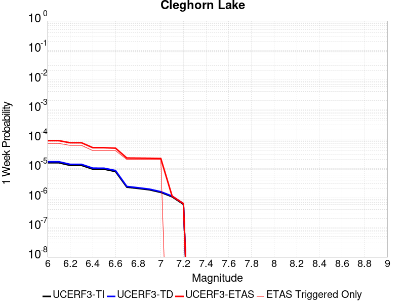 | 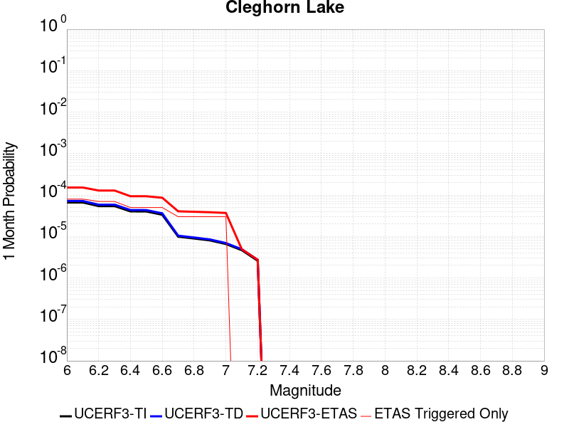 |  | 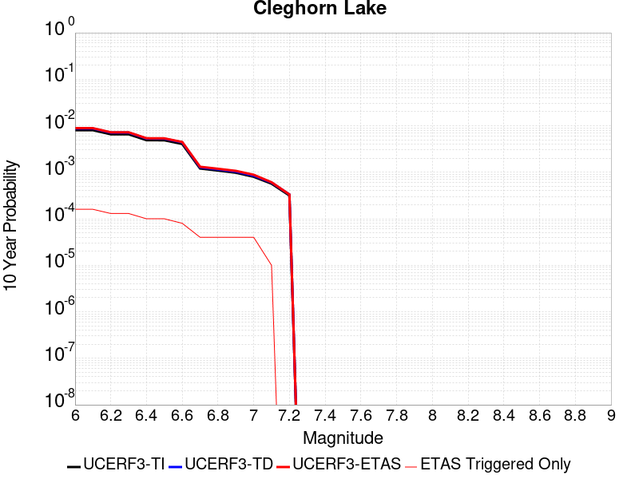 |

| Magnitude | 1 wk TI Prob | 1 wk TD Prob | 1 wk ETAS Prob | 1 wk ETAS/TD Gain | 1 wk ETAS Triggered Only | 1 mo TI Prob | 1 mo TD Prob | 1 mo ETAS Prob | 1 mo ETAS/TD Gain | 1 mo ETAS Triggered Only | 1 yr TI Prob | 1 yr TD Prob | 1 yr ETAS Prob | 1 yr ETAS/TD Gain | 1 yr ETAS Triggered Only | 10 yr TI Prob | 10 yr TD Prob | 10 yr ETAS Prob | 10 yr ETAS/TD Gain | 10 yr ETAS Triggered Only |
|-----|-----|-----|-----|-----|-----|-----|-----|-----|-----|-----|-----|-----|-----|-----|-----|-----|-----|-----|-----|-----|
| 6.0 | 1.5467183E-5 | 1.6794203E-5 | 4.9379152E-5 | 2.9402497 | 3.2585496E-5 | 6.6286244E-5 | 7.197348E-5 | 1.0455663E-4 | 1.4527105 | 3.2585496E-5 | 8.067362E-4 | 8.759797E-4 | 9.2481513E-4 | 1.0557495 | 4.8878243E-5 | 0.008038137 | 0.008730696 | 0.008843749 | 1.012949 | 1.1404924E-4 |
| 6.1 | 1.5467183E-5 | 1.6794203E-5 | 4.9379152E-5 | 2.9402497 | 3.2585496E-5 | 6.6286244E-5 | 7.197348E-5 | 1.0455663E-4 | 1.4527105 | 3.2585496E-5 | 8.067362E-4 | 8.759797E-4 | 9.2481513E-4 | 1.0557495 | 4.8878243E-5 | 0.008038137 | 0.008730696 | 0.008843749 | 1.012949 | 1.1404924E-4 |
| 6.2 | 1.2624631E-5 | 1.3681544E-5 | 4.6266596E-5 | 3.3816793 | 3.2585496E-5 | 5.410444E-5 | 5.863415E-5 | 9.1217735E-5 | 1.5557101 | 3.2585496E-5 | 6.585225E-4 | 7.1368564E-4 | 7.62529E-4 | 1.0684382 | 4.8878243E-5 | 0.0065657445 | 0.0071187317 | 0.0072157923 | 1.0136346 | 9.7756485E-5 |
| 6.3 | 1.2624631E-5 | 1.3681544E-5 | 4.6266596E-5 | 3.3816793 | 3.2585496E-5 | 5.410444E-5 | 5.863415E-5 | 9.1217735E-5 | 1.5557101 | 3.2585496E-5 | 6.585225E-4 | 7.1368564E-4 | 7.62529E-4 | 1.0684382 | 4.8878243E-5 | 0.0065657445 | 0.0071187317 | 0.0072157923 | 1.0136346 | 9.7756485E-5 |
| 6.4 | 9.417684E-6 | 1.0170118E-5 | 2.64627E-5 | 2.6020052 | 1.6292748E-5 | 4.036088E-5 | 4.3585722E-5 | 5.987776E-5 | 1.373793 | 1.6292748E-5 | 4.912829E-4 | 5.3056807E-4 | 5.6313624E-4 | 1.0613836 | 3.2585496E-5 | 0.004901982 | 0.005297049 | 0.005361875 | 1.0122381 | 6.517099E-5 |
| 6.5 | 9.368219E-6 | 1.0117545E-5 | 2.6410127E-5 | 2.6103299 | 1.6292748E-5 | 4.014889E-5 | 4.3360415E-5 | 5.9652455E-5 | 1.3757354 | 1.6292748E-5 | 4.8870314E-4 | 5.2782625E-4 | 5.6039455E-4 | 1.0617027 | 3.2585496E-5 | 0.004876298 | 0.0052697617 | 0.005334589 | 1.0123018 | 6.517099E-5 |
| 6.6 | 7.803798E-6 | 8.441831E-6 | 2.4734441E-5 | 2.9299853 | 1.6292748E-5 | 3.3444423E-5 | 3.6179E-5 | 5.2471158E-5 | 1.4503208 | 1.6292748E-5 | 4.0710976E-4 | 4.4043022E-4 | 4.7300136E-4 | 1.073953 | 3.2585496E-5 | 0.0040636472 | 0.0043994905 | 0.0044481535 | 1.0110611 | 4.8878243E-5 |
| 6.7 | 2.3108669E-6 | 2.4438336E-6 | 1.8736542E-5 | 7.666865 | 1.6292748E-5 | 9.903678E-6 | 1.0473532E-5 | 2.6766109E-5 | 2.5555954 | 1.6292748E-5 | 1.205706E-4 | 1.2750797E-4 | 1.4379865E-4 | 1.127762 | 1.6292748E-5 | 0.001205052 | 0.0012743667 | 0.0013069108 | 1.0255374 | 3.2585496E-5 |
| 6.8 | 2.0882828E-6 | 2.2062823E-6 | 1.8498995E-5 | 8.384691 | 1.6292748E-5 | 8.949753E-6 | 9.455462E-6 | 2.5748055E-5 | 2.723088 | 1.6292748E-5 | 1.08957785E-4 | 1.1511434E-4 | 1.314052E-4 | 1.1415191 | 1.6292748E-5 | 0.0010890438 | 0.0011505639 | 0.0011831119 | 1.0282887 | 3.2585496E-5 |
| 6.9 | 1.876935E-6 | 1.981051E-6 | 1.8273768E-5 | 9.224278 | 1.6292748E-5 | 8.043982E-6 | 8.490192E-6 | 2.4782801E-5 | 2.918992 | 1.6292748E-5 | 9.7931086E-5 | 1.03363345E-4 | 1.1965441E-4 | 1.1576097 | 1.6292748E-5 | 9.788794E-4 | 0.0010331686 | 0.0010657205 | 1.0315068 | 3.2585496E-5 |
| 7.0 | 1.5357559E-6 | 1.6202807E-6 | 1.7913002E-5 | 11.055493 | 1.6292748E-5 | 6.5817944E-6 | 6.9440425E-6 | 2.3236678E-5 | 3.3462753 | 1.6292748E-5 | 8.01304E-5 | 8.454057E-5 | 1.0083193E-4 | 1.1927048 | 1.6292748E-5 | 8.010151E-4 | 8.450965E-4 | 8.776544E-4 | 1.0385257 | 3.2585496E-5 |
| 7.1 | 1.0905424E-6 | 1.1497619E-6 | 1.1497619E-6 | 1.0 | 0.0 | 4.6737446E-6 | 4.9275427E-6 | 4.9275427E-6 | 1.0 | 0.0 | 5.6901354E-5 | 5.999128E-5 | 5.999128E-5 | 1.0 | 0.0 | 5.6886784E-4 | 5.997606E-4 | 6.160436E-4 | 1.0271491 | 1.6292748E-5 |
| 7.2 | 6.06668E-7 | 6.387277E-7 | 6.387277E-7 | 1.0 | 0.0 | 2.600003E-6 | 2.7374022E-6 | 2.7374022E-6 | 1.0 | 0.0 | 3.1654577E-5 | 3.3327433E-5 | 3.3327433E-5 | 1.0 | 0.0 | 3.1650066E-4 | 3.3323118E-4 | 3.3323118E-4 | 1.0 | 0.0 |

## Santa Ynez (East)
*[(top)](#table-of-contents)*

| 1 Week | 1 Month | 1 Year | 10 Year |
|-----|-----|-----|-----|
|  |  |  |  |

| Magnitude | 1 wk TI Prob | 1 wk TD Prob | 1 wk ETAS Prob | 1 wk ETAS/TD Gain | 1 wk ETAS Triggered Only | 1 mo TI Prob | 1 mo TD Prob | 1 mo ETAS Prob | 1 mo ETAS/TD Gain | 1 mo ETAS Triggered Only | 1 yr TI Prob | 1 yr TD Prob | 1 yr ETAS Prob | 1 yr ETAS/TD Gain | 1 yr ETAS Triggered Only | 10 yr TI Prob | 10 yr TD Prob | 10 yr ETAS Prob | 10 yr ETAS/TD Gain | 10 yr ETAS Triggered Only |
|-----|-----|-----|-----|-----|-----|-----|-----|-----|-----|-----|-----|-----|-----|-----|-----|-----|-----|-----|-----|-----|
| 6.0 | 3.2269712E-5 | 3.6750775E-5 | 5.3042924E-5 | 1.4433144 | 1.6292748E-5 | 1.3829143E-4 | 1.5749714E-4 | 1.7378731E-4 | 1.1034316 | 1.6292748E-5 | 0.0016823979 | 0.0019164253 | 0.0019814714 | 1.0339414 | 6.517099E-5 | 0.016697178 | 0.019056438 | 0.019152332 | 1.0050321 | 9.7756485E-5 |
| 6.1 | 3.2269712E-5 | 3.6750775E-5 | 5.3042924E-5 | 1.4433144 | 1.6292748E-5 | 1.3829143E-4 | 1.5749714E-4 | 1.7378731E-4 | 1.1034316 | 1.6292748E-5 | 0.0016823979 | 0.0019164253 | 0.0019814714 | 1.0339414 | 6.517099E-5 | 0.016697178 | 0.019056438 | 0.019152332 | 1.0050321 | 9.7756485E-5 |
| 6.2 | 3.2269712E-5 | 3.6750775E-5 | 5.3042924E-5 | 1.4433144 | 1.6292748E-5 | 1.3829143E-4 | 1.5749714E-4 | 1.7378731E-4 | 1.1034316 | 1.6292748E-5 | 0.0016823979 | 0.0019164253 | 0.0019814714 | 1.0339414 | 6.517099E-5 | 0.016697178 | 0.019056438 | 0.019152332 | 1.0050321 | 9.7756485E-5 |
| 6.3 | 3.2269712E-5 | 3.6750775E-5 | 5.3042924E-5 | 1.4433144 | 1.6292748E-5 | 1.3829143E-4 | 1.5749714E-4 | 1.7378731E-4 | 1.1034316 | 1.6292748E-5 | 0.0016823979 | 0.0019164253 | 0.0019814714 | 1.0339414 | 6.517099E-5 | 0.016697178 | 0.019056438 | 0.019152332 | 1.0050321 | 9.7756485E-5 |
| 6.4 | 1.4404779E-5 | 1.48492945E-5 | 1.48492945E-5 | 1.0 | 0.0 | 6.1733306E-5 | 6.363831E-5 | 6.363831E-5 | 1.0 | 0.0 | 7.513438E-4 | 7.7452604E-4 | 7.908062E-4 | 1.0210195 | 1.6292748E-5 | 0.0074880854 | 0.007718817 | 0.007751151 | 1.004189 | 3.2585496E-5 |
| 6.5 | 1.4404779E-5 | 1.48492945E-5 | 1.48492945E-5 | 1.0 | 0.0 | 6.1733306E-5 | 6.363831E-5 | 6.363831E-5 | 1.0 | 0.0 | 7.513438E-4 | 7.7452604E-4 | 7.908062E-4 | 1.0210195 | 1.6292748E-5 | 0.0074880854 | 0.007718817 | 0.007751151 | 1.004189 | 3.2585496E-5 |
| 6.6 | 1.280208E-5 | 1.301186E-5 | 1.301186E-5 | 1.0 | 0.0 | 5.4864904E-5 | 5.5763932E-5 | 5.5763932E-5 | 1.0 | 0.0 | 6.6777546E-4 | 6.7871617E-4 | 6.9499784E-4 | 1.023989 | 1.6292748E-5 | 0.006657724 | 0.0067666434 | 0.006799008 | 1.004783 | 3.2585496E-5 |
| 6.7 | 1.2457027E-5 | 1.262838E-5 | 1.262838E-5 | 1.0 | 0.0 | 5.3386164E-5 | 5.4120515E-5 | 5.4120515E-5 | 1.0 | 0.0 | 6.497827E-4 | 6.5871974E-4 | 6.7500176E-4 | 1.0247177 | 1.6292748E-5 | 0.00647886 | 0.00656787 | 0.006600241 | 1.0049287 | 3.2585496E-5 |
| 6.8 | 1.2095134E-5 | 1.2230827E-5 | 1.2230827E-5 | 1.0 | 0.0 | 5.1835254E-5 | 5.2416784E-5 | 5.2416784E-5 | 1.0 | 0.0 | 6.309115E-4 | 6.3798914E-4 | 6.5427145E-4 | 1.0255214 | 1.6292748E-5 | 0.0062912325 | 0.006361764 | 0.006394142 | 1.0050895 | 3.2585496E-5 |
| 6.9 | 1.1104036E-5 | 1.115726E-5 | 1.115726E-5 | 1.0 | 0.0 | 4.758786E-5 | 4.781596E-5 | 4.781596E-5 | 1.0 | 0.0 | 5.7922816E-4 | 5.82005E-4 | 5.82005E-4 | 1.0 | 0.0 | 0.005777207 | 0.0058049536 | 0.005821152 | 1.0027905 | 1.6292748E-5 |
| 7.0 | 1.0577444E-5 | 1.05815925E-5 | 1.05815925E-5 | 1.0 | 0.0 | 4.5331115E-5 | 4.53489E-5 | 4.53489E-5 | 1.0 | 0.0 | 5.5176654E-4 | 5.5198424E-4 | 5.5198424E-4 | 1.0 | 0.0 | 0.0055039856 | 0.00550627 | 0.0055224732 | 1.0029427 | 1.6292748E-5 |
| 7.1 | 1.0021775E-5 | 9.9809E-6 | 9.9809E-6 | 1.0 | 0.0 | 4.294976E-5 | 4.277459E-5 | 4.277459E-5 | 1.0 | 0.0 | 5.2278786E-4 | 5.206574E-4 | 5.206574E-4 | 1.0 | 0.0 | 0.0052155964 | 0.005194508 | 0.0052107163 | 1.0031202 | 1.6292748E-5 |
| 7.2 | 8.874109E-6 | 8.748706E-6 | 8.748706E-6 | 1.0 | 0.0 | 3.8031343E-5 | 3.7493923E-5 | 3.7493923E-5 | 1.0 | 0.0 | 4.629332E-4 | 4.56394E-4 | 4.56394E-4 | 1.0 | 0.0 | 0.0046197 | 0.0045546847 | 0.0045709037 | 1.0035609 | 1.6292748E-5 |
| 7.3 | 7.5504267E-6 | 7.5050243E-6 | 7.5050243E-6 | 1.0 | 0.0 | 3.235857E-5 | 3.2164E-5 | 3.2164E-5 | 1.0 | 0.0 | 3.9389438E-4 | 3.9152734E-4 | 3.9152734E-4 | 1.0 | 0.0 | 0.0039319694 | 0.0039084824 | 0.0039247116 | 1.0041523 | 1.6292748E-5 |
| 7.4 | 6.309394E-6 | 6.183062E-6 | 6.183062E-6 | 1.0 | 0.0 | 2.703998E-5 | 2.6498574E-5 | 2.6498574E-5 | 1.0 | 0.0 | 3.2916202E-4 | 3.2257332E-4 | 3.2257332E-4 | 1.0 | 0.0 | 0.003286749 | 0.0032211484 | 0.0032373886 | 1.0050417 | 1.6292748E-5 |
| 7.5 | 4.6103073E-6 | 4.4408016E-6 | 4.4408016E-6 | 1.0 | 0.0 | 1.975831E-5 | 1.9031871E-5 | 1.9031871E-5 | 1.0 | 0.0 | 2.4053088E-4 | 2.316891E-4 | 2.316891E-4 | 1.0 | 0.0 | 0.002402707 | 0.002314545 | 0.0023308 | 1.007023 | 1.6292748E-5 |
| 7.6 | 1.2858658E-6 | 1.3008196E-6 | 1.3008196E-6 | 1.0 | 0.0 | 5.5108417E-6 | 5.574929E-6 | 5.574929E-6 | 1.0 | 0.0 | 6.7092435E-5 | 6.787272E-5 | 6.787272E-5 | 1.0 | 0.0 | 6.707218E-4 | 6.7852676E-4 | 6.7852676E-4 | 1.0 | 0.0 |
| 7.7 | 5.3302307E-7 | 5.612138E-7 | 5.612138E-7 | 1.0 | 0.0 | 2.2843826E-6 | 2.4052001E-6 | 2.4052001E-6 | 1.0 | 0.0 | 2.7812002E-5 | 2.9282955E-5 | 2.9282955E-5 | 1.0 | 0.0 | 2.7808524E-4 | 2.9279455E-4 | 2.9279455E-4 | 1.0 | 0.0 |
| 7.8 | 4.613933E-8 | 4.80301E-8 | 4.80301E-8 | 1.0 | 0.0 | 1.9773998E-7 | 2.0584326E-7 | 2.0584326E-7 | 1.0 | 0.0 | 2.4074816E-6 | 2.5061388E-6 | 2.5061388E-6 | 1.0 | 0.0 | 2.4074554E-5 | 2.5061116E-5 | 2.5061116E-5 | 1.0 | 0.0 |

## San Jacinto (Borrego)
*[(top)](#table-of-contents)*

| 1 Week | 1 Month | 1 Year | 10 Year |
|-----|-----|-----|-----|
|  |  |  |  |

| Magnitude | 1 wk TI Prob | 1 wk TD Prob | 1 wk ETAS Prob | 1 wk ETAS/TD Gain | 1 wk ETAS Triggered Only | 1 mo TI Prob | 1 mo TD Prob | 1 mo ETAS Prob | 1 mo ETAS/TD Gain | 1 mo ETAS Triggered Only | 1 yr TI Prob | 1 yr TD Prob | 1 yr ETAS Prob | 1 yr ETAS/TD Gain | 1 yr ETAS Triggered Only | 10 yr TI Prob | 10 yr TD Prob | 10 yr ETAS Prob | 10 yr ETAS/TD Gain | 10 yr ETAS Triggered Only |
|-----|-----|-----|-----|-----|-----|-----|-----|-----|-----|-----|-----|-----|-----|-----|-----|-----|-----|-----|-----|-----|
| 6.0 | 3.543992E-5 | 2.7925962E-5 | 9.3095136E-5 | 3.333641 | 6.517099E-5 | 1.5187653E-4 | 1.1967727E-4 | 1.8484046E-4 | 1.5444909 | 6.517099E-5 | 0.0018475284 | 0.0014561092 | 0.0015537234 | 1.0670377 | 9.7756485E-5 | 0.018322436 | 0.01486815 | 0.014964454 | 1.0064771 | 9.7756485E-5 |
| 6.1 | 3.542281E-5 | 2.7925962E-5 | 9.3095136E-5 | 3.333641 | 6.517099E-5 | 1.5180321E-4 | 1.1967727E-4 | 1.8484046E-4 | 1.5444909 | 6.517099E-5 | 0.0018466372 | 0.0014561092 | 0.0015537234 | 1.0670377 | 9.7756485E-5 | 0.018313672 | 0.01486815 | 0.014964454 | 1.0064771 | 9.7756485E-5 |
| 6.2 | 3.4688688E-5 | 2.7925962E-5 | 9.3095136E-5 | 3.333641 | 6.517099E-5 | 1.4865733E-4 | 1.1967727E-4 | 1.8484046E-4 | 1.5444909 | 6.517099E-5 | 0.0018084005 | 0.0014561091 | 0.0015537234 | 1.0670377 | 9.7756485E-5 | 0.017937548 | 0.01486815 | 0.014964454 | 1.0064771 | 9.7756485E-5 |
| 6.3 | 3.2087122E-5 | 2.7771312E-5 | 9.294049E-5 | 3.3466368 | 6.517099E-5 | 1.3750899E-4 | 1.1901455E-4 | 1.8417778E-4 | 1.5475233 | 6.517099E-5 | 0.0016728862 | 0.0014480512 | 0.0015456661 | 1.0674112 | 9.7756485E-5 | 0.016603488 | 0.014789308 | 0.014885619 | 1.0065122 | 9.7756485E-5 |
| 6.4 | 3.1828724E-5 | 2.773829E-5 | 9.2907474E-5 | 3.3494306 | 6.517099E-5 | 1.364017E-4 | 1.1887303E-4 | 1.8403628E-4 | 1.5481752 | 6.517099E-5 | 0.0016594254 | 0.0014463306 | 0.0015439456 | 1.0674915 | 9.7756485E-5 | 0.016470885 | 0.014772502 | 0.014868814 | 1.0065197 | 9.7756485E-5 |
| 6.5 | 3.1563577E-5 | 2.7477974E-5 | 9.264718E-5 | 3.3716888 | 6.517099E-5 | 1.3526545E-4 | 1.17757496E-4 | 1.8292082E-4 | 1.5533687 | 6.517099E-5 | 0.0016456128 | 0.0014327668 | 0.0015303832 | 1.0681314 | 9.7756485E-5 | 0.0163348 | 0.01463991 | 0.014736235 | 1.0065796 | 9.7756485E-5 |
| 6.6 | 3.1467625E-5 | 2.7322194E-5 | 9.2491406E-5 | 3.3852115 | 6.517099E-5 | 1.3485427E-4 | 1.17089934E-4 | 1.822533E-4 | 1.556524 | 6.517099E-5 | 0.0016406142 | 0.0014246498 | 0.0015222671 | 1.0685202 | 9.7756485E-5 | 0.016285548 | 0.014560228 | 0.014656561 | 1.0066162 | 9.7756485E-5 |
| 6.7 | 3.1223695E-5 | 2.6940217E-5 | 9.2109454E-5 | 3.4190316 | 6.517099E-5 | 1.3380898E-4 | 1.1545303E-4 | 1.8061651E-4 | 1.5644153 | 6.517099E-5 | 0.0016279068 | 0.0014047464 | 0.0015023656 | 1.0694923 | 9.7756485E-5 | 0.01616033 | 0.01436451 | 0.014460862 | 1.0067077 | 9.7756485E-5 |
| 6.8 | 3.1015585E-5 | 2.6761221E-5 | 9.193047E-5 | 3.4352121 | 6.517099E-5 | 1.3291716E-4 | 1.1468597E-4 | 1.7984949E-4 | 1.5681908 | 6.517099E-5 | 0.001617065 | 0.0013954195 | 0.0014930395 | 1.0699575 | 9.7756485E-5 | 0.016053487 | 0.014271772 | 0.014368133 | 1.0067519 | 9.7756485E-5 |
| 6.9 | 2.6641965E-5 | 2.2183434E-5 | 8.735298E-5 | 3.9377573 | 6.517099E-5 | 1.1417485E-4 | 9.506842E-5 | 1.6023322E-4 | 1.6854516 | 6.517099E-5 | 0.0013891924 | 0.0011568473 | 0.0012544907 | 1.0844047 | 9.7756485E-5 | 0.0138054015 | 0.011882191 | 0.0119787855 | 1.0081294 | 9.7756485E-5 |
| 7.0 | 2.3854353E-5 | 2.047825E-5 | 8.564791E-5 | 4.182384 | 6.517099E-5 | 1.02228936E-4 | 8.776099E-5 | 1.5292627E-4 | 1.7425312 | 6.517099E-5 | 0.0012439266 | 0.0010679689 | 0.001165621 | 1.0914372 | 9.7756485E-5 | 0.012369866 | 0.0109826205 | 0.011079303 | 1.0088032 | 9.7756485E-5 |
| 7.1 | 2.3672901E-5 | 2.0314741E-5 | 8.548441E-5 | 4.207999 | 6.517099E-5 | 1.0145135E-4 | 8.706028E-5 | 1.522256E-4 | 1.748508 | 6.517099E-5 | 0.0012344702 | 0.0010594461 | 0.001157099 | 1.0921736 | 9.7756485E-5 | 0.0122763505 | 0.010897858 | 0.01099455 | 1.0088725 | 9.7756485E-5 |
| 7.2 | 2.2717244E-5 | 1.9542116E-5 | 8.4711835E-5 | 4.334834 | 6.517099E-5 | 9.735599E-5 | 8.3749255E-5 | 1.4891478E-4 | 1.7781029 | 6.517099E-5 | 0.0011846646 | 0.0010191725 | 0.0011168293 | 1.0958197 | 9.7756485E-5 | 0.01178369 | 0.010495322 | 0.010592052 | 1.0092165 | 9.7756485E-5 |
| 7.3 | 2.1016205E-5 | 1.8383771E-5 | 8.355357E-5 | 4.5449634 | 6.517099E-5 | 9.006634E-5 | 7.878522E-5 | 1.4395108E-4 | 1.827133 | 6.517099E-5 | 0.001096006 | 9.5879E-4 | 0.0010564527 | 1.1018604 | 9.7756485E-5 | 0.010906163 | 0.009890901 | 0.0099876905 | 1.0097858 | 9.7756485E-5 |
| 7.4 | 2.0683625E-5 | 1.8186302E-5 | 8.3356106E-5 | 4.5834556 | 6.517099E-5 | 8.86411E-5 | 7.7938974E-5 | 1.4310489E-4 | 1.8361145 | 6.517099E-5 | 0.001078671 | 9.48496E-4 | 0.0010461598 | 1.102967 | 9.7756485E-5 | 0.010734501 | 0.0097876275 | 0.009884427 | 1.00989 | 9.7756485E-5 |
| 7.5 | 1.9993966E-5 | 1.7781347E-5 | 8.295118E-5 | 4.665067 | 6.517099E-5 | 8.568561E-5 | 7.6203556E-5 | 1.4136959E-4 | 1.8551573 | 6.517099E-5 | 0.001042723 | 9.2738547E-4 | 0.0010250512 | 1.1053131 | 9.7756485E-5 | 0.010378438 | 0.009574548 | 0.009671369 | 1.0101123 | 9.7756485E-5 |
| 7.6 | 1.788966E-5 | 1.6434618E-5 | 8.1604536E-5 | 4.9654055 | 6.517099E-5 | 7.666772E-5 | 7.043219E-5 | 1.3559859E-4 | 1.9252361 | 6.517099E-5 | 9.3302975E-4 | 8.5717626E-4 | 9.5484895E-4 | 1.113947 | 9.7756485E-5 | 0.00929122 | 0.008866415 | 0.0089633055 | 1.0109277 | 9.7756485E-5 |
| 7.7 | 1.5125781E-5 | 1.4236738E-5 | 7.9406804E-5 | 5.577598 | 6.517099E-5 | 6.4823165E-5 | 6.101317E-5 | 1.2618018E-4 | 2.0680811 | 6.517099E-5 | 7.889362E-4 | 7.4258295E-4 | 8.402669E-4 | 1.1315461 | 9.7756485E-5 | 0.007861412 | 0.007714161 | 0.0078111636 | 1.0125746 | 9.7756485E-5 |
| 7.8 | 1.250089E-5 | 1.262994E-5 | 7.780011E-5 | 6.1599746 | 6.517099E-5 | 5.3574146E-5 | 5.4127195E-5 | 1.1929466E-4 | 2.203969 | 6.517099E-5 | 6.5207E-4 | 6.588E-4 | 7.564921E-4 | 1.1482879 | 9.7756485E-5 | 0.006501599 | 0.006867759 | 0.006964844 | 1.0141363 | 9.7756485E-5 |
| 7.9 | 9.561E-6 | 9.754065E-6 | 7.492442E-5 | 7.6813536 | 6.517099E-5 | 4.0975072E-5 | 4.180247E-5 | 1.06970736E-4 | 2.5589573 | 6.517099E-5 | 4.987573E-4 | 5.0882675E-4 | 5.902491E-4 | 1.1600196 | 8.146374E-5 | 0.0049763937 | 0.0053523607 | 0.005433388 | 1.0151387 | 8.146374E-5 |
| 8.0 | 8.01699E-6 | 8.292994E-6 | 7.3463445E-5 | 8.858496 | 6.517099E-5 | 3.4358076E-5 | 3.554092E-5 | 1.007096E-4 | 2.8336236 | 6.517099E-5 | 4.1822926E-4 | 4.3262533E-4 | 5.140538E-4 | 1.1882194 | 8.146374E-5 | 0.0041744304 | 0.0045733186 | 0.00465441 | 1.0177313 | 8.146374E-5 |
| 8.1 | 6.541947E-6 | 6.461784E-6 | 3.904707E-5 | 6.0427694 | 3.2585496E-5 | 2.8036617E-5 | 2.7693068E-5 | 6.0277664E-5 | 2.1766336 | 3.2585496E-5 | 3.4129233E-4 | 3.3711144E-4 | 3.8597322E-4 | 1.1449425 | 4.8878243E-5 | 0.0034076865 | 0.0035805756 | 0.0036292786 | 1.013602 | 4.8878243E-5 |
| 8.2 | 1.7968189E-6 | 7.9684827E-7 | 7.9684827E-7 | 1.0 | 0.0 | 7.70063E-6 | 3.4150596E-6 | 3.4150596E-6 | 1.0 | 0.0 | 9.3751136E-5 | 4.157758E-5 | 4.157758E-5 | 1.0 | 0.0 | 9.371159E-4 | 4.7107413E-4 | 4.7107413E-4 | 1.0 | 0.0 |
| 8.3 | 1.5167889E-7 | 4.8951257E-8 | 4.8951257E-8 | 1.0 | 0.0 | 6.500522E-7 | 2.0979108E-7 | 2.0979108E-7 | 1.0 | 0.0 | 7.9143565E-6 | 2.5542038E-6 | 2.5542038E-6 | 1.0 | 0.0 | 7.914075E-5 | 2.9679897E-5 | 2.9679897E-5 | 1.0 | 0.0 |

## San Luis Range 2011 CFM
*[(top)](#table-of-contents)*

| 1 Week | 1 Month | 1 Year | 10 Year |
|-----|-----|-----|-----|
|  |  |  |  |

| Magnitude | 1 wk TI Prob | 1 wk TD Prob | 1 wk ETAS Prob | 1 wk ETAS/TD Gain | 1 wk ETAS Triggered Only | 1 mo TI Prob | 1 mo TD Prob | 1 mo ETAS Prob | 1 mo ETAS/TD Gain | 1 mo ETAS Triggered Only | 1 yr TI Prob | 1 yr TD Prob | 1 yr ETAS Prob | 1 yr ETAS/TD Gain | 1 yr ETAS Triggered Only | 10 yr TI Prob | 10 yr TD Prob | 10 yr ETAS Prob | 10 yr ETAS/TD Gain | 10 yr ETAS Triggered Only |
|-----|-----|-----|-----|-----|-----|-----|-----|-----|-----|-----|-----|-----|-----|-----|-----|-----|-----|-----|-----|-----|
| 6.0 | 8.8368415E-6 | 8.965455E-6 | 4.155066E-5 | 4.6345286 | 3.2585496E-5 | 3.787163E-5 | 3.8422855E-5 | 7.10071E-5 | 1.8480432 | 3.2585496E-5 | 4.609895E-4 | 4.6770574E-4 | 5.1656115E-4 | 1.1044575 | 4.8878243E-5 | 0.0046003438 | 0.004667997 | 0.00474908 | 1.0173701 | 8.146374E-5 |
| 6.1 | 8.8368415E-6 | 8.965455E-6 | 4.155066E-5 | 4.6345286 | 3.2585496E-5 | 3.787163E-5 | 3.8422855E-5 | 7.10071E-5 | 1.8480432 | 3.2585496E-5 | 4.609895E-4 | 4.6770574E-4 | 5.1656115E-4 | 1.1044575 | 4.8878243E-5 | 0.0046003438 | 0.004667997 | 0.00474908 | 1.0173701 | 8.146374E-5 |
| 6.2 | 8.8368415E-6 | 8.965455E-6 | 4.155066E-5 | 4.6345286 | 3.2585496E-5 | 3.787163E-5 | 3.8422855E-5 | 7.10071E-5 | 1.8480432 | 3.2585496E-5 | 4.609895E-4 | 4.6770574E-4 | 5.1656115E-4 | 1.1044575 | 4.8878243E-5 | 0.0046003438 | 0.004667997 | 0.00474908 | 1.0173701 | 8.146374E-5 |
| 6.3 | 8.8368415E-6 | 8.965455E-6 | 4.155066E-5 | 4.6345286 | 3.2585496E-5 | 3.787163E-5 | 3.8422855E-5 | 7.10071E-5 | 1.8480432 | 3.2585496E-5 | 4.609895E-4 | 4.6770574E-4 | 5.1656115E-4 | 1.1044575 | 4.8878243E-5 | 0.0046003438 | 0.004667997 | 0.00474908 | 1.0173701 | 8.146374E-5 |
| 6.4 | 3.9094193E-6 | 3.941204E-6 | 3.941204E-6 | 1.0 | 0.0 | 1.6754546E-5 | 1.6890766E-5 | 1.6890766E-5 | 1.0 | 0.0 | 2.039675E-4 | 2.0562594E-4 | 2.2191534E-4 | 1.0792186 | 1.6292748E-5 | 0.0020378039 | 0.0020543856 | 0.0020869041 | 1.0158288 | 3.2585496E-5 |
| 6.5 | 3.9094193E-6 | 3.941204E-6 | 3.941204E-6 | 1.0 | 0.0 | 1.6754546E-5 | 1.6890766E-5 | 1.6890766E-5 | 1.0 | 0.0 | 2.039675E-4 | 2.0562594E-4 | 2.2191534E-4 | 1.0792186 | 1.6292748E-5 | 0.0020378039 | 0.0020543856 | 0.0020869041 | 1.0158288 | 3.2585496E-5 |
| 6.6 | 3.0587726E-6 | 3.0753893E-6 | 3.0753893E-6 | 1.0 | 0.0 | 1.3108959E-5 | 1.3180174E-5 | 1.3180174E-5 | 1.0 | 0.0 | 1.595899E-4 | 1.6045693E-4 | 1.7674705E-4 | 1.1015234 | 1.6292748E-5 | 0.0015947534 | 0.0016034227 | 0.0016359559 | 1.0202899 | 3.2585496E-5 |
| 6.7 | 2.6160574E-6 | 2.6251284E-6 | 2.6251284E-6 | 1.0 | 0.0 | 1.1211626E-5 | 1.1250502E-5 | 1.1250502E-5 | 1.0 | 0.0 | 1.3649299E-4 | 1.3696631E-4 | 1.5325683E-4 | 1.1189381 | 1.6292748E-5 | 0.0013640919 | 0.0013688251 | 0.001401366 | 1.0237728 | 3.2585496E-5 |
| 6.8 | 2.5110312E-6 | 2.5181412E-6 | 2.5181412E-6 | 1.0 | 0.0 | 1.0761518E-5 | 1.079199E-5 | 1.079199E-5 | 1.0 | 0.0 | 1.310136E-4 | 1.313846E-4 | 1.4767521E-4 | 1.1239917 | 1.6292748E-5 | 0.0013093639 | 0.0013130752 | 0.0013456179 | 1.0247836 | 3.2585496E-5 |
| 6.9 | 1.8564405E-6 | 1.852488E-6 | 1.852488E-6 | 1.0 | 0.0 | 7.95615E-6 | 7.93921E-6 | 7.93921E-6 | 1.0 | 0.0 | 9.686181E-5 | 9.665562E-5 | 1.1294679E-4 | 1.1685486 | 1.6292748E-5 | 9.68196E-4 | 9.6613786E-4 | 9.986919E-4 | 1.033695 | 3.2585496E-5 |
| 7.0 | 1.546127E-6 | 1.5369549E-6 | 1.5369549E-6 | 1.0 | 0.0 | 6.626242E-6 | 6.5869326E-6 | 6.5869326E-6 | 1.0 | 0.0 | 8.06715E-5 | 8.019296E-5 | 8.019296E-5 | 1.0 | 0.0 | 8.0642226E-4 | 8.016409E-4 | 8.179206E-4 | 1.0203079 | 1.6292748E-5 |
| 7.1 | 1.3368208E-6 | 1.3235336E-6 | 1.3235336E-6 | 1.0 | 0.0 | 5.7292195E-6 | 5.6722747E-6 | 5.6722747E-6 | 1.0 | 0.0 | 6.975101E-5 | 6.905776E-5 | 6.905776E-5 | 1.0 | 0.0 | 6.972912E-4 | 6.903635E-4 | 7.06645E-4 | 1.023584 | 1.6292748E-5 |
| 7.2 | 1.0623363E-6 | 1.0454378E-6 | 1.0454378E-6 | 1.0 | 0.0 | 4.5528623E-6 | 4.4804397E-6 | 4.4804397E-6 | 1.0 | 0.0 | 5.5429686E-5 | 5.4547992E-5 | 5.4547992E-5 | 1.0 | 0.0 | 5.5415864E-4 | 5.453463E-4 | 5.616302E-4 | 1.0298597 | 1.6292748E-5 |
| 7.3 | 7.831679E-7 | 7.727399E-7 | 7.727399E-7 | 1.0 | 0.0 | 3.3564295E-6 | 3.3117383E-6 | 3.3117383E-6 | 1.0 | 0.0 | 4.086376E-5 | 4.031967E-5 | 4.031967E-5 | 1.0 | 0.0 | 4.0856248E-4 | 4.0312367E-4 | 4.1940986E-4 | 1.0403999 | 1.6292748E-5 |
| 7.4 | 5.9558846E-7 | 5.910646E-7 | 5.910646E-7 | 1.0 | 0.0 | 2.5525194E-6 | 2.5331315E-6 | 2.5331315E-6 | 1.0 | 0.0 | 3.107648E-5 | 3.084044E-5 | 3.084044E-5 | 1.0 | 0.0 | 3.1072134E-4 | 3.083617E-4 | 3.2464942E-4 | 1.0528202 | 1.6292748E-5 |
| 7.5 | 4.1616502E-7 | 4.1196404E-7 | 4.1196404E-7 | 1.0 | 0.0 | 1.7835631E-6 | 1.765559E-6 | 1.765559E-6 | 1.0 | 0.0 | 2.1714664E-5 | 2.1495469E-5 | 2.1495469E-5 | 1.0 | 0.0 | 2.1712543E-4 | 2.1493394E-4 | 2.1493394E-4 | 1.0 | 0.0 |
| 7.6 | 2.3816014E-7 | 2.3376614E-7 | 2.3376614E-7 | 1.0 | 0.0 | 1.0206859E-6 | 1.0018545E-6 | 1.0018545E-6 | 1.0 | 0.0 | 1.242678E-5 | 1.219751E-5 | 1.219751E-5 | 1.0 | 0.0 | 1.2426086E-4 | 1.2196843E-4 | 1.2196843E-4 | 1.0 | 0.0 |
| 7.7 | 9.918777E-8 | 9.3868096E-8 | 9.3868096E-8 | 1.0 | 0.0 | 4.2509038E-7 | 4.022918E-7 | 4.022918E-7 | 1.0 | 0.0 | 5.1754632E-6 | 4.8978914E-6 | 4.8978914E-6 | 1.0 | 0.0 | 5.1753424E-5 | 4.897784E-5 | 4.897784E-5 | 1.0 | 0.0 |
| 7.8 | 3.4982556E-8 | 2.968672E-8 | 2.968672E-8 | 1.0 | 0.0 | 1.4992524E-7 | 1.272288E-7 | 1.272288E-7 | 1.0 | 0.0 | 1.8253382E-6 | 1.5490094E-6 | 1.5490094E-6 | 1.0 | 0.0 | 1.8253233E-5 | 1.5489988E-5 | 1.5489988E-5 | 1.0 | 0.0 |
| 7.9 | 1.6624908E-8 | 1.1476994E-8 | 1.1476994E-8 | 1.0 | 0.0 | 7.12496E-8 | 4.9187115E-8 | 4.9187115E-8 | 1.0 | 0.0 | 8.6746354E-7 | 5.988529E-7 | 5.988529E-7 | 1.0 | 0.0 | 8.674601E-6 | 5.9885133E-6 | 5.9885133E-6 | 1.0 | 0.0 |
| 8.0 | 6.3352315E-9 | 3.0886564E-9 | 3.0886564E-9 | 1.0 | 0.0 | 2.715099E-8 | 1.32370985E-8 | 1.32370985E-8 | 1.0 | 0.0 | 3.3056327E-7 | 1.6116167E-7 | 1.6116167E-7 | 1.0 | 0.0 | 3.3056278E-6 | 1.6116155E-6 | 1.6116155E-6 | 1.0 | 0.0 |

## Ventura-Pitas Point
*[(top)](#table-of-contents)*

| 1 Week | 1 Month | 1 Year | 10 Year |
|-----|-----|-----|-----|
|  |  |  |  |

| Magnitude | 1 wk TI Prob | 1 wk TD Prob | 1 wk ETAS Prob | 1 wk ETAS/TD Gain | 1 wk ETAS Triggered Only | 1 mo TI Prob | 1 mo TD Prob | 1 mo ETAS Prob | 1 mo ETAS/TD Gain | 1 mo ETAS Triggered Only | 1 yr TI Prob | 1 yr TD Prob | 1 yr ETAS Prob | 1 yr ETAS/TD Gain | 1 yr ETAS Triggered Only | 10 yr TI Prob | 10 yr TD Prob | 10 yr ETAS Prob | 10 yr ETAS/TD Gain | 10 yr ETAS Triggered Only |
|-----|-----|-----|-----|-----|-----|-----|-----|-----|-----|-----|-----|-----|-----|-----|-----|-----|-----|-----|-----|-----|
| 6.0 | 3.3179622E-5 | 3.373519E-5 | 6.631958E-5 | 1.9658875 | 3.2585496E-5 | 1.4219063E-4 | 1.4457281E-4 | 1.771536E-4 | 1.225359 | 3.2585496E-5 | 0.0017297962 | 0.0017590097 | 0.0017915379 | 1.0184923 | 3.2585496E-5 | 0.017163932 | 0.017476497 | 0.01754053 | 1.0036639 | 6.517099E-5 |
| 6.1 | 3.3179622E-5 | 3.373519E-5 | 6.631958E-5 | 1.9658875 | 3.2585496E-5 | 1.4219063E-4 | 1.4457281E-4 | 1.771536E-4 | 1.225359 | 3.2585496E-5 | 0.0017297962 | 0.0017590097 | 0.0017915379 | 1.0184923 | 3.2585496E-5 | 0.017163932 | 0.017476497 | 0.01754053 | 1.0036639 | 6.517099E-5 |
| 6.2 | 3.3179622E-5 | 3.373519E-5 | 6.631958E-5 | 1.9658875 | 3.2585496E-5 | 1.4219063E-4 | 1.4457281E-4 | 1.771536E-4 | 1.225359 | 3.2585496E-5 | 0.0017297962 | 0.0017590097 | 0.0017915379 | 1.0184923 | 3.2585496E-5 | 0.017163932 | 0.017476497 | 0.01754053 | 1.0036639 | 6.517099E-5 |
| 6.3 | 3.3179622E-5 | 3.373519E-5 | 6.631958E-5 | 1.9658875 | 3.2585496E-5 | 1.4219063E-4 | 1.4457281E-4 | 1.771536E-4 | 1.225359 | 3.2585496E-5 | 0.0017297962 | 0.0017590097 | 0.0017915379 | 1.0184923 | 3.2585496E-5 | 0.017163932 | 0.017476497 | 0.01754053 | 1.0036639 | 6.517099E-5 |
| 6.4 | 1.8754668E-5 | 1.7019594E-5 | 1.7019594E-5 | 1.0 | 0.0 | 8.037467E-5 | 7.2939205E-5 | 7.2939205E-5 | 1.0 | 0.0 | 9.781223E-4 | 8.8769617E-4 | 8.8769617E-4 | 1.0 | 0.0 | 0.009738282 | 0.008843943 | 0.008860091 | 1.0018259 | 1.6292748E-5 |
| 6.5 | 1.8754668E-5 | 1.7019594E-5 | 1.7019594E-5 | 1.0 | 0.0 | 8.037467E-5 | 7.2939205E-5 | 7.2939205E-5 | 1.0 | 0.0 | 9.781223E-4 | 8.8769617E-4 | 8.8769617E-4 | 1.0 | 0.0 | 0.009738282 | 0.008843943 | 0.008860091 | 1.0018259 | 1.6292748E-5 |
| 6.6 | 1.4361558E-5 | 1.2122258E-5 | 1.2122258E-5 | 1.0 | 0.0 | 6.154808E-5 | 5.1951512E-5 | 5.1951512E-5 | 1.0 | 0.0 | 7.490902E-4 | 6.323284E-4 | 6.323284E-4 | 1.0 | 0.0 | 0.0074657016 | 0.006305652 | 0.0063218423 | 1.0025675 | 1.6292748E-5 |
| 6.7 | 1.4361558E-5 | 1.2122258E-5 | 1.2122258E-5 | 1.0 | 0.0 | 6.154808E-5 | 5.1951512E-5 | 5.1951512E-5 | 1.0 | 0.0 | 7.490902E-4 | 6.323284E-4 | 6.323284E-4 | 1.0 | 0.0 | 0.0074657016 | 0.006305652 | 0.0063218423 | 1.0025675 | 1.6292748E-5 |
| 6.8 | 1.3663846E-5 | 1.1344401E-5 | 1.1344401E-5 | 1.0 | 0.0 | 5.8558027E-5 | 4.8617967E-5 | 4.8617967E-5 | 1.0 | 0.0 | 7.127108E-4 | 5.917649E-4 | 5.917649E-4 | 1.0 | 0.0 | 0.007104293 | 0.0059022107 | 0.0059184073 | 1.0027442 | 1.6292748E-5 |
| 6.9 | 1.3644157E-5 | 1.1322501E-5 | 1.1322501E-5 | 1.0 | 0.0 | 5.8473648E-5 | 4.8524114E-5 | 4.8524114E-5 | 1.0 | 0.0 | 7.116841E-4 | 5.906229E-4 | 5.906229E-4 | 1.0 | 0.0 | 0.007094092 | 0.0058908514 | 0.005907048 | 1.0027494 | 1.6292748E-5 |
| 7.0 | 1.3568845E-5 | 1.12420685E-5 | 1.12420685E-5 | 1.0 | 0.0 | 5.8150898E-5 | 4.8179416E-5 | 4.8179416E-5 | 1.0 | 0.0 | 7.077572E-4 | 5.8642845E-4 | 5.8642845E-4 | 1.0 | 0.0 | 0.007055073 | 0.005849128 | 0.0058653257 | 1.0027692 | 1.6292748E-5 |
| 7.1 | 1.306572E-5 | 1.0720521E-5 | 1.0720521E-5 | 1.0 | 0.0 | 5.599474E-5 | 4.594429E-5 | 4.594429E-5 | 1.0 | 0.0 | 6.815227E-4 | 5.5923004E-4 | 5.5923004E-4 | 1.0 | 0.0 | 0.0067943637 | 0.005578536 | 0.005594738 | 1.0029043 | 1.6292748E-5 |
| 7.2 | 1.232604E-5 | 9.995121E-6 | 9.995121E-6 | 1.0 | 0.0 | 5.2824813E-5 | 4.283554E-5 | 4.283554E-5 | 1.0 | 0.0 | 6.429523E-4 | 5.2139966E-4 | 5.2139966E-4 | 1.0 | 0.0 | 0.0064109527 | 0.005202059 | 0.005218267 | 1.0031157 | 1.6292748E-5 |
| 7.3 | 1.0917261E-5 | 8.843812E-6 | 8.843812E-6 | 1.0 | 0.0 | 4.678742E-5 | 3.7901507E-5 | 3.7901507E-5 | 1.0 | 0.0 | 5.69488E-4 | 4.6135474E-4 | 4.6135474E-4 | 1.0 | 0.0 | 0.0056803077 | 0.004604239 | 0.0046204566 | 1.0035224 | 1.6292748E-5 |
| 7.4 | 1.039959E-5 | 8.42354E-6 | 8.42354E-6 | 1.0 | 0.0 | 4.456891E-5 | 3.6100395E-5 | 3.6100395E-5 | 1.0 | 0.0 | 5.424914E-4 | 4.394352E-4 | 4.394352E-4 | 1.0 | 0.0 | 0.0054116896 | 0.0043859277 | 0.004402149 | 1.0036985 | 1.6292748E-5 |
| 7.5 | 9.015877E-6 | 7.29752E-6 | 7.29752E-6 | 1.0 | 0.0 | 3.86389E-5 | 3.1274718E-5 | 3.1274718E-5 | 1.0 | 0.0 | 4.7032707E-4 | 3.8070456E-4 | 3.8070456E-4 | 1.0 | 0.0 | 0.004693329 | 0.003800772 | 0.0038170028 | 1.0042704 | 1.6292748E-5 |
| 7.6 | 4.900162E-6 | 3.874119E-6 | 3.874119E-6 | 1.0 | 0.0 | 2.1000526E-5 | 1.6603262E-5 | 1.6603262E-5 | 1.0 | 0.0 | 2.556514E-4 | 2.0212609E-4 | 2.0212609E-4 | 1.0 | 0.0 | 0.0025535747 | 0.002019436 | 0.002035696 | 1.0080516 | 1.6292748E-5 |
| 7.7 | 3.8850626E-6 | 3.12676E-6 | 3.12676E-6 | 1.0 | 0.0 | 1.6650163E-5 | 1.3400332E-5 | 1.3400332E-5 | 1.0 | 0.0 | 2.0269687E-4 | 1.6313691E-4 | 1.6313691E-4 | 1.0 | 0.0 | 0.002025121 | 0.0016301809 | 0.0016464471 | 1.0099782 | 1.6292748E-5 |
| 7.8 | 2.4654719E-6 | 2.029902E-6 | 2.029902E-6 | 1.0 | 0.0 | 1.0566265E-5 | 8.699551E-6 | 8.699551E-6 | 1.0 | 0.0 | 1.2863669E-4 | 1.0591193E-4 | 1.0591193E-4 | 1.0 | 0.0 | 0.0012856225 | 0.0010586192 | 0.0010748947 | 1.0153743 | 1.6292748E-5 |
| 7.9 | 4.095894E-7 | 3.2765078E-7 | 3.2765078E-7 | 1.0 | 0.0 | 1.7553821E-6 | 1.4042168E-6 | 1.4042168E-6 | 1.0 | 0.0 | 2.1371567E-5 | 1.709621E-5 | 1.709621E-5 | 1.0 | 0.0 | 2.1369511E-4 | 1.7094925E-4 | 1.7094925E-4 | 1.0 | 0.0 |
| 8.0 | 7.791402E-9 | 5.6836056E-9 | 5.6836056E-9 | 1.0 | 0.0 | 3.3391725E-8 | 2.4358311E-8 | 2.4358311E-8 | 1.0 | 0.0 | 4.0654416E-7 | 2.965624E-7 | 2.965624E-7 | 1.0 | 0.0 | 4.065434E-6 | 2.9656223E-6 | 2.9656223E-6 | 1.0 | 0.0 |

## Rose Canyon
*[(top)](#table-of-contents)*

| 1 Week | 1 Month | 1 Year | 10 Year |
|-----|-----|-----|-----|
|  | 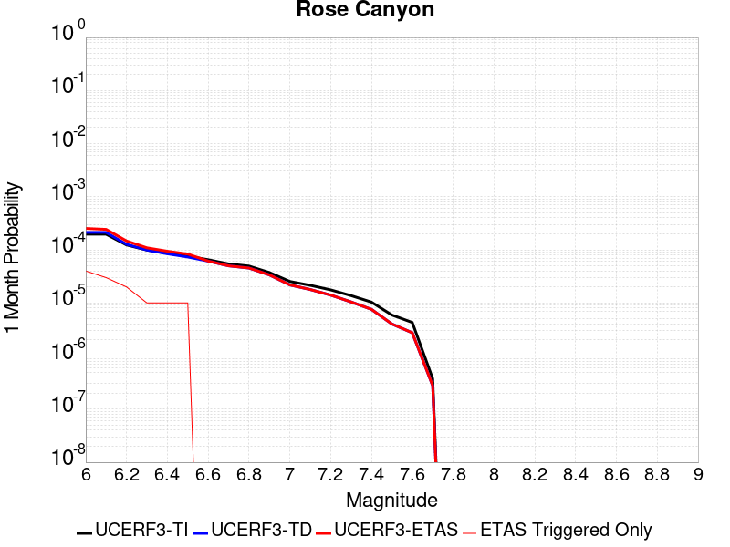 |  |  |

| Magnitude | 1 wk TI Prob | 1 wk TD Prob | 1 wk ETAS Prob | 1 wk ETAS/TD Gain | 1 wk ETAS Triggered Only | 1 mo TI Prob | 1 mo TD Prob | 1 mo ETAS Prob | 1 mo ETAS/TD Gain | 1 mo ETAS Triggered Only | 1 yr TI Prob | 1 yr TD Prob | 1 yr ETAS Prob | 1 yr ETAS/TD Gain | 1 yr ETAS Triggered Only | 10 yr TI Prob | 10 yr TD Prob | 10 yr ETAS Prob | 10 yr ETAS/TD Gain | 10 yr ETAS Triggered Only |
|-----|-----|-----|-----|-----|-----|-----|-----|-----|-----|-----|-----|-----|-----|-----|-----|-----|-----|-----|-----|-----|
| 6.0 | 4.5923203E-5 | 4.9714607E-5 | 6.600654E-5 | 1.3277093 | 1.6292748E-5 | 1.9679888E-4 | 2.1304654E-4 | 2.456251E-4 | 1.1529175 | 3.2585496E-5 | 0.0023933933 | 0.0025909478 | 0.0026722006 | 1.0313603 | 8.146374E-5 | 0.023677798 | 0.025618518 | 0.025697894 | 1.0030984 | 8.146374E-5 |
| 6.1 | 4.5923203E-5 | 4.9714607E-5 | 6.600654E-5 | 1.3277093 | 1.6292748E-5 | 1.9679888E-4 | 2.1304654E-4 | 2.2933583E-4 | 1.0764588 | 1.6292748E-5 | 0.0023933933 | 0.0025909478 | 0.0026396995 | 1.0188161 | 4.8878243E-5 | 0.023677798 | 0.025618518 | 0.025666144 | 1.0018591 | 4.8878243E-5 |
| 6.2 | 2.8844734E-5 | 2.9669678E-5 | 4.5961944E-5 | 1.5491217 | 1.6292748E-5 | 1.2361443E-4 | 1.2714976E-4 | 1.4344044E-4 | 1.128122 | 1.6292748E-5 | 0.0015039665 | 0.001546976 | 0.0015632436 | 1.0105157 | 1.6292748E-5 | 0.0149382865 | 0.015364873 | 0.015380916 | 1.0010442 | 1.6292748E-5 |
| 6.3 | 2.3171577E-5 | 2.3162425E-5 | 2.3162425E-5 | 1.0 | 0.0 | 9.9302975E-5 | 9.926383E-5 | 9.926383E-5 | 1.0 | 0.0 | 0.0012083431 | 0.0012078804 | 0.0012078804 | 1.0 | 0.0 | 0.012017938 | 0.012012152 | 0.012012152 | 1.0 | 0.0 |
| 6.4 | 2.0066604E-5 | 1.9668067E-5 | 1.9668067E-5 | 1.0 | 0.0 | 8.599689E-5 | 8.428905E-5 | 8.428905E-5 | 1.0 | 0.0 | 0.0010465092 | 0.001025746 | 0.001025746 | 1.0 | 0.0 | 0.010415946 | 0.010211479 | 0.010211479 | 1.0 | 0.0 |
| 6.5 | 1.776989E-5 | 1.7115402E-5 | 1.7115402E-5 | 1.0 | 0.0 | 7.615444E-5 | 7.33497E-5 | 7.33497E-5 | 1.0 | 0.0 | 9.267859E-4 | 8.926737E-4 | 8.926737E-4 | 1.0 | 0.0 | 0.009229303 | 0.008874663 | 0.008874663 | 1.0 | 0.0 |
| 6.6 | 1.5227364E-5 | 1.4340872E-5 | 1.4340872E-5 | 1.0 | 0.0 | 6.52585E-5 | 6.145947E-5 | 6.145947E-5 | 1.0 | 0.0 | 7.942326E-4 | 7.480173E-4 | 7.480173E-4 | 1.0 | 0.0 | 0.007914 | 0.0074410336 | 0.0074410336 | 1.0 | 0.0 |
| 6.7 | 1.2703898E-5 | 1.1674277E-5 | 1.1674277E-5 | 1.0 | 0.0 | 5.4444143E-5 | 5.0031682E-5 | 5.0031682E-5 | 1.0 | 0.0 | 6.626558E-4 | 6.089697E-4 | 6.089697E-4 | 1.0 | 0.0 | 0.006606833 | 0.0060623093 | 0.0060623093 | 1.0 | 0.0 |
| 6.8 | 1.1554917E-5 | 1.0610384E-5 | 1.0610384E-5 | 1.0 | 0.0 | 4.9520135E-5 | 4.547231E-5 | 4.547231E-5 | 1.0 | 0.0 | 6.0274085E-4 | 5.5348873E-4 | 5.5348873E-4 | 1.0 | 0.0 | 0.0060110865 | 0.005504414 | 0.005504414 | 1.0 | 0.0 |
| 6.9 | 8.732078E-6 | 7.882285E-6 | 7.882285E-6 | 1.0 | 0.0 | 3.7422655E-5 | 3.37808E-5 | 3.37808E-5 | 1.0 | 0.0 | 4.5552556E-4 | 4.112066E-4 | 4.112066E-4 | 1.0 | 0.0 | 0.0045459294 | 0.004089515 | 0.004089515 | 1.0 | 0.0 |
| 7.0 | 5.9337494E-6 | 5.107436E-6 | 5.107436E-6 | 1.0 | 0.0 | 2.5430107E-5 | 2.1888829E-5 | 2.1888829E-5 | 1.0 | 0.0 | 3.0956755E-4 | 2.6646405E-4 | 2.6646405E-4 | 1.0 | 0.0 | 0.0030913667 | 0.002661461 | 0.002661461 | 1.0 | 0.0 |
| 7.1 | 5.013409E-6 | 4.17734E-6 | 4.17734E-6 | 1.0 | 0.0 | 2.1485863E-5 | 1.7902763E-5 | 1.7902763E-5 | 1.0 | 0.0 | 2.6155898E-4 | 2.1794444E-4 | 2.1794444E-4 | 1.0 | 0.0 | 0.0026125133 | 0.0021773188 | 0.0021773188 | 1.0 | 0.0 |
| 7.2 | 4.120763E-6 | 3.2820917E-6 | 3.2820917E-6 | 1.0 | 0.0 | 1.7660293E-5 | 1.4066032E-5 | 1.4066032E-5 | 1.0 | 0.0 | 2.1499286E-4 | 1.7124058E-4 | 1.7124058E-4 | 1.0 | 0.0 | 0.0021478499 | 0.0017110958 | 0.0017110958 | 1.0 | 0.0 |
| 7.3 | 3.2081239E-6 | 2.4404965E-6 | 2.4404965E-6 | 1.0 | 0.0 | 1.374903E-5 | 1.0459229E-5 | 1.0459229E-5 | 1.0 | 0.0 | 1.6738157E-4 | 1.2733374E-4 | 1.2733374E-4 | 1.0 | 0.0 | 0.0016725556 | 0.0012726148 | 0.0012726148 | 1.0 | 0.0 |
| 7.4 | 2.4194755E-6 | 1.7680321E-6 | 1.7680321E-6 | 1.0 | 0.0 | 1.0369139E-5 | 7.5772587E-6 | 7.5772587E-6 | 1.0 | 0.0 | 1.2623696E-4 | 9.224927E-5 | 9.224927E-5 | 1.0 | 0.0 | 0.0012616527 | 9.221151E-4 | 9.221151E-4 | 1.0 | 0.0 |
| 7.5 | 1.3842889E-6 | 9.3782967E-7 | 9.3782967E-7 | 1.0 | 0.0 | 5.9326535E-6 | 4.019264E-6 | 4.019264E-6 | 1.0 | 0.0 | 7.222766E-5 | 4.8933474E-5 | 4.8933474E-5 | 1.0 | 0.0 | 7.220419E-4 | 4.8923056E-4 | 4.8923056E-4 | 1.0 | 0.0 |
| 7.6 | 1.0021575E-6 | 6.4113493E-7 | 6.4113493E-7 | 1.0 | 0.0 | 4.2949537E-6 | 2.7477186E-6 | 2.7477186E-6 | 1.0 | 0.0 | 5.2289808E-5 | 3.345298E-5 | 3.345298E-5 | 1.0 | 0.0 | 5.2277505E-4 | 3.344816E-4 | 3.344816E-4 | 1.0 | 0.0 |
| 7.7 | 8.7620116E-8 | 6.449304E-8 | 6.449304E-8 | 1.0 | 0.0 | 3.7551473E-7 | 2.763987E-7 | 2.763987E-7 | 1.0 | 0.0 | 4.5718825E-6 | 3.3651493E-6 | 3.3651493E-6 | 1.0 | 0.0 | 4.5717883E-5 | 3.3651013E-5 | 3.3651013E-5 | 1.0 | 0.0 |

## Big Pine (Central)
*[(top)](#table-of-contents)*

| 1 Week | 1 Month | 1 Year | 10 Year |
|-----|-----|-----|-----|
|  |  | 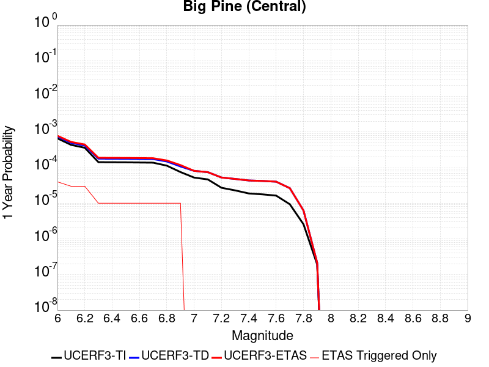 |  |

| Magnitude | 1 wk TI Prob | 1 wk TD Prob | 1 wk ETAS Prob | 1 wk ETAS/TD Gain | 1 wk ETAS Triggered Only | 1 mo TI Prob | 1 mo TD Prob | 1 mo ETAS Prob | 1 mo ETAS/TD Gain | 1 mo ETAS Triggered Only | 1 yr TI Prob | 1 yr TD Prob | 1 yr ETAS Prob | 1 yr ETAS/TD Gain | 1 yr ETAS Triggered Only | 10 yr TI Prob | 10 yr TD Prob | 10 yr ETAS Prob | 10 yr ETAS/TD Gain | 10 yr ETAS Triggered Only |
|-----|-----|-----|-----|-----|-----|-----|-----|-----|-----|-----|-----|-----|-----|-----|-----|-----|-----|-----|-----|-----|
| 6.0 | 1.2706755E-5 | 1.4250602E-5 | 1.4250602E-5 | 1.0 | 0.0 | 5.4456385E-5 | 6.107279E-5 | 6.107279E-5 | 1.0 | 0.0 | 6.628048E-4 | 7.433441E-4 | 7.9218595E-4 | 1.0657057 | 4.8878243E-5 | 0.006608314 | 0.007413639 | 0.007494499 | 1.0109069 | 8.146374E-5 |
| 6.1 | 8.342579E-6 | 9.510835E-6 | 9.510835E-6 | 1.0 | 0.0 | 3.5753423E-5 | 4.076021E-5 | 4.076021E-5 | 1.0 | 0.0 | 4.3521097E-4 | 4.9616426E-4 | 5.450183E-4 | 1.0984633 | 4.8878243E-5 | 0.0043435963 | 0.004954155 | 0.005035215 | 1.0163621 | 8.146374E-5 |
| 6.2 | 6.923899E-6 | 7.967221E-6 | 7.967221E-6 | 1.0 | 0.0 | 2.9673516E-5 | 3.4144894E-5 | 3.4144894E-5 | 1.0 | 0.0 | 3.6121515E-4 | 4.1565404E-4 | 4.6451198E-4 | 1.1175447 | 4.8878243E-5 | 0.003606286 | 0.0041521094 | 0.004233235 | 1.0195384 | 8.146374E-5 |
| 6.3 | 2.728396E-6 | 3.4243646E-6 | 3.4243646E-6 | 1.0 | 0.0 | 1.1693074E-5 | 1.4675771E-5 | 1.4675771E-5 | 1.0 | 0.0 | 1.4235388E-4 | 1.7866373E-4 | 1.9495357E-4 | 1.0911759 | 1.6292748E-5 | 0.0014226272 | 0.0017867433 | 0.0018192705 | 1.0182048 | 3.2585496E-5 |
| 6.4 | 2.7136944E-6 | 3.4086581E-6 | 3.4086581E-6 | 1.0 | 0.0 | 1.1630066E-5 | 1.4608458E-5 | 1.4608458E-5 | 1.0 | 0.0 | 1.4158686E-4 | 1.7784433E-4 | 1.9413418E-4 | 1.0915961 | 1.6292748E-5 | 0.0014149669 | 0.0017785623 | 0.0018110899 | 1.0182886 | 3.2585496E-5 |
| 6.5 | 2.6971882E-6 | 3.3910032E-6 | 3.3910032E-6 | 1.0 | 0.0 | 1.1559327E-5 | 1.4532795E-5 | 1.4532795E-5 | 1.0 | 0.0 | 1.4072572E-4 | 1.7692328E-4 | 1.9321314E-4 | 1.0920731 | 1.6292748E-5 | 0.0014063664 | 0.0017693666 | 0.0018018944 | 1.0183839 | 3.2585496E-5 |
| 6.6 | 2.669092E-6 | 3.3610236E-6 | 3.3610236E-6 | 1.0 | 0.0 | 1.1438916E-5 | 1.4404312E-5 | 1.4404312E-5 | 1.0 | 0.0 | 1.3925991E-4 | 1.7535927E-4 | 1.9164915E-4 | 1.0928944 | 1.6292748E-5 | 0.0013917267 | 0.0017537511 | 0.0017862795 | 1.0185479 | 3.2585496E-5 |
| 6.7 | 2.6408059E-6 | 3.3310494E-6 | 3.3310494E-6 | 1.0 | 0.0 | 1.1317691E-5 | 1.4275853E-5 | 1.4275853E-5 | 1.0 | 0.0 | 1.3778417E-4 | 1.737955E-4 | 1.9008543E-4 | 1.0937303 | 1.6292748E-5 | 0.0013769877 | 0.0017381381 | 0.001770667 | 1.0187148 | 3.2585496E-5 |
| 6.8 | 2.1786943E-6 | 2.8545066E-6 | 2.8545066E-6 | 1.0 | 0.0 | 9.337228E-6 | 1.2233547E-5 | 1.2233547E-5 | 1.0 | 0.0 | 1.1367482E-4 | 1.4893398E-4 | 1.652243E-4 | 1.1093795 | 1.6292748E-5 | 0.0011361669 | 0.0014898704 | 0.0015224074 | 1.0218388 | 3.2585496E-5 |
| 6.9 | 1.4411696E-6 | 2.0685677E-6 | 2.0685677E-6 | 1.0 | 0.0 | 6.1764263E-6 | 8.865261E-6 | 8.865261E-6 | 1.0 | 0.0 | 7.51954E-5 | 1.0792949E-4 | 1.2422047E-4 | 1.150941 | 1.6292748E-5 | 7.5169955E-4 | 0.0010802548 | 0.0011128051 | 1.030132 | 3.2585496E-5 |
| 7.0 | 1.0073411E-6 | 1.5543274E-6 | 1.5543274E-6 | 1.0 | 0.0 | 4.317169E-6 | 6.661387E-6 | 6.661387E-6 | 1.0 | 0.0 | 5.2560266E-5 | 8.109952E-5 | 8.109952E-5 | 1.0 | 0.0 | 5.2547833E-4 | 8.1217213E-4 | 8.2845165E-4 | 1.0200444 | 1.6292748E-5 |
| 7.1 | 8.947104E-7 | 1.430316E-6 | 1.430316E-6 | 1.0 | 0.0 | 3.834468E-6 | 6.1299124E-6 | 6.1299124E-6 | 1.0 | 0.0 | 4.6683643E-5 | 7.462928E-5 | 7.462928E-5 | 1.0 | 0.0 | 4.6673836E-4 | 7.4751483E-4 | 7.637954E-4 | 1.0217795 | 1.6292748E-5 |
| 7.2 | 5.215166E-7 | 1.0112277E-6 | 1.0112277E-6 | 1.0 | 0.0 | 2.2350691E-6 | 4.333826E-6 | 4.333826E-6 | 1.0 | 0.0 | 2.7211627E-5 | 5.27631E-5 | 5.27631E-5 | 1.0 | 0.0 | 2.7208295E-4 | 5.289683E-4 | 5.289683E-4 | 1.0 | 0.0 |
| 7.3 | 4.4024807E-7 | 9.220183E-7 | 9.220183E-7 | 1.0 | 0.0 | 1.8867761E-6 | 3.951501E-6 | 3.951501E-6 | 1.0 | 0.0 | 2.2971257E-5 | 4.8108504E-5 | 4.8108504E-5 | 1.0 | 0.0 | 2.2968883E-4 | 4.824433E-4 | 4.824433E-4 | 1.0 | 0.0 |
| 7.4 | 3.6130905E-7 | 8.359109E-7 | 8.359109E-7 | 1.0 | 0.0 | 1.5484665E-6 | 3.5824705E-6 | 3.5824705E-6 | 1.0 | 0.0 | 1.8852415E-5 | 4.3615746E-5 | 4.3615746E-5 | 1.0 | 0.0 | 1.8850817E-4 | 4.3752496E-4 | 4.3752496E-4 | 1.0 | 0.0 |
| 7.5 | 3.408184E-7 | 8.1087245E-7 | 8.1087245E-7 | 1.0 | 0.0 | 1.4606494E-6 | 3.475163E-6 | 3.475163E-6 | 1.0 | 0.0 | 1.7783263E-5 | 4.230933E-5 | 4.230933E-5 | 1.0 | 0.0 | 1.778184E-4 | 4.2444657E-4 | 4.2444657E-4 | 1.0 | 0.0 |
| 7.6 | 3.1428627E-7 | 7.732167E-7 | 7.732167E-7 | 1.0 | 0.0 | 1.3469405E-6 | 3.313782E-6 | 3.313782E-6 | 1.0 | 0.0 | 1.6398877E-5 | 4.0344585E-5 | 4.0344585E-5 | 1.0 | 0.0 | 1.6397667E-4 | 4.0477706E-4 | 4.0477706E-4 | 1.0 | 0.0 |
| 7.7 | 1.7972785E-7 | 5.0782415E-7 | 5.0782415E-7 | 1.0 | 0.0 | 7.70262E-7 | 2.1763874E-6 | 2.1763874E-6 | 1.0 | 0.0 | 9.377899E-6 | 2.6497206E-5 | 2.6497206E-5 | 1.0 | 0.0 | 9.377503E-5 | 2.6633305E-4 | 2.6633305E-4 | 1.0 | 0.0 |
| 7.8 | 4.9230927E-8 | 1.1981747E-7 | 1.1981747E-7 | 1.0 | 0.0 | 2.1098968E-7 | 5.135033E-7 | 5.135033E-7 | 1.0 | 0.0 | 2.5687964E-6 | 6.2518866E-6 | 6.2518866E-6 | 1.0 | 0.0 | 2.5687666E-5 | 6.2971965E-5 | 6.2971965E-5 | 1.0 | 0.0 |
| 7.9 | 3.6805972E-9 | 4.1051638E-9 | 4.1051638E-9 | 1.0 | 0.0 | 1.5773987E-8 | 1.7593557E-8 | 1.7593557E-8 | 1.0 | 0.0 | 1.9204828E-7 | 2.1420155E-7 | 2.1420155E-7 | 1.0 | 0.0 | 1.920481E-6 | 2.1898923E-6 | 2.1898923E-6 | 1.0 | 0.0 |

## Elysian Park (Upper)
*[(top)](#table-of-contents)*

| 1 Week | 1 Month | 1 Year | 10 Year |
|-----|-----|-----|-----|
|  |  |  |  |

| Magnitude | 1 wk TI Prob | 1 wk TD Prob | 1 wk ETAS Prob | 1 wk ETAS/TD Gain | 1 wk ETAS Triggered Only | 1 mo TI Prob | 1 mo TD Prob | 1 mo ETAS Prob | 1 mo ETAS/TD Gain | 1 mo ETAS Triggered Only | 1 yr TI Prob | 1 yr TD Prob | 1 yr ETAS Prob | 1 yr ETAS/TD Gain | 1 yr ETAS Triggered Only | 10 yr TI Prob | 10 yr TD Prob | 10 yr ETAS Prob | 10 yr ETAS/TD Gain | 10 yr ETAS Triggered Only |
|-----|-----|-----|-----|-----|-----|-----|-----|-----|-----|-----|-----|-----|-----|-----|-----|-----|-----|-----|-----|-----|
| 6.0 | 3.1876025E-5 | 3.7035275E-5 | 3.7035275E-5 | 1.0 | 0.0 | 1.3660437E-4 | 1.5871569E-4 | 1.9129601E-4 | 1.2052747 | 3.2585496E-5 | 0.0016618895 | 0.001931122 | 0.0019799059 | 1.0252619 | 4.8878243E-5 | 0.016495159 | 0.019189863 | 0.019269763 | 1.0041636 | 8.146374E-5 |
| 6.1 | 3.1876025E-5 | 3.7035275E-5 | 3.7035275E-5 | 1.0 | 0.0 | 1.3660437E-4 | 1.5871569E-4 | 1.9129601E-4 | 1.2052747 | 3.2585496E-5 | 0.0016618895 | 0.001931122 | 0.0019799059 | 1.0252619 | 4.8878243E-5 | 0.016495159 | 0.019189863 | 0.019269763 | 1.0041636 | 8.146374E-5 |
| 6.2 | 3.1876025E-5 | 3.7035275E-5 | 3.7035275E-5 | 1.0 | 0.0 | 1.3660437E-4 | 1.5871569E-4 | 1.9129601E-4 | 1.2052747 | 3.2585496E-5 | 0.0016618895 | 0.001931122 | 0.0019799059 | 1.0252619 | 4.8878243E-5 | 0.016495159 | 0.019189863 | 0.019269763 | 1.0041636 | 8.146374E-5 |
| 6.3 | 3.1876025E-5 | 3.7035275E-5 | 3.7035275E-5 | 1.0 | 0.0 | 1.3660437E-4 | 1.5871569E-4 | 1.9129601E-4 | 1.2052747 | 3.2585496E-5 | 0.0016618895 | 0.001931122 | 0.0019799059 | 1.0252619 | 4.8878243E-5 | 0.016495159 | 0.019189863 | 0.019269763 | 1.0041636 | 8.146374E-5 |
| 6.4 | 1.9273462E-5 | 2.120244E-5 | 2.120244E-5 | 1.0 | 0.0 | 8.259794E-5 | 9.086542E-5 | 9.086542E-5 | 1.0 | 0.0 | 0.001005166 | 0.0011058967 | 0.0011058967 | 1.0 | 0.0 | 0.010006315 | 0.011020744 | 0.011036857 | 1.0014621 | 1.6292748E-5 |
| 6.5 | 1.9273462E-5 | 2.120244E-5 | 2.120244E-5 | 1.0 | 0.0 | 8.259794E-5 | 9.086542E-5 | 9.086542E-5 | 1.0 | 0.0 | 0.001005166 | 0.0011058967 | 0.0011058967 | 1.0 | 0.0 | 0.010006315 | 0.011020744 | 0.011036857 | 1.0014621 | 1.6292748E-5 |
| 6.6 | 9.813258E-6 | 9.665589E-6 | 9.665589E-6 | 1.0 | 0.0 | 4.205614E-5 | 4.1423333E-5 | 4.1423333E-5 | 1.0 | 0.0 | 5.119132E-4 | 5.042196E-4 | 5.042196E-4 | 1.0 | 0.0 | 0.005107356 | 0.0050314795 | 0.00504769 | 1.0032219 | 1.6292748E-5 |
| 6.7 | 9.801478E-6 | 9.653158E-6 | 9.653158E-6 | 1.0 | 0.0 | 4.2005657E-5 | 4.137006E-5 | 4.137006E-5 | 1.0 | 0.0 | 5.112989E-4 | 5.0357135E-4 | 5.0357135E-4 | 1.0 | 0.0 | 0.0051012407 | 0.005025026 | 0.005041237 | 1.003226 | 1.6292748E-5 |
| 6.8 | 8.102489E-6 | 7.772994E-6 | 7.772994E-6 | 1.0 | 0.0 | 3.4724493E-5 | 3.3312434E-5 | 3.3312434E-5 | 1.0 | 0.0 | 4.2268867E-4 | 4.0550836E-4 | 4.0550836E-4 | 1.0 | 0.0 | 0.004218856 | 0.0040481784 | 0.004064405 | 1.0040084 | 1.6292748E-5 |
| 6.9 | 6.08275E-6 | 5.481441E-6 | 5.481441E-6 | 1.0 | 0.0 | 2.6068668E-5 | 2.3491682E-5 | 2.3491682E-5 | 1.0 | 0.0 | 3.173398E-4 | 2.8597447E-4 | 2.8597447E-4 | 1.0 | 0.0 | 0.0031688702 | 0.0028561424 | 0.0028723886 | 1.0056882 | 1.6292748E-5 |
| 7.0 | 5.5995934E-6 | 4.9827686E-6 | 4.9827686E-6 | 1.0 | 0.0 | 2.3998036E-5 | 2.1354552E-5 | 2.1354552E-5 | 1.0 | 0.0 | 2.9213692E-4 | 2.5996132E-4 | 2.5996132E-4 | 1.0 | 0.0 | 0.0029175316 | 0.0025966396 | 0.00261289 | 1.0062582 | 1.6292748E-5 |
| 7.1 | 4.709881E-6 | 4.0873906E-6 | 4.0873906E-6 | 1.0 | 0.0 | 2.0185047E-5 | 1.7517272E-5 | 1.7517272E-5 | 1.0 | 0.0 | 2.4572524E-4 | 2.1325232E-4 | 2.1325232E-4 | 1.0 | 0.0 | 0.002454537 | 0.0021305184 | 0.0021467763 | 1.0076311 | 1.6292748E-5 |
| 7.2 | 3.6063436E-6 | 2.9779412E-6 | 2.9779412E-6 | 1.0 | 0.0 | 1.5455667E-5 | 1.27625435E-5 | 1.27625435E-5 | 1.0 | 0.0 | 1.881565E-4 | 1.55373E-4 | 1.55373E-4 | 1.0 | 0.0 | 0.0018799726 | 0.0015526549 | 0.0015689224 | 1.0104772 | 1.6292748E-5 |
| 7.3 | 2.471135E-6 | 2.0954562E-6 | 2.0954562E-6 | 1.0 | 0.0 | 1.0590536E-5 | 8.980496E-6 | 8.980496E-6 | 1.0 | 0.0 | 1.2893214E-4 | 1.0933213E-4 | 1.0933213E-4 | 1.0 | 0.0 | 0.0012885736 | 0.0010927906 | 0.0011090656 | 1.014893 | 1.6292748E-5 |
| 7.4 | 1.163943E-6 | 1.0275061E-6 | 1.0275061E-6 | 1.0 | 0.0 | 4.988318E-6 | 4.40359E-6 | 4.40359E-6 | 1.0 | 0.0 | 6.0731076E-5 | 5.361242E-5 | 5.361242E-5 | 1.0 | 0.0 | 6.071448E-4 | 5.3599785E-4 | 5.5228185E-4 | 1.0303807 | 1.6292748E-5 |
| 7.5 | 4.99459E-7 | 4.917601E-7 | 4.917601E-7 | 1.0 | 0.0 | 2.140537E-6 | 2.1075416E-6 | 2.1075416E-6 | 1.0 | 0.0 | 2.6060725E-5 | 2.5659032E-5 | 2.5659032E-5 | 1.0 | 0.0 | 2.605767E-4 | 2.5656226E-4 | 2.5656226E-4 | 1.0 | 0.0 |
| 7.6 | 2.4667852E-7 | 2.4778313E-7 | 2.4778313E-7 | 1.0 | 0.0 | 1.0571932E-6 | 1.0619274E-6 | 1.0619274E-6 | 1.0 | 0.0 | 1.2871251E-5 | 1.2928893E-5 | 1.2928893E-5 | 1.0 | 0.0 | 1.2870505E-4 | 1.2928178E-4 | 1.2928178E-4 | 1.0 | 0.0 |
| 7.7 | 8.2312795E-8 | 7.3864214E-8 | 7.3864214E-8 | 1.0 | 0.0 | 3.527691E-7 | 3.165609E-7 | 3.165609E-7 | 1.0 | 0.0 | 4.294955E-6 | 3.854123E-6 | 3.854123E-6 | 1.0 | 0.0 | 4.2948723E-5 | 3.854068E-5 | 3.854068E-5 | 1.0 | 0.0 |
| 7.8 | 2.7819295E-8 | 1.7565618E-8 | 1.7565618E-8 | 1.0 | 0.0 | 1.1922555E-7 | 7.528122E-8 | 7.528122E-8 | 1.0 | 0.0 | 1.45157E-6 | 9.1654863E-7 | 9.1654863E-7 | 1.0 | 0.0 | 1.45156055E-5 | 9.165463E-6 | 9.165463E-6 | 1.0 | 0.0 |

## Kern Canyon (South Kern) 2011
*[(top)](#table-of-contents)*

| 1 Week | 1 Month | 1 Year | 10 Year |
|-----|-----|-----|-----|
|  | 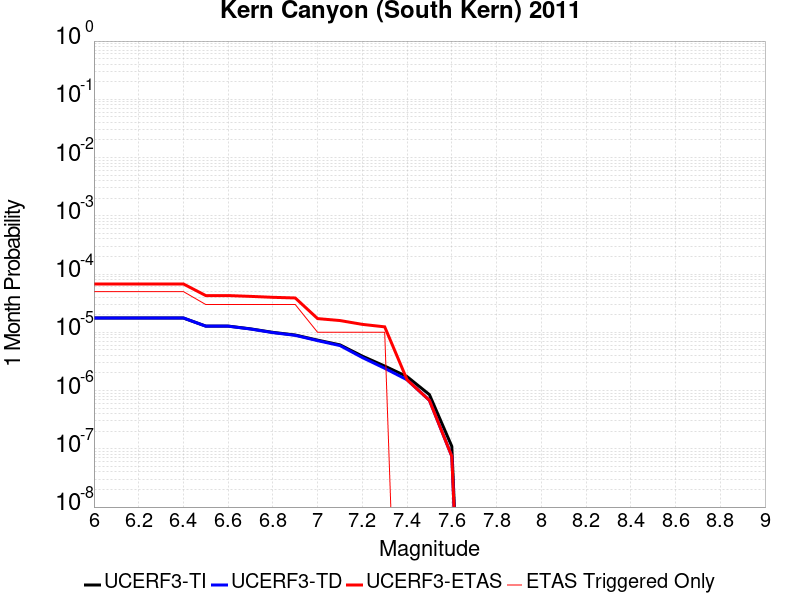 |  |  |

| Magnitude | 1 wk TI Prob | 1 wk TD Prob | 1 wk ETAS Prob | 1 wk ETAS/TD Gain | 1 wk ETAS Triggered Only | 1 mo TI Prob | 1 mo TD Prob | 1 mo ETAS Prob | 1 mo ETAS/TD Gain | 1 mo ETAS Triggered Only | 1 yr TI Prob | 1 yr TD Prob | 1 yr ETAS Prob | 1 yr ETAS/TD Gain | 1 yr ETAS Triggered Only | 10 yr TI Prob | 10 yr TD Prob | 10 yr ETAS Prob | 10 yr ETAS/TD Gain | 10 yr ETAS Triggered Only |
|-----|-----|-----|-----|-----|-----|-----|-----|-----|-----|-----|-----|-----|-----|-----|-----|-----|-----|-----|-----|-----|
| 6.0 | 4.105075E-6 | 4.113726E-6 | 2.0406407E-5 | 4.9605656 | 1.6292748E-5 | 1.7593058E-5 | 1.7630138E-5 | 8.279998E-5 | 4.696502 | 6.517099E-5 | 2.1417443E-4 | 2.1462643E-4 | 2.9607269E-4 | 1.3794792 | 8.146374E-5 | 0.0021396813 | 0.0021442554 | 0.0022255445 | 1.0379101 | 8.146374E-5 |
| 6.1 | 4.105075E-6 | 4.113726E-6 | 2.0406407E-5 | 4.9605656 | 1.6292748E-5 | 1.7593058E-5 | 1.7630138E-5 | 8.279998E-5 | 4.696502 | 6.517099E-5 | 2.1417443E-4 | 2.1462643E-4 | 2.9607269E-4 | 1.3794792 | 8.146374E-5 | 0.0021396813 | 0.0021442554 | 0.0022255445 | 1.0379101 | 8.146374E-5 |
| 6.2 | 4.105075E-6 | 4.113726E-6 | 2.0406407E-5 | 4.9605656 | 1.6292748E-5 | 1.7593058E-5 | 1.7630138E-5 | 8.279998E-5 | 4.696502 | 6.517099E-5 | 2.1417443E-4 | 2.1462643E-4 | 2.9607269E-4 | 1.3794792 | 8.146374E-5 | 0.0021396813 | 0.0021442554 | 0.0022255445 | 1.0379101 | 8.146374E-5 |
| 6.3 | 4.105075E-6 | 4.113726E-6 | 2.0406407E-5 | 4.9605656 | 1.6292748E-5 | 1.7593058E-5 | 1.7630138E-5 | 8.279998E-5 | 4.696502 | 6.517099E-5 | 2.1417443E-4 | 2.1462643E-4 | 2.9607269E-4 | 1.3794792 | 8.146374E-5 | 0.0021396813 | 0.0021442554 | 0.0022255445 | 1.0379101 | 8.146374E-5 |
| 6.4 | 4.105075E-6 | 4.113726E-6 | 2.0406407E-5 | 4.9605656 | 1.6292748E-5 | 1.7593058E-5 | 1.7630138E-5 | 8.279998E-5 | 4.696502 | 6.517099E-5 | 2.1417443E-4 | 2.1462643E-4 | 2.9607269E-4 | 1.3794792 | 8.146374E-5 | 0.0021396813 | 0.0021442554 | 0.0022255445 | 1.0379101 | 8.146374E-5 |
| 6.5 | 2.9849807E-6 | 2.973154E-6 | 1.9265854E-5 | 6.4799376 | 1.6292748E-5 | 1.2792712E-5 | 1.2742028E-5 | 6.161965E-5 | 4.8359375 | 4.8878243E-5 | 1.5574014E-4 | 1.551233E-4 | 2.0399396E-4 | 1.315044 | 4.8878243E-5 | 0.0015563103 | 0.0015501654 | 0.0015989678 | 1.0314821 | 4.8878243E-5 |
| 6.6 | 2.9849807E-6 | 2.973154E-6 | 1.9265854E-5 | 6.4799376 | 1.6292748E-5 | 1.2792712E-5 | 1.2742028E-5 | 6.161965E-5 | 4.8359375 | 4.8878243E-5 | 1.5574014E-4 | 1.551233E-4 | 2.0399396E-4 | 1.315044 | 4.8878243E-5 | 0.0015563103 | 0.0015501654 | 0.0015989678 | 1.0314821 | 4.8878243E-5 |
| 6.7 | 2.6756725E-6 | 2.6582202E-6 | 1.8950925E-5 | 7.129178 | 1.6292748E-5 | 1.1467117E-5 | 1.1392323E-5 | 6.027001E-5 | 5.2904058 | 4.8878243E-5 | 1.396032E-4 | 1.386928E-4 | 1.8756428E-4 | 1.352372 | 4.8878243E-5 | 0.0013951553 | 0.0013860734 | 0.0014348839 | 1.0352149 | 4.8878243E-5 |
| 6.8 | 2.3283721E-6 | 2.3047783E-6 | 1.859749E-5 | 8.069101 | 1.6292748E-5 | 9.9787E-6 | 9.877584E-6 | 5.8755344E-5 | 5.948352 | 4.8878243E-5 | 1.214839E-4 | 1.2025302E-4 | 1.6912539E-4 | 1.4064128 | 4.8878243E-5 | 0.001214175 | 0.001201887 | 0.0012507065 | 1.040619 | 4.8878243E-5 |
| 6.9 | 2.0972677E-6 | 2.0696405E-6 | 1.8362354E-5 | 8.872244 | 1.6292748E-5 | 8.988259E-6 | 8.869858E-6 | 5.7747668E-5 | 6.5105515 | 4.8878243E-5 | 1.0942656E-4 | 1.0798523E-4 | 1.568582E-4 | 1.4525894 | 4.8878243E-5 | 0.0010937268 | 0.0010793334 | 0.0011281589 | 1.0452367 | 4.8878243E-5 |
| 7.0 | 1.7132242E-6 | 1.6787029E-6 | 1.6787029E-6 | 1.0 | 0.0 | 7.3423685E-6 | 7.1944214E-6 | 2.3487053E-5 | 3.26462 | 1.6292748E-5 | 8.938967E-5 | 8.75886E-5 | 1.03879924E-4 | 1.1859982 | 1.6292748E-5 | 8.935372E-4 | 8.755446E-4 | 8.9182315E-4 | 1.0185924 | 1.6292748E-5 |
| 7.1 | 1.4215541E-6 | 1.3815746E-6 | 1.3815746E-6 | 1.0 | 0.0 | 6.0923603E-6 | 5.9210206E-6 | 2.2213673E-5 | 3.7516627 | 1.6292748E-5 | 7.417196E-5 | 7.208607E-5 | 8.8377645E-5 | 1.2260017 | 1.6292748E-5 | 7.414721E-4 | 7.206296E-4 | 7.3691056E-4 | 1.0225928 | 1.6292748E-5 |
| 7.2 | 9.097853E-7 | 8.60377E-7 | 8.60377E-7 | 1.0 | 0.0 | 3.899074E-6 | 3.6873246E-6 | 1.9980012E-5 | 5.418566 | 1.6292748E-5 | 4.7470192E-5 | 4.4892266E-5 | 6.1184284E-5 | 1.3629137 | 1.6292748E-5 | 4.7460053E-4 | 4.4883305E-4 | 4.6511847E-4 | 1.036284 | 1.6292748E-5 |
| 7.3 | 6.144169E-7 | 5.628199E-7 | 5.628199E-7 | 1.0 | 0.0 | 2.6332125E-6 | 2.4120832E-6 | 1.8704792E-5 | 7.7546215 | 1.6292748E-5 | 3.205889E-5 | 2.9366722E-5 | 4.565899E-5 | 1.5547868 | 1.6292748E-5 | 3.2054266E-4 | 2.9362892E-4 | 3.0991688E-4 | 1.0554713 | 1.6292748E-5 |
| 7.4 | 4.049844E-7 | 3.5728252E-7 | 3.5728252E-7 | 1.0 | 0.0 | 1.7356463E-6 | 1.5312098E-6 | 1.5312098E-6 | 1.0 | 0.0 | 2.1131287E-5 | 1.8642324E-5 | 1.8642324E-5 | 1.0 | 0.0 | 2.1129279E-4 | 1.8640784E-4 | 1.8640784E-4 | 1.0 | 0.0 |
| 7.5 | 1.9871162E-7 | 1.5830383E-7 | 1.5830383E-7 | 1.0 | 0.0 | 8.5162094E-7 | 6.784448E-7 | 6.784448E-7 | 1.0 | 0.0 | 1.0368436E-5 | 8.260035E-6 | 8.260035E-6 | 1.0 | 0.0 | 1.0367952E-4 | 8.259736E-5 | 8.259736E-5 | 1.0 | 0.0 |
| 7.6 | 2.572245E-8 | 1.735264E-8 | 1.735264E-8 | 1.0 | 0.0 | 1.10239064E-7 | 7.436845E-8 | 7.436845E-8 | 1.0 | 0.0 | 1.3421597E-6 | 9.0543557E-7 | 9.0543557E-7 | 1.0 | 0.0 | 1.3421517E-5 | 9.054324E-6 | 9.054324E-6 | 1.0 | 0.0 |

## San Clemente
*[(top)](#table-of-contents)*

| 1 Week | 1 Month | 1 Year | 10 Year |
|-----|-----|-----|-----|
|  |  |  |  |

| Magnitude | 1 wk TI Prob | 1 wk TD Prob | 1 wk ETAS Prob | 1 wk ETAS/TD Gain | 1 wk ETAS Triggered Only | 1 mo TI Prob | 1 mo TD Prob | 1 mo ETAS Prob | 1 mo ETAS/TD Gain | 1 mo ETAS Triggered Only | 1 yr TI Prob | 1 yr TD Prob | 1 yr ETAS Prob | 1 yr ETAS/TD Gain | 1 yr ETAS Triggered Only | 10 yr TI Prob | 10 yr TD Prob | 10 yr ETAS Prob | 10 yr ETAS/TD Gain | 10 yr ETAS Triggered Only |
|-----|-----|-----|-----|-----|-----|-----|-----|-----|-----|-----|-----|-----|-----|-----|-----|-----|-----|-----|-----|-----|
| 6.0 | 6.681379E-5 | 8.163834E-5 | 1.1422118E-4 | 1.399112 | 3.2585496E-5 | 2.8631336E-4 | 3.4983488E-4 | 3.82409E-4 | 1.0931128 | 3.2585496E-5 | 0.003480294 | 0.00425141 | 0.0043000802 | 1.011448 | 4.8878243E-5 | 0.03426291 | 0.04175603 | 0.04183409 | 1.0018694 | 8.146374E-5 |
| 6.1 | 6.681379E-5 | 8.163834E-5 | 9.7929755E-5 | 1.199556 | 1.6292748E-5 | 2.8631336E-4 | 3.4983488E-4 | 3.6612194E-4 | 1.0465564 | 1.6292748E-5 | 0.003480294 | 0.00425141 | 0.004283857 | 1.007632 | 3.2585496E-5 | 0.03426291 | 0.04175603 | 0.041818477 | 1.0014956 | 6.517099E-5 |
| 6.2 | 3.9400576E-5 | 4.6452373E-5 | 6.2744366E-5 | 1.3507246 | 1.6292748E-5 | 1.6884868E-4 | 1.9906677E-4 | 2.1535627E-4 | 1.0818293 | 1.6292748E-5 | 0.0020537945 | 0.0024209984 | 0.0024372519 | 1.0067135 | 1.6292748E-5 | 0.020349167 | 0.023952903 | 0.023984708 | 1.0013279 | 3.2585496E-5 |
| 6.3 | 3.2590255E-5 | 3.792912E-5 | 5.4221247E-5 | 1.4295415 | 1.6292748E-5 | 1.3966505E-4 | 1.6254342E-4 | 1.7883352E-4 | 1.10022 | 1.6292748E-5 | 0.0016990956 | 0.0019772002 | 0.0019934606 | 1.008224 | 1.6292748E-5 | 0.01686163 | 0.019599883 | 0.01963183 | 1.00163 | 3.2585496E-5 |
| 6.4 | 2.9454652E-5 | 3.4097764E-5 | 5.0389957E-5 | 1.4778082 | 1.6292748E-5 | 1.2622811E-4 | 1.4612524E-4 | 1.624156E-4 | 1.1114823 | 1.6292748E-5 | 0.0015357438 | 0.0017776493 | 0.0017939131 | 1.0091491 | 1.6292748E-5 | 0.015251739 | 0.01763747 | 0.01766948 | 1.001815 | 3.2585496E-5 |
| 6.5 | 2.790836E-5 | 3.2247463E-5 | 4.8539685E-5 | 1.505225 | 1.6292748E-5 | 1.1960178E-4 | 1.3819624E-4 | 1.5448673E-4 | 1.1178795 | 1.6292748E-5 | 0.001455179 | 0.0016812662 | 0.0016975317 | 1.0096744 | 1.6292748E-5 | 0.014456868 | 0.016688485 | 0.016704505 | 1.00096 | 1.6292748E-5 |
| 6.6 | 2.2492153E-5 | 2.5762702E-5 | 4.205503E-5 | 1.6323998 | 1.6292748E-5 | 9.639138E-5 | 1.1040699E-4 | 1.2669794E-4 | 1.1475536 | 1.6292748E-5 | 0.0011729331 | 0.0013433909 | 0.0013596618 | 1.0121118 | 1.6292748E-5 | 0.011667615 | 0.013354417 | 0.013370492 | 1.0012038 | 1.6292748E-5 |
| 6.7 | 1.9862755E-5 | 2.2666423E-5 | 3.8958802E-5 | 1.7187891 | 1.6292748E-5 | 8.512331E-5 | 9.713826E-5 | 1.1342942E-4 | 1.1677111 | 1.6292748E-5 | 0.0010358836 | 0.0011820279 | 0.0011983014 | 1.0137675 | 1.6292748E-5 | 0.010310682 | 0.011758701 | 0.011774802 | 1.0013694 | 1.6292748E-5 |
| 6.8 | 1.6697575E-5 | 1.897771E-5 | 3.5270146E-5 | 1.8585039 | 1.6292748E-5 | 7.155907E-5 | 8.133056E-5 | 9.762198E-5 | 1.2003112 | 1.6292748E-5 | 8.7088346E-4 | 9.897591E-4 | 0.0010060357 | 1.016445 | 1.6292748E-5 | 0.008674784 | 0.0098545365 | 0.009870669 | 1.001637 | 1.6292748E-5 |
| 6.9 | 1.5218415E-5 | 1.72694E-5 | 3.3561868E-5 | 1.9434298 | 1.6292748E-5 | 6.522015E-5 | 7.4009666E-5 | 9.030121E-5 | 1.2201272 | 1.6292748E-5 | 7.93766E-4 | 9.00704E-4 | 9.1698207E-4 | 1.0180726 | 1.6292748E-5 | 0.007909367 | 0.008971481 | 0.008987627 | 1.0017998 | 1.6292748E-5 |
| 7.0 | 1.2392958E-5 | 1.4033016E-5 | 3.0325535E-5 | 2.1610134 | 1.6292748E-5 | 5.3111595E-5 | 6.014015E-5 | 7.643192E-5 | 1.2708967 | 1.6292748E-5 | 6.4644177E-4 | 7.319679E-4 | 7.4824877E-4 | 1.0222425 | 1.6292748E-5 | 0.0064456454 | 0.0072963564 | 0.0073125307 | 1.0022167 | 1.6292748E-5 |
| 7.1 | 1.0934128E-5 | 1.2375138E-5 | 2.8667684E-5 | 2.3165548 | 1.6292748E-5 | 4.6859706E-5 | 5.303527E-5 | 6.932715E-5 | 1.3071896 | 1.6292748E-5 | 5.7036756E-4 | 6.455204E-4 | 6.6180265E-4 | 1.0252234 | 1.6292748E-5 | 0.0056890585 | 0.0064371997 | 0.0064533874 | 1.0025147 | 1.6292748E-5 |
| 7.2 | 9.5798805E-6 | 1.0844935E-5 | 2.7137507E-5 | 2.5023208 | 1.6292748E-5 | 4.1055984E-5 | 4.6477508E-5 | 6.27695E-5 | 1.3505349 | 1.6292748E-5 | 4.9974193E-4 | 5.657239E-4 | 5.8200746E-4 | 1.0287836 | 1.6292748E-5 | 0.0049861963 | 0.0056435615 | 0.0056597623 | 1.0028707 | 1.6292748E-5 |
| 7.3 | 8.0167365E-6 | 9.083918E-6 | 2.5376517E-5 | 2.7935655 | 1.6292748E-5 | 3.4356988E-5 | 3.8930535E-5 | 5.522265E-5 | 1.418492 | 1.6292748E-5 | 4.1821605E-4 | 4.7388324E-4 | 4.901682E-4 | 1.034365 | 1.6292748E-5 | 0.0041742986 | 0.0047294297 | 0.0047456454 | 1.0034287 | 1.6292748E-5 |
| 7.4 | 2.9581017E-6 | 3.3623792E-6 | 3.3623792E-6 | 1.0 | 0.0 | 1.2677518E-5 | 1.4410146E-5 | 1.4410146E-5 | 1.0 | 0.0 | 1.5433785E-4 | 1.7543444E-4 | 1.7543444E-4 | 1.0 | 0.0 | 0.001542307 | 0.0017534546 | 0.0017534546 | 1.0 | 0.0 |

## Great Valley 09 (Laguna Seca)
*[(top)](#table-of-contents)*

| 1 Week | 1 Month | 1 Year | 10 Year |
|-----|-----|-----|-----|
| 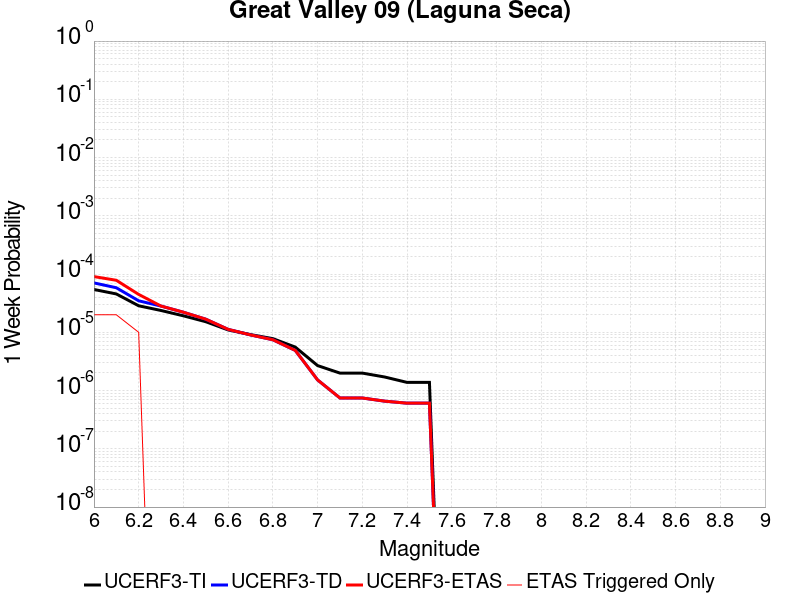 |  |  |  |

| Magnitude | 1 wk TI Prob | 1 wk TD Prob | 1 wk ETAS Prob | 1 wk ETAS/TD Gain | 1 wk ETAS Triggered Only | 1 mo TI Prob | 1 mo TD Prob | 1 mo ETAS Prob | 1 mo ETAS/TD Gain | 1 mo ETAS Triggered Only | 1 yr TI Prob | 1 yr TD Prob | 1 yr ETAS Prob | 1 yr ETAS/TD Gain | 1 yr ETAS Triggered Only | 10 yr TI Prob | 10 yr TD Prob | 10 yr ETAS Prob | 10 yr ETAS/TD Gain | 10 yr ETAS Triggered Only |
|-----|-----|-----|-----|-----|-----|-----|-----|-----|-----|-----|-----|-----|-----|-----|-----|-----|-----|-----|-----|-----|
| 6.0 | 5.4353277E-5 | 7.050019E-5 | 8.6791784E-5 | 1.2310859 | 1.6292748E-5 | 2.3292181E-4 | 3.0211007E-4 | 3.183979E-4 | 1.0539136 | 1.6292748E-5 | 0.0028321352 | 0.0036720056 | 0.0037044715 | 1.0088414 | 3.2585496E-5 | 0.02796312 | 0.036115844 | 0.036178663 | 1.0017394 | 6.517099E-5 |
| 6.1 | 4.5578287E-5 | 5.822054E-5 | 7.451234E-5 | 1.279829 | 1.6292748E-5 | 1.953209E-4 | 2.4949352E-4 | 2.657822E-4 | 1.065287 | 1.6292748E-5 | 0.0023754383 | 0.0030333549 | 0.0030658417 | 1.0107098 | 3.2585496E-5 | 0.023502063 | 0.029919893 | 0.029967308 | 1.0015848 | 4.8878243E-5 |
| 6.2 | 2.8536782E-5 | 3.4736422E-5 | 3.4736422E-5 | 1.0 | 0.0 | 1.2229476E-4 | 1.4886161E-4 | 1.4886161E-4 | 1.0 | 0.0 | 0.0014879217 | 0.0018108576 | 0.0018271209 | 1.008981 | 1.6292748E-5 | 0.014779986 | 0.017958276 | 0.017974276 | 1.000891 | 1.6292748E-5 |
| 6.3 | 2.3698774E-5 | 2.8213344E-5 | 2.8213344E-5 | 1.0 | 0.0 | 1.01562226E-4 | 1.2090833E-4 | 1.2090833E-4 | 1.0 | 0.0 | 0.0012358186 | 0.001471051 | 0.0014873198 | 1.0110593 | 1.6292748E-5 | 0.012289686 | 0.014611455 | 0.014627509 | 1.0010988 | 1.6292748E-5 |
| 6.4 | 1.9191197E-5 | 2.212289E-5 | 2.212289E-5 | 1.0 | 0.0 | 8.2245395E-5 | 9.4808805E-5 | 9.4808805E-5 | 1.0 | 0.0 | 0.0010008777 | 0.0011536906 | 0.0011699646 | 1.014106 | 1.6292748E-5 | 0.009963818 | 0.011477022 | 0.011493128 | 1.0014033 | 1.6292748E-5 |
| 6.5 | 1.5203241E-5 | 1.6801298E-5 | 1.6801298E-5 | 1.0 | 0.0 | 6.5155116E-5 | 7.200338E-5 | 7.200338E-5 | 1.0 | 0.0 | 7.9297484E-4 | 8.76301E-4 | 8.925795E-4 | 1.0185764 | 1.6292748E-5 | 0.007901512 | 0.008729581 | 0.008745731 | 1.0018501 | 1.6292748E-5 |
| 6.6 | 1.0984925E-5 | 1.12425605E-5 | 1.12425605E-5 | 1.0 | 0.0 | 4.70774E-5 | 4.8181533E-5 | 4.8181533E-5 | 1.0 | 0.0 | 5.730166E-4 | 5.8645604E-4 | 5.8645604E-4 | 1.0 | 0.0 | 0.005715413 | 0.0058494755 | 0.0058494755 | 1.0 | 0.0 |
| 6.7 | 9.134616E-6 | 9.019868E-6 | 9.019868E-6 | 1.0 | 0.0 | 3.9147766E-5 | 3.865602E-5 | 3.865602E-5 | 1.0 | 0.0 | 4.7651984E-4 | 4.7053778E-4 | 4.7053778E-4 | 1.0 | 0.0 | 0.004754993 | 0.00469566 | 0.00469566 | 1.0 | 0.0 |
| 6.8 | 7.785589E-6 | 7.4519185E-6 | 7.4519185E-6 | 1.0 | 0.0 | 3.3366385E-5 | 3.1936415E-5 | 3.1936415E-5 | 1.0 | 0.0 | 4.0616E-4 | 3.887585E-4 | 3.887585E-4 | 1.0 | 0.0 | 0.0040541845 | 0.003880988 | 0.003880988 | 1.0 | 0.0 |
| 6.9 | 5.579095E-6 | 4.8984666E-6 | 4.8984666E-6 | 1.0 | 0.0 | 2.3910188E-5 | 2.0993268E-5 | 2.0993268E-5 | 1.0 | 0.0 | 2.9106764E-4 | 2.5556443E-4 | 2.5556443E-4 | 1.0 | 0.0 | 0.002906867 | 0.0025528427 | 0.0025528427 | 1.0 | 0.0 |
| 7.0 | 2.6816688E-6 | 1.521587E-6 | 1.521587E-6 | 1.0 | 0.0 | 1.1492816E-5 | 6.521071E-6 | 6.521071E-6 | 1.0 | 0.0 | 1.3991605E-4 | 7.939124E-5 | 7.939124E-5 | 1.0 | 0.0 | 0.0013982799 | 7.936375E-4 | 7.936375E-4 | 1.0 | 0.0 |
| 7.1 | 1.9951021E-6 | 7.45357E-7 | 7.45357E-7 | 1.0 | 0.0 | 8.55041E-6 | 3.1943835E-6 | 3.1943835E-6 | 1.0 | 0.0 | 1.0409627E-4 | 3.889097E-5 | 3.889097E-5 | 1.0 | 0.0 | 0.0010404752 | 3.8884574E-4 | 3.8884574E-4 | 1.0 | 0.0 |
| 7.2 | 1.9951021E-6 | 7.45357E-7 | 7.45357E-7 | 1.0 | 0.0 | 8.55041E-6 | 3.1943835E-6 | 3.1943835E-6 | 1.0 | 0.0 | 1.0409627E-4 | 3.889097E-5 | 3.889097E-5 | 1.0 | 0.0 | 0.0010404752 | 3.8884574E-4 | 3.8884574E-4 | 1.0 | 0.0 |
| 7.3 | 1.7087556E-6 | 6.578663E-7 | 6.578663E-7 | 1.0 | 0.0 | 7.3232177E-6 | 2.819424E-6 | 2.819424E-6 | 1.0 | 0.0 | 8.915652E-5 | 3.432599E-5 | 3.432599E-5 | 1.0 | 0.0 | 8.9120766E-4 | 3.432109E-4 | 3.432109E-4 | 1.0 | 0.0 |
| 7.4 | 1.3804846E-6 | 6.0737113E-7 | 6.0737113E-7 | 1.0 | 0.0 | 5.916349E-6 | 2.6030168E-6 | 2.6030168E-6 | 1.0 | 0.0 | 7.2029165E-5 | 3.169131E-5 | 3.169131E-5 | 1.0 | 0.0 | 7.200583E-4 | 3.168719E-4 | 3.168719E-4 | 1.0 | 0.0 |
| 7.5 | 1.3804846E-6 | 6.0737113E-7 | 6.0737113E-7 | 1.0 | 0.0 | 5.916349E-6 | 2.6030168E-6 | 2.6030168E-6 | 1.0 | 0.0 | 7.2029165E-5 | 3.169131E-5 | 3.169131E-5 | 1.0 | 0.0 | 7.200583E-4 | 3.168719E-4 | 3.168719E-4 | 1.0 | 0.0 |

## Great Valley 07 (Orestimba)
*[(top)](#table-of-contents)*

| 1 Week | 1 Month | 1 Year | 10 Year |
|-----|-----|-----|-----|
|  |  |  |  |

| Magnitude | 1 wk TI Prob | 1 wk TD Prob | 1 wk ETAS Prob | 1 wk ETAS/TD Gain | 1 wk ETAS Triggered Only | 1 mo TI Prob | 1 mo TD Prob | 1 mo ETAS Prob | 1 mo ETAS/TD Gain | 1 mo ETAS Triggered Only | 1 yr TI Prob | 1 yr TD Prob | 1 yr ETAS Prob | 1 yr ETAS/TD Gain | 1 yr ETAS Triggered Only | 10 yr TI Prob | 10 yr TD Prob | 10 yr ETAS Prob | 10 yr ETAS/TD Gain | 10 yr ETAS Triggered Only |
|-----|-----|-----|-----|-----|-----|-----|-----|-----|-----|-----|-----|-----|-----|-----|-----|-----|-----|-----|-----|-----|
| 6.0 | 2.9687902E-5 | 3.27575E-5 | 4.9049715E-5 | 1.4973583 | 1.6292748E-5 | 1.2722766E-4 | 1.4038214E-4 | 1.566726E-4 | 1.1160437 | 1.6292748E-5 | 0.0015478961 | 0.0017078844 | 0.0017404143 | 1.0190469 | 3.2585496E-5 | 0.015371585 | 0.016955135 | 0.017019201 | 1.0037786 | 6.517099E-5 |
| 6.1 | 2.9687902E-5 | 3.27575E-5 | 3.27575E-5 | 1.0 | 0.0 | 1.2722766E-4 | 1.4038214E-4 | 1.4038214E-4 | 1.0 | 0.0 | 0.0015478961 | 0.0017078844 | 0.0017078844 | 1.0 | 0.0 | 0.015371585 | 0.016955135 | 0.01698717 | 1.0018892 | 3.2585496E-5 |
| 6.2 | 1.9231524E-5 | 2.1159167E-5 | 2.1159167E-5 | 1.0 | 0.0 | 8.2418206E-5 | 9.067912E-5 | 9.067912E-5 | 1.0 | 0.0 | 0.0010029797 | 0.0011034822 | 0.0011034822 | 1.0 | 0.0 | 0.00998465 | 0.010982441 | 0.011014668 | 1.0029345 | 3.2585496E-5 |
| 6.3 | 1.324766E-5 | 1.4548534E-5 | 1.4548534E-5 | 1.0 | 0.0 | 5.6774446E-5 | 6.234942E-5 | 6.234942E-5 | 1.0 | 0.0 | 6.910097E-4 | 7.5884897E-4 | 7.5884897E-4 | 1.0 | 0.0 | 0.006888649 | 0.0075635235 | 0.0075958627 | 1.0042757 | 3.2585496E-5 |
| 6.4 | 7.818645E-6 | 8.57284E-6 | 8.57284E-6 | 1.0 | 0.0 | 3.3508048E-5 | 3.6740246E-5 | 3.6740246E-5 | 1.0 | 0.0 | 4.078841E-4 | 4.4722404E-4 | 4.4722404E-4 | 1.0 | 0.0 | 0.004071363 | 0.0044635804 | 0.0044798004 | 1.0036339 | 1.6292748E-5 |
| 6.5 | 5.3076565E-6 | 5.8178007E-6 | 5.8178007E-6 | 1.0 | 0.0 | 2.27469E-5 | 2.4933206E-5 | 2.4933206E-5 | 1.0 | 0.0 | 2.7690834E-4 | 3.035216E-4 | 3.035216E-4 | 1.0 | 0.0 | 0.0027656353 | 0.00303128 | 0.0030475233 | 1.0053586 | 1.6292748E-5 |
| 6.6 | 3.6003578E-6 | 3.9484953E-6 | 3.9484953E-6 | 1.0 | 0.0 | 1.5430012E-5 | 1.6922022E-5 | 1.6922022E-5 | 1.0 | 0.0 | 1.8784421E-4 | 2.0600771E-4 | 2.0600771E-4 | 1.0 | 0.0 | 0.0018768552 | 0.0020583214 | 0.0020745806 | 1.0078993 | 1.6292748E-5 |
| 6.7 | 2.5361826E-6 | 2.7834678E-6 | 2.7834678E-6 | 1.0 | 0.0 | 1.0869308E-5 | 1.1929101E-5 | 1.1929101E-5 | 1.0 | 0.0 | 1.3232579E-4 | 1.4522845E-4 | 1.4522845E-4 | 1.0 | 0.0 | 0.0013224703 | 0.0014514653 | 0.0014677345 | 1.0112088 | 1.6292748E-5 |
| 6.8 | 1.2115831E-6 | 1.3313797E-6 | 1.3313797E-6 | 1.0 | 0.0 | 5.1924885E-6 | 5.7059065E-6 | 5.7059065E-6 | 1.0 | 0.0 | 6.3216714E-5 | 6.9468166E-5 | 6.9468166E-5 | 1.0 | 0.0 | 6.3198735E-4 | 6.945596E-4 | 7.1084104E-4 | 1.0234414 | 1.6292748E-5 |

## Ortigalita (North)
*[(top)](#table-of-contents)*

| 1 Week | 1 Month | 1 Year | 10 Year |
|-----|-----|-----|-----|
|  |  |  |  |

| Magnitude | 1 wk TI Prob | 1 wk TD Prob | 1 wk ETAS Prob | 1 wk ETAS/TD Gain | 1 wk ETAS Triggered Only | 1 mo TI Prob | 1 mo TD Prob | 1 mo ETAS Prob | 1 mo ETAS/TD Gain | 1 mo ETAS Triggered Only | 1 yr TI Prob | 1 yr TD Prob | 1 yr ETAS Prob | 1 yr ETAS/TD Gain | 1 yr ETAS Triggered Only | 10 yr TI Prob | 10 yr TD Prob | 10 yr ETAS Prob | 10 yr ETAS/TD Gain | 10 yr ETAS Triggered Only |
|-----|-----|-----|-----|-----|-----|-----|-----|-----|-----|-----|-----|-----|-----|-----|-----|-----|-----|-----|-----|-----|
| 6.0 | 7.711876E-5 | 1.0505308E-4 | 1.3763516E-4 | 1.3101487 | 3.2585496E-5 | 3.3046713E-4 | 4.501601E-4 | 4.990163E-4 | 1.1085308 | 4.8878243E-5 | 0.004016016 | 0.0054680547 | 0.005532869 | 1.0118533 | 6.517099E-5 | 0.039442103 | 0.053455614 | 0.0535173 | 1.001154 | 6.517099E-5 |
| 6.1 | 4.607858E-5 | 6.0239887E-5 | 6.0239887E-5 | 1.0 | 0.0 | 1.9746469E-4 | 2.5814763E-4 | 2.5814763E-4 | 1.0 | 0.0 | 0.0024014818 | 0.0031387366 | 0.0031387366 | 1.0 | 0.0 | 0.023756953 | 0.030975312 | 0.030975312 | 1.0 | 0.0 |
| 6.2 | 4.607858E-5 | 6.0239887E-5 | 6.0239887E-5 | 1.0 | 0.0 | 1.9746469E-4 | 2.5814763E-4 | 2.5814763E-4 | 1.0 | 0.0 | 0.0024014818 | 0.0031387366 | 0.0031387366 | 1.0 | 0.0 | 0.023756953 | 0.030975312 | 0.030975312 | 1.0 | 0.0 |
| 6.3 | 3.327423E-5 | 4.2476124E-5 | 4.2476124E-5 | 1.0 | 0.0 | 1.4259605E-4 | 1.8202956E-4 | 1.8202956E-4 | 1.0 | 0.0 | 0.0017347244 | 0.002214206 | 0.002214206 | 1.0 | 0.0 | 0.017212452 | 0.02194574 | 0.02194574 | 1.0 | 0.0 |
| 6.4 | 2.7732503E-5 | 3.4999008E-5 | 3.4999008E-5 | 1.0 | 0.0 | 1.1884817E-4 | 1.499886E-4 | 1.499886E-4 | 1.0 | 0.0 | 0.001446016 | 0.0018248158 | 0.0018248158 | 1.0 | 0.0 | 0.014366428 | 0.018121297 | 0.018121297 | 1.0 | 0.0 |
| 6.5 | 2.7689714E-5 | 3.4948822E-5 | 3.4948822E-5 | 1.0 | 0.0 | 1.186648E-4 | 1.4977354E-4 | 1.4977354E-4 | 1.0 | 0.0 | 0.0014437864 | 0.0018222018 | 0.0018222018 | 1.0 | 0.0 | 0.014344421 | 0.018095585 | 0.018095585 | 1.0 | 0.0 |
| 6.6 | 2.2976905E-5 | 2.871829E-5 | 2.871829E-5 | 1.0 | 0.0 | 9.846873E-5 | 1.23074E-4 | 1.23074E-4 | 1.0 | 0.0 | 0.0011981975 | 0.0014976348 | 0.0014976348 | 1.0 | 0.0 | 0.011917574 | 0.014898733 | 0.014898733 | 1.0 | 0.0 |
| 6.7 | 1.9871539E-5 | 2.4904637E-5 | 2.4904637E-5 | 1.0 | 0.0 | 8.516096E-5 | 1.067312E-4 | 1.067312E-4 | 1.0 | 0.0 | 0.0010363415 | 0.0012989199 | 0.0012989199 | 1.0 | 0.0 | 0.010315218 | 0.012936938 | 0.012936938 | 1.0 | 0.0 |
| 6.8 | 6.5640475E-6 | 7.6054926E-6 | 7.6054926E-6 | 1.0 | 0.0 | 2.813133E-5 | 3.2594577E-5 | 3.2594577E-5 | 1.0 | 0.0 | 3.424451E-4 | 3.9676955E-4 | 3.9676955E-4 | 1.0 | 0.0 | 0.0034191788 | 0.003960899 | 0.003960899 | 1.0 | 0.0 |
| 6.9 | 5.6219683E-6 | 6.5018376E-6 | 6.5018376E-6 | 1.0 | 0.0 | 2.4093928E-5 | 2.7864735E-5 | 2.7864735E-5 | 1.0 | 0.0 | 2.933041E-4 | 3.3920293E-4 | 3.3920293E-4 | 1.0 | 0.0 | 0.0029291727 | 0.003387109 | 0.003387109 | 1.0 | 0.0 |
| 7.0 | 3.875591E-6 | 4.4847548E-6 | 4.4847548E-6 | 1.0 | 0.0 | 1.6609569E-5 | 1.9220248E-5 | 1.9220248E-5 | 1.0 | 0.0 | 2.0220275E-4 | 2.339835E-4 | 2.339835E-4 | 1.0 | 0.0 | 0.0020201886 | 0.0023375798 | 0.0023375798 | 1.0 | 0.0 |
| 7.1 | 1.6017933E-6 | 1.8570418E-6 | 1.8570418E-6 | 1.0 | 0.0 | 6.8648105E-6 | 7.958732E-6 | 7.958732E-6 | 1.0 | 0.0 | 8.357586E-5 | 9.689432E-5 | 9.689432E-5 | 1.0 | 0.0 | 8.3544437E-4 | 9.686254E-4 | 9.686254E-4 | 1.0 | 0.0 |

## Santa Rosa Island
*[(top)](#table-of-contents)*

| 1 Week | 1 Month | 1 Year | 10 Year |
|-----|-----|-----|-----|
|  |  |  | 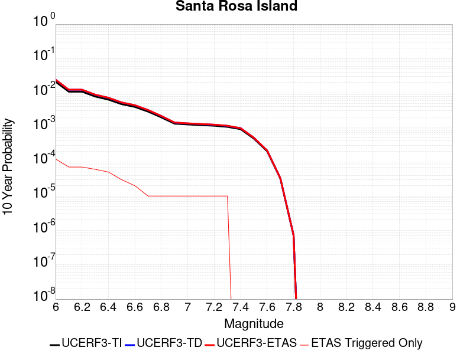 |

| Magnitude | 1 wk TI Prob | 1 wk TD Prob | 1 wk ETAS Prob | 1 wk ETAS/TD Gain | 1 wk ETAS Triggered Only | 1 mo TI Prob | 1 mo TD Prob | 1 mo ETAS Prob | 1 mo ETAS/TD Gain | 1 mo ETAS Triggered Only | 1 yr TI Prob | 1 yr TD Prob | 1 yr ETAS Prob | 1 yr ETAS/TD Gain | 1 yr ETAS Triggered Only | 10 yr TI Prob | 10 yr TD Prob | 10 yr ETAS Prob | 10 yr ETAS/TD Gain | 10 yr ETAS Triggered Only |
|-----|-----|-----|-----|-----|-----|-----|-----|-----|-----|-----|-----|-----|-----|-----|-----|-----|-----|-----|-----|-----|
| 6.0 | 4.1143165E-5 | 4.709113E-5 | 6.338311E-5 | 1.345967 | 1.6292748E-5 | 1.7631594E-4 | 2.0180462E-4 | 2.1809408E-4 | 1.080719 | 1.6292748E-5 | 0.002144533 | 0.0024543991 | 0.0025031574 | 1.0198656 | 4.8878243E-5 | 0.021239553 | 0.024293557 | 0.024357144 | 1.0026175 | 6.517099E-5 |
| 6.1 | 2.1061249E-5 | 2.3864959E-5 | 4.015732E-5 | 1.6826895 | 1.6292748E-5 | 9.0259375E-5 | 1.0227455E-4 | 1.1856564E-4 | 1.1592877 | 1.6292748E-5 | 0.0010983539 | 0.0012445103 | 0.0012770552 | 1.0261508 | 3.2585496E-5 | 0.01092941 | 0.01237845 | 0.012426723 | 1.0038998 | 4.8878243E-5 |
| 6.2 | 2.1061249E-5 | 2.3864959E-5 | 4.015732E-5 | 1.6826895 | 1.6292748E-5 | 9.0259375E-5 | 1.0227455E-4 | 1.1856564E-4 | 1.1592877 | 1.6292748E-5 | 0.0010983539 | 0.0012445103 | 0.0012770552 | 1.0261508 | 3.2585496E-5 | 0.01092941 | 0.01237845 | 0.012426723 | 1.0038998 | 4.8878243E-5 |
| 6.3 | 1.5158236E-5 | 1.7074419E-5 | 3.3366887E-5 | 1.9542035 | 1.6292748E-5 | 6.496225E-5 | 7.3174095E-5 | 8.946565E-5 | 1.222641 | 1.6292748E-5 | 7.906284E-4 | 8.9054246E-4 | 9.2309894E-4 | 1.036558 | 3.2585496E-5 | 0.007878214 | 0.00887099 | 0.008903286 | 1.0036407 | 3.2585496E-5 |
| 6.4 | 1.2341918E-5 | 1.3852917E-5 | 3.0145438E-5 | 2.1761076 | 1.6292748E-5 | 5.2892858E-5 | 5.9368336E-5 | 7.566012E-5 | 1.2744187 | 1.6292748E-5 | 6.437803E-4 | 7.225779E-4 | 7.5513986E-4 | 1.0450636 | 3.2585496E-5 | 0.006419184 | 0.0072031217 | 0.0072354726 | 1.0044912 | 3.2585496E-5 |
| 6.5 | 9.061158E-6 | 1.0117032E-5 | 2.6409614E-5 | 2.6104114 | 1.6292748E-5 | 3.883296E-5 | 4.3358017E-5 | 5.9650058E-5 | 1.3757561 | 1.6292748E-5 | 4.726887E-4 | 5.277613E-4 | 5.603296E-4 | 1.0617102 | 3.2585496E-5 | 0.004716845 | 0.0052656177 | 0.0052980315 | 1.0061557 | 3.2585496E-5 |
| 6.6 | 7.5461685E-6 | 8.400734E-6 | 2.4693345E-5 | 2.9394271 | 1.6292748E-5 | 3.2340322E-5 | 3.600267E-5 | 5.2294832E-5 | 1.4525265 | 1.6292748E-5 | 3.936723E-4 | 4.3824868E-4 | 4.7081988E-4 | 1.0743213 | 3.2585496E-5 | 0.003929756 | 0.0043742736 | 0.0044067167 | 1.0074167 | 3.2585496E-5 |
| 6.7 | 5.5023775E-6 | 6.087381E-6 | 2.2380029E-5 | 3.676463 | 1.6292748E-5 | 2.3581404E-5 | 2.6088532E-5 | 4.2380856E-5 | 1.6245013 | 1.6292748E-5 | 2.8706578E-4 | 3.1758484E-4 | 3.3387242E-4 | 1.0512857 | 1.6292748E-5 | 0.0028669522 | 0.0031716316 | 0.0031878727 | 1.0051208 | 1.6292748E-5 |
| 6.8 | 3.7351679E-6 | 4.0831405E-6 | 2.0375823E-5 | 4.990233 | 1.6292748E-5 | 1.6007763E-5 | 1.7499071E-5 | 3.3791533E-5 | 1.9310473 | 1.6292748E-5 | 1.948771E-4 | 2.1303285E-4 | 2.2932212E-4 | 1.0764637 | 1.6292748E-5 | 0.0019470629 | 0.0021285315 | 0.0021447896 | 1.0076382 | 1.6292748E-5 |
| 6.9 | 2.456366E-6 | 2.6292707E-6 | 1.8921975E-5 | 7.1966634 | 1.6292748E-5 | 1.0527241E-5 | 1.1268255E-5 | 2.7560818E-5 | 2.4458818 | 1.6292748E-5 | 1.2816161E-4 | 1.3718239E-4 | 1.534729E-4 | 1.1187508 | 1.6292748E-5 | 0.0012808773 | 0.0013709799 | 0.0013872504 | 1.0118678 | 1.6292748E-5 |
| 7.0 | 2.3245157E-6 | 2.4827784E-6 | 1.8775487E-5 | 7.5622883 | 1.6292748E-5 | 9.962172E-6 | 1.0640436E-5 | 2.693301E-5 | 2.5311942 | 1.6292748E-5 | 1.2128269E-4 | 1.2953962E-4 | 1.4583026E-4 | 1.1257579 | 1.6292748E-5 | 0.0012121652 | 0.0012946434 | 0.0013109151 | 1.0125685 | 1.6292748E-5 |
| 7.1 | 2.2248344E-6 | 2.37325E-6 | 1.866596E-5 | 7.8651466 | 1.6292748E-5 | 9.53497E-6 | 1.0171032E-5 | 2.6463615E-5 | 2.6018612 | 1.6292748E-5 | 1.1608207E-4 | 1.238253E-4 | 1.4011603E-4 | 1.1315622 | 1.6292748E-5 | 0.0011602144 | 0.0012375651 | 0.0012538376 | 1.0131489 | 1.6292748E-5 |
| 7.2 | 2.1350402E-6 | 2.2761542E-6 | 1.8568866E-5 | 8.158 | 1.6292748E-5 | 9.150141E-6 | 9.75491E-6 | 2.6047499E-5 | 2.6701937 | 1.6292748E-5 | 1.1139726E-4 | 1.1875957E-4 | 1.3505039E-4 | 1.1371747 | 1.6292748E-5 | 0.0011134144 | 0.0011869629 | 0.0012032364 | 1.0137101 | 1.6292748E-5 |
| 7.3 | 1.9793572E-6 | 2.1087192E-6 | 1.8401433E-5 | 8.726356 | 1.6292748E-5 | 8.482932E-6 | 9.037337E-6 | 2.5329937E-5 | 2.80281 | 1.6292748E-5 | 1.032748E-4 | 1.1002403E-4 | 1.2631499E-4 | 1.1480672 | 1.6292748E-5 | 0.0010322682 | 0.0010996974 | 0.0011159723 | 1.0147994 | 1.6292748E-5 |
| 7.4 | 1.6951194E-6 | 1.8045735E-6 | 1.8045735E-6 | 1.0 | 0.0 | 7.264777E-6 | 7.733864E-6 | 7.733864E-6 | 1.0 | 0.0 | 8.844508E-5 | 9.415574E-5 | 9.415574E-5 | 1.0 | 0.0 | 8.840988E-4 | 9.411601E-4 | 9.411601E-4 | 1.0 | 0.0 |
| 7.5 | 8.987207E-7 | 9.512216E-7 | 9.512216E-7 | 1.0 | 0.0 | 3.8516546E-6 | 4.0766577E-6 | 4.0766577E-6 | 1.0 | 0.0 | 4.6892885E-5 | 4.9632188E-5 | 4.9632188E-5 | 1.0 | 0.0 | 4.688299E-4 | 4.962122E-4 | 4.962122E-4 | 1.0 | 0.0 |
| 7.6 | 3.8783037E-7 | 4.0529335E-7 | 4.0529335E-7 | 1.0 | 0.0 | 1.6621291E-6 | 1.7369704E-6 | 1.7369704E-6 | 1.0 | 0.0 | 2.0236233E-5 | 2.1147416E-5 | 2.1147416E-5 | 1.0 | 0.0 | 2.023439E-4 | 2.114547E-4 | 2.114547E-4 | 1.0 | 0.0 |
| 7.7 | 6.181804E-8 | 6.339047E-8 | 6.339047E-8 | 1.0 | 0.0 | 2.6493444E-7 | 2.7167343E-7 | 2.7167343E-7 | 1.0 | 0.0 | 3.225572E-6 | 3.307619E-6 | 3.307619E-6 | 1.0 | 0.0 | 3.225525E-5 | 3.3075703E-5 | 3.3075703E-5 | 1.0 | 0.0 |
| 7.8 | 1.3704449E-9 | 1.3964153E-9 | 1.3964153E-9 | 1.0 | 0.0 | 5.873335E-9 | 5.984637E-9 | 5.984637E-9 | 1.0 | 0.0 | 7.1507856E-8 | 7.286295E-8 | 7.286295E-8 | 1.0 | 0.0 | 7.1507833E-7 | 7.286294E-7 | 7.286294E-7 | 1.0 | 0.0 |

## Lost Hills
*[(top)](#table-of-contents)*

| 1 Week | 1 Month | 1 Year | 10 Year |
|-----|-----|-----|-----|
|  |  |  |  |

| Magnitude | 1 wk TI Prob | 1 wk TD Prob | 1 wk ETAS Prob | 1 wk ETAS/TD Gain | 1 wk ETAS Triggered Only | 1 mo TI Prob | 1 mo TD Prob | 1 mo ETAS Prob | 1 mo ETAS/TD Gain | 1 mo ETAS Triggered Only | 1 yr TI Prob | 1 yr TD Prob | 1 yr ETAS Prob | 1 yr ETAS/TD Gain | 1 yr ETAS Triggered Only | 10 yr TI Prob | 10 yr TD Prob | 10 yr ETAS Prob | 10 yr ETAS/TD Gain | 10 yr ETAS Triggered Only |
|-----|-----|-----|-----|-----|-----|-----|-----|-----|-----|-----|-----|-----|-----|-----|-----|-----|-----|-----|-----|-----|
| 6.0 | 2.233523E-5 | 2.5106583E-5 | 2.5106583E-5 | 1.0 | 0.0 | 9.571891E-5 | 1.0759615E-4 | 1.2388715E-4 | 1.1514087 | 1.6292748E-5 | 0.0011647546 | 0.001309364 | 0.0013581782 | 1.0372809 | 4.8878243E-5 | 0.011586686 | 0.013033091 | 0.013097413 | 1.0049353 | 6.517099E-5 |
| 6.1 | 2.233523E-5 | 2.5106583E-5 | 2.5106583E-5 | 1.0 | 0.0 | 9.571891E-5 | 1.0759615E-4 | 1.2388715E-4 | 1.1514087 | 1.6292748E-5 | 0.0011647546 | 0.001309364 | 0.0013581782 | 1.0372809 | 4.8878243E-5 | 0.011586686 | 0.013033091 | 0.013097413 | 1.0049353 | 6.517099E-5 |
| 6.2 | 2.233523E-5 | 2.5106583E-5 | 2.5106583E-5 | 1.0 | 0.0 | 9.571891E-5 | 1.0759615E-4 | 1.2388715E-4 | 1.1514087 | 1.6292748E-5 | 0.0011647546 | 0.001309364 | 0.0013581782 | 1.0372809 | 4.8878243E-5 | 0.011586686 | 0.013033091 | 0.013097413 | 1.0049353 | 6.517099E-5 |
| 6.3 | 2.233523E-5 | 2.5106583E-5 | 2.5106583E-5 | 1.0 | 0.0 | 9.571891E-5 | 1.0759615E-4 | 1.2388715E-4 | 1.1514087 | 1.6292748E-5 | 0.0011647546 | 0.001309364 | 0.0013581782 | 1.0372809 | 4.8878243E-5 | 0.011586686 | 0.013033091 | 0.013097413 | 1.0049353 | 6.517099E-5 |
| 6.4 | 1.2288092E-5 | 1.3781108E-5 | 1.3781108E-5 | 1.0 | 0.0 | 5.2662188E-5 | 5.906108E-5 | 7.5352866E-5 | 1.2758464 | 1.6292748E-5 | 6.409735E-4 | 7.189252E-4 | 7.677683E-4 | 1.067939 | 4.8878243E-5 | 0.006391279 | 0.0071752006 | 0.0072399043 | 1.0090176 | 6.517099E-5 |
| 6.5 | 1.2288092E-5 | 1.3781108E-5 | 1.3781108E-5 | 1.0 | 0.0 | 5.2662188E-5 | 5.906108E-5 | 7.5352866E-5 | 1.2758464 | 1.6292748E-5 | 6.409735E-4 | 7.189252E-4 | 7.677683E-4 | 1.067939 | 4.8878243E-5 | 0.006391279 | 0.0071752006 | 0.0072399043 | 1.0090176 | 6.517099E-5 |
| 6.6 | 8.58281E-6 | 9.63377E-6 | 9.63377E-6 | 1.0 | 0.0 | 3.6782953E-5 | 4.12874E-5 | 5.7579477E-5 | 1.3946016 | 1.6292748E-5 | 4.4774043E-4 | 5.026414E-4 | 5.5149506E-4 | 1.097194 | 4.8878243E-5 | 0.0044683935 | 0.005023205 | 0.005088049 | 1.0129088 | 6.517099E-5 |
| 6.7 | 7.205685E-6 | 8.088302E-6 | 8.088302E-6 | 1.0 | 0.0 | 3.088114E-5 | 3.466415E-5 | 5.0956332E-5 | 1.470001 | 1.6292748E-5 | 3.7591302E-4 | 4.2203604E-4 | 4.7089363E-4 | 1.1157664 | 4.8878243E-5 | 0.0037527776 | 0.0042203604 | 0.0042852564 | 1.0153769 | 6.517099E-5 |

## Mission Creek
*[(top)](#table-of-contents)*

| 1 Week | 1 Month | 1 Year | 10 Year |
|-----|-----|-----|-----|
|  |  |  | 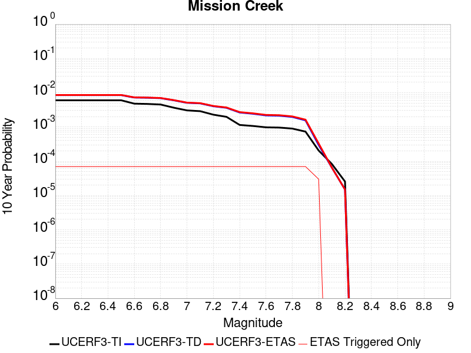 |

| Magnitude | 1 wk TI Prob | 1 wk TD Prob | 1 wk ETAS Prob | 1 wk ETAS/TD Gain | 1 wk ETAS Triggered Only | 1 mo TI Prob | 1 mo TD Prob | 1 mo ETAS Prob | 1 mo ETAS/TD Gain | 1 mo ETAS Triggered Only | 1 yr TI Prob | 1 yr TD Prob | 1 yr ETAS Prob | 1 yr ETAS/TD Gain | 1 yr ETAS Triggered Only | 10 yr TI Prob | 10 yr TD Prob | 10 yr ETAS Prob | 10 yr ETAS/TD Gain | 10 yr ETAS Triggered Only |
|-----|-----|-----|-----|-----|-----|-----|-----|-----|-----|-----|-----|-----|-----|-----|-----|-----|-----|-----|-----|-----|
| 6.0 | 1.1549387E-5 | 1.6322783E-5 | 1.6322783E-5 | 1.0 | 0.0 | 4.9496433E-5 | 6.995299E-5 | 6.995299E-5 | 1.0 | 0.0 | 6.0245243E-4 | 8.5135986E-4 | 8.839176E-4 | 1.0382421 | 3.2585496E-5 | 0.006008218 | 0.008510157 | 0.008574773 | 1.0075928 | 6.517099E-5 |
| 6.1 | 1.1549387E-5 | 1.6322783E-5 | 1.6322783E-5 | 1.0 | 0.0 | 4.9496433E-5 | 6.995299E-5 | 6.995299E-5 | 1.0 | 0.0 | 6.0245243E-4 | 8.5135986E-4 | 8.839176E-4 | 1.0382421 | 3.2585496E-5 | 0.006008218 | 0.008510157 | 0.008574773 | 1.0075928 | 6.517099E-5 |
| 6.2 | 1.1549387E-5 | 1.6322783E-5 | 1.6322783E-5 | 1.0 | 0.0 | 4.9496433E-5 | 6.995299E-5 | 6.995299E-5 | 1.0 | 0.0 | 6.0245243E-4 | 8.5135986E-4 | 8.839176E-4 | 1.0382421 | 3.2585496E-5 | 0.006008218 | 0.008510157 | 0.008574773 | 1.0075928 | 6.517099E-5 |
| 6.3 | 1.1549387E-5 | 1.6322783E-5 | 1.6322783E-5 | 1.0 | 0.0 | 4.9496433E-5 | 6.995299E-5 | 6.995299E-5 | 1.0 | 0.0 | 6.0245243E-4 | 8.5135986E-4 | 8.839176E-4 | 1.0382421 | 3.2585496E-5 | 0.006008218 | 0.008510157 | 0.008574773 | 1.0075928 | 6.517099E-5 |
| 6.4 | 1.1549387E-5 | 1.6322783E-5 | 1.6322783E-5 | 1.0 | 0.0 | 4.9496433E-5 | 6.995299E-5 | 6.995299E-5 | 1.0 | 0.0 | 6.0245243E-4 | 8.5135986E-4 | 8.839176E-4 | 1.0382421 | 3.2585496E-5 | 0.006008218 | 0.008510157 | 0.008574773 | 1.0075928 | 6.517099E-5 |
| 6.5 | 1.1549387E-5 | 1.6322783E-5 | 1.6322783E-5 | 1.0 | 0.0 | 4.9496433E-5 | 6.995299E-5 | 6.995299E-5 | 1.0 | 0.0 | 6.0245243E-4 | 8.5135986E-4 | 8.839176E-4 | 1.0382421 | 3.2585496E-5 | 0.006008218 | 0.008510157 | 0.008574773 | 1.0075928 | 6.517099E-5 |
| 6.6 | 9.202681E-6 | 1.3846059E-5 | 1.3846059E-5 | 1.0 | 0.0 | 3.9439463E-5 | 5.9338956E-5 | 5.9338956E-5 | 1.0 | 0.0 | 4.800697E-4 | 7.2222133E-4 | 7.547833E-4 | 1.0450859 | 3.2585496E-5 | 0.004790339 | 0.0072273402 | 0.00729204 | 1.0089521 | 6.517099E-5 |
| 6.7 | 9.019164E-6 | 1.3651728E-5 | 1.3651728E-5 | 1.0 | 0.0 | 3.8652986E-5 | 5.8506146E-5 | 5.8506146E-5 | 1.0 | 0.0 | 4.7049852E-4 | 7.1208854E-4 | 7.4465084E-4 | 1.0457278 | 3.2585496E-5 | 0.004695036 | 0.0071266647 | 0.007191371 | 1.0090795 | 6.517099E-5 |
| 6.8 | 8.673558E-6 | 1.3273839E-5 | 1.3273839E-5 | 1.0 | 0.0 | 3.717186E-5 | 5.688669E-5 | 5.688669E-5 | 1.0 | 0.0 | 4.524734E-4 | 6.923842E-4 | 7.2494714E-4 | 1.0470302 | 3.2585496E-5 | 0.0045155324 | 0.0069308523 | 0.006995572 | 1.0093379 | 6.517099E-5 |
| 6.9 | 7.002255E-6 | 1.1478069E-5 | 1.1478069E-5 | 1.0 | 0.0 | 3.000932E-5 | 4.9190832E-5 | 4.9190832E-5 | 1.0 | 0.0 | 3.653022E-4 | 5.9874065E-4 | 6.313066E-4 | 1.0543908 | 3.2585496E-5 | 0.0036470229 | 0.005999676 | 0.006064456 | 1.0107973 | 6.517099E-5 |
| 7.0 | 5.84644E-6 | 9.675359E-6 | 9.675359E-6 | 1.0 | 0.0 | 2.5055931E-5 | 4.146519E-5 | 4.146519E-5 | 1.0 | 0.0 | 3.0501327E-4 | 5.047263E-4 | 5.3729536E-4 | 1.0645281 | 3.2585496E-5 | 0.0030459496 | 0.005063994 | 0.005128835 | 1.0128043 | 6.517099E-5 |
| 7.1 | 5.54703E-6 | 9.329834E-6 | 9.329834E-6 | 1.0 | 0.0 | 2.377277E-5 | 3.9984414E-5 | 3.9984414E-5 | 1.0 | 0.0 | 2.8939504E-4 | 4.8670598E-4 | 5.192756E-4 | 1.0669185 | 3.2585496E-5 | 0.0028901845 | 0.0048845876 | 0.0049494402 | 1.013277 | 6.517099E-5 |
| 7.2 | 4.384709E-6 | 7.681918E-6 | 7.681918E-6 | 1.0 | 0.0 | 1.8791474E-5 | 3.292211E-5 | 3.292211E-5 | 1.0 | 0.0 | 2.2876218E-4 | 4.0075663E-4 | 4.3332906E-4 | 1.0812774 | 3.2585496E-5 | 0.0022852682 | 0.004028542 | 0.0040934505 | 1.0161121 | 6.517099E-5 |
| 7.3 | 3.7888456E-6 | 6.915788E-6 | 6.915788E-6 | 1.0 | 0.0 | 1.623781E-5 | 2.9638775E-5 | 2.9638775E-5 | 1.0 | 0.0 | 1.9767738E-4 | 3.6079568E-4 | 3.933694E-4 | 1.090283 | 3.2585496E-5 | 0.0019750162 | 0.00363027 | 0.0036952044 | 1.0178869 | 6.517099E-5 |
| 7.4 | 2.1982462E-6 | 5.0241033E-6 | 5.0241033E-6 | 1.0 | 0.0 | 9.421021E-6 | 2.1531694E-5 | 2.1531694E-5 | 1.0 | 0.0 | 1.1469489E-4 | 2.6211704E-4 | 2.9469398E-4 | 1.124284 | 3.2585496E-5 | 0.0011463572 | 0.0026460327 | 0.0027110314 | 1.0245645 | 6.517099E-5 |
| 7.5 | 2.051923E-6 | 4.6153277E-6 | 4.6153277E-6 | 1.0 | 0.0 | 8.793926E-6 | 1.9779825E-5 | 1.9779825E-5 | 1.0 | 0.0 | 1.0706078E-4 | 2.4079291E-4 | 2.7337056E-4 | 1.1352932 | 3.2585496E-5 | 0.0010700922 | 0.0024335932 | 0.0024986055 | 1.0267146 | 6.517099E-5 |
| 7.6 | 1.8733427E-6 | 4.1236603E-6 | 4.1236603E-6 | 1.0 | 0.0 | 8.028587E-6 | 1.7672712E-5 | 1.7672712E-5 | 1.0 | 0.0 | 9.774366E-5 | 2.151441E-4 | 2.4772258E-4 | 1.1514263 | 3.2585496E-5 | 9.770069E-4 | 0.0021782513 | 0.0022432802 | 1.0298538 | 6.517099E-5 |
| 7.7 | 1.8411953E-6 | 4.0433315E-6 | 4.0433315E-6 | 1.0 | 0.0 | 7.890813E-6 | 1.732845E-5 | 1.732845E-5 | 1.0 | 0.0 | 9.606641E-5 | 2.1095353E-4 | 2.4353215E-4 | 1.154435 | 3.2585496E-5 | 9.6024893E-4 | 0.0021365292 | 0.002201561 | 1.0304381 | 6.517099E-5 |
| 7.8 | 1.7194251E-6 | 3.71068E-6 | 3.71068E-6 | 1.0 | 0.0 | 7.368944E-6 | 1.5902819E-5 | 1.5902819E-5 | 1.0 | 0.0 | 8.97132E-5 | 1.9359968E-4 | 2.2617888E-4 | 1.1682812 | 3.2585496E-5 | 8.967699E-4 | 0.0019624757 | 0.0020275188 | 1.0331434 | 6.517099E-5 |
| 7.9 | 1.4035052E-6 | 2.9502596E-6 | 2.9502596E-6 | 1.0 | 0.0 | 6.0150082E-6 | 1.2643909E-5 | 1.2643909E-5 | 1.0 | 0.0 | 7.3230265E-5 | 1.5392878E-4 | 1.8650926E-4 | 1.2116594 | 3.2585496E-5 | 7.3206134E-4 | 0.0015631174 | 0.0016281864 | 1.0416278 | 6.517099E-5 |
| 8.0 | 3.9318823E-7 | 5.528477E-7 | 5.528477E-7 | 1.0 | 0.0 | 1.6850913E-6 | 2.3693453E-6 | 2.3693453E-6 | 1.0 | 0.0 | 2.0515794E-5 | 2.8846403E-5 | 4.513868E-5 | 1.5647941 | 1.6292748E-5 | 2.0513899E-4 | 2.990952E-4 | 3.3167098E-4 | 1.1089143 | 3.2585496E-5 |
| 8.1 | 1.596793E-7 | 1.13775044E-7 | 1.13775044E-7 | 1.0 | 0.0 | 6.8433974E-7 | 4.876072E-7 | 4.876072E-7 | 1.0 | 0.0 | 8.331805E-6 | 5.936602E-6 | 5.936602E-6 | 1.0 | 0.0 | 8.331492E-5 | 6.5494125E-5 | 6.5494125E-5 | 1.0 | 0.0 |
| 8.2 | 4.9003038E-8 | 2.5435753E-8 | 2.5435753E-8 | 1.0 | 0.0 | 2.10013E-7 | 1.09010365E-7 | 1.09010365E-7 | 1.0 | 0.0 | 2.5569052E-6 | 1.3272004E-6 | 1.3272004E-6 | 1.0 | 0.0 | 2.556876E-5 | 1.4952613E-5 | 1.4952613E-5 | 1.0 | 0.0 |

## Hosgri
*[(top)](#table-of-contents)*

| 1 Week | 1 Month | 1 Year | 10 Year |
|-----|-----|-----|-----|
|  |  |  |  |

| Magnitude | 1 wk TI Prob | 1 wk TD Prob | 1 wk ETAS Prob | 1 wk ETAS/TD Gain | 1 wk ETAS Triggered Only | 1 mo TI Prob | 1 mo TD Prob | 1 mo ETAS Prob | 1 mo ETAS/TD Gain | 1 mo ETAS Triggered Only | 1 yr TI Prob | 1 yr TD Prob | 1 yr ETAS Prob | 1 yr ETAS/TD Gain | 1 yr ETAS Triggered Only | 10 yr TI Prob | 10 yr TD Prob | 10 yr ETAS Prob | 10 yr ETAS/TD Gain | 10 yr ETAS Triggered Only |
|-----|-----|-----|-----|-----|-----|-----|-----|-----|-----|-----|-----|-----|-----|-----|-----|-----|-----|-----|-----|-----|
| 6.0 | 2.883978E-5 | 2.9128403E-5 | 4.542068E-5 | 1.559326 | 1.6292748E-5 | 1.235932E-4 | 1.248302E-4 | 1.5741162E-4 | 1.261006 | 3.2585496E-5 | 0.0015037085 | 0.0015187752 | 0.0015675793 | 1.0321338 | 4.8878243E-5 | 0.01493574 | 0.01508773 | 0.015151918 | 1.0042543 | 6.517099E-5 |
| 6.1 | 2.883978E-5 | 2.9128403E-5 | 4.542068E-5 | 1.559326 | 1.6292748E-5 | 1.235932E-4 | 1.248302E-4 | 1.5741162E-4 | 1.261006 | 3.2585496E-5 | 0.0015037085 | 0.0015187752 | 0.0015675793 | 1.0321338 | 4.8878243E-5 | 0.01493574 | 0.01508773 | 0.015151918 | 1.0042543 | 6.517099E-5 |
| 6.2 | 2.883978E-5 | 2.9128403E-5 | 4.542068E-5 | 1.559326 | 1.6292748E-5 | 1.235932E-4 | 1.248302E-4 | 1.5741162E-4 | 1.261006 | 3.2585496E-5 | 0.0015037085 | 0.0015187752 | 0.0015675793 | 1.0321338 | 4.8878243E-5 | 0.01493574 | 0.01508773 | 0.015151918 | 1.0042543 | 6.517099E-5 |
| 6.3 | 2.2914428E-5 | 2.2641956E-5 | 3.8934337E-5 | 1.7195659 | 1.6292748E-5 | 9.8200995E-5 | 9.703337E-5 | 1.2961571E-4 | 1.3357848 | 3.2585496E-5 | 0.0011949413 | 0.001180746 | 0.001213293 | 1.0275648 | 3.2585496E-5 | 0.011885363 | 0.011746123 | 0.011794427 | 1.0041124 | 4.8878243E-5 |
| 6.4 | 2.0195741E-5 | 1.9696547E-5 | 3.5988975E-5 | 1.8271717 | 1.6292748E-5 | 8.65503E-5 | 8.4411055E-5 | 1.00702426E-4 | 1.1930004 | 1.6292748E-5 | 0.0010532405 | 0.001027222 | 0.001043498 | 1.0158447 | 1.6292748E-5 | 0.010482626 | 0.010225783 | 0.010258035 | 1.003154 | 3.2585496E-5 |
| 6.5 | 1.9924333E-5 | 1.9408968E-5 | 3.57014E-5 | 1.8394281 | 1.6292748E-5 | 8.53872E-5 | 8.317865E-5 | 9.9470046E-5 | 1.1958603 | 1.6292748E-5 | 0.0010390934 | 0.0010122315 | 0.0010285077 | 1.0160795 | 1.6292748E-5 | 0.010342481 | 0.010077244 | 0.0101095 | 1.003201 | 3.2585496E-5 |
| 6.6 | 1.809694E-5 | 1.7458287E-5 | 3.375075E-5 | 1.9332223 | 1.6292748E-5 | 7.7556004E-5 | 7.4819094E-5 | 9.111062E-5 | 1.2177457 | 1.6292748E-5 | 9.438353E-4 | 9.105431E-4 | 9.2682097E-4 | 1.0178771 | 1.6292748E-5 | 0.009398366 | 0.009069063 | 0.009101353 | 1.0035604 | 3.2585496E-5 |
| 6.7 | 1.675989E-5 | 1.6042752E-5 | 3.233524E-5 | 2.0155668 | 1.6292748E-5 | 7.182612E-5 | 6.8752845E-5 | 8.504447E-5 | 1.2369593 | 1.6292748E-5 | 8.7413215E-4 | 8.3674554E-4 | 8.5302466E-4 | 1.0194553 | 1.6292748E-5 | 0.008707017 | 0.008336853 | 0.008369167 | 1.003876 | 3.2585496E-5 |
| 6.8 | 1.5401129E-5 | 1.4614069E-5 | 3.090658E-5 | 2.114851 | 1.6292748E-5 | 6.6003166E-5 | 6.263023E-5 | 7.8921956E-5 | 1.2601256 | 1.6292748E-5 | 8.032922E-4 | 7.6225714E-4 | 7.785374E-4 | 1.021358 | 1.6292748E-5 | 0.008003947 | 0.0075972863 | 0.007629624 | 1.0042565 | 3.2585496E-5 |
| 6.9 | 1.356559E-5 | 1.2689955E-5 | 1.2689955E-5 | 1.0 | 0.0 | 5.8136946E-5 | 5.438439E-5 | 5.438439E-5 | 1.0 | 0.0 | 7.0758746E-4 | 6.6192925E-4 | 6.6192925E-4 | 1.0 | 0.0 | 0.007053386 | 0.006600378 | 0.006616563 | 1.0024521 | 1.6292748E-5 |
| 7.0 | 1.2030819E-5 | 1.1095949E-5 | 1.1095949E-5 | 1.0 | 0.0 | 5.155963E-5 | 4.75532E-5 | 4.75532E-5 | 1.0 | 0.0 | 6.275577E-4 | 5.788065E-4 | 5.788065E-4 | 1.0 | 0.0 | 0.006257884 | 0.0057737473 | 0.0057899463 | 1.0028056 | 1.6292748E-5 |
| 7.1 | 1.0972698E-5 | 1.0022167E-5 | 1.0022167E-5 | 1.0 | 0.0 | 4.7025E-5 | 4.2951437E-5 | 4.2951437E-5 | 1.0 | 0.0 | 5.72379E-4 | 5.2280835E-4 | 5.2280835E-4 | 1.0 | 0.0 | 0.0057090693 | 0.005216533 | 0.0052327407 | 1.003107 | 1.6292748E-5 |
| 7.2 | 9.961926E-6 | 9.034732E-6 | 9.034732E-6 | 1.0 | 0.0 | 4.2693267E-5 | 3.8719707E-5 | 3.8719707E-5 | 1.0 | 0.0 | 5.1966653E-4 | 4.7131052E-4 | 4.7131052E-4 | 1.0 | 0.0 | 0.00518453 | 0.0047038523 | 0.0047200685 | 1.0034474 | 1.6292748E-5 |
| 7.3 | 8.700929E-6 | 7.828089E-6 | 7.828089E-6 | 1.0 | 0.0 | 3.7289166E-5 | 3.354852E-5 | 3.354852E-5 | 1.0 | 0.0 | 4.53901E-4 | 4.083767E-4 | 4.083767E-4 | 1.0 | 0.0 | 0.00452975 | 0.004076999 | 0.004093225 | 1.0039799 | 1.6292748E-5 |
| 7.4 | 7.866285E-6 | 6.9987263E-6 | 6.9987263E-6 | 1.0 | 0.0 | 3.3712215E-5 | 2.9994197E-5 | 2.9994197E-5 | 1.0 | 0.0 | 4.103689E-4 | 3.6511818E-4 | 3.6511818E-4 | 1.0 | 0.0 | 0.004096119 | 0.0036459167 | 0.0036621501 | 1.0044525 | 1.6292748E-5 |
| 7.5 | 6.8381305E-6 | 5.9596814E-6 | 5.9596814E-6 | 1.0 | 0.0 | 2.9305946E-5 | 2.5541241E-5 | 2.5541241E-5 | 1.0 | 0.0 | 3.5674145E-4 | 3.1092027E-4 | 3.1092027E-4 | 1.0 | 0.0 | 0.0035616932 | 0.003105584 | 0.003105584 | 1.0 | 0.0 |
| 7.6 | 5.503376E-6 | 4.595227E-6 | 4.595227E-6 | 1.0 | 0.0 | 2.3585684E-5 | 1.9693682E-5 | 1.9693682E-5 | 1.0 | 0.0 | 2.8711787E-4 | 2.397442E-4 | 2.397442E-4 | 1.0 | 0.0 | 0.002867472 | 0.0023955852 | 0.0023955852 | 1.0 | 0.0 |
| 7.7 | 3.6144982E-6 | 2.6521896E-6 | 2.6521896E-6 | 1.0 | 0.0 | 1.5490614E-5 | 1.1366477E-5 | 1.1366477E-5 | 1.0 | 0.0 | 1.8858191E-4 | 1.3837808E-4 | 1.3837808E-4 | 1.0 | 0.0 | 0.0018842196 | 0.001383647 | 0.001383647 | 1.0 | 0.0 |
| 7.8 | 1.9853494E-6 | 1.1360784E-6 | 1.1360784E-6 | 1.0 | 0.0 | 8.508612E-6 | 4.8688985E-6 | 4.8688985E-6 | 1.0 | 0.0 | 1.0358743E-4 | 5.9277223E-5 | 5.9277223E-5 | 1.0 | 0.0 | 0.0010353916 | 5.933389E-4 | 5.933389E-4 | 1.0 | 0.0 |
| 7.9 | 1.1818757E-6 | 5.29477E-7 | 5.29477E-7 | 1.0 | 0.0 | 5.0651715E-6 | 2.269185E-6 | 2.269185E-6 | 1.0 | 0.0 | 6.1666724E-5 | 2.7626977E-5 | 2.7626977E-5 | 1.0 | 0.0 | 6.1649614E-4 | 2.7691363E-4 | 2.7691363E-4 | 1.0 | 0.0 |
| 8.0 | 6.962958E-7 | 2.71365E-7 | 2.71365E-7 | 1.0 | 0.0 | 2.9841215E-6 | 1.1629924E-6 | 1.1629924E-6 | 1.0 | 0.0 | 3.6331072E-5 | 1.415934E-5 | 1.415934E-5 | 1.0 | 0.0 | 3.6325134E-4 | 1.4215276E-4 | 1.4215276E-4 | 1.0 | 0.0 |
| 8.1 | 1.5033264E-7 | 6.52693E-8 | 6.52693E-8 | 1.0 | 0.0 | 6.442826E-7 | 2.7972553E-7 | 2.7972553E-7 | 1.0 | 0.0 | 7.844113E-6 | 3.4056532E-6 | 3.4056532E-6 | 1.0 | 0.0 | 7.843835E-5 | 3.4072833E-5 | 3.4072833E-5 | 1.0 | 0.0 |

## Rinconada 2011 CFM
*[(top)](#table-of-contents)*

| 1 Week | 1 Month | 1 Year | 10 Year |
|-----|-----|-----|-----|
|  |  |  |  |

| Magnitude | 1 wk TI Prob | 1 wk TD Prob | 1 wk ETAS Prob | 1 wk ETAS/TD Gain | 1 wk ETAS Triggered Only | 1 mo TI Prob | 1 mo TD Prob | 1 mo ETAS Prob | 1 mo ETAS/TD Gain | 1 mo ETAS Triggered Only | 1 yr TI Prob | 1 yr TD Prob | 1 yr ETAS Prob | 1 yr ETAS/TD Gain | 1 yr ETAS Triggered Only | 10 yr TI Prob | 10 yr TD Prob | 10 yr ETAS Prob | 10 yr ETAS/TD Gain | 10 yr ETAS Triggered Only |
|-----|-----|-----|-----|-----|-----|-----|-----|-----|-----|-----|-----|-----|-----|-----|-----|-----|-----|-----|-----|-----|
| 6.0 | 1.5752368E-5 | 1.6274716E-5 | 1.6274716E-5 | 1.0 | 0.0 | 6.75084E-5 | 6.974694E-5 | 6.974694E-5 | 1.0 | 0.0 | 8.2160486E-4 | 8.488413E-4 | 8.97678E-4 | 1.0575334 | 4.8878243E-5 | 0.008185739 | 0.00845637 | 0.00852099 | 1.0076416 | 6.517099E-5 |
| 6.1 | 1.0966133E-5 | 1.1323029E-5 | 1.1323029E-5 | 1.0 | 0.0 | 4.6996865E-5 | 4.852637E-5 | 4.852637E-5 | 1.0 | 0.0 | 5.720366E-4 | 5.9064914E-4 | 6.0693227E-4 | 1.0275682 | 1.6292748E-5 | 0.0057056635 | 0.005890889 | 0.0059232824 | 1.0054989 | 3.2585496E-5 |
| 6.2 | 1.0966133E-5 | 1.1323029E-5 | 1.1323029E-5 | 1.0 | 0.0 | 4.6996865E-5 | 4.852637E-5 | 4.852637E-5 | 1.0 | 0.0 | 5.720366E-4 | 5.9064914E-4 | 6.0693227E-4 | 1.0275682 | 1.6292748E-5 | 0.0057056635 | 0.005890889 | 0.0059232824 | 1.0054989 | 3.2585496E-5 |
| 6.3 | 8.926149E-6 | 9.212772E-6 | 9.212772E-6 | 1.0 | 0.0 | 3.8254362E-5 | 3.948271E-5 | 3.948271E-5 | 1.0 | 0.0 | 4.6564735E-4 | 4.8059633E-4 | 4.9688126E-4 | 1.0338848 | 1.6292748E-5 | 0.0046467283 | 0.0047956146 | 0.0048280437 | 1.0067623 | 3.2585496E-5 |
| 6.4 | 7.676955E-6 | 7.920191E-6 | 7.920191E-6 | 1.0 | 0.0 | 3.290082E-5 | 3.3943234E-5 | 3.3943234E-5 | 1.0 | 0.0 | 4.0049385E-4 | 4.131807E-4 | 4.2946672E-4 | 1.0394162 | 1.6292748E-5 | 0.0039977287 | 0.004124151 | 0.0041566025 | 1.0078685 | 3.2585496E-5 |
| 6.5 | 6.1671026E-6 | 6.358955E-6 | 6.358955E-6 | 1.0 | 0.0 | 2.6430173E-5 | 2.725238E-5 | 2.725238E-5 | 1.0 | 0.0 | 3.2173982E-4 | 3.317473E-4 | 3.4803463E-4 | 1.0490956 | 1.6292748E-5 | 0.003212744 | 0.0033125326 | 0.00334501 | 1.0098045 | 3.2585496E-5 |
| 6.6 | 5.553456E-6 | 5.7248126E-6 | 5.7248126E-6 | 1.0 | 0.0 | 2.3800309E-5 | 2.4534682E-5 | 2.4534682E-5 | 1.0 | 0.0 | 2.897302E-4 | 2.9866886E-4 | 3.1495673E-4 | 1.0545349 | 1.6292748E-5 | 0.0028935277 | 0.0029826832 | 0.0030151715 | 1.0108923 | 3.2585496E-5 |
| 6.7 | 4.787857E-6 | 4.93331E-6 | 4.93331E-6 | 1.0 | 0.0 | 2.0519226E-5 | 2.1142585E-5 | 2.1142585E-5 | 1.0 | 0.0 | 2.4979294E-4 | 2.573806E-4 | 2.7366917E-4 | 1.0632858 | 1.6292748E-5 | 0.0024951235 | 0.002570831 | 0.0025870819 | 1.0063212 | 1.6292748E-5 |
| 6.8 | 3.9955166E-6 | 4.1134763E-6 | 4.1134763E-6 | 1.0 | 0.0 | 1.7123532E-5 | 1.7629065E-5 | 1.7629065E-5 | 1.0 | 0.0 | 2.0845905E-4 | 2.1461275E-4 | 2.1461275E-4 | 1.0 | 0.0 | 0.002082636 | 0.0021440587 | 0.0021440587 | 1.0 | 0.0 |
| 6.9 | 3.4250072E-6 | 3.5224466E-6 | 3.5224466E-6 | 1.0 | 0.0 | 1.46785205E-5 | 1.5096112E-5 | 1.5096112E-5 | 1.0 | 0.0 | 1.7869633E-4 | 1.8377969E-4 | 1.8377969E-4 | 1.0 | 0.0 | 0.001785527 | 0.0018362795 | 0.0018362795 | 1.0 | 0.0 |
| 7.0 | 2.7712713E-6 | 2.8467002E-6 | 2.8467002E-6 | 1.0 | 0.0 | 1.1876823E-5 | 1.22000865E-5 | 1.22000865E-5 | 1.0 | 0.0 | 1.4459073E-4 | 1.4852594E-4 | 1.4852594E-4 | 1.0 | 0.0 | 0.0014449668 | 0.0014842683 | 0.0014842683 | 1.0 | 0.0 |
| 7.1 | 2.227358E-6 | 2.2856987E-6 | 2.2856987E-6 | 1.0 | 0.0 | 9.545785E-6 | 9.795815E-6 | 9.795815E-6 | 1.0 | 0.0 | 1.16213734E-4 | 1.1925753E-4 | 1.1925753E-4 | 1.0 | 0.0 | 0.0011615298 | 0.0011919363 | 0.0011919363 | 1.0 | 0.0 |
| 7.2 | 1.581796E-6 | 1.6209015E-6 | 1.6209015E-6 | 1.0 | 0.0 | 6.779108E-6 | 6.946702E-6 | 6.946702E-6 | 1.0 | 0.0 | 8.253252E-5 | 8.4572814E-5 | 8.4572814E-5 | 1.0 | 0.0 | 8.250187E-4 | 8.4540684E-4 | 8.4540684E-4 | 1.0 | 0.0 |
| 7.3 | 1.0306567E-6 | 1.054648E-6 | 1.054648E-6 | 1.0 | 0.0 | 4.4170924E-6 | 4.519912E-6 | 4.519912E-6 | 1.0 | 0.0 | 5.3776774E-5 | 5.502854E-5 | 5.502854E-5 | 1.0 | 0.0 | 5.376376E-4 | 5.501494E-4 | 5.501494E-4 | 1.0 | 0.0 |
| 7.4 | 6.535541E-7 | 6.682744E-7 | 6.682744E-7 | 1.0 | 0.0 | 2.800943E-6 | 2.8640302E-6 | 2.8640302E-6 | 1.0 | 0.0 | 3.4100947E-5 | 3.4869012E-5 | 3.4869012E-5 | 1.0 | 0.0 | 3.4095717E-4 | 3.486355E-4 | 3.486355E-4 | 1.0 | 0.0 |
| 7.5 | 3.2656962E-7 | 3.3316712E-7 | 3.3316712E-7 | 1.0 | 0.0 | 1.3995833E-6 | 1.4278584E-6 | 1.4278584E-6 | 1.0 | 0.0 | 1.7039794E-5 | 1.7384036E-5 | 1.7384036E-5 | 1.0 | 0.0 | 1.7038487E-4 | 1.738268E-4 | 1.738268E-4 | 1.0 | 0.0 |
| 7.6 | 9.754343E-8 | 9.821017E-8 | 9.821017E-8 | 1.0 | 0.0 | 4.180432E-7 | 4.2090065E-7 | 4.2090065E-7 | 1.0 | 0.0 | 5.089664E-6 | 5.1244533E-6 | 5.1244533E-6 | 1.0 | 0.0 | 5.0895473E-5 | 5.124336E-5 | 5.124336E-5 | 1.0 | 0.0 |
| 7.7 | 6.0001453E-9 | 5.8491207E-9 | 5.8491207E-9 | 1.0 | 0.0 | 2.5714908E-8 | 2.506766E-8 | 2.506766E-8 | 1.0 | 0.0 | 3.1307894E-7 | 3.051987E-7 | 3.051987E-7 | 1.0 | 0.0 | 3.1307852E-6 | 3.0519832E-6 | 3.0519832E-6 | 1.0 | 0.0 |
| 7.8 | 7.400003E-11 | 7.4654505E-11 | 7.4654505E-11 | 1.0 | 0.0 | 3.171432E-10 | 3.1994773E-10 | 3.1994773E-10 | 1.0 | 0.0 | 3.861218E-9 | 3.895363E-9 | 3.895363E-9 | 1.0 | 0.0 | 3.861218E-8 | 3.895363E-8 | 3.895363E-8 | 1.0 | 0.0 |

## Mono Lake 2011 CFM
*[(top)](#table-of-contents)*

| 1 Week | 1 Month | 1 Year | 10 Year |
|-----|-----|-----|-----|
|  |  |  |  |

| Magnitude | 1 wk TI Prob | 1 wk TD Prob | 1 wk ETAS Prob | 1 wk ETAS/TD Gain | 1 wk ETAS Triggered Only | 1 mo TI Prob | 1 mo TD Prob | 1 mo ETAS Prob | 1 mo ETAS/TD Gain | 1 mo ETAS Triggered Only | 1 yr TI Prob | 1 yr TD Prob | 1 yr ETAS Prob | 1 yr ETAS/TD Gain | 1 yr ETAS Triggered Only | 10 yr TI Prob | 10 yr TD Prob | 10 yr ETAS Prob | 10 yr ETAS/TD Gain | 10 yr ETAS Triggered Only |
|-----|-----|-----|-----|-----|-----|-----|-----|-----|-----|-----|-----|-----|-----|-----|-----|-----|-----|-----|-----|-----|
| 6.0 | 2.0341662E-5 | 2.3828192E-5 | 7.270527E-5 | 3.0512292 | 4.8878243E-5 | 8.717564E-5 | 1.0211982E-4 | 1.5099307E-4 | 1.4785874 | 4.8878243E-5 | 0.0010608466 | 0.0012431308 | 0.0012919483 | 1.0392698 | 4.8878243E-5 | 0.010557966 | 0.012413842 | 0.012462113 | 1.0038885 | 4.8878243E-5 |
| 6.1 | 2.0341662E-5 | 2.3828192E-5 | 7.270527E-5 | 3.0512292 | 4.8878243E-5 | 8.717564E-5 | 1.0211982E-4 | 1.5099307E-4 | 1.4785874 | 4.8878243E-5 | 0.0010608466 | 0.0012431308 | 0.0012919483 | 1.0392698 | 4.8878243E-5 | 0.010557966 | 0.012413842 | 0.012462113 | 1.0038885 | 4.8878243E-5 |
| 6.2 | 2.0341662E-5 | 2.3828192E-5 | 7.270527E-5 | 3.0512292 | 4.8878243E-5 | 8.717564E-5 | 1.0211982E-4 | 1.5099307E-4 | 1.4785874 | 4.8878243E-5 | 0.0010608466 | 0.0012431308 | 0.0012919483 | 1.0392698 | 4.8878243E-5 | 0.010557966 | 0.012413842 | 0.012462113 | 1.0038885 | 4.8878243E-5 |
| 6.3 | 2.0341662E-5 | 2.3828192E-5 | 7.270527E-5 | 3.0512292 | 4.8878243E-5 | 8.717564E-5 | 1.0211982E-4 | 1.5099307E-4 | 1.4785874 | 4.8878243E-5 | 0.0010608466 | 0.0012431308 | 0.0012919483 | 1.0392698 | 4.8878243E-5 | 0.010557966 | 0.012413842 | 0.012462113 | 1.0038885 | 4.8878243E-5 |
| 6.4 | 1.749821E-5 | 2.049101E-5 | 5.3075837E-5 | 2.5902011 | 3.2585496E-5 | 7.499018E-5 | 8.781861E-5 | 1.20401244E-4 | 1.371022 | 3.2585496E-5 | 9.1262296E-4 | 0.0010691914 | 0.001101742 | 1.0304441 | 3.2585496E-5 | 0.009088841 | 0.01069187 | 0.010724108 | 1.0030152 | 3.2585496E-5 |
| 6.5 | 1.749821E-5 | 2.049101E-5 | 5.3075837E-5 | 2.5902011 | 3.2585496E-5 | 7.499018E-5 | 8.781861E-5 | 1.20401244E-4 | 1.371022 | 3.2585496E-5 | 9.1262296E-4 | 0.0010691914 | 0.001101742 | 1.0304441 | 3.2585496E-5 | 0.009088841 | 0.01069187 | 0.010724108 | 1.0030152 | 3.2585496E-5 |

## Pine Mtn
*[(top)](#table-of-contents)*

| 1 Week | 1 Month | 1 Year | 10 Year |
|-----|-----|-----|-----|
|  |  | 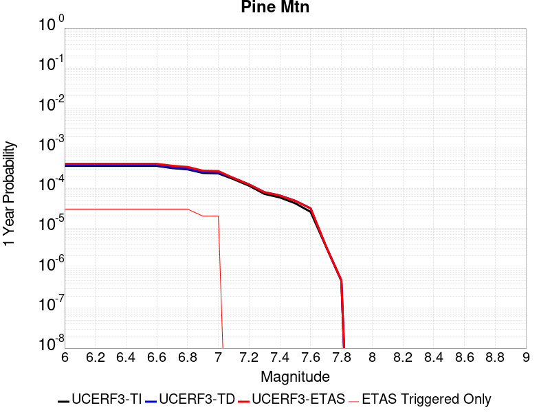 | 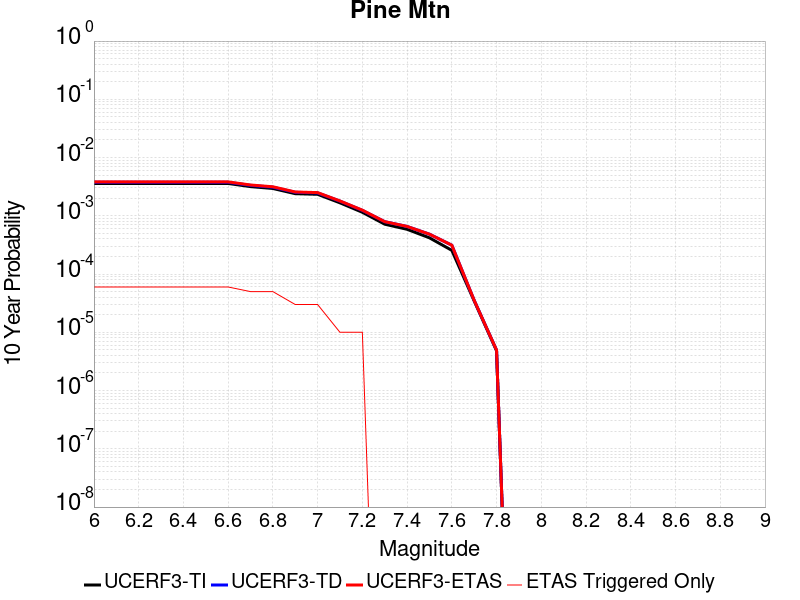 |

| Magnitude | 1 wk TI Prob | 1 wk TD Prob | 1 wk ETAS Prob | 1 wk ETAS/TD Gain | 1 wk ETAS Triggered Only | 1 mo TI Prob | 1 mo TD Prob | 1 mo ETAS Prob | 1 mo ETAS/TD Gain | 1 mo ETAS Triggered Only | 1 yr TI Prob | 1 yr TD Prob | 1 yr ETAS Prob | 1 yr ETAS/TD Gain | 1 yr ETAS Triggered Only | 10 yr TI Prob | 10 yr TD Prob | 10 yr ETAS Prob | 10 yr ETAS/TD Gain | 10 yr ETAS Triggered Only |
|-----|-----|-----|-----|-----|-----|-----|-----|-----|-----|-----|-----|-----|-----|-----|-----|-----|-----|-----|-----|-----|
| 6.0 | 6.894797E-6 | 7.2254716E-6 | 7.2254716E-6 | 1.0 | 0.0 | 2.9548795E-5 | 3.0965955E-5 | 4.72582E-5 | 1.526134 | 1.6292748E-5 | 3.596972E-4 | 3.7694827E-4 | 4.0952148E-4 | 1.0864129 | 3.2585496E-5 | 0.0035911554 | 0.0037633865 | 0.0038120807 | 1.012939 | 4.8878243E-5 |
| 6.1 | 6.894797E-6 | 7.2254716E-6 | 7.2254716E-6 | 1.0 | 0.0 | 2.9548795E-5 | 3.0965955E-5 | 4.72582E-5 | 1.526134 | 1.6292748E-5 | 3.596972E-4 | 3.7694827E-4 | 4.0952148E-4 | 1.0864129 | 3.2585496E-5 | 0.0035911554 | 0.0037633865 | 0.0038120807 | 1.012939 | 4.8878243E-5 |
| 6.2 | 6.894797E-6 | 7.2254716E-6 | 7.2254716E-6 | 1.0 | 0.0 | 2.9548795E-5 | 3.0965955E-5 | 4.72582E-5 | 1.526134 | 1.6292748E-5 | 3.596972E-4 | 3.7694827E-4 | 4.0952148E-4 | 1.0864129 | 3.2585496E-5 | 0.0035911554 | 0.0037633865 | 0.0038120807 | 1.012939 | 4.8878243E-5 |
| 6.3 | 6.894797E-6 | 7.2254716E-6 | 7.2254716E-6 | 1.0 | 0.0 | 2.9548795E-5 | 3.0965955E-5 | 4.72582E-5 | 1.526134 | 1.6292748E-5 | 3.596972E-4 | 3.7694827E-4 | 4.0952148E-4 | 1.0864129 | 3.2585496E-5 | 0.0035911554 | 0.0037633865 | 0.0038120807 | 1.012939 | 4.8878243E-5 |
| 6.4 | 6.894797E-6 | 7.2254716E-6 | 7.2254716E-6 | 1.0 | 0.0 | 2.9548795E-5 | 3.0965955E-5 | 4.72582E-5 | 1.526134 | 1.6292748E-5 | 3.596972E-4 | 3.7694827E-4 | 4.0952148E-4 | 1.0864129 | 3.2585496E-5 | 0.0035911554 | 0.0037633865 | 0.0038120807 | 1.012939 | 4.8878243E-5 |
| 6.5 | 6.894797E-6 | 7.2254716E-6 | 7.2254716E-6 | 1.0 | 0.0 | 2.9548795E-5 | 3.0965955E-5 | 4.72582E-5 | 1.526134 | 1.6292748E-5 | 3.596972E-4 | 3.7694827E-4 | 4.0952148E-4 | 1.0864129 | 3.2585496E-5 | 0.0035911554 | 0.0037633865 | 0.0038120807 | 1.012939 | 4.8878243E-5 |
| 6.6 | 6.894797E-6 | 7.2254716E-6 | 7.2254716E-6 | 1.0 | 0.0 | 2.9548795E-5 | 3.0965955E-5 | 4.72582E-5 | 1.526134 | 1.6292748E-5 | 3.596972E-4 | 3.7694827E-4 | 4.0952148E-4 | 1.0864129 | 3.2585496E-5 | 0.0035911554 | 0.0037633865 | 0.0038120807 | 1.012939 | 4.8878243E-5 |
| 6.7 | 6.0867933E-6 | 6.397124E-6 | 6.397124E-6 | 1.0 | 0.0 | 2.6085996E-5 | 2.7415968E-5 | 4.370827E-5 | 1.5942632 | 1.6292748E-5 | 3.1755073E-4 | 3.337405E-4 | 3.663151E-4 | 1.0976046 | 3.2585496E-5 | 0.0031709734 | 0.0033326119 | 0.0033650887 | 1.0097451 | 3.2585496E-5 |
| 6.8 | 5.6530425E-6 | 5.950606E-6 | 5.950606E-6 | 1.0 | 0.0 | 2.42271E-5 | 2.5502359E-5 | 4.179469E-5 | 1.6388559 | 1.6292748E-5 | 2.94925E-4 | 3.1044905E-4 | 3.430244E-4 | 1.1049299 | 3.2585496E-5 | 0.002945339 | 0.0031003582 | 0.0031328427 | 1.0104777 | 3.2585496E-5 |
| 6.9 | 4.6015225E-6 | 4.8638444E-6 | 4.8638444E-6 | 1.0 | 0.0 | 1.9720663E-5 | 2.084489E-5 | 3.71373E-5 | 1.781602 | 1.6292748E-5 | 2.4007261E-4 | 2.5375842E-4 | 2.7004705E-4 | 1.0641894 | 1.6292748E-5 | 0.0023981342 | 0.002534831 | 0.0025510823 | 1.0064113 | 1.6292748E-5 |
| 7.0 | 4.4875965E-6 | 4.7474837E-6 | 4.7474837E-6 | 1.0 | 0.0 | 1.9232413E-5 | 2.0346208E-5 | 3.6638623E-5 | 1.8007594 | 1.6292748E-5 | 2.3412947E-4 | 2.4768838E-4 | 2.6397707E-4 | 1.0657629 | 1.6292748E-5 | 0.0023388295 | 0.0024742668 | 0.0024905193 | 1.0065686 | 1.6292748E-5 |
| 7.1 | 3.203907E-6 | 3.42942E-6 | 3.42942E-6 | 1.0 | 0.0 | 1.3730958E-5 | 1.4697435E-5 | 1.4697435E-5 | 1.0 | 0.0 | 1.6716159E-4 | 1.7892725E-4 | 1.7892725E-4 | 1.0 | 0.0 | 0.0016703589 | 0.001787898 | 0.001787898 | 1.0 | 0.0 |
| 7.2 | 2.2060601E-6 | 2.3784874E-6 | 2.3784874E-6 | 1.0 | 0.0 | 9.4545085E-6 | 1.019348E-5 | 1.019348E-5 | 1.0 | 0.0 | 1.15102564E-4 | 1.2409901E-4 | 1.2409901E-4 | 1.0 | 0.0 | 0.0011504296 | 0.0012403419 | 0.0012403419 | 1.0 | 0.0 |
| 7.3 | 1.3765207E-6 | 1.5216535E-6 | 1.5216535E-6 | 1.0 | 0.0 | 5.899361E-6 | 6.5213567E-6 | 6.5213567E-6 | 1.0 | 0.0 | 7.182235E-5 | 7.939472E-5 | 7.939472E-5 | 1.0 | 0.0 | 7.1799144E-4 | 7.9367263E-4 | 7.9367263E-4 | 1.0 | 0.0 |
| 7.4 | 1.1245983E-6 | 1.2587126E-6 | 1.2587126E-6 | 1.0 | 0.0 | 4.819698E-6 | 5.394472E-6 | 5.394472E-6 | 1.0 | 0.0 | 5.8678244E-5 | 6.56758E-5 | 6.56758E-5 | 1.0 | 0.0 | 5.866275E-4 | 6.565722E-4 | 6.565722E-4 | 1.0 | 0.0 |
| 7.5 | 8.031682E-7 | 9.276999E-7 | 9.276999E-7 | 1.0 | 0.0 | 3.4421448E-6 | 3.975851E-6 | 3.975851E-6 | 1.0 | 0.0 | 4.1907308E-5 | 4.840498E-5 | 4.840498E-5 | 1.0 | 0.0 | 4.1899405E-4 | 4.8395112E-4 | 4.8395112E-4 | 1.0 | 0.0 |
| 7.6 | 4.8953444E-7 | 6.0030544E-7 | 6.0030544E-7 | 1.0 | 0.0 | 2.098003E-6 | 2.5727354E-6 | 2.5727354E-6 | 1.0 | 0.0 | 2.5542888E-5 | 3.1322652E-5 | 3.1322652E-5 | 1.0 | 0.0 | 2.5539953E-4 | 3.1318725E-4 | 3.1318725E-4 | 1.0 | 0.0 |
| 7.7 | 6.634529E-8 | 6.788826E-8 | 6.788826E-8 | 1.0 | 0.0 | 2.843369E-7 | 2.9094966E-7 | 2.9094966E-7 | 1.0 | 0.0 | 3.4617963E-6 | 3.5423066E-6 | 3.5423066E-6 | 1.0 | 0.0 | 3.4617424E-5 | 3.542255E-5 | 3.542255E-5 | 1.0 | 0.0 |
| 7.8 | 9.235578E-9 | 9.488566E-9 | 9.488566E-9 | 1.0 | 0.0 | 3.9581046E-8 | 4.0665284E-8 | 4.0665284E-8 | 1.0 | 0.0 | 4.818991E-7 | 4.950997E-7 | 4.950997E-7 | 1.0 | 0.0 | 4.8189804E-6 | 4.950988E-6 | 4.950988E-6 | 1.0 | 0.0 |

## Pitas Point (Lower West)
*[(top)](#table-of-contents)*

| 1 Week | 1 Month | 1 Year | 10 Year |
|-----|-----|-----|-----|
|  |  |  | 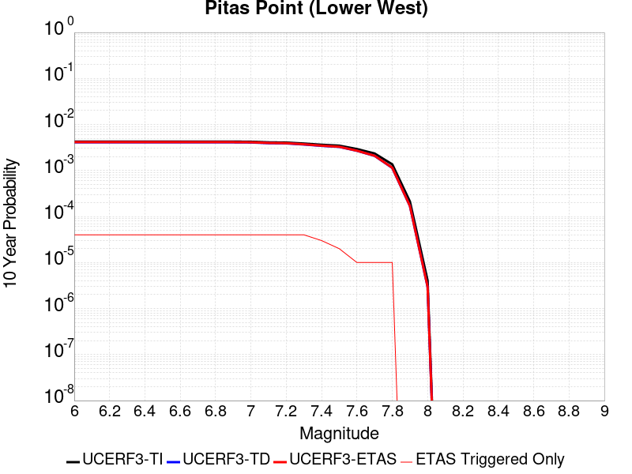 |

| Magnitude | 1 wk TI Prob | 1 wk TD Prob | 1 wk ETAS Prob | 1 wk ETAS/TD Gain | 1 wk ETAS Triggered Only | 1 mo TI Prob | 1 mo TD Prob | 1 mo ETAS Prob | 1 mo ETAS/TD Gain | 1 mo ETAS Triggered Only | 1 yr TI Prob | 1 yr TD Prob | 1 yr ETAS Prob | 1 yr ETAS/TD Gain | 1 yr ETAS Triggered Only | 10 yr TI Prob | 10 yr TD Prob | 10 yr ETAS Prob | 10 yr ETAS/TD Gain | 10 yr ETAS Triggered Only |
|-----|-----|-----|-----|-----|-----|-----|-----|-----|-----|-----|-----|-----|-----|-----|-----|-----|-----|-----|-----|-----|
| 6.0 | 8.151497E-6 | 7.855796E-6 | 7.855796E-6 | 1.0 | 0.0 | 3.493452E-5 | 3.3667267E-5 | 3.3667267E-5 | 1.0 | 0.0 | 4.252448E-4 | 4.0982262E-4 | 4.0982262E-4 | 1.0 | 0.0 | 0.0042443196 | 0.004090749 | 0.0041394276 | 1.0118996 | 4.8878243E-5 |
| 6.1 | 8.151497E-6 | 7.855796E-6 | 7.855796E-6 | 1.0 | 0.0 | 3.493452E-5 | 3.3667267E-5 | 3.3667267E-5 | 1.0 | 0.0 | 4.252448E-4 | 4.0982262E-4 | 4.0982262E-4 | 1.0 | 0.0 | 0.0042443196 | 0.004090749 | 0.0041394276 | 1.0118996 | 4.8878243E-5 |
| 6.2 | 8.151497E-6 | 7.855796E-6 | 7.855796E-6 | 1.0 | 0.0 | 3.493452E-5 | 3.3667267E-5 | 3.3667267E-5 | 1.0 | 0.0 | 4.252448E-4 | 4.0982262E-4 | 4.0982262E-4 | 1.0 | 0.0 | 0.0042443196 | 0.004090749 | 0.0041394276 | 1.0118996 | 4.8878243E-5 |
| 6.3 | 8.151497E-6 | 7.855796E-6 | 7.855796E-6 | 1.0 | 0.0 | 3.493452E-5 | 3.3667267E-5 | 3.3667267E-5 | 1.0 | 0.0 | 4.252448E-4 | 4.0982262E-4 | 4.0982262E-4 | 1.0 | 0.0 | 0.0042443196 | 0.004090749 | 0.0041394276 | 1.0118996 | 4.8878243E-5 |
| 6.4 | 8.151497E-6 | 7.855796E-6 | 7.855796E-6 | 1.0 | 0.0 | 3.493452E-5 | 3.3667267E-5 | 3.3667267E-5 | 1.0 | 0.0 | 4.252448E-4 | 4.0982262E-4 | 4.0982262E-4 | 1.0 | 0.0 | 0.0042443196 | 0.004090749 | 0.0041394276 | 1.0118996 | 4.8878243E-5 |
| 6.5 | 8.151497E-6 | 7.855796E-6 | 7.855796E-6 | 1.0 | 0.0 | 3.493452E-5 | 3.3667267E-5 | 3.3667267E-5 | 1.0 | 0.0 | 4.252448E-4 | 4.0982262E-4 | 4.0982262E-4 | 1.0 | 0.0 | 0.0042443196 | 0.004090749 | 0.0041394276 | 1.0118996 | 4.8878243E-5 |
| 6.6 | 8.151497E-6 | 7.855796E-6 | 7.855796E-6 | 1.0 | 0.0 | 3.493452E-5 | 3.3667267E-5 | 3.3667267E-5 | 1.0 | 0.0 | 4.252448E-4 | 4.0982262E-4 | 4.0982262E-4 | 1.0 | 0.0 | 0.0042443196 | 0.004090749 | 0.0041394276 | 1.0118996 | 4.8878243E-5 |
| 6.7 | 8.151497E-6 | 7.855796E-6 | 7.855796E-6 | 1.0 | 0.0 | 3.493452E-5 | 3.3667267E-5 | 3.3667267E-5 | 1.0 | 0.0 | 4.252448E-4 | 4.0982262E-4 | 4.0982262E-4 | 1.0 | 0.0 | 0.0042443196 | 0.004090749 | 0.0041394276 | 1.0118996 | 4.8878243E-5 |
| 6.8 | 8.151497E-6 | 7.855796E-6 | 7.855796E-6 | 1.0 | 0.0 | 3.493452E-5 | 3.3667267E-5 | 3.3667267E-5 | 1.0 | 0.0 | 4.252448E-4 | 4.0982262E-4 | 4.0982262E-4 | 1.0 | 0.0 | 0.0042443196 | 0.004090749 | 0.0041394276 | 1.0118996 | 4.8878243E-5 |
| 6.9 | 8.151497E-6 | 7.855796E-6 | 7.855796E-6 | 1.0 | 0.0 | 3.493452E-5 | 3.3667267E-5 | 3.3667267E-5 | 1.0 | 0.0 | 4.252448E-4 | 4.0982262E-4 | 4.0982262E-4 | 1.0 | 0.0 | 0.0042443196 | 0.004090749 | 0.0041394276 | 1.0118996 | 4.8878243E-5 |
| 7.0 | 8.103535E-6 | 7.805226E-6 | 7.805226E-6 | 1.0 | 0.0 | 3.4728975E-5 | 3.3450542E-5 | 3.3450542E-5 | 1.0 | 0.0 | 4.2274324E-4 | 4.07185E-4 | 4.07185E-4 | 1.0 | 0.0 | 0.0042193993 | 0.0040644696 | 0.0041131494 | 1.0119768 | 4.8878243E-5 |
| 7.1 | 7.853298E-6 | 7.540917E-6 | 7.540917E-6 | 1.0 | 0.0 | 3.3656554E-5 | 3.2317817E-5 | 3.2317817E-5 | 1.0 | 0.0 | 4.096915E-4 | 3.9339912E-4 | 3.9339912E-4 | 1.0 | 0.0 | 0.00408937 | 0.0039271032 | 0.0039757895 | 1.0123975 | 4.8878243E-5 |
| 7.2 | 7.771102E-6 | 7.453199E-6 | 7.453199E-6 | 1.0 | 0.0 | 3.33043E-5 | 3.1941894E-5 | 3.1941894E-5 | 1.0 | 0.0 | 4.0540437E-4 | 3.8882386E-4 | 3.8882386E-4 | 1.0 | 0.0 | 0.0040466557 | 0.003881511 | 0.0039302 | 1.0125437 | 4.8878243E-5 |
| 7.3 | 7.3945344E-6 | 7.0493033E-6 | 7.0493033E-6 | 1.0 | 0.0 | 3.1690477E-5 | 3.0210955E-5 | 3.0210955E-5 | 1.0 | 0.0 | 3.8576324E-4 | 3.677569E-4 | 3.677569E-4 | 1.0 | 0.0 | 0.0038509427 | 0.003671551 | 0.0037202497 | 1.0132638 | 4.8878243E-5 |
| 7.4 | 6.964645E-6 | 6.5901527E-6 | 6.5901527E-6 | 1.0 | 0.0 | 2.9848137E-5 | 2.8243208E-5 | 2.8243208E-5 | 1.0 | 0.0 | 3.6334046E-4 | 3.438073E-4 | 3.438073E-4 | 1.0 | 0.0 | 0.0036274698 | 0.0034328073 | 0.0034815175 | 1.0141897 | 4.8878243E-5 |
| 7.5 | 6.6525035E-6 | 6.259191E-6 | 6.259191E-6 | 1.0 | 0.0 | 2.851042E-5 | 2.6824831E-5 | 2.6824831E-5 | 1.0 | 0.0 | 3.4705905E-4 | 3.2654387E-4 | 3.2654387E-4 | 1.0 | 0.0 | 0.0034651754 | 0.0032606919 | 0.003293171 | 1.0099609 | 3.2585496E-5 |
| 7.6 | 5.613338E-6 | 5.15142E-6 | 5.15142E-6 | 1.0 | 0.0 | 2.405694E-5 | 2.2077327E-5 | 2.2077327E-5 | 1.0 | 0.0 | 2.928539E-4 | 2.6875862E-4 | 2.6875862E-4 | 1.0 | 0.0 | 0.0029246826 | 0.0026843674 | 0.0027006164 | 1.0060532 | 1.6292748E-5 |
| 7.7 | 4.494704E-6 | 3.996945E-6 | 3.996945E-6 | 1.0 | 0.0 | 1.9262876E-5 | 1.7129652E-5 | 1.7129652E-5 | 1.0 | 0.0 | 2.3450027E-4 | 2.0853379E-4 | 2.0853379E-4 | 1.0 | 0.0 | 0.0023425296 | 0.0020834052 | 0.002099664 | 1.0078039 | 1.6292748E-5 |
| 7.8 | 2.6075882E-6 | 2.1836663E-6 | 2.1836663E-6 | 1.0 | 0.0 | 1.117533E-5 | 9.358537E-6 | 9.358537E-6 | 1.0 | 0.0 | 1.3605114E-4 | 1.1393427E-4 | 1.1393427E-4 | 1.0 | 0.0 | 0.0013596788 | 0.0011387634 | 0.0011550375 | 1.0142912 | 1.6292748E-5 |
| 7.9 | 4.045984E-7 | 3.2424057E-7 | 3.2424057E-7 | 1.0 | 0.0 | 1.733992E-6 | 1.3896017E-6 | 1.3896017E-6 | 1.0 | 0.0 | 2.1111147E-5 | 1.6918271E-5 | 1.6918271E-5 | 1.0 | 0.0 | 2.1109142E-4 | 1.6917015E-4 | 1.6917015E-4 | 1.0 | 0.0 |
| 8.0 | 7.791402E-9 | 5.6836056E-9 | 5.6836056E-9 | 1.0 | 0.0 | 3.3391725E-8 | 2.4358311E-8 | 2.4358311E-8 | 1.0 | 0.0 | 4.0654416E-7 | 2.965624E-7 | 2.965624E-7 | 1.0 | 0.0 | 4.065434E-6 | 2.9656223E-6 | 2.9656223E-6 | 1.0 | 0.0 |

## Great Valley 03a Dunnigan Hills
*[(top)](#table-of-contents)*

| 1 Week | 1 Month | 1 Year | 10 Year |
|-----|-----|-----|-----|
| 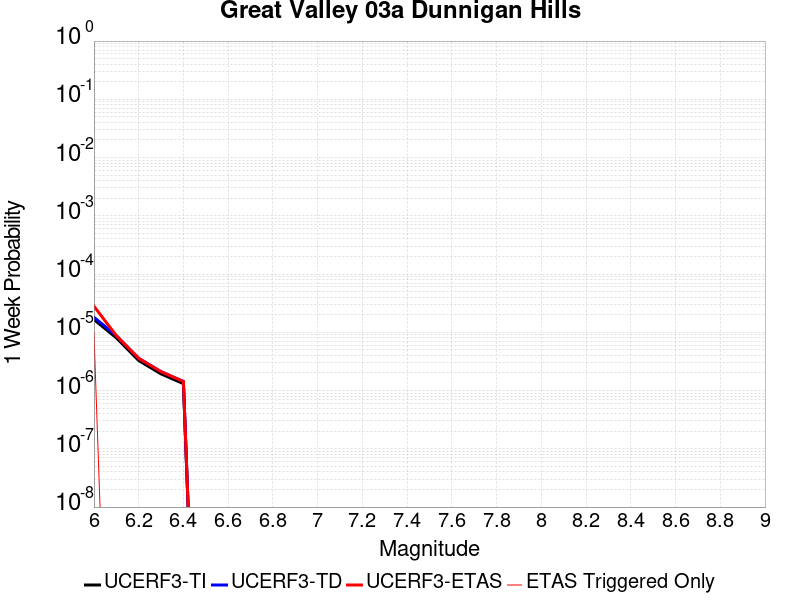 |  |  |  |

| Magnitude | 1 wk TI Prob | 1 wk TD Prob | 1 wk ETAS Prob | 1 wk ETAS/TD Gain | 1 wk ETAS Triggered Only | 1 mo TI Prob | 1 mo TD Prob | 1 mo ETAS Prob | 1 mo ETAS/TD Gain | 1 mo ETAS Triggered Only | 1 yr TI Prob | 1 yr TD Prob | 1 yr ETAS Prob | 1 yr ETAS/TD Gain | 1 yr ETAS Triggered Only | 10 yr TI Prob | 10 yr TD Prob | 10 yr ETAS Prob | 10 yr ETAS/TD Gain | 10 yr ETAS Triggered Only |
|-----|-----|-----|-----|-----|-----|-----|-----|-----|-----|-----|-----|-----|-----|-----|-----|-----|-----|-----|-----|-----|
| 6.0 | 1.6591328E-5 | 1.8107954E-5 | 3.4400407E-5 | 1.8997401 | 1.6292748E-5 | 7.110376E-5 | 7.7603596E-5 | 1.10186564E-4 | 1.4198642 | 3.2585496E-5 | 8.6534437E-4 | 9.444834E-4 | 9.77038E-4 | 1.0344683 | 3.2585496E-5 | 0.008619824 | 0.009411525 | 0.0094599435 | 1.0051446 | 4.8878243E-5 |
| 6.1 | 8.041125E-6 | 8.769726E-6 | 8.769726E-6 | 1.0 | 0.0 | 3.4461507E-5 | 3.7584115E-5 | 3.7584115E-5 | 1.0 | 0.0 | 4.194881E-4 | 4.5751085E-4 | 4.5751085E-4 | 1.0 | 0.0 | 0.004186971 | 0.004567687 | 0.0045839055 | 1.0035506 | 1.6292748E-5 |
| 6.2 | 3.2807004E-6 | 3.5795688E-6 | 3.5795688E-6 | 1.0 | 0.0 | 1.4060069E-5 | 1.5340942E-5 | 1.5340942E-5 | 1.0 | 0.0 | 1.7116789E-4 | 1.8676413E-4 | 1.8676413E-4 | 1.0 | 0.0 | 0.0017103611 | 0.0018664796 | 0.001882742 | 1.0087129 | 1.6292748E-5 |
| 6.3 | 1.9339366E-6 | 2.1103806E-6 | 2.1103806E-6 | 1.0 | 0.0 | 8.288273E-6 | 9.044474E-6 | 9.044474E-6 | 1.0 | 0.0 | 1.00905054E-4 | 1.1011375E-4 | 1.1011375E-4 | 1.0 | 0.0 | 0.0010085925 | 0.0011008718 | 0.0011008718 | 1.0 | 0.0 |
| 6.4 | 1.3142635E-6 | 1.4339867E-6 | 1.4339867E-6 | 1.0 | 0.0 | 5.6325457E-6 | 6.145657E-6 | 6.145657E-6 | 1.0 | 0.0 | 6.857408E-5 | 7.482337E-5 | 7.482337E-5 | 1.0 | 0.0 | 6.8552926E-4 | 7.4823375E-4 | 7.4823375E-4 | 1.0 | 0.0 |

## San Pedro Basin
*[(top)](#table-of-contents)*

| 1 Week | 1 Month | 1 Year | 10 Year |
|-----|-----|-----|-----|
|  |  |  |  |

| Magnitude | 1 wk TI Prob | 1 wk TD Prob | 1 wk ETAS Prob | 1 wk ETAS/TD Gain | 1 wk ETAS Triggered Only | 1 mo TI Prob | 1 mo TD Prob | 1 mo ETAS Prob | 1 mo ETAS/TD Gain | 1 mo ETAS Triggered Only | 1 yr TI Prob | 1 yr TD Prob | 1 yr ETAS Prob | 1 yr ETAS/TD Gain | 1 yr ETAS Triggered Only | 10 yr TI Prob | 10 yr TD Prob | 10 yr ETAS Prob | 10 yr ETAS/TD Gain | 10 yr ETAS Triggered Only |
|-----|-----|-----|-----|-----|-----|-----|-----|-----|-----|-----|-----|-----|-----|-----|-----|-----|-----|-----|-----|-----|
| 6.0 | 5.3449043E-5 | 6.337018E-5 | 7.96619E-5 | 1.2570881 | 1.6292748E-5 | 2.2904722E-4 | 2.7156167E-4 | 2.8785E-4 | 1.0599802 | 1.6292748E-5 | 0.0027850836 | 0.0033018515 | 0.0033505682 | 1.0147544 | 4.8878243E-5 | 0.027504366 | 0.03258948 | 0.032636765 | 1.0014509 | 4.8878243E-5 |
| 6.1 | 5.3449043E-5 | 6.337018E-5 | 7.96619E-5 | 1.2570881 | 1.6292748E-5 | 2.2904722E-4 | 2.7156167E-4 | 2.8785E-4 | 1.0599802 | 1.6292748E-5 | 0.0027850836 | 0.0033018515 | 0.0033505682 | 1.0147544 | 4.8878243E-5 | 0.027504366 | 0.03258948 | 0.032636765 | 1.0014509 | 4.8878243E-5 |
| 6.2 | 2.3189454E-5 | 2.6642829E-5 | 2.6642829E-5 | 1.0 | 0.0 | 9.9379584E-5 | 1.1417881E-4 | 1.1417881E-4 | 1.0 | 0.0 | 0.0012092749 | 0.0013892875 | 0.0014218278 | 1.0234222 | 3.2585496E-5 | 0.012027155 | 0.01381089 | 0.013843025 | 1.0023268 | 3.2585496E-5 |
| 6.3 | 2.3189454E-5 | 2.6642829E-5 | 2.6642829E-5 | 1.0 | 0.0 | 9.9379584E-5 | 1.1417881E-4 | 1.1417881E-4 | 1.0 | 0.0 | 0.0012092749 | 0.0013892875 | 0.0014218278 | 1.0234222 | 3.2585496E-5 | 0.012027155 | 0.01381089 | 0.013843025 | 1.0023268 | 3.2585496E-5 |
| 6.4 | 1.966056E-5 | 2.246342E-5 | 2.246342E-5 | 1.0 | 0.0 | 8.425682E-5 | 9.626848E-5 | 9.626848E-5 | 1.0 | 0.0 | 0.001025344 | 0.0011714787 | 0.0011714787 | 1.0 | 0.0 | 0.010206259 | 0.011657119 | 0.011657119 | 1.0 | 0.0 |
| 6.5 | 1.7342953E-5 | 1.9745152E-5 | 1.9745152E-5 | 1.0 | 0.0 | 7.4324824E-5 | 8.461954E-5 | 8.461954E-5 | 1.0 | 0.0 | 9.04529E-4 | 0.0010297929 | 0.0010297929 | 1.0 | 0.0 | 0.009008561 | 0.010253932 | 0.010253932 | 1.0 | 0.0 |
| 6.6 | 1.439804E-5 | 1.6322716E-5 | 1.6322716E-5 | 1.0 | 0.0 | 6.170443E-5 | 6.99528E-5 | 6.99528E-5 | 1.0 | 0.0 | 7.509924E-4 | 8.513747E-4 | 8.513747E-4 | 1.0 | 0.0 | 0.0074845953 | 0.008484333 | 0.008484333 | 1.0 | 0.0 |
| 6.7 | 1.2634884E-5 | 1.4285298E-5 | 1.4285298E-5 | 1.0 | 0.0 | 5.414838E-5 | 6.122144E-5 | 6.122144E-5 | 1.0 | 0.0 | 6.590571E-4 | 7.451466E-4 | 7.451466E-4 | 1.0 | 0.0 | 0.006571059 | 0.007429502 | 0.007429502 | 1.0 | 0.0 |
| 6.8 | 1.146091E-5 | 1.2933193E-5 | 1.2933193E-5 | 1.0 | 0.0 | 4.911726E-5 | 5.542696E-5 | 5.542696E-5 | 1.0 | 0.0 | 5.9783855E-4 | 6.74644E-4 | 6.74644E-4 | 1.0 | 0.0 | 0.0059623276 | 0.0067288997 | 0.0067288997 | 1.0 | 0.0 |
| 6.9 | 9.109035E-6 | 1.0235013E-5 | 1.0235013E-5 | 1.0 | 0.0 | 3.9038136E-5 | 4.386376E-5 | 4.386376E-5 | 1.0 | 0.0 | 4.7518566E-4 | 5.339384E-4 | 5.339384E-4 | 1.0 | 0.0 | 0.0047417083 | 0.0053293095 | 0.0053293095 | 1.0 | 0.0 |
| 7.0 | 5.9351028E-6 | 6.583965E-6 | 6.583965E-6 | 1.0 | 0.0 | 2.5435906E-5 | 2.821682E-5 | 2.821682E-5 | 1.0 | 0.0 | 3.0963816E-4 | 3.4350925E-4 | 3.4350925E-4 | 1.0 | 0.0 | 0.0030920706 | 0.0034320997 | 0.0034320997 | 1.0 | 0.0 |
| 7.1 | 2.1557585E-6 | 2.2096492E-6 | 2.2096492E-6 | 1.0 | 0.0 | 9.238933E-6 | 9.469892E-6 | 9.469892E-6 | 1.0 | 0.0 | 1.1247819E-4 | 1.15289986E-4 | 1.15289986E-4 | 1.0 | 0.0 | 0.0011242128 | 0.0011523172 | 0.0011523172 | 1.0 | 0.0 |
| 7.2 | 2.1251979E-6 | 2.1779954E-6 | 2.1779954E-6 | 1.0 | 0.0 | 9.107958E-6 | 9.334234E-6 | 9.334234E-6 | 1.0 | 0.0 | 1.1088375E-4 | 1.13638525E-4 | 1.13638525E-4 | 1.0 | 0.0 | 0.0011082845 | 0.0011358195 | 0.0011358195 | 1.0 | 0.0 |
| 7.3 | 1.7145798E-6 | 1.7442885E-6 | 1.7442885E-6 | 1.0 | 0.0 | 7.3481783E-6 | 7.475501E-6 | 7.475501E-6 | 1.0 | 0.0 | 8.94604E-5 | 9.1010515E-5 | 9.1010515E-5 | 1.0 | 0.0 | 8.9424395E-4 | 9.0974156E-4 | 9.0974156E-4 | 1.0 | 0.0 |
| 7.4 | 1.4467993E-6 | 1.4641878E-6 | 1.4641878E-6 | 1.0 | 0.0 | 6.200554E-6 | 6.275076E-6 | 6.275076E-6 | 1.0 | 0.0 | 7.548913E-5 | 7.639644E-5 | 7.639644E-5 | 1.0 | 0.0 | 7.546349E-4 | 7.6370913E-4 | 7.6370913E-4 | 1.0 | 0.0 |
| 7.5 | 1.2803735E-6 | 1.2931506E-6 | 1.2931506E-6 | 1.0 | 0.0 | 5.487303E-6 | 5.5420624E-6 | 5.5420624E-6 | 1.0 | 0.0 | 6.680587E-5 | 6.747259E-5 | 6.747259E-5 | 1.0 | 0.0 | 6.678579E-4 | 6.745281E-4 | 6.745281E-4 | 1.0 | 0.0 |
| 7.6 | 6.755009E-7 | 6.76947E-7 | 6.76947E-7 | 1.0 | 0.0 | 2.8950008E-6 | 2.9011985E-6 | 2.9011985E-6 | 1.0 | 0.0 | 3.5246063E-5 | 3.532158E-5 | 3.532158E-5 | 1.0 | 0.0 | 3.5240475E-4 | 3.5316538E-4 | 3.5316538E-4 | 1.0 | 0.0 |
| 7.7 | 6.211885E-8 | 4.5699714E-8 | 4.5699714E-8 | 1.0 | 0.0 | 2.6622362E-7 | 1.9585592E-7 | 1.9585592E-7 | 1.0 | 0.0 | 3.2412677E-6 | 2.3845432E-6 | 2.3845432E-6 | 1.0 | 0.0 | 3.2412205E-5 | 2.3845198E-5 | 2.3845198E-5 | 1.0 | 0.0 |
| 7.8 | 2.6580573E-9 | 1.5138054E-9 | 1.5138054E-9 | 1.0 | 0.0 | 1.1391674E-8 | 6.4877375E-9 | 6.4877375E-9 | 1.0 | 0.0 | 1.3869362E-7 | 7.89882E-8 | 7.89882E-8 | 1.0 | 0.0 | 1.3869354E-6 | 7.89882E-7 | 7.89882E-7 | 1.0 | 0.0 |

## Likely 2011 CFM
*[(top)](#table-of-contents)*

| 1 Week | 1 Month | 1 Year | 10 Year |
|-----|-----|-----|-----|
|  |  |  |  |

| Magnitude | 1 wk TI Prob | 1 wk TD Prob | 1 wk ETAS Prob | 1 wk ETAS/TD Gain | 1 wk ETAS Triggered Only | 1 mo TI Prob | 1 mo TD Prob | 1 mo ETAS Prob | 1 mo ETAS/TD Gain | 1 mo ETAS Triggered Only | 1 yr TI Prob | 1 yr TD Prob | 1 yr ETAS Prob | 1 yr ETAS/TD Gain | 1 yr ETAS Triggered Only | 10 yr TI Prob | 10 yr TD Prob | 10 yr ETAS Prob | 10 yr ETAS/TD Gain | 10 yr ETAS Triggered Only |
|-----|-----|-----|-----|-----|-----|-----|-----|-----|-----|-----|-----|-----|-----|-----|-----|-----|-----|-----|-----|-----|
| 6.0 | 2.5315949E-5 | 2.7104748E-5 | 7.598167E-5 | 2.8032603 | 4.8878243E-5 | 1.0849241E-4 | 1.16158284E-4 | 1.6503085E-4 | 1.4207411 | 4.8878243E-5 | 0.0013200947 | 0.0014133542 | 0.0014621634 | 1.0345342 | 4.8878243E-5 | 0.013122803 | 0.01404831 | 0.014096502 | 1.0034304 | 4.8878243E-5 |
| 6.1 | 2.5315949E-5 | 2.7104748E-5 | 7.598167E-5 | 2.8032603 | 4.8878243E-5 | 1.0849241E-4 | 1.16158284E-4 | 1.6503085E-4 | 1.4207411 | 4.8878243E-5 | 0.0013200947 | 0.0014133542 | 0.0014621634 | 1.0345342 | 4.8878243E-5 | 0.013122803 | 0.01404831 | 0.014096502 | 1.0034304 | 4.8878243E-5 |
| 6.2 | 1.6375941E-5 | 1.7465842E-5 | 6.634323E-5 | 3.798456 | 4.8878243E-5 | 7.0180715E-5 | 7.485153E-5 | 1.2372612E-4 | 1.6529537 | 4.8878243E-5 | 8.5411523E-4 | 9.109487E-4 | 9.5978234E-4 | 1.0536076 | 4.8878243E-5 | 0.008508399 | 0.009073433 | 0.009121867 | 1.0053381 | 4.8878243E-5 |
| 6.3 | 1.1945543E-5 | 1.2712587E-5 | 6.159021E-5 | 4.844821 | 4.8878243E-5 | 5.119418E-5 | 5.4481407E-5 | 1.03356986E-4 | 1.8971057 | 4.8878243E-5 | 6.2311086E-4 | 6.631146E-4 | 7.119604E-4 | 1.0736612 | 4.8878243E-5 | 0.0062136655 | 0.0066119144 | 0.0066604693 | 1.0073435 | 4.8878243E-5 |
| 6.4 | 9.192729E-6 | 9.768488E-6 | 4.2353666E-5 | 4.3357444 | 3.2585496E-5 | 3.939681E-5 | 4.1864292E-5 | 7.444842E-5 | 1.7783276 | 3.2585496E-5 | 4.7955062E-4 | 5.0958124E-4 | 5.4215017E-4 | 1.0639131 | 3.2585496E-5 | 0.004785171 | 0.0050844094 | 0.005116829 | 1.0063763 | 3.2585496E-5 |
| 6.5 | 7.67906E-6 | 8.152622E-6 | 4.0737854E-5 | 4.996902 | 3.2585496E-5 | 3.2909844E-5 | 3.4939352E-5 | 6.752371E-5 | 1.9325976 | 3.2585496E-5 | 4.006037E-4 | 4.2530545E-4 | 4.578771E-4 | 1.0765841 | 3.2585496E-5 | 0.0039988225 | 0.004245108 | 0.0042775553 | 1.0076435 | 3.2585496E-5 |
| 6.6 | 6.4884057E-6 | 6.8847507E-6 | 2.3177387E-5 | 3.3664815 | 1.6292748E-5 | 2.7807157E-5 | 2.9505749E-5 | 4.5798017E-5 | 1.5521727 | 1.6292748E-5 | 3.3849955E-4 | 3.591747E-4 | 3.754616E-4 | 1.0453453 | 1.6292748E-5 | 0.003379844 | 0.0035860867 | 0.003602321 | 1.004527 | 1.6292748E-5 |
| 6.7 | 4.6060636E-6 | 4.884041E-6 | 4.884041E-6 | 1.0 | 0.0 | 1.9740122E-5 | 2.0931442E-5 | 2.0931442E-5 | 1.0 | 0.0 | 2.403095E-4 | 2.5481134E-4 | 2.5481134E-4 | 1.0 | 0.0 | 0.002400498 | 0.0025452746 | 0.0025452746 | 1.0 | 0.0 |
| 6.8 | 3.2795615E-6 | 3.4773732E-6 | 3.4773732E-6 | 1.0 | 0.0 | 1.4055187E-5 | 1.4902946E-5 | 1.4902946E-5 | 1.0 | 0.0 | 1.7110848E-4 | 1.8142881E-4 | 1.8142881E-4 | 1.0 | 0.0 | 0.0017097679 | 0.0018128622 | 0.0018128622 | 1.0 | 0.0 |
| 6.9 | 2.3289967E-6 | 2.4705569E-6 | 2.4705569E-6 | 1.0 | 0.0 | 9.981376E-6 | 1.058806E-5 | 1.058806E-5 | 1.0 | 0.0 | 1.2151648E-4 | 1.2890245E-4 | 1.2890245E-4 | 1.0 | 0.0 | 0.0012145005 | 0.0012883197 | 0.0012883197 | 1.0 | 0.0 |
| 7.0 | 1.211292E-6 | 1.2863958E-6 | 1.2863958E-6 | 1.0 | 0.0 | 5.1912407E-6 | 5.5131145E-6 | 5.5131145E-6 | 1.0 | 0.0 | 6.320152E-5 | 6.712041E-5 | 6.712041E-5 | 1.0 | 0.0 | 6.3183554E-4 | 6.710312E-4 | 6.710312E-4 | 1.0 | 0.0 |

## Calaveras (So) - Paicines extension 2011 CFM
*[(top)](#table-of-contents)*

| 1 Week | 1 Month | 1 Year | 10 Year |
|-----|-----|-----|-----|
| 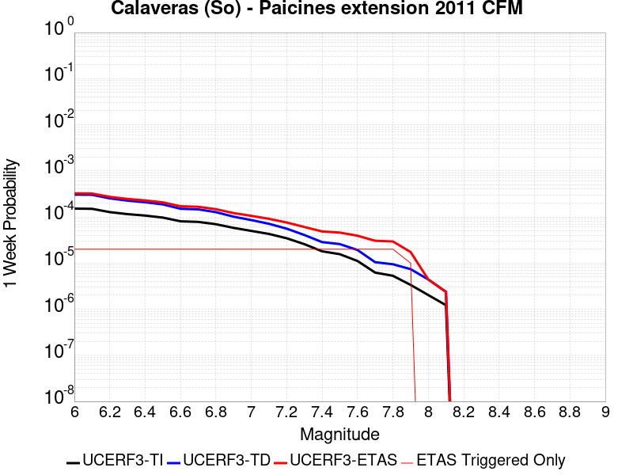 |  |  |  |

| Magnitude | 1 wk TI Prob | 1 wk TD Prob | 1 wk ETAS Prob | 1 wk ETAS/TD Gain | 1 wk ETAS Triggered Only | 1 mo TI Prob | 1 mo TD Prob | 1 mo ETAS Prob | 1 mo ETAS/TD Gain | 1 mo ETAS Triggered Only | 1 yr TI Prob | 1 yr TD Prob | 1 yr ETAS Prob | 1 yr ETAS/TD Gain | 1 yr ETAS Triggered Only | 10 yr TI Prob | 10 yr TD Prob | 10 yr ETAS Prob | 10 yr ETAS/TD Gain | 10 yr ETAS Triggered Only |
|-----|-----|-----|-----|-----|-----|-----|-----|-----|-----|-----|-----|-----|-----|-----|-----|-----|-----|-----|-----|-----|
| 6.0 | 1.5183659E-4 | 3.0520977E-4 | 3.3778534E-4 | 1.1067317 | 3.2585496E-5 | 6.5056595E-4 | 0.0013068188 | 0.0013393618 | 1.0249023 | 3.2585496E-5 | 0.007891912 | 0.015696203 | 0.015728278 | 1.0020434 | 3.2585496E-5 | 0.076174594 | 0.13848905 | 0.13853116 | 1.0003041 | 4.8878243E-5 |
| 6.1 | 1.5024997E-4 | 3.021517E-4 | 3.3472732E-4 | 1.1078123 | 3.2585496E-5 | 6.437695E-4 | 0.0012937278 | 0.0013262712 | 1.0251547 | 3.2585496E-5 | 0.0078097614 | 0.015539596 | 0.015571675 | 1.0020643 | 3.2585496E-5 | 0.075409345 | 0.13715863 | 0.13720082 | 1.0003074 | 4.8878243E-5 |
| 6.2 | 1.2743923E-4 | 2.5313982E-4 | 2.8571708E-4 | 1.1286927 | 3.2585496E-5 | 5.460538E-4 | 0.0010839999 | 0.0011165501 | 1.0300279 | 3.2585496E-5 | 0.0066279583 | 0.013046881 | 0.013079042 | 1.002465 | 3.2585496E-5 | 0.064337276 | 0.117256075 | 0.11729922 | 1.000368 | 4.8878243E-5 |
| 6.3 | 1.1525114E-4 | 2.2599236E-4 | 2.585705E-4 | 1.1441559 | 3.2585496E-5 | 4.9383997E-4 | 9.678718E-4 | 0.0010004258 | 1.0336345 | 3.2585496E-5 | 0.0059959386 | 0.011668079 | 0.011700284 | 1.0027602 | 3.2585496E-5 | 0.058367174 | 0.106372125 | 0.10640124 | 1.0002737 | 3.2585496E-5 |
| 6.4 | 1.07200925E-4 | 2.0840544E-4 | 2.4098415E-4 | 1.1563237 | 3.2585496E-5 | 4.5935164E-4 | 8.926123E-4 | 9.2516874E-4 | 1.0364732 | 3.2585496E-5 | 0.0055782744 | 0.010772959 | 0.010805193 | 1.0029922 | 3.2585496E-5 | 0.0544031 | 0.099194765 | 0.09922412 | 1.0002959 | 3.2585496E-5 |
| 6.5 | 9.69631E-5 | 1.8734725E-4 | 2.1992665E-4 | 1.1738985 | 3.2585496E-5 | 4.1548995E-4 | 8.024631E-4 | 8.350224E-4 | 1.0405743 | 3.2585496E-5 | 0.0050468626 | 0.009694842 | 0.009727111 | 1.0033286 | 3.2585496E-5 | 0.04933773 | 0.090086564 | 0.09011622 | 1.0003291 | 3.2585496E-5 |
| 6.6 | 8.0552316E-5 | 1.507068E-4 | 1.8328737E-4 | 1.2161852 | 3.2585496E-5 | 3.4517853E-4 | 6.4569083E-4 | 6.782553E-4 | 1.0504335 | 3.2585496E-5 | 0.0041944524 | 0.007826508 | 0.007858839 | 1.0041308 | 3.2585496E-5 | 0.04116161 | 0.0748563 | 0.07488645 | 1.0004027 | 3.2585496E-5 |
| 6.7 | 7.815757E-5 | 1.4611272E-4 | 1.7869346E-4 | 1.2229836 | 3.2585496E-5 | 3.34918E-4 | 6.26014E-4 | 6.5857917E-4 | 1.0520197 | 3.2585496E-5 | 0.004070005 | 0.007589312 | 0.0076216497 | 1.004261 | 3.2585496E-5 | 0.039962657 | 0.07270582 | 0.07273604 | 1.0004156 | 3.2585496E-5 |
| 6.8 | 6.965264E-5 | 1.2722758E-4 | 1.5980894E-4 | 1.2560872 | 3.2585496E-5 | 2.9847719E-4 | 5.4513285E-4 | 5.7770056E-4 | 1.0597427 | 3.2585496E-5 | 0.0036279052 | 0.0066135945 | 0.0066459645 | 1.0048945 | 3.2585496E-5 | 0.03569247 | 0.063801065 | 0.063831575 | 1.0004781 | 3.2585496E-5 |
| 6.9 | 5.8000453E-5 | 1.01439E-4 | 1.3402119E-4 | 1.3211998 | 3.2585496E-5 | 2.4854968E-4 | 4.346666E-4 | 4.6723796E-4 | 1.074934 | 3.2585496E-5 | 0.0030218933 | 0.005279322 | 0.005311736 | 1.0061398 | 3.2585496E-5 | 0.029811295 | 0.051502965 | 0.05153387 | 1.0006001 | 3.2585496E-5 |
| 7.0 | 4.9865852E-5 | 8.568029E-5 | 1.18262986E-4 | 1.3802824 | 3.2585496E-5 | 2.1369329E-4 | 3.6715003E-4 | 3.9972356E-4 | 1.08872 | 3.2585496E-5 | 0.0025986114 | 0.004460979 | 0.0044934186 | 1.007272 | 3.2585496E-5 | 0.025684336 | 0.043782018 | 0.043813176 | 1.0007117 | 3.2585496E-5 |
| 7.1 | 4.283875E-5 | 7.1124625E-5 | 1.03707804E-4 | 1.4581139 | 3.2585496E-5 | 1.8358172E-4 | 3.0478454E-4 | 3.373601E-4 | 1.1068807 | 3.2585496E-5 | 0.0022328163 | 0.003704494 | 0.0037369588 | 1.0087637 | 3.2585496E-5 | 0.022105146 | 0.03673582 | 0.03676721 | 1.0008545 | 3.2585496E-5 |
| 7.2 | 3.450115E-5 | 5.5778568E-5 | 8.836224E-5 | 1.5841613 | 3.2585496E-5 | 1.478537E-4 | 2.3902925E-4 | 2.7160696E-4 | 1.1362917 | 3.2585496E-5 | 0.0017986323 | 0.0029063264 | 0.0029388173 | 1.0111793 | 3.2585496E-5 | 0.017841442 | 0.029079042 | 0.029110681 | 1.001088 | 3.2585496E-5 |
| 7.3 | 2.5709045E-5 | 4.059001E-5 | 7.317418E-5 | 1.8027633 | 3.2585496E-5 | 1.1017697E-4 | 1.7394568E-4 | 2.0652551E-4 | 1.1872989 | 3.2585496E-5 | 0.0013405791 | 0.0021157486 | 0.0021482653 | 1.0153688 | 3.2585496E-5 | 0.013325208 | 0.02129686 | 0.021328753 | 1.0014975 | 3.2585496E-5 |
| 7.4 | 1.8003093E-5 | 2.8511378E-5 | 6.109595E-5 | 2.1428618 | 3.2585496E-5 | 7.715383E-5 | 1.2218591E-4 | 1.5476743E-4 | 1.2666552 | 3.2585496E-5 | 9.3894306E-4 | 0.0014866006 | 0.0015191378 | 1.0218868 | 3.2585496E-5 | 0.009349857 | 0.015051589 | 0.015083685 | 1.0021323 | 3.2585496E-5 |
| 7.5 | 1.5595824E-5 | 2.5823752E-5 | 5.840841E-5 | 2.2618093 | 3.2585496E-5 | 6.683753E-5 | 1.10668545E-4 | 1.4325044E-4 | 1.2944096 | 3.2585496E-5 | 8.134431E-4 | 0.0013465589 | 0.0013791005 | 1.0241665 | 3.2585496E-5 | 0.008104719 | 0.013651571 | 0.013683712 | 1.0023544 | 3.2585496E-5 |
| 7.6 | 1.1110309E-5 | 1.9223195E-5 | 5.1808063E-5 | 2.6950808 | 3.2585496E-5 | 4.761474E-5 | 8.2382525E-5 | 1.1496534E-4 | 1.3955064 | 3.2585496E-5 | 5.795553E-4 | 0.0010025471 | 0.0010351 | 1.0324701 | 3.2585496E-5 | 0.0057804612 | 0.01020344 | 0.010235693 | 1.003161 | 3.2585496E-5 |
| 7.7 | 6.2140443E-6 | 1.04376995E-5 | 4.3022857E-5 | 4.1218715 | 3.2585496E-5 | 2.6631347E-5 | 4.4732235E-5 | 7.731627E-5 | 1.7284242 | 3.2585496E-5 | 3.241884E-4 | 5.4447894E-4 | 5.770467E-4 | 1.0598146 | 3.2585496E-5 | 0.0032371588 | 0.005620102 | 0.0056525045 | 1.0057654 | 3.2585496E-5 |
| 7.8 | 5.305533E-6 | 9.433651E-6 | 4.201884E-5 | 4.454144 | 3.2585496E-5 | 2.27378E-5 | 4.0429306E-5 | 7.3013485E-5 | 1.8059545 | 3.2585496E-5 | 2.7679754E-4 | 4.9211574E-4 | 5.246852E-4 | 1.0661825 | 3.2585496E-5 | 0.0027645302 | 0.005074622 | 0.0051070424 | 1.0063887 | 3.2585496E-5 |
| 7.9 | 3.363505E-6 | 7.3854467E-6 | 2.3678074E-5 | 3.206045 | 1.6292748E-5 | 1.4414942E-5 | 3.1651532E-5 | 4.7943762E-5 | 1.5147376 | 1.6292748E-5 | 1.7548777E-4 | 3.8528934E-4 | 4.015758E-4 | 1.0422708 | 1.6292748E-5 | 0.0017534926 | 0.003948784 | 0.0039650123 | 1.0041097 | 1.6292748E-5 |
| 8.0 | 2.0271132E-6 | 4.4134235E-6 | 4.4134235E-6 | 1.0 | 0.0 | 8.687599E-6 | 1.8914534E-5 | 1.8914534E-5 | 1.0 | 0.0 | 1.05766376E-4 | 2.3026018E-4 | 2.3026018E-4 | 1.0 | 0.0 | 0.0010571606 | 0.002351194 | 0.002351194 | 1.0 | 0.0 |
| 8.1 | 1.2206116E-6 | 2.3752666E-6 | 2.3752666E-6 | 1.0 | 0.0 | 5.2311816E-6 | 1.0179674E-5 | 1.0179674E-5 | 1.0 | 0.0 | 6.3687774E-5 | 1.2393051E-4 | 1.2393051E-4 | 1.0 | 0.0 | 6.366953E-4 | 0.0012705618 | 0.0012705618 | 1.0 | 0.0 |

## Channel Islands Thrust
*[(top)](#table-of-contents)*

| 1 Week | 1 Month | 1 Year | 10 Year |
|-----|-----|-----|-----|
|  |  |  |  |

| Magnitude | 1 wk TI Prob | 1 wk TD Prob | 1 wk ETAS Prob | 1 wk ETAS/TD Gain | 1 wk ETAS Triggered Only | 1 mo TI Prob | 1 mo TD Prob | 1 mo ETAS Prob | 1 mo ETAS/TD Gain | 1 mo ETAS Triggered Only | 1 yr TI Prob | 1 yr TD Prob | 1 yr ETAS Prob | 1 yr ETAS/TD Gain | 1 yr ETAS Triggered Only | 10 yr TI Prob | 10 yr TD Prob | 10 yr ETAS Prob | 10 yr ETAS/TD Gain | 10 yr ETAS Triggered Only |
|-----|-----|-----|-----|-----|-----|-----|-----|-----|-----|-----|-----|-----|-----|-----|-----|-----|-----|-----|-----|-----|
| 6.0 | 2.2156251E-5 | 2.4092022E-5 | 4.0384377E-5 | 1.6762552 | 1.6292748E-5 | 9.495191E-5 | 1.03248036E-4 | 1.195391E-4 | 1.1577858 | 1.6292748E-5 | 0.0011554264 | 0.0012564266 | 0.001288971 | 1.0259025 | 3.2585496E-5 | 0.011494373 | 0.0125038205 | 0.012552088 | 1.0038602 | 4.8878243E-5 |
| 6.1 | 2.2156251E-5 | 2.4092022E-5 | 4.0384377E-5 | 1.6762552 | 1.6292748E-5 | 9.495191E-5 | 1.03248036E-4 | 1.195391E-4 | 1.1577858 | 1.6292748E-5 | 0.0011554264 | 0.0012564266 | 0.001288971 | 1.0259025 | 3.2585496E-5 | 0.011494373 | 0.0125038205 | 0.012552088 | 1.0038602 | 4.8878243E-5 |
| 6.2 | 2.2156251E-5 | 2.4092022E-5 | 4.0384377E-5 | 1.6762552 | 1.6292748E-5 | 9.495191E-5 | 1.03248036E-4 | 1.195391E-4 | 1.1577858 | 1.6292748E-5 | 0.0011554264 | 0.0012564266 | 0.001288971 | 1.0259025 | 3.2585496E-5 | 0.011494373 | 0.0125038205 | 0.012552088 | 1.0038602 | 4.8878243E-5 |
| 6.3 | 2.2156251E-5 | 2.4092022E-5 | 4.0384377E-5 | 1.6762552 | 1.6292748E-5 | 9.495191E-5 | 1.03248036E-4 | 1.195391E-4 | 1.1577858 | 1.6292748E-5 | 0.0011554264 | 0.0012564266 | 0.001288971 | 1.0259025 | 3.2585496E-5 | 0.011494373 | 0.0125038205 | 0.012552088 | 1.0038602 | 4.8878243E-5 |
| 6.4 | 2.2156251E-5 | 2.4092022E-5 | 4.0384377E-5 | 1.6762552 | 1.6292748E-5 | 9.495191E-5 | 1.03248036E-4 | 1.195391E-4 | 1.1577858 | 1.6292748E-5 | 0.0011554264 | 0.0012564266 | 0.001288971 | 1.0259025 | 3.2585496E-5 | 0.011494373 | 0.0125038205 | 0.012552088 | 1.0038602 | 4.8878243E-5 |
| 6.5 | 2.2156251E-5 | 2.4092022E-5 | 4.0384377E-5 | 1.6762552 | 1.6292748E-5 | 9.495191E-5 | 1.03248036E-4 | 1.195391E-4 | 1.1577858 | 1.6292748E-5 | 0.0011554264 | 0.0012564266 | 0.001288971 | 1.0259025 | 3.2585496E-5 | 0.011494373 | 0.0125038205 | 0.012552088 | 1.0038602 | 4.8878243E-5 |
| 6.6 | 2.2156251E-5 | 2.4092022E-5 | 4.0384377E-5 | 1.6762552 | 1.6292748E-5 | 9.495191E-5 | 1.03248036E-4 | 1.195391E-4 | 1.1577858 | 1.6292748E-5 | 0.0011554264 | 0.0012564266 | 0.001288971 | 1.0259025 | 3.2585496E-5 | 0.011494373 | 0.0125038205 | 0.012552088 | 1.0038602 | 4.8878243E-5 |
| 6.7 | 1.0601296E-5 | 1.1379544E-5 | 1.1379544E-5 | 1.0 | 0.0 | 4.5433335E-5 | 4.876859E-5 | 4.876859E-5 | 1.0 | 0.0 | 5.5301044E-4 | 5.936007E-4 | 5.936007E-4 | 1.0 | 0.0 | 0.005516363 | 0.005920653 | 0.005920653 | 1.0 | 0.0 |
| 6.8 | 1.0246747E-5 | 1.0996669E-5 | 1.0996669E-5 | 1.0 | 0.0 | 4.391389E-5 | 4.7127756E-5 | 4.7127756E-5 | 1.0 | 0.0 | 5.345204E-4 | 5.7363417E-4 | 5.7363417E-4 | 1.0 | 0.0 | 0.0053323656 | 0.005722025 | 0.005722025 | 1.0 | 0.0 |
| 6.9 | 9.049551E-6 | 9.699645E-6 | 9.699645E-6 | 1.0 | 0.0 | 3.878322E-5 | 4.1569267E-5 | 4.1569267E-5 | 1.0 | 0.0 | 4.7208337E-4 | 5.059924E-4 | 5.059924E-4 | 1.0 | 0.0 | 0.0047108172 | 0.0050488203 | 0.0050488203 | 1.0 | 0.0 |
| 7.0 | 8.6542195E-6 | 9.274603E-6 | 9.274603E-6 | 1.0 | 0.0 | 3.7088983E-5 | 3.9747716E-5 | 3.9747716E-5 | 1.0 | 0.0 | 4.5146482E-4 | 4.8382508E-4 | 4.8382508E-4 | 1.0 | 0.0 | 0.004505487 | 0.0048281294 | 0.0048281294 | 1.0 | 0.0 |
| 7.1 | 8.391028E-6 | 8.992925E-6 | 8.992925E-6 | 1.0 | 0.0 | 3.5961057E-5 | 3.8540562E-5 | 3.8540562E-5 | 1.0 | 0.0 | 4.3773788E-4 | 4.6913436E-4 | 4.6913436E-4 | 1.0 | 0.0 | 0.004368766 | 0.0046818503 | 0.0046818503 | 1.0 | 0.0 |
| 7.2 | 5.965188E-6 | 6.3716957E-6 | 6.3716957E-6 | 1.0 | 0.0 | 2.556484E-5 | 2.7306984E-5 | 2.7306984E-5 | 1.0 | 0.0 | 3.1120746E-4 | 3.3241237E-4 | 3.3241237E-4 | 1.0 | 0.0 | 0.00310772 | 0.0033192094 | 0.0033192094 | 1.0 | 0.0 |
| 7.3 | 4.877518E-6 | 5.206007E-6 | 5.206007E-6 | 1.0 | 0.0 | 2.0903482E-5 | 2.231127E-5 | 2.231127E-5 | 1.0 | 0.0 | 2.5447016E-4 | 2.716063E-4 | 2.716063E-4 | 1.0 | 0.0 | 0.0025417898 | 0.0027127897 | 0.0027127897 | 1.0 | 0.0 |
| 7.4 | 3.8829853E-6 | 4.141863E-6 | 4.141863E-6 | 1.0 | 0.0 | 1.664126E-5 | 1.7750723E-5 | 1.7750723E-5 | 1.0 | 0.0 | 2.0258849E-4 | 2.1609403E-4 | 2.1609403E-4 | 1.0 | 0.0 | 0.002024039 | 0.002158881 | 0.002158881 | 1.0 | 0.0 |
| 7.5 | 1.3489616E-6 | 1.4277905E-6 | 1.4277905E-6 | 1.0 | 0.0 | 5.7812517E-6 | 6.119088E-6 | 6.119088E-6 | 1.0 | 0.0 | 7.038446E-5 | 7.449739E-5 | 7.449739E-5 | 1.0 | 0.0 | 7.036218E-4 | 7.4472814E-4 | 7.4472814E-4 | 1.0 | 0.0 |
| 7.6 | 6.058192E-7 | 6.35378E-7 | 6.35378E-7 | 1.0 | 0.0 | 2.5963652E-6 | 2.7230458E-6 | 2.7230458E-6 | 1.0 | 0.0 | 3.161029E-5 | 3.3152595E-5 | 3.3152595E-5 | 1.0 | 0.0 | 3.1605794E-4 | 3.314781E-4 | 3.314781E-4 | 1.0 | 0.0 |
| 7.7 | 2.2170494E-7 | 2.2607924E-7 | 2.2607924E-7 | 1.0 | 0.0 | 9.5016367E-7 | 9.689107E-7 | 9.689107E-7 | 1.0 | 0.0 | 1.1568181E-5 | 1.17964355E-5 | 1.17964355E-5 | 1.0 | 0.0 | 1.1567579E-4 | 1.179592E-4 | 1.179592E-4 | 1.0 | 0.0 |
| 7.8 | 2.1613102E-8 | 1.5466837E-8 | 1.5466837E-8 | 1.0 | 0.0 | 9.262757E-8 | 6.628645E-8 | 6.628645E-8 | 1.0 | 0.0 | 1.1277401E-6 | 8.070372E-7 | 8.070372E-7 | 1.0 | 0.0 | 1.1277344E-5 | 8.07035E-6 | 8.07035E-6 | 1.0 | 0.0 |

## San Jacinto (Superstition Mtn)
*[(top)](#table-of-contents)*

| 1 Week | 1 Month | 1 Year | 10 Year |
|-----|-----|-----|-----|
|  |  |  |  |

| Magnitude | 1 wk TI Prob | 1 wk TD Prob | 1 wk ETAS Prob | 1 wk ETAS/TD Gain | 1 wk ETAS Triggered Only | 1 mo TI Prob | 1 mo TD Prob | 1 mo ETAS Prob | 1 mo ETAS/TD Gain | 1 mo ETAS Triggered Only | 1 yr TI Prob | 1 yr TD Prob | 1 yr ETAS Prob | 1 yr ETAS/TD Gain | 1 yr ETAS Triggered Only | 10 yr TI Prob | 10 yr TD Prob | 10 yr ETAS Prob | 10 yr ETAS/TD Gain | 10 yr ETAS Triggered Only |
|-----|-----|-----|-----|-----|-----|-----|-----|-----|-----|-----|-----|-----|-----|-----|-----|-----|-----|-----|-----|-----|
| 6.0 | 6.4193904E-5 | 9.599558E-5 | 1.1228677E-4 | 1.1697077 | 1.6292748E-5 | 2.7508775E-4 | 4.1135435E-4 | 4.276404E-4 | 1.0395913 | 1.6292748E-5 | 0.0033440501 | 0.0049981694 | 0.005030592 | 1.0064869 | 3.2585496E-5 | 0.03294174 | 0.048820045 | 0.048866536 | 1.0009524 | 4.8878243E-5 |
| 6.1 | 6.4193904E-5 | 9.599558E-5 | 1.1228677E-4 | 1.1697077 | 1.6292748E-5 | 2.7508775E-4 | 4.1135435E-4 | 4.276404E-4 | 1.0395913 | 1.6292748E-5 | 0.0033440501 | 0.0049981694 | 0.005030592 | 1.0064869 | 3.2585496E-5 | 0.03294174 | 0.048820045 | 0.048866536 | 1.0009524 | 4.8878243E-5 |
| 6.2 | 5.7023593E-5 | 8.3144616E-5 | 9.943601E-5 | 1.1959405 | 1.6292748E-5 | 2.4436394E-4 | 3.5629462E-4 | 3.7258156E-4 | 1.045712 | 1.6292748E-5 | 0.002971072 | 0.0043309047 | 0.004363349 | 1.0074914 | 3.2585496E-5 | 0.029316625 | 0.042502448 | 0.04253365 | 1.0007341 | 3.2585496E-5 |
| 6.3 | 5.6940098E-5 | 8.298998E-5 | 9.928137E-5 | 1.1963056 | 1.6292748E-5 | 2.4400617E-4 | 3.5563204E-4 | 3.71919E-4 | 1.0457972 | 1.6292748E-5 | 0.002966728 | 0.00432287 | 0.0043553147 | 1.0075053 | 3.2585496E-5 | 0.029274331 | 0.04242582 | 0.04245702 | 1.0007355 | 3.2585496E-5 |
| 6.4 | 5.4171585E-5 | 7.748391E-5 | 9.3775394E-5 | 1.2102563 | 1.6292748E-5 | 2.3214328E-4 | 3.3204095E-4 | 3.4832826E-4 | 1.0490522 | 1.6292748E-5 | 0.0028226813 | 0.0040367534 | 0.0040692072 | 1.0080396 | 3.2585496E-5 | 0.02787096 | 0.039715026 | 0.039746318 | 1.0007879 | 3.2585496E-5 |
| 6.5 | 4.375144E-5 | 5.6421442E-5 | 7.271327E-5 | 1.2887524 | 1.6292748E-5 | 1.874927E-4 | 2.417904E-4 | 2.580792E-4 | 1.0673674 | 1.6292748E-5 | 0.0022803338 | 0.002941 | 0.0029734897 | 1.0110471 | 3.2585496E-5 | 0.022570757 | 0.029235592 | 0.029267225 | 1.001082 | 3.2585496E-5 |
| 6.6 | 2.772192E-5 | 2.5488029E-5 | 4.178036E-5 | 1.6392151 | 1.6292748E-5 | 1.1880282E-4 | 1.0922994E-4 | 1.255209E-4 | 1.1491438 | 1.6292748E-5 | 0.0014454646 | 0.0013290826 | 0.0013616248 | 1.0244848 | 3.2585496E-5 | 0.014360986 | 0.013540891 | 0.013573036 | 1.0023738 | 3.2585496E-5 |
| 6.7 | 2.7124124E-5 | 2.4699055E-5 | 4.09914E-5 | 1.6596344 | 1.6292748E-5 | 1.1624106E-4 | 1.0584891E-4 | 1.2213993E-4 | 1.1539083 | 1.6292748E-5 | 0.0014143161 | 0.0012879678 | 0.0013205113 | 1.0252674 | 3.2585496E-5 | 0.014053487 | 0.013134248 | 0.013166405 | 1.0024483 | 3.2585496E-5 |
| 6.8 | 2.5475807E-5 | 2.2164071E-5 | 3.845646E-5 | 1.735081 | 1.6292748E-5 | 1.0917746E-4 | 9.498548E-5 | 1.11276684E-4 | 1.1715125 | 1.6292748E-5 | 0.001328425 | 0.0011558468 | 0.0011883945 | 1.0281593 | 3.2585496E-5 | 0.0132051185 | 0.011821818 | 0.011854018 | 1.0027238 | 3.2585496E-5 |
| 6.9 | 2.1162023E-5 | 1.762564E-5 | 3.3918102E-5 | 1.9243613 | 1.6292748E-5 | 9.069123E-5 | 7.553629E-5 | 9.182781E-5 | 1.215678 | 1.6292748E-5 | 0.0011036064 | 9.1927015E-4 | 9.518257E-4 | 1.0354146 | 3.2585496E-5 | 0.010981417 | 0.009446762 | 0.009479039 | 1.0034168 | 3.2585496E-5 |
| 7.0 | 1.8754288E-5 | 1.616099E-5 | 3.2453474E-5 | 2.0081365 | 1.6292748E-5 | 8.037304E-5 | 6.9259564E-5 | 8.555118E-5 | 1.2352256 | 1.6292748E-5 | 9.781026E-4 | 8.429114E-4 | 8.754694E-4 | 1.0386257 | 3.2585496E-5 | 0.009738087 | 0.008669995 | 0.008702298 | 1.0037259 | 3.2585496E-5 |
| 7.1 | 1.8678527E-5 | 1.6086136E-5 | 3.2378623E-5 | 2.0128279 | 1.6292748E-5 | 8.0048376E-5 | 6.8938774E-5 | 8.52304E-5 | 1.2363203 | 1.6292748E-5 | 9.7415317E-4 | 8.3900883E-4 | 8.71567E-4 | 1.0388055 | 3.2585496E-5 | 0.009698939 | 0.008631011 | 0.008663314 | 1.0037428 | 3.2585496E-5 |
| 7.2 | 1.7804578E-5 | 1.5380709E-5 | 3.1673208E-5 | 2.0592813 | 1.6292748E-5 | 7.6303106E-5 | 6.591567E-5 | 8.220735E-5 | 1.2471594 | 1.6292748E-5 | 9.285943E-4 | 8.022301E-4 | 8.347894E-4 | 1.0405861 | 3.2585496E-5 | 0.009247236 | 0.008262424 | 0.00829474 | 1.0039113 | 3.2585496E-5 |
| 7.3 | 1.6583685E-5 | 1.4529837E-5 | 3.082235E-5 | 2.121314 | 1.6292748E-5 | 7.1070994E-5 | 6.226926E-5 | 7.856099E-5 | 1.2616336 | 1.6292748E-5 | 8.649459E-4 | 7.5786654E-4 | 7.904273E-4 | 1.0429637 | 3.2585496E-5 | 0.00861587 | 0.007817646 | 0.007849976 | 1.0041356 | 3.2585496E-5 |
| 7.4 | 1.6387552E-5 | 1.4394727E-5 | 3.0687243E-5 | 2.131839 | 1.6292748E-5 | 7.023047E-5 | 6.169024E-5 | 7.798198E-5 | 1.2640895 | 1.6292748E-5 | 8.5472054E-4 | 7.508219E-4 | 7.833829E-4 | 1.0433671 | 3.2585496E-5 | 0.008514405 | 0.0077470187 | 0.0077793514 | 1.0041736 | 3.2585496E-5 |
| 7.5 | 1.5790754E-5 | 1.40354305E-5 | 3.032795E-5 | 2.1608136 | 1.6292748E-5 | 6.767291E-5 | 6.015047E-5 | 7.644224E-5 | 1.2708502 | 1.6292748E-5 | 8.236062E-4 | 7.320879E-4 | 7.6464954E-4 | 1.0444778 | 3.2585496E-5 | 0.008205604 | 0.007557581 | 0.0075899204 | 1.004279 | 3.2585496E-5 |
| 7.6 | 1.4248672E-5 | 1.3054444E-5 | 2.934698E-5 | 2.2480452 | 1.6292748E-5 | 6.106431E-5 | 5.5946428E-5 | 7.223827E-5 | 1.2912042 | 1.6292748E-5 | 7.432043E-4 | 6.809366E-4 | 7.134999E-4 | 1.0478214 | 3.2585496E-5 | 0.007407237 | 0.007040175 | 0.007072531 | 1.0045959 | 3.2585496E-5 |
| 7.7 | 1.15449975E-5 | 1.0903222E-5 | 2.7195792E-5 | 2.4942896 | 1.6292748E-5 | 4.947762E-5 | 4.672726E-5 | 6.3019244E-5 | 1.3486613 | 1.6292748E-5 | 6.022235E-4 | 5.6875666E-4 | 6.013236E-4 | 1.0572599 | 3.2585496E-5 | 0.006005941 | 0.0059102564 | 0.005942649 | 1.0054808 | 3.2585496E-5 |
| 7.8 | 9.1391985E-6 | 9.5139185E-6 | 2.5806512E-5 | 2.7125008 | 1.6292748E-5 | 3.9167408E-5 | 4.0773306E-5 | 5.7065386E-5 | 1.3995773 | 1.6292748E-5 | 4.767588E-4 | 4.963025E-4 | 5.2887184E-4 | 1.0656239 | 3.2585496E-5 | 0.0047573727 | 0.005176809 | 0.005209226 | 1.006262 | 3.2585496E-5 |
| 7.9 | 6.973017E-6 | 7.3817937E-6 | 2.3674422E-5 | 3.2071366 | 1.6292748E-5 | 2.9884017E-5 | 3.163588E-5 | 4.792811E-5 | 1.5149922 | 1.6292748E-5 | 3.6377716E-4 | 3.8509927E-4 | 4.0138574E-4 | 1.0422916 | 1.6292748E-5 | 0.0036318225 | 0.004051976 | 0.004068203 | 1.0040046 | 1.6292748E-5 |
| 8.0 | 5.7638235E-6 | 6.259641E-6 | 2.2552287E-5 | 3.6028085 | 1.6292748E-5 | 2.4701867E-5 | 2.682676E-5 | 4.311907E-5 | 1.6073157 | 1.6292748E-5 | 3.0070372E-4 | 3.2656736E-4 | 3.4285476E-4 | 1.0498747 | 1.6292748E-5 | 0.0030029714 | 0.0034535413 | 0.0034697778 | 1.0047014 | 1.6292748E-5 |
| 8.1 | 5.1124434E-6 | 5.4953657E-6 | 5.4953657E-6 | 1.0 | 0.0 | 2.1910288E-5 | 2.3551356E-5 | 2.3551356E-5 | 1.0 | 0.0 | 2.6672508E-4 | 2.8670052E-4 | 2.8670052E-4 | 1.0 | 0.0 | 0.0026640517 | 0.0030403896 | 0.0030403896 | 1.0 | 0.0 |
| 8.2 | 1.1075938E-6 | 5.3348367E-7 | 5.3348367E-7 | 1.0 | 0.0 | 4.7468216E-6 | 2.2863567E-6 | 2.2863567E-6 | 1.0 | 0.0 | 5.779102E-5 | 2.7836059E-5 | 2.7836059E-5 | 1.0 | 0.0 | 5.777599E-4 | 3.133962E-4 | 3.133962E-4 | 1.0 | 0.0 |
| 8.3 | 1.3584393E-8 | 4.4718784E-9 | 4.4718784E-9 | 1.0 | 0.0 | 5.8218827E-8 | 1.9165192E-8 | 1.9165192E-8 | 1.0 | 0.0 | 7.0881396E-7 | 2.3333622E-7 | 2.3333622E-7 | 1.0 | 0.0 | 7.0881174E-6 | 2.6140672E-6 | 2.6140672E-6 | 1.0 | 0.0 |

## Emerson-Copper Mtn 2011
*[(top)](#table-of-contents)*

| 1 Week | 1 Month | 1 Year | 10 Year |
|-----|-----|-----|-----|
|  |  |  |  |

| Magnitude | 1 wk TI Prob | 1 wk TD Prob | 1 wk ETAS Prob | 1 wk ETAS/TD Gain | 1 wk ETAS Triggered Only | 1 mo TI Prob | 1 mo TD Prob | 1 mo ETAS Prob | 1 mo ETAS/TD Gain | 1 mo ETAS Triggered Only | 1 yr TI Prob | 1 yr TD Prob | 1 yr ETAS Prob | 1 yr ETAS/TD Gain | 1 yr ETAS Triggered Only | 10 yr TI Prob | 10 yr TD Prob | 10 yr ETAS Prob | 10 yr ETAS/TD Gain | 10 yr ETAS Triggered Only |
|-----|-----|-----|-----|-----|-----|-----|-----|-----|-----|-----|-----|-----|-----|-----|-----|-----|-----|-----|-----|-----|
| 6.0 | 2.1364202E-5 | 9.967999E-6 | 4.255317E-5 | 4.268978 | 3.2585496E-5 | 9.1557646E-5 | 4.2719344E-5 | 7.530345E-5 | 1.7627482 | 3.2585496E-5 | 0.0011141442 | 5.1999267E-4 | 5.688455E-4 | 1.0939491 | 4.8878243E-5 | 0.011085749 | 0.0051886286 | 0.0052372534 | 1.0093714 | 4.8878243E-5 |
| 6.1 | 2.1364202E-5 | 9.967999E-6 | 4.255317E-5 | 4.268978 | 3.2585496E-5 | 9.1557646E-5 | 4.2719344E-5 | 7.530345E-5 | 1.7627482 | 3.2585496E-5 | 0.0011141442 | 5.1999267E-4 | 5.688455E-4 | 1.0939491 | 4.8878243E-5 | 0.011085749 | 0.0051886286 | 0.0052372534 | 1.0093714 | 4.8878243E-5 |
| 6.2 | 2.1364202E-5 | 9.967999E-6 | 4.255317E-5 | 4.268978 | 3.2585496E-5 | 9.1557646E-5 | 4.2719344E-5 | 7.530345E-5 | 1.7627482 | 3.2585496E-5 | 0.0011141442 | 5.1999267E-4 | 5.688455E-4 | 1.0939491 | 4.8878243E-5 | 0.011085749 | 0.0051886286 | 0.0052372534 | 1.0093714 | 4.8878243E-5 |
| 6.3 | 1.7751237E-5 | 8.089109E-6 | 8.089109E-6 | 1.0 | 0.0 | 7.607452E-5 | 3.4667184E-5 | 3.4667184E-5 | 1.0 | 0.0 | 9.258136E-4 | 4.2199748E-4 | 4.3828334E-4 | 1.0385923 | 1.6292748E-5 | 0.00921966 | 0.004212584 | 0.004228808 | 1.0038513 | 1.6292748E-5 |
| 6.4 | 1.7751237E-5 | 8.089109E-6 | 8.089109E-6 | 1.0 | 0.0 | 7.607452E-5 | 3.4667184E-5 | 3.4667184E-5 | 1.0 | 0.0 | 9.258136E-4 | 4.2199748E-4 | 4.3828334E-4 | 1.0385923 | 1.6292748E-5 | 0.00921966 | 0.004212584 | 0.004228808 | 1.0038513 | 1.6292748E-5 |
| 6.5 | 1.5886664E-5 | 6.6037437E-6 | 6.6037437E-6 | 1.0 | 0.0 | 6.808392E-5 | 2.830148E-5 | 2.830148E-5 | 1.0 | 0.0 | 8.286065E-4 | 3.4452073E-4 | 3.4452073E-4 | 1.0 | 0.0 | 0.008255237 | 0.0034403303 | 0.0034403303 | 1.0 | 0.0 |
| 6.6 | 1.5886664E-5 | 6.6037437E-6 | 6.6037437E-6 | 1.0 | 0.0 | 6.808392E-5 | 2.830148E-5 | 2.830148E-5 | 1.0 | 0.0 | 8.286065E-4 | 3.4452073E-4 | 3.4452073E-4 | 1.0 | 0.0 | 0.008255237 | 0.0034403303 | 0.0034403303 | 1.0 | 0.0 |
| 6.7 | 1.428471E-5 | 5.4703055E-6 | 5.4703055E-6 | 1.0 | 0.0 | 6.121875E-5 | 2.3443978E-5 | 2.3443978E-5 | 1.0 | 0.0 | 7.450834E-4 | 2.8539696E-4 | 2.8539696E-4 | 1.0 | 0.0 | 0.007425902 | 0.0028506925 | 0.0028506925 | 1.0 | 0.0 |
| 6.8 | 1.3490684E-5 | 5.0735894E-6 | 5.0735894E-6 | 1.0 | 0.0 | 5.7815934E-5 | 2.1743796E-5 | 2.1743796E-5 | 1.0 | 0.0 | 7.0368167E-4 | 2.6470242E-4 | 2.6470242E-4 | 1.0 | 0.0 | 0.007014576 | 0.002644252 | 0.002644252 | 1.0 | 0.0 |
| 6.9 | 1.2235421E-5 | 4.289545E-6 | 4.289545E-6 | 1.0 | 0.0 | 5.2436466E-5 | 1.8383655E-5 | 1.8383655E-5 | 1.0 | 0.0 | 6.38227E-4 | 2.238016E-4 | 2.238016E-4 | 1.0 | 0.0 | 0.0063639707 | 0.0022361164 | 0.0022361164 | 1.0 | 0.0 |
| 7.0 | 1.1009851E-5 | 3.7188345E-6 | 3.7188345E-6 | 1.0 | 0.0 | 4.7184225E-5 | 1.5937783E-5 | 1.5937783E-5 | 1.0 | 0.0 | 5.743165E-4 | 1.9402867E-4 | 1.9402867E-4 | 1.0 | 0.0 | 0.005728345 | 0.0019389305 | 0.0019389305 | 1.0 | 0.0 |
| 7.1 | 9.726373E-6 | 3.2115693E-6 | 3.2115693E-6 | 1.0 | 0.0 | 4.168379E-5 | 1.3763814E-5 | 1.3763814E-5 | 1.0 | 0.0 | 5.07382E-4 | 1.6756494E-4 | 1.6756494E-4 | 1.0 | 0.0 | 0.0050622504 | 0.0016747171 | 0.0016747171 | 1.0 | 0.0 |
| 7.2 | 3.9335127E-6 | 1.1524114E-6 | 1.1524114E-6 | 1.0 | 0.0 | 1.6857803E-5 | 4.9388973E-6 | 4.9388973E-6 | 1.0 | 0.0 | 2.0522442E-4 | 6.0129474E-5 | 6.0129474E-5 | 1.0 | 0.0 | 0.00205035 | 6.01138E-4 | 6.01138E-4 | 1.0 | 0.0 |
| 7.3 | 2.661632E-6 | 6.91098E-7 | 6.91098E-7 | 1.0 | 0.0 | 1.14069435E-5 | 2.9618452E-6 | 2.9618452E-6 | 1.0 | 0.0 | 1.3887069E-4 | 3.605988E-5 | 3.605988E-5 | 1.0 | 0.0 | 0.0013878393 | 3.6054134E-4 | 3.6054134E-4 | 1.0 | 0.0 |
| 7.4 | 2.0893426E-6 | 5.4614605E-7 | 5.4614605E-7 | 1.0 | 0.0 | 8.954295E-6 | 2.340624E-6 | 2.340624E-6 | 1.0 | 0.0 | 1.0901308E-4 | 2.8496728E-5 | 2.8496728E-5 | 1.0 | 0.0 | 0.0010895962 | 2.849313E-4 | 2.849313E-4 | 1.0 | 0.0 |
| 7.5 | 1.1681728E-6 | 3.6028484E-7 | 3.6028484E-7 | 1.0 | 0.0 | 5.0064455E-6 | 1.544077E-6 | 1.544077E-6 | 1.0 | 0.0 | 6.0951766E-5 | 1.879898E-5 | 1.879898E-5 | 1.0 | 0.0 | 6.093505E-4 | 1.8797436E-4 | 1.8797436E-4 | 1.0 | 0.0 |
| 7.6 | 1.3154387E-7 | 7.1196716E-8 | 7.1196716E-8 | 1.0 | 0.0 | 5.6375933E-7 | 3.0512876E-7 | 3.0512876E-7 | 1.0 | 0.0 | 6.863748E-6 | 3.714938E-6 | 3.714938E-6 | 1.0 | 0.0 | 6.863536E-5 | 3.7148915E-5 | 3.7148915E-5 | 1.0 | 0.0 |

## San Diego Trough north alt1
*[(top)](#table-of-contents)*

| 1 Week | 1 Month | 1 Year | 10 Year |
|-----|-----|-----|-----|
| 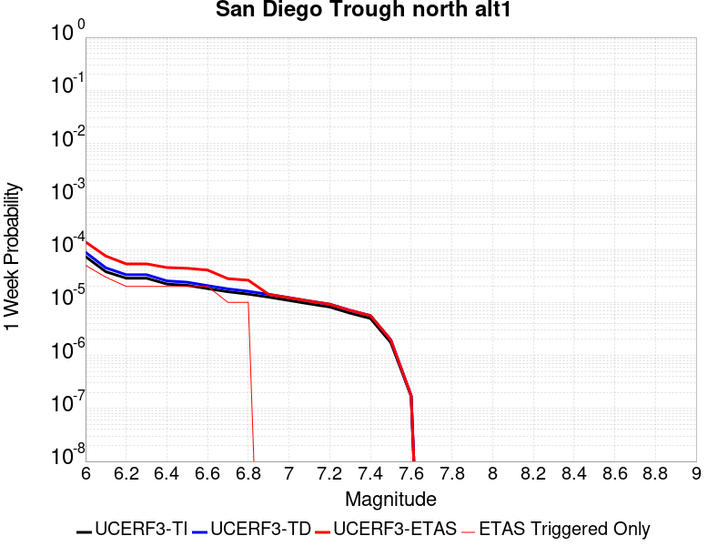 |  |  |  |

| Magnitude | 1 wk TI Prob | 1 wk TD Prob | 1 wk ETAS Prob | 1 wk ETAS/TD Gain | 1 wk ETAS Triggered Only | 1 mo TI Prob | 1 mo TD Prob | 1 mo ETAS Prob | 1 mo ETAS/TD Gain | 1 mo ETAS Triggered Only | 1 yr TI Prob | 1 yr TD Prob | 1 yr ETAS Prob | 1 yr ETAS/TD Gain | 1 yr ETAS Triggered Only | 10 yr TI Prob | 10 yr TD Prob | 10 yr ETAS Prob | 10 yr ETAS/TD Gain | 10 yr ETAS Triggered Only |
|-----|-----|-----|-----|-----|-----|-----|-----|-----|-----|-----|-----|-----|-----|-----|-----|-----|-----|-----|-----|-----|
| 6.0 | 7.329252E-5 | 8.821269E-5 | 1.2079532E-4 | 1.3693643 | 3.2585496E-5 | 3.14073E-4 | 3.7800326E-4 | 4.1057644E-4 | 1.0861717 | 3.2585496E-5 | 0.0038171355 | 0.0045930487 | 0.0046254843 | 1.007062 | 3.2585496E-5 | 0.03752231 | 0.045045137 | 0.04509181 | 1.0010362 | 4.8878243E-5 |
| 6.1 | 3.7940346E-5 | 4.4884906E-5 | 6.117692E-5 | 1.3629732 | 1.6292748E-5 | 1.6259136E-4 | 1.9235026E-4 | 2.0863987E-4 | 1.0846872 | 1.6292748E-5 | 0.0019777524 | 0.002339431 | 0.0023556857 | 1.0069481 | 1.6292748E-5 | 0.019602431 | 0.023156732 | 0.023188563 | 1.0013746 | 3.2585496E-5 |
| 6.2 | 2.8645263E-5 | 3.329672E-5 | 4.9588925E-5 | 1.4893036 | 1.6292748E-5 | 1.2275964E-4 | 1.4269259E-4 | 1.58983E-4 | 1.1141645 | 1.6292748E-5 | 0.0014935739 | 0.0017359206 | 0.001752185 | 1.0093694 | 1.6292748E-5 | 0.0148357535 | 0.017226268 | 0.01725829 | 1.0018591 | 3.2585496E-5 |
| 6.3 | 2.8645263E-5 | 3.329672E-5 | 4.9588925E-5 | 1.4893036 | 1.6292748E-5 | 1.2275964E-4 | 1.4269259E-4 | 1.58983E-4 | 1.1141645 | 1.6292748E-5 | 0.0014935739 | 0.0017359206 | 0.001752185 | 1.0093694 | 1.6292748E-5 | 0.0148357535 | 0.017226268 | 0.01725829 | 1.0018591 | 3.2585496E-5 |
| 6.4 | 2.2204576E-5 | 2.544832E-5 | 4.174065E-5 | 1.6402125 | 1.6292748E-5 | 9.5159E-5 | 1.0905972E-4 | 1.2535069E-4 | 1.1493766 | 1.6292748E-5 | 0.001157945 | 0.0013270028 | 0.0013432739 | 1.0122615 | 1.6292748E-5 | 0.011519298 | 0.013191959 | 0.013224115 | 1.0024375 | 3.2585496E-5 |
| 6.5 | 2.1004838E-5 | 2.4024695E-5 | 4.0317052E-5 | 1.6781504 | 1.6292748E-5 | 9.0017624E-5 | 1.0295897E-4 | 1.1925004E-4 | 1.1582288 | 1.6292748E-5 | 0.0010954136 | 0.0012528135 | 0.0012690858 | 1.0129887 | 1.6292748E-5 | 0.010900296 | 0.012458592 | 0.012490771 | 1.0025829 | 3.2585496E-5 |
| 6.6 | 1.820557E-5 | 2.070479E-5 | 3.69972E-5 | 1.7868909 | 1.6292748E-5 | 7.802154E-5 | 8.8731824E-5 | 1.0502313E-4 | 1.1836016 | 1.6292748E-5 | 9.4949827E-4 | 0.0010797799 | 0.0010960551 | 1.0150727 | 1.6292748E-5 | 0.009454516 | 0.010746005 | 0.010762123 | 1.0014999 | 1.6292748E-5 |
| 6.7 | 1.5884485E-5 | 1.7983646E-5 | 3.42761E-5 | 1.9059595 | 1.6292748E-5 | 6.807459E-5 | 7.707051E-5 | 9.3362E-5 | 1.2113843 | 1.6292748E-5 | 8.284929E-4 | 9.3793223E-4 | 9.542097E-4 | 1.0173546 | 1.6292748E-5 | 0.008254109 | 0.009340104 | 0.009356244 | 1.001728 | 1.6292748E-5 |
| 6.8 | 1.4331171E-5 | 1.6201066E-5 | 3.249355E-5 | 2.005643 | 1.6292748E-5 | 6.141786E-5 | 6.94313E-5 | 8.572292E-5 | 1.2346437 | 1.6292748E-5 | 7.4750587E-4 | 8.450002E-4 | 8.612792E-4 | 1.019265 | 1.6292748E-5 | 0.0074499645 | 0.008418139 | 0.008434295 | 1.0019192 | 1.6292748E-5 |
| 6.9 | 1.2574203E-5 | 1.4205835E-5 | 1.4205835E-5 | 1.0 | 0.0 | 5.3888325E-5 | 6.0880735E-5 | 6.0880735E-5 | 1.0 | 0.0 | 6.558929E-4 | 7.409723E-4 | 7.409723E-4 | 1.0 | 0.0 | 0.0065396037 | 0.007385203 | 0.007385203 | 1.0 | 0.0 |
| 7.0 | 1.0883844E-5 | 1.2289262E-5 | 1.2289262E-5 | 1.0 | 0.0 | 4.664421E-5 | 5.2667205E-5 | 5.2667205E-5 | 1.0 | 0.0 | 5.677453E-4 | 6.4103556E-4 | 6.4103556E-4 | 1.0 | 0.0 | 0.00566297 | 0.006391993 | 0.006391993 | 1.0 | 0.0 |
| 7.1 | 9.393088E-6 | 1.060702E-5 | 1.060702E-5 | 1.0 | 0.0 | 4.025547E-5 | 4.545787E-5 | 4.545787E-5 | 1.0 | 0.0 | 4.900001E-4 | 5.533098E-4 | 5.533098E-4 | 1.0 | 0.0 | 0.0048892107 | 0.005519418 | 0.005519418 | 1.0 | 0.0 |
| 7.2 | 8.190791E-6 | 9.258625E-6 | 9.258625E-6 | 1.0 | 0.0 | 3.510292E-5 | 3.9679224E-5 | 3.9679224E-5 | 1.0 | 0.0 | 4.2729423E-4 | 4.8298817E-4 | 4.8298817E-4 | 1.0 | 0.0 | 0.0042647356 | 0.004819465 | 0.004819465 | 1.0 | 0.0 |
| 7.3 | 6.268162E-6 | 7.089716E-6 | 7.089716E-6 | 1.0 | 0.0 | 2.6863276E-5 | 3.0384144E-5 | 3.0384144E-5 | 1.0 | 0.0 | 3.2701128E-4 | 3.6986457E-4 | 3.6986457E-4 | 1.0 | 0.0 | 0.003265305 | 0.003692536 | 0.003692536 | 1.0 | 0.0 |
| 7.4 | 4.985186E-6 | 5.6426816E-6 | 5.6426816E-6 | 1.0 | 0.0 | 2.1364907E-5 | 2.4182698E-5 | 2.4182698E-5 | 1.0 | 0.0 | 2.600867E-4 | 2.9438498E-4 | 2.9438498E-4 | 1.0 | 0.0 | 0.002597825 | 0.0029399914 | 0.0029399914 | 1.0 | 0.0 |
| 7.5 | 1.7489613E-6 | 1.969678E-6 | 1.969678E-6 | 1.0 | 0.0 | 7.495527E-6 | 8.4414505E-6 | 8.4414505E-6 | 1.0 | 0.0 | 9.125422E-5 | 1.02770035E-4 | 1.02770035E-4 | 1.0 | 0.0 | 9.1216754E-4 | 0.0010272472 | 0.0010272472 | 1.0 | 0.0 |
| 7.6 | 1.6988751E-7 | 1.7533823E-7 | 1.7533823E-7 | 1.0 | 0.0 | 7.2808916E-7 | 7.5144936E-7 | 7.5144936E-7 | 1.0 | 0.0 | 8.864449E-6 | 9.14886E-6 | 9.14886E-6 | 1.0 | 0.0 | 8.8640954E-5 | 9.1485024E-5 | 9.1485024E-5 | 1.0 | 0.0 |

## Kern Canyon (Lake Isabella) 2011
*[(top)](#table-of-contents)*

| 1 Week | 1 Month | 1 Year | 10 Year |
|-----|-----|-----|-----|
|  |  |  |  |

| Magnitude | 1 wk TI Prob | 1 wk TD Prob | 1 wk ETAS Prob | 1 wk ETAS/TD Gain | 1 wk ETAS Triggered Only | 1 mo TI Prob | 1 mo TD Prob | 1 mo ETAS Prob | 1 mo ETAS/TD Gain | 1 mo ETAS Triggered Only | 1 yr TI Prob | 1 yr TD Prob | 1 yr ETAS Prob | 1 yr ETAS/TD Gain | 1 yr ETAS Triggered Only | 10 yr TI Prob | 10 yr TD Prob | 10 yr ETAS Prob | 10 yr ETAS/TD Gain | 10 yr ETAS Triggered Only |
|-----|-----|-----|-----|-----|-----|-----|-----|-----|-----|-----|-----|-----|-----|-----|-----|-----|-----|-----|-----|-----|
| 6.0 | 4.2387383E-6 | 4.0016344E-6 | 4.0016344E-6 | 1.0 | 0.0 | 1.8165894E-5 | 1.7149758E-5 | 3.3442226E-5 | 1.9500116 | 1.6292748E-5 | 2.2114732E-4 | 2.0878017E-4 | 2.2506951E-4 | 1.0780215 | 1.6292748E-5 | 0.0022092736 | 0.002086024 | 0.0021348004 | 1.0233824 | 4.8878243E-5 |
| 6.1 | 4.2387383E-6 | 4.0016344E-6 | 4.0016344E-6 | 1.0 | 0.0 | 1.8165894E-5 | 1.7149758E-5 | 3.3442226E-5 | 1.9500116 | 1.6292748E-5 | 2.2114732E-4 | 2.0878017E-4 | 2.2506951E-4 | 1.0780215 | 1.6292748E-5 | 0.0022092736 | 0.002086024 | 0.0021348004 | 1.0233824 | 4.8878243E-5 |
| 6.2 | 4.2387383E-6 | 4.0016344E-6 | 4.0016344E-6 | 1.0 | 0.0 | 1.8165894E-5 | 1.7149758E-5 | 3.3442226E-5 | 1.9500116 | 1.6292748E-5 | 2.2114732E-4 | 2.0878017E-4 | 2.2506951E-4 | 1.0780215 | 1.6292748E-5 | 0.0022092736 | 0.002086024 | 0.0021348004 | 1.0233824 | 4.8878243E-5 |
| 6.3 | 4.2387383E-6 | 4.0016344E-6 | 4.0016344E-6 | 1.0 | 0.0 | 1.8165894E-5 | 1.7149758E-5 | 3.3442226E-5 | 1.9500116 | 1.6292748E-5 | 2.2114732E-4 | 2.0878017E-4 | 2.2506951E-4 | 1.0780215 | 1.6292748E-5 | 0.0022092736 | 0.002086024 | 0.0021348004 | 1.0233824 | 4.8878243E-5 |
| 6.4 | 4.2387383E-6 | 4.0016344E-6 | 4.0016344E-6 | 1.0 | 0.0 | 1.8165894E-5 | 1.7149758E-5 | 3.3442226E-5 | 1.9500116 | 1.6292748E-5 | 2.2114732E-4 | 2.0878017E-4 | 2.2506951E-4 | 1.0780215 | 1.6292748E-5 | 0.0022092736 | 0.002086024 | 0.0021348004 | 1.0233824 | 4.8878243E-5 |
| 6.5 | 2.7857532E-6 | 2.5178624E-6 | 2.5178624E-6 | 1.0 | 0.0 | 1.1938888E-5 | 1.0790796E-5 | 2.7083368E-5 | 2.5098584 | 1.6292748E-5 | 1.4534626E-4 | 1.3137035E-4 | 1.4766096E-4 | 1.1240052 | 1.6292748E-5 | 0.0014525123 | 0.0013129596 | 0.0013455023 | 1.0247858 | 3.2585496E-5 |
| 6.6 | 2.2233348E-6 | 1.944119E-6 | 1.944119E-6 | 1.0 | 0.0 | 9.528543E-6 | 8.331913E-6 | 2.4624525E-5 | 2.955447 | 1.6292748E-5 | 1.1600384E-4 | 1.014364E-4 | 1.177275E-4 | 1.160604 | 1.6292748E-5 | 0.001159433 | 0.0010139096 | 0.0010301858 | 1.016053 | 1.6292748E-5 |
| 6.7 | 2.1635126E-6 | 1.8834991E-6 | 1.8834991E-6 | 1.0 | 0.0 | 9.272164E-6 | 8.072114E-6 | 2.436473E-5 | 3.0183828 | 1.6292748E-5 | 1.1288274E-4 | 9.827364E-5 | 1.14564784E-4 | 1.1657733 | 1.6292748E-5 | 0.0011282542 | 9.8231E-4 | 9.985868E-4 | 1.0165699 | 1.6292748E-5 |
| 6.8 | 1.8685711E-6 | 1.583138E-6 | 1.583138E-6 | 1.0 | 0.0 | 8.008137E-6 | 6.7848596E-6 | 2.3077497E-5 | 3.4013226 | 1.6292748E-5 | 9.74947E-5 | 8.2602586E-5 | 9.889399E-5 | 1.1972263 | 1.6292748E-5 | 9.745194E-4 | 8.2572375E-4 | 8.4200304E-4 | 1.0197152 | 1.6292748E-5 |
| 6.9 | 1.5815071E-6 | 1.3064887E-6 | 1.3064887E-6 | 1.0 | 0.0 | 6.77787E-6 | 5.5992255E-6 | 2.1891883E-5 | 3.9098055 | 1.6292748E-5 | 8.251744E-5 | 6.816846E-5 | 8.44601E-5 | 1.2389908 | 1.6292748E-5 | 8.248681E-4 | 6.8147824E-4 | 6.9775985E-4 | 1.0238917 | 1.6292748E-5 |
| 7.0 | 1.3772564E-6 | 1.1210681E-6 | 1.1210681E-6 | 1.0 | 0.0 | 5.9025137E-6 | 4.8045686E-6 | 4.8045686E-6 | 1.0 | 0.0 | 7.186073E-5 | 5.8494075E-5 | 5.8494075E-5 | 1.0 | 0.0 | 7.18375E-4 | 5.8478885E-4 | 5.8478885E-4 | 1.0 | 0.0 |
| 7.1 | 1.0916998E-6 | 8.7637505E-7 | 8.7637505E-7 | 1.0 | 0.0 | 4.678705E-6 | 3.7558877E-6 | 3.7558877E-6 | 1.0 | 0.0 | 5.6961744E-5 | 4.5726985E-5 | 4.5726985E-5 | 1.0 | 0.0 | 5.6947145E-4 | 4.571771E-4 | 4.571771E-4 | 1.0 | 0.0 |
| 7.2 | 7.6277024E-7 | 5.901439E-7 | 5.901439E-7 | 1.0 | 0.0 | 3.2690114E-6 | 2.5291856E-6 | 2.5291856E-6 | 1.0 | 0.0 | 3.9799485E-5 | 3.0792406E-5 | 3.0792406E-5 | 1.0 | 0.0 | 3.9792358E-4 | 3.07882E-4 | 3.07882E-4 | 1.0 | 0.0 |
| 7.3 | 5.3265916E-7 | 4.3824264E-7 | 4.3824264E-7 | 1.0 | 0.0 | 2.282823E-6 | 1.8781814E-6 | 1.8781814E-6 | 1.0 | 0.0 | 2.7793016E-5 | 2.2866623E-5 | 2.2866623E-5 | 1.0 | 0.0 | 2.778954E-4 | 2.2864307E-4 | 2.2864307E-4 | 1.0 | 0.0 |
| 7.4 | 3.4946007E-7 | 3.0065647E-7 | 3.0065647E-7 | 1.0 | 0.0 | 1.497685E-6 | 1.2885271E-6 | 1.2885271E-6 | 1.0 | 0.0 | 1.8234163E-5 | 1.5687707E-5 | 1.5687707E-5 | 1.0 | 0.0 | 1.8232666E-4 | 1.5686621E-4 | 1.5686621E-4 | 1.0 | 0.0 |
| 7.5 | 1.8317026E-7 | 1.4244755E-7 | 1.4244755E-7 | 1.0 | 0.0 | 7.850152E-7 | 6.1048934E-7 | 6.1048934E-7 | 1.0 | 0.0 | 9.557518E-6 | 7.432683E-6 | 7.432683E-6 | 1.0 | 0.0 | 9.5571064E-5 | 7.432442E-5 | 7.432442E-5 | 1.0 | 0.0 |
| 7.6 | 2.572245E-8 | 1.735264E-8 | 1.735264E-8 | 1.0 | 0.0 | 1.10239064E-7 | 7.436845E-8 | 7.436845E-8 | 1.0 | 0.0 | 1.3421597E-6 | 9.0543557E-7 | 9.0543557E-7 | 1.0 | 0.0 | 1.3421517E-5 | 9.054324E-6 | 9.054324E-6 | 1.0 | 0.0 |

## Santa Ynez River
*[(top)](#table-of-contents)*

| 1 Week | 1 Month | 1 Year | 10 Year |
|-----|-----|-----|-----|
|  |  |  |  |

| Magnitude | 1 wk TI Prob | 1 wk TD Prob | 1 wk ETAS Prob | 1 wk ETAS/TD Gain | 1 wk ETAS Triggered Only | 1 mo TI Prob | 1 mo TD Prob | 1 mo ETAS Prob | 1 mo ETAS/TD Gain | 1 mo ETAS Triggered Only | 1 yr TI Prob | 1 yr TD Prob | 1 yr ETAS Prob | 1 yr ETAS/TD Gain | 1 yr ETAS Triggered Only | 10 yr TI Prob | 10 yr TD Prob | 10 yr ETAS Prob | 10 yr ETAS/TD Gain | 10 yr ETAS Triggered Only |
|-----|-----|-----|-----|-----|-----|-----|-----|-----|-----|-----|-----|-----|-----|-----|-----|-----|-----|-----|-----|-----|
| 6.0 | 1.6396456E-5 | 1.7209444E-5 | 1.7209444E-5 | 1.0 | 0.0 | 7.026863E-5 | 7.3752875E-5 | 7.3752875E-5 | 1.0 | 0.0 | 8.551848E-4 | 8.976069E-4 | 8.976069E-4 | 1.0 | 0.0 | 0.0085190125 | 0.008943363 | 0.008975657 | 1.003611 | 3.2585496E-5 |
| 6.1 | 1.6396456E-5 | 1.7209444E-5 | 1.7209444E-5 | 1.0 | 0.0 | 7.026863E-5 | 7.3752875E-5 | 7.3752875E-5 | 1.0 | 0.0 | 8.551848E-4 | 8.976069E-4 | 8.976069E-4 | 1.0 | 0.0 | 0.0085190125 | 0.008943363 | 0.008975657 | 1.003611 | 3.2585496E-5 |
| 6.2 | 1.6396456E-5 | 1.7209444E-5 | 1.7209444E-5 | 1.0 | 0.0 | 7.026863E-5 | 7.3752875E-5 | 7.3752875E-5 | 1.0 | 0.0 | 8.551848E-4 | 8.976069E-4 | 8.976069E-4 | 1.0 | 0.0 | 0.0085190125 | 0.008943363 | 0.008975657 | 1.003611 | 3.2585496E-5 |
| 6.3 | 9.736976E-6 | 1.01223395E-5 | 1.01223395E-5 | 1.0 | 0.0 | 4.172923E-5 | 4.338076E-5 | 4.338076E-5 | 1.0 | 0.0 | 5.0793495E-4 | 5.280378E-4 | 5.280378E-4 | 1.0 | 0.0 | 0.005067755 | 0.0052683367 | 0.0052845436 | 1.0030763 | 1.6292748E-5 |
| 6.4 | 9.736976E-6 | 1.01223395E-5 | 1.01223395E-5 | 1.0 | 0.0 | 4.172923E-5 | 4.338076E-5 | 4.338076E-5 | 1.0 | 0.0 | 5.0793495E-4 | 5.280378E-4 | 5.280378E-4 | 1.0 | 0.0 | 0.005067755 | 0.0052683367 | 0.0052845436 | 1.0030763 | 1.6292748E-5 |
| 6.5 | 7.081964E-6 | 7.329905E-6 | 7.329905E-6 | 1.0 | 0.0 | 3.035092E-5 | 3.141351E-5 | 3.141351E-5 | 1.0 | 0.0 | 3.694598E-4 | 3.8239395E-4 | 3.8239395E-4 | 1.0 | 0.0 | 0.0036884616 | 0.0038175215 | 0.003833752 | 1.0042516 | 1.6292748E-5 |
| 6.6 | 5.873247E-6 | 6.0597517E-6 | 6.0597517E-6 | 1.0 | 0.0 | 2.5170815E-5 | 2.5970112E-5 | 2.5970112E-5 | 1.0 | 0.0 | 3.064116E-4 | 3.161411E-4 | 3.161411E-4 | 1.0 | 0.0 | 0.0030598943 | 0.003157001 | 0.0031732423 | 1.0051446 | 1.6292748E-5 |
| 6.7 | 4.973277E-6 | 5.11591E-6 | 5.11591E-6 | 1.0 | 0.0 | 2.1313872E-5 | 2.1925147E-5 | 2.1925147E-5 | 1.0 | 0.0 | 2.5946548E-4 | 2.6690646E-4 | 2.6690646E-4 | 1.0 | 0.0 | 0.0025916274 | 0.0026659078 | 0.002682157 | 1.0060952 | 1.6292748E-5 |
| 6.8 | 4.396492E-6 | 4.510987E-6 | 4.510987E-6 | 1.0 | 0.0 | 1.884197E-5 | 1.933266E-5 | 1.933266E-5 | 1.0 | 0.0 | 2.2937685E-4 | 2.3535005E-4 | 2.3535005E-4 | 1.0 | 0.0 | 0.0022914023 | 0.0023510433 | 0.002367298 | 1.0069137 | 1.6292748E-5 |
| 6.9 | 3.5255632E-6 | 3.6013423E-6 | 3.6013423E-6 | 1.0 | 0.0 | 1.5109469E-5 | 1.5434234E-5 | 1.5434234E-5 | 1.0 | 0.0 | 1.8394225E-4 | 1.8789574E-4 | 1.8789574E-4 | 1.0 | 0.0 | 0.0018379007 | 0.001877385 | 0.0018936471 | 1.0086621 | 1.6292748E-5 |
| 7.0 | 3.211603E-6 | 3.273663E-6 | 3.273663E-6 | 1.0 | 0.0 | 1.376394E-5 | 1.402991E-5 | 1.402991E-5 | 1.0 | 0.0 | 1.6756308E-4 | 1.708009E-4 | 1.708009E-4 | 1.0 | 0.0 | 0.0016743679 | 0.0017067104 | 0.0017229754 | 1.00953 | 1.6292748E-5 |
| 7.1 | 2.5094619E-6 | 2.5409295E-6 | 2.5409295E-6 | 1.0 | 0.0 | 1.0754793E-5 | 1.0889652E-5 | 1.0889652E-5 | 1.0 | 0.0 | 1.3093173E-4 | 1.325735E-4 | 1.325735E-4 | 1.0 | 0.0 | 0.0013085462 | 0.0013249503 | 0.0013412214 | 1.0122806 | 1.6292748E-5 |
| 7.2 | 2.0515774E-6 | 2.0619466E-6 | 2.0619466E-6 | 1.0 | 0.0 | 8.792445E-6 | 8.836884E-6 | 8.836884E-6 | 1.0 | 0.0 | 1.0704277E-4 | 1.0758379E-4 | 1.0758379E-4 | 1.0 | 0.0 | 0.0010699122 | 0.0010753215 | 0.0010915967 | 1.0151352 | 1.6292748E-5 |
| 7.3 | 1.6845745E-6 | 1.6773996E-6 | 1.6773996E-6 | 1.0 | 0.0 | 7.219585E-6 | 7.1888358E-6 | 7.1888358E-6 | 1.0 | 0.0 | 8.78949E-5 | 8.752059E-5 | 8.752059E-5 | 1.0 | 0.0 | 8.7860145E-4 | 8.7486405E-4 | 8.911426E-4 | 1.0186069 | 1.6292748E-5 |
| 7.4 | 1.3600285E-6 | 1.3333447E-6 | 1.3333447E-6 | 1.0 | 0.0 | 5.82868E-6 | 5.714322E-6 | 5.714322E-6 | 1.0 | 0.0 | 7.096187E-5 | 6.956967E-5 | 6.956967E-5 | 1.0 | 0.0 | 7.0939213E-4 | 6.9548114E-4 | 7.117626E-4 | 1.0234103 | 1.6292748E-5 |
| 7.5 | 9.735342E-7 | 9.2901894E-7 | 9.2901894E-7 | 1.0 | 0.0 | 4.172283E-6 | 3.9815036E-6 | 3.9815036E-6 | 1.0 | 0.0 | 5.079636E-5 | 4.8473747E-5 | 4.8473747E-5 | 1.0 | 0.0 | 5.0784746E-4 | 4.8463346E-4 | 4.8463346E-4 | 1.0 | 0.0 |
| 7.6 | 5.067187E-7 | 4.778609E-7 | 4.778609E-7 | 1.0 | 0.0 | 2.1716498E-6 | 2.0479738E-6 | 2.0479738E-6 | 1.0 | 0.0 | 2.6439517E-5 | 2.4933803E-5 | 2.4933803E-5 | 1.0 | 0.0 | 2.643637E-4 | 2.493108E-4 | 2.493108E-4 | 1.0 | 0.0 |
| 7.7 | 2.769089E-7 | 2.5759346E-7 | 2.5759346E-7 | 1.0 | 0.0 | 1.1867519E-6 | 1.1039714E-6 | 1.1039714E-6 | 1.0 | 0.0 | 1.4448608E-5 | 1.344077E-5 | 1.344077E-5 | 1.0 | 0.0 | 1.444767E-4 | 1.343996E-4 | 1.343996E-4 | 1.0 | 0.0 |
| 7.8 | 1.7044663E-7 | 1.5449208E-7 | 1.5449208E-7 | 1.0 | 0.0 | 7.3048534E-7 | 6.6210873E-7 | 6.6210873E-7 | 1.0 | 0.0 | 8.893623E-6 | 8.061144E-6 | 8.061144E-6 | 1.0 | 0.0 | 8.893267E-5 | 8.060854E-5 | 8.060854E-5 | 1.0 | 0.0 |
| 7.9 | 4.8344287E-8 | 4.0911143E-8 | 4.0911143E-8 | 1.0 | 0.0 | 2.0718979E-7 | 1.7533345E-7 | 1.7533345E-7 | 1.0 | 0.0 | 2.5225327E-6 | 2.1346827E-6 | 2.1346827E-6 | 1.0 | 0.0 | 2.5225041E-5 | 2.1346626E-5 | 2.1346626E-5 | 1.0 | 0.0 |

## Johnson Valley (No) 2011 rev
*[(top)](#table-of-contents)*

| 1 Week | 1 Month | 1 Year | 10 Year |
|-----|-----|-----|-----|
|  | 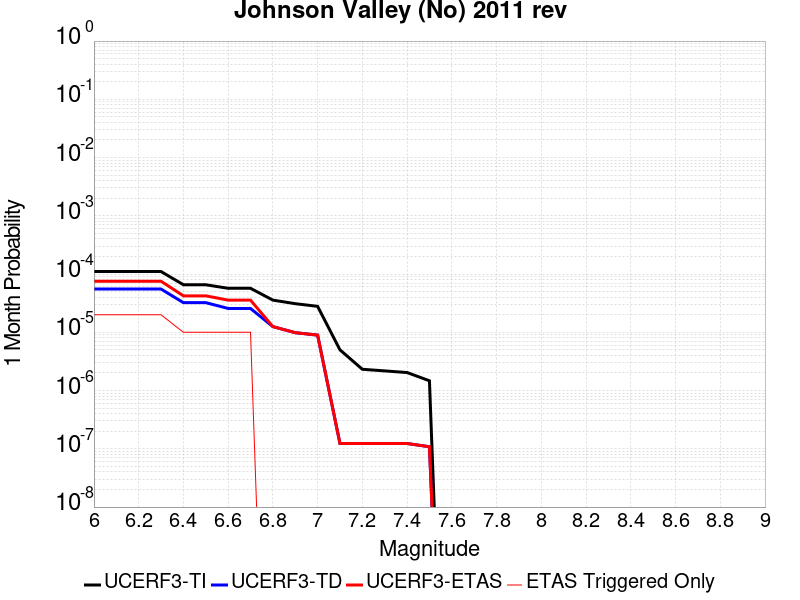 |  |  |

| Magnitude | 1 wk TI Prob | 1 wk TD Prob | 1 wk ETAS Prob | 1 wk ETAS/TD Gain | 1 wk ETAS Triggered Only | 1 mo TI Prob | 1 mo TD Prob | 1 mo ETAS Prob | 1 mo ETAS/TD Gain | 1 mo ETAS Triggered Only | 1 yr TI Prob | 1 yr TD Prob | 1 yr ETAS Prob | 1 yr ETAS/TD Gain | 1 yr ETAS Triggered Only | 10 yr TI Prob | 10 yr TD Prob | 10 yr ETAS Prob | 10 yr ETAS/TD Gain | 10 yr ETAS Triggered Only |
|-----|-----|-----|-----|-----|-----|-----|-----|-----|-----|-----|-----|-----|-----|-----|-----|-----|-----|-----|-----|-----|
| 6.0 | 2.577707E-5 | 1.2901208E-5 | 2.9193745E-5 | 2.2628691 | 1.6292748E-5 | 1.1046848E-4 | 5.528994E-5 | 8.787363E-5 | 1.5893241 | 3.2585496E-5 | 0.0013441239 | 6.729868E-4 | 7.0555037E-4 | 1.0483867 | 3.2585496E-5 | 0.013360229 | 0.006713397 | 0.006761947 | 1.0072318 | 4.8878243E-5 |
| 6.1 | 2.577707E-5 | 1.2901208E-5 | 2.9193745E-5 | 2.2628691 | 1.6292748E-5 | 1.1046848E-4 | 5.528994E-5 | 8.787363E-5 | 1.5893241 | 3.2585496E-5 | 0.0013441239 | 6.729868E-4 | 7.0555037E-4 | 1.0483867 | 3.2585496E-5 | 0.013360229 | 0.006713397 | 0.006761947 | 1.0072318 | 4.8878243E-5 |
| 6.2 | 2.577707E-5 | 1.2901208E-5 | 2.9193745E-5 | 2.2628691 | 1.6292748E-5 | 1.1046848E-4 | 5.528994E-5 | 8.787363E-5 | 1.5893241 | 3.2585496E-5 | 0.0013441239 | 6.729868E-4 | 7.0555037E-4 | 1.0483867 | 3.2585496E-5 | 0.013360229 | 0.006713397 | 0.006761947 | 1.0072318 | 4.8878243E-5 |
| 6.3 | 2.577707E-5 | 1.2901208E-5 | 2.9193745E-5 | 2.2628691 | 1.6292748E-5 | 1.1046848E-4 | 5.528994E-5 | 8.787363E-5 | 1.5893241 | 3.2585496E-5 | 0.0013441239 | 6.729868E-4 | 7.0555037E-4 | 1.0483867 | 3.2585496E-5 | 0.013360229 | 0.006713397 | 0.006761947 | 1.0072318 | 4.8878243E-5 |
| 6.4 | 1.5296591E-5 | 7.5369735E-6 | 2.3829598E-5 | 3.1616933 | 1.6292748E-5 | 6.555518E-5 | 3.230102E-5 | 4.8593243E-5 | 1.5043873 | 1.6292748E-5 | 7.97842E-4 | 3.9321271E-4 | 4.0949904E-4 | 1.0414187 | 1.6292748E-5 | 0.007949836 | 0.003927011 | 0.00394324 | 1.0041326 | 1.6292748E-5 |
| 6.5 | 1.5296591E-5 | 7.5369735E-6 | 2.3829598E-5 | 3.1616933 | 1.6292748E-5 | 6.555518E-5 | 3.230102E-5 | 4.8593243E-5 | 1.5043873 | 1.6292748E-5 | 7.97842E-4 | 3.9321271E-4 | 4.0949904E-4 | 1.0414187 | 1.6292748E-5 | 0.007949836 | 0.003927011 | 0.00394324 | 1.0041326 | 1.6292748E-5 |
| 6.6 | 1.3289383E-5 | 5.9919316E-6 | 2.2284583E-5 | 3.719098 | 1.6292748E-5 | 5.6953253E-5 | 2.567955E-5 | 4.1971878E-5 | 1.6344476 | 1.6292748E-5 | 6.9318525E-4 | 3.1262063E-4 | 3.289083E-4 | 1.0521004 | 1.6292748E-5 | 0.0069102696 | 0.0031234731 | 0.003139715 | 1.0051999 | 1.6292748E-5 |
| 6.7 | 1.3289383E-5 | 5.9919316E-6 | 2.2284583E-5 | 3.719098 | 1.6292748E-5 | 5.6953253E-5 | 2.567955E-5 | 4.1971878E-5 | 1.6344476 | 1.6292748E-5 | 6.9318525E-4 | 3.1262063E-4 | 3.289083E-4 | 1.0521004 | 1.6292748E-5 | 0.0069102696 | 0.0031234731 | 0.003139715 | 1.0051999 | 1.6292748E-5 |
| 6.8 | 8.330789E-6 | 2.9214577E-6 | 2.9214577E-6 | 1.0 | 0.0 | 3.570289E-5 | 1.2520505E-5 | 1.2520505E-5 | 1.0 | 0.0 | 4.34596E-4 | 1.524322E-4 | 1.524322E-4 | 1.0 | 0.0 | 0.0043374705 | 0.0015238364 | 0.0015238364 | 1.0 | 0.0 |
| 6.9 | 7.2359003E-6 | 2.3014702E-6 | 2.3014702E-6 | 1.0 | 0.0 | 3.1010633E-5 | 9.863436E-6 | 9.863436E-6 | 1.0 | 0.0 | 3.7748902E-4 | 1.2008605E-4 | 1.2008605E-4 | 1.0 | 0.0 | 0.0037684843 | 0.0012007345 | 0.0012007345 | 1.0 | 0.0 |
| 7.0 | 6.5149957E-6 | 2.0886398E-6 | 2.0886398E-6 | 1.0 | 0.0 | 2.792111E-5 | 8.951313E-6 | 8.951313E-6 | 1.0 | 0.0 | 3.398865E-4 | 1.0898209E-4 | 1.0898209E-4 | 1.0 | 0.0 | 0.003393671 | 0.0010898062 | 0.0010898062 | 1.0 | 0.0 |
| 7.1 | 1.1662233E-6 | 2.8793124E-8 | 2.8793124E-8 | 1.0 | 0.0 | 4.9980904E-6 | 1.2339909E-7 | 1.2339909E-7 | 1.0 | 0.0 | 6.0850052E-5 | 1.5023832E-6 | 1.5023832E-6 | 1.0 | 0.0 | 6.083339E-4 | 1.5023746E-5 | 1.5023746E-5 | 1.0 | 0.0 |
| 7.2 | 5.413881E-7 | 2.8793124E-8 | 2.8793124E-8 | 1.0 | 0.0 | 2.3202326E-6 | 1.2339909E-7 | 1.2339909E-7 | 1.0 | 0.0 | 2.8248465E-5 | 1.5023832E-6 | 1.5023832E-6 | 1.0 | 0.0 | 2.8244875E-4 | 1.5023746E-5 | 1.5023746E-5 | 1.0 | 0.0 |
| 7.3 | 5.076821E-7 | 2.8793124E-8 | 2.8793124E-8 | 1.0 | 0.0 | 2.1757785E-6 | 1.2339909E-7 | 1.2339909E-7 | 1.0 | 0.0 | 2.648978E-5 | 1.5023832E-6 | 1.5023832E-6 | 1.0 | 0.0 | 2.6486625E-4 | 1.5023746E-5 | 1.5023746E-5 | 1.0 | 0.0 |
| 7.4 | 4.7568687E-7 | 2.8775073E-8 | 2.8775073E-8 | 1.0 | 0.0 | 2.0386565E-6 | 1.2332174E-7 | 1.2332174E-7 | 1.0 | 0.0 | 2.482036E-5 | 1.5014413E-6 | 1.5014413E-6 | 1.0 | 0.0 | 2.4817587E-4 | 1.5014328E-5 | 1.5014328E-5 | 1.0 | 0.0 |
| 7.5 | 3.435626E-7 | 2.5350424E-8 | 2.5350424E-8 | 1.0 | 0.0 | 1.4724103E-6 | 1.0864467E-7 | 1.0864467E-7 | 1.0 | 0.0 | 1.7926448E-5 | 1.3227482E-6 | 1.3227482E-6 | 1.0 | 0.0 | 1.7925001E-4 | 1.3227419E-5 | 1.3227419E-5 | 1.0 | 0.0 |

## Los Osos 2011
*[(top)](#table-of-contents)*

| 1 Week | 1 Month | 1 Year | 10 Year |
|-----|-----|-----|-----|
|  |  |  |  |

| Magnitude | 1 wk TI Prob | 1 wk TD Prob | 1 wk ETAS Prob | 1 wk ETAS/TD Gain | 1 wk ETAS Triggered Only | 1 mo TI Prob | 1 mo TD Prob | 1 mo ETAS Prob | 1 mo ETAS/TD Gain | 1 mo ETAS Triggered Only | 1 yr TI Prob | 1 yr TD Prob | 1 yr ETAS Prob | 1 yr ETAS/TD Gain | 1 yr ETAS Triggered Only | 10 yr TI Prob | 10 yr TD Prob | 10 yr ETAS Prob | 10 yr ETAS/TD Gain | 10 yr ETAS Triggered Only |
|-----|-----|-----|-----|-----|-----|-----|-----|-----|-----|-----|-----|-----|-----|-----|-----|-----|-----|-----|-----|-----|
| 6.0 | 4.8871775E-6 | 4.9814826E-6 | 4.9814826E-6 | 1.0 | 0.0 | 2.0944879E-5 | 2.1349053E-5 | 2.1349053E-5 | 1.0 | 0.0 | 2.5497406E-4 | 2.598965E-4 | 2.598965E-4 | 1.0 | 0.0 | 0.002546817 | 0.0025962 | 0.0026449512 | 1.018778 | 4.8878243E-5 |
| 6.1 | 4.8871775E-6 | 4.9814826E-6 | 4.9814826E-6 | 1.0 | 0.0 | 2.0944879E-5 | 2.1349053E-5 | 2.1349053E-5 | 1.0 | 0.0 | 2.5497406E-4 | 2.598965E-4 | 2.598965E-4 | 1.0 | 0.0 | 0.002546817 | 0.0025962 | 0.0026449512 | 1.018778 | 4.8878243E-5 |
| 6.2 | 4.8871775E-6 | 4.9814826E-6 | 4.9814826E-6 | 1.0 | 0.0 | 2.0944879E-5 | 2.1349053E-5 | 2.1349053E-5 | 1.0 | 0.0 | 2.5497406E-4 | 2.598965E-4 | 2.598965E-4 | 1.0 | 0.0 | 0.002546817 | 0.0025962 | 0.0026449512 | 1.018778 | 4.8878243E-5 |
| 6.3 | 4.8871775E-6 | 4.9814826E-6 | 4.9814826E-6 | 1.0 | 0.0 | 2.0944879E-5 | 2.1349053E-5 | 2.1349053E-5 | 1.0 | 0.0 | 2.5497406E-4 | 2.598965E-4 | 2.598965E-4 | 1.0 | 0.0 | 0.002546817 | 0.0025962 | 0.0026449512 | 1.018778 | 4.8878243E-5 |
| 6.4 | 4.8871775E-6 | 4.9814826E-6 | 4.9814826E-6 | 1.0 | 0.0 | 2.0944879E-5 | 2.1349053E-5 | 2.1349053E-5 | 1.0 | 0.0 | 2.5497406E-4 | 2.598965E-4 | 2.598965E-4 | 1.0 | 0.0 | 0.002546817 | 0.0025962 | 0.0026449512 | 1.018778 | 4.8878243E-5 |
| 6.5 | 3.1724062E-6 | 3.2233943E-6 | 3.2233943E-6 | 1.0 | 0.0 | 1.3595956E-5 | 1.3814474E-5 | 1.3814474E-5 | 1.0 | 0.0 | 1.6551818E-4 | 1.6817838E-4 | 1.6817838E-4 | 1.0 | 0.0 | 0.0016539496 | 0.0016805246 | 0.0017130553 | 1.0193574 | 3.2585496E-5 |
| 6.6 | 3.1022591E-6 | 3.1511038E-6 | 3.1511038E-6 | 1.0 | 0.0 | 1.3295328E-5 | 1.3504661E-5 | 1.3504661E-5 | 1.0 | 0.0 | 1.618586E-4 | 1.6440697E-4 | 1.6440697E-4 | 1.0 | 0.0 | 0.0016174077 | 0.0016428662 | 0.0016753982 | 1.019802 | 3.2585496E-5 |
| 6.7 | 2.611518E-6 | 2.6491825E-6 | 2.6491825E-6 | 1.0 | 0.0 | 1.1192172E-5 | 1.1353591E-5 | 1.1353591E-5 | 1.0 | 0.0 | 1.3625617E-4 | 1.3822124E-4 | 1.3822124E-4 | 1.0 | 0.0 | 0.0013617266 | 0.0013813572 | 0.0014138977 | 1.023557 | 3.2585496E-5 |
| 6.8 | 2.4780884E-6 | 2.5121587E-6 | 2.5121587E-6 | 1.0 | 0.0 | 1.0620336E-5 | 1.076635E-5 | 1.076635E-5 | 1.0 | 0.0 | 1.2929492E-4 | 1.3107246E-4 | 1.3107246E-4 | 1.0 | 0.0 | 0.0012921972 | 0.0013099556 | 0.0013424985 | 1.0248427 | 3.2585496E-5 |
| 6.9 | 2.1376322E-6 | 2.1635049E-6 | 2.1635049E-6 | 1.0 | 0.0 | 9.161248E-6 | 9.272131E-6 | 9.272131E-6 | 1.0 | 0.0 | 1.1153249E-4 | 1.1288237E-4 | 1.1288237E-4 | 1.0 | 0.0 | 0.0011147653 | 0.0011282521 | 0.0011608009 | 1.0288488 | 3.2585496E-5 |
| 7.0 | 1.9282882E-6 | 1.949458E-6 | 1.949458E-6 | 1.0 | 0.0 | 8.264066E-6 | 8.354793E-6 | 8.354793E-6 | 1.0 | 0.0 | 1.0061036E-4 | 1.0171487E-4 | 1.0171487E-4 | 1.0 | 0.0 | 0.0010056482 | 0.0010166845 | 0.0010492369 | 1.0320182 | 3.2585496E-5 |
| 7.1 | 1.6353226E-6 | 1.6501111E-6 | 1.6501111E-6 | 1.0 | 0.0 | 7.0085066E-6 | 7.0718856E-6 | 7.0718856E-6 | 1.0 | 0.0 | 8.532523E-5 | 8.6096814E-5 | 8.6096814E-5 | 1.0 | 0.0 | 8.529247E-4 | 8.6063537E-4 | 8.7691407E-4 | 1.0189148 | 1.6292748E-5 |
| 7.2 | 1.4446276E-6 | 1.4553335E-6 | 1.4553335E-6 | 1.0 | 0.0 | 6.191247E-6 | 6.2371287E-6 | 6.2371287E-6 | 1.0 | 0.0 | 7.537582E-5 | 7.59344E-5 | 7.59344E-5 | 1.0 | 0.0 | 7.535026E-4 | 7.590851E-4 | 7.753655E-4 | 1.0214474 | 1.6292748E-5 |
| 7.3 | 1.2014582E-6 | 1.2069066E-6 | 1.2069066E-6 | 1.0 | 0.0 | 5.149096E-6 | 5.172447E-6 | 5.172447E-6 | 1.0 | 0.0 | 6.268844E-5 | 6.297272E-5 | 6.297272E-5 | 1.0 | 0.0 | 6.267076E-4 | 6.295492E-4 | 6.458317E-4 | 1.0258638 | 1.6292748E-5 |
| 7.4 | 9.707733E-7 | 9.709767E-7 | 9.709767E-7 | 1.0 | 0.0 | 4.16045E-6 | 4.161322E-6 | 4.161322E-6 | 1.0 | 0.0 | 5.0652303E-5 | 5.066292E-5 | 5.066292E-5 | 1.0 | 0.0 | 5.064076E-4 | 5.065139E-4 | 5.2279845E-4 | 1.0321501 | 1.6292748E-5 |
| 7.5 | 7.174908E-7 | 7.114907E-7 | 7.114907E-7 | 1.0 | 0.0 | 3.074957E-6 | 3.0492424E-6 | 3.0492424E-6 | 1.0 | 0.0 | 3.743696E-5 | 3.7123897E-5 | 3.7123897E-5 | 1.0 | 0.0 | 3.7430652E-4 | 3.7117713E-4 | 3.7117713E-4 | 1.0 | 0.0 |
| 7.6 | 4.5535776E-7 | 4.4207857E-7 | 4.4207857E-7 | 1.0 | 0.0 | 1.9515319E-6 | 1.8946212E-6 | 1.8946212E-6 | 1.0 | 0.0 | 2.3759641E-5 | 2.3066768E-5 | 2.3066768E-5 | 1.0 | 0.0 | 2.37571E-4 | 2.3064384E-4 | 2.3064384E-4 | 1.0 | 0.0 |
| 7.7 | 2.1173553E-7 | 1.9060734E-7 | 1.9060734E-7 | 1.0 | 0.0 | 9.0743765E-7 | 8.1688836E-7 | 8.1688836E-7 | 1.0 | 0.0 | 1.1047998E-5 | 9.94557E-6 | 9.94557E-6 | 1.0 | 0.0 | 1.1047449E-4 | 9.945128E-5 | 9.945128E-5 | 1.0 | 0.0 |
| 7.8 | 9.873608E-8 | 7.367457E-8 | 7.367457E-8 | 1.0 | 0.0 | 4.2315455E-7 | 3.1574814E-7 | 3.1574814E-7 | 1.0 | 0.0 | 5.1518946E-6 | 3.8442267E-6 | 3.8442267E-6 | 1.0 | 0.0 | 5.1517753E-5 | 3.844161E-5 | 3.844161E-5 | 1.0 | 0.0 |
| 7.9 | 5.4399106E-8 | 3.187941E-8 | 3.187941E-8 | 1.0 | 0.0 | 2.33139E-7 | 1.3662603E-7 | 1.3662603E-7 | 1.0 | 0.0 | 2.8384638E-6 | 1.6634207E-6 | 1.6634207E-6 | 1.0 | 0.0 | 2.8384275E-5 | 1.6634083E-5 | 1.6634083E-5 | 1.0 | 0.0 |
| 8.0 | 1.817203E-8 | 8.420079E-9 | 8.420079E-9 | 1.0 | 0.0 | 7.7880124E-8 | 3.6086053E-8 | 3.6086053E-8 | 1.0 | 0.0 | 9.481901E-7 | 4.393476E-7 | 4.393476E-7 | 1.0 | 0.0 | 9.481861E-6 | 4.393468E-6 | 4.393468E-6 | 1.0 | 0.0 |

## Cleghorn
*[(top)](#table-of-contents)*

| 1 Week | 1 Month | 1 Year | 10 Year |
|-----|-----|-----|-----|
|  | 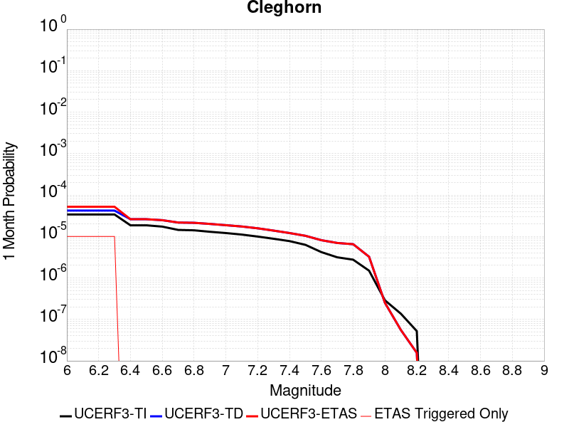 |  |  |

| Magnitude | 1 wk TI Prob | 1 wk TD Prob | 1 wk ETAS Prob | 1 wk ETAS/TD Gain | 1 wk ETAS Triggered Only | 1 mo TI Prob | 1 mo TD Prob | 1 mo ETAS Prob | 1 mo ETAS/TD Gain | 1 mo ETAS Triggered Only | 1 yr TI Prob | 1 yr TD Prob | 1 yr ETAS Prob | 1 yr ETAS/TD Gain | 1 yr ETAS Triggered Only | 10 yr TI Prob | 10 yr TD Prob | 10 yr ETAS Prob | 10 yr ETAS/TD Gain | 10 yr ETAS Triggered Only |
|-----|-----|-----|-----|-----|-----|-----|-----|-----|-----|-----|-----|-----|-----|-----|-----|-----|-----|-----|-----|-----|
| 6.0 | 7.9267165E-6 | 9.831764E-6 | 9.831764E-6 | 1.0 | 0.0 | 3.39712E-5 | 4.2135514E-5 | 5.8427573E-5 | 1.3866587 | 1.6292748E-5 | 4.1352084E-4 | 5.1288976E-4 | 5.454585E-4 | 1.0635005 | 3.2585496E-5 | 0.004127522 | 0.005132214 | 0.005180842 | 1.009475 | 4.8878243E-5 |
| 6.1 | 7.9267165E-6 | 9.831764E-6 | 9.831764E-6 | 1.0 | 0.0 | 3.39712E-5 | 4.2135514E-5 | 5.8427573E-5 | 1.3866587 | 1.6292748E-5 | 4.1352084E-4 | 5.1288976E-4 | 5.454585E-4 | 1.0635005 | 3.2585496E-5 | 0.004127522 | 0.005132214 | 0.005180842 | 1.009475 | 4.8878243E-5 |
| 6.2 | 7.9267165E-6 | 9.831764E-6 | 9.831764E-6 | 1.0 | 0.0 | 3.39712E-5 | 4.2135514E-5 | 5.8427573E-5 | 1.3866587 | 1.6292748E-5 | 4.1352084E-4 | 5.1288976E-4 | 5.454585E-4 | 1.0635005 | 3.2585496E-5 | 0.004127522 | 0.005132214 | 0.005180842 | 1.009475 | 4.8878243E-5 |
| 6.3 | 7.9267165E-6 | 9.831764E-6 | 9.831764E-6 | 1.0 | 0.0 | 3.39712E-5 | 4.2135514E-5 | 5.8427573E-5 | 1.3866587 | 1.6292748E-5 | 4.1352084E-4 | 5.1288976E-4 | 5.454585E-4 | 1.0635005 | 3.2585496E-5 | 0.004127522 | 0.005132214 | 0.005180842 | 1.009475 | 4.8878243E-5 |
| 6.4 | 4.3445207E-6 | 6.0916254E-6 | 6.0916254E-6 | 1.0 | 0.0 | 1.8619241E-5 | 2.6106709E-5 | 2.6106709E-5 | 1.0 | 0.0 | 2.2666567E-4 | 3.1780385E-4 | 3.3409143E-4 | 1.0512503 | 1.6292748E-5 | 0.0022643462 | 0.0031877246 | 0.0032039655 | 1.0050948 | 1.6292748E-5 |
| 6.5 | 4.3445207E-6 | 6.0916254E-6 | 6.0916254E-6 | 1.0 | 0.0 | 1.8619241E-5 | 2.6106709E-5 | 2.6106709E-5 | 1.0 | 0.0 | 2.2666567E-4 | 3.1780385E-4 | 3.3409143E-4 | 1.0512503 | 1.6292748E-5 | 0.0022643462 | 0.0031877246 | 0.0032039655 | 1.0050948 | 1.6292748E-5 |
| 6.6 | 4.040109E-6 | 5.774033E-6 | 5.774033E-6 | 1.0 | 0.0 | 1.7314638E-5 | 2.4745626E-5 | 2.4745626E-5 | 1.0 | 0.0 | 2.1078532E-4 | 3.0123728E-4 | 3.1752512E-4 | 1.0540698 | 1.6292748E-5 | 0.002105855 | 0.0030225143 | 0.003038758 | 1.0053742 | 1.6292748E-5 |
| 6.7 | 3.3632055E-6 | 5.06753E-6 | 5.06753E-6 | 1.0 | 0.0 | 1.4413658E-5 | 2.1717806E-5 | 2.1717806E-5 | 1.0 | 0.0 | 1.7547216E-4 | 2.643825E-4 | 2.8067097E-4 | 1.0616094 | 1.6292748E-5 | 0.0017533366 | 0.0026548486 | 0.002671098 | 1.0061207 | 1.6292748E-5 |
| 6.8 | 3.2902772E-6 | 4.9894375E-6 | 4.9894375E-6 | 1.0 | 0.0 | 1.4101111E-5 | 2.138313E-5 | 2.138313E-5 | 1.0 | 0.0 | 1.716675E-4 | 2.6030882E-4 | 2.7659733E-4 | 1.0625738 | 1.6292748E-5 | 0.0017153495 | 0.0026142076 | 0.0026304577 | 1.006216 | 1.6292748E-5 |
| 6.9 | 3.031547E-6 | 4.6911987E-6 | 4.6911987E-6 | 1.0 | 0.0 | 1.299228E-5 | 2.0104984E-5 | 2.0104984E-5 | 1.0 | 0.0 | 1.5816953E-4 | 2.4475096E-4 | 2.610397E-4 | 1.0665524 | 1.6292748E-5 | 0.00158057 | 0.0024589805 | 0.002475233 | 1.0066096 | 1.6292748E-5 |
| 7.0 | 2.8259715E-6 | 4.3707637E-6 | 4.3707637E-6 | 1.0 | 0.0 | 1.211125E-5 | 1.8731711E-5 | 1.8731711E-5 | 1.0 | 0.0 | 1.4744449E-4 | 2.2803496E-4 | 2.44324E-4 | 1.0714321 | 1.6292748E-5 | 0.001473467 | 0.0022921748 | 0.0023084302 | 1.0070916 | 1.6292748E-5 |
| 7.1 | 2.5962665E-6 | 4.065983E-6 | 4.065983E-6 | 1.0 | 0.0 | 1.1126809E-5 | 1.7425526E-5 | 1.7425526E-5 | 1.0 | 0.0 | 1.3546048E-4 | 2.1213535E-4 | 2.2842463E-4 | 1.0767872 | 1.6292748E-5 | 0.0013537793 | 0.0021334959 | 0.0021497537 | 1.0076203 | 1.6292748E-5 |
| 7.2 | 2.3247253E-6 | 3.6765352E-6 | 3.6765352E-6 | 1.0 | 0.0 | 9.96307E-6 | 1.5756486E-5 | 1.5756486E-5 | 1.0 | 0.0 | 1.21293626E-4 | 1.9181852E-4 | 2.0810813E-4 | 1.0849221 | 1.6292748E-5 | 0.0012122744 | 0.0019307166 | 0.0019469778 | 1.0084224 | 1.6292748E-5 |
| 7.3 | 2.056928E-6 | 3.235253E-6 | 3.235253E-6 | 1.0 | 0.0 | 8.815376E-6 | 1.3865297E-5 | 1.3865297E-5 | 1.0 | 0.0 | 1.0732192E-4 | 1.6879707E-4 | 1.8508708E-4 | 1.0965064 | 1.6292748E-5 | 0.001072701 | 0.0017009423 | 0.0017172074 | 1.0095624 | 1.6292748E-5 |
| 7.4 | 1.8055999E-6 | 2.8256538E-6 | 2.8256538E-6 | 1.0 | 0.0 | 7.738263E-6 | 1.210989E-5 | 1.210989E-5 | 1.0 | 0.0 | 9.4209274E-5 | 1.4742807E-4 | 1.6371842E-4 | 1.1104969 | 1.6292748E-5 | 9.4169343E-4 | 0.0014876705 | 0.0015039389 | 1.0109355 | 1.6292748E-5 |
| 7.5 | 1.4683443E-6 | 2.4248943E-6 | 2.4248943E-6 | 1.0 | 0.0 | 6.292889E-6 | 1.0392363E-5 | 1.0392363E-5 | 1.0 | 0.0 | 7.661323E-5 | 1.2651978E-4 | 1.2651978E-4 | 1.0 | 0.0 | 7.658682E-4 | 0.0012788812 | 0.0012788812 | 1.0 | 0.0 |
| 7.6 | 9.804088E-7 | 1.9004091E-6 | 1.9004091E-6 | 1.0 | 0.0 | 4.201745E-6 | 8.144585E-6 | 8.144585E-6 | 1.0 | 0.0 | 5.1155046E-5 | 9.915586E-5 | 9.915586E-5 | 1.0 | 0.0 | 5.114327E-4 | 0.0010055583 | 0.0010055583 | 1.0 | 0.0 |
| 7.7 | 7.3434086E-7 | 1.6285549E-6 | 1.6285549E-6 | 1.0 | 0.0 | 3.1471714E-6 | 6.9795024E-6 | 6.9795024E-6 | 1.0 | 0.0 | 3.831614E-5 | 8.4972155E-5 | 8.4972155E-5 | 1.0 | 0.0 | 3.8309532E-4 | 8.6387293E-4 | 8.6387293E-4 | 1.0 | 0.0 |
| 7.8 | 6.434184E-7 | 1.5221389E-6 | 1.5221389E-6 | 1.0 | 0.0 | 2.7575045E-6 | 6.523436E-6 | 6.523436E-6 | 1.0 | 0.0 | 3.35721E-5 | 7.9419966E-5 | 7.9419966E-5 | 1.0 | 0.0 | 3.3567028E-4 | 8.080443E-4 | 8.080443E-4 | 1.0 | 0.0 |
| 7.9 | 3.4943926E-7 | 7.5750586E-7 | 7.5750586E-7 | 1.0 | 0.0 | 1.497596E-6 | 3.2464498E-6 | 3.2464498E-6 | 1.0 | 0.0 | 1.8233079E-5 | 3.9524817E-5 | 3.9524817E-5 | 1.0 | 0.0 | 1.8231584E-4 | 4.0401975E-4 | 4.0401975E-4 | 1.0 | 0.0 |
| 8.0 | 6.717524E-8 | 5.837515E-8 | 5.837515E-8 | 1.0 | 0.0 | 2.8789387E-7 | 2.501792E-7 | 2.501792E-7 | 1.0 | 0.0 | 3.505102E-6 | 3.0459275E-6 | 3.0459275E-6 | 1.0 | 0.0 | 3.5050467E-5 | 3.2751934E-5 | 3.2751934E-5 | 1.0 | 0.0 |
| 8.1 | 3.1984914E-8 | 1.2949885E-8 | 1.2949885E-8 | 1.0 | 0.0 | 1.370782E-7 | 5.549951E-8 | 5.549951E-8 | 1.0 | 0.0 | 1.6689258E-6 | 6.757063E-7 | 6.757063E-7 | 1.0 | 0.0 | 1.6689133E-5 | 7.741151E-6 | 7.741151E-6 | 1.0 | 0.0 |
| 8.2 | 1.21887656E-8 | 3.6471115E-9 | 3.6471115E-9 | 1.0 | 0.0 | 5.2237567E-8 | 1.563048E-8 | 1.563048E-8 | 1.0 | 0.0 | 6.359922E-7 | 1.9030107E-7 | 1.9030107E-7 | 1.0 | 0.0 | 6.3599036E-6 | 2.245849E-6 | 2.245849E-6 | 1.0 | 0.0 |

## Santa Cruz Catalina Ridge alt1
*[(top)](#table-of-contents)*

| 1 Week | 1 Month | 1 Year | 10 Year |
|-----|-----|-----|-----|
|  |  |  |  |

| Magnitude | 1 wk TI Prob | 1 wk TD Prob | 1 wk ETAS Prob | 1 wk ETAS/TD Gain | 1 wk ETAS Triggered Only | 1 mo TI Prob | 1 mo TD Prob | 1 mo ETAS Prob | 1 mo ETAS/TD Gain | 1 mo ETAS Triggered Only | 1 yr TI Prob | 1 yr TD Prob | 1 yr ETAS Prob | 1 yr ETAS/TD Gain | 1 yr ETAS Triggered Only | 10 yr TI Prob | 10 yr TD Prob | 10 yr ETAS Prob | 10 yr ETAS/TD Gain | 10 yr ETAS Triggered Only |
|-----|-----|-----|-----|-----|-----|-----|-----|-----|-----|-----|-----|-----|-----|-----|-----|-----|-----|-----|-----|-----|
| 6.0 | 3.2833184E-5 | 3.6558402E-5 | 6.9142705E-5 | 1.8912946 | 3.2585496E-5 | 1.4070606E-4 | 1.5667039E-4 | 1.8925077E-4 | 1.207955 | 3.2585496E-5 | 0.00171175 | 0.0019059594 | 0.0019384829 | 1.0170641 | 3.2585496E-5 | 0.016986247 | 0.018913032 | 0.018960986 | 1.0025355 | 4.8878243E-5 |
| 6.1 | 1.9835548E-5 | 2.1659505E-5 | 5.4244294E-5 | 2.5044107 | 3.2585496E-5 | 8.500672E-5 | 9.282326E-5 | 1.2540573E-4 | 1.3510163 | 3.2585496E-5 | 0.0010344655 | 0.0011295575 | 0.0011621062 | 1.0288154 | 3.2585496E-5 | 0.010296632 | 0.011240296 | 0.011288624 | 1.0042996 | 4.8878243E-5 |
| 6.2 | 1.9835548E-5 | 2.1659505E-5 | 5.4244294E-5 | 2.5044107 | 3.2585496E-5 | 8.500672E-5 | 9.282326E-5 | 1.2540573E-4 | 1.3510163 | 3.2585496E-5 | 0.0010344655 | 0.0011295575 | 0.0011621062 | 1.0288154 | 3.2585496E-5 | 0.010296632 | 0.011240296 | 0.011288624 | 1.0042996 | 4.8878243E-5 |
| 6.3 | 1.5728183E-5 | 1.703395E-5 | 4.961889E-5 | 2.912941 | 3.2585496E-5 | 6.7404755E-5 | 7.300063E-5 | 1.0558375E-4 | 1.4463402 | 3.2585496E-5 | 8.2034385E-4 | 8.884264E-4 | 9.209829E-4 | 1.0366452 | 3.2585496E-5 | 0.008173222 | 0.008849427 | 0.008897873 | 1.0054744 | 4.8878243E-5 |
| 6.4 | 1.5728183E-5 | 1.703395E-5 | 4.961889E-5 | 2.912941 | 3.2585496E-5 | 6.7404755E-5 | 7.300063E-5 | 1.0558375E-4 | 1.4463402 | 3.2585496E-5 | 8.2034385E-4 | 8.884264E-4 | 9.209829E-4 | 1.0366452 | 3.2585496E-5 | 0.008173222 | 0.008849427 | 0.008897873 | 1.0054744 | 4.8878243E-5 |
| 6.5 | 1.3707734E-5 | 1.4794522E-5 | 4.7379537E-5 | 3.2025054 | 3.2585496E-5 | 5.8746107E-5 | 6.3403575E-5 | 9.5987E-5 | 1.5139053 | 3.2585496E-5 | 7.1499916E-4 | 7.716686E-4 | 8.04229E-4 | 1.0421947 | 3.2585496E-5 | 0.0071270303 | 0.0076902895 | 0.007738792 | 1.006307 | 4.8878243E-5 |
| 6.6 | 1.2539813E-5 | 1.3510219E-5 | 4.6095276E-5 | 3.4118822 | 3.2585496E-5 | 5.3740947E-5 | 5.789967E-5 | 9.048328E-5 | 1.5627599 | 3.2585496E-5 | 6.540996E-4 | 7.0470315E-4 | 7.372657E-4 | 1.0462074 | 3.2585496E-5 | 0.0065217763 | 0.0070249885 | 0.0070735235 | 1.0069089 | 4.8878243E-5 |
| 6.7 | 1.1504083E-5 | 1.2377375E-5 | 4.4962468E-5 | 3.6326337 | 3.2585496E-5 | 4.930228E-5 | 5.3044827E-5 | 8.562859E-5 | 1.6142685 | 3.2585496E-5 | 6.0008996E-4 | 6.456314E-4 | 6.7819585E-4 | 1.0504382 | 3.2585496E-5 | 0.005984721 | 0.006437786 | 0.0064863497 | 1.0075436 | 4.8878243E-5 |
| 6.8 | 1.012739E-5 | 1.0877071E-5 | 4.3462212E-5 | 3.9957643 | 3.2585496E-5 | 4.340238E-5 | 4.6615194E-5 | 7.919917E-5 | 1.698999 | 3.2585496E-5 | 5.282958E-4 | 5.673937E-4 | 5.9996074E-4 | 1.0573976 | 3.2585496E-5 | 0.0052704164 | 0.0056596193 | 0.0057082213 | 1.0085875 | 4.8878243E-5 |
| 6.9 | 8.9607865E-6 | 9.609117E-6 | 2.5901709E-5 | 2.6955347 | 1.6292748E-5 | 3.8402806E-5 | 4.1181287E-5 | 5.7473364E-5 | 1.3956184 | 1.6292748E-5 | 4.6745385E-4 | 5.012679E-4 | 5.175525E-4 | 1.0324868 | 1.6292748E-5 | 0.0046647177 | 0.005001492 | 0.0050339145 | 1.0064826 | 3.2585496E-5 |
| 7.0 | 8.046829E-6 | 8.619746E-6 | 2.4912353E-5 | 2.8901494 | 1.6292748E-5 | 3.4485955E-5 | 3.694125E-5 | 5.3233394E-5 | 1.4410286 | 1.6292748E-5 | 4.1978562E-4 | 4.496677E-4 | 4.6595314E-4 | 1.0362166 | 1.6292748E-5 | 0.004189935 | 0.0044876686 | 0.004520108 | 1.0072285 | 3.2585496E-5 |
| 7.1 | 7.136131E-6 | 7.637656E-6 | 7.637656E-6 | 1.0 | 0.0 | 3.0583058E-5 | 3.2732405E-5 | 3.2732405E-5 | 1.0 | 0.0 | 3.7228514E-4 | 3.9844486E-4 | 3.9844486E-4 | 1.0 | 0.0 | 0.0037166206 | 0.003977381 | 0.003993609 | 1.00408 | 1.6292748E-5 |
| 7.2 | 6.362014E-6 | 6.8049585E-6 | 6.8049585E-6 | 1.0 | 0.0 | 2.726549E-5 | 2.9163786E-5 | 2.9163786E-5 | 1.0 | 0.0 | 3.3190678E-4 | 3.550119E-4 | 3.550119E-4 | 1.0 | 0.0 | 0.0033141149 | 0.003544516 | 0.003560751 | 1.0045803 | 1.6292748E-5 |
| 7.3 | 5.004101E-6 | 5.351715E-6 | 5.351715E-6 | 1.0 | 0.0 | 2.1445969E-5 | 2.2935723E-5 | 2.2935723E-5 | 1.0 | 0.0 | 2.6107338E-4 | 2.792072E-4 | 2.792072E-4 | 1.0 | 0.0 | 0.002607669 | 0.0027886187 | 0.0027886187 | 1.0 | 0.0 |
| 7.4 | 3.4901443E-6 | 3.7320526E-6 | 3.7320526E-6 | 1.0 | 0.0 | 1.4957676E-5 | 1.5994416E-5 | 1.5994416E-5 | 1.0 | 0.0 | 1.8209449E-4 | 1.9471499E-4 | 1.9471499E-4 | 1.0 | 0.0 | 0.0018194534 | 0.0019454823 | 0.0019454823 | 1.0 | 0.0 |
| 7.5 | 1.1215045E-6 | 1.189387E-6 | 1.189387E-6 | 1.0 | 0.0 | 4.806439E-6 | 5.097363E-6 | 5.097363E-6 | 1.0 | 0.0 | 5.851682E-5 | 6.205866E-5 | 6.205866E-5 | 1.0 | 0.0 | 5.850142E-4 | 6.2041637E-4 | 6.2041637E-4 | 1.0 | 0.0 |
| 7.6 | 2.8599047E-7 | 2.9951994E-7 | 2.9951994E-7 | 1.0 | 0.0 | 1.2256729E-6 | 1.2836562E-6 | 1.2836562E-6 | 1.0 | 0.0 | 1.4922465E-5 | 1.5628404E-5 | 1.5628404E-5 | 1.0 | 0.0 | 1.4921463E-4 | 1.5627318E-4 | 1.5627318E-4 | 1.0 | 0.0 |
| 7.7 | 2.0781519E-7 | 2.1744323E-7 | 2.1744323E-7 | 1.0 | 0.0 | 8.906362E-7 | 9.3189925E-7 | 9.3189925E-7 | 1.0 | 0.0 | 1.08434415E-5 | 1.13458145E-5 | 1.13458145E-5 | 1.0 | 0.0 | 1.0842913E-4 | 1.1345245E-4 | 1.1345245E-4 | 1.0 | 0.0 |
| 7.8 | 3.614776E-8 | 3.764102E-8 | 3.764102E-8 | 1.0 | 0.0 | 1.5491896E-7 | 1.6131864E-7 | 1.6131864E-7 | 1.0 | 0.0 | 1.8861368E-6 | 1.9640527E-6 | 1.9640527E-6 | 1.0 | 0.0 | 1.8861208E-5 | 1.9640367E-5 | 1.9640367E-5 | 1.0 | 0.0 |

## Hat Creek-McArthur-Mayfield
*[(top)](#table-of-contents)*

| 1 Week | 1 Month | 1 Year | 10 Year |
|-----|-----|-----|-----|
|  |  |  | 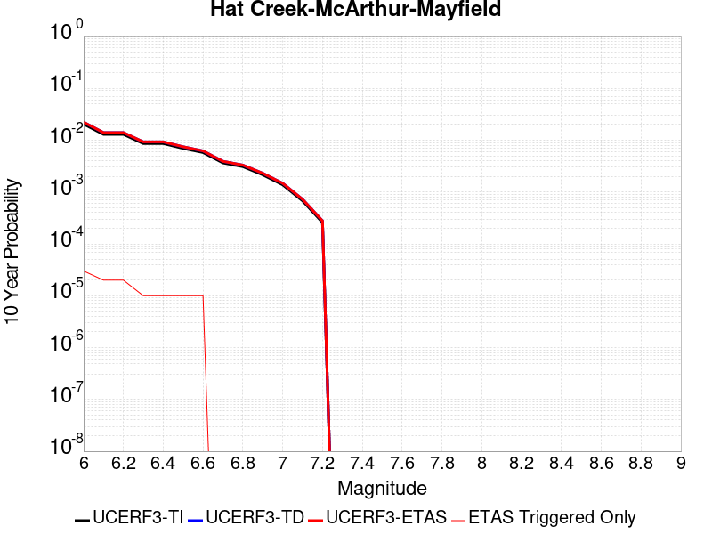 |

| Magnitude | 1 wk TI Prob | 1 wk TD Prob | 1 wk ETAS Prob | 1 wk ETAS/TD Gain | 1 wk ETAS Triggered Only | 1 mo TI Prob | 1 mo TD Prob | 1 mo ETAS Prob | 1 mo ETAS/TD Gain | 1 mo ETAS Triggered Only | 1 yr TI Prob | 1 yr TD Prob | 1 yr ETAS Prob | 1 yr ETAS/TD Gain | 1 yr ETAS Triggered Only | 10 yr TI Prob | 10 yr TD Prob | 10 yr ETAS Prob | 10 yr ETAS/TD Gain | 10 yr ETAS Triggered Only |
|-----|-----|-----|-----|-----|-----|-----|-----|-----|-----|-----|-----|-----|-----|-----|-----|-----|-----|-----|-----|-----|
| 6.0 | 3.967457E-5 | 4.315831E-5 | 4.315831E-5 | 1.0 | 0.0 | 1.7002279E-4 | 1.8495171E-4 | 1.8495171E-4 | 1.0 | 0.0 | 0.002068062 | 0.002249576 | 0.0022658322 | 1.0072263 | 1.6292748E-5 | 0.02048922 | 0.022280399 | 0.022328187 | 1.0021449 | 4.8878243E-5 |
| 6.1 | 2.5044013E-5 | 2.7071164E-5 | 2.7071164E-5 | 1.0 | 0.0 | 1.0732707E-4 | 1.1601429E-4 | 1.1601429E-4 | 1.0 | 0.0 | 0.0013059238 | 0.0014115906 | 0.0014115906 | 1.0 | 0.0 | 0.01298276 | 0.01402966 | 0.014061789 | 1.00229 | 3.2585496E-5 |
| 6.2 | 2.5044013E-5 | 2.7071164E-5 | 2.7071164E-5 | 1.0 | 0.0 | 1.0732707E-4 | 1.1601429E-4 | 1.1601429E-4 | 1.0 | 0.0 | 0.0013059238 | 0.0014115906 | 0.0014115906 | 1.0 | 0.0 | 0.01298276 | 0.01402966 | 0.014061789 | 1.00229 | 3.2585496E-5 |
| 6.3 | 1.6624012E-5 | 1.7891072E-5 | 1.7891072E-5 | 1.0 | 0.0 | 7.124382E-5 | 7.6673816E-5 | 7.6673816E-5 | 1.0 | 0.0 | 8.670483E-4 | 9.331125E-4 | 9.331125E-4 | 1.0 | 0.0 | 0.008636732 | 0.009292879 | 0.009309021 | 1.001737 | 1.6292748E-5 |
| 6.4 | 1.6624012E-5 | 1.7891072E-5 | 1.7891072E-5 | 1.0 | 0.0 | 7.124382E-5 | 7.6673816E-5 | 7.6673816E-5 | 1.0 | 0.0 | 8.670483E-4 | 9.331125E-4 | 9.331125E-4 | 1.0 | 0.0 | 0.008636732 | 0.009292879 | 0.009309021 | 1.001737 | 1.6292748E-5 |
| 6.5 | 1.3394842E-5 | 1.4392137E-5 | 1.4392137E-5 | 1.0 | 0.0 | 5.7405203E-5 | 6.167916E-5 | 6.167916E-5 | 1.0 | 0.0 | 6.986842E-4 | 7.506906E-4 | 7.506906E-4 | 1.0 | 0.0 | 0.006964916 | 0.0074821403 | 0.0074983113 | 1.0021613 | 1.6292748E-5 |
| 6.6 | 1.1137514E-5 | 1.1954546E-5 | 1.1954546E-5 | 1.0 | 0.0 | 4.7731326E-5 | 5.1232782E-5 | 5.1232782E-5 | 1.0 | 0.0 | 5.809739E-4 | 6.2358467E-4 | 6.2358467E-4 | 1.0 | 0.0 | 0.005794574 | 0.00621877 | 0.0062349616 | 1.0026037 | 1.6292748E-5 |
| 6.7 | 7.0200663E-6 | 7.5242897E-6 | 7.5242897E-6 | 1.0 | 0.0 | 3.008565E-5 | 3.2246568E-5 | 3.2246568E-5 | 1.0 | 0.0 | 3.6623122E-4 | 3.925328E-4 | 3.925328E-4 | 1.0 | 0.0 | 0.0036562826 | 0.0039185574 | 0.0039185574 | 1.0 | 0.0 |
| 6.8 | 5.940172E-6 | 6.3654766E-6 | 6.3654766E-6 | 1.0 | 0.0 | 2.545763E-5 | 2.7280335E-5 | 2.7280335E-5 | 1.0 | 0.0 | 3.0990256E-4 | 3.3208873E-4 | 3.3208873E-4 | 1.0 | 0.0 | 0.0030947074 | 0.0033160534 | 0.0033160534 | 1.0 | 0.0 |
| 6.9 | 4.129831E-6 | 4.423547E-6 | 4.423547E-6 | 1.0 | 0.0 | 1.7699154E-5 | 1.8957926E-5 | 1.8957926E-5 | 1.0 | 0.0 | 2.154659E-4 | 2.3078908E-4 | 2.3078908E-4 | 1.0 | 0.0 | 0.002152571 | 0.0023055724 | 0.0023055724 | 1.0 | 0.0 |
| 7.0 | 2.6512955E-6 | 2.8374002E-6 | 2.8374002E-6 | 1.0 | 0.0 | 1.1362646E-5 | 1.2160232E-5 | 1.2160232E-5 | 1.0 | 0.0 | 1.3833142E-4 | 1.480412E-4 | 1.480412E-4 | 1.0 | 0.0 | 0.0013824535 | 0.0014794683 | 0.0014794683 | 1.0 | 0.0 |
| 7.1 | 1.2992575E-6 | 1.3909317E-6 | 1.3909317E-6 | 1.0 | 0.0 | 5.568235E-6 | 5.961124E-6 | 5.961124E-6 | 1.0 | 0.0 | 6.779115E-5 | 7.257448E-5 | 7.257448E-5 | 1.0 | 0.0 | 6.7770475E-4 | 7.2552945E-4 | 7.2552945E-4 | 1.0 | 0.0 |
| 7.2 | 4.968191E-7 | 5.3271475E-7 | 5.3271475E-7 | 1.0 | 0.0 | 2.1292228E-6 | 2.283062E-6 | 2.283062E-6 | 1.0 | 0.0 | 2.592298E-5 | 2.7796052E-5 | 2.7796052E-5 | 1.0 | 0.0 | 2.5919956E-4 | 2.7793812E-4 | 2.7793812E-4 | 1.0 | 0.0 |

## Anacapa-Dume alt 1
*[(top)](#table-of-contents)*

| 1 Week | 1 Month | 1 Year | 10 Year |
|-----|-----|-----|-----|
|  |  |  |  |

| Magnitude | 1 wk TI Prob | 1 wk TD Prob | 1 wk ETAS Prob | 1 wk ETAS/TD Gain | 1 wk ETAS Triggered Only | 1 mo TI Prob | 1 mo TD Prob | 1 mo ETAS Prob | 1 mo ETAS/TD Gain | 1 mo ETAS Triggered Only | 1 yr TI Prob | 1 yr TD Prob | 1 yr ETAS Prob | 1 yr ETAS/TD Gain | 1 yr ETAS Triggered Only | 10 yr TI Prob | 10 yr TD Prob | 10 yr ETAS Prob | 10 yr ETAS/TD Gain | 10 yr ETAS Triggered Only |
|-----|-----|-----|-----|-----|-----|-----|-----|-----|-----|-----|-----|-----|-----|-----|-----|-----|-----|-----|-----|-----|
| 6.0 | 5.1871802E-6 | 5.3673916E-6 | 2.1660053E-5 | 4.0354896 | 1.6292748E-5 | 2.2230583E-5 | 2.3002909E-5 | 3.9295282E-5 | 1.7082745 | 1.6292748E-5 | 2.7062374E-4 | 2.8002527E-4 | 2.9631346E-4 | 1.0581669 | 1.6292748E-5 | 0.002702944 | 0.0027968097 | 0.002829304 | 1.0116184 | 3.2585496E-5 |
| 6.1 | 5.1871802E-6 | 5.3673916E-6 | 2.1660053E-5 | 4.0354896 | 1.6292748E-5 | 2.2230583E-5 | 2.3002909E-5 | 3.9295282E-5 | 1.7082745 | 1.6292748E-5 | 2.7062374E-4 | 2.8002527E-4 | 2.9631346E-4 | 1.0581669 | 1.6292748E-5 | 0.002702944 | 0.0027968097 | 0.002829304 | 1.0116184 | 3.2585496E-5 |
| 6.2 | 5.1871802E-6 | 5.3673916E-6 | 2.1660053E-5 | 4.0354896 | 1.6292748E-5 | 2.2230583E-5 | 2.3002909E-5 | 3.9295282E-5 | 1.7082745 | 1.6292748E-5 | 2.7062374E-4 | 2.8002527E-4 | 2.9631346E-4 | 1.0581669 | 1.6292748E-5 | 0.002702944 | 0.0027968097 | 0.002829304 | 1.0116184 | 3.2585496E-5 |
| 6.3 | 5.1871802E-6 | 5.3673916E-6 | 2.1660053E-5 | 4.0354896 | 1.6292748E-5 | 2.2230583E-5 | 2.3002909E-5 | 3.9295282E-5 | 1.7082745 | 1.6292748E-5 | 2.7062374E-4 | 2.8002527E-4 | 2.9631346E-4 | 1.0581669 | 1.6292748E-5 | 0.002702944 | 0.0027968097 | 0.002829304 | 1.0116184 | 3.2585496E-5 |
| 6.4 | 5.1871802E-6 | 5.3673916E-6 | 2.1660053E-5 | 4.0354896 | 1.6292748E-5 | 2.2230583E-5 | 2.3002909E-5 | 3.9295282E-5 | 1.7082745 | 1.6292748E-5 | 2.7062374E-4 | 2.8002527E-4 | 2.9631346E-4 | 1.0581669 | 1.6292748E-5 | 0.002702944 | 0.0027968097 | 0.002829304 | 1.0116184 | 3.2585496E-5 |
| 6.5 | 5.1871802E-6 | 5.3673916E-6 | 2.1660053E-5 | 4.0354896 | 1.6292748E-5 | 2.2230583E-5 | 2.3002909E-5 | 3.9295282E-5 | 1.7082745 | 1.6292748E-5 | 2.7062374E-4 | 2.8002527E-4 | 2.9631346E-4 | 1.0581669 | 1.6292748E-5 | 0.002702944 | 0.0027968097 | 0.002829304 | 1.0116184 | 3.2585496E-5 |
| 6.6 | 5.1871802E-6 | 5.3673916E-6 | 2.1660053E-5 | 4.0354896 | 1.6292748E-5 | 2.2230583E-5 | 2.3002909E-5 | 3.9295282E-5 | 1.7082745 | 1.6292748E-5 | 2.7062374E-4 | 2.8002527E-4 | 2.9631346E-4 | 1.0581669 | 1.6292748E-5 | 0.002702944 | 0.0027968097 | 0.002829304 | 1.0116184 | 3.2585496E-5 |
| 6.7 | 4.7693475E-6 | 4.9366927E-6 | 2.122936E-5 | 4.3003206 | 1.6292748E-5 | 2.04399E-5 | 2.1157086E-5 | 3.744949E-5 | 1.7700684 | 1.6292748E-5 | 2.4882736E-4 | 2.5755784E-4 | 2.7384638E-4 | 1.0632423 | 1.6292748E-5 | 0.0024854892 | 0.0025726694 | 0.00258892 | 1.0063167 | 1.6292748E-5 |
| 6.8 | 4.753408E-6 | 4.920241E-6 | 2.1212909E-5 | 4.3113556 | 1.6292748E-5 | 2.037159E-5 | 2.108658E-5 | 3.7378984E-5 | 1.7726433 | 1.6292748E-5 | 2.4799586E-4 | 2.5669963E-4 | 2.729882E-4 | 1.0634538 | 1.6292748E-5 | 0.002477193 | 0.002564107 | 0.002580358 | 1.0063379 | 1.6292748E-5 |
| 6.9 | 3.800069E-6 | 3.937127E-6 | 2.022981E-5 | 5.1382165 | 1.6292748E-5 | 1.6285909E-5 | 1.6873293E-5 | 3.3165765E-5 | 1.9655776 | 1.6292748E-5 | 1.9826289E-4 | 2.054132E-4 | 2.2170262E-4 | 1.0793006 | 1.6292748E-5 | 0.001980861 | 0.0020522573 | 0.0020685166 | 1.0079226 | 1.6292748E-5 |
| 7.0 | 3.6671938E-6 | 3.799919E-6 | 2.0092606E-5 | 5.28764 | 1.6292748E-5 | 1.571645E-5 | 1.6285267E-5 | 3.257775E-5 | 2.000443 | 1.6292748E-5 | 1.9133097E-4 | 1.9825532E-4 | 2.1454484E-4 | 1.0821643 | 1.6292748E-5 | 0.0019116632 | 0.0019808079 | 0.0019970683 | 1.008209 | 1.6292748E-5 |
| 7.1 | 3.2394885E-6 | 3.3587942E-6 | 1.9651487E-5 | 5.8507566 | 1.6292748E-5 | 1.3883448E-5 | 1.4394753E-5 | 3.0687268E-5 | 2.131837 | 1.6292748E-5 | 1.6901788E-4 | 1.7524212E-4 | 1.9153202E-4 | 1.0929565 | 1.6292748E-5 | 0.0016888938 | 0.0017510506 | 0.0017673149 | 1.0092883 | 1.6292748E-5 |
| 7.2 | 3.0935948E-6 | 3.2079267E-6 | 1.9500623E-5 | 6.0788865 | 1.6292748E-5 | 1.3258196E-5 | 1.3748186E-5 | 3.004071E-5 | 2.1850672 | 1.6292748E-5 | 1.6140658E-4 | 1.6737141E-4 | 1.8366142E-4 | 1.0973285 | 1.6292748E-5 | 0.001612894 | 0.0016724645 | 0.0016887301 | 1.0097255 | 1.6292748E-5 |
| 7.3 | 2.5604163E-6 | 2.6470739E-6 | 1.893978E-5 | 7.154987 | 1.6292748E-5 | 1.0973167E-5 | 1.1344553E-5 | 2.7637116E-5 | 2.4361572 | 1.6292748E-5 | 1.3359012E-4 | 1.3811122E-4 | 1.5440173E-4 | 1.117952 | 1.6292748E-5 | 0.0013350984 | 0.0013802585 | 0.0013965288 | 1.0117879 | 1.6292748E-5 |
| 7.4 | 2.1429005E-6 | 2.2106035E-6 | 2.2106035E-6 | 1.0 | 0.0 | 9.1838265E-6 | 9.473981E-6 | 9.473981E-6 | 1.0 | 0.0 | 1.11807356E-4 | 1.1533964E-4 | 1.1533964E-4 | 1.0 | 0.0 | 0.0011175112 | 0.0011528004 | 0.0011528004 | 1.0 | 0.0 |
| 7.5 | 1.7237151E-6 | 1.7761457E-6 | 1.7761457E-6 | 1.0 | 0.0 | 7.3873293E-6 | 7.6120314E-6 | 7.6120314E-6 | 1.0 | 0.0 | 8.993702E-5 | 9.267256E-5 | 9.267256E-5 | 1.0 | 0.0 | 8.990063E-4 | 9.263415E-4 | 9.263415E-4 | 1.0 | 0.0 |
| 7.6 | 9.541696E-7 | 9.823211E-7 | 9.823211E-7 | 1.0 | 0.0 | 4.089292E-6 | 4.2099414E-6 | 4.2099414E-6 | 1.0 | 0.0 | 4.9785995E-5 | 5.125484E-5 | 5.125484E-5 | 1.0 | 0.0 | 4.9774844E-4 | 5.124315E-4 | 5.124315E-4 | 1.0 | 0.0 |
| 7.7 | 2.7226676E-7 | 2.7172473E-7 | 2.7172473E-7 | 1.0 | 0.0 | 1.166857E-6 | 1.1645341E-6 | 1.1645341E-6 | 1.0 | 0.0 | 1.4206392E-5 | 1.4178111E-5 | 1.4178111E-5 | 1.0 | 0.0 | 1.4205484E-4 | 1.4177214E-4 | 1.4177214E-4 | 1.0 | 0.0 |
| 7.8 | 4.5017995E-8 | 4.215797E-8 | 4.215797E-8 | 1.0 | 0.0 | 1.9293425E-7 | 1.80677E-7 | 1.80677E-7 | 1.0 | 0.0 | 2.348972E-6 | 2.1997405E-6 | 2.1997405E-6 | 1.0 | 0.0 | 2.348947E-5 | 2.1997208E-5 | 2.1997208E-5 | 1.0 | 0.0 |
| 7.9 | 8.007447E-10 | 6.161581E-10 | 6.161581E-10 | 1.0 | 0.0 | 3.4317629E-9 | 2.640678E-9 | 2.640678E-9 | 1.0 | 0.0 | 4.1781714E-8 | 3.2150254E-8 | 3.2150254E-8 | 1.0 | 0.0 | 4.1781706E-7 | 3.2150248E-7 | 3.2150248E-7 | 1.0 | 0.0 |

## Raymond
*[(top)](#table-of-contents)*

| 1 Week | 1 Month | 1 Year | 10 Year |
|-----|-----|-----|-----|
| 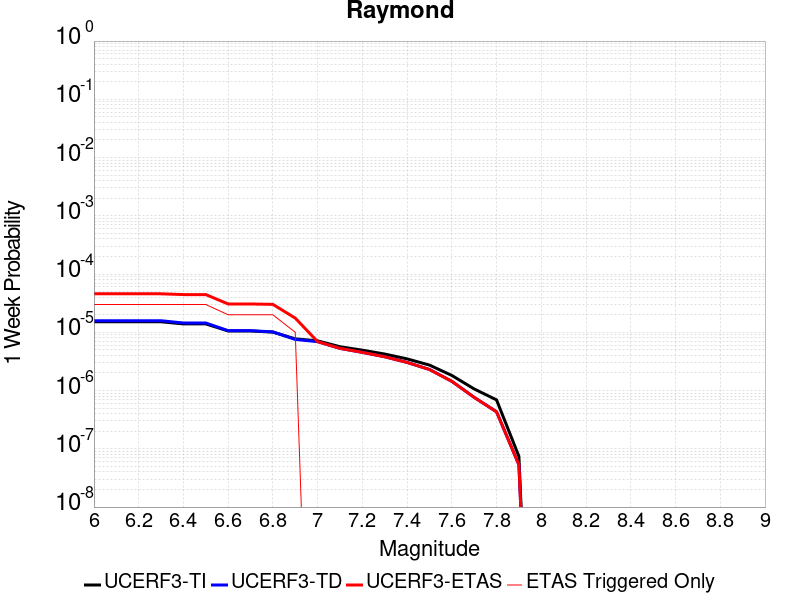 |  |  | 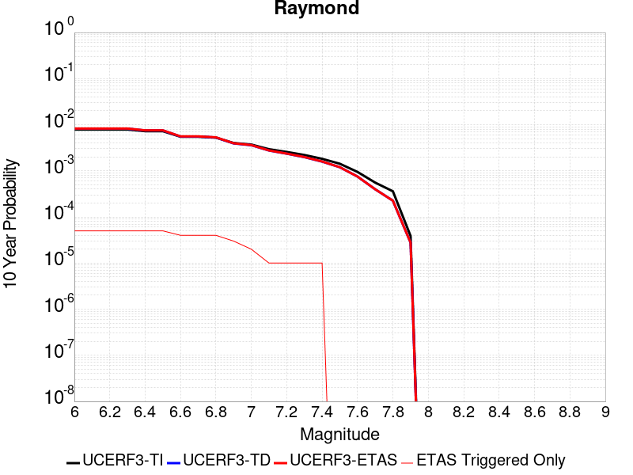 |

| Magnitude | 1 wk TI Prob | 1 wk TD Prob | 1 wk ETAS Prob | 1 wk ETAS/TD Gain | 1 wk ETAS Triggered Only | 1 mo TI Prob | 1 mo TD Prob | 1 mo ETAS Prob | 1 mo ETAS/TD Gain | 1 mo ETAS Triggered Only | 1 yr TI Prob | 1 yr TD Prob | 1 yr ETAS Prob | 1 yr ETAS/TD Gain | 1 yr ETAS Triggered Only | 10 yr TI Prob | 10 yr TD Prob | 10 yr ETAS Prob | 10 yr ETAS/TD Gain | 10 yr ETAS Triggered Only |
|-----|-----|-----|-----|-----|-----|-----|-----|-----|-----|-----|-----|-----|-----|-----|-----|-----|-----|-----|-----|-----|
| 6.0 | 1.5157413E-5 | 1.5810125E-5 | 3.2102616E-5 | 2.03051 | 1.6292748E-5 | 6.4958724E-5 | 6.775606E-5 | 8.404771E-5 | 1.2404456 | 1.6292748E-5 | 7.905855E-4 | 8.246429E-4 | 8.4092224E-4 | 1.019741 | 1.6292748E-5 | 0.007877788 | 0.008218355 | 0.008250672 | 1.0039324 | 3.2585496E-5 |
| 6.1 | 1.5157413E-5 | 1.5810125E-5 | 3.2102616E-5 | 2.03051 | 1.6292748E-5 | 6.4958724E-5 | 6.775606E-5 | 8.404771E-5 | 1.2404456 | 1.6292748E-5 | 7.905855E-4 | 8.246429E-4 | 8.4092224E-4 | 1.019741 | 1.6292748E-5 | 0.007877788 | 0.008218355 | 0.008250672 | 1.0039324 | 3.2585496E-5 |
| 6.2 | 1.5157413E-5 | 1.5810125E-5 | 3.2102616E-5 | 2.03051 | 1.6292748E-5 | 6.4958724E-5 | 6.775606E-5 | 8.404771E-5 | 1.2404456 | 1.6292748E-5 | 7.905855E-4 | 8.246429E-4 | 8.4092224E-4 | 1.019741 | 1.6292748E-5 | 0.007877788 | 0.008218355 | 0.008250672 | 1.0039324 | 3.2585496E-5 |
| 6.3 | 1.5157413E-5 | 1.5810125E-5 | 3.2102616E-5 | 2.03051 | 1.6292748E-5 | 6.4958724E-5 | 6.775606E-5 | 8.404771E-5 | 1.2404456 | 1.6292748E-5 | 7.905855E-4 | 8.246429E-4 | 8.4092224E-4 | 1.019741 | 1.6292748E-5 | 0.007877788 | 0.008218355 | 0.008250672 | 1.0039324 | 3.2585496E-5 |
| 6.4 | 1.3941944E-5 | 1.4454688E-5 | 3.07472E-5 | 2.1271439 | 1.6292748E-5 | 5.9749822E-5 | 6.194732E-5 | 7.823906E-5 | 1.2629935 | 1.6292748E-5 | 7.2721124E-4 | 7.53971E-4 | 7.702515E-4 | 1.021593 | 1.6292748E-5 | 0.007248361 | 0.007516471 | 0.007548812 | 1.0043026 | 3.2585496E-5 |
| 6.5 | 1.3941944E-5 | 1.4454688E-5 | 3.07472E-5 | 2.1271439 | 1.6292748E-5 | 5.9749822E-5 | 6.194732E-5 | 7.823906E-5 | 1.2629935 | 1.6292748E-5 | 7.2721124E-4 | 7.53971E-4 | 7.702515E-4 | 1.021593 | 1.6292748E-5 | 0.007248361 | 0.007516471 | 0.007548812 | 1.0043026 | 3.2585496E-5 |
| 6.6 | 1.0542609E-5 | 1.067111E-5 | 2.6963684E-5 | 2.5267928 | 1.6292748E-5 | 4.5181827E-5 | 4.573256E-5 | 6.202456E-5 | 1.3562452 | 1.6292748E-5 | 5.499499E-4 | 5.566571E-4 | 5.729408E-4 | 1.0292526 | 1.6292748E-5 | 0.005485909 | 0.0055531966 | 0.005585601 | 1.0058353 | 3.2585496E-5 |
| 6.7 | 1.0542609E-5 | 1.067111E-5 | 2.6963684E-5 | 2.5267928 | 1.6292748E-5 | 4.5181827E-5 | 4.573256E-5 | 6.202456E-5 | 1.3562452 | 1.6292748E-5 | 5.499499E-4 | 5.566571E-4 | 5.729408E-4 | 1.0292526 | 1.6292748E-5 | 0.005485909 | 0.0055531966 | 0.005585601 | 1.0058353 | 3.2585496E-5 |
| 6.8 | 1.0079132E-5 | 1.0176644E-5 | 2.6469226E-5 | 2.600978 | 1.6292748E-5 | 4.3195567E-5 | 4.3613487E-5 | 5.9905524E-5 | 1.3735551 | 1.6292748E-5 | 5.257791E-4 | 5.308702E-4 | 5.471543E-4 | 1.0306743 | 1.6292748E-5 | 0.0052453685 | 0.0052965777 | 0.0053289905 | 1.0061196 | 3.2585496E-5 |
| 6.9 | 7.721598E-6 | 7.548902E-6 | 2.3841527E-5 | 3.1582775 | 1.6292748E-5 | 3.3092143E-5 | 3.2352043E-5 | 4.8644262E-5 | 1.5035918 | 1.6292748E-5 | 4.0282236E-4 | 3.9381615E-4 | 4.1010248E-4 | 1.0413551 | 1.6292748E-5 | 0.0040209293 | 0.003931324 | 0.0039637815 | 1.0082561 | 3.2585496E-5 |
| 7.0 | 7.137566E-6 | 6.911303E-6 | 6.911303E-6 | 1.0 | 0.0 | 3.058921E-5 | 2.961954E-5 | 2.961954E-5 | 1.0 | 0.0 | 3.7236E-4 | 3.605593E-4 | 3.605593E-4 | 1.0 | 0.0 | 0.0037173668 | 0.003599869 | 0.0036161032 | 1.0045097 | 1.6292748E-5 |
| 7.1 | 5.654976E-6 | 5.299538E-6 | 5.299538E-6 | 1.0 | 0.0 | 2.4235387E-5 | 2.2712107E-5 | 2.2712107E-5 | 1.0 | 0.0 | 2.9502588E-4 | 2.7648505E-4 | 2.7648505E-4 | 1.0 | 0.0 | 0.0029463451 | 0.0027614492 | 0.002777697 | 1.0058838 | 1.6292748E-5 |
| 7.2 | 4.9358455E-6 | 4.526655E-6 | 4.526655E-6 | 1.0 | 0.0 | 2.1153453E-5 | 1.9399806E-5 | 1.9399806E-5 | 1.0 | 0.0 | 2.5751285E-4 | 2.3616718E-4 | 2.3616718E-4 | 1.0 | 0.0 | 0.0025721465 | 0.002359192 | 0.002375446 | 1.0068898 | 1.6292748E-5 |
| 7.3 | 4.2368597E-6 | 3.8056128E-6 | 3.8056128E-6 | 1.0 | 0.0 | 1.8157843E-5 | 1.6309668E-5 | 1.6309668E-5 | 1.0 | 0.0 | 2.2104931E-4 | 1.9855222E-4 | 1.9855222E-4 | 1.0 | 0.0 | 0.0022082955 | 0.0019837746 | 0.002000035 | 1.0081967 | 1.6292748E-5 |
| 7.4 | 3.4999923E-6 | 3.0437407E-6 | 3.0437407E-6 | 1.0 | 0.0 | 1.49998805E-5 | 1.3044538E-5 | 1.3044538E-5 | 1.0 | 0.0 | 1.8260824E-4 | 1.5880575E-4 | 1.5880575E-4 | 1.0 | 0.0 | 0.0018245826 | 0.0015869461 | 0.001603213 | 1.0102504 | 1.6292748E-5 |
| 7.5 | 2.738017E-6 | 2.3020405E-6 | 2.3020405E-6 | 1.0 | 0.0 | 1.1734306E-5 | 9.865851E-6 | 9.865851E-6 | 1.0 | 0.0 | 1.428558E-4 | 1.20110184E-4 | 1.20110184E-4 | 1.0 | 0.0 | 0.0014276401 | 0.0012004747 | 0.0012004747 | 1.0 | 0.0 |
| 7.6 | 1.8186392E-6 | 1.442302E-6 | 1.442302E-6 | 1.0 | 0.0 | 7.794145E-6 | 6.1812802E-6 | 6.1812802E-6 | 1.0 | 0.0 | 9.488958E-5 | 7.5254524E-5 | 7.5254524E-5 | 1.0 | 0.0 | 9.4849075E-4 | 7.5230957E-4 | 7.5230957E-4 | 1.0 | 0.0 |
| 7.7 | 1.0660348E-6 | 7.6437E-7 | 7.6437E-7 | 1.0 | 0.0 | 4.5687125E-6 | 3.2758674E-6 | 3.2758674E-6 | 1.0 | 0.0 | 5.5622655E-5 | 3.988297E-5 | 3.988297E-5 | 1.0 | 0.0 | 5.5608735E-4 | 3.9877492E-4 | 3.9877492E-4 | 1.0 | 0.0 |
| 7.8 | 6.913602E-7 | 4.3202903E-7 | 4.3202903E-7 | 1.0 | 0.0 | 2.962969E-6 | 1.8515517E-6 | 1.8515517E-6 | 1.0 | 0.0 | 3.607355E-5 | 2.2542416E-5 | 2.2542416E-5 | 1.0 | 0.0 | 3.6067693E-4 | 2.2541684E-4 | 2.2541684E-4 | 1.0 | 0.0 |
| 7.9 | 7.425201E-8 | 5.322267E-8 | 5.322267E-8 | 1.0 | 0.0 | 3.1822285E-7 | 2.2809714E-7 | 2.2809714E-7 | 1.0 | 0.0 | 3.874356E-6 | 2.7770805E-6 | 2.7770805E-6 | 1.0 | 0.0 | 3.8742884E-5 | 2.7770588E-5 | 2.7770588E-5 | 1.0 | 0.0 |

## Honey Lake 2011 CFM
*[(top)](#table-of-contents)*

| 1 Week | 1 Month | 1 Year | 10 Year |
|-----|-----|-----|-----|
| 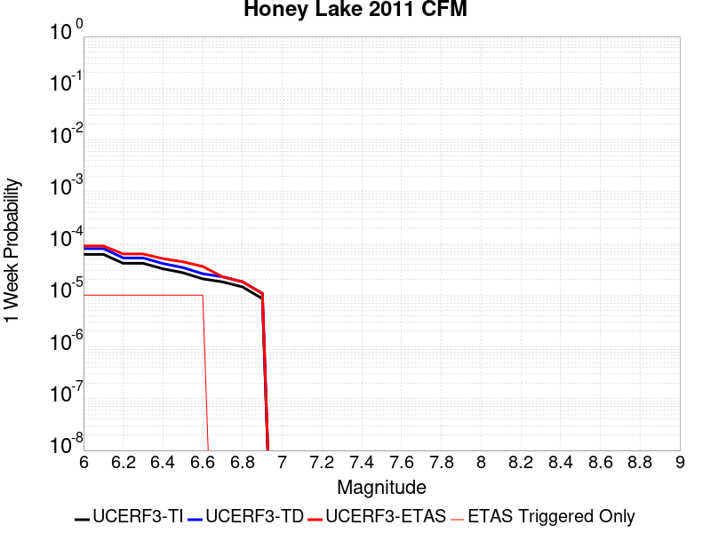 | 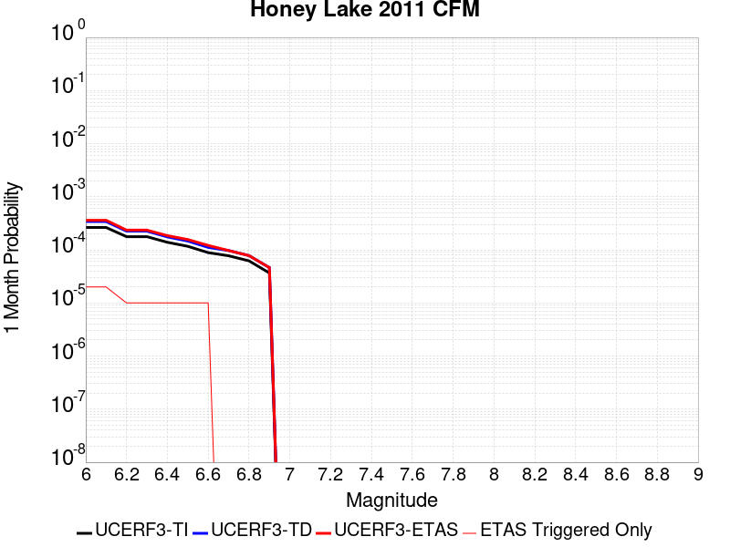 |  |  |

| Magnitude | 1 wk TI Prob | 1 wk TD Prob | 1 wk ETAS Prob | 1 wk ETAS/TD Gain | 1 wk ETAS Triggered Only | 1 mo TI Prob | 1 mo TD Prob | 1 mo ETAS Prob | 1 mo ETAS/TD Gain | 1 mo ETAS Triggered Only | 1 yr TI Prob | 1 yr TD Prob | 1 yr ETAS Prob | 1 yr ETAS/TD Gain | 1 yr ETAS Triggered Only | 10 yr TI Prob | 10 yr TD Prob | 10 yr ETAS Prob | 10 yr ETAS/TD Gain | 10 yr ETAS Triggered Only |
|-----|-----|-----|-----|-----|-----|-----|-----|-----|-----|-----|-----|-----|-----|-----|-----|-----|-----|-----|-----|-----|
| 6.0 | 6.155506E-5 | 7.954708E-5 | 9.583853E-5 | 1.2048026 | 1.6292748E-5 | 2.6378073E-4 | 3.4087323E-4 | 3.7344763E-4 | 1.0955616 | 3.2585496E-5 | 0.0032068014 | 0.0041426765 | 0.004175127 | 1.0078332 | 3.2585496E-5 | 0.03160919 | 0.040703055 | 0.040734313 | 1.000768 | 3.2585496E-5 |
| 6.1 | 6.155506E-5 | 7.954708E-5 | 9.583853E-5 | 1.2048026 | 1.6292748E-5 | 2.6378073E-4 | 3.4087323E-4 | 3.7344763E-4 | 1.0955616 | 3.2585496E-5 | 0.0032068014 | 0.0041426765 | 0.004175127 | 1.0078332 | 3.2585496E-5 | 0.03160919 | 0.040703055 | 0.040734313 | 1.000768 | 3.2585496E-5 |
| 6.2 | 4.1335024E-5 | 5.257652E-5 | 6.8868416E-5 | 1.3098701 | 1.6292748E-5 | 1.7713808E-4 | 2.2530954E-4 | 2.4159862E-4 | 1.0722964 | 1.6292748E-5 | 0.0021545228 | 0.0027398444 | 0.0027560925 | 1.0059303 | 1.6292748E-5 | 0.021337535 | 0.027076809 | 0.02709266 | 1.0005854 | 1.6292748E-5 |
| 6.3 | 4.1335024E-5 | 5.257652E-5 | 6.8868416E-5 | 1.3098701 | 1.6292748E-5 | 1.7713808E-4 | 2.2530954E-4 | 2.4159862E-4 | 1.0722964 | 1.6292748E-5 | 0.0021545228 | 0.0027398444 | 0.0027560925 | 1.0059303 | 1.6292748E-5 | 0.021337535 | 0.027076809 | 0.02709266 | 1.0005854 | 1.6292748E-5 |
| 6.4 | 3.2393702E-5 | 4.0887273E-5 | 5.7179357E-5 | 1.3984634 | 1.6292748E-5 | 1.3882275E-4 | 1.7522006E-4 | 1.9150996E-4 | 1.0929682 | 1.6292748E-5 | 0.0016888566 | 0.0021313233 | 0.0021475814 | 1.0076281 | 1.6292748E-5 | 0.016760793 | 0.021119867 | 0.021135814 | 1.0007552 | 1.6292748E-5 |
| 6.5 | 2.7205504E-5 | 3.4211767E-5 | 5.050396E-5 | 1.476216 | 1.6292748E-5 | 1.1658981E-4 | 1.4661417E-4 | 1.6290453E-4 | 1.1111104 | 1.6292748E-5 | 0.0014185566 | 0.0017836596 | 0.0017999233 | 1.0091182 | 1.6292748E-5 | 0.014095354 | 0.017702963 | 0.017718967 | 1.0009041 | 1.6292748E-5 |
| 6.6 | 2.069265E-5 | 2.5955416E-5 | 4.2247742E-5 | 1.6277043 | 1.6292748E-5 | 8.867977E-5 | 1.1123324E-4 | 1.2752418E-4 | 1.1464574 | 1.6292748E-5 | 0.0010791414 | 0.0013535074 | 0.0013697781 | 1.0120212 | 1.6292748E-5 | 0.010739161 | 0.0134610105 | 0.013477084 | 1.0011941 | 1.6292748E-5 |
| 6.7 | 1.8060919E-5 | 2.265683E-5 | 2.265683E-5 | 1.0 | 0.0 | 7.7401644E-5 | 9.7097545E-5 | 9.7097545E-5 | 1.0 | 0.0 | 9.419576E-4 | 0.0011816025 | 0.0011816025 | 1.0 | 0.0 | 0.009379748 | 0.0117612425 | 0.0117612425 | 1.0 | 0.0 |
| 6.8 | 1.4474663E-5 | 1.8181274E-5 | 1.8181274E-5 | 1.0 | 0.0 | 6.203279E-5 | 7.791785E-5 | 7.791785E-5 | 1.0 | 0.0 | 7.5498753E-4 | 9.4831345E-4 | 9.4831345E-4 | 1.0 | 0.0 | 0.007524277 | 0.009450195 | 0.009450195 | 1.0 | 0.0 |
| 6.9 | 8.564552E-6 | 1.0802311E-5 | 1.0802311E-5 | 1.0 | 0.0 | 3.6704707E-5 | 4.6295176E-5 | 4.6295176E-5 | 1.0 | 0.0 | 4.4678818E-4 | 5.635644E-4 | 5.635644E-4 | 1.0 | 0.0 | 0.0044589094 | 0.0056278505 | 0.0056278505 | 1.0 | 0.0 |

## Shoreline
*[(top)](#table-of-contents)*

| 1 Week | 1 Month | 1 Year | 10 Year |
|-----|-----|-----|-----|
|  |  |  | 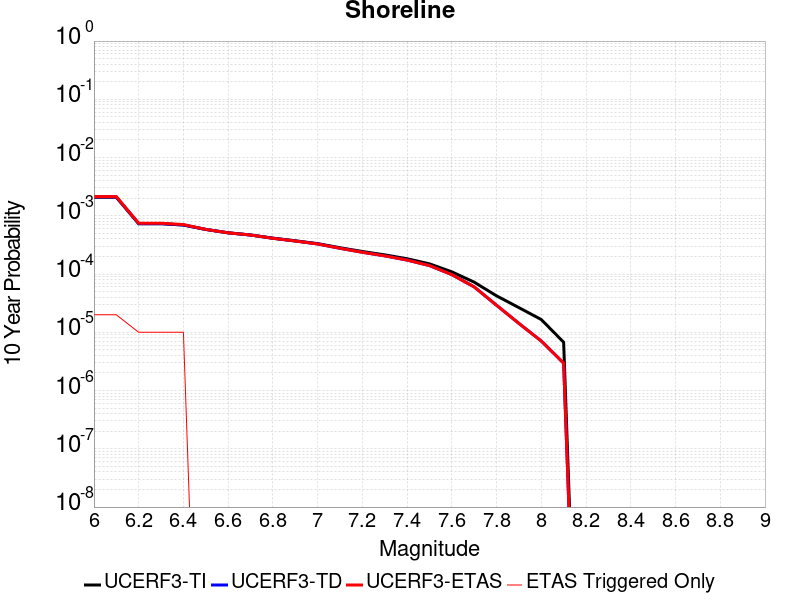 |

| Magnitude | 1 wk TI Prob | 1 wk TD Prob | 1 wk ETAS Prob | 1 wk ETAS/TD Gain | 1 wk ETAS Triggered Only | 1 mo TI Prob | 1 mo TD Prob | 1 mo ETAS Prob | 1 mo ETAS/TD Gain | 1 mo ETAS Triggered Only | 1 yr TI Prob | 1 yr TD Prob | 1 yr ETAS Prob | 1 yr ETAS/TD Gain | 1 yr ETAS Triggered Only | 10 yr TI Prob | 10 yr TD Prob | 10 yr ETAS Prob | 10 yr ETAS/TD Gain | 10 yr ETAS Triggered Only |
|-----|-----|-----|-----|-----|-----|-----|-----|-----|-----|-----|-----|-----|-----|-----|-----|-----|-----|-----|-----|-----|
| 6.0 | 3.9888673E-6 | 4.0479285E-6 | 2.034061E-5 | 5.0249434 | 1.6292748E-5 | 1.7095033E-5 | 1.7348182E-5 | 3.364065E-5 | 1.9391454 | 1.6292748E-5 | 2.0811215E-4 | 2.1119922E-4 | 2.2748853E-4 | 1.0771277 | 1.6292748E-5 | 0.0020791737 | 0.0021105339 | 0.0021430505 | 1.0154068 | 3.2585496E-5 |
| 6.1 | 3.9888673E-6 | 4.0479285E-6 | 2.034061E-5 | 5.0249434 | 1.6292748E-5 | 1.7095033E-5 | 1.7348182E-5 | 3.364065E-5 | 1.9391454 | 1.6292748E-5 | 2.0811215E-4 | 2.1119922E-4 | 2.2748853E-4 | 1.0771277 | 1.6292748E-5 | 0.0020791737 | 0.0021105339 | 0.0021430505 | 1.0154068 | 3.2585496E-5 |
| 6.2 | 1.4039653E-6 | 1.4100885E-6 | 1.4100885E-6 | 1.0 | 0.0 | 6.0169805E-6 | 6.043223E-6 | 6.043223E-6 | 1.0 | 0.0 | 7.325427E-5 | 7.357382E-5 | 7.357382E-5 | 1.0 | 0.0 | 7.3230127E-4 | 7.355006E-4 | 7.517814E-4 | 1.0221356 | 1.6292748E-5 |
| 6.3 | 1.4039653E-6 | 1.4100885E-6 | 1.4100885E-6 | 1.0 | 0.0 | 6.0169805E-6 | 6.043223E-6 | 6.043223E-6 | 1.0 | 0.0 | 7.325427E-5 | 7.357382E-5 | 7.357382E-5 | 1.0 | 0.0 | 7.3230127E-4 | 7.355006E-4 | 7.517814E-4 | 1.0221356 | 1.6292748E-5 |
| 6.4 | 1.3314152E-6 | 1.33616E-6 | 1.33616E-6 | 1.0 | 0.0 | 5.7060524E-6 | 5.726388E-6 | 5.726388E-6 | 1.0 | 0.0 | 6.946897E-5 | 6.9716596E-5 | 6.9716596E-5 | 1.0 | 0.0 | 6.9447263E-4 | 6.9695263E-4 | 7.13234E-4 | 1.0233608 | 1.6292748E-5 |
| 6.5 | 1.1187026E-6 | 1.1203634E-6 | 1.1203634E-6 | 1.0 | 0.0 | 4.794431E-6 | 4.801549E-6 | 4.801549E-6 | 1.0 | 0.0 | 5.8370628E-5 | 5.8457317E-5 | 5.8457317E-5 | 1.0 | 0.0 | 5.83553E-4 | 5.844219E-4 | 5.844219E-4 | 1.0 | 0.0 |
| 6.6 | 9.793089E-7 | 9.784915E-7 | 9.784915E-7 | 1.0 | 0.0 | 4.1970316E-6 | 4.193528E-6 | 4.193528E-6 | 1.0 | 0.0 | 5.1097657E-5 | 5.1055024E-5 | 5.1055024E-5 | 1.0 | 0.0 | 5.108591E-4 | 5.104342E-4 | 5.104342E-4 | 1.0 | 0.0 |
| 6.7 | 8.995986E-7 | 8.972795E-7 | 8.972795E-7 | 1.0 | 0.0 | 3.8554167E-6 | 3.8454777E-6 | 3.8454777E-6 | 1.0 | 0.0 | 4.693869E-5 | 4.68177E-5 | 4.68177E-5 | 1.0 | 0.0 | 4.6928777E-4 | 4.680793E-4 | 4.680793E-4 | 1.0 | 0.0 |
| 6.8 | 7.931612E-7 | 7.8803976E-7 | 7.8803976E-7 | 1.0 | 0.0 | 3.3992578E-6 | 3.377309E-6 | 3.377309E-6 | 1.0 | 0.0 | 4.1385178E-5 | 4.1117964E-5 | 4.1117964E-5 | 1.0 | 0.0 | 4.1377472E-4 | 4.1110412E-4 | 4.1110412E-4 | 1.0 | 0.0 |
| 6.9 | 7.1465956E-7 | 7.078001E-7 | 7.078001E-7 | 1.0 | 0.0 | 3.062823E-6 | 3.0334254E-6 | 3.0334254E-6 | 1.0 | 0.0 | 3.7289232E-5 | 3.693133E-5 | 3.693133E-5 | 1.0 | 0.0 | 3.7282976E-4 | 3.6925232E-4 | 3.6925232E-4 | 1.0 | 0.0 |
| 7.0 | 6.389046E-7 | 6.299453E-7 | 6.299453E-7 | 1.0 | 0.0 | 2.7381598E-6 | 2.699763E-6 | 2.699763E-6 | 1.0 | 0.0 | 3.3336586E-5 | 3.286912E-5 | 3.286912E-5 | 1.0 | 0.0 | 3.3331584E-4 | 3.286428E-4 | 3.286428E-4 | 1.0 | 0.0 |
| 7.1 | 5.4300875E-7 | 5.311126E-7 | 5.311126E-7 | 1.0 | 0.0 | 2.3271782E-6 | 2.276195E-6 | 2.276195E-6 | 1.0 | 0.0 | 2.8333026E-5 | 2.7712322E-5 | 2.7712322E-5 | 1.0 | 0.0 | 2.8329415E-4 | 2.7708875E-4 | 2.7708875E-4 | 1.0 | 0.0 |
| 7.2 | 4.6768855E-7 | 4.5348904E-7 | 4.5348904E-7 | 1.0 | 0.0 | 2.0043778E-6 | 1.9435229E-6 | 1.9435229E-6 | 1.0 | 0.0 | 2.4403027E-5 | 2.3662134E-5 | 2.3662134E-5 | 1.0 | 0.0 | 2.4400349E-4 | 2.3659621E-4 | 2.3659621E-4 | 1.0 | 0.0 |
| 7.3 | 4.0966103E-7 | 3.9385614E-7 | 3.9385614E-7 | 1.0 | 0.0 | 1.7556889E-6 | 1.6879537E-6 | 1.6879537E-6 | 1.0 | 0.0 | 2.1375303E-5 | 2.0550642E-5 | 2.0550642E-5 | 1.0 | 0.0 | 2.1373246E-4 | 2.0548746E-4 | 2.0548746E-4 | 1.0 | 0.0 |
| 7.4 | 3.5105785E-7 | 3.3363924E-7 | 3.3363924E-7 | 1.0 | 0.0 | 1.5045327E-6 | 1.4298816E-6 | 1.4298816E-6 | 1.0 | 0.0 | 1.8317533E-5 | 1.7408669E-5 | 1.7408669E-5 | 1.0 | 0.0 | 1.8316023E-4 | 1.740731E-4 | 1.740731E-4 | 1.0 | 0.0 |
| 7.5 | 2.8737534E-7 | 2.681999E-7 | 2.681999E-7 | 1.0 | 0.0 | 1.2316079E-6 | 1.1494276E-6 | 1.1494276E-6 | 1.0 | 0.0 | 1.4994724E-5 | 1.399419E-5 | 1.399419E-5 | 1.0 | 0.0 | 1.4993713E-4 | 1.3993312E-4 | 1.3993312E-4 | 1.0 | 0.0 |
| 7.6 | 2.0924051E-7 | 1.8778938E-7 | 1.8778938E-7 | 1.0 | 0.0 | 8.967448E-7 | 8.0481135E-7 | 8.0481135E-7 | 1.0 | 0.0 | 1.0917813E-5 | 9.798534E-6 | 9.798534E-6 | 1.0 | 0.0 | 1.0917276E-4 | 9.798103E-5 | 9.798103E-5 | 1.0 | 0.0 |
| 7.7 | 1.392265E-7 | 1.1543341E-7 | 1.1543341E-7 | 1.0 | 0.0 | 5.9668486E-7 | 4.9471447E-7 | 4.9471447E-7 | 1.0 | 0.0 | 7.2646135E-6 | 6.0231323E-6 | 6.0231323E-6 | 1.0 | 0.0 | 7.2643765E-5 | 6.0229693E-5 | 6.0229693E-5 | 1.0 | 0.0 |
| 7.8 | 8.1080074E-8 | 5.5866355E-8 | 5.5866355E-8 | 1.0 | 0.0 | 3.4748598E-7 | 2.394272E-7 | 2.394272E-7 | 1.0 | 0.0 | 4.2306337E-6 | 2.9150222E-6 | 2.9150222E-6 | 1.0 | 0.0 | 4.230553E-5 | 2.9149842E-5 | 2.9149842E-5 | 1.0 | 0.0 |
| 7.9 | 5.0859036E-8 | 2.7243395E-8 | 2.7243395E-8 | 1.0 | 0.0 | 2.1796728E-7 | 1.16757406E-7 | 1.16757406E-7 | 1.0 | 0.0 | 2.6537484E-6 | 1.4215204E-6 | 1.4215204E-6 | 1.0 | 0.0 | 2.6537167E-5 | 1.4215115E-5 | 1.4215115E-5 | 1.0 | 0.0 |
| 8.0 | 3.1760536E-8 | 1.3575991E-8 | 1.3575991E-8 | 1.0 | 0.0 | 1.3611657E-7 | 5.8182817E-8 | 5.8182817E-8 | 1.0 | 0.0 | 1.6572179E-6 | 7.083755E-7 | 7.083755E-7 | 1.0 | 0.0 | 1.6572056E-5 | 7.083733E-6 | 7.083733E-6 | 1.0 | 0.0 |
| 8.1 | 1.2947896E-8 | 5.6625185E-9 | 5.6625185E-9 | 1.0 | 0.0 | 5.5490982E-8 | 2.4267937E-8 | 2.4267937E-8 | 1.0 | 0.0 | 6.756025E-7 | 2.954621E-7 | 2.954621E-7 | 1.0 | 0.0 | 6.7560045E-6 | 2.9546172E-6 | 2.9546172E-6 | 1.0 | 0.0 |

## Compton
*[(top)](#table-of-contents)*

| 1 Week | 1 Month | 1 Year | 10 Year |
|-----|-----|-----|-----|
|  |  |  |  |

| Magnitude | 1 wk TI Prob | 1 wk TD Prob | 1 wk ETAS Prob | 1 wk ETAS/TD Gain | 1 wk ETAS Triggered Only | 1 mo TI Prob | 1 mo TD Prob | 1 mo ETAS Prob | 1 mo ETAS/TD Gain | 1 mo ETAS Triggered Only | 1 yr TI Prob | 1 yr TD Prob | 1 yr ETAS Prob | 1 yr ETAS/TD Gain | 1 yr ETAS Triggered Only | 10 yr TI Prob | 10 yr TD Prob | 10 yr ETAS Prob | 10 yr ETAS/TD Gain | 10 yr ETAS Triggered Only |
|-----|-----|-----|-----|-----|-----|-----|-----|-----|-----|-----|-----|-----|-----|-----|-----|-----|-----|-----|-----|-----|
| 6.0 | 1.06050875E-5 | 6.35892E-6 | 2.2651564E-5 | 3.5621717 | 1.6292748E-5 | 4.5449582E-5 | 2.7252245E-5 | 4.354455E-5 | 1.5978335 | 1.6292748E-5 | 5.5320817E-4 | 3.3174842E-4 | 3.4803577E-4 | 1.0490955 | 1.6292748E-5 | 0.0055183303 | 0.003312816 | 0.0033452935 | 1.0098037 | 3.2585496E-5 |
| 6.1 | 1.06050875E-5 | 6.35892E-6 | 2.2651564E-5 | 3.5621717 | 1.6292748E-5 | 4.5449582E-5 | 2.7252245E-5 | 4.354455E-5 | 1.5978335 | 1.6292748E-5 | 5.5320817E-4 | 3.3174842E-4 | 3.4803577E-4 | 1.0490955 | 1.6292748E-5 | 0.0055183303 | 0.003312816 | 0.0033452935 | 1.0098037 | 3.2585496E-5 |
| 6.2 | 1.06050875E-5 | 6.35892E-6 | 2.2651564E-5 | 3.5621717 | 1.6292748E-5 | 4.5449582E-5 | 2.7252245E-5 | 4.354455E-5 | 1.5978335 | 1.6292748E-5 | 5.5320817E-4 | 3.3174842E-4 | 3.4803577E-4 | 1.0490955 | 1.6292748E-5 | 0.0055183303 | 0.003312816 | 0.0033452935 | 1.0098037 | 3.2585496E-5 |
| 6.3 | 1.06050875E-5 | 6.35892E-6 | 2.2651564E-5 | 3.5621717 | 1.6292748E-5 | 4.5449582E-5 | 2.7252245E-5 | 4.354455E-5 | 1.5978335 | 1.6292748E-5 | 5.5320817E-4 | 3.3174842E-4 | 3.4803577E-4 | 1.0490955 | 1.6292748E-5 | 0.0055183303 | 0.003312816 | 0.0033452935 | 1.0098037 | 3.2585496E-5 |
| 6.4 | 1.06050875E-5 | 6.35892E-6 | 2.2651564E-5 | 3.5621717 | 1.6292748E-5 | 4.5449582E-5 | 2.7252245E-5 | 4.354455E-5 | 1.5978335 | 1.6292748E-5 | 5.5320817E-4 | 3.3174842E-4 | 3.4803577E-4 | 1.0490955 | 1.6292748E-5 | 0.0055183303 | 0.003312816 | 0.0033452935 | 1.0098037 | 3.2585496E-5 |
| 6.5 | 1.06050875E-5 | 6.35892E-6 | 2.2651564E-5 | 3.5621717 | 1.6292748E-5 | 4.5449582E-5 | 2.7252245E-5 | 4.354455E-5 | 1.5978335 | 1.6292748E-5 | 5.5320817E-4 | 3.3174842E-4 | 3.4803577E-4 | 1.0490955 | 1.6292748E-5 | 0.0055183303 | 0.003312816 | 0.0033452935 | 1.0098037 | 3.2585496E-5 |
| 6.6 | 1.06050875E-5 | 6.35892E-6 | 2.2651564E-5 | 3.5621717 | 1.6292748E-5 | 4.5449582E-5 | 2.7252245E-5 | 4.354455E-5 | 1.5978335 | 1.6292748E-5 | 5.5320817E-4 | 3.3174842E-4 | 3.4803577E-4 | 1.0490955 | 1.6292748E-5 | 0.0055183303 | 0.003312816 | 0.0033452935 | 1.0098037 | 3.2585496E-5 |
| 6.7 | 1.06050875E-5 | 6.35892E-6 | 2.2651564E-5 | 3.5621717 | 1.6292748E-5 | 4.5449582E-5 | 2.7252245E-5 | 4.354455E-5 | 1.5978335 | 1.6292748E-5 | 5.5320817E-4 | 3.3174842E-4 | 3.4803577E-4 | 1.0490955 | 1.6292748E-5 | 0.0055183303 | 0.003312816 | 0.0033452935 | 1.0098037 | 3.2585496E-5 |
| 6.8 | 1.06050875E-5 | 6.35892E-6 | 2.2651564E-5 | 3.5621717 | 1.6292748E-5 | 4.5449582E-5 | 2.7252245E-5 | 4.354455E-5 | 1.5978335 | 1.6292748E-5 | 5.5320817E-4 | 3.3174842E-4 | 3.4803577E-4 | 1.0490955 | 1.6292748E-5 | 0.0055183303 | 0.003312816 | 0.0033452935 | 1.0098037 | 3.2585496E-5 |
| 6.9 | 1.06050875E-5 | 6.35892E-6 | 2.2651564E-5 | 3.5621717 | 1.6292748E-5 | 4.5449582E-5 | 2.7252245E-5 | 4.354455E-5 | 1.5978335 | 1.6292748E-5 | 5.5320817E-4 | 3.3174842E-4 | 3.4803577E-4 | 1.0490955 | 1.6292748E-5 | 0.0055183303 | 0.003312816 | 0.0033452935 | 1.0098037 | 3.2585496E-5 |
| 7.0 | 7.672486E-6 | 4.272077E-6 | 4.272077E-6 | 1.0 | 0.0 | 3.288167E-5 | 1.8308778E-5 | 1.8308778E-5 | 1.0 | 0.0 | 4.0026082E-4 | 2.2288719E-4 | 2.2288719E-4 | 1.0 | 0.0 | 0.0039954064 | 0.0022266984 | 0.002242955 | 1.0073007 | 1.6292748E-5 |
| 7.1 | 7.163992E-6 | 3.883783E-6 | 3.883783E-6 | 1.0 | 0.0 | 3.0702464E-5 | 1.664468E-5 | 1.664468E-5 | 1.0 | 0.0 | 3.7373835E-4 | 2.0263072E-4 | 2.0263072E-4 | 1.0 | 0.0 | 0.0037311043 | 0.0020245167 | 0.0020407764 | 1.0080315 | 1.6292748E-5 |
| 7.2 | 6.3689185E-6 | 3.3101053E-6 | 3.3101053E-6 | 1.0 | 0.0 | 2.729508E-5 | 1.4186091E-5 | 1.4186091E-5 | 1.0 | 0.0 | 3.322669E-4 | 1.7270239E-4 | 1.7270239E-4 | 1.0 | 0.0 | 0.0033177056 | 0.0017257235 | 0.0017419881 | 1.0094248 | 1.6292748E-5 |
| 7.3 | 4.4987873E-6 | 2.4480198E-6 | 2.4480198E-6 | 1.0 | 0.0 | 1.9280375E-5 | 1.0491473E-5 | 1.0491473E-5 | 1.0 | 0.0 | 2.3471327E-4 | 1.2772651E-4 | 1.2772651E-4 | 1.0 | 0.0 | 0.002344655 | 0.0012765612 | 0.0012765612 | 1.0 | 0.0 |
| 7.4 | 2.987296E-6 | 1.7394043E-6 | 1.7394043E-6 | 1.0 | 0.0 | 1.2802635E-5 | 7.4545687E-6 | 7.4545687E-6 | 1.0 | 0.0 | 1.5586092E-4 | 9.075565E-5 | 9.075565E-5 | 1.0 | 0.0 | 0.0015575165 | 9.071917E-4 | 9.071917E-4 | 1.0 | 0.0 |
| 7.5 | 2.4111696E-6 | 1.4471991E-6 | 1.4471991E-6 | 1.0 | 0.0 | 1.0333543E-5 | 6.2022677E-6 | 6.2022677E-6 | 1.0 | 0.0 | 1.2580362E-4 | 7.551004E-5 | 7.551004E-5 | 1.0 | 0.0 | 0.0012573242 | 7.548485E-4 | 7.548485E-4 | 1.0 | 0.0 |
| 7.6 | 1.8783096E-6 | 1.1360306E-6 | 1.1360306E-6 | 1.0 | 0.0 | 8.049874E-6 | 4.868694E-6 | 4.868694E-6 | 1.0 | 0.0 | 9.8002805E-5 | 5.9274775E-5 | 5.9274775E-5 | 1.0 | 0.0 | 9.795959E-4 | 5.925936E-4 | 5.925936E-4 | 1.0 | 0.0 |
| 7.7 | 6.6646817E-7 | 3.5601457E-7 | 3.5601457E-7 | 1.0 | 0.0 | 2.856289E-6 | 1.5257759E-6 | 1.5257759E-6 | 1.0 | 0.0 | 3.4774763E-5 | 1.8576176E-5 | 1.8576176E-5 | 1.0 | 0.0 | 3.4769322E-4 | 1.8574759E-4 | 1.8574759E-4 | 1.0 | 0.0 |
| 7.8 | 7.054689E-8 | 4.1342012E-8 | 4.1342012E-8 | 1.0 | 0.0 | 3.0234378E-7 | 1.7718004E-7 | 1.7718004E-7 | 1.0 | 0.0 | 3.6810293E-6 | 2.157165E-6 | 2.157165E-6 | 1.0 | 0.0 | 3.6809684E-5 | 2.157145E-5 | 2.157145E-5 | 1.0 | 0.0 |
| 7.9 | 7.420925E-9 | 4.0130637E-9 | 4.0130637E-9 | 1.0 | 0.0 | 3.1803964E-8 | 1.7198845E-8 | 1.7198845E-8 | 1.0 | 0.0 | 3.872132E-7 | 2.0939592E-7 | 2.0939592E-7 | 1.0 | 0.0 | 3.872125E-6 | 2.0939574E-6 | 2.0939574E-6 | 1.0 | 0.0 |

## Ortigalita (South)
*[(top)](#table-of-contents)*

| 1 Week | 1 Month | 1 Year | 10 Year |
|-----|-----|-----|-----|
|  |  |  |  |

| Magnitude | 1 wk TI Prob | 1 wk TD Prob | 1 wk ETAS Prob | 1 wk ETAS/TD Gain | 1 wk ETAS Triggered Only | 1 mo TI Prob | 1 mo TD Prob | 1 mo ETAS Prob | 1 mo ETAS/TD Gain | 1 mo ETAS Triggered Only | 1 yr TI Prob | 1 yr TD Prob | 1 yr ETAS Prob | 1 yr ETAS/TD Gain | 1 yr ETAS Triggered Only | 10 yr TI Prob | 10 yr TD Prob | 10 yr ETAS Prob | 10 yr ETAS/TD Gain | 10 yr ETAS Triggered Only |
|-----|-----|-----|-----|-----|-----|-----|-----|-----|-----|-----|-----|-----|-----|-----|-----|-----|-----|-----|-----|-----|
| 6.0 | 3.72394E-5 | 4.32556E-5 | 4.32556E-5 | 1.0 | 0.0 | 1.5958765E-4 | 1.8536886E-4 | 2.0165858E-4 | 1.0878774 | 1.6292748E-5 | 0.0019412481 | 0.0022546863 | 0.0022709423 | 1.0072099 | 1.6292748E-5 | 0.019243775 | 0.022334501 | 0.02236636 | 1.0014263 | 3.2585496E-5 |
| 6.1 | 2.7299884E-5 | 3.1492036E-5 | 3.1492036E-5 | 1.0 | 0.0 | 1.16994255E-4 | 1.349592E-4 | 1.5124975E-4 | 1.1207073 | 1.6292748E-5 | 0.0014234743 | 0.0016419457 | 0.0016582117 | 1.0099065 | 1.6292748E-5 | 0.014143906 | 0.016304072 | 0.0163201 | 1.000983 | 1.6292748E-5 |
| 6.2 | 2.7299884E-5 | 3.1492036E-5 | 3.1492036E-5 | 1.0 | 0.0 | 1.16994255E-4 | 1.349592E-4 | 1.5124975E-4 | 1.1207073 | 1.6292748E-5 | 0.0014234743 | 0.0016419457 | 0.0016582117 | 1.0099065 | 1.6292748E-5 | 0.014143906 | 0.016304072 | 0.0163201 | 1.000983 | 1.6292748E-5 |
| 6.3 | 2.0546433E-5 | 2.3631454E-5 | 2.3631454E-5 | 1.0 | 0.0 | 8.805317E-5 | 1.0127383E-4 | 1.1756493E-4 | 1.1608618 | 1.6292748E-5 | 0.00107152 | 0.0012323305 | 0.0012486031 | 1.0132048 | 1.6292748E-5 | 0.010663681 | 0.012257031 | 0.012273124 | 1.001313 | 1.6292748E-5 |
| 6.4 | 2.0546433E-5 | 2.3631454E-5 | 2.3631454E-5 | 1.0 | 0.0 | 8.805317E-5 | 1.0127383E-4 | 1.1756493E-4 | 1.1608618 | 1.6292748E-5 | 0.00107152 | 0.0012323305 | 0.0012486031 | 1.0132048 | 1.6292748E-5 | 0.010663681 | 0.012257031 | 0.012273124 | 1.001313 | 1.6292748E-5 |
| 6.5 | 1.7779594E-5 | 2.0446974E-5 | 2.0446974E-5 | 1.0 | 0.0 | 7.619603E-5 | 8.762703E-5 | 1.0391835E-4 | 1.1859167 | 1.6292748E-5 | 9.272918E-4 | 0.0010663505 | 0.0010826258 | 1.0152627 | 1.6292748E-5 | 0.009234319 | 0.010613804 | 0.010629923 | 1.0015187 | 1.6292748E-5 |
| 6.6 | 1.6272212E-5 | 1.8714967E-5 | 1.8714967E-5 | 1.0 | 0.0 | 6.973618E-5 | 8.0204605E-5 | 9.649605E-5 | 1.2031236 | 1.6292748E-5 | 8.487073E-4 | 9.760659E-4 | 9.923427E-4 | 1.016676 | 1.6292748E-5 | 0.008454733 | 0.009719091 | 0.009735225 | 1.0016601 | 1.6292748E-5 |
| 6.7 | 1.3051484E-5 | 1.5038758E-5 | 1.5038758E-5 | 1.0 | 0.0 | 5.593373E-5 | 6.445028E-5 | 8.074198E-5 | 1.2527794 | 1.6292748E-5 | 6.807804E-4 | 7.844092E-4 | 8.0068916E-4 | 1.0207545 | 1.6292748E-5 | 0.006786986 | 0.007817388 | 0.0078335535 | 1.0020679 | 1.6292748E-5 |
| 6.8 | 1.04277415E-5 | 1.1987235E-5 | 1.1987235E-5 | 1.0 | 0.0 | 4.4689557E-5 | 5.1372896E-5 | 6.7664805E-5 | 1.3171304 | 1.6292748E-5 | 5.439595E-4 | 6.2529295E-4 | 6.415755E-4 | 1.0260398 | 1.6292748E-5 | 0.0054262993 | 0.00623609 | 0.006252281 | 1.0025964 | 1.6292748E-5 |
| 6.9 | 7.639968E-6 | 8.791503E-6 | 8.791503E-6 | 1.0 | 0.0 | 3.274231E-5 | 3.767736E-5 | 5.3969496E-5 | 1.4324118 | 1.6292748E-5 | 3.9856473E-4 | 4.586312E-4 | 4.7491645E-4 | 1.0355084 | 1.6292748E-5 | 0.003978506 | 0.004577433 | 0.0045936513 | 1.003543 | 1.6292748E-5 |
| 7.0 | 3.919831E-6 | 4.5334014E-6 | 4.5334014E-6 | 1.0 | 0.0 | 1.679917E-5 | 1.942873E-5 | 1.942873E-5 | 1.0 | 0.0 | 2.045107E-4 | 2.3652123E-4 | 2.3652123E-4 | 1.0 | 0.0 | 0.0020432258 | 0.0023629034 | 0.0023629034 | 1.0 | 0.0 |
| 7.1 | 1.6017933E-6 | 1.8570418E-6 | 1.8570418E-6 | 1.0 | 0.0 | 6.8648105E-6 | 7.958732E-6 | 7.958732E-6 | 1.0 | 0.0 | 8.357586E-5 | 9.689432E-5 | 9.689432E-5 | 1.0 | 0.0 | 8.3544437E-4 | 9.686254E-4 | 9.686254E-4 | 1.0 | 0.0 |

## North Frontal  (West)
*[(top)](#table-of-contents)*

| 1 Week | 1 Month | 1 Year | 10 Year |
|-----|-----|-----|-----|
|  |  | 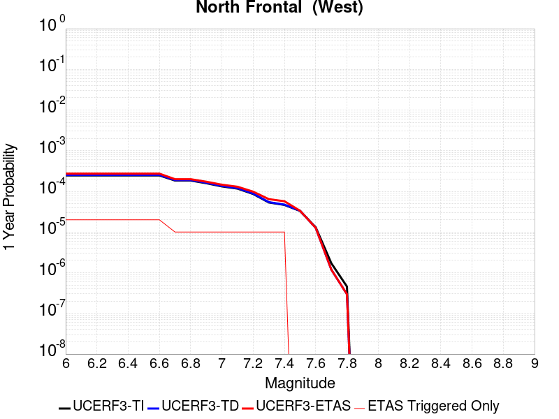 |  |

| Magnitude | 1 wk TI Prob | 1 wk TD Prob | 1 wk ETAS Prob | 1 wk ETAS/TD Gain | 1 wk ETAS Triggered Only | 1 mo TI Prob | 1 mo TD Prob | 1 mo ETAS Prob | 1 mo ETAS/TD Gain | 1 mo ETAS Triggered Only | 1 yr TI Prob | 1 yr TD Prob | 1 yr ETAS Prob | 1 yr ETAS/TD Gain | 1 yr ETAS Triggered Only | 10 yr TI Prob | 10 yr TD Prob | 10 yr ETAS Prob | 10 yr ETAS/TD Gain | 10 yr ETAS Triggered Only |
|-----|-----|-----|-----|-----|-----|-----|-----|-----|-----|-----|-----|-----|-----|-----|-----|-----|-----|-----|-----|-----|
| 6.0 | 4.7316266E-6 | 4.852674E-6 | 4.852674E-6 | 1.0 | 0.0 | 2.0278241E-5 | 2.0797017E-5 | 2.0797017E-5 | 1.0 | 0.0 | 2.4685962E-4 | 2.5317573E-4 | 2.85753E-4 | 1.1286744 | 3.2585496E-5 | 0.0024658558 | 0.002529019 | 0.0025615222 | 1.0128521 | 3.2585496E-5 |
| 6.1 | 4.7316266E-6 | 4.852674E-6 | 4.852674E-6 | 1.0 | 0.0 | 2.0278241E-5 | 2.0797017E-5 | 2.0797017E-5 | 1.0 | 0.0 | 2.4685962E-4 | 2.5317573E-4 | 2.85753E-4 | 1.1286744 | 3.2585496E-5 | 0.0024658558 | 0.002529019 | 0.0025615222 | 1.0128521 | 3.2585496E-5 |
| 6.2 | 4.7316266E-6 | 4.852674E-6 | 4.852674E-6 | 1.0 | 0.0 | 2.0278241E-5 | 2.0797017E-5 | 2.0797017E-5 | 1.0 | 0.0 | 2.4685962E-4 | 2.5317573E-4 | 2.85753E-4 | 1.1286744 | 3.2585496E-5 | 0.0024658558 | 0.002529019 | 0.0025615222 | 1.0128521 | 3.2585496E-5 |
| 6.3 | 4.7316266E-6 | 4.852674E-6 | 4.852674E-6 | 1.0 | 0.0 | 2.0278241E-5 | 2.0797017E-5 | 2.0797017E-5 | 1.0 | 0.0 | 2.4685962E-4 | 2.5317573E-4 | 2.85753E-4 | 1.1286744 | 3.2585496E-5 | 0.0024658558 | 0.002529019 | 0.0025615222 | 1.0128521 | 3.2585496E-5 |
| 6.4 | 4.7316266E-6 | 4.852674E-6 | 4.852674E-6 | 1.0 | 0.0 | 2.0278241E-5 | 2.0797017E-5 | 2.0797017E-5 | 1.0 | 0.0 | 2.4685962E-4 | 2.5317573E-4 | 2.85753E-4 | 1.1286744 | 3.2585496E-5 | 0.0024658558 | 0.002529019 | 0.0025615222 | 1.0128521 | 3.2585496E-5 |
| 6.5 | 4.7316266E-6 | 4.852674E-6 | 4.852674E-6 | 1.0 | 0.0 | 2.0278241E-5 | 2.0797017E-5 | 2.0797017E-5 | 1.0 | 0.0 | 2.4685962E-4 | 2.5317573E-4 | 2.85753E-4 | 1.1286744 | 3.2585496E-5 | 0.0024658558 | 0.002529019 | 0.0025615222 | 1.0128521 | 3.2585496E-5 |
| 6.6 | 4.7316266E-6 | 4.852674E-6 | 4.852674E-6 | 1.0 | 0.0 | 2.0278241E-5 | 2.0797017E-5 | 2.0797017E-5 | 1.0 | 0.0 | 2.4685962E-4 | 2.5317573E-4 | 2.85753E-4 | 1.1286744 | 3.2585496E-5 | 0.0024658558 | 0.002529019 | 0.0025615222 | 1.0128521 | 3.2585496E-5 |
| 6.7 | 3.5382777E-6 | 3.6308872E-6 | 3.6308872E-6 | 1.0 | 0.0 | 1.516396E-5 | 1.5560858E-5 | 1.5560858E-5 | 1.0 | 0.0 | 1.8460557E-4 | 1.8943775E-4 | 2.0572741E-4 | 1.0859895 | 1.6292748E-5 | 0.0018445229 | 0.0018928396 | 0.0019091015 | 1.0085913 | 1.6292748E-5 |
| 6.8 | 3.5382777E-6 | 3.6308872E-6 | 3.6308872E-6 | 1.0 | 0.0 | 1.516396E-5 | 1.5560858E-5 | 1.5560858E-5 | 1.0 | 0.0 | 1.8460557E-4 | 1.8943775E-4 | 2.0572741E-4 | 1.0859895 | 1.6292748E-5 | 0.0018445229 | 0.0018928396 | 0.0019091015 | 1.0085913 | 1.6292748E-5 |
| 6.9 | 3.0428037E-6 | 3.1227619E-6 | 3.1227619E-6 | 1.0 | 0.0 | 1.30405215E-5 | 1.3383201E-5 | 1.3383201E-5 | 1.0 | 0.0 | 1.5875678E-4 | 1.6292896E-4 | 1.7921906E-4 | 1.0999827 | 1.6292748E-5 | 0.0015864341 | 0.0016281622 | 0.0016444285 | 1.0099906 | 1.6292748E-5 |
| 7.0 | 2.538778E-6 | 2.6060916E-6 | 2.6060916E-6 | 1.0 | 0.0 | 1.0880432E-5 | 1.116892E-5 | 1.116892E-5 | 1.0 | 0.0 | 1.324612E-4 | 1.3597358E-4 | 1.5226411E-4 | 1.1198066 | 1.6292748E-5 | 0.0013238228 | 0.0013589506 | 0.0013752212 | 1.0119729 | 1.6292748E-5 |
| 7.1 | 2.2418935E-6 | 2.3012087E-6 | 2.3012087E-6 | 1.0 | 0.0 | 9.60808E-6 | 9.862288E-6 | 9.862288E-6 | 1.0 | 0.0 | 1.1697209E-4 | 1.2006718E-4 | 1.3635798E-4 | 1.1356807 | 1.6292748E-5 | 0.0011691054 | 0.0012000671 | 0.0012163402 | 1.0135603 | 1.6292748E-5 |
| 7.2 | 1.6526745E-6 | 1.6924864E-6 | 1.6924864E-6 | 1.0 | 0.0 | 7.082872E-6 | 7.2534945E-6 | 7.2534945E-6 | 1.0 | 0.0 | 8.623055E-5 | 8.830797E-5 | 1.0459928E-4 | 1.1844829 | 1.6292748E-5 | 8.61971E-4 | 8.8275387E-4 | 8.990322E-4 | 1.0184405 | 1.6292748E-5 |
| 7.3 | 1.0246019E-6 | 1.0442274E-6 | 1.0442274E-6 | 1.0 | 0.0 | 4.391144E-6 | 4.4752533E-6 | 4.4752533E-6 | 1.0 | 0.0 | 5.3460866E-5 | 5.4484964E-5 | 7.077683E-5 | 1.2990158 | 1.6292748E-5 | 5.344801E-4 | 5.4472755E-4 | 5.6101143E-4 | 1.0298936 | 1.6292748E-5 |
| 7.4 | 8.9045164E-7 | 9.056572E-7 | 9.056572E-7 | 1.0 | 0.0 | 3.8162157E-6 | 3.881383E-6 | 3.881383E-6 | 1.0 | 0.0 | 4.646144E-5 | 4.725492E-5 | 6.35469E-5 | 1.3447678 | 1.6292748E-5 | 4.6451724E-4 | 4.7245962E-4 | 4.8874464E-4 | 1.0344687 | 1.6292748E-5 |
| 7.5 | 6.3357E-7 | 6.4027137E-7 | 6.4027137E-7 | 1.0 | 0.0 | 2.7152971E-6 | 2.7440176E-6 | 2.7440176E-6 | 1.0 | 0.0 | 3.305824E-5 | 3.340797E-5 | 3.340797E-5 | 1.0 | 0.0 | 3.3053322E-4 | 3.3403604E-4 | 3.3403604E-4 | 1.0 | 0.0 |
| 7.6 | 2.5087024E-7 | 2.436123E-7 | 2.436123E-7 | 1.0 | 0.0 | 1.0751578E-6 | 1.0440525E-6 | 1.0440525E-6 | 1.0 | 0.0 | 1.3089967E-5 | 1.2711286E-5 | 1.2711286E-5 | 1.0 | 0.0 | 1.3089196E-4 | 1.2710765E-4 | 1.2710765E-4 | 1.0 | 0.0 |
| 7.7 | 3.282987E-8 | 2.2875435E-8 | 2.2875435E-8 | 1.0 | 0.0 | 1.4069944E-7 | 9.8037575E-8 | 9.8037575E-8 | 1.0 | 0.0 | 1.7130144E-6 | 1.193607E-6 | 1.193607E-6 | 1.0 | 0.0 | 1.7130013E-5 | 1.1936014E-5 | 1.1936014E-5 | 1.0 | 0.0 |
| 7.8 | 8.77499E-9 | 5.6817466E-9 | 5.6817466E-9 | 1.0 | 0.0 | 3.7607098E-8 | 2.4350342E-8 | 2.4350342E-8 | 1.0 | 0.0 | 4.578663E-7 | 2.964654E-7 | 2.964654E-7 | 1.0 | 0.0 | 4.5786537E-6 | 2.9646512E-6 | 2.9646512E-6 | 1.0 | 0.0 |

## Santa Monica alt 1
*[(top)](#table-of-contents)*

| 1 Week | 1 Month | 1 Year | 10 Year |
|-----|-----|-----|-----|
|  |  |  |  |

| Magnitude | 1 wk TI Prob | 1 wk TD Prob | 1 wk ETAS Prob | 1 wk ETAS/TD Gain | 1 wk ETAS Triggered Only | 1 mo TI Prob | 1 mo TD Prob | 1 mo ETAS Prob | 1 mo ETAS/TD Gain | 1 mo ETAS Triggered Only | 1 yr TI Prob | 1 yr TD Prob | 1 yr ETAS Prob | 1 yr ETAS/TD Gain | 1 yr ETAS Triggered Only | 10 yr TI Prob | 10 yr TD Prob | 10 yr ETAS Prob | 10 yr ETAS/TD Gain | 10 yr ETAS Triggered Only |
|-----|-----|-----|-----|-----|-----|-----|-----|-----|-----|-----|-----|-----|-----|-----|-----|-----|-----|-----|-----|-----|
| 6.0 | 1.1066008E-5 | 1.1480312E-5 | 2.7772874E-5 | 2.419174 | 1.6292748E-5 | 4.742488E-5 | 4.920049E-5 | 6.549244E-5 | 1.3311338 | 1.6292748E-5 | 5.7724497E-4 | 5.9886527E-4 | 6.151483E-4 | 1.0271897 | 1.6292748E-5 | 0.005757478 | 0.0059739016 | 0.006006292 | 1.0054221 | 3.2585496E-5 |
| 6.1 | 1.1066008E-5 | 1.1480312E-5 | 2.7772874E-5 | 2.419174 | 1.6292748E-5 | 4.742488E-5 | 4.920049E-5 | 6.549244E-5 | 1.3311338 | 1.6292748E-5 | 5.7724497E-4 | 5.9886527E-4 | 6.151483E-4 | 1.0271897 | 1.6292748E-5 | 0.005757478 | 0.0059739016 | 0.006006292 | 1.0054221 | 3.2585496E-5 |
| 6.2 | 1.1066008E-5 | 1.1480312E-5 | 2.7772874E-5 | 2.419174 | 1.6292748E-5 | 4.742488E-5 | 4.920049E-5 | 6.549244E-5 | 1.3311338 | 1.6292748E-5 | 5.7724497E-4 | 5.9886527E-4 | 6.151483E-4 | 1.0271897 | 1.6292748E-5 | 0.005757478 | 0.0059739016 | 0.006006292 | 1.0054221 | 3.2585496E-5 |
| 6.3 | 1.1066008E-5 | 1.1480312E-5 | 2.7772874E-5 | 2.419174 | 1.6292748E-5 | 4.742488E-5 | 4.920049E-5 | 6.549244E-5 | 1.3311338 | 1.6292748E-5 | 5.7724497E-4 | 5.9886527E-4 | 6.151483E-4 | 1.0271897 | 1.6292748E-5 | 0.005757478 | 0.0059739016 | 0.006006292 | 1.0054221 | 3.2585496E-5 |
| 6.4 | 1.1066008E-5 | 1.1480312E-5 | 2.7772874E-5 | 2.419174 | 1.6292748E-5 | 4.742488E-5 | 4.920049E-5 | 6.549244E-5 | 1.3311338 | 1.6292748E-5 | 5.7724497E-4 | 5.9886527E-4 | 6.151483E-4 | 1.0271897 | 1.6292748E-5 | 0.005757478 | 0.0059739016 | 0.006006292 | 1.0054221 | 3.2585496E-5 |
| 6.5 | 8.183544E-6 | 8.335434E-6 | 8.335434E-6 | 1.0 | 0.0 | 3.5071862E-5 | 3.572281E-5 | 3.572281E-5 | 1.0 | 0.0 | 4.2691626E-4 | 4.3483998E-4 | 4.3483998E-4 | 1.0 | 0.0 | 0.0042609703 | 0.004340057 | 0.004356279 | 1.0037377 | 1.6292748E-5 |
| 6.6 | 8.1543285E-6 | 8.303648E-6 | 8.303648E-6 | 1.0 | 0.0 | 3.4946657E-5 | 3.558659E-5 | 3.558659E-5 | 1.0 | 0.0 | 4.2539247E-4 | 4.3318217E-4 | 4.3318217E-4 | 1.0 | 0.0 | 0.0042457907 | 0.004323543 | 0.0043397653 | 1.0037521 | 1.6292748E-5 |
| 6.7 | 8.110878E-6 | 8.257045E-6 | 8.257045E-6 | 1.0 | 0.0 | 3.4760444E-5 | 3.5386864E-5 | 3.5386864E-5 | 1.0 | 0.0 | 4.231262E-4 | 4.3075148E-4 | 4.3075148E-4 | 1.0 | 0.0 | 0.0042232145 | 0.004299331 | 0.0043155532 | 1.0037733 | 1.6292748E-5 |
| 6.8 | 7.644036E-6 | 7.751063E-6 | 7.751063E-6 | 1.0 | 0.0 | 3.275974E-5 | 3.3218425E-5 | 3.3218425E-5 | 1.0 | 0.0 | 3.9877684E-4 | 4.043607E-4 | 4.043607E-4 | 1.0 | 0.0 | 0.00398062 | 0.004036396 | 0.0040526227 | 1.0040202 | 1.6292748E-5 |
| 6.9 | 7.3698293E-6 | 7.4557215E-6 | 7.4557215E-6 | 1.0 | 0.0 | 3.15846E-5 | 3.195271E-5 | 3.195271E-5 | 1.0 | 0.0 | 3.8447464E-4 | 3.889562E-4 | 3.889562E-4 | 1.0 | 0.0 | 0.0038381014 | 0.0038828978 | 0.0038991272 | 1.0041797 | 1.6292748E-5 |
| 7.0 | 7.209872E-6 | 7.2856283E-6 | 7.2856283E-6 | 1.0 | 0.0 | 3.0899086E-5 | 3.1223753E-5 | 3.1223753E-5 | 1.0 | 0.0 | 3.7613141E-4 | 3.800843E-4 | 3.800843E-4 | 1.0 | 0.0 | 0.0037549543 | 0.003794485 | 0.0038107159 | 1.0042775 | 1.6292748E-5 |
| 7.1 | 5.603456E-6 | 5.5238947E-6 | 5.5238947E-6 | 1.0 | 0.0 | 2.4014591E-5 | 2.3673623E-5 | 2.3673623E-5 | 1.0 | 0.0 | 2.923384E-4 | 2.8818863E-4 | 2.8818863E-4 | 1.0 | 0.0 | 0.0029195412 | 0.002878191 | 0.0028944367 | 1.0056444 | 1.6292748E-5 |
| 7.2 | 4.7483613E-6 | 4.591135E-6 | 4.591135E-6 | 1.0 | 0.0 | 2.0349962E-5 | 1.9676147E-5 | 1.9676147E-5 | 1.0 | 0.0 | 2.4773262E-4 | 2.3953087E-4 | 2.3953087E-4 | 1.0 | 0.0 | 0.0024745662 | 0.0023927412 | 0.0024089948 | 1.0067929 | 1.6292748E-5 |
| 7.3 | 3.829015E-6 | 3.6342271E-6 | 3.6342271E-6 | 1.0 | 0.0 | 1.6409962E-5 | 1.5575166E-5 | 1.5575166E-5 | 1.0 | 0.0 | 1.9977297E-4 | 1.8961124E-4 | 1.8961124E-4 | 1.0 | 0.0 | 0.0019959346 | 0.0018945034 | 0.0019107653 | 1.0085837 | 1.6292748E-5 |
| 7.4 | 2.610755E-6 | 2.4995722E-6 | 2.4995722E-6 | 1.0 | 0.0 | 1.1188902E-5 | 1.0712408E-5 | 1.0712408E-5 | 1.0 | 0.0 | 1.3621636E-4 | 1.304158E-4 | 1.304158E-4 | 1.0 | 0.0 | 0.001361329 | 0.0013033971 | 0.0013196687 | 1.012484 | 1.6292748E-5 |
| 7.5 | 1.792146E-6 | 1.7584194E-6 | 1.7584194E-6 | 1.0 | 0.0 | 7.680603E-6 | 7.5360617E-6 | 7.5360617E-6 | 1.0 | 0.0 | 9.3507326E-5 | 9.174772E-5 | 9.174772E-5 | 1.0 | 0.0 | 9.3467993E-4 | 9.1710157E-4 | 9.1710157E-4 | 1.0 | 0.0 |
| 7.6 | 1.1473018E-6 | 1.102916E-6 | 1.102916E-6 | 1.0 | 0.0 | 4.9169985E-6 | 4.7267745E-6 | 4.7267745E-6 | 1.0 | 0.0 | 5.986281E-5 | 5.7546975E-5 | 5.7546975E-5 | 1.0 | 0.0 | 5.984669E-4 | 5.753224E-4 | 5.753224E-4 | 1.0 | 0.0 |
| 7.7 | 5.330919E-7 | 4.7452562E-7 | 4.7452562E-7 | 1.0 | 0.0 | 2.2846775E-6 | 2.0336797E-6 | 2.0336797E-6 | 1.0 | 0.0 | 2.7815593E-5 | 2.4759782E-5 | 2.4759782E-5 | 1.0 | 0.0 | 2.7812112E-4 | 2.4757136E-4 | 2.4757136E-4 | 1.0 | 0.0 |
| 7.8 | 1.1668574E-7 | 8.296564E-8 | 8.296564E-8 | 1.0 | 0.0 | 5.000816E-7 | 3.5556698E-7 | 3.5556698E-7 | 1.0 | 0.0 | 6.0884768E-6 | 4.3290197E-6 | 4.3290197E-6 | 1.0 | 0.0 | 6.08831E-5 | 4.3289383E-5 | 4.3289383E-5 | 1.0 | 0.0 |
| 7.9 | 8.007447E-10 | 6.161581E-10 | 6.161581E-10 | 1.0 | 0.0 | 3.4317629E-9 | 2.640678E-9 | 2.640678E-9 | 1.0 | 0.0 | 4.1781714E-8 | 3.2150254E-8 | 3.2150254E-8 | 1.0 | 0.0 | 4.1781706E-7 | 3.2150248E-7 | 3.2150248E-7 | 1.0 | 0.0 |

## Palos Verdes
*[(top)](#table-of-contents)*

| 1 Week | 1 Month | 1 Year | 10 Year |
|-----|-----|-----|-----|
|  |  |  |  |

| Magnitude | 1 wk TI Prob | 1 wk TD Prob | 1 wk ETAS Prob | 1 wk ETAS/TD Gain | 1 wk ETAS Triggered Only | 1 mo TI Prob | 1 mo TD Prob | 1 mo ETAS Prob | 1 mo ETAS/TD Gain | 1 mo ETAS Triggered Only | 1 yr TI Prob | 1 yr TD Prob | 1 yr ETAS Prob | 1 yr ETAS/TD Gain | 1 yr ETAS Triggered Only | 10 yr TI Prob | 10 yr TD Prob | 10 yr ETAS Prob | 10 yr ETAS/TD Gain | 10 yr ETAS Triggered Only |
|-----|-----|-----|-----|-----|-----|-----|-----|-----|-----|-----|-----|-----|-----|-----|-----|-----|-----|-----|-----|-----|
| 6.0 | 6.126063E-5 | 7.622572E-5 | 1.0880874E-4 | 1.4274544 | 3.2585496E-5 | 2.6251914E-4 | 3.266441E-4 | 3.5921898E-4 | 1.0997258 | 3.2585496E-5 | 0.0031914865 | 0.0039701737 | 0.00400263 | 1.008175 | 3.2585496E-5 | 0.031460393 | 0.03904909 | 0.0390804 | 1.0008019 | 3.2585496E-5 |
| 6.1 | 6.126063E-5 | 7.622572E-5 | 1.0880874E-4 | 1.4274544 | 3.2585496E-5 | 2.6251914E-4 | 3.266441E-4 | 3.5921898E-4 | 1.0997258 | 3.2585496E-5 | 0.0031914865 | 0.0039701737 | 0.00400263 | 1.008175 | 3.2585496E-5 | 0.031460393 | 0.03904909 | 0.0390804 | 1.0008019 | 3.2585496E-5 |
| 6.2 | 6.126063E-5 | 7.622572E-5 | 1.0880874E-4 | 1.4274544 | 3.2585496E-5 | 2.6251914E-4 | 3.266441E-4 | 3.5921898E-4 | 1.0997258 | 3.2585496E-5 | 0.0031914865 | 0.0039701737 | 0.00400263 | 1.008175 | 3.2585496E-5 | 0.031460393 | 0.03904909 | 0.0390804 | 1.0008019 | 3.2585496E-5 |
| 6.3 | 4.0838047E-5 | 4.9749007E-5 | 6.604094E-5 | 1.3274827 | 1.6292748E-5 | 1.7500846E-4 | 2.1319388E-4 | 2.2948315E-4 | 1.0764059 | 1.6292748E-5 | 0.0021286458 | 0.002592754 | 0.0026090047 | 1.0062677 | 1.6292748E-5 | 0.021083709 | 0.025646746 | 0.025662621 | 1.0006189 | 1.6292748E-5 |
| 6.4 | 4.0838047E-5 | 4.9749007E-5 | 6.604094E-5 | 1.3274827 | 1.6292748E-5 | 1.7500846E-4 | 2.1319388E-4 | 2.2948315E-4 | 1.0764059 | 1.6292748E-5 | 0.0021286458 | 0.002592754 | 0.0026090047 | 1.0062677 | 1.6292748E-5 | 0.021083709 | 0.025646746 | 0.025662621 | 1.0006189 | 1.6292748E-5 |
| 6.5 | 3.0512005E-5 | 3.6561592E-5 | 5.2853746E-5 | 1.4456084 | 1.6292748E-5 | 1.3075917E-4 | 1.566838E-4 | 1.72974E-4 | 1.1039686 | 1.6292748E-5 | 0.0015908304 | 0.001906072 | 0.0019223337 | 1.0085316 | 1.6292748E-5 | 0.015794903 | 0.018909173 | 0.018925156 | 1.0008453 | 1.6292748E-5 |
| 6.6 | 2.9255087E-5 | 3.5154393E-5 | 5.144657E-5 | 1.4634464 | 1.6292748E-5 | 1.2537291E-4 | 1.5065364E-4 | 1.6694394E-4 | 1.1081308 | 1.6292748E-5 | 0.0015253464 | 0.0018327782 | 0.0018490411 | 1.0088733 | 1.6292748E-5 | 0.015149189 | 0.018188244 | 0.01820424 | 1.0008795 | 1.6292748E-5 |
| 6.7 | 2.287198E-5 | 2.724828E-5 | 4.3540582E-5 | 1.5979205 | 1.6292748E-5 | 9.801909E-5 | 1.16773626E-4 | 1.3306447E-4 | 1.1395079 | 1.6292748E-5 | 0.001192729 | 0.0014208833 | 0.001437153 | 1.0114503 | 1.6292748E-5 | 0.011863477 | 0.014127217 | 0.01414328 | 1.001137 | 1.6292748E-5 |
| 6.8 | 2.1325764E-5 | 2.5431878E-5 | 4.172421E-5 | 1.6406264 | 1.6292748E-5 | 9.139293E-5 | 1.0898972E-4 | 1.2528068E-4 | 1.1494726 | 1.6292748E-5 | 0.001112141 | 0.0013262323 | 0.0013425035 | 1.0122687 | 1.6292748E-5 | 0.011065915 | 0.013192211 | 0.013208289 | 1.0012187 | 1.6292748E-5 |
| 6.9 | 1.9009392E-5 | 2.2613547E-5 | 3.8905928E-5 | 1.7204698 | 1.6292748E-5 | 8.1466285E-5 | 9.6912096E-5 | 1.1320327E-4 | 1.1681025 | 1.6292748E-5 | 9.914007E-4 | 0.0011793535 | 0.001195627 | 1.0137987 | 1.6292748E-5 | 0.009869894 | 0.011739633 | 0.011755734 | 1.0013715 | 1.6292748E-5 |
| 7.0 | 1.7098473E-5 | 2.0319356E-5 | 3.661177E-5 | 1.8018177 | 1.6292748E-5 | 7.3277115E-5 | 8.708052E-5 | 1.0337186E-4 | 1.1870835 | 1.6292748E-5 | 8.917837E-4 | 0.001059775 | 0.0010760505 | 1.0153575 | 1.6292748E-5 | 0.008882134 | 0.010555646 | 0.010571768 | 1.0015272 | 1.6292748E-5 |
| 7.1 | 1.5982785E-5 | 1.899476E-5 | 3.5287198E-5 | 1.8577334 | 1.6292748E-5 | 6.849585E-5 | 8.1404054E-5 | 9.7695476E-5 | 1.2001303 | 1.6292748E-5 | 8.336179E-4 | 9.907284E-4 | 0.001007005 | 1.016429 | 1.6292748E-5 | 0.008304977 | 0.009871479 | 0.0098876115 | 1.0016342 | 1.6292748E-5 |
| 7.2 | 1.4468002E-5 | 1.7197237E-5 | 3.3489705E-5 | 1.9473888 | 1.6292748E-5 | 6.200425E-5 | 7.370083E-5 | 8.9992376E-5 | 1.2210497 | 1.6292748E-5 | 7.546402E-4 | 8.970222E-4 | 9.133004E-4 | 1.0181469 | 1.6292748E-5 | 0.007520827 | 0.008942284 | 0.008958431 | 1.0018057 | 1.6292748E-5 |
| 7.3 | 5.288233E-6 | 6.2036747E-6 | 2.2496322E-5 | 3.6262896 | 1.6292748E-5 | 2.2663658E-5 | 2.6587102E-5 | 4.287942E-5 | 1.6127901 | 1.6292748E-5 | 2.7589512E-4 | 3.236848E-4 | 3.3997226E-4 | 1.050319 | 1.6292748E-5 | 0.0027555283 | 0.0032355562 | 0.0032517961 | 1.0050192 | 1.6292748E-5 |
| 7.4 | 8.279556E-7 | 8.408347E-7 | 8.408347E-7 | 1.0 | 0.0 | 3.5483763E-6 | 3.6035726E-6 | 3.6035726E-6 | 1.0 | 0.0 | 4.3200624E-5 | 4.3872686E-5 | 4.3872686E-5 | 1.0 | 0.0 | 4.3192226E-4 | 4.3864746E-4 | 4.3864746E-4 | 1.0 | 0.0 |
| 7.5 | 6.559831E-7 | 6.667229E-7 | 6.667229E-7 | 1.0 | 0.0 | 2.8113532E-6 | 2.857381E-6 | 2.857381E-6 | 1.0 | 0.0 | 3.4227687E-5 | 3.4788125E-5 | 3.4788125E-5 | 1.0 | 0.0 | 3.4222414E-4 | 3.4783344E-4 | 3.4783344E-4 | 1.0 | 0.0 |
| 7.6 | 3.5018968E-7 | 3.5620027E-7 | 3.5620027E-7 | 1.0 | 0.0 | 1.500812E-6 | 1.526572E-6 | 1.526572E-6 | 1.0 | 0.0 | 1.8272232E-5 | 1.8585903E-5 | 1.8585903E-5 | 1.0 | 0.0 | 1.8270731E-4 | 1.8584808E-4 | 1.8584808E-4 | 1.0 | 0.0 |
| 7.7 | 1.1986104E-7 | 1.2198376E-7 | 1.2198376E-7 | 1.0 | 0.0 | 5.1369005E-7 | 5.2278745E-7 | 5.2278745E-7 | 1.0 | 0.0 | 6.2541585E-6 | 6.364919E-6 | 6.364919E-6 | 1.0 | 0.0 | 6.2539824E-5 | 6.364741E-5 | 6.364741E-5 | 1.0 | 0.0 |
| 7.8 | 3.0445005E-8 | 3.1027582E-8 | 3.1027582E-8 | 1.0 | 0.0 | 1.3047858E-7 | 1.3297536E-7 | 1.3297536E-7 | 1.0 | 0.0 | 1.5885756E-6 | 1.6189739E-6 | 1.6189739E-6 | 1.0 | 0.0 | 1.5885644E-5 | 1.6189642E-5 | 1.6189642E-5 | 1.0 | 0.0 |

## Los Alamos extension
*[(top)](#table-of-contents)*

| 1 Week | 1 Month | 1 Year | 10 Year |
|-----|-----|-----|-----|
|  |  |  |  |

| Magnitude | 1 wk TI Prob | 1 wk TD Prob | 1 wk ETAS Prob | 1 wk ETAS/TD Gain | 1 wk ETAS Triggered Only | 1 mo TI Prob | 1 mo TD Prob | 1 mo ETAS Prob | 1 mo ETAS/TD Gain | 1 mo ETAS Triggered Only | 1 yr TI Prob | 1 yr TD Prob | 1 yr ETAS Prob | 1 yr ETAS/TD Gain | 1 yr ETAS Triggered Only | 10 yr TI Prob | 10 yr TD Prob | 10 yr ETAS Prob | 10 yr ETAS/TD Gain | 10 yr ETAS Triggered Only |
|-----|-----|-----|-----|-----|-----|-----|-----|-----|-----|-----|-----|-----|-----|-----|-----|-----|-----|-----|-----|-----|
| 6.0 | 4.0146506E-6 | 4.086164E-6 | 4.086164E-6 | 1.0 | 0.0 | 1.7205533E-5 | 1.7512022E-5 | 1.7512022E-5 | 1.0 | 0.0 | 2.0945723E-4 | 2.1318911E-4 | 2.1318911E-4 | 1.0 | 0.0 | 0.0020925992 | 0.002129955 | 0.0021624712 | 1.0152661 | 3.2585496E-5 |
| 6.1 | 4.0146506E-6 | 4.086164E-6 | 4.086164E-6 | 1.0 | 0.0 | 1.7205533E-5 | 1.7512022E-5 | 1.7512022E-5 | 1.0 | 0.0 | 2.0945723E-4 | 2.1318911E-4 | 2.1318911E-4 | 1.0 | 0.0 | 0.0020925992 | 0.002129955 | 0.0021624712 | 1.0152661 | 3.2585496E-5 |
| 6.2 | 4.0146506E-6 | 4.086164E-6 | 4.086164E-6 | 1.0 | 0.0 | 1.7205533E-5 | 1.7512022E-5 | 1.7512022E-5 | 1.0 | 0.0 | 2.0945723E-4 | 2.1318911E-4 | 2.1318911E-4 | 1.0 | 0.0 | 0.0020925992 | 0.002129955 | 0.0021624712 | 1.0152661 | 3.2585496E-5 |
| 6.3 | 4.0146506E-6 | 4.086164E-6 | 4.086164E-6 | 1.0 | 0.0 | 1.7205533E-5 | 1.7512022E-5 | 1.7512022E-5 | 1.0 | 0.0 | 2.0945723E-4 | 2.1318911E-4 | 2.1318911E-4 | 1.0 | 0.0 | 0.0020925992 | 0.002129955 | 0.0021624712 | 1.0152661 | 3.2585496E-5 |
| 6.4 | 4.0146506E-6 | 4.086164E-6 | 4.086164E-6 | 1.0 | 0.0 | 1.7205533E-5 | 1.7512022E-5 | 1.7512022E-5 | 1.0 | 0.0 | 2.0945723E-4 | 2.1318911E-4 | 2.1318911E-4 | 1.0 | 0.0 | 0.0020925992 | 0.002129955 | 0.0021624712 | 1.0152661 | 3.2585496E-5 |
| 6.5 | 4.0146506E-6 | 4.086164E-6 | 4.086164E-6 | 1.0 | 0.0 | 1.7205533E-5 | 1.7512022E-5 | 1.7512022E-5 | 1.0 | 0.0 | 2.0945723E-4 | 2.1318911E-4 | 2.1318911E-4 | 1.0 | 0.0 | 0.0020925992 | 0.002129955 | 0.0021624712 | 1.0152661 | 3.2585496E-5 |
| 6.6 | 4.0146506E-6 | 4.086164E-6 | 4.086164E-6 | 1.0 | 0.0 | 1.7205533E-5 | 1.7512022E-5 | 1.7512022E-5 | 1.0 | 0.0 | 2.0945723E-4 | 2.1318911E-4 | 2.1318911E-4 | 1.0 | 0.0 | 0.0020925992 | 0.002129955 | 0.0021624712 | 1.0152661 | 3.2585496E-5 |
| 6.7 | 4.0146506E-6 | 4.086164E-6 | 4.086164E-6 | 1.0 | 0.0 | 1.7205533E-5 | 1.7512022E-5 | 1.7512022E-5 | 1.0 | 0.0 | 2.0945723E-4 | 2.1318911E-4 | 2.1318911E-4 | 1.0 | 0.0 | 0.0020925992 | 0.002129955 | 0.0021624712 | 1.0152661 | 3.2585496E-5 |
| 6.8 | 3.6584688E-6 | 3.7188636E-6 | 3.7188636E-6 | 1.0 | 0.0 | 1.5679057E-5 | 1.5937894E-5 | 1.5937894E-5 | 1.0 | 0.0 | 1.9087581E-4 | 1.9402753E-4 | 1.9402753E-4 | 1.0 | 0.0 | 0.0019071194 | 0.0019386737 | 0.0019549348 | 1.0083878 | 1.6292748E-5 |
| 6.9 | 3.644631E-6 | 3.7045736E-6 | 3.7045736E-6 | 1.0 | 0.0 | 1.5619753E-5 | 1.5876652E-5 | 1.5876652E-5 | 1.0 | 0.0 | 1.901539E-4 | 1.9328203E-4 | 1.9328203E-4 | 1.0 | 0.0 | 0.0018999127 | 0.0019312317 | 0.001947493 | 1.0084201 | 1.6292748E-5 |
| 7.0 | 3.6318522E-6 | 3.691334E-6 | 3.691334E-6 | 1.0 | 0.0 | 1.5564989E-5 | 1.5819913E-5 | 1.5819913E-5 | 1.0 | 0.0 | 1.8948725E-4 | 1.9259135E-4 | 1.9259135E-4 | 1.0 | 0.0 | 0.0018932576 | 0.0019243368 | 0.0019405982 | 1.0084504 | 1.6292748E-5 |
| 7.1 | 3.5001724E-6 | 3.5554046E-6 | 3.5554046E-6 | 1.0 | 0.0 | 1.5000653E-5 | 1.5237365E-5 | 1.5237365E-5 | 1.0 | 0.0 | 1.8261763E-4 | 1.8550004E-4 | 1.8550004E-4 | 1.0 | 0.0 | 0.0018246764 | 0.0018535426 | 0.0018698053 | 1.0087738 | 1.6292748E-5 |
| 7.2 | 2.5204702E-6 | 2.5436989E-6 | 2.5436989E-6 | 1.0 | 0.0 | 1.080197E-5 | 1.0901522E-5 | 1.0901522E-5 | 1.0 | 0.0 | 1.3150605E-4 | 1.3271799E-4 | 1.3271799E-4 | 1.0 | 0.0 | 0.0013142825 | 0.001326393 | 0.0013426641 | 1.0122672 | 1.6292748E-5 |
| 7.3 | 2.1399692E-6 | 2.1501362E-6 | 2.1501362E-6 | 1.0 | 0.0 | 9.1712645E-6 | 9.2148375E-6 | 9.2148375E-6 | 1.0 | 0.0 | 1.1165442E-4 | 1.121849E-4 | 1.121849E-4 | 1.0 | 0.0 | 0.0011159834 | 0.001121286 | 0.0011375605 | 1.0145141 | 1.6292748E-5 |
| 7.4 | 1.9660122E-6 | 1.970241E-6 | 1.970241E-6 | 1.0 | 0.0 | 8.42574E-6 | 8.4438625E-6 | 8.4438625E-6 | 1.0 | 0.0 | 1.0257855E-4 | 1.0279921E-4 | 1.0279921E-4 | 1.0 | 0.0 | 0.0010253121 | 0.0010275197 | 0.0010437957 | 1.01584 | 1.6292748E-5 |
| 7.5 | 1.7204633E-6 | 1.7151029E-6 | 1.7151029E-6 | 1.0 | 0.0 | 7.373393E-6 | 7.3504207E-6 | 7.3504207E-6 | 1.0 | 0.0 | 8.976737E-5 | 8.948772E-5 | 8.948772E-5 | 1.0 | 0.0 | 8.9731114E-4 | 8.945199E-4 | 8.945199E-4 | 1.0 | 0.0 |
| 7.6 | 1.3717638E-6 | 1.3535872E-6 | 1.3535872E-6 | 1.0 | 0.0 | 5.878974E-6 | 5.801075E-6 | 5.801075E-6 | 1.0 | 0.0 | 7.157416E-5 | 7.062583E-5 | 7.062583E-5 | 1.0 | 0.0 | 7.1551115E-4 | 7.0603646E-4 | 7.0603646E-4 | 1.0 | 0.0 |
| 7.7 | 8.272564E-7 | 7.9576733E-7 | 7.9576733E-7 | 1.0 | 0.0 | 3.5453797E-6 | 3.4104269E-6 | 3.4104269E-6 | 1.0 | 0.0 | 4.3164142E-5 | 4.1521158E-5 | 4.1521158E-5 | 1.0 | 0.0 | 4.315576E-4 | 4.151342E-4 | 4.151342E-4 | 1.0 | 0.0 |
| 7.8 | 3.9708277E-7 | 3.671937E-7 | 3.671937E-7 | 1.0 | 0.0 | 1.7017821E-6 | 1.5736864E-6 | 1.5736864E-6 | 1.0 | 0.0 | 2.0719E-5 | 1.9159465E-5 | 1.9159465E-5 | 1.0 | 0.0 | 2.071707E-4 | 1.9157819E-4 | 1.9157819E-4 | 1.0 | 0.0 |
| 7.9 | 9.292528E-8 | 7.889168E-8 | 7.889168E-8 | 1.0 | 0.0 | 3.9825116E-7 | 3.3810713E-7 | 3.3810713E-7 | 1.0 | 0.0 | 4.848697E-6 | 4.1164467E-6 | 4.1164467E-6 | 1.0 | 0.0 | 4.8485912E-5 | 4.1163716E-5 | 4.1163716E-5 | 1.0 | 0.0 |
| 8.0 | 7.880441E-11 | 8.2353124E-11 | 8.2353124E-11 | 1.0 | 0.0 | 3.3773329E-10 | 3.52942E-10 | 3.52942E-10 | 1.0 | 0.0 | 4.1119033E-9 | 4.2970694E-9 | 4.2970694E-9 | 1.0 | 0.0 | 4.1119034E-8 | 4.2970694E-8 | 4.2970694E-8 | 1.0 | 0.0 |

## Green Valley 2011 CFM
*[(top)](#table-of-contents)*

| 1 Week | 1 Month | 1 Year | 10 Year |
|-----|-----|-----|-----|
|  |  |  |  |

| Magnitude | 1 wk TI Prob | 1 wk TD Prob | 1 wk ETAS Prob | 1 wk ETAS/TD Gain | 1 wk ETAS Triggered Only | 1 mo TI Prob | 1 mo TD Prob | 1 mo ETAS Prob | 1 mo ETAS/TD Gain | 1 mo ETAS Triggered Only | 1 yr TI Prob | 1 yr TD Prob | 1 yr ETAS Prob | 1 yr ETAS/TD Gain | 1 yr ETAS Triggered Only | 10 yr TI Prob | 10 yr TD Prob | 10 yr ETAS Prob | 10 yr ETAS/TD Gain | 10 yr ETAS Triggered Only |
|-----|-----|-----|-----|-----|-----|-----|-----|-----|-----|-----|-----|-----|-----|-----|-----|-----|-----|-----|-----|-----|
| 6.0 | 9.9629346E-5 | 1.7302863E-4 | 1.7302863E-4 | 1.0 | 0.0 | 4.2691303E-4 | 7.41326E-4 | 7.41326E-4 | 1.0 | 0.0 | 0.0051852856 | 0.00898692 | 0.009019212 | 1.0035933 | 3.2585496E-5 | 0.050659515 | 0.08553951 | 0.08556931 | 1.0003483 | 3.2585496E-5 |
| 6.1 | 9.88615E-5 | 1.7150163E-4 | 1.7150163E-4 | 1.0 | 0.0 | 4.2362334E-4 | 7.347854E-4 | 7.347854E-4 | 1.0 | 0.0 | 0.0051454236 | 0.008907947 | 0.008940242 | 1.0036254 | 3.2585496E-5 | 0.050279044 | 0.08482712 | 0.084856935 | 1.0003515 | 3.2585496E-5 |
| 6.2 | 9.696895E-5 | 1.6789208E-4 | 1.6789208E-4 | 1.0 | 0.0 | 4.15515E-4 | 7.1932544E-4 | 7.1932544E-4 | 1.0 | 0.0 | 0.0050471667 | 0.00872133 | 0.008753631 | 1.0037037 | 3.2585496E-5 | 0.04934063 | 0.08313578 | 0.08316566 | 1.0003594 | 3.2585496E-5 |
| 6.3 | 9.275224E-5 | 1.5968543E-4 | 1.5968543E-4 | 1.0 | 0.0 | 3.9744904E-4 | 6.841728E-4 | 6.841728E-4 | 1.0 | 0.0 | 0.0048282105 | 0.008296652 | 0.008328967 | 1.0038949 | 3.2585496E-5 | 0.047246475 | 0.07927481 | 0.07930481 | 1.0003785 | 3.2585496E-5 |
| 6.4 | 8.391499E-5 | 1.4365884E-4 | 1.4365884E-4 | 1.0 | 0.0 | 3.595861E-4 | 6.155238E-4 | 6.155238E-4 | 1.0 | 0.0 | 0.004369175 | 0.007467181 | 0.007499523 | 1.0043312 | 3.2585496E-5 | 0.04284265 | 0.07164672 | 0.07167697 | 1.0004222 | 3.2585496E-5 |
| 6.5 | 5.9519385E-5 | 9.932622E-5 | 9.932622E-5 | 1.0 | 0.0 | 2.5505814E-4 | 4.2560388E-4 | 4.2560388E-4 | 1.0 | 0.0 | 0.0031009112 | 0.005168341 | 0.005200758 | 1.0062722 | 3.2585496E-5 | 0.030579966 | 0.05014692 | 0.050177872 | 1.0006173 | 3.2585496E-5 |
| 6.6 | 4.5361558E-5 | 7.4019794E-5 | 7.4019794E-5 | 1.0 | 0.0 | 1.9439218E-4 | 3.1717744E-4 | 3.1717744E-4 | 1.0 | 0.0 | 0.0023641558 | 0.0038538678 | 0.0038700977 | 1.0042113 | 1.6292748E-5 | 0.023391623 | 0.03766727 | 0.037682947 | 1.0004163 | 1.6292748E-5 |
| 6.7 | 3.8808106E-5 | 6.264382E-5 | 6.264382E-5 | 1.0 | 0.0 | 1.6630985E-4 | 2.6843755E-4 | 2.6843755E-4 | 1.0 | 0.0 | 0.0020229418 | 0.0032627317 | 0.0032789712 | 1.0049773 | 1.6292748E-5 | 0.020046256 | 0.032007415 | 0.032023188 | 1.0004927 | 1.6292748E-5 |
| 6.8 | 2.2284667E-5 | 3.128574E-5 | 3.128574E-5 | 1.0 | 0.0 | 9.550222E-5 | 1.3407487E-4 | 1.3407487E-4 | 1.0 | 0.0 | 0.0011621192 | 0.0016311383 | 0.0016311383 | 1.0 | 0.0 | 0.011560607 | 0.01616672 | 0.01616672 | 1.0 | 0.0 |
| 6.9 | 1.8050168E-5 | 2.4448536E-5 | 2.4448536E-5 | 1.0 | 0.0 | 7.735557E-5 | 1.0477527E-4 | 1.0477527E-4 | 1.0 | 0.0 | 9.4139716E-4 | 0.0012748954 | 0.0012748954 | 1.0 | 0.0 | 0.009374191 | 0.012669067 | 0.012669067 | 1.0 | 0.0 |
| 7.0 | 1.4763166E-5 | 1.9583236E-5 | 1.9583236E-5 | 1.0 | 0.0 | 6.326917E-5 | 8.3925464E-5 | 8.3925464E-5 | 1.0 | 0.0 | 7.7002996E-4 | 0.001021315 | 0.001021315 | 1.0 | 0.0 | 0.007673672 | 0.01016625 | 0.01016625 | 1.0 | 0.0 |
| 7.1 | 1.2399713E-5 | 1.6304042E-5 | 1.6304042E-5 | 1.0 | 0.0 | 5.3140546E-5 | 6.987261E-5 | 6.987261E-5 | 1.0 | 0.0 | 6.467941E-4 | 8.5036893E-4 | 8.5036893E-4 | 1.0 | 0.0 | 0.006449148 | 0.008471781 | 0.008471781 | 1.0 | 0.0 |
| 7.2 | 1.0584195E-5 | 1.39220465E-5 | 1.39220465E-5 | 1.0 | 0.0 | 4.5360044E-5 | 5.966456E-5 | 5.966456E-5 | 1.0 | 0.0 | 5.521186E-4 | 7.2617555E-4 | 7.2617555E-4 | 1.0 | 0.0 | 0.0055074887 | 0.0072386027 | 0.0072386027 | 1.0 | 0.0 |
| 7.3 | 7.998173E-6 | 1.0544255E-5 | 1.0544255E-5 | 1.0 | 0.0 | 3.4277433E-5 | 4.5188888E-5 | 4.5188888E-5 | 1.0 | 0.0 | 4.1724785E-4 | 5.500369E-4 | 5.500369E-4 | 1.0 | 0.0 | 0.004164653 | 0.005487135 | 0.005487135 | 1.0 | 0.0 |
| 7.4 | 6.7571127E-6 | 8.932903E-6 | 8.932903E-6 | 1.0 | 0.0 | 2.8958733E-5 | 3.8283313E-5 | 3.8283313E-5 | 1.0 | 0.0 | 3.5251552E-4 | 4.660006E-4 | 4.660006E-4 | 1.0 | 0.0 | 0.0035195686 | 0.004650633 | 0.004650633 | 1.0 | 0.0 |
| 7.5 | 5.69878E-6 | 7.516483E-6 | 7.516483E-6 | 1.0 | 0.0 | 2.4423114E-5 | 3.2213105E-5 | 3.2213105E-5 | 1.0 | 0.0 | 2.9731085E-4 | 3.9212484E-4 | 3.9212484E-4 | 1.0 | 0.0 | 0.002969134 | 0.0039147018 | 0.0039147018 | 1.0 | 0.0 |
| 7.6 | 4.503664E-6 | 5.9358217E-6 | 5.9358217E-6 | 1.0 | 0.0 | 1.9301275E-5 | 2.5438992E-5 | 2.5438992E-5 | 1.0 | 0.0 | 2.3496768E-4 | 3.0967654E-4 | 3.0967654E-4 | 1.0 | 0.0 | 0.002347194 | 0.0030927279 | 0.0030927279 | 1.0 | 0.0 |
| 7.7 | 1.0873546E-6 | 1.410754E-6 | 1.410754E-6 | 1.0 | 0.0 | 4.6600826E-6 | 6.0460743E-6 | 6.0460743E-6 | 1.0 | 0.0 | 5.6735033E-5 | 7.36085E-5 | 7.36085E-5 | 1.0 | 0.0 | 5.672055E-4 | 7.3587085E-4 | 7.3587085E-4 | 1.0 | 0.0 |
| 7.8 | 4.9373917E-8 | 6.177967E-8 | 6.177967E-8 | 1.0 | 0.0 | 2.1160248E-7 | 2.6477002E-7 | 2.6477002E-7 | 1.0 | 0.0 | 2.5762572E-6 | 3.2235714E-6 | 3.2235714E-6 | 1.0 | 0.0 | 2.5762274E-5 | 3.2228E-5 | 3.2228E-5 | 1.0 | 0.0 |

## Point Reyes 2011 CFM
*[(top)](#table-of-contents)*

| 1 Week | 1 Month | 1 Year | 10 Year |
|-----|-----|-----|-----|
|  |  |  |  |

| Magnitude | 1 wk TI Prob | 1 wk TD Prob | 1 wk ETAS Prob | 1 wk ETAS/TD Gain | 1 wk ETAS Triggered Only | 1 mo TI Prob | 1 mo TD Prob | 1 mo ETAS Prob | 1 mo ETAS/TD Gain | 1 mo ETAS Triggered Only | 1 yr TI Prob | 1 yr TD Prob | 1 yr ETAS Prob | 1 yr ETAS/TD Gain | 1 yr ETAS Triggered Only | 10 yr TI Prob | 10 yr TD Prob | 10 yr ETAS Prob | 10 yr ETAS/TD Gain | 10 yr ETAS Triggered Only |
|-----|-----|-----|-----|-----|-----|-----|-----|-----|-----|-----|-----|-----|-----|-----|-----|-----|-----|-----|-----|-----|
| 6.0 | 8.8644965E-6 | 8.96716E-6 | 8.96716E-6 | 1.0 | 0.0 | 3.7990147E-5 | 3.8430157E-5 | 5.4722277E-5 | 1.423941 | 1.6292748E-5 | 4.624319E-4 | 4.67793E-4 | 5.0036324E-4 | 1.0696254 | 3.2585496E-5 | 0.0046147075 | 0.004668711 | 0.004701145 | 1.0069469 | 3.2585496E-5 |
| 6.1 | 4.526405E-6 | 4.5392153E-6 | 4.5392153E-6 | 1.0 | 0.0 | 1.9398734E-5 | 1.945364E-5 | 3.5746074E-5 | 1.8375003 | 1.6292748E-5 | 2.36154E-4 | 2.3682338E-4 | 2.6940118E-4 | 1.1375614 | 3.2585496E-5 | 0.002359032 | 0.0023658164 | 0.0023983247 | 1.0137409 | 3.2585496E-5 |
| 6.2 | 4.526405E-6 | 4.5392153E-6 | 4.5392153E-6 | 1.0 | 0.0 | 1.9398734E-5 | 1.945364E-5 | 3.5746074E-5 | 1.8375003 | 1.6292748E-5 | 2.36154E-4 | 2.3682338E-4 | 2.6940118E-4 | 1.1375614 | 3.2585496E-5 | 0.002359032 | 0.0023658164 | 0.0023983247 | 1.0137409 | 3.2585496E-5 |
| 6.3 | 2.6842322E-6 | 2.660673E-6 | 2.660673E-6 | 1.0 | 0.0 | 1.1503801E-5 | 1.1402836E-5 | 2.7695398E-5 | 2.4288168 | 1.6292748E-5 | 1.4004979E-4 | 1.3882088E-4 | 1.5511137E-4 | 1.1173489 | 1.6292748E-5 | 0.0013996155 | 0.0013873635 | 0.0014036336 | 1.0117273 | 1.6292748E-5 |
| 6.4 | 2.6842322E-6 | 2.660673E-6 | 2.660673E-6 | 1.0 | 0.0 | 1.1503801E-5 | 1.1402836E-5 | 2.7695398E-5 | 2.4288168 | 1.6292748E-5 | 1.4004979E-4 | 1.3882088E-4 | 1.5511137E-4 | 1.1173489 | 1.6292748E-5 | 0.0013996155 | 0.0013873635 | 0.0014036336 | 1.0117273 | 1.6292748E-5 |
| 6.5 | 1.9281833E-6 | 1.8906233E-6 | 1.8906233E-6 | 1.0 | 0.0 | 8.263617E-6 | 8.1026465E-6 | 2.4395262E-5 | 3.010777 | 1.6292748E-5 | 1.0060489E-4 | 9.864534E-5 | 1.1493648E-4 | 1.1651486 | 1.6292748E-5 | 0.0010055936 | 9.860265E-4 | 0.0010023031 | 1.0165074 | 1.6292748E-5 |
| 6.6 | 1.4726726E-6 | 1.4269547E-6 | 1.4269547E-6 | 1.0 | 0.0 | 6.3114385E-6 | 6.115506E-6 | 6.115506E-6 | 1.0 | 0.0 | 7.683905E-5 | 7.445379E-5 | 7.445379E-5 | 1.0 | 0.0 | 7.6812494E-4 | 7.442957E-4 | 7.442957E-4 | 1.0 | 0.0 |
| 6.7 | 8.572307E-7 | 8.007182E-7 | 8.007182E-7 | 1.0 | 0.0 | 3.6738406E-6 | 3.431645E-6 | 3.431645E-6 | 1.0 | 0.0 | 4.472809E-5 | 4.1779494E-5 | 4.1779494E-5 | 1.0 | 0.0 | 4.471909E-4 | 4.177204E-4 | 4.177204E-4 | 1.0 | 0.0 |
| 6.8 | 6.6745434E-7 | 6.07727E-7 | 6.07727E-7 | 1.0 | 0.0 | 2.8605155E-6 | 2.6045416E-6 | 2.6045416E-6 | 1.0 | 0.0 | 3.482622E-5 | 3.1709842E-5 | 3.1709842E-5 | 1.0 | 0.0 | 3.4820763E-4 | 3.170566E-4 | 3.170566E-4 | 1.0 | 0.0 |
| 6.9 | 4.291521E-7 | 3.6535639E-7 | 3.6535639E-7 | 1.0 | 0.0 | 1.839222E-6 | 1.5658121E-6 | 1.5658121E-6 | 1.0 | 0.0 | 2.2392298E-5 | 1.90636E-5 | 1.90636E-5 | 1.0 | 0.0 | 2.2390042E-4 | 1.906224E-4 | 1.906224E-4 | 1.0 | 0.0 |
| 7.0 | 2.6812808E-7 | 2.0187117E-7 | 2.0187117E-7 | 1.0 | 0.0 | 1.1491198E-6 | 8.6516184E-7 | 8.6516184E-7 | 1.0 | 0.0 | 1.3990444E-5 | 1.0533295E-5 | 1.0533295E-5 | 1.0 | 0.0 | 1.3989564E-4 | 1.05330415E-4 | 1.05330415E-4 | 1.0 | 0.0 |
| 7.1 | 1.9451231E-7 | 1.2725201E-7 | 1.2725201E-7 | 1.0 | 0.0 | 8.336239E-7 | 5.4536565E-7 | 5.4536565E-7 | 1.0 | 0.0 | 1.0149324E-5 | 6.639806E-6 | 6.639806E-6 | 1.0 | 0.0 | 1.014886E-4 | 6.639846E-5 | 6.639846E-5 | 1.0 | 0.0 |
| 7.2 | 1.6715143E-7 | 1.0042555E-7 | 1.0042555E-7 | 1.0 | 0.0 | 7.1636305E-7 | 4.3039515E-7 | 4.3039515E-7 | 1.0 | 0.0 | 8.721685E-6 | 5.2400483E-6 | 5.2400483E-6 | 1.0 | 0.0 | 8.721343E-5 | 5.240162E-5 | 5.240162E-5 | 1.0 | 0.0 |
| 7.3 | 1.5503173E-7 | 9.012816E-8 | 9.012816E-8 | 1.0 | 0.0 | 6.644215E-7 | 3.8626348E-7 | 3.8626348E-7 | 1.0 | 0.0 | 8.089301E-6 | 4.7027474E-6 | 4.7027474E-6 | 1.0 | 0.0 | 8.089007E-5 | 4.7028854E-5 | 4.7028854E-5 | 1.0 | 0.0 |
| 7.4 | 1.4251614E-7 | 8.097342E-8 | 8.097342E-8 | 1.0 | 0.0 | 6.1078333E-7 | 3.4702887E-7 | 3.4702887E-7 | 1.0 | 0.0 | 7.4362615E-6 | 4.225068E-6 | 4.225068E-6 | 1.0 | 0.0 | 7.436013E-5 | 4.2252257E-5 | 4.2252257E-5 | 1.0 | 0.0 |
| 7.5 | 1.2710186E-7 | 7.029377E-8 | 7.029377E-8 | 1.0 | 0.0 | 5.447221E-7 | 3.0125898E-7 | 3.0125898E-7 | 1.0 | 0.0 | 6.6319717E-6 | 3.6678218E-6 | 3.6678218E-6 | 1.0 | 0.0 | 6.6317734E-5 | 3.667999E-5 | 3.667999E-5 | 1.0 | 0.0 |
| 7.6 | 1.0144708E-7 | 5.494996E-8 | 5.494996E-8 | 1.0 | 0.0 | 4.347731E-7 | 2.354998E-7 | 2.354998E-7 | 1.0 | 0.0 | 5.2933497E-6 | 2.8672061E-6 | 2.8672061E-6 | 1.0 | 0.0 | 5.293224E-5 | 2.8674069E-5 | 2.8674069E-5 | 1.0 | 0.0 |
| 7.7 | 7.090527E-8 | 3.9821334E-8 | 3.9821334E-8 | 1.0 | 0.0 | 3.038797E-7 | 1.7066284E-7 | 1.7066284E-7 | 1.0 | 0.0 | 3.699729E-6 | 2.0778182E-6 | 2.0778182E-6 | 1.0 | 0.0 | 3.6996673E-5 | 2.0780362E-5 | 2.0780362E-5 | 1.0 | 0.0 |
| 7.8 | 3.8712045E-8 | 2.7438638E-8 | 2.7438638E-8 | 1.0 | 0.0 | 1.6590876E-7 | 1.1759416E-7 | 1.1759416E-7 | 1.0 | 0.0 | 2.0199373E-6 | 1.4317079E-6 | 1.4317079E-6 | 1.0 | 0.0 | 2.0199188E-5 | 1.4319363E-5 | 1.4319363E-5 | 1.0 | 0.0 |
| 7.9 | 1.7068782E-8 | 1.183186E-8 | 1.183186E-8 | 1.0 | 0.0 | 7.315192E-8 | 5.0707975E-8 | 5.0707975E-8 | 1.0 | 0.0 | 8.906242E-7 | 6.173694E-7 | 6.173694E-7 | 1.0 | 0.0 | 8.906207E-6 | 6.1760525E-6 | 6.1760525E-6 | 1.0 | 0.0 |
| 8.0 | 1.0172592E-8 | 7.0268076E-9 | 7.0268076E-9 | 1.0 | 0.0 | 4.359682E-8 | 3.011489E-8 | 3.011489E-8 | 1.0 | 0.0 | 5.3079117E-7 | 3.6664872E-7 | 3.6664872E-7 | 1.0 | 0.0 | 5.307899E-6 | 3.6688568E-6 | 3.6688568E-6 | 1.0 | 0.0 |
| 8.1 | 3.7861243E-9 | 3.5448604E-9 | 3.5448604E-9 | 1.0 | 0.0 | 1.6226247E-8 | 1.5192258E-8 | 1.5192258E-8 | 1.0 | 0.0 | 1.9755454E-7 | 1.8496571E-7 | 1.8496571E-7 | 1.0 | 0.0 | 1.9755437E-6 | 1.8514592E-6 | 1.8514592E-6 | 1.0 | 0.0 |

## Redondo Canyon alt 1
*[(top)](#table-of-contents)*

| 1 Week | 1 Month | 1 Year | 10 Year |
|-----|-----|-----|-----|
|  |  |  |  |

| Magnitude | 1 wk TI Prob | 1 wk TD Prob | 1 wk ETAS Prob | 1 wk ETAS/TD Gain | 1 wk ETAS Triggered Only | 1 mo TI Prob | 1 mo TD Prob | 1 mo ETAS Prob | 1 mo ETAS/TD Gain | 1 mo ETAS Triggered Only | 1 yr TI Prob | 1 yr TD Prob | 1 yr ETAS Prob | 1 yr ETAS/TD Gain | 1 yr ETAS Triggered Only | 10 yr TI Prob | 10 yr TD Prob | 10 yr ETAS Prob | 10 yr ETAS/TD Gain | 10 yr ETAS Triggered Only |
|-----|-----|-----|-----|-----|-----|-----|-----|-----|-----|-----|-----|-----|-----|-----|-----|-----|-----|-----|-----|-----|
| 6.0 | 1.0346246E-5 | 1.0981325E-5 | 2.7273894E-5 | 2.4836614 | 1.6292748E-5 | 4.43403E-5 | 4.7062418E-5 | 6.3354404E-5 | 1.3461782 | 1.6292748E-5 | 5.3970946E-4 | 5.729132E-4 | 5.891966E-4 | 1.0284221 | 1.6292748E-5 | 0.0053840056 | 0.0057221013 | 0.0057545 | 1.0056621 | 3.2585496E-5 |
| 6.1 | 1.0346246E-5 | 1.0981325E-5 | 2.7273894E-5 | 2.4836614 | 1.6292748E-5 | 4.43403E-5 | 4.7062418E-5 | 6.3354404E-5 | 1.3461782 | 1.6292748E-5 | 5.3970946E-4 | 5.729132E-4 | 5.891966E-4 | 1.0284221 | 1.6292748E-5 | 0.0053840056 | 0.0057221013 | 0.0057545 | 1.0056621 | 3.2585496E-5 |
| 6.2 | 1.0346246E-5 | 1.0981325E-5 | 2.7273894E-5 | 2.4836614 | 1.6292748E-5 | 4.43403E-5 | 4.7062418E-5 | 6.3354404E-5 | 1.3461782 | 1.6292748E-5 | 5.3970946E-4 | 5.729132E-4 | 5.891966E-4 | 1.0284221 | 1.6292748E-5 | 0.0053840056 | 0.0057221013 | 0.0057545 | 1.0056621 | 3.2585496E-5 |
| 6.3 | 3.2052794E-6 | 3.2360983E-6 | 3.2360983E-6 | 1.0 | 0.0 | 1.373684E-5 | 1.3868941E-5 | 1.3868941E-5 | 1.0 | 0.0 | 1.6723319E-4 | 1.6884525E-4 | 1.6884525E-4 | 1.0 | 0.0 | 0.001671074 | 0.0016875593 | 0.0017038245 | 1.0096383 | 1.6292748E-5 |
| 6.4 | 3.2052794E-6 | 3.2360983E-6 | 3.2360983E-6 | 1.0 | 0.0 | 1.373684E-5 | 1.3868941E-5 | 1.3868941E-5 | 1.0 | 0.0 | 1.6723319E-4 | 1.6884525E-4 | 1.6884525E-4 | 1.0 | 0.0 | 0.001671074 | 0.0016875593 | 0.0017038245 | 1.0096383 | 1.6292748E-5 |
| 6.5 | 3.2052794E-6 | 3.2360983E-6 | 3.2360983E-6 | 1.0 | 0.0 | 1.373684E-5 | 1.3868941E-5 | 1.3868941E-5 | 1.0 | 0.0 | 1.6723319E-4 | 1.6884525E-4 | 1.6884525E-4 | 1.0 | 0.0 | 0.001671074 | 0.0016875593 | 0.0017038245 | 1.0096383 | 1.6292748E-5 |
| 6.6 | 1.948328E-6 | 1.8288489E-6 | 1.8288489E-6 | 1.0 | 0.0 | 8.349951E-6 | 7.837909E-6 | 7.837909E-6 | 1.0 | 0.0 | 1.016559E-4 | 9.5423864E-5 | 9.5423864E-5 | 1.0 | 0.0 | 0.0010160941 | 9.5397583E-4 | 9.70253E-4 | 1.0170625 | 1.6292748E-5 |
| 6.7 | 1.948328E-6 | 1.8288489E-6 | 1.8288489E-6 | 1.0 | 0.0 | 8.349951E-6 | 7.837909E-6 | 7.837909E-6 | 1.0 | 0.0 | 1.016559E-4 | 9.5423864E-5 | 9.5423864E-5 | 1.0 | 0.0 | 0.0010160941 | 9.5397583E-4 | 9.70253E-4 | 1.0170625 | 1.6292748E-5 |
| 6.8 | 1.1278219E-6 | 9.032885E-7 | 9.032885E-7 | 1.0 | 0.0 | 4.8335132E-6 | 3.871233E-6 | 3.871233E-6 | 1.0 | 0.0 | 5.8846435E-5 | 4.713167E-5 | 4.713167E-5 | 1.0 | 0.0 | 5.8830855E-4 | 4.7125877E-4 | 4.8754385E-4 | 1.0345565 | 1.6292748E-5 |
| 6.9 | 1.1278219E-6 | 9.032885E-7 | 9.032885E-7 | 1.0 | 0.0 | 4.8335132E-6 | 3.871233E-6 | 3.871233E-6 | 1.0 | 0.0 | 5.8846435E-5 | 4.713167E-5 | 4.713167E-5 | 1.0 | 0.0 | 5.8830855E-4 | 4.7125877E-4 | 4.8754385E-4 | 1.0345565 | 1.6292748E-5 |
| 7.0 | 1.1278219E-6 | 9.032885E-7 | 9.032885E-7 | 1.0 | 0.0 | 4.8335132E-6 | 3.871233E-6 | 3.871233E-6 | 1.0 | 0.0 | 5.8846435E-5 | 4.713167E-5 | 4.713167E-5 | 1.0 | 0.0 | 5.8830855E-4 | 4.7125877E-4 | 4.8754385E-4 | 1.0345565 | 1.6292748E-5 |
| 7.1 | 1.0545139E-6 | 8.5690925E-7 | 8.5690925E-7 | 1.0 | 0.0 | 4.5193374E-6 | 3.6724655E-6 | 3.6724655E-6 | 1.0 | 0.0 | 5.5021545E-5 | 4.4711775E-5 | 4.4711775E-5 | 1.0 | 0.0 | 5.500792E-4 | 4.4706953E-4 | 4.63355E-4 | 1.0364271 | 1.6292748E-5 |
| 7.2 | 1.0545139E-6 | 8.5690925E-7 | 8.5690925E-7 | 1.0 | 0.0 | 4.5193374E-6 | 3.6724655E-6 | 3.6724655E-6 | 1.0 | 0.0 | 5.5021545E-5 | 4.4711775E-5 | 4.4711775E-5 | 1.0 | 0.0 | 5.500792E-4 | 4.4706953E-4 | 4.63355E-4 | 1.0364271 | 1.6292748E-5 |
| 7.3 | 9.505161E-8 | 5.8955752E-8 | 5.8955752E-8 | 1.0 | 0.0 | 4.0736398E-7 | 2.526675E-7 | 2.526675E-7 | 1.0 | 0.0 | 4.959645E-6 | 3.0762235E-6 | 3.0762235E-6 | 1.0 | 0.0 | 4.9595343E-5 | 3.076193E-5 | 3.076193E-5 | 1.0 | 0.0 |
| 7.4 | 3.9520785E-8 | 2.6987088E-8 | 2.6987088E-8 | 1.0 | 0.0 | 1.6937479E-7 | 1.1565894E-7 | 1.1565894E-7 | 1.0 | 0.0 | 2.062136E-6 | 1.408147E-6 | 1.408147E-6 | 1.0 | 0.0 | 2.062117E-5 | 1.4081407E-5 | 1.4081407E-5 | 1.0 | 0.0 |
| 7.5 | 5.6133214E-9 | 3.7367687E-9 | 3.7367687E-9 | 1.0 | 0.0 | 2.4057092E-8 | 1.6014722E-8 | 1.6014722E-8 | 1.0 | 0.0 | 2.9289507E-7 | 1.9497922E-7 | 1.9497922E-7 | 1.0 | 0.0 | 2.9289467E-6 | 1.9497909E-6 | 1.9497909E-6 | 1.0 | 0.0 |
| 7.6 | 4.1064334E-9 | 2.5957205E-9 | 2.5957205E-9 | 1.0 | 0.0 | 1.7599E-8 | 1.1124517E-8 | 1.1124517E-8 | 1.0 | 0.0 | 2.142678E-7 | 1.3544098E-7 | 1.3544098E-7 | 1.0 | 0.0 | 2.1426758E-6 | 1.3544093E-6 | 1.3544093E-6 | 1.0 | 0.0 |
| 7.7 | 1.361975E-9 | 6.360521E-10 | 6.360521E-10 | 1.0 | 0.0 | 5.8370353E-9 | 2.7259377E-9 | 2.7259377E-9 | 1.0 | 0.0 | 7.1065905E-8 | 3.318829E-8 | 3.318829E-8 | 1.0 | 0.0 | 7.106588E-7 | 3.3188286E-7 | 3.3188286E-7 | 1.0 | 0.0 |
| 7.8 | 1.361975E-9 | 6.360521E-10 | 6.360521E-10 | 1.0 | 0.0 | 5.8370353E-9 | 2.7259377E-9 | 2.7259377E-9 | 1.0 | 0.0 | 7.1065905E-8 | 3.318829E-8 | 3.318829E-8 | 1.0 | 0.0 | 7.106588E-7 | 3.3188286E-7 | 3.3188286E-7 | 1.0 | 0.0 |

## Oak Ridge (Onshore)
*[(top)](#table-of-contents)*

| 1 Week | 1 Month | 1 Year | 10 Year |
|-----|-----|-----|-----|
|  |  |  |  |

| Magnitude | 1 wk TI Prob | 1 wk TD Prob | 1 wk ETAS Prob | 1 wk ETAS/TD Gain | 1 wk ETAS Triggered Only | 1 mo TI Prob | 1 mo TD Prob | 1 mo ETAS Prob | 1 mo ETAS/TD Gain | 1 mo ETAS Triggered Only | 1 yr TI Prob | 1 yr TD Prob | 1 yr ETAS Prob | 1 yr ETAS/TD Gain | 1 yr ETAS Triggered Only | 10 yr TI Prob | 10 yr TD Prob | 10 yr ETAS Prob | 10 yr ETAS/TD Gain | 10 yr ETAS Triggered Only |
|-----|-----|-----|-----|-----|-----|-----|-----|-----|-----|-----|-----|-----|-----|-----|-----|-----|-----|-----|-----|-----|
| 6.0 | 3.155064E-5 | 2.9526076E-5 | 2.9526076E-5 | 1.0 | 0.0 | 1.3521002E-4 | 1.265344E-4 | 1.265344E-4 | 1.0 | 0.0 | 0.001644939 | 0.0015395058 | 0.0015557734 | 1.0105668 | 1.6292748E-5 | 0.01632816 | 0.015293054 | 0.015325142 | 1.0020982 | 3.2585496E-5 |
| 6.1 | 3.155064E-5 | 2.9526076E-5 | 2.9526076E-5 | 1.0 | 0.0 | 1.3521002E-4 | 1.265344E-4 | 1.265344E-4 | 1.0 | 0.0 | 0.001644939 | 0.0015395058 | 0.0015557734 | 1.0105668 | 1.6292748E-5 | 0.01632816 | 0.015293054 | 0.015325142 | 1.0020982 | 3.2585496E-5 |
| 6.2 | 3.155064E-5 | 2.9526076E-5 | 2.9526076E-5 | 1.0 | 0.0 | 1.3521002E-4 | 1.265344E-4 | 1.265344E-4 | 1.0 | 0.0 | 0.001644939 | 0.0015395058 | 0.0015557734 | 1.0105668 | 1.6292748E-5 | 0.01632816 | 0.015293054 | 0.015325142 | 1.0020982 | 3.2585496E-5 |
| 6.3 | 3.155064E-5 | 2.9526076E-5 | 2.9526076E-5 | 1.0 | 0.0 | 1.3521002E-4 | 1.265344E-4 | 1.265344E-4 | 1.0 | 0.0 | 0.001644939 | 0.0015395058 | 0.0015557734 | 1.0105668 | 1.6292748E-5 | 0.01632816 | 0.015293054 | 0.015325142 | 1.0020982 | 3.2585496E-5 |
| 6.4 | 3.155064E-5 | 2.9526076E-5 | 2.9526076E-5 | 1.0 | 0.0 | 1.3521002E-4 | 1.265344E-4 | 1.265344E-4 | 1.0 | 0.0 | 0.001644939 | 0.0015395058 | 0.0015557734 | 1.0105668 | 1.6292748E-5 | 0.01632816 | 0.015293054 | 0.015325142 | 1.0020982 | 3.2585496E-5 |
| 6.5 | 3.155064E-5 | 2.9526076E-5 | 2.9526076E-5 | 1.0 | 0.0 | 1.3521002E-4 | 1.265344E-4 | 1.265344E-4 | 1.0 | 0.0 | 0.001644939 | 0.0015395058 | 0.0015557734 | 1.0105668 | 1.6292748E-5 | 0.01632816 | 0.015293054 | 0.015325142 | 1.0020982 | 3.2585496E-5 |
| 6.6 | 3.155064E-5 | 2.9526076E-5 | 2.9526076E-5 | 1.0 | 0.0 | 1.3521002E-4 | 1.265344E-4 | 1.265344E-4 | 1.0 | 0.0 | 0.001644939 | 0.0015395058 | 0.0015557734 | 1.0105668 | 1.6292748E-5 | 0.01632816 | 0.015293054 | 0.015325142 | 1.0020982 | 3.2585496E-5 |
| 6.7 | 3.098897E-5 | 2.8864279E-5 | 2.8864279E-5 | 1.0 | 0.0 | 1.328031E-4 | 1.236984E-4 | 1.236984E-4 | 1.0 | 0.0 | 0.0016156785 | 0.0015050253 | 0.0015212935 | 1.0108093 | 1.6292748E-5 | 0.016039822 | 0.014952909 | 0.014985008 | 1.0021466 | 3.2585496E-5 |
| 6.8 | 3.0449872E-5 | 2.8239476E-5 | 2.8239476E-5 | 1.0 | 0.0 | 1.3049292E-4 | 1.2102092E-4 | 1.2102092E-4 | 1.0 | 0.0 | 0.0015875935 | 0.001472471 | 0.0014887399 | 1.0110486 | 1.6292748E-5 | 0.015762992 | 0.014631658 | 0.014663766 | 1.0021945 | 3.2585496E-5 |
| 6.9 | 2.697928E-5 | 2.4219877E-5 | 2.4219877E-5 | 1.0 | 0.0 | 1.15620365E-4 | 1.03795464E-4 | 1.03795464E-4 | 1.0 | 0.0 | 0.0014067689 | 0.0012629988 | 0.0012792709 | 1.0128838 | 1.6292748E-5 | 0.0139789665 | 0.012561066 | 0.012593242 | 1.0025616 | 3.2585496E-5 |
| 7.0 | 2.4893961E-5 | 2.1862146E-5 | 2.1862146E-5 | 1.0 | 0.0 | 1.0668404E-4 | 9.369165E-5 | 9.369165E-5 | 1.0 | 0.0 | 0.0012981043 | 0.0011401166 | 0.0011563908 | 1.0142741 | 1.6292748E-5 | 0.012905477 | 0.011345102 | 0.011377318 | 1.0028396 | 3.2585496E-5 |
| 7.1 | 2.0945363E-5 | 1.7354592E-5 | 1.7354592E-5 | 1.0 | 0.0 | 8.976275E-5 | 7.437473E-5 | 7.437473E-5 | 1.0 | 0.0 | 0.0010923136 | 9.0514094E-4 | 9.214189E-4 | 1.0179839 | 1.6292748E-5 | 0.0108696 | 0.009015621 | 0.009047912 | 1.0035818 | 3.2585496E-5 |
| 7.2 | 2.0439404E-5 | 1.680953E-5 | 1.680953E-5 | 1.0 | 0.0 | 8.7594504E-5 | 7.203888E-5 | 7.203888E-5 | 1.0 | 0.0 | 0.0010659413 | 8.767251E-4 | 8.930036E-4 | 1.0185673 | 1.6292748E-5 | 0.010608427 | 0.008733723 | 0.008766024 | 1.0036985 | 3.2585496E-5 |
| 7.3 | 1.8463334E-5 | 1.5381947E-5 | 1.5381947E-5 | 1.0 | 0.0 | 7.912617E-5 | 6.592098E-5 | 6.592098E-5 | 1.0 | 0.0 | 9.6293533E-4 | 8.0229685E-4 | 8.185765E-4 | 1.0202913 | 1.6292748E-5 | 0.009587734 | 0.0079950085 | 0.008027334 | 1.0040431 | 3.2585496E-5 |
| 7.4 | 1.763139E-5 | 1.4516977E-5 | 1.4516977E-5 | 1.0 | 0.0 | 7.556091E-5 | 6.221415E-5 | 6.221415E-5 | 1.0 | 0.0 | 9.1956573E-4 | 7.57198E-4 | 7.57198E-4 | 1.0 | 0.0 | 0.009157699 | 0.007547126 | 0.007563296 | 1.0021425 | 1.6292748E-5 |
| 7.5 | 1.3594944E-5 | 1.1163363E-5 | 1.1163363E-5 | 1.0 | 0.0 | 5.8262744E-5 | 4.7842117E-5 | 4.7842117E-5 | 1.0 | 0.0 | 7.0911803E-4 | 5.8232463E-4 | 5.8232463E-4 | 1.0 | 0.0 | 0.007068595 | 0.005808362 | 0.00582456 | 1.0027888 | 1.6292748E-5 |
| 7.6 | 6.9889534E-6 | 5.6367194E-6 | 5.6367194E-6 | 1.0 | 0.0 | 2.9952313E-5 | 2.4157147E-5 | 2.4157147E-5 | 1.0 | 0.0 | 3.646084E-4 | 2.94074E-4 | 2.94074E-4 | 1.0 | 0.0 | 0.0036401073 | 0.0029368924 | 0.0029531375 | 1.0055313 | 1.6292748E-5 |
| 7.7 | 4.0824193E-6 | 3.2832731E-6 | 3.2832731E-6 | 1.0 | 0.0 | 1.7495966E-5 | 1.4071096E-5 | 1.4071096E-5 | 1.0 | 0.0 | 2.1299256E-4 | 1.7130225E-4 | 1.7130225E-4 | 1.0 | 0.0 | 0.0021278851 | 0.0017117155 | 0.0017279804 | 1.009502 | 1.6292748E-5 |
| 7.8 | 1.7023609E-6 | 1.43706E-6 | 1.43706E-6 | 1.0 | 0.0 | 7.295812E-6 | 6.158814E-6 | 6.158814E-6 | 1.0 | 0.0 | 8.882289E-5 | 7.4981006E-5 | 7.4981006E-5 | 1.0 | 0.0 | 8.8787393E-4 | 7.4955984E-4 | 7.658404E-4 | 1.0217202 | 1.6292748E-5 |
| 7.9 | 2.721225E-7 | 2.261692E-7 | 2.261692E-7 | 1.0 | 0.0 | 1.1662388E-6 | 9.692963E-7 | 9.692963E-7 | 1.0 | 0.0 | 1.4198865E-5 | 1.1801121E-5 | 1.1801121E-5 | 1.0 | 0.0 | 1.4197957E-4 | 1.1800523E-4 | 1.1800523E-4 | 1.0 | 0.0 |
| 8.0 | 9.364255E-9 | 5.1204916E-9 | 5.1204916E-9 | 1.0 | 0.0 | 4.0132523E-8 | 2.1944963E-8 | 2.1944963E-8 | 1.0 | 0.0 | 4.8861335E-7 | 2.671799E-7 | 2.671799E-7 | 1.0 | 0.0 | 4.8861225E-6 | 2.6717962E-6 | 2.6717962E-6 | 1.0 | 0.0 |

## Owens Valley Keough Hot Springs
*[(top)](#table-of-contents)*

| 1 Week | 1 Month | 1 Year | 10 Year |
|-----|-----|-----|-----|
|  |  |  | 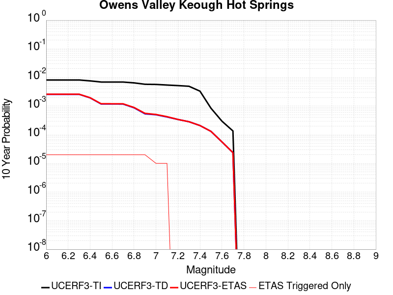 |

| Magnitude | 1 wk TI Prob | 1 wk TD Prob | 1 wk ETAS Prob | 1 wk ETAS/TD Gain | 1 wk ETAS Triggered Only | 1 mo TI Prob | 1 mo TD Prob | 1 mo ETAS Prob | 1 mo ETAS/TD Gain | 1 mo ETAS Triggered Only | 1 yr TI Prob | 1 yr TD Prob | 1 yr ETAS Prob | 1 yr ETAS/TD Gain | 1 yr ETAS Triggered Only | 10 yr TI Prob | 10 yr TD Prob | 10 yr ETAS Prob | 10 yr ETAS/TD Gain | 10 yr ETAS Triggered Only |
|-----|-----|-----|-----|-----|-----|-----|-----|-----|-----|-----|-----|-----|-----|-----|-----|-----|-----|-----|-----|-----|
| 6.0 | 1.5708529E-5 | 4.950463E-6 | 4.950463E-6 | 1.0 | 0.0 | 6.7320536E-5 | 2.1216127E-5 | 2.1216127E-5 | 1.0 | 0.0 | 8.193192E-4 | 2.5828084E-4 | 2.7456938E-4 | 1.0630652 | 1.6292748E-5 | 0.008163051 | 0.0025804387 | 0.00261294 | 1.0125953 | 3.2585496E-5 |
| 6.1 | 1.5708529E-5 | 4.950463E-6 | 4.950463E-6 | 1.0 | 0.0 | 6.7320536E-5 | 2.1216127E-5 | 2.1216127E-5 | 1.0 | 0.0 | 8.193192E-4 | 2.5828084E-4 | 2.7456938E-4 | 1.0630652 | 1.6292748E-5 | 0.008163051 | 0.0025804387 | 0.00261294 | 1.0125953 | 3.2585496E-5 |
| 6.2 | 1.5708529E-5 | 4.950463E-6 | 4.950463E-6 | 1.0 | 0.0 | 6.7320536E-5 | 2.1216127E-5 | 2.1216127E-5 | 1.0 | 0.0 | 8.193192E-4 | 2.5828084E-4 | 2.7456938E-4 | 1.0630652 | 1.6292748E-5 | 0.008163051 | 0.0025804387 | 0.00261294 | 1.0125953 | 3.2585496E-5 |
| 6.3 | 1.5708529E-5 | 4.950463E-6 | 4.950463E-6 | 1.0 | 0.0 | 6.7320536E-5 | 2.1216127E-5 | 2.1216127E-5 | 1.0 | 0.0 | 8.193192E-4 | 2.5828084E-4 | 2.7456938E-4 | 1.0630652 | 1.6292748E-5 | 0.008163051 | 0.0025804387 | 0.00261294 | 1.0125953 | 3.2585496E-5 |
| 6.4 | 1.4622509E-5 | 3.7263276E-6 | 3.7263276E-6 | 1.0 | 0.0 | 6.266639E-5 | 1.5969896E-5 | 1.5969896E-5 | 1.0 | 0.0 | 7.626962E-4 | 1.9441944E-4 | 2.1070903E-4 | 1.0837858 | 1.6292748E-5 | 0.007600839 | 0.0019429466 | 0.0019754688 | 1.0167385 | 3.2585496E-5 |
| 6.5 | 1.3335527E-5 | 2.2775241E-6 | 2.2775241E-6 | 1.0 | 0.0 | 5.7151006E-5 | 9.760785E-6 | 9.760785E-6 | 1.0 | 0.0 | 6.955913E-4 | 1.1883176E-4 | 1.3512258E-4 | 1.1370914 | 1.6292748E-5 | 0.0069341804 | 0.001187878 | 0.0012204248 | 1.0273991 | 3.2585496E-5 |
| 6.6 | 1.3332855E-5 | 2.2746733E-6 | 2.2746733E-6 | 1.0 | 0.0 | 5.7139558E-5 | 9.748568E-6 | 9.748568E-6 | 1.0 | 0.0 | 6.9545204E-4 | 1.1868303E-4 | 1.3497384E-4 | 1.1372632 | 1.6292748E-5 | 0.0069327964 | 0.0011863923 | 0.0012189391 | 1.0274334 | 3.2585496E-5 |
| 6.7 | 1.3318214E-5 | 2.2639038E-6 | 2.2639038E-6 | 1.0 | 0.0 | 5.707681E-5 | 9.702413E-6 | 9.702413E-6 | 1.0 | 0.0 | 6.946886E-4 | 1.18121156E-4 | 1.3441198E-4 | 1.1379162 | 1.6292748E-5 | 0.0069252094 | 0.0011807795 | 0.0012133265 | 1.027564 | 3.2585496E-5 |
| 6.8 | 1.2441338E-5 | 1.677594E-6 | 1.677594E-6 | 1.0 | 0.0 | 5.331893E-5 | 7.1896707E-6 | 7.1896707E-6 | 1.0 | 0.0 | 6.489646E-4 | 8.753102E-5 | 1.0382234E-4 | 1.1861205 | 1.6292748E-5 | 0.0064707273 | 8.751236E-4 | 9.076806E-4 | 1.0372027 | 3.2585496E-5 |
| 6.9 | 1.1130476E-5 | 1.0302234E-6 | 1.0302234E-6 | 1.0 | 0.0 | 4.7701167E-5 | 4.4152357E-6 | 4.4152357E-6 | 1.0 | 0.0 | 5.806069E-4 | 5.3754186E-5 | 7.004606E-5 | 1.303081 | 1.6292748E-5 | 0.0057909233 | 5.375404E-4 | 5.701084E-4 | 1.060587 | 3.2585496E-5 |
| 7.0 | 1.0986073E-5 | 9.577824E-7 | 9.577824E-7 | 1.0 | 0.0 | 4.7082318E-5 | 4.1047756E-6 | 4.1047756E-6 | 1.0 | 0.0 | 5.730765E-4 | 4.9974507E-5 | 6.626644E-5 | 1.3260049 | 1.6292748E-5 | 0.0057160086 | 4.997603E-4 | 5.160449E-4 | 1.0325848 | 1.6292748E-5 |
| 7.1 | 1.0451338E-5 | 7.9988575E-7 | 7.9988575E-7 | 1.0 | 0.0 | 4.4790682E-5 | 3.4280772E-6 | 3.4280772E-6 | 1.0 | 0.0 | 5.451901E-4 | 4.1736046E-5 | 5.8028116E-5 | 1.3903596 | 1.6292748E-5 | 0.005438545 | 4.1740583E-4 | 4.3369178E-4 | 1.0390171 | 1.6292748E-5 |
| 7.2 | 9.989061E-6 | 6.543693E-7 | 6.543693E-7 | 1.0 | 0.0 | 4.280956E-5 | 2.8044367E-6 | 2.8044367E-6 | 1.0 | 0.0 | 5.2108173E-4 | 3.4143486E-5 | 3.4143486E-5 | 1.0 | 0.0 | 0.0051986156 | 3.41488E-4 | 3.41488E-4 | 1.0 | 0.0 |
| 7.3 | 9.465365E-6 | 5.458855E-7 | 5.458855E-7 | 1.0 | 0.0 | 4.056522E-5 | 2.3395073E-6 | 2.3395073E-6 | 1.0 | 0.0 | 4.937696E-4 | 2.8483131E-5 | 2.8483131E-5 | 1.0 | 0.0 | 0.0049267393 | 2.8489542E-4 | 2.8489542E-4 | 1.0 | 0.0 |
| 7.4 | 6.3824805E-6 | 4.0153776E-7 | 4.0153776E-7 | 1.0 | 0.0 | 2.73532E-5 | 1.7208749E-6 | 1.7208749E-6 | 1.0 | 0.0 | 3.3297433E-4 | 2.0951453E-5 | 2.0951453E-5 | 1.0 | 0.0 | 0.0033247585 | 2.0955436E-4 | 2.0955436E-4 | 1.0 | 0.0 |
| 7.5 | 1.6192645E-6 | 2.5156373E-7 | 2.5156373E-7 | 1.0 | 0.0 | 6.9396865E-6 | 1.0781299E-6 | 1.0781299E-6 | 1.0 | 0.0 | 8.448741E-5 | 1.3126153E-5 | 1.3126153E-5 | 1.0 | 0.0 | 8.4455294E-4 | 1.3125391E-4 | 1.3125391E-4 | 1.0 | 0.0 |
| 7.6 | 5.7062545E-7 | 1.0790214E-7 | 1.0790214E-7 | 1.0 | 0.0 | 2.4455355E-6 | 4.6243767E-7 | 4.6243767E-7 | 1.0 | 0.0 | 2.9773988E-5 | 5.630165E-6 | 5.630165E-6 | 1.0 | 0.0 | 2.977E-4 | 5.6300305E-5 | 5.6300305E-5 | 1.0 | 0.0 |
| 7.7 | 2.5988817E-7 | 4.5445965E-8 | 4.5445965E-8 | 1.0 | 0.0 | 1.113806E-6 | 1.9476842E-7 | 1.9476842E-7 | 1.0 | 0.0 | 1.3560503E-5 | 2.3713033E-6 | 2.3713033E-6 | 1.0 | 0.0 | 1.3559677E-4 | 2.3712824E-5 | 2.3712824E-5 | 1.0 | 0.0 |

## Sierra Madre
*[(top)](#table-of-contents)*

| 1 Week | 1 Month | 1 Year | 10 Year |
|-----|-----|-----|-----|
|  |  |  |  |

| Magnitude | 1 wk TI Prob | 1 wk TD Prob | 1 wk ETAS Prob | 1 wk ETAS/TD Gain | 1 wk ETAS Triggered Only | 1 mo TI Prob | 1 mo TD Prob | 1 mo ETAS Prob | 1 mo ETAS/TD Gain | 1 mo ETAS Triggered Only | 1 yr TI Prob | 1 yr TD Prob | 1 yr ETAS Prob | 1 yr ETAS/TD Gain | 1 yr ETAS Triggered Only | 10 yr TI Prob | 10 yr TD Prob | 10 yr ETAS Prob | 10 yr ETAS/TD Gain | 10 yr ETAS Triggered Only |
|-----|-----|-----|-----|-----|-----|-----|-----|-----|-----|-----|-----|-----|-----|-----|-----|-----|-----|-----|-----|-----|
| 6.0 | 1.3379373E-5 | 1.1000776E-5 | 1.1000776E-5 | 1.0 | 0.0 | 5.7338908E-5 | 4.714534E-5 | 4.714534E-5 | 1.0 | 0.0 | 6.978776E-4 | 5.738448E-4 | 5.9012824E-4 | 1.028376 | 1.6292748E-5 | 0.0069569005 | 0.0057238447 | 0.005756244 | 1.0056603 | 3.2585496E-5 |
| 6.1 | 1.3379373E-5 | 1.1000776E-5 | 1.1000776E-5 | 1.0 | 0.0 | 5.7338908E-5 | 4.714534E-5 | 4.714534E-5 | 1.0 | 0.0 | 6.978776E-4 | 5.738448E-4 | 5.9012824E-4 | 1.028376 | 1.6292748E-5 | 0.0069569005 | 0.0057238447 | 0.005756244 | 1.0056603 | 3.2585496E-5 |
| 6.2 | 1.3379373E-5 | 1.1000776E-5 | 1.1000776E-5 | 1.0 | 0.0 | 5.7338908E-5 | 4.714534E-5 | 4.714534E-5 | 1.0 | 0.0 | 6.978776E-4 | 5.738448E-4 | 5.9012824E-4 | 1.028376 | 1.6292748E-5 | 0.0069569005 | 0.0057238447 | 0.005756244 | 1.0056603 | 3.2585496E-5 |
| 6.3 | 1.3379373E-5 | 1.1000776E-5 | 1.1000776E-5 | 1.0 | 0.0 | 5.7338908E-5 | 4.714534E-5 | 4.714534E-5 | 1.0 | 0.0 | 6.978776E-4 | 5.738448E-4 | 5.9012824E-4 | 1.028376 | 1.6292748E-5 | 0.0069569005 | 0.0057238447 | 0.005756244 | 1.0056603 | 3.2585496E-5 |
| 6.4 | 1.3379373E-5 | 1.1000776E-5 | 1.1000776E-5 | 1.0 | 0.0 | 5.7338908E-5 | 4.714534E-5 | 4.714534E-5 | 1.0 | 0.0 | 6.978776E-4 | 5.738448E-4 | 5.9012824E-4 | 1.028376 | 1.6292748E-5 | 0.0069569005 | 0.0057238447 | 0.005756244 | 1.0056603 | 3.2585496E-5 |
| 6.5 | 1.26563245E-5 | 1.0230232E-5 | 1.0230232E-5 | 1.0 | 0.0 | 5.4240263E-5 | 4.384312E-5 | 4.384312E-5 | 1.0 | 0.0 | 6.601751E-4 | 5.3366035E-4 | 5.499444E-4 | 1.0305139 | 1.6292748E-5 | 0.006582173 | 0.0053239604 | 0.0053563723 | 1.0060879 | 3.2585496E-5 |
| 6.6 | 1.26563245E-5 | 1.0230232E-5 | 1.0230232E-5 | 1.0 | 0.0 | 5.4240263E-5 | 4.384312E-5 | 4.384312E-5 | 1.0 | 0.0 | 6.601751E-4 | 5.3366035E-4 | 5.499444E-4 | 1.0305139 | 1.6292748E-5 | 0.006582173 | 0.0053239604 | 0.0053563723 | 1.0060879 | 3.2585496E-5 |
| 6.7 | 1.2502474E-5 | 1.00663765E-5 | 1.00663765E-5 | 1.0 | 0.0 | 5.3580934E-5 | 4.3140906E-5 | 4.3140906E-5 | 1.0 | 0.0 | 6.521526E-4 | 5.25115E-4 | 5.413992E-4 | 1.0310107 | 1.6292748E-5 | 0.0065024206 | 0.0052389116 | 0.0052713263 | 1.0061873 | 3.2585496E-5 |
| 6.8 | 1.2454966E-5 | 1.0018662E-5 | 1.0018662E-5 | 1.0 | 0.0 | 5.3377335E-5 | 4.293642E-5 | 4.293642E-5 | 1.0 | 0.0 | 6.4967526E-4 | 5.226266E-4 | 5.389108E-4 | 1.0311584 | 1.6292748E-5 | 0.006477792 | 0.0052141445 | 0.00524656 | 1.0062169 | 3.2585496E-5 |
| 6.9 | 1.2225574E-5 | 9.792639E-6 | 9.792639E-6 | 1.0 | 0.0 | 5.2394265E-5 | 4.196778E-5 | 4.196778E-5 | 1.0 | 0.0 | 6.3771347E-4 | 5.10839E-4 | 5.271234E-4 | 1.0318778 | 1.6292748E-5 | 0.006358865 | 0.0050968137 | 0.005129233 | 1.0063608 | 3.2585496E-5 |
| 7.0 | 1.182946E-5 | 9.399179E-6 | 9.399179E-6 | 1.0 | 0.0 | 5.06967E-5 | 4.0281582E-5 | 4.0281582E-5 | 1.0 | 0.0 | 6.1705755E-4 | 4.903189E-4 | 5.066037E-4 | 1.0332125 | 1.6292748E-5 | 0.006153469 | 0.004892533 | 0.004924959 | 1.0066277 | 3.2585496E-5 |
| 7.1 | 1.14369095E-5 | 8.986194E-6 | 8.986194E-6 | 1.0 | 0.0 | 4.9014405E-5 | 3.85117E-5 | 3.85117E-5 | 1.0 | 0.0 | 5.9658696E-4 | 4.6878002E-4 | 4.8506513E-4 | 1.0347394 | 1.6292748E-5 | 0.005949879 | 0.0046780678 | 0.004710501 | 1.006933 | 3.2585496E-5 |
| 7.2 | 1.0836419E-5 | 8.39959E-6 | 8.39959E-6 | 1.0 | 0.0 | 4.644097E-5 | 3.599775E-5 | 3.599775E-5 | 1.0 | 0.0 | 5.652721E-4 | 4.3818538E-4 | 4.5447098E-4 | 1.037166 | 1.6292748E-5 | 0.0056383642 | 0.0043733614 | 0.0044058044 | 1.0074183 | 3.2585496E-5 |
| 7.3 | 1.0403439E-5 | 8.020854E-6 | 8.020854E-6 | 1.0 | 0.0 | 4.4585406E-5 | 3.437464E-5 | 3.437464E-5 | 1.0 | 0.0 | 5.426921E-4 | 4.184318E-4 | 4.3471772E-4 | 1.0389214 | 1.6292748E-5 | 0.005413687 | 0.004176585 | 0.004209034 | 1.0077693 | 3.2585496E-5 |
| 7.4 | 9.768864E-6 | 7.4144855E-6 | 7.4144855E-6 | 1.0 | 0.0 | 4.186589E-5 | 3.1775984E-5 | 3.1775984E-5 | 1.0 | 0.0 | 5.09598E-4 | 3.868048E-4 | 4.0309125E-4 | 1.0421051 | 1.6292748E-5 | 0.0050843097 | 0.0038614576 | 0.0038939172 | 1.008406 | 3.2585496E-5 |
| 7.5 | 8.687089E-6 | 6.450183E-6 | 6.450183E-6 | 1.0 | 0.0 | 3.722985E-5 | 2.7643353E-5 | 2.7643353E-5 | 1.0 | 0.0 | 4.5317915E-4 | 3.3650672E-4 | 3.3650672E-4 | 1.0 | 0.0 | 0.004522561 | 0.003360109 | 0.003360109 | 1.0 | 0.0 |
| 7.6 | 6.3506063E-6 | 4.430329E-6 | 4.430329E-6 | 1.0 | 0.0 | 2.72166E-5 | 1.8986988E-5 | 1.8986988E-5 | 1.0 | 0.0 | 3.3131172E-4 | 2.3114232E-4 | 2.3114232E-4 | 1.0 | 0.0 | 0.003308182 | 0.0023090935 | 0.0023090935 | 1.0 | 0.0 |
| 7.7 | 4.62223E-6 | 2.9329542E-6 | 2.9329542E-6 | 1.0 | 0.0 | 1.9809406E-5 | 1.2569743E-5 | 1.2569743E-5 | 1.0 | 0.0 | 2.4115283E-4 | 1.5302589E-4 | 1.5302589E-4 | 1.0 | 0.0 | 0.0024089129 | 0.0015292577 | 0.0015292577 | 1.0 | 0.0 |
| 7.8 | 3.2145008E-6 | 1.949411E-6 | 1.949411E-6 | 1.0 | 0.0 | 1.3776359E-5 | 8.354592E-6 | 8.354592E-6 | 1.0 | 0.0 | 1.6771426E-4 | 1.01712416E-4 | 1.01712416E-4 | 1.0 | 0.0 | 0.0016758774 | 0.0010166786 | 0.0010166786 | 1.0 | 0.0 |
| 7.9 | 1.0391769E-6 | 5.602482E-7 | 5.602482E-7 | 1.0 | 0.0 | 4.4536077E-6 | 2.4010617E-6 | 2.4010617E-6 | 1.0 | 0.0 | 5.4221324E-5 | 2.9232539E-5 | 2.9232539E-5 | 1.0 | 0.0 | 5.4208096E-4 | 2.9228735E-4 | 2.9228735E-4 | 1.0 | 0.0 |
| 8.0 | 1.210983E-7 | 6.613497E-8 | 6.613497E-8 | 1.0 | 0.0 | 5.1899264E-7 | 2.8343558E-7 | 2.8343558E-7 | 1.0 | 0.0 | 6.3187167E-6 | 3.4508228E-6 | 3.4508228E-6 | 1.0 | 0.0 | 6.318537E-5 | 3.450771E-5 | 3.450771E-5 | 1.0 | 0.0 |

## Morales (East)
*[(top)](#table-of-contents)*

| 1 Week | 1 Month | 1 Year | 10 Year |
|-----|-----|-----|-----|
|  |  |  |  |

| Magnitude | 1 wk TI Prob | 1 wk TD Prob | 1 wk ETAS Prob | 1 wk ETAS/TD Gain | 1 wk ETAS Triggered Only | 1 mo TI Prob | 1 mo TD Prob | 1 mo ETAS Prob | 1 mo ETAS/TD Gain | 1 mo ETAS Triggered Only | 1 yr TI Prob | 1 yr TD Prob | 1 yr ETAS Prob | 1 yr ETAS/TD Gain | 1 yr ETAS Triggered Only | 10 yr TI Prob | 10 yr TD Prob | 10 yr ETAS Prob | 10 yr ETAS/TD Gain | 10 yr ETAS Triggered Only |
|-----|-----|-----|-----|-----|-----|-----|-----|-----|-----|-----|-----|-----|-----|-----|-----|-----|-----|-----|-----|-----|
| 6.0 | 1.4942771E-6 | 2.123544E-6 | 2.123544E-6 | 1.0 | 0.0 | 6.404029E-6 | 9.100874E-6 | 9.100874E-6 | 1.0 | 0.0 | 7.7966266E-5 | 1.1079809E-4 | 1.4337998E-4 | 1.2940654 | 3.2585496E-5 | 7.793892E-4 | 0.0011074883 | 0.0011400377 | 1.0293903 | 3.2585496E-5 |
| 6.1 | 1.4942771E-6 | 2.123544E-6 | 2.123544E-6 | 1.0 | 0.0 | 6.404029E-6 | 9.100874E-6 | 9.100874E-6 | 1.0 | 0.0 | 7.7966266E-5 | 1.1079809E-4 | 1.4337998E-4 | 1.2940654 | 3.2585496E-5 | 7.793892E-4 | 0.0011074883 | 0.0011400377 | 1.0293903 | 3.2585496E-5 |
| 6.2 | 1.4942771E-6 | 2.123544E-6 | 2.123544E-6 | 1.0 | 0.0 | 6.404029E-6 | 9.100874E-6 | 9.100874E-6 | 1.0 | 0.0 | 7.7966266E-5 | 1.1079809E-4 | 1.4337998E-4 | 1.2940654 | 3.2585496E-5 | 7.793892E-4 | 0.0011074883 | 0.0011400377 | 1.0293903 | 3.2585496E-5 |
| 6.3 | 1.4942771E-6 | 2.123544E-6 | 2.123544E-6 | 1.0 | 0.0 | 6.404029E-6 | 9.100874E-6 | 9.100874E-6 | 1.0 | 0.0 | 7.7966266E-5 | 1.1079809E-4 | 1.4337998E-4 | 1.2940654 | 3.2585496E-5 | 7.793892E-4 | 0.0011074883 | 0.0011400377 | 1.0293903 | 3.2585496E-5 |
| 6.4 | 8.798845E-7 | 1.5023381E-6 | 1.5023381E-6 | 1.0 | 0.0 | 3.7709283E-6 | 6.4385767E-6 | 6.4385767E-6 | 1.0 | 0.0 | 4.5910085E-5 | 7.838696E-5 | 7.838696E-5 | 1.0 | 0.0 | 4.59006E-4 | 7.836066E-4 | 7.836066E-4 | 1.0 | 0.0 |
| 6.5 | 7.1751725E-7 | 1.3384879E-6 | 1.3384879E-6 | 1.0 | 0.0 | 3.0750705E-6 | 5.7363645E-6 | 5.7363645E-6 | 1.0 | 0.0 | 3.7438338E-5 | 6.9838075E-5 | 6.9838075E-5 | 1.0 | 0.0 | 3.743203E-4 | 6.981715E-4 | 6.981715E-4 | 1.0 | 0.0 |
| 6.6 | 7.1751725E-7 | 1.3384879E-6 | 1.3384879E-6 | 1.0 | 0.0 | 3.0750705E-6 | 5.7363645E-6 | 5.7363645E-6 | 1.0 | 0.0 | 3.7438338E-5 | 6.9838075E-5 | 6.9838075E-5 | 1.0 | 0.0 | 3.743203E-4 | 6.981715E-4 | 6.981715E-4 | 1.0 | 0.0 |
| 6.7 | 7.159057E-7 | 1.3359539E-6 | 1.3359539E-6 | 1.0 | 0.0 | 3.0681638E-6 | 5.7255043E-6 | 5.7255043E-6 | 1.0 | 0.0 | 3.7354253E-5 | 6.9705864E-5 | 6.9705864E-5 | 1.0 | 0.0 | 3.7347974E-4 | 6.968502E-4 | 6.968502E-4 | 1.0 | 0.0 |
| 6.8 | 7.032203E-7 | 1.3175089E-6 | 1.3175089E-6 | 1.0 | 0.0 | 3.0137978E-6 | 5.646455E-6 | 5.646455E-6 | 1.0 | 0.0 | 3.669237E-5 | 6.87435E-5 | 6.87435E-5 | 1.0 | 0.0 | 3.6686313E-4 | 6.872325E-4 | 6.872325E-4 | 1.0 | 0.0 |
| 6.9 | 6.941549E-7 | 1.3025701E-6 | 1.3025701E-6 | 1.0 | 0.0 | 2.974946E-6 | 5.5824316E-6 | 5.5824316E-6 | 1.0 | 0.0 | 3.6219368E-5 | 6.7964065E-5 | 6.7964065E-5 | 1.0 | 0.0 | 3.6213463E-4 | 6.794429E-4 | 6.794429E-4 | 1.0 | 0.0 |
| 7.0 | 6.2932247E-7 | 1.1877994E-6 | 1.1877994E-6 | 1.0 | 0.0 | 2.6970936E-6 | 5.090559E-6 | 5.090559E-6 | 1.0 | 0.0 | 3.283662E-5 | 6.197586E-5 | 6.197586E-5 | 1.0 | 0.0 | 3.283177E-4 | 6.1959465E-4 | 6.1959465E-4 | 1.0 | 0.0 |
| 7.1 | 5.6200963E-7 | 1.064093E-6 | 1.064093E-6 | 1.0 | 0.0 | 2.4086105E-6 | 4.560391E-6 | 4.560391E-6 | 1.0 | 0.0 | 2.9324437E-5 | 5.5521392E-5 | 5.5521392E-5 | 1.0 | 0.0 | 2.9320567E-4 | 5.5508246E-4 | 5.5508246E-4 | 1.0 | 0.0 |
| 7.2 | 4.91044E-7 | 9.2862194E-7 | 9.2862194E-7 | 1.0 | 0.0 | 2.1044725E-6 | 3.9798024E-6 | 3.9798024E-6 | 1.0 | 0.0 | 2.5621652E-5 | 4.8453054E-5 | 4.8453054E-5 | 1.0 | 0.0 | 2.56187E-4 | 4.8443122E-4 | 4.8443122E-4 | 1.0 | 0.0 |
| 7.3 | 4.2978448E-7 | 7.974413E-7 | 7.974413E-7 | 1.0 | 0.0 | 1.8419321E-6 | 3.4176012E-6 | 3.4176012E-6 | 1.0 | 0.0 | 2.2425293E-5 | 4.160853E-5 | 4.160853E-5 | 1.0 | 0.0 | 2.242303E-4 | 4.1601306E-4 | 4.1601306E-4 | 1.0 | 0.0 |
| 7.4 | 3.774317E-7 | 6.807105E-7 | 6.807105E-7 | 1.0 | 0.0 | 1.6175634E-6 | 2.9173275E-6 | 2.9173275E-6 | 1.0 | 0.0 | 1.9693656E-5 | 3.551791E-5 | 3.551791E-5 | 1.0 | 0.0 | 1.969191E-4 | 3.5512767E-4 | 3.5512767E-4 | 1.0 | 0.0 |
| 7.5 | 1.0603232E-7 | 9.8406424E-8 | 9.8406424E-8 | 1.0 | 0.0 | 4.5442414E-7 | 4.2174173E-7 | 4.2174173E-7 | 1.0 | 0.0 | 5.5326E-6 | 5.1346938E-6 | 5.1346938E-6 | 1.0 | 0.0 | 5.532462E-5 | 5.1348336E-5 | 5.1348336E-5 | 1.0 | 0.0 |
| 7.6 | 9.960384E-8 | 8.755028E-8 | 8.755028E-8 | 1.0 | 0.0 | 4.2687353E-7 | 3.7521542E-7 | 3.7521542E-7 | 1.0 | 0.0 | 5.197173E-6 | 4.568238E-6 | 4.568238E-6 | 1.0 | 0.0 | 5.1970514E-5 | 4.5684028E-5 | 4.5684028E-5 | 1.0 | 0.0 |
| 7.7 | 6.499468E-8 | 4.103351E-8 | 4.103351E-8 | 1.0 | 0.0 | 2.785486E-7 | 1.7585788E-7 | 1.7585788E-7 | 1.0 | 0.0 | 3.3913238E-6 | 2.1410676E-6 | 2.1410676E-6 | 1.0 | 0.0 | 3.3912722E-5 | 2.1413045E-5 | 2.1413045E-5 | 1.0 | 0.0 |
| 7.8 | 2.2517119E-8 | 7.1293824E-9 | 7.1293824E-9 | 1.0 | 0.0 | 9.6501935E-8 | 3.0554492E-8 | 3.0554492E-8 | 1.0 | 0.0 | 1.1749105E-6 | 3.720009E-7 | 3.720009E-7 | 1.0 | 0.0 | 1.1749043E-5 | 3.7225666E-6 | 3.7225666E-6 | 1.0 | 0.0 |
| 7.9 | 8.493023E-9 | 9.962774E-10 | 9.962774E-10 | 1.0 | 0.0 | 3.639867E-8 | 4.2697574E-9 | 4.2697574E-9 | 1.0 | 0.0 | 4.4315374E-7 | 5.19843E-8 | 5.19843E-8 | 1.0 | 0.0 | 4.4315284E-6 | 5.2196486E-7 | 5.2196486E-7 | 1.0 | 0.0 |
| 8.0 | 1.4971842E-9 | 5.5340177E-11 | 5.5340177E-11 | 1.0 | 0.0 | 6.4165038E-9 | 2.3717173E-10 | 2.3717173E-10 | 1.0 | 0.0 | 7.812093E-8 | 2.887568E-9 | 2.887568E-9 | 1.0 | 0.0 | 7.81209E-7 | 3.0142694E-8 | 3.0142694E-8 | 1.0 | 0.0 |

## Elmore Ranch
*[(top)](#table-of-contents)*

| 1 Week | 1 Month | 1 Year | 10 Year |
|-----|-----|-----|-----|
|  |  |  |  |

| Magnitude | 1 wk TI Prob | 1 wk TD Prob | 1 wk ETAS Prob | 1 wk ETAS/TD Gain | 1 wk ETAS Triggered Only | 1 mo TI Prob | 1 mo TD Prob | 1 mo ETAS Prob | 1 mo ETAS/TD Gain | 1 mo ETAS Triggered Only | 1 yr TI Prob | 1 yr TD Prob | 1 yr ETAS Prob | 1 yr ETAS/TD Gain | 1 yr ETAS Triggered Only | 10 yr TI Prob | 10 yr TD Prob | 10 yr ETAS Prob | 10 yr ETAS/TD Gain | 10 yr ETAS Triggered Only |
|-----|-----|-----|-----|-----|-----|-----|-----|-----|-----|-----|-----|-----|-----|-----|-----|-----|-----|-----|-----|-----|
| 6.0 | 9.102099E-5 | 8.953848E-5 | 8.953848E-5 | 1.0 | 0.0 | 3.9003167E-4 | 3.836898E-4 | 3.836898E-4 | 1.0 | 0.0 | 0.0047383 | 0.004662132 | 0.0046783485 | 1.0034784 | 1.6292748E-5 | 0.046385348 | 0.04583787 | 0.045868963 | 1.0006783 | 3.2585496E-5 |
| 6.1 | 3.8306698E-5 | 4.14921E-5 | 4.14921E-5 | 1.0 | 0.0 | 1.6416123E-4 | 1.7781362E-4 | 1.7781362E-4 | 1.0 | 0.0 | 0.0019968306 | 0.0021632186 | 0.0021632186 | 1.0 | 0.0 | 0.019789828 | 0.021595007 | 0.021610947 | 1.0007381 | 1.6292748E-5 |
| 6.2 | 3.8306698E-5 | 4.14921E-5 | 4.14921E-5 | 1.0 | 0.0 | 1.6416123E-4 | 1.7781362E-4 | 1.7781362E-4 | 1.0 | 0.0 | 0.0019968306 | 0.0021632186 | 0.0021632186 | 1.0 | 0.0 | 0.019789828 | 0.021595007 | 0.021610947 | 1.0007381 | 1.6292748E-5 |
| 6.3 | 3.3197924E-5 | 3.6550366E-5 | 3.6550366E-5 | 1.0 | 0.0 | 1.4226905E-4 | 1.56639E-4 | 1.56639E-4 | 1.0 | 0.0 | 0.0017307495 | 0.0019059771 | 0.0019059771 | 1.0 | 0.0 | 0.017173318 | 0.019057386 | 0.019073367 | 1.0008386 | 1.6292748E-5 |
| 6.4 | 2.5148964E-5 | 2.7420736E-5 | 2.7420736E-5 | 1.0 | 0.0 | 1.0777682E-4 | 1.17515796E-4 | 1.17515796E-4 | 1.0 | 0.0 | 0.0013113929 | 0.0014304637 | 0.0014304637 | 1.0 | 0.0 | 0.01303681 | 0.014365338 | 0.014365338 | 1.0 | 0.0 |
| 6.5 | 2.5148964E-5 | 2.7420736E-5 | 2.7420736E-5 | 1.0 | 0.0 | 1.0777682E-4 | 1.17515796E-4 | 1.17515796E-4 | 1.0 | 0.0 | 0.0013113929 | 0.0014304637 | 0.0014304637 | 1.0 | 0.0 | 0.01303681 | 0.014365338 | 0.014365338 | 1.0 | 0.0 |

## Robinson Creek
*[(top)](#table-of-contents)*

| 1 Week | 1 Month | 1 Year | 10 Year |
|-----|-----|-----|-----|
|  |  |  |  |

| Magnitude | 1 wk TI Prob | 1 wk TD Prob | 1 wk ETAS Prob | 1 wk ETAS/TD Gain | 1 wk ETAS Triggered Only | 1 mo TI Prob | 1 mo TD Prob | 1 mo ETAS Prob | 1 mo ETAS/TD Gain | 1 mo ETAS Triggered Only | 1 yr TI Prob | 1 yr TD Prob | 1 yr ETAS Prob | 1 yr ETAS/TD Gain | 1 yr ETAS Triggered Only | 10 yr TI Prob | 10 yr TD Prob | 10 yr ETAS Prob | 10 yr ETAS/TD Gain | 10 yr ETAS Triggered Only |
|-----|-----|-----|-----|-----|-----|-----|-----|-----|-----|-----|-----|-----|-----|-----|-----|-----|-----|-----|-----|-----|
| 6.0 | 1.3705327E-5 | 1.5285013E-5 | 1.5285013E-5 | 1.0 | 0.0 | 5.8735794E-5 | 6.55072E-5 | 8.1798884E-5 | 1.2487006 | 1.6292748E-5 | 7.1487366E-4 | 7.9755014E-4 | 8.138299E-4 | 1.0204122 | 1.6292748E-5 | 0.0071257832 | 0.007975501 | 0.008007827 | 1.0040531 | 3.2585496E-5 |
| 6.1 | 1.3705327E-5 | 1.5285013E-5 | 1.5285013E-5 | 1.0 | 0.0 | 5.8735794E-5 | 6.55072E-5 | 8.1798884E-5 | 1.2487006 | 1.6292748E-5 | 7.1487366E-4 | 7.9755014E-4 | 8.138299E-4 | 1.0204122 | 1.6292748E-5 | 0.0071257832 | 0.007975501 | 0.008007827 | 1.0040531 | 3.2585496E-5 |
| 6.2 | 1.3705327E-5 | 1.5285013E-5 | 1.5285013E-5 | 1.0 | 0.0 | 5.8735794E-5 | 6.55072E-5 | 8.1798884E-5 | 1.2487006 | 1.6292748E-5 | 7.1487366E-4 | 7.9755014E-4 | 8.138299E-4 | 1.0204122 | 1.6292748E-5 | 0.0071257832 | 0.007975501 | 0.008007827 | 1.0040531 | 3.2585496E-5 |
| 6.3 | 1.3705327E-5 | 1.5285013E-5 | 1.5285013E-5 | 1.0 | 0.0 | 5.8735794E-5 | 6.55072E-5 | 8.1798884E-5 | 1.2487006 | 1.6292748E-5 | 7.1487366E-4 | 7.9755014E-4 | 8.138299E-4 | 1.0204122 | 1.6292748E-5 | 0.0071257832 | 0.007975501 | 0.008007827 | 1.0040531 | 3.2585496E-5 |
| 6.4 | 1.3705327E-5 | 1.5285013E-5 | 1.5285013E-5 | 1.0 | 0.0 | 5.8735794E-5 | 6.55072E-5 | 8.1798884E-5 | 1.2487006 | 1.6292748E-5 | 7.1487366E-4 | 7.9755014E-4 | 8.138299E-4 | 1.0204122 | 1.6292748E-5 | 0.0071257832 | 0.007975501 | 0.008007827 | 1.0040531 | 3.2585496E-5 |

## Cucamonga
*[(top)](#table-of-contents)*

| 1 Week | 1 Month | 1 Year | 10 Year |
|-----|-----|-----|-----|
|  |  |  |  |

| Magnitude | 1 wk TI Prob | 1 wk TD Prob | 1 wk ETAS Prob | 1 wk ETAS/TD Gain | 1 wk ETAS Triggered Only | 1 mo TI Prob | 1 mo TD Prob | 1 mo ETAS Prob | 1 mo ETAS/TD Gain | 1 mo ETAS Triggered Only | 1 yr TI Prob | 1 yr TD Prob | 1 yr ETAS Prob | 1 yr ETAS/TD Gain | 1 yr ETAS Triggered Only | 10 yr TI Prob | 10 yr TD Prob | 10 yr ETAS Prob | 10 yr ETAS/TD Gain | 10 yr ETAS Triggered Only |
|-----|-----|-----|-----|-----|-----|-----|-----|-----|-----|-----|-----|-----|-----|-----|-----|-----|-----|-----|-----|-----|
| 6.0 | 1.1848348E-5 | 1.1737109E-5 | 1.1737109E-5 | 1.0 | 0.0 | 5.0777642E-5 | 5.0300943E-5 | 5.0300943E-5 | 1.0 | 0.0 | 6.180424E-4 | 6.122446E-4 | 6.2852737E-4 | 1.0265952 | 1.6292748E-5 | 0.0061632637 | 0.006106745 | 0.0061391313 | 1.0053034 | 3.2585496E-5 |
| 6.1 | 1.1848348E-5 | 1.1737109E-5 | 1.1737109E-5 | 1.0 | 0.0 | 5.0777642E-5 | 5.0300943E-5 | 5.0300943E-5 | 1.0 | 0.0 | 6.180424E-4 | 6.122446E-4 | 6.2852737E-4 | 1.0265952 | 1.6292748E-5 | 0.0061632637 | 0.006106745 | 0.0061391313 | 1.0053034 | 3.2585496E-5 |
| 6.2 | 1.1848348E-5 | 1.1737109E-5 | 1.1737109E-5 | 1.0 | 0.0 | 5.0777642E-5 | 5.0300943E-5 | 5.0300943E-5 | 1.0 | 0.0 | 6.180424E-4 | 6.122446E-4 | 6.2852737E-4 | 1.0265952 | 1.6292748E-5 | 0.0061632637 | 0.006106745 | 0.0061391313 | 1.0053034 | 3.2585496E-5 |
| 6.3 | 1.1848348E-5 | 1.1737109E-5 | 1.1737109E-5 | 1.0 | 0.0 | 5.0777642E-5 | 5.0300943E-5 | 5.0300943E-5 | 1.0 | 0.0 | 6.180424E-4 | 6.122446E-4 | 6.2852737E-4 | 1.0265952 | 1.6292748E-5 | 0.0061632637 | 0.006106745 | 0.0061391313 | 1.0053034 | 3.2585496E-5 |
| 6.4 | 1.1848348E-5 | 1.1737109E-5 | 1.1737109E-5 | 1.0 | 0.0 | 5.0777642E-5 | 5.0300943E-5 | 5.0300943E-5 | 1.0 | 0.0 | 6.180424E-4 | 6.122446E-4 | 6.2852737E-4 | 1.0265952 | 1.6292748E-5 | 0.0061632637 | 0.006106745 | 0.0061391313 | 1.0053034 | 3.2585496E-5 |
| 6.5 | 1.16988695E-5 | 1.157614E-5 | 1.157614E-5 | 1.0 | 0.0 | 5.013705E-5 | 4.9611102E-5 | 4.9611102E-5 | 1.0 | 0.0 | 6.102476E-4 | 6.0385047E-4 | 6.2013336E-4 | 1.0269651 | 1.6292748E-5 | 0.006085745 | 0.0060232594 | 0.0060556484 | 1.0053774 | 3.2585496E-5 |
| 6.6 | 1.16988695E-5 | 1.157614E-5 | 1.157614E-5 | 1.0 | 0.0 | 5.013705E-5 | 4.9611102E-5 | 4.9611102E-5 | 1.0 | 0.0 | 6.102476E-4 | 6.0385047E-4 | 6.2013336E-4 | 1.0269651 | 1.6292748E-5 | 0.006085745 | 0.0060232594 | 0.0060556484 | 1.0053774 | 3.2585496E-5 |
| 6.7 | 1.1397107E-5 | 1.1115039E-5 | 1.1115039E-5 | 1.0 | 0.0 | 4.884383E-5 | 4.7635025E-5 | 4.7635025E-5 | 1.0 | 0.0 | 5.9451134E-4 | 5.798046E-4 | 5.960879E-4 | 1.0280842 | 1.6292748E-5 | 0.005929234 | 0.005784061 | 0.005816458 | 1.005601 | 3.2585496E-5 |
| 6.8 | 1.058387E-5 | 9.785037E-6 | 9.785037E-6 | 1.0 | 0.0 | 4.5358654E-5 | 4.1935207E-5 | 4.1935207E-5 | 1.0 | 0.0 | 5.521017E-4 | 5.1044265E-4 | 5.2672706E-4 | 1.0319026 | 1.6292748E-5 | 0.00550732 | 0.005093702 | 0.0051261215 | 1.0063646 | 3.2585496E-5 |
| 6.9 | 9.690046E-6 | 8.579504E-6 | 8.579504E-6 | 1.0 | 0.0 | 4.1528107E-5 | 3.6768783E-5 | 3.6768783E-5 | 1.0 | 0.0 | 5.054874E-4 | 4.475684E-4 | 4.6385385E-4 | 1.0363865 | 1.6292748E-5 | 0.005043391 | 0.0044675954 | 0.004500035 | 1.0072612 | 3.2585496E-5 |
| 7.0 | 9.381461E-6 | 8.18712E-6 | 8.18712E-6 | 1.0 | 0.0 | 4.020564E-5 | 3.508719E-5 | 3.508719E-5 | 1.0 | 0.0 | 4.893937E-4 | 4.2710314E-4 | 4.433889E-4 | 1.0381308 | 1.6292748E-5 | 0.0048831734 | 0.004263747 | 0.004296194 | 1.0076098 | 3.2585496E-5 |
| 7.1 | 8.946492E-6 | 7.781904E-6 | 7.781904E-6 | 1.0 | 0.0 | 3.8341543E-5 | 3.3350592E-5 | 3.3350592E-5 | 1.0 | 0.0 | 4.667083E-4 | 4.0596814E-4 | 4.2225426E-4 | 1.0401168 | 1.6292748E-5 | 0.0046572937 | 0.0040531927 | 0.004085646 | 1.0080069 | 3.2585496E-5 |
| 7.2 | 8.251016E-6 | 6.9752878E-6 | 6.9752878E-6 | 1.0 | 0.0 | 3.5361016E-5 | 2.9893748E-5 | 2.9893748E-5 | 1.0 | 0.0 | 4.3043532E-4 | 3.6389584E-4 | 3.8018267E-4 | 1.0447568 | 1.6292748E-5 | 0.0042960253 | 0.0036339252 | 0.0036663923 | 1.0089345 | 3.2585496E-5 |
| 7.3 | 7.717881E-6 | 6.4863584E-6 | 6.4863584E-6 | 1.0 | 0.0 | 3.3076216E-5 | 2.7798384E-5 | 2.7798384E-5 | 1.0 | 0.0 | 4.026285E-4 | 3.38393E-4 | 3.5468023E-4 | 1.0481311 | 1.6292748E-5 | 0.004018998 | 0.0033797103 | 0.0034121857 | 1.0096089 | 3.2585496E-5 |
| 7.4 | 7.275623E-6 | 6.032004E-6 | 6.032004E-6 | 1.0 | 0.0 | 3.118087E-5 | 2.5851192E-5 | 2.5851192E-5 | 1.0 | 0.0 | 3.7956095E-4 | 3.1469302E-4 | 3.3098063E-4 | 1.0517572 | 1.6292748E-5 | 0.0037891332 | 0.0031434046 | 0.0031758877 | 1.0103338 | 3.2585496E-5 |
| 7.5 | 6.5109502E-6 | 5.100593E-6 | 5.100593E-6 | 1.0 | 0.0 | 2.7903774E-5 | 2.1859503E-5 | 2.1859503E-5 | 1.0 | 0.0 | 3.3967546E-4 | 2.661071E-4 | 2.661071E-4 | 1.0 | 0.0 | 0.0033915674 | 0.0026588016 | 0.0026588016 | 1.0 | 0.0 |
| 7.6 | 5.4495326E-6 | 3.908547E-6 | 3.908547E-6 | 1.0 | 0.0 | 2.335493E-5 | 1.6750808E-5 | 1.6750808E-5 | 1.0 | 0.0 | 2.8430918E-4 | 2.0392207E-4 | 2.0392207E-4 | 1.0 | 0.0 | 0.0028394572 | 0.0020382616 | 0.0020382616 | 1.0 | 0.0 |
| 7.7 | 4.7997164E-6 | 3.2002263E-6 | 3.2002263E-6 | 1.0 | 0.0 | 2.057005E-5 | 1.3715184E-5 | 1.3715184E-5 | 1.0 | 0.0 | 2.504116E-4 | 1.6696959E-4 | 1.6696959E-4 | 1.0 | 0.0 | 0.002501296 | 0.0016693701 | 0.0016693701 | 1.0 | 0.0 |
| 7.8 | 3.3941733E-6 | 2.0641678E-6 | 2.0641678E-6 | 1.0 | 0.0 | 1.4546376E-5 | 8.846404E-6 | 8.846404E-6 | 1.0 | 0.0 | 1.7708774E-4 | 1.07699656E-4 | 1.07699656E-4 | 1.0 | 0.0 | 0.0017694668 | 0.0010766032 | 0.0010766032 | 1.0 | 0.0 |
| 7.9 | 9.750552E-7 | 5.155798E-7 | 5.155798E-7 | 1.0 | 0.0 | 4.178801E-6 | 2.2096258E-6 | 2.2096258E-6 | 1.0 | 0.0 | 5.0875715E-5 | 2.6901867E-5 | 2.6901867E-5 | 1.0 | 0.0 | 5.086407E-4 | 2.689865E-4 | 2.689865E-4 | 1.0 | 0.0 |
| 8.0 | 1.133857E-7 | 6.053372E-8 | 6.053372E-8 | 1.0 | 0.0 | 4.8593864E-7 | 2.594302E-7 | 2.594302E-7 | 1.0 | 0.0 | 5.9162867E-6 | 3.1585582E-6 | 3.1585582E-6 | 1.0 | 0.0 | 5.916129E-5 | 3.158515E-5 | 3.158515E-5 | 1.0 | 0.0 |

## San Diego Trough south
*[(top)](#table-of-contents)*

| 1 Week | 1 Month | 1 Year | 10 Year |
|-----|-----|-----|-----|
|  |  |  |  |

| Magnitude | 1 wk TI Prob | 1 wk TD Prob | 1 wk ETAS Prob | 1 wk ETAS/TD Gain | 1 wk ETAS Triggered Only | 1 mo TI Prob | 1 mo TD Prob | 1 mo ETAS Prob | 1 mo ETAS/TD Gain | 1 mo ETAS Triggered Only | 1 yr TI Prob | 1 yr TD Prob | 1 yr ETAS Prob | 1 yr ETAS/TD Gain | 1 yr ETAS Triggered Only | 10 yr TI Prob | 10 yr TD Prob | 10 yr ETAS Prob | 10 yr ETAS/TD Gain | 10 yr ETAS Triggered Only |
|-----|-----|-----|-----|-----|-----|-----|-----|-----|-----|-----|-----|-----|-----|-----|-----|-----|-----|-----|-----|-----|
| 6.0 | 8.279495E-5 | 1.0425541E-4 | 1.3683751E-4 | 1.3125219 | 3.2585496E-5 | 3.5478722E-4 | 4.4673498E-4 | 4.7930592E-4 | 1.0729089 | 3.2585496E-5 | 0.004310982 | 0.0054259133 | 0.0054583224 | 1.005973 | 3.2585496E-5 | 0.042283054 | 0.05299303 | 0.05302389 | 1.0005823 | 3.2585496E-5 |
| 6.1 | 4.6961468E-5 | 5.773024E-5 | 5.773024E-5 | 1.0 | 0.0 | 2.0124791E-4 | 2.473905E-4 | 2.473905E-4 | 1.0 | 0.0 | 0.00244744 | 0.003007886 | 0.003007886 | 1.0 | 0.0 | 0.024206603 | 0.029679636 | 0.029679636 | 1.0 | 0.0 |
| 6.2 | 3.5079658E-5 | 4.214258E-5 | 4.214258E-5 | 1.0 | 0.0 | 1.5033272E-4 | 1.8059829E-4 | 1.8059829E-4 | 1.0 | 0.0 | 0.0018287642 | 0.002196587 | 0.002196587 | 1.0 | 0.0 | 0.018137876 | 0.021751188 | 0.021751188 | 1.0 | 0.0 |
| 6.3 | 3.5079658E-5 | 4.214258E-5 | 4.214258E-5 | 1.0 | 0.0 | 1.5033272E-4 | 1.8059829E-4 | 1.8059829E-4 | 1.0 | 0.0 | 0.0018287642 | 0.002196587 | 0.002196587 | 1.0 | 0.0 | 0.018137876 | 0.021751188 | 0.021751188 | 1.0 | 0.0 |
| 6.4 | 2.7196904E-5 | 3.208715E-5 | 3.208715E-5 | 1.0 | 0.0 | 1.16552954E-4 | 1.3750911E-4 | 1.3750911E-4 | 1.0 | 0.0 | 0.0014181085 | 0.0016728995 | 0.0016728995 | 1.0 | 0.0 | 0.014090929 | 0.016604666 | 0.016604666 | 1.0 | 0.0 |
| 6.5 | 2.5584688E-5 | 3.0101632E-5 | 3.0101632E-5 | 1.0 | 0.0 | 1.0964406E-4 | 1.2900059E-4 | 1.2900059E-4 | 1.0 | 0.0 | 0.0013340989 | 0.0015694627 | 0.0015694627 | 1.0 | 0.0 | 0.013261181 | 0.015585332 | 0.015585332 | 1.0 | 0.0 |
| 6.6 | 2.2034688E-5 | 2.574271E-5 | 2.574271E-5 | 1.0 | 0.0 | 9.443096E-5 | 1.1032127E-4 | 1.1032127E-4 | 1.0 | 0.0 | 0.0011490905 | 0.0013423412 | 0.0013423412 | 1.0 | 0.0 | 0.011431668 | 0.013343325 | 0.013343325 | 1.0 | 0.0 |
| 6.7 | 1.9394853E-5 | 2.254176E-5 | 2.254176E-5 | 1.0 | 0.0 | 8.311815E-5 | 9.6604E-5 | 9.6604E-5 | 1.0 | 0.0 | 0.0010114936 | 0.0011755243 | 0.0011755243 | 1.0 | 0.0 | 0.01006902 | 0.011693766 | 0.011693766 | 1.0 | 0.0 |
| 6.8 | 1.7615313E-5 | 2.0403182E-5 | 2.0403182E-5 | 1.0 | 0.0 | 7.549201E-5 | 8.743931E-5 | 8.743931E-5 | 1.0 | 0.0 | 9.1872766E-4 | 0.0010640579 | 0.0010640579 | 1.0 | 0.0 | 0.009149387 | 0.010590198 | 0.010590198 | 1.0 | 0.0 |
| 6.9 | 1.5621423E-5 | 1.8026114E-5 | 1.8026114E-5 | 1.0 | 0.0 | 6.6947236E-5 | 7.725251E-5 | 7.725251E-5 | 1.0 | 0.0 | 8.147778E-4 | 9.40147E-4 | 9.40147E-4 | 1.0 | 0.0 | 0.008117969 | 0.009362142 | 0.009362142 | 1.0 | 0.0 |
| 7.0 | 1.3444376E-5 | 1.544809E-5 | 1.544809E-5 | 1.0 | 0.0 | 5.7617483E-5 | 6.620443E-5 | 6.620443E-5 | 1.0 | 0.0 | 7.0126704E-4 | 8.057436E-4 | 8.057436E-4 | 1.0 | 0.0 | 0.006990582 | 0.008028555 | 0.008028555 | 1.0 | 0.0 |
| 7.1 | 1.2268361E-5 | 1.407303E-5 | 1.407303E-5 | 1.0 | 0.0 | 5.2577634E-5 | 6.0311606E-5 | 6.0311606E-5 | 1.0 | 0.0 | 6.399447E-4 | 7.3404907E-4 | 7.3404907E-4 | 1.0 | 0.0 | 0.0063810493 | 0.0073165493 | 0.0073165493 | 1.0 | 0.0 |
| 7.2 | 1.0922655E-5 | 1.2513563E-5 | 1.2513563E-5 | 1.0 | 0.0 | 4.681054E-5 | 5.3628468E-5 | 5.3628468E-5 | 1.0 | 0.0 | 5.697693E-4 | 6.5273355E-4 | 6.5273355E-4 | 1.0 | 0.0 | 0.0056831064 | 0.0065084435 | 0.0065084435 | 1.0 | 0.0 |
| 7.3 | 6.1106753E-6 | 6.928925E-6 | 6.928925E-6 | 1.0 | 0.0 | 2.6188345E-5 | 2.9695057E-5 | 2.9695057E-5 | 1.0 | 0.0 | 3.1879646E-4 | 3.6147775E-4 | 3.6147775E-4 | 1.0 | 0.0 | 0.0031833951 | 0.003608943 | 0.003608943 | 1.0 | 0.0 |
| 7.4 | 4.933187E-6 | 5.5895525E-6 | 5.5895525E-6 | 1.0 | 0.0 | 2.114206E-5 | 2.3955008E-5 | 2.3955008E-5 | 1.0 | 0.0 | 2.5737417E-4 | 2.9161357E-4 | 2.9161357E-4 | 1.0 | 0.0 | 0.002570763 | 0.0029123505 | 0.0029123505 | 1.0 | 0.0 |
| 7.5 | 1.7489613E-6 | 1.969678E-6 | 1.969678E-6 | 1.0 | 0.0 | 7.495527E-6 | 8.4414505E-6 | 8.4414505E-6 | 1.0 | 0.0 | 9.125422E-5 | 1.02770035E-4 | 1.02770035E-4 | 1.0 | 0.0 | 9.1216754E-4 | 0.0010272472 | 0.0010272472 | 1.0 | 0.0 |
| 7.6 | 1.6988751E-7 | 1.7533823E-7 | 1.7533823E-7 | 1.0 | 0.0 | 7.2808916E-7 | 7.5144936E-7 | 7.5144936E-7 | 1.0 | 0.0 | 8.864449E-6 | 9.14886E-6 | 9.14886E-6 | 1.0 | 0.0 | 8.8640954E-5 | 9.1485024E-5 | 9.1485024E-5 | 1.0 | 0.0 |

## San Juan
*[(top)](#table-of-contents)*

| 1 Week | 1 Month | 1 Year | 10 Year |
|-----|-----|-----|-----|
|  |  |  |  |

| Magnitude | 1 wk TI Prob | 1 wk TD Prob | 1 wk ETAS Prob | 1 wk ETAS/TD Gain | 1 wk ETAS Triggered Only | 1 mo TI Prob | 1 mo TD Prob | 1 mo ETAS Prob | 1 mo ETAS/TD Gain | 1 mo ETAS Triggered Only | 1 yr TI Prob | 1 yr TD Prob | 1 yr ETAS Prob | 1 yr ETAS/TD Gain | 1 yr ETAS Triggered Only | 10 yr TI Prob | 10 yr TD Prob | 10 yr ETAS Prob | 10 yr ETAS/TD Gain | 10 yr ETAS Triggered Only |
|-----|-----|-----|-----|-----|-----|-----|-----|-----|-----|-----|-----|-----|-----|-----|-----|-----|-----|-----|-----|-----|
| 6.0 | 8.682808E-6 | 8.74917E-6 | 8.74917E-6 | 1.0 | 0.0 | 3.72115E-5 | 3.749593E-5 | 3.749593E-5 | 1.0 | 0.0 | 4.5295584E-4 | 4.5642213E-4 | 4.7270744E-4 | 1.0356804 | 1.6292748E-5 | 0.004520337 | 0.004555389 | 0.004587826 | 1.0071206 | 3.2585496E-5 |
| 6.1 | 8.682808E-6 | 8.74917E-6 | 8.74917E-6 | 1.0 | 0.0 | 3.72115E-5 | 3.749593E-5 | 3.749593E-5 | 1.0 | 0.0 | 4.5295584E-4 | 4.5642213E-4 | 4.7270744E-4 | 1.0356804 | 1.6292748E-5 | 0.004520337 | 0.004555389 | 0.004587826 | 1.0071206 | 3.2585496E-5 |
| 6.2 | 8.682808E-6 | 8.74917E-6 | 8.74917E-6 | 1.0 | 0.0 | 3.72115E-5 | 3.749593E-5 | 3.749593E-5 | 1.0 | 0.0 | 4.5295584E-4 | 4.5642213E-4 | 4.7270744E-4 | 1.0356804 | 1.6292748E-5 | 0.004520337 | 0.004555389 | 0.004587826 | 1.0071206 | 3.2585496E-5 |
| 6.3 | 6.3054235E-6 | 6.282591E-6 | 6.282591E-6 | 1.0 | 0.0 | 2.7022963E-5 | 2.692512E-5 | 2.692512E-5 | 1.0 | 0.0 | 3.2895492E-4 | 3.2776545E-4 | 3.4405285E-4 | 1.0496923 | 1.6292748E-5 | 0.003284684 | 0.0032730205 | 0.0033054994 | 1.0099232 | 3.2585496E-5 |
| 6.4 | 6.1490473E-6 | 6.1144706E-6 | 6.1144706E-6 | 1.0 | 0.0 | 2.6352795E-5 | 2.6204618E-5 | 2.6204618E-5 | 1.0 | 0.0 | 3.2079802E-4 | 3.189959E-4 | 3.3528343E-4 | 1.0510588 | 1.6292748E-5 | 0.0032033534 | 0.0031855768 | 0.0032180585 | 1.0101964 | 3.2585496E-5 |
| 6.5 | 5.204848E-6 | 5.137238E-6 | 5.137238E-6 | 1.0 | 0.0 | 2.23063E-5 | 2.2016555E-5 | 2.2016555E-5 | 1.0 | 0.0 | 2.7154534E-4 | 2.6801953E-4 | 2.843079E-4 | 1.0607731 | 1.6292748E-5 | 0.0027121378 | 0.0026771172 | 0.0027096155 | 1.0121393 | 3.2585496E-5 |
| 6.6 | 4.5179986E-6 | 4.415036E-6 | 4.415036E-6 | 1.0 | 0.0 | 1.9362706E-5 | 1.892145E-5 | 1.892145E-5 | 1.0 | 0.0 | 2.3571544E-4 | 2.303451E-4 | 2.466341E-4 | 1.0707157 | 1.6292748E-5 | 0.0023546559 | 0.0023012008 | 0.002317456 | 1.0070639 | 1.6292748E-5 |
| 6.7 | 3.9442616E-6 | 3.8198336E-6 | 3.8198336E-6 | 1.0 | 0.0 | 1.6903869E-5 | 1.6370615E-5 | 1.6370615E-5 | 1.0 | 0.0 | 2.0578515E-4 | 1.9929469E-4 | 2.155842E-4 | 1.0817357 | 1.6292748E-5 | 0.002055947 | 0.001991285 | 0.0020075452 | 1.0081657 | 1.6292748E-5 |
| 6.8 | 3.4536245E-6 | 3.3163408E-6 | 3.3163408E-6 | 1.0 | 0.0 | 1.4801163E-5 | 1.4212815E-5 | 1.4212815E-5 | 1.0 | 0.0 | 1.8018926E-4 | 1.7302789E-4 | 1.8931783E-4 | 1.0941463 | 1.6292748E-5 | 0.0018004322 | 0.001729051 | 0.0017453155 | 1.0094067 | 1.6292748E-5 |
| 6.9 | 3.059865E-6 | 2.9120363E-6 | 2.9120363E-6 | 1.0 | 0.0 | 1.3113641E-5 | 1.2480099E-5 | 1.2480099E-5 | 1.0 | 0.0 | 1.596469E-4 | 1.5193518E-4 | 1.6822545E-4 | 1.1072186 | 1.6292748E-5 | 0.0015953224 | 0.0015184281 | 0.0015346962 | 1.0107137 | 1.6292748E-5 |
| 7.0 | 2.6504351E-6 | 2.492005E-6 | 2.492005E-6 | 1.0 | 0.0 | 1.1358958E-5 | 1.0679981E-5 | 1.0679981E-5 | 1.0 | 0.0 | 1.3828653E-4 | 1.3002155E-4 | 1.4631217E-4 | 1.1252918 | 1.6292748E-5 | 0.0013820052 | 0.001299567 | 0.0013158387 | 1.0125208 | 1.6292748E-5 |
| 7.1 | 2.2039317E-6 | 2.0338366E-6 | 2.0338366E-6 | 1.0 | 0.0 | 9.445387E-6 | 8.716416E-6 | 8.716416E-6 | 1.0 | 0.0 | 1.1499152E-4 | 1.0611773E-4 | 1.2240875E-4 | 1.1535183 | 1.6292748E-5 | 0.0011493203 | 0.0010607811 | 0.0010770565 | 1.015343 | 1.6292748E-5 |
| 7.2 | 1.0786707E-6 | 8.770239E-7 | 8.770239E-7 | 1.0 | 0.0 | 4.622866E-6 | 3.7586685E-6 | 3.7586685E-6 | 1.0 | 0.0 | 5.628194E-5 | 4.576084E-5 | 4.576084E-5 | 1.0 | 0.0 | 5.6267687E-4 | 4.5757365E-4 | 4.5757365E-4 | 1.0 | 0.0 |
| 7.3 | 6.846433E-7 | 4.868812E-7 | 4.868812E-7 | 1.0 | 0.0 | 2.9341822E-6 | 2.086632E-6 | 2.086632E-6 | 1.0 | 0.0 | 3.5723086E-5 | 2.5404452E-5 | 2.5404452E-5 | 1.0 | 0.0 | 3.571734E-4 | 2.5405022E-4 | 2.5405022E-4 | 1.0 | 0.0 |
| 7.4 | 5.23043E-7 | 3.2627884E-7 | 3.2627884E-7 | 1.0 | 0.0 | 2.2416111E-6 | 1.3983371E-6 | 1.3983371E-6 | 1.0 | 0.0 | 2.7291273E-5 | 1.7024622E-5 | 1.7024622E-5 | 1.0 | 0.0 | 2.7287923E-4 | 1.7026608E-4 | 1.7026608E-4 | 1.0 | 0.0 |
| 7.5 | 4.648444E-7 | 2.723464E-7 | 2.723464E-7 | 1.0 | 0.0 | 1.9921886E-6 | 1.1671983E-6 | 1.1671983E-6 | 1.0 | 0.0 | 2.4254627E-5 | 1.4210547E-5 | 1.4210547E-5 | 1.0 | 0.0 | 2.425198E-4 | 1.4212691E-4 | 1.4212691E-4 | 1.0 | 0.0 |
| 7.6 | 3.9906567E-7 | 2.2083036E-7 | 2.2083036E-7 | 1.0 | 0.0 | 1.7102802E-6 | 9.4641547E-7 | 9.4641547E-7 | 1.0 | 0.0 | 2.0822463E-5 | 1.1522548E-5 | 1.1522548E-5 | 1.0 | 0.0 | 2.0820512E-4 | 1.15244526E-4 | 1.15244526E-4 | 1.0 | 0.0 |
| 7.7 | 1.8784601E-7 | 5.366277E-8 | 5.366277E-8 | 1.0 | 0.0 | 8.0505407E-7 | 2.2998329E-7 | 2.2998329E-7 | 1.0 | 0.0 | 9.80149E-6 | 2.800043E-6 | 2.800043E-6 | 1.0 | 0.0 | 9.801057E-5 | 2.8008939E-5 | 2.8008939E-5 | 1.0 | 0.0 |
| 7.8 | 1.00154914E-7 | 1.2412917E-8 | 1.2412917E-8 | 1.0 | 0.0 | 4.2923529E-7 | 5.3198217E-8 | 5.3198217E-8 | 1.0 | 0.0 | 5.225927E-6 | 6.476881E-7 | 6.476881E-7 | 1.0 | 0.0 | 5.225804E-5 | 6.4827886E-6 | 6.4827886E-6 | 1.0 | 0.0 |
| 7.9 | 6.171429E-8 | 4.2946513E-9 | 4.2946513E-9 | 1.0 | 0.0 | 2.6448978E-7 | 1.8405647E-8 | 1.8405647E-8 | 1.0 | 0.0 | 3.2201583E-6 | 2.2408874E-7 | 2.2408874E-7 | 1.0 | 0.0 | 3.2201115E-5 | 2.2462114E-6 | 2.2462114E-6 | 1.0 | 0.0 |
| 8.0 | 1.3974572E-8 | 3.3737857E-10 | 3.3737857E-10 | 1.0 | 0.0 | 5.989102E-8 | 1.4459075E-9 | 1.4459075E-9 | 1.0 | 0.0 | 7.2917294E-7 | 1.760392E-8 | 1.760392E-8 | 1.0 | 0.0 | 7.2917055E-6 | 1.8038004E-7 | 1.8038004E-7 | 1.0 | 0.0 |
| 8.1 | 1.8403477E-9 | 1.1291601E-10 | 1.1291601E-10 | 1.0 | 0.0 | 7.887204E-9 | 4.839261E-10 | 4.839261E-10 | 1.0 | 0.0 | 9.602671E-8 | 5.8917977E-9 | 5.8917977E-9 | 1.0 | 0.0 | 9.602667E-7 | 6.0206084E-8 | 6.0206084E-8 | 1.0 | 0.0 |

## Great Valley 10 (Panoche)
*[(top)](#table-of-contents)*

| 1 Week | 1 Month | 1 Year | 10 Year |
|-----|-----|-----|-----|
|  |  |  |  |

| Magnitude | 1 wk TI Prob | 1 wk TD Prob | 1 wk ETAS Prob | 1 wk ETAS/TD Gain | 1 wk ETAS Triggered Only | 1 mo TI Prob | 1 mo TD Prob | 1 mo ETAS Prob | 1 mo ETAS/TD Gain | 1 mo ETAS Triggered Only | 1 yr TI Prob | 1 yr TD Prob | 1 yr ETAS Prob | 1 yr ETAS/TD Gain | 1 yr ETAS Triggered Only | 10 yr TI Prob | 10 yr TD Prob | 10 yr ETAS Prob | 10 yr ETAS/TD Gain | 10 yr ETAS Triggered Only |
|-----|-----|-----|-----|-----|-----|-----|-----|-----|-----|-----|-----|-----|-----|-----|-----|-----|-----|-----|-----|-----|
| 6.0 | 1.6014626E-5 | 1.6575357E-5 | 1.6575357E-5 | 1.0 | 0.0 | 6.863231E-5 | 7.103534E-5 | 7.103534E-5 | 1.0 | 0.0 | 8.35278E-4 | 8.6451764E-4 | 8.807963E-4 | 1.0188298 | 1.6292748E-5 | 0.008321454 | 0.008612158 | 0.008644463 | 1.003751 | 3.2585496E-5 |
| 6.1 | 1.6014626E-5 | 1.6575357E-5 | 1.6575357E-5 | 1.0 | 0.0 | 6.863231E-5 | 7.103534E-5 | 7.103534E-5 | 1.0 | 0.0 | 8.35278E-4 | 8.6451764E-4 | 8.807963E-4 | 1.0188298 | 1.6292748E-5 | 0.008321454 | 0.008612158 | 0.008644463 | 1.003751 | 3.2585496E-5 |
| 6.2 | 1.56782E-5 | 1.6198404E-5 | 1.6198404E-5 | 1.0 | 0.0 | 6.719056E-5 | 6.941991E-5 | 6.941991E-5 | 1.0 | 0.0 | 8.17738E-4 | 8.4486516E-4 | 8.6114416E-4 | 1.0192682 | 1.6292748E-5 | 0.008147354 | 0.008417133 | 0.008449445 | 1.0038388 | 3.2585496E-5 |
| 6.3 | 1.5263338E-5 | 1.5723472E-5 | 1.5723472E-5 | 1.0 | 0.0 | 6.541267E-5 | 6.73846E-5 | 6.73846E-5 | 1.0 | 0.0 | 7.961082E-4 | 8.201041E-4 | 8.3638343E-4 | 1.0198504 | 1.6292748E-5 | 0.007932622 | 0.008171363 | 0.0082036825 | 1.0039551 | 3.2585496E-5 |
| 6.4 | 1.4720723E-5 | 1.5099334E-5 | 1.5099334E-5 | 1.0 | 0.0 | 6.308728E-5 | 6.470986E-5 | 6.470986E-5 | 1.0 | 0.0 | 7.67817E-4 | 7.87563E-4 | 8.038429E-4 | 1.0206712 | 1.6292748E-5 | 0.007651695 | 0.007848289 | 0.007880619 | 1.0041194 | 3.2585496E-5 |
| 6.5 | 1.408264E-5 | 1.4355928E-5 | 1.4355928E-5 | 1.0 | 0.0 | 6.0352773E-5 | 6.1523984E-5 | 6.1523984E-5 | 1.0 | 0.0 | 7.3454727E-4 | 7.488022E-4 | 7.650828E-4 | 1.0217421 | 1.6292748E-5 | 0.0073212404 | 0.0074633416 | 0.007495684 | 1.0043335 | 3.2585496E-5 |
| 6.6 | 1.3197086E-5 | 1.33218455E-5 | 1.33218455E-5 | 1.0 | 0.0 | 5.6557717E-5 | 5.7092402E-5 | 5.7092402E-5 | 1.0 | 0.0 | 6.8837265E-4 | 6.948834E-4 | 6.948834E-4 | 1.0 | 0.0 | 0.006862442 | 0.0069276392 | 0.006943819 | 1.0023355 | 1.6292748E-5 |
| 6.7 | 1.017583E-5 | 9.745348E-6 | 9.745348E-6 | 1.0 | 0.0 | 4.360997E-5 | 4.176512E-5 | 4.176512E-5 | 1.0 | 0.0 | 5.30822E-4 | 5.083741E-4 | 5.083741E-4 | 1.0 | 0.0 | 0.0052955584 | 0.0050723637 | 0.0050723637 | 1.0 | 0.0 |
| 6.8 | 8.557912E-6 | 7.8726725E-6 | 7.8726725E-6 | 1.0 | 0.0 | 3.667625E-5 | 3.37396E-5 | 3.37396E-5 | 1.0 | 0.0 | 4.4644187E-4 | 4.1070423E-4 | 4.1070423E-4 | 1.0 | 0.0 | 0.0044554602 | 0.004099659 | 0.004099659 | 1.0 | 0.0 |
| 6.9 | 6.14664E-6 | 5.0920366E-6 | 5.0920366E-6 | 1.0 | 0.0 | 2.6342475E-5 | 2.182284E-5 | 2.182284E-5 | 1.0 | 0.0 | 3.2067244E-4 | 2.6566206E-4 | 2.6566206E-4 | 1.0 | 0.0 | 0.003202101 | 0.0026535832 | 0.0026535832 | 1.0 | 0.0 |
| 7.0 | 3.2310581E-6 | 1.6950871E-6 | 1.6950871E-6 | 1.0 | 0.0 | 1.3847319E-5 | 7.2646394E-6 | 7.2646394E-6 | 1.0 | 0.0 | 1.6857806E-4 | 8.844349E-5 | 8.844349E-5 | 1.0 | 0.0 | 0.0016845023 | 8.840923E-4 | 8.840923E-4 | 1.0 | 0.0 |
| 7.1 | 2.544492E-6 | 9.188573E-7 | 9.188573E-7 | 1.0 | 0.0 | 1.090492E-5 | 3.9379543E-6 | 3.9379543E-6 | 1.0 | 0.0 | 1.327593E-4 | 4.7943588E-5 | 4.7943588E-5 | 1.0 | 0.0 | 0.0013268003 | 4.793372E-4 | 4.793372E-4 | 1.0 | 0.0 |
| 7.2 | 2.4479045E-6 | 8.840978E-7 | 8.840978E-7 | 1.0 | 0.0 | 1.0490977E-5 | 3.7889852E-6 | 3.7889852E-6 | 1.0 | 0.0 | 1.2772017E-4 | 4.6129968E-5 | 4.6129968E-5 | 1.0 | 0.0 | 0.0012764678 | 4.6120866E-4 | 4.6120866E-4 | 1.0 | 0.0 |
| 7.3 | 2.0559578E-6 | 7.892521E-7 | 7.892521E-7 | 1.0 | 0.0 | 8.811218E-6 | 3.382505E-6 | 3.382505E-6 | 1.0 | 0.0 | 1.072713E-4 | 4.1181265E-5 | 4.1181265E-5 | 1.0 | 0.0 | 0.0010721954 | 4.1174097E-4 | 4.1174097E-4 | 1.0 | 0.0 |
| 7.4 | 1.727687E-6 | 7.3875697E-7 | 7.3875697E-7 | 1.0 | 0.0 | 7.404352E-6 | 3.1660977E-6 | 3.1660977E-6 | 1.0 | 0.0 | 9.0144255E-5 | 3.8546605E-5 | 3.8546605E-5 | 1.0 | 0.0 | 9.0107694E-4 | 3.854038E-4 | 3.854038E-4 | 1.0 | 0.0 |
| 7.5 | 1.5002679E-6 | 6.545985E-7 | 6.545985E-7 | 1.0 | 0.0 | 6.4297037E-6 | 2.8054194E-6 | 2.8054194E-6 | 1.0 | 0.0 | 7.827883E-5 | 3.4155488E-5 | 3.4155488E-5 | 1.0 | 0.0 | 7.825126E-4 | 3.4150656E-4 | 3.4150656E-4 | 1.0 | 0.0 |

## Calaveras (No) 2011 CFM
*[(top)](#table-of-contents)*

| 1 Week | 1 Month | 1 Year | 10 Year |
|-----|-----|-----|-----|
|  | 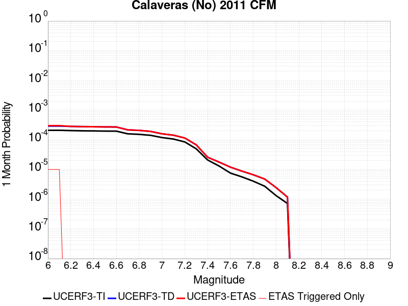 |  |  |

| Magnitude | 1 wk TI Prob | 1 wk TD Prob | 1 wk ETAS Prob | 1 wk ETAS/TD Gain | 1 wk ETAS Triggered Only | 1 mo TI Prob | 1 mo TD Prob | 1 mo ETAS Prob | 1 mo ETAS/TD Gain | 1 mo ETAS Triggered Only | 1 yr TI Prob | 1 yr TD Prob | 1 yr ETAS Prob | 1 yr ETAS/TD Gain | 1 yr ETAS Triggered Only | 10 yr TI Prob | 10 yr TD Prob | 10 yr ETAS Prob | 10 yr ETAS/TD Gain | 10 yr ETAS Triggered Only |
|-----|-----|-----|-----|-----|-----|-----|-----|-----|-----|-----|-----|-----|-----|-----|-----|-----|-----|-----|-----|-----|
| 6.0 | 4.8694856E-5 | 6.747457E-5 | 6.747457E-5 | 1.0 | 0.0 | 2.0867554E-4 | 2.891453E-4 | 3.0543335E-4 | 1.0563316 | 1.6292748E-5 | 0.0025376645 | 0.0035146773 | 0.0035309128 | 1.0046194 | 1.6292748E-5 | 0.02508881 | 0.034771074 | 0.034786798 | 1.0004523 | 1.6292748E-5 |
| 6.1 | 4.8694856E-5 | 6.747457E-5 | 6.747457E-5 | 1.0 | 0.0 | 2.0867554E-4 | 2.891453E-4 | 3.0543335E-4 | 1.0563316 | 1.6292748E-5 | 0.0025376645 | 0.0035146773 | 0.0035309128 | 1.0046194 | 1.6292748E-5 | 0.02508881 | 0.034771074 | 0.034786798 | 1.0004523 | 1.6292748E-5 |
| 6.2 | 4.7541962E-5 | 6.5805805E-5 | 6.5805805E-5 | 1.0 | 0.0 | 2.0373536E-4 | 2.8199502E-4 | 2.8199502E-4 | 1.0 | 0.0 | 0.0024776561 | 0.003427919 | 0.003427919 | 1.0 | 0.0 | 0.024502134 | 0.0339325 | 0.0339325 | 1.0 | 0.0 |
| 6.3 | 4.6717287E-5 | 6.463939E-5 | 6.463939E-5 | 1.0 | 0.0 | 2.0020158E-4 | 2.7699716E-4 | 2.7699716E-4 | 1.0 | 0.0 | 0.0024347296 | 0.0033672696 | 0.0033672696 | 1.0 | 0.0 | 0.024082264 | 0.033345006 | 0.033345006 | 1.0 | 0.0 |
| 6.4 | 4.6276386E-5 | 6.400103E-5 | 6.400103E-5 | 1.0 | 0.0 | 1.983123E-4 | 2.7426204E-4 | 2.7426204E-4 | 1.0 | 0.0 | 0.0024117786 | 0.00333408 | 0.00333408 | 1.0 | 0.0 | 0.02385771 | 0.03302388 | 0.03302388 | 1.0 | 0.0 |
| 6.5 | 4.5720994E-5 | 6.32025E-5 | 6.32025E-5 | 1.0 | 0.0 | 1.9593239E-4 | 2.7084045E-4 | 2.7084045E-4 | 1.0 | 0.0 | 0.002382867 | 0.0032925585 | 0.0032925585 | 1.0 | 0.0 | 0.023574775 | 0.032621842 | 0.032621842 | 1.0 | 0.0 |
| 6.6 | 4.549134E-5 | 6.285557E-5 | 6.285557E-5 | 1.0 | 0.0 | 1.949483E-4 | 2.693539E-4 | 2.693539E-4 | 1.0 | 0.0 | 0.0023709119 | 0.0032745146 | 0.0032745146 | 1.0 | 0.0 | 0.023457756 | 0.03244731 | 0.03244731 | 1.0 | 0.0 |
| 6.7 | 3.701047E-5 | 5.03607E-5 | 5.03607E-5 | 1.0 | 0.0 | 1.5860666E-4 | 2.1581395E-4 | 2.1581395E-4 | 1.0 | 0.0 | 0.0019293258 | 0.002624412 | 0.002624412 | 1.0 | 0.0 | 0.019126613 | 0.026125198 | 0.026125198 | 1.0 | 0.0 |
| 6.8 | 3.5523568E-5 | 4.834225E-5 | 4.834225E-5 | 1.0 | 0.0 | 1.5223498E-4 | 2.0716486E-4 | 2.0716486E-4 | 1.0 | 0.0 | 0.0018518851 | 0.0025193577 | 0.0025193577 | 1.0 | 0.0 | 0.018365284 | 0.025097623 | 0.025097623 | 1.0 | 0.0 |
| 6.9 | 3.2946147E-5 | 4.4663826E-5 | 4.4663826E-5 | 1.0 | 0.0 | 1.4119013E-4 | 1.9140259E-4 | 1.9140259E-4 | 1.0 | 0.0 | 0.0017176344 | 0.0023278783 | 0.0023278783 | 1.0 | 0.0 | 0.017044188 | 0.023219762 | 0.023219762 | 1.0 | 0.0 |
| 7.0 | 2.7682381E-5 | 3.7023216E-5 | 3.7023216E-5 | 1.0 | 0.0 | 1.1863338E-4 | 1.5866144E-4 | 1.5866144E-4 | 1.0 | 0.0 | 0.0014434044 | 0.0019300217 | 0.0019300217 | 1.0 | 0.0 | 0.01434065 | 0.019311164 | 0.019311164 | 1.0 | 0.0 |
| 7.1 | 2.471967E-5 | 3.328756E-5 | 3.328756E-5 | 1.0 | 0.0 | 1.05937135E-4 | 1.4265333E-4 | 1.4265333E-4 | 1.0 | 0.0 | 0.0012890215 | 0.0017354497 | 0.0017354497 | 1.0 | 0.0 | 0.0128157 | 0.017386293 | 0.017386293 | 1.0 | 0.0 |
| 7.2 | 1.9748062E-5 | 2.6775411E-5 | 2.6775411E-5 | 1.0 | 0.0 | 8.463181E-5 | 1.1474685E-4 | 1.1474685E-4 | 1.0 | 0.0 | 0.0010299052 | 0.001396171 | 0.001396171 | 1.0 | 0.0 | 0.01025145 | 0.014031046 | 0.014031046 | 1.0 | 0.0 |
| 7.3 | 1.1603734E-5 | 1.5784257E-5 | 1.5784257E-5 | 1.0 | 0.0 | 4.9729337E-5 | 6.7645145E-5 | 6.7645145E-5 | 1.0 | 0.0 | 6.052865E-4 | 8.232826E-4 | 8.232826E-4 | 1.0 | 0.0 | 0.0060364045 | 0.008308739 | 0.008308739 | 1.0 | 0.0 |
| 7.4 | 4.885381E-6 | 6.035117E-6 | 6.035117E-6 | 1.0 | 0.0 | 2.0937177E-5 | 2.5864532E-5 | 2.5864532E-5 | 1.0 | 0.0 | 2.5488032E-4 | 3.1485534E-4 | 3.1485534E-4 | 1.0 | 0.0 | 0.0025458818 | 0.0032009764 | 0.0032009764 | 1.0 | 0.0 |
| 7.5 | 3.0571264E-6 | 4.1554085E-6 | 4.1554085E-6 | 1.0 | 0.0 | 1.3101904E-5 | 1.7808772E-5 | 1.7808772E-5 | 1.0 | 0.0 | 1.5950401E-4 | 2.1680034E-4 | 2.1680034E-4 | 1.0 | 0.0 | 0.0015938957 | 0.0022209007 | 0.0022209007 | 1.0 | 0.0 |
| 7.6 | 1.764948E-6 | 2.795641E-6 | 2.795641E-6 | 1.0 | 0.0 | 7.564041E-6 | 1.1981264E-5 | 1.1981264E-5 | 1.0 | 0.0 | 9.208831E-5 | 1.458622E-4 | 1.458622E-4 | 1.0 | 0.0 | 9.205016E-4 | 0.0015124046 | 0.0015124046 | 1.0 | 0.0 |
| 7.7 | 1.3173734E-6 | 2.0585271E-6 | 2.0585271E-6 | 1.0 | 0.0 | 5.645874E-6 | 8.82223E-6 | 8.82223E-6 | 1.0 | 0.0 | 6.873634E-5 | 1.0740537E-4 | 1.0740537E-4 | 1.0 | 0.0 | 6.8715087E-4 | 0.0011261607 | 0.0011261607 | 1.0 | 0.0 |
| 7.8 | 9.4429885E-7 | 1.5490102E-6 | 1.5490102E-6 | 1.0 | 0.0 | 4.0469886E-6 | 6.6385983E-6 | 6.6385983E-6 | 1.0 | 0.0 | 4.9270973E-5 | 8.082195E-5 | 8.082195E-5 | 1.0 | 0.0 | 4.926005E-4 | 8.501931E-4 | 8.501931E-4 | 1.0 | 0.0 |
| 7.9 | 6.388233E-7 | 1.11492E-6 | 1.11492E-6 | 1.0 | 0.0 | 2.7378112E-6 | 4.7782196E-6 | 4.7782196E-6 | 1.0 | 0.0 | 3.3332344E-5 | 5.8173282E-5 | 5.8173282E-5 | 1.0 | 0.0 | 3.3327343E-4 | 6.096674E-4 | 6.096674E-4 | 1.0 | 0.0 |
| 8.0 | 3.087986E-7 | 5.754721E-7 | 5.754721E-7 | 1.0 | 0.0 | 1.323422E-6 | 2.4663066E-6 | 2.4663066E-6 | 1.0 | 0.0 | 1.6112543E-5 | 3.0026871E-5 | 3.0026871E-5 | 1.0 | 0.0 | 1.6111376E-4 | 3.110238E-4 | 3.110238E-4 | 1.0 | 0.0 |
| 8.1 | 1.6725647E-7 | 2.7410795E-7 | 2.7410795E-7 | 1.0 | 0.0 | 7.168133E-7 | 1.1747478E-6 | 1.1747478E-6 | 1.0 | 0.0 | 8.7271665E-6 | 1.4302462E-5 | 1.4302462E-5 | 1.0 | 0.0 | 8.726824E-5 | 1.4847395E-4 | 1.4847395E-4 | 1.0 | 0.0 |

## San Andreas (Santa Cruz Mts) 2011 CFM
*[(top)](#table-of-contents)*

| 1 Week | 1 Month | 1 Year | 10 Year |
|-----|-----|-----|-----|
|  |  |  |  |

| Magnitude | 1 wk TI Prob | 1 wk TD Prob | 1 wk ETAS Prob | 1 wk ETAS/TD Gain | 1 wk ETAS Triggered Only | 1 mo TI Prob | 1 mo TD Prob | 1 mo ETAS Prob | 1 mo ETAS/TD Gain | 1 mo ETAS Triggered Only | 1 yr TI Prob | 1 yr TD Prob | 1 yr ETAS Prob | 1 yr ETAS/TD Gain | 1 yr ETAS Triggered Only | 10 yr TI Prob | 10 yr TD Prob | 10 yr ETAS Prob | 10 yr ETAS/TD Gain | 10 yr ETAS Triggered Only |
|-----|-----|-----|-----|-----|-----|-----|-----|-----|-----|-----|-----|-----|-----|-----|-----|-----|-----|-----|-----|-----|
| 6.0 | 1.7221631E-4 | 1.3792426E-4 | 1.3792426E-4 | 1.0 | 0.0 | 7.378611E-4 | 5.9097214E-4 | 6.072552E-4 | 1.0275531 | 1.6292748E-5 | 0.008946515 | 0.0071717235 | 0.0071878997 | 1.0022556 | 1.6292748E-5 | 0.08594794 | 0.07054796 | 0.07056311 | 1.0002147 | 1.6292748E-5 |
| 6.1 | 1.7221631E-4 | 1.3792426E-4 | 1.3792426E-4 | 1.0 | 0.0 | 7.378611E-4 | 5.9097214E-4 | 6.072552E-4 | 1.0275531 | 1.6292748E-5 | 0.008946515 | 0.0071717235 | 0.0071878997 | 1.0022556 | 1.6292748E-5 | 0.08594794 | 0.07054796 | 0.07056311 | 1.0002147 | 1.6292748E-5 |
| 6.2 | 1.7221631E-4 | 1.3792426E-4 | 1.3792426E-4 | 1.0 | 0.0 | 7.378611E-4 | 5.9097214E-4 | 6.072552E-4 | 1.0275531 | 1.6292748E-5 | 0.008946515 | 0.0071717235 | 0.0071878997 | 1.0022556 | 1.6292748E-5 | 0.08594794 | 0.07054796 | 0.07056311 | 1.0002147 | 1.6292748E-5 |
| 6.3 | 1.716926E-4 | 1.3711878E-4 | 1.3711878E-4 | 1.0 | 0.0 | 7.3561794E-4 | 5.8752164E-4 | 6.0380483E-4 | 1.027715 | 1.6292748E-5 | 0.008919428 | 0.007129989 | 0.0071461657 | 1.0022688 | 1.6292748E-5 | 0.08569809 | 0.07015993 | 0.070175074 | 1.0002159 | 1.6292748E-5 |
| 6.4 | 1.6392978E-4 | 1.3587909E-4 | 1.3587909E-4 | 1.0 | 0.0 | 7.02367E-4 | 5.82211E-4 | 5.984943E-4 | 1.0279679 | 1.6292748E-5 | 0.008517839 | 0.0070657525 | 0.00708193 | 1.0022895 | 1.6292748E-5 | 0.08198654 | 0.069394976 | 0.06941014 | 1.0002185 | 1.6292748E-5 |
| 6.5 | 1.5742714E-4 | 1.2647794E-4 | 1.2647794E-4 | 1.0 | 0.0 | 6.745133E-4 | 5.419374E-4 | 5.5822136E-4 | 1.0300477 | 1.6292748E-5 | 0.00818132 | 0.0065784375 | 0.006594623 | 1.0024604 | 1.6292748E-5 | 0.078865945 | 0.06486093 | 0.06487617 | 1.000235 | 1.6292748E-5 |
| 6.6 | 1.3038084E-4 | 1.1587992E-4 | 1.1587992E-4 | 1.0 | 0.0 | 5.5865536E-4 | 4.96535E-4 | 5.128197E-4 | 1.0327966 | 1.6292748E-5 | 0.006780438 | 0.006028784 | 0.0060449787 | 1.0026861 | 1.6292748E-5 | 0.0657725 | 0.059330538 | 0.059345864 | 1.0002583 | 1.6292748E-5 |
| 6.7 | 1.2867592E-4 | 1.1314491E-4 | 1.1314491E-4 | 1.0 | 0.0 | 5.5135164E-4 | 4.8481792E-4 | 5.0110277E-4 | 1.0335896 | 1.6292748E-5 | 0.0066920654 | 0.005886907 | 0.005903104 | 1.0027514 | 1.6292748E-5 | 0.06494093 | 0.058041416 | 0.05805676 | 1.0002644 | 1.6292748E-5 |
| 6.8 | 1.2801298E-4 | 1.12520516E-4 | 1.12520516E-4 | 1.0 | 0.0 | 5.485117E-4 | 4.8214293E-4 | 4.9842783E-4 | 1.033776 | 1.6292748E-5 | 0.0066577005 | 0.0058545293 | 0.005870727 | 1.0027666 | 1.6292748E-5 | 0.06461738 | 0.05775524 | 0.05777059 | 1.0002658 | 1.6292748E-5 |
| 6.9 | 1.269149E-4 | 1.1094256E-4 | 1.1094256E-4 | 1.0 | 0.0 | 5.4380763E-4 | 4.7538272E-4 | 4.916677E-4 | 1.0342566 | 1.6292748E-5 | 0.006600777 | 0.005772663 | 0.005788862 | 1.0028061 | 1.6292748E-5 | 0.06408122 | 0.057027116 | 0.05704248 | 1.0002694 | 1.6292748E-5 |
| 7.0 | 1.2030331E-4 | 1.0824356E-4 | 1.0824356E-4 | 1.0 | 0.0 | 5.154837E-4 | 4.638198E-4 | 4.80105E-4 | 1.0351111 | 1.6292748E-5 | 0.006257969 | 0.0056326203 | 0.005648821 | 1.0028763 | 1.6292748E-5 | 0.06084648 | 0.055699922 | 0.055715308 | 1.0002762 | 1.6292748E-5 |
| 7.1 | 8.049617E-5 | 5.392429E-5 | 5.392429E-5 | 1.0 | 0.0 | 3.4493793E-4 | 2.3108382E-4 | 2.473728E-4 | 1.0704895 | 1.6292748E-5 | 0.0041915346 | 0.0028098505 | 0.0028260974 | 1.0057821 | 1.6292748E-5 | 0.041133516 | 0.029618833 | 0.029634643 | 1.0005338 | 1.6292748E-5 |
| 7.2 | 7.093979E-5 | 4.2935415E-5 | 4.2935415E-5 | 1.0 | 0.0 | 3.0399222E-4 | 1.8399608E-4 | 2.0028582E-4 | 1.0885332 | 1.6292748E-5 | 0.0036948253 | 0.0022378736 | 0.0022541299 | 1.0072641 | 1.6292748E-5 | 0.03633994 | 0.023941126 | 0.023957029 | 1.0006642 | 1.6292748E-5 |
| 7.3 | 6.193693E-5 | 2.8891074E-5 | 2.8891074E-5 | 1.0 | 0.0 | 2.6541698E-4 | 1.2381302E-4 | 1.4010376E-4 | 1.1315752 | 1.6292748E-5 | 0.0032266637 | 0.001506383 | 0.0015226512 | 1.0107995 | 1.6292748E-5 | 0.031802133 | 0.016497677 | 0.016513702 | 1.0009713 | 1.6292748E-5 |
| 7.4 | 5.906492E-5 | 2.7020369E-5 | 2.7020369E-5 | 1.0 | 0.0 | 2.5311083E-4 | 1.1579645E-4 | 1.3208731E-4 | 1.1406853 | 1.6292748E-5 | 0.0030772698 | 0.0014089114 | 0.0014251812 | 1.0115478 | 1.6292748E-5 | 0.030350044 | 0.0154695045 | 0.015485546 | 1.0010369 | 1.6292748E-5 |
| 7.5 | 5.424296E-5 | 2.4675093E-5 | 2.4675093E-5 | 1.0 | 0.0 | 2.324491E-4 | 1.0574612E-4 | 1.2203715E-4 | 1.1540579 | 1.6292748E-5 | 0.002826395 | 0.0012866998 | 0.0013029716 | 1.0126461 | 1.6292748E-5 | 0.027907165 | 0.014161854 | 0.014177916 | 1.0011342 | 1.6292748E-5 |
| 7.6 | 4.43084E-5 | 1.990151E-5 | 1.990151E-5 | 1.0 | 0.0 | 1.8987931E-4 | 8.528939E-5 | 1.0158076E-4 | 1.1910127 | 1.6292748E-5 | 0.0023093296 | 0.001037904 | 0.0010541799 | 1.0156815 | 1.6292748E-5 | 0.022854783 | 0.011411123 | 0.01142723 | 1.0014116 | 1.6292748E-5 |
| 7.7 | 4.118098E-5 | 1.8933848E-5 | 1.8933848E-5 | 1.0 | 0.0 | 1.7647797E-4 | 8.1142534E-5 | 9.7433964E-5 | 1.2007754 | 1.6292748E-5 | 0.002146502 | 9.874629E-4 | 0.0010037395 | 1.0164833 | 1.6292748E-5 | 0.021258866 | 0.010868995 | 0.010885111 | 1.0014827 | 1.6292748E-5 |
| 7.8 | 3.5408906E-5 | 1.856201E-5 | 1.856201E-5 | 1.0 | 0.0 | 1.5174363E-4 | 7.954905E-5 | 9.58405E-5 | 1.2047976 | 1.6292748E-5 | 0.0018459131 | 9.6807955E-4 | 9.843565E-4 | 1.0168136 | 1.6292748E-5 | 0.018306552 | 0.0106506655 | 0.010666785 | 1.0015135 | 1.6292748E-5 |
| 7.9 | 2.5860836E-5 | 1.7313954E-5 | 1.7313954E-5 | 1.0 | 0.0 | 1.10827445E-4 | 7.420055E-5 | 9.049209E-5 | 1.2195609 | 1.6292748E-5 | 0.001348489 | 9.030175E-4 | 9.192956E-4 | 1.0180262 | 1.6292748E-5 | 0.013403354 | 0.009906601 | 0.009922733 | 1.0016284 | 1.6292748E-5 |
| 8.0 | 1.9777332E-5 | 1.4837888E-5 | 1.4837888E-5 | 1.0 | 0.0 | 8.4757245E-5 | 6.3589396E-5 | 6.3589396E-5 | 1.0 | 0.0 | 0.0010314309 | 7.739261E-4 | 7.739261E-4 | 1.0 | 0.0 | 0.010266567 | 0.008508087 | 0.008508087 | 1.0 | 0.0 |
| 8.1 | 1.468494E-5 | 1.2105831E-5 | 1.2105831E-5 | 1.0 | 0.0 | 6.293394E-5 | 5.1881103E-5 | 5.1881103E-5 | 1.0 | 0.0 | 7.6595135E-4 | 6.3146953E-4 | 6.3146953E-4 | 1.0 | 0.0 | 0.0076331664 | 0.0069684954 | 0.0069684954 | 1.0 | 0.0 |
| 8.2 | 8.63836E-6 | 5.4678667E-6 | 5.4678667E-6 | 1.0 | 0.0 | 3.7021015E-5 | 2.3433504E-5 | 2.3433504E-5 | 1.0 | 0.0 | 4.5063766E-4 | 2.8526565E-4 | 2.8526565E-4 | 1.0 | 0.0 | 0.004497249 | 0.003245162 | 0.003245162 | 1.0 | 0.0 |
| 8.3 | 1.983087E-6 | 7.6564595E-7 | 7.6564595E-7 | 1.0 | 0.0 | 8.498917E-6 | 3.281336E-6 | 3.281336E-6 | 1.0 | 0.0 | 1.034694E-4 | 3.9949547E-5 | 3.9949547E-5 | 1.0 | 0.0 | 0.0010342124 | 4.717979E-4 | 4.717979E-4 | 1.0 | 0.0 |

## Hunting Creek - Berryessa 2011 CFM
*[(top)](#table-of-contents)*

| 1 Week | 1 Month | 1 Year | 10 Year |
|-----|-----|-----|-----|
|  |  |  |  |

| Magnitude | 1 wk TI Prob | 1 wk TD Prob | 1 wk ETAS Prob | 1 wk ETAS/TD Gain | 1 wk ETAS Triggered Only | 1 mo TI Prob | 1 mo TD Prob | 1 mo ETAS Prob | 1 mo ETAS/TD Gain | 1 mo ETAS Triggered Only | 1 yr TI Prob | 1 yr TD Prob | 1 yr ETAS Prob | 1 yr ETAS/TD Gain | 1 yr ETAS Triggered Only | 10 yr TI Prob | 10 yr TD Prob | 10 yr ETAS Prob | 10 yr ETAS/TD Gain | 10 yr ETAS Triggered Only |
|-----|-----|-----|-----|-----|-----|-----|-----|-----|-----|-----|-----|-----|-----|-----|-----|-----|-----|-----|-----|-----|
| 6.0 | 1.1270982E-4 | 2.0028367E-4 | 2.0028367E-4 | 1.0 | 0.0 | 4.8295266E-4 | 8.579912E-4 | 8.579912E-4 | 1.0 | 0.0 | 0.0058641075 | 0.010386173 | 0.010402296 | 1.0015525 | 1.6292748E-5 | 0.057117578 | 0.09804048 | 0.09805518 | 1.0001498 | 1.6292748E-5 |
| 6.1 | 1.1239393E-4 | 1.9976508E-4 | 1.9976508E-4 | 1.0 | 0.0 | 4.8159933E-4 | 8.557703E-4 | 8.557703E-4 | 1.0 | 0.0 | 0.0058477195 | 0.010359417 | 0.010375541 | 1.0015564 | 1.6292748E-5 | 0.056962132 | 0.09779895 | 0.09781365 | 1.0001503 | 1.6292748E-5 |
| 6.2 | 7.596265E-5 | 1.2933646E-4 | 1.2933646E-4 | 1.0 | 0.0 | 3.2551357E-4 | 5.5415573E-4 | 5.5415573E-4 | 1.0 | 0.0 | 0.0039559277 | 0.0067213587 | 0.006737542 | 1.0024078 | 1.6292748E-5 | 0.038862433 | 0.06459229 | 0.06460753 | 1.0002359 | 1.6292748E-5 |
| 6.3 | 6.78794E-5 | 1.1448377E-4 | 1.1448377E-4 | 1.0 | 0.0 | 2.9087928E-4 | 4.9052597E-4 | 4.9052597E-4 | 1.0 | 0.0 | 0.003535705 | 0.005952661 | 0.0059688566 | 1.0027207 | 1.6292748E-5 | 0.034799766 | 0.057466213 | 0.05748157 | 1.0002673 | 1.6292748E-5 |
| 6.4 | 6.2165134E-5 | 1.0434825E-4 | 1.0434825E-4 | 1.0 | 0.0 | 2.6639478E-4 | 4.4711027E-4 | 4.4711027E-4 | 1.0 | 0.0 | 0.0032385332 | 0.0054274183 | 0.005443623 | 1.0029856 | 1.6292748E-5 | 0.03191742 | 0.05255138 | 0.05256682 | 1.0002937 | 1.6292748E-5 |
| 6.5 | 5.4368087E-5 | 9.070258E-5 | 9.070258E-5 | 1.0 | 0.0 | 2.3298527E-4 | 3.886537E-4 | 3.886537E-4 | 1.0 | 0.0 | 0.0028329059 | 0.0047197016 | 0.0047359173 | 1.0034357 | 1.6292748E-5 | 0.027970633 | 0.045881182 | 0.045896728 | 1.0003388 | 1.6292748E-5 |
| 6.6 | 4.729947E-5 | 7.847101E-5 | 7.847101E-5 | 1.0 | 0.0 | 2.0269625E-4 | 3.3624718E-4 | 3.3624718E-4 | 1.0 | 0.0 | 0.002465034 | 0.004084746 | 0.004100972 | 1.0039724 | 1.6292748E-5 | 0.02437869 | 0.03985269 | 0.039868332 | 1.0003926 | 1.6292748E-5 |
| 6.7 | 3.6875328E-5 | 6.0443555E-5 | 6.0443555E-5 | 1.0 | 0.0 | 1.5802756E-4 | 2.5900968E-4 | 2.5900968E-4 | 1.0 | 0.0 | 0.0019222875 | 0.0031482724 | 0.0031645137 | 1.0051589 | 1.6292748E-5 | 0.019057442 | 0.03089371 | 0.0309095 | 1.000511 | 1.6292748E-5 |
| 6.8 | 2.0292036E-5 | 2.8976721E-5 | 2.8976721E-5 | 1.0 | 0.0 | 8.6962966E-5 | 1.2417998E-4 | 1.2417998E-4 | 1.0 | 0.0 | 0.0010582599 | 0.0015108302 | 0.0015108302 | 1.0 | 0.0 | 0.010532344 | 0.0149790775 | 0.0149790775 | 1.0 | 0.0 |
| 6.9 | 1.7871042E-5 | 2.4472653E-5 | 2.4472653E-5 | 1.0 | 0.0 | 7.658793E-5 | 1.04878585E-4 | 1.04878585E-4 | 1.0 | 0.0 | 9.320591E-4 | 0.0012761486 | 0.0012761486 | 1.0 | 0.0 | 0.009281595 | 0.012680395 | 0.012680395 | 1.0 | 0.0 |
| 7.0 | 1.6415532E-5 | 2.1906566E-5 | 2.1906566E-5 | 1.0 | 0.0 | 7.035038E-5 | 9.388191E-5 | 9.388191E-5 | 1.0 | 0.0 | 8.561793E-4 | 0.0011424144 | 0.0011424144 | 1.0 | 0.0 | 0.008528882 | 0.011365017 | 0.011365017 | 1.0 | 0.0 |
| 7.1 | 1.5409885E-5 | 2.0346588E-5 | 2.0346588E-5 | 1.0 | 0.0 | 6.6040695E-5 | 8.719676E-5 | 8.719676E-5 | 1.0 | 0.0 | 8.0374884E-4 | 0.0010611062 | 0.0010611062 | 1.0 | 0.0 | 0.00800848 | 0.010560924 | 0.010560924 | 1.0 | 0.0 |
| 7.2 | 1.4497423E-5 | 1.905519E-5 | 1.905519E-5 | 1.0 | 0.0 | 6.213033E-5 | 8.166256E-5 | 8.166256E-5 | 1.0 | 0.0 | 7.5617427E-4 | 9.937913E-4 | 9.937913E-4 | 1.0 | 0.0 | 0.0075360634 | 0.00989425 | 0.00989425 | 1.0 | 0.0 |
| 7.3 | 1.3615175E-5 | 1.7826347E-5 | 1.7826347E-5 | 1.0 | 0.0 | 5.8349444E-5 | 7.6396405E-5 | 7.6396405E-5 | 1.0 | 0.0 | 7.101729E-4 | 9.297323E-4 | 9.297323E-4 | 1.0 | 0.0 | 0.0070790765 | 0.009259124 | 0.009259124 | 1.0 | 0.0 |
| 7.4 | 1.2252825E-5 | 1.6026455E-5 | 1.6026455E-5 | 1.0 | 0.0 | 5.251105E-5 | 6.868302E-5 | 6.868302E-5 | 1.0 | 0.0 | 6.391345E-4 | 8.3589775E-4 | 8.3589775E-4 | 1.0 | 0.0 | 0.0063729943 | 0.008328172 | 0.008328172 | 1.0 | 0.0 |
| 7.5 | 1.0913301E-5 | 1.4241286E-5 | 1.4241286E-5 | 1.0 | 0.0 | 4.6770452E-5 | 6.103267E-5 | 6.103267E-5 | 1.0 | 0.0 | 5.6928146E-4 | 7.428222E-4 | 7.428222E-4 | 1.0 | 0.0 | 0.0056782532 | 0.0074039865 | 0.0074039865 | 1.0 | 0.0 |
| 7.6 | 8.623192E-6 | 1.12347825E-5 | 1.12347825E-5 | 1.0 | 0.0 | 3.6956015E-5 | 4.8148195E-5 | 4.8148195E-5 | 1.0 | 0.0 | 4.4984656E-4 | 5.8604917E-4 | 5.8604917E-4 | 1.0 | 0.0 | 0.00448937 | 0.005845504 | 0.005845504 | 1.0 | 0.0 |
| 7.7 | 2.0993634E-6 | 2.66264E-6 | 2.66264E-6 | 1.0 | 0.0 | 8.997241E-6 | 1.1411265E-5 | 1.1411265E-5 | 1.0 | 0.0 | 1.09535904E-4 | 1.3892337E-4 | 1.3892337E-4 | 1.0 | 0.0 | 0.0010948193 | 0.0013883994 | 0.0013883994 | 1.0 | 0.0 |
| 7.8 | 1.8428308E-7 | 2.1674624E-7 | 2.1674624E-7 | 1.0 | 0.0 | 7.897844E-7 | 9.289122E-7 | 9.289122E-7 | 1.0 | 0.0 | 9.615583E-6 | 1.130945E-5 | 1.130945E-5 | 1.0 | 0.0 | 9.615166E-5 | 1.1308173E-4 | 1.1308173E-4 | 1.0 | 0.0 |

## Earthquake Valley (So Extension)
*[(top)](#table-of-contents)*

| 1 Week | 1 Month | 1 Year | 10 Year |
|-----|-----|-----|-----|
|  |  |  |  |

| Magnitude | 1 wk TI Prob | 1 wk TD Prob | 1 wk ETAS Prob | 1 wk ETAS/TD Gain | 1 wk ETAS Triggered Only | 1 mo TI Prob | 1 mo TD Prob | 1 mo ETAS Prob | 1 mo ETAS/TD Gain | 1 mo ETAS Triggered Only | 1 yr TI Prob | 1 yr TD Prob | 1 yr ETAS Prob | 1 yr ETAS/TD Gain | 1 yr ETAS Triggered Only | 10 yr TI Prob | 10 yr TD Prob | 10 yr ETAS Prob | 10 yr ETAS/TD Gain | 10 yr ETAS Triggered Only |
|-----|-----|-----|-----|-----|-----|-----|-----|-----|-----|-----|-----|-----|-----|-----|-----|-----|-----|-----|-----|-----|
| 6.0 | 3.0194888E-5 | 3.707208E-5 | 5.3364227E-5 | 1.4394721 | 1.6292748E-5 | 1.2940024E-4 | 1.5887374E-4 | 1.751639E-4 | 1.1025352 | 1.6292748E-5 | 0.0015743093 | 0.0019330877 | 0.001949349 | 1.008412 | 1.6292748E-5 | 0.01563203 | 0.0192131 | 0.01922908 | 1.0008317 | 1.6292748E-5 |
| 6.1 | 3.0194888E-5 | 3.707208E-5 | 5.3364227E-5 | 1.4394721 | 1.6292748E-5 | 1.2940024E-4 | 1.5887374E-4 | 1.751639E-4 | 1.1025352 | 1.6292748E-5 | 0.0015743093 | 0.0019330877 | 0.001949349 | 1.008412 | 1.6292748E-5 | 0.01563203 | 0.0192131 | 0.01922908 | 1.0008317 | 1.6292748E-5 |
| 6.2 | 3.0194888E-5 | 3.707208E-5 | 5.3364227E-5 | 1.4394721 | 1.6292748E-5 | 1.2940024E-4 | 1.5887374E-4 | 1.751639E-4 | 1.1025352 | 1.6292748E-5 | 0.0015743093 | 0.0019330877 | 0.001949349 | 1.008412 | 1.6292748E-5 | 0.01563203 | 0.0192131 | 0.01922908 | 1.0008317 | 1.6292748E-5 |
| 6.3 | 1.5795305E-5 | 1.8446612E-5 | 3.473906E-5 | 1.8832216 | 1.6292748E-5 | 6.769241E-5 | 7.905514E-5 | 9.53466E-5 | 1.2060772 | 1.6292748E-5 | 8.238434E-4 | 9.621823E-4 | 9.784594E-4 | 1.0169169 | 1.6292748E-5 | 0.008207959 | 0.0095910635 | 0.0096072 | 1.0016824 | 1.6292748E-5 |
| 6.4 | 1.5795305E-5 | 1.8446612E-5 | 3.473906E-5 | 1.8832216 | 1.6292748E-5 | 6.769241E-5 | 7.905514E-5 | 9.53466E-5 | 1.2060772 | 1.6292748E-5 | 8.238434E-4 | 9.621823E-4 | 9.784594E-4 | 1.0169169 | 1.6292748E-5 | 0.008207959 | 0.0095910635 | 0.0096072 | 1.0016824 | 1.6292748E-5 |
| 6.5 | 1.5795305E-5 | 1.8446612E-5 | 3.473906E-5 | 1.8832216 | 1.6292748E-5 | 6.769241E-5 | 7.905514E-5 | 9.53466E-5 | 1.2060772 | 1.6292748E-5 | 8.238434E-4 | 9.621823E-4 | 9.784594E-4 | 1.0169169 | 1.6292748E-5 | 0.008207959 | 0.0095910635 | 0.0096072 | 1.0016824 | 1.6292748E-5 |
| 6.6 | 1.5795305E-5 | 1.8446612E-5 | 3.473906E-5 | 1.8832216 | 1.6292748E-5 | 6.769241E-5 | 7.905514E-5 | 9.53466E-5 | 1.2060772 | 1.6292748E-5 | 8.238434E-4 | 9.621823E-4 | 9.784594E-4 | 1.0169169 | 1.6292748E-5 | 0.008207959 | 0.0095910635 | 0.0096072 | 1.0016824 | 1.6292748E-5 |
| 6.7 | 1.1363076E-5 | 1.3138288E-5 | 2.9430821E-5 | 2.2400804 | 1.6292748E-5 | 4.8697988E-5 | 5.6306162E-5 | 7.259799E-5 | 1.2893437 | 1.6292748E-5 | 5.927367E-4 | 6.8538805E-4 | 7.016696E-4 | 1.0237553 | 1.6292748E-5 | 0.0059115817 | 0.006840215 | 0.0068563963 | 1.0023656 | 1.6292748E-5 |
| 6.8 | 1.0049611E-5 | 1.1594328E-5 | 2.7886887E-5 | 2.4052181 | 1.6292748E-5 | 4.306905E-5 | 4.968944E-5 | 6.598138E-5 | 1.3278753 | 1.6292748E-5 | 5.242395E-4 | 6.0487416E-4 | 6.2115706E-4 | 1.0269195 | 1.6292748E-5 | 0.0052300454 | 0.0060394546 | 0.0060556494 | 1.0026814 | 1.6292748E-5 |
| 6.9 | 1.0049611E-5 | 1.1594328E-5 | 2.7886887E-5 | 2.4052181 | 1.6292748E-5 | 4.306905E-5 | 4.968944E-5 | 6.598138E-5 | 1.3278753 | 1.6292748E-5 | 5.242395E-4 | 6.0487416E-4 | 6.2115706E-4 | 1.0269195 | 1.6292748E-5 | 0.0052300454 | 0.0060394546 | 0.0060556494 | 1.0026814 | 1.6292748E-5 |
| 7.0 | 1.0049611E-5 | 1.1594328E-5 | 2.7886887E-5 | 2.4052181 | 1.6292748E-5 | 4.306905E-5 | 4.968944E-5 | 6.598138E-5 | 1.3278753 | 1.6292748E-5 | 5.242395E-4 | 6.0487416E-4 | 6.2115706E-4 | 1.0269195 | 1.6292748E-5 | 0.0052300454 | 0.0060394546 | 0.0060556494 | 1.0026814 | 1.6292748E-5 |
| 7.1 | 8.140254E-6 | 9.3834515E-6 | 2.5676047E-5 | 2.7363117 | 1.6292748E-5 | 3.4886336E-5 | 4.021455E-5 | 5.6506644E-5 | 1.4051293 | 1.6292748E-5 | 4.2465836E-4 | 4.895692E-4 | 5.0585397E-4 | 1.0332634 | 1.6292748E-5 | 0.0042384774 | 0.004891483 | 0.0049076965 | 1.0033145 | 1.6292748E-5 |
| 7.2 | 1.673835E-7 | 1.4153493E-7 | 1.4153493E-7 | 1.0 | 0.0 | 7.173577E-7 | 6.065781E-7 | 6.065781E-7 | 1.0 | 0.0 | 8.733795E-6 | 7.3850674E-6 | 7.3850674E-6 | 1.0 | 0.0 | 8.733451E-5 | 7.3848576E-5 | 7.3848576E-5 | 1.0 | 0.0 |
| 7.3 | 1.6632116E-7 | 1.4051723E-7 | 1.4051723E-7 | 1.0 | 0.0 | 7.1280476E-7 | 6.022166E-7 | 6.022166E-7 | 1.0 | 0.0 | 8.678364E-6 | 7.331966E-6 | 7.331966E-6 | 1.0 | 0.0 | 8.6780245E-5 | 7.33176E-5 | 7.33176E-5 | 1.0 | 0.0 |
| 7.4 | 1.6569169E-7 | 1.3996352E-7 | 1.3996352E-7 | 1.0 | 0.0 | 7.1010703E-7 | 5.9984353E-7 | 5.9984353E-7 | 1.0 | 0.0 | 8.645519E-6 | 7.303074E-6 | 7.303074E-6 | 1.0 | 0.0 | 8.645182E-5 | 7.30287E-5 | 7.30287E-5 | 1.0 | 0.0 |
| 7.5 | 1.1764555E-7 | 1.0095245E-7 | 1.0095245E-7 | 1.0 | 0.0 | 5.041951E-7 | 4.3265328E-7 | 4.3265328E-7 | 1.0 | 0.0 | 6.138558E-6 | 5.267543E-6 | 5.267543E-6 | 1.0 | 0.0 | 6.1383886E-5 | 5.2674397E-5 | 5.2674397E-5 | 1.0 | 0.0 |
| 7.6 | 1.07927605E-7 | 9.2600665E-8 | 9.2600665E-8 | 1.0 | 0.0 | 4.6254678E-7 | 3.9685995E-7 | 3.9685995E-7 | 1.0 | 0.0 | 5.6314925E-6 | 4.8317615E-6 | 4.8317615E-6 | 1.0 | 0.0 | 5.63135E-5 | 4.831677E-5 | 4.831677E-5 | 1.0 | 0.0 |
| 7.7 | 2.1826905E-8 | 1.1179958E-8 | 1.1179958E-8 | 1.0 | 0.0 | 9.3543875E-8 | 4.791411E-8 | 4.791411E-8 | 1.0 | 0.0 | 1.1388961E-6 | 5.8335416E-7 | 5.8335416E-7 | 1.0 | 0.0 | 1.1388902E-5 | 5.8335318E-6 | 5.8335318E-6 | 1.0 | 0.0 |
| 7.8 | 2.6169649E-9 | 1.1968753E-9 | 1.1968753E-9 | 1.0 | 0.0 | 1.1215564E-8 | 5.1294657E-9 | 5.1294657E-9 | 1.0 | 0.0 | 1.3654947E-7 | 6.245124E-8 | 6.245124E-8 | 1.0 | 0.0 | 1.365494E-6 | 6.2451244E-7 | 6.2451244E-7 | 1.0 | 0.0 |

## Hector Mine
*[(top)](#table-of-contents)*

| 1 Week | 1 Month | 1 Year | 10 Year |
|-----|-----|-----|-----|
| 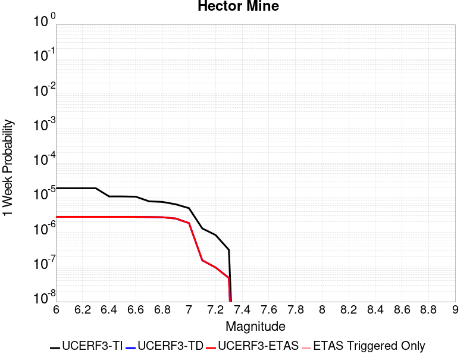 |  |  |  |

| Magnitude | 1 wk TI Prob | 1 wk TD Prob | 1 wk ETAS Prob | 1 wk ETAS/TD Gain | 1 wk ETAS Triggered Only | 1 mo TI Prob | 1 mo TD Prob | 1 mo ETAS Prob | 1 mo ETAS/TD Gain | 1 mo ETAS Triggered Only | 1 yr TI Prob | 1 yr TD Prob | 1 yr ETAS Prob | 1 yr ETAS/TD Gain | 1 yr ETAS Triggered Only | 10 yr TI Prob | 10 yr TD Prob | 10 yr ETAS Prob | 10 yr ETAS/TD Gain | 10 yr ETAS Triggered Only |
|-----|-----|-----|-----|-----|-----|-----|-----|-----|-----|-----|-----|-----|-----|-----|-----|-----|-----|-----|-----|-----|
| 6.0 | 1.8760093E-5 | 2.7962699E-6 | 2.7962699E-6 | 1.0 | 0.0 | 8.039792E-5 | 1.19839815E-5 | 1.19839815E-5 | 1.0 | 0.0 | 9.78405E-4 | 1.458992E-4 | 1.458992E-4 | 1.0 | 0.0 | 0.009741086 | 0.0014584264 | 0.0014746954 | 1.0111551 | 1.6292748E-5 |
| 6.1 | 1.8760093E-5 | 2.7962699E-6 | 2.7962699E-6 | 1.0 | 0.0 | 8.039792E-5 | 1.19839815E-5 | 1.19839815E-5 | 1.0 | 0.0 | 9.78405E-4 | 1.458992E-4 | 1.458992E-4 | 1.0 | 0.0 | 0.009741086 | 0.0014584264 | 0.0014746954 | 1.0111551 | 1.6292748E-5 |
| 6.2 | 1.8760093E-5 | 2.7962699E-6 | 2.7962699E-6 | 1.0 | 0.0 | 8.039792E-5 | 1.19839815E-5 | 1.19839815E-5 | 1.0 | 0.0 | 9.78405E-4 | 1.458992E-4 | 1.458992E-4 | 1.0 | 0.0 | 0.009741086 | 0.0014584264 | 0.0014746954 | 1.0111551 | 1.6292748E-5 |
| 6.3 | 1.8760093E-5 | 2.7962699E-6 | 2.7962699E-6 | 1.0 | 0.0 | 8.039792E-5 | 1.19839815E-5 | 1.19839815E-5 | 1.0 | 0.0 | 9.78405E-4 | 1.458992E-4 | 1.458992E-4 | 1.0 | 0.0 | 0.009741086 | 0.0014584264 | 0.0014746954 | 1.0111551 | 1.6292748E-5 |
| 6.4 | 1.0888055E-5 | 2.7962699E-6 | 2.7962699E-6 | 1.0 | 0.0 | 4.666226E-5 | 1.19839815E-5 | 1.19839815E-5 | 1.0 | 0.0 | 5.679649E-4 | 1.458992E-4 | 1.458992E-4 | 1.0 | 0.0 | 0.0056651547 | 0.0014584264 | 0.0014746954 | 1.0111551 | 1.6292748E-5 |
| 6.5 | 1.0888055E-5 | 2.7962699E-6 | 2.7962699E-6 | 1.0 | 0.0 | 4.666226E-5 | 1.19839815E-5 | 1.19839815E-5 | 1.0 | 0.0 | 5.679649E-4 | 1.458992E-4 | 1.458992E-4 | 1.0 | 0.0 | 0.0056651547 | 0.0014584264 | 0.0014746954 | 1.0111551 | 1.6292748E-5 |
| 6.6 | 1.0730738E-5 | 2.7962699E-6 | 2.7962699E-6 | 1.0 | 0.0 | 4.5988065E-5 | 1.19839815E-5 | 1.19839815E-5 | 1.0 | 0.0 | 5.5976084E-4 | 1.458992E-4 | 1.458992E-4 | 1.0 | 0.0 | 0.0055835294 | 0.0014584264 | 0.0014746954 | 1.0111551 | 1.6292748E-5 |
| 6.7 | 7.881326E-6 | 2.770952E-6 | 2.770952E-6 | 1.0 | 0.0 | 3.3776672E-5 | 1.1875478E-5 | 1.1875478E-5 | 1.0 | 0.0 | 4.111534E-4 | 1.4457834E-4 | 1.4457834E-4 | 1.0 | 0.0 | 0.0041039353 | 0.001445235 | 0.0014615041 | 1.0112572 | 1.6292748E-5 |
| 6.8 | 7.5683483E-6 | 2.7327321E-6 | 2.7327321E-6 | 1.0 | 0.0 | 3.2435375E-5 | 1.1711679E-5 | 1.1711679E-5 | 1.0 | 0.0 | 3.9482914E-4 | 1.4258435E-4 | 1.4258435E-4 | 1.0 | 0.0 | 0.0039412836 | 0.0014253207 | 0.0014415903 | 1.0114146 | 1.6292748E-5 |
| 6.9 | 6.473048E-6 | 2.513824E-6 | 2.513824E-6 | 1.0 | 0.0 | 2.7741338E-5 | 1.07735095E-5 | 1.07735095E-5 | 1.0 | 0.0 | 3.3769844E-4 | 1.3116356E-4 | 1.3116356E-4 | 1.0 | 0.0 | 0.0033718573 | 0.001311251 | 0.0013275223 | 1.0124091 | 1.6292748E-5 |
| 7.0 | 4.9959954E-6 | 1.8564588E-6 | 1.8564588E-6 | 1.0 | 0.0 | 2.1411232E-5 | 7.956248E-6 | 7.956248E-6 | 1.0 | 0.0 | 2.6065056E-4 | 9.686658E-5 | 9.686658E-5 | 1.0 | 0.0 | 0.0026034506 | 9.685931E-4 | 9.8487E-4 | 1.0168047 | 1.6292748E-5 |
| 7.1 | 1.2997541E-6 | 1.5599346E-7 | 1.5599346E-7 | 1.0 | 0.0 | 5.5703626E-6 | 6.685433E-7 | 6.685433E-7 | 1.0 | 0.0 | 6.7817055E-5 | 8.139488E-6 | 8.139488E-6 | 1.0 | 0.0 | 6.779636E-4 | 8.1392296E-5 | 8.1392296E-5 | 1.0 | 0.0 |
| 7.2 | 8.392699E-7 | 9.725453E-8 | 9.725453E-8 | 1.0 | 0.0 | 3.596866E-6 | 4.1680505E-7 | 4.1680505E-7 | 1.0 | 0.0 | 4.3790962E-5 | 5.0745916E-6 | 5.0745916E-6 | 1.0 | 0.0 | 4.3782333E-4 | 5.074495E-5 | 5.074495E-5 | 1.0 | 0.0 |
| 7.3 | 3.13015E-7 | 4.8283802E-8 | 4.8283802E-8 | 1.0 | 0.0 | 1.3414921E-6 | 2.0693057E-7 | 2.0693057E-7 | 1.0 | 0.0 | 1.6332544E-5 | 2.5193776E-6 | 2.5193776E-6 | 1.0 | 0.0 | 1.6331344E-4 | 2.5193574E-5 | 2.5193574E-5 | 1.0 | 0.0 |

## Hayward (So) 2011 CFM
*[(top)](#table-of-contents)*

| 1 Week | 1 Month | 1 Year | 10 Year |
|-----|-----|-----|-----|
| 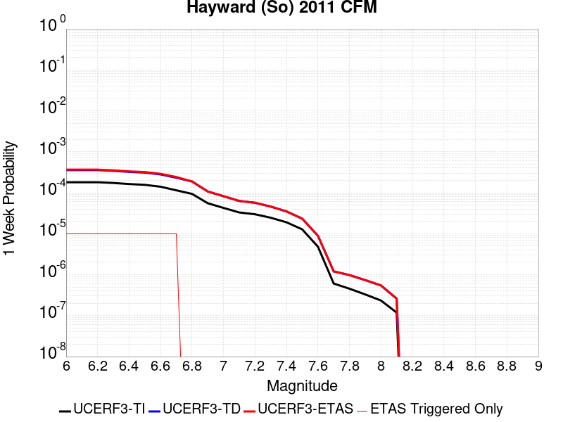 |  |  |  |

| Magnitude | 1 wk TI Prob | 1 wk TD Prob | 1 wk ETAS Prob | 1 wk ETAS/TD Gain | 1 wk ETAS Triggered Only | 1 mo TI Prob | 1 mo TD Prob | 1 mo ETAS Prob | 1 mo ETAS/TD Gain | 1 mo ETAS Triggered Only | 1 yr TI Prob | 1 yr TD Prob | 1 yr ETAS Prob | 1 yr ETAS/TD Gain | 1 yr ETAS Triggered Only | 10 yr TI Prob | 10 yr TD Prob | 10 yr ETAS Prob | 10 yr ETAS/TD Gain | 10 yr ETAS Triggered Only |
|-----|-----|-----|-----|-----|-----|-----|-----|-----|-----|-----|-----|-----|-----|-----|-----|-----|-----|-----|-----|-----|
| 6.0 | 1.8091932E-4 | 3.570673E-4 | 3.570673E-4 | 1.0 | 0.0 | 7.751381E-4 | 0.0015294008 | 0.0015294008 | 1.0 | 0.0 | 0.00939654 | 0.018463885 | 0.018463885 | 1.0 | 0.0 | 0.090090066 | 0.1667085 | 0.16672207 | 1.0000814 | 1.6292748E-5 |
| 6.1 | 1.8091932E-4 | 3.570673E-4 | 3.570673E-4 | 1.0 | 0.0 | 7.751381E-4 | 0.0015294008 | 0.0015294008 | 1.0 | 0.0 | 0.00939654 | 0.018463885 | 0.018463885 | 1.0 | 0.0 | 0.090090066 | 0.1667085 | 0.16672207 | 1.0000814 | 1.6292748E-5 |
| 6.2 | 1.8091932E-4 | 3.570673E-4 | 3.570673E-4 | 1.0 | 0.0 | 7.751381E-4 | 0.0015294008 | 0.0015294008 | 1.0 | 0.0 | 0.00939654 | 0.018463885 | 0.018463885 | 1.0 | 0.0 | 0.090090066 | 0.1667085 | 0.16672207 | 1.0000814 | 1.6292748E-5 |
| 6.3 | 1.7322872E-4 | 3.4263515E-4 | 3.4263515E-4 | 1.0 | 0.0 | 7.4219756E-4 | 0.0014676197 | 0.0014676197 | 1.0 | 0.0 | 0.0089988755 | 0.017724147 | 0.017724147 | 1.0 | 0.0 | 0.08643075 | 0.16065954 | 0.16067322 | 1.0000851 | 1.6292748E-5 |
| 6.4 | 1.6334097E-4 | 3.2345165E-4 | 3.2345165E-4 | 1.0 | 0.0 | 6.998449E-4 | 0.0013854936 | 0.0013854936 | 1.0 | 0.0 | 0.008487372 | 0.016739927 | 0.016739927 | 1.0 | 0.0 | 0.081704415 | 0.15256606 | 0.15257986 | 1.0000905 | 1.6292748E-5 |
| 6.5 | 1.5600289E-4 | 3.101982E-4 | 3.101982E-4 | 1.0 | 0.0 | 6.684125E-4 | 0.0013287518 | 0.0013287518 | 1.0 | 0.0 | 0.008107598 | 0.016059443 | 0.016059443 | 1.0 | 0.0 | 0.078181036 | 0.14684291 | 0.14685681 | 1.0000947 | 1.6292748E-5 |
| 6.6 | 1.4046066E-4 | 2.8034003E-4 | 2.8034003E-4 | 1.0 | 0.0 | 6.018354E-4 | 0.0012009109 | 0.0012009109 | 1.0 | 0.0 | 0.0073027555 | 0.014524571 | 0.014524571 | 1.0 | 0.0 | 0.07067384 | 0.13393044 | 0.13394456 | 1.0001054 | 1.6292748E-5 |
| 6.7 | 1.14696966E-4 | 2.3272466E-4 | 2.3272466E-4 | 1.0 | 0.0 | 4.914658E-4 | 9.970153E-4 | 9.970153E-4 | 1.0 | 0.0 | 0.0059671924 | 0.012072163 | 0.012072163 | 1.0 | 0.0 | 0.058094822 | 0.11274141 | 0.112755865 | 1.0001283 | 1.6292748E-5 |
| 6.8 | 9.3874296E-5 | 1.8862431E-4 | 1.8862431E-4 | 1.0 | 0.0 | 4.0225635E-4 | 8.081431E-4 | 8.081431E-4 | 1.0 | 0.0 | 0.0048864787 | 0.009795489 | 0.009795489 | 1.0 | 0.0 | 0.047804173 | 0.092592984 | 0.092607774 | 1.0001596 | 1.6292748E-5 |
| 6.9 | 5.551852E-5 | 1.0729875E-4 | 1.0729875E-4 | 1.0 | 0.0 | 2.3791482E-4 | 4.5977137E-4 | 4.5977137E-4 | 1.0 | 0.0 | 0.0028927654 | 0.005583468 | 0.005583468 | 1.0 | 0.0 | 0.028553981 | 0.054246075 | 0.054261483 | 1.0002841 | 1.6292748E-5 |
| 7.0 | 4.2662363E-5 | 8.246792E-5 | 8.246792E-5 | 1.0 | 0.0 | 1.8282588E-4 | 3.5338648E-4 | 3.5338648E-4 | 1.0 | 0.0 | 0.0022236328 | 0.0042940658 | 0.0042940658 | 1.0 | 0.0 | 0.022015138 | 0.04206509 | 0.04206509 | 1.0 | 0.0 |
| 7.1 | 3.305886E-5 | 6.302183E-5 | 6.302183E-5 | 1.0 | 0.0 | 1.4167312E-4 | 2.7006568E-4 | 2.7006568E-4 | 1.0 | 0.0 | 0.0017235056 | 0.003283111 | 0.003283111 | 1.0 | 0.0 | 0.017101998 | 0.032453902 | 0.032453902 | 1.0 | 0.0 |
| 7.2 | 2.9856887E-5 | 5.701622E-5 | 5.701622E-5 | 1.0 | 0.0 | 1.2795182E-4 | 2.4433242E-4 | 2.4433242E-4 | 1.0 | 0.0 | 0.0015567001 | 0.0029707062 | 0.0029707062 | 1.0 | 0.0 | 0.015458403 | 0.029454801 | 0.029454801 | 1.0 | 0.0 |
| 7.3 | 2.4559737E-5 | 4.599286E-5 | 4.599286E-5 | 1.0 | 0.0 | 1.0525176E-4 | 1.9709744E-4 | 1.9709744E-4 | 1.0 | 0.0 | 0.0012806869 | 0.0023970334 | 0.0023970334 | 1.0 | 0.0 | 0.012733313 | 0.023858516 | 0.023858516 | 1.0 | 0.0 |
| 7.4 | 1.9002231E-5 | 3.505084E-5 | 3.505084E-5 | 1.0 | 0.0 | 8.143559E-5 | 1.502093E-4 | 1.502093E-4 | 1.0 | 0.0 | 9.910273E-4 | 0.001827274 | 0.001827274 | 1.0 | 0.0 | 0.009866194 | 0.018258808 | 0.018258808 | 1.0 | 0.0 |
| 7.5 | 1.2783333E-5 | 2.3331182E-5 | 2.3331182E-5 | 1.0 | 0.0 | 5.4784563E-5 | 9.998698E-5 | 9.998698E-5 | 1.0 | 0.0 | 6.667979E-4 | 0.0012166675 | 0.0012166675 | 1.0 | 0.0 | 0.006648007 | 0.012209443 | 0.012209443 | 1.0 | 0.0 |
| 7.6 | 4.8149627E-6 | 8.888056E-6 | 8.888056E-6 | 1.0 | 0.0 | 2.063539E-5 | 3.8091122E-5 | 3.8091122E-5 | 1.0 | 0.0 | 2.5120692E-4 | 4.6366194E-4 | 4.6366194E-4 | 1.0 | 0.0 | 0.0025092314 | 0.0046805087 | 0.0046805087 | 1.0 | 0.0 |
| 7.7 | 6.0838227E-7 | 1.205754E-6 | 1.205754E-6 | 1.0 | 0.0 | 2.6073499E-6 | 5.1675065E-6 | 5.1675065E-6 | 1.0 | 0.0 | 3.174402E-5 | 6.291258E-5 | 6.291258E-5 | 1.0 | 0.0 | 3.1739488E-4 | 6.5296254E-4 | 6.5296254E-4 | 1.0 | 0.0 |
| 7.8 | 4.5542808E-7 | 9.792941E-7 | 9.792941E-7 | 1.0 | 0.0 | 1.9518332E-6 | 4.196968E-6 | 4.196968E-6 | 1.0 | 0.0 | 2.376331E-5 | 5.109689E-5 | 5.109689E-5 | 1.0 | 0.0 | 2.3760769E-4 | 5.321693E-4 | 5.321693E-4 | 1.0 | 0.0 |
| 7.9 | 3.3016747E-7 | 7.3869535E-7 | 7.3869535E-7 | 1.0 | 0.0 | 1.4150027E-6 | 3.1658333E-6 | 3.1658333E-6 | 1.0 | 0.0 | 1.7227521E-5 | 3.854334E-5 | 3.854334E-5 | 1.0 | 0.0 | 1.7226185E-4 | 3.9932923E-4 | 3.9932923E-4 | 1.0 | 0.0 |
| 8.0 | 2.347038E-7 | 5.471963E-7 | 5.471963E-7 | 1.0 | 0.0 | 1.0058731E-6 | 2.3451248E-6 | 2.3451248E-6 | 1.0 | 0.0 | 1.2246436E-5 | 2.8551523E-5 | 2.8551523E-5 | 1.0 | 0.0 | 1.2245761E-4 | 2.9357258E-4 | 2.9357258E-4 | 1.0 | 0.0 |
| 8.1 | 1.18822804E-7 | 2.6060948E-7 | 2.6060948E-7 | 1.0 | 0.0 | 5.092405E-7 | 1.1168972E-6 | 1.1168972E-6 | 1.0 | 0.0 | 6.1999854E-6 | 1.359814E-5 | 1.359814E-5 | 1.0 | 0.0 | 6.199812E-5 | 1.3918082E-4 | 1.3918082E-4 | 1.0 | 0.0 |

## Simi-Santa Rosa
*[(top)](#table-of-contents)*

| 1 Week | 1 Month | 1 Year | 10 Year |
|-----|-----|-----|-----|
|  |  |  |  |

| Magnitude | 1 wk TI Prob | 1 wk TD Prob | 1 wk ETAS Prob | 1 wk ETAS/TD Gain | 1 wk ETAS Triggered Only | 1 mo TI Prob | 1 mo TD Prob | 1 mo ETAS Prob | 1 mo ETAS/TD Gain | 1 mo ETAS Triggered Only | 1 yr TI Prob | 1 yr TD Prob | 1 yr ETAS Prob | 1 yr ETAS/TD Gain | 1 yr ETAS Triggered Only | 10 yr TI Prob | 10 yr TD Prob | 10 yr ETAS Prob | 10 yr ETAS/TD Gain | 10 yr ETAS Triggered Only |
|-----|-----|-----|-----|-----|-----|-----|-----|-----|-----|-----|-----|-----|-----|-----|-----|-----|-----|-----|-----|-----|
| 6.0 | 2.198912E-5 | 2.2275388E-5 | 2.2275388E-5 | 1.0 | 0.0 | 9.4235686E-5 | 9.54627E-5 | 9.54627E-5 | 1.0 | 0.0 | 0.0011467156 | 0.0011616825 | 0.0011616825 | 1.0 | 0.0 | 0.011408163 | 0.011560547 | 0.011576652 | 1.0013931 | 1.6292748E-5 |
| 6.1 | 2.198912E-5 | 2.2275388E-5 | 2.2275388E-5 | 1.0 | 0.0 | 9.4235686E-5 | 9.54627E-5 | 9.54627E-5 | 1.0 | 0.0 | 0.0011467156 | 0.0011616825 | 0.0011616825 | 1.0 | 0.0 | 0.011408163 | 0.011560547 | 0.011576652 | 1.0013931 | 1.6292748E-5 |
| 6.2 | 1.69983E-5 | 1.6668506E-5 | 1.6668506E-5 | 1.0 | 0.0 | 7.284782E-5 | 7.143466E-5 | 7.143466E-5 | 1.0 | 0.0 | 8.865613E-4 | 8.6939917E-4 | 8.6939917E-4 | 1.0 | 0.0 | 0.008830327 | 0.0086629 | 0.008679051 | 1.0018644 | 1.6292748E-5 |
| 6.3 | 1.69983E-5 | 1.6668506E-5 | 1.6668506E-5 | 1.0 | 0.0 | 7.284782E-5 | 7.143466E-5 | 7.143466E-5 | 1.0 | 0.0 | 8.865613E-4 | 8.6939917E-4 | 8.6939917E-4 | 1.0 | 0.0 | 0.008830327 | 0.0086629 | 0.008679051 | 1.0018644 | 1.6292748E-5 |
| 6.4 | 1.4666188E-5 | 1.4052489E-5 | 1.4052489E-5 | 1.0 | 0.0 | 6.285358E-5 | 6.0223705E-5 | 6.0223705E-5 | 1.0 | 0.0 | 7.6497364E-4 | 7.330018E-4 | 7.330018E-4 | 1.0 | 0.0 | 0.0076234564 | 0.0073083164 | 0.0073083164 | 1.0 | 0.0 |
| 6.5 | 1.4666188E-5 | 1.4052489E-5 | 1.4052489E-5 | 1.0 | 0.0 | 6.285358E-5 | 6.0223705E-5 | 6.0223705E-5 | 1.0 | 0.0 | 7.6497364E-4 | 7.330018E-4 | 7.330018E-4 | 1.0 | 0.0 | 0.0076234564 | 0.0073083164 | 0.0073083164 | 1.0 | 0.0 |
| 6.6 | 1.4377586E-5 | 1.3729529E-5 | 1.3729529E-5 | 1.0 | 0.0 | 6.1616774E-5 | 5.883965E-5 | 5.883965E-5 | 1.0 | 0.0 | 7.4992597E-4 | 7.1616215E-4 | 7.1616215E-4 | 1.0 | 0.0 | 0.007474003 | 0.0071410104 | 0.0071410104 | 1.0 | 0.0 |
| 6.7 | 1.3881404E-5 | 1.3207497E-5 | 1.3207497E-5 | 1.0 | 0.0 | 5.9490372E-5 | 5.6602472E-5 | 5.6602472E-5 | 1.0 | 0.0 | 7.240546E-4 | 6.889419E-4 | 6.889419E-4 | 1.0 | 0.0 | 0.007217 | 0.0068705105 | 0.0068705105 | 1.0 | 0.0 |
| 6.8 | 1.0176516E-5 | 9.1541E-6 | 9.1541E-6 | 1.0 | 0.0 | 4.3612912E-5 | 3.923136E-5 | 3.923136E-5 | 1.0 | 0.0 | 5.308578E-4 | 4.775537E-4 | 4.775537E-4 | 1.0 | 0.0 | 0.0052959146 | 0.004766908 | 0.004766908 | 1.0 | 0.0 |
| 6.9 | 9.699797E-6 | 8.774672E-6 | 8.774672E-6 | 1.0 | 0.0 | 4.15699E-5 | 3.760529E-5 | 3.760529E-5 | 1.0 | 0.0 | 5.05996E-4 | 4.5776463E-4 | 4.5776463E-4 | 1.0 | 0.0 | 0.005048454 | 0.0045698346 | 0.0045698346 | 1.0 | 0.0 |
| 7.0 | 7.4049476E-6 | 6.559291E-6 | 6.559291E-6 | 1.0 | 0.0 | 3.1735104E-5 | 2.8111013E-5 | 2.8111013E-5 | 1.0 | 0.0 | 3.8630638E-4 | 3.422105E-4 | 3.422105E-4 | 1.0 | 0.0 | 0.0038563553 | 0.0034180775 | 0.0034180775 | 1.0 | 0.0 |
| 7.1 | 3.873439E-6 | 2.759473E-6 | 2.759473E-6 | 1.0 | 0.0 | 1.6600346E-5 | 1.1826261E-5 | 1.1826261E-5 | 1.0 | 0.0 | 2.0209046E-4 | 1.4397544E-4 | 1.4397544E-4 | 1.0 | 0.0 | 0.0020190678 | 0.0014388453 | 0.0014388453 | 1.0 | 0.0 |
| 7.2 | 3.417706E-6 | 2.367616E-6 | 2.367616E-6 | 1.0 | 0.0 | 1.4647229E-5 | 1.0146887E-5 | 1.0146887E-5 | 1.0 | 0.0 | 1.7831543E-4 | 1.2353157E-4 | 1.2353157E-4 | 1.0 | 0.0 | 0.0017817242 | 0.0012346513 | 0.0012346513 | 1.0 | 0.0 |
| 7.3 | 1.90225E-6 | 1.4073756E-6 | 1.4073756E-6 | 1.0 | 0.0 | 8.152474E-6 | 6.031596E-6 | 6.031596E-6 | 1.0 | 0.0 | 9.9251854E-5 | 7.343223E-5 | 7.343223E-5 | 1.0 | 0.0 | 9.920754E-4 | 7.340819E-4 | 7.340819E-4 | 1.0 | 0.0 |
| 7.4 | 1.5170556E-6 | 1.1024792E-6 | 1.1024792E-6 | 1.0 | 0.0 | 6.5016507E-6 | 4.7249023E-6 | 4.7249023E-6 | 1.0 | 0.0 | 7.915472E-5 | 5.752418E-5 | 5.752418E-5 | 1.0 | 0.0 | 7.9126534E-4 | 5.75094E-4 | 5.75094E-4 | 1.0 | 0.0 |
| 7.5 | 1.178732E-6 | 8.5351127E-7 | 8.5351127E-7 | 1.0 | 0.0 | 5.0516987E-6 | 3.6579004E-6 | 3.6579004E-6 | 1.0 | 0.0 | 6.1502695E-5 | 4.4534037E-5 | 4.4534037E-5 | 1.0 | 0.0 | 6.148568E-4 | 4.4525208E-4 | 4.4525208E-4 | 1.0 | 0.0 |
| 7.6 | 6.8722386E-7 | 4.793211E-7 | 4.793211E-7 | 1.0 | 0.0 | 2.9452417E-6 | 2.0542318E-6 | 2.0542318E-6 | 1.0 | 0.0 | 3.5857727E-5 | 2.5009986E-5 | 2.5009986E-5 | 1.0 | 0.0 | 3.5851944E-4 | 2.5007184E-4 | 2.5007184E-4 | 1.0 | 0.0 |
| 7.7 | 5.5126515E-7 | 3.6731117E-7 | 3.6731117E-7 | 1.0 | 0.0 | 2.3625628E-6 | 1.5741898E-6 | 1.5741898E-6 | 1.0 | 0.0 | 2.8763823E-5 | 1.9165593E-5 | 1.9165593E-5 | 1.0 | 0.0 | 2.87601E-4 | 1.9163951E-4 | 1.9163951E-4 | 1.0 | 0.0 |
| 7.8 | 3.3860243E-7 | 2.0075514E-7 | 2.0075514E-7 | 1.0 | 0.0 | 1.4511525E-6 | 8.6037886E-7 | 8.6037886E-7 | 1.0 | 0.0 | 1.7667637E-5 | 1.0475063E-5 | 1.0475063E-5 | 1.0 | 0.0 | 1.7666233E-4 | 1.0474575E-4 | 1.0474575E-4 | 1.0 | 0.0 |
| 7.9 | 2.7955386E-7 | 1.4648724E-7 | 1.4648724E-7 | 1.0 | 0.0 | 1.1980875E-6 | 6.278023E-7 | 6.278023E-7 | 1.0 | 0.0 | 1.4586617E-5 | 7.643467E-6 | 7.643467E-6 | 1.0 | 0.0 | 1.458566E-4 | 7.643208E-5 | 7.643208E-5 | 1.0 | 0.0 |
| 8.0 | 5.6259015E-8 | 3.335318E-8 | 3.335318E-8 | 1.0 | 0.0 | 2.4111003E-7 | 1.429422E-7 | 1.429422E-7 | 1.0 | 0.0 | 2.9355108E-6 | 1.7403199E-6 | 1.7403199E-6 | 1.0 | 0.0 | 2.935472E-5 | 1.7403077E-5 | 1.7403077E-5 | 1.0 | 0.0 |

## Santa Susana East (connector)
*[(top)](#table-of-contents)*

| 1 Week | 1 Month | 1 Year | 10 Year |
|-----|-----|-----|-----|
|  |  |  | 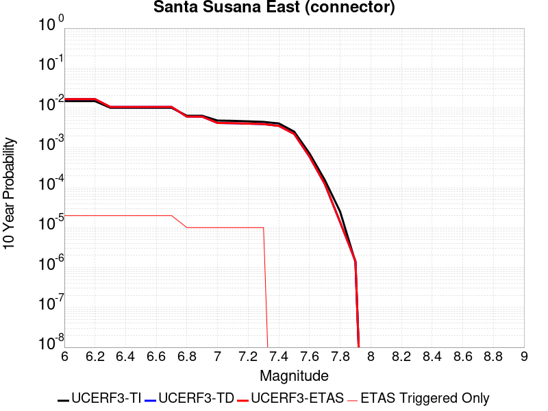 |

| Magnitude | 1 wk TI Prob | 1 wk TD Prob | 1 wk ETAS Prob | 1 wk ETAS/TD Gain | 1 wk ETAS Triggered Only | 1 mo TI Prob | 1 mo TD Prob | 1 mo ETAS Prob | 1 mo ETAS/TD Gain | 1 mo ETAS Triggered Only | 1 yr TI Prob | 1 yr TD Prob | 1 yr ETAS Prob | 1 yr ETAS/TD Gain | 1 yr ETAS Triggered Only | 10 yr TI Prob | 10 yr TD Prob | 10 yr ETAS Prob | 10 yr ETAS/TD Gain | 10 yr ETAS Triggered Only |
|-----|-----|-----|-----|-----|-----|-----|-----|-----|-----|-----|-----|-----|-----|-----|-----|-----|-----|-----|-----|-----|
| 6.0 | 2.858397E-5 | 3.2021693E-5 | 3.2021693E-5 | 1.0 | 0.0 | 1.2249697E-4 | 1.3723019E-4 | 1.3723019E-4 | 1.0 | 0.0 | 0.0014903803 | 0.00166977 | 0.0016860355 | 1.0097412 | 1.6292748E-5 | 0.014804244 | 0.016599316 | 0.016615339 | 1.0009652 | 1.6292748E-5 |
| 6.1 | 2.858397E-5 | 3.2021693E-5 | 3.2021693E-5 | 1.0 | 0.0 | 1.2249697E-4 | 1.3723019E-4 | 1.3723019E-4 | 1.0 | 0.0 | 0.0014903803 | 0.00166977 | 0.0016860355 | 1.0097412 | 1.6292748E-5 | 0.014804244 | 0.016599316 | 0.016615339 | 1.0009652 | 1.6292748E-5 |
| 6.2 | 2.858397E-5 | 3.2021693E-5 | 3.2021693E-5 | 1.0 | 0.0 | 1.2249697E-4 | 1.3723019E-4 | 1.3723019E-4 | 1.0 | 0.0 | 0.0014903803 | 0.00166977 | 0.0016860355 | 1.0097412 | 1.6292748E-5 | 0.014804244 | 0.016599316 | 0.016615339 | 1.0009652 | 1.6292748E-5 |
| 6.3 | 1.943582E-5 | 2.0367343E-5 | 2.0367343E-5 | 1.0 | 0.0 | 8.329371E-5 | 8.7286324E-5 | 8.7286324E-5 | 1.0 | 0.0 | 0.001013629 | 0.001062305 | 0.0010785804 | 1.0153209 | 1.6292748E-5 | 0.010090181 | 0.010583852 | 0.010599973 | 1.0015231 | 1.6292748E-5 |
| 6.4 | 1.943582E-5 | 2.0367343E-5 | 2.0367343E-5 | 1.0 | 0.0 | 8.329371E-5 | 8.7286324E-5 | 8.7286324E-5 | 1.0 | 0.0 | 0.001013629 | 0.001062305 | 0.0010785804 | 1.0153209 | 1.6292748E-5 | 0.010090181 | 0.010583852 | 0.010599973 | 1.0015231 | 1.6292748E-5 |
| 6.5 | 1.943582E-5 | 2.0367343E-5 | 2.0367343E-5 | 1.0 | 0.0 | 8.329371E-5 | 8.7286324E-5 | 8.7286324E-5 | 1.0 | 0.0 | 0.001013629 | 0.001062305 | 0.0010785804 | 1.0153209 | 1.6292748E-5 | 0.010090181 | 0.010583852 | 0.010599973 | 1.0015231 | 1.6292748E-5 |
| 6.6 | 1.943582E-5 | 2.0367343E-5 | 2.0367343E-5 | 1.0 | 0.0 | 8.329371E-5 | 8.7286324E-5 | 8.7286324E-5 | 1.0 | 0.0 | 0.001013629 | 0.001062305 | 0.0010785804 | 1.0153209 | 1.6292748E-5 | 0.010090181 | 0.010583852 | 0.010599973 | 1.0015231 | 1.6292748E-5 |
| 6.7 | 1.9404439E-5 | 2.0354766E-5 | 2.0354766E-5 | 1.0 | 0.0 | 8.3159226E-5 | 8.723242E-5 | 8.723242E-5 | 1.0 | 0.0 | 0.0010119933 | 0.0010616493 | 0.0010779247 | 1.0153303 | 1.6292748E-5 | 0.010073971 | 0.010577358 | 0.0105934795 | 1.0015241 | 1.6292748E-5 |
| 6.8 | 1.2217526E-5 | 1.1593157E-5 | 1.1593157E-5 | 1.0 | 0.0 | 5.2359774E-5 | 4.9684106E-5 | 4.9684106E-5 | 1.0 | 0.0 | 6.372938E-4 | 6.047529E-4 | 6.210358E-4 | 1.0269248 | 1.6292748E-5 | 0.0063546924 | 0.006033274 | 0.0060494686 | 1.0026842 | 1.6292748E-5 |
| 6.9 | 1.2217526E-5 | 1.1593157E-5 | 1.1593157E-5 | 1.0 | 0.0 | 5.2359774E-5 | 4.9684106E-5 | 4.9684106E-5 | 1.0 | 0.0 | 6.372938E-4 | 6.047529E-4 | 6.210358E-4 | 1.0269248 | 1.6292748E-5 | 0.0063546924 | 0.006033274 | 0.0060494686 | 1.0026842 | 1.6292748E-5 |
| 7.0 | 9.276017E-6 | 8.059273E-6 | 8.059273E-6 | 1.0 | 0.0 | 3.9753755E-5 | 3.4539302E-5 | 3.4539302E-5 | 1.0 | 0.0 | 4.8389446E-4 | 4.2043833E-4 | 4.3672422E-4 | 1.0387355 | 1.6292748E-5 | 0.0048284214 | 0.0041973097 | 0.0042135343 | 1.0038654 | 1.6292748E-5 |
| 7.1 | 9.130355E-6 | 7.942446E-6 | 7.942446E-6 | 1.0 | 0.0 | 3.9129503E-5 | 3.4038632E-5 | 3.4038632E-5 | 1.0 | 0.0 | 4.7629757E-4 | 4.1434498E-4 | 4.30631E-4 | 1.0393054 | 1.6292748E-5 | 0.00475278 | 0.0041366047 | 0.0041528298 | 1.0039223 | 1.6292748E-5 |
| 7.2 | 8.851015E-6 | 7.741608E-6 | 7.741608E-6 | 1.0 | 0.0 | 3.7932372E-5 | 3.317792E-5 | 3.317792E-5 | 1.0 | 0.0 | 4.6172875E-4 | 4.038697E-4 | 4.2015588E-4 | 1.0403253 | 1.6292748E-5 | 0.0046077054 | 0.0040322347 | 0.0040484616 | 1.0040244 | 1.6292748E-5 |
| 7.3 | 8.573006E-6 | 7.5503312E-6 | 7.5503312E-6 | 1.0 | 0.0 | 3.6740938E-5 | 3.235818E-5 | 3.235818E-5 | 1.0 | 0.0 | 4.472291E-4 | 3.9389305E-4 | 4.1017937E-4 | 1.0413471 | 1.6292748E-5 | 0.004463301 | 0.003932817 | 0.0039490457 | 1.0041264 | 1.6292748E-5 |
| 7.4 | 7.852282E-6 | 6.8178556E-6 | 6.8178556E-6 | 1.0 | 0.0 | 3.36522E-5 | 2.921907E-5 | 2.921907E-5 | 1.0 | 0.0 | 4.096385E-4 | 3.5568717E-4 | 3.5568717E-4 | 1.0 | 0.0 | 0.0040888423 | 0.0035519868 | 0.0035519868 | 1.0 | 0.0 |
| 7.5 | 4.8869324E-6 | 4.2790975E-6 | 4.2790975E-6 | 1.0 | 0.0 | 2.0943828E-5 | 1.833887E-5 | 1.833887E-5 | 1.0 | 0.0 | 2.5496128E-4 | 2.2325452E-4 | 2.2325452E-4 | 1.0 | 0.0 | 0.0025466895 | 0.00223057 | 0.00223057 | 1.0 | 0.0 |
| 7.6 | 1.3894544E-6 | 1.1568394E-6 | 1.1568394E-6 | 1.0 | 0.0 | 5.954791E-6 | 4.957875E-6 | 4.957875E-6 | 1.0 | 0.0 | 7.249717E-5 | 6.036068E-5 | 6.036068E-5 | 1.0 | 0.0 | 7.247352E-4 | 6.0346466E-4 | 6.0346466E-4 | 1.0 | 0.0 |
| 7.7 | 2.9924632E-7 | 2.3719332E-7 | 2.3719332E-7 | 1.0 | 0.0 | 1.2824837E-6 | 1.0165425E-6 | 1.0165425E-6 | 1.0 | 0.0 | 1.5614127E-5 | 1.2376341E-5 | 1.2376341E-5 | 1.0 | 0.0 | 1.5613029E-4 | 1.2375724E-4 | 1.2375724E-4 | 1.0 | 0.0 |
| 7.8 | 4.8188564E-8 | 2.6321862E-8 | 2.6321862E-8 | 1.0 | 0.0 | 2.065224E-7 | 1.12807975E-7 | 1.12807975E-7 | 1.0 | 0.0 | 2.5144072E-6 | 1.3734362E-6 | 1.3734362E-6 | 1.0 | 0.0 | 2.5143789E-5 | 1.3734286E-5 | 1.3734286E-5 | 1.0 | 0.0 |
| 7.9 | 2.6127251E-9 | 2.7681102E-9 | 2.7681102E-9 | 1.0 | 0.0 | 1.1197393E-8 | 1.186333E-8 | 1.186333E-8 | 1.0 | 0.0 | 1.3632825E-7 | 1.4443603E-7 | 1.4443603E-7 | 1.0 | 0.0 | 1.3632817E-6 | 1.4443604E-6 | 1.4443604E-6 | 1.0 | 0.0 |

## San Gabriel
*[(top)](#table-of-contents)*

| 1 Week | 1 Month | 1 Year | 10 Year |
|-----|-----|-----|-----|
|  |  |  | 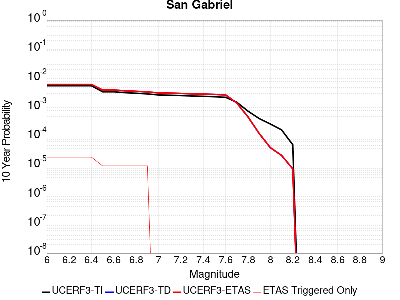 |

| Magnitude | 1 wk TI Prob | 1 wk TD Prob | 1 wk ETAS Prob | 1 wk ETAS/TD Gain | 1 wk ETAS Triggered Only | 1 mo TI Prob | 1 mo TD Prob | 1 mo ETAS Prob | 1 mo ETAS/TD Gain | 1 mo ETAS Triggered Only | 1 yr TI Prob | 1 yr TD Prob | 1 yr ETAS Prob | 1 yr ETAS/TD Gain | 1 yr ETAS Triggered Only | 10 yr TI Prob | 10 yr TD Prob | 10 yr ETAS Prob | 10 yr ETAS/TD Gain | 10 yr ETAS Triggered Only |
|-----|-----|-----|-----|-----|-----|-----|-----|-----|-----|-----|-----|-----|-----|-----|-----|-----|-----|-----|-----|-----|
| 6.0 | 1.083775E-5 | 1.198525E-5 | 1.198525E-5 | 1.0 | 0.0 | 4.6446676E-5 | 5.1364408E-5 | 5.1364408E-5 | 1.0 | 0.0 | 5.653415E-4 | 6.251936E-4 | 6.251936E-4 | 1.0 | 0.0 | 0.0056390543 | 0.0062463325 | 0.0062625236 | 1.0025921 | 1.6292748E-5 |
| 6.1 | 1.083775E-5 | 1.198525E-5 | 1.198525E-5 | 1.0 | 0.0 | 4.6446676E-5 | 5.1364408E-5 | 5.1364408E-5 | 1.0 | 0.0 | 5.653415E-4 | 6.251936E-4 | 6.251936E-4 | 1.0 | 0.0 | 0.0056390543 | 0.0062463325 | 0.0062625236 | 1.0025921 | 1.6292748E-5 |
| 6.2 | 1.083775E-5 | 1.198525E-5 | 1.198525E-5 | 1.0 | 0.0 | 4.6446676E-5 | 5.1364408E-5 | 5.1364408E-5 | 1.0 | 0.0 | 5.653415E-4 | 6.251936E-4 | 6.251936E-4 | 1.0 | 0.0 | 0.0056390543 | 0.0062463325 | 0.0062625236 | 1.0025921 | 1.6292748E-5 |
| 6.3 | 1.083775E-5 | 1.198525E-5 | 1.198525E-5 | 1.0 | 0.0 | 4.6446676E-5 | 5.1364408E-5 | 5.1364408E-5 | 1.0 | 0.0 | 5.653415E-4 | 6.251936E-4 | 6.251936E-4 | 1.0 | 0.0 | 0.0056390543 | 0.0062463325 | 0.0062625236 | 1.0025921 | 1.6292748E-5 |
| 6.4 | 1.083775E-5 | 1.198525E-5 | 1.198525E-5 | 1.0 | 0.0 | 4.6446676E-5 | 5.1364408E-5 | 5.1364408E-5 | 1.0 | 0.0 | 5.653415E-4 | 6.251936E-4 | 6.251936E-4 | 1.0 | 0.0 | 0.0056390543 | 0.0062463325 | 0.0062625236 | 1.0025921 | 1.6292748E-5 |
| 6.5 | 6.7317824E-6 | 7.717007E-6 | 7.717007E-6 | 1.0 | 0.0 | 2.8850178E-5 | 3.3072472E-5 | 3.3072472E-5 | 1.0 | 0.0 | 3.511943E-4 | 4.0258403E-4 | 4.0258403E-4 | 1.0 | 0.0 | 0.003506398 | 0.004029533 | 0.00404576 | 1.004027 | 1.6292748E-5 |
| 6.6 | 6.7317824E-6 | 7.717007E-6 | 7.717007E-6 | 1.0 | 0.0 | 2.8850178E-5 | 3.3072472E-5 | 3.3072472E-5 | 1.0 | 0.0 | 3.511943E-4 | 4.0258403E-4 | 4.0258403E-4 | 1.0 | 0.0 | 0.003506398 | 0.004029533 | 0.00404576 | 1.004027 | 1.6292748E-5 |
| 6.7 | 6.274881E-6 | 7.2459275E-6 | 7.2459275E-6 | 1.0 | 0.0 | 2.6892068E-5 | 3.105361E-5 | 3.105361E-5 | 1.0 | 0.0 | 3.2736175E-4 | 3.7801306E-4 | 3.7801306E-4 | 1.0 | 0.0 | 0.0032687993 | 0.0037846796 | 0.0038009107 | 1.0042887 | 1.6292748E-5 |
| 6.8 | 5.996209E-6 | 6.958647E-6 | 6.958647E-6 | 1.0 | 0.0 | 2.5697784E-5 | 2.9822439E-5 | 2.9822439E-5 | 1.0 | 0.0 | 3.128256E-4 | 3.6302864E-4 | 3.6302864E-4 | 1.0 | 0.0 | 0.003123856 | 0.0036353325 | 0.003651566 | 1.0044655 | 1.6292748E-5 |
| 6.9 | 5.686331E-6 | 6.6236917E-6 | 6.6236917E-6 | 1.0 | 0.0 | 2.4369761E-5 | 2.8386947E-5 | 2.8386947E-5 | 1.0 | 0.0 | 2.9666146E-4 | 3.4555717E-4 | 3.4555717E-4 | 1.0 | 0.0 | 0.0029626573 | 0.0034611735 | 0.00347741 | 1.004691 | 1.6292748E-5 |
| 7.0 | 5.2329838E-6 | 6.1475757E-6 | 6.1475757E-6 | 1.0 | 0.0 | 2.242688E-5 | 2.6346492E-5 | 2.6346492E-5 | 1.0 | 0.0 | 2.7301308E-4 | 3.207221E-4 | 3.207221E-4 | 1.0 | 0.0 | 0.002726779 | 0.0032135549 | 0.0032135549 | 1.0 | 0.0 |
| 7.1 | 5.135671E-6 | 6.0377E-6 | 6.0377E-6 | 1.0 | 0.0 | 2.2009834E-5 | 2.5875606E-5 | 2.5875606E-5 | 1.0 | 0.0 | 2.6793676E-4 | 3.1499073E-4 | 3.1499073E-4 | 1.0 | 0.0 | 0.0026761394 | 0.0031564054 | 0.0031564054 | 1.0 | 0.0 |
| 7.2 | 4.989062E-6 | 5.8710784E-6 | 5.8710784E-6 | 1.0 | 0.0 | 2.1381518E-5 | 2.5161527E-5 | 2.5161527E-5 | 1.0 | 0.0 | 2.6028889E-4 | 3.0629928E-4 | 3.0629928E-4 | 1.0 | 0.0 | 0.0025998424 | 0.003069734 | 0.003069734 | 1.0 | 0.0 |
| 7.3 | 4.8219395E-6 | 5.7026323E-6 | 5.7026323E-6 | 1.0 | 0.0 | 2.0665291E-5 | 2.4439627E-5 | 2.4439627E-5 | 1.0 | 0.0 | 2.5157086E-4 | 2.975126E-4 | 2.975126E-4 | 1.0 | 0.0 | 0.0025128627 | 0.002982106 | 0.002982106 | 1.0 | 0.0 |
| 7.4 | 4.7118383E-6 | 5.5911896E-6 | 5.5911896E-6 | 1.0 | 0.0 | 2.0193436E-5 | 2.3962024E-5 | 2.3962024E-5 | 1.0 | 0.0 | 2.4582737E-4 | 2.9169934E-4 | 2.9169934E-4 | 1.0 | 0.0 | 0.002455556 | 0.0029241266 | 0.0029241266 | 1.0 | 0.0 |
| 7.5 | 4.5506545E-6 | 5.4365555E-6 | 5.4365555E-6 | 1.0 | 0.0 | 1.9502659E-5 | 2.329932E-5 | 2.329932E-5 | 1.0 | 0.0 | 2.37419E-4 | 2.8363304E-4 | 2.8363304E-4 | 1.0 | 0.0 | 0.002371655 | 0.0028436715 | 0.0028436715 | 1.0 | 0.0 |
| 7.6 | 4.343636E-6 | 5.2294336E-6 | 5.2294336E-6 | 1.0 | 0.0 | 1.861545E-5 | 2.241167E-5 | 2.241167E-5 | 1.0 | 0.0 | 2.2661954E-4 | 2.7282868E-4 | 2.7282868E-4 | 1.0 | 0.0 | 0.0022638857 | 0.0027358893 | 0.0027358893 | 1.0 | 0.0 |
| 7.7 | 2.936235E-6 | 2.743946E-6 | 2.743946E-6 | 1.0 | 0.0 | 1.2583803E-5 | 1.1759716E-5 | 1.1759716E-5 | 1.0 | 0.0 | 1.5319703E-4 | 1.4316518E-4 | 1.4316518E-4 | 1.0 | 0.0 | 0.0015309147 | 0.0014379849 | 0.0014379849 | 1.0 | 0.0 |
| 7.8 | 1.4541639E-6 | 9.122518E-7 | 9.122518E-7 | 1.0 | 0.0 | 6.232116E-6 | 3.9096444E-6 | 3.9096444E-6 | 1.0 | 0.0 | 7.587337E-5 | 4.7598885E-5 | 4.7598885E-5 | 1.0 | 0.0 | 7.584747E-4 | 4.8078224E-4 | 4.8078224E-4 | 1.0 | 0.0 |
| 7.9 | 8.098958E-7 | 2.4165956E-7 | 2.4165956E-7 | 1.0 | 0.0 | 3.4709774E-6 | 1.0356835E-6 | 1.0356835E-6 | 1.0 | 0.0 | 4.225833E-5 | 1.2609373E-5 | 1.2609373E-5 | 1.0 | 0.0 | 4.2250296E-4 | 1.2917137E-4 | 1.2917137E-4 | 1.0 | 0.0 |
| 8.0 | 5.2473234E-7 | 7.672734E-8 | 7.672734E-8 | 1.0 | 0.0 | 2.248851E-6 | 3.2883142E-7 | 3.2883142E-7 | 1.0 | 0.0 | 2.7379416E-5 | 4.003515E-6 | 4.003515E-6 | 1.0 | 0.0 | 2.7376044E-4 | 4.215796E-5 | 4.215796E-5 | 1.0 | 0.0 |
| 8.1 | 3.3162388E-7 | 4.1457096E-8 | 4.1457096E-8 | 1.0 | 0.0 | 1.4212444E-6 | 1.7767324E-7 | 1.7767324E-7 | 1.0 | 0.0 | 1.7303513E-5 | 2.1631695E-6 | 2.1631695E-6 | 1.0 | 0.0 | 1.7302166E-4 | 2.294416E-5 | 2.294416E-5 | 1.0 | 0.0 |
| 8.2 | 1.0235345E-7 | 1.4032201E-8 | 1.4032201E-8 | 1.0 | 0.0 | 4.3865757E-7 | 6.013801E-8 | 6.013801E-8 | 1.0 | 0.0 | 5.340643E-6 | 7.3217996E-7 | 7.3217996E-7 | 1.0 | 0.0 | 5.3405143E-5 | 7.921925E-6 | 7.921925E-6 | 1.0 | 0.0 |

## Hollywood
*[(top)](#table-of-contents)*

| 1 Week | 1 Month | 1 Year | 10 Year |
|-----|-----|-----|-----|
|  |  |  |  |

| Magnitude | 1 wk TI Prob | 1 wk TD Prob | 1 wk ETAS Prob | 1 wk ETAS/TD Gain | 1 wk ETAS Triggered Only | 1 mo TI Prob | 1 mo TD Prob | 1 mo ETAS Prob | 1 mo ETAS/TD Gain | 1 mo ETAS Triggered Only | 1 yr TI Prob | 1 yr TD Prob | 1 yr ETAS Prob | 1 yr ETAS/TD Gain | 1 yr ETAS Triggered Only | 10 yr TI Prob | 10 yr TD Prob | 10 yr ETAS Prob | 10 yr ETAS/TD Gain | 10 yr ETAS Triggered Only |
|-----|-----|-----|-----|-----|-----|-----|-----|-----|-----|-----|-----|-----|-----|-----|-----|-----|-----|-----|-----|-----|
| 6.0 | 1.24487615E-5 | 1.2593229E-5 | 1.2593229E-5 | 1.0 | 0.0 | 5.3350745E-5 | 5.3969892E-5 | 5.3969892E-5 | 1.0 | 0.0 | 6.4935174E-4 | 6.5689E-4 | 6.5689E-4 | 1.0 | 0.0 | 0.0064745755 | 0.0065499707 | 0.0065661566 | 1.0024712 | 1.6292748E-5 |
| 6.1 | 1.24487615E-5 | 1.2593229E-5 | 1.2593229E-5 | 1.0 | 0.0 | 5.3350745E-5 | 5.3969892E-5 | 5.3969892E-5 | 1.0 | 0.0 | 6.4935174E-4 | 6.5689E-4 | 6.5689E-4 | 1.0 | 0.0 | 0.0064745755 | 0.0065499707 | 0.0065661566 | 1.0024712 | 1.6292748E-5 |
| 6.2 | 1.24487615E-5 | 1.2593229E-5 | 1.2593229E-5 | 1.0 | 0.0 | 5.3350745E-5 | 5.3969892E-5 | 5.3969892E-5 | 1.0 | 0.0 | 6.4935174E-4 | 6.5689E-4 | 6.5689E-4 | 1.0 | 0.0 | 0.0064745755 | 0.0065499707 | 0.0065661566 | 1.0024712 | 1.6292748E-5 |
| 6.3 | 1.24487615E-5 | 1.2593229E-5 | 1.2593229E-5 | 1.0 | 0.0 | 5.3350745E-5 | 5.3969892E-5 | 5.3969892E-5 | 1.0 | 0.0 | 6.4935174E-4 | 6.5689E-4 | 6.5689E-4 | 1.0 | 0.0 | 0.0064745755 | 0.0065499707 | 0.0065661566 | 1.0024712 | 1.6292748E-5 |
| 6.4 | 1.2431024E-5 | 1.25738425E-5 | 1.25738425E-5 | 1.0 | 0.0 | 5.327473E-5 | 5.388681E-5 | 5.388681E-5 | 1.0 | 0.0 | 6.4842677E-4 | 6.558791E-4 | 6.558791E-4 | 1.0 | 0.0 | 0.0064653796 | 0.0065399213 | 0.006556107 | 1.002475 | 1.6292748E-5 |
| 6.5 | 1.1242222E-5 | 1.1317804E-5 | 1.1317804E-5 | 1.0 | 0.0 | 4.8180063E-5 | 4.8503985E-5 | 4.8503985E-5 | 1.0 | 0.0 | 5.864344E-4 | 5.903787E-4 | 5.903787E-4 | 1.0 | 0.0 | 0.0058488925 | 0.00588839 | 0.0059045865 | 1.0027506 | 1.6292748E-5 |
| 6.6 | 1.1234066E-5 | 1.1308918E-5 | 1.1308918E-5 | 1.0 | 0.0 | 4.8145106E-5 | 4.8465907E-5 | 4.8465907E-5 | 1.0 | 0.0 | 5.86009E-4 | 5.899153E-4 | 5.899153E-4 | 1.0 | 0.0 | 0.005844661 | 0.0058837803 | 0.0058999774 | 1.0027528 | 1.6292748E-5 |
| 6.7 | 1.12294E-5 | 1.1303661E-5 | 1.1303661E-5 | 1.0 | 0.0 | 4.812511E-5 | 4.8443377E-5 | 4.8443377E-5 | 1.0 | 0.0 | 5.857657E-4 | 5.896412E-4 | 5.896412E-4 | 1.0 | 0.0 | 0.0058422405 | 0.005881054 | 0.0058972505 | 1.0027541 | 1.6292748E-5 |
| 6.8 | 1.0252819E-5 | 1.0218449E-5 | 1.0218449E-5 | 1.0 | 0.0 | 4.3939912E-5 | 4.3792625E-5 | 4.3792625E-5 | 1.0 | 0.0 | 5.3483713E-4 | 5.330469E-4 | 5.330469E-4 | 1.0 | 0.0 | 0.005335517 | 0.0053179096 | 0.0053341156 | 1.0030475 | 1.6292748E-5 |
| 6.9 | 9.252289E-6 | 9.110309E-6 | 9.110309E-6 | 1.0 | 0.0 | 3.9652066E-5 | 3.9043607E-5 | 3.9043607E-5 | 1.0 | 0.0 | 4.8265693E-4 | 4.752539E-4 | 4.752539E-4 | 1.0 | 0.0 | 0.0048161 | 0.004742549 | 0.004758764 | 1.0034192 | 1.6292748E-5 |
| 7.0 | 8.474604E-6 | 8.25826E-6 | 8.25826E-6 | 1.0 | 0.0 | 3.6319227E-5 | 3.5392073E-5 | 3.5392073E-5 | 1.0 | 0.0 | 4.4209688E-4 | 4.3081472E-4 | 4.3081472E-4 | 1.0 | 0.0 | 0.004412184 | 0.0042999457 | 0.0043161684 | 1.0037727 | 1.6292748E-5 |
| 7.1 | 6.643643E-6 | 6.2683707E-6 | 6.2683707E-6 | 1.0 | 0.0 | 2.8472443E-5 | 2.686417E-5 | 2.686417E-5 | 1.0 | 0.0 | 3.4659685E-4 | 3.2702263E-4 | 3.2702263E-4 | 1.0 | 0.0 | 0.0034605677 | 0.0032654598 | 0.0032816995 | 1.0049732 | 1.6292748E-5 |
| 7.2 | 5.549002E-6 | 5.1087086E-6 | 5.1087086E-6 | 1.0 | 0.0 | 2.378122E-5 | 2.1894282E-5 | 2.1894282E-5 | 1.0 | 0.0 | 2.8949787E-4 | 2.665304E-4 | 2.665304E-4 | 1.0 | 0.0 | 0.0028912104 | 0.002662124 | 0.0026783734 | 1.0061039 | 1.6292748E-5 |
| 7.3 | 4.3059727E-6 | 3.9598913E-6 | 3.9598913E-6 | 1.0 | 0.0 | 1.8454039E-5 | 1.6970853E-5 | 1.6970853E-5 | 1.0 | 0.0 | 2.2465475E-4 | 2.0660064E-4 | 2.0660064E-4 | 1.0 | 0.0 | 0.0022442779 | 0.0020640958 | 0.0020803548 | 1.0078771 | 1.6292748E-5 |
| 7.4 | 2.8550733E-6 | 2.7013002E-6 | 2.7013002E-6 | 1.0 | 0.0 | 1.2235971E-5 | 1.1576949E-5 | 1.1576949E-5 | 1.0 | 0.0 | 1.4896276E-4 | 1.4094029E-4 | 1.4094029E-4 | 1.0 | 0.0 | 0.0014886294 | 0.0014085141 | 0.001424784 | 1.011551 | 1.6292748E-5 |
| 7.5 | 1.9927045E-6 | 1.8976393E-6 | 1.8976393E-6 | 1.0 | 0.0 | 8.540134E-6 | 8.132714E-6 | 8.132714E-6 | 1.0 | 0.0 | 1.0397117E-4 | 9.901134E-5 | 9.901134E-5 | 1.0 | 0.0 | 0.0010392254 | 9.896759E-4 | 9.896759E-4 | 1.0 | 0.0 |
| 7.6 | 1.345084E-6 | 1.2216018E-6 | 1.2216018E-6 | 1.0 | 0.0 | 5.764633E-6 | 5.2354258E-6 | 5.2354258E-6 | 1.0 | 0.0 | 7.018215E-5 | 6.373946E-5 | 6.373946E-5 | 1.0 | 0.0 | 7.0159987E-4 | 6.372138E-4 | 6.372138E-4 | 1.0 | 0.0 |
| 7.7 | 7.6835164E-7 | 6.2777013E-7 | 6.2777013E-7 | 1.0 | 0.0 | 3.2929315E-6 | 2.6904406E-6 | 2.6904406E-6 | 1.0 | 0.0 | 4.00907E-5 | 3.2755637E-5 | 3.2755637E-5 | 1.0 | 0.0 | 4.0083472E-4 | 3.2750957E-4 | 3.2750957E-4 | 1.0 | 0.0 |
| 7.8 | 3.6562128E-7 | 2.4534745E-7 | 2.4534745E-7 | 1.0 | 0.0 | 1.5669474E-6 | 1.0514887E-6 | 1.0514887E-6 | 1.0 | 0.0 | 1.9077417E-5 | 1.2801803E-5 | 1.2801803E-5 | 1.0 | 0.0 | 1.907578E-4 | 1.2801103E-4 | 1.2801103E-4 | 1.0 | 0.0 |
| 7.9 | 7.5024424E-8 | 5.381742E-8 | 5.381742E-8 | 1.0 | 0.0 | 3.215332E-7 | 2.3064608E-7 | 2.3064608E-7 | 1.0 | 0.0 | 3.91466E-6 | 2.8081138E-6 | 2.8081138E-6 | 1.0 | 0.0 | 3.9145907E-5 | 2.8080913E-5 | 2.8080913E-5 | 1.0 | 0.0 |

## Hosgri (Extension)
*[(top)](#table-of-contents)*

| 1 Week | 1 Month | 1 Year | 10 Year |
|-----|-----|-----|-----|
|  |  |  | 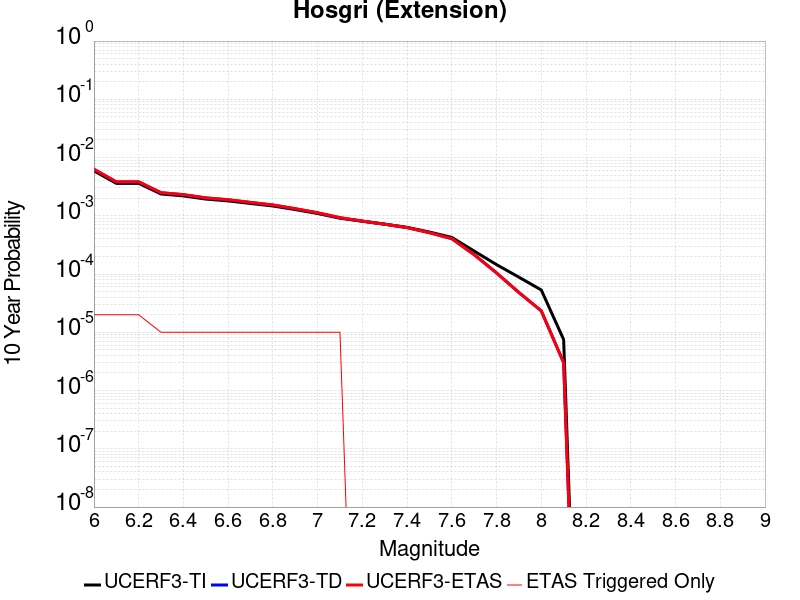 |

| Magnitude | 1 wk TI Prob | 1 wk TD Prob | 1 wk ETAS Prob | 1 wk ETAS/TD Gain | 1 wk ETAS Triggered Only | 1 mo TI Prob | 1 mo TD Prob | 1 mo ETAS Prob | 1 mo ETAS/TD Gain | 1 mo ETAS Triggered Only | 1 yr TI Prob | 1 yr TD Prob | 1 yr ETAS Prob | 1 yr ETAS/TD Gain | 1 yr ETAS Triggered Only | 10 yr TI Prob | 10 yr TD Prob | 10 yr ETAS Prob | 10 yr ETAS/TD Gain | 10 yr ETAS Triggered Only |
|-----|-----|-----|-----|-----|-----|-----|-----|-----|-----|-----|-----|-----|-----|-----|-----|-----|-----|-----|-----|-----|
| 6.0 | 1.1369135E-5 | 1.2083073E-5 | 1.2083073E-5 | 1.0 | 0.0 | 4.8723956E-5 | 5.17837E-5 | 5.17837E-5 | 1.0 | 0.0 | 5.9305265E-4 | 6.303069E-4 | 6.303069E-4 | 1.0 | 0.0 | 0.005914725 | 0.00628744 | 0.006303631 | 1.002575 | 1.6292748E-5 |
| 6.1 | 6.934979E-6 | 7.324556E-6 | 7.324556E-6 | 1.0 | 0.0 | 2.9721E-5 | 3.13906E-5 | 3.13906E-5 | 1.0 | 0.0 | 3.617931E-4 | 3.821177E-4 | 3.821177E-4 | 1.0 | 0.0 | 0.0036120464 | 0.003815019 | 0.0038312497 | 1.0042543 | 1.6292748E-5 |
| 6.2 | 6.934979E-6 | 7.324556E-6 | 7.324556E-6 | 1.0 | 0.0 | 2.9721E-5 | 3.13906E-5 | 3.13906E-5 | 1.0 | 0.0 | 3.617931E-4 | 3.821177E-4 | 3.821177E-4 | 1.0 | 0.0 | 0.0036120464 | 0.003815019 | 0.0038312497 | 1.0042543 | 1.6292748E-5 |
| 6.3 | 4.5484676E-6 | 4.769331E-6 | 4.769331E-6 | 1.0 | 0.0 | 1.9493287E-5 | 2.0439833E-5 | 2.0439833E-5 | 1.0 | 0.0 | 2.3730492E-4 | 2.4882698E-4 | 2.4882698E-4 | 1.0 | 0.0 | 0.0023705168 | 0.0024855263 | 0.0024855263 | 1.0 | 0.0 |
| 6.4 | 4.218095E-6 | 4.416863E-6 | 4.416863E-6 | 1.0 | 0.0 | 1.8077424E-5 | 1.8929275E-5 | 1.8929275E-5 | 1.0 | 0.0 | 2.2007042E-4 | 2.3043988E-4 | 2.3043988E-4 | 1.0 | 0.0 | 0.002198526 | 0.002302043 | 0.002302043 | 1.0 | 0.0 |
| 6.5 | 3.717374E-6 | 3.883879E-6 | 3.883879E-6 | 1.0 | 0.0 | 1.5931506E-5 | 1.664509E-5 | 1.664509E-5 | 1.0 | 0.0 | 1.9394881E-4 | 2.026353E-4 | 2.026353E-4 | 1.0 | 0.0 | 0.0019377962 | 0.0020245241 | 0.0020245241 | 1.0 | 0.0 |
| 6.6 | 3.4605036E-6 | 3.6083072E-6 | 3.6083072E-6 | 1.0 | 0.0 | 1.4830645E-5 | 1.5464082E-5 | 1.5464082E-5 | 1.0 | 0.0 | 1.8054814E-4 | 1.8825909E-4 | 1.8825909E-4 | 1.0 | 0.0 | 0.0018040152 | 0.0018810107 | 0.0018810107 | 1.0 | 0.0 |
| 6.7 | 3.123439E-6 | 3.2465698E-6 | 3.2465698E-6 | 1.0 | 0.0 | 1.33860985E-5 | 1.39137965E-5 | 1.39137965E-5 | 1.0 | 0.0 | 1.6296357E-4 | 1.6938741E-4 | 1.6938741E-4 | 1.0 | 0.0 | 0.001628441 | 0.001692594 | 0.001692594 | 1.0 | 0.0 |
| 6.8 | 2.8290783E-6 | 2.9305413E-6 | 2.9305413E-6 | 1.0 | 0.0 | 1.2124565E-5 | 1.2559403E-5 | 1.2559403E-5 | 1.0 | 0.0 | 1.4760658E-4 | 1.5290009E-4 | 1.5290009E-4 | 1.0 | 0.0 | 0.0014750857 | 0.0015279576 | 0.0015279576 | 1.0 | 0.0 |
| 6.9 | 2.454112E-6 | 2.5283207E-6 | 2.5283207E-6 | 1.0 | 0.0 | 1.0517581E-5 | 1.0835615E-5 | 1.0835615E-5 | 1.0 | 0.0 | 1.2804402E-4 | 1.3191569E-4 | 1.3191569E-4 | 1.0 | 0.0 | 0.0012797028 | 0.0013183799 | 0.0013183799 | 1.0 | 0.0 |
| 7.0 | 2.1008145E-6 | 2.1498715E-6 | 2.1498715E-6 | 1.0 | 0.0 | 9.003459E-6 | 9.2137025E-6 | 9.2137025E-6 | 1.0 | 0.0 | 1.096116E-4 | 1.1217109E-4 | 1.1217109E-4 | 1.0 | 0.0 | 0.0010955755 | 0.0011211485 | 0.0011211485 | 1.0 | 0.0 |
| 7.1 | 1.744384E-6 | 1.7686364E-6 | 1.7686364E-6 | 1.0 | 0.0 | 7.47591E-6 | 7.579848E-6 | 7.579848E-6 | 1.0 | 0.0 | 9.1015405E-5 | 9.228076E-5 | 9.228076E-5 | 1.0 | 0.0 | 9.097813E-4 | 9.224261E-4 | 9.224261E-4 | 1.0 | 0.0 |
| 7.2 | 1.5456587E-6 | 1.5562894E-6 | 1.5562894E-6 | 1.0 | 0.0 | 6.6242346E-6 | 6.6697944E-6 | 6.6697944E-6 | 1.0 | 0.0 | 8.064707E-5 | 8.120173E-5 | 8.120173E-5 | 1.0 | 0.0 | 8.0617814E-4 | 8.117219E-4 | 8.117219E-4 | 1.0 | 0.0 |
| 7.3 | 1.3775123E-6 | 1.3766092E-6 | 1.3766092E-6 | 1.0 | 0.0 | 5.9036106E-6 | 5.8997407E-6 | 5.8997407E-6 | 1.0 | 0.0 | 7.187409E-5 | 7.182699E-5 | 7.182699E-5 | 1.0 | 0.0 | 7.185085E-4 | 7.180387E-4 | 7.180387E-4 | 1.0 | 0.0 |
| 7.4 | 1.214491E-6 | 1.2023471E-6 | 1.2023471E-6 | 1.0 | 0.0 | 5.2049513E-6 | 5.152906E-6 | 5.152906E-6 | 1.0 | 0.0 | 6.336844E-5 | 6.2734835E-5 | 6.2734835E-5 | 1.0 | 0.0 | 6.335037E-4 | 6.2717206E-4 | 6.2717206E-4 | 1.0 | 0.0 |
| 7.5 | 1.0101123E-6 | 9.842256E-7 | 9.842256E-7 | 1.0 | 0.0 | 4.3290456E-6 | 4.218103E-6 | 4.218103E-6 | 1.0 | 0.0 | 5.2704854E-5 | 5.13542E-5 | 5.13542E-5 | 1.0 | 0.0 | 5.2692357E-4 | 5.1342393E-4 | 5.1342393E-4 | 1.0 | 0.0 |
| 7.6 | 8.1558215E-7 | 7.765977E-7 | 7.765977E-7 | 1.0 | 0.0 | 3.4953473E-6 | 3.3282718E-6 | 3.3282718E-6 | 1.0 | 0.0 | 4.255502E-5 | 4.0520958E-5 | 4.0520958E-5 | 1.0 | 0.0 | 4.2546875E-4 | 4.0513615E-4 | 4.0513615E-4 | 1.0 | 0.0 |
| 7.7 | 4.757816E-7 | 4.1308996E-7 | 4.1308996E-7 | 1.0 | 0.0 | 2.0390623E-6 | 1.7703843E-6 | 1.7703843E-6 | 1.0 | 0.0 | 2.4825302E-5 | 2.1554217E-5 | 2.1554217E-5 | 1.0 | 0.0 | 2.482253E-4 | 2.1552139E-4 | 2.1552139E-4 | 1.0 | 0.0 |
| 7.8 | 2.782787E-7 | 2.004783E-7 | 2.004783E-7 | 1.0 | 0.0 | 1.1926223E-6 | 8.591924E-7 | 8.591924E-7 | 1.0 | 0.0 | 1.452008E-5 | 1.0460618E-5 | 1.0460618E-5 | 1.0 | 0.0 | 1.4519131E-4 | 1.04601284E-4 | 1.04601284E-4 | 1.0 | 0.0 |
| 7.9 | 1.6948086E-7 | 9.243938E-8 | 9.243938E-8 | 1.0 | 0.0 | 7.2634634E-7 | 3.961687E-7 | 3.961687E-7 | 1.0 | 0.0 | 8.843231E-6 | 4.8233433E-6 | 4.8233433E-6 | 1.0 | 0.0 | 8.842879E-5 | 4.8232392E-5 | 4.8232392E-5 | 1.0 | 0.0 |
| 8.0 | 1.0225492E-7 | 4.473497E-8 | 4.473497E-8 | 1.0 | 0.0 | 4.382353E-7 | 1.917213E-7 | 1.917213E-7 | 1.0 | 0.0 | 5.335502E-6 | 2.3342043E-6 | 2.3342043E-6 | 1.0 | 0.0 | 5.335374E-5 | 2.33418E-5 | 2.33418E-5 | 1.0 | 0.0 |
| 8.1 | 1.43711345E-8 | 5.78716E-9 | 5.78716E-9 | 1.0 | 0.0 | 6.1590576E-8 | 2.4802116E-8 | 2.4802116E-8 | 1.0 | 0.0 | 7.4986497E-7 | 3.019657E-7 | 3.019657E-7 | 1.0 | 0.0 | 7.4986247E-6 | 3.0196536E-6 | 3.0196536E-6 | 1.0 | 0.0 |

## West Napa 2011 CFM
*[(top)](#table-of-contents)*

| 1 Week | 1 Month | 1 Year | 10 Year |
|-----|-----|-----|-----|
|  |  |  |  |

| Magnitude | 1 wk TI Prob | 1 wk TD Prob | 1 wk ETAS Prob | 1 wk ETAS/TD Gain | 1 wk ETAS Triggered Only | 1 mo TI Prob | 1 mo TD Prob | 1 mo ETAS Prob | 1 mo ETAS/TD Gain | 1 mo ETAS Triggered Only | 1 yr TI Prob | 1 yr TD Prob | 1 yr ETAS Prob | 1 yr ETAS/TD Gain | 1 yr ETAS Triggered Only | 10 yr TI Prob | 10 yr TD Prob | 10 yr ETAS Prob | 10 yr ETAS/TD Gain | 10 yr ETAS Triggered Only |
|-----|-----|-----|-----|-----|-----|-----|-----|-----|-----|-----|-----|-----|-----|-----|-----|-----|-----|-----|-----|-----|
| 6.0 | 3.773104E-5 | 4.4528504E-5 | 4.4528504E-5 | 1.0 | 0.0 | 1.6169442E-4 | 1.9082428E-4 | 1.9082428E-4 | 1.0 | 0.0 | 0.001966852 | 0.0023211278 | 0.0023373826 | 1.0070031 | 1.6292748E-5 | 0.019495348 | 0.023002012 | 0.02301793 | 1.000692 | 1.6292748E-5 |
| 6.1 | 3.773104E-5 | 4.4528504E-5 | 4.4528504E-5 | 1.0 | 0.0 | 1.6169442E-4 | 1.9082428E-4 | 1.9082428E-4 | 1.0 | 0.0 | 0.001966852 | 0.0023211278 | 0.0023373826 | 1.0070031 | 1.6292748E-5 | 0.019495348 | 0.023002012 | 0.02301793 | 1.000692 | 1.6292748E-5 |
| 6.2 | 3.773104E-5 | 4.4528504E-5 | 4.4528504E-5 | 1.0 | 0.0 | 1.6169442E-4 | 1.9082428E-4 | 1.9082428E-4 | 1.0 | 0.0 | 0.001966852 | 0.0023211278 | 0.0023373826 | 1.0070031 | 1.6292748E-5 | 0.019495348 | 0.023002012 | 0.02301793 | 1.000692 | 1.6292748E-5 |
| 6.3 | 2.147964E-5 | 2.4987066E-5 | 2.4987066E-5 | 1.0 | 0.0 | 9.2052345E-5 | 1.0708355E-4 | 1.0708355E-4 | 1.0 | 0.0 | 0.001120161 | 0.0013030542 | 0.0013030542 | 1.0 | 0.0 | 0.011145315 | 0.012964482 | 0.012964482 | 1.0 | 0.0 |
| 6.4 | 2.147964E-5 | 2.4987066E-5 | 2.4987066E-5 | 1.0 | 0.0 | 9.2052345E-5 | 1.0708355E-4 | 1.0708355E-4 | 1.0 | 0.0 | 0.001120161 | 0.0013030542 | 0.0013030542 | 1.0 | 0.0 | 0.011145315 | 0.012964482 | 0.012964482 | 1.0 | 0.0 |
| 6.5 | 1.688201E-5 | 1.9547371E-5 | 1.9547371E-5 | 1.0 | 0.0 | 7.234947E-5 | 8.377217E-5 | 8.377217E-5 | 1.0 | 0.0 | 8.804988E-4 | 0.0010195216 | 0.0010195216 | 1.0 | 0.0 | 0.008770182 | 0.01015684 | 0.01015684 | 1.0 | 0.0 |
| 6.6 | 1.6846381E-5 | 1.9507064E-5 | 1.9507064E-5 | 1.0 | 0.0 | 7.219678E-5 | 8.3599436E-5 | 8.3599436E-5 | 1.0 | 0.0 | 8.7864127E-4 | 0.0010174206 | 0.0010174206 | 1.0 | 0.0 | 0.008751754 | 0.010136021 | 0.010136021 | 1.0 | 0.0 |
| 6.7 | 1.3396501E-5 | 1.5467684E-5 | 1.5467684E-5 | 1.0 | 0.0 | 5.7412315E-5 | 6.628875E-5 | 6.628875E-5 | 1.0 | 0.0 | 6.9877075E-4 | 8.068302E-4 | 8.068302E-4 | 1.0 | 0.0 | 0.0069657755 | 0.008046459 | 0.008046459 | 1.0 | 0.0 |
| 6.8 | 1.0139058E-5 | 1.16721785E-5 | 1.16721785E-5 | 1.0 | 0.0 | 4.3452383E-5 | 5.0022976E-5 | 5.0022976E-5 | 1.0 | 0.0 | 5.289043E-4 | 6.0891506E-4 | 6.0891506E-4 | 1.0 | 0.0 | 0.005276473 | 0.0060791126 | 0.0060791126 | 1.0 | 0.0 |
| 6.9 | 7.761281E-6 | 8.890723E-6 | 8.890723E-6 | 1.0 | 0.0 | 3.326221E-5 | 3.810283E-5 | 3.810283E-5 | 1.0 | 0.0 | 4.0489217E-4 | 4.6385458E-4 | 4.6385458E-4 | 1.0 | 0.0 | 0.0040415525 | 0.0046351026 | 0.0046351026 | 1.0 | 0.0 |
| 7.0 | 2.2109202E-6 | 2.3666319E-6 | 2.3666319E-6 | 1.0 | 0.0 | 9.475338E-6 | 1.01426685E-5 | 1.01426685E-5 | 1.0 | 0.0 | 1.1535613E-4 | 1.2348007E-4 | 1.2348007E-4 | 1.0 | 0.0 | 0.0011529627 | 0.0012353238 | 0.0012353238 | 1.0 | 0.0 |
| 7.1 | 1.9008926E-6 | 2.0133207E-6 | 2.0133207E-6 | 1.0 | 0.0 | 8.146657E-6 | 8.628488E-6 | 8.628488E-6 | 1.0 | 0.0 | 9.918104E-5 | 1.05046805E-4 | 1.05046805E-4 | 1.0 | 0.0 | 9.913679E-4 | 0.0010511756 | 0.0010511756 | 1.0 | 0.0 |
| 7.2 | 1.8495944E-6 | 1.9561273E-6 | 1.9561273E-6 | 1.0 | 0.0 | 7.926808E-6 | 8.383376E-6 | 8.383376E-6 | 1.0 | 0.0 | 9.650462E-5 | 1.0206285E-4 | 1.0206285E-4 | 1.0 | 0.0 | 9.6462725E-4 | 0.0010213639 | 0.0010213639 | 1.0 | 0.0 |
| 7.3 | 1.7883189E-6 | 1.8880897E-6 | 1.8880897E-6 | 1.0 | 0.0 | 7.664201E-6 | 8.091788E-6 | 8.091788E-6 | 1.0 | 0.0 | 9.330765E-5 | 9.85131E-5 | 9.85131E-5 | 1.0 | 0.0 | 9.3268487E-4 | 9.858976E-4 | 9.858976E-4 | 1.0 | 0.0 |
| 7.4 | 1.6520572E-6 | 1.7415113E-6 | 1.7415113E-6 | 1.0 | 0.0 | 7.0802257E-6 | 7.463598E-6 | 7.463598E-6 | 1.0 | 0.0 | 8.6198335E-5 | 9.086554E-5 | 9.086554E-5 | 1.0 | 0.0 | 8.616491E-4 | 9.0948684E-4 | 9.0948684E-4 | 1.0 | 0.0 |
| 7.5 | 1.4040345E-6 | 1.4800271E-6 | 1.4800271E-6 | 1.0 | 0.0 | 6.0172765E-6 | 6.342958E-6 | 6.342958E-6 | 1.0 | 0.0 | 7.325788E-5 | 7.72228E-5 | 7.72228E-5 | 1.0 | 0.0 | 7.3233736E-4 | 7.7311805E-4 | 7.7311805E-4 | 1.0 | 0.0 |
| 7.6 | 1.3013842E-7 | 1.4416163E-7 | 1.4416163E-7 | 1.0 | 0.0 | 5.57736E-7 | 6.178354E-7 | 6.178354E-7 | 1.0 | 0.0 | 6.790414E-6 | 7.52212E-6 | 7.52212E-6 | 1.0 | 0.0 | 6.790207E-5 | 7.61463E-5 | 7.61463E-5 | 1.0 | 0.0 |
| 7.7 | 8.541512E-8 | 9.716462E-8 | 9.716462E-8 | 1.0 | 0.0 | 3.6606474E-7 | 4.1641974E-7 | 4.1641974E-7 | 1.0 | 0.0 | 4.456829E-6 | 5.069898E-6 | 5.069898E-6 | 1.0 | 0.0 | 4.4567398E-5 | 5.160189E-5 | 5.160189E-5 | 1.0 | 0.0 |
| 7.8 | 5.6074793E-8 | 6.895456E-8 | 6.895456E-8 | 1.0 | 0.0 | 2.403205E-7 | 2.955195E-7 | 2.955195E-7 | 1.0 | 0.0 | 2.9258983E-6 | 3.597944E-6 | 3.597944E-6 | 1.0 | 0.0 | 2.9258597E-5 | 3.6812045E-5 | 3.6812045E-5 | 1.0 | 0.0 |
| 7.9 | 2.9475839E-8 | 3.8567407E-8 | 3.8567407E-8 | 1.0 | 0.0 | 1.2632502E-7 | 1.6528887E-7 | 1.6528887E-7 | 1.0 | 0.0 | 1.538006E-6 | 2.01239E-6 | 2.01239E-6 | 1.0 | 0.0 | 1.5379954E-5 | 2.0664074E-5 | 2.0664074E-5 | 1.0 | 0.0 |
| 8.0 | 1.3337122E-8 | 2.1632943E-8 | 2.1632943E-8 | 1.0 | 0.0 | 5.7159088E-8 | 9.2712604E-8 | 9.2712604E-8 | 1.0 | 0.0 | 6.959117E-7 | 1.1287754E-6 | 1.1287754E-6 | 1.0 | 0.0 | 6.959095E-6 | 1.1644432E-5 | 1.1644432E-5 | 1.0 | 0.0 |
| 8.1 | 2.6589986E-10 | 4.8617654E-10 | 4.8617654E-10 | 1.0 | 0.0 | 1.1395708E-9 | 2.0836133E-9 | 2.0836133E-9 | 1.0 | 0.0 | 1.3874274E-8 | 2.536799E-8 | 2.536799E-8 | 1.0 | 0.0 | 1.3874273E-7 | 2.6036727E-7 | 2.6036727E-7 | 1.0 | 0.0 |

## San Jose
*[(top)](#table-of-contents)*

| 1 Week | 1 Month | 1 Year | 10 Year |
|-----|-----|-----|-----|
|  |  |  | 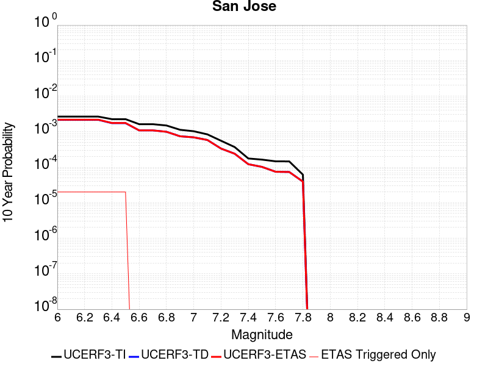 |

| Magnitude | 1 wk TI Prob | 1 wk TD Prob | 1 wk ETAS Prob | 1 wk ETAS/TD Gain | 1 wk ETAS Triggered Only | 1 mo TI Prob | 1 mo TD Prob | 1 mo ETAS Prob | 1 mo ETAS/TD Gain | 1 mo ETAS Triggered Only | 1 yr TI Prob | 1 yr TD Prob | 1 yr ETAS Prob | 1 yr ETAS/TD Gain | 1 yr ETAS Triggered Only | 10 yr TI Prob | 10 yr TD Prob | 10 yr ETAS Prob | 10 yr ETAS/TD Gain | 10 yr ETAS Triggered Only |
|-----|-----|-----|-----|-----|-----|-----|-----|-----|-----|-----|-----|-----|-----|-----|-----|-----|-----|-----|-----|-----|
| 6.0 | 5.0851277E-6 | 4.125642E-6 | 4.125642E-6 | 1.0 | 0.0 | 2.1793223E-5 | 1.768122E-5 | 1.768122E-5 | 1.0 | 0.0 | 2.653002E-4 | 2.152502E-4 | 2.152502E-4 | 1.0 | 0.0 | 0.0026498367 | 0.0021507454 | 0.0021670032 | 1.0075591 | 1.6292748E-5 |
| 6.1 | 5.0851277E-6 | 4.125642E-6 | 4.125642E-6 | 1.0 | 0.0 | 2.1793223E-5 | 1.768122E-5 | 1.768122E-5 | 1.0 | 0.0 | 2.653002E-4 | 2.152502E-4 | 2.152502E-4 | 1.0 | 0.0 | 0.0026498367 | 0.0021507454 | 0.0021670032 | 1.0075591 | 1.6292748E-5 |
| 6.2 | 5.0851277E-6 | 4.125642E-6 | 4.125642E-6 | 1.0 | 0.0 | 2.1793223E-5 | 1.768122E-5 | 1.768122E-5 | 1.0 | 0.0 | 2.653002E-4 | 2.152502E-4 | 2.152502E-4 | 1.0 | 0.0 | 0.0026498367 | 0.0021507454 | 0.0021670032 | 1.0075591 | 1.6292748E-5 |
| 6.3 | 5.0851277E-6 | 4.125642E-6 | 4.125642E-6 | 1.0 | 0.0 | 2.1793223E-5 | 1.768122E-5 | 1.768122E-5 | 1.0 | 0.0 | 2.653002E-4 | 2.152502E-4 | 2.152502E-4 | 1.0 | 0.0 | 0.0026498367 | 0.0021507454 | 0.0021670032 | 1.0075591 | 1.6292748E-5 |
| 6.4 | 4.3115124E-6 | 3.3237525E-6 | 3.3237525E-6 | 1.0 | 0.0 | 1.8477778E-5 | 1.4244589E-5 | 1.4244589E-5 | 1.0 | 0.0 | 2.2494372E-4 | 1.7341628E-4 | 1.7341628E-4 | 1.0 | 0.0 | 0.0022471617 | 0.0017330965 | 0.001749361 | 1.0093846 | 1.6292748E-5 |
| 6.5 | 4.3115124E-6 | 3.3237525E-6 | 3.3237525E-6 | 1.0 | 0.0 | 1.8477778E-5 | 1.4244589E-5 | 1.4244589E-5 | 1.0 | 0.0 | 2.2494372E-4 | 1.7341628E-4 | 1.7341628E-4 | 1.0 | 0.0 | 0.0022471617 | 0.0017330965 | 0.001749361 | 1.0093846 | 1.6292748E-5 |
| 6.6 | 3.110396E-6 | 2.0799562E-6 | 2.0799562E-6 | 1.0 | 0.0 | 1.33302E-5 | 8.9140685E-6 | 8.9140685E-6 | 1.0 | 0.0 | 1.622831E-4 | 1.0852366E-4 | 1.0852366E-4 | 1.0 | 0.0 | 0.0016216465 | 0.001084804 | 0.001084804 | 1.0 | 0.0 |
| 6.7 | 3.110396E-6 | 2.0799562E-6 | 2.0799562E-6 | 1.0 | 0.0 | 1.33302E-5 | 8.9140685E-6 | 8.9140685E-6 | 1.0 | 0.0 | 1.622831E-4 | 1.0852366E-4 | 1.0852366E-4 | 1.0 | 0.0 | 0.0016216465 | 0.001084804 | 0.001084804 | 1.0 | 0.0 |
| 6.8 | 2.856651E-6 | 1.9024077E-6 | 1.9024077E-6 | 1.0 | 0.0 | 1.2242733E-5 | 8.153152E-6 | 8.153152E-6 | 1.0 | 0.0 | 1.4904508E-4 | 9.926035E-5 | 9.926035E-5 | 1.0 | 0.0 | 0.0014894515 | 9.922545E-4 | 9.922545E-4 | 1.0 | 0.0 |
| 6.9 | 2.1618725E-6 | 1.4186406E-6 | 1.4186406E-6 | 1.0 | 0.0 | 9.265135E-6 | 6.0798748E-6 | 6.0798748E-6 | 1.0 | 0.0 | 1.12797185E-4 | 7.402005E-5 | 7.402005E-5 | 1.0 | 0.0 | 0.0011273995 | 7.4003247E-4 | 7.4003247E-4 | 1.0 | 0.0 |
| 7.0 | 1.9684312E-6 | 1.3256082E-6 | 1.3256082E-6 | 1.0 | 0.0 | 8.436106E-6 | 5.681166E-6 | 5.681166E-6 | 1.0 | 0.0 | 1.02704755E-4 | 6.916608E-5 | 6.916608E-5 | 1.0 | 0.0 | 0.001026573 | 6.9152354E-4 | 6.9152354E-4 | 1.0 | 0.0 |
| 7.1 | 1.6070337E-6 | 1.1154867E-6 | 1.1154867E-6 | 1.0 | 0.0 | 6.887269E-6 | 4.7806493E-6 | 4.7806493E-6 | 1.0 | 0.0 | 8.384928E-5 | 5.8202913E-5 | 5.8202913E-5 | 1.0 | 0.0 | 8.3817646E-4 | 5.819527E-4 | 5.819527E-4 | 1.0 | 0.0 |
| 7.2 | 1.0631658E-6 | 6.403567E-7 | 6.403567E-7 | 1.0 | 0.0 | 4.556417E-6 | 2.744383E-6 | 2.744383E-6 | 1.0 | 0.0 | 5.5472963E-5 | 3.3412365E-5 | 3.3412365E-5 | 1.0 | 0.0 | 5.545912E-4 | 3.3414463E-4 | 3.3414463E-4 | 1.0 | 0.0 |
| 7.3 | 7.060711E-7 | 4.5823228E-7 | 4.5823228E-7 | 1.0 | 0.0 | 3.0260155E-6 | 1.9638512E-6 | 1.9638512E-6 | 1.0 | 0.0 | 3.6841117E-5 | 2.3909635E-5 | 2.3909635E-5 | 1.0 | 0.0 | 3.6835007E-4 | 2.3914136E-4 | 2.3914136E-4 | 1.0 | 0.0 |
| 7.4 | 3.3677085E-7 | 2.3231999E-7 | 2.3231999E-7 | 1.0 | 0.0 | 1.4433028E-6 | 9.956567E-7 | 9.956567E-7 | 1.0 | 0.0 | 1.757207E-5 | 1.2122056E-5 | 1.2122056E-5 | 1.0 | 0.0 | 1.7570681E-4 | 1.2128407E-4 | 1.2128407E-4 | 1.0 | 0.0 |
| 7.5 | 3.129161E-7 | 1.9529637E-7 | 1.9529637E-7 | 1.0 | 0.0 | 1.3410682E-6 | 8.3698416E-7 | 8.3698416E-7 | 1.0 | 0.0 | 1.6327383E-5 | 1.0190237E-5 | 1.0190237E-5 | 1.0 | 0.0 | 1.6326184E-4 | 1.0196777E-4 | 1.0196777E-4 | 1.0 | 0.0 |
| 7.6 | 2.8008668E-7 | 1.4240818E-7 | 1.4240818E-7 | 1.0 | 0.0 | 1.2003709E-6 | 6.103206E-7 | 6.103206E-7 | 1.0 | 0.0 | 1.46144175E-5 | 7.43063E-6 | 7.43063E-6 | 1.0 | 0.0 | 1.4613457E-4 | 7.43735E-5 | 7.43735E-5 | 1.0 | 0.0 |
| 7.7 | 2.7852005E-7 | 1.4015403E-7 | 1.4015403E-7 | 1.0 | 0.0 | 1.1936568E-6 | 6.0066003E-7 | 6.0066003E-7 | 1.0 | 0.0 | 1.4532674E-5 | 7.3130127E-6 | 7.3130127E-6 | 1.0 | 0.0 | 1.4531724E-4 | 7.31974E-5 | 7.31974E-5 | 1.0 | 0.0 |
| 7.8 | 1.1810797E-7 | 7.5187074E-8 | 7.5187074E-8 | 1.0 | 0.0 | 5.0617695E-7 | 3.2223028E-7 | 3.2223028E-7 | 1.0 | 0.0 | 6.1626865E-6 | 3.9231472E-6 | 3.9231472E-6 | 1.0 | 0.0 | 6.162516E-5 | 3.9271265E-5 | 3.9271265E-5 | 1.0 | 0.0 |

## Santa Susana alt 1
*[(top)](#table-of-contents)*

| 1 Week | 1 Month | 1 Year | 10 Year |
|-----|-----|-----|-----|
|  |  |  |  |

| Magnitude | 1 wk TI Prob | 1 wk TD Prob | 1 wk ETAS Prob | 1 wk ETAS/TD Gain | 1 wk ETAS Triggered Only | 1 mo TI Prob | 1 mo TD Prob | 1 mo ETAS Prob | 1 mo ETAS/TD Gain | 1 mo ETAS Triggered Only | 1 yr TI Prob | 1 yr TD Prob | 1 yr ETAS Prob | 1 yr ETAS/TD Gain | 1 yr ETAS Triggered Only | 10 yr TI Prob | 10 yr TD Prob | 10 yr ETAS Prob | 10 yr ETAS/TD Gain | 10 yr ETAS Triggered Only |
|-----|-----|-----|-----|-----|-----|-----|-----|-----|-----|-----|-----|-----|-----|-----|-----|-----|-----|-----|-----|-----|
| 6.0 | 2.674877E-5 | 2.7198214E-5 | 2.7198214E-5 | 1.0 | 0.0 | 1.1463255E-4 | 1.16559204E-4 | 1.16559204E-4 | 1.0 | 0.0 | 0.0013947578 | 0.0014182981 | 0.0014345677 | 1.0114713 | 1.6292748E-5 | 0.013860362 | 0.014104388 | 0.014120451 | 1.0011388 | 1.6292748E-5 |
| 6.1 | 2.674877E-5 | 2.7198214E-5 | 2.7198214E-5 | 1.0 | 0.0 | 1.1463255E-4 | 1.16559204E-4 | 1.16559204E-4 | 1.0 | 0.0 | 0.0013947578 | 0.0014182981 | 0.0014345677 | 1.0114713 | 1.6292748E-5 | 0.013860362 | 0.014104388 | 0.014120451 | 1.0011388 | 1.6292748E-5 |
| 6.2 | 2.674877E-5 | 2.7198214E-5 | 2.7198214E-5 | 1.0 | 0.0 | 1.1463255E-4 | 1.16559204E-4 | 1.16559204E-4 | 1.0 | 0.0 | 0.0013947578 | 0.0014182981 | 0.0014345677 | 1.0114713 | 1.6292748E-5 | 0.013860362 | 0.014104388 | 0.014120451 | 1.0011388 | 1.6292748E-5 |
| 6.3 | 2.674877E-5 | 2.7198214E-5 | 2.7198214E-5 | 1.0 | 0.0 | 1.1463255E-4 | 1.16559204E-4 | 1.16559204E-4 | 1.0 | 0.0 | 0.0013947578 | 0.0014182981 | 0.0014345677 | 1.0114713 | 1.6292748E-5 | 0.013860362 | 0.014104388 | 0.014120451 | 1.0011388 | 1.6292748E-5 |
| 6.4 | 2.674877E-5 | 2.7198214E-5 | 2.7198214E-5 | 1.0 | 0.0 | 1.1463255E-4 | 1.16559204E-4 | 1.16559204E-4 | 1.0 | 0.0 | 0.0013947578 | 0.0014182981 | 0.0014345677 | 1.0114713 | 1.6292748E-5 | 0.013860362 | 0.014104388 | 0.014120451 | 1.0011388 | 1.6292748E-5 |
| 6.5 | 2.674877E-5 | 2.7198214E-5 | 2.7198214E-5 | 1.0 | 0.0 | 1.1463255E-4 | 1.16559204E-4 | 1.16559204E-4 | 1.0 | 0.0 | 0.0013947578 | 0.0014182981 | 0.0014345677 | 1.0114713 | 1.6292748E-5 | 0.013860362 | 0.014104388 | 0.014120451 | 1.0011388 | 1.6292748E-5 |
| 6.6 | 2.6647976E-5 | 2.7074553E-5 | 2.7074553E-5 | 1.0 | 0.0 | 1.14200615E-4 | 1.16029274E-4 | 1.16029274E-4 | 1.0 | 0.0 | 0.0013895056 | 0.0014118546 | 0.0014281244 | 1.0115237 | 1.6292748E-5 | 0.013808494 | 0.014040773 | 0.014056837 | 1.001144 | 1.6292748E-5 |
| 6.7 | 2.6647976E-5 | 2.7074553E-5 | 2.7074553E-5 | 1.0 | 0.0 | 1.14200615E-4 | 1.16029274E-4 | 1.16029274E-4 | 1.0 | 0.0 | 0.0013895056 | 0.0014118546 | 0.0014281244 | 1.0115237 | 1.6292748E-5 | 0.013808494 | 0.014040773 | 0.014056837 | 1.001144 | 1.6292748E-5 |
| 6.8 | 1.9073179E-5 | 1.7637467E-5 | 1.7637467E-5 | 1.0 | 0.0 | 8.1739636E-5 | 7.558706E-5 | 7.558706E-5 | 1.0 | 0.0 | 9.947256E-4 | 9.19902E-4 | 9.361798E-4 | 1.0176951 | 1.6292748E-5 | 0.009902848 | 0.009163361 | 0.009179505 | 1.0017618 | 1.6292748E-5 |
| 6.9 | 1.9041876E-5 | 1.7619597E-5 | 1.7619597E-5 | 1.0 | 0.0 | 8.160549E-5 | 7.551048E-5 | 7.551048E-5 | 1.0 | 0.0 | 9.930939E-4 | 9.189705E-4 | 9.352483E-4 | 1.0177131 | 1.6292748E-5 | 0.0098866755 | 0.009154123 | 0.009170267 | 1.0017636 | 1.6292748E-5 |
| 7.0 | 1.5917482E-5 | 1.3864049E-5 | 1.3864049E-5 | 1.0 | 0.0 | 6.8215995E-5 | 5.9416023E-5 | 5.9416023E-5 | 1.0 | 0.0 | 8.302132E-4 | 7.2315463E-4 | 7.394356E-4 | 1.0225139 | 1.6292748E-5 | 0.008271185 | 0.0072090672 | 0.0072252424 | 1.0022438 | 1.6292748E-5 |
| 7.1 | 1.577788E-5 | 1.3744056E-5 | 1.3744056E-5 | 1.0 | 0.0 | 6.761774E-5 | 5.890179E-5 | 5.890179E-5 | 1.0 | 0.0 | 8.2293496E-4 | 7.16898E-4 | 7.331791E-4 | 1.0227104 | 1.6292748E-5 | 0.008198941 | 0.0071469042 | 0.007163081 | 1.0022634 | 1.6292748E-5 |
| 7.2 | 1.5416446E-5 | 1.34701295E-5 | 1.34701295E-5 | 1.0 | 0.0 | 6.606882E-5 | 5.7727877E-5 | 5.7727877E-5 | 1.0 | 0.0 | 8.0409093E-4 | 7.026149E-4 | 7.1889616E-4 | 1.0231725 | 1.6292748E-5 | 0.008011877 | 0.0070049763 | 0.007021155 | 1.0023096 | 1.6292748E-5 |
| 7.3 | 1.4534083E-5 | 1.2718032E-5 | 1.2718032E-5 | 1.0 | 0.0 | 6.228744E-5 | 5.4504737E-5 | 5.4504737E-5 | 1.0 | 0.0 | 7.580857E-4 | 6.633976E-4 | 6.796795E-4 | 1.0245433 | 1.6292748E-5 | 0.007555048 | 0.0066151717 | 0.0066313567 | 1.0024467 | 1.6292748E-5 |
| 7.4 | 1.2858995E-5 | 1.1229814E-5 | 1.1229814E-5 | 1.0 | 0.0 | 5.5108816E-5 | 4.812691E-5 | 4.812691E-5 | 1.0 | 0.0 | 6.7074323E-4 | 5.8579154E-4 | 5.8579154E-4 | 1.0 | 0.0 | 0.0066872234 | 0.0058433902 | 0.0058433902 | 1.0 | 0.0 |
| 7.5 | 8.827668E-6 | 7.805494E-6 | 7.805494E-6 | 1.0 | 0.0 | 3.7832317E-5 | 3.3451703E-5 | 3.3451703E-5 | 1.0 | 0.0 | 4.605111E-4 | 4.072008E-4 | 4.072008E-4 | 1.0 | 0.0 | 0.0045955796 | 0.0040648985 | 0.0040648985 | 1.0 | 0.0 |
| 7.6 | 3.2533426E-6 | 2.8720106E-6 | 2.8720106E-6 | 1.0 | 0.0 | 1.3942822E-5 | 1.230856E-5 | 1.230856E-5 | 1.0 | 0.0 | 1.6974064E-4 | 1.4984679E-4 | 1.4984679E-4 | 1.0 | 0.0 | 0.0016961104 | 0.0014974943 | 0.0014974943 | 1.0 | 0.0 |
| 7.7 | 1.2751709E-6 | 1.1491339E-6 | 1.1491339E-6 | 1.0 | 0.0 | 5.4650063E-6 | 4.9248506E-6 | 4.9248506E-6 | 1.0 | 0.0 | 6.653442E-5 | 5.99585E-5 | 5.99585E-5 | 1.0 | 0.0 | 6.6514505E-4 | 5.9943215E-4 | 5.9943215E-4 | 1.0 | 0.0 |
| 7.8 | 3.067544E-7 | 3.240052E-7 | 3.240052E-7 | 1.0 | 0.0 | 1.3146611E-6 | 1.3885931E-6 | 1.3885931E-6 | 1.0 | 0.0 | 1.600588E-5 | 1.6906E-5 | 1.6906E-5 | 1.0 | 0.0 | 1.6004729E-4 | 1.6904817E-4 | 1.6904817E-4 | 1.0 | 0.0 |
| 7.9 | 7.622999E-8 | 8.0879715E-8 | 8.0879715E-8 | 1.0 | 0.0 | 3.2669993E-7 | 3.4662733E-7 | 3.4662733E-7 | 1.0 | 0.0 | 3.977564E-6 | 4.220182E-6 | 4.220182E-6 | 1.0 | 0.0 | 3.977493E-5 | 4.2201224E-5 | 4.2201224E-5 | 1.0 | 0.0 |

## Monterey Bay-Tularcitos
*[(top)](#table-of-contents)*

| 1 Week | 1 Month | 1 Year | 10 Year |
|-----|-----|-----|-----|
|  |  |  |  |

| Magnitude | 1 wk TI Prob | 1 wk TD Prob | 1 wk ETAS Prob | 1 wk ETAS/TD Gain | 1 wk ETAS Triggered Only | 1 mo TI Prob | 1 mo TD Prob | 1 mo ETAS Prob | 1 mo ETAS/TD Gain | 1 mo ETAS Triggered Only | 1 yr TI Prob | 1 yr TD Prob | 1 yr ETAS Prob | 1 yr ETAS/TD Gain | 1 yr ETAS Triggered Only | 10 yr TI Prob | 10 yr TD Prob | 10 yr ETAS Prob | 10 yr ETAS/TD Gain | 10 yr ETAS Triggered Only |
|-----|-----|-----|-----|-----|-----|-----|-----|-----|-----|-----|-----|-----|-----|-----|-----|-----|-----|-----|-----|-----|
| 6.0 | 3.0131365E-5 | 3.279877E-5 | 3.279877E-5 | 1.0 | 0.0 | 1.2912804E-4 | 1.4055918E-4 | 1.4055918E-4 | 1.0 | 0.0 | 0.001571 | 0.0017100703 | 0.0017100703 | 1.0 | 0.0 | 0.015599402 | 0.016979916 | 0.016995933 | 1.0009432 | 1.6292748E-5 |
| 6.1 | 3.0131365E-5 | 3.279877E-5 | 3.279877E-5 | 1.0 | 0.0 | 1.2912804E-4 | 1.4055918E-4 | 1.4055918E-4 | 1.0 | 0.0 | 0.001571 | 0.0017100703 | 0.0017100703 | 1.0 | 0.0 | 0.015599402 | 0.016979916 | 0.016995933 | 1.0009432 | 1.6292748E-5 |
| 6.2 | 3.0131365E-5 | 3.279877E-5 | 3.279877E-5 | 1.0 | 0.0 | 1.2912804E-4 | 1.4055918E-4 | 1.4055918E-4 | 1.0 | 0.0 | 0.001571 | 0.0017100703 | 0.0017100703 | 1.0 | 0.0 | 0.015599402 | 0.016979916 | 0.016995933 | 1.0009432 | 1.6292748E-5 |
| 6.3 | 1.6998249E-5 | 1.8330798E-5 | 1.8330798E-5 | 1.0 | 0.0 | 7.28476E-5 | 7.85583E-5 | 7.85583E-5 | 1.0 | 0.0 | 8.865586E-4 | 9.5604634E-4 | 9.5604634E-4 | 1.0 | 0.0 | 0.0088303005 | 0.009521258 | 0.009537396 | 1.0016949 | 1.6292748E-5 |
| 6.4 | 1.6998249E-5 | 1.8330798E-5 | 1.8330798E-5 | 1.0 | 0.0 | 7.28476E-5 | 7.85583E-5 | 7.85583E-5 | 1.0 | 0.0 | 8.865586E-4 | 9.5604634E-4 | 9.5604634E-4 | 1.0 | 0.0 | 0.0088303005 | 0.009521258 | 0.009537396 | 1.0016949 | 1.6292748E-5 |
| 6.5 | 1.27470785E-5 | 1.3693312E-5 | 1.3693312E-5 | 1.0 | 0.0 | 5.4629192E-5 | 5.8684363E-5 | 5.8684363E-5 | 1.0 | 0.0 | 6.649074E-4 | 7.1425823E-4 | 7.1425823E-4 | 1.0 | 0.0 | 0.0066292146 | 0.007120678 | 0.0071368553 | 1.0022718 | 1.6292748E-5 |
| 6.6 | 1.2739422E-5 | 1.36854E-5 | 1.36854E-5 | 1.0 | 0.0 | 5.4596385E-5 | 5.8650454E-5 | 5.8650454E-5 | 1.0 | 0.0 | 6.645082E-4 | 7.1384566E-4 | 7.1384566E-4 | 1.0 | 0.0 | 0.0066252467 | 0.007116579 | 0.0071327556 | 1.0022731 | 1.6292748E-5 |
| 6.7 | 1.0160109E-5 | 1.0885755E-5 | 1.0885755E-5 | 1.0 | 0.0 | 4.35426E-5 | 4.665244E-5 | 4.665244E-5 | 1.0 | 0.0 | 5.300022E-4 | 5.6785246E-4 | 5.6785246E-4 | 1.0 | 0.0 | 0.005287399 | 0.0056647263 | 0.0056809266 | 1.0028598 | 1.6292748E-5 |
| 6.8 | 8.349859E-6 | 8.932587E-6 | 8.932587E-6 | 1.0 | 0.0 | 3.578462E-5 | 3.8281985E-5 | 3.8281985E-5 | 1.0 | 0.0 | 4.3559066E-4 | 4.6598914E-4 | 4.6598914E-4 | 1.0 | 0.0 | 0.004347378 | 0.004650685 | 0.004666902 | 1.003487 | 1.6292748E-5 |
| 6.9 | 5.193639E-6 | 5.53643E-6 | 5.53643E-6 | 1.0 | 0.0 | 2.2258262E-5 | 2.372736E-5 | 2.372736E-5 | 1.0 | 0.0 | 2.7096065E-4 | 2.8884556E-4 | 2.8884556E-4 | 1.0 | 0.0 | 0.0027063051 | 0.0028850224 | 0.0028850224 | 1.0 | 0.0 |
| 7.0 | 4.359381E-6 | 4.643366E-6 | 4.643366E-6 | 1.0 | 0.0 | 1.8682927E-5 | 1.9900004E-5 | 1.9900004E-5 | 1.0 | 0.0 | 2.274409E-4 | 2.422586E-4 | 2.422586E-4 | 1.0 | 0.0 | 0.0022720827 | 0.002420238 | 0.002420238 | 1.0 | 0.0 |
| 7.1 | 3.0398533E-6 | 3.2310427E-6 | 3.2310427E-6 | 1.0 | 0.0 | 1.3027877E-5 | 1.3847267E-5 | 1.3847267E-5 | 1.0 | 0.0 | 1.5860285E-4 | 1.6858005E-4 | 1.6858005E-4 | 1.0 | 0.0 | 0.001584897 | 0.0016847793 | 0.0016847793 | 1.0 | 0.0 |
| 7.2 | 1.642335E-6 | 1.7333153E-6 | 1.7333153E-6 | 1.0 | 0.0 | 7.0385595E-6 | 7.428485E-6 | 7.428485E-6 | 1.0 | 0.0 | 8.569109E-5 | 9.044012E-5 | 9.044012E-5 | 1.0 | 0.0 | 8.5658056E-4 | 9.042358E-4 | 9.042358E-4 | 1.0 | 0.0 |
| 7.3 | 3.356842E-7 | 3.2952389E-7 | 3.2952389E-7 | 1.0 | 0.0 | 1.4386458E-6 | 1.4122445E-6 | 1.4122445E-6 | 1.0 | 0.0 | 1.7515373E-5 | 1.7193941E-5 | 1.7193941E-5 | 1.0 | 0.0 | 1.7513991E-4 | 1.719262E-4 | 1.719262E-4 | 1.0 | 0.0 |
| 7.4 | 2.1973483E-7 | 2.1006414E-7 | 2.1006414E-7 | 1.0 | 0.0 | 9.417204E-7 | 9.002746E-7 | 9.002746E-7 | 1.0 | 0.0 | 1.1465385E-5 | 1.0960788E-5 | 1.0960788E-5 | 1.0 | 0.0 | 1.1464794E-4 | 1.0960251E-4 | 1.0960251E-4 | 1.0 | 0.0 |
| 7.5 | 1.1944135E-7 | 1.0696035E-7 | 1.0696035E-7 | 1.0 | 0.0 | 5.118914E-7 | 4.5840142E-7 | 4.5840142E-7 | 1.0 | 0.0 | 6.23226E-6 | 5.581023E-6 | 5.581023E-6 | 1.0 | 0.0 | 6.2320854E-5 | 5.5808843E-5 | 5.5808843E-5 | 1.0 | 0.0 |
| 7.6 | 4.636058E-8 | 3.3364433E-8 | 3.3364433E-8 | 1.0 | 0.0 | 1.9868818E-7 | 1.4299042E-7 | 1.4299042E-7 | 1.0 | 0.0 | 2.419026E-6 | 1.740907E-6 | 1.740907E-6 | 1.0 | 0.0 | 2.4189996E-5 | 1.7408936E-5 | 1.7408936E-5 | 1.0 | 0.0 |
| 7.7 | 1.8588572E-8 | 8.003168E-9 | 8.003168E-9 | 1.0 | 0.0 | 7.9665305E-8 | 3.429929E-8 | 3.429929E-8 | 1.0 | 0.0 | 9.699246E-7 | 4.1759378E-7 | 4.1759378E-7 | 1.0 | 0.0 | 9.699204E-6 | 4.1759304E-6 | 4.1759304E-6 | 1.0 | 0.0 |
| 7.8 | 2.7960154E-9 | 7.608624E-10 | 7.608624E-10 | 1.0 | 0.0 | 1.1982923E-8 | 3.2608392E-9 | 3.2608392E-9 | 1.0 | 0.0 | 1.4589209E-7 | 3.9700716E-8 | 3.9700716E-8 | 1.0 | 0.0 | 1.4589199E-6 | 3.970071E-7 | 3.970071E-7 | 1.0 | 0.0 |

## Los Alamos 2011 CFM
*[(top)](#table-of-contents)*

| 1 Week | 1 Month | 1 Year | 10 Year |
|-----|-----|-----|-----|
|  |  |  |  |

| Magnitude | 1 wk TI Prob | 1 wk TD Prob | 1 wk ETAS Prob | 1 wk ETAS/TD Gain | 1 wk ETAS Triggered Only | 1 mo TI Prob | 1 mo TD Prob | 1 mo ETAS Prob | 1 mo ETAS/TD Gain | 1 mo ETAS Triggered Only | 1 yr TI Prob | 1 yr TD Prob | 1 yr ETAS Prob | 1 yr ETAS/TD Gain | 1 yr ETAS Triggered Only | 10 yr TI Prob | 10 yr TD Prob | 10 yr ETAS Prob | 10 yr ETAS/TD Gain | 10 yr ETAS Triggered Only |
|-----|-----|-----|-----|-----|-----|-----|-----|-----|-----|-----|-----|-----|-----|-----|-----|-----|-----|-----|-----|-----|
| 6.0 | 4.6284417E-6 | 4.7517333E-6 | 4.7517333E-6 | 1.0 | 0.0 | 1.9836029E-5 | 2.0364423E-5 | 2.0364423E-5 | 1.0 | 0.0 | 2.4147688E-4 | 2.479104E-4 | 2.479104E-4 | 1.0 | 0.0 | 0.0024121467 | 0.0024765125 | 0.002492765 | 1.0065626 | 1.6292748E-5 |
| 6.1 | 4.6284417E-6 | 4.7517333E-6 | 4.7517333E-6 | 1.0 | 0.0 | 1.9836029E-5 | 2.0364423E-5 | 2.0364423E-5 | 1.0 | 0.0 | 2.4147688E-4 | 2.479104E-4 | 2.479104E-4 | 1.0 | 0.0 | 0.0024121467 | 0.0024765125 | 0.002492765 | 1.0065626 | 1.6292748E-5 |
| 6.2 | 4.6284417E-6 | 4.7517333E-6 | 4.7517333E-6 | 1.0 | 0.0 | 1.9836029E-5 | 2.0364423E-5 | 2.0364423E-5 | 1.0 | 0.0 | 2.4147688E-4 | 2.479104E-4 | 2.479104E-4 | 1.0 | 0.0 | 0.0024121467 | 0.0024765125 | 0.002492765 | 1.0065626 | 1.6292748E-5 |
| 6.3 | 4.6284417E-6 | 4.7517333E-6 | 4.7517333E-6 | 1.0 | 0.0 | 1.9836029E-5 | 2.0364423E-5 | 2.0364423E-5 | 1.0 | 0.0 | 2.4147688E-4 | 2.479104E-4 | 2.479104E-4 | 1.0 | 0.0 | 0.0024121467 | 0.0024765125 | 0.002492765 | 1.0065626 | 1.6292748E-5 |
| 6.4 | 4.6284417E-6 | 4.7517333E-6 | 4.7517333E-6 | 1.0 | 0.0 | 1.9836029E-5 | 2.0364423E-5 | 2.0364423E-5 | 1.0 | 0.0 | 2.4147688E-4 | 2.479104E-4 | 2.479104E-4 | 1.0 | 0.0 | 0.0024121467 | 0.0024765125 | 0.002492765 | 1.0065626 | 1.6292748E-5 |
| 6.5 | 4.6284417E-6 | 4.7517333E-6 | 4.7517333E-6 | 1.0 | 0.0 | 1.9836029E-5 | 2.0364423E-5 | 2.0364423E-5 | 1.0 | 0.0 | 2.4147688E-4 | 2.479104E-4 | 2.479104E-4 | 1.0 | 0.0 | 0.0024121467 | 0.0024765125 | 0.002492765 | 1.0065626 | 1.6292748E-5 |
| 6.6 | 4.6284417E-6 | 4.7517333E-6 | 4.7517333E-6 | 1.0 | 0.0 | 1.9836029E-5 | 2.0364423E-5 | 2.0364423E-5 | 1.0 | 0.0 | 2.4147688E-4 | 2.479104E-4 | 2.479104E-4 | 1.0 | 0.0 | 0.0024121467 | 0.0024765125 | 0.002492765 | 1.0065626 | 1.6292748E-5 |
| 6.7 | 4.062321E-6 | 4.166351E-6 | 4.166351E-6 | 1.0 | 0.0 | 1.7409831E-5 | 1.7855677E-5 | 1.7855677E-5 | 1.0 | 0.0 | 2.1194408E-4 | 2.1737268E-4 | 2.1737268E-4 | 1.0 | 0.0 | 0.0021174205 | 0.0021717504 | 0.0021717504 | 1.0 | 0.0 |
| 6.8 | 4.062321E-6 | 4.166351E-6 | 4.166351E-6 | 1.0 | 0.0 | 1.7409831E-5 | 1.7855677E-5 | 1.7855677E-5 | 1.0 | 0.0 | 2.1194408E-4 | 2.1737268E-4 | 2.1737268E-4 | 1.0 | 0.0 | 0.0021174205 | 0.0021717504 | 0.0021717504 | 1.0 | 0.0 |
| 6.9 | 3.2936077E-6 | 3.37296E-6 | 3.37296E-6 | 1.0 | 0.0 | 1.4115385E-5 | 1.4455468E-5 | 1.4455468E-5 | 1.0 | 0.0 | 1.7184127E-4 | 1.7598206E-4 | 1.7598206E-4 | 1.0 | 0.0 | 0.0017170844 | 0.0017585196 | 0.0017585196 | 1.0 | 0.0 |
| 7.0 | 3.1687898E-6 | 3.2448177E-6 | 3.2448177E-6 | 1.0 | 0.0 | 1.3580457E-5 | 1.3906293E-5 | 1.3906293E-5 | 1.0 | 0.0 | 1.6532952E-4 | 1.692969E-4 | 1.692969E-4 | 1.0 | 0.0 | 0.0016520657 | 0.0016917707 | 0.0016917707 | 1.0 | 0.0 |
| 7.1 | 2.9379228E-6 | 3.007328E-6 | 3.007328E-6 | 1.0 | 0.0 | 1.25910365E-5 | 1.288849E-5 | 1.288849E-5 | 1.0 | 0.0 | 1.5328509E-4 | 1.5690697E-4 | 1.5690697E-4 | 1.0 | 0.0 | 0.001531794 | 0.001568051 | 0.001568051 | 1.0 | 0.0 |
| 7.2 | 2.0020686E-6 | 2.041632E-6 | 2.041632E-6 | 1.0 | 0.0 | 8.580266E-6 | 8.749822E-6 | 8.749822E-6 | 1.0 | 0.0 | 1.0445973E-4 | 1.0652392E-4 | 1.0652392E-4 | 1.0 | 0.0 | 0.0010441064 | 0.001064733 | 0.001064733 | 1.0 | 0.0 |
| 7.3 | 1.7364243E-6 | 1.7678824E-6 | 1.7678824E-6 | 1.0 | 0.0 | 7.441797E-6 | 7.576617E-6 | 7.576617E-6 | 1.0 | 0.0 | 9.0600115E-5 | 9.224144E-5 | 9.224144E-5 | 1.0 | 0.0 | 9.0563187E-4 | 9.2203467E-4 | 9.2203467E-4 | 1.0 | 0.0 |
| 7.4 | 1.5718434E-6 | 1.5983198E-6 | 1.5983198E-6 | 1.0 | 0.0 | 6.7364545E-6 | 6.8499244E-6 | 6.8499244E-6 | 1.0 | 0.0 | 8.201325E-5 | 8.339467E-5 | 8.339467E-5 | 1.0 | 0.0 | 8.198299E-4 | 8.3363673E-4 | 8.3363673E-4 | 1.0 | 0.0 |
| 7.5 | 1.3841119E-6 | 1.4042814E-6 | 1.4042814E-6 | 1.0 | 0.0 | 5.9318945E-6 | 6.018335E-6 | 6.018335E-6 | 1.0 | 0.0 | 7.221842E-5 | 7.327079E-5 | 7.327079E-5 | 1.0 | 0.0 | 7.2194956E-4 | 7.3246926E-4 | 7.3246926E-4 | 1.0 | 0.0 |
| 7.6 | 1.0843726E-6 | 1.0934443E-6 | 1.0934443E-6 | 1.0 | 0.0 | 4.647303E-6 | 4.6861815E-6 | 4.6861815E-6 | 1.0 | 0.0 | 5.6579443E-5 | 5.705279E-5 | 5.705279E-5 | 1.0 | 0.0 | 5.656504E-4 | 5.70384E-4 | 5.70384E-4 | 1.0 | 0.0 |
| 7.7 | 5.544814E-7 | 5.501884E-7 | 5.501884E-7 | 1.0 | 0.0 | 2.3763469E-6 | 2.3579482E-6 | 2.3579482E-6 | 1.0 | 0.0 | 2.8931638E-5 | 2.8707644E-5 | 2.8707644E-5 | 1.0 | 0.0 | 2.8927872E-4 | 2.870395E-4 | 2.870395E-4 | 1.0 | 0.0 |
| 7.8 | 2.0707465E-7 | 1.9778598E-7 | 1.9778598E-7 | 1.0 | 0.0 | 8.874625E-7 | 8.476539E-7 | 8.476539E-7 | 1.0 | 0.0 | 1.08048025E-5 | 1.0320137E-5 | 1.0320137E-5 | 1.0 | 0.0 | 1.0804277E-4 | 1.0319663E-4 | 1.0319663E-4 | 1.0 | 0.0 |
| 7.9 | 3.9821284E-8 | 3.4331528E-8 | 3.4331528E-8 | 1.0 | 0.0 | 1.7066264E-7 | 1.4713511E-7 | 1.4713511E-7 | 1.0 | 0.0 | 2.0778157E-6 | 1.7913685E-6 | 1.7913685E-6 | 1.0 | 0.0 | 2.0777963E-5 | 1.7913546E-5 | 1.7913546E-5 | 1.0 | 0.0 |
| 8.0 | 7.880441E-11 | 8.2353124E-11 | 8.2353124E-11 | 1.0 | 0.0 | 3.3773329E-10 | 3.52942E-10 | 3.52942E-10 | 1.0 | 0.0 | 4.1119033E-9 | 4.2970694E-9 | 4.2970694E-9 | 1.0 | 0.0 | 4.1119034E-8 | 4.2970694E-8 | 4.2970694E-8 | 1.0 | 0.0 |

## Concord 2011 CFM
*[(top)](#table-of-contents)*

| 1 Week | 1 Month | 1 Year | 10 Year |
|-----|-----|-----|-----|
|  |  |  |  |

| Magnitude | 1 wk TI Prob | 1 wk TD Prob | 1 wk ETAS Prob | 1 wk ETAS/TD Gain | 1 wk ETAS Triggered Only | 1 mo TI Prob | 1 mo TD Prob | 1 mo ETAS Prob | 1 mo ETAS/TD Gain | 1 mo ETAS Triggered Only | 1 yr TI Prob | 1 yr TD Prob | 1 yr ETAS Prob | 1 yr ETAS/TD Gain | 1 yr ETAS Triggered Only | 10 yr TI Prob | 10 yr TD Prob | 10 yr ETAS Prob | 10 yr ETAS/TD Gain | 10 yr ETAS Triggered Only |
|-----|-----|-----|-----|-----|-----|-----|-----|-----|-----|-----|-----|-----|-----|-----|-----|-----|-----|-----|-----|-----|
| 6.0 | 5.7865112E-5 | 9.7585355E-5 | 9.7585355E-5 | 1.0 | 0.0 | 2.4796976E-4 | 4.181607E-4 | 4.181607E-4 | 1.0 | 0.0 | 0.0030148525 | 0.005079743 | 0.005095953 | 1.0031911 | 1.6292748E-5 | 0.029742775 | 0.049266078 | 0.049281567 | 1.0003145 | 1.6292748E-5 |
| 6.1 | 5.7865112E-5 | 9.7585355E-5 | 9.7585355E-5 | 1.0 | 0.0 | 2.4796976E-4 | 4.181607E-4 | 4.181607E-4 | 1.0 | 0.0 | 0.0030148525 | 0.005079743 | 0.005095953 | 1.0031911 | 1.6292748E-5 | 0.029742775 | 0.049266078 | 0.049281567 | 1.0003145 | 1.6292748E-5 |
| 6.2 | 5.6789337E-5 | 9.578793E-5 | 9.578793E-5 | 1.0 | 0.0 | 2.4336016E-4 | 4.1045985E-4 | 4.1045985E-4 | 1.0 | 0.0 | 0.0029588845 | 0.0049864696 | 0.005002681 | 1.0032511 | 1.6292748E-5 | 0.029197963 | 0.04838257 | 0.048398074 | 1.0003204 | 1.6292748E-5 |
| 6.3 | 5.203322E-5 | 8.803241E-5 | 8.803241E-5 | 1.0 | 0.0 | 2.2298045E-4 | 3.772316E-4 | 3.772316E-4 | 1.0 | 0.0 | 0.0027114071 | 0.0045839064 | 0.0046001244 | 1.003538 | 1.6292748E-5 | 0.026785625 | 0.04455397 | 0.044569537 | 1.0003494 | 1.6292748E-5 |
| 6.4 | 4.7120942E-5 | 7.897583E-5 | 7.897583E-5 | 1.0 | 0.0 | 2.0193127E-4 | 3.3842813E-4 | 3.3842813E-4 | 1.0 | 0.0 | 0.0024557412 | 0.004113323 | 0.0041295486 | 1.0039446 | 1.6292748E-5 | 0.024287801 | 0.040080756 | 0.0400964 | 1.0003902 | 1.6292748E-5 |
| 6.5 | 2.9598437E-5 | 4.6675777E-5 | 4.6675777E-5 | 1.0 | 0.0 | 1.2684427E-4 | 2.000249E-4 | 2.000249E-4 | 1.0 | 0.0 | 0.001543235 | 0.0024327936 | 0.0024490466 | 1.0066808 | 1.6292748E-5 | 0.015325619 | 0.023909668 | 0.02392557 | 1.0006652 | 1.6292748E-5 |
| 6.6 | 2.0443718E-5 | 2.9984873E-5 | 2.9984873E-5 | 1.0 | 0.0 | 8.7613E-5 | 1.2850047E-4 | 1.2850047E-4 | 1.0 | 0.0 | 0.0010661662 | 0.0015634067 | 0.0015634067 | 1.0 | 0.0 | 0.010610655 | 0.0154669015 | 0.0154669015 | 1.0 | 0.0 |
| 6.7 | 1.798539E-5 | 2.5557883E-5 | 2.5557883E-5 | 1.0 | 0.0 | 7.7077966E-5 | 1.0952931E-4 | 1.0952931E-4 | 1.0 | 0.0 | 9.380202E-4 | 0.0013327252 | 0.0013327252 | 1.0 | 0.0 | 0.009340706 | 0.013217516 | 0.013217516 | 1.0 | 0.0 |
| 6.8 | 1.613555E-5 | 2.1959608E-5 | 2.1959608E-5 | 1.0 | 0.0 | 6.915052E-5 | 9.4109295E-5 | 9.4109295E-5 | 1.0 | 0.0 | 8.4158237E-4 | 0.0011451923 | 0.0011451923 | 1.0 | 0.0 | 0.008384023 | 0.011378321 | 0.011378321 | 1.0 | 0.0 |
| 6.9 | 1.2916435E-5 | 1.708134E-5 | 1.708134E-5 | 1.0 | 0.0 | 5.5354973E-5 | 7.320372E-5 | 7.320372E-5 | 1.0 | 0.0 | 6.7373837E-4 | 8.908967E-4 | 8.908967E-4 | 1.0 | 0.0 | 0.006716994 | 0.008867833 | 0.008867833 | 1.0 | 0.0 |
| 7.0 | 9.81129E-6 | 1.2631038E-5 | 1.2631038E-5 | 1.0 | 0.0 | 4.2047708E-5 | 5.4131906E-5 | 5.4131906E-5 | 1.0 | 0.0 | 5.118106E-4 | 6.588583E-4 | 6.588583E-4 | 1.0 | 0.0 | 0.005106334 | 0.0065697595 | 0.0065697595 | 1.0 | 0.0 |
| 7.1 | 8.0889195E-6 | 1.04184555E-5 | 1.04184555E-5 | 1.0 | 0.0 | 3.4666336E-5 | 4.4649765E-5 | 4.4649765E-5 | 1.0 | 0.0 | 4.219809E-4 | 5.434764E-4 | 5.434764E-4 | 1.0 | 0.0 | 0.004211805 | 0.0054219896 | 0.0054219896 | 1.0 | 0.0 |
| 7.2 | 6.267438E-6 | 8.115879E-6 | 8.115879E-6 | 1.0 | 0.0 | 2.6860173E-5 | 3.478188E-5 | 3.478188E-5 | 1.0 | 0.0 | 3.2697353E-4 | 4.2338783E-4 | 4.2338783E-4 | 1.0 | 0.0 | 0.0032649285 | 0.004226169 | 0.004226169 | 1.0 | 0.0 |
| 7.3 | 3.6761196E-6 | 4.840281E-6 | 4.840281E-6 | 1.0 | 0.0 | 1.5754704E-5 | 2.0743897E-5 | 2.0743897E-5 | 1.0 | 0.0 | 1.9179663E-4 | 2.5252788E-4 | 2.5252788E-4 | 1.0 | 0.0 | 0.0019163118 | 0.0025226264 | 0.0025226264 | 1.0 | 0.0 |
| 7.4 | 2.8044356E-6 | 3.7096993E-6 | 3.7096993E-6 | 1.0 | 0.0 | 1.2018954E-5 | 1.5898615E-5 | 1.5898615E-5 | 1.0 | 0.0 | 1.4632095E-4 | 1.9354856E-4 | 1.9354856E-4 | 1.0 | 0.0 | 0.0014622464 | 0.0019340349 | 0.0019340349 | 1.0 | 0.0 |
| 7.5 | 2.4578699E-6 | 3.2448306E-6 | 3.2448306E-6 | 1.0 | 0.0 | 1.0533685E-5 | 1.3906343E-5 | 1.3906343E-5 | 1.0 | 0.0 | 1.2824008E-4 | 1.6929668E-4 | 1.6929668E-4 | 1.0 | 0.0 | 0.0012816609 | 0.0016918926 | 0.0016918926 | 1.0 | 0.0 |
| 7.6 | 1.7713267E-6 | 2.335189E-6 | 2.335189E-6 | 1.0 | 0.0 | 7.591378E-6 | 1.0007916E-5 | 1.0007916E-5 | 1.0 | 0.0 | 9.2421105E-5 | 1.2183965E-4 | 1.2183965E-4 | 1.0 | 0.0 | 9.2382677E-4 | 0.0012178655 | 0.0012178655 | 1.0 | 0.0 |
| 7.7 | 5.1912366E-7 | 6.829346E-7 | 6.829346E-7 | 1.0 | 0.0 | 2.2248137E-6 | 2.9268595E-6 | 2.9268595E-6 | 1.0 | 0.0 | 2.708677E-5 | 3.5633944E-5 | 3.5633944E-5 | 1.0 | 0.0 | 2.708347E-4 | 3.5630353E-4 | 3.5630353E-4 | 1.0 | 0.0 |

## San Gorgonio Pass
*[(top)](#table-of-contents)*

| 1 Week | 1 Month | 1 Year | 10 Year |
|-----|-----|-----|-----|
|  | 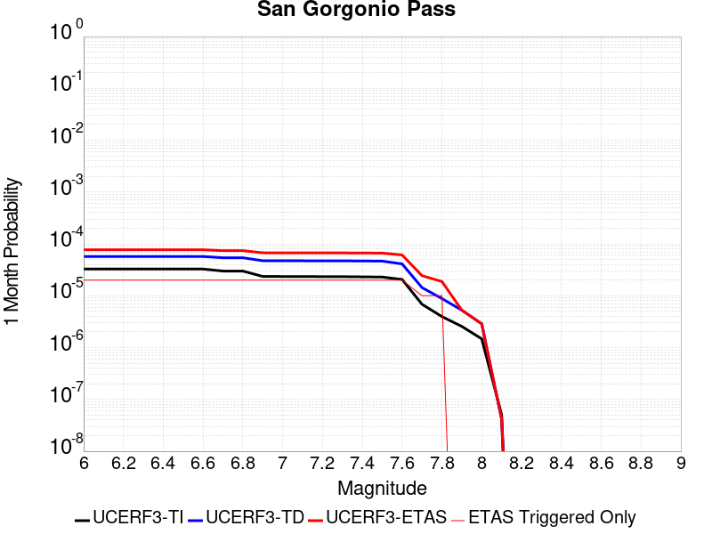 |  |  |

| Magnitude | 1 wk TI Prob | 1 wk TD Prob | 1 wk ETAS Prob | 1 wk ETAS/TD Gain | 1 wk ETAS Triggered Only | 1 mo TI Prob | 1 mo TD Prob | 1 mo ETAS Prob | 1 mo ETAS/TD Gain | 1 mo ETAS Triggered Only | 1 yr TI Prob | 1 yr TD Prob | 1 yr ETAS Prob | 1 yr ETAS/TD Gain | 1 yr ETAS Triggered Only | 10 yr TI Prob | 10 yr TD Prob | 10 yr ETAS Prob | 10 yr ETAS/TD Gain | 10 yr ETAS Triggered Only |
|-----|-----|-----|-----|-----|-----|-----|-----|-----|-----|-----|-----|-----|-----|-----|-----|-----|-----|-----|-----|-----|
| 6.0 | 7.644328E-6 | 1.331474E-5 | 1.331474E-5 | 1.0 | 0.0 | 3.2760996E-5 | 5.706197E-5 | 7.335379E-5 | 1.285511 | 1.6292748E-5 | 3.987921E-4 | 6.945166E-4 | 7.10798E-4 | 1.0234429 | 1.6292748E-5 | 0.003980772 | 0.006930024 | 0.0069462038 | 1.0023347 | 1.6292748E-5 |
| 6.1 | 7.644328E-6 | 1.331474E-5 | 1.331474E-5 | 1.0 | 0.0 | 3.2760996E-5 | 5.706197E-5 | 7.335379E-5 | 1.285511 | 1.6292748E-5 | 3.987921E-4 | 6.945166E-4 | 7.10798E-4 | 1.0234429 | 1.6292748E-5 | 0.003980772 | 0.006930024 | 0.0069462038 | 1.0023347 | 1.6292748E-5 |
| 6.2 | 7.644328E-6 | 1.331474E-5 | 1.331474E-5 | 1.0 | 0.0 | 3.2760996E-5 | 5.706197E-5 | 7.335379E-5 | 1.285511 | 1.6292748E-5 | 3.987921E-4 | 6.945166E-4 | 7.10798E-4 | 1.0234429 | 1.6292748E-5 | 0.003980772 | 0.006930024 | 0.0069462038 | 1.0023347 | 1.6292748E-5 |
| 6.3 | 7.644328E-6 | 1.331474E-5 | 1.331474E-5 | 1.0 | 0.0 | 3.2760996E-5 | 5.706197E-5 | 7.335379E-5 | 1.285511 | 1.6292748E-5 | 3.987921E-4 | 6.945166E-4 | 7.10798E-4 | 1.0234429 | 1.6292748E-5 | 0.003980772 | 0.006930024 | 0.0069462038 | 1.0023347 | 1.6292748E-5 |
| 6.4 | 7.644328E-6 | 1.331474E-5 | 1.331474E-5 | 1.0 | 0.0 | 3.2760996E-5 | 5.706197E-5 | 7.335379E-5 | 1.285511 | 1.6292748E-5 | 3.987921E-4 | 6.945166E-4 | 7.10798E-4 | 1.0234429 | 1.6292748E-5 | 0.003980772 | 0.006930024 | 0.0069462038 | 1.0023347 | 1.6292748E-5 |
| 6.5 | 7.644328E-6 | 1.331474E-5 | 1.331474E-5 | 1.0 | 0.0 | 3.2760996E-5 | 5.706197E-5 | 7.335379E-5 | 1.285511 | 1.6292748E-5 | 3.987921E-4 | 6.945166E-4 | 7.10798E-4 | 1.0234429 | 1.6292748E-5 | 0.003980772 | 0.006930024 | 0.0069462038 | 1.0023347 | 1.6292748E-5 |
| 6.6 | 7.644328E-6 | 1.331474E-5 | 1.331474E-5 | 1.0 | 0.0 | 3.2760996E-5 | 5.706197E-5 | 7.335379E-5 | 1.285511 | 1.6292748E-5 | 3.987921E-4 | 6.945166E-4 | 7.10798E-4 | 1.0234429 | 1.6292748E-5 | 0.003980772 | 0.006930024 | 0.0069462038 | 1.0023347 | 1.6292748E-5 |
| 6.7 | 6.987586E-6 | 1.2619013E-5 | 1.2619013E-5 | 1.0 | 0.0 | 2.9946454E-5 | 5.408041E-5 | 7.0372276E-5 | 1.3012526 | 1.6292748E-5 | 3.645371E-4 | 6.582382E-4 | 6.745202E-4 | 1.0247358 | 1.6292748E-5 | 0.0036393967 | 0.0065694 | 0.006585586 | 1.0024638 | 1.6292748E-5 |
| 6.8 | 6.987586E-6 | 1.2619013E-5 | 1.2619013E-5 | 1.0 | 0.0 | 2.9946454E-5 | 5.408041E-5 | 7.0372276E-5 | 1.3012526 | 1.6292748E-5 | 3.645371E-4 | 6.582382E-4 | 6.745202E-4 | 1.0247358 | 1.6292748E-5 | 0.0036393967 | 0.0065694 | 0.006585586 | 1.0024638 | 1.6292748E-5 |
| 6.9 | 5.504702E-6 | 1.1049877E-5 | 1.1049877E-5 | 1.0 | 0.0 | 2.3591367E-5 | 4.7355785E-5 | 6.364776E-5 | 1.3440335 | 1.6292748E-5 | 2.8718702E-4 | 5.764092E-4 | 5.926926E-4 | 1.0282496 | 1.6292748E-5 | 0.0028681618 | 0.0057553523 | 0.0057715513 | 1.0028147 | 1.6292748E-5 |
| 7.0 | 5.4825764E-6 | 1.1026218E-5 | 1.1026218E-5 | 1.0 | 0.0 | 2.3496545E-5 | 4.725439E-5 | 6.3546366E-5 | 1.3447717 | 1.6292748E-5 | 2.8603288E-4 | 5.751754E-4 | 5.9145875E-4 | 1.0283103 | 1.6292748E-5 | 0.00285665 | 0.0057430784 | 0.0057592774 | 1.0028206 | 1.6292748E-5 |
| 7.1 | 5.4692787E-6 | 1.1011928E-5 | 1.1011928E-5 | 1.0 | 0.0 | 2.3439556E-5 | 4.719315E-5 | 6.348513E-5 | 1.3452191 | 1.6292748E-5 | 2.8533922E-4 | 5.744302E-4 | 5.907136E-4 | 1.028347 | 1.6292748E-5 | 0.0028497311 | 0.0057356646 | 0.005751864 | 1.0028243 | 1.6292748E-5 |
| 7.2 | 5.453661E-6 | 1.0994954E-5 | 1.0994954E-5 | 1.0 | 0.0 | 2.3372622E-5 | 4.712041E-5 | 6.341239E-5 | 1.3457521 | 1.6292748E-5 | 2.8452452E-4 | 5.7354505E-4 | 5.898284E-4 | 1.0283908 | 1.6292748E-5 | 0.002841605 | 0.005726859 | 0.0057430584 | 1.0028287 | 1.6292748E-5 |
| 7.3 | 5.4422303E-6 | 1.09818775E-5 | 1.09818775E-5 | 1.0 | 0.0 | 2.3323635E-5 | 4.7064368E-5 | 6.335635E-5 | 1.3461639 | 1.6292748E-5 | 2.8392827E-4 | 5.728631E-4 | 5.891465E-4 | 1.0284246 | 1.6292748E-5 | 0.0028356577 | 0.0057200743 | 0.0057362737 | 1.002832 | 1.6292748E-5 |
| 7.4 | 5.398595E-6 | 1.0929241E-5 | 1.0929241E-5 | 1.0 | 0.0 | 2.313663E-5 | 4.6838795E-5 | 6.313078E-5 | 1.347831 | 1.6292748E-5 | 2.8165206E-4 | 5.701182E-4 | 5.864016E-4 | 1.0285616 | 1.6292748E-5 | 0.0028129534 | 0.0056927665 | 0.0057089664 | 1.0028458 | 1.6292748E-5 |
| 7.5 | 5.3578788E-6 | 1.0855785E-5 | 1.0855785E-5 | 1.0 | 0.0 | 2.2962136E-5 | 4.6523994E-5 | 6.281598E-5 | 1.3501847 | 1.6292748E-5 | 2.7952815E-4 | 5.662875E-4 | 5.8257097E-4 | 1.0287548 | 1.6292748E-5 | 0.002791768 | 0.0056546913 | 0.005670892 | 1.002865 | 1.6292748E-5 |
| 7.6 | 4.8091474E-6 | 9.604131E-6 | 9.604131E-6 | 1.0 | 0.0 | 2.0610469E-5 | 4.1159943E-5 | 5.745202E-5 | 1.3958236 | 1.6292748E-5 | 2.5090357E-4 | 5.010119E-4 | 5.172965E-4 | 1.0325034 | 1.6292748E-5 | 0.0025062046 | 0.0050054584 | 0.0050216694 | 1.0032387 | 1.6292748E-5 |
| 7.7 | 1.5991155E-6 | 3.353035E-6 | 3.353035E-6 | 1.0 | 0.0 | 6.853334E-6 | 1.4370073E-5 | 1.4370073E-5 | 1.0 | 0.0 | 8.343615E-5 | 1.7494184E-4 | 1.7494184E-4 | 1.0 | 0.0 | 8.340483E-4 | 0.0017535852 | 0.0017535852 | 1.0 | 0.0 |
| 7.8 | 9.258398E-7 | 2.0581049E-6 | 2.0581049E-6 | 1.0 | 0.0 | 3.967879E-6 | 8.82042E-6 | 8.82042E-6 | 1.0 | 0.0 | 4.8307855E-5 | 1.0738334E-4 | 1.0738334E-4 | 1.0 | 0.0 | 4.8297356E-4 | 0.0010788103 | 0.0010788103 | 1.0 | 0.0 |
| 7.9 | 5.975575E-7 | 1.2292295E-6 | 1.2292295E-6 | 1.0 | 0.0 | 2.5609581E-6 | 5.2681157E-6 | 5.2681157E-6 | 1.0 | 0.0 | 3.117922E-5 | 6.413743E-5 | 6.413743E-5 | 1.0 | 0.0 | 3.1174847E-4 | 6.464778E-4 | 6.464778E-4 | 1.0 | 0.0 |
| 8.0 | 3.4413725E-7 | 6.714992E-7 | 6.714992E-7 | 1.0 | 0.0 | 1.4748731E-6 | 2.8778506E-6 | 2.8778506E-6 | 1.0 | 0.0 | 1.7956432E-5 | 3.5037272E-5 | 3.5037272E-5 | 1.0 | 0.0 | 1.7954981E-4 | 3.5392298E-4 | 3.5392298E-4 | 1.0 | 0.0 |
| 8.1 | 1.1787731E-8 | 9.6332045E-9 | 9.6332045E-9 | 1.0 | 0.0 | 5.0518846E-8 | 4.1285162E-8 | 4.1285162E-8 | 1.0 | 0.0 | 6.1506677E-7 | 5.0264674E-7 | 5.0264674E-7 | 1.0 | 0.0 | 6.1506507E-6 | 5.2417968E-6 | 5.2417968E-6 | 1.0 | 0.0 |

## Coronado Bank alt1
*[(top)](#table-of-contents)*

| 1 Week | 1 Month | 1 Year | 10 Year |
|-----|-----|-----|-----|
|  |  |  |  |

| Magnitude | 1 wk TI Prob | 1 wk TD Prob | 1 wk ETAS Prob | 1 wk ETAS/TD Gain | 1 wk ETAS Triggered Only | 1 mo TI Prob | 1 mo TD Prob | 1 mo ETAS Prob | 1 mo ETAS/TD Gain | 1 mo ETAS Triggered Only | 1 yr TI Prob | 1 yr TD Prob | 1 yr ETAS Prob | 1 yr ETAS/TD Gain | 1 yr ETAS Triggered Only | 10 yr TI Prob | 10 yr TD Prob | 10 yr ETAS Prob | 10 yr ETAS/TD Gain | 10 yr ETAS Triggered Only |
|-----|-----|-----|-----|-----|-----|-----|-----|-----|-----|-----|-----|-----|-----|-----|-----|-----|-----|-----|-----|-----|
| 6.0 | 7.533492E-5 | 9.3951705E-5 | 9.3951705E-5 | 1.0 | 0.0 | 3.22824E-4 | 4.025903E-4 | 4.1887647E-4 | 1.0404536 | 1.6292748E-5 | 0.0039233007 | 0.004891121 | 0.004907334 | 1.0033149 | 1.6292748E-5 | 0.03854755 | 0.047904 | 0.04791951 | 1.0003238 | 1.6292748E-5 |
| 6.1 | 4.1807285E-5 | 5.0493105E-5 | 5.0493105E-5 | 1.0 | 0.0 | 1.7916178E-4 | 2.1638138E-4 | 2.1638138E-4 | 1.0 | 0.0 | 0.0021791123 | 0.0026313365 | 0.0026313365 | 1.0 | 0.0 | 0.021578677 | 0.026011124 | 0.026011124 | 1.0 | 0.0 |
| 6.2 | 4.1807285E-5 | 5.0493105E-5 | 5.0493105E-5 | 1.0 | 0.0 | 1.7916178E-4 | 2.1638138E-4 | 2.1638138E-4 | 1.0 | 0.0 | 0.0021791123 | 0.0026313365 | 0.0026313365 | 1.0 | 0.0 | 0.021578677 | 0.026011124 | 0.026011124 | 1.0 | 0.0 |
| 6.3 | 3.1793104E-5 | 3.7711125E-5 | 3.7711125E-5 | 1.0 | 0.0 | 1.3624904E-4 | 1.6160926E-4 | 1.6160926E-4 | 1.0 | 0.0 | 0.0016575698 | 0.001965849 | 0.001965849 | 1.0 | 0.0 | 0.016452603 | 0.019488495 | 0.019488495 | 1.0 | 0.0 |
| 6.4 | 2.9878007E-5 | 3.5335797E-5 | 3.5335797E-5 | 1.0 | 0.0 | 1.2804232E-4 | 1.5143053E-4 | 1.5143053E-4 | 1.0 | 0.0 | 0.0015578003 | 0.0018421395 | 0.0018421395 | 1.0 | 0.0 | 0.015469253 | 0.018272463 | 0.018272463 | 1.0 | 0.0 |
| 6.5 | 2.4512565E-5 | 2.8764101E-5 | 2.8764101E-5 | 1.0 | 0.0 | 1.0504962E-4 | 1.2326906E-4 | 1.2326906E-4 | 1.0 | 0.0 | 0.0012782287 | 0.0014997943 | 0.0014997943 | 1.0 | 0.0 | 0.012709012 | 0.0148996925 | 0.0148996925 | 1.0 | 0.0 |
| 6.6 | 2.1317413E-5 | 2.490667E-5 | 2.490667E-5 | 1.0 | 0.0 | 9.135714E-5 | 1.0673863E-4 | 1.0673863E-4 | 1.0 | 0.0 | 0.0011117056 | 0.0012987903 | 0.0012987903 | 1.0 | 0.0 | 0.011061605 | 0.012914407 | 0.012914407 | 1.0 | 0.0 |
| 6.7 | 1.8585655E-5 | 2.1634882E-5 | 2.1634882E-5 | 1.0 | 0.0 | 7.9650374E-5 | 9.271774E-5 | 9.271774E-5 | 1.0 | 0.0 | 9.6931186E-4 | 0.0011282744 | 0.0011282744 | 1.0 | 0.0 | 0.0096509475 | 0.011227623 | 0.011227623 | 1.0 | 0.0 |
| 6.8 | 1.5862879E-5 | 1.8419476E-5 | 1.8419476E-5 | 1.0 | 0.0 | 6.798199E-5 | 7.8938334E-5 | 7.8938334E-5 | 1.0 | 0.0 | 8.273665E-4 | 9.606697E-4 | 9.606697E-4 | 1.0 | 0.0 | 0.008242928 | 0.009567151 | 0.009567151 | 1.0 | 0.0 |
| 6.9 | 1.3021509E-5 | 1.5095266E-5 | 1.5095266E-5 | 1.0 | 0.0 | 5.5805274E-5 | 6.46925E-5 | 6.46925E-5 | 1.0 | 0.0 | 6.792174E-4 | 7.873646E-4 | 7.873646E-4 | 1.0 | 0.0 | 0.006771452 | 0.007847573 | 0.007847573 | 1.0 | 0.0 |
| 7.0 | 1.0974371E-5 | 1.2720105E-5 | 1.2720105E-5 | 1.0 | 0.0 | 4.7032172E-5 | 5.4513697E-5 | 5.4513697E-5 | 1.0 | 0.0 | 5.7246623E-4 | 6.635197E-4 | 6.635197E-4 | 1.0 | 0.0 | 0.0057099373 | 0.0066171354 | 0.0066171354 | 1.0 | 0.0 |
| 7.1 | 8.766221E-6 | 1.0163833E-5 | 1.0163833E-5 | 1.0 | 0.0 | 3.7568978E-5 | 4.3558655E-5 | 4.3558655E-5 | 1.0 | 0.0 | 4.573063E-4 | 5.302148E-4 | 5.302148E-4 | 1.0 | 0.0 | 0.0045636636 | 0.005291197 | 0.005291197 | 1.0 | 0.0 |
| 7.2 | 8.026024E-7 | 8.331776E-7 | 8.331776E-7 | 1.0 | 0.0 | 3.43972E-6 | 3.5707562E-6 | 3.5707562E-6 | 1.0 | 0.0 | 4.1877785E-5 | 4.34731E-5 | 4.34731E-5 | 1.0 | 0.0 | 4.1869894E-4 | 4.3464705E-4 | 4.3464705E-4 | 1.0 | 0.0 |
| 7.3 | 3.7293114E-7 | 3.700106E-7 | 3.700106E-7 | 1.0 | 0.0 | 1.5982754E-6 | 1.5857588E-6 | 1.5857588E-6 | 1.0 | 0.0 | 1.9458828E-5 | 1.9306442E-5 | 1.9306442E-5 | 1.0 | 0.0 | 1.9457124E-4 | 1.9304773E-4 | 1.9304773E-4 | 1.0 | 0.0 |
| 7.4 | 2.0557036E-7 | 1.9674441E-7 | 1.9674441E-7 | 1.0 | 0.0 | 8.810155E-7 | 8.4319004E-7 | 8.4319004E-7 | 1.0 | 0.0 | 1.0726311E-5 | 1.02657905E-5 | 1.02657905E-5 | 1.0 | 0.0 | 1.0725793E-4 | 1.026532E-4 | 1.026532E-4 | 1.0 | 0.0 |
| 7.5 | 6.845446E-8 | 6.2794086E-8 | 6.2794086E-8 | 1.0 | 0.0 | 2.9337625E-7 | 2.6911746E-7 | 2.6911746E-7 | 1.0 | 0.0 | 3.5718497E-6 | 3.2765004E-6 | 3.2765004E-6 | 1.0 | 0.0 | 3.5717923E-5 | 3.276453E-5 | 3.276453E-5 | 1.0 | 0.0 |
| 7.6 | 6.0975145E-9 | 5.531901E-9 | 5.531901E-9 | 1.0 | 0.0 | 2.6132206E-8 | 2.3708148E-8 | 2.3708148E-8 | 1.0 | 0.0 | 3.1815955E-7 | 2.8864667E-7 | 2.8864667E-7 | 1.0 | 0.0 | 3.181591E-6 | 2.886464E-6 | 2.886464E-6 | 1.0 | 0.0 |

## Earthquake Valley (No  Extension)
*[(top)](#table-of-contents)*

| 1 Week | 1 Month | 1 Year | 10 Year |
|-----|-----|-----|-----|
|  |  |  |  |

| Magnitude | 1 wk TI Prob | 1 wk TD Prob | 1 wk ETAS Prob | 1 wk ETAS/TD Gain | 1 wk ETAS Triggered Only | 1 mo TI Prob | 1 mo TD Prob | 1 mo ETAS Prob | 1 mo ETAS/TD Gain | 1 mo ETAS Triggered Only | 1 yr TI Prob | 1 yr TD Prob | 1 yr ETAS Prob | 1 yr ETAS/TD Gain | 1 yr ETAS Triggered Only | 10 yr TI Prob | 10 yr TD Prob | 10 yr ETAS Prob | 10 yr ETAS/TD Gain | 10 yr ETAS Triggered Only |
|-----|-----|-----|-----|-----|-----|-----|-----|-----|-----|-----|-----|-----|-----|-----|-----|-----|-----|-----|-----|-----|
| 6.0 | 2.1859703E-5 | 2.5198351E-5 | 4.149069E-5 | 1.6465636 | 1.6292748E-5 | 9.3681076E-5 | 1.0798928E-4 | 1.2428027E-4 | 1.1508574 | 1.6292748E-5 | 0.0011399703 | 0.0013141216 | 0.001330393 | 1.0123819 | 1.6292748E-5 | 0.011341401 | 0.013077869 | 0.013093948 | 1.0012295 | 1.6292748E-5 |
| 6.1 | 2.1859703E-5 | 2.5198351E-5 | 4.149069E-5 | 1.6465636 | 1.6292748E-5 | 9.3681076E-5 | 1.0798928E-4 | 1.2428027E-4 | 1.1508574 | 1.6292748E-5 | 0.0011399703 | 0.0013141216 | 0.001330393 | 1.0123819 | 1.6292748E-5 | 0.011341401 | 0.013077869 | 0.013093948 | 1.0012295 | 1.6292748E-5 |
| 6.2 | 2.1859703E-5 | 2.5198351E-5 | 4.149069E-5 | 1.6465636 | 1.6292748E-5 | 9.3681076E-5 | 1.0798928E-4 | 1.2428027E-4 | 1.1508574 | 1.6292748E-5 | 0.0011399703 | 0.0013141216 | 0.001330393 | 1.0123819 | 1.6292748E-5 | 0.011341401 | 0.013077869 | 0.013093948 | 1.0012295 | 1.6292748E-5 |
| 6.3 | 2.1859703E-5 | 2.5198351E-5 | 4.149069E-5 | 1.6465636 | 1.6292748E-5 | 9.3681076E-5 | 1.0798928E-4 | 1.2428027E-4 | 1.1508574 | 1.6292748E-5 | 0.0011399703 | 0.0013141216 | 0.001330393 | 1.0123819 | 1.6292748E-5 | 0.011341401 | 0.013077869 | 0.013093948 | 1.0012295 | 1.6292748E-5 |
| 6.4 | 2.1859703E-5 | 2.5198351E-5 | 4.149069E-5 | 1.6465636 | 1.6292748E-5 | 9.3681076E-5 | 1.0798928E-4 | 1.2428027E-4 | 1.1508574 | 1.6292748E-5 | 0.0011399703 | 0.0013141216 | 0.001330393 | 1.0123819 | 1.6292748E-5 | 0.011341401 | 0.013077869 | 0.013093948 | 1.0012295 | 1.6292748E-5 |
| 6.5 | 2.1859703E-5 | 2.5198351E-5 | 4.149069E-5 | 1.6465636 | 1.6292748E-5 | 9.3681076E-5 | 1.0798928E-4 | 1.2428027E-4 | 1.1508574 | 1.6292748E-5 | 0.0011399703 | 0.0013141216 | 0.001330393 | 1.0123819 | 1.6292748E-5 | 0.011341401 | 0.013077869 | 0.013093948 | 1.0012295 | 1.6292748E-5 |
| 6.6 | 1.597E-5 | 1.835627E-5 | 3.4648718E-5 | 1.8875686 | 1.6292748E-5 | 6.8441055E-5 | 7.866784E-5 | 9.495931E-5 | 1.2070918 | 1.6292748E-5 | 8.329513E-4 | 9.5744745E-4 | 9.737246E-4 | 1.0170006 | 1.6292748E-5 | 0.008298361 | 0.009541833 | 0.00955797 | 1.0016912 | 1.6292748E-5 |
| 6.7 | 1.597E-5 | 1.835627E-5 | 3.4648718E-5 | 1.8875686 | 1.6292748E-5 | 6.8441055E-5 | 7.866784E-5 | 9.495931E-5 | 1.2070918 | 1.6292748E-5 | 8.329513E-4 | 9.5744745E-4 | 9.737246E-4 | 1.0170006 | 1.6292748E-5 | 0.008298361 | 0.009541833 | 0.00955797 | 1.0016912 | 1.6292748E-5 |
| 6.8 | 1.5315149E-5 | 1.7602086E-5 | 3.3894547E-5 | 1.9255984 | 1.6292748E-5 | 6.5634704E-5 | 7.543582E-5 | 9.1727336E-5 | 1.2159653 | 1.6292748E-5 | 7.988095E-4 | 9.1813074E-4 | 9.3440857E-4 | 1.0177293 | 1.6292748E-5 | 0.007959441 | 0.009151915 | 0.00916806 | 1.0017639 | 1.6292748E-5 |
| 6.9 | 1.3634728E-5 | 1.5675814E-5 | 3.1968306E-5 | 2.0393395 | 1.6292748E-5 | 5.8433237E-5 | 6.7180794E-5 | 8.347245E-5 | 1.2425046 | 1.6292748E-5 | 7.1119244E-4 | 8.1770134E-4 | 8.3398074E-4 | 1.0199088 | 1.6292748E-5 | 0.007089207 | 0.008154998 | 0.008171157 | 1.0019816 | 1.6292748E-5 |
| 7.0 | 1.3496271E-5 | 1.5517848E-5 | 3.181034E-5 | 2.0499198 | 1.6292748E-5 | 5.783988E-5 | 6.6503824E-5 | 8.2795494E-5 | 1.2449733 | 1.6292748E-5 | 7.03973E-4 | 8.0946536E-4 | 8.2574494E-4 | 1.0201114 | 1.6292748E-5 | 0.007017471 | 0.008073238 | 0.008089399 | 1.0020019 | 1.6292748E-5 |
| 7.1 | 8.242798E-6 | 9.472594E-6 | 2.5765188E-5 | 2.719972 | 1.6292748E-5 | 3.53258E-5 | 4.0596577E-5 | 5.688866E-5 | 1.4013168 | 1.6292748E-5 | 4.300067E-4 | 4.9421826E-4 | 5.1050296E-4 | 1.0329504 | 1.6292748E-5 | 0.004291756 | 0.0049377684 | 0.0049539804 | 1.0032834 | 1.6292748E-5 |
| 7.2 | 2.6506527E-7 | 2.2559628E-7 | 2.2559628E-7 | 1.0 | 0.0 | 1.1359936E-6 | 9.668408E-7 | 9.668408E-7 | 1.0 | 0.0 | 1.3830633E-5 | 1.1771229E-5 | 1.1771229E-5 | 1.0 | 0.0 | 1.3829772E-4 | 1.1770646E-4 | 1.1770646E-4 | 1.0 | 0.0 |
| 7.3 | 2.5810488E-7 | 2.1954757E-7 | 2.1954757E-7 | 1.0 | 0.0 | 1.1061633E-6 | 9.4091786E-7 | 9.4091786E-7 | 1.0 | 0.0 | 1.3467455E-5 | 1.1455619E-5 | 1.1455619E-5 | 1.0 | 0.0 | 1.3466639E-4 | 1.145507E-4 | 1.145507E-4 | 1.0 | 0.0 |
| 7.4 | 2.2676066E-7 | 1.9109943E-7 | 1.9109943E-7 | 1.0 | 0.0 | 9.71831E-7 | 8.189973E-7 | 8.189973E-7 | 1.0 | 0.0 | 1.1831979E-5 | 9.971251E-6 | 9.971251E-6 | 1.0 | 0.0 | 1.1831349E-4 | 9.970842E-5 | 9.970842E-5 | 1.0 | 0.0 |
| 7.5 | 1.5553917E-7 | 1.311138E-7 | 1.311138E-7 | 1.0 | 0.0 | 6.6659624E-7 | 5.619162E-7 | 5.619162E-7 | 1.0 | 0.0 | 8.115779E-6 | 6.84131E-6 | 6.84131E-6 | 1.0 | 0.0 | 8.115482E-5 | 6.841121E-5 | 6.841121E-5 | 1.0 | 0.0 |
| 7.6 | 1.3448629E-7 | 1.1287708E-7 | 1.1287708E-7 | 1.0 | 0.0 | 5.7636964E-7 | 4.8375887E-7 | 4.8375887E-7 | 1.0 | 0.0 | 7.017278E-6 | 5.8897504E-6 | 5.8897504E-6 | 1.0 | 0.0 | 7.0170565E-5 | 5.8896156E-5 | 5.8896156E-5 | 1.0 | 0.0 |
| 7.7 | 2.9719402E-8 | 1.4581234E-8 | 1.4581234E-8 | 1.0 | 0.0 | 1.2736886E-7 | 6.2491004E-8 | 6.2491004E-8 | 1.0 | 0.0 | 1.5507147E-6 | 7.6082773E-7 | 7.6082773E-7 | 1.0 | 0.0 | 1.550704E-5 | 7.608257E-6 | 7.608257E-6 | 1.0 | 0.0 |
| 7.8 | 7.4390196E-9 | 3.249962E-9 | 3.249962E-9 | 1.0 | 0.0 | 3.1881513E-8 | 1.39284095E-8 | 1.39284095E-8 | 1.0 | 0.0 | 3.8815733E-7 | 1.6957837E-7 | 1.6957837E-7 | 1.0 | 0.0 | 3.8815665E-6 | 1.6957828E-6 | 1.6957828E-6 | 1.0 | 0.0 |
| 7.9 | 1.5373532E-9 | 8.4400953E-10 | 8.4400953E-10 | 1.0 | 0.0 | 6.5886567E-9 | 3.6171839E-9 | 3.6171839E-9 | 1.0 | 0.0 | 8.021689E-8 | 4.403921E-8 | 4.403921E-8 | 1.0 | 0.0 | 8.0216864E-7 | 4.403921E-7 | 4.403921E-7 | 1.0 | 0.0 |

## San Luis Range - Oceano 2011 CFM
*[(top)](#table-of-contents)*

| 1 Week | 1 Month | 1 Year | 10 Year |
|-----|-----|-----|-----|
|  |  | 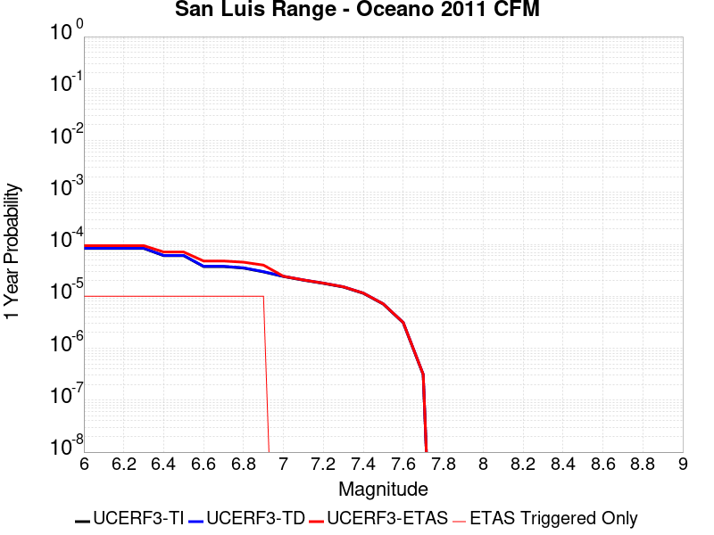 | 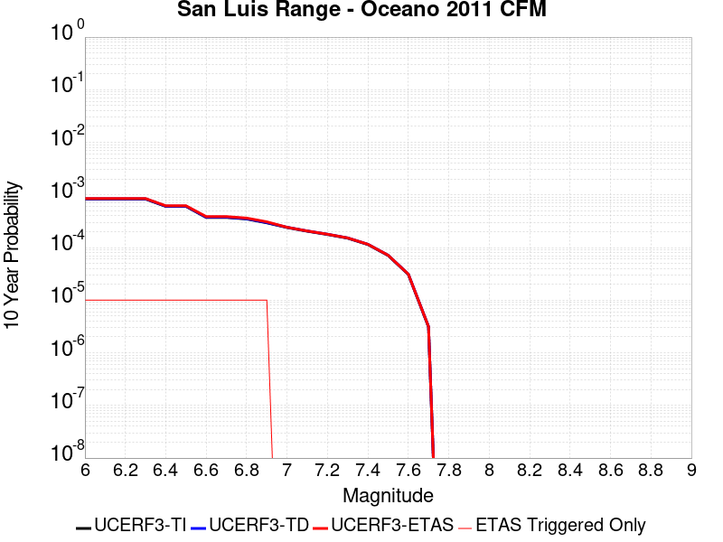 |

| Magnitude | 1 wk TI Prob | 1 wk TD Prob | 1 wk ETAS Prob | 1 wk ETAS/TD Gain | 1 wk ETAS Triggered Only | 1 mo TI Prob | 1 mo TD Prob | 1 mo ETAS Prob | 1 mo ETAS/TD Gain | 1 mo ETAS Triggered Only | 1 yr TI Prob | 1 yr TD Prob | 1 yr ETAS Prob | 1 yr ETAS/TD Gain | 1 yr ETAS Triggered Only | 10 yr TI Prob | 10 yr TD Prob | 10 yr ETAS Prob | 10 yr ETAS/TD Gain | 10 yr ETAS Triggered Only |
|-----|-----|-----|-----|-----|-----|-----|-----|-----|-----|-----|-----|-----|-----|-----|-----|-----|-----|-----|-----|-----|
| 6.0 | 1.6025788E-6 | 1.620119E-6 | 1.620119E-6 | 1.0 | 0.0 | 6.8681766E-6 | 6.943351E-6 | 6.943351E-6 | 1.0 | 0.0 | 8.361684E-5 | 8.453243E-5 | 1.008238E-4 | 1.1927233 | 1.6292748E-5 | 8.3585386E-4 | 8.4504357E-4 | 8.6132257E-4 | 1.0192641 | 1.6292748E-5 |
| 6.1 | 1.6025788E-6 | 1.620119E-6 | 1.620119E-6 | 1.0 | 0.0 | 6.8681766E-6 | 6.943351E-6 | 6.943351E-6 | 1.0 | 0.0 | 8.361684E-5 | 8.453243E-5 | 1.008238E-4 | 1.1927233 | 1.6292748E-5 | 8.3585386E-4 | 8.4504357E-4 | 8.6132257E-4 | 1.0192641 | 1.6292748E-5 |
| 6.2 | 1.6025788E-6 | 1.620119E-6 | 1.620119E-6 | 1.0 | 0.0 | 6.8681766E-6 | 6.943351E-6 | 6.943351E-6 | 1.0 | 0.0 | 8.361684E-5 | 8.453243E-5 | 1.008238E-4 | 1.1927233 | 1.6292748E-5 | 8.3585386E-4 | 8.4504357E-4 | 8.6132257E-4 | 1.0192641 | 1.6292748E-5 |
| 6.3 | 1.6025788E-6 | 1.620119E-6 | 1.620119E-6 | 1.0 | 0.0 | 6.8681766E-6 | 6.943351E-6 | 6.943351E-6 | 1.0 | 0.0 | 8.361684E-5 | 8.453243E-5 | 1.008238E-4 | 1.1927233 | 1.6292748E-5 | 8.3585386E-4 | 8.4504357E-4 | 8.6132257E-4 | 1.0192641 | 1.6292748E-5 |
| 6.4 | 1.1621186E-6 | 1.1749894E-6 | 1.1749894E-6 | 1.0 | 0.0 | 4.980499E-6 | 5.0356607E-6 | 5.0356607E-6 | 1.0 | 0.0 | 6.0635884E-5 | 6.130771E-5 | 7.759946E-5 | 1.2657373 | 1.6292748E-5 | 6.0619344E-4 | 6.1293464E-4 | 6.2921736E-4 | 1.0265652 | 1.6292748E-5 |
| 6.5 | 1.1621186E-6 | 1.1749894E-6 | 1.1749894E-6 | 1.0 | 0.0 | 4.980499E-6 | 5.0356607E-6 | 5.0356607E-6 | 1.0 | 0.0 | 6.0635884E-5 | 6.130771E-5 | 7.759946E-5 | 1.2657373 | 1.6292748E-5 | 6.0619344E-4 | 6.1293464E-4 | 6.2921736E-4 | 1.0265652 | 1.6292748E-5 |
| 6.6 | 7.164729E-7 | 7.2485784E-7 | 7.2485784E-7 | 1.0 | 0.0 | 3.0705946E-6 | 3.10653E-6 | 3.10653E-6 | 1.0 | 0.0 | 3.738385E-5 | 3.7821363E-5 | 5.4113494E-5 | 1.4307653 | 1.6292748E-5 | 3.737756E-4 | 3.7815105E-4 | 3.944376E-4 | 1.043069 | 1.6292748E-5 |
| 6.7 | 7.164729E-7 | 7.2485784E-7 | 7.2485784E-7 | 1.0 | 0.0 | 3.0705946E-6 | 3.10653E-6 | 3.10653E-6 | 1.0 | 0.0 | 3.738385E-5 | 3.7821363E-5 | 5.4113494E-5 | 1.4307653 | 1.6292748E-5 | 3.737756E-4 | 3.7815105E-4 | 3.944376E-4 | 1.043069 | 1.6292748E-5 |
| 6.8 | 6.700177E-7 | 6.7774397E-7 | 6.7774397E-7 | 1.0 | 0.0 | 2.8715012E-6 | 2.904614E-6 | 2.904614E-6 | 1.0 | 0.0 | 3.495997E-5 | 3.536312E-5 | 5.165529E-5 | 1.4607109 | 1.6292748E-5 | 3.495447E-4 | 3.5357653E-4 | 3.6986353E-4 | 1.0460635 | 1.6292748E-5 |
| 6.9 | 5.657865E-7 | 5.7217864E-7 | 5.7217864E-7 | 1.0 | 0.0 | 2.424797E-6 | 2.452192E-6 | 2.452192E-6 | 1.0 | 0.0 | 2.9521503E-5 | 2.9855039E-5 | 4.61473E-5 | 1.5457124 | 1.6292748E-5 | 2.9517582E-4 | 2.9851135E-4 | 3.1479922E-4 | 1.0545638 | 1.6292748E-5 |
| 7.0 | 4.608413E-7 | 4.660169E-7 | 4.660169E-7 | 1.0 | 0.0 | 1.9750328E-6 | 1.9972138E-6 | 1.9972138E-6 | 1.0 | 0.0 | 2.4045758E-5 | 2.431581E-5 | 2.431581E-5 | 1.0 | 0.0 | 2.4043156E-4 | 2.4313178E-4 | 2.4313178E-4 | 1.0 | 0.0 |
| 7.1 | 3.9177846E-7 | 3.9621602E-7 | 3.9621602E-7 | 1.0 | 0.0 | 1.6790494E-6 | 1.6980675E-6 | 1.6980675E-6 | 1.0 | 0.0 | 2.0442236E-5 | 2.0673779E-5 | 2.0673779E-5 | 1.0 | 0.0 | 2.0440355E-4 | 2.067187E-4 | 2.067187E-4 | 1.0 | 0.0 |
| 7.2 | 3.3974752E-7 | 3.436653E-7 | 3.436653E-7 | 1.0 | 0.0 | 1.45606E-6 | 1.4728505E-6 | 1.4728505E-6 | 1.0 | 0.0 | 1.7727387E-5 | 1.7931809E-5 | 1.7931809E-5 | 1.0 | 0.0 | 1.7725973E-4 | 1.7930372E-4 | 1.7930372E-4 | 1.0 | 0.0 |
| 7.3 | 2.8900928E-7 | 2.923402E-7 | 2.923402E-7 | 1.0 | 0.0 | 1.2386106E-6 | 1.2528859E-6 | 1.2528859E-6 | 1.0 | 0.0 | 1.5079979E-5 | 1.525378E-5 | 1.525378E-5 | 1.0 | 0.0 | 1.5078956E-4 | 1.5252741E-4 | 1.5252741E-4 | 1.0 | 0.0 |
| 7.4 | 2.1881527E-7 | 2.2139594E-7 | 2.2139594E-7 | 1.0 | 0.0 | 9.3777936E-7 | 9.488394E-7 | 9.488394E-7 | 1.0 | 0.0 | 1.14174045E-5 | 1.1552059E-5 | 1.1552059E-5 | 1.0 | 0.0 | 1.1416818E-4 | 1.1551464E-4 | 1.1551464E-4 | 1.0 | 0.0 |
| 7.5 | 1.356398E-7 | 1.3718639E-7 | 1.3718639E-7 | 1.0 | 0.0 | 5.813133E-7 | 5.8794154E-7 | 5.8794154E-7 | 1.0 | 0.0 | 7.0774663E-6 | 7.158165E-6 | 7.158165E-6 | 1.0 | 0.0 | 7.077241E-5 | 7.157937E-5 | 7.157937E-5 | 1.0 | 0.0 |
| 7.6 | 5.9269272E-8 | 6.001364E-8 | 6.001364E-8 | 1.0 | 0.0 | 2.5401116E-7 | 2.572013E-7 | 2.572013E-7 | 1.0 | 0.0 | 3.0925814E-6 | 3.1314214E-6 | 3.1314214E-6 | 1.0 | 0.0 | 3.0925385E-5 | 3.1313786E-5 | 3.1313786E-5 | 1.0 | 0.0 |
| 7.7 | 5.946232E-9 | 6.036928E-9 | 6.036928E-9 | 1.0 | 0.0 | 2.5483851E-8 | 2.5872547E-8 | 2.5872547E-8 | 1.0 | 0.0 | 3.1026585E-7 | 3.1499823E-7 | 3.1499823E-7 | 1.0 | 0.0 | 3.102654E-6 | 3.1499787E-6 | 3.1499787E-6 | 1.0 | 0.0 |

## Clamshell-Sawpit
*[(top)](#table-of-contents)*

| 1 Week | 1 Month | 1 Year | 10 Year |
|-----|-----|-----|-----|
| 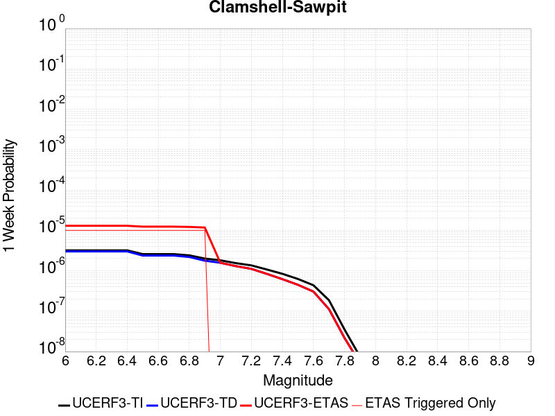 |  | 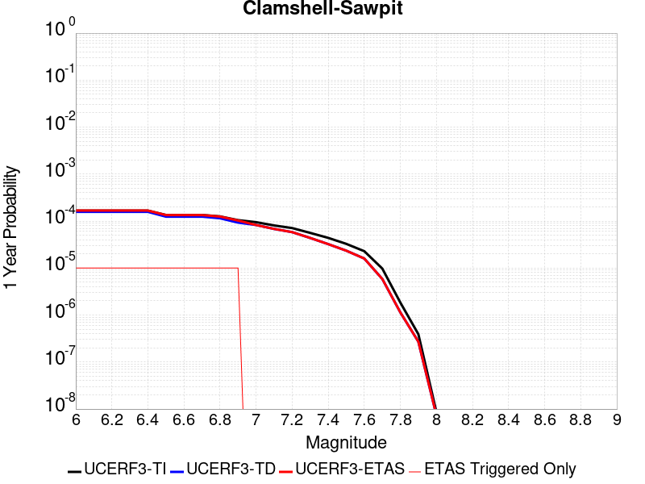 |  |

| Magnitude | 1 wk TI Prob | 1 wk TD Prob | 1 wk ETAS Prob | 1 wk ETAS/TD Gain | 1 wk ETAS Triggered Only | 1 mo TI Prob | 1 mo TD Prob | 1 mo ETAS Prob | 1 mo ETAS/TD Gain | 1 mo ETAS Triggered Only | 1 yr TI Prob | 1 yr TD Prob | 1 yr ETAS Prob | 1 yr ETAS/TD Gain | 1 yr ETAS Triggered Only | 10 yr TI Prob | 10 yr TD Prob | 10 yr ETAS Prob | 10 yr ETAS/TD Gain | 10 yr ETAS Triggered Only |
|-----|-----|-----|-----|-----|-----|-----|-----|-----|-----|-----|-----|-----|-----|-----|-----|-----|-----|-----|-----|-----|
| 6.0 | 3.202998E-6 | 3.0127642E-6 | 1.9305464E-5 | 6.4078903 | 1.6292748E-5 | 1.3727062E-5 | 1.2911787E-5 | 2.9204324E-5 | 2.2618344 | 1.6292748E-5 | 1.6711417E-4 | 1.5719047E-4 | 1.7348066E-4 | 1.1036334 | 1.6292748E-5 | 0.0016698855 | 0.0015708723 | 0.0015871394 | 1.0103555 | 1.6292748E-5 |
| 6.1 | 3.202998E-6 | 3.0127642E-6 | 1.9305464E-5 | 6.4078903 | 1.6292748E-5 | 1.3727062E-5 | 1.2911787E-5 | 2.9204324E-5 | 2.2618344 | 1.6292748E-5 | 1.6711417E-4 | 1.5719047E-4 | 1.7348066E-4 | 1.1036334 | 1.6292748E-5 | 0.0016698855 | 0.0015708723 | 0.0015871394 | 1.0103555 | 1.6292748E-5 |
| 6.2 | 3.202998E-6 | 3.0127642E-6 | 1.9305464E-5 | 6.4078903 | 1.6292748E-5 | 1.3727062E-5 | 1.2911787E-5 | 2.9204324E-5 | 2.2618344 | 1.6292748E-5 | 1.6711417E-4 | 1.5719047E-4 | 1.7348066E-4 | 1.1036334 | 1.6292748E-5 | 0.0016698855 | 0.0015708723 | 0.0015871394 | 1.0103555 | 1.6292748E-5 |
| 6.3 | 3.202998E-6 | 3.0127642E-6 | 1.9305464E-5 | 6.4078903 | 1.6292748E-5 | 1.3727062E-5 | 1.2911787E-5 | 2.9204324E-5 | 2.2618344 | 1.6292748E-5 | 1.6711417E-4 | 1.5719047E-4 | 1.7348066E-4 | 1.1036334 | 1.6292748E-5 | 0.0016698855 | 0.0015708723 | 0.0015871394 | 1.0103555 | 1.6292748E-5 |
| 6.4 | 3.202998E-6 | 3.0127642E-6 | 1.9305464E-5 | 6.4078903 | 1.6292748E-5 | 1.3727062E-5 | 1.2911787E-5 | 2.9204324E-5 | 2.2618344 | 1.6292748E-5 | 1.6711417E-4 | 1.5719047E-4 | 1.7348066E-4 | 1.1036334 | 1.6292748E-5 | 0.0016698855 | 0.0015708723 | 0.0015871394 | 1.0103555 | 1.6292748E-5 |
| 6.5 | 2.5862723E-6 | 2.3807747E-6 | 1.8673483E-5 | 7.843448 | 1.6292748E-5 | 1.1083977E-5 | 1.0203283E-5 | 2.6495863E-5 | 2.5967982 | 1.6292748E-5 | 1.3493907E-4 | 1.2421819E-4 | 1.4050891E-4 | 1.1311461 | 1.6292748E-5 | 0.0013485716 | 0.0012415178 | 0.0012577904 | 1.013107 | 1.6292748E-5 |
| 6.6 | 2.5862723E-6 | 2.3807747E-6 | 1.8673483E-5 | 7.843448 | 1.6292748E-5 | 1.1083977E-5 | 1.0203283E-5 | 2.6495863E-5 | 2.5967982 | 1.6292748E-5 | 1.3493907E-4 | 1.2421819E-4 | 1.4050891E-4 | 1.1311461 | 1.6292748E-5 | 0.0013485716 | 0.0012415178 | 0.0012577904 | 1.013107 | 1.6292748E-5 |
| 6.7 | 2.5862723E-6 | 2.3807747E-6 | 1.8673483E-5 | 7.843448 | 1.6292748E-5 | 1.1083977E-5 | 1.0203283E-5 | 2.6495863E-5 | 2.5967982 | 1.6292748E-5 | 1.3493907E-4 | 1.2421819E-4 | 1.4050891E-4 | 1.1311461 | 1.6292748E-5 | 0.0013485716 | 0.0012415178 | 0.0012577904 | 1.013107 | 1.6292748E-5 |
| 6.8 | 2.4098806E-6 | 2.1977307E-6 | 1.8490444E-5 | 8.413425 | 1.6292748E-5 | 1.0328019E-5 | 9.4188135E-6 | 2.5711408E-5 | 2.7297926 | 1.6292748E-5 | 1.2573638E-4 | 1.14668284E-4 | 1.3095916E-4 | 1.1420696 | 1.6292748E-5 | 0.0012566525 | 0.0011461178 | 0.0011623919 | 1.0141993 | 1.6292748E-5 |
| 6.9 | 2.0073985E-6 | 1.7784247E-6 | 1.8071143E-5 | 10.161321 | 1.6292748E-5 | 8.603109E-6 | 7.6217984E-6 | 2.3914423E-5 | 3.137635 | 1.6292748E-5 | 1.0473781E-4 | 9.279157E-5 | 1.090828E-4 | 1.1755681 | 1.6292748E-5 | 0.0010468846 | 9.2754007E-4 | 9.438177E-4 | 1.0175493 | 1.6292748E-5 |
| 7.0 | 1.8166766E-6 | 1.5807094E-6 | 1.5807094E-6 | 1.0 | 0.0 | 7.785734E-6 | 6.774452E-6 | 6.774452E-6 | 1.0 | 0.0 | 9.478718E-5 | 8.247593E-5 | 8.247593E-5 | 1.0 | 0.0 | 9.4746763E-4 | 8.244633E-4 | 8.244633E-4 | 1.0 | 0.0 |
| 7.1 | 1.5471421E-6 | 1.3052961E-6 | 1.3052961E-6 | 1.0 | 0.0 | 6.6305925E-6 | 5.5941146E-6 | 5.5941146E-6 | 1.0 | 0.0 | 8.072447E-5 | 6.810627E-5 | 6.810627E-5 | 1.0 | 0.0 | 8.0695155E-4 | 6.8085943E-4 | 6.8085943E-4 | 1.0 | 0.0 |
| 7.2 | 1.3608037E-6 | 1.1153442E-6 | 1.1153442E-6 | 1.0 | 0.0 | 5.8320024E-6 | 4.780038E-6 | 4.780038E-6 | 1.0 | 0.0 | 7.1002316E-5 | 5.8195455E-5 | 5.8195455E-5 | 1.0 | 0.0 | 7.097964E-4 | 5.818068E-4 | 5.818068E-4 | 1.0 | 0.0 |
| 7.3 | 1.0749634E-6 | 8.384255E-7 | 8.384255E-7 | 1.0 | 0.0 | 4.6069777E-6 | 3.5932474E-6 | 3.5932474E-6 | 1.0 | 0.0 | 5.608851E-5 | 4.3746935E-5 | 4.3746935E-5 | 1.0 | 0.0 | 5.6074356E-4 | 4.3738607E-4 | 4.3738607E-4 | 1.0 | 0.0 |
| 7.4 | 8.416856E-7 | 6.2000527E-7 | 6.2000527E-7 | 1.0 | 0.0 | 3.607219E-6 | 2.657163E-6 | 2.657163E-6 | 1.0 | 0.0 | 4.3917007E-5 | 3.2350497E-5 | 3.2350497E-5 | 1.0 | 0.0 | 4.390833E-4 | 3.2345986E-4 | 3.2345986E-4 | 1.0 | 0.0 |
| 7.5 | 6.2779594E-7 | 4.4968908E-7 | 4.4968908E-7 | 1.0 | 0.0 | 2.6905511E-6 | 1.9272377E-6 | 1.9272377E-6 | 1.0 | 0.0 | 3.275697E-5 | 2.3463885E-5 | 2.3463885E-5 | 1.0 | 0.0 | 3.275214E-4 | 2.3461595E-4 | 2.3461595E-4 | 1.0 | 0.0 |
| 7.6 | 4.3822078E-7 | 3.059551E-7 | 3.059551E-7 | 1.0 | 0.0 | 1.8780877E-6 | 1.3112356E-6 | 1.3112356E-6 | 1.0 | 0.0 | 2.2865479E-5 | 1.5964191E-5 | 1.5964191E-5 | 1.0 | 0.0 | 2.2863125E-4 | 1.5963199E-4 | 1.5963199E-4 | 1.0 | 0.0 |
| 7.7 | 1.8704569E-7 | 1.12379E-7 | 1.12379E-7 | 1.0 | 0.0 | 8.0162414E-7 | 4.8162417E-7 | 4.8162417E-7 | 1.0 | 0.0 | 9.75973E-6 | 5.8637593E-6 | 5.8637593E-6 | 1.0 | 0.0 | 9.7593016E-5 | 5.863611E-5 | 5.863611E-5 | 1.0 | 0.0 |
| 7.8 | 3.5378733E-8 | 2.1838002E-8 | 2.1838002E-8 | 1.0 | 0.0 | 1.5162313E-7 | 9.359143E-8 | 9.359143E-8 | 1.0 | 0.0 | 1.84601E-6 | 1.1394751E-6 | 1.1394751E-6 | 1.0 | 0.0 | 1.8459947E-5 | 1.1394695E-5 | 1.1394695E-5 | 1.0 | 0.0 |
| 7.9 | 7.504945E-9 | 5.1921663E-9 | 5.1921663E-9 | 1.0 | 0.0 | 3.2164053E-8 | 2.2252141E-8 | 2.2252141E-8 | 1.0 | 0.0 | 3.9159727E-7 | 2.709198E-7 | 2.709198E-7 | 1.0 | 0.0 | 3.915966E-6 | 2.7091953E-6 | 2.7091953E-6 | 1.0 | 0.0 |
| 8.0 | 1.6554036E-10 | 1.418149E-10 | 1.418149E-10 | 1.0 | 0.0 | 7.0945894E-10 | 6.0777794E-10 | 6.0777794E-10 | 1.0 | 0.0 | 8.637662E-9 | 7.3996964E-9 | 7.3996964E-9 | 1.0 | 0.0 | 8.6376616E-8 | 7.3996965E-8 | 7.3996965E-8 | 1.0 | 0.0 |

## Superstition Hills
*[(top)](#table-of-contents)*

| 1 Week | 1 Month | 1 Year | 10 Year |
|-----|-----|-----|-----|
|  |  | 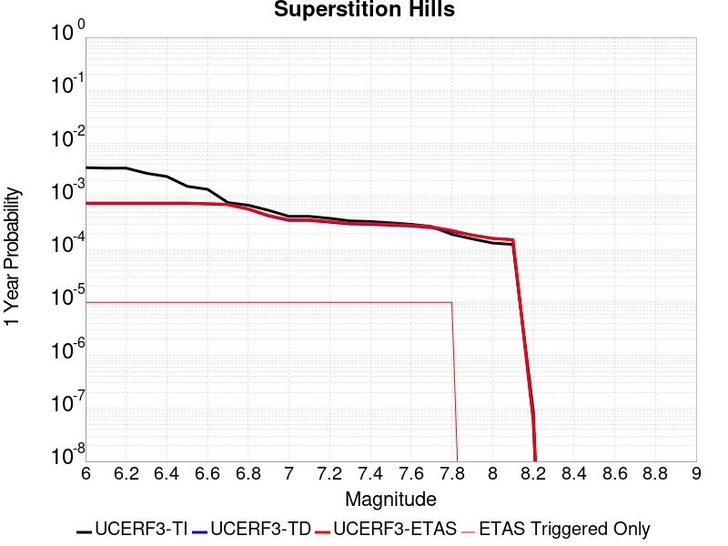 |  |

| Magnitude | 1 wk TI Prob | 1 wk TD Prob | 1 wk ETAS Prob | 1 wk ETAS/TD Gain | 1 wk ETAS Triggered Only | 1 mo TI Prob | 1 mo TD Prob | 1 mo ETAS Prob | 1 mo ETAS/TD Gain | 1 mo ETAS Triggered Only | 1 yr TI Prob | 1 yr TD Prob | 1 yr ETAS Prob | 1 yr ETAS/TD Gain | 1 yr ETAS Triggered Only | 10 yr TI Prob | 10 yr TD Prob | 10 yr ETAS Prob | 10 yr ETAS/TD Gain | 10 yr ETAS Triggered Only |
|-----|-----|-----|-----|-----|-----|-----|-----|-----|-----|-----|-----|-----|-----|-----|-----|-----|-----|-----|-----|-----|
| 6.0 | 6.6865185E-5 | 1.4137668E-5 | 1.4137668E-5 | 1.0 | 0.0 | 2.8653358E-4 | 6.058869E-5 | 6.058869E-5 | 1.0 | 0.0 | 0.0034829667 | 7.374338E-4 | 7.537145E-4 | 1.0220776 | 1.6292748E-5 | 0.03428881 | 0.007520696 | 0.0075368662 | 1.00215 | 1.6292748E-5 |
| 6.1 | 6.544851E-5 | 1.4137668E-5 | 1.4137668E-5 | 1.0 | 0.0 | 2.8046346E-4 | 6.058869E-5 | 6.058869E-5 | 1.0 | 0.0 | 0.0034092965 | 7.374338E-4 | 7.537145E-4 | 1.0220776 | 1.6292748E-5 | 0.033574644 | 0.0075206957 | 0.007536866 | 1.00215 | 1.6292748E-5 |
| 6.2 | 6.544851E-5 | 1.4137668E-5 | 1.4137668E-5 | 1.0 | 0.0 | 2.8046346E-4 | 6.058869E-5 | 6.058869E-5 | 1.0 | 0.0 | 0.0034092965 | 7.374338E-4 | 7.537145E-4 | 1.0220776 | 1.6292748E-5 | 0.033574644 | 0.0075206957 | 0.007536866 | 1.00215 | 1.6292748E-5 |
| 6.3 | 5.2402065E-5 | 1.4137667E-5 | 1.4137667E-5 | 1.0 | 0.0 | 2.2456095E-4 | 6.0588685E-5 | 6.0588685E-5 | 1.0 | 0.0 | 0.0027306017 | 7.374338E-4 | 7.5371447E-4 | 1.0220776 | 1.6292748E-5 | 0.02697292 | 0.0075206906 | 0.0075368606 | 1.00215 | 1.6292748E-5 |
| 6.4 | 4.542238E-5 | 1.4137666E-5 | 1.4137666E-5 | 1.0 | 0.0 | 1.9465282E-4 | 6.058868E-5 | 6.058868E-5 | 1.0 | 0.0 | 0.0023673223 | 7.3743373E-4 | 7.5371447E-4 | 1.0220776 | 1.6292748E-5 | 0.023422617 | 0.007520688 | 0.0075368583 | 1.00215 | 1.6292748E-5 |
| 6.5 | 2.9672969E-5 | 1.4137665E-5 | 1.4137665E-5 | 1.0 | 0.0 | 1.2716366E-4 | 6.0588678E-5 | 6.0588678E-5 | 1.0 | 0.0 | 0.0015471181 | 7.374337E-4 | 7.537144E-4 | 1.0220776 | 1.6292748E-5 | 0.015363912 | 0.0075206826 | 0.007536853 | 1.00215 | 1.6292748E-5 |
| 6.6 | 2.6056105E-5 | 1.3803436E-5 | 1.3803436E-5 | 1.0 | 0.0 | 1.1166424E-4 | 5.915633E-5 | 5.915633E-5 | 1.0 | 0.0 | 0.0013586642 | 7.200064E-4 | 7.362874E-4 | 1.0226123 | 1.6292748E-5 | 0.013503874 | 0.0073450673 | 0.0073612407 | 1.0022019 | 1.6292748E-5 |
| 6.7 | 1.4611248E-5 | 1.338333E-5 | 1.338333E-5 | 1.0 | 0.0 | 6.261813E-5 | 5.7355956E-5 | 5.7355956E-5 | 1.0 | 0.0 | 7.6210906E-4 | 6.9810095E-4 | 7.1438233E-4 | 1.0233223 | 1.6292748E-5 | 0.0075950073 | 0.0071262526 | 0.0071424297 | 1.00227 | 1.6292748E-5 |
| 6.8 | 1.30607E-5 | 1.09787115E-5 | 1.09787115E-5 | 1.0 | 0.0 | 5.597323E-5 | 4.705082E-5 | 4.705082E-5 | 1.0 | 0.0 | 6.8126095E-4 | 5.727019E-4 | 5.8898533E-4 | 1.0284326 | 1.6292748E-5 | 0.006791762 | 0.005873964 | 0.0058901613 | 1.0027574 | 1.6292748E-5 |
| 6.9 | 1.0443096E-5 | 8.19507E-6 | 8.19507E-6 | 1.0 | 0.0 | 4.4755358E-5 | 3.512127E-5 | 3.512127E-5 | 1.0 | 0.0 | 5.447602E-4 | 4.2751993E-4 | 4.438057E-4 | 1.0380936 | 1.6292748E-5 | 0.005434267 | 0.004409497 | 0.004425718 | 1.0036787 | 1.6292748E-5 |
| 7.0 | 8.045912E-6 | 6.739447E-6 | 6.739447E-6 | 1.0 | 0.0 | 3.4482026E-5 | 2.888303E-5 | 2.888303E-5 | 1.0 | 0.0 | 4.197378E-4 | 3.5159517E-4 | 3.678822E-4 | 1.0463232 | 1.6292748E-5 | 0.0041894587 | 0.0036335257 | 0.0036497593 | 1.0044677 | 1.6292748E-5 |
| 7.1 | 8.045912E-6 | 6.739447E-6 | 6.739447E-6 | 1.0 | 0.0 | 3.4482026E-5 | 2.888303E-5 | 2.888303E-5 | 1.0 | 0.0 | 4.197378E-4 | 3.5159517E-4 | 3.678822E-4 | 1.0463232 | 1.6292748E-5 | 0.0041894587 | 0.0036335257 | 0.0036497593 | 1.0044677 | 1.6292748E-5 |
| 7.2 | 7.375506E-6 | 6.2463805E-6 | 6.2463805E-6 | 1.0 | 0.0 | 3.1608928E-5 | 2.6769932E-5 | 2.6769932E-5 | 1.0 | 0.0 | 3.8477074E-4 | 3.2587603E-4 | 3.421635E-4 | 1.0499805 | 1.6292748E-5 | 0.003841052 | 0.0033741172 | 0.003390355 | 1.0048125 | 1.6292748E-5 |
| 7.3 | 6.6063913E-6 | 5.798824E-6 | 5.798824E-6 | 1.0 | 0.0 | 2.8312797E-5 | 2.4851872E-5 | 2.4851872E-5 | 1.0 | 0.0 | 3.446538E-4 | 3.0253024E-4 | 3.1881806E-4 | 1.0538386 | 1.6292748E-5 | 0.0034411973 | 0.0031383524 | 0.003154594 | 1.0051752 | 1.6292748E-5 |
| 7.4 | 6.4313126E-6 | 5.6802523E-6 | 5.6802523E-6 | 1.0 | 0.0 | 2.7562477E-5 | 2.4343715E-5 | 2.4343715E-5 | 1.0 | 0.0 | 3.355215E-4 | 2.963451E-4 | 3.1263303E-4 | 1.0549626 | 1.6292748E-5 | 0.0033501536 | 0.003076105 | 0.0030923474 | 1.0052803 | 1.6292748E-5 |
| 7.5 | 6.0742927E-6 | 5.476088E-6 | 5.476088E-6 | 1.0 | 0.0 | 2.6032423E-5 | 2.3468741E-5 | 2.3468741E-5 | 1.0 | 0.0 | 3.1689866E-4 | 2.8569513E-4 | 3.0198324E-4 | 1.0570122 | 1.6292748E-5 | 0.0031644711 | 0.0029679502 | 0.0029841946 | 1.0054733 | 1.6292748E-5 |
| 7.6 | 5.6987187E-6 | 5.2943155E-6 | 5.2943155E-6 | 1.0 | 0.0 | 2.4422852E-5 | 2.268973E-5 | 2.268973E-5 | 1.0 | 0.0 | 2.9730765E-4 | 2.762131E-4 | 2.9250135E-4 | 1.0589699 | 1.6292748E-5 | 0.002969102 | 0.0028712032 | 0.0028874492 | 1.0056583 | 1.6292748E-5 |
| 7.7 | 5.1658035E-6 | 4.925336E-6 | 4.925336E-6 | 1.0 | 0.0 | 2.2138971E-5 | 2.1108413E-5 | 2.1108413E-5 | 1.0 | 0.0 | 2.6950863E-4 | 2.5696523E-4 | 2.732538E-4 | 1.0633882 | 1.6292748E-5 | 0.00269182 | 0.0026763005 | 0.0026925497 | 1.0060714 | 1.6292748E-5 |
| 7.8 | 3.6864697E-6 | 4.1963563E-6 | 4.1963563E-6 | 1.0 | 0.0 | 1.579906E-5 | 1.7984263E-5 | 1.7984263E-5 | 1.0 | 0.0 | 1.9233658E-4 | 2.1893687E-4 | 2.3522605E-4 | 1.0744013 | 1.6292748E-5 | 0.0019217018 | 0.0022895595 | 0.0023058148 | 1.0070999 | 1.6292748E-5 |
| 7.9 | 3.0265903E-6 | 3.5636078E-6 | 3.5636078E-6 | 1.0 | 0.0 | 1.2971037E-5 | 1.5272519E-5 | 1.5272519E-5 | 1.0 | 0.0 | 1.5791094E-4 | 1.8592748E-4 | 1.8592748E-4 | 1.0 | 0.0 | 0.0015779877 | 0.0019537222 | 0.0019537222 | 1.0 | 0.0 |
| 8.0 | 2.5271493E-6 | 3.0866524E-6 | 3.0866524E-6 | 1.0 | 0.0 | 1.0830595E-5 | 1.3228446E-5 | 1.3228446E-5 | 1.0 | 0.0 | 1.3185451E-4 | 1.6104484E-4 | 1.6104484E-4 | 1.0 | 0.0 | 0.0013177631 | 0.0016975543 | 0.0016975543 | 1.0 | 0.0 |
| 8.1 | 2.3749135E-6 | 2.9172957E-6 | 2.9172957E-6 | 1.0 | 0.0 | 1.0178161E-5 | 1.2502638E-5 | 1.2502638E-5 | 1.0 | 0.0 | 1.2391206E-4 | 1.522094E-4 | 1.522094E-4 | 1.0 | 0.0 | 0.0012384299 | 0.0016051348 | 0.0016051348 | 1.0 | 0.0 |
| 8.2 | 1.7186406E-9 | 1.1438838E-9 | 1.1438838E-9 | 1.0 | 0.0 | 7.3656024E-9 | 4.902359E-9 | 4.902359E-9 | 1.0 | 0.0 | 8.9676206E-8 | 5.968622E-8 | 5.968622E-8 | 1.0 | 0.0 | 8.9676166E-7 | 6.386644E-7 | 6.386644E-7 | 1.0 | 0.0 |

## San Jacinto (Clark) rev
*[(top)](#table-of-contents)*

| 1 Week | 1 Month | 1 Year | 10 Year |
|-----|-----|-----|-----|
|  |  |  |  |

| Magnitude | 1 wk TI Prob | 1 wk TD Prob | 1 wk ETAS Prob | 1 wk ETAS/TD Gain | 1 wk ETAS Triggered Only | 1 mo TI Prob | 1 mo TD Prob | 1 mo ETAS Prob | 1 mo ETAS/TD Gain | 1 mo ETAS Triggered Only | 1 yr TI Prob | 1 yr TD Prob | 1 yr ETAS Prob | 1 yr ETAS/TD Gain | 1 yr ETAS Triggered Only | 10 yr TI Prob | 10 yr TD Prob | 10 yr ETAS Prob | 10 yr ETAS/TD Gain | 10 yr ETAS Triggered Only |
|-----|-----|-----|-----|-----|-----|-----|-----|-----|-----|-----|-----|-----|-----|-----|-----|-----|-----|-----|-----|-----|
| 6.0 | 4.482615E-5 | 2.1153059E-5 | 2.1153059E-5 | 1.0 | 0.0 | 1.9209793E-4 | 9.065287E-5 | 9.065287E-5 | 1.0 | 0.0 | 0.0023362834 | 0.0011031491 | 0.0011194239 | 1.014753 | 1.6292748E-5 | 0.02311874 | 0.011485709 | 0.011501814 | 1.0014023 | 1.6292748E-5 |
| 6.1 | 4.482615E-5 | 2.1153059E-5 | 2.1153059E-5 | 1.0 | 0.0 | 1.9209793E-4 | 9.065287E-5 | 9.065287E-5 | 1.0 | 0.0 | 0.0023362834 | 0.0011031491 | 0.0011194239 | 1.014753 | 1.6292748E-5 | 0.02311874 | 0.011485709 | 0.011501814 | 1.0014023 | 1.6292748E-5 |
| 6.2 | 4.482615E-5 | 2.1153059E-5 | 2.1153059E-5 | 1.0 | 0.0 | 1.9209793E-4 | 9.065287E-5 | 9.065287E-5 | 1.0 | 0.0 | 0.0023362834 | 0.0011031491 | 0.0011194239 | 1.014753 | 1.6292748E-5 | 0.02311874 | 0.011485709 | 0.011501814 | 1.0014023 | 1.6292748E-5 |
| 6.3 | 4.482615E-5 | 2.1153059E-5 | 2.1153059E-5 | 1.0 | 0.0 | 1.9209793E-4 | 9.065287E-5 | 9.065287E-5 | 1.0 | 0.0 | 0.0023362834 | 0.0011031491 | 0.0011194239 | 1.014753 | 1.6292748E-5 | 0.02311874 | 0.011485709 | 0.011501814 | 1.0014023 | 1.6292748E-5 |
| 6.4 | 4.482615E-5 | 2.1153059E-5 | 2.1153059E-5 | 1.0 | 0.0 | 1.9209793E-4 | 9.065287E-5 | 9.065287E-5 | 1.0 | 0.0 | 0.0023362834 | 0.0011031491 | 0.0011194239 | 1.014753 | 1.6292748E-5 | 0.02311874 | 0.011485709 | 0.011501814 | 1.0014023 | 1.6292748E-5 |
| 6.5 | 3.7294863E-5 | 1.7354667E-5 | 1.7354667E-5 | 1.0 | 0.0 | 1.5982533E-4 | 7.437504E-5 | 7.437504E-5 | 1.0 | 0.0 | 0.0019441366 | 9.051445E-4 | 9.214225E-4 | 1.0179839 | 1.6292748E-5 | 0.01927216 | 0.009485902 | 0.009502041 | 1.0017012 | 1.6292748E-5 |
| 6.6 | 3.7294863E-5 | 1.7354667E-5 | 1.7354667E-5 | 1.0 | 0.0 | 1.5982533E-4 | 7.437504E-5 | 7.437504E-5 | 1.0 | 0.0 | 0.0019441366 | 9.051445E-4 | 9.214225E-4 | 1.0179839 | 1.6292748E-5 | 0.01927216 | 0.009485902 | 0.009502041 | 1.0017012 | 1.6292748E-5 |
| 6.7 | 3.6039248E-5 | 1.6602684E-5 | 1.6602684E-5 | 1.0 | 0.0 | 1.5444479E-4 | 7.115244E-5 | 7.115244E-5 | 1.0 | 0.0 | 0.0018787434 | 8.659408E-4 | 8.8221946E-4 | 1.0187988 | 1.6292748E-5 | 0.01862939 | 0.009088189 | 0.009104334 | 1.0017765 | 1.6292748E-5 |
| 6.8 | 3.5031844E-5 | 1.6231123E-5 | 1.6231123E-5 | 1.0 | 0.0 | 1.5012783E-4 | 6.956012E-5 | 6.956012E-5 | 1.0 | 0.0 | 0.0018262739 | 8.4656954E-4 | 8.628485E-4 | 1.0192293 | 1.6292748E-5 | 0.01811338 | 0.008888788 | 0.008904936 | 1.0018166 | 1.6292748E-5 |
| 6.9 | 3.435112E-5 | 1.6061658E-5 | 1.6061658E-5 | 1.0 | 0.0 | 1.4721078E-4 | 6.8833884E-5 | 6.8833884E-5 | 1.0 | 0.0 | 0.0017908178 | 8.377344E-4 | 8.540135E-4 | 1.0194323 | 1.6292748E-5 | 0.017764548 | 0.008796512 | 0.008812661 | 1.001836 | 1.6292748E-5 |
| 7.0 | 2.8959772E-5 | 1.43355255E-5 | 1.43355255E-5 | 1.0 | 0.0 | 1.241074E-4 | 6.1436534E-5 | 6.1436534E-5 | 1.0 | 0.0 | 0.0015099603 | 7.477359E-4 | 7.6401647E-4 | 1.0217731 | 1.6292748E-5 | 0.014997416 | 0.007868331 | 0.007884496 | 1.0020543 | 1.6292748E-5 |
| 7.1 | 2.6002877E-5 | 1.2827699E-5 | 1.2827699E-5 | 1.0 | 0.0 | 1.11436144E-4 | 5.4974706E-5 | 5.4974706E-5 | 1.0 | 0.0 | 0.0013558907 | 6.6911365E-4 | 6.8539544E-4 | 1.0243335 | 1.6292748E-5 | 0.013476475 | 0.0070483433 | 0.0070645213 | 1.0022953 | 1.6292748E-5 |
| 7.2 | 2.2544838E-5 | 1.1260331E-5 | 1.1260331E-5 | 1.0 | 0.0 | 9.661716E-5 | 4.825768E-5 | 4.825768E-5 | 1.0 | 0.0 | 0.001175679 | 5.873803E-4 | 6.0366344E-4 | 1.0277216 | 1.6292748E-5 | 0.011694785 | 0.00619256 | 0.006208752 | 1.0026147 | 1.6292748E-5 |
| 7.3 | 1.75334E-5 | 1.0810585E-5 | 1.0810585E-5 | 1.0 | 0.0 | 7.514098E-5 | 4.6330264E-5 | 4.6330264E-5 | 1.0 | 0.0 | 9.144575E-4 | 5.6392635E-4 | 5.8020995E-4 | 1.0288754 | 1.6292748E-5 | 0.009107036 | 0.0059332196 | 0.0059494153 | 1.0027298 | 1.6292748E-5 |
| 7.4 | 1.5924552E-5 | 1.0610475E-5 | 1.0610475E-5 | 1.0 | 0.0 | 6.82463E-5 | 4.547268E-5 | 4.547268E-5 | 1.0 | 0.0 | 8.305819E-4 | 5.534906E-4 | 5.6977436E-4 | 1.02942 | 1.6292748E-5 | 0.008274844 | 0.0058205863 | 0.005836784 | 1.0027828 | 1.6292748E-5 |
| 7.5 | 1.3428931E-5 | 9.851045E-6 | 9.851045E-6 | 1.0 | 0.0 | 5.7551293E-5 | 4.221809E-5 | 4.221809E-5 | 1.0 | 0.0 | 7.004617E-4 | 5.1388505E-4 | 5.3016946E-4 | 1.0316887 | 1.6292748E-5 | 0.006982579 | 0.005406209 | 0.0054224133 | 1.0029974 | 1.6292748E-5 |
| 7.6 | 1.0688787E-5 | 8.614091E-6 | 8.614091E-6 | 1.0 | 0.0 | 4.5808283E-5 | 3.6917012E-5 | 3.6917012E-5 | 1.0 | 0.0 | 5.5757316E-4 | 4.4937237E-4 | 4.656578E-4 | 1.0362403 | 1.6292748E-5 | 0.005561762 | 0.0047413614 | 0.004757577 | 1.00342 | 1.6292748E-5 |
| 7.7 | 8.81236E-6 | 7.4673385E-6 | 7.4673385E-6 | 1.0 | 0.0 | 3.776671E-5 | 3.200249E-5 | 3.200249E-5 | 1.0 | 0.0 | 4.597127E-4 | 3.8956082E-4 | 4.0584724E-4 | 1.041807 | 1.6292748E-5 | 0.0045876284 | 0.0041344194 | 0.004150645 | 1.0039245 | 1.6292748E-5 |
| 7.8 | 7.780431E-6 | 6.695928E-6 | 6.695928E-6 | 1.0 | 0.0 | 3.3344273E-5 | 2.8696519E-5 | 2.8696519E-5 | 1.0 | 0.0 | 4.0589093E-4 | 3.4932428E-4 | 3.6561134E-4 | 1.0466244 | 1.6292748E-5 | 0.0040515037 | 0.0037226272 | 0.0037388592 | 1.0043604 | 1.6292748E-5 |
| 7.9 | 6.5437994E-6 | 5.7797783E-6 | 5.7797783E-6 | 1.0 | 0.0 | 2.8044553E-5 | 2.4770245E-5 | 2.4770245E-5 | 1.0 | 0.0 | 3.4138895E-4 | 3.0153614E-4 | 3.17824E-4 | 1.0540162 | 1.6292748E-5 | 0.0034086495 | 0.0032343294 | 0.0032505693 | 1.0050211 | 1.6292748E-5 |
| 8.0 | 5.4488164E-6 | 4.812793E-6 | 4.812793E-6 | 1.0 | 0.0 | 2.3351862E-5 | 2.0626094E-5 | 2.0626094E-5 | 1.0 | 0.0 | 2.8427184E-4 | 2.510939E-4 | 2.6738257E-4 | 1.0648708 | 1.6292748E-5 | 0.0028390845 | 0.0027107038 | 0.0027269523 | 1.0059942 | 1.6292748E-5 |
| 8.1 | 2.8397242E-6 | 1.3665673E-6 | 1.3665673E-6 | 1.0 | 0.0 | 1.217019E-5 | 5.856704E-6 | 5.856704E-6 | 1.0 | 0.0 | 1.4816198E-4 | 7.1303046E-5 | 7.1303046E-5 | 1.0 | 0.0 | 0.0014806325 | 8.113543E-4 | 8.113543E-4 | 1.0 | 0.0 |
| 8.2 | 2.030244E-6 | 6.3151083E-7 | 6.3151083E-7 | 1.0 | 0.0 | 8.701017E-6 | 2.7064723E-6 | 2.7064723E-6 | 1.0 | 0.0 | 1.05929736E-4 | 3.2950808E-5 | 3.2950808E-5 | 1.0 | 0.0 | 0.0010587925 | 3.9470522E-4 | 3.9470522E-4 | 1.0 | 0.0 |
| 8.3 | 1.0659804E-6 | 2.9230563E-7 | 2.9230563E-7 | 1.0 | 0.0 | 4.568479E-6 | 1.2527379E-6 | 1.2527379E-6 | 1.0 | 0.0 | 5.5619817E-5 | 1.5251981E-5 | 1.5251981E-5 | 1.0 | 0.0 | 5.5605895E-4 | 1.8556409E-4 | 1.8556409E-4 | 1.0 | 0.0 |

## Mission Hills 2011
*[(top)](#table-of-contents)*

| 1 Week | 1 Month | 1 Year | 10 Year |
|-----|-----|-----|-----|
|  |  |  |  |

| Magnitude | 1 wk TI Prob | 1 wk TD Prob | 1 wk ETAS Prob | 1 wk ETAS/TD Gain | 1 wk ETAS Triggered Only | 1 mo TI Prob | 1 mo TD Prob | 1 mo ETAS Prob | 1 mo ETAS/TD Gain | 1 mo ETAS Triggered Only | 1 yr TI Prob | 1 yr TD Prob | 1 yr ETAS Prob | 1 yr ETAS/TD Gain | 1 yr ETAS Triggered Only | 10 yr TI Prob | 10 yr TD Prob | 10 yr ETAS Prob | 10 yr ETAS/TD Gain | 10 yr ETAS Triggered Only |
|-----|-----|-----|-----|-----|-----|-----|-----|-----|-----|-----|-----|-----|-----|-----|-----|-----|-----|-----|-----|-----|
| 6.0 | 1.8765717E-5 | 1.9054629E-5 | 1.9054629E-5 | 1.0 | 0.0 | 8.0422025E-5 | 8.1662074E-5 | 8.1662074E-5 | 1.0 | 0.0 | 9.786983E-4 | 9.941256E-4 | 9.941256E-4 | 1.0 | 0.0 | 0.009743992 | 0.00993045 | 0.00994658 | 1.0016243 | 1.6292748E-5 |
| 6.1 | 1.8765717E-5 | 1.9054629E-5 | 1.9054629E-5 | 1.0 | 0.0 | 8.0422025E-5 | 8.1662074E-5 | 8.1662074E-5 | 1.0 | 0.0 | 9.786983E-4 | 9.941256E-4 | 9.941256E-4 | 1.0 | 0.0 | 0.009743992 | 0.00993045 | 0.00994658 | 1.0016243 | 1.6292748E-5 |
| 6.2 | 1.8765717E-5 | 1.9054629E-5 | 1.9054629E-5 | 1.0 | 0.0 | 8.0422025E-5 | 8.1662074E-5 | 8.1662074E-5 | 1.0 | 0.0 | 9.786983E-4 | 9.941256E-4 | 9.941256E-4 | 1.0 | 0.0 | 0.009743992 | 0.00993045 | 0.00994658 | 1.0016243 | 1.6292748E-5 |
| 6.3 | 1.8765717E-5 | 1.9054629E-5 | 1.9054629E-5 | 1.0 | 0.0 | 8.0422025E-5 | 8.1662074E-5 | 8.1662074E-5 | 1.0 | 0.0 | 9.786983E-4 | 9.941256E-4 | 9.941256E-4 | 1.0 | 0.0 | 0.009743992 | 0.00993045 | 0.00994658 | 1.0016243 | 1.6292748E-5 |
| 6.4 | 4.566357E-6 | 2.5148213E-6 | 2.5148213E-6 | 1.0 | 0.0 | 1.9569954E-5 | 1.0777771E-5 | 1.0777771E-5 | 1.0 | 0.0 | 2.3823815E-4 | 1.3121328E-4 | 1.3121328E-4 | 1.0 | 0.0 | 0.002379829 | 0.0013115364 | 0.0013115364 | 1.0 | 0.0 |
| 6.5 | 4.566357E-6 | 2.5148213E-6 | 2.5148213E-6 | 1.0 | 0.0 | 1.9569954E-5 | 1.0777771E-5 | 1.0777771E-5 | 1.0 | 0.0 | 2.3823815E-4 | 1.3121328E-4 | 1.3121328E-4 | 1.0 | 0.0 | 0.002379829 | 0.0013115364 | 0.0013115364 | 1.0 | 0.0 |
| 6.6 | 4.566357E-6 | 2.5148213E-6 | 2.5148213E-6 | 1.0 | 0.0 | 1.9569954E-5 | 1.0777771E-5 | 1.0777771E-5 | 1.0 | 0.0 | 2.3823815E-4 | 1.3121328E-4 | 1.3121328E-4 | 1.0 | 0.0 | 0.002379829 | 0.0013115364 | 0.0013115364 | 1.0 | 0.0 |
| 6.7 | 2.3266773E-6 | 1.3296132E-6 | 1.3296132E-6 | 1.0 | 0.0 | 9.971435E-6 | 5.69833E-6 | 5.69833E-6 | 1.0 | 0.0 | 1.2139547E-4 | 6.937502E-5 | 6.937502E-5 | 1.0 | 0.0 | 0.0012132917 | 6.935397E-4 | 6.935397E-4 | 1.0 | 0.0 |
| 6.8 | 2.032735E-6 | 1.1894101E-6 | 1.1894101E-6 | 1.0 | 0.0 | 8.711692E-6 | 5.0974622E-6 | 5.0974622E-6 | 1.0 | 0.0 | 1.06059684E-4 | 6.205988E-5 | 6.205988E-5 | 1.0 | 0.0 | 0.0010600908 | 6.204304E-4 | 6.204304E-4 | 1.0 | 0.0 |
| 6.9 | 1.3186259E-6 | 1.0561989E-6 | 1.0561989E-6 | 1.0 | 0.0 | 5.6512413E-6 | 4.526559E-6 | 4.526559E-6 | 1.0 | 0.0 | 6.8801695E-5 | 5.5109493E-5 | 5.5109493E-5 | 1.0 | 0.0 | 6.8780396E-4 | 5.5096124E-4 | 5.5096124E-4 | 1.0 | 0.0 |
| 7.0 | 1.2726016E-6 | 1.0159295E-6 | 1.0159295E-6 | 1.0 | 0.0 | 5.4539955E-6 | 4.3539762E-6 | 4.3539762E-6 | 1.0 | 0.0 | 6.6400375E-5 | 5.30084E-5 | 5.30084E-5 | 1.0 | 0.0 | 6.6380535E-4 | 5.299604E-4 | 5.299604E-4 | 1.0 | 0.0 |
| 7.1 | 1.2063913E-6 | 9.570282E-7 | 9.570282E-7 | 1.0 | 0.0 | 5.170238E-6 | 4.101543E-6 | 4.101543E-6 | 1.0 | 0.0 | 6.294583E-5 | 4.9935166E-5 | 4.9935166E-5 | 1.0 | 0.0 | 6.2928005E-4 | 4.9924204E-4 | 4.9924204E-4 | 1.0 | 0.0 |
| 7.2 | 9.105806E-7 | 7.3767757E-7 | 7.3767757E-7 | 1.0 | 0.0 | 3.9024826E-6 | 3.1614716E-6 | 3.1614716E-6 | 1.0 | 0.0 | 4.7511687E-5 | 3.8490252E-5 | 3.8490252E-5 | 1.0 | 0.0 | 4.7501532E-4 | 3.8483742E-4 | 3.8483742E-4 | 1.0 | 0.0 |
| 7.3 | 7.020432E-7 | 5.7103375E-7 | 5.7103375E-7 | 1.0 | 0.0 | 3.0087533E-6 | 2.4472852E-6 | 2.4472852E-6 | 1.0 | 0.0 | 3.6630954E-5 | 2.9795303E-5 | 2.9795303E-5 | 1.0 | 0.0 | 3.6624918E-4 | 2.979144E-4 | 2.979144E-4 | 1.0 | 0.0 |
| 7.4 | 5.3900635E-7 | 4.4483278E-7 | 4.4483278E-7 | 1.0 | 0.0 | 2.3100251E-6 | 1.9064248E-6 | 1.9064248E-6 | 1.0 | 0.0 | 2.8124194E-5 | 2.3210489E-5 | 2.3210489E-5 | 1.0 | 0.0 | 2.8120633E-4 | 2.3208185E-4 | 2.3208185E-4 | 1.0 | 0.0 |
| 7.5 | 2.907075E-7 | 2.2875324E-7 | 2.2875324E-7 | 1.0 | 0.0 | 1.2458887E-6 | 9.803706E-7 | 9.803706E-7 | 1.0 | 0.0 | 1.5168589E-5 | 1.1935949E-5 | 1.1935949E-5 | 1.0 | 0.0 | 1.5167553E-4 | 1.1935326E-4 | 1.1935326E-4 | 1.0 | 0.0 |
| 7.6 | 1.6903675E-7 | 1.2353401E-7 | 1.2353401E-7 | 1.0 | 0.0 | 7.2444305E-7 | 5.2943136E-7 | 5.2943136E-7 | 1.0 | 0.0 | 8.820059E-6 | 6.4458086E-6 | 6.4458086E-6 | 1.0 | 0.0 | 8.8197085E-5 | 6.445634E-5 | 6.445634E-5 | 1.0 | 0.0 |
| 7.7 | 7.168073E-8 | 3.9134374E-8 | 3.9134374E-8 | 1.0 | 0.0 | 3.072031E-7 | 1.6771872E-7 | 1.6771872E-7 | 1.0 | 0.0 | 3.7401915E-6 | 2.0419736E-6 | 2.0419736E-6 | 1.0 | 0.0 | 3.7401285E-5 | 2.041956E-5 | 2.041956E-5 | 1.0 | 0.0 |
| 7.8 | 6.564101E-8 | 3.3834656E-8 | 3.3834656E-8 | 1.0 | 0.0 | 2.813186E-7 | 1.4500566E-7 | 1.4500566E-7 | 1.0 | 0.0 | 3.4250486E-6 | 1.7654426E-6 | 1.7654426E-6 | 1.0 | 0.0 | 3.424996E-5 | 1.7654296E-5 | 1.7654296E-5 | 1.0 | 0.0 |
| 7.9 | 1.0029074E-8 | 3.728858E-9 | 3.728858E-9 | 1.0 | 0.0 | 4.2981743E-8 | 1.598082E-8 | 1.598082E-8 | 1.0 | 0.0 | 5.2330256E-7 | 1.945665E-7 | 1.945665E-7 | 1.0 | 0.0 | 5.2330133E-6 | 1.9456643E-6 | 1.9456643E-6 | 1.0 | 0.0 |

## Malibu Coast (Extension) alt 1
*[(top)](#table-of-contents)*

| 1 Week | 1 Month | 1 Year | 10 Year |
|-----|-----|-----|-----|
|  | 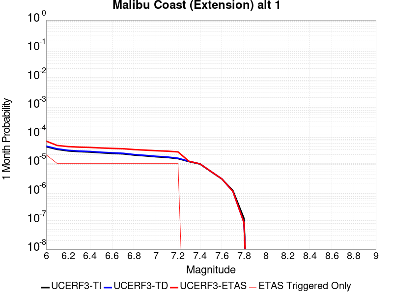 |  |  |

| Magnitude | 1 wk TI Prob | 1 wk TD Prob | 1 wk ETAS Prob | 1 wk ETAS/TD Gain | 1 wk ETAS Triggered Only | 1 mo TI Prob | 1 mo TD Prob | 1 mo ETAS Prob | 1 mo ETAS/TD Gain | 1 mo ETAS Triggered Only | 1 yr TI Prob | 1 yr TD Prob | 1 yr ETAS Prob | 1 yr ETAS/TD Gain | 1 yr ETAS Triggered Only | 10 yr TI Prob | 10 yr TD Prob | 10 yr ETAS Prob | 10 yr ETAS/TD Gain | 10 yr ETAS Triggered Only |
|-----|-----|-----|-----|-----|-----|-----|-----|-----|-----|-----|-----|-----|-----|-----|-----|-----|-----|-----|-----|-----|
| 6.0 | 8.930738E-6 | 9.3292765E-6 | 2.5621872E-5 | 2.7463944 | 1.6292748E-5 | 3.827403E-5 | 3.998201E-5 | 5.6274108E-5 | 1.4074857 | 1.6292748E-5 | 4.6588664E-4 | 4.86674E-4 | 5.029588E-4 | 1.0334615 | 1.6292748E-5 | 0.0046491115 | 0.004856264 | 0.004872478 | 1.0033387 | 1.6292748E-5 |
| 6.1 | 7.199952E-6 | 7.5302974E-6 | 7.5302974E-6 | 1.0 | 0.0 | 3.0856572E-5 | 3.2272306E-5 | 3.2272306E-5 | 1.0 | 0.0 | 3.75614E-4 | 3.928451E-4 | 3.928451E-4 | 1.0 | 0.0 | 0.0037497976 | 0.0039215726 | 0.0039215726 | 1.0 | 0.0 |
| 6.2 | 6.3721413E-6 | 6.666792E-6 | 6.666792E-6 | 1.0 | 0.0 | 2.7308892E-5 | 2.8571656E-5 | 2.8571656E-5 | 1.0 | 0.0 | 3.3243504E-4 | 3.4780474E-4 | 3.4780474E-4 | 1.0 | 0.0 | 0.0033193815 | 0.0034726441 | 0.0034726441 | 1.0 | 0.0 |
| 6.3 | 6.016345E-6 | 6.295159E-6 | 6.295159E-6 | 1.0 | 0.0 | 2.578408E-5 | 2.6978976E-5 | 2.6978976E-5 | 1.0 | 0.0 | 3.1387596E-4 | 3.2841985E-4 | 3.2841985E-4 | 1.0 | 0.0 | 0.00313433 | 0.0032793812 | 0.0032793812 | 1.0 | 0.0 |
| 6.4 | 5.8104883E-6 | 6.0795455E-6 | 6.0795455E-6 | 1.0 | 0.0 | 2.4901856E-5 | 2.6054937E-5 | 2.6054937E-5 | 1.0 | 0.0 | 3.031379E-4 | 3.17173E-4 | 3.17173E-4 | 1.0 | 0.0 | 0.0030272473 | 0.0031672379 | 0.0031672379 | 1.0 | 0.0 |
| 6.5 | 5.476925E-6 | 5.727514E-6 | 5.727514E-6 | 1.0 | 0.0 | 2.3472323E-5 | 2.454626E-5 | 2.454626E-5 | 1.0 | 0.0 | 2.8573806E-4 | 2.9881002E-4 | 2.9881002E-4 | 1.0 | 0.0 | 0.0028537093 | 0.0029841145 | 0.0029841145 | 1.0 | 0.0 |
| 6.6 | 5.222387E-6 | 5.4585807E-6 | 5.4585807E-6 | 1.0 | 0.0 | 2.2381464E-5 | 2.3393708E-5 | 2.3393708E-5 | 1.0 | 0.0 | 2.7246025E-4 | 2.8478145E-4 | 2.8478145E-4 | 1.0 | 0.0 | 0.0027212645 | 0.002844196 | 0.002844196 | 1.0 | 0.0 |
| 6.7 | 5.0337076E-6 | 5.259104E-6 | 5.259104E-6 | 1.0 | 0.0 | 2.1572854E-5 | 2.2538823E-5 | 2.2538823E-5 | 1.0 | 0.0 | 2.6261783E-4 | 2.743759E-4 | 2.743759E-4 | 1.0 | 0.0 | 0.002623077 | 0.0027404015 | 0.0027404015 | 1.0 | 0.0 |
| 6.8 | 4.5675624E-6 | 4.7587173E-6 | 4.7587173E-6 | 1.0 | 0.0 | 1.9575122E-5 | 2.0394344E-5 | 2.0394344E-5 | 1.0 | 0.0 | 2.3830103E-4 | 2.4827302E-4 | 2.4827302E-4 | 1.0 | 0.0 | 0.0023804565 | 0.0024799763 | 0.0024799763 | 1.0 | 0.0 |
| 6.9 | 4.2802412E-6 | 4.4520216E-6 | 4.4520216E-6 | 1.0 | 0.0 | 1.8343762E-5 | 1.9079953E-5 | 1.9079953E-5 | 1.0 | 0.0 | 2.2331243E-4 | 2.3227383E-4 | 2.3227383E-4 | 1.0 | 0.0 | 0.0022308815 | 0.0023203273 | 0.0023203273 | 1.0 | 0.0 |
| 7.0 | 3.9794063E-6 | 4.1301E-6 | 4.1301E-6 | 1.0 | 0.0 | 1.7054486E-5 | 1.770031E-5 | 1.770031E-5 | 1.0 | 0.0 | 2.0761859E-4 | 2.1548007E-4 | 2.1548007E-4 | 1.0 | 0.0 | 0.0020742472 | 0.002152725 | 0.002152725 | 1.0 | 0.0 |
| 7.1 | 3.7730424E-6 | 3.911218E-6 | 3.911218E-6 | 1.0 | 0.0 | 1.6170083E-5 | 1.6762255E-5 | 1.6762255E-5 | 1.0 | 0.0 | 1.9685295E-4 | 2.0406146E-4 | 2.0406146E-4 | 1.0 | 0.0 | 0.0019667868 | 0.0020387538 | 0.0020387538 | 1.0 | 0.0 |
| 7.2 | 3.424985E-6 | 3.541338E-6 | 3.541338E-6 | 1.0 | 0.0 | 1.4678424E-5 | 1.5177075E-5 | 1.5177075E-5 | 1.0 | 0.0 | 1.7869516E-4 | 1.8476533E-4 | 1.8476533E-4 | 1.0 | 0.0 | 0.0017855153 | 0.0018461292 | 0.0018461292 | 1.0 | 0.0 |
| 7.3 | 2.6966375E-6 | 2.759654E-6 | 2.759654E-6 | 1.0 | 0.0 | 1.15569665E-5 | 1.1827035E-5 | 1.1827035E-5 | 1.0 | 0.0 | 1.4069698E-4 | 1.4398468E-4 | 1.4398468E-4 | 1.0 | 0.0 | 0.0014060794 | 0.001438918 | 0.001438918 | 1.0 | 0.0 |
| 7.4 | 2.215957E-6 | 2.249379E-6 | 2.249379E-6 | 1.0 | 0.0 | 9.496924E-6 | 9.64016E-6 | 9.64016E-6 | 1.0 | 0.0 | 1.1561892E-4 | 1.1736266E-4 | 1.1736266E-4 | 1.0 | 0.0 | 0.0011555878 | 0.0011730106 | 0.0011730106 | 1.0 | 0.0 |
| 7.5 | 1.2040218E-6 | 1.2219067E-6 | 1.2219067E-6 | 1.0 | 0.0 | 5.160083E-6 | 5.2367327E-6 | 5.2367327E-6 | 1.0 | 0.0 | 6.2822204E-5 | 6.3755375E-5 | 6.3755375E-5 | 1.0 | 0.0 | 6.280445E-4 | 6.3737266E-4 | 6.3737266E-4 | 1.0 | 0.0 |
| 7.6 | 6.6157446E-7 | 6.6789755E-7 | 6.6789755E-7 | 1.0 | 0.0 | 2.835316E-6 | 2.8624152E-6 | 2.8624152E-6 | 1.0 | 0.0 | 3.4519428E-5 | 3.4849363E-5 | 3.4849363E-5 | 1.0 | 0.0 | 3.4514067E-4 | 3.484405E-4 | 3.484405E-4 | 1.0 | 0.0 |
| 7.7 | 2.6012302E-7 | 2.4357584E-7 | 2.4357584E-7 | 1.0 | 0.0 | 1.1148124E-6 | 1.0438962E-6 | 1.0438962E-6 | 1.0 | 0.0 | 1.3572758E-5 | 1.2709373E-5 | 1.2709373E-5 | 1.0 | 0.0 | 1.3571928E-4 | 1.2708752E-4 | 1.2708752E-4 | 1.0 | 0.0 |
| 7.8 | 2.8323132E-8 | 2.0266642E-8 | 2.0266642E-8 | 1.0 | 0.0 | 1.2138484E-7 | 8.685703E-8 | 8.685703E-8 | 1.0 | 0.0 | 1.4778595E-6 | 1.0574839E-6 | 1.0574839E-6 | 1.0 | 0.0 | 1.4778497E-5 | 1.0574797E-5 | 1.0574797E-5 | 1.0 | 0.0 |

## La Panza 2011
*[(top)](#table-of-contents)*

| 1 Week | 1 Month | 1 Year | 10 Year |
|-----|-----|-----|-----|
|  |  |  |  |

| Magnitude | 1 wk TI Prob | 1 wk TD Prob | 1 wk ETAS Prob | 1 wk ETAS/TD Gain | 1 wk ETAS Triggered Only | 1 mo TI Prob | 1 mo TD Prob | 1 mo ETAS Prob | 1 mo ETAS/TD Gain | 1 mo ETAS Triggered Only | 1 yr TI Prob | 1 yr TD Prob | 1 yr ETAS Prob | 1 yr ETAS/TD Gain | 1 yr ETAS Triggered Only | 10 yr TI Prob | 10 yr TD Prob | 10 yr ETAS Prob | 10 yr ETAS/TD Gain | 10 yr ETAS Triggered Only |
|-----|-----|-----|-----|-----|-----|-----|-----|-----|-----|-----|-----|-----|-----|-----|-----|-----|-----|-----|-----|-----|
| 6.0 | 4.6754544E-6 | 4.7175886E-6 | 2.101026E-5 | 4.4536014 | 1.6292748E-5 | 2.0037509E-5 | 2.021809E-5 | 3.651051E-5 | 1.8058337 | 1.6292748E-5 | 2.4392935E-4 | 2.4612944E-4 | 2.6241818E-4 | 1.0661795 | 1.6292748E-5 | 0.0024366176 | 0.0024587628 | 0.0024750154 | 1.0066102 | 1.6292748E-5 |
| 6.1 | 4.6754544E-6 | 4.7175886E-6 | 2.101026E-5 | 4.4536014 | 1.6292748E-5 | 2.0037509E-5 | 2.021809E-5 | 3.651051E-5 | 1.8058337 | 1.6292748E-5 | 2.4392935E-4 | 2.4612944E-4 | 2.6241818E-4 | 1.0661795 | 1.6292748E-5 | 0.0024366176 | 0.0024587628 | 0.0024750154 | 1.0066102 | 1.6292748E-5 |
| 6.2 | 4.6754544E-6 | 4.7175886E-6 | 2.101026E-5 | 4.4536014 | 1.6292748E-5 | 2.0037509E-5 | 2.021809E-5 | 3.651051E-5 | 1.8058337 | 1.6292748E-5 | 2.4392935E-4 | 2.4612944E-4 | 2.6241818E-4 | 1.0661795 | 1.6292748E-5 | 0.0024366176 | 0.0024587628 | 0.0024750154 | 1.0066102 | 1.6292748E-5 |
| 6.3 | 4.6754544E-6 | 4.7175886E-6 | 2.101026E-5 | 4.4536014 | 1.6292748E-5 | 2.0037509E-5 | 2.021809E-5 | 3.651051E-5 | 1.8058337 | 1.6292748E-5 | 2.4392935E-4 | 2.4612944E-4 | 2.6241818E-4 | 1.0661795 | 1.6292748E-5 | 0.0024366176 | 0.0024587628 | 0.0024750154 | 1.0066102 | 1.6292748E-5 |
| 6.4 | 4.6754544E-6 | 4.7175886E-6 | 2.101026E-5 | 4.4536014 | 1.6292748E-5 | 2.0037509E-5 | 2.021809E-5 | 3.651051E-5 | 1.8058337 | 1.6292748E-5 | 2.4392935E-4 | 2.4612944E-4 | 2.6241818E-4 | 1.0661795 | 1.6292748E-5 | 0.0024366176 | 0.0024587628 | 0.0024750154 | 1.0066102 | 1.6292748E-5 |
| 6.5 | 2.485343E-6 | 2.5006007E-6 | 2.5006007E-6 | 1.0 | 0.0 | 1.0651426E-5 | 1.0716818E-5 | 1.0716818E-5 | 1.0 | 0.0 | 1.296734E-4 | 1.3046984E-4 | 1.3046984E-4 | 1.0 | 0.0 | 0.0012959775 | 0.0013039707 | 0.0013039707 | 1.0 | 0.0 |
| 6.6 | 2.485343E-6 | 2.5006007E-6 | 2.5006007E-6 | 1.0 | 0.0 | 1.0651426E-5 | 1.0716818E-5 | 1.0716818E-5 | 1.0 | 0.0 | 1.296734E-4 | 1.3046984E-4 | 1.3046984E-4 | 1.0 | 0.0 | 0.0012959775 | 0.0013039707 | 0.0013039707 | 1.0 | 0.0 |
| 6.7 | 1.5108508E-6 | 1.514639E-6 | 1.514639E-6 | 1.0 | 0.0 | 6.4750584E-6 | 6.4912947E-6 | 6.4912947E-6 | 1.0 | 0.0 | 7.8830984E-5 | 7.902876E-5 | 7.902876E-5 | 1.0 | 0.0 | 7.880303E-4 | 7.9001737E-4 | 7.9001737E-4 | 1.0 | 0.0 |
| 6.8 | 1.3865837E-6 | 1.3885118E-6 | 1.3885118E-6 | 1.0 | 0.0 | 5.942488E-6 | 5.950752E-6 | 5.950752E-6 | 1.0 | 0.0 | 7.234739E-5 | 7.244809E-5 | 7.244809E-5 | 1.0 | 0.0 | 7.232384E-4 | 7.242546E-4 | 7.242546E-4 | 1.0 | 0.0 |
| 6.9 | 9.826583E-7 | 9.796303E-7 | 9.796303E-7 | 1.0 | 0.0 | 4.2113857E-6 | 4.198409E-6 | 4.198409E-6 | 1.0 | 0.0 | 5.1272415E-5 | 5.1114486E-5 | 5.1114486E-5 | 1.0 | 0.0 | 5.126059E-4 | 5.1103265E-4 | 5.1103265E-4 | 1.0 | 0.0 |
| 7.0 | 6.7797646E-7 | 6.710231E-7 | 6.710231E-7 | 1.0 | 0.0 | 2.9056102E-6 | 2.8758104E-6 | 2.8758104E-6 | 1.0 | 0.0 | 3.537523E-5 | 3.501246E-5 | 3.501246E-5 | 1.0 | 0.0 | 3.5369597E-4 | 3.5007254E-4 | 3.5007254E-4 | 1.0 | 0.0 |
| 7.1 | 3.4979826E-7 | 3.3874045E-7 | 3.3874045E-7 | 1.0 | 0.0 | 1.4991346E-6 | 1.4517441E-6 | 1.4517441E-6 | 1.0 | 0.0 | 1.825181E-5 | 1.7674853E-5 | 1.7674853E-5 | 1.0 | 0.0 | 1.825031E-4 | 1.7673563E-4 | 1.7673563E-4 | 1.0 | 0.0 |
| 7.2 | 2.5088332E-7 | 2.3832064E-7 | 2.3832064E-7 | 1.0 | 0.0 | 1.0752137E-6 | 1.0213738E-6 | 1.0213738E-6 | 1.0 | 0.0 | 1.3090649E-5 | 1.2435164E-5 | 1.2435164E-5 | 1.0 | 0.0 | 1.3089878E-4 | 1.2434553E-4 | 1.2434553E-4 | 1.0 | 0.0 |
| 7.3 | 1.0159086E-7 | 8.644785E-8 | 8.644785E-8 | 1.0 | 0.0 | 4.3538932E-7 | 3.704907E-7 | 3.704907E-7 | 1.0 | 0.0 | 5.300852E-6 | 4.510716E-6 | 4.510716E-6 | 1.0 | 0.0 | 5.3007258E-5 | 4.510628E-5 | 4.510628E-5 | 1.0 | 0.0 |
| 7.4 | 3.5006252E-8 | 1.9403883E-8 | 1.9403883E-8 | 1.0 | 0.0 | 1.5002678E-7 | 8.315949E-8 | 8.315949E-8 | 1.0 | 0.0 | 1.8265745E-6 | 1.0124663E-6 | 1.0124663E-6 | 1.0 | 0.0 | 1.8265595E-5 | 1.012462E-5 | 1.012462E-5 | 1.0 | 0.0 |
| 7.5 | 2.592274E-8 | 1.0238468E-8 | 1.0238468E-8 | 1.0 | 0.0 | 1.1109746E-7 | 4.3879147E-8 | 4.3879147E-8 | 1.0 | 0.0 | 1.3526106E-6 | 5.342285E-7 | 5.342285E-7 | 1.0 | 0.0 | 1.3526024E-5 | 5.342273E-6 | 5.342273E-6 | 1.0 | 0.0 |
| 7.6 | 1.9016717E-8 | 5.2442264E-9 | 5.2442264E-9 | 1.0 | 0.0 | 8.150022E-8 | 2.2475257E-8 | 2.2475257E-8 | 1.0 | 0.0 | 9.922647E-7 | 2.736362E-7 | 2.736362E-7 | 1.0 | 0.0 | 9.922603E-6 | 2.736359E-6 | 2.736359E-6 | 1.0 | 0.0 |
| 7.7 | 1.17738495E-8 | 1.2393437E-9 | 1.2393437E-9 | 1.0 | 0.0 | 5.0459356E-8 | 5.3114735E-9 | 5.3114735E-9 | 1.0 | 0.0 | 6.1434247E-7 | 6.466719E-8 | 6.466719E-8 | 1.0 | 0.0 | 6.143408E-6 | 6.466717E-7 | 6.466717E-7 | 1.0 | 0.0 |
| 7.8 | 5.489079E-9 | 2.009185E-10 | 2.009185E-10 | 1.0 | 0.0 | 2.3524624E-8 | 8.61079E-10 | 8.61079E-10 | 1.0 | 0.0 | 2.8641225E-7 | 1.0483639E-8 | 1.0483639E-8 | 1.0 | 0.0 | 2.8641189E-6 | 1.0483638E-7 | 1.0483638E-7 | 1.0 | 0.0 |
| 7.9 | 2.5081048E-9 | 6.675449E-11 | 6.675449E-11 | 1.0 | 0.0 | 1.0749021E-8 | 2.8609015E-10 | 2.8609015E-10 | 1.0 | 0.0 | 1.3086932E-7 | 3.483148E-9 | 3.483148E-9 | 1.0 | 0.0 | 1.3086925E-6 | 3.483148E-8 | 3.483148E-8 | 1.0 | 0.0 |

## Hayward (No) 2011 CFM
*[(top)](#table-of-contents)*

| 1 Week | 1 Month | 1 Year | 10 Year |
|-----|-----|-----|-----|
|  |  |  |  |

| Magnitude | 1 wk TI Prob | 1 wk TD Prob | 1 wk ETAS Prob | 1 wk ETAS/TD Gain | 1 wk ETAS Triggered Only | 1 mo TI Prob | 1 mo TD Prob | 1 mo ETAS Prob | 1 mo ETAS/TD Gain | 1 mo ETAS Triggered Only | 1 yr TI Prob | 1 yr TD Prob | 1 yr ETAS Prob | 1 yr ETAS/TD Gain | 1 yr ETAS Triggered Only | 10 yr TI Prob | 10 yr TD Prob | 10 yr ETAS Prob | 10 yr ETAS/TD Gain | 10 yr ETAS Triggered Only |
|-----|-----|-----|-----|-----|-----|-----|-----|-----|-----|-----|-----|-----|-----|-----|-----|-----|-----|-----|-----|-----|
| 6.0 | 9.3068506E-5 | 1.739643E-4 | 1.739643E-4 | 1.0 | 0.0 | 3.9880406E-4 | 7.453474E-4 | 7.453474E-4 | 1.0 | 0.0 | 0.0048446343 | 0.009036727 | 0.009036727 | 1.0 | 0.0 | 0.047403704 | 0.086396605 | 0.08641149 | 1.0001723 | 1.6292748E-5 |
| 6.1 | 9.055486E-5 | 1.6947639E-4 | 1.6947639E-4 | 1.0 | 0.0 | 3.880345E-4 | 7.2612526E-4 | 7.2612526E-4 | 1.0 | 0.0 | 0.0047140904 | 0.008804814 | 0.008804814 | 1.0 | 0.0 | 0.046153355 | 0.08428568 | 0.08430059 | 1.000177 | 1.6292748E-5 |
| 6.2 | 9.006742E-5 | 1.6868232E-4 | 1.6868232E-4 | 1.0 | 0.0 | 3.859461E-4 | 7.227246E-4 | 7.227246E-4 | 1.0 | 0.0 | 0.0046887742 | 0.00876378 | 0.00876378 | 1.0 | 0.0 | 0.0459107 | 0.08390991 | 0.08392484 | 1.0001779 | 1.6292748E-5 |
| 6.3 | 8.8336754E-5 | 1.6547782E-4 | 1.6547782E-4 | 1.0 | 0.0 | 3.7853114E-4 | 7.0899865E-4 | 7.0899865E-4 | 1.0 | 0.0 | 0.004598882 | 0.008598051 | 0.008598051 | 1.0 | 0.0 | 0.04504866 | 0.08240195 | 0.0824169 | 1.0001814 | 1.6292748E-5 |
| 6.4 | 8.526157E-5 | 1.5974796E-4 | 1.5974796E-4 | 1.0 | 0.0 | 3.6535555E-4 | 6.844552E-4 | 6.844552E-4 | 1.0 | 0.0 | 0.0044391346 | 0.00830156 | 0.00830156 | 1.0 | 0.0 | 0.043514993 | 0.07968467 | 0.07969966 | 1.0001882 | 1.6292748E-5 |
| 6.5 | 8.152396E-5 | 1.5307199E-4 | 1.5307199E-4 | 1.0 | 0.0 | 3.493416E-4 | 6.558586E-4 | 6.558586E-4 | 1.0 | 0.0 | 0.0042449418 | 0.007955993 | 0.007955993 | 1.0 | 0.0 | 0.04164765 | 0.07651448 | 0.07652953 | 1.0001967 | 1.6292748E-5 |
| 6.6 | 7.987405E-5 | 1.5011412E-4 | 1.5011412E-4 | 1.0 | 0.0 | 3.4227243E-4 | 6.431883E-4 | 6.431883E-4 | 1.0 | 0.0 | 0.0041592065 | 0.007802858 | 0.007802858 | 1.0 | 0.0 | 0.04082218 | 0.075105876 | 0.07512094 | 1.0002006 | 1.6292748E-5 |
| 6.7 | 7.777665E-5 | 1.4650672E-4 | 1.4650672E-4 | 1.0 | 0.0 | 3.332859E-4 | 6.277355E-4 | 6.277355E-4 | 1.0 | 0.0 | 0.004050208 | 0.007616053 | 0.007616053 | 1.0 | 0.0 | 0.039771806 | 0.0733825 | 0.0733976 | 1.0002058 | 1.6292748E-5 |
| 6.8 | 7.3284005E-5 | 1.3801287E-4 | 1.3801287E-4 | 1.0 | 0.0 | 3.140365E-4 | 5.9135025E-4 | 5.9135025E-4 | 1.0 | 0.0 | 0.0038166929 | 0.007176059 | 0.007176059 | 1.0 | 0.0 | 0.037518036 | 0.06929624 | 0.06931141 | 1.0002189 | 1.6292748E-5 |
| 6.9 | 6.458263E-5 | 1.21319164E-4 | 1.21319164E-4 | 1.0 | 0.0 | 2.7675333E-4 | 5.1983615E-4 | 5.1983615E-4 | 1.0 | 0.0 | 0.0033642664 | 0.0063107396 | 0.0063107396 | 1.0 | 0.0 | 0.033137884 | 0.061224625 | 0.06123992 | 1.0002499 | 1.6292748E-5 |
| 7.0 | 5.3853604E-5 | 1.00254634E-4 | 1.00254634E-4 | 1.0 | 0.0 | 2.3078074E-4 | 4.295923E-4 | 4.295923E-4 | 1.0 | 0.0 | 0.0028061352 | 0.0052178074 | 0.0052178074 | 1.0 | 0.0 | 0.027709642 | 0.050957024 | 0.050957024 | 1.0 | 0.0 |
| 7.1 | 4.4308683E-5 | 8.17098E-5 | 8.17098E-5 | 1.0 | 0.0 | 1.8988053E-4 | 3.5013806E-4 | 3.5013806E-4 | 1.0 | 0.0 | 0.0023093442 | 0.0042546396 | 0.0042546396 | 1.0 | 0.0 | 0.022854926 | 0.041824497 | 0.041824497 | 1.0 | 0.0 |
| 7.2 | 3.295973E-5 | 6.0774026E-5 | 6.0774026E-5 | 1.0 | 0.0 | 1.4124835E-4 | 2.6043423E-4 | 2.6043423E-4 | 1.0 | 0.0 | 0.0017183421 | 0.0031661994 | 0.0031661994 | 1.0 | 0.0 | 0.017051157 | 0.031370014 | 0.031370014 | 1.0 | 0.0 |
| 7.3 | 2.452256E-5 | 4.518223E-5 | 4.518223E-5 | 1.0 | 0.0 | 1.05092455E-4 | 1.9362383E-4 | 1.9362383E-4 | 1.0 | 0.0 | 0.0012787496 | 0.0023548352 | 0.0023548352 | 1.0 | 0.0 | 0.0127141625 | 0.023442036 | 0.023442036 | 1.0 | 0.0 |
| 7.4 | 1.8829967E-5 | 3.4604043E-5 | 3.4604043E-5 | 1.0 | 0.0 | 8.069736E-5 | 1.4829468E-4 | 1.4829468E-4 | 1.0 | 0.0 | 9.820475E-4 | 0.0018040023 | 0.0018040023 | 1.0 | 0.0 | 0.009777189 | 0.01802003 | 0.01802003 | 1.0 | 0.0 |
| 7.5 | 1.26374125E-5 | 2.292219E-5 | 2.292219E-5 | 1.0 | 0.0 | 5.4159216E-5 | 9.823428E-5 | 9.823428E-5 | 1.0 | 0.0 | 6.5918895E-4 | 0.0011953521 | 0.0011953521 | 1.0 | 0.0 | 0.00657237 | 0.011988704 | 0.011988704 | 1.0 | 0.0 |
| 7.6 | 4.666429E-6 | 8.479636E-6 | 8.479636E-6 | 1.0 | 0.0 | 1.9998828E-5 | 3.6340796E-5 | 3.6340796E-5 | 1.0 | 0.0 | 2.4345852E-4 | 4.423606E-4 | 4.423606E-4 | 1.0 | 0.0 | 0.0024319198 | 0.004458377 | 0.004458377 | 1.0 | 0.0 |
| 7.7 | 3.8399318E-7 | 7.1343146E-7 | 7.1343146E-7 | 1.0 | 0.0 | 1.6456839E-6 | 3.0575598E-6 | 3.0575598E-6 | 1.0 | 0.0 | 2.003602E-5 | 3.7225156E-5 | 3.7225156E-5 | 1.0 | 0.0 | 2.0034213E-4 | 3.86166E-4 | 3.86166E-4 | 1.0 | 0.0 |
| 7.8 | 2.5637698E-7 | 5.3666145E-7 | 5.3666145E-7 | 1.0 | 0.0 | 1.098758E-6 | 2.2999754E-6 | 2.2999754E-6 | 1.0 | 0.0 | 1.3377297E-5 | 2.8001843E-5 | 2.8001843E-5 | 1.0 | 0.0 | 1.3376492E-4 | 2.9246495E-4 | 2.9246495E-4 | 1.0 | 0.0 |
| 7.9 | 1.7141245E-7 | 3.7293606E-7 | 3.7293606E-7 | 1.0 | 0.0 | 7.3462456E-7 | 1.5982963E-6 | 1.5982963E-6 | 1.0 | 0.0 | 8.944017E-6 | 1.9459085E-5 | 1.9459085E-5 | 1.0 | 0.0 | 8.943657E-5 | 2.0246378E-4 | 2.0246378E-4 | 1.0 | 0.0 |
| 8.0 | 1.1808895E-7 | 2.7512246E-7 | 2.7512246E-7 | 1.0 | 0.0 | 5.060954E-7 | 1.1790958E-6 | 1.1790958E-6 | 1.0 | 0.0 | 6.161694E-6 | 1.4355397E-5 | 1.4355397E-5 | 1.0 | 0.0 | 6.161523E-5 | 1.4817173E-4 | 1.4817173E-4 | 1.0 | 0.0 |
| 8.1 | 5.138535E-8 | 1.12307575E-7 | 1.12307575E-7 | 1.0 | 0.0 | 2.2022292E-7 | 4.8131807E-7 | 4.8131807E-7 | 1.0 | 0.0 | 2.6812106E-6 | 5.860032E-6 | 5.860032E-6 | 1.0 | 0.0 | 2.6811784E-5 | 6.0156468E-5 | 6.0156468E-5 | 1.0 | 0.0 |

## Sheephole
*[(top)](#table-of-contents)*

| 1 Week | 1 Month | 1 Year | 10 Year |
|-----|-----|-----|-----|
|  |  |  |  |

| Magnitude | 1 wk TI Prob | 1 wk TD Prob | 1 wk ETAS Prob | 1 wk ETAS/TD Gain | 1 wk ETAS Triggered Only | 1 mo TI Prob | 1 mo TD Prob | 1 mo ETAS Prob | 1 mo ETAS/TD Gain | 1 mo ETAS Triggered Only | 1 yr TI Prob | 1 yr TD Prob | 1 yr ETAS Prob | 1 yr ETAS/TD Gain | 1 yr ETAS Triggered Only | 10 yr TI Prob | 10 yr TD Prob | 10 yr ETAS Prob | 10 yr ETAS/TD Gain | 10 yr ETAS Triggered Only |
|-----|-----|-----|-----|-----|-----|-----|-----|-----|-----|-----|-----|-----|-----|-----|-----|-----|-----|-----|-----|-----|
| 6.0 | 4.5579695E-6 | 4.7412627E-6 | 4.7412627E-6 | 1.0 | 0.0 | 1.9534009E-5 | 2.031957E-5 | 2.031957E-5 | 1.0 | 0.0 | 2.3780059E-4 | 2.473682E-4 | 2.473682E-4 | 1.0 | 0.0 | 0.0023754628 | 0.002471473 | 0.0024877256 | 1.0065761 | 1.6292748E-5 |
| 6.1 | 4.5579695E-6 | 4.7412627E-6 | 4.7412627E-6 | 1.0 | 0.0 | 1.9534009E-5 | 2.031957E-5 | 2.031957E-5 | 1.0 | 0.0 | 2.3780059E-4 | 2.473682E-4 | 2.473682E-4 | 1.0 | 0.0 | 0.0023754628 | 0.002471473 | 0.0024877256 | 1.0065761 | 1.6292748E-5 |
| 6.2 | 2.6677674E-6 | 2.7873941E-6 | 2.7873941E-6 | 1.0 | 0.0 | 1.1433239E-5 | 1.1945926E-5 | 1.1945926E-5 | 1.0 | 0.0 | 1.3919079E-4 | 1.4543302E-4 | 1.4543302E-4 | 1.0 | 0.0 | 0.0013910364 | 0.0014534844 | 0.0014697534 | 1.0111932 | 1.6292748E-5 |
| 6.3 | 2.6677674E-6 | 2.7873941E-6 | 2.7873941E-6 | 1.0 | 0.0 | 1.1433239E-5 | 1.1945926E-5 | 1.1945926E-5 | 1.0 | 0.0 | 1.3919079E-4 | 1.4543302E-4 | 1.4543302E-4 | 1.0 | 0.0 | 0.0013910364 | 0.0014534844 | 0.0014697534 | 1.0111932 | 1.6292748E-5 |
| 6.4 | 2.2159759E-6 | 2.3228788E-6 | 2.3228788E-6 | 1.0 | 0.0 | 9.497005E-6 | 9.955161E-6 | 9.955161E-6 | 1.0 | 0.0 | 1.156199E-4 | 1.2119815E-4 | 1.2119815E-4 | 1.0 | 0.0 | 0.0011555976 | 0.0012113999 | 0.0012276729 | 1.0134332 | 1.6292748E-5 |
| 6.5 | 2.1986082E-6 | 2.304759E-6 | 2.304759E-6 | 1.0 | 0.0 | 9.4225725E-6 | 9.877506E-6 | 9.877506E-6 | 1.0 | 0.0 | 1.1471378E-4 | 1.2025281E-4 | 1.2025281E-4 | 1.0 | 0.0 | 0.0011465458 | 0.0012019566 | 0.0012182298 | 1.0135388 | 1.6292748E-5 |
| 6.6 | 1.5232331E-6 | 1.6018919E-6 | 1.6018919E-6 | 1.0 | 0.0 | 6.5281256E-6 | 6.865234E-6 | 6.865234E-6 | 1.0 | 0.0 | 7.947703E-5 | 8.35812E-5 | 8.35812E-5 | 1.0 | 0.0 | 7.9448614E-4 | 8.3551643E-4 | 8.5179554E-4 | 1.0194839 | 1.6292748E-5 |
| 6.7 | 1.3137362E-6 | 1.382819E-6 | 1.382819E-6 | 1.0 | 0.0 | 5.6302856E-6 | 5.926355E-6 | 5.926355E-6 | 1.0 | 0.0 | 6.854657E-5 | 7.215112E-5 | 7.215112E-5 | 1.0 | 0.0 | 6.8525434E-4 | 7.212908E-4 | 7.3757186E-4 | 1.022572 | 1.6292748E-5 |
| 6.8 | 1.2275751E-6 | 1.2922847E-6 | 1.2922847E-6 | 1.0 | 0.0 | 5.2610258E-6 | 5.5383516E-6 | 5.5383516E-6 | 1.0 | 0.0 | 6.4051106E-5 | 6.7427485E-5 | 6.7427485E-5 | 1.0 | 0.0 | 6.4032647E-4 | 6.740836E-4 | 6.903653E-4 | 1.024154 | 1.6292748E-5 |
| 6.9 | 1.1837088E-6 | 1.246102E-6 | 1.246102E-6 | 1.0 | 0.0 | 5.0730278E-6 | 5.340427E-6 | 5.340427E-6 | 1.0 | 0.0 | 6.176237E-5 | 6.501789E-5 | 6.501789E-5 | 1.0 | 0.0 | 6.17452E-4 | 6.5000186E-4 | 6.66284E-4 | 1.0250494 | 1.6292748E-5 |
| 7.0 | 9.849371E-7 | 1.0366288E-6 | 1.0366288E-6 | 1.0 | 0.0 | 4.2211523E-6 | 4.442688E-6 | 4.442688E-6 | 1.0 | 0.0 | 5.1391315E-5 | 5.4088487E-5 | 5.4088487E-5 | 1.0 | 0.0 | 5.137943E-4 | 5.407633E-4 | 5.5704726E-4 | 1.0301129 | 1.6292748E-5 |
| 7.1 | 8.1643645E-7 | 8.591669E-7 | 8.591669E-7 | 1.0 | 0.0 | 3.4990085E-6 | 3.682139E-6 | 3.682139E-6 | 1.0 | 0.0 | 4.2599597E-5 | 4.482921E-5 | 4.482921E-5 | 1.0 | 0.0 | 4.259143E-4 | 4.4821028E-4 | 4.6449574E-4 | 1.0363344 | 1.6292748E-5 |
| 7.2 | 5.7295756E-7 | 6.029502E-7 | 6.029502E-7 | 1.0 | 0.0 | 2.45553E-6 | 2.58407E-6 | 2.58407E-6 | 1.0 | 0.0 | 2.9895667E-5 | 3.1460666E-5 | 3.1460666E-5 | 1.0 | 0.0 | 2.9891645E-4 | 3.145688E-4 | 3.145688E-4 | 1.0 | 0.0 |

## Hunting Creek - Bartlett Springs connector 2011
*[(top)](#table-of-contents)*

| 1 Week | 1 Month | 1 Year | 10 Year |
|-----|-----|-----|-----|
|  |  |  |  |

| Magnitude | 1 wk TI Prob | 1 wk TD Prob | 1 wk ETAS Prob | 1 wk ETAS/TD Gain | 1 wk ETAS Triggered Only | 1 mo TI Prob | 1 mo TD Prob | 1 mo ETAS Prob | 1 mo ETAS/TD Gain | 1 mo ETAS Triggered Only | 1 yr TI Prob | 1 yr TD Prob | 1 yr ETAS Prob | 1 yr ETAS/TD Gain | 1 yr ETAS Triggered Only | 10 yr TI Prob | 10 yr TD Prob | 10 yr ETAS Prob | 10 yr ETAS/TD Gain | 10 yr ETAS Triggered Only |
|-----|-----|-----|-----|-----|-----|-----|-----|-----|-----|-----|-----|-----|-----|-----|-----|-----|-----|-----|-----|-----|
| 6.0 | 4.940016E-5 | 6.7870766E-5 | 6.7870766E-5 | 1.0 | 0.0 | 2.1169778E-4 | 2.9084194E-4 | 2.9084194E-4 | 1.0 | 0.0 | 0.002574374 | 0.0035350819 | 0.003551317 | 1.0045925 | 1.6292748E-5 | 0.025447546 | 0.03477475 | 0.03479048 | 1.0004523 | 1.6292748E-5 |
| 6.1 | 4.940016E-5 | 6.7870766E-5 | 6.7870766E-5 | 1.0 | 0.0 | 2.1169778E-4 | 2.9084194E-4 | 2.9084194E-4 | 1.0 | 0.0 | 0.002574374 | 0.0035350819 | 0.003551317 | 1.0045925 | 1.6292748E-5 | 0.025447546 | 0.03477475 | 0.03479048 | 1.0004523 | 1.6292748E-5 |
| 6.2 | 4.472471E-5 | 6.100572E-5 | 6.100572E-5 | 1.0 | 0.0 | 1.9166325E-4 | 2.6142647E-4 | 2.6142647E-4 | 1.0 | 0.0 | 0.0023310026 | 0.0031781218 | 0.0031781218 | 1.0 | 0.0 | 0.02306703 | 0.031317808 | 0.031317808 | 1.0 | 0.0 |
| 6.3 | 4.472471E-5 | 6.100572E-5 | 6.100572E-5 | 1.0 | 0.0 | 1.9166325E-4 | 2.6142647E-4 | 2.6142647E-4 | 1.0 | 0.0 | 0.0023310026 | 0.0031781218 | 0.0031781218 | 1.0 | 0.0 | 0.02306703 | 0.031317808 | 0.031317808 | 1.0 | 0.0 |
| 6.4 | 4.0001003E-5 | 5.410516E-5 | 5.410516E-5 | 1.0 | 0.0 | 1.714216E-4 | 2.318579E-4 | 2.318579E-4 | 1.0 | 0.0 | 0.0020850603 | 0.0028191686 | 0.0028191686 | 1.0 | 0.0 | 0.02065605 | 0.027829198 | 0.027829198 | 1.0 | 0.0 |
| 6.5 | 3.8033053E-5 | 5.126649E-5 | 5.126649E-5 | 1.0 | 0.0 | 1.6298861E-4 | 2.1969521E-4 | 2.1969521E-4 | 1.0 | 0.0 | 0.0019825802 | 0.0026714848 | 0.0026714848 | 1.0 | 0.0 | 0.019649856 | 0.026391273 | 0.026391273 | 1.0 | 0.0 |
| 6.6 | 3.653754E-5 | 4.912955E-5 | 4.912955E-5 | 1.0 | 0.0 | 1.5658008E-4 | 2.1053842E-4 | 2.1053842E-4 | 1.0 | 0.0 | 0.0019046954 | 0.0025602889 | 0.0025602889 | 1.0 | 0.0 | 0.018884527 | 0.025307199 | 0.025307199 | 1.0 | 0.0 |
| 6.7 | 3.372024E-5 | 4.5140216E-5 | 4.5140216E-5 | 1.0 | 0.0 | 1.4450731E-4 | 1.9344388E-4 | 1.9344388E-4 | 1.0 | 0.0 | 0.0017579567 | 0.0023526535 | 0.0023526535 | 1.0 | 0.0 | 0.017441148 | 0.023278862 | 0.023278862 | 1.0 | 0.0 |
| 6.8 | 2.9650024E-5 | 3.9411647E-5 | 3.9411647E-5 | 1.0 | 0.0 | 1.2706534E-4 | 1.6889606E-4 | 1.6889606E-4 | 1.0 | 0.0 | 0.0015459227 | 0.0020543607 | 0.0020543607 | 1.0 | 0.0 | 0.015352124 | 0.020351961 | 0.020351961 | 1.0 | 0.0 |
| 6.9 | 2.860775E-5 | 3.7812886E-5 | 3.7812886E-5 | 1.0 | 0.0 | 1.2259888E-4 | 1.620452E-4 | 1.620452E-4 | 1.0 | 0.0 | 0.0014916194 | 0.0019711219 | 0.0019711219 | 1.0 | 0.0 | 0.014816469 | 0.019536555 | 0.019536555 | 1.0 | 0.0 |
| 7.0 | 2.6696067E-5 | 3.5067544E-5 | 3.5067544E-5 | 1.0 | 0.0 | 1.144067E-4 | 1.5028086E-4 | 1.5028086E-4 | 1.0 | 0.0 | 0.0013920115 | 0.0018281427 | 0.0018281427 | 1.0 | 0.0 | 0.013833242 | 0.01813184 | 0.01813184 | 1.0 | 0.0 |
| 7.1 | 2.456087E-5 | 3.2013326E-5 | 3.2013326E-5 | 1.0 | 0.0 | 1.0525662E-4 | 1.3719281E-4 | 1.3719281E-4 | 1.0 | 0.0 | 0.001280746 | 0.0016690517 | 0.0016690517 | 1.0 | 0.0 | 0.012733897 | 0.016566671 | 0.016566671 | 1.0 | 0.0 |
| 7.2 | 2.295761E-5 | 2.9823148E-5 | 2.9823148E-5 | 1.0 | 0.0 | 9.8386045E-5 | 1.2780727E-4 | 1.2780727E-4 | 1.0 | 0.0 | 0.0011971919 | 0.0015549522 | 0.0015549522 | 1.0 | 0.0 | 0.011907627 | 0.015442378 | 0.015442378 | 1.0 | 0.0 |
| 7.3 | 2.1256936E-5 | 2.7542124E-5 | 2.7542124E-5 | 1.0 | 0.0 | 9.109797E-5 | 1.1803238E-4 | 1.1803238E-4 | 1.0 | 0.0 | 0.0011085535 | 0.0014361058 | 0.0014361058 | 1.0 | 0.0 | 0.011030397 | 0.014269741 | 0.014269741 | 1.0 | 0.0 |
| 7.4 | 1.8784336E-5 | 2.430697E-5 | 2.430697E-5 | 1.0 | 0.0 | 8.050181E-5 | 1.0416861E-4 | 1.0416861E-4 | 1.0 | 0.0 | 9.796688E-4 | 0.0012675226 | 0.0012675226 | 1.0 | 0.0 | 0.009753612 | 0.012604194 | 0.012604194 | 1.0 | 0.0 |
| 7.5 | 1.7248298E-5 | 2.2269056E-5 | 2.2269056E-5 | 1.0 | 0.0 | 7.391918E-5 | 9.543537E-5 | 9.543537E-5 | 1.0 | 0.0 | 8.9959445E-4 | 0.0011613137 | 0.0011613137 | 1.0 | 0.0 | 0.008959615 | 0.011553645 | 0.011553645 | 1.0 | 0.0 |
| 7.6 | 1.0653709E-5 | 1.3722259E-5 | 1.3722259E-5 | 1.0 | 0.0 | 4.5657955E-5 | 5.880837E-5 | 5.880837E-5 | 1.0 | 0.0 | 5.557438E-4 | 7.157594E-4 | 7.157594E-4 | 1.0 | 0.0 | 0.0055435603 | 0.0071350415 | 0.0071350415 | 1.0 | 0.0 |
| 7.7 | 3.286316E-6 | 4.0903997E-6 | 4.0903997E-6 | 1.0 | 0.0 | 1.4084137E-5 | 1.7530168E-5 | 1.7530168E-5 | 1.0 | 0.0 | 1.7146087E-4 | 2.1340905E-4 | 2.1340905E-4 | 1.0 | 0.0 | 0.0017132863 | 0.0021320845 | 0.0021320845 | 1.0 | 0.0 |
| 7.8 | 5.1855085E-7 | 5.972095E-7 | 5.972095E-7 | 1.0 | 0.0 | 2.222359E-6 | 2.5594668E-6 | 2.5594668E-6 | 1.0 | 0.0 | 2.7056883E-5 | 3.1161075E-5 | 3.1161075E-5 | 1.0 | 0.0 | 2.705359E-4 | 3.1156064E-4 | 3.1156064E-4 | 1.0 | 0.0 |

## Little Salmon (Onshore)
*[(top)](#table-of-contents)*

| 1 Week | 1 Month | 1 Year | 10 Year |
|-----|-----|-----|-----|
|  |  |  |  |

| Magnitude | 1 wk TI Prob | 1 wk TD Prob | 1 wk ETAS Prob | 1 wk ETAS/TD Gain | 1 wk ETAS Triggered Only | 1 mo TI Prob | 1 mo TD Prob | 1 mo ETAS Prob | 1 mo ETAS/TD Gain | 1 mo ETAS Triggered Only | 1 yr TI Prob | 1 yr TD Prob | 1 yr ETAS Prob | 1 yr ETAS/TD Gain | 1 yr ETAS Triggered Only | 10 yr TI Prob | 10 yr TD Prob | 10 yr ETAS Prob | 10 yr ETAS/TD Gain | 10 yr ETAS Triggered Only |
|-----|-----|-----|-----|-----|-----|-----|-----|-----|-----|-----|-----|-----|-----|-----|-----|-----|-----|-----|-----|-----|
| 6.0 | 4.1582247E-5 | 5.1820014E-5 | 5.1820014E-5 | 1.0 | 0.0 | 1.7819746E-4 | 2.2207153E-4 | 2.2207153E-4 | 1.0 | 0.0 | 0.0021673953 | 0.0027011954 | 0.002717444 | 1.0060154 | 1.6292748E-5 | 0.021463778 | 0.027034452 | 0.027050303 | 1.0005864 | 1.6292748E-5 |
| 6.1 | 4.1582247E-5 | 5.1820014E-5 | 5.1820014E-5 | 1.0 | 0.0 | 1.7819746E-4 | 2.2207153E-4 | 2.2207153E-4 | 1.0 | 0.0 | 0.0021673953 | 0.0027011954 | 0.002717444 | 1.0060154 | 1.6292748E-5 | 0.021463778 | 0.027034452 | 0.027050303 | 1.0005864 | 1.6292748E-5 |
| 6.2 | 4.1582247E-5 | 5.1820014E-5 | 5.1820014E-5 | 1.0 | 0.0 | 1.7819746E-4 | 2.2207153E-4 | 2.2207153E-4 | 1.0 | 0.0 | 0.0021673953 | 0.0027011954 | 0.002717444 | 1.0060154 | 1.6292748E-5 | 0.021463778 | 0.027034452 | 0.027050303 | 1.0005864 | 1.6292748E-5 |
| 6.3 | 4.1582247E-5 | 5.1820014E-5 | 5.1820014E-5 | 1.0 | 0.0 | 1.7819746E-4 | 2.2207153E-4 | 2.2207153E-4 | 1.0 | 0.0 | 0.0021673953 | 0.0027011954 | 0.002717444 | 1.0060154 | 1.6292748E-5 | 0.021463778 | 0.027034452 | 0.027050303 | 1.0005864 | 1.6292748E-5 |
| 6.4 | 4.1582247E-5 | 5.1820014E-5 | 5.1820014E-5 | 1.0 | 0.0 | 1.7819746E-4 | 2.2207153E-4 | 2.2207153E-4 | 1.0 | 0.0 | 0.0021673953 | 0.0027011954 | 0.002717444 | 1.0060154 | 1.6292748E-5 | 0.021463778 | 0.027034452 | 0.027050303 | 1.0005864 | 1.6292748E-5 |
| 6.5 | 4.1582247E-5 | 5.1820014E-5 | 5.1820014E-5 | 1.0 | 0.0 | 1.7819746E-4 | 2.2207153E-4 | 2.2207153E-4 | 1.0 | 0.0 | 0.0021673953 | 0.0027011954 | 0.002717444 | 1.0060154 | 1.6292748E-5 | 0.021463778 | 0.027034452 | 0.027050303 | 1.0005864 | 1.6292748E-5 |
| 6.6 | 4.1582247E-5 | 5.1820014E-5 | 5.1820014E-5 | 1.0 | 0.0 | 1.7819746E-4 | 2.2207153E-4 | 2.2207153E-4 | 1.0 | 0.0 | 0.0021673953 | 0.0027011954 | 0.002717444 | 1.0060154 | 1.6292748E-5 | 0.021463778 | 0.027034452 | 0.027050303 | 1.0005864 | 1.6292748E-5 |
| 6.7 | 4.1582247E-5 | 5.1820014E-5 | 5.1820014E-5 | 1.0 | 0.0 | 1.7819746E-4 | 2.2207153E-4 | 2.2207153E-4 | 1.0 | 0.0 | 0.0021673953 | 0.0027011954 | 0.002717444 | 1.0060154 | 1.6292748E-5 | 0.021463778 | 0.027034452 | 0.027050303 | 1.0005864 | 1.6292748E-5 |
| 6.8 | 3.4607925E-5 | 4.094412E-5 | 4.094412E-5 | 1.0 | 0.0 | 1.4831126E-4 | 1.7546724E-4 | 1.7546724E-4 | 1.0 | 0.0 | 0.001804194 | 0.0021349725 | 0.0021512304 | 1.0076151 | 1.6292748E-5 | 0.01789616 | 0.021454342 | 0.021470284 | 1.0007432 | 1.6292748E-5 |
| 6.9 | 3.4607925E-5 | 4.094412E-5 | 4.094412E-5 | 1.0 | 0.0 | 1.4831126E-4 | 1.7546724E-4 | 1.7546724E-4 | 1.0 | 0.0 | 0.001804194 | 0.0021349725 | 0.0021512304 | 1.0076151 | 1.6292748E-5 | 0.01789616 | 0.021454342 | 0.021470284 | 1.0007432 | 1.6292748E-5 |
| 7.0 | 1.8411014E-5 | 1.7285503E-5 | 1.7285503E-5 | 1.0 | 0.0 | 7.8901954E-5 | 7.4078926E-5 | 7.4078926E-5 | 1.0 | 0.0 | 9.6020795E-4 | 9.0159115E-4 | 9.0159115E-4 | 1.0 | 0.0 | 0.009560696 | 0.009006166 | 0.009006166 | 1.0 | 0.0 |
| 7.1 | 1.6183103E-5 | 1.4205894E-5 | 1.4205894E-5 | 1.0 | 0.0 | 6.935431E-5 | 6.088125E-5 | 6.088125E-5 | 1.0 | 0.0 | 8.440616E-4 | 7.410246E-4 | 7.410246E-4 | 1.0 | 0.0 | 0.008408628 | 0.0074117873 | 0.0074117873 | 1.0 | 0.0 |
| 7.2 | 1.4868988E-5 | 1.2585783E-5 | 1.2585783E-5 | 1.0 | 0.0 | 6.372268E-5 | 5.393821E-5 | 5.393821E-5 | 1.0 | 0.0 | 7.755474E-4 | 6.5654493E-4 | 6.5654493E-4 | 1.0 | 0.0 | 0.0077284635 | 0.0065716365 | 0.0065716365 | 1.0 | 0.0 |
| 7.3 | 9.3599865E-6 | 7.694566E-6 | 7.694566E-6 | 1.0 | 0.0 | 4.011361E-5 | 3.2976495E-5 | 3.2976495E-5 | 1.0 | 0.0 | 4.8827377E-4 | 4.0145052E-4 | 4.0145052E-4 | 1.0 | 0.0 | 0.004872023 | 0.0040242276 | 0.0040242276 | 1.0 | 0.0 |
| 7.4 | 5.941556E-6 | 4.9508285E-6 | 4.9508285E-6 | 1.0 | 0.0 | 2.5463563E-5 | 2.1217837E-5 | 2.1217837E-5 | 1.0 | 0.0 | 3.0997477E-4 | 2.5832717E-4 | 2.5832717E-4 | 1.0 | 0.0 | 0.0030954275 | 0.0025927064 | 0.0025927064 | 1.0 | 0.0 |

## Verdugo
*[(top)](#table-of-contents)*

| 1 Week | 1 Month | 1 Year | 10 Year |
|-----|-----|-----|-----|
| 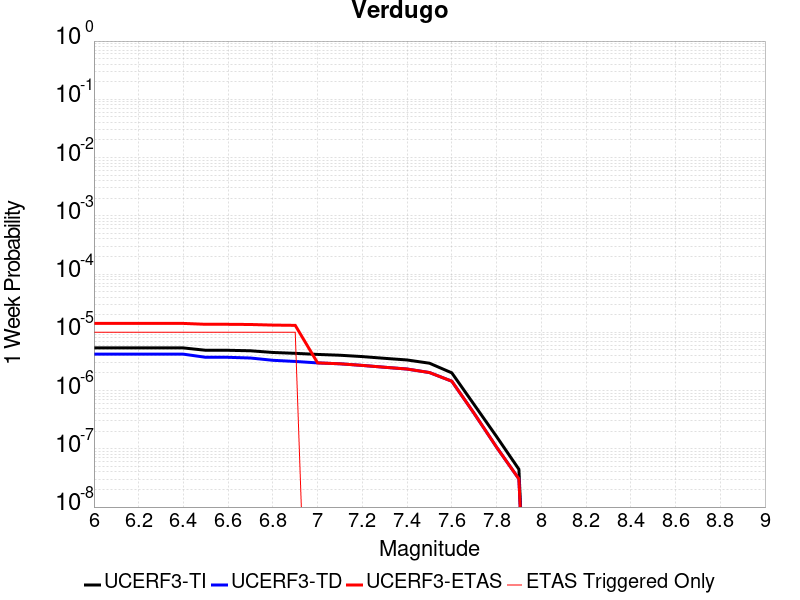 |  |  |  |

| Magnitude | 1 wk TI Prob | 1 wk TD Prob | 1 wk ETAS Prob | 1 wk ETAS/TD Gain | 1 wk ETAS Triggered Only | 1 mo TI Prob | 1 mo TD Prob | 1 mo ETAS Prob | 1 mo ETAS/TD Gain | 1 mo ETAS Triggered Only | 1 yr TI Prob | 1 yr TD Prob | 1 yr ETAS Prob | 1 yr ETAS/TD Gain | 1 yr ETAS Triggered Only | 10 yr TI Prob | 10 yr TD Prob | 10 yr ETAS Prob | 10 yr ETAS/TD Gain | 10 yr ETAS Triggered Only |
|-----|-----|-----|-----|-----|-----|-----|-----|-----|-----|-----|-----|-----|-----|-----|-----|-----|-----|-----|-----|-----|
| 6.0 | 5.392987E-6 | 4.2164934E-6 | 2.0509173E-5 | 4.864035 | 1.6292748E-5 | 2.3112598E-5 | 1.8070563E-5 | 3.4363016E-5 | 1.9016019 | 1.6292748E-5 | 2.8135953E-4 | 2.1998737E-4 | 2.3627654E-4 | 1.0740459 | 1.6292748E-5 | 0.0028100356 | 0.0021977439 | 0.0022140008 | 1.007397 | 1.6292748E-5 |
| 6.1 | 5.392987E-6 | 4.2164934E-6 | 2.0509173E-5 | 4.864035 | 1.6292748E-5 | 2.3112598E-5 | 1.8070563E-5 | 3.4363016E-5 | 1.9016019 | 1.6292748E-5 | 2.8135953E-4 | 2.1998737E-4 | 2.3627654E-4 | 1.0740459 | 1.6292748E-5 | 0.0028100356 | 0.0021977439 | 0.0022140008 | 1.007397 | 1.6292748E-5 |
| 6.2 | 5.392987E-6 | 4.2164934E-6 | 2.0509173E-5 | 4.864035 | 1.6292748E-5 | 2.3112598E-5 | 1.8070563E-5 | 3.4363016E-5 | 1.9016019 | 1.6292748E-5 | 2.8135953E-4 | 2.1998737E-4 | 2.3627654E-4 | 1.0740459 | 1.6292748E-5 | 0.0028100356 | 0.0021977439 | 0.0022140008 | 1.007397 | 1.6292748E-5 |
| 6.3 | 5.392987E-6 | 4.2164934E-6 | 2.0509173E-5 | 4.864035 | 1.6292748E-5 | 2.3112598E-5 | 1.8070563E-5 | 3.4363016E-5 | 1.9016019 | 1.6292748E-5 | 2.8135953E-4 | 2.1998737E-4 | 2.3627654E-4 | 1.0740459 | 1.6292748E-5 | 0.0028100356 | 0.0021977439 | 0.0022140008 | 1.007397 | 1.6292748E-5 |
| 6.4 | 5.392987E-6 | 4.2164934E-6 | 2.0509173E-5 | 4.864035 | 1.6292748E-5 | 2.3112598E-5 | 1.8070563E-5 | 3.4363016E-5 | 1.9016019 | 1.6292748E-5 | 2.8135953E-4 | 2.1998737E-4 | 2.3627654E-4 | 1.0740459 | 1.6292748E-5 | 0.0028100356 | 0.0021977439 | 0.0022140008 | 1.007397 | 1.6292748E-5 |
| 6.5 | 4.9154837E-6 | 3.7224413E-6 | 2.0015128E-5 | 5.3768826 | 1.6292748E-5 | 2.1066187E-5 | 1.5953223E-5 | 3.2245713E-5 | 2.0212662 | 1.6292748E-5 | 2.5645064E-4 | 1.9421338E-4 | 2.1050297E-4 | 1.0838747 | 1.6292748E-5 | 0.002561549 | 0.0019404575 | 0.0019567185 | 1.00838 | 1.6292748E-5 |
| 6.6 | 4.9154837E-6 | 3.7224413E-6 | 2.0015128E-5 | 5.3768826 | 1.6292748E-5 | 2.1066187E-5 | 1.5953223E-5 | 3.2245713E-5 | 2.0212662 | 1.6292748E-5 | 2.5645064E-4 | 1.9421338E-4 | 2.1050297E-4 | 1.0838747 | 1.6292748E-5 | 0.002561549 | 0.0019404575 | 0.0019567185 | 1.00838 | 1.6292748E-5 |
| 6.7 | 4.817006E-6 | 3.620628E-6 | 1.9913317E-5 | 5.4999623 | 1.6292748E-5 | 2.0644147E-5 | 1.5516885E-5 | 3.180938E-5 | 2.049985 | 1.6292748E-5 | 2.513135E-4 | 1.889019E-4 | 2.0519157E-4 | 1.0862335 | 1.6292748E-5 | 0.0025102948 | 0.0018874329 | 0.0019036949 | 1.008616 | 1.6292748E-5 |
| 6.8 | 4.507407E-6 | 3.3070805E-6 | 1.9599775E-5 | 5.9266095 | 1.6292748E-5 | 1.9317316E-5 | 1.4173126E-5 | 3.0465642E-5 | 2.149536 | 1.6292748E-5 | 2.3516294E-4 | 1.7254429E-4 | 1.8883422E-4 | 1.0944102 | 1.6292748E-5 | 0.0023491425 | 0.0017241176 | 0.0017403822 | 1.0094336 | 1.6292748E-5 |
| 6.9 | 4.3573054E-6 | 3.1609877E-6 | 1.9453684E-5 | 6.154306 | 1.6292748E-5 | 1.8674033E-5 | 1.354702E-5 | 2.9839548E-5 | 2.202665 | 1.6292748E-5 | 2.2733262E-4 | 1.649226E-4 | 1.8121267E-4 | 1.098774 | 1.6292748E-5 | 0.0022710022 | 0.0016480145 | 0.0016642804 | 1.00987 | 1.6292748E-5 |
| 7.0 | 4.171527E-6 | 2.9836467E-6 | 2.9836467E-6 | 1.0 | 0.0 | 1.787785E-5 | 1.2786995E-5 | 1.2786995E-5 | 1.0 | 0.0 | 2.1764109E-4 | 1.5567066E-4 | 1.5567066E-4 | 1.0 | 0.0 | 0.0021742806 | 0.0015556274 | 0.0015556274 | 1.0 | 0.0 |
| 7.1 | 4.0405484E-6 | 2.882238E-6 | 2.882238E-6 | 1.0 | 0.0 | 1.731652E-5 | 1.23523905E-5 | 1.23523905E-5 | 1.0 | 0.0 | 2.1080824E-4 | 1.5038009E-4 | 1.5038009E-4 | 1.0 | 0.0 | 0.0021060838 | 0.0015027943 | 0.0015027943 | 1.0 | 0.0 |
| 7.2 | 3.8306007E-6 | 2.701823E-6 | 2.701823E-6 | 1.0 | 0.0 | 1.6416758E-5 | 1.157919E-5 | 1.157919E-5 | 1.0 | 0.0 | 1.9985568E-4 | 1.4096762E-4 | 1.4096762E-4 | 1.0 | 0.0 | 0.0019967605 | 0.0014087928 | 0.0014087928 | 1.0 | 0.0 |
| 7.3 | 3.5750938E-6 | 2.512154E-6 | 2.512154E-6 | 1.0 | 0.0 | 1.532174E-5 | 1.076633E-5 | 1.076633E-5 | 1.0 | 0.0 | 1.8652623E-4 | 1.3107229E-4 | 1.3107229E-4 | 1.0 | 0.0 | 0.0018636974 | 0.0013099604 | 0.0013099604 | 1.0 | 0.0 |
| 7.4 | 3.3510041E-6 | 2.340838E-6 | 2.340838E-6 | 1.0 | 0.0 | 1.4361368E-5 | 1.0032124E-5 | 1.0032124E-5 | 1.0 | 0.0 | 1.7483562E-4 | 1.2213437E-4 | 1.2213437E-4 | 1.0 | 0.0 | 0.0017469813 | 0.0012206829 | 0.0012206829 | 1.0 | 0.0 |
| 7.5 | 2.948287E-6 | 2.0390912E-6 | 2.0390912E-6 | 1.0 | 0.0 | 1.2635454E-5 | 8.7389335E-6 | 8.7389335E-6 | 1.0 | 0.0 | 1.538258E-4 | 1.06391424E-4 | 1.06391424E-4 | 1.0 | 0.0 | 0.0015371935 | 0.0010634151 | 0.0010634151 | 1.0 | 0.0 |
| 7.6 | 2.0134323E-6 | 1.4471086E-6 | 1.4471086E-6 | 1.0 | 0.0 | 8.628967E-6 | 6.20188E-6 | 6.20188E-6 | 1.0 | 0.0 | 1.05052604E-4 | 7.550536E-5 | 7.550536E-5 | 1.0 | 0.0 | 0.0010500296 | 7.548059E-4 | 7.548059E-4 | 1.0 | 0.0 |
| 7.7 | 5.726436E-7 | 4.0453273E-7 | 4.0453273E-7 | 1.0 | 0.0 | 2.4541846E-6 | 1.7337106E-6 | 1.7337106E-6 | 1.0 | 0.0 | 2.9879287E-5 | 2.110775E-5 | 2.110775E-5 | 1.0 | 0.0 | 2.987527E-4 | 2.1105999E-4 | 2.1105999E-4 | 1.0 | 0.0 |
| 7.8 | 1.6248204E-7 | 1.06879604E-7 | 1.06879604E-7 | 1.0 | 0.0 | 6.963514E-7 | 4.5805535E-7 | 4.5805535E-7 | 1.0 | 0.0 | 8.478045E-6 | 5.57681E-6 | 5.57681E-6 | 1.0 | 0.0 | 8.477722E-5 | 5.5766737E-5 | 5.5766737E-5 | 1.0 | 0.0 |
| 7.9 | 4.4475744E-8 | 3.037888E-8 | 3.037888E-8 | 1.0 | 0.0 | 1.9061031E-7 | 1.301952E-7 | 1.301952E-7 | 1.0 | 0.0 | 2.320678E-6 | 1.5851255E-6 | 1.5851255E-6 | 1.0 | 0.0 | 2.3206538E-5 | 1.5851156E-5 | 1.5851156E-5 | 1.0 | 0.0 |

## Earthquake Valley
*[(top)](#table-of-contents)*

| 1 Week | 1 Month | 1 Year | 10 Year |
|-----|-----|-----|-----|
|  |  |  |  |

| Magnitude | 1 wk TI Prob | 1 wk TD Prob | 1 wk ETAS Prob | 1 wk ETAS/TD Gain | 1 wk ETAS Triggered Only | 1 mo TI Prob | 1 mo TD Prob | 1 mo ETAS Prob | 1 mo ETAS/TD Gain | 1 mo ETAS Triggered Only | 1 yr TI Prob | 1 yr TD Prob | 1 yr ETAS Prob | 1 yr ETAS/TD Gain | 1 yr ETAS Triggered Only | 10 yr TI Prob | 10 yr TD Prob | 10 yr ETAS Prob | 10 yr ETAS/TD Gain | 10 yr ETAS Triggered Only |
|-----|-----|-----|-----|-----|-----|-----|-----|-----|-----|-----|-----|-----|-----|-----|-----|-----|-----|-----|-----|-----|
| 6.0 | 1.9416384E-5 | 2.258411E-5 | 3.887649E-5 | 1.721409 | 1.6292748E-5 | 8.321042E-5 | 9.6786134E-5 | 1.130773E-4 | 1.1683214 | 1.6292748E-5 | 0.001012616 | 0.001177854 | 0.0011941276 | 1.0138162 | 1.6292748E-5 | 0.010080142 | 0.011727945 | 0.011744047 | 1.0013729 | 1.6292748E-5 |
| 6.1 | 1.9416384E-5 | 2.258411E-5 | 3.887649E-5 | 1.721409 | 1.6292748E-5 | 8.321042E-5 | 9.6786134E-5 | 1.130773E-4 | 1.1683214 | 1.6292748E-5 | 0.001012616 | 0.001177854 | 0.0011941276 | 1.0138162 | 1.6292748E-5 | 0.010080142 | 0.011727945 | 0.011744047 | 1.0013729 | 1.6292748E-5 |
| 6.2 | 1.9416384E-5 | 2.258411E-5 | 3.887649E-5 | 1.721409 | 1.6292748E-5 | 8.321042E-5 | 9.6786134E-5 | 1.130773E-4 | 1.1683214 | 1.6292748E-5 | 0.001012616 | 0.001177854 | 0.0011941276 | 1.0138162 | 1.6292748E-5 | 0.010080142 | 0.011727945 | 0.011744047 | 1.0013729 | 1.6292748E-5 |
| 6.3 | 1.9416384E-5 | 2.258411E-5 | 3.887649E-5 | 1.721409 | 1.6292748E-5 | 8.321042E-5 | 9.6786134E-5 | 1.130773E-4 | 1.1683214 | 1.6292748E-5 | 0.001012616 | 0.001177854 | 0.0011941276 | 1.0138162 | 1.6292748E-5 | 0.010080142 | 0.011727945 | 0.011744047 | 1.0013729 | 1.6292748E-5 |
| 6.4 | 1.9416384E-5 | 2.258411E-5 | 3.887649E-5 | 1.721409 | 1.6292748E-5 | 8.321042E-5 | 9.6786134E-5 | 1.130773E-4 | 1.1683214 | 1.6292748E-5 | 0.001012616 | 0.001177854 | 0.0011941276 | 1.0138162 | 1.6292748E-5 | 0.010080142 | 0.011727945 | 0.011744047 | 1.0013729 | 1.6292748E-5 |
| 6.5 | 1.9389157E-5 | 2.25527E-5 | 3.884508E-5 | 1.7224138 | 1.6292748E-5 | 8.309374E-5 | 9.665152E-5 | 1.129427E-4 | 1.1685557 | 1.6292748E-5 | 0.0010111968 | 0.001176217 | 0.0011924906 | 1.0138355 | 1.6292748E-5 | 0.010066078 | 0.011711747 | 0.011727849 | 1.0013748 | 1.6292748E-5 |
| 6.6 | 1.9389157E-5 | 2.25527E-5 | 3.884508E-5 | 1.7224138 | 1.6292748E-5 | 8.309374E-5 | 9.665152E-5 | 1.129427E-4 | 1.1685557 | 1.6292748E-5 | 0.0010111968 | 0.001176217 | 0.0011924906 | 1.0138355 | 1.6292748E-5 | 0.010066078 | 0.011711747 | 0.011727849 | 1.0013748 | 1.6292748E-5 |
| 6.7 | 1.4925434E-5 | 1.720822E-5 | 3.3500688E-5 | 1.946784 | 1.6292748E-5 | 6.396457E-5 | 7.374791E-5 | 9.003946E-5 | 1.2209085 | 1.6292748E-5 | 7.7849044E-4 | 8.97596E-4 | 9.1387413E-4 | 1.0181352 | 1.6292748E-5 | 0.007757689 | 0.008948081 | 0.008964228 | 1.0018045 | 1.6292748E-5 |
| 6.8 | 1.3570335E-5 | 1.5616837E-5 | 3.190933E-5 | 2.0432646 | 1.6292748E-5 | 5.8157282E-5 | 6.692804E-5 | 8.3219704E-5 | 1.2434205 | 1.6292748E-5 | 7.0783484E-4 | 8.146264E-4 | 8.3090586E-4 | 1.019984 | 1.6292748E-5 | 0.0070558446 | 0.008124473 | 0.008140634 | 1.0019891 | 1.6292748E-5 |
| 6.9 | 1.3570335E-5 | 1.5616837E-5 | 3.190933E-5 | 2.0432646 | 1.6292748E-5 | 5.8157282E-5 | 6.692804E-5 | 8.3219704E-5 | 1.2434205 | 1.6292748E-5 | 7.0783484E-4 | 8.146264E-4 | 8.3090586E-4 | 1.019984 | 1.6292748E-5 | 0.0070558446 | 0.008124473 | 0.008140634 | 1.0019891 | 1.6292748E-5 |
| 7.0 | 1.3433392E-5 | 1.546038E-5 | 3.1752876E-5 | 2.0538225 | 1.6292748E-5 | 5.757041E-5 | 6.6257555E-5 | 8.254922E-5 | 1.245884 | 1.6292748E-5 | 7.0069433E-4 | 8.064692E-4 | 8.227488E-4 | 1.0201863 | 1.6292748E-5 | 0.006984891 | 0.008043493 | 0.008059654 | 1.0020093 | 1.6292748E-5 |
| 7.1 | 8.181609E-6 | 9.4168445E-6 | 2.5709438E-5 | 2.7301545 | 1.6292748E-5 | 3.5063567E-5 | 4.0357656E-5 | 5.6649747E-5 | 1.4036927 | 1.6292748E-5 | 4.268153E-4 | 4.913108E-4 | 5.075955E-4 | 1.0331455 | 1.6292748E-5 | 0.0042599645 | 0.004908822 | 0.0049250345 | 1.0033028 | 1.6292748E-5 |
| 7.2 | 2.0663983E-7 | 1.7262263E-7 | 1.7262263E-7 | 1.0 | 0.0 | 8.855989E-7 | 7.398111E-7 | 7.398111E-7 | 1.0 | 0.0 | 1.0782113E-5 | 9.007167E-6 | 9.007167E-6 | 1.0 | 0.0 | 1.07815904E-4 | 9.006837E-5 | 9.006837E-5 | 1.0 | 0.0 |
| 7.3 | 2.0462376E-7 | 1.7077758E-7 | 1.7077758E-7 | 1.0 | 0.0 | 8.7695867E-7 | 7.319037E-7 | 7.319037E-7 | 1.0 | 0.0 | 1.0676919E-5 | 8.910895E-6 | 8.910895E-6 | 1.0 | 0.0 | 1.0676406E-4 | 8.9105735E-5 | 8.9105735E-5 | 1.0 | 0.0 |
| 7.4 | 2.0171088E-7 | 1.6860244E-7 | 1.6860244E-7 | 1.0 | 0.0 | 8.644749E-7 | 7.2258166E-7 | 7.2258166E-7 | 1.0 | 0.0 | 1.0524931E-5 | 8.7974E-6 | 8.7974E-6 | 1.0 | 0.0 | 1.05244326E-4 | 8.7970875E-5 | 8.7970875E-5 | 1.0 | 0.0 |
| 7.5 | 1.4847944E-7 | 1.2558573E-7 | 1.2558573E-7 | 1.0 | 0.0 | 6.363403E-7 | 5.382244E-7 | 5.382244E-7 | 1.0 | 0.0 | 7.747416E-6 | 6.5528648E-6 | 6.5528648E-6 | 1.0 | 0.0 | 7.747146E-5 | 6.552693E-5 | 6.552693E-5 | 1.0 | 0.0 |
| 7.6 | 1.3185847E-7 | 1.1122516E-7 | 1.1122516E-7 | 1.0 | 0.0 | 5.6510765E-7 | 4.766792E-7 | 4.766792E-7 | 1.0 | 0.0 | 6.8801637E-6 | 5.803556E-6 | 5.803556E-6 | 1.0 | 0.0 | 6.8799505E-5 | 5.8034257E-5 | 5.8034257E-5 | 1.0 | 0.0 |
| 7.7 | 2.8609954E-8 | 1.4170218E-8 | 1.4170218E-8 | 1.0 | 0.0 | 1.2261408E-7 | 6.0729505E-8 | 6.0729505E-8 | 1.0 | 0.0 | 1.4928254E-6 | 7.393815E-7 | 7.393815E-7 | 1.0 | 0.0 | 1.4928154E-5 | 7.393796E-6 | 7.393796E-6 | 1.0 | 0.0 |
| 7.8 | 6.527266E-9 | 2.9232412E-9 | 2.9232412E-9 | 1.0 | 0.0 | 2.7973995E-8 | 1.2528178E-8 | 1.2528178E-8 | 1.0 | 0.0 | 3.4058334E-7 | 1.5253055E-7 | 1.5253055E-7 | 1.0 | 0.0 | 3.4058282E-6 | 1.5253047E-6 | 1.5253047E-6 | 1.0 | 0.0 |
| 7.9 | 1.2898267E-9 | 7.127704E-10 | 7.127704E-10 | 1.0 | 0.0 | 5.527829E-9 | 3.0547302E-9 | 3.0547302E-9 | 1.0 | 0.0 | 6.7301315E-8 | 3.719134E-8 | 3.719134E-8 | 1.0 | 0.0 | 6.7301295E-7 | 3.7191342E-7 | 3.7191342E-7 | 1.0 | 0.0 |

## East Huasna 2011 CFM
*[(top)](#table-of-contents)*

| 1 Week | 1 Month | 1 Year | 10 Year |
|-----|-----|-----|-----|
|  |  |  |  |

| Magnitude | 1 wk TI Prob | 1 wk TD Prob | 1 wk ETAS Prob | 1 wk ETAS/TD Gain | 1 wk ETAS Triggered Only | 1 mo TI Prob | 1 mo TD Prob | 1 mo ETAS Prob | 1 mo ETAS/TD Gain | 1 mo ETAS Triggered Only | 1 yr TI Prob | 1 yr TD Prob | 1 yr ETAS Prob | 1 yr ETAS/TD Gain | 1 yr ETAS Triggered Only | 10 yr TI Prob | 10 yr TD Prob | 10 yr ETAS Prob | 10 yr ETAS/TD Gain | 10 yr ETAS Triggered Only |
|-----|-----|-----|-----|-----|-----|-----|-----|-----|-----|-----|-----|-----|-----|-----|-----|-----|-----|-----|-----|-----|
| 6.0 | 1.4658423E-6 | 1.471566E-6 | 1.471566E-6 | 1.0 | 0.0 | 6.282166E-6 | 6.3066964E-6 | 6.3066964E-6 | 1.0 | 0.0 | 7.6482684E-5 | 7.67814E-5 | 9.307289E-5 | 1.2121803 | 1.6292748E-5 | 7.645637E-4 | 7.6755567E-4 | 7.8383595E-4 | 1.0212106 | 1.6292748E-5 |
| 6.1 | 1.4658423E-6 | 1.471566E-6 | 1.471566E-6 | 1.0 | 0.0 | 6.282166E-6 | 6.3066964E-6 | 6.3066964E-6 | 1.0 | 0.0 | 7.6482684E-5 | 7.67814E-5 | 9.307289E-5 | 1.2121803 | 1.6292748E-5 | 7.645637E-4 | 7.6755567E-4 | 7.8383595E-4 | 1.0212106 | 1.6292748E-5 |
| 6.2 | 1.4658423E-6 | 1.471566E-6 | 1.471566E-6 | 1.0 | 0.0 | 6.282166E-6 | 6.3066964E-6 | 6.3066964E-6 | 1.0 | 0.0 | 7.6482684E-5 | 7.67814E-5 | 9.307289E-5 | 1.2121803 | 1.6292748E-5 | 7.645637E-4 | 7.6755567E-4 | 7.8383595E-4 | 1.0212106 | 1.6292748E-5 |
| 6.3 | 1.4658423E-6 | 1.471566E-6 | 1.471566E-6 | 1.0 | 0.0 | 6.282166E-6 | 6.3066964E-6 | 6.3066964E-6 | 1.0 | 0.0 | 7.6482684E-5 | 7.67814E-5 | 9.307289E-5 | 1.2121803 | 1.6292748E-5 | 7.645637E-4 | 7.6755567E-4 | 7.8383595E-4 | 1.0212106 | 1.6292748E-5 |
| 6.4 | 1.0488257E-6 | 1.0527515E-6 | 1.0527515E-6 | 1.0 | 0.0 | 4.4949593E-6 | 4.5117845E-6 | 4.5117845E-6 | 1.0 | 0.0 | 5.472476E-5 | 5.492961E-5 | 7.122146E-5 | 1.2965951 | 1.6292748E-5 | 5.4711284E-4 | 5.491622E-4 | 5.6544604E-4 | 1.0296521 | 1.6292748E-5 |
| 6.5 | 1.0488257E-6 | 1.0527515E-6 | 1.0527515E-6 | 1.0 | 0.0 | 4.4949593E-6 | 4.5117845E-6 | 4.5117845E-6 | 1.0 | 0.0 | 5.472476E-5 | 5.492961E-5 | 7.122146E-5 | 1.2965951 | 1.6292748E-5 | 5.4711284E-4 | 5.491622E-4 | 5.6544604E-4 | 1.0296521 | 1.6292748E-5 |
| 6.6 | 8.463064E-7 | 8.4936323E-7 | 8.4936323E-7 | 1.0 | 0.0 | 3.6270226E-6 | 3.6401232E-6 | 3.6401232E-6 | 1.0 | 0.0 | 4.4158103E-5 | 4.4317607E-5 | 4.4317607E-5 | 1.0 | 0.0 | 4.414933E-4 | 4.4308856E-4 | 4.4308856E-4 | 1.0 | 0.0 |
| 6.7 | 7.876149E-7 | 7.902533E-7 | 7.902533E-7 | 1.0 | 0.0 | 3.375488E-6 | 3.3867955E-6 | 3.3867955E-6 | 1.0 | 0.0 | 4.109579E-5 | 4.1233463E-5 | 4.1233463E-5 | 1.0 | 0.0 | 4.108819E-4 | 4.1225873E-4 | 4.1225873E-4 | 1.0 | 0.0 |
| 6.8 | 6.9940785E-7 | 7.0165777E-7 | 7.0165777E-7 | 1.0 | 0.0 | 2.9974588E-6 | 3.0071012E-6 | 3.0071012E-6 | 1.0 | 0.0 | 3.649345E-5 | 3.6610847E-5 | 3.6610847E-5 | 1.0 | 0.0 | 3.6487455E-4 | 3.6604863E-4 | 3.6604863E-4 | 1.0 | 0.0 |
| 6.9 | 5.899658E-7 | 5.9155997E-7 | 5.9155997E-7 | 1.0 | 0.0 | 2.5284223E-6 | 2.5352545E-6 | 2.5352545E-6 | 1.0 | 0.0 | 3.0783107E-5 | 3.086629E-5 | 3.086629E-5 | 1.0 | 0.0 | 3.0778843E-4 | 3.086203E-4 | 3.086203E-4 | 1.0 | 0.0 |
| 7.0 | 4.793814E-7 | 4.803273E-7 | 4.803273E-7 | 1.0 | 0.0 | 2.05449E-6 | 2.058544E-6 | 2.058544E-6 | 1.0 | 0.0 | 2.501313E-5 | 2.5062485E-5 | 2.5062485E-5 | 1.0 | 0.0 | 2.5010316E-4 | 2.505968E-4 | 2.505968E-4 | 1.0 | 0.0 |
| 7.1 | 4.1256908E-7 | 4.129941E-7 | 4.129941E-7 | 1.0 | 0.0 | 1.768152E-6 | 1.7699736E-6 | 1.7699736E-6 | 1.0 | 0.0 | 2.1527037E-5 | 2.1549216E-5 | 2.1549216E-5 | 1.0 | 0.0 | 2.1524953E-4 | 2.1547142E-4 | 2.1547142E-4 | 1.0 | 0.0 |
| 7.2 | 2.822599E-7 | 2.8161418E-7 | 2.8161418E-7 | 1.0 | 0.0 | 1.2096847E-6 | 1.2069174E-6 | 1.2069174E-6 | 1.0 | 0.0 | 1.47278115E-5 | 1.4694121E-5 | 1.4694121E-5 | 1.0 | 0.0 | 1.4726835E-4 | 1.4693156E-4 | 1.4693156E-4 | 1.0 | 0.0 |
| 7.3 | 1.5261652E-7 | 1.5075021E-7 | 1.5075021E-7 | 1.0 | 0.0 | 6.540707E-7 | 6.460722E-7 | 6.460722E-7 | 1.0 | 0.0 | 7.963281E-6 | 7.8659E-6 | 7.8659E-6 | 1.0 | 0.0 | 7.962996E-5 | 7.865624E-5 | 7.865624E-5 | 1.0 | 0.0 |
| 7.4 | 7.976414E-8 | 8.057865E-8 | 8.057865E-8 | 1.0 | 0.0 | 3.418463E-7 | 3.45337E-7 | 3.45337E-7 | 1.0 | 0.0 | 4.1619705E-6 | 4.2044703E-6 | 4.2044703E-6 | 1.0 | 0.0 | 4.161893E-5 | 4.2043914E-5 | 4.2043914E-5 | 1.0 | 0.0 |
| 7.5 | 4.2715055E-8 | 4.3202512E-8 | 4.3202512E-8 | 1.0 | 0.0 | 1.830645E-7 | 1.8515361E-7 | 1.8515361E-7 | 1.0 | 0.0 | 2.228808E-6 | 2.2542429E-6 | 2.2542429E-6 | 1.0 | 0.0 | 2.2287857E-5 | 2.2542203E-5 | 2.2542203E-5 | 1.0 | 0.0 |
| 7.6 | 2.1807532E-8 | 2.2057476E-8 | 2.2057476E-8 | 1.0 | 0.0 | 9.346085E-8 | 9.4532034E-8 | 9.4532034E-8 | 1.0 | 0.0 | 1.1378852E-6 | 1.1509269E-6 | 1.1509269E-6 | 1.0 | 0.0 | 1.1378794E-5 | 1.1509211E-5 | 1.1509211E-5 | 1.0 | 0.0 |
| 7.7 | 4.7196043E-9 | 4.767283E-9 | 4.767283E-9 | 1.0 | 0.0 | 2.0226874E-8 | 2.0431212E-8 | 2.0431212E-8 | 1.0 | 0.0 | 2.4626218E-7 | 2.4874998E-7 | 2.4874998E-7 | 1.0 | 0.0 | 2.462619E-6 | 2.487497E-6 | 2.487497E-6 | 1.0 | 0.0 |
| 7.8 | 7.400003E-11 | 7.4654505E-11 | 7.4654505E-11 | 1.0 | 0.0 | 3.171432E-10 | 3.1994773E-10 | 3.1994773E-10 | 1.0 | 0.0 | 3.861218E-9 | 3.895363E-9 | 3.895363E-9 | 1.0 | 0.0 | 3.861218E-8 | 3.895363E-8 | 3.895363E-8 | 1.0 | 0.0 |

## Burnt Mtn
*[(top)](#table-of-contents)*

| 1 Week | 1 Month | 1 Year | 10 Year |
|-----|-----|-----|-----|
| 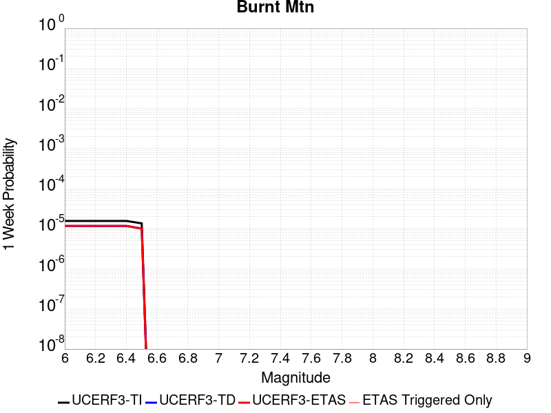 |  |  |  |

| Magnitude | 1 wk TI Prob | 1 wk TD Prob | 1 wk ETAS Prob | 1 wk ETAS/TD Gain | 1 wk ETAS Triggered Only | 1 mo TI Prob | 1 mo TD Prob | 1 mo ETAS Prob | 1 mo ETAS/TD Gain | 1 mo ETAS Triggered Only | 1 yr TI Prob | 1 yr TD Prob | 1 yr ETAS Prob | 1 yr ETAS/TD Gain | 1 yr ETAS Triggered Only | 10 yr TI Prob | 10 yr TD Prob | 10 yr ETAS Prob | 10 yr ETAS/TD Gain | 10 yr ETAS Triggered Only |
|-----|-----|-----|-----|-----|-----|-----|-----|-----|-----|-----|-----|-----|-----|-----|-----|-----|-----|-----|-----|-----|
| 6.0 | 1.5673151E-5 | 1.1749247E-5 | 1.1749247E-5 | 1.0 | 0.0 | 6.716892E-5 | 5.0353672E-5 | 5.0353672E-5 | 1.0 | 0.0 | 8.1747473E-4 | 6.130124E-4 | 6.130124E-4 | 1.0 | 0.0 | 0.008144741 | 0.006125855 | 0.0061420477 | 1.0026433 | 1.6292748E-5 |
| 6.1 | 1.5673151E-5 | 1.1749247E-5 | 1.1749247E-5 | 1.0 | 0.0 | 6.716892E-5 | 5.0353672E-5 | 5.0353672E-5 | 1.0 | 0.0 | 8.1747473E-4 | 6.130124E-4 | 6.130124E-4 | 1.0 | 0.0 | 0.008144741 | 0.006125855 | 0.0061420477 | 1.0026433 | 1.6292748E-5 |
| 6.2 | 1.5673151E-5 | 1.1749247E-5 | 1.1749247E-5 | 1.0 | 0.0 | 6.716892E-5 | 5.0353672E-5 | 5.0353672E-5 | 1.0 | 0.0 | 8.1747473E-4 | 6.130124E-4 | 6.130124E-4 | 1.0 | 0.0 | 0.008144741 | 0.006125855 | 0.0061420477 | 1.0026433 | 1.6292748E-5 |
| 6.3 | 1.5673151E-5 | 1.1749247E-5 | 1.1749247E-5 | 1.0 | 0.0 | 6.716892E-5 | 5.0353672E-5 | 5.0353672E-5 | 1.0 | 0.0 | 8.1747473E-4 | 6.130124E-4 | 6.130124E-4 | 1.0 | 0.0 | 0.008144741 | 0.006125855 | 0.0061420477 | 1.0026433 | 1.6292748E-5 |
| 6.4 | 1.5673151E-5 | 1.1749247E-5 | 1.1749247E-5 | 1.0 | 0.0 | 6.716892E-5 | 5.0353672E-5 | 5.0353672E-5 | 1.0 | 0.0 | 8.1747473E-4 | 6.130124E-4 | 6.130124E-4 | 1.0 | 0.0 | 0.008144741 | 0.006125855 | 0.0061420477 | 1.0026433 | 1.6292748E-5 |
| 6.5 | 1.36191375E-5 | 1.007816E-5 | 1.007816E-5 | 1.0 | 0.0 | 5.8366426E-5 | 4.319211E-5 | 4.319211E-5 | 1.0 | 0.0 | 7.103795E-4 | 5.2586396E-4 | 5.2586396E-4 | 1.0 | 0.0 | 0.0070811296 | 0.00525864 | 0.0052748467 | 1.003082 | 1.6292748E-5 |

## Channel Islands Western Deep Ramp
*[(top)](#table-of-contents)*

| 1 Week | 1 Month | 1 Year | 10 Year |
|-----|-----|-----|-----|
|  |  |  |  |

| Magnitude | 1 wk TI Prob | 1 wk TD Prob | 1 wk ETAS Prob | 1 wk ETAS/TD Gain | 1 wk ETAS Triggered Only | 1 mo TI Prob | 1 mo TD Prob | 1 mo ETAS Prob | 1 mo ETAS/TD Gain | 1 mo ETAS Triggered Only | 1 yr TI Prob | 1 yr TD Prob | 1 yr ETAS Prob | 1 yr ETAS/TD Gain | 1 yr ETAS Triggered Only | 10 yr TI Prob | 10 yr TD Prob | 10 yr ETAS Prob | 10 yr ETAS/TD Gain | 10 yr ETAS Triggered Only |
|-----|-----|-----|-----|-----|-----|-----|-----|-----|-----|-----|-----|-----|-----|-----|-----|-----|-----|-----|-----|-----|
| 6.0 | 6.0213506E-6 | 6.2548684E-6 | 6.2548684E-6 | 1.0 | 0.0 | 2.5805533E-5 | 2.6806329E-5 | 2.6806329E-5 | 1.0 | 0.0 | 3.1413708E-4 | 3.2632265E-4 | 3.4261006E-4 | 1.0499121 | 1.6292748E-5 | 0.0031369338 | 0.0032588763 | 0.003275116 | 1.0049832 | 1.6292748E-5 |
| 6.1 | 6.0213506E-6 | 6.2548684E-6 | 6.2548684E-6 | 1.0 | 0.0 | 2.5805533E-5 | 2.6806329E-5 | 2.6806329E-5 | 1.0 | 0.0 | 3.1413708E-4 | 3.2632265E-4 | 3.4261006E-4 | 1.0499121 | 1.6292748E-5 | 0.0031369338 | 0.0032588763 | 0.003275116 | 1.0049832 | 1.6292748E-5 |
| 6.2 | 6.0213506E-6 | 6.2548684E-6 | 6.2548684E-6 | 1.0 | 0.0 | 2.5805533E-5 | 2.6806329E-5 | 2.6806329E-5 | 1.0 | 0.0 | 3.1413708E-4 | 3.2632265E-4 | 3.4261006E-4 | 1.0499121 | 1.6292748E-5 | 0.0031369338 | 0.0032588763 | 0.003275116 | 1.0049832 | 1.6292748E-5 |
| 6.3 | 6.0213506E-6 | 6.2548684E-6 | 6.2548684E-6 | 1.0 | 0.0 | 2.5805533E-5 | 2.6806329E-5 | 2.6806329E-5 | 1.0 | 0.0 | 3.1413708E-4 | 3.2632265E-4 | 3.4261006E-4 | 1.0499121 | 1.6292748E-5 | 0.0031369338 | 0.0032588763 | 0.003275116 | 1.0049832 | 1.6292748E-5 |
| 6.4 | 6.0213506E-6 | 6.2548684E-6 | 6.2548684E-6 | 1.0 | 0.0 | 2.5805533E-5 | 2.6806329E-5 | 2.6806329E-5 | 1.0 | 0.0 | 3.1413708E-4 | 3.2632265E-4 | 3.4261006E-4 | 1.0499121 | 1.6292748E-5 | 0.0031369338 | 0.0032588763 | 0.003275116 | 1.0049832 | 1.6292748E-5 |
| 6.5 | 6.0213506E-6 | 6.2548684E-6 | 6.2548684E-6 | 1.0 | 0.0 | 2.5805533E-5 | 2.6806329E-5 | 2.6806329E-5 | 1.0 | 0.0 | 3.1413708E-4 | 3.2632265E-4 | 3.4261006E-4 | 1.0499121 | 1.6292748E-5 | 0.0031369338 | 0.0032588763 | 0.003275116 | 1.0049832 | 1.6292748E-5 |
| 6.6 | 6.0213506E-6 | 6.2548684E-6 | 6.2548684E-6 | 1.0 | 0.0 | 2.5805533E-5 | 2.6806329E-5 | 2.6806329E-5 | 1.0 | 0.0 | 3.1413708E-4 | 3.2632265E-4 | 3.4261006E-4 | 1.0499121 | 1.6292748E-5 | 0.0031369338 | 0.0032588763 | 0.003275116 | 1.0049832 | 1.6292748E-5 |
| 6.7 | 5.313309E-6 | 5.5252403E-6 | 5.5252403E-6 | 1.0 | 0.0 | 2.2771126E-5 | 2.367941E-5 | 2.367941E-5 | 1.0 | 0.0 | 2.772032E-4 | 2.8826276E-4 | 3.0455083E-4 | 1.0565041 | 1.6292748E-5 | 0.0027685766 | 0.0028792918 | 0.0028955375 | 1.0056423 | 1.6292748E-5 |
| 6.8 | 5.313309E-6 | 5.5252403E-6 | 5.5252403E-6 | 1.0 | 0.0 | 2.2771126E-5 | 2.367941E-5 | 2.367941E-5 | 1.0 | 0.0 | 2.772032E-4 | 2.8826276E-4 | 3.0455083E-4 | 1.0565041 | 1.6292748E-5 | 0.0027685766 | 0.0028792918 | 0.0028955375 | 1.0056423 | 1.6292748E-5 |
| 6.9 | 4.744377E-6 | 4.9394303E-6 | 4.9394303E-6 | 1.0 | 0.0 | 2.0332885E-5 | 2.1168837E-5 | 2.1168837E-5 | 1.0 | 0.0 | 2.4752476E-4 | 2.5770385E-4 | 2.739924E-4 | 1.0632064 | 1.6292748E-5 | 0.0024724922 | 0.0025744175 | 0.0025906682 | 1.0063124 | 1.6292748E-5 |
| 7.0 | 4.722209E-6 | 4.9164732E-6 | 4.9164732E-6 | 1.0 | 0.0 | 2.0237881E-5 | 2.107045E-5 | 2.107045E-5 | 1.0 | 0.0 | 2.4636835E-4 | 2.5650626E-4 | 2.7279483E-4 | 1.0635016 | 1.6292748E-5 | 0.002460954 | 0.0025624693 | 0.0025787202 | 1.0063419 | 1.6292748E-5 |
| 7.1 | 4.611174E-6 | 4.801409E-6 | 4.801409E-6 | 1.0 | 0.0 | 1.9762025E-5 | 2.0577325E-5 | 2.0577325E-5 | 1.0 | 0.0 | 2.4057609E-4 | 2.5050386E-4 | 2.6679254E-4 | 1.0650237 | 1.6292748E-5 | 0.002403158 | 0.002502582 | 0.0025188338 | 1.006494 | 1.6292748E-5 |
| 7.2 | 4.043994E-6 | 4.2120264E-6 | 4.2120264E-6 | 1.0 | 0.0 | 1.7331287E-5 | 1.8051438E-5 | 1.8051438E-5 | 1.0 | 0.0 | 2.10988E-4 | 2.1975765E-4 | 2.3604682E-4 | 1.0741233 | 1.6292748E-5 | 0.002107878 | 0.0021957543 | 0.0022120113 | 1.0074039 | 1.6292748E-5 |
| 7.3 | 2.1233036E-6 | 2.2297875E-6 | 2.2297875E-6 | 1.0 | 0.0 | 9.099841E-6 | 9.556197E-6 | 9.556197E-6 | 1.0 | 0.0 | 1.1078493E-4 | 1.1634055E-4 | 1.1634055E-4 | 1.0 | 0.0 | 0.0011072971 | 0.001162802 | 0.001162802 | 1.0 | 0.0 |
| 7.4 | 1.9051884E-6 | 2.0014973E-6 | 2.0014973E-6 | 1.0 | 0.0 | 8.165067E-6 | 8.577817E-6 | 8.577817E-6 | 1.0 | 0.0 | 9.940516E-5 | 1.0442998E-4 | 1.0442998E-4 | 1.0 | 0.0 | 9.93607E-4 | 0.0010438144 | 0.0010438144 | 1.0 | 0.0 |
| 7.5 | 1.2408497E-6 | 1.3038839E-6 | 1.3038839E-6 | 1.0 | 0.0 | 5.317916E-6 | 5.588062E-6 | 5.588062E-6 | 1.0 | 0.0 | 6.4743705E-5 | 6.8032554E-5 | 6.8032554E-5 | 1.0 | 0.0 | 6.4724847E-4 | 6.8011944E-4 | 6.8011944E-4 | 1.0 | 0.0 |
| 7.6 | 6.5440025E-7 | 6.886718E-7 | 6.886718E-7 | 1.0 | 0.0 | 2.8045695E-6 | 2.9514472E-6 | 2.9514472E-6 | 1.0 | 0.0 | 3.4145098E-5 | 3.593329E-5 | 3.593329E-5 | 1.0 | 0.0 | 3.4139853E-4 | 3.5927625E-4 | 3.5927625E-4 | 1.0 | 0.0 |
| 7.7 | 3.985963E-7 | 4.1930787E-7 | 4.1930787E-7 | 1.0 | 0.0 | 1.7082689E-6 | 1.7970326E-6 | 1.7970326E-6 | 1.0 | 0.0 | 2.0797976E-5 | 2.1878664E-5 | 2.1878664E-5 | 1.0 | 0.0 | 2.0796029E-4 | 2.1876628E-4 | 2.1876628E-4 | 1.0 | 0.0 |
| 7.8 | 3.706329E-8 | 3.8591796E-8 | 3.8591796E-8 | 1.0 | 0.0 | 1.5884267E-7 | 1.653934E-7 | 1.653934E-7 | 1.0 | 0.0 | 1.9339077E-6 | 2.0136629E-6 | 2.0136629E-6 | 1.0 | 0.0 | 1.933891E-5 | 2.0136458E-5 | 2.0136458E-5 | 1.0 | 0.0 |

## San Luis Range - Pecho 2011 CFM
*[(top)](#table-of-contents)*

| 1 Week | 1 Month | 1 Year | 10 Year |
|-----|-----|-----|-----|
|  |  |  | 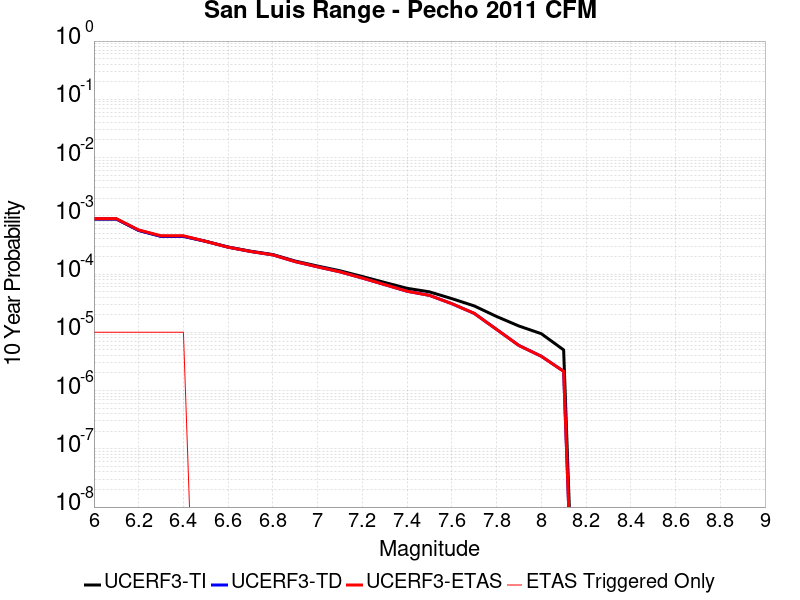 |

| Magnitude | 1 wk TI Prob | 1 wk TD Prob | 1 wk ETAS Prob | 1 wk ETAS/TD Gain | 1 wk ETAS Triggered Only | 1 mo TI Prob | 1 mo TD Prob | 1 mo ETAS Prob | 1 mo ETAS/TD Gain | 1 mo ETAS Triggered Only | 1 yr TI Prob | 1 yr TD Prob | 1 yr ETAS Prob | 1 yr ETAS/TD Gain | 1 yr ETAS Triggered Only | 10 yr TI Prob | 10 yr TD Prob | 10 yr ETAS Prob | 10 yr ETAS/TD Gain | 10 yr ETAS Triggered Only |
|-----|-----|-----|-----|-----|-----|-----|-----|-----|-----|-----|-----|-----|-----|-----|-----|-----|-----|-----|-----|-----|
| 6.0 | 1.687423E-6 | 1.6921944E-6 | 1.6921944E-6 | 1.0 | 0.0 | 7.231793E-6 | 7.252243E-6 | 7.252243E-6 | 1.0 | 0.0 | 8.804352E-5 | 8.829272E-5 | 8.829272E-5 | 1.0 | 0.0 | 8.8008645E-4 | 8.826003E-4 | 8.9887873E-4 | 1.0184437 | 1.6292748E-5 |
| 6.1 | 1.687423E-6 | 1.6921944E-6 | 1.6921944E-6 | 1.0 | 0.0 | 7.231793E-6 | 7.252243E-6 | 7.252243E-6 | 1.0 | 0.0 | 8.804352E-5 | 8.829272E-5 | 8.829272E-5 | 1.0 | 0.0 | 8.8008645E-4 | 8.826003E-4 | 8.9887873E-4 | 1.0184437 | 1.6292748E-5 |
| 6.2 | 1.0765672E-6 | 1.0770541E-6 | 1.0770541E-6 | 1.0 | 0.0 | 4.613851E-6 | 4.615938E-6 | 4.615938E-6 | 1.0 | 0.0 | 5.617219E-5 | 5.6197663E-5 | 5.6197663E-5 | 1.0 | 0.0 | 5.6157995E-4 | 5.618408E-4 | 5.7812437E-4 | 1.0289825 | 1.6292748E-5 |
| 6.3 | 8.523104E-7 | 8.5130216E-7 | 8.5130216E-7 | 1.0 | 0.0 | 3.6527538E-6 | 3.648433E-6 | 3.648433E-6 | 1.0 | 0.0 | 4.447137E-5 | 4.4418797E-5 | 4.4418797E-5 | 1.0 | 0.0 | 4.4462472E-4 | 4.441024E-4 | 4.603879E-4 | 1.0366707 | 1.6292748E-5 |
| 6.4 | 8.523104E-7 | 8.5130216E-7 | 8.5130216E-7 | 1.0 | 0.0 | 3.6527538E-6 | 3.648433E-6 | 3.648433E-6 | 1.0 | 0.0 | 4.447137E-5 | 4.4418797E-5 | 4.4418797E-5 | 1.0 | 0.0 | 4.4462472E-4 | 4.441024E-4 | 4.603879E-4 | 1.0366707 | 1.6292748E-5 |
| 6.5 | 7.0029404E-7 | 6.976438E-7 | 6.976438E-7 | 1.0 | 0.0 | 3.0012568E-6 | 2.9898988E-6 | 2.9898988E-6 | 1.0 | 0.0 | 3.6539688E-5 | 3.6401427E-5 | 3.6401427E-5 | 1.0 | 0.0 | 3.653368E-4 | 3.6395632E-4 | 3.6395632E-4 | 1.0 | 0.0 |
| 6.6 | 5.583906E-7 | 5.5428296E-7 | 5.5428296E-7 | 1.0 | 0.0 | 2.3931002E-6 | 2.3754963E-6 | 2.3754963E-6 | 1.0 | 0.0 | 2.9135606E-5 | 2.892129E-5 | 2.892129E-5 | 1.0 | 0.0 | 2.9131788E-4 | 2.89176E-4 | 2.89176E-4 | 1.0 | 0.0 |
| 6.7 | 4.73441E-7 | 4.6830658E-7 | 4.6830658E-7 | 1.0 | 0.0 | 2.0290313E-6 | 2.0070268E-6 | 2.0070268E-6 | 1.0 | 0.0 | 2.4703175E-5 | 2.4435281E-5 | 2.4435281E-5 | 1.0 | 0.0 | 2.470043E-4 | 2.443264E-4 | 2.443264E-4 | 1.0 | 0.0 |
| 6.8 | 4.1466086E-7 | 4.087795E-7 | 4.087795E-7 | 1.0 | 0.0 | 1.7771167E-6 | 1.751911E-6 | 1.751911E-6 | 1.0 | 0.0 | 2.1636182E-5 | 2.132931E-5 | 2.132931E-5 | 1.0 | 0.0 | 2.1634075E-4 | 2.1327297E-4 | 2.1327297E-4 | 1.0 | 0.0 |
| 6.9 | 3.2056641E-7 | 3.13293E-7 | 3.13293E-7 | 1.0 | 0.0 | 1.3738553E-6 | 1.3426836E-6 | 1.3426836E-6 | 1.0 | 0.0 | 1.6726559E-5 | 1.6347052E-5 | 1.6347052E-5 | 1.0 | 0.0 | 1.67253E-4 | 1.6345865E-4 | 1.6345865E-4 | 1.0 | 0.0 |
| 7.0 | 2.6315942E-7 | 2.5489675E-7 | 2.5489675E-7 | 1.0 | 0.0 | 1.1278256E-6 | 1.0924141E-6 | 1.0924141E-6 | 1.0 | 0.0 | 1.3731191E-5 | 1.3300061E-5 | 1.3300061E-5 | 1.0 | 0.0 | 1.3730342E-4 | 1.3299273E-4 | 1.3299273E-4 | 1.0 | 0.0 |
| 7.1 | 2.1832436E-7 | 2.0917312E-7 | 2.0917312E-7 | 1.0 | 0.0 | 9.356755E-7 | 8.9645596E-7 | 8.9645596E-7 | 1.0 | 0.0 | 1.13917895E-5 | 1.0914297E-5 | 1.0914297E-5 | 1.0 | 0.0 | 1.1391206E-4 | 1.0913766E-4 | 1.0913766E-4 | 1.0 | 0.0 |
| 7.2 | 1.7393015E-7 | 1.6376592E-7 | 1.6376592E-7 | 1.0 | 0.0 | 7.454147E-7 | 7.018537E-7 | 7.018537E-7 | 1.0 | 0.0 | 9.075386E-6 | 8.545036E-6 | 8.545036E-6 | 1.0 | 0.0 | 9.075015E-5 | 8.54471E-5 | 8.54471E-5 | 1.0 | 0.0 |
| 7.3 | 1.3744894E-7 | 1.263862E-7 | 1.263862E-7 | 1.0 | 0.0 | 5.890667E-7 | 5.4165497E-7 | 5.4165497E-7 | 1.0 | 0.0 | 7.1718637E-6 | 6.5946297E-6 | 6.5946297E-6 | 1.0 | 0.0 | 7.171632E-5 | 6.5944354E-5 | 6.5944354E-5 | 1.0 | 0.0 |
| 7.4 | 1.0915278E-7 | 9.727534E-8 | 9.727534E-8 | 1.0 | 0.0 | 4.6779755E-7 | 4.1689424E-7 | 4.1689424E-7 | 1.0 | 0.0 | 5.6954204E-6 | 5.0756753E-6 | 5.0756753E-6 | 1.0 | 0.0 | 5.6952744E-5 | 5.0755603E-5 | 5.0755603E-5 | 1.0 | 0.0 |
| 7.5 | 9.490291E-8 | 8.257131E-8 | 8.257131E-8 | 1.0 | 0.0 | 4.0672668E-7 | 3.53877E-7 | 3.53877E-7 | 1.0 | 0.0 | 4.9518862E-6 | 4.308444E-6 | 4.308444E-6 | 1.0 | 0.0 | 4.951776E-5 | 4.308361E-5 | 4.308361E-5 | 1.0 | 0.0 |
| 7.6 | 7.256678E-8 | 5.942529E-8 | 5.942529E-8 | 1.0 | 0.0 | 3.1100043E-7 | 2.546798E-7 | 2.546798E-7 | 1.0 | 0.0 | 3.7864236E-6 | 3.100722E-6 | 3.100722E-6 | 1.0 | 0.0 | 3.7863592E-5 | 3.100679E-5 | 3.100679E-5 | 1.0 | 0.0 |
| 7.7 | 5.446273E-8 | 4.057937E-8 | 4.057937E-8 | 1.0 | 0.0 | 2.3341168E-7 | 1.7391157E-7 | 1.7391157E-7 | 1.0 | 0.0 | 2.8417835E-6 | 2.1173712E-6 | 2.1173712E-6 | 1.0 | 0.0 | 2.8417471E-5 | 2.1173511E-5 | 2.1173511E-5 | 1.0 | 0.0 |
| 7.8 | 3.5850867E-8 | 2.1520364E-8 | 2.1520364E-8 | 1.0 | 0.0 | 1.5364655E-7 | 9.2230124E-8 | 9.2230124E-8 | 1.0 | 0.0 | 1.8706452E-6 | 1.1229012E-6 | 1.1229012E-6 | 1.0 | 0.0 | 1.8706294E-5 | 1.1228955E-5 | 1.1228955E-5 | 1.0 | 0.0 |
| 7.9 | 2.45879E-8 | 1.1394102E-8 | 1.1394102E-8 | 1.0 | 0.0 | 1.0537671E-7 | 4.883186E-8 | 4.883186E-8 | 1.0 | 0.0 | 1.2829606E-6 | 5.9452776E-7 | 5.9452776E-7 | 1.0 | 0.0 | 1.2829532E-5 | 5.945262E-6 | 5.945262E-6 | 1.0 | 0.0 |
| 8.0 | 1.8151761E-8 | 7.4404523E-9 | 7.4404523E-9 | 1.0 | 0.0 | 7.779326E-8 | 3.188765E-8 | 3.188765E-8 | 1.0 | 0.0 | 9.4713255E-7 | 3.8823208E-7 | 3.8823208E-7 | 1.0 | 0.0 | 9.471285E-6 | 3.882314E-6 | 3.882314E-6 | 1.0 | 0.0 |
| 8.1 | 9.559205E-9 | 4.100115E-9 | 4.100115E-9 | 1.0 | 0.0 | 4.096802E-8 | 1.7571923E-8 | 1.7571923E-8 | 1.0 | 0.0 | 4.9878554E-7 | 2.1393814E-7 | 2.1393814E-7 | 1.0 | 0.0 | 4.987844E-6 | 2.1393794E-6 | 2.1393794E-6 | 1.0 | 0.0 |

## Cedar Mtn-Mahogany Mtn
*[(top)](#table-of-contents)*

| 1 Week | 1 Month | 1 Year | 10 Year |
|-----|-----|-----|-----|
|  |  |  |  |

| Magnitude | 1 wk TI Prob | 1 wk TD Prob | 1 wk ETAS Prob | 1 wk ETAS/TD Gain | 1 wk ETAS Triggered Only | 1 mo TI Prob | 1 mo TD Prob | 1 mo ETAS Prob | 1 mo ETAS/TD Gain | 1 mo ETAS Triggered Only | 1 yr TI Prob | 1 yr TD Prob | 1 yr ETAS Prob | 1 yr ETAS/TD Gain | 1 yr ETAS Triggered Only | 10 yr TI Prob | 10 yr TD Prob | 10 yr ETAS Prob | 10 yr ETAS/TD Gain | 10 yr ETAS Triggered Only |
|-----|-----|-----|-----|-----|-----|-----|-----|-----|-----|-----|-----|-----|-----|-----|-----|-----|-----|-----|-----|-----|
| 6.0 | 2.7763876E-5 | 2.9588866E-5 | 2.9588866E-5 | 1.0 | 0.0 | 1.1898261E-4 | 1.2680366E-4 | 1.2680366E-4 | 1.0 | 0.0 | 0.0014476506 | 0.0015428112 | 0.0015590788 | 1.0105442 | 1.6292748E-5 | 0.0143825635 | 0.015328225 | 0.015344268 | 1.0010467 | 1.6292748E-5 |
| 6.1 | 1.6162443E-5 | 1.7142966E-5 | 1.7142966E-5 | 1.0 | 0.0 | 6.926578E-5 | 7.346788E-5 | 7.346788E-5 | 1.0 | 0.0 | 8.4298453E-4 | 8.941221E-4 | 9.104003E-4 | 1.0182058 | 1.6292748E-5 | 0.008397939 | 0.008907059 | 0.0089232065 | 1.0018129 | 1.6292748E-5 |
| 6.2 | 1.6162443E-5 | 1.7142966E-5 | 1.7142966E-5 | 1.0 | 0.0 | 6.926578E-5 | 7.346788E-5 | 7.346788E-5 | 1.0 | 0.0 | 8.4298453E-4 | 8.941221E-4 | 9.104003E-4 | 1.0182058 | 1.6292748E-5 | 0.008397939 | 0.008907059 | 0.0089232065 | 1.0018129 | 1.6292748E-5 |
| 6.3 | 9.746053E-6 | 1.0303152E-5 | 1.0303152E-5 | 1.0 | 0.0 | 4.1768133E-5 | 4.415564E-5 | 4.415564E-5 | 1.0 | 0.0 | 5.0840835E-4 | 5.3746643E-4 | 5.537504E-4 | 1.0302976 | 1.6292748E-5 | 0.0050724675 | 0.005362084 | 0.0053782896 | 1.0030222 | 1.6292748E-5 |
| 6.4 | 9.746053E-6 | 1.0303152E-5 | 1.0303152E-5 | 1.0 | 0.0 | 4.1768133E-5 | 4.415564E-5 | 4.415564E-5 | 1.0 | 0.0 | 5.0840835E-4 | 5.3746643E-4 | 5.537504E-4 | 1.0302976 | 1.6292748E-5 | 0.0050724675 | 0.005362084 | 0.0053782896 | 1.0030222 | 1.6292748E-5 |
| 6.5 | 7.290083E-6 | 7.695325E-6 | 7.695325E-6 | 1.0 | 0.0 | 3.124284E-5 | 3.297956E-5 | 3.297956E-5 | 1.0 | 0.0 | 3.8031515E-4 | 4.014543E-4 | 4.1774052E-4 | 1.040568 | 1.6292748E-5 | 0.0037966494 | 0.004007511 | 0.0040237387 | 1.0040493 | 1.6292748E-5 |
| 6.6 | 5.67907E-6 | 5.9891527E-6 | 5.9891527E-6 | 1.0 | 0.0 | 2.4338644E-5 | 2.5667552E-5 | 2.5667552E-5 | 1.0 | 0.0 | 2.962827E-4 | 3.12459E-4 | 3.12459E-4 | 1.0 | 0.0 | 0.0029588798 | 0.003120333 | 0.003120333 | 1.0 | 0.0 |
| 6.7 | 3.4853963E-6 | 3.672631E-6 | 3.672631E-6 | 1.0 | 0.0 | 1.4937327E-5 | 1.5739755E-5 | 1.5739755E-5 | 1.0 | 0.0 | 1.8184677E-4 | 1.916153E-4 | 1.916153E-4 | 1.0 | 0.0 | 0.0018169804 | 0.0019145629 | 0.0019145629 | 1.0 | 0.0 |
| 6.8 | 2.7535168E-6 | 2.9015764E-6 | 2.9015764E-6 | 1.0 | 0.0 | 1.1800733E-5 | 1.2435271E-5 | 1.2435271E-5 | 1.0 | 0.0 | 1.4366445E-4 | 1.5138938E-4 | 1.5138938E-4 | 1.0 | 0.0 | 0.0014357162 | 0.0015129098 | 0.0015129098 | 1.0 | 0.0 |
| 6.9 | 1.6594106E-6 | 1.7496985E-6 | 1.7496985E-6 | 1.0 | 0.0 | 7.1117406E-6 | 7.4986883E-6 | 7.4986883E-6 | 1.0 | 0.0 | 8.6582E-5 | 9.129302E-5 | 9.129302E-5 | 1.0 | 0.0 | 8.654827E-4 | 9.125856E-4 | 9.125856E-4 | 1.0 | 0.0 |
| 7.0 | 5.10215E-7 | 5.389254E-7 | 5.389254E-7 | 1.0 | 0.0 | 2.186634E-6 | 2.3096788E-6 | 2.3096788E-6 | 1.0 | 0.0 | 2.6621943E-5 | 2.8120105E-5 | 2.8120105E-5 | 1.0 | 0.0 | 2.6618753E-4 | 2.81178E-4 | 2.81178E-4 | 1.0 | 0.0 |

## Northridge
*[(top)](#table-of-contents)*

| 1 Week | 1 Month | 1 Year | 10 Year |
|-----|-----|-----|-----|
|  |  |  |  |

| Magnitude | 1 wk TI Prob | 1 wk TD Prob | 1 wk ETAS Prob | 1 wk ETAS/TD Gain | 1 wk ETAS Triggered Only | 1 mo TI Prob | 1 mo TD Prob | 1 mo ETAS Prob | 1 mo ETAS/TD Gain | 1 mo ETAS Triggered Only | 1 yr TI Prob | 1 yr TD Prob | 1 yr ETAS Prob | 1 yr ETAS/TD Gain | 1 yr ETAS Triggered Only | 10 yr TI Prob | 10 yr TD Prob | 10 yr ETAS Prob | 10 yr ETAS/TD Gain | 10 yr ETAS Triggered Only |
|-----|-----|-----|-----|-----|-----|-----|-----|-----|-----|-----|-----|-----|-----|-----|-----|-----|-----|-----|-----|-----|
| 6.0 | 1.8340852E-5 | 7.5878907E-6 | 7.5878907E-6 | 1.0 | 0.0 | 7.860128E-5 | 3.251914E-5 | 3.251914E-5 | 1.0 | 0.0 | 9.565505E-4 | 3.9585077E-4 | 3.9585077E-4 | 1.0 | 0.0 | 0.009524435 | 0.0039516874 | 0.0039679157 | 1.0041066 | 1.6292748E-5 |
| 6.1 | 1.8340852E-5 | 7.5878907E-6 | 7.5878907E-6 | 1.0 | 0.0 | 7.860128E-5 | 3.251914E-5 | 3.251914E-5 | 1.0 | 0.0 | 9.565505E-4 | 3.9585077E-4 | 3.9585077E-4 | 1.0 | 0.0 | 0.009524435 | 0.0039516874 | 0.0039679157 | 1.0041066 | 1.6292748E-5 |
| 6.2 | 1.8340852E-5 | 7.5878907E-6 | 7.5878907E-6 | 1.0 | 0.0 | 7.860128E-5 | 3.251914E-5 | 3.251914E-5 | 1.0 | 0.0 | 9.565505E-4 | 3.9585077E-4 | 3.9585077E-4 | 1.0 | 0.0 | 0.009524435 | 0.0039516874 | 0.0039679157 | 1.0041066 | 1.6292748E-5 |
| 6.3 | 1.8340852E-5 | 7.5878907E-6 | 7.5878907E-6 | 1.0 | 0.0 | 7.860128E-5 | 3.251914E-5 | 3.251914E-5 | 1.0 | 0.0 | 9.565505E-4 | 3.9585077E-4 | 3.9585077E-4 | 1.0 | 0.0 | 0.009524435 | 0.0039516874 | 0.0039679157 | 1.0041066 | 1.6292748E-5 |
| 6.4 | 1.7361892E-5 | 7.5878907E-6 | 7.5878907E-6 | 1.0 | 0.0 | 7.440598E-5 | 3.251914E-5 | 3.251914E-5 | 1.0 | 0.0 | 9.055163E-4 | 3.9585077E-4 | 3.9585077E-4 | 1.0 | 0.0 | 0.009018354 | 0.0039516874 | 0.0039679157 | 1.0041066 | 1.6292748E-5 |
| 6.5 | 1.7361892E-5 | 7.5878907E-6 | 7.5878907E-6 | 1.0 | 0.0 | 7.440598E-5 | 3.251914E-5 | 3.251914E-5 | 1.0 | 0.0 | 9.055163E-4 | 3.9585077E-4 | 3.9585077E-4 | 1.0 | 0.0 | 0.009018354 | 0.0039516874 | 0.0039679157 | 1.0041066 | 1.6292748E-5 |
| 6.6 | 1.5458201E-5 | 7.5878907E-6 | 7.5878907E-6 | 1.0 | 0.0 | 6.624775E-5 | 3.251914E-5 | 3.251914E-5 | 1.0 | 0.0 | 8.0626784E-4 | 3.9585077E-4 | 3.9585077E-4 | 1.0 | 0.0 | 0.008033488 | 0.0039516874 | 0.0039679157 | 1.0041066 | 1.6292748E-5 |
| 6.7 | 1.2538368E-5 | 6.381497E-6 | 6.381497E-6 | 1.0 | 0.0 | 5.3734755E-5 | 2.7348988E-5 | 2.7348988E-5 | 1.0 | 0.0 | 6.5402425E-4 | 3.329235E-4 | 3.329235E-4 | 1.0 | 0.0 | 0.0065210275 | 0.0033243035 | 0.0033405423 | 1.0048848 | 1.6292748E-5 |
| 6.8 | 1.1438097E-5 | 6.350156E-6 | 6.350156E-6 | 1.0 | 0.0 | 4.9019498E-5 | 2.7214674E-5 | 2.7214674E-5 | 1.0 | 0.0 | 5.9664896E-4 | 3.3128873E-4 | 3.3128873E-4 | 1.0 | 0.0 | 0.005950495 | 0.0033080047 | 0.0033242435 | 1.0049089 | 1.6292748E-5 |
| 6.9 | 1.1204891E-5 | 6.2866116E-6 | 6.2866116E-6 | 1.0 | 0.0 | 4.8020076E-5 | 2.6942345E-5 | 2.6942345E-5 | 1.0 | 0.0 | 5.8448757E-4 | 3.2797412E-4 | 3.2797412E-4 | 1.0 | 0.0 | 0.0058295266 | 0.0032749567 | 0.0032911962 | 1.0049586 | 1.6292748E-5 |
| 7.0 | 1.061046E-5 | 6.1152687E-6 | 6.1152687E-6 | 1.0 | 0.0 | 4.5472607E-5 | 2.6208034E-5 | 2.6208034E-5 | 1.0 | 0.0 | 5.534883E-4 | 3.190365E-4 | 3.190365E-4 | 1.0 | 0.0 | 0.0055211177 | 0.0031858315 | 0.003202072 | 1.0050979 | 1.6292748E-5 |
| 7.1 | 1.0266979E-5 | 6.0041907E-6 | 6.0041907E-6 | 1.0 | 0.0 | 4.40006E-5 | 2.5731995E-5 | 2.5731995E-5 | 1.0 | 0.0 | 5.355756E-4 | 3.1324243E-4 | 3.1324243E-4 | 1.0 | 0.0 | 0.0053428668 | 0.0031280548 | 0.0031442966 | 1.0051923 | 1.6292748E-5 |
| 7.2 | 9.91273E-6 | 5.819906E-6 | 5.819906E-6 | 1.0 | 0.0 | 4.248244E-5 | 2.4942217E-5 | 2.4942217E-5 | 1.0 | 0.0 | 5.171009E-4 | 3.036296E-4 | 3.036296E-4 | 1.0 | 0.0 | 0.0051589934 | 0.0030321924 | 0.0030484358 | 1.0053569 | 1.6292748E-5 |
| 7.3 | 8.4959265E-6 | 5.1930183E-6 | 5.1930183E-6 | 1.0 | 0.0 | 3.6410605E-5 | 2.2255605E-5 | 2.2255605E-5 | 1.0 | 0.0 | 4.4320893E-4 | 2.7092852E-4 | 2.7092852E-4 | 1.0 | 0.0 | 0.00442326 | 0.0027060085 | 0.002722257 | 1.0060047 | 1.6292748E-5 |
| 7.4 | 8.0847185E-6 | 4.9818977E-6 | 4.9818977E-6 | 1.0 | 0.0 | 3.4648332E-5 | 2.1350817E-5 | 2.1350817E-5 | 1.0 | 0.0 | 4.2176177E-4 | 2.5991542E-4 | 2.5991542E-4 | 1.0 | 0.0 | 0.0042096223 | 0.0025961401 | 0.0026123906 | 1.0062594 | 1.6292748E-5 |
| 7.5 | 6.8220684E-6 | 4.2532647E-6 | 4.2532647E-6 | 1.0 | 0.0 | 2.9237108E-5 | 1.8228153E-5 | 1.8228153E-5 | 1.0 | 0.0 | 3.5590364E-4 | 2.2190536E-4 | 2.2190536E-4 | 1.0 | 0.0 | 0.0035533418 | 0.0022168586 | 0.0022331153 | 1.0073332 | 1.6292748E-5 |
| 7.6 | 4.4224143E-6 | 2.8999295E-6 | 2.8999295E-6 | 1.0 | 0.0 | 1.8953066E-5 | 1.24282105E-5 | 1.24282105E-5 | 1.0 | 0.0 | 2.3072914E-4 | 1.5130307E-4 | 1.5130307E-4 | 1.0 | 0.0 | 0.0023048974 | 0.0015120122 | 0.0015282803 | 1.0107592 | 1.6292748E-5 |
| 7.7 | 2.5297056E-6 | 1.6045943E-6 | 1.6045943E-6 | 1.0 | 0.0 | 1.0841551E-5 | 6.876815E-6 | 6.876815E-6 | 1.0 | 0.0 | 1.319879E-4 | 8.372205E-5 | 8.372205E-5 | 1.0 | 0.0 | 0.0013190953 | 8.369098E-4 | 8.531889E-4 | 1.0194515 | 1.6292748E-5 |
| 7.8 | 1.2508156E-6 | 8.780148E-7 | 8.780148E-7 | 1.0 | 0.0 | 5.3606273E-6 | 3.7629154E-6 | 3.7629154E-6 | 1.0 | 0.0 | 6.526368E-5 | 4.5812543E-5 | 4.5812543E-5 | 1.0 | 0.0 | 6.524452E-4 | 4.580323E-4 | 4.7431758E-4 | 1.0355549 | 1.6292748E-5 |
| 7.9 | 2.262199E-7 | 1.466491E-7 | 1.466491E-7 | 1.0 | 0.0 | 9.695135E-7 | 6.2849597E-7 | 6.2849597E-7 | 1.0 | 0.0 | 1.1803763E-5 | 7.651913E-6 | 7.651913E-6 | 1.0 | 0.0 | 1.1803136E-4 | 7.651657E-5 | 7.651657E-5 | 1.0 | 0.0 |
| 8.0 | 2.865362E-9 | 1.27525E-9 | 1.27525E-9 | 1.0 | 0.0 | 1.2280123E-8 | 5.465357E-9 | 5.465357E-9 | 1.0 | 0.0 | 1.4951048E-7 | 6.654073E-8 | 6.654073E-8 | 1.0 | 0.0 | 1.4951038E-6 | 6.6540724E-7 | 6.6540724E-7 | 1.0 | 0.0 |

## Fontana (Seismicity)
*[(top)](#table-of-contents)*

| 1 Week | 1 Month | 1 Year | 10 Year |
|-----|-----|-----|-----|
|  |  |  |  |

| Magnitude | 1 wk TI Prob | 1 wk TD Prob | 1 wk ETAS Prob | 1 wk ETAS/TD Gain | 1 wk ETAS Triggered Only | 1 mo TI Prob | 1 mo TD Prob | 1 mo ETAS Prob | 1 mo ETAS/TD Gain | 1 mo ETAS Triggered Only | 1 yr TI Prob | 1 yr TD Prob | 1 yr ETAS Prob | 1 yr ETAS/TD Gain | 1 yr ETAS Triggered Only | 10 yr TI Prob | 10 yr TD Prob | 10 yr ETAS Prob | 10 yr ETAS/TD Gain | 10 yr ETAS Triggered Only |
|-----|-----|-----|-----|-----|-----|-----|-----|-----|-----|-----|-----|-----|-----|-----|-----|-----|-----|-----|-----|-----|
| 6.0 | 7.1789214E-6 | 7.5520006E-6 | 2.3844626E-5 | 3.1573918 | 1.6292748E-5 | 3.076644E-5 | 3.2365548E-5 | 4.8657766E-5 | 1.5033816 | 1.6292748E-5 | 3.7451705E-4 | 3.9402005E-4 | 4.1030638E-4 | 1.0413338 | 1.6292748E-5 | 0.003738865 | 0.003937214 | 0.003953443 | 1.0041219 | 1.6292748E-5 |
| 6.1 | 7.1789214E-6 | 7.5520006E-6 | 2.3844626E-5 | 3.1573918 | 1.6292748E-5 | 3.076644E-5 | 3.2365548E-5 | 4.8657766E-5 | 1.5033816 | 1.6292748E-5 | 3.7451705E-4 | 3.9402005E-4 | 4.1030638E-4 | 1.0413338 | 1.6292748E-5 | 0.003738865 | 0.003937214 | 0.003953443 | 1.0041219 | 1.6292748E-5 |
| 6.2 | 7.1789214E-6 | 7.5520006E-6 | 2.3844626E-5 | 3.1573918 | 1.6292748E-5 | 3.076644E-5 | 3.2365548E-5 | 4.8657766E-5 | 1.5033816 | 1.6292748E-5 | 3.7451705E-4 | 3.9402005E-4 | 4.1030638E-4 | 1.0413338 | 1.6292748E-5 | 0.003738865 | 0.003937214 | 0.003953443 | 1.0041219 | 1.6292748E-5 |
| 6.3 | 7.1789214E-6 | 7.5520006E-6 | 2.3844626E-5 | 3.1573918 | 1.6292748E-5 | 3.076644E-5 | 3.2365548E-5 | 4.8657766E-5 | 1.5033816 | 1.6292748E-5 | 3.7451705E-4 | 3.9402005E-4 | 4.1030638E-4 | 1.0413338 | 1.6292748E-5 | 0.003738865 | 0.003937214 | 0.003953443 | 1.0041219 | 1.6292748E-5 |
| 6.4 | 7.1789214E-6 | 7.5520006E-6 | 2.3844626E-5 | 3.1573918 | 1.6292748E-5 | 3.076644E-5 | 3.2365548E-5 | 4.8657766E-5 | 1.5033816 | 1.6292748E-5 | 3.7451705E-4 | 3.9402005E-4 | 4.1030638E-4 | 1.0413338 | 1.6292748E-5 | 0.003738865 | 0.003937214 | 0.003953443 | 1.0041219 | 1.6292748E-5 |
| 6.5 | 5.2611317E-6 | 5.532726E-6 | 5.532726E-6 | 1.0 | 0.0 | 2.2547512E-5 | 2.3711682E-5 | 2.3711682E-5 | 1.0 | 0.0 | 2.744814E-4 | 2.8868974E-4 | 2.8868974E-4 | 1.0 | 0.0 | 0.002741426 | 0.0028868972 | 0.0028868972 | 1.0 | 0.0 |
| 6.6 | 5.2611317E-6 | 5.532726E-6 | 5.532726E-6 | 1.0 | 0.0 | 2.2547512E-5 | 2.3711682E-5 | 2.3711682E-5 | 1.0 | 0.0 | 2.744814E-4 | 2.8868974E-4 | 2.8868974E-4 | 1.0 | 0.0 | 0.002741426 | 0.0028868972 | 0.0028868972 | 1.0 | 0.0 |

## Fitzhugh Creek
*[(top)](#table-of-contents)*

| 1 Week | 1 Month | 1 Year | 10 Year |
|-----|-----|-----|-----|
|  | 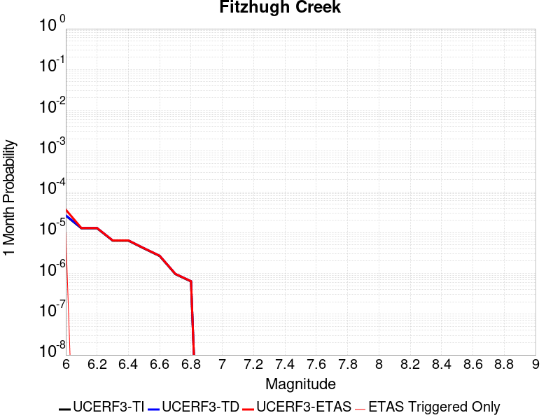 |  |  |

| Magnitude | 1 wk TI Prob | 1 wk TD Prob | 1 wk ETAS Prob | 1 wk ETAS/TD Gain | 1 wk ETAS Triggered Only | 1 mo TI Prob | 1 mo TD Prob | 1 mo ETAS Prob | 1 mo ETAS/TD Gain | 1 mo ETAS Triggered Only | 1 yr TI Prob | 1 yr TD Prob | 1 yr ETAS Prob | 1 yr ETAS/TD Gain | 1 yr ETAS Triggered Only | 10 yr TI Prob | 10 yr TD Prob | 10 yr ETAS Prob | 10 yr ETAS/TD Gain | 10 yr ETAS Triggered Only |
|-----|-----|-----|-----|-----|-----|-----|-----|-----|-----|-----|-----|-----|-----|-----|-----|-----|-----|-----|-----|-----|
| 6.0 | 6.1090436E-6 | 6.2101562E-6 | 2.2502803E-5 | 3.6235487 | 1.6292748E-5 | 2.6181353E-5 | 2.6614709E-5 | 4.2907024E-5 | 1.6121545 | 1.6292748E-5 | 3.1871133E-4 | 3.239904E-4 | 3.4027785E-4 | 1.0502715 | 1.6292748E-5 | 0.0031825465 | 0.0032356246 | 0.0032518646 | 1.0050192 | 1.6292748E-5 |
| 6.1 | 2.9741811E-6 | 3.021581E-6 | 3.021581E-6 | 1.0 | 0.0 | 1.2746428E-5 | 1.2949574E-5 | 1.2949574E-5 | 1.0 | 0.0 | 1.5517672E-4 | 1.576506E-4 | 1.576506E-4 | 1.0 | 0.0 | 0.001550684 | 0.0015754806 | 0.0015754806 | 1.0 | 0.0 |
| 6.2 | 2.9741811E-6 | 3.021581E-6 | 3.021581E-6 | 1.0 | 0.0 | 1.2746428E-5 | 1.2949574E-5 | 1.2949574E-5 | 1.0 | 0.0 | 1.5517672E-4 | 1.576506E-4 | 1.576506E-4 | 1.0 | 0.0 | 0.001550684 | 0.0015754806 | 0.0015754806 | 1.0 | 0.0 |
| 6.3 | 1.4781198E-6 | 1.5012708E-6 | 1.5012708E-6 | 1.0 | 0.0 | 6.3347834E-6 | 6.4340034E-6 | 6.4340034E-6 | 1.0 | 0.0 | 7.712326E-5 | 7.833137E-5 | 7.833137E-5 | 1.0 | 0.0 | 7.70965E-4 | 7.830576E-4 | 7.830576E-4 | 1.0 | 0.0 |
| 6.4 | 1.4781198E-6 | 1.5012708E-6 | 1.5012708E-6 | 1.0 | 0.0 | 6.3347834E-6 | 6.4340034E-6 | 6.4340034E-6 | 1.0 | 0.0 | 7.712326E-5 | 7.833137E-5 | 7.833137E-5 | 1.0 | 0.0 | 7.70965E-4 | 7.830576E-4 | 7.830576E-4 | 1.0 | 0.0 |
| 6.5 | 9.5176676E-7 | 9.66606E-7 | 9.66606E-7 | 1.0 | 0.0 | 4.078994E-6 | 4.142591E-6 | 4.142591E-6 | 1.0 | 0.0 | 4.9660623E-5 | 5.0434985E-5 | 5.0434985E-5 | 1.0 | 0.0 | 4.964952E-4 | 5.042458E-4 | 5.042458E-4 | 1.0 | 0.0 |
| 6.6 | 6.21145E-7 | 6.3085855E-7 | 6.3085855E-7 | 1.0 | 0.0 | 2.662047E-6 | 2.7036772E-6 | 2.7036772E-6 | 1.0 | 0.0 | 3.2409942E-5 | 3.291684E-5 | 3.291684E-5 | 1.0 | 0.0 | 3.2405215E-4 | 3.2912623E-4 | 3.2912623E-4 | 1.0 | 0.0 |
| 6.7 | 2.2377962E-7 | 2.2734636E-7 | 2.2734636E-7 | 1.0 | 0.0 | 9.590551E-7 | 9.743413E-7 | 9.743413E-7 | 1.0 | 0.0 | 1.1676434E-5 | 1.1862574E-5 | 1.1862574E-5 | 1.0 | 0.0 | 1.1675821E-4 | 1.1862254E-4 | 1.1862254E-4 | 1.0 | 0.0 |
| 6.8 | 1.4785022E-7 | 1.5021492E-7 | 1.5021492E-7 | 1.0 | 0.0 | 6.3364365E-7 | 6.4377826E-7 | 6.4377826E-7 | 1.0 | 0.0 | 7.714584E-6 | 7.838E-6 | 7.838E-6 | 1.0 | 0.0 | 7.714316E-5 | 7.838E-5 | 7.838E-5 | 1.0 | 0.0 |

## Great Valley 11
*[(top)](#table-of-contents)*

| 1 Week | 1 Month | 1 Year | 10 Year |
|-----|-----|-----|-----|
|  |  |  |  |

| Magnitude | 1 wk TI Prob | 1 wk TD Prob | 1 wk ETAS Prob | 1 wk ETAS/TD Gain | 1 wk ETAS Triggered Only | 1 mo TI Prob | 1 mo TD Prob | 1 mo ETAS Prob | 1 mo ETAS/TD Gain | 1 mo ETAS Triggered Only | 1 yr TI Prob | 1 yr TD Prob | 1 yr ETAS Prob | 1 yr ETAS/TD Gain | 1 yr ETAS Triggered Only | 10 yr TI Prob | 10 yr TD Prob | 10 yr ETAS Prob | 10 yr ETAS/TD Gain | 10 yr ETAS Triggered Only |
|-----|-----|-----|-----|-----|-----|-----|-----|-----|-----|-----|-----|-----|-----|-----|-----|-----|-----|-----|-----|-----|
| 6.0 | 2.8099583E-5 | 2.983214E-5 | 2.983214E-5 | 1.0 | 0.0 | 1.20421224E-4 | 1.2784619E-4 | 1.2784619E-4 | 1.0 | 0.0 | 0.0014651422 | 0.0015554894 | 0.0015554894 | 1.0 | 0.0 | 0.0145552 | 0.015453546 | 0.015469587 | 1.001038 | 1.6292748E-5 |
| 6.1 | 2.483194E-5 | 2.5907144E-5 | 2.5907144E-5 | 1.0 | 0.0 | 1.0641825E-4 | 1.11026246E-4 | 1.11026246E-4 | 1.0 | 0.0 | 0.0012948721 | 0.0013509697 | 0.0013509697 | 1.0 | 0.0 | 0.012873529 | 0.013433979 | 0.013450053 | 1.0011965 | 1.6292748E-5 |
| 6.2 | 2.483194E-5 | 2.5907144E-5 | 2.5907144E-5 | 1.0 | 0.0 | 1.0641825E-4 | 1.11026246E-4 | 1.11026246E-4 | 1.0 | 0.0 | 0.0012948721 | 0.0013509697 | 0.0013509697 | 1.0 | 0.0 | 0.012873529 | 0.013433979 | 0.013450053 | 1.0011965 | 1.6292748E-5 |
| 6.3 | 2.0257901E-5 | 2.0398915E-5 | 2.0398915E-5 | 1.0 | 0.0 | 8.681669E-5 | 8.742122E-5 | 8.742122E-5 | 1.0 | 0.0 | 0.0010564806 | 0.0010638753 | 0.0010638753 | 1.0 | 0.0 | 0.01051472 | 0.010591993 | 0.010608113 | 1.001522 | 1.6292748E-5 |
| 6.4 | 1.8054898E-5 | 1.7780852E-5 | 1.7780852E-5 | 1.0 | 0.0 | 7.737584E-5 | 7.6201635E-5 | 7.6201635E-5 | 1.0 | 0.0 | 9.416436E-4 | 9.2739763E-4 | 9.2739763E-4 | 1.0 | 0.0 | 0.009376635 | 0.009239015 | 0.009255157 | 1.0017471 | 1.6292748E-5 |
| 6.5 | 1.34804895E-5 | 1.2321004E-5 | 1.2321004E-5 | 1.0 | 0.0 | 5.777225E-5 | 5.2803258E-5 | 5.2803258E-5 | 1.0 | 0.0 | 7.031501E-4 | 6.426942E-4 | 6.426942E-4 | 1.0 | 0.0 | 0.007009294 | 0.006408792 | 0.0064249802 | 1.0025259 | 1.6292748E-5 |
| 6.6 | 1.294883E-5 | 1.1732261E-5 | 1.1732261E-5 | 1.0 | 0.0 | 5.5493805E-5 | 5.028017E-5 | 5.028017E-5 | 1.0 | 0.0 | 6.754276E-4 | 6.1199325E-4 | 6.1199325E-4 | 1.0 | 0.0 | 0.006733784 | 0.0061035044 | 0.006119698 | 1.0026531 | 1.6292748E-5 |
| 6.7 | 1.1272237E-5 | 9.811834E-6 | 9.811834E-6 | 1.0 | 0.0 | 4.8308695E-5 | 4.205006E-5 | 4.205006E-5 | 1.0 | 0.0 | 5.879996E-4 | 5.1184196E-4 | 5.1184196E-4 | 1.0 | 0.0 | 0.005864462 | 0.005106915 | 0.005106915 | 1.0 | 0.0 |
| 6.8 | 9.8337505E-6 | 8.193719E-6 | 8.193719E-6 | 1.0 | 0.0 | 4.2143965E-5 | 3.5115478E-5 | 3.5115478E-5 | 1.0 | 0.0 | 5.1298196E-4 | 4.2744912E-4 | 4.2744912E-4 | 1.0 | 0.0 | 0.005117994 | 0.0042664795 | 0.0042664795 | 1.0 | 0.0 |
| 6.9 | 7.4224813E-6 | 5.4130837E-6 | 5.4130837E-6 | 1.0 | 0.0 | 3.1810247E-5 | 2.3198732E-5 | 2.3198732E-5 | 1.0 | 0.0 | 3.872209E-4 | 2.8240937E-4 | 2.8240937E-4 | 1.0 | 0.0 | 0.0038654688 | 0.0028206457 | 0.0028206457 | 1.0 | 0.0 |
| 7.0 | 4.4628923E-6 | 2.0110294E-6 | 2.0110294E-6 | 1.0 | 0.0 | 1.912654E-5 | 8.61867E-6 | 8.61867E-6 | 1.0 | 0.0 | 2.3284076E-4 | 1.0492737E-4 | 1.0492737E-4 | 1.0 | 0.0 | 0.0023259693 | 0.0010487898 | 0.0010487898 | 1.0 | 0.0 |
| 7.1 | 3.5546527E-6 | 1.1855383E-6 | 1.1855383E-6 | 1.0 | 0.0 | 1.5234136E-5 | 5.080869E-6 | 5.080869E-6 | 1.0 | 0.0 | 1.8545982E-4 | 6.185789E-5 | 6.185789E-5 | 1.0 | 0.0 | 0.0018530512 | 6.1841356E-4 | 6.1841356E-4 | 1.0 | 0.0 |
| 7.2 | 3.2039936E-6 | 1.1253728E-6 | 1.1253728E-6 | 1.0 | 0.0 | 1.3731329E-5 | 4.8230177E-6 | 4.8230177E-6 | 1.0 | 0.0 | 1.671661E-4 | 5.8718724E-5 | 5.8718724E-5 | 1.0 | 0.0 | 0.0016704041 | 5.870388E-4 | 5.870388E-4 | 1.0 | 0.0 |
| 7.3 | 2.8120473E-6 | 1.0305271E-6 | 1.0305271E-6 | 1.0 | 0.0 | 1.2051575E-5 | 4.4165376E-6 | 4.4165376E-6 | 1.0 | 0.0 | 1.4671806E-4 | 5.3770087E-5 | 5.3770087E-5 | 1.0 | 0.0 | 0.0014662122 | 5.375774E-4 | 5.375774E-4 | 1.0 | 0.0 |
| 7.4 | 2.4837766E-6 | 9.80032E-7 | 9.80032E-7 | 1.0 | 0.0 | 1.0644713E-5 | 4.2001307E-6 | 4.2001307E-6 | 1.0 | 0.0 | 1.2959167E-4 | 5.113546E-5 | 5.113546E-5 | 1.0 | 0.0 | 0.0012951613 | 5.1124353E-4 | 5.1124353E-4 | 1.0 | 0.0 |
| 7.5 | 1.5002679E-6 | 6.545985E-7 | 6.545985E-7 | 1.0 | 0.0 | 6.4297037E-6 | 2.8054194E-6 | 2.8054194E-6 | 1.0 | 0.0 | 7.827883E-5 | 3.4155488E-5 | 3.4155488E-5 | 1.0 | 0.0 | 7.825126E-4 | 3.4150656E-4 | 3.4150656E-4 | 1.0 | 0.0 |

## Calaveras (So) 2011 CFM
*[(top)](#table-of-contents)*

| 1 Week | 1 Month | 1 Year | 10 Year |
|-----|-----|-----|-----|
|  |  |  | 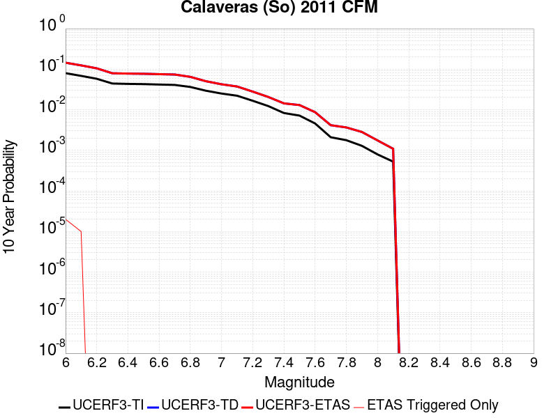 |

| Magnitude | 1 wk TI Prob | 1 wk TD Prob | 1 wk ETAS Prob | 1 wk ETAS/TD Gain | 1 wk ETAS Triggered Only | 1 mo TI Prob | 1 mo TD Prob | 1 mo ETAS Prob | 1 mo ETAS/TD Gain | 1 mo ETAS Triggered Only | 1 yr TI Prob | 1 yr TD Prob | 1 yr ETAS Prob | 1 yr ETAS/TD Gain | 1 yr ETAS Triggered Only | 10 yr TI Prob | 10 yr TD Prob | 10 yr ETAS Prob | 10 yr ETAS/TD Gain | 10 yr ETAS Triggered Only |
|-----|-----|-----|-----|-----|-----|-----|-----|-----|-----|-----|-----|-----|-----|-----|-----|-----|-----|-----|-----|-----|
| 6.0 | 1.5950744E-4 | 3.0713255E-4 | 3.0713255E-4 | 1.0 | 0.0 | 6.834242E-4 | 0.001315409 | 0.001315409 | 1.0 | 0.0 | 0.00828899 | 0.015858326 | 0.01587436 | 1.0010111 | 1.6292748E-5 | 0.079865426 | 0.14440185 | 0.14441578 | 1.0000966 | 1.6292748E-5 |
| 6.1 | 1.3584697E-4 | 2.603514E-4 | 2.603514E-4 | 1.0 | 0.0 | 5.8207137E-4 | 0.0011151754 | 0.0011151754 | 1.0 | 0.0 | 0.007063716 | 0.013461385 | 0.013477459 | 1.001194 | 1.6292748E-5 | 0.06843361 | 0.124029994 | 0.12404427 | 1.000115 | 1.6292748E-5 |
| 6.2 | 1.14676266E-4 | 2.1714384E-4 | 2.1714384E-4 | 1.0 | 0.0 | 4.9137714E-4 | 9.30223E-4 | 9.30223E-4 | 1.0 | 0.0 | 0.0059661185 | 0.011245058 | 0.011245058 | 1.0 | 0.0 | 0.058084648 | 0.10502057 | 0.10502057 | 1.0 | 0.0 |
| 6.3 | 8.691518E-5 | 1.5987935E-4 | 1.5987935E-4 | 1.0 | 0.0 | 3.7244044E-4 | 6.849807E-4 | 6.849807E-4 | 1.0 | 0.0 | 0.004525038 | 0.008301122 | 0.008301122 | 1.0 | 0.0 | 0.044339992 | 0.0793365 | 0.0793365 | 1.0 | 0.0 |
| 6.4 | 8.50982E-5 | 1.5694331E-4 | 1.5694331E-4 | 1.0 | 0.0 | 3.646556E-4 | 6.724042E-4 | 6.724042E-4 | 1.0 | 0.0 | 0.0044306475 | 0.008149155 | 0.008149155 | 1.0 | 0.0 | 0.04343345 | 0.07794268 | 0.07794268 | 1.0 | 0.0 |
| 6.5 | 8.4062965E-5 | 1.5518743E-4 | 1.5518743E-4 | 1.0 | 0.0 | 3.602201E-4 | 6.6488347E-4 | 6.6488347E-4 | 1.0 | 0.0 | 0.004376863 | 0.008058365 | 0.008058365 | 1.0 | 0.0 | 0.042916555 | 0.07711388 | 0.07711388 | 1.0 | 0.0 |
| 6.6 | 8.194716E-5 | 1.5154552E-4 | 1.5154552E-4 | 1.0 | 0.0 | 3.5115483E-4 | 6.492843E-4 | 6.492843E-4 | 1.0 | 0.0 | 0.0042669317 | 0.007870209 | 0.007870209 | 1.0 | 0.0 | 0.04185927 | 0.07539919 | 0.07539919 | 1.0 | 0.0 |
| 6.7 | 8.012326E-5 | 1.4822475E-4 | 1.4822475E-4 | 1.0 | 0.0 | 3.433402E-4 | 6.350612E-4 | 6.350612E-4 | 1.0 | 0.0 | 0.004172157 | 0.007698701 | 0.007698701 | 1.0 | 0.0 | 0.040946912 | 0.07384132 | 0.07384132 | 1.0 | 0.0 |
| 6.8 | 7.119773E-5 | 1.2881879E-4 | 1.2881879E-4 | 1.0 | 0.0 | 3.0509746E-4 | 5.519494E-4 | 5.519494E-4 | 1.0 | 0.0 | 0.0037082357 | 0.006696066 | 0.006696066 | 1.0 | 0.0 | 0.036469642 | 0.06468575 | 0.06468575 | 1.0 | 0.0 |
| 6.9 | 5.7343088E-5 | 9.919277E-5 | 9.919277E-5 | 1.0 | 0.0 | 2.4573295E-4 | 4.25043E-4 | 4.25043E-4 | 1.0 | 0.0 | 0.0029876942 | 0.005162694 | 0.005162694 | 1.0 | 0.0 | 0.02947844 | 0.05051036 | 0.05051036 | 1.0 | 0.0 |
| 7.0 | 4.8746577E-5 | 8.2850725E-5 | 8.2850725E-5 | 1.0 | 0.0 | 2.0889717E-4 | 3.5502657E-4 | 3.5502657E-4 | 1.0 | 0.0 | 0.0025403565 | 0.004313948 | 0.004313948 | 1.0 | 0.0 | 0.025115121 | 0.042485245 | 0.042485245 | 1.0 | 0.0 |
| 7.1 | 4.2998014E-5 | 7.265203E-5 | 7.265203E-5 | 1.0 | 0.0 | 1.8426418E-4 | 3.1132903E-4 | 3.1132903E-4 | 1.0 | 0.0 | 0.002241108 | 0.003783903 | 0.003783903 | 1.0 | 0.0 | 0.022186412 | 0.037423562 | 0.037423562 | 1.0 | 0.0 |
| 7.2 | 3.221292E-5 | 5.390791E-5 | 5.390791E-5 | 1.0 | 0.0 | 1.3804805E-4 | 2.3101359E-4 | 2.3101359E-4 | 1.0 | 0.0 | 0.0016794393 | 0.0028089907 | 0.0028089907 | 1.0 | 0.0 | 0.016668037 | 0.02803602 | 0.02803602 | 1.0 | 0.0 |
| 7.3 | 2.3756531E-5 | 3.9473416E-5 | 3.9473416E-5 | 1.0 | 0.0 | 1.0180973E-4 | 1.6916092E-4 | 1.6916092E-4 | 1.0 | 0.0 | 0.0012388286 | 0.0020576057 | 0.0020576057 | 1.0 | 0.0 | 0.012319452 | 0.020643145 | 0.020643145 | 1.0 | 0.0 |
| 7.4 | 1.5997684E-5 | 2.7342163E-5 | 2.7342163E-5 | 1.0 | 0.0 | 6.8559704E-5 | 1.1717545E-4 | 1.1717545E-4 | 1.0 | 0.0 | 8.343947E-4 | 0.00142568 | 0.00142568 | 1.0 | 0.0 | 0.008312687 | 0.014376011 | 0.014376011 | 1.0 | 0.0 |
| 7.5 | 1.3814293E-5 | 2.4783874E-5 | 2.4783874E-5 | 1.0 | 0.0 | 5.9202768E-5 | 1.062123E-4 | 1.062123E-4 | 1.0 | 0.0 | 7.205553E-4 | 0.00129237 | 0.00129237 | 1.0 | 0.0 | 0.007182234 | 0.013055085 | 0.013055085 | 1.0 | 0.0 |
| 7.6 | 8.817309E-6 | 1.6430757E-5 | 1.6430757E-5 | 1.0 | 0.0 | 3.7787922E-5 | 7.0415634E-5 | 7.0415634E-5 | 1.0 | 0.0 | 4.5997082E-4 | 8.569745E-4 | 8.569745E-4 | 1.0 | 0.0 | 0.004590199 | 0.008719284 | 0.008719284 | 1.0 | 0.0 |
| 7.7 | 4.0352206E-6 | 7.707318E-6 | 7.707318E-6 | 1.0 | 0.0 | 1.7293689E-5 | 3.3030945E-5 | 3.3030945E-5 | 1.0 | 0.0 | 2.1053031E-4 | 4.0207763E-4 | 4.0207763E-4 | 1.0 | 0.0 | 0.0021033096 | 0.004165172 | 0.004165172 | 1.0 | 0.0 |
| 7.8 | 3.413169E-6 | 6.787282E-6 | 6.787282E-6 | 1.0 | 0.0 | 1.4627784E-5 | 2.9088029E-5 | 2.9088029E-5 | 1.0 | 0.0 | 1.7807873E-4 | 3.5408925E-4 | 3.5408925E-4 | 1.0 | 0.0 | 0.0017793609 | 0.0036665166 | 0.0036665166 | 1.0 | 0.0 |
| 7.9 | 2.4740732E-6 | 5.2791843E-6 | 5.2791843E-6 | 1.0 | 0.0 | 1.06031275E-5 | 2.262488E-5 | 2.262488E-5 | 1.0 | 0.0 | 1.2908543E-4 | 2.7542314E-4 | 2.7542314E-4 | 1.0 | 0.0 | 0.0012901047 | 0.0028347955 | 0.0028347955 | 1.0 | 0.0 |
| 8.0 | 1.5231818E-6 | 3.2889548E-6 | 3.2889548E-6 | 1.0 | 0.0 | 6.527906E-6 | 1.40954435E-5 | 1.40954435E-5 | 1.0 | 0.0 | 7.9474354E-5 | 1.7159856E-4 | 1.7159856E-4 | 1.0 | 0.0 | 7.944594E-4 | 0.0017564303 | 0.0017564303 | 1.0 | 0.0 |
| 8.1 | 1.0104524E-6 | 2.045782E-6 | 2.045782E-6 | 1.0 | 0.0 | 4.330503E-6 | 8.767608E-6 | 8.767608E-6 | 1.0 | 0.0 | 5.2722597E-5 | 1.0674043E-4 | 1.0674043E-4 | 1.0 | 0.0 | 5.271009E-4 | 0.001092934 | 0.001092934 | 1.0 | 0.0 |

## Yorba Linda
*[(top)](#table-of-contents)*

| 1 Week | 1 Month | 1 Year | 10 Year |
|-----|-----|-----|-----|
|  |  |  |  |

| Magnitude | 1 wk TI Prob | 1 wk TD Prob | 1 wk ETAS Prob | 1 wk ETAS/TD Gain | 1 wk ETAS Triggered Only | 1 mo TI Prob | 1 mo TD Prob | 1 mo ETAS Prob | 1 mo ETAS/TD Gain | 1 mo ETAS Triggered Only | 1 yr TI Prob | 1 yr TD Prob | 1 yr ETAS Prob | 1 yr ETAS/TD Gain | 1 yr ETAS Triggered Only | 10 yr TI Prob | 10 yr TD Prob | 10 yr ETAS Prob | 10 yr ETAS/TD Gain | 10 yr ETAS Triggered Only |
|-----|-----|-----|-----|-----|-----|-----|-----|-----|-----|-----|-----|-----|-----|-----|-----|-----|-----|-----|-----|-----|
| 6.0 | 1.9346849E-6 | 1.6909112E-6 | 1.6909112E-6 | 1.0 | 0.0 | 8.29148E-6 | 7.2467474E-6 | 7.2467474E-6 | 1.0 | 0.0 | 1.009441E-4 | 8.822652E-5 | 8.822652E-5 | 1.0 | 0.0 | 0.0010089825 | 8.8200805E-4 | 8.9828647E-4 | 1.018456 | 1.6292748E-5 |
| 6.1 | 1.9346849E-6 | 1.6909112E-6 | 1.6909112E-6 | 1.0 | 0.0 | 8.29148E-6 | 7.2467474E-6 | 7.2467474E-6 | 1.0 | 0.0 | 1.009441E-4 | 8.822652E-5 | 8.822652E-5 | 1.0 | 0.0 | 0.0010089825 | 8.8200805E-4 | 8.9828647E-4 | 1.018456 | 1.6292748E-5 |
| 6.2 | 1.9346849E-6 | 1.6909112E-6 | 1.6909112E-6 | 1.0 | 0.0 | 8.29148E-6 | 7.2467474E-6 | 7.2467474E-6 | 1.0 | 0.0 | 1.009441E-4 | 8.822652E-5 | 8.822652E-5 | 1.0 | 0.0 | 0.0010089825 | 8.8200805E-4 | 8.9828647E-4 | 1.018456 | 1.6292748E-5 |
| 6.3 | 1.1028608E-6 | 8.481863E-7 | 8.481863E-7 | 1.0 | 0.0 | 4.7265376E-6 | 3.6350793E-6 | 3.6350793E-6 | 1.0 | 0.0 | 5.754407E-5 | 4.425626E-5 | 4.425626E-5 | 1.0 | 0.0 | 5.7529175E-4 | 4.42481E-4 | 4.5876653E-4 | 1.036805 | 1.6292748E-5 |
| 6.4 | 1.1028608E-6 | 8.481863E-7 | 8.481863E-7 | 1.0 | 0.0 | 4.7265376E-6 | 3.6350793E-6 | 3.6350793E-6 | 1.0 | 0.0 | 5.754407E-5 | 4.425626E-5 | 4.425626E-5 | 1.0 | 0.0 | 5.7529175E-4 | 4.42481E-4 | 4.5876653E-4 | 1.036805 | 1.6292748E-5 |
| 6.5 | 8.4451364E-7 | 5.869109E-7 | 5.869109E-7 | 1.0 | 0.0 | 3.619339E-6 | 2.5153304E-6 | 2.5153304E-6 | 1.0 | 0.0 | 4.406456E-5 | 3.0623738E-5 | 3.0623738E-5 | 1.0 | 0.0 | 4.4055824E-4 | 3.0619733E-4 | 3.2248508E-4 | 1.0531937 | 1.6292748E-5 |
| 6.6 | 8.422957E-7 | 5.844643E-7 | 5.844643E-7 | 1.0 | 0.0 | 3.6098338E-6 | 2.5048448E-6 | 2.5048448E-6 | 1.0 | 0.0 | 4.3948843E-5 | 3.049608E-5 | 3.049608E-5 | 1.0 | 0.0 | 4.394015E-4 | 3.049211E-4 | 3.2120885E-4 | 1.0534164 | 1.6292748E-5 |
| 6.7 | 8.4119705E-7 | 5.832485E-7 | 5.832485E-7 | 1.0 | 0.0 | 3.6051254E-6 | 2.499634E-6 | 2.499634E-6 | 1.0 | 0.0 | 4.3891516E-5 | 3.0432642E-5 | 3.0432642E-5 | 1.0 | 0.0 | 4.388285E-4 | 3.042869E-4 | 3.2057468E-4 | 1.0535277 | 1.6292748E-5 |
| 6.8 | 7.5919155E-7 | 4.9949944E-7 | 4.9949944E-7 | 1.0 | 0.0 | 3.253674E-6 | 2.1407102E-6 | 2.1407102E-6 | 1.0 | 0.0 | 3.961276E-5 | 2.6062853E-5 | 2.6062853E-5 | 1.0 | 0.0 | 3.9605703E-4 | 2.6059969E-4 | 2.7688817E-4 | 1.0625039 | 1.6292748E-5 |
| 6.9 | 7.5804564E-7 | 4.981178E-7 | 4.981178E-7 | 1.0 | 0.0 | 3.248763E-6 | 2.134789E-6 | 2.134789E-6 | 1.0 | 0.0 | 3.955297E-5 | 2.5990763E-5 | 2.5990763E-5 | 1.0 | 0.0 | 3.9545933E-4 | 2.5987893E-4 | 2.7616747E-4 | 1.0626773 | 1.6292748E-5 |
| 7.0 | 7.539293E-7 | 4.943313E-7 | 4.943313E-7 | 1.0 | 0.0 | 3.2311218E-6 | 2.118561E-6 | 2.118561E-6 | 1.0 | 0.0 | 3.9338196E-5 | 2.5793192E-5 | 2.5793192E-5 | 1.0 | 0.0 | 3.9331234E-4 | 2.579037E-4 | 2.7419225E-4 | 1.0631574 | 1.6292748E-5 |
| 7.1 | 6.0900885E-7 | 3.7817128E-7 | 3.7817128E-7 | 1.0 | 0.0 | 2.6100352E-6 | 1.6207331E-6 | 1.6207331E-6 | 1.0 | 0.0 | 3.1776715E-5 | 1.973225E-5 | 1.973225E-5 | 1.0 | 0.0 | 3.1772171E-4 | 1.9730533E-4 | 2.1359486E-4 | 1.0825601 | 1.6292748E-5 |
| 7.2 | 5.849925E-7 | 3.5878818E-7 | 3.5878818E-7 | 1.0 | 0.0 | 2.5071083E-6 | 1.5376628E-6 | 1.5376628E-6 | 1.0 | 0.0 | 3.0523614E-5 | 1.8720886E-5 | 1.8720886E-5 | 1.0 | 0.0 | 3.0519423E-4 | 1.8719342E-4 | 2.0348313E-4 | 1.0870206 | 1.6292748E-5 |
| 7.3 | 4.89808E-7 | 3.0379488E-7 | 3.0379488E-7 | 1.0 | 0.0 | 2.0991754E-6 | 1.3019775E-6 | 1.3019775E-6 | 1.0 | 0.0 | 2.5557161E-5 | 1.5851463E-5 | 1.5851463E-5 | 1.0 | 0.0 | 2.5554223E-4 | 1.5850355E-4 | 1.5850355E-4 | 1.0 | 0.0 |
| 7.4 | 3.8700415E-7 | 2.4722343E-7 | 2.4722343E-7 | 1.0 | 0.0 | 1.6585881E-6 | 1.0595286E-6 | 1.0595286E-6 | 1.0 | 0.0 | 2.0193123E-5 | 1.2899685E-5 | 1.2899685E-5 | 1.0 | 0.0 | 2.0191289E-4 | 1.2898949E-4 | 1.2898949E-4 | 1.0 | 0.0 |
| 7.5 | 2.900565E-7 | 1.8637462E-7 | 1.8637462E-7 | 1.0 | 0.0 | 1.2430987E-6 | 7.9874815E-7 | 7.9874815E-7 | 1.0 | 0.0 | 1.5134622E-5 | 9.724716E-6 | 9.724716E-6 | 1.0 | 0.0 | 1.5133592E-4 | 9.7242984E-5 | 9.7242984E-5 | 1.0 | 0.0 |
| 7.6 | 2.2770318E-7 | 1.4814276E-7 | 1.4814276E-7 | 1.0 | 0.0 | 9.758704E-7 | 6.348974E-7 | 6.348974E-7 | 1.0 | 0.0 | 1.1881158E-5 | 7.729848E-6 | 7.729848E-6 | 1.0 | 0.0 | 1.1880523E-4 | 7.729585E-5 | 7.729585E-5 | 1.0 | 0.0 |
| 7.7 | 1.5017194E-7 | 8.7355275E-8 | 8.7355275E-8 | 1.0 | 0.0 | 6.4359386E-7 | 3.7437968E-7 | 3.7437968E-7 | 1.0 | 0.0 | 7.835727E-6 | 4.5580637E-6 | 4.5580637E-6 | 1.0 | 0.0 | 7.835451E-5 | 4.5579727E-5 | 4.5579727E-5 | 1.0 | 0.0 |
| 7.8 | 3.895753E-8 | 1.8532088E-8 | 1.8532088E-8 | 1.0 | 0.0 | 1.6696083E-7 | 7.942323E-8 | 7.942323E-8 | 1.0 | 0.0 | 2.0327461E-6 | 9.669774E-7 | 9.669774E-7 | 1.0 | 0.0 | 2.0327276E-5 | 9.669734E-6 | 9.669734E-6 | 1.0 | 0.0 |
| 7.9 | 6.648505E-9 | 3.4183114E-9 | 3.4183114E-9 | 1.0 | 0.0 | 2.8493591E-8 | 1.4649906E-8 | 1.4649906E-8 | 1.0 | 0.0 | 3.4690942E-7 | 1.783626E-7 | 1.783626E-7 | 1.0 | 0.0 | 3.4690888E-6 | 1.7836247E-6 | 1.7836247E-6 | 1.0 | 0.0 |

## Richfield
*[(top)](#table-of-contents)*

| 1 Week | 1 Month | 1 Year | 10 Year |
|-----|-----|-----|-----|
|  |  |  |  |

| Magnitude | 1 wk TI Prob | 1 wk TD Prob | 1 wk ETAS Prob | 1 wk ETAS/TD Gain | 1 wk ETAS Triggered Only | 1 mo TI Prob | 1 mo TD Prob | 1 mo ETAS Prob | 1 mo ETAS/TD Gain | 1 mo ETAS Triggered Only | 1 yr TI Prob | 1 yr TD Prob | 1 yr ETAS Prob | 1 yr ETAS/TD Gain | 1 yr ETAS Triggered Only | 10 yr TI Prob | 10 yr TD Prob | 10 yr ETAS Prob | 10 yr ETAS/TD Gain | 10 yr ETAS Triggered Only |
|-----|-----|-----|-----|-----|-----|-----|-----|-----|-----|-----|-----|-----|-----|-----|-----|-----|-----|-----|-----|-----|
| 6.0 | 1.5166896E-6 | 1.5392679E-6 | 1.5392679E-6 | 1.0 | 0.0 | 6.5000822E-6 | 6.596852E-6 | 2.2889493E-5 | 3.46976 | 1.6292748E-5 | 7.913562E-5 | 8.0314814E-5 | 9.660625E-5 | 1.2028447 | 1.6292748E-5 | 7.910745E-4 | 8.0296566E-4 | 8.192453E-4 | 1.0202744 | 1.6292748E-5 |
| 6.1 | 1.5166896E-6 | 1.5392679E-6 | 1.5392679E-6 | 1.0 | 0.0 | 6.5000822E-6 | 6.596852E-6 | 2.2889493E-5 | 3.46976 | 1.6292748E-5 | 7.913562E-5 | 8.0314814E-5 | 9.660625E-5 | 1.2028447 | 1.6292748E-5 | 7.910745E-4 | 8.0296566E-4 | 8.192453E-4 | 1.0202744 | 1.6292748E-5 |
| 6.2 | 6.473272E-7 | 6.598479E-7 | 6.598479E-7 | 1.0 | 0.0 | 2.7742565E-6 | 2.8279171E-6 | 1.912062E-5 | 6.761379 | 1.6292748E-5 | 3.377605E-5 | 3.442948E-5 | 5.072167E-5 | 1.4732046 | 1.6292748E-5 | 3.3770915E-4 | 3.4425448E-4 | 3.6054163E-4 | 1.0473113 | 1.6292748E-5 |
| 6.3 | 6.473272E-7 | 6.598479E-7 | 6.598479E-7 | 1.0 | 0.0 | 2.7742565E-6 | 2.8279171E-6 | 1.912062E-5 | 6.761379 | 1.6292748E-5 | 3.377605E-5 | 3.442948E-5 | 5.072167E-5 | 1.4732046 | 1.6292748E-5 | 3.3770915E-4 | 3.4425448E-4 | 3.6054163E-4 | 1.0473113 | 1.6292748E-5 |
| 6.4 | 6.473272E-7 | 6.598479E-7 | 6.598479E-7 | 1.0 | 0.0 | 2.7742565E-6 | 2.8279171E-6 | 1.912062E-5 | 6.761379 | 1.6292748E-5 | 3.377605E-5 | 3.442948E-5 | 5.072167E-5 | 1.4732046 | 1.6292748E-5 | 3.3770915E-4 | 3.4425448E-4 | 3.6054163E-4 | 1.0473113 | 1.6292748E-5 |
| 6.5 | 2.7954403E-7 | 2.85316E-7 | 2.85316E-7 | 1.0 | 0.0 | 1.1980452E-6 | 1.2227825E-6 | 1.2227825E-6 | 1.0 | 0.0 | 1.4586103E-5 | 1.4887319E-5 | 1.4887319E-5 | 1.0 | 0.0 | 1.4585146E-4 | 1.4886746E-4 | 1.4886746E-4 | 1.0 | 0.0 |
| 6.6 | 2.7954403E-7 | 2.85316E-7 | 2.85316E-7 | 1.0 | 0.0 | 1.1980452E-6 | 1.2227825E-6 | 1.2227825E-6 | 1.0 | 0.0 | 1.4586103E-5 | 1.4887319E-5 | 1.4887319E-5 | 1.0 | 0.0 | 1.4585146E-4 | 1.4886746E-4 | 1.4886746E-4 | 1.0 | 0.0 |
| 6.7 | 1.0777299E-7 | 1.0878809E-7 | 1.0878809E-7 | 1.0 | 0.0 | 4.6188418E-7 | 4.662346E-7 | 4.662346E-7 | 1.0 | 0.0 | 5.6234253E-6 | 5.676396E-6 | 5.676396E-6 | 1.0 | 0.0 | 5.623283E-5 | 5.676294E-5 | 5.676294E-5 | 1.0 | 0.0 |
| 6.8 | 2.1301874E-8 | 2.0666132E-8 | 2.0666132E-8 | 1.0 | 0.0 | 9.129375E-8 | 8.856914E-8 | 8.856914E-8 | 1.0 | 0.0 | 1.1115008E-6 | 1.0783288E-6 | 1.0783288E-6 | 1.0 | 0.0 | 1.1114952E-5 | 1.0783239E-5 | 1.0783239E-5 | 1.0 | 0.0 |
| 6.9 | 1.8413502E-8 | 1.7751097E-8 | 1.7751097E-8 | 1.0 | 0.0 | 7.891501E-8 | 7.607613E-8 | 7.607613E-8 | 1.0 | 0.0 | 9.607899E-7 | 9.2622645E-7 | 9.2622645E-7 | 1.0 | 0.0 | 9.607857E-6 | 9.2622295E-6 | 9.2622295E-6 | 1.0 | 0.0 |
| 7.0 | 1.2290541E-8 | 1.1574315E-8 | 1.1574315E-8 | 1.0 | 0.0 | 5.2673748E-8 | 4.9604207E-8 | 4.9604207E-8 | 1.0 | 0.0 | 6.413027E-7 | 6.03931E-7 | 6.03931E-7 | 1.0 | 0.0 | 6.4130086E-6 | 6.0392954E-6 | 6.0392954E-6 | 1.0 | 0.0 |
| 7.1 | 6.373573E-9 | 6.155758E-9 | 6.155758E-9 | 1.0 | 0.0 | 2.7315311E-8 | 2.6381821E-8 | 2.6381821E-8 | 1.0 | 0.0 | 3.3256384E-7 | 3.2119863E-7 | 3.2119863E-7 | 1.0 | 0.0 | 3.3256335E-6 | 3.211982E-6 | 3.211982E-6 | 1.0 | 0.0 |
| 7.2 | 3.6989944E-9 | 3.7360146E-9 | 3.7360146E-9 | 1.0 | 0.0 | 1.5852834E-8 | 1.6011493E-8 | 1.6011493E-8 | 1.0 | 0.0 | 1.9300822E-7 | 1.9493989E-7 | 1.9493989E-7 | 1.0 | 0.0 | 1.9300805E-6 | 1.9493975E-6 | 1.9493975E-6 | 1.0 | 0.0 |
| 7.3 | 2.097397E-9 | 2.1200501E-9 | 2.1200501E-9 | 1.0 | 0.0 | 8.9888434E-9 | 9.085929E-9 | 9.085929E-9 | 1.0 | 0.0 | 1.0943917E-7 | 1.1062118E-7 | 1.1062118E-7 | 1.0 | 0.0 | 1.0943911E-6 | 1.1062115E-6 | 1.1062115E-6 | 1.0 | 0.0 |
| 7.4 | 5.8314464E-12 | 5.8918426E-12 | 5.8918426E-12 | 1.0 | 0.0 | 2.4991786E-11 | 2.5250912E-11 | 2.5250912E-11 | 1.0 | 0.0 | 3.0427527E-10 | 3.0742975E-10 | 3.0742975E-10 | 1.0 | 0.0 | 3.0427532E-9 | 3.0742973E-9 | 3.0742973E-9 | 1.0 | 0.0 |

## White Wolf
*[(top)](#table-of-contents)*

| 1 Week | 1 Month | 1 Year | 10 Year |
|-----|-----|-----|-----|
|  |  |  |  |

| Magnitude | 1 wk TI Prob | 1 wk TD Prob | 1 wk ETAS Prob | 1 wk ETAS/TD Gain | 1 wk ETAS Triggered Only | 1 mo TI Prob | 1 mo TD Prob | 1 mo ETAS Prob | 1 mo ETAS/TD Gain | 1 mo ETAS Triggered Only | 1 yr TI Prob | 1 yr TD Prob | 1 yr ETAS Prob | 1 yr ETAS/TD Gain | 1 yr ETAS Triggered Only | 10 yr TI Prob | 10 yr TD Prob | 10 yr ETAS Prob | 10 yr ETAS/TD Gain | 10 yr ETAS Triggered Only |
|-----|-----|-----|-----|-----|-----|-----|-----|-----|-----|-----|-----|-----|-----|-----|-----|-----|-----|-----|-----|-----|
| 6.0 | 2.0037822E-5 | 1.0468583E-6 | 1.733959E-5 | 16.563454 | 1.6292748E-5 | 8.587355E-5 | 4.4865283E-6 | 2.0779204E-5 | 4.631466 | 1.6292748E-5 | 0.001045009 | 5.4622164E-5 | 7.091402E-5 | 1.2982646 | 1.6292748E-5 | 0.010401085 | 5.4609246E-4 | 5.623763E-4 | 1.0298189 | 1.6292748E-5 |
| 6.1 | 2.0037822E-5 | 1.0468583E-6 | 1.733959E-5 | 16.563454 | 1.6292748E-5 | 8.587355E-5 | 4.4865283E-6 | 2.0779204E-5 | 4.631466 | 1.6292748E-5 | 0.001045009 | 5.4622164E-5 | 7.091402E-5 | 1.2982646 | 1.6292748E-5 | 0.010401085 | 5.4609246E-4 | 5.623763E-4 | 1.0298189 | 1.6292748E-5 |
| 6.2 | 2.0037822E-5 | 1.0468583E-6 | 1.733959E-5 | 16.563454 | 1.6292748E-5 | 8.587355E-5 | 4.4865283E-6 | 2.0779204E-5 | 4.631466 | 1.6292748E-5 | 0.001045009 | 5.4622164E-5 | 7.091402E-5 | 1.2982646 | 1.6292748E-5 | 0.010401085 | 5.4609246E-4 | 5.623763E-4 | 1.0298189 | 1.6292748E-5 |
| 6.3 | 2.0037822E-5 | 1.0468583E-6 | 1.733959E-5 | 16.563454 | 1.6292748E-5 | 8.587355E-5 | 4.4865283E-6 | 2.0779204E-5 | 4.631466 | 1.6292748E-5 | 0.001045009 | 5.4622164E-5 | 7.091402E-5 | 1.2982646 | 1.6292748E-5 | 0.010401085 | 5.4609246E-4 | 5.623763E-4 | 1.0298189 | 1.6292748E-5 |
| 6.4 | 1.132487E-5 | 1.0468583E-6 | 1.733959E-5 | 16.563454 | 1.6292748E-5 | 4.8534253E-5 | 4.4865283E-6 | 2.0779204E-5 | 4.631466 | 1.6292748E-5 | 5.907443E-4 | 5.4622164E-5 | 7.091402E-5 | 1.2982646 | 1.6292748E-5 | 0.005891764 | 5.4609246E-4 | 5.623763E-4 | 1.0298189 | 1.6292748E-5 |
| 6.5 | 1.132487E-5 | 1.0468583E-6 | 1.733959E-5 | 16.563454 | 1.6292748E-5 | 4.8534253E-5 | 4.4865283E-6 | 2.0779204E-5 | 4.631466 | 1.6292748E-5 | 5.907443E-4 | 5.4622164E-5 | 7.091402E-5 | 1.2982646 | 1.6292748E-5 | 0.005891764 | 5.4609246E-4 | 5.623763E-4 | 1.0298189 | 1.6292748E-5 |
| 6.6 | 9.347473E-6 | 1.0468583E-6 | 1.733959E-5 | 16.563454 | 1.6292748E-5 | 4.0059982E-5 | 4.4865283E-6 | 2.0779204E-5 | 4.631466 | 1.6292748E-5 | 4.8762115E-4 | 5.4622164E-5 | 7.091402E-5 | 1.2982646 | 1.6292748E-5 | 0.0048655253 | 5.4609246E-4 | 5.623763E-4 | 1.0298189 | 1.6292748E-5 |
| 6.7 | 7.842647E-6 | 1.0047773E-6 | 1.7297509E-5 | 17.215265 | 1.6292748E-5 | 3.361091E-5 | 4.306182E-6 | 2.059886E-5 | 4.7835555 | 1.6292748E-5 | 4.0913603E-4 | 5.2426552E-5 | 6.8718444E-5 | 1.3107566 | 1.6292748E-5 | 0.004083836 | 5.241468E-4 | 5.40431E-4 | 1.0310681 | 1.6292748E-5 |
| 6.8 | 6.26597E-6 | 9.734289E-7 | 1.726616E-5 | 17.737467 | 1.6292748E-5 | 2.685388E-5 | 4.1718313E-6 | 2.0464511E-5 | 4.905402 | 1.6292748E-5 | 3.2689696E-4 | 5.0790914E-5 | 6.708284E-5 | 1.3207644 | 1.6292748E-5 | 0.003264165 | 5.07798E-4 | 5.2408245E-4 | 1.0320688 | 1.6292748E-5 |
| 6.9 | 5.258436E-6 | 9.1827343E-7 | 1.7211007E-5 | 18.74279 | 1.6292748E-5 | 2.2535958E-5 | 3.935452E-6 | 2.0228135E-5 | 5.139978 | 1.6292748E-5 | 2.7434074E-4 | 4.7913123E-5 | 6.420509E-5 | 1.3400314 | 1.6292748E-5 | 0.0027400232 | 4.7903272E-4 | 4.953177E-4 | 1.0339955 | 1.6292748E-5 |
| 7.0 | 4.675028E-6 | 8.660704E-7 | 1.7158804E-5 | 19.81225 | 1.6292748E-5 | 2.003568E-5 | 3.7117254E-6 | 2.0004412E-5 | 5.3895187 | 1.6292748E-5 | 2.4390711E-4 | 4.518937E-5 | 6.1481376E-5 | 1.3605275 | 1.6292748E-5 | 0.0024363957 | 4.518065E-4 | 4.6809186E-4 | 1.0360451 | 1.6292748E-5 |
| 7.1 | 2.8270078E-6 | 6.8737717E-7 | 1.6980113E-5 | 24.702763 | 1.6292748E-5 | 1.2115692E-5 | 2.945899E-6 | 1.92386E-5 | 6.5306377 | 1.6292748E-5 | 1.4749856E-4 | 3.586577E-5 | 5.2157935E-5 | 1.4542538 | 1.6292748E-5 | 0.001474007 | 3.5860392E-4 | 3.7489083E-4 | 1.0454175 | 1.6292748E-5 |
| 7.2 | 1.6881406E-6 | 2.2703432E-7 | 2.2703432E-7 | 1.0 | 0.0 | 7.2348685E-6 | 9.730038E-7 | 9.730038E-7 | 1.0 | 0.0 | 8.808096E-5 | 1.1846259E-5 | 1.1846259E-5 | 1.0 | 0.0 | 8.8046055E-4 | 1.1845643E-4 | 1.1845643E-4 | 1.0 | 0.0 |
| 7.3 | 9.086107E-7 | 1.5264496E-7 | 1.5264496E-7 | 1.0 | 0.0 | 3.8940398E-6 | 6.5419255E-7 | 6.5419255E-7 | 1.0 | 0.0 | 4.7408903E-5 | 7.964766E-6 | 7.964766E-6 | 1.0 | 0.0 | 4.739879E-4 | 7.964489E-5 | 7.964489E-5 | 1.0 | 0.0 |
| 7.4 | 1.9717383E-7 | 9.003399E-8 | 9.003399E-8 | 1.0 | 0.0 | 8.450304E-7 | 3.8585992E-7 | 3.8585992E-7 | 1.0 | 0.0 | 1.0288197E-5 | 4.697835E-6 | 4.697835E-6 | 1.0 | 0.0 | 1.028772E-4 | 4.6977384E-5 | 4.6977384E-5 | 1.0 | 0.0 |
| 7.5 | 1.086975E-7 | 6.659662E-8 | 6.659662E-8 | 1.0 | 0.0 | 4.6584634E-7 | 2.8541407E-7 | 2.8541407E-7 | 1.0 | 0.0 | 5.6716644E-6 | 3.474911E-6 | 3.474911E-6 | 1.0 | 0.0 | 5.6715195E-5 | 3.474859E-5 | 3.474859E-5 | 1.0 | 0.0 |
| 7.6 | 2.4217808E-8 | 1.5820849E-8 | 1.5820849E-8 | 1.0 | 0.0 | 1.03790605E-7 | 6.780364E-8 | 6.780364E-8 | 1.0 | 0.0 | 1.2636499E-6 | 8.25509E-7 | 8.25509E-7 | 1.0 | 0.0 | 1.2636427E-5 | 8.255064E-6 | 8.255064E-6 | 1.0 | 0.0 |

## Peralta Hills
*[(top)](#table-of-contents)*

| 1 Week | 1 Month | 1 Year | 10 Year |
|-----|-----|-----|-----|
|  |  |  |  |

| Magnitude | 1 wk TI Prob | 1 wk TD Prob | 1 wk ETAS Prob | 1 wk ETAS/TD Gain | 1 wk ETAS Triggered Only | 1 mo TI Prob | 1 mo TD Prob | 1 mo ETAS Prob | 1 mo ETAS/TD Gain | 1 mo ETAS Triggered Only | 1 yr TI Prob | 1 yr TD Prob | 1 yr ETAS Prob | 1 yr ETAS/TD Gain | 1 yr ETAS Triggered Only | 10 yr TI Prob | 10 yr TD Prob | 10 yr ETAS Prob | 10 yr ETAS/TD Gain | 10 yr ETAS Triggered Only |
|-----|-----|-----|-----|-----|-----|-----|-----|-----|-----|-----|-----|-----|-----|-----|-----|-----|-----|-----|-----|-----|
| 6.0 | 3.8850067E-6 | 3.8395046E-6 | 3.8395046E-6 | 1.0 | 0.0 | 1.6649923E-5 | 1.6454958E-5 | 1.6454958E-5 | 1.0 | 0.0 | 2.0269395E-4 | 2.0032811E-4 | 2.0032811E-4 | 1.0 | 0.0 | 0.0020250916 | 0.002002203 | 0.002018463 | 1.0081211 | 1.6292748E-5 |
| 6.1 | 3.8850067E-6 | 3.8395046E-6 | 3.8395046E-6 | 1.0 | 0.0 | 1.6649923E-5 | 1.6454958E-5 | 1.6454958E-5 | 1.0 | 0.0 | 2.0269395E-4 | 2.0032811E-4 | 2.0032811E-4 | 1.0 | 0.0 | 0.0020250916 | 0.002002203 | 0.002018463 | 1.0081211 | 1.6292748E-5 |
| 6.2 | 3.8850067E-6 | 3.8395046E-6 | 3.8395046E-6 | 1.0 | 0.0 | 1.6649923E-5 | 1.6454958E-5 | 1.6454958E-5 | 1.0 | 0.0 | 2.0269395E-4 | 2.0032811E-4 | 2.0032811E-4 | 1.0 | 0.0 | 0.0020250916 | 0.002002203 | 0.002018463 | 1.0081211 | 1.6292748E-5 |
| 6.3 | 3.8850067E-6 | 3.8395046E-6 | 3.8395046E-6 | 1.0 | 0.0 | 1.6649923E-5 | 1.6454958E-5 | 1.6454958E-5 | 1.0 | 0.0 | 2.0269395E-4 | 2.0032811E-4 | 2.0032811E-4 | 1.0 | 0.0 | 0.0020250916 | 0.002002203 | 0.002018463 | 1.0081211 | 1.6292748E-5 |
| 6.4 | 3.8850067E-6 | 3.8395046E-6 | 3.8395046E-6 | 1.0 | 0.0 | 1.6649923E-5 | 1.6454958E-5 | 1.6454958E-5 | 1.0 | 0.0 | 2.0269395E-4 | 2.0032811E-4 | 2.0032811E-4 | 1.0 | 0.0 | 0.0020250916 | 0.002002203 | 0.002018463 | 1.0081211 | 1.6292748E-5 |
| 6.5 | 1.5587785E-6 | 1.4430725E-6 | 1.4430725E-6 | 1.0 | 0.0 | 6.6804623E-6 | 6.184583E-6 | 6.184583E-6 | 1.0 | 0.0 | 8.133159E-5 | 7.529494E-5 | 7.529494E-5 | 1.0 | 0.0 | 8.1301836E-4 | 7.527183E-4 | 7.527183E-4 | 1.0 | 0.0 |
| 6.6 | 1.5587785E-6 | 1.4430725E-6 | 1.4430725E-6 | 1.0 | 0.0 | 6.6804623E-6 | 6.184583E-6 | 6.184583E-6 | 1.0 | 0.0 | 8.133159E-5 | 7.529494E-5 | 7.529494E-5 | 1.0 | 0.0 | 8.1301836E-4 | 7.527183E-4 | 7.527183E-4 | 1.0 | 0.0 |
| 6.7 | 1.5018579E-6 | 1.3836951E-6 | 1.3836951E-6 | 1.0 | 0.0 | 6.436518E-6 | 5.9301096E-6 | 5.9301096E-6 | 1.0 | 0.0 | 7.836179E-5 | 7.219693E-5 | 7.219693E-5 | 1.0 | 0.0 | 7.833416E-4 | 7.2175835E-4 | 7.2175835E-4 | 1.0 | 0.0 |
| 6.8 | 1.4584314E-6 | 1.3381272E-6 | 1.3381272E-6 | 1.0 | 0.0 | 6.250405E-6 | 5.7348193E-6 | 5.7348193E-6 | 1.0 | 0.0 | 7.6096025E-5 | 6.981943E-5 | 6.981943E-5 | 1.0 | 0.0 | 7.6069974E-4 | 6.9799833E-4 | 6.9799833E-4 | 1.0 | 0.0 |
| 6.9 | 1.1382393E-6 | 9.862176E-7 | 9.862176E-7 | 1.0 | 0.0 | 4.8781594E-6 | 4.2266406E-6 | 4.2266406E-6 | 1.0 | 0.0 | 5.9389975E-5 | 5.145822E-5 | 5.145822E-5 | 1.0 | 0.0 | 5.93741E-4 | 5.1447126E-4 | 5.1447126E-4 | 1.0 | 0.0 |
| 7.0 | 9.970413E-7 | 8.3095136E-7 | 8.3095136E-7 | 1.0 | 0.0 | 4.273027E-6 | 3.5612156E-6 | 3.5612156E-6 | 1.0 | 0.0 | 5.2022864E-5 | 4.3357006E-5 | 4.3357006E-5 | 1.0 | 0.0 | 5.2010687E-4 | 4.3349227E-4 | 4.3349227E-4 | 1.0 | 0.0 |
| 7.1 | 9.684443E-7 | 7.993957E-7 | 7.993957E-7 | 1.0 | 0.0 | 4.150469E-6 | 3.4259774E-6 | 3.4259774E-6 | 1.0 | 0.0 | 5.053079E-5 | 4.1710548E-5 | 4.1710548E-5 | 1.0 | 0.0 | 5.05193E-4 | 4.170339E-4 | 4.170339E-4 | 1.0 | 0.0 |
| 7.2 | 9.240811E-7 | 7.503015E-7 | 7.503015E-7 | 1.0 | 0.0 | 3.960342E-6 | 3.2155742E-6 | 3.2155742E-6 | 1.0 | 0.0 | 4.8216094E-5 | 3.914898E-5 | 3.914898E-5 | 1.0 | 0.0 | 4.8205635E-4 | 3.9142737E-4 | 3.9142737E-4 | 1.0 | 0.0 |
| 7.3 | 8.158643E-7 | 6.34986E-7 | 6.34986E-7 | 1.0 | 0.0 | 3.4965567E-6 | 2.7213662E-6 | 2.7213662E-6 | 1.0 | 0.0 | 4.2569747E-5 | 3.3132193E-5 | 3.3132193E-5 | 1.0 | 0.0 | 4.2561593E-4 | 3.3127866E-4 | 3.3127866E-4 | 1.0 | 0.0 |
| 7.4 | 6.3822824E-7 | 4.79557E-7 | 4.79557E-7 | 1.0 | 0.0 | 2.7352612E-6 | 2.0552432E-6 | 2.0552432E-6 | 1.0 | 0.0 | 3.3301294E-5 | 2.502235E-5 | 2.502235E-5 | 1.0 | 0.0 | 3.3296304E-4 | 2.5020045E-4 | 2.5020045E-4 | 1.0 | 0.0 |
| 7.5 | 4.0292628E-7 | 2.7844956E-7 | 2.7844956E-7 | 1.0 | 0.0 | 1.7268258E-6 | 1.1933548E-6 | 1.1933548E-6 | 1.0 | 0.0 | 2.1023901E-5 | 1.4529027E-5 | 1.4529027E-5 | 1.0 | 0.0 | 2.1021912E-4 | 1.4528356E-4 | 1.4528356E-4 | 1.0 | 0.0 |
| 7.6 | 3.672993E-7 | 2.4854202E-7 | 2.4854202E-7 | 1.0 | 0.0 | 1.5741389E-6 | 1.0651798E-6 | 1.0651798E-6 | 1.0 | 0.0 | 1.9164972E-5 | 1.2968516E-5 | 1.2968516E-5 | 1.0 | 0.0 | 1.916332E-4 | 1.2968031E-4 | 1.2968031E-4 | 1.0 | 0.0 |
| 7.7 | 2.8466823E-7 | 1.7858805E-7 | 1.7858805E-7 | 1.0 | 0.0 | 1.2200061E-6 | 7.653773E-7 | 7.653773E-7 | 1.0 | 0.0 | 1.4853474E-5 | 9.318455E-6 | 9.318455E-6 | 1.0 | 0.0 | 1.485248E-4 | 9.318324E-5 | 9.318324E-5 | 1.0 | 0.0 |

## Greenville (No) 2011 CFM
*[(top)](#table-of-contents)*

| 1 Week | 1 Month | 1 Year | 10 Year |
|-----|-----|-----|-----|
|  |  |  |  |

| Magnitude | 1 wk TI Prob | 1 wk TD Prob | 1 wk ETAS Prob | 1 wk ETAS/TD Gain | 1 wk ETAS Triggered Only | 1 mo TI Prob | 1 mo TD Prob | 1 mo ETAS Prob | 1 mo ETAS/TD Gain | 1 mo ETAS Triggered Only | 1 yr TI Prob | 1 yr TD Prob | 1 yr ETAS Prob | 1 yr ETAS/TD Gain | 1 yr ETAS Triggered Only | 10 yr TI Prob | 10 yr TD Prob | 10 yr ETAS Prob | 10 yr ETAS/TD Gain | 10 yr ETAS Triggered Only |
|-----|-----|-----|-----|-----|-----|-----|-----|-----|-----|-----|-----|-----|-----|-----|-----|-----|-----|-----|-----|-----|
| 6.0 | 3.286654E-5 | 4.036671E-5 | 4.036671E-5 | 1.0 | 0.0 | 1.4084899E-4 | 1.7298892E-4 | 1.7298892E-4 | 1.0 | 0.0 | 0.0017134876 | 0.0021041434 | 0.0021041434 | 1.0 | 0.0 | 0.017003356 | 0.02084759 | 0.020863542 | 1.0007652 | 1.6292748E-5 |
| 6.1 | 3.286654E-5 | 4.036671E-5 | 4.036671E-5 | 1.0 | 0.0 | 1.4084899E-4 | 1.7298892E-4 | 1.7298892E-4 | 1.0 | 0.0 | 0.0017134876 | 0.0021041434 | 0.0021041434 | 1.0 | 0.0 | 0.017003356 | 0.02084759 | 0.02084759 | 1.0 | 0.0 |
| 6.2 | 3.1697953E-5 | 3.8929615E-5 | 3.8929615E-5 | 1.0 | 0.0 | 1.358413E-4 | 1.6683072E-4 | 1.6683072E-4 | 1.0 | 0.0 | 0.0016526132 | 0.0020293088 | 0.0020293088 | 1.0 | 0.0 | 0.01640377 | 0.020112982 | 0.020112982 | 1.0 | 0.0 |
| 6.3 | 3.1363317E-5 | 3.8518487E-5 | 3.8518487E-5 | 1.0 | 0.0 | 1.344073E-4 | 1.6506898E-4 | 1.6506898E-4 | 1.0 | 0.0 | 0.0016351803 | 0.0020078993 | 0.0020078993 | 1.0 | 0.0 | 0.016232004 | 0.019902749 | 0.019902749 | 1.0 | 0.0 |
| 6.4 | 3.0228604E-5 | 3.712561E-5 | 3.712561E-5 | 1.0 | 0.0 | 1.2954473E-4 | 1.5910025E-4 | 1.5910025E-4 | 1.0 | 0.0 | 0.0015760659 | 0.001935361 | 0.001935361 | 1.0 | 0.0 | 0.015649348 | 0.01919009 | 0.01919009 | 1.0 | 0.0 |
| 6.5 | 2.9537814E-5 | 3.628106E-5 | 3.628106E-5 | 1.0 | 0.0 | 1.2658449E-4 | 1.5548118E-4 | 1.5548118E-4 | 1.0 | 0.0 | 0.0015400766 | 0.0018913761 | 0.0018913761 | 1.0 | 0.0 | 0.01529447 | 0.018757751 | 0.018757751 | 1.0 | 0.0 |
| 6.6 | 2.7345395E-5 | 3.359038E-5 | 3.359038E-5 | 1.0 | 0.0 | 1.1718928E-4 | 1.43951E-4 | 1.43951E-4 | 1.0 | 0.0 | 0.0014258457 | 0.0017512254 | 0.0017512254 | 1.0 | 0.0 | 0.014167317 | 0.017378574 | 0.017378574 | 1.0 | 0.0 |
| 6.7 | 2.5615784E-5 | 3.1567277E-5 | 3.1567277E-5 | 1.0 | 0.0 | 1.09777306E-4 | 1.352815E-4 | 1.352815E-4 | 1.0 | 0.0 | 0.0013357193 | 0.0016458385 | 0.0016458385 | 1.0 | 0.0 | 0.013277191 | 0.016340667 | 0.016340667 | 1.0 | 0.0 |
| 6.8 | 2.0059057E-5 | 2.4712264E-5 | 2.4712264E-5 | 1.0 | 0.0 | 8.596455E-5 | 1.059055E-4 | 1.059055E-4 | 1.0 | 0.0 | 0.0010461159 | 0.001288653 | 0.001288653 | 1.0 | 0.0 | 0.0104120495 | 0.012814328 | 0.012814328 | 1.0 | 0.0 |
| 6.9 | 1.6321746E-5 | 2.018486E-5 | 2.018486E-5 | 1.0 | 0.0 | 6.9948466E-5 | 8.6503744E-5 | 8.6503744E-5 | 1.0 | 0.0 | 8.5128983E-4 | 0.0010526866 | 0.0010526866 | 1.0 | 0.0 | 0.008480361 | 0.010479037 | 0.010479037 | 1.0 | 0.0 |
| 7.0 | 1.22527645E-5 | 1.5135808E-5 | 1.5135808E-5 | 1.0 | 0.0 | 5.2510793E-5 | 6.486616E-5 | 6.486616E-5 | 1.0 | 0.0 | 6.3913135E-4 | 7.894636E-4 | 7.894636E-4 | 1.0 | 0.0 | 0.0063729626 | 0.007867573 | 0.007867573 | 1.0 | 0.0 |
| 7.1 | 8.996482E-6 | 1.1165116E-5 | 1.1165116E-5 | 1.0 | 0.0 | 3.8555783E-5 | 4.784963E-5 | 4.784963E-5 | 1.0 | 0.0 | 4.6931554E-4 | 5.8241474E-4 | 5.8241474E-4 | 1.0 | 0.0 | 0.004683256 | 0.0058096354 | 0.0058096354 | 1.0 | 0.0 |
| 7.2 | 6.0273087E-6 | 7.569621E-6 | 7.569621E-6 | 1.0 | 0.0 | 2.5831067E-5 | 3.2440836E-5 | 3.2440836E-5 | 1.0 | 0.0 | 3.1444785E-4 | 3.9489628E-4 | 3.9489628E-4 | 1.0 | 0.0 | 0.0031400328 | 0.003942419 | 0.003942419 | 1.0 | 0.0 |
| 7.3 | 3.1209995E-6 | 3.9664565E-6 | 3.9664565E-6 | 1.0 | 0.0 | 1.3375643E-5 | 1.6998989E-5 | 1.6998989E-5 | 1.0 | 0.0 | 1.6283628E-4 | 2.069432E-4 | 2.069432E-4 | 1.0 | 0.0 | 0.0016271701 | 0.0020678395 | 0.0020678395 | 1.0 | 0.0 |
| 7.4 | 2.0254208E-6 | 2.6096657E-6 | 2.6096657E-6 | 1.0 | 0.0 | 8.680347E-6 | 1.1184234E-5 | 1.1184234E-5 | 1.0 | 0.0 | 1.0567809E-4 | 1.361596E-4 | 1.361596E-4 | 1.0 | 0.0 | 0.0010562785 | 0.0013611179 | 0.0013611179 | 1.0 | 0.0 |
| 7.5 | 1.6763418E-6 | 2.1734072E-6 | 2.1734072E-6 | 1.0 | 0.0 | 7.184302E-6 | 9.314569E-6 | 9.314569E-6 | 1.0 | 0.0 | 8.746537E-5 | 1.1339904E-4 | 1.1339904E-4 | 1.0 | 0.0 | 8.743095E-4 | 0.0011337536 | 0.0011337536 | 1.0 | 0.0 |
| 7.6 | 1.1935462E-6 | 1.5458915E-6 | 1.5458915E-6 | 1.0 | 0.0 | 5.115188E-6 | 6.625233E-6 | 6.625233E-6 | 1.0 | 0.0 | 6.2275634E-5 | 8.0659265E-5 | 8.0659265E-5 | 1.0 | 0.0 | 6.2258187E-4 | 8.0655375E-4 | 8.0655375E-4 | 1.0 | 0.0 |
| 7.7 | 3.0464201E-7 | 3.9848686E-7 | 3.9848686E-7 | 1.0 | 0.0 | 1.3056081E-6 | 1.7077997E-6 | 1.7077997E-6 | 1.0 | 0.0 | 1.589566E-5 | 2.0792268E-5 | 2.0792268E-5 | 1.0 | 0.0 | 1.5894524E-4 | 2.0793018E-4 | 2.0793018E-4 | 1.0 | 0.0 |

## Pitas Point (Lower)-Montalvo
*[(top)](#table-of-contents)*

| 1 Week | 1 Month | 1 Year | 10 Year |
|-----|-----|-----|-----|
|  |  |  |  |

| Magnitude | 1 wk TI Prob | 1 wk TD Prob | 1 wk ETAS Prob | 1 wk ETAS/TD Gain | 1 wk ETAS Triggered Only | 1 mo TI Prob | 1 mo TD Prob | 1 mo ETAS Prob | 1 mo ETAS/TD Gain | 1 mo ETAS Triggered Only | 1 yr TI Prob | 1 yr TD Prob | 1 yr ETAS Prob | 1 yr ETAS/TD Gain | 1 yr ETAS Triggered Only | 10 yr TI Prob | 10 yr TD Prob | 10 yr ETAS Prob | 10 yr ETAS/TD Gain | 10 yr ETAS Triggered Only |
|-----|-----|-----|-----|-----|-----|-----|-----|-----|-----|-----|-----|-----|-----|-----|-----|-----|-----|-----|-----|-----|
| 6.0 | 5.2543637E-6 | 4.8379025E-6 | 4.8379025E-6 | 1.0 | 0.0 | 2.2518509E-5 | 2.0733705E-5 | 2.0733705E-5 | 1.0 | 0.0 | 2.7412834E-4 | 2.5240393E-4 | 2.5240393E-4 | 1.0 | 0.0 | 0.0027379042 | 0.0025212052 | 0.0025374568 | 1.006446 | 1.6292748E-5 |
| 6.1 | 5.2543637E-6 | 4.8379025E-6 | 4.8379025E-6 | 1.0 | 0.0 | 2.2518509E-5 | 2.0733705E-5 | 2.0733705E-5 | 1.0 | 0.0 | 2.7412834E-4 | 2.5240393E-4 | 2.5240393E-4 | 1.0 | 0.0 | 0.0027379042 | 0.0025212052 | 0.0025374568 | 1.006446 | 1.6292748E-5 |
| 6.2 | 5.2543637E-6 | 4.8379025E-6 | 4.8379025E-6 | 1.0 | 0.0 | 2.2518509E-5 | 2.0733705E-5 | 2.0733705E-5 | 1.0 | 0.0 | 2.7412834E-4 | 2.5240393E-4 | 2.5240393E-4 | 1.0 | 0.0 | 0.0027379042 | 0.0025212052 | 0.0025374568 | 1.006446 | 1.6292748E-5 |
| 6.3 | 5.2543637E-6 | 4.8379025E-6 | 4.8379025E-6 | 1.0 | 0.0 | 2.2518509E-5 | 2.0733705E-5 | 2.0733705E-5 | 1.0 | 0.0 | 2.7412834E-4 | 2.5240393E-4 | 2.5240393E-4 | 1.0 | 0.0 | 0.0027379042 | 0.0025212052 | 0.0025374568 | 1.006446 | 1.6292748E-5 |
| 6.4 | 5.2543637E-6 | 4.8379025E-6 | 4.8379025E-6 | 1.0 | 0.0 | 2.2518509E-5 | 2.0733705E-5 | 2.0733705E-5 | 1.0 | 0.0 | 2.7412834E-4 | 2.5240393E-4 | 2.5240393E-4 | 1.0 | 0.0 | 0.0027379042 | 0.0025212052 | 0.0025374568 | 1.006446 | 1.6292748E-5 |
| 6.5 | 5.2543637E-6 | 4.8379025E-6 | 4.8379025E-6 | 1.0 | 0.0 | 2.2518509E-5 | 2.0733705E-5 | 2.0733705E-5 | 1.0 | 0.0 | 2.7412834E-4 | 2.5240393E-4 | 2.5240393E-4 | 1.0 | 0.0 | 0.0027379042 | 0.0025212052 | 0.0025374568 | 1.006446 | 1.6292748E-5 |
| 6.6 | 5.2543637E-6 | 4.8379025E-6 | 4.8379025E-6 | 1.0 | 0.0 | 2.2518509E-5 | 2.0733705E-5 | 2.0733705E-5 | 1.0 | 0.0 | 2.7412834E-4 | 2.5240393E-4 | 2.5240393E-4 | 1.0 | 0.0 | 0.0027379042 | 0.0025212052 | 0.0025374568 | 1.006446 | 1.6292748E-5 |
| 6.7 | 5.2543637E-6 | 4.8379025E-6 | 4.8379025E-6 | 1.0 | 0.0 | 2.2518509E-5 | 2.0733705E-5 | 2.0733705E-5 | 1.0 | 0.0 | 2.7412834E-4 | 2.5240393E-4 | 2.5240393E-4 | 1.0 | 0.0 | 0.0027379042 | 0.0025212052 | 0.0025374568 | 1.006446 | 1.6292748E-5 |
| 6.8 | 5.2543637E-6 | 4.8379025E-6 | 4.8379025E-6 | 1.0 | 0.0 | 2.2518509E-5 | 2.0733705E-5 | 2.0733705E-5 | 1.0 | 0.0 | 2.7412834E-4 | 2.5240393E-4 | 2.5240393E-4 | 1.0 | 0.0 | 0.0027379042 | 0.0025212052 | 0.0025374568 | 1.006446 | 1.6292748E-5 |
| 6.9 | 5.2543637E-6 | 4.8379025E-6 | 4.8379025E-6 | 1.0 | 0.0 | 2.2518509E-5 | 2.0733705E-5 | 2.0733705E-5 | 1.0 | 0.0 | 2.7412834E-4 | 2.5240393E-4 | 2.5240393E-4 | 1.0 | 0.0 | 0.0027379042 | 0.0025212052 | 0.0025374568 | 1.006446 | 1.6292748E-5 |
| 7.0 | 5.2543637E-6 | 4.8379025E-6 | 4.8379025E-6 | 1.0 | 0.0 | 2.2518509E-5 | 2.0733705E-5 | 2.0733705E-5 | 1.0 | 0.0 | 2.7412834E-4 | 2.5240393E-4 | 2.5240393E-4 | 1.0 | 0.0 | 0.0027379042 | 0.0025212052 | 0.0025374568 | 1.006446 | 1.6292748E-5 |
| 7.1 | 5.2543637E-6 | 4.8379025E-6 | 4.8379025E-6 | 1.0 | 0.0 | 2.2518509E-5 | 2.0733705E-5 | 2.0733705E-5 | 1.0 | 0.0 | 2.7412834E-4 | 2.5240393E-4 | 2.5240393E-4 | 1.0 | 0.0 | 0.0027379042 | 0.0025212052 | 0.0025374568 | 1.006446 | 1.6292748E-5 |
| 7.2 | 5.2458695E-6 | 4.8290563E-6 | 4.8290563E-6 | 1.0 | 0.0 | 2.2482105E-5 | 2.0695794E-5 | 2.0695794E-5 | 1.0 | 0.0 | 2.7368523E-4 | 2.5194246E-4 | 2.5194246E-4 | 1.0 | 0.0 | 0.0027334841 | 0.002516601 | 0.0025328526 | 1.0064578 | 1.6292748E-5 |
| 7.3 | 5.22665E-6 | 4.8089737E-6 | 4.8089737E-6 | 1.0 | 0.0 | 2.2399736E-5 | 2.0609727E-5 | 2.0609727E-5 | 1.0 | 0.0 | 2.7268266E-4 | 2.5089484E-4 | 2.5089484E-4 | 1.0 | 0.0 | 0.002723483 | 0.0025061483 | 0.0025224 | 1.0064849 | 1.6292748E-5 |
| 7.4 | 5.210642E-6 | 4.7921862E-6 | 4.7921862E-6 | 1.0 | 0.0 | 2.233113E-5 | 2.053778E-5 | 2.053778E-5 | 1.0 | 0.0 | 2.718476E-4 | 2.500191E-4 | 2.500191E-4 | 1.0 | 0.0 | 0.002715153 | 0.0024974106 | 0.0025136627 | 1.0065075 | 1.6292748E-5 |
| 7.5 | 5.1226016E-6 | 4.7000726E-6 | 4.7000726E-6 | 1.0 | 0.0 | 2.1953823E-5 | 2.0143016E-5 | 2.0143016E-5 | 1.0 | 0.0 | 2.67255E-4 | 2.4521392E-4 | 2.4521392E-4 | 1.0 | 0.0 | 0.0026693381 | 0.002449465 | 0.002465718 | 1.0066353 | 1.6292748E-5 |
| 7.6 | 4.8796987E-6 | 4.4449725E-6 | 4.4449725E-6 | 1.0 | 0.0 | 2.0912828E-5 | 1.9049745E-5 | 1.9049745E-5 | 1.0 | 0.0 | 2.5458392E-4 | 2.3190626E-4 | 2.3190626E-4 | 1.0 | 0.0 | 0.0025429246 | 0.0023166733 | 0.0023329281 | 1.0070165 | 1.6292748E-5 |
| 7.7 | 4.0834398E-6 | 3.6091444E-6 | 3.6091444E-6 | 1.0 | 0.0 | 1.7500339E-5 | 1.546767E-5 | 1.546767E-5 | 1.0 | 0.0 | 2.1304579E-4 | 1.8830286E-4 | 1.8830286E-4 | 1.0 | 0.0 | 0.0021284167 | 0.0018814567 | 0.0018977189 | 1.0086434 | 1.6292748E-5 |
| 7.8 | 2.5445438E-6 | 2.1212566E-6 | 2.1212566E-6 | 1.0 | 0.0 | 1.0905142E-5 | 9.091068E-6 | 9.091068E-6 | 1.0 | 0.0 | 1.3276201E-4 | 1.1067818E-4 | 1.1067818E-4 | 1.0 | 0.0 | 0.0013268272 | 0.0011062352 | 0.00112251 | 1.0147119 | 1.6292748E-5 |
| 7.9 | 4.1677114E-7 | 3.3294015E-7 | 3.3294015E-7 | 1.0 | 0.0 | 1.7861609E-6 | 1.4268857E-6 | 1.4268857E-6 | 1.0 | 0.0 | 2.1746291E-5 | 1.7372196E-5 | 1.7372196E-5 | 1.0 | 0.0 | 2.1744163E-4 | 1.737087E-4 | 1.737087E-4 | 1.0 | 0.0 |
| 8.0 | 7.791402E-9 | 5.6836056E-9 | 5.6836056E-9 | 1.0 | 0.0 | 3.3391725E-8 | 2.4358311E-8 | 2.4358311E-8 | 1.0 | 0.0 | 4.0654416E-7 | 2.965624E-7 | 2.965624E-7 | 1.0 | 0.0 | 4.065434E-6 | 2.9656223E-6 | 2.9656223E-6 | 1.0 | 0.0 |

