# Parent Section Magnitude-Probability Distributions

Only fault sections with at least one triggered aftershock are plotted. Sections are sorted by total supraseismogenic trigger rate (decreasing)

## Table Of Contents

* [Garlock (Central)](#garlock-central)
* [Tank Canyon](#tank-canyon)
* [Little Lake](#little-lake)
* [Airport Lake](#airport-lake)
* [Owl Lake](#owl-lake)
* [Panamint Valley](#panamint-valley)
* [Garlock (East)](#garlock-east)
* [Hunter Mountain-Saline Valley](#hunter-mountain-saline-valley)
* [Blackwater](#blackwater)
* [Ash Hill](#ash-hill)
* [Garlock (West)](#garlock-west)
* [Gravel Hills-Harper Lk](#gravel-hills-harper-lk)
* [McLean Lake](#mclean-lake)
* [Goldstone Lake](#goldstone-lake)
* [So Sierra Nevada](#so-sierra-nevada)
* [San Andreas (Mojave S)](#san-andreas-mojave-s)
* [Coyote Canyon](#coyote-canyon)
* [San Andreas (Mojave N)](#san-andreas-mojave-n)
* [Death Valley (So)](#death-valley-so)
* [Nelson Lake](#nelson-lake)
* [Lenwood-Lockhart-Old Woman Springs](#lenwood-lockhart-old-woman-springs)
* [Towne Pass](#towne-pass)
* [San Andreas (San Bernardino N)](#san-andreas-san-bernardino-n)
* [Paradise](#paradise)
* [Bicycle Lake](#bicycle-lake)
* [Garlic Springs](#garlic-springs)
* [Death Valley (Black Mtns Frontal)](#death-valley-black-mtns-frontal)
* [San Andreas (San Bernardino S)](#san-andreas-san-bernardino-s)
* [Helendale-So Lockhart](#helendale-so-lockhart)
* [Coyote Lake](#coyote-lake)
* [San Andreas (Big Bend)](#san-andreas-big-bend)
* [Death Valley (No)](#death-valley-no)
* [San Andreas (San Gorgonio Pass-Garnet HIll)](#san-andreas-san-gorgonio-pass-garnet-hill)
* [San Andreas (Parkfield)](#san-andreas-parkfield)
* [Red Pass](#red-pass)
* [San Andreas (Cholame) rev](#san-andreas-cholame-rev)
* [San Andreas (Carrizo) rev](#san-andreas-carrizo-rev)
* [Elsinore (Glen Ivy) rev](#elsinore-glen-ivy-rev)
* [Baker](#baker)
* [Ludlow](#ludlow)
* [San Andreas (Coachella) rev](#san-andreas-coachella-rev)
* [Scodie Lineament](#scodie-lineament)
* [Cady](#cady)
* [Death Valley (Fish Lake Valley)](#death-valley-fish-lake-valley)
* [Sierra Nevada  (No Extension)](#sierra-nevada--no-extension)
* [San Jacinto (San Bernardino)](#san-jacinto-san-bernardino)
* [San Andreas (North Branch Mill Creek)](#san-andreas-north-branch-mill-creek)
* [Manix-Afton Hills](#manix-afton-hills)
* [White Wolf (Extension)](#white-wolf-extension)
* [San Jacinto (San Jacinto Valley) rev](#san-jacinto-san-jacinto-valley-rev)
* [Calico-Hidalgo](#calico-hidalgo)
* [San Jacinto (Stepovers Combined)](#san-jacinto-stepovers-combined)
* [Santa Ynez (West)](#santa-ynez-west)
* [Lake Isabella (Seismicity)](#lake-isabella-seismicity)
* [Kern Canyon (North Kern) 2011](#kern-canyon-north-kern-2011)
* [San Andreas (Creeping Section) 2011 CFM](#san-andreas-creeping-section-2011-cfm)
* [Tin Mountain](#tin-mountain)
* [Mission Ridge-Arroyo Parida-Santa Ana](#mission-ridge-arroyo-parida-santa-ana)
* [Chino alt 1](#chino-alt-1)
* [Cleghorn Pass](#cleghorn-pass)
* [Pleito](#pleito)
* [Santa Ynez (East)](#santa-ynez-east)
* [Cleghorn Lake](#cleghorn-lake)
* [Owens Valley](#owens-valley)
* [Deep Springs](#deep-springs)
* [Big Pine (East)](#big-pine-east)
* [San Jacinto (Anza) rev](#san-jacinto-anza-rev)
* [White Mountains](#white-mountains)
* [Brawley (Seismic Zone) alt 1](#brawley-seismic-zone-alt-1)
* [Blue Cut](#blue-cut)
* [Santa Rosa Island](#santa-rosa-island)
* [Imperial](#imperial)
* [Pisgah-Bullion Mtn-Mesquite Lk](#pisgah-bullion-mtn-mesquite-lk)
* [Camp Rock 2011](#camp-rock-2011)
* [Independence rev 2011](#independence-rev-2011)
* [San Jacinto (Lytle Creek connector)](#san-jacinto-lytle-creek-connector)
* [Red Mountain](#red-mountain)
* [Lost Hills](#lost-hills)
* [Dry Mountain](#dry-mountain)
* [Bullion Mountains](#bullion-mountains)
* [Santa Cruz Island](#santa-cruz-island)
* [San Jacinto (Coyote Creek)](#san-jacinto-coyote-creek)
* [Pinto Mtn](#pinto-mtn)
* [Ventura-Pitas Point](#ventura-pitas-point)
* [Whittier alt 1](#whittier-alt-1)
* [Oceanic - West Huasna](#oceanic---west-huasna)
* [Rose Canyon](#rose-canyon)
* [San Pedro Basin](#san-pedro-basin)
* [San Clemente](#san-clemente)
* [Ortigalita (North)](#ortigalita-north)
* [San Diego Trough north alt1](#san-diego-trough-north-alt1)
* [San Jacinto (Borrego)](#san-jacinto-borrego)
* [Kern Canyon (South Kern) 2011](#kern-canyon-south-kern-2011)
* [San Luis Range 2011 CFM](#san-luis-range-2011-cfm)
* [Mission Creek](#mission-creek)
* [Big Pine (Central)](#big-pine-central)
* [Coronado Bank alt1](#coronado-bank-alt1)
* [Elysian Park (Upper)](#elysian-park-upper)
* [Channel Islands Thrust](#channel-islands-thrust)
* [Pine Mtn](#pine-mtn)
* [Great Valley 09 (Laguna Seca)](#great-valley-09-laguna-seca)
* [Santa Ynez River](#santa-ynez-river)
* [Raymond](#raymond)
* [Kern Canyon (Lake Isabella) 2011](#kern-canyon-lake-isabella-2011)
* [Hosgri](#hosgri)
* [Great Valley 07 (Orestimba)](#great-valley-07-orestimba)
* [Pitas Point (Lower West)](#pitas-point-lower-west)
* [Rinconada 2011 CFM](#rinconada-2011-cfm)
* [Great Valley 03a Dunnigan Hills](#great-valley-03a-dunnigan-hills)
* [Oak Ridge (Onshore)](#oak-ridge-onshore)
* [Honey Lake 2011 CFM](#honey-lake-2011-cfm)
* [San Jacinto (Superstition Mtn)](#san-jacinto-superstition-mtn)
* [Mono Lake 2011 CFM](#mono-lake-2011-cfm)
* [Cleghorn](#cleghorn)
* [Emerson-Copper Mtn 2011](#emerson-copper-mtn-2011)
* [Likely 2011 CFM](#likely-2011-cfm)
* [San Diego Trough south](#san-diego-trough-south)
* [Robinson Creek](#robinson-creek)
* [Point Reyes 2011 CFM](#point-reyes-2011-cfm)
* [Green Valley 2011 CFM](#green-valley-2011-cfm)
* [Los Alamos extension](#los-alamos-extension)
* [Sheephole](#sheephole)
* [Elsinore (Coyote Mountains)](#elsinore-coyote-mountains)
* [Santa Monica alt 1](#santa-monica-alt-1)
* [Ortigalita (South)](#ortigalita-south)
* [Elsinore (Stepovers Combined)](#elsinore-stepovers-combined)
* [Hat Creek-McArthur-Mayfield](#hat-creek-mcarthur-mayfield)
* [Calaveras (So) - Paicines extension 2011 CFM](#calaveras-so---paicines-extension-2011-cfm)
* [Los Alamos 2011 CFM](#los-alamos-2011-cfm)
* [Surprise Valley 2011 CFM](#surprise-valley-2011-cfm)
* [Los Osos 2011](#los-osos-2011)
* [Johnson Valley (No) 2011 rev](#johnson-valley-no-2011-rev)
* [Santa Cruz Catalina Ridge alt1](#santa-cruz-catalina-ridge-alt1)
* [San Jacinto (Clark) rev](#san-jacinto-clark-rev)
* [Hollywood](#hollywood)
* [Anacapa-Dume alt 1](#anacapa-dume-alt-1)
* [San Juan](#san-juan)
* [Malibu Coast (Extension) alt 1](#malibu-coast-extension-alt-1)
* [Sierra Madre](#sierra-madre)
* [San Andreas (Santa Cruz Mts) 2011 CFM](#san-andreas-santa-cruz-mts-2011-cfm)
* [Elmore Ranch](#elmore-ranch)
* [Monterey Bay-Tularcitos](#monterey-bay-tularcitos)
* [Santa Susana East (connector)](#santa-susana-east-connector)
* [Hayward (So) 2011 CFM](#hayward-so-2011-cfm)
* [Shoreline](#shoreline)
* [San Gabriel](#san-gabriel)
* [Palos Verdes](#palos-verdes)
* [Simi-Santa Rosa](#simi-santa-rosa)
* [Great Valley 11](#great-valley-11)
* [Newport-Inglewood (Offshore)](#newport-inglewood-offshore)
* [Elsinore (Temecula) rev](#elsinore-temecula-rev)
* [San Jose](#san-jose)
* [San Gorgonio Pass](#san-gorgonio-pass)
* [Great Valley 10 (Panoche)](#great-valley-10-panoche)
* [Santa Susana alt 1](#santa-susana-alt-1)
* [Morales (East)](#morales-east)
* [North Frontal  (West)](#north-frontal--west)
* [Compton](#compton)
* [White Wolf](#white-wolf)
* [Cucamonga](#cucamonga)
* [Owens Valley Keough Hot Springs](#owens-valley-keough-hot-springs)
* [Calaveras (So) 2011 CFM](#calaveras-so-2011-cfm)
* [Redondo Canyon alt 1](#redondo-canyon-alt-1)
* [Hosgri (Extension)](#hosgri-extension)
* [Hunting Creek - Berryessa 2011 CFM](#hunting-creek---berryessa-2011-cfm)
* [Lions Head 2011 CFM](#lions-head-2011-cfm)
* [Fitzhugh Creek](#fitzhugh-creek)
* [Ozena](#ozena)
* [Earthquake Valley (So Extension)](#earthquake-valley-so-extension)
* [Earthquake Valley (No  Extension)](#earthquake-valley-no--extension)
* [Newport-Inglewood alt 1](#newport-inglewood-alt-1)
* [Carlsbad](#carlsbad)
* [Thirty Mile Bank](#thirty-mile-bank)
* [Verdugo](#verdugo)
* [East Huasna 2011 CFM](#east-huasna-2011-cfm)
* [Burnt Mtn](#burnt-mtn)
* [Goose Lake 2011 CFM](#goose-lake-2011-cfm)
* [Clamshell-Sawpit](#clamshell-sawpit)
* [Earthquake Valley](#earthquake-valley)
* [Greenville (No) 2011 CFM](#greenville-no-2011-cfm)
* [San Cayetano](#san-cayetano)
* [Casmalia 2011 CFM](#casmalia-2011-cfm)
* [West Napa 2011 CFM](#west-napa-2011-cfm)
* [La Panza 2011](#la-panza-2011)
* [Reliz 2011 CFM](#reliz-2011-cfm)
* [Pitas Point (Lower)-Montalvo](#pitas-point-lower-montalvo)
* [Gillem - Big Crack 2011 CFM](#gillem---big-crack-2011-cfm)
* [Superstition Hills](#superstition-hills)
* [Richfield](#richfield)
* [Fontana (Seismicity)](#fontana-seismicity)
* [Hayward (No) 2011 CFM](#hayward-no-2011-cfm)
* [Cerro Prieto](#cerro-prieto)
* [Hector Mine](#hector-mine)
* [Yorba Linda](#yorba-linda)
* [Mission Hills 2011](#mission-hills-2011)
* [Cedar Mtn-Mahogany Mtn](#cedar-mtn-mahogany-mtn)
* [San Luis Range - Oceano 2011 CFM](#san-luis-range---oceano-2011-cfm)
* [Elsinore (Julian)](#elsinore-julian)
* [Little Salmon (Onshore)](#little-salmon-onshore)
* [Quien Sabe 2011 CFM](#quien-sabe-2011-cfm)
* [Homestead Valley 2011](#homestead-valley-2011)
* [Davis Creek](#davis-creek)
* [San Luis Range - Pecho 2011 CFM](#san-luis-range---pecho-2011-cfm)
* [Calaveras (No) 2011 CFM](#calaveras-no-2011-cfm)
* [Concord 2011 CFM](#concord-2011-cfm)
* [Channel Islands Western Deep Ramp](#channel-islands-western-deep-ramp)
* [Puente Hills](#puente-hills)
* [Garberville - Briceland 2011 CFM](#garberville---briceland-2011-cfm)
* [Oceanside alt1](#oceanside-alt1)
* [Northridge](#northridge)
* [Almanor 2011 CFM](#almanor-2011-cfm)
* [Peralta Hills](#peralta-hills)
* [Hunting Creek - Bartlett Springs connector 2011](#hunting-creek---bartlett-springs-connector-2011)
* [San Gabriel (Extension)](#san-gabriel-extension)

## Garlock (Central)
*[(top)](#table-of-contents)*

| 1 Week | 1 Month | 1 Year | 10 Year |
|-----|-----|-----|-----|
|  |  |  |  |

| Magnitude | 1 wk TI Prob | 1 wk TD Prob | 1 wk ETAS Prob | 1 wk ETAS/TD Gain | 1 wk ETAS Triggered Only | 1 mo TI Prob | 1 mo TD Prob | 1 mo ETAS Prob | 1 mo ETAS/TD Gain | 1 mo ETAS Triggered Only | 1 yr TI Prob | 1 yr TD Prob | 1 yr ETAS Prob | 1 yr ETAS/TD Gain | 1 yr ETAS Triggered Only | 10 yr TI Prob | 10 yr TD Prob | 10 yr ETAS Prob | 10 yr ETAS/TD Gain | 10 yr ETAS Triggered Only |
|-----|-----|-----|-----|-----|-----|-----|-----|-----|-----|-----|-----|-----|-----|-----|-----|-----|-----|-----|-----|-----|
| 6.0 | 5.5131142E-5 | 7.02476E-5 | 0.07301512 | 1039.3967 | 0.07295 | 2.3625491E-4 | 3.0102677E-4 | 0.08897433 | 295.5695 | 0.0887 | 0.0028726095 | 0.003658906 | 0.11829791 | 32.331497 | 0.11506 | 0.028357591 | 0.036136657 | 0.16881244 | 4.6715016 | 0.13765 |
| 6.1 | 5.5131142E-5 | 7.02476E-5 | 0.07301512 | 1039.3967 | 0.07295 | 2.3625491E-4 | 3.0102677E-4 | 0.08897433 | 295.5695 | 0.0887 | 0.0028726095 | 0.003658906 | 0.11829791 | 32.331497 | 0.11506 | 0.028357591 | 0.036136657 | 0.16881244 | 4.6715016 | 0.13765 |
| 6.2 | 4.216245E-5 | 5.1661802E-5 | 0.04497934 | 870.6499 | 0.04493 | 1.806837E-4 | 2.213891E-4 | 0.055159222 | 249.15057 | 0.05495 | 0.0021976046 | 0.002692112 | 0.07450825 | 27.676506 | 0.07201 | 0.021759989 | 0.026701318 | 0.11189415 | 4.190585 | 0.08753 |
| 6.3 | 4.216245E-5 | 5.1661802E-5 | 0.04497934 | 870.6499 | 0.04493 | 1.806837E-4 | 2.213891E-4 | 0.055159222 | 249.15057 | 0.05495 | 0.0021976046 | 0.002692112 | 0.07450825 | 27.676506 | 0.07201 | 0.021759989 | 0.026701318 | 0.11189415 | 4.190585 | 0.08753 |
| 6.4 | 3.6858168E-5 | 4.411026E-5 | 0.034672584 | 786.04346 | 0.03463 | 1.5795401E-4 | 1.8903041E-4 | 0.042770978 | 226.26506 | 0.04259 | 0.0019213937 | 0.0022990413 | 0.058639213 | 25.505941 | 0.05647 | 0.019048655 | 0.022866098 | 0.090503305 | 3.957969 | 0.06922 |
| 6.5 | 3.39199E-5 | 4.0018425E-5 | 0.031158773 | 778.61066 | 0.03112 | 1.453629E-4 | 1.7149639E-4 | 0.03845493 | 224.23172 | 0.03829 | 0.0017683565 | 0.0020859907 | 0.052869834 | 25.34519 | 0.05089 | 0.017543508 | 0.020758783 | 0.08185364 | 3.9430847 | 0.06239 |
| 6.6 | 3.3571985E-5 | 3.947258E-5 | 0.031118246 | 788.35095 | 0.03108 | 1.4387199E-4 | 1.6915736E-4 | 0.03838269 | 226.90526 | 0.03822 | 0.0017502342 | 0.0020575672 | 0.052763022 | 25.643402 | 0.05081 | 0.017365133 | 0.020480042 | 0.08147475 | 3.9782512 | 0.06227 |
| 6.7 | 3.2580007E-5 | 3.808902E-5 | 0.030146942 | 791.48645 | 0.03011 | 1.3962112E-4 | 1.6322857E-4 | 0.037047207 | 226.96523 | 0.03689 | 0.0016985617 | 0.0019855178 | 0.05087825 | 25.624674 | 0.04899 | 0.016856372 | 0.019770874 | 0.07855521 | 3.97328 | 0.05997 |
| 6.8 | 3.2185937E-5 | 3.7516216E-5 | 0.029576408 | 788.36334 | 0.02954 | 1.3793244E-4 | 1.60774E-4 | 0.036394946 | 226.37335 | 0.03624 | 0.0016780337 | 0.0019556875 | 0.04993168 | 25.531523 | 0.04807 | 0.016654192 | 0.019477878 | 0.07722083 | 3.96454 | 0.05889 |
| 6.9 | 3.165394E-5 | 3.672075E-5 | 0.028795665 | 784.1796 | 0.02876 | 1.3565269E-4 | 1.5736527E-4 | 0.03546181 | 225.3471 | 0.03531 | 0.0016503202 | 0.00191426 | 0.048744444 | 25.463858 | 0.04692 | 0.01638118 | 0.019071518 | 0.07541605 | 3.954381 | 0.05744 |
| 7.0 | 3.0903822E-5 | 3.562591E-5 | 0.027884634 | 782.70654 | 0.02785 | 1.3243823E-4 | 1.5267366E-4 | 0.03435745 | 225.0385 | 0.03421 | 0.0016112428 | 0.0018572382 | 0.04730268 | 25.469366 | 0.04553 | 0.015996104 | 0.018513493 | 0.073329516 | 3.9608688 | 0.05585 |
| 7.1 | 3.0069863E-5 | 3.4392175E-5 | 0.026453484 | 769.1716 | 0.02642 | 1.2886449E-4 | 1.4738683E-4 | 0.032662593 | 221.61136 | 0.03252 | 0.0015677959 | 0.0017929787 | 0.045015343 | 25.106457 | 0.0433 | 0.01556781 | 0.01788099 | 0.070169 | 3.924224 | 0.05324 |
| 7.2 | 2.7957109E-5 | 3.128141E-5 | 0.021970594 | 702.353 | 0.02194 | 1.1981068E-4 | 1.3405642E-4 | 0.027280416 | 203.49951 | 0.02715 | 0.0014577188 | 0.0016309345 | 0.037771896 | 23.159664 | 0.0362 | 0.014481937 | 0.016284352 | 0.060246605 | 3.6996624 | 0.04469 |
| 7.3 | 2.4519275E-5 | 2.6714602E-5 | 0.0155962985 | 583.81177 | 0.01557 | 1.0507837E-4 | 1.1448621E-4 | 0.01947227 | 170.08397 | 0.01936 | 0.0012785783 | 0.001392993 | 0.02734679 | 19.631676 | 0.02599 | 0.012712469 | 0.01392861 | 0.04555192 | 3.2703853 | 0.03207 |
| 7.4 | 2.3225532E-5 | 2.5199166E-5 | 0.014084845 | 558.9409 | 0.01406 | 9.95342E-5 | 1.0799204E-4 | 0.0176161 | 163.12407 | 0.01751 | 0.0012111551 | 0.0013140244 | 0.02470325 | 18.799688 | 0.02342 | 0.012045753 | 0.013146196 | 0.041676138 | 3.1702054 | 0.02891 |
| 7.5 | 2.097765E-5 | 2.2483406E-5 | 0.011152233 | 496.02063 | 0.01113 | 8.9901114E-5 | 9.6353964E-5 | 0.013885025 | 144.10435 | 0.01379 | 0.0010939965 | 0.00117249 | 0.019431056 | 16.572472 | 0.01828 | 0.010886264 | 0.0117406575 | 0.034134615 | 2.9073853 | 0.02266 |
| 7.6 | 1.511254E-5 | 1.5990969E-5 | 0.0062458916 | 390.58868 | 0.00623 | 6.476642E-5 | 6.8530964E-5 | 0.007758004 | 113.20435 | 0.00769 | 7.882459E-4 | 8.34053E-4 | 0.011015554 | 13.207259 | 0.01019 | 0.007854558 | 0.008383867 | 0.020947644 | 2.4985657 | 0.01267 |
| 7.7 | 9.934069E-6 | 1.0678523E-5 | 0.0014906627 | 139.59447 | 0.00148 | 4.2573887E-5 | 4.5764296E-5 | 0.0019056791 | 41.641174 | 0.00186 | 5.182138E-4 | 5.570383E-4 | 0.0033254952 | 5.9699583 | 0.00277 | 0.00517007 | 0.005627419 | 0.00912761 | 1.6219888 | 0.00352 |
| 7.8 | 6.7562896E-6 | 8.42837E-6 | 0.0010284198 | 122.01882 | 0.00102 | 2.8955206E-5 | 3.6121084E-5 | 0.0013160749 | 36.435085 | 0.00128 | 3.5247262E-4 | 4.3968562E-4 | 0.0022788767 | 5.182968 | 0.00184 | 0.0035191406 | 0.004446416 | 0.0067959228 | 1.5284045 | 0.00236 |
| 7.9 | 3.975453E-6 | 5.3710532E-6 | 5.75368E-4 | 107.12387 | 5.7E-4 | 1.7037546E-5 | 2.3018596E-5 | 7.230025E-4 | 31.409494 | 7.0E-4 | 2.0741238E-4 | 2.8021546E-4 | 0.0013699101 | 4.888774 | 0.00109 | 0.002072189 | 0.0028335669 | 0.0041996846 | 1.4821196 | 0.00137 |
| 8.0 | 1.6729537E-6 | 2.0775192E-6 | 2.2207707E-4 | 106.89531 | 2.2E-4 | 7.169782E-6 | 8.903624E-6 | 2.9890105E-4 | 33.570717 | 2.9E-4 | 8.7288594E-5 | 1.0839626E-4 | 5.283507E-4 | 4.8742523 | 4.2E-4 | 8.7254314E-4 | 0.001096854 | 0.0016062947 | 1.4644562 | 5.1E-4 |
| 8.1 | 3.6733252E-7 | 3.1489736E-7 | 2.031489E-5 | 64.51273 | 2.0E-5 | 1.5742813E-6 | 1.3495595E-6 | 2.1349533E-5 | 15.81963 | 2.0E-5 | 1.9166706E-5 | 1.643078E-5 | 5.6430123E-5 | 3.4344153 | 4.0E-5 | 1.9165053E-4 | 1.662928E-4 | 2.2628282E-4 | 1.3607494 | 6.0E-5 |

## Tank Canyon
*[(top)](#table-of-contents)*

| 1 Week | 1 Month | 1 Year | 10 Year |
|-----|-----|-----|-----|
|  |  |  |  |

| Magnitude | 1 wk TI Prob | 1 wk TD Prob | 1 wk ETAS Prob | 1 wk ETAS/TD Gain | 1 wk ETAS Triggered Only | 1 mo TI Prob | 1 mo TD Prob | 1 mo ETAS Prob | 1 mo ETAS/TD Gain | 1 mo ETAS Triggered Only | 1 yr TI Prob | 1 yr TD Prob | 1 yr ETAS Prob | 1 yr ETAS/TD Gain | 1 yr ETAS Triggered Only | 10 yr TI Prob | 10 yr TD Prob | 10 yr ETAS Prob | 10 yr ETAS/TD Gain | 10 yr ETAS Triggered Only |
|-----|-----|-----|-----|-----|-----|-----|-----|-----|-----|-----|-----|-----|-----|-----|-----|-----|-----|-----|-----|-----|
| 6.0 | 4.8284557E-5 | 5.796445E-5 | 0.040065646 | 691.21063 | 0.04001 | 2.0691741E-4 | 2.4839927E-4 | 0.052815337 | 212.62277 | 0.05258 | 0.0025163088 | 0.0030207336 | 0.079349466 | 26.268276 | 0.07656 | 0.02488006 | 0.029863616 | 0.12744963 | 4.2677226 | 0.10059 |
| 6.1 | 1.7796336E-5 | 2.0873378E-5 | 0.013500592 | 646.7852 | 0.01348 | 7.626778E-5 | 8.945448E-5 | 0.0185678 | 207.56703 | 0.01848 | 9.281647E-4 | 0.0010886024 | 0.028988197 | 26.628822 | 0.02793 | 0.009242975 | 0.010836642 | 0.048959 | 4.5179124 | 0.03854 |
| 6.2 | 1.7796336E-5 | 2.0873378E-5 | 0.013500592 | 646.7852 | 0.01348 | 7.626778E-5 | 8.945448E-5 | 0.0185678 | 207.56703 | 0.01848 | 9.281647E-4 | 0.0010886024 | 0.028988197 | 26.628822 | 0.02793 | 0.009242975 | 0.010836642 | 0.048959 | 4.5179124 | 0.03854 |
| 6.3 | 1.3515912E-5 | 1.5759651E-5 | 0.009905604 | 628.54205 | 0.00989 | 5.792405E-5 | 6.7539746E-5 | 0.013576628 | 201.01685 | 0.01351 | 7.049971E-4 | 8.2200987E-4 | 0.02131515 | 25.930529 | 0.02051 | 0.007027647 | 0.008192157 | 0.03640909 | 4.4443836 | 0.02845 |
| 6.4 | 1.0870146E-5 | 1.2618114E-5 | 0.0074325246 | 589.0361 | 0.00742 | 4.658551E-5 | 5.4076605E-5 | 0.010283523 | 190.16585 | 0.01023 | 5.67031E-4 | 6.582015E-4 | 0.01626792 | 24.715714 | 0.01562 | 0.005655863 | 0.006564382 | 0.027883511 | 4.247698 | 0.02146 |
| 6.5 | 7.964826E-6 | 9.196184E-6 | 0.0046291538 | 503.3777 | 0.00462 | 3.4134522E-5 | 3.941168E-5 | 0.0065191565 | 165.41179 | 0.00648 | 4.1550855E-4 | 4.797421E-4 | 0.010225065 | 21.31367 | 0.00975 | 0.0041473247 | 0.004788209 | 0.018253425 | 3.812161 | 0.01353 |
| 6.6 | 6.6317E-6 | 7.612378E-6 | 0.0033775868 | 443.69666 | 0.00337 | 2.8421264E-5 | 3.262412E-5 | 0.004722471 | 144.75397 | 0.00469 | 3.4597394E-4 | 3.9713533E-4 | 0.007624264 | 19.19815 | 0.00723 | 0.0034543579 | 0.0039652516 | 0.013835955 | 3.489301 | 0.00991 |
| 6.7 | 4.793663E-6 | 5.4308593E-6 | 0.0017854212 | 328.75482 | 0.00178 | 2.0544108E-5 | 2.3274928E-5 | 0.0025432163 | 109.26849 | 0.00252 | 2.500958E-4 | 2.833398E-4 | 0.004262212 | 15.04276 | 0.00398 | 0.0024981452 | 0.0028303189 | 0.008294809 | 2.9306974 | 0.00548 |
| 6.8 | 4.382823E-6 | 4.969325E-6 | 0.0016549611 | 333.0354 | 0.00165 | 1.8783392E-5 | 2.1296957E-5 | 0.0023812468 | 111.81159 | 0.00236 | 2.286638E-4 | 2.5926388E-4 | 0.003918315 | 15.113232 | 0.00366 | 0.0022842865 | 0.0025901233 | 0.007527302 | 2.9061558 | 0.00495 |
| 6.9 | 2.729601E-6 | 3.0735862E-6 | 7.230714E-4 | 235.25333 | 7.2E-4 | 1.1698237E-5 | 1.3172453E-5 | 0.0010531588 | 79.95161 | 0.00104 | 1.4241673E-4 | 1.6036403E-4 | 0.001850093 | 11.536833 | 0.00169 | 0.001423255 | 0.0016024808 | 0.0038688432 | 2.4142838 | 0.00227 |
| 7.0 | 1.8987357E-6 | 2.126971E-6 | 3.6212621E-4 | 170.25443 | 3.6E-4 | 8.137413E-6 | 9.115562E-6 | 4.7911127E-4 | 52.559708 | 4.7E-4 | 9.90685E-5 | 1.1097702E-4 | 9.30886E-4 | 8.388098 | 8.2E-4 | 9.902435E-4 | 0.0011092846 | 0.0022180532 | 1.999535 | 0.00111 |
| 7.1 | 1.4928986E-6 | 1.6641525E-6 | 2.816637E-4 | 169.25352 | 2.8E-4 | 6.398121E-6 | 7.132066E-6 | 3.3712972E-4 | 47.269573 | 3.3E-4 | 7.789434E-5 | 8.6830034E-5 | 5.9678574E-4 | 6.8730335 | 5.1E-4 | 7.786704E-4 | 8.6801895E-4 | 0.0015274461 | 1.7596921 | 6.6E-4 |
| 7.2 | 1.069082E-6 | 1.1828765E-6 | 1.511827E-4 | 127.809364 | 1.5E-4 | 4.581772E-6 | 5.0694644E-6 | 1.750686E-4 | 34.533947 | 1.7E-4 | 5.5781646E-5 | 6.171951E-5 | 3.2170347E-4 | 5.212346 | 2.6E-4 | 5.576765E-4 | 6.1707594E-4 | 9.368785E-4 | 1.5182548 | 3.2E-4 |
| 7.3 | 8.776551E-7 | 9.770151E-7 | 6.0976956E-5 | 62.411476 | 6.0E-5 | 3.7613736E-6 | 4.187204E-6 | 7.418691E-5 | 17.71753 | 7.0E-5 | 4.579376E-5 | 5.0978535E-5 | 1.6097292E-4 | 3.157661 | 1.1E-4 | 4.5784327E-4 | 5.097194E-4 | 6.59643E-4 | 1.2941295 | 1.5E-4 |
| 7.4 | 7.55721E-7 | 8.5103835E-7 | 3.0851013E-5 | 36.251022 | 3.0E-5 | 3.2388E-6 | 3.6473052E-6 | 4.364716E-5 | 11.966961 | 4.0E-5 | 3.9431678E-5 | 4.4405555E-5 | 9.440333E-5 | 2.1259353 | 5.0E-5 | 3.942468E-4 | 4.4401767E-4 | 5.339777E-4 | 1.2026047 | 9.0E-5 |
| 7.5 | 5.587665E-7 | 6.305732E-7 | 3.0630556E-5 | 48.575733 | 3.0E-5 | 2.3947114E-6 | 2.7024564E-6 | 4.2702348E-5 | 15.801309 | 4.0E-5 | 2.915522E-5 | 3.2902408E-5 | 8.290076E-5 | 2.5195956 | 5.0E-5 | 2.9151395E-4 | 3.2902407E-4 | 4.1899446E-4 | 1.2734462 | 9.0E-5 |

## Little Lake
*[(top)](#table-of-contents)*

| 1 Week | 1 Month | 1 Year | 10 Year |
|-----|-----|-----|-----|
|  |  |  |  |

| Magnitude | 1 wk TI Prob | 1 wk TD Prob | 1 wk ETAS Prob | 1 wk ETAS/TD Gain | 1 wk ETAS Triggered Only | 1 mo TI Prob | 1 mo TD Prob | 1 mo ETAS Prob | 1 mo ETAS/TD Gain | 1 mo ETAS Triggered Only | 1 yr TI Prob | 1 yr TD Prob | 1 yr ETAS Prob | 1 yr ETAS/TD Gain | 1 yr ETAS Triggered Only | 10 yr TI Prob | 10 yr TD Prob | 10 yr ETAS Prob | 10 yr ETAS/TD Gain | 10 yr ETAS Triggered Only |
|-----|-----|-----|-----|-----|-----|-----|-----|-----|-----|-----|-----|-----|-----|-----|-----|-----|-----|-----|-----|-----|
| 6.0 | 2.8424427E-5 | 3.1205716E-5 | 0.035380103 | 1133.7699 | 0.03535 | 1.2181328E-4 | 1.3373268E-4 | 0.042958006 | 321.22296 | 0.04283 | 0.0014820677 | 0.0016271125 | 0.057755638 | 35.495785 | 0.05622 | 0.014722223 | 0.016165398 | 0.082997285 | 5.1342554 | 0.06793 |
| 6.1 | 2.8424427E-5 | 3.1205716E-5 | 0.035380103 | 1133.7699 | 0.03535 | 1.2181328E-4 | 1.3373268E-4 | 0.042958006 | 321.22296 | 0.04283 | 0.0014820677 | 0.0016271125 | 0.057755638 | 35.495785 | 0.05622 | 0.014722223 | 0.016165398 | 0.082997285 | 5.1342554 | 0.06793 |
| 6.2 | 2.8424427E-5 | 3.1205716E-5 | 0.035380103 | 1133.7699 | 0.03535 | 1.2181328E-4 | 1.3373268E-4 | 0.042958006 | 321.22296 | 0.04283 | 0.0014820677 | 0.0016271125 | 0.057755638 | 35.495785 | 0.05622 | 0.014722223 | 0.016165398 | 0.082997285 | 5.1342554 | 0.06793 |
| 6.3 | 1.48860645E-5 | 1.6081383E-5 | 0.024485689 | 1522.6107 | 0.02447 | 6.379586E-5 | 6.8918554E-5 | 0.02978687 | 432.20392 | 0.02972 | 7.7643775E-4 | 8.387886E-4 | 0.03951632 | 47.11118 | 0.03871 | 0.007737305 | 0.008359045 | 0.054668676 | 6.5400624 | 0.0467 |
| 6.4 | 1.48860645E-5 | 1.6081383E-5 | 0.024485689 | 1522.6107 | 0.02447 | 6.379586E-5 | 6.8918554E-5 | 0.02978687 | 432.20392 | 0.02972 | 7.7643775E-4 | 8.387886E-4 | 0.03951632 | 47.11118 | 0.03871 | 0.007737305 | 0.008359045 | 0.054668676 | 6.5400624 | 0.0467 |
| 6.5 | 1.2797581E-5 | 1.376556E-5 | 0.02287345 | 1661.6434 | 0.02286 | 5.4845623E-5 | 5.8994065E-5 | 0.027837355 | 471.86703 | 0.02778 | 6.675408E-4 | 7.1804173E-4 | 0.03679212 | 51.23953 | 0.0361 | 0.006655392 | 0.007159767 | 0.050288748 | 7.023796 | 0.04344 |
| 6.6 | 9.661896E-6 | 1.0289033E-5 | 0.019910084 | 1935.0784 | 0.0199 | 4.1407468E-5 | 4.40952E-5 | 0.024293026 | 550.92224 | 0.02425 | 5.040193E-4 | 5.36743E-4 | 0.03204982 | 59.711662 | 0.03153 | 0.005028777 | 0.0053560715 | 0.043063022 | 8.040039 | 0.03791 |
| 6.7 | 7.767871E-6 | 8.199681E-6 | 0.017628055 | 2149.8464 | 0.01762 | 3.329045E-5 | 3.5141096E-5 | 0.02144439 | 610.23676 | 0.02141 | 4.0523586E-4 | 4.2777258E-4 | 0.02828585 | 66.12357 | 0.02787 | 0.004044977 | 0.004270843 | 0.037568025 | 8.796395 | 0.03344 |
| 6.8 | 6.4235196E-6 | 6.735739E-6 | 0.013626644 | 2023.0361 | 0.01362 | 2.752908E-5 | 2.8867207E-5 | 0.01656839 | 573.95197 | 0.01654 | 3.35115E-4 | 3.5141438E-4 | 0.022113765 | 62.927883 | 0.02177 | 0.003346101 | 0.0035098472 | 0.029647784 | 8.44703 | 0.02623 |
| 6.9 | 3.1283696E-6 | 3.1121751E-6 | 0.0086330855 | 2773.9717 | 0.00863 | 1.3407229E-5 | 1.33378335E-5 | 0.010463199 | 784.4751 | 0.01045 | 1.6322079E-4 | 1.6237753E-4 | 0.013830158 | 85.17285 | 0.01367 | 0.0016310095 | 0.0016227372 | 0.018046044 | 11.120743 | 0.01645 |
| 7.0 | 2.290603E-6 | 2.2286763E-6 | 0.005362217 | 2406.0098 | 0.00536 | 9.816834E-6 | 9.551441E-6 | 0.0063694906 | 666.8618 | 0.00636 | 1.19513395E-4 | 1.1628362E-4 | 0.008555302 | 73.572716 | 0.00844 | 0.0011944914 | 0.0011623299 | 0.011200649 | 9.636376 | 0.01005 |
| 7.1 | 1.293693E-6 | 1.1776774E-6 | 0.002301175 | 1953.9943 | 0.0023 | 5.5443866E-6 | 5.047183E-6 | 0.0028650328 | 567.64984 | 0.00286 | 6.750081E-5 | 6.1448416E-5 | 0.0038312168 | 62.3485 | 0.00377 | 6.7480316E-4 | 6.1438273E-4 | 0.005161587 | 8.401257 | 0.00455 |
| 7.2 | 4.715842E-7 | 3.091732E-7 | 1.1030914E-4 | 356.7875 | 1.1E-4 | 2.0210737E-6 | 1.3250274E-6 | 1.4132484E-4 | 106.65806 | 1.4E-4 | 2.4606294E-5 | 1.6132095E-5 | 2.0612903E-4 | 12.777575 | 1.9E-4 | 2.460357E-4 | 1.6130977E-4 | 3.812743E-4 | 2.3636155 | 2.2E-4 |
| 7.3 | 3.9430947E-7 | 2.3096938E-7 | 7.0230955E-5 | 304.0704 | 7.0E-5 | 1.6898966E-6 | 9.898685E-7 | 8.098979E-5 | 81.81874 | 8.0E-5 | 2.0574296E-5 | 1.2051582E-5 | 1.3205013E-4 | 10.957079 | 1.2E-4 | 2.0572392E-4 | 1.2050936E-4 | 2.704913E-4 | 2.2445667 | 1.5E-4 |
| 7.4 | 3.547123E-7 | 1.9678579E-7 | 7.019677E-5 | 356.71667 | 7.0E-5 | 1.5201948E-6 | 8.433674E-7 | 8.08433E-5 | 95.85775 | 8.0E-5 | 1.8508214E-5 | 1.02679505E-5 | 1.3026672E-4 | 12.68673 | 1.2E-4 | 1.8506673E-4 | 1.0267482E-4 | 2.5265943E-4 | 2.460773 | 1.5E-4 |
| 7.5 | 2.6354266E-7 | 1.4422719E-7 | 5.014422E-5 | 347.67523 | 5.0E-5 | 1.129468E-6 | 6.1811636E-7 | 5.0618084E-5 | 81.89087 | 5.0E-5 | 1.3751187E-5 | 7.525541E-6 | 8.752494E-5 | 11.630384 | 8.0E-5 | 1.3750336E-4 | 7.5252916E-5 | 1.752454E-4 | 2.328752 | 1.0E-4 |
| 7.6 | 1.269913E-7 | 7.572344E-8 | 5.007572E-5 | 661.2974 | 5.0E-5 | 5.4424834E-7 | 3.24529E-7 | 5.0324514E-5 | 155.06938 | 5.0E-5 | 6.6262032E-6 | 3.9511337E-6 | 7.3950854E-5 | 18.716364 | 7.0E-5 | 6.626006E-5 | 3.9510673E-5 | 1.2950711E-4 | 3.2777758 | 9.0E-5 |

## Airport Lake
*[(top)](#table-of-contents)*

| 1 Week | 1 Month | 1 Year | 10 Year |
|-----|-----|-----|-----|
|  |  |  |  |

| Magnitude | 1 wk TI Prob | 1 wk TD Prob | 1 wk ETAS Prob | 1 wk ETAS/TD Gain | 1 wk ETAS Triggered Only | 1 mo TI Prob | 1 mo TD Prob | 1 mo ETAS Prob | 1 mo ETAS/TD Gain | 1 mo ETAS Triggered Only | 1 yr TI Prob | 1 yr TD Prob | 1 yr ETAS Prob | 1 yr ETAS/TD Gain | 1 yr ETAS Triggered Only | 10 yr TI Prob | 10 yr TD Prob | 10 yr ETAS Prob | 10 yr ETAS/TD Gain | 10 yr ETAS Triggered Only |
|-----|-----|-----|-----|-----|-----|-----|-----|-----|-----|-----|-----|-----|-----|-----|-----|-----|-----|-----|-----|-----|
| 6.0 | 1.2387061E-5 | 1.3103157E-5 | 0.032602675 | 2488.1543 | 0.03259 | 5.3086325E-5 | 5.615534E-5 | 0.039453942 | 702.5858 | 0.0394 | 6.461343E-4 | 6.8350515E-4 | 0.05114899 | 74.83336 | 0.0505 | 0.0064425888 | 0.0068168393 | 0.06648728 | 9.753388 | 0.06008 |
| 6.1 | 1.2387061E-5 | 1.3103157E-5 | 0.032602675 | 2488.1543 | 0.03259 | 5.3086325E-5 | 5.615534E-5 | 0.039453942 | 702.5858 | 0.0394 | 6.461343E-4 | 6.8350515E-4 | 0.05114899 | 74.83336 | 0.0505 | 0.0064425888 | 0.0068168393 | 0.06648728 | 9.753388 | 0.06008 |
| 6.2 | 1.2387061E-5 | 1.3103157E-5 | 0.032602675 | 2488.1543 | 0.03259 | 5.3086325E-5 | 5.615534E-5 | 0.039453942 | 702.5858 | 0.0394 | 6.461343E-4 | 6.8350515E-4 | 0.05114899 | 74.83336 | 0.0505 | 0.0064425888 | 0.0068168393 | 0.06648728 | 9.753388 | 0.06008 |
| 6.3 | 1.2387061E-5 | 1.3103157E-5 | 0.032602675 | 2488.1543 | 0.03259 | 5.3086325E-5 | 5.615534E-5 | 0.039453942 | 702.5858 | 0.0394 | 6.461343E-4 | 6.8350515E-4 | 0.05114899 | 74.83336 | 0.0505 | 0.0064425888 | 0.0068168393 | 0.06648728 | 9.753388 | 0.06008 |
| 6.4 | 1.2387061E-5 | 1.3103157E-5 | 0.032602675 | 2488.1543 | 0.03259 | 5.3086325E-5 | 5.615534E-5 | 0.039453942 | 702.5858 | 0.0394 | 6.461343E-4 | 6.8350515E-4 | 0.05114899 | 74.83336 | 0.0505 | 0.0064425888 | 0.0068168393 | 0.06648728 | 9.753388 | 0.06008 |
| 6.5 | 6.9922594E-6 | 7.384925E-6 | 0.024247207 | 3283.3381 | 0.02424 | 2.996648E-5 | 3.1649324E-5 | 0.02941072 | 929.26843 | 0.02938 | 3.6478083E-4 | 3.8526783E-4 | 0.038220685 | 99.20549 | 0.03785 | 0.003641826 | 0.0038465366 | 0.04893244 | 12.721169 | 0.04526 |
| 6.6 | 6.9922594E-6 | 7.384925E-6 | 0.024247207 | 3283.3381 | 0.02424 | 2.996648E-5 | 3.1649324E-5 | 0.02941072 | 929.26843 | 0.02938 | 3.6478083E-4 | 3.8526783E-4 | 0.038220685 | 99.20549 | 0.03785 | 0.003641826 | 0.0038465366 | 0.04893244 | 12.721169 | 0.04526 |
| 6.7 | 5.477277E-6 | 5.7860684E-6 | 0.020865666 | 3606.1907 | 0.02086 | 2.3473833E-5 | 2.4797222E-5 | 0.02530417 | 1020.4437 | 0.02528 | 2.8575645E-4 | 3.0186825E-4 | 0.032942012 | 109.12712 | 0.03265 | 0.0028538927 | 0.003014966 | 0.04194723 | 13.913004 | 0.03905 |
| 6.8 | 3.9950432E-6 | 4.2190873E-6 | 0.015834153 | 3752.9807 | 0.01583 | 1.7121502E-5 | 1.8081691E-5 | 0.019147735 | 1058.957 | 0.01913 | 2.0843433E-4 | 2.2012512E-4 | 0.025114644 | 114.09259 | 0.0249 | 0.0020823893 | 0.0021993418 | 0.031923823 | 14.515172 | 0.02979 |
| 6.9 | 2.95695E-6 | 3.1230243E-6 | 0.011233088 | 3596.862 | 0.01123 | 1.2672582E-5 | 1.3384334E-5 | 0.013563203 | 1013.3641 | 0.01355 | 1.5427776E-4 | 1.6294434E-4 | 0.018120019 | 111.20372 | 0.01796 | 0.001541707 | 0.0016284712 | 0.023093458 | 14.181067 | 0.0215 |
| 7.0 | 1.456072E-6 | 1.540812E-6 | 0.005101533 | 3310.938 | 0.0051 | 6.2402937E-6 | 6.603469E-6 | 0.0060465634 | 915.66473 | 0.00604 | 7.597293E-5 | 8.039528E-5 | 0.008099751 | 100.749084 | 0.00802 | 7.594696E-4 | 8.0376083E-4 | 0.010306117 | 12.822368 | 0.00951 |
| 7.1 | 6.995192E-7 | 7.4089746E-7 | 0.0021507393 | 2902.884 | 0.00215 | 2.997936E-6 | 3.1752747E-6 | 0.0026731668 | 841.86945 | 0.00267 | 3.649926E-5 | 3.865897E-5 | 0.0035385236 | 91.53176 | 0.0035 | 3.6493264E-4 | 3.865897E-4 | 0.004594962 | 11.885889 | 0.00421 |

## Owl Lake
*[(top)](#table-of-contents)*

| 1 Week | 1 Month | 1 Year | 10 Year |
|-----|-----|-----|-----|
|  |  |  |  |

| Magnitude | 1 wk TI Prob | 1 wk TD Prob | 1 wk ETAS Prob | 1 wk ETAS/TD Gain | 1 wk ETAS Triggered Only | 1 mo TI Prob | 1 mo TD Prob | 1 mo ETAS Prob | 1 mo ETAS/TD Gain | 1 mo ETAS Triggered Only | 1 yr TI Prob | 1 yr TD Prob | 1 yr ETAS Prob | 1 yr ETAS/TD Gain | 1 yr ETAS Triggered Only | 10 yr TI Prob | 10 yr TD Prob | 10 yr ETAS Prob | 10 yr ETAS/TD Gain | 10 yr ETAS Triggered Only |
|-----|-----|-----|-----|-----|-----|-----|-----|-----|-----|-----|-----|-----|-----|-----|-----|-----|-----|-----|-----|-----|
| 6.0 | 5.0320643E-5 | 6.6358676E-5 | 0.016495269 | 248.57742 | 0.01643 | 2.1564208E-4 | 2.843643E-4 | 0.020998472 | 73.84356 | 0.02072 | 0.0026222812 | 0.003457547 | 0.033104684 | 9.574616 | 0.02975 | 0.02591553 | 0.034141295 | 0.071201295 | 2.085489 | 0.03837 |
| 6.1 | 5.0320643E-5 | 6.6358676E-5 | 0.016495269 | 248.57742 | 0.01643 | 2.1564208E-4 | 2.843643E-4 | 0.020998472 | 73.84356 | 0.02072 | 0.0026222812 | 0.003457547 | 0.033104684 | 9.574616 | 0.02975 | 0.02591553 | 0.034141295 | 0.071201295 | 2.085489 | 0.03837 |
| 6.2 | 2.4125871E-5 | 3.0980515E-5 | 0.01326057 | 428.0294 | 0.01323 | 1.0339249E-4 | 1.3276804E-4 | 0.016650574 | 125.41102 | 0.01652 | 0.0012580766 | 0.0016154252 | 0.02478793 | 15.344523 | 0.02321 | 0.012509781 | 0.016070755 | 0.04535249 | 2.8220508 | 0.02976 |
| 6.3 | 1.7433485E-5 | 2.2355545E-5 | 0.012082086 | 540.4514 | 0.01206 | 7.471279E-5 | 9.580685E-5 | 0.014964382 | 156.19324 | 0.01487 | 9.0924866E-4 | 0.001165962 | 0.021871792 | 18.758581 | 0.02073 | 0.009055373 | 0.0116291465 | 0.037722137 | 3.243758 | 0.0264 |
| 6.4 | 1.7433485E-5 | 2.2355545E-5 | 0.012082086 | 540.4514 | 0.01206 | 7.471279E-5 | 9.580685E-5 | 0.014964382 | 156.19324 | 0.01487 | 9.0924866E-4 | 0.001165962 | 0.021871792 | 18.758581 | 0.02073 | 0.009055373 | 0.0116291465 | 0.037722137 | 3.243758 | 0.0264 |
| 6.5 | 1.5182742E-5 | 1.9429277E-5 | 0.011779201 | 606.2604 | 0.01176 | 6.506727E-5 | 8.3266525E-5 | 0.014542063 | 174.64476 | 0.01446 | 7.919061E-4 | 0.0010134344 | 0.021023136 | 20.744448 | 0.02003 | 0.0078909 | 0.010118678 | 0.035231967 | 3.4818745 | 0.02537 |
| 6.6 | 6.7271576E-6 | 8.547518E-6 | 0.01021846 | 1195.4886 | 0.01021 | 2.8830356E-5 | 3.6631736E-5 | 0.012126189 | 331.0296 | 0.01209 | 3.5095305E-4 | 4.4590578E-4 | 0.016748633 | 37.560925 | 0.01631 | 0.0035039932 | 0.0044680187 | 0.02458772 | 5.5030475 | 0.02021 |
| 6.7 | 6.682835E-6 | 8.479961E-6 | 0.010208393 | 1203.8256 | 0.0102 | 2.8640408E-5 | 3.6342215E-5 | 0.012105904 | 333.10858 | 0.01207 | 3.4864116E-4 | 4.423823E-4 | 0.01671518 | 37.78447 | 0.01628 | 0.003480947 | 0.0044329325 | 0.02451352 | 5.5298653 | 0.02017 |
| 6.8 | 6.5774975E-6 | 8.326427E-6 | 0.010208242 | 1226.005 | 0.0102 | 2.8188972E-5 | 3.5684232E-5 | 0.0121052535 | 339.23257 | 0.01207 | 3.4314668E-4 | 4.3437455E-4 | 0.016707303 | 38.462894 | 0.01628 | 0.0034261728 | 0.0043531056 | 0.02441539 | 5.6087294 | 0.02015 |
| 6.9 | 6.363419E-6 | 7.999591E-6 | 0.010177918 | 1272.3049 | 0.01017 | 2.727151E-5 | 3.428354E-5 | 0.012063871 | 351.88522 | 0.01203 | 3.3198006E-4 | 4.1732774E-4 | 0.016630558 | 39.850117 | 0.01622 | 0.0033148455 | 0.0041830647 | 0.02416911 | 5.777848 | 0.02007 |
| 7.0 | 6.1342453E-6 | 7.631779E-6 | 0.0101075545 | 1324.4034 | 0.0101 | 2.6289357E-5 | 3.2707245E-5 | 0.011972317 | 366.04477 | 0.01194 | 3.2002592E-4 | 3.9814346E-4 | 0.016461745 | 41.346264 | 0.01607 | 0.0031956544 | 0.003991739 | 0.023782423 | 5.95791 | 0.01987 |
| 7.1 | 5.842926E-6 | 7.142312E-6 | 0.009517075 | 1332.4921 | 0.00951 | 2.504087E-5 | 3.060958E-5 | 0.011290265 | 368.8474 | 0.01126 | 3.0482994E-4 | 3.7261334E-4 | 0.015526964 | 41.67045 | 0.01516 | 0.0030441214 | 0.0037371595 | 0.022466902 | 6.0117583 | 0.0188 |
| 7.2 | 4.77173E-6 | 5.358478E-6 | 0.0061653256 | 1150.574 | 0.00616 | 2.045011E-5 | 2.2964727E-5 | 0.0073327967 | 319.30695 | 0.00731 | 2.4895166E-4 | 2.7956374E-4 | 0.010066827 | 36.009056 | 0.00979 | 0.0024867293 | 0.0028086212 | 0.015044159 | 5.3564215 | 0.01227 |
| 7.3 | 3.0494948E-6 | 2.710356E-6 | 0.0016927058 | 624.5326 | 0.00169 | 1.3069198E-5 | 1.1615762E-5 | 0.0020215923 | 174.03874 | 0.00201 | 1.5910587E-4 | 1.4141288E-4 | 0.0028510296 | 20.161034 | 0.00271 | 0.0015899199 | 0.0014231089 | 0.0048082843 | 3.3787186 | 0.00339 |
| 7.4 | 2.7263884E-6 | 2.3055634E-6 | 0.0012223028 | 530.1536 | 0.00122 | 1.1684469E-5 | 9.880949E-6 | 0.0014498667 | 146.73355 | 0.00144 | 1.4224913E-4 | 1.2029401E-4 | 0.0019700716 | 16.377136 | 0.00185 | 0.0014215811 | 0.0012110578 | 0.0034982844 | 2.888619 | 0.00229 |
| 7.5 | 2.6090431E-6 | 2.1655019E-6 | 0.0010721632 | 495.11072 | 0.00107 | 1.1181565E-5 | 9.2806895E-6 | 0.0012392693 | 133.53203 | 0.00123 | 1.3612706E-4 | 1.1298663E-4 | 0.0016928081 | 14.982375 | 0.00158 | 0.001360437 | 0.0011378126 | 0.0031255484 | 2.74698 | 0.00199 |
| 7.6 | 2.3008756E-6 | 1.8726826E-6 | 7.7187124E-4 | 412.1741 | 7.7E-4 | 9.860858E-6 | 8.025758E-6 | 8.980186E-4 | 111.89206 | 8.9E-4 | 1.20049335E-4 | 9.770931E-5 | 0.0012375979 | 12.6661215 | 0.00114 | 0.001199845 | 9.848307E-4 | 0.0024433928 | 2.4810283 | 0.00146 |
| 7.7 | 1.7184348E-6 | 1.341808E-6 | 3.213414E-4 | 239.48387 | 3.2E-4 | 7.3646997E-6 | 5.750593E-6 | 3.9574836E-4 | 68.8187 | 3.9E-4 | 8.966153E-5 | 7.0011265E-5 | 6.0997345E-4 | 8.712504 | 5.4E-4 | 8.962536E-4 | 7.0769014E-4 | 0.0014071948 | 1.9884335 | 7.0E-4 |
| 7.8 | 8.4612907E-7 | 8.4054994E-7 | 1.5084042E-4 | 179.45444 | 1.5E-4 | 3.6262625E-6 | 3.602352E-6 | 1.7360174E-4 | 48.19122 | 1.7E-4 | 4.4148852E-5 | 4.3857777E-5 | 2.6384814E-4 | 6.015994 | 2.2E-4 | 4.414008E-4 | 4.4386165E-4 | 7.437285E-4 | 1.6755863 | 3.0E-4 |
| 7.9 | 2.716738E-7 | 3.7681625E-7 | 7.037679E-5 | 186.76686 | 7.0E-5 | 1.1643157E-6 | 1.6149258E-6 | 8.1614795E-5 | 50.5378 | 8.0E-5 | 1.4175452E-5 | 1.9661555E-5 | 1.296594E-4 | 6.5945644 | 1.1E-4 | 1.4174548E-4 | 1.9829652E-4 | 3.082747E-4 | 1.5546148 | 1.1E-4 |
| 8.0 | 2.1995428E-8 | 3.3853325E-8 | 1.0033853E-5 | 296.39194 | 1.0E-5 | 9.426611E-8 | 1.4508568E-7 | 1.0145084E-5 | 69.92478 | 1.0E-5 | 1.1476893E-6 | 1.7664173E-6 | 1.1766399E-5 | 6.661166 | 1.0E-5 | 1.14768345E-5 | 1.7869768E-5 | 2.786959E-5 | 1.5595943 | 1.0E-5 |

## Panamint Valley
*[(top)](#table-of-contents)*

| 1 Week | 1 Month | 1 Year | 10 Year |
|-----|-----|-----|-----|
|  |  |  |  |

| Magnitude | 1 wk TI Prob | 1 wk TD Prob | 1 wk ETAS Prob | 1 wk ETAS/TD Gain | 1 wk ETAS Triggered Only | 1 mo TI Prob | 1 mo TD Prob | 1 mo ETAS Prob | 1 mo ETAS/TD Gain | 1 mo ETAS Triggered Only | 1 yr TI Prob | 1 yr TD Prob | 1 yr ETAS Prob | 1 yr ETAS/TD Gain | 1 yr ETAS Triggered Only | 10 yr TI Prob | 10 yr TD Prob | 10 yr ETAS Prob | 10 yr ETAS/TD Gain | 10 yr ETAS Triggered Only |
|-----|-----|-----|-----|-----|-----|-----|-----|-----|-----|-----|-----|-----|-----|-----|-----|-----|-----|-----|-----|-----|
| 6.0 | 3.0211835E-5 | 3.3984263E-5 | 0.013823516 | 406.76227 | 0.01379 | 1.2947287E-4 | 1.4563887E-4 | 0.018253 | 125.33056 | 0.01811 | 0.0015751923 | 0.0017717406 | 0.027306419 | 15.412199 | 0.02558 | 0.015640736 | 0.017583003 | 0.050199248 | 2.8549871 | 0.0332 |
| 6.1 | 3.0211835E-5 | 3.3984263E-5 | 0.013823516 | 406.76227 | 0.01379 | 1.2947287E-4 | 1.4563887E-4 | 0.018253 | 125.33056 | 0.01811 | 0.0015751923 | 0.0017717406 | 0.027306419 | 15.412199 | 0.02558 | 0.015640736 | 0.017583003 | 0.050199248 | 2.8549871 | 0.0332 |
| 6.2 | 3.0211835E-5 | 3.3984263E-5 | 0.013823516 | 406.76227 | 0.01379 | 1.2947287E-4 | 1.4563887E-4 | 0.018253 | 125.33056 | 0.01811 | 0.0015751923 | 0.0017717406 | 0.027306419 | 15.412199 | 0.02558 | 0.015640736 | 0.017583003 | 0.050199248 | 2.8549871 | 0.0332 |
| 6.3 | 2.8573924E-5 | 3.2102445E-5 | 0.013301676 | 414.3509 | 0.01327 | 1.2245393E-4 | 1.375748E-4 | 0.01754518 | 127.53193 | 0.01741 | 0.001489857 | 0.0016737141 | 0.026092775 | 15.589744 | 0.02446 | 0.01479908 | 0.016618038 | 0.04780108 | 2.8764577 | 0.03171 |
| 6.4 | 2.8573924E-5 | 3.2102445E-5 | 0.013301676 | 414.3509 | 0.01327 | 1.2245393E-4 | 1.375748E-4 | 0.01754518 | 127.53193 | 0.01741 | 0.001489857 | 0.0016737141 | 0.026092775 | 15.589744 | 0.02446 | 0.01479908 | 0.016618038 | 0.04780108 | 2.8764577 | 0.03171 |
| 6.5 | 2.7468774E-5 | 3.0828138E-5 | 0.013100425 | 424.95023 | 0.01307 | 1.1771801E-4 | 1.3211406E-4 | 0.017239854 | 130.49219 | 0.01711 | 0.0014322745 | 0.0016073292 | 0.025528818 | 15.882755 | 0.02396 | 0.014230782 | 0.015963882 | 0.046321396 | 2.9016373 | 0.03085 |
| 6.6 | 2.6135967E-5 | 2.9252153E-5 | 0.012818878 | 438.22 | 0.01279 | 1.1200648E-4 | 1.2536049E-4 | 0.016823268 | 134.19911 | 0.0167 | 0.0013628257 | 0.0015252219 | 0.024709806 | 16.200794 | 0.02322 | 0.013544982 | 0.015154343 | 0.044502743 | 2.9366329 | 0.0298 |
| 6.7 | 2.4498746E-5 | 2.7341044E-5 | 0.012337005 | 451.22653 | 0.01231 | 1.04990395E-4 | 1.17170785E-4 | 0.016145293 | 137.79282 | 0.01603 | 0.0012775084 | 0.0014256459 | 0.023544068 | 16.514668 | 0.02215 | 0.012701893 | 0.014171593 | 0.042198695 | 2.977696 | 0.02843 |
| 6.8 | 2.2244329E-5 | 2.4935374E-5 | 0.01186464 | 475.8156 | 0.01184 | 9.532935E-5 | 1.0686163E-4 | 0.015425225 | 144.34764 | 0.01532 | 0.0011600169 | 0.0013002857 | 0.022183096 | 17.060171 | 0.02091 | 0.011539802 | 0.012932955 | 0.039109975 | 3.0240555 | 0.02652 |
| 6.9 | 1.9902658E-5 | 2.2290182E-5 | 0.010882048 | 488.19916 | 0.01086 | 8.529431E-5 | 9.552596E-5 | 0.014014197 | 146.70563 | 0.01392 | 0.0010379635 | 0.0011624265 | 0.019850677 | 17.076931 | 0.01871 | 0.010331288 | 0.011569021 | 0.03484657 | 3.0120587 | 0.02355 |
| 7.0 | 1.8353881E-5 | 2.056605E-5 | 0.0103403535 | 502.7875 | 0.01032 | 7.865712E-5 | 8.813734E-5 | 0.013246978 | 150.29926 | 0.01316 | 9.5722964E-4 | 0.0010725616 | 0.018593749 | 17.335833 | 0.01754 | 0.009531168 | 0.01067939 | 0.03242466 | 3.03619 | 0.02198 |
| 7.1 | 1.7667631E-5 | 1.9772435E-5 | 0.010089573 | 510.28482 | 0.01007 | 7.571623E-5 | 8.4736355E-5 | 0.01290365 | 152.27998 | 0.01282 | 9.2145515E-4 | 0.0010311945 | 0.017953726 | 17.410612 | 0.01694 | 0.009176437 | 0.0102695925 | 0.031172698 | 3.0354366 | 0.02112 |
| 7.2 | 1.6381597E-5 | 1.8158042E-5 | 0.008997995 | 495.53772 | 0.00898 | 7.020495E-5 | 7.781795E-5 | 0.011536926 | 148.25533 | 0.01146 | 8.544101E-4 | 9.470391E-4 | 0.016072702 | 16.971529 | 0.01514 | 0.008511325 | 0.009435269 | 0.02818666 | 2.9873722 | 0.01893 |
| 7.3 | 1.4520491E-5 | 1.596657E-5 | 0.007445848 | 466.33984 | 0.00743 | 6.222919E-5 | 6.842646E-5 | 0.00951778 | 139.09503 | 0.00945 | 7.57377E-4 | 8.327899E-4 | 0.013422296 | 16.117266 | 0.0126 | 0.0075480095 | 0.008300399 | 0.023989087 | 2.8901122 | 0.01582 |
| 7.4 | 1.2852287E-5 | 1.41454875E-5 | 0.0072340434 | 511.4029 | 0.00722 | 5.5080065E-5 | 6.06222E-5 | 0.009210068 | 151.92566 | 0.00915 | 6.7039346E-4 | 7.378411E-4 | 0.012858891 | 17.427723 | 0.01213 | 0.0066837464 | 0.007357429 | 0.022465449 | 3.0534375 | 0.01522 |
| 7.5 | 1.1637851E-5 | 1.2836868E-5 | 0.007172745 | 558.7613 | 0.00716 | 4.987555E-5 | 5.5014076E-5 | 0.009114516 | 165.67606 | 0.00906 | 6.070656E-4 | 6.696062E-4 | 0.012671565 | 18.923904 | 0.01201 | 0.006054099 | 0.0066793845 | 0.02156926 | 3.2292287 | 0.01499 |
| 7.6 | 3.0068115E-6 | 3.3330623E-6 | 0.0033433218 | 1003.0781 | 0.00334 | 1.2886271E-5 | 1.4284516E-5 | 0.004204225 | 294.32043 | 0.00419 | 1.5687906E-4 | 1.7390738E-4 | 0.0056129615 | 32.275578 | 0.00544 | 0.0015676835 | 0.0017397973 | 0.00838821 | 4.821372 | 0.00666 |

## Garlock (East)
*[(top)](#table-of-contents)*

| 1 Week | 1 Month | 1 Year | 10 Year |
|-----|-----|-----|-----|
|  |  | 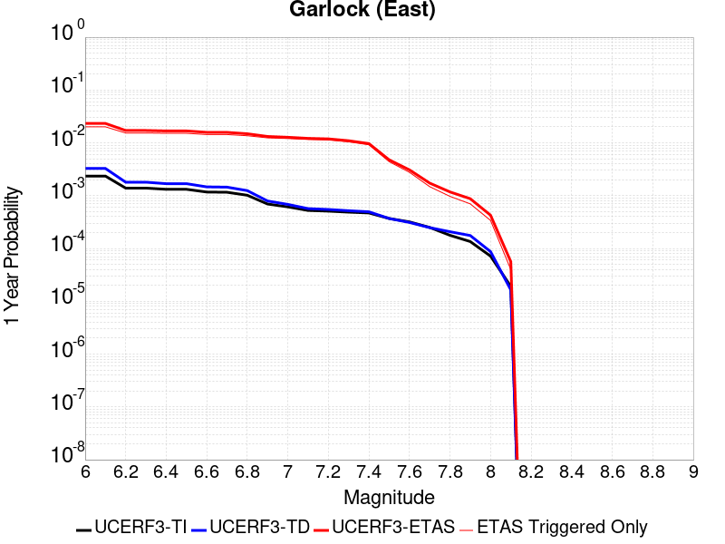 |  |

| Magnitude | 1 wk TI Prob | 1 wk TD Prob | 1 wk ETAS Prob | 1 wk ETAS/TD Gain | 1 wk ETAS Triggered Only | 1 mo TI Prob | 1 mo TD Prob | 1 mo ETAS Prob | 1 mo ETAS/TD Gain | 1 mo ETAS Triggered Only | 1 yr TI Prob | 1 yr TD Prob | 1 yr ETAS Prob | 1 yr ETAS/TD Gain | 1 yr ETAS Triggered Only | 10 yr TI Prob | 10 yr TD Prob | 10 yr ETAS Prob | 10 yr ETAS/TD Gain | 10 yr ETAS Triggered Only |
|-----|-----|-----|-----|-----|-----|-----|-----|-----|-----|-----|-----|-----|-----|-----|-----|-----|-----|-----|-----|-----|
| 6.0 | 4.5092507E-5 | 6.2904815E-5 | 0.010392255 | 165.20602 | 0.01033 | 1.9323928E-4 | 2.6956675E-4 | 0.01379592 | 51.178123 | 0.01353 | 0.0023501497 | 0.003277482 | 0.02332157 | 7.115698 | 0.02011 | 0.023254504 | 0.03235377 | 0.05796737 | 1.7916727 | 0.02647 |
| 6.1 | 4.5092507E-5 | 6.2904815E-5 | 0.010392255 | 165.20602 | 0.01033 | 1.9323928E-4 | 2.6956675E-4 | 0.01379592 | 51.178123 | 0.01353 | 0.0023501497 | 0.003277482 | 0.02332157 | 7.115698 | 0.02011 | 0.023254504 | 0.03235377 | 0.05796737 | 1.7916727 | 0.02647 |
| 6.2 | 2.6674514E-5 | 3.4511588E-5 | 0.008304226 | 240.6214 | 0.00827 | 1.1431433E-4 | 1.4789861E-4 | 0.010746331 | 72.660126 | 0.0106 | 0.0013908884 | 0.0017992114 | 0.017141558 | 9.527262 | 0.01537 | 0.01382215 | 0.017872788 | 0.037230514 | 2.0830839 | 0.01971 |
| 6.3 | 2.6674514E-5 | 3.4511588E-5 | 0.008304226 | 240.6214 | 0.00827 | 1.1431433E-4 | 1.4789861E-4 | 0.010746331 | 72.660126 | 0.0106 | 0.0013908884 | 0.0017992114 | 0.017141558 | 9.527262 | 0.01537 | 0.01382215 | 0.017872788 | 0.037230514 | 2.0830839 | 0.01971 |
| 6.4 | 2.5312667E-5 | 3.2340467E-5 | 0.008232076 | 254.5441 | 0.0082 | 1.0847834E-4 | 1.3859481E-4 | 0.01063714 | 76.74991 | 0.0105 | 0.0013199237 | 0.0016861152 | 0.016820554 | 9.975922 | 0.01516 | 0.013121112 | 0.016772287 | 0.035827238 | 2.1360977 | 0.01938 |
| 6.5 | 2.5312667E-5 | 3.2340467E-5 | 0.008232076 | 254.5441 | 0.0082 | 1.0847834E-4 | 1.3859481E-4 | 0.01063714 | 76.74991 | 0.0105 | 0.0013199237 | 0.0016861152 | 0.016820554 | 9.975922 | 0.01516 | 0.013121112 | 0.016772287 | 0.035827238 | 2.1360977 | 0.01938 |
| 6.6 | 2.246556E-5 | 2.8134691E-5 | 0.007917913 | 281.4288 | 0.00789 | 9.627742E-5 | 1.2057181E-4 | 0.0101493625 | 84.17691 | 0.01003 | 0.0011715472 | 0.0014669969 | 0.015815916 | 10.781152 | 0.01437 | 0.011653901 | 0.014613169 | 0.032616187 | 2.2319722 | 0.01827 |
| 6.7 | 2.2241198E-5 | 2.7804432E-5 | 0.007917585 | 284.75983 | 0.00789 | 9.531594E-5 | 1.1915654E-4 | 0.010147962 | 85.164955 | 0.01003 | 0.0011598538 | 0.0014497889 | 0.01578897 | 10.890531 | 0.01436 | 0.011538187 | 0.014442829 | 0.032439105 | 2.246035 | 0.01826 |
| 6.8 | 1.9528685E-5 | 2.3898969E-5 | 0.0076537165 | 320.25302 | 0.00763 | 8.369167E-5 | 1.0242024E-4 | 0.009711436 | 94.8195 | 0.00961 | 0.0010184698 | 0.0012462728 | 0.014869274 | 11.930995 | 0.01364 | 0.010138147 | 0.012436723 | 0.029442564 | 2.367389 | 0.01722 |
| 6.9 | 1.3318621E-5 | 1.5198818E-5 | 0.0071150907 | 468.1345 | 0.0071 | 5.7078556E-5 | 6.51362E-5 | 0.008994554 | 138.08841 | 0.00893 | 6.9470983E-4 | 7.927504E-4 | 0.013212897 | 16.667158 | 0.01243 | 0.0069254204 | 0.007940721 | 0.023218434 | 2.9239707 | 0.0154 |
| 7.0 | 1.1760853E-5 | 1.3107653E-5 | 0.007003016 | 534.2693 | 0.00699 | 5.0402683E-5 | 5.6174475E-5 | 0.008775685 | 156.22192 | 0.00872 | 6.134799E-4 | 6.8371464E-4 | 0.012755455 | 18.65611 | 0.01208 | 0.0061178906 | 0.006857401 | 0.021685021 | 3.1622796 | 0.01493 |
| 7.1 | 1.0064758E-5 | 1.0902761E-5 | 0.0068108286 | 624.6885 | 0.0068 | 4.3133965E-5 | 4.67253E-5 | 0.008466332 | 181.19374 | 0.00842 | 5.2502943E-4 | 5.6873553E-4 | 0.012162138 | 21.384523 | 0.0116 | 0.005237907 | 0.0057133473 | 0.019931646 | 3.488611 | 0.0143 |
| 7.2 | 9.768808E-6 | 1.0498628E-5 | 0.006660429 | 634.4094 | 0.00665 | 4.186565E-5 | 4.499337E-5 | 0.008274623 | 183.90762 | 0.00823 | 5.095951E-4 | 5.4766005E-4 | 0.011891444 | 21.713184 | 0.01135 | 0.0050842804 | 0.005503584 | 0.019386753 | 3.522569 | 0.01396 |
| 7.3 | 9.344516E-6 | 9.9442705E-6 | 0.006159883 | 619.4404 | 0.00615 | 4.004731E-5 | 4.2617627E-5 | 0.0076022954 | 178.38383 | 0.00756 | 4.8746695E-4 | 5.187495E-4 | 0.010973323 | 21.153414 | 0.01046 | 0.0048639905 | 0.005215269 | 0.017978357 | 3.447254 | 0.01283 |
| 7.4 | 9.023491E-6 | 9.490441E-6 | 0.0053694397 | 565.77344 | 0.00536 | 3.867153E-5 | 4.0672705E-5 | 0.0066604037 | 163.7561 | 0.00662 | 4.7072413E-4 | 4.95081E-4 | 0.009690526 | 19.573618 | 0.0092 | 0.004697283 | 0.0049787266 | 0.016272219 | 3.2683494 | 0.01135 |
| 7.5 | 7.081253E-6 | 7.0873994E-6 | 0.0026370687 | 372.0785 | 0.00263 | 3.0347876E-5 | 3.0374218E-5 | 0.0032102775 | 105.69087 | 0.00318 | 3.6942272E-4 | 3.697441E-4 | 0.0047681173 | 12.895722 | 0.0044 | 0.003688092 | 0.0037244745 | 0.009164139 | 2.4605186 | 0.00546 |
| 7.6 | 6.116396E-6 | 5.9589424E-6 | 0.0016859489 | 282.92755 | 0.00168 | 2.6212863E-5 | 2.5538076E-5 | 0.002025487 | 79.31243 | 0.002 | 3.1909486E-4 | 3.1088197E-4 | 0.003080021 | 9.907364 | 0.00277 | 0.0031863707 | 0.0031359126 | 0.006605 | 2.1062448 | 0.00348 |
| 7.7 | 4.797145E-6 | 4.7571157E-6 | 7.847534E-4 | 164.96413 | 7.8E-4 | 2.055903E-5 | 2.0387479E-5 | 9.603683E-4 | 47.10579 | 9.4E-4 | 2.5027743E-4 | 2.481894E-4 | 0.0017278221 | 6.9617076 | 0.00148 | 0.0024999576 | 0.0025094065 | 0.004364739 | 1.739351 | 0.00186 |
| 7.8 | 3.4028885E-6 | 3.978375E-6 | 5.239763E-4 | 131.70612 | 5.2E-4 | 1.4583726E-5 | 1.7050066E-5 | 6.5703917E-4 | 38.53587 | 6.4E-4 | 1.775424E-4 | 2.0756487E-4 | 0.0011773636 | 5.672268 | 9.7E-4 | 0.0017740062 | 0.0021012141 | 0.0033186506 | 1.5793967 | 0.00122 |
| 7.9 | 2.5928412E-6 | 3.372436E-6 | 3.6337122E-4 | 107.747406 | 3.6E-4 | 1.1112129E-5 | 1.4453217E-5 | 4.5444685E-4 | 31.44261 | 4.4E-4 | 1.3528178E-4 | 1.7595377E-4 | 8.758306E-4 | 4.9776177 | 7.0E-4 | 0.0013519945 | 0.0017812426 | 0.0026696573 | 1.4987612 | 8.9E-4 |
| 8.0 | 1.3743648E-6 | 1.6734741E-6 | 1.716732E-4 | 102.584915 | 1.7E-4 | 5.8901214E-6 | 7.1720124E-6 | 2.2717043E-4 | 31.674574 | 2.2E-4 | 7.1709874E-5 | 8.731578E-5 | 4.2728608E-4 | 4.8935723 | 3.4E-4 | 7.1686733E-4 | 8.837377E-4 | 0.0013033665 | 1.4748341 | 4.2E-4 |
| 8.1 | 3.6733252E-7 | 3.1489736E-7 | 2.031489E-5 | 64.51273 | 2.0E-5 | 1.5742813E-6 | 1.3495595E-6 | 2.1349533E-5 | 15.81963 | 2.0E-5 | 1.9166706E-5 | 1.643078E-5 | 5.6430123E-5 | 3.4344153 | 4.0E-5 | 1.9165053E-4 | 1.662928E-4 | 2.2628282E-4 | 1.3607494 | 6.0E-5 |

## Hunter Mountain-Saline Valley
*[(top)](#table-of-contents)*

| 1 Week | 1 Month | 1 Year | 10 Year |
|-----|-----|-----|-----|
|  | 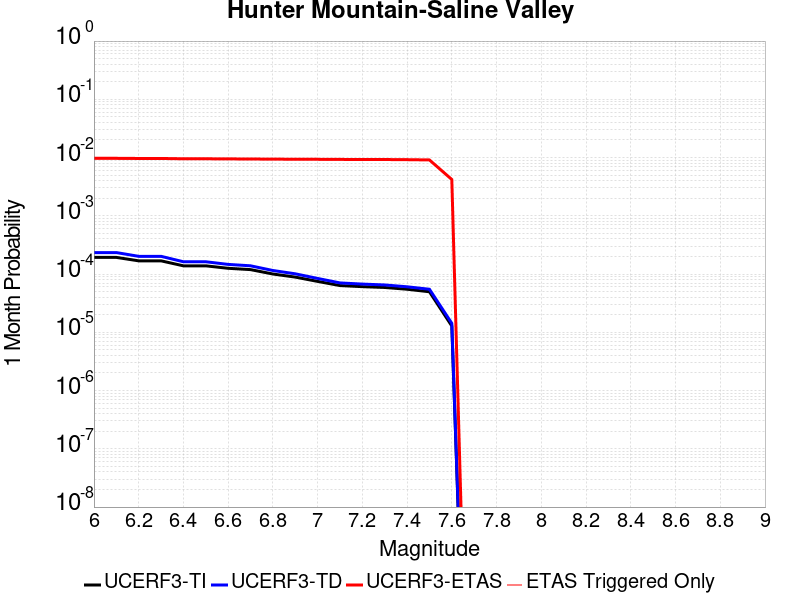 |  |  |

| Magnitude | 1 wk TI Prob | 1 wk TD Prob | 1 wk ETAS Prob | 1 wk ETAS/TD Gain | 1 wk ETAS Triggered Only | 1 mo TI Prob | 1 mo TD Prob | 1 mo ETAS Prob | 1 mo ETAS/TD Gain | 1 mo ETAS Triggered Only | 1 yr TI Prob | 1 yr TD Prob | 1 yr ETAS Prob | 1 yr ETAS/TD Gain | 1 yr ETAS Triggered Only | 10 yr TI Prob | 10 yr TD Prob | 10 yr ETAS Prob | 10 yr ETAS/TD Gain | 10 yr ETAS Triggered Only |
|-----|-----|-----|-----|-----|-----|-----|-----|-----|-----|-----|-----|-----|-----|-----|-----|-----|-----|-----|-----|-----|
| 6.0 | 4.5103672E-5 | 5.456906E-5 | 0.0075341607 | 138.06653 | 0.00748 | 1.9328714E-4 | 2.3384714E-4 | 0.009711631 | 41.529823 | 0.00948 | 0.002350731 | 0.0028435462 | 0.015457575 | 5.4360204 | 0.01265 | 0.023260195 | 0.028092625 | 0.04352651 | 1.5493929 | 0.01588 |
| 6.1 | 4.5103672E-5 | 5.456906E-5 | 0.0075341607 | 138.06653 | 0.00748 | 1.9328714E-4 | 2.3384714E-4 | 0.009711631 | 41.529823 | 0.00948 | 0.002350731 | 0.0028435462 | 0.015457575 | 5.4360204 | 0.01265 | 0.023260195 | 0.028092625 | 0.04352651 | 1.5493929 | 0.01588 |
| 6.2 | 3.9363465E-5 | 4.706271E-5 | 0.0075067114 | 159.50446 | 0.00746 | 1.6868966E-4 | 2.016826E-4 | 0.009649777 | 47.84635 | 0.00945 | 0.002051862 | 0.0024528534 | 0.015021947 | 6.1242747 | 0.0126 | 0.020330196 | 0.024274187 | 0.039690655 | 1.6350971 | 0.0158 |
| 6.3 | 3.9363465E-5 | 4.706271E-5 | 0.0075067114 | 159.50446 | 0.00746 | 1.6868966E-4 | 2.016826E-4 | 0.009649777 | 47.84635 | 0.00945 | 0.002051862 | 0.0024528534 | 0.015021947 | 6.1242747 | 0.0126 | 0.020330196 | 0.024274187 | 0.039690655 | 1.6350971 | 0.0158 |
| 6.4 | 3.2311684E-5 | 3.795112E-5 | 0.00743767 | 195.98027 | 0.0074 | 1.384713E-4 | 1.6263791E-4 | 0.009531114 | 58.60327 | 0.00937 | 0.0016845843 | 0.001978387 | 0.014463637 | 7.310823 | 0.01251 | 0.016718714 | 0.019617118 | 0.03498952 | 1.7836219 | 0.01568 |
| 6.5 | 3.2311684E-5 | 3.795112E-5 | 0.00743767 | 195.98027 | 0.0074 | 1.384713E-4 | 1.6263791E-4 | 0.009531114 | 58.60327 | 0.00937 | 0.0016845843 | 0.001978387 | 0.014463637 | 7.310823 | 0.01251 | 0.016718714 | 0.019617118 | 0.03498952 | 1.7836219 | 0.01568 |
| 6.6 | 2.9305844E-5 | 3.418196E-5 | 0.00740393 | 216.60342 | 0.00737 | 1.2559042E-4 | 1.4648624E-4 | 0.009485118 | 64.75091 | 0.00934 | 0.0015279909 | 0.0017820727 | 0.014239833 | 7.9906015 | 0.01248 | 0.015175272 | 0.017686324 | 0.03304971 | 1.868659 | 0.01564 |
| 6.7 | 2.7826512E-5 | 3.2344353E-5 | 0.0073821065 | 228.23479 | 0.00735 | 1.19251024E-4 | 1.3861163E-4 | 0.009447321 | 68.15677 | 0.00931 | 0.0014509142 | 0.0016863506 | 0.014105372 | 8.364437 | 0.01244 | 0.014414776 | 0.016743818 | 0.032082614 | 1.9160872 | 0.0156 |
| 6.8 | 2.3389874E-5 | 2.6866792E-5 | 0.00734667 | 273.448 | 0.00732 | 1.0023846E-4 | 1.1513857E-4 | 0.00939407 | 81.58925 | 0.00928 | 0.00121972 | 0.001400958 | 0.013753628 | 9.817302 | 0.01237 | 0.01213047 | 0.013928067 | 0.029222043 | 2.0980687 | 0.01551 |
| 6.9 | 2.069209E-5 | 2.357011E-5 | 0.0073233983 | 310.707 | 0.0073 | 8.867737E-5 | 1.0101105E-4 | 0.009360076 | 92.66388 | 0.00926 | 0.0010791123 | 0.0012291519 | 0.0135340085 | 11.010852 | 0.01232 | 0.010738871 | 0.012229158 | 0.027490217 | 2.247924 | 0.01545 |
| 7.0 | 1.7462342E-5 | 1.9633622E-5 | 0.0073194904 | 372.80386 | 0.0073 | 7.483646E-5 | 8.414151E-5 | 0.009333363 | 110.92459 | 0.00925 | 9.1075303E-4 | 0.0010239641 | 0.01330138 | 12.990084 | 0.01229 | 0.009070295 | 0.010196688 | 0.025449557 | 2.495865 | 0.01541 |
| 7.1 | 1.4807709E-5 | 1.6441827E-5 | 0.0072863223 | 443.1577 | 0.00727 | 6.3460066E-5 | 7.046316E-5 | 0.009289813 | 131.8393 | 0.00922 | 7.723524E-4 | 8.575678E-4 | 0.0130870715 | 15.260684 | 0.01224 | 0.007696735 | 0.008546168 | 0.023764985 | 2.7807767 | 0.01535 |
| 7.2 | 1.4180048E-5 | 1.5698413E-5 | 0.0072655845 | 462.82288 | 0.00725 | 6.077022E-5 | 6.727727E-5 | 0.009266659 | 137.73833 | 0.0092 | 7.396263E-4 | 8.1880915E-4 | 0.013018811 | 15.89969 | 0.01221 | 0.0073716943 | 0.008161469 | 0.023336599 | 2.8593624 | 0.0153 |
| 7.3 | 1.3730402E-5 | 1.5172151E-5 | 0.0072550625 | 478.18286 | 0.00724 | 5.8843252E-5 | 6.502197E-5 | 0.009254425 | 142.32765 | 0.00919 | 7.161811E-4 | 7.9137104E-4 | 0.012981717 | 16.404083 | 0.0122 | 0.007138774 | 0.007889058 | 0.023048513 | 2.9215798 | 0.01528 |
| 7.4 | 1.2810095E-5 | 1.4109353E-5 | 0.0072240075 | 512.00134 | 0.00721 | 5.489925E-5 | 6.0467344E-5 | 0.0091999145 | 152.14684 | 0.00914 | 6.681934E-4 | 7.3595706E-4 | 0.012837045 | 17.442654 | 0.01211 | 0.006661878 | 0.0073386896 | 0.022417216 | 3.0546618 | 0.01519 |
| 7.5 | 1.1595659E-5 | 1.2800734E-5 | 0.0071627093 | 559.55457 | 0.00715 | 4.9694736E-5 | 5.485922E-5 | 0.009104363 | 165.95865 | 0.00905 | 6.0486543E-4 | 6.67722E-4 | 0.012649716 | 18.944584 | 0.01199 | 0.006032217 | 0.006660632 | 0.021520989 | 3.2310731 | 0.01496 |
| 7.6 | 2.997694E-6 | 3.3251877E-6 | 0.0033433142 | 1005.4513 | 0.00334 | 1.28471975E-5 | 1.4250767E-5 | 0.0042041913 | 295.01508 | 0.00419 | 1.564034E-4 | 1.7349655E-4 | 0.0056125526 | 32.349648 | 0.00544 | 0.0015629337 | 0.0017356955 | 0.008384136 | 4.8304186 | 0.00666 |

## Blackwater
*[(top)](#table-of-contents)*

| 1 Week | 1 Month | 1 Year | 10 Year |
|-----|-----|-----|-----|
| 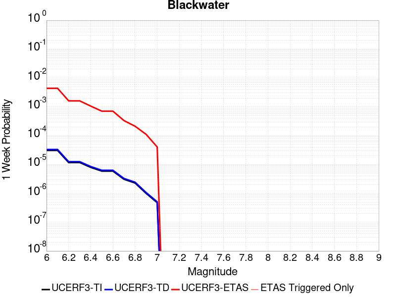 |  |  | 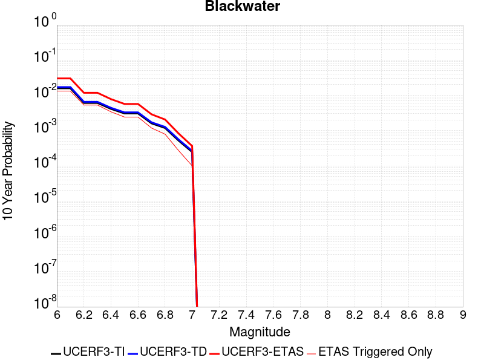 |

| Magnitude | 1 wk TI Prob | 1 wk TD Prob | 1 wk ETAS Prob | 1 wk ETAS/TD Gain | 1 wk ETAS Triggered Only | 1 mo TI Prob | 1 mo TD Prob | 1 mo ETAS Prob | 1 mo ETAS/TD Gain | 1 mo ETAS Triggered Only | 1 yr TI Prob | 1 yr TD Prob | 1 yr ETAS Prob | 1 yr ETAS/TD Gain | 1 yr ETAS Triggered Only | 10 yr TI Prob | 10 yr TD Prob | 10 yr ETAS Prob | 10 yr ETAS/TD Gain | 10 yr ETAS Triggered Only |
|-----|-----|-----|-----|-----|-----|-----|-----|-----|-----|-----|-----|-----|-----|-----|-----|-----|-----|-----|-----|-----|
| 6.0 | 3.0708583E-5 | 3.3095846E-5 | 0.0044029513 | 133.03636 | 0.00437 | 1.3160157E-4 | 1.4183241E-4 | 0.006250966 | 44.072903 | 0.00611 | 0.0016010714 | 0.0017255784 | 0.010939651 | 6.3397007 | 0.00923 | 0.015895851 | 0.017135633 | 0.030099614 | 1.756551 | 0.01319 |
| 6.1 | 3.0708583E-5 | 3.3095846E-5 | 0.0044029513 | 133.03636 | 0.00437 | 1.3160157E-4 | 1.4183241E-4 | 0.006250966 | 44.072903 | 0.00611 | 0.0016010714 | 0.0017255784 | 0.010939651 | 6.3397007 | 0.00923 | 0.015895851 | 0.017135633 | 0.030099614 | 1.756551 | 0.01319 |
| 6.2 | 1.1707779E-5 | 1.2545122E-5 | 0.0016125251 | 128.53801 | 0.0016 | 5.017523E-5 | 5.3763757E-5 | 0.0024236364 | 45.079372 | 0.00237 | 6.107122E-4 | 6.5438676E-4 | 0.004272018 | 6.528277 | 0.00362 | 0.006090366 | 0.0065255696 | 0.011800919 | 1.8084121 | 0.00531 |
| 6.3 | 1.1707779E-5 | 1.2545122E-5 | 0.0016125251 | 128.53801 | 0.0016 | 5.017523E-5 | 5.3763757E-5 | 0.0024236364 | 45.079372 | 0.00237 | 6.107122E-4 | 6.5438676E-4 | 0.004272018 | 6.528277 | 0.00362 | 0.006090366 | 0.0065255696 | 0.011800919 | 1.8084121 | 0.00531 |
| 6.4 | 7.929244E-6 | 8.480098E-6 | 0.0010584712 | 124.818275 | 0.00105 | 3.3982033E-5 | 3.6342793E-5 | 0.001516289 | 41.721863 | 0.00148 | 4.136527E-4 | 4.423877E-4 | 0.0027813525 | 6.2871375 | 0.00234 | 0.0041288356 | 0.0044154758 | 0.0078104194 | 1.7688737 | 0.00341 |
| 6.5 | 5.8832115E-6 | 6.285991E-6 | 7.062816E-4 | 112.35804 | 7.0E-4 | 2.521352E-5 | 2.6939697E-5 | 0.001056912 | 39.23251 | 0.00103 | 3.0693135E-4 | 3.27944E-4 | 0.0019674061 | 5.9992137 | 0.00164 | 0.0030650778 | 0.0032748538 | 0.0056869285 | 1.7365443 | 0.00242 |
| 6.6 | 5.8832115E-6 | 6.285991E-6 | 7.062816E-4 | 112.35804 | 7.0E-4 | 2.521352E-5 | 2.6939697E-5 | 0.001056912 | 39.23251 | 0.00103 | 3.0693135E-4 | 3.27944E-4 | 0.0019674061 | 5.9992137 | 0.00164 | 0.0030650778 | 0.0032748538 | 0.0056869285 | 1.7365443 | 0.00242 |
| 6.7 | 3.0715053E-6 | 3.2814662E-6 | 3.332804E-4 | 101.564476 | 3.3E-4 | 1.3163528E-5 | 1.4063357E-5 | 5.0405646E-4 | 35.84183 | 4.9E-4 | 1.6025416E-4 | 1.7120909E-4 | 9.31079E-4 | 5.4382567 | 7.6E-4 | 0.0016013865 | 0.0017108864 | 0.0028888676 | 1.6885209 | 0.00118 |
| 6.8 | 2.2722281E-6 | 2.4287538E-6 | 2.1242825E-4 | 87.46389 | 2.1E-4 | 9.738084E-6 | 1.0408908E-5 | 3.2040567E-4 | 30.781874 | 3.1E-4 | 1.1855473E-4 | 1.26722E-4 | 6.266586E-4 | 4.9451447 | 5.0E-4 | 0.001184915 | 0.0012665876 | 0.002055587 | 1.6229331 | 7.9E-4 |
| 6.9 | 9.952399E-7 | 1.0653489E-6 | 1.1106523E-4 | 104.25245 | 1.1E-4 | 4.265307E-6 | 4.5657757E-6 | 1.5456509E-4 | 33.852974 | 1.5E-4 | 5.1928873E-5 | 5.5587418E-5 | 2.6557574E-4 | 4.777623 | 2.1E-4 | 5.191674E-4 | 5.557858E-4 | 8.256357E-4 | 1.4855287 | 2.7E-4 |
| 7.0 | 4.7385504E-7 | 5.0755597E-7 | 4.0507537E-5 | 79.809006 | 4.0E-5 | 2.0308057E-6 | 2.1752398E-6 | 4.2175154E-5 | 19.388737 | 4.0E-5 | 2.4724779E-5 | 2.6483543E-5 | 1.0648143E-4 | 4.0206637 | 8.0E-5 | 2.4722028E-4 | 2.6483546E-4 | 3.6480895E-4 | 1.377493 | 1.0E-4 |

## Ash Hill
*[(top)](#table-of-contents)*

| 1 Week | 1 Month | 1 Year | 10 Year |
|-----|-----|-----|-----|
|  |  |  |  |

| Magnitude | 1 wk TI Prob | 1 wk TD Prob | 1 wk ETAS Prob | 1 wk ETAS/TD Gain | 1 wk ETAS Triggered Only | 1 mo TI Prob | 1 mo TD Prob | 1 mo ETAS Prob | 1 mo ETAS/TD Gain | 1 mo ETAS Triggered Only | 1 yr TI Prob | 1 yr TD Prob | 1 yr ETAS Prob | 1 yr ETAS/TD Gain | 1 yr ETAS Triggered Only | 10 yr TI Prob | 10 yr TD Prob | 10 yr ETAS Prob | 10 yr ETAS/TD Gain | 10 yr ETAS Triggered Only |
|-----|-----|-----|-----|-----|-----|-----|-----|-----|-----|-----|-----|-----|-----|-----|-----|-----|-----|-----|-----|-----|
| 6.0 | 2.1545662E-5 | 2.3194447E-5 | 0.004053101 | 174.74446 | 0.00403 | 9.2335285E-5 | 9.940143E-5 | 0.0054388708 | 54.716217 | 0.00534 | 0.0011236023 | 0.0012096206 | 0.009949036 | 8.224923 | 0.00875 | 0.011179381 | 0.012038348 | 0.023943286 | 1.9889178 | 0.01205 |
| 6.1 | 2.1545662E-5 | 2.3194447E-5 | 0.004053101 | 174.74446 | 0.00403 | 9.2335285E-5 | 9.940143E-5 | 0.0054388708 | 54.716217 | 0.00534 | 0.0011236023 | 0.0012096206 | 0.009949036 | 8.224923 | 0.00875 | 0.011179381 | 0.012038348 | 0.023943286 | 1.9889178 | 0.01205 |
| 6.2 | 2.1545662E-5 | 2.3194447E-5 | 0.004053101 | 174.74446 | 0.00403 | 9.2335285E-5 | 9.940143E-5 | 0.0054388708 | 54.716217 | 0.00534 | 0.0011236023 | 0.0012096206 | 0.009949036 | 8.224923 | 0.00875 | 0.011179381 | 0.012038348 | 0.023943286 | 1.9889178 | 0.01205 |
| 6.3 | 1.0025529E-5 | 1.0746934E-5 | 0.0016007299 | 148.94759 | 0.00159 | 4.2965847E-5 | 4.605755E-5 | 0.0022159575 | 48.112797 | 0.00217 | 5.229836E-4 | 5.6061964E-4 | 0.004308517 | 7.685277 | 0.00375 | 0.005217545 | 0.0055933665 | 0.010833889 | 1.9369175 | 0.00527 |
| 6.4 | 1.0025529E-5 | 1.0746934E-5 | 0.0016007299 | 148.94759 | 0.00159 | 4.2965847E-5 | 4.605755E-5 | 0.0022159575 | 48.112797 | 0.00217 | 5.229836E-4 | 5.6061964E-4 | 0.004308517 | 7.685277 | 0.00375 | 0.005217545 | 0.0055933665 | 0.010833889 | 1.9369175 | 0.00527 |
| 6.5 | 6.9617327E-6 | 7.456634E-6 | 0.0011074485 | 148.51854 | 0.0011 | 2.9835655E-5 | 3.195666E-5 | 0.001521909 | 47.624157 | 0.00149 | 3.6318856E-4 | 3.8901155E-4 | 0.0030379808 | 7.809487 | 0.00265 | 0.0036259557 | 0.0038841602 | 0.0076594395 | 1.9719678 | 0.00379 |
| 6.6 | 4.9919777E-6 | 5.3466883E-6 | 7.5534265E-4 | 141.273 | 7.5E-4 | 2.1394015E-5 | 2.2914215E-5 | 0.0010428908 | 45.512833 | 0.00102 | 2.60441E-4 | 2.7895154E-4 | 0.002058455 | 7.3792562 | 0.00178 | 0.0026013597 | 0.0027866727 | 0.0053096223 | 1.9053628 | 0.00253 |
| 6.7 | 3.6630722E-6 | 3.924624E-6 | 4.939227E-4 | 125.85224 | 4.9E-4 | 1.5698786E-5 | 1.681974E-5 | 7.068081E-4 | 42.022537 | 6.9E-4 | 1.9111596E-4 | 2.0476682E-4 | 0.0015144986 | 7.3962107 | 0.00131 | 0.0019095168 | 0.0020463446 | 0.0038725997 | 1.8924476 | 0.00183 |
| 6.8 | 2.5599613E-6 | 2.744925E-6 | 3.2274405E-4 | 117.57845 | 3.2E-4 | 1.0971216E-5 | 1.1763939E-5 | 4.917583E-4 | 41.802177 | 4.8E-4 | 1.3356637E-4 | 1.4322149E-4 | 0.0010730883 | 7.492509 | 9.3E-4 | 0.0013348613 | 0.0014317769 | 0.0027299155 | 1.9066627 | 0.0013 |
| 6.9 | 1.7684905E-6 | 1.8968707E-6 | 2.1189648E-4 | 111.70844 | 2.1E-4 | 7.579223E-6 | 8.129446E-6 | 3.481267E-4 | 42.82293 | 3.4E-4 | 9.2273134E-5 | 9.8976E-5 | 7.489117E-4 | 7.5665984 | 6.5E-4 | 9.223483E-4 | 9.8976E-4 | 0.0019488098 | 1.9689721 | 9.6E-4 |

## Garlock (West)
*[(top)](#table-of-contents)*

| 1 Week | 1 Month | 1 Year | 10 Year |
|-----|-----|-----|-----|
|  | 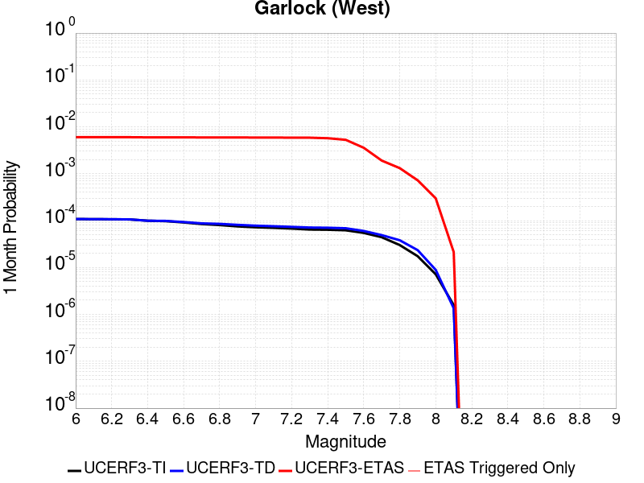 |  |  |

| Magnitude | 1 wk TI Prob | 1 wk TD Prob | 1 wk ETAS Prob | 1 wk ETAS/TD Gain | 1 wk ETAS Triggered Only | 1 mo TI Prob | 1 mo TD Prob | 1 mo ETAS Prob | 1 mo ETAS/TD Gain | 1 mo ETAS Triggered Only | 1 yr TI Prob | 1 yr TD Prob | 1 yr ETAS Prob | 1 yr ETAS/TD Gain | 1 yr ETAS Triggered Only | 10 yr TI Prob | 10 yr TD Prob | 10 yr ETAS Prob | 10 yr ETAS/TD Gain | 10 yr ETAS Triggered Only |
|-----|-----|-----|-----|-----|-----|-----|-----|-----|-----|-----|-----|-----|-----|-----|-----|-----|-----|-----|-----|-----|
| 6.0 | 2.5181727E-5 | 2.5197181E-5 | 0.004825076 | 191.49269 | 0.0048 | 1.0791722E-4 | 1.0798347E-4 | 0.0060173455 | 55.72469 | 0.00591 | 0.0013131002 | 0.0013139093 | 0.009293411 | 7.0730996 | 0.00799 | 0.013053683 | 0.013141794 | 0.023039982 | 1.7531838 | 0.01003 |
| 6.1 | 2.5077732E-5 | 2.5098223E-5 | 0.004824978 | 192.24379 | 0.0048 | 1.0747157E-4 | 1.075594E-4 | 0.0060169236 | 55.94047 | 0.00591 | 0.001307681 | 0.0013087525 | 0.009288295 | 7.0970607 | 0.00799 | 0.013000126 | 0.013090835 | 0.022989534 | 1.7561549 | 0.01003 |
| 6.2 | 2.494612E-5 | 2.4979914E-5 | 0.00482486 | 193.14958 | 0.0048 | 1.0690756E-4 | 1.070524E-4 | 0.0060164197 | 56.200695 | 0.00591 | 0.0013008224 | 0.0013025872 | 0.009282179 | 7.1259565 | 0.00799 | 0.012932341 | 0.013029906 | 0.022929216 | 1.7597376 | 0.01003 |
| 6.3 | 2.4733758E-5 | 2.4799276E-5 | 0.0048246803 | 194.54924 | 0.0048 | 1.0599751E-4 | 1.06278305E-4 | 0.00601565 | 56.602806 | 0.00591 | 0.0012897556 | 0.0012931736 | 0.009272841 | 7.1706076 | 0.00799 | 0.012822957 | 0.0129368715 | 0.022837115 | 1.7652733 | 0.01003 |
| 6.4 | 2.3237335E-5 | 2.3178607E-5 | 0.004793068 | 206.78844 | 0.00477 | 9.958477E-5 | 9.933313E-5 | 0.00596875 | 60.088215 | 0.00587 | 0.0012117702 | 0.0012087126 | 0.0091291275 | 7.552769 | 0.00793 | 0.012051838 | 0.012101731 | 0.021931319 | 1.8122464 | 0.00995 |
| 6.5 | 2.2732203E-5 | 2.2992977E-5 | 0.0047928835 | 208.44989 | 0.00477 | 9.742009E-5 | 9.8537625E-5 | 0.0059679593 | 60.565285 | 0.00587 | 0.0011854442 | 0.0011990381 | 0.009119529 | 7.605705 | 0.00793 | 0.011791403 | 0.012006035 | 0.021836575 | 1.8187999 | 0.00995 |
| 6.6 | 2.1319436E-5 | 2.1773201E-5 | 0.0047916695 | 220.07187 | 0.00477 | 9.136581E-5 | 9.3310395E-5 | 0.0059627625 | 63.902447 | 0.00587 | 0.001111811 | 0.0011354643 | 0.00905646 | 7.975997 | 0.00793 | 0.011062649 | 0.011376952 | 0.021213751 | 1.8646252 | 0.00995 |
| 6.7 | 1.970802E-5 | 2.0393094E-5 | 0.0047802962 | 234.40758 | 0.00476 | 8.446021E-5 | 8.739606E-5 | 0.005946884 | 68.04522 | 0.00586 | 0.001027818 | 0.0010635294 | 0.008975106 | 8.438983 | 0.00792 | 0.010230771 | 0.0106646875 | 0.02049868 | 1.9221079 | 0.00994 |
| 6.8 | 1.8744462E-5 | 1.9900775E-5 | 0.004779806 | 240.1819 | 0.00476 | 8.033094E-5 | 8.528626E-5 | 0.0059447866 | 69.70392 | 0.00586 | 9.775903E-4 | 0.0010378672 | 0.008939657 | 8.613489 | 0.00791 | 0.009733009 | 0.010410495 | 0.020227224 | 1.9429646 | 0.00992 |
| 6.9 | 1.7559682E-5 | 1.8953151E-5 | 0.0047688633 | 251.6132 | 0.00475 | 7.5253614E-5 | 8.122527E-5 | 0.00593075 | 73.016075 | 0.00585 | 9.158276E-4 | 9.884704E-4 | 0.0088706715 | 8.974139 | 0.00789 | 0.0091206245 | 0.009921073 | 0.019703053 | 1.98598 | 0.00988 |
| 7.0 | 1.6794445E-5 | 1.8215967E-5 | 0.00475813 | 261.2065 | 0.00474 | 7.197421E-5 | 7.806611E-5 | 0.00591761 | 75.80255 | 0.00584 | 8.759337E-4 | 9.5004175E-4 | 0.008812565 | 9.275976 | 0.00787 | 0.008724891 | 0.009539958 | 0.019305894 | 2.0236876 | 0.00986 |
| 7.1 | 1.6337795E-5 | 1.771677E-5 | 0.004757633 | 268.5384 | 0.00474 | 7.0017246E-5 | 7.592681E-5 | 0.0059054843 | 77.77864 | 0.00583 | 8.521265E-4 | 9.2401815E-4 | 0.008766765 | 9.487654 | 0.00785 | 0.008488664 | 0.009281721 | 0.019030388 | 2.0503082 | 0.00984 |
| 7.2 | 1.5780008E-5 | 1.71654E-5 | 0.0047370843 | 275.96704 | 0.00472 | 6.762685E-5 | 7.3563926E-5 | 0.0058831363 | 79.973114 | 0.00581 | 8.2304585E-4 | 8.952741E-4 | 0.008708273 | 9.726935 | 0.00782 | 0.008200042 | 0.008996559 | 0.018708393 | 2.0795054 | 0.0098 |
| 7.3 | 1.5058865E-5 | 1.6618484E-5 | 0.0047265403 | 284.41467 | 0.00471 | 6.45364E-5 | 7.122013E-5 | 0.005870807 | 82.43185 | 0.0058 | 7.854473E-4 | 8.667614E-4 | 0.0086500095 | 9.97969 | 0.00779 | 0.00782677 | 0.008713263 | 0.018388221 | 2.1103714 | 0.00976 |
| 7.4 | 1.4887923E-5 | 1.6454453E-5 | 0.004616379 | 280.555 | 0.0046 | 6.380382E-5 | 7.0517184E-5 | 0.005720119 | 81.11667 | 0.00565 | 7.7653467E-4 | 8.5820974E-4 | 0.008461678 | 9.859687 | 0.00761 | 0.0077382675 | 0.008628101 | 0.018085789 | 2.0961494 | 0.00954 |
| 7.5 | 1.4509299E-5 | 1.6046468E-5 | 0.004305978 | 268.34427 | 0.00429 | 6.218123E-5 | 6.876877E-5 | 0.00528841 | 76.90133 | 0.00522 | 7.567935E-4 | 8.369394E-4 | 0.007901022 | 9.440375 | 0.00707 | 0.0075422134 | 0.008416411 | 0.017211758 | 2.0450234 | 0.00887 |
| 7.6 | 1.2756717E-5 | 1.4050529E-5 | 0.0029240097 | 208.10674 | 0.00291 | 5.4670498E-5 | 6.0215163E-5 | 0.0035800033 | 59.453514 | 0.00352 | 6.6541E-4 | 7.328737E-4 | 0.005499378 | 7.5038548 | 0.00477 | 0.006634211 | 0.007381374 | 0.01337679 | 1.8122358 | 0.00604 |
| 7.7 | 1.0328985E-5 | 1.146033E-5 | 0.0014914434 | 130.13965 | 0.00148 | 4.4266326E-5 | 4.9114777E-5 | 0.0019090234 | 38.868614 | 0.00186 | 5.388092E-4 | 5.9780874E-4 | 0.0033661528 | 5.630819 | 0.00277 | 0.0053750467 | 0.006038286 | 0.009537031 | 1.5794269 | 0.00352 |
| 7.8 | 7.0306583E-6 | 8.899537E-6 | 0.0010288905 | 115.61169 | 0.00102 | 3.0131043E-5 | 3.8140315E-5 | 0.0013180915 | 34.55901 | 0.00128 | 3.667837E-4 | 4.6425956E-4 | 0.0023034052 | 4.96146 | 0.00184 | 0.003661789 | 0.0046950667 | 0.007043986 | 1.5002953 | 0.00236 |
| 7.9 | 4.060633E-6 | 5.465412E-6 | 5.754623E-4 | 105.29166 | 5.7E-4 | 1.7402595E-5 | 2.3422985E-5 | 7.234066E-4 | 30.884476 | 7.0E-4 | 2.11856E-4 | 2.8513762E-4 | 0.0013748268 | 4.821625 | 0.00109 | 0.0021165414 | 0.002884143 | 0.0042501916 | 1.4736412 | 0.00137 |
| 8.0 | 1.6729537E-6 | 2.0775192E-6 | 2.2207707E-4 | 106.89531 | 2.2E-4 | 7.169782E-6 | 8.903624E-6 | 2.9890105E-4 | 33.570717 | 2.9E-4 | 8.7288594E-5 | 1.0839626E-4 | 5.283507E-4 | 4.8742523 | 4.2E-4 | 8.7254314E-4 | 0.001096854 | 0.0016062947 | 1.4644562 | 5.1E-4 |
| 8.1 | 3.6733252E-7 | 3.1489736E-7 | 2.031489E-5 | 64.51273 | 2.0E-5 | 1.5742813E-6 | 1.3495595E-6 | 2.1349533E-5 | 15.81963 | 2.0E-5 | 1.9166706E-5 | 1.643078E-5 | 5.6430123E-5 | 3.4344153 | 4.0E-5 | 1.9165053E-4 | 1.662928E-4 | 2.2628282E-4 | 1.3607494 | 6.0E-5 |

## Gravel Hills-Harper Lk
*[(top)](#table-of-contents)*

| 1 Week | 1 Month | 1 Year | 10 Year |
|-----|-----|-----|-----|
|  |  |  |  |

| Magnitude | 1 wk TI Prob | 1 wk TD Prob | 1 wk ETAS Prob | 1 wk ETAS/TD Gain | 1 wk ETAS Triggered Only | 1 mo TI Prob | 1 mo TD Prob | 1 mo ETAS Prob | 1 mo ETAS/TD Gain | 1 mo ETAS Triggered Only | 1 yr TI Prob | 1 yr TD Prob | 1 yr ETAS Prob | 1 yr ETAS/TD Gain | 1 yr ETAS Triggered Only | 10 yr TI Prob | 10 yr TD Prob | 10 yr ETAS Prob | 10 yr ETAS/TD Gain | 10 yr ETAS Triggered Only |
|-----|-----|-----|-----|-----|-----|-----|-----|-----|-----|-----|-----|-----|-----|-----|-----|-----|-----|-----|-----|-----|
| 6.0 | 3.0679566E-5 | 3.1464628E-5 | 0.0025413856 | 80.769615 | 0.00251 | 1.3147724E-4 | 1.3484266E-4 | 0.0036443693 | 27.026829 | 0.00351 | 0.0015995599 | 0.00164069 | 0.0073013874 | 4.450193 | 0.00567 | 0.015880952 | 0.016307337 | 0.024058836 | 1.4753381 | 0.00788 |
| 6.1 | 3.0679566E-5 | 3.1464628E-5 | 0.0025413856 | 80.769615 | 0.00251 | 1.3147724E-4 | 1.3484266E-4 | 0.0036443693 | 27.026829 | 0.00351 | 0.0015995599 | 0.00164069 | 0.0073013874 | 4.450193 | 0.00567 | 0.015880952 | 0.016307337 | 0.024058836 | 1.4753381 | 0.00788 |
| 6.2 | 1.514536E-5 | 1.36352E-5 | 7.6362496E-4 | 56.003944 | 7.5E-4 | 6.490707E-5 | 5.843533E-5 | 0.0011283729 | 19.30977 | 0.00107 | 7.8995706E-4 | 7.112298E-4 | 0.0024399995 | 3.4306765 | 0.00173 | 0.007871548 | 0.007090737 | 0.009662372 | 1.3626753 | 0.00259 |
| 6.3 | 1.514536E-5 | 1.36352E-5 | 7.6362496E-4 | 56.003944 | 7.5E-4 | 6.490707E-5 | 5.843533E-5 | 0.0011283729 | 19.30977 | 0.00107 | 7.8995706E-4 | 7.112298E-4 | 0.0024399995 | 3.4306765 | 0.00173 | 0.007871548 | 0.007090737 | 0.009662372 | 1.3626753 | 0.00259 |
| 6.4 | 1.2532521E-5 | 1.0689684E-5 | 5.0068443E-4 | 46.838097 | 4.9E-4 | 5.37097E-5 | 4.581216E-5 | 7.657792E-4 | 16.715631 | 7.2E-4 | 6.537194E-4 | 5.5762613E-4 | 0.0016770016 | 3.007394 | 0.00112 | 0.0065179965 | 0.005562859 | 0.007213625 | 1.2967477 | 0.00166 |
| 6.5 | 1.1094058E-5 | 9.083657E-6 | 2.890811E-4 | 31.824312 | 2.8E-4 | 4.7545094E-5 | 3.89294E-5 | 4.5891304E-4 | 11.7883415 | 4.2E-4 | 5.787078E-4 | 4.7386638E-4 | 0.0011735347 | 2.4765096 | 7.0E-4 | 0.0057720304 | 0.004728967 | 0.0058337175 | 1.2336136 | 0.00111 |
| 6.6 | 9.688328E-6 | 7.531688E-6 | 1.7753041E-4 | 23.57113 | 1.7E-4 | 4.1520743E-5 | 3.227828E-5 | 3.1226923E-4 | 9.674284 | 2.8E-4 | 5.053978E-4 | 3.9291973E-4 | 8.827272E-4 | 2.246584 | 4.9E-4 | 0.0050424994 | 0.0039225067 | 0.004629722 | 1.1802967 | 7.1E-4 |
| 6.7 | 8.974824E-6 | 6.749406E-6 | 1.4674845E-4 | 21.742426 | 1.4E-4 | 3.8462964E-5 | 2.8925719E-5 | 2.4891936E-4 | 8.605469 | 2.2E-4 | 4.6818596E-4 | 3.5211592E-4 | 7.5197505E-4 | 2.1355896 | 4.0E-4 | 0.004672008 | 0.003515801 | 0.004083797 | 1.1615552 | 5.7E-4 |
| 6.8 | 7.4780046E-6 | 5.1161865E-6 | 8.5115775E-5 | 16.636566 | 8.0E-5 | 3.20482E-5 | 2.1926337E-5 | 1.4192371E-4 | 6.4727507 | 1.2E-4 | 3.9011694E-4 | 2.6692182E-4 | 4.5687112E-4 | 1.7116289 | 1.9E-4 | 0.0038943281 | 0.0026661505 | 0.002945404 | 1.1047404 | 2.8E-4 |
| 6.9 | 6.3409307E-6 | 3.907489E-6 | 6.390725E-5 | 16.35507 | 6.0E-5 | 2.7175134E-5 | 1.674628E-5 | 1.06744774E-4 | 6.374238 | 9.0E-5 | 3.3080703E-4 | 2.0386786E-4 | 3.3384137E-4 | 1.637538 | 1.3E-4 | 0.0033031502 | 0.0020369065 | 0.0022364992 | 1.0979881 | 2.0E-4 |
| 7.0 | 5.1239335E-6 | 2.6058492E-6 | 2.2605796E-5 | 8.675021 | 2.0E-5 | 2.195953E-5 | 1.1167879E-5 | 4.1167543E-5 | 3.6862454 | 3.0E-5 | 2.6732447E-4 | 1.359607E-4 | 1.9595254E-4 | 1.441244 | 6.0E-5 | 0.0026700313 | 0.0013588005 | 0.0014586645 | 1.0734943 | 1.0E-4 |
| 7.1 | 4.438899E-6 | 2.0984692E-6 | 2.2098428E-5 | 10.530737 | 2.0E-5 | 1.9023713E-5 | 8.99341E-6 | 2.899323E-5 | 3.2238305 | 2.0E-5 | 2.315891E-4 | 1.0948948E-4 | 1.494851E-4 | 1.3652918 | 4.0E-5 | 0.002313479 | 0.0010943774 | 0.0011742897 | 1.0730209 | 8.0E-5 |
| 7.2 | 3.50367E-6 | 1.2615715E-6 | 1.2615715E-6 | 1.0 | 0.0 | 1.5015643E-5 | 5.406724E-6 | 5.406724E-6 | 1.0 | 0.0 | 1.8280011E-4 | 6.5824956E-5 | 7.5824304E-5 | 1.151908 | 1.0E-5 | 0.0018264982 | 6.580628E-4 | 6.780497E-4 | 1.0303723 | 2.0E-5 |
| 7.3 | 2.561638E-6 | 7.118686E-7 | 7.118686E-7 | 1.0 | 0.0 | 1.0978401E-5 | 3.050862E-6 | 3.050862E-6 | 1.0 | 0.0 | 1.3365384E-4 | 3.7143633E-5 | 4.714326E-5 | 1.2692151 | 1.0E-5 | 0.0013357349 | 3.7137623E-4 | 3.8137252E-4 | 1.0269169 | 1.0E-5 |
| 7.4 | 2.0368864E-6 | 5.304471E-7 | 5.304471E-7 | 1.0 | 0.0 | 8.729483E-6 | 2.2733427E-6 | 2.2733427E-6 | 1.0 | 0.0 | 1.06276275E-4 | 2.76776E-5 | 2.76776E-5 | 1.0 | 0.0 | 0.0010622547 | 2.767421E-4 | 2.767421E-4 | 1.0 | 0.0 |
| 7.5 | 1.1681728E-6 | 3.6028484E-7 | 3.6028484E-7 | 1.0 | 0.0 | 5.0064455E-6 | 1.544077E-6 | 1.544077E-6 | 1.0 | 0.0 | 6.0951766E-5 | 1.879898E-5 | 1.879898E-5 | 1.0 | 0.0 | 6.093505E-4 | 1.8797436E-4 | 1.8797436E-4 | 1.0 | 0.0 |
| 7.6 | 1.3154387E-7 | 7.1196716E-8 | 7.1196716E-8 | 1.0 | 0.0 | 5.6375933E-7 | 3.0512876E-7 | 3.0512876E-7 | 1.0 | 0.0 | 6.863748E-6 | 3.714938E-6 | 3.714938E-6 | 1.0 | 0.0 | 6.863536E-5 | 3.7148915E-5 | 3.7148915E-5 | 1.0 | 0.0 |

## McLean Lake
*[(top)](#table-of-contents)*

| 1 Week | 1 Month | 1 Year | 10 Year |
|-----|-----|-----|-----|
|  |  |  |  |

| Magnitude | 1 wk TI Prob | 1 wk TD Prob | 1 wk ETAS Prob | 1 wk ETAS/TD Gain | 1 wk ETAS Triggered Only | 1 mo TI Prob | 1 mo TD Prob | 1 mo ETAS Prob | 1 mo ETAS/TD Gain | 1 mo ETAS Triggered Only | 1 yr TI Prob | 1 yr TD Prob | 1 yr ETAS Prob | 1 yr ETAS/TD Gain | 1 yr ETAS Triggered Only | 10 yr TI Prob | 10 yr TD Prob | 10 yr ETAS Prob | 10 yr ETAS/TD Gain | 10 yr ETAS Triggered Only |
|-----|-----|-----|-----|-----|-----|-----|-----|-----|-----|-----|-----|-----|-----|-----|-----|-----|-----|-----|-----|-----|
| 6.0 | 1.7360222E-5 | 1.8501627E-5 | 0.0018084685 | 97.74645 | 0.00179 | 7.439883E-5 | 7.9290556E-5 | 0.002809074 | 35.4276 | 0.00273 | 9.0542925E-4 | 9.6498354E-4 | 0.005850265 | 6.062554 | 0.00489 | 0.009017491 | 0.0096127745 | 0.01689212 | 1.7572576 | 0.00735 |
| 6.1 | 9.062689E-6 | 9.592193E-6 | 9.895827E-4 | 103.165436 | 9.8E-4 | 3.8839516E-5 | 4.1108804E-5 | 0.0015010488 | 36.514046 | 0.00146 | 4.727685E-4 | 5.003936E-4 | 0.0029591627 | 5.91367 | 0.00246 | 0.0047176396 | 0.004993552 | 0.008874076 | 1.7771072 | 0.0039 |
| 6.2 | 9.062689E-6 | 9.592193E-6 | 9.895827E-4 | 103.165436 | 9.8E-4 | 3.8839516E-5 | 4.1108804E-5 | 0.0015010488 | 36.514046 | 0.00146 | 4.727685E-4 | 5.003936E-4 | 0.0029591627 | 5.91367 | 0.00246 | 0.0047176396 | 0.004993552 | 0.008874076 | 1.7771072 | 0.0039 |
| 6.3 | 7.2575485E-6 | 7.66771E-6 | 7.276622E-4 | 94.89955 | 7.2E-4 | 3.110341E-5 | 3.2861237E-5 | 0.0011428248 | 34.77729 | 0.00111 | 3.786182E-4 | 4.0001926E-4 | 0.0022992592 | 5.7478714 | 0.0019 | 0.0037797375 | 0.0039936965 | 0.007031516 | 1.7606535 | 0.00305 |
| 6.4 | 7.2575485E-6 | 7.66771E-6 | 7.276622E-4 | 94.89955 | 7.2E-4 | 3.110341E-5 | 3.2861237E-5 | 0.0011428248 | 34.77729 | 0.00111 | 3.786182E-4 | 4.0001926E-4 | 0.0022992592 | 5.7478714 | 0.0019 | 0.0037797375 | 0.0039936965 | 0.007031516 | 1.7606535 | 0.00305 |
| 6.5 | 6.06582E-6 | 6.4038773E-6 | 6.164E-4 | 96.25419 | 6.1E-4 | 2.5996113E-5 | 2.7444936E-5 | 0.001007418 | 36.706882 | 9.8E-4 | 3.164567E-4 | 3.3409733E-4 | 0.0019435594 | 5.8173447 | 0.00161 | 0.0031600643 | 0.0033365893 | 0.0059179473 | 1.7736518 | 0.00259 |
| 6.6 | 5.598744E-6 | 5.910262E-6 | 5.9590675E-4 | 100.825775 | 5.9E-4 | 2.3994397E-5 | 2.5329486E-5 | 9.453062E-4 | 37.320385 | 9.2E-4 | 2.9209262E-4 | 3.0834923E-4 | 0.0017878929 | 5.7982726 | 0.00148 | 0.0029170897 | 0.003079843 | 0.0054226057 | 1.7606759 | 0.00235 |
| 6.7 | 5.246996E-6 | 5.539162E-6 | 5.4553617E-4 | 98.48713 | 5.4E-4 | 2.2486933E-5 | 2.3739085E-5 | 8.8371866E-4 | 37.226315 | 8.6E-4 | 2.73744E-4 | 2.8899137E-4 | 0.0016885868 | 5.843035 | 0.0014 | 0.0027340704 | 0.0028867796 | 0.005080429 | 1.7598948 | 0.0022 |
| 6.8 | 4.02324E-6 | 4.2469046E-6 | 4.0424522E-4 | 95.18585 | 4.0E-4 | 1.7242342E-5 | 1.8200926E-5 | 6.9818855E-4 | 38.360058 | 6.8E-4 | 2.099053E-4 | 2.2157968E-4 | 0.0013313338 | 6.008374 | 0.00111 | 0.0020970714 | 0.002214172 | 0.0039503193 | 1.7841069 | 0.00174 |
| 6.9 | 6.835972E-7 | 7.1399285E-7 | 6.071395E-5 | 85.0344 | 6.0E-5 | 2.9296991E-6 | 3.0599674E-6 | 1.0305966E-4 | 33.679985 | 1.0E-4 | 3.56685E-5 | 3.7254784E-5 | 2.1724807E-4 | 5.831414 | 1.8E-4 | 3.5662777E-4 | 3.7251666E-4 | 6.6240865E-4 | 1.7781987 | 2.9E-4 |

## Goldstone Lake
*[(top)](#table-of-contents)*

| 1 Week | 1 Month | 1 Year | 10 Year |
|-----|-----|-----|-----|
|  |  |  |  |

| Magnitude | 1 wk TI Prob | 1 wk TD Prob | 1 wk ETAS Prob | 1 wk ETAS/TD Gain | 1 wk ETAS Triggered Only | 1 mo TI Prob | 1 mo TD Prob | 1 mo ETAS Prob | 1 mo ETAS/TD Gain | 1 mo ETAS Triggered Only | 1 yr TI Prob | 1 yr TD Prob | 1 yr ETAS Prob | 1 yr ETAS/TD Gain | 1 yr ETAS Triggered Only | 10 yr TI Prob | 10 yr TD Prob | 10 yr ETAS Prob | 10 yr ETAS/TD Gain | 10 yr ETAS Triggered Only |
|-----|-----|-----|-----|-----|-----|-----|-----|-----|-----|-----|-----|-----|-----|-----|-----|-----|-----|-----|-----|-----|
| 6.0 | 2.671352E-5 | 3.0376103E-5 | 0.0017003254 | 55.975758 | 0.00167 | 1.1448149E-4 | 1.3017791E-4 | 0.00264985 | 20.355602 | 0.00252 | 0.001392921 | 0.0015839601 | 0.0056375293 | 3.559136 | 0.00406 | 0.013842222 | 0.015746202 | 0.021878103 | 1.389421 | 0.00623 |
| 6.1 | 2.671352E-5 | 3.0376103E-5 | 0.0017003254 | 55.975758 | 0.00167 | 1.1448149E-4 | 1.3017791E-4 | 0.00264985 | 20.355602 | 0.00252 | 0.001392921 | 0.0015839601 | 0.0056375293 | 3.559136 | 0.00406 | 0.013842222 | 0.015746202 | 0.021878103 | 1.389421 | 0.00623 |
| 6.2 | 1.4197047E-5 | 1.6096254E-5 | 7.960837E-4 | 49.4577 | 7.8E-4 | 6.0843064E-5 | 6.898268E-5 | 0.0013588937 | 19.699057 | 0.00129 | 7.4051257E-4 | 8.3963916E-4 | 0.002937876 | 3.4989746 | 0.0021 | 0.007380498 | 0.008374364 | 0.0116665615 | 1.393128 | 0.00332 |
| 6.3 | 1.4197047E-5 | 1.6096254E-5 | 7.960837E-4 | 49.4577 | 7.8E-4 | 6.0843064E-5 | 6.898268E-5 | 0.0013588937 | 19.699057 | 0.00129 | 7.4051257E-4 | 8.3963916E-4 | 0.002937876 | 3.4989746 | 0.0021 | 0.007380498 | 0.008374364 | 0.0116665615 | 1.393128 | 0.00332 |
| 6.4 | 1.3238931E-5 | 1.500847E-5 | 7.349977E-4 | 48.972195 | 7.2E-4 | 5.6737044E-5 | 6.432098E-5 | 0.0012442451 | 19.344313 | 0.00118 | 6.9055456E-4 | 7.8292453E-4 | 0.0027214056 | 3.4759488 | 0.00194 | 0.006884126 | 0.007811289 | 0.010877152 | 1.3924913 | 0.00309 |
| 6.5 | 1.3238931E-5 | 1.500847E-5 | 7.349977E-4 | 48.972195 | 7.2E-4 | 5.6737044E-5 | 6.432098E-5 | 0.0012442451 | 19.344313 | 0.00118 | 6.9055456E-4 | 7.8292453E-4 | 0.0027214056 | 3.4759488 | 0.00194 | 0.006884126 | 0.007811289 | 0.010877152 | 1.3924913 | 0.00309 |
| 6.6 | 1.1328278E-5 | 1.2855176E-5 | 6.428471E-4 | 50.00687 | 6.3E-4 | 4.8548856E-5 | 5.5092984E-5 | 0.0010850362 | 19.694635 | 0.00103 | 5.90922E-4 | 6.706464E-4 | 0.002399486 | 3.577871 | 0.00173 | 0.0058935313 | 0.0066956137 | 0.009387469 | 1.4020326 | 0.00271 |
| 6.7 | 8.651175E-6 | 9.824575E-6 | 4.9981975E-4 | 50.874443 | 4.9E-4 | 3.707594E-5 | 4.2105148E-5 | 8.120727E-4 | 19.28678 | 7.7E-4 | 4.5130608E-4 | 5.126002E-4 | 0.0017519646 | 3.4177995 | 0.00124 | 0.0045039062 | 0.0051230565 | 0.0071526053 | 1.3961598 | 0.00204 |
| 6.8 | 1.0215377E-6 | 1.1754802E-6 | 1.1175468E-5 | 9.507152 | 1.0E-5 | 4.378012E-6 | 5.037763E-6 | 3.503761E-5 | 6.954994 | 3.0E-5 | 5.3300988E-5 | 6.133315E-5 | 1.21329474E-4 | 1.9782038 | 6.0E-5 | 5.3288206E-4 | 6.131735E-4 | 7.131122E-4 | 1.1629859 | 1.0E-4 |
| 6.9 | 7.9360774E-7 | 9.283496E-7 | 9.283496E-7 | 1.0 | 0.0 | 3.4011714E-6 | 3.9786355E-6 | 2.3978555E-5 | 6.0268292 | 2.0E-5 | 4.1408475E-5 | 4.843888E-5 | 7.843743E-5 | 1.6193072 | 3.0E-5 | 4.140076E-4 | 4.842902E-4 | 5.442612E-4 | 1.1238327 | 6.0E-5 |
| 7.0 | 7.4382757E-7 | 8.747428E-7 | 8.747428E-7 | 1.0 | 0.0 | 3.1878285E-6 | 3.7488926E-6 | 2.3748818E-5 | 6.3348885 | 2.0E-5 | 3.8811122E-5 | 4.564188E-5 | 7.564051E-5 | 1.657261 | 3.0E-5 | 3.8804344E-4 | 4.563317E-4 | 5.1630434E-4 | 1.1314234 | 6.0E-5 |
| 7.1 | 6.4709513E-7 | 7.711399E-7 | 7.711399E-7 | 1.0 | 0.0 | 2.773262E-6 | 3.3048816E-6 | 1.3304849E-5 | 4.025817 | 1.0E-5 | 3.376394E-5 | 4.023625E-5 | 6.0235445E-5 | 1.4970442 | 2.0E-5 | 3.375881E-4 | 4.022956E-4 | 4.4227953E-4 | 1.0993893 | 4.0E-5 |
| 7.2 | 6.356704E-7 | 7.588459E-7 | 7.588459E-7 | 1.0 | 0.0 | 2.7242988E-6 | 3.252193E-6 | 1.325216E-5 | 4.074838 | 1.0E-5 | 3.3167835E-5 | 3.959479E-5 | 5.9594E-5 | 1.5050969 | 2.0E-5 | 3.3162883E-4 | 3.9588328E-4 | 4.3586746E-4 | 1.1009998 | 4.0E-5 |
| 7.3 | 5.7695723E-7 | 6.896648E-7 | 6.896648E-7 | 1.0 | 0.0 | 2.4726714E-6 | 2.9557032E-6 | 1.2955674E-5 | 4.38328 | 1.0E-5 | 3.0104358E-5 | 3.598515E-5 | 5.598443E-5 | 1.5557648 | 2.0E-5 | 3.0100282E-4 | 3.5979896E-4 | 3.8978818E-4 | 1.08335 | 3.0E-5 |
| 7.4 | 5.209647E-7 | 6.193583E-7 | 6.193583E-7 | 1.0 | 0.0 | 2.232704E-6 | 2.6543903E-6 | 1.2654364E-5 | 4.7673335 | 1.0E-5 | 2.718283E-5 | 3.2316777E-5 | 5.2316132E-5 | 1.6188536 | 2.0E-5 | 2.7179506E-4 | 3.2312635E-4 | 3.5311666E-4 | 1.0928129 | 3.0E-5 |
| 7.5 | 4.512955E-7 | 5.3489487E-7 | 5.3489487E-7 | 1.0 | 0.0 | 1.934122E-6 | 2.2924048E-6 | 1.2292382E-5 | 5.3622212 | 1.0E-5 | 2.3547682E-5 | 2.7909726E-5 | 4.790917E-5 | 1.7165761 | 2.0E-5 | 2.3545188E-4 | 2.7906752E-4 | 3.0905916E-4 | 1.1074709 | 3.0E-5 |
| 7.6 | 2.21172E-7 | 2.6040198E-7 | 2.6040198E-7 | 1.0 | 0.0 | 9.478797E-7 | 1.1160082E-6 | 1.1160082E-6 | 1.0 | 0.0 | 1.1540374E-5 | 1.3587343E-5 | 1.3587343E-5 | 1.0 | 0.0 | 1.1539775E-4 | 1.3586794E-4 | 1.4586658E-4 | 1.0735909 | 1.0E-5 |

## So Sierra Nevada
*[(top)](#table-of-contents)*

| 1 Week | 1 Month | 1 Year | 10 Year |
|-----|-----|-----|-----|
|  |  |  |  |

| Magnitude | 1 wk TI Prob | 1 wk TD Prob | 1 wk ETAS Prob | 1 wk ETAS/TD Gain | 1 wk ETAS Triggered Only | 1 mo TI Prob | 1 mo TD Prob | 1 mo ETAS Prob | 1 mo ETAS/TD Gain | 1 mo ETAS Triggered Only | 1 yr TI Prob | 1 yr TD Prob | 1 yr ETAS Prob | 1 yr ETAS/TD Gain | 1 yr ETAS Triggered Only | 10 yr TI Prob | 10 yr TD Prob | 10 yr ETAS Prob | 10 yr ETAS/TD Gain | 10 yr ETAS Triggered Only |
|-----|-----|-----|-----|-----|-----|-----|-----|-----|-----|-----|-----|-----|-----|-----|-----|-----|-----|-----|-----|-----|
| 6.0 | 1.15488665E-5 | 1.1079612E-5 | 0.0016310617 | 147.21289 | 0.00162 | 4.9494203E-5 | 4.7483256E-5 | 0.0024073713 | 50.69937 | 0.00236 | 6.024253E-4 | 5.779681E-4 | 0.0041359104 | 7.15595 | 0.00356 | 0.006007948 | 0.005765918 | 0.010776858 | 1.869062 | 0.00504 |
| 6.1 | 1.15488665E-5 | 1.1079612E-5 | 0.0016310617 | 147.21289 | 0.00162 | 4.9494203E-5 | 4.7483256E-5 | 0.0024073713 | 50.69937 | 0.00236 | 6.024253E-4 | 5.779681E-4 | 0.0041359104 | 7.15595 | 0.00356 | 0.006007948 | 0.005765918 | 0.010776858 | 1.869062 | 0.00504 |
| 6.2 | 1.15488665E-5 | 1.1079612E-5 | 0.0016310617 | 147.21289 | 0.00162 | 4.9494203E-5 | 4.7483256E-5 | 0.0024073713 | 50.69937 | 0.00236 | 6.024253E-4 | 5.779681E-4 | 0.0041359104 | 7.15595 | 0.00356 | 0.006007948 | 0.005765918 | 0.010776858 | 1.869062 | 0.00504 |
| 6.3 | 1.15488665E-5 | 1.1079612E-5 | 0.0016310617 | 147.21289 | 0.00162 | 4.9494203E-5 | 4.7483256E-5 | 0.0024073713 | 50.69937 | 0.00236 | 6.024253E-4 | 5.779681E-4 | 0.0041359104 | 7.15595 | 0.00356 | 0.006007948 | 0.005765918 | 0.010776858 | 1.869062 | 0.00504 |
| 6.4 | 1.15488665E-5 | 1.1079612E-5 | 0.0016310617 | 147.21289 | 0.00162 | 4.9494203E-5 | 4.7483256E-5 | 0.0024073713 | 50.69937 | 0.00236 | 6.024253E-4 | 5.779681E-4 | 0.0041359104 | 7.15595 | 0.00356 | 0.006007948 | 0.005765918 | 0.010776858 | 1.869062 | 0.00504 |
| 6.5 | 1.15488665E-5 | 1.1079612E-5 | 0.0016310617 | 147.21289 | 0.00162 | 4.9494203E-5 | 4.7483256E-5 | 0.0024073713 | 50.69937 | 0.00236 | 6.024253E-4 | 5.779681E-4 | 0.0041359104 | 7.15595 | 0.00356 | 0.006007948 | 0.005765918 | 0.010776858 | 1.869062 | 0.00504 |
| 6.6 | 7.587044E-6 | 6.9356042E-6 | 0.0010269285 | 148.0662 | 0.00102 | 3.2515498E-5 | 2.9723697E-5 | 0.0013596842 | 45.744114 | 0.00133 | 3.9580427E-4 | 3.6182883E-4 | 0.002331116 | 6.4425936 | 0.00197 | 0.003951 | 0.0036126887 | 0.00634279 | 1.7556978 | 0.00274 |
| 6.7 | 7.587044E-6 | 6.9356042E-6 | 0.0010269285 | 148.0662 | 0.00102 | 3.2515498E-5 | 2.9723697E-5 | 0.0013596842 | 45.744114 | 0.00133 | 3.9580427E-4 | 3.6182883E-4 | 0.002331116 | 6.4425936 | 0.00197 | 0.003951 | 0.0036126887 | 0.00634279 | 1.7556978 | 0.00274 |
| 6.8 | 5.9026956E-6 | 5.179362E-6 | 7.9517526E-4 | 153.52765 | 7.9E-4 | 2.5297022E-5 | 2.2197082E-5 | 0.0010421744 | 46.950966 | 0.00102 | 3.0794772E-4 | 2.7021713E-4 | 0.0017298226 | 6.4016023 | 0.00146 | 0.0030752132 | 0.002699002 | 0.004703577 | 1.7427098 | 0.00201 |
| 6.9 | 5.0118915E-6 | 4.2523943E-6 | 6.542496E-4 | 153.8544 | 6.5E-4 | 2.1479358E-5 | 1.8224424E-5 | 8.582091E-4 | 47.09115 | 8.4E-4 | 2.614798E-4 | 2.2186051E-4 | 0.0014015987 | 6.317477 | 0.00118 | 0.0026117235 | 0.0022164627 | 0.0038727834 | 1.7472811 | 0.00166 |
| 7.0 | 4.4924795E-6 | 3.7138868E-6 | 5.5371184E-4 | 149.09229 | 5.5E-4 | 1.925334E-5 | 1.5916565E-5 | 7.5590477E-4 | 47.491707 | 7.4E-4 | 2.3438422E-4 | 1.9376757E-4 | 0.0012135699 | 6.2630186 | 0.00102 | 0.0023413717 | 0.0019360491 | 0.0033533 | 1.7320324 | 0.00142 |
| 7.1 | 3.9118436E-6 | 3.1119469E-6 | 3.8311078E-4 | 123.10967 | 3.8E-4 | 1.6764936E-5 | 1.333685E-5 | 5.333299E-4 | 39.989197 | 5.2E-4 | 2.0409399E-4 | 1.6236462E-4 | 9.2224125E-4 | 5.680063 | 7.6E-4 | 0.0020390663 | 0.0016225161 | 0.0027207313 | 1.6768594 | 0.0011 |
| 7.2 | 3.4200818E-6 | 2.6054236E-6 | 2.7260472E-4 | 104.62971 | 2.7E-4 | 1.4657411E-5 | 1.11660565E-5 | 3.9116183E-4 | 35.03133 | 3.8E-4 | 1.7843937E-4 | 1.3593875E-4 | 7.0586125E-4 | 5.1924944 | 5.7E-4 | 0.0017829615 | 0.0013586058 | 0.0021575189 | 1.5880389 | 8.0E-4 |
| 7.3 | 2.6593618E-6 | 1.8283897E-6 | 1.3182816E-4 | 72.100685 | 1.3E-4 | 1.13972155E-5 | 7.8359335E-6 | 1.9783445E-4 | 25.24708 | 1.9E-4 | 1.3875226E-4 | 9.539862E-5 | 3.9537E-4 | 4.1443996 | 3.0E-4 | 0.0013866565 | 9.536055E-4 | 0.0014031765 | 1.4714433 | 4.5E-4 |
| 7.4 | 2.2577992E-6 | 1.4364078E-6 | 1.1143625E-4 | 77.57981 | 1.1E-4 | 9.676246E-6 | 6.1560204E-6 | 1.3615521E-4 | 22.117409 | 1.3E-4 | 1.1780193E-4 | 7.4947224E-5 | 2.8493148E-4 | 3.8017616 | 2.1E-4 | 0.001177395 | 7.4924453E-4 | 0.0010889898 | 1.4534504 | 3.4E-4 |
| 7.5 | 1.489319E-6 | 7.353661E-7 | 6.073532E-5 | 82.59196 | 6.0E-5 | 6.3827797E-6 | 3.1515651E-6 | 7.315134E-5 | 23.211117 | 7.0E-5 | 7.770758E-5 | 3.8369635E-5 | 1.4836542E-4 | 3.8667405 | 1.1E-4 | 7.7680405E-4 | 3.8363054E-4 | 5.4356916E-4 | 1.4169079 | 1.6E-4 |
| 7.6 | 1.0680322E-6 | 4.65941E-7 | 6.0465914E-5 | 129.7716 | 6.0E-5 | 4.577273E-6 | 1.9968884E-6 | 6.199677E-5 | 31.046686 | 6.0E-5 | 5.5726876E-5 | 2.4311848E-5 | 1.04309904E-4 | 4.2904963 | 8.0E-5 | 5.5712904E-4 | 2.4309216E-4 | 3.6306298E-4 | 1.4935199 | 1.2E-4 |
| 7.7 | 5.509146E-7 | 1.5578539E-7 | 1.5578539E-7 | 1.0 | 0.0 | 2.3610605E-6 | 6.676515E-7 | 6.676515E-7 | 1.0 | 0.0 | 2.8745531E-5 | 8.128628E-6 | 8.128628E-6 | 1.0 | 0.0 | 2.8741814E-4 | 8.128342E-5 | 8.128342E-5 | 1.0 | 0.0 |

## San Andreas (Mojave S)
*[(top)](#table-of-contents)*

| 1 Week | 1 Month | 1 Year | 10 Year |
|-----|-----|-----|-----|
|  |  | 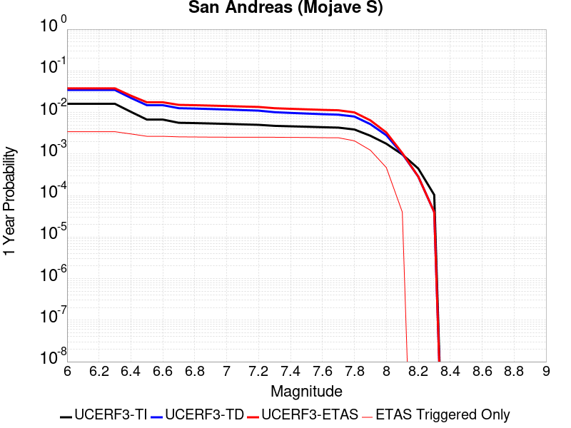 |  |

| Magnitude | 1 wk TI Prob | 1 wk TD Prob | 1 wk ETAS Prob | 1 wk ETAS/TD Gain | 1 wk ETAS Triggered Only | 1 mo TI Prob | 1 mo TD Prob | 1 mo ETAS Prob | 1 mo ETAS/TD Gain | 1 mo ETAS Triggered Only | 1 yr TI Prob | 1 yr TD Prob | 1 yr ETAS Prob | 1 yr ETAS/TD Gain | 1 yr ETAS Triggered Only | 10 yr TI Prob | 10 yr TD Prob | 10 yr ETAS Prob | 10 yr ETAS/TD Gain | 10 yr ETAS Triggered Only |
|-----|-----|-----|-----|-----|-----|-----|-----|-----|-----|-----|-----|-----|-----|-----|-----|-----|-----|-----|-----|-----|
| 6.0 | 3.1064058E-4 | 6.7462435E-4 | 0.0025333695 | 3.75523 | 0.00186 | 0.0013306376 | 0.002888172 | 0.005271269 | 1.8251231 | 0.00239 | 0.016080605 | 0.034565594 | 0.037877034 | 1.0958016 | 0.00343 | 0.1496549 | 0.28654557 | 0.28975612 | 1.0112044 | 0.0045 |
| 6.1 | 3.1064058E-4 | 6.7462435E-4 | 0.0025333695 | 3.75523 | 0.00186 | 0.0013306376 | 0.002888172 | 0.005271269 | 1.8251231 | 0.00239 | 0.016080605 | 0.034565594 | 0.037877034 | 1.0958016 | 0.00343 | 0.1496549 | 0.28654557 | 0.28975612 | 1.0112044 | 0.0045 |
| 6.2 | 3.1064058E-4 | 6.7462435E-4 | 0.0025333695 | 3.75523 | 0.00186 | 0.0013306376 | 0.002888172 | 0.005271269 | 1.8251231 | 0.00239 | 0.016080605 | 0.034565594 | 0.037877034 | 1.0958016 | 0.00343 | 0.1496549 | 0.28654557 | 0.28975612 | 1.0112044 | 0.0045 |
| 6.3 | 3.1064058E-4 | 6.7462435E-4 | 0.0025333695 | 3.75523 | 0.00186 | 0.0013306376 | 0.002888172 | 0.005271269 | 1.8251231 | 0.00239 | 0.016080605 | 0.034565594 | 0.037877034 | 1.0958016 | 0.00343 | 0.1496549 | 0.28654557 | 0.28975612 | 1.0112044 | 0.0045 |
| 6.4 | 1.9872203E-4 | 4.3181062E-4 | 0.0020611067 | 4.773173 | 0.00163 | 8.5138786E-4 | 0.0018493326 | 0.0039554304 | 2.138842 | 0.00211 | 0.010316478 | 0.02228931 | 0.025251774 | 1.1329097 | 0.00303 | 0.098504856 | 0.19686839 | 0.20009698 | 1.0163997 | 0.00402 |
| 6.5 | 1.291105E-4 | 2.8754136E-4 | 0.0017471216 | 6.0760703 | 0.00146 | 5.5321335E-4 | 0.0012317409 | 0.0030894498 | 2.5081978 | 0.00186 | 0.006714592 | 0.014894155 | 0.017514536 | 1.1759336 | 0.00266 | 0.065152965 | 0.13800792 | 0.1410249 | 1.0218608 | 0.0035 |
| 6.6 | 1.291105E-4 | 2.8754136E-4 | 0.0017471216 | 6.0760703 | 0.00146 | 5.5321335E-4 | 0.0012317409 | 0.0030894498 | 2.5081978 | 0.00186 | 0.006714592 | 0.014894155 | 0.017514536 | 1.1759336 | 0.00266 | 0.065152965 | 0.13800792 | 0.1410249 | 1.0218608 | 0.0035 |
| 6.7 | 1.08001186E-4 | 2.4335351E-4 | 0.001663008 | 6.8337126 | 0.00142 | 4.6278012E-4 | 0.0010425274 | 0.00286063 | 2.7439375 | 0.00182 | 0.0056198016 | 0.0126192 | 0.015166642 | 1.2018703 | 0.00258 | 0.054797906 | 0.11918431 | 0.12215266 | 1.0249056 | 0.00337 |
| 6.8 | 1.0624356E-4 | 2.3853009E-4 | 0.0016381962 | 6.8678803 | 0.0014 | 4.5525006E-4 | 0.0010218718 | 0.0028200324 | 2.7596734 | 0.0018 | 0.0055285925 | 0.012370593 | 0.014898924 | 1.2043824 | 0.00256 | 0.053930566 | 0.11713308 | 0.120090686 | 1.02525 | 0.00335 |
| 6.9 | 1.0393785E-4 | 2.3223337E-4 | 0.0016319082 | 7.0270185 | 0.0014 | 4.4537184E-4 | 9.949068E-4 | 0.0027731357 | 2.7873325 | 0.00178 | 0.0054089287 | 0.012045963 | 0.014555367 | 1.2083191 | 0.00254 | 0.05279156 | 0.114433445 | 0.117382385 | 1.0257698 | 0.00333 |
| 7.0 | 1.0155622E-4 | 2.2592908E-4 | 0.001615615 | 7.1509833 | 0.00139 | 4.3516833E-4 | 9.6790853E-4 | 0.0027361955 | 2.8269153 | 0.00177 | 0.005285311 | 0.011720838 | 0.014221184 | 1.2133249 | 0.00253 | 0.05161361 | 0.11169745 | 0.11464661 | 1.0264032 | 0.00332 |
| 7.1 | 9.885595E-5 | 2.188132E-4 | 0.0016085091 | 7.3510604 | 0.00139 | 4.2359953E-4 | 9.374342E-4 | 0.0026957842 | 2.875705 | 0.00176 | 0.0051451353 | 0.011353733 | 0.0138451215 | 1.2194334 | 0.00252 | 0.05027629 | 0.10857607 | 0.111517765 | 1.0270934 | 0.0033 |
| 7.2 | 9.6411415E-5 | 2.1244297E-4 | 0.0016021477 | 7.5415425 | 0.00139 | 4.1312634E-4 | 9.101525E-4 | 0.0026685507 | 2.9319818 | 0.00176 | 0.005018219 | 0.011024987 | 0.013517204 | 1.2260517 | 0.00252 | 0.049064007 | 0.1057697 | 0.10872066 | 1.0278999 | 0.0033 |
| 7.3 | 9.1180635E-5 | 1.9472656E-4 | 0.0015844558 | 8.136825 | 0.00139 | 3.907156E-4 | 8.342756E-4 | 0.0025928072 | 3.1078546 | 0.00176 | 0.004746591 | 0.010110112 | 0.012604634 | 1.2467353 | 0.00252 | 0.046464786 | 0.09796176 | 0.100920446 | 1.0302025 | 0.00328 |
| 7.4 | 8.887388E-5 | 1.872126E-4 | 0.0015669543 | 8.369919 | 0.00138 | 3.8083247E-4 | 8.020931E-4 | 0.0025506895 | 3.1800416 | 0.00175 | 0.0046267817 | 0.009721855 | 0.01219755 | 1.2546526 | 0.0025 | 0.045316286 | 0.094593845 | 0.09754547 | 1.0312032 | 0.00326 |
| 7.5 | 8.6750515E-5 | 1.80528E-4 | 0.0015502807 | 8.587481 | 0.00137 | 3.7173493E-4 | 7.734621E-4 | 0.0025121162 | 3.2478855 | 0.00174 | 0.004516484 | 0.009376327 | 0.011842979 | 1.2630724 | 0.00249 | 0.04425787 | 0.09155606 | 0.0945085 | 1.0322474 | 0.00325 |
| 7.6 | 8.453092E-5 | 1.7440386E-4 | 0.0015341666 | 8.796633 | 0.00136 | 3.6222505E-4 | 7.4723107E-4 | 0.0024759383 | 3.3134842 | 0.00173 | 0.0044011753 | 0.009059664 | 0.011497377 | 1.2690732 | 0.00246 | 0.04315024 | 0.08871447 | 0.091639705 | 1.0329735 | 0.00321 |
| 7.7 | 8.259102E-5 | 1.6962511E-4 | 0.0015293944 | 9.016321 | 0.00136 | 3.539135E-4 | 7.267622E-4 | 0.0024555048 | 3.3786907 | 0.00173 | 0.004300386 | 0.0088125 | 0.01124091 | 1.2755642 | 0.00245 | 0.042181134 | 0.086465426 | 0.08938874 | 1.0338091 | 0.0032 |
| 7.8 | 7.444844E-5 | 1.528469E-4 | 0.001322668 | 8.653548 | 0.00117 | 3.1902574E-4 | 6.5489375E-4 | 0.0021139376 | 3.2279093 | 0.00146 | 0.0038772223 | 0.007944231 | 0.009997787 | 1.2584964 | 0.00207 | 0.03810269 | 0.078293875 | 0.08078248 | 1.0317855 | 0.0027 |
| 7.9 | 5.2586525E-5 | 1.0007023E-4 | 7.700032E-4 | 7.694628 | 6.7E-4 | 2.2535135E-4 | 4.2880196E-4 | 0.0012484504 | 2.9114847 | 8.2E-4 | 0.0027402006 | 0.005208178 | 0.006431772 | 1.2349371 | 0.00123 | 0.027066574 | 0.052201588 | 0.053680155 | 1.0283241 | 0.00156 |
| 8.0 | 3.379877E-5 | 5.4075565E-5 | 3.140615E-4 | 5.807827 | 2.6E-4 | 1.4484383E-4 | 2.3173184E-4 | 5.616554E-4 | 2.42373 | 3.3E-4 | 0.0017620471 | 0.0028176866 | 0.0032863624 | 1.1663336 | 4.7E-4 | 0.017481409 | 0.028835917 | 0.029408904 | 1.0198706 | 5.9E-4 |
| 8.1 | 1.8668277E-5 | 1.9308145E-5 | 3.9307757E-5 | 2.0358124 | 2.0E-5 | 8.000444E-5 | 8.274657E-5 | 1.0274491E-4 | 1.2416818 | 2.0E-5 | 9.736188E-4 | 0.0010069745 | 0.0010469343 | 1.039683 | 4.0E-5 | 0.009693642 | 0.010798624 | 0.010857976 | 1.0054963 | 6.0E-5 |
| 8.2 | 8.541571E-6 | 5.4596358E-6 | 5.4596358E-6 | 1.0 | 0.0 | 3.660622E-5 | 2.339823E-5 | 2.339823E-5 | 1.0 | 0.0 | 4.455896E-4 | 2.848363E-4 | 2.848363E-4 | 1.0 | 0.0 | 0.0044469717 | 0.003240283 | 0.003240283 | 1.0 | 0.0 |
| 8.3 | 1.983087E-6 | 7.6564595E-7 | 7.6564595E-7 | 1.0 | 0.0 | 8.498917E-6 | 3.281336E-6 | 3.281336E-6 | 1.0 | 0.0 | 1.034694E-4 | 3.9949547E-5 | 3.9949547E-5 | 1.0 | 0.0 | 0.0010342124 | 4.717979E-4 | 4.717979E-4 | 1.0 | 0.0 |

## Coyote Canyon
*[(top)](#table-of-contents)*

| 1 Week | 1 Month | 1 Year | 10 Year |
|-----|-----|-----|-----|
|  |  |  |  |

| Magnitude | 1 wk TI Prob | 1 wk TD Prob | 1 wk ETAS Prob | 1 wk ETAS/TD Gain | 1 wk ETAS Triggered Only | 1 mo TI Prob | 1 mo TD Prob | 1 mo ETAS Prob | 1 mo ETAS/TD Gain | 1 mo ETAS Triggered Only | 1 yr TI Prob | 1 yr TD Prob | 1 yr ETAS Prob | 1 yr ETAS/TD Gain | 1 yr ETAS Triggered Only | 10 yr TI Prob | 10 yr TD Prob | 10 yr ETAS Prob | 10 yr ETAS/TD Gain | 10 yr ETAS Triggered Only |
|-----|-----|-----|-----|-----|-----|-----|-----|-----|-----|-----|-----|-----|-----|-----|-----|-----|-----|-----|-----|-----|
| 6.0 | 3.5090034E-5 | 4.0364317E-5 | 0.0012003175 | 29.737095 | 0.00116 | 1.503772E-4 | 1.7297991E-4 | 0.0017627049 | 10.190228 | 0.00159 | 0.0018293047 | 0.0021042533 | 0.004788593 | 2.2756732 | 0.00269 | 0.018143194 | 0.020869205 | 0.024903223 | 1.1933001 | 0.00412 |
| 6.1 | 3.5090034E-5 | 4.0364317E-5 | 0.0012003175 | 29.737095 | 0.00116 | 1.503772E-4 | 1.7297991E-4 | 0.0017627049 | 10.190228 | 0.00159 | 0.0018293047 | 0.0021042533 | 0.004788593 | 2.2756732 | 0.00269 | 0.018143194 | 0.020869205 | 0.024903223 | 1.1933001 | 0.00412 |
| 6.2 | 1.841879E-5 | 2.1059794E-5 | 5.410488E-4 | 25.69108 | 5.2E-4 | 7.8935285E-5 | 9.025371E-5 | 8.40186E-4 | 9.309157 | 7.5E-4 | 9.606133E-4 | 0.0010983871 | 0.0025168273 | 2.2913847 | 0.00142 | 0.0095647145 | 0.010939668 | 0.013165053 | 1.2034235 | 0.00225 |
| 6.3 | 1.841879E-5 | 2.1059794E-5 | 5.410488E-4 | 25.69108 | 5.2E-4 | 7.8935285E-5 | 9.025371E-5 | 8.40186E-4 | 9.309157 | 7.5E-4 | 9.606133E-4 | 0.0010983871 | 0.0025168273 | 2.2913847 | 0.00142 | 0.0095647145 | 0.010939668 | 0.013165053 | 1.2034235 | 0.00225 |
| 6.4 | 1.712201E-5 | 1.9565212E-5 | 5.095556E-4 | 26.043962 | 4.9E-4 | 7.337798E-5 | 8.3848776E-5 | 8.037884E-4 | 9.586167 | 7.2E-4 | 8.930107E-4 | 0.0010204813 | 0.0023391342 | 2.2921872 | 0.00132 | 0.008894307 | 0.010167871 | 0.0122564165 | 1.2054064 | 0.00211 |
| 6.5 | 1.4744935E-5 | 1.6836972E-5 | 4.668294E-4 | 27.726446 | 4.5E-4 | 6.3191044E-5 | 7.215698E-5 | 7.421086E-4 | 10.28464 | 6.7E-4 | 7.6907943E-4 | 8.782507E-4 | 0.0020771967 | 2.3651526 | 0.0012 | 0.007664232 | 0.008756994 | 0.010650269 | 1.2162013 | 0.00191 |
| 6.6 | 1.2017839E-5 | 1.3724089E-5 | 3.7371914E-4 | 27.230888 | 3.6E-4 | 5.150401E-5 | 5.88167E-5 | 6.087843E-4 | 10.350536 | 5.5E-4 | 6.268809E-4 | 7.159466E-4 | 0.0017352164 | 2.4236672 | 0.00102 | 0.0062511545 | 0.0071450938 | 0.008674091 | 1.2139925 | 0.00154 |
| 6.7 | 1.00956095E-5 | 1.1533517E-5 | 3.1153005E-4 | 27.010847 | 3.0E-4 | 4.326618E-5 | 4.942891E-5 | 4.9940665E-4 | 10.103534 | 4.5E-4 | 5.266384E-4 | 6.017178E-4 | 0.0014711943 | 2.4449906 | 8.7E-4 | 0.005253921 | 0.0060094125 | 0.0073711798 | 1.2266057 | 0.00137 |

## San Andreas (Mojave N)
*[(top)](#table-of-contents)*

| 1 Week | 1 Month | 1 Year | 10 Year |
|-----|-----|-----|-----|
| 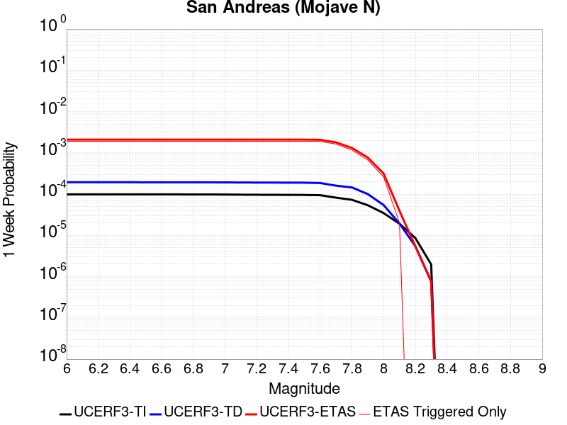 |  | 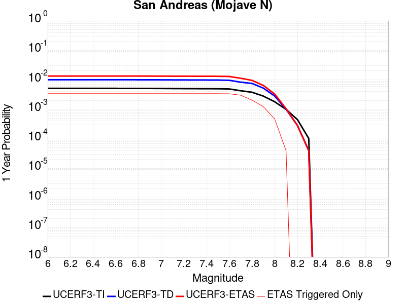 |  |

| Magnitude | 1 wk TI Prob | 1 wk TD Prob | 1 wk ETAS Prob | 1 wk ETAS/TD Gain | 1 wk ETAS Triggered Only | 1 mo TI Prob | 1 mo TD Prob | 1 mo ETAS Prob | 1 mo ETAS/TD Gain | 1 mo ETAS Triggered Only | 1 yr TI Prob | 1 yr TD Prob | 1 yr ETAS Prob | 1 yr ETAS/TD Gain | 1 yr ETAS Triggered Only | 10 yr TI Prob | 10 yr TD Prob | 10 yr ETAS Prob | 10 yr ETAS/TD Gain | 10 yr ETAS Triggered Only |
|-----|-----|-----|-----|-----|-----|-----|-----|-----|-----|-----|-----|-----|-----|-----|-----|-----|-----|-----|-----|-----|
| 6.0 | 9.877682E-5 | 1.9402112E-4 | 0.0020936525 | 10.790849 | 0.0019 | 4.2326056E-4 | 8.312543E-4 | 0.0031892925 | 3.836723 | 0.00236 | 0.0051410277 | 0.010073684 | 0.013439434 | 1.334113 | 0.0034 | 0.05023708 | 0.09832245 | 0.10228082 | 1.040259 | 0.00439 |
| 6.1 | 9.877682E-5 | 1.9402112E-4 | 0.0020936525 | 10.790849 | 0.0019 | 4.2326056E-4 | 8.312543E-4 | 0.0031892925 | 3.836723 | 0.00236 | 0.0051410277 | 0.010073684 | 0.013439434 | 1.334113 | 0.0034 | 0.05023708 | 0.09832245 | 0.10228082 | 1.040259 | 0.00439 |
| 6.2 | 9.877682E-5 | 1.9402112E-4 | 0.0020936525 | 10.790849 | 0.0019 | 4.2326056E-4 | 8.312543E-4 | 0.0031892925 | 3.836723 | 0.00236 | 0.0051410277 | 0.010073684 | 0.013439434 | 1.334113 | 0.0034 | 0.05023708 | 0.09832245 | 0.10228082 | 1.040259 | 0.00439 |
| 6.3 | 9.877682E-5 | 1.9402112E-4 | 0.0020936525 | 10.790849 | 0.0019 | 4.2326056E-4 | 8.312543E-4 | 0.0031892925 | 3.836723 | 0.00236 | 0.0051410277 | 0.010073684 | 0.013439434 | 1.334113 | 0.0034 | 0.05023708 | 0.09832245 | 0.10228082 | 1.040259 | 0.00439 |
| 6.4 | 9.877682E-5 | 1.9402112E-4 | 0.0020936525 | 10.790849 | 0.0019 | 4.2326056E-4 | 8.312543E-4 | 0.0031892925 | 3.836723 | 0.00236 | 0.0051410277 | 0.010073684 | 0.013439434 | 1.334113 | 0.0034 | 0.05023708 | 0.09832245 | 0.10228082 | 1.040259 | 0.00439 |
| 6.5 | 9.861474E-5 | 1.937588E-4 | 0.0020933906 | 10.804106 | 0.0019 | 4.2256617E-4 | 8.3013077E-4 | 0.0031881717 | 3.8405654 | 0.00236 | 0.0051326132 | 0.0100601325 | 0.013425928 | 1.3345677 | 0.0034 | 0.050156746 | 0.09820035 | 0.10215023 | 1.0402226 | 0.00438 |
| 6.6 | 9.861474E-5 | 1.937588E-4 | 0.0020933906 | 10.804106 | 0.0019 | 4.2256617E-4 | 8.3013077E-4 | 0.0031881717 | 3.8405654 | 0.00236 | 0.0051326132 | 0.0100601325 | 0.013425928 | 1.3345677 | 0.0034 | 0.050156746 | 0.09820035 | 0.10215023 | 1.0402226 | 0.00438 |
| 6.7 | 9.8552715E-5 | 1.9365833E-4 | 0.0020932904 | 10.809194 | 0.0019 | 4.223004E-4 | 8.2970044E-4 | 0.0031877423 | 3.84204 | 0.00236 | 0.0051293927 | 0.010054941 | 0.013420754 | 1.3347422 | 0.0034 | 0.050125998 | 0.09815356 | 0.10210364 | 1.040244 | 0.00438 |
| 6.8 | 9.8464974E-5 | 1.9350994E-4 | 0.0020931424 | 10.816717 | 0.0019 | 4.219245E-4 | 8.290649E-4 | 0.0031871083 | 3.8442204 | 0.00236 | 0.0051248376 | 0.010047276 | 0.0134131145 | 1.3350002 | 0.0034 | 0.05008251 | 0.09808378 | 0.102034174 | 1.0402757 | 0.00438 |
| 6.9 | 9.825824E-5 | 1.9319002E-4 | 0.002092823 | 10.832976 | 0.0019 | 4.2103877E-4 | 8.276947E-4 | 0.0031857414 | 3.848933 | 0.00236 | 0.0051141046 | 0.010030746 | 0.013396642 | 1.3355578 | 0.0034 | 0.049980022 | 0.097932965 | 0.101884015 | 1.0403445 | 0.00438 |
| 7.0 | 9.781462E-5 | 1.9250368E-4 | 0.002092138 | 10.868041 | 0.0019 | 4.1913814E-4 | 8.247551E-4 | 0.0031828086 | 3.8590956 | 0.00236 | 0.005091073 | 0.009995285 | 0.013361301 | 1.3367604 | 0.0034 | 0.04976007 | 0.09760912 | 0.10155257 | 1.0404004 | 0.00437 |
| 7.1 | 9.7121134E-5 | 1.9152075E-4 | 0.0020911568 | 10.918696 | 0.0019 | 4.1616702E-4 | 8.205452E-4 | 0.0031786086 | 3.8737764 | 0.00236 | 0.005055068 | 0.0099444995 | 0.013310688 | 1.3384975 | 0.0034 | 0.04941613 | 0.09714571 | 0.10109118 | 1.040614 | 0.00437 |
| 7.2 | 9.663819E-5 | 1.9082859E-4 | 0.002090466 | 10.9546795 | 0.0019 | 4.1409794E-4 | 8.175807E-4 | 0.0031756512 | 3.8842053 | 0.00236 | 0.0050299936 | 0.009908735 | 0.013275045 | 1.3397316 | 0.0034 | 0.049176537 | 0.09681883 | 0.1007567 | 1.0406725 | 0.00436 |
| 7.3 | 9.6277574E-5 | 1.9035369E-4 | 0.002089992 | 10.97952 | 0.0019 | 4.125529E-4 | 8.1554666E-4 | 0.0031736218 | 3.8914046 | 0.00236 | 0.0050112694 | 0.009884195 | 0.013250589 | 1.3405834 | 0.0034 | 0.04899759 | 0.09659228 | 0.10053113 | 1.0407782 | 0.00436 |
| 7.4 | 9.593308E-5 | 1.8975153E-4 | 0.002089391 | 11.011194 | 0.0019 | 4.1107697E-4 | 8.129676E-4 | 0.003171049 | 3.9005847 | 0.00236 | 0.0049933824 | 0.009853081 | 0.013209678 | 1.3406649 | 0.00339 | 0.04882661 | 0.09630986 | 0.100240916 | 1.0408167 | 0.00435 |
| 7.5 | 9.561707E-5 | 1.8921228E-4 | 0.0020888527 | 11.039732 | 0.0019 | 4.0972308E-4 | 8.106579E-4 | 0.0031687447 | 3.9088557 | 0.00236 | 0.0049769743 | 0.009825215 | 0.013181907 | 1.3416406 | 0.00339 | 0.048669744 | 0.096056245 | 0.0999884 | 1.040936 | 0.00435 |
| 7.6 | 9.418194E-5 | 1.8573487E-4 | 0.002075384 | 11.173904 | 0.00189 | 4.0357444E-4 | 7.95764E-4 | 0.003143894 | 3.950787 | 0.00235 | 0.004902454 | 0.009645499 | 0.012982993 | 1.3460158 | 0.00337 | 0.047957025 | 0.094437465 | 0.0983495 | 1.0414245 | 0.00432 |
| 7.7 | 8.202141E-5 | 1.6022482E-4 | 0.0017899637 | 11.171576 | 0.00163 | 3.51473E-4 | 6.8649714E-4 | 0.0027350897 | 3.9841242 | 0.00205 | 0.00427079 | 0.008326128 | 0.011311067 | 1.3585025 | 0.00301 | 0.04189639 | 0.082237914 | 0.08579883 | 1.0433002 | 0.00388 |
| 7.8 | 7.2859846E-5 | 1.4517571E-4 | 0.0013150058 | 9.058029 | 0.00117 | 3.1221908E-4 | 6.2203326E-4 | 0.002081125 | 3.3456812 | 0.00146 | 0.003794643 | 0.0075469986 | 0.009591452 | 1.2708962 | 0.00206 | 0.037304975 | 0.07472766 | 0.07721665 | 1.0333074 | 0.00269 |
| 7.9 | 5.3874453E-5 | 1.00462625E-4 | 7.7039533E-4 | 7.6684766 | 6.7E-4 | 2.3087008E-4 | 4.3048308E-4 | 0.0012501301 | 2.9040167 | 8.2E-4 | 0.0028072202 | 0.0052285474 | 0.0064521166 | 1.234017 | 0.00123 | 0.02772022 | 0.052425884 | 0.053904098 | 1.0281963 | 0.00156 |
| 8.0 | 3.468538E-5 | 5.4261534E-5 | 3.1424742E-4 | 5.791348 | 2.6E-4 | 1.4864317E-4 | 2.3252872E-4 | 5.62452E-4 | 2.4188495 | 3.3E-4 | 0.0018082283 | 0.0028273636 | 0.0032960349 | 1.1657625 | 4.7E-4 | 0.017935853 | 0.028948462 | 0.029521381 | 1.019791 | 5.9E-4 |
| 8.1 | 1.9152367E-5 | 1.9401303E-5 | 3.9400915E-5 | 2.0308387 | 2.0E-5 | 8.207899E-5 | 8.3145795E-5 | 1.0314413E-4 | 1.2405213 | 2.0E-5 | 9.988535E-4 | 0.0010118305 | 0.0010517901 | 1.0394924 | 4.0E-5 | 0.009943757 | 0.01085595 | 0.0109153 | 1.0054669 | 6.0E-5 |
| 8.2 | 8.643924E-6 | 5.473668E-6 | 5.473668E-6 | 1.0 | 0.0 | 3.704486E-5 | 2.3458366E-5 | 2.3458366E-5 | 1.0 | 0.0 | 4.5092785E-4 | 2.8556827E-4 | 2.8556827E-4 | 1.0 | 0.0 | 0.0045001395 | 0.0032481793 | 0.0032481793 | 1.0 | 0.0 |
| 8.3 | 1.983087E-6 | 7.6564595E-7 | 7.6564595E-7 | 1.0 | 0.0 | 8.498917E-6 | 3.281336E-6 | 3.281336E-6 | 1.0 | 0.0 | 1.034694E-4 | 3.9949547E-5 | 3.9949547E-5 | 1.0 | 0.0 | 0.0010342124 | 4.717979E-4 | 4.717979E-4 | 1.0 | 0.0 |

## Death Valley (So)
*[(top)](#table-of-contents)*

| 1 Week | 1 Month | 1 Year | 10 Year |
|-----|-----|-----|-----|
| 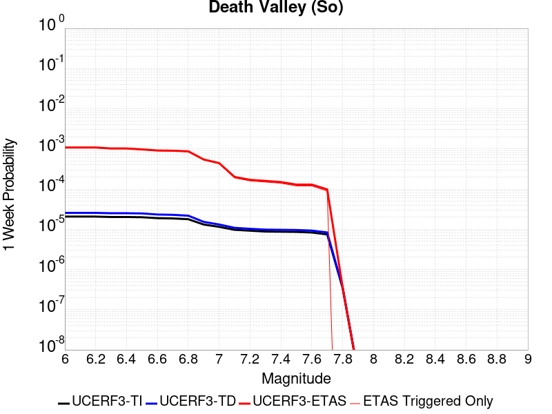 |  |  |  |

| Magnitude | 1 wk TI Prob | 1 wk TD Prob | 1 wk ETAS Prob | 1 wk ETAS/TD Gain | 1 wk ETAS Triggered Only | 1 mo TI Prob | 1 mo TD Prob | 1 mo ETAS Prob | 1 mo ETAS/TD Gain | 1 mo ETAS Triggered Only | 1 yr TI Prob | 1 yr TD Prob | 1 yr ETAS Prob | 1 yr ETAS/TD Gain | 1 yr ETAS Triggered Only | 10 yr TI Prob | 10 yr TD Prob | 10 yr ETAS Prob | 10 yr ETAS/TD Gain | 10 yr ETAS Triggered Only |
|-----|-----|-----|-----|-----|-----|-----|-----|-----|-----|-----|-----|-----|-----|-----|-----|-----|-----|-----|-----|-----|
| 6.0 | 2.0684236E-5 | 2.5618314E-5 | 0.0010855912 | 42.375587 | 0.00106 | 8.864371E-5 | 1.0978825E-4 | 0.0017296104 | 15.754058 | 0.00162 | 0.0010787029 | 0.0013358692 | 0.0042020353 | 3.1455438 | 0.00287 | 0.010734817 | 0.013279985 | 0.017394606 | 1.3098364 | 0.00417 |
| 6.1 | 2.0684236E-5 | 2.5618314E-5 | 0.0010855912 | 42.375587 | 0.00106 | 8.864371E-5 | 1.0978825E-4 | 0.0017296104 | 15.754058 | 0.00162 | 0.0010787029 | 0.0013358692 | 0.0042020353 | 3.1455438 | 0.00287 | 0.010734817 | 0.013279985 | 0.017394606 | 1.3098364 | 0.00417 |
| 6.2 | 2.0684236E-5 | 2.5618314E-5 | 0.0010855912 | 42.375587 | 0.00106 | 8.864371E-5 | 1.0978825E-4 | 0.0017296104 | 15.754058 | 0.00162 | 0.0010787029 | 0.0013358692 | 0.0042020353 | 3.1455438 | 0.00287 | 0.010734817 | 0.013279985 | 0.017394606 | 1.3098364 | 0.00417 |
| 6.3 | 2.0240292E-5 | 2.51184E-5 | 0.0010250933 | 40.810455 | 0.001 | 8.6741224E-5 | 1.0764593E-4 | 0.0016474802 | 15.304621 | 0.00154 | 0.0010555626 | 0.001309818 | 0.003986308 | 3.0434058 | 0.00268 | 0.010505628 | 0.013022543 | 0.016861886 | 1.2948228 | 0.00389 |
| 6.4 | 2.0240292E-5 | 2.51184E-5 | 0.0010250933 | 40.810455 | 0.001 | 8.6741224E-5 | 1.0764593E-4 | 0.0016474802 | 15.304621 | 0.00154 | 0.0010555626 | 0.001309818 | 0.003986308 | 3.0434058 | 0.00268 | 0.010505628 | 0.013022543 | 0.016861886 | 1.2948228 | 0.00389 |
| 6.5 | 1.9962767E-5 | 2.4807652E-5 | 9.747841E-4 | 39.293686 | 9.5E-4 | 8.55519E-5 | 1.0631427E-4 | 0.001576158 | 14.82546 | 0.00147 | 0.0010410968 | 0.0012936244 | 0.0038403256 | 2.9686558 | 0.00255 | 0.010362327 | 0.01286249 | 0.016505027 | 1.2831907 | 0.00369 |
| 6.6 | 1.8937297E-5 | 2.3311462E-5 | 9.132907E-4 | 39.177753 | 8.9E-4 | 8.115732E-5 | 9.990252E-5 | 0.0014697657 | 14.711997 | 0.00137 | 9.876423E-4 | 0.0012156491 | 0.0035927559 | 2.955422 | 0.00238 | 0.009832645 | 0.0120915035 | 0.015480029 | 1.2802403 | 0.00343 |
| 6.7 | 1.8621096E-5 | 2.2912098E-5 | 9.028919E-4 | 39.406776 | 8.8E-4 | 7.980225E-5 | 9.8191085E-5 | 0.0014580576 | 14.849184 | 0.00136 | 9.711593E-4 | 0.0011948354 | 0.0035320395 | 2.9560888 | 0.00234 | 0.009669261 | 0.011885625 | 0.015215571 | 1.2801658 | 0.00337 |
| 6.8 | 1.7830353E-5 | 2.1806083E-5 | 8.7178755E-4 | 39.979095 | 8.5E-4 | 7.641356E-5 | 9.3451374E-5 | 0.0013933299 | 14.9096775 | 0.0013 | 9.29938E-4 | 0.0011371907 | 0.003334689 | 2.9323921 | 0.0022 | 0.009260561 | 0.01131609 | 0.014430444 | 1.2752147 | 0.00315 |
| 6.9 | 1.3135183E-5 | 1.5304031E-5 | 5.4529594E-4 | 35.63087 | 5.3E-4 | 5.6292425E-5 | 6.558709E-5 | 8.9553266E-4 | 13.654099 | 8.3E-4 | 6.8514474E-4 | 7.982367E-4 | 0.0022171033 | 2.7775009 | 0.00142 | 0.006830362 | 0.007955158 | 0.009959089 | 1.2519033 | 0.00202 |
| 7.0 | 1.1507512E-5 | 1.3154237E-5 | 4.4314857E-4 | 33.688656 | 4.3E-4 | 4.9316975E-5 | 5.637412E-5 | 7.163369E-4 | 12.7068405 | 6.6E-4 | 6.002687E-4 | 6.861445E-4 | 0.0017554103 | 2.5583682 | 0.00107 | 0.0059864987 | 0.0068414924 | 0.008351093 | 1.2206538 | 0.00152 |
| 7.1 | 9.715903E-6 | 1.0865287E-5 | 2.0086323E-4 | 18.486694 | 1.9E-4 | 4.1638916E-5 | 4.6564706E-5 | 3.365512E-4 | 7.227603 | 2.9E-4 | 5.068359E-4 | 5.667821E-4 | 0.0010764931 | 1.8993067 | 5.1E-4 | 0.0050568148 | 0.005653834 | 0.0064294236 | 1.1371795 | 7.8E-4 |
| 7.2 | 9.233269E-6 | 1.0286314E-5 | 1.7028466E-4 | 16.55449 | 1.6E-4 | 3.9570554E-5 | 4.408348E-5 | 2.840729E-4 | 6.4439764 | 2.4E-4 | 4.81665E-4 | 5.365884E-4 | 9.263792E-4 | 1.726424 | 3.9E-4 | 0.0048062233 | 0.0053533595 | 0.005920308 | 1.1059052 | 5.7E-4 |
| 7.3 | 8.8041315E-6 | 9.808164E-6 | 1.5980669E-4 | 16.293232 | 1.5E-4 | 3.7731446E-5 | 4.2034335E-5 | 2.6202507E-4 | 6.233597 | 2.2E-4 | 4.592835E-4 | 5.1165203E-4 | 8.2149345E-4 | 1.6055706 | 3.1E-4 | 0.0045833546 | 0.005105167 | 0.005542921 | 1.0857472 | 4.4E-4 |
| 7.4 | 8.708749E-6 | 9.707175E-6 | 1.4970581E-4 | 15.422182 | 1.4E-4 | 3.7322676E-5 | 4.160154E-5 | 2.515928E-4 | 6.0476804 | 2.1E-4 | 4.5430884E-4 | 5.0638523E-4 | 7.9623837E-4 | 1.5723965 | 2.9E-4 | 0.004533812 | 0.0050527398 | 0.0054706177 | 1.0827032 | 4.2E-4 |
| 7.5 | 8.612678E-6 | 9.604817E-6 | 1.2960366E-4 | 13.49361 | 1.2E-4 | 3.6910955E-5 | 4.1162875E-5 | 2.2115547E-4 | 5.372692 | 1.8E-4 | 4.492982E-4 | 5.01047E-4 | 7.6091674E-4 | 1.5186534 | 2.6E-4 | 0.004483909 | 0.0049995985 | 0.005387649 | 1.0776162 | 3.9E-4 |
| 7.6 | 8.319024E-6 | 9.283916E-6 | 1.2928281E-4 | 13.92546 | 1.2E-4 | 3.5652476E-5 | 3.978763E-5 | 2.1978047E-4 | 5.523839 | 1.8E-4 | 4.3398244E-4 | 4.8431093E-4 | 7.341898E-4 | 1.5159473 | 2.5E-4 | 0.0043313587 | 0.0048329784 | 0.0052011902 | 1.0761874 | 3.7E-4 |
| 7.7 | 7.4718328E-6 | 8.34517E-6 | 9.834442E-5 | 11.784592 | 9.0E-5 | 3.2021748E-5 | 3.5764548E-5 | 1.6575989E-4 | 4.6347547 | 1.3E-4 | 3.8979502E-4 | 4.353504E-4 | 6.052764E-4 | 1.3903201 | 1.7E-4 | 0.00389112 | 0.0043453807 | 0.0046142074 | 1.061865 | 2.7E-4 |
| 7.8 | 3.4586725E-7 | 3.6482615E-7 | 3.6482615E-7 | 1.0 | 0.0 | 1.4822873E-6 | 1.5635396E-6 | 1.5635396E-6 | 1.0 | 0.0 | 1.80467E-5 | 1.9035933E-5 | 1.9035933E-5 | 1.0 | 0.0 | 1.8045233E-4 | 1.9034347E-4 | 2.0034157E-4 | 1.0525266 | 1.0E-5 |
| 7.9 | 2.5591178E-9 | 2.6696718E-9 | 2.6696718E-9 | 1.0 | 0.0 | 1.0967647E-8 | 1.14414505E-8 | 1.14414505E-8 | 1.0 | 0.0 | 1.335311E-7 | 1.3929966E-7 | 1.3929966E-7 | 1.0 | 0.0 | 1.3353102E-6 | 1.3929966E-6 | 1.3929966E-6 | 1.0 | 0.0 |

## Nelson Lake
*[(top)](#table-of-contents)*

| 1 Week | 1 Month | 1 Year | 10 Year |
|-----|-----|-----|-----|
|  |  |  |  |

| Magnitude | 1 wk TI Prob | 1 wk TD Prob | 1 wk ETAS Prob | 1 wk ETAS/TD Gain | 1 wk ETAS Triggered Only | 1 mo TI Prob | 1 mo TD Prob | 1 mo ETAS Prob | 1 mo ETAS/TD Gain | 1 mo ETAS Triggered Only | 1 yr TI Prob | 1 yr TD Prob | 1 yr ETAS Prob | 1 yr ETAS/TD Gain | 1 yr ETAS Triggered Only | 10 yr TI Prob | 10 yr TD Prob | 10 yr ETAS Prob | 10 yr ETAS/TD Gain | 10 yr ETAS Triggered Only |
|-----|-----|-----|-----|-----|-----|-----|-----|-----|-----|-----|-----|-----|-----|-----|-----|-----|-----|-----|-----|-----|
| 6.0 | 9.913453E-6 | 1.0192255E-5 | 6.9018535E-4 | 67.716644 | 6.8E-4 | 4.2485535E-5 | 4.3680422E-5 | 0.0010736354 | 24.579329 | 0.00103 | 5.1713863E-4 | 5.316897E-4 | 0.0026605572 | 5.003966 | 0.00213 | 0.0051593683 | 0.005305204 | 0.0086871665 | 1.6374801 | 0.0034 |
| 6.1 | 9.913453E-6 | 1.0192255E-5 | 6.9018535E-4 | 67.716644 | 6.8E-4 | 4.2485535E-5 | 4.3680422E-5 | 0.0010736354 | 24.579329 | 0.00103 | 5.1713863E-4 | 5.316897E-4 | 0.0026605572 | 5.003966 | 0.00213 | 0.0051593683 | 0.005305204 | 0.0086871665 | 1.6374801 | 0.0034 |
| 6.2 | 4.5596407E-6 | 4.696313E-6 | 3.446947E-4 | 73.39688 | 3.4E-4 | 1.954117E-5 | 2.0126909E-5 | 5.1011704E-4 | 25.345028 | 4.9E-4 | 2.3788778E-4 | 2.4501883E-4 | 0.0011747909 | 4.794697 | 9.3E-4 | 0.0023763329 | 0.0024476128 | 0.004033721 | 1.6480225 | 0.00159 |
| 6.3 | 4.5596407E-6 | 4.696313E-6 | 3.446947E-4 | 73.39688 | 3.4E-4 | 1.954117E-5 | 2.0126909E-5 | 5.1011704E-4 | 25.345028 | 4.9E-4 | 2.3788778E-4 | 2.4501883E-4 | 0.0011747909 | 4.794697 | 9.3E-4 | 0.0023763329 | 0.0024476128 | 0.004033721 | 1.6480225 | 0.00159 |
| 6.4 | 3.4025713E-6 | 3.5098972E-6 | 2.7350895E-4 | 77.92506 | 2.7E-4 | 1.4582367E-5 | 1.5042335E-5 | 3.9503662E-4 | 26.261656 | 3.8E-4 | 1.7752586E-4 | 1.8312587E-4 | 8.6300133E-4 | 4.7126126 | 6.8E-4 | 0.001773841 | 0.0018298327 | 0.00298771 | 1.6327778 | 0.00116 |
| 6.5 | 2.8352947E-6 | 2.927856E-6 | 2.229272E-4 | 76.14008 | 2.2E-4 | 1.2151207E-5 | 1.2547898E-5 | 3.4254376E-4 | 27.298895 | 3.3E-4 | 1.479309E-4 | 1.5276071E-4 | 7.4267056E-4 | 4.86166 | 5.9E-4 | 0.0014783246 | 0.0015266308 | 0.0025051348 | 1.6409565 | 9.8E-4 |
| 6.6 | 2.251518E-6 | 2.3290677E-6 | 1.8232864E-4 | 78.283966 | 1.8E-4 | 9.649328E-6 | 9.981683E-6 | 2.999788E-4 | 30.052925 | 2.9E-4 | 1.1747423E-4 | 1.2152085E-4 | 6.314589E-4 | 5.196301 | 5.1E-4 | 0.0011741214 | 0.0012146058 | 0.0020535854 | 1.6907425 | 8.4E-4 |
| 6.7 | 1.8911853E-6 | 1.9591396E-6 | 1.6195883E-4 | 82.66834 | 1.6E-4 | 8.105055E-6 | 8.39629E-6 | 2.583942E-4 | 30.774809 | 2.5E-4 | 9.867457E-5 | 1.0222061E-4 | 5.421756E-4 | 5.3039756 | 4.4E-4 | 9.863076E-4 | 0.0010217935 | 0.0017410577 | 1.7039235 | 7.2E-4 |
| 6.8 | 1.4874814E-6 | 1.5438305E-6 | 1.4154361E-4 | 91.68339 | 1.4E-4 | 6.374905E-6 | 6.6164025E-6 | 2.0661508E-4 | 31.227707 | 2.0E-4 | 7.76117E-5 | 8.055224E-5 | 4.2052486E-4 | 5.2205234 | 3.4E-4 | 7.75846E-4 | 8.0528157E-4 | 0.0013748226 | 1.7072569 | 5.7E-4 |
| 6.9 | 6.835972E-7 | 7.1399285E-7 | 6.071395E-5 | 85.0344 | 6.0E-5 | 2.9296991E-6 | 3.0599674E-6 | 1.0305966E-4 | 33.679985 | 1.0E-4 | 3.56685E-5 | 3.7254784E-5 | 2.1724807E-4 | 5.831414 | 1.8E-4 | 3.5662777E-4 | 3.7251666E-4 | 6.6240865E-4 | 1.7781987 | 2.9E-4 |

## Lenwood-Lockhart-Old Woman Springs
*[(top)](#table-of-contents)*

| 1 Week | 1 Month | 1 Year | 10 Year |
|-----|-----|-----|-----|
|  |  |  |  |

| Magnitude | 1 wk TI Prob | 1 wk TD Prob | 1 wk ETAS Prob | 1 wk ETAS/TD Gain | 1 wk ETAS Triggered Only | 1 mo TI Prob | 1 mo TD Prob | 1 mo ETAS Prob | 1 mo ETAS/TD Gain | 1 mo ETAS Triggered Only | 1 yr TI Prob | 1 yr TD Prob | 1 yr ETAS Prob | 1 yr ETAS/TD Gain | 1 yr ETAS Triggered Only | 10 yr TI Prob | 10 yr TD Prob | 10 yr ETAS Prob | 10 yr ETAS/TD Gain | 10 yr ETAS Triggered Only |
|-----|-----|-----|-----|-----|-----|-----|-----|-----|-----|-----|-----|-----|-----|-----|-----|-----|-----|-----|-----|-----|
| 6.0 | 3.744542E-5 | 4.396349E-5 | 0.0010939173 | 24.882404 | 0.00105 | 1.604705E-4 | 1.8840231E-4 | 0.0016481272 | 8.747914 | 0.00146 | 0.0019519776 | 0.0022915571 | 0.004606241 | 2.010092 | 0.00232 | 0.019349206 | 0.022697281 | 0.02604943 | 1.1476895 | 0.00343 |
| 6.1 | 3.744542E-5 | 4.396349E-5 | 0.0010939173 | 24.882404 | 0.00105 | 1.604705E-4 | 1.8840231E-4 | 0.0016481272 | 8.747914 | 0.00146 | 0.0019519776 | 0.0022915571 | 0.004606241 | 2.010092 | 0.00232 | 0.019349206 | 0.022697281 | 0.02604943 | 1.1476895 | 0.00343 |
| 6.2 | 3.744542E-5 | 4.396349E-5 | 0.0010939173 | 24.882404 | 0.00105 | 1.604705E-4 | 1.8840231E-4 | 0.0016481272 | 8.747914 | 0.00146 | 0.0019519776 | 0.0022915571 | 0.004606241 | 2.010092 | 0.00232 | 0.019349206 | 0.022697281 | 0.02604943 | 1.1476895 | 0.00343 |
| 6.3 | 2.1079984E-5 | 2.5354384E-5 | 4.953425E-4 | 19.536758 | 4.7E-4 | 9.0339665E-5 | 1.0865723E-4 | 7.0859207E-4 | 6.521352 | 6.0E-4 | 0.0010993304 | 0.0013221189 | 0.0022808497 | 1.7251471 | 9.6E-4 | 0.010939079 | 0.013144747 | 0.014605293 | 1.1111125 | 0.00148 |
| 6.4 | 2.1079984E-5 | 2.5354384E-5 | 4.953425E-4 | 19.536758 | 4.7E-4 | 9.0339665E-5 | 1.0865723E-4 | 7.0859207E-4 | 6.521352 | 6.0E-4 | 0.0010993304 | 0.0013221189 | 0.0022808497 | 1.7251471 | 9.6E-4 | 0.010939079 | 0.013144747 | 0.014605293 | 1.1111125 | 0.00148 |
| 6.5 | 1.7397282E-5 | 2.0663285E-5 | 3.8065584E-4 | 18.421846 | 3.6E-4 | 7.455765E-5 | 8.8554E-5 | 5.4851326E-4 | 6.194111 | 4.6E-4 | 9.073613E-4 | 0.0010776235 | 0.0017668798 | 1.6396079 | 6.9E-4 | 0.009036654 | 0.010725273 | 0.011734333 | 1.0940825 | 0.00102 |
| 6.6 | 1.52050325E-5 | 1.7680086E-5 | 3.576741E-4 | 20.230337 | 3.4E-4 | 6.51628E-5 | 7.576964E-5 | 4.957378E-4 | 6.5426974 | 4.2E-4 | 7.9306826E-4 | 9.221128E-4 | 0.001501578 | 1.6284103 | 5.8E-4 | 0.007902439 | 0.009183729 | 0.009996198 | 1.0884683 | 8.2E-4 |
| 6.7 | 1.332523E-5 | 1.5264379E-5 | 3.152598E-4 | 20.6533 | 3.0E-4 | 5.7106878E-5 | 6.541716E-5 | 4.453923E-4 | 6.808493 | 3.8E-4 | 6.950544E-4 | 7.9616875E-4 | 0.0013157547 | 1.6526079 | 5.2E-4 | 0.006928845 | 0.0079337945 | 0.008658002 | 1.0912814 | 7.3E-4 |
| 6.8 | 1.1525329E-5 | 1.3031365E-5 | 2.8302785E-4 | 21.718971 | 2.7E-4 | 4.9393333E-5 | 5.5847537E-5 | 4.05828E-4 | 7.2667127 | 3.5E-4 | 6.011979E-4 | 6.7973585E-4 | 0.00112943 | 1.6615719 | 4.5E-4 | 0.00599574 | 0.0067770192 | 0.0074027497 | 1.0923312 | 6.3E-4 |
| 6.9 | 1.0253909E-5 | 1.1514835E-5 | 2.4151219E-4 | 20.974005 | 2.3E-4 | 4.3944583E-5 | 4.934838E-5 | 3.3933407E-4 | 6.876296 | 2.9E-4 | 5.3489394E-4 | 6.006545E-4 | 9.604383E-4 | 1.5989863 | 3.6E-4 | 0.0053360825 | 0.0059906896 | 0.006487694 | 1.0829629 | 5.0E-4 |
| 7.0 | 8.104563E-6 | 8.99143E-6 | 1.6899E-4 | 18.794561 | 1.6E-4 | 3.4733377E-5 | 3.853415E-5 | 2.5852566E-4 | 6.709002 | 2.2E-4 | 4.2279682E-4 | 4.6905465E-4 | 7.5891864E-4 | 1.6179749 | 2.9E-4 | 0.0042199334 | 0.0046808943 | 0.0050690686 | 1.0829275 | 3.9E-4 |
| 7.1 | 6.7986157E-6 | 7.5159796E-6 | 1.4751493E-4 | 19.626839 | 1.4E-4 | 2.91366E-5 | 3.2210955E-5 | 2.1220515E-4 | 6.5879807 | 1.8E-4 | 3.5468035E-4 | 3.9209996E-4 | 6.3200586E-4 | 1.6118488 | 2.4E-4 | 0.003541148 | 0.003914298 | 0.0042031626 | 1.0737973 | 2.9E-4 |
| 7.2 | 5.6893327E-6 | 6.280132E-6 | 1.1627944E-4 | 18.515446 | 1.1E-4 | 2.4382627E-5 | 2.6914584E-5 | 1.6691082E-4 | 6.201501 | 1.4E-4 | 2.9681803E-4 | 3.276378E-4 | 5.1757554E-4 | 1.5797187 | 1.9E-4 | 0.002964219 | 0.003271746 | 0.0035009936 | 1.0700688 | 2.3E-4 |
| 7.3 | 4.253348E-6 | 4.707075E-6 | 9.470665E-5 | 20.120066 | 9.0E-5 | 1.8228506E-5 | 2.017303E-5 | 1.4017061E-4 | 6.9484158 | 1.2E-4 | 2.2190946E-4 | 2.455808E-4 | 3.9554396E-4 | 1.610647 | 1.5E-4 | 0.00221688 | 0.0024532753 | 0.0026228582 | 1.0691252 | 1.7E-4 |
| 7.4 | 2.5448119E-6 | 2.8520594E-6 | 8.285183E-5 | 29.049826 | 8.0E-5 | 1.0906291E-5 | 1.2223064E-5 | 1.1222184E-4 | 9.181154 | 1.0E-4 | 1.3277601E-4 | 1.4880729E-4 | 2.587909E-4 | 1.739101 | 1.1E-4 | 0.001326967 | 0.0014872387 | 0.0016070602 | 1.0805664 | 1.2E-4 |
| 7.5 | 4.3706837E-8 | 4.562909E-8 | 4.562909E-8 | 1.0 | 0.0 | 1.8731501E-7 | 1.9555324E-7 | 1.9555324E-7 | 1.0 | 0.0 | 2.2805577E-6 | 2.3808586E-6 | 2.3808586E-6 | 1.0 | 0.0 | 2.2805343E-5 | 2.3808387E-5 | 2.3808387E-5 | 1.0 | 0.0 |

## Towne Pass
*[(top)](#table-of-contents)*

| 1 Week | 1 Month | 1 Year | 10 Year |
|-----|-----|-----|-----|
|  |  | 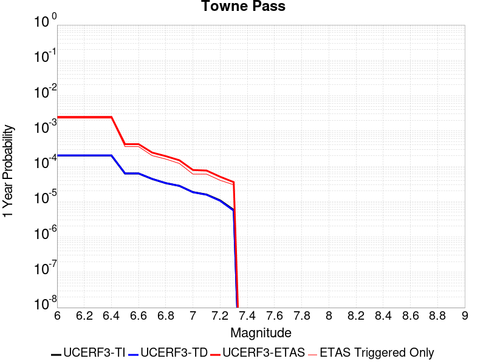 |  |

| Magnitude | 1 wk TI Prob | 1 wk TD Prob | 1 wk ETAS Prob | 1 wk ETAS/TD Gain | 1 wk ETAS Triggered Only | 1 mo TI Prob | 1 mo TD Prob | 1 mo ETAS Prob | 1 mo ETAS/TD Gain | 1 mo ETAS Triggered Only | 1 yr TI Prob | 1 yr TD Prob | 1 yr ETAS Prob | 1 yr ETAS/TD Gain | 1 yr ETAS Triggered Only | 10 yr TI Prob | 10 yr TD Prob | 10 yr ETAS Prob | 10 yr ETAS/TD Gain | 10 yr ETAS Triggered Only |
|-----|-----|-----|-----|-----|-----|-----|-----|-----|-----|-----|-----|-----|-----|-----|-----|-----|-----|-----|-----|-----|
| 6.0 | 3.849728E-6 | 3.894542E-6 | 9.438909E-4 | 242.36249 | 9.4E-4 | 1.649873E-5 | 1.6690812E-5 | 0.0013966678 | 83.67884 | 0.00138 | 2.0085352E-4 | 2.0319606E-4 | 0.0024927307 | 12.267613 | 0.00229 | 0.0020067208 | 0.0020305319 | 0.005224034 | 2.5727417 | 0.0032 |
| 6.1 | 3.849728E-6 | 3.894542E-6 | 9.438909E-4 | 242.36249 | 9.4E-4 | 1.649873E-5 | 1.6690812E-5 | 0.0013966678 | 83.67884 | 0.00138 | 2.0085352E-4 | 2.0319606E-4 | 0.0024927307 | 12.267613 | 0.00229 | 0.0020067208 | 0.0020305319 | 0.005224034 | 2.5727417 | 0.0032 |
| 6.2 | 3.849728E-6 | 3.894542E-6 | 9.438909E-4 | 242.36249 | 9.4E-4 | 1.649873E-5 | 1.6690812E-5 | 0.0013966678 | 83.67884 | 0.00138 | 2.0085352E-4 | 2.0319606E-4 | 0.0024927307 | 12.267613 | 0.00229 | 0.0020067208 | 0.0020305319 | 0.005224034 | 2.5727417 | 0.0032 |
| 6.3 | 3.849728E-6 | 3.894542E-6 | 9.438909E-4 | 242.36249 | 9.4E-4 | 1.649873E-5 | 1.6690812E-5 | 0.0013966678 | 83.67884 | 0.00138 | 2.0085352E-4 | 2.0319606E-4 | 0.0024927307 | 12.267613 | 0.00229 | 0.0020067208 | 0.0020305319 | 0.005224034 | 2.5727417 | 0.0032 |
| 6.4 | 3.849728E-6 | 3.894542E-6 | 9.438909E-4 | 242.36249 | 9.4E-4 | 1.649873E-5 | 1.6690812E-5 | 0.0013966678 | 83.67884 | 0.00138 | 2.0085352E-4 | 2.0319606E-4 | 0.0024927307 | 12.267613 | 0.00229 | 0.0020067208 | 0.0020305319 | 0.005224034 | 2.5727417 | 0.0032 |
| 6.5 | 1.1953545E-6 | 1.2030526E-6 | 1.6120286E-4 | 133.99486 | 1.6E-4 | 5.1229376E-6 | 5.15593E-6 | 2.3515474E-4 | 45.608597 | 2.3E-4 | 6.236998E-5 | 6.277176E-5 | 4.2274917E-4 | 6.734703 | 3.6E-4 | 6.235248E-4 | 6.2755204E-4 | 0.0011672132 | 1.8599465 | 5.4E-4 |
| 6.6 | 1.1953545E-6 | 1.2030526E-6 | 1.6120286E-4 | 133.99486 | 1.6E-4 | 5.1229376E-6 | 5.15593E-6 | 2.3515474E-4 | 45.608597 | 2.3E-4 | 6.236998E-5 | 6.277176E-5 | 4.2274917E-4 | 6.734703 | 3.6E-4 | 6.235248E-4 | 6.2755204E-4 | 0.0011672132 | 1.8599465 | 5.4E-4 |
| 6.7 | 8.375951E-7 | 8.410676E-7 | 9.084099E-5 | 108.00677 | 9.0E-5 | 3.5896885E-6 | 3.6045708E-6 | 1.4360406E-4 | 39.839436 | 1.4E-4 | 4.370358E-5 | 4.3884826E-5 | 2.4387604E-4 | 5.557184 | 2.0E-4 | 4.3694986E-4 | 4.3876728E-4 | 7.586269E-4 | 1.728996 | 3.2E-4 |
| 6.8 | 6.38041E-7 | 6.3921624E-7 | 7.063917E-5 | 110.50904 | 7.0E-5 | 2.7344586E-6 | 2.7394954E-6 | 1.12739195E-4 | 41.15327 | 1.1E-4 | 3.3291526E-5 | 3.3352884E-5 | 1.9334754E-4 | 5.797026 | 1.6E-4 | 3.3286537E-4 | 3.334826E-4 | 5.933959E-4 | 1.7793908 | 2.6E-4 |
| 6.9 | 5.3460053E-7 | 5.345339E-7 | 6.05345E-5 | 113.24727 | 6.0E-5 | 2.2911431E-6 | 2.2908578E-6 | 8.229067E-5 | 35.921337 | 8.0E-5 | 2.789431E-5 | 2.7890868E-5 | 1.4788752E-4 | 5.3023634 | 1.2E-4 | 2.789081E-4 | 2.78877E-4 | 4.7882122E-4 | 1.716962 | 2.0E-4 |
| 7.0 | 3.557783E-7 | 3.5324283E-7 | 4.035323E-5 | 114.23651 | 4.0E-5 | 1.5247632E-6 | 1.513897E-6 | 4.1513835E-5 | 27.421835 | 4.0E-5 | 1.8563835E-5 | 1.8431549E-5 | 7.843044E-5 | 4.255228 | 6.0E-5 | 1.8562283E-4 | 1.8430105E-4 | 2.642863E-4 | 1.4339924 | 8.0E-5 |
| 7.1 | 3.037942E-7 | 3.0002275E-7 | 4.0300012E-5 | 134.32318 | 4.0E-5 | 1.3019744E-6 | 1.2858112E-6 | 4.128576E-5 | 32.108727 | 4.0E-5 | 1.5851423E-5 | 1.5654647E-5 | 7.5653705E-5 | 4.832668 | 6.0E-5 | 1.5850292E-4 | 1.5653619E-4 | 2.3652367E-4 | 1.510984 | 8.0E-5 |
| 7.2 | 2.0808248E-7 | 2.0217735E-7 | 2.0202173E-5 | 99.923035 | 2.0E-5 | 8.917818E-7 | 8.6647407E-7 | 2.0866457E-5 | 24.082033 | 2.0E-5 | 1.0857389E-5 | 1.0549275E-5 | 5.0548853E-5 | 4.79169 | 4.0E-5 | 1.0856859E-4 | 1.0548821E-4 | 1.5548294E-4 | 1.4739367 | 5.0E-5 |
| 7.3 | 1.1162073E-7 | 1.0636902E-7 | 2.0106367E-5 | 189.02464 | 2.0E-5 | 4.7837443E-7 | 4.5586717E-7 | 2.0455858E-5 | 44.87241 | 2.0E-5 | 5.8241935E-6 | 5.5501705E-6 | 3.5550005E-5 | 6.405209 | 3.0E-5 | 5.8240406E-5 | 5.550052E-5 | 9.5498304E-5 | 1.7206739 | 4.0E-5 |

## San Andreas (San Bernardino N)
*[(top)](#table-of-contents)*

| 1 Week | 1 Month | 1 Year | 10 Year |
|-----|-----|-----|-----|
|  |  |  |  |

| Magnitude | 1 wk TI Prob | 1 wk TD Prob | 1 wk ETAS Prob | 1 wk ETAS/TD Gain | 1 wk ETAS Triggered Only | 1 mo TI Prob | 1 mo TD Prob | 1 mo ETAS Prob | 1 mo ETAS/TD Gain | 1 mo ETAS Triggered Only | 1 yr TI Prob | 1 yr TD Prob | 1 yr ETAS Prob | 1 yr ETAS/TD Gain | 1 yr ETAS Triggered Only | 10 yr TI Prob | 10 yr TD Prob | 10 yr ETAS Prob | 10 yr ETAS/TD Gain | 10 yr ETAS Triggered Only |
|-----|-----|-----|-----|-----|-----|-----|-----|-----|-----|-----|-----|-----|-----|-----|-----|-----|-----|-----|-----|-----|
| 6.0 | 1.4273766E-4 | 3.160784E-4 | 0.0011958003 | 3.7832394 | 8.8E-4 | 6.115894E-4 | 0.0013539245 | 0.0025223403 | 1.8629845 | 0.00117 | 0.0074207084 | 0.016360939 | 0.018033126 | 1.102206 | 0.0017 | 0.07177748 | 0.15021163 | 0.15211515 | 1.0126723 | 0.00224 |
| 6.1 | 1.4273766E-4 | 3.160784E-4 | 0.0011958003 | 3.7832394 | 8.8E-4 | 6.115894E-4 | 0.0013539245 | 0.0025223403 | 1.8629845 | 0.00117 | 0.0074207084 | 0.016360939 | 0.018033126 | 1.102206 | 0.0017 | 0.07177748 | 0.15021163 | 0.15211515 | 1.0126723 | 0.00224 |
| 6.2 | 1.4273766E-4 | 3.160784E-4 | 0.0011958003 | 3.7832394 | 8.8E-4 | 6.115894E-4 | 0.0013539245 | 0.0025223403 | 1.8629845 | 0.00117 | 0.0074207084 | 0.016360939 | 0.018033126 | 1.102206 | 0.0017 | 0.07177748 | 0.15021163 | 0.15211515 | 1.0126723 | 0.00224 |
| 6.3 | 1.3730655E-4 | 3.0512668E-4 | 0.0011848581 | 3.883168 | 8.8E-4 | 5.883239E-4 | 0.001307036 | 0.0024755069 | 1.8939852 | 0.00117 | 0.0071393442 | 0.015798455 | 0.017471598 | 1.1059054 | 0.0017 | 0.06914291 | 0.1455135 | 0.14741902 | 1.013095 | 0.00223 |
| 6.4 | 1.3730655E-4 | 3.0512668E-4 | 0.0011848581 | 3.883168 | 8.8E-4 | 5.883239E-4 | 0.001307036 | 0.0024755069 | 1.8939852 | 0.00117 | 0.0071393442 | 0.015798455 | 0.017471598 | 1.1059054 | 0.0017 | 0.06914291 | 0.1455135 | 0.14741902 | 1.013095 | 0.00223 |
| 6.5 | 1.2942807E-4 | 2.8927144E-4 | 0.0011690169 | 4.0412455 | 8.8E-4 | 5.545738E-4 | 0.0012391509 | 0.002407701 | 1.943025 | 0.00117 | 0.0067310524 | 0.014983548 | 0.016658075 | 1.1117578 | 0.0017 | 0.06530788 | 0.13865088 | 0.14055446 | 1.0137293 | 0.00221 |
| 6.6 | 1.1125901E-4 | 2.5365927E-4 | 0.0011234386 | 4.428928 | 8.7E-4 | 4.767372E-4 | 0.0010866605 | 0.0022254216 | 2.0479457 | 0.00114 | 0.005788839 | 0.0131504685 | 0.014798507 | 1.1253216 | 0.00167 | 0.056403454 | 0.12300496 | 0.1248905 | 1.015329 | 0.00215 |
| 6.7 | 1.02209575E-4 | 2.3500937E-4 | 0.0011048049 | 4.70111 | 8.7E-4 | 4.3796748E-4 | 0.0010067957 | 0.002145648 | 2.1311653 | 0.00114 | 0.0053192247 | 0.012189267 | 0.013809277 | 1.1329046 | 0.00164 | 0.051936906 | 0.114792764 | 0.11666941 | 1.016348 | 0.00212 |
| 6.8 | 9.610582E-5 | 2.2026796E-4 | 0.0010700807 | 4.858086 | 8.5E-4 | 4.1181705E-4 | 9.436647E-4 | 0.0020426267 | 2.1645682 | 0.0011 | 0.0050023515 | 0.011428859 | 0.013010573 | 1.1383965 | 0.0016 | 0.048912346 | 0.10820469 | 0.11005071 | 1.0170604 | 0.00207 |
| 6.9 | 9.3877505E-5 | 2.1482339E-4 | 0.0010646408 | 4.9558883 | 8.5E-4 | 4.0227012E-4 | 9.203475E-4 | 0.0020093443 | 2.1832452 | 0.00109 | 0.0048866454 | 0.011147907 | 0.012720182 | 1.1410377 | 0.00159 | 0.04780577 | 0.105798274 | 0.107640326 | 1.017411 | 0.00206 |
| 7.0 | 9.1019785E-5 | 2.0809306E-4 | 0.0010579162 | 5.083861 | 8.5E-4 | 3.900265E-4 | 8.915232E-4 | 0.0019805515 | 2.2215366 | 0.00109 | 0.0047382377 | 0.0108004995 | 0.012373327 | 1.1456254 | 0.00159 | 0.046384744 | 0.10276815 | 0.10461645 | 1.0179851 | 0.00206 |
| 7.1 | 8.771155E-5 | 1.9983841E-4 | 0.0010496685 | 5.252587 | 8.5E-4 | 3.758525E-4 | 8.5616973E-4 | 0.0019352451 | 2.2603521 | 0.00108 | 0.0045664064 | 0.010374243 | 0.011937852 | 1.1507202 | 0.00158 | 0.044737056 | 0.09907644 | 0.10092333 | 1.0186411 | 0.00205 |
| 7.2 | 8.0830236E-5 | 1.8389444E-4 | 0.0010337381 | 5.621367 | 8.5E-4 | 3.4636928E-4 | 7.8788114E-4 | 0.0018670302 | 2.3696852 | 0.00108 | 0.0042088944 | 0.009550368 | 0.011115279 | 1.1638587 | 0.00158 | 0.041300658 | 0.09180518 | 0.093666986 | 1.0202799 | 0.00205 |
| 7.3 | 7.7668235E-5 | 1.7333007E-4 | 0.0010231828 | 5.903088 | 8.5E-4 | 3.328214E-4 | 7.426318E-4 | 0.0018218297 | 2.4532073 | 0.00108 | 0.0040445733 | 0.009004138 | 0.010569911 | 1.1738949 | 0.00158 | 0.03971748 | 0.08706761 | 0.088929996 | 1.0213901 | 0.00204 |
| 7.4 | 7.520177E-5 | 1.655312E-4 | 0.0010053922 | 6.0737324 | 8.4E-4 | 3.2225347E-4 | 7.092266E-4 | 0.0017784677 | 2.5076158 | 0.00107 | 0.0039163795 | 0.008600714 | 0.01015721 | 1.180973 | 0.00157 | 0.038480744 | 0.08352157 | 0.085382015 | 1.0222751 | 0.00203 |
| 7.5 | 7.274697E-5 | 1.584075E-4 | 9.88276E-4 | 6.238821 | 8.3E-4 | 3.1173544E-4 | 6.7871273E-4 | 0.0017379933 | 2.56072 | 0.00106 | 0.003788775 | 0.008232076 | 0.0097792335 | 1.1879426 | 0.00156 | 0.03724827 | 0.08023654 | 0.08209446 | 1.0231556 | 0.00202 |
| 7.6 | 7.1185845E-5 | 1.5410586E-4 | 9.839779E-4 | 6.3850784 | 8.3E-4 | 3.0504653E-4 | 6.602866E-4 | 0.0017195867 | 2.6043036 | 0.00106 | 0.0037076178 | 0.0080094095 | 0.009546995 | 1.1919724 | 0.00155 | 0.036463667 | 0.07822661 | 0.08007016 | 1.0235667 | 0.002 |
| 7.7 | 6.709961E-5 | 1.4319421E-4 | 9.7307534E-4 | 6.7954936 | 8.3E-4 | 2.8753807E-4 | 6.135452E-4 | 0.0016728948 | 2.7266042 | 0.00106 | 0.003495157 | 0.0074443663 | 0.008972902 | 1.2053279 | 0.00154 | 0.034406938 | 0.07305558 | 0.0749002 | 1.0252495 | 0.00199 |
| 7.8 | 6.300812E-5 | 1.320343E-4 | 9.619247E-4 | 7.285415 | 8.3E-4 | 2.7000686E-4 | 5.657386E-4 | 0.0016151445 | 2.8549309 | 0.00105 | 0.0032823787 | 0.006866143 | 0.008385638 | 1.2213025 | 0.00153 | 0.032343175 | 0.06771385 | 0.06955045 | 1.027123 | 0.00197 |
| 7.9 | 4.983037E-5 | 9.7241085E-5 | 7.671759E-4 | 7.889422 | 6.7E-4 | 2.1354125E-4 | 4.1668097E-4 | 0.0012363393 | 2.9671125 | 8.2E-4 | 0.0025967648 | 0.0050613005 | 0.006285075 | 1.2417905 | 0.00123 | 0.025666296 | 0.050650507 | 0.052131493 | 1.0292393 | 0.00156 |
| 8.0 | 3.2211527E-5 | 5.3306234E-5 | 3.1329237E-4 | 5.8772182 | 2.6E-4 | 1.380421E-4 | 2.2843528E-4 | 5.583599E-4 | 2.4442804 | 3.3E-4 | 0.0016793669 | 0.0027776542 | 0.0032463488 | 1.1687375 | 4.7E-4 | 0.016667323 | 0.028362568 | 0.028935835 | 1.020212 | 5.9E-4 |
| 8.1 | 1.743376E-5 | 1.8823403E-5 | 3.8823026E-5 | 2.0624871 | 2.0E-5 | 7.471398E-5 | 8.066923E-5 | 1.0066762E-4 | 1.247906 | 2.0E-5 | 9.0926304E-4 | 9.81706E-4 | 0.0010216667 | 1.0407054 | 4.0E-5 | 0.009055517 | 0.010483979 | 0.01054335 | 1.005663 | 6.0E-5 |
| 8.2 | 7.831616E-6 | 5.1540533E-6 | 5.1540533E-6 | 1.0 | 0.0 | 3.3563636E-5 | 2.2088612E-5 | 2.2088612E-5 | 1.0 | 0.0 | 4.0856065E-4 | 2.6889573E-4 | 2.6889573E-4 | 1.0 | 0.0 | 0.004078103 | 0.0030413668 | 0.0030413668 | 1.0 | 0.0 |
| 8.3 | 1.983087E-6 | 7.6564595E-7 | 7.6564595E-7 | 1.0 | 0.0 | 8.498917E-6 | 3.281336E-6 | 3.281336E-6 | 1.0 | 0.0 | 1.034694E-4 | 3.9949547E-5 | 3.9949547E-5 | 1.0 | 0.0 | 0.0010342124 | 4.717979E-4 | 4.717979E-4 | 1.0 | 0.0 |

## Paradise
*[(top)](#table-of-contents)*

| 1 Week | 1 Month | 1 Year | 10 Year |
|-----|-----|-----|-----|
|  |  | 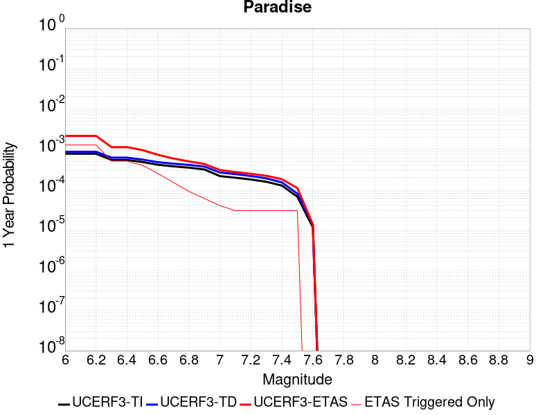 |  |

| Magnitude | 1 wk TI Prob | 1 wk TD Prob | 1 wk ETAS Prob | 1 wk ETAS/TD Gain | 1 wk ETAS Triggered Only | 1 mo TI Prob | 1 mo TD Prob | 1 mo ETAS Prob | 1 mo ETAS/TD Gain | 1 mo ETAS Triggered Only | 1 yr TI Prob | 1 yr TD Prob | 1 yr ETAS Prob | 1 yr ETAS/TD Gain | 1 yr ETAS Triggered Only | 10 yr TI Prob | 10 yr TD Prob | 10 yr ETAS Prob | 10 yr ETAS/TD Gain | 10 yr ETAS Triggered Only |
|-----|-----|-----|-----|-----|-----|-----|-----|-----|-----|-----|-----|-----|-----|-----|-----|-----|-----|-----|-----|-----|
| 6.0 | 1.4851273E-5 | 1.6694768E-5 | 5.2668626E-4 | 31.547981 | 5.1E-4 | 6.364676E-5 | 7.154718E-5 | 8.414921E-4 | 11.761359 | 7.7E-4 | 7.7462377E-4 | 8.707624E-4 | 0.0021496478 | 2.468696 | 0.00128 | 0.0077192914 | 0.008675884 | 0.010747752 | 1.2388077 | 0.00209 |
| 6.1 | 1.4851273E-5 | 1.6694768E-5 | 5.2668626E-4 | 31.547981 | 5.1E-4 | 6.364676E-5 | 7.154718E-5 | 8.414921E-4 | 11.761359 | 7.7E-4 | 7.7462377E-4 | 8.707624E-4 | 0.0021496478 | 2.468696 | 0.00128 | 0.0077192914 | 0.008675884 | 0.010747752 | 1.2388077 | 0.00209 |
| 6.2 | 1.4851273E-5 | 1.6694768E-5 | 5.2668626E-4 | 31.547981 | 5.1E-4 | 6.364676E-5 | 7.154718E-5 | 8.414921E-4 | 11.761359 | 7.7E-4 | 7.7462377E-4 | 8.707624E-4 | 0.0021496478 | 2.468696 | 0.00128 | 0.0077192914 | 0.008675884 | 0.010747752 | 1.2388077 | 0.00209 |
| 6.3 | 1.0426831E-5 | 1.1888697E-5 | 2.218862E-4 | 18.663626 | 2.1E-4 | 4.4685654E-5 | 5.09506E-5 | 3.709343E-4 | 7.2802734 | 3.2E-4 | 5.43912E-4 | 6.201529E-4 | 0.0011298367 | 1.8218678 | 5.1E-4 | 0.0054258266 | 0.0061848317 | 0.007039513 | 1.1381899 | 8.6E-4 |
| 6.4 | 1.0426831E-5 | 1.1888697E-5 | 2.218862E-4 | 18.663626 | 2.1E-4 | 4.4685654E-5 | 5.09506E-5 | 3.709343E-4 | 7.2802734 | 3.2E-4 | 5.43912E-4 | 6.201529E-4 | 0.0011298367 | 1.8218678 | 5.1E-4 | 0.0054258266 | 0.0061848317 | 0.007039513 | 1.1381899 | 8.6E-4 |
| 6.5 | 9.25027E-6 | 1.0620037E-5 | 1.9061813E-4 | 17.948914 | 1.8E-4 | 3.964341E-5 | 4.551368E-5 | 3.1550138E-4 | 6.9320126 | 2.7E-4 | 4.8255164E-4 | 5.5399304E-4 | 9.5377146E-4 | 1.7216307 | 4.0E-4 | 0.0048150513 | 0.0055266195 | 0.006202861 | 1.1223608 | 6.8E-4 |
| 6.6 | 7.904275E-6 | 9.159602E-6 | 1.0915869E-4 | 11.917404 | 1.0E-4 | 3.3875025E-5 | 3.925487E-5 | 1.8924898E-4 | 4.821032 | 1.5E-4 | 4.1235037E-4 | 4.7782718E-4 | 7.277077E-4 | 1.5229517 | 2.5E-4 | 0.0041158604 | 0.004768395 | 0.0051764394 | 1.0855728 | 4.1E-4 |
| 6.7 | 7.2061953E-6 | 8.407326E-6 | 6.840682E-5 | 8.136573 | 6.0E-5 | 3.088333E-5 | 3.603092E-5 | 1.2602768E-4 | 3.4977646 | 9.0E-5 | 3.7593965E-4 | 4.3859181E-4 | 5.88526E-4 | 1.3418536 | 1.5E-4 | 0.003753043 | 0.004377631 | 0.004676318 | 1.0682303 | 3.0E-4 |
| 6.8 | 6.6948724E-6 | 7.842242E-6 | 3.7842008E-5 | 4.8254066 | 3.0E-5 | 2.8691995E-5 | 3.3609194E-5 | 8.360751E-5 | 2.487638 | 5.0E-5 | 3.4926904E-4 | 4.091187E-4 | 4.9908186E-4 | 1.219895 | 9.0E-5 | 0.003487206 | 0.0040840125 | 0.004283196 | 1.0487715 | 2.0E-4 |
| 6.9 | 6.0421025E-6 | 7.1306963E-6 | 2.7130554E-5 | 3.8047552 | 2.0E-5 | 2.5894467E-5 | 3.0559786E-5 | 7.055856E-5 | 2.3088696 | 4.0E-5 | 3.1521954E-4 | 3.7200528E-4 | 4.3198297E-4 | 1.1612281 | 6.0E-5 | 0.0031477278 | 0.0037141638 | 0.0038536438 | 1.0375535 | 1.4E-4 |
| 7.0 | 4.134091E-6 | 5.0803824E-6 | 5.0803824E-6 | 1.0 | 0.0 | 1.7717413E-5 | 2.1772896E-5 | 4.177246E-5 | 1.9185534 | 2.0E-5 | 2.1568815E-4 | 2.650543E-4 | 3.0504368E-4 | 1.1508725 | 4.0E-5 | 0.0021547892 | 0.0026475347 | 0.0027372965 | 1.0339038 | 9.0E-5 |
| 7.1 | 3.7674888E-6 | 4.631936E-6 | 4.631936E-6 | 1.0 | 0.0 | 1.6146281E-5 | 1.9851012E-5 | 2.9850813E-5 | 1.5037427 | 1.0E-5 | 1.9656324E-4 | 2.4166079E-4 | 2.7165352E-4 | 1.1241109 | 3.0E-5 | 0.0019638946 | 0.0024141306 | 0.0024739858 | 1.0247936 | 6.0E-5 |
| 7.2 | 3.4065345E-6 | 4.156782E-6 | 4.156782E-6 | 1.0 | 0.0 | 1.4599351E-5 | 1.7814667E-5 | 2.7814489E-5 | 1.5613252 | 1.0E-5 | 1.777326E-4 | 2.168735E-4 | 2.4686698E-4 | 1.1382995 | 3.0E-5 | 0.0017759053 | 0.0021667667 | 0.0022266365 | 1.027631 | 6.0E-5 |
| 7.3 | 2.9934936E-6 | 3.6293673E-6 | 3.6293673E-6 | 1.0 | 0.0 | 1.2829195E-5 | 1.5554348E-5 | 2.555419E-5 | 1.6428971 | 1.0E-5 | 1.5618425E-4 | 1.8935918E-4 | 2.193535E-4 | 1.1583991 | 3.0E-5 | 0.0015607453 | 0.0018921237 | 0.0019420291 | 1.0263753 | 5.0E-5 |
| 7.4 | 2.4049796E-6 | 2.8890186E-6 | 2.8890186E-6 | 1.0 | 0.0 | 1.0307015E-5 | 1.2381457E-5 | 2.2381333E-5 | 1.8076494 | 1.0E-5 | 1.2548068E-4 | 1.5073526E-4 | 1.8073073E-4 | 1.1989944 | 3.0E-5 | 0.0012540985 | 0.0015064715 | 0.0015464113 | 1.0265121 | 4.0E-5 |
| 7.5 | 1.2710091E-6 | 1.5134859E-6 | 1.5134859E-6 | 1.0 | 0.0 | 5.44717E-6 | 6.4863593E-6 | 1.6486294E-5 | 2.541687 | 1.0E-5 | 6.631728E-5 | 7.896981E-5 | 1.0896744E-4 | 1.379862 | 3.0E-5 | 6.6297496E-4 | 7.895401E-4 | 8.295085E-4 | 1.0506223 | 4.0E-5 |
| 7.6 | 2.21172E-7 | 2.6040198E-7 | 2.6040198E-7 | 1.0 | 0.0 | 9.478797E-7 | 1.1160082E-6 | 1.1160082E-6 | 1.0 | 0.0 | 1.1540374E-5 | 1.3587343E-5 | 1.3587343E-5 | 1.0 | 0.0 | 1.1539775E-4 | 1.3586794E-4 | 1.4586658E-4 | 1.0735909 | 1.0E-5 |

## Bicycle Lake
*[(top)](#table-of-contents)*

| 1 Week | 1 Month | 1 Year | 10 Year |
|-----|-----|-----|-----|
|  |  |  |  |

| Magnitude | 1 wk TI Prob | 1 wk TD Prob | 1 wk ETAS Prob | 1 wk ETAS/TD Gain | 1 wk ETAS Triggered Only | 1 mo TI Prob | 1 mo TD Prob | 1 mo ETAS Prob | 1 mo ETAS/TD Gain | 1 mo ETAS Triggered Only | 1 yr TI Prob | 1 yr TD Prob | 1 yr ETAS Prob | 1 yr ETAS/TD Gain | 1 yr ETAS Triggered Only | 10 yr TI Prob | 10 yr TD Prob | 10 yr ETAS Prob | 10 yr ETAS/TD Gain | 10 yr ETAS Triggered Only |
|-----|-----|-----|-----|-----|-----|-----|-----|-----|-----|-----|-----|-----|-----|-----|-----|-----|-----|-----|-----|-----|
| 6.0 | 1.9621975E-5 | 2.2097078E-5 | 4.6208737E-4 | 20.911695 | 4.4E-4 | 8.4091465E-5 | 9.4699084E-5 | 7.8463374E-4 | 8.285547 | 6.9E-4 | 0.0010233327 | 0.0011524865 | 0.0024310113 | 2.1093621 | 0.00128 | 0.01018633 | 0.011478408 | 0.013445566 | 1.171379 | 0.00199 |
| 6.1 | 1.9621975E-5 | 2.2097078E-5 | 4.6208737E-4 | 20.911695 | 4.4E-4 | 8.4091465E-5 | 9.4699084E-5 | 7.8463374E-4 | 8.285547 | 6.9E-4 | 0.0010233327 | 0.0011524865 | 0.0024310113 | 2.1093621 | 0.00128 | 0.01018633 | 0.011478408 | 0.013445566 | 1.171379 | 0.00199 |
| 6.2 | 9.9971285E-6 | 1.125564E-5 | 2.6125283E-4 | 23.210838 | 2.5E-4 | 4.2844134E-5 | 4.8237856E-5 | 4.1822E-4 | 8.669954 | 3.7E-4 | 5.2150246E-4 | 5.871897E-4 | 0.0014466847 | 2.4637434 | 8.6E-4 | 0.0052028033 | 0.005861487 | 0.007183691 | 1.2255749 | 0.00133 |
| 6.3 | 9.589428E-6 | 1.0798346E-5 | 2.6079564E-4 | 24.151443 | 2.5E-4 | 4.10969E-5 | 4.62781E-5 | 4.0626145E-4 | 8.778698 | 3.6E-4 | 5.002399E-4 | 5.6334207E-4 | 0.0014128633 | 2.5080023 | 8.5E-4 | 0.0049911533 | 0.0056242296 | 0.006926862 | 1.2316108 | 0.00131 |
| 6.4 | 9.589428E-6 | 1.0798346E-5 | 2.6079564E-4 | 24.151443 | 2.5E-4 | 4.10969E-5 | 4.62781E-5 | 4.0626145E-4 | 8.778698 | 3.6E-4 | 5.002399E-4 | 5.6334207E-4 | 0.0014128633 | 2.5080023 | 8.5E-4 | 0.0049911533 | 0.0056242296 | 0.006926862 | 1.2316108 | 0.00131 |
| 6.5 | 5.557707E-6 | 6.2856016E-6 | 1.6628459E-4 | 26.454842 | 1.6E-4 | 2.3818526E-5 | 2.6938165E-5 | 2.8693117E-4 | 10.651474 | 2.6E-4 | 2.8995197E-4 | 3.279497E-4 | 8.677726E-4 | 2.646054 | 5.4E-4 | 0.0028957394 | 0.0032772934 | 0.004134475 | 1.2615516 | 8.6E-4 |
| 6.6 | 4.8742945E-6 | 5.5132896E-6 | 1.655124E-4 | 30.020626 | 1.6E-4 | 2.0889667E-5 | 2.3628318E-5 | 2.736224E-4 | 11.580275 | 2.5E-4 | 2.54302E-4 | 2.87663E-4 | 8.075134E-4 | 2.8071508 | 5.2E-4 | 0.002540112 | 0.0028754752 | 0.0036133474 | 1.2566087 | 7.4E-4 |
| 6.7 | 3.991108E-6 | 4.5159104E-6 | 1.3451533E-4 | 29.786978 | 1.3E-4 | 1.7104636E-5 | 1.9353902E-5 | 2.1935003E-4 | 11.333633 | 2.0E-4 | 2.0822904E-4 | 2.3563375E-4 | 6.555348E-4 | 2.7820072 | 4.2E-4 | 0.0020803404 | 0.0023563374 | 0.0029948293 | 1.270968 | 6.4E-4 |

## Garlic Springs
*[(top)](#table-of-contents)*

| 1 Week | 1 Month | 1 Year | 10 Year |
|-----|-----|-----|-----|
|  |  |  | 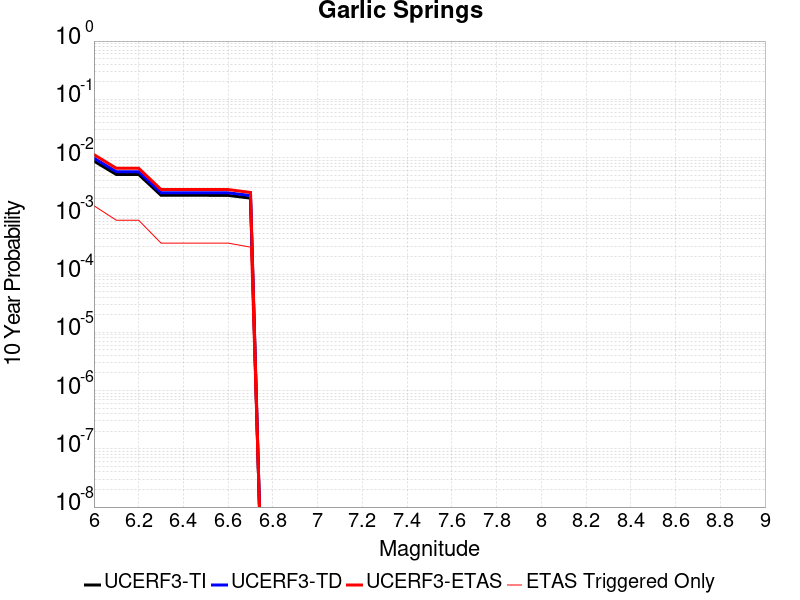 |

| Magnitude | 1 wk TI Prob | 1 wk TD Prob | 1 wk ETAS Prob | 1 wk ETAS/TD Gain | 1 wk ETAS Triggered Only | 1 mo TI Prob | 1 mo TD Prob | 1 mo ETAS Prob | 1 mo ETAS/TD Gain | 1 mo ETAS Triggered Only | 1 yr TI Prob | 1 yr TD Prob | 1 yr ETAS Prob | 1 yr ETAS/TD Gain | 1 yr ETAS Triggered Only | 10 yr TI Prob | 10 yr TD Prob | 10 yr ETAS Prob | 10 yr ETAS/TD Gain | 10 yr ETAS Triggered Only |
|-----|-----|-----|-----|-----|-----|-----|-----|-----|-----|-----|-----|-----|-----|-----|-----|-----|-----|-----|-----|-----|
| 6.0 | 1.6760017E-5 | 1.8776833E-5 | 3.3877083E-4 | 18.041958 | 3.2E-4 | 7.182667E-5 | 8.0470316E-5 | 5.504325E-4 | 6.840193 | 4.7E-4 | 8.7413884E-4 | 9.794032E-4 | 0.0018185804 | 1.8568252 | 8.4E-4 | 0.008707083 | 0.009762413 | 0.011237867 | 1.1511362 | 0.00149 |
| 6.1 | 9.852767E-6 | 1.0973587E-5 | 1.8097172E-4 | 16.491573 | 1.7E-4 | 4.222546E-5 | 4.702921E-5 | 3.0701698E-4 | 6.5282187 | 2.6E-4 | 5.139737E-4 | 5.7250116E-4 | 0.0010222435 | 1.7855746 | 4.5E-4 | 0.005127866 | 0.005717221 | 0.006552419 | 1.1460845 | 8.4E-4 |
| 6.2 | 9.852767E-6 | 1.0973587E-5 | 1.8097172E-4 | 16.491573 | 1.7E-4 | 4.222546E-5 | 4.702921E-5 | 3.0701698E-4 | 6.5282187 | 2.6E-4 | 5.139737E-4 | 5.7250116E-4 | 0.0010222435 | 1.7855746 | 4.5E-4 | 0.005127866 | 0.005717221 | 0.006552419 | 1.1460845 | 8.4E-4 |
| 6.3 | 4.3167724E-6 | 4.7780286E-6 | 8.477765E-5 | 17.743227 | 8.0E-5 | 1.8500323E-5 | 2.0477235E-5 | 1.4047477E-4 | 6.8600464 | 1.2E-4 | 2.2521814E-4 | 2.4930484E-4 | 4.2925996E-4 | 1.7218276 | 1.8E-4 | 0.0022499003 | 0.00249251 | 0.0028316625 | 1.1360687 | 3.4E-4 |
| 6.4 | 4.3167724E-6 | 4.7780286E-6 | 8.477765E-5 | 17.743227 | 8.0E-5 | 1.8500323E-5 | 2.0477235E-5 | 1.4047477E-4 | 6.8600464 | 1.2E-4 | 2.2521814E-4 | 2.4930484E-4 | 4.2925996E-4 | 1.7218276 | 1.8E-4 | 0.0022499003 | 0.00249251 | 0.0028316625 | 1.1360687 | 3.4E-4 |
| 6.5 | 4.3167724E-6 | 4.7780286E-6 | 8.477765E-5 | 17.743227 | 8.0E-5 | 1.8500323E-5 | 2.0477235E-5 | 1.4047477E-4 | 6.8600464 | 1.2E-4 | 2.2521814E-4 | 2.4930484E-4 | 4.2925996E-4 | 1.7218276 | 1.8E-4 | 0.0022499003 | 0.00249251 | 0.0028316625 | 1.1360687 | 3.4E-4 |
| 6.6 | 4.301311E-6 | 4.760897E-6 | 8.476052E-5 | 17.803476 | 8.0E-5 | 1.8434059E-5 | 2.0403815E-5 | 1.4040136E-4 | 6.881133 | 1.2E-4 | 2.2441156E-4 | 2.4841115E-4 | 4.2836645E-4 | 1.7244252 | 1.8E-4 | 0.0022418506 | 0.002483593 | 0.0028227486 | 1.1365584 | 3.4E-4 |
| 6.7 | 3.8599724E-6 | 4.27106E-6 | 7.427076E-5 | 17.389305 | 7.0E-5 | 1.6542634E-5 | 1.8304541E-5 | 1.2830253E-4 | 7.0093274 | 1.1E-4 | 2.0138794E-4 | 2.228578E-4 | 3.9281993E-4 | 1.7626482 | 1.7E-4 | 0.0020120554 | 0.002228578 | 0.0025179316 | 1.1298379 | 2.9E-4 |

## Death Valley (Black Mtns Frontal)
*[(top)](#table-of-contents)*

| 1 Week | 1 Month | 1 Year | 10 Year |
|-----|-----|-----|-----|
|  |  |  |  |

| Magnitude | 1 wk TI Prob | 1 wk TD Prob | 1 wk ETAS Prob | 1 wk ETAS/TD Gain | 1 wk ETAS Triggered Only | 1 mo TI Prob | 1 mo TD Prob | 1 mo ETAS Prob | 1 mo ETAS/TD Gain | 1 mo ETAS Triggered Only | 1 yr TI Prob | 1 yr TD Prob | 1 yr ETAS Prob | 1 yr ETAS/TD Gain | 1 yr ETAS Triggered Only | 10 yr TI Prob | 10 yr TD Prob | 10 yr ETAS Prob | 10 yr ETAS/TD Gain | 10 yr ETAS Triggered Only |
|-----|-----|-----|-----|-----|-----|-----|-----|-----|-----|-----|-----|-----|-----|-----|-----|-----|-----|-----|-----|-----|
| 6.0 | 1.6707214E-5 | 1.867027E-5 | 3.8866335E-4 | 20.817234 | 3.7E-4 | 7.160038E-5 | 8.001303E-5 | 6.199698E-4 | 7.748361 | 5.4E-4 | 8.71386E-4 | 9.737309E-4 | 0.0018628642 | 1.9131203 | 8.9E-4 | 0.00867977 | 0.009695496 | 0.010933378 | 1.1276759 | 0.00125 |
| 6.1 | 1.6707214E-5 | 1.867027E-5 | 3.8866335E-4 | 20.817234 | 3.7E-4 | 7.160038E-5 | 8.001303E-5 | 6.199698E-4 | 7.748361 | 5.4E-4 | 8.71386E-4 | 9.737309E-4 | 0.0018628642 | 1.9131203 | 8.9E-4 | 0.00867977 | 0.009695496 | 0.010933378 | 1.1276759 | 0.00125 |
| 6.2 | 1.6707214E-5 | 1.867027E-5 | 3.8866335E-4 | 20.817234 | 3.7E-4 | 7.160038E-5 | 8.001303E-5 | 6.199698E-4 | 7.748361 | 5.4E-4 | 8.71386E-4 | 9.737309E-4 | 0.0018628642 | 1.9131203 | 8.9E-4 | 0.00867977 | 0.009695496 | 0.010933378 | 1.1276759 | 0.00125 |
| 6.3 | 1.6707214E-5 | 1.867027E-5 | 3.8866335E-4 | 20.817234 | 3.7E-4 | 7.160038E-5 | 8.001303E-5 | 6.199698E-4 | 7.748361 | 5.4E-4 | 8.71386E-4 | 9.737309E-4 | 0.0018628642 | 1.9131203 | 8.9E-4 | 0.00867977 | 0.009695496 | 0.010933378 | 1.1276759 | 0.00125 |
| 6.4 | 1.5515609E-5 | 1.7338214E-5 | 3.2733285E-4 | 18.879272 | 3.1E-4 | 6.649377E-5 | 7.4304546E-5 | 5.242711E-4 | 7.055707 | 4.5E-4 | 8.0926094E-4 | 9.042885E-4 | 0.0016036555 | 1.7733892 | 7.0E-4 | 0.008063202 | 0.009006773 | 0.009968036 | 1.1067268 | 9.7E-4 |
| 6.5 | 1.5515609E-5 | 1.7338214E-5 | 3.2733285E-4 | 18.879272 | 3.1E-4 | 6.649377E-5 | 7.4304546E-5 | 5.242711E-4 | 7.055707 | 4.5E-4 | 8.0926094E-4 | 9.042885E-4 | 0.0016036555 | 1.7733892 | 7.0E-4 | 0.008063202 | 0.009006773 | 0.009968036 | 1.1067268 | 9.7E-4 |
| 6.6 | 1.5041828E-5 | 1.6809145E-5 | 2.9680444E-4 | 17.65732 | 2.8E-4 | 6.4463384E-5 | 7.203723E-5 | 4.820077E-4 | 6.691091 | 4.1E-4 | 7.8455906E-4 | 8.767063E-4 | 0.0015161452 | 1.729365 | 6.4E-4 | 0.00781795 | 0.008733132 | 0.009625273 | 1.1021558 | 9.0E-4 |
| 6.7 | 1.4634985E-5 | 1.6356016E-5 | 2.863516E-4 | 17.507418 | 2.7E-4 | 6.271985E-5 | 7.009536E-5 | 4.6006803E-4 | 6.563459 | 3.9E-4 | 7.6334673E-4 | 8.5308263E-4 | 0.0014725537 | 1.726156 | 6.2E-4 | 0.007607299 | 0.008498715 | 0.009361322 | 1.1014984 | 8.7E-4 |
| 6.8 | 1.4209158E-5 | 1.5882048E-5 | 2.2587871E-4 | 14.222266 | 2.1E-4 | 6.089497E-5 | 6.8064175E-5 | 3.980417E-4 | 5.848036 | 3.3E-4 | 7.4114406E-4 | 8.2837185E-4 | 0.0013679245 | 1.6513411 | 5.4E-4 | 0.007386771 | 0.008253456 | 0.009007184 | 1.0913227 | 7.6E-4 |
| 6.9 | 1.3780098E-5 | 1.5404594E-5 | 2.0540167E-4 | 13.333794 | 1.9E-4 | 5.9056227E-5 | 6.6018045E-5 | 3.7599757E-4 | 5.695376 | 3.1E-4 | 7.1877235E-4 | 8.0347876E-4 | 0.001303077 | 1.621794 | 5.0E-4 | 0.0071645193 | 0.008006332 | 0.008710648 | 1.0879698 | 7.1E-4 |
| 7.0 | 1.3585064E-5 | 1.5188155E-5 | 1.9518542E-4 | 12.85116 | 1.8E-4 | 5.8220405E-5 | 6.50905E-5 | 3.6507097E-4 | 5.6086674 | 3.0E-4 | 7.086029E-4 | 7.9219416E-4 | 0.001281806 | 1.6180452 | 4.9E-4 | 0.007063476 | 0.007894293 | 0.008568926 | 1.0854582 | 6.8E-4 |
| 7.1 | 1.3398601E-5 | 1.49813395E-5 | 1.7497894E-4 | 11.679793 | 1.6E-4 | 5.742131E-5 | 6.420419E-5 | 3.1418813E-4 | 4.8935766 | 2.5E-4 | 6.9888023E-4 | 7.8141113E-4 | 0.0012210673 | 1.5626439 | 4.4E-4 | 0.0069668638 | 0.007787224 | 0.008412318 | 1.0802717 | 6.3E-4 |
| 7.2 | 1.3126312E-5 | 1.4679561E-5 | 1.7467722E-4 | 11.899348 | 1.6E-4 | 5.6254412E-5 | 6.291092E-5 | 3.0289582E-4 | 4.814678 | 2.4E-4 | 6.846822E-4 | 7.6567667E-4 | 0.0011753627 | 1.5350641 | 4.1E-4 | 0.006825765 | 0.00763097 | 0.008206544 | 1.0754261 | 5.8E-4 |
| 7.3 | 1.2922429E-5 | 1.4453788E-5 | 1.7445147E-4 | 12.069602 | 1.6E-4 | 5.5380664E-5 | 6.194336E-5 | 3.019285E-4 | 4.874267 | 2.4E-4 | 6.74051E-4 | 7.53905E-4 | 0.0011536034 | 1.5301709 | 4.0E-4 | 0.006720101 | 0.007514055 | 0.008069847 | 1.073967 | 5.6E-4 |
| 7.4 | 1.2768878E-5 | 1.4283772E-5 | 1.6428164E-4 | 11.501278 | 1.5E-4 | 5.4722615E-5 | 6.1214756E-5 | 2.9120067E-4 | 4.757034 | 2.3E-4 | 6.660441E-4 | 7.4504025E-4 | 0.0011247571 | 1.5096595 | 3.8E-4 | 0.0066405144 | 0.0074260035 | 0.007961993 | 1.0721774 | 5.4E-4 |
| 7.5 | 1.2521929E-5 | 1.40120155E-5 | 1.4401019E-4 | 10.277622 | 1.3E-4 | 5.366431E-5 | 6.005014E-5 | 2.6003813E-4 | 4.33035 | 2.0E-4 | 6.531671E-4 | 7.3087064E-4 | 0.0010706221 | 1.4648587 | 3.4E-4 | 0.006512506 | 0.0072852457 | 0.007781603 | 1.0681319 | 5.0E-4 |
| 7.6 | 1.1301089E-5 | 1.2648149E-5 | 1.3264663E-4 | 10.487434 | 1.2E-4 | 4.8432343E-5 | 5.4205255E-5 | 2.4419496E-4 | 4.5050054 | 1.9E-4 | 5.895042E-4 | 6.5975444E-4 | 9.495631E-4 | 1.4392675 | 2.9E-4 | 0.0058794282 | 0.00657851 | 0.0070156157 | 1.0664444 | 4.4E-4 |
| 7.7 | 9.189108E-6 | 1.0283358E-5 | 1.00282436E-4 | 9.751915 | 9.0E-5 | 3.93813E-5 | 4.407082E-5 | 1.8406464E-4 | 4.176565 | 1.4E-4 | 4.7936183E-4 | 5.3643517E-4 | 7.363279E-4 | 1.3726317 | 2.0E-4 | 0.004783291 | 0.005351914 | 0.0056801476 | 1.0613302 | 3.3E-4 |
| 7.8 | 3.4586725E-7 | 3.6482615E-7 | 3.6482615E-7 | 1.0 | 0.0 | 1.4822873E-6 | 1.5635396E-6 | 1.5635396E-6 | 1.0 | 0.0 | 1.80467E-5 | 1.9035933E-5 | 1.9035933E-5 | 1.0 | 0.0 | 1.8045233E-4 | 1.9034347E-4 | 2.0034157E-4 | 1.0525266 | 1.0E-5 |
| 7.9 | 2.5591178E-9 | 2.6696718E-9 | 2.6696718E-9 | 1.0 | 0.0 | 1.0967647E-8 | 1.14414505E-8 | 1.14414505E-8 | 1.0 | 0.0 | 1.335311E-7 | 1.3929966E-7 | 1.3929966E-7 | 1.0 | 0.0 | 1.3353102E-6 | 1.3929966E-6 | 1.3929966E-6 | 1.0 | 0.0 |

## San Andreas (San Bernardino S)
*[(top)](#table-of-contents)*

| 1 Week | 1 Month | 1 Year | 10 Year |
|-----|-----|-----|-----|
|  |  |  |  |

| Magnitude | 1 wk TI Prob | 1 wk TD Prob | 1 wk ETAS Prob | 1 wk ETAS/TD Gain | 1 wk ETAS Triggered Only | 1 mo TI Prob | 1 mo TD Prob | 1 mo ETAS Prob | 1 mo ETAS/TD Gain | 1 mo ETAS Triggered Only | 1 yr TI Prob | 1 yr TD Prob | 1 yr ETAS Prob | 1 yr ETAS/TD Gain | 1 yr ETAS Triggered Only | 10 yr TI Prob | 10 yr TD Prob | 10 yr ETAS Prob | 10 yr ETAS/TD Gain | 10 yr ETAS Triggered Only |
|-----|-----|-----|-----|-----|-----|-----|-----|-----|-----|-----|-----|-----|-----|-----|-----|-----|-----|-----|-----|-----|
| 6.0 | 1.2336002E-4 | 3.0005194E-4 | 7.899049E-4 | 2.6325607 | 4.9E-4 | 5.2857865E-4 | 0.0012853292 | 0.0018945452 | 1.4739766 | 6.1E-4 | 0.006416472 | 0.015541554 | 0.01634881 | 1.0519418 | 8.2E-4 | 0.06234337 | 0.14294699 | 0.14389832 | 1.0066551 | 0.00111 |
| 6.1 | 1.2336002E-4 | 3.0005194E-4 | 7.899049E-4 | 2.6325607 | 4.9E-4 | 5.2857865E-4 | 0.0012853292 | 0.0018945452 | 1.4739766 | 6.1E-4 | 0.006416472 | 0.015541554 | 0.01634881 | 1.0519418 | 8.2E-4 | 0.06234337 | 0.14294699 | 0.14389832 | 1.0066551 | 0.00111 |
| 6.2 | 1.2336002E-4 | 3.0005194E-4 | 7.899049E-4 | 2.6325607 | 4.9E-4 | 5.2857865E-4 | 0.0012853292 | 0.0018945452 | 1.4739766 | 6.1E-4 | 0.006416472 | 0.015541554 | 0.01634881 | 1.0519418 | 8.2E-4 | 0.06234337 | 0.14294699 | 0.14389832 | 1.0066551 | 0.00111 |
| 6.3 | 1.1712257E-4 | 2.8793467E-4 | 7.677965E-4 | 2.666565 | 4.8E-4 | 5.018573E-4 | 0.0012334478 | 0.0018327077 | 1.4858414 | 6.0E-4 | 0.006093008 | 0.014918666 | 0.015716583 | 1.0534844 | 8.1E-4 | 0.059286322 | 0.13765779 | 0.13858911 | 1.0067655 | 0.00108 |
| 6.4 | 1.1712257E-4 | 2.8793467E-4 | 7.677965E-4 | 2.666565 | 4.8E-4 | 5.018573E-4 | 0.0012334478 | 0.0018327077 | 1.4858414 | 6.0E-4 | 0.006093008 | 0.014918666 | 0.015716583 | 1.0534844 | 8.1E-4 | 0.059286322 | 0.13765779 | 0.13858911 | 1.0067655 | 0.00108 |
| 6.5 | 1.0689076E-4 | 2.6806415E-4 | 7.3793816E-4 | 2.7528417 | 4.7E-4 | 4.5802278E-4 | 0.0011483653 | 0.0017376879 | 1.5131838 | 5.9E-4 | 0.0055621783 | 0.013896335 | 0.014675357 | 1.0560595 | 7.9E-4 | 0.05425003 | 0.1288989 | 0.12982227 | 1.0071635 | 0.00106 |
| 6.6 | 9.7648895E-5 | 2.505129E-4 | 7.1039767E-4 | 2.8357728 | 4.6E-4 | 4.1842813E-4 | 0.0010732086 | 0.0016425969 | 1.5305476 | 5.7E-4 | 0.005082469 | 0.012992399 | 0.013742524 | 1.0577358 | 7.6E-4 | 0.049677886 | 0.121077746 | 0.12196546 | 1.0073317 | 0.00101 |
| 6.7 | 8.757013E-5 | 2.3122175E-4 | 6.911154E-4 | 2.9889722 | 4.6E-4 | 3.7524657E-4 | 9.905964E-4 | 0.0015600317 | 1.574841 | 5.7E-4 | 0.00455906 | 0.011997902 | 0.012738903 | 1.0617609 | 7.5E-4 | 0.04466656 | 0.112373024 | 0.1132429 | 1.007741 | 9.8E-4 |
| 6.8 | 8.562978E-5 | 2.2682057E-4 | 6.8671623E-4 | 3.0275748 | 4.6E-4 | 3.6693315E-4 | 9.7174826E-4 | 0.0015411944 | 1.5860016 | 5.7E-4 | 0.004458263 | 0.011770921 | 0.012512093 | 1.0629663 | 7.5E-4 | 0.043698758 | 0.11037863 | 0.11125046 | 1.0078986 | 9.8E-4 |
| 6.9 | 6.124075E-5 | 1.7066885E-4 | 6.3059037E-4 | 3.694818 | 4.6E-4 | 2.6243398E-4 | 7.312337E-4 | 0.0013008169 | 1.7789346 | 5.7E-4 | 0.0031904527 | 0.008866636 | 0.009609986 | 1.0838368 | 7.5E-4 | 0.031450346 | 0.08420262 | 0.08507262 | 1.0103323 | 9.5E-4 |
| 7.0 | 5.8598747E-5 | 1.6495936E-4 | 6.148851E-4 | 3.7274947 | 4.5E-4 | 2.5111332E-4 | 7.067779E-4 | 0.0012663822 | 1.7917681 | 5.6E-4 | 0.0030530186 | 0.008571265 | 0.009304923 | 1.085595 | 7.4E-4 | 0.03011414 | 0.08151562 | 0.08237899 | 1.0105915 | 9.4E-4 |
| 7.1 | 5.613814E-5 | 1.5914452E-4 | 6.090729E-4 | 3.8271687 | 4.5E-4 | 2.4056983E-4 | 6.818704E-4 | 0.0012414886 | 1.8207104 | 5.6E-4 | 0.0029250039 | 0.008270353 | 0.0090042325 | 1.0887362 | 7.4E-4 | 0.028868021 | 0.07881268 | 0.0796786 | 1.010987 | 9.4E-4 |
| 7.2 | 4.991222E-5 | 1.4520933E-4 | 5.8514543E-4 | 4.0296683 | 4.4E-4 | 2.1389198E-4 | 6.221777E-4 | 0.0011718355 | 1.8834419 | 5.5E-4 | 0.002601025 | 0.0075488063 | 0.008273295 | 1.0959741 | 7.3E-4 | 0.025707912 | 0.07226191 | 0.0731247 | 1.0119399 | 9.3E-4 |
| 7.3 | 4.7410045E-5 | 1.371513E-4 | 5.7709095E-4 | 4.2076955 | 4.4E-4 | 2.0317009E-4 | 5.8765925E-4 | 0.001137336 | 1.9353665 | 5.5E-4 | 0.0024707897 | 0.0071313656 | 0.0078561595 | 1.1016347 | 7.3E-4 | 0.024434982 | 0.068541944 | 0.06939889 | 1.0125024 | 9.2E-4 |
| 7.4 | 4.5556746E-5 | 1.3123035E-4 | 5.611739E-4 | 4.2762513 | 4.3E-4 | 1.952286E-4 | 5.6229485E-4 | 0.0011019912 | 1.9598103 | 5.4E-4 | 0.002374317 | 0.0068245293 | 0.007539616 | 1.1047817 | 7.2E-4 | 0.023491086 | 0.06579143 | 0.066641554 | 1.0129216 | 9.1E-4 |
| 7.5 | 4.3084514E-5 | 1.2358342E-4 | 5.435315E-4 | 4.398094 | 4.2E-4 | 1.8463485E-4 | 5.2953605E-4 | 0.0010592553 | 2.0003462 | 5.3E-4 | 0.0022456115 | 0.0064281146 | 0.0071335505 | 1.1097423 | 7.1E-4 | 0.022230545 | 0.062190283 | 0.06303431 | 1.0135717 | 9.0E-4 |
| 7.6 | 3.408608E-5 | 9.836477E-5 | 5.1832345E-4 | 5.2694016 | 4.2E-4 | 1.4607502E-4 | 4.214953E-4 | 9.412761E-4 | 2.233183 | 5.2E-4 | 0.0017770125 | 0.005119656 | 0.0058061234 | 1.1340847 | 6.9E-4 | 0.017628696 | 0.05002244 | 0.050839417 | 1.0163323 | 8.6E-4 |
| 7.7 | 2.8315713E-5 | 8.2495724E-5 | 4.924619E-4 | 5.9695444 | 4.1E-4 | 1.2134742E-4 | 3.5350522E-4 | 8.6332497E-4 | 2.4421844 | 5.1E-4 | 0.0014764034 | 0.004295442 | 0.0049725208 | 1.1576273 | 6.8E-4 | 0.01466633 | 0.042272415 | 0.043086484 | 1.0192577 | 8.5E-4 |
| 7.8 | 2.6222975E-5 | 7.463898E-5 | 4.8460838E-4 | 6.4926987 | 4.1E-4 | 1.1237934E-4 | 3.1984213E-4 | 8.29679E-4 | 2.5940266 | 5.1E-4 | 0.0013673597 | 0.003887131 | 0.004564488 | 1.1742562 | 6.8E-4 | 0.013589768 | 0.038437475 | 0.039254803 | 1.0212638 | 8.5E-4 |
| 7.9 | 2.1469694E-5 | 5.7884805E-5 | 4.1786398E-4 | 7.2188888 | 3.6E-4 | 9.200973E-5 | 2.4805416E-4 | 6.87945E-4 | 2.7733662 | 4.4E-4 | 0.0011196428 | 0.00301588 | 0.0036041008 | 1.1950412 | 5.9E-4 | 0.011140184 | 0.030153265 | 0.03088065 | 1.024123 | 7.5E-4 |
| 8.0 | 1.2420249E-5 | 3.1321662E-5 | 1.9131665E-4 | 6.1081257 | 1.6E-4 | 5.322855E-5 | 1.342288E-4 | 3.3420196E-4 | 2.4897933 | 2.0E-4 | 6.478649E-4 | 0.0016330116 | 0.0018925869 | 1.1589551 | 2.6E-4 | 0.0064597935 | 0.01652369 | 0.016848238 | 1.0196413 | 3.3E-4 |
| 8.1 | 4.9197724E-6 | 7.822525E-6 | 7.822525E-6 | 1.0 | 0.0 | 2.1084568E-5 | 3.3524673E-5 | 3.3524673E-5 | 1.0 | 0.0 | 2.566744E-4 | 4.080866E-4 | 4.080866E-4 | 1.0 | 0.0 | 0.002563781 | 0.004384557 | 0.004384557 | 1.0 | 0.0 |
| 8.2 | 2.5634774E-6 | 2.9065757E-6 | 2.9065757E-6 | 1.0 | 0.0 | 1.0986286E-5 | 1.2456694E-5 | 1.2456694E-5 | 1.0 | 0.0 | 1.3374983E-4 | 1.5164974E-4 | 1.5164974E-4 | 1.0 | 0.0 | 0.0013366934 | 0.001704941 | 0.001704941 | 1.0 | 0.0 |
| 8.3 | 5.2850464E-7 | 3.2080476E-7 | 3.2080476E-7 | 1.0 | 0.0 | 2.2650179E-6 | 1.3748769E-6 | 1.3748769E-6 | 1.0 | 0.0 | 2.7576245E-5 | 1.673901E-5 | 1.673901E-5 | 1.0 | 0.0 | 2.7572823E-4 | 1.986671E-4 | 1.986671E-4 | 1.0 | 0.0 |

## Helendale-So Lockhart
*[(top)](#table-of-contents)*

| 1 Week | 1 Month | 1 Year | 10 Year |
|-----|-----|-----|-----|
|  |  |  |  |

| Magnitude | 1 wk TI Prob | 1 wk TD Prob | 1 wk ETAS Prob | 1 wk ETAS/TD Gain | 1 wk ETAS Triggered Only | 1 mo TI Prob | 1 mo TD Prob | 1 mo ETAS Prob | 1 mo ETAS/TD Gain | 1 mo ETAS Triggered Only | 1 yr TI Prob | 1 yr TD Prob | 1 yr ETAS Prob | 1 yr ETAS/TD Gain | 1 yr ETAS Triggered Only | 10 yr TI Prob | 10 yr TD Prob | 10 yr ETAS Prob | 10 yr ETAS/TD Gain | 10 yr ETAS Triggered Only |
|-----|-----|-----|-----|-----|-----|-----|-----|-----|-----|-----|-----|-----|-----|-----|-----|-----|-----|-----|-----|-----|
| 6.0 | 1.7296055E-5 | 1.8103729E-5 | 2.9809866E-4 | 16.466146 | 2.8E-4 | 7.412385E-5 | 7.7585224E-5 | 4.975526E-4 | 6.412982 | 4.2E-4 | 9.0208417E-4 | 9.4421144E-4 | 0.0016235694 | 1.7194977 | 6.8E-4 | 0.008984311 | 0.009404116 | 0.010404618 | 1.1063898 | 0.00101 |
| 6.1 | 1.7296055E-5 | 1.8103729E-5 | 2.9809866E-4 | 16.466146 | 2.8E-4 | 7.412385E-5 | 7.7585224E-5 | 4.975526E-4 | 6.412982 | 4.2E-4 | 9.0208417E-4 | 9.4421144E-4 | 0.0016235694 | 1.7194977 | 6.8E-4 | 0.008984311 | 0.009404116 | 0.010404618 | 1.1063898 | 0.00101 |
| 6.2 | 1.7296055E-5 | 1.8103729E-5 | 2.9809866E-4 | 16.466146 | 2.8E-4 | 7.412385E-5 | 7.7585224E-5 | 4.975526E-4 | 6.412982 | 4.2E-4 | 9.0208417E-4 | 9.4421144E-4 | 0.0016235694 | 1.7194977 | 6.8E-4 | 0.008984311 | 0.009404116 | 0.010404618 | 1.1063898 | 0.00101 |
| 6.3 | 1.0669118E-5 | 1.1135425E-5 | 1.6113375E-4 | 14.470374 | 1.5E-4 | 4.5723988E-5 | 4.772239E-5 | 2.9771047E-4 | 6.238381 | 2.5E-4 | 5.5654737E-4 | 5.80868E-4 | 9.906299E-4 | 1.7054303 | 4.1E-4 | 0.0055515557 | 0.0057937936 | 0.006400259 | 1.104675 | 6.1E-4 |
| 6.4 | 1.0669118E-5 | 1.1135425E-5 | 1.6113375E-4 | 14.470374 | 1.5E-4 | 4.5723988E-5 | 4.772239E-5 | 2.9771047E-4 | 6.238381 | 2.5E-4 | 5.5654737E-4 | 5.80868E-4 | 9.906299E-4 | 1.7054303 | 4.1E-4 | 0.0055515557 | 0.0057937936 | 0.006400259 | 1.104675 | 6.1E-4 |
| 6.5 | 8.790038E-6 | 9.170197E-6 | 1.19169184E-4 | 12.995271 | 1.1E-4 | 3.767105E-5 | 3.930026E-5 | 2.392924E-4 | 6.0888247 | 2.0E-4 | 4.585485E-4 | 4.7837716E-4 | 8.082193E-4 | 1.6895022 | 3.3E-4 | 0.0045760344 | 0.004773638 | 0.005261299 | 1.1021571 | 4.9E-4 |
| 6.6 | 7.396949E-6 | 7.715537E-6 | 1.1771469E-4 | 15.256837 | 1.1E-4 | 3.1700827E-5 | 3.3066175E-5 | 2.1306022E-4 | 6.4434495 | 1.8E-4 | 3.858892E-4 | 4.025073E-4 | 6.923906E-4 | 1.7201939 | 2.9E-4 | 0.003852198 | 0.00401789 | 0.0044063227 | 1.0966759 | 3.9E-4 |
| 6.7 | 6.4600285E-6 | 6.738031E-6 | 1.0673736E-4 | 15.841031 | 1.0E-4 | 2.7685543E-5 | 2.887696E-5 | 1.8887233E-4 | 6.5405893 | 1.6E-4 | 3.3701936E-4 | 3.5152107E-4 | 5.914367E-4 | 1.6825072 | 2.4E-4 | 0.0033650869 | 0.003509732 | 0.0038385738 | 1.0936943 | 3.3E-4 |
| 6.8 | 5.600104E-6 | 5.836009E-6 | 9.583549E-5 | 16.421406 | 9.0E-5 | 2.4000226E-5 | 2.5011232E-5 | 1.7500749E-4 | 6.997155 | 1.5E-4 | 2.9216358E-4 | 3.044698E-4 | 5.044089E-4 | 1.6566796 | 2.0E-4 | 0.0029177975 | 0.003040588 | 0.003309767 | 1.0885286 | 2.7E-4 |
| 6.9 | 4.839122E-6 | 5.0395092E-6 | 8.503911E-5 | 16.874481 | 8.0E-5 | 2.0738931E-5 | 2.159772E-5 | 1.5159491E-4 | 7.019024 | 1.3E-4 | 2.5246723E-4 | 2.6292098E-4 | 4.2287892E-4 | 1.6083878 | 1.6E-4 | 0.002521806 | 0.002626147 | 0.002845569 | 1.083553 | 2.2E-4 |
| 7.0 | 3.6937633E-6 | 3.845208E-6 | 5.3845015E-5 | 14.003148 | 5.0E-5 | 1.5830317E-5 | 1.647936E-5 | 1.0647788E-4 | 6.461287 | 9.0E-5 | 1.9271708E-4 | 2.0061806E-4 | 3.2059397E-4 | 1.5980315 | 1.2E-4 | 0.0019255003 | 0.002004401 | 0.0021640803 | 1.0796643 | 1.6E-4 |
| 7.1 | 2.7858857E-6 | 2.8978538E-6 | 4.2897736E-5 | 14.803279 | 4.0E-5 | 1.1939455E-5 | 1.2419316E-5 | 8.2418446E-5 | 6.6363115 | 7.0E-5 | 1.4535317E-4 | 1.511949E-4 | 2.5117976E-4 | 1.661298 | 1.0E-4 | 0.0014525814 | 0.0015109418 | 0.0016407453 | 1.085909 | 1.3E-4 |
| 7.2 | 2.1672065E-6 | 2.2540128E-6 | 2.2253967E-5 | 9.873044 | 2.0E-5 | 9.2879945E-6 | 9.66002E-6 | 3.965973E-5 | 4.1055536 | 3.0E-5 | 1.1307546E-4 | 1.1760458E-4 | 1.675987E-4 | 1.4251035 | 5.0E-5 | 0.0011301794 | 0.0011754417 | 0.0012453593 | 1.0594821 | 7.0E-5 |
| 7.3 | 1.4823496E-6 | 1.5422102E-6 | 1.1542194E-5 | 7.4841905 | 1.0E-5 | 6.3529114E-6 | 6.6094562E-6 | 2.6609325E-5 | 4.0259476 | 2.0E-5 | 7.734395E-5 | 8.046731E-5 | 1.20464094E-4 | 1.4970562 | 4.0E-5 | 7.731704E-4 | 8.0439687E-4 | 8.643486E-4 | 1.07453 | 6.0E-5 |
| 7.4 | 4.2321457E-7 | 4.4108765E-7 | 4.4108765E-7 | 1.0 | 0.0 | 1.8137755E-6 | 1.8903745E-6 | 1.8903745E-6 | 1.0 | 0.0 | 2.2082493E-5 | 2.3015113E-5 | 2.3015113E-5 | 1.0 | 0.0 | 2.2080299E-4 | 2.3013182E-4 | 2.3013182E-4 | 1.0 | 0.0 |
| 7.5 | 5.6942316E-8 | 5.9415648E-8 | 5.9415648E-8 | 1.0 | 0.0 | 2.440385E-7 | 2.5463845E-7 | 2.5463845E-7 | 1.0 | 0.0 | 2.9711643E-6 | 3.1002196E-6 | 3.1002196E-6 | 1.0 | 0.0 | 2.9711247E-5 | 3.1001844E-5 | 3.1001844E-5 | 1.0 | 0.0 |

## Coyote Lake
*[(top)](#table-of-contents)*

| 1 Week | 1 Month | 1 Year | 10 Year |
|-----|-----|-----|-----|
|  |  | 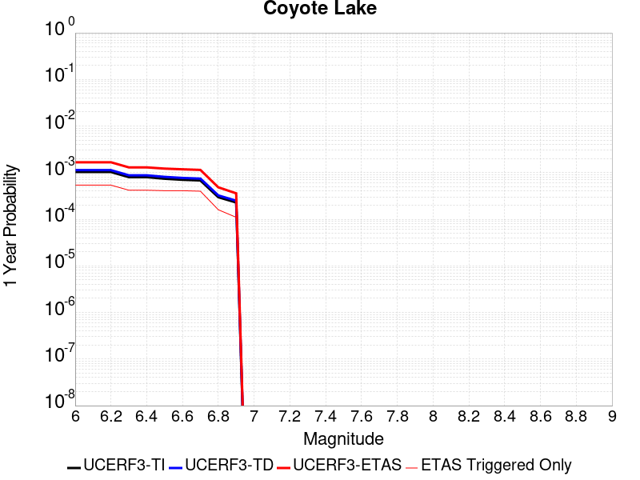 |  |

| Magnitude | 1 wk TI Prob | 1 wk TD Prob | 1 wk ETAS Prob | 1 wk ETAS/TD Gain | 1 wk ETAS Triggered Only | 1 mo TI Prob | 1 mo TD Prob | 1 mo ETAS Prob | 1 mo ETAS/TD Gain | 1 mo ETAS Triggered Only | 1 yr TI Prob | 1 yr TD Prob | 1 yr ETAS Prob | 1 yr ETAS/TD Gain | 1 yr ETAS Triggered Only | 10 yr TI Prob | 10 yr TD Prob | 10 yr ETAS Prob | 10 yr ETAS/TD Gain | 10 yr ETAS Triggered Only |
|-----|-----|-----|-----|-----|-----|-----|-----|-----|-----|-----|-----|-----|-----|-----|-----|-----|-----|-----|-----|-----|
| 6.0 | 1.980352E-5 | 2.1706745E-5 | 2.717013E-4 | 12.516908 | 2.5E-4 | 8.486947E-5 | 9.302599E-5 | 4.1299622E-4 | 4.4395785 | 3.2E-4 | 0.0010327959 | 0.0011320751 | 0.0016714637 | 1.4764602 | 5.4E-4 | 0.010280091 | 0.011270258 | 0.012160115 | 1.0789562 | 9.0E-4 |
| 6.1 | 1.980352E-5 | 2.1706745E-5 | 2.717013E-4 | 12.516908 | 2.5E-4 | 8.486947E-5 | 9.302599E-5 | 4.1299622E-4 | 4.4395785 | 3.2E-4 | 0.0010327959 | 0.0011320751 | 0.0016714637 | 1.4764602 | 5.4E-4 | 0.010280091 | 0.011270258 | 0.012160115 | 1.0789562 | 9.0E-4 |
| 6.2 | 1.980352E-5 | 2.1706745E-5 | 2.717013E-4 | 12.516908 | 2.5E-4 | 8.486947E-5 | 9.302599E-5 | 4.1299622E-4 | 4.4395785 | 3.2E-4 | 0.0010327959 | 0.0011320751 | 0.0016714637 | 1.4764602 | 5.4E-4 | 0.010280091 | 0.011270258 | 0.012160115 | 1.0789562 | 9.0E-4 |
| 6.3 | 1.5344787E-5 | 1.682067E-5 | 2.1681731E-4 | 12.889934 | 2.0E-4 | 6.576172E-5 | 7.2086936E-5 | 3.4206748E-4 | 4.745208 | 2.7E-4 | 8.003548E-4 | 8.773662E-4 | 0.0012969978 | 1.4782854 | 4.2E-4 | 0.007974784 | 0.00874507 | 0.009468685 | 1.0827456 | 7.3E-4 |
| 6.4 | 1.5344787E-5 | 1.682067E-5 | 2.1681731E-4 | 12.889934 | 2.0E-4 | 6.576172E-5 | 7.2086936E-5 | 3.4206748E-4 | 4.745208 | 2.7E-4 | 8.003548E-4 | 8.773662E-4 | 0.0012969978 | 1.4782854 | 4.2E-4 | 0.007974784 | 0.00874507 | 0.009468685 | 1.0827456 | 7.3E-4 |
| 6.5 | 1.4189697E-5 | 1.5557987E-5 | 2.1555487E-4 | 13.854934 | 2.0E-4 | 6.081157E-5 | 6.6675726E-5 | 3.3665771E-4 | 5.04918 | 2.7E-4 | 7.401293E-4 | 8.115349E-4 | 0.0012212022 | 1.5048054 | 4.1E-4 | 0.0073766913 | 0.008091656 | 0.00880583 | 1.0882605 | 7.2E-4 |
| 6.6 | 1.3469301E-5 | 1.4771577E-5 | 2.1476862E-4 | 14.539315 | 2.0E-4 | 5.7724297E-5 | 6.330556E-5 | 3.3328848E-4 | 5.264758 | 2.7E-4 | 7.025667E-4 | 7.7053264E-4 | 0.0011802167 | 1.5316894 | 4.1E-4 | 0.0070034964 | 0.0076845144 | 0.008398982 | 1.0929749 | 7.2E-4 |
| 6.7 | 1.3027966E-5 | 1.4281745E-5 | 2.0427903E-4 | 14.303507 | 1.9E-4 | 5.5832945E-5 | 6.120638E-5 | 3.2119045E-4 | 5.247663 | 2.6E-4 | 6.7955407E-4 | 7.4499263E-4 | 0.0011446946 | 1.5365181 | 4.0E-4 | 0.006774798 | 0.0074308286 | 0.00809585 | 1.089495 | 6.7E-4 |
| 6.8 | 5.695434E-6 | 6.2244176E-6 | 1.0622379E-4 | 17.06566 | 1.0E-4 | 2.4408775E-5 | 2.6675973E-5 | 1.3667304E-4 | 5.123451 | 1.1E-4 | 2.971363E-4 | 3.2476155E-4 | 4.847096E-4 | 1.4925091 | 1.6E-4 | 0.0029673933 | 0.0032458105 | 0.0034850314 | 1.0737015 | 2.4E-4 |
| 6.9 | 4.385688E-6 | 4.7930553E-6 | 7.479272E-5 | 15.604393 | 7.0E-5 | 1.879567E-5 | 2.0541665E-5 | 1.0054002E-4 | 4.8944435 | 8.0E-5 | 2.2881327E-4 | 2.5009477E-4 | 3.6006726E-4 | 1.4397233 | 1.1E-4 | 0.002285778 | 0.0025009478 | 0.0026605476 | 1.0638157 | 1.6E-4 |

## San Andreas (Big Bend)
*[(top)](#table-of-contents)*

| 1 Week | 1 Month | 1 Year | 10 Year |
|-----|-----|-----|-----|
|  |  |  |  |

| Magnitude | 1 wk TI Prob | 1 wk TD Prob | 1 wk ETAS Prob | 1 wk ETAS/TD Gain | 1 wk ETAS Triggered Only | 1 mo TI Prob | 1 mo TD Prob | 1 mo ETAS Prob | 1 mo ETAS/TD Gain | 1 mo ETAS Triggered Only | 1 yr TI Prob | 1 yr TD Prob | 1 yr ETAS Prob | 1 yr ETAS/TD Gain | 1 yr ETAS Triggered Only | 10 yr TI Prob | 10 yr TD Prob | 10 yr ETAS Prob | 10 yr ETAS/TD Gain | 10 yr ETAS Triggered Only |
|-----|-----|-----|-----|-----|-----|-----|-----|-----|-----|-----|-----|-----|-----|-----|-----|-----|-----|-----|-----|-----|
| 6.0 | 1.0179969E-4 | 2.0073925E-4 | 4.7068505E-4 | 2.3447585 | 2.7E-4 | 4.362114E-4 | 8.6002843E-4 | 0.0012197188 | 1.4182308 | 3.6E-4 | 0.0052979486 | 0.010420859 | 0.010994815 | 1.0550776 | 5.8E-4 | 0.051734097 | 0.101455905 | 0.10223764 | 1.0077052 | 8.7E-4 |
| 6.1 | 1.0179969E-4 | 2.0073925E-4 | 4.7068505E-4 | 2.3447585 | 2.7E-4 | 4.362114E-4 | 8.6002843E-4 | 0.0012197188 | 1.4182308 | 3.6E-4 | 0.0052979486 | 0.010420859 | 0.010994815 | 1.0550776 | 5.8E-4 | 0.051734097 | 0.101455905 | 0.10223764 | 1.0077052 | 8.7E-4 |
| 6.2 | 1.0179969E-4 | 2.0073925E-4 | 4.7068505E-4 | 2.3447585 | 2.7E-4 | 4.362114E-4 | 8.6002843E-4 | 0.0012197188 | 1.4182308 | 3.6E-4 | 0.0052979486 | 0.010420859 | 0.010994815 | 1.0550776 | 5.8E-4 | 0.051734097 | 0.101455905 | 0.10223764 | 1.0077052 | 8.7E-4 |
| 6.3 | 1.0179969E-4 | 2.0073925E-4 | 4.7068505E-4 | 2.3447585 | 2.7E-4 | 4.362114E-4 | 8.6002843E-4 | 0.0012197188 | 1.4182308 | 3.6E-4 | 0.0052979486 | 0.010420859 | 0.010994815 | 1.0550776 | 5.8E-4 | 0.051734097 | 0.101455905 | 0.10223764 | 1.0077052 | 8.7E-4 |
| 6.4 | 9.1639464E-5 | 1.8430917E-4 | 4.0426862E-4 | 2.1934266 | 2.2E-4 | 3.9268145E-4 | 7.896575E-4 | 0.0010794286 | 1.3669578 | 2.9E-4 | 0.0047704205 | 0.009571818 | 0.009987798 | 1.0434588 | 4.2E-4 | 0.046693064 | 0.09378695 | 0.09435786 | 1.0060873 | 6.3E-4 |
| 6.5 | 9.1639464E-5 | 1.8430917E-4 | 4.0426862E-4 | 2.1934266 | 2.2E-4 | 3.9268145E-4 | 7.896575E-4 | 0.0010794286 | 1.3669578 | 2.9E-4 | 0.0047704205 | 0.009571818 | 0.009987798 | 1.0434588 | 4.2E-4 | 0.046693064 | 0.09378695 | 0.09435786 | 1.0060873 | 6.3E-4 |
| 6.6 | 9.042622E-5 | 1.8238011E-4 | 3.8234363E-4 | 2.0964108 | 2.0E-4 | 3.8748336E-4 | 7.813951E-4 | 0.0010311998 | 1.3196906 | 2.5E-4 | 0.0047074095 | 0.0094721 | 0.009838595 | 1.0386921 | 3.7E-4 | 0.046089325 | 0.09287721 | 0.09340334 | 1.0056648 | 5.8E-4 |
| 6.7 | 8.9836685E-5 | 1.8152347E-4 | 3.8148716E-4 | 2.1015859 | 2.0E-4 | 3.8495753E-4 | 7.7772595E-4 | 0.0010275316 | 1.3212 | 2.5E-4 | 0.00467679 | 0.009427815 | 0.009784421 | 1.0378249 | 3.6E-4 | 0.045795817 | 0.09247148 | 0.0929797 | 1.0054959 | 5.6E-4 |
| 6.8 | 8.9471854E-5 | 1.8099119E-4 | 3.80955E-4 | 2.1048262 | 2.0E-4 | 3.8339442E-4 | 7.754462E-4 | 0.0010252523 | 1.322145 | 2.5E-4 | 0.004657841 | 0.009400298 | 0.009756913 | 1.0379367 | 3.6E-4 | 0.04561414 | 0.0922192 | 0.092727564 | 1.0055125 | 5.6E-4 |
| 6.9 | 8.858234E-5 | 1.7981093E-4 | 3.6977677E-4 | 2.0564754 | 1.9E-4 | 3.7958333E-4 | 7.7039085E-4 | 0.001010206 | 1.3112901 | 2.4E-4 | 0.004611638 | 0.009339278 | 0.009686009 | 1.0371262 | 3.5E-4 | 0.04517103 | 0.09165911 | 0.09213144 | 1.0051532 | 5.2E-4 |
| 7.0 | 8.7433385E-5 | 1.7819891E-4 | 3.6816506E-4 | 2.0660343 | 1.9E-4 | 3.746607E-4 | 7.6348626E-4 | 0.001003303 | 1.3141075 | 2.4E-4 | 0.004551957 | 0.009255932 | 0.009582877 | 1.0353228 | 3.3E-4 | 0.044598386 | 0.09089323 | 0.09133869 | 1.0049009 | 4.9E-4 |
| 7.1 | 8.684964E-5 | 1.7731842E-4 | 3.6728472E-4 | 2.0713286 | 1.9E-4 | 3.7215967E-4 | 7.597149E-4 | 9.995326E-4 | 1.315668 | 2.4E-4 | 0.0045216335 | 0.009210405 | 0.009537365 | 1.0354991 | 3.3E-4 | 0.04430731 | 0.09047475 | 0.09092042 | 1.0049258 | 4.9E-4 |
| 7.2 | 8.606521E-5 | 1.7622454E-4 | 3.6619106E-4 | 2.07798 | 1.9E-4 | 3.6879873E-4 | 7.550296E-4 | 9.948484E-4 | 1.3176284 | 2.4E-4 | 0.0044808835 | 0.009153842 | 0.009480821 | 1.0357205 | 3.3E-4 | 0.043916024 | 0.08995518 | 0.090392 | 1.004856 | 4.8E-4 |
| 7.3 | 8.568266E-5 | 1.7564454E-4 | 3.6561117E-4 | 2.08154 | 1.9E-4 | 3.6715972E-4 | 7.5254537E-4 | 9.923647E-4 | 1.3186777 | 2.4E-4 | 0.0044610105 | 0.00912385 | 0.009450839 | 1.035839 | 3.3E-4 | 0.043725148 | 0.08967623 | 0.090113185 | 1.0048726 | 4.8E-4 |
| 7.4 | 8.5432206E-5 | 1.752704E-4 | 3.652371E-4 | 2.0838494 | 1.9E-4 | 3.6608664E-4 | 7.509428E-4 | 9.907626E-4 | 1.3193582 | 2.4E-4 | 0.004447999 | 0.009104501 | 0.009421588 | 1.0348275 | 3.2E-4 | 0.043600157 | 0.08949642 | 0.08992436 | 1.0047816 | 4.7E-4 |
| 7.5 | 8.4791965E-5 | 1.7396381E-4 | 3.6393077E-4 | 2.0919912 | 1.9E-4 | 3.633435E-4 | 7.4534636E-4 | 9.851675E-4 | 1.3217579 | 2.4E-4 | 0.0044147377 | 0.009036932 | 0.009354041 | 1.0350902 | 3.2E-4 | 0.043280575 | 0.08887209 | 0.08930032 | 1.0048186 | 4.7E-4 |
| 7.6 | 8.241105E-5 | 1.6841735E-4 | 3.4838702E-4 | 2.0685935 | 1.8E-4 | 3.531424E-4 | 7.2158914E-4 | 9.414304E-4 | 1.3046627 | 2.2E-4 | 0.0042910352 | 0.008750047 | 0.009047422 | 1.0339855 | 3.0E-4 | 0.042091176 | 0.08625032 | 0.08666151 | 1.0047674 | 4.5E-4 |
| 7.7 | 7.00432E-5 | 1.4205615E-4 | 2.9203485E-4 | 2.0557706 | 1.5E-4 | 3.001506E-4 | 6.0867006E-4 | 7.985544E-4 | 1.311966 | 1.9E-4 | 0.0036482112 | 0.0073854174 | 0.007623645 | 1.0322565 | 2.4E-4 | 0.035888977 | 0.07352299 | 0.073865786 | 1.0046624 | 3.7E-4 |
| 7.8 | 6.415362E-5 | 1.2969968E-4 | 2.7968021E-4 | 2.156368 | 1.5E-4 | 2.749151E-4 | 5.557374E-4 | 7.356373E-4 | 1.323714 | 1.8E-4 | 0.0033419547 | 0.0067451415 | 0.0069636577 | 1.0323961 | 2.2E-4 | 0.03292141 | 0.06725514 | 0.067562945 | 1.0045767 | 3.3E-4 |
| 7.9 | 4.939911E-5 | 9.341721E-5 | 1.9340788E-4 | 2.0703664 | 1.0E-4 | 2.116933E-4 | 4.0029807E-4 | 5.2025006E-4 | 1.2996566 | 1.2E-4 | 0.0025743195 | 0.004862747 | 0.0050020665 | 1.0286503 | 1.4E-4 | 0.025447013 | 0.048915803 | 0.04909651 | 1.0036942 | 1.9E-4 |
| 8.0 | 3.344983E-5 | 5.2228E-5 | 9.222591E-5 | 1.7658327 | 4.0E-5 | 1.4334853E-4 | 2.2381509E-4 | 2.6380614E-4 | 1.178679 | 4.0E-5 | 0.0017438711 | 0.0027215453 | 0.0027714092 | 1.0183219 | 5.0E-5 | 0.017302496 | 0.027923161 | 0.028000928 | 1.002785 | 8.0E-5 |
| 8.1 | 1.9104898E-5 | 1.9171663E-5 | 1.9171663E-5 | 1.0 | 0.0 | 8.1875565E-5 | 8.2161685E-5 | 8.2161685E-5 | 1.0 | 0.0 | 9.963791E-4 | 9.9986E-4 | 9.9986E-4 | 1.0 | 0.0 | 0.009919235 | 0.010749552 | 0.010749552 | 1.0 | 0.0 |
| 8.2 | 8.643924E-6 | 5.473668E-6 | 5.473668E-6 | 1.0 | 0.0 | 3.704486E-5 | 2.3458366E-5 | 2.3458366E-5 | 1.0 | 0.0 | 4.5092785E-4 | 2.8556827E-4 | 2.8556827E-4 | 1.0 | 0.0 | 0.0045001395 | 0.0032481793 | 0.0032481793 | 1.0 | 0.0 |
| 8.3 | 1.983087E-6 | 7.6564595E-7 | 7.6564595E-7 | 1.0 | 0.0 | 8.498917E-6 | 3.281336E-6 | 3.281336E-6 | 1.0 | 0.0 | 1.034694E-4 | 3.9949547E-5 | 3.9949547E-5 | 1.0 | 0.0 | 0.0010342124 | 4.717979E-4 | 4.717979E-4 | 1.0 | 0.0 |

## Death Valley (No)
*[(top)](#table-of-contents)*

| 1 Week | 1 Month | 1 Year | 10 Year |
|-----|-----|-----|-----|
|  |  |  |  |

| Magnitude | 1 wk TI Prob | 1 wk TD Prob | 1 wk ETAS Prob | 1 wk ETAS/TD Gain | 1 wk ETAS Triggered Only | 1 mo TI Prob | 1 mo TD Prob | 1 mo ETAS Prob | 1 mo ETAS/TD Gain | 1 mo ETAS Triggered Only | 1 yr TI Prob | 1 yr TD Prob | 1 yr ETAS Prob | 1 yr ETAS/TD Gain | 1 yr ETAS Triggered Only | 10 yr TI Prob | 10 yr TD Prob | 10 yr ETAS Prob | 10 yr ETAS/TD Gain | 10 yr ETAS Triggered Only |
|-----|-----|-----|-----|-----|-----|-----|-----|-----|-----|-----|-----|-----|-----|-----|-----|-----|-----|-----|-----|-----|
| 6.0 | 2.0074807E-5 | 2.2500084E-5 | 2.3249535E-4 | 10.333089 | 2.1E-4 | 8.603206E-5 | 9.642541E-5 | 4.0639553E-4 | 4.21461 | 3.1E-4 | 0.001046937 | 0.0011733545 | 0.0016827561 | 1.4341413 | 5.1E-4 | 0.010420183 | 0.011672506 | 0.012354452 | 1.0584233 | 6.9E-4 |
| 6.1 | 2.0074807E-5 | 2.2500084E-5 | 2.3249535E-4 | 10.333089 | 2.1E-4 | 8.603206E-5 | 9.642541E-5 | 4.0639553E-4 | 4.21461 | 3.1E-4 | 0.001046937 | 0.0011733545 | 0.0016827561 | 1.4341413 | 5.1E-4 | 0.010420183 | 0.011672506 | 0.012354452 | 1.0584233 | 6.9E-4 |
| 6.2 | 2.0074807E-5 | 2.2500084E-5 | 2.3249535E-4 | 10.333089 | 2.1E-4 | 8.603206E-5 | 9.642541E-5 | 4.0639553E-4 | 4.21461 | 3.1E-4 | 0.001046937 | 0.0011733545 | 0.0016827561 | 1.4341413 | 5.1E-4 | 0.010420183 | 0.011672506 | 0.012354452 | 1.0584233 | 6.9E-4 |
| 6.3 | 1.9050609E-5 | 2.1336948E-5 | 2.2133268E-4 | 10.373212 | 2.0E-4 | 8.164292E-5 | 9.1440896E-5 | 3.9141346E-4 | 4.280508 | 3.0E-4 | 9.935491E-4 | 0.001112731 | 0.0016021858 | 1.439868 | 4.9E-4 | 0.009891188 | 0.011072419 | 0.011735001 | 1.0598407 | 6.7E-4 |
| 6.4 | 1.9050609E-5 | 2.1336948E-5 | 2.2133268E-4 | 10.373212 | 2.0E-4 | 8.164292E-5 | 9.1440896E-5 | 3.9141346E-4 | 4.280508 | 3.0E-4 | 9.935491E-4 | 0.001112731 | 0.0016021858 | 1.439868 | 4.9E-4 | 0.009891188 | 0.011072419 | 0.011735001 | 1.0598407 | 6.7E-4 |
| 6.5 | 1.8367004E-5 | 2.0561009E-5 | 1.9055752E-4 | 9.267907 | 1.7E-4 | 7.8713354E-5 | 8.811567E-5 | 3.4809276E-4 | 3.950407 | 2.6E-4 | 9.5791375E-4 | 0.0010722869 | 0.0015218043 | 1.4192139 | 4.5E-4 | 0.009537951 | 0.0106719155 | 0.0112852985 | 1.0574764 | 6.2E-4 |
| 6.6 | 1.779439E-5 | 1.9910927E-5 | 1.7990774E-4 | 9.035628 | 1.6E-4 | 7.625944E-5 | 8.53298E-5 | 3.3530846E-4 | 3.929559 | 2.5E-4 | 9.280632E-4 | 0.0010384015 | 0.001467955 | 1.413668 | 4.3E-4 | 0.009241969 | 0.010336253 | 0.010930051 | 1.0574481 | 6.0E-4 |
| 6.7 | 1.7025437E-5 | 1.9043426E-5 | 1.7904038E-4 | 9.40169 | 1.6E-4 | 7.296412E-5 | 8.161216E-5 | 3.2159258E-4 | 3.940498 | 2.4E-4 | 8.87976E-4 | 9.931813E-4 | 0.0014027741 | 1.4124049 | 4.1E-4 | 0.008844362 | 0.009888145 | 0.01046241 | 1.0580761 | 5.8E-4 |
| 6.8 | 1.6545107E-5 | 1.8512545E-5 | 1.7850958E-4 | 9.642628 | 1.6E-4 | 7.090568E-5 | 7.93371E-5 | 3.1931806E-4 | 4.0248265 | 2.4E-4 | 8.629347E-4 | 9.655073E-4 | 0.0013751114 | 1.4242373 | 4.1E-4 | 0.008595915 | 0.009613829 | 0.010178349 | 1.0587196 | 5.7E-4 |
| 6.9 | 1.615478E-5 | 1.8087594E-5 | 1.780847E-4 | 9.845682 | 1.6E-4 | 6.9232934E-5 | 7.751599E-5 | 3.1749738E-4 | 4.0958953 | 2.4E-4 | 8.4258494E-4 | 9.433546E-4 | 0.0013529679 | 1.4342091 | 4.1E-4 | 0.008393973 | 0.009394196 | 0.009958841 | 1.0601058 | 5.7E-4 |
| 7.0 | 1.5894311E-5 | 1.780555E-5 | 1.778027E-4 | 9.985803 | 1.6E-4 | 6.81167E-5 | 7.6307304E-5 | 3.16289E-4 | 4.1449375 | 2.4E-4 | 8.2900526E-4 | 9.286515E-4 | 0.0013382707 | 1.4410903 | 4.1E-4 | 0.008259195 | 0.009248397 | 0.009813126 | 1.0610623 | 5.7E-4 |
| 7.1 | 1.5602263E-5 | 1.7483504E-5 | 1.6748087E-4 | 9.579367 | 1.5E-4 | 6.6865134E-5 | 7.492718E-5 | 2.949107E-4 | 3.935964 | 2.2E-4 | 8.137789E-4 | 9.118627E-4 | 0.0013015071 | 1.4273059 | 3.9E-4 | 0.008108052 | 0.009081894 | 0.00961699 | 1.058919 | 5.4E-4 |
| 7.2 | 1.5323829E-5 | 1.717063E-5 | 1.6716805E-4 | 9.735697 | 1.5E-4 | 6.56719E-5 | 7.358637E-5 | 2.935702E-4 | 3.989464 | 2.2E-4 | 7.99262E-4 | 8.9555193E-4 | 0.0012752116 | 1.4239393 | 3.8E-4 | 0.007963934 | 0.008920107 | 0.009445379 | 1.0588863 | 5.3E-4 |
| 7.3 | 1.4556212E-5 | 1.6302456E-5 | 1.5630017E-4 | 9.587523 | 1.4E-4 | 6.238227E-5 | 6.9865826E-5 | 2.7985114E-4 | 4.0055513 | 2.1E-4 | 7.592395E-4 | 8.5029035E-4 | 0.0012099842 | 1.4230248 | 3.6E-4 | 0.0075665074 | 0.008471014 | 0.008976694 | 1.0596954 | 5.1E-4 |
| 7.4 | 1.411725E-5 | 1.580796E-5 | 1.5580574E-4 | 9.856157 | 1.4E-4 | 6.0501097E-5 | 6.7746674E-5 | 2.7773244E-4 | 4.099573 | 2.1E-4 | 7.363519E-4 | 8.245094E-4 | 0.0011842126 | 1.4362632 | 3.6E-4 | 0.0073391674 | 0.008215138 | 0.008720948 | 1.0615705 | 5.1E-4 |
| 7.5 | 1.3503312E-5 | 1.5126289E-5 | 1.4512433E-4 | 9.594179 | 1.3E-4 | 5.7870053E-5 | 6.482538E-5 | 2.648124E-4 | 4.0850115 | 2.0E-4 | 7.043401E-4 | 7.8896893E-4 | 0.0011287007 | 1.4306022 | 3.4E-4 | 0.007021119 | 0.007862304 | 0.008348452 | 1.0618327 | 4.9E-4 |
| 7.6 | 1.1279839E-5 | 1.2626327E-5 | 1.3262482E-4 | 10.503832 | 1.2E-4 | 4.834127E-5 | 5.4111737E-5 | 2.4410145E-4 | 4.511063 | 1.9E-4 | 5.88396E-4 | 6.5861654E-4 | 9.4842556E-4 | 1.4400269 | 2.9E-4 | 0.005868405 | 0.006567199 | 0.007004309 | 1.0665597 | 4.4E-4 |
| 7.7 | 9.189108E-6 | 1.0283358E-5 | 1.00282436E-4 | 9.751915 | 9.0E-5 | 3.93813E-5 | 4.407082E-5 | 1.8406464E-4 | 4.176565 | 1.4E-4 | 4.7936183E-4 | 5.3643517E-4 | 7.363279E-4 | 1.3726317 | 2.0E-4 | 0.004783291 | 0.005351914 | 0.0056801476 | 1.0613302 | 3.3E-4 |
| 7.8 | 3.4586725E-7 | 3.6482615E-7 | 3.6482615E-7 | 1.0 | 0.0 | 1.4822873E-6 | 1.5635396E-6 | 1.5635396E-6 | 1.0 | 0.0 | 1.80467E-5 | 1.9035933E-5 | 1.9035933E-5 | 1.0 | 0.0 | 1.8045233E-4 | 1.9034347E-4 | 2.0034157E-4 | 1.0525266 | 1.0E-5 |
| 7.9 | 2.5591178E-9 | 2.6696718E-9 | 2.6696718E-9 | 1.0 | 0.0 | 1.0967647E-8 | 1.14414505E-8 | 1.14414505E-8 | 1.0 | 0.0 | 1.335311E-7 | 1.3929966E-7 | 1.3929966E-7 | 1.0 | 0.0 | 1.3353102E-6 | 1.3929966E-6 | 1.3929966E-6 | 1.0 | 0.0 |

## San Andreas (San Gorgonio Pass-Garnet HIll)
*[(top)](#table-of-contents)*

| 1 Week | 1 Month | 1 Year | 10 Year |
|-----|-----|-----|-----|
|  |  |  |  |

| Magnitude | 1 wk TI Prob | 1 wk TD Prob | 1 wk ETAS Prob | 1 wk ETAS/TD Gain | 1 wk ETAS Triggered Only | 1 mo TI Prob | 1 mo TD Prob | 1 mo ETAS Prob | 1 mo ETAS/TD Gain | 1 mo ETAS Triggered Only | 1 yr TI Prob | 1 yr TD Prob | 1 yr ETAS Prob | 1 yr ETAS/TD Gain | 1 yr ETAS Triggered Only | 10 yr TI Prob | 10 yr TD Prob | 10 yr ETAS Prob | 10 yr ETAS/TD Gain | 10 yr ETAS Triggered Only |
|-----|-----|-----|-----|-----|-----|-----|-----|-----|-----|-----|-----|-----|-----|-----|-----|-----|-----|-----|-----|-----|
| 6.0 | 8.31567E-5 | 2.3384395E-4 | 4.9378315E-4 | 2.1115925 | 2.6E-4 | 3.5633717E-4 | 0.0010018025 | 0.0013414619 | 1.3390483 | 3.4E-4 | 0.004329778 | 0.012128622 | 0.012563285 | 1.0358378 | 4.4E-4 | 0.042463828 | 0.11258187 | 0.1130877 | 1.004493 | 5.7E-4 |
| 6.1 | 8.31567E-5 | 2.3384395E-4 | 4.9378315E-4 | 2.1115925 | 2.6E-4 | 3.5633717E-4 | 0.0010018025 | 0.0013414619 | 1.3390483 | 3.4E-4 | 0.004329778 | 0.012128622 | 0.012563285 | 1.0358378 | 4.4E-4 | 0.042463828 | 0.11258187 | 0.1130877 | 1.004493 | 5.7E-4 |
| 6.2 | 8.31567E-5 | 2.3384395E-4 | 4.9378315E-4 | 2.1115925 | 2.6E-4 | 3.5633717E-4 | 0.0010018025 | 0.0013414619 | 1.3390483 | 3.4E-4 | 0.004329778 | 0.012128622 | 0.012563285 | 1.0358378 | 4.4E-4 | 0.042463828 | 0.11258187 | 0.1130877 | 1.004493 | 5.7E-4 |
| 6.3 | 8.31567E-5 | 2.3384395E-4 | 4.9378315E-4 | 2.1115925 | 2.6E-4 | 3.5633717E-4 | 0.0010018025 | 0.0013414619 | 1.3390483 | 3.4E-4 | 0.004329778 | 0.012128622 | 0.012563285 | 1.0358378 | 4.4E-4 | 0.042463828 | 0.11258187 | 0.1130877 | 1.004493 | 5.7E-4 |
| 6.4 | 8.059055E-5 | 2.2941893E-4 | 4.8935926E-4 | 2.133038 | 2.6E-4 | 3.4534236E-4 | 9.828559E-4 | 0.0013225218 | 1.3455906 | 3.4E-4 | 0.0041964394 | 0.011900819 | 0.012335583 | 1.0365323 | 4.4E-4 | 0.041180745 | 0.110562965 | 0.11106994 | 1.0045854 | 5.7E-4 |
| 6.5 | 8.059055E-5 | 2.2941893E-4 | 4.8935926E-4 | 2.133038 | 2.6E-4 | 3.4534236E-4 | 9.828559E-4 | 0.0013225218 | 1.3455906 | 3.4E-4 | 0.0041964394 | 0.011900819 | 0.012335583 | 1.0365323 | 4.4E-4 | 0.041180745 | 0.110562965 | 0.11106994 | 1.0045854 | 5.7E-4 |
| 6.6 | 7.619237E-5 | 2.2186468E-4 | 4.81807E-4 | 2.1716256 | 2.6E-4 | 3.2649786E-4 | 9.5050444E-4 | 0.0012901813 | 1.3573648 | 3.4E-4 | 0.0039678677 | 0.0115115335 | 0.011936584 | 1.0369239 | 4.3E-4 | 0.03897764 | 0.10709954 | 0.10759064 | 1.0045854 | 5.5E-4 |
| 6.7 | 7.440636E-5 | 2.1862281E-4 | 4.7856598E-4 | 2.189003 | 2.6E-4 | 3.188454E-4 | 9.3662075E-4 | 0.0012763023 | 1.3626671 | 3.4E-4 | 0.0038750346 | 0.011344268 | 0.01176939 | 1.0374746 | 4.3E-4 | 0.038081564 | 0.1056081 | 0.106100015 | 1.004658 | 5.5E-4 |
| 6.8 | 7.3735864E-5 | 2.1709445E-4 | 4.77038E-4 | 2.1973753 | 2.6E-4 | 3.1597257E-4 | 9.300753E-4 | 0.001269759 | 1.3652219 | 3.4E-4 | 0.0038401815 | 0.011265406 | 0.011690563 | 1.03774 | 4.3E-4 | 0.03774495 | 0.104909696 | 0.10540199 | 1.0046926 | 5.5E-4 |
| 6.9 | 7.27575E-5 | 2.1478413E-4 | 4.747283E-4 | 2.2102578 | 2.6E-4 | 3.117806E-4 | 9.20181E-4 | 0.0012598681 | 1.3691525 | 3.4E-4 | 0.003789323 | 0.011146182 | 0.01157139 | 1.0381483 | 4.3E-4 | 0.037253562 | 0.10385753 | 0.10435041 | 1.0047457 | 5.5E-4 |
| 7.0 | 7.102591E-5 | 2.1062451E-4 | 4.7056974E-4 | 2.2341642 | 2.6E-4 | 3.0436125E-4 | 9.023664E-4 | 0.0012420596 | 1.3764471 | 3.4E-4 | 0.003699303 | 0.010931484 | 0.011356784 | 1.038906 | 4.3E-4 | 0.03638325 | 0.101959534 | 0.102453455 | 1.0048443 | 5.5E-4 |
| 7.1 | 7.028513E-5 | 2.0898094E-4 | 4.689266E-4 | 2.2438726 | 2.6E-4 | 3.0118722E-4 | 8.953274E-4 | 0.001235023 | 1.3794093 | 3.4E-4 | 0.0036607897 | 0.010846641 | 0.011271977 | 1.0392137 | 4.3E-4 | 0.036010686 | 0.10120243 | 0.10169677 | 1.0048846 | 5.5E-4 |
| 7.2 | 6.8498244E-5 | 2.050596E-4 | 4.5500832E-4 | 2.2189078 | 2.5E-4 | 2.9353087E-4 | 8.7853306E-4 | 0.0012082432 | 1.3752961 | 3.3E-4 | 0.003567883 | 0.0106441835 | 0.011059713 | 1.0390382 | 4.2E-4 | 0.035111405 | 0.09939449 | 0.09988082 | 1.004893 | 5.4E-4 |
| 7.3 | 6.622592E-5 | 1.9733235E-4 | 4.4728303E-4 | 2.266648 | 2.5E-4 | 2.8379448E-4 | 8.4543816E-4 | 0.0011751591 | 1.3900001 | 3.3E-4 | 0.0034497243 | 0.010245111 | 0.010660808 | 1.0405751 | 4.2E-4 | 0.033966612 | 0.095891245 | 0.09637043 | 1.0049971 | 5.3E-4 |
| 7.4 | 5.1050705E-5 | 1.4690042E-4 | 3.8686517E-4 | 2.63352 | 2.4E-4 | 2.1877038E-4 | 6.294222E-4 | 9.392271E-4 | 1.4922051 | 3.1E-4 | 0.002660276 | 0.007636482 | 0.008033427 | 1.0519801 | 4.0E-4 | 0.02628654 | 0.07286554 | 0.073329106 | 1.006362 | 5.0E-4 |
| 7.5 | 3.9302922E-5 | 1.11307076E-4 | 3.5128035E-4 | 3.1559572 | 2.4E-4 | 1.6843023E-4 | 4.7694342E-4 | 7.867956E-4 | 1.6496623 | 3.1E-4 | 0.0020487092 | 0.0057913954 | 0.0061890786 | 1.068668 | 4.0E-4 | 0.020299247 | 0.05601151 | 0.056483503 | 1.0084268 | 5.0E-4 |
| 7.6 | 2.9851626E-5 | 8.4956984E-5 | 3.2493658E-4 | 3.824719 | 2.4E-4 | 1.2792926E-4 | 3.6405068E-4 | 6.639415E-4 | 1.8237611 | 3.0E-4 | 0.0015564259 | 0.0044233347 | 0.004801654 | 1.085528 | 3.8E-4 | 0.0154556995 | 0.043196145 | 0.043636277 | 1.010189 | 4.6E-4 |
| 7.7 | 2.1135214E-5 | 6.353527E-5 | 2.9352066E-4 | 4.619807 | 2.3E-4 | 9.0576345E-5 | 2.722656E-4 | 5.5218936E-4 | 2.0281274 | 2.8E-4 | 0.0011022091 | 0.0033098008 | 0.0036686093 | 1.1084079 | 3.6E-4 | 0.010967582 | 0.03258456 | 0.033010222 | 1.0130633 | 4.4E-4 |
| 7.8 | 1.883379E-5 | 5.564576E-5 | 2.8563297E-4 | 5.133059 | 2.3E-4 | 8.0713755E-5 | 2.3846005E-4 | 5.183933E-4 | 2.1739209 | 2.8E-4 | 9.822468E-4 | 0.002899389 | 0.0032583452 | 1.1238041 | 3.6E-4 | 0.0097791655 | 0.028696978 | 0.029124351 | 1.0148926 | 4.4E-4 |
| 7.9 | 1.5156185E-5 | 4.1662403E-5 | 2.6165324E-4 | 6.28032 | 2.2E-4 | 6.495346E-5 | 1.7854095E-4 | 4.3849452E-4 | 2.4559886 | 2.6E-4 | 7.9052144E-4 | 0.0021715704 | 0.002510832 | 1.1562288 | 3.4E-4 | 0.007877152 | 0.021760946 | 0.022171807 | 1.0188806 | 4.2E-4 |
| 8.0 | 1.1405907E-5 | 2.9976925E-5 | 1.8997212E-4 | 6.3372784 | 1.6E-4 | 4.8881542E-5 | 1.2846621E-4 | 3.2844054E-4 | 2.5566294 | 2.0E-4 | 5.9497025E-4 | 0.0015629551 | 0.0018125643 | 1.1597034 | 2.5E-4 | 0.005933798 | 0.015774013 | 0.01606928 | 1.0187186 | 3.0E-4 |
| 8.1 | 4.3511436E-6 | 7.369465E-6 | 7.369465E-6 | 1.0 | 0.0 | 1.8647626E-5 | 3.158304E-5 | 3.158304E-5 | 1.0 | 0.0 | 2.2701119E-4 | 3.844558E-4 | 3.844558E-4 | 1.0 | 0.0 | 0.0022677942 | 0.0041165445 | 0.0041165445 | 1.0 | 0.0 |
| 8.2 | 2.3042528E-6 | 2.7328301E-6 | 2.7328301E-6 | 1.0 | 0.0 | 9.875332E-6 | 1.1712076E-5 | 1.1712076E-5 | 1.0 | 0.0 | 1.2022553E-4 | 1.4258524E-4 | 1.4258524E-4 | 1.0 | 0.0 | 0.0012016051 | 0.0015979637 | 0.0015979637 | 1.0 | 0.0 |
| 8.3 | 5.202968E-7 | 3.1590292E-7 | 3.1590292E-7 | 1.0 | 0.0 | 2.2298414E-6 | 1.353869E-6 | 1.353869E-6 | 1.0 | 0.0 | 2.714798E-5 | 1.6483244E-5 | 1.6483244E-5 | 1.0 | 0.0 | 2.7144665E-4 | 1.955901E-4 | 1.955901E-4 | 1.0 | 0.0 |

## San Andreas (Parkfield)
*[(top)](#table-of-contents)*

| 1 Week | 1 Month | 1 Year | 10 Year |
|-----|-----|-----|-----|
|  |  |  | 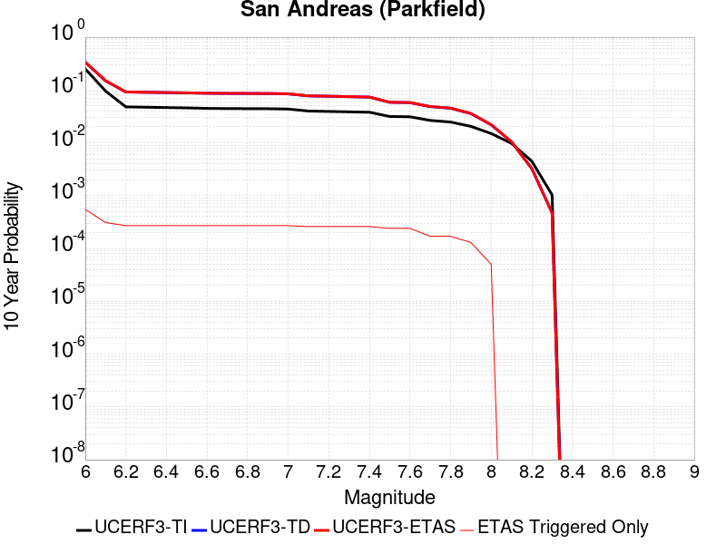 |

| Magnitude | 1 wk TI Prob | 1 wk TD Prob | 1 wk ETAS Prob | 1 wk ETAS/TD Gain | 1 wk ETAS Triggered Only | 1 mo TI Prob | 1 mo TD Prob | 1 mo ETAS Prob | 1 mo ETAS/TD Gain | 1 mo ETAS Triggered Only | 1 yr TI Prob | 1 yr TD Prob | 1 yr ETAS Prob | 1 yr ETAS/TD Gain | 1 yr ETAS Triggered Only | 10 yr TI Prob | 10 yr TD Prob | 10 yr ETAS Prob | 10 yr ETAS/TD Gain | 10 yr ETAS Triggered Only |
|-----|-----|-----|-----|-----|-----|-----|-----|-----|-----|-----|-----|-----|-----|-----|-----|-----|-----|-----|-----|-----|
| 6.0 | 5.556969E-4 | 7.778562E-4 | 9.577162E-4 | 1.2312253 | 1.8E-4 | 0.0023793848 | 0.0033299583 | 0.003569159 | 1.071833 | 2.4E-4 | 0.028586963 | 0.040235043 | 0.040599752 | 1.0090646 | 3.8E-4 | 0.25176284 | 0.3371973 | 0.33756185 | 1.0010811 | 5.5E-4 |
| 6.1 | 1.925858E-4 | 3.0278185E-4 | 4.227455E-4 | 1.396205 | 1.2E-4 | 8.2510663E-4 | 0.001297085 | 0.0014369034 | 1.1077943 | 1.4E-4 | 0.0099994885 | 0.01577393 | 0.015980618 | 1.0131031 | 2.1E-4 | 0.095613256 | 0.14975825 | 0.15002182 | 1.00176 | 3.1E-4 |
| 6.2 | 9.4306815E-5 | 1.8243887E-4 | 3.0241697E-4 | 1.6576345 | 1.2E-4 | 4.0410945E-4 | 7.8164786E-4 | 9.215384E-4 | 1.1789688 | 1.4E-4 | 0.0049089384 | 0.009475246 | 0.009663446 | 1.0198623 | 1.9E-4 | 0.048019063 | 0.0918565 | 0.0921017 | 1.0026693 | 2.7E-4 |
| 6.3 | 9.283051E-5 | 1.794041E-4 | 2.9938258E-4 | 1.668761 | 1.2E-4 | 3.9778434E-4 | 7.686494E-4 | 9.085418E-4 | 1.1819977 | 1.4E-4 | 0.0048322747 | 0.009318355 | 0.009506584 | 1.0201999 | 1.9E-4 | 0.047285385 | 0.090509474 | 0.09075503 | 1.0027131 | 2.7E-4 |
| 6.4 | 9.138826E-5 | 1.7702584E-4 | 2.970046E-4 | 1.6777471 | 1.2E-4 | 3.916052E-4 | 7.5846276E-4 | 8.9835655E-4 | 1.1844438 | 1.4E-4 | 0.0047573745 | 0.009195387 | 0.00938364 | 1.0204725 | 1.9E-4 | 0.046568092 | 0.0894136 | 0.08965945 | 1.0027497 | 2.7E-4 |
| 6.5 | 9.000255E-5 | 1.746064E-4 | 2.9458545E-4 | 1.6871401 | 1.2E-4 | 3.8566816E-4 | 7.4809964E-4 | 8.8799495E-4 | 1.1870009 | 1.4E-4 | 0.0046854047 | 0.009070284 | 0.009258561 | 1.0207576 | 1.9E-4 | 0.045878403 | 0.08829608 | 0.08854224 | 1.002788 | 2.7E-4 |
| 6.6 | 8.8109264E-5 | 1.7141816E-4 | 2.913976E-4 | 1.6999226 | 1.2E-4 | 3.7755648E-4 | 7.3444354E-4 | 8.743407E-4 | 1.1904805 | 1.4E-4 | 0.0045870654 | 0.008905404 | 0.009093712 | 1.0211453 | 1.9E-4 | 0.04493529 | 0.08682707 | 0.08707363 | 1.0028397 | 2.7E-4 |
| 6.7 | 8.738073E-5 | 1.7008898E-4 | 2.9006856E-4 | 1.7053931 | 1.2E-4 | 3.7443507E-4 | 7.287503E-4 | 8.686483E-4 | 1.1919696 | 1.4E-4 | 0.0045492216 | 0.008836695 | 0.009025016 | 1.0213113 | 1.9E-4 | 0.04457213 | 0.0862268 | 0.08647352 | 1.0028613 | 2.7E-4 |
| 6.8 | 8.710195E-5 | 1.6954402E-4 | 2.8952368E-4 | 1.7076608 | 1.2E-4 | 3.7324068E-4 | 7.26416E-4 | 8.6631434E-4 | 1.192587 | 1.4E-4 | 0.0045347405 | 0.008808513 | 0.00899684 | 1.0213801 | 1.9E-4 | 0.04443313 | 0.08597436 | 0.08622114 | 1.0028704 | 2.7E-4 |
| 6.9 | 8.6801556E-5 | 1.6895356E-4 | 2.8893328E-4 | 1.7101344 | 1.2E-4 | 3.7195362E-4 | 7.238869E-4 | 8.6378556E-4 | 1.1932604 | 1.4E-4 | 0.0045191357 | 0.0087779695 | 0.008966302 | 1.021455 | 1.9E-4 | 0.044283327 | 0.08570042 | 0.08594728 | 1.0028805 | 2.7E-4 |
| 7.0 | 8.5571606E-5 | 1.664819E-4 | 2.8646193E-4 | 1.720679 | 1.2E-4 | 3.6668387E-4 | 7.132999E-4 | 8.5320004E-4 | 1.1961309 | 1.4E-4 | 0.004455241 | 0.008650103 | 0.00883846 | 1.021775 | 1.9E-4 | 0.043669727 | 0.08454836 | 0.084795535 | 1.0029235 | 2.7E-4 |
| 7.1 | 7.82589E-5 | 1.5128969E-4 | 2.7127154E-4 | 1.7930603 | 1.2E-4 | 3.3535215E-4 | 6.4822397E-4 | 7.881332E-4 | 1.2158347 | 1.4E-4 | 0.0040752706 | 0.007863738 | 0.0080423225 | 1.0227098 | 1.8E-4 | 0.040013418 | 0.077460445 | 0.0777003 | 1.0030966 | 2.6E-4 |
| 7.2 | 7.690929E-5 | 1.4866212E-4 | 2.6864427E-4 | 1.8070796 | 1.2E-4 | 3.2956956E-4 | 6.369685E-4 | 7.768793E-4 | 1.2196511 | 1.4E-4 | 0.004005129 | 0.0077276826 | 0.007906292 | 1.0231129 | 1.8E-4 | 0.0393371 | 0.07623341 | 0.076473586 | 1.0031506 | 2.6E-4 |
| 7.3 | 7.5543794E-5 | 1.4562748E-4 | 2.6561E-4 | 1.8239003 | 1.2E-4 | 3.2371894E-4 | 6.239692E-4 | 7.6388184E-4 | 1.22423 | 1.4E-4 | 0.003934157 | 0.0075705256 | 0.007749163 | 1.0235964 | 1.8E-4 | 0.038652334 | 0.07479777 | 0.07503832 | 1.003216 | 2.6E-4 |
| 7.4 | 7.4214564E-5 | 1.4263717E-4 | 2.6262004E-4 | 1.8411754 | 1.2E-4 | 3.1802364E-4 | 6.1115966E-4 | 7.510741E-4 | 1.2289327 | 1.4E-4 | 0.003865065 | 0.0074156416 | 0.0075943065 | 1.024093 | 1.8E-4 | 0.03798529 | 0.07337152 | 0.07361245 | 1.0032836 | 2.6E-4 |
| 7.5 | 6.149578E-5 | 1.1191443E-4 | 2.2190211E-4 | 1.9827838 | 1.1E-4 | 2.6352672E-4 | 4.795452E-4 | 6.094829E-4 | 1.2709602 | 1.3E-4 | 0.0032037178 | 0.005822865 | 0.0059819333 | 1.0273179 | 1.6E-4 | 0.03157923 | 0.058559462 | 0.05878541 | 1.0038584 | 2.4E-4 |
| 7.6 | 6.0643448E-5 | 1.102009E-4 | 2.2018877E-4 | 1.998067 | 1.1E-4 | 2.598746E-4 | 4.7220418E-4 | 6.0214277E-4 | 1.2751746 | 1.3E-4 | 0.0031593828 | 0.005733962 | 0.0058930446 | 1.0277439 | 1.6E-4 | 0.031148417 | 0.05772042 | 0.057946566 | 1.0039179 | 2.4E-4 |
| 7.7 | 5.1652263E-5 | 9.175265E-5 | 1.7174531E-4 | 1.8718295 | 8.0E-5 | 2.2134806E-4 | 3.9316638E-4 | 4.931271E-4 | 1.2542453 | 1.0E-4 | 0.002691582 | 0.0047763046 | 0.004885779 | 1.0229204 | 1.1E-4 | 0.026592141 | 0.04853641 | 0.048698157 | 1.0033325 | 1.7E-4 |
| 7.8 | 4.8090482E-5 | 8.560165E-5 | 1.655948E-4 | 1.9344814 | 8.0E-5 | 2.060858E-4 | 3.6681266E-4 | 4.6677596E-4 | 1.2725188 | 1.0E-4 | 0.0025062072 | 0.004456807 | 0.004566317 | 1.0245713 | 1.1E-4 | 0.024781305 | 0.045302264 | 0.045464564 | 1.0035826 | 1.7E-4 |
| 7.9 | 3.970278E-5 | 6.7507375E-5 | 1.3750265E-4 | 2.0368538 | 7.0E-5 | 1.7014367E-4 | 2.8928524E-4 | 3.792592E-4 | 1.3110216 | 9.0E-5 | 0.002069531 | 0.0035163634 | 0.003616012 | 1.0283384 | 1.0E-4 | 0.020503636 | 0.03588176 | 0.036007095 | 1.003493 | 1.3E-4 |
| 8.0 | 2.8982335E-5 | 4.0698153E-5 | 7.069693E-5 | 1.7371042 | 3.0E-5 | 1.2420409E-4 | 1.7440901E-4 | 2.0440377E-4 | 1.1719794 | 3.0E-5 | 0.0015111357 | 0.0021213628 | 0.0021512993 | 1.0141119 | 3.0E-5 | 0.015009012 | 0.02201118 | 0.02206008 | 1.0022216 | 5.0E-5 |
| 8.1 | 1.8836186E-5 | 1.867974E-5 | 1.867974E-5 | 1.0 | 0.0 | 8.0724014E-5 | 8.005358E-5 | 8.005358E-5 | 1.0 | 0.0 | 9.823717E-4 | 9.742171E-4 | 9.742171E-4 | 1.0 | 0.0 | 0.009780403 | 0.010487711 | 0.010487711 | 1.0 | 0.0 |
| 8.2 | 8.643924E-6 | 5.473668E-6 | 5.473668E-6 | 1.0 | 0.0 | 3.704486E-5 | 2.3458366E-5 | 2.3458366E-5 | 1.0 | 0.0 | 4.5092785E-4 | 2.8556827E-4 | 2.8556827E-4 | 1.0 | 0.0 | 0.0045001395 | 0.0032481793 | 0.0032481793 | 1.0 | 0.0 |
| 8.3 | 1.983087E-6 | 7.6564595E-7 | 7.6564595E-7 | 1.0 | 0.0 | 8.498917E-6 | 3.281336E-6 | 3.281336E-6 | 1.0 | 0.0 | 1.034694E-4 | 3.9949547E-5 | 3.9949547E-5 | 1.0 | 0.0 | 0.0010342124 | 4.717979E-4 | 4.717979E-4 | 1.0 | 0.0 |

## Red Pass
*[(top)](#table-of-contents)*

| 1 Week | 1 Month | 1 Year | 10 Year |
|-----|-----|-----|-----|
|  |  |  |  |

| Magnitude | 1 wk TI Prob | 1 wk TD Prob | 1 wk ETAS Prob | 1 wk ETAS/TD Gain | 1 wk ETAS Triggered Only | 1 mo TI Prob | 1 mo TD Prob | 1 mo ETAS Prob | 1 mo ETAS/TD Gain | 1 mo ETAS Triggered Only | 1 yr TI Prob | 1 yr TD Prob | 1 yr ETAS Prob | 1 yr ETAS/TD Gain | 1 yr ETAS Triggered Only | 10 yr TI Prob | 10 yr TD Prob | 10 yr ETAS Prob | 10 yr ETAS/TD Gain | 10 yr ETAS Triggered Only |
|-----|-----|-----|-----|-----|-----|-----|-----|-----|-----|-----|-----|-----|-----|-----|-----|-----|-----|-----|-----|-----|
| 6.0 | 8.258278E-6 | 8.551265E-6 | 8.855058E-5 | 10.355261 | 8.0E-5 | 3.539214E-5 | 3.6647863E-5 | 1.96642E-4 | 5.365715 | 1.6E-4 | 4.308141E-4 | 4.4611428E-4 | 6.9600274E-4 | 1.5601445 | 2.5E-4 | 0.0042997985 | 0.004453945 | 0.004931807 | 1.1072897 | 4.8E-4 |
| 6.1 | 3.649988E-6 | 3.7753161E-6 | 4.3775166E-5 | 11.595099 | 4.0E-5 | 1.5642712E-5 | 1.6179853E-5 | 8.617872E-5 | 5.326298 | 7.0E-5 | 1.9043336E-4 | 1.9697666E-4 | 2.8695894E-4 | 1.4568169 | 9.0E-5 | 0.0019027026 | 0.001968488 | 0.0021680943 | 1.1014009 | 2.0E-4 |
| 6.2 | 3.649988E-6 | 3.7753161E-6 | 4.3775166E-5 | 11.595099 | 4.0E-5 | 1.5642712E-5 | 1.6179853E-5 | 8.617872E-5 | 5.326298 | 7.0E-5 | 1.9043336E-4 | 1.9697666E-4 | 2.8695894E-4 | 1.4568169 | 9.0E-5 | 0.0019027026 | 0.001968488 | 0.0021680943 | 1.1014009 | 2.0E-4 |
| 6.3 | 1.3924937E-6 | 1.4411166E-6 | 2.1441088E-5 | 14.878107 | 2.0E-5 | 5.9678164E-6 | 6.1762075E-6 | 2.6176083E-5 | 4.238213 | 2.0E-5 | 7.265574E-5 | 7.519415E-5 | 9.519264E-5 | 1.2659582 | 2.0E-5 | 7.263199E-4 | 7.518258E-4 | 8.0178824E-4 | 1.0664548 | 5.0E-5 |
| 6.4 | 1.3924937E-6 | 1.4411166E-6 | 2.1441088E-5 | 14.878107 | 2.0E-5 | 5.9678164E-6 | 6.1762075E-6 | 2.6176083E-5 | 4.238213 | 2.0E-5 | 7.265574E-5 | 7.519415E-5 | 9.519264E-5 | 1.2659582 | 2.0E-5 | 7.263199E-4 | 7.518258E-4 | 8.0178824E-4 | 1.0664548 | 5.0E-5 |
| 6.5 | 9.876812E-7 | 1.0221912E-6 | 1.1022181E-5 | 10.782895 | 1.0E-5 | 4.2329125E-6 | 4.3808195E-6 | 1.4380776E-5 | 3.2826679 | 1.0E-5 | 5.153449E-5 | 5.3336476E-5 | 6.3335945E-5 | 1.1874789 | 1.0E-5 | 5.1522546E-4 | 5.333648E-4 | 5.6334876E-4 | 1.0562167 | 3.0E-5 |

## San Andreas (Cholame) rev
*[(top)](#table-of-contents)*

| 1 Week | 1 Month | 1 Year | 10 Year |
|-----|-----|-----|-----|
|  |  |  |  |

| Magnitude | 1 wk TI Prob | 1 wk TD Prob | 1 wk ETAS Prob | 1 wk ETAS/TD Gain | 1 wk ETAS Triggered Only | 1 mo TI Prob | 1 mo TD Prob | 1 mo ETAS Prob | 1 mo ETAS/TD Gain | 1 mo ETAS Triggered Only | 1 yr TI Prob | 1 yr TD Prob | 1 yr ETAS Prob | 1 yr ETAS/TD Gain | 1 yr ETAS Triggered Only | 10 yr TI Prob | 10 yr TD Prob | 10 yr ETAS Prob | 10 yr ETAS/TD Gain | 10 yr ETAS Triggered Only |
|-----|-----|-----|-----|-----|-----|-----|-----|-----|-----|-----|-----|-----|-----|-----|-----|-----|-----|-----|-----|-----|
| 6.0 | 1.2302514E-4 | 2.5205986E-4 | 4.5200944E-4 | 1.7932624 | 2.0E-4 | 5.27144E-4 | 0.0010798109 | 0.0012995733 | 1.2035193 | 2.2E-4 | 0.0063991086 | 0.013067958 | 0.013393645 | 1.0249226 | 3.3E-4 | 0.06217949 | 0.12438412 | 0.124804415 | 1.003379 | 4.8E-4 |
| 6.1 | 1.2302514E-4 | 2.5205986E-4 | 4.5200944E-4 | 1.7932624 | 2.0E-4 | 5.27144E-4 | 0.0010798109 | 0.0012995733 | 1.2035193 | 2.2E-4 | 0.0063991086 | 0.013067958 | 0.013393645 | 1.0249226 | 3.3E-4 | 0.06217949 | 0.12438412 | 0.124804415 | 1.003379 | 4.8E-4 |
| 6.2 | 1.2203569E-4 | 2.502277E-4 | 4.5017764E-4 | 1.799072 | 2.0E-4 | 5.2290526E-4 | 0.0010719653 | 0.0012917295 | 1.2050105 | 2.2E-4 | 0.006347804 | 0.012973578 | 0.013299297 | 1.0251063 | 3.3E-4 | 0.061695136 | 0.123571314 | 0.123991996 | 1.0034044 | 4.8E-4 |
| 6.3 | 1.2142645E-4 | 2.4908737E-4 | 4.4903756E-4 | 1.802731 | 2.0E-4 | 5.202953E-4 | 0.0010670823 | 0.0012868475 | 1.2059497 | 2.2E-4 | 0.006316212 | 0.012914834 | 0.013240571 | 1.0252221 | 3.3E-4 | 0.06139677 | 0.12306532 | 0.12348625 | 1.0034204 | 4.8E-4 |
| 6.4 | 1.1865206E-4 | 2.4414246E-4 | 4.4409363E-4 | 1.8189938 | 2.0E-4 | 5.0840975E-4 | 0.0010459068 | 0.0012656767 | 1.2101238 | 2.2E-4 | 0.006172335 | 0.012660044 | 0.0129858665 | 1.0257362 | 3.3E-4 | 0.060036868 | 0.12085904 | 0.121272236 | 1.0034188 | 4.7E-4 |
| 6.5 | 1.17443946E-4 | 2.4207575E-4 | 4.4202735E-4 | 1.8259877 | 2.0E-4 | 5.032341E-4 | 0.0010370566 | 0.0012568284 | 1.2119188 | 2.2E-4 | 0.006109677 | 0.012553536 | 0.012879393 | 1.0259575 | 3.3E-4 | 0.059444077 | 0.11993008 | 0.120343715 | 1.003449 | 4.7E-4 |
| 6.6 | 1.13579066E-4 | 2.3516564E-4 | 4.2512096E-4 | 1.8077512 | 1.9E-4 | 4.866766E-4 | 0.001007465 | 0.0012172534 | 1.208234 | 2.1E-4 | 0.0059092017 | 0.012197345 | 0.012513441 | 1.0259153 | 3.2E-4 | 0.057545185 | 0.1168492 | 0.11725545 | 1.0034767 | 4.6E-4 |
| 6.7 | 1.1271412E-4 | 2.336088E-4 | 4.235644E-4 | 1.8131355 | 1.9E-4 | 4.829711E-4 | 0.001000798 | 0.0012105878 | 1.2096226 | 2.1E-4 | 0.005864331 | 0.012117079 | 0.012433202 | 1.026089 | 3.2E-4 | 0.057119697 | 0.11615275 | 0.11655932 | 1.0035003 | 4.6E-4 |
| 6.8 | 1.1217975E-4 | 2.3249313E-4 | 4.2244894E-4 | 1.8170384 | 1.9E-4 | 4.8068175E-4 | 9.960202E-4 | 0.0012058109 | 1.2106291 | 2.1E-4 | 0.005836608 | 0.012059555 | 0.012375696 | 1.026215 | 3.2E-4 | 0.056856725 | 0.11565061 | 0.11605741 | 1.0035175 | 4.6E-4 |
| 6.9 | 1.1146753E-4 | 2.3098059E-4 | 4.209367E-4 | 1.82239 | 1.9E-4 | 4.7763053E-4 | 9.895428E-4 | 0.001199335 | 1.2120092 | 2.1E-4 | 0.0057996577 | 0.011981564 | 0.012297729 | 1.0263877 | 3.2E-4 | 0.056506127 | 0.11497027 | 0.11537738 | 1.003541 | 4.6E-4 |
| 7.0 | 1.0965793E-4 | 2.2721413E-4 | 4.1717096E-4 | 1.8360256 | 1.9E-4 | 4.698779E-4 | 9.734129E-4 | 0.0011832085 | 1.2155257 | 2.1E-4 | 0.005705768 | 0.011787324 | 0.012103552 | 1.0268278 | 3.2E-4 | 0.055614736 | 0.11327011 | 0.11367801 | 1.0036011 | 4.6E-4 |
| 7.1 | 9.927982E-5 | 2.0540332E-4 | 3.8536635E-4 | 1.8761446 | 1.8E-4 | 4.2541555E-4 | 8.8000396E-4 | 0.001079828 | 1.2270716 | 2.0E-4 | 0.0051671406 | 0.010661708 | 0.01095851 | 1.0278381 | 3.0E-4 | 0.05048634 | 0.10336573 | 0.10376025 | 1.0038167 | 4.4E-4 |
| 7.2 | 9.696786E-5 | 2.0044584E-4 | 3.8040977E-4 | 1.8978182 | 1.8E-4 | 4.1551032E-4 | 8.587718E-4 | 0.0010586 | 1.2326907 | 2.0E-4 | 0.00504711 | 0.010405703 | 0.010692686 | 1.0275793 | 2.9E-4 | 0.04934009 | 0.10110233 | 0.10148886 | 1.0038232 | 4.3E-4 |
| 7.3 | 9.4727984E-5 | 1.9473763E-4 | 3.6470452E-4 | 1.8727995 | 1.7E-4 | 4.0591392E-4 | 8.343239E-4 | 0.0010241653 | 1.2275393 | 1.9E-4 | 0.0049308087 | 0.010110851 | 0.01038802 | 1.027413 | 2.8E-4 | 0.048228268 | 0.09847412 | 0.09885276 | 1.0038451 | 4.2E-4 |
| 7.4 | 9.220358E-5 | 1.8844259E-4 | 3.4841243E-4 | 1.848905 | 1.6E-4 | 3.9509835E-4 | 8.07362E-4 | 9.872167E-4 | 1.2227683 | 1.8E-4 | 0.004799717 | 0.009785578 | 0.010052935 | 1.0273216 | 2.7E-4 | 0.046973653 | 0.09555831 | 0.09592913 | 1.0038806 | 4.1E-4 |
| 7.5 | 7.71631E-5 | 1.5179155E-4 | 3.0176877E-4 | 1.9880472 | 1.5E-4 | 3.306571E-4 | 6.5037323E-4 | 8.2026265E-4 | 1.2612184 | 1.7E-4 | 0.0040183207 | 0.007889617 | 0.008137644 | 1.0314372 | 2.5E-4 | 0.03946433 | 0.078289196 | 0.078648664 | 1.0045916 | 3.9E-4 |
| 7.6 | 7.5634416E-5 | 1.4838556E-4 | 2.983633E-4 | 2.01073 | 1.5E-4 | 3.241072E-4 | 6.357833E-4 | 8.056752E-4 | 1.2672167 | 1.7E-4 | 0.0039388672 | 0.007713256 | 0.007961327 | 1.0321617 | 2.5E-4 | 0.038697794 | 0.076654874 | 0.07701498 | 1.0046977 | 3.9E-4 |
| 7.7 | 6.3783E-5 | 1.2359623E-4 | 2.435814E-4 | 1.9707834 | 1.2E-4 | 2.7332708E-4 | 5.2959064E-4 | 6.695165E-4 | 1.2642151 | 1.4E-4 | 0.0033226798 | 0.0064287307 | 0.0066175093 | 1.0293648 | 1.9E-4 | 0.032734364 | 0.06454488 | 0.06483487 | 1.0044929 | 3.1E-4 |
| 7.8 | 5.863422E-5 | 1.14169685E-4 | 2.3415599E-4 | 2.0509472 | 1.2E-4 | 2.512653E-4 | 4.892069E-4 | 6.2913843E-4 | 1.2860374 | 1.4E-4 | 0.003054864 | 0.0059398497 | 0.0061187805 | 1.0301238 | 1.8E-4 | 0.030132094 | 0.05966162 | 0.059924915 | 1.0044131 | 2.8E-4 |
| 7.9 | 4.595283E-5 | 8.426815E-5 | 1.6426141E-4 | 1.9492704 | 8.0E-5 | 1.9692584E-4 | 3.6109926E-4 | 4.6106314E-4 | 1.2768322 | 1.0E-4 | 0.0023949358 | 0.0043875277 | 0.004507001 | 1.0272303 | 1.2E-4 | 0.023692891 | 0.044363137 | 0.044525597 | 1.003662 | 1.7E-4 |
| 8.0 | 3.2950178E-5 | 5.077396E-5 | 9.077193E-5 | 1.7877654 | 4.0E-5 | 1.412074E-4 | 2.1758456E-4 | 2.5757586E-4 | 1.1837965 | 4.0E-5 | 0.0017178444 | 0.0026458753 | 0.002695743 | 1.0188473 | 5.0E-5 | 0.017046256 | 0.027181072 | 0.027258899 | 1.0028632 | 8.0E-5 |
| 8.1 | 1.9177472E-5 | 1.9183733E-5 | 1.9183733E-5 | 1.0 | 0.0 | 8.218658E-5 | 8.221342E-5 | 8.221342E-5 | 1.0 | 0.0 | 0.0010001622 | 0.0010004893 | 0.0010004893 | 1.0 | 0.0 | 0.009956728 | 0.010757887 | 0.010757887 | 1.0 | 0.0 |
| 8.2 | 8.643924E-6 | 5.473668E-6 | 5.473668E-6 | 1.0 | 0.0 | 3.704486E-5 | 2.3458366E-5 | 2.3458366E-5 | 1.0 | 0.0 | 4.5092785E-4 | 2.8556827E-4 | 2.8556827E-4 | 1.0 | 0.0 | 0.0045001395 | 0.0032481793 | 0.0032481793 | 1.0 | 0.0 |
| 8.3 | 1.983087E-6 | 7.6564595E-7 | 7.6564595E-7 | 1.0 | 0.0 | 8.498917E-6 | 3.281336E-6 | 3.281336E-6 | 1.0 | 0.0 | 1.034694E-4 | 3.9949547E-5 | 3.9949547E-5 | 1.0 | 0.0 | 0.0010342124 | 4.717979E-4 | 4.717979E-4 | 1.0 | 0.0 |

## San Andreas (Carrizo) rev
*[(top)](#table-of-contents)*

| 1 Week | 1 Month | 1 Year | 10 Year |
|-----|-----|-----|-----|
|  |  |  |  |

| Magnitude | 1 wk TI Prob | 1 wk TD Prob | 1 wk ETAS Prob | 1 wk ETAS/TD Gain | 1 wk ETAS Triggered Only | 1 mo TI Prob | 1 mo TD Prob | 1 mo ETAS Prob | 1 mo ETAS/TD Gain | 1 mo ETAS Triggered Only | 1 yr TI Prob | 1 yr TD Prob | 1 yr ETAS Prob | 1 yr ETAS/TD Gain | 1 yr ETAS Triggered Only | 10 yr TI Prob | 10 yr TD Prob | 10 yr ETAS Prob | 10 yr ETAS/TD Gain | 10 yr ETAS Triggered Only |
|-----|-----|-----|-----|-----|-----|-----|-----|-----|-----|-----|-----|-----|-----|-----|-----|-----|-----|-----|-----|-----|
| 6.0 | 1.1674632E-4 | 2.4324407E-4 | 4.4319543E-4 | 1.8220195 | 2.0E-4 | 5.002454E-4 | 0.0010420597 | 0.0012618304 | 1.2109003 | 2.2E-4 | 0.006073493 | 0.012613757 | 0.01292972 | 1.0250491 | 3.2E-4 | 0.0591016 | 0.120640226 | 0.12104473 | 1.003353 | 4.6E-4 |
| 6.1 | 1.1674632E-4 | 2.4324407E-4 | 4.4319543E-4 | 1.8220195 | 2.0E-4 | 5.002454E-4 | 0.0010420597 | 0.0012618304 | 1.2109003 | 2.2E-4 | 0.006073493 | 0.012613757 | 0.01292972 | 1.0250491 | 3.2E-4 | 0.0591016 | 0.120640226 | 0.12104473 | 1.003353 | 4.6E-4 |
| 6.2 | 1.1674632E-4 | 2.4324407E-4 | 4.4319543E-4 | 1.8220195 | 2.0E-4 | 5.002454E-4 | 0.0010420597 | 0.0012618304 | 1.2109003 | 2.2E-4 | 0.006073493 | 0.012613757 | 0.01292972 | 1.0250491 | 3.2E-4 | 0.0591016 | 0.120640226 | 0.12104473 | 1.003353 | 4.6E-4 |
| 6.3 | 1.1674632E-4 | 2.4324407E-4 | 4.4319543E-4 | 1.8220195 | 2.0E-4 | 5.002454E-4 | 0.0010420597 | 0.0012618304 | 1.2109003 | 2.2E-4 | 0.006073493 | 0.012613757 | 0.01292972 | 1.0250491 | 3.2E-4 | 0.0591016 | 0.120640226 | 0.12104473 | 1.003353 | 4.6E-4 |
| 6.4 | 1.1674632E-4 | 2.4324407E-4 | 4.4319543E-4 | 1.8220195 | 2.0E-4 | 5.002454E-4 | 0.0010420597 | 0.0012618304 | 1.2109003 | 2.2E-4 | 0.006073493 | 0.012613757 | 0.01292972 | 1.0250491 | 3.2E-4 | 0.0591016 | 0.120640226 | 0.12104473 | 1.003353 | 4.6E-4 |
| 6.5 | 1.13136164E-4 | 2.3644442E-4 | 4.3639712E-4 | 1.8456647 | 2.0E-4 | 4.847792E-4 | 0.0010129412 | 0.0012327184 | 1.2169693 | 2.2E-4 | 0.0058862255 | 0.012263271 | 0.012579347 | 1.0257741 | 3.2E-4 | 0.057327334 | 0.11761008 | 0.11801598 | 1.0034512 | 4.6E-4 |
| 6.6 | 1.13136164E-4 | 2.3644442E-4 | 4.3639712E-4 | 1.8456647 | 2.0E-4 | 4.847792E-4 | 0.0010129412 | 0.0012327184 | 1.2169693 | 2.2E-4 | 0.0058862255 | 0.012263271 | 0.012579347 | 1.0257741 | 3.2E-4 | 0.057327334 | 0.11761008 | 0.11801598 | 1.0034512 | 4.6E-4 |
| 6.7 | 1.1149675E-4 | 2.3335687E-4 | 4.333102E-4 | 1.8568563 | 2.0E-4 | 4.777557E-4 | 9.997191E-4 | 0.0012194992 | 1.2198418 | 2.2E-4 | 0.0058011734 | 0.012104088 | 0.012420215 | 1.0261173 | 3.2E-4 | 0.05652051 | 0.1162291 | 0.116635635 | 1.0034977 | 4.6E-4 |
| 6.8 | 1.1103589E-4 | 2.3237852E-4 | 4.3233205E-4 | 1.8604648 | 2.0E-4 | 4.7578133E-4 | 9.955293E-4 | 0.0012153103 | 1.220768 | 2.2E-4 | 0.005777263 | 0.012053643 | 0.012369786 | 1.026228 | 3.2E-4 | 0.056293584 | 0.11578894 | 0.11619568 | 1.0035127 | 4.6E-4 |
| 6.9 | 1.1053259E-4 | 2.3130233E-4 | 4.3125608E-4 | 1.8644692 | 2.0E-4 | 4.7362508E-4 | 9.909206E-4 | 0.0012107026 | 1.2217958 | 2.2E-4 | 0.0057511497 | 0.011998152 | 0.012314313 | 1.0263507 | 3.2E-4 | 0.05604569 | 0.11530445 | 0.115711406 | 1.0035294 | 4.6E-4 |
| 7.0 | 1.1005377E-4 | 2.3031076E-4 | 4.302647E-4 | 1.8681918 | 2.0E-4 | 4.7157376E-4 | 9.866742E-4 | 0.0012064571 | 1.2227513 | 2.2E-4 | 0.0057263062 | 0.011947021 | 0.012263198 | 1.0264649 | 3.2E-4 | 0.055809796 | 0.11485658 | 0.115263745 | 1.003545 | 4.6E-4 |
| 7.1 | 1.0308142E-4 | 2.1540876E-4 | 4.1536568E-4 | 1.9282674 | 2.0E-4 | 4.417027E-4 | 9.228548E-4 | 0.0011426518 | 1.2381707 | 2.2E-4 | 0.0053644776 | 0.011178188 | 0.011494611 | 1.0283072 | 3.2E-4 | 0.052368138 | 0.10809042 | 0.108500704 | 1.0037957 | 4.6E-4 |
| 7.2 | 1.0027479E-4 | 2.094876E-4 | 4.094457E-4 | 1.9545105 | 2.0E-4 | 4.296783E-4 | 8.9749607E-4 | 0.0011172986 | 1.2449064 | 2.2E-4 | 0.0052187922 | 0.010872566 | 0.011179196 | 1.0282022 | 3.1E-4 | 0.050979212 | 0.10539086 | 0.10579344 | 1.0038198 | 4.5E-4 |
| 7.3 | 9.816942E-5 | 2.0423878E-4 | 3.9419997E-4 | 1.9300936 | 1.9E-4 | 4.2065824E-4 | 8.7501644E-4 | 0.0010848327 | 1.2397856 | 2.1E-4 | 0.005109493 | 0.010601572 | 0.010898392 | 1.0279977 | 3.0E-4 | 0.049935985 | 0.10297546 | 0.103370145 | 1.0038328 | 4.4E-4 |
| 7.4 | 9.5634205E-5 | 1.9793298E-4 | 3.7789735E-4 | 1.9092187 | 1.8E-4 | 4.0979648E-4 | 8.4800937E-4 | 0.0010478398 | 1.2356465 | 2.0E-4 | 0.0049778637 | 0.010275901 | 0.010562921 | 1.0279313 | 2.9E-4 | 0.048678253 | 0.100067884 | 0.10045485 | 1.003867 | 4.3E-4 |
| 7.5 | 8.052417E-5 | 1.6113915E-4 | 3.3111175E-4 | 2.0548189 | 1.7E-4 | 3.4505792E-4 | 6.9041376E-4 | 8.802826E-4 | 1.2750072 | 1.9E-4 | 0.0041929903 | 0.008373471 | 0.00864121 | 1.0319747 | 2.7E-4 | 0.04114753 | 0.082815245 | 0.08319129 | 1.0045408 | 4.1E-4 |
| 7.6 | 7.897024E-5 | 1.5767086E-4 | 3.2764405E-4 | 2.0780253 | 1.7E-4 | 3.384E-4 | 6.755574E-4 | 8.6542906E-4 | 1.2810593 | 1.9E-4 | 0.0041122385 | 0.00819397 | 0.008461758 | 1.0326811 | 2.7E-4 | 0.040369697 | 0.08115866 | 0.081535384 | 1.0046419 | 4.1E-4 |
| 7.7 | 6.707427E-5 | 1.3277122E-4 | 2.7275263E-4 | 2.0543053 | 1.4E-4 | 2.8742946E-4 | 5.688955E-4 | 7.2880444E-4 | 1.2810867 | 1.6E-4 | 0.003493839 | 0.0069043385 | 0.0071128886 | 1.0302056 | 2.1E-4 | 0.034394164 | 0.06905339 | 0.06936061 | 1.0044489 | 3.3E-4 |
| 7.8 | 6.147705E-5 | 1.2198445E-4 | 2.6196736E-4 | 2.1475472 | 1.4E-4 | 2.6344648E-4 | 5.226858E-4 | 6.8260217E-4 | 1.3059512 | 1.6E-4 | 0.0032027436 | 0.006345156 | 0.0065438873 | 1.0313201 | 2.0E-4 | 0.031569764 | 0.0635172 | 0.063798144 | 1.0044231 | 3.0E-4 |
| 7.9 | 4.7636717E-5 | 8.8802946E-5 | 1.7879496E-4 | 2.0133898 | 9.0E-5 | 2.0414138E-4 | 3.8052857E-4 | 4.904867E-4 | 1.2889616 | 1.1E-4 | 0.0024825884 | 0.004623101 | 0.0047525004 | 1.0279896 | 1.3E-4 | 0.024550365 | 0.046629366 | 0.04680097 | 1.0036802 | 1.8E-4 |
| 8.0 | 3.3554235E-5 | 5.2138024E-5 | 9.213594E-5 | 1.7671543 | 4.0E-5 | 1.4379594E-4 | 2.2342955E-4 | 2.634206E-4 | 1.1789874 | 4.0E-5 | 0.0017493097 | 0.002716863 | 0.0027667272 | 1.0183536 | 5.0E-5 | 0.017356034 | 0.027881905 | 0.027959675 | 1.0027893 | 8.0E-5 |
| 8.1 | 1.9175432E-5 | 1.9183564E-5 | 1.9183564E-5 | 1.0 | 0.0 | 8.217783E-5 | 8.221269E-5 | 8.221269E-5 | 1.0 | 0.0 | 0.0010000558 | 0.0010004805 | 0.0010004805 | 1.0 | 0.0 | 0.009955673 | 0.010757771 | 0.010757771 | 1.0 | 0.0 |
| 8.2 | 8.643924E-6 | 5.473668E-6 | 5.473668E-6 | 1.0 | 0.0 | 3.704486E-5 | 2.3458366E-5 | 2.3458366E-5 | 1.0 | 0.0 | 4.5092785E-4 | 2.8556827E-4 | 2.8556827E-4 | 1.0 | 0.0 | 0.0045001395 | 0.0032481793 | 0.0032481793 | 1.0 | 0.0 |
| 8.3 | 1.983087E-6 | 7.6564595E-7 | 7.6564595E-7 | 1.0 | 0.0 | 8.498917E-6 | 3.281336E-6 | 3.281336E-6 | 1.0 | 0.0 | 1.034694E-4 | 3.9949547E-5 | 3.9949547E-5 | 1.0 | 0.0 | 0.0010342124 | 4.717979E-4 | 4.717979E-4 | 1.0 | 0.0 |

## Elsinore (Glen Ivy) rev
*[(top)](#table-of-contents)*

| 1 Week | 1 Month | 1 Year | 10 Year |
|-----|-----|-----|-----|
|  |  | 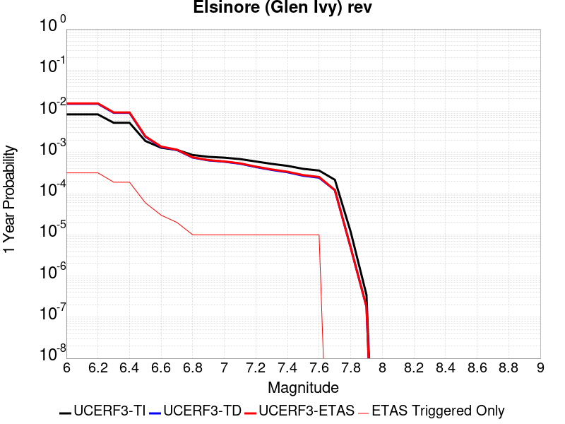 |  |

| Magnitude | 1 wk TI Prob | 1 wk TD Prob | 1 wk ETAS Prob | 1 wk ETAS/TD Gain | 1 wk ETAS Triggered Only | 1 mo TI Prob | 1 mo TD Prob | 1 mo ETAS Prob | 1 mo ETAS/TD Gain | 1 mo ETAS Triggered Only | 1 yr TI Prob | 1 yr TD Prob | 1 yr ETAS Prob | 1 yr ETAS/TD Gain | 1 yr ETAS Triggered Only | 10 yr TI Prob | 10 yr TD Prob | 10 yr ETAS Prob | 10 yr ETAS/TD Gain | 10 yr ETAS Triggered Only |
|-----|-----|-----|-----|-----|-----|-----|-----|-----|-----|-----|-----|-----|-----|-----|-----|-----|-----|-----|-----|-----|
| 6.0 | 1.6204086E-4 | 2.937271E-4 | 3.9369773E-4 | 1.340352 | 1.0E-4 | 6.94276E-4 | 0.0012583778 | 0.0014181765 | 1.1269878 | 1.6E-4 | 0.008420097 | 0.0152346175 | 0.015549743 | 1.0206848 | 3.2E-4 | 0.081081145 | 0.13962454 | 0.13996008 | 1.0024033 | 3.9E-4 |
| 6.1 | 1.6204086E-4 | 2.937271E-4 | 3.9369773E-4 | 1.340352 | 1.0E-4 | 6.94276E-4 | 0.0012583778 | 0.0014181765 | 1.1269878 | 1.6E-4 | 0.008420097 | 0.0152346175 | 0.015549743 | 1.0206848 | 3.2E-4 | 0.081081145 | 0.13962454 | 0.13996008 | 1.0024033 | 3.9E-4 |
| 6.2 | 1.6204086E-4 | 2.937271E-4 | 3.9369773E-4 | 1.340352 | 1.0E-4 | 6.94276E-4 | 0.0012583778 | 0.0014181765 | 1.1269878 | 1.6E-4 | 0.008420097 | 0.0152346175 | 0.015549743 | 1.0206848 | 3.2E-4 | 0.081081145 | 0.13962454 | 0.13996008 | 1.0024033 | 3.9E-4 |
| 6.3 | 1.0111737E-4 | 1.7703463E-4 | 2.37024E-4 | 1.3388568 | 6.0E-5 | 4.332882E-4 | 7.5861585E-4 | 8.685324E-4 | 1.1448909 | 1.1E-4 | 0.005262531 | 0.0092177205 | 0.00940597 | 1.0204225 | 1.9E-4 | 0.0513964 | 0.08707393 | 0.0872839 | 1.0024115 | 2.3E-4 |
| 6.4 | 1.0111737E-4 | 1.7703463E-4 | 2.37024E-4 | 1.3388568 | 6.0E-5 | 4.332882E-4 | 7.5861585E-4 | 8.685324E-4 | 1.1448909 | 1.1E-4 | 0.005262531 | 0.0092177205 | 0.00940597 | 1.0204225 | 1.9E-4 | 0.0513964 | 0.08707393 | 0.0872839 | 1.0024115 | 2.3E-4 |
| 6.5 | 3.6624708E-5 | 4.6391986E-5 | 5.639152E-5 | 1.2155445 | 1.0E-5 | 1.569536E-4 | 1.9880968E-4 | 2.188057E-4 | 1.1005788 | 2.0E-5 | 0.001909235 | 0.0024181814 | 0.0024780363 | 1.024752 | 6.0E-5 | 0.01892915 | 0.023697061 | 0.023765402 | 1.0028839 | 7.0E-5 |
| 6.6 | 2.5051324E-5 | 2.6147465E-5 | 3.61472E-5 | 1.3824363 | 1.0E-5 | 1.073584E-4 | 1.12056E-4 | 1.3205376E-4 | 1.1784621 | 2.0E-5 | 0.0013063047 | 0.0013634725 | 0.0013934316 | 1.0219727 | 3.0E-5 | 0.012986525 | 0.013565759 | 0.0136052165 | 1.0029086 | 4.0E-5 |
| 6.7 | 2.2189772E-5 | 2.2072489E-5 | 3.207227E-5 | 1.4530426 | 1.0E-5 | 9.509556E-5 | 9.459316E-5 | 1.1459127E-4 | 1.2114118 | 2.0E-5 | 0.0011571734 | 0.0011510996 | 0.0011710766 | 1.0173547 | 2.0E-5 | 0.011511663 | 0.0114663225 | 0.011495979 | 1.0025864 | 3.0E-5 |
| 6.8 | 1.6654378E-5 | 1.44376E-5 | 2.4437455E-5 | 1.6926259 | 1.0E-5 | 7.137396E-5 | 6.187399E-5 | 7.187337E-5 | 1.1616088 | 1.0E-5 | 8.686314E-4 | 7.5306057E-4 | 7.630531E-4 | 1.0132692 | 1.0E-5 | 0.008652439 | 0.0075100763 | 0.007529926 | 1.0026431 | 2.0E-5 |
| 6.9 | 1.5042909E-5 | 1.2331886E-5 | 2.2331762E-5 | 1.810896 | 1.0E-5 | 6.446802E-5 | 5.2849886E-5 | 6.284936E-5 | 1.1892052 | 1.0E-5 | 7.8461546E-4 | 6.4326054E-4 | 6.532541E-4 | 1.0155358 | 1.0E-5 | 0.007818509 | 0.006417925 | 0.0064377966 | 1.0030962 | 2.0E-5 |
| 7.0 | 1.4361385E-5 | 1.1451172E-5 | 2.1451058E-5 | 1.8732631 | 1.0E-5 | 6.154734E-5 | 4.9075545E-5 | 5.9075053E-5 | 1.2037575 | 1.0E-5 | 7.490812E-4 | 5.973339E-4 | 6.073279E-4 | 1.016731 | 1.0E-5 | 0.007465612 | 0.005960982 | 0.005980863 | 1.0033351 | 2.0E-5 |
| 7.1 | 1.3265571E-5 | 1.0244736E-5 | 2.0244634E-5 | 1.9761012 | 1.0E-5 | 5.6851208E-5 | 4.3905282E-5 | 5.3904845E-5 | 1.227753 | 1.0E-5 | 6.919436E-4 | 5.344183E-4 | 5.4441293E-4 | 1.0187019 | 1.0E-5 | 0.006897931 | 0.0053346003 | 0.005354494 | 1.0037291 | 2.0E-5 |
| 7.2 | 1.1596403E-5 | 8.504847E-6 | 1.8504763E-5 | 2.17579 | 1.0E-5 | 4.9697923E-5 | 3.6448844E-5 | 4.644848E-5 | 1.2743471 | 1.0E-5 | 6.049042E-4 | 4.4367602E-4 | 4.536716E-4 | 1.022529 | 1.0E-5 | 0.006032603 | 0.004429357 | 0.0044393125 | 1.0022477 | 1.0E-5 |
| 7.3 | 1.0150827E-5 | 7.238537E-6 | 1.7238464E-5 | 2.3814845 | 1.0E-5 | 4.3502816E-5 | 3.102194E-5 | 4.102163E-5 | 1.3223425 | 1.0E-5 | 5.2951806E-4 | 3.776281E-4 | 3.8762434E-4 | 1.0264711 | 1.0E-5 | 0.005282581 | 0.003770271 | 0.0037802334 | 1.0026423 | 1.0E-5 |
| 7.4 | 9.080705E-6 | 6.352307E-6 | 1.6352244E-5 | 2.5742211 | 1.0E-5 | 3.8916725E-5 | 2.7223898E-5 | 3.7223625E-5 | 1.3673143 | 1.0E-5 | 4.7370812E-4 | 3.314019E-4 | 3.4139858E-4 | 1.0301648 | 1.0E-5 | 0.004726996 | 0.0033092257 | 0.0033191924 | 1.0030118 | 1.0E-5 |
| 7.5 | 7.671649E-6 | 5.225419E-6 | 1.5225367E-5 | 2.913712 | 1.0E-5 | 3.287808E-5 | 2.2394468E-5 | 3.2394244E-5 | 1.4465289 | 1.0E-5 | 4.0021708E-4 | 2.7261977E-4 | 2.8261705E-4 | 1.0366712 | 1.0E-5 | 0.0039949706 | 0.0027229784 | 0.0027329512 | 1.0036625 | 1.0E-5 |
| 7.6 | 6.990086E-6 | 4.687336E-6 | 1.4687289E-5 | 3.133398 | 1.0E-5 | 2.9957167E-5 | 2.0088435E-5 | 3.0088233E-5 | 1.4977889 | 1.0E-5 | 3.6466747E-4 | 2.445504E-4 | 2.5454795E-4 | 1.0408814 | 1.0E-5 | 0.0036406964 | 0.0024429292 | 0.0024529048 | 1.0040834 | 1.0E-5 |
| 7.7 | 4.163505E-6 | 2.329331E-6 | 2.329331E-6 | 1.0 | 0.0 | 1.7843471E-5 | 9.982813E-6 | 9.982813E-6 | 1.0 | 0.0 | 2.172226E-4 | 1.2153471E-4 | 1.2153471E-4 | 1.0 | 0.0 | 0.0021701038 | 0.0012147555 | 0.0012147555 | 1.0 | 0.0 |
| 7.8 | 2.2692414E-7 | 9.384417E-8 | 9.384417E-8 | 1.0 | 0.0 | 9.725317E-7 | 4.0218927E-7 | 4.0218927E-7 | 1.0 | 0.0 | 1.1840509E-5 | 4.8966467E-6 | 4.8966467E-6 | 1.0 | 0.0 | 1.1839878E-4 | 4.8965718E-5 | 4.8965718E-5 | 1.0 | 0.0 |
| 7.9 | 6.676829E-9 | 3.4397174E-9 | 3.4397174E-9 | 1.0 | 0.0 | 2.861498E-8 | 1.4741646E-8 | 1.4741646E-8 | 1.0 | 0.0 | 3.4838732E-7 | 1.7947953E-7 | 1.7947953E-7 | 1.0 | 0.0 | 3.4838679E-6 | 1.794794E-6 | 1.794794E-6 | 1.0 | 0.0 |

## Baker
*[(top)](#table-of-contents)*

| 1 Week | 1 Month | 1 Year | 10 Year |
|-----|-----|-----|-----|
|  |  |  |  |

| Magnitude | 1 wk TI Prob | 1 wk TD Prob | 1 wk ETAS Prob | 1 wk ETAS/TD Gain | 1 wk ETAS Triggered Only | 1 mo TI Prob | 1 mo TD Prob | 1 mo ETAS Prob | 1 mo ETAS/TD Gain | 1 mo ETAS Triggered Only | 1 yr TI Prob | 1 yr TD Prob | 1 yr ETAS Prob | 1 yr ETAS/TD Gain | 1 yr ETAS Triggered Only | 10 yr TI Prob | 10 yr TD Prob | 10 yr ETAS Prob | 10 yr ETAS/TD Gain | 10 yr ETAS Triggered Only |
|-----|-----|-----|-----|-----|-----|-----|-----|-----|-----|-----|-----|-----|-----|-----|-----|-----|-----|-----|-----|-----|
| 6.0 | 5.695525E-6 | 5.8348373E-6 | 9.5834315E-5 | 16.424505 | 9.0E-5 | 2.4409164E-5 | 2.5006228E-5 | 2.1500148E-4 | 8.597918 | 1.9E-4 | 2.9714106E-4 | 3.044123E-4 | 6.0432096E-4 | 1.9852055 | 3.0E-4 | 0.0029674405 | 0.0030403486 | 0.0034889805 | 1.1475593 | 4.5E-4 |
| 6.1 | 5.695525E-6 | 5.8348373E-6 | 9.5834315E-5 | 16.424505 | 9.0E-5 | 2.4409164E-5 | 2.5006228E-5 | 2.1500148E-4 | 8.597918 | 1.9E-4 | 2.9714106E-4 | 3.044123E-4 | 6.0432096E-4 | 1.9852055 | 3.0E-4 | 0.0029674405 | 0.0030403486 | 0.0034889805 | 1.1475593 | 4.5E-4 |
| 6.2 | 5.695525E-6 | 5.8348373E-6 | 9.5834315E-5 | 16.424505 | 9.0E-5 | 2.4409164E-5 | 2.5006228E-5 | 2.1500148E-4 | 8.597918 | 1.9E-4 | 2.9714106E-4 | 3.044123E-4 | 6.0432096E-4 | 1.9852055 | 3.0E-4 | 0.0029674405 | 0.0030403486 | 0.0034889805 | 1.1475593 | 4.5E-4 |
| 6.3 | 3.2995713E-6 | 3.383667E-6 | 4.338353E-5 | 12.821454 | 4.0E-5 | 1.4140943E-5 | 1.4501353E-5 | 1.2449975E-4 | 8.585389 | 1.1E-4 | 1.7215237E-4 | 1.7654014E-4 | 3.1651542E-4 | 1.7928808 | 1.4E-4 | 0.0017201907 | 0.001764046 | 0.0020335696 | 1.1527872 | 2.7E-4 |
| 6.4 | 3.2995713E-6 | 3.383667E-6 | 4.338353E-5 | 12.821454 | 4.0E-5 | 1.4140943E-5 | 1.4501353E-5 | 1.2449975E-4 | 8.585389 | 1.1E-4 | 1.7215237E-4 | 1.7654014E-4 | 3.1651542E-4 | 1.7928808 | 1.4E-4 | 0.0017201907 | 0.001764046 | 0.0020335696 | 1.1527872 | 2.7E-4 |
| 6.5 | 2.782202E-6 | 2.8558404E-6 | 4.2855725E-5 | 15.006345 | 4.0E-5 | 1.1923668E-5 | 1.223926E-5 | 1.0223816E-4 | 8.353295 | 9.0E-5 | 1.4516099E-4 | 1.4900314E-4 | 2.6898526E-4 | 1.8052322 | 1.2E-4 | 0.001450662 | 0.0014890651 | 0.0017386929 | 1.1676406 | 2.5E-4 |
| 6.6 | 2.3163404E-6 | 2.38092E-6 | 3.238085E-5 | 13.600142 | 3.0E-5 | 9.927136E-6 | 1.0203904E-5 | 9.020309E-5 | 8.840056 | 8.0E-5 | 1.20856166E-4 | 1.2422565E-4 | 2.3421198E-4 | 1.8853754 | 1.1E-4 | 0.0012079047 | 0.0012415823 | 0.0014812844 | 1.1930617 | 2.4E-4 |
| 6.7 | 2.037056E-6 | 2.0965003E-6 | 2.209646E-5 | 10.539687 | 2.0E-5 | 8.7302105E-6 | 8.984972E-6 | 7.898434E-5 | 8.790717 | 7.0E-5 | 1.0628513E-4 | 1.093867E-4 | 2.0937576E-4 | 1.9140879 | 1.0E-4 | 0.0010623431 | 0.0010933448 | 0.0013230933 | 1.2101337 | 2.3E-4 |
| 6.8 | 1.8356744E-6 | 1.8915287E-6 | 2.189149E-5 | 11.573439 | 2.0E-5 | 7.867153E-6 | 8.106527E-6 | 7.810596E-5 | 9.634947 | 7.0E-5 | 9.577837E-5 | 9.869264E-5 | 1.8868376E-4 | 1.9118321 | 9.0E-5 | 9.57371E-4 | 9.86502E-4 | 0.0011962949 | 1.2126634 | 2.1E-4 |
| 6.9 | 1.6310546E-6 | 1.6832072E-6 | 2.1683174E-5 | 12.882058 | 2.0E-5 | 6.9902153E-6 | 7.213726E-6 | 6.7213296E-5 | 9.317417 | 6.0E-5 | 8.510255E-5 | 8.782368E-5 | 1.6781666E-4 | 1.910836 | 8.0E-5 | 8.5069967E-4 | 8.7790104E-4 | 0.0010477519 | 1.1934737 | 1.7E-4 |
| 7.0 | 1.2058036E-6 | 1.2508665E-6 | 2.1250842E-5 | 16.988895 | 2.0E-5 | 5.1677193E-6 | 5.3608455E-6 | 4.536063E-5 | 8.46147 | 4.0E-5 | 6.291517E-5 | 6.5266366E-5 | 1.152631E-4 | 1.7660414 | 5.0E-5 | 6.289736E-4 | 6.524743E-4 | 7.923829E-4 | 1.2144278 | 1.4E-4 |
| 7.1 | 1.052382E-6 | 1.0951609E-6 | 1.109515E-5 | 10.131069 | 1.0E-5 | 4.5102006E-6 | 4.693538E-6 | 3.4693396E-5 | 7.3917365 | 3.0E-5 | 5.491031E-5 | 5.7142337E-5 | 9.714005E-5 | 1.6999664 | 4.0E-5 | 5.4896745E-4 | 5.7127734E-4 | 7.0120307E-4 | 1.2274302 | 1.3E-4 |
| 7.2 | 1.0067454E-6 | 1.0487711E-6 | 1.1048761E-5 | 10.53496 | 1.0E-5 | 4.3146156E-6 | 4.4947255E-6 | 3.449459E-5 | 7.67446 | 3.0E-5 | 5.252918E-5 | 5.4721917E-5 | 8.4720275E-5 | 1.5481964 | 3.0E-5 | 5.251676E-4 | 5.470853E-4 | 6.470306E-4 | 1.1826868 | 1.0E-4 |
| 7.3 | 9.3596316E-7 | 9.767723E-7 | 1.09767625E-5 | 11.23779 | 1.0E-5 | 4.0112645E-6 | 4.1861604E-6 | 2.4186076E-5 | 5.7776275 | 2.0E-5 | 4.8836053E-5 | 5.096532E-5 | 7.09643E-5 | 1.3924037 | 2.0E-5 | 4.8825322E-4 | 5.095371E-4 | 5.7950144E-4 | 1.1373096 | 7.0E-5 |
| 7.4 | 8.8117395E-7 | 9.2076635E-7 | 1.0920757E-5 | 11.860509 | 1.0E-5 | 3.7764542E-6 | 3.9461356E-6 | 2.3946057E-5 | 6.0682297 | 2.0E-5 | 4.5977362E-5 | 4.8043148E-5 | 6.804219E-5 | 1.4162724 | 2.0E-5 | 4.596785E-4 | 4.8032837E-4 | 5.5029476E-4 | 1.1456636 | 7.0E-5 |
| 7.5 | 8.292386E-7 | 8.6745956E-7 | 8.6745956E-7 | 1.0 | 0.0 | 3.5538749E-6 | 3.7176785E-6 | 3.7176785E-6 | 1.0 | 0.0 | 4.326757E-5 | 4.5261804E-5 | 4.5261804E-5 | 1.0 | 0.0 | 4.3259145E-4 | 4.5252658E-4 | 5.0250394E-4 | 1.1104407 | 5.0E-5 |
| 7.6 | 7.553842E-7 | 7.9144706E-7 | 7.9144706E-7 | 1.0 | 0.0 | 3.2373566E-6 | 3.3919116E-6 | 3.3919116E-6 | 1.0 | 0.0 | 3.9414106E-5 | 4.129575E-5 | 4.129575E-5 | 1.0 | 0.0 | 3.9407116E-4 | 4.1288146E-4 | 4.5286494E-4 | 1.0968401 | 4.0E-5 |
| 7.7 | 6.5285366E-7 | 6.852797E-7 | 6.852797E-7 | 1.0 | 0.0 | 2.797941E-6 | 2.9369096E-6 | 2.9369096E-6 | 1.0 | 0.0 | 3.40644E-5 | 3.5756293E-5 | 3.5756293E-5 | 1.0 | 0.0 | 3.405918E-4 | 3.5750607E-4 | 3.9749176E-4 | 1.1118462 | 4.0E-5 |
| 7.8 | 3.4586725E-7 | 3.6482615E-7 | 3.6482615E-7 | 1.0 | 0.0 | 1.4822873E-6 | 1.5635396E-6 | 1.5635396E-6 | 1.0 | 0.0 | 1.80467E-5 | 1.9035933E-5 | 1.9035933E-5 | 1.0 | 0.0 | 1.8045233E-4 | 1.9034347E-4 | 2.0034157E-4 | 1.0525266 | 1.0E-5 |
| 7.9 | 2.5591178E-9 | 2.6696718E-9 | 2.6696718E-9 | 1.0 | 0.0 | 1.0967647E-8 | 1.14414505E-8 | 1.14414505E-8 | 1.0 | 0.0 | 1.335311E-7 | 1.3929966E-7 | 1.3929966E-7 | 1.0 | 0.0 | 1.3353102E-6 | 1.3929966E-6 | 1.3929966E-6 | 1.0 | 0.0 |

## Ludlow
*[(top)](#table-of-contents)*

| 1 Week | 1 Month | 1 Year | 10 Year |
|-----|-----|-----|-----|
| 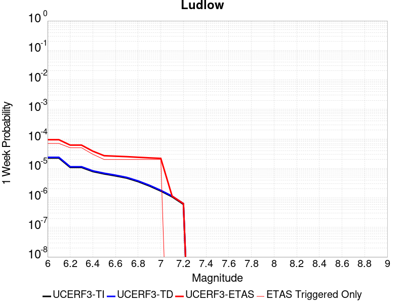 | 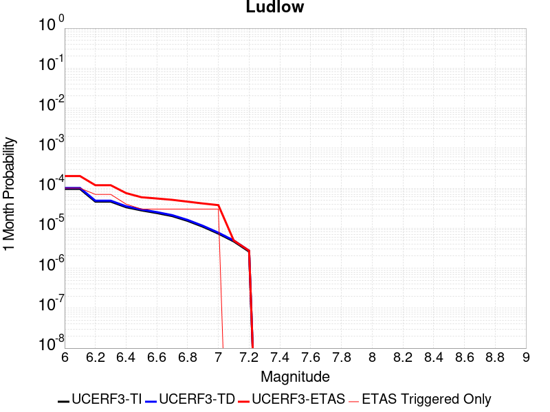 |  |  |

| Magnitude | 1 wk TI Prob | 1 wk TD Prob | 1 wk ETAS Prob | 1 wk ETAS/TD Gain | 1 wk ETAS Triggered Only | 1 mo TI Prob | 1 mo TD Prob | 1 mo ETAS Prob | 1 mo ETAS/TD Gain | 1 mo ETAS Triggered Only | 1 yr TI Prob | 1 yr TD Prob | 1 yr ETAS Prob | 1 yr ETAS/TD Gain | 1 yr ETAS Triggered Only | 10 yr TI Prob | 10 yr TD Prob | 10 yr ETAS Prob | 10 yr ETAS/TD Gain | 10 yr ETAS Triggered Only |
|-----|-----|-----|-----|-----|-----|-----|-----|-----|-----|-----|-----|-----|-----|-----|-----|-----|-----|-----|-----|-----|
| 6.0 | 2.2407607E-5 | 2.3657254E-5 | 9.3655595E-5 | 3.9588532 | 7.0E-5 | 9.602906E-5 | 1.0138454E-4 | 2.013744E-4 | 1.9862437 | 1.0E-4 | 0.0011685267 | 0.001233702 | 0.0015133565 | 1.2266792 | 2.8E-4 | 0.011624013 | 0.012273042 | 0.012668133 | 1.0321918 | 4.0E-4 |
| 6.1 | 2.2407607E-5 | 2.3657254E-5 | 9.3655595E-5 | 3.9588532 | 7.0E-5 | 9.602906E-5 | 1.0138454E-4 | 2.013744E-4 | 1.9862437 | 1.0E-4 | 0.0011685267 | 0.001233702 | 0.0015133565 | 1.2266792 | 2.8E-4 | 0.011624013 | 0.012273042 | 0.012668133 | 1.0321918 | 4.0E-4 |
| 6.2 | 1.0781252E-5 | 1.1365663E-5 | 6.136509E-5 | 5.399165 | 5.0E-5 | 4.620455E-5 | 4.8709102E-5 | 1.1870569E-4 | 2.4370332 | 7.0E-5 | 5.623952E-4 | 5.9287593E-4 | 7.1280485E-4 | 1.2022833 | 1.2E-4 | 0.00560974 | 0.0059133614 | 0.006092297 | 1.0302595 | 1.8E-4 |
| 6.3 | 1.0781252E-5 | 1.1365663E-5 | 6.136509E-5 | 5.399165 | 5.0E-5 | 4.620455E-5 | 4.8709102E-5 | 1.1870569E-4 | 2.4370332 | 7.0E-5 | 5.623952E-4 | 5.9287593E-4 | 7.1280485E-4 | 1.2022833 | 1.2E-4 | 0.00560974 | 0.0059133614 | 0.006092297 | 1.0302595 | 1.8E-4 |
| 6.4 | 7.814439E-6 | 8.237729E-6 | 3.8237482E-5 | 4.6417503 | 3.0E-5 | 3.3490025E-5 | 3.530408E-5 | 7.530267E-5 | 2.1329734 | 4.0E-5 | 4.0766477E-4 | 4.2974384E-4 | 4.9971376E-4 | 1.1628177 | 7.0E-5 | 0.0040691774 | 0.0042892746 | 0.00440876 | 1.0278567 | 1.2E-4 |
| 6.5 | 6.4986366E-6 | 6.85092E-6 | 2.6850783E-5 | 3.919296 | 2.0E-5 | 2.7851002E-5 | 2.9360759E-5 | 5.9359878E-5 | 2.0217419 | 3.0E-5 | 3.390332E-4 | 3.5740953E-4 | 3.9739523E-4 | 1.1118765 | 4.0E-5 | 0.003385164 | 0.0035684432 | 0.0036581222 | 1.0251311 | 9.0E-5 |
| 6.6 | 5.582177E-6 | 5.8860055E-6 | 2.5885887E-5 | 4.39787 | 2.0E-5 | 2.3923398E-5 | 2.5225498E-5 | 5.522474E-5 | 2.1892428 | 3.0E-5 | 2.9122844E-4 | 3.0707786E-4 | 3.470656E-4 | 1.1302202 | 4.0E-5 | 0.0029084706 | 0.003066609 | 0.003136394 | 1.0227566 | 7.0E-5 |
| 6.7 | 4.6858763E-6 | 4.940427E-6 | 2.494033E-5 | 5.048213 | 2.0E-5 | 2.0082172E-5 | 2.1173091E-5 | 5.1172457E-5 | 2.4168627 | 3.0E-5 | 2.4447302E-4 | 2.5775246E-4 | 2.9774214E-4 | 1.1551477 | 4.0E-5 | 0.0024420423 | 0.0025745912 | 0.0026344368 | 1.0232446 | 6.0E-5 |
| 6.8 | 3.5584908E-6 | 3.7520183E-6 | 2.3751943E-5 | 6.3304443 | 2.0E-5 | 1.5250586E-5 | 1.6079981E-5 | 4.6079498E-5 | 2.8656437 | 3.0E-5 | 1.8566006E-4 | 1.957566E-4 | 2.2575073E-4 | 1.1532215 | 3.0E-5 | 0.0018550502 | 0.0019558826 | 0.0019958045 | 1.0204111 | 4.0E-5 |
| 6.9 | 2.532834E-6 | 2.6710034E-6 | 2.267095E-5 | 8.4878025 | 2.0E-5 | 1.0854958E-5 | 1.1447109E-5 | 4.1446765E-5 | 3.620719 | 3.0E-5 | 1.3215111E-4 | 1.3935992E-4 | 1.6935574E-4 | 1.2152399 | 3.0E-5 | 0.0013207254 | 0.0013927529 | 0.0014326972 | 1.0286801 | 4.0E-5 |
| 7.0 | 1.7083285E-6 | 1.8019439E-6 | 2.1801909E-5 | 12.099105 | 2.0E-5 | 7.3213873E-6 | 7.722595E-6 | 3.7722362E-5 | 4.8846745 | 3.0E-5 | 8.913424E-5 | 9.40187E-5 | 1.2401587E-4 | 1.3190554 | 3.0E-5 | 8.9098496E-4 | 9.3980576E-4 | 9.797681E-4 | 1.042522 | 4.0E-5 |
| 7.1 | 1.0905424E-6 | 1.1497619E-6 | 1.1497619E-6 | 1.0 | 0.0 | 4.6737446E-6 | 4.9275427E-6 | 4.9275427E-6 | 1.0 | 0.0 | 5.6901354E-5 | 5.999128E-5 | 5.999128E-5 | 1.0 | 0.0 | 5.6886784E-4 | 5.997606E-4 | 6.0975464E-4 | 1.0166633 | 1.0E-5 |
| 7.2 | 6.06668E-7 | 6.387277E-7 | 6.387277E-7 | 1.0 | 0.0 | 2.600003E-6 | 2.7374022E-6 | 2.7374022E-6 | 1.0 | 0.0 | 3.1654577E-5 | 3.3327433E-5 | 3.3327433E-5 | 1.0 | 0.0 | 3.1650066E-4 | 3.3323118E-4 | 3.3323118E-4 | 1.0 | 0.0 |

## San Andreas (Coachella) rev
*[(top)](#table-of-contents)*

| 1 Week | 1 Month | 1 Year | 10 Year |
|-----|-----|-----|-----|
| 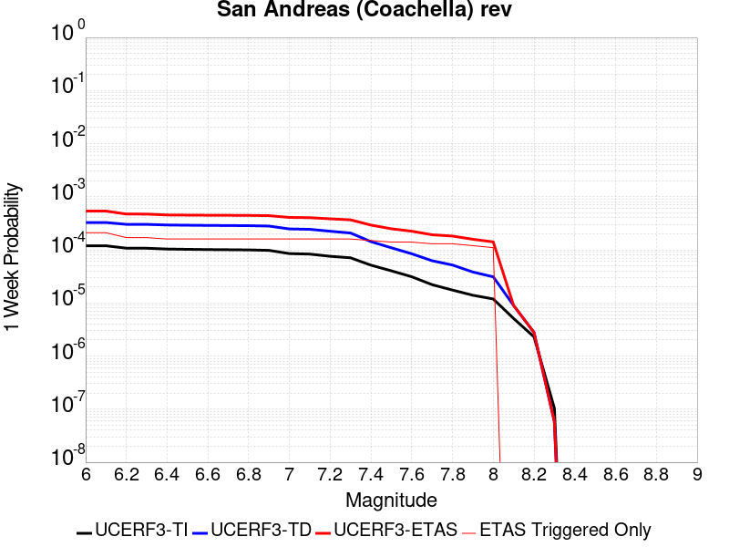 |  |  |  |

| Magnitude | 1 wk TI Prob | 1 wk TD Prob | 1 wk ETAS Prob | 1 wk ETAS/TD Gain | 1 wk ETAS Triggered Only | 1 mo TI Prob | 1 mo TD Prob | 1 mo ETAS Prob | 1 mo ETAS/TD Gain | 1 mo ETAS Triggered Only | 1 yr TI Prob | 1 yr TD Prob | 1 yr ETAS Prob | 1 yr ETAS/TD Gain | 1 yr ETAS Triggered Only | 10 yr TI Prob | 10 yr TD Prob | 10 yr ETAS Prob | 10 yr ETAS/TD Gain | 10 yr ETAS Triggered Only |
|-----|-----|-----|-----|-----|-----|-----|-----|-----|-----|-----|-----|-----|-----|-----|-----|-----|-----|-----|-----|-----|
| 6.0 | 1.1925945E-4 | 3.273077E-4 | 5.3723896E-4 | 1.641388 | 2.1E-4 | 5.110118E-4 | 0.001401998 | 0.0016716194 | 1.1923124 | 2.7E-4 | 0.0062038354 | 0.016937068 | 0.017261477 | 1.0191538 | 3.3E-4 | 0.060334753 | 0.15267672 | 0.15301564 | 1.0022199 | 4.0E-4 |
| 6.1 | 1.1925945E-4 | 3.273077E-4 | 5.3723896E-4 | 1.641388 | 2.1E-4 | 5.110118E-4 | 0.001401998 | 0.0016716194 | 1.1923124 | 2.7E-4 | 0.0062038354 | 0.016937068 | 0.017261477 | 1.0191538 | 3.3E-4 | 0.060334753 | 0.15267672 | 0.15301564 | 1.0022199 | 4.0E-4 |
| 6.2 | 1.07432395E-4 | 3.0231563E-4 | 4.7226422E-4 | 1.5621562 | 1.7E-4 | 4.603433E-4 | 0.001294999 | 0.0015247012 | 1.1773763 | 2.3E-4 | 0.005590286 | 0.015653731 | 0.015929349 | 1.0176071 | 2.8E-4 | 0.05451731 | 0.14182784 | 0.1421282 | 1.0021178 | 3.5E-4 |
| 6.3 | 1.0718766E-4 | 3.0176868E-4 | 4.717174E-4 | 1.5631754 | 1.7E-4 | 4.592948E-4 | 0.0012926573 | 0.00152236 | 1.177698 | 2.3E-4 | 0.005577586 | 0.01562563 | 0.015901254 | 1.0176393 | 2.8E-4 | 0.054396555 | 0.14159605 | 0.1418965 | 1.0021218 | 3.5E-4 |
| 6.4 | 1.0355944E-4 | 2.9384956E-4 | 4.5380252E-4 | 1.5443363 | 1.6E-4 | 4.4375064E-4 | 0.0012587514 | 0.0014784745 | 1.1745564 | 2.2E-4 | 0.0053892885 | 0.015218662 | 0.015484553 | 1.0174714 | 2.7E-4 | 0.052604496 | 0.13815795 | 0.13845098 | 1.002121 | 3.4E-4 |
| 6.5 | 1.0227914E-4 | 2.9104383E-4 | 4.509973E-4 | 1.5495853 | 1.6E-4 | 4.382655E-4 | 0.0012467385 | 0.0014664641 | 1.1762404 | 2.2E-4 | 0.0053228354 | 0.015074439 | 0.015340369 | 1.0176411 | 2.7E-4 | 0.051971316 | 0.13694239 | 0.13723582 | 1.0021428 | 3.4E-4 |
| 6.6 | 1.0116757E-4 | 2.8870135E-4 | 4.4865516E-4 | 1.5540459 | 1.6E-4 | 4.3350324E-4 | 0.0012367087 | 0.0014564366 | 1.1776716 | 2.2E-4 | 0.0052651367 | 0.014954008 | 0.015219971 | 1.0177853 | 2.7E-4 | 0.051421247 | 0.13591973 | 0.13621353 | 1.0021615 | 3.4E-4 |
| 6.7 | 1.0050676E-4 | 2.8728697E-4 | 4.47241E-4 | 1.5567744 | 1.6E-4 | 4.3067214E-4 | 0.0012306528 | 0.001450382 | 1.1785469 | 2.2E-4 | 0.005230834 | 0.014881288 | 0.01514727 | 1.0178736 | 2.7E-4 | 0.051094085 | 0.13530464 | 0.13559864 | 1.0021728 | 3.4E-4 |
| 6.8 | 9.976819E-5 | 2.8532353E-4 | 4.4527787E-4 | 1.560607 | 1.6E-4 | 4.2750788E-4 | 0.001222246 | 0.0014419771 | 1.1797765 | 2.2E-4 | 0.0051924936 | 0.014780328 | 0.015046338 | 1.0179975 | 2.7E-4 | 0.050728295 | 0.13445628 | 0.13475056 | 1.0021887 | 3.4E-4 |
| 6.9 | 9.77719E-5 | 2.802926E-4 | 4.4024774E-4 | 1.570672 | 1.6E-4 | 4.1895514E-4 | 0.0012007048 | 0.0014204406 | 1.1830057 | 2.2E-4 | 0.0050888555 | 0.0145215895 | 0.014787669 | 1.0183231 | 2.7E-4 | 0.049738888 | 0.13228476 | 0.13257979 | 1.0022302 | 3.4E-4 |
| 7.0 | 8.500761E-5 | 2.4763815E-4 | 4.0759853E-4 | 1.645944 | 1.6E-4 | 3.6426744E-4 | 0.0010608779 | 0.0012806446 | 1.2071555 | 2.2E-4 | 0.0044259406 | 0.01284047 | 0.013107004 | 1.0207573 | 2.7E-4 | 0.04338823 | 0.11813616 | 0.118435994 | 1.0025381 | 3.4E-4 |
| 7.1 | 8.319876E-5 | 2.4366553E-4 | 4.0362653E-4 | 1.6564778 | 1.6E-4 | 3.5651738E-4 | 0.0010438662 | 0.0012636365 | 1.210535 | 2.2E-4 | 0.004331963 | 0.012635773 | 0.012902361 | 1.0210979 | 2.7E-4 | 0.042484846 | 0.11635632 | 0.11665676 | 1.0025821 | 3.4E-4 |
| 7.2 | 7.563917E-5 | 2.2414974E-4 | 3.8411387E-4 | 1.7136486 | 1.6E-4 | 3.2412758E-4 | 9.602912E-4 | 0.0011800799 | 1.2288772 | 2.2E-4 | 0.0039391145 | 0.011629559 | 0.011896419 | 1.0229467 | 2.7E-4 | 0.03870018 | 0.10776202 | 0.108065374 | 1.0028151 | 3.4E-4 |
| 7.3 | 7.082985E-5 | 2.07311E-4 | 3.6727783E-4 | 1.7716273 | 1.6E-4 | 3.0352117E-4 | 8.881761E-4 | 0.0011079806 | 1.2474786 | 2.2E-4 | 0.0036891096 | 0.010760553 | 0.011027648 | 1.0248216 | 2.7E-4 | 0.03628465 | 0.10028403 | 0.10058094 | 1.0029607 | 3.3E-4 |
| 7.4 | 5.146215E-5 | 1.4274761E-4 | 2.927262E-4 | 2.0506556 | 1.5E-4 | 2.2053342E-4 | 6.1163295E-4 | 8.115106E-4 | 1.3267936 | 2.0E-4 | 0.0026816884 | 0.0074213943 | 0.0076695387 | 1.0334364 | 2.5E-4 | 0.02649557 | 0.07085049 | 0.07112923 | 1.0039343 | 3.0E-4 |
| 7.5 | 4.0285166E-5 | 1.0942422E-4 | 2.4940888E-4 | 2.2792842 | 1.4E-4 | 1.7263928E-4 | 4.6887697E-4 | 6.587879E-4 | 1.4050336 | 1.9E-4 | 0.002099857 | 0.0056937044 | 0.005932338 | 1.0419118 | 2.4E-4 | 0.020801254 | 0.055013083 | 0.055287126 | 1.0049815 | 2.9E-4 |
| 7.6 | 3.1168736E-5 | 8.439599E-5 | 2.2438417E-4 | 2.6587064 | 1.4E-4 | 1.3357346E-4 | 3.616471E-4 | 5.41582E-4 | 1.4975427 | 1.8E-4 | 0.0016250437 | 0.004394191 | 0.0046231803 | 1.0521119 | 2.3E-4 | 0.016132116 | 0.042812478 | 0.043070916 | 1.0060365 | 2.7E-4 |
| 7.7 | 2.2100989E-5 | 6.239345E-5 | 1.9238534E-4 | 3.083422 | 1.3E-4 | 9.4715084E-5 | 2.6737314E-4 | 4.2733035E-4 | 1.5982547 | 1.6E-4 | 0.001152546 | 0.0032504152 | 0.0034597325 | 1.0643971 | 2.1E-4 | 0.011465867 | 0.031902168 | 0.032144193 | 1.0075865 | 2.5E-4 |
| 7.8 | 1.7484861E-5 | 5.180078E-5 | 1.8179405E-4 | 3.5094845 | 1.3E-4 | 7.493296E-5 | 2.2198448E-4 | 3.8194895E-4 | 1.7206111 | 1.6E-4 | 9.1192697E-4 | 0.0026993142 | 0.0029087474 | 1.0775875 | 2.1E-4 | 0.009081938 | 0.026641788 | 0.026885128 | 1.0091337 | 2.5E-4 |
| 7.9 | 1.3967285E-5 | 3.8226146E-5 | 1.5822156E-4 | 4.1390924 | 1.2E-4 | 5.985842E-5 | 1.6381606E-4 | 3.137915E-4 | 1.9155111 | 1.5E-4 | 7.2853256E-4 | 0.0019926373 | 0.0021922388 | 1.1001695 | 2.0E-4 | 0.0072614877 | 0.019911002 | 0.020146225 | 1.0118136 | 2.4E-4 |
| 8.0 | 1.1887396E-5 | 3.106798E-5 | 1.4106456E-4 | 4.540513 | 1.1E-4 | 5.094499E-5 | 1.331417E-4 | 2.7312306E-4 | 2.0513713 | 1.4E-4 | 6.200787E-4 | 0.0016197958 | 0.001809488 | 1.1171087 | 1.9E-4 | 0.006183513 | 0.016280567 | 0.016496984 | 1.013293 | 2.2E-4 |
| 8.1 | 5.100864E-6 | 8.973766E-6 | 8.973766E-6 | 1.0 | 0.0 | 2.1860664E-5 | 3.845843E-5 | 3.845843E-5 | 1.0 | 0.0 | 2.6612106E-4 | 4.6813092E-4 | 4.6813092E-4 | 1.0 | 0.0 | 0.002658026 | 0.004918092 | 0.0049280426 | 1.0020233 | 1.0E-5 |
| 8.2 | 2.3004484E-6 | 2.7863473E-6 | 2.7863473E-6 | 1.0 | 0.0 | 9.859027E-6 | 1.19414335E-5 | 1.19414335E-5 | 1.0 | 0.0 | 1.2002704E-4 | 1.4537729E-4 | 1.4537729E-4 | 1.0 | 0.0 | 0.0011996223 | 0.0015973782 | 0.0015973782 | 1.0 | 0.0 |
| 8.3 | 1.0424446E-7 | 5.814421E-8 | 5.814421E-8 | 1.0 | 0.0 | 4.4676187E-7 | 2.4918944E-7 | 2.4918944E-7 | 1.0 | 0.0 | 5.439312E-6 | 3.0338776E-6 | 3.0338776E-6 | 1.0 | 0.0 | 5.4391792E-5 | 3.189592E-5 | 3.189592E-5 | 1.0 | 0.0 |

## Scodie Lineament
*[(top)](#table-of-contents)*

| 1 Week | 1 Month | 1 Year | 10 Year |
|-----|-----|-----|-----|
|  |  |  | 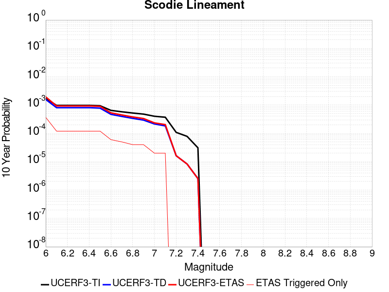 |

| Magnitude | 1 wk TI Prob | 1 wk TD Prob | 1 wk ETAS Prob | 1 wk ETAS/TD Gain | 1 wk ETAS Triggered Only | 1 mo TI Prob | 1 mo TD Prob | 1 mo ETAS Prob | 1 mo ETAS/TD Gain | 1 mo ETAS Triggered Only | 1 yr TI Prob | 1 yr TD Prob | 1 yr ETAS Prob | 1 yr ETAS/TD Gain | 1 yr ETAS Triggered Only | 10 yr TI Prob | 10 yr TD Prob | 10 yr ETAS Prob | 10 yr ETAS/TD Gain | 10 yr ETAS Triggered Only |
|-----|-----|-----|-----|-----|-----|-----|-----|-----|-----|-----|-----|-----|-----|-----|-----|-----|-----|-----|-----|-----|
| 6.0 | 3.2919327E-6 | 3.0133303E-6 | 1.2301297E-4 | 40.822926 | 1.2E-4 | 1.4108206E-5 | 1.2914227E-5 | 1.7291216E-4 | 13.3892765 | 1.6E-4 | 1.7175387E-4 | 1.5722254E-4 | 4.8717068E-4 | 3.0986056 | 3.3E-4 | 0.0017162118 | 0.0015714248 | 0.0019408433 | 1.2350851 | 3.7E-4 |
| 6.1 | 1.8663811E-6 | 1.5490382E-6 | 4.1548978E-5 | 26.822435 | 4.0E-5 | 7.998751E-6 | 6.6387206E-6 | 6.663832E-5 | 10.037826 | 6.0E-5 | 9.738045E-5 | 8.082393E-5 | 1.9081503E-4 | 2.3608732 | 1.1E-4 | 9.7337784E-4 | 8.079941E-4 | 9.2789717E-4 | 1.1483959 | 1.2E-4 |
| 6.2 | 1.8663811E-6 | 1.5490382E-6 | 4.1548978E-5 | 26.822435 | 4.0E-5 | 7.998751E-6 | 6.6387206E-6 | 6.663832E-5 | 10.037826 | 6.0E-5 | 9.738045E-5 | 8.082393E-5 | 1.9081503E-4 | 2.3608732 | 1.1E-4 | 9.7337784E-4 | 8.079941E-4 | 9.2789717E-4 | 1.1483959 | 1.2E-4 |
| 6.3 | 1.8663811E-6 | 1.5490382E-6 | 4.1548978E-5 | 26.822435 | 4.0E-5 | 7.998751E-6 | 6.6387206E-6 | 6.663832E-5 | 10.037826 | 6.0E-5 | 9.738045E-5 | 8.082393E-5 | 1.9081503E-4 | 2.3608732 | 1.1E-4 | 9.7337784E-4 | 8.079941E-4 | 9.2789717E-4 | 1.1483959 | 1.2E-4 |
| 6.4 | 1.8663811E-6 | 1.5490382E-6 | 4.1548978E-5 | 26.822435 | 4.0E-5 | 7.998751E-6 | 6.6387206E-6 | 6.663832E-5 | 10.037826 | 6.0E-5 | 9.738045E-5 | 8.082393E-5 | 1.9081503E-4 | 2.3608732 | 1.1E-4 | 9.7337784E-4 | 8.079941E-4 | 9.2789717E-4 | 1.1483959 | 1.2E-4 |
| 6.5 | 1.8106311E-6 | 1.4909722E-6 | 4.1490912E-5 | 27.828094 | 4.0E-5 | 7.759824E-6 | 6.389868E-6 | 6.638948E-5 | 10.389806 | 6.0E-5 | 9.447177E-5 | 7.779436E-5 | 1.877858E-4 | 2.4138744 | 1.1E-4 | 9.4431615E-4 | 7.7771995E-4 | 8.976266E-4 | 1.1541772 | 1.2E-4 |
| 6.6 | 1.2414679E-6 | 8.9974395E-7 | 2.0899726E-5 | 23.228525 | 2.0E-5 | 5.320566E-6 | 3.85604E-6 | 2.3855962E-5 | 6.186648 | 2.0E-5 | 6.477596E-5 | 4.6946367E-5 | 9.694402E-5 | 2.064995 | 5.0E-5 | 6.475708E-4 | 4.6937316E-4 | 5.29345E-4 | 1.1277701 | 6.0E-5 |
| 6.7 | 1.1062215E-6 | 7.594193E-7 | 2.0759404E-5 | 27.335892 | 2.0E-5 | 4.7409408E-6 | 3.2546504E-6 | 2.3254586E-5 | 7.145033 | 2.0E-5 | 5.7719422E-5 | 3.962472E-5 | 7.962313E-5 | 2.009431 | 4.0E-5 | 5.770443E-4 | 3.9618355E-4 | 4.4616373E-4 | 1.1261542 | 5.0E-5 |
| 6.8 | 1.0006736E-6 | 6.5002786E-7 | 1.0650021E-5 | 16.383945 | 1.0E-5 | 4.288594E-6 | 2.7858312E-6 | 1.2785803E-5 | 4.589583 | 1.0E-5 | 5.221238E-5 | 3.391703E-5 | 6.391601E-5 | 1.8844814 | 3.0E-5 | 5.220012E-4 | 3.3912458E-4 | 3.7911104E-4 | 1.1179107 | 4.0E-5 |
| 6.9 | 9.167364E-7 | 5.6315065E-7 | 1.0563145E-5 | 18.757227 | 1.0E-5 | 3.9288643E-6 | 2.413501E-6 | 1.2413477E-5 | 5.1433487 | 1.0E-5 | 4.7832873E-5 | 2.9384037E-5 | 5.9383154E-5 | 2.0209324 | 3.0E-5 | 4.782258E-4 | 2.9380718E-4 | 3.3379544E-4 | 1.1361037 | 4.0E-5 |
| 7.0 | 7.6987664E-7 | 4.113265E-7 | 1.0411322E-5 | 25.311577 | 1.0E-5 | 3.2994672E-6 | 1.7628269E-6 | 1.176281E-5 | 6.6726966 | 1.0E-5 | 4.0170275E-5 | 2.1462245E-5 | 3.146203E-5 | 1.4659245 | 1.0E-5 | 4.0163012E-4 | 2.1460558E-4 | 2.3460129E-4 | 1.0931742 | 2.0E-5 |
| 7.1 | 7.1038727E-7 | 3.5210306E-7 | 1.03521E-5 | 29.400766 | 1.0E-5 | 3.0445133E-6 | 1.5090123E-6 | 1.1508997E-5 | 7.626841 | 1.0E-5 | 3.706632E-5 | 1.8372106E-5 | 2.8371922E-5 | 1.5442934 | 1.0E-5 | 3.7060137E-4 | 1.8370937E-4 | 2.037057E-4 | 1.1088476 | 2.0E-5 |
| 7.2 | 2.0799602E-7 | 3.1178534E-8 | 3.1178534E-8 | 1.0 | 0.0 | 8.914113E-7 | 1.3362228E-7 | 1.3362228E-7 | 1.0 | 0.0 | 1.0852878E-5 | 1.6268501E-6 | 1.6268501E-6 | 1.0 | 0.0 | 1.08523476E-4 | 1.626839E-5 | 1.626839E-5 | 1.0 | 0.0 |
| 7.3 | 1.5048182E-7 | 1.5939106E-8 | 1.5939106E-8 | 1.0 | 0.0 | 6.449219E-7 | 6.8310456E-8 | 6.8310456E-8 | 1.0 | 0.0 | 7.851896E-6 | 8.316795E-7 | 8.316795E-7 | 1.0 | 0.0 | 7.851618E-5 | 8.316767E-6 | 8.316767E-6 | 1.0 | 0.0 |
| 7.4 | 5.9334678E-8 | 4.8638475E-9 | 4.8638475E-9 | 1.0 | 0.0 | 2.5429145E-7 | 2.084506E-8 | 2.084506E-8 | 1.0 | 0.0 | 3.095994E-6 | 2.5378858E-7 | 2.5378858E-7 | 1.0 | 0.0 | 3.095951E-5 | 2.5378843E-6 | 2.5378843E-6 | 1.0 | 0.0 |

## Cady
*[(top)](#table-of-contents)*

| 1 Week | 1 Month | 1 Year | 10 Year |
|-----|-----|-----|-----|
|  |  |  |  |

| Magnitude | 1 wk TI Prob | 1 wk TD Prob | 1 wk ETAS Prob | 1 wk ETAS/TD Gain | 1 wk ETAS Triggered Only | 1 mo TI Prob | 1 mo TD Prob | 1 mo ETAS Prob | 1 mo ETAS/TD Gain | 1 mo ETAS Triggered Only | 1 yr TI Prob | 1 yr TD Prob | 1 yr ETAS Prob | 1 yr ETAS/TD Gain | 1 yr ETAS Triggered Only | 10 yr TI Prob | 10 yr TD Prob | 10 yr ETAS Prob | 10 yr ETAS/TD Gain | 10 yr ETAS Triggered Only |
|-----|-----|-----|-----|-----|-----|-----|-----|-----|-----|-----|-----|-----|-----|-----|-----|-----|-----|-----|-----|-----|
| 6.0 | 1.9892565E-5 | 2.1858728E-5 | 1.21856545E-4 | 5.5747313 | 1.0E-4 | 8.525106E-5 | 9.3677416E-5 | 2.036671E-4 | 2.1741323 | 1.1E-4 | 0.0010374374 | 0.0011400167 | 0.0013597659 | 1.1927596 | 2.2E-4 | 0.010326075 | 0.011350701 | 0.011686841 | 1.0296141 | 3.4E-4 |
| 6.1 | 1.9892565E-5 | 2.1858728E-5 | 1.21856545E-4 | 5.5747313 | 1.0E-4 | 8.525106E-5 | 9.3677416E-5 | 2.036671E-4 | 2.1741323 | 1.1E-4 | 0.0010374374 | 0.0011400167 | 0.0013597659 | 1.1927596 | 2.2E-4 | 0.010326075 | 0.011350701 | 0.011686841 | 1.0296141 | 3.4E-4 |
| 6.2 | 1.9892565E-5 | 2.1858728E-5 | 1.21856545E-4 | 5.5747313 | 1.0E-4 | 8.525106E-5 | 9.3677416E-5 | 2.036671E-4 | 2.1741323 | 1.1E-4 | 0.0010374374 | 0.0011400167 | 0.0013597659 | 1.1927596 | 2.2E-4 | 0.010326075 | 0.011350701 | 0.011686841 | 1.0296141 | 3.4E-4 |
| 6.3 | 1.1117327E-5 | 1.2176583E-5 | 8.2175735E-5 | 6.748669 | 7.0E-5 | 4.764482E-5 | 5.2184492E-5 | 1.2218083E-4 | 2.3413246 | 7.0E-5 | 5.7992124E-4 | 6.351925E-4 | 7.751036E-4 | 1.2202656 | 1.4E-4 | 0.0057841022 | 0.0063368753 | 0.0065554813 | 1.0344974 | 2.2E-4 |
| 6.4 | 1.1117327E-5 | 1.2176583E-5 | 8.2175735E-5 | 6.748669 | 7.0E-5 | 4.764482E-5 | 5.2184492E-5 | 1.2218083E-4 | 2.3413246 | 7.0E-5 | 5.7992124E-4 | 6.351925E-4 | 7.751036E-4 | 1.2202656 | 1.4E-4 | 0.0057841022 | 0.0063368753 | 0.0065554813 | 1.0344974 | 2.2E-4 |
| 6.5 | 6.103093E-6 | 6.672021E-6 | 4.6671754E-5 | 6.9951453 | 4.0E-5 | 2.615585E-5 | 2.8594131E-5 | 6.8592984E-5 | 2.3988485 | 4.0E-5 | 3.1840094E-4 | 3.480905E-4 | 4.080696E-4 | 1.1723089 | 6.0E-5 | 0.0031794512 | 0.0034766865 | 0.003576339 | 1.028663 | 1.0E-4 |
| 6.6 | 5.817237E-6 | 6.3656585E-6 | 4.6365403E-5 | 7.2836776 | 4.0E-5 | 2.4930776E-5 | 2.728118E-5 | 6.728009E-5 | 2.4661722 | 4.0E-5 | 3.034899E-4 | 3.3211018E-4 | 3.9209024E-4 | 1.1806029 | 6.0E-5 | 0.0030307577 | 0.0033173605 | 0.003407062 | 1.02704 | 9.0E-5 |
| 6.7 | 4.8846314E-6 | 5.3405684E-6 | 3.5340407E-5 | 6.6173496 | 3.0E-5 | 2.0933967E-5 | 2.2888014E-5 | 5.2887328E-5 | 2.3106997 | 3.0E-5 | 2.5484123E-4 | 2.7863772E-4 | 3.286238E-4 | 1.1793945 | 5.0E-5 | 0.0025454918 | 0.0027840391 | 0.0028538443 | 1.0250733 | 7.0E-5 |
| 6.8 | 1.7788773E-6 | 1.9399079E-6 | 1.9399079E-6 | 1.0 | 0.0 | 7.6237375E-6 | 8.313874E-6 | 8.313874E-6 | 1.0 | 0.0 | 9.281505E-5 | 1.01218284E-4 | 1.2121626E-4 | 1.1975727 | 2.0E-5 | 9.2776294E-4 | 0.0010118765 | 0.0010418461 | 1.0296179 | 3.0E-5 |
| 6.9 | 7.5455404E-7 | 8.297092E-7 | 8.297092E-7 | 1.0 | 0.0 | 3.233799E-6 | 3.5558937E-6 | 3.5558937E-6 | 1.0 | 0.0 | 3.937079E-5 | 4.3292483E-5 | 4.3292483E-5 | 1.0 | 0.0 | 3.9363815E-4 | 4.3287344E-4 | 4.3287344E-4 | 1.0 | 0.0 |
| 7.0 | 6.8578805E-7 | 7.541816E-7 | 7.541816E-7 | 1.0 | 0.0 | 2.9390883E-6 | 3.2322048E-6 | 3.2322048E-6 | 1.0 | 0.0 | 3.578281E-5 | 3.9351715E-5 | 3.9351715E-5 | 1.0 | 0.0 | 3.577705E-4 | 3.9347992E-4 | 3.9347992E-4 | 1.0 | 0.0 |

## Death Valley (Fish Lake Valley)
*[(top)](#table-of-contents)*

| 1 Week | 1 Month | 1 Year | 10 Year |
|-----|-----|-----|-----|
|  |  |  |  |

| Magnitude | 1 wk TI Prob | 1 wk TD Prob | 1 wk ETAS Prob | 1 wk ETAS/TD Gain | 1 wk ETAS Triggered Only | 1 mo TI Prob | 1 mo TD Prob | 1 mo ETAS Prob | 1 mo ETAS/TD Gain | 1 mo ETAS Triggered Only | 1 yr TI Prob | 1 yr TD Prob | 1 yr ETAS Prob | 1 yr ETAS/TD Gain | 1 yr ETAS Triggered Only | 10 yr TI Prob | 10 yr TD Prob | 10 yr ETAS Prob | 10 yr ETAS/TD Gain | 10 yr ETAS Triggered Only |
|-----|-----|-----|-----|-----|-----|-----|-----|-----|-----|-----|-----|-----|-----|-----|-----|-----|-----|-----|-----|-----|
| 6.0 | 3.872328E-5 | 4.7265705E-5 | 1.4726097E-4 | 3.115599 | 1.0E-4 | 1.6594635E-4 | 2.0255324E-4 | 3.6252083E-4 | 1.7897557 | 1.6E-4 | 0.0020185246 | 0.0024635606 | 0.0027029694 | 1.09718 | 2.4E-4 | 0.02000288 | 0.024388338 | 0.024739558 | 1.0144012 | 3.6E-4 |
| 6.1 | 3.872328E-5 | 4.7265705E-5 | 1.4726097E-4 | 3.115599 | 1.0E-4 | 1.6594635E-4 | 2.0255324E-4 | 3.6252083E-4 | 1.7897557 | 1.6E-4 | 0.0020185246 | 0.0024635606 | 0.0027029694 | 1.09718 | 2.4E-4 | 0.02000288 | 0.024388338 | 0.024739558 | 1.0144012 | 3.6E-4 |
| 6.2 | 3.872328E-5 | 4.7265705E-5 | 1.4726097E-4 | 3.115599 | 1.0E-4 | 1.6594635E-4 | 2.0255324E-4 | 3.6252083E-4 | 1.7897557 | 1.6E-4 | 0.0020185246 | 0.0024635606 | 0.0027029694 | 1.09718 | 2.4E-4 | 0.02000288 | 0.024388338 | 0.024739558 | 1.0144012 | 3.6E-4 |
| 6.3 | 2.8356371E-5 | 3.360979E-5 | 1.3360643E-4 | 3.9752235 | 1.0E-4 | 1.2152165E-4 | 1.4403443E-4 | 3.040114E-4 | 2.1106856 | 1.6E-4 | 0.0014785219 | 0.0017522788 | 0.0019918582 | 1.1367245 | 2.4E-4 | 0.014687235 | 0.017391816 | 0.017745554 | 1.0203394 | 3.6E-4 |
| 6.4 | 2.8356371E-5 | 3.360979E-5 | 1.3360643E-4 | 3.9752235 | 1.0E-4 | 1.2152165E-4 | 1.4403443E-4 | 3.040114E-4 | 2.1106856 | 1.6E-4 | 0.0014785219 | 0.0017522788 | 0.0019918582 | 1.1367245 | 2.4E-4 | 0.014687235 | 0.017391816 | 0.017745554 | 1.0203394 | 3.6E-4 |
| 6.5 | 2.4448687E-5 | 2.8607585E-5 | 1.2860472E-4 | 4.4954762 | 1.0E-4 | 1.0477588E-4 | 1.2259845E-4 | 2.8257884E-4 | 2.3049138 | 1.6E-4 | 0.0012748998 | 0.0014916616 | 0.0017313036 | 1.1606544 | 2.4E-4 | 0.012676105 | 0.014821392 | 0.015176056 | 1.0239292 | 3.6E-4 |
| 6.6 | 2.1298161E-5 | 2.4660083E-5 | 1.2465761E-4 | 5.055036 | 1.0E-4 | 9.127464E-5 | 1.0568197E-4 | 2.6566506E-4 | 2.5138164 | 1.6E-4 | 0.0011107022 | 0.0012859512 | 0.0015256426 | 1.1863923 | 2.4E-4 | 0.011051672 | 0.01278853 | 0.013143927 | 1.0277902 | 3.6E-4 |
| 6.7 | 1.8959729E-5 | 2.1781027E-5 | 1.21778845E-4 | 5.591052 | 1.0E-4 | 8.125345E-5 | 9.334406E-5 | 2.533291E-4 | 2.7139287 | 1.6E-4 | 9.888117E-4 | 0.001135897 | 0.0013756243 | 1.2110468 | 2.4E-4 | 0.009844234 | 0.01130357 | 0.011659501 | 1.0314883 | 3.6E-4 |
| 6.8 | 1.6691629E-5 | 1.9018351E-5 | 1.1901645E-4 | 6.2579794 | 1.0E-4 | 7.153359E-5 | 8.150477E-5 | 2.4149173E-4 | 2.9629152 | 1.6E-4 | 8.7057345E-4 | 9.918857E-4 | 0.0012316477 | 1.2417234 | 2.4E-4 | 0.008671708 | 0.009876343 | 0.0102327885 | 1.0360907 | 3.6E-4 |
| 6.9 | 1.450505E-5 | 1.638954E-5 | 1.163879E-4 | 7.1013527 | 1.0E-4 | 6.216302E-5 | 7.0239046E-5 | 2.302278E-4 | 3.2777753 | 1.6E-4 | 7.5657194E-4 | 8.5483363E-4 | 0.0010946285 | 1.2805164 | 2.4E-4 | 0.007540013 | 0.008516386 | 0.008863405 | 1.0407473 | 3.5E-4 |
| 7.0 | 1.2940855E-5 | 1.4537972E-5 | 1.1453652E-4 | 7.8784385 | 1.0E-4 | 5.545963E-5 | 6.230414E-5 | 2.2229417E-4 | 3.5678878 | 1.6E-4 | 6.750118E-4 | 7.5829466E-4 | 9.981127E-4 | 1.3162596 | 2.4E-4 | 0.006729651 | 0.0075576897 | 0.007905045 | 1.0459604 | 3.5E-4 |
| 7.1 | 1.2544658E-5 | 1.4078208E-5 | 1.140768E-4 | 8.103077 | 1.0E-4 | 5.3761712E-5 | 6.0333812E-5 | 2.2032416E-4 | 3.6517527 | 1.6E-4 | 6.5435225E-4 | 7.343222E-4 | 9.7414595E-4 | 1.326592 | 2.4E-4 | 0.006524288 | 0.007319551 | 0.007666989 | 1.0474671 | 3.5E-4 |
| 7.2 | 1.2489416E-5 | 1.4015674E-5 | 1.1401427E-4 | 8.134769 | 1.0E-4 | 5.3524967E-5 | 6.0065824E-5 | 2.2005622E-4 | 3.6635845 | 1.6E-4 | 6.514716E-4 | 7.310616E-4 | 9.708862E-4 | 1.3280497 | 2.4E-4 | 0.006495651 | 0.0072871596 | 0.007634609 | 1.0476797 | 3.5E-4 |
| 7.3 | 1.2368307E-5 | 1.3879812E-5 | 1.1387842E-4 | 8.204608 | 1.0E-4 | 5.3005948E-5 | 5.9483587E-5 | 2.1947407E-4 | 3.6896577 | 1.6E-4 | 6.451563E-4 | 7.2397763E-4 | 9.6380385E-4 | 1.331262 | 2.4E-4 | 0.0064328653 | 0.007216782 | 0.007564256 | 1.048148 | 3.5E-4 |
| 7.4 | 1.2161707E-5 | 1.36478675E-5 | 1.136465E-4 | 8.327052 | 1.0E-4 | 5.212056E-5 | 5.8489582E-5 | 2.1848023E-4 | 3.73537 | 1.6E-4 | 6.3438306E-4 | 7.118836E-4 | 9.517127E-4 | 1.3368938 | 2.4E-4 | 0.006325751 | 0.0070966207 | 0.007444137 | 1.0489693 | 3.5E-4 |
| 7.5 | 1.1707948E-5 | 1.3145515E-5 | 1.13144204E-4 | 8.607058 | 1.0E-4 | 5.0175953E-5 | 5.6336736E-5 | 2.1632772E-4 | 3.839905 | 1.6E-4 | 6.10721E-4 | 6.856895E-4 | 9.255249E-4 | 1.3497727 | 2.4E-4 | 0.0060904534 | 0.006836321 | 0.0071839285 | 1.0508472 | 3.5E-4 |
| 7.6 | 1.0319538E-5 | 1.1579622E-5 | 1.1157846E-4 | 9.63576 | 1.0E-4 | 4.4225842E-5 | 4.9626036E-5 | 2.096181E-4 | 4.2239537 | 1.6E-4 | 5.383166E-4 | 6.040347E-4 | 8.3389576E-4 | 1.3805429 | 2.3E-4 | 0.0053701443 | 0.0060244603 | 0.006362412 | 1.0560966 | 3.4E-4 |
| 7.7 | 8.937764E-6 | 1.0022779E-5 | 1.00021876E-4 | 9.979455 | 9.0E-5 | 3.830414E-5 | 4.295409E-5 | 1.8294808E-4 | 4.259154 | 1.4E-4 | 4.6625308E-4 | 5.228456E-4 | 7.22741E-4 | 1.3823221 | 2.0E-4 | 0.0046527605 | 0.005216664 | 0.005525047 | 1.0591149 | 3.1E-4 |
| 7.8 | 3.108007E-7 | 3.284654E-7 | 3.284654E-7 | 1.0 | 0.0 | 1.3320023E-6 | 1.407708E-6 | 1.407708E-6 | 1.0 | 0.0 | 1.6217007E-5 | 1.7138715E-5 | 1.7138715E-5 | 1.0 | 0.0 | 1.6215823E-4 | 1.7137431E-4 | 1.813726E-4 | 1.0583419 | 1.0E-5 |
| 7.9 | 2.5591178E-9 | 2.6696718E-9 | 2.6696718E-9 | 1.0 | 0.0 | 1.0967647E-8 | 1.14414505E-8 | 1.14414505E-8 | 1.0 | 0.0 | 1.335311E-7 | 1.3929966E-7 | 1.3929966E-7 | 1.0 | 0.0 | 1.3353102E-6 | 1.3929966E-6 | 1.3929966E-6 | 1.0 | 0.0 |

## Sierra Nevada  (No Extension)
*[(top)](#table-of-contents)*

| 1 Week | 1 Month | 1 Year | 10 Year |
|-----|-----|-----|-----|
|  |  |  |  |

| Magnitude | 1 wk TI Prob | 1 wk TD Prob | 1 wk ETAS Prob | 1 wk ETAS/TD Gain | 1 wk ETAS Triggered Only | 1 mo TI Prob | 1 mo TD Prob | 1 mo ETAS Prob | 1 mo ETAS/TD Gain | 1 mo ETAS Triggered Only | 1 yr TI Prob | 1 yr TD Prob | 1 yr ETAS Prob | 1 yr ETAS/TD Gain | 1 yr ETAS Triggered Only | 10 yr TI Prob | 10 yr TD Prob | 10 yr ETAS Prob | 10 yr ETAS/TD Gain | 10 yr ETAS Triggered Only |
|-----|-----|-----|-----|-----|-----|-----|-----|-----|-----|-----|-----|-----|-----|-----|-----|-----|-----|-----|-----|-----|
| 6.0 | 7.7690465E-6 | 6.9762887E-6 | 1.3697539E-4 | 19.63442 | 1.3E-4 | 3.329549E-5 | 2.989824E-5 | 1.8989346E-4 | 6.3513255 | 1.6E-4 | 4.0529718E-4 | 3.6398612E-4 | 6.038988E-4 | 1.6591258 | 2.4E-4 | 0.004045588 | 0.0036374154 | 0.003966215 | 1.0903938 | 3.3E-4 |
| 6.1 | 7.7690465E-6 | 6.9762887E-6 | 1.3697539E-4 | 19.63442 | 1.3E-4 | 3.329549E-5 | 2.989824E-5 | 1.8989346E-4 | 6.3513255 | 1.6E-4 | 4.0529718E-4 | 3.6398612E-4 | 6.038988E-4 | 1.6591258 | 2.4E-4 | 0.004045588 | 0.0036374154 | 0.003966215 | 1.0903938 | 3.3E-4 |
| 6.2 | 7.7690465E-6 | 6.9762887E-6 | 1.3697539E-4 | 19.63442 | 1.3E-4 | 3.329549E-5 | 2.989824E-5 | 1.8989346E-4 | 6.3513255 | 1.6E-4 | 4.0529718E-4 | 3.6398612E-4 | 6.038988E-4 | 1.6591258 | 2.4E-4 | 0.004045588 | 0.0036374154 | 0.003966215 | 1.0903938 | 3.3E-4 |
| 6.3 | 7.7690465E-6 | 6.9762887E-6 | 1.3697539E-4 | 19.63442 | 1.3E-4 | 3.329549E-5 | 2.989824E-5 | 1.8989346E-4 | 6.3513255 | 1.6E-4 | 4.0529718E-4 | 3.6398612E-4 | 6.038988E-4 | 1.6591258 | 2.4E-4 | 0.004045588 | 0.0036374154 | 0.003966215 | 1.0903938 | 3.3E-4 |
| 6.4 | 7.7690465E-6 | 6.9762887E-6 | 1.3697539E-4 | 19.63442 | 1.3E-4 | 3.329549E-5 | 2.989824E-5 | 1.8989346E-4 | 6.3513255 | 1.6E-4 | 4.0529718E-4 | 3.6398612E-4 | 6.038988E-4 | 1.6591258 | 2.4E-4 | 0.004045588 | 0.0036374154 | 0.003966215 | 1.0903938 | 3.3E-4 |
| 6.5 | 7.7690465E-6 | 6.9762887E-6 | 1.3697539E-4 | 19.63442 | 1.3E-4 | 3.329549E-5 | 2.989824E-5 | 1.8989346E-4 | 6.3513255 | 1.6E-4 | 4.0529718E-4 | 3.6398612E-4 | 6.038988E-4 | 1.6591258 | 2.4E-4 | 0.004045588 | 0.0036374154 | 0.003966215 | 1.0903938 | 3.3E-4 |
| 6.6 | 2.653E-6 | 1.6148208E-6 | 9.1614675E-5 | 56.733646 | 9.0E-5 | 1.136995E-5 | 6.9206426E-6 | 1.1691988E-4 | 16.894367 | 1.1E-4 | 1.3842035E-4 | 8.42556E-5 | 2.6424043E-4 | 3.1361766 | 1.8E-4 | 0.0013833415 | 8.4224E-4 | 0.0010820378 | 1.2847145 | 2.4E-4 |
| 6.7 | 2.5902466E-6 | 1.5501544E-6 | 9.155001E-5 | 59.058643 | 9.0E-5 | 1.11010095E-5 | 6.643502E-6 | 1.1664277E-4 | 17.557423 | 1.1E-4 | 1.351464E-4 | 8.088166E-5 | 2.6086712E-4 | 3.2252934 | 1.8E-4 | 0.0013506424 | 8.0852525E-4 | 0.0010483313 | 1.2965968 | 2.4E-4 |
| 6.8 | 2.5853892E-6 | 1.5469546E-6 | 9.154682E-5 | 59.178734 | 9.0E-5 | 1.1080193E-5 | 6.629789E-6 | 1.1662906E-4 | 17.591671 | 1.1E-4 | 1.34893E-4 | 8.071472E-5 | 2.6070018E-4 | 3.2298965 | 1.8E-4 | 0.0013481114 | 8.06857E-4 | 0.0010466634 | 1.2972105 | 2.4E-4 |
| 6.9 | 2.458257E-6 | 1.422029E-6 | 8.142192E-5 | 57.257565 | 8.0E-5 | 1.0535345E-5 | 6.0943958E-6 | 1.0609379E-4 | 17.408419 | 1.0E-4 | 1.2826028E-4 | 7.419676E-5 | 2.4418414E-4 | 3.2910352 | 1.7E-4 | 0.0012818627 | 7.4172183E-4 | 9.715512E-4 | 1.3098593 | 2.3E-4 |
| 7.0 | 2.4341468E-6 | 1.3989927E-6 | 8.139888E-5 | 58.183918 | 8.0E-5 | 1.0432016E-5 | 5.9956697E-6 | 1.0599507E-4 | 17.678604 | 1.0E-4 | 1.270024E-4 | 7.299485E-5 | 2.4298244E-4 | 3.3287613 | 1.7E-4 | 0.0012692984 | 7.297107E-4 | 9.595428E-4 | 1.3149635 | 2.3E-4 |
| 7.1 | 2.3652476E-6 | 1.3339427E-6 | 8.1333834E-5 | 60.97251 | 8.0E-5 | 1.0136736E-5 | 5.716885E-6 | 1.0571631E-4 | 18.491943 | 1.0E-4 | 1.2340778E-4 | 6.9600865E-5 | 2.3958903E-4 | 3.4423285 | 1.7E-4 | 0.0012333926 | 6.957924E-4 | 9.2563237E-4 | 1.3303283 | 2.3E-4 |
| 7.2 | 2.272158E-6 | 1.2502497E-6 | 8.125015E-5 | 64.98714 | 8.0E-5 | 9.737784E-6 | 5.358202E-6 | 1.0535766E-4 | 19.662876 | 1.0E-4 | 1.1855107E-4 | 6.523417E-5 | 2.3522308E-4 | 3.6058261 | 1.7E-4 | 0.0011848784 | 6.5215176E-4 | 8.8200177E-4 | 1.3524487 | 2.3E-4 |
| 7.3 | 2.1382127E-6 | 1.1419382E-6 | 8.114185E-5 | 71.05625 | 8.0E-5 | 9.163737E-6 | 4.894012E-6 | 1.0489352E-4 | 21.433033 | 1.0E-4 | 1.1156279E-4 | 5.9582977E-5 | 2.2957285E-4 | 3.852994 | 1.7E-4 | 0.001115068 | 5.956712E-4 | 8.255342E-4 | 1.385889 | 2.3E-4 |
| 7.4 | 1.9048055E-6 | 9.574928E-7 | 8.095742E-5 | 84.55146 | 8.0E-5 | 8.163426E-6 | 4.103534E-6 | 1.0410312E-4 | 25.369137 | 1.0E-4 | 9.9385186E-5 | 4.995939E-5 | 2.099514E-4 | 4.202441 | 1.6E-4 | 9.934074E-4 | 4.9948227E-4 | 7.193724E-4 | 1.4402361 | 2.2E-4 |
| 7.5 | 1.5373403E-6 | 7.559763E-7 | 6.075593E-5 | 80.36751 | 6.0E-5 | 6.5885843E-6 | 3.2398946E-6 | 7.3239666E-5 | 22.605572 | 7.0E-5 | 8.021306E-5 | 3.9445007E-5 | 1.4944066E-4 | 3.7885826 | 1.1E-4 | 8.0184115E-4 | 3.9438053E-4 | 5.5431743E-4 | 1.4055395 | 1.6E-4 |
| 7.6 | 1.0680322E-6 | 4.65941E-7 | 6.0465914E-5 | 129.7716 | 6.0E-5 | 4.577273E-6 | 1.9968884E-6 | 6.199677E-5 | 31.046686 | 6.0E-5 | 5.5726876E-5 | 2.4311848E-5 | 1.04309904E-4 | 4.2904963 | 8.0E-5 | 5.5712904E-4 | 2.4309216E-4 | 3.6306298E-4 | 1.4935199 | 1.2E-4 |
| 7.7 | 5.509146E-7 | 1.5578539E-7 | 1.5578539E-7 | 1.0 | 0.0 | 2.3610605E-6 | 6.676515E-7 | 6.676515E-7 | 1.0 | 0.0 | 2.8745531E-5 | 8.128628E-6 | 8.128628E-6 | 1.0 | 0.0 | 2.8741814E-4 | 8.128342E-5 | 8.128342E-5 | 1.0 | 0.0 |

## San Jacinto (San Bernardino)
*[(top)](#table-of-contents)*

| 1 Week | 1 Month | 1 Year | 10 Year |
|-----|-----|-----|-----|
|  |  |  |  |

| Magnitude | 1 wk TI Prob | 1 wk TD Prob | 1 wk ETAS Prob | 1 wk ETAS/TD Gain | 1 wk ETAS Triggered Only | 1 mo TI Prob | 1 mo TD Prob | 1 mo ETAS Prob | 1 mo ETAS/TD Gain | 1 mo ETAS Triggered Only | 1 yr TI Prob | 1 yr TD Prob | 1 yr ETAS Prob | 1 yr ETAS/TD Gain | 1 yr ETAS Triggered Only | 10 yr TI Prob | 10 yr TD Prob | 10 yr ETAS Prob | 10 yr ETAS/TD Gain | 10 yr ETAS Triggered Only |
|-----|-----|-----|-----|-----|-----|-----|-----|-----|-----|-----|-----|-----|-----|-----|-----|-----|-----|-----|-----|-----|
| 6.0 | 3.409352E-5 | 3.598562E-5 | 1.559813E-4 | 4.3345456 | 1.2E-4 | 1.461069E-4 | 1.5421498E-4 | 3.0419184E-4 | 1.9725182 | 1.5E-4 | 0.0017774 | 0.0018759521 | 0.0021354642 | 1.1383363 | 2.6E-4 | 0.01763251 | 0.019349992 | 0.019683413 | 1.0172311 | 3.4E-4 |
| 6.1 | 3.409352E-5 | 3.598562E-5 | 1.559813E-4 | 4.3345456 | 1.2E-4 | 1.461069E-4 | 1.5421498E-4 | 3.0419184E-4 | 1.9725182 | 1.5E-4 | 0.0017774 | 0.0018759521 | 0.0021354642 | 1.1383363 | 2.6E-4 | 0.01763251 | 0.019349992 | 0.019683413 | 1.0172311 | 3.4E-4 |
| 6.2 | 3.409352E-5 | 3.598562E-5 | 1.559813E-4 | 4.3345456 | 1.2E-4 | 1.461069E-4 | 1.5421498E-4 | 3.0419184E-4 | 1.9725182 | 1.5E-4 | 0.0017774 | 0.0018759521 | 0.0021354642 | 1.1383363 | 2.6E-4 | 0.01763251 | 0.019349992 | 0.019683413 | 1.0172311 | 3.4E-4 |
| 6.3 | 3.409352E-5 | 3.598562E-5 | 1.559813E-4 | 4.3345456 | 1.2E-4 | 1.461069E-4 | 1.5421498E-4 | 3.0419184E-4 | 1.9725182 | 1.5E-4 | 0.0017774 | 0.0018759521 | 0.0021354642 | 1.1383363 | 2.6E-4 | 0.01763251 | 0.019349992 | 0.019683413 | 1.0172311 | 3.4E-4 |
| 6.4 | 3.400795E-5 | 3.5878285E-5 | 1.5587398E-4 | 4.3445215 | 1.2E-4 | 1.4574021E-4 | 1.5375503E-4 | 3.0373197E-4 | 1.9754279 | 1.5E-4 | 0.0017729428 | 0.0018703619 | 0.0021298756 | 1.1387506 | 2.6E-4 | 0.017588645 | 0.019295074 | 0.019628514 | 1.017281 | 3.4E-4 |
| 6.5 | 3.341482E-5 | 3.5138914E-5 | 1.551347E-4 | 4.4148974 | 1.2E-4 | 1.4319851E-4 | 1.5058667E-4 | 3.0056408E-4 | 1.9959542 | 1.5E-4 | 0.0017420477 | 0.0018318522 | 0.0020913759 | 1.1416728 | 2.6E-4 | 0.017284546 | 0.018916616 | 0.019250184 | 1.0176336 | 3.4E-4 |
| 6.6 | 3.3364955E-5 | 3.5076133E-5 | 1.5507192E-4 | 4.4210095 | 1.2E-4 | 1.4298483E-4 | 1.5031763E-4 | 3.0029507E-4 | 1.9977369 | 1.5E-4 | 0.0017394501 | 0.0018285823 | 0.002088107 | 1.1419266 | 2.6E-4 | 0.017258976 | 0.01888448 | 0.01921806 | 1.0176642 | 3.4E-4 |
| 6.7 | 3.335922E-5 | 3.5065907E-5 | 1.550617E-4 | 4.4220076 | 1.2E-4 | 1.4296026E-4 | 1.5027382E-4 | 3.0025127E-4 | 1.9980279 | 1.5E-4 | 0.0017391514 | 0.0018280497 | 0.0020875745 | 1.1419681 | 2.6E-4 | 0.017256035 | 0.018879272 | 0.019212853 | 1.0176692 | 3.4E-4 |
| 6.8 | 3.327683E-5 | 3.4959972E-5 | 1.5495578E-4 | 4.432377 | 1.2E-4 | 1.4260718E-4 | 1.4981985E-4 | 2.997974E-4 | 2.0010524 | 1.5E-4 | 0.0017348597 | 0.001822532 | 0.0020820582 | 1.1423987 | 2.6E-4 | 0.017213784 | 0.018825045 | 0.019158643 | 1.017721 | 3.4E-4 |
| 6.9 | 3.3235785E-5 | 3.4900928E-5 | 1.5489674E-4 | 4.4381843 | 1.2E-4 | 1.4243131E-4 | 1.4956683E-4 | 2.995444E-4 | 2.002746 | 1.5E-4 | 0.0017327217 | 0.0018194567 | 0.0020789837 | 1.1426398 | 2.6E-4 | 0.017192734 | 0.018794911 | 0.01912852 | 1.01775 | 3.4E-4 |
| 7.0 | 3.3197095E-5 | 3.4840854E-5 | 1.5483667E-4 | 4.4441123 | 1.2E-4 | 1.422655E-4 | 1.4930942E-4 | 2.9928703E-4 | 2.004475 | 1.5E-4 | 0.0017307063 | 0.0018163278 | 0.0020758556 | 1.1428859 | 2.6E-4 | 0.017172894 | 0.01876429 | 0.01909791 | 1.0177795 | 3.4E-4 |
| 7.1 | 3.3129716E-5 | 3.4721066E-5 | 1.547169E-4 | 4.455995 | 1.2E-4 | 1.4197677E-4 | 1.4879608E-4 | 2.9877375E-4 | 2.007941 | 1.5E-4 | 0.0017271966 | 0.0018100884 | 0.0020696179 | 1.1433794 | 2.6E-4 | 0.017138338 | 0.018703366 | 0.019037006 | 1.0178386 | 3.4E-4 |
| 7.2 | 3.3034008E-5 | 3.4588513E-5 | 1.5458436E-4 | 4.46924 | 1.2E-4 | 1.4156665E-4 | 1.4822806E-4 | 2.9820582E-4 | 2.011804 | 1.5E-4 | 0.0017222111 | 0.0018031843 | 0.0020627154 | 1.1439294 | 2.6E-4 | 0.017089253 | 0.01863575 | 0.018969413 | 1.0179045 | 3.4E-4 |
| 7.3 | 3.2956614E-5 | 3.4456265E-5 | 1.5445214E-4 | 4.482556 | 1.2E-4 | 1.4123498E-4 | 1.4766137E-4 | 2.9763923E-4 | 2.015688 | 1.5E-4 | 0.0017181796 | 0.0017962961 | 0.0020558292 | 1.1444823 | 2.6E-4 | 0.017049557 | 0.018568495 | 0.018902183 | 1.0179706 | 3.4E-4 |
| 7.4 | 3.2915937E-5 | 3.4377957E-5 | 1.5437383E-4 | 4.4904885 | 1.2E-4 | 1.4106068E-4 | 1.473258E-4 | 2.973037E-4 | 2.0180016 | 1.5E-4 | 0.0017160608 | 0.0017922173 | 0.0020517514 | 1.1448117 | 2.6E-4 | 0.017028693 | 0.018528769 | 0.01886247 | 1.0180099 | 3.4E-4 |
| 7.5 | 3.281791E-5 | 3.424287E-5 | 1.5423876E-4 | 4.504259 | 1.2E-4 | 1.406406E-4 | 1.4674691E-4 | 2.967249E-4 | 2.022018 | 1.5E-4 | 0.0017109542 | 0.0017851809 | 0.0020447168 | 1.1453835 | 2.6E-4 | 0.016978411 | 0.018459652 | 0.018793376 | 1.0180786 | 3.4E-4 |
| 7.6 | 3.2521442E-5 | 3.396782E-5 | 1.5396375E-4 | 4.5326357 | 1.2E-4 | 1.3937015E-4 | 1.4556825E-4 | 2.9554643E-4 | 2.0302944 | 1.5E-4 | 0.0016955109 | 0.0017708542 | 0.0020303938 | 1.1465617 | 2.6E-4 | 0.016826328 | 0.018317295 | 0.018651066 | 1.0182217 | 3.4E-4 |
| 7.7 | 3.0287873E-5 | 3.245191E-5 | 1.5244802E-4 | 4.697659 | 1.2E-4 | 1.297987E-4 | 1.3907222E-4 | 2.8905136E-4 | 2.0784264 | 1.5E-4 | 0.0015791537 | 0.0016918903 | 0.0019514504 | 1.1534142 | 2.6E-4 | 0.01567979 | 0.017528199 | 0.01786224 | 1.0190573 | 3.4E-4 |
| 7.8 | 2.6316151E-5 | 2.9662837E-5 | 1.4965927E-4 | 5.0453463 | 1.2E-4 | 1.1277862E-4 | 1.2712025E-4 | 2.7710118E-4 | 2.179835 | 1.5E-4 | 0.0013722149 | 0.0015465913 | 0.0018061892 | 1.1678517 | 2.6E-4 | 0.013637724 | 0.016069878 | 0.016404415 | 1.0208176 | 3.4E-4 |
| 7.9 | 2.0761147E-5 | 2.3417291E-5 | 1.4341448E-4 | 6.1242986 | 1.2E-4 | 8.897331E-5 | 1.0035596E-4 | 2.403419E-4 | 2.3948941 | 1.4E-4 | 0.0010827117 | 0.0012211498 | 0.0014608568 | 1.1962961 | 2.4E-4 | 0.010774517 | 0.012793272 | 0.013079561 | 1.0223782 | 2.9E-4 |
| 8.0 | 1.5738568E-5 | 1.6032505E-5 | 9.6031225E-5 | 5.989783 | 8.0E-5 | 6.744926E-5 | 6.8708934E-5 | 1.5870275E-4 | 2.3097835 | 9.0E-5 | 8.2088535E-4 | 8.3621085E-4 | 9.661022E-4 | 1.1553332 | 1.3E-4 | 0.008178596 | 0.008865741 | 0.009024322 | 1.017887 | 1.6E-4 |
| 8.1 | 1.0105832E-5 | 8.329479E-6 | 2.8329312E-5 | 3.4010906 | 2.0E-5 | 4.3309992E-5 | 3.569728E-5 | 5.5696564E-5 | 1.5602468 | 2.0E-5 | 5.2717153E-4 | 4.3452822E-4 | 4.7451083E-4 | 1.0920138 | 4.0E-5 | 0.005259227 | 0.0046768794 | 0.0047266455 | 1.0106409 | 5.0E-5 |
| 8.2 | 4.189207E-6 | 1.577699E-6 | 1.577699E-6 | 1.0 | 0.0 | 1.7953622E-5 | 6.7615497E-6 | 6.7615497E-6 | 1.0 | 0.0 | 2.1856341E-4 | 8.231879E-5 | 8.231879E-5 | 1.0 | 0.0 | 0.0021834858 | 9.562628E-4 | 9.562628E-4 | 1.0 | 0.0 |
| 8.3 | 1.2758221E-6 | 3.612677E-7 | 3.612677E-7 | 1.0 | 0.0 | 5.4677976E-6 | 1.5482892E-6 | 1.5482892E-6 | 1.0 | 0.0 | 6.65684E-5 | 1.8850264E-5 | 1.8850264E-5 | 1.0 | 0.0 | 6.6548464E-4 | 2.2739546E-4 | 2.2739546E-4 | 1.0 | 0.0 |

## San Andreas (North Branch Mill Creek)
*[(top)](#table-of-contents)*

| 1 Week | 1 Month | 1 Year | 10 Year |
|-----|-----|-----|-----|
| 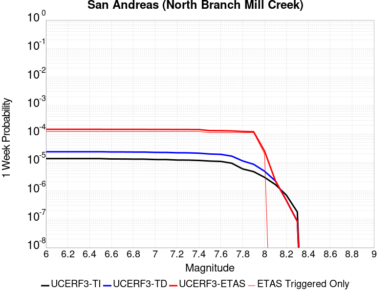 |  |  |  |

| Magnitude | 1 wk TI Prob | 1 wk TD Prob | 1 wk ETAS Prob | 1 wk ETAS/TD Gain | 1 wk ETAS Triggered Only | 1 mo TI Prob | 1 mo TD Prob | 1 mo ETAS Prob | 1 mo ETAS/TD Gain | 1 mo ETAS Triggered Only | 1 yr TI Prob | 1 yr TD Prob | 1 yr ETAS Prob | 1 yr ETAS/TD Gain | 1 yr ETAS Triggered Only | 10 yr TI Prob | 10 yr TD Prob | 10 yr ETAS Prob | 10 yr ETAS/TD Gain | 10 yr ETAS Triggered Only |
|-----|-----|-----|-----|-----|-----|-----|-----|-----|-----|-----|-----|-----|-----|-----|-----|-----|-----|-----|-----|-----|
| 6.0 | 1.3461156E-5 | 2.3500992E-5 | 1.4349817E-4 | 6.1060476 | 1.2E-4 | 5.7689394E-5 | 1.00714664E-4 | 2.7069755E-4 | 2.6877668 | 1.7E-4 | 7.02142E-4 | 0.0012255146 | 0.0015051715 | 1.2281954 | 2.8E-4 | 0.0069992766 | 0.012228744 | 0.012554709 | 1.0266556 | 3.3E-4 |
| 6.1 | 1.3461156E-5 | 2.3500992E-5 | 1.4349817E-4 | 6.1060476 | 1.2E-4 | 5.7689394E-5 | 1.00714664E-4 | 2.7069755E-4 | 2.6877668 | 1.7E-4 | 7.02142E-4 | 0.0012255146 | 0.0015051715 | 1.2281954 | 2.8E-4 | 0.0069992766 | 0.012228744 | 0.012554709 | 1.0266556 | 3.3E-4 |
| 6.2 | 1.3461156E-5 | 2.3500992E-5 | 1.4349817E-4 | 6.1060476 | 1.2E-4 | 5.7689394E-5 | 1.00714664E-4 | 2.7069755E-4 | 2.6877668 | 1.7E-4 | 7.02142E-4 | 0.0012255146 | 0.0015051715 | 1.2281954 | 2.8E-4 | 0.0069992766 | 0.012228744 | 0.012554709 | 1.0266556 | 3.3E-4 |
| 6.3 | 1.3461156E-5 | 2.3500992E-5 | 1.4349817E-4 | 6.1060476 | 1.2E-4 | 5.7689394E-5 | 1.00714664E-4 | 2.7069755E-4 | 2.6877668 | 1.7E-4 | 7.02142E-4 | 0.0012255146 | 0.0015051715 | 1.2281954 | 2.8E-4 | 0.0069992766 | 0.012228744 | 0.012554709 | 1.0266556 | 3.3E-4 |
| 6.4 | 1.3461156E-5 | 2.3500992E-5 | 1.4349817E-4 | 6.1060476 | 1.2E-4 | 5.7689394E-5 | 1.00714664E-4 | 2.7069755E-4 | 2.6877668 | 1.7E-4 | 7.02142E-4 | 0.0012255146 | 0.0015051715 | 1.2281954 | 2.8E-4 | 0.0069992766 | 0.012228744 | 0.012554709 | 1.0266556 | 3.3E-4 |
| 6.5 | 1.3450706E-5 | 2.348995E-5 | 1.4348714E-4 | 6.1084476 | 1.2E-4 | 5.764461E-5 | 1.00667356E-4 | 2.7065023E-4 | 2.6885602 | 1.7E-4 | 7.0159714E-4 | 0.0012249392 | 0.0015045963 | 1.2283027 | 2.8E-4 | 0.006993862 | 0.012223054 | 0.01254902 | 1.0266682 | 3.3E-4 |
| 6.6 | 1.3074523E-5 | 2.3104236E-5 | 1.4310147E-4 | 6.1937327 | 1.2E-4 | 5.6032466E-5 | 9.901441E-5 | 2.6899757E-4 | 2.7167518 | 1.7E-4 | 6.8198174E-4 | 0.001204837 | 0.0014844997 | 1.2321166 | 2.8E-4 | 0.006798926 | 0.012024219 | 0.012350251 | 1.0271146 | 3.3E-4 |
| 6.7 | 1.3050216E-5 | 2.3079532E-5 | 1.4307676E-4 | 6.199292 | 1.2E-4 | 5.59283E-5 | 9.890855E-5 | 2.6889174E-4 | 2.7185893 | 1.7E-4 | 6.8071426E-4 | 0.0012035496 | 0.0014832126 | 1.2323651 | 2.8E-4 | 0.0067863287 | 0.012011484 | 0.012337521 | 1.0271437 | 3.3E-4 |
| 6.8 | 1.29049395E-5 | 2.2927941E-5 | 1.4292519E-4 | 6.233669 | 1.2E-4 | 5.530571E-5 | 9.825892E-5 | 2.682422E-4 | 2.7299528 | 1.7E-4 | 6.73139E-4 | 0.001195649 | 0.0014753143 | 1.2339025 | 2.8E-4 | 0.0067110364 | 0.011933329 | 0.01225939 | 1.0273236 | 3.3E-4 |
| 6.9 | 1.2867369E-5 | 2.2887343E-5 | 1.428846E-4 | 6.2429523 | 1.2E-4 | 5.51447E-5 | 9.808494E-5 | 2.6806828E-4 | 2.7330215 | 1.7E-4 | 6.711799E-4 | 0.0011935332 | 0.001473199 | 1.2343175 | 2.8E-4 | 0.006691564 | 0.011912397 | 0.012238466 | 1.0273722 | 3.3E-4 |
| 7.0 | 1.2495996E-5 | 2.2287419E-5 | 1.4228474E-4 | 6.3840833 | 1.2E-4 | 5.3553173E-5 | 9.551403E-5 | 2.654978E-4 | 2.7796733 | 1.7E-4 | 6.518148E-4 | 0.0011622658 | 0.0014419403 | 1.2406287 | 2.8E-4 | 0.0064990623 | 0.011603 | 0.011929171 | 1.0281109 | 3.3E-4 |
| 7.1 | 1.2452067E-5 | 2.2232492E-5 | 1.4222982E-4 | 6.3973856 | 1.2E-4 | 5.3364907E-5 | 9.527864E-5 | 2.6526244E-4 | 2.7840703 | 1.7E-4 | 6.4952404E-4 | 0.001159403 | 0.0014390784 | 1.2412236 | 2.8E-4 | 0.0064762887 | 0.011574671 | 0.0119008515 | 1.0281805 | 3.3E-4 |
| 7.2 | 1.2002777E-5 | 2.1611015E-5 | 1.4160843E-4 | 6.552604 | 1.2E-4 | 5.143946E-5 | 9.261536E-5 | 2.625996E-4 | 2.8353786 | 1.7E-4 | 6.2609545E-4 | 0.0011270114 | 0.0014066958 | 1.2481647 | 2.8E-4 | 0.006243344 | 0.011254058 | 0.011580344 | 1.0289928 | 3.3E-4 |
| 7.3 | 1.1923425E-5 | 2.1480853E-5 | 1.4147827E-4 | 6.58625 | 1.2E-4 | 5.109939E-5 | 9.205757E-5 | 2.6204193E-4 | 2.8465006 | 1.7E-4 | 6.219575E-4 | 0.0011202273 | 0.0013999136 | 1.2496693 | 2.8E-4 | 0.0062021962 | 0.011186945 | 0.011513254 | 1.0291687 | 3.3E-4 |
| 7.4 | 1.16105175E-5 | 2.0854808E-5 | 1.4085231E-4 | 6.7539487 | 1.2E-4 | 4.975841E-5 | 8.93747E-5 | 2.593595E-4 | 2.9019344 | 1.7E-4 | 6.0564023E-4 | 0.0010875963 | 0.0013672918 | 1.2571684 | 2.8E-4 | 0.006039923 | 0.010864409 | 0.011190824 | 1.0300444 | 3.3E-4 |
| 7.5 | 1.1037265E-5 | 1.9554842E-5 | 1.2955269E-4 | 6.6250954 | 1.1E-4 | 4.7301706E-5 | 8.380379E-5 | 2.4379037E-4 | 2.9090617 | 1.6E-4 | 5.757461E-4 | 0.0010198357 | 0.0012895603 | 1.2644786 | 2.7E-4 | 0.005742567 | 0.010195527 | 0.010512265 | 1.0310663 | 3.2E-4 |
| 7.6 | 1.0720915E-5 | 1.8996727E-5 | 1.2899464E-4 | 6.790361 | 1.1E-4 | 4.5945973E-5 | 8.141202E-5 | 2.4139899E-4 | 2.9651518 | 1.6E-4 | 5.592486E-4 | 9.907428E-4 | 0.0012604753 | 1.2722528 | 2.7E-4 | 0.005578433 | 0.009907238 | 0.010224069 | 1.0319796 | 3.2E-4 |
| 7.7 | 9.276279E-6 | 1.6442464E-5 | 1.2644066E-4 | 7.689885 | 1.1E-4 | 3.9754876E-5 | 7.046581E-5 | 2.3045453E-4 | 3.2704449 | 1.6E-4 | 4.839081E-4 | 8.5758517E-4 | 0.0011273536 | 1.3145676 | 2.7E-4 | 0.0048285574 | 0.008586576 | 0.008903828 | 1.0369475 | 3.2E-4 |
| 7.8 | 5.8346777E-6 | 1.11555855E-5 | 1.2115436E-4 | 10.860421 | 1.1E-4 | 2.5005522E-5 | 4.7808775E-5 | 2.0780113E-4 | 4.346506 | 1.6E-4 | 3.043997E-4 | 5.819165E-4 | 8.517594E-4 | 1.4637141 | 2.7E-4 | 0.0030398308 | 0.0058473335 | 0.006165462 | 1.0544058 | 3.2E-4 |
| 7.9 | 4.690204E-6 | 8.509473E-6 | 1.18508535E-4 | 13.926659 | 1.1E-4 | 2.0100719E-5 | 3.6468664E-5 | 1.8646319E-4 | 5.1129704 | 1.5E-4 | 2.4469878E-4 | 4.439156E-4 | 7.038002E-4 | 1.5854369 | 2.6E-4 | 0.002444295 | 0.004471165 | 0.004779779 | 1.0690231 | 3.1E-4 |
| 8.0 | 2.9570454E-6 | 4.8470656E-6 | 2.484697E-5 | 5.126188 | 2.0E-5 | 1.267299E-5 | 2.0772974E-5 | 6.077214E-5 | 2.925539 | 4.0E-5 | 1.5428272E-4 | 2.5288164E-4 | 3.328614E-4 | 1.3162736 | 8.0E-5 | 0.0015417566 | 0.002549932 | 0.0026496772 | 1.0391167 | 1.0E-4 |
| 8.1 | 1.6376824E-6 | 2.1968672E-6 | 2.1968672E-6 | 1.0 | 0.0 | 7.01862E-6 | 9.415111E-6 | 9.415111E-6 | 1.0 | 0.0 | 8.544835E-5 | 1.1462297E-4 | 1.1462297E-4 | 1.0 | 0.0 | 8.54155E-4 | 0.0011607445 | 0.0011707328 | 1.0086051 | 1.0E-5 |
| 8.2 | 6.9631557E-7 | 4.535001E-7 | 4.535001E-7 | 1.0 | 0.0 | 2.984206E-6 | 1.9435704E-6 | 1.9435704E-6 | 1.0 | 0.0 | 3.63321E-5 | 2.3662713E-5 | 2.3662713E-5 | 1.0 | 0.0 | 3.6326164E-4 | 2.4510184E-4 | 2.4510184E-4 | 1.0 | 0.0 |
| 8.3 | 1.7876137E-7 | 8.357368E-8 | 8.357368E-8 | 1.0 | 0.0 | 7.661199E-7 | 3.5817288E-7 | 3.5817288E-7 | 1.0 | 0.0 | 9.32747E-6 | 4.3607465E-6 | 4.3607465E-6 | 1.0 | 0.0 | 9.3270784E-5 | 4.5800018E-5 | 4.5800018E-5 | 1.0 | 0.0 |

## Manix-Afton Hills
*[(top)](#table-of-contents)*

| 1 Week | 1 Month | 1 Year | 10 Year |
|-----|-----|-----|-----|
|  |  |  |  |

| Magnitude | 1 wk TI Prob | 1 wk TD Prob | 1 wk ETAS Prob | 1 wk ETAS/TD Gain | 1 wk ETAS Triggered Only | 1 mo TI Prob | 1 mo TD Prob | 1 mo ETAS Prob | 1 mo ETAS/TD Gain | 1 mo ETAS Triggered Only | 1 yr TI Prob | 1 yr TD Prob | 1 yr ETAS Prob | 1 yr ETAS/TD Gain | 1 yr ETAS Triggered Only | 10 yr TI Prob | 10 yr TD Prob | 10 yr ETAS Prob | 10 yr ETAS/TD Gain | 10 yr ETAS Triggered Only |
|-----|-----|-----|-----|-----|-----|-----|-----|-----|-----|-----|-----|-----|-----|-----|-----|-----|-----|-----|-----|-----|
| 6.0 | 1.3783202E-5 | 1.47110895E-5 | 9.470991E-5 | 6.4379945 | 8.0E-5 | 5.906953E-5 | 6.30461E-5 | 1.5304043E-4 | 2.4274368 | 9.0E-5 | 7.189342E-4 | 7.6733343E-4 | 9.4719534E-4 | 1.2343986 | 1.8E-4 | 0.0071661277 | 0.007648596 | 0.007966149 | 1.0415177 | 3.2E-4 |
| 6.1 | 1.3783202E-5 | 1.47110895E-5 | 9.470991E-5 | 6.4379945 | 8.0E-5 | 5.906953E-5 | 6.30461E-5 | 1.5304043E-4 | 2.4274368 | 9.0E-5 | 7.189342E-4 | 7.6733343E-4 | 9.4719534E-4 | 1.2343986 | 1.8E-4 | 0.0071661277 | 0.007648596 | 0.007966149 | 1.0415177 | 3.2E-4 |
| 6.2 | 1.3783202E-5 | 1.47110895E-5 | 9.470991E-5 | 6.4379945 | 8.0E-5 | 5.906953E-5 | 6.30461E-5 | 1.5304043E-4 | 2.4274368 | 9.0E-5 | 7.189342E-4 | 7.6733343E-4 | 9.4719534E-4 | 1.2343986 | 1.8E-4 | 0.0071661277 | 0.007648596 | 0.007966149 | 1.0415177 | 3.2E-4 |
| 6.3 | 1.10494875E-5 | 1.1793136E-5 | 6.179255E-5 | 5.2397046 | 5.0E-5 | 4.7354086E-5 | 5.054109E-5 | 1.00538564E-4 | 1.9892441 | 5.0E-5 | 5.763835E-4 | 6.151744E-4 | 7.4509444E-4 | 1.2111921 | 1.3E-4 | 0.005748908 | 0.0061357557 | 0.0063742828 | 1.038875 | 2.4E-4 |
| 6.4 | 1.10494875E-5 | 1.1793136E-5 | 6.179255E-5 | 5.2397046 | 5.0E-5 | 4.7354086E-5 | 5.054109E-5 | 1.00538564E-4 | 1.9892441 | 5.0E-5 | 5.763835E-4 | 6.151744E-4 | 7.4509444E-4 | 1.2111921 | 1.3E-4 | 0.005748908 | 0.0061357557 | 0.0063742828 | 1.038875 | 2.4E-4 |
| 6.5 | 9.788949E-6 | 1.045432E-5 | 5.0453902E-5 | 4.8261294 | 4.0E-5 | 4.1951964E-5 | 4.480351E-5 | 8.4801715E-5 | 1.8927472 | 4.0E-5 | 5.1064545E-4 | 5.453555E-4 | 6.552955E-4 | 1.2015933 | 1.1E-4 | 0.0050947363 | 0.0054410985 | 0.0056400103 | 1.0365573 | 2.0E-4 |
| 6.6 | 8.810006E-6 | 9.4136285E-6 | 3.9413346E-5 | 4.186839 | 3.0E-5 | 3.775662E-5 | 4.0343548E-5 | 7.0342336E-5 | 1.7435833 | 3.0E-5 | 4.5958988E-4 | 4.9108086E-4 | 5.810367E-4 | 1.1831793 | 9.0E-5 | 0.0045864056 | 0.004900839 | 0.005070006 | 1.0345179 | 1.7E-4 |
| 6.7 | 8.80128E-6 | 9.404108E-6 | 3.9403825E-5 | 4.1900654 | 3.0E-5 | 3.7719226E-5 | 4.0302748E-5 | 7.030154E-5 | 1.7443361 | 3.0E-5 | 4.591348E-4 | 4.9058435E-4 | 5.805402E-4 | 1.1833646 | 9.0E-5 | 0.004581874 | 0.0048958957 | 0.0050650635 | 1.0345529 | 1.7E-4 |
| 6.8 | 6.8994877E-6 | 7.380076E-6 | 7.380076E-6 | 1.0 | 0.0 | 2.9568899E-5 | 3.162856E-5 | 3.162856E-5 | 1.0 | 0.0 | 3.5994186E-4 | 3.8501783E-4 | 4.4499474E-4 | 1.155777 | 6.0E-5 | 0.003593594 | 0.0038443129 | 0.00395389 | 1.0285037 | 1.1E-4 |
| 6.9 | 4.9328037E-6 | 5.2709615E-6 | 5.2709615E-6 | 1.0 | 0.0 | 2.1140417E-5 | 2.2589675E-5 | 2.2589675E-5 | 1.0 | 0.0 | 2.5735417E-4 | 2.7500073E-4 | 3.1498974E-4 | 1.1454141 | 4.0E-5 | 0.0025705635 | 0.0027472095 | 0.002797072 | 1.0181503 | 5.0E-5 |
| 7.0 | 3.347973E-6 | 3.59003E-6 | 3.59003E-6 | 1.0 | 0.0 | 1.4348378E-5 | 1.5385775E-5 | 1.5385775E-5 | 1.0 | 0.0 | 1.746775E-4 | 1.8730981E-4 | 2.0730606E-4 | 1.106755 | 2.0E-5 | 0.0017454025 | 0.0018719219 | 0.0019018658 | 1.0159963 | 3.0E-5 |
| 7.1 | 1.2073567E-6 | 1.293482E-6 | 1.293482E-6 | 1.0 | 0.0 | 5.1743755E-6 | 5.543492E-6 | 5.543492E-6 | 1.0 | 0.0 | 6.29962E-5 | 6.749156E-5 | 7.7490884E-5 | 1.1481566 | 1.0E-5 | 6.297835E-4 | 6.7487074E-4 | 6.84864E-4 | 1.0148077 | 1.0E-5 |

## White Wolf (Extension)
*[(top)](#table-of-contents)*

| 1 Week | 1 Month | 1 Year | 10 Year |
|-----|-----|-----|-----|
|  |  |  |  |

| Magnitude | 1 wk TI Prob | 1 wk TD Prob | 1 wk ETAS Prob | 1 wk ETAS/TD Gain | 1 wk ETAS Triggered Only | 1 mo TI Prob | 1 mo TD Prob | 1 mo ETAS Prob | 1 mo ETAS/TD Gain | 1 mo ETAS Triggered Only | 1 yr TI Prob | 1 yr TD Prob | 1 yr ETAS Prob | 1 yr ETAS/TD Gain | 1 yr ETAS Triggered Only | 10 yr TI Prob | 10 yr TD Prob | 10 yr ETAS Prob | 10 yr ETAS/TD Gain | 10 yr ETAS Triggered Only |
|-----|-----|-----|-----|-----|-----|-----|-----|-----|-----|-----|-----|-----|-----|-----|-----|-----|-----|-----|-----|-----|
| 6.0 | 8.222555E-6 | 6.066615E-6 | 8.606613E-5 | 14.186846 | 8.0E-5 | 3.5239045E-5 | 2.5999556E-5 | 1.359967E-4 | 5.2307315 | 1.1E-4 | 4.289509E-4 | 3.1650523E-4 | 5.2643876E-4 | 1.6632861 | 2.1E-4 | 0.0042812387 | 0.0031611966 | 0.003480185 | 1.1009074 | 3.2E-4 |
| 6.1 | 8.222555E-6 | 6.066615E-6 | 8.606613E-5 | 14.186846 | 8.0E-5 | 3.5239045E-5 | 2.5999556E-5 | 1.359967E-4 | 5.2307315 | 1.1E-4 | 4.289509E-4 | 3.1650523E-4 | 5.2643876E-4 | 1.6632861 | 2.1E-4 | 0.0042812387 | 0.0031611966 | 0.003480185 | 1.1009074 | 3.2E-4 |
| 6.2 | 8.222555E-6 | 6.066615E-6 | 8.606613E-5 | 14.186846 | 8.0E-5 | 3.5239045E-5 | 2.5999556E-5 | 1.359967E-4 | 5.2307315 | 1.1E-4 | 4.289509E-4 | 3.1650523E-4 | 5.2643876E-4 | 1.6632861 | 2.1E-4 | 0.0042812387 | 0.0031611966 | 0.003480185 | 1.1009074 | 3.2E-4 |
| 6.3 | 8.222555E-6 | 6.066615E-6 | 8.606613E-5 | 14.186846 | 8.0E-5 | 3.5239045E-5 | 2.5999556E-5 | 1.359967E-4 | 5.2307315 | 1.1E-4 | 4.289509E-4 | 3.1650523E-4 | 5.2643876E-4 | 1.6632861 | 2.1E-4 | 0.0042812387 | 0.0031611966 | 0.003480185 | 1.1009074 | 3.2E-4 |
| 6.4 | 5.821773E-6 | 3.5571256E-6 | 4.3556982E-5 | 12.244994 | 4.0E-5 | 2.4950215E-5 | 1.5244741E-5 | 7.524383E-5 | 4.9357233 | 6.0E-5 | 3.0372653E-4 | 1.8559002E-4 | 3.1556588E-4 | 1.7003387 | 1.3E-4 | 0.0030331176 | 0.0018544586 | 0.0020540878 | 1.1076481 | 2.0E-4 |
| 6.5 | 5.766023E-6 | 3.4990599E-6 | 4.349892E-5 | 12.4316025 | 4.0E-5 | 2.4711293E-5 | 1.49958905E-5 | 7.499499E-5 | 5.001036 | 6.0E-5 | 3.0081844E-4 | 1.8256076E-4 | 3.1253704E-4 | 1.7119616 | 1.3E-4 | 0.0030041158 | 0.0018242161 | 0.0020238513 | 1.1094362 | 2.0E-4 |
| 6.6 | 4.643576E-6 | 2.3325733E-6 | 2.2332526E-5 | 9.574202 | 2.0E-5 | 1.9900888E-5 | 9.9967065E-6 | 2.9996507E-5 | 3.000639 | 2.0E-5 | 2.4226638E-4 | 1.2170354E-4 | 1.7169745E-4 | 1.4107844 | 5.0E-5 | 0.0024200242 | 0.0012164112 | 0.0013162897 | 1.0821091 | 1.0E-4 |
| 6.7 | 3.9529173E-6 | 1.6482975E-6 | 2.1648264E-5 | 13.133712 | 2.0E-5 | 1.6940963E-5 | 7.064114E-6 | 2.7063972E-5 | 3.8311913 | 2.0E-5 | 2.0623671E-4 | 8.600239E-5 | 1.2599894E-4 | 1.4650633 | 4.0E-5 | 0.002060454 | 8.597095E-4 | 9.1965793E-4 | 1.069731 | 6.0E-5 |
| 6.8 | 3.4377522E-6 | 1.2244764E-6 | 1.1224464E-5 | 9.166746 | 1.0E-5 | 1.473314E-5 | 5.247746E-6 | 1.5247693E-5 | 2.90557 | 1.0E-5 | 1.7936122E-4 | 6.388952E-5 | 9.3887604E-5 | 1.4695306 | 3.0E-5 | 0.0017921652 | 6.3872064E-4 | 6.786951E-4 | 1.0625852 | 4.0E-5 |
| 6.9 | 3.1367306E-6 | 1.0033316E-6 | 1.1003322E-5 | 10.966785 | 1.0E-5 | 1.3443062E-5 | 4.299986E-6 | 1.4299942E-5 | 3.3255792 | 1.0E-5 | 1.63657E-4 | 5.2351144E-5 | 8.234957E-5 | 1.5730233 | 3.0E-5 | 0.0016353652 | 5.233958E-4 | 5.6337484E-4 | 1.076384 | 4.0E-5 |
| 7.0 | 2.8298145E-6 | 7.4282326E-7 | 1.0742816E-5 | 14.462142 | 1.0E-5 | 1.2127721E-5 | 3.1835248E-6 | 1.3183493E-5 | 4.1411624 | 1.0E-5 | 1.47645E-4 | 3.8758775E-5 | 4.8758386E-5 | 1.2579961 | 1.0E-5 | 0.0014754693 | 3.8752513E-4 | 4.075174E-4 | 1.0515896 | 2.0E-5 |
| 7.1 | 2.4091064E-6 | 5.4223835E-7 | 1.0542233E-5 | 19.442064 | 1.0E-5 | 1.03247E-5 | 2.3238767E-6 | 1.2323853E-5 | 5.303144 | 1.0E-5 | 1.2569598E-4 | 2.8292874E-5 | 3.829259E-5 | 1.3534359 | 1.0E-5 | 0.001256249 | 2.8289677E-4 | 3.028911E-4 | 1.0706772 | 2.0E-5 |
| 7.2 | 1.3875518E-6 | 1.0740268E-7 | 1.0740268E-7 | 1.0 | 0.0 | 5.9466374E-6 | 4.6029712E-7 | 4.6029712E-7 | 1.0 | 0.0 | 7.23979E-5 | 5.604104E-6 | 5.604104E-6 | 1.0 | 0.0 | 7.2374323E-4 | 5.6039742E-5 | 5.6039742E-5 | 1.0 | 0.0 |
| 7.3 | 7.056077E-7 | 5.0002956E-8 | 5.0002956E-8 | 1.0 | 0.0 | 3.0240296E-6 | 2.1429837E-7 | 2.1429837E-7 | 1.0 | 0.0 | 3.681694E-5 | 2.60908E-6 | 2.60908E-6 | 1.0 | 0.0 | 3.681084E-4 | 2.609054E-5 | 2.609054E-5 | 1.0 | 0.0 |
| 7.4 | 5.9334678E-8 | 4.8638475E-9 | 4.8638475E-9 | 1.0 | 0.0 | 2.5429145E-7 | 2.084506E-8 | 2.084506E-8 | 1.0 | 0.0 | 3.095994E-6 | 2.5378858E-7 | 2.5378858E-7 | 1.0 | 0.0 | 3.095951E-5 | 2.5378843E-6 | 2.5378843E-6 | 1.0 | 0.0 |

## San Jacinto (San Jacinto Valley) rev
*[(top)](#table-of-contents)*

| 1 Week | 1 Month | 1 Year | 10 Year |
|-----|-----|-----|-----|
|  |  |  |  |

| Magnitude | 1 wk TI Prob | 1 wk TD Prob | 1 wk ETAS Prob | 1 wk ETAS/TD Gain | 1 wk ETAS Triggered Only | 1 mo TI Prob | 1 mo TD Prob | 1 mo ETAS Prob | 1 mo ETAS/TD Gain | 1 mo ETAS Triggered Only | 1 yr TI Prob | 1 yr TD Prob | 1 yr ETAS Prob | 1 yr ETAS/TD Gain | 1 yr ETAS Triggered Only | 10 yr TI Prob | 10 yr TD Prob | 10 yr ETAS Prob | 10 yr ETAS/TD Gain | 10 yr ETAS Triggered Only |
|-----|-----|-----|-----|-----|-----|-----|-----|-----|-----|-----|-----|-----|-----|-----|-----|-----|-----|-----|-----|-----|
| 6.0 | 3.652694E-5 | 3.4401106E-5 | 1.3439766E-4 | 3.9067833 | 1.0E-4 | 1.5653463E-4 | 1.4742499E-4 | 2.674073E-4 | 1.8138533 | 1.2E-4 | 0.0019041431 | 0.0017934233 | 0.0019930648 | 1.1113186 | 2.0E-4 | 0.018879099 | 0.018526303 | 0.01877167 | 1.0132443 | 2.5E-4 |
| 6.1 | 3.652694E-5 | 3.4401106E-5 | 1.3439766E-4 | 3.9067833 | 1.0E-4 | 1.5653463E-4 | 1.4742499E-4 | 2.674073E-4 | 1.8138533 | 1.2E-4 | 0.0019041431 | 0.0017934233 | 0.0019930648 | 1.1113186 | 2.0E-4 | 0.018879099 | 0.018526303 | 0.01877167 | 1.0132443 | 2.5E-4 |
| 6.2 | 3.652694E-5 | 3.4401106E-5 | 1.3439766E-4 | 3.9067833 | 1.0E-4 | 1.5653463E-4 | 1.4742499E-4 | 2.674073E-4 | 1.8138533 | 1.2E-4 | 0.0019041431 | 0.0017934233 | 0.0019930648 | 1.1113186 | 2.0E-4 | 0.018879099 | 0.018526303 | 0.01877167 | 1.0132443 | 2.5E-4 |
| 6.3 | 3.652694E-5 | 3.4401106E-5 | 1.3439766E-4 | 3.9067833 | 1.0E-4 | 1.5653463E-4 | 1.4742499E-4 | 2.674073E-4 | 1.8138533 | 1.2E-4 | 0.0019041431 | 0.0017934233 | 0.0019930648 | 1.1113186 | 2.0E-4 | 0.018879099 | 0.018526303 | 0.01877167 | 1.0132443 | 2.5E-4 |
| 6.4 | 3.646941E-5 | 3.432268E-5 | 1.3431924E-4 | 3.9134254 | 1.0E-4 | 1.5628811E-4 | 1.4708891E-4 | 2.6707127E-4 | 1.815713 | 1.2E-4 | 0.0019011468 | 0.0017893389 | 0.001988981 | 1.1115731 | 2.0E-4 | 0.018849645 | 0.018486181 | 0.01873156 | 1.0132736 | 2.5E-4 |
| 6.5 | 3.646941E-5 | 3.432268E-5 | 1.3431924E-4 | 3.9134254 | 1.0E-4 | 1.5628811E-4 | 1.4708891E-4 | 2.6707127E-4 | 1.815713 | 1.2E-4 | 0.0019011468 | 0.0017893389 | 0.001988981 | 1.1115731 | 2.0E-4 | 0.018849645 | 0.018486181 | 0.01873156 | 1.0132736 | 2.5E-4 |
| 6.6 | 3.6442503E-5 | 3.4286066E-5 | 1.3428264E-4 | 3.9165366 | 1.0E-4 | 1.561728E-4 | 1.4693203E-4 | 2.669144E-4 | 1.8165842 | 1.2E-4 | 0.0018997455 | 0.001787432 | 0.0019870745 | 1.1116924 | 2.0E-4 | 0.018835869 | 0.01846745 | 0.018712834 | 1.0132873 | 2.5E-4 |
| 6.7 | 3.6432113E-5 | 3.427164E-5 | 1.3426821E-4 | 3.9177642 | 1.0E-4 | 1.5612828E-4 | 1.4687021E-4 | 2.6685258E-4 | 1.8169279 | 1.2E-4 | 0.0018992044 | 0.0017866807 | 0.0019863234 | 1.1117394 | 2.0E-4 | 0.018830549 | 0.018460074 | 0.01870546 | 1.0132928 | 2.5E-4 |
| 6.8 | 3.6409598E-5 | 3.4240697E-5 | 1.3423727E-4 | 3.9204013 | 1.0E-4 | 1.560318E-4 | 1.4673761E-4 | 2.6672E-4 | 1.8176663 | 1.2E-4 | 0.0018980318 | 0.0017850689 | 0.001984712 | 1.1118405 | 2.0E-4 | 0.018819023 | 0.018444229 | 0.018689618 | 1.0133044 | 2.5E-4 |
| 6.9 | 3.638078E-5 | 3.4201123E-5 | 1.341977E-4 | 3.9237807 | 1.0E-4 | 1.5590832E-4 | 1.4656801E-4 | 2.6655043E-4 | 1.8186126 | 1.2E-4 | 0.0018965311 | 0.0017830075 | 0.001982651 | 1.1119701 | 2.0E-4 | 0.018804269 | 0.018423963 | 0.018669358 | 1.0133193 | 2.5E-4 |
| 7.0 | 3.6294874E-5 | 3.408314E-5 | 1.3407973E-4 | 3.933902 | 1.0E-4 | 1.5554018E-4 | 1.4606243E-4 | 2.660449E-4 | 1.8214465 | 1.2E-4 | 0.0018920569 | 0.0017768623 | 0.0019765068 | 1.112358 | 2.0E-4 | 0.018760284 | 0.018363545 | 0.018608954 | 1.013364 | 2.5E-4 |
| 7.1 | 3.6260717E-5 | 3.403942E-5 | 1.3403602E-4 | 3.9376702 | 1.0E-4 | 1.5539382E-4 | 1.4587509E-4 | 2.6585758E-4 | 1.8225015 | 1.2E-4 | 0.001890278 | 0.0017745851 | 0.0019742302 | 1.1125025 | 2.0E-4 | 0.018742796 | 0.018341139 | 0.018586554 | 1.0133805 | 2.5E-4 |
| 7.2 | 3.6210204E-5 | 3.397364E-5 | 1.3397024E-4 | 3.9433584 | 1.0E-4 | 1.5517735E-4 | 1.455932E-4 | 2.6557574E-4 | 1.8240943 | 1.2E-4 | 0.001887647 | 0.0017711588 | 0.0019708045 | 1.1127204 | 2.0E-4 | 0.01871693 | 0.018307408 | 0.01855283 | 1.0134057 | 2.5E-4 |
| 7.3 | 3.6119454E-5 | 3.386193E-5 | 1.3385854E-4 | 3.9530692 | 1.0E-4 | 1.5478847E-4 | 1.4511449E-4 | 2.6509707E-4 | 1.8268133 | 1.2E-4 | 0.0018829206 | 0.0017653398 | 0.0019649868 | 1.1130927 | 2.0E-4 | 0.018670462 | 0.01824996 | 0.018495398 | 1.0134487 | 2.5E-4 |
| 7.4 | 3.607848E-5 | 3.380943E-5 | 1.3380605E-4 | 3.957655 | 1.0E-4 | 1.5461289E-4 | 1.4488952E-4 | 2.6487213E-4 | 1.8280972 | 1.2E-4 | 0.0018807866 | 0.0017626052 | 0.0019622527 | 1.1132684 | 2.0E-4 | 0.018649481 | 0.018222956 | 0.0184684 | 1.013469 | 2.5E-4 |
| 7.5 | 3.5856774E-5 | 3.3619202E-5 | 1.3361585E-4 | 3.9743905 | 1.0E-4 | 1.5366284E-4 | 1.4407437E-4 | 2.6405707E-4 | 1.8327832 | 1.2E-4 | 0.0018692396 | 0.0017526967 | 0.0019523462 | 1.1139098 | 2.0E-4 | 0.018535944 | 0.018124057 | 0.018369526 | 1.0135438 | 2.5E-4 |
| 7.6 | 3.286655E-5 | 3.2142278E-5 | 1.3213906E-4 | 4.1110673 | 1.0E-4 | 1.4084904E-4 | 1.3774536E-4 | 2.5772883E-4 | 1.8710527 | 1.2E-4 | 0.001713488 | 0.0016757617 | 0.0018754265 | 1.1191487 | 2.0E-4 | 0.017003361 | 0.017343804 | 0.017589467 | 1.0141643 | 2.5E-4 |
| 7.7 | 2.8882527E-5 | 2.9235205E-5 | 1.2923228E-4 | 4.4204335 | 1.0E-4 | 1.237764E-4 | 1.2528773E-4 | 2.4527268E-4 | 1.9576753 | 1.2E-4 | 0.0015059357 | 0.0015243118 | 0.001724007 | 1.1310067 | 2.0E-4 | 0.014957713 | 0.015830338 | 0.01607638 | 1.0155425 | 2.5E-4 |
| 7.8 | 2.4950225E-5 | 2.6526219E-5 | 1.2652356E-4 | 4.769755 | 1.0E-4 | 1.0692515E-4 | 1.1367885E-4 | 2.3366521E-4 | 2.0554852 | 1.2E-4 | 0.0013010362 | 0.0013831621 | 0.0015828855 | 1.1443962 | 2.0E-4 | 0.012934455 | 0.01441176 | 0.014658157 | 1.017097 | 2.5E-4 |
| 7.9 | 1.9881603E-5 | 2.150649E-5 | 1.2150434E-4 | 5.649659 | 1.0E-4 | 8.520408E-5 | 9.216742E-5 | 2.1215636E-4 | 2.3018584 | 1.2E-4 | 0.001036866 | 0.0011215615 | 0.0013113484 | 1.1692166 | 1.9E-4 | 0.010320415 | 0.011776998 | 0.012004289 | 1.0192996 | 2.3E-4 |
| 8.0 | 1.563292E-5 | 1.5936288E-5 | 9.5935015E-5 | 6.01991 | 8.0E-5 | 6.6996516E-5 | 6.829659E-5 | 1.5829045E-4 | 2.3176918 | 9.0E-5 | 8.153773E-4 | 8.3119445E-4 | 9.610864E-4 | 1.1562715 | 1.3E-4 | 0.00812392 | 0.008810331 | 0.008968921 | 1.0180005 | 1.6E-4 |
| 8.1 | 1.0045313E-5 | 8.300794E-6 | 2.8300628E-5 | 3.409388 | 2.0E-5 | 4.305063E-5 | 3.557435E-5 | 5.557364E-5 | 1.5621828 | 2.0E-5 | 5.2401534E-4 | 4.3303217E-4 | 4.7301484E-4 | 1.0923319 | 4.0E-5 | 0.0052278144 | 0.0046587666 | 0.0047085336 | 1.0106825 | 5.0E-5 |
| 8.2 | 4.1554413E-6 | 1.5648296E-6 | 1.5648296E-6 | 1.0 | 0.0 | 1.7808914E-5 | 6.7063957E-6 | 6.7063957E-6 | 1.0 | 0.0 | 2.1680194E-4 | 8.164734E-5 | 8.164734E-5 | 1.0 | 0.0 | 0.0021659054 | 9.479703E-4 | 9.479703E-4 | 1.0 | 0.0 |
| 8.3 | 1.2758221E-6 | 3.612677E-7 | 3.612677E-7 | 1.0 | 0.0 | 5.4677976E-6 | 1.5482892E-6 | 1.5482892E-6 | 1.0 | 0.0 | 6.65684E-5 | 1.8850264E-5 | 1.8850264E-5 | 1.0 | 0.0 | 6.6548464E-4 | 2.2739546E-4 | 2.2739546E-4 | 1.0 | 0.0 |

## Calico-Hidalgo
*[(top)](#table-of-contents)*

| 1 Week | 1 Month | 1 Year | 10 Year |
|-----|-----|-----|-----|
|  |  |  |  |

| Magnitude | 1 wk TI Prob | 1 wk TD Prob | 1 wk ETAS Prob | 1 wk ETAS/TD Gain | 1 wk ETAS Triggered Only | 1 mo TI Prob | 1 mo TD Prob | 1 mo ETAS Prob | 1 mo ETAS/TD Gain | 1 mo ETAS Triggered Only | 1 yr TI Prob | 1 yr TD Prob | 1 yr ETAS Prob | 1 yr ETAS/TD Gain | 1 yr ETAS Triggered Only | 10 yr TI Prob | 10 yr TD Prob | 10 yr ETAS Prob | 10 yr ETAS/TD Gain | 10 yr ETAS Triggered Only |
|-----|-----|-----|-----|-----|-----|-----|-----|-----|-----|-----|-----|-----|-----|-----|-----|-----|-----|-----|-----|-----|
| 6.0 | 4.0906612E-5 | 5.0704355E-5 | 9.070233E-5 | 1.7888469 | 4.0E-5 | 1.7530227E-4 | 2.1728857E-4 | 2.7727554E-4 | 1.2760705 | 6.0E-5 | 0.0021322158 | 0.002642678 | 0.0027723345 | 1.0490625 | 1.3E-4 | 0.02111873 | 0.026152814 | 0.026376799 | 1.0085645 | 2.3E-4 |
| 6.1 | 4.0906612E-5 | 5.0704355E-5 | 9.070233E-5 | 1.7888469 | 4.0E-5 | 1.7530227E-4 | 2.1728857E-4 | 2.7727554E-4 | 1.2760705 | 6.0E-5 | 0.0021322158 | 0.002642678 | 0.0027723345 | 1.0490625 | 1.3E-4 | 0.02111873 | 0.026152814 | 0.026376799 | 1.0085645 | 2.3E-4 |
| 6.2 | 4.0906612E-5 | 5.0704355E-5 | 9.070233E-5 | 1.7888469 | 4.0E-5 | 1.7530227E-4 | 2.1728857E-4 | 2.7727554E-4 | 1.2760705 | 6.0E-5 | 0.0021322158 | 0.002642678 | 0.0027723345 | 1.0490625 | 1.3E-4 | 0.02111873 | 0.026152814 | 0.026376799 | 1.0085645 | 2.3E-4 |
| 6.3 | 2.4242801E-5 | 3.0090967E-5 | 6.0090064E-5 | 1.9969469 | 3.0E-5 | 1.0389358E-4 | 1.289551E-4 | 1.7894866E-4 | 1.3876818 | 5.0E-5 | 0.0012641704 | 0.0015689312 | 0.0016787585 | 1.0700015 | 1.1E-4 | 0.01257003 | 0.015582229 | 0.015739735 | 1.0101081 | 1.6E-4 |
| 6.4 | 2.4242801E-5 | 3.0090967E-5 | 6.0090064E-5 | 1.9969469 | 3.0E-5 | 1.0389358E-4 | 1.289551E-4 | 1.7894866E-4 | 1.3876818 | 5.0E-5 | 0.0012641704 | 0.0015689312 | 0.0016787585 | 1.0700015 | 1.1E-4 | 0.01257003 | 0.015582229 | 0.015739735 | 1.0101081 | 1.6E-4 |
| 6.5 | 2.0286952E-5 | 2.5316054E-5 | 4.5315548E-5 | 1.7899925 | 2.0E-5 | 8.694118E-5 | 1.0849296E-4 | 1.4848862E-4 | 1.3686475 | 4.0E-5 | 0.0010579949 | 0.0013201186 | 0.0014099997 | 1.0680857 | 9.0E-5 | 0.010529719 | 0.013124701 | 0.013252994 | 1.009775 | 1.3E-4 |
| 6.6 | 2.0269223E-5 | 2.5297004E-5 | 4.52965E-5 | 1.7905874 | 2.0E-5 | 8.6865206E-5 | 1.08411325E-4 | 1.4840698E-4 | 1.3689251 | 4.0E-5 | 0.0010570707 | 0.0013191258 | 0.001409007 | 1.068137 | 9.0E-5 | 0.010520565 | 0.01311489 | 0.013243185 | 1.0097824 | 1.3E-4 |
| 6.7 | 1.799852E-5 | 2.2540933E-5 | 2.2540933E-5 | 1.0 | 0.0 | 7.713423E-5 | 9.660051E-5 | 1.0659954E-4 | 1.1035091 | 1.0E-5 | 9.3870464E-4 | 0.0011754911 | 0.0012354207 | 1.0509825 | 6.0E-5 | 0.009347493 | 0.011694346 | 0.011793176 | 1.0084511 | 1.0E-4 |
| 6.8 | 1.7458793E-5 | 2.184258E-5 | 2.184258E-5 | 1.0 | 0.0 | 7.4821255E-5 | 9.360778E-5 | 1.0360684E-4 | 1.1068187 | 1.0E-5 | 9.10568E-4 | 0.0011390933 | 0.001199025 | 1.0526135 | 6.0E-5 | 0.009068459 | 0.011334131 | 0.011432997 | 1.0087229 | 1.0E-4 |
| 6.9 | 1.542884E-5 | 1.9026285E-5 | 1.9026285E-5 | 1.0 | 0.0 | 6.612192E-5 | 8.153875E-5 | 9.1537935E-5 | 1.1226311 | 1.0E-5 | 8.04737E-4 | 9.922953E-4 | 0.0010422457 | 1.0503383 | 5.0E-5 | 0.008018291 | 0.009880043 | 0.009969153 | 1.0090193 | 9.0E-5 |
| 7.0 | 1.468253E-5 | 1.803109E-5 | 1.803109E-5 | 1.0 | 0.0 | 6.292361E-5 | 7.727389E-5 | 8.727312E-5 | 1.1293998 | 1.0E-5 | 7.658257E-4 | 9.4041653E-4 | 9.903696E-4 | 1.0531179 | 5.0E-5 | 0.0076319184 | 0.009365736 | 0.009454893 | 1.0095195 | 9.0E-5 |
| 7.1 | 1.3139281E-5 | 1.620139E-5 | 1.620139E-5 | 1.0 | 0.0 | 5.6309986E-5 | 6.943275E-5 | 7.943205E-5 | 1.1440142 | 1.0E-5 | 6.853584E-4 | 8.4502844E-4 | 8.9498615E-4 | 1.0591196 | 5.0E-5 | 0.0068324856 | 0.008419449 | 0.008498776 | 1.0094218 | 8.0E-5 |
| 7.2 | 1.1127404E-5 | 1.3867038E-5 | 1.3867038E-5 | 1.0 | 0.0 | 4.7688E-5 | 5.9428872E-5 | 6.942828E-5 | 1.1682584 | 1.0E-5 | 5.8044674E-4 | 7.233172E-4 | 7.632883E-4 | 1.0552608 | 4.0E-5 | 0.0057893298 | 0.007210737 | 0.0072802324 | 1.0096377 | 7.0E-5 |
| 7.3 | 9.808154E-6 | 1.2176586E-5 | 1.2176586E-5 | 1.0 | 0.0 | 4.2034266E-5 | 5.2184383E-5 | 6.218386E-5 | 1.1916182 | 1.0E-5 | 5.11647E-4 | 6.351704E-4 | 6.6515134E-4 | 1.0472014 | 3.0E-5 | 0.0051047057 | 0.006334625 | 0.0063843084 | 1.0078431 | 5.0E-5 |
| 7.4 | 7.942452E-6 | 9.792348E-6 | 9.792348E-6 | 1.0 | 0.0 | 3.4038632E-5 | 4.1966585E-5 | 5.1966163E-5 | 1.2382748 | 1.0E-5 | 4.1434157E-4 | 5.108328E-4 | 5.408175E-4 | 1.0586976 | 3.0E-5 | 0.0041356985 | 0.005097527 | 0.0051373234 | 1.0078069 | 4.0E-5 |
| 7.5 | 4.7121216E-6 | 5.7729717E-6 | 5.7729717E-6 | 1.0 | 0.0 | 2.019465E-5 | 2.4741115E-5 | 3.4740868E-5 | 1.4041755 | 1.0E-5 | 2.4584212E-4 | 3.011891E-4 | 3.3118005E-4 | 1.0995752 | 3.0E-5 | 0.0024557032 | 0.0030085614 | 0.0030484411 | 1.0132554 | 4.0E-5 |
| 7.6 | 2.21172E-7 | 2.6040198E-7 | 2.6040198E-7 | 1.0 | 0.0 | 9.478797E-7 | 1.1160082E-6 | 1.1160082E-6 | 1.0 | 0.0 | 1.1540374E-5 | 1.3587343E-5 | 1.3587343E-5 | 1.0 | 0.0 | 1.1539775E-4 | 1.3586794E-4 | 1.4586658E-4 | 1.0735909 | 1.0E-5 |

## San Jacinto (Stepovers Combined)
*[(top)](#table-of-contents)*

| 1 Week | 1 Month | 1 Year | 10 Year |
|-----|-----|-----|-----|
|  |  |  |  |

| Magnitude | 1 wk TI Prob | 1 wk TD Prob | 1 wk ETAS Prob | 1 wk ETAS/TD Gain | 1 wk ETAS Triggered Only | 1 mo TI Prob | 1 mo TD Prob | 1 mo ETAS Prob | 1 mo ETAS/TD Gain | 1 mo ETAS Triggered Only | 1 yr TI Prob | 1 yr TD Prob | 1 yr ETAS Prob | 1 yr ETAS/TD Gain | 1 yr ETAS Triggered Only | 10 yr TI Prob | 10 yr TD Prob | 10 yr ETAS Prob | 10 yr ETAS/TD Gain | 10 yr ETAS Triggered Only |
|-----|-----|-----|-----|-----|-----|-----|-----|-----|-----|-----|-----|-----|-----|-----|-----|-----|-----|-----|-----|-----|
| 6.0 | 4.0667746E-5 | 3.5271103E-5 | 1.2526794E-4 | 3.551574 | 9.0E-5 | 1.742787E-4 | 1.5115313E-4 | 2.611365E-4 | 1.7276288 | 1.1E-4 | 0.0021197782 | 0.0018387372 | 0.0020084246 | 1.0922848 | 1.7E-4 | 0.020996714 | 0.018986495 | 0.019202318 | 1.0113672 | 2.2E-4 |
| 6.1 | 4.0667746E-5 | 3.5271103E-5 | 1.2526794E-4 | 3.551574 | 9.0E-5 | 1.742787E-4 | 1.5115313E-4 | 2.611365E-4 | 1.7276288 | 1.1E-4 | 0.0021197782 | 0.0018387372 | 0.0020084246 | 1.0922848 | 1.7E-4 | 0.020996714 | 0.018986495 | 0.019202318 | 1.0113672 | 2.2E-4 |
| 6.2 | 4.0667746E-5 | 3.5271103E-5 | 1.2526794E-4 | 3.551574 | 9.0E-5 | 1.742787E-4 | 1.5115313E-4 | 2.611365E-4 | 1.7276288 | 1.1E-4 | 0.0021197782 | 0.0018387372 | 0.0020084246 | 1.0922848 | 1.7E-4 | 0.020996714 | 0.018986495 | 0.019202318 | 1.0113672 | 2.2E-4 |
| 6.3 | 4.0667746E-5 | 3.5271103E-5 | 1.2526794E-4 | 3.551574 | 9.0E-5 | 1.742787E-4 | 1.5115313E-4 | 2.611365E-4 | 1.7276288 | 1.1E-4 | 0.0021197782 | 0.0018387372 | 0.0020084246 | 1.0922848 | 1.7E-4 | 0.020996714 | 0.018986495 | 0.019202318 | 1.0113672 | 2.2E-4 |
| 6.4 | 4.0577226E-5 | 3.5143014E-5 | 1.2513985E-4 | 3.5608742 | 9.0E-5 | 1.738908E-4 | 1.5060425E-4 | 2.6058767E-4 | 1.7302811 | 1.1E-4 | 0.0021150648 | 0.0018320669 | 0.0020017554 | 1.0926213 | 1.7E-4 | 0.020950472 | 0.018921062 | 0.0191369 | 1.0114073 | 2.2E-4 |
| 6.5 | 4.0577226E-5 | 3.5143014E-5 | 1.2513985E-4 | 3.5608742 | 9.0E-5 | 1.738908E-4 | 1.5060425E-4 | 2.6058767E-4 | 1.7302811 | 1.1E-4 | 0.0021150648 | 0.0018320669 | 0.0020017554 | 1.0926213 | 1.7E-4 | 0.020950472 | 0.018921062 | 0.0191369 | 1.0114073 | 2.2E-4 |
| 6.6 | 4.053861E-5 | 3.5088357E-5 | 1.250852E-4 | 3.5648634 | 9.0E-5 | 1.7372532E-4 | 1.5037002E-4 | 2.603535E-4 | 1.7314187 | 1.1E-4 | 0.0021130538 | 0.0018292206 | 0.0019989097 | 1.0927658 | 1.7E-4 | 0.020930743 | 0.01889314 | 0.019108985 | 1.0114244 | 2.2E-4 |
| 6.7 | 4.0516545E-5 | 3.505743E-5 | 1.2505427E-4 | 3.567126 | 9.0E-5 | 1.7363077E-4 | 1.502375E-4 | 2.60221E-4 | 1.732064 | 1.1E-4 | 0.002111905 | 0.0018276101 | 0.0019972993 | 1.0928477 | 1.7E-4 | 0.020919468 | 0.018877337 | 0.019093184 | 1.0114342 | 2.2E-4 |
| 6.8 | 4.049434E-5 | 3.5028992E-5 | 1.2502584E-4 | 3.5692103 | 9.0E-5 | 1.7353562E-4 | 1.5011564E-4 | 2.6009913E-4 | 1.7326584 | 1.1E-4 | 0.0021107488 | 0.0018261289 | 0.0019958185 | 1.092923 | 1.7E-4 | 0.020908125 | 0.018862749 | 0.0190786 | 1.0114433 | 2.2E-4 |
| 6.9 | 4.046386E-5 | 3.4991554E-5 | 1.2498841E-4 | 3.5719593 | 9.0E-5 | 1.73405E-4 | 1.499552E-4 | 2.599387E-4 | 1.7334424 | 1.1E-4 | 0.0021091616 | 0.0018241788 | 0.0019938687 | 1.0930226 | 1.7E-4 | 0.020892553 | 0.018843522 | 0.019059377 | 1.011455 | 2.2E-4 |
| 7.0 | 4.036382E-5 | 3.4872126E-5 | 1.2486898E-4 | 3.5807679 | 9.0E-5 | 1.7297632E-4 | 1.4944343E-4 | 2.5942698E-4 | 1.7359545 | 1.1E-4 | 0.0021039525 | 0.0018179584 | 0.0019876494 | 1.0933415 | 1.7E-4 | 0.02084144 | 0.018782137 | 0.018998004 | 1.0114932 | 2.2E-4 |
| 7.1 | 4.0343282E-5 | 3.485059E-5 | 1.2484746E-4 | 3.582363 | 9.0E-5 | 1.7288832E-4 | 1.4935112E-4 | 2.593347E-4 | 1.7364094 | 1.1E-4 | 0.002102883 | 0.0018168368 | 0.0019865278 | 1.0933992 | 1.7E-4 | 0.020830948 | 0.018771008 | 0.018986877 | 1.0115002 | 2.2E-4 |
| 7.2 | 4.0257353E-5 | 3.475509E-5 | 1.2475195E-4 | 3.589459 | 9.0E-5 | 1.725201E-4 | 1.489419E-4 | 2.5892552E-4 | 1.7384331 | 1.1E-4 | 0.0020984085 | 0.0018118626 | 0.0019815546 | 1.0936561 | 1.7E-4 | 0.020787042 | 0.018721746 | 0.018937629 | 1.011531 | 2.2E-4 |
| 7.3 | 3.9940667E-5 | 3.458276E-5 | 1.2457964E-4 | 3.6023629 | 9.0E-5 | 1.7116306E-4 | 1.4820343E-4 | 2.5818712E-4 | 1.7421131 | 1.1E-4 | 0.0020819185 | 0.0018028866 | 0.00197258 | 1.0941232 | 1.7E-4 | 0.020625217 | 0.018630387 | 0.018846288 | 1.0115887 | 2.2E-4 |
| 7.4 | 3.9721202E-5 | 3.4468165E-5 | 1.2446506E-4 | 3.611015 | 9.0E-5 | 1.7022261E-4 | 1.4771236E-4 | 2.576961E-4 | 1.7445805 | 1.1E-4 | 0.0020704903 | 0.0017969179 | 0.0019666124 | 1.0944364 | 1.7E-4 | 0.020513052 | 0.018569522 | 0.018785436 | 1.0116273 | 2.2E-4 |
| 7.5 | 3.7036873E-5 | 3.3535776E-5 | 1.2353275E-4 | 3.6836112 | 9.0E-5 | 1.5871979E-4 | 1.4371685E-4 | 2.5370103E-4 | 1.765284 | 1.1E-4 | 0.0019307006 | 0.0017483513 | 0.0019180541 | 1.0970645 | 1.7E-4 | 0.019140124 | 0.018071128 | 0.018287152 | 1.0119541 | 2.2E-4 |
| 7.6 | 3.2940967E-5 | 3.13167E-5 | 1.2131388E-4 | 3.873776 | 9.0E-5 | 1.4116794E-4 | 1.3420754E-4 | 2.4419278E-4 | 1.8195161 | 1.1E-4 | 0.0017173645 | 0.0016327545 | 0.0018024768 | 1.1039486 | 1.7E-4 | 0.01704153 | 0.016904091 | 0.017120373 | 1.0127946 | 2.2E-4 |
| 7.7 | 2.8236149E-5 | 2.7882697E-5 | 1.1788019E-4 | 4.2277184 | 9.0E-5 | 1.2100645E-4 | 1.1949181E-4 | 2.2947865E-4 | 1.9204552 | 1.1E-4 | 0.0014722579 | 0.0014538429 | 0.0016235957 | 1.1167614 | 1.7E-4 | 0.014625421 | 0.015114912 | 0.015331586 | 1.0143352 | 2.2E-4 |
| 7.8 | 2.4329287E-5 | 2.5206451E-5 | 1.1520418E-4 | 4.5704246 | 9.0E-5 | 1.042642E-4 | 1.08023174E-4 | 2.180113E-4 | 2.01819 | 1.1E-4 | 0.0012686774 | 0.0013143895 | 0.0014841661 | 1.1291676 | 1.7E-4 | 0.012614589 | 0.013712341 | 0.013929324 | 1.015824 | 2.2E-4 |
| 7.9 | 1.9370926E-5 | 2.0420413E-5 | 1.1041857E-4 | 5.4072647 | 9.0E-5 | 8.301561E-5 | 8.751312E-5 | 1.975035E-4 | 2.2568443 | 1.1E-4 | 0.0010102465 | 0.0010649522 | 0.0012247819 | 1.1500815 | 1.6E-4 | 0.0100566605 | 0.011199402 | 0.0113971615 | 1.0176581 | 2.0E-4 |
| 8.0 | 1.5583017E-5 | 1.5885415E-5 | 9.588414E-5 | 6.035986 | 8.0E-5 | 6.6782646E-5 | 6.807858E-5 | 1.5807245E-4 | 2.3219118 | 9.0E-5 | 8.127754E-4 | 8.2854216E-4 | 9.584345E-4 | 1.1567721 | 1.3E-4 | 0.008098091 | 0.008781636 | 0.008940231 | 1.0180598 | 1.6E-4 |
| 8.1 | 1.0024873E-5 | 8.291399E-6 | 2.8291233E-5 | 3.412118 | 2.0E-5 | 4.2963035E-5 | 3.553409E-5 | 5.5533375E-5 | 1.5628198 | 2.0E-5 | 5.229494E-4 | 4.3254215E-4 | 4.7252484E-4 | 1.0924366 | 4.0E-5 | 0.0052172043 | 0.0046530655 | 0.004702833 | 1.0106956 | 5.0E-5 |
| 8.2 | 4.142796E-6 | 1.5602761E-6 | 1.5602761E-6 | 1.0 | 0.0 | 1.775472E-5 | 6.6868806E-6 | 6.6868806E-6 | 1.0 | 0.0 | 2.1614227E-4 | 8.140976E-5 | 8.140976E-5 | 1.0 | 0.0 | 0.0021593217 | 9.4514614E-4 | 9.4514614E-4 | 1.0 | 0.0 |
| 8.3 | 1.2750878E-6 | 3.609817E-7 | 3.609817E-7 | 1.0 | 0.0 | 5.4646503E-6 | 1.5470634E-6 | 1.5470634E-6 | 1.0 | 0.0 | 6.653009E-5 | 1.8835339E-5 | 1.8835339E-5 | 1.0 | 0.0 | 6.6510175E-4 | 2.272251E-4 | 2.272251E-4 | 1.0 | 0.0 |

## Santa Ynez (West)
*[(top)](#table-of-contents)*

| 1 Week | 1 Month | 1 Year | 10 Year |
|-----|-----|-----|-----|
|  |  |  |  |

| Magnitude | 1 wk TI Prob | 1 wk TD Prob | 1 wk ETAS Prob | 1 wk ETAS/TD Gain | 1 wk ETAS Triggered Only | 1 mo TI Prob | 1 mo TD Prob | 1 mo ETAS Prob | 1 mo ETAS/TD Gain | 1 mo ETAS Triggered Only | 1 yr TI Prob | 1 yr TD Prob | 1 yr ETAS Prob | 1 yr ETAS/TD Gain | 1 yr ETAS Triggered Only | 10 yr TI Prob | 10 yr TD Prob | 10 yr ETAS Prob | 10 yr ETAS/TD Gain | 10 yr ETAS Triggered Only |
|-----|-----|-----|-----|-----|-----|-----|-----|-----|-----|-----|-----|-----|-----|-----|-----|-----|-----|-----|-----|-----|
| 6.0 | 4.7352758E-5 | 5.497084E-5 | 7.496974E-5 | 1.3638092 | 2.0E-5 | 2.0292461E-4 | 2.3556968E-4 | 2.855579E-4 | 1.2122015 | 5.0E-5 | 0.0024678076 | 0.002864558 | 0.0029443288 | 1.0278475 | 8.0E-5 | 0.024405818 | 0.028304456 | 0.02845021 | 1.0051495 | 1.5E-4 |
| 6.1 | 4.7352758E-5 | 5.497084E-5 | 7.496974E-5 | 1.3638092 | 2.0E-5 | 2.0292461E-4 | 2.3556968E-4 | 2.855579E-4 | 1.2122015 | 5.0E-5 | 0.0024678076 | 0.002864558 | 0.0029443288 | 1.0278475 | 8.0E-5 | 0.024405818 | 0.028304456 | 0.02845021 | 1.0051495 | 1.5E-4 |
| 6.2 | 3.0415853E-5 | 3.3925004E-5 | 5.3924323E-5 | 1.5895157 | 2.0E-5 | 1.3034715E-4 | 1.4538495E-4 | 1.8537915E-4 | 1.2750916 | 4.0E-5 | 0.0015858212 | 0.0017686592 | 0.001828553 | 1.033864 | 6.0E-5 | 0.015745522 | 0.01754978 | 0.017657848 | 1.0061579 | 1.1E-4 |
| 6.3 | 3.0415853E-5 | 3.3925004E-5 | 5.3924323E-5 | 1.5895157 | 2.0E-5 | 1.3034715E-4 | 1.4538495E-4 | 1.8537915E-4 | 1.2750916 | 4.0E-5 | 0.0015858212 | 0.0017686592 | 0.001828553 | 1.033864 | 6.0E-5 | 0.015745522 | 0.01754978 | 0.017657848 | 1.0061579 | 1.1E-4 |
| 6.4 | 2.5452082E-5 | 2.7912318E-5 | 4.791176E-5 | 1.7165095 | 2.0E-5 | 1.09075794E-4 | 1.1961885E-4 | 1.4961527E-4 | 1.2507666 | 3.0E-5 | 0.0013271887 | 0.0014554056 | 0.0015053328 | 1.0343047 | 5.0E-5 | 0.013192902 | 0.01446091 | 0.014559464 | 1.0068152 | 1.0E-4 |
| 6.5 | 2.3143784E-5 | 2.5128133E-5 | 3.512788E-5 | 1.3979503 | 1.0E-5 | 9.9183875E-5 | 1.07687636E-4 | 1.17686555E-4 | 1.0928512 | 1.0E-5 | 0.0012068948 | 0.001310323 | 0.0013402837 | 1.0228652 | 3.0E-5 | 0.012003611 | 0.013027638 | 0.013106596 | 1.0060608 | 8.0E-5 |
| 6.6 | 1.9118515E-5 | 2.0354244E-5 | 3.0354042E-5 | 1.4912881 | 1.0E-5 | 8.193392E-5 | 8.722961E-5 | 9.722873E-5 | 1.11463 | 1.0E-5 | 9.97089E-4 | 0.001061511 | 0.0010914791 | 1.0282316 | 3.0E-5 | 0.00992627 | 0.010565317 | 0.010634577 | 1.0065554 | 7.0E-5 |
| 6.7 | 1.722807E-5 | 1.8146253E-5 | 2.8146073E-5 | 1.551068 | 1.0E-5 | 7.3832496E-5 | 7.776737E-5 | 8.7766595E-5 | 1.1285787 | 1.0E-5 | 8.985399E-4 | 9.4641204E-4 | 9.763836E-4 | 1.0316687 | 3.0E-5 | 0.008949154 | 0.009424461 | 0.009483896 | 1.0063064 | 6.0E-5 |
| 6.8 | 1.5317364E-5 | 1.5926391E-5 | 2.5926232E-5 | 1.6278787 | 1.0E-5 | 6.56442E-5 | 6.82542E-5 | 7.825352E-5 | 1.1465012 | 1.0E-5 | 7.98925E-4 | 8.3068234E-4 | 8.5066573E-4 | 1.0240566 | 2.0E-5 | 0.007960589 | 0.008276261 | 0.008325847 | 1.0059913 | 5.0E-5 |
| 6.9 | 1.3071226E-5 | 1.332953E-5 | 2.3329396E-5 | 1.750204 | 1.0E-5 | 5.6018336E-5 | 5.712532E-5 | 6.712475E-5 | 1.1750437 | 1.0E-5 | 6.8180985E-4 | 6.952811E-4 | 7.1526715E-4 | 1.0287453 | 2.0E-5 | 0.0067972173 | 0.0069313184 | 0.006980972 | 1.0071636 | 5.0E-5 |
| 7.0 | 1.1836986E-5 | 1.1932688E-5 | 2.1932568E-5 | 1.8380241 | 1.0E-5 | 5.0728955E-5 | 5.1139097E-5 | 6.1138584E-5 | 1.1955351 | 1.0E-5 | 6.1745E-4 | 6.2244234E-4 | 6.4242986E-4 | 1.0321115 | 2.0E-5 | 0.006157372 | 0.0062071825 | 0.006246934 | 1.0064042 | 4.0E-5 |
| 7.1 | 1.0597169E-5 | 1.0542107E-5 | 2.0542002E-5 | 1.9485669 | 1.0E-5 | 4.541565E-5 | 4.5179684E-5 | 5.5179233E-5 | 1.2213284 | 1.0E-5 | 5.5279525E-4 | 5.4992497E-4 | 5.6991394E-4 | 1.0363486 | 2.0E-5 | 0.0055142213 | 0.005485772 | 0.0055255527 | 1.0072516 | 4.0E-5 |
| 7.2 | 9.59113E-6 | 9.45905E-6 | 1.9458956E-5 | 2.0571787 | 1.0E-5 | 4.11042E-5 | 4.053816E-5 | 5.0537757E-5 | 1.2466712 | 1.0E-5 | 5.0032866E-4 | 4.934414E-4 | 5.034365E-4 | 1.0202558 | 1.0E-5 | 0.004992037 | 0.0049235765 | 0.0049534286 | 1.0060631 | 3.0E-5 |
| 7.3 | 8.586084E-6 | 8.379489E-6 | 1.8379405E-5 | 2.19338 | 1.0E-5 | 3.679698E-5 | 3.591161E-5 | 4.591125E-5 | 1.2784514 | 1.0E-5 | 4.4791115E-4 | 4.3713715E-4 | 4.4713277E-4 | 1.0228661 | 1.0E-5 | 0.004470094 | 0.004362884 | 0.0043927534 | 1.0068462 | 3.0E-5 |
| 7.4 | 7.2622997E-6 | 6.9514485E-6 | 1.6951379E-5 | 2.438539 | 1.0E-5 | 3.112377E-5 | 2.9791589E-5 | 3.9791288E-5 | 1.3356552 | 1.0E-5 | 3.78866E-4 | 3.6265317E-4 | 3.7264955E-4 | 1.0275645 | 1.0E-5 | 0.0037822074 | 0.003620714 | 0.0036506054 | 1.0082556 | 3.0E-5 |
| 7.5 | 5.627296E-6 | 5.2514984E-6 | 1.5251446E-5 | 2.9042084 | 1.0E-5 | 2.411676E-5 | 2.2506232E-5 | 3.2506006E-5 | 1.4443114 | 1.0E-5 | 2.9358198E-4 | 2.7397962E-4 | 2.839769E-4 | 1.036489 | 1.0E-5 | 0.0029319443 | 0.0027364905 | 0.0027564357 | 1.0072886 | 2.0E-5 |
| 7.6 | 2.265244E-6 | 2.0608632E-6 | 2.0608632E-6 | 1.0 | 0.0 | 9.708152E-6 | 8.832241E-6 | 8.832241E-6 | 1.0 | 0.0 | 1.18190335E-4 | 1.0752732E-4 | 1.0752732E-4 | 1.0 | 0.0 | 0.001181275 | 0.0010747615 | 0.0010747615 | 1.0 | 0.0 |
| 7.7 | 1.3099874E-6 | 1.1016228E-6 | 1.1016228E-6 | 1.0 | 0.0 | 5.61422E-6 | 4.7212325E-6 | 4.7212325E-6 | 1.0 | 0.0 | 6.8350986E-5 | 5.7479516E-5 | 5.7479516E-5 | 1.0 | 0.0 | 6.832996E-4 | 5.7464885E-4 | 5.7464885E-4 | 1.0 | 0.0 |
| 7.8 | 7.903951E-7 | 6.0710704E-7 | 6.0710704E-7 | 1.0 | 0.0 | 3.3874032E-6 | 2.601885E-6 | 2.601885E-6 | 1.0 | 0.0 | 4.1240855E-5 | 3.16775E-5 | 3.16775E-5 | 1.0 | 0.0 | 4.12332E-4 | 3.167312E-4 | 3.167312E-4 | 1.0 | 0.0 |
| 7.9 | 7.0753297E-9 | 5.090092E-9 | 5.090092E-9 | 1.0 | 0.0 | 3.032284E-8 | 2.181468E-8 | 2.181468E-8 | 1.0 | 0.0 | 3.6918053E-7 | 2.655937E-7 | 2.655937E-7 | 1.0 | 0.0 | 3.691799E-6 | 2.6559348E-6 | 2.6559348E-6 | 1.0 | 0.0 |

## Lake Isabella (Seismicity)
*[(top)](#table-of-contents)*

| 1 Week | 1 Month | 1 Year | 10 Year |
|-----|-----|-----|-----|
|  |  |  |  |

| Magnitude | 1 wk TI Prob | 1 wk TD Prob | 1 wk ETAS Prob | 1 wk ETAS/TD Gain | 1 wk ETAS Triggered Only | 1 mo TI Prob | 1 mo TD Prob | 1 mo ETAS Prob | 1 mo ETAS/TD Gain | 1 mo ETAS Triggered Only | 1 yr TI Prob | 1 yr TD Prob | 1 yr ETAS Prob | 1 yr ETAS/TD Gain | 1 yr ETAS Triggered Only | 10 yr TI Prob | 10 yr TD Prob | 10 yr ETAS Prob | 10 yr ETAS/TD Gain | 10 yr ETAS Triggered Only |
|-----|-----|-----|-----|-----|-----|-----|-----|-----|-----|-----|-----|-----|-----|-----|-----|-----|-----|-----|-----|-----|
| 6.0 | 9.431637E-6 | 9.741651E-6 | 8.9740875E-5 | 9.21208 | 8.0E-5 | 4.0420677E-5 | 4.1749343E-5 | 1.4174517E-4 | 3.3951473 | 1.0E-4 | 4.920106E-4 | 5.0819275E-4 | 6.481216E-4 | 1.275346 | 1.4E-4 | 0.004909227 | 0.005071599 | 0.005280534 | 1.0411971 | 2.1E-4 |
| 6.1 | 9.431637E-6 | 9.741651E-6 | 8.9740875E-5 | 9.21208 | 8.0E-5 | 4.0420677E-5 | 4.1749343E-5 | 1.4174517E-4 | 3.3951473 | 1.0E-4 | 4.920106E-4 | 5.0819275E-4 | 6.481216E-4 | 1.275346 | 1.4E-4 | 0.004909227 | 0.005071599 | 0.005280534 | 1.0411971 | 2.1E-4 |
| 6.2 | 9.431637E-6 | 9.741651E-6 | 8.9740875E-5 | 9.21208 | 8.0E-5 | 4.0420677E-5 | 4.1749343E-5 | 1.4174517E-4 | 3.3951473 | 1.0E-4 | 4.920106E-4 | 5.0819275E-4 | 6.481216E-4 | 1.275346 | 1.4E-4 | 0.004909227 | 0.005071599 | 0.005280534 | 1.0411971 | 2.1E-4 |
| 6.3 | 9.431637E-6 | 9.741651E-6 | 8.9740875E-5 | 9.21208 | 8.0E-5 | 4.0420677E-5 | 4.1749343E-5 | 1.4174517E-4 | 3.3951473 | 1.0E-4 | 4.920106E-4 | 5.0819275E-4 | 6.481216E-4 | 1.275346 | 1.4E-4 | 0.004909227 | 0.005071599 | 0.005280534 | 1.0411971 | 2.1E-4 |
| 6.4 | 5.144063E-6 | 5.3000763E-6 | 3.5299916E-5 | 6.660266 | 3.0E-5 | 2.2045799E-5 | 2.2714434E-5 | 6.271352E-5 | 2.7609549 | 4.0E-5 | 2.6837454E-4 | 2.765166E-4 | 3.365E-4 | 1.2169251 | 6.0E-5 | 0.0026805066 | 0.0027620657 | 0.002851817 | 1.0324943 | 9.0E-5 |
| 6.5 | 5.144063E-6 | 5.3000763E-6 | 3.5299916E-5 | 6.660266 | 3.0E-5 | 2.2045799E-5 | 2.2714434E-5 | 6.271352E-5 | 2.7609549 | 4.0E-5 | 2.6837454E-4 | 2.765166E-4 | 3.365E-4 | 1.2169251 | 6.0E-5 | 0.0026805066 | 0.0027620657 | 0.002851817 | 1.0324943 | 9.0E-5 |
| 6.6 | 3.4009804E-6 | 3.498786E-6 | 3.349868E-5 | 9.574372 | 3.0E-5 | 1.4575549E-5 | 1.4994721E-5 | 5.499412E-5 | 3.6675656 | 4.0E-5 | 1.7744285E-4 | 1.8254704E-4 | 2.4253609E-4 | 1.3286225 | 6.0E-5 | 0.0017730123 | 0.0018241286 | 0.0018940009 | 1.0383044 | 7.0E-5 |
| 6.7 | 3.3880428E-6 | 3.4856528E-6 | 3.3485547E-5 | 9.606679 | 3.0E-5 | 1.4520103E-5 | 1.4938435E-5 | 5.493784E-5 | 3.6776166 | 4.0E-5 | 1.767679E-4 | 1.8186188E-4 | 2.4185097E-4 | 1.3298607 | 6.0E-5 | 0.0017662736 | 0.0018172882 | 0.001887161 | 1.0384489 | 7.0E-5 |
| 6.8 | 2.6582E-6 | 2.7337003E-6 | 2.2733646E-5 | 8.3160715 | 2.0E-5 | 1.1392236E-5 | 1.1715813E-5 | 3.171558E-5 | 2.7070744 | 2.0E-5 | 1.3869164E-4 | 1.4263204E-4 | 1.7262776E-4 | 1.2103014 | 3.0E-5 | 0.0013860512 | 0.0014255369 | 0.00146548 | 1.0280195 | 4.0E-5 |
| 6.9 | 2.406011E-6 | 2.4743288E-6 | 2.247428E-5 | 9.08298 | 2.0E-5 | 1.0311434E-5 | 1.0604231E-5 | 3.060402E-5 | 2.8860197 | 2.0E-5 | 1.2553448E-4 | 1.2910018E-4 | 1.5909631E-4 | 1.2323477 | 3.0E-5 | 0.0012546359 | 0.0012903814 | 0.0013303298 | 1.0309585 | 4.0E-5 |
| 7.0 | 1.6953097E-6 | 1.7429371E-6 | 1.174292E-5 | 6.7374315 | 1.0E-5 | 7.265593E-6 | 7.469715E-6 | 1.746964E-5 | 2.3387291 | 1.0E-5 | 8.8455E-5 | 9.094104E-5 | 1.00940124E-4 | 1.1099514 | 1.0E-5 | 8.84198E-4 | 9.09141E-4 | 9.291228E-4 | 1.0219787 | 2.0E-5 |
| 7.1 | 3.5013824E-7 | 3.5714822E-7 | 3.5714822E-7 | 1.0 | 0.0 | 1.5005916E-6 | 1.5306344E-6 | 1.5306344E-6 | 1.0 | 0.0 | 1.826955E-5 | 1.8635317E-5 | 1.8635317E-5 | 1.0 | 0.0 | 1.8268047E-4 | 1.863378E-4 | 1.863378E-4 | 1.0 | 0.0 |
| 7.2 | 2.2321095E-7 | 2.2750574E-7 | 2.2750574E-7 | 1.0 | 0.0 | 9.56618E-7 | 9.750242E-7 | 9.750242E-7 | 1.0 | 0.0 | 1.1646762E-5 | 1.1870856E-5 | 1.1870856E-5 | 1.0 | 0.0 | 1.1646151E-4 | 1.1870232E-4 | 1.1870232E-4 | 1.0 | 0.0 |
| 7.3 | 1.5760406E-7 | 1.6060922E-7 | 1.6060922E-7 | 1.0 | 0.0 | 6.7544585E-7 | 6.8832503E-7 | 6.8832503E-7 | 1.0 | 0.0 | 8.223522E-6 | 8.380326E-6 | 8.380326E-6 | 1.0 | 0.0 | 8.2232174E-5 | 8.3800165E-5 | 8.3800165E-5 | 1.0 | 0.0 |
| 7.4 | 1.1216497E-7 | 1.1431706E-7 | 1.1431706E-7 | 1.0 | 0.0 | 4.8070694E-7 | 4.899302E-7 | 4.899302E-7 | 1.0 | 0.0 | 5.852591E-6 | 5.964884E-6 | 5.964884E-6 | 1.0 | 0.0 | 5.8524372E-5 | 5.9647282E-5 | 5.9647282E-5 | 1.0 | 0.0 |
| 7.5 | 4.885185E-8 | 4.9787737E-8 | 4.9787737E-8 | 1.0 | 0.0 | 2.0936506E-7 | 2.13376E-7 | 2.13376E-7 | 1.0 | 0.0 | 2.5490165E-6 | 2.59785E-6 | 2.59785E-6 | 1.0 | 0.0 | 2.5489873E-5 | 2.5978214E-5 | 2.5978214E-5 | 1.0 | 0.0 |
| 7.6 | 1.504641E-9 | 1.5317903E-9 | 1.5317903E-9 | 1.0 | 0.0 | 6.4484613E-9 | 6.5648154E-9 | 6.5648154E-9 | 1.0 | 0.0 | 7.851001E-8 | 7.992663E-8 | 7.992663E-8 | 1.0 | 0.0 | 7.8509987E-7 | 7.992663E-7 | 7.992663E-7 | 1.0 | 0.0 |

## Kern Canyon (North Kern) 2011
*[(top)](#table-of-contents)*

| 1 Week | 1 Month | 1 Year | 10 Year |
|-----|-----|-----|-----|
|  |  | 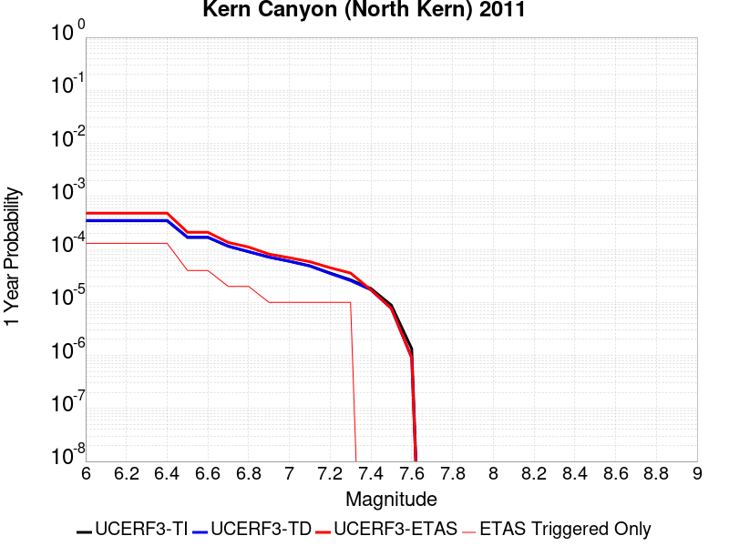 |  |

| Magnitude | 1 wk TI Prob | 1 wk TD Prob | 1 wk ETAS Prob | 1 wk ETAS/TD Gain | 1 wk ETAS Triggered Only | 1 mo TI Prob | 1 mo TD Prob | 1 mo ETAS Prob | 1 mo ETAS/TD Gain | 1 mo ETAS Triggered Only | 1 yr TI Prob | 1 yr TD Prob | 1 yr ETAS Prob | 1 yr ETAS/TD Gain | 1 yr ETAS Triggered Only | 10 yr TI Prob | 10 yr TD Prob | 10 yr ETAS Prob | 10 yr ETAS/TD Gain | 10 yr ETAS Triggered Only |
|-----|-----|-----|-----|-----|-----|-----|-----|-----|-----|-----|-----|-----|-----|-----|-----|-----|-----|-----|-----|-----|
| 6.0 | 6.6264497E-6 | 6.75733E-6 | 1.06756655E-4 | 15.798644 | 1.0E-4 | 2.8398761E-5 | 2.895971E-5 | 1.4895624E-4 | 5.143568 | 1.2E-4 | 3.4570007E-4 | 3.5253543E-4 | 4.824896E-4 | 1.3686273 | 1.3E-4 | 0.0034516277 | 0.0035205502 | 0.003729811 | 1.0594398 | 2.1E-4 |
| 6.1 | 6.6264497E-6 | 6.75733E-6 | 1.06756655E-4 | 15.798644 | 1.0E-4 | 2.8398761E-5 | 2.895971E-5 | 1.4895624E-4 | 5.143568 | 1.2E-4 | 3.4570007E-4 | 3.5253543E-4 | 4.824896E-4 | 1.3686273 | 1.3E-4 | 0.0034516277 | 0.0035205502 | 0.003729811 | 1.0594398 | 2.1E-4 |
| 6.2 | 6.6264497E-6 | 6.75733E-6 | 1.06756655E-4 | 15.798644 | 1.0E-4 | 2.8398761E-5 | 2.895971E-5 | 1.4895624E-4 | 5.143568 | 1.2E-4 | 3.4570007E-4 | 3.5253543E-4 | 4.824896E-4 | 1.3686273 | 1.3E-4 | 0.0034516277 | 0.0035205502 | 0.003729811 | 1.0594398 | 2.1E-4 |
| 6.3 | 6.6264497E-6 | 6.75733E-6 | 1.06756655E-4 | 15.798644 | 1.0E-4 | 2.8398761E-5 | 2.895971E-5 | 1.4895624E-4 | 5.143568 | 1.2E-4 | 3.4570007E-4 | 3.5253543E-4 | 4.824896E-4 | 1.3686273 | 1.3E-4 | 0.0034516277 | 0.0035205502 | 0.003729811 | 1.0594398 | 2.1E-4 |
| 6.4 | 6.6264497E-6 | 6.75733E-6 | 1.06756655E-4 | 15.798644 | 1.0E-4 | 2.8398761E-5 | 2.895971E-5 | 1.4895624E-4 | 5.143568 | 1.2E-4 | 3.4570007E-4 | 3.5253543E-4 | 4.824896E-4 | 1.3686273 | 1.3E-4 | 0.0034516277 | 0.0035205502 | 0.003729811 | 1.0594398 | 2.1E-4 |
| 6.5 | 3.2162225E-6 | 3.2570915E-6 | 3.3256994E-5 | 10.210642 | 3.0E-5 | 1.3783738E-5 | 1.3958894E-5 | 5.3958334E-5 | 3.8655167 | 4.0E-5 | 1.6780409E-4 | 1.6993708E-4 | 2.0993028E-4 | 1.2353412 | 4.0E-5 | 0.0016767744 | 0.001698151 | 0.0017879982 | 1.0529088 | 9.0E-5 |
| 6.6 | 3.2162225E-6 | 3.2570915E-6 | 3.3256994E-5 | 10.210642 | 3.0E-5 | 1.3783738E-5 | 1.3958894E-5 | 5.3958334E-5 | 3.8655167 | 4.0E-5 | 1.6780409E-4 | 1.6993708E-4 | 2.0993028E-4 | 1.2353412 | 4.0E-5 | 0.0016767744 | 0.001698151 | 0.0017879982 | 1.0529088 | 9.0E-5 |
| 6.7 | 2.1908265E-6 | 2.2071222E-6 | 1.2207101E-5 | 5.5307765 | 1.0E-5 | 9.389223E-6 | 9.459062E-6 | 2.9458874E-5 | 3.1143546 | 2.0E-5 | 1.1430779E-4 | 1.1515819E-4 | 1.3515589E-4 | 1.1736542 | 2.0E-5 | 0.0011424901 | 0.0011510046 | 0.001200947 | 1.0433903 | 5.0E-5 |
| 6.8 | 1.7303895E-6 | 1.736553E-6 | 1.1736535E-5 | 6.7585244 | 1.0E-5 | 7.415934E-6 | 7.442349E-6 | 2.74422E-5 | 3.6873035 | 2.0E-5 | 9.028525E-5 | 9.060693E-5 | 1.1060512E-4 | 1.2207136 | 2.0E-5 | 9.024858E-4 | 9.0570963E-4 | 9.456734E-4 | 1.0441242 | 4.0E-5 |
| 6.9 | 1.3700314E-6 | 1.3688623E-6 | 1.3688623E-6 | 1.0 | 0.0 | 5.87155E-6 | 5.86654E-6 | 1.586648E-5 | 2.7045722 | 1.0E-5 | 7.148377E-5 | 7.142283E-5 | 8.142211E-5 | 1.1400013 | 1.0E-5 | 7.146078E-4 | 7.140033E-4 | 7.2399614E-4 | 1.0139955 | 1.0E-5 |
| 7.0 | 1.1467797E-6 | 1.1413805E-6 | 1.1413805E-6 | 1.0 | 0.0 | 4.9147607E-6 | 4.8916218E-6 | 1.4891573E-5 | 3.0443017 | 1.0E-5 | 5.983557E-5 | 5.95539E-5 | 6.95533E-5 | 1.1679051 | 1.0E-5 | 5.981946E-4 | 5.9538253E-4 | 6.053766E-4 | 1.016786 | 1.0E-5 |
| 7.1 | 9.3952065E-7 | 9.3026915E-7 | 9.3026915E-7 | 1.0 | 0.0 | 4.026511E-6 | 3.986862E-6 | 1.3986822E-5 | 3.5082285 | 1.0E-5 | 4.9021666E-5 | 4.853898E-5 | 5.853849E-5 | 1.20601 | 1.0E-5 | 4.901085E-4 | 4.8528553E-4 | 4.9528066E-4 | 1.0205964 | 1.0E-5 |
| 7.2 | 6.858055E-7 | 6.7193014E-7 | 6.7193014E-7 | 1.0 | 0.0 | 2.939163E-6 | 2.8796974E-6 | 1.2879668E-5 | 4.472577 | 1.0E-5 | 3.5783723E-5 | 3.5059762E-5 | 4.5059413E-5 | 1.2852173 | 1.0E-5 | 3.5777962E-4 | 3.5054318E-4 | 3.6053968E-4 | 1.0285171 | 1.0E-5 |
| 7.3 | 5.1101983E-7 | 4.939301E-7 | 4.939301E-7 | 1.0 | 0.0 | 2.1900833E-6 | 2.1168414E-6 | 1.21168205E-5 | 5.7240095 | 1.0E-5 | 2.6663936E-5 | 2.5772246E-5 | 3.5771987E-5 | 1.3880043 | 1.0E-5 | 2.6660739E-4 | 2.5769303E-4 | 2.6769046E-4 | 1.0387958 | 1.0E-5 |
| 7.4 | 3.4999414E-7 | 3.2995916E-7 | 3.2995916E-7 | 1.0 | 0.0 | 1.499974E-6 | 1.4141099E-6 | 1.4141099E-6 | 1.0 | 0.0 | 1.8262032E-5 | 1.7216655E-5 | 1.7216655E-5 | 1.0 | 0.0 | 1.826053E-4 | 1.7215345E-4 | 1.7215345E-4 | 1.0 | 0.0 |
| 7.5 | 1.7021522E-7 | 1.4750053E-7 | 1.4750053E-7 | 1.0 | 0.0 | 7.2949354E-7 | 6.32145E-7 | 6.32145E-7 | 1.0 | 0.0 | 8.881548E-6 | 7.696339E-6 | 7.696339E-6 | 1.0 | 0.0 | 8.8811925E-5 | 7.696081E-5 | 7.696081E-5 | 1.0 | 0.0 |
| 7.6 | 2.572245E-8 | 1.735264E-8 | 1.735264E-8 | 1.0 | 0.0 | 1.10239064E-7 | 7.436845E-8 | 7.436845E-8 | 1.0 | 0.0 | 1.3421597E-6 | 9.0543557E-7 | 9.0543557E-7 | 1.0 | 0.0 | 1.3421517E-5 | 9.054324E-6 | 9.054324E-6 | 1.0 | 0.0 |

## San Andreas (Creeping Section) 2011 CFM
*[(top)](#table-of-contents)*

| 1 Week | 1 Month | 1 Year | 10 Year |
|-----|-----|-----|-----|
|  |  |  | 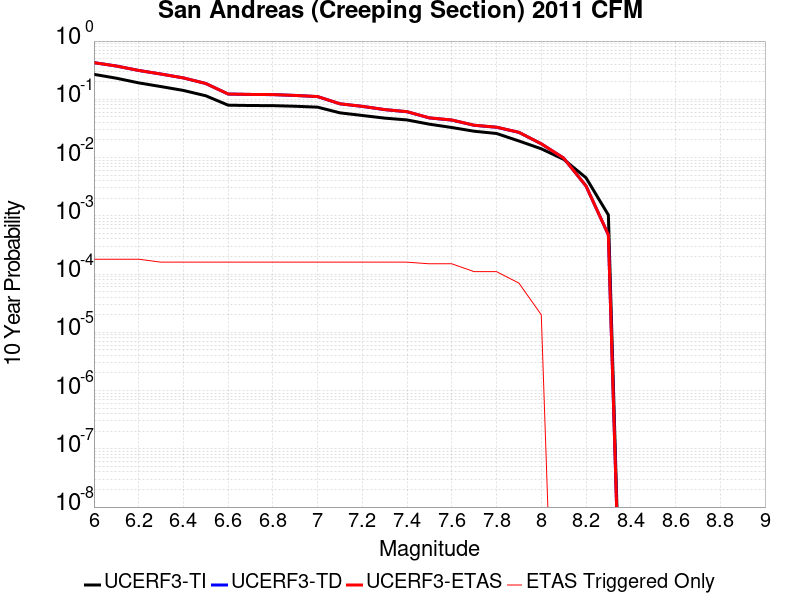 |

| Magnitude | 1 wk TI Prob | 1 wk TD Prob | 1 wk ETAS Prob | 1 wk ETAS/TD Gain | 1 wk ETAS Triggered Only | 1 mo TI Prob | 1 mo TD Prob | 1 mo ETAS Prob | 1 mo ETAS/TD Gain | 1 mo ETAS Triggered Only | 1 yr TI Prob | 1 yr TD Prob | 1 yr ETAS Prob | 1 yr ETAS/TD Gain | 1 yr ETAS Triggered Only | 10 yr TI Prob | 10 yr TD Prob | 10 yr ETAS Prob | 10 yr ETAS/TD Gain | 10 yr ETAS Triggered Only |
|-----|-----|-----|-----|-----|-----|-----|-----|-----|-----|-----|-----|-----|-----|-----|-----|-----|-----|-----|-----|-----|
| 6.0 | 5.986481E-4 | 0.0012275929 | 0.0013074947 | 1.0650882 | 8.0E-5 | 0.0025631124 | 0.005245547 | 0.0053450223 | 1.0189638 | 1.0E-4 | 0.030762846 | 0.06120491 | 0.061317567 | 1.0018406 | 1.2E-4 | 0.26835477 | 0.42593494 | 0.42603827 | 1.0002426 | 1.8E-4 |
| 6.1 | 5.015945E-4 | 0.0010217986 | 0.0011017168 | 1.0782133 | 8.0E-5 | 0.00214792 | 0.0043678596 | 0.0044674226 | 1.0227945 | 1.0E-4 | 0.025839351 | 0.05124837 | 0.05136222 | 1.0022216 | 1.2E-4 | 0.23032776 | 0.37285668 | 0.37296957 | 1.0003028 | 1.8E-4 |
| 6.2 | 4.073338E-4 | 8.1073755E-4 | 8.906727E-4 | 1.0985956 | 8.0E-5 | 0.0017445484 | 0.0034671477 | 0.0035668008 | 1.0287422 | 1.0E-4 | 0.021034058 | 0.04093317 | 0.041048255 | 1.0028116 | 1.2E-4 | 0.19150782 | 0.31303346 | 0.3131571 | 1.000395 | 1.8E-4 |
| 6.3 | 3.464099E-4 | 6.7391695E-4 | 7.53863E-4 | 1.118629 | 8.0E-5 | 0.0014837692 | 0.0028829593 | 0.0029826711 | 1.0345865 | 1.0E-4 | 0.017915873 | 0.034189582 | 0.03430548 | 1.0033898 | 1.2E-4 | 0.16538359 | 0.2713166 | 0.27143317 | 1.0004297 | 1.6E-4 |
| 6.4 | 2.935057E-4 | 5.5442745E-4 | 6.3438306E-4 | 1.144213 | 8.0E-5 | 0.0012572751 | 0.0023725363 | 0.0024722992 | 1.0420489 | 1.0E-4 | 0.015200248 | 0.02826451 | 0.028381119 | 1.0041256 | 1.2E-4 | 0.14201577 | 0.23298529 | 0.23310801 | 1.0005268 | 1.6E-4 |
| 6.5 | 2.3409708E-4 | 4.2093755E-4 | 5.009039E-4 | 1.1899719 | 8.0E-5 | 0.0010028875 | 0.0018019684 | 0.0019017883 | 1.0553949 | 1.0E-4 | 0.012141965 | 0.021587461 | 0.021704871 | 1.0054388 | 1.2E-4 | 0.11499573 | 0.18682368 | 0.18695378 | 1.0006964 | 1.6E-4 |
| 6.6 | 1.5842178E-4 | 2.506933E-4 | 3.3067324E-4 | 1.319035 | 8.0E-5 | 6.7877385E-4 | 0.0010739497 | 0.0011738423 | 1.0930142 | 1.0E-4 | 0.0082328 | 0.012995575 | 0.013114016 | 1.0091139 | 1.2E-4 | 0.07934396 | 0.12314638 | 0.12328667 | 1.0011393 | 1.6E-4 |
| 6.7 | 1.5616413E-4 | 2.4605883E-4 | 3.2603912E-4 | 1.3250455 | 8.0E-5 | 6.691031E-4 | 0.0010541069 | 0.0011540015 | 1.0947671 | 1.0E-4 | 0.0081159435 | 0.01275744 | 0.012875909 | 1.0092863 | 1.2E-4 | 0.0782586 | 0.12117351 | 0.12131412 | 1.0011604 | 1.6E-4 |
| 6.8 | 1.5538467E-4 | 2.4429744E-4 | 3.242779E-4 | 1.3273896 | 8.0E-5 | 6.6576427E-4 | 0.0010465645 | 0.0011464598 | 1.0954508 | 1.0E-4 | 0.008075596 | 0.012666838 | 0.012785318 | 1.0093535 | 1.2E-4 | 0.07788358 | 0.120404355 | 0.12054509 | 1.0011688 | 1.6E-4 |
| 6.9 | 1.5153569E-4 | 2.3539034E-4 | 3.153715E-4 | 1.339781 | 8.0E-5 | 6.49277E-4 | 0.0010084276 | 0.0011083268 | 1.0990642 | 1.0E-4 | 0.007876333 | 0.01220901 | 0.012327545 | 1.0097088 | 1.2E-4 | 0.07602952 | 0.11647445 | 0.11661581 | 1.0012137 | 1.6E-4 |
| 7.0 | 1.4588932E-4 | 2.2396253E-4 | 3.0394463E-4 | 1.3571225 | 8.0E-5 | 6.250901E-4 | 9.5948833E-4 | 0.0010593924 | 1.1041222 | 1.0E-4 | 0.0075839474 | 0.011619697 | 0.011738302 | 1.0102073 | 1.2E-4 | 0.073302895 | 0.11132046 | 0.111462645 | 1.0012773 | 1.6E-4 |
| 7.1 | 1.1565079E-4 | 1.6281738E-4 | 2.4280435E-4 | 1.491268 | 8.0E-5 | 4.955521E-4 | 6.9760304E-4 | 7.9753326E-4 | 1.143248 | 1.0E-4 | 0.006016669 | 0.0084604435 | 0.008579428 | 1.0140636 | 1.2E-4 | 0.058563538 | 0.08367046 | 0.08381707 | 1.0017523 | 1.6E-4 |
| 7.2 | 1.0393792E-4 | 1.4615769E-4 | 2.2614599E-4 | 1.547274 | 8.0E-5 | 4.4537216E-4 | 6.2624045E-4 | 7.261778E-4 | 1.1595831 | 1.0E-4 | 0.005408933 | 0.0075979927 | 0.007717081 | 1.0156736 | 1.2E-4 | 0.052791595 | 0.07561969 | 0.07576759 | 1.0019559 | 1.6E-4 |
| 7.3 | 9.332884E-5 | 1.2780898E-4 | 2.0779876E-4 | 1.6258541 | 8.0E-5 | 3.999194E-4 | 5.4763845E-4 | 6.475837E-4 | 1.1825023 | 1.0E-4 | 0.0048581534 | 0.006647249 | 0.0067664515 | 1.0179325 | 1.2E-4 | 0.047533102 | 0.06648326 | 0.06663262 | 1.0022466 | 1.6E-4 |
| 7.4 | 8.670252E-5 | 1.17032345E-4 | 1.9702298E-4 | 1.6834917 | 8.0E-5 | 3.715293E-4 | 5.0147134E-4 | 6.014212E-4 | 1.1993132 | 1.0E-4 | 0.004513991 | 0.006088443 | 0.0062077125 | 1.0195894 | 1.2E-4 | 0.044233937 | 0.061151642 | 0.06130186 | 1.0024564 | 1.6E-4 |
| 7.5 | 7.3036405E-5 | 9.005856E-5 | 1.7005135E-4 | 1.8882309 | 8.0E-5 | 3.129756E-4 | 3.8590826E-4 | 4.8586968E-4 | 1.2590289 | 1.0E-4 | 0.0038038217 | 0.0046883323 | 0.0047978167 | 1.0233525 | 1.1E-4 | 0.03739367 | 0.047877792 | 0.048020612 | 1.002983 | 1.5E-4 |
| 7.6 | 6.3935775E-5 | 8.280385E-5 | 1.6279722E-4 | 1.9660587 | 8.0E-5 | 2.7398168E-4 | 3.5482543E-4 | 4.5478996E-4 | 1.2817287 | 1.0E-4 | 0.0033306254 | 0.004311461 | 0.004420987 | 1.0254034 | 1.1E-4 | 0.032811474 | 0.04399201 | 0.04413541 | 1.0032597 | 1.5E-4 |
| 7.7 | 5.5050095E-5 | 6.6618326E-5 | 1.16614996E-4 | 1.7504942 | 5.0E-5 | 2.3590765E-4 | 2.854759E-4 | 3.554559E-4 | 1.2451346 | 7.0E-5 | 0.0028683927 | 0.003470134 | 0.003539891 | 1.0201021 | 7.0E-5 | 0.0283165 | 0.035796214 | 0.035902277 | 1.002963 | 1.1E-4 |
| 7.8 | 5.027131E-5 | 6.162871E-5 | 1.11625624E-4 | 1.8112602 | 5.0E-5 | 2.1543067E-4 | 2.640963E-4 | 3.340778E-4 | 1.2649848 | 7.0E-5 | 0.0026197135 | 0.003210635 | 0.0032804103 | 1.0217326 | 7.0E-5 | 0.025890453 | 0.03312666 | 0.033233017 | 1.0032105 | 1.1E-4 |
| 7.9 | 3.7271806E-5 | 5.022507E-5 | 9.022306E-5 | 1.796375 | 4.0E-5 | 1.5972654E-4 | 2.1523255E-4 | 2.7521962E-4 | 1.2787082 | 6.0E-5 | 0.0019429359 | 0.002617309 | 0.0026771522 | 1.0228643 | 6.0E-5 | 0.019260362 | 0.027067466 | 0.02713557 | 1.0025162 | 7.0E-5 |
| 8.0 | 2.7310243E-5 | 3.1427757E-5 | 5.142713E-5 | 1.6363602 | 2.0E-5 | 1.17038646E-4 | 1.3468343E-4 | 1.5468075E-4 | 1.1484764 | 2.0E-5 | 0.0014240141 | 0.0016385383 | 0.0016585055 | 1.012186 | 2.0E-5 | 0.014149235 | 0.01721386 | 0.017233515 | 1.0011419 | 2.0E-5 |
| 8.1 | 1.7940547E-5 | 1.7399378E-5 | 1.7399378E-5 | 1.0 | 0.0 | 7.688579E-5 | 7.456663E-5 | 7.456663E-5 | 1.0 | 0.0 | 9.3568244E-4 | 9.074711E-4 | 9.074711E-4 | 1.0 | 0.0 | 0.009317525 | 0.009798636 | 0.009798636 | 1.0 | 0.0 |
| 8.2 | 8.643924E-6 | 5.473668E-6 | 5.473668E-6 | 1.0 | 0.0 | 3.704486E-5 | 2.3458366E-5 | 2.3458366E-5 | 1.0 | 0.0 | 4.5092785E-4 | 2.8556827E-4 | 2.8556827E-4 | 1.0 | 0.0 | 0.0045001395 | 0.0032481793 | 0.0032481793 | 1.0 | 0.0 |
| 8.3 | 1.983087E-6 | 7.6564595E-7 | 7.6564595E-7 | 1.0 | 0.0 | 8.498917E-6 | 3.281336E-6 | 3.281336E-6 | 1.0 | 0.0 | 1.034694E-4 | 3.9949547E-5 | 3.9949547E-5 | 1.0 | 0.0 | 0.0010342124 | 4.717979E-4 | 4.717979E-4 | 1.0 | 0.0 |

## Tin Mountain
*[(top)](#table-of-contents)*

| 1 Week | 1 Month | 1 Year | 10 Year |
|-----|-----|-----|-----|
|  |  |  | 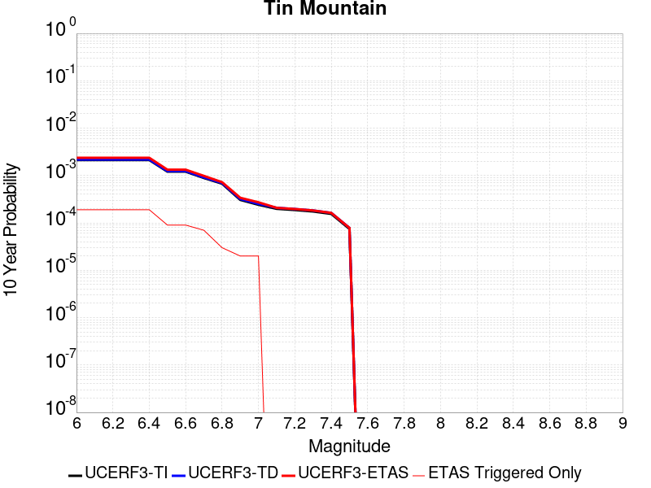 |

| Magnitude | 1 wk TI Prob | 1 wk TD Prob | 1 wk ETAS Prob | 1 wk ETAS/TD Gain | 1 wk ETAS Triggered Only | 1 mo TI Prob | 1 mo TD Prob | 1 mo ETAS Prob | 1 mo ETAS/TD Gain | 1 mo ETAS Triggered Only | 1 yr TI Prob | 1 yr TD Prob | 1 yr ETAS Prob | 1 yr ETAS/TD Gain | 1 yr ETAS Triggered Only | 10 yr TI Prob | 10 yr TD Prob | 10 yr ETAS Prob | 10 yr ETAS/TD Gain | 10 yr ETAS Triggered Only |
|-----|-----|-----|-----|-----|-----|-----|-----|-----|-----|-----|-----|-----|-----|-----|-----|-----|-----|-----|-----|-----|
| 6.0 | 4.083776E-6 | 4.1815365E-6 | 6.418129E-5 | 15.348732 | 6.0E-5 | 1.750178E-5 | 1.792077E-5 | 1.1791898E-4 | 6.5800176 | 1.0E-4 | 2.1306332E-4 | 2.1816725E-4 | 3.4813888E-4 | 1.5957432 | 1.3E-4 | 0.0021285915 | 0.0021798965 | 0.002369482 | 1.0869701 | 1.9E-4 |
| 6.1 | 4.083776E-6 | 4.1815365E-6 | 6.418129E-5 | 15.348732 | 6.0E-5 | 1.750178E-5 | 1.792077E-5 | 1.1791898E-4 | 6.5800176 | 1.0E-4 | 2.1306332E-4 | 2.1816725E-4 | 3.4813888E-4 | 1.5957432 | 1.3E-4 | 0.0021285915 | 0.0021798965 | 0.002369482 | 1.0869701 | 1.9E-4 |
| 6.2 | 4.083776E-6 | 4.1815365E-6 | 6.418129E-5 | 15.348732 | 6.0E-5 | 1.750178E-5 | 1.792077E-5 | 1.1791898E-4 | 6.5800176 | 1.0E-4 | 2.1306332E-4 | 2.1816725E-4 | 3.4813888E-4 | 1.5957432 | 1.3E-4 | 0.0021285915 | 0.0021798965 | 0.002369482 | 1.0869701 | 1.9E-4 |
| 6.3 | 4.083776E-6 | 4.1815365E-6 | 6.418129E-5 | 15.348732 | 6.0E-5 | 1.750178E-5 | 1.792077E-5 | 1.1791898E-4 | 6.5800176 | 1.0E-4 | 2.1306332E-4 | 2.1816725E-4 | 3.4813888E-4 | 1.5957432 | 1.3E-4 | 0.0021285915 | 0.0021798965 | 0.002369482 | 1.0869701 | 1.9E-4 |
| 6.4 | 4.083776E-6 | 4.1815365E-6 | 6.418129E-5 | 15.348732 | 6.0E-5 | 1.750178E-5 | 1.792077E-5 | 1.1791898E-4 | 6.5800176 | 1.0E-4 | 2.1306332E-4 | 2.1816725E-4 | 3.4813888E-4 | 1.5957432 | 1.3E-4 | 0.0021285915 | 0.0021798965 | 0.002369482 | 1.0869701 | 1.9E-4 |
| 6.5 | 2.3143427E-6 | 2.3731573E-6 | 3.2373086E-5 | 13.641357 | 3.0E-5 | 9.9185745E-6 | 1.0170638E-5 | 6.017013E-5 | 5.9160624 | 5.0E-5 | 1.2075195E-4 | 1.2382126E-4 | 1.7381506E-4 | 1.4037579 | 5.0E-5 | 0.0012068636 | 0.0012375986 | 0.0013274873 | 1.0726315 | 9.0E-5 |
| 6.6 | 2.3143427E-6 | 2.3731573E-6 | 3.2373086E-5 | 13.641357 | 3.0E-5 | 9.9185745E-6 | 1.0170638E-5 | 6.017013E-5 | 5.9160624 | 5.0E-5 | 1.2075195E-4 | 1.2382126E-4 | 1.7381506E-4 | 1.4037579 | 5.0E-5 | 0.0012068636 | 0.0012375986 | 0.0013274873 | 1.0726315 | 9.0E-5 |
| 6.7 | 1.7029532E-6 | 1.7497915E-6 | 2.1749756E-5 | 12.4299135 | 2.0E-5 | 7.2983503E-6 | 7.499088E-6 | 3.7498863E-5 | 5.0004563 | 3.0E-5 | 8.885379E-5 | 9.1298105E-5 | 1.21295365E-4 | 1.3285639 | 3.0E-5 | 8.881827E-4 | 9.1265864E-4 | 9.825947E-4 | 1.076629 | 7.0E-5 |
| 6.8 | 1.2914646E-6 | 1.3299378E-6 | 1.1329925E-5 | 8.519138 | 1.0E-5 | 5.534837E-6 | 5.6997237E-6 | 1.5699667E-5 | 2.754461 | 1.0E-5 | 6.738455E-5 | 6.939237E-5 | 7.939168E-5 | 1.144098 | 1.0E-5 | 6.736412E-4 | 6.9375033E-4 | 7.2372955E-4 | 1.0432132 | 3.0E-5 |
| 6.9 | 5.8708974E-7 | 6.1169936E-7 | 1.0611693E-5 | 17.347889 | 1.0E-5 | 2.5160964E-6 | 2.6215664E-6 | 1.262154E-5 | 4.8145037 | 1.0E-5 | 3.0633044E-5 | 3.1917145E-5 | 4.1916825E-5 | 1.3133012 | 1.0E-5 | 3.0628822E-4 | 3.191297E-4 | 3.3912333E-4 | 1.0626504 | 2.0E-5 |
| 7.0 | 4.6248786E-7 | 4.832015E-7 | 1.0483197E-5 | 21.69529 | 1.0E-5 | 1.9820893E-6 | 2.0708624E-6 | 1.2070842E-5 | 5.8288965 | 1.0E-5 | 2.413167E-5 | 2.5212494E-5 | 3.521224E-5 | 1.3966187 | 1.0E-5 | 2.412905E-4 | 2.5210003E-4 | 2.72095E-4 | 1.0793136 | 2.0E-5 |
| 7.1 | 3.804606E-7 | 3.987147E-7 | 3.987147E-7 | 1.0 | 0.0 | 1.6305444E-6 | 1.7087764E-6 | 1.7087764E-6 | 1.0 | 0.0 | 1.9851697E-5 | 2.0804187E-5 | 2.0804187E-5 | 1.0 | 0.0 | 1.9849923E-4 | 2.0802575E-4 | 2.0802575E-4 | 1.0 | 0.0 |
| 7.2 | 3.5864858E-7 | 3.7616863E-7 | 3.7616863E-7 | 1.0 | 0.0 | 1.5370645E-6 | 1.6121504E-6 | 1.6121504E-6 | 1.0 | 0.0 | 1.87136E-5 | 1.9627789E-5 | 1.9627789E-5 | 1.0 | 0.0 | 1.8712023E-4 | 1.9626386E-4 | 1.9626386E-4 | 1.0 | 0.0 |
| 7.3 | 3.342063E-7 | 3.506347E-7 | 3.506347E-7 | 1.0 | 0.0 | 1.4323119E-6 | 1.5027196E-6 | 1.5027196E-6 | 1.0 | 0.0 | 1.7438259E-5 | 1.829549E-5 | 1.829549E-5 | 1.0 | 0.0 | 1.743689E-4 | 1.8294314E-4 | 1.8294314E-4 | 1.0 | 0.0 |
| 7.4 | 2.971242E-7 | 3.1165817E-7 | 3.1165817E-7 | 1.0 | 0.0 | 1.2733886E-6 | 1.3356774E-6 | 1.3356774E-6 | 1.0 | 0.0 | 1.5503398E-5 | 1.6261785E-5 | 1.6261785E-5 | 1.0 | 0.0 | 1.5502315E-4 | 1.6260923E-4 | 1.6260923E-4 | 1.0 | 0.0 |
| 7.5 | 1.4326713E-7 | 1.5012525E-7 | 1.5012525E-7 | 1.0 | 0.0 | 6.140018E-7 | 6.433939E-7 | 6.433939E-7 | 1.0 | 0.0 | 7.4754466E-6 | 7.8333205E-6 | 7.8333205E-6 | 1.0 | 0.0 | 7.475195E-5 | 7.833321E-5 | 7.833321E-5 | 1.0 | 0.0 |

## Mission Ridge-Arroyo Parida-Santa Ana
*[(top)](#table-of-contents)*

| 1 Week | 1 Month | 1 Year | 10 Year |
|-----|-----|-----|-----|
| 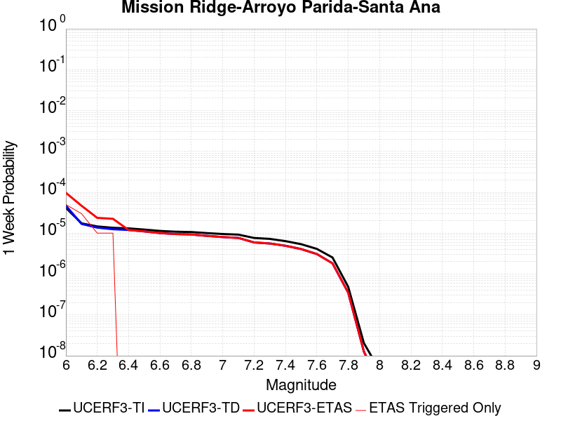 |  |  |  |

| Magnitude | 1 wk TI Prob | 1 wk TD Prob | 1 wk ETAS Prob | 1 wk ETAS/TD Gain | 1 wk ETAS Triggered Only | 1 mo TI Prob | 1 mo TD Prob | 1 mo ETAS Prob | 1 mo ETAS/TD Gain | 1 mo ETAS Triggered Only | 1 yr TI Prob | 1 yr TD Prob | 1 yr ETAS Prob | 1 yr ETAS/TD Gain | 1 yr ETAS Triggered Only | 10 yr TI Prob | 10 yr TD Prob | 10 yr ETAS Prob | 10 yr ETAS/TD Gain | 10 yr ETAS Triggered Only |
|-----|-----|-----|-----|-----|-----|-----|-----|-----|-----|-----|-----|-----|-----|-----|-----|-----|-----|-----|-----|-----|
| 6.0 | 4.169034E-5 | 4.7137048E-5 | 9.713469E-5 | 2.0606868 | 5.0E-5 | 1.7866064E-4 | 2.0200513E-4 | 2.7199098E-4 | 1.3464558 | 7.0E-5 | 0.0021730233 | 0.0024574657 | 0.00255722 | 1.0405923 | 1.0E-4 | 0.021518968 | 0.02438483 | 0.024540927 | 1.0064014 | 1.6E-4 |
| 6.1 | 1.73813E-5 | 1.6854203E-5 | 4.6853696E-5 | 2.7799413 | 3.0E-5 | 7.4489166E-5 | 7.223036E-5 | 1.02228194E-4 | 1.4153078 | 3.0E-5 | 9.065282E-4 | 8.790605E-4 | 9.2901656E-4 | 1.0568289 | 5.0E-5 | 0.009028391 | 0.008757128 | 0.008816604 | 1.0067916 | 6.0E-5 |
| 6.2 | 1.4622182E-5 | 1.3673262E-5 | 2.3673127E-5 | 1.7313443 | 1.0E-5 | 6.2664985E-5 | 5.85984E-5 | 6.8597816E-5 | 1.1706431 | 1.0E-5 | 7.6267915E-4 | 7.132059E-4 | 7.431845E-4 | 1.0420336 | 3.0E-5 | 0.007600669 | 0.007109767 | 0.0071494826 | 1.005586 | 4.0E-5 |
| 6.3 | 1.3552434E-5 | 1.2482174E-5 | 2.2482049E-5 | 1.8011326 | 1.0E-5 | 5.8080568E-5 | 5.349395E-5 | 6.349342E-5 | 1.1869271 | 1.0E-5 | 7.069015E-4 | 6.510974E-4 | 6.810778E-4 | 1.046046 | 3.0E-5 | 0.00704657 | 0.006492415 | 0.006532155 | 1.006121 | 4.0E-5 |
| 6.4 | 1.30977305E-5 | 1.1979128E-5 | 1.1979128E-5 | 1.0 | 0.0 | 5.613192E-5 | 5.133813E-5 | 5.133813E-5 | 1.0 | 0.0 | 6.831918E-4 | 6.2486547E-4 | 6.44853E-4 | 1.0319868 | 2.0E-5 | 0.006810953 | 0.006231584 | 0.006261397 | 1.0047842 | 3.0E-5 |
| 6.5 | 1.225205E-5 | 1.1048776E-5 | 1.1048776E-5 | 1.0 | 0.0 | 5.2507727E-5 | 4.735105E-5 | 4.735105E-5 | 1.0 | 0.0 | 6.3909404E-4 | 5.7634927E-4 | 5.963377E-4 | 1.0346812 | 2.0E-5 | 0.006372592 | 0.005749009 | 0.0057788366 | 1.0051883 | 3.0E-5 |
| 6.6 | 1.1352241E-5 | 1.0063508E-5 | 1.0063508E-5 | 1.0 | 0.0 | 4.8651553E-5 | 4.3128617E-5 | 4.3128617E-5 | 1.0 | 0.0 | 5.921717E-4 | 5.249665E-4 | 5.349613E-4 | 1.0190388 | 1.0E-5 | 0.0059059616 | 0.0052376646 | 0.0052575595 | 1.0037985 | 2.0E-5 |
| 6.7 | 1.0864116E-5 | 9.517E-6 | 9.517E-6 | 1.0 | 0.0 | 4.6559664E-5 | 4.0786515E-5 | 4.0786515E-5 | 1.0 | 0.0 | 5.667165E-4 | 4.964647E-4 | 5.0645974E-4 | 1.0201324 | 1.0E-5 | 0.005652734 | 0.0049539437 | 0.0049738446 | 1.0040172 | 2.0E-5 |
| 6.8 | 1.0666365E-5 | 9.299752E-6 | 9.299752E-6 | 1.0 | 0.0 | 4.571219E-5 | 3.985548E-5 | 3.985548E-5 | 1.0 | 0.0 | 5.564038E-4 | 4.8513446E-4 | 4.951296E-4 | 1.0206028 | 1.0E-5 | 0.005550127 | 0.00484114 | 0.0048610433 | 1.0041113 | 2.0E-5 |
| 6.9 | 1.0038665E-5 | 8.592018E-6 | 8.592018E-6 | 1.0 | 0.0 | 4.302214E-5 | 3.682243E-5 | 3.682243E-5 | 1.0 | 0.0 | 5.236687E-4 | 4.4822265E-4 | 4.5821816E-4 | 1.0223004 | 1.0E-5 | 0.005224364 | 0.0044735507 | 0.0044934615 | 1.0044507 | 2.0E-5 |
| 7.0 | 9.5379955E-6 | 8.025047E-6 | 8.025047E-6 | 1.0 | 0.0 | 4.0876483E-5 | 3.439261E-5 | 3.439261E-5 | 1.0 | 0.0 | 4.975576E-4 | 4.1865133E-4 | 4.2864712E-4 | 1.0238762 | 1.0E-5 | 0.00496445 | 0.00417898 | 0.0041988962 | 1.0047659 | 2.0E-5 |
| 7.1 | 9.207389E-6 | 7.652347E-6 | 7.652347E-6 | 1.0 | 0.0 | 3.945964E-5 | 3.2795375E-5 | 3.2795375E-5 | 1.0 | 0.0 | 4.803152E-4 | 3.992122E-4 | 3.992122E-4 | 1.0 | 0.0 | 0.004792784 | 0.003985301 | 0.003995261 | 1.0024992 | 1.0E-5 |
| 7.2 | 7.638091E-6 | 5.9310923E-6 | 5.9310923E-6 | 1.0 | 0.0 | 3.2734264E-5 | 2.5418722E-5 | 2.5418722E-5 | 1.0 | 0.0 | 3.984668E-4 | 3.094293E-4 | 3.094293E-4 | 1.0 | 0.0 | 0.0039775306 | 0.0030901956 | 0.0031001647 | 1.003226 | 1.0E-5 |
| 7.3 | 7.2500147E-6 | 5.596131E-6 | 5.596131E-6 | 1.0 | 0.0 | 3.1071122E-5 | 2.3983199E-5 | 2.3983199E-5 | 1.0 | 0.0 | 3.7822526E-4 | 2.9195662E-4 | 2.9195662E-4 | 1.0 | 0.0 | 0.0037758215 | 0.0029159402 | 0.0029259112 | 1.0034194 | 1.0E-5 |
| 7.4 | 6.3899715E-6 | 4.9184864E-6 | 4.9184864E-6 | 1.0 | 0.0 | 2.7385306E-5 | 2.1079059E-5 | 2.1079059E-5 | 1.0 | 0.0 | 3.3336508E-4 | 2.566075E-4 | 2.566075E-4 | 1.0 | 0.0 | 0.0033286542 | 0.002563311 | 0.0025732853 | 1.0038912 | 1.0E-5 |
| 7.5 | 5.379025E-6 | 4.0838477E-6 | 4.0838477E-6 | 1.0 | 0.0 | 2.305276E-5 | 1.7502087E-5 | 1.7502087E-5 | 1.0 | 0.0 | 2.806312E-4 | 2.1306718E-4 | 2.1306718E-4 | 1.0 | 0.0 | 0.0028027708 | 0.0021286402 | 0.0021286402 | 1.0 | 0.0 |
| 7.6 | 4.1270696E-6 | 3.0883373E-6 | 3.0883373E-6 | 1.0 | 0.0 | 1.768732E-5 | 1.32356645E-5 | 1.32356645E-5 | 1.0 | 0.0 | 2.1532185E-4 | 1.6113237E-4 | 1.6113237E-4 | 1.0 | 0.0 | 0.0021511333 | 0.0016101635 | 0.0016101635 | 1.0 | 0.0 |
| 7.7 | 2.5406805E-6 | 1.8282044E-6 | 1.8282044E-6 | 1.0 | 0.0 | 1.0888585E-5 | 7.835139E-6 | 7.835139E-6 | 1.0 | 0.0 | 1.3256045E-4 | 9.53887E-5 | 9.53887E-5 | 1.0 | 0.0 | 0.0013248142 | 9.534837E-4 | 9.534837E-4 | 1.0 | 0.0 |
| 7.8 | 4.8608285E-7 | 3.509864E-7 | 3.509864E-7 | 1.0 | 0.0 | 2.0832106E-6 | 1.5042266E-6 | 1.5042266E-6 | 1.0 | 0.0 | 2.5362791E-5 | 1.8313805E-5 | 1.8313805E-5 | 1.0 | 0.0 | 2.5359896E-4 | 1.8312308E-4 | 1.8312308E-4 | 1.0 | 0.0 |
| 7.9 | 2.0472514E-8 | 1.2688718E-8 | 1.2688718E-8 | 1.0 | 0.0 | 8.7739345E-8 | 5.438022E-8 | 5.438022E-8 | 1.0 | 0.0 | 1.068226E-6 | 6.6207895E-7 | 6.6207895E-7 | 1.0 | 0.0 | 1.0682209E-5 | 6.620771E-6 | 6.620771E-6 | 1.0 | 0.0 |
| 8.0 | 4.443582E-9 | 2.032067E-9 | 2.032067E-9 | 1.0 | 0.0 | 1.9043922E-8 | 8.7088585E-9 | 8.7088585E-9 | 1.0 | 0.0 | 2.3185973E-7 | 1.0603035E-7 | 1.0603035E-7 | 1.0 | 0.0 | 2.3185949E-6 | 1.0603031E-6 | 1.0603031E-6 | 1.0 | 0.0 |

## Chino alt 1
*[(top)](#table-of-contents)*

| 1 Week | 1 Month | 1 Year | 10 Year |
|-----|-----|-----|-----|
|  |  |  |  |

| Magnitude | 1 wk TI Prob | 1 wk TD Prob | 1 wk ETAS Prob | 1 wk ETAS/TD Gain | 1 wk ETAS Triggered Only | 1 mo TI Prob | 1 mo TD Prob | 1 mo ETAS Prob | 1 mo ETAS/TD Gain | 1 mo ETAS Triggered Only | 1 yr TI Prob | 1 yr TD Prob | 1 yr ETAS Prob | 1 yr ETAS/TD Gain | 1 yr ETAS Triggered Only | 10 yr TI Prob | 10 yr TD Prob | 10 yr ETAS Prob | 10 yr ETAS/TD Gain | 10 yr ETAS Triggered Only |
|-----|-----|-----|-----|-----|-----|-----|-----|-----|-----|-----|-----|-----|-----|-----|-----|-----|-----|-----|-----|-----|
| 6.0 | 3.939946E-5 | 4.894798E-5 | 1.2894407E-4 | 2.634308 | 8.0E-5 | 1.6884391E-4 | 2.0976314E-4 | 3.2973796E-4 | 1.5719539 | 1.2E-4 | 0.0020537362 | 0.002551385 | 0.002691028 | 1.0547322 | 1.4E-4 | 0.020348595 | 0.025280168 | 0.025455618 | 1.0069402 | 1.8E-4 |
| 6.1 | 2.1505624E-5 | 2.6878823E-5 | 7.687748E-5 | 2.8601506 | 5.0E-5 | 9.2163704E-5 | 1.15190494E-4 | 1.8518243E-4 | 1.607619 | 7.0E-5 | 0.0011215154 | 0.0014016517 | 0.0014815395 | 1.0569955 | 8.0E-5 | 0.011158722 | 0.013947425 | 0.01404603 | 1.0070698 | 1.0E-4 |
| 6.2 | 2.1505624E-5 | 2.6878823E-5 | 7.687748E-5 | 2.8601506 | 5.0E-5 | 9.2163704E-5 | 1.15190494E-4 | 1.8518243E-4 | 1.607619 | 7.0E-5 | 0.0011215154 | 0.0014016517 | 0.0014815395 | 1.0569955 | 8.0E-5 | 0.011158722 | 0.013947425 | 0.01404603 | 1.0070698 | 1.0E-4 |
| 6.3 | 1.4290785E-5 | 1.8164832E-5 | 2.816465E-5 | 1.5505043 | 1.0E-5 | 6.1244784E-5 | 7.784722E-5 | 9.784566E-5 | 1.2568935 | 2.0E-5 | 7.454001E-4 | 9.4742293E-4 | 9.773945E-4 | 1.0316348 | 3.0E-5 | 0.007429048 | 0.00944674 | 0.009486362 | 1.0041943 | 4.0E-5 |
| 6.4 | 1.4290785E-5 | 1.8164832E-5 | 2.816465E-5 | 1.5505043 | 1.0E-5 | 6.1244784E-5 | 7.784722E-5 | 9.784566E-5 | 1.2568935 | 2.0E-5 | 7.454001E-4 | 9.4742293E-4 | 9.773945E-4 | 1.0316348 | 3.0E-5 | 0.007429048 | 0.00944674 | 0.009486362 | 1.0041943 | 4.0E-5 |
| 6.5 | 1.3017944E-5 | 1.6651793E-5 | 2.6651625E-5 | 1.600526 | 1.0E-5 | 5.5789995E-5 | 7.1363116E-5 | 9.136169E-5 | 1.2802368 | 2.0E-5 | 6.790315E-4 | 8.6854334E-4 | 8.985173E-4 | 1.0345106 | 3.0E-5 | 0.0067696036 | 0.008664233 | 0.0087038865 | 1.0045767 | 4.0E-5 |
| 6.6 | 9.470016E-6 | 1.2039209E-5 | 2.2039088E-5 | 1.8306093 | 1.0E-5 | 4.058515E-5 | 5.159578E-5 | 7.1594746E-5 | 1.3876086 | 2.0E-5 | 4.940122E-4 | 6.280315E-4 | 6.4801896E-4 | 1.0318255 | 2.0E-5 | 0.004929154 | 0.006273248 | 0.0063030594 | 1.0047522 | 3.0E-5 |
| 6.7 | 8.314155E-6 | 1.040749E-5 | 2.0407386E-5 | 1.9608364 | 1.0E-5 | 3.5631605E-5 | 4.4602948E-5 | 6.4602056E-5 | 1.4483808 | 2.0E-5 | 4.3372845E-4 | 5.4293784E-4 | 5.62927E-4 | 1.0368166 | 2.0E-5 | 0.004328829 | 0.0054270807 | 0.005456918 | 1.0054978 | 3.0E-5 |
| 6.8 | 3.4856364E-6 | 3.8134033E-6 | 1.38133655E-5 | 3.6223195 | 1.0E-5 | 1.4938357E-5 | 1.6343065E-5 | 2.6342903E-5 | 1.6118703 | 1.0E-5 | 1.8185932E-4 | 1.9896074E-4 | 2.0895875E-4 | 1.0502511 | 1.0E-5 | 0.0018171056 | 0.0019894529 | 0.002009413 | 1.010033 | 2.0E-5 |
| 6.9 | 2.2645952E-6 | 2.152909E-6 | 1.2152887E-5 | 5.6448684 | 1.0E-5 | 9.705372E-6 | 9.226722E-6 | 1.9226629E-5 | 2.0837986 | 1.0E-5 | 1.18156495E-4 | 1.12329755E-4 | 1.2232864E-4 | 1.0890136 | 1.0E-5 | 0.0011809369 | 0.0011233138 | 0.0011432914 | 1.0177845 | 2.0E-5 |
| 7.0 | 1.7864003E-6 | 1.5430741E-6 | 1.15430585E-5 | 7.4805603 | 1.0E-5 | 7.655979E-6 | 6.613158E-6 | 1.6613092E-5 | 2.512127 | 1.0E-5 | 9.3207556E-5 | 8.051228E-5 | 9.051148E-5 | 1.1241946 | 1.0E-5 | 9.316847E-4 | 8.052856E-4 | 8.1527757E-4 | 1.0124079 | 1.0E-5 |
| 7.1 | 1.7315456E-6 | 1.4733466E-6 | 1.1473332E-5 | 7.787259 | 1.0E-5 | 7.420889E-6 | 6.314328E-6 | 1.6314265E-5 | 2.58369 | 1.0E-5 | 9.034557E-5 | 7.687428E-5 | 8.6873515E-5 | 1.1300725 | 1.0E-5 | 9.0308854E-4 | 7.68921E-4 | 7.7891327E-4 | 1.0129952 | 1.0E-5 |
| 7.2 | 1.6008337E-6 | 1.3574178E-6 | 1.1357404E-5 | 8.366919 | 1.0E-5 | 6.860698E-6 | 5.817492E-6 | 1.5817433E-5 | 2.7189438 | 1.0E-5 | 8.352579E-5 | 7.082572E-5 | 8.082501E-5 | 1.1411817 | 1.0E-5 | 8.34944E-4 | 7.0846075E-4 | 7.1845367E-4 | 1.0141051 | 1.0E-5 |
| 7.3 | 1.3320939E-6 | 1.1217794E-6 | 1.1121769E-5 | 9.914398 | 1.0E-5 | 5.7089615E-6 | 4.8076176E-6 | 1.480757E-5 | 3.0800223 | 1.0E-5 | 6.9504385E-5 | 5.853122E-5 | 6.853064E-5 | 1.170839 | 1.0E-5 | 6.9482654E-4 | 5.8530655E-4 | 5.953007E-4 | 1.0170751 | 1.0E-5 |
| 7.4 | 1.114294E-6 | 9.237087E-7 | 1.09237E-5 | 11.825914 | 1.0E-5 | 4.775537E-6 | 3.9587458E-6 | 1.3958706E-5 | 3.5260427 | 1.0E-5 | 5.8140613E-5 | 4.81967E-5 | 5.8196216E-5 | 1.207473 | 1.0E-5 | 5.81254E-4 | 4.8187698E-4 | 4.9187214E-4 | 1.0207422 | 1.0E-5 |
| 7.5 | 9.354081E-7 | 7.6233886E-7 | 1.0762331E-5 | 14.1175165 | 1.0E-5 | 4.0088858E-6 | 3.2671626E-6 | 1.326713E-5 | 4.06075 | 1.0E-5 | 4.8807087E-5 | 3.9777013E-5 | 4.9776616E-5 | 1.2513915 | 1.0E-5 | 4.879637E-4 | 3.9770233E-4 | 4.0769836E-4 | 1.0251344 | 1.0E-5 |
| 7.6 | 8.521771E-7 | 6.880688E-7 | 1.0688062E-5 | 15.533421 | 1.0E-5 | 3.6521824E-6 | 2.948863E-6 | 1.29488335E-5 | 4.3911276 | 1.0E-5 | 4.4464414E-5 | 3.590185E-5 | 4.590149E-5 | 1.2785271 | 1.0E-5 | 4.4455516E-4 | 3.5896365E-4 | 3.6896006E-4 | 1.027848 | 1.0E-5 |
| 7.7 | 2.1803626E-7 | 1.4186368E-7 | 1.4186368E-7 | 1.0 | 0.0 | 9.344408E-7 | 6.0798715E-7 | 6.0798715E-7 | 1.0 | 0.0 | 1.1376757E-5 | 7.4022278E-6 | 7.4022278E-6 | 1.0 | 0.0 | 1.13761744E-4 | 7.402077E-5 | 7.402077E-5 | 1.0 | 0.0 |

## Cleghorn Pass
*[(top)](#table-of-contents)*

| 1 Week | 1 Month | 1 Year | 10 Year |
|-----|-----|-----|-----|
|  |  |  |  |

| Magnitude | 1 wk TI Prob | 1 wk TD Prob | 1 wk ETAS Prob | 1 wk ETAS/TD Gain | 1 wk ETAS Triggered Only | 1 mo TI Prob | 1 mo TD Prob | 1 mo ETAS Prob | 1 mo ETAS/TD Gain | 1 mo ETAS Triggered Only | 1 yr TI Prob | 1 yr TD Prob | 1 yr ETAS Prob | 1 yr ETAS/TD Gain | 1 yr ETAS Triggered Only | 10 yr TI Prob | 10 yr TD Prob | 10 yr ETAS Prob | 10 yr ETAS/TD Gain | 10 yr ETAS Triggered Only |
|-----|-----|-----|-----|-----|-----|-----|-----|-----|-----|-----|-----|-----|-----|-----|-----|-----|-----|-----|-----|-----|
| 6.0 | 1.0522846E-5 | 1.1040642E-5 | 9.103976E-5 | 8.245875 | 8.0E-5 | 4.509713E-5 | 4.7316473E-5 | 1.4731174E-4 | 3.1133287 | 1.0E-4 | 5.4891926E-4 | 5.759784E-4 | 6.959093E-4 | 1.2082211 | 1.2E-4 | 0.0054756533 | 0.005750022 | 0.0059190444 | 1.0293951 | 1.7E-4 |
| 6.1 | 1.0522846E-5 | 1.1040642E-5 | 9.103976E-5 | 8.245875 | 8.0E-5 | 4.509713E-5 | 4.7316473E-5 | 1.4731174E-4 | 3.1133287 | 1.0E-4 | 5.4891926E-4 | 5.759784E-4 | 6.959093E-4 | 1.2082211 | 1.2E-4 | 0.0054756533 | 0.005750022 | 0.0059190444 | 1.0293951 | 1.7E-4 |
| 6.2 | 2.1045846E-6 | 2.2082024E-6 | 3.2208136E-5 | 14.585681 | 3.0E-5 | 9.019617E-6 | 9.463714E-6 | 5.946324E-5 | 6.283288 | 5.0E-5 | 1.098083E-4 | 1.1521882E-4 | 1.6521306E-4 | 1.4339069 | 5.0E-5 | 0.0010975406 | 0.0011520023 | 0.0012019447 | 1.0433527 | 5.0E-5 |
| 6.3 | 2.1045846E-6 | 2.2082024E-6 | 3.2208136E-5 | 14.585681 | 3.0E-5 | 9.019617E-6 | 9.463714E-6 | 5.946324E-5 | 6.283288 | 5.0E-5 | 1.098083E-4 | 1.1521882E-4 | 1.6521306E-4 | 1.4339069 | 5.0E-5 | 0.0010975406 | 0.0011520023 | 0.0012019447 | 1.0433527 | 5.0E-5 |
| 6.4 | 1.7259927E-6 | 1.810877E-6 | 3.181082E-5 | 17.566528 | 3.0E-5 | 7.3970905E-6 | 7.760902E-6 | 5.7760513E-5 | 7.4425 | 5.0E-5 | 9.005586E-5 | 9.4488976E-5 | 1.4448425E-4 | 1.5291122 | 5.0E-5 | 9.001937E-4 | 9.448898E-4 | 9.948425E-4 | 1.0528662 | 5.0E-5 |

## Pleito
*[(top)](#table-of-contents)*

| 1 Week | 1 Month | 1 Year | 10 Year |
|-----|-----|-----|-----|
|  |  | 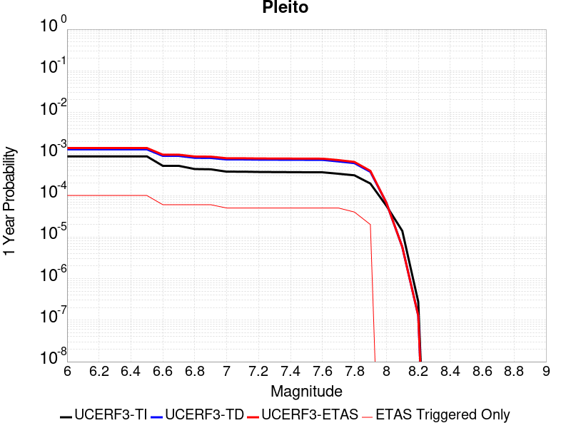 |  |

| Magnitude | 1 wk TI Prob | 1 wk TD Prob | 1 wk ETAS Prob | 1 wk ETAS/TD Gain | 1 wk ETAS Triggered Only | 1 mo TI Prob | 1 mo TD Prob | 1 mo ETAS Prob | 1 mo ETAS/TD Gain | 1 mo ETAS Triggered Only | 1 yr TI Prob | 1 yr TD Prob | 1 yr ETAS Prob | 1 yr ETAS/TD Gain | 1 yr ETAS Triggered Only | 10 yr TI Prob | 10 yr TD Prob | 10 yr ETAS Prob | 10 yr ETAS/TD Gain | 10 yr ETAS Triggered Only |
|-----|-----|-----|-----|-----|-----|-----|-----|-----|-----|-----|-----|-----|-----|-----|-----|-----|-----|-----|-----|-----|
| 6.0 | 1.6763008E-5 | 2.4764735E-5 | 6.476374E-5 | 2.61516 | 4.0E-5 | 7.183948E-5 | 1.0613067E-4 | 1.661243E-4 | 1.5652808 | 6.0E-5 | 8.742947E-4 | 0.001291447 | 0.0013913179 | 1.0773325 | 1.0E-4 | 0.00870863 | 0.012954412 | 0.013112339 | 1.012191 | 1.6E-4 |
| 6.1 | 1.6763008E-5 | 2.4764735E-5 | 6.476374E-5 | 2.61516 | 4.0E-5 | 7.183948E-5 | 1.0613067E-4 | 1.661243E-4 | 1.5652808 | 6.0E-5 | 8.742947E-4 | 0.001291447 | 0.0013913179 | 1.0773325 | 1.0E-4 | 0.00870863 | 0.012954412 | 0.013112339 | 1.012191 | 1.6E-4 |
| 6.2 | 1.6763008E-5 | 2.4764735E-5 | 6.476374E-5 | 2.61516 | 4.0E-5 | 7.183948E-5 | 1.0613067E-4 | 1.661243E-4 | 1.5652808 | 6.0E-5 | 8.742947E-4 | 0.001291447 | 0.0013913179 | 1.0773325 | 1.0E-4 | 0.00870863 | 0.012954412 | 0.013112339 | 1.012191 | 1.6E-4 |
| 6.3 | 1.6763008E-5 | 2.4764735E-5 | 6.476374E-5 | 2.61516 | 4.0E-5 | 7.183948E-5 | 1.0613067E-4 | 1.661243E-4 | 1.5652808 | 6.0E-5 | 8.742947E-4 | 0.001291447 | 0.0013913179 | 1.0773325 | 1.0E-4 | 0.00870863 | 0.012954412 | 0.013112339 | 1.012191 | 1.6E-4 |
| 6.4 | 1.6763008E-5 | 2.4764735E-5 | 6.476374E-5 | 2.61516 | 4.0E-5 | 7.183948E-5 | 1.0613067E-4 | 1.661243E-4 | 1.5652808 | 6.0E-5 | 8.742947E-4 | 0.001291447 | 0.0013913179 | 1.0773325 | 1.0E-4 | 0.00870863 | 0.012954412 | 0.013112339 | 1.012191 | 1.6E-4 |
| 6.5 | 1.6763008E-5 | 2.4764735E-5 | 6.476374E-5 | 2.61516 | 4.0E-5 | 7.183948E-5 | 1.0613067E-4 | 1.661243E-4 | 1.5652808 | 6.0E-5 | 8.742947E-4 | 0.001291447 | 0.0013913179 | 1.0773325 | 1.0E-4 | 0.00870863 | 0.012954412 | 0.013112339 | 1.012191 | 1.6E-4 |
| 6.6 | 9.910213E-6 | 1.721552E-5 | 4.7215002E-5 | 2.7425835 | 3.0E-5 | 4.247165E-5 | 7.3778734E-5 | 1.2377504E-4 | 1.677652 | 5.0E-5 | 5.169696E-4 | 8.9788967E-4 | 9.5783576E-4 | 1.0667634 | 6.0E-5 | 0.0051576863 | 0.009051226 | 0.009140411 | 1.0098534 | 9.0E-5 |
| 6.7 | 9.910213E-6 | 1.721552E-5 | 4.7215002E-5 | 2.7425835 | 3.0E-5 | 4.247165E-5 | 7.3778734E-5 | 1.2377504E-4 | 1.677652 | 5.0E-5 | 5.169696E-4 | 8.9788967E-4 | 9.5783576E-4 | 1.0667634 | 6.0E-5 | 0.0051576863 | 0.009051226 | 0.009140411 | 1.0098534 | 9.0E-5 |
| 6.8 | 8.300162E-6 | 1.5475129E-5 | 4.5474666E-5 | 2.9385645 | 3.0E-5 | 3.557164E-5 | 6.63203E-5 | 1.1631699E-4 | 1.7538669 | 5.0E-5 | 4.3299864E-4 | 8.07152E-4 | 8.671036E-4 | 1.0742755 | 6.0E-5 | 0.004321559 | 0.008150663 | 0.008220092 | 1.0085182 | 7.0E-5 |
| 6.9 | 8.183114E-6 | 1.5346344E-5 | 4.5345885E-5 | 2.954833 | 3.0E-5 | 3.5070017E-5 | 6.57684E-5 | 1.15765106E-4 | 1.7601936 | 5.0E-5 | 4.2689382E-4 | 8.0043747E-4 | 8.6038944E-4 | 1.074899 | 6.0E-5 | 0.0042607468 | 0.008084008 | 0.008153442 | 1.008589 | 7.0E-5 |
| 7.0 | 7.1748823E-6 | 1.4133306E-5 | 4.413288E-5 | 3.1226156 | 3.0E-5 | 3.0749135E-5 | 6.0569906E-5 | 1.1056688E-4 | 1.8254424 | 5.0E-5 | 3.743064E-4 | 7.3718966E-4 | 7.871528E-4 | 1.0677751 | 5.0E-5 | 0.0037367654 | 0.0074553755 | 0.0075149285 | 1.0079879 | 6.0E-5 |
| 7.1 | 7.1671807E-6 | 1.4123676E-5 | 4.412325E-5 | 3.124063 | 3.0E-5 | 3.0716128E-5 | 6.0528637E-5 | 1.1052561E-4 | 1.8260052 | 5.0E-5 | 3.7390468E-4 | 7.366875E-4 | 7.866507E-4 | 1.0678214 | 5.0E-5 | 0.0037327618 | 0.0074503883 | 0.0075099412 | 1.0079932 | 6.0E-5 |
| 7.2 | 7.0649667E-6 | 1.3970962E-5 | 4.3970544E-5 | 3.147281 | 3.0E-5 | 3.0278077E-5 | 5.987418E-5 | 1.0987119E-4 | 1.8350345 | 5.0E-5 | 3.6857324E-4 | 7.287248E-4 | 7.786884E-4 | 1.068563 | 5.0E-5 | 0.0036796255 | 0.0073711374 | 0.0074306955 | 1.0080799 | 6.0E-5 |
| 7.3 | 7.02082E-6 | 1.3914415E-5 | 4.3914E-5 | 3.1560075 | 3.0E-5 | 3.008888E-5 | 5.9631846E-5 | 1.0962887E-4 | 1.8384281 | 5.0E-5 | 3.6627054E-4 | 7.257764E-4 | 7.7574013E-4 | 1.0688417 | 5.0E-5 | 0.0036566744 | 0.0073416373 | 0.007401197 | 1.0081125 | 6.0E-5 |
| 7.4 | 6.987146E-6 | 1.3873975E-5 | 4.387356E-5 | 3.1622918 | 3.0E-5 | 2.9944567E-5 | 5.9458544E-5 | 1.0945557E-4 | 1.840872 | 5.0E-5 | 3.6451413E-4 | 7.2366785E-4 | 7.736316E-4 | 1.0690424 | 5.0E-5 | 0.0036391679 | 0.007320571 | 0.007380132 | 1.008136 | 6.0E-5 |
| 7.5 | 6.9494554E-6 | 1.383088E-5 | 4.3830467E-5 | 3.1690295 | 3.0E-5 | 2.9783041E-5 | 5.9273858E-5 | 1.0927089E-4 | 1.8434923 | 5.0E-5 | 3.625482E-4 | 7.2142074E-4 | 7.713847E-4 | 1.0692577 | 5.0E-5 | 0.0036195726 | 0.007298199 | 0.007357761 | 1.0081612 | 6.0E-5 |
| 7.6 | 6.92694E-6 | 1.3789992E-5 | 4.378958E-5 | 3.1754608 | 3.0E-5 | 2.9686547E-5 | 5.909863E-5 | 1.0909567E-4 | 1.8459933 | 5.0E-5 | 3.6137376E-4 | 7.192888E-4 | 7.6925283E-4 | 1.0694631 | 5.0E-5 | 0.0036078666 | 0.007276951 | 0.0073365145 | 1.0081853 | 6.0E-5 |
| 7.7 | 6.395867E-6 | 1.26690065E-5 | 4.2668627E-5 | 3.3679535 | 3.0E-5 | 2.741057E-5 | 5.4294615E-5 | 1.042919E-4 | 1.9208517 | 5.0E-5 | 3.336726E-4 | 6.6083675E-4 | 7.108037E-4 | 1.0756116 | 5.0E-5 | 0.0033317201 | 0.0066955453 | 0.006755144 | 1.0089012 | 6.0E-5 |
| 7.8 | 5.8664327E-6 | 1.1536581E-5 | 4.1536234E-5 | 3.6003938 | 3.0E-5 | 2.5141611E-5 | 4.9441554E-5 | 8.943958E-5 | 1.8089961 | 4.0E-5 | 3.060561E-4 | 6.0178485E-4 | 6.417608E-4 | 1.0664289 | 4.0E-5 | 0.0030563495 | 0.0061010164 | 0.0061407723 | 1.0065163 | 4.0E-5 |
| 7.9 | 3.7167474E-6 | 7.1145205E-6 | 1.711445E-5 | 2.405566 | 1.0E-5 | 1.592882E-5 | 3.0490448E-5 | 5.0489838E-5 | 1.6559231 | 2.0E-5 | 1.9391612E-4 | 3.7115812E-4 | 3.911507E-4 | 1.0538654 | 2.0E-5 | 0.0019374699 | 0.0037676243 | 0.003787549 | 1.0052884 | 2.0E-5 |
| 8.0 | 1.0903841E-6 | 1.2879104E-6 | 1.2879104E-6 | 1.0 | 0.0 | 4.6730665E-6 | 5.5196047E-6 | 5.5196047E-6 | 1.0 | 0.0 | 5.68931E-5 | 6.719913E-5 | 6.719913E-5 | 1.0 | 0.0 | 5.6878536E-4 | 6.942094E-4 | 6.942094E-4 | 1.0 | 0.0 |
| 8.1 | 2.6894583E-7 | 1.1056095E-7 | 1.1056095E-7 | 1.0 | 0.0 | 1.1526245E-6 | 4.7383253E-7 | 4.7383253E-7 | 1.0 | 0.0 | 1.4033113E-5 | 5.768896E-6 | 5.768896E-6 | 1.0 | 0.0 | 1.4032227E-4 | 6.454915E-5 | 6.454915E-5 | 1.0 | 0.0 |
| 8.2 | 5.2967013E-9 | 2.4567874E-9 | 2.4567874E-9 | 1.0 | 0.0 | 2.2700148E-8 | 1.0529089E-8 | 1.0529089E-8 | 1.0 | 0.0 | 2.7637427E-7 | 1.2819166E-7 | 1.2819166E-7 | 1.0 | 0.0 | 2.7637393E-6 | 1.4588004E-6 | 1.4588004E-6 | 1.0 | 0.0 |

## Santa Ynez (East)
*[(top)](#table-of-contents)*

| 1 Week | 1 Month | 1 Year | 10 Year |
|-----|-----|-----|-----|
|  |  |  |  |

| Magnitude | 1 wk TI Prob | 1 wk TD Prob | 1 wk ETAS Prob | 1 wk ETAS/TD Gain | 1 wk ETAS Triggered Only | 1 mo TI Prob | 1 mo TD Prob | 1 mo ETAS Prob | 1 mo ETAS/TD Gain | 1 mo ETAS Triggered Only | 1 yr TI Prob | 1 yr TD Prob | 1 yr ETAS Prob | 1 yr ETAS/TD Gain | 1 yr ETAS Triggered Only | 10 yr TI Prob | 10 yr TD Prob | 10 yr ETAS Prob | 10 yr ETAS/TD Gain | 10 yr ETAS Triggered Only |
|-----|-----|-----|-----|-----|-----|-----|-----|-----|-----|-----|-----|-----|-----|-----|-----|-----|-----|-----|-----|-----|
| 6.0 | 3.2269712E-5 | 3.6750775E-5 | 9.674857E-5 | 2.6325586 | 6.0E-5 | 1.3829143E-4 | 1.5749714E-4 | 2.274861E-4 | 1.4443825 | 7.0E-5 | 0.0016823979 | 0.0019164253 | 0.0020361952 | 1.0624965 | 1.2E-4 | 0.016697178 | 0.019056438 | 0.019203579 | 1.0077213 | 1.5E-4 |
| 6.1 | 3.2269712E-5 | 3.6750775E-5 | 9.674857E-5 | 2.6325586 | 6.0E-5 | 1.3829143E-4 | 1.5749714E-4 | 2.274861E-4 | 1.4443825 | 7.0E-5 | 0.0016823979 | 0.0019164253 | 0.0020361952 | 1.0624965 | 1.2E-4 | 0.016697178 | 0.019056438 | 0.019203579 | 1.0077213 | 1.5E-4 |
| 6.2 | 3.2269712E-5 | 3.6750775E-5 | 9.674857E-5 | 2.6325586 | 6.0E-5 | 1.3829143E-4 | 1.5749714E-4 | 2.274861E-4 | 1.4443825 | 7.0E-5 | 0.0016823979 | 0.0019164253 | 0.0020361952 | 1.0624965 | 1.2E-4 | 0.016697178 | 0.019056438 | 0.019203579 | 1.0077213 | 1.5E-4 |
| 6.3 | 3.2269712E-5 | 3.6750775E-5 | 9.674857E-5 | 2.6325586 | 6.0E-5 | 1.3829143E-4 | 1.5749714E-4 | 2.274861E-4 | 1.4443825 | 7.0E-5 | 0.0016823979 | 0.0019164253 | 0.0020361952 | 1.0624965 | 1.2E-4 | 0.016697178 | 0.019056438 | 0.019203579 | 1.0077213 | 1.5E-4 |
| 6.4 | 1.4404779E-5 | 1.48492945E-5 | 2.4849145E-5 | 1.6734227 | 1.0E-5 | 6.1733306E-5 | 6.363831E-5 | 7.3637675E-5 | 1.1571281 | 1.0E-5 | 7.513438E-4 | 7.7452604E-4 | 8.045028E-4 | 1.0387033 | 3.0E-5 | 0.0074880854 | 0.007718817 | 0.0077684307 | 1.0064276 | 5.0E-5 |
| 6.5 | 1.4404779E-5 | 1.48492945E-5 | 2.4849145E-5 | 1.6734227 | 1.0E-5 | 6.1733306E-5 | 6.363831E-5 | 7.3637675E-5 | 1.1571281 | 1.0E-5 | 7.513438E-4 | 7.7452604E-4 | 8.045028E-4 | 1.0387033 | 3.0E-5 | 0.0074880854 | 0.007718817 | 0.0077684307 | 1.0064276 | 5.0E-5 |
| 6.6 | 1.280208E-5 | 1.301186E-5 | 2.301173E-5 | 1.7685196 | 1.0E-5 | 5.4864904E-5 | 5.5763932E-5 | 6.576337E-5 | 1.1793174 | 1.0E-5 | 6.6777546E-4 | 6.7871617E-4 | 7.086958E-4 | 1.0441711 | 3.0E-5 | 0.006657724 | 0.0067666434 | 0.0068163048 | 1.0073392 | 5.0E-5 |
| 6.7 | 1.2457027E-5 | 1.262838E-5 | 2.2628254E-5 | 1.7918572 | 1.0E-5 | 5.3386164E-5 | 5.4120515E-5 | 6.411997E-5 | 1.1847628 | 1.0E-5 | 6.497827E-4 | 6.5871974E-4 | 6.887E-4 | 1.0455129 | 3.0E-5 | 0.00647886 | 0.00656787 | 0.0066175414 | 1.0075629 | 5.0E-5 |
| 6.8 | 1.2095134E-5 | 1.2230827E-5 | 2.2230704E-5 | 1.8175962 | 1.0E-5 | 5.1835254E-5 | 5.2416784E-5 | 6.2416264E-5 | 1.1907686 | 1.0E-5 | 6.309115E-4 | 6.3798914E-4 | 6.6797E-4 | 1.0469928 | 3.0E-5 | 0.0062912325 | 0.006361764 | 0.006411446 | 1.0078094 | 5.0E-5 |
| 6.9 | 1.1104036E-5 | 1.115726E-5 | 2.1157148E-5 | 1.8962674 | 1.0E-5 | 4.758786E-5 | 4.781596E-5 | 5.781548E-5 | 1.2091252 | 1.0E-5 | 5.7922816E-4 | 5.82005E-4 | 6.019934E-4 | 1.034344 | 2.0E-5 | 0.005777207 | 0.0058049536 | 0.0058447216 | 1.0068507 | 4.0E-5 |
| 7.0 | 1.0577444E-5 | 1.05815925E-5 | 2.0581487E-5 | 1.9450274 | 1.0E-5 | 4.5331115E-5 | 4.53489E-5 | 5.534845E-5 | 1.2205025 | 1.0E-5 | 5.5176654E-4 | 5.5198424E-4 | 5.7197316E-4 | 1.0362129 | 2.0E-5 | 0.0055039856 | 0.00550627 | 0.0055460497 | 1.0072244 | 4.0E-5 |
| 7.1 | 1.0021775E-5 | 9.9809E-6 | 1.99808E-5 | 2.0019035 | 1.0E-5 | 4.294976E-5 | 4.277459E-5 | 5.2774165E-5 | 1.2337736 | 1.0E-5 | 5.2278786E-4 | 5.206574E-4 | 5.4064696E-4 | 1.038393 | 2.0E-5 | 0.0052155964 | 0.005194508 | 0.0052343006 | 1.0076604 | 4.0E-5 |
| 7.2 | 8.874109E-6 | 8.748706E-6 | 1.8748618E-5 | 2.143016 | 1.0E-5 | 3.8031343E-5 | 3.7493923E-5 | 4.7493548E-5 | 1.2666999 | 1.0E-5 | 4.629332E-4 | 4.56394E-4 | 4.6638944E-4 | 1.0219009 | 1.0E-5 | 0.0046197 | 0.0045546847 | 0.0045845485 | 1.0065566 | 3.0E-5 |
| 7.3 | 7.5504267E-6 | 7.5050243E-6 | 1.750495E-5 | 2.3324308 | 1.0E-5 | 3.235857E-5 | 3.2164E-5 | 4.2163676E-5 | 1.3108966 | 1.0E-5 | 3.9389438E-4 | 3.9152734E-4 | 4.0152343E-4 | 1.025531 | 1.0E-5 | 0.0039319694 | 0.0039084824 | 0.0039383653 | 1.0076456 | 3.0E-5 |
| 7.4 | 6.309394E-6 | 6.183062E-6 | 1.6183E-5 | 2.6173117 | 1.0E-5 | 2.703998E-5 | 2.6498574E-5 | 3.649831E-5 | 1.3773688 | 1.0E-5 | 3.2916202E-4 | 3.2257332E-4 | 3.325701E-4 | 1.0309907 | 1.0E-5 | 0.003286749 | 0.0032211484 | 0.0032510518 | 1.0092834 | 3.0E-5 |
| 7.5 | 4.6103073E-6 | 4.4408016E-6 | 1.4440757E-5 | 3.2518356 | 1.0E-5 | 1.975831E-5 | 1.9031871E-5 | 2.9031682E-5 | 1.5254244 | 1.0E-5 | 2.4053088E-4 | 2.316891E-4 | 2.4168678E-4 | 1.0431513 | 1.0E-5 | 0.002402707 | 0.002314545 | 0.0023344986 | 1.008621 | 2.0E-5 |
| 7.6 | 1.2858658E-6 | 1.3008196E-6 | 1.3008196E-6 | 1.0 | 0.0 | 5.5108417E-6 | 5.574929E-6 | 5.574929E-6 | 1.0 | 0.0 | 6.7092435E-5 | 6.787272E-5 | 6.787272E-5 | 1.0 | 0.0 | 6.707218E-4 | 6.7852676E-4 | 6.7852676E-4 | 1.0 | 0.0 |
| 7.7 | 5.3302307E-7 | 5.612138E-7 | 5.612138E-7 | 1.0 | 0.0 | 2.2843826E-6 | 2.4052001E-6 | 2.4052001E-6 | 1.0 | 0.0 | 2.7812002E-5 | 2.9282955E-5 | 2.9282955E-5 | 1.0 | 0.0 | 2.7808524E-4 | 2.9279455E-4 | 2.9279455E-4 | 1.0 | 0.0 |
| 7.8 | 4.613933E-8 | 4.80301E-8 | 4.80301E-8 | 1.0 | 0.0 | 1.9773998E-7 | 2.0584326E-7 | 2.0584326E-7 | 1.0 | 0.0 | 2.4074816E-6 | 2.5061388E-6 | 2.5061388E-6 | 1.0 | 0.0 | 2.4074554E-5 | 2.5061116E-5 | 2.5061116E-5 | 1.0 | 0.0 |

## Cleghorn Lake
*[(top)](#table-of-contents)*

| 1 Week | 1 Month | 1 Year | 10 Year |
|-----|-----|-----|-----|
|  |  | 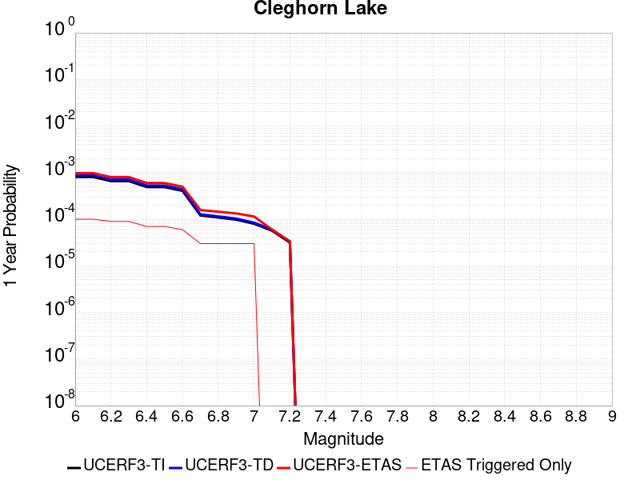 |  |

| Magnitude | 1 wk TI Prob | 1 wk TD Prob | 1 wk ETAS Prob | 1 wk ETAS/TD Gain | 1 wk ETAS Triggered Only | 1 mo TI Prob | 1 mo TD Prob | 1 mo ETAS Prob | 1 mo ETAS/TD Gain | 1 mo ETAS Triggered Only | 1 yr TI Prob | 1 yr TD Prob | 1 yr ETAS Prob | 1 yr ETAS/TD Gain | 1 yr ETAS Triggered Only | 10 yr TI Prob | 10 yr TD Prob | 10 yr ETAS Prob | 10 yr ETAS/TD Gain | 10 yr ETAS Triggered Only |
|-----|-----|-----|-----|-----|-----|-----|-----|-----|-----|-----|-----|-----|-----|-----|-----|-----|-----|-----|-----|-----|
| 6.0 | 1.5467183E-5 | 1.6794203E-5 | 8.679303E-5 | 5.1680346 | 7.0E-5 | 6.6286244E-5 | 7.197348E-5 | 1.5196773E-4 | 2.1114404 | 8.0E-5 | 8.067362E-4 | 8.759797E-4 | 9.758921E-4 | 1.1140579 | 1.0E-4 | 0.008038137 | 0.008730696 | 0.008889299 | 1.0181662 | 1.6E-4 |
| 6.1 | 1.5467183E-5 | 1.6794203E-5 | 8.679303E-5 | 5.1680346 | 7.0E-5 | 6.6286244E-5 | 7.197348E-5 | 1.5196773E-4 | 2.1114404 | 8.0E-5 | 8.067362E-4 | 8.759797E-4 | 9.758921E-4 | 1.1140579 | 1.0E-4 | 0.008038137 | 0.008730696 | 0.008889299 | 1.0181662 | 1.6E-4 |
| 6.2 | 1.2624631E-5 | 1.3681544E-5 | 7.368073E-5 | 5.38541 | 6.0E-5 | 5.410444E-5 | 5.863415E-5 | 1.2863004E-4 | 2.1937735 | 7.0E-5 | 6.585225E-4 | 7.1368564E-4 | 8.0362137E-4 | 1.1260159 | 9.0E-5 | 0.0065657445 | 0.0071187317 | 0.0072478065 | 1.0181317 | 1.3E-4 |
| 6.3 | 1.2624631E-5 | 1.3681544E-5 | 7.368073E-5 | 5.38541 | 6.0E-5 | 5.410444E-5 | 5.863415E-5 | 1.2863004E-4 | 2.1937735 | 7.0E-5 | 6.585225E-4 | 7.1368564E-4 | 8.0362137E-4 | 1.1260159 | 9.0E-5 | 0.0065657445 | 0.0071187317 | 0.0072478065 | 1.0181317 | 1.3E-4 |
| 6.4 | 9.417684E-6 | 1.0170118E-5 | 5.016971E-5 | 4.933051 | 4.0E-5 | 4.036088E-5 | 4.3585722E-5 | 9.358354E-5 | 2.1471148 | 5.0E-5 | 4.912829E-4 | 5.3056807E-4 | 6.005309E-4 | 1.1318641 | 7.0E-5 | 0.004901982 | 0.005297049 | 0.0053965193 | 1.0187784 | 1.0E-4 |
| 6.5 | 9.368219E-6 | 1.0117545E-5 | 5.0117138E-5 | 4.9534883 | 4.0E-5 | 4.014889E-5 | 4.3360415E-5 | 9.335825E-5 | 2.1530755 | 5.0E-5 | 4.8870314E-4 | 5.2782625E-4 | 5.977893E-4 | 1.1325494 | 7.0E-5 | 0.004876298 | 0.0052697617 | 0.0053692344 | 1.0188762 | 1.0E-4 |
| 6.6 | 7.803798E-6 | 8.441831E-6 | 4.8441492E-5 | 5.7382684 | 4.0E-5 | 3.3444423E-5 | 3.6179E-5 | 8.617719E-5 | 2.3819673 | 5.0E-5 | 4.0710976E-4 | 4.4043022E-4 | 5.004038E-4 | 1.1361704 | 6.0E-5 | 0.0040636472 | 0.0043994905 | 0.0044791386 | 1.018104 | 8.0E-5 |
| 6.7 | 2.3108669E-6 | 2.4438336E-6 | 2.2443784E-5 | 9.183843 | 2.0E-5 | 9.903678E-6 | 1.0473532E-5 | 4.0473216E-5 | 3.8643334 | 3.0E-5 | 1.205706E-4 | 1.2750797E-4 | 1.5750415E-4 | 1.2352494 | 3.0E-5 | 0.001205052 | 0.0012743667 | 0.0013143158 | 1.0313481 | 4.0E-5 |
| 6.8 | 2.0882828E-6 | 2.2062823E-6 | 2.2206237E-5 | 10.065003 | 2.0E-5 | 8.949753E-6 | 9.455462E-6 | 3.945518E-5 | 4.1727395 | 3.0E-5 | 1.08957785E-4 | 1.1511434E-4 | 1.4511088E-4 | 1.2605804 | 3.0E-5 | 0.0010890438 | 0.0011505639 | 0.0011905179 | 1.0347255 | 4.0E-5 |
| 6.9 | 1.876935E-6 | 1.981051E-6 | 2.1981012E-5 | 11.095632 | 2.0E-5 | 8.043982E-6 | 8.490192E-6 | 3.8489936E-5 | 4.533459 | 3.0E-5 | 9.7931086E-5 | 1.03363345E-4 | 1.3336024E-4 | 1.2902083 | 3.0E-5 | 9.788794E-4 | 0.0010331686 | 0.0010731274 | 1.0386759 | 4.0E-5 |
| 7.0 | 1.5357559E-6 | 1.6202807E-6 | 2.1620248E-5 | 13.34352 | 2.0E-5 | 6.5817944E-6 | 6.9440425E-6 | 3.6943835E-5 | 5.32022 | 3.0E-5 | 8.01304E-5 | 8.454057E-5 | 1.1453803E-4 | 1.3548292 | 3.0E-5 | 8.010151E-4 | 8.450965E-4 | 8.850627E-4 | 1.0472919 | 4.0E-5 |
| 7.1 | 1.0905424E-6 | 1.1497619E-6 | 1.1497619E-6 | 1.0 | 0.0 | 4.6737446E-6 | 4.9275427E-6 | 4.9275427E-6 | 1.0 | 0.0 | 5.6901354E-5 | 5.999128E-5 | 5.999128E-5 | 1.0 | 0.0 | 5.6886784E-4 | 5.997606E-4 | 6.0975464E-4 | 1.0166633 | 1.0E-5 |
| 7.2 | 6.06668E-7 | 6.387277E-7 | 6.387277E-7 | 1.0 | 0.0 | 2.600003E-6 | 2.7374022E-6 | 2.7374022E-6 | 1.0 | 0.0 | 3.1654577E-5 | 3.3327433E-5 | 3.3327433E-5 | 1.0 | 0.0 | 3.1650066E-4 | 3.3323118E-4 | 3.3323118E-4 | 1.0 | 0.0 |

## Owens Valley
*[(top)](#table-of-contents)*

| 1 Week | 1 Month | 1 Year | 10 Year |
|-----|-----|-----|-----|
|  | 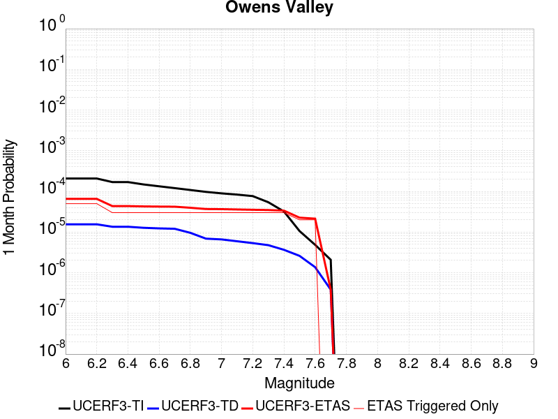 |  |  |

| Magnitude | 1 wk TI Prob | 1 wk TD Prob | 1 wk ETAS Prob | 1 wk ETAS/TD Gain | 1 wk ETAS Triggered Only | 1 mo TI Prob | 1 mo TD Prob | 1 mo ETAS Prob | 1 mo ETAS/TD Gain | 1 mo ETAS Triggered Only | 1 yr TI Prob | 1 yr TD Prob | 1 yr ETAS Prob | 1 yr ETAS/TD Gain | 1 yr ETAS Triggered Only | 10 yr TI Prob | 10 yr TD Prob | 10 yr ETAS Prob | 10 yr ETAS/TD Gain | 10 yr ETAS Triggered Only |
|-----|-----|-----|-----|-----|-----|-----|-----|-----|-----|-----|-----|-----|-----|-----|-----|-----|-----|-----|-----|-----|
| 6.0 | 4.83821E-5 | 3.6210524E-6 | 3.3620945E-5 | 9.284854 | 3.0E-5 | 2.0733538E-4 | 1.551871E-5 | 6.551793E-5 | 4.2218676 | 5.0E-5 | 0.002521386 | 1.889249E-4 | 2.789079E-4 | 1.4762897 | 9.0E-5 | 0.024929691 | 0.0019297141 | 0.0020794247 | 1.0775818 | 1.5E-4 |
| 6.1 | 4.83821E-5 | 3.6210524E-6 | 3.3620945E-5 | 9.284854 | 3.0E-5 | 2.0733538E-4 | 1.551871E-5 | 6.551793E-5 | 4.2218676 | 5.0E-5 | 0.002521386 | 1.889249E-4 | 2.789079E-4 | 1.4762897 | 9.0E-5 | 0.024929691 | 0.0019297141 | 0.0020794247 | 1.0775818 | 1.5E-4 |
| 6.2 | 4.83821E-5 | 3.6210524E-6 | 3.3620945E-5 | 9.284854 | 3.0E-5 | 2.0733538E-4 | 1.551871E-5 | 6.551793E-5 | 4.2218676 | 5.0E-5 | 0.002521386 | 1.889249E-4 | 2.789079E-4 | 1.4762897 | 9.0E-5 | 0.024929691 | 0.0019297141 | 0.0020794247 | 1.0775818 | 1.5E-4 |
| 6.3 | 3.953008E-5 | 3.1530958E-6 | 2.3153032E-5 | 7.3429523 | 2.0E-5 | 1.6940363E-4 | 1.3513202E-5 | 4.35128E-5 | 3.2200212 | 3.0E-5 | 0.002060538 | 1.6451156E-4 | 2.2450168E-4 | 1.3646561 | 6.0E-5 | 0.020415364 | 0.0016621627 | 0.0017819633 | 1.0720751 | 1.2E-4 |
| 6.4 | 3.953008E-5 | 3.1530958E-6 | 2.3153032E-5 | 7.3429523 | 2.0E-5 | 1.6940363E-4 | 1.3513202E-5 | 4.35128E-5 | 3.2200212 | 3.0E-5 | 0.002060538 | 1.6451156E-4 | 2.2450168E-4 | 1.3646561 | 6.0E-5 | 0.020415364 | 0.0016621627 | 0.0017819633 | 1.0720751 | 1.2E-4 |
| 6.5 | 3.457342E-5 | 2.9707387E-6 | 2.297068E-5 | 7.732312 | 2.0E-5 | 1.4816338E-4 | 1.273168E-5 | 4.27313E-5 | 3.356297 | 3.0E-5 | 0.0018023965 | 1.5499788E-4 | 2.1498857E-4 | 1.387042 | 6.0E-5 | 0.017878477 | 0.0015563119 | 0.0016761251 | 1.0769854 | 1.2E-4 |
| 6.6 | 3.1127765E-5 | 2.8737306E-6 | 2.2873674E-5 | 7.9595747 | 2.0E-5 | 1.3339789E-4 | 1.2315934E-5 | 4.2315565E-5 | 3.4358387 | 3.0E-5 | 0.0016229092 | 1.4993687E-4 | 2.0992788E-4 | 1.4001085 | 6.0E-5 | 0.016111081 | 0.0015013438 | 0.0016211636 | 1.0798084 | 1.2E-4 |
| 6.7 | 2.806885E-5 | 2.8101606E-6 | 2.2810103E-5 | 8.117011 | 2.0E-5 | 1.2028952E-4 | 1.2043493E-5 | 4.204313E-5 | 3.4909415 | 3.0E-5 | 0.001463541 | 1.4662035E-4 | 2.0661156E-4 | 1.4091601 | 6.0E-5 | 0.014539397 | 0.0014656087 | 0.0015854328 | 1.0817572 | 1.2E-4 |
| 6.8 | 2.524524E-5 | 2.2351392E-6 | 2.2235094E-5 | 9.9479685 | 2.0E-5 | 1.0818939E-4 | 9.579134E-6 | 3.957885E-5 | 4.1317773 | 3.0E-5 | 0.0013164099 | 1.16620016E-4 | 1.7661302E-4 | 1.5144315 | 6.0E-5 | 0.01308639 | 0.001165827 | 0.0012856872 | 1.1028112 | 1.2E-4 |
| 6.9 | 2.2704568E-5 | 1.6079711E-6 | 2.1607939E-5 | 13.438015 | 2.0E-5 | 9.730166E-5 | 6.8912864E-6 | 3.689108E-5 | 5.353294 | 3.0E-5 | 0.0011840039 | 8.38982E-5 | 1.4389316E-4 | 1.7150924 | 6.0E-5 | 0.011777153 | 8.38853E-4 | 9.5875235E-4 | 1.1429324 | 1.2E-4 |
| 7.0 | 2.0871712E-5 | 1.5393621E-6 | 2.1539332E-5 | 13.992374 | 2.0E-5 | 8.944713E-5 | 6.5972495E-6 | 3.659705E-5 | 5.5473194 | 3.0E-5 | 0.0010884746 | 8.031857E-5 | 1.4031376E-4 | 1.7469653 | 6.0E-5 | 0.010831586 | 8.030395E-4 | 9.129512E-4 | 1.1368695 | 1.1E-4 |
| 7.1 | 1.944928E-5 | 1.3862556E-6 | 2.1386228E-5 | 15.427335 | 2.0E-5 | 8.335139E-5 | 5.941082E-6 | 3.5940902E-5 | 6.0495553 | 3.0E-5 | 0.0010143308 | 7.233028E-5 | 1.3232593E-4 | 1.8294681 | 6.0E-5 | 0.010097133 | 7.2319806E-4 | 8.331185E-4 | 1.1519922 | 1.1E-4 |
| 7.2 | 1.7876306E-5 | 1.2487686E-6 | 2.1248743E-5 | 17.015759 | 2.0E-5 | 7.6610486E-5 | 5.3518543E-6 | 3.5351695E-5 | 6.6055036 | 3.0E-5 | 9.3233347E-4 | 6.515689E-5 | 1.1515363E-4 | 1.7673286 | 5.0E-5 | 0.009284316 | 6.5148395E-4 | 7.514188E-4 | 1.1533958 | 1.0E-4 |
| 7.3 | 1.2618672E-5 | 1.1113839E-6 | 2.1111362E-5 | 18.995562 | 2.0E-5 | 5.40789E-5 | 4.763065E-6 | 3.476292E-5 | 7.298435 | 3.0E-5 | 6.582117E-4 | 5.7988782E-5 | 1.07985885E-4 | 1.8621857 | 5.0E-5 | 0.0065626553 | 5.7983754E-4 | 6.7977956E-4 | 1.1723621 | 1.0E-4 |
| 7.4 | 7.4874442E-6 | 8.547518E-7 | 2.0854735E-5 | 24.398586 | 2.0E-5 | 3.208865E-5 | 3.6632168E-6 | 3.3663106E-5 | 9.189493 | 3.0E-5 | 3.906093E-4 | 4.4598757E-5 | 9.459653E-5 | 2.1210575 | 5.0E-5 | 0.003899234 | 4.459579E-4 | 5.459133E-4 | 1.2241364 | 1.0E-4 |
| 7.5 | 2.4734156E-6 | 6.0679935E-7 | 2.0606787E-5 | 33.959805 | 2.0E-5 | 1.060031E-5 | 2.6005662E-6 | 2.2600514E-5 | 8.690613 | 2.0E-5 | 1.2905113E-4 | 3.1661435E-5 | 6.166049E-5 | 1.947495 | 3.0E-5 | 0.0012897621 | 3.1656958E-4 | 3.865474E-4 | 1.2210504 | 7.0E-5 |
| 7.6 | 1.1328841E-6 | 3.1961991E-7 | 2.0319614E-5 | 63.574303 | 2.0E-5 | 4.8552088E-6 | 1.369799E-6 | 2.1369771E-5 | 15.600662 | 2.0E-5 | 5.9110564E-5 | 1.6677177E-5 | 3.6676844E-5 | 2.1992238 | 2.0E-5 | 5.9094845E-4 | 1.6675945E-4 | 2.167511E-4 | 1.2997831 | 5.0E-5 |
| 7.7 | 4.8613185E-7 | 8.962742E-8 | 8.962742E-8 | 1.0 | 0.0 | 2.0834207E-6 | 3.8411747E-7 | 3.8411747E-7 | 1.0 | 0.0 | 2.536535E-5 | 4.676621E-6 | 4.676621E-6 | 1.0 | 0.0 | 2.5362454E-4 | 4.676529E-5 | 4.676529E-5 | 1.0 | 0.0 |

## Deep Springs
*[(top)](#table-of-contents)*

| 1 Week | 1 Month | 1 Year | 10 Year |
|-----|-----|-----|-----|
|  |  |  |  |

| Magnitude | 1 wk TI Prob | 1 wk TD Prob | 1 wk ETAS Prob | 1 wk ETAS/TD Gain | 1 wk ETAS Triggered Only | 1 mo TI Prob | 1 mo TD Prob | 1 mo ETAS Prob | 1 mo ETAS/TD Gain | 1 mo ETAS Triggered Only | 1 yr TI Prob | 1 yr TD Prob | 1 yr ETAS Prob | 1 yr ETAS/TD Gain | 1 yr ETAS Triggered Only | 10 yr TI Prob | 10 yr TD Prob | 10 yr ETAS Prob | 10 yr ETAS/TD Gain | 10 yr ETAS Triggered Only |
|-----|-----|-----|-----|-----|-----|-----|-----|-----|-----|-----|-----|-----|-----|-----|-----|-----|-----|-----|-----|-----|
| 6.0 | 1.9810619E-5 | 2.311252E-5 | 4.3112057E-5 | 1.8653119 | 2.0E-5 | 8.489989E-5 | 9.9052755E-5 | 1.2904979E-4 | 1.3028389 | 3.0E-5 | 0.001033166 | 0.0012058078 | 0.0012857113 | 1.0662656 | 8.0E-5 | 0.010283757 | 0.01204243 | 0.012190624 | 1.012306 | 1.5E-4 |
| 6.1 | 1.9810619E-5 | 2.311252E-5 | 4.3112057E-5 | 1.8653119 | 2.0E-5 | 8.489989E-5 | 9.9052755E-5 | 1.2904979E-4 | 1.3028389 | 3.0E-5 | 0.001033166 | 0.0012058078 | 0.0012857113 | 1.0662656 | 8.0E-5 | 0.010283757 | 0.01204243 | 0.012190624 | 1.012306 | 1.5E-4 |
| 6.2 | 1.9810619E-5 | 2.311252E-5 | 4.3112057E-5 | 1.8653119 | 2.0E-5 | 8.489989E-5 | 9.9052755E-5 | 1.2904979E-4 | 1.3028389 | 3.0E-5 | 0.001033166 | 0.0012058078 | 0.0012857113 | 1.0662656 | 8.0E-5 | 0.010283757 | 0.01204243 | 0.012190624 | 1.012306 | 1.5E-4 |
| 6.3 | 1.9810619E-5 | 2.311252E-5 | 4.3112057E-5 | 1.8653119 | 2.0E-5 | 8.489989E-5 | 9.9052755E-5 | 1.2904979E-4 | 1.3028389 | 3.0E-5 | 0.001033166 | 0.0012058078 | 0.0012857113 | 1.0662656 | 8.0E-5 | 0.010283757 | 0.01204243 | 0.012190624 | 1.012306 | 1.5E-4 |
| 6.4 | 1.9810619E-5 | 2.311252E-5 | 4.3112057E-5 | 1.8653119 | 2.0E-5 | 8.489989E-5 | 9.9052755E-5 | 1.2904979E-4 | 1.3028389 | 3.0E-5 | 0.001033166 | 0.0012058078 | 0.0012857113 | 1.0662656 | 8.0E-5 | 0.010283757 | 0.01204243 | 0.012190624 | 1.012306 | 1.5E-4 |
| 6.5 | 1.7190405E-5 | 2.0050558E-5 | 3.0050356E-5 | 1.4987292 | 1.0E-5 | 7.367108E-5 | 8.593096E-5 | 1.0592924E-4 | 1.232725 | 2.0E-5 | 8.9657627E-4 | 0.0010462092 | 0.001116136 | 1.0668383 | 7.0E-5 | 0.008929676 | 0.010462061 | 0.010600596 | 1.0132416 | 1.4E-4 |
| 6.6 | 1.7190405E-5 | 2.0050558E-5 | 3.0050356E-5 | 1.4987292 | 1.0E-5 | 7.367108E-5 | 8.593096E-5 | 1.0592924E-4 | 1.232725 | 2.0E-5 | 8.9657627E-4 | 0.0010462092 | 0.001116136 | 1.0668383 | 7.0E-5 | 0.008929676 | 0.010462061 | 0.010600596 | 1.0132416 | 1.4E-4 |

## Big Pine (East)
*[(top)](#table-of-contents)*

| 1 Week | 1 Month | 1 Year | 10 Year |
|-----|-----|-----|-----|
|  |  |  |  |

| Magnitude | 1 wk TI Prob | 1 wk TD Prob | 1 wk ETAS Prob | 1 wk ETAS/TD Gain | 1 wk ETAS Triggered Only | 1 mo TI Prob | 1 mo TD Prob | 1 mo ETAS Prob | 1 mo ETAS/TD Gain | 1 mo ETAS Triggered Only | 1 yr TI Prob | 1 yr TD Prob | 1 yr ETAS Prob | 1 yr ETAS/TD Gain | 1 yr ETAS Triggered Only | 10 yr TI Prob | 10 yr TD Prob | 10 yr ETAS Prob | 10 yr ETAS/TD Gain | 10 yr ETAS Triggered Only |
|-----|-----|-----|-----|-----|-----|-----|-----|-----|-----|-----|-----|-----|-----|-----|-----|-----|-----|-----|-----|-----|
| 6.0 | 9.916913E-6 | 1.28172705E-5 | 2.2817143E-5 | 1.7801872 | 1.0E-5 | 4.250036E-5 | 5.493013E-5 | 7.492903E-5 | 1.3640789 | 2.0E-5 | 5.173191E-4 | 6.685912E-4 | 7.385444E-4 | 1.1046277 | 7.0E-5 | 0.0051611643 | 0.006670449 | 0.006819448 | 1.0223372 | 1.5E-4 |
| 6.1 | 9.916913E-6 | 1.28172705E-5 | 2.2817143E-5 | 1.7801872 | 1.0E-5 | 4.250036E-5 | 5.493013E-5 | 7.492903E-5 | 1.3640789 | 2.0E-5 | 5.173191E-4 | 6.685912E-4 | 7.385444E-4 | 1.1046277 | 7.0E-5 | 0.0051611643 | 0.006670449 | 0.006819448 | 1.0223372 | 1.5E-4 |
| 6.2 | 9.916913E-6 | 1.28172705E-5 | 2.2817143E-5 | 1.7801872 | 1.0E-5 | 4.250036E-5 | 5.493013E-5 | 7.492903E-5 | 1.3640789 | 2.0E-5 | 5.173191E-4 | 6.685912E-4 | 7.385444E-4 | 1.1046277 | 7.0E-5 | 0.0051611643 | 0.006670449 | 0.006819448 | 1.0223372 | 1.5E-4 |
| 6.3 | 5.479711E-6 | 8.1132375E-6 | 1.8113156E-5 | 2.2325435 | 1.0E-5 | 2.3484265E-5 | 3.4770575E-5 | 5.476988E-5 | 1.575179 | 2.0E-5 | 2.858834E-4 | 4.232527E-4 | 4.932231E-4 | 1.1653159 | 7.0E-5 | 0.0028551589 | 0.0042272513 | 0.0043766173 | 1.0353341 | 1.5E-4 |
| 6.4 | 5.465009E-6 | 8.0975315E-6 | 1.8097451E-5 | 2.2349343 | 1.0E-5 | 2.3421257E-5 | 3.4703262E-5 | 5.4702567E-5 | 1.5762947 | 2.0E-5 | 2.851165E-4 | 4.2243348E-4 | 4.924039E-4 | 1.1656365 | 7.0E-5 | 0.0028475097 | 0.00421909 | 0.0043684575 | 1.0354027 | 1.5E-4 |
| 6.5 | 4.826767E-6 | 7.4225877E-6 | 1.7422513E-5 | 2.347229 | 1.0E-5 | 2.068598E-5 | 3.1810716E-5 | 5.1810082E-5 | 1.628699 | 2.0E-5 | 2.518227E-4 | 3.8722943E-4 | 4.5720232E-4 | 1.1807014 | 7.0E-5 | 0.0025153751 | 0.0038682907 | 0.0040077493 | 1.0360518 | 1.4E-4 |
| 6.6 | 4.3146847E-6 | 6.8825234E-6 | 1.6882455E-5 | 2.4529455 | 1.0E-5 | 1.8491375E-5 | 2.949621E-5 | 4.949562E-5 | 1.6780332 | 2.0E-5 | 2.2510924E-4 | 3.5905963E-4 | 4.0904168E-4 | 1.1392026 | 5.0E-5 | 0.0022488134 | 0.0035875062 | 0.0036871475 | 1.0277746 | 1.0E-4 |
| 6.7 | 3.6968106E-6 | 5.9957474E-6 | 1.5995687E-5 | 2.6678388 | 1.0E-5 | 1.5843378E-5 | 2.5695816E-5 | 4.5695302E-5 | 1.7783169 | 2.0E-5 | 1.9287605E-4 | 3.128032E-4 | 3.5279067E-4 | 1.127836 | 4.0E-5 | 0.0019270873 | 0.0031262499 | 0.0032059997 | 1.0255097 | 8.0E-5 |
| 6.8 | 3.4671132E-6 | 5.7024477E-6 | 1.5702391E-5 | 2.753623 | 1.0E-5 | 1.4858972E-5 | 2.4438841E-5 | 4.443835E-5 | 1.8183495 | 2.0E-5 | 1.8089297E-4 | 2.9750372E-4 | 3.374918E-4 | 1.134412 | 4.0E-5 | 0.0018074579 | 0.0029736666 | 0.0030534288 | 1.0268228 | 8.0E-5 |
| 6.9 | 2.7686972E-6 | 4.8254797E-6 | 4.8254797E-6 | 1.0 | 0.0 | 1.1865792E-5 | 2.0680467E-5 | 3.068026E-5 | 1.483538 | 1.0E-5 | 1.4445644E-4 | 2.5175634E-4 | 2.817488E-4 | 1.1191329 | 3.0E-5 | 0.0014436257 | 0.002517256 | 0.0025571552 | 1.0158503 | 4.0E-5 |
| 7.0 | 2.1472624E-6 | 3.985277E-6 | 3.985277E-6 | 1.0 | 0.0 | 9.20252E-6 | 1.707965E-5 | 2.7079479E-5 | 1.5854821 | 1.0E-5 | 1.12034926E-4 | 2.0792543E-4 | 2.2792126E-4 | 1.0961683 | 2.0E-5 | 0.0011197845 | 0.0020798238 | 0.0021097613 | 1.0143943 | 3.0E-5 |
| 7.1 | 1.7018335E-6 | 3.3450835E-6 | 3.3450835E-6 | 1.0 | 0.0 | 7.293552E-6 | 1.4335996E-5 | 2.4335852E-5 | 1.6975348 | 1.0E-5 | 8.879537E-5 | 1.7452713E-4 | 1.9452363E-4 | 1.1145754 | 2.0E-5 | 8.87599E-4 | 0.0017463792 | 0.0017763268 | 1.0171484 | 3.0E-5 |
| 7.2 | 1.25603E-6 | 2.794679E-6 | 2.794679E-6 | 1.0 | 0.0 | 5.3829745E-6 | 1.1977142E-5 | 2.1977023E-5 | 1.8349137 | 1.0E-5 | 6.553574E-5 | 1.4581217E-4 | 1.6580925E-4 | 1.1371428 | 2.0E-5 | 6.551642E-4 | 0.0014596173 | 0.0014795881 | 1.0136822 | 2.0E-5 |
| 7.3 | 1.112297E-6 | 2.610519E-6 | 2.610519E-6 | 1.0 | 0.0 | 4.7669787E-6 | 1.1187892E-5 | 2.118778E-5 | 1.8938135 | 1.0E-5 | 5.803642E-5 | 1.3620428E-4 | 1.5620155E-4 | 1.1468183 | 2.0E-5 | 5.802127E-4 | 0.001363502 | 0.0013834747 | 1.0146481 | 2.0E-5 |
| 7.4 | 1.0137181E-6 | 2.4836752E-6 | 2.4836752E-6 | 1.0 | 0.0 | 4.3444993E-6 | 1.064428E-5 | 2.0644173E-5 | 1.9394617 | 1.0E-5 | 5.2892992E-5 | 1.2958662E-4 | 1.3958532E-4 | 1.0771585 | 1.0E-5 | 5.288041E-4 | 0.0012971918 | 0.0013071789 | 1.007699 | 1.0E-5 |
| 7.5 | 9.598608E-7 | 2.407328E-6 | 2.407328E-6 | 1.0 | 0.0 | 4.1136827E-6 | 1.03170805E-5 | 2.0316978E-5 | 1.9692564 | 1.0E-5 | 5.0082934E-5 | 1.2560343E-4 | 1.3560218E-4 | 1.0796057 | 1.0E-5 | 5.007165E-4 | 0.0012572132 | 0.0012672007 | 1.0079441 | 1.0E-5 |
| 7.6 | 7.929459E-7 | 2.0450152E-6 | 2.0450152E-6 | 1.0 | 0.0 | 3.3983351E-6 | 8.764322E-6 | 8.764322E-6 | 1.0 | 0.0 | 4.1373947E-5 | 1.0670057E-4 | 1.0670057E-4 | 1.0 | 0.0 | 4.1366243E-4 | 0.0010685825 | 0.0010685825 | 1.0 | 0.0 |
| 7.7 | 4.155788E-7 | 1.1606729E-6 | 1.1606729E-6 | 1.0 | 0.0 | 1.7810507E-6 | 4.974303E-6 | 4.974303E-6 | 1.0 | 0.0 | 2.1684076E-5 | 6.05605E-5 | 6.05605E-5 | 1.0 | 0.0 | 2.1681961E-4 | 6.085995E-4 | 6.085995E-4 | 1.0 | 0.0 |
| 7.8 | 1.14666925E-7 | 2.592197E-7 | 2.592197E-7 | 1.0 | 0.0 | 4.914296E-7 | 1.1109411E-6 | 1.1109411E-6 | 1.0 | 0.0 | 5.9831386E-6 | 1.3525627E-5 | 1.3525627E-5 | 1.0 | 0.0 | 5.9829777E-5 | 1.3636416E-4 | 1.3636416E-4 | 1.0 | 0.0 |
| 7.9 | 2.9231824E-8 | 4.1462318E-8 | 4.1462318E-8 | 1.0 | 0.0 | 1.2527924E-7 | 1.7769564E-7 | 1.7769564E-7 | 1.0 | 0.0 | 1.5252737E-6 | 2.1634426E-6 | 2.1634426E-6 | 1.0 | 0.0 | 1.5252632E-5 | 2.197062E-5 | 2.197062E-5 | 1.0 | 0.0 |

## San Jacinto (Anza) rev
*[(top)](#table-of-contents)*

| 1 Week | 1 Month | 1 Year | 10 Year |
|-----|-----|-----|-----|
|  |  |  |  |

| Magnitude | 1 wk TI Prob | 1 wk TD Prob | 1 wk ETAS Prob | 1 wk ETAS/TD Gain | 1 wk ETAS Triggered Only | 1 mo TI Prob | 1 mo TD Prob | 1 mo ETAS Prob | 1 mo ETAS/TD Gain | 1 mo ETAS Triggered Only | 1 yr TI Prob | 1 yr TD Prob | 1 yr ETAS Prob | 1 yr ETAS/TD Gain | 1 yr ETAS Triggered Only | 10 yr TI Prob | 10 yr TD Prob | 10 yr ETAS Prob | 10 yr ETAS/TD Gain | 10 yr ETAS Triggered Only |
|-----|-----|-----|-----|-----|-----|-----|-----|-----|-----|-----|-----|-----|-----|-----|-----|-----|-----|-----|-----|-----|
| 6.0 | 6.3015636E-5 | 4.3298347E-5 | 1.0329575E-4 | 2.3856742 | 6.0E-5 | 2.7003905E-4 | 1.8555121E-4 | 2.5553824E-4 | 1.3771844 | 7.0E-5 | 0.0032827691 | 0.0022567573 | 0.002366509 | 1.0486325 | 1.1E-4 | 0.032346968 | 0.02329361 | 0.023440117 | 1.0062895 | 1.5E-4 |
| 6.1 | 6.3015636E-5 | 4.3298347E-5 | 1.0329575E-4 | 2.3856742 | 6.0E-5 | 2.7003905E-4 | 1.8555121E-4 | 2.5553824E-4 | 1.3771844 | 7.0E-5 | 0.0032827691 | 0.0022567573 | 0.002366509 | 1.0486325 | 1.1E-4 | 0.032346968 | 0.02329361 | 0.023440117 | 1.0062895 | 1.5E-4 |
| 6.2 | 6.3015636E-5 | 4.3298347E-5 | 1.0329575E-4 | 2.3856742 | 6.0E-5 | 2.7003905E-4 | 1.8555121E-4 | 2.5553824E-4 | 1.3771844 | 7.0E-5 | 0.0032827691 | 0.0022567573 | 0.002366509 | 1.0486325 | 1.1E-4 | 0.032346968 | 0.02329361 | 0.023440117 | 1.0062895 | 1.5E-4 |
| 6.3 | 6.3015636E-5 | 4.3298347E-5 | 1.0329575E-4 | 2.3856742 | 6.0E-5 | 2.7003905E-4 | 1.8555121E-4 | 2.5553824E-4 | 1.3771844 | 7.0E-5 | 0.0032827691 | 0.0022567573 | 0.002366509 | 1.0486325 | 1.1E-4 | 0.032346968 | 0.02329361 | 0.023440117 | 1.0062895 | 1.5E-4 |
| 6.4 | 6.3015636E-5 | 4.3298347E-5 | 1.0329575E-4 | 2.3856742 | 6.0E-5 | 2.7003905E-4 | 1.8555121E-4 | 2.5553824E-4 | 1.3771844 | 7.0E-5 | 0.0032827691 | 0.0022567573 | 0.002366509 | 1.0486325 | 1.1E-4 | 0.032346968 | 0.02329361 | 0.023440117 | 1.0062895 | 1.5E-4 |
| 6.5 | 5.811017E-5 | 4.0080286E-5 | 1.0007788E-4 | 2.4969354 | 6.0E-5 | 2.4901982E-4 | 1.7176138E-4 | 2.4174935E-4 | 1.4074721 | 7.0E-5 | 0.0030276014 | 0.0020891947 | 0.0021989648 | 1.0525419 | 1.1E-4 | 0.02986684 | 0.021590833 | 0.021737594 | 1.0067974 | 1.5E-4 |
| 6.6 | 5.811017E-5 | 4.0080286E-5 | 1.0007788E-4 | 2.4969354 | 6.0E-5 | 2.4901982E-4 | 1.7176138E-4 | 2.4174935E-4 | 1.4074721 | 7.0E-5 | 0.0030276014 | 0.0020891947 | 0.0021989648 | 1.0525419 | 1.1E-4 | 0.02986684 | 0.021590833 | 0.021737594 | 1.0067974 | 1.5E-4 |
| 6.7 | 5.712442E-5 | 3.950301E-5 | 9.950064E-5 | 2.5188115 | 6.0E-5 | 2.4479596E-4 | 1.6928767E-4 | 2.3927582E-4 | 1.4134274 | 7.0E-5 | 0.0029763177 | 0.0020591344 | 0.002168908 | 1.0533105 | 1.1E-4 | 0.029367693 | 0.021282919 | 0.021429725 | 1.0068979 | 1.5E-4 |
| 6.8 | 5.6967532E-5 | 3.93593E-5 | 9.935694E-5 | 2.5243573 | 6.0E-5 | 2.4412372E-4 | 1.6867183E-4 | 2.3866002E-4 | 1.414937 | 7.0E-5 | 0.0029681553 | 0.0020516508 | 0.0021614253 | 1.0535053 | 1.1E-4 | 0.029288229 | 0.02120852 | 0.021355338 | 1.0069226 | 1.5E-4 |
| 6.9 | 5.6211324E-5 | 3.9064216E-5 | 9.906187E-5 | 2.5358725 | 6.0E-5 | 2.4088343E-4 | 1.6740736E-4 | 2.3739564E-4 | 1.4180717 | 7.0E-5 | 0.0029288116 | 0.0020362847 | 0.0021460608 | 1.0539099 | 1.1E-4 | 0.028905109 | 0.021047527 | 0.02119437 | 1.0069767 | 1.5E-4 |
| 7.0 | 5.4383527E-5 | 3.7925012E-5 | 9.792273E-5 | 2.5820093 | 6.0E-5 | 2.3305144E-4 | 1.6252567E-4 | 2.3251429E-4 | 1.4306312 | 7.0E-5 | 0.0028337094 | 0.001976959 | 0.0020867416 | 1.055531 | 1.1E-4 | 0.027978465 | 0.02044095 | 0.020587884 | 1.0071882 | 1.5E-4 |
| 7.1 | 5.1393665E-5 | 3.638787E-5 | 9.638569E-5 | 2.6488411 | 6.0E-5 | 2.2023996E-4 | 1.5593872E-4 | 2.259278E-4 | 1.4488243 | 7.0E-5 | 0.0026781242 | 0.0018969048 | 0.002006696 | 1.0578792 | 1.1E-4 | 0.026460782 | 0.019616077 | 0.019763134 | 1.0074968 | 1.5E-4 |
| 7.2 | 4.785222E-5 | 3.4738845E-5 | 9.473676E-5 | 2.7271132 | 6.0E-5 | 2.0506482E-4 | 1.4887229E-4 | 2.1886187E-4 | 1.4701316 | 7.0E-5 | 0.0024938055 | 0.0018110167 | 0.0019208175 | 1.0606294 | 1.1E-4 | 0.024660049 | 0.018728783 | 0.018875973 | 1.0078591 | 1.5E-4 |
| 7.3 | 4.2143256E-5 | 3.3834414E-5 | 9.383239E-5 | 2.7732825 | 6.0E-5 | 1.8060145E-4 | 1.449966E-4 | 2.1498643E-4 | 1.4827 | 7.0E-5 | 0.002196605 | 0.0017639075 | 0.0018737135 | 1.0622516 | 1.1E-4 | 0.02175019 | 0.018236695 | 0.01838396 | 1.0080751 | 1.5E-4 |
| 7.4 | 4.0264713E-5 | 3.3472694E-5 | 9.3470684E-5 | 2.792446 | 6.0E-5 | 1.7255165E-4 | 1.4344654E-4 | 2.1343649E-4 | 1.4879167 | 7.0E-5 | 0.002098792 | 0.0017450659 | 0.001854874 | 1.0629249 | 1.1E-4 | 0.020790804 | 0.018041389 | 0.018188683 | 1.0081642 | 1.5E-4 |
| 7.5 | 3.694492E-5 | 3.2186905E-5 | 9.218497E-5 | 2.864052 | 6.0E-5 | 1.5832575E-4 | 1.379366E-4 | 2.0792695E-4 | 1.5074095 | 7.0E-5 | 0.0019259118 | 0.0016780876 | 0.001787903 | 1.0654408 | 1.1E-4 | 0.01909306 | 0.017357888 | 0.017505284 | 1.0084916 | 1.5E-4 |
| 7.6 | 3.200565E-5 | 2.9502702E-5 | 8.9500936E-5 | 3.033652 | 6.0E-5 | 1.3715986E-4 | 1.2643404E-4 | 1.9642519E-4 | 1.5535784 | 7.0E-5 | 0.001668642 | 0.0015382497 | 0.0016480805 | 1.0713998 | 1.1E-4 | 0.01656168 | 0.015946016 | 0.016093625 | 1.0092567 | 1.5E-4 |
| 7.7 | 2.731642E-5 | 2.6091477E-5 | 8.608991E-5 | 3.2995417 | 6.0E-5 | 1.1706512E-4 | 1.11815825E-4 | 1.8180799E-4 | 1.6259595 | 7.0E-5 | 0.001424336 | 0.0013605085 | 0.0014703588 | 1.0807421 | 1.1E-4 | 0.014152412 | 0.0141668 | 0.014314675 | 1.0104381 | 1.5E-4 |
| 7.8 | 2.3466424E-5 | 2.3503619E-5 | 8.350221E-5 | 3.5527384 | 6.0E-5 | 1.0056651E-4 | 1.0072591E-4 | 1.7071886E-4 | 1.6948853 | 7.0E-5 | 0.0012237094 | 0.0012256489 | 0.001335514 | 1.0896384 | 1.1E-4 | 0.012169928 | 0.012808796 | 0.012956875 | 1.0115607 | 1.5E-4 |
| 7.9 | 1.8611925E-5 | 1.890698E-5 | 7.890585E-5 | 4.1733713 | 6.0E-5 | 7.9762955E-5 | 8.10274E-5 | 1.5102173E-4 | 1.8638353 | 7.0E-5 | 9.7068126E-4 | 9.860628E-4 | 0.0010859643 | 1.1013135 | 1.0E-4 | 0.0096645225 | 0.010393705 | 0.010522354 | 1.0123776 | 1.3E-4 |
| 8.0 | 1.5460775E-5 | 1.5739915E-5 | 6.573913E-5 | 4.176587 | 5.0E-5 | 6.6258784E-5 | 6.745504E-5 | 1.27451E-4 | 1.8894213 | 6.0E-5 | 8.0640207E-4 | 8.2095637E-4 | 9.108825E-4 | 1.1095382 | 9.0E-5 | 0.008034821 | 0.008702706 | 0.008821662 | 1.0136688 | 1.2E-4 |
| 8.1 | 9.983884E-6 | 8.268954E-6 | 2.8268789E-5 | 3.4186654 | 2.0E-5 | 4.2787375E-5 | 3.5437897E-5 | 5.5437187E-5 | 1.5643476 | 2.0E-5 | 5.2081177E-4 | 4.313715E-4 | 4.7135423E-4 | 1.0926875 | 4.0E-5 | 0.0051959283 | 0.00463968 | 0.004689448 | 1.0107266 | 5.0E-5 |
| 8.2 | 4.1226E-6 | 1.5522551E-6 | 1.5522551E-6 | 1.0 | 0.0 | 1.7668166E-5 | 6.6525045E-6 | 6.6525045E-6 | 1.0 | 0.0 | 2.1508869E-4 | 8.099126E-5 | 8.099126E-5 | 1.0 | 0.0 | 0.0021488064 | 9.401847E-4 | 9.401847E-4 | 1.0 | 0.0 |
| 8.3 | 1.2750878E-6 | 3.609817E-7 | 3.609817E-7 | 1.0 | 0.0 | 5.4646503E-6 | 1.5470634E-6 | 1.5470634E-6 | 1.0 | 0.0 | 6.653009E-5 | 1.8835339E-5 | 1.8835339E-5 | 1.0 | 0.0 | 6.6510175E-4 | 2.272251E-4 | 2.272251E-4 | 1.0 | 0.0 |

## White Mountains
*[(top)](#table-of-contents)*

| 1 Week | 1 Month | 1 Year | 10 Year |
|-----|-----|-----|-----|
|  |  |  | 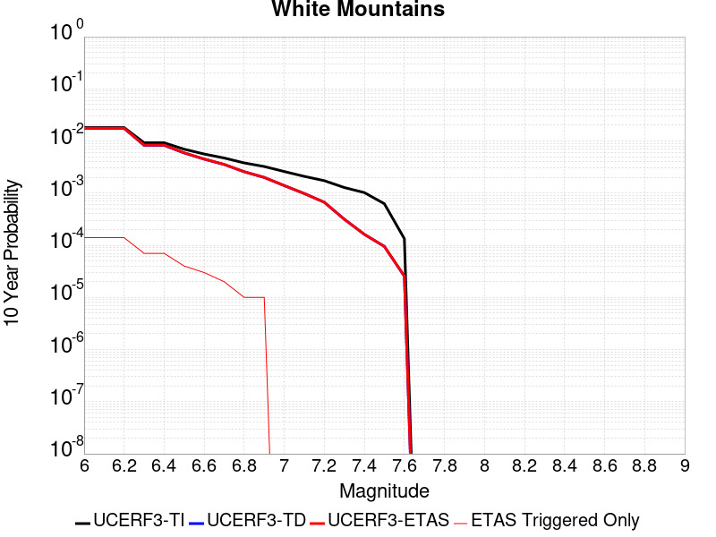 |

| Magnitude | 1 wk TI Prob | 1 wk TD Prob | 1 wk ETAS Prob | 1 wk ETAS/TD Gain | 1 wk ETAS Triggered Only | 1 mo TI Prob | 1 mo TD Prob | 1 mo ETAS Prob | 1 mo ETAS/TD Gain | 1 mo ETAS Triggered Only | 1 yr TI Prob | 1 yr TD Prob | 1 yr ETAS Prob | 1 yr ETAS/TD Gain | 1 yr ETAS Triggered Only | 10 yr TI Prob | 10 yr TD Prob | 10 yr ETAS Prob | 10 yr ETAS/TD Gain | 10 yr ETAS Triggered Only |
|-----|-----|-----|-----|-----|-----|-----|-----|-----|-----|-----|-----|-----|-----|-----|-----|-----|-----|-----|-----|-----|
| 6.0 | 3.503579E-5 | 3.3784127E-5 | 8.3782434E-5 | 2.4799352 | 5.0E-5 | 1.5014476E-4 | 1.4478175E-4 | 2.2477016E-4 | 1.5524758 | 8.0E-5 | 0.0018264796 | 0.0017614134 | 0.0018712196 | 1.0623399 | 1.1E-4 | 0.018115403 | 0.017486857 | 0.017624408 | 1.007866 | 1.4E-4 |
| 6.1 | 3.503579E-5 | 3.3784127E-5 | 8.3782434E-5 | 2.4799352 | 5.0E-5 | 1.5014476E-4 | 1.4478175E-4 | 2.2477016E-4 | 1.5524758 | 8.0E-5 | 0.0018264796 | 0.0017614134 | 0.0018712196 | 1.0623399 | 1.1E-4 | 0.018115403 | 0.017486857 | 0.017624408 | 1.007866 | 1.4E-4 |
| 6.2 | 3.503579E-5 | 3.3784127E-5 | 8.3782434E-5 | 2.4799352 | 5.0E-5 | 1.5014476E-4 | 1.4478175E-4 | 2.2477016E-4 | 1.5524758 | 8.0E-5 | 0.0018264796 | 0.0017614134 | 0.0018712196 | 1.0623399 | 1.1E-4 | 0.018115403 | 0.017486857 | 0.017624408 | 1.007866 | 1.4E-4 |
| 6.3 | 1.7818425E-5 | 1.591616E-5 | 2.5916E-5 | 1.6282823 | 1.0E-5 | 7.636245E-5 | 6.821041E-5 | 9.820836E-5 | 1.4397856 | 3.0E-5 | 9.293162E-4 | 8.301596E-4 | 8.7012636E-4 | 1.0481435 | 4.0E-5 | 0.009254395 | 0.0082720425 | 0.008341463 | 1.0083922 | 7.0E-5 |
| 6.4 | 1.7818425E-5 | 1.591616E-5 | 2.5916E-5 | 1.6282823 | 1.0E-5 | 7.636245E-5 | 6.821041E-5 | 9.820836E-5 | 1.4397856 | 3.0E-5 | 9.293162E-4 | 8.301596E-4 | 8.7012636E-4 | 1.0481435 | 4.0E-5 | 0.009254395 | 0.0082720425 | 0.008341463 | 1.0083922 | 7.0E-5 |
| 6.5 | 1.3397557E-5 | 1.1336374E-5 | 2.133626E-5 | 1.8821063 | 1.0E-5 | 5.741684E-5 | 4.8583595E-5 | 6.858262E-5 | 1.4116416 | 2.0E-5 | 6.988258E-4 | 5.913517E-4 | 6.2133395E-4 | 1.0507013 | 3.0E-5 | 0.006966323 | 0.005898487 | 0.0059382506 | 1.0067414 | 4.0E-5 |
| 6.6 | 1.0818695E-5 | 8.625434E-6 | 1.8625347E-5 | 2.1593518 | 1.0E-5 | 4.6365014E-5 | 3.6965648E-5 | 5.696491E-5 | 1.5410229 | 2.0E-5 | 5.6434784E-4 | 4.4996818E-4 | 4.7995467E-4 | 1.0666413 | 3.0E-5 | 0.005629168 | 0.0044910074 | 0.0045208726 | 1.00665 | 3.0E-5 |
| 6.7 | 9.067908E-6 | 6.802476E-6 | 6.802476E-6 | 1.0 | 0.0 | 3.8861883E-5 | 2.915316E-5 | 3.915287E-5 | 1.343006 | 1.0E-5 | 4.7304068E-4 | 3.548851E-4 | 3.74878E-4 | 1.0563363 | 2.0E-5 | 0.00472035 | 0.003543501 | 0.0035634302 | 1.0056242 | 2.0E-5 |
| 6.8 | 7.295947E-6 | 4.9364285E-6 | 4.9364285E-6 | 1.0 | 0.0 | 3.126797E-5 | 2.1155956E-5 | 3.1155745E-5 | 1.4726701 | 1.0E-5 | 3.8062103E-4 | 2.5754445E-4 | 2.6754188E-4 | 1.0388182 | 1.0E-5 | 0.0037996976 | 0.0025725728 | 0.002582547 | 1.0038772 | 1.0E-5 |
| 6.9 | 6.2243444E-6 | 3.8322546E-6 | 3.8322546E-6 | 1.0 | 0.0 | 2.6675489E-5 | 1.6423846E-5 | 2.6423682E-5 | 1.6088607 | 1.0E-5 | 3.2472567E-4 | 1.9994251E-4 | 2.0994052E-4 | 1.0500044 | 1.0E-5 | 0.0032425157 | 0.001997679 | 0.002007659 | 1.0049958 | 1.0E-5 |
| 7.0 | 4.9878413E-6 | 2.679564E-6 | 2.679564E-6 | 1.0 | 0.0 | 2.1376287E-5 | 1.1483797E-5 | 1.1483797E-5 | 1.0 | 0.0 | 2.602252E-4 | 1.3980652E-4 | 1.3980652E-4 | 1.0 | 0.0 | 0.002599207 | 0.0013972119 | 0.0013972119 | 1.0 | 0.0 |
| 7.1 | 4.0252844E-6 | 1.885702E-6 | 1.885702E-6 | 1.0 | 0.0 | 1.7251105E-5 | 8.081555E-6 | 8.081555E-6 | 1.0 | 0.0 | 2.1001195E-4 | 9.838863E-5 | 9.838863E-5 | 1.0 | 0.0 | 0.0020981359 | 9.834635E-4 | 9.834635E-4 | 1.0 | 0.0 |
| 7.2 | 3.3284066E-6 | 1.2818929E-6 | 1.2818929E-6 | 1.0 | 0.0 | 1.4264522E-5 | 5.4938155E-6 | 5.4938155E-6 | 1.0 | 0.0 | 1.736567E-4 | 6.688525E-5 | 6.688525E-5 | 1.0 | 0.0 | 0.0017352107 | 6.6866126E-4 | 6.6866126E-4 | 1.0 | 0.0 |
| 7.3 | 2.458226E-6 | 6.056684E-7 | 6.056684E-7 | 1.0 | 0.0 | 1.0535211E-5 | 2.5957193E-6 | 2.5957193E-6 | 1.0 | 0.0 | 1.2825865E-4 | 3.160246E-5 | 3.160246E-5 | 1.0 | 0.0 | 0.0012818464 | 3.1598343E-4 | 3.1598343E-4 | 1.0 | 0.0 |
| 7.4 | 1.965953E-6 | 3.1084684E-7 | 3.1084684E-7 | 1.0 | 0.0 | 8.425486E-6 | 1.3322001E-6 | 1.3322001E-6 | 1.0 | 0.0 | 1.0257547E-4 | 1.6219417E-5 | 1.6219417E-5 | 1.0 | 0.0 | 0.0010252813 | 1.6218246E-4 | 1.6218246E-4 | 1.0 | 0.0 |
| 7.5 | 1.2014192E-6 | 1.8241002E-7 | 1.8241002E-7 | 1.0 | 0.0 | 5.148929E-6 | 7.8175697E-7 | 7.8175697E-7 | 1.0 | 0.0 | 6.2686406E-5 | 9.51785E-6 | 9.51785E-6 | 1.0 | 0.0 | 6.266873E-4 | 9.517451E-5 | 9.517451E-5 | 1.0 | 0.0 |
| 7.6 | 2.5612175E-7 | 4.893784E-8 | 4.893784E-8 | 1.0 | 0.0 | 1.0976642E-6 | 2.0973359E-7 | 2.0973359E-7 | 1.0 | 0.0 | 1.3363979E-5 | 2.5535037E-6 | 2.5535037E-6 | 1.0 | 0.0 | 1.3363175E-4 | 2.553478E-5 | 2.553478E-5 | 1.0 | 0.0 |

## Brawley (Seismic Zone) alt 1
*[(top)](#table-of-contents)*

| 1 Week | 1 Month | 1 Year | 10 Year |
|-----|-----|-----|-----|
|  |  |  |  |

| Magnitude | 1 wk TI Prob | 1 wk TD Prob | 1 wk ETAS Prob | 1 wk ETAS/TD Gain | 1 wk ETAS Triggered Only | 1 mo TI Prob | 1 mo TD Prob | 1 mo ETAS Prob | 1 mo ETAS/TD Gain | 1 mo ETAS Triggered Only | 1 yr TI Prob | 1 yr TD Prob | 1 yr ETAS Prob | 1 yr ETAS/TD Gain | 1 yr ETAS Triggered Only | 10 yr TI Prob | 10 yr TD Prob | 10 yr ETAS Prob | 10 yr ETAS/TD Gain | 10 yr ETAS Triggered Only |
|-----|-----|-----|-----|-----|-----|-----|-----|-----|-----|-----|-----|-----|-----|-----|-----|-----|-----|-----|-----|-----|
| 6.0 | 2.2521618E-4 | 4.763429E-4 | 5.5630476E-4 | 1.1678662 | 8.0E-5 | 9.6485513E-4 | 0.0020399094 | 0.002149685 | 1.0538139 | 1.1E-4 | 0.011683988 | 0.024544531 | 0.024661586 | 1.0047691 | 1.2E-4 | 0.11088423 | 0.21349923 | 0.2136172 | 1.0005525 | 1.5E-4 |
| 6.1 | 2.2521618E-4 | 4.763429E-4 | 5.463095E-4 | 1.146883 | 7.0E-5 | 9.6485513E-4 | 0.0020399094 | 0.0021397055 | 1.0489218 | 1.0E-4 | 0.011683988 | 0.024544531 | 0.024651831 | 1.0043716 | 1.1E-4 | 0.11088423 | 0.21349923 | 0.21360934 | 1.0005157 | 1.4E-4 |
| 6.2 | 2.198148E-4 | 4.6718874E-4 | 5.37156E-4 | 1.1497624 | 7.0E-5 | 9.417233E-4 | 0.0020007377 | 0.0021005375 | 1.0498816 | 1.0E-4 | 0.011405343 | 0.024078513 | 0.024185864 | 1.0044584 | 1.1E-4 | 0.10837428 | 0.20993572 | 0.21004634 | 1.0005269 | 1.4E-4 |
| 6.3 | 2.1704129E-4 | 4.615455E-4 | 5.315132E-4 | 1.1515944 | 7.0E-5 | 9.298453E-4 | 0.0019765892 | 0.0020763916 | 1.0504922 | 1.0E-4 | 0.011262234 | 0.023792034 | 0.023899417 | 1.0045134 | 1.1E-4 | 0.107082725 | 0.20782684 | 0.20793773 | 1.0005336 | 1.4E-4 |
| 6.4 | 1.876142E-4 | 4.004663E-4 | 4.5044627E-4 | 1.1248045 | 5.0E-5 | 8.038131E-4 | 0.0017151695 | 0.0017950323 | 1.0465627 | 8.0E-5 | 0.00974259 | 0.020678662 | 0.0207668 | 1.0042623 | 9.0E-5 | 0.093263686 | 0.18457787 | 0.18466756 | 1.0004859 | 1.1E-4 |
| 6.5 | 1.7390939E-4 | 3.7478763E-4 | 4.247689E-4 | 1.1333588 | 5.0E-5 | 7.45113E-4 | 0.0016052561 | 0.0016851277 | 1.0497563 | 8.0E-5 | 0.009034078 | 0.019367293 | 0.01945555 | 1.004557 | 9.0E-5 | 0.086755216 | 0.17440015 | 0.17449096 | 1.0005207 | 1.1E-4 |
| 6.6 | 1.591791E-4 | 3.4893592E-4 | 3.9891846E-4 | 1.1432428 | 5.0E-5 | 6.8201777E-4 | 0.0014945926 | 0.0015744731 | 1.0534463 | 8.0E-5 | 0.008271996 | 0.018045008 | 0.018133383 | 1.0048975 | 9.0E-5 | 0.07970774 | 0.16380787 | 0.16389985 | 1.0005615 | 1.1E-4 |
| 6.7 | 1.4268003E-4 | 3.2059717E-4 | 3.7058117E-4 | 1.155909 | 5.0E-5 | 6.1134255E-4 | 0.0013732726 | 0.0014531628 | 1.058175 | 8.0E-5 | 0.007417723 | 0.01659171 | 0.016680216 | 1.0053344 | 9.0E-5 | 0.07174956 | 0.15193594 | 0.15202922 | 1.000614 | 1.1E-4 |
| 6.8 | 1.239713E-4 | 2.9055026E-4 | 3.4053574E-4 | 1.1720372 | 5.0E-5 | 5.3119735E-4 | 0.0012446274 | 0.0013245278 | 1.0641962 | 8.0E-5 | 0.0064481674 | 0.015049482 | 0.015138128 | 1.0058903 | 9.0E-5 | 0.06264243 | 0.13838051 | 0.13847528 | 1.0006849 | 1.1E-4 |
| 6.9 | 1.0180238E-4 | 2.6255674E-4 | 3.1254362E-4 | 1.190385 | 5.0E-5 | 4.3622297E-4 | 0.0011247622 | 0.0012046723 | 1.0710461 | 8.0E-5 | 0.005298089 | 0.013608998 | 0.013697772 | 1.0065233 | 9.0E-5 | 0.05173543 | 0.12496473 | 0.12506098 | 1.0007702 | 1.1E-4 |
| 7.0 | 7.6619996E-5 | 2.2400476E-4 | 2.7399356E-4 | 1.2231596 | 5.0E-5 | 3.283301E-4 | 9.596704E-4 | 0.0010395936 | 1.083282 | 8.0E-5 | 0.0039900932 | 0.011622103 | 0.011711056 | 1.0076538 | 9.0E-5 | 0.039192066 | 0.10726982 | 0.10736802 | 1.0009154 | 1.1E-4 |
| 7.1 | 7.5127435E-5 | 2.2083633E-4 | 2.708253E-4 | 1.226362 | 5.0E-5 | 3.2193496E-4 | 9.461013E-4 | 0.0010260256 | 1.0844775 | 8.0E-5 | 0.0039125155 | 0.011458648 | 0.011547617 | 1.0077643 | 9.0E-5 | 0.038443442 | 0.10583378 | 0.10593214 | 1.0009294 | 1.1E-4 |
| 7.2 | 6.788582E-5 | 2.0211334E-4 | 2.5210323E-4 | 1.2473359 | 5.0E-5 | 2.9090676E-4 | 8.6591556E-4 | 9.4584626E-4 | 1.0923078 | 8.0E-5 | 0.0035360386 | 0.0104922 | 0.010581255 | 1.0084878 | 9.0E-5 | 0.034803 | 0.097503684 | 0.097602956 | 1.0010182 | 1.1E-4 |
| 7.3 | 6.399602E-5 | 1.8842232E-4 | 2.3841289E-4 | 1.2653114 | 5.0E-5 | 2.7423984E-4 | 8.0727716E-4 | 8.872126E-4 | 1.0990186 | 8.0E-5 | 0.0033337586 | 0.009784897 | 0.009874016 | 1.0091078 | 9.0E-5 | 0.03284188 | 0.091397986 | 0.091497935 | 1.0010935 | 1.1E-4 |
| 7.4 | 4.506759E-5 | 1.2530042E-4 | 1.6529541E-4 | 1.3191928 | 4.0E-5 | 1.9313251E-4 | 5.3689216E-4 | 5.968599E-4 | 1.1116943 | 6.0E-5 | 0.0023488526 | 0.006517245 | 0.0065867887 | 1.0106708 | 7.0E-5 | 0.023241805 | 0.062364522 | 0.06243953 | 1.0012028 | 8.0E-5 |
| 7.5 | 3.43289E-5 | 9.336103E-5 | 1.2335823E-4 | 1.3213032 | 3.0E-5 | 1.4711556E-4 | 4.0005764E-4 | 4.5003765E-4 | 1.1249319 | 5.0E-5 | 0.0017896603 | 0.004859886 | 0.0049195946 | 1.012286 | 6.0E-5 | 0.01775316 | 0.047057066 | 0.04712377 | 1.0014175 | 7.0E-5 |
| 7.6 | 2.5980507E-5 | 7.053672E-5 | 1.00534606E-4 | 1.4252803 | 3.0E-5 | 1.1134028E-4 | 3.0226534E-4 | 3.4225325E-4 | 1.132294 | 4.0E-5 | 0.001354725 | 0.0036738948 | 0.0037237112 | 1.0135596 | 5.0E-5 | 0.013464959 | 0.03584298 | 0.035891186 | 1.0013449 | 5.0E-5 |
| 7.7 | 1.7292105E-5 | 4.9412036E-5 | 6.941105E-5 | 1.4047396 | 2.0E-5 | 7.4106916E-5 | 2.1174872E-4 | 2.3174449E-4 | 1.0944315 | 2.0E-5 | 9.018782E-4 | 0.0025749984 | 0.002604921 | 1.0116205 | 3.0E-5 | 0.008982267 | 0.025292097 | 0.025321338 | 1.0011561 | 3.0E-5 |
| 7.8 | 1.2927471E-5 | 3.9697254E-5 | 5.969646E-5 | 1.5037931 | 2.0E-5 | 5.5402274E-5 | 1.7012001E-4 | 1.9011661E-4 | 1.117544 | 2.0E-5 | 6.743139E-4 | 0.0020692463 | 0.002099184 | 1.0144681 | 3.0E-5 | 0.0067227143 | 0.020433145 | 0.020462532 | 1.0014383 | 3.0E-5 |
| 7.9 | 1.0200774E-5 | 2.8748475E-5 | 4.87479E-5 | 1.695669 | 2.0E-5 | 4.371687E-5 | 1.2320194E-4 | 1.4319948E-4 | 1.1623151 | 2.0E-5 | 5.321229E-4 | 0.0014989526 | 0.0015289077 | 1.019984 | 3.0E-5 | 0.005308505 | 0.014992895 | 0.015022445 | 1.001971 | 3.0E-5 |
| 8.0 | 8.650396E-6 | 2.3279512E-5 | 3.3279277E-5 | 1.4295523 | 1.0E-5 | 3.70726E-5 | 9.976552E-5 | 1.0976452E-4 | 1.100225 | 1.0E-5 | 4.5126543E-4 | 0.0012139693 | 0.001233945 | 1.0164549 | 2.0E-5 | 0.0045035016 | 0.012212164 | 0.01223192 | 1.0016177 | 2.0E-5 |
| 8.1 | 3.9368224E-6 | 7.3283345E-6 | 7.3283345E-6 | 1.0 | 0.0 | 1.6871985E-5 | 3.1406773E-5 | 3.1406773E-5 | 1.0 | 0.0 | 2.0539707E-4 | 3.8231048E-4 | 3.8231048E-4 | 1.0 | 0.0 | 0.0020520731 | 0.0040015313 | 0.0040015313 | 1.0 | 0.0 |
| 8.2 | 1.7101195E-6 | 2.2178374E-6 | 2.2178374E-6 | 1.0 | 0.0 | 7.329063E-6 | 9.504983E-6 | 9.504983E-6 | 1.0 | 0.0 | 8.922769E-5 | 1.15717055E-4 | 1.15717055E-4 | 1.0 | 0.0 | 8.9191867E-4 | 0.00126669 | 0.00126669 | 1.0 | 0.0 |
| 8.3 | 3.0346666E-8 | 1.721086E-8 | 1.721086E-8 | 1.0 | 0.0 | 1.3005713E-7 | 7.376083E-8 | 7.376083E-8 | 1.0 | 0.0 | 1.5834444E-6 | 8.98038E-7 | 8.98038E-7 | 1.0 | 0.0 | 1.5834332E-5 | 9.36379E-6 | 9.36379E-6 | 1.0 | 0.0 |

## Blue Cut
*[(top)](#table-of-contents)*

| 1 Week | 1 Month | 1 Year | 10 Year |
|-----|-----|-----|-----|
|  |  |  |  |

| Magnitude | 1 wk TI Prob | 1 wk TD Prob | 1 wk ETAS Prob | 1 wk ETAS/TD Gain | 1 wk ETAS Triggered Only | 1 mo TI Prob | 1 mo TD Prob | 1 mo ETAS Prob | 1 mo ETAS/TD Gain | 1 mo ETAS Triggered Only | 1 yr TI Prob | 1 yr TD Prob | 1 yr ETAS Prob | 1 yr ETAS/TD Gain | 1 yr ETAS Triggered Only | 10 yr TI Prob | 10 yr TD Prob | 10 yr ETAS Prob | 10 yr ETAS/TD Gain | 10 yr ETAS Triggered Only |
|-----|-----|-----|-----|-----|-----|-----|-----|-----|-----|-----|-----|-----|-----|-----|-----|-----|-----|-----|-----|-----|
| 6.0 | 2.1227985E-5 | 2.2719574E-5 | 6.271867E-5 | 2.7605565 | 4.0E-5 | 9.097391E-5 | 9.73663E-5 | 1.6735948E-4 | 1.7188646 | 7.0E-5 | 0.0011070445 | 0.0011848481 | 0.0012847296 | 1.084299 | 1.0E-4 | 0.011015458 | 0.011791152 | 0.011919619 | 1.0108953 | 1.3E-4 |
| 6.1 | 2.1227985E-5 | 2.2719574E-5 | 6.271867E-5 | 2.7605565 | 4.0E-5 | 9.097391E-5 | 9.73663E-5 | 1.6735948E-4 | 1.7188646 | 7.0E-5 | 0.0011070445 | 0.0011848481 | 0.0012847296 | 1.084299 | 1.0E-4 | 0.011015458 | 0.011791152 | 0.011919619 | 1.0108953 | 1.3E-4 |
| 6.2 | 2.1227985E-5 | 2.2719574E-5 | 6.271867E-5 | 2.7605565 | 4.0E-5 | 9.097391E-5 | 9.73663E-5 | 1.6735948E-4 | 1.7188646 | 7.0E-5 | 0.0011070445 | 0.0011848481 | 0.0012847296 | 1.084299 | 1.0E-4 | 0.011015458 | 0.011791152 | 0.011919619 | 1.0108953 | 1.3E-4 |
| 6.3 | 1.1613981E-5 | 1.2353542E-5 | 5.2353047E-5 | 4.237898 | 4.0E-5 | 4.9773254E-5 | 5.2942745E-5 | 1.1293957E-4 | 2.1332397 | 6.0E-5 | 6.0582085E-4 | 6.443998E-4 | 7.143547E-4 | 1.1085582 | 7.0E-5 | 0.0060417196 | 0.0064265593 | 0.0065259165 | 1.0154604 | 1.0E-4 |
| 6.4 | 1.1613981E-5 | 1.2353542E-5 | 5.2353047E-5 | 4.237898 | 4.0E-5 | 4.9773254E-5 | 5.2942745E-5 | 1.1293957E-4 | 2.1332397 | 6.0E-5 | 6.0582085E-4 | 6.443998E-4 | 7.143547E-4 | 1.1085582 | 7.0E-5 | 0.0060417196 | 0.0064265593 | 0.0065259165 | 1.0154604 | 1.0E-4 |
| 6.5 | 8.931326E-6 | 9.4816E-6 | 2.948141E-5 | 3.1093287 | 2.0E-5 | 3.8276554E-5 | 4.0634844E-5 | 7.063363E-5 | 1.7382526 | 3.0E-5 | 4.6591737E-4 | 4.946261E-4 | 5.3460634E-4 | 1.0808291 | 4.0E-5 | 0.0046494175 | 0.004936161 | 0.0050058155 | 1.014111 | 7.0E-5 |
| 6.6 | 7.345353E-6 | 7.79028E-6 | 2.7790124E-5 | 3.5672822 | 2.0E-5 | 3.1479703E-5 | 3.338653E-5 | 6.338553E-5 | 1.898536 | 3.0E-5 | 3.83198E-4 | 4.064132E-4 | 4.4639694E-4 | 1.098382 | 4.0E-5 | 0.0038253788 | 0.0040574907 | 0.0041272067 | 1.017182 | 7.0E-5 |
| 6.7 | 6.2775666E-6 | 6.655149E-6 | 2.6655016E-5 | 4.005172 | 2.0E-5 | 2.690358E-5 | 2.8521798E-5 | 4.8521226E-5 | 1.7011981 | 2.0E-5 | 3.2750185E-4 | 3.472051E-4 | 3.7719466E-4 | 1.0863743 | 3.0E-5 | 0.0032701963 | 0.003467367 | 0.003527159 | 1.0172442 | 6.0E-5 |
| 6.8 | 5.5234095E-6 | 5.8551113E-6 | 2.5854994E-5 | 4.415799 | 2.0E-5 | 2.367154E-5 | 2.5093133E-5 | 4.509263E-5 | 1.7970108 | 2.0E-5 | 2.8816288E-4 | 3.0547334E-4 | 3.354642E-4 | 1.0981783 | 3.0E-5 | 0.002877895 | 0.0030512505 | 0.0031110675 | 1.0196041 | 6.0E-5 |
| 6.9 | 4.7780054E-6 | 5.0654203E-6 | 2.506532E-5 | 4.9483194 | 2.0E-5 | 2.0477004E-5 | 2.1708804E-5 | 4.170837E-5 | 1.9212652 | 2.0E-5 | 2.4927902E-4 | 2.642797E-4 | 2.842744E-4 | 1.0756574 | 2.0E-5 | 0.0024899957 | 0.002640346 | 0.0026802404 | 1.0151095 | 4.0E-5 |
| 7.0 | 3.883171E-6 | 4.118487E-6 | 2.4118404E-5 | 5.856132 | 2.0E-5 | 1.6642054E-5 | 1.7650578E-5 | 3.7650225E-5 | 2.1330874 | 2.0E-5 | 2.0259817E-4 | 2.1488148E-4 | 2.348772E-4 | 1.0930545 | 2.0E-5 | 0.0020241356 | 0.0021474129 | 0.002187327 | 1.0185871 | 4.0E-5 |
| 7.1 | 2.8358215E-6 | 3.0097158E-6 | 1.3009686E-5 | 4.3225627 | 1.0E-5 | 1.2153464E-5 | 1.2898756E-5 | 2.2898626E-5 | 1.7752585 | 1.0E-5 | 1.4795837E-4 | 1.5703762E-4 | 1.6703604E-4 | 1.063669 | 1.0E-5 | 0.001478599 | 0.0015699116 | 0.001579896 | 1.0063598 | 1.0E-5 |

## Santa Rosa Island
*[(top)](#table-of-contents)*

| 1 Week | 1 Month | 1 Year | 10 Year |
|-----|-----|-----|-----|
|  |  |  |  |

| Magnitude | 1 wk TI Prob | 1 wk TD Prob | 1 wk ETAS Prob | 1 wk ETAS/TD Gain | 1 wk ETAS Triggered Only | 1 mo TI Prob | 1 mo TD Prob | 1 mo ETAS Prob | 1 mo ETAS/TD Gain | 1 mo ETAS Triggered Only | 1 yr TI Prob | 1 yr TD Prob | 1 yr ETAS Prob | 1 yr ETAS/TD Gain | 1 yr ETAS Triggered Only | 10 yr TI Prob | 10 yr TD Prob | 10 yr ETAS Prob | 10 yr ETAS/TD Gain | 10 yr ETAS Triggered Only |
|-----|-----|-----|-----|-----|-----|-----|-----|-----|-----|-----|-----|-----|-----|-----|-----|-----|-----|-----|-----|-----|
| 6.0 | 4.1143165E-5 | 4.709113E-5 | 7.708972E-5 | 1.6370326 | 3.0E-5 | 1.7631594E-4 | 2.0180462E-4 | 2.4179654E-4 | 1.1981715 | 4.0E-5 | 0.002144533 | 0.0024543991 | 0.0025342028 | 1.0325146 | 8.0E-5 | 0.021239553 | 0.024293557 | 0.02441064 | 1.0048196 | 1.2E-4 |
| 6.1 | 2.1061249E-5 | 2.3864959E-5 | 5.386424E-5 | 2.2570431 | 3.0E-5 | 9.0259375E-5 | 1.0227455E-4 | 1.3227148E-4 | 1.2932981 | 3.0E-5 | 0.0010983539 | 0.0012445103 | 0.0012944482 | 1.0401264 | 5.0E-5 | 0.01092941 | 0.01237845 | 0.0124475835 | 1.005585 | 7.0E-5 |
| 6.2 | 2.1061249E-5 | 2.3864959E-5 | 5.386424E-5 | 2.2570431 | 3.0E-5 | 9.0259375E-5 | 1.0227455E-4 | 1.3227148E-4 | 1.2932981 | 3.0E-5 | 0.0010983539 | 0.0012445103 | 0.0012944482 | 1.0401264 | 5.0E-5 | 0.01092941 | 0.01237845 | 0.0124475835 | 1.005585 | 7.0E-5 |
| 6.3 | 1.5158236E-5 | 1.7074419E-5 | 4.7073907E-5 | 2.7569845 | 3.0E-5 | 6.496225E-5 | 7.3174095E-5 | 1.031719E-4 | 1.4099512 | 3.0E-5 | 7.906284E-4 | 8.9054246E-4 | 9.3050685E-4 | 1.0448765 | 4.0E-5 | 0.007878214 | 0.00887099 | 0.008930458 | 1.0067036 | 6.0E-5 |
| 6.4 | 1.2341918E-5 | 1.3852917E-5 | 3.385264E-5 | 2.4437194 | 2.0E-5 | 5.2892858E-5 | 5.9368336E-5 | 7.936715E-5 | 1.33686 | 2.0E-5 | 6.437803E-4 | 7.225779E-4 | 7.5255625E-4 | 1.041488 | 3.0E-5 | 0.006419184 | 0.0072031217 | 0.0072527616 | 1.0068915 | 5.0E-5 |
| 6.5 | 9.061158E-6 | 1.0117032E-5 | 2.011693E-5 | 1.9884223 | 1.0E-5 | 3.883296E-5 | 4.3358017E-5 | 5.335758E-5 | 1.2306279 | 1.0E-5 | 4.726887E-4 | 5.277613E-4 | 5.4775074E-4 | 1.0378759 | 2.0E-5 | 0.004716845 | 0.0052656177 | 0.0052954596 | 1.0056673 | 3.0E-5 |
| 6.6 | 7.5461685E-6 | 8.400734E-6 | 1.840065E-5 | 2.1903622 | 1.0E-5 | 3.2340322E-5 | 3.600267E-5 | 4.600231E-5 | 1.2777472 | 1.0E-5 | 3.936723E-4 | 4.3824868E-4 | 4.582399E-4 | 1.0456161 | 2.0E-5 | 0.003929756 | 0.0043742736 | 0.004394186 | 1.0045522 | 2.0E-5 |
| 6.7 | 5.5023775E-6 | 6.087381E-6 | 1.608732E-5 | 2.6427326 | 1.0E-5 | 2.3581404E-5 | 2.6088532E-5 | 3.6088273E-5 | 1.3833002 | 1.0E-5 | 2.8706578E-4 | 3.1758484E-4 | 3.2758166E-4 | 1.0314777 | 1.0E-5 | 0.0028669522 | 0.0031716316 | 0.0031815998 | 1.003143 | 1.0E-5 |
| 6.8 | 3.7351679E-6 | 4.0831405E-6 | 1.40831E-5 | 3.4490852 | 1.0E-5 | 1.6007763E-5 | 1.7499071E-5 | 2.7498896E-5 | 1.5714489 | 1.0E-5 | 1.948771E-4 | 2.1303285E-4 | 2.2303071E-4 | 1.0469311 | 1.0E-5 | 0.0019470629 | 0.0021285315 | 0.00213851 | 1.004688 | 1.0E-5 |
| 6.9 | 2.456366E-6 | 2.6292707E-6 | 1.2629244E-5 | 4.803326 | 1.0E-5 | 1.0527241E-5 | 1.1268255E-5 | 2.1268143E-5 | 1.8874389 | 1.0E-5 | 1.2816161E-4 | 1.3718239E-4 | 1.4718101E-4 | 1.0728856 | 1.0E-5 | 0.0012808773 | 0.0013709799 | 0.0013809663 | 1.007284 | 1.0E-5 |
| 7.0 | 2.3245157E-6 | 2.4827784E-6 | 1.2482754E-5 | 5.0277357 | 1.0E-5 | 9.962172E-6 | 1.0640436E-5 | 2.064033E-5 | 1.9398011 | 1.0E-5 | 1.2128269E-4 | 1.2953962E-4 | 1.3953833E-4 | 1.0771865 | 1.0E-5 | 0.0012121652 | 0.0012946434 | 0.0013046304 | 1.0077142 | 1.0E-5 |
| 7.1 | 2.2248344E-6 | 2.37325E-6 | 1.2373226E-5 | 5.213621 | 1.0E-5 | 9.53497E-6 | 1.0171032E-5 | 2.017093E-5 | 1.9831743 | 1.0E-5 | 1.1608207E-4 | 1.238253E-4 | 1.3382405E-4 | 1.0807489 | 1.0E-5 | 0.0011602144 | 0.0012375651 | 0.0012475527 | 1.0080703 | 1.0E-5 |
| 7.2 | 2.1350402E-6 | 2.2761542E-6 | 1.2276131E-5 | 5.393366 | 1.0E-5 | 9.150141E-6 | 9.75491E-6 | 1.9754812E-5 | 2.0251148 | 1.0E-5 | 1.1139726E-4 | 1.1875957E-4 | 1.2875839E-4 | 1.0841937 | 1.0E-5 | 0.0011134144 | 0.0011869629 | 0.0011969511 | 1.0084149 | 1.0E-5 |
| 7.3 | 1.9793572E-6 | 2.1087192E-6 | 1.2108698E-5 | 5.742205 | 1.0E-5 | 8.482932E-6 | 9.037337E-6 | 1.9037247E-5 | 2.1065106 | 1.0E-5 | 1.032748E-4 | 1.1002403E-4 | 1.2002294E-4 | 1.0908792 | 1.0E-5 | 0.0010322682 | 0.0010996974 | 0.0011096864 | 1.0090834 | 1.0E-5 |
| 7.4 | 1.6951194E-6 | 1.8045735E-6 | 1.8045735E-6 | 1.0 | 0.0 | 7.264777E-6 | 7.733864E-6 | 7.733864E-6 | 1.0 | 0.0 | 8.844508E-5 | 9.415574E-5 | 9.415574E-5 | 1.0 | 0.0 | 8.840988E-4 | 9.411601E-4 | 9.411601E-4 | 1.0 | 0.0 |
| 7.5 | 8.987207E-7 | 9.512216E-7 | 9.512216E-7 | 1.0 | 0.0 | 3.8516546E-6 | 4.0766577E-6 | 4.0766577E-6 | 1.0 | 0.0 | 4.6892885E-5 | 4.9632188E-5 | 4.9632188E-5 | 1.0 | 0.0 | 4.688299E-4 | 4.962122E-4 | 4.962122E-4 | 1.0 | 0.0 |
| 7.6 | 3.8783037E-7 | 4.0529335E-7 | 4.0529335E-7 | 1.0 | 0.0 | 1.6621291E-6 | 1.7369704E-6 | 1.7369704E-6 | 1.0 | 0.0 | 2.0236233E-5 | 2.1147416E-5 | 2.1147416E-5 | 1.0 | 0.0 | 2.023439E-4 | 2.114547E-4 | 2.114547E-4 | 1.0 | 0.0 |
| 7.7 | 6.181804E-8 | 6.339047E-8 | 6.339047E-8 | 1.0 | 0.0 | 2.6493444E-7 | 2.7167343E-7 | 2.7167343E-7 | 1.0 | 0.0 | 3.225572E-6 | 3.307619E-6 | 3.307619E-6 | 1.0 | 0.0 | 3.225525E-5 | 3.3075703E-5 | 3.3075703E-5 | 1.0 | 0.0 |
| 7.8 | 1.3704449E-9 | 1.3964153E-9 | 1.3964153E-9 | 1.0 | 0.0 | 5.873335E-9 | 5.984637E-9 | 5.984637E-9 | 1.0 | 0.0 | 7.1507856E-8 | 7.286295E-8 | 7.286295E-8 | 1.0 | 0.0 | 7.1507833E-7 | 7.286294E-7 | 7.286294E-7 | 1.0 | 0.0 |

## Imperial
*[(top)](#table-of-contents)*

| 1 Week | 1 Month | 1 Year | 10 Year |
|-----|-----|-----|-----|
|  | 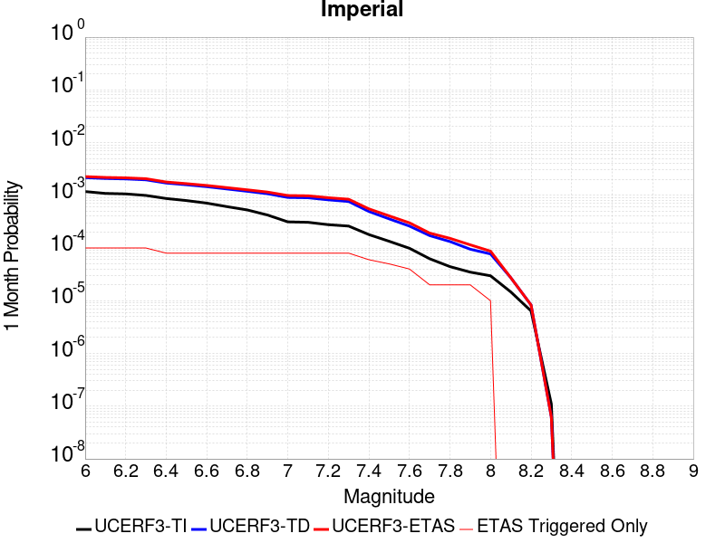 |  | 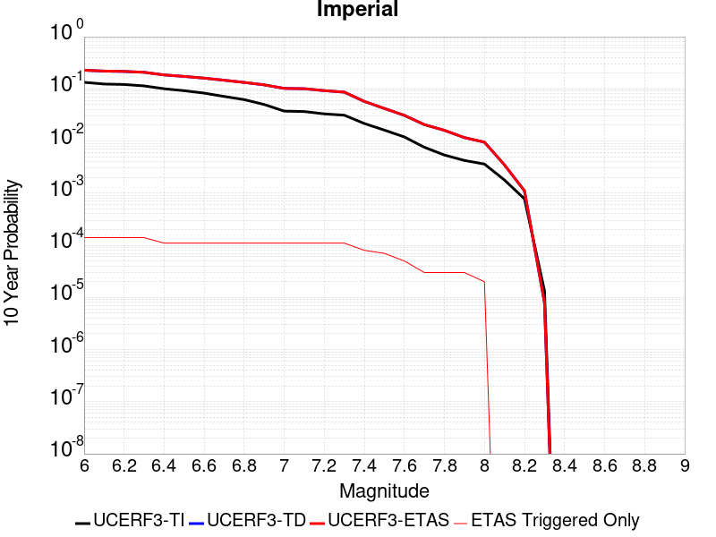 |

| Magnitude | 1 wk TI Prob | 1 wk TD Prob | 1 wk ETAS Prob | 1 wk ETAS/TD Gain | 1 wk ETAS Triggered Only | 1 mo TI Prob | 1 mo TD Prob | 1 mo ETAS Prob | 1 mo ETAS/TD Gain | 1 mo ETAS Triggered Only | 1 yr TI Prob | 1 yr TD Prob | 1 yr ETAS Prob | 1 yr ETAS/TD Gain | 1 yr ETAS Triggered Only | 10 yr TI Prob | 10 yr TD Prob | 10 yr ETAS Prob | 10 yr ETAS/TD Gain | 10 yr ETAS Triggered Only |
|-----|-----|-----|-----|-----|-----|-----|-----|-----|-----|-----|-----|-----|-----|-----|-----|-----|-----|-----|-----|-----|
| 6.0 | 2.7496446E-4 | 5.055345E-4 | 5.7549914E-4 | 1.1383973 | 7.0E-5 | 0.0011778869 | 0.002164817 | 0.0022646005 | 1.0460932 | 1.0E-4 | 0.0142467655 | 0.026048409 | 0.026155544 | 1.004113 | 1.1E-4 | 0.13367249 | 0.22807029 | 0.22817837 | 1.0004739 | 1.4E-4 |
| 6.1 | 2.5356023E-4 | 4.8657708E-4 | 5.56543E-4 | 1.1437922 | 7.0E-5 | 0.001086234 | 0.002083702 | 0.0021834937 | 1.0478915 | 1.0E-4 | 0.013144928 | 0.02507094 | 0.025178181 | 1.0042776 | 1.1E-4 | 0.123940155 | 0.21949561 | 0.21960488 | 1.0004978 | 1.4E-4 |
| 6.2 | 2.4820742E-4 | 4.775311E-4 | 5.474977E-4 | 1.1465173 | 7.0E-5 | 0.0010633124 | 0.0020449946 | 0.00214479 | 1.0487999 | 1.0E-4 | 0.01286919 | 0.024610676 | 0.024717968 | 1.0043596 | 1.1E-4 | 0.12148927 | 0.21600136 | 0.21611112 | 1.0005082 | 1.4E-4 |
| 6.3 | 2.3205351E-4 | 4.5892023E-4 | 5.2888814E-4 | 1.152462 | 7.0E-5 | 9.94136E-4 | 0.0019653554 | 0.002065159 | 1.0507814 | 1.0E-4 | 0.012036599 | 0.023661187 | 0.023768583 | 1.004539 | 1.1E-4 | 0.11405133 | 0.20793827 | 0.20804916 | 1.0005332 | 1.4E-4 |
| 6.4 | 2.0304754E-4 | 3.9878016E-4 | 4.487602E-4 | 1.1253324 | 5.0E-5 | 8.6991355E-4 | 0.0017079529 | 0.0017878163 | 1.0467597 | 8.0E-5 | 0.010539869 | 0.020595418 | 0.020683564 | 1.0042799 | 9.0E-5 | 0.100537635 | 0.18507113 | 0.18516076 | 1.0004843 | 1.1E-4 |
| 6.5 | 1.854992E-4 | 3.6990462E-4 | 4.1988614E-4 | 1.13512 | 5.0E-5 | 7.9475436E-4 | 0.0015843548 | 0.001664228 | 1.0504137 | 8.0E-5 | 0.009633281 | 0.01911443 | 0.01920271 | 1.0046185 | 9.0E-5 | 0.0922623 | 0.1733039 | 0.17339483 | 1.0005248 | 1.1E-4 |
| 6.6 | 1.6586106E-4 | 3.4036173E-4 | 3.9034474E-4 | 1.1468525 | 5.0E-5 | 7.106394E-4 | 0.0014578878 | 0.0015377712 | 1.054794 | 8.0E-5 | 0.008617763 | 0.017607626 | 0.01769604 | 1.0050215 | 9.0E-5 | 0.08291132 | 0.16078055 | 0.16087286 | 1.0005741 | 1.1E-4 |
| 6.7 | 1.4224656E-4 | 3.076812E-4 | 3.5766582E-4 | 1.1624559 | 5.0E-5 | 6.094856E-4 | 0.0013179756 | 0.0013978701 | 1.0606191 | 8.0E-5 | 0.0073952693 | 0.015928522 | 0.016017087 | 1.0055603 | 9.0E-5 | 0.07153955 | 0.14648798 | 0.14658187 | 1.0006409 | 1.1E-4 |
| 6.8 | 1.2317259E-4 | 2.779231E-4 | 3.279092E-4 | 1.1798558 | 5.0E-5 | 5.2777573E-4 | 0.0011905615 | 0.0012704663 | 1.0671152 | 8.0E-5 | 0.0064067547 | 0.014400131 | 0.014488835 | 1.0061599 | 9.0E-5 | 0.06225166 | 0.13294089 | 0.13303626 | 1.0007174 | 1.1E-4 |
| 6.9 | 9.859898E-5 | 2.5015484E-4 | 3.0014233E-4 | 1.1998262 | 5.0E-5 | 4.2249862E-4 | 0.0010716559 | 0.0011515701 | 1.0745708 | 8.0E-5 | 0.0051317946 | 0.012970319 | 0.013059151 | 1.0068489 | 9.0E-5 | 0.05014893 | 0.119408876 | 0.11950574 | 1.0008112 | 1.1E-4 |
| 7.0 | 7.3191884E-5 | 2.1267848E-4 | 2.6266786E-4 | 1.2350466 | 5.0E-5 | 3.136418E-4 | 9.11164E-4 | 9.910911E-4 | 1.0877198 | 8.0E-5 | 0.003811904 | 0.011037681 | 0.011126688 | 1.0080639 | 9.0E-5 | 0.037471764 | 0.10206756 | 0.10216633 | 1.0009677 | 1.1E-4 |
| 7.1 | 7.1760296E-5 | 2.0969207E-4 | 2.5968158E-4 | 1.2383949 | 5.0E-5 | 3.0750787E-4 | 8.9837395E-4 | 9.783021E-4 | 1.0889698 | 8.0E-5 | 0.003737482 | 0.010883528 | 0.010972548 | 1.0081794 | 9.0E-5 | 0.03675245 | 0.10070406 | 0.10080299 | 1.0009823 | 1.1E-4 |
| 7.2 | 6.46614E-5 | 1.9137723E-4 | 2.4136766E-4 | 1.2612141 | 5.0E-5 | 2.7709085E-4 | 8.199333E-4 | 8.9986774E-4 | 1.0974889 | 8.0E-5 | 0.0033683628 | 0.009937617 | 0.010026723 | 1.0089664 | 9.0E-5 | 0.033177625 | 0.092511006 | 0.09261083 | 1.0010791 | 1.1E-4 |
| 7.3 | 6.088115E-5 | 1.780939E-4 | 2.28085E-4 | 1.2807008 | 5.0E-5 | 2.6089314E-4 | 7.6303916E-4 | 8.4297813E-4 | 1.1047639 | 8.0E-5 | 0.0031717476 | 0.009251006 | 0.009340174 | 1.0096387 | 9.0E-5 | 0.031268585 | 0.08656135 | 0.08666183 | 1.0011607 | 1.1E-4 |
| 7.4 | 4.199346E-5 | 1.1511097E-4 | 1.5510636E-4 | 1.3474507 | 4.0E-5 | 1.7995955E-4 | 4.932403E-4 | 5.5321073E-4 | 1.1215845 | 6.0E-5 | 0.0021888057 | 0.005988835 | 0.006058416 | 1.0116184 | 7.0E-5 | 0.02167372 | 0.05744024 | 0.057515644 | 1.0013127 | 8.0E-5 |
| 7.5 | 3.130448E-5 | 8.333871E-5 | 1.1333621E-4 | 1.3599467 | 3.0E-5 | 1.3415517E-4 | 3.5711733E-4 | 4.070995E-4 | 1.13996 | 5.0E-5 | 0.0016321153 | 0.0043392954 | 0.0043990347 | 1.0137671 | 6.0E-5 | 0.016201803 | 0.042133506 | 0.042200558 | 1.0015914 | 7.0E-5 |
| 7.6 | 2.3074248E-5 | 6.0849357E-5 | 9.0847534E-5 | 1.4929909 | 3.0E-5 | 9.888588E-5 | 2.6075702E-4 | 3.007466E-4 | 1.1533595 | 4.0E-5 | 0.0012032706 | 0.0031701182 | 0.0032199598 | 1.0157223 | 5.0E-5 | 0.011967761 | 0.03102816 | 0.03107661 | 1.0015614 | 5.0E-5 |
| 7.7 | 1.45864815E-5 | 4.0128452E-5 | 6.0127648E-5 | 1.4983795 | 2.0E-5 | 6.2511994E-5 | 1.7196777E-4 | 1.9196433E-4 | 1.1162809 | 2.0E-5 | 7.608177E-4 | 0.0020917025 | 0.00212164 | 1.0143124 | 3.0E-5 | 0.007582182 | 0.02062909 | 0.02065847 | 1.0014243 | 3.0E-5 |
| 7.8 | 1.0352979E-5 | 3.096395E-5 | 5.0963332E-5 | 1.6458924 | 2.0E-5 | 4.4369157E-5 | 1.326959E-4 | 1.5269325E-4 | 1.1507006 | 2.0E-5 | 5.400606E-4 | 0.0016143778 | 0.0016443294 | 1.018553 | 3.0E-5 | 0.0053875 | 0.016017893 | 0.016047413 | 1.0018429 | 3.0E-5 |
| 7.9 | 8.137906E-6 | 2.2151205E-5 | 4.215076E-5 | 1.9028654 | 2.0E-5 | 3.4876273E-5 | 9.493029E-5 | 1.1492839E-4 | 1.2106609 | 2.0E-5 | 4.2453592E-4 | 0.0011551644 | 0.0011851297 | 1.0259403 | 3.0E-5 | 0.004237258 | 0.011618842 | 0.011648494 | 1.002552 | 3.0E-5 |
| 8.0 | 6.93792E-6 | 1.8010365E-5 | 2.8010185E-5 | 1.5552258 | 1.0E-5 | 2.9733603E-5 | 7.7185E-5 | 8.718423E-5 | 1.1295488 | 1.0E-5 | 3.6194647E-4 | 9.3932304E-4 | 9.593042E-4 | 1.021272 | 2.0E-5 | 0.0036135751 | 0.009502415 | 0.009522225 | 1.0020847 | 2.0E-5 |
| 8.1 | 3.4286315E-6 | 6.380179E-6 | 6.380179E-6 | 1.0 | 0.0 | 1.4694053E-5 | 2.734334E-5 | 2.734334E-5 | 1.0 | 0.0 | 1.7888541E-4 | 3.3285443E-4 | 3.3285443E-4 | 1.0 | 0.0 | 0.0017874148 | 0.0034863674 | 0.0034863674 | 1.0 | 0.0 |
| 8.2 | 1.4906886E-6 | 1.936633E-6 | 1.936633E-6 | 1.0 | 0.0 | 6.3886496E-6 | 8.2998295E-6 | 8.2998295E-6 | 1.0 | 0.0 | 7.7779034E-5 | 1.0104576E-4 | 1.0104576E-4 | 1.0 | 0.0 | 7.775182E-4 | 0.0011075423 | 0.0011075423 | 1.0 | 0.0 |
| 8.3 | 2.5758007E-8 | 1.4495866E-8 | 1.4495866E-8 | 1.0 | 0.0 | 1.10391454E-7 | 6.212514E-8 | 6.212514E-8 | 1.0 | 0.0 | 1.3440151E-6 | 7.563736E-7 | 7.563736E-7 | 1.0 | 0.0 | 1.344007E-5 | 7.884359E-6 | 7.884359E-6 | 1.0 | 0.0 |

## Pisgah-Bullion Mtn-Mesquite Lk
*[(top)](#table-of-contents)*

| 1 Week | 1 Month | 1 Year | 10 Year |
|-----|-----|-----|-----|
|  |  |  |  |

| Magnitude | 1 wk TI Prob | 1 wk TD Prob | 1 wk ETAS Prob | 1 wk ETAS/TD Gain | 1 wk ETAS Triggered Only | 1 mo TI Prob | 1 mo TD Prob | 1 mo ETAS Prob | 1 mo ETAS/TD Gain | 1 mo ETAS Triggered Only | 1 yr TI Prob | 1 yr TD Prob | 1 yr ETAS Prob | 1 yr ETAS/TD Gain | 1 yr ETAS Triggered Only | 10 yr TI Prob | 10 yr TD Prob | 10 yr ETAS Prob | 10 yr ETAS/TD Gain | 10 yr ETAS Triggered Only |
|-----|-----|-----|-----|-----|-----|-----|-----|-----|-----|-----|-----|-----|-----|-----|-----|-----|-----|-----|-----|-----|
| 6.0 | 3.0240792E-5 | 2.40909E-5 | 7.4089694E-5 | 3.0754225 | 5.0E-5 | 1.2959696E-4 | 1.032432E-4 | 1.5323803E-4 | 1.4842434 | 5.0E-5 | 0.0015767008 | 0.0012563618 | 0.0013362613 | 1.0635959 | 8.0E-5 | 0.015655609 | 0.012502613 | 0.012640863 | 1.0110576 | 1.4E-4 |
| 6.1 | 3.0240792E-5 | 2.40909E-5 | 7.4089694E-5 | 3.0754225 | 5.0E-5 | 1.2959696E-4 | 1.032432E-4 | 1.5323803E-4 | 1.4842434 | 5.0E-5 | 0.0015767008 | 0.0012563618 | 0.0013362613 | 1.0635959 | 8.0E-5 | 0.015655609 | 0.012502613 | 0.012640863 | 1.0110576 | 1.4E-4 |
| 6.2 | 3.0240792E-5 | 2.40909E-5 | 7.4089694E-5 | 3.0754225 | 5.0E-5 | 1.2959696E-4 | 1.032432E-4 | 1.5323803E-4 | 1.4842434 | 5.0E-5 | 0.0015767008 | 0.0012563618 | 0.0013362613 | 1.0635959 | 8.0E-5 | 0.015655609 | 0.012502613 | 0.012640863 | 1.0110576 | 1.4E-4 |
| 6.3 | 2.0498217E-5 | 1.3638054E-5 | 4.3637647E-5 | 3.1996973 | 3.0E-5 | 8.784654E-5 | 5.8447586E-5 | 8.8445835E-5 | 1.5132504 | 3.0E-5 | 0.0010690069 | 7.1138324E-4 | 7.513548E-4 | 1.0561885 | 4.0E-5 | 0.01063879 | 0.0070926864 | 0.007152261 | 1.0083994 | 6.0E-5 |
| 6.4 | 2.0498217E-5 | 1.3638054E-5 | 4.3637647E-5 | 3.1996973 | 3.0E-5 | 8.784654E-5 | 5.8447586E-5 | 8.8445835E-5 | 1.5132504 | 3.0E-5 | 0.0010690069 | 7.1138324E-4 | 7.513548E-4 | 1.0561885 | 4.0E-5 | 0.01063879 | 0.0070926864 | 0.007152261 | 1.0083994 | 6.0E-5 |
| 6.5 | 1.7316182E-5 | 1.04769715E-5 | 4.0476658E-5 | 3.8633928 | 3.0E-5 | 7.42101E-5 | 4.490059E-5 | 7.4899246E-5 | 1.6681126 | 3.0E-5 | 9.0313336E-4 | 5.465376E-4 | 5.865157E-4 | 1.073148 | 4.0E-5 | 0.008994718 | 0.00545293 | 0.005512603 | 1.0109433 | 6.0E-5 |
| 6.6 | 1.5251077E-5 | 8.414133E-6 | 3.841388E-5 | 4.5653996 | 3.0E-5 | 6.536012E-5 | 3.606011E-5 | 6.605903E-5 | 1.8319142 | 3.0E-5 | 7.9546886E-4 | 4.3895066E-4 | 4.789331E-4 | 1.0910864 | 4.0E-5 | 0.007926274 | 0.0043815537 | 0.0044412906 | 1.0136337 | 6.0E-5 |
| 6.7 | 1.2997425E-5 | 6.4112146E-6 | 6.4112146E-6 | 1.0 | 0.0 | 5.570206E-5 | 2.7476372E-5 | 2.7476372E-5 | 1.0 | 0.0 | 6.7796157E-4 | 3.3447813E-4 | 3.4447477E-4 | 1.0298873 | 1.0E-5 | 0.0067589693 | 0.003340207 | 0.003370107 | 1.0089514 | 3.0E-5 |
| 6.8 | 1.035386E-5 | 4.333145E-6 | 4.333145E-6 | 1.0 | 0.0 | 4.437293E-5 | 1.8570496E-5 | 1.8570496E-5 | 1.0 | 0.0 | 5.401065E-4 | 2.260732E-4 | 2.3607093E-4 | 1.0442234 | 1.0E-5 | 0.0053879567 | 0.002258519 | 0.0022884512 | 1.0132531 | 3.0E-5 |
| 6.9 | 8.816252E-6 | 3.5805879E-6 | 3.5805879E-6 | 1.0 | 0.0 | 3.778339E-5 | 1.534529E-5 | 1.534529E-5 | 1.0 | 0.0 | 4.5991567E-4 | 1.8681347E-4 | 1.9681161E-4 | 1.0535194 | 1.0E-5 | 0.00458965 | 0.0018666228 | 0.0018965668 | 1.0160418 | 3.0E-5 |
| 7.0 | 6.8232207E-6 | 2.5674399E-6 | 2.5674399E-6 | 1.0 | 0.0 | 2.9242048E-5 | 1.100327E-5 | 1.100327E-5 | 1.0 | 0.0 | 3.5596377E-4 | 1.3395688E-4 | 1.4395555E-4 | 1.0746409 | 1.0E-5 | 0.0035539411 | 0.0013387925 | 0.0013687523 | 1.0223782 | 3.0E-5 |
| 7.1 | 5.837013E-6 | 2.2273143E-6 | 2.2273143E-6 | 1.0 | 0.0 | 2.501553E-5 | 9.5456E-6 | 9.5456E-6 | 1.0 | 0.0 | 3.045215E-4 | 1.1621177E-4 | 1.2621061E-4 | 1.0860398 | 1.0E-5 | 0.0030410455 | 0.001161539 | 0.0011915042 | 1.0257978 | 3.0E-5 |
| 7.2 | 4.278052E-6 | 1.6275065E-6 | 1.6275065E-6 | 1.0 | 0.0 | 1.833438E-5 | 6.975011E-6 | 6.975011E-6 | 1.0 | 0.0 | 2.231982E-4 | 8.491768E-5 | 8.491768E-5 | 1.0 | 0.0 | 0.0022297418 | 8.4887556E-4 | 8.588671E-4 | 1.0117702 | 1.0E-5 |
| 7.3 | 1.8803692E-6 | 8.344788E-7 | 8.344788E-7 | 1.0 | 0.0 | 8.0587E-6 | 3.5763337E-6 | 3.5763337E-6 | 1.0 | 0.0 | 9.811026E-5 | 4.354114E-5 | 4.354114E-5 | 1.0 | 0.0 | 9.806695E-4 | 4.3534054E-4 | 4.453362E-4 | 1.0229605 | 1.0E-5 |

## Camp Rock 2011
*[(top)](#table-of-contents)*

| 1 Week | 1 Month | 1 Year | 10 Year |
|-----|-----|-----|-----|
|  |  |  | 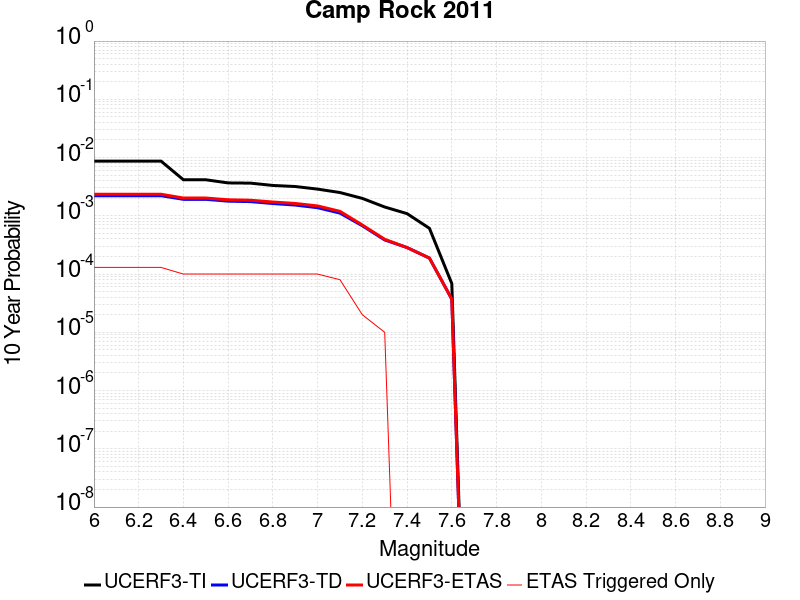 |

| Magnitude | 1 wk TI Prob | 1 wk TD Prob | 1 wk ETAS Prob | 1 wk ETAS/TD Gain | 1 wk ETAS Triggered Only | 1 mo TI Prob | 1 mo TD Prob | 1 mo ETAS Prob | 1 mo ETAS/TD Gain | 1 mo ETAS Triggered Only | 1 yr TI Prob | 1 yr TD Prob | 1 yr ETAS Prob | 1 yr ETAS/TD Gain | 1 yr ETAS Triggered Only | 10 yr TI Prob | 10 yr TD Prob | 10 yr ETAS Prob | 10 yr ETAS/TD Gain | 10 yr ETAS Triggered Only |
|-----|-----|-----|-----|-----|-----|-----|-----|-----|-----|-----|-----|-----|-----|-----|-----|-----|-----|-----|-----|-----|
| 6.0 | 1.6710783E-5 | 4.249999E-6 | 4.4249828E-5 | 10.411726 | 4.0E-5 | 7.161568E-5 | 1.8214158E-5 | 6.8213245E-5 | 3.7450674 | 5.0E-5 | 8.7157206E-4 | 2.2173533E-4 | 3.1171538E-4 | 1.4057993 | 9.0E-5 | 0.008681616 | 0.0022151938 | 0.0023449059 | 1.0585556 | 1.3E-4 |
| 6.1 | 1.6710783E-5 | 4.249999E-6 | 4.4249828E-5 | 10.411726 | 4.0E-5 | 7.161568E-5 | 1.8214158E-5 | 6.8213245E-5 | 3.7450674 | 5.0E-5 | 8.7157206E-4 | 2.2173533E-4 | 3.1171538E-4 | 1.4057993 | 9.0E-5 | 0.008681616 | 0.0022151938 | 0.0023449059 | 1.0585556 | 1.3E-4 |
| 6.2 | 1.6710783E-5 | 4.249999E-6 | 4.4249828E-5 | 10.411726 | 4.0E-5 | 7.161568E-5 | 1.8214158E-5 | 6.8213245E-5 | 3.7450674 | 5.0E-5 | 8.7157206E-4 | 2.2173533E-4 | 3.1171538E-4 | 1.4057993 | 9.0E-5 | 0.008681616 | 0.0022151938 | 0.0023449059 | 1.0585556 | 1.3E-4 |
| 6.3 | 1.6710783E-5 | 4.249999E-6 | 4.4249828E-5 | 10.411726 | 4.0E-5 | 7.161568E-5 | 1.8214158E-5 | 6.8213245E-5 | 3.7450674 | 5.0E-5 | 8.7157206E-4 | 2.2173533E-4 | 3.1171538E-4 | 1.4057993 | 9.0E-5 | 0.008681616 | 0.0022151938 | 0.0023449059 | 1.0585556 | 1.3E-4 |
| 6.4 | 7.982846E-6 | 3.6820359E-6 | 2.3681961E-5 | 6.4317575 | 2.0E-5 | 3.421175E-5 | 1.578006E-5 | 4.5779587E-5 | 2.9011035 | 3.0E-5 | 4.1644843E-4 | 1.9210564E-4 | 2.5209412E-4 | 1.3122681 | 6.0E-5 | 0.0041566887 | 0.0019194306 | 0.0020192387 | 1.0519987 | 1.0E-4 |
| 6.5 | 7.982846E-6 | 3.6820359E-6 | 2.3681961E-5 | 6.4317575 | 2.0E-5 | 3.421175E-5 | 1.578006E-5 | 4.5779587E-5 | 2.9011035 | 3.0E-5 | 4.1644843E-4 | 1.9210564E-4 | 2.5209412E-4 | 1.3122681 | 6.0E-5 | 0.0041566887 | 0.0019194306 | 0.0020192387 | 1.0519987 | 1.0E-4 |
| 6.6 | 7.048869E-6 | 3.4242998E-6 | 2.342423E-5 | 6.84059 | 2.0E-5 | 3.0209088E-5 | 1.467549E-5 | 4.467505E-5 | 3.0441947 | 3.0E-5 | 3.677336E-4 | 1.7865976E-4 | 2.3864904E-4 | 1.3357738 | 6.0E-5 | 0.0036712566 | 0.0017851929 | 0.0018850144 | 1.0559163 | 1.0E-4 |
| 6.7 | 6.987307E-6 | 3.3622775E-6 | 2.336221E-5 | 6.948329 | 2.0E-5 | 2.9945259E-5 | 1.4409683E-5 | 4.440925E-5 | 3.0819035 | 3.0E-5 | 3.6452254E-4 | 1.7542407E-4 | 2.3541355E-4 | 1.3419683 | 6.0E-5 | 0.0036392517 | 0.0017528872 | 0.0018527118 | 1.0569488 | 1.0E-4 |
| 6.8 | 6.3737602E-6 | 3.1178672E-6 | 2.3117806E-5 | 7.4146214 | 2.0E-5 | 2.731583E-5 | 1.3362222E-5 | 4.3361822E-5 | 3.2451057 | 3.0E-5 | 3.3251947E-4 | 1.6267318E-4 | 2.2266342E-4 | 1.3687776 | 6.0E-5 | 0.0033202237 | 0.0016255698 | 0.0017254072 | 1.0614169 | 1.0E-4 |
| 6.9 | 6.112211E-6 | 2.933078E-6 | 2.293302E-5 | 7.818755 | 2.0E-5 | 2.6194928E-5 | 1.2570275E-5 | 4.25699E-5 | 3.3865526 | 3.0E-5 | 3.1887658E-4 | 1.5303263E-4 | 2.1302345E-4 | 1.3920132 | 6.0E-5 | 0.003184194 | 0.0015293002 | 0.0016291473 | 1.0652894 | 1.0E-4 |
| 7.0 | 5.5140117E-6 | 2.64191E-6 | 2.2641858E-5 | 8.570261 | 2.0E-5 | 2.3631264E-5 | 1.1322423E-5 | 4.1322084E-5 | 3.6495795 | 3.0E-5 | 2.8767265E-4 | 1.3784204E-4 | 1.9783377E-4 | 1.4352208 | 6.0E-5 | 0.0028730053 | 0.0013775907 | 0.0014774529 | 1.0724905 | 1.0E-4 |
| 7.1 | 4.8151105E-6 | 2.1342612E-6 | 2.2134218E-5 | 10.370905 | 2.0E-5 | 2.0636026E-5 | 9.146803E-6 | 2.914662E-5 | 3.1865366 | 2.0E-5 | 2.5121463E-4 | 1.1135685E-4 | 1.513524E-4 | 1.3591655 | 4.0E-5 | 0.0025093083 | 0.0011130325 | 0.0011929434 | 1.0717957 | 8.0E-5 |
| 7.2 | 3.818335E-6 | 1.2937372E-6 | 1.2937372E-6 | 1.0 | 0.0 | 1.6364189E-5 | 5.5445767E-6 | 5.5445767E-6 | 1.0 | 0.0 | 1.9921579E-4 | 6.750321E-5 | 7.750254E-5 | 1.1481311 | 1.0E-5 | 0.0019903728 | 6.7483535E-4 | 6.948218E-4 | 1.0296168 | 2.0E-5 |
| 7.3 | 2.7166698E-6 | 7.383078E-7 | 7.383078E-7 | 1.0 | 0.0 | 1.1642818E-5 | 3.1641725E-6 | 3.1641725E-6 | 1.0 | 0.0 | 1.4174209E-4 | 3.852314E-5 | 4.8522754E-5 | 1.2595743 | 1.0E-5 | 0.0014165172 | 3.8516664E-4 | 3.951628E-4 | 1.0259528 | 1.0E-5 |
| 7.4 | 2.0893426E-6 | 5.4614605E-7 | 5.4614605E-7 | 1.0 | 0.0 | 8.954295E-6 | 2.340624E-6 | 2.340624E-6 | 1.0 | 0.0 | 1.0901308E-4 | 2.8496728E-5 | 2.8496728E-5 | 1.0 | 0.0 | 0.0010895962 | 2.849313E-4 | 2.849313E-4 | 1.0 | 0.0 |
| 7.5 | 1.1681728E-6 | 3.6028484E-7 | 3.6028484E-7 | 1.0 | 0.0 | 5.0064455E-6 | 1.544077E-6 | 1.544077E-6 | 1.0 | 0.0 | 6.0951766E-5 | 1.879898E-5 | 1.879898E-5 | 1.0 | 0.0 | 6.093505E-4 | 1.8797436E-4 | 1.8797436E-4 | 1.0 | 0.0 |
| 7.6 | 1.3154387E-7 | 7.1196716E-8 | 7.1196716E-8 | 1.0 | 0.0 | 5.6375933E-7 | 3.0512876E-7 | 3.0512876E-7 | 1.0 | 0.0 | 6.863748E-6 | 3.714938E-6 | 3.714938E-6 | 1.0 | 0.0 | 6.863536E-5 | 3.7148915E-5 | 3.7148915E-5 | 1.0 | 0.0 |

## Independence rev 2011
*[(top)](#table-of-contents)*

| 1 Week | 1 Month | 1 Year | 10 Year |
|-----|-----|-----|-----|
|  |  |  | 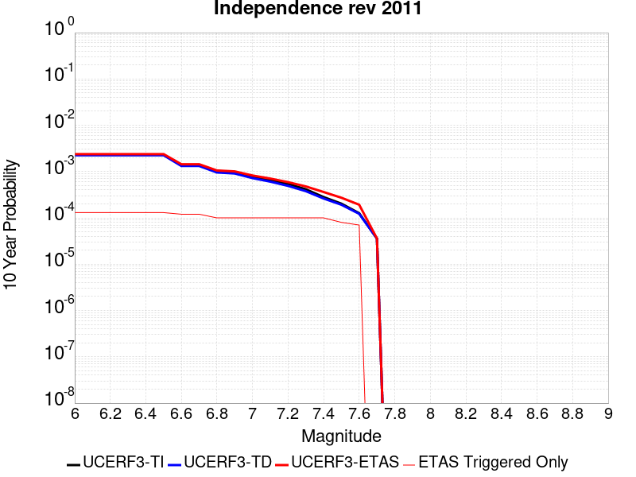 |

| Magnitude | 1 wk TI Prob | 1 wk TD Prob | 1 wk ETAS Prob | 1 wk ETAS/TD Gain | 1 wk ETAS Triggered Only | 1 mo TI Prob | 1 mo TD Prob | 1 mo ETAS Prob | 1 mo ETAS/TD Gain | 1 mo ETAS Triggered Only | 1 yr TI Prob | 1 yr TD Prob | 1 yr ETAS Prob | 1 yr ETAS/TD Gain | 1 yr ETAS Triggered Only | 10 yr TI Prob | 10 yr TD Prob | 10 yr ETAS Prob | 10 yr ETAS/TD Gain | 10 yr ETAS Triggered Only |
|-----|-----|-----|-----|-----|-----|-----|-----|-----|-----|-----|-----|-----|-----|-----|-----|-----|-----|-----|-----|-----|
| 6.0 | 4.422171E-6 | 4.3262253E-6 | 6.432596E-5 | 14.868843 | 6.0E-5 | 1.8952025E-5 | 1.8540852E-5 | 8.853956E-5 | 4.775377 | 7.0E-5 | 2.3071647E-4 | 2.2571447E-4 | 3.4568738E-4 | 1.5315251 | 1.2E-4 | 0.0023047708 | 0.0022551457 | 0.0023848526 | 1.057516 | 1.3E-4 |
| 6.1 | 4.422171E-6 | 4.3262253E-6 | 6.432596E-5 | 14.868843 | 6.0E-5 | 1.8952025E-5 | 1.8540852E-5 | 8.853956E-5 | 4.775377 | 7.0E-5 | 2.3071647E-4 | 2.2571447E-4 | 3.4568738E-4 | 1.5315251 | 1.2E-4 | 0.0023047708 | 0.0022551457 | 0.0023848526 | 1.057516 | 1.3E-4 |
| 6.2 | 4.422171E-6 | 4.3262253E-6 | 6.432596E-5 | 14.868843 | 6.0E-5 | 1.8952025E-5 | 1.8540852E-5 | 8.853956E-5 | 4.775377 | 7.0E-5 | 2.3071647E-4 | 2.2571447E-4 | 3.4568738E-4 | 1.5315251 | 1.2E-4 | 0.0023047708 | 0.0022551457 | 0.0023848526 | 1.057516 | 1.3E-4 |
| 6.3 | 4.422171E-6 | 4.3262253E-6 | 6.432596E-5 | 14.868843 | 6.0E-5 | 1.8952025E-5 | 1.8540852E-5 | 8.853956E-5 | 4.775377 | 7.0E-5 | 2.3071647E-4 | 2.2571447E-4 | 3.4568738E-4 | 1.5315251 | 1.2E-4 | 0.0023047708 | 0.0022551457 | 0.0023848526 | 1.057516 | 1.3E-4 |
| 6.4 | 4.422171E-6 | 4.3262253E-6 | 6.432596E-5 | 14.868843 | 6.0E-5 | 1.8952025E-5 | 1.8540852E-5 | 8.853956E-5 | 4.775377 | 7.0E-5 | 2.3071647E-4 | 2.2571447E-4 | 3.4568738E-4 | 1.5315251 | 1.2E-4 | 0.0023047708 | 0.0022551457 | 0.0023848526 | 1.057516 | 1.3E-4 |
| 6.5 | 4.422171E-6 | 4.3262253E-6 | 6.432596E-5 | 14.868843 | 6.0E-5 | 1.8952025E-5 | 1.8540852E-5 | 8.853956E-5 | 4.775377 | 7.0E-5 | 2.3071647E-4 | 2.2571447E-4 | 3.4568738E-4 | 1.5315251 | 1.2E-4 | 0.0023047708 | 0.0022551457 | 0.0023848526 | 1.057516 | 1.3E-4 |
| 6.6 | 2.663744E-6 | 2.5319846E-6 | 5.2531857E-5 | 20.747307 | 5.0E-5 | 1.1415996E-5 | 1.08513195E-5 | 7.085067E-5 | 6.529221 | 6.0E-5 | 1.3898089E-4 | 1.321073E-4 | 2.4209276E-4 | 1.8325465 | 1.1E-4 | 0.0013889399 | 0.0013203359 | 0.0014401774 | 1.090766 | 1.2E-4 |
| 6.7 | 2.663744E-6 | 2.5319846E-6 | 5.2531857E-5 | 20.747307 | 5.0E-5 | 1.1415996E-5 | 1.08513195E-5 | 7.085067E-5 | 6.529221 | 6.0E-5 | 1.3898089E-4 | 1.321073E-4 | 2.4209276E-4 | 1.8325465 | 1.1E-4 | 0.0013889399 | 0.0013203359 | 0.0014401774 | 1.090766 | 1.2E-4 |
| 6.8 | 1.9716529E-6 | 1.8322567E-6 | 5.1832165E-5 | 28.288704 | 5.0E-5 | 8.449913E-6 | 7.852505E-6 | 6.785204E-5 | 8.640814 | 6.0E-5 | 1.0287284E-4 | 9.560019E-5 | 1.8559159E-4 | 1.9413307 | 9.0E-5 | 0.0010282523 | 9.5560355E-4 | 0.0010555079 | 1.104546 | 1.0E-4 |
| 6.9 | 1.8788617E-6 | 1.7429976E-6 | 5.174291E-5 | 29.686163 | 5.0E-5 | 8.0522395E-6 | 7.4699688E-6 | 6.746952E-5 | 9.032102 | 6.0E-5 | 9.80316E-5 | 9.09432E-5 | 1.80935E-4 | 1.9895387 | 9.0E-5 | 9.798837E-4 | 9.090718E-4 | 0.0010089809 | 1.1099023 | 1.0E-4 |
| 7.0 | 1.5045488E-6 | 1.3849498E-6 | 5.138488E-5 | 37.102345 | 5.0E-5 | 6.44805E-6 | 5.9354857E-6 | 6.593513E-5 | 11.108633 | 6.0E-5 | 7.8502184E-5 | 7.226219E-5 | 1.6225569E-4 | 2.2453747 | 9.0E-5 | 7.8474457E-4 | 7.223921E-4 | 8.223198E-4 | 1.138329 | 1.0E-4 |
| 7.1 | 1.272341E-6 | 1.1625089E-6 | 5.116245E-5 | 44.010376 | 5.0E-5 | 5.4528787E-6 | 4.9821715E-6 | 6.4981876E-5 | 13.042881 | 6.0E-5 | 6.6386776E-5 | 6.0656283E-5 | 1.5065083E-4 | 2.4836805 | 9.0E-5 | 6.636695E-4 | 6.064005E-4 | 7.0633984E-4 | 1.1648076 | 1.0E-4 |
| 7.2 | 1.0416892E-6 | 9.409871E-7 | 5.094094E-5 | 54.135643 | 5.0E-5 | 4.464375E-6 | 4.032796E-6 | 6.403255E-5 | 15.877956 | 6.0E-5 | 5.4352407E-5 | 4.9098202E-5 | 1.3909378E-4 | 2.832971 | 9.0E-5 | 5.4339116E-4 | 4.908754E-4 | 5.908263E-4 | 1.2036177 | 1.0E-4 |
| 7.3 | 7.9450155E-7 | 7.2350036E-7 | 5.0723465E-5 | 70.10841 | 5.0E-5 | 3.4050022E-6 | 3.1007123E-6 | 6.3100524E-5 | 20.350332 | 6.0E-5 | 4.1455114E-5 | 3.7750528E-5 | 1.2774713E-4 | 3.3839827 | 9.0E-5 | 4.144738E-4 | 3.7744228E-4 | 4.7740454E-4 | 1.2648412 | 1.0E-4 |
| 7.4 | 5.3893444E-7 | 5.0195166E-7 | 5.0501927E-5 | 100.61114 | 5.0E-5 | 2.309717E-6 | 2.1512196E-6 | 6.215109E-5 | 28.891096 | 6.0E-5 | 2.8120441E-5 | 2.6190788E-5 | 1.1618843E-4 | 4.4362326 | 9.0E-5 | 2.8116882E-4 | 2.6187746E-4 | 3.6185127E-4 | 1.381758 | 1.0E-4 |
| 7.5 | 3.8852085E-7 | 3.6825622E-7 | 4.0368242E-5 | 109.61998 | 4.0E-5 | 1.6650882E-6 | 1.57824E-6 | 5.157816E-5 | 32.68081 | 5.0E-5 | 2.027226E-5 | 1.9214905E-5 | 8.921356E-5 | 4.6429353 | 7.0E-5 | 2.0270412E-4 | 1.9213265E-4 | 2.721173E-4 | 1.416299 | 8.0E-5 |
| 7.6 | 2.414929E-7 | 2.3457605E-7 | 4.0234565E-5 | 171.52036 | 4.0E-5 | 1.0349692E-6 | 1.0053255E-6 | 4.1005285E-5 | 40.788067 | 4.0E-5 | 1.2600677E-5 | 1.2239771E-5 | 7.223904E-5 | 5.9019923 | 6.0E-5 | 1.2599962E-4 | 1.223911E-4 | 1.9238252E-4 | 1.5718671 | 7.0E-5 |
| 7.7 | 6.8298014E-8 | 6.8589785E-8 | 6.8589785E-8 | 1.0 | 0.0 | 2.9270575E-7 | 2.939562E-7 | 2.939562E-7 | 1.0 | 0.0 | 3.5636867E-6 | 3.5789112E-6 | 3.5789112E-6 | 1.0 | 0.0 | 3.5636294E-5 | 3.5788584E-5 | 3.5788584E-5 | 1.0 | 0.0 |

## San Jacinto (Lytle Creek connector)
*[(top)](#table-of-contents)*

| 1 Week | 1 Month | 1 Year | 10 Year |
|-----|-----|-----|-----|
|  |  | 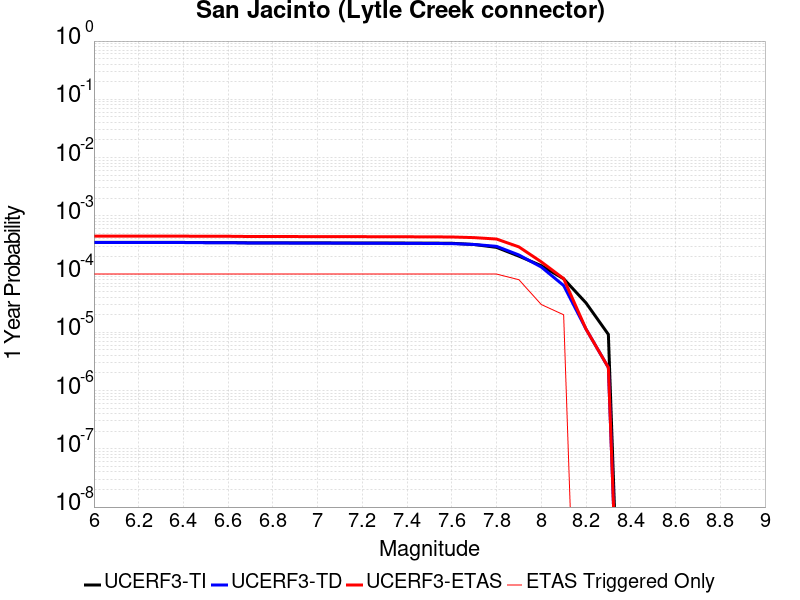 |  |

| Magnitude | 1 wk TI Prob | 1 wk TD Prob | 1 wk ETAS Prob | 1 wk ETAS/TD Gain | 1 wk ETAS Triggered Only | 1 mo TI Prob | 1 mo TD Prob | 1 mo ETAS Prob | 1 mo ETAS/TD Gain | 1 mo ETAS Triggered Only | 1 yr TI Prob | 1 yr TD Prob | 1 yr ETAS Prob | 1 yr ETAS/TD Gain | 1 yr ETAS Triggered Only | 10 yr TI Prob | 10 yr TD Prob | 10 yr ETAS Prob | 10 yr ETAS/TD Gain | 10 yr ETAS Triggered Only |
|-----|-----|-----|-----|-----|-----|-----|-----|-----|-----|-----|-----|-----|-----|-----|-----|-----|-----|-----|-----|-----|
| 6.0 | 6.693995E-6 | 6.660123E-6 | 6.6659726E-5 | 10.008782 | 6.0E-5 | 2.8688235E-5 | 2.8543072E-5 | 8.854136E-5 | 3.1020262 | 6.0E-5 | 3.492233E-4 | 3.4745657E-4 | 4.4742183E-4 | 1.2877058 | 1.0E-4 | 0.00348675 | 0.0035491167 | 0.0036686908 | 1.0336913 | 1.2E-4 |
| 6.1 | 6.693995E-6 | 6.660123E-6 | 6.6659726E-5 | 10.008782 | 6.0E-5 | 2.8688235E-5 | 2.8543072E-5 | 8.854136E-5 | 3.1020262 | 6.0E-5 | 3.492233E-4 | 3.4745657E-4 | 4.4742183E-4 | 1.2877058 | 1.0E-4 | 0.00348675 | 0.0035491167 | 0.0036686908 | 1.0336913 | 1.2E-4 |
| 6.2 | 6.693995E-6 | 6.660123E-6 | 6.6659726E-5 | 10.008782 | 6.0E-5 | 2.8688235E-5 | 2.8543072E-5 | 8.854136E-5 | 3.1020262 | 6.0E-5 | 3.492233E-4 | 3.4745657E-4 | 4.4742183E-4 | 1.2877058 | 1.0E-4 | 0.00348675 | 0.0035491167 | 0.0036686908 | 1.0336913 | 1.2E-4 |
| 6.3 | 6.693995E-6 | 6.660123E-6 | 6.6659726E-5 | 10.008782 | 6.0E-5 | 2.8688235E-5 | 2.8543072E-5 | 8.854136E-5 | 3.1020262 | 6.0E-5 | 3.492233E-4 | 3.4745657E-4 | 4.4742183E-4 | 1.2877058 | 1.0E-4 | 0.00348675 | 0.0035491167 | 0.0036686908 | 1.0336913 | 1.2E-4 |
| 6.4 | 6.693995E-6 | 6.660123E-6 | 6.6659726E-5 | 10.008782 | 6.0E-5 | 2.8688235E-5 | 2.8543072E-5 | 8.854136E-5 | 3.1020262 | 6.0E-5 | 3.492233E-4 | 3.4745657E-4 | 4.4742183E-4 | 1.2877058 | 1.0E-4 | 0.00348675 | 0.0035491167 | 0.0036686908 | 1.0336913 | 1.2E-4 |
| 6.5 | 6.6561875E-6 | 6.620341E-6 | 6.661994E-5 | 10.062918 | 6.0E-5 | 2.8526205E-5 | 2.8372582E-5 | 8.837088E-5 | 3.1146576 | 6.0E-5 | 3.472512E-4 | 3.453815E-4 | 4.4534696E-4 | 1.2894349 | 1.0E-4 | 0.0034670907 | 0.0035284322 | 0.0036480087 | 1.0338894 | 1.2E-4 |
| 6.6 | 6.6561875E-6 | 6.620341E-6 | 6.661994E-5 | 10.062918 | 6.0E-5 | 2.8526205E-5 | 2.8372582E-5 | 8.837088E-5 | 3.1146576 | 6.0E-5 | 3.472512E-4 | 3.453815E-4 | 4.4534696E-4 | 1.2894349 | 1.0E-4 | 0.0034670907 | 0.0035284322 | 0.0036480087 | 1.0338894 | 1.2E-4 |
| 6.7 | 6.5802237E-6 | 6.539518E-6 | 6.653913E-5 | 10.174929 | 6.0E-5 | 2.8200653E-5 | 2.8026205E-5 | 8.802452E-5 | 3.1407936 | 6.0E-5 | 3.4328885E-4 | 3.4116567E-4 | 4.4113156E-4 | 1.2930127 | 1.0E-4 | 0.0034275902 | 0.0034864065 | 0.0036059883 | 1.0342994 | 1.2E-4 |
| 6.8 | 6.575632E-6 | 6.5340073E-6 | 6.653361E-5 | 10.182666 | 6.0E-5 | 2.8180975E-5 | 2.8002589E-5 | 8.800091E-5 | 3.142599 | 6.0E-5 | 3.4304935E-4 | 3.4087826E-4 | 4.4084416E-4 | 1.2932599 | 1.0E-4 | 0.0034252026 | 0.0034835413 | 0.0036031234 | 1.0343277 | 1.2E-4 |
| 6.9 | 6.570433E-6 | 6.525401E-6 | 6.652501E-5 | 10.194777 | 6.0E-5 | 2.8158694E-5 | 2.7965707E-5 | 8.796403E-5 | 3.1454248 | 6.0E-5 | 3.4277816E-4 | 3.4042934E-4 | 4.4039532E-4 | 1.2936467 | 1.0E-4 | 0.0034224992 | 0.0034790665 | 0.003598649 | 1.034372 | 1.2E-4 |
| 7.0 | 6.5643826E-6 | 6.5155223E-6 | 6.651513E-5 | 10.208718 | 6.0E-5 | 2.8132765E-5 | 2.7923368E-5 | 8.792169E-5 | 3.1486778 | 6.0E-5 | 3.424626E-4 | 3.3991406E-4 | 4.3988007E-4 | 1.294092 | 1.0E-4 | 0.0034193532 | 0.0034739296 | 0.0035935128 | 1.034423 | 1.2E-4 |
| 7.1 | 6.557402E-6 | 6.504234E-6 | 6.6503846E-5 | 10.2247 | 6.0E-5 | 2.8102848E-5 | 2.7874992E-5 | 8.787332E-5 | 3.152407 | 6.0E-5 | 3.4209844E-4 | 3.3932526E-4 | 4.392913E-4 | 1.2946025 | 1.0E-4 | 0.0034157229 | 0.0034680606 | 0.0035876445 | 1.0344815 | 1.2E-4 |
| 7.2 | 6.546394E-6 | 6.4862006E-6 | 6.648581E-5 | 10.250348 | 6.0E-5 | 2.8055672E-5 | 2.7797707E-5 | 8.779604E-5 | 3.1583915 | 6.0E-5 | 3.4152428E-4 | 3.383846E-4 | 4.3835075E-4 | 1.2954217 | 1.0E-4 | 0.0034099987 | 0.0034586883 | 0.003578273 | 1.0345752 | 1.2E-4 |
| 7.3 | 6.5364216E-6 | 6.4669857E-6 | 6.64666E-5 | 10.277833 | 6.0E-5 | 2.8012933E-5 | 2.771536E-5 | 8.77137E-5 | 3.1648047 | 6.0E-5 | 3.4100408E-4 | 3.373823E-4 | 4.373486E-4 | 1.2962997 | 1.0E-4 | 0.003404813 | 0.0034487103 | 0.0035682966 | 1.0346756 | 1.2E-4 |
| 7.4 | 6.5269523E-6 | 6.4480723E-6 | 6.644768E-5 | 10.305047 | 6.0E-5 | 2.7972354E-5 | 2.7634303E-5 | 8.7632645E-5 | 3.1711545 | 6.0E-5 | 3.4051016E-4 | 3.3639578E-4 | 4.3636214E-4 | 1.2971689 | 1.0E-4 | 0.0033998888 | 0.0034388923 | 0.0035584795 | 1.0347749 | 1.2E-4 |
| 7.5 | 6.5111835E-6 | 6.424346E-6 | 6.642396E-5 | 10.339413 | 6.0E-5 | 2.7904773E-5 | 2.753262E-5 | 8.753097E-5 | 3.1791732 | 6.0E-5 | 3.3968766E-4 | 3.3515817E-4 | 4.3512465E-4 | 1.2982666 | 1.0E-4 | 0.0033916887 | 0.0034265644 | 0.0035461532 | 1.0349005 | 1.2E-4 |
| 7.6 | 6.4768806E-6 | 6.383454E-6 | 6.638307E-5 | 10.39924 | 6.0E-5 | 2.7757764E-5 | 2.7357375E-5 | 8.735574E-5 | 3.1931329 | 6.0E-5 | 3.3789838E-4 | 3.330252E-4 | 4.329919E-4 | 1.3001776 | 1.0E-4 | 0.0033738504 | 0.0034052972 | 0.0035248885 | 1.0351192 | 1.2E-4 |
| 7.7 | 6.1655364E-6 | 6.1759456E-6 | 6.617558E-5 | 10.715052 | 6.0E-5 | 2.642346E-5 | 2.646807E-5 | 8.646648E-5 | 3.2668223 | 6.0E-5 | 3.2165812E-4 | 3.2220117E-4 | 4.2216893E-4 | 1.3102651 | 1.0E-4 | 0.0032119295 | 0.0032969362 | 0.0034165406 | 1.0362774 | 1.2E-4 |
| 7.8 | 5.5043524E-6 | 5.7370175E-6 | 6.5736676E-5 | 11.458336 | 6.0E-5 | 2.3589868E-5 | 2.4586987E-5 | 8.458551E-5 | 3.4402552 | 6.0E-5 | 2.871688E-4 | 2.993055E-4 | 3.9927557E-4 | 1.3340068 | 1.0E-4 | 0.0028679797 | 0.0030670585 | 0.0031866906 | 1.0390054 | 1.2E-4 |
| 7.9 | 3.889249E-6 | 4.0766436E-6 | 5.407644E-5 | 13.264941 | 5.0E-5 | 1.6668104E-5 | 1.7471213E-5 | 6.747034E-5 | 3.8618004 | 5.0E-5 | 2.0291525E-4 | 2.126913E-4 | 2.926743E-4 | 1.376052 | 8.0E-5 | 0.0020273007 | 0.0021941073 | 0.002293888 | 1.0454767 | 1.0E-4 |
| 8.0 | 2.668535E-6 | 2.5313454E-6 | 3.253127E-5 | 12.851376 | 3.0E-5 | 1.1436528E-5 | 1.0848577E-5 | 4.0848252E-5 | 3.7653093 | 3.0E-5 | 1.3923083E-4 | 1.3207346E-4 | 1.620695E-4 | 1.2271163 | 3.0E-5 | 0.0013914363 | 0.0013755665 | 0.0014254977 | 1.0362986 | 5.0E-5 |
| 8.1 | 1.5911459E-6 | 1.2185134E-6 | 2.121849E-5 | 17.413424 | 2.0E-5 | 6.8191785E-6 | 5.2221894E-6 | 2.5222085E-5 | 4.829791 | 2.0E-5 | 8.3020335E-5 | 6.357832E-5 | 8.3577055E-5 | 1.3145527 | 2.0E-5 | 8.298933E-4 | 6.6911156E-4 | 6.9909147E-4 | 1.0448055 | 3.0E-5 |
| 8.2 | 6.1294963E-7 | 2.1802066E-7 | 2.1802066E-7 | 1.0 | 0.0 | 2.6269242E-6 | 9.3437393E-7 | 9.3437393E-7 | 1.0 | 0.0 | 3.1982334E-5 | 1.1375943E-5 | 1.1375943E-5 | 1.0 | 0.0 | 3.1977732E-4 | 1.2778955E-4 | 1.2778955E-4 | 1.0 | 0.0 |
| 8.3 | 1.762871E-7 | 4.7516316E-8 | 4.7516316E-8 | 1.0 | 0.0 | 7.5551594E-7 | 2.0364133E-7 | 2.0364133E-7 | 1.0 | 0.0 | 9.1983675E-6 | 2.4793305E-6 | 2.4793305E-6 | 1.0 | 0.0 | 9.197987E-5 | 2.8671833E-5 | 2.8671833E-5 | 1.0 | 0.0 |

## Red Mountain
*[(top)](#table-of-contents)*

| 1 Week | 1 Month | 1 Year | 10 Year |
|-----|-----|-----|-----|
|  |  |  |  |

| Magnitude | 1 wk TI Prob | 1 wk TD Prob | 1 wk ETAS Prob | 1 wk ETAS/TD Gain | 1 wk ETAS Triggered Only | 1 mo TI Prob | 1 mo TD Prob | 1 mo ETAS Prob | 1 mo ETAS/TD Gain | 1 mo ETAS Triggered Only | 1 yr TI Prob | 1 yr TD Prob | 1 yr ETAS Prob | 1 yr ETAS/TD Gain | 1 yr ETAS Triggered Only | 10 yr TI Prob | 10 yr TD Prob | 10 yr ETAS Prob | 10 yr ETAS/TD Gain | 10 yr ETAS Triggered Only |
|-----|-----|-----|-----|-----|-----|-----|-----|-----|-----|-----|-----|-----|-----|-----|-----|-----|-----|-----|-----|-----|
| 6.0 | 4.1810763E-5 | 4.7590016E-5 | 6.758906E-5 | 1.4202362 | 2.0E-5 | 1.7917668E-4 | 2.039422E-4 | 2.4393405E-4 | 1.196094 | 4.0E-5 | 0.0021792934 | 0.0024803334 | 0.0025302093 | 1.0201086 | 5.0E-5 | 0.021580452 | 0.02454411 | 0.024641655 | 1.0039743 | 1.0E-4 |
| 6.1 | 4.1810763E-5 | 4.7590016E-5 | 6.758906E-5 | 1.4202362 | 2.0E-5 | 1.7917668E-4 | 2.039422E-4 | 2.4393405E-4 | 1.196094 | 4.0E-5 | 0.0021792934 | 0.0024803334 | 0.0025302093 | 1.0201086 | 5.0E-5 | 0.021580452 | 0.02454411 | 0.024641655 | 1.0039743 | 1.0E-4 |
| 6.2 | 4.1810763E-5 | 4.7590016E-5 | 6.758906E-5 | 1.4202362 | 2.0E-5 | 1.7917668E-4 | 2.039422E-4 | 2.4393405E-4 | 1.196094 | 4.0E-5 | 0.0021792934 | 0.0024803334 | 0.0025302093 | 1.0201086 | 5.0E-5 | 0.021580452 | 0.02454411 | 0.024641655 | 1.0039743 | 1.0E-4 |
| 6.3 | 4.1810763E-5 | 4.7590016E-5 | 6.758906E-5 | 1.4202362 | 2.0E-5 | 1.7917668E-4 | 2.039422E-4 | 2.4393405E-4 | 1.196094 | 4.0E-5 | 0.0021792934 | 0.0024803334 | 0.0025302093 | 1.0201086 | 5.0E-5 | 0.021580452 | 0.02454411 | 0.024641655 | 1.0039743 | 1.0E-4 |
| 6.4 | 4.1810763E-5 | 4.7590016E-5 | 6.758906E-5 | 1.4202362 | 2.0E-5 | 1.7917668E-4 | 2.039422E-4 | 2.4393405E-4 | 1.196094 | 4.0E-5 | 0.0021792934 | 0.0024803334 | 0.0025302093 | 1.0201086 | 5.0E-5 | 0.021580452 | 0.02454411 | 0.024641655 | 1.0039743 | 1.0E-4 |
| 6.5 | 3.154503E-5 | 3.5359757E-5 | 5.535905E-5 | 1.5655948 | 2.0E-5 | 1.3518598E-4 | 1.5153353E-4 | 1.9152748E-4 | 1.2639279 | 4.0E-5 | 0.0016446467 | 0.0018434518 | 0.0018933596 | 1.027073 | 5.0E-5 | 0.01632528 | 0.018291244 | 0.018379599 | 1.0048304 | 9.0E-5 |
| 6.6 | 3.1535834E-5 | 3.5349138E-5 | 5.534843E-5 | 1.5657647 | 2.0E-5 | 1.3514658E-4 | 1.5148803E-4 | 1.9148197E-4 | 1.2640072 | 4.0E-5 | 0.0016441676 | 0.0018428987 | 0.0018928065 | 1.0270811 | 5.0E-5 | 0.01632056 | 0.018285805 | 0.01837416 | 1.0048318 | 9.0E-5 |
| 6.7 | 2.8267326E-5 | 3.1469353E-5 | 5.1468727E-5 | 1.6355189 | 2.0E-5 | 1.2114006E-4 | 1.3486217E-4 | 1.7485677E-4 | 1.2965591 | 4.0E-5 | 0.0014738824 | 0.0016407954 | 0.0016907133 | 1.030423 | 5.0E-5 | 0.014641452 | 0.01629557 | 0.016384104 | 1.005433 | 9.0E-5 |
| 6.8 | 2.8212884E-5 | 3.1407242E-5 | 5.1406612E-5 | 1.6367759 | 2.0E-5 | 1.20906756E-4 | 1.3459599E-4 | 1.745906E-4 | 1.2971456 | 4.0E-5 | 0.0014710457 | 0.0016375595 | 0.0016874777 | 1.0304832 | 5.0E-5 | 0.014613459 | 0.016263688 | 0.016352223 | 1.0054438 | 9.0E-5 |
| 6.9 | 2.4227871E-5 | 2.6706994E-5 | 3.6706726E-5 | 1.3744237 | 1.0E-5 | 1.03829596E-4 | 1.1445395E-4 | 1.3445166E-4 | 1.1747228 | 2.0E-5 | 0.0012633923 | 0.0013926621 | 0.0014226203 | 1.0215114 | 3.0E-5 | 0.012562336 | 0.0138470335 | 0.013916064 | 1.0049852 | 7.0E-5 |
| 7.0 | 2.348524E-5 | 2.5835778E-5 | 3.583552E-5 | 1.3870502 | 1.0E-5 | 1.0064714E-4 | 1.10720495E-4 | 1.3071828E-4 | 1.1806151 | 2.0E-5 | 0.0012246901 | 0.001347264 | 0.0013772236 | 1.0222373 | 3.0E-5 | 0.012179627 | 0.013398598 | 0.01346766 | 1.0051544 | 7.0E-5 |
| 7.1 | 2.2311642E-5 | 2.4462845E-5 | 3.44626E-5 | 1.4087732 | 1.0E-5 | 9.561782E-5 | 1.04836974E-4 | 1.2483487E-4 | 1.1907524 | 2.0E-5 | 0.0011635252 | 0.0012757176 | 0.001295692 | 1.0156574 | 2.0E-5 | 0.01157452 | 0.01269146 | 0.012750698 | 1.0046676 | 6.0E-5 |
| 7.2 | 1.6533986E-5 | 1.7670362E-5 | 1.7670362E-5 | 1.0 | 0.0 | 7.085802E-5 | 7.572828E-5 | 8.572753E-5 | 1.1320411 | 1.0E-5 | 8.623549E-4 | 9.2166534E-4 | 9.316561E-4 | 1.0108399 | 1.0E-5 | 0.008590161 | 0.009184707 | 0.009214431 | 1.0032363 | 3.0E-5 |
| 7.3 | 1.4703092E-5 | 1.5559537E-5 | 1.5559537E-5 | 1.0 | 0.0 | 6.301173E-5 | 6.668237E-5 | 7.66817E-5 | 1.1499547 | 1.0E-5 | 7.668978E-4 | 8.1161706E-4 | 8.2160893E-4 | 1.0123111 | 1.0E-5 | 0.0076425658 | 0.008092604 | 0.008122361 | 1.0036771 | 3.0E-5 |
| 7.4 | 6.1331984E-6 | 5.5288874E-6 | 5.5288874E-6 | 1.0 | 0.0 | 2.6284872E-5 | 2.3695018E-5 | 2.3695018E-5 | 1.0 | 0.0 | 3.199713E-4 | 2.884492E-4 | 2.884492E-4 | 1.0 | 0.0 | 0.0031951098 | 0.0028808024 | 0.0029007448 | 1.0069225 | 2.0E-5 |
| 7.5 | 5.954766E-6 | 5.338517E-6 | 5.338517E-6 | 1.0 | 0.0 | 2.5520176E-5 | 2.2879161E-5 | 2.2879161E-5 | 1.0 | 0.0 | 3.1066386E-4 | 2.785187E-4 | 2.785187E-4 | 1.0 | 0.0 | 0.003102299 | 0.0027817504 | 0.0028016947 | 1.0071697 | 2.0E-5 |
| 7.6 | 4.9726646E-6 | 4.315309E-6 | 4.315309E-6 | 1.0 | 0.0 | 2.1311245E-5 | 1.8494053E-5 | 1.8494053E-5 | 1.0 | 0.0 | 2.5943352E-4 | 2.2514217E-4 | 2.2514217E-4 | 1.0 | 0.0 | 0.0025913084 | 0.0022491754 | 0.002259153 | 1.004436 | 1.0E-5 |
| 7.7 | 3.3613894E-6 | 2.8526886E-6 | 2.8526886E-6 | 1.0 | 0.0 | 1.4405875E-5 | 1.22257525E-5 | 1.22257525E-5 | 1.0 | 0.0 | 1.7537741E-4 | 1.4883863E-4 | 1.4883863E-4 | 1.0 | 0.0 | 0.0017523908 | 0.0014874157 | 0.0014974009 | 1.006713 | 1.0E-5 |
| 7.8 | 1.1828961E-6 | 1.0122935E-6 | 1.0122935E-6 | 1.0 | 0.0 | 5.069545E-6 | 4.338394E-6 | 4.338394E-6 | 1.0 | 0.0 | 6.171996E-5 | 5.281869E-5 | 5.281869E-5 | 1.0 | 0.0 | 6.170282E-4 | 5.280643E-4 | 5.3805904E-4 | 1.0189271 | 1.0E-5 |
| 7.9 | 2.2967266E-7 | 1.861919E-7 | 1.861919E-7 | 1.0 | 0.0 | 9.843111E-7 | 7.97965E-7 | 7.97965E-7 | 1.0 | 0.0 | 1.19839215E-5 | 9.715184E-6 | 9.715184E-6 | 1.0 | 0.0 | 1.1983275E-4 | 9.714788E-5 | 9.714788E-5 | 1.0 | 0.0 |

## Lost Hills
*[(top)](#table-of-contents)*

| 1 Week | 1 Month | 1 Year | 10 Year |
|-----|-----|-----|-----|
|  |  |  |  |

| Magnitude | 1 wk TI Prob | 1 wk TD Prob | 1 wk ETAS Prob | 1 wk ETAS/TD Gain | 1 wk ETAS Triggered Only | 1 mo TI Prob | 1 mo TD Prob | 1 mo ETAS Prob | 1 mo ETAS/TD Gain | 1 mo ETAS Triggered Only | 1 yr TI Prob | 1 yr TD Prob | 1 yr ETAS Prob | 1 yr ETAS/TD Gain | 1 yr ETAS Triggered Only | 10 yr TI Prob | 10 yr TD Prob | 10 yr ETAS Prob | 10 yr ETAS/TD Gain | 10 yr ETAS Triggered Only |
|-----|-----|-----|-----|-----|-----|-----|-----|-----|-----|-----|-----|-----|-----|-----|-----|-----|-----|-----|-----|-----|
| 6.0 | 2.233523E-5 | 2.5106583E-5 | 6.510558E-5 | 2.5931678 | 4.0E-5 | 9.571891E-5 | 1.0759615E-4 | 1.5759077E-4 | 1.4646506 | 5.0E-5 | 0.0011647546 | 0.001309364 | 0.0014092331 | 1.076273 | 1.0E-4 | 0.011586686 | 0.013033091 | 0.013151527 | 1.0090873 | 1.2E-4 |
| 6.1 | 2.233523E-5 | 2.5106583E-5 | 6.510558E-5 | 2.5931678 | 4.0E-5 | 9.571891E-5 | 1.0759615E-4 | 1.5759077E-4 | 1.4646506 | 5.0E-5 | 0.0011647546 | 0.001309364 | 0.0014092331 | 1.076273 | 1.0E-4 | 0.011586686 | 0.013033091 | 0.013151527 | 1.0090873 | 1.2E-4 |
| 6.2 | 2.233523E-5 | 2.5106583E-5 | 6.510558E-5 | 2.5931678 | 4.0E-5 | 9.571891E-5 | 1.0759615E-4 | 1.5759077E-4 | 1.4646506 | 5.0E-5 | 0.0011647546 | 0.001309364 | 0.0014092331 | 1.076273 | 1.0E-4 | 0.011586686 | 0.013033091 | 0.013151527 | 1.0090873 | 1.2E-4 |
| 6.3 | 2.233523E-5 | 2.5106583E-5 | 6.510558E-5 | 2.5931678 | 4.0E-5 | 9.571891E-5 | 1.0759615E-4 | 1.5759077E-4 | 1.4646506 | 5.0E-5 | 0.0011647546 | 0.001309364 | 0.0014092331 | 1.076273 | 1.0E-4 | 0.011586686 | 0.013033091 | 0.013151527 | 1.0090873 | 1.2E-4 |
| 6.4 | 1.2288092E-5 | 1.3781108E-5 | 4.3780696E-5 | 3.1768632 | 3.0E-5 | 5.2662188E-5 | 5.906108E-5 | 9.905872E-5 | 1.677225 | 4.0E-5 | 6.409735E-4 | 7.189252E-4 | 7.988677E-4 | 1.1111972 | 8.0E-5 | 0.006391279 | 0.0071752006 | 0.007264555 | 1.0124532 | 9.0E-5 |
| 6.5 | 1.2288092E-5 | 1.3781108E-5 | 4.3780696E-5 | 3.1768632 | 3.0E-5 | 5.2662188E-5 | 5.906108E-5 | 9.905872E-5 | 1.677225 | 4.0E-5 | 6.409735E-4 | 7.189252E-4 | 7.988677E-4 | 1.1111972 | 8.0E-5 | 0.006391279 | 0.0071752006 | 0.007264555 | 1.0124532 | 9.0E-5 |
| 6.6 | 8.58281E-6 | 9.63377E-6 | 3.963348E-5 | 4.1140156 | 3.0E-5 | 3.6782953E-5 | 4.12874E-5 | 8.128575E-5 | 1.9687785 | 4.0E-5 | 4.4774043E-4 | 5.026414E-4 | 5.826012E-4 | 1.1590792 | 8.0E-5 | 0.0044683935 | 0.005023205 | 0.0051127532 | 1.0178268 | 9.0E-5 |
| 6.7 | 7.205685E-6 | 8.088302E-6 | 2.808814E-5 | 3.472687 | 2.0E-5 | 3.088114E-5 | 3.466415E-5 | 6.466311E-5 | 1.8654175 | 3.0E-5 | 3.7591302E-4 | 4.2203604E-4 | 4.820107E-4 | 1.142108 | 6.0E-5 | 0.0037527776 | 0.0042203604 | 0.004290065 | 1.0165162 | 7.0E-5 |

## Dry Mountain
*[(top)](#table-of-contents)*

| 1 Week | 1 Month | 1 Year | 10 Year |
|-----|-----|-----|-----|
|  |  |  |  |

| Magnitude | 1 wk TI Prob | 1 wk TD Prob | 1 wk ETAS Prob | 1 wk ETAS/TD Gain | 1 wk ETAS Triggered Only | 1 mo TI Prob | 1 mo TD Prob | 1 mo ETAS Prob | 1 mo ETAS/TD Gain | 1 mo ETAS Triggered Only | 1 yr TI Prob | 1 yr TD Prob | 1 yr ETAS Prob | 1 yr ETAS/TD Gain | 1 yr ETAS Triggered Only | 10 yr TI Prob | 10 yr TD Prob | 10 yr ETAS Prob | 10 yr ETAS/TD Gain | 10 yr ETAS Triggered Only |
|-----|-----|-----|-----|-----|-----|-----|-----|-----|-----|-----|-----|-----|-----|-----|-----|-----|-----|-----|-----|-----|
| 6.0 | 6.222801E-6 | 6.439381E-6 | 3.643919E-5 | 5.6588025 | 3.0E-5 | 2.6668875E-5 | 2.7597147E-5 | 6.759604E-5 | 2.4493852 | 4.0E-5 | 3.2464517E-4 | 3.3595937E-4 | 4.159325E-4 | 1.238044 | 8.0E-5 | 0.0032417132 | 0.0033560768 | 0.0034657076 | 1.0326663 | 1.1E-4 |
| 6.1 | 6.222801E-6 | 6.439381E-6 | 3.643919E-5 | 5.6588025 | 3.0E-5 | 2.6668875E-5 | 2.7597147E-5 | 6.759604E-5 | 2.4493852 | 4.0E-5 | 3.2464517E-4 | 3.3595937E-4 | 4.159325E-4 | 1.238044 | 8.0E-5 | 0.0032417132 | 0.0033560768 | 0.0034657076 | 1.0326663 | 1.1E-4 |
| 6.2 | 6.222801E-6 | 6.439381E-6 | 3.643919E-5 | 5.6588025 | 3.0E-5 | 2.6668875E-5 | 2.7597147E-5 | 6.759604E-5 | 2.4493852 | 4.0E-5 | 3.2464517E-4 | 3.3595937E-4 | 4.159325E-4 | 1.238044 | 8.0E-5 | 0.0032417132 | 0.0033560768 | 0.0034657076 | 1.0326663 | 1.1E-4 |
| 6.3 | 6.222801E-6 | 6.439381E-6 | 3.643919E-5 | 5.6588025 | 3.0E-5 | 2.6668875E-5 | 2.7597147E-5 | 6.759604E-5 | 2.4493852 | 4.0E-5 | 3.2464517E-4 | 3.3595937E-4 | 4.159325E-4 | 1.238044 | 8.0E-5 | 0.0032417132 | 0.0033560768 | 0.0034657076 | 1.0326663 | 1.1E-4 |
| 6.4 | 6.222801E-6 | 6.439381E-6 | 3.643919E-5 | 5.6588025 | 3.0E-5 | 2.6668875E-5 | 2.7597147E-5 | 6.759604E-5 | 2.4493852 | 4.0E-5 | 3.2464517E-4 | 3.3595937E-4 | 4.159325E-4 | 1.238044 | 8.0E-5 | 0.0032417132 | 0.0033560768 | 0.0034657076 | 1.0326663 | 1.1E-4 |
| 6.5 | 2.8528623E-6 | 2.9521684E-6 | 2.9521684E-6 | 1.0 | 0.0 | 1.22264955E-5 | 1.2652138E-5 | 1.2652138E-5 | 1.0 | 0.0 | 1.4884741E-4 | 1.540376E-4 | 1.6403606E-4 | 1.0649092 | 1.0E-5 | 0.0014874774 | 0.0015401616 | 0.0015701154 | 1.0194485 | 3.0E-5 |
| 6.6 | 2.8528623E-6 | 2.9521684E-6 | 2.9521684E-6 | 1.0 | 0.0 | 1.22264955E-5 | 1.2652138E-5 | 1.2652138E-5 | 1.0 | 0.0 | 1.4884741E-4 | 1.540376E-4 | 1.6403606E-4 | 1.0649092 | 1.0E-5 | 0.0014874774 | 0.0015401616 | 0.0015701154 | 1.0194485 | 3.0E-5 |
| 6.7 | 2.541E-6 | 2.6293578E-6 | 2.6293578E-6 | 1.0 | 0.0 | 1.0889954E-5 | 1.1268677E-5 | 1.1268677E-5 | 1.0 | 0.0 | 1.3257713E-4 | 1.3719614E-4 | 1.4719476E-4 | 1.0728784 | 1.0E-5 | 0.0013249806 | 0.0013719613 | 0.0013919339 | 1.0145577 | 2.0E-5 |

## Bullion Mountains
*[(top)](#table-of-contents)*

| 1 Week | 1 Month | 1 Year | 10 Year |
|-----|-----|-----|-----|
|  |  |  |  |

| Magnitude | 1 wk TI Prob | 1 wk TD Prob | 1 wk ETAS Prob | 1 wk ETAS/TD Gain | 1 wk ETAS Triggered Only | 1 mo TI Prob | 1 mo TD Prob | 1 mo ETAS Prob | 1 mo ETAS/TD Gain | 1 mo ETAS Triggered Only | 1 yr TI Prob | 1 yr TD Prob | 1 yr ETAS Prob | 1 yr ETAS/TD Gain | 1 yr ETAS Triggered Only | 10 yr TI Prob | 10 yr TD Prob | 10 yr ETAS Prob | 10 yr ETAS/TD Gain | 10 yr ETAS Triggered Only |
|-----|-----|-----|-----|-----|-----|-----|-----|-----|-----|-----|-----|-----|-----|-----|-----|-----|-----|-----|-----|-----|
| 6.0 | 1.6420427E-5 | 1.4692009E-5 | 4.469157E-5 | 3.0418963 | 3.0E-5 | 7.037136E-5 | 6.296445E-5 | 9.296256E-5 | 1.4764293 | 3.0E-5 | 8.5643446E-4 | 7.6636096E-4 | 8.363073E-4 | 1.0912708 | 7.0E-5 | 0.008531413 | 0.0076409746 | 0.0077501344 | 1.014286 | 1.1E-4 |
| 6.1 | 1.6420427E-5 | 1.4692009E-5 | 4.469157E-5 | 3.0418963 | 3.0E-5 | 7.037136E-5 | 6.296445E-5 | 9.296256E-5 | 1.4764293 | 3.0E-5 | 8.5643446E-4 | 7.6636096E-4 | 8.363073E-4 | 1.0912708 | 7.0E-5 | 0.008531413 | 0.0076409746 | 0.0077501344 | 1.014286 | 1.1E-4 |
| 6.2 | 1.6420427E-5 | 1.4692009E-5 | 4.469157E-5 | 3.0418963 | 3.0E-5 | 7.037136E-5 | 6.296445E-5 | 9.296256E-5 | 1.4764293 | 3.0E-5 | 8.5643446E-4 | 7.6636096E-4 | 8.363073E-4 | 1.0912708 | 7.0E-5 | 0.008531413 | 0.0076409746 | 0.0077501344 | 1.014286 | 1.1E-4 |
| 6.3 | 1.2046778E-5 | 9.862255E-6 | 1.9862156E-5 | 2.0139568 | 1.0E-5 | 5.1628023E-5 | 4.2266256E-5 | 5.226583E-5 | 1.2365854 | 1.0E-5 | 6.283899E-4 | 5.144933E-4 | 5.5447273E-4 | 1.0777063 | 4.0E-5 | 0.0062661595 | 0.0051353034 | 0.005204944 | 1.0135611 | 7.0E-5 |
| 6.4 | 1.2046778E-5 | 9.862255E-6 | 1.9862156E-5 | 2.0139568 | 1.0E-5 | 5.1628023E-5 | 4.2266256E-5 | 5.226583E-5 | 1.2365854 | 1.0E-5 | 6.283899E-4 | 5.144933E-4 | 5.5447273E-4 | 1.0777063 | 4.0E-5 | 0.0062661595 | 0.0051353034 | 0.005204944 | 1.0135611 | 7.0E-5 |
| 6.5 | 1.0244343E-5 | 7.879378E-6 | 7.879378E-6 | 1.0 | 0.0 | 4.390359E-5 | 3.3768443E-5 | 3.3768443E-5 | 1.0 | 0.0 | 5.343951E-4 | 4.1107394E-4 | 4.310657E-4 | 1.0486331 | 2.0E-5 | 0.005331118 | 0.0041051665 | 0.004154961 | 1.0121298 | 5.0E-5 |
| 6.6 | 9.605408E-6 | 7.1774166E-6 | 7.1774166E-6 | 1.0 | 0.0 | 4.1165385E-5 | 3.0760108E-5 | 3.0760108E-5 | 1.0 | 0.0 | 5.010733E-4 | 3.7446033E-4 | 3.9445283E-4 | 1.0533901 | 2.0E-5 | 0.00499945 | 0.0037402906 | 0.0037901036 | 1.013318 | 5.0E-5 |
| 6.7 | 8.60418E-6 | 6.123926E-6 | 6.123926E-6 | 1.0 | 0.0 | 3.687454E-5 | 2.6245243E-5 | 2.6245243E-5 | 1.0 | 0.0 | 4.48855E-4 | 3.195085E-4 | 3.395021E-4 | 1.0625762 | 2.0E-5 | 0.004479495 | 0.0031924031 | 0.0032422435 | 1.0156121 | 5.0E-5 |
| 6.8 | 5.187994E-6 | 2.563117E-6 | 2.563117E-6 | 1.0 | 0.0 | 2.223407E-5 | 1.0984763E-5 | 1.0984763E-5 | 1.0 | 0.0 | 2.7066618E-4 | 1.3373529E-4 | 1.3373529E-4 | 1.0 | 0.0 | 0.0027033675 | 0.0013369396 | 0.0013469262 | 1.0074698 | 1.0E-5 |
| 6.9 | 4.5302368E-6 | 2.3442778E-6 | 2.3442778E-6 | 1.0 | 0.0 | 1.9415156E-5 | 1.0046889E-5 | 1.0046889E-5 | 1.0 | 0.0 | 2.3635388E-4 | 1.2231797E-4 | 1.2231797E-4 | 1.0 | 0.0 | 0.0023610266 | 0.0012228956 | 0.0012328833 | 1.0081673 | 1.0E-5 |
| 7.0 | 3.431668E-6 | 1.6882177E-6 | 1.6882177E-6 | 1.0 | 0.0 | 1.4707065E-5 | 7.2352186E-6 | 7.2352186E-6 | 1.0 | 0.0 | 1.7904381E-4 | 8.808879E-5 | 8.808879E-5 | 1.0 | 0.0 | 0.0017889962 | 8.8088785E-4 | 8.908791E-4 | 1.0113422 | 1.0E-5 |

## Santa Cruz Island
*[(top)](#table-of-contents)*

| 1 Week | 1 Month | 1 Year | 10 Year |
|-----|-----|-----|-----|
|  |  |  |  |

| Magnitude | 1 wk TI Prob | 1 wk TD Prob | 1 wk ETAS Prob | 1 wk ETAS/TD Gain | 1 wk ETAS Triggered Only | 1 mo TI Prob | 1 mo TD Prob | 1 mo ETAS Prob | 1 mo ETAS/TD Gain | 1 mo ETAS Triggered Only | 1 yr TI Prob | 1 yr TD Prob | 1 yr ETAS Prob | 1 yr ETAS/TD Gain | 1 yr ETAS Triggered Only | 10 yr TI Prob | 10 yr TD Prob | 10 yr ETAS Prob | 10 yr ETAS/TD Gain | 10 yr ETAS Triggered Only |
|-----|-----|-----|-----|-----|-----|-----|-----|-----|-----|-----|-----|-----|-----|-----|-----|-----|-----|-----|-----|-----|
| 6.0 | 2.9164563E-5 | 3.1599742E-5 | 6.1598796E-5 | 1.9493448 | 3.0E-5 | 1.2498499E-4 | 1.3542121E-4 | 1.8541444E-4 | 1.3691684 | 5.0E-5 | 0.0015206301 | 0.0016476426 | 0.0017275107 | 1.0484742 | 8.0E-5 | 0.015102667 | 0.016368 | 0.016476199 | 1.0066104 | 1.1E-4 |
| 6.1 | 2.9164563E-5 | 3.1599742E-5 | 6.1598796E-5 | 1.9493448 | 3.0E-5 | 1.2498499E-4 | 1.3542121E-4 | 1.8541444E-4 | 1.3691684 | 5.0E-5 | 0.0015206301 | 0.0016476426 | 0.0017275107 | 1.0484742 | 8.0E-5 | 0.015102667 | 0.016368 | 0.016476199 | 1.0066104 | 1.1E-4 |
| 6.2 | 2.9164563E-5 | 3.1599742E-5 | 6.1598796E-5 | 1.9493448 | 3.0E-5 | 1.2498499E-4 | 1.3542121E-4 | 1.8541444E-4 | 1.3691684 | 5.0E-5 | 0.0015206301 | 0.0016476426 | 0.0017275107 | 1.0484742 | 8.0E-5 | 0.015102667 | 0.016368 | 0.016476199 | 1.0066104 | 1.1E-4 |
| 6.3 | 1.6635553E-5 | 1.780436E-5 | 3.7804002E-5 | 2.1233003 | 2.0E-5 | 7.1293274E-5 | 7.630227E-5 | 9.630074E-5 | 1.2620955 | 2.0E-5 | 8.6765E-4 | 9.286024E-4 | 9.485838E-4 | 1.0215178 | 2.0E-5 | 0.008642701 | 0.009249094 | 0.009288724 | 1.0042847 | 4.0E-5 |
| 6.4 | 1.6635553E-5 | 1.780436E-5 | 3.7804002E-5 | 2.1233003 | 2.0E-5 | 7.1293274E-5 | 7.630227E-5 | 9.630074E-5 | 1.2620955 | 2.0E-5 | 8.6765E-4 | 9.286024E-4 | 9.485838E-4 | 1.0215178 | 2.0E-5 | 0.008642701 | 0.009249094 | 0.009288724 | 1.0042847 | 4.0E-5 |
| 6.5 | 1.2238748E-5 | 1.3042996E-5 | 3.3042736E-5 | 2.53337 | 2.0E-5 | 5.2450723E-5 | 5.5897377E-5 | 7.5896256E-5 | 1.3577785 | 2.0E-5 | 6.3840044E-4 | 6.8034173E-4 | 7.0032815E-4 | 1.029377 | 2.0E-5 | 0.0063656955 | 0.006782988 | 0.0068127844 | 1.0043929 | 3.0E-5 |
| 6.6 | 1.0489767E-5 | 1.1156636E-5 | 3.1156414E-5 | 2.792635 | 2.0E-5 | 4.495537E-5 | 4.781329E-5 | 6.781233E-5 | 1.4182737 | 2.0E-5 | 5.4719415E-4 | 5.819736E-4 | 6.019619E-4 | 1.0343459 | 2.0E-5 | 0.005458487 | 0.005804736 | 0.005834562 | 1.0051382 | 3.0E-5 |
| 6.7 | 8.699222E-6 | 9.236783E-6 | 2.9236597E-5 | 3.1652362 | 2.0E-5 | 3.7281847E-5 | 3.958561E-5 | 5.958482E-5 | 1.5052141 | 2.0E-5 | 4.5381195E-4 | 4.818488E-4 | 5.0183915E-4 | 1.0414867 | 2.0E-5 | 0.0045288634 | 0.004808108 | 0.0048379637 | 1.0062095 | 3.0E-5 |
| 6.8 | 8.307732E-6 | 8.8169045E-6 | 1.8816816E-5 | 2.1341748 | 1.0E-5 | 3.560408E-5 | 3.7786187E-5 | 4.7785812E-5 | 1.264637 | 1.0E-5 | 4.3339343E-4 | 4.5995016E-4 | 4.6994555E-4 | 1.0217315 | 1.0E-5 | 0.004325492 | 0.0045900354 | 0.004609944 | 1.0043373 | 2.0E-5 |
| 6.9 | 8.073121E-6 | 8.564939E-6 | 1.8564853E-5 | 2.1675406 | 1.0E-5 | 3.459863E-5 | 3.670637E-5 | 4.6706E-5 | 1.2724223 | 1.0E-5 | 4.2115687E-4 | 4.4680882E-4 | 4.5680435E-4 | 1.0223709 | 1.0E-5 | 0.004203596 | 0.004459156 | 0.004479067 | 1.0044651 | 2.0E-5 |
| 7.0 | 7.617019E-6 | 8.074665E-6 | 1.8074585E-5 | 2.2384315 | 1.0E-5 | 3.264396E-5 | 3.4605247E-5 | 4.46049E-5 | 1.2889636 | 1.0E-5 | 3.9736772E-4 | 4.2123784E-4 | 4.3123364E-4 | 1.0237296 | 1.0E-5 | 0.003966579 | 0.0042044413 | 0.004224357 | 1.0047369 | 2.0E-5 |
| 7.1 | 7.1224836E-6 | 7.5457883E-6 | 1.7545713E-5 | 2.3252325 | 1.0E-5 | 3.052457E-5 | 3.2338692E-5 | 4.2338368E-5 | 1.3092171 | 1.0E-5 | 3.715733E-4 | 3.9365282E-4 | 4.0364888E-4 | 1.0253931 | 1.0E-5 | 0.003709526 | 0.0039295983 | 0.0039495192 | 1.0050696 | 2.0E-5 |
| 7.2 | 6.441115E-6 | 6.8273835E-6 | 1.6827315E-5 | 2.46468 | 1.0E-5 | 2.7604487E-5 | 2.9259889E-5 | 3.9259598E-5 | 1.3417548 | 1.0E-5 | 3.360328E-4 | 3.5618115E-4 | 3.6617758E-4 | 1.0280656 | 1.0E-5 | 0.0033552512 | 0.0035561312 | 0.00357606 | 1.0056041 | 2.0E-5 |
| 7.3 | 5.494274E-6 | 5.8199944E-6 | 1.5819936E-5 | 2.7182047 | 1.0E-5 | 2.3546674E-5 | 2.4942596E-5 | 3.4942346E-5 | 1.4009106 | 1.0E-5 | 2.8664304E-4 | 3.03634E-4 | 3.1363097E-4 | 1.0329244 | 1.0E-5 | 0.002862736 | 0.0030322145 | 0.0030421843 | 1.0032879 | 1.0E-5 |
| 7.4 | 4.0802624E-6 | 4.3122564E-6 | 4.3122564E-6 | 1.0 | 0.0 | 1.7486722E-5 | 1.8480969E-5 | 1.8480969E-5 | 1.0 | 0.0 | 2.1288003E-4 | 2.2498264E-4 | 2.2498264E-4 | 1.0 | 0.0 | 0.0021267622 | 0.0022475577 | 0.0022475577 | 1.0 | 0.0 |
| 7.5 | 2.3584746E-6 | 2.4753099E-6 | 2.4753099E-6 | 1.0 | 0.0 | 1.0107709E-5 | 1.0608428E-5 | 1.0608428E-5 | 1.0 | 0.0 | 1.2305441E-4 | 1.2915001E-4 | 1.2915001E-4 | 1.0 | 0.0 | 0.0012298629 | 0.0012907545 | 0.0012907545 | 1.0 | 0.0 |
| 7.6 | 9.4981914E-7 | 9.860934E-7 | 9.860934E-7 | 1.0 | 0.0 | 4.0706473E-6 | 4.2261076E-6 | 4.2261076E-6 | 1.0 | 0.0 | 4.9559E-5 | 5.1451658E-5 | 5.1451658E-5 | 1.0 | 0.0 | 4.954795E-4 | 5.1439874E-4 | 5.1439874E-4 | 1.0 | 0.0 |
| 7.7 | 2.6013532E-7 | 2.6416632E-7 | 2.6416632E-7 | 1.0 | 0.0 | 1.1148652E-6 | 1.1321408E-6 | 1.1321408E-6 | 1.0 | 0.0 | 1.3573399E-5 | 1.3783729E-5 | 1.3783729E-5 | 1.0 | 0.0 | 1.357257E-4 | 1.378288E-4 | 1.378288E-4 | 1.0 | 0.0 |
| 7.8 | 4.1522263E-8 | 3.965698E-8 | 3.965698E-8 | 1.0 | 0.0 | 1.7795254E-7 | 1.6995848E-7 | 1.6995848E-7 | 1.0 | 0.0 | 2.16657E-6 | 2.0692428E-6 | 2.0692428E-6 | 1.0 | 0.0 | 2.1665488E-5 | 2.0692256E-5 | 2.0692256E-5 | 1.0 | 0.0 |
| 7.9 | 7.7242046E-10 | 5.9475225E-10 | 5.9475225E-10 | 1.0 | 0.0 | 3.3103735E-9 | 2.5489382E-9 | 2.5489382E-9 | 1.0 | 0.0 | 4.0303796E-8 | 3.1033323E-8 | 3.1033323E-8 | 1.0 | 0.0 | 4.030379E-7 | 3.103332E-7 | 3.103332E-7 | 1.0 | 0.0 |

## San Jacinto (Coyote Creek)
*[(top)](#table-of-contents)*

| 1 Week | 1 Month | 1 Year | 10 Year |
|-----|-----|-----|-----|
|  |  |  |  |

| Magnitude | 1 wk TI Prob | 1 wk TD Prob | 1 wk ETAS Prob | 1 wk ETAS/TD Gain | 1 wk ETAS Triggered Only | 1 mo TI Prob | 1 mo TD Prob | 1 mo ETAS Prob | 1 mo ETAS/TD Gain | 1 mo ETAS Triggered Only | 1 yr TI Prob | 1 yr TD Prob | 1 yr ETAS Prob | 1 yr ETAS/TD Gain | 1 yr ETAS Triggered Only | 10 yr TI Prob | 10 yr TD Prob | 10 yr ETAS Prob | 10 yr ETAS/TD Gain | 10 yr ETAS Triggered Only |
|-----|-----|-----|-----|-----|-----|-----|-----|-----|-----|-----|-----|-----|-----|-----|-----|-----|-----|-----|-----|-----|
| 6.0 | 2.7374346E-5 | 2.41444E-5 | 8.414295E-5 | 3.4849885 | 6.0E-5 | 1.1731335E-4 | 1.034719E-4 | 1.7346466E-4 | 1.6764421 | 7.0E-5 | 0.0014273542 | 0.001259045 | 0.0013589191 | 1.0793253 | 1.0E-4 | 0.01418221 | 0.012928195 | 0.013036773 | 1.0083985 | 1.1E-4 |
| 6.1 | 2.7374346E-5 | 2.41444E-5 | 8.414295E-5 | 3.4849885 | 6.0E-5 | 1.1731335E-4 | 1.034719E-4 | 1.7346466E-4 | 1.6764421 | 7.0E-5 | 0.0014273542 | 0.001259045 | 0.0013589191 | 1.0793253 | 1.0E-4 | 0.01418221 | 0.012928195 | 0.013036773 | 1.0083985 | 1.1E-4 |
| 6.2 | 2.7374346E-5 | 2.41444E-5 | 8.414295E-5 | 3.4849885 | 6.0E-5 | 1.1731335E-4 | 1.034719E-4 | 1.7346466E-4 | 1.6764421 | 7.0E-5 | 0.0014273542 | 0.001259045 | 0.0013589191 | 1.0793253 | 1.0E-4 | 0.01418221 | 0.012928195 | 0.013036773 | 1.0083985 | 1.1E-4 |
| 6.3 | 2.7374346E-5 | 2.41444E-5 | 8.414295E-5 | 3.4849885 | 6.0E-5 | 1.1731335E-4 | 1.034719E-4 | 1.7346466E-4 | 1.6764421 | 7.0E-5 | 0.0014273542 | 0.001259045 | 0.0013589191 | 1.0793253 | 1.0E-4 | 0.01418221 | 0.012928195 | 0.013036773 | 1.0083985 | 1.1E-4 |
| 6.4 | 2.7374346E-5 | 2.41444E-5 | 8.414295E-5 | 3.4849885 | 6.0E-5 | 1.1731335E-4 | 1.034719E-4 | 1.7346466E-4 | 1.6764421 | 7.0E-5 | 0.0014273542 | 0.001259045 | 0.0013589191 | 1.0793253 | 1.0E-4 | 0.01418221 | 0.012928195 | 0.013036773 | 1.0083985 | 1.1E-4 |
| 6.5 | 2.7282445E-5 | 2.4030476E-5 | 8.402904E-5 | 3.4967694 | 6.0E-5 | 1.16919524E-4 | 1.0298371E-4 | 1.7297649E-4 | 1.6796492 | 7.0E-5 | 0.0014225657 | 0.001253108 | 0.0013529827 | 1.0797015 | 1.0E-4 | 0.014134934 | 0.012869522 | 0.012978107 | 1.0084373 | 1.1E-4 |
| 6.6 | 2.7282445E-5 | 2.4030476E-5 | 8.402904E-5 | 3.4967694 | 6.0E-5 | 1.16919524E-4 | 1.0298371E-4 | 1.7297649E-4 | 1.6796492 | 7.0E-5 | 0.0014225657 | 0.001253108 | 0.0013529827 | 1.0797015 | 1.0E-4 | 0.014134934 | 0.012869522 | 0.012978107 | 1.0084373 | 1.1E-4 |
| 6.7 | 2.7216198E-5 | 2.3955597E-5 | 8.395416E-5 | 3.5045738 | 6.0E-5 | 1.1663563E-4 | 1.02662816E-4 | 1.7265564E-4 | 1.6817738 | 7.0E-5 | 0.0014191137 | 0.0012492058 | 0.0013490808 | 1.0799508 | 1.0E-4 | 0.014100855 | 0.012830934 | 0.012939523 | 1.008463 | 1.1E-4 |
| 6.8 | 2.7078617E-5 | 2.3872815E-5 | 8.387138E-5 | 3.513259 | 6.0E-5 | 1.1604605E-4 | 1.0230807E-4 | 1.723009E-4 | 1.6841381 | 7.0E-5 | 0.001411945 | 0.0012448917 | 0.0013447672 | 1.0802283 | 1.0E-4 | 0.014030075 | 0.0127880825 | 0.012896676 | 1.0084918 | 1.1E-4 |
| 6.9 | 2.6982952E-5 | 2.3792329E-5 | 8.37909E-5 | 3.5217612 | 6.0E-5 | 1.15636096E-4 | 1.0196315E-4 | 1.7195602E-4 | 1.6864525 | 7.0E-5 | 0.0014069602 | 0.0012406971 | 0.0013405731 | 1.0804999 | 1.0E-4 | 0.013980856 | 0.012746378 | 0.012854976 | 1.0085199 | 1.1E-4 |
| 7.0 | 2.6449972E-5 | 2.3369357E-5 | 8.336795E-5 | 3.5674047 | 6.0E-5 | 1.1335209E-4 | 1.0015055E-4 | 1.7014354E-4 | 1.6988777 | 7.0E-5 | 0.001379188 | 0.0012186535 | 0.0013185317 | 1.0819578 | 1.0E-4 | 0.0137065975 | 0.012527733 | 0.012636355 | 1.0086706 | 1.1E-4 |
| 7.1 | 2.6257849E-5 | 2.3195396E-5 | 8.3194005E-5 | 3.5866601 | 6.0E-5 | 1.1252879E-4 | 9.940507E-5 | 1.693981E-4 | 1.7041194 | 7.0E-5 | 0.0013691769 | 0.0012095873 | 0.0013094664 | 1.0825728 | 1.0E-4 | 0.013607717 | 0.012437661 | 0.0125462925 | 1.0087341 | 1.1E-4 |
| 7.2 | 2.5270041E-5 | 2.2390155E-5 | 8.238881E-5 | 3.6796892 | 6.0E-5 | 1.0829568E-4 | 9.5954296E-5 | 1.6594758E-4 | 1.729444 | 7.0E-5 | 0.0013177024 | 0.0011676198 | 0.001267503 | 1.0855443 | 1.0E-4 | 0.013099162 | 0.0120187905 | 0.012127468 | 1.0090424 | 1.1E-4 |
| 7.3 | 2.339701E-5 | 2.1122027E-5 | 8.112076E-5 | 3.8405764 | 6.0E-5 | 1.0026905E-4 | 9.051985E-5 | 1.605135E-4 | 1.7732412 | 7.0E-5 | 0.001220092 | 0.001101524 | 0.0012014138 | 1.0906833 | 1.0E-4 | 0.012134149 | 0.011357642 | 0.011466392 | 1.0095751 | 1.1E-4 |
| 7.4 | 2.296333E-5 | 2.0852396E-5 | 8.085115E-5 | 3.8773072 | 6.0E-5 | 9.841056E-5 | 8.936436E-5 | 1.593581E-4 | 1.7832401 | 7.0E-5 | 0.0011974899 | 0.0010874701 | 0.0011873613 | 1.0918566 | 1.0E-4 | 0.011910575 | 0.011216754 | 0.0113255195 | 1.0096967 | 1.1E-4 |
| 7.5 | 2.2188895E-5 | 2.037534E-5 | 8.037412E-5 | 3.944676 | 6.0E-5 | 9.50918E-5 | 8.731998E-5 | 1.5731387E-4 | 1.8015792 | 7.0E-5 | 0.0011571277 | 0.0010626042 | 0.001162498 | 1.0940084 | 1.0E-4 | 0.011511209 | 0.010966369 | 0.011075163 | 1.0099207 | 1.1E-4 |
| 7.6 | 2.0013189E-5 | 1.8961666E-5 | 7.8960526E-5 | 4.164219 | 6.0E-5 | 8.5767984E-5 | 8.126176E-5 | 1.5125607E-4 | 1.8613437 | 7.0E-5 | 0.001043725 | 9.889146E-4 | 0.0010888157 | 1.1010209 | 1.0E-4 | 0.010388365 | 0.010224371 | 0.010333247 | 1.0106486 | 1.1E-4 |
| 7.7 | 1.7230794E-5 | 1.6743043E-5 | 7.6742035E-5 | 4.583518 | 6.0E-5 | 7.384417E-5 | 7.175393E-5 | 1.4174891E-4 | 1.9754864 | 7.0E-5 | 8.986819E-4 | 8.732547E-4 | 9.731674E-4 | 1.1144141 | 1.0E-4 | 0.008950562 | 0.00906292 | 0.009171924 | 1.0120274 | 1.1E-4 |
| 7.8 | 1.4478809E-5 | 1.499039E-5 | 7.498949E-5 | 5.0025043 | 6.0E-5 | 6.205057E-5 | 6.424295E-5 | 1.3423845E-4 | 2.0895438 | 7.0E-5 | 7.552038E-4 | 7.8187784E-4 | 8.817997E-4 | 1.1277972 | 1.0E-4 | 0.0075264242 | 0.008141388 | 0.008250493 | 1.0134012 | 1.1E-4 |
| 7.9 | 1.1114467E-5 | 1.1644517E-5 | 7.1643815E-5 | 6.15258 | 6.0E-5 | 4.7632562E-5 | 4.990412E-5 | 1.1990063E-4 | 2.4026198 | 7.0E-5 | 5.797721E-4 | 6.074139E-4 | 6.973592E-4 | 1.1480792 | 9.0E-5 | 0.0057826187 | 0.0063803545 | 0.006479717 | 1.0155731 | 1.0E-4 |
| 8.0 | 9.327402E-6 | 9.8986575E-6 | 5.9898164E-5 | 6.05114 | 5.0E-5 | 3.9973966E-5 | 4.2422133E-5 | 1.0241959E-4 | 2.4142962 | 6.0E-5 | 4.8657437E-4 | 5.163676E-4 | 5.963263E-4 | 1.1548483 | 8.0E-5 | 0.0048551033 | 0.00544994 | 0.00553945 | 1.016424 | 9.0E-5 |
| 8.1 | 7.0235833E-6 | 6.826985E-6 | 2.6826849E-5 | 3.9295309 | 2.0E-5 | 3.0100724E-5 | 2.9258183E-5 | 4.9257596E-5 | 1.6835495 | 2.0E-5 | 3.664147E-4 | 3.5616063E-4 | 3.961464E-4 | 1.1122689 | 4.0E-5 | 0.003658111 | 0.0037874572 | 0.0038372679 | 1.0131515 | 5.0E-5 |
| 8.2 | 2.0358202E-6 | 8.9912584E-7 | 8.9912584E-7 | 1.0 | 0.0 | 8.724915E-6 | 3.853391E-6 | 3.853391E-6 | 1.0 | 0.0 | 1.06220665E-4 | 4.6914047E-5 | 4.6914047E-5 | 1.0 | 0.0 | 0.001061699 | 5.3239096E-4 | 5.3239096E-4 | 1.0 | 0.0 |
| 8.3 | 2.0051264E-7 | 6.61379E-8 | 6.61379E-8 | 1.0 | 0.0 | 8.5933965E-7 | 2.8344812E-7 | 2.8344812E-7 | 1.0 | 0.0 | 1.046241E-5 | 3.450976E-6 | 3.450976E-6 | 1.0 | 0.0 | 1.0461917E-4 | 4.0120205E-5 | 4.0120205E-5 | 1.0 | 0.0 |

## Pinto Mtn
*[(top)](#table-of-contents)*

| 1 Week | 1 Month | 1 Year | 10 Year |
|-----|-----|-----|-----|
|  |  |  |  |

| Magnitude | 1 wk TI Prob | 1 wk TD Prob | 1 wk ETAS Prob | 1 wk ETAS/TD Gain | 1 wk ETAS Triggered Only | 1 mo TI Prob | 1 mo TD Prob | 1 mo ETAS Prob | 1 mo ETAS/TD Gain | 1 mo ETAS Triggered Only | 1 yr TI Prob | 1 yr TD Prob | 1 yr ETAS Prob | 1 yr ETAS/TD Gain | 1 yr ETAS Triggered Only | 10 yr TI Prob | 10 yr TD Prob | 10 yr ETAS Prob | 10 yr ETAS/TD Gain | 10 yr ETAS Triggered Only |
|-----|-----|-----|-----|-----|-----|-----|-----|-----|-----|-----|-----|-----|-----|-----|-----|-----|-----|-----|-----|-----|
| 6.0 | 4.4194956E-5 | 4.7853926E-5 | 6.785297E-5 | 1.4179186 | 2.0E-5 | 1.893932E-4 | 2.0507304E-4 | 2.350669E-4 | 1.1462593 | 3.0E-5 | 0.0023034236 | 0.0024940688 | 0.002533969 | 1.015998 | 4.0E-5 | 0.022796938 | 0.024678305 | 0.024756331 | 1.0031617 | 8.0E-5 |
| 6.1 | 4.4194956E-5 | 4.7853926E-5 | 6.785297E-5 | 1.4179186 | 2.0E-5 | 1.893932E-4 | 2.0507304E-4 | 2.350669E-4 | 1.1462593 | 3.0E-5 | 0.0023034236 | 0.0024940688 | 0.002533969 | 1.015998 | 4.0E-5 | 0.022796938 | 0.024678305 | 0.024756331 | 1.0031617 | 8.0E-5 |
| 6.2 | 4.4194956E-5 | 4.7853926E-5 | 6.785297E-5 | 1.4179186 | 2.0E-5 | 1.893932E-4 | 2.0507304E-4 | 2.350669E-4 | 1.1462593 | 3.0E-5 | 0.0023034236 | 0.0024940688 | 0.002533969 | 1.015998 | 4.0E-5 | 0.022796938 | 0.024678305 | 0.024756331 | 1.0031617 | 8.0E-5 |
| 6.3 | 4.4194956E-5 | 4.7853926E-5 | 6.785297E-5 | 1.4179186 | 2.0E-5 | 1.893932E-4 | 2.0507304E-4 | 2.350669E-4 | 1.1462593 | 3.0E-5 | 0.0023034236 | 0.0024940688 | 0.002533969 | 1.015998 | 4.0E-5 | 0.022796938 | 0.024678305 | 0.024756331 | 1.0031617 | 8.0E-5 |
| 6.4 | 3.729929E-5 | 3.960349E-5 | 5.96027E-5 | 1.504986 | 2.0E-5 | 1.5984432E-4 | 1.6971873E-4 | 1.9971364E-4 | 1.176733 | 3.0E-5 | 0.0019443673 | 0.0020644604 | 0.0021043778 | 1.0193355 | 4.0E-5 | 0.019274427 | 0.020462848 | 0.020541212 | 1.0038295 | 8.0E-5 |
| 6.5 | 3.729929E-5 | 3.960349E-5 | 5.96027E-5 | 1.504986 | 2.0E-5 | 1.5984432E-4 | 1.6971873E-4 | 1.9971364E-4 | 1.176733 | 3.0E-5 | 0.0019443673 | 0.0020644604 | 0.0021043778 | 1.0193355 | 4.0E-5 | 0.019274427 | 0.020462848 | 0.020541212 | 1.0038295 | 8.0E-5 |
| 6.6 | 3.0204548E-5 | 3.12056E-5 | 4.1205287E-5 | 1.3204453 | 1.0E-5 | 1.2944164E-4 | 1.3373162E-4 | 1.4373029E-4 | 1.0747666 | 1.0E-5 | 0.0015748127 | 0.0016270012 | 0.0016469687 | 1.0122726 | 2.0E-5 | 0.015636992 | 0.016154764 | 0.016203957 | 1.0030451 | 5.0E-5 |
| 6.7 | 2.9857754E-5 | 3.0814987E-5 | 3.0814987E-5 | 1.0 | 0.0 | 1.2795553E-4 | 1.3205773E-4 | 1.3205773E-4 | 1.0 | 0.0 | 0.0015567453 | 0.0016066517 | 0.0016166356 | 1.0062141 | 1.0E-5 | 0.015458848 | 0.015954204 | 0.015993565 | 1.0024672 | 4.0E-5 |
| 6.8 | 2.4819734E-5 | 2.5009665E-5 | 2.5009665E-5 | 1.0 | 0.0 | 1.0636595E-4 | 1.0718E-4 | 1.0718E-4 | 1.0 | 0.0 | 0.0012942362 | 0.001304157 | 0.001304157 | 1.0 | 0.0 | 0.012867244 | 0.012967403 | 0.012987143 | 1.0015223 | 2.0E-5 |
| 6.9 | 2.331124E-5 | 2.3337945E-5 | 2.3337945E-5 | 1.0 | 0.0 | 9.990149E-5 | 1.0001605E-4 | 1.0001605E-4 | 1.0 | 0.0 | 0.001215622 | 0.0012170355 | 0.0012170355 | 1.0 | 0.0 | 0.012089936 | 0.012105897 | 0.012125655 | 1.0016321 | 2.0E-5 |
| 7.0 | 2.1818534E-5 | 2.1761074E-5 | 2.1761074E-5 | 1.0 | 0.0 | 9.3504656E-5 | 9.3258524E-5 | 9.3258524E-5 | 1.0 | 0.0 | 0.0011378246 | 0.0011348509 | 0.0011348509 | 1.0 | 0.0 | 0.011320163 | 0.01129266 | 0.0113124335 | 1.0017511 | 2.0E-5 |
| 7.1 | 2.066081E-5 | 2.0540718E-5 | 2.0540718E-5 | 1.0 | 0.0 | 8.854332E-5 | 8.8028784E-5 | 8.8028784E-5 | 1.0 | 0.0 | 0.0010774818 | 0.0010712431 | 0.0010712431 | 1.0 | 0.0 | 0.010722724 | 0.0106628435 | 0.01068263 | 1.0018557 | 2.0E-5 |
| 7.2 | 1.8990233E-5 | 1.9054001E-5 | 1.9054001E-5 | 1.0 | 0.0 | 8.138417E-5 | 8.165756E-5 | 8.165756E-5 | 1.0 | 0.0 | 9.904018E-4 | 9.937467E-4 | 9.937467E-4 | 1.0 | 0.0 | 0.009859995 | 0.009895029 | 0.009914831 | 1.0020012 | 2.0E-5 |
| 7.3 | 1.3335872E-5 | 1.4906713E-5 | 1.4906713E-5 | 1.0 | 0.0 | 5.7152483E-5 | 6.388442E-5 | 6.388442E-5 | 1.0 | 0.0 | 6.956093E-4 | 7.77528E-4 | 7.77528E-4 | 1.0 | 0.0 | 0.006934359 | 0.007749376 | 0.007769221 | 1.0025609 | 2.0E-5 |
| 7.4 | 9.414066E-6 | 1.186096E-5 | 1.186096E-5 | 1.0 | 0.0 | 4.0345374E-5 | 5.083175E-5 | 5.083175E-5 | 1.0 | 0.0 | 4.910942E-4 | 6.1871024E-4 | 6.1871024E-4 | 1.0 | 0.0 | 0.0049001034 | 0.0061708256 | 0.0061807637 | 1.0016105 | 1.0E-5 |
| 7.5 | 7.2101157E-6 | 9.158192E-6 | 9.158192E-6 | 1.0 | 0.0 | 3.090013E-5 | 3.9248847E-5 | 3.9248847E-5 | 1.0 | 0.0 | 3.7614413E-4 | 4.7775774E-4 | 4.7775774E-4 | 1.0 | 0.0 | 0.0037550807 | 0.004768082 | 0.0047780345 | 1.0020872 | 1.0E-5 |
| 7.6 | 3.296375E-6 | 4.5455017E-6 | 4.5455017E-6 | 1.0 | 0.0 | 1.4127245E-5 | 1.9480583E-5 | 1.9480583E-5 | 1.0 | 0.0 | 1.7198564E-4 | 2.3715167E-4 | 2.3715167E-4 | 1.0 | 0.0 | 0.0017185259 | 0.0023691233 | 0.0023790996 | 1.004211 | 1.0E-5 |
| 7.7 | 2.5741092E-6 | 3.5844084E-6 | 3.5844084E-6 | 1.0 | 0.0 | 1.103185E-5 | 1.5361667E-5 | 1.5361667E-5 | 1.0 | 0.0 | 1.3430449E-4 | 1.8701357E-4 | 1.8701357E-4 | 1.0 | 0.0 | 0.0013422335 | 0.0018686918 | 0.0018686918 | 1.0 | 0.0 |

## Ventura-Pitas Point
*[(top)](#table-of-contents)*

| 1 Week | 1 Month | 1 Year | 10 Year |
|-----|-----|-----|-----|
|  |  | 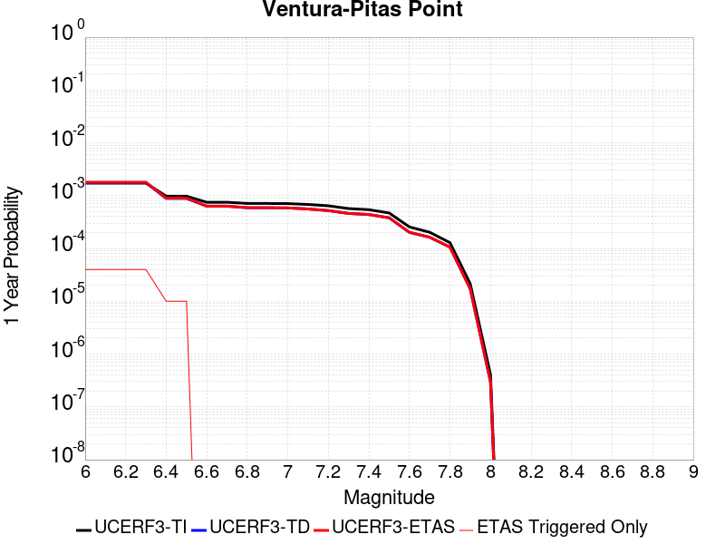 |  |

| Magnitude | 1 wk TI Prob | 1 wk TD Prob | 1 wk ETAS Prob | 1 wk ETAS/TD Gain | 1 wk ETAS Triggered Only | 1 mo TI Prob | 1 mo TD Prob | 1 mo ETAS Prob | 1 mo ETAS/TD Gain | 1 mo ETAS Triggered Only | 1 yr TI Prob | 1 yr TD Prob | 1 yr ETAS Prob | 1 yr ETAS/TD Gain | 1 yr ETAS Triggered Only | 10 yr TI Prob | 10 yr TD Prob | 10 yr ETAS Prob | 10 yr ETAS/TD Gain | 10 yr ETAS Triggered Only |
|-----|-----|-----|-----|-----|-----|-----|-----|-----|-----|-----|-----|-----|-----|-----|-----|-----|-----|-----|-----|-----|
| 6.0 | 3.3179622E-5 | 3.373519E-5 | 5.373451E-5 | 1.5928328 | 2.0E-5 | 1.4219063E-4 | 1.4457281E-4 | 1.8456703E-4 | 1.2766372 | 4.0E-5 | 0.0017297962 | 0.0017590097 | 0.0017989393 | 1.0227001 | 4.0E-5 | 0.017163932 | 0.017476497 | 0.017555099 | 1.0044975 | 8.0E-5 |
| 6.1 | 3.3179622E-5 | 3.373519E-5 | 5.373451E-5 | 1.5928328 | 2.0E-5 | 1.4219063E-4 | 1.4457281E-4 | 1.8456703E-4 | 1.2766372 | 4.0E-5 | 0.0017297962 | 0.0017590097 | 0.0017989393 | 1.0227001 | 4.0E-5 | 0.017163932 | 0.017476497 | 0.017555099 | 1.0044975 | 8.0E-5 |
| 6.2 | 3.3179622E-5 | 3.373519E-5 | 5.373451E-5 | 1.5928328 | 2.0E-5 | 1.4219063E-4 | 1.4457281E-4 | 1.8456703E-4 | 1.2766372 | 4.0E-5 | 0.0017297962 | 0.0017590097 | 0.0017989393 | 1.0227001 | 4.0E-5 | 0.017163932 | 0.017476497 | 0.017555099 | 1.0044975 | 8.0E-5 |
| 6.3 | 3.3179622E-5 | 3.373519E-5 | 5.373451E-5 | 1.5928328 | 2.0E-5 | 1.4219063E-4 | 1.4457281E-4 | 1.8456703E-4 | 1.2766372 | 4.0E-5 | 0.0017297962 | 0.0017590097 | 0.0017989393 | 1.0227001 | 4.0E-5 | 0.017163932 | 0.017476497 | 0.017555099 | 1.0044975 | 8.0E-5 |
| 6.4 | 1.8754668E-5 | 1.7019594E-5 | 1.7019594E-5 | 1.0 | 0.0 | 8.037467E-5 | 7.2939205E-5 | 8.293848E-5 | 1.1370904 | 1.0E-5 | 9.781223E-4 | 8.8769617E-4 | 8.976873E-4 | 1.0112551 | 1.0E-5 | 0.009738282 | 0.008843943 | 0.008863766 | 1.0022415 | 2.0E-5 |
| 6.5 | 1.8754668E-5 | 1.7019594E-5 | 1.7019594E-5 | 1.0 | 0.0 | 8.037467E-5 | 7.2939205E-5 | 8.293848E-5 | 1.1370904 | 1.0E-5 | 9.781223E-4 | 8.8769617E-4 | 8.976873E-4 | 1.0112551 | 1.0E-5 | 0.009738282 | 0.008843943 | 0.008863766 | 1.0022415 | 2.0E-5 |
| 6.6 | 1.4361558E-5 | 1.2122258E-5 | 1.2122258E-5 | 1.0 | 0.0 | 6.154808E-5 | 5.1951512E-5 | 5.1951512E-5 | 1.0 | 0.0 | 7.490902E-4 | 6.323284E-4 | 6.323284E-4 | 1.0 | 0.0 | 0.0074657016 | 0.006305652 | 0.0063155894 | 1.0015758 | 1.0E-5 |
| 6.7 | 1.4361558E-5 | 1.2122258E-5 | 1.2122258E-5 | 1.0 | 0.0 | 6.154808E-5 | 5.1951512E-5 | 5.1951512E-5 | 1.0 | 0.0 | 7.490902E-4 | 6.323284E-4 | 6.323284E-4 | 1.0 | 0.0 | 0.0074657016 | 0.006305652 | 0.0063155894 | 1.0015758 | 1.0E-5 |
| 6.8 | 1.3663846E-5 | 1.1344401E-5 | 1.1344401E-5 | 1.0 | 0.0 | 5.8558027E-5 | 4.8617967E-5 | 4.8617967E-5 | 1.0 | 0.0 | 7.127108E-4 | 5.917649E-4 | 5.917649E-4 | 1.0 | 0.0 | 0.007104293 | 0.0059022107 | 0.0059121517 | 1.0016843 | 1.0E-5 |
| 6.9 | 1.3644157E-5 | 1.1322501E-5 | 1.1322501E-5 | 1.0 | 0.0 | 5.8473648E-5 | 4.8524114E-5 | 4.8524114E-5 | 1.0 | 0.0 | 7.116841E-4 | 5.906229E-4 | 5.906229E-4 | 1.0 | 0.0 | 0.007094092 | 0.0058908514 | 0.0059007923 | 1.0016875 | 1.0E-5 |
| 7.0 | 1.3568845E-5 | 1.12420685E-5 | 1.12420685E-5 | 1.0 | 0.0 | 5.8150898E-5 | 4.8179416E-5 | 4.8179416E-5 | 1.0 | 0.0 | 7.077572E-4 | 5.8642845E-4 | 5.8642845E-4 | 1.0 | 0.0 | 0.007055073 | 0.005849128 | 0.0058590695 | 1.0016997 | 1.0E-5 |
| 7.1 | 1.306572E-5 | 1.0720521E-5 | 1.0720521E-5 | 1.0 | 0.0 | 5.599474E-5 | 4.594429E-5 | 4.594429E-5 | 1.0 | 0.0 | 6.815227E-4 | 5.5923004E-4 | 5.5923004E-4 | 1.0 | 0.0 | 0.0067943637 | 0.005578536 | 0.0055884803 | 1.0017825 | 1.0E-5 |
| 7.2 | 1.232604E-5 | 9.995121E-6 | 9.995121E-6 | 1.0 | 0.0 | 5.2824813E-5 | 4.283554E-5 | 4.283554E-5 | 1.0 | 0.0 | 6.429523E-4 | 5.2139966E-4 | 5.2139966E-4 | 1.0 | 0.0 | 0.0064109527 | 0.005202059 | 0.005212007 | 1.0019124 | 1.0E-5 |
| 7.3 | 1.0917261E-5 | 8.843812E-6 | 8.843812E-6 | 1.0 | 0.0 | 4.678742E-5 | 3.7901507E-5 | 3.7901507E-5 | 1.0 | 0.0 | 5.69488E-4 | 4.6135474E-4 | 4.6135474E-4 | 1.0 | 0.0 | 0.0056803077 | 0.004604239 | 0.004614193 | 1.0021619 | 1.0E-5 |
| 7.4 | 1.039959E-5 | 8.42354E-6 | 8.42354E-6 | 1.0 | 0.0 | 4.456891E-5 | 3.6100395E-5 | 3.6100395E-5 | 1.0 | 0.0 | 5.424914E-4 | 4.394352E-4 | 4.394352E-4 | 1.0 | 0.0 | 0.0054116896 | 0.0043859277 | 0.004395884 | 1.00227 | 1.0E-5 |
| 7.5 | 9.015877E-6 | 7.29752E-6 | 7.29752E-6 | 1.0 | 0.0 | 3.86389E-5 | 3.1274718E-5 | 3.1274718E-5 | 1.0 | 0.0 | 4.7032707E-4 | 3.8070456E-4 | 3.8070456E-4 | 1.0 | 0.0 | 0.004693329 | 0.003800772 | 0.003810734 | 1.002621 | 1.0E-5 |
| 7.6 | 4.900162E-6 | 3.874119E-6 | 3.874119E-6 | 1.0 | 0.0 | 2.1000526E-5 | 1.6603262E-5 | 1.6603262E-5 | 1.0 | 0.0 | 2.556514E-4 | 2.0212609E-4 | 2.0212609E-4 | 1.0 | 0.0 | 0.0025535747 | 0.002019436 | 0.002029416 | 1.0049418 | 1.0E-5 |
| 7.7 | 3.8850626E-6 | 3.12676E-6 | 3.12676E-6 | 1.0 | 0.0 | 1.6650163E-5 | 1.3400332E-5 | 1.3400332E-5 | 1.0 | 0.0 | 2.0269687E-4 | 1.6313691E-4 | 1.6313691E-4 | 1.0 | 0.0 | 0.002025121 | 0.0016301809 | 0.0016401645 | 1.0061243 | 1.0E-5 |
| 7.8 | 2.4654719E-6 | 2.029902E-6 | 2.029902E-6 | 1.0 | 0.0 | 1.0566265E-5 | 8.699551E-6 | 8.699551E-6 | 1.0 | 0.0 | 1.2863669E-4 | 1.0591193E-4 | 1.0591193E-4 | 1.0 | 0.0 | 0.0012856225 | 0.0010586192 | 0.0010686086 | 1.0094362 | 1.0E-5 |
| 7.9 | 4.095894E-7 | 3.2765078E-7 | 3.2765078E-7 | 1.0 | 0.0 | 1.7553821E-6 | 1.4042168E-6 | 1.4042168E-6 | 1.0 | 0.0 | 2.1371567E-5 | 1.709621E-5 | 1.709621E-5 | 1.0 | 0.0 | 2.1369511E-4 | 1.7094925E-4 | 1.7094925E-4 | 1.0 | 0.0 |
| 8.0 | 7.791402E-9 | 5.6836056E-9 | 5.6836056E-9 | 1.0 | 0.0 | 3.3391725E-8 | 2.4358311E-8 | 2.4358311E-8 | 1.0 | 0.0 | 4.0654416E-7 | 2.965624E-7 | 2.965624E-7 | 1.0 | 0.0 | 4.065434E-6 | 2.9656223E-6 | 2.9656223E-6 | 1.0 | 0.0 |

## Whittier alt 1
*[(top)](#table-of-contents)*

| 1 Week | 1 Month | 1 Year | 10 Year |
|-----|-----|-----|-----|
|  |  | 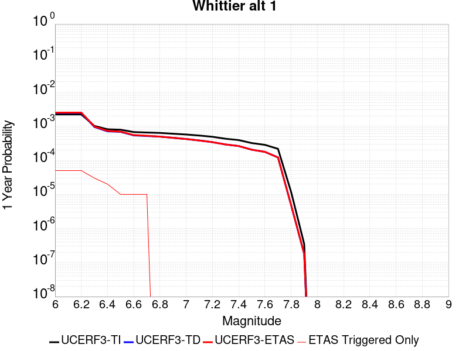 |  |

| Magnitude | 1 wk TI Prob | 1 wk TD Prob | 1 wk ETAS Prob | 1 wk ETAS/TD Gain | 1 wk ETAS Triggered Only | 1 mo TI Prob | 1 mo TD Prob | 1 mo ETAS Prob | 1 mo ETAS/TD Gain | 1 mo ETAS Triggered Only | 1 yr TI Prob | 1 yr TD Prob | 1 yr ETAS Prob | 1 yr ETAS/TD Gain | 1 yr ETAS Triggered Only | 10 yr TI Prob | 10 yr TD Prob | 10 yr ETAS Prob | 10 yr ETAS/TD Gain | 10 yr ETAS Triggered Only |
|-----|-----|-----|-----|-----|-----|-----|-----|-----|-----|-----|-----|-----|-----|-----|-----|-----|-----|-----|-----|-----|
| 6.0 | 4.2554693E-5 | 4.7252182E-5 | 7.725076E-5 | 1.6348614 | 3.0E-5 | 1.8236451E-4 | 2.0249544E-4 | 2.5248533E-4 | 1.2468691 | 5.0E-5 | 0.002218027 | 0.0024629163 | 0.0025127933 | 1.0202512 | 5.0E-5 | 0.02196019 | 0.024390263 | 0.024487825 | 1.004 | 1.0E-4 |
| 6.1 | 4.2554693E-5 | 4.7252182E-5 | 7.725076E-5 | 1.6348614 | 3.0E-5 | 1.8236451E-4 | 2.0249544E-4 | 2.5248533E-4 | 1.2468691 | 5.0E-5 | 0.002218027 | 0.0024629163 | 0.0025127933 | 1.0202512 | 5.0E-5 | 0.02196019 | 0.024390263 | 0.024487825 | 1.004 | 1.0E-4 |
| 6.2 | 4.2554693E-5 | 4.7252182E-5 | 7.725076E-5 | 1.6348614 | 3.0E-5 | 1.8236451E-4 | 2.0249544E-4 | 2.5248533E-4 | 1.2468691 | 5.0E-5 | 0.002218027 | 0.0024629163 | 0.0025127933 | 1.0202512 | 5.0E-5 | 0.02196019 | 0.024390263 | 0.024487825 | 1.004 | 1.0E-4 |
| 6.3 | 1.9617712E-5 | 1.826841E-5 | 2.8268229E-5 | 1.547383 | 1.0E-5 | 8.40732E-5 | 7.829095E-5 | 1.08288594E-4 | 1.3831561 | 3.0E-5 | 0.0010231105 | 9.527944E-4 | 9.827658E-4 | 1.0314564 | 3.0E-5 | 0.01018413 | 0.0094904 | 0.009539925 | 1.0052185 | 5.0E-5 |
| 6.4 | 1.5611336E-5 | 1.3604089E-5 | 1.3604089E-5 | 1.0 | 0.0 | 6.690401E-5 | 5.8301972E-5 | 7.830081E-5 | 1.3430216 | 2.0E-5 | 8.142519E-4 | 7.096013E-4 | 7.295871E-4 | 1.0281649 | 2.0E-5 | 0.008112748 | 0.0070753377 | 0.0071051256 | 1.0042101 | 3.0E-5 |
| 6.5 | 1.5150166E-5 | 1.3100744E-5 | 1.3100744E-5 | 1.0 | 0.0 | 6.492767E-5 | 5.614487E-5 | 6.6144305E-5 | 1.1781007 | 1.0E-5 | 7.9020765E-4 | 6.8335526E-4 | 6.9334847E-4 | 1.0146236 | 1.0E-5 | 0.007874036 | 0.006814508 | 0.0068343715 | 1.0029149 | 2.0E-5 |
| 6.6 | 1.295588E-5 | 1.0380544E-5 | 1.0380544E-5 | 1.0 | 0.0 | 5.552402E-5 | 4.44873E-5 | 5.4486853E-5 | 1.2247733 | 1.0E-5 | 6.7579525E-4 | 5.415002E-4 | 5.5149477E-4 | 1.0184572 | 1.0E-5 | 0.006737438 | 0.005403343 | 0.0054232352 | 1.0036814 | 2.0E-5 |
| 6.7 | 1.2542085E-5 | 9.899189E-6 | 9.899189E-6 | 1.0 | 0.0 | 5.3750682E-5 | 4.2424414E-5 | 5.242399E-5 | 1.2357033 | 1.0E-5 | 6.542181E-4 | 5.163967E-4 | 5.2639155E-4 | 1.0193549 | 1.0E-5 | 0.006522954 | 0.005153464 | 0.0051733614 | 1.0038608 | 2.0E-5 |
| 6.8 | 1.2195878E-5 | 9.49523E-6 | 9.49523E-6 | 1.0 | 0.0 | 5.2267E-5 | 4.069322E-5 | 4.069322E-5 | 1.0 | 0.0 | 6.36165E-4 | 4.9532915E-4 | 4.9532915E-4 | 1.0 | 0.0 | 0.0063434686 | 0.0049436963 | 0.004953647 | 1.0020127 | 1.0E-5 |
| 6.9 | 1.1580298E-5 | 8.772739E-6 | 8.772739E-6 | 1.0 | 0.0 | 4.9628903E-5 | 3.759692E-5 | 3.759692E-5 | 1.0 | 0.0 | 6.040644E-4 | 4.5764804E-4 | 4.5764804E-4 | 1.0 | 0.0 | 0.00602425 | 0.0045684646 | 0.0045784186 | 1.0021789 | 1.0E-5 |
| 7.0 | 1.0964795E-5 | 8.083794E-6 | 8.083794E-6 | 1.0 | 0.0 | 4.6991136E-5 | 3.4644378E-5 | 3.4644378E-5 | 1.0 | 0.0 | 5.7196687E-4 | 4.217152E-4 | 4.217152E-4 | 1.0 | 0.0 | 0.0057049696 | 0.004210459 | 0.004210459 | 1.0 | 0.0 |
| 7.1 | 1.0230601E-5 | 7.32646E-6 | 7.32646E-6 | 1.0 | 0.0 | 4.3844695E-5 | 3.1398744E-5 | 3.1398744E-5 | 1.0 | 0.0 | 5.336784E-4 | 3.8221394E-4 | 3.8221394E-4 | 1.0 | 0.0 | 0.005323986 | 0.0038167592 | 0.0038167592 | 1.0 | 0.0 |
| 7.2 | 9.40865E-6 | 6.5430822E-6 | 6.5430822E-6 | 1.0 | 0.0 | 4.032216E-5 | 2.8041486E-5 | 2.8041486E-5 | 1.0 | 0.0 | 4.908117E-4 | 3.4135283E-4 | 3.4135283E-4 | 1.0 | 0.0 | 0.0048972913 | 0.0034094024 | 0.0034094024 | 1.0 | 0.0 |
| 7.3 | 8.237384E-6 | 5.5975433E-6 | 5.5975433E-6 | 1.0 | 0.0 | 3.5302593E-5 | 2.3989258E-5 | 2.3989258E-5 | 1.0 | 0.0 | 4.2972428E-4 | 2.920311E-4 | 2.920311E-4 | 1.0 | 0.0 | 0.0042889426 | 0.0029167992 | 0.0029167992 | 1.0 | 0.0 |
| 7.4 | 7.5316966E-6 | 5.0276153E-6 | 5.0276153E-6 | 1.0 | 0.0 | 3.2278298E-5 | 2.154675E-5 | 2.154675E-5 | 1.0 | 0.0 | 3.9291743E-4 | 2.623011E-4 | 2.623011E-4 | 1.0 | 0.0 | 0.0039222343 | 0.0026200267 | 0.0026200267 | 1.0 | 0.0 |
| 7.5 | 6.149649E-6 | 3.9336355E-6 | 3.9336355E-6 | 1.0 | 0.0 | 2.6355372E-5 | 1.6858336E-5 | 1.6858336E-5 | 1.0 | 0.0 | 3.208294E-4 | 2.052318E-4 | 2.052318E-4 | 1.0 | 0.0 | 0.003203666 | 0.0020505118 | 0.0020505118 | 1.0 | 0.0 |
| 7.6 | 5.457711E-6 | 3.3951796E-6 | 3.3951796E-6 | 1.0 | 0.0 | 2.338998E-5 | 1.4550694E-5 | 1.4550694E-5 | 1.0 | 0.0 | 2.8473578E-4 | 1.771411E-4 | 1.771411E-4 | 1.0 | 0.0 | 0.0028437122 | 0.0017700798 | 0.0017700798 | 1.0 | 0.0 |
| 7.7 | 4.1676276E-6 | 2.3329922E-6 | 2.3329922E-6 | 1.0 | 0.0 | 1.7861139E-5 | 9.998504E-6 | 9.998504E-6 | 1.0 | 0.0 | 2.1743766E-4 | 1.2172572E-4 | 1.2172572E-4 | 1.0 | 0.0 | 0.0021722503 | 0.0012166635 | 0.0012166635 | 1.0 | 0.0 |
| 7.8 | 2.2692414E-7 | 9.384417E-8 | 9.384417E-8 | 1.0 | 0.0 | 9.725317E-7 | 4.0218927E-7 | 4.0218927E-7 | 1.0 | 0.0 | 1.1840509E-5 | 4.8966467E-6 | 4.8966467E-6 | 1.0 | 0.0 | 1.1839878E-4 | 4.8965718E-5 | 4.8965718E-5 | 1.0 | 0.0 |
| 7.9 | 6.676829E-9 | 3.4397174E-9 | 3.4397174E-9 | 1.0 | 0.0 | 2.861498E-8 | 1.4741646E-8 | 1.4741646E-8 | 1.0 | 0.0 | 3.4838732E-7 | 1.7947953E-7 | 1.7947953E-7 | 1.0 | 0.0 | 3.4838679E-6 | 1.794794E-6 | 1.794794E-6 | 1.0 | 0.0 |

## Oceanic - West Huasna
*[(top)](#table-of-contents)*

| 1 Week | 1 Month | 1 Year | 10 Year |
|-----|-----|-----|-----|
| 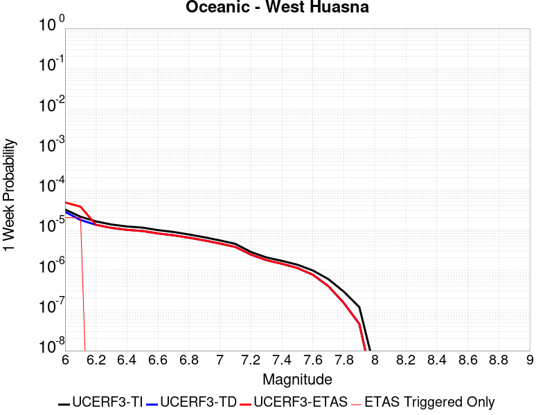 | 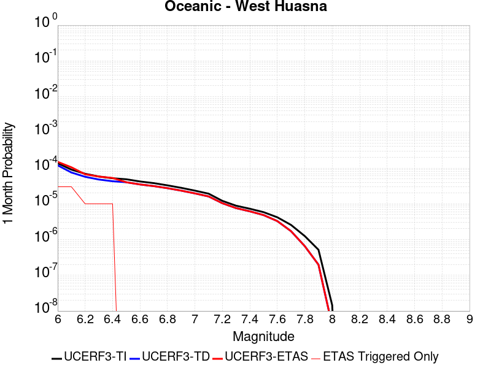 |  |  |

| Magnitude | 1 wk TI Prob | 1 wk TD Prob | 1 wk ETAS Prob | 1 wk ETAS/TD Gain | 1 wk ETAS Triggered Only | 1 mo TI Prob | 1 mo TD Prob | 1 mo ETAS Prob | 1 mo ETAS/TD Gain | 1 mo ETAS Triggered Only | 1 yr TI Prob | 1 yr TD Prob | 1 yr ETAS Prob | 1 yr ETAS/TD Gain | 1 yr ETAS Triggered Only | 10 yr TI Prob | 10 yr TD Prob | 10 yr ETAS Prob | 10 yr ETAS/TD Gain | 10 yr ETAS Triggered Only |
|-----|-----|-----|-----|-----|-----|-----|-----|-----|-----|-----|-----|-----|-----|-----|-----|-----|-----|-----|-----|-----|
| 6.0 | 3.195567E-5 | 2.7926368E-5 | 4.792581E-5 | 1.7161491 | 2.0E-5 | 1.3694567E-4 | 1.19679185E-4 | 1.496756E-4 | 1.2506402 | 3.0E-5 | 0.0016660384 | 0.0014561634 | 0.0015060905 | 1.0342869 | 5.0E-5 | 0.016536033 | 0.01447077 | 0.014549613 | 1.0054483 | 8.0E-5 |
| 6.1 | 2.1156782E-5 | 1.7573117E-5 | 3.7572765E-5 | 2.138082 | 2.0E-5 | 9.066878E-5 | 7.531123E-5 | 1.0530898E-4 | 1.398317 | 3.0E-5 | 0.0011033333 | 9.1653795E-4 | 9.4651047E-4 | 1.0327018 | 3.0E-5 | 0.010978713 | 0.009128587 | 0.009178131 | 1.0054272 | 5.0E-5 |
| 6.2 | 1.6195117E-5 | 1.3327227E-5 | 1.3327227E-5 | 1.0 | 0.0 | 6.9405796E-5 | 5.7115452E-5 | 6.711488E-5 | 1.175074 | 1.0E-5 | 8.44688E-4 | 6.9516135E-4 | 7.051544E-4 | 1.0143751 | 1.0E-5 | 0.008414844 | 0.0069301617 | 0.006950023 | 1.0028659 | 2.0E-5 |
| 6.3 | 1.3559345E-5 | 1.1179013E-5 | 1.1179013E-5 | 1.0 | 0.0 | 5.811018E-5 | 4.7909183E-5 | 5.7908703E-5 | 1.2087183 | 1.0E-5 | 7.072618E-4 | 5.8313913E-4 | 5.931333E-4 | 1.0171386 | 1.0E-5 | 0.0070501505 | 0.005816208 | 0.0058360915 | 1.0034187 | 2.0E-5 |
| 6.4 | 1.2120619E-5 | 1.0000874E-5 | 1.0000874E-5 | 1.0 | 0.0 | 5.1944477E-5 | 4.2860185E-5 | 5.285976E-5 | 1.2333068 | 1.0E-5 | 6.322405E-4 | 5.216983E-4 | 5.316931E-4 | 1.0191581 | 1.0E-5 | 0.006304447 | 0.005204804 | 0.0052147517 | 1.0019113 | 1.0E-5 |
| 6.5 | 1.13511915E-5 | 9.367378E-6 | 9.367378E-6 | 1.0 | 0.0 | 4.8647056E-5 | 4.0145293E-5 | 4.0145293E-5 | 1.0 | 0.0 | 5.9211696E-4 | 4.886598E-4 | 4.886598E-4 | 1.0 | 0.0 | 0.0059054173 | 0.0048759114 | 0.0048759114 | 1.0 | 0.0 |
| 6.6 | 9.850605E-6 | 8.1353155E-6 | 8.1353155E-6 | 1.0 | 0.0 | 4.2216197E-5 | 3.4865174E-5 | 3.4865174E-5 | 1.0 | 0.0 | 5.1386096E-4 | 4.2440102E-4 | 4.2440102E-4 | 1.0 | 0.0 | 0.0051267436 | 0.0042359377 | 0.0042359377 | 1.0 | 0.0 |
| 6.7 | 8.8558645E-6 | 7.318341E-6 | 7.318341E-6 | 1.0 | 0.0 | 3.7953152E-5 | 3.1363943E-5 | 3.1363943E-5 | 1.0 | 0.0 | 4.6198163E-4 | 3.8178926E-4 | 3.8178926E-4 | 1.0 | 0.0 | 0.004610224 | 0.0038113592 | 0.0038113592 | 1.0 | 0.0 |
| 6.8 | 7.67136E-6 | 6.39169E-6 | 6.39169E-6 | 1.0 | 0.0 | 3.2876844E-5 | 2.739267E-5 | 2.739267E-5 | 1.0 | 0.0 | 4.0020206E-4 | 3.3345487E-4 | 3.3345487E-4 | 1.0 | 0.0 | 0.003994821 | 0.0033295664 | 0.0033295664 | 1.0 | 0.0 |
| 6.9 | 6.534529E-6 | 5.458261E-6 | 5.458261E-6 | 1.0 | 0.0 | 2.8004823E-5 | 2.3392338E-5 | 2.3392338E-5 | 1.0 | 0.0 | 3.4090536E-4 | 2.8476462E-4 | 2.8476462E-4 | 1.0 | 0.0 | 0.0034038287 | 0.002844014 | 0.002844014 | 1.0 | 0.0 |
| 7.0 | 5.460525E-6 | 4.5699203E-6 | 4.5699203E-6 | 1.0 | 0.0 | 2.3402039E-5 | 1.9585226E-5 | 1.9585226E-5 | 1.0 | 0.0 | 2.8488258E-4 | 2.3842414E-4 | 2.3842414E-4 | 1.0 | 0.0 | 0.0028451765 | 0.0023816973 | 0.0023816973 | 1.0 | 0.0 |
| 7.1 | 4.4825083E-6 | 3.7524153E-6 | 3.7524153E-6 | 1.0 | 0.0 | 1.9210609E-5 | 1.6081682E-5 | 1.6081682E-5 | 1.0 | 0.0 | 2.3386406E-4 | 1.9577699E-4 | 1.9577699E-4 | 1.0 | 0.0 | 0.002336181 | 0.001956057 | 0.001956057 | 1.0 | 0.0 |
| 7.2 | 2.821708E-6 | 2.424941E-6 | 2.424941E-6 | 1.0 | 0.0 | 1.2092979E-5 | 1.0392562E-5 | 1.0392562E-5 | 1.0 | 0.0 | 1.4722206E-4 | 1.265221E-4 | 1.265221E-4 | 1.0 | 0.0 | 0.0014712457 | 0.0012645032 | 0.0012645032 | 1.0 | 0.0 |
| 7.3 | 2.0644757E-6 | 1.7687502E-6 | 1.7687502E-6 | 1.0 | 0.0 | 8.847723E-6 | 7.580336E-6 | 7.580336E-6 | 1.0 | 0.0 | 1.0771569E-4 | 9.228668E-5 | 9.228668E-5 | 1.0 | 0.0 | 0.001076635 | 9.224854E-4 | 9.224854E-4 | 1.0 | 0.0 |
| 7.4 | 1.6980367E-6 | 1.4379966E-6 | 1.4379966E-6 | 1.0 | 0.0 | 7.27728E-6 | 6.1628284E-6 | 6.1628284E-6 | 1.0 | 0.0 | 8.8597284E-5 | 7.502986E-5 | 7.502986E-5 | 1.0 | 0.0 | 8.8561967E-4 | 7.5004686E-4 | 7.5004686E-4 | 1.0 | 0.0 |
| 7.5 | 1.3637683E-6 | 1.1302697E-6 | 1.1302697E-6 | 1.0 | 0.0 | 5.844708E-6 | 4.844004E-6 | 4.844004E-6 | 1.0 | 0.0 | 7.1156996E-5 | 5.897415E-5 | 5.897415E-5 | 1.0 | 0.0 | 7.1134215E-4 | 5.8958656E-4 | 5.8958656E-4 | 1.0 | 0.0 |
| 7.6 | 9.802994E-7 | 7.6772847E-7 | 7.6772847E-7 | 1.0 | 0.0 | 4.2012766E-6 | 3.2902608E-6 | 3.2902608E-6 | 1.0 | 0.0 | 5.1149345E-5 | 4.005819E-5 | 4.005819E-5 | 1.0 | 0.0 | 5.113757E-4 | 4.0051117E-4 | 4.0051117E-4 | 1.0 | 0.0 |
| 7.7 | 5.986191E-7 | 4.0050708E-7 | 4.0050708E-7 | 1.0 | 0.0 | 2.5655079E-6 | 1.7164577E-6 | 1.7164577E-6 | 1.0 | 0.0 | 3.1234613E-5 | 2.0897673E-5 | 2.0897673E-5 | 1.0 | 0.0 | 3.123022E-4 | 2.0895849E-4 | 2.0895849E-4 | 1.0 | 0.0 |
| 7.8 | 2.9189815E-7 | 1.5285202E-7 | 1.5285202E-7 | 1.0 | 0.0 | 1.2509914E-6 | 6.5507993E-7 | 6.5507993E-7 | 1.0 | 0.0 | 1.5230714E-5 | 7.975569E-6 | 7.975569E-6 | 1.0 | 0.0 | 1.522967E-4 | 7.97542E-5 | 7.97542E-5 | 1.0 | 0.0 |
| 7.9 | 1.2057845E-7 | 4.6208047E-8 | 4.6208047E-8 | 1.0 | 0.0 | 5.1676466E-7 | 1.9803447E-7 | 1.9803447E-7 | 1.0 | 0.0 | 6.2915915E-6 | 2.411067E-6 | 2.411067E-6 | 1.0 | 0.0 | 6.2914136E-5 | 2.4111772E-5 | 2.4111772E-5 | 1.0 | 0.0 |
| 8.0 | 3.3806387E-9 | 9.0093144E-10 | 9.0093144E-10 | 1.0 | 0.0 | 1.4488451E-8 | 3.8611354E-9 | 3.8611354E-9 | 1.0 | 0.0 | 1.7639688E-7 | 4.7009323E-8 | 4.7009323E-8 | 1.0 | 0.0 | 1.7639674E-6 | 4.712806E-7 | 4.712806E-7 | 1.0 | 0.0 |

## Rose Canyon
*[(top)](#table-of-contents)*

| 1 Week | 1 Month | 1 Year | 10 Year |
|-----|-----|-----|-----|
| 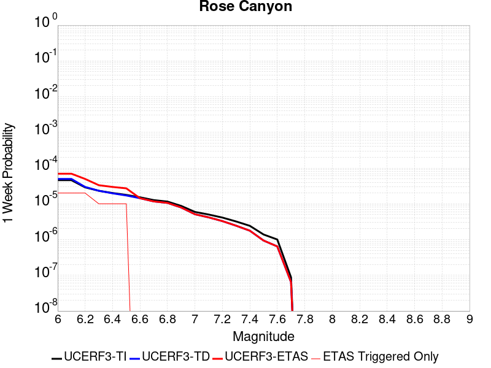 |  |  |  |

| Magnitude | 1 wk TI Prob | 1 wk TD Prob | 1 wk ETAS Prob | 1 wk ETAS/TD Gain | 1 wk ETAS Triggered Only | 1 mo TI Prob | 1 mo TD Prob | 1 mo ETAS Prob | 1 mo ETAS/TD Gain | 1 mo ETAS Triggered Only | 1 yr TI Prob | 1 yr TD Prob | 1 yr ETAS Prob | 1 yr ETAS/TD Gain | 1 yr ETAS Triggered Only | 10 yr TI Prob | 10 yr TD Prob | 10 yr ETAS Prob | 10 yr ETAS/TD Gain | 10 yr ETAS Triggered Only |
|-----|-----|-----|-----|-----|-----|-----|-----|-----|-----|-----|-----|-----|-----|-----|-----|-----|-----|-----|-----|-----|
| 6.0 | 4.5923203E-5 | 4.9714607E-5 | 6.971361E-5 | 1.4022763 | 2.0E-5 | 1.9679888E-4 | 2.1304654E-4 | 2.5303802E-4 | 1.1877124 | 4.0E-5 | 0.0023933933 | 0.0025909478 | 0.0026707405 | 1.0307968 | 8.0E-5 | 0.023677798 | 0.025618518 | 0.025706213 | 1.0034231 | 9.0E-5 |
| 6.1 | 4.5923203E-5 | 4.9714607E-5 | 6.971361E-5 | 1.4022763 | 2.0E-5 | 1.9679888E-4 | 2.1304654E-4 | 2.4304015E-4 | 1.1407843 | 3.0E-5 | 0.0023933933 | 0.0025909478 | 0.0026507925 | 1.0230975 | 6.0E-5 | 0.023677798 | 0.025618518 | 0.025686724 | 1.0026624 | 7.0E-5 |
| 6.2 | 2.8844734E-5 | 2.9669678E-5 | 4.9669085E-5 | 1.6740689 | 2.0E-5 | 1.2361443E-4 | 1.2714976E-4 | 1.4714722E-4 | 1.1572748 | 2.0E-5 | 0.0015039665 | 0.001546976 | 0.0015769297 | 1.0193627 | 3.0E-5 | 0.0149382865 | 0.015364873 | 0.015404259 | 1.0025634 | 4.0E-5 |
| 6.3 | 2.3171577E-5 | 2.3162425E-5 | 3.3162192E-5 | 1.4317237 | 1.0E-5 | 9.9302975E-5 | 9.926383E-5 | 1.0926284E-4 | 1.1007316 | 1.0E-5 | 0.0012083431 | 0.0012078804 | 0.0012278563 | 1.0165379 | 2.0E-5 | 0.012017938 | 0.012012152 | 0.012041792 | 1.0024675 | 3.0E-5 |
| 6.4 | 2.0066604E-5 | 1.9668067E-5 | 2.966787E-5 | 1.5084283 | 1.0E-5 | 8.599689E-5 | 8.428905E-5 | 9.42882E-5 | 1.1186293 | 1.0E-5 | 0.0010465092 | 0.001025746 | 0.0010457255 | 1.019478 | 2.0E-5 | 0.010415946 | 0.010211479 | 0.010241172 | 1.0029079 | 3.0E-5 |
| 6.5 | 1.776989E-5 | 1.7115402E-5 | 2.7115231E-5 | 1.584259 | 1.0E-5 | 7.615444E-5 | 7.33497E-5 | 8.334896E-5 | 1.1363232 | 1.0E-5 | 9.267859E-4 | 8.926737E-4 | 9.0266473E-4 | 1.0111923 | 1.0E-5 | 0.009229303 | 0.008874663 | 0.008894485 | 1.0022336 | 2.0E-5 |
| 6.6 | 1.5227364E-5 | 1.4340872E-5 | 1.4340872E-5 | 1.0 | 0.0 | 6.52585E-5 | 6.145947E-5 | 6.145947E-5 | 1.0 | 0.0 | 7.942326E-4 | 7.480173E-4 | 7.480173E-4 | 1.0 | 0.0 | 0.007914 | 0.0074410336 | 0.007450959 | 1.001334 | 1.0E-5 |
| 6.7 | 1.2703898E-5 | 1.1674277E-5 | 1.1674277E-5 | 1.0 | 0.0 | 5.4444143E-5 | 5.0031682E-5 | 5.0031682E-5 | 1.0 | 0.0 | 6.626558E-4 | 6.089697E-4 | 6.089697E-4 | 1.0 | 0.0 | 0.006606833 | 0.0060623093 | 0.006072249 | 1.0016395 | 1.0E-5 |
| 6.8 | 1.1554917E-5 | 1.0610384E-5 | 1.0610384E-5 | 1.0 | 0.0 | 4.9520135E-5 | 4.547231E-5 | 4.547231E-5 | 1.0 | 0.0 | 6.0274085E-4 | 5.5348873E-4 | 5.5348873E-4 | 1.0 | 0.0 | 0.0060110865 | 0.005504414 | 0.005514359 | 1.0018067 | 1.0E-5 |
| 6.9 | 8.732078E-6 | 7.882285E-6 | 7.882285E-6 | 1.0 | 0.0 | 3.7422655E-5 | 3.37808E-5 | 3.37808E-5 | 1.0 | 0.0 | 4.5552556E-4 | 4.112066E-4 | 4.112066E-4 | 1.0 | 0.0 | 0.0045459294 | 0.004089515 | 0.0040994743 | 1.0024353 | 1.0E-5 |
| 7.0 | 5.9337494E-6 | 5.107436E-6 | 5.107436E-6 | 1.0 | 0.0 | 2.5430107E-5 | 2.1888829E-5 | 2.1888829E-5 | 1.0 | 0.0 | 3.0956755E-4 | 2.6646405E-4 | 2.6646405E-4 | 1.0 | 0.0 | 0.0030913667 | 0.002661461 | 0.002661461 | 1.0 | 0.0 |
| 7.1 | 5.013409E-6 | 4.17734E-6 | 4.17734E-6 | 1.0 | 0.0 | 2.1485863E-5 | 1.7902763E-5 | 1.7902763E-5 | 1.0 | 0.0 | 2.6155898E-4 | 2.1794444E-4 | 2.1794444E-4 | 1.0 | 0.0 | 0.0026125133 | 0.0021773188 | 0.0021773188 | 1.0 | 0.0 |
| 7.2 | 4.120763E-6 | 3.2820917E-6 | 3.2820917E-6 | 1.0 | 0.0 | 1.7660293E-5 | 1.4066032E-5 | 1.4066032E-5 | 1.0 | 0.0 | 2.1499286E-4 | 1.7124058E-4 | 1.7124058E-4 | 1.0 | 0.0 | 0.0021478499 | 0.0017110958 | 0.0017110958 | 1.0 | 0.0 |
| 7.3 | 3.2081239E-6 | 2.4404965E-6 | 2.4404965E-6 | 1.0 | 0.0 | 1.374903E-5 | 1.0459229E-5 | 1.0459229E-5 | 1.0 | 0.0 | 1.6738157E-4 | 1.2733374E-4 | 1.2733374E-4 | 1.0 | 0.0 | 0.0016725556 | 0.0012726148 | 0.0012726148 | 1.0 | 0.0 |
| 7.4 | 2.4194755E-6 | 1.7680321E-6 | 1.7680321E-6 | 1.0 | 0.0 | 1.0369139E-5 | 7.5772587E-6 | 7.5772587E-6 | 1.0 | 0.0 | 1.2623696E-4 | 9.224927E-5 | 9.224927E-5 | 1.0 | 0.0 | 0.0012616527 | 9.221151E-4 | 9.221151E-4 | 1.0 | 0.0 |
| 7.5 | 1.3842889E-6 | 9.3782967E-7 | 9.3782967E-7 | 1.0 | 0.0 | 5.9326535E-6 | 4.019264E-6 | 4.019264E-6 | 1.0 | 0.0 | 7.222766E-5 | 4.8933474E-5 | 4.8933474E-5 | 1.0 | 0.0 | 7.220419E-4 | 4.8923056E-4 | 4.8923056E-4 | 1.0 | 0.0 |
| 7.6 | 1.0021575E-6 | 6.4113493E-7 | 6.4113493E-7 | 1.0 | 0.0 | 4.2949537E-6 | 2.7477186E-6 | 2.7477186E-6 | 1.0 | 0.0 | 5.2289808E-5 | 3.345298E-5 | 3.345298E-5 | 1.0 | 0.0 | 5.2277505E-4 | 3.344816E-4 | 3.344816E-4 | 1.0 | 0.0 |
| 7.7 | 8.7620116E-8 | 6.449304E-8 | 6.449304E-8 | 1.0 | 0.0 | 3.7551473E-7 | 2.763987E-7 | 2.763987E-7 | 1.0 | 0.0 | 4.5718825E-6 | 3.3651493E-6 | 3.3651493E-6 | 1.0 | 0.0 | 4.5717883E-5 | 3.3651013E-5 | 3.3651013E-5 | 1.0 | 0.0 |

## San Pedro Basin
*[(top)](#table-of-contents)*

| 1 Week | 1 Month | 1 Year | 10 Year |
|-----|-----|-----|-----|
|  |  | 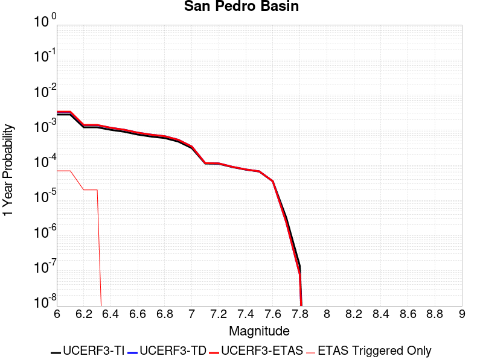 |  |

| Magnitude | 1 wk TI Prob | 1 wk TD Prob | 1 wk ETAS Prob | 1 wk ETAS/TD Gain | 1 wk ETAS Triggered Only | 1 mo TI Prob | 1 mo TD Prob | 1 mo ETAS Prob | 1 mo ETAS/TD Gain | 1 mo ETAS Triggered Only | 1 yr TI Prob | 1 yr TD Prob | 1 yr ETAS Prob | 1 yr ETAS/TD Gain | 1 yr ETAS Triggered Only | 10 yr TI Prob | 10 yr TD Prob | 10 yr ETAS Prob | 10 yr ETAS/TD Gain | 10 yr ETAS Triggered Only |
|-----|-----|-----|-----|-----|-----|-----|-----|-----|-----|-----|-----|-----|-----|-----|-----|-----|-----|-----|-----|-----|
| 6.0 | 5.3449043E-5 | 6.337018E-5 | 8.336891E-5 | 1.3155859 | 2.0E-5 | 2.2904722E-4 | 2.7156167E-4 | 3.0155352E-4 | 1.1104422 | 3.0E-5 | 0.0027850836 | 0.0033018515 | 0.0033716203 | 1.0211302 | 7.0E-5 | 0.027504366 | 0.03258948 | 0.032676548 | 1.0026716 | 9.0E-5 |
| 6.1 | 5.3449043E-5 | 6.337018E-5 | 8.336891E-5 | 1.3155859 | 2.0E-5 | 2.2904722E-4 | 2.7156167E-4 | 3.0155352E-4 | 1.1104422 | 3.0E-5 | 0.0027850836 | 0.0033018515 | 0.0033716203 | 1.0211302 | 7.0E-5 | 0.027504366 | 0.03258948 | 0.032676548 | 1.0026716 | 9.0E-5 |
| 6.2 | 2.3189454E-5 | 2.6642829E-5 | 2.6642829E-5 | 1.0 | 0.0 | 9.9379584E-5 | 1.1417881E-4 | 1.1417881E-4 | 1.0 | 0.0 | 0.0012092749 | 0.0013892875 | 0.0014092597 | 1.0143759 | 2.0E-5 | 0.012027155 | 0.01381089 | 0.013840476 | 1.0021422 | 3.0E-5 |
| 6.3 | 2.3189454E-5 | 2.6642829E-5 | 2.6642829E-5 | 1.0 | 0.0 | 9.9379584E-5 | 1.1417881E-4 | 1.1417881E-4 | 1.0 | 0.0 | 0.0012092749 | 0.0013892875 | 0.0014092597 | 1.0143759 | 2.0E-5 | 0.012027155 | 0.01381089 | 0.013840476 | 1.0021422 | 3.0E-5 |
| 6.4 | 1.966056E-5 | 2.246342E-5 | 2.246342E-5 | 1.0 | 0.0 | 8.425682E-5 | 9.626848E-5 | 9.626848E-5 | 1.0 | 0.0 | 0.001025344 | 0.0011714787 | 0.0011714787 | 1.0 | 0.0 | 0.010206259 | 0.011657119 | 0.011667003 | 1.0008478 | 1.0E-5 |
| 6.5 | 1.7342953E-5 | 1.9745152E-5 | 1.9745152E-5 | 1.0 | 0.0 | 7.4324824E-5 | 8.461954E-5 | 8.461954E-5 | 1.0 | 0.0 | 9.04529E-4 | 0.0010297929 | 0.0010297929 | 1.0 | 0.0 | 0.009008561 | 0.010253932 | 0.01026383 | 1.0009652 | 1.0E-5 |
| 6.6 | 1.439804E-5 | 1.6322716E-5 | 1.6322716E-5 | 1.0 | 0.0 | 6.170443E-5 | 6.99528E-5 | 6.99528E-5 | 1.0 | 0.0 | 7.509924E-4 | 8.513747E-4 | 8.513747E-4 | 1.0 | 0.0 | 0.0074845953 | 0.008484333 | 0.008494249 | 1.0011686 | 1.0E-5 |
| 6.7 | 1.2634884E-5 | 1.4285298E-5 | 1.4285298E-5 | 1.0 | 0.0 | 5.414838E-5 | 6.122144E-5 | 6.122144E-5 | 1.0 | 0.0 | 6.590571E-4 | 7.451466E-4 | 7.451466E-4 | 1.0 | 0.0 | 0.006571059 | 0.007429502 | 0.0074394275 | 1.001336 | 1.0E-5 |
| 6.8 | 1.146091E-5 | 1.2933193E-5 | 1.2933193E-5 | 1.0 | 0.0 | 4.911726E-5 | 5.542696E-5 | 5.542696E-5 | 1.0 | 0.0 | 5.9783855E-4 | 6.74644E-4 | 6.74644E-4 | 1.0 | 0.0 | 0.0059623276 | 0.0067288997 | 0.006738832 | 1.0014762 | 1.0E-5 |
| 6.9 | 9.109035E-6 | 1.0235013E-5 | 1.0235013E-5 | 1.0 | 0.0 | 3.9038136E-5 | 4.386376E-5 | 4.386376E-5 | 1.0 | 0.0 | 4.7518566E-4 | 5.339384E-4 | 5.339384E-4 | 1.0 | 0.0 | 0.0047417083 | 0.0053293095 | 0.005339256 | 1.0018665 | 1.0E-5 |
| 7.0 | 5.9351028E-6 | 6.583965E-6 | 6.583965E-6 | 1.0 | 0.0 | 2.5435906E-5 | 2.821682E-5 | 2.821682E-5 | 1.0 | 0.0 | 3.0963816E-4 | 3.4350925E-4 | 3.4350925E-4 | 1.0 | 0.0 | 0.0030920706 | 0.0034320997 | 0.0034420653 | 1.0029037 | 1.0E-5 |
| 7.1 | 2.1557585E-6 | 2.2096492E-6 | 2.2096492E-6 | 1.0 | 0.0 | 9.238933E-6 | 9.469892E-6 | 9.469892E-6 | 1.0 | 0.0 | 1.1247819E-4 | 1.15289986E-4 | 1.15289986E-4 | 1.0 | 0.0 | 0.0011242128 | 0.0011523172 | 0.0011523172 | 1.0 | 0.0 |
| 7.2 | 2.1251979E-6 | 2.1779954E-6 | 2.1779954E-6 | 1.0 | 0.0 | 9.107958E-6 | 9.334234E-6 | 9.334234E-6 | 1.0 | 0.0 | 1.1088375E-4 | 1.13638525E-4 | 1.13638525E-4 | 1.0 | 0.0 | 0.0011082845 | 0.0011358195 | 0.0011358195 | 1.0 | 0.0 |
| 7.3 | 1.7145798E-6 | 1.7442885E-6 | 1.7442885E-6 | 1.0 | 0.0 | 7.3481783E-6 | 7.475501E-6 | 7.475501E-6 | 1.0 | 0.0 | 8.94604E-5 | 9.1010515E-5 | 9.1010515E-5 | 1.0 | 0.0 | 8.9424395E-4 | 9.0974156E-4 | 9.0974156E-4 | 1.0 | 0.0 |
| 7.4 | 1.4467993E-6 | 1.4641878E-6 | 1.4641878E-6 | 1.0 | 0.0 | 6.200554E-6 | 6.275076E-6 | 6.275076E-6 | 1.0 | 0.0 | 7.548913E-5 | 7.639644E-5 | 7.639644E-5 | 1.0 | 0.0 | 7.546349E-4 | 7.6370913E-4 | 7.6370913E-4 | 1.0 | 0.0 |
| 7.5 | 1.2803735E-6 | 1.2931506E-6 | 1.2931506E-6 | 1.0 | 0.0 | 5.487303E-6 | 5.5420624E-6 | 5.5420624E-6 | 1.0 | 0.0 | 6.680587E-5 | 6.747259E-5 | 6.747259E-5 | 1.0 | 0.0 | 6.678579E-4 | 6.745281E-4 | 6.745281E-4 | 1.0 | 0.0 |
| 7.6 | 6.755009E-7 | 6.76947E-7 | 6.76947E-7 | 1.0 | 0.0 | 2.8950008E-6 | 2.9011985E-6 | 2.9011985E-6 | 1.0 | 0.0 | 3.5246063E-5 | 3.532158E-5 | 3.532158E-5 | 1.0 | 0.0 | 3.5240475E-4 | 3.5316538E-4 | 3.5316538E-4 | 1.0 | 0.0 |
| 7.7 | 6.211885E-8 | 4.5699714E-8 | 4.5699714E-8 | 1.0 | 0.0 | 2.6622362E-7 | 1.9585592E-7 | 1.9585592E-7 | 1.0 | 0.0 | 3.2412677E-6 | 2.3845432E-6 | 2.3845432E-6 | 1.0 | 0.0 | 3.2412205E-5 | 2.3845198E-5 | 2.3845198E-5 | 1.0 | 0.0 |
| 7.8 | 2.6580573E-9 | 1.5138054E-9 | 1.5138054E-9 | 1.0 | 0.0 | 1.1391674E-8 | 6.4877375E-9 | 6.4877375E-9 | 1.0 | 0.0 | 1.3869362E-7 | 7.89882E-8 | 7.89882E-8 | 1.0 | 0.0 | 1.3869354E-6 | 7.89882E-7 | 7.89882E-7 | 1.0 | 0.0 |

## San Clemente
*[(top)](#table-of-contents)*

| 1 Week | 1 Month | 1 Year | 10 Year |
|-----|-----|-----|-----|
|  | 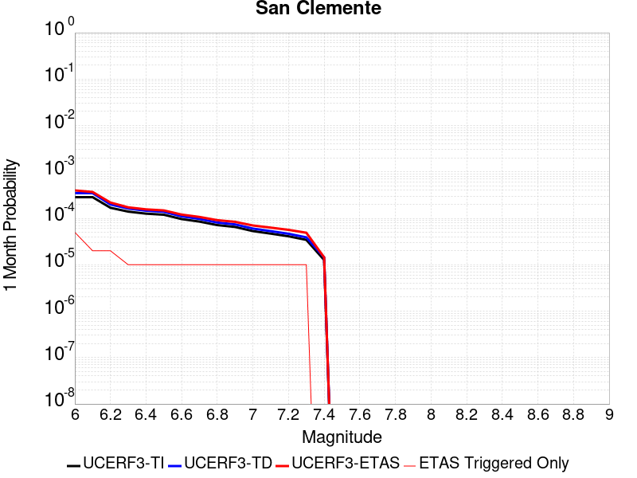 |  |  |

| Magnitude | 1 wk TI Prob | 1 wk TD Prob | 1 wk ETAS Prob | 1 wk ETAS/TD Gain | 1 wk ETAS Triggered Only | 1 mo TI Prob | 1 mo TD Prob | 1 mo ETAS Prob | 1 mo ETAS/TD Gain | 1 mo ETAS Triggered Only | 1 yr TI Prob | 1 yr TD Prob | 1 yr ETAS Prob | 1 yr ETAS/TD Gain | 1 yr ETAS Triggered Only | 10 yr TI Prob | 10 yr TD Prob | 10 yr ETAS Prob | 10 yr ETAS/TD Gain | 10 yr ETAS Triggered Only |
|-----|-----|-----|-----|-----|-----|-----|-----|-----|-----|-----|-----|-----|-----|-----|-----|-----|-----|-----|-----|-----|
| 6.0 | 6.681379E-5 | 8.163834E-5 | 1.1163589E-4 | 1.3674444 | 3.0E-5 | 2.8631336E-4 | 3.4983488E-4 | 3.998174E-4 | 1.1428746 | 5.0E-5 | 0.003480294 | 0.00425141 | 0.004311155 | 1.014053 | 6.0E-5 | 0.03426291 | 0.04175603 | 0.04184227 | 1.0020654 | 9.0E-5 |
| 6.1 | 6.681379E-5 | 8.163834E-5 | 9.163752E-5 | 1.1224815 | 1.0E-5 | 2.8631336E-4 | 3.4983488E-4 | 3.698279E-4 | 1.0571498 | 2.0E-5 | 0.003480294 | 0.00425141 | 0.0042812824 | 1.0070264 | 3.0E-5 | 0.03426291 | 0.04175603 | 0.041813523 | 1.0013769 | 6.0E-5 |
| 6.2 | 3.9400576E-5 | 4.6452373E-5 | 5.6451907E-5 | 1.2152642 | 1.0E-5 | 1.6884868E-4 | 1.9906677E-4 | 2.1906279E-4 | 1.1004488 | 2.0E-5 | 0.0020537945 | 0.0024209984 | 0.0024409501 | 1.008241 | 2.0E-5 | 0.020349167 | 0.023952903 | 0.023982184 | 1.0012225 | 3.0E-5 |
| 6.3 | 3.2590255E-5 | 3.792912E-5 | 4.7928737E-5 | 1.2636397 | 1.0E-5 | 1.3966505E-4 | 1.6254342E-4 | 1.725418E-4 | 1.061512 | 1.0E-5 | 0.0016990956 | 0.0019772002 | 0.0019871802 | 1.0050477 | 1.0E-5 | 0.01686163 | 0.019599883 | 0.019619491 | 1.0010004 | 2.0E-5 |
| 6.4 | 2.9454652E-5 | 3.4097764E-5 | 4.409742E-5 | 1.2932644 | 1.0E-5 | 1.2622811E-4 | 1.4612524E-4 | 1.5612377E-4 | 1.0684245 | 1.0E-5 | 0.0015357438 | 0.0017776493 | 0.0017876315 | 1.0056154 | 1.0E-5 | 0.015251739 | 0.01763747 | 0.017657118 | 1.0011139 | 2.0E-5 |
| 6.5 | 2.790836E-5 | 3.2247463E-5 | 4.224714E-5 | 1.310092 | 1.0E-5 | 1.1960178E-4 | 1.3819624E-4 | 1.4819486E-4 | 1.0723509 | 1.0E-5 | 0.001455179 | 0.0016812662 | 0.0016912494 | 1.0059379 | 1.0E-5 | 0.014456868 | 0.016688485 | 0.016698318 | 1.0005893 | 1.0E-5 |
| 6.6 | 2.2492153E-5 | 2.5762702E-5 | 3.5762445E-5 | 1.3881481 | 1.0E-5 | 9.639138E-5 | 1.1040699E-4 | 1.20405886E-4 | 1.090564 | 1.0E-5 | 0.0011729331 | 0.0013433909 | 0.0013533775 | 1.0074339 | 1.0E-5 | 0.011667615 | 0.013354417 | 0.013364283 | 1.0007389 | 1.0E-5 |
| 6.7 | 1.9862755E-5 | 2.2666423E-5 | 3.2666198E-5 | 1.4411712 | 1.0E-5 | 8.512331E-5 | 9.713826E-5 | 1.0713729E-4 | 1.102936 | 1.0E-5 | 0.0010358836 | 0.0011820279 | 0.0011920161 | 1.00845 | 1.0E-5 | 0.010310682 | 0.011758701 | 0.011768583 | 1.0008404 | 1.0E-5 |
| 6.8 | 1.6697575E-5 | 1.897771E-5 | 2.897752E-5 | 1.526924 | 1.0E-5 | 7.155907E-5 | 8.133056E-5 | 9.132974E-5 | 1.1229451 | 1.0E-5 | 8.7088346E-4 | 9.897591E-4 | 9.997492E-4 | 1.0100935 | 1.0E-5 | 0.008674784 | 0.0098545365 | 0.009864438 | 1.0010048 | 1.0E-5 |
| 6.9 | 1.5218415E-5 | 1.72694E-5 | 2.7269229E-5 | 1.5790489 | 1.0E-5 | 6.522015E-5 | 7.4009666E-5 | 8.400893E-5 | 1.1351075 | 1.0E-5 | 7.93766E-4 | 9.00704E-4 | 9.10695E-4 | 1.0110924 | 1.0E-5 | 0.007909367 | 0.008971481 | 0.008981391 | 1.0011046 | 1.0E-5 |
| 7.0 | 1.2392958E-5 | 1.4033016E-5 | 2.4032875E-5 | 1.7125952 | 1.0E-5 | 5.3111595E-5 | 6.014015E-5 | 7.013955E-5 | 1.1662682 | 1.0E-5 | 6.4644177E-4 | 7.319679E-4 | 7.419606E-4 | 1.0136518 | 1.0E-5 | 0.0064456454 | 0.0072963564 | 0.007306284 | 1.0013605 | 1.0E-5 |
| 7.1 | 1.0934128E-5 | 1.2375138E-5 | 2.2375014E-5 | 1.8080618 | 1.0E-5 | 4.6859706E-5 | 5.303527E-5 | 6.3034735E-5 | 1.1885438 | 1.0E-5 | 5.7036756E-4 | 6.455204E-4 | 6.5551396E-4 | 1.0154814 | 1.0E-5 | 0.0056890585 | 0.0064371997 | 0.0064471355 | 1.0015435 | 1.0E-5 |
| 7.2 | 9.5798805E-6 | 1.0844935E-5 | 2.0844827E-5 | 1.9220794 | 1.0E-5 | 4.1055984E-5 | 4.6477508E-5 | 5.647704E-5 | 1.2151479 | 1.0E-5 | 4.9974193E-4 | 5.657239E-4 | 5.7571824E-4 | 1.0176665 | 1.0E-5 | 0.0049861963 | 0.0056435615 | 0.005653505 | 1.0017619 | 1.0E-5 |
| 7.3 | 8.0167365E-6 | 9.083918E-6 | 1.9083827E-5 | 2.1008368 | 1.0E-5 | 3.4356988E-5 | 3.8930535E-5 | 4.8930146E-5 | 1.2568578 | 1.0E-5 | 4.1821605E-4 | 4.7388324E-4 | 4.8387848E-4 | 1.0210923 | 1.0E-5 | 0.0041742986 | 0.0047294297 | 0.004739383 | 1.0021044 | 1.0E-5 |
| 7.4 | 2.9581017E-6 | 3.3623792E-6 | 3.3623792E-6 | 1.0 | 0.0 | 1.2677518E-5 | 1.4410146E-5 | 1.4410146E-5 | 1.0 | 0.0 | 1.5433785E-4 | 1.7543444E-4 | 1.7543444E-4 | 1.0 | 0.0 | 0.001542307 | 0.0017534546 | 0.0017534546 | 1.0 | 0.0 |

## Ortigalita (North)
*[(top)](#table-of-contents)*

| 1 Week | 1 Month | 1 Year | 10 Year |
|-----|-----|-----|-----|
|  |  |  |  |

| Magnitude | 1 wk TI Prob | 1 wk TD Prob | 1 wk ETAS Prob | 1 wk ETAS/TD Gain | 1 wk ETAS Triggered Only | 1 mo TI Prob | 1 mo TD Prob | 1 mo ETAS Prob | 1 mo ETAS/TD Gain | 1 mo ETAS Triggered Only | 1 yr TI Prob | 1 yr TD Prob | 1 yr ETAS Prob | 1 yr ETAS/TD Gain | 1 yr ETAS Triggered Only | 10 yr TI Prob | 10 yr TD Prob | 10 yr ETAS Prob | 10 yr ETAS/TD Gain | 10 yr ETAS Triggered Only |
|-----|-----|-----|-----|-----|-----|-----|-----|-----|-----|-----|-----|-----|-----|-----|-----|-----|-----|-----|-----|-----|
| 6.0 | 7.711876E-5 | 1.0505308E-4 | 1.3504992E-4 | 1.28554 | 3.0E-5 | 3.3046713E-4 | 4.501601E-4 | 5.0013757E-4 | 1.1110216 | 5.0E-5 | 0.004016016 | 0.0054680547 | 0.005537672 | 1.0127317 | 7.0E-5 | 0.039442103 | 0.053455614 | 0.0535408 | 1.0015936 | 9.0E-5 |
| 6.1 | 4.607858E-5 | 6.0239887E-5 | 6.0239887E-5 | 1.0 | 0.0 | 1.9746469E-4 | 2.5814763E-4 | 2.5814763E-4 | 1.0 | 0.0 | 0.0024014818 | 0.0031387366 | 0.0031487052 | 1.003176 | 1.0E-5 | 0.023756953 | 0.030975312 | 0.030985001 | 1.0003128 | 1.0E-5 |
| 6.2 | 4.607858E-5 | 6.0239887E-5 | 6.0239887E-5 | 1.0 | 0.0 | 1.9746469E-4 | 2.5814763E-4 | 2.5814763E-4 | 1.0 | 0.0 | 0.0024014818 | 0.0031387366 | 0.0031487052 | 1.003176 | 1.0E-5 | 0.023756953 | 0.030975312 | 0.030985001 | 1.0003128 | 1.0E-5 |
| 6.3 | 3.327423E-5 | 4.2476124E-5 | 4.2476124E-5 | 1.0 | 0.0 | 1.4259605E-4 | 1.8202956E-4 | 1.8202956E-4 | 1.0 | 0.0 | 0.0017347244 | 0.002214206 | 0.002214206 | 1.0 | 0.0 | 0.017212452 | 0.02194574 | 0.02194574 | 1.0 | 0.0 |
| 6.4 | 2.7732503E-5 | 3.4999008E-5 | 3.4999008E-5 | 1.0 | 0.0 | 1.1884817E-4 | 1.499886E-4 | 1.499886E-4 | 1.0 | 0.0 | 0.001446016 | 0.0018248158 | 0.0018248158 | 1.0 | 0.0 | 0.014366428 | 0.018121297 | 0.018121297 | 1.0 | 0.0 |
| 6.5 | 2.7689714E-5 | 3.4948822E-5 | 3.4948822E-5 | 1.0 | 0.0 | 1.186648E-4 | 1.4977354E-4 | 1.4977354E-4 | 1.0 | 0.0 | 0.0014437864 | 0.0018222018 | 0.0018222018 | 1.0 | 0.0 | 0.014344421 | 0.018095585 | 0.018095585 | 1.0 | 0.0 |
| 6.6 | 2.2976905E-5 | 2.871829E-5 | 2.871829E-5 | 1.0 | 0.0 | 9.846873E-5 | 1.23074E-4 | 1.23074E-4 | 1.0 | 0.0 | 0.0011981975 | 0.0014976348 | 0.0014976348 | 1.0 | 0.0 | 0.011917574 | 0.014898733 | 0.014898733 | 1.0 | 0.0 |
| 6.7 | 1.9871539E-5 | 2.4904637E-5 | 2.4904637E-5 | 1.0 | 0.0 | 8.516096E-5 | 1.067312E-4 | 1.067312E-4 | 1.0 | 0.0 | 0.0010363415 | 0.0012989199 | 0.0012989199 | 1.0 | 0.0 | 0.010315218 | 0.012936938 | 0.012936938 | 1.0 | 0.0 |
| 6.8 | 6.5640475E-6 | 7.6054926E-6 | 7.6054926E-6 | 1.0 | 0.0 | 2.813133E-5 | 3.2594577E-5 | 3.2594577E-5 | 1.0 | 0.0 | 3.424451E-4 | 3.9676955E-4 | 3.9676955E-4 | 1.0 | 0.0 | 0.0034191788 | 0.003960899 | 0.003960899 | 1.0 | 0.0 |
| 6.9 | 5.6219683E-6 | 6.5018376E-6 | 6.5018376E-6 | 1.0 | 0.0 | 2.4093928E-5 | 2.7864735E-5 | 2.7864735E-5 | 1.0 | 0.0 | 2.933041E-4 | 3.3920293E-4 | 3.3920293E-4 | 1.0 | 0.0 | 0.0029291727 | 0.003387109 | 0.003387109 | 1.0 | 0.0 |
| 7.0 | 3.875591E-6 | 4.4847548E-6 | 4.4847548E-6 | 1.0 | 0.0 | 1.6609569E-5 | 1.9220248E-5 | 1.9220248E-5 | 1.0 | 0.0 | 2.0220275E-4 | 2.339835E-4 | 2.339835E-4 | 1.0 | 0.0 | 0.0020201886 | 0.0023375798 | 0.0023375798 | 1.0 | 0.0 |
| 7.1 | 1.6017933E-6 | 1.8570418E-6 | 1.8570418E-6 | 1.0 | 0.0 | 6.8648105E-6 | 7.958732E-6 | 7.958732E-6 | 1.0 | 0.0 | 8.357586E-5 | 9.689432E-5 | 9.689432E-5 | 1.0 | 0.0 | 8.3544437E-4 | 9.686254E-4 | 9.686254E-4 | 1.0 | 0.0 |

## San Diego Trough north alt1
*[(top)](#table-of-contents)*

| 1 Week | 1 Month | 1 Year | 10 Year |
|-----|-----|-----|-----|
|  |  |  |  |

| Magnitude | 1 wk TI Prob | 1 wk TD Prob | 1 wk ETAS Prob | 1 wk ETAS/TD Gain | 1 wk ETAS Triggered Only | 1 mo TI Prob | 1 mo TD Prob | 1 mo ETAS Prob | 1 mo ETAS/TD Gain | 1 mo ETAS Triggered Only | 1 yr TI Prob | 1 yr TD Prob | 1 yr ETAS Prob | 1 yr ETAS/TD Gain | 1 yr ETAS Triggered Only | 10 yr TI Prob | 10 yr TD Prob | 10 yr ETAS Prob | 10 yr ETAS/TD Gain | 10 yr ETAS Triggered Only |
|-----|-----|-----|-----|-----|-----|-----|-----|-----|-----|-----|-----|-----|-----|-----|-----|-----|-----|-----|-----|-----|
| 6.0 | 7.329252E-5 | 8.821269E-5 | 1.3820828E-4 | 1.5667619 | 5.0E-5 | 3.14073E-4 | 3.7800326E-4 | 4.2798437E-4 | 1.132224 | 5.0E-5 | 0.0038171355 | 0.0045930487 | 0.004642819 | 1.010836 | 5.0E-5 | 0.03752231 | 0.045045137 | 0.045121532 | 1.001696 | 8.0E-5 |
| 6.1 | 3.7940346E-5 | 4.4884906E-5 | 7.488356E-5 | 1.6683462 | 3.0E-5 | 1.6259136E-4 | 1.9235026E-4 | 2.2234449E-4 | 1.1559355 | 3.0E-5 | 0.0019777524 | 0.002339431 | 0.0023693608 | 1.0127937 | 3.0E-5 | 0.019602431 | 0.023156732 | 0.023215344 | 1.002531 | 6.0E-5 |
| 6.2 | 2.8645263E-5 | 3.329672E-5 | 5.3296055E-5 | 1.6006397 | 2.0E-5 | 1.2275964E-4 | 1.4269259E-4 | 1.6268973E-4 | 1.1401415 | 2.0E-5 | 0.0014935739 | 0.0017359206 | 0.0017558859 | 1.0115013 | 2.0E-5 | 0.0148357535 | 0.017226268 | 0.017265579 | 1.002282 | 4.0E-5 |
| 6.3 | 2.8645263E-5 | 3.329672E-5 | 5.3296055E-5 | 1.6006397 | 2.0E-5 | 1.2275964E-4 | 1.4269259E-4 | 1.6268973E-4 | 1.1401415 | 2.0E-5 | 0.0014935739 | 0.0017359206 | 0.0017558859 | 1.0115013 | 2.0E-5 | 0.0148357535 | 0.017226268 | 0.017265579 | 1.002282 | 4.0E-5 |
| 6.4 | 2.2204576E-5 | 2.544832E-5 | 4.544781E-5 | 1.7858865 | 2.0E-5 | 9.5159E-5 | 1.0905972E-4 | 1.2905755E-4 | 1.1833657 | 2.0E-5 | 0.001157945 | 0.0013270028 | 0.0013469763 | 1.0150516 | 2.0E-5 | 0.011519298 | 0.013191959 | 0.013231431 | 1.0029922 | 4.0E-5 |
| 6.5 | 2.1004838E-5 | 2.4024695E-5 | 4.4024215E-5 | 1.8324567 | 2.0E-5 | 9.0017624E-5 | 1.0295897E-4 | 1.2295692E-4 | 1.1942321 | 2.0E-5 | 0.0010954136 | 0.0012528135 | 0.0012727884 | 1.0159441 | 2.0E-5 | 0.010900296 | 0.012458592 | 0.012498093 | 1.0031706 | 4.0E-5 |
| 6.6 | 1.820557E-5 | 2.070479E-5 | 4.0704377E-5 | 1.96594 | 2.0E-5 | 7.802154E-5 | 8.8731824E-5 | 1.08730055E-4 | 1.2253783 | 2.0E-5 | 9.4949827E-4 | 0.0010797799 | 0.0010997584 | 1.0185022 | 2.0E-5 | 0.009454516 | 0.010746005 | 0.010775683 | 1.0027617 | 3.0E-5 |
| 6.7 | 1.5884485E-5 | 1.7983646E-5 | 2.7983466E-5 | 1.5560508 | 1.0E-5 | 6.807459E-5 | 7.707051E-5 | 8.706974E-5 | 1.1297413 | 1.0E-5 | 8.284929E-4 | 9.3793223E-4 | 9.479229E-4 | 1.0106517 | 1.0E-5 | 0.008254109 | 0.009340104 | 0.009359917 | 1.0021213 | 2.0E-5 |
| 6.8 | 1.4331171E-5 | 1.6201066E-5 | 2.6200903E-5 | 1.6172334 | 1.0E-5 | 6.141786E-5 | 6.94313E-5 | 7.94306E-5 | 1.1440172 | 1.0E-5 | 7.4750587E-4 | 8.450002E-4 | 8.549917E-4 | 1.0118244 | 1.0E-5 | 0.0074499645 | 0.008418139 | 0.008437971 | 1.0023558 | 2.0E-5 |
| 6.9 | 1.2574203E-5 | 1.4205835E-5 | 1.4205835E-5 | 1.0 | 0.0 | 5.3888325E-5 | 6.0880735E-5 | 6.0880735E-5 | 1.0 | 0.0 | 6.558929E-4 | 7.409723E-4 | 7.409723E-4 | 1.0 | 0.0 | 0.0065396037 | 0.007385203 | 0.0073951297 | 1.0013441 | 1.0E-5 |
| 7.0 | 1.0883844E-5 | 1.2289262E-5 | 1.2289262E-5 | 1.0 | 0.0 | 4.664421E-5 | 5.2667205E-5 | 5.2667205E-5 | 1.0 | 0.0 | 5.677453E-4 | 6.4103556E-4 | 6.4103556E-4 | 1.0 | 0.0 | 0.00566297 | 0.006391993 | 0.0064019286 | 1.0015545 | 1.0E-5 |
| 7.1 | 9.393088E-6 | 1.060702E-5 | 1.060702E-5 | 1.0 | 0.0 | 4.025547E-5 | 4.545787E-5 | 4.545787E-5 | 1.0 | 0.0 | 4.900001E-4 | 5.533098E-4 | 5.533098E-4 | 1.0 | 0.0 | 0.0048892107 | 0.005519418 | 0.005519418 | 1.0 | 0.0 |
| 7.2 | 8.190791E-6 | 9.258625E-6 | 9.258625E-6 | 1.0 | 0.0 | 3.510292E-5 | 3.9679224E-5 | 3.9679224E-5 | 1.0 | 0.0 | 4.2729423E-4 | 4.8298817E-4 | 4.8298817E-4 | 1.0 | 0.0 | 0.0042647356 | 0.004819465 | 0.004819465 | 1.0 | 0.0 |
| 7.3 | 6.268162E-6 | 7.089716E-6 | 7.089716E-6 | 1.0 | 0.0 | 2.6863276E-5 | 3.0384144E-5 | 3.0384144E-5 | 1.0 | 0.0 | 3.2701128E-4 | 3.6986457E-4 | 3.6986457E-4 | 1.0 | 0.0 | 0.003265305 | 0.003692536 | 0.003692536 | 1.0 | 0.0 |
| 7.4 | 4.985186E-6 | 5.6426816E-6 | 5.6426816E-6 | 1.0 | 0.0 | 2.1364907E-5 | 2.4182698E-5 | 2.4182698E-5 | 1.0 | 0.0 | 2.600867E-4 | 2.9438498E-4 | 2.9438498E-4 | 1.0 | 0.0 | 0.002597825 | 0.0029399914 | 0.0029399914 | 1.0 | 0.0 |
| 7.5 | 1.7489613E-6 | 1.969678E-6 | 1.969678E-6 | 1.0 | 0.0 | 7.495527E-6 | 8.4414505E-6 | 8.4414505E-6 | 1.0 | 0.0 | 9.125422E-5 | 1.02770035E-4 | 1.02770035E-4 | 1.0 | 0.0 | 9.1216754E-4 | 0.0010272472 | 0.0010272472 | 1.0 | 0.0 |
| 7.6 | 1.6988751E-7 | 1.7533823E-7 | 1.7533823E-7 | 1.0 | 0.0 | 7.2808916E-7 | 7.5144936E-7 | 7.5144936E-7 | 1.0 | 0.0 | 8.864449E-6 | 9.14886E-6 | 9.14886E-6 | 1.0 | 0.0 | 8.8640954E-5 | 9.1485024E-5 | 9.1485024E-5 | 1.0 | 0.0 |

## San Jacinto (Borrego)
*[(top)](#table-of-contents)*

| 1 Week | 1 Month | 1 Year | 10 Year |
|-----|-----|-----|-----|
|  |  |  | 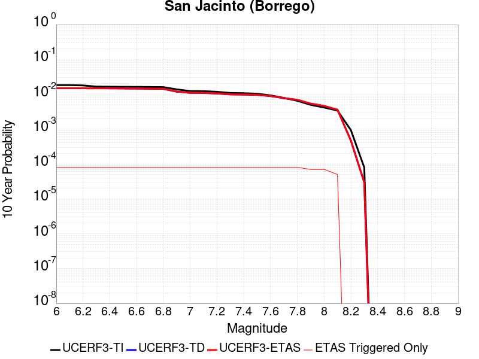 |

| Magnitude | 1 wk TI Prob | 1 wk TD Prob | 1 wk ETAS Prob | 1 wk ETAS/TD Gain | 1 wk ETAS Triggered Only | 1 mo TI Prob | 1 mo TD Prob | 1 mo ETAS Prob | 1 mo ETAS/TD Gain | 1 mo ETAS Triggered Only | 1 yr TI Prob | 1 yr TD Prob | 1 yr ETAS Prob | 1 yr ETAS/TD Gain | 1 yr ETAS Triggered Only | 10 yr TI Prob | 10 yr TD Prob | 10 yr ETAS Prob | 10 yr ETAS/TD Gain | 10 yr ETAS Triggered Only |
|-----|-----|-----|-----|-----|-----|-----|-----|-----|-----|-----|-----|-----|-----|-----|-----|-----|-----|-----|-----|-----|
| 6.0 | 3.543992E-5 | 2.7925962E-5 | 6.792485E-5 | 2.432319 | 4.0E-5 | 1.5187653E-4 | 1.1967727E-4 | 1.5967249E-4 | 1.3341922 | 4.0E-5 | 0.0018475284 | 0.0014561092 | 0.0015260072 | 1.0480033 | 7.0E-5 | 0.018322436 | 0.01486815 | 0.014946962 | 1.0053006 | 8.0E-5 |
| 6.1 | 3.542281E-5 | 2.7925962E-5 | 6.792485E-5 | 2.432319 | 4.0E-5 | 1.5180321E-4 | 1.1967727E-4 | 1.5967249E-4 | 1.3341922 | 4.0E-5 | 0.0018466372 | 0.0014561092 | 0.0015260072 | 1.0480033 | 7.0E-5 | 0.018313672 | 0.01486815 | 0.014946962 | 1.0053006 | 8.0E-5 |
| 6.2 | 3.4688688E-5 | 2.7925962E-5 | 6.792485E-5 | 2.432319 | 4.0E-5 | 1.4865733E-4 | 1.1967727E-4 | 1.5967249E-4 | 1.3341923 | 4.0E-5 | 0.0018084005 | 0.0014561091 | 0.0015260072 | 1.0480033 | 7.0E-5 | 0.017937548 | 0.01486815 | 0.014946961 | 1.0053006 | 8.0E-5 |
| 6.3 | 3.2087122E-5 | 2.7771312E-5 | 6.77702E-5 | 2.4402952 | 4.0E-5 | 1.3750899E-4 | 1.1901455E-4 | 1.5900978E-4 | 1.3360534 | 4.0E-5 | 0.0016728862 | 0.0014480512 | 0.0015179499 | 1.0482708 | 7.0E-5 | 0.016603488 | 0.014789308 | 0.014868125 | 1.0053294 | 8.0E-5 |
| 6.4 | 3.1828724E-5 | 2.773829E-5 | 6.773718E-5 | 2.44201 | 4.0E-5 | 1.364017E-4 | 1.1887303E-4 | 1.5886828E-4 | 1.3364534 | 4.0E-5 | 0.0016594254 | 0.0014463306 | 0.0015162294 | 1.0483284 | 7.0E-5 | 0.016470885 | 0.014772502 | 0.01485132 | 1.0053355 | 8.0E-5 |
| 6.5 | 3.1563577E-5 | 2.7477974E-5 | 6.7476874E-5 | 2.4556713 | 4.0E-5 | 1.3526545E-4 | 1.17757496E-4 | 1.5775279E-4 | 1.3396411 | 4.0E-5 | 0.0016456128 | 0.0014327668 | 0.0015026665 | 1.0487865 | 7.0E-5 | 0.0163348 | 0.01463991 | 0.014718738 | 1.0053846 | 8.0E-5 |
| 6.6 | 3.1467625E-5 | 2.7322194E-5 | 6.73211E-5 | 2.4639714 | 4.0E-5 | 1.3485427E-4 | 1.17089934E-4 | 1.5708525E-4 | 1.3415778 | 4.0E-5 | 0.0016406142 | 0.0014246498 | 0.0014945501 | 1.0490649 | 7.0E-5 | 0.016285548 | 0.014560228 | 0.014639063 | 1.0054144 | 8.0E-5 |
| 6.7 | 3.1223695E-5 | 2.6940217E-5 | 6.693914E-5 | 2.484729 | 4.0E-5 | 1.3380898E-4 | 1.1545303E-4 | 1.5544842E-4 | 1.3464212 | 4.0E-5 | 0.0016279068 | 0.0014047464 | 0.0014746481 | 1.049761 | 7.0E-5 | 0.01616033 | 0.01436451 | 0.01444336 | 1.0054892 | 8.0E-5 |
| 6.8 | 3.1015585E-5 | 2.6761221E-5 | 6.676015E-5 | 2.4946601 | 4.0E-5 | 1.3291716E-4 | 1.1468597E-4 | 1.5468139E-4 | 1.3487384 | 4.0E-5 | 0.001617065 | 0.0013954195 | 0.0014653218 | 1.0500941 | 7.0E-5 | 0.016053487 | 0.014271772 | 0.01435063 | 1.0055255 | 8.0E-5 |
| 6.9 | 2.6641965E-5 | 2.2183434E-5 | 6.2182546E-5 | 2.8031073 | 4.0E-5 | 1.1417485E-4 | 9.506842E-5 | 1.3506462E-4 | 1.4207096 | 4.0E-5 | 0.0013891924 | 0.0011568473 | 0.0012267664 | 1.0604392 | 7.0E-5 | 0.0138054015 | 0.011882191 | 0.01196124 | 1.0066527 | 8.0E-5 |
| 7.0 | 2.3854353E-5 | 2.047825E-5 | 6.0477432E-5 | 2.9532518 | 4.0E-5 | 1.02228936E-4 | 8.776099E-5 | 1.2775748E-4 | 1.4557433 | 4.0E-5 | 0.0012439266 | 0.0010679689 | 0.0011378941 | 1.065475 | 7.0E-5 | 0.012369866 | 0.0109826205 | 0.011061742 | 1.0072043 | 8.0E-5 |
| 7.1 | 2.3672901E-5 | 2.0314741E-5 | 6.0313927E-5 | 2.9689736 | 4.0E-5 | 1.0145135E-4 | 8.706028E-5 | 1.270568E-4 | 1.4594117 | 4.0E-5 | 0.0012344702 | 0.0010594461 | 0.0011293719 | 1.0660022 | 7.0E-5 | 0.0122763505 | 0.010897858 | 0.010976987 | 1.0072609 | 8.0E-5 |
| 7.2 | 2.2717244E-5 | 1.9542116E-5 | 5.9541333E-5 | 3.046821 | 4.0E-5 | 9.735599E-5 | 8.3749255E-5 | 1.2374591E-4 | 1.4775763 | 4.0E-5 | 0.0011846646 | 0.0010191725 | 0.0010891012 | 1.0686132 | 7.0E-5 | 0.01178369 | 0.010495322 | 0.010574482 | 1.0075425 | 8.0E-5 |
| 7.3 | 2.1016205E-5 | 1.8383771E-5 | 5.8383037E-5 | 3.1757922 | 4.0E-5 | 9.006634E-5 | 7.878522E-5 | 1.1878207E-4 | 1.5076694 | 4.0E-5 | 0.001096006 | 9.5879E-4 | 0.001028723 | 1.0729387 | 7.0E-5 | 0.010906163 | 0.009890901 | 0.00997011 | 1.0080082 | 8.0E-5 |
| 7.4 | 2.0683625E-5 | 1.8186302E-5 | 5.8185575E-5 | 3.1994176 | 4.0E-5 | 8.86411E-5 | 7.7938974E-5 | 1.1793586E-4 | 1.513182 | 4.0E-5 | 0.001078671 | 9.48496E-4 | 0.0010184296 | 1.0737311 | 7.0E-5 | 0.010734501 | 0.0097876275 | 0.009866845 | 1.0080936 | 8.0E-5 |
| 7.5 | 1.9993966E-5 | 1.7781347E-5 | 5.7780635E-5 | 3.2495084 | 4.0E-5 | 8.568561E-5 | 7.6203556E-5 | 1.16200514E-4 | 1.5248699 | 4.0E-5 | 0.001042723 | 9.2738547E-4 | 9.973205E-4 | 1.075411 | 7.0E-5 | 0.010378438 | 0.009574548 | 0.0096537825 | 1.0082755 | 8.0E-5 |
| 7.6 | 1.788966E-5 | 1.6434618E-5 | 5.643396E-5 | 3.4338467 | 4.0E-5 | 7.666772E-5 | 7.043219E-5 | 1.1042937E-4 | 1.5678822 | 4.0E-5 | 9.3302975E-4 | 8.5717626E-4 | 9.2711626E-4 | 1.0815935 | 7.0E-5 | 0.00929122 | 0.008866415 | 0.008945706 | 1.0089428 | 8.0E-5 |
| 7.7 | 1.5125781E-5 | 1.4236738E-5 | 5.4236167E-5 | 3.8095925 | 4.0E-5 | 6.4823165E-5 | 6.101317E-5 | 1.0101073E-4 | 1.6555562 | 4.0E-5 | 7.889362E-4 | 7.4258295E-4 | 8.12531E-4 | 1.0941956 | 7.0E-5 | 0.007861412 | 0.007714161 | 0.007793544 | 1.0102905 | 8.0E-5 |
| 7.8 | 1.250089E-5 | 1.262994E-5 | 5.2629435E-5 | 4.1670375 | 4.0E-5 | 5.3574146E-5 | 5.4127195E-5 | 9.412503E-5 | 1.73896 | 4.0E-5 | 6.5207E-4 | 6.588E-4 | 7.2875386E-4 | 1.1061838 | 7.0E-5 | 0.006501599 | 0.006867759 | 0.0069472096 | 1.0115687 | 8.0E-5 |
| 7.9 | 9.561E-6 | 9.754065E-6 | 4.9753675E-5 | 5.1008143 | 4.0E-5 | 4.0975072E-5 | 4.180247E-5 | 8.18008E-5 | 1.9568412 | 4.0E-5 | 4.987573E-4 | 5.0882675E-4 | 5.6879624E-4 | 1.1178583 | 6.0E-5 | 0.0049763937 | 0.0053523607 | 0.005421986 | 1.0130084 | 7.0E-5 |
| 8.0 | 8.01699E-6 | 8.292994E-6 | 4.8292663E-5 | 5.8233085 | 4.0E-5 | 3.4358076E-5 | 3.554092E-5 | 7.55395E-5 | 2.1254232 | 4.0E-5 | 4.1822926E-4 | 4.3262533E-4 | 4.925994E-4 | 1.1386281 | 6.0E-5 | 0.0041744304 | 0.0045733186 | 0.004642999 | 1.0152361 | 7.0E-5 |
| 8.1 | 6.541947E-6 | 6.461784E-6 | 2.6461654E-5 | 4.0951004 | 2.0E-5 | 2.8036617E-5 | 2.7693068E-5 | 4.7692516E-5 | 1.7221824 | 2.0E-5 | 3.4129233E-4 | 3.3711144E-4 | 3.7709795E-4 | 1.1186152 | 4.0E-5 | 0.0034076865 | 0.0035805756 | 0.0036303964 | 1.0139142 | 5.0E-5 |
| 8.2 | 1.7968189E-6 | 7.9684827E-7 | 7.9684827E-7 | 1.0 | 0.0 | 7.70063E-6 | 3.4150596E-6 | 3.4150596E-6 | 1.0 | 0.0 | 9.3751136E-5 | 4.157758E-5 | 4.157758E-5 | 1.0 | 0.0 | 9.371159E-4 | 4.7107413E-4 | 4.7107413E-4 | 1.0 | 0.0 |
| 8.3 | 1.5167889E-7 | 4.8951257E-8 | 4.8951257E-8 | 1.0 | 0.0 | 6.500522E-7 | 2.0979108E-7 | 2.0979108E-7 | 1.0 | 0.0 | 7.9143565E-6 | 2.5542038E-6 | 2.5542038E-6 | 1.0 | 0.0 | 7.914075E-5 | 2.9679897E-5 | 2.9679897E-5 | 1.0 | 0.0 |

## Kern Canyon (South Kern) 2011
*[(top)](#table-of-contents)*

| 1 Week | 1 Month | 1 Year | 10 Year |
|-----|-----|-----|-----|
|  |  |  | 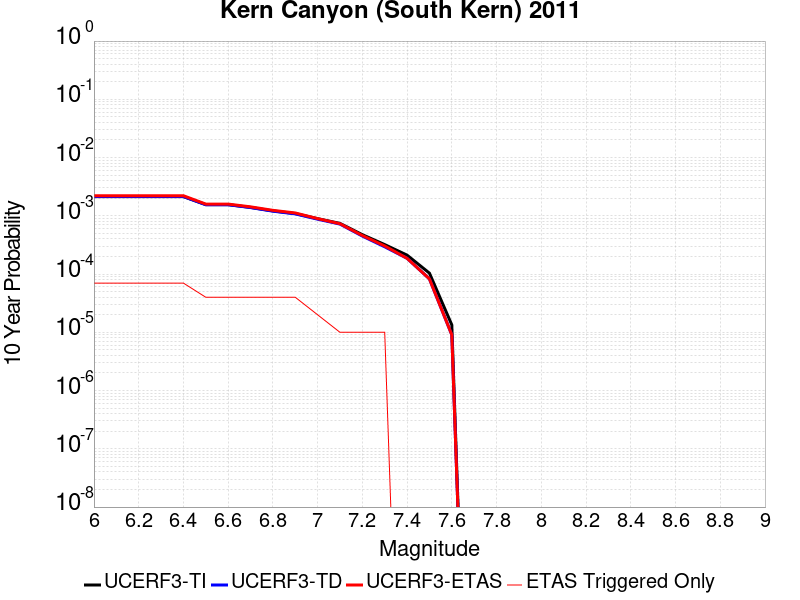 |

| Magnitude | 1 wk TI Prob | 1 wk TD Prob | 1 wk ETAS Prob | 1 wk ETAS/TD Gain | 1 wk ETAS Triggered Only | 1 mo TI Prob | 1 mo TD Prob | 1 mo ETAS Prob | 1 mo ETAS/TD Gain | 1 mo ETAS Triggered Only | 1 yr TI Prob | 1 yr TD Prob | 1 yr ETAS Prob | 1 yr ETAS/TD Gain | 1 yr ETAS Triggered Only | 10 yr TI Prob | 10 yr TD Prob | 10 yr ETAS Prob | 10 yr ETAS/TD Gain | 10 yr ETAS Triggered Only |
|-----|-----|-----|-----|-----|-----|-----|-----|-----|-----|-----|-----|-----|-----|-----|-----|-----|-----|-----|-----|-----|
| 6.0 | 4.105075E-6 | 4.113726E-6 | 2.4113644E-5 | 5.8617525 | 2.0E-5 | 1.7593058E-5 | 1.7630138E-5 | 6.7629255E-5 | 3.8360026 | 5.0E-5 | 2.1417443E-4 | 2.1462643E-4 | 2.7461356E-4 | 1.2794955 | 6.0E-5 | 0.0021396813 | 0.0021442554 | 0.0022141053 | 1.0325754 | 7.0E-5 |
| 6.1 | 4.105075E-6 | 4.113726E-6 | 2.4113644E-5 | 5.8617525 | 2.0E-5 | 1.7593058E-5 | 1.7630138E-5 | 6.7629255E-5 | 3.8360026 | 5.0E-5 | 2.1417443E-4 | 2.1462643E-4 | 2.7461356E-4 | 1.2794955 | 6.0E-5 | 0.0021396813 | 0.0021442554 | 0.0022141053 | 1.0325754 | 7.0E-5 |
| 6.2 | 4.105075E-6 | 4.113726E-6 | 2.4113644E-5 | 5.8617525 | 2.0E-5 | 1.7593058E-5 | 1.7630138E-5 | 6.7629255E-5 | 3.8360026 | 5.0E-5 | 2.1417443E-4 | 2.1462643E-4 | 2.7461356E-4 | 1.2794955 | 6.0E-5 | 0.0021396813 | 0.0021442554 | 0.0022141053 | 1.0325754 | 7.0E-5 |
| 6.3 | 4.105075E-6 | 4.113726E-6 | 2.4113644E-5 | 5.8617525 | 2.0E-5 | 1.7593058E-5 | 1.7630138E-5 | 6.7629255E-5 | 3.8360026 | 5.0E-5 | 2.1417443E-4 | 2.1462643E-4 | 2.7461356E-4 | 1.2794955 | 6.0E-5 | 0.0021396813 | 0.0021442554 | 0.0022141053 | 1.0325754 | 7.0E-5 |
| 6.4 | 4.105075E-6 | 4.113726E-6 | 2.4113644E-5 | 5.8617525 | 2.0E-5 | 1.7593058E-5 | 1.7630138E-5 | 6.7629255E-5 | 3.8360026 | 5.0E-5 | 2.1417443E-4 | 2.1462643E-4 | 2.7461356E-4 | 1.2794955 | 6.0E-5 | 0.0021396813 | 0.0021442554 | 0.0022141053 | 1.0325754 | 7.0E-5 |
| 6.5 | 2.9849807E-6 | 2.973154E-6 | 1.2973124E-5 | 4.3634214 | 1.0E-5 | 1.2792712E-5 | 1.2742028E-5 | 4.2741645E-5 | 3.3543832 | 3.0E-5 | 1.5574014E-4 | 1.551233E-4 | 1.8511864E-4 | 1.1933645 | 3.0E-5 | 0.0015563103 | 0.0015501654 | 0.0015901033 | 1.0257638 | 4.0E-5 |
| 6.6 | 2.9849807E-6 | 2.973154E-6 | 1.2973124E-5 | 4.3634214 | 1.0E-5 | 1.2792712E-5 | 1.2742028E-5 | 4.2741645E-5 | 3.3543832 | 3.0E-5 | 1.5574014E-4 | 1.551233E-4 | 1.8511864E-4 | 1.1933645 | 3.0E-5 | 0.0015563103 | 0.0015501654 | 0.0015901033 | 1.0257638 | 4.0E-5 |
| 6.7 | 2.6756725E-6 | 2.6582202E-6 | 1.2658194E-5 | 4.7619057 | 1.0E-5 | 1.1467117E-5 | 1.1392323E-5 | 4.139198E-5 | 3.6333222 | 3.0E-5 | 1.396032E-4 | 1.386928E-4 | 1.6868865E-4 | 1.2162753 | 3.0E-5 | 0.0013951553 | 0.0013860734 | 0.0014260181 | 1.0288185 | 4.0E-5 |
| 6.8 | 2.3283721E-6 | 2.3047783E-6 | 1.2304755E-5 | 5.3388023 | 1.0E-5 | 9.9787E-6 | 9.877584E-6 | 3.9877286E-5 | 4.03715 | 3.0E-5 | 1.214839E-4 | 1.2025302E-4 | 1.5024941E-4 | 1.249444 | 3.0E-5 | 0.001214175 | 0.001201887 | 0.0012418389 | 1.033241 | 4.0E-5 |
| 6.9 | 2.0972677E-6 | 2.0696405E-6 | 1.20696195E-5 | 5.831747 | 1.0E-5 | 8.988259E-6 | 8.869858E-6 | 3.886959E-5 | 4.382211 | 3.0E-5 | 1.0942656E-4 | 1.0798523E-4 | 1.3798199E-4 | 1.2777858 | 3.0E-5 | 0.0010937268 | 0.0010793334 | 0.0011192902 | 1.03702 | 4.0E-5 |
| 7.0 | 1.7132242E-6 | 1.6787029E-6 | 1.6787029E-6 | 1.0 | 0.0 | 7.3423685E-6 | 7.1944214E-6 | 1.719435E-5 | 2.3899558 | 1.0E-5 | 8.938967E-5 | 8.75886E-5 | 9.758773E-5 | 1.1141601 | 1.0E-5 | 8.935372E-4 | 8.755446E-4 | 8.9552713E-4 | 1.022823 | 2.0E-5 |
| 7.1 | 1.4215541E-6 | 1.3815746E-6 | 1.3815746E-6 | 1.0 | 0.0 | 6.0923603E-6 | 5.9210206E-6 | 1.5920961E-5 | 2.688888 | 1.0E-5 | 7.417196E-5 | 7.208607E-5 | 8.2085346E-5 | 1.138713 | 1.0E-5 | 7.414721E-4 | 7.206296E-4 | 7.306224E-4 | 1.0138668 | 1.0E-5 |
| 7.2 | 9.097853E-7 | 8.60377E-7 | 8.60377E-7 | 1.0 | 0.0 | 3.899074E-6 | 3.6873246E-6 | 1.3687288E-5 | 3.7119834 | 1.0E-5 | 4.7470192E-5 | 4.4892266E-5 | 5.4891814E-5 | 1.2227455 | 1.0E-5 | 4.7460053E-4 | 4.4883305E-4 | 4.5882855E-4 | 1.02227 | 1.0E-5 |
| 7.3 | 6.144169E-7 | 5.628199E-7 | 5.628199E-7 | 1.0 | 0.0 | 2.6332125E-6 | 2.4120832E-6 | 1.2412059E-5 | 5.1457844 | 1.0E-5 | 3.205889E-5 | 2.9366722E-5 | 3.9366427E-5 | 1.3405116 | 1.0E-5 | 3.2054266E-4 | 2.9362892E-4 | 3.0362597E-4 | 1.0340466 | 1.0E-5 |
| 7.4 | 4.049844E-7 | 3.5728252E-7 | 3.5728252E-7 | 1.0 | 0.0 | 1.7356463E-6 | 1.5312098E-6 | 1.5312098E-6 | 1.0 | 0.0 | 2.1131287E-5 | 1.8642324E-5 | 1.8642324E-5 | 1.0 | 0.0 | 2.1129279E-4 | 1.8640784E-4 | 1.8640784E-4 | 1.0 | 0.0 |
| 7.5 | 1.9871162E-7 | 1.5830383E-7 | 1.5830383E-7 | 1.0 | 0.0 | 8.5162094E-7 | 6.784448E-7 | 6.784448E-7 | 1.0 | 0.0 | 1.0368436E-5 | 8.260035E-6 | 8.260035E-6 | 1.0 | 0.0 | 1.0367952E-4 | 8.259736E-5 | 8.259736E-5 | 1.0 | 0.0 |
| 7.6 | 2.572245E-8 | 1.735264E-8 | 1.735264E-8 | 1.0 | 0.0 | 1.10239064E-7 | 7.436845E-8 | 7.436845E-8 | 1.0 | 0.0 | 1.3421597E-6 | 9.0543557E-7 | 9.0543557E-7 | 1.0 | 0.0 | 1.3421517E-5 | 9.054324E-6 | 9.054324E-6 | 1.0 | 0.0 |

## San Luis Range 2011 CFM
*[(top)](#table-of-contents)*

| 1 Week | 1 Month | 1 Year | 10 Year |
|-----|-----|-----|-----|
|  | 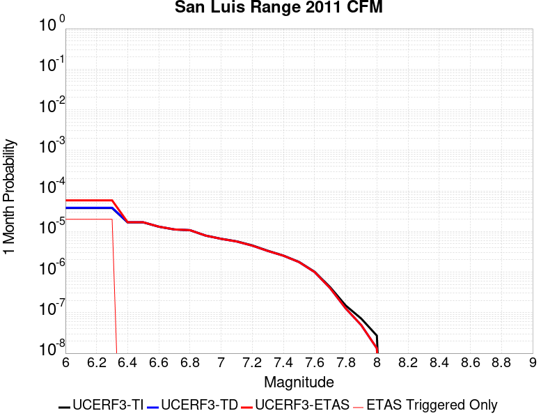 |  | 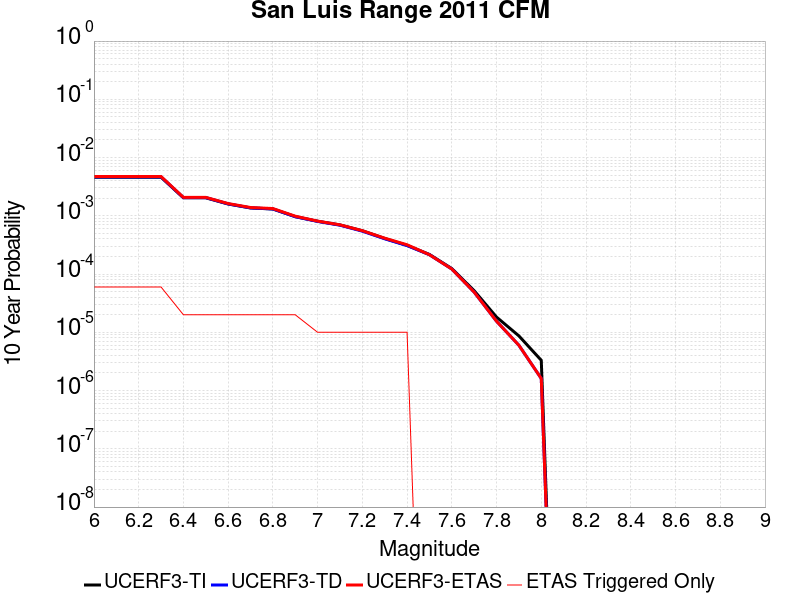 |

| Magnitude | 1 wk TI Prob | 1 wk TD Prob | 1 wk ETAS Prob | 1 wk ETAS/TD Gain | 1 wk ETAS Triggered Only | 1 mo TI Prob | 1 mo TD Prob | 1 mo ETAS Prob | 1 mo ETAS/TD Gain | 1 mo ETAS Triggered Only | 1 yr TI Prob | 1 yr TD Prob | 1 yr ETAS Prob | 1 yr ETAS/TD Gain | 1 yr ETAS Triggered Only | 10 yr TI Prob | 10 yr TD Prob | 10 yr ETAS Prob | 10 yr ETAS/TD Gain | 10 yr ETAS Triggered Only |
|-----|-----|-----|-----|-----|-----|-----|-----|-----|-----|-----|-----|-----|-----|-----|-----|-----|-----|-----|-----|-----|
| 6.0 | 8.8368415E-6 | 8.965455E-6 | 2.8965276E-5 | 3.2307649 | 2.0E-5 | 3.787163E-5 | 3.8422855E-5 | 5.8422087E-5 | 1.5205035 | 2.0E-5 | 4.609895E-4 | 4.6770574E-4 | 5.0768704E-4 | 1.0854839 | 4.0E-5 | 0.0046003438 | 0.004667997 | 0.0047277166 | 1.0127934 | 6.0E-5 |
| 6.1 | 8.8368415E-6 | 8.965455E-6 | 2.8965276E-5 | 3.2307649 | 2.0E-5 | 3.787163E-5 | 3.8422855E-5 | 5.8422087E-5 | 1.5205035 | 2.0E-5 | 4.609895E-4 | 4.6770574E-4 | 5.0768704E-4 | 1.0854839 | 4.0E-5 | 0.0046003438 | 0.004667997 | 0.0047277166 | 1.0127934 | 6.0E-5 |
| 6.2 | 8.8368415E-6 | 8.965455E-6 | 2.8965276E-5 | 3.2307649 | 2.0E-5 | 3.787163E-5 | 3.8422855E-5 | 5.8422087E-5 | 1.5205035 | 2.0E-5 | 4.609895E-4 | 4.6770574E-4 | 5.0768704E-4 | 1.0854839 | 4.0E-5 | 0.0046003438 | 0.004667997 | 0.0047277166 | 1.0127934 | 6.0E-5 |
| 6.3 | 8.8368415E-6 | 8.965455E-6 | 2.8965276E-5 | 3.2307649 | 2.0E-5 | 3.787163E-5 | 3.8422855E-5 | 5.8422087E-5 | 1.5205035 | 2.0E-5 | 4.609895E-4 | 4.6770574E-4 | 5.0768704E-4 | 1.0854839 | 4.0E-5 | 0.0046003438 | 0.004667997 | 0.0047277166 | 1.0127934 | 6.0E-5 |
| 6.4 | 3.9094193E-6 | 3.941204E-6 | 3.941204E-6 | 1.0 | 0.0 | 1.6754546E-5 | 1.6890766E-5 | 1.6890766E-5 | 1.0 | 0.0 | 2.039675E-4 | 2.0562594E-4 | 2.1562389E-4 | 1.048622 | 1.0E-5 | 0.0020378039 | 0.0020543856 | 0.0020743445 | 1.0097153 | 2.0E-5 |
| 6.5 | 3.9094193E-6 | 3.941204E-6 | 3.941204E-6 | 1.0 | 0.0 | 1.6754546E-5 | 1.6890766E-5 | 1.6890766E-5 | 1.0 | 0.0 | 2.039675E-4 | 2.0562594E-4 | 2.1562389E-4 | 1.048622 | 1.0E-5 | 0.0020378039 | 0.0020543856 | 0.0020743445 | 1.0097153 | 2.0E-5 |
| 6.6 | 3.0587726E-6 | 3.0753893E-6 | 3.0753893E-6 | 1.0 | 0.0 | 1.3108959E-5 | 1.3180174E-5 | 1.3180174E-5 | 1.0 | 0.0 | 1.595899E-4 | 1.6045693E-4 | 1.7045531E-4 | 1.062312 | 1.0E-5 | 0.0015947534 | 0.0016034227 | 0.0016233906 | 1.0124533 | 2.0E-5 |
| 6.7 | 2.6160574E-6 | 2.6251284E-6 | 2.6251284E-6 | 1.0 | 0.0 | 1.1211626E-5 | 1.1250502E-5 | 1.1250502E-5 | 1.0 | 0.0 | 1.3649299E-4 | 1.3696631E-4 | 1.4696494E-4 | 1.0730007 | 1.0E-5 | 0.0013640919 | 0.0013688251 | 0.0013887978 | 1.0145911 | 2.0E-5 |
| 6.8 | 2.5110312E-6 | 2.5181412E-6 | 2.5181412E-6 | 1.0 | 0.0 | 1.0761518E-5 | 1.079199E-5 | 1.079199E-5 | 1.0 | 0.0 | 1.310136E-4 | 1.313846E-4 | 1.413833E-4 | 1.0761024 | 1.0E-5 | 0.0013093639 | 0.0013130752 | 0.0013330489 | 1.0152115 | 2.0E-5 |
| 6.9 | 1.8564405E-6 | 1.852488E-6 | 1.852488E-6 | 1.0 | 0.0 | 7.95615E-6 | 7.93921E-6 | 7.93921E-6 | 1.0 | 0.0 | 9.686181E-5 | 9.665562E-5 | 1.06654654E-4 | 1.1034501 | 1.0E-5 | 9.68196E-4 | 9.6613786E-4 | 9.861186E-4 | 1.020681 | 2.0E-5 |
| 7.0 | 1.546127E-6 | 1.5369549E-6 | 1.5369549E-6 | 1.0 | 0.0 | 6.626242E-6 | 6.5869326E-6 | 6.5869326E-6 | 1.0 | 0.0 | 8.06715E-5 | 8.019296E-5 | 8.019296E-5 | 1.0 | 0.0 | 8.0642226E-4 | 8.016409E-4 | 8.116329E-4 | 1.0124644 | 1.0E-5 |
| 7.1 | 1.3368208E-6 | 1.3235336E-6 | 1.3235336E-6 | 1.0 | 0.0 | 5.7292195E-6 | 5.6722747E-6 | 5.6722747E-6 | 1.0 | 0.0 | 6.975101E-5 | 6.905776E-5 | 6.905776E-5 | 1.0 | 0.0 | 6.972912E-4 | 6.903635E-4 | 7.003566E-4 | 1.0144751 | 1.0E-5 |
| 7.2 | 1.0623363E-6 | 1.0454378E-6 | 1.0454378E-6 | 1.0 | 0.0 | 4.5528623E-6 | 4.4804397E-6 | 4.4804397E-6 | 1.0 | 0.0 | 5.5429686E-5 | 5.4547992E-5 | 5.4547992E-5 | 1.0 | 0.0 | 5.5415864E-4 | 5.453463E-4 | 5.5534084E-4 | 1.018327 | 1.0E-5 |
| 7.3 | 7.831679E-7 | 7.727399E-7 | 7.727399E-7 | 1.0 | 0.0 | 3.3564295E-6 | 3.3117383E-6 | 3.3117383E-6 | 1.0 | 0.0 | 4.086376E-5 | 4.031967E-5 | 4.031967E-5 | 1.0 | 0.0 | 4.0856248E-4 | 4.0312367E-4 | 4.1311965E-4 | 1.0247962 | 1.0E-5 |
| 7.4 | 5.9558846E-7 | 5.910646E-7 | 5.910646E-7 | 1.0 | 0.0 | 2.5525194E-6 | 2.5331315E-6 | 2.5331315E-6 | 1.0 | 0.0 | 3.107648E-5 | 3.084044E-5 | 3.084044E-5 | 1.0 | 0.0 | 3.1072134E-4 | 3.083617E-4 | 3.183586E-4 | 1.0324194 | 1.0E-5 |
| 7.5 | 4.1616502E-7 | 4.1196404E-7 | 4.1196404E-7 | 1.0 | 0.0 | 1.7835631E-6 | 1.765559E-6 | 1.765559E-6 | 1.0 | 0.0 | 2.1714664E-5 | 2.1495469E-5 | 2.1495469E-5 | 1.0 | 0.0 | 2.1712543E-4 | 2.1493394E-4 | 2.1493394E-4 | 1.0 | 0.0 |
| 7.6 | 2.3816014E-7 | 2.3376614E-7 | 2.3376614E-7 | 1.0 | 0.0 | 1.0206859E-6 | 1.0018545E-6 | 1.0018545E-6 | 1.0 | 0.0 | 1.242678E-5 | 1.219751E-5 | 1.219751E-5 | 1.0 | 0.0 | 1.2426086E-4 | 1.2196843E-4 | 1.2196843E-4 | 1.0 | 0.0 |
| 7.7 | 9.918777E-8 | 9.3868096E-8 | 9.3868096E-8 | 1.0 | 0.0 | 4.2509038E-7 | 4.022918E-7 | 4.022918E-7 | 1.0 | 0.0 | 5.1754632E-6 | 4.8978914E-6 | 4.8978914E-6 | 1.0 | 0.0 | 5.1753424E-5 | 4.897784E-5 | 4.897784E-5 | 1.0 | 0.0 |
| 7.8 | 3.4982556E-8 | 2.968672E-8 | 2.968672E-8 | 1.0 | 0.0 | 1.4992524E-7 | 1.272288E-7 | 1.272288E-7 | 1.0 | 0.0 | 1.8253382E-6 | 1.5490094E-6 | 1.5490094E-6 | 1.0 | 0.0 | 1.8253233E-5 | 1.5489988E-5 | 1.5489988E-5 | 1.0 | 0.0 |
| 7.9 | 1.6624908E-8 | 1.1476994E-8 | 1.1476994E-8 | 1.0 | 0.0 | 7.12496E-8 | 4.9187115E-8 | 4.9187115E-8 | 1.0 | 0.0 | 8.6746354E-7 | 5.988529E-7 | 5.988529E-7 | 1.0 | 0.0 | 8.674601E-6 | 5.9885133E-6 | 5.9885133E-6 | 1.0 | 0.0 |
| 8.0 | 6.3352315E-9 | 3.0886564E-9 | 3.0886564E-9 | 1.0 | 0.0 | 2.715099E-8 | 1.32370985E-8 | 1.32370985E-8 | 1.0 | 0.0 | 3.3056327E-7 | 1.6116167E-7 | 1.6116167E-7 | 1.0 | 0.0 | 3.3056278E-6 | 1.6116155E-6 | 1.6116155E-6 | 1.0 | 0.0 |

## Mission Creek
*[(top)](#table-of-contents)*

| 1 Week | 1 Month | 1 Year | 10 Year |
|-----|-----|-----|-----|
|  |  |  |  |

| Magnitude | 1 wk TI Prob | 1 wk TD Prob | 1 wk ETAS Prob | 1 wk ETAS/TD Gain | 1 wk ETAS Triggered Only | 1 mo TI Prob | 1 mo TD Prob | 1 mo ETAS Prob | 1 mo ETAS/TD Gain | 1 mo ETAS Triggered Only | 1 yr TI Prob | 1 yr TD Prob | 1 yr ETAS Prob | 1 yr ETAS/TD Gain | 1 yr ETAS Triggered Only | 10 yr TI Prob | 10 yr TD Prob | 10 yr ETAS Prob | 10 yr ETAS/TD Gain | 10 yr ETAS Triggered Only |
|-----|-----|-----|-----|-----|-----|-----|-----|-----|-----|-----|-----|-----|-----|-----|-----|-----|-----|-----|-----|-----|
| 6.0 | 1.1549387E-5 | 1.6322783E-5 | 2.632262E-5 | 1.6126306 | 1.0E-5 | 4.9496433E-5 | 6.995299E-5 | 8.9951594E-5 | 1.2858863 | 2.0E-5 | 6.0245243E-4 | 8.5135986E-4 | 8.913258E-4 | 1.0469437 | 4.0E-5 | 0.006008218 | 0.008510157 | 0.008579561 | 1.0081555 | 7.0E-5 |
| 6.1 | 1.1549387E-5 | 1.6322783E-5 | 2.632262E-5 | 1.6126306 | 1.0E-5 | 4.9496433E-5 | 6.995299E-5 | 8.9951594E-5 | 1.2858863 | 2.0E-5 | 6.0245243E-4 | 8.5135986E-4 | 8.913258E-4 | 1.0469437 | 4.0E-5 | 0.006008218 | 0.008510157 | 0.008579561 | 1.0081555 | 7.0E-5 |
| 6.2 | 1.1549387E-5 | 1.6322783E-5 | 2.632262E-5 | 1.6126306 | 1.0E-5 | 4.9496433E-5 | 6.995299E-5 | 8.9951594E-5 | 1.2858863 | 2.0E-5 | 6.0245243E-4 | 8.5135986E-4 | 8.913258E-4 | 1.0469437 | 4.0E-5 | 0.006008218 | 0.008510157 | 0.008579561 | 1.0081555 | 7.0E-5 |
| 6.3 | 1.1549387E-5 | 1.6322783E-5 | 2.632262E-5 | 1.6126306 | 1.0E-5 | 4.9496433E-5 | 6.995299E-5 | 8.9951594E-5 | 1.2858863 | 2.0E-5 | 6.0245243E-4 | 8.5135986E-4 | 8.913258E-4 | 1.0469437 | 4.0E-5 | 0.006008218 | 0.008510157 | 0.008579561 | 1.0081555 | 7.0E-5 |
| 6.4 | 1.1549387E-5 | 1.6322783E-5 | 2.632262E-5 | 1.6126306 | 1.0E-5 | 4.9496433E-5 | 6.995299E-5 | 8.9951594E-5 | 1.2858863 | 2.0E-5 | 6.0245243E-4 | 8.5135986E-4 | 8.913258E-4 | 1.0469437 | 4.0E-5 | 0.006008218 | 0.008510157 | 0.008579561 | 1.0081555 | 7.0E-5 |
| 6.5 | 1.1549387E-5 | 1.6322783E-5 | 2.632262E-5 | 1.6126306 | 1.0E-5 | 4.9496433E-5 | 6.995299E-5 | 8.9951594E-5 | 1.2858863 | 2.0E-5 | 6.0245243E-4 | 8.5135986E-4 | 8.913258E-4 | 1.0469437 | 4.0E-5 | 0.006008218 | 0.008510157 | 0.008579561 | 1.0081555 | 7.0E-5 |
| 6.6 | 9.202681E-6 | 1.3846059E-5 | 2.384592E-5 | 1.7222172 | 1.0E-5 | 3.9439463E-5 | 5.9338956E-5 | 7.933777E-5 | 1.3370267 | 2.0E-5 | 4.800697E-4 | 7.2222133E-4 | 7.621924E-4 | 1.0553447 | 4.0E-5 | 0.004790339 | 0.0072273402 | 0.007296834 | 1.0096154 | 7.0E-5 |
| 6.7 | 9.019164E-6 | 1.3651728E-5 | 2.3651592E-5 | 1.7324979 | 1.0E-5 | 3.8652986E-5 | 5.8506146E-5 | 7.850498E-5 | 1.3418244 | 2.0E-5 | 4.7049852E-4 | 7.1208854E-4 | 7.5206003E-4 | 1.0561328 | 4.0E-5 | 0.004695036 | 0.0071266647 | 0.0071961656 | 1.0097523 | 7.0E-5 |
| 6.8 | 8.673558E-6 | 1.3273839E-5 | 2.3273706E-5 | 1.7533516 | 1.0E-5 | 3.717186E-5 | 5.688669E-5 | 7.688555E-5 | 1.3515561 | 2.0E-5 | 4.524734E-4 | 6.923842E-4 | 7.323565E-4 | 1.0577314 | 4.0E-5 | 0.0045155324 | 0.0069308523 | 0.007000367 | 1.0100298 | 7.0E-5 |
| 6.9 | 7.002255E-6 | 1.1478069E-5 | 2.1477954E-5 | 1.8712168 | 1.0E-5 | 3.000932E-5 | 4.9190832E-5 | 6.9189846E-5 | 1.4065598 | 2.0E-5 | 3.653022E-4 | 5.9874065E-4 | 6.387167E-4 | 1.0667669 | 4.0E-5 | 0.0036470229 | 0.005999676 | 0.006069256 | 1.0115973 | 7.0E-5 |
| 7.0 | 5.84644E-6 | 9.675359E-6 | 1.9675263E-5 | 2.0335433 | 1.0E-5 | 2.5055931E-5 | 4.146519E-5 | 6.1464365E-5 | 1.4823123 | 2.0E-5 | 3.0501327E-4 | 5.047263E-4 | 5.447061E-4 | 1.0792109 | 4.0E-5 | 0.0030459496 | 0.005063994 | 0.0051336396 | 1.013753 | 7.0E-5 |
| 7.1 | 5.54703E-6 | 9.329834E-6 | 1.932974E-5 | 2.0718205 | 1.0E-5 | 2.377277E-5 | 3.9984414E-5 | 5.9983617E-5 | 1.5001749 | 2.0E-5 | 2.8939504E-4 | 4.8670598E-4 | 5.266865E-4 | 1.0821451 | 4.0E-5 | 0.0028901845 | 0.0048845876 | 0.0049542454 | 1.0142608 | 7.0E-5 |
| 7.2 | 4.384709E-6 | 7.681918E-6 | 1.7681841E-5 | 2.3017483 | 1.0E-5 | 1.8791474E-5 | 3.292211E-5 | 5.2921452E-5 | 1.6074744 | 2.0E-5 | 2.2876218E-4 | 4.0075663E-4 | 4.407406E-4 | 1.0997711 | 4.0E-5 | 0.0022852682 | 0.004028542 | 0.00409826 | 1.017306 | 7.0E-5 |
| 7.3 | 3.7888456E-6 | 6.915788E-6 | 1.691572E-5 | 2.4459567 | 1.0E-5 | 1.623781E-5 | 2.9638775E-5 | 4.9638184E-5 | 1.6747718 | 2.0E-5 | 1.9767738E-4 | 3.6079568E-4 | 4.0078125E-4 | 1.110826 | 4.0E-5 | 0.0019750162 | 0.00363027 | 0.0037000158 | 1.0192124 | 7.0E-5 |
| 7.4 | 2.1982462E-6 | 5.0241033E-6 | 1.5024053E-5 | 2.990395 | 1.0E-5 | 9.421021E-6 | 2.1531694E-5 | 4.1531264E-5 | 1.9288433 | 2.0E-5 | 1.1469489E-4 | 2.6211704E-4 | 3.0210655E-4 | 1.1525636 | 4.0E-5 | 0.0011463572 | 0.0026460327 | 0.0027158475 | 1.0263847 | 7.0E-5 |
| 7.5 | 2.051923E-6 | 4.6153277E-6 | 1.46152815E-5 | 3.1666834 | 1.0E-5 | 8.793926E-6 | 1.9779825E-5 | 3.9779432E-5 | 2.0111113 | 2.0E-5 | 1.0706078E-4 | 2.4079291E-4 | 2.8078328E-4 | 1.1660779 | 4.0E-5 | 0.0010700922 | 0.0024335932 | 0.0025034228 | 1.028694 | 7.0E-5 |
| 7.6 | 1.8733427E-6 | 4.1236603E-6 | 1.412362E-5 | 3.42502 | 1.0E-5 | 8.028587E-6 | 1.7672712E-5 | 3.767236E-5 | 2.1316683 | 2.0E-5 | 9.774366E-5 | 2.151441E-4 | 2.551355E-4 | 1.1858819 | 4.0E-5 | 9.770069E-4 | 0.0021782513 | 0.0022480988 | 1.0320659 | 7.0E-5 |
| 7.7 | 1.8411953E-6 | 4.0433315E-6 | 1.4043291E-5 | 3.473198 | 1.0E-5 | 7.890813E-6 | 1.732845E-5 | 3.7328104E-5 | 2.1541514 | 2.0E-5 | 9.606641E-5 | 2.1095353E-4 | 2.509451E-4 | 1.1895752 | 4.0E-5 | 9.6024893E-4 | 0.0021365292 | 0.0022063795 | 1.0326934 | 7.0E-5 |
| 7.8 | 1.7194251E-6 | 3.71068E-6 | 1.3710643E-5 | 3.6949139 | 1.0E-5 | 7.368944E-6 | 1.5902819E-5 | 3.59025E-5 | 2.2576187 | 2.0E-5 | 8.97132E-5 | 1.9359968E-4 | 2.3359194E-4 | 1.2065719 | 4.0E-5 | 8.967699E-4 | 0.0019624757 | 0.0020323382 | 1.0355992 | 7.0E-5 |
| 7.9 | 1.4035052E-6 | 2.9502596E-6 | 1.29502305E-5 | 4.389522 | 1.0E-5 | 6.0150082E-6 | 1.2643909E-5 | 3.2643657E-5 | 2.5817692 | 2.0E-5 | 7.3230265E-5 | 1.5392878E-4 | 1.9392262E-4 | 1.2598205 | 4.0E-5 | 7.3206134E-4 | 0.0015631174 | 0.0016330079 | 1.0447123 | 7.0E-5 |
| 8.0 | 3.9318823E-7 | 5.528477E-7 | 5.528477E-7 | 1.0 | 0.0 | 1.6850913E-6 | 2.3693453E-6 | 2.3693453E-6 | 1.0 | 0.0 | 2.0515794E-5 | 2.8846403E-5 | 3.8846116E-5 | 1.3466537 | 1.0E-5 | 2.0513899E-4 | 2.990952E-4 | 3.2908624E-4 | 1.1002725 | 3.0E-5 |
| 8.1 | 1.596793E-7 | 1.13775044E-7 | 1.13775044E-7 | 1.0 | 0.0 | 6.8433974E-7 | 4.876072E-7 | 4.876072E-7 | 1.0 | 0.0 | 8.331805E-6 | 5.936602E-6 | 5.936602E-6 | 1.0 | 0.0 | 8.331492E-5 | 6.5494125E-5 | 6.5494125E-5 | 1.0 | 0.0 |
| 8.2 | 4.9003038E-8 | 2.5435753E-8 | 2.5435753E-8 | 1.0 | 0.0 | 2.10013E-7 | 1.09010365E-7 | 1.09010365E-7 | 1.0 | 0.0 | 2.5569052E-6 | 1.3272004E-6 | 1.3272004E-6 | 1.0 | 0.0 | 2.556876E-5 | 1.4952613E-5 | 1.4952613E-5 | 1.0 | 0.0 |

## Big Pine (Central)
*[(top)](#table-of-contents)*

| 1 Week | 1 Month | 1 Year | 10 Year |
|-----|-----|-----|-----|
|  |  |  |  |

| Magnitude | 1 wk TI Prob | 1 wk TD Prob | 1 wk ETAS Prob | 1 wk ETAS/TD Gain | 1 wk ETAS Triggered Only | 1 mo TI Prob | 1 mo TD Prob | 1 mo ETAS Prob | 1 mo ETAS/TD Gain | 1 mo ETAS Triggered Only | 1 yr TI Prob | 1 yr TD Prob | 1 yr ETAS Prob | 1 yr ETAS/TD Gain | 1 yr ETAS Triggered Only | 10 yr TI Prob | 10 yr TD Prob | 10 yr ETAS Prob | 10 yr ETAS/TD Gain | 10 yr ETAS Triggered Only |
|-----|-----|-----|-----|-----|-----|-----|-----|-----|-----|-----|-----|-----|-----|-----|-----|-----|-----|-----|-----|-----|
| 6.0 | 1.2706755E-5 | 1.4250602E-5 | 1.4250602E-5 | 1.0 | 0.0 | 5.4456385E-5 | 6.107279E-5 | 6.107279E-5 | 1.0 | 0.0 | 6.628048E-4 | 7.433441E-4 | 7.8331435E-4 | 1.0537709 | 4.0E-5 | 0.006608314 | 0.007413639 | 0.00748312 | 1.0093721 | 7.0E-5 |
| 6.1 | 8.342579E-6 | 9.510835E-6 | 9.510835E-6 | 1.0 | 0.0 | 3.5753423E-5 | 4.076021E-5 | 4.076021E-5 | 1.0 | 0.0 | 4.3521097E-4 | 4.9616426E-4 | 5.261494E-4 | 1.0604339 | 3.0E-5 | 0.0043435963 | 0.004954155 | 0.005013858 | 1.0120511 | 6.0E-5 |
| 6.2 | 6.923899E-6 | 7.967221E-6 | 7.967221E-6 | 1.0 | 0.0 | 2.9673516E-5 | 3.4144894E-5 | 3.4144894E-5 | 1.0 | 0.0 | 3.6121515E-4 | 4.1565404E-4 | 4.4564158E-4 | 1.0721455 | 3.0E-5 | 0.003606286 | 0.0041521094 | 0.0042118602 | 1.0143905 | 6.0E-5 |
| 6.3 | 2.728396E-6 | 3.4243646E-6 | 3.4243646E-6 | 1.0 | 0.0 | 1.1693074E-5 | 1.4675771E-5 | 1.4675771E-5 | 1.0 | 0.0 | 1.4235388E-4 | 1.7866373E-4 | 1.8866194E-4 | 1.055961 | 1.0E-5 | 0.0014226272 | 0.0017867433 | 0.0018166897 | 1.0167603 | 3.0E-5 |
| 6.4 | 2.7136944E-6 | 3.4086581E-6 | 3.4086581E-6 | 1.0 | 0.0 | 1.1630066E-5 | 1.4608458E-5 | 1.4608458E-5 | 1.0 | 0.0 | 1.4158686E-4 | 1.7784433E-4 | 1.8784255E-4 | 1.056219 | 1.0E-5 | 0.0014149669 | 0.0017785623 | 0.001808509 | 1.0168376 | 3.0E-5 |
| 6.5 | 2.6971882E-6 | 3.3910032E-6 | 3.3910032E-6 | 1.0 | 0.0 | 1.1559327E-5 | 1.4532795E-5 | 1.4532795E-5 | 1.0 | 0.0 | 1.4072572E-4 | 1.7692328E-4 | 1.869215E-4 | 1.0565116 | 1.0E-5 | 0.0014063664 | 0.0017693666 | 0.0017993135 | 1.0169252 | 3.0E-5 |
| 6.6 | 2.669092E-6 | 3.3610236E-6 | 3.3610236E-6 | 1.0 | 0.0 | 1.1438916E-5 | 1.4404312E-5 | 1.4404312E-5 | 1.0 | 0.0 | 1.3925991E-4 | 1.7535927E-4 | 1.8535751E-4 | 1.0570158 | 1.0E-5 | 0.0013917267 | 0.0017537511 | 0.0017836984 | 1.0170761 | 3.0E-5 |
| 6.7 | 2.6408059E-6 | 3.3310494E-6 | 3.3310494E-6 | 1.0 | 0.0 | 1.1317691E-5 | 1.4275853E-5 | 1.4275853E-5 | 1.0 | 0.0 | 1.3778417E-4 | 1.737955E-4 | 1.8379377E-4 | 1.0575289 | 1.0E-5 | 0.0013769877 | 0.0017381381 | 0.001768086 | 1.0172298 | 3.0E-5 |
| 6.8 | 2.1786943E-6 | 2.8545066E-6 | 2.8545066E-6 | 1.0 | 0.0 | 9.337228E-6 | 1.2233547E-5 | 1.2233547E-5 | 1.0 | 0.0 | 1.1367482E-4 | 1.4893398E-4 | 1.5893248E-4 | 1.0671339 | 1.0E-5 | 0.0011361669 | 0.0014898704 | 0.0015198257 | 1.020106 | 3.0E-5 |
| 6.9 | 1.4411696E-6 | 2.0685677E-6 | 2.0685677E-6 | 1.0 | 0.0 | 6.1764263E-6 | 8.865261E-6 | 8.865261E-6 | 1.0 | 0.0 | 7.51954E-5 | 1.0792949E-4 | 1.1792841E-4 | 1.0926431 | 1.0E-5 | 7.5169955E-4 | 0.0010802548 | 0.0011002332 | 1.0184941 | 2.0E-5 |
| 7.0 | 1.0073411E-6 | 1.5543274E-6 | 1.5543274E-6 | 1.0 | 0.0 | 4.317169E-6 | 6.661387E-6 | 6.661387E-6 | 1.0 | 0.0 | 5.2560266E-5 | 8.109952E-5 | 8.109952E-5 | 1.0 | 0.0 | 5.2547833E-4 | 8.1217213E-4 | 8.2216406E-4 | 1.0123026 | 1.0E-5 |
| 7.1 | 8.947104E-7 | 1.430316E-6 | 1.430316E-6 | 1.0 | 0.0 | 3.834468E-6 | 6.1299124E-6 | 6.1299124E-6 | 1.0 | 0.0 | 4.6683643E-5 | 7.462928E-5 | 7.462928E-5 | 1.0 | 0.0 | 4.6673836E-4 | 7.4751483E-4 | 7.5750734E-4 | 1.0133677 | 1.0E-5 |
| 7.2 | 5.215166E-7 | 1.0112277E-6 | 1.0112277E-6 | 1.0 | 0.0 | 2.2350691E-6 | 4.333826E-6 | 4.333826E-6 | 1.0 | 0.0 | 2.7211627E-5 | 5.27631E-5 | 5.27631E-5 | 1.0 | 0.0 | 2.7208295E-4 | 5.289683E-4 | 5.289683E-4 | 1.0 | 0.0 |
| 7.3 | 4.4024807E-7 | 9.220183E-7 | 9.220183E-7 | 1.0 | 0.0 | 1.8867761E-6 | 3.951501E-6 | 3.951501E-6 | 1.0 | 0.0 | 2.2971257E-5 | 4.8108504E-5 | 4.8108504E-5 | 1.0 | 0.0 | 2.2968883E-4 | 4.824433E-4 | 4.824433E-4 | 1.0 | 0.0 |
| 7.4 | 3.6130905E-7 | 8.359109E-7 | 8.359109E-7 | 1.0 | 0.0 | 1.5484665E-6 | 3.5824705E-6 | 3.5824705E-6 | 1.0 | 0.0 | 1.8852415E-5 | 4.3615746E-5 | 4.3615746E-5 | 1.0 | 0.0 | 1.8850817E-4 | 4.3752496E-4 | 4.3752496E-4 | 1.0 | 0.0 |
| 7.5 | 3.408184E-7 | 8.1087245E-7 | 8.1087245E-7 | 1.0 | 0.0 | 1.4606494E-6 | 3.475163E-6 | 3.475163E-6 | 1.0 | 0.0 | 1.7783263E-5 | 4.230933E-5 | 4.230933E-5 | 1.0 | 0.0 | 1.778184E-4 | 4.2444657E-4 | 4.2444657E-4 | 1.0 | 0.0 |
| 7.6 | 3.1428627E-7 | 7.732167E-7 | 7.732167E-7 | 1.0 | 0.0 | 1.3469405E-6 | 3.313782E-6 | 3.313782E-6 | 1.0 | 0.0 | 1.6398877E-5 | 4.0344585E-5 | 4.0344585E-5 | 1.0 | 0.0 | 1.6397667E-4 | 4.0477706E-4 | 4.0477706E-4 | 1.0 | 0.0 |
| 7.7 | 1.7972785E-7 | 5.0782415E-7 | 5.0782415E-7 | 1.0 | 0.0 | 7.70262E-7 | 2.1763874E-6 | 2.1763874E-6 | 1.0 | 0.0 | 9.377899E-6 | 2.6497206E-5 | 2.6497206E-5 | 1.0 | 0.0 | 9.377503E-5 | 2.6633305E-4 | 2.6633305E-4 | 1.0 | 0.0 |
| 7.8 | 4.9230927E-8 | 1.1981747E-7 | 1.1981747E-7 | 1.0 | 0.0 | 2.1098968E-7 | 5.135033E-7 | 5.135033E-7 | 1.0 | 0.0 | 2.5687964E-6 | 6.2518866E-6 | 6.2518866E-6 | 1.0 | 0.0 | 2.5687666E-5 | 6.2971965E-5 | 6.2971965E-5 | 1.0 | 0.0 |
| 7.9 | 3.6805972E-9 | 4.1051638E-9 | 4.1051638E-9 | 1.0 | 0.0 | 1.5773987E-8 | 1.7593557E-8 | 1.7593557E-8 | 1.0 | 0.0 | 1.9204828E-7 | 2.1420155E-7 | 2.1420155E-7 | 1.0 | 0.0 | 1.920481E-6 | 2.1898923E-6 | 2.1898923E-6 | 1.0 | 0.0 |

## Coronado Bank alt1
*[(top)](#table-of-contents)*

| 1 Week | 1 Month | 1 Year | 10 Year |
|-----|-----|-----|-----|
|  |  |  |  |

| Magnitude | 1 wk TI Prob | 1 wk TD Prob | 1 wk ETAS Prob | 1 wk ETAS/TD Gain | 1 wk ETAS Triggered Only | 1 mo TI Prob | 1 mo TD Prob | 1 mo ETAS Prob | 1 mo ETAS/TD Gain | 1 mo ETAS Triggered Only | 1 yr TI Prob | 1 yr TD Prob | 1 yr ETAS Prob | 1 yr ETAS/TD Gain | 1 yr ETAS Triggered Only | 10 yr TI Prob | 10 yr TD Prob | 10 yr ETAS Prob | 10 yr ETAS/TD Gain | 10 yr ETAS Triggered Only |
|-----|-----|-----|-----|-----|-----|-----|-----|-----|-----|-----|-----|-----|-----|-----|-----|-----|-----|-----|-----|-----|
| 6.0 | 7.533492E-5 | 9.3951705E-5 | 1.0395077E-4 | 1.1064277 | 1.0E-5 | 3.22824E-4 | 4.025903E-4 | 4.2258223E-4 | 1.0496583 | 2.0E-5 | 0.0039233007 | 0.004891121 | 0.0049209744 | 1.0061035 | 3.0E-5 | 0.03854755 | 0.047904 | 0.047961127 | 1.0011925 | 6.0E-5 |
| 6.1 | 4.1807285E-5 | 5.0493105E-5 | 6.04926E-5 | 1.1980368 | 1.0E-5 | 1.7916178E-4 | 2.1638138E-4 | 2.2637921E-4 | 1.0462047 | 1.0E-5 | 0.0021791123 | 0.0026313365 | 0.002651284 | 1.0075808 | 2.0E-5 | 0.021578677 | 0.026011124 | 0.026030604 | 1.0007489 | 2.0E-5 |
| 6.2 | 4.1807285E-5 | 5.0493105E-5 | 6.04926E-5 | 1.1980368 | 1.0E-5 | 1.7916178E-4 | 2.1638138E-4 | 2.2637921E-4 | 1.0462047 | 1.0E-5 | 0.0021791123 | 0.0026313365 | 0.002651284 | 1.0075808 | 2.0E-5 | 0.021578677 | 0.026011124 | 0.026030604 | 1.0007489 | 2.0E-5 |
| 6.3 | 3.1793104E-5 | 3.7711125E-5 | 4.771075E-5 | 1.2651638 | 1.0E-5 | 1.3624904E-4 | 1.6160926E-4 | 1.7160765E-4 | 1.0618676 | 1.0E-5 | 0.0016575698 | 0.001965849 | 0.0019858098 | 1.0101538 | 2.0E-5 | 0.016452603 | 0.019488495 | 0.019508105 | 1.0010062 | 2.0E-5 |
| 6.4 | 2.9878007E-5 | 3.5335797E-5 | 4.5335444E-5 | 1.2829891 | 1.0E-5 | 1.2804232E-4 | 1.5143053E-4 | 1.6142902E-4 | 1.0660269 | 1.0E-5 | 0.0015578003 | 0.0018421395 | 0.0018621027 | 1.010837 | 2.0E-5 | 0.015469253 | 0.018272463 | 0.0182921 | 1.0010746 | 2.0E-5 |
| 6.5 | 2.4512565E-5 | 2.8764101E-5 | 3.8763814E-5 | 1.3476455 | 1.0E-5 | 1.0504962E-4 | 1.2326906E-4 | 1.3326782E-4 | 1.0811133 | 1.0E-5 | 0.0012782287 | 0.0014997943 | 0.0015197643 | 1.0133152 | 2.0E-5 | 0.012709012 | 0.0148996925 | 0.014919395 | 1.0013223 | 2.0E-5 |
| 6.6 | 2.1317413E-5 | 2.490667E-5 | 2.490667E-5 | 1.0 | 0.0 | 9.135714E-5 | 1.0673863E-4 | 1.0673863E-4 | 1.0 | 0.0 | 0.0011117056 | 0.0012987903 | 0.0013087774 | 1.0076895 | 1.0E-5 | 0.011061605 | 0.012914407 | 0.012924278 | 1.0007644 | 1.0E-5 |
| 6.7 | 1.8585655E-5 | 2.1634882E-5 | 2.1634882E-5 | 1.0 | 0.0 | 7.9650374E-5 | 9.271774E-5 | 9.271774E-5 | 1.0 | 0.0 | 9.6931186E-4 | 0.0011282744 | 0.001138263 | 1.0088531 | 1.0E-5 | 0.0096509475 | 0.011227623 | 0.0112375105 | 1.0008807 | 1.0E-5 |
| 6.8 | 1.5862879E-5 | 1.8419476E-5 | 1.8419476E-5 | 1.0 | 0.0 | 6.798199E-5 | 7.8938334E-5 | 7.8938334E-5 | 1.0 | 0.0 | 8.273665E-4 | 9.606697E-4 | 9.7066007E-4 | 1.0103995 | 1.0E-5 | 0.008242928 | 0.009567151 | 0.0095770545 | 1.0010352 | 1.0E-5 |
| 6.9 | 1.3021509E-5 | 1.5095266E-5 | 1.5095266E-5 | 1.0 | 0.0 | 5.5805274E-5 | 6.46925E-5 | 6.46925E-5 | 1.0 | 0.0 | 6.792174E-4 | 7.873646E-4 | 7.973567E-4 | 1.0126905 | 1.0E-5 | 0.006771452 | 0.007847573 | 0.007857494 | 1.0012643 | 1.0E-5 |
| 7.0 | 1.0974371E-5 | 1.2720105E-5 | 1.2720105E-5 | 1.0 | 0.0 | 4.7032172E-5 | 5.4513697E-5 | 5.4513697E-5 | 1.0 | 0.0 | 5.7246623E-4 | 6.635197E-4 | 6.7351304E-4 | 1.0150611 | 1.0E-5 | 0.0057099373 | 0.0066171354 | 0.0066270693 | 1.0015012 | 1.0E-5 |
| 7.1 | 8.766221E-6 | 1.0163833E-5 | 1.0163833E-5 | 1.0 | 0.0 | 3.7568978E-5 | 4.3558655E-5 | 4.3558655E-5 | 1.0 | 0.0 | 4.573063E-4 | 5.302148E-4 | 5.4020947E-4 | 1.0188503 | 1.0E-5 | 0.0045636636 | 0.005291197 | 0.0053011444 | 1.0018799 | 1.0E-5 |
| 7.2 | 8.026024E-7 | 8.331776E-7 | 8.331776E-7 | 1.0 | 0.0 | 3.43972E-6 | 3.5707562E-6 | 3.5707562E-6 | 1.0 | 0.0 | 4.1877785E-5 | 4.34731E-5 | 4.34731E-5 | 1.0 | 0.0 | 4.1869894E-4 | 4.3464705E-4 | 4.3464705E-4 | 1.0 | 0.0 |
| 7.3 | 3.7293114E-7 | 3.700106E-7 | 3.700106E-7 | 1.0 | 0.0 | 1.5982754E-6 | 1.5857588E-6 | 1.5857588E-6 | 1.0 | 0.0 | 1.9458828E-5 | 1.9306442E-5 | 1.9306442E-5 | 1.0 | 0.0 | 1.9457124E-4 | 1.9304773E-4 | 1.9304773E-4 | 1.0 | 0.0 |
| 7.4 | 2.0557036E-7 | 1.9674441E-7 | 1.9674441E-7 | 1.0 | 0.0 | 8.810155E-7 | 8.4319004E-7 | 8.4319004E-7 | 1.0 | 0.0 | 1.0726311E-5 | 1.02657905E-5 | 1.02657905E-5 | 1.0 | 0.0 | 1.0725793E-4 | 1.026532E-4 | 1.026532E-4 | 1.0 | 0.0 |
| 7.5 | 6.845446E-8 | 6.2794086E-8 | 6.2794086E-8 | 1.0 | 0.0 | 2.9337625E-7 | 2.6911746E-7 | 2.6911746E-7 | 1.0 | 0.0 | 3.5718497E-6 | 3.2765004E-6 | 3.2765004E-6 | 1.0 | 0.0 | 3.5717923E-5 | 3.276453E-5 | 3.276453E-5 | 1.0 | 0.0 |
| 7.6 | 6.0975145E-9 | 5.531901E-9 | 5.531901E-9 | 1.0 | 0.0 | 2.6132206E-8 | 2.3708148E-8 | 2.3708148E-8 | 1.0 | 0.0 | 3.1815955E-7 | 2.8864667E-7 | 2.8864667E-7 | 1.0 | 0.0 | 3.181591E-6 | 2.886464E-6 | 2.886464E-6 | 1.0 | 0.0 |

## Elysian Park (Upper)
*[(top)](#table-of-contents)*

| 1 Week | 1 Month | 1 Year | 10 Year |
|-----|-----|-----|-----|
|  |  |  |  |

| Magnitude | 1 wk TI Prob | 1 wk TD Prob | 1 wk ETAS Prob | 1 wk ETAS/TD Gain | 1 wk ETAS Triggered Only | 1 mo TI Prob | 1 mo TD Prob | 1 mo ETAS Prob | 1 mo ETAS/TD Gain | 1 mo ETAS Triggered Only | 1 yr TI Prob | 1 yr TD Prob | 1 yr ETAS Prob | 1 yr ETAS/TD Gain | 1 yr ETAS Triggered Only | 10 yr TI Prob | 10 yr TD Prob | 10 yr ETAS Prob | 10 yr ETAS/TD Gain | 10 yr ETAS Triggered Only |
|-----|-----|-----|-----|-----|-----|-----|-----|-----|-----|-----|-----|-----|-----|-----|-----|-----|-----|-----|-----|-----|
| 6.0 | 3.1876025E-5 | 3.7035275E-5 | 4.7034904E-5 | 1.2700028 | 1.0E-5 | 1.3660437E-4 | 1.5871569E-4 | 1.8871092E-4 | 1.1889873 | 3.0E-5 | 0.0016618895 | 0.001931122 | 0.0019710448 | 1.0206734 | 4.0E-5 | 0.016495159 | 0.019189863 | 0.019248711 | 1.0030667 | 6.0E-5 |
| 6.1 | 3.1876025E-5 | 3.7035275E-5 | 4.7034904E-5 | 1.2700028 | 1.0E-5 | 1.3660437E-4 | 1.5871569E-4 | 1.8871092E-4 | 1.1889873 | 3.0E-5 | 0.0016618895 | 0.001931122 | 0.0019710448 | 1.0206734 | 4.0E-5 | 0.016495159 | 0.019189863 | 0.019248711 | 1.0030667 | 6.0E-5 |
| 6.2 | 3.1876025E-5 | 3.7035275E-5 | 4.7034904E-5 | 1.2700028 | 1.0E-5 | 1.3660437E-4 | 1.5871569E-4 | 1.8871092E-4 | 1.1889873 | 3.0E-5 | 0.0016618895 | 0.001931122 | 0.0019710448 | 1.0206734 | 4.0E-5 | 0.016495159 | 0.019189863 | 0.019248711 | 1.0030667 | 6.0E-5 |
| 6.3 | 3.1876025E-5 | 3.7035275E-5 | 4.7034904E-5 | 1.2700028 | 1.0E-5 | 1.3660437E-4 | 1.5871569E-4 | 1.8871092E-4 | 1.1889873 | 3.0E-5 | 0.0016618895 | 0.001931122 | 0.0019710448 | 1.0206734 | 4.0E-5 | 0.016495159 | 0.019189863 | 0.019248711 | 1.0030667 | 6.0E-5 |
| 6.4 | 1.9273462E-5 | 2.120244E-5 | 3.1202228E-5 | 1.4716338 | 1.0E-5 | 8.259794E-5 | 9.086542E-5 | 1.0086451E-4 | 1.1100428 | 1.0E-5 | 0.001005166 | 0.0011058967 | 0.0011158857 | 1.0090325 | 1.0E-5 | 0.010006315 | 0.011020744 | 0.011040524 | 1.0017948 | 2.0E-5 |
| 6.5 | 1.9273462E-5 | 2.120244E-5 | 3.1202228E-5 | 1.4716338 | 1.0E-5 | 8.259794E-5 | 9.086542E-5 | 1.0086451E-4 | 1.1100428 | 1.0E-5 | 0.001005166 | 0.0011058967 | 0.0011158857 | 1.0090325 | 1.0E-5 | 0.010006315 | 0.011020744 | 0.011040524 | 1.0017948 | 2.0E-5 |
| 6.6 | 9.813258E-6 | 9.665589E-6 | 1.9665491E-5 | 2.034588 | 1.0E-5 | 4.205614E-5 | 4.1423333E-5 | 5.1422918E-5 | 1.2413999 | 1.0E-5 | 5.119132E-4 | 5.042196E-4 | 5.1421457E-4 | 1.0198226 | 1.0E-5 | 0.005107356 | 0.0050314795 | 0.005051379 | 1.003955 | 2.0E-5 |
| 6.7 | 9.801478E-6 | 9.653158E-6 | 1.9653062E-5 | 2.0359204 | 1.0E-5 | 4.2005657E-5 | 4.137006E-5 | 5.1369647E-5 | 1.2417107 | 1.0E-5 | 5.112989E-4 | 5.0357135E-4 | 5.135663E-4 | 1.0198481 | 1.0E-5 | 0.0051012407 | 0.005025026 | 0.0050449255 | 1.0039601 | 2.0E-5 |
| 6.8 | 8.102489E-6 | 7.772994E-6 | 1.7772916E-5 | 2.2864957 | 1.0E-5 | 3.4724493E-5 | 3.3312434E-5 | 4.3312102E-5 | 1.3001782 | 1.0E-5 | 4.2268867E-4 | 4.0550836E-4 | 4.1550433E-4 | 1.0246505 | 1.0E-5 | 0.004218856 | 0.0040481784 | 0.004068097 | 1.0049205 | 2.0E-5 |
| 6.9 | 6.08275E-6 | 5.481441E-6 | 5.481441E-6 | 1.0 | 0.0 | 2.6068668E-5 | 2.3491682E-5 | 2.3491682E-5 | 1.0 | 0.0 | 3.173398E-4 | 2.8597447E-4 | 2.8597447E-4 | 1.0 | 0.0 | 0.0031688702 | 0.0028561424 | 0.0028661138 | 1.0034913 | 1.0E-5 |
| 7.0 | 5.5995934E-6 | 4.9827686E-6 | 4.9827686E-6 | 1.0 | 0.0 | 2.3998036E-5 | 2.1354552E-5 | 2.1354552E-5 | 1.0 | 0.0 | 2.9213692E-4 | 2.5996132E-4 | 2.5996132E-4 | 1.0 | 0.0 | 0.0029175316 | 0.0025966396 | 0.0026066136 | 1.0038412 | 1.0E-5 |
| 7.1 | 4.709881E-6 | 4.0873906E-6 | 4.0873906E-6 | 1.0 | 0.0 | 2.0185047E-5 | 1.7517272E-5 | 1.7517272E-5 | 1.0 | 0.0 | 2.4572524E-4 | 2.1325232E-4 | 2.1325232E-4 | 1.0 | 0.0 | 0.002454537 | 0.0021305184 | 0.002140497 | 1.0046837 | 1.0E-5 |
| 7.2 | 3.6063436E-6 | 2.9779412E-6 | 2.9779412E-6 | 1.0 | 0.0 | 1.5455667E-5 | 1.27625435E-5 | 1.27625435E-5 | 1.0 | 0.0 | 1.881565E-4 | 1.55373E-4 | 1.55373E-4 | 1.0 | 0.0 | 0.0018799726 | 0.0015526549 | 0.0015626394 | 1.0064306 | 1.0E-5 |
| 7.3 | 2.471135E-6 | 2.0954562E-6 | 2.0954562E-6 | 1.0 | 0.0 | 1.0590536E-5 | 8.980496E-6 | 8.980496E-6 | 1.0 | 0.0 | 1.2893214E-4 | 1.0933213E-4 | 1.0933213E-4 | 1.0 | 0.0 | 0.0012885736 | 0.0010927906 | 0.0011027798 | 1.0091408 | 1.0E-5 |
| 7.4 | 1.163943E-6 | 1.0275061E-6 | 1.0275061E-6 | 1.0 | 0.0 | 4.988318E-6 | 4.40359E-6 | 4.40359E-6 | 1.0 | 0.0 | 6.0731076E-5 | 5.361242E-5 | 5.361242E-5 | 1.0 | 0.0 | 6.071448E-4 | 5.3599785E-4 | 5.459925E-4 | 1.0186468 | 1.0E-5 |
| 7.5 | 4.99459E-7 | 4.917601E-7 | 4.917601E-7 | 1.0 | 0.0 | 2.140537E-6 | 2.1075416E-6 | 2.1075416E-6 | 1.0 | 0.0 | 2.6060725E-5 | 2.5659032E-5 | 2.5659032E-5 | 1.0 | 0.0 | 2.605767E-4 | 2.5656226E-4 | 2.5656226E-4 | 1.0 | 0.0 |
| 7.6 | 2.4667852E-7 | 2.4778313E-7 | 2.4778313E-7 | 1.0 | 0.0 | 1.0571932E-6 | 1.0619274E-6 | 1.0619274E-6 | 1.0 | 0.0 | 1.2871251E-5 | 1.2928893E-5 | 1.2928893E-5 | 1.0 | 0.0 | 1.2870505E-4 | 1.2928178E-4 | 1.2928178E-4 | 1.0 | 0.0 |
| 7.7 | 8.2312795E-8 | 7.3864214E-8 | 7.3864214E-8 | 1.0 | 0.0 | 3.527691E-7 | 3.165609E-7 | 3.165609E-7 | 1.0 | 0.0 | 4.294955E-6 | 3.854123E-6 | 3.854123E-6 | 1.0 | 0.0 | 4.2948723E-5 | 3.854068E-5 | 3.854068E-5 | 1.0 | 0.0 |
| 7.8 | 2.7819295E-8 | 1.7565618E-8 | 1.7565618E-8 | 1.0 | 0.0 | 1.1922555E-7 | 7.528122E-8 | 7.528122E-8 | 1.0 | 0.0 | 1.45157E-6 | 9.1654863E-7 | 9.1654863E-7 | 1.0 | 0.0 | 1.45156055E-5 | 9.165463E-6 | 9.165463E-6 | 1.0 | 0.0 |

## Channel Islands Thrust
*[(top)](#table-of-contents)*

| 1 Week | 1 Month | 1 Year | 10 Year |
|-----|-----|-----|-----|
|  |  |  |  |

| Magnitude | 1 wk TI Prob | 1 wk TD Prob | 1 wk ETAS Prob | 1 wk ETAS/TD Gain | 1 wk ETAS Triggered Only | 1 mo TI Prob | 1 mo TD Prob | 1 mo ETAS Prob | 1 mo ETAS/TD Gain | 1 mo ETAS Triggered Only | 1 yr TI Prob | 1 yr TD Prob | 1 yr ETAS Prob | 1 yr ETAS/TD Gain | 1 yr ETAS Triggered Only | 10 yr TI Prob | 10 yr TD Prob | 10 yr ETAS Prob | 10 yr ETAS/TD Gain | 10 yr ETAS Triggered Only |
|-----|-----|-----|-----|-----|-----|-----|-----|-----|-----|-----|-----|-----|-----|-----|-----|-----|-----|-----|-----|-----|
| 6.0 | 2.2156251E-5 | 2.4092022E-5 | 4.409154E-5 | 1.8301303 | 2.0E-5 | 9.495191E-5 | 1.03248036E-4 | 1.2324598E-4 | 1.1936883 | 2.0E-5 | 0.0011554264 | 0.0012564266 | 0.0013063637 | 1.0397455 | 5.0E-5 | 0.011494373 | 0.0125038205 | 0.01256307 | 1.0047386 | 6.0E-5 |
| 6.1 | 2.2156251E-5 | 2.4092022E-5 | 4.409154E-5 | 1.8301303 | 2.0E-5 | 9.495191E-5 | 1.03248036E-4 | 1.2324598E-4 | 1.1936883 | 2.0E-5 | 0.0011554264 | 0.0012564266 | 0.0013063637 | 1.0397455 | 5.0E-5 | 0.011494373 | 0.0125038205 | 0.01256307 | 1.0047386 | 6.0E-5 |
| 6.2 | 2.2156251E-5 | 2.4092022E-5 | 4.409154E-5 | 1.8301303 | 2.0E-5 | 9.495191E-5 | 1.03248036E-4 | 1.2324598E-4 | 1.1936883 | 2.0E-5 | 0.0011554264 | 0.0012564266 | 0.0013063637 | 1.0397455 | 5.0E-5 | 0.011494373 | 0.0125038205 | 0.01256307 | 1.0047386 | 6.0E-5 |
| 6.3 | 2.2156251E-5 | 2.4092022E-5 | 4.409154E-5 | 1.8301303 | 2.0E-5 | 9.495191E-5 | 1.03248036E-4 | 1.2324598E-4 | 1.1936883 | 2.0E-5 | 0.0011554264 | 0.0012564266 | 0.0013063637 | 1.0397455 | 5.0E-5 | 0.011494373 | 0.0125038205 | 0.01256307 | 1.0047386 | 6.0E-5 |
| 6.4 | 2.2156251E-5 | 2.4092022E-5 | 4.409154E-5 | 1.8301303 | 2.0E-5 | 9.495191E-5 | 1.03248036E-4 | 1.2324598E-4 | 1.1936883 | 2.0E-5 | 0.0011554264 | 0.0012564266 | 0.0013063637 | 1.0397455 | 5.0E-5 | 0.011494373 | 0.0125038205 | 0.01256307 | 1.0047386 | 6.0E-5 |
| 6.5 | 2.2156251E-5 | 2.4092022E-5 | 4.409154E-5 | 1.8301303 | 2.0E-5 | 9.495191E-5 | 1.03248036E-4 | 1.2324598E-4 | 1.1936883 | 2.0E-5 | 0.0011554264 | 0.0012564266 | 0.0013063637 | 1.0397455 | 5.0E-5 | 0.011494373 | 0.0125038205 | 0.01256307 | 1.0047386 | 6.0E-5 |
| 6.6 | 2.2156251E-5 | 2.4092022E-5 | 4.409154E-5 | 1.8301303 | 2.0E-5 | 9.495191E-5 | 1.03248036E-4 | 1.2324598E-4 | 1.1936883 | 2.0E-5 | 0.0011554264 | 0.0012564266 | 0.0013063637 | 1.0397455 | 5.0E-5 | 0.011494373 | 0.0125038205 | 0.01256307 | 1.0047386 | 6.0E-5 |
| 6.7 | 1.0601296E-5 | 1.1379544E-5 | 2.137943E-5 | 1.8787599 | 1.0E-5 | 4.5433335E-5 | 4.876859E-5 | 5.8768102E-5 | 1.20504 | 1.0E-5 | 5.5301044E-4 | 5.936007E-4 | 6.0359476E-4 | 1.0168363 | 1.0E-5 | 0.005516363 | 0.005920653 | 0.005930594 | 1.001679 | 1.0E-5 |
| 6.8 | 1.0246747E-5 | 1.0996669E-5 | 2.0996558E-5 | 1.9093562 | 1.0E-5 | 4.391389E-5 | 4.7127756E-5 | 5.7127287E-5 | 1.2121792 | 1.0E-5 | 5.345204E-4 | 5.7363417E-4 | 5.836284E-4 | 1.0174227 | 1.0E-5 | 0.0053323656 | 0.005722025 | 0.0057319677 | 1.0017376 | 1.0E-5 |
| 6.9 | 9.049551E-6 | 9.699645E-6 | 1.9699548E-5 | 2.0309556 | 1.0E-5 | 3.878322E-5 | 4.1569267E-5 | 5.156885E-5 | 1.2405523 | 1.0E-5 | 4.7208337E-4 | 5.059924E-4 | 5.1598734E-4 | 1.0197531 | 1.0E-5 | 0.0047108172 | 0.0050488203 | 0.00505877 | 1.0019706 | 1.0E-5 |
| 7.0 | 8.6542195E-6 | 9.274603E-6 | 1.927451E-5 | 2.0782032 | 1.0E-5 | 3.7088983E-5 | 3.9747716E-5 | 4.974732E-5 | 1.2515768 | 1.0E-5 | 4.5146482E-4 | 4.8382508E-4 | 4.9382023E-4 | 1.0206586 | 1.0E-5 | 0.004505487 | 0.0048281294 | 0.004838081 | 1.0020612 | 1.0E-5 |
| 7.1 | 8.391028E-6 | 8.992925E-6 | 1.8992836E-5 | 2.1119752 | 1.0E-5 | 3.5961057E-5 | 3.8540562E-5 | 4.8540176E-5 | 1.2594569 | 1.0E-5 | 4.3773788E-4 | 4.6913436E-4 | 4.791297E-4 | 1.0213058 | 1.0E-5 | 0.004368766 | 0.0046818503 | 0.0046918034 | 1.0021259 | 1.0E-5 |
| 7.2 | 5.965188E-6 | 6.3716957E-6 | 1.6371632E-5 | 2.569431 | 1.0E-5 | 2.556484E-5 | 2.7306984E-5 | 3.7306712E-5 | 1.3661966 | 1.0E-5 | 3.1120746E-4 | 3.3241237E-4 | 3.4240904E-4 | 1.0300732 | 1.0E-5 | 0.00310772 | 0.0033192094 | 0.0033291762 | 1.0030028 | 1.0E-5 |
| 7.3 | 4.877518E-6 | 5.206007E-6 | 5.206007E-6 | 1.0 | 0.0 | 2.0903482E-5 | 2.231127E-5 | 2.231127E-5 | 1.0 | 0.0 | 2.5447016E-4 | 2.716063E-4 | 2.716063E-4 | 1.0 | 0.0 | 0.0025417898 | 0.0027127897 | 0.0027127897 | 1.0 | 0.0 |
| 7.4 | 3.8829853E-6 | 4.141863E-6 | 4.141863E-6 | 1.0 | 0.0 | 1.664126E-5 | 1.7750723E-5 | 1.7750723E-5 | 1.0 | 0.0 | 2.0258849E-4 | 2.1609403E-4 | 2.1609403E-4 | 1.0 | 0.0 | 0.002024039 | 0.002158881 | 0.002158881 | 1.0 | 0.0 |
| 7.5 | 1.3489616E-6 | 1.4277905E-6 | 1.4277905E-6 | 1.0 | 0.0 | 5.7812517E-6 | 6.119088E-6 | 6.119088E-6 | 1.0 | 0.0 | 7.038446E-5 | 7.449739E-5 | 7.449739E-5 | 1.0 | 0.0 | 7.036218E-4 | 7.4472814E-4 | 7.4472814E-4 | 1.0 | 0.0 |
| 7.6 | 6.058192E-7 | 6.35378E-7 | 6.35378E-7 | 1.0 | 0.0 | 2.5963652E-6 | 2.7230458E-6 | 2.7230458E-6 | 1.0 | 0.0 | 3.161029E-5 | 3.3152595E-5 | 3.3152595E-5 | 1.0 | 0.0 | 3.1605794E-4 | 3.314781E-4 | 3.314781E-4 | 1.0 | 0.0 |
| 7.7 | 2.2170494E-7 | 2.2607924E-7 | 2.2607924E-7 | 1.0 | 0.0 | 9.5016367E-7 | 9.689107E-7 | 9.689107E-7 | 1.0 | 0.0 | 1.1568181E-5 | 1.17964355E-5 | 1.17964355E-5 | 1.0 | 0.0 | 1.1567579E-4 | 1.179592E-4 | 1.179592E-4 | 1.0 | 0.0 |
| 7.8 | 2.1613102E-8 | 1.5466837E-8 | 1.5466837E-8 | 1.0 | 0.0 | 9.262757E-8 | 6.628645E-8 | 6.628645E-8 | 1.0 | 0.0 | 1.1277401E-6 | 8.070372E-7 | 8.070372E-7 | 1.0 | 0.0 | 1.1277344E-5 | 8.07035E-6 | 8.07035E-6 | 1.0 | 0.0 |

## Pine Mtn
*[(top)](#table-of-contents)*

| 1 Week | 1 Month | 1 Year | 10 Year |
|-----|-----|-----|-----|
|  |  |  |  |

| Magnitude | 1 wk TI Prob | 1 wk TD Prob | 1 wk ETAS Prob | 1 wk ETAS/TD Gain | 1 wk ETAS Triggered Only | 1 mo TI Prob | 1 mo TD Prob | 1 mo ETAS Prob | 1 mo ETAS/TD Gain | 1 mo ETAS Triggered Only | 1 yr TI Prob | 1 yr TD Prob | 1 yr ETAS Prob | 1 yr ETAS/TD Gain | 1 yr ETAS Triggered Only | 10 yr TI Prob | 10 yr TD Prob | 10 yr ETAS Prob | 10 yr ETAS/TD Gain | 10 yr ETAS Triggered Only |
|-----|-----|-----|-----|-----|-----|-----|-----|-----|-----|-----|-----|-----|-----|-----|-----|-----|-----|-----|-----|-----|
| 6.0 | 6.894797E-6 | 7.2254716E-6 | 1.72254E-5 | 2.3839827 | 1.0E-5 | 2.9548795E-5 | 3.0965955E-5 | 5.0965336E-5 | 1.6458505 | 2.0E-5 | 3.596972E-4 | 3.7694827E-4 | 4.0693698E-4 | 1.0795565 | 3.0E-5 | 0.0035911554 | 0.0037633865 | 0.0038231607 | 1.0158831 | 6.0E-5 |
| 6.1 | 6.894797E-6 | 7.2254716E-6 | 1.72254E-5 | 2.3839827 | 1.0E-5 | 2.9548795E-5 | 3.0965955E-5 | 5.0965336E-5 | 1.6458505 | 2.0E-5 | 3.596972E-4 | 3.7694827E-4 | 4.0693698E-4 | 1.0795565 | 3.0E-5 | 0.0035911554 | 0.0037633865 | 0.0038231607 | 1.0158831 | 6.0E-5 |
| 6.2 | 6.894797E-6 | 7.2254716E-6 | 1.72254E-5 | 2.3839827 | 1.0E-5 | 2.9548795E-5 | 3.0965955E-5 | 5.0965336E-5 | 1.6458505 | 2.0E-5 | 3.596972E-4 | 3.7694827E-4 | 4.0693698E-4 | 1.0795565 | 3.0E-5 | 0.0035911554 | 0.0037633865 | 0.0038231607 | 1.0158831 | 6.0E-5 |
| 6.3 | 6.894797E-6 | 7.2254716E-6 | 1.72254E-5 | 2.3839827 | 1.0E-5 | 2.9548795E-5 | 3.0965955E-5 | 5.0965336E-5 | 1.6458505 | 2.0E-5 | 3.596972E-4 | 3.7694827E-4 | 4.0693698E-4 | 1.0795565 | 3.0E-5 | 0.0035911554 | 0.0037633865 | 0.0038231607 | 1.0158831 | 6.0E-5 |
| 6.4 | 6.894797E-6 | 7.2254716E-6 | 1.72254E-5 | 2.3839827 | 1.0E-5 | 2.9548795E-5 | 3.0965955E-5 | 5.0965336E-5 | 1.6458505 | 2.0E-5 | 3.596972E-4 | 3.7694827E-4 | 4.0693698E-4 | 1.0795565 | 3.0E-5 | 0.0035911554 | 0.0037633865 | 0.0038231607 | 1.0158831 | 6.0E-5 |
| 6.5 | 6.894797E-6 | 7.2254716E-6 | 1.72254E-5 | 2.3839827 | 1.0E-5 | 2.9548795E-5 | 3.0965955E-5 | 5.0965336E-5 | 1.6458505 | 2.0E-5 | 3.596972E-4 | 3.7694827E-4 | 4.0693698E-4 | 1.0795565 | 3.0E-5 | 0.0035911554 | 0.0037633865 | 0.0038231607 | 1.0158831 | 6.0E-5 |
| 6.6 | 6.894797E-6 | 7.2254716E-6 | 1.72254E-5 | 2.3839827 | 1.0E-5 | 2.9548795E-5 | 3.0965955E-5 | 5.0965336E-5 | 1.6458505 | 2.0E-5 | 3.596972E-4 | 3.7694827E-4 | 4.0693698E-4 | 1.0795565 | 3.0E-5 | 0.0035911554 | 0.0037633865 | 0.0038231607 | 1.0158831 | 6.0E-5 |
| 6.7 | 6.0867933E-6 | 6.397124E-6 | 1.639706E-5 | 2.5631926 | 1.0E-5 | 2.6085996E-5 | 2.7415968E-5 | 4.741542E-5 | 1.7294818 | 2.0E-5 | 3.1755073E-4 | 3.337405E-4 | 3.6373048E-4 | 1.0898602 | 3.0E-5 | 0.0031709734 | 0.0033326119 | 0.0033824453 | 1.0149533 | 5.0E-5 |
| 6.8 | 5.6530425E-6 | 5.950606E-6 | 1.5950547E-5 | 2.6804912 | 1.0E-5 | 2.42271E-5 | 2.5502359E-5 | 4.550185E-5 | 1.7842212 | 2.0E-5 | 2.94925E-4 | 3.1044905E-4 | 3.4043973E-4 | 1.0966042 | 3.0E-5 | 0.002945339 | 0.0031003582 | 0.0031502033 | 1.0160772 | 5.0E-5 |
| 6.9 | 4.6015225E-6 | 4.8638444E-6 | 1.48637955E-5 | 3.0559769 | 1.0E-5 | 1.9720663E-5 | 2.084489E-5 | 4.0844472E-5 | 1.9594477 | 2.0E-5 | 2.4007261E-4 | 2.5375842E-4 | 2.7375337E-4 | 1.0787951 | 2.0E-5 | 0.0023981342 | 0.002534831 | 0.0025647548 | 1.011805 | 3.0E-5 |
| 7.0 | 4.4875965E-6 | 4.7474837E-6 | 1.4747436E-5 | 3.106369 | 1.0E-5 | 1.9232413E-5 | 2.0346208E-5 | 4.03458E-5 | 1.9829642 | 2.0E-5 | 2.3412947E-4 | 2.4768838E-4 | 2.676834E-4 | 1.0807266 | 2.0E-5 | 0.0023388295 | 0.0024742668 | 0.0025041925 | 1.0120949 | 3.0E-5 |
| 7.1 | 3.203907E-6 | 3.42942E-6 | 3.42942E-6 | 1.0 | 0.0 | 1.3730958E-5 | 1.4697435E-5 | 1.4697435E-5 | 1.0 | 0.0 | 1.6716159E-4 | 1.7892725E-4 | 1.7892725E-4 | 1.0 | 0.0 | 0.0016703589 | 0.001787898 | 0.0017978802 | 1.0055832 | 1.0E-5 |
| 7.2 | 2.2060601E-6 | 2.3784874E-6 | 2.3784874E-6 | 1.0 | 0.0 | 9.4545085E-6 | 1.019348E-5 | 1.019348E-5 | 1.0 | 0.0 | 1.15102564E-4 | 1.2409901E-4 | 1.2409901E-4 | 1.0 | 0.0 | 0.0011504296 | 0.0012403419 | 0.0012503295 | 1.0080523 | 1.0E-5 |
| 7.3 | 1.3765207E-6 | 1.5216535E-6 | 1.5216535E-6 | 1.0 | 0.0 | 5.899361E-6 | 6.5213567E-6 | 6.5213567E-6 | 1.0 | 0.0 | 7.182235E-5 | 7.939472E-5 | 7.939472E-5 | 1.0 | 0.0 | 7.1799144E-4 | 7.9367263E-4 | 7.9367263E-4 | 1.0 | 0.0 |
| 7.4 | 1.1245983E-6 | 1.2587126E-6 | 1.2587126E-6 | 1.0 | 0.0 | 4.819698E-6 | 5.394472E-6 | 5.394472E-6 | 1.0 | 0.0 | 5.8678244E-5 | 6.56758E-5 | 6.56758E-5 | 1.0 | 0.0 | 5.866275E-4 | 6.565722E-4 | 6.565722E-4 | 1.0 | 0.0 |
| 7.5 | 8.031682E-7 | 9.276999E-7 | 9.276999E-7 | 1.0 | 0.0 | 3.4421448E-6 | 3.975851E-6 | 3.975851E-6 | 1.0 | 0.0 | 4.1907308E-5 | 4.840498E-5 | 4.840498E-5 | 1.0 | 0.0 | 4.1899405E-4 | 4.8395112E-4 | 4.8395112E-4 | 1.0 | 0.0 |
| 7.6 | 4.8953444E-7 | 6.0030544E-7 | 6.0030544E-7 | 1.0 | 0.0 | 2.098003E-6 | 2.5727354E-6 | 2.5727354E-6 | 1.0 | 0.0 | 2.5542888E-5 | 3.1322652E-5 | 3.1322652E-5 | 1.0 | 0.0 | 2.5539953E-4 | 3.1318725E-4 | 3.1318725E-4 | 1.0 | 0.0 |
| 7.7 | 6.634529E-8 | 6.788826E-8 | 6.788826E-8 | 1.0 | 0.0 | 2.843369E-7 | 2.9094966E-7 | 2.9094966E-7 | 1.0 | 0.0 | 3.4617963E-6 | 3.5423066E-6 | 3.5423066E-6 | 1.0 | 0.0 | 3.4617424E-5 | 3.542255E-5 | 3.542255E-5 | 1.0 | 0.0 |
| 7.8 | 9.235578E-9 | 9.488566E-9 | 9.488566E-9 | 1.0 | 0.0 | 3.9581046E-8 | 4.0665284E-8 | 4.0665284E-8 | 1.0 | 0.0 | 4.818991E-7 | 4.950997E-7 | 4.950997E-7 | 1.0 | 0.0 | 4.8189804E-6 | 4.950988E-6 | 4.950988E-6 | 1.0 | 0.0 |

## Great Valley 09 (Laguna Seca)
*[(top)](#table-of-contents)*

| 1 Week | 1 Month | 1 Year | 10 Year |
|-----|-----|-----|-----|
|  |  | 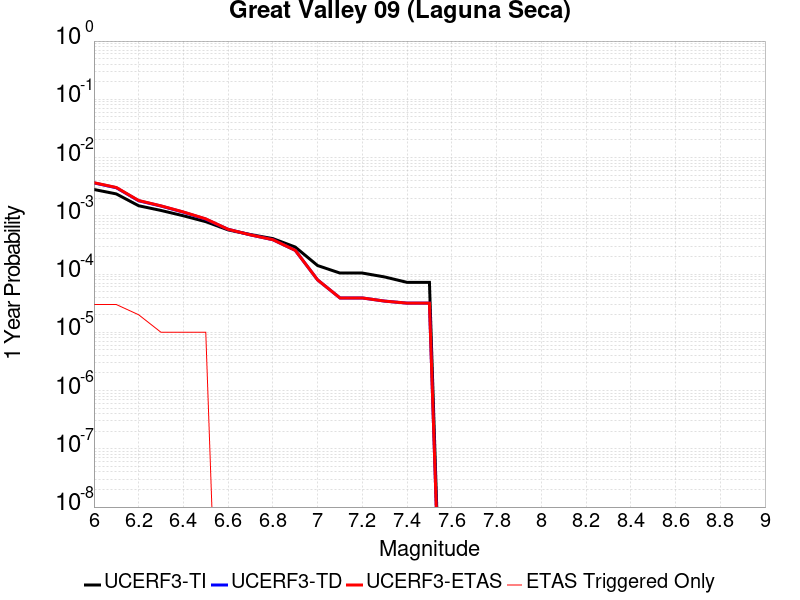 |  |

| Magnitude | 1 wk TI Prob | 1 wk TD Prob | 1 wk ETAS Prob | 1 wk ETAS/TD Gain | 1 wk ETAS Triggered Only | 1 mo TI Prob | 1 mo TD Prob | 1 mo ETAS Prob | 1 mo ETAS/TD Gain | 1 mo ETAS Triggered Only | 1 yr TI Prob | 1 yr TD Prob | 1 yr ETAS Prob | 1 yr ETAS/TD Gain | 1 yr ETAS Triggered Only | 10 yr TI Prob | 10 yr TD Prob | 10 yr ETAS Prob | 10 yr ETAS/TD Gain | 10 yr ETAS Triggered Only |
|-----|-----|-----|-----|-----|-----|-----|-----|-----|-----|-----|-----|-----|-----|-----|-----|-----|-----|-----|-----|-----|
| 6.0 | 5.4353277E-5 | 7.050019E-5 | 9.0498776E-5 | 1.2836672 | 2.0E-5 | 2.3292181E-4 | 3.0211007E-4 | 3.2210402E-4 | 1.0661811 | 2.0E-5 | 0.0028321352 | 0.0036720056 | 0.0037018955 | 1.00814 | 3.0E-5 | 0.02796312 | 0.036115844 | 0.03617368 | 1.0016013 | 6.0E-5 |
| 6.1 | 4.5578287E-5 | 5.822054E-5 | 7.8219375E-5 | 1.3435013 | 2.0E-5 | 1.953209E-4 | 2.4949352E-4 | 2.6948852E-4 | 1.0801424 | 2.0E-5 | 0.0023754383 | 0.0030333549 | 0.003063264 | 1.00986 | 3.0E-5 | 0.023502063 | 0.029919893 | 0.029968396 | 1.0016211 | 5.0E-5 |
| 6.2 | 2.8536782E-5 | 3.4736422E-5 | 4.4736073E-5 | 1.2878723 | 1.0E-5 | 1.2229476E-4 | 1.4886161E-4 | 1.5886012E-4 | 1.0671664 | 1.0E-5 | 0.0014879217 | 0.0018108576 | 0.0018308214 | 1.0110245 | 2.0E-5 | 0.014779986 | 0.017958276 | 0.017987737 | 1.0016406 | 3.0E-5 |
| 6.3 | 2.3698774E-5 | 2.8213344E-5 | 2.8213344E-5 | 1.0 | 0.0 | 1.01562226E-4 | 1.2090833E-4 | 1.2090833E-4 | 1.0 | 0.0 | 0.0012358186 | 0.001471051 | 0.0014810363 | 1.0067879 | 1.0E-5 | 0.012289686 | 0.014611455 | 0.014631162 | 1.0013487 | 2.0E-5 |
| 6.4 | 1.9191197E-5 | 2.212289E-5 | 2.212289E-5 | 1.0 | 0.0 | 8.2245395E-5 | 9.4808805E-5 | 9.4808805E-5 | 1.0 | 0.0 | 0.0010008777 | 0.0011536906 | 0.0011636791 | 1.0086578 | 1.0E-5 | 0.009963818 | 0.011477022 | 0.0114869075 | 1.0008613 | 1.0E-5 |
| 6.5 | 1.5203241E-5 | 1.6801298E-5 | 1.6801298E-5 | 1.0 | 0.0 | 6.5155116E-5 | 7.200338E-5 | 7.200338E-5 | 1.0 | 0.0 | 7.9297484E-4 | 8.76301E-4 | 8.8629226E-4 | 1.0114017 | 1.0E-5 | 0.007901512 | 0.008729581 | 0.008739494 | 1.0011356 | 1.0E-5 |
| 6.6 | 1.0984925E-5 | 1.12425605E-5 | 1.12425605E-5 | 1.0 | 0.0 | 4.70774E-5 | 4.8181533E-5 | 4.8181533E-5 | 1.0 | 0.0 | 5.730166E-4 | 5.8645604E-4 | 5.8645604E-4 | 1.0 | 0.0 | 0.005715413 | 0.0058494755 | 0.0058494755 | 1.0 | 0.0 |
| 6.7 | 9.134616E-6 | 9.019868E-6 | 9.019868E-6 | 1.0 | 0.0 | 3.9147766E-5 | 3.865602E-5 | 3.865602E-5 | 1.0 | 0.0 | 4.7651984E-4 | 4.7053778E-4 | 4.7053778E-4 | 1.0 | 0.0 | 0.004754993 | 0.00469566 | 0.00469566 | 1.0 | 0.0 |
| 6.8 | 7.785589E-6 | 7.4519185E-6 | 7.4519185E-6 | 1.0 | 0.0 | 3.3366385E-5 | 3.1936415E-5 | 3.1936415E-5 | 1.0 | 0.0 | 4.0616E-4 | 3.887585E-4 | 3.887585E-4 | 1.0 | 0.0 | 0.0040541845 | 0.003880988 | 0.003880988 | 1.0 | 0.0 |
| 6.9 | 5.579095E-6 | 4.8984666E-6 | 4.8984666E-6 | 1.0 | 0.0 | 2.3910188E-5 | 2.0993268E-5 | 2.0993268E-5 | 1.0 | 0.0 | 2.9106764E-4 | 2.5556443E-4 | 2.5556443E-4 | 1.0 | 0.0 | 0.002906867 | 0.0025528427 | 0.0025528427 | 1.0 | 0.0 |
| 7.0 | 2.6816688E-6 | 1.521587E-6 | 1.521587E-6 | 1.0 | 0.0 | 1.1492816E-5 | 6.521071E-6 | 6.521071E-6 | 1.0 | 0.0 | 1.3991605E-4 | 7.939124E-5 | 7.939124E-5 | 1.0 | 0.0 | 0.0013982799 | 7.936375E-4 | 7.936375E-4 | 1.0 | 0.0 |
| 7.1 | 1.9951021E-6 | 7.45357E-7 | 7.45357E-7 | 1.0 | 0.0 | 8.55041E-6 | 3.1943835E-6 | 3.1943835E-6 | 1.0 | 0.0 | 1.0409627E-4 | 3.889097E-5 | 3.889097E-5 | 1.0 | 0.0 | 0.0010404752 | 3.8884574E-4 | 3.8884574E-4 | 1.0 | 0.0 |
| 7.2 | 1.9951021E-6 | 7.45357E-7 | 7.45357E-7 | 1.0 | 0.0 | 8.55041E-6 | 3.1943835E-6 | 3.1943835E-6 | 1.0 | 0.0 | 1.0409627E-4 | 3.889097E-5 | 3.889097E-5 | 1.0 | 0.0 | 0.0010404752 | 3.8884574E-4 | 3.8884574E-4 | 1.0 | 0.0 |
| 7.3 | 1.7087556E-6 | 6.578663E-7 | 6.578663E-7 | 1.0 | 0.0 | 7.3232177E-6 | 2.819424E-6 | 2.819424E-6 | 1.0 | 0.0 | 8.915652E-5 | 3.432599E-5 | 3.432599E-5 | 1.0 | 0.0 | 8.9120766E-4 | 3.432109E-4 | 3.432109E-4 | 1.0 | 0.0 |
| 7.4 | 1.3804846E-6 | 6.0737113E-7 | 6.0737113E-7 | 1.0 | 0.0 | 5.916349E-6 | 2.6030168E-6 | 2.6030168E-6 | 1.0 | 0.0 | 7.2029165E-5 | 3.169131E-5 | 3.169131E-5 | 1.0 | 0.0 | 7.200583E-4 | 3.168719E-4 | 3.168719E-4 | 1.0 | 0.0 |
| 7.5 | 1.3804846E-6 | 6.0737113E-7 | 6.0737113E-7 | 1.0 | 0.0 | 5.916349E-6 | 2.6030168E-6 | 2.6030168E-6 | 1.0 | 0.0 | 7.2029165E-5 | 3.169131E-5 | 3.169131E-5 | 1.0 | 0.0 | 7.200583E-4 | 3.168719E-4 | 3.168719E-4 | 1.0 | 0.0 |

## Santa Ynez River
*[(top)](#table-of-contents)*

| 1 Week | 1 Month | 1 Year | 10 Year |
|-----|-----|-----|-----|
|  |  |  |  |

| Magnitude | 1 wk TI Prob | 1 wk TD Prob | 1 wk ETAS Prob | 1 wk ETAS/TD Gain | 1 wk ETAS Triggered Only | 1 mo TI Prob | 1 mo TD Prob | 1 mo ETAS Prob | 1 mo ETAS/TD Gain | 1 mo ETAS Triggered Only | 1 yr TI Prob | 1 yr TD Prob | 1 yr ETAS Prob | 1 yr ETAS/TD Gain | 1 yr ETAS Triggered Only | 10 yr TI Prob | 10 yr TD Prob | 10 yr ETAS Prob | 10 yr ETAS/TD Gain | 10 yr ETAS Triggered Only |
|-----|-----|-----|-----|-----|-----|-----|-----|-----|-----|-----|-----|-----|-----|-----|-----|-----|-----|-----|-----|-----|
| 6.0 | 1.6396456E-5 | 1.7209444E-5 | 1.7209444E-5 | 1.0 | 0.0 | 7.026863E-5 | 7.3752875E-5 | 7.3752875E-5 | 1.0 | 0.0 | 8.551848E-4 | 8.976069E-4 | 9.0759795E-4 | 1.0111307 | 1.0E-5 | 0.0085190125 | 0.008943363 | 0.008992916 | 1.0055407 | 5.0E-5 |
| 6.1 | 1.6396456E-5 | 1.7209444E-5 | 1.7209444E-5 | 1.0 | 0.0 | 7.026863E-5 | 7.3752875E-5 | 7.3752875E-5 | 1.0 | 0.0 | 8.551848E-4 | 8.976069E-4 | 9.0759795E-4 | 1.0111307 | 1.0E-5 | 0.0085190125 | 0.008943363 | 0.008992916 | 1.0055407 | 5.0E-5 |
| 6.2 | 1.6396456E-5 | 1.7209444E-5 | 1.7209444E-5 | 1.0 | 0.0 | 7.026863E-5 | 7.3752875E-5 | 7.3752875E-5 | 1.0 | 0.0 | 8.551848E-4 | 8.976069E-4 | 9.0759795E-4 | 1.0111307 | 1.0E-5 | 0.0085190125 | 0.008943363 | 0.008992916 | 1.0055407 | 5.0E-5 |
| 6.3 | 9.736976E-6 | 1.01223395E-5 | 1.01223395E-5 | 1.0 | 0.0 | 4.172923E-5 | 4.338076E-5 | 4.338076E-5 | 1.0 | 0.0 | 5.0793495E-4 | 5.280378E-4 | 5.380325E-4 | 1.018928 | 1.0E-5 | 0.005067755 | 0.0052683367 | 0.0052981786 | 1.0056643 | 3.0E-5 |
| 6.4 | 9.736976E-6 | 1.01223395E-5 | 1.01223395E-5 | 1.0 | 0.0 | 4.172923E-5 | 4.338076E-5 | 4.338076E-5 | 1.0 | 0.0 | 5.0793495E-4 | 5.280378E-4 | 5.380325E-4 | 1.018928 | 1.0E-5 | 0.005067755 | 0.0052683367 | 0.0052981786 | 1.0056643 | 3.0E-5 |
| 6.5 | 7.081964E-6 | 7.329905E-6 | 7.329905E-6 | 1.0 | 0.0 | 3.035092E-5 | 3.141351E-5 | 3.141351E-5 | 1.0 | 0.0 | 3.694598E-4 | 3.8239395E-4 | 3.9239012E-4 | 1.026141 | 1.0E-5 | 0.0036884616 | 0.0038175215 | 0.003847407 | 1.0078285 | 3.0E-5 |
| 6.6 | 5.873247E-6 | 6.0597517E-6 | 6.0597517E-6 | 1.0 | 0.0 | 2.5170815E-5 | 2.5970112E-5 | 2.5970112E-5 | 1.0 | 0.0 | 3.064116E-4 | 3.161411E-4 | 3.2613793E-4 | 1.0316215 | 1.0E-5 | 0.0030598943 | 0.003157001 | 0.0031869062 | 1.0094727 | 3.0E-5 |
| 6.7 | 4.973277E-6 | 5.11591E-6 | 5.11591E-6 | 1.0 | 0.0 | 2.1313872E-5 | 2.1925147E-5 | 2.1925147E-5 | 1.0 | 0.0 | 2.5946548E-4 | 2.6690646E-4 | 2.7690377E-4 | 1.0374563 | 1.0E-5 | 0.0025916274 | 0.0026659078 | 0.0026958277 | 1.0112232 | 3.0E-5 |
| 6.8 | 4.396492E-6 | 4.510987E-6 | 4.510987E-6 | 1.0 | 0.0 | 1.884197E-5 | 1.933266E-5 | 1.933266E-5 | 1.0 | 0.0 | 2.2937685E-4 | 2.3535005E-4 | 2.3535005E-4 | 1.0 | 0.0 | 0.0022914023 | 0.0023510433 | 0.0023709964 | 1.0084869 | 2.0E-5 |
| 6.9 | 3.5255632E-6 | 3.6013423E-6 | 3.6013423E-6 | 1.0 | 0.0 | 1.5109469E-5 | 1.5434234E-5 | 1.5434234E-5 | 1.0 | 0.0 | 1.8394225E-4 | 1.8789574E-4 | 1.8789574E-4 | 1.0 | 0.0 | 0.0018379007 | 0.001877385 | 0.0018973474 | 1.0106331 | 2.0E-5 |
| 7.0 | 3.211603E-6 | 3.273663E-6 | 3.273663E-6 | 1.0 | 0.0 | 1.376394E-5 | 1.402991E-5 | 1.402991E-5 | 1.0 | 0.0 | 1.6756308E-4 | 1.708009E-4 | 1.708009E-4 | 1.0 | 0.0 | 0.0016743679 | 0.0017067104 | 0.0017266762 | 1.0116985 | 2.0E-5 |
| 7.1 | 2.5094619E-6 | 2.5409295E-6 | 2.5409295E-6 | 1.0 | 0.0 | 1.0754793E-5 | 1.0889652E-5 | 1.0889652E-5 | 1.0 | 0.0 | 1.3093173E-4 | 1.325735E-4 | 1.325735E-4 | 1.0 | 0.0 | 0.0013085462 | 0.0013249503 | 0.0013449237 | 1.0150748 | 2.0E-5 |
| 7.2 | 2.0515774E-6 | 2.0619466E-6 | 2.0619466E-6 | 1.0 | 0.0 | 8.792445E-6 | 8.836884E-6 | 8.836884E-6 | 1.0 | 0.0 | 1.0704277E-4 | 1.0758379E-4 | 1.0758379E-4 | 1.0 | 0.0 | 0.0010699122 | 0.0010753215 | 0.0010952998 | 1.0185791 | 2.0E-5 |
| 7.3 | 1.6845745E-6 | 1.6773996E-6 | 1.6773996E-6 | 1.0 | 0.0 | 7.219585E-6 | 7.1888358E-6 | 7.1888358E-6 | 1.0 | 0.0 | 8.78949E-5 | 8.752059E-5 | 8.752059E-5 | 1.0 | 0.0 | 8.7860145E-4 | 8.7486405E-4 | 8.9484657E-4 | 1.0228407 | 2.0E-5 |
| 7.4 | 1.3600285E-6 | 1.3333447E-6 | 1.3333447E-6 | 1.0 | 0.0 | 5.82868E-6 | 5.714322E-6 | 5.714322E-6 | 1.0 | 0.0 | 7.096187E-5 | 6.956967E-5 | 6.956967E-5 | 1.0 | 0.0 | 7.0939213E-4 | 6.9548114E-4 | 7.1546726E-4 | 1.0287371 | 2.0E-5 |
| 7.5 | 9.735342E-7 | 9.2901894E-7 | 9.2901894E-7 | 1.0 | 0.0 | 4.172283E-6 | 3.9815036E-6 | 3.9815036E-6 | 1.0 | 0.0 | 5.079636E-5 | 4.8473747E-5 | 4.8473747E-5 | 1.0 | 0.0 | 5.0784746E-4 | 4.8463346E-4 | 4.8463346E-4 | 1.0 | 0.0 |
| 7.6 | 5.067187E-7 | 4.778609E-7 | 4.778609E-7 | 1.0 | 0.0 | 2.1716498E-6 | 2.0479738E-6 | 2.0479738E-6 | 1.0 | 0.0 | 2.6439517E-5 | 2.4933803E-5 | 2.4933803E-5 | 1.0 | 0.0 | 2.643637E-4 | 2.493108E-4 | 2.493108E-4 | 1.0 | 0.0 |
| 7.7 | 2.769089E-7 | 2.5759346E-7 | 2.5759346E-7 | 1.0 | 0.0 | 1.1867519E-6 | 1.1039714E-6 | 1.1039714E-6 | 1.0 | 0.0 | 1.4448608E-5 | 1.344077E-5 | 1.344077E-5 | 1.0 | 0.0 | 1.444767E-4 | 1.343996E-4 | 1.343996E-4 | 1.0 | 0.0 |
| 7.8 | 1.7044663E-7 | 1.5449208E-7 | 1.5449208E-7 | 1.0 | 0.0 | 7.3048534E-7 | 6.6210873E-7 | 6.6210873E-7 | 1.0 | 0.0 | 8.893623E-6 | 8.061144E-6 | 8.061144E-6 | 1.0 | 0.0 | 8.893267E-5 | 8.060854E-5 | 8.060854E-5 | 1.0 | 0.0 |
| 7.9 | 4.8344287E-8 | 4.0911143E-8 | 4.0911143E-8 | 1.0 | 0.0 | 2.0718979E-7 | 1.7533345E-7 | 1.7533345E-7 | 1.0 | 0.0 | 2.5225327E-6 | 2.1346827E-6 | 2.1346827E-6 | 1.0 | 0.0 | 2.5225041E-5 | 2.1346626E-5 | 2.1346626E-5 | 1.0 | 0.0 |

## Raymond
*[(top)](#table-of-contents)*

| 1 Week | 1 Month | 1 Year | 10 Year |
|-----|-----|-----|-----|
|  | 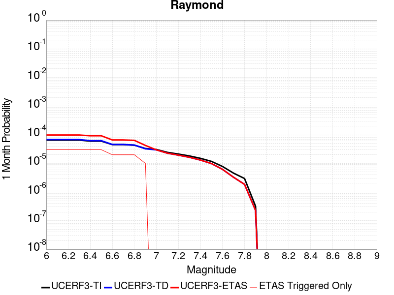 | 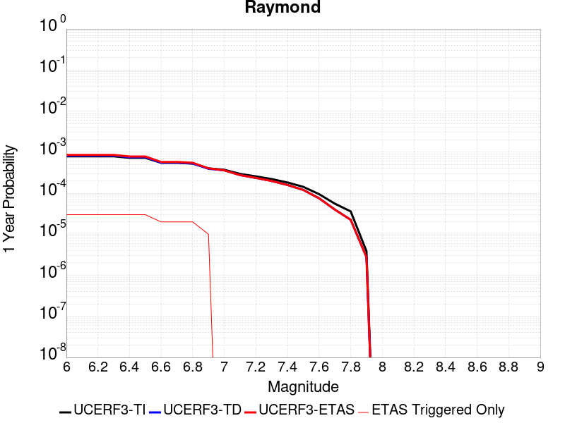 |  |

| Magnitude | 1 wk TI Prob | 1 wk TD Prob | 1 wk ETAS Prob | 1 wk ETAS/TD Gain | 1 wk ETAS Triggered Only | 1 mo TI Prob | 1 mo TD Prob | 1 mo ETAS Prob | 1 mo ETAS/TD Gain | 1 mo ETAS Triggered Only | 1 yr TI Prob | 1 yr TD Prob | 1 yr ETAS Prob | 1 yr ETAS/TD Gain | 1 yr ETAS Triggered Only | 10 yr TI Prob | 10 yr TD Prob | 10 yr ETAS Prob | 10 yr ETAS/TD Gain | 10 yr ETAS Triggered Only |
|-----|-----|-----|-----|-----|-----|-----|-----|-----|-----|-----|-----|-----|-----|-----|-----|-----|-----|-----|-----|-----|
| 6.0 | 1.5157413E-5 | 1.5810125E-5 | 4.580965E-5 | 2.897488 | 3.0E-5 | 6.4958724E-5 | 6.775606E-5 | 9.775403E-5 | 1.4427348 | 3.0E-5 | 7.905855E-4 | 8.246429E-4 | 8.5461815E-4 | 1.0363494 | 3.0E-5 | 0.007877788 | 0.008218355 | 0.008267944 | 1.0060339 | 5.0E-5 |
| 6.1 | 1.5157413E-5 | 1.5810125E-5 | 4.580965E-5 | 2.897488 | 3.0E-5 | 6.4958724E-5 | 6.775606E-5 | 9.775403E-5 | 1.4427348 | 3.0E-5 | 7.905855E-4 | 8.246429E-4 | 8.5461815E-4 | 1.0363494 | 3.0E-5 | 0.007877788 | 0.008218355 | 0.008267944 | 1.0060339 | 5.0E-5 |
| 6.2 | 1.5157413E-5 | 1.5810125E-5 | 4.580965E-5 | 2.897488 | 3.0E-5 | 6.4958724E-5 | 6.775606E-5 | 9.775403E-5 | 1.4427348 | 3.0E-5 | 7.905855E-4 | 8.246429E-4 | 8.5461815E-4 | 1.0363494 | 3.0E-5 | 0.007877788 | 0.008218355 | 0.008267944 | 1.0060339 | 5.0E-5 |
| 6.3 | 1.5157413E-5 | 1.5810125E-5 | 4.580965E-5 | 2.897488 | 3.0E-5 | 6.4958724E-5 | 6.775606E-5 | 9.775403E-5 | 1.4427348 | 3.0E-5 | 7.905855E-4 | 8.246429E-4 | 8.5461815E-4 | 1.0363494 | 3.0E-5 | 0.007877788 | 0.008218355 | 0.008267944 | 1.0060339 | 5.0E-5 |
| 6.4 | 1.3941944E-5 | 1.4454688E-5 | 4.4454253E-5 | 3.0754213 | 3.0E-5 | 5.9749822E-5 | 6.194732E-5 | 9.194547E-5 | 1.4842525 | 3.0E-5 | 7.2721124E-4 | 7.53971E-4 | 7.839484E-4 | 1.0397593 | 3.0E-5 | 0.007248361 | 0.007516471 | 0.0075660953 | 1.006602 | 5.0E-5 |
| 6.5 | 1.3941944E-5 | 1.4454688E-5 | 4.4454253E-5 | 3.0754213 | 3.0E-5 | 5.9749822E-5 | 6.194732E-5 | 9.194547E-5 | 1.4842525 | 3.0E-5 | 7.2721124E-4 | 7.53971E-4 | 7.839484E-4 | 1.0397593 | 3.0E-5 | 0.007248361 | 0.007516471 | 0.0075660953 | 1.006602 | 5.0E-5 |
| 6.6 | 1.0542609E-5 | 1.067111E-5 | 3.0670897E-5 | 2.8741992 | 2.0E-5 | 4.5181827E-5 | 4.573256E-5 | 6.573164E-5 | 1.4373052 | 2.0E-5 | 5.499499E-4 | 5.566571E-4 | 5.76646E-4 | 1.0359088 | 2.0E-5 | 0.005485909 | 0.0055531966 | 0.0055929744 | 1.007163 | 4.0E-5 |
| 6.7 | 1.0542609E-5 | 1.067111E-5 | 3.0670897E-5 | 2.8741992 | 2.0E-5 | 4.5181827E-5 | 4.573256E-5 | 6.573164E-5 | 1.4373052 | 2.0E-5 | 5.499499E-4 | 5.566571E-4 | 5.76646E-4 | 1.0359088 | 2.0E-5 | 0.005485909 | 0.0055531966 | 0.0055929744 | 1.007163 | 4.0E-5 |
| 6.8 | 1.0079132E-5 | 1.0176644E-5 | 3.017644E-5 | 2.9652646 | 2.0E-5 | 4.3195567E-5 | 4.3613487E-5 | 6.361261E-5 | 1.4585538 | 2.0E-5 | 5.257791E-4 | 5.308702E-4 | 5.508596E-4 | 1.037654 | 2.0E-5 | 0.0052453685 | 0.0052965777 | 0.0053363657 | 1.0075121 | 4.0E-5 |
| 6.9 | 7.721598E-6 | 7.548902E-6 | 1.7548826E-5 | 2.324686 | 1.0E-5 | 3.3092143E-5 | 3.2352043E-5 | 4.235172E-5 | 1.3090895 | 1.0E-5 | 4.0282236E-4 | 3.9381615E-4 | 4.038122E-4 | 1.0253825 | 1.0E-5 | 0.0040209293 | 0.003931324 | 0.003961206 | 1.007601 | 3.0E-5 |
| 7.0 | 7.137566E-6 | 6.911303E-6 | 6.911303E-6 | 1.0 | 0.0 | 3.058921E-5 | 2.961954E-5 | 2.961954E-5 | 1.0 | 0.0 | 3.7236E-4 | 3.605593E-4 | 3.605593E-4 | 1.0 | 0.0 | 0.0037173668 | 0.003599869 | 0.003619797 | 1.0055357 | 2.0E-5 |
| 7.1 | 5.654976E-6 | 5.299538E-6 | 5.299538E-6 | 1.0 | 0.0 | 2.4235387E-5 | 2.2712107E-5 | 2.2712107E-5 | 1.0 | 0.0 | 2.9502588E-4 | 2.7648505E-4 | 2.7648505E-4 | 1.0 | 0.0 | 0.0029463451 | 0.0027614492 | 0.0027714216 | 1.0036113 | 1.0E-5 |
| 7.2 | 4.9358455E-6 | 4.526655E-6 | 4.526655E-6 | 1.0 | 0.0 | 2.1153453E-5 | 1.9399806E-5 | 1.9399806E-5 | 1.0 | 0.0 | 2.5751285E-4 | 2.3616718E-4 | 2.3616718E-4 | 1.0 | 0.0 | 0.0025721465 | 0.002359192 | 0.0023691682 | 1.0042287 | 1.0E-5 |
| 7.3 | 4.2368597E-6 | 3.8056128E-6 | 3.8056128E-6 | 1.0 | 0.0 | 1.8157843E-5 | 1.6309668E-5 | 1.6309668E-5 | 1.0 | 0.0 | 2.2104931E-4 | 1.9855222E-4 | 1.9855222E-4 | 1.0 | 0.0 | 0.0022082955 | 0.0019837746 | 0.0019937549 | 1.0050309 | 1.0E-5 |
| 7.4 | 3.4999923E-6 | 3.0437407E-6 | 3.0437407E-6 | 1.0 | 0.0 | 1.49998805E-5 | 1.3044538E-5 | 1.3044538E-5 | 1.0 | 0.0 | 1.8260824E-4 | 1.5880575E-4 | 1.5880575E-4 | 1.0 | 0.0 | 0.0018245826 | 0.0015869461 | 0.0015969302 | 1.0062914 | 1.0E-5 |
| 7.5 | 2.738017E-6 | 2.3020405E-6 | 2.3020405E-6 | 1.0 | 0.0 | 1.1734306E-5 | 9.865851E-6 | 9.865851E-6 | 1.0 | 0.0 | 1.428558E-4 | 1.20110184E-4 | 1.20110184E-4 | 1.0 | 0.0 | 0.0014276401 | 0.0012004747 | 0.0012004747 | 1.0 | 0.0 |
| 7.6 | 1.8186392E-6 | 1.442302E-6 | 1.442302E-6 | 1.0 | 0.0 | 7.794145E-6 | 6.1812802E-6 | 6.1812802E-6 | 1.0 | 0.0 | 9.488958E-5 | 7.5254524E-5 | 7.5254524E-5 | 1.0 | 0.0 | 9.4849075E-4 | 7.5230957E-4 | 7.5230957E-4 | 1.0 | 0.0 |
| 7.7 | 1.0660348E-6 | 7.6437E-7 | 7.6437E-7 | 1.0 | 0.0 | 4.5687125E-6 | 3.2758674E-6 | 3.2758674E-6 | 1.0 | 0.0 | 5.5622655E-5 | 3.988297E-5 | 3.988297E-5 | 1.0 | 0.0 | 5.5608735E-4 | 3.9877492E-4 | 3.9877492E-4 | 1.0 | 0.0 |
| 7.8 | 6.913602E-7 | 4.3202903E-7 | 4.3202903E-7 | 1.0 | 0.0 | 2.962969E-6 | 1.8515517E-6 | 1.8515517E-6 | 1.0 | 0.0 | 3.607355E-5 | 2.2542416E-5 | 2.2542416E-5 | 1.0 | 0.0 | 3.6067693E-4 | 2.2541684E-4 | 2.2541684E-4 | 1.0 | 0.0 |
| 7.9 | 7.425201E-8 | 5.322267E-8 | 5.322267E-8 | 1.0 | 0.0 | 3.1822285E-7 | 2.2809714E-7 | 2.2809714E-7 | 1.0 | 0.0 | 3.874356E-6 | 2.7770805E-6 | 2.7770805E-6 | 1.0 | 0.0 | 3.8742884E-5 | 2.7770588E-5 | 2.7770588E-5 | 1.0 | 0.0 |

## Kern Canyon (Lake Isabella) 2011
*[(top)](#table-of-contents)*

| 1 Week | 1 Month | 1 Year | 10 Year |
|-----|-----|-----|-----|
|  |  |  | 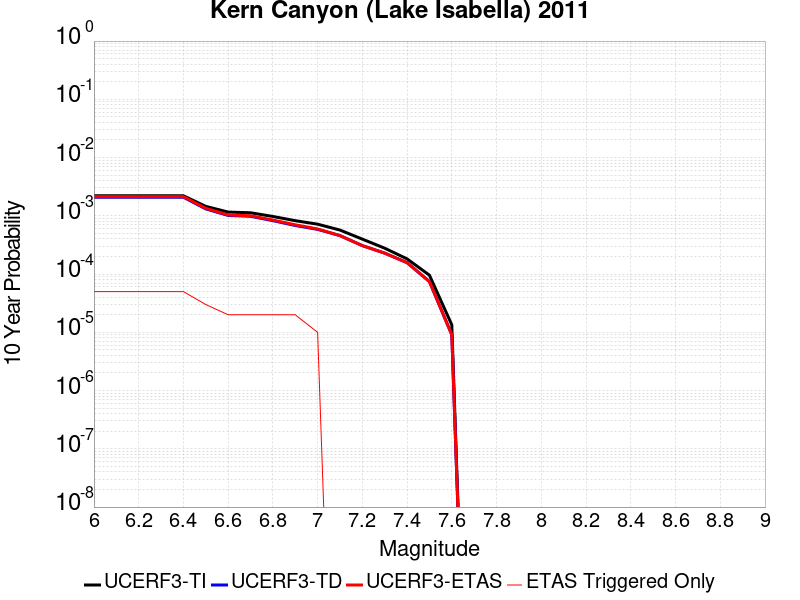 |

| Magnitude | 1 wk TI Prob | 1 wk TD Prob | 1 wk ETAS Prob | 1 wk ETAS/TD Gain | 1 wk ETAS Triggered Only | 1 mo TI Prob | 1 mo TD Prob | 1 mo ETAS Prob | 1 mo ETAS/TD Gain | 1 mo ETAS Triggered Only | 1 yr TI Prob | 1 yr TD Prob | 1 yr ETAS Prob | 1 yr ETAS/TD Gain | 1 yr ETAS Triggered Only | 10 yr TI Prob | 10 yr TD Prob | 10 yr ETAS Prob | 10 yr ETAS/TD Gain | 10 yr ETAS Triggered Only |
|-----|-----|-----|-----|-----|-----|-----|-----|-----|-----|-----|-----|-----|-----|-----|-----|-----|-----|-----|-----|-----|
| 6.0 | 4.2387383E-6 | 4.0016344E-6 | 4.0016344E-6 | 1.0 | 0.0 | 1.8165894E-5 | 1.7149758E-5 | 3.7149417E-5 | 2.1661773 | 2.0E-5 | 2.2114732E-4 | 2.0878017E-4 | 2.28776E-4 | 1.0957745 | 2.0E-5 | 0.0022092736 | 0.002086024 | 0.0021359199 | 1.023919 | 5.0E-5 |
| 6.1 | 4.2387383E-6 | 4.0016344E-6 | 4.0016344E-6 | 1.0 | 0.0 | 1.8165894E-5 | 1.7149758E-5 | 3.7149417E-5 | 2.1661773 | 2.0E-5 | 2.2114732E-4 | 2.0878017E-4 | 2.28776E-4 | 1.0957745 | 2.0E-5 | 0.0022092736 | 0.002086024 | 0.0021359199 | 1.023919 | 5.0E-5 |
| 6.2 | 4.2387383E-6 | 4.0016344E-6 | 4.0016344E-6 | 1.0 | 0.0 | 1.8165894E-5 | 1.7149758E-5 | 3.7149417E-5 | 2.1661773 | 2.0E-5 | 2.2114732E-4 | 2.0878017E-4 | 2.28776E-4 | 1.0957745 | 2.0E-5 | 0.0022092736 | 0.002086024 | 0.0021359199 | 1.023919 | 5.0E-5 |
| 6.3 | 4.2387383E-6 | 4.0016344E-6 | 4.0016344E-6 | 1.0 | 0.0 | 1.8165894E-5 | 1.7149758E-5 | 3.7149417E-5 | 2.1661773 | 2.0E-5 | 2.2114732E-4 | 2.0878017E-4 | 2.28776E-4 | 1.0957745 | 2.0E-5 | 0.0022092736 | 0.002086024 | 0.0021359199 | 1.023919 | 5.0E-5 |
| 6.4 | 4.2387383E-6 | 4.0016344E-6 | 4.0016344E-6 | 1.0 | 0.0 | 1.8165894E-5 | 1.7149758E-5 | 3.7149417E-5 | 2.1661773 | 2.0E-5 | 2.2114732E-4 | 2.0878017E-4 | 2.28776E-4 | 1.0957745 | 2.0E-5 | 0.0022092736 | 0.002086024 | 0.0021359199 | 1.023919 | 5.0E-5 |
| 6.5 | 2.7857532E-6 | 2.5178624E-6 | 2.5178624E-6 | 1.0 | 0.0 | 1.1938888E-5 | 1.0790796E-5 | 2.0790689E-5 | 1.9267057 | 1.0E-5 | 1.4534626E-4 | 1.3137035E-4 | 1.4136903E-4 | 1.0761107 | 1.0E-5 | 0.0014525123 | 0.0013129596 | 0.0013429202 | 1.0228192 | 3.0E-5 |
| 6.6 | 2.2233348E-6 | 1.944119E-6 | 1.944119E-6 | 1.0 | 0.0 | 9.528543E-6 | 8.331913E-6 | 1.833183E-5 | 2.2001946 | 1.0E-5 | 1.1600384E-4 | 1.014364E-4 | 1.1143539E-4 | 1.0985739 | 1.0E-5 | 0.001159433 | 0.0010139096 | 0.0010338894 | 1.0197057 | 2.0E-5 |
| 6.7 | 2.1635126E-6 | 1.8834991E-6 | 1.8834991E-6 | 1.0 | 0.0 | 9.272164E-6 | 8.072114E-6 | 1.8072033E-5 | 2.238823 | 1.0E-5 | 1.1288274E-4 | 9.827364E-5 | 1.0827266E-4 | 1.1017467 | 1.0E-5 | 0.0011282542 | 9.8231E-4 | 0.0010022903 | 1.0203402 | 2.0E-5 |
| 6.8 | 1.8685711E-6 | 1.583138E-6 | 1.583138E-6 | 1.0 | 0.0 | 8.008137E-6 | 6.7848596E-6 | 1.6784792E-5 | 2.4738598 | 1.0E-5 | 9.74947E-5 | 8.2602586E-5 | 9.260176E-5 | 1.1210515 | 1.0E-5 | 9.745194E-4 | 8.2572375E-4 | 8.457072E-4 | 1.0242012 | 2.0E-5 |
| 6.9 | 1.5815071E-6 | 1.3064887E-6 | 1.3064887E-6 | 1.0 | 0.0 | 6.77787E-6 | 5.5992255E-6 | 1.559917E-5 | 2.7859514 | 1.0E-5 | 8.251744E-5 | 6.816846E-5 | 7.816778E-5 | 1.1466854 | 1.0E-5 | 8.248681E-4 | 6.8147824E-4 | 7.014646E-4 | 1.029328 | 2.0E-5 |
| 7.0 | 1.3772564E-6 | 1.1210681E-6 | 1.1210681E-6 | 1.0 | 0.0 | 5.9025137E-6 | 4.8045686E-6 | 4.8045686E-6 | 1.0 | 0.0 | 7.186073E-5 | 5.8494075E-5 | 5.8494075E-5 | 1.0 | 0.0 | 7.18375E-4 | 5.8478885E-4 | 5.94783E-4 | 1.0170902 | 1.0E-5 |
| 7.1 | 1.0916998E-6 | 8.7637505E-7 | 8.7637505E-7 | 1.0 | 0.0 | 4.678705E-6 | 3.7558877E-6 | 3.7558877E-6 | 1.0 | 0.0 | 5.6961744E-5 | 4.5726985E-5 | 4.5726985E-5 | 1.0 | 0.0 | 5.6947145E-4 | 4.571771E-4 | 4.571771E-4 | 1.0 | 0.0 |
| 7.2 | 7.6277024E-7 | 5.901439E-7 | 5.901439E-7 | 1.0 | 0.0 | 3.2690114E-6 | 2.5291856E-6 | 2.5291856E-6 | 1.0 | 0.0 | 3.9799485E-5 | 3.0792406E-5 | 3.0792406E-5 | 1.0 | 0.0 | 3.9792358E-4 | 3.07882E-4 | 3.07882E-4 | 1.0 | 0.0 |
| 7.3 | 5.3265916E-7 | 4.3824264E-7 | 4.3824264E-7 | 1.0 | 0.0 | 2.282823E-6 | 1.8781814E-6 | 1.8781814E-6 | 1.0 | 0.0 | 2.7793016E-5 | 2.2866623E-5 | 2.2866623E-5 | 1.0 | 0.0 | 2.778954E-4 | 2.2864307E-4 | 2.2864307E-4 | 1.0 | 0.0 |
| 7.4 | 3.4946007E-7 | 3.0065647E-7 | 3.0065647E-7 | 1.0 | 0.0 | 1.497685E-6 | 1.2885271E-6 | 1.2885271E-6 | 1.0 | 0.0 | 1.8234163E-5 | 1.5687707E-5 | 1.5687707E-5 | 1.0 | 0.0 | 1.8232666E-4 | 1.5686621E-4 | 1.5686621E-4 | 1.0 | 0.0 |
| 7.5 | 1.8317026E-7 | 1.4244755E-7 | 1.4244755E-7 | 1.0 | 0.0 | 7.850152E-7 | 6.1048934E-7 | 6.1048934E-7 | 1.0 | 0.0 | 9.557518E-6 | 7.432683E-6 | 7.432683E-6 | 1.0 | 0.0 | 9.5571064E-5 | 7.432442E-5 | 7.432442E-5 | 1.0 | 0.0 |
| 7.6 | 2.572245E-8 | 1.735264E-8 | 1.735264E-8 | 1.0 | 0.0 | 1.10239064E-7 | 7.436845E-8 | 7.436845E-8 | 1.0 | 0.0 | 1.3421597E-6 | 9.0543557E-7 | 9.0543557E-7 | 1.0 | 0.0 | 1.3421517E-5 | 9.054324E-6 | 9.054324E-6 | 1.0 | 0.0 |

## Hosgri
*[(top)](#table-of-contents)*

| 1 Week | 1 Month | 1 Year | 10 Year |
|-----|-----|-----|-----|
|  |  |  | 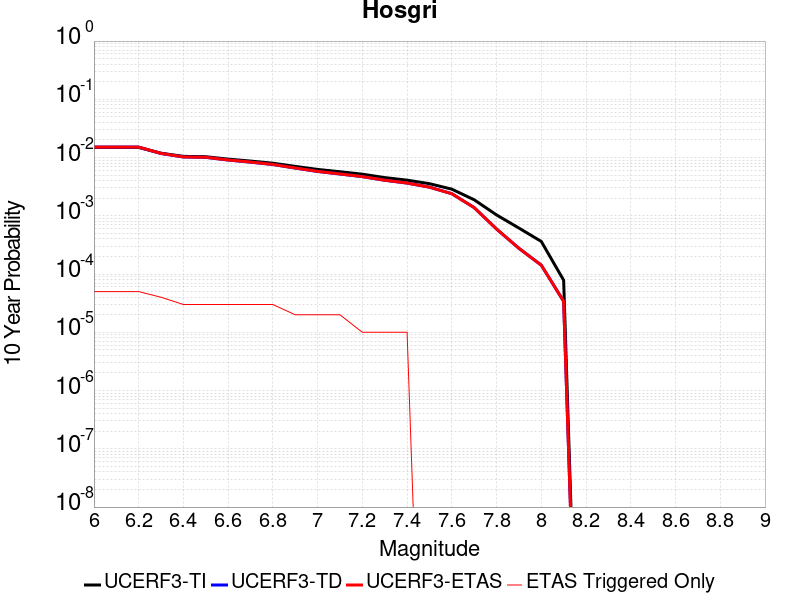 |

| Magnitude | 1 wk TI Prob | 1 wk TD Prob | 1 wk ETAS Prob | 1 wk ETAS/TD Gain | 1 wk ETAS Triggered Only | 1 mo TI Prob | 1 mo TD Prob | 1 mo ETAS Prob | 1 mo ETAS/TD Gain | 1 mo ETAS Triggered Only | 1 yr TI Prob | 1 yr TD Prob | 1 yr ETAS Prob | 1 yr ETAS/TD Gain | 1 yr ETAS Triggered Only | 10 yr TI Prob | 10 yr TD Prob | 10 yr ETAS Prob | 10 yr ETAS/TD Gain | 10 yr ETAS Triggered Only |
|-----|-----|-----|-----|-----|-----|-----|-----|-----|-----|-----|-----|-----|-----|-----|-----|-----|-----|-----|-----|-----|
| 6.0 | 2.883978E-5 | 2.9128403E-5 | 3.912811E-5 | 1.3432975 | 1.0E-5 | 1.235932E-4 | 1.248302E-4 | 1.448277E-4 | 1.1601976 | 2.0E-5 | 0.0015037085 | 0.0015187752 | 0.0015487297 | 1.0197227 | 3.0E-5 | 0.01493574 | 0.01508773 | 0.015136976 | 1.003264 | 5.0E-5 |
| 6.1 | 2.883978E-5 | 2.9128403E-5 | 3.912811E-5 | 1.3432975 | 1.0E-5 | 1.235932E-4 | 1.248302E-4 | 1.448277E-4 | 1.1601976 | 2.0E-5 | 0.0015037085 | 0.0015187752 | 0.0015487297 | 1.0197227 | 3.0E-5 | 0.01493574 | 0.01508773 | 0.015136976 | 1.003264 | 5.0E-5 |
| 6.2 | 2.883978E-5 | 2.9128403E-5 | 3.912811E-5 | 1.3432975 | 1.0E-5 | 1.235932E-4 | 1.248302E-4 | 1.448277E-4 | 1.1601976 | 2.0E-5 | 0.0015037085 | 0.0015187752 | 0.0015487297 | 1.0197227 | 3.0E-5 | 0.01493574 | 0.01508773 | 0.015136976 | 1.003264 | 5.0E-5 |
| 6.3 | 2.2914428E-5 | 2.2641956E-5 | 3.264173E-5 | 1.441648 | 1.0E-5 | 9.8200995E-5 | 9.703337E-5 | 1.17031435E-4 | 1.2060946 | 2.0E-5 | 0.0011949413 | 0.001180746 | 0.0012007224 | 1.0169184 | 2.0E-5 | 0.011885363 | 0.011746123 | 0.011785653 | 1.0033654 | 4.0E-5 |
| 6.4 | 2.0195741E-5 | 1.9696547E-5 | 2.969635E-5 | 1.5076932 | 1.0E-5 | 8.65503E-5 | 8.4411055E-5 | 9.441021E-5 | 1.1184579 | 1.0E-5 | 0.0010532405 | 0.001027222 | 0.0010372117 | 1.009725 | 1.0E-5 | 0.010482626 | 0.010225783 | 0.010255476 | 1.0029038 | 3.0E-5 |
| 6.5 | 1.9924333E-5 | 1.9408968E-5 | 2.9408775E-5 | 1.5152158 | 1.0E-5 | 8.53872E-5 | 8.317865E-5 | 9.317782E-5 | 1.1202132 | 1.0E-5 | 0.0010390934 | 0.0010122315 | 0.0010222214 | 1.0098692 | 1.0E-5 | 0.010342481 | 0.010077244 | 0.010106941 | 1.002947 | 3.0E-5 |
| 6.6 | 1.809694E-5 | 1.7458287E-5 | 2.7458113E-5 | 1.5727838 | 1.0E-5 | 7.7556004E-5 | 7.4819094E-5 | 8.481834E-5 | 1.1336458 | 1.0E-5 | 9.438353E-4 | 9.105431E-4 | 9.2053396E-4 | 1.0109725 | 1.0E-5 | 0.009398366 | 0.009069063 | 0.009098791 | 1.0032779 | 3.0E-5 |
| 6.7 | 1.675989E-5 | 1.6042752E-5 | 2.6042591E-5 | 1.6233245 | 1.0E-5 | 7.182612E-5 | 6.8752845E-5 | 7.875216E-5 | 1.1454386 | 1.0E-5 | 8.7413215E-4 | 8.3674554E-4 | 8.467372E-4 | 1.0119411 | 1.0E-5 | 0.008707017 | 0.008336853 | 0.008366603 | 1.0035685 | 3.0E-5 |
| 6.8 | 1.5401129E-5 | 1.4614069E-5 | 2.4613923E-5 | 1.6842622 | 1.0E-5 | 6.6003166E-5 | 6.263023E-5 | 7.26296E-5 | 1.1596574 | 1.0E-5 | 8.032922E-4 | 7.6225714E-4 | 7.722495E-4 | 1.013109 | 1.0E-5 | 0.008003947 | 0.0075972863 | 0.0076270583 | 1.0039188 | 3.0E-5 |
| 6.9 | 1.356559E-5 | 1.2689955E-5 | 1.2689955E-5 | 1.0 | 0.0 | 5.8136946E-5 | 5.438439E-5 | 5.438439E-5 | 1.0 | 0.0 | 7.0758746E-4 | 6.6192925E-4 | 6.6192925E-4 | 1.0 | 0.0 | 0.007053386 | 0.006600378 | 0.006620246 | 1.0030102 | 2.0E-5 |
| 7.0 | 1.2030819E-5 | 1.1095949E-5 | 1.1095949E-5 | 1.0 | 0.0 | 5.155963E-5 | 4.75532E-5 | 4.75532E-5 | 1.0 | 0.0 | 6.275577E-4 | 5.788065E-4 | 5.788065E-4 | 1.0 | 0.0 | 0.006257884 | 0.0057737473 | 0.005793632 | 1.003444 | 2.0E-5 |
| 7.1 | 1.0972698E-5 | 1.0022167E-5 | 1.0022167E-5 | 1.0 | 0.0 | 4.7025E-5 | 4.2951437E-5 | 4.2951437E-5 | 1.0 | 0.0 | 5.72379E-4 | 5.2280835E-4 | 5.2280835E-4 | 1.0 | 0.0 | 0.0057090693 | 0.005216533 | 0.0052364287 | 1.003814 | 2.0E-5 |
| 7.2 | 9.961926E-6 | 9.034732E-6 | 9.034732E-6 | 1.0 | 0.0 | 4.2693267E-5 | 3.8719707E-5 | 3.8719707E-5 | 1.0 | 0.0 | 5.1966653E-4 | 4.7131052E-4 | 4.7131052E-4 | 1.0 | 0.0 | 0.00518453 | 0.0047038523 | 0.0047138054 | 1.002116 | 1.0E-5 |
| 7.3 | 8.700929E-6 | 7.828089E-6 | 7.828089E-6 | 1.0 | 0.0 | 3.7289166E-5 | 3.354852E-5 | 3.354852E-5 | 1.0 | 0.0 | 4.53901E-4 | 4.083767E-4 | 4.083767E-4 | 1.0 | 0.0 | 0.00452975 | 0.004076999 | 0.0040869582 | 1.0024428 | 1.0E-5 |
| 7.4 | 7.866285E-6 | 6.9987263E-6 | 6.9987263E-6 | 1.0 | 0.0 | 3.3712215E-5 | 2.9994197E-5 | 2.9994197E-5 | 1.0 | 0.0 | 4.103689E-4 | 3.6511818E-4 | 3.6511818E-4 | 1.0 | 0.0 | 0.004096119 | 0.0036459167 | 0.0036558805 | 1.0027328 | 1.0E-5 |
| 7.5 | 6.8381305E-6 | 5.9596814E-6 | 5.9596814E-6 | 1.0 | 0.0 | 2.9305946E-5 | 2.5541241E-5 | 2.5541241E-5 | 1.0 | 0.0 | 3.5674145E-4 | 3.1092027E-4 | 3.1092027E-4 | 1.0 | 0.0 | 0.0035616932 | 0.003105584 | 0.003105584 | 1.0 | 0.0 |
| 7.6 | 5.503376E-6 | 4.595227E-6 | 4.595227E-6 | 1.0 | 0.0 | 2.3585684E-5 | 1.9693682E-5 | 1.9693682E-5 | 1.0 | 0.0 | 2.8711787E-4 | 2.397442E-4 | 2.397442E-4 | 1.0 | 0.0 | 0.002867472 | 0.0023955852 | 0.0023955852 | 1.0 | 0.0 |
| 7.7 | 3.6144982E-6 | 2.6521896E-6 | 2.6521896E-6 | 1.0 | 0.0 | 1.5490614E-5 | 1.1366477E-5 | 1.1366477E-5 | 1.0 | 0.0 | 1.8858191E-4 | 1.3837808E-4 | 1.3837808E-4 | 1.0 | 0.0 | 0.0018842196 | 0.001383647 | 0.001383647 | 1.0 | 0.0 |
| 7.8 | 1.9853494E-6 | 1.1360784E-6 | 1.1360784E-6 | 1.0 | 0.0 | 8.508612E-6 | 4.8688985E-6 | 4.8688985E-6 | 1.0 | 0.0 | 1.0358743E-4 | 5.9277223E-5 | 5.9277223E-5 | 1.0 | 0.0 | 0.0010353916 | 5.933389E-4 | 5.933389E-4 | 1.0 | 0.0 |
| 7.9 | 1.1818757E-6 | 5.29477E-7 | 5.29477E-7 | 1.0 | 0.0 | 5.0651715E-6 | 2.269185E-6 | 2.269185E-6 | 1.0 | 0.0 | 6.1666724E-5 | 2.7626977E-5 | 2.7626977E-5 | 1.0 | 0.0 | 6.1649614E-4 | 2.7691363E-4 | 2.7691363E-4 | 1.0 | 0.0 |
| 8.0 | 6.962958E-7 | 2.71365E-7 | 2.71365E-7 | 1.0 | 0.0 | 2.9841215E-6 | 1.1629924E-6 | 1.1629924E-6 | 1.0 | 0.0 | 3.6331072E-5 | 1.415934E-5 | 1.415934E-5 | 1.0 | 0.0 | 3.6325134E-4 | 1.4215276E-4 | 1.4215276E-4 | 1.0 | 0.0 |
| 8.1 | 1.5033264E-7 | 6.52693E-8 | 6.52693E-8 | 1.0 | 0.0 | 6.442826E-7 | 2.7972553E-7 | 2.7972553E-7 | 1.0 | 0.0 | 7.844113E-6 | 3.4056532E-6 | 3.4056532E-6 | 1.0 | 0.0 | 7.843835E-5 | 3.4072833E-5 | 3.4072833E-5 | 1.0 | 0.0 |

## Great Valley 07 (Orestimba)
*[(top)](#table-of-contents)*

| 1 Week | 1 Month | 1 Year | 10 Year |
|-----|-----|-----|-----|
|  |  | 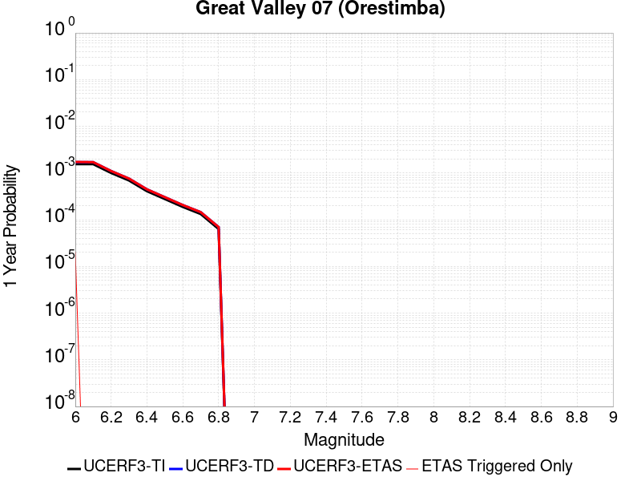 |  |

| Magnitude | 1 wk TI Prob | 1 wk TD Prob | 1 wk ETAS Prob | 1 wk ETAS/TD Gain | 1 wk ETAS Triggered Only | 1 mo TI Prob | 1 mo TD Prob | 1 mo ETAS Prob | 1 mo ETAS/TD Gain | 1 mo ETAS Triggered Only | 1 yr TI Prob | 1 yr TD Prob | 1 yr ETAS Prob | 1 yr ETAS/TD Gain | 1 yr ETAS Triggered Only | 10 yr TI Prob | 10 yr TD Prob | 10 yr ETAS Prob | 10 yr ETAS/TD Gain | 10 yr ETAS Triggered Only |
|-----|-----|-----|-----|-----|-----|-----|-----|-----|-----|-----|-----|-----|-----|-----|-----|-----|-----|-----|-----|-----|
| 6.0 | 2.9687902E-5 | 3.27575E-5 | 4.2757172E-5 | 1.3052636 | 1.0E-5 | 1.2722766E-4 | 1.4038214E-4 | 1.5038073E-4 | 1.0712241 | 1.0E-5 | 0.0015478961 | 0.0017078844 | 0.0017278503 | 1.0116904 | 2.0E-5 | 0.015371585 | 0.016955135 | 0.016994458 | 1.0023192 | 4.0E-5 |
| 6.1 | 2.9687902E-5 | 3.27575E-5 | 3.27575E-5 | 1.0 | 0.0 | 1.2722766E-4 | 1.4038214E-4 | 1.4038214E-4 | 1.0 | 0.0 | 0.0015478961 | 0.0017078844 | 0.0017078844 | 1.0 | 0.0 | 0.015371585 | 0.016955135 | 0.016974797 | 1.0011595 | 2.0E-5 |
| 6.2 | 1.9231524E-5 | 2.1159167E-5 | 2.1159167E-5 | 1.0 | 0.0 | 8.2418206E-5 | 9.067912E-5 | 9.067912E-5 | 1.0 | 0.0 | 0.0010029797 | 0.0011034822 | 0.0011034822 | 1.0 | 0.0 | 0.00998465 | 0.010982441 | 0.01100222 | 1.0018011 | 2.0E-5 |
| 6.3 | 1.324766E-5 | 1.4548534E-5 | 1.4548534E-5 | 1.0 | 0.0 | 5.6774446E-5 | 6.234942E-5 | 6.234942E-5 | 1.0 | 0.0 | 6.910097E-4 | 7.5884897E-4 | 7.5884897E-4 | 1.0 | 0.0 | 0.006888649 | 0.0075635235 | 0.0075833723 | 1.0026243 | 2.0E-5 |
| 6.4 | 7.818645E-6 | 8.57284E-6 | 8.57284E-6 | 1.0 | 0.0 | 3.3508048E-5 | 3.6740246E-5 | 3.6740246E-5 | 1.0 | 0.0 | 4.078841E-4 | 4.4722404E-4 | 4.4722404E-4 | 1.0 | 0.0 | 0.004071363 | 0.0044635804 | 0.004473536 | 1.0022304 | 1.0E-5 |
| 6.5 | 5.3076565E-6 | 5.8178007E-6 | 5.8178007E-6 | 1.0 | 0.0 | 2.27469E-5 | 2.4933206E-5 | 2.4933206E-5 | 1.0 | 0.0 | 2.7690834E-4 | 3.035216E-4 | 3.035216E-4 | 1.0 | 0.0 | 0.0027656353 | 0.00303128 | 0.0030412497 | 1.003289 | 1.0E-5 |
| 6.6 | 3.6003578E-6 | 3.9484953E-6 | 3.9484953E-6 | 1.0 | 0.0 | 1.5430012E-5 | 1.6922022E-5 | 1.6922022E-5 | 1.0 | 0.0 | 1.8784421E-4 | 2.0600771E-4 | 2.0600771E-4 | 1.0 | 0.0 | 0.0018768552 | 0.0020583214 | 0.0020683007 | 1.0048484 | 1.0E-5 |
| 6.7 | 2.5361826E-6 | 2.7834678E-6 | 2.7834678E-6 | 1.0 | 0.0 | 1.0869308E-5 | 1.1929101E-5 | 1.1929101E-5 | 1.0 | 0.0 | 1.3232579E-4 | 1.4522845E-4 | 1.4522845E-4 | 1.0 | 0.0 | 0.0013224703 | 0.0014514653 | 0.0014614508 | 1.0068796 | 1.0E-5 |
| 6.8 | 1.2115831E-6 | 1.3313797E-6 | 1.3313797E-6 | 1.0 | 0.0 | 5.1924885E-6 | 5.7059065E-6 | 5.7059065E-6 | 1.0 | 0.0 | 6.3216714E-5 | 6.9468166E-5 | 6.9468166E-5 | 1.0 | 0.0 | 6.3198735E-4 | 6.945596E-4 | 7.045527E-4 | 1.0143876 | 1.0E-5 |

## Pitas Point (Lower West)
*[(top)](#table-of-contents)*

| 1 Week | 1 Month | 1 Year | 10 Year |
|-----|-----|-----|-----|
|  |  |  |  |

| Magnitude | 1 wk TI Prob | 1 wk TD Prob | 1 wk ETAS Prob | 1 wk ETAS/TD Gain | 1 wk ETAS Triggered Only | 1 mo TI Prob | 1 mo TD Prob | 1 mo ETAS Prob | 1 mo ETAS/TD Gain | 1 mo ETAS Triggered Only | 1 yr TI Prob | 1 yr TD Prob | 1 yr ETAS Prob | 1 yr ETAS/TD Gain | 1 yr ETAS Triggered Only | 10 yr TI Prob | 10 yr TD Prob | 10 yr ETAS Prob | 10 yr ETAS/TD Gain | 10 yr ETAS Triggered Only |
|-----|-----|-----|-----|-----|-----|-----|-----|-----|-----|-----|-----|-----|-----|-----|-----|-----|-----|-----|-----|-----|
| 6.0 | 8.151497E-6 | 7.855796E-6 | 7.855796E-6 | 1.0 | 0.0 | 3.493452E-5 | 3.3667267E-5 | 4.3666932E-5 | 1.2970144 | 1.0E-5 | 4.252448E-4 | 4.0982262E-4 | 4.1981853E-4 | 1.0243908 | 1.0E-5 | 0.0042443196 | 0.004090749 | 0.0041305856 | 1.0097382 | 4.0E-5 |
| 6.1 | 8.151497E-6 | 7.855796E-6 | 7.855796E-6 | 1.0 | 0.0 | 3.493452E-5 | 3.3667267E-5 | 4.3666932E-5 | 1.2970144 | 1.0E-5 | 4.252448E-4 | 4.0982262E-4 | 4.1981853E-4 | 1.0243908 | 1.0E-5 | 0.0042443196 | 0.004090749 | 0.0041305856 | 1.0097382 | 4.0E-5 |
| 6.2 | 8.151497E-6 | 7.855796E-6 | 7.855796E-6 | 1.0 | 0.0 | 3.493452E-5 | 3.3667267E-5 | 4.3666932E-5 | 1.2970144 | 1.0E-5 | 4.252448E-4 | 4.0982262E-4 | 4.1981853E-4 | 1.0243908 | 1.0E-5 | 0.0042443196 | 0.004090749 | 0.0041305856 | 1.0097382 | 4.0E-5 |
| 6.3 | 8.151497E-6 | 7.855796E-6 | 7.855796E-6 | 1.0 | 0.0 | 3.493452E-5 | 3.3667267E-5 | 4.3666932E-5 | 1.2970144 | 1.0E-5 | 4.252448E-4 | 4.0982262E-4 | 4.1981853E-4 | 1.0243908 | 1.0E-5 | 0.0042443196 | 0.004090749 | 0.0041305856 | 1.0097382 | 4.0E-5 |
| 6.4 | 8.151497E-6 | 7.855796E-6 | 7.855796E-6 | 1.0 | 0.0 | 3.493452E-5 | 3.3667267E-5 | 4.3666932E-5 | 1.2970144 | 1.0E-5 | 4.252448E-4 | 4.0982262E-4 | 4.1981853E-4 | 1.0243908 | 1.0E-5 | 0.0042443196 | 0.004090749 | 0.0041305856 | 1.0097382 | 4.0E-5 |
| 6.5 | 8.151497E-6 | 7.855796E-6 | 7.855796E-6 | 1.0 | 0.0 | 3.493452E-5 | 3.3667267E-5 | 4.3666932E-5 | 1.2970144 | 1.0E-5 | 4.252448E-4 | 4.0982262E-4 | 4.1981853E-4 | 1.0243908 | 1.0E-5 | 0.0042443196 | 0.004090749 | 0.0041305856 | 1.0097382 | 4.0E-5 |
| 6.6 | 8.151497E-6 | 7.855796E-6 | 7.855796E-6 | 1.0 | 0.0 | 3.493452E-5 | 3.3667267E-5 | 4.3666932E-5 | 1.2970144 | 1.0E-5 | 4.252448E-4 | 4.0982262E-4 | 4.1981853E-4 | 1.0243908 | 1.0E-5 | 0.0042443196 | 0.004090749 | 0.0041305856 | 1.0097382 | 4.0E-5 |
| 6.7 | 8.151497E-6 | 7.855796E-6 | 7.855796E-6 | 1.0 | 0.0 | 3.493452E-5 | 3.3667267E-5 | 4.3666932E-5 | 1.2970144 | 1.0E-5 | 4.252448E-4 | 4.0982262E-4 | 4.1981853E-4 | 1.0243908 | 1.0E-5 | 0.0042443196 | 0.004090749 | 0.0041305856 | 1.0097382 | 4.0E-5 |
| 6.8 | 8.151497E-6 | 7.855796E-6 | 7.855796E-6 | 1.0 | 0.0 | 3.493452E-5 | 3.3667267E-5 | 4.3666932E-5 | 1.2970144 | 1.0E-5 | 4.252448E-4 | 4.0982262E-4 | 4.1981853E-4 | 1.0243908 | 1.0E-5 | 0.0042443196 | 0.004090749 | 0.0041305856 | 1.0097382 | 4.0E-5 |
| 6.9 | 8.151497E-6 | 7.855796E-6 | 7.855796E-6 | 1.0 | 0.0 | 3.493452E-5 | 3.3667267E-5 | 4.3666932E-5 | 1.2970144 | 1.0E-5 | 4.252448E-4 | 4.0982262E-4 | 4.1981853E-4 | 1.0243908 | 1.0E-5 | 0.0042443196 | 0.004090749 | 0.0041305856 | 1.0097382 | 4.0E-5 |
| 7.0 | 8.103535E-6 | 7.805226E-6 | 7.805226E-6 | 1.0 | 0.0 | 3.4728975E-5 | 3.3450542E-5 | 4.3450207E-5 | 1.2989388 | 1.0E-5 | 4.2274324E-4 | 4.07185E-4 | 4.171809E-4 | 1.0245489 | 1.0E-5 | 0.0042193993 | 0.0040644696 | 0.004104307 | 1.0098014 | 4.0E-5 |
| 7.1 | 7.853298E-6 | 7.540917E-6 | 7.540917E-6 | 1.0 | 0.0 | 3.3656554E-5 | 3.2317817E-5 | 4.2317497E-5 | 1.3094168 | 1.0E-5 | 4.096915E-4 | 3.9339912E-4 | 4.0339518E-4 | 1.0254095 | 1.0E-5 | 0.00408937 | 0.0039271032 | 0.003966946 | 1.0101457 | 4.0E-5 |
| 7.2 | 7.771102E-6 | 7.453199E-6 | 7.453199E-6 | 1.0 | 0.0 | 3.33043E-5 | 3.1941894E-5 | 4.1941574E-5 | 1.3130585 | 1.0E-5 | 4.0540437E-4 | 3.8882386E-4 | 3.9881998E-4 | 1.0257086 | 1.0E-5 | 0.0040466557 | 0.003881511 | 0.003921356 | 1.0102652 | 4.0E-5 |
| 7.3 | 7.3945344E-6 | 7.0493033E-6 | 7.0493033E-6 | 1.0 | 0.0 | 3.1690477E-5 | 3.0210955E-5 | 4.0210653E-5 | 1.3309958 | 1.0E-5 | 3.8576324E-4 | 3.677569E-4 | 3.7775323E-4 | 1.0271819 | 1.0E-5 | 0.0038509427 | 0.003671551 | 0.003711404 | 1.0108546 | 4.0E-5 |
| 7.4 | 6.964645E-6 | 6.5901527E-6 | 6.5901527E-6 | 1.0 | 0.0 | 2.9848137E-5 | 2.8243208E-5 | 2.8243208E-5 | 1.0 | 0.0 | 3.6334046E-4 | 3.438073E-4 | 3.438073E-4 | 1.0 | 0.0 | 0.0036274698 | 0.0034328073 | 0.0034627041 | 1.0087092 | 3.0E-5 |
| 7.5 | 6.6525035E-6 | 6.259191E-6 | 6.259191E-6 | 1.0 | 0.0 | 2.851042E-5 | 2.6824831E-5 | 2.6824831E-5 | 1.0 | 0.0 | 3.4705905E-4 | 3.2654387E-4 | 3.2654387E-4 | 1.0 | 0.0 | 0.0034651754 | 0.0032606919 | 0.0032806266 | 1.0061136 | 2.0E-5 |
| 7.6 | 5.613338E-6 | 5.15142E-6 | 5.15142E-6 | 1.0 | 0.0 | 2.405694E-5 | 2.2077327E-5 | 2.2077327E-5 | 1.0 | 0.0 | 2.928539E-4 | 2.6875862E-4 | 2.6875862E-4 | 1.0 | 0.0 | 0.0029246826 | 0.0026843674 | 0.0026943407 | 1.0037153 | 1.0E-5 |
| 7.7 | 4.494704E-6 | 3.996945E-6 | 3.996945E-6 | 1.0 | 0.0 | 1.9262876E-5 | 1.7129652E-5 | 1.7129652E-5 | 1.0 | 0.0 | 2.3450027E-4 | 2.0853379E-4 | 2.0853379E-4 | 1.0 | 0.0 | 0.0023425296 | 0.0020834052 | 0.0020933843 | 1.0047898 | 1.0E-5 |
| 7.8 | 2.6075882E-6 | 2.1836663E-6 | 2.1836663E-6 | 1.0 | 0.0 | 1.117533E-5 | 9.358537E-6 | 9.358537E-6 | 1.0 | 0.0 | 1.3605114E-4 | 1.1393427E-4 | 1.1393427E-4 | 1.0 | 0.0 | 0.0013596788 | 0.0011387634 | 0.0011487519 | 1.0087714 | 1.0E-5 |
| 7.9 | 4.045984E-7 | 3.2424057E-7 | 3.2424057E-7 | 1.0 | 0.0 | 1.733992E-6 | 1.3896017E-6 | 1.3896017E-6 | 1.0 | 0.0 | 2.1111147E-5 | 1.6918271E-5 | 1.6918271E-5 | 1.0 | 0.0 | 2.1109142E-4 | 1.6917015E-4 | 1.6917015E-4 | 1.0 | 0.0 |
| 8.0 | 7.791402E-9 | 5.6836056E-9 | 5.6836056E-9 | 1.0 | 0.0 | 3.3391725E-8 | 2.4358311E-8 | 2.4358311E-8 | 1.0 | 0.0 | 4.0654416E-7 | 2.965624E-7 | 2.965624E-7 | 1.0 | 0.0 | 4.065434E-6 | 2.9656223E-6 | 2.9656223E-6 | 1.0 | 0.0 |

## Rinconada 2011 CFM
*[(top)](#table-of-contents)*

| 1 Week | 1 Month | 1 Year | 10 Year |
|-----|-----|-----|-----|
|  |  |  |  |

| Magnitude | 1 wk TI Prob | 1 wk TD Prob | 1 wk ETAS Prob | 1 wk ETAS/TD Gain | 1 wk ETAS Triggered Only | 1 mo TI Prob | 1 mo TD Prob | 1 mo ETAS Prob | 1 mo ETAS/TD Gain | 1 mo ETAS Triggered Only | 1 yr TI Prob | 1 yr TD Prob | 1 yr ETAS Prob | 1 yr ETAS/TD Gain | 1 yr ETAS Triggered Only | 10 yr TI Prob | 10 yr TD Prob | 10 yr ETAS Prob | 10 yr ETAS/TD Gain | 10 yr ETAS Triggered Only |
|-----|-----|-----|-----|-----|-----|-----|-----|-----|-----|-----|-----|-----|-----|-----|-----|-----|-----|-----|-----|-----|
| 6.0 | 1.5752368E-5 | 1.6274716E-5 | 1.6274716E-5 | 1.0 | 0.0 | 6.75084E-5 | 6.974694E-5 | 6.974694E-5 | 1.0 | 0.0 | 8.2160486E-4 | 8.488413E-4 | 8.788158E-4 | 1.0353123 | 3.0E-5 | 0.008185739 | 0.00845637 | 0.008496032 | 1.0046902 | 4.0E-5 |
| 6.1 | 1.0966133E-5 | 1.1323029E-5 | 1.1323029E-5 | 1.0 | 0.0 | 4.6996865E-5 | 4.852637E-5 | 4.852637E-5 | 1.0 | 0.0 | 5.720366E-4 | 5.9064914E-4 | 6.006432E-4 | 1.0169206 | 1.0E-5 | 0.0057056635 | 0.005890889 | 0.005910771 | 1.003375 | 2.0E-5 |
| 6.2 | 1.0966133E-5 | 1.1323029E-5 | 1.1323029E-5 | 1.0 | 0.0 | 4.6996865E-5 | 4.852637E-5 | 4.852637E-5 | 1.0 | 0.0 | 5.720366E-4 | 5.9064914E-4 | 6.006432E-4 | 1.0169206 | 1.0E-5 | 0.0057056635 | 0.005890889 | 0.005910771 | 1.003375 | 2.0E-5 |
| 6.3 | 8.926149E-6 | 9.212772E-6 | 9.212772E-6 | 1.0 | 0.0 | 3.8254362E-5 | 3.948271E-5 | 3.948271E-5 | 1.0 | 0.0 | 4.6564735E-4 | 4.8059633E-4 | 4.905915E-4 | 1.0207975 | 1.0E-5 | 0.0046467283 | 0.0047956146 | 0.004815519 | 1.0041505 | 2.0E-5 |
| 6.4 | 7.676955E-6 | 7.920191E-6 | 7.920191E-6 | 1.0 | 0.0 | 3.290082E-5 | 3.3943234E-5 | 3.3943234E-5 | 1.0 | 0.0 | 4.0049385E-4 | 4.131807E-4 | 4.2317656E-4 | 1.0241925 | 1.0E-5 | 0.0039977287 | 0.004124151 | 0.004144069 | 1.0048295 | 2.0E-5 |
| 6.5 | 6.1671026E-6 | 6.358955E-6 | 6.358955E-6 | 1.0 | 0.0 | 2.6430173E-5 | 2.725238E-5 | 2.725238E-5 | 1.0 | 0.0 | 3.2173982E-4 | 3.317473E-4 | 3.4174396E-4 | 1.0301335 | 1.0E-5 | 0.003212744 | 0.0033125326 | 0.0033324664 | 1.0060177 | 2.0E-5 |
| 6.6 | 5.553456E-6 | 5.7248126E-6 | 5.7248126E-6 | 1.0 | 0.0 | 2.3800309E-5 | 2.4534682E-5 | 2.4534682E-5 | 1.0 | 0.0 | 2.897302E-4 | 2.9866886E-4 | 3.0866588E-4 | 1.033472 | 1.0E-5 | 0.0028935277 | 0.0029826832 | 0.0030026236 | 1.0066854 | 2.0E-5 |
| 6.7 | 4.787857E-6 | 4.93331E-6 | 4.93331E-6 | 1.0 | 0.0 | 2.0519226E-5 | 2.1142585E-5 | 2.1142585E-5 | 1.0 | 0.0 | 2.4979294E-4 | 2.573806E-4 | 2.6737803E-4 | 1.0388429 | 1.0E-5 | 0.0024951235 | 0.002570831 | 0.0025808052 | 1.0038798 | 1.0E-5 |
| 6.8 | 3.9955166E-6 | 4.1134763E-6 | 4.1134763E-6 | 1.0 | 0.0 | 1.7123532E-5 | 1.7629065E-5 | 1.7629065E-5 | 1.0 | 0.0 | 2.0845905E-4 | 2.1461275E-4 | 2.1461275E-4 | 1.0 | 0.0 | 0.002082636 | 0.0021440587 | 0.0021440587 | 1.0 | 0.0 |
| 6.9 | 3.4250072E-6 | 3.5224466E-6 | 3.5224466E-6 | 1.0 | 0.0 | 1.46785205E-5 | 1.5096112E-5 | 1.5096112E-5 | 1.0 | 0.0 | 1.7869633E-4 | 1.8377969E-4 | 1.8377969E-4 | 1.0 | 0.0 | 0.001785527 | 0.0018362795 | 0.0018362795 | 1.0 | 0.0 |
| 7.0 | 2.7712713E-6 | 2.8467002E-6 | 2.8467002E-6 | 1.0 | 0.0 | 1.1876823E-5 | 1.22000865E-5 | 1.22000865E-5 | 1.0 | 0.0 | 1.4459073E-4 | 1.4852594E-4 | 1.4852594E-4 | 1.0 | 0.0 | 0.0014449668 | 0.0014842683 | 0.0014842683 | 1.0 | 0.0 |
| 7.1 | 2.227358E-6 | 2.2856987E-6 | 2.2856987E-6 | 1.0 | 0.0 | 9.545785E-6 | 9.795815E-6 | 9.795815E-6 | 1.0 | 0.0 | 1.16213734E-4 | 1.1925753E-4 | 1.1925753E-4 | 1.0 | 0.0 | 0.0011615298 | 0.0011919363 | 0.0011919363 | 1.0 | 0.0 |
| 7.2 | 1.581796E-6 | 1.6209015E-6 | 1.6209015E-6 | 1.0 | 0.0 | 6.779108E-6 | 6.946702E-6 | 6.946702E-6 | 1.0 | 0.0 | 8.253252E-5 | 8.4572814E-5 | 8.4572814E-5 | 1.0 | 0.0 | 8.250187E-4 | 8.4540684E-4 | 8.4540684E-4 | 1.0 | 0.0 |
| 7.3 | 1.0306567E-6 | 1.054648E-6 | 1.054648E-6 | 1.0 | 0.0 | 4.4170924E-6 | 4.519912E-6 | 4.519912E-6 | 1.0 | 0.0 | 5.3776774E-5 | 5.502854E-5 | 5.502854E-5 | 1.0 | 0.0 | 5.376376E-4 | 5.501494E-4 | 5.501494E-4 | 1.0 | 0.0 |
| 7.4 | 6.535541E-7 | 6.682744E-7 | 6.682744E-7 | 1.0 | 0.0 | 2.800943E-6 | 2.8640302E-6 | 2.8640302E-6 | 1.0 | 0.0 | 3.4100947E-5 | 3.4869012E-5 | 3.4869012E-5 | 1.0 | 0.0 | 3.4095717E-4 | 3.486355E-4 | 3.486355E-4 | 1.0 | 0.0 |
| 7.5 | 3.2656962E-7 | 3.3316712E-7 | 3.3316712E-7 | 1.0 | 0.0 | 1.3995833E-6 | 1.4278584E-6 | 1.4278584E-6 | 1.0 | 0.0 | 1.7039794E-5 | 1.7384036E-5 | 1.7384036E-5 | 1.0 | 0.0 | 1.7038487E-4 | 1.738268E-4 | 1.738268E-4 | 1.0 | 0.0 |
| 7.6 | 9.754343E-8 | 9.821017E-8 | 9.821017E-8 | 1.0 | 0.0 | 4.180432E-7 | 4.2090065E-7 | 4.2090065E-7 | 1.0 | 0.0 | 5.089664E-6 | 5.1244533E-6 | 5.1244533E-6 | 1.0 | 0.0 | 5.0895473E-5 | 5.124336E-5 | 5.124336E-5 | 1.0 | 0.0 |
| 7.7 | 6.0001453E-9 | 5.8491207E-9 | 5.8491207E-9 | 1.0 | 0.0 | 2.5714908E-8 | 2.506766E-8 | 2.506766E-8 | 1.0 | 0.0 | 3.1307894E-7 | 3.051987E-7 | 3.051987E-7 | 1.0 | 0.0 | 3.1307852E-6 | 3.0519832E-6 | 3.0519832E-6 | 1.0 | 0.0 |
| 7.8 | 7.400003E-11 | 7.4654505E-11 | 7.4654505E-11 | 1.0 | 0.0 | 3.171432E-10 | 3.1994773E-10 | 3.1994773E-10 | 1.0 | 0.0 | 3.861218E-9 | 3.895363E-9 | 3.895363E-9 | 1.0 | 0.0 | 3.861218E-8 | 3.895363E-8 | 3.895363E-8 | 1.0 | 0.0 |

## Great Valley 03a Dunnigan Hills
*[(top)](#table-of-contents)*

| 1 Week | 1 Month | 1 Year | 10 Year |
|-----|-----|-----|-----|
|  |  |  |  |

| Magnitude | 1 wk TI Prob | 1 wk TD Prob | 1 wk ETAS Prob | 1 wk ETAS/TD Gain | 1 wk ETAS Triggered Only | 1 mo TI Prob | 1 mo TD Prob | 1 mo ETAS Prob | 1 mo ETAS/TD Gain | 1 mo ETAS Triggered Only | 1 yr TI Prob | 1 yr TD Prob | 1 yr ETAS Prob | 1 yr ETAS/TD Gain | 1 yr ETAS Triggered Only | 10 yr TI Prob | 10 yr TD Prob | 10 yr ETAS Prob | 10 yr ETAS/TD Gain | 10 yr ETAS Triggered Only |
|-----|-----|-----|-----|-----|-----|-----|-----|-----|-----|-----|-----|-----|-----|-----|-----|-----|-----|-----|-----|-----|
| 6.0 | 1.6591328E-5 | 1.8107954E-5 | 2.8107774E-5 | 1.5522335 | 1.0E-5 | 7.110376E-5 | 7.7603596E-5 | 1.0760127E-4 | 1.3865501 | 3.0E-5 | 8.6534437E-4 | 9.444834E-4 | 9.7445503E-4 | 1.0317334 | 3.0E-5 | 0.008619824 | 0.009411525 | 0.009451148 | 1.0042101 | 4.0E-5 |
| 6.1 | 8.041125E-6 | 8.769726E-6 | 8.769726E-6 | 1.0 | 0.0 | 3.4461507E-5 | 3.7584115E-5 | 3.7584115E-5 | 1.0 | 0.0 | 4.194881E-4 | 4.5751085E-4 | 4.5751085E-4 | 1.0 | 0.0 | 0.004186971 | 0.004567687 | 0.0045776414 | 1.0021793 | 1.0E-5 |
| 6.2 | 3.2807004E-6 | 3.5795688E-6 | 3.5795688E-6 | 1.0 | 0.0 | 1.4060069E-5 | 1.5340942E-5 | 1.5340942E-5 | 1.0 | 0.0 | 1.7116789E-4 | 1.8676413E-4 | 1.8676413E-4 | 1.0 | 0.0 | 0.0017103611 | 0.0018664796 | 0.001876461 | 1.0053477 | 1.0E-5 |
| 6.3 | 1.9339366E-6 | 2.1103806E-6 | 2.1103806E-6 | 1.0 | 0.0 | 8.288273E-6 | 9.044474E-6 | 9.044474E-6 | 1.0 | 0.0 | 1.00905054E-4 | 1.1011375E-4 | 1.1011375E-4 | 1.0 | 0.0 | 0.0010085925 | 0.0011008718 | 0.0011008718 | 1.0 | 0.0 |
| 6.4 | 1.3142635E-6 | 1.4339867E-6 | 1.4339867E-6 | 1.0 | 0.0 | 5.6325457E-6 | 6.145657E-6 | 6.145657E-6 | 1.0 | 0.0 | 6.857408E-5 | 7.482337E-5 | 7.482337E-5 | 1.0 | 0.0 | 6.8552926E-4 | 7.4823375E-4 | 7.4823375E-4 | 1.0 | 0.0 |

## Oak Ridge (Onshore)
*[(top)](#table-of-contents)*

| 1 Week | 1 Month | 1 Year | 10 Year |
|-----|-----|-----|-----|
|  |  |  |  |

| Magnitude | 1 wk TI Prob | 1 wk TD Prob | 1 wk ETAS Prob | 1 wk ETAS/TD Gain | 1 wk ETAS Triggered Only | 1 mo TI Prob | 1 mo TD Prob | 1 mo ETAS Prob | 1 mo ETAS/TD Gain | 1 mo ETAS Triggered Only | 1 yr TI Prob | 1 yr TD Prob | 1 yr ETAS Prob | 1 yr ETAS/TD Gain | 1 yr ETAS Triggered Only | 10 yr TI Prob | 10 yr TD Prob | 10 yr ETAS Prob | 10 yr ETAS/TD Gain | 10 yr ETAS Triggered Only |
|-----|-----|-----|-----|-----|-----|-----|-----|-----|-----|-----|-----|-----|-----|-----|-----|-----|-----|-----|-----|-----|
| 6.0 | 3.155064E-5 | 2.9526076E-5 | 4.9525486E-5 | 1.6773473 | 2.0E-5 | 1.3521002E-4 | 1.265344E-4 | 1.4653188E-4 | 1.1580398 | 2.0E-5 | 0.001644939 | 0.0015395058 | 0.0015694596 | 1.0194567 | 3.0E-5 | 0.01632816 | 0.015293054 | 0.015332443 | 1.0025755 | 4.0E-5 |
| 6.1 | 3.155064E-5 | 2.9526076E-5 | 4.9525486E-5 | 1.6773473 | 2.0E-5 | 1.3521002E-4 | 1.265344E-4 | 1.4653188E-4 | 1.1580398 | 2.0E-5 | 0.001644939 | 0.0015395058 | 0.0015694596 | 1.0194567 | 3.0E-5 | 0.01632816 | 0.015293054 | 0.015332443 | 1.0025755 | 4.0E-5 |
| 6.2 | 3.155064E-5 | 2.9526076E-5 | 4.9525486E-5 | 1.6773473 | 2.0E-5 | 1.3521002E-4 | 1.265344E-4 | 1.4653188E-4 | 1.1580398 | 2.0E-5 | 0.001644939 | 0.0015395058 | 0.0015694596 | 1.0194567 | 3.0E-5 | 0.01632816 | 0.015293054 | 0.015332443 | 1.0025755 | 4.0E-5 |
| 6.3 | 3.155064E-5 | 2.9526076E-5 | 4.9525486E-5 | 1.6773473 | 2.0E-5 | 1.3521002E-4 | 1.265344E-4 | 1.4653188E-4 | 1.1580398 | 2.0E-5 | 0.001644939 | 0.0015395058 | 0.0015694596 | 1.0194567 | 3.0E-5 | 0.01632816 | 0.015293054 | 0.015332443 | 1.0025755 | 4.0E-5 |
| 6.4 | 3.155064E-5 | 2.9526076E-5 | 4.9525486E-5 | 1.6773473 | 2.0E-5 | 1.3521002E-4 | 1.265344E-4 | 1.4653188E-4 | 1.1580398 | 2.0E-5 | 0.001644939 | 0.0015395058 | 0.0015694596 | 1.0194567 | 3.0E-5 | 0.01632816 | 0.015293054 | 0.015332443 | 1.0025755 | 4.0E-5 |
| 6.5 | 3.155064E-5 | 2.9526076E-5 | 4.9525486E-5 | 1.6773473 | 2.0E-5 | 1.3521002E-4 | 1.265344E-4 | 1.4653188E-4 | 1.1580398 | 2.0E-5 | 0.001644939 | 0.0015395058 | 0.0015694596 | 1.0194567 | 3.0E-5 | 0.01632816 | 0.015293054 | 0.015332443 | 1.0025755 | 4.0E-5 |
| 6.6 | 3.155064E-5 | 2.9526076E-5 | 4.9525486E-5 | 1.6773473 | 2.0E-5 | 1.3521002E-4 | 1.265344E-4 | 1.4653188E-4 | 1.1580398 | 2.0E-5 | 0.001644939 | 0.0015395058 | 0.0015694596 | 1.0194567 | 3.0E-5 | 0.01632816 | 0.015293054 | 0.015332443 | 1.0025755 | 4.0E-5 |
| 6.7 | 3.098897E-5 | 2.8864279E-5 | 4.88637E-5 | 1.692878 | 2.0E-5 | 1.328031E-4 | 1.236984E-4 | 1.4369593E-4 | 1.1616635 | 2.0E-5 | 0.0016156785 | 0.0015050253 | 0.0015349801 | 1.0199032 | 3.0E-5 | 0.016039822 | 0.014952909 | 0.014992312 | 1.0026351 | 4.0E-5 |
| 6.8 | 3.0449872E-5 | 2.8239476E-5 | 4.823891E-5 | 1.7082084 | 2.0E-5 | 1.3049292E-4 | 1.2102092E-4 | 1.410185E-4 | 1.1652406 | 2.0E-5 | 0.0015875935 | 0.001472471 | 0.0015024269 | 1.0203439 | 3.0E-5 | 0.015762992 | 0.014631658 | 0.014671072 | 1.0026938 | 4.0E-5 |
| 6.9 | 2.697928E-5 | 2.4219877E-5 | 3.4219636E-5 | 1.412874 | 1.0E-5 | 1.15620365E-4 | 1.03795464E-4 | 1.1379443E-4 | 1.0963333 | 1.0E-5 | 0.0014067689 | 0.0012629988 | 0.0012829734 | 1.0158154 | 2.0E-5 | 0.0139789665 | 0.012561066 | 0.01259069 | 1.0023583 | 3.0E-5 |
| 7.0 | 2.4893961E-5 | 2.1862146E-5 | 2.1862146E-5 | 1.0 | 0.0 | 1.0668404E-4 | 9.369165E-5 | 9.369165E-5 | 1.0 | 0.0 | 0.0012981043 | 0.0011401166 | 0.0011501053 | 1.008761 | 1.0E-5 | 0.012905477 | 0.011345102 | 0.011364875 | 1.0017428 | 2.0E-5 |
| 7.1 | 2.0945363E-5 | 1.7354592E-5 | 1.7354592E-5 | 1.0 | 0.0 | 8.976275E-5 | 7.437473E-5 | 7.437473E-5 | 1.0 | 0.0 | 0.0010923136 | 9.0514094E-4 | 9.151319E-4 | 1.011038 | 1.0E-5 | 0.0108696 | 0.009015621 | 0.00903544 | 1.0021983 | 2.0E-5 |
| 7.2 | 2.0439404E-5 | 1.680953E-5 | 1.680953E-5 | 1.0 | 0.0 | 8.7594504E-5 | 7.203888E-5 | 7.203888E-5 | 1.0 | 0.0 | 0.0010659413 | 8.767251E-4 | 8.8671636E-4 | 1.011396 | 1.0E-5 | 0.010608427 | 0.008733723 | 0.008753548 | 1.00227 | 2.0E-5 |
| 7.3 | 1.8463334E-5 | 1.5381947E-5 | 1.5381947E-5 | 1.0 | 0.0 | 7.912617E-5 | 6.592098E-5 | 6.592098E-5 | 1.0 | 0.0 | 9.6293533E-4 | 8.0229685E-4 | 8.1228884E-4 | 1.0124543 | 1.0E-5 | 0.009587734 | 0.0079950085 | 0.008014848 | 1.0024816 | 2.0E-5 |
| 7.4 | 1.763139E-5 | 1.4516977E-5 | 1.4516977E-5 | 1.0 | 0.0 | 7.556091E-5 | 6.221415E-5 | 6.221415E-5 | 1.0 | 0.0 | 9.1956573E-4 | 7.57198E-4 | 7.57198E-4 | 1.0 | 0.0 | 0.009157699 | 0.007547126 | 0.0075570503 | 1.001315 | 1.0E-5 |
| 7.5 | 1.3594944E-5 | 1.1163363E-5 | 1.1163363E-5 | 1.0 | 0.0 | 5.8262744E-5 | 4.7842117E-5 | 4.7842117E-5 | 1.0 | 0.0 | 7.0911803E-4 | 5.8232463E-4 | 5.8232463E-4 | 1.0 | 0.0 | 0.007068595 | 0.005808362 | 0.0058183037 | 1.0017116 | 1.0E-5 |
| 7.6 | 6.9889534E-6 | 5.6367194E-6 | 5.6367194E-6 | 1.0 | 0.0 | 2.9952313E-5 | 2.4157147E-5 | 2.4157147E-5 | 1.0 | 0.0 | 3.646084E-4 | 2.94074E-4 | 2.94074E-4 | 1.0 | 0.0 | 0.0036401073 | 0.0029368924 | 0.0029468632 | 1.003395 | 1.0E-5 |
| 7.7 | 4.0824193E-6 | 3.2832731E-6 | 3.2832731E-6 | 1.0 | 0.0 | 1.7495966E-5 | 1.4071096E-5 | 1.4071096E-5 | 1.0 | 0.0 | 2.1299256E-4 | 1.7130225E-4 | 1.7130225E-4 | 1.0 | 0.0 | 0.0021278851 | 0.0017117155 | 0.0017216984 | 1.0058321 | 1.0E-5 |
| 7.8 | 1.7023609E-6 | 1.43706E-6 | 1.43706E-6 | 1.0 | 0.0 | 7.295812E-6 | 6.158814E-6 | 6.158814E-6 | 1.0 | 0.0 | 8.882289E-5 | 7.4981006E-5 | 7.4981006E-5 | 1.0 | 0.0 | 8.8787393E-4 | 7.4955984E-4 | 7.5955235E-4 | 1.0133312 | 1.0E-5 |
| 7.9 | 2.721225E-7 | 2.261692E-7 | 2.261692E-7 | 1.0 | 0.0 | 1.1662388E-6 | 9.692963E-7 | 9.692963E-7 | 1.0 | 0.0 | 1.4198865E-5 | 1.1801121E-5 | 1.1801121E-5 | 1.0 | 0.0 | 1.4197957E-4 | 1.1800523E-4 | 1.1800523E-4 | 1.0 | 0.0 |
| 8.0 | 9.364255E-9 | 5.1204916E-9 | 5.1204916E-9 | 1.0 | 0.0 | 4.0132523E-8 | 2.1944963E-8 | 2.1944963E-8 | 1.0 | 0.0 | 4.8861335E-7 | 2.671799E-7 | 2.671799E-7 | 1.0 | 0.0 | 4.8861225E-6 | 2.6717962E-6 | 2.6717962E-6 | 1.0 | 0.0 |

## Honey Lake 2011 CFM
*[(top)](#table-of-contents)*

| 1 Week | 1 Month | 1 Year | 10 Year |
|-----|-----|-----|-----|
|  |  |  |  |

| Magnitude | 1 wk TI Prob | 1 wk TD Prob | 1 wk ETAS Prob | 1 wk ETAS/TD Gain | 1 wk ETAS Triggered Only | 1 mo TI Prob | 1 mo TD Prob | 1 mo ETAS Prob | 1 mo ETAS/TD Gain | 1 mo ETAS Triggered Only | 1 yr TI Prob | 1 yr TD Prob | 1 yr ETAS Prob | 1 yr ETAS/TD Gain | 1 yr ETAS Triggered Only | 10 yr TI Prob | 10 yr TD Prob | 10 yr ETAS Prob | 10 yr ETAS/TD Gain | 10 yr ETAS Triggered Only |
|-----|-----|-----|-----|-----|-----|-----|-----|-----|-----|-----|-----|-----|-----|-----|-----|-----|-----|-----|-----|-----|
| 6.0 | 6.155506E-5 | 7.954708E-5 | 8.954628E-5 | 1.1257017 | 1.0E-5 | 2.6378073E-4 | 3.4087323E-4 | 3.6086643E-4 | 1.0586529 | 2.0E-5 | 0.0032068014 | 0.0041426765 | 0.0041625937 | 1.0048078 | 2.0E-5 | 0.03160919 | 0.040703055 | 0.040741425 | 1.0009427 | 4.0E-5 |
| 6.1 | 6.155506E-5 | 7.954708E-5 | 8.954628E-5 | 1.1257017 | 1.0E-5 | 2.6378073E-4 | 3.4087323E-4 | 3.6086643E-4 | 1.0586529 | 2.0E-5 | 0.0032068014 | 0.0041426765 | 0.0041625937 | 1.0048078 | 2.0E-5 | 0.03160919 | 0.040703055 | 0.040741425 | 1.0009427 | 4.0E-5 |
| 6.2 | 4.1335024E-5 | 5.257652E-5 | 6.257599E-5 | 1.190189 | 1.0E-5 | 1.7713808E-4 | 2.2530954E-4 | 2.3530729E-4 | 1.0443734 | 1.0E-5 | 0.0021545228 | 0.0027398444 | 0.002749817 | 1.0036398 | 1.0E-5 | 0.021337535 | 0.027076809 | 0.027096266 | 1.0007186 | 2.0E-5 |
| 6.3 | 4.1335024E-5 | 5.257652E-5 | 6.257599E-5 | 1.190189 | 1.0E-5 | 1.7713808E-4 | 2.2530954E-4 | 2.3530729E-4 | 1.0443734 | 1.0E-5 | 0.0021545228 | 0.0027398444 | 0.002749817 | 1.0036398 | 1.0E-5 | 0.021337535 | 0.027076809 | 0.027096266 | 1.0007186 | 2.0E-5 |
| 6.4 | 3.2393702E-5 | 4.0887273E-5 | 5.0886865E-5 | 1.2445649 | 1.0E-5 | 1.3882275E-4 | 1.7522006E-4 | 1.852183E-4 | 1.0570611 | 1.0E-5 | 0.0016888566 | 0.0021313233 | 0.002141302 | 1.004682 | 1.0E-5 | 0.016760793 | 0.021119867 | 0.021139443 | 1.000927 | 2.0E-5 |
| 6.5 | 2.7205504E-5 | 3.4211767E-5 | 4.4211425E-5 | 1.2922871 | 1.0E-5 | 1.1658981E-4 | 1.4661417E-4 | 1.566127E-4 | 1.0681962 | 1.0E-5 | 0.0014185566 | 0.0017836596 | 0.0017936417 | 1.0055964 | 1.0E-5 | 0.014095354 | 0.017702963 | 0.017722609 | 1.0011097 | 2.0E-5 |
| 6.6 | 2.069265E-5 | 2.5955416E-5 | 3.5955156E-5 | 1.3852661 | 1.0E-5 | 8.867977E-5 | 1.1123324E-4 | 1.2123213E-4 | 1.0898912 | 1.0E-5 | 0.0010791414 | 0.0013535074 | 0.0013634939 | 1.0073782 | 1.0E-5 | 0.010739161 | 0.0134610105 | 0.0134807415 | 1.0014658 | 2.0E-5 |
| 6.7 | 1.8060919E-5 | 2.265683E-5 | 2.265683E-5 | 1.0 | 0.0 | 7.7401644E-5 | 9.7097545E-5 | 9.7097545E-5 | 1.0 | 0.0 | 9.419576E-4 | 0.0011816025 | 0.0011816025 | 1.0 | 0.0 | 0.009379748 | 0.0117612425 | 0.011771125 | 1.0008403 | 1.0E-5 |
| 6.8 | 1.4474663E-5 | 1.8181274E-5 | 1.8181274E-5 | 1.0 | 0.0 | 6.203279E-5 | 7.791785E-5 | 7.791785E-5 | 1.0 | 0.0 | 7.5498753E-4 | 9.4831345E-4 | 9.4831345E-4 | 1.0 | 0.0 | 0.007524277 | 0.009450195 | 0.009460101 | 1.0010482 | 1.0E-5 |
| 6.9 | 8.564552E-6 | 1.0802311E-5 | 1.0802311E-5 | 1.0 | 0.0 | 3.6704707E-5 | 4.6295176E-5 | 4.6295176E-5 | 1.0 | 0.0 | 4.4678818E-4 | 5.635644E-4 | 5.635644E-4 | 1.0 | 0.0 | 0.0044589094 | 0.0056278505 | 0.0056377943 | 1.0017669 | 1.0E-5 |

## San Jacinto (Superstition Mtn)
*[(top)](#table-of-contents)*

| 1 Week | 1 Month | 1 Year | 10 Year |
|-----|-----|-----|-----|
|  |  |  |  |

| Magnitude | 1 wk TI Prob | 1 wk TD Prob | 1 wk ETAS Prob | 1 wk ETAS/TD Gain | 1 wk ETAS Triggered Only | 1 mo TI Prob | 1 mo TD Prob | 1 mo ETAS Prob | 1 mo ETAS/TD Gain | 1 mo ETAS Triggered Only | 1 yr TI Prob | 1 yr TD Prob | 1 yr ETAS Prob | 1 yr ETAS/TD Gain | 1 yr ETAS Triggered Only | 10 yr TI Prob | 10 yr TD Prob | 10 yr ETAS Prob | 10 yr ETAS/TD Gain | 10 yr ETAS Triggered Only |
|-----|-----|-----|-----|-----|-----|-----|-----|-----|-----|-----|-----|-----|-----|-----|-----|-----|-----|-----|-----|-----|
| 6.0 | 6.4193904E-5 | 9.599558E-5 | 1.0599462E-4 | 1.1041615 | 1.0E-5 | 2.7508775E-4 | 4.1135435E-4 | 4.2135024E-4 | 1.0243 | 1.0E-5 | 0.0033440501 | 0.0049981694 | 0.005028019 | 1.0059721 | 3.0E-5 | 0.03294174 | 0.048820045 | 0.04885809 | 1.0007794 | 4.0E-5 |
| 6.1 | 6.4193904E-5 | 9.599558E-5 | 1.0599462E-4 | 1.1041615 | 1.0E-5 | 2.7508775E-4 | 4.1135435E-4 | 4.2135024E-4 | 1.0243 | 1.0E-5 | 0.0033440501 | 0.0049981694 | 0.005028019 | 1.0059721 | 3.0E-5 | 0.03294174 | 0.048820045 | 0.04885809 | 1.0007794 | 4.0E-5 |
| 6.2 | 5.7023593E-5 | 8.3144616E-5 | 9.314378E-5 | 1.1202624 | 1.0E-5 | 2.4436394E-4 | 3.5629462E-4 | 3.6629106E-4 | 1.0280566 | 1.0E-5 | 0.002971072 | 0.0043309047 | 0.004360775 | 1.006897 | 3.0E-5 | 0.029316625 | 0.042502448 | 0.042531174 | 1.0006758 | 3.0E-5 |
| 6.3 | 5.6940098E-5 | 8.298998E-5 | 9.298915E-5 | 1.1204865 | 1.0E-5 | 2.4400617E-4 | 3.5563204E-4 | 3.656285E-4 | 1.028109 | 1.0E-5 | 0.002966728 | 0.00432287 | 0.0043527405 | 1.0069098 | 3.0E-5 | 0.029274331 | 0.04242582 | 0.04245455 | 1.0006771 | 3.0E-5 |
| 6.4 | 5.4171585E-5 | 7.748391E-5 | 8.748314E-5 | 1.1290491 | 1.0E-5 | 2.3214328E-4 | 3.3204095E-4 | 3.4203762E-4 | 1.0301068 | 1.0E-5 | 0.0028226813 | 0.0040367534 | 0.004066632 | 1.0074017 | 3.0E-5 | 0.02787096 | 0.039715026 | 0.039743833 | 1.0007254 | 3.0E-5 |
| 6.5 | 4.375144E-5 | 5.6421442E-5 | 6.642088E-5 | 1.1772276 | 1.0E-5 | 1.874927E-4 | 2.417904E-4 | 2.5178798E-4 | 1.0413481 | 1.0E-5 | 0.0022803338 | 0.002941 | 0.002960941 | 1.0067804 | 2.0E-5 | 0.022570757 | 0.029235592 | 0.029255008 | 1.0006641 | 2.0E-5 |
| 6.6 | 2.772192E-5 | 2.5488029E-5 | 3.5487774E-5 | 1.392331 | 1.0E-5 | 1.1880282E-4 | 1.0922994E-4 | 1.1922885E-4 | 1.09154 | 1.0E-5 | 0.0014454646 | 0.0013290826 | 0.001349056 | 1.015028 | 2.0E-5 | 0.014360986 | 0.013540891 | 0.01356062 | 1.001457 | 2.0E-5 |
| 6.7 | 2.7124124E-5 | 2.4699055E-5 | 3.469881E-5 | 1.4048638 | 1.0E-5 | 1.1624106E-4 | 1.0584891E-4 | 1.1584785E-4 | 1.0944643 | 1.0E-5 | 0.0014143161 | 0.0012879678 | 0.001307942 | 1.0155083 | 2.0E-5 | 0.014053487 | 0.013134248 | 0.013153985 | 1.0015028 | 2.0E-5 |
| 6.8 | 2.5475807E-5 | 2.2164071E-5 | 3.2163847E-5 | 1.4511707 | 1.0E-5 | 1.0917746E-4 | 9.498548E-5 | 1.0498453E-4 | 1.1052692 | 1.0E-5 | 0.001328425 | 0.0011558468 | 0.0011758236 | 1.0172833 | 2.0E-5 | 0.0132051185 | 0.011821818 | 0.011841581 | 1.0016718 | 2.0E-5 |
| 6.9 | 2.1162023E-5 | 1.762564E-5 | 2.7625465E-5 | 1.5673453 | 1.0E-5 | 9.069123E-5 | 7.553629E-5 | 8.553554E-5 | 1.1323767 | 1.0E-5 | 0.0011036064 | 9.1927015E-4 | 9.3925174E-4 | 1.0217364 | 2.0E-5 | 0.010981417 | 0.009446762 | 0.009466573 | 1.0020971 | 2.0E-5 |
| 7.0 | 1.8754288E-5 | 1.616099E-5 | 2.6160827E-5 | 1.6187639 | 1.0E-5 | 8.037304E-5 | 6.9259564E-5 | 7.925887E-5 | 1.1443744 | 1.0E-5 | 9.781026E-4 | 8.429114E-4 | 8.628945E-4 | 1.0237073 | 2.0E-5 | 0.009738087 | 0.008669995 | 0.008689821 | 1.0022868 | 2.0E-5 |
| 7.1 | 1.8678527E-5 | 1.6086136E-5 | 2.6085974E-5 | 1.6216433 | 1.0E-5 | 8.0048376E-5 | 6.8938774E-5 | 7.893809E-5 | 1.1450462 | 1.0E-5 | 9.7415317E-4 | 8.3900883E-4 | 8.5899205E-4 | 1.0238177 | 2.0E-5 | 0.009698939 | 0.008631011 | 0.0086508375 | 1.0022973 | 2.0E-5 |
| 7.2 | 1.7804578E-5 | 1.5380709E-5 | 2.5380556E-5 | 1.6501551 | 1.0E-5 | 7.6303106E-5 | 6.591567E-5 | 7.591501E-5 | 1.151699 | 1.0E-5 | 9.285943E-4 | 8.022301E-4 | 8.2221406E-4 | 1.0249104 | 2.0E-5 | 0.009247236 | 0.008262424 | 0.008282258 | 1.0024006 | 2.0E-5 |
| 7.3 | 1.6583685E-5 | 1.4529837E-5 | 2.4529692E-5 | 1.688229 | 1.0E-5 | 7.1070994E-5 | 6.226926E-5 | 7.226864E-5 | 1.1605829 | 1.0E-5 | 8.649459E-4 | 7.5786654E-4 | 7.778514E-4 | 1.0263699 | 2.0E-5 | 0.00861587 | 0.007817646 | 0.007837489 | 1.0025383 | 2.0E-5 |
| 7.4 | 1.6387552E-5 | 1.4394727E-5 | 2.4394583E-5 | 1.6946888 | 1.0E-5 | 7.023047E-5 | 6.169024E-5 | 7.1689625E-5 | 1.1620902 | 1.0E-5 | 8.5472054E-4 | 7.508219E-4 | 7.7080686E-4 | 1.0266175 | 2.0E-5 | 0.008514405 | 0.0077470187 | 0.007766864 | 1.0025617 | 2.0E-5 |
| 7.5 | 1.5790754E-5 | 1.40354305E-5 | 2.4035291E-5 | 1.7124726 | 1.0E-5 | 6.767291E-5 | 6.015047E-5 | 7.0149865E-5 | 1.1662397 | 1.0E-5 | 8.236062E-4 | 7.320879E-4 | 7.5207325E-4 | 1.0272992 | 2.0E-5 | 0.008205604 | 0.007557581 | 0.00757743 | 1.0026263 | 2.0E-5 |
| 7.6 | 1.4248672E-5 | 1.3054444E-5 | 2.3054314E-5 | 1.7660127 | 1.0E-5 | 6.106431E-5 | 5.5946428E-5 | 6.594587E-5 | 1.1787324 | 1.0E-5 | 7.432043E-4 | 6.809366E-4 | 7.00923E-4 | 1.0293514 | 2.0E-5 | 0.007407237 | 0.007040175 | 0.007060034 | 1.0028208 | 2.0E-5 |
| 7.7 | 1.15449975E-5 | 1.0903222E-5 | 2.0903113E-5 | 1.9171501 | 1.0E-5 | 4.947762E-5 | 4.672726E-5 | 5.6726793E-5 | 1.2139978 | 1.0E-5 | 6.022235E-4 | 5.6875666E-4 | 5.887453E-4 | 1.0351444 | 2.0E-5 | 0.006005941 | 0.0059102564 | 0.0059301383 | 1.003364 | 2.0E-5 |
| 7.8 | 9.1391985E-6 | 9.5139185E-6 | 1.9513824E-5 | 2.0510817 | 1.0E-5 | 3.9167408E-5 | 4.0773306E-5 | 5.07729E-5 | 1.2452486 | 1.0E-5 | 4.767588E-4 | 4.963025E-4 | 5.162926E-4 | 1.040278 | 2.0E-5 | 0.0047573727 | 0.005176809 | 0.0051967055 | 1.0038434 | 2.0E-5 |
| 7.9 | 6.973017E-6 | 7.3817937E-6 | 1.738172E-5 | 2.3546743 | 1.0E-5 | 2.9884017E-5 | 3.163588E-5 | 4.163556E-5 | 1.3160868 | 1.0E-5 | 3.6377716E-4 | 3.8509927E-4 | 3.950954E-4 | 1.0259573 | 1.0E-5 | 0.0036318225 | 0.004051976 | 0.0040619355 | 1.002458 | 1.0E-5 |
| 8.0 | 5.7638235E-6 | 6.259641E-6 | 1.6259579E-5 | 2.5975256 | 1.0E-5 | 2.4701867E-5 | 2.682676E-5 | 3.6826492E-5 | 1.3727521 | 1.0E-5 | 3.0070372E-4 | 3.2656736E-4 | 3.365641E-4 | 1.0306115 | 1.0E-5 | 0.0030029714 | 0.0034535413 | 0.0034635067 | 1.0028856 | 1.0E-5 |
| 8.1 | 5.1124434E-6 | 5.4953657E-6 | 5.4953657E-6 | 1.0 | 0.0 | 2.1910288E-5 | 2.3551356E-5 | 2.3551356E-5 | 1.0 | 0.0 | 2.6672508E-4 | 2.8670052E-4 | 2.8670052E-4 | 1.0 | 0.0 | 0.0026640517 | 0.0030403896 | 0.0030403896 | 1.0 | 0.0 |
| 8.2 | 1.1075938E-6 | 5.3348367E-7 | 5.3348367E-7 | 1.0 | 0.0 | 4.7468216E-6 | 2.2863567E-6 | 2.2863567E-6 | 1.0 | 0.0 | 5.779102E-5 | 2.7836059E-5 | 2.7836059E-5 | 1.0 | 0.0 | 5.777599E-4 | 3.133962E-4 | 3.133962E-4 | 1.0 | 0.0 |
| 8.3 | 1.3584393E-8 | 4.4718784E-9 | 4.4718784E-9 | 1.0 | 0.0 | 5.8218827E-8 | 1.9165192E-8 | 1.9165192E-8 | 1.0 | 0.0 | 7.0881396E-7 | 2.3333622E-7 | 2.3333622E-7 | 1.0 | 0.0 | 7.0881174E-6 | 2.6140672E-6 | 2.6140672E-6 | 1.0 | 0.0 |

## Mono Lake 2011 CFM
*[(top)](#table-of-contents)*

| 1 Week | 1 Month | 1 Year | 10 Year |
|-----|-----|-----|-----|
|  |  |  | 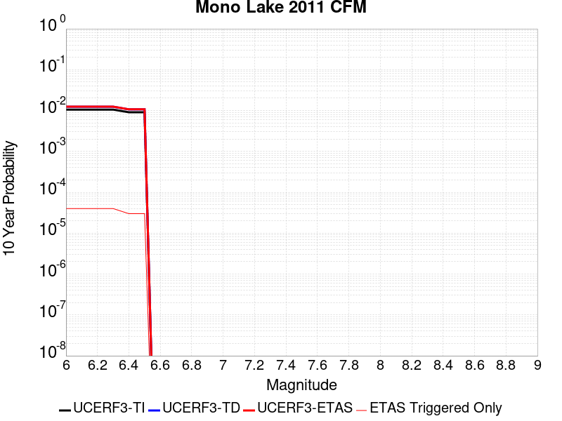 |

| Magnitude | 1 wk TI Prob | 1 wk TD Prob | 1 wk ETAS Prob | 1 wk ETAS/TD Gain | 1 wk ETAS Triggered Only | 1 mo TI Prob | 1 mo TD Prob | 1 mo ETAS Prob | 1 mo ETAS/TD Gain | 1 mo ETAS Triggered Only | 1 yr TI Prob | 1 yr TD Prob | 1 yr ETAS Prob | 1 yr ETAS/TD Gain | 1 yr ETAS Triggered Only | 10 yr TI Prob | 10 yr TD Prob | 10 yr ETAS Prob | 10 yr ETAS/TD Gain | 10 yr ETAS Triggered Only |
|-----|-----|-----|-----|-----|-----|-----|-----|-----|-----|-----|-----|-----|-----|-----|-----|-----|-----|-----|-----|-----|
| 6.0 | 2.0341662E-5 | 2.3828192E-5 | 5.3827476E-5 | 2.258983 | 3.0E-5 | 8.717564E-5 | 1.0211982E-4 | 1.3211675E-4 | 1.2937425 | 3.0E-5 | 0.0010608466 | 0.0012431308 | 0.001283081 | 1.0321368 | 4.0E-5 | 0.010557966 | 0.012413842 | 0.012453345 | 1.0031822 | 4.0E-5 |
| 6.1 | 2.0341662E-5 | 2.3828192E-5 | 5.3827476E-5 | 2.258983 | 3.0E-5 | 8.717564E-5 | 1.0211982E-4 | 1.3211675E-4 | 1.2937425 | 3.0E-5 | 0.0010608466 | 0.0012431308 | 0.001283081 | 1.0321368 | 4.0E-5 | 0.010557966 | 0.012413842 | 0.012453345 | 1.0031822 | 4.0E-5 |
| 6.2 | 2.0341662E-5 | 2.3828192E-5 | 5.3827476E-5 | 2.258983 | 3.0E-5 | 8.717564E-5 | 1.0211982E-4 | 1.3211675E-4 | 1.2937425 | 3.0E-5 | 0.0010608466 | 0.0012431308 | 0.001283081 | 1.0321368 | 4.0E-5 | 0.010557966 | 0.012413842 | 0.012453345 | 1.0031822 | 4.0E-5 |
| 6.3 | 2.0341662E-5 | 2.3828192E-5 | 5.3827476E-5 | 2.258983 | 3.0E-5 | 8.717564E-5 | 1.0211982E-4 | 1.3211675E-4 | 1.2937425 | 3.0E-5 | 0.0010608466 | 0.0012431308 | 0.001283081 | 1.0321368 | 4.0E-5 | 0.010557966 | 0.012413842 | 0.012453345 | 1.0031822 | 4.0E-5 |
| 6.4 | 1.749821E-5 | 2.049101E-5 | 4.04906E-5 | 1.9760178 | 2.0E-5 | 7.499018E-5 | 8.781861E-5 | 1.0781686E-4 | 1.2277222 | 2.0E-5 | 9.1262296E-4 | 0.0010691914 | 0.0010991594 | 1.0280286 | 3.0E-5 | 0.009088841 | 0.01069187 | 0.010721549 | 1.0027759 | 3.0E-5 |
| 6.5 | 1.749821E-5 | 2.049101E-5 | 4.04906E-5 | 1.9760178 | 2.0E-5 | 7.499018E-5 | 8.781861E-5 | 1.0781686E-4 | 1.2277222 | 2.0E-5 | 9.1262296E-4 | 0.0010691914 | 0.0010991594 | 1.0280286 | 3.0E-5 | 0.009088841 | 0.01069187 | 0.010721549 | 1.0027759 | 3.0E-5 |

## Cleghorn
*[(top)](#table-of-contents)*

| 1 Week | 1 Month | 1 Year | 10 Year |
|-----|-----|-----|-----|
|  |  | 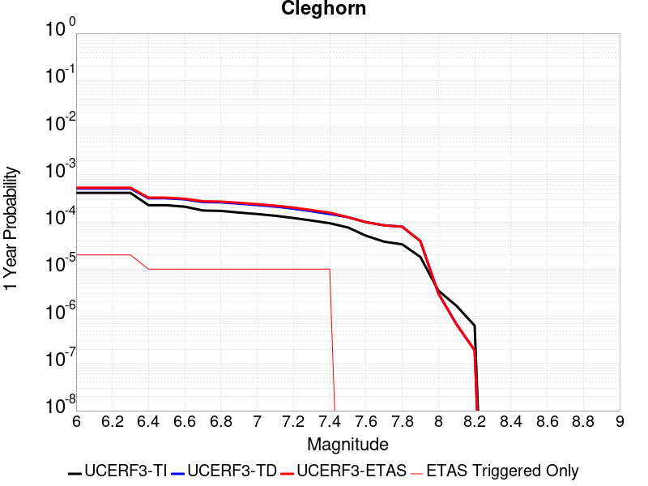 |  |

| Magnitude | 1 wk TI Prob | 1 wk TD Prob | 1 wk ETAS Prob | 1 wk ETAS/TD Gain | 1 wk ETAS Triggered Only | 1 mo TI Prob | 1 mo TD Prob | 1 mo ETAS Prob | 1 mo ETAS/TD Gain | 1 mo ETAS Triggered Only | 1 yr TI Prob | 1 yr TD Prob | 1 yr ETAS Prob | 1 yr ETAS/TD Gain | 1 yr ETAS Triggered Only | 10 yr TI Prob | 10 yr TD Prob | 10 yr ETAS Prob | 10 yr ETAS/TD Gain | 10 yr ETAS Triggered Only |
|-----|-----|-----|-----|-----|-----|-----|-----|-----|-----|-----|-----|-----|-----|-----|-----|-----|-----|-----|-----|-----|
| 6.0 | 7.9267165E-6 | 9.831764E-6 | 9.831764E-6 | 1.0 | 0.0 | 3.39712E-5 | 4.2135514E-5 | 5.2135092E-5 | 1.2373195 | 1.0E-5 | 4.1352084E-4 | 5.1288976E-4 | 5.328795E-4 | 1.0389748 | 2.0E-5 | 0.004127522 | 0.005132214 | 0.005172009 | 1.0077538 | 4.0E-5 |
| 6.1 | 7.9267165E-6 | 9.831764E-6 | 9.831764E-6 | 1.0 | 0.0 | 3.39712E-5 | 4.2135514E-5 | 5.2135092E-5 | 1.2373195 | 1.0E-5 | 4.1352084E-4 | 5.1288976E-4 | 5.328795E-4 | 1.0389748 | 2.0E-5 | 0.004127522 | 0.005132214 | 0.005172009 | 1.0077538 | 4.0E-5 |
| 6.2 | 7.9267165E-6 | 9.831764E-6 | 9.831764E-6 | 1.0 | 0.0 | 3.39712E-5 | 4.2135514E-5 | 5.2135092E-5 | 1.2373195 | 1.0E-5 | 4.1352084E-4 | 5.1288976E-4 | 5.328795E-4 | 1.0389748 | 2.0E-5 | 0.004127522 | 0.005132214 | 0.005172009 | 1.0077538 | 4.0E-5 |
| 6.3 | 7.9267165E-6 | 9.831764E-6 | 9.831764E-6 | 1.0 | 0.0 | 3.39712E-5 | 4.2135514E-5 | 5.2135092E-5 | 1.2373195 | 1.0E-5 | 4.1352084E-4 | 5.1288976E-4 | 5.328795E-4 | 1.0389748 | 2.0E-5 | 0.004127522 | 0.005132214 | 0.005172009 | 1.0077538 | 4.0E-5 |
| 6.4 | 4.3445207E-6 | 6.0916254E-6 | 6.0916254E-6 | 1.0 | 0.0 | 1.8619241E-5 | 2.6106709E-5 | 2.6106709E-5 | 1.0 | 0.0 | 2.2666567E-4 | 3.1780385E-4 | 3.2780066E-4 | 1.031456 | 1.0E-5 | 0.0022643462 | 0.0031877246 | 0.003207661 | 1.0062541 | 2.0E-5 |
| 6.5 | 4.3445207E-6 | 6.0916254E-6 | 6.0916254E-6 | 1.0 | 0.0 | 1.8619241E-5 | 2.6106709E-5 | 2.6106709E-5 | 1.0 | 0.0 | 2.2666567E-4 | 3.1780385E-4 | 3.2780066E-4 | 1.031456 | 1.0E-5 | 0.0022643462 | 0.0031877246 | 0.003207661 | 1.0062541 | 2.0E-5 |
| 6.6 | 4.040109E-6 | 5.774033E-6 | 5.774033E-6 | 1.0 | 0.0 | 1.7314638E-5 | 2.4745626E-5 | 2.4745626E-5 | 1.0 | 0.0 | 2.1078532E-4 | 3.0123728E-4 | 3.1123427E-4 | 1.0331864 | 1.0E-5 | 0.002105855 | 0.0030225143 | 0.003042454 | 1.006597 | 2.0E-5 |
| 6.7 | 3.3632055E-6 | 5.06753E-6 | 5.06753E-6 | 1.0 | 0.0 | 1.4413658E-5 | 2.1717806E-5 | 2.1717806E-5 | 1.0 | 0.0 | 1.7547216E-4 | 2.643825E-4 | 2.7437988E-4 | 1.037814 | 1.0E-5 | 0.0017533366 | 0.0026548486 | 0.0026747955 | 1.0075134 | 2.0E-5 |
| 6.8 | 3.2902772E-6 | 4.9894375E-6 | 4.9894375E-6 | 1.0 | 0.0 | 1.4101111E-5 | 2.138313E-5 | 2.138313E-5 | 1.0 | 0.0 | 1.716675E-4 | 2.6030882E-4 | 2.7030622E-4 | 1.0384059 | 1.0E-5 | 0.0017153495 | 0.0026142076 | 0.0026341553 | 1.0076305 | 2.0E-5 |
| 6.9 | 3.031547E-6 | 4.6911987E-6 | 4.6911987E-6 | 1.0 | 0.0 | 1.299228E-5 | 2.0104984E-5 | 2.0104984E-5 | 1.0 | 0.0 | 1.5816953E-4 | 2.4475096E-4 | 2.547485E-4 | 1.0408479 | 1.0E-5 | 0.00158057 | 0.0024589805 | 0.0024789313 | 1.0081135 | 2.0E-5 |
| 7.0 | 2.8259715E-6 | 4.3707637E-6 | 4.3707637E-6 | 1.0 | 0.0 | 1.211125E-5 | 1.8731711E-5 | 1.8731711E-5 | 1.0 | 0.0 | 1.4744449E-4 | 2.2803496E-4 | 2.3803268E-4 | 1.0438429 | 1.0E-5 | 0.001473467 | 0.0022921748 | 0.002312129 | 1.0087054 | 2.0E-5 |
| 7.1 | 2.5962665E-6 | 4.065983E-6 | 4.065983E-6 | 1.0 | 0.0 | 1.1126809E-5 | 1.7425526E-5 | 1.7425526E-5 | 1.0 | 0.0 | 1.3546048E-4 | 2.1213535E-4 | 2.2213323E-4 | 1.0471298 | 1.0E-5 | 0.0013537793 | 0.0021334959 | 0.0021534532 | 1.0093542 | 2.0E-5 |
| 7.2 | 2.3247253E-6 | 3.6765352E-6 | 3.6765352E-6 | 1.0 | 0.0 | 9.96307E-6 | 1.5756486E-5 | 1.5756486E-5 | 1.0 | 0.0 | 1.21293626E-4 | 1.9181852E-4 | 2.018166E-4 | 1.0521226 | 1.0E-5 | 0.0012122744 | 0.0019307166 | 0.001950678 | 1.0103389 | 2.0E-5 |
| 7.3 | 2.056928E-6 | 3.235253E-6 | 3.235253E-6 | 1.0 | 0.0 | 8.815376E-6 | 1.3865297E-5 | 1.3865297E-5 | 1.0 | 0.0 | 1.0732192E-4 | 1.6879707E-4 | 1.7879538E-4 | 1.0592327 | 1.0E-5 | 0.001072701 | 0.0017009423 | 0.0017209083 | 1.0117382 | 2.0E-5 |
| 7.4 | 1.8055999E-6 | 2.8256538E-6 | 2.8256538E-6 | 1.0 | 0.0 | 7.738263E-6 | 1.210989E-5 | 1.210989E-5 | 1.0 | 0.0 | 9.4209274E-5 | 1.4742807E-4 | 1.5742659E-4 | 1.0678197 | 1.0E-5 | 9.4169343E-4 | 0.0014876705 | 0.0015076407 | 1.0134238 | 2.0E-5 |
| 7.5 | 1.4683443E-6 | 2.4248943E-6 | 2.4248943E-6 | 1.0 | 0.0 | 6.292889E-6 | 1.0392363E-5 | 1.0392363E-5 | 1.0 | 0.0 | 7.661323E-5 | 1.2651978E-4 | 1.2651978E-4 | 1.0 | 0.0 | 7.658682E-4 | 0.0012788812 | 0.0012888685 | 1.0078093 | 1.0E-5 |
| 7.6 | 9.804088E-7 | 1.9004091E-6 | 1.9004091E-6 | 1.0 | 0.0 | 4.201745E-6 | 8.144585E-6 | 8.144585E-6 | 1.0 | 0.0 | 5.1155046E-5 | 9.915586E-5 | 9.915586E-5 | 1.0 | 0.0 | 5.114327E-4 | 0.0010055583 | 0.0010155482 | 1.0099348 | 1.0E-5 |
| 7.7 | 7.3434086E-7 | 1.6285549E-6 | 1.6285549E-6 | 1.0 | 0.0 | 3.1471714E-6 | 6.9795024E-6 | 6.9795024E-6 | 1.0 | 0.0 | 3.831614E-5 | 8.4972155E-5 | 8.4972155E-5 | 1.0 | 0.0 | 3.8309532E-4 | 8.6387293E-4 | 8.738643E-4 | 1.0115658 | 1.0E-5 |
| 7.8 | 6.434184E-7 | 1.5221389E-6 | 1.5221389E-6 | 1.0 | 0.0 | 2.7575045E-6 | 6.523436E-6 | 6.523436E-6 | 1.0 | 0.0 | 3.35721E-5 | 7.9419966E-5 | 7.9419966E-5 | 1.0 | 0.0 | 3.3567028E-4 | 8.080443E-4 | 8.180362E-4 | 1.0123656 | 1.0E-5 |
| 7.9 | 3.4943926E-7 | 7.5750586E-7 | 7.5750586E-7 | 1.0 | 0.0 | 1.497596E-6 | 3.2464498E-6 | 3.2464498E-6 | 1.0 | 0.0 | 1.8233079E-5 | 3.9524817E-5 | 3.9524817E-5 | 1.0 | 0.0 | 1.8231584E-4 | 4.0401975E-4 | 4.140157E-4 | 1.0247413 | 1.0E-5 |
| 8.0 | 6.717524E-8 | 5.837515E-8 | 5.837515E-8 | 1.0 | 0.0 | 2.8789387E-7 | 2.501792E-7 | 2.501792E-7 | 1.0 | 0.0 | 3.505102E-6 | 3.0459275E-6 | 3.0459275E-6 | 1.0 | 0.0 | 3.5050467E-5 | 3.2751934E-5 | 3.2751934E-5 | 1.0 | 0.0 |
| 8.1 | 3.1984914E-8 | 1.2949885E-8 | 1.2949885E-8 | 1.0 | 0.0 | 1.370782E-7 | 5.549951E-8 | 5.549951E-8 | 1.0 | 0.0 | 1.6689258E-6 | 6.757063E-7 | 6.757063E-7 | 1.0 | 0.0 | 1.6689133E-5 | 7.741151E-6 | 7.741151E-6 | 1.0 | 0.0 |
| 8.2 | 1.21887656E-8 | 3.6471115E-9 | 3.6471115E-9 | 1.0 | 0.0 | 5.2237567E-8 | 1.563048E-8 | 1.563048E-8 | 1.0 | 0.0 | 6.359922E-7 | 1.9030107E-7 | 1.9030107E-7 | 1.0 | 0.0 | 6.3599036E-6 | 2.245849E-6 | 2.245849E-6 | 1.0 | 0.0 |

## Emerson-Copper Mtn 2011
*[(top)](#table-of-contents)*

| 1 Week | 1 Month | 1 Year | 10 Year |
|-----|-----|-----|-----|
|  |  |  |  |

| Magnitude | 1 wk TI Prob | 1 wk TD Prob | 1 wk ETAS Prob | 1 wk ETAS/TD Gain | 1 wk ETAS Triggered Only | 1 mo TI Prob | 1 mo TD Prob | 1 mo ETAS Prob | 1 mo ETAS/TD Gain | 1 mo ETAS Triggered Only | 1 yr TI Prob | 1 yr TD Prob | 1 yr ETAS Prob | 1 yr ETAS/TD Gain | 1 yr ETAS Triggered Only | 10 yr TI Prob | 10 yr TD Prob | 10 yr ETAS Prob | 10 yr ETAS/TD Gain | 10 yr ETAS Triggered Only |
|-----|-----|-----|-----|-----|-----|-----|-----|-----|-----|-----|-----|-----|-----|-----|-----|-----|-----|-----|-----|-----|
| 6.0 | 2.1364202E-5 | 9.967999E-6 | 2.99678E-5 | 3.0064008 | 2.0E-5 | 9.1557646E-5 | 4.2719344E-5 | 6.271849E-5 | 1.4681519 | 2.0E-5 | 0.0011141442 | 5.1999267E-4 | 5.5997184E-4 | 1.0768842 | 4.0E-5 | 0.011085749 | 0.0051886286 | 0.005228421 | 1.0076692 | 4.0E-5 |
| 6.1 | 2.1364202E-5 | 9.967999E-6 | 2.99678E-5 | 3.0064008 | 2.0E-5 | 9.1557646E-5 | 4.2719344E-5 | 6.271849E-5 | 1.4681519 | 2.0E-5 | 0.0011141442 | 5.1999267E-4 | 5.5997184E-4 | 1.0768842 | 4.0E-5 | 0.011085749 | 0.0051886286 | 0.005228421 | 1.0076692 | 4.0E-5 |
| 6.2 | 2.1364202E-5 | 9.967999E-6 | 2.99678E-5 | 3.0064008 | 2.0E-5 | 9.1557646E-5 | 4.2719344E-5 | 6.271849E-5 | 1.4681519 | 2.0E-5 | 0.0011141442 | 5.1999267E-4 | 5.5997184E-4 | 1.0768842 | 4.0E-5 | 0.011085749 | 0.0051886286 | 0.005228421 | 1.0076692 | 4.0E-5 |
| 6.3 | 1.7751237E-5 | 8.089109E-6 | 8.089109E-6 | 1.0 | 0.0 | 7.607452E-5 | 3.4667184E-5 | 3.4667184E-5 | 1.0 | 0.0 | 9.258136E-4 | 4.2199748E-4 | 4.4198905E-4 | 1.0473737 | 2.0E-5 | 0.00921966 | 0.004212584 | 0.0042324997 | 1.0047277 | 2.0E-5 |
| 6.4 | 1.7751237E-5 | 8.089109E-6 | 8.089109E-6 | 1.0 | 0.0 | 7.607452E-5 | 3.4667184E-5 | 3.4667184E-5 | 1.0 | 0.0 | 9.258136E-4 | 4.2199748E-4 | 4.4198905E-4 | 1.0473737 | 2.0E-5 | 0.00921966 | 0.004212584 | 0.0042324997 | 1.0047277 | 2.0E-5 |
| 6.5 | 1.5886664E-5 | 6.6037437E-6 | 6.6037437E-6 | 1.0 | 0.0 | 6.808392E-5 | 2.830148E-5 | 2.830148E-5 | 1.0 | 0.0 | 8.286065E-4 | 3.4452073E-4 | 3.5451728E-4 | 1.0290158 | 1.0E-5 | 0.008255237 | 0.0034403303 | 0.003450296 | 1.0028967 | 1.0E-5 |
| 6.6 | 1.5886664E-5 | 6.6037437E-6 | 6.6037437E-6 | 1.0 | 0.0 | 6.808392E-5 | 2.830148E-5 | 2.830148E-5 | 1.0 | 0.0 | 8.286065E-4 | 3.4452073E-4 | 3.5451728E-4 | 1.0290158 | 1.0E-5 | 0.008255237 | 0.0034403303 | 0.003450296 | 1.0028967 | 1.0E-5 |
| 6.7 | 1.428471E-5 | 5.4703055E-6 | 5.4703055E-6 | 1.0 | 0.0 | 6.121875E-5 | 2.3443978E-5 | 2.3443978E-5 | 1.0 | 0.0 | 7.450834E-4 | 2.8539696E-4 | 2.9539413E-4 | 1.0350289 | 1.0E-5 | 0.007425902 | 0.0028506925 | 0.002860664 | 1.003498 | 1.0E-5 |
| 6.8 | 1.3490684E-5 | 5.0735894E-6 | 5.0735894E-6 | 1.0 | 0.0 | 5.7815934E-5 | 2.1743796E-5 | 2.1743796E-5 | 1.0 | 0.0 | 7.0368167E-4 | 2.6470242E-4 | 2.7469976E-4 | 1.0377682 | 1.0E-5 | 0.007014576 | 0.002644252 | 0.0026542256 | 1.0037718 | 1.0E-5 |
| 6.9 | 1.2235421E-5 | 4.289545E-6 | 4.289545E-6 | 1.0 | 0.0 | 5.2436466E-5 | 1.8383655E-5 | 1.8383655E-5 | 1.0 | 0.0 | 6.38227E-4 | 2.238016E-4 | 2.3379936E-4 | 1.0446725 | 1.0E-5 | 0.0063639707 | 0.0022361164 | 0.0022460942 | 1.004462 | 1.0E-5 |
| 7.0 | 1.1009851E-5 | 3.7188345E-6 | 3.7188345E-6 | 1.0 | 0.0 | 4.7184225E-5 | 1.5937783E-5 | 1.5937783E-5 | 1.0 | 0.0 | 5.743165E-4 | 1.9402867E-4 | 2.0402674E-4 | 1.0515288 | 1.0E-5 | 0.005728345 | 0.0019389305 | 0.0019489111 | 1.0051475 | 1.0E-5 |
| 7.1 | 9.726373E-6 | 3.2115693E-6 | 3.2115693E-6 | 1.0 | 0.0 | 4.168379E-5 | 1.3763814E-5 | 1.3763814E-5 | 1.0 | 0.0 | 5.07382E-4 | 1.6756494E-4 | 1.7756326E-4 | 1.0596683 | 1.0E-5 | 0.0050622504 | 0.0016747171 | 0.0016847003 | 1.0059612 | 1.0E-5 |
| 7.2 | 3.9335127E-6 | 1.1524114E-6 | 1.1524114E-6 | 1.0 | 0.0 | 1.6857803E-5 | 4.9388973E-6 | 4.9388973E-6 | 1.0 | 0.0 | 2.0522442E-4 | 6.0129474E-5 | 7.012887E-5 | 1.1662978 | 1.0E-5 | 0.00205035 | 6.01138E-4 | 6.11132E-4 | 1.0166252 | 1.0E-5 |
| 7.3 | 2.661632E-6 | 6.91098E-7 | 6.91098E-7 | 1.0 | 0.0 | 1.14069435E-5 | 2.9618452E-6 | 2.9618452E-6 | 1.0 | 0.0 | 1.3887069E-4 | 3.605988E-5 | 4.605952E-5 | 1.2773066 | 1.0E-5 | 0.0013878393 | 3.6054134E-4 | 3.7053772E-4 | 1.027726 | 1.0E-5 |
| 7.4 | 2.0893426E-6 | 5.4614605E-7 | 5.4614605E-7 | 1.0 | 0.0 | 8.954295E-6 | 2.340624E-6 | 2.340624E-6 | 1.0 | 0.0 | 1.0901308E-4 | 2.8496728E-5 | 2.8496728E-5 | 1.0 | 0.0 | 0.0010895962 | 2.849313E-4 | 2.849313E-4 | 1.0 | 0.0 |
| 7.5 | 1.1681728E-6 | 3.6028484E-7 | 3.6028484E-7 | 1.0 | 0.0 | 5.0064455E-6 | 1.544077E-6 | 1.544077E-6 | 1.0 | 0.0 | 6.0951766E-5 | 1.879898E-5 | 1.879898E-5 | 1.0 | 0.0 | 6.093505E-4 | 1.8797436E-4 | 1.8797436E-4 | 1.0 | 0.0 |
| 7.6 | 1.3154387E-7 | 7.1196716E-8 | 7.1196716E-8 | 1.0 | 0.0 | 5.6375933E-7 | 3.0512876E-7 | 3.0512876E-7 | 1.0 | 0.0 | 6.863748E-6 | 3.714938E-6 | 3.714938E-6 | 1.0 | 0.0 | 6.863536E-5 | 3.7148915E-5 | 3.7148915E-5 | 1.0 | 0.0 |

## Likely 2011 CFM
*[(top)](#table-of-contents)*

| 1 Week | 1 Month | 1 Year | 10 Year |
|-----|-----|-----|-----|
|  | 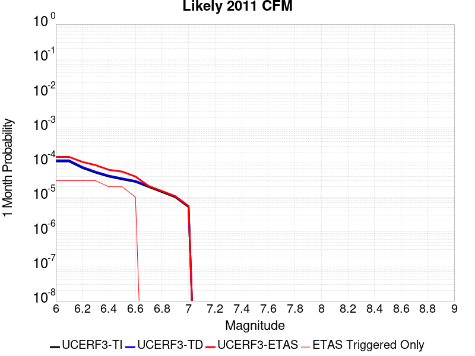 |  |  |

| Magnitude | 1 wk TI Prob | 1 wk TD Prob | 1 wk ETAS Prob | 1 wk ETAS/TD Gain | 1 wk ETAS Triggered Only | 1 mo TI Prob | 1 mo TD Prob | 1 mo ETAS Prob | 1 mo ETAS/TD Gain | 1 mo ETAS Triggered Only | 1 yr TI Prob | 1 yr TD Prob | 1 yr ETAS Prob | 1 yr ETAS/TD Gain | 1 yr ETAS Triggered Only | 10 yr TI Prob | 10 yr TD Prob | 10 yr ETAS Prob | 10 yr ETAS/TD Gain | 10 yr ETAS Triggered Only |
|-----|-----|-----|-----|-----|-----|-----|-----|-----|-----|-----|-----|-----|-----|-----|-----|-----|-----|-----|-----|-----|
| 6.0 | 2.5315949E-5 | 2.7104748E-5 | 5.7103935E-5 | 2.1067872 | 3.0E-5 | 1.0849241E-4 | 1.16158284E-4 | 1.461548E-4 | 1.2582383 | 3.0E-5 | 0.0013200947 | 0.0014133542 | 0.0014532977 | 1.0282614 | 4.0E-5 | 0.013122803 | 0.01404831 | 0.014087749 | 1.0028073 | 4.0E-5 |
| 6.1 | 2.5315949E-5 | 2.7104748E-5 | 5.7103935E-5 | 2.1067872 | 3.0E-5 | 1.0849241E-4 | 1.16158284E-4 | 1.461548E-4 | 1.2582383 | 3.0E-5 | 0.0013200947 | 0.0014133542 | 0.0014532977 | 1.0282614 | 4.0E-5 | 0.013122803 | 0.01404831 | 0.014087749 | 1.0028073 | 4.0E-5 |
| 6.2 | 1.6375941E-5 | 1.7465842E-5 | 4.7465317E-5 | 2.7176085 | 3.0E-5 | 7.0180715E-5 | 7.485153E-5 | 1.04849285E-4 | 1.4007634 | 3.0E-5 | 8.5411523E-4 | 9.109487E-4 | 9.509122E-4 | 1.0438702 | 4.0E-5 | 0.008508399 | 0.009073433 | 0.00911307 | 1.0043684 | 4.0E-5 |
| 6.3 | 1.1945543E-5 | 1.2712587E-5 | 4.2712207E-5 | 3.3598359 | 3.0E-5 | 5.119418E-5 | 5.4481407E-5 | 8.4479776E-5 | 1.5506166 | 3.0E-5 | 6.2311086E-4 | 6.631146E-4 | 7.0308807E-4 | 1.0602814 | 4.0E-5 | 0.0062136655 | 0.0066119144 | 0.0066516497 | 1.0060097 | 4.0E-5 |
| 6.4 | 9.192729E-6 | 9.768488E-6 | 2.9768293E-5 | 3.0473797 | 2.0E-5 | 3.939681E-5 | 4.1864292E-5 | 6.186345E-5 | 1.4777141 | 2.0E-5 | 4.7955062E-4 | 5.0958124E-4 | 5.39566E-4 | 1.0588418 | 3.0E-5 | 0.004785171 | 0.0050844094 | 0.005114257 | 1.0058703 | 3.0E-5 |
| 6.5 | 7.67906E-6 | 8.152622E-6 | 2.8152459E-5 | 3.4531784 | 2.0E-5 | 3.2909844E-5 | 3.4939352E-5 | 5.4938653E-5 | 1.5724005 | 2.0E-5 | 4.006037E-4 | 4.2530545E-4 | 4.552927E-4 | 1.0705075 | 3.0E-5 | 0.0039988225 | 0.004245108 | 0.0042749806 | 1.0070369 | 3.0E-5 |
| 6.6 | 6.4884057E-6 | 6.8847507E-6 | 1.6884682E-5 | 2.4524755 | 1.0E-5 | 2.7807157E-5 | 2.9505749E-5 | 3.9505452E-5 | 1.338907 | 1.0E-5 | 3.3849955E-4 | 3.591747E-4 | 3.6917112E-4 | 1.0278316 | 1.0E-5 | 0.003379844 | 0.0035860867 | 0.003596051 | 1.0027785 | 1.0E-5 |
| 6.7 | 4.6060636E-6 | 4.884041E-6 | 4.884041E-6 | 1.0 | 0.0 | 1.9740122E-5 | 2.0931442E-5 | 2.0931442E-5 | 1.0 | 0.0 | 2.403095E-4 | 2.5481134E-4 | 2.5481134E-4 | 1.0 | 0.0 | 0.002400498 | 0.0025452746 | 0.0025452746 | 1.0 | 0.0 |
| 6.8 | 3.2795615E-6 | 3.4773732E-6 | 3.4773732E-6 | 1.0 | 0.0 | 1.4055187E-5 | 1.4902946E-5 | 1.4902946E-5 | 1.0 | 0.0 | 1.7110848E-4 | 1.8142881E-4 | 1.8142881E-4 | 1.0 | 0.0 | 0.0017097679 | 0.0018128622 | 0.0018128622 | 1.0 | 0.0 |
| 6.9 | 2.3289967E-6 | 2.4705569E-6 | 2.4705569E-6 | 1.0 | 0.0 | 9.981376E-6 | 1.058806E-5 | 1.058806E-5 | 1.0 | 0.0 | 1.2151648E-4 | 1.2890245E-4 | 1.2890245E-4 | 1.0 | 0.0 | 0.0012145005 | 0.0012883197 | 0.0012883197 | 1.0 | 0.0 |
| 7.0 | 1.211292E-6 | 1.2863958E-6 | 1.2863958E-6 | 1.0 | 0.0 | 5.1912407E-6 | 5.5131145E-6 | 5.5131145E-6 | 1.0 | 0.0 | 6.320152E-5 | 6.712041E-5 | 6.712041E-5 | 1.0 | 0.0 | 6.3183554E-4 | 6.710312E-4 | 6.710312E-4 | 1.0 | 0.0 |

## San Diego Trough south
*[(top)](#table-of-contents)*

| 1 Week | 1 Month | 1 Year | 10 Year |
|-----|-----|-----|-----|
| 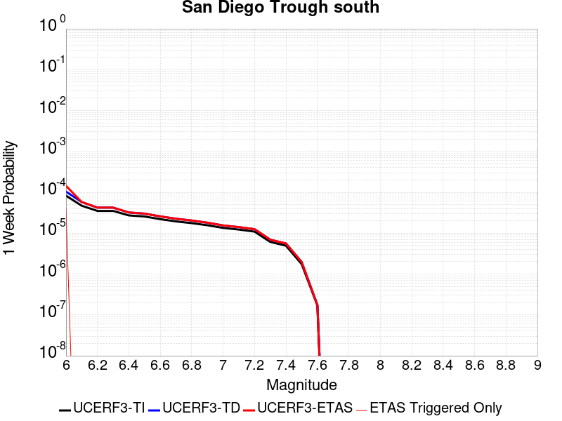 |  | 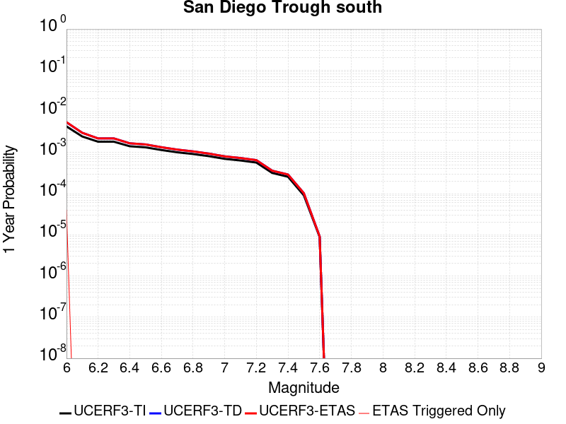 |  |

| Magnitude | 1 wk TI Prob | 1 wk TD Prob | 1 wk ETAS Prob | 1 wk ETAS/TD Gain | 1 wk ETAS Triggered Only | 1 mo TI Prob | 1 mo TD Prob | 1 mo ETAS Prob | 1 mo ETAS/TD Gain | 1 mo ETAS Triggered Only | 1 yr TI Prob | 1 yr TD Prob | 1 yr ETAS Prob | 1 yr ETAS/TD Gain | 1 yr ETAS Triggered Only | 10 yr TI Prob | 10 yr TD Prob | 10 yr ETAS Prob | 10 yr ETAS/TD Gain | 10 yr ETAS Triggered Only |
|-----|-----|-----|-----|-----|-----|-----|-----|-----|-----|-----|-----|-----|-----|-----|-----|-----|-----|-----|-----|-----|
| 6.0 | 8.279495E-5 | 1.0425541E-4 | 1.4425124E-4 | 1.3836331 | 4.0E-5 | 3.5478722E-4 | 4.4673498E-4 | 4.867171E-4 | 1.0894985 | 4.0E-5 | 0.004310982 | 0.0054259133 | 0.0054656966 | 1.0073321 | 4.0E-5 | 0.042283054 | 0.05299303 | 0.05303091 | 1.0007148 | 4.0E-5 |
| 6.1 | 4.6961468E-5 | 5.773024E-5 | 5.773024E-5 | 1.0 | 0.0 | 2.0124791E-4 | 2.473905E-4 | 2.473905E-4 | 1.0 | 0.0 | 0.00244744 | 0.003007886 | 0.003007886 | 1.0 | 0.0 | 0.024206603 | 0.029679636 | 0.029679636 | 1.0 | 0.0 |
| 6.2 | 3.5079658E-5 | 4.214258E-5 | 4.214258E-5 | 1.0 | 0.0 | 1.5033272E-4 | 1.8059829E-4 | 1.8059829E-4 | 1.0 | 0.0 | 0.0018287642 | 0.002196587 | 0.002196587 | 1.0 | 0.0 | 0.018137876 | 0.021751188 | 0.021751188 | 1.0 | 0.0 |
| 6.3 | 3.5079658E-5 | 4.214258E-5 | 4.214258E-5 | 1.0 | 0.0 | 1.5033272E-4 | 1.8059829E-4 | 1.8059829E-4 | 1.0 | 0.0 | 0.0018287642 | 0.002196587 | 0.002196587 | 1.0 | 0.0 | 0.018137876 | 0.021751188 | 0.021751188 | 1.0 | 0.0 |
| 6.4 | 2.7196904E-5 | 3.208715E-5 | 3.208715E-5 | 1.0 | 0.0 | 1.16552954E-4 | 1.3750911E-4 | 1.3750911E-4 | 1.0 | 0.0 | 0.0014181085 | 0.0016728995 | 0.0016728995 | 1.0 | 0.0 | 0.014090929 | 0.016604666 | 0.016604666 | 1.0 | 0.0 |
| 6.5 | 2.5584688E-5 | 3.0101632E-5 | 3.0101632E-5 | 1.0 | 0.0 | 1.0964406E-4 | 1.2900059E-4 | 1.2900059E-4 | 1.0 | 0.0 | 0.0013340989 | 0.0015694627 | 0.0015694627 | 1.0 | 0.0 | 0.013261181 | 0.015585332 | 0.015585332 | 1.0 | 0.0 |
| 6.6 | 2.2034688E-5 | 2.574271E-5 | 2.574271E-5 | 1.0 | 0.0 | 9.443096E-5 | 1.1032127E-4 | 1.1032127E-4 | 1.0 | 0.0 | 0.0011490905 | 0.0013423412 | 0.0013423412 | 1.0 | 0.0 | 0.011431668 | 0.013343325 | 0.013343325 | 1.0 | 0.0 |
| 6.7 | 1.9394853E-5 | 2.254176E-5 | 2.254176E-5 | 1.0 | 0.0 | 8.311815E-5 | 9.6604E-5 | 9.6604E-5 | 1.0 | 0.0 | 0.0010114936 | 0.0011755243 | 0.0011755243 | 1.0 | 0.0 | 0.01006902 | 0.011693766 | 0.011693766 | 1.0 | 0.0 |
| 6.8 | 1.7615313E-5 | 2.0403182E-5 | 2.0403182E-5 | 1.0 | 0.0 | 7.549201E-5 | 8.743931E-5 | 8.743931E-5 | 1.0 | 0.0 | 9.1872766E-4 | 0.0010640579 | 0.0010640579 | 1.0 | 0.0 | 0.009149387 | 0.010590198 | 0.010590198 | 1.0 | 0.0 |
| 6.9 | 1.5621423E-5 | 1.8026114E-5 | 1.8026114E-5 | 1.0 | 0.0 | 6.6947236E-5 | 7.725251E-5 | 7.725251E-5 | 1.0 | 0.0 | 8.147778E-4 | 9.40147E-4 | 9.40147E-4 | 1.0 | 0.0 | 0.008117969 | 0.009362142 | 0.009362142 | 1.0 | 0.0 |
| 7.0 | 1.3444376E-5 | 1.544809E-5 | 1.544809E-5 | 1.0 | 0.0 | 5.7617483E-5 | 6.620443E-5 | 6.620443E-5 | 1.0 | 0.0 | 7.0126704E-4 | 8.057436E-4 | 8.057436E-4 | 1.0 | 0.0 | 0.006990582 | 0.008028555 | 0.008028555 | 1.0 | 0.0 |
| 7.1 | 1.2268361E-5 | 1.407303E-5 | 1.407303E-5 | 1.0 | 0.0 | 5.2577634E-5 | 6.0311606E-5 | 6.0311606E-5 | 1.0 | 0.0 | 6.399447E-4 | 7.3404907E-4 | 7.3404907E-4 | 1.0 | 0.0 | 0.0063810493 | 0.0073165493 | 0.0073165493 | 1.0 | 0.0 |
| 7.2 | 1.0922655E-5 | 1.2513563E-5 | 1.2513563E-5 | 1.0 | 0.0 | 4.681054E-5 | 5.3628468E-5 | 5.3628468E-5 | 1.0 | 0.0 | 5.697693E-4 | 6.5273355E-4 | 6.5273355E-4 | 1.0 | 0.0 | 0.0056831064 | 0.0065084435 | 0.0065084435 | 1.0 | 0.0 |
| 7.3 | 6.1106753E-6 | 6.928925E-6 | 6.928925E-6 | 1.0 | 0.0 | 2.6188345E-5 | 2.9695057E-5 | 2.9695057E-5 | 1.0 | 0.0 | 3.1879646E-4 | 3.6147775E-4 | 3.6147775E-4 | 1.0 | 0.0 | 0.0031833951 | 0.003608943 | 0.003608943 | 1.0 | 0.0 |
| 7.4 | 4.933187E-6 | 5.5895525E-6 | 5.5895525E-6 | 1.0 | 0.0 | 2.114206E-5 | 2.3955008E-5 | 2.3955008E-5 | 1.0 | 0.0 | 2.5737417E-4 | 2.9161357E-4 | 2.9161357E-4 | 1.0 | 0.0 | 0.002570763 | 0.0029123505 | 0.0029123505 | 1.0 | 0.0 |
| 7.5 | 1.7489613E-6 | 1.969678E-6 | 1.969678E-6 | 1.0 | 0.0 | 7.495527E-6 | 8.4414505E-6 | 8.4414505E-6 | 1.0 | 0.0 | 9.125422E-5 | 1.02770035E-4 | 1.02770035E-4 | 1.0 | 0.0 | 9.1216754E-4 | 0.0010272472 | 0.0010272472 | 1.0 | 0.0 |
| 7.6 | 1.6988751E-7 | 1.7533823E-7 | 1.7533823E-7 | 1.0 | 0.0 | 7.2808916E-7 | 7.5144936E-7 | 7.5144936E-7 | 1.0 | 0.0 | 8.864449E-6 | 9.14886E-6 | 9.14886E-6 | 1.0 | 0.0 | 8.8640954E-5 | 9.1485024E-5 | 9.1485024E-5 | 1.0 | 0.0 |

## Robinson Creek
*[(top)](#table-of-contents)*

| 1 Week | 1 Month | 1 Year | 10 Year |
|-----|-----|-----|-----|
|  |  |  |  |

| Magnitude | 1 wk TI Prob | 1 wk TD Prob | 1 wk ETAS Prob | 1 wk ETAS/TD Gain | 1 wk ETAS Triggered Only | 1 mo TI Prob | 1 mo TD Prob | 1 mo ETAS Prob | 1 mo ETAS/TD Gain | 1 mo ETAS Triggered Only | 1 yr TI Prob | 1 yr TD Prob | 1 yr ETAS Prob | 1 yr ETAS/TD Gain | 1 yr ETAS Triggered Only | 10 yr TI Prob | 10 yr TD Prob | 10 yr ETAS Prob | 10 yr ETAS/TD Gain | 10 yr ETAS Triggered Only |
|-----|-----|-----|-----|-----|-----|-----|-----|-----|-----|-----|-----|-----|-----|-----|-----|-----|-----|-----|-----|-----|
| 6.0 | 1.3705327E-5 | 1.5285013E-5 | 2.528486E-5 | 1.6542256 | 1.0E-5 | 5.8735794E-5 | 6.55072E-5 | 8.550589E-5 | 1.30529 | 2.0E-5 | 7.1487366E-4 | 7.9755014E-4 | 8.275262E-4 | 1.0375851 | 3.0E-5 | 0.0071257832 | 0.007975501 | 0.008015183 | 1.0049753 | 4.0E-5 |
| 6.1 | 1.3705327E-5 | 1.5285013E-5 | 2.528486E-5 | 1.6542256 | 1.0E-5 | 5.8735794E-5 | 6.55072E-5 | 8.550589E-5 | 1.30529 | 2.0E-5 | 7.1487366E-4 | 7.9755014E-4 | 8.275262E-4 | 1.0375851 | 3.0E-5 | 0.0071257832 | 0.007975501 | 0.008015183 | 1.0049753 | 4.0E-5 |
| 6.2 | 1.3705327E-5 | 1.5285013E-5 | 2.528486E-5 | 1.6542256 | 1.0E-5 | 5.8735794E-5 | 6.55072E-5 | 8.550589E-5 | 1.30529 | 2.0E-5 | 7.1487366E-4 | 7.9755014E-4 | 8.275262E-4 | 1.0375851 | 3.0E-5 | 0.0071257832 | 0.007975501 | 0.008015183 | 1.0049753 | 4.0E-5 |
| 6.3 | 1.3705327E-5 | 1.5285013E-5 | 2.528486E-5 | 1.6542256 | 1.0E-5 | 5.8735794E-5 | 6.55072E-5 | 8.550589E-5 | 1.30529 | 2.0E-5 | 7.1487366E-4 | 7.9755014E-4 | 8.275262E-4 | 1.0375851 | 3.0E-5 | 0.0071257832 | 0.007975501 | 0.008015183 | 1.0049753 | 4.0E-5 |
| 6.4 | 1.3705327E-5 | 1.5285013E-5 | 2.528486E-5 | 1.6542256 | 1.0E-5 | 5.8735794E-5 | 6.55072E-5 | 8.550589E-5 | 1.30529 | 2.0E-5 | 7.1487366E-4 | 7.9755014E-4 | 8.275262E-4 | 1.0375851 | 3.0E-5 | 0.0071257832 | 0.007975501 | 0.008015183 | 1.0049753 | 4.0E-5 |

## Point Reyes 2011 CFM
*[(top)](#table-of-contents)*

| 1 Week | 1 Month | 1 Year | 10 Year |
|-----|-----|-----|-----|
|  |  |  | 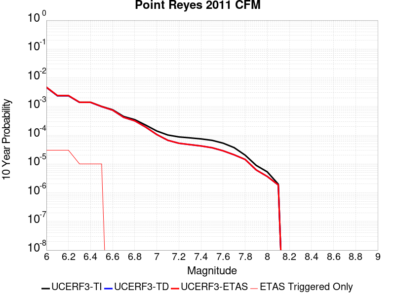 |

| Magnitude | 1 wk TI Prob | 1 wk TD Prob | 1 wk ETAS Prob | 1 wk ETAS/TD Gain | 1 wk ETAS Triggered Only | 1 mo TI Prob | 1 mo TD Prob | 1 mo ETAS Prob | 1 mo ETAS/TD Gain | 1 mo ETAS Triggered Only | 1 yr TI Prob | 1 yr TD Prob | 1 yr ETAS Prob | 1 yr ETAS/TD Gain | 1 yr ETAS Triggered Only | 10 yr TI Prob | 10 yr TD Prob | 10 yr ETAS Prob | 10 yr ETAS/TD Gain | 10 yr ETAS Triggered Only |
|-----|-----|-----|-----|-----|-----|-----|-----|-----|-----|-----|-----|-----|-----|-----|-----|-----|-----|-----|-----|-----|
| 6.0 | 8.8644965E-6 | 8.96716E-6 | 1.896707E-5 | 2.1151702 | 1.0E-5 | 3.7990147E-5 | 3.8430157E-5 | 5.842939E-5 | 1.5204046 | 2.0E-5 | 4.624319E-4 | 4.67793E-4 | 4.9777894E-4 | 1.064101 | 3.0E-5 | 0.0046147075 | 0.004668711 | 0.0046985713 | 1.0063957 | 3.0E-5 |
| 6.1 | 4.526405E-6 | 4.5392153E-6 | 1.45391705E-5 | 3.203014 | 1.0E-5 | 1.9398734E-5 | 1.945364E-5 | 3.945325E-5 | 2.0280652 | 2.0E-5 | 2.36154E-4 | 2.3682338E-4 | 2.668163E-4 | 1.1266466 | 3.0E-5 | 0.002359032 | 0.0023658164 | 0.0023957454 | 1.0126506 | 3.0E-5 |
| 6.2 | 4.526405E-6 | 4.5392153E-6 | 1.45391705E-5 | 3.203014 | 1.0E-5 | 1.9398734E-5 | 1.945364E-5 | 3.945325E-5 | 2.0280652 | 2.0E-5 | 2.36154E-4 | 2.3682338E-4 | 2.668163E-4 | 1.1266466 | 3.0E-5 | 0.002359032 | 0.0023658164 | 0.0023957454 | 1.0126506 | 3.0E-5 |
| 6.3 | 2.6842322E-6 | 2.660673E-6 | 2.660673E-6 | 1.0 | 0.0 | 1.1503801E-5 | 1.1402836E-5 | 2.1402722E-5 | 1.8769648 | 1.0E-5 | 1.4004979E-4 | 1.3882088E-4 | 1.4881948E-4 | 1.0720253 | 1.0E-5 | 0.0013996155 | 0.0013873635 | 0.0013973496 | 1.0071979 | 1.0E-5 |
| 6.4 | 2.6842322E-6 | 2.660673E-6 | 2.660673E-6 | 1.0 | 0.0 | 1.1503801E-5 | 1.1402836E-5 | 2.1402722E-5 | 1.8769648 | 1.0E-5 | 1.4004979E-4 | 1.3882088E-4 | 1.4881948E-4 | 1.0720253 | 1.0E-5 | 0.0013996155 | 0.0013873635 | 0.0013973496 | 1.0071979 | 1.0E-5 |
| 6.5 | 1.9281833E-6 | 1.8906233E-6 | 1.8906233E-6 | 1.0 | 0.0 | 8.263617E-6 | 8.1026465E-6 | 1.8102566E-5 | 2.2341547 | 1.0E-5 | 1.0060489E-4 | 9.864534E-5 | 1.0864435E-4 | 1.1013633 | 1.0E-5 | 0.0010055936 | 9.860265E-4 | 9.960165E-4 | 1.0101317 | 1.0E-5 |
| 6.6 | 1.4726726E-6 | 1.4269547E-6 | 1.4269547E-6 | 1.0 | 0.0 | 6.3114385E-6 | 6.115506E-6 | 6.115506E-6 | 1.0 | 0.0 | 7.683905E-5 | 7.445379E-5 | 7.445379E-5 | 1.0 | 0.0 | 7.6812494E-4 | 7.442957E-4 | 7.442957E-4 | 1.0 | 0.0 |
| 6.7 | 8.572307E-7 | 8.007182E-7 | 8.007182E-7 | 1.0 | 0.0 | 3.6738406E-6 | 3.431645E-6 | 3.431645E-6 | 1.0 | 0.0 | 4.472809E-5 | 4.1779494E-5 | 4.1779494E-5 | 1.0 | 0.0 | 4.471909E-4 | 4.177204E-4 | 4.177204E-4 | 1.0 | 0.0 |
| 6.8 | 6.6745434E-7 | 6.07727E-7 | 6.07727E-7 | 1.0 | 0.0 | 2.8605155E-6 | 2.6045416E-6 | 2.6045416E-6 | 1.0 | 0.0 | 3.482622E-5 | 3.1709842E-5 | 3.1709842E-5 | 1.0 | 0.0 | 3.4820763E-4 | 3.170566E-4 | 3.170566E-4 | 1.0 | 0.0 |
| 6.9 | 4.291521E-7 | 3.6535639E-7 | 3.6535639E-7 | 1.0 | 0.0 | 1.839222E-6 | 1.5658121E-6 | 1.5658121E-6 | 1.0 | 0.0 | 2.2392298E-5 | 1.90636E-5 | 1.90636E-5 | 1.0 | 0.0 | 2.2390042E-4 | 1.906224E-4 | 1.906224E-4 | 1.0 | 0.0 |
| 7.0 | 2.6812808E-7 | 2.0187117E-7 | 2.0187117E-7 | 1.0 | 0.0 | 1.1491198E-6 | 8.6516184E-7 | 8.6516184E-7 | 1.0 | 0.0 | 1.3990444E-5 | 1.0533295E-5 | 1.0533295E-5 | 1.0 | 0.0 | 1.3989564E-4 | 1.05330415E-4 | 1.05330415E-4 | 1.0 | 0.0 |
| 7.1 | 1.9451231E-7 | 1.2725201E-7 | 1.2725201E-7 | 1.0 | 0.0 | 8.336239E-7 | 5.4536565E-7 | 5.4536565E-7 | 1.0 | 0.0 | 1.0149324E-5 | 6.639806E-6 | 6.639806E-6 | 1.0 | 0.0 | 1.014886E-4 | 6.639846E-5 | 6.639846E-5 | 1.0 | 0.0 |
| 7.2 | 1.6715143E-7 | 1.0042555E-7 | 1.0042555E-7 | 1.0 | 0.0 | 7.1636305E-7 | 4.3039515E-7 | 4.3039515E-7 | 1.0 | 0.0 | 8.721685E-6 | 5.2400483E-6 | 5.2400483E-6 | 1.0 | 0.0 | 8.721343E-5 | 5.240162E-5 | 5.240162E-5 | 1.0 | 0.0 |
| 7.3 | 1.5503173E-7 | 9.012816E-8 | 9.012816E-8 | 1.0 | 0.0 | 6.644215E-7 | 3.8626348E-7 | 3.8626348E-7 | 1.0 | 0.0 | 8.089301E-6 | 4.7027474E-6 | 4.7027474E-6 | 1.0 | 0.0 | 8.089007E-5 | 4.7028854E-5 | 4.7028854E-5 | 1.0 | 0.0 |
| 7.4 | 1.4251614E-7 | 8.097342E-8 | 8.097342E-8 | 1.0 | 0.0 | 6.1078333E-7 | 3.4702887E-7 | 3.4702887E-7 | 1.0 | 0.0 | 7.4362615E-6 | 4.225068E-6 | 4.225068E-6 | 1.0 | 0.0 | 7.436013E-5 | 4.2252257E-5 | 4.2252257E-5 | 1.0 | 0.0 |
| 7.5 | 1.2710186E-7 | 7.029377E-8 | 7.029377E-8 | 1.0 | 0.0 | 5.447221E-7 | 3.0125898E-7 | 3.0125898E-7 | 1.0 | 0.0 | 6.6319717E-6 | 3.6678218E-6 | 3.6678218E-6 | 1.0 | 0.0 | 6.6317734E-5 | 3.667999E-5 | 3.667999E-5 | 1.0 | 0.0 |
| 7.6 | 1.0144708E-7 | 5.494996E-8 | 5.494996E-8 | 1.0 | 0.0 | 4.347731E-7 | 2.354998E-7 | 2.354998E-7 | 1.0 | 0.0 | 5.2933497E-6 | 2.8672061E-6 | 2.8672061E-6 | 1.0 | 0.0 | 5.293224E-5 | 2.8674069E-5 | 2.8674069E-5 | 1.0 | 0.0 |
| 7.7 | 7.090527E-8 | 3.9821334E-8 | 3.9821334E-8 | 1.0 | 0.0 | 3.038797E-7 | 1.7066284E-7 | 1.7066284E-7 | 1.0 | 0.0 | 3.699729E-6 | 2.0778182E-6 | 2.0778182E-6 | 1.0 | 0.0 | 3.6996673E-5 | 2.0780362E-5 | 2.0780362E-5 | 1.0 | 0.0 |
| 7.8 | 3.8712045E-8 | 2.7438638E-8 | 2.7438638E-8 | 1.0 | 0.0 | 1.6590876E-7 | 1.1759416E-7 | 1.1759416E-7 | 1.0 | 0.0 | 2.0199373E-6 | 1.4317079E-6 | 1.4317079E-6 | 1.0 | 0.0 | 2.0199188E-5 | 1.4319363E-5 | 1.4319363E-5 | 1.0 | 0.0 |
| 7.9 | 1.7068782E-8 | 1.183186E-8 | 1.183186E-8 | 1.0 | 0.0 | 7.315192E-8 | 5.0707975E-8 | 5.0707975E-8 | 1.0 | 0.0 | 8.906242E-7 | 6.173694E-7 | 6.173694E-7 | 1.0 | 0.0 | 8.906207E-6 | 6.1760525E-6 | 6.1760525E-6 | 1.0 | 0.0 |
| 8.0 | 1.0172592E-8 | 7.0268076E-9 | 7.0268076E-9 | 1.0 | 0.0 | 4.359682E-8 | 3.011489E-8 | 3.011489E-8 | 1.0 | 0.0 | 5.3079117E-7 | 3.6664872E-7 | 3.6664872E-7 | 1.0 | 0.0 | 5.307899E-6 | 3.6688568E-6 | 3.6688568E-6 | 1.0 | 0.0 |
| 8.1 | 3.7861243E-9 | 3.5448604E-9 | 3.5448604E-9 | 1.0 | 0.0 | 1.6226247E-8 | 1.5192258E-8 | 1.5192258E-8 | 1.0 | 0.0 | 1.9755454E-7 | 1.8496571E-7 | 1.8496571E-7 | 1.0 | 0.0 | 1.9755437E-6 | 1.8514592E-6 | 1.8514592E-6 | 1.0 | 0.0 |

## Green Valley 2011 CFM
*[(top)](#table-of-contents)*

| 1 Week | 1 Month | 1 Year | 10 Year |
|-----|-----|-----|-----|
|  |  |  |  |

| Magnitude | 1 wk TI Prob | 1 wk TD Prob | 1 wk ETAS Prob | 1 wk ETAS/TD Gain | 1 wk ETAS Triggered Only | 1 mo TI Prob | 1 mo TD Prob | 1 mo ETAS Prob | 1 mo ETAS/TD Gain | 1 mo ETAS Triggered Only | 1 yr TI Prob | 1 yr TD Prob | 1 yr ETAS Prob | 1 yr ETAS/TD Gain | 1 yr ETAS Triggered Only | 10 yr TI Prob | 10 yr TD Prob | 10 yr ETAS Prob | 10 yr ETAS/TD Gain | 10 yr ETAS Triggered Only |
|-----|-----|-----|-----|-----|-----|-----|-----|-----|-----|-----|-----|-----|-----|-----|-----|-----|-----|-----|-----|-----|
| 6.0 | 9.9629346E-5 | 1.7302863E-4 | 1.7302863E-4 | 1.0 | 0.0 | 4.2691303E-4 | 7.41326E-4 | 7.41326E-4 | 1.0 | 0.0 | 0.0051852856 | 0.00898692 | 0.00900674 | 1.0022055 | 2.0E-5 | 0.050659515 | 0.08553951 | 0.085566945 | 1.0003207 | 3.0E-5 |
| 6.1 | 9.88615E-5 | 1.7150163E-4 | 1.7150163E-4 | 1.0 | 0.0 | 4.2362334E-4 | 7.347854E-4 | 7.347854E-4 | 1.0 | 0.0 | 0.0051454236 | 0.008907947 | 0.008927769 | 1.0022252 | 2.0E-5 | 0.050279044 | 0.08482712 | 0.08485457 | 1.0003237 | 3.0E-5 |
| 6.2 | 9.696895E-5 | 1.6789208E-4 | 1.6789208E-4 | 1.0 | 0.0 | 4.15515E-4 | 7.1932544E-4 | 7.1932544E-4 | 1.0 | 0.0 | 0.0050471667 | 0.00872133 | 0.008741155 | 1.0022732 | 2.0E-5 | 0.04934063 | 0.08313578 | 0.08316329 | 1.0003308 | 3.0E-5 |
| 6.3 | 9.275224E-5 | 1.5968543E-4 | 1.5968543E-4 | 1.0 | 0.0 | 3.9744904E-4 | 6.841728E-4 | 6.841728E-4 | 1.0 | 0.0 | 0.0048282105 | 0.008296652 | 0.008316485 | 1.0023906 | 2.0E-5 | 0.047246475 | 0.07927481 | 0.07930243 | 1.0003484 | 3.0E-5 |
| 6.4 | 8.391499E-5 | 1.4365884E-4 | 1.4365884E-4 | 1.0 | 0.0 | 3.595861E-4 | 6.155238E-4 | 6.155238E-4 | 1.0 | 0.0 | 0.004369175 | 0.007467181 | 0.0074870316 | 1.0026584 | 2.0E-5 | 0.04284265 | 0.07164672 | 0.07167457 | 1.0003887 | 3.0E-5 |
| 6.5 | 5.9519385E-5 | 9.932622E-5 | 9.932622E-5 | 1.0 | 0.0 | 2.5505814E-4 | 4.2560388E-4 | 4.2560388E-4 | 1.0 | 0.0 | 0.0031009112 | 0.005168341 | 0.005188238 | 1.0038497 | 2.0E-5 | 0.030579966 | 0.05014692 | 0.050175417 | 1.0005683 | 3.0E-5 |
| 6.6 | 4.5361558E-5 | 7.4019794E-5 | 7.4019794E-5 | 1.0 | 0.0 | 1.9439218E-4 | 3.1717744E-4 | 3.1717744E-4 | 1.0 | 0.0 | 0.0023641558 | 0.0038538678 | 0.0038638292 | 1.0025848 | 1.0E-5 | 0.023391623 | 0.03766727 | 0.037686516 | 1.0005109 | 2.0E-5 |
| 6.7 | 3.8808106E-5 | 6.264382E-5 | 6.264382E-5 | 1.0 | 0.0 | 1.6630985E-4 | 2.6843755E-4 | 2.6843755E-4 | 1.0 | 0.0 | 0.0020229418 | 0.0032627317 | 0.003272699 | 1.0030549 | 1.0E-5 | 0.020046256 | 0.032007415 | 0.032026775 | 1.0006049 | 2.0E-5 |
| 6.8 | 2.2284667E-5 | 3.128574E-5 | 3.128574E-5 | 1.0 | 0.0 | 9.550222E-5 | 1.3407487E-4 | 1.3407487E-4 | 1.0 | 0.0 | 0.0011621192 | 0.0016311383 | 0.0016311383 | 1.0 | 0.0 | 0.011560607 | 0.01616672 | 0.01616672 | 1.0 | 0.0 |
| 6.9 | 1.8050168E-5 | 2.4448536E-5 | 2.4448536E-5 | 1.0 | 0.0 | 7.735557E-5 | 1.0477527E-4 | 1.0477527E-4 | 1.0 | 0.0 | 9.4139716E-4 | 0.0012748954 | 0.0012748954 | 1.0 | 0.0 | 0.009374191 | 0.012669067 | 0.012669067 | 1.0 | 0.0 |
| 7.0 | 1.4763166E-5 | 1.9583236E-5 | 1.9583236E-5 | 1.0 | 0.0 | 6.326917E-5 | 8.3925464E-5 | 8.3925464E-5 | 1.0 | 0.0 | 7.7002996E-4 | 0.001021315 | 0.001021315 | 1.0 | 0.0 | 0.007673672 | 0.01016625 | 0.01016625 | 1.0 | 0.0 |
| 7.1 | 1.2399713E-5 | 1.6304042E-5 | 1.6304042E-5 | 1.0 | 0.0 | 5.3140546E-5 | 6.987261E-5 | 6.987261E-5 | 1.0 | 0.0 | 6.467941E-4 | 8.5036893E-4 | 8.5036893E-4 | 1.0 | 0.0 | 0.006449148 | 0.008471781 | 0.008471781 | 1.0 | 0.0 |
| 7.2 | 1.0584195E-5 | 1.39220465E-5 | 1.39220465E-5 | 1.0 | 0.0 | 4.5360044E-5 | 5.966456E-5 | 5.966456E-5 | 1.0 | 0.0 | 5.521186E-4 | 7.2617555E-4 | 7.2617555E-4 | 1.0 | 0.0 | 0.0055074887 | 0.0072386027 | 0.0072386027 | 1.0 | 0.0 |
| 7.3 | 7.998173E-6 | 1.0544255E-5 | 1.0544255E-5 | 1.0 | 0.0 | 3.4277433E-5 | 4.5188888E-5 | 4.5188888E-5 | 1.0 | 0.0 | 4.1724785E-4 | 5.500369E-4 | 5.500369E-4 | 1.0 | 0.0 | 0.004164653 | 0.005487135 | 0.005487135 | 1.0 | 0.0 |
| 7.4 | 6.7571127E-6 | 8.932903E-6 | 8.932903E-6 | 1.0 | 0.0 | 2.8958733E-5 | 3.8283313E-5 | 3.8283313E-5 | 1.0 | 0.0 | 3.5251552E-4 | 4.660006E-4 | 4.660006E-4 | 1.0 | 0.0 | 0.0035195686 | 0.004650633 | 0.004650633 | 1.0 | 0.0 |
| 7.5 | 5.69878E-6 | 7.516483E-6 | 7.516483E-6 | 1.0 | 0.0 | 2.4423114E-5 | 3.2213105E-5 | 3.2213105E-5 | 1.0 | 0.0 | 2.9731085E-4 | 3.9212484E-4 | 3.9212484E-4 | 1.0 | 0.0 | 0.002969134 | 0.0039147018 | 0.0039147018 | 1.0 | 0.0 |
| 7.6 | 4.503664E-6 | 5.9358217E-6 | 5.9358217E-6 | 1.0 | 0.0 | 1.9301275E-5 | 2.5438992E-5 | 2.5438992E-5 | 1.0 | 0.0 | 2.3496768E-4 | 3.0967654E-4 | 3.0967654E-4 | 1.0 | 0.0 | 0.002347194 | 0.0030927279 | 0.0030927279 | 1.0 | 0.0 |
| 7.7 | 1.0873546E-6 | 1.410754E-6 | 1.410754E-6 | 1.0 | 0.0 | 4.6600826E-6 | 6.0460743E-6 | 6.0460743E-6 | 1.0 | 0.0 | 5.6735033E-5 | 7.36085E-5 | 7.36085E-5 | 1.0 | 0.0 | 5.672055E-4 | 7.3587085E-4 | 7.3587085E-4 | 1.0 | 0.0 |
| 7.8 | 4.9373917E-8 | 6.177967E-8 | 6.177967E-8 | 1.0 | 0.0 | 2.1160248E-7 | 2.6477002E-7 | 2.6477002E-7 | 1.0 | 0.0 | 2.5762572E-6 | 3.2235714E-6 | 3.2235714E-6 | 1.0 | 0.0 | 2.5762274E-5 | 3.2228E-5 | 3.2228E-5 | 1.0 | 0.0 |

## Los Alamos extension
*[(top)](#table-of-contents)*

| 1 Week | 1 Month | 1 Year | 10 Year |
|-----|-----|-----|-----|
|  |  |  |  |

| Magnitude | 1 wk TI Prob | 1 wk TD Prob | 1 wk ETAS Prob | 1 wk ETAS/TD Gain | 1 wk ETAS Triggered Only | 1 mo TI Prob | 1 mo TD Prob | 1 mo ETAS Prob | 1 mo ETAS/TD Gain | 1 mo ETAS Triggered Only | 1 yr TI Prob | 1 yr TD Prob | 1 yr ETAS Prob | 1 yr ETAS/TD Gain | 1 yr ETAS Triggered Only | 10 yr TI Prob | 10 yr TD Prob | 10 yr ETAS Prob | 10 yr ETAS/TD Gain | 10 yr ETAS Triggered Only |
|-----|-----|-----|-----|-----|-----|-----|-----|-----|-----|-----|-----|-----|-----|-----|-----|-----|-----|-----|-----|-----|
| 6.0 | 4.0146506E-6 | 4.086164E-6 | 4.086164E-6 | 1.0 | 0.0 | 1.7205533E-5 | 1.7512022E-5 | 1.7512022E-5 | 1.0 | 0.0 | 2.0945723E-4 | 2.1318911E-4 | 2.2318697E-4 | 1.0468967 | 1.0E-5 | 0.0020925992 | 0.002129955 | 0.0021598912 | 1.0140548 | 3.0E-5 |
| 6.1 | 4.0146506E-6 | 4.086164E-6 | 4.086164E-6 | 1.0 | 0.0 | 1.7205533E-5 | 1.7512022E-5 | 1.7512022E-5 | 1.0 | 0.0 | 2.0945723E-4 | 2.1318911E-4 | 2.2318697E-4 | 1.0468967 | 1.0E-5 | 0.0020925992 | 0.002129955 | 0.0021598912 | 1.0140548 | 3.0E-5 |
| 6.2 | 4.0146506E-6 | 4.086164E-6 | 4.086164E-6 | 1.0 | 0.0 | 1.7205533E-5 | 1.7512022E-5 | 1.7512022E-5 | 1.0 | 0.0 | 2.0945723E-4 | 2.1318911E-4 | 2.2318697E-4 | 1.0468967 | 1.0E-5 | 0.0020925992 | 0.002129955 | 0.0021598912 | 1.0140548 | 3.0E-5 |
| 6.3 | 4.0146506E-6 | 4.086164E-6 | 4.086164E-6 | 1.0 | 0.0 | 1.7205533E-5 | 1.7512022E-5 | 1.7512022E-5 | 1.0 | 0.0 | 2.0945723E-4 | 2.1318911E-4 | 2.2318697E-4 | 1.0468967 | 1.0E-5 | 0.0020925992 | 0.002129955 | 0.0021598912 | 1.0140548 | 3.0E-5 |
| 6.4 | 4.0146506E-6 | 4.086164E-6 | 4.086164E-6 | 1.0 | 0.0 | 1.7205533E-5 | 1.7512022E-5 | 1.7512022E-5 | 1.0 | 0.0 | 2.0945723E-4 | 2.1318911E-4 | 2.2318697E-4 | 1.0468967 | 1.0E-5 | 0.0020925992 | 0.002129955 | 0.0021598912 | 1.0140548 | 3.0E-5 |
| 6.5 | 4.0146506E-6 | 4.086164E-6 | 4.086164E-6 | 1.0 | 0.0 | 1.7205533E-5 | 1.7512022E-5 | 1.7512022E-5 | 1.0 | 0.0 | 2.0945723E-4 | 2.1318911E-4 | 2.2318697E-4 | 1.0468967 | 1.0E-5 | 0.0020925992 | 0.002129955 | 0.0021598912 | 1.0140548 | 3.0E-5 |
| 6.6 | 4.0146506E-6 | 4.086164E-6 | 4.086164E-6 | 1.0 | 0.0 | 1.7205533E-5 | 1.7512022E-5 | 1.7512022E-5 | 1.0 | 0.0 | 2.0945723E-4 | 2.1318911E-4 | 2.2318697E-4 | 1.0468967 | 1.0E-5 | 0.0020925992 | 0.002129955 | 0.0021598912 | 1.0140548 | 3.0E-5 |
| 6.7 | 4.0146506E-6 | 4.086164E-6 | 4.086164E-6 | 1.0 | 0.0 | 1.7205533E-5 | 1.7512022E-5 | 1.7512022E-5 | 1.0 | 0.0 | 2.0945723E-4 | 2.1318911E-4 | 2.2318697E-4 | 1.0468967 | 1.0E-5 | 0.0020925992 | 0.002129955 | 0.0021598912 | 1.0140548 | 3.0E-5 |
| 6.8 | 3.6584688E-6 | 3.7188636E-6 | 3.7188636E-6 | 1.0 | 0.0 | 1.5679057E-5 | 1.5937894E-5 | 1.5937894E-5 | 1.0 | 0.0 | 1.9087581E-4 | 1.9402753E-4 | 2.0402558E-4 | 1.051529 | 1.0E-5 | 0.0019071194 | 0.0019386737 | 0.001958635 | 1.0102963 | 2.0E-5 |
| 6.9 | 3.644631E-6 | 3.7045736E-6 | 3.7045736E-6 | 1.0 | 0.0 | 1.5619753E-5 | 1.5876652E-5 | 1.5876652E-5 | 1.0 | 0.0 | 1.901539E-4 | 1.9328203E-4 | 2.032801E-4 | 1.0517279 | 1.0E-5 | 0.0018999127 | 0.0019312317 | 0.0019511931 | 1.010336 | 2.0E-5 |
| 7.0 | 3.6318522E-6 | 3.691334E-6 | 3.691334E-6 | 1.0 | 0.0 | 1.5564989E-5 | 1.5819913E-5 | 1.5819913E-5 | 1.0 | 0.0 | 1.8948725E-4 | 1.9259135E-4 | 2.0258942E-4 | 1.0519134 | 1.0E-5 | 0.0018932576 | 0.0019243368 | 0.0019442983 | 1.0103732 | 2.0E-5 |
| 7.1 | 3.5001724E-6 | 3.5554046E-6 | 3.5554046E-6 | 1.0 | 0.0 | 1.5000653E-5 | 1.5237365E-5 | 1.5237365E-5 | 1.0 | 0.0 | 1.8261763E-4 | 1.8550004E-4 | 1.9549819E-4 | 1.0538983 | 1.0E-5 | 0.0018246764 | 0.0018535426 | 0.0018735057 | 1.0107702 | 2.0E-5 |
| 7.2 | 2.5204702E-6 | 2.5436989E-6 | 2.5436989E-6 | 1.0 | 0.0 | 1.080197E-5 | 1.0901522E-5 | 1.0901522E-5 | 1.0 | 0.0 | 1.3150605E-4 | 1.3271799E-4 | 1.4271667E-4 | 1.0753378 | 1.0E-5 | 0.0013142825 | 0.001326393 | 0.0013463665 | 1.0150585 | 2.0E-5 |
| 7.3 | 2.1399692E-6 | 2.1501362E-6 | 2.1501362E-6 | 1.0 | 0.0 | 9.1712645E-6 | 9.2148375E-6 | 9.2148375E-6 | 1.0 | 0.0 | 1.1165442E-4 | 1.121849E-4 | 1.121849E-4 | 1.0 | 0.0 | 0.0011159834 | 0.001121286 | 0.0011312747 | 1.0089084 | 1.0E-5 |
| 7.4 | 1.9660122E-6 | 1.970241E-6 | 1.970241E-6 | 1.0 | 0.0 | 8.42574E-6 | 8.4438625E-6 | 8.4438625E-6 | 1.0 | 0.0 | 1.0257855E-4 | 1.0279921E-4 | 1.0279921E-4 | 1.0 | 0.0 | 0.0010253121 | 0.0010275197 | 0.0010375094 | 1.0097222 | 1.0E-5 |
| 7.5 | 1.7204633E-6 | 1.7151029E-6 | 1.7151029E-6 | 1.0 | 0.0 | 7.373393E-6 | 7.3504207E-6 | 7.3504207E-6 | 1.0 | 0.0 | 8.976737E-5 | 8.948772E-5 | 8.948772E-5 | 1.0 | 0.0 | 8.9731114E-4 | 8.945199E-4 | 8.945199E-4 | 1.0 | 0.0 |
| 7.6 | 1.3717638E-6 | 1.3535872E-6 | 1.3535872E-6 | 1.0 | 0.0 | 5.878974E-6 | 5.801075E-6 | 5.801075E-6 | 1.0 | 0.0 | 7.157416E-5 | 7.062583E-5 | 7.062583E-5 | 1.0 | 0.0 | 7.1551115E-4 | 7.0603646E-4 | 7.0603646E-4 | 1.0 | 0.0 |
| 7.7 | 8.272564E-7 | 7.9576733E-7 | 7.9576733E-7 | 1.0 | 0.0 | 3.5453797E-6 | 3.4104269E-6 | 3.4104269E-6 | 1.0 | 0.0 | 4.3164142E-5 | 4.1521158E-5 | 4.1521158E-5 | 1.0 | 0.0 | 4.315576E-4 | 4.151342E-4 | 4.151342E-4 | 1.0 | 0.0 |
| 7.8 | 3.9708277E-7 | 3.671937E-7 | 3.671937E-7 | 1.0 | 0.0 | 1.7017821E-6 | 1.5736864E-6 | 1.5736864E-6 | 1.0 | 0.0 | 2.0719E-5 | 1.9159465E-5 | 1.9159465E-5 | 1.0 | 0.0 | 2.071707E-4 | 1.9157819E-4 | 1.9157819E-4 | 1.0 | 0.0 |
| 7.9 | 9.292528E-8 | 7.889168E-8 | 7.889168E-8 | 1.0 | 0.0 | 3.9825116E-7 | 3.3810713E-7 | 3.3810713E-7 | 1.0 | 0.0 | 4.848697E-6 | 4.1164467E-6 | 4.1164467E-6 | 1.0 | 0.0 | 4.8485912E-5 | 4.1163716E-5 | 4.1163716E-5 | 1.0 | 0.0 |
| 8.0 | 7.880441E-11 | 8.2353124E-11 | 8.2353124E-11 | 1.0 | 0.0 | 3.3773329E-10 | 3.52942E-10 | 3.52942E-10 | 1.0 | 0.0 | 4.1119033E-9 | 4.2970694E-9 | 4.2970694E-9 | 1.0 | 0.0 | 4.1119034E-8 | 4.2970694E-8 | 4.2970694E-8 | 1.0 | 0.0 |

## Sheephole
*[(top)](#table-of-contents)*

| 1 Week | 1 Month | 1 Year | 10 Year |
|-----|-----|-----|-----|
|  |  |  |  |

| Magnitude | 1 wk TI Prob | 1 wk TD Prob | 1 wk ETAS Prob | 1 wk ETAS/TD Gain | 1 wk ETAS Triggered Only | 1 mo TI Prob | 1 mo TD Prob | 1 mo ETAS Prob | 1 mo ETAS/TD Gain | 1 mo ETAS Triggered Only | 1 yr TI Prob | 1 yr TD Prob | 1 yr ETAS Prob | 1 yr ETAS/TD Gain | 1 yr ETAS Triggered Only | 10 yr TI Prob | 10 yr TD Prob | 10 yr ETAS Prob | 10 yr ETAS/TD Gain | 10 yr ETAS Triggered Only |
|-----|-----|-----|-----|-----|-----|-----|-----|-----|-----|-----|-----|-----|-----|-----|-----|-----|-----|-----|-----|-----|
| 6.0 | 4.5579695E-6 | 4.7412627E-6 | 4.7412627E-6 | 1.0 | 0.0 | 1.9534009E-5 | 2.031957E-5 | 3.0319366E-5 | 1.4921265 | 1.0E-5 | 2.3780059E-4 | 2.473682E-4 | 2.6736327E-4 | 1.0808312 | 2.0E-5 | 0.0023754628 | 0.002471473 | 0.002501399 | 1.0121086 | 3.0E-5 |
| 6.1 | 4.5579695E-6 | 4.7412627E-6 | 4.7412627E-6 | 1.0 | 0.0 | 1.9534009E-5 | 2.031957E-5 | 3.0319366E-5 | 1.4921265 | 1.0E-5 | 2.3780059E-4 | 2.473682E-4 | 2.6736327E-4 | 1.0808312 | 2.0E-5 | 0.0023754628 | 0.002471473 | 0.002501399 | 1.0121086 | 3.0E-5 |
| 6.2 | 2.6677674E-6 | 2.7873941E-6 | 2.7873941E-6 | 1.0 | 0.0 | 1.1433239E-5 | 1.1945926E-5 | 1.1945926E-5 | 1.0 | 0.0 | 1.3919079E-4 | 1.4543302E-4 | 1.5543157E-4 | 1.0687501 | 1.0E-5 | 0.0013910364 | 0.0014534844 | 0.0014734553 | 1.0137401 | 2.0E-5 |
| 6.3 | 2.6677674E-6 | 2.7873941E-6 | 2.7873941E-6 | 1.0 | 0.0 | 1.1433239E-5 | 1.1945926E-5 | 1.1945926E-5 | 1.0 | 0.0 | 1.3919079E-4 | 1.4543302E-4 | 1.5543157E-4 | 1.0687501 | 1.0E-5 | 0.0013910364 | 0.0014534844 | 0.0014734553 | 1.0137401 | 2.0E-5 |
| 6.4 | 2.2159759E-6 | 2.3228788E-6 | 2.3228788E-6 | 1.0 | 0.0 | 9.497005E-6 | 9.955161E-6 | 9.955161E-6 | 1.0 | 0.0 | 1.156199E-4 | 1.2119815E-4 | 1.3119694E-4 | 1.0824995 | 1.0E-5 | 0.0011555976 | 0.0012113999 | 0.0012313756 | 1.0164899 | 2.0E-5 |
| 6.5 | 2.1986082E-6 | 2.304759E-6 | 2.304759E-6 | 1.0 | 0.0 | 9.4225725E-6 | 9.877506E-6 | 9.877506E-6 | 1.0 | 0.0 | 1.1471378E-4 | 1.2025281E-4 | 1.302516E-4 | 1.0831481 | 1.0E-5 | 0.0011465458 | 0.0012019566 | 0.0012219326 | 1.0166196 | 2.0E-5 |
| 6.6 | 1.5232331E-6 | 1.6018919E-6 | 1.6018919E-6 | 1.0 | 0.0 | 6.5281256E-6 | 6.865234E-6 | 6.865234E-6 | 1.0 | 0.0 | 7.947703E-5 | 8.35812E-5 | 8.35812E-5 | 1.0 | 0.0 | 7.9448614E-4 | 8.3551643E-4 | 8.4550807E-4 | 1.0119586 | 1.0E-5 |
| 6.7 | 1.3137362E-6 | 1.382819E-6 | 1.382819E-6 | 1.0 | 0.0 | 5.6302856E-6 | 5.926355E-6 | 5.926355E-6 | 1.0 | 0.0 | 6.854657E-5 | 7.215112E-5 | 7.215112E-5 | 1.0 | 0.0 | 6.8525434E-4 | 7.212908E-4 | 7.312836E-4 | 1.013854 | 1.0E-5 |
| 6.8 | 1.2275751E-6 | 1.2922847E-6 | 1.2922847E-6 | 1.0 | 0.0 | 5.2610258E-6 | 5.5383516E-6 | 5.5383516E-6 | 1.0 | 0.0 | 6.4051106E-5 | 6.7427485E-5 | 6.7427485E-5 | 1.0 | 0.0 | 6.4032647E-4 | 6.740836E-4 | 6.8407686E-4 | 1.014825 | 1.0E-5 |
| 6.9 | 1.1837088E-6 | 1.246102E-6 | 1.246102E-6 | 1.0 | 0.0 | 5.0730278E-6 | 5.340427E-6 | 5.340427E-6 | 1.0 | 0.0 | 6.176237E-5 | 6.501789E-5 | 6.501789E-5 | 1.0 | 0.0 | 6.17452E-4 | 6.5000186E-4 | 6.5999536E-4 | 1.0153745 | 1.0E-5 |
| 7.0 | 9.849371E-7 | 1.0366288E-6 | 1.0366288E-6 | 1.0 | 0.0 | 4.2211523E-6 | 4.442688E-6 | 4.442688E-6 | 1.0 | 0.0 | 5.1391315E-5 | 5.4088487E-5 | 5.4088487E-5 | 1.0 | 0.0 | 5.137943E-4 | 5.407633E-4 | 5.5075786E-4 | 1.0184823 | 1.0E-5 |
| 7.1 | 8.1643645E-7 | 8.591669E-7 | 8.591669E-7 | 1.0 | 0.0 | 3.4990085E-6 | 3.682139E-6 | 3.682139E-6 | 1.0 | 0.0 | 4.2599597E-5 | 4.482921E-5 | 4.482921E-5 | 1.0 | 0.0 | 4.259143E-4 | 4.4821028E-4 | 4.5820582E-4 | 1.022301 | 1.0E-5 |
| 7.2 | 5.7295756E-7 | 6.029502E-7 | 6.029502E-7 | 1.0 | 0.0 | 2.45553E-6 | 2.58407E-6 | 2.58407E-6 | 1.0 | 0.0 | 2.9895667E-5 | 3.1460666E-5 | 3.1460666E-5 | 1.0 | 0.0 | 2.9891645E-4 | 3.145688E-4 | 3.145688E-4 | 1.0 | 0.0 |

## Elsinore (Coyote Mountains)
*[(top)](#table-of-contents)*

| 1 Week | 1 Month | 1 Year | 10 Year |
|-----|-----|-----|-----|
| 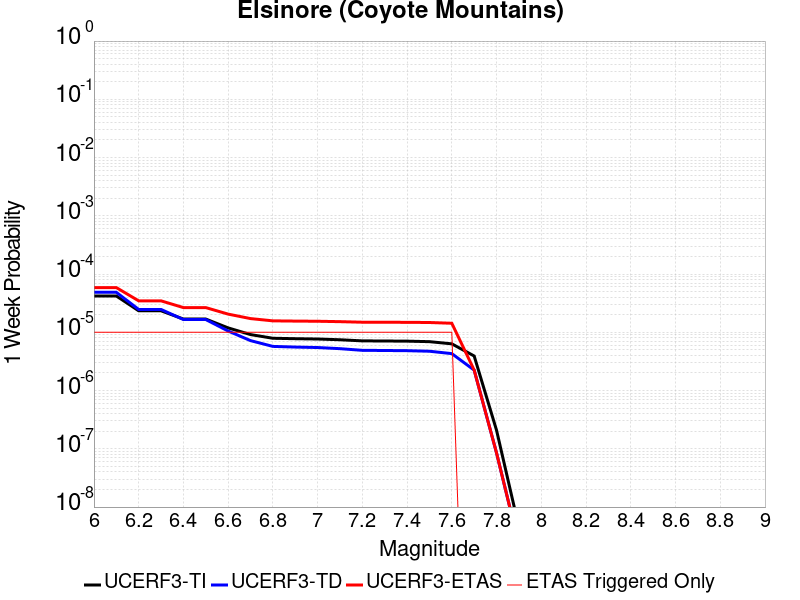 | 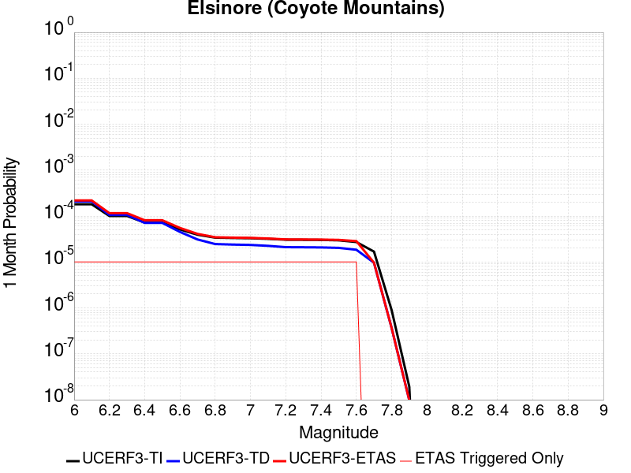 | 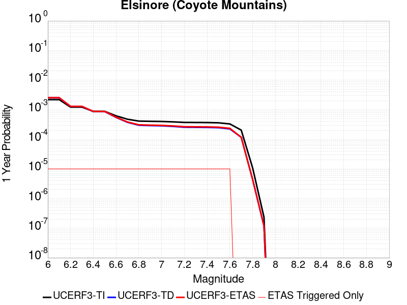 | 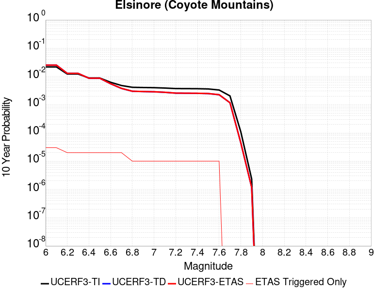 |

| Magnitude | 1 wk TI Prob | 1 wk TD Prob | 1 wk ETAS Prob | 1 wk ETAS/TD Gain | 1 wk ETAS Triggered Only | 1 mo TI Prob | 1 mo TD Prob | 1 mo ETAS Prob | 1 mo ETAS/TD Gain | 1 mo ETAS Triggered Only | 1 yr TI Prob | 1 yr TD Prob | 1 yr ETAS Prob | 1 yr ETAS/TD Gain | 1 yr ETAS Triggered Only | 10 yr TI Prob | 10 yr TD Prob | 10 yr ETAS Prob | 10 yr ETAS/TD Gain | 10 yr ETAS Triggered Only |
|-----|-----|-----|-----|-----|-----|-----|-----|-----|-----|-----|-----|-----|-----|-----|-----|-----|-----|-----|-----|-----|
| 6.0 | 4.20513E-5 | 4.8630944E-5 | 5.8630456E-5 | 1.2056204 | 1.0E-5 | 1.8020741E-4 | 2.0840492E-4 | 2.1840284E-4 | 1.0479735 | 1.0E-5 | 0.0021918174 | 0.0025349057 | 0.0025448804 | 1.0039349 | 1.0E-5 | 0.021703249 | 0.025111204 | 0.02514045 | 1.0011647 | 3.0E-5 |
| 6.1 | 4.20513E-5 | 4.8630944E-5 | 5.8630456E-5 | 1.2056204 | 1.0E-5 | 1.8020741E-4 | 2.0840492E-4 | 2.1840284E-4 | 1.0479735 | 1.0E-5 | 0.0021918174 | 0.0025349057 | 0.0025448804 | 1.0039349 | 1.0E-5 | 0.021703249 | 0.025111204 | 0.02514045 | 1.0011647 | 3.0E-5 |
| 6.2 | 2.3413893E-5 | 2.4695422E-5 | 3.4695175E-5 | 1.4049233 | 1.0E-5 | 1.0034139E-4 | 1.0583377E-4 | 1.15832714E-4 | 1.0944778 | 1.0E-5 | 0.0012209718 | 0.0012878523 | 0.0012978393 | 1.0077549 | 1.0E-5 | 0.012142851 | 0.012812569 | 0.012832313 | 1.001541 | 2.0E-5 |
| 6.3 | 2.3413893E-5 | 2.4695422E-5 | 3.4695175E-5 | 1.4049233 | 1.0E-5 | 1.0034139E-4 | 1.0583377E-4 | 1.15832714E-4 | 1.0944778 | 1.0E-5 | 0.0012209718 | 0.0012878523 | 0.0012978393 | 1.0077549 | 1.0E-5 | 0.012142851 | 0.012812569 | 0.012832313 | 1.001541 | 2.0E-5 |
| 6.4 | 1.6894814E-5 | 1.6568214E-5 | 2.6568048E-5 | 1.6035554 | 1.0E-5 | 7.240433E-5 | 7.100491E-5 | 8.1004204E-5 | 1.1408253 | 1.0E-5 | 8.811662E-4 | 8.641788E-4 | 8.7417016E-4 | 1.0115616 | 1.0E-5 | 0.0087768035 | 0.008611842 | 0.00863167 | 1.0023024 | 2.0E-5 |
| 6.5 | 1.6894814E-5 | 1.6568214E-5 | 2.6568048E-5 | 1.6035554 | 1.0E-5 | 7.240433E-5 | 7.100491E-5 | 8.1004204E-5 | 1.1408253 | 1.0E-5 | 8.811662E-4 | 8.641788E-4 | 8.7417016E-4 | 1.0115616 | 1.0E-5 | 0.0087768035 | 0.008611842 | 0.00863167 | 1.0023024 | 2.0E-5 |
| 6.6 | 1.1910969E-5 | 1.0530538E-5 | 2.0530433E-5 | 1.9496092 | 1.0E-5 | 5.1046012E-5 | 4.513017E-5 | 5.512972E-5 | 1.2215712 | 1.0E-5 | 6.21308E-4 | 5.493346E-4 | 5.593291E-4 | 1.0181938 | 1.0E-5 | 0.0061957375 | 0.0054810685 | 0.0055009588 | 1.003629 | 2.0E-5 |
| 6.7 | 9.1486E-6 | 7.2026473E-6 | 1.7202576E-5 | 2.3883684 | 1.0E-5 | 3.9207694E-5 | 3.0868145E-5 | 4.0867835E-5 | 1.3239486 | 1.0E-5 | 4.7724912E-4 | 3.7575865E-4 | 3.857549E-4 | 1.0266029 | 1.0E-5 | 0.0047622547 | 0.0037516125 | 0.0037715374 | 1.005311 | 2.0E-5 |
| 6.8 | 7.90441E-6 | 5.7288153E-6 | 1.5728758E-5 | 2.7455516 | 1.0E-5 | 3.3875604E-5 | 2.4551842E-5 | 3.45516E-5 | 1.4072914 | 1.0E-5 | 4.1235742E-4 | 2.9887896E-4 | 3.0887598E-4 | 1.0334483 | 1.0E-5 | 0.0041159308 | 0.0029848986 | 0.0029948687 | 1.0033402 | 1.0E-5 |
| 6.9 | 7.77015E-6 | 5.5827695E-6 | 1.5582715E-5 | 2.7912157 | 1.0E-5 | 3.3300217E-5 | 2.3925944E-5 | 3.3925706E-5 | 1.4179463 | 1.0E-5 | 4.0535472E-4 | 2.912607E-4 | 3.012578E-4 | 1.0343235 | 1.0E-5 | 0.004046161 | 0.0029089167 | 0.0029188877 | 1.0034277 | 1.0E-5 |
| 7.0 | 7.675798E-6 | 5.4796283E-6 | 1.5479574E-5 | 2.8249314 | 1.0E-5 | 3.289586E-5 | 2.3483917E-5 | 3.348368E-5 | 1.4258133 | 1.0E-5 | 4.004335E-4 | 2.8588044E-4 | 2.9587757E-4 | 1.0349697 | 1.0E-5 | 0.003997127 | 0.0028552532 | 0.0028652246 | 1.0034924 | 1.0E-5 |
| 7.1 | 7.447814E-6 | 5.2385003E-6 | 1.5238447E-5 | 2.9089334 | 1.0E-5 | 3.191881E-5 | 2.245053E-5 | 3.2450305E-5 | 1.4454138 | 1.0E-5 | 3.8854225E-4 | 2.7330214E-4 | 2.8329942E-4 | 1.0365795 | 1.0E-5 | 0.003878636 | 0.0027297847 | 0.0027397575 | 1.0036533 | 1.0E-5 |
| 7.2 | 7.128185E-6 | 4.905146E-6 | 1.49050975E-5 | 3.0386653 | 1.0E-5 | 3.0549007E-5 | 2.1021891E-5 | 3.1021682E-5 | 1.4756845 | 1.0E-5 | 3.7187067E-4 | 2.5591266E-4 | 2.6591012E-4 | 1.0390658 | 1.0E-5 | 0.00371249 | 0.002556298 | 0.0025662724 | 1.003902 | 1.0E-5 |
| 7.3 | 7.0913875E-6 | 4.873821E-6 | 1.4873773E-5 | 3.0517683 | 1.0E-5 | 3.0391306E-5 | 2.0887644E-5 | 3.0887437E-5 | 1.4787419 | 1.0E-5 | 3.6995133E-4 | 2.542786E-4 | 2.6427605E-4 | 1.0393169 | 1.0E-5 | 0.0036933604 | 0.0025399947 | 0.0025499694 | 1.003927 | 1.0E-5 |
| 7.4 | 7.051521E-6 | 4.837673E-6 | 1.4837625E-5 | 3.0670996 | 1.0E-5 | 3.0220453E-5 | 2.0732725E-5 | 3.0732517E-5 | 1.4823192 | 1.0E-5 | 3.6787192E-4 | 2.5239287E-4 | 2.6239036E-4 | 1.0396107 | 1.0E-5 | 0.0036726352 | 0.0025211805 | 0.0025311552 | 1.0039564 | 1.0E-5 |
| 7.5 | 6.910666E-6 | 4.7332255E-6 | 1.4733178E-5 | 3.1127143 | 1.0E-5 | 2.9616802E-5 | 2.02851E-5 | 3.0284898E-5 | 1.4929627 | 1.0E-5 | 3.605249E-4 | 2.4694428E-4 | 2.5694183E-4 | 1.0404849 | 1.0E-5 | 0.0035994058 | 0.002466817 | 0.0024767923 | 1.0040438 | 1.0E-5 |
| 7.6 | 6.341753E-6 | 4.306345E-6 | 1.4306303E-5 | 3.3221447 | 1.0E-5 | 2.7178658E-5 | 1.8455641E-5 | 2.8455457E-5 | 1.5418297 | 1.0E-5 | 3.3084993E-4 | 2.2467543E-4 | 2.3467318E-4 | 1.0444987 | 1.0E-5 | 0.0033035777 | 0.002244598 | 0.0022545755 | 1.0044452 | 1.0E-5 |
| 7.7 | 3.9205916E-6 | 2.2437468E-6 | 2.2437468E-6 | 1.0 | 0.0 | 1.6802427E-5 | 9.616027E-6 | 9.616027E-6 | 1.0 | 0.0 | 2.0455034E-4 | 1.17069576E-4 | 1.17069576E-4 | 1.0 | 0.0 | 0.0020436216 | 0.001170152 | 0.001170152 | 1.0 | 0.0 |
| 7.8 | 2.0846227E-7 | 8.4853966E-8 | 8.4853966E-8 | 1.0 | 0.0 | 8.9340944E-7 | 3.6365984E-7 | 3.6365984E-7 | 1.0 | 0.0 | 1.0877206E-5 | 4.427553E-6 | 4.427553E-6 | 1.0 | 0.0 | 1.0876673E-4 | 4.4274973E-5 | 4.4274973E-5 | 1.0 | 0.0 |
| 7.9 | 4.4969806E-9 | 2.269088E-9 | 2.269088E-9 | 1.0 | 0.0 | 1.9272775E-8 | 9.724664E-9 | 9.724664E-9 | 1.0 | 0.0 | 2.3464601E-7 | 1.1839777E-7 | 1.1839777E-7 | 1.0 | 0.0 | 2.3464577E-6 | 1.1839772E-6 | 1.1839772E-6 | 1.0 | 0.0 |

## Santa Monica alt 1
*[(top)](#table-of-contents)*

| 1 Week | 1 Month | 1 Year | 10 Year |
|-----|-----|-----|-----|
| 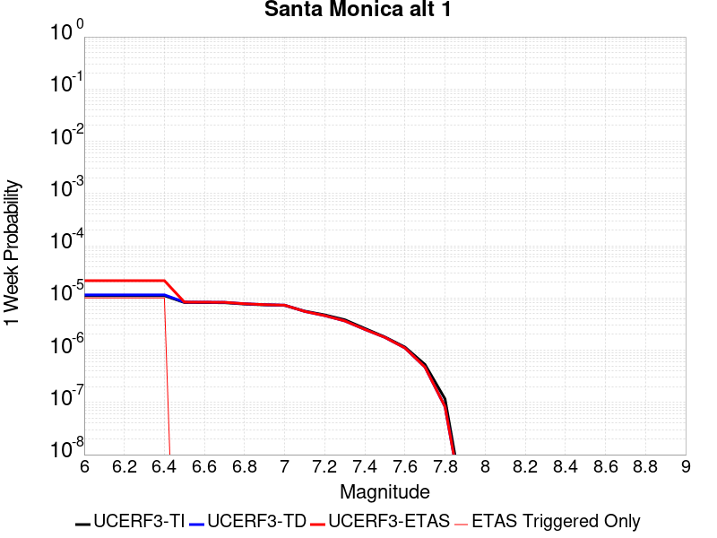 |  |  |  |

| Magnitude | 1 wk TI Prob | 1 wk TD Prob | 1 wk ETAS Prob | 1 wk ETAS/TD Gain | 1 wk ETAS Triggered Only | 1 mo TI Prob | 1 mo TD Prob | 1 mo ETAS Prob | 1 mo ETAS/TD Gain | 1 mo ETAS Triggered Only | 1 yr TI Prob | 1 yr TD Prob | 1 yr ETAS Prob | 1 yr ETAS/TD Gain | 1 yr ETAS Triggered Only | 10 yr TI Prob | 10 yr TD Prob | 10 yr ETAS Prob | 10 yr ETAS/TD Gain | 10 yr ETAS Triggered Only |
|-----|-----|-----|-----|-----|-----|-----|-----|-----|-----|-----|-----|-----|-----|-----|-----|-----|-----|-----|-----|-----|
| 6.0 | 1.1066008E-5 | 1.1480312E-5 | 2.1480198E-5 | 1.8710464 | 1.0E-5 | 4.742488E-5 | 4.920049E-5 | 5.92E-5 | 1.20324 | 1.0E-5 | 5.7724497E-4 | 5.9886527E-4 | 6.088593E-4 | 1.0166882 | 1.0E-5 | 0.005757478 | 0.0059739016 | 0.006003722 | 1.0049919 | 3.0E-5 |
| 6.1 | 1.1066008E-5 | 1.1480312E-5 | 2.1480198E-5 | 1.8710464 | 1.0E-5 | 4.742488E-5 | 4.920049E-5 | 5.92E-5 | 1.20324 | 1.0E-5 | 5.7724497E-4 | 5.9886527E-4 | 6.088593E-4 | 1.0166882 | 1.0E-5 | 0.005757478 | 0.0059739016 | 0.006003722 | 1.0049919 | 3.0E-5 |
| 6.2 | 1.1066008E-5 | 1.1480312E-5 | 2.1480198E-5 | 1.8710464 | 1.0E-5 | 4.742488E-5 | 4.920049E-5 | 5.92E-5 | 1.20324 | 1.0E-5 | 5.7724497E-4 | 5.9886527E-4 | 6.088593E-4 | 1.0166882 | 1.0E-5 | 0.005757478 | 0.0059739016 | 0.006003722 | 1.0049919 | 3.0E-5 |
| 6.3 | 1.1066008E-5 | 1.1480312E-5 | 2.1480198E-5 | 1.8710464 | 1.0E-5 | 4.742488E-5 | 4.920049E-5 | 5.92E-5 | 1.20324 | 1.0E-5 | 5.7724497E-4 | 5.9886527E-4 | 6.088593E-4 | 1.0166882 | 1.0E-5 | 0.005757478 | 0.0059739016 | 0.006003722 | 1.0049919 | 3.0E-5 |
| 6.4 | 1.1066008E-5 | 1.1480312E-5 | 2.1480198E-5 | 1.8710464 | 1.0E-5 | 4.742488E-5 | 4.920049E-5 | 5.92E-5 | 1.20324 | 1.0E-5 | 5.7724497E-4 | 5.9886527E-4 | 6.088593E-4 | 1.0166882 | 1.0E-5 | 0.005757478 | 0.0059739016 | 0.006003722 | 1.0049919 | 3.0E-5 |
| 6.5 | 8.183544E-6 | 8.335434E-6 | 8.335434E-6 | 1.0 | 0.0 | 3.5071862E-5 | 3.572281E-5 | 3.572281E-5 | 1.0 | 0.0 | 4.2691626E-4 | 4.3483998E-4 | 4.3483998E-4 | 1.0 | 0.0 | 0.0042609703 | 0.004340057 | 0.0043599703 | 1.0045882 | 2.0E-5 |
| 6.6 | 8.1543285E-6 | 8.303648E-6 | 8.303648E-6 | 1.0 | 0.0 | 3.4946657E-5 | 3.558659E-5 | 3.558659E-5 | 1.0 | 0.0 | 4.2539247E-4 | 4.3318217E-4 | 4.3318217E-4 | 1.0 | 0.0 | 0.0042457907 | 0.004323543 | 0.0043434566 | 1.0046059 | 2.0E-5 |
| 6.7 | 8.110878E-6 | 8.257045E-6 | 8.257045E-6 | 1.0 | 0.0 | 3.4760444E-5 | 3.5386864E-5 | 3.5386864E-5 | 1.0 | 0.0 | 4.231262E-4 | 4.3075148E-4 | 4.3075148E-4 | 1.0 | 0.0 | 0.0042232145 | 0.004299331 | 0.004319245 | 1.0046319 | 2.0E-5 |
| 6.8 | 7.644036E-6 | 7.751063E-6 | 7.751063E-6 | 1.0 | 0.0 | 3.275974E-5 | 3.3218425E-5 | 3.3218425E-5 | 1.0 | 0.0 | 3.9877684E-4 | 4.043607E-4 | 4.043607E-4 | 1.0 | 0.0 | 0.00398062 | 0.004036396 | 0.004056315 | 1.0049349 | 2.0E-5 |
| 6.9 | 7.3698293E-6 | 7.4557215E-6 | 7.4557215E-6 | 1.0 | 0.0 | 3.15846E-5 | 3.195271E-5 | 3.195271E-5 | 1.0 | 0.0 | 3.8447464E-4 | 3.889562E-4 | 3.889562E-4 | 1.0 | 0.0 | 0.0038381014 | 0.0038828978 | 0.00390282 | 1.0051308 | 2.0E-5 |
| 7.0 | 7.209872E-6 | 7.2856283E-6 | 7.2856283E-6 | 1.0 | 0.0 | 3.0899086E-5 | 3.1223753E-5 | 3.1223753E-5 | 1.0 | 0.0 | 3.7613141E-4 | 3.800843E-4 | 3.800843E-4 | 1.0 | 0.0 | 0.0037549543 | 0.003794485 | 0.003814409 | 1.0052508 | 2.0E-5 |
| 7.1 | 5.603456E-6 | 5.5238947E-6 | 5.5238947E-6 | 1.0 | 0.0 | 2.4014591E-5 | 2.3673623E-5 | 2.3673623E-5 | 1.0 | 0.0 | 2.923384E-4 | 2.8818863E-4 | 2.8818863E-4 | 1.0 | 0.0 | 0.0029195412 | 0.002878191 | 0.0028881622 | 1.0034645 | 1.0E-5 |
| 7.2 | 4.7483613E-6 | 4.591135E-6 | 4.591135E-6 | 1.0 | 0.0 | 2.0349962E-5 | 1.9676147E-5 | 1.9676147E-5 | 1.0 | 0.0 | 2.4773262E-4 | 2.3953087E-4 | 2.3953087E-4 | 1.0 | 0.0 | 0.0024745662 | 0.0023927412 | 0.0024027172 | 1.0041693 | 1.0E-5 |
| 7.3 | 3.829015E-6 | 3.6342271E-6 | 3.6342271E-6 | 1.0 | 0.0 | 1.6409962E-5 | 1.5575166E-5 | 1.5575166E-5 | 1.0 | 0.0 | 1.9977297E-4 | 1.8961124E-4 | 1.8961124E-4 | 1.0 | 0.0 | 0.0019959346 | 0.0018945034 | 0.0019044845 | 1.0052685 | 1.0E-5 |
| 7.4 | 2.610755E-6 | 2.4995722E-6 | 2.4995722E-6 | 1.0 | 0.0 | 1.1188902E-5 | 1.0712408E-5 | 1.0712408E-5 | 1.0 | 0.0 | 1.3621636E-4 | 1.304158E-4 | 1.304158E-4 | 1.0 | 0.0 | 0.001361329 | 0.0013033971 | 0.0013133842 | 1.0076623 | 1.0E-5 |
| 7.5 | 1.792146E-6 | 1.7584194E-6 | 1.7584194E-6 | 1.0 | 0.0 | 7.680603E-6 | 7.5360617E-6 | 7.5360617E-6 | 1.0 | 0.0 | 9.3507326E-5 | 9.174772E-5 | 9.174772E-5 | 1.0 | 0.0 | 9.3467993E-4 | 9.1710157E-4 | 9.1710157E-4 | 1.0 | 0.0 |
| 7.6 | 1.1473018E-6 | 1.102916E-6 | 1.102916E-6 | 1.0 | 0.0 | 4.9169985E-6 | 4.7267745E-6 | 4.7267745E-6 | 1.0 | 0.0 | 5.986281E-5 | 5.7546975E-5 | 5.7546975E-5 | 1.0 | 0.0 | 5.984669E-4 | 5.753224E-4 | 5.753224E-4 | 1.0 | 0.0 |
| 7.7 | 5.330919E-7 | 4.7452562E-7 | 4.7452562E-7 | 1.0 | 0.0 | 2.2846775E-6 | 2.0336797E-6 | 2.0336797E-6 | 1.0 | 0.0 | 2.7815593E-5 | 2.4759782E-5 | 2.4759782E-5 | 1.0 | 0.0 | 2.7812112E-4 | 2.4757136E-4 | 2.4757136E-4 | 1.0 | 0.0 |
| 7.8 | 1.1668574E-7 | 8.296564E-8 | 8.296564E-8 | 1.0 | 0.0 | 5.000816E-7 | 3.5556698E-7 | 3.5556698E-7 | 1.0 | 0.0 | 6.0884768E-6 | 4.3290197E-6 | 4.3290197E-6 | 1.0 | 0.0 | 6.08831E-5 | 4.3289383E-5 | 4.3289383E-5 | 1.0 | 0.0 |
| 7.9 | 8.007447E-10 | 6.161581E-10 | 6.161581E-10 | 1.0 | 0.0 | 3.4317629E-9 | 2.640678E-9 | 2.640678E-9 | 1.0 | 0.0 | 4.1781714E-8 | 3.2150254E-8 | 3.2150254E-8 | 1.0 | 0.0 | 4.1781706E-7 | 3.2150248E-7 | 3.2150248E-7 | 1.0 | 0.0 |

## Ortigalita (South)
*[(top)](#table-of-contents)*

| 1 Week | 1 Month | 1 Year | 10 Year |
|-----|-----|-----|-----|
|  |  |  |  |

| Magnitude | 1 wk TI Prob | 1 wk TD Prob | 1 wk ETAS Prob | 1 wk ETAS/TD Gain | 1 wk ETAS Triggered Only | 1 mo TI Prob | 1 mo TD Prob | 1 mo ETAS Prob | 1 mo ETAS/TD Gain | 1 mo ETAS Triggered Only | 1 yr TI Prob | 1 yr TD Prob | 1 yr ETAS Prob | 1 yr ETAS/TD Gain | 1 yr ETAS Triggered Only | 10 yr TI Prob | 10 yr TD Prob | 10 yr ETAS Prob | 10 yr ETAS/TD Gain | 10 yr ETAS Triggered Only |
|-----|-----|-----|-----|-----|-----|-----|-----|-----|-----|-----|-----|-----|-----|-----|-----|-----|-----|-----|-----|-----|
| 6.0 | 3.72394E-5 | 4.32556E-5 | 5.3255168E-5 | 1.231174 | 1.0E-5 | 1.5958765E-4 | 1.8536886E-4 | 2.0536516E-4 | 1.107873 | 2.0E-5 | 0.0019412481 | 0.0022546863 | 0.0022746413 | 1.0088505 | 2.0E-5 | 0.019243775 | 0.022334501 | 0.022363832 | 1.0013132 | 3.0E-5 |
| 6.1 | 2.7299884E-5 | 3.1492036E-5 | 4.149172E-5 | 1.3175306 | 1.0E-5 | 1.16994255E-4 | 1.349592E-4 | 1.549565E-4 | 1.148173 | 2.0E-5 | 0.0014234743 | 0.0016419457 | 0.0016619129 | 1.0121607 | 2.0E-5 | 0.014143906 | 0.016304072 | 0.016323747 | 1.0012066 | 2.0E-5 |
| 6.2 | 2.7299884E-5 | 3.1492036E-5 | 4.149172E-5 | 1.3175306 | 1.0E-5 | 1.16994255E-4 | 1.349592E-4 | 1.549565E-4 | 1.148173 | 2.0E-5 | 0.0014234743 | 0.0016419457 | 0.0016619129 | 1.0121607 | 2.0E-5 | 0.014143906 | 0.016304072 | 0.016323747 | 1.0012066 | 2.0E-5 |
| 6.3 | 2.0546433E-5 | 2.3631454E-5 | 3.3631215E-5 | 1.4231548 | 1.0E-5 | 8.805317E-5 | 1.0127383E-4 | 1.21271805E-4 | 1.1974643 | 2.0E-5 | 0.00107152 | 0.0012323305 | 0.0012523058 | 1.0162094 | 2.0E-5 | 0.010663681 | 0.012257031 | 0.012276786 | 1.0016117 | 2.0E-5 |
| 6.4 | 2.0546433E-5 | 2.3631454E-5 | 3.3631215E-5 | 1.4231548 | 1.0E-5 | 8.805317E-5 | 1.0127383E-4 | 1.21271805E-4 | 1.1974643 | 2.0E-5 | 0.00107152 | 0.0012323305 | 0.0012523058 | 1.0162094 | 2.0E-5 | 0.010663681 | 0.012257031 | 0.012276786 | 1.0016117 | 2.0E-5 |
| 6.5 | 1.7779594E-5 | 2.0446974E-5 | 3.044677E-5 | 1.4890599 | 1.0E-5 | 7.619603E-5 | 8.762703E-5 | 1.07625274E-4 | 1.2282201 | 2.0E-5 | 9.272918E-4 | 0.0010663505 | 0.0010863291 | 1.0187355 | 2.0E-5 | 0.009234319 | 0.010613804 | 0.010633592 | 1.0018643 | 2.0E-5 |
| 6.6 | 1.6272212E-5 | 1.8714967E-5 | 2.871478E-5 | 1.5343217 | 1.0E-5 | 6.973618E-5 | 8.0204605E-5 | 1.00203004E-4 | 1.2493422 | 2.0E-5 | 8.487073E-4 | 9.760659E-4 | 9.960464E-4 | 1.0204704 | 2.0E-5 | 0.008454733 | 0.009719091 | 0.009738896 | 1.0020378 | 2.0E-5 |
| 6.7 | 1.3051484E-5 | 1.5038758E-5 | 1.5038758E-5 | 1.0 | 0.0 | 5.593373E-5 | 6.445028E-5 | 7.4449636E-5 | 1.1551484 | 1.0E-5 | 6.807804E-4 | 7.844092E-4 | 7.9440133E-4 | 1.0127385 | 1.0E-5 | 0.006786986 | 0.007817388 | 0.00782731 | 1.0012692 | 1.0E-5 |
| 6.8 | 1.04277415E-5 | 1.1987235E-5 | 1.1987235E-5 | 1.0 | 0.0 | 4.4689557E-5 | 5.1372896E-5 | 6.137238E-5 | 1.1946452 | 1.0E-5 | 5.439595E-4 | 6.2529295E-4 | 6.352867E-4 | 1.0159825 | 1.0E-5 | 0.0054262993 | 0.00623609 | 0.0062460275 | 1.0015936 | 1.0E-5 |
| 6.9 | 7.639968E-6 | 8.791503E-6 | 8.791503E-6 | 1.0 | 0.0 | 3.274231E-5 | 3.767736E-5 | 4.7676982E-5 | 1.2654014 | 1.0E-5 | 3.9856473E-4 | 4.586312E-4 | 4.686266E-4 | 1.021794 | 1.0E-5 | 0.003978506 | 0.004577433 | 0.004587387 | 1.0021746 | 1.0E-5 |
| 7.0 | 3.919831E-6 | 4.5334014E-6 | 4.5334014E-6 | 1.0 | 0.0 | 1.679917E-5 | 1.942873E-5 | 1.942873E-5 | 1.0 | 0.0 | 2.045107E-4 | 2.3652123E-4 | 2.3652123E-4 | 1.0 | 0.0 | 0.0020432258 | 0.0023629034 | 0.0023629034 | 1.0 | 0.0 |
| 7.1 | 1.6017933E-6 | 1.8570418E-6 | 1.8570418E-6 | 1.0 | 0.0 | 6.8648105E-6 | 7.958732E-6 | 7.958732E-6 | 1.0 | 0.0 | 8.357586E-5 | 9.689432E-5 | 9.689432E-5 | 1.0 | 0.0 | 8.3544437E-4 | 9.686254E-4 | 9.686254E-4 | 1.0 | 0.0 |

## Elsinore (Stepovers Combined)
*[(top)](#table-of-contents)*

| 1 Week | 1 Month | 1 Year | 10 Year |
|-----|-----|-----|-----|
| 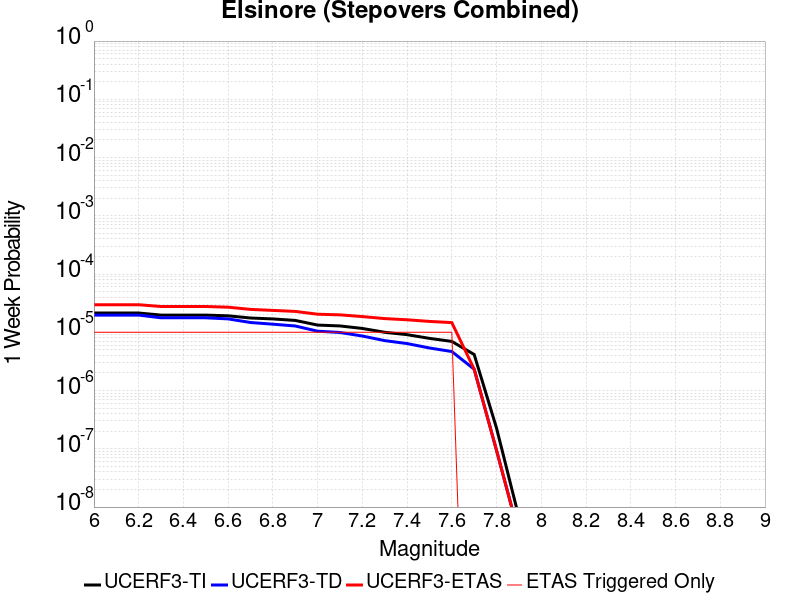 | 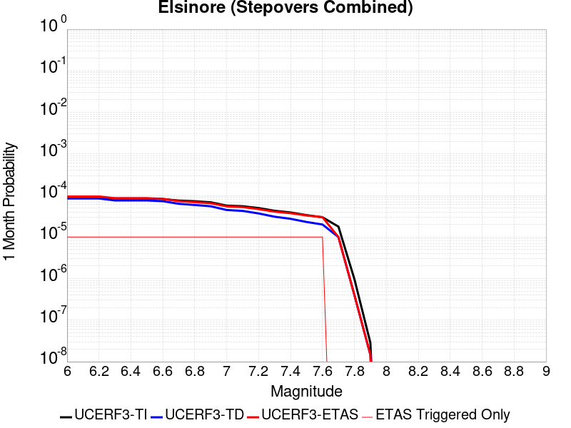 | 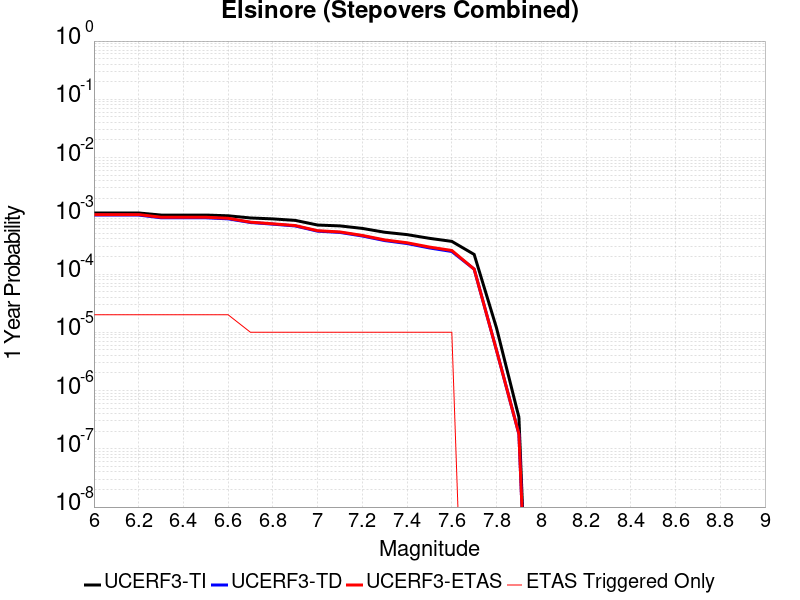 | 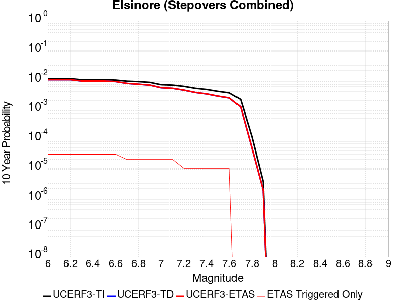 |

| Magnitude | 1 wk TI Prob | 1 wk TD Prob | 1 wk ETAS Prob | 1 wk ETAS/TD Gain | 1 wk ETAS Triggered Only | 1 mo TI Prob | 1 mo TD Prob | 1 mo ETAS Prob | 1 mo ETAS/TD Gain | 1 mo ETAS Triggered Only | 1 yr TI Prob | 1 yr TD Prob | 1 yr ETAS Prob | 1 yr ETAS/TD Gain | 1 yr ETAS Triggered Only | 10 yr TI Prob | 10 yr TD Prob | 10 yr ETAS Prob | 10 yr ETAS/TD Gain | 10 yr ETAS Triggered Only |
|-----|-----|-----|-----|-----|-----|-----|-----|-----|-----|-----|-----|-----|-----|-----|-----|-----|-----|-----|-----|-----|
| 6.0 | 2.144392E-5 | 1.976007E-5 | 2.9759873E-5 | 1.5060611 | 1.0E-5 | 9.189928E-5 | 8.468338E-5 | 9.468253E-5 | 1.1180769 | 1.0E-5 | 0.0011182994 | 0.0010305515 | 0.0010505309 | 1.0193871 | 2.0E-5 | 0.011126885 | 0.010264617 | 0.01029431 | 1.0028926 | 3.0E-5 |
| 6.1 | 2.144392E-5 | 1.976007E-5 | 2.9759873E-5 | 1.5060611 | 1.0E-5 | 9.189928E-5 | 8.468338E-5 | 9.468253E-5 | 1.1180769 | 1.0E-5 | 0.0011182994 | 0.0010305515 | 0.0010505309 | 1.0193871 | 2.0E-5 | 0.011126885 | 0.010264617 | 0.01029431 | 1.0028926 | 3.0E-5 |
| 6.2 | 2.144392E-5 | 1.976007E-5 | 2.9759873E-5 | 1.5060611 | 1.0E-5 | 9.189928E-5 | 8.468338E-5 | 9.468253E-5 | 1.1180769 | 1.0E-5 | 0.0011182994 | 0.0010305515 | 0.0010505309 | 1.0193871 | 2.0E-5 | 0.011126885 | 0.010264617 | 0.01029431 | 1.0028926 | 3.0E-5 |
| 6.3 | 1.9751555E-5 | 1.7741326E-5 | 2.7741147E-5 | 1.5636457 | 1.0E-5 | 8.4646774E-5 | 7.603211E-5 | 8.603135E-5 | 1.1315134 | 1.0E-5 | 0.0010300872 | 9.25312E-4 | 9.4529346E-4 | 1.0215943 | 2.0E-5 | 0.010253254 | 0.0092209745 | 0.009250698 | 1.0032234 | 3.0E-5 |
| 6.4 | 1.9751555E-5 | 1.7741326E-5 | 2.7741147E-5 | 1.5636457 | 1.0E-5 | 8.4646774E-5 | 7.603211E-5 | 8.603135E-5 | 1.1315134 | 1.0E-5 | 0.0010300872 | 9.25312E-4 | 9.4529346E-4 | 1.0215943 | 2.0E-5 | 0.010253254 | 0.0092209745 | 0.009250698 | 1.0032234 | 3.0E-5 |
| 6.5 | 1.9751555E-5 | 1.7741326E-5 | 2.7741147E-5 | 1.5636457 | 1.0E-5 | 8.4646774E-5 | 7.603211E-5 | 8.603135E-5 | 1.1315134 | 1.0E-5 | 0.0010300872 | 9.25312E-4 | 9.4529346E-4 | 1.0215943 | 2.0E-5 | 0.010253254 | 0.0092209745 | 0.009250698 | 1.0032234 | 3.0E-5 |
| 6.6 | 1.9188685E-5 | 1.7003247E-5 | 2.7003076E-5 | 1.588113 | 1.0E-5 | 8.2234634E-5 | 7.2869116E-5 | 8.2868384E-5 | 1.1372224 | 1.0E-5 | 0.0010007467 | 8.8683655E-4 | 9.068188E-4 | 1.0225321 | 2.0E-5 | 0.00996252 | 0.008839546 | 0.008869281 | 1.0033638 | 3.0E-5 |
| 6.7 | 1.7608272E-5 | 1.4732402E-5 | 2.4732255E-5 | 1.6787659 | 1.0E-5 | 7.546184E-5 | 6.313739E-5 | 7.313676E-5 | 1.1583748 | 1.0E-5 | 9.183606E-4 | 7.684364E-4 | 7.7842874E-4 | 1.0130035 | 1.0E-5 | 0.009145746 | 0.007664441 | 0.0076842876 | 1.0025895 | 2.0E-5 |
| 6.8 | 1.697165E-5 | 1.3783126E-5 | 2.3782988E-5 | 1.7255148 | 1.0E-5 | 7.273361E-5 | 5.906925E-5 | 6.9068665E-5 | 1.1692828 | 1.0E-5 | 8.8517193E-4 | 7.189395E-4 | 7.289323E-4 | 1.0138993 | 1.0E-5 | 0.008816543 | 0.0071722106 | 0.0071920673 | 1.0027685 | 2.0E-5 |
| 6.9 | 1.600365E-5 | 1.2846429E-5 | 2.2846301E-5 | 1.7784164 | 1.0E-5 | 6.858527E-5 | 5.5055007E-5 | 6.505445E-5 | 1.1816266 | 1.0E-5 | 8.347058E-4 | 6.700963E-4 | 6.8008964E-4 | 1.0149132 | 1.0E-5 | 0.008315775 | 0.006686422 | 0.006706288 | 1.0029712 | 2.0E-5 |
| 7.0 | 1.3314581E-5 | 1.044738E-5 | 2.0447276E-5 | 1.9571677 | 1.0E-5 | 5.7061243E-5 | 4.4773733E-5 | 5.4773285E-5 | 1.2233353 | 1.0E-5 | 6.944992E-4 | 5.449866E-4 | 5.549811E-4 | 1.018339 | 1.0E-5 | 0.006923327 | 0.005440055 | 0.0054599466 | 1.0036564 | 2.0E-5 |
| 7.1 | 1.2865345E-5 | 9.937339E-6 | 1.993724E-5 | 2.0062954 | 1.0E-5 | 5.5136024E-5 | 4.258792E-5 | 5.2587493E-5 | 1.2347984 | 1.0E-5 | 6.710743E-4 | 5.1838707E-4 | 5.283819E-4 | 1.0192806 | 1.0E-5 | 0.0066905143 | 0.005175021 | 0.005194918 | 1.0038447 | 2.0E-5 |
| 7.2 | 1.1650051E-5 | 8.633585E-6 | 1.8633498E-5 | 2.1582575 | 1.0E-5 | 4.9927836E-5 | 3.7000562E-5 | 4.7000194E-5 | 1.2702562 | 1.0E-5 | 6.0770183E-4 | 4.503905E-4 | 4.60386E-4 | 1.022193 | 1.0E-5 | 0.0060604266 | 0.00449624 | 0.0045061954 | 1.0022141 | 1.0E-5 |
| 7.3 | 1.0008533E-5 | 7.2008215E-6 | 1.720075E-5 | 2.3887205 | 1.0E-5 | 4.2893007E-5 | 3.0860305E-5 | 4.086E-5 | 1.3240309 | 1.0E-5 | 5.220972E-4 | 3.756609E-4 | 3.8565713E-4 | 1.0266098 | 1.0E-5 | 0.005208723 | 0.0037506663 | 0.0037606286 | 1.0026562 | 1.0E-5 |
| 7.4 | 9.116759E-6 | 6.409854E-6 | 1.640979E-5 | 2.560088 | 1.0E-5 | 3.907124E-5 | 2.7470522E-5 | 3.7470247E-5 | 1.3640165 | 1.0E-5 | 4.7558855E-4 | 3.3440365E-4 | 3.444003E-4 | 1.029894 | 1.0E-5 | 0.00474572 | 0.0033391542 | 0.0033491207 | 1.0029848 | 1.0E-5 |
| 7.5 | 7.870524E-6 | 5.382316E-6 | 1.5382262E-5 | 2.8579264 | 1.0E-5 | 3.3730383E-5 | 2.306687E-5 | 3.306664E-5 | 1.4335122 | 1.0E-5 | 4.1059E-4 | 2.8080423E-4 | 2.9080143E-4 | 1.035602 | 1.0E-5 | 0.0040983222 | 0.0028046207 | 0.0028145926 | 1.0035555 | 1.0E-5 |
| 7.6 | 6.9774537E-6 | 4.677398E-6 | 1.4677352E-5 | 3.1379306 | 1.0E-5 | 2.990303E-5 | 2.0045845E-5 | 3.0045645E-5 | 1.4988465 | 1.0E-5 | 3.640086E-4 | 2.44032E-4 | 2.5402955E-4 | 1.0409682 | 1.0E-5 | 0.003634129 | 0.0024377564 | 0.002447732 | 1.0040921 | 1.0E-5 |
| 7.7 | 4.1616954E-6 | 2.3281368E-6 | 2.3281368E-6 | 1.0 | 0.0 | 1.7835715E-5 | 9.977695E-6 | 9.977695E-6 | 1.0 | 0.0 | 2.171282E-4 | 1.2147242E-4 | 1.2147242E-4 | 1.0 | 0.0 | 0.0021691616 | 0.0012141332 | 0.0012141332 | 1.0 | 0.0 |
| 7.8 | 2.2692414E-7 | 9.384417E-8 | 9.384417E-8 | 1.0 | 0.0 | 9.725317E-7 | 4.0218927E-7 | 4.0218927E-7 | 1.0 | 0.0 | 1.1840509E-5 | 4.8966467E-6 | 4.8966467E-6 | 1.0 | 0.0 | 1.1839878E-4 | 4.8965718E-5 | 4.8965718E-5 | 1.0 | 0.0 |
| 7.9 | 6.676829E-9 | 3.4397174E-9 | 3.4397174E-9 | 1.0 | 0.0 | 2.861498E-8 | 1.4741646E-8 | 1.4741646E-8 | 1.0 | 0.0 | 3.4838732E-7 | 1.7947953E-7 | 1.7947953E-7 | 1.0 | 0.0 | 3.4838679E-6 | 1.794794E-6 | 1.794794E-6 | 1.0 | 0.0 |

## Hat Creek-McArthur-Mayfield
*[(top)](#table-of-contents)*

| 1 Week | 1 Month | 1 Year | 10 Year |
|-----|-----|-----|-----|
|  |  | 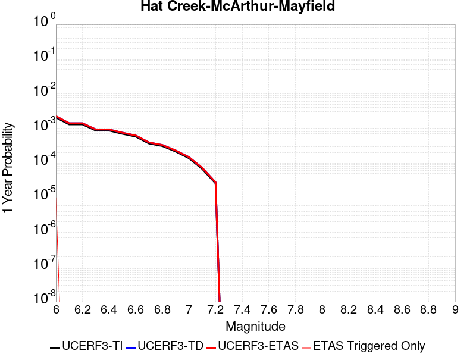 |  |

| Magnitude | 1 wk TI Prob | 1 wk TD Prob | 1 wk ETAS Prob | 1 wk ETAS/TD Gain | 1 wk ETAS Triggered Only | 1 mo TI Prob | 1 mo TD Prob | 1 mo ETAS Prob | 1 mo ETAS/TD Gain | 1 mo ETAS Triggered Only | 1 yr TI Prob | 1 yr TD Prob | 1 yr ETAS Prob | 1 yr ETAS/TD Gain | 1 yr ETAS Triggered Only | 10 yr TI Prob | 10 yr TD Prob | 10 yr ETAS Prob | 10 yr ETAS/TD Gain | 10 yr ETAS Triggered Only |
|-----|-----|-----|-----|-----|-----|-----|-----|-----|-----|-----|-----|-----|-----|-----|-----|-----|-----|-----|-----|-----|
| 6.0 | 3.967457E-5 | 4.315831E-5 | 4.315831E-5 | 1.0 | 0.0 | 1.7002279E-4 | 1.8495171E-4 | 1.8495171E-4 | 1.0 | 0.0 | 0.002068062 | 0.002249576 | 0.0022595534 | 1.0044353 | 1.0E-5 | 0.02048922 | 0.022280399 | 0.02230973 | 1.0013164 | 3.0E-5 |
| 6.1 | 2.5044013E-5 | 2.7071164E-5 | 2.7071164E-5 | 1.0 | 0.0 | 1.0732707E-4 | 1.1601429E-4 | 1.1601429E-4 | 1.0 | 0.0 | 0.0013059238 | 0.0014115906 | 0.0014115906 | 1.0 | 0.0 | 0.01298276 | 0.01402966 | 0.01404938 | 1.0014056 | 2.0E-5 |
| 6.2 | 2.5044013E-5 | 2.7071164E-5 | 2.7071164E-5 | 1.0 | 0.0 | 1.0732707E-4 | 1.1601429E-4 | 1.1601429E-4 | 1.0 | 0.0 | 0.0013059238 | 0.0014115906 | 0.0014115906 | 1.0 | 0.0 | 0.01298276 | 0.01402966 | 0.01404938 | 1.0014056 | 2.0E-5 |
| 6.3 | 1.6624012E-5 | 1.7891072E-5 | 1.7891072E-5 | 1.0 | 0.0 | 7.124382E-5 | 7.6673816E-5 | 7.6673816E-5 | 1.0 | 0.0 | 8.670483E-4 | 9.331125E-4 | 9.331125E-4 | 1.0 | 0.0 | 0.008636732 | 0.009292879 | 0.009302787 | 1.0010661 | 1.0E-5 |
| 6.4 | 1.6624012E-5 | 1.7891072E-5 | 1.7891072E-5 | 1.0 | 0.0 | 7.124382E-5 | 7.6673816E-5 | 7.6673816E-5 | 1.0 | 0.0 | 8.670483E-4 | 9.331125E-4 | 9.331125E-4 | 1.0 | 0.0 | 0.008636732 | 0.009292879 | 0.009302787 | 1.0010661 | 1.0E-5 |
| 6.5 | 1.3394842E-5 | 1.4392137E-5 | 1.4392137E-5 | 1.0 | 0.0 | 5.7405203E-5 | 6.167916E-5 | 6.167916E-5 | 1.0 | 0.0 | 6.986842E-4 | 7.506906E-4 | 7.506906E-4 | 1.0 | 0.0 | 0.006964916 | 0.0074821403 | 0.007492066 | 1.0013266 | 1.0E-5 |
| 6.6 | 1.1137514E-5 | 1.1954546E-5 | 1.1954546E-5 | 1.0 | 0.0 | 4.7731326E-5 | 5.1232782E-5 | 5.1232782E-5 | 1.0 | 0.0 | 5.809739E-4 | 6.2358467E-4 | 6.2358467E-4 | 1.0 | 0.0 | 0.005794574 | 0.00621877 | 0.0062287077 | 1.001598 | 1.0E-5 |
| 6.7 | 7.0200663E-6 | 7.5242897E-6 | 7.5242897E-6 | 1.0 | 0.0 | 3.008565E-5 | 3.2246568E-5 | 3.2246568E-5 | 1.0 | 0.0 | 3.6623122E-4 | 3.925328E-4 | 3.925328E-4 | 1.0 | 0.0 | 0.0036562826 | 0.0039185574 | 0.0039185574 | 1.0 | 0.0 |
| 6.8 | 5.940172E-6 | 6.3654766E-6 | 6.3654766E-6 | 1.0 | 0.0 | 2.545763E-5 | 2.7280335E-5 | 2.7280335E-5 | 1.0 | 0.0 | 3.0990256E-4 | 3.3208873E-4 | 3.3208873E-4 | 1.0 | 0.0 | 0.0030947074 | 0.0033160534 | 0.0033160534 | 1.0 | 0.0 |
| 6.9 | 4.129831E-6 | 4.423547E-6 | 4.423547E-6 | 1.0 | 0.0 | 1.7699154E-5 | 1.8957926E-5 | 1.8957926E-5 | 1.0 | 0.0 | 2.154659E-4 | 2.3078908E-4 | 2.3078908E-4 | 1.0 | 0.0 | 0.002152571 | 0.0023055724 | 0.0023055724 | 1.0 | 0.0 |
| 7.0 | 2.6512955E-6 | 2.8374002E-6 | 2.8374002E-6 | 1.0 | 0.0 | 1.1362646E-5 | 1.2160232E-5 | 1.2160232E-5 | 1.0 | 0.0 | 1.3833142E-4 | 1.480412E-4 | 1.480412E-4 | 1.0 | 0.0 | 0.0013824535 | 0.0014794683 | 0.0014794683 | 1.0 | 0.0 |
| 7.1 | 1.2992575E-6 | 1.3909317E-6 | 1.3909317E-6 | 1.0 | 0.0 | 5.568235E-6 | 5.961124E-6 | 5.961124E-6 | 1.0 | 0.0 | 6.779115E-5 | 7.257448E-5 | 7.257448E-5 | 1.0 | 0.0 | 6.7770475E-4 | 7.2552945E-4 | 7.2552945E-4 | 1.0 | 0.0 |
| 7.2 | 4.968191E-7 | 5.3271475E-7 | 5.3271475E-7 | 1.0 | 0.0 | 2.1292228E-6 | 2.283062E-6 | 2.283062E-6 | 1.0 | 0.0 | 2.592298E-5 | 2.7796052E-5 | 2.7796052E-5 | 1.0 | 0.0 | 2.5919956E-4 | 2.7793812E-4 | 2.7793812E-4 | 1.0 | 0.0 |

## Calaveras (So) - Paicines extension 2011 CFM
*[(top)](#table-of-contents)*

| 1 Week | 1 Month | 1 Year | 10 Year |
|-----|-----|-----|-----|
|  |  |  |  |

| Magnitude | 1 wk TI Prob | 1 wk TD Prob | 1 wk ETAS Prob | 1 wk ETAS/TD Gain | 1 wk ETAS Triggered Only | 1 mo TI Prob | 1 mo TD Prob | 1 mo ETAS Prob | 1 mo ETAS/TD Gain | 1 mo ETAS Triggered Only | 1 yr TI Prob | 1 yr TD Prob | 1 yr ETAS Prob | 1 yr ETAS/TD Gain | 1 yr ETAS Triggered Only | 10 yr TI Prob | 10 yr TD Prob | 10 yr ETAS Prob | 10 yr ETAS/TD Gain | 10 yr ETAS Triggered Only |
|-----|-----|-----|-----|-----|-----|-----|-----|-----|-----|-----|-----|-----|-----|-----|-----|-----|-----|-----|-----|-----|
| 6.0 | 1.5183659E-4 | 3.0520977E-4 | 3.2520367E-4 | 1.0655087 | 2.0E-5 | 6.5056595E-4 | 0.0013068188 | 0.0013267926 | 1.0152843 | 2.0E-5 | 0.007891912 | 0.015696203 | 0.01571589 | 1.0012542 | 2.0E-5 | 0.076174594 | 0.13848905 | 0.13851489 | 1.0001867 | 3.0E-5 |
| 6.1 | 1.5024997E-4 | 3.021517E-4 | 3.2214564E-4 | 1.0661719 | 2.0E-5 | 6.437695E-4 | 0.0012937278 | 0.001313702 | 1.0154392 | 2.0E-5 | 0.0078097614 | 0.015539596 | 0.015559285 | 1.0012671 | 2.0E-5 | 0.075409345 | 0.13715863 | 0.13718452 | 1.0001887 | 3.0E-5 |
| 6.2 | 1.2743923E-4 | 2.5313982E-4 | 2.7313476E-4 | 1.0789877 | 2.0E-5 | 5.460538E-4 | 0.0010839999 | 0.0011039783 | 1.0184302 | 2.0E-5 | 0.0066279583 | 0.013046881 | 0.013066621 | 1.0015129 | 2.0E-5 | 0.064337276 | 0.117256075 | 0.117282555 | 1.0002259 | 3.0E-5 |
| 6.3 | 1.1525114E-4 | 2.2599236E-4 | 2.4598785E-4 | 1.0884786 | 2.0E-5 | 4.9383997E-4 | 9.678718E-4 | 9.878525E-4 | 1.020644 | 2.0E-5 | 0.0059959386 | 0.011668079 | 0.011687845 | 1.0016941 | 2.0E-5 | 0.058367174 | 0.106372125 | 0.10639 | 1.000168 | 2.0E-5 |
| 6.4 | 1.07200925E-4 | 2.0840544E-4 | 2.2840127E-4 | 1.0959468 | 2.0E-5 | 4.5935164E-4 | 8.926123E-4 | 9.1259443E-4 | 1.0223862 | 2.0E-5 | 0.0055782744 | 0.010772959 | 0.010792743 | 1.0018365 | 2.0E-5 | 0.0544031 | 0.099194765 | 0.09921278 | 1.0001817 | 2.0E-5 |
| 6.5 | 9.69631E-5 | 1.8734725E-4 | 2.073435E-4 | 1.1067337 | 2.0E-5 | 4.1548995E-4 | 8.024631E-4 | 8.22447E-4 | 1.0249033 | 2.0E-5 | 0.0050468626 | 0.009694842 | 0.009714647 | 1.002043 | 2.0E-5 | 0.04933773 | 0.090086564 | 0.090104766 | 1.0002021 | 2.0E-5 |
| 6.6 | 8.0552316E-5 | 1.507068E-4 | 1.7070377E-4 | 1.132688 | 2.0E-5 | 3.4517853E-4 | 6.4569083E-4 | 6.656779E-4 | 1.0309546 | 2.0E-5 | 0.0041944524 | 0.007826508 | 0.007846352 | 1.0025355 | 2.0E-5 | 0.04116161 | 0.0748563 | 0.0748748 | 1.0002471 | 2.0E-5 |
| 6.7 | 7.815757E-5 | 1.4611272E-4 | 1.6610979E-4 | 1.1368606 | 2.0E-5 | 3.34918E-4 | 6.26014E-4 | 6.4600154E-4 | 1.0319282 | 2.0E-5 | 0.004070005 | 0.007589312 | 0.0076091597 | 1.0026153 | 2.0E-5 | 0.039962657 | 0.07270582 | 0.072724365 | 1.0002551 | 2.0E-5 |
| 6.8 | 6.965264E-5 | 1.2722758E-4 | 1.4722504E-4 | 1.1571786 | 2.0E-5 | 2.9847719E-4 | 5.4513285E-4 | 5.6512194E-4 | 1.0366683 | 2.0E-5 | 0.0036279052 | 0.0066135945 | 0.006633462 | 1.0030041 | 2.0E-5 | 0.03569247 | 0.063801065 | 0.06381979 | 1.0002935 | 2.0E-5 |
| 6.9 | 5.8000453E-5 | 1.01439E-4 | 1.2143698E-4 | 1.1971428 | 2.0E-5 | 2.4854968E-4 | 4.346666E-4 | 4.5465791E-4 | 1.0459923 | 2.0E-5 | 0.0030218933 | 0.005279322 | 0.0052992166 | 1.0037683 | 2.0E-5 | 0.029811295 | 0.051502965 | 0.051521935 | 1.0003684 | 2.0E-5 |
| 7.0 | 4.9865852E-5 | 8.568029E-5 | 1.0567857E-4 | 1.233406 | 2.0E-5 | 2.1369329E-4 | 3.6715003E-4 | 3.8714267E-4 | 1.0544536 | 2.0E-5 | 0.0025986114 | 0.004460979 | 0.0044808895 | 1.0044633 | 2.0E-5 | 0.025684336 | 0.043782018 | 0.04380114 | 1.0004368 | 2.0E-5 |
| 7.1 | 4.283875E-5 | 7.1124625E-5 | 9.1123205E-5 | 1.2811766 | 2.0E-5 | 1.8358172E-4 | 3.0478454E-4 | 3.2477843E-4 | 1.0656002 | 2.0E-5 | 0.0022328163 | 0.003704494 | 0.00372442 | 1.0053788 | 2.0E-5 | 0.022105146 | 0.03673582 | 0.03675509 | 1.0005244 | 2.0E-5 |
| 7.2 | 3.450115E-5 | 5.5778568E-5 | 7.5777454E-5 | 1.3585407 | 2.0E-5 | 1.478537E-4 | 2.3902925E-4 | 2.5902447E-4 | 1.0836518 | 2.0E-5 | 0.0017986323 | 0.0029063264 | 0.0029262684 | 1.0068616 | 2.0E-5 | 0.017841442 | 0.029079042 | 0.02909846 | 1.0006678 | 2.0E-5 |
| 7.3 | 2.5709045E-5 | 4.059001E-5 | 6.05892E-5 | 1.492712 | 2.0E-5 | 1.1017697E-4 | 1.7394568E-4 | 1.939422E-4 | 1.1149584 | 2.0E-5 | 0.0013405791 | 0.0021157486 | 0.0021357064 | 1.0094329 | 2.0E-5 | 0.013325208 | 0.02129686 | 0.021316435 | 1.0009191 | 2.0E-5 |
| 7.4 | 1.8003093E-5 | 2.8511378E-5 | 4.8510807E-5 | 1.7014543 | 2.0E-5 | 7.715383E-5 | 1.2218591E-4 | 1.4218346E-4 | 1.1636649 | 2.0E-5 | 9.3894306E-4 | 0.0014866006 | 0.001506571 | 1.0134335 | 2.0E-5 | 0.009349857 | 0.015051589 | 0.015071289 | 1.0013088 | 2.0E-5 |
| 7.5 | 1.5595824E-5 | 2.5823752E-5 | 4.5823235E-5 | 1.7744608 | 2.0E-5 | 6.683753E-5 | 1.10668545E-4 | 1.3066633E-4 | 1.1806998 | 2.0E-5 | 8.134431E-4 | 0.0013465589 | 0.001366532 | 1.0148326 | 2.0E-5 | 0.008104719 | 0.013651571 | 0.0136712985 | 1.001445 | 2.0E-5 |
| 7.6 | 1.1110309E-5 | 1.9223195E-5 | 3.922281E-5 | 2.0403898 | 2.0E-5 | 4.761474E-5 | 8.2382525E-5 | 1.0238088E-4 | 1.2427499 | 2.0E-5 | 5.795553E-4 | 0.0010025471 | 0.0010225271 | 1.0199292 | 2.0E-5 | 0.0057804612 | 0.01020344 | 0.010223236 | 1.0019401 | 2.0E-5 |
| 7.7 | 6.2140443E-6 | 1.04376995E-5 | 3.0437492E-5 | 2.916111 | 2.0E-5 | 2.6631347E-5 | 4.4732235E-5 | 6.4731335E-5 | 1.4470849 | 2.0E-5 | 3.241884E-4 | 5.4447894E-4 | 5.6446804E-4 | 1.0367124 | 2.0E-5 | 0.0032371588 | 0.005620102 | 0.00563999 | 1.0035386 | 2.0E-5 |
| 7.8 | 5.305533E-6 | 9.433651E-6 | 2.9433462E-5 | 3.12005 | 2.0E-5 | 2.27378E-5 | 4.0429306E-5 | 6.0428498E-5 | 1.4946706 | 2.0E-5 | 2.7679754E-4 | 4.9211574E-4 | 5.121059E-4 | 1.0406208 | 2.0E-5 | 0.0027645302 | 0.005074622 | 0.0050945207 | 1.0039212 | 2.0E-5 |
| 7.9 | 3.363505E-6 | 7.3854467E-6 | 1.7385373E-5 | 2.3540041 | 1.0E-5 | 1.4414942E-5 | 3.1651532E-5 | 4.1651216E-5 | 1.3159305 | 1.0E-5 | 1.7548777E-4 | 3.8528934E-4 | 3.952855E-4 | 1.0259445 | 1.0E-5 | 0.0017534926 | 0.003948784 | 0.0039587445 | 1.0025225 | 1.0E-5 |
| 8.0 | 2.0271132E-6 | 4.4134235E-6 | 4.4134235E-6 | 1.0 | 0.0 | 8.687599E-6 | 1.8914534E-5 | 1.8914534E-5 | 1.0 | 0.0 | 1.05766376E-4 | 2.3026018E-4 | 2.3026018E-4 | 1.0 | 0.0 | 0.0010571606 | 0.002351194 | 0.002351194 | 1.0 | 0.0 |
| 8.1 | 1.2206116E-6 | 2.3752666E-6 | 2.3752666E-6 | 1.0 | 0.0 | 5.2311816E-6 | 1.0179674E-5 | 1.0179674E-5 | 1.0 | 0.0 | 6.3687774E-5 | 1.2393051E-4 | 1.2393051E-4 | 1.0 | 0.0 | 6.366953E-4 | 0.0012705618 | 0.0012705618 | 1.0 | 0.0 |

## Los Alamos 2011 CFM
*[(top)](#table-of-contents)*

| 1 Week | 1 Month | 1 Year | 10 Year |
|-----|-----|-----|-----|
|  |  |  |  |

| Magnitude | 1 wk TI Prob | 1 wk TD Prob | 1 wk ETAS Prob | 1 wk ETAS/TD Gain | 1 wk ETAS Triggered Only | 1 mo TI Prob | 1 mo TD Prob | 1 mo ETAS Prob | 1 mo ETAS/TD Gain | 1 mo ETAS Triggered Only | 1 yr TI Prob | 1 yr TD Prob | 1 yr ETAS Prob | 1 yr ETAS/TD Gain | 1 yr ETAS Triggered Only | 10 yr TI Prob | 10 yr TD Prob | 10 yr ETAS Prob | 10 yr ETAS/TD Gain | 10 yr ETAS Triggered Only |
|-----|-----|-----|-----|-----|-----|-----|-----|-----|-----|-----|-----|-----|-----|-----|-----|-----|-----|-----|-----|-----|
| 6.0 | 4.6284417E-6 | 4.7517333E-6 | 4.7517333E-6 | 1.0 | 0.0 | 1.9836029E-5 | 2.0364423E-5 | 2.0364423E-5 | 1.0 | 0.0 | 2.4147688E-4 | 2.479104E-4 | 2.5790793E-4 | 1.0403272 | 1.0E-5 | 0.0024121467 | 0.0024765125 | 0.0025064382 | 1.0120838 | 3.0E-5 |
| 6.1 | 4.6284417E-6 | 4.7517333E-6 | 4.7517333E-6 | 1.0 | 0.0 | 1.9836029E-5 | 2.0364423E-5 | 2.0364423E-5 | 1.0 | 0.0 | 2.4147688E-4 | 2.479104E-4 | 2.5790793E-4 | 1.0403272 | 1.0E-5 | 0.0024121467 | 0.0024765125 | 0.0025064382 | 1.0120838 | 3.0E-5 |
| 6.2 | 4.6284417E-6 | 4.7517333E-6 | 4.7517333E-6 | 1.0 | 0.0 | 1.9836029E-5 | 2.0364423E-5 | 2.0364423E-5 | 1.0 | 0.0 | 2.4147688E-4 | 2.479104E-4 | 2.5790793E-4 | 1.0403272 | 1.0E-5 | 0.0024121467 | 0.0024765125 | 0.0025064382 | 1.0120838 | 3.0E-5 |
| 6.3 | 4.6284417E-6 | 4.7517333E-6 | 4.7517333E-6 | 1.0 | 0.0 | 1.9836029E-5 | 2.0364423E-5 | 2.0364423E-5 | 1.0 | 0.0 | 2.4147688E-4 | 2.479104E-4 | 2.5790793E-4 | 1.0403272 | 1.0E-5 | 0.0024121467 | 0.0024765125 | 0.0025064382 | 1.0120838 | 3.0E-5 |
| 6.4 | 4.6284417E-6 | 4.7517333E-6 | 4.7517333E-6 | 1.0 | 0.0 | 1.9836029E-5 | 2.0364423E-5 | 2.0364423E-5 | 1.0 | 0.0 | 2.4147688E-4 | 2.479104E-4 | 2.5790793E-4 | 1.0403272 | 1.0E-5 | 0.0024121467 | 0.0024765125 | 0.0025064382 | 1.0120838 | 3.0E-5 |
| 6.5 | 4.6284417E-6 | 4.7517333E-6 | 4.7517333E-6 | 1.0 | 0.0 | 1.9836029E-5 | 2.0364423E-5 | 2.0364423E-5 | 1.0 | 0.0 | 2.4147688E-4 | 2.479104E-4 | 2.5790793E-4 | 1.0403272 | 1.0E-5 | 0.0024121467 | 0.0024765125 | 0.0025064382 | 1.0120838 | 3.0E-5 |
| 6.6 | 4.6284417E-6 | 4.7517333E-6 | 4.7517333E-6 | 1.0 | 0.0 | 1.9836029E-5 | 2.0364423E-5 | 2.0364423E-5 | 1.0 | 0.0 | 2.4147688E-4 | 2.479104E-4 | 2.5790793E-4 | 1.0403272 | 1.0E-5 | 0.0024121467 | 0.0024765125 | 0.0025064382 | 1.0120838 | 3.0E-5 |
| 6.7 | 4.062321E-6 | 4.166351E-6 | 4.166351E-6 | 1.0 | 0.0 | 1.7409831E-5 | 1.7855677E-5 | 1.7855677E-5 | 1.0 | 0.0 | 2.1194408E-4 | 2.1737268E-4 | 2.2737052E-4 | 1.0459939 | 1.0E-5 | 0.0021174205 | 0.0021717504 | 0.0021817286 | 1.0045946 | 1.0E-5 |
| 6.8 | 4.062321E-6 | 4.166351E-6 | 4.166351E-6 | 1.0 | 0.0 | 1.7409831E-5 | 1.7855677E-5 | 1.7855677E-5 | 1.0 | 0.0 | 2.1194408E-4 | 2.1737268E-4 | 2.2737052E-4 | 1.0459939 | 1.0E-5 | 0.0021174205 | 0.0021717504 | 0.0021817286 | 1.0045946 | 1.0E-5 |
| 6.9 | 3.2936077E-6 | 3.37296E-6 | 3.37296E-6 | 1.0 | 0.0 | 1.4115385E-5 | 1.4455468E-5 | 1.4455468E-5 | 1.0 | 0.0 | 1.7184127E-4 | 1.7598206E-4 | 1.8598029E-4 | 1.056814 | 1.0E-5 | 0.0017170844 | 0.0017585196 | 0.0017685019 | 1.0056766 | 1.0E-5 |
| 7.0 | 3.1687898E-6 | 3.2448177E-6 | 3.2448177E-6 | 1.0 | 0.0 | 1.3580457E-5 | 1.3906293E-5 | 1.3906293E-5 | 1.0 | 0.0 | 1.6532952E-4 | 1.692969E-4 | 1.792952E-4 | 1.0590578 | 1.0E-5 | 0.0016520657 | 0.0016917707 | 0.0017017538 | 1.005901 | 1.0E-5 |
| 7.1 | 2.9379228E-6 | 3.007328E-6 | 3.007328E-6 | 1.0 | 0.0 | 1.25910365E-5 | 1.288849E-5 | 1.288849E-5 | 1.0 | 0.0 | 1.5328509E-4 | 1.5690697E-4 | 1.669054E-4 | 1.063722 | 1.0E-5 | 0.001531794 | 0.001568051 | 0.0015780353 | 1.0063673 | 1.0E-5 |
| 7.2 | 2.0020686E-6 | 2.041632E-6 | 2.041632E-6 | 1.0 | 0.0 | 8.580266E-6 | 8.749822E-6 | 8.749822E-6 | 1.0 | 0.0 | 1.0445973E-4 | 1.0652392E-4 | 1.1652285E-4 | 1.0938656 | 1.0E-5 | 0.0010441064 | 0.001064733 | 0.0010747224 | 1.009382 | 1.0E-5 |
| 7.3 | 1.7364243E-6 | 1.7678824E-6 | 1.7678824E-6 | 1.0 | 0.0 | 7.441797E-6 | 7.576617E-6 | 7.576617E-6 | 1.0 | 0.0 | 9.0600115E-5 | 9.224144E-5 | 9.224144E-5 | 1.0 | 0.0 | 9.0563187E-4 | 9.2203467E-4 | 9.2203467E-4 | 1.0 | 0.0 |
| 7.4 | 1.5718434E-6 | 1.5983198E-6 | 1.5983198E-6 | 1.0 | 0.0 | 6.7364545E-6 | 6.8499244E-6 | 6.8499244E-6 | 1.0 | 0.0 | 8.201325E-5 | 8.339467E-5 | 8.339467E-5 | 1.0 | 0.0 | 8.198299E-4 | 8.3363673E-4 | 8.3363673E-4 | 1.0 | 0.0 |
| 7.5 | 1.3841119E-6 | 1.4042814E-6 | 1.4042814E-6 | 1.0 | 0.0 | 5.9318945E-6 | 6.018335E-6 | 6.018335E-6 | 1.0 | 0.0 | 7.221842E-5 | 7.327079E-5 | 7.327079E-5 | 1.0 | 0.0 | 7.2194956E-4 | 7.3246926E-4 | 7.3246926E-4 | 1.0 | 0.0 |
| 7.6 | 1.0843726E-6 | 1.0934443E-6 | 1.0934443E-6 | 1.0 | 0.0 | 4.647303E-6 | 4.6861815E-6 | 4.6861815E-6 | 1.0 | 0.0 | 5.6579443E-5 | 5.705279E-5 | 5.705279E-5 | 1.0 | 0.0 | 5.656504E-4 | 5.70384E-4 | 5.70384E-4 | 1.0 | 0.0 |
| 7.7 | 5.544814E-7 | 5.501884E-7 | 5.501884E-7 | 1.0 | 0.0 | 2.3763469E-6 | 2.3579482E-6 | 2.3579482E-6 | 1.0 | 0.0 | 2.8931638E-5 | 2.8707644E-5 | 2.8707644E-5 | 1.0 | 0.0 | 2.8927872E-4 | 2.870395E-4 | 2.870395E-4 | 1.0 | 0.0 |
| 7.8 | 2.0707465E-7 | 1.9778598E-7 | 1.9778598E-7 | 1.0 | 0.0 | 8.874625E-7 | 8.476539E-7 | 8.476539E-7 | 1.0 | 0.0 | 1.08048025E-5 | 1.0320137E-5 | 1.0320137E-5 | 1.0 | 0.0 | 1.0804277E-4 | 1.0319663E-4 | 1.0319663E-4 | 1.0 | 0.0 |
| 7.9 | 3.9821284E-8 | 3.4331528E-8 | 3.4331528E-8 | 1.0 | 0.0 | 1.7066264E-7 | 1.4713511E-7 | 1.4713511E-7 | 1.0 | 0.0 | 2.0778157E-6 | 1.7913685E-6 | 1.7913685E-6 | 1.0 | 0.0 | 2.0777963E-5 | 1.7913546E-5 | 1.7913546E-5 | 1.0 | 0.0 |
| 8.0 | 7.880441E-11 | 8.2353124E-11 | 8.2353124E-11 | 1.0 | 0.0 | 3.3773329E-10 | 3.52942E-10 | 3.52942E-10 | 1.0 | 0.0 | 4.1119033E-9 | 4.2970694E-9 | 4.2970694E-9 | 1.0 | 0.0 | 4.1119034E-8 | 4.2970694E-8 | 4.2970694E-8 | 1.0 | 0.0 |

## Surprise Valley 2011 CFM
*[(top)](#table-of-contents)*

| 1 Week | 1 Month | 1 Year | 10 Year |
|-----|-----|-----|-----|
| 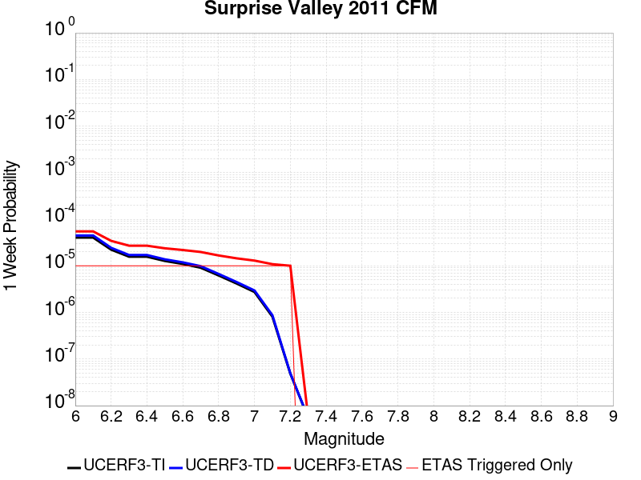 | 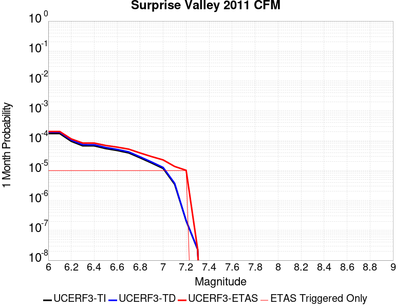 | 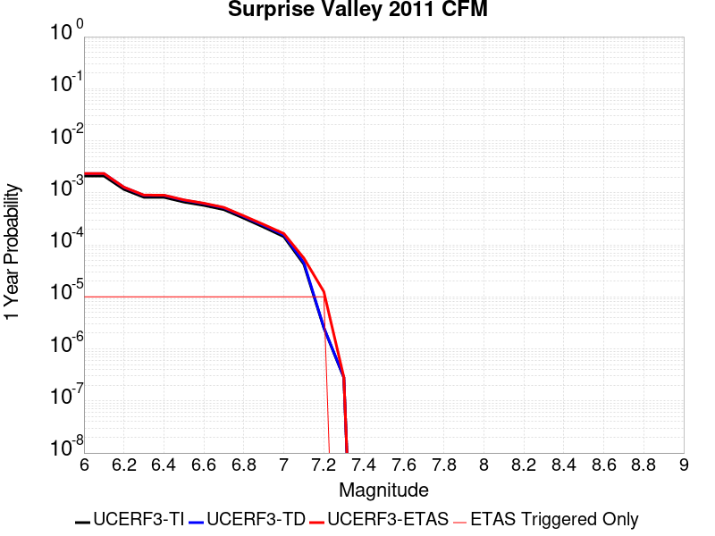 | 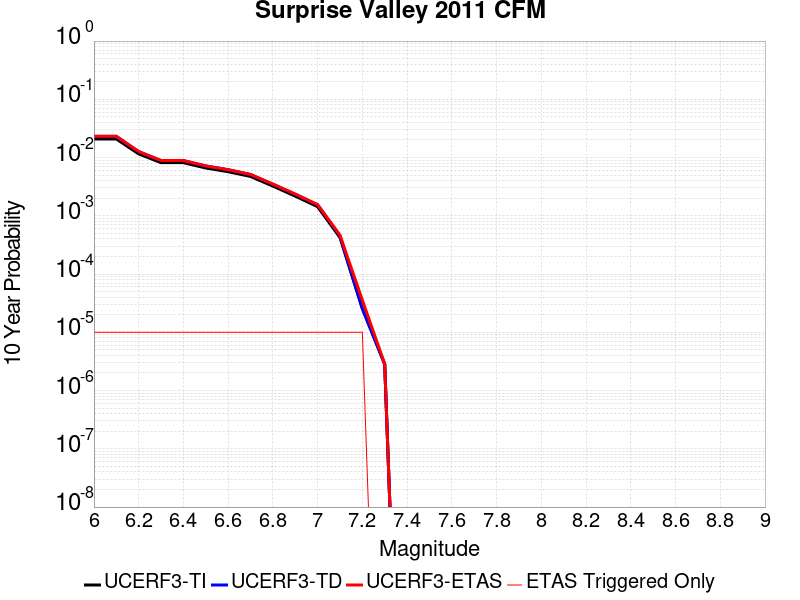 |

| Magnitude | 1 wk TI Prob | 1 wk TD Prob | 1 wk ETAS Prob | 1 wk ETAS/TD Gain | 1 wk ETAS Triggered Only | 1 mo TI Prob | 1 mo TD Prob | 1 mo ETAS Prob | 1 mo ETAS/TD Gain | 1 mo ETAS Triggered Only | 1 yr TI Prob | 1 yr TD Prob | 1 yr ETAS Prob | 1 yr ETAS/TD Gain | 1 yr ETAS Triggered Only | 10 yr TI Prob | 10 yr TD Prob | 10 yr ETAS Prob | 10 yr ETAS/TD Gain | 10 yr ETAS Triggered Only |
|-----|-----|-----|-----|-----|-----|-----|-----|-----|-----|-----|-----|-----|-----|-----|-----|-----|-----|-----|-----|-----|
| 6.0 | 4.0396248E-5 | 4.485131E-5 | 5.485086E-5 | 1.2229489 | 1.0E-5 | 1.7311527E-4 | 1.9220692E-4 | 2.02205E-4 | 1.0520172 | 1.0E-5 | 0.002105641 | 0.0023378176 | 0.0023477941 | 1.0042675 | 1.0E-5 | 0.020858008 | 0.023153966 | 0.023163736 | 1.0004219 | 1.0E-5 |
| 6.1 | 4.0396248E-5 | 4.485131E-5 | 5.485086E-5 | 1.2229489 | 1.0E-5 | 1.7311527E-4 | 1.9220692E-4 | 2.02205E-4 | 1.0520172 | 1.0E-5 | 0.002105641 | 0.0023378176 | 0.0023477941 | 1.0042675 | 1.0E-5 | 0.020858008 | 0.023153966 | 0.023163736 | 1.0004219 | 1.0E-5 |
| 6.2 | 2.2295266E-5 | 2.440125E-5 | 3.4401004E-5 | 1.409805 | 1.0E-5 | 9.554764E-5 | 1.0457276E-4 | 1.1457172E-4 | 1.0956172 | 1.0E-5 | 0.0011626717 | 0.0012724606 | 0.0012824478 | 1.0078487 | 1.0E-5 | 0.011566074 | 0.012654981 | 0.0126648545 | 1.0007802 | 1.0E-5 |
| 6.3 | 1.572643E-5 | 1.7096807E-5 | 2.7096636E-5 | 1.5848945 | 1.0E-5 | 6.7397246E-5 | 7.327003E-5 | 8.32693E-5 | 1.1364714 | 1.0E-5 | 8.202525E-4 | 8.91708E-4 | 9.016991E-4 | 1.0112045 | 1.0E-5 | 0.008172315 | 0.008882407 | 0.008892318 | 1.0011158 | 1.0E-5 |
| 6.4 | 1.5714395E-5 | 1.7084629E-5 | 2.7084458E-5 | 1.5853114 | 1.0E-5 | 6.734567E-5 | 7.3217845E-5 | 8.3217106E-5 | 1.1365688 | 1.0E-5 | 8.1962504E-4 | 8.9107314E-4 | 9.0106425E-4 | 1.0112125 | 1.0E-5 | 0.008166086 | 0.008876109 | 0.00888602 | 1.0011166 | 1.0E-5 |
| 6.5 | 1.2733495E-5 | 1.38016E-5 | 2.3801462E-5 | 1.7245437 | 1.0E-5 | 5.457098E-5 | 5.9148413E-5 | 6.914782E-5 | 1.1690563 | 1.0E-5 | 6.641992E-4 | 7.1990065E-4 | 7.2989345E-4 | 1.0138808 | 1.0E-5 | 0.0066221743 | 0.0071763797 | 0.007186308 | 1.0013834 | 1.0E-5 |
| 6.6 | 1.0983784E-5 | 1.1886554E-5 | 2.1886435E-5 | 1.8412768 | 1.0E-5 | 4.7072506E-5 | 5.094141E-5 | 6.09409E-5 | 1.196294 | 1.0E-5 | 5.7295704E-4 | 6.200405E-4 | 6.300343E-4 | 1.0161179 | 1.0E-5 | 0.0057148207 | 0.0061836545 | 0.0061935927 | 1.0016072 | 1.0E-5 |
| 6.7 | 9.104806E-6 | 9.839491E-6 | 1.9839394E-5 | 2.0163028 | 1.0E-5 | 3.902001E-5 | 4.2168587E-5 | 5.2168165E-5 | 1.2371334 | 1.0E-5 | 4.7496508E-4 | 5.132855E-4 | 5.232804E-4 | 1.0194724 | 1.0E-5 | 0.004739512 | 0.005121397 | 0.0051313457 | 1.0019426 | 1.0E-5 |
| 6.8 | 6.2162403E-6 | 6.7041337E-6 | 1.6704067E-5 | 2.491607 | 1.0E-5 | 2.6640759E-5 | 2.8731698E-5 | 3.873141E-5 | 1.3480376 | 1.0E-5 | 3.2430296E-4 | 3.497545E-4 | 3.5975102E-4 | 1.0285815 | 1.0E-5 | 0.003238301 | 0.0034922638 | 0.003502229 | 1.0028535 | 1.0E-5 |
| 6.9 | 4.1792696E-6 | 4.50323E-6 | 1.45031845E-5 | 3.2206182 | 1.0E-5 | 1.7911032E-5 | 1.9299423E-5 | 2.929923E-5 | 1.5181402 | 1.0E-5 | 2.1804498E-4 | 2.3494668E-4 | 2.4494433E-4 | 1.0425528 | 1.0E-5 | 0.0021783116 | 0.0023471361 | 0.0023571127 | 1.0042505 | 1.0E-5 |
| 7.0 | 2.7478413E-6 | 2.9622424E-6 | 1.2962213E-5 | 4.375811 | 1.0E-5 | 1.177641E-5 | 1.269527E-5 | 2.2695143E-5 | 1.7876849 | 1.0E-5 | 1.4336836E-4 | 1.545552E-4 | 1.6455365E-4 | 1.0646918 | 1.0E-5 | 0.001432759 | 0.0015445995 | 0.0015545841 | 1.0064641 | 1.0E-5 |
| 7.1 | 8.128648E-7 | 8.724922E-7 | 1.08724835E-5 | 12.4614105 | 1.0E-5 | 3.4837017E-6 | 3.7392501E-6 | 1.3739213E-5 | 3.674323 | 1.0E-5 | 4.2413245E-5 | 4.552502E-5 | 5.5524564E-5 | 1.2196494 | 1.0E-5 | 4.2405148E-4 | 4.5521575E-4 | 4.652112E-4 | 1.0219576 | 1.0E-5 |
| 7.2 | 4.8641045E-8 | 4.9402068E-8 | 1.0049402E-5 | 203.42067 | 1.0E-5 | 2.084616E-7 | 2.1172312E-7 | 1.0211721E-5 | 48.231487 | 1.0E-5 | 2.538017E-6 | 2.577726E-6 | 1.25777005E-5 | 4.8793783 | 1.0E-5 | 2.537988E-5 | 2.5776973E-5 | 3.5776717E-5 | 1.3879331 | 1.0E-5 |
| 7.3 | 5.3911844E-9 | 5.4758145E-9 | 5.4758145E-9 | 1.0 | 0.0 | 2.3105075E-8 | 2.3467775E-8 | 2.3467775E-8 | 1.0 | 0.0 | 2.8130427E-7 | 2.8572015E-7 | 2.8572015E-7 | 1.0 | 0.0 | 2.8130391E-6 | 2.8571992E-6 | 2.8571992E-6 | 1.0 | 0.0 |

## Los Osos 2011
*[(top)](#table-of-contents)*

| 1 Week | 1 Month | 1 Year | 10 Year |
|-----|-----|-----|-----|
|  |  |  |  |

| Magnitude | 1 wk TI Prob | 1 wk TD Prob | 1 wk ETAS Prob | 1 wk ETAS/TD Gain | 1 wk ETAS Triggered Only | 1 mo TI Prob | 1 mo TD Prob | 1 mo ETAS Prob | 1 mo ETAS/TD Gain | 1 mo ETAS Triggered Only | 1 yr TI Prob | 1 yr TD Prob | 1 yr ETAS Prob | 1 yr ETAS/TD Gain | 1 yr ETAS Triggered Only | 10 yr TI Prob | 10 yr TD Prob | 10 yr ETAS Prob | 10 yr ETAS/TD Gain | 10 yr ETAS Triggered Only |
|-----|-----|-----|-----|-----|-----|-----|-----|-----|-----|-----|-----|-----|-----|-----|-----|-----|-----|-----|-----|-----|
| 6.0 | 4.8871775E-6 | 4.9814826E-6 | 4.9814826E-6 | 1.0 | 0.0 | 2.0944879E-5 | 2.1349053E-5 | 2.1349053E-5 | 1.0 | 0.0 | 2.5497406E-4 | 2.598965E-4 | 2.598965E-4 | 1.0 | 0.0 | 0.002546817 | 0.0025962 | 0.0026261222 | 1.0115254 | 3.0E-5 |
| 6.1 | 4.8871775E-6 | 4.9814826E-6 | 4.9814826E-6 | 1.0 | 0.0 | 2.0944879E-5 | 2.1349053E-5 | 2.1349053E-5 | 1.0 | 0.0 | 2.5497406E-4 | 2.598965E-4 | 2.598965E-4 | 1.0 | 0.0 | 0.002546817 | 0.0025962 | 0.0026261222 | 1.0115254 | 3.0E-5 |
| 6.2 | 4.8871775E-6 | 4.9814826E-6 | 4.9814826E-6 | 1.0 | 0.0 | 2.0944879E-5 | 2.1349053E-5 | 2.1349053E-5 | 1.0 | 0.0 | 2.5497406E-4 | 2.598965E-4 | 2.598965E-4 | 1.0 | 0.0 | 0.002546817 | 0.0025962 | 0.0026261222 | 1.0115254 | 3.0E-5 |
| 6.3 | 4.8871775E-6 | 4.9814826E-6 | 4.9814826E-6 | 1.0 | 0.0 | 2.0944879E-5 | 2.1349053E-5 | 2.1349053E-5 | 1.0 | 0.0 | 2.5497406E-4 | 2.598965E-4 | 2.598965E-4 | 1.0 | 0.0 | 0.002546817 | 0.0025962 | 0.0026261222 | 1.0115254 | 3.0E-5 |
| 6.4 | 4.8871775E-6 | 4.9814826E-6 | 4.9814826E-6 | 1.0 | 0.0 | 2.0944879E-5 | 2.1349053E-5 | 2.1349053E-5 | 1.0 | 0.0 | 2.5497406E-4 | 2.598965E-4 | 2.598965E-4 | 1.0 | 0.0 | 0.002546817 | 0.0025962 | 0.0026261222 | 1.0115254 | 3.0E-5 |
| 6.5 | 3.1724062E-6 | 3.2233943E-6 | 3.2233943E-6 | 1.0 | 0.0 | 1.3595956E-5 | 1.3814474E-5 | 1.3814474E-5 | 1.0 | 0.0 | 1.6551818E-4 | 1.6817838E-4 | 1.6817838E-4 | 1.0 | 0.0 | 0.0016539496 | 0.0016805246 | 0.001700491 | 1.011881 | 2.0E-5 |
| 6.6 | 3.1022591E-6 | 3.1511038E-6 | 3.1511038E-6 | 1.0 | 0.0 | 1.3295328E-5 | 1.3504661E-5 | 1.3504661E-5 | 1.0 | 0.0 | 1.618586E-4 | 1.6440697E-4 | 1.6440697E-4 | 1.0 | 0.0 | 0.0016174077 | 0.0016428662 | 0.0016628334 | 1.0121539 | 2.0E-5 |
| 6.7 | 2.611518E-6 | 2.6491825E-6 | 2.6491825E-6 | 1.0 | 0.0 | 1.1192172E-5 | 1.1353591E-5 | 1.1353591E-5 | 1.0 | 0.0 | 1.3625617E-4 | 1.3822124E-4 | 1.3822124E-4 | 1.0 | 0.0 | 0.0013617266 | 0.0013813572 | 0.0014013295 | 1.0144585 | 2.0E-5 |
| 6.8 | 2.4780884E-6 | 2.5121587E-6 | 2.5121587E-6 | 1.0 | 0.0 | 1.0620336E-5 | 1.076635E-5 | 1.076635E-5 | 1.0 | 0.0 | 1.2929492E-4 | 1.3107246E-4 | 1.3107246E-4 | 1.0 | 0.0 | 0.0012921972 | 0.0013099556 | 0.0013299295 | 1.0152477 | 2.0E-5 |
| 6.9 | 2.1376322E-6 | 2.1635049E-6 | 2.1635049E-6 | 1.0 | 0.0 | 9.161248E-6 | 9.272131E-6 | 9.272131E-6 | 1.0 | 0.0 | 1.1153249E-4 | 1.1288237E-4 | 1.1288237E-4 | 1.0 | 0.0 | 0.0011147653 | 0.0011282521 | 0.0011482296 | 1.0177065 | 2.0E-5 |
| 7.0 | 1.9282882E-6 | 1.949458E-6 | 1.949458E-6 | 1.0 | 0.0 | 8.264066E-6 | 8.354793E-6 | 8.354793E-6 | 1.0 | 0.0 | 1.0061036E-4 | 1.0171487E-4 | 1.0171487E-4 | 1.0 | 0.0 | 0.0010056482 | 0.0010166845 | 0.0010366641 | 1.0196518 | 2.0E-5 |
| 7.1 | 1.6353226E-6 | 1.6501111E-6 | 1.6501111E-6 | 1.0 | 0.0 | 7.0085066E-6 | 7.0718856E-6 | 7.0718856E-6 | 1.0 | 0.0 | 8.532523E-5 | 8.6096814E-5 | 8.6096814E-5 | 1.0 | 0.0 | 8.529247E-4 | 8.6063537E-4 | 8.7062677E-4 | 1.0116093 | 1.0E-5 |
| 7.2 | 1.4446276E-6 | 1.4553335E-6 | 1.4553335E-6 | 1.0 | 0.0 | 6.191247E-6 | 6.2371287E-6 | 6.2371287E-6 | 1.0 | 0.0 | 7.537582E-5 | 7.59344E-5 | 7.59344E-5 | 1.0 | 0.0 | 7.535026E-4 | 7.590851E-4 | 7.690775E-4 | 1.0131638 | 1.0E-5 |
| 7.3 | 1.2014582E-6 | 1.2069066E-6 | 1.2069066E-6 | 1.0 | 0.0 | 5.149096E-6 | 5.172447E-6 | 5.172447E-6 | 1.0 | 0.0 | 6.268844E-5 | 6.297272E-5 | 6.297272E-5 | 1.0 | 0.0 | 6.267076E-4 | 6.295492E-4 | 6.395429E-4 | 1.0158744 | 1.0E-5 |
| 7.4 | 9.707733E-7 | 9.709767E-7 | 9.709767E-7 | 1.0 | 0.0 | 4.16045E-6 | 4.161322E-6 | 4.161322E-6 | 1.0 | 0.0 | 5.0652303E-5 | 5.066292E-5 | 5.066292E-5 | 1.0 | 0.0 | 5.064076E-4 | 5.065139E-4 | 5.165089E-4 | 1.0197328 | 1.0E-5 |
| 7.5 | 7.174908E-7 | 7.114907E-7 | 7.114907E-7 | 1.0 | 0.0 | 3.074957E-6 | 3.0492424E-6 | 3.0492424E-6 | 1.0 | 0.0 | 3.743696E-5 | 3.7123897E-5 | 3.7123897E-5 | 1.0 | 0.0 | 3.7430652E-4 | 3.7117713E-4 | 3.7117713E-4 | 1.0 | 0.0 |
| 7.6 | 4.5535776E-7 | 4.4207857E-7 | 4.4207857E-7 | 1.0 | 0.0 | 1.9515319E-6 | 1.8946212E-6 | 1.8946212E-6 | 1.0 | 0.0 | 2.3759641E-5 | 2.3066768E-5 | 2.3066768E-5 | 1.0 | 0.0 | 2.37571E-4 | 2.3064384E-4 | 2.3064384E-4 | 1.0 | 0.0 |
| 7.7 | 2.1173553E-7 | 1.9060734E-7 | 1.9060734E-7 | 1.0 | 0.0 | 9.0743765E-7 | 8.1688836E-7 | 8.1688836E-7 | 1.0 | 0.0 | 1.1047998E-5 | 9.94557E-6 | 9.94557E-6 | 1.0 | 0.0 | 1.1047449E-4 | 9.945128E-5 | 9.945128E-5 | 1.0 | 0.0 |
| 7.8 | 9.873608E-8 | 7.367457E-8 | 7.367457E-8 | 1.0 | 0.0 | 4.2315455E-7 | 3.1574814E-7 | 3.1574814E-7 | 1.0 | 0.0 | 5.1518946E-6 | 3.8442267E-6 | 3.8442267E-6 | 1.0 | 0.0 | 5.1517753E-5 | 3.844161E-5 | 3.844161E-5 | 1.0 | 0.0 |
| 7.9 | 5.4399106E-8 | 3.187941E-8 | 3.187941E-8 | 1.0 | 0.0 | 2.33139E-7 | 1.3662603E-7 | 1.3662603E-7 | 1.0 | 0.0 | 2.8384638E-6 | 1.6634207E-6 | 1.6634207E-6 | 1.0 | 0.0 | 2.8384275E-5 | 1.6634083E-5 | 1.6634083E-5 | 1.0 | 0.0 |
| 8.0 | 1.817203E-8 | 8.420079E-9 | 8.420079E-9 | 1.0 | 0.0 | 7.7880124E-8 | 3.6086053E-8 | 3.6086053E-8 | 1.0 | 0.0 | 9.481901E-7 | 4.393476E-7 | 4.393476E-7 | 1.0 | 0.0 | 9.481861E-6 | 4.393468E-6 | 4.393468E-6 | 1.0 | 0.0 |

## Johnson Valley (No) 2011 rev
*[(top)](#table-of-contents)*

| 1 Week | 1 Month | 1 Year | 10 Year |
|-----|-----|-----|-----|
|  |  |  | 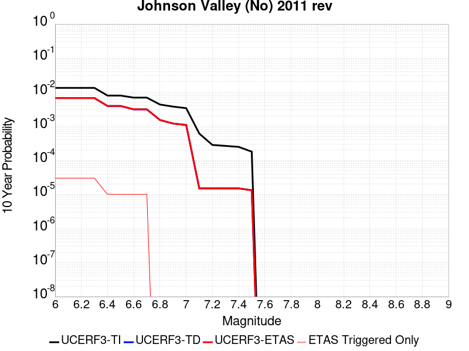 |

| Magnitude | 1 wk TI Prob | 1 wk TD Prob | 1 wk ETAS Prob | 1 wk ETAS/TD Gain | 1 wk ETAS Triggered Only | 1 mo TI Prob | 1 mo TD Prob | 1 mo ETAS Prob | 1 mo ETAS/TD Gain | 1 mo ETAS Triggered Only | 1 yr TI Prob | 1 yr TD Prob | 1 yr ETAS Prob | 1 yr ETAS/TD Gain | 1 yr ETAS Triggered Only | 10 yr TI Prob | 10 yr TD Prob | 10 yr ETAS Prob | 10 yr ETAS/TD Gain | 10 yr ETAS Triggered Only |
|-----|-----|-----|-----|-----|-----|-----|-----|-----|-----|-----|-----|-----|-----|-----|-----|-----|-----|-----|-----|-----|
| 6.0 | 2.577707E-5 | 1.2901208E-5 | 2.2901078E-5 | 1.7751112 | 1.0E-5 | 1.1046848E-4 | 5.528994E-5 | 7.528884E-5 | 1.3617095 | 2.0E-5 | 0.0013441239 | 6.729868E-4 | 6.929733E-4 | 1.0296983 | 2.0E-5 | 0.013360229 | 0.006713397 | 0.0067431955 | 1.0044386 | 3.0E-5 |
| 6.1 | 2.577707E-5 | 1.2901208E-5 | 2.2901078E-5 | 1.7751112 | 1.0E-5 | 1.1046848E-4 | 5.528994E-5 | 7.528884E-5 | 1.3617095 | 2.0E-5 | 0.0013441239 | 6.729868E-4 | 6.929733E-4 | 1.0296983 | 2.0E-5 | 0.013360229 | 0.006713397 | 0.0067431955 | 1.0044386 | 3.0E-5 |
| 6.2 | 2.577707E-5 | 1.2901208E-5 | 2.2901078E-5 | 1.7751112 | 1.0E-5 | 1.1046848E-4 | 5.528994E-5 | 7.528884E-5 | 1.3617095 | 2.0E-5 | 0.0013441239 | 6.729868E-4 | 6.929733E-4 | 1.0296983 | 2.0E-5 | 0.013360229 | 0.006713397 | 0.0067431955 | 1.0044386 | 3.0E-5 |
| 6.3 | 2.577707E-5 | 1.2901208E-5 | 2.2901078E-5 | 1.7751112 | 1.0E-5 | 1.1046848E-4 | 5.528994E-5 | 7.528884E-5 | 1.3617095 | 2.0E-5 | 0.0013441239 | 6.729868E-4 | 6.929733E-4 | 1.0296983 | 2.0E-5 | 0.013360229 | 0.006713397 | 0.0067431955 | 1.0044386 | 3.0E-5 |
| 6.4 | 1.5296591E-5 | 7.5369735E-6 | 1.7536899E-5 | 2.3267825 | 1.0E-5 | 6.555518E-5 | 3.230102E-5 | 4.2300697E-5 | 1.3095777 | 1.0E-5 | 7.97842E-4 | 3.9321271E-4 | 4.0320877E-4 | 1.0254215 | 1.0E-5 | 0.007949836 | 0.003927011 | 0.003936972 | 1.0025364 | 1.0E-5 |
| 6.5 | 1.5296591E-5 | 7.5369735E-6 | 1.7536899E-5 | 2.3267825 | 1.0E-5 | 6.555518E-5 | 3.230102E-5 | 4.2300697E-5 | 1.3095777 | 1.0E-5 | 7.97842E-4 | 3.9321271E-4 | 4.0320877E-4 | 1.0254215 | 1.0E-5 | 0.007949836 | 0.003927011 | 0.003936972 | 1.0025364 | 1.0E-5 |
| 6.6 | 1.3289383E-5 | 5.9919316E-6 | 1.599187E-5 | 2.668901 | 1.0E-5 | 5.6953253E-5 | 2.567955E-5 | 3.567929E-5 | 1.3894049 | 1.0E-5 | 6.9318525E-4 | 3.1262063E-4 | 3.226175E-4 | 1.0319777 | 1.0E-5 | 0.0069102696 | 0.0031234731 | 0.0031334418 | 1.0031916 | 1.0E-5 |
| 6.7 | 1.3289383E-5 | 5.9919316E-6 | 1.599187E-5 | 2.668901 | 1.0E-5 | 5.6953253E-5 | 2.567955E-5 | 3.567929E-5 | 1.3894049 | 1.0E-5 | 6.9318525E-4 | 3.1262063E-4 | 3.226175E-4 | 1.0319777 | 1.0E-5 | 0.0069102696 | 0.0031234731 | 0.0031334418 | 1.0031916 | 1.0E-5 |
| 6.8 | 8.330789E-6 | 2.9214577E-6 | 2.9214577E-6 | 1.0 | 0.0 | 3.570289E-5 | 1.2520505E-5 | 1.2520505E-5 | 1.0 | 0.0 | 4.34596E-4 | 1.524322E-4 | 1.524322E-4 | 1.0 | 0.0 | 0.0043374705 | 0.0015238364 | 0.0015238364 | 1.0 | 0.0 |
| 6.9 | 7.2359003E-6 | 2.3014702E-6 | 2.3014702E-6 | 1.0 | 0.0 | 3.1010633E-5 | 9.863436E-6 | 9.863436E-6 | 1.0 | 0.0 | 3.7748902E-4 | 1.2008605E-4 | 1.2008605E-4 | 1.0 | 0.0 | 0.0037684843 | 0.0012007345 | 0.0012007345 | 1.0 | 0.0 |
| 7.0 | 6.5149957E-6 | 2.0886398E-6 | 2.0886398E-6 | 1.0 | 0.0 | 2.792111E-5 | 8.951313E-6 | 8.951313E-6 | 1.0 | 0.0 | 3.398865E-4 | 1.0898209E-4 | 1.0898209E-4 | 1.0 | 0.0 | 0.003393671 | 0.0010898062 | 0.0010898062 | 1.0 | 0.0 |
| 7.1 | 1.1662233E-6 | 2.8793124E-8 | 2.8793124E-8 | 1.0 | 0.0 | 4.9980904E-6 | 1.2339909E-7 | 1.2339909E-7 | 1.0 | 0.0 | 6.0850052E-5 | 1.5023832E-6 | 1.5023832E-6 | 1.0 | 0.0 | 6.083339E-4 | 1.5023746E-5 | 1.5023746E-5 | 1.0 | 0.0 |
| 7.2 | 5.413881E-7 | 2.8793124E-8 | 2.8793124E-8 | 1.0 | 0.0 | 2.3202326E-6 | 1.2339909E-7 | 1.2339909E-7 | 1.0 | 0.0 | 2.8248465E-5 | 1.5023832E-6 | 1.5023832E-6 | 1.0 | 0.0 | 2.8244875E-4 | 1.5023746E-5 | 1.5023746E-5 | 1.0 | 0.0 |
| 7.3 | 5.076821E-7 | 2.8793124E-8 | 2.8793124E-8 | 1.0 | 0.0 | 2.1757785E-6 | 1.2339909E-7 | 1.2339909E-7 | 1.0 | 0.0 | 2.648978E-5 | 1.5023832E-6 | 1.5023832E-6 | 1.0 | 0.0 | 2.6486625E-4 | 1.5023746E-5 | 1.5023746E-5 | 1.0 | 0.0 |
| 7.4 | 4.7568687E-7 | 2.8775073E-8 | 2.8775073E-8 | 1.0 | 0.0 | 2.0386565E-6 | 1.2332174E-7 | 1.2332174E-7 | 1.0 | 0.0 | 2.482036E-5 | 1.5014413E-6 | 1.5014413E-6 | 1.0 | 0.0 | 2.4817587E-4 | 1.5014328E-5 | 1.5014328E-5 | 1.0 | 0.0 |
| 7.5 | 3.435626E-7 | 2.5350424E-8 | 2.5350424E-8 | 1.0 | 0.0 | 1.4724103E-6 | 1.0864467E-7 | 1.0864467E-7 | 1.0 | 0.0 | 1.7926448E-5 | 1.3227482E-6 | 1.3227482E-6 | 1.0 | 0.0 | 1.7925001E-4 | 1.3227419E-5 | 1.3227419E-5 | 1.0 | 0.0 |

## Santa Cruz Catalina Ridge alt1
*[(top)](#table-of-contents)*

| 1 Week | 1 Month | 1 Year | 10 Year |
|-----|-----|-----|-----|
|  |  |  |  |

| Magnitude | 1 wk TI Prob | 1 wk TD Prob | 1 wk ETAS Prob | 1 wk ETAS/TD Gain | 1 wk ETAS Triggered Only | 1 mo TI Prob | 1 mo TD Prob | 1 mo ETAS Prob | 1 mo ETAS/TD Gain | 1 mo ETAS Triggered Only | 1 yr TI Prob | 1 yr TD Prob | 1 yr ETAS Prob | 1 yr ETAS/TD Gain | 1 yr ETAS Triggered Only | 10 yr TI Prob | 10 yr TD Prob | 10 yr ETAS Prob | 10 yr ETAS/TD Gain | 10 yr ETAS Triggered Only |
|-----|-----|-----|-----|-----|-----|-----|-----|-----|-----|-----|-----|-----|-----|-----|-----|-----|-----|-----|-----|-----|
| 6.0 | 3.2833184E-5 | 3.6558402E-5 | 5.655767E-5 | 1.5470499 | 2.0E-5 | 1.4070606E-4 | 1.5667039E-4 | 1.7666725E-4 | 1.1276366 | 2.0E-5 | 0.00171175 | 0.0019059594 | 0.0019259213 | 1.0104734 | 2.0E-5 | 0.016986247 | 0.018913032 | 0.018942466 | 1.0015562 | 3.0E-5 |
| 6.1 | 1.9835548E-5 | 2.1659505E-5 | 4.1659074E-5 | 1.9233621 | 2.0E-5 | 8.500672E-5 | 9.282326E-5 | 1.12821406E-4 | 1.2154433 | 2.0E-5 | 0.0010344655 | 0.0011295575 | 0.001149535 | 1.017686 | 2.0E-5 | 0.010296632 | 0.011240296 | 0.011269959 | 1.0026389 | 3.0E-5 |
| 6.2 | 1.9835548E-5 | 2.1659505E-5 | 4.1659074E-5 | 1.9233621 | 2.0E-5 | 8.500672E-5 | 9.282326E-5 | 1.12821406E-4 | 1.2154433 | 2.0E-5 | 0.0010344655 | 0.0011295575 | 0.001149535 | 1.017686 | 2.0E-5 | 0.010296632 | 0.011240296 | 0.011269959 | 1.0026389 | 3.0E-5 |
| 6.3 | 1.5728183E-5 | 1.703395E-5 | 3.703361E-5 | 2.174106 | 2.0E-5 | 6.7404755E-5 | 7.300063E-5 | 9.299917E-5 | 1.2739502 | 2.0E-5 | 8.2034385E-4 | 8.884264E-4 | 9.084086E-4 | 1.0224917 | 2.0E-5 | 0.008173222 | 0.008849427 | 0.008879161 | 1.00336 | 3.0E-5 |
| 6.4 | 1.5728183E-5 | 1.703395E-5 | 3.703361E-5 | 2.174106 | 2.0E-5 | 6.7404755E-5 | 7.300063E-5 | 9.299917E-5 | 1.2739502 | 2.0E-5 | 8.2034385E-4 | 8.884264E-4 | 9.084086E-4 | 1.0224917 | 2.0E-5 | 0.008173222 | 0.008849427 | 0.008879161 | 1.00336 | 3.0E-5 |
| 6.5 | 1.3707734E-5 | 1.4794522E-5 | 3.4794226E-5 | 2.3518317 | 2.0E-5 | 5.8746107E-5 | 6.3403575E-5 | 8.34023E-5 | 1.3154197 | 2.0E-5 | 7.1499916E-4 | 7.716686E-4 | 7.916532E-4 | 1.0258979 | 2.0E-5 | 0.0071270303 | 0.0076902895 | 0.007720059 | 1.003871 | 3.0E-5 |
| 6.6 | 1.2539813E-5 | 1.3510219E-5 | 3.350995E-5 | 2.480341 | 2.0E-5 | 5.3740947E-5 | 5.789967E-5 | 7.789851E-5 | 1.3454051 | 2.0E-5 | 6.540996E-4 | 7.0470315E-4 | 7.2468905E-4 | 1.0283607 | 2.0E-5 | 0.0065217763 | 0.0070249885 | 0.007054778 | 1.0042405 | 3.0E-5 |
| 6.7 | 1.1504083E-5 | 1.2377375E-5 | 3.2377127E-5 | 2.6158316 | 2.0E-5 | 4.930228E-5 | 5.3044827E-5 | 7.304377E-5 | 1.3770196 | 2.0E-5 | 6.0008996E-4 | 6.456314E-4 | 6.6561846E-4 | 1.0309575 | 2.0E-5 | 0.005984721 | 0.006437786 | 0.006467593 | 1.00463 | 3.0E-5 |
| 6.8 | 1.012739E-5 | 1.0877071E-5 | 3.0876854E-5 | 2.8387103 | 2.0E-5 | 4.340238E-5 | 4.6615194E-5 | 6.6614266E-5 | 1.4290247 | 2.0E-5 | 5.282958E-4 | 5.673937E-4 | 5.8738235E-4 | 1.0352288 | 2.0E-5 | 0.0052704164 | 0.0056596193 | 0.0056894496 | 1.0052707 | 3.0E-5 |
| 6.9 | 8.9607865E-6 | 9.609117E-6 | 1.960902E-5 | 2.0406682 | 1.0E-5 | 3.8402806E-5 | 4.1181287E-5 | 5.1180876E-5 | 1.2428187 | 1.0E-5 | 4.6745385E-4 | 5.012679E-4 | 5.1126286E-4 | 1.0199394 | 1.0E-5 | 0.0046647177 | 0.005001492 | 0.005021392 | 1.0039788 | 2.0E-5 |
| 7.0 | 8.046829E-6 | 8.619746E-6 | 1.861966E-5 | 2.160117 | 1.0E-5 | 3.4485955E-5 | 3.694125E-5 | 4.694088E-5 | 1.2706901 | 1.0E-5 | 4.1978562E-4 | 4.496677E-4 | 4.5966322E-4 | 1.0222286 | 1.0E-5 | 0.004189935 | 0.0044876686 | 0.004507579 | 1.0044366 | 2.0E-5 |
| 7.1 | 7.136131E-6 | 7.637656E-6 | 7.637656E-6 | 1.0 | 0.0 | 3.0583058E-5 | 3.2732405E-5 | 3.2732405E-5 | 1.0 | 0.0 | 3.7228514E-4 | 3.9844486E-4 | 3.9844486E-4 | 1.0 | 0.0 | 0.0037166206 | 0.003977381 | 0.0039873417 | 1.0025042 | 1.0E-5 |
| 7.2 | 6.362014E-6 | 6.8049585E-6 | 6.8049585E-6 | 1.0 | 0.0 | 2.726549E-5 | 2.9163786E-5 | 2.9163786E-5 | 1.0 | 0.0 | 3.3190678E-4 | 3.550119E-4 | 3.550119E-4 | 1.0 | 0.0 | 0.0033141149 | 0.003544516 | 0.0035544806 | 1.0028113 | 1.0E-5 |
| 7.3 | 5.004101E-6 | 5.351715E-6 | 5.351715E-6 | 1.0 | 0.0 | 2.1445969E-5 | 2.2935723E-5 | 2.2935723E-5 | 1.0 | 0.0 | 2.6107338E-4 | 2.792072E-4 | 2.792072E-4 | 1.0 | 0.0 | 0.002607669 | 0.0027886187 | 0.0027886187 | 1.0 | 0.0 |
| 7.4 | 3.4901443E-6 | 3.7320526E-6 | 3.7320526E-6 | 1.0 | 0.0 | 1.4957676E-5 | 1.5994416E-5 | 1.5994416E-5 | 1.0 | 0.0 | 1.8209449E-4 | 1.9471499E-4 | 1.9471499E-4 | 1.0 | 0.0 | 0.0018194534 | 0.0019454823 | 0.0019454823 | 1.0 | 0.0 |
| 7.5 | 1.1215045E-6 | 1.189387E-6 | 1.189387E-6 | 1.0 | 0.0 | 4.806439E-6 | 5.097363E-6 | 5.097363E-6 | 1.0 | 0.0 | 5.851682E-5 | 6.205866E-5 | 6.205866E-5 | 1.0 | 0.0 | 5.850142E-4 | 6.2041637E-4 | 6.2041637E-4 | 1.0 | 0.0 |
| 7.6 | 2.8599047E-7 | 2.9951994E-7 | 2.9951994E-7 | 1.0 | 0.0 | 1.2256729E-6 | 1.2836562E-6 | 1.2836562E-6 | 1.0 | 0.0 | 1.4922465E-5 | 1.5628404E-5 | 1.5628404E-5 | 1.0 | 0.0 | 1.4921463E-4 | 1.5627318E-4 | 1.5627318E-4 | 1.0 | 0.0 |
| 7.7 | 2.0781519E-7 | 2.1744323E-7 | 2.1744323E-7 | 1.0 | 0.0 | 8.906362E-7 | 9.3189925E-7 | 9.3189925E-7 | 1.0 | 0.0 | 1.08434415E-5 | 1.13458145E-5 | 1.13458145E-5 | 1.0 | 0.0 | 1.0842913E-4 | 1.1345245E-4 | 1.1345245E-4 | 1.0 | 0.0 |
| 7.8 | 3.614776E-8 | 3.764102E-8 | 3.764102E-8 | 1.0 | 0.0 | 1.5491896E-7 | 1.6131864E-7 | 1.6131864E-7 | 1.0 | 0.0 | 1.8861368E-6 | 1.9640527E-6 | 1.9640527E-6 | 1.0 | 0.0 | 1.8861208E-5 | 1.9640367E-5 | 1.9640367E-5 | 1.0 | 0.0 |

## San Jacinto (Clark) rev
*[(top)](#table-of-contents)*

| 1 Week | 1 Month | 1 Year | 10 Year |
|-----|-----|-----|-----|
| 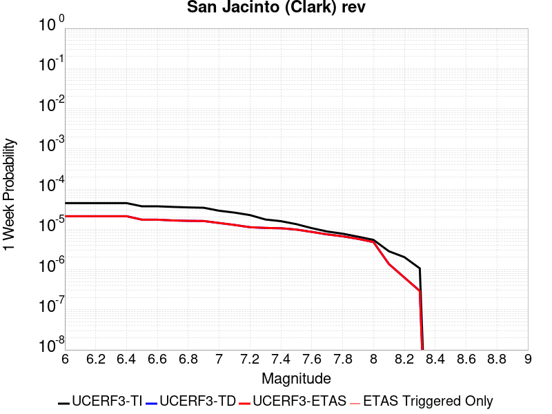 |  |  |  |

| Magnitude | 1 wk TI Prob | 1 wk TD Prob | 1 wk ETAS Prob | 1 wk ETAS/TD Gain | 1 wk ETAS Triggered Only | 1 mo TI Prob | 1 mo TD Prob | 1 mo ETAS Prob | 1 mo ETAS/TD Gain | 1 mo ETAS Triggered Only | 1 yr TI Prob | 1 yr TD Prob | 1 yr ETAS Prob | 1 yr ETAS/TD Gain | 1 yr ETAS Triggered Only | 10 yr TI Prob | 10 yr TD Prob | 10 yr ETAS Prob | 10 yr ETAS/TD Gain | 10 yr ETAS Triggered Only |
|-----|-----|-----|-----|-----|-----|-----|-----|-----|-----|-----|-----|-----|-----|-----|-----|-----|-----|-----|-----|-----|
| 6.0 | 4.482615E-5 | 2.1153059E-5 | 2.1153059E-5 | 1.0 | 0.0 | 1.9209793E-4 | 9.065287E-5 | 9.065287E-5 | 1.0 | 0.0 | 0.0023362834 | 0.0011031491 | 0.001113138 | 1.0090549 | 1.0E-5 | 0.02311874 | 0.011485709 | 0.011515364 | 1.002582 | 3.0E-5 |
| 6.1 | 4.482615E-5 | 2.1153059E-5 | 2.1153059E-5 | 1.0 | 0.0 | 1.9209793E-4 | 9.065287E-5 | 9.065287E-5 | 1.0 | 0.0 | 0.0023362834 | 0.0011031491 | 0.001113138 | 1.0090549 | 1.0E-5 | 0.02311874 | 0.011485709 | 0.011515364 | 1.002582 | 3.0E-5 |
| 6.2 | 4.482615E-5 | 2.1153059E-5 | 2.1153059E-5 | 1.0 | 0.0 | 1.9209793E-4 | 9.065287E-5 | 9.065287E-5 | 1.0 | 0.0 | 0.0023362834 | 0.0011031491 | 0.001113138 | 1.0090549 | 1.0E-5 | 0.02311874 | 0.011485709 | 0.011515364 | 1.002582 | 3.0E-5 |
| 6.3 | 4.482615E-5 | 2.1153059E-5 | 2.1153059E-5 | 1.0 | 0.0 | 1.9209793E-4 | 9.065287E-5 | 9.065287E-5 | 1.0 | 0.0 | 0.0023362834 | 0.0011031491 | 0.001113138 | 1.0090549 | 1.0E-5 | 0.02311874 | 0.011485709 | 0.011515364 | 1.002582 | 3.0E-5 |
| 6.4 | 4.482615E-5 | 2.1153059E-5 | 2.1153059E-5 | 1.0 | 0.0 | 1.9209793E-4 | 9.065287E-5 | 9.065287E-5 | 1.0 | 0.0 | 0.0023362834 | 0.0011031491 | 0.001113138 | 1.0090549 | 1.0E-5 | 0.02311874 | 0.011485709 | 0.011515364 | 1.002582 | 3.0E-5 |
| 6.5 | 3.7294863E-5 | 1.7354667E-5 | 1.7354667E-5 | 1.0 | 0.0 | 1.5982533E-4 | 7.437504E-5 | 7.437504E-5 | 1.0 | 0.0 | 0.0019441366 | 9.051445E-4 | 9.1513543E-4 | 1.011038 | 1.0E-5 | 0.01927216 | 0.009485902 | 0.009515618 | 1.0031326 | 3.0E-5 |
| 6.6 | 3.7294863E-5 | 1.7354667E-5 | 1.7354667E-5 | 1.0 | 0.0 | 1.5982533E-4 | 7.437504E-5 | 7.437504E-5 | 1.0 | 0.0 | 0.0019441366 | 9.051445E-4 | 9.1513543E-4 | 1.011038 | 1.0E-5 | 0.01927216 | 0.009485902 | 0.009515618 | 1.0031326 | 3.0E-5 |
| 6.7 | 3.6039248E-5 | 1.6602684E-5 | 1.6602684E-5 | 1.0 | 0.0 | 1.5444479E-4 | 7.115244E-5 | 7.115244E-5 | 1.0 | 0.0 | 0.0018787434 | 8.659408E-4 | 8.7593216E-4 | 1.0115381 | 1.0E-5 | 0.01862939 | 0.009088189 | 0.009117916 | 1.003271 | 3.0E-5 |
| 6.8 | 3.5031844E-5 | 1.6231123E-5 | 1.6231123E-5 | 1.0 | 0.0 | 1.5012783E-4 | 6.956012E-5 | 6.956012E-5 | 1.0 | 0.0 | 0.0018262739 | 8.4656954E-4 | 8.5656106E-4 | 1.0118024 | 1.0E-5 | 0.01811338 | 0.008888788 | 0.008918521 | 1.003345 | 3.0E-5 |
| 6.9 | 3.435112E-5 | 1.6061658E-5 | 1.6061658E-5 | 1.0 | 0.0 | 1.4721078E-4 | 6.8833884E-5 | 6.8833884E-5 | 1.0 | 0.0 | 0.0017908178 | 8.377344E-4 | 8.47726E-4 | 1.011927 | 1.0E-5 | 0.017764548 | 0.008796512 | 0.008826248 | 1.0033804 | 3.0E-5 |
| 7.0 | 2.8959772E-5 | 1.43355255E-5 | 1.43355255E-5 | 1.0 | 0.0 | 1.241074E-4 | 6.1436534E-5 | 6.1436534E-5 | 1.0 | 0.0 | 0.0015099603 | 7.477359E-4 | 7.577284E-4 | 1.0133637 | 1.0E-5 | 0.014997416 | 0.007868331 | 0.007898095 | 1.0037827 | 3.0E-5 |
| 7.1 | 2.6002877E-5 | 1.2827699E-5 | 1.2827699E-5 | 1.0 | 0.0 | 1.11436144E-4 | 5.4974706E-5 | 5.4974706E-5 | 1.0 | 0.0 | 0.0013558907 | 6.6911365E-4 | 6.791069E-4 | 1.0149351 | 1.0E-5 | 0.013476475 | 0.0070483433 | 0.007078132 | 1.0042263 | 3.0E-5 |
| 7.2 | 2.2544838E-5 | 1.1260331E-5 | 1.1260331E-5 | 1.0 | 0.0 | 9.661716E-5 | 4.825768E-5 | 4.825768E-5 | 1.0 | 0.0 | 0.001175679 | 5.873803E-4 | 5.973744E-4 | 1.0170147 | 1.0E-5 | 0.011694785 | 0.00619256 | 0.0062223743 | 1.0048145 | 3.0E-5 |
| 7.3 | 1.75334E-5 | 1.0810585E-5 | 1.0810585E-5 | 1.0 | 0.0 | 7.514098E-5 | 4.6330264E-5 | 4.6330264E-5 | 1.0 | 0.0 | 9.144575E-4 | 5.6392635E-4 | 5.739207E-4 | 1.0177228 | 1.0E-5 | 0.009107036 | 0.0059332196 | 0.0059630414 | 1.0050262 | 3.0E-5 |
| 7.4 | 1.5924552E-5 | 1.0610475E-5 | 1.0610475E-5 | 1.0 | 0.0 | 6.82463E-5 | 4.547268E-5 | 4.547268E-5 | 1.0 | 0.0 | 8.305819E-4 | 5.534906E-4 | 5.634851E-4 | 1.0180571 | 1.0E-5 | 0.008274844 | 0.0058205863 | 0.0058504115 | 1.0051241 | 3.0E-5 |
| 7.5 | 1.3428931E-5 | 9.851045E-6 | 9.851045E-6 | 1.0 | 0.0 | 5.7551293E-5 | 4.221809E-5 | 4.221809E-5 | 1.0 | 0.0 | 7.004617E-4 | 5.1388505E-4 | 5.2387995E-4 | 1.0194496 | 1.0E-5 | 0.006982579 | 0.005406209 | 0.0054360465 | 1.0055192 | 3.0E-5 |
| 7.6 | 1.0688787E-5 | 8.614091E-6 | 8.614091E-6 | 1.0 | 0.0 | 4.5808283E-5 | 3.6917012E-5 | 3.6917012E-5 | 1.0 | 0.0 | 5.5757316E-4 | 4.4937237E-4 | 4.5936788E-4 | 1.0222433 | 1.0E-5 | 0.005561762 | 0.0047413614 | 0.004771219 | 1.0062973 | 3.0E-5 |
| 7.7 | 8.81236E-6 | 7.4673385E-6 | 7.4673385E-6 | 1.0 | 0.0 | 3.776671E-5 | 3.200249E-5 | 3.200249E-5 | 1.0 | 0.0 | 4.597127E-4 | 3.8956082E-4 | 3.9955694E-4 | 1.0256599 | 1.0E-5 | 0.0045876284 | 0.0041344194 | 0.0041642953 | 1.0072261 | 3.0E-5 |
| 7.8 | 7.780431E-6 | 6.695928E-6 | 6.695928E-6 | 1.0 | 0.0 | 3.3344273E-5 | 2.8696519E-5 | 2.8696519E-5 | 1.0 | 0.0 | 4.0589093E-4 | 3.4932428E-4 | 3.5932078E-4 | 1.0286167 | 1.0E-5 | 0.0040515037 | 0.0037226272 | 0.0037525154 | 1.0080289 | 3.0E-5 |
| 7.9 | 6.5437994E-6 | 5.7797783E-6 | 5.7797783E-6 | 1.0 | 0.0 | 2.8044553E-5 | 2.4770245E-5 | 2.4770245E-5 | 1.0 | 0.0 | 3.4138895E-4 | 3.0153614E-4 | 3.1153313E-4 | 1.0331535 | 1.0E-5 | 0.0034086495 | 0.0032343294 | 0.0032542646 | 1.0061637 | 2.0E-5 |
| 8.0 | 5.4488164E-6 | 4.812793E-6 | 4.812793E-6 | 1.0 | 0.0 | 2.3351862E-5 | 2.0626094E-5 | 2.0626094E-5 | 1.0 | 0.0 | 2.8427184E-4 | 2.510939E-4 | 2.610914E-4 | 1.0398158 | 1.0E-5 | 0.0028390845 | 0.0027107038 | 0.0027306494 | 1.0073582 | 2.0E-5 |
| 8.1 | 2.8397242E-6 | 1.3665673E-6 | 1.3665673E-6 | 1.0 | 0.0 | 1.217019E-5 | 5.856704E-6 | 5.856704E-6 | 1.0 | 0.0 | 1.4816198E-4 | 7.1303046E-5 | 7.1303046E-5 | 1.0 | 0.0 | 0.0014806325 | 8.113543E-4 | 8.113543E-4 | 1.0 | 0.0 |
| 8.2 | 2.030244E-6 | 6.3151083E-7 | 6.3151083E-7 | 1.0 | 0.0 | 8.701017E-6 | 2.7064723E-6 | 2.7064723E-6 | 1.0 | 0.0 | 1.05929736E-4 | 3.2950808E-5 | 3.2950808E-5 | 1.0 | 0.0 | 0.0010587925 | 3.9470522E-4 | 3.9470522E-4 | 1.0 | 0.0 |
| 8.3 | 1.0659804E-6 | 2.9230563E-7 | 2.9230563E-7 | 1.0 | 0.0 | 4.568479E-6 | 1.2527379E-6 | 1.2527379E-6 | 1.0 | 0.0 | 5.5619817E-5 | 1.5251981E-5 | 1.5251981E-5 | 1.0 | 0.0 | 5.5605895E-4 | 1.8556409E-4 | 1.8556409E-4 | 1.0 | 0.0 |

## Hollywood
*[(top)](#table-of-contents)*

| 1 Week | 1 Month | 1 Year | 10 Year |
|-----|-----|-----|-----|
|  |  |  |  |

| Magnitude | 1 wk TI Prob | 1 wk TD Prob | 1 wk ETAS Prob | 1 wk ETAS/TD Gain | 1 wk ETAS Triggered Only | 1 mo TI Prob | 1 mo TD Prob | 1 mo ETAS Prob | 1 mo ETAS/TD Gain | 1 mo ETAS Triggered Only | 1 yr TI Prob | 1 yr TD Prob | 1 yr ETAS Prob | 1 yr ETAS/TD Gain | 1 yr ETAS Triggered Only | 10 yr TI Prob | 10 yr TD Prob | 10 yr ETAS Prob | 10 yr ETAS/TD Gain | 10 yr ETAS Triggered Only |
|-----|-----|-----|-----|-----|-----|-----|-----|-----|-----|-----|-----|-----|-----|-----|-----|-----|-----|-----|-----|-----|
| 6.0 | 1.24487615E-5 | 1.2593229E-5 | 1.2593229E-5 | 1.0 | 0.0 | 5.3350745E-5 | 5.3969892E-5 | 5.3969892E-5 | 1.0 | 0.0 | 6.4935174E-4 | 6.5689E-4 | 6.5689E-4 | 1.0 | 0.0 | 0.0064745755 | 0.0065499707 | 0.00656984 | 1.0030334 | 2.0E-5 |
| 6.1 | 1.24487615E-5 | 1.2593229E-5 | 1.2593229E-5 | 1.0 | 0.0 | 5.3350745E-5 | 5.3969892E-5 | 5.3969892E-5 | 1.0 | 0.0 | 6.4935174E-4 | 6.5689E-4 | 6.5689E-4 | 1.0 | 0.0 | 0.0064745755 | 0.0065499707 | 0.00656984 | 1.0030334 | 2.0E-5 |
| 6.2 | 1.24487615E-5 | 1.2593229E-5 | 1.2593229E-5 | 1.0 | 0.0 | 5.3350745E-5 | 5.3969892E-5 | 5.3969892E-5 | 1.0 | 0.0 | 6.4935174E-4 | 6.5689E-4 | 6.5689E-4 | 1.0 | 0.0 | 0.0064745755 | 0.0065499707 | 0.00656984 | 1.0030334 | 2.0E-5 |
| 6.3 | 1.24487615E-5 | 1.2593229E-5 | 1.2593229E-5 | 1.0 | 0.0 | 5.3350745E-5 | 5.3969892E-5 | 5.3969892E-5 | 1.0 | 0.0 | 6.4935174E-4 | 6.5689E-4 | 6.5689E-4 | 1.0 | 0.0 | 0.0064745755 | 0.0065499707 | 0.00656984 | 1.0030334 | 2.0E-5 |
| 6.4 | 1.2431024E-5 | 1.25738425E-5 | 1.25738425E-5 | 1.0 | 0.0 | 5.327473E-5 | 5.388681E-5 | 5.388681E-5 | 1.0 | 0.0 | 6.4842677E-4 | 6.558791E-4 | 6.558791E-4 | 1.0 | 0.0 | 0.0064653796 | 0.0065399213 | 0.0065597906 | 1.0030382 | 2.0E-5 |
| 6.5 | 1.1242222E-5 | 1.1317804E-5 | 1.1317804E-5 | 1.0 | 0.0 | 4.8180063E-5 | 4.8503985E-5 | 4.8503985E-5 | 1.0 | 0.0 | 5.864344E-4 | 5.903787E-4 | 5.903787E-4 | 1.0 | 0.0 | 0.0058488925 | 0.00588839 | 0.005908272 | 1.0033765 | 2.0E-5 |
| 6.6 | 1.1234066E-5 | 1.1308918E-5 | 1.1308918E-5 | 1.0 | 0.0 | 4.8145106E-5 | 4.8465907E-5 | 4.8465907E-5 | 1.0 | 0.0 | 5.86009E-4 | 5.899153E-4 | 5.899153E-4 | 1.0 | 0.0 | 0.005844661 | 0.0058837803 | 0.0059036626 | 1.0033792 | 2.0E-5 |
| 6.7 | 1.12294E-5 | 1.1303661E-5 | 1.1303661E-5 | 1.0 | 0.0 | 4.812511E-5 | 4.8443377E-5 | 4.8443377E-5 | 1.0 | 0.0 | 5.857657E-4 | 5.896412E-4 | 5.896412E-4 | 1.0 | 0.0 | 0.0058422405 | 0.005881054 | 0.005900936 | 1.0033808 | 2.0E-5 |
| 6.8 | 1.0252819E-5 | 1.0218449E-5 | 1.0218449E-5 | 1.0 | 0.0 | 4.3939912E-5 | 4.3792625E-5 | 4.3792625E-5 | 1.0 | 0.0 | 5.3483713E-4 | 5.330469E-4 | 5.330469E-4 | 1.0 | 0.0 | 0.005335517 | 0.0053179096 | 0.005337803 | 1.0037409 | 2.0E-5 |
| 6.9 | 9.252289E-6 | 9.110309E-6 | 9.110309E-6 | 1.0 | 0.0 | 3.9652066E-5 | 3.9043607E-5 | 3.9043607E-5 | 1.0 | 0.0 | 4.8265693E-4 | 4.752539E-4 | 4.752539E-4 | 1.0 | 0.0 | 0.0048161 | 0.004742549 | 0.004762454 | 1.0041971 | 2.0E-5 |
| 7.0 | 8.474604E-6 | 8.25826E-6 | 8.25826E-6 | 1.0 | 0.0 | 3.6319227E-5 | 3.5392073E-5 | 3.5392073E-5 | 1.0 | 0.0 | 4.4209688E-4 | 4.3081472E-4 | 4.3081472E-4 | 1.0 | 0.0 | 0.004412184 | 0.0042999457 | 0.0043198597 | 1.0046313 | 2.0E-5 |
| 7.1 | 6.643643E-6 | 6.2683707E-6 | 6.2683707E-6 | 1.0 | 0.0 | 2.8472443E-5 | 2.686417E-5 | 2.686417E-5 | 1.0 | 0.0 | 3.4659685E-4 | 3.2702263E-4 | 3.2702263E-4 | 1.0 | 0.0 | 0.0034605677 | 0.0032654598 | 0.0032754273 | 1.0030524 | 1.0E-5 |
| 7.2 | 5.549002E-6 | 5.1087086E-6 | 5.1087086E-6 | 1.0 | 0.0 | 2.378122E-5 | 2.1894282E-5 | 2.1894282E-5 | 1.0 | 0.0 | 2.8949787E-4 | 2.665304E-4 | 2.665304E-4 | 1.0 | 0.0 | 0.0028912104 | 0.002662124 | 0.0026720974 | 1.0037464 | 1.0E-5 |
| 7.3 | 4.3059727E-6 | 3.9598913E-6 | 3.9598913E-6 | 1.0 | 0.0 | 1.8454039E-5 | 1.6970853E-5 | 1.6970853E-5 | 1.0 | 0.0 | 2.2465475E-4 | 2.0660064E-4 | 2.0660064E-4 | 1.0 | 0.0 | 0.0022442779 | 0.0020640958 | 0.0020740752 | 1.0048348 | 1.0E-5 |
| 7.4 | 2.8550733E-6 | 2.7013002E-6 | 2.7013002E-6 | 1.0 | 0.0 | 1.2235971E-5 | 1.1576949E-5 | 1.1576949E-5 | 1.0 | 0.0 | 1.4896276E-4 | 1.4094029E-4 | 1.4094029E-4 | 1.0 | 0.0 | 0.0014886294 | 0.0014085141 | 0.0014185001 | 1.0070897 | 1.0E-5 |
| 7.5 | 1.9927045E-6 | 1.8976393E-6 | 1.8976393E-6 | 1.0 | 0.0 | 8.540134E-6 | 8.132714E-6 | 8.132714E-6 | 1.0 | 0.0 | 1.0397117E-4 | 9.901134E-5 | 9.901134E-5 | 1.0 | 0.0 | 0.0010392254 | 9.896759E-4 | 9.896759E-4 | 1.0 | 0.0 |
| 7.6 | 1.345084E-6 | 1.2216018E-6 | 1.2216018E-6 | 1.0 | 0.0 | 5.764633E-6 | 5.2354258E-6 | 5.2354258E-6 | 1.0 | 0.0 | 7.018215E-5 | 6.373946E-5 | 6.373946E-5 | 1.0 | 0.0 | 7.0159987E-4 | 6.372138E-4 | 6.372138E-4 | 1.0 | 0.0 |
| 7.7 | 7.6835164E-7 | 6.2777013E-7 | 6.2777013E-7 | 1.0 | 0.0 | 3.2929315E-6 | 2.6904406E-6 | 2.6904406E-6 | 1.0 | 0.0 | 4.00907E-5 | 3.2755637E-5 | 3.2755637E-5 | 1.0 | 0.0 | 4.0083472E-4 | 3.2750957E-4 | 3.2750957E-4 | 1.0 | 0.0 |
| 7.8 | 3.6562128E-7 | 2.4534745E-7 | 2.4534745E-7 | 1.0 | 0.0 | 1.5669474E-6 | 1.0514887E-6 | 1.0514887E-6 | 1.0 | 0.0 | 1.9077417E-5 | 1.2801803E-5 | 1.2801803E-5 | 1.0 | 0.0 | 1.907578E-4 | 1.2801103E-4 | 1.2801103E-4 | 1.0 | 0.0 |
| 7.9 | 7.5024424E-8 | 5.381742E-8 | 5.381742E-8 | 1.0 | 0.0 | 3.215332E-7 | 2.3064608E-7 | 2.3064608E-7 | 1.0 | 0.0 | 3.91466E-6 | 2.8081138E-6 | 2.8081138E-6 | 1.0 | 0.0 | 3.9145907E-5 | 2.8080913E-5 | 2.8080913E-5 | 1.0 | 0.0 |

## Anacapa-Dume alt 1
*[(top)](#table-of-contents)*

| 1 Week | 1 Month | 1 Year | 10 Year |
|-----|-----|-----|-----|
|  |  |  |  |

| Magnitude | 1 wk TI Prob | 1 wk TD Prob | 1 wk ETAS Prob | 1 wk ETAS/TD Gain | 1 wk ETAS Triggered Only | 1 mo TI Prob | 1 mo TD Prob | 1 mo ETAS Prob | 1 mo ETAS/TD Gain | 1 mo ETAS Triggered Only | 1 yr TI Prob | 1 yr TD Prob | 1 yr ETAS Prob | 1 yr ETAS/TD Gain | 1 yr ETAS Triggered Only | 10 yr TI Prob | 10 yr TD Prob | 10 yr ETAS Prob | 10 yr ETAS/TD Gain | 10 yr ETAS Triggered Only |
|-----|-----|-----|-----|-----|-----|-----|-----|-----|-----|-----|-----|-----|-----|-----|-----|-----|-----|-----|-----|-----|
| 6.0 | 5.1871802E-6 | 5.3673916E-6 | 1.5367337E-5 | 2.8630924 | 1.0E-5 | 2.2230583E-5 | 2.3002909E-5 | 3.3002678E-5 | 1.4347177 | 1.0E-5 | 2.7062374E-4 | 2.8002527E-4 | 2.9002246E-4 | 1.035701 | 1.0E-5 | 0.002702944 | 0.0027968097 | 0.0028167537 | 1.007131 | 2.0E-5 |
| 6.1 | 5.1871802E-6 | 5.3673916E-6 | 1.5367337E-5 | 2.8630924 | 1.0E-5 | 2.2230583E-5 | 2.3002909E-5 | 3.3002678E-5 | 1.4347177 | 1.0E-5 | 2.7062374E-4 | 2.8002527E-4 | 2.9002246E-4 | 1.035701 | 1.0E-5 | 0.002702944 | 0.0027968097 | 0.0028167537 | 1.007131 | 2.0E-5 |
| 6.2 | 5.1871802E-6 | 5.3673916E-6 | 1.5367337E-5 | 2.8630924 | 1.0E-5 | 2.2230583E-5 | 2.3002909E-5 | 3.3002678E-5 | 1.4347177 | 1.0E-5 | 2.7062374E-4 | 2.8002527E-4 | 2.9002246E-4 | 1.035701 | 1.0E-5 | 0.002702944 | 0.0027968097 | 0.0028167537 | 1.007131 | 2.0E-5 |
| 6.3 | 5.1871802E-6 | 5.3673916E-6 | 1.5367337E-5 | 2.8630924 | 1.0E-5 | 2.2230583E-5 | 2.3002909E-5 | 3.3002678E-5 | 1.4347177 | 1.0E-5 | 2.7062374E-4 | 2.8002527E-4 | 2.9002246E-4 | 1.035701 | 1.0E-5 | 0.002702944 | 0.0027968097 | 0.0028167537 | 1.007131 | 2.0E-5 |
| 6.4 | 5.1871802E-6 | 5.3673916E-6 | 1.5367337E-5 | 2.8630924 | 1.0E-5 | 2.2230583E-5 | 2.3002909E-5 | 3.3002678E-5 | 1.4347177 | 1.0E-5 | 2.7062374E-4 | 2.8002527E-4 | 2.9002246E-4 | 1.035701 | 1.0E-5 | 0.002702944 | 0.0027968097 | 0.0028167537 | 1.007131 | 2.0E-5 |
| 6.5 | 5.1871802E-6 | 5.3673916E-6 | 1.5367337E-5 | 2.8630924 | 1.0E-5 | 2.2230583E-5 | 2.3002909E-5 | 3.3002678E-5 | 1.4347177 | 1.0E-5 | 2.7062374E-4 | 2.8002527E-4 | 2.9002246E-4 | 1.035701 | 1.0E-5 | 0.002702944 | 0.0027968097 | 0.0028167537 | 1.007131 | 2.0E-5 |
| 6.6 | 5.1871802E-6 | 5.3673916E-6 | 1.5367337E-5 | 2.8630924 | 1.0E-5 | 2.2230583E-5 | 2.3002909E-5 | 3.3002678E-5 | 1.4347177 | 1.0E-5 | 2.7062374E-4 | 2.8002527E-4 | 2.9002246E-4 | 1.035701 | 1.0E-5 | 0.002702944 | 0.0027968097 | 0.0028167537 | 1.007131 | 2.0E-5 |
| 6.7 | 4.7693475E-6 | 4.9366927E-6 | 1.4936643E-5 | 3.0256376 | 1.0E-5 | 2.04399E-5 | 2.1157086E-5 | 3.1156873E-5 | 1.4726449 | 1.0E-5 | 2.4882736E-4 | 2.5755784E-4 | 2.6755527E-4 | 1.0388162 | 1.0E-5 | 0.0024854892 | 0.0025726694 | 0.0025826436 | 1.003877 | 1.0E-5 |
| 6.8 | 4.753408E-6 | 4.920241E-6 | 1.49201915E-5 | 3.0324109 | 1.0E-5 | 2.037159E-5 | 2.108658E-5 | 3.108637E-5 | 1.4742253 | 1.0E-5 | 2.4799586E-4 | 2.5669963E-4 | 2.6669705E-4 | 1.038946 | 1.0E-5 | 0.002477193 | 0.002564107 | 0.0025740813 | 1.00389 | 1.0E-5 |
| 6.9 | 3.800069E-6 | 3.937127E-6 | 1.3937088E-5 | 3.5399132 | 1.0E-5 | 1.6285909E-5 | 1.6873293E-5 | 2.6873124E-5 | 1.5926425 | 1.0E-5 | 1.9826289E-4 | 2.054132E-4 | 2.1541116E-4 | 1.0486723 | 1.0E-5 | 0.001980861 | 0.0020522573 | 0.0020622367 | 1.0048627 | 1.0E-5 |
| 7.0 | 3.6671938E-6 | 3.799919E-6 | 1.3799881E-5 | 3.631625 | 1.0E-5 | 1.571645E-5 | 1.6285267E-5 | 2.6285104E-5 | 1.6140419 | 1.0E-5 | 1.9133097E-4 | 1.9825532E-4 | 2.0825333E-4 | 1.05043 | 1.0E-5 | 0.0019116632 | 0.0019808079 | 0.001990788 | 1.0050385 | 1.0E-5 |
| 7.1 | 3.2394885E-6 | 3.3587942E-6 | 1.335876E-5 | 3.9772491 | 1.0E-5 | 1.3883448E-5 | 1.4394753E-5 | 2.4394609E-5 | 1.6946876 | 1.0E-5 | 1.6901788E-4 | 1.7524212E-4 | 1.8524038E-4 | 1.0570539 | 1.0E-5 | 0.0016888938 | 0.0017510506 | 0.0017610331 | 1.0057008 | 1.0E-5 |
| 7.2 | 3.0935948E-6 | 3.2079267E-6 | 1.3207895E-5 | 4.117268 | 1.0E-5 | 1.3258196E-5 | 1.3748186E-5 | 2.3748049E-5 | 1.7273587 | 1.0E-5 | 1.6140658E-4 | 1.6737141E-4 | 1.7736973E-4 | 1.0597373 | 1.0E-5 | 0.001612894 | 0.0016724645 | 0.0016824479 | 1.0059692 | 1.0E-5 |
| 7.3 | 2.5604163E-6 | 2.6470739E-6 | 1.2647048E-5 | 4.777746 | 1.0E-5 | 1.0973167E-5 | 1.1344553E-5 | 2.134444E-5 | 1.8814703 | 1.0E-5 | 1.3359012E-4 | 1.3811122E-4 | 1.4810984E-4 | 1.0723954 | 1.0E-5 | 0.0013350984 | 0.0013802585 | 0.0013902447 | 1.007235 | 1.0E-5 |
| 7.4 | 2.1429005E-6 | 2.2106035E-6 | 2.2106035E-6 | 1.0 | 0.0 | 9.1838265E-6 | 9.473981E-6 | 9.473981E-6 | 1.0 | 0.0 | 1.11807356E-4 | 1.1533964E-4 | 1.1533964E-4 | 1.0 | 0.0 | 0.0011175112 | 0.0011528004 | 0.0011528004 | 1.0 | 0.0 |
| 7.5 | 1.7237151E-6 | 1.7761457E-6 | 1.7761457E-6 | 1.0 | 0.0 | 7.3873293E-6 | 7.6120314E-6 | 7.6120314E-6 | 1.0 | 0.0 | 8.993702E-5 | 9.267256E-5 | 9.267256E-5 | 1.0 | 0.0 | 8.990063E-4 | 9.263415E-4 | 9.263415E-4 | 1.0 | 0.0 |
| 7.6 | 9.541696E-7 | 9.823211E-7 | 9.823211E-7 | 1.0 | 0.0 | 4.089292E-6 | 4.2099414E-6 | 4.2099414E-6 | 1.0 | 0.0 | 4.9785995E-5 | 5.125484E-5 | 5.125484E-5 | 1.0 | 0.0 | 4.9774844E-4 | 5.124315E-4 | 5.124315E-4 | 1.0 | 0.0 |
| 7.7 | 2.7226676E-7 | 2.7172473E-7 | 2.7172473E-7 | 1.0 | 0.0 | 1.166857E-6 | 1.1645341E-6 | 1.1645341E-6 | 1.0 | 0.0 | 1.4206392E-5 | 1.4178111E-5 | 1.4178111E-5 | 1.0 | 0.0 | 1.4205484E-4 | 1.4177214E-4 | 1.4177214E-4 | 1.0 | 0.0 |
| 7.8 | 4.5017995E-8 | 4.215797E-8 | 4.215797E-8 | 1.0 | 0.0 | 1.9293425E-7 | 1.80677E-7 | 1.80677E-7 | 1.0 | 0.0 | 2.348972E-6 | 2.1997405E-6 | 2.1997405E-6 | 1.0 | 0.0 | 2.348947E-5 | 2.1997208E-5 | 2.1997208E-5 | 1.0 | 0.0 |
| 7.9 | 8.007447E-10 | 6.161581E-10 | 6.161581E-10 | 1.0 | 0.0 | 3.4317629E-9 | 2.640678E-9 | 2.640678E-9 | 1.0 | 0.0 | 4.1781714E-8 | 3.2150254E-8 | 3.2150254E-8 | 1.0 | 0.0 | 4.1781706E-7 | 3.2150248E-7 | 3.2150248E-7 | 1.0 | 0.0 |

## San Juan
*[(top)](#table-of-contents)*

| 1 Week | 1 Month | 1 Year | 10 Year |
|-----|-----|-----|-----|
|  |  |  |  |

| Magnitude | 1 wk TI Prob | 1 wk TD Prob | 1 wk ETAS Prob | 1 wk ETAS/TD Gain | 1 wk ETAS Triggered Only | 1 mo TI Prob | 1 mo TD Prob | 1 mo ETAS Prob | 1 mo ETAS/TD Gain | 1 mo ETAS Triggered Only | 1 yr TI Prob | 1 yr TD Prob | 1 yr ETAS Prob | 1 yr ETAS/TD Gain | 1 yr ETAS Triggered Only | 10 yr TI Prob | 10 yr TD Prob | 10 yr ETAS Prob | 10 yr ETAS/TD Gain | 10 yr ETAS Triggered Only |
|-----|-----|-----|-----|-----|-----|-----|-----|-----|-----|-----|-----|-----|-----|-----|-----|-----|-----|-----|-----|-----|
| 6.0 | 8.682808E-6 | 8.74917E-6 | 8.74917E-6 | 1.0 | 0.0 | 3.72115E-5 | 3.749593E-5 | 3.749593E-5 | 1.0 | 0.0 | 4.5295584E-4 | 4.5642213E-4 | 4.6641758E-4 | 1.0218996 | 1.0E-5 | 0.004520337 | 0.004555389 | 0.0045752977 | 1.0043705 | 2.0E-5 |
| 6.1 | 8.682808E-6 | 8.74917E-6 | 8.74917E-6 | 1.0 | 0.0 | 3.72115E-5 | 3.749593E-5 | 3.749593E-5 | 1.0 | 0.0 | 4.5295584E-4 | 4.5642213E-4 | 4.6641758E-4 | 1.0218996 | 1.0E-5 | 0.004520337 | 0.004555389 | 0.0045752977 | 1.0043705 | 2.0E-5 |
| 6.2 | 8.682808E-6 | 8.74917E-6 | 8.74917E-6 | 1.0 | 0.0 | 3.72115E-5 | 3.749593E-5 | 3.749593E-5 | 1.0 | 0.0 | 4.5295584E-4 | 4.5642213E-4 | 4.6641758E-4 | 1.0218996 | 1.0E-5 | 0.004520337 | 0.004555389 | 0.0045752977 | 1.0043705 | 2.0E-5 |
| 6.3 | 6.3054235E-6 | 6.282591E-6 | 6.282591E-6 | 1.0 | 0.0 | 2.7022963E-5 | 2.692512E-5 | 2.692512E-5 | 1.0 | 0.0 | 3.2895492E-4 | 3.2776545E-4 | 3.3776215E-4 | 1.0304996 | 1.0E-5 | 0.003284684 | 0.0032730205 | 0.003292955 | 1.0060905 | 2.0E-5 |
| 6.4 | 6.1490473E-6 | 6.1144706E-6 | 6.1144706E-6 | 1.0 | 0.0 | 2.6352795E-5 | 2.6204618E-5 | 2.6204618E-5 | 1.0 | 0.0 | 3.2079802E-4 | 3.189959E-4 | 3.289927E-4 | 1.0313383 | 1.0E-5 | 0.0032033534 | 0.0031855768 | 0.003205513 | 1.0062582 | 2.0E-5 |
| 6.5 | 5.204848E-6 | 5.137238E-6 | 5.137238E-6 | 1.0 | 0.0 | 2.23063E-5 | 2.2016555E-5 | 2.2016555E-5 | 1.0 | 0.0 | 2.7154534E-4 | 2.6801953E-4 | 2.7801684E-4 | 1.0373007 | 1.0E-5 | 0.0027121378 | 0.0026771172 | 0.0026970638 | 1.0074507 | 2.0E-5 |
| 6.6 | 4.5179986E-6 | 4.415036E-6 | 4.415036E-6 | 1.0 | 0.0 | 1.9362706E-5 | 1.892145E-5 | 1.892145E-5 | 1.0 | 0.0 | 2.3571544E-4 | 2.303451E-4 | 2.403428E-4 | 1.0434031 | 1.0E-5 | 0.0023546559 | 0.0023012008 | 0.0023111778 | 1.0043355 | 1.0E-5 |
| 6.7 | 3.9442616E-6 | 3.8198336E-6 | 3.8198336E-6 | 1.0 | 0.0 | 1.6903869E-5 | 1.6370615E-5 | 1.6370615E-5 | 1.0 | 0.0 | 2.0578515E-4 | 1.9929469E-4 | 2.092927E-4 | 1.050167 | 1.0E-5 | 0.002055947 | 0.001991285 | 0.002001265 | 1.0050119 | 1.0E-5 |
| 6.8 | 3.4536245E-6 | 3.3163408E-6 | 3.3163408E-6 | 1.0 | 0.0 | 1.4801163E-5 | 1.4212815E-5 | 1.4212815E-5 | 1.0 | 0.0 | 1.8018926E-4 | 1.7302789E-4 | 1.8302616E-4 | 1.0577842 | 1.0E-5 | 0.0018004322 | 0.001729051 | 0.0017390337 | 1.0057735 | 1.0E-5 |
| 6.9 | 3.059865E-6 | 2.9120363E-6 | 2.9120363E-6 | 1.0 | 0.0 | 1.3113641E-5 | 1.2480099E-5 | 1.2480099E-5 | 1.0 | 0.0 | 1.596469E-4 | 1.5193518E-4 | 1.6193367E-4 | 1.0658076 | 1.0E-5 | 0.0015953224 | 0.0015184281 | 0.0015284129 | 1.0065757 | 1.0E-5 |
| 7.0 | 2.6504351E-6 | 2.492005E-6 | 2.492005E-6 | 1.0 | 0.0 | 1.1358958E-5 | 1.0679981E-5 | 1.0679981E-5 | 1.0 | 0.0 | 1.3828653E-4 | 1.3002155E-4 | 1.4002025E-4 | 1.0769004 | 1.0E-5 | 0.0013820052 | 0.001299567 | 0.0013095541 | 1.0076848 | 1.0E-5 |
| 7.1 | 2.2039317E-6 | 2.0338366E-6 | 2.0338366E-6 | 1.0 | 0.0 | 9.445387E-6 | 8.716416E-6 | 8.716416E-6 | 1.0 | 0.0 | 1.1499152E-4 | 1.0611773E-4 | 1.1611667E-4 | 1.0942249 | 1.0E-5 | 0.0011493203 | 0.0010607811 | 0.0010707704 | 1.009417 | 1.0E-5 |
| 7.2 | 1.0786707E-6 | 8.770239E-7 | 8.770239E-7 | 1.0 | 0.0 | 4.622866E-6 | 3.7586685E-6 | 3.7586685E-6 | 1.0 | 0.0 | 5.628194E-5 | 4.576084E-5 | 4.576084E-5 | 1.0 | 0.0 | 5.6267687E-4 | 4.5757365E-4 | 4.5757365E-4 | 1.0 | 0.0 |
| 7.3 | 6.846433E-7 | 4.868812E-7 | 4.868812E-7 | 1.0 | 0.0 | 2.9341822E-6 | 2.086632E-6 | 2.086632E-6 | 1.0 | 0.0 | 3.5723086E-5 | 2.5404452E-5 | 2.5404452E-5 | 1.0 | 0.0 | 3.571734E-4 | 2.5405022E-4 | 2.5405022E-4 | 1.0 | 0.0 |
| 7.4 | 5.23043E-7 | 3.2627884E-7 | 3.2627884E-7 | 1.0 | 0.0 | 2.2416111E-6 | 1.3983371E-6 | 1.3983371E-6 | 1.0 | 0.0 | 2.7291273E-5 | 1.7024622E-5 | 1.7024622E-5 | 1.0 | 0.0 | 2.7287923E-4 | 1.7026608E-4 | 1.7026608E-4 | 1.0 | 0.0 |
| 7.5 | 4.648444E-7 | 2.723464E-7 | 2.723464E-7 | 1.0 | 0.0 | 1.9921886E-6 | 1.1671983E-6 | 1.1671983E-6 | 1.0 | 0.0 | 2.4254627E-5 | 1.4210547E-5 | 1.4210547E-5 | 1.0 | 0.0 | 2.425198E-4 | 1.4212691E-4 | 1.4212691E-4 | 1.0 | 0.0 |
| 7.6 | 3.9906567E-7 | 2.2083036E-7 | 2.2083036E-7 | 1.0 | 0.0 | 1.7102802E-6 | 9.4641547E-7 | 9.4641547E-7 | 1.0 | 0.0 | 2.0822463E-5 | 1.1522548E-5 | 1.1522548E-5 | 1.0 | 0.0 | 2.0820512E-4 | 1.15244526E-4 | 1.15244526E-4 | 1.0 | 0.0 |
| 7.7 | 1.8784601E-7 | 5.366277E-8 | 5.366277E-8 | 1.0 | 0.0 | 8.0505407E-7 | 2.2998329E-7 | 2.2998329E-7 | 1.0 | 0.0 | 9.80149E-6 | 2.800043E-6 | 2.800043E-6 | 1.0 | 0.0 | 9.801057E-5 | 2.8008939E-5 | 2.8008939E-5 | 1.0 | 0.0 |
| 7.8 | 1.00154914E-7 | 1.2412917E-8 | 1.2412917E-8 | 1.0 | 0.0 | 4.2923529E-7 | 5.3198217E-8 | 5.3198217E-8 | 1.0 | 0.0 | 5.225927E-6 | 6.476881E-7 | 6.476881E-7 | 1.0 | 0.0 | 5.225804E-5 | 6.4827886E-6 | 6.4827886E-6 | 1.0 | 0.0 |
| 7.9 | 6.171429E-8 | 4.2946513E-9 | 4.2946513E-9 | 1.0 | 0.0 | 2.6448978E-7 | 1.8405647E-8 | 1.8405647E-8 | 1.0 | 0.0 | 3.2201583E-6 | 2.2408874E-7 | 2.2408874E-7 | 1.0 | 0.0 | 3.2201115E-5 | 2.2462114E-6 | 2.2462114E-6 | 1.0 | 0.0 |
| 8.0 | 1.3974572E-8 | 3.3737857E-10 | 3.3737857E-10 | 1.0 | 0.0 | 5.989102E-8 | 1.4459075E-9 | 1.4459075E-9 | 1.0 | 0.0 | 7.2917294E-7 | 1.760392E-8 | 1.760392E-8 | 1.0 | 0.0 | 7.2917055E-6 | 1.8038004E-7 | 1.8038004E-7 | 1.0 | 0.0 |
| 8.1 | 1.8403477E-9 | 1.1291601E-10 | 1.1291601E-10 | 1.0 | 0.0 | 7.887204E-9 | 4.839261E-10 | 4.839261E-10 | 1.0 | 0.0 | 9.602671E-8 | 5.8917977E-9 | 5.8917977E-9 | 1.0 | 0.0 | 9.602667E-7 | 6.0206084E-8 | 6.0206084E-8 | 1.0 | 0.0 |

## Malibu Coast (Extension) alt 1
*[(top)](#table-of-contents)*

| 1 Week | 1 Month | 1 Year | 10 Year |
|-----|-----|-----|-----|
|  |  |  |  |

| Magnitude | 1 wk TI Prob | 1 wk TD Prob | 1 wk ETAS Prob | 1 wk ETAS/TD Gain | 1 wk ETAS Triggered Only | 1 mo TI Prob | 1 mo TD Prob | 1 mo ETAS Prob | 1 mo ETAS/TD Gain | 1 mo ETAS Triggered Only | 1 yr TI Prob | 1 yr TD Prob | 1 yr ETAS Prob | 1 yr ETAS/TD Gain | 1 yr ETAS Triggered Only | 10 yr TI Prob | 10 yr TD Prob | 10 yr ETAS Prob | 10 yr ETAS/TD Gain | 10 yr ETAS Triggered Only |
|-----|-----|-----|-----|-----|-----|-----|-----|-----|-----|-----|-----|-----|-----|-----|-----|-----|-----|-----|-----|-----|
| 6.0 | 8.930738E-6 | 9.3292765E-6 | 2.932909E-5 | 3.143769 | 2.0E-5 | 3.827403E-5 | 3.998201E-5 | 5.9981212E-5 | 1.5002049 | 2.0E-5 | 4.6588664E-4 | 4.86674E-4 | 5.066643E-4 | 1.0410752 | 2.0E-5 | 0.0046491115 | 0.004856264 | 0.0048761675 | 1.0040984 | 2.0E-5 |
| 6.1 | 7.199952E-6 | 7.5302974E-6 | 1.7530221E-5 | 2.3279588 | 1.0E-5 | 3.0856572E-5 | 3.2272306E-5 | 4.2271986E-5 | 1.3098532 | 1.0E-5 | 3.75614E-4 | 3.928451E-4 | 4.0284116E-4 | 1.0254453 | 1.0E-5 | 0.0037497976 | 0.0039215726 | 0.0039315335 | 1.00254 | 1.0E-5 |
| 6.2 | 6.3721413E-6 | 6.666792E-6 | 1.6666725E-5 | 2.4999616 | 1.0E-5 | 2.7308892E-5 | 2.8571656E-5 | 3.8571372E-5 | 1.3499873 | 1.0E-5 | 3.3243504E-4 | 3.4780474E-4 | 3.5780127E-4 | 1.0287417 | 1.0E-5 | 0.0033193815 | 0.0034726441 | 0.0034826095 | 1.0028696 | 1.0E-5 |
| 6.3 | 6.016345E-6 | 6.295159E-6 | 1.6295096E-5 | 2.5885122 | 1.0E-5 | 2.578408E-5 | 2.6978976E-5 | 3.6978705E-5 | 1.370649 | 1.0E-5 | 3.1387596E-4 | 3.2841985E-4 | 3.3841658E-4 | 1.0304388 | 1.0E-5 | 0.00313433 | 0.0032793812 | 0.0032893484 | 1.0030394 | 1.0E-5 |
| 6.4 | 5.8104883E-6 | 6.0795455E-6 | 1.6079484E-5 | 2.6448498 | 1.0E-5 | 2.4901856E-5 | 2.6054937E-5 | 3.6054676E-5 | 1.3837944 | 1.0E-5 | 3.031379E-4 | 3.17173E-4 | 3.271698E-4 | 1.0315186 | 1.0E-5 | 0.0030272473 | 0.0031672379 | 0.003177206 | 1.0031474 | 1.0E-5 |
| 6.5 | 5.476925E-6 | 5.727514E-6 | 1.5727457E-5 | 2.745948 | 1.0E-5 | 2.3472323E-5 | 2.454626E-5 | 3.4546014E-5 | 1.407384 | 1.0E-5 | 2.8573806E-4 | 2.9881002E-4 | 3.0880704E-4 | 1.0334561 | 1.0E-5 | 0.0028537093 | 0.0029841145 | 0.0029940845 | 1.0033411 | 1.0E-5 |
| 6.6 | 5.222387E-6 | 5.4585807E-6 | 1.5458527E-5 | 2.831968 | 1.0E-5 | 2.2381464E-5 | 2.3393708E-5 | 3.3393473E-5 | 1.4274553 | 1.0E-5 | 2.7246025E-4 | 2.8478145E-4 | 2.947786E-4 | 1.0351046 | 1.0E-5 | 0.0027212645 | 0.002844196 | 0.0028541675 | 1.003506 | 1.0E-5 |
| 6.7 | 5.0337076E-6 | 5.259104E-6 | 1.5259051E-5 | 2.9014547 | 1.0E-5 | 2.1572854E-5 | 2.2538823E-5 | 3.25386E-5 | 1.4436688 | 1.0E-5 | 2.6261783E-4 | 2.743759E-4 | 2.8437315E-4 | 1.0364363 | 1.0E-5 | 0.002623077 | 0.0027404015 | 0.0027503741 | 1.0036391 | 1.0E-5 |
| 6.8 | 4.5675624E-6 | 4.7587173E-6 | 1.475867E-5 | 3.1013966 | 1.0E-5 | 1.9575122E-5 | 2.0394344E-5 | 3.039414E-5 | 1.490322 | 1.0E-5 | 2.3830103E-4 | 2.4827302E-4 | 2.5827056E-4 | 1.0402682 | 1.0E-5 | 0.0023804565 | 0.0024799763 | 0.0024899517 | 1.0040222 | 1.0E-5 |
| 6.9 | 4.2802412E-6 | 4.4520216E-6 | 1.4451977E-5 | 3.2461607 | 1.0E-5 | 1.8343762E-5 | 1.9079953E-5 | 2.9079762E-5 | 1.5241003 | 1.0E-5 | 2.2331243E-4 | 2.3227383E-4 | 2.422715E-4 | 1.0430427 | 1.0E-5 | 0.0022308815 | 0.0023203273 | 0.0023303041 | 1.0042998 | 1.0E-5 |
| 7.0 | 3.9794063E-6 | 4.1301E-6 | 1.4130059E-5 | 3.421239 | 1.0E-5 | 1.7054486E-5 | 1.770031E-5 | 2.7700133E-5 | 1.5649519 | 1.0E-5 | 2.0761859E-4 | 2.1548007E-4 | 2.2547792E-4 | 1.046398 | 1.0E-5 | 0.0020742472 | 0.002152725 | 0.0021627033 | 1.0046353 | 1.0E-5 |
| 7.1 | 3.7730424E-6 | 3.911218E-6 | 1.3911179E-5 | 3.5567384 | 1.0E-5 | 1.6170083E-5 | 1.6762255E-5 | 2.6762087E-5 | 1.5965685 | 1.0E-5 | 1.9685295E-4 | 2.0406146E-4 | 2.1405943E-4 | 1.0489949 | 1.0E-5 | 0.0019667868 | 0.0020387538 | 0.0020487334 | 1.004895 | 1.0E-5 |
| 7.2 | 3.424985E-6 | 3.541338E-6 | 1.3541303E-5 | 3.8237815 | 1.0E-5 | 1.4678424E-5 | 1.5177075E-5 | 2.5176923E-5 | 1.6588784 | 1.0E-5 | 1.7869516E-4 | 1.8476533E-4 | 1.9476349E-4 | 1.0541127 | 1.0E-5 | 0.0017855153 | 0.0018461292 | 0.0018561108 | 1.0054067 | 1.0E-5 |
| 7.3 | 2.6966375E-6 | 2.759654E-6 | 2.759654E-6 | 1.0 | 0.0 | 1.15569665E-5 | 1.1827035E-5 | 1.1827035E-5 | 1.0 | 0.0 | 1.4069698E-4 | 1.4398468E-4 | 1.4398468E-4 | 1.0 | 0.0 | 0.0014060794 | 0.001438918 | 0.001438918 | 1.0 | 0.0 |
| 7.4 | 2.215957E-6 | 2.249379E-6 | 2.249379E-6 | 1.0 | 0.0 | 9.496924E-6 | 9.64016E-6 | 9.64016E-6 | 1.0 | 0.0 | 1.1561892E-4 | 1.1736266E-4 | 1.1736266E-4 | 1.0 | 0.0 | 0.0011555878 | 0.0011730106 | 0.0011730106 | 1.0 | 0.0 |
| 7.5 | 1.2040218E-6 | 1.2219067E-6 | 1.2219067E-6 | 1.0 | 0.0 | 5.160083E-6 | 5.2367327E-6 | 5.2367327E-6 | 1.0 | 0.0 | 6.2822204E-5 | 6.3755375E-5 | 6.3755375E-5 | 1.0 | 0.0 | 6.280445E-4 | 6.3737266E-4 | 6.3737266E-4 | 1.0 | 0.0 |
| 7.6 | 6.6157446E-7 | 6.6789755E-7 | 6.6789755E-7 | 1.0 | 0.0 | 2.835316E-6 | 2.8624152E-6 | 2.8624152E-6 | 1.0 | 0.0 | 3.4519428E-5 | 3.4849363E-5 | 3.4849363E-5 | 1.0 | 0.0 | 3.4514067E-4 | 3.484405E-4 | 3.484405E-4 | 1.0 | 0.0 |
| 7.7 | 2.6012302E-7 | 2.4357584E-7 | 2.4357584E-7 | 1.0 | 0.0 | 1.1148124E-6 | 1.0438962E-6 | 1.0438962E-6 | 1.0 | 0.0 | 1.3572758E-5 | 1.2709373E-5 | 1.2709373E-5 | 1.0 | 0.0 | 1.3571928E-4 | 1.2708752E-4 | 1.2708752E-4 | 1.0 | 0.0 |
| 7.8 | 2.8323132E-8 | 2.0266642E-8 | 2.0266642E-8 | 1.0 | 0.0 | 1.2138484E-7 | 8.685703E-8 | 8.685703E-8 | 1.0 | 0.0 | 1.4778595E-6 | 1.0574839E-6 | 1.0574839E-6 | 1.0 | 0.0 | 1.4778497E-5 | 1.0574797E-5 | 1.0574797E-5 | 1.0 | 0.0 |

## Sierra Madre
*[(top)](#table-of-contents)*

| 1 Week | 1 Month | 1 Year | 10 Year |
|-----|-----|-----|-----|
|  |  |  |  |

| Magnitude | 1 wk TI Prob | 1 wk TD Prob | 1 wk ETAS Prob | 1 wk ETAS/TD Gain | 1 wk ETAS Triggered Only | 1 mo TI Prob | 1 mo TD Prob | 1 mo ETAS Prob | 1 mo ETAS/TD Gain | 1 mo ETAS Triggered Only | 1 yr TI Prob | 1 yr TD Prob | 1 yr ETAS Prob | 1 yr ETAS/TD Gain | 1 yr ETAS Triggered Only | 10 yr TI Prob | 10 yr TD Prob | 10 yr ETAS Prob | 10 yr ETAS/TD Gain | 10 yr ETAS Triggered Only |
|-----|-----|-----|-----|-----|-----|-----|-----|-----|-----|-----|-----|-----|-----|-----|-----|-----|-----|-----|-----|-----|
| 6.0 | 1.3379373E-5 | 1.1000776E-5 | 1.1000776E-5 | 1.0 | 0.0 | 5.7338908E-5 | 4.714534E-5 | 4.714534E-5 | 1.0 | 0.0 | 6.978776E-4 | 5.738448E-4 | 5.838391E-4 | 1.0174164 | 1.0E-5 | 0.0069569005 | 0.0057238447 | 0.0057437303 | 1.0034741 | 2.0E-5 |
| 6.1 | 1.3379373E-5 | 1.1000776E-5 | 1.1000776E-5 | 1.0 | 0.0 | 5.7338908E-5 | 4.714534E-5 | 4.714534E-5 | 1.0 | 0.0 | 6.978776E-4 | 5.738448E-4 | 5.838391E-4 | 1.0174164 | 1.0E-5 | 0.0069569005 | 0.0057238447 | 0.0057437303 | 1.0034741 | 2.0E-5 |
| 6.2 | 1.3379373E-5 | 1.1000776E-5 | 1.1000776E-5 | 1.0 | 0.0 | 5.7338908E-5 | 4.714534E-5 | 4.714534E-5 | 1.0 | 0.0 | 6.978776E-4 | 5.738448E-4 | 5.838391E-4 | 1.0174164 | 1.0E-5 | 0.0069569005 | 0.0057238447 | 0.0057437303 | 1.0034741 | 2.0E-5 |
| 6.3 | 1.3379373E-5 | 1.1000776E-5 | 1.1000776E-5 | 1.0 | 0.0 | 5.7338908E-5 | 4.714534E-5 | 4.714534E-5 | 1.0 | 0.0 | 6.978776E-4 | 5.738448E-4 | 5.838391E-4 | 1.0174164 | 1.0E-5 | 0.0069569005 | 0.0057238447 | 0.0057437303 | 1.0034741 | 2.0E-5 |
| 6.4 | 1.3379373E-5 | 1.1000776E-5 | 1.1000776E-5 | 1.0 | 0.0 | 5.7338908E-5 | 4.714534E-5 | 4.714534E-5 | 1.0 | 0.0 | 6.978776E-4 | 5.738448E-4 | 5.838391E-4 | 1.0174164 | 1.0E-5 | 0.0069569005 | 0.0057238447 | 0.0057437303 | 1.0034741 | 2.0E-5 |
| 6.5 | 1.26563245E-5 | 1.0230232E-5 | 1.0230232E-5 | 1.0 | 0.0 | 5.4240263E-5 | 4.384312E-5 | 4.384312E-5 | 1.0 | 0.0 | 6.601751E-4 | 5.3366035E-4 | 5.43655E-4 | 1.0187285 | 1.0E-5 | 0.006582173 | 0.0053239604 | 0.005343854 | 1.0037366 | 2.0E-5 |
| 6.6 | 1.26563245E-5 | 1.0230232E-5 | 1.0230232E-5 | 1.0 | 0.0 | 5.4240263E-5 | 4.384312E-5 | 4.384312E-5 | 1.0 | 0.0 | 6.601751E-4 | 5.3366035E-4 | 5.43655E-4 | 1.0187285 | 1.0E-5 | 0.006582173 | 0.0053239604 | 0.005343854 | 1.0037366 | 2.0E-5 |
| 6.7 | 1.2502474E-5 | 1.00663765E-5 | 1.00663765E-5 | 1.0 | 0.0 | 5.3580934E-5 | 4.3140906E-5 | 4.3140906E-5 | 1.0 | 0.0 | 6.521526E-4 | 5.25115E-4 | 5.351097E-4 | 1.0190334 | 1.0E-5 | 0.0065024206 | 0.0052389116 | 0.0052588065 | 1.0037975 | 2.0E-5 |
| 6.8 | 1.2454966E-5 | 1.0018662E-5 | 1.0018662E-5 | 1.0 | 0.0 | 5.3377335E-5 | 4.293642E-5 | 4.293642E-5 | 1.0 | 0.0 | 6.4967526E-4 | 5.226266E-4 | 5.3262134E-4 | 1.0191242 | 1.0E-5 | 0.006477792 | 0.0052141445 | 0.00523404 | 1.0038158 | 2.0E-5 |
| 6.9 | 1.2225574E-5 | 9.792639E-6 | 9.792639E-6 | 1.0 | 0.0 | 5.2394265E-5 | 4.196778E-5 | 4.196778E-5 | 1.0 | 0.0 | 6.3771347E-4 | 5.10839E-4 | 5.208339E-4 | 1.0195656 | 1.0E-5 | 0.006358865 | 0.0050968137 | 0.005116712 | 1.003904 | 2.0E-5 |
| 7.0 | 1.182946E-5 | 9.399179E-6 | 9.399179E-6 | 1.0 | 0.0 | 5.06967E-5 | 4.0281582E-5 | 4.0281582E-5 | 1.0 | 0.0 | 6.1705755E-4 | 4.903189E-4 | 5.00314E-4 | 1.0203849 | 1.0E-5 | 0.006153469 | 0.004892533 | 0.004912435 | 1.0040679 | 2.0E-5 |
| 7.1 | 1.14369095E-5 | 8.986194E-6 | 8.986194E-6 | 1.0 | 0.0 | 4.9014405E-5 | 3.85117E-5 | 3.85117E-5 | 1.0 | 0.0 | 5.9658696E-4 | 4.6878002E-4 | 4.7877536E-4 | 1.021322 | 1.0E-5 | 0.005949879 | 0.0046780678 | 0.0046979743 | 1.0042553 | 2.0E-5 |
| 7.2 | 1.0836419E-5 | 8.39959E-6 | 8.39959E-6 | 1.0 | 0.0 | 4.644097E-5 | 3.599775E-5 | 3.599775E-5 | 1.0 | 0.0 | 5.652721E-4 | 4.3818538E-4 | 4.48181E-4 | 1.0228114 | 1.0E-5 | 0.0056383642 | 0.0043733614 | 0.004393274 | 1.0045532 | 2.0E-5 |
| 7.3 | 1.0403439E-5 | 8.020854E-6 | 8.020854E-6 | 1.0 | 0.0 | 4.4585406E-5 | 3.437464E-5 | 3.437464E-5 | 1.0 | 0.0 | 5.426921E-4 | 4.184318E-4 | 4.284276E-4 | 1.0238887 | 1.0E-5 | 0.005413687 | 0.004176585 | 0.0041965013 | 1.0047686 | 2.0E-5 |
| 7.4 | 9.768864E-6 | 7.4144855E-6 | 7.4144855E-6 | 1.0 | 0.0 | 4.186589E-5 | 3.1775984E-5 | 3.1775984E-5 | 1.0 | 0.0 | 5.09598E-4 | 3.868048E-4 | 3.9680096E-4 | 1.0258428 | 1.0E-5 | 0.0050843097 | 0.0038614576 | 0.0038813804 | 1.0051594 | 2.0E-5 |
| 7.5 | 8.687089E-6 | 6.450183E-6 | 6.450183E-6 | 1.0 | 0.0 | 3.722985E-5 | 2.7643353E-5 | 2.7643353E-5 | 1.0 | 0.0 | 4.5317915E-4 | 3.3650672E-4 | 3.3650672E-4 | 1.0 | 0.0 | 0.004522561 | 0.003360109 | 0.003360109 | 1.0 | 0.0 |
| 7.6 | 6.3506063E-6 | 4.430329E-6 | 4.430329E-6 | 1.0 | 0.0 | 2.72166E-5 | 1.8986988E-5 | 1.8986988E-5 | 1.0 | 0.0 | 3.3131172E-4 | 2.3114232E-4 | 2.3114232E-4 | 1.0 | 0.0 | 0.003308182 | 0.0023090935 | 0.0023090935 | 1.0 | 0.0 |
| 7.7 | 4.62223E-6 | 2.9329542E-6 | 2.9329542E-6 | 1.0 | 0.0 | 1.9809406E-5 | 1.2569743E-5 | 1.2569743E-5 | 1.0 | 0.0 | 2.4115283E-4 | 1.5302589E-4 | 1.5302589E-4 | 1.0 | 0.0 | 0.0024089129 | 0.0015292577 | 0.0015292577 | 1.0 | 0.0 |
| 7.8 | 3.2145008E-6 | 1.949411E-6 | 1.949411E-6 | 1.0 | 0.0 | 1.3776359E-5 | 8.354592E-6 | 8.354592E-6 | 1.0 | 0.0 | 1.6771426E-4 | 1.01712416E-4 | 1.01712416E-4 | 1.0 | 0.0 | 0.0016758774 | 0.0010166786 | 0.0010166786 | 1.0 | 0.0 |
| 7.9 | 1.0391769E-6 | 5.602482E-7 | 5.602482E-7 | 1.0 | 0.0 | 4.4536077E-6 | 2.4010617E-6 | 2.4010617E-6 | 1.0 | 0.0 | 5.4221324E-5 | 2.9232539E-5 | 2.9232539E-5 | 1.0 | 0.0 | 5.4208096E-4 | 2.9228735E-4 | 2.9228735E-4 | 1.0 | 0.0 |
| 8.0 | 1.210983E-7 | 6.613497E-8 | 6.613497E-8 | 1.0 | 0.0 | 5.1899264E-7 | 2.8343558E-7 | 2.8343558E-7 | 1.0 | 0.0 | 6.3187167E-6 | 3.4508228E-6 | 3.4508228E-6 | 1.0 | 0.0 | 6.318537E-5 | 3.450771E-5 | 3.450771E-5 | 1.0 | 0.0 |

## San Andreas (Santa Cruz Mts) 2011 CFM
*[(top)](#table-of-contents)*

| 1 Week | 1 Month | 1 Year | 10 Year |
|-----|-----|-----|-----|
| 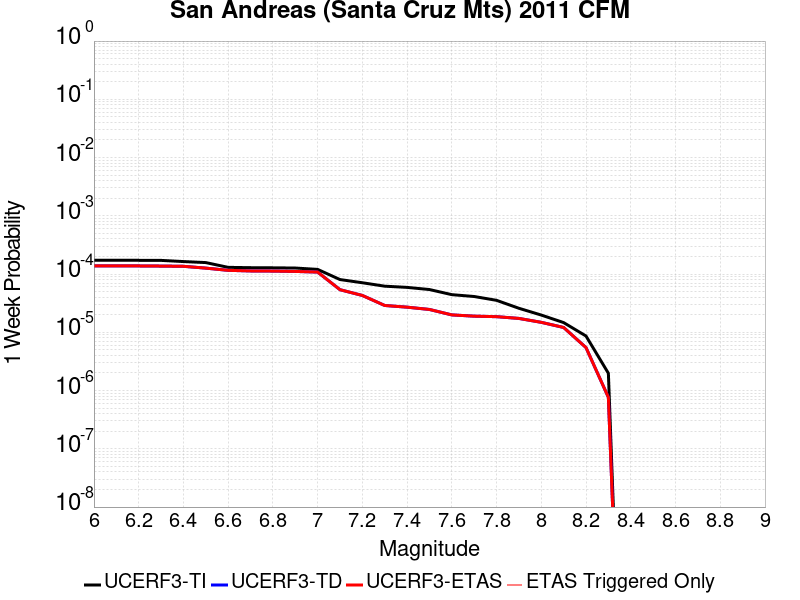 | 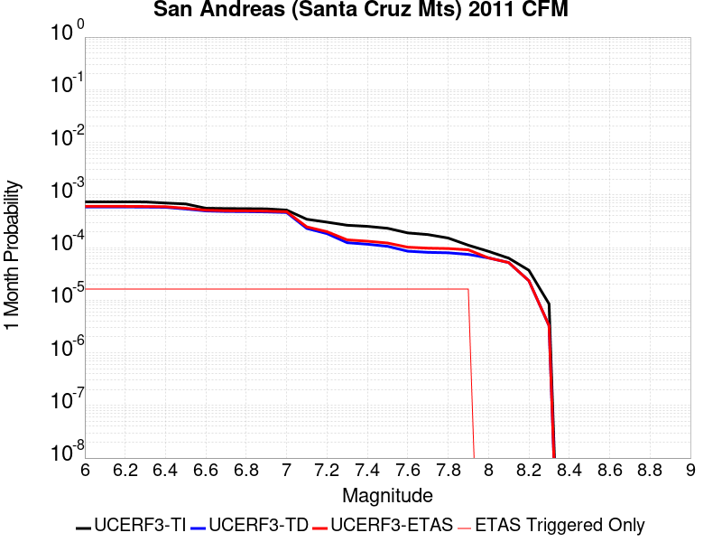 | 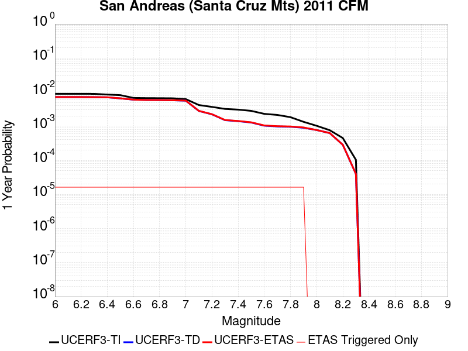 | 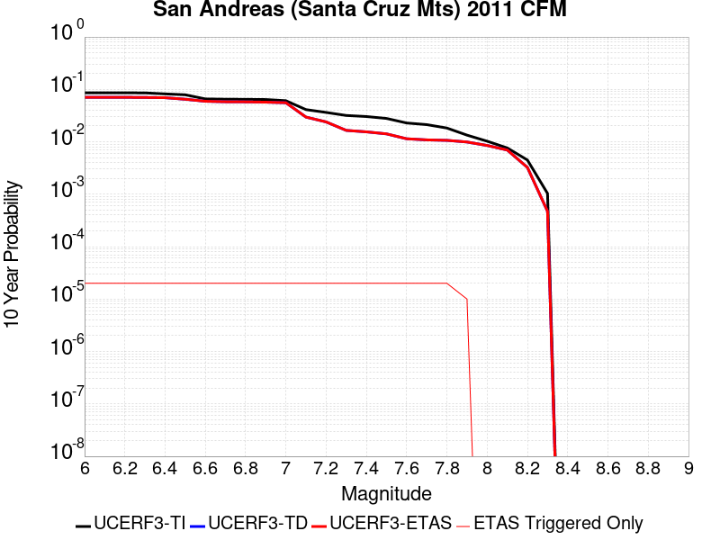 |

| Magnitude | 1 wk TI Prob | 1 wk TD Prob | 1 wk ETAS Prob | 1 wk ETAS/TD Gain | 1 wk ETAS Triggered Only | 1 mo TI Prob | 1 mo TD Prob | 1 mo ETAS Prob | 1 mo ETAS/TD Gain | 1 mo ETAS Triggered Only | 1 yr TI Prob | 1 yr TD Prob | 1 yr ETAS Prob | 1 yr ETAS/TD Gain | 1 yr ETAS Triggered Only | 10 yr TI Prob | 10 yr TD Prob | 10 yr ETAS Prob | 10 yr ETAS/TD Gain | 10 yr ETAS Triggered Only |
|-----|-----|-----|-----|-----|-----|-----|-----|-----|-----|-----|-----|-----|-----|-----|-----|-----|-----|-----|-----|-----|
| 6.0 | 1.7221631E-4 | 1.3792426E-4 | 1.3792426E-4 | 1.0 | 0.0 | 7.378611E-4 | 5.9097214E-4 | 6.009662E-4 | 1.0169113 | 1.0E-5 | 0.008946515 | 0.0071717235 | 0.007181652 | 1.0013844 | 1.0E-5 | 0.08594794 | 0.07054796 | 0.07056655 | 1.0002635 | 2.0E-5 |
| 6.1 | 1.7221631E-4 | 1.3792426E-4 | 1.3792426E-4 | 1.0 | 0.0 | 7.378611E-4 | 5.9097214E-4 | 6.009662E-4 | 1.0169113 | 1.0E-5 | 0.008946515 | 0.0071717235 | 0.007181652 | 1.0013844 | 1.0E-5 | 0.08594794 | 0.07054796 | 0.07056655 | 1.0002635 | 2.0E-5 |
| 6.2 | 1.7221631E-4 | 1.3792426E-4 | 1.3792426E-4 | 1.0 | 0.0 | 7.378611E-4 | 5.9097214E-4 | 6.009662E-4 | 1.0169113 | 1.0E-5 | 0.008946515 | 0.0071717235 | 0.007181652 | 1.0013844 | 1.0E-5 | 0.08594794 | 0.07054796 | 0.07056655 | 1.0002635 | 2.0E-5 |
| 6.3 | 1.716926E-4 | 1.3711878E-4 | 1.3711878E-4 | 1.0 | 0.0 | 7.3561794E-4 | 5.8752164E-4 | 5.975158E-4 | 1.0170107 | 1.0E-5 | 0.008919428 | 0.007129989 | 0.007139918 | 1.0013925 | 1.0E-5 | 0.08569809 | 0.07015993 | 0.07017852 | 1.0002651 | 2.0E-5 |
| 6.4 | 1.6392978E-4 | 1.3587909E-4 | 1.3587909E-4 | 1.0 | 0.0 | 7.02367E-4 | 5.82211E-4 | 5.922052E-4 | 1.0171659 | 1.0E-5 | 0.008517839 | 0.0070657525 | 0.007075682 | 1.0014052 | 1.0E-5 | 0.08198654 | 0.069394976 | 0.06941359 | 1.0002682 | 2.0E-5 |
| 6.5 | 1.5742714E-4 | 1.2647794E-4 | 1.2647794E-4 | 1.0 | 0.0 | 6.745133E-4 | 5.419374E-4 | 5.51932E-4 | 1.0184423 | 1.0E-5 | 0.00818132 | 0.0065784375 | 0.0065883715 | 1.0015101 | 1.0E-5 | 0.078865945 | 0.06486093 | 0.06487963 | 1.0002884 | 2.0E-5 |
| 6.6 | 1.3038084E-4 | 1.1587992E-4 | 1.1587992E-4 | 1.0 | 0.0 | 5.5865536E-4 | 4.96535E-4 | 5.0653005E-4 | 1.0201296 | 1.0E-5 | 0.006780438 | 0.006028784 | 0.006038724 | 1.0016487 | 1.0E-5 | 0.0657725 | 0.059330538 | 0.05934935 | 1.0003171 | 2.0E-5 |
| 6.7 | 1.2867592E-4 | 1.1314491E-4 | 1.1314491E-4 | 1.0 | 0.0 | 5.5135164E-4 | 4.8481792E-4 | 4.948131E-4 | 1.0206163 | 1.0E-5 | 0.0066920654 | 0.005886907 | 0.005896848 | 1.0016887 | 1.0E-5 | 0.06494093 | 0.058041416 | 0.058060255 | 1.0003246 | 2.0E-5 |
| 6.8 | 1.2801298E-4 | 1.12520516E-4 | 1.12520516E-4 | 1.0 | 0.0 | 5.485117E-4 | 4.8214293E-4 | 4.921381E-4 | 1.0207307 | 1.0E-5 | 0.0066577005 | 0.0058545293 | 0.0058644707 | 1.0016981 | 1.0E-5 | 0.06461738 | 0.05775524 | 0.057774086 | 1.0003263 | 2.0E-5 |
| 6.9 | 1.269149E-4 | 1.1094256E-4 | 1.1094256E-4 | 1.0 | 0.0 | 5.4380763E-4 | 4.7538272E-4 | 4.8537797E-4 | 1.0210257 | 1.0E-5 | 0.006600777 | 0.005772663 | 0.005782605 | 1.0017223 | 1.0E-5 | 0.06408122 | 0.057027116 | 0.057045978 | 1.0003307 | 2.0E-5 |
| 7.0 | 1.2030331E-4 | 1.0824356E-4 | 1.0824356E-4 | 1.0 | 0.0 | 5.154837E-4 | 4.638198E-4 | 4.7381516E-4 | 1.02155 | 1.0E-5 | 0.006257969 | 0.0056326203 | 0.005642564 | 1.0017654 | 1.0E-5 | 0.06084648 | 0.055699922 | 0.05571881 | 1.000339 | 2.0E-5 |
| 7.1 | 8.049617E-5 | 5.392429E-5 | 5.392429E-5 | 1.0 | 0.0 | 3.4493793E-4 | 2.3108382E-4 | 2.410815E-4 | 1.0432644 | 1.0E-5 | 0.0041915346 | 0.0028098505 | 0.0028198224 | 1.0035489 | 1.0E-5 | 0.041133516 | 0.029618833 | 0.02963824 | 1.0006553 | 2.0E-5 |
| 7.2 | 7.093979E-5 | 4.2935415E-5 | 4.2935415E-5 | 1.0 | 0.0 | 3.0399222E-4 | 1.8399608E-4 | 1.9399423E-4 | 1.0543389 | 1.0E-5 | 0.0036948253 | 0.0022378736 | 0.002247851 | 1.0044585 | 1.0E-5 | 0.03633994 | 0.023941126 | 0.023960648 | 1.0008154 | 2.0E-5 |
| 7.3 | 6.193693E-5 | 2.8891074E-5 | 2.8891074E-5 | 1.0 | 0.0 | 2.6541698E-4 | 1.2381302E-4 | 1.3381179E-4 | 1.0807569 | 1.0E-5 | 0.0032266637 | 0.001506383 | 0.0015163679 | 1.0066284 | 1.0E-5 | 0.031802133 | 0.016497677 | 0.016517347 | 1.0011923 | 2.0E-5 |
| 7.4 | 5.906492E-5 | 2.7020369E-5 | 2.7020369E-5 | 1.0 | 0.0 | 2.5311083E-4 | 1.1579645E-4 | 1.2579528E-4 | 1.0863484 | 1.0E-5 | 0.0030772698 | 0.0014089114 | 0.0014188973 | 1.0070877 | 1.0E-5 | 0.030350044 | 0.0154695045 | 0.0154891955 | 1.0012729 | 2.0E-5 |
| 7.5 | 5.424296E-5 | 2.4675093E-5 | 2.4675093E-5 | 1.0 | 0.0 | 2.324491E-4 | 1.0574612E-4 | 1.1574506E-4 | 1.0945561 | 1.0E-5 | 0.002826395 | 0.0012866998 | 0.0012966869 | 1.0077618 | 1.0E-5 | 0.027907165 | 0.014161854 | 0.014181571 | 1.0013922 | 2.0E-5 |
| 7.6 | 4.43084E-5 | 1.990151E-5 | 1.990151E-5 | 1.0 | 0.0 | 1.8987931E-4 | 8.528939E-5 | 9.5288546E-5 | 1.1172379 | 1.0E-5 | 0.0023093296 | 0.001037904 | 0.0010478937 | 1.0096248 | 1.0E-5 | 0.022854783 | 0.011411123 | 0.011430895 | 1.0017327 | 2.0E-5 |
| 7.7 | 4.118098E-5 | 1.8933848E-5 | 1.8933848E-5 | 1.0 | 0.0 | 1.7647797E-4 | 8.1142534E-5 | 9.114172E-5 | 1.12323 | 1.0E-5 | 0.002146502 | 9.874629E-4 | 9.97453E-4 | 1.0101169 | 1.0E-5 | 0.021258866 | 0.010868995 | 0.010888778 | 1.0018201 | 2.0E-5 |
| 7.8 | 3.5408906E-5 | 1.856201E-5 | 1.856201E-5 | 1.0 | 0.0 | 1.5174363E-4 | 7.954905E-5 | 8.954825E-5 | 1.1256986 | 1.0E-5 | 0.0018459131 | 9.6807955E-4 | 9.780698E-4 | 1.0103197 | 1.0E-5 | 0.018306552 | 0.0106506655 | 0.010670452 | 1.0018578 | 2.0E-5 |
| 7.9 | 2.5860836E-5 | 1.7313954E-5 | 1.7313954E-5 | 1.0 | 0.0 | 1.10827445E-4 | 7.420055E-5 | 8.419981E-5 | 1.1347599 | 1.0E-5 | 0.001348489 | 9.030175E-4 | 9.130085E-4 | 1.0110639 | 1.0E-5 | 0.013403354 | 0.009906601 | 0.009916502 | 1.0009995 | 1.0E-5 |
| 8.0 | 1.9777332E-5 | 1.4837888E-5 | 1.4837888E-5 | 1.0 | 0.0 | 8.4757245E-5 | 6.3589396E-5 | 6.3589396E-5 | 1.0 | 0.0 | 0.0010314309 | 7.739261E-4 | 7.739261E-4 | 1.0 | 0.0 | 0.010266567 | 0.008508087 | 0.008508087 | 1.0 | 0.0 |
| 8.1 | 1.468494E-5 | 1.2105831E-5 | 1.2105831E-5 | 1.0 | 0.0 | 6.293394E-5 | 5.1881103E-5 | 5.1881103E-5 | 1.0 | 0.0 | 7.6595135E-4 | 6.3146953E-4 | 6.3146953E-4 | 1.0 | 0.0 | 0.0076331664 | 0.0069684954 | 0.0069684954 | 1.0 | 0.0 |
| 8.2 | 8.63836E-6 | 5.4678667E-6 | 5.4678667E-6 | 1.0 | 0.0 | 3.7021015E-5 | 2.3433504E-5 | 2.3433504E-5 | 1.0 | 0.0 | 4.5063766E-4 | 2.8526565E-4 | 2.8526565E-4 | 1.0 | 0.0 | 0.004497249 | 0.003245162 | 0.003245162 | 1.0 | 0.0 |
| 8.3 | 1.983087E-6 | 7.6564595E-7 | 7.6564595E-7 | 1.0 | 0.0 | 8.498917E-6 | 3.281336E-6 | 3.281336E-6 | 1.0 | 0.0 | 1.034694E-4 | 3.9949547E-5 | 3.9949547E-5 | 1.0 | 0.0 | 0.0010342124 | 4.717979E-4 | 4.717979E-4 | 1.0 | 0.0 |

## Elmore Ranch
*[(top)](#table-of-contents)*

| 1 Week | 1 Month | 1 Year | 10 Year |
|-----|-----|-----|-----|
|  |  |  | 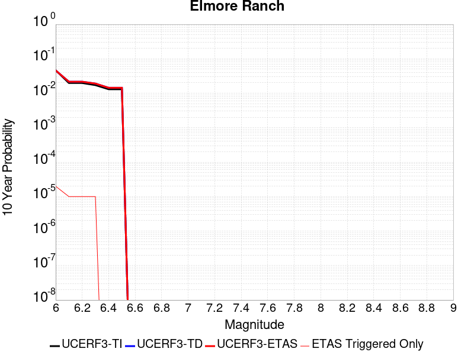 |

| Magnitude | 1 wk TI Prob | 1 wk TD Prob | 1 wk ETAS Prob | 1 wk ETAS/TD Gain | 1 wk ETAS Triggered Only | 1 mo TI Prob | 1 mo TD Prob | 1 mo ETAS Prob | 1 mo ETAS/TD Gain | 1 mo ETAS Triggered Only | 1 yr TI Prob | 1 yr TD Prob | 1 yr ETAS Prob | 1 yr ETAS/TD Gain | 1 yr ETAS Triggered Only | 10 yr TI Prob | 10 yr TD Prob | 10 yr ETAS Prob | 10 yr ETAS/TD Gain | 10 yr ETAS Triggered Only |
|-----|-----|-----|-----|-----|-----|-----|-----|-----|-----|-----|-----|-----|-----|-----|-----|-----|-----|-----|-----|-----|
| 6.0 | 9.102099E-5 | 8.953848E-5 | 8.953848E-5 | 1.0 | 0.0 | 3.9003167E-4 | 3.836898E-4 | 3.836898E-4 | 1.0 | 0.0 | 0.0047383 | 0.004662132 | 0.0046720854 | 1.0021349 | 1.0E-5 | 0.046385348 | 0.04583787 | 0.045856956 | 1.0004163 | 2.0E-5 |
| 6.1 | 3.8306698E-5 | 4.14921E-5 | 4.14921E-5 | 1.0 | 0.0 | 1.6416123E-4 | 1.7781362E-4 | 1.7781362E-4 | 1.0 | 0.0 | 0.0019968306 | 0.0021632186 | 0.0021632186 | 1.0 | 0.0 | 0.019789828 | 0.021595007 | 0.021604791 | 1.0004531 | 1.0E-5 |
| 6.2 | 3.8306698E-5 | 4.14921E-5 | 4.14921E-5 | 1.0 | 0.0 | 1.6416123E-4 | 1.7781362E-4 | 1.7781362E-4 | 1.0 | 0.0 | 0.0019968306 | 0.0021632186 | 0.0021632186 | 1.0 | 0.0 | 0.019789828 | 0.021595007 | 0.021604791 | 1.0004531 | 1.0E-5 |
| 6.3 | 3.3197924E-5 | 3.6550366E-5 | 3.6550366E-5 | 1.0 | 0.0 | 1.4226905E-4 | 1.56639E-4 | 1.56639E-4 | 1.0 | 0.0 | 0.0017307495 | 0.0019059771 | 0.0019059771 | 1.0 | 0.0 | 0.017173318 | 0.019057386 | 0.019067194 | 1.0005147 | 1.0E-5 |
| 6.4 | 2.5148964E-5 | 2.7420736E-5 | 2.7420736E-5 | 1.0 | 0.0 | 1.0777682E-4 | 1.17515796E-4 | 1.17515796E-4 | 1.0 | 0.0 | 0.0013113929 | 0.0014304637 | 0.0014304637 | 1.0 | 0.0 | 0.01303681 | 0.014365338 | 0.014365338 | 1.0 | 0.0 |
| 6.5 | 2.5148964E-5 | 2.7420736E-5 | 2.7420736E-5 | 1.0 | 0.0 | 1.0777682E-4 | 1.17515796E-4 | 1.17515796E-4 | 1.0 | 0.0 | 0.0013113929 | 0.0014304637 | 0.0014304637 | 1.0 | 0.0 | 0.01303681 | 0.014365338 | 0.014365338 | 1.0 | 0.0 |

## Monterey Bay-Tularcitos
*[(top)](#table-of-contents)*

| 1 Week | 1 Month | 1 Year | 10 Year |
|-----|-----|-----|-----|
|  |  |  |  |

| Magnitude | 1 wk TI Prob | 1 wk TD Prob | 1 wk ETAS Prob | 1 wk ETAS/TD Gain | 1 wk ETAS Triggered Only | 1 mo TI Prob | 1 mo TD Prob | 1 mo ETAS Prob | 1 mo ETAS/TD Gain | 1 mo ETAS Triggered Only | 1 yr TI Prob | 1 yr TD Prob | 1 yr ETAS Prob | 1 yr ETAS/TD Gain | 1 yr ETAS Triggered Only | 10 yr TI Prob | 10 yr TD Prob | 10 yr ETAS Prob | 10 yr ETAS/TD Gain | 10 yr ETAS Triggered Only |
|-----|-----|-----|-----|-----|-----|-----|-----|-----|-----|-----|-----|-----|-----|-----|-----|-----|-----|-----|-----|-----|
| 6.0 | 3.0131365E-5 | 3.279877E-5 | 3.279877E-5 | 1.0 | 0.0 | 1.2912804E-4 | 1.4055918E-4 | 1.4055918E-4 | 1.0 | 0.0 | 0.001571 | 0.0017100703 | 0.0017100703 | 1.0 | 0.0 | 0.015599402 | 0.016979916 | 0.016999578 | 1.0011579 | 2.0E-5 |
| 6.1 | 3.0131365E-5 | 3.279877E-5 | 3.279877E-5 | 1.0 | 0.0 | 1.2912804E-4 | 1.4055918E-4 | 1.4055918E-4 | 1.0 | 0.0 | 0.001571 | 0.0017100703 | 0.0017100703 | 1.0 | 0.0 | 0.015599402 | 0.016979916 | 0.016999578 | 1.0011579 | 2.0E-5 |
| 6.2 | 3.0131365E-5 | 3.279877E-5 | 3.279877E-5 | 1.0 | 0.0 | 1.2912804E-4 | 1.4055918E-4 | 1.4055918E-4 | 1.0 | 0.0 | 0.001571 | 0.0017100703 | 0.0017100703 | 1.0 | 0.0 | 0.015599402 | 0.016979916 | 0.016999578 | 1.0011579 | 2.0E-5 |
| 6.3 | 1.6998249E-5 | 1.8330798E-5 | 1.8330798E-5 | 1.0 | 0.0 | 7.28476E-5 | 7.85583E-5 | 7.85583E-5 | 1.0 | 0.0 | 8.865586E-4 | 9.5604634E-4 | 9.5604634E-4 | 1.0 | 0.0 | 0.0088303005 | 0.009521258 | 0.009531163 | 1.0010403 | 1.0E-5 |
| 6.4 | 1.6998249E-5 | 1.8330798E-5 | 1.8330798E-5 | 1.0 | 0.0 | 7.28476E-5 | 7.85583E-5 | 7.85583E-5 | 1.0 | 0.0 | 8.865586E-4 | 9.5604634E-4 | 9.5604634E-4 | 1.0 | 0.0 | 0.0088303005 | 0.009521258 | 0.009531163 | 1.0010403 | 1.0E-5 |
| 6.5 | 1.27470785E-5 | 1.3693312E-5 | 1.3693312E-5 | 1.0 | 0.0 | 5.4629192E-5 | 5.8684363E-5 | 5.8684363E-5 | 1.0 | 0.0 | 6.649074E-4 | 7.1425823E-4 | 7.1425823E-4 | 1.0 | 0.0 | 0.0066292146 | 0.007120678 | 0.007130607 | 1.0013944 | 1.0E-5 |
| 6.6 | 1.2739422E-5 | 1.36854E-5 | 1.36854E-5 | 1.0 | 0.0 | 5.4596385E-5 | 5.8650454E-5 | 5.8650454E-5 | 1.0 | 0.0 | 6.645082E-4 | 7.1384566E-4 | 7.1384566E-4 | 1.0 | 0.0 | 0.0066252467 | 0.007116579 | 0.007126508 | 1.0013952 | 1.0E-5 |
| 6.7 | 1.0160109E-5 | 1.0885755E-5 | 1.0885755E-5 | 1.0 | 0.0 | 4.35426E-5 | 4.665244E-5 | 4.665244E-5 | 1.0 | 0.0 | 5.300022E-4 | 5.6785246E-4 | 5.6785246E-4 | 1.0 | 0.0 | 0.005287399 | 0.0056647263 | 0.0056746695 | 1.0017554 | 1.0E-5 |
| 6.8 | 8.349859E-6 | 8.932587E-6 | 8.932587E-6 | 1.0 | 0.0 | 3.578462E-5 | 3.8281985E-5 | 3.8281985E-5 | 1.0 | 0.0 | 4.3559066E-4 | 4.6598914E-4 | 4.6598914E-4 | 1.0 | 0.0 | 0.004347378 | 0.004650685 | 0.0046606385 | 1.0021402 | 1.0E-5 |
| 6.9 | 5.193639E-6 | 5.53643E-6 | 5.53643E-6 | 1.0 | 0.0 | 2.2258262E-5 | 2.372736E-5 | 2.372736E-5 | 1.0 | 0.0 | 2.7096065E-4 | 2.8884556E-4 | 2.8884556E-4 | 1.0 | 0.0 | 0.0027063051 | 0.0028850224 | 0.0028850224 | 1.0 | 0.0 |
| 7.0 | 4.359381E-6 | 4.643366E-6 | 4.643366E-6 | 1.0 | 0.0 | 1.8682927E-5 | 1.9900004E-5 | 1.9900004E-5 | 1.0 | 0.0 | 2.274409E-4 | 2.422586E-4 | 2.422586E-4 | 1.0 | 0.0 | 0.0022720827 | 0.002420238 | 0.002420238 | 1.0 | 0.0 |
| 7.1 | 3.0398533E-6 | 3.2310427E-6 | 3.2310427E-6 | 1.0 | 0.0 | 1.3027877E-5 | 1.3847267E-5 | 1.3847267E-5 | 1.0 | 0.0 | 1.5860285E-4 | 1.6858005E-4 | 1.6858005E-4 | 1.0 | 0.0 | 0.001584897 | 0.0016847793 | 0.0016847793 | 1.0 | 0.0 |
| 7.2 | 1.642335E-6 | 1.7333153E-6 | 1.7333153E-6 | 1.0 | 0.0 | 7.0385595E-6 | 7.428485E-6 | 7.428485E-6 | 1.0 | 0.0 | 8.569109E-5 | 9.044012E-5 | 9.044012E-5 | 1.0 | 0.0 | 8.5658056E-4 | 9.042358E-4 | 9.042358E-4 | 1.0 | 0.0 |
| 7.3 | 3.356842E-7 | 3.2952389E-7 | 3.2952389E-7 | 1.0 | 0.0 | 1.4386458E-6 | 1.4122445E-6 | 1.4122445E-6 | 1.0 | 0.0 | 1.7515373E-5 | 1.7193941E-5 | 1.7193941E-5 | 1.0 | 0.0 | 1.7513991E-4 | 1.719262E-4 | 1.719262E-4 | 1.0 | 0.0 |
| 7.4 | 2.1973483E-7 | 2.1006414E-7 | 2.1006414E-7 | 1.0 | 0.0 | 9.417204E-7 | 9.002746E-7 | 9.002746E-7 | 1.0 | 0.0 | 1.1465385E-5 | 1.0960788E-5 | 1.0960788E-5 | 1.0 | 0.0 | 1.1464794E-4 | 1.0960251E-4 | 1.0960251E-4 | 1.0 | 0.0 |
| 7.5 | 1.1944135E-7 | 1.0696035E-7 | 1.0696035E-7 | 1.0 | 0.0 | 5.118914E-7 | 4.5840142E-7 | 4.5840142E-7 | 1.0 | 0.0 | 6.23226E-6 | 5.581023E-6 | 5.581023E-6 | 1.0 | 0.0 | 6.2320854E-5 | 5.5808843E-5 | 5.5808843E-5 | 1.0 | 0.0 |
| 7.6 | 4.636058E-8 | 3.3364433E-8 | 3.3364433E-8 | 1.0 | 0.0 | 1.9868818E-7 | 1.4299042E-7 | 1.4299042E-7 | 1.0 | 0.0 | 2.419026E-6 | 1.740907E-6 | 1.740907E-6 | 1.0 | 0.0 | 2.4189996E-5 | 1.7408936E-5 | 1.7408936E-5 | 1.0 | 0.0 |
| 7.7 | 1.8588572E-8 | 8.003168E-9 | 8.003168E-9 | 1.0 | 0.0 | 7.9665305E-8 | 3.429929E-8 | 3.429929E-8 | 1.0 | 0.0 | 9.699246E-7 | 4.1759378E-7 | 4.1759378E-7 | 1.0 | 0.0 | 9.699204E-6 | 4.1759304E-6 | 4.1759304E-6 | 1.0 | 0.0 |
| 7.8 | 2.7960154E-9 | 7.608624E-10 | 7.608624E-10 | 1.0 | 0.0 | 1.1982923E-8 | 3.2608392E-9 | 3.2608392E-9 | 1.0 | 0.0 | 1.4589209E-7 | 3.9700716E-8 | 3.9700716E-8 | 1.0 | 0.0 | 1.4589199E-6 | 3.970071E-7 | 3.970071E-7 | 1.0 | 0.0 |

## Santa Susana East (connector)
*[(top)](#table-of-contents)*

| 1 Week | 1 Month | 1 Year | 10 Year |
|-----|-----|-----|-----|
|  |  |  |  |

| Magnitude | 1 wk TI Prob | 1 wk TD Prob | 1 wk ETAS Prob | 1 wk ETAS/TD Gain | 1 wk ETAS Triggered Only | 1 mo TI Prob | 1 mo TD Prob | 1 mo ETAS Prob | 1 mo ETAS/TD Gain | 1 mo ETAS Triggered Only | 1 yr TI Prob | 1 yr TD Prob | 1 yr ETAS Prob | 1 yr ETAS/TD Gain | 1 yr ETAS Triggered Only | 10 yr TI Prob | 10 yr TD Prob | 10 yr ETAS Prob | 10 yr ETAS/TD Gain | 10 yr ETAS Triggered Only |
|-----|-----|-----|-----|-----|-----|-----|-----|-----|-----|-----|-----|-----|-----|-----|-----|-----|-----|-----|-----|-----|
| 6.0 | 2.858397E-5 | 3.2021693E-5 | 3.2021693E-5 | 1.0 | 0.0 | 1.2249697E-4 | 1.3723019E-4 | 1.3723019E-4 | 1.0 | 0.0 | 0.0014903803 | 0.00166977 | 0.0016897366 | 1.0119576 | 2.0E-5 | 0.014804244 | 0.016599316 | 0.016618984 | 1.0011848 | 2.0E-5 |
| 6.1 | 2.858397E-5 | 3.2021693E-5 | 3.2021693E-5 | 1.0 | 0.0 | 1.2249697E-4 | 1.3723019E-4 | 1.3723019E-4 | 1.0 | 0.0 | 0.0014903803 | 0.00166977 | 0.0016897366 | 1.0119576 | 2.0E-5 | 0.014804244 | 0.016599316 | 0.016618984 | 1.0011848 | 2.0E-5 |
| 6.2 | 2.858397E-5 | 3.2021693E-5 | 3.2021693E-5 | 1.0 | 0.0 | 1.2249697E-4 | 1.3723019E-4 | 1.3723019E-4 | 1.0 | 0.0 | 0.0014903803 | 0.00166977 | 0.0016897366 | 1.0119576 | 2.0E-5 | 0.014804244 | 0.016599316 | 0.016618984 | 1.0011848 | 2.0E-5 |
| 6.3 | 1.943582E-5 | 2.0367343E-5 | 2.0367343E-5 | 1.0 | 0.0 | 8.329371E-5 | 8.7286324E-5 | 8.7286324E-5 | 1.0 | 0.0 | 0.001013629 | 0.001062305 | 0.0010822837 | 1.0188069 | 2.0E-5 | 0.010090181 | 0.010583852 | 0.01060364 | 1.0018697 | 2.0E-5 |
| 6.4 | 1.943582E-5 | 2.0367343E-5 | 2.0367343E-5 | 1.0 | 0.0 | 8.329371E-5 | 8.7286324E-5 | 8.7286324E-5 | 1.0 | 0.0 | 0.001013629 | 0.001062305 | 0.0010822837 | 1.0188069 | 2.0E-5 | 0.010090181 | 0.010583852 | 0.01060364 | 1.0018697 | 2.0E-5 |
| 6.5 | 1.943582E-5 | 2.0367343E-5 | 2.0367343E-5 | 1.0 | 0.0 | 8.329371E-5 | 8.7286324E-5 | 8.7286324E-5 | 1.0 | 0.0 | 0.001013629 | 0.001062305 | 0.0010822837 | 1.0188069 | 2.0E-5 | 0.010090181 | 0.010583852 | 0.01060364 | 1.0018697 | 2.0E-5 |
| 6.6 | 1.943582E-5 | 2.0367343E-5 | 2.0367343E-5 | 1.0 | 0.0 | 8.329371E-5 | 8.7286324E-5 | 8.7286324E-5 | 1.0 | 0.0 | 0.001013629 | 0.001062305 | 0.0010822837 | 1.0188069 | 2.0E-5 | 0.010090181 | 0.010583852 | 0.01060364 | 1.0018697 | 2.0E-5 |
| 6.7 | 1.9404439E-5 | 2.0354766E-5 | 2.0354766E-5 | 1.0 | 0.0 | 8.3159226E-5 | 8.723242E-5 | 8.723242E-5 | 1.0 | 0.0 | 0.0010119933 | 0.0010616493 | 0.0010816281 | 1.0188186 | 2.0E-5 | 0.010073971 | 0.010577358 | 0.010597147 | 1.0018709 | 2.0E-5 |
| 6.8 | 1.2217526E-5 | 1.1593157E-5 | 1.1593157E-5 | 1.0 | 0.0 | 5.2359774E-5 | 4.9684106E-5 | 4.9684106E-5 | 1.0 | 0.0 | 6.372938E-4 | 6.047529E-4 | 6.147469E-4 | 1.0165256 | 1.0E-5 | 0.0063546924 | 0.006033274 | 0.006043214 | 1.0016475 | 1.0E-5 |
| 6.9 | 1.2217526E-5 | 1.1593157E-5 | 1.1593157E-5 | 1.0 | 0.0 | 5.2359774E-5 | 4.9684106E-5 | 4.9684106E-5 | 1.0 | 0.0 | 6.372938E-4 | 6.047529E-4 | 6.147469E-4 | 1.0165256 | 1.0E-5 | 0.0063546924 | 0.006033274 | 0.006043214 | 1.0016475 | 1.0E-5 |
| 7.0 | 9.276017E-6 | 8.059273E-6 | 8.059273E-6 | 1.0 | 0.0 | 3.9753755E-5 | 3.4539302E-5 | 3.4539302E-5 | 1.0 | 0.0 | 4.8389446E-4 | 4.2043833E-4 | 4.3043413E-4 | 1.0237747 | 1.0E-5 | 0.0048284214 | 0.0041973097 | 0.004207268 | 1.0023725 | 1.0E-5 |
| 7.1 | 9.130355E-6 | 7.942446E-6 | 7.942446E-6 | 1.0 | 0.0 | 3.9129503E-5 | 3.4038632E-5 | 3.4038632E-5 | 1.0 | 0.0 | 4.7629757E-4 | 4.1434498E-4 | 4.2434083E-4 | 1.0241245 | 1.0E-5 | 0.00475278 | 0.0041366047 | 0.0041465634 | 1.0024074 | 1.0E-5 |
| 7.2 | 8.851015E-6 | 7.741608E-6 | 7.741608E-6 | 1.0 | 0.0 | 3.7932372E-5 | 3.317792E-5 | 3.317792E-5 | 1.0 | 0.0 | 4.6172875E-4 | 4.038697E-4 | 4.1386567E-4 | 1.0247505 | 1.0E-5 | 0.0046077054 | 0.0040322347 | 0.004042194 | 1.00247 | 1.0E-5 |
| 7.3 | 8.573006E-6 | 7.5503312E-6 | 7.5503312E-6 | 1.0 | 0.0 | 3.6740938E-5 | 3.235818E-5 | 3.235818E-5 | 1.0 | 0.0 | 4.472291E-4 | 3.9389305E-4 | 4.038891E-4 | 1.0253776 | 1.0E-5 | 0.004463301 | 0.003932817 | 0.0039427774 | 1.0025327 | 1.0E-5 |
| 7.4 | 7.852282E-6 | 6.8178556E-6 | 6.8178556E-6 | 1.0 | 0.0 | 3.36522E-5 | 2.921907E-5 | 2.921907E-5 | 1.0 | 0.0 | 4.096385E-4 | 3.5568717E-4 | 3.5568717E-4 | 1.0 | 0.0 | 0.0040888423 | 0.0035519868 | 0.0035519868 | 1.0 | 0.0 |
| 7.5 | 4.8869324E-6 | 4.2790975E-6 | 4.2790975E-6 | 1.0 | 0.0 | 2.0943828E-5 | 1.833887E-5 | 1.833887E-5 | 1.0 | 0.0 | 2.5496128E-4 | 2.2325452E-4 | 2.2325452E-4 | 1.0 | 0.0 | 0.0025466895 | 0.00223057 | 0.00223057 | 1.0 | 0.0 |
| 7.6 | 1.3894544E-6 | 1.1568394E-6 | 1.1568394E-6 | 1.0 | 0.0 | 5.954791E-6 | 4.957875E-6 | 4.957875E-6 | 1.0 | 0.0 | 7.249717E-5 | 6.036068E-5 | 6.036068E-5 | 1.0 | 0.0 | 7.247352E-4 | 6.0346466E-4 | 6.0346466E-4 | 1.0 | 0.0 |
| 7.7 | 2.9924632E-7 | 2.3719332E-7 | 2.3719332E-7 | 1.0 | 0.0 | 1.2824837E-6 | 1.0165425E-6 | 1.0165425E-6 | 1.0 | 0.0 | 1.5614127E-5 | 1.2376341E-5 | 1.2376341E-5 | 1.0 | 0.0 | 1.5613029E-4 | 1.2375724E-4 | 1.2375724E-4 | 1.0 | 0.0 |
| 7.8 | 4.8188564E-8 | 2.6321862E-8 | 2.6321862E-8 | 1.0 | 0.0 | 2.065224E-7 | 1.12807975E-7 | 1.12807975E-7 | 1.0 | 0.0 | 2.5144072E-6 | 1.3734362E-6 | 1.3734362E-6 | 1.0 | 0.0 | 2.5143789E-5 | 1.3734286E-5 | 1.3734286E-5 | 1.0 | 0.0 |
| 7.9 | 2.6127251E-9 | 2.7681102E-9 | 2.7681102E-9 | 1.0 | 0.0 | 1.1197393E-8 | 1.186333E-8 | 1.186333E-8 | 1.0 | 0.0 | 1.3632825E-7 | 1.4443603E-7 | 1.4443603E-7 | 1.0 | 0.0 | 1.3632817E-6 | 1.4443604E-6 | 1.4443604E-6 | 1.0 | 0.0 |

## Hayward (So) 2011 CFM
*[(top)](#table-of-contents)*

| 1 Week | 1 Month | 1 Year | 10 Year |
|-----|-----|-----|-----|
|  |  |  |  |

| Magnitude | 1 wk TI Prob | 1 wk TD Prob | 1 wk ETAS Prob | 1 wk ETAS/TD Gain | 1 wk ETAS Triggered Only | 1 mo TI Prob | 1 mo TD Prob | 1 mo ETAS Prob | 1 mo ETAS/TD Gain | 1 mo ETAS Triggered Only | 1 yr TI Prob | 1 yr TD Prob | 1 yr ETAS Prob | 1 yr ETAS/TD Gain | 1 yr ETAS Triggered Only | 10 yr TI Prob | 10 yr TD Prob | 10 yr ETAS Prob | 10 yr ETAS/TD Gain | 10 yr ETAS Triggered Only |
|-----|-----|-----|-----|-----|-----|-----|-----|-----|-----|-----|-----|-----|-----|-----|-----|-----|-----|-----|-----|-----|
| 6.0 | 1.8091932E-4 | 3.570673E-4 | 3.670637E-4 | 1.027996 | 1.0E-5 | 7.751381E-4 | 0.0015294008 | 0.0015393855 | 1.0065285 | 1.0E-5 | 0.00939654 | 0.018463885 | 0.0184737 | 1.0005316 | 1.0E-5 | 0.090090066 | 0.1667085 | 0.16672516 | 1.0001 | 2.0E-5 |
| 6.1 | 1.8091932E-4 | 3.570673E-4 | 3.670637E-4 | 1.027996 | 1.0E-5 | 7.751381E-4 | 0.0015294008 | 0.0015393855 | 1.0065285 | 1.0E-5 | 0.00939654 | 0.018463885 | 0.0184737 | 1.0005316 | 1.0E-5 | 0.090090066 | 0.1667085 | 0.16672516 | 1.0001 | 2.0E-5 |
| 6.2 | 1.8091932E-4 | 3.570673E-4 | 3.670637E-4 | 1.027996 | 1.0E-5 | 7.751381E-4 | 0.0015294008 | 0.0015393855 | 1.0065285 | 1.0E-5 | 0.00939654 | 0.018463885 | 0.0184737 | 1.0005316 | 1.0E-5 | 0.090090066 | 0.1667085 | 0.16672516 | 1.0001 | 2.0E-5 |
| 6.3 | 1.7322872E-4 | 3.4263515E-4 | 3.5263173E-4 | 1.0291755 | 1.0E-5 | 7.4219756E-4 | 0.0014676197 | 0.001477605 | 1.0068038 | 1.0E-5 | 0.0089988755 | 0.017724147 | 0.01773397 | 1.0005542 | 1.0E-5 | 0.08643075 | 0.16065954 | 0.16067632 | 1.0001044 | 2.0E-5 |
| 6.4 | 1.6334097E-4 | 3.2345165E-4 | 3.334484E-4 | 1.0309066 | 1.0E-5 | 6.998449E-4 | 0.0013854936 | 0.0013954798 | 1.0072076 | 1.0E-5 | 0.008487372 | 0.016739927 | 0.01674976 | 1.0005873 | 1.0E-5 | 0.081704415 | 0.15256606 | 0.152583 | 1.0001111 | 2.0E-5 |
| 6.5 | 1.5600289E-4 | 3.101982E-4 | 3.2019507E-4 | 1.0322274 | 1.0E-5 | 6.684125E-4 | 0.0013287518 | 0.0013387385 | 1.0075159 | 1.0E-5 | 0.008107598 | 0.016059443 | 0.016069284 | 1.0006127 | 1.0E-5 | 0.078181036 | 0.14684291 | 0.14685997 | 1.0001162 | 2.0E-5 |
| 6.6 | 1.4046066E-4 | 2.8034003E-4 | 2.9033722E-4 | 1.035661 | 1.0E-5 | 6.018354E-4 | 0.0012009109 | 0.0012108989 | 1.008317 | 1.0E-5 | 0.0073027555 | 0.014524571 | 0.014534425 | 1.0006785 | 1.0E-5 | 0.07067384 | 0.13393044 | 0.13394777 | 1.0001293 | 2.0E-5 |
| 6.7 | 1.14696966E-4 | 2.3272466E-4 | 2.4272234E-4 | 1.0429592 | 1.0E-5 | 4.914658E-4 | 9.970153E-4 | 0.0010070052 | 1.0100199 | 1.0E-5 | 0.0059671924 | 0.012072163 | 0.012082042 | 1.0008184 | 1.0E-5 | 0.058094822 | 0.11274141 | 0.11275916 | 1.0001574 | 2.0E-5 |
| 6.8 | 9.3874296E-5 | 1.8862431E-4 | 1.8862431E-4 | 1.0 | 0.0 | 4.0225635E-4 | 8.081431E-4 | 8.081431E-4 | 1.0 | 0.0 | 0.0048864787 | 0.009795489 | 0.009795489 | 1.0 | 0.0 | 0.047804173 | 0.092592984 | 0.09260206 | 1.000098 | 1.0E-5 |
| 6.9 | 5.551852E-5 | 1.0729875E-4 | 1.0729875E-4 | 1.0 | 0.0 | 2.3791482E-4 | 4.5977137E-4 | 4.5977137E-4 | 1.0 | 0.0 | 0.0028927654 | 0.005583468 | 0.005583468 | 1.0 | 0.0 | 0.028553981 | 0.054246075 | 0.05425553 | 1.0001744 | 1.0E-5 |
| 7.0 | 4.2662363E-5 | 8.246792E-5 | 8.246792E-5 | 1.0 | 0.0 | 1.8282588E-4 | 3.5338648E-4 | 3.5338648E-4 | 1.0 | 0.0 | 0.0022236328 | 0.0042940658 | 0.0042940658 | 1.0 | 0.0 | 0.022015138 | 0.04206509 | 0.04206509 | 1.0 | 0.0 |
| 7.1 | 3.305886E-5 | 6.302183E-5 | 6.302183E-5 | 1.0 | 0.0 | 1.4167312E-4 | 2.7006568E-4 | 2.7006568E-4 | 1.0 | 0.0 | 0.0017235056 | 0.003283111 | 0.003283111 | 1.0 | 0.0 | 0.017101998 | 0.032453902 | 0.032453902 | 1.0 | 0.0 |
| 7.2 | 2.9856887E-5 | 5.701622E-5 | 5.701622E-5 | 1.0 | 0.0 | 1.2795182E-4 | 2.4433242E-4 | 2.4433242E-4 | 1.0 | 0.0 | 0.0015567001 | 0.0029707062 | 0.0029707062 | 1.0 | 0.0 | 0.015458403 | 0.029454801 | 0.029454801 | 1.0 | 0.0 |
| 7.3 | 2.4559737E-5 | 4.599286E-5 | 4.599286E-5 | 1.0 | 0.0 | 1.0525176E-4 | 1.9709744E-4 | 1.9709744E-4 | 1.0 | 0.0 | 0.0012806869 | 0.0023970334 | 0.0023970334 | 1.0 | 0.0 | 0.012733313 | 0.023858516 | 0.023858516 | 1.0 | 0.0 |
| 7.4 | 1.9002231E-5 | 3.505084E-5 | 3.505084E-5 | 1.0 | 0.0 | 8.143559E-5 | 1.502093E-4 | 1.502093E-4 | 1.0 | 0.0 | 9.910273E-4 | 0.001827274 | 0.001827274 | 1.0 | 0.0 | 0.009866194 | 0.018258808 | 0.018258808 | 1.0 | 0.0 |
| 7.5 | 1.2783333E-5 | 2.3331182E-5 | 2.3331182E-5 | 1.0 | 0.0 | 5.4784563E-5 | 9.998698E-5 | 9.998698E-5 | 1.0 | 0.0 | 6.667979E-4 | 0.0012166675 | 0.0012166675 | 1.0 | 0.0 | 0.006648007 | 0.012209443 | 0.012209443 | 1.0 | 0.0 |
| 7.6 | 4.8149627E-6 | 8.888056E-6 | 8.888056E-6 | 1.0 | 0.0 | 2.063539E-5 | 3.8091122E-5 | 3.8091122E-5 | 1.0 | 0.0 | 2.5120692E-4 | 4.6366194E-4 | 4.6366194E-4 | 1.0 | 0.0 | 0.0025092314 | 0.0046805087 | 0.0046805087 | 1.0 | 0.0 |
| 7.7 | 6.0838227E-7 | 1.205754E-6 | 1.205754E-6 | 1.0 | 0.0 | 2.6073499E-6 | 5.1675065E-6 | 5.1675065E-6 | 1.0 | 0.0 | 3.174402E-5 | 6.291258E-5 | 6.291258E-5 | 1.0 | 0.0 | 3.1739488E-4 | 6.5296254E-4 | 6.5296254E-4 | 1.0 | 0.0 |
| 7.8 | 4.5542808E-7 | 9.792941E-7 | 9.792941E-7 | 1.0 | 0.0 | 1.9518332E-6 | 4.196968E-6 | 4.196968E-6 | 1.0 | 0.0 | 2.376331E-5 | 5.109689E-5 | 5.109689E-5 | 1.0 | 0.0 | 2.3760769E-4 | 5.321693E-4 | 5.321693E-4 | 1.0 | 0.0 |
| 7.9 | 3.3016747E-7 | 7.3869535E-7 | 7.3869535E-7 | 1.0 | 0.0 | 1.4150027E-6 | 3.1658333E-6 | 3.1658333E-6 | 1.0 | 0.0 | 1.7227521E-5 | 3.854334E-5 | 3.854334E-5 | 1.0 | 0.0 | 1.7226185E-4 | 3.9932923E-4 | 3.9932923E-4 | 1.0 | 0.0 |
| 8.0 | 2.347038E-7 | 5.471963E-7 | 5.471963E-7 | 1.0 | 0.0 | 1.0058731E-6 | 2.3451248E-6 | 2.3451248E-6 | 1.0 | 0.0 | 1.2246436E-5 | 2.8551523E-5 | 2.8551523E-5 | 1.0 | 0.0 | 1.2245761E-4 | 2.9357258E-4 | 2.9357258E-4 | 1.0 | 0.0 |
| 8.1 | 1.18822804E-7 | 2.6060948E-7 | 2.6060948E-7 | 1.0 | 0.0 | 5.092405E-7 | 1.1168972E-6 | 1.1168972E-6 | 1.0 | 0.0 | 6.1999854E-6 | 1.359814E-5 | 1.359814E-5 | 1.0 | 0.0 | 6.199812E-5 | 1.3918082E-4 | 1.3918082E-4 | 1.0 | 0.0 |

## Shoreline
*[(top)](#table-of-contents)*

| 1 Week | 1 Month | 1 Year | 10 Year |
|-----|-----|-----|-----|
|  |  |  |  |

| Magnitude | 1 wk TI Prob | 1 wk TD Prob | 1 wk ETAS Prob | 1 wk ETAS/TD Gain | 1 wk ETAS Triggered Only | 1 mo TI Prob | 1 mo TD Prob | 1 mo ETAS Prob | 1 mo ETAS/TD Gain | 1 mo ETAS Triggered Only | 1 yr TI Prob | 1 yr TD Prob | 1 yr ETAS Prob | 1 yr ETAS/TD Gain | 1 yr ETAS Triggered Only | 10 yr TI Prob | 10 yr TD Prob | 10 yr ETAS Prob | 10 yr ETAS/TD Gain | 10 yr ETAS Triggered Only |
|-----|-----|-----|-----|-----|-----|-----|-----|-----|-----|-----|-----|-----|-----|-----|-----|-----|-----|-----|-----|-----|
| 6.0 | 3.9888673E-6 | 4.0479285E-6 | 1.4047888E-5 | 3.4703894 | 1.0E-5 | 1.7095033E-5 | 1.7348182E-5 | 2.7348007E-5 | 1.5764194 | 1.0E-5 | 2.0811215E-4 | 2.1119922E-4 | 2.2119712E-4 | 1.0473386 | 1.0E-5 | 0.0020791737 | 0.0021105339 | 0.0021304917 | 1.0094563 | 2.0E-5 |
| 6.1 | 3.9888673E-6 | 4.0479285E-6 | 1.4047888E-5 | 3.4703894 | 1.0E-5 | 1.7095033E-5 | 1.7348182E-5 | 2.7348007E-5 | 1.5764194 | 1.0E-5 | 2.0811215E-4 | 2.1119922E-4 | 2.2119712E-4 | 1.0473386 | 1.0E-5 | 0.0020791737 | 0.0021105339 | 0.0021304917 | 1.0094563 | 2.0E-5 |
| 6.2 | 1.4039653E-6 | 1.4100885E-6 | 1.4100885E-6 | 1.0 | 0.0 | 6.0169805E-6 | 6.043223E-6 | 6.043223E-6 | 1.0 | 0.0 | 7.325427E-5 | 7.357382E-5 | 7.357382E-5 | 1.0 | 0.0 | 7.3230127E-4 | 7.355006E-4 | 7.454933E-4 | 1.0135862 | 1.0E-5 |
| 6.3 | 1.4039653E-6 | 1.4100885E-6 | 1.4100885E-6 | 1.0 | 0.0 | 6.0169805E-6 | 6.043223E-6 | 6.043223E-6 | 1.0 | 0.0 | 7.325427E-5 | 7.357382E-5 | 7.357382E-5 | 1.0 | 0.0 | 7.3230127E-4 | 7.355006E-4 | 7.454933E-4 | 1.0135862 | 1.0E-5 |
| 6.4 | 1.3314152E-6 | 1.33616E-6 | 1.33616E-6 | 1.0 | 0.0 | 5.7060524E-6 | 5.726388E-6 | 5.726388E-6 | 1.0 | 0.0 | 6.946897E-5 | 6.9716596E-5 | 6.9716596E-5 | 1.0 | 0.0 | 6.9447263E-4 | 6.9695263E-4 | 7.0694566E-4 | 1.0143381 | 1.0E-5 |
| 6.5 | 1.1187026E-6 | 1.1203634E-6 | 1.1203634E-6 | 1.0 | 0.0 | 4.794431E-6 | 4.801549E-6 | 4.801549E-6 | 1.0 | 0.0 | 5.8370628E-5 | 5.8457317E-5 | 5.8457317E-5 | 1.0 | 0.0 | 5.83553E-4 | 5.844219E-4 | 5.844219E-4 | 1.0 | 0.0 |
| 6.6 | 9.793089E-7 | 9.784915E-7 | 9.784915E-7 | 1.0 | 0.0 | 4.1970316E-6 | 4.193528E-6 | 4.193528E-6 | 1.0 | 0.0 | 5.1097657E-5 | 5.1055024E-5 | 5.1055024E-5 | 1.0 | 0.0 | 5.108591E-4 | 5.104342E-4 | 5.104342E-4 | 1.0 | 0.0 |
| 6.7 | 8.995986E-7 | 8.972795E-7 | 8.972795E-7 | 1.0 | 0.0 | 3.8554167E-6 | 3.8454777E-6 | 3.8454777E-6 | 1.0 | 0.0 | 4.693869E-5 | 4.68177E-5 | 4.68177E-5 | 1.0 | 0.0 | 4.6928777E-4 | 4.680793E-4 | 4.680793E-4 | 1.0 | 0.0 |
| 6.8 | 7.931612E-7 | 7.8803976E-7 | 7.8803976E-7 | 1.0 | 0.0 | 3.3992578E-6 | 3.377309E-6 | 3.377309E-6 | 1.0 | 0.0 | 4.1385178E-5 | 4.1117964E-5 | 4.1117964E-5 | 1.0 | 0.0 | 4.1377472E-4 | 4.1110412E-4 | 4.1110412E-4 | 1.0 | 0.0 |
| 6.9 | 7.1465956E-7 | 7.078001E-7 | 7.078001E-7 | 1.0 | 0.0 | 3.062823E-6 | 3.0334254E-6 | 3.0334254E-6 | 1.0 | 0.0 | 3.7289232E-5 | 3.693133E-5 | 3.693133E-5 | 1.0 | 0.0 | 3.7282976E-4 | 3.6925232E-4 | 3.6925232E-4 | 1.0 | 0.0 |
| 7.0 | 6.389046E-7 | 6.299453E-7 | 6.299453E-7 | 1.0 | 0.0 | 2.7381598E-6 | 2.699763E-6 | 2.699763E-6 | 1.0 | 0.0 | 3.3336586E-5 | 3.286912E-5 | 3.286912E-5 | 1.0 | 0.0 | 3.3331584E-4 | 3.286428E-4 | 3.286428E-4 | 1.0 | 0.0 |
| 7.1 | 5.4300875E-7 | 5.311126E-7 | 5.311126E-7 | 1.0 | 0.0 | 2.3271782E-6 | 2.276195E-6 | 2.276195E-6 | 1.0 | 0.0 | 2.8333026E-5 | 2.7712322E-5 | 2.7712322E-5 | 1.0 | 0.0 | 2.8329415E-4 | 2.7708875E-4 | 2.7708875E-4 | 1.0 | 0.0 |
| 7.2 | 4.6768855E-7 | 4.5348904E-7 | 4.5348904E-7 | 1.0 | 0.0 | 2.0043778E-6 | 1.9435229E-6 | 1.9435229E-6 | 1.0 | 0.0 | 2.4403027E-5 | 2.3662134E-5 | 2.3662134E-5 | 1.0 | 0.0 | 2.4400349E-4 | 2.3659621E-4 | 2.3659621E-4 | 1.0 | 0.0 |
| 7.3 | 4.0966103E-7 | 3.9385614E-7 | 3.9385614E-7 | 1.0 | 0.0 | 1.7556889E-6 | 1.6879537E-6 | 1.6879537E-6 | 1.0 | 0.0 | 2.1375303E-5 | 2.0550642E-5 | 2.0550642E-5 | 1.0 | 0.0 | 2.1373246E-4 | 2.0548746E-4 | 2.0548746E-4 | 1.0 | 0.0 |
| 7.4 | 3.5105785E-7 | 3.3363924E-7 | 3.3363924E-7 | 1.0 | 0.0 | 1.5045327E-6 | 1.4298816E-6 | 1.4298816E-6 | 1.0 | 0.0 | 1.8317533E-5 | 1.7408669E-5 | 1.7408669E-5 | 1.0 | 0.0 | 1.8316023E-4 | 1.740731E-4 | 1.740731E-4 | 1.0 | 0.0 |
| 7.5 | 2.8737534E-7 | 2.681999E-7 | 2.681999E-7 | 1.0 | 0.0 | 1.2316079E-6 | 1.1494276E-6 | 1.1494276E-6 | 1.0 | 0.0 | 1.4994724E-5 | 1.399419E-5 | 1.399419E-5 | 1.0 | 0.0 | 1.4993713E-4 | 1.3993312E-4 | 1.3993312E-4 | 1.0 | 0.0 |
| 7.6 | 2.0924051E-7 | 1.8778938E-7 | 1.8778938E-7 | 1.0 | 0.0 | 8.967448E-7 | 8.0481135E-7 | 8.0481135E-7 | 1.0 | 0.0 | 1.0917813E-5 | 9.798534E-6 | 9.798534E-6 | 1.0 | 0.0 | 1.0917276E-4 | 9.798103E-5 | 9.798103E-5 | 1.0 | 0.0 |
| 7.7 | 1.392265E-7 | 1.1543341E-7 | 1.1543341E-7 | 1.0 | 0.0 | 5.9668486E-7 | 4.9471447E-7 | 4.9471447E-7 | 1.0 | 0.0 | 7.2646135E-6 | 6.0231323E-6 | 6.0231323E-6 | 1.0 | 0.0 | 7.2643765E-5 | 6.0229693E-5 | 6.0229693E-5 | 1.0 | 0.0 |
| 7.8 | 8.1080074E-8 | 5.5866355E-8 | 5.5866355E-8 | 1.0 | 0.0 | 3.4748598E-7 | 2.394272E-7 | 2.394272E-7 | 1.0 | 0.0 | 4.2306337E-6 | 2.9150222E-6 | 2.9150222E-6 | 1.0 | 0.0 | 4.230553E-5 | 2.9149842E-5 | 2.9149842E-5 | 1.0 | 0.0 |
| 7.9 | 5.0859036E-8 | 2.7243395E-8 | 2.7243395E-8 | 1.0 | 0.0 | 2.1796728E-7 | 1.16757406E-7 | 1.16757406E-7 | 1.0 | 0.0 | 2.6537484E-6 | 1.4215204E-6 | 1.4215204E-6 | 1.0 | 0.0 | 2.6537167E-5 | 1.4215115E-5 | 1.4215115E-5 | 1.0 | 0.0 |
| 8.0 | 3.1760536E-8 | 1.3575991E-8 | 1.3575991E-8 | 1.0 | 0.0 | 1.3611657E-7 | 5.8182817E-8 | 5.8182817E-8 | 1.0 | 0.0 | 1.6572179E-6 | 7.083755E-7 | 7.083755E-7 | 1.0 | 0.0 | 1.6572056E-5 | 7.083733E-6 | 7.083733E-6 | 1.0 | 0.0 |
| 8.1 | 1.2947896E-8 | 5.6625185E-9 | 5.6625185E-9 | 1.0 | 0.0 | 5.5490982E-8 | 2.4267937E-8 | 2.4267937E-8 | 1.0 | 0.0 | 6.756025E-7 | 2.954621E-7 | 2.954621E-7 | 1.0 | 0.0 | 6.7560045E-6 | 2.9546172E-6 | 2.9546172E-6 | 1.0 | 0.0 |

## San Gabriel
*[(top)](#table-of-contents)*

| 1 Week | 1 Month | 1 Year | 10 Year |
|-----|-----|-----|-----|
|  | 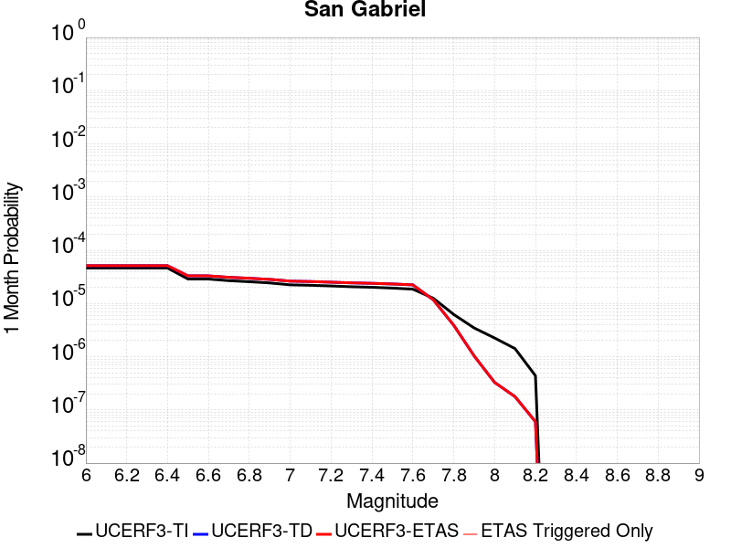 |  |  |

| Magnitude | 1 wk TI Prob | 1 wk TD Prob | 1 wk ETAS Prob | 1 wk ETAS/TD Gain | 1 wk ETAS Triggered Only | 1 mo TI Prob | 1 mo TD Prob | 1 mo ETAS Prob | 1 mo ETAS/TD Gain | 1 mo ETAS Triggered Only | 1 yr TI Prob | 1 yr TD Prob | 1 yr ETAS Prob | 1 yr ETAS/TD Gain | 1 yr ETAS Triggered Only | 10 yr TI Prob | 10 yr TD Prob | 10 yr ETAS Prob | 10 yr ETAS/TD Gain | 10 yr ETAS Triggered Only |
|-----|-----|-----|-----|-----|-----|-----|-----|-----|-----|-----|-----|-----|-----|-----|-----|-----|-----|-----|-----|-----|
| 6.0 | 1.083775E-5 | 1.198525E-5 | 1.198525E-5 | 1.0 | 0.0 | 4.6446676E-5 | 5.1364408E-5 | 5.1364408E-5 | 1.0 | 0.0 | 5.653415E-4 | 6.251936E-4 | 6.351873E-4 | 1.015985 | 1.0E-5 | 0.0056390543 | 0.0062463325 | 0.0062662074 | 1.0031819 | 2.0E-5 |
| 6.1 | 1.083775E-5 | 1.198525E-5 | 1.198525E-5 | 1.0 | 0.0 | 4.6446676E-5 | 5.1364408E-5 | 5.1364408E-5 | 1.0 | 0.0 | 5.653415E-4 | 6.251936E-4 | 6.351873E-4 | 1.015985 | 1.0E-5 | 0.0056390543 | 0.0062463325 | 0.0062662074 | 1.0031819 | 2.0E-5 |
| 6.2 | 1.083775E-5 | 1.198525E-5 | 1.198525E-5 | 1.0 | 0.0 | 4.6446676E-5 | 5.1364408E-5 | 5.1364408E-5 | 1.0 | 0.0 | 5.653415E-4 | 6.251936E-4 | 6.351873E-4 | 1.015985 | 1.0E-5 | 0.0056390543 | 0.0062463325 | 0.0062662074 | 1.0031819 | 2.0E-5 |
| 6.3 | 1.083775E-5 | 1.198525E-5 | 1.198525E-5 | 1.0 | 0.0 | 4.6446676E-5 | 5.1364408E-5 | 5.1364408E-5 | 1.0 | 0.0 | 5.653415E-4 | 6.251936E-4 | 6.351873E-4 | 1.015985 | 1.0E-5 | 0.0056390543 | 0.0062463325 | 0.0062662074 | 1.0031819 | 2.0E-5 |
| 6.4 | 1.083775E-5 | 1.198525E-5 | 1.198525E-5 | 1.0 | 0.0 | 4.6446676E-5 | 5.1364408E-5 | 5.1364408E-5 | 1.0 | 0.0 | 5.653415E-4 | 6.251936E-4 | 6.351873E-4 | 1.015985 | 1.0E-5 | 0.0056390543 | 0.0062463325 | 0.0062662074 | 1.0031819 | 2.0E-5 |
| 6.5 | 6.7317824E-6 | 7.717007E-6 | 7.717007E-6 | 1.0 | 0.0 | 2.8850178E-5 | 3.3072472E-5 | 3.3072472E-5 | 1.0 | 0.0 | 3.511943E-4 | 4.0258403E-4 | 4.0258403E-4 | 1.0 | 0.0 | 0.003506398 | 0.004029533 | 0.0040394925 | 1.0024717 | 1.0E-5 |
| 6.6 | 6.7317824E-6 | 7.717007E-6 | 7.717007E-6 | 1.0 | 0.0 | 2.8850178E-5 | 3.3072472E-5 | 3.3072472E-5 | 1.0 | 0.0 | 3.511943E-4 | 4.0258403E-4 | 4.0258403E-4 | 1.0 | 0.0 | 0.003506398 | 0.004029533 | 0.0040394925 | 1.0024717 | 1.0E-5 |
| 6.7 | 6.274881E-6 | 7.2459275E-6 | 7.2459275E-6 | 1.0 | 0.0 | 2.6892068E-5 | 3.105361E-5 | 3.105361E-5 | 1.0 | 0.0 | 3.2736175E-4 | 3.7801306E-4 | 3.7801306E-4 | 1.0 | 0.0 | 0.0032687993 | 0.0037846796 | 0.0037946417 | 1.0026323 | 1.0E-5 |
| 6.8 | 5.996209E-6 | 6.958647E-6 | 6.958647E-6 | 1.0 | 0.0 | 2.5697784E-5 | 2.9822439E-5 | 2.9822439E-5 | 1.0 | 0.0 | 3.128256E-4 | 3.6302864E-4 | 3.6302864E-4 | 1.0 | 0.0 | 0.003123856 | 0.0036353325 | 0.0036452962 | 1.0027407 | 1.0E-5 |
| 6.9 | 5.686331E-6 | 6.6236917E-6 | 6.6236917E-6 | 1.0 | 0.0 | 2.4369761E-5 | 2.8386947E-5 | 2.8386947E-5 | 1.0 | 0.0 | 2.9666146E-4 | 3.4555717E-4 | 3.4555717E-4 | 1.0 | 0.0 | 0.0029626573 | 0.0034611735 | 0.003471139 | 1.0028791 | 1.0E-5 |
| 7.0 | 5.2329838E-6 | 6.1475757E-6 | 6.1475757E-6 | 1.0 | 0.0 | 2.242688E-5 | 2.6346492E-5 | 2.6346492E-5 | 1.0 | 0.0 | 2.7301308E-4 | 3.207221E-4 | 3.207221E-4 | 1.0 | 0.0 | 0.002726779 | 0.0032135549 | 0.0032135549 | 1.0 | 0.0 |
| 7.1 | 5.135671E-6 | 6.0377E-6 | 6.0377E-6 | 1.0 | 0.0 | 2.2009834E-5 | 2.5875606E-5 | 2.5875606E-5 | 1.0 | 0.0 | 2.6793676E-4 | 3.1499073E-4 | 3.1499073E-4 | 1.0 | 0.0 | 0.0026761394 | 0.0031564054 | 0.0031564054 | 1.0 | 0.0 |
| 7.2 | 4.989062E-6 | 5.8710784E-6 | 5.8710784E-6 | 1.0 | 0.0 | 2.1381518E-5 | 2.5161527E-5 | 2.5161527E-5 | 1.0 | 0.0 | 2.6028889E-4 | 3.0629928E-4 | 3.0629928E-4 | 1.0 | 0.0 | 0.0025998424 | 0.003069734 | 0.003069734 | 1.0 | 0.0 |
| 7.3 | 4.8219395E-6 | 5.7026323E-6 | 5.7026323E-6 | 1.0 | 0.0 | 2.0665291E-5 | 2.4439627E-5 | 2.4439627E-5 | 1.0 | 0.0 | 2.5157086E-4 | 2.975126E-4 | 2.975126E-4 | 1.0 | 0.0 | 0.0025128627 | 0.002982106 | 0.002982106 | 1.0 | 0.0 |
| 7.4 | 4.7118383E-6 | 5.5911896E-6 | 5.5911896E-6 | 1.0 | 0.0 | 2.0193436E-5 | 2.3962024E-5 | 2.3962024E-5 | 1.0 | 0.0 | 2.4582737E-4 | 2.9169934E-4 | 2.9169934E-4 | 1.0 | 0.0 | 0.002455556 | 0.0029241266 | 0.0029241266 | 1.0 | 0.0 |
| 7.5 | 4.5506545E-6 | 5.4365555E-6 | 5.4365555E-6 | 1.0 | 0.0 | 1.9502659E-5 | 2.329932E-5 | 2.329932E-5 | 1.0 | 0.0 | 2.37419E-4 | 2.8363304E-4 | 2.8363304E-4 | 1.0 | 0.0 | 0.002371655 | 0.0028436715 | 0.0028436715 | 1.0 | 0.0 |
| 7.6 | 4.343636E-6 | 5.2294336E-6 | 5.2294336E-6 | 1.0 | 0.0 | 1.861545E-5 | 2.241167E-5 | 2.241167E-5 | 1.0 | 0.0 | 2.2661954E-4 | 2.7282868E-4 | 2.7282868E-4 | 1.0 | 0.0 | 0.0022638857 | 0.0027358893 | 0.0027358893 | 1.0 | 0.0 |
| 7.7 | 2.936235E-6 | 2.743946E-6 | 2.743946E-6 | 1.0 | 0.0 | 1.2583803E-5 | 1.1759716E-5 | 1.1759716E-5 | 1.0 | 0.0 | 1.5319703E-4 | 1.4316518E-4 | 1.4316518E-4 | 1.0 | 0.0 | 0.0015309147 | 0.0014379849 | 0.0014379849 | 1.0 | 0.0 |
| 7.8 | 1.4541639E-6 | 9.122518E-7 | 9.122518E-7 | 1.0 | 0.0 | 6.232116E-6 | 3.9096444E-6 | 3.9096444E-6 | 1.0 | 0.0 | 7.587337E-5 | 4.7598885E-5 | 4.7598885E-5 | 1.0 | 0.0 | 7.584747E-4 | 4.8078224E-4 | 4.8078224E-4 | 1.0 | 0.0 |
| 7.9 | 8.098958E-7 | 2.4165956E-7 | 2.4165956E-7 | 1.0 | 0.0 | 3.4709774E-6 | 1.0356835E-6 | 1.0356835E-6 | 1.0 | 0.0 | 4.225833E-5 | 1.2609373E-5 | 1.2609373E-5 | 1.0 | 0.0 | 4.2250296E-4 | 1.2917137E-4 | 1.2917137E-4 | 1.0 | 0.0 |
| 8.0 | 5.2473234E-7 | 7.672734E-8 | 7.672734E-8 | 1.0 | 0.0 | 2.248851E-6 | 3.2883142E-7 | 3.2883142E-7 | 1.0 | 0.0 | 2.7379416E-5 | 4.003515E-6 | 4.003515E-6 | 1.0 | 0.0 | 2.7376044E-4 | 4.215796E-5 | 4.215796E-5 | 1.0 | 0.0 |
| 8.1 | 3.3162388E-7 | 4.1457096E-8 | 4.1457096E-8 | 1.0 | 0.0 | 1.4212444E-6 | 1.7767324E-7 | 1.7767324E-7 | 1.0 | 0.0 | 1.7303513E-5 | 2.1631695E-6 | 2.1631695E-6 | 1.0 | 0.0 | 1.7302166E-4 | 2.294416E-5 | 2.294416E-5 | 1.0 | 0.0 |
| 8.2 | 1.0235345E-7 | 1.4032201E-8 | 1.4032201E-8 | 1.0 | 0.0 | 4.3865757E-7 | 6.013801E-8 | 6.013801E-8 | 1.0 | 0.0 | 5.340643E-6 | 7.3217996E-7 | 7.3217996E-7 | 1.0 | 0.0 | 5.3405143E-5 | 7.921925E-6 | 7.921925E-6 | 1.0 | 0.0 |

## Palos Verdes
*[(top)](#table-of-contents)*

| 1 Week | 1 Month | 1 Year | 10 Year |
|-----|-----|-----|-----|
|  |  |  | 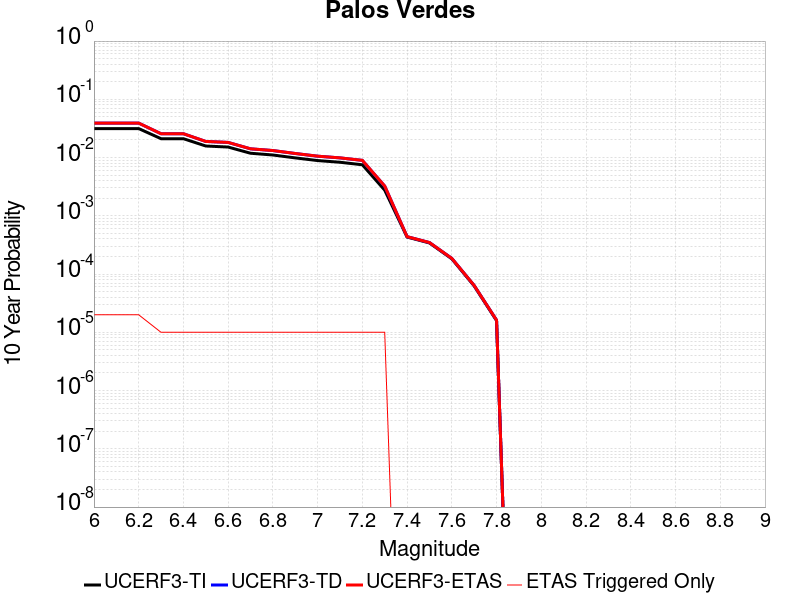 |

| Magnitude | 1 wk TI Prob | 1 wk TD Prob | 1 wk ETAS Prob | 1 wk ETAS/TD Gain | 1 wk ETAS Triggered Only | 1 mo TI Prob | 1 mo TD Prob | 1 mo ETAS Prob | 1 mo ETAS/TD Gain | 1 mo ETAS Triggered Only | 1 yr TI Prob | 1 yr TD Prob | 1 yr ETAS Prob | 1 yr ETAS/TD Gain | 1 yr ETAS Triggered Only | 10 yr TI Prob | 10 yr TD Prob | 10 yr ETAS Prob | 10 yr ETAS/TD Gain | 10 yr ETAS Triggered Only |
|-----|-----|-----|-----|-----|-----|-----|-----|-----|-----|-----|-----|-----|-----|-----|-----|-----|-----|-----|-----|-----|
| 6.0 | 6.126063E-5 | 7.622572E-5 | 9.62242E-5 | 1.2623587 | 2.0E-5 | 2.6251914E-4 | 3.266441E-4 | 3.466376E-4 | 1.0612087 | 2.0E-5 | 0.0031914865 | 0.0039701737 | 0.0039900946 | 1.0050175 | 2.0E-5 | 0.031460393 | 0.03904909 | 0.039068308 | 1.0004922 | 2.0E-5 |
| 6.1 | 6.126063E-5 | 7.622572E-5 | 9.62242E-5 | 1.2623587 | 2.0E-5 | 2.6251914E-4 | 3.266441E-4 | 3.466376E-4 | 1.0612087 | 2.0E-5 | 0.0031914865 | 0.0039701737 | 0.0039900946 | 1.0050175 | 2.0E-5 | 0.031460393 | 0.03904909 | 0.039068308 | 1.0004922 | 2.0E-5 |
| 6.2 | 6.126063E-5 | 7.622572E-5 | 9.62242E-5 | 1.2623587 | 2.0E-5 | 2.6251914E-4 | 3.266441E-4 | 3.466376E-4 | 1.0612087 | 2.0E-5 | 0.0031914865 | 0.0039701737 | 0.0039900946 | 1.0050175 | 2.0E-5 | 0.031460393 | 0.03904909 | 0.039068308 | 1.0004922 | 2.0E-5 |
| 6.3 | 4.0838047E-5 | 4.9749007E-5 | 5.974851E-5 | 1.200999 | 1.0E-5 | 1.7500846E-4 | 2.1319388E-4 | 2.2319175E-4 | 1.0468956 | 1.0E-5 | 0.0021286458 | 0.002592754 | 0.0026027283 | 1.0038469 | 1.0E-5 | 0.021083709 | 0.025646746 | 0.02565649 | 1.0003799 | 1.0E-5 |
| 6.4 | 4.0838047E-5 | 4.9749007E-5 | 5.974851E-5 | 1.200999 | 1.0E-5 | 1.7500846E-4 | 2.1319388E-4 | 2.2319175E-4 | 1.0468956 | 1.0E-5 | 0.0021286458 | 0.002592754 | 0.0026027283 | 1.0038469 | 1.0E-5 | 0.021083709 | 0.025646746 | 0.02565649 | 1.0003799 | 1.0E-5 |
| 6.5 | 3.0512005E-5 | 3.6561592E-5 | 4.656123E-5 | 1.273501 | 1.0E-5 | 1.3075917E-4 | 1.566838E-4 | 1.6668225E-4 | 1.0638129 | 1.0E-5 | 0.0015908304 | 0.001906072 | 0.001916053 | 1.0052364 | 1.0E-5 | 0.015794903 | 0.018909173 | 0.018918984 | 1.0005188 | 1.0E-5 |
| 6.6 | 2.9255087E-5 | 3.5154393E-5 | 4.515404E-5 | 1.2844495 | 1.0E-5 | 1.2537291E-4 | 1.5065364E-4 | 1.6065213E-4 | 1.0663674 | 1.0E-5 | 0.0015253464 | 0.0018327782 | 0.0018427599 | 1.0054462 | 1.0E-5 | 0.015149189 | 0.018188244 | 0.018198062 | 1.0005398 | 1.0E-5 |
| 6.7 | 2.287198E-5 | 2.724828E-5 | 3.7248006E-5 | 1.3669857 | 1.0E-5 | 9.801909E-5 | 1.16773626E-4 | 1.2677246E-4 | 1.0856258 | 1.0E-5 | 0.001192729 | 0.0014208833 | 0.0014308692 | 1.0070279 | 1.0E-5 | 0.011863477 | 0.014127217 | 0.014137076 | 1.0006979 | 1.0E-5 |
| 6.8 | 2.1325764E-5 | 2.5431878E-5 | 3.5431625E-5 | 1.3931973 | 1.0E-5 | 9.139293E-5 | 1.0898972E-4 | 1.18988624E-4 | 1.0917418 | 1.0E-5 | 0.001112141 | 0.0013262323 | 0.001336219 | 1.0075302 | 1.0E-5 | 0.011065915 | 0.013192211 | 0.01320208 | 1.000748 | 1.0E-5 |
| 6.9 | 1.9009392E-5 | 2.2613547E-5 | 3.2613323E-5 | 1.4422028 | 1.0E-5 | 8.1466285E-5 | 9.6912096E-5 | 1.0691113E-4 | 1.1031762 | 1.0E-5 | 9.914007E-4 | 0.0011793535 | 0.0011893417 | 1.0084692 | 1.0E-5 | 0.009869894 | 0.011739633 | 0.011749515 | 1.0008419 | 1.0E-5 |
| 7.0 | 1.7098473E-5 | 2.0319356E-5 | 3.0319152E-5 | 1.4921316 | 1.0E-5 | 7.3277115E-5 | 8.708052E-5 | 9.7079654E-5 | 1.1148262 | 1.0E-5 | 8.917837E-4 | 0.001059775 | 0.0010697644 | 1.009426 | 1.0E-5 | 0.008882134 | 0.010555646 | 0.010565541 | 1.0009373 | 1.0E-5 |
| 7.1 | 1.5982785E-5 | 1.899476E-5 | 2.8994571E-5 | 1.526451 | 1.0E-5 | 6.849585E-5 | 8.1404054E-5 | 9.1403235E-5 | 1.122834 | 1.0E-5 | 8.336179E-4 | 9.907284E-4 | 0.0010007184 | 1.0100836 | 1.0E-5 | 0.008304977 | 0.009871479 | 0.009881381 | 1.001003 | 1.0E-5 |
| 7.2 | 1.4468002E-5 | 1.7197237E-5 | 2.7197064E-5 | 1.5814788 | 1.0E-5 | 6.200425E-5 | 7.370083E-5 | 8.370009E-5 | 1.1356736 | 1.0E-5 | 7.546402E-4 | 8.970222E-4 | 9.0701325E-4 | 1.011138 | 1.0E-5 | 0.007520827 | 0.008942284 | 0.008952194 | 1.0011083 | 1.0E-5 |
| 7.3 | 5.288233E-6 | 6.2036747E-6 | 1.6203612E-5 | 2.6119378 | 1.0E-5 | 2.2663658E-5 | 2.6587102E-5 | 3.6586836E-5 | 1.3761122 | 1.0E-5 | 2.7589512E-4 | 3.236848E-4 | 3.3368156E-4 | 1.0308843 | 1.0E-5 | 0.0027555283 | 0.0032355562 | 0.003245524 | 1.0030806 | 1.0E-5 |
| 7.4 | 8.279556E-7 | 8.408347E-7 | 8.408347E-7 | 1.0 | 0.0 | 3.5483763E-6 | 3.6035726E-6 | 3.6035726E-6 | 1.0 | 0.0 | 4.3200624E-5 | 4.3872686E-5 | 4.3872686E-5 | 1.0 | 0.0 | 4.3192226E-4 | 4.3864746E-4 | 4.3864746E-4 | 1.0 | 0.0 |
| 7.5 | 6.559831E-7 | 6.667229E-7 | 6.667229E-7 | 1.0 | 0.0 | 2.8113532E-6 | 2.857381E-6 | 2.857381E-6 | 1.0 | 0.0 | 3.4227687E-5 | 3.4788125E-5 | 3.4788125E-5 | 1.0 | 0.0 | 3.4222414E-4 | 3.4783344E-4 | 3.4783344E-4 | 1.0 | 0.0 |
| 7.6 | 3.5018968E-7 | 3.5620027E-7 | 3.5620027E-7 | 1.0 | 0.0 | 1.500812E-6 | 1.526572E-6 | 1.526572E-6 | 1.0 | 0.0 | 1.8272232E-5 | 1.8585903E-5 | 1.8585903E-5 | 1.0 | 0.0 | 1.8270731E-4 | 1.8584808E-4 | 1.8584808E-4 | 1.0 | 0.0 |
| 7.7 | 1.1986104E-7 | 1.2198376E-7 | 1.2198376E-7 | 1.0 | 0.0 | 5.1369005E-7 | 5.2278745E-7 | 5.2278745E-7 | 1.0 | 0.0 | 6.2541585E-6 | 6.364919E-6 | 6.364919E-6 | 1.0 | 0.0 | 6.2539824E-5 | 6.364741E-5 | 6.364741E-5 | 1.0 | 0.0 |
| 7.8 | 3.0445005E-8 | 3.1027582E-8 | 3.1027582E-8 | 1.0 | 0.0 | 1.3047858E-7 | 1.3297536E-7 | 1.3297536E-7 | 1.0 | 0.0 | 1.5885756E-6 | 1.6189739E-6 | 1.6189739E-6 | 1.0 | 0.0 | 1.5885644E-5 | 1.6189642E-5 | 1.6189642E-5 | 1.0 | 0.0 |

## Simi-Santa Rosa
*[(top)](#table-of-contents)*

| 1 Week | 1 Month | 1 Year | 10 Year |
|-----|-----|-----|-----|
|  |  |  |  |

| Magnitude | 1 wk TI Prob | 1 wk TD Prob | 1 wk ETAS Prob | 1 wk ETAS/TD Gain | 1 wk ETAS Triggered Only | 1 mo TI Prob | 1 mo TD Prob | 1 mo ETAS Prob | 1 mo ETAS/TD Gain | 1 mo ETAS Triggered Only | 1 yr TI Prob | 1 yr TD Prob | 1 yr ETAS Prob | 1 yr ETAS/TD Gain | 1 yr ETAS Triggered Only | 10 yr TI Prob | 10 yr TD Prob | 10 yr ETAS Prob | 10 yr ETAS/TD Gain | 10 yr ETAS Triggered Only |
|-----|-----|-----|-----|-----|-----|-----|-----|-----|-----|-----|-----|-----|-----|-----|-----|-----|-----|-----|-----|-----|
| 6.0 | 2.198912E-5 | 2.2275388E-5 | 3.2275166E-5 | 1.448916 | 1.0E-5 | 9.4235686E-5 | 9.54627E-5 | 1.0546175E-4 | 1.104743 | 1.0E-5 | 0.0011467156 | 0.0011616825 | 0.001171671 | 1.0085982 | 1.0E-5 | 0.011408163 | 0.011560547 | 0.011580316 | 1.00171 | 2.0E-5 |
| 6.1 | 2.198912E-5 | 2.2275388E-5 | 3.2275166E-5 | 1.448916 | 1.0E-5 | 9.4235686E-5 | 9.54627E-5 | 1.0546175E-4 | 1.104743 | 1.0E-5 | 0.0011467156 | 0.0011616825 | 0.001171671 | 1.0085982 | 1.0E-5 | 0.011408163 | 0.011560547 | 0.011580316 | 1.00171 | 2.0E-5 |
| 6.2 | 1.69983E-5 | 1.6668506E-5 | 2.6668338E-5 | 1.5999238 | 1.0E-5 | 7.284782E-5 | 7.143466E-5 | 8.1433944E-5 | 1.139978 | 1.0E-5 | 8.865613E-4 | 8.6939917E-4 | 8.7939046E-4 | 1.0114923 | 1.0E-5 | 0.008830327 | 0.0086629 | 0.008682727 | 1.0022887 | 2.0E-5 |
| 6.3 | 1.69983E-5 | 1.6668506E-5 | 2.6668338E-5 | 1.5999238 | 1.0E-5 | 7.284782E-5 | 7.143466E-5 | 8.1433944E-5 | 1.139978 | 1.0E-5 | 8.865613E-4 | 8.6939917E-4 | 8.7939046E-4 | 1.0114923 | 1.0E-5 | 0.008830327 | 0.0086629 | 0.008682727 | 1.0022887 | 2.0E-5 |
| 6.4 | 1.4666188E-5 | 1.4052489E-5 | 2.4052348E-5 | 1.7116077 | 1.0E-5 | 6.285358E-5 | 6.0223705E-5 | 7.0223105E-5 | 1.1660376 | 1.0E-5 | 7.6497364E-4 | 7.330018E-4 | 7.429945E-4 | 1.0136325 | 1.0E-5 | 0.0076234564 | 0.0073083164 | 0.0073182434 | 1.0013583 | 1.0E-5 |
| 6.5 | 1.4666188E-5 | 1.4052489E-5 | 2.4052348E-5 | 1.7116077 | 1.0E-5 | 6.285358E-5 | 6.0223705E-5 | 7.0223105E-5 | 1.1660376 | 1.0E-5 | 7.6497364E-4 | 7.330018E-4 | 7.429945E-4 | 1.0136325 | 1.0E-5 | 0.0076234564 | 0.0073083164 | 0.0073182434 | 1.0013583 | 1.0E-5 |
| 6.6 | 1.4377586E-5 | 1.3729529E-5 | 2.3729392E-5 | 1.7283471 | 1.0E-5 | 6.1616774E-5 | 5.883965E-5 | 6.8839065E-5 | 1.1699435 | 1.0E-5 | 7.4992597E-4 | 7.1616215E-4 | 7.26155E-4 | 1.0139533 | 1.0E-5 | 0.007474003 | 0.0071410104 | 0.007150939 | 1.0013903 | 1.0E-5 |
| 6.7 | 1.3881404E-5 | 1.3207497E-5 | 2.3207365E-5 | 1.7571357 | 1.0E-5 | 5.9490372E-5 | 5.6602472E-5 | 6.6601904E-5 | 1.1766608 | 1.0E-5 | 7.240546E-4 | 6.889419E-4 | 6.98935E-4 | 1.014505 | 1.0E-5 | 0.007217 | 0.0068705105 | 0.006880442 | 1.0014455 | 1.0E-5 |
| 6.8 | 1.0176516E-5 | 9.1541E-6 | 1.9154008E-5 | 2.0923967 | 1.0E-5 | 4.3612912E-5 | 3.923136E-5 | 4.9230966E-5 | 1.2548882 | 1.0E-5 | 5.308578E-4 | 4.775537E-4 | 4.875489E-4 | 1.02093 | 1.0E-5 | 0.0052959146 | 0.004766908 | 0.00477686 | 1.0020878 | 1.0E-5 |
| 6.9 | 9.699797E-6 | 8.774672E-6 | 1.8774585E-5 | 2.1396337 | 1.0E-5 | 4.15699E-5 | 3.760529E-5 | 4.760491E-5 | 1.26591 | 1.0E-5 | 5.05996E-4 | 4.5776463E-4 | 4.6776005E-4 | 1.0218353 | 1.0E-5 | 0.005048454 | 0.0045698346 | 0.004579789 | 1.0021783 | 1.0E-5 |
| 7.0 | 7.4049476E-6 | 6.559291E-6 | 6.559291E-6 | 1.0 | 0.0 | 3.1735104E-5 | 2.8111013E-5 | 2.8111013E-5 | 1.0 | 0.0 | 3.8630638E-4 | 3.422105E-4 | 3.422105E-4 | 1.0 | 0.0 | 0.0038563553 | 0.0034180775 | 0.0034180775 | 1.0 | 0.0 |
| 7.1 | 3.873439E-6 | 2.759473E-6 | 2.759473E-6 | 1.0 | 0.0 | 1.6600346E-5 | 1.1826261E-5 | 1.1826261E-5 | 1.0 | 0.0 | 2.0209046E-4 | 1.4397544E-4 | 1.4397544E-4 | 1.0 | 0.0 | 0.0020190678 | 0.0014388453 | 0.0014388453 | 1.0 | 0.0 |
| 7.2 | 3.417706E-6 | 2.367616E-6 | 2.367616E-6 | 1.0 | 0.0 | 1.4647229E-5 | 1.0146887E-5 | 1.0146887E-5 | 1.0 | 0.0 | 1.7831543E-4 | 1.2353157E-4 | 1.2353157E-4 | 1.0 | 0.0 | 0.0017817242 | 0.0012346513 | 0.0012346513 | 1.0 | 0.0 |
| 7.3 | 1.90225E-6 | 1.4073756E-6 | 1.4073756E-6 | 1.0 | 0.0 | 8.152474E-6 | 6.031596E-6 | 6.031596E-6 | 1.0 | 0.0 | 9.9251854E-5 | 7.343223E-5 | 7.343223E-5 | 1.0 | 0.0 | 9.920754E-4 | 7.340819E-4 | 7.340819E-4 | 1.0 | 0.0 |
| 7.4 | 1.5170556E-6 | 1.1024792E-6 | 1.1024792E-6 | 1.0 | 0.0 | 6.5016507E-6 | 4.7249023E-6 | 4.7249023E-6 | 1.0 | 0.0 | 7.915472E-5 | 5.752418E-5 | 5.752418E-5 | 1.0 | 0.0 | 7.9126534E-4 | 5.75094E-4 | 5.75094E-4 | 1.0 | 0.0 |
| 7.5 | 1.178732E-6 | 8.5351127E-7 | 8.5351127E-7 | 1.0 | 0.0 | 5.0516987E-6 | 3.6579004E-6 | 3.6579004E-6 | 1.0 | 0.0 | 6.1502695E-5 | 4.4534037E-5 | 4.4534037E-5 | 1.0 | 0.0 | 6.148568E-4 | 4.4525208E-4 | 4.4525208E-4 | 1.0 | 0.0 |
| 7.6 | 6.8722386E-7 | 4.793211E-7 | 4.793211E-7 | 1.0 | 0.0 | 2.9452417E-6 | 2.0542318E-6 | 2.0542318E-6 | 1.0 | 0.0 | 3.5857727E-5 | 2.5009986E-5 | 2.5009986E-5 | 1.0 | 0.0 | 3.5851944E-4 | 2.5007184E-4 | 2.5007184E-4 | 1.0 | 0.0 |
| 7.7 | 5.5126515E-7 | 3.6731117E-7 | 3.6731117E-7 | 1.0 | 0.0 | 2.3625628E-6 | 1.5741898E-6 | 1.5741898E-6 | 1.0 | 0.0 | 2.8763823E-5 | 1.9165593E-5 | 1.9165593E-5 | 1.0 | 0.0 | 2.87601E-4 | 1.9163951E-4 | 1.9163951E-4 | 1.0 | 0.0 |
| 7.8 | 3.3860243E-7 | 2.0075514E-7 | 2.0075514E-7 | 1.0 | 0.0 | 1.4511525E-6 | 8.6037886E-7 | 8.6037886E-7 | 1.0 | 0.0 | 1.7667637E-5 | 1.0475063E-5 | 1.0475063E-5 | 1.0 | 0.0 | 1.7666233E-4 | 1.0474575E-4 | 1.0474575E-4 | 1.0 | 0.0 |
| 7.9 | 2.7955386E-7 | 1.4648724E-7 | 1.4648724E-7 | 1.0 | 0.0 | 1.1980875E-6 | 6.278023E-7 | 6.278023E-7 | 1.0 | 0.0 | 1.4586617E-5 | 7.643467E-6 | 7.643467E-6 | 1.0 | 0.0 | 1.458566E-4 | 7.643208E-5 | 7.643208E-5 | 1.0 | 0.0 |
| 8.0 | 5.6259015E-8 | 3.335318E-8 | 3.335318E-8 | 1.0 | 0.0 | 2.4111003E-7 | 1.429422E-7 | 1.429422E-7 | 1.0 | 0.0 | 2.9355108E-6 | 1.7403199E-6 | 1.7403199E-6 | 1.0 | 0.0 | 2.935472E-5 | 1.7403077E-5 | 1.7403077E-5 | 1.0 | 0.0 |

## Great Valley 11
*[(top)](#table-of-contents)*

| 1 Week | 1 Month | 1 Year | 10 Year |
|-----|-----|-----|-----|
|  |  | 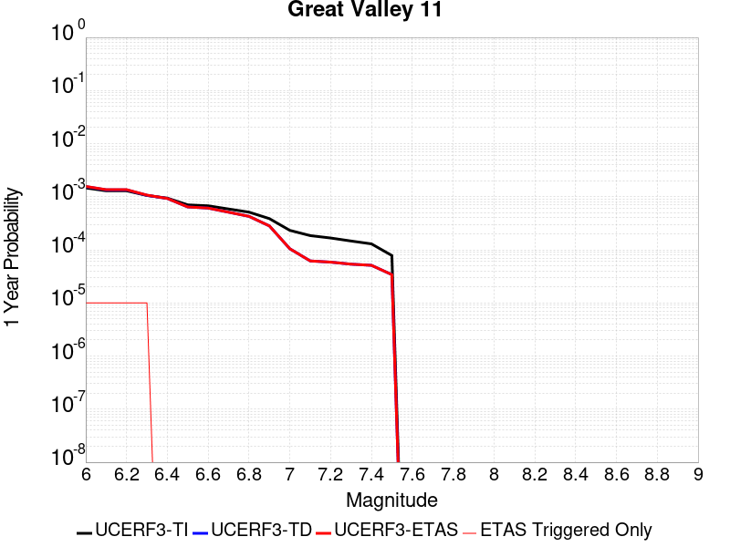 |  |

| Magnitude | 1 wk TI Prob | 1 wk TD Prob | 1 wk ETAS Prob | 1 wk ETAS/TD Gain | 1 wk ETAS Triggered Only | 1 mo TI Prob | 1 mo TD Prob | 1 mo ETAS Prob | 1 mo ETAS/TD Gain | 1 mo ETAS Triggered Only | 1 yr TI Prob | 1 yr TD Prob | 1 yr ETAS Prob | 1 yr ETAS/TD Gain | 1 yr ETAS Triggered Only | 10 yr TI Prob | 10 yr TD Prob | 10 yr ETAS Prob | 10 yr ETAS/TD Gain | 10 yr ETAS Triggered Only |
|-----|-----|-----|-----|-----|-----|-----|-----|-----|-----|-----|-----|-----|-----|-----|-----|-----|-----|-----|-----|-----|
| 6.0 | 2.8099583E-5 | 2.983214E-5 | 2.983214E-5 | 1.0 | 0.0 | 1.20421224E-4 | 1.2784619E-4 | 1.378449E-4 | 1.078209 | 1.0E-5 | 0.0014651422 | 0.0015554894 | 0.0015654739 | 1.0064188 | 1.0E-5 | 0.0145552 | 0.015453546 | 0.015473237 | 1.0012742 | 2.0E-5 |
| 6.1 | 2.483194E-5 | 2.5907144E-5 | 2.5907144E-5 | 1.0 | 0.0 | 1.0641825E-4 | 1.11026246E-4 | 1.21025136E-4 | 1.0900588 | 1.0E-5 | 0.0012948721 | 0.0013509697 | 0.0013609562 | 1.007392 | 1.0E-5 | 0.012873529 | 0.013433979 | 0.01345371 | 1.0014688 | 2.0E-5 |
| 6.2 | 2.483194E-5 | 2.5907144E-5 | 2.5907144E-5 | 1.0 | 0.0 | 1.0641825E-4 | 1.11026246E-4 | 1.21025136E-4 | 1.0900588 | 1.0E-5 | 0.0012948721 | 0.0013509697 | 0.0013609562 | 1.007392 | 1.0E-5 | 0.012873529 | 0.013433979 | 0.01345371 | 1.0014688 | 2.0E-5 |
| 6.3 | 2.0257901E-5 | 2.0398915E-5 | 2.0398915E-5 | 1.0 | 0.0 | 8.681669E-5 | 8.742122E-5 | 9.742035E-5 | 1.1143787 | 1.0E-5 | 0.0010564806 | 0.0010638753 | 0.0010738646 | 1.0093896 | 1.0E-5 | 0.01051472 | 0.010591993 | 0.010611782 | 1.0018682 | 2.0E-5 |
| 6.4 | 1.8054898E-5 | 1.7780852E-5 | 1.7780852E-5 | 1.0 | 0.0 | 7.737584E-5 | 7.6201635E-5 | 7.6201635E-5 | 1.0 | 0.0 | 9.416436E-4 | 9.2739763E-4 | 9.2739763E-4 | 1.0 | 0.0 | 0.009376635 | 0.009239015 | 0.009248923 | 1.0010724 | 1.0E-5 |
| 6.5 | 1.34804895E-5 | 1.2321004E-5 | 1.2321004E-5 | 1.0 | 0.0 | 5.777225E-5 | 5.2803258E-5 | 5.2803258E-5 | 1.0 | 0.0 | 7.031501E-4 | 6.426942E-4 | 6.426942E-4 | 1.0 | 0.0 | 0.007009294 | 0.006408792 | 0.0064187283 | 1.0015503 | 1.0E-5 |
| 6.6 | 1.294883E-5 | 1.1732261E-5 | 1.1732261E-5 | 1.0 | 0.0 | 5.5493805E-5 | 5.028017E-5 | 5.028017E-5 | 1.0 | 0.0 | 6.754276E-4 | 6.1199325E-4 | 6.1199325E-4 | 1.0 | 0.0 | 0.006733784 | 0.0061035044 | 0.0061134435 | 1.0016284 | 1.0E-5 |
| 6.7 | 1.1272237E-5 | 9.811834E-6 | 9.811834E-6 | 1.0 | 0.0 | 4.8308695E-5 | 4.205006E-5 | 4.205006E-5 | 1.0 | 0.0 | 5.879996E-4 | 5.1184196E-4 | 5.1184196E-4 | 1.0 | 0.0 | 0.005864462 | 0.005106915 | 0.005106915 | 1.0 | 0.0 |
| 6.8 | 9.8337505E-6 | 8.193719E-6 | 8.193719E-6 | 1.0 | 0.0 | 4.2143965E-5 | 3.5115478E-5 | 3.5115478E-5 | 1.0 | 0.0 | 5.1298196E-4 | 4.2744912E-4 | 4.2744912E-4 | 1.0 | 0.0 | 0.005117994 | 0.0042664795 | 0.0042664795 | 1.0 | 0.0 |
| 6.9 | 7.4224813E-6 | 5.4130837E-6 | 5.4130837E-6 | 1.0 | 0.0 | 3.1810247E-5 | 2.3198732E-5 | 2.3198732E-5 | 1.0 | 0.0 | 3.872209E-4 | 2.8240937E-4 | 2.8240937E-4 | 1.0 | 0.0 | 0.0038654688 | 0.0028206457 | 0.0028206457 | 1.0 | 0.0 |
| 7.0 | 4.4628923E-6 | 2.0110294E-6 | 2.0110294E-6 | 1.0 | 0.0 | 1.912654E-5 | 8.61867E-6 | 8.61867E-6 | 1.0 | 0.0 | 2.3284076E-4 | 1.0492737E-4 | 1.0492737E-4 | 1.0 | 0.0 | 0.0023259693 | 0.0010487898 | 0.0010487898 | 1.0 | 0.0 |
| 7.1 | 3.5546527E-6 | 1.1855383E-6 | 1.1855383E-6 | 1.0 | 0.0 | 1.5234136E-5 | 5.080869E-6 | 5.080869E-6 | 1.0 | 0.0 | 1.8545982E-4 | 6.185789E-5 | 6.185789E-5 | 1.0 | 0.0 | 0.0018530512 | 6.1841356E-4 | 6.1841356E-4 | 1.0 | 0.0 |
| 7.2 | 3.2039936E-6 | 1.1253728E-6 | 1.1253728E-6 | 1.0 | 0.0 | 1.3731329E-5 | 4.8230177E-6 | 4.8230177E-6 | 1.0 | 0.0 | 1.671661E-4 | 5.8718724E-5 | 5.8718724E-5 | 1.0 | 0.0 | 0.0016704041 | 5.870388E-4 | 5.870388E-4 | 1.0 | 0.0 |
| 7.3 | 2.8120473E-6 | 1.0305271E-6 | 1.0305271E-6 | 1.0 | 0.0 | 1.2051575E-5 | 4.4165376E-6 | 4.4165376E-6 | 1.0 | 0.0 | 1.4671806E-4 | 5.3770087E-5 | 5.3770087E-5 | 1.0 | 0.0 | 0.0014662122 | 5.375774E-4 | 5.375774E-4 | 1.0 | 0.0 |
| 7.4 | 2.4837766E-6 | 9.80032E-7 | 9.80032E-7 | 1.0 | 0.0 | 1.0644713E-5 | 4.2001307E-6 | 4.2001307E-6 | 1.0 | 0.0 | 1.2959167E-4 | 5.113546E-5 | 5.113546E-5 | 1.0 | 0.0 | 0.0012951613 | 5.1124353E-4 | 5.1124353E-4 | 1.0 | 0.0 |
| 7.5 | 1.5002679E-6 | 6.545985E-7 | 6.545985E-7 | 1.0 | 0.0 | 6.4297037E-6 | 2.8054194E-6 | 2.8054194E-6 | 1.0 | 0.0 | 7.827883E-5 | 3.4155488E-5 | 3.4155488E-5 | 1.0 | 0.0 | 7.825126E-4 | 3.4150656E-4 | 3.4150656E-4 | 1.0 | 0.0 |

## Newport-Inglewood (Offshore)
*[(top)](#table-of-contents)*

| 1 Week | 1 Month | 1 Year | 10 Year |
|-----|-----|-----|-----|
| 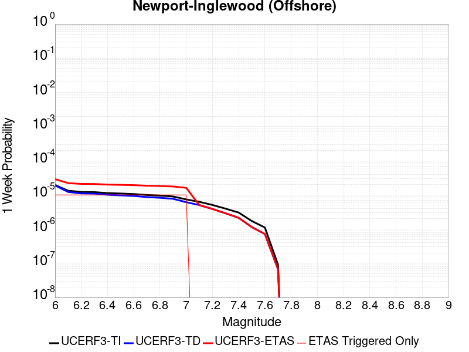 | 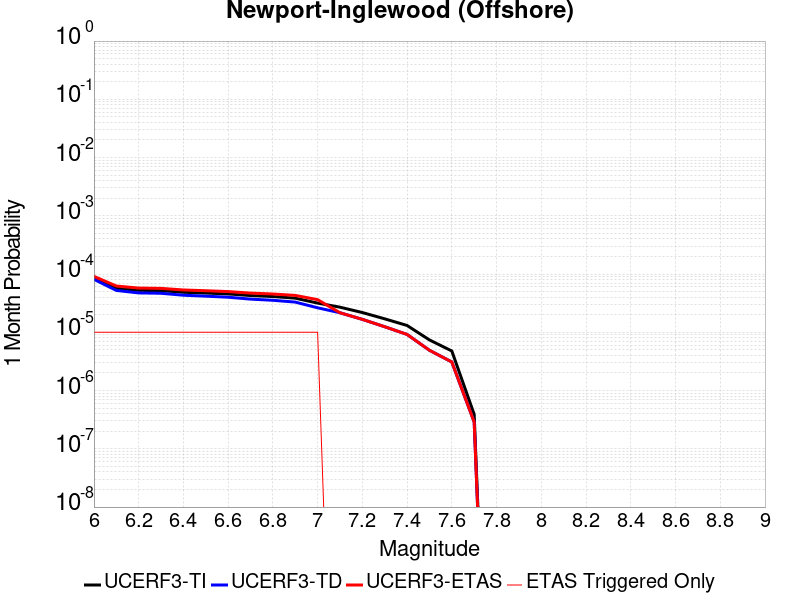 | 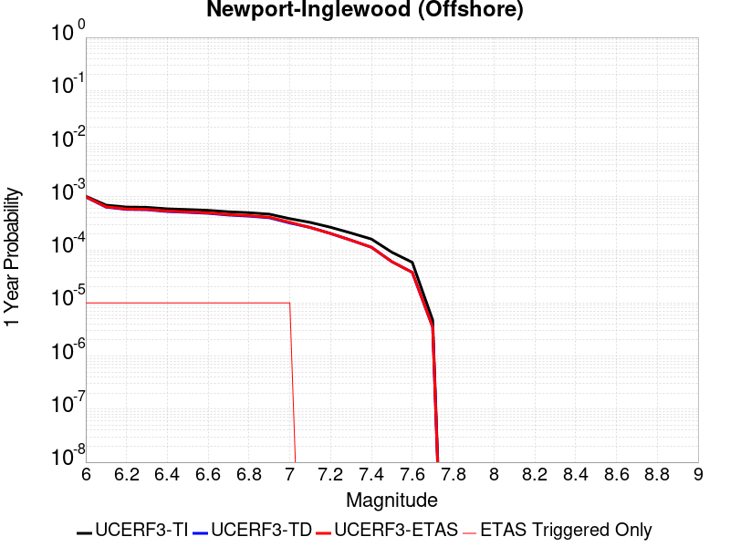 | 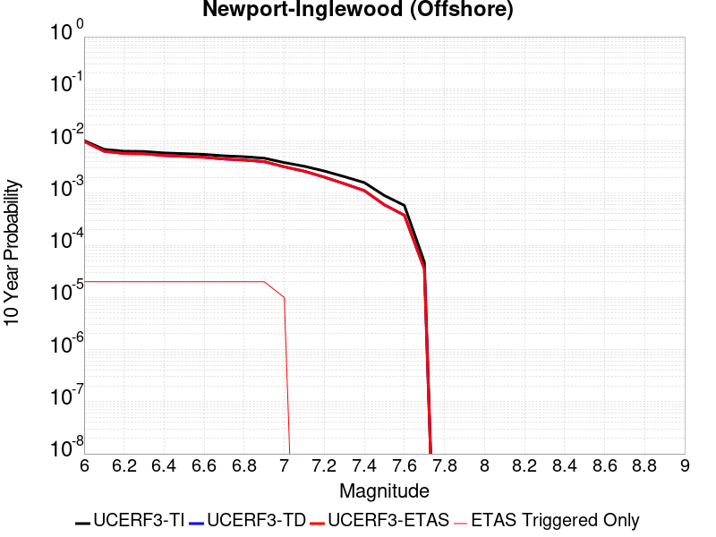 |

| Magnitude | 1 wk TI Prob | 1 wk TD Prob | 1 wk ETAS Prob | 1 wk ETAS/TD Gain | 1 wk ETAS Triggered Only | 1 mo TI Prob | 1 mo TD Prob | 1 mo ETAS Prob | 1 mo ETAS/TD Gain | 1 mo ETAS Triggered Only | 1 yr TI Prob | 1 yr TD Prob | 1 yr ETAS Prob | 1 yr ETAS/TD Gain | 1 yr ETAS Triggered Only | 10 yr TI Prob | 10 yr TD Prob | 10 yr ETAS Prob | 10 yr ETAS/TD Gain | 10 yr ETAS Triggered Only |
|-----|-----|-----|-----|-----|-----|-----|-----|-----|-----|-----|-----|-----|-----|-----|-----|-----|-----|-----|-----|-----|
| 6.0 | 1.9626508E-5 | 1.8965342E-5 | 2.8965153E-5 | 1.5272676 | 1.0E-5 | 8.411089E-5 | 8.1277576E-5 | 9.1276765E-5 | 1.1230252 | 1.0E-5 | 0.001023569 | 9.891179E-4 | 9.99108E-4 | 1.0101 | 1.0E-5 | 0.010188672 | 0.009848497 | 0.0098683 | 1.0020108 | 2.0E-5 |
| 6.1 | 1.331886E-5 | 1.2218078E-5 | 2.2217957E-5 | 1.8184493 | 1.0E-5 | 5.707958E-5 | 5.2362153E-5 | 6.236163E-5 | 1.1909677 | 1.0E-5 | 6.947222E-4 | 6.3732424E-4 | 6.4731785E-4 | 1.0156806 | 1.0E-5 | 0.006925544 | 0.006355142 | 0.006375015 | 1.0031271 | 2.0E-5 |
| 6.2 | 1.2250852E-5 | 1.1076016E-5 | 2.1075904E-5 | 1.9028417 | 1.0E-5 | 5.2502597E-5 | 4.746778E-5 | 5.7467307E-5 | 1.2106593 | 1.0E-5 | 6.3903164E-4 | 5.7776796E-4 | 5.877622E-4 | 1.017298 | 1.0E-5 | 0.006371971 | 0.0057627796 | 0.0057826643 | 1.0034505 | 2.0E-5 |
| 6.3 | 1.2106258E-5 | 1.0918878E-5 | 2.091877E-5 | 1.915835 | 1.0E-5 | 5.1882926E-5 | 4.6794354E-5 | 5.6793888E-5 | 1.213691 | 1.0E-5 | 6.3149154E-4 | 5.695733E-4 | 5.795676E-4 | 1.017547 | 1.0E-5 | 0.0062970007 | 0.005681252 | 0.0057011386 | 1.0035003 | 2.0E-5 |
| 6.4 | 1.1348758E-5 | 1.0109348E-5 | 2.0109248E-5 | 1.9891734 | 1.0E-5 | 4.8636626E-5 | 4.3325064E-5 | 5.332463E-5 | 1.2308033 | 1.0E-5 | 5.919901E-4 | 5.2735576E-4 | 5.3735054E-4 | 1.0189525 | 1.0E-5 | 0.005904155 | 0.0052611395 | 0.0052810344 | 1.0037814 | 2.0E-5 |
| 6.5 | 1.100837E-5 | 9.743376E-6 | 1.9743278E-5 | 2.0263283 | 1.0E-5 | 4.7177873E-5 | 4.175666E-5 | 5.1756244E-5 | 1.2394727 | 1.0E-5 | 5.7423924E-4 | 5.082695E-4 | 5.182644E-4 | 1.0196646 | 1.0E-5 | 0.005727576 | 0.005071162 | 0.0050910604 | 1.0039239 | 2.0E-5 |
| 6.6 | 1.0634696E-5 | 9.34553E-6 | 1.9345436E-5 | 2.0700202 | 1.0E-5 | 4.557647E-5 | 4.0051662E-5 | 5.005126E-5 | 1.2496675 | 1.0E-5 | 5.5475225E-4 | 4.875206E-4 | 4.975157E-4 | 1.020502 | 1.0E-5 | 0.0055336943 | 0.0048645977 | 0.0048845005 | 1.0040914 | 2.0E-5 |
| 6.7 | 9.9780855E-6 | 8.667898E-6 | 1.8667812E-5 | 2.1536722 | 1.0E-5 | 4.276252E-5 | 3.7147613E-5 | 4.714724E-5 | 1.2691863 | 1.0E-5 | 5.205093E-4 | 4.5217903E-4 | 4.621745E-4 | 1.0221051 | 1.0E-5 | 0.0051929182 | 0.0045126686 | 0.0045325784 | 1.0044119 | 2.0E-5 |
| 6.8 | 9.59546E-6 | 8.272933E-6 | 1.827285E-5 | 2.2087512 | 1.0E-5 | 4.1122752E-5 | 3.545495E-5 | 4.545459E-5 | 1.2820381 | 1.0E-5 | 5.0055445E-4 | 4.3157916E-4 | 4.4157484E-4 | 1.0231607 | 1.0E-5 | 0.004994285 | 0.004307486 | 0.0043273997 | 1.004623 | 2.0E-5 |
| 6.9 | 9.000614E-6 | 7.706823E-6 | 1.7706747E-5 | 2.2975414 | 1.0E-5 | 3.857349E-5 | 3.3028828E-5 | 4.30285E-5 | 1.3027558 | 1.0E-5 | 4.6953102E-4 | 4.0205245E-4 | 4.1204842E-4 | 1.0248624 | 1.0E-5 | 0.004685402 | 0.0040133223 | 0.004033242 | 1.0049634 | 2.0E-5 |
| 7.0 | 7.4070194E-6 | 6.148865E-6 | 1.6148802E-5 | 2.6263065 | 1.0E-5 | 3.1743984E-5 | 2.6352012E-5 | 3.635175E-5 | 1.3794676 | 1.0E-5 | 3.8641447E-4 | 3.2078868E-4 | 3.3078546E-4 | 1.0311632 | 1.0E-5 | 0.0038574322 | 0.0032032758 | 0.0032132438 | 1.0031118 | 1.0E-5 |
| 7.1 | 6.299615E-6 | 5.0565613E-6 | 5.0565613E-6 | 1.0 | 0.0 | 2.699807E-5 | 2.1670798E-5 | 2.1670798E-5 | 1.0 | 0.0 | 3.2865192E-4 | 2.6381016E-4 | 2.6381016E-4 | 1.0 | 0.0 | 0.003281663 | 0.0026349847 | 0.0026349847 | 1.0 | 0.0 |
| 7.2 | 5.096653E-6 | 3.892733E-6 | 3.892733E-6 | 1.0 | 0.0 | 2.1842614E-5 | 1.6683034E-5 | 1.6683034E-5 | 1.0 | 0.0 | 2.6590136E-4 | 2.0309711E-4 | 2.0309711E-4 | 1.0 | 0.0 | 0.0026558342 | 0.0020291263 | 0.0020291263 | 1.0 | 0.0 |
| 7.3 | 3.9753018E-6 | 2.9098787E-6 | 2.9098787E-6 | 1.0 | 0.0 | 1.7036897E-5 | 1.24708495E-5 | 1.24708495E-5 | 1.0 | 0.0 | 2.0740448E-4 | 1.518221E-4 | 1.518221E-4 | 1.0 | 0.0 | 0.00207211 | 0.0015171919 | 0.0015171919 | 1.0 | 0.0 |
| 7.4 | 3.0568392E-6 | 2.1449732E-6 | 2.1449732E-6 | 1.0 | 0.0 | 1.3100675E-5 | 9.19271E-6 | 9.19271E-6 | 1.0 | 0.0 | 1.5948903E-4 | 1.11915564E-4 | 1.11915564E-4 | 1.0 | 0.0 | 0.0015937461 | 0.0011185983 | 0.0011185983 | 1.0 | 0.0 |
| 7.5 | 1.7279019E-6 | 1.1469651E-6 | 1.1469651E-6 | 1.0 | 0.0 | 7.405273E-6 | 4.9155556E-6 | 4.9155556E-6 | 1.0 | 0.0 | 9.015547E-5 | 5.9845286E-5 | 5.9845286E-5 | 1.0 | 0.0 | 9.01189E-4 | 5.982956E-4 | 5.982956E-4 | 1.0 | 0.0 |
| 7.6 | 1.1156416E-6 | 7.222962E-7 | 7.222962E-7 | 1.0 | 0.0 | 4.7813123E-6 | 3.0955514E-6 | 3.0955514E-6 | 1.0 | 0.0 | 5.821092E-5 | 3.768771E-5 | 3.768771E-5 | 1.0 | 0.0 | 5.8195676E-4 | 3.7681553E-4 | 3.7681553E-4 | 1.0 | 0.0 |
| 7.7 | 9.117973E-8 | 6.7342256E-8 | 6.7342256E-8 | 1.0 | 0.0 | 3.907702E-7 | 2.8860964E-7 | 2.8860964E-7 | 1.0 | 0.0 | 4.757617E-6 | 3.5138169E-6 | 3.5138169E-6 | 1.0 | 0.0 | 4.7575148E-5 | 3.5137644E-5 | 3.5137644E-5 | 1.0 | 0.0 |

## Elsinore (Temecula) rev
*[(top)](#table-of-contents)*

| 1 Week | 1 Month | 1 Year | 10 Year |
|-----|-----|-----|-----|
| 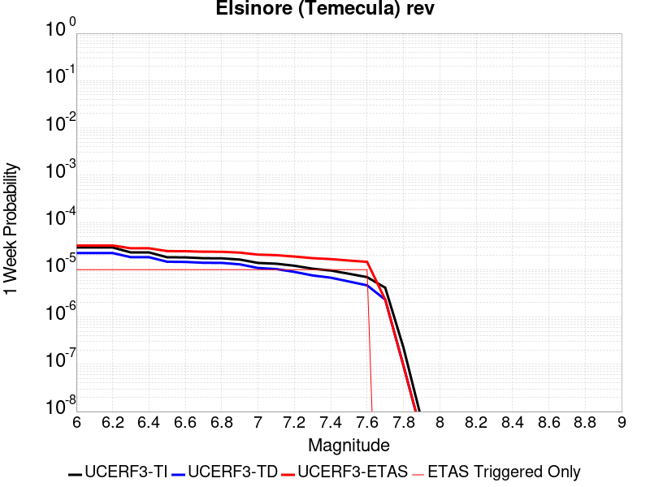 | 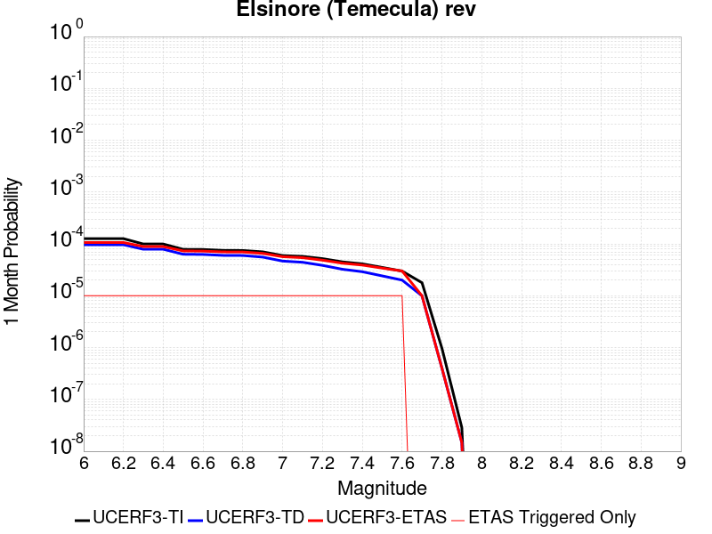 | 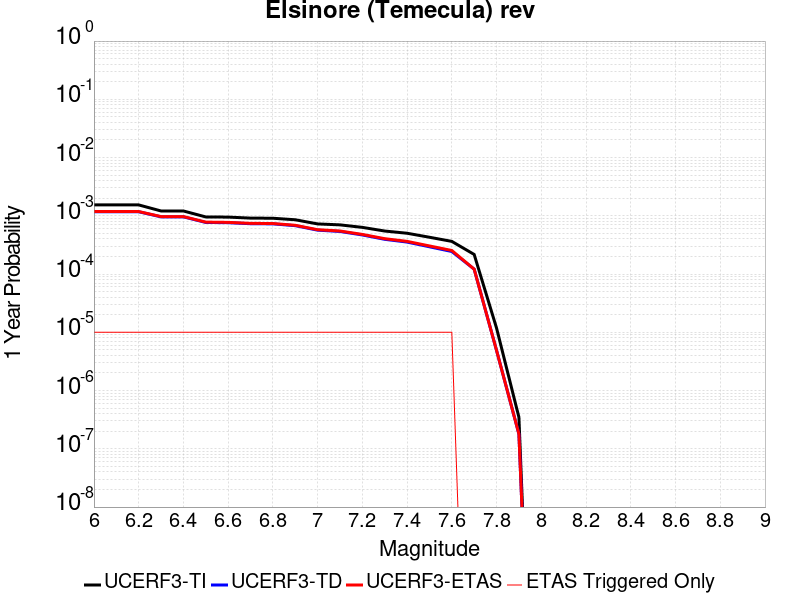 | 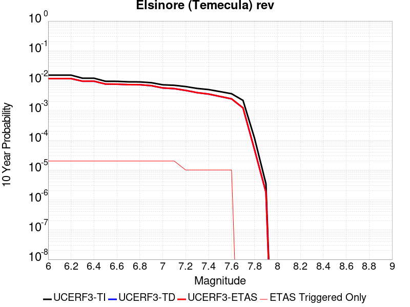 |

| Magnitude | 1 wk TI Prob | 1 wk TD Prob | 1 wk ETAS Prob | 1 wk ETAS/TD Gain | 1 wk ETAS Triggered Only | 1 mo TI Prob | 1 mo TD Prob | 1 mo ETAS Prob | 1 mo ETAS/TD Gain | 1 mo ETAS Triggered Only | 1 yr TI Prob | 1 yr TD Prob | 1 yr ETAS Prob | 1 yr ETAS/TD Gain | 1 yr ETAS Triggered Only | 10 yr TI Prob | 10 yr TD Prob | 10 yr ETAS Prob | 10 yr ETAS/TD Gain | 10 yr ETAS Triggered Only |
|-----|-----|-----|-----|-----|-----|-----|-----|-----|-----|-----|-----|-----|-----|-----|-----|-----|-----|-----|-----|-----|
| 6.0 | 2.9514995E-5 | 2.251887E-5 | 3.2518645E-5 | 1.444062 | 1.0E-5 | 1.264867E-4 | 9.6505995E-5 | 1.0650503E-4 | 1.1036105 | 1.0E-5 | 0.0015388876 | 0.0011743492 | 0.0011843374 | 1.0085053 | 1.0E-5 | 0.015282745 | 0.011688135 | 0.011707901 | 1.0016911 | 2.0E-5 |
| 6.1 | 2.9514995E-5 | 2.251887E-5 | 3.2518645E-5 | 1.444062 | 1.0E-5 | 1.264867E-4 | 9.6505995E-5 | 1.0650503E-4 | 1.1036105 | 1.0E-5 | 0.0015388876 | 0.0011743492 | 0.0011843374 | 1.0085053 | 1.0E-5 | 0.015282745 | 0.011688135 | 0.011707901 | 1.0016911 | 2.0E-5 |
| 6.2 | 2.9514995E-5 | 2.251887E-5 | 3.2518645E-5 | 1.444062 | 1.0E-5 | 1.264867E-4 | 9.6505995E-5 | 1.0650503E-4 | 1.1036105 | 1.0E-5 | 0.0015388876 | 0.0011743492 | 0.0011843374 | 1.0085053 | 1.0E-5 | 0.015282745 | 0.011688135 | 0.011707901 | 1.0016911 | 2.0E-5 |
| 6.3 | 2.3223649E-5 | 1.840822E-5 | 2.8408034E-5 | 1.5432256 | 1.0E-5 | 9.952613E-5 | 7.889008E-5 | 8.888929E-5 | 1.1267487 | 1.0E-5 | 0.001211057 | 9.600807E-4 | 9.700711E-4 | 1.0104058 | 1.0E-5 | 0.012044783 | 0.009551284 | 0.009571092 | 1.002074 | 2.0E-5 |
| 6.4 | 2.3223649E-5 | 1.840822E-5 | 2.8408034E-5 | 1.5432256 | 1.0E-5 | 9.952613E-5 | 7.889008E-5 | 8.888929E-5 | 1.1267487 | 1.0E-5 | 0.001211057 | 9.600807E-4 | 9.700711E-4 | 1.0104058 | 1.0E-5 | 0.012044783 | 0.009551284 | 0.009571092 | 1.002074 | 2.0E-5 |
| 6.5 | 1.8338875E-5 | 1.4750074E-5 | 2.4749927E-5 | 1.6779526 | 1.0E-5 | 7.8592806E-5 | 6.321312E-5 | 7.321249E-5 | 1.158185 | 1.0E-5 | 9.5644733E-4 | 7.6935673E-4 | 7.7934907E-4 | 1.0129879 | 1.0E-5 | 0.009523412 | 0.0076699676 | 0.007689814 | 1.0025876 | 2.0E-5 |
| 6.6 | 1.8223333E-5 | 1.461263E-5 | 2.4612484E-5 | 1.6843295 | 1.0E-5 | 7.809766E-5 | 6.26241E-5 | 7.262348E-5 | 1.159673 | 1.0E-5 | 9.504242E-4 | 7.621905E-4 | 7.721829E-4 | 1.01311 | 1.0E-5 | 0.009463696 | 0.007598796 | 0.0076186443 | 1.002612 | 2.0E-5 |
| 6.7 | 1.7512752E-5 | 1.4026963E-5 | 2.4026822E-5 | 1.7129027 | 1.0E-5 | 7.505249E-5 | 6.0114216E-5 | 7.0113616E-5 | 1.16634 | 1.0E-5 | 9.13381E-4 | 7.316534E-4 | 7.416461E-4 | 1.0136577 | 1.0E-5 | 0.00909636 | 0.0072983317 | 0.0073181856 | 1.0027204 | 2.0E-5 |
| 6.8 | 1.7417142E-5 | 1.395093E-5 | 2.395079E-5 | 1.716788 | 1.0E-5 | 7.4642754E-5 | 5.978838E-5 | 6.9787784E-5 | 1.1672466 | 1.0E-5 | 9.083966E-4 | 7.27689E-4 | 7.376817E-4 | 1.0137321 | 1.0E-5 | 0.009046922 | 0.007259359 | 0.007279214 | 1.002735 | 2.0E-5 |
| 6.9 | 1.6402591E-5 | 1.29883665E-5 | 2.2988237E-5 | 1.7699097 | 1.0E-5 | 7.0294926E-5 | 5.5663284E-5 | 6.566273E-5 | 1.1796416 | 1.0E-5 | 8.5550465E-4 | 6.774974E-4 | 6.874907E-4 | 1.0147502 | 1.0E-5 | 0.008522186 | 0.0067598647 | 0.0067797294 | 1.0029386 | 2.0E-5 |
| 7.0 | 1.3912486E-5 | 1.0878067E-5 | 2.0877958E-5 | 1.919271 | 1.0E-5 | 5.9623577E-5 | 4.661947E-5 | 5.6619003E-5 | 1.2144927 | 1.0E-5 | 7.2567526E-4 | 5.674469E-4 | 5.774413E-4 | 1.0176128 | 1.0E-5 | 0.0072331014 | 0.0056635314 | 0.0056834184 | 1.0035113 | 2.0E-5 |
| 7.1 | 1.3405147E-5 | 1.0327192E-5 | 2.0327088E-5 | 1.9683074 | 1.0E-5 | 5.7449364E-5 | 4.4258657E-5 | 5.4258217E-5 | 1.2259345 | 1.0E-5 | 6.9922156E-4 | 5.3871854E-4 | 5.4871314E-4 | 1.0185525 | 1.0E-5 | 0.0069702556 | 0.005377366 | 0.005397259 | 1.0036993 | 2.0E-5 |
| 7.2 | 1.21402E-5 | 8.996479E-6 | 1.8996388E-5 | 2.111536 | 1.0E-5 | 5.202839E-5 | 3.8555776E-5 | 4.855539E-5 | 1.2593545 | 1.0E-5 | 6.332616E-4 | 4.6931725E-4 | 4.7931256E-4 | 1.0212976 | 1.0E-5 | 0.0063146 | 0.0046847262 | 0.0046946793 | 1.0021245 | 1.0E-5 |
| 7.3 | 1.05047775E-5 | 7.571515E-6 | 1.757144E-5 | 2.3207295 | 1.0E-5 | 4.5019697E-5 | 3.2448956E-5 | 4.244863E-5 | 1.3081663 | 1.0E-5 | 5.4797693E-4 | 3.9499588E-4 | 4.0499194E-4 | 1.0253067 | 1.0E-5 | 0.005466277 | 0.003943348 | 0.0039533083 | 1.0025259 | 1.0E-5 |
| 7.4 | 9.624483E-6 | 6.786621E-6 | 1.6786553E-5 | 2.4734774 | 1.0E-5 | 4.124713E-5 | 2.90852E-5 | 3.908491E-5 | 1.3438075 | 1.0E-5 | 5.0206814E-4 | 3.5405616E-4 | 3.6405263E-4 | 1.0282341 | 1.0E-5 | 0.005009353 | 0.0035350726 | 0.0035450372 | 1.0028188 | 1.0E-5 |
| 7.5 | 8.215151E-6 | 5.6353133E-6 | 1.5635256E-5 | 2.7745142 | 1.0E-5 | 3.5207315E-5 | 2.4151126E-5 | 3.4150886E-5 | 1.4140494 | 1.0E-5 | 4.2856473E-4 | 2.9400157E-4 | 3.0399862E-4 | 1.0340034 | 1.0E-5 | 0.004277392 | 0.002936254 | 0.0029462245 | 1.0033957 | 1.0E-5 |
| 7.6 | 6.975058E-6 | 4.675836E-6 | 1.4675789E-5 | 3.138645 | 1.0E-5 | 2.9892764E-5 | 2.003915E-5 | 3.003895E-5 | 1.4990132 | 1.0E-5 | 3.6388362E-4 | 2.439505E-4 | 2.5394806E-4 | 1.0409819 | 1.0E-5 | 0.0036328835 | 0.0024369434 | 0.002446919 | 1.0040935 | 1.0E-5 |
| 7.7 | 4.159604E-6 | 2.326789E-6 | 2.326789E-6 | 1.0 | 0.0 | 1.7826753E-5 | 9.971919E-6 | 9.971919E-6 | 1.0 | 0.0 | 2.1701909E-4 | 1.2140209E-4 | 1.2140209E-4 | 1.0 | 0.0 | 0.0021680726 | 0.0012134308 | 0.0012134308 | 1.0 | 0.0 |
| 7.8 | 2.2692414E-7 | 9.384417E-8 | 9.384417E-8 | 1.0 | 0.0 | 9.725317E-7 | 4.0218927E-7 | 4.0218927E-7 | 1.0 | 0.0 | 1.1840509E-5 | 4.8966467E-6 | 4.8966467E-6 | 1.0 | 0.0 | 1.1839878E-4 | 4.8965718E-5 | 4.8965718E-5 | 1.0 | 0.0 |
| 7.9 | 6.676829E-9 | 3.4397174E-9 | 3.4397174E-9 | 1.0 | 0.0 | 2.861498E-8 | 1.4741646E-8 | 1.4741646E-8 | 1.0 | 0.0 | 3.4838732E-7 | 1.7947953E-7 | 1.7947953E-7 | 1.0 | 0.0 | 3.4838679E-6 | 1.794794E-6 | 1.794794E-6 | 1.0 | 0.0 |

## San Jose
*[(top)](#table-of-contents)*

| 1 Week | 1 Month | 1 Year | 10 Year |
|-----|-----|-----|-----|
|  |  |  |  |

| Magnitude | 1 wk TI Prob | 1 wk TD Prob | 1 wk ETAS Prob | 1 wk ETAS/TD Gain | 1 wk ETAS Triggered Only | 1 mo TI Prob | 1 mo TD Prob | 1 mo ETAS Prob | 1 mo ETAS/TD Gain | 1 mo ETAS Triggered Only | 1 yr TI Prob | 1 yr TD Prob | 1 yr ETAS Prob | 1 yr ETAS/TD Gain | 1 yr ETAS Triggered Only | 10 yr TI Prob | 10 yr TD Prob | 10 yr ETAS Prob | 10 yr ETAS/TD Gain | 10 yr ETAS Triggered Only |
|-----|-----|-----|-----|-----|-----|-----|-----|-----|-----|-----|-----|-----|-----|-----|-----|-----|-----|-----|-----|-----|
| 6.0 | 5.0851277E-6 | 4.125642E-6 | 4.125642E-6 | 1.0 | 0.0 | 2.1793223E-5 | 1.768122E-5 | 1.768122E-5 | 1.0 | 0.0 | 2.653002E-4 | 2.152502E-4 | 2.152502E-4 | 1.0 | 0.0 | 0.0026498367 | 0.0021507454 | 0.0021707024 | 1.0092791 | 2.0E-5 |
| 6.1 | 5.0851277E-6 | 4.125642E-6 | 4.125642E-6 | 1.0 | 0.0 | 2.1793223E-5 | 1.768122E-5 | 1.768122E-5 | 1.0 | 0.0 | 2.653002E-4 | 2.152502E-4 | 2.152502E-4 | 1.0 | 0.0 | 0.0026498367 | 0.0021507454 | 0.0021707024 | 1.0092791 | 2.0E-5 |
| 6.2 | 5.0851277E-6 | 4.125642E-6 | 4.125642E-6 | 1.0 | 0.0 | 2.1793223E-5 | 1.768122E-5 | 1.768122E-5 | 1.0 | 0.0 | 2.653002E-4 | 2.152502E-4 | 2.152502E-4 | 1.0 | 0.0 | 0.0026498367 | 0.0021507454 | 0.0021707024 | 1.0092791 | 2.0E-5 |
| 6.3 | 5.0851277E-6 | 4.125642E-6 | 4.125642E-6 | 1.0 | 0.0 | 2.1793223E-5 | 1.768122E-5 | 1.768122E-5 | 1.0 | 0.0 | 2.653002E-4 | 2.152502E-4 | 2.152502E-4 | 1.0 | 0.0 | 0.0026498367 | 0.0021507454 | 0.0021707024 | 1.0092791 | 2.0E-5 |
| 6.4 | 4.3115124E-6 | 3.3237525E-6 | 3.3237525E-6 | 1.0 | 0.0 | 1.8477778E-5 | 1.4244589E-5 | 1.4244589E-5 | 1.0 | 0.0 | 2.2494372E-4 | 1.7341628E-4 | 1.7341628E-4 | 1.0 | 0.0 | 0.0022471617 | 0.0017330965 | 0.0017530619 | 1.01152 | 2.0E-5 |
| 6.5 | 4.3115124E-6 | 3.3237525E-6 | 3.3237525E-6 | 1.0 | 0.0 | 1.8477778E-5 | 1.4244589E-5 | 1.4244589E-5 | 1.0 | 0.0 | 2.2494372E-4 | 1.7341628E-4 | 1.7341628E-4 | 1.0 | 0.0 | 0.0022471617 | 0.0017330965 | 0.0017530619 | 1.01152 | 2.0E-5 |
| 6.6 | 3.110396E-6 | 2.0799562E-6 | 2.0799562E-6 | 1.0 | 0.0 | 1.33302E-5 | 8.9140685E-6 | 8.9140685E-6 | 1.0 | 0.0 | 1.622831E-4 | 1.0852366E-4 | 1.0852366E-4 | 1.0 | 0.0 | 0.0016216465 | 0.001084804 | 0.001084804 | 1.0 | 0.0 |
| 6.7 | 3.110396E-6 | 2.0799562E-6 | 2.0799562E-6 | 1.0 | 0.0 | 1.33302E-5 | 8.9140685E-6 | 8.9140685E-6 | 1.0 | 0.0 | 1.622831E-4 | 1.0852366E-4 | 1.0852366E-4 | 1.0 | 0.0 | 0.0016216465 | 0.001084804 | 0.001084804 | 1.0 | 0.0 |
| 6.8 | 2.856651E-6 | 1.9024077E-6 | 1.9024077E-6 | 1.0 | 0.0 | 1.2242733E-5 | 8.153152E-6 | 8.153152E-6 | 1.0 | 0.0 | 1.4904508E-4 | 9.926035E-5 | 9.926035E-5 | 1.0 | 0.0 | 0.0014894515 | 9.922545E-4 | 9.922545E-4 | 1.0 | 0.0 |
| 6.9 | 2.1618725E-6 | 1.4186406E-6 | 1.4186406E-6 | 1.0 | 0.0 | 9.265135E-6 | 6.0798748E-6 | 6.0798748E-6 | 1.0 | 0.0 | 1.12797185E-4 | 7.402005E-5 | 7.402005E-5 | 1.0 | 0.0 | 0.0011273995 | 7.4003247E-4 | 7.4003247E-4 | 1.0 | 0.0 |
| 7.0 | 1.9684312E-6 | 1.3256082E-6 | 1.3256082E-6 | 1.0 | 0.0 | 8.436106E-6 | 5.681166E-6 | 5.681166E-6 | 1.0 | 0.0 | 1.02704755E-4 | 6.916608E-5 | 6.916608E-5 | 1.0 | 0.0 | 0.001026573 | 6.9152354E-4 | 6.9152354E-4 | 1.0 | 0.0 |
| 7.1 | 1.6070337E-6 | 1.1154867E-6 | 1.1154867E-6 | 1.0 | 0.0 | 6.887269E-6 | 4.7806493E-6 | 4.7806493E-6 | 1.0 | 0.0 | 8.384928E-5 | 5.8202913E-5 | 5.8202913E-5 | 1.0 | 0.0 | 8.3817646E-4 | 5.819527E-4 | 5.819527E-4 | 1.0 | 0.0 |
| 7.2 | 1.0631658E-6 | 6.403567E-7 | 6.403567E-7 | 1.0 | 0.0 | 4.556417E-6 | 2.744383E-6 | 2.744383E-6 | 1.0 | 0.0 | 5.5472963E-5 | 3.3412365E-5 | 3.3412365E-5 | 1.0 | 0.0 | 5.545912E-4 | 3.3414463E-4 | 3.3414463E-4 | 1.0 | 0.0 |
| 7.3 | 7.060711E-7 | 4.5823228E-7 | 4.5823228E-7 | 1.0 | 0.0 | 3.0260155E-6 | 1.9638512E-6 | 1.9638512E-6 | 1.0 | 0.0 | 3.6841117E-5 | 2.3909635E-5 | 2.3909635E-5 | 1.0 | 0.0 | 3.6835007E-4 | 2.3914136E-4 | 2.3914136E-4 | 1.0 | 0.0 |
| 7.4 | 3.3677085E-7 | 2.3231999E-7 | 2.3231999E-7 | 1.0 | 0.0 | 1.4433028E-6 | 9.956567E-7 | 9.956567E-7 | 1.0 | 0.0 | 1.757207E-5 | 1.2122056E-5 | 1.2122056E-5 | 1.0 | 0.0 | 1.7570681E-4 | 1.2128407E-4 | 1.2128407E-4 | 1.0 | 0.0 |
| 7.5 | 3.129161E-7 | 1.9529637E-7 | 1.9529637E-7 | 1.0 | 0.0 | 1.3410682E-6 | 8.3698416E-7 | 8.3698416E-7 | 1.0 | 0.0 | 1.6327383E-5 | 1.0190237E-5 | 1.0190237E-5 | 1.0 | 0.0 | 1.6326184E-4 | 1.0196777E-4 | 1.0196777E-4 | 1.0 | 0.0 |
| 7.6 | 2.8008668E-7 | 1.4240818E-7 | 1.4240818E-7 | 1.0 | 0.0 | 1.2003709E-6 | 6.103206E-7 | 6.103206E-7 | 1.0 | 0.0 | 1.46144175E-5 | 7.43063E-6 | 7.43063E-6 | 1.0 | 0.0 | 1.4613457E-4 | 7.43735E-5 | 7.43735E-5 | 1.0 | 0.0 |
| 7.7 | 2.7852005E-7 | 1.4015403E-7 | 1.4015403E-7 | 1.0 | 0.0 | 1.1936568E-6 | 6.0066003E-7 | 6.0066003E-7 | 1.0 | 0.0 | 1.4532674E-5 | 7.3130127E-6 | 7.3130127E-6 | 1.0 | 0.0 | 1.4531724E-4 | 7.31974E-5 | 7.31974E-5 | 1.0 | 0.0 |
| 7.8 | 1.1810797E-7 | 7.5187074E-8 | 7.5187074E-8 | 1.0 | 0.0 | 5.0617695E-7 | 3.2223028E-7 | 3.2223028E-7 | 1.0 | 0.0 | 6.1626865E-6 | 3.9231472E-6 | 3.9231472E-6 | 1.0 | 0.0 | 6.162516E-5 | 3.9271265E-5 | 3.9271265E-5 | 1.0 | 0.0 |

## San Gorgonio Pass
*[(top)](#table-of-contents)*

| 1 Week | 1 Month | 1 Year | 10 Year |
|-----|-----|-----|-----|
|  |  |  |  |

| Magnitude | 1 wk TI Prob | 1 wk TD Prob | 1 wk ETAS Prob | 1 wk ETAS/TD Gain | 1 wk ETAS Triggered Only | 1 mo TI Prob | 1 mo TD Prob | 1 mo ETAS Prob | 1 mo ETAS/TD Gain | 1 mo ETAS Triggered Only | 1 yr TI Prob | 1 yr TD Prob | 1 yr ETAS Prob | 1 yr ETAS/TD Gain | 1 yr ETAS Triggered Only | 10 yr TI Prob | 10 yr TD Prob | 10 yr ETAS Prob | 10 yr ETAS/TD Gain | 10 yr ETAS Triggered Only |
|-----|-----|-----|-----|-----|-----|-----|-----|-----|-----|-----|-----|-----|-----|-----|-----|-----|-----|-----|-----|-----|
| 6.0 | 7.644328E-6 | 1.331474E-5 | 1.331474E-5 | 1.0 | 0.0 | 3.2760996E-5 | 5.706197E-5 | 7.706083E-5 | 1.3504761 | 2.0E-5 | 3.987921E-4 | 6.945166E-4 | 7.145027E-4 | 1.028777 | 2.0E-5 | 0.003980772 | 0.006930024 | 0.0069498853 | 1.002866 | 2.0E-5 |
| 6.1 | 7.644328E-6 | 1.331474E-5 | 1.331474E-5 | 1.0 | 0.0 | 3.2760996E-5 | 5.706197E-5 | 7.706083E-5 | 1.3504761 | 2.0E-5 | 3.987921E-4 | 6.945166E-4 | 7.145027E-4 | 1.028777 | 2.0E-5 | 0.003980772 | 0.006930024 | 0.0069498853 | 1.002866 | 2.0E-5 |
| 6.2 | 7.644328E-6 | 1.331474E-5 | 1.331474E-5 | 1.0 | 0.0 | 3.2760996E-5 | 5.706197E-5 | 7.706083E-5 | 1.3504761 | 2.0E-5 | 3.987921E-4 | 6.945166E-4 | 7.145027E-4 | 1.028777 | 2.0E-5 | 0.003980772 | 0.006930024 | 0.0069498853 | 1.002866 | 2.0E-5 |
| 6.3 | 7.644328E-6 | 1.331474E-5 | 1.331474E-5 | 1.0 | 0.0 | 3.2760996E-5 | 5.706197E-5 | 7.706083E-5 | 1.3504761 | 2.0E-5 | 3.987921E-4 | 6.945166E-4 | 7.145027E-4 | 1.028777 | 2.0E-5 | 0.003980772 | 0.006930024 | 0.0069498853 | 1.002866 | 2.0E-5 |
| 6.4 | 7.644328E-6 | 1.331474E-5 | 1.331474E-5 | 1.0 | 0.0 | 3.2760996E-5 | 5.706197E-5 | 7.706083E-5 | 1.3504761 | 2.0E-5 | 3.987921E-4 | 6.945166E-4 | 7.145027E-4 | 1.028777 | 2.0E-5 | 0.003980772 | 0.006930024 | 0.0069498853 | 1.002866 | 2.0E-5 |
| 6.5 | 7.644328E-6 | 1.331474E-5 | 1.331474E-5 | 1.0 | 0.0 | 3.2760996E-5 | 5.706197E-5 | 7.706083E-5 | 1.3504761 | 2.0E-5 | 3.987921E-4 | 6.945166E-4 | 7.145027E-4 | 1.028777 | 2.0E-5 | 0.003980772 | 0.006930024 | 0.0069498853 | 1.002866 | 2.0E-5 |
| 6.6 | 7.644328E-6 | 1.331474E-5 | 1.331474E-5 | 1.0 | 0.0 | 3.2760996E-5 | 5.706197E-5 | 7.706083E-5 | 1.3504761 | 2.0E-5 | 3.987921E-4 | 6.945166E-4 | 7.145027E-4 | 1.028777 | 2.0E-5 | 0.003980772 | 0.006930024 | 0.0069498853 | 1.002866 | 2.0E-5 |
| 6.7 | 6.987586E-6 | 1.2619013E-5 | 1.2619013E-5 | 1.0 | 0.0 | 2.9946454E-5 | 5.408041E-5 | 7.4079326E-5 | 1.3697997 | 2.0E-5 | 3.645371E-4 | 6.582382E-4 | 6.78225E-4 | 1.0303642 | 2.0E-5 | 0.0036393967 | 0.0065694 | 0.006589269 | 1.0030245 | 2.0E-5 |
| 6.8 | 6.987586E-6 | 1.2619013E-5 | 1.2619013E-5 | 1.0 | 0.0 | 2.9946454E-5 | 5.408041E-5 | 7.4079326E-5 | 1.3697997 | 2.0E-5 | 3.645371E-4 | 6.582382E-4 | 6.78225E-4 | 1.0303642 | 2.0E-5 | 0.0036393967 | 0.0065694 | 0.006589269 | 1.0030245 | 2.0E-5 |
| 6.9 | 5.504702E-6 | 1.1049877E-5 | 1.1049877E-5 | 1.0 | 0.0 | 2.3591367E-5 | 4.7355785E-5 | 6.7354835E-5 | 1.4223149 | 2.0E-5 | 2.8718702E-4 | 5.764092E-4 | 5.963977E-4 | 1.0346776 | 2.0E-5 | 0.0028681618 | 0.0057553523 | 0.0057752375 | 1.003455 | 2.0E-5 |
| 7.0 | 5.4825764E-6 | 1.1026218E-5 | 1.1026218E-5 | 1.0 | 0.0 | 2.3496545E-5 | 4.725439E-5 | 6.7253444E-5 | 1.4232211 | 2.0E-5 | 2.8603288E-4 | 5.751754E-4 | 5.951639E-4 | 1.034752 | 2.0E-5 | 0.00285665 | 0.0057430784 | 0.0057629636 | 1.0034624 | 2.0E-5 |
| 7.1 | 5.4692787E-6 | 1.1011928E-5 | 1.1011928E-5 | 1.0 | 0.0 | 2.3439556E-5 | 4.719315E-5 | 6.719221E-5 | 1.4237703 | 2.0E-5 | 2.8533922E-4 | 5.744302E-4 | 5.944187E-4 | 1.0347971 | 2.0E-5 | 0.0028497311 | 0.0057356646 | 0.0057555498 | 1.003467 | 2.0E-5 |
| 7.2 | 5.453661E-6 | 1.0994954E-5 | 1.0994954E-5 | 1.0 | 0.0 | 2.3372622E-5 | 4.712041E-5 | 6.7119465E-5 | 1.4244245 | 2.0E-5 | 2.8452452E-4 | 5.7354505E-4 | 5.9353356E-4 | 1.0348508 | 2.0E-5 | 0.002841605 | 0.005726859 | 0.005746744 | 1.0034723 | 2.0E-5 |
| 7.3 | 5.4422303E-6 | 1.09818775E-5 | 1.09818775E-5 | 1.0 | 0.0 | 2.3323635E-5 | 4.7064368E-5 | 6.7063425E-5 | 1.42493 | 2.0E-5 | 2.8392827E-4 | 5.728631E-4 | 5.928516E-4 | 1.0348923 | 2.0E-5 | 0.0028356577 | 0.0057200743 | 0.00573996 | 1.0034765 | 2.0E-5 |
| 7.4 | 5.398595E-6 | 1.0929241E-5 | 1.0929241E-5 | 1.0 | 0.0 | 2.313663E-5 | 4.6838795E-5 | 6.6837856E-5 | 1.4269764 | 2.0E-5 | 2.8165206E-4 | 5.701182E-4 | 5.9010676E-4 | 1.0350604 | 2.0E-5 | 0.0028129534 | 0.0056927665 | 0.0057126526 | 1.0034932 | 2.0E-5 |
| 7.5 | 5.3578788E-6 | 1.0855785E-5 | 1.0855785E-5 | 1.0 | 0.0 | 2.2962136E-5 | 4.6523994E-5 | 6.652306E-5 | 1.4298657 | 2.0E-5 | 2.7952815E-4 | 5.662875E-4 | 5.862761E-4 | 1.0352978 | 2.0E-5 | 0.002791768 | 0.0056546913 | 0.0056745782 | 1.0035169 | 2.0E-5 |
| 7.6 | 4.8091474E-6 | 9.604131E-6 | 9.604131E-6 | 1.0 | 0.0 | 2.0610469E-5 | 4.1159943E-5 | 6.115912E-5 | 1.4858893 | 2.0E-5 | 2.5090357E-4 | 5.010119E-4 | 5.210019E-4 | 1.0398992 | 2.0E-5 | 0.0025062046 | 0.0050054584 | 0.0050253584 | 1.0039756 | 2.0E-5 |
| 7.7 | 1.5991155E-6 | 3.353035E-6 | 3.353035E-6 | 1.0 | 0.0 | 6.853334E-6 | 1.4370073E-5 | 2.4369929E-5 | 1.6958807 | 1.0E-5 | 8.343615E-5 | 1.7494184E-4 | 1.8494009E-4 | 1.0571519 | 1.0E-5 | 8.340483E-4 | 0.0017535852 | 0.0017635676 | 1.0056926 | 1.0E-5 |
| 7.8 | 9.258398E-7 | 2.0581049E-6 | 2.0581049E-6 | 1.0 | 0.0 | 3.967879E-6 | 8.82042E-6 | 1.8820332E-5 | 2.1337228 | 1.0E-5 | 4.8307855E-5 | 1.0738334E-4 | 1.1738227E-4 | 1.0931143 | 1.0E-5 | 4.8297356E-4 | 0.0010788103 | 0.0010887996 | 1.0092595 | 1.0E-5 |
| 7.9 | 5.975575E-7 | 1.2292295E-6 | 1.2292295E-6 | 1.0 | 0.0 | 2.5609581E-6 | 5.2681157E-6 | 5.2681157E-6 | 1.0 | 0.0 | 3.117922E-5 | 6.413743E-5 | 6.413743E-5 | 1.0 | 0.0 | 3.1174847E-4 | 6.464778E-4 | 6.464778E-4 | 1.0 | 0.0 |
| 8.0 | 3.4413725E-7 | 6.714992E-7 | 6.714992E-7 | 1.0 | 0.0 | 1.4748731E-6 | 2.8778506E-6 | 2.8778506E-6 | 1.0 | 0.0 | 1.7956432E-5 | 3.5037272E-5 | 3.5037272E-5 | 1.0 | 0.0 | 1.7954981E-4 | 3.5392298E-4 | 3.5392298E-4 | 1.0 | 0.0 |
| 8.1 | 1.1787731E-8 | 9.6332045E-9 | 9.6332045E-9 | 1.0 | 0.0 | 5.0518846E-8 | 4.1285162E-8 | 4.1285162E-8 | 1.0 | 0.0 | 6.1506677E-7 | 5.0264674E-7 | 5.0264674E-7 | 1.0 | 0.0 | 6.1506507E-6 | 5.2417968E-6 | 5.2417968E-6 | 1.0 | 0.0 |

## Great Valley 10 (Panoche)
*[(top)](#table-of-contents)*

| 1 Week | 1 Month | 1 Year | 10 Year |
|-----|-----|-----|-----|
|  |  |  |  |

| Magnitude | 1 wk TI Prob | 1 wk TD Prob | 1 wk ETAS Prob | 1 wk ETAS/TD Gain | 1 wk ETAS Triggered Only | 1 mo TI Prob | 1 mo TD Prob | 1 mo ETAS Prob | 1 mo ETAS/TD Gain | 1 mo ETAS Triggered Only | 1 yr TI Prob | 1 yr TD Prob | 1 yr ETAS Prob | 1 yr ETAS/TD Gain | 1 yr ETAS Triggered Only | 10 yr TI Prob | 10 yr TD Prob | 10 yr ETAS Prob | 10 yr ETAS/TD Gain | 10 yr ETAS Triggered Only |
|-----|-----|-----|-----|-----|-----|-----|-----|-----|-----|-----|-----|-----|-----|-----|-----|-----|-----|-----|-----|-----|
| 6.0 | 1.6014626E-5 | 1.6575357E-5 | 1.6575357E-5 | 1.0 | 0.0 | 6.863231E-5 | 7.103534E-5 | 7.103534E-5 | 1.0 | 0.0 | 8.35278E-4 | 8.6451764E-4 | 8.74509E-4 | 1.0115571 | 1.0E-5 | 0.008321454 | 0.008612158 | 0.008631986 | 1.0023023 | 2.0E-5 |
| 6.1 | 1.6014626E-5 | 1.6575357E-5 | 1.6575357E-5 | 1.0 | 0.0 | 6.863231E-5 | 7.103534E-5 | 7.103534E-5 | 1.0 | 0.0 | 8.35278E-4 | 8.6451764E-4 | 8.74509E-4 | 1.0115571 | 1.0E-5 | 0.008321454 | 0.008612158 | 0.008631986 | 1.0023023 | 2.0E-5 |
| 6.2 | 1.56782E-5 | 1.6198404E-5 | 1.6198404E-5 | 1.0 | 0.0 | 6.719056E-5 | 6.941991E-5 | 6.941991E-5 | 1.0 | 0.0 | 8.17738E-4 | 8.4486516E-4 | 8.5485674E-4 | 1.0118262 | 1.0E-5 | 0.008147354 | 0.008417133 | 0.008436965 | 1.002356 | 2.0E-5 |
| 6.3 | 1.5263338E-5 | 1.5723472E-5 | 1.5723472E-5 | 1.0 | 0.0 | 6.541267E-5 | 6.73846E-5 | 6.73846E-5 | 1.0 | 0.0 | 7.961082E-4 | 8.201041E-4 | 8.3009584E-4 | 1.0121835 | 1.0E-5 | 0.007932622 | 0.008171363 | 0.0081912 | 1.0024276 | 2.0E-5 |
| 6.4 | 1.4720723E-5 | 1.5099334E-5 | 1.5099334E-5 | 1.0 | 0.0 | 6.308728E-5 | 6.470986E-5 | 6.470986E-5 | 1.0 | 0.0 | 7.67817E-4 | 7.87563E-4 | 7.975551E-4 | 1.0126874 | 1.0E-5 | 0.007651695 | 0.007848289 | 0.007868133 | 1.0025283 | 2.0E-5 |
| 6.5 | 1.408264E-5 | 1.4355928E-5 | 1.4355928E-5 | 1.0 | 0.0 | 6.0352773E-5 | 6.1523984E-5 | 6.1523984E-5 | 1.0 | 0.0 | 7.3454727E-4 | 7.488022E-4 | 7.587948E-4 | 1.0133446 | 1.0E-5 | 0.0073212404 | 0.0074633416 | 0.0074831923 | 1.0026598 | 2.0E-5 |
| 6.6 | 1.3197086E-5 | 1.33218455E-5 | 1.33218455E-5 | 1.0 | 0.0 | 5.6557717E-5 | 5.7092402E-5 | 5.7092402E-5 | 1.0 | 0.0 | 6.8837265E-4 | 6.948834E-4 | 6.948834E-4 | 1.0 | 0.0 | 0.006862442 | 0.0069276392 | 0.00693757 | 1.0014335 | 1.0E-5 |
| 6.7 | 1.017583E-5 | 9.745348E-6 | 9.745348E-6 | 1.0 | 0.0 | 4.360997E-5 | 4.176512E-5 | 4.176512E-5 | 1.0 | 0.0 | 5.30822E-4 | 5.083741E-4 | 5.083741E-4 | 1.0 | 0.0 | 0.0052955584 | 0.0050723637 | 0.0050723637 | 1.0 | 0.0 |
| 6.8 | 8.557912E-6 | 7.8726725E-6 | 7.8726725E-6 | 1.0 | 0.0 | 3.667625E-5 | 3.37396E-5 | 3.37396E-5 | 1.0 | 0.0 | 4.4644187E-4 | 4.1070423E-4 | 4.1070423E-4 | 1.0 | 0.0 | 0.0044554602 | 0.004099659 | 0.004099659 | 1.0 | 0.0 |
| 6.9 | 6.14664E-6 | 5.0920366E-6 | 5.0920366E-6 | 1.0 | 0.0 | 2.6342475E-5 | 2.182284E-5 | 2.182284E-5 | 1.0 | 0.0 | 3.2067244E-4 | 2.6566206E-4 | 2.6566206E-4 | 1.0 | 0.0 | 0.003202101 | 0.0026535832 | 0.0026535832 | 1.0 | 0.0 |
| 7.0 | 3.2310581E-6 | 1.6950871E-6 | 1.6950871E-6 | 1.0 | 0.0 | 1.3847319E-5 | 7.2646394E-6 | 7.2646394E-6 | 1.0 | 0.0 | 1.6857806E-4 | 8.844349E-5 | 8.844349E-5 | 1.0 | 0.0 | 0.0016845023 | 8.840923E-4 | 8.840923E-4 | 1.0 | 0.0 |
| 7.1 | 2.544492E-6 | 9.188573E-7 | 9.188573E-7 | 1.0 | 0.0 | 1.090492E-5 | 3.9379543E-6 | 3.9379543E-6 | 1.0 | 0.0 | 1.327593E-4 | 4.7943588E-5 | 4.7943588E-5 | 1.0 | 0.0 | 0.0013268003 | 4.793372E-4 | 4.793372E-4 | 1.0 | 0.0 |
| 7.2 | 2.4479045E-6 | 8.840978E-7 | 8.840978E-7 | 1.0 | 0.0 | 1.0490977E-5 | 3.7889852E-6 | 3.7889852E-6 | 1.0 | 0.0 | 1.2772017E-4 | 4.6129968E-5 | 4.6129968E-5 | 1.0 | 0.0 | 0.0012764678 | 4.6120866E-4 | 4.6120866E-4 | 1.0 | 0.0 |
| 7.3 | 2.0559578E-6 | 7.892521E-7 | 7.892521E-7 | 1.0 | 0.0 | 8.811218E-6 | 3.382505E-6 | 3.382505E-6 | 1.0 | 0.0 | 1.072713E-4 | 4.1181265E-5 | 4.1181265E-5 | 1.0 | 0.0 | 0.0010721954 | 4.1174097E-4 | 4.1174097E-4 | 1.0 | 0.0 |
| 7.4 | 1.727687E-6 | 7.3875697E-7 | 7.3875697E-7 | 1.0 | 0.0 | 7.404352E-6 | 3.1660977E-6 | 3.1660977E-6 | 1.0 | 0.0 | 9.0144255E-5 | 3.8546605E-5 | 3.8546605E-5 | 1.0 | 0.0 | 9.0107694E-4 | 3.854038E-4 | 3.854038E-4 | 1.0 | 0.0 |
| 7.5 | 1.5002679E-6 | 6.545985E-7 | 6.545985E-7 | 1.0 | 0.0 | 6.4297037E-6 | 2.8054194E-6 | 2.8054194E-6 | 1.0 | 0.0 | 7.827883E-5 | 3.4155488E-5 | 3.4155488E-5 | 1.0 | 0.0 | 7.825126E-4 | 3.4150656E-4 | 3.4150656E-4 | 1.0 | 0.0 |

## Santa Susana alt 1
*[(top)](#table-of-contents)*

| 1 Week | 1 Month | 1 Year | 10 Year |
|-----|-----|-----|-----|
|  |  |  |  |

| Magnitude | 1 wk TI Prob | 1 wk TD Prob | 1 wk ETAS Prob | 1 wk ETAS/TD Gain | 1 wk ETAS Triggered Only | 1 mo TI Prob | 1 mo TD Prob | 1 mo ETAS Prob | 1 mo ETAS/TD Gain | 1 mo ETAS Triggered Only | 1 yr TI Prob | 1 yr TD Prob | 1 yr ETAS Prob | 1 yr ETAS/TD Gain | 1 yr ETAS Triggered Only | 10 yr TI Prob | 10 yr TD Prob | 10 yr ETAS Prob | 10 yr ETAS/TD Gain | 10 yr ETAS Triggered Only |
|-----|-----|-----|-----|-----|-----|-----|-----|-----|-----|-----|-----|-----|-----|-----|-----|-----|-----|-----|-----|-----|
| 6.0 | 2.674877E-5 | 2.7198214E-5 | 2.7198214E-5 | 1.0 | 0.0 | 1.1463255E-4 | 1.16559204E-4 | 1.16559204E-4 | 1.0 | 0.0 | 0.0013947578 | 0.0014182981 | 0.0014382697 | 1.0140814 | 2.0E-5 | 0.013860362 | 0.014104388 | 0.014124106 | 1.001398 | 2.0E-5 |
| 6.1 | 2.674877E-5 | 2.7198214E-5 | 2.7198214E-5 | 1.0 | 0.0 | 1.1463255E-4 | 1.16559204E-4 | 1.16559204E-4 | 1.0 | 0.0 | 0.0013947578 | 0.0014182981 | 0.0014382697 | 1.0140814 | 2.0E-5 | 0.013860362 | 0.014104388 | 0.014124106 | 1.001398 | 2.0E-5 |
| 6.2 | 2.674877E-5 | 2.7198214E-5 | 2.7198214E-5 | 1.0 | 0.0 | 1.1463255E-4 | 1.16559204E-4 | 1.16559204E-4 | 1.0 | 0.0 | 0.0013947578 | 0.0014182981 | 0.0014382697 | 1.0140814 | 2.0E-5 | 0.013860362 | 0.014104388 | 0.014124106 | 1.001398 | 2.0E-5 |
| 6.3 | 2.674877E-5 | 2.7198214E-5 | 2.7198214E-5 | 1.0 | 0.0 | 1.1463255E-4 | 1.16559204E-4 | 1.16559204E-4 | 1.0 | 0.0 | 0.0013947578 | 0.0014182981 | 0.0014382697 | 1.0140814 | 2.0E-5 | 0.013860362 | 0.014104388 | 0.014124106 | 1.001398 | 2.0E-5 |
| 6.4 | 2.674877E-5 | 2.7198214E-5 | 2.7198214E-5 | 1.0 | 0.0 | 1.1463255E-4 | 1.16559204E-4 | 1.16559204E-4 | 1.0 | 0.0 | 0.0013947578 | 0.0014182981 | 0.0014382697 | 1.0140814 | 2.0E-5 | 0.013860362 | 0.014104388 | 0.014124106 | 1.001398 | 2.0E-5 |
| 6.5 | 2.674877E-5 | 2.7198214E-5 | 2.7198214E-5 | 1.0 | 0.0 | 1.1463255E-4 | 1.16559204E-4 | 1.16559204E-4 | 1.0 | 0.0 | 0.0013947578 | 0.0014182981 | 0.0014382697 | 1.0140814 | 2.0E-5 | 0.013860362 | 0.014104388 | 0.014124106 | 1.001398 | 2.0E-5 |
| 6.6 | 2.6647976E-5 | 2.7074553E-5 | 2.7074553E-5 | 1.0 | 0.0 | 1.14200615E-4 | 1.16029274E-4 | 1.16029274E-4 | 1.0 | 0.0 | 0.0013895056 | 0.0014118546 | 0.0014318264 | 1.0141457 | 2.0E-5 | 0.013808494 | 0.014040773 | 0.014060492 | 1.0014044 | 2.0E-5 |
| 6.7 | 2.6647976E-5 | 2.7074553E-5 | 2.7074553E-5 | 1.0 | 0.0 | 1.14200615E-4 | 1.16029274E-4 | 1.16029274E-4 | 1.0 | 0.0 | 0.0013895056 | 0.0014118546 | 0.0014318264 | 1.0141457 | 2.0E-5 | 0.013808494 | 0.014040773 | 0.014060492 | 1.0014044 | 2.0E-5 |
| 6.8 | 1.9073179E-5 | 1.7637467E-5 | 1.7637467E-5 | 1.0 | 0.0 | 8.1739636E-5 | 7.558706E-5 | 7.558706E-5 | 1.0 | 0.0 | 9.947256E-4 | 9.19902E-4 | 9.2989276E-4 | 1.0108607 | 1.0E-5 | 0.009902848 | 0.009163361 | 0.009173269 | 1.0010813 | 1.0E-5 |
| 6.9 | 1.9041876E-5 | 1.7619597E-5 | 1.7619597E-5 | 1.0 | 0.0 | 8.160549E-5 | 7.551048E-5 | 7.551048E-5 | 1.0 | 0.0 | 9.930939E-4 | 9.189705E-4 | 9.2896126E-4 | 1.0108718 | 1.0E-5 | 0.0098866755 | 0.009154123 | 0.009164032 | 1.0010824 | 1.0E-5 |
| 7.0 | 1.5917482E-5 | 1.3864049E-5 | 1.3864049E-5 | 1.0 | 0.0 | 6.8215995E-5 | 5.9416023E-5 | 5.9416023E-5 | 1.0 | 0.0 | 8.302132E-4 | 7.2315463E-4 | 7.3314743E-4 | 1.0138183 | 1.0E-5 | 0.008271185 | 0.0072090672 | 0.007218995 | 1.0013771 | 1.0E-5 |
| 7.1 | 1.577788E-5 | 1.3744056E-5 | 1.3744056E-5 | 1.0 | 0.0 | 6.761774E-5 | 5.890179E-5 | 5.890179E-5 | 1.0 | 0.0 | 8.2293496E-4 | 7.16898E-4 | 7.2689087E-4 | 1.013939 | 1.0E-5 | 0.008198941 | 0.0071469042 | 0.007156833 | 1.0013893 | 1.0E-5 |
| 7.2 | 1.5416446E-5 | 1.34701295E-5 | 1.34701295E-5 | 1.0 | 0.0 | 6.606882E-5 | 5.7727877E-5 | 5.7727877E-5 | 1.0 | 0.0 | 8.0409093E-4 | 7.026149E-4 | 7.1260787E-4 | 1.0142225 | 1.0E-5 | 0.008011877 | 0.0070049763 | 0.0070149065 | 1.0014175 | 1.0E-5 |
| 7.3 | 1.4534083E-5 | 1.2718032E-5 | 1.2718032E-5 | 1.0 | 0.0 | 6.228744E-5 | 5.4504737E-5 | 5.4504737E-5 | 1.0 | 0.0 | 7.580857E-4 | 6.633976E-4 | 6.733909E-4 | 1.0150639 | 1.0E-5 | 0.007555048 | 0.0066151717 | 0.0066251056 | 1.0015017 | 1.0E-5 |
| 7.4 | 1.2858995E-5 | 1.1229814E-5 | 1.1229814E-5 | 1.0 | 0.0 | 5.5108816E-5 | 4.812691E-5 | 4.812691E-5 | 1.0 | 0.0 | 6.7074323E-4 | 5.8579154E-4 | 5.8579154E-4 | 1.0 | 0.0 | 0.0066872234 | 0.0058433902 | 0.0058433902 | 1.0 | 0.0 |
| 7.5 | 8.827668E-6 | 7.805494E-6 | 7.805494E-6 | 1.0 | 0.0 | 3.7832317E-5 | 3.3451703E-5 | 3.3451703E-5 | 1.0 | 0.0 | 4.605111E-4 | 4.072008E-4 | 4.072008E-4 | 1.0 | 0.0 | 0.0045955796 | 0.0040648985 | 0.0040648985 | 1.0 | 0.0 |
| 7.6 | 3.2533426E-6 | 2.8720106E-6 | 2.8720106E-6 | 1.0 | 0.0 | 1.3942822E-5 | 1.230856E-5 | 1.230856E-5 | 1.0 | 0.0 | 1.6974064E-4 | 1.4984679E-4 | 1.4984679E-4 | 1.0 | 0.0 | 0.0016961104 | 0.0014974943 | 0.0014974943 | 1.0 | 0.0 |
| 7.7 | 1.2751709E-6 | 1.1491339E-6 | 1.1491339E-6 | 1.0 | 0.0 | 5.4650063E-6 | 4.9248506E-6 | 4.9248506E-6 | 1.0 | 0.0 | 6.653442E-5 | 5.99585E-5 | 5.99585E-5 | 1.0 | 0.0 | 6.6514505E-4 | 5.9943215E-4 | 5.9943215E-4 | 1.0 | 0.0 |
| 7.8 | 3.067544E-7 | 3.240052E-7 | 3.240052E-7 | 1.0 | 0.0 | 1.3146611E-6 | 1.3885931E-6 | 1.3885931E-6 | 1.0 | 0.0 | 1.600588E-5 | 1.6906E-5 | 1.6906E-5 | 1.0 | 0.0 | 1.6004729E-4 | 1.6904817E-4 | 1.6904817E-4 | 1.0 | 0.0 |
| 7.9 | 7.622999E-8 | 8.0879715E-8 | 8.0879715E-8 | 1.0 | 0.0 | 3.2669993E-7 | 3.4662733E-7 | 3.4662733E-7 | 1.0 | 0.0 | 3.977564E-6 | 4.220182E-6 | 4.220182E-6 | 1.0 | 0.0 | 3.977493E-5 | 4.2201224E-5 | 4.2201224E-5 | 1.0 | 0.0 |

## Morales (East)
*[(top)](#table-of-contents)*

| 1 Week | 1 Month | 1 Year | 10 Year |
|-----|-----|-----|-----|
|  |  |  | 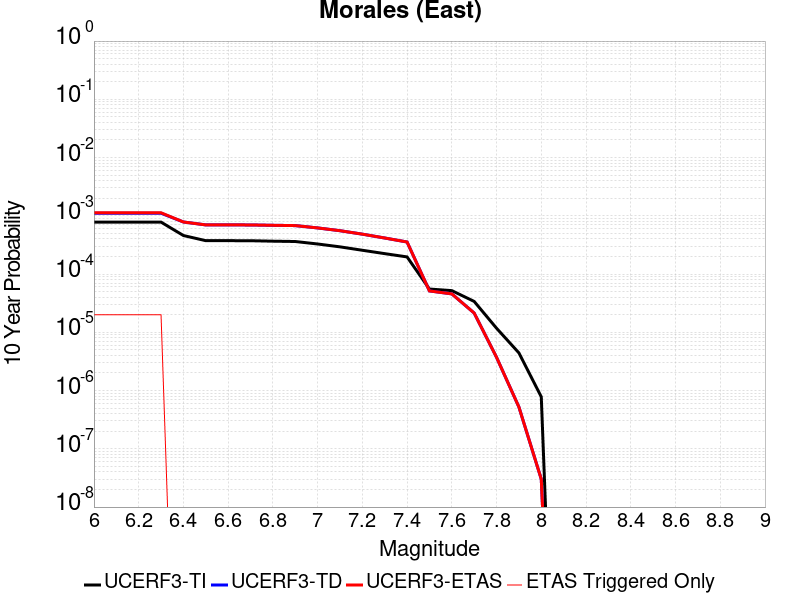 |

| Magnitude | 1 wk TI Prob | 1 wk TD Prob | 1 wk ETAS Prob | 1 wk ETAS/TD Gain | 1 wk ETAS Triggered Only | 1 mo TI Prob | 1 mo TD Prob | 1 mo ETAS Prob | 1 mo ETAS/TD Gain | 1 mo ETAS Triggered Only | 1 yr TI Prob | 1 yr TD Prob | 1 yr ETAS Prob | 1 yr ETAS/TD Gain | 1 yr ETAS Triggered Only | 10 yr TI Prob | 10 yr TD Prob | 10 yr ETAS Prob | 10 yr ETAS/TD Gain | 10 yr ETAS Triggered Only |
|-----|-----|-----|-----|-----|-----|-----|-----|-----|-----|-----|-----|-----|-----|-----|-----|-----|-----|-----|-----|-----|
| 6.0 | 1.4942771E-6 | 2.123544E-6 | 2.123544E-6 | 1.0 | 0.0 | 6.404029E-6 | 9.100874E-6 | 9.100874E-6 | 1.0 | 0.0 | 7.7966266E-5 | 1.1079809E-4 | 1.3079587E-4 | 1.1804885 | 2.0E-5 | 7.793892E-4 | 0.0011074883 | 0.0011274662 | 1.0180389 | 2.0E-5 |
| 6.1 | 1.4942771E-6 | 2.123544E-6 | 2.123544E-6 | 1.0 | 0.0 | 6.404029E-6 | 9.100874E-6 | 9.100874E-6 | 1.0 | 0.0 | 7.7966266E-5 | 1.1079809E-4 | 1.3079587E-4 | 1.1804885 | 2.0E-5 | 7.793892E-4 | 0.0011074883 | 0.0011274662 | 1.0180389 | 2.0E-5 |
| 6.2 | 1.4942771E-6 | 2.123544E-6 | 2.123544E-6 | 1.0 | 0.0 | 6.404029E-6 | 9.100874E-6 | 9.100874E-6 | 1.0 | 0.0 | 7.7966266E-5 | 1.1079809E-4 | 1.3079587E-4 | 1.1804885 | 2.0E-5 | 7.793892E-4 | 0.0011074883 | 0.0011274662 | 1.0180389 | 2.0E-5 |
| 6.3 | 1.4942771E-6 | 2.123544E-6 | 2.123544E-6 | 1.0 | 0.0 | 6.404029E-6 | 9.100874E-6 | 9.100874E-6 | 1.0 | 0.0 | 7.7966266E-5 | 1.1079809E-4 | 1.3079587E-4 | 1.1804885 | 2.0E-5 | 7.793892E-4 | 0.0011074883 | 0.0011274662 | 1.0180389 | 2.0E-5 |
| 6.4 | 8.798845E-7 | 1.5023381E-6 | 1.5023381E-6 | 1.0 | 0.0 | 3.7709283E-6 | 6.4385767E-6 | 6.4385767E-6 | 1.0 | 0.0 | 4.5910085E-5 | 7.838696E-5 | 7.838696E-5 | 1.0 | 0.0 | 4.59006E-4 | 7.836066E-4 | 7.836066E-4 | 1.0 | 0.0 |
| 6.5 | 7.1751725E-7 | 1.3384879E-6 | 1.3384879E-6 | 1.0 | 0.0 | 3.0750705E-6 | 5.7363645E-6 | 5.7363645E-6 | 1.0 | 0.0 | 3.7438338E-5 | 6.9838075E-5 | 6.9838075E-5 | 1.0 | 0.0 | 3.743203E-4 | 6.981715E-4 | 6.981715E-4 | 1.0 | 0.0 |
| 6.6 | 7.1751725E-7 | 1.3384879E-6 | 1.3384879E-6 | 1.0 | 0.0 | 3.0750705E-6 | 5.7363645E-6 | 5.7363645E-6 | 1.0 | 0.0 | 3.7438338E-5 | 6.9838075E-5 | 6.9838075E-5 | 1.0 | 0.0 | 3.743203E-4 | 6.981715E-4 | 6.981715E-4 | 1.0 | 0.0 |
| 6.7 | 7.159057E-7 | 1.3359539E-6 | 1.3359539E-6 | 1.0 | 0.0 | 3.0681638E-6 | 5.7255043E-6 | 5.7255043E-6 | 1.0 | 0.0 | 3.7354253E-5 | 6.9705864E-5 | 6.9705864E-5 | 1.0 | 0.0 | 3.7347974E-4 | 6.968502E-4 | 6.968502E-4 | 1.0 | 0.0 |
| 6.8 | 7.032203E-7 | 1.3175089E-6 | 1.3175089E-6 | 1.0 | 0.0 | 3.0137978E-6 | 5.646455E-6 | 5.646455E-6 | 1.0 | 0.0 | 3.669237E-5 | 6.87435E-5 | 6.87435E-5 | 1.0 | 0.0 | 3.6686313E-4 | 6.872325E-4 | 6.872325E-4 | 1.0 | 0.0 |
| 6.9 | 6.941549E-7 | 1.3025701E-6 | 1.3025701E-6 | 1.0 | 0.0 | 2.974946E-6 | 5.5824316E-6 | 5.5824316E-6 | 1.0 | 0.0 | 3.6219368E-5 | 6.7964065E-5 | 6.7964065E-5 | 1.0 | 0.0 | 3.6213463E-4 | 6.794429E-4 | 6.794429E-4 | 1.0 | 0.0 |
| 7.0 | 6.2932247E-7 | 1.1877994E-6 | 1.1877994E-6 | 1.0 | 0.0 | 2.6970936E-6 | 5.090559E-6 | 5.090559E-6 | 1.0 | 0.0 | 3.283662E-5 | 6.197586E-5 | 6.197586E-5 | 1.0 | 0.0 | 3.283177E-4 | 6.1959465E-4 | 6.1959465E-4 | 1.0 | 0.0 |
| 7.1 | 5.6200963E-7 | 1.064093E-6 | 1.064093E-6 | 1.0 | 0.0 | 2.4086105E-6 | 4.560391E-6 | 4.560391E-6 | 1.0 | 0.0 | 2.9324437E-5 | 5.5521392E-5 | 5.5521392E-5 | 1.0 | 0.0 | 2.9320567E-4 | 5.5508246E-4 | 5.5508246E-4 | 1.0 | 0.0 |
| 7.2 | 4.91044E-7 | 9.2862194E-7 | 9.2862194E-7 | 1.0 | 0.0 | 2.1044725E-6 | 3.9798024E-6 | 3.9798024E-6 | 1.0 | 0.0 | 2.5621652E-5 | 4.8453054E-5 | 4.8453054E-5 | 1.0 | 0.0 | 2.56187E-4 | 4.8443122E-4 | 4.8443122E-4 | 1.0 | 0.0 |
| 7.3 | 4.2978448E-7 | 7.974413E-7 | 7.974413E-7 | 1.0 | 0.0 | 1.8419321E-6 | 3.4176012E-6 | 3.4176012E-6 | 1.0 | 0.0 | 2.2425293E-5 | 4.160853E-5 | 4.160853E-5 | 1.0 | 0.0 | 2.242303E-4 | 4.1601306E-4 | 4.1601306E-4 | 1.0 | 0.0 |
| 7.4 | 3.774317E-7 | 6.807105E-7 | 6.807105E-7 | 1.0 | 0.0 | 1.6175634E-6 | 2.9173275E-6 | 2.9173275E-6 | 1.0 | 0.0 | 1.9693656E-5 | 3.551791E-5 | 3.551791E-5 | 1.0 | 0.0 | 1.969191E-4 | 3.5512767E-4 | 3.5512767E-4 | 1.0 | 0.0 |
| 7.5 | 1.0603232E-7 | 9.8406424E-8 | 9.8406424E-8 | 1.0 | 0.0 | 4.5442414E-7 | 4.2174173E-7 | 4.2174173E-7 | 1.0 | 0.0 | 5.5326E-6 | 5.1346938E-6 | 5.1346938E-6 | 1.0 | 0.0 | 5.532462E-5 | 5.1348336E-5 | 5.1348336E-5 | 1.0 | 0.0 |
| 7.6 | 9.960384E-8 | 8.755028E-8 | 8.755028E-8 | 1.0 | 0.0 | 4.2687353E-7 | 3.7521542E-7 | 3.7521542E-7 | 1.0 | 0.0 | 5.197173E-6 | 4.568238E-6 | 4.568238E-6 | 1.0 | 0.0 | 5.1970514E-5 | 4.5684028E-5 | 4.5684028E-5 | 1.0 | 0.0 |
| 7.7 | 6.499468E-8 | 4.103351E-8 | 4.103351E-8 | 1.0 | 0.0 | 2.785486E-7 | 1.7585788E-7 | 1.7585788E-7 | 1.0 | 0.0 | 3.3913238E-6 | 2.1410676E-6 | 2.1410676E-6 | 1.0 | 0.0 | 3.3912722E-5 | 2.1413045E-5 | 2.1413045E-5 | 1.0 | 0.0 |
| 7.8 | 2.2517119E-8 | 7.1293824E-9 | 7.1293824E-9 | 1.0 | 0.0 | 9.6501935E-8 | 3.0554492E-8 | 3.0554492E-8 | 1.0 | 0.0 | 1.1749105E-6 | 3.720009E-7 | 3.720009E-7 | 1.0 | 0.0 | 1.1749043E-5 | 3.7225666E-6 | 3.7225666E-6 | 1.0 | 0.0 |
| 7.9 | 8.493023E-9 | 9.962774E-10 | 9.962774E-10 | 1.0 | 0.0 | 3.639867E-8 | 4.2697574E-9 | 4.2697574E-9 | 1.0 | 0.0 | 4.4315374E-7 | 5.19843E-8 | 5.19843E-8 | 1.0 | 0.0 | 4.4315284E-6 | 5.2196486E-7 | 5.2196486E-7 | 1.0 | 0.0 |
| 8.0 | 1.4971842E-9 | 5.5340177E-11 | 5.5340177E-11 | 1.0 | 0.0 | 6.4165038E-9 | 2.3717173E-10 | 2.3717173E-10 | 1.0 | 0.0 | 7.812093E-8 | 2.887568E-9 | 2.887568E-9 | 1.0 | 0.0 | 7.81209E-7 | 3.0142694E-8 | 3.0142694E-8 | 1.0 | 0.0 |

## North Frontal  (West)
*[(top)](#table-of-contents)*

| 1 Week | 1 Month | 1 Year | 10 Year |
|-----|-----|-----|-----|
|  |  |  |  |

| Magnitude | 1 wk TI Prob | 1 wk TD Prob | 1 wk ETAS Prob | 1 wk ETAS/TD Gain | 1 wk ETAS Triggered Only | 1 mo TI Prob | 1 mo TD Prob | 1 mo ETAS Prob | 1 mo ETAS/TD Gain | 1 mo ETAS Triggered Only | 1 yr TI Prob | 1 yr TD Prob | 1 yr ETAS Prob | 1 yr ETAS/TD Gain | 1 yr ETAS Triggered Only | 10 yr TI Prob | 10 yr TD Prob | 10 yr ETAS Prob | 10 yr ETAS/TD Gain | 10 yr ETAS Triggered Only |
|-----|-----|-----|-----|-----|-----|-----|-----|-----|-----|-----|-----|-----|-----|-----|-----|-----|-----|-----|-----|-----|
| 6.0 | 4.7316266E-6 | 4.852674E-6 | 4.852674E-6 | 1.0 | 0.0 | 2.0278241E-5 | 2.0797017E-5 | 2.0797017E-5 | 1.0 | 0.0 | 2.4685962E-4 | 2.5317573E-4 | 2.7317068E-4 | 1.0789765 | 2.0E-5 | 0.0024658558 | 0.002529019 | 0.0025489687 | 1.0078882 | 2.0E-5 |
| 6.1 | 4.7316266E-6 | 4.852674E-6 | 4.852674E-6 | 1.0 | 0.0 | 2.0278241E-5 | 2.0797017E-5 | 2.0797017E-5 | 1.0 | 0.0 | 2.4685962E-4 | 2.5317573E-4 | 2.7317068E-4 | 1.0789765 | 2.0E-5 | 0.0024658558 | 0.002529019 | 0.0025489687 | 1.0078882 | 2.0E-5 |
| 6.2 | 4.7316266E-6 | 4.852674E-6 | 4.852674E-6 | 1.0 | 0.0 | 2.0278241E-5 | 2.0797017E-5 | 2.0797017E-5 | 1.0 | 0.0 | 2.4685962E-4 | 2.5317573E-4 | 2.7317068E-4 | 1.0789765 | 2.0E-5 | 0.0024658558 | 0.002529019 | 0.0025489687 | 1.0078882 | 2.0E-5 |
| 6.3 | 4.7316266E-6 | 4.852674E-6 | 4.852674E-6 | 1.0 | 0.0 | 2.0278241E-5 | 2.0797017E-5 | 2.0797017E-5 | 1.0 | 0.0 | 2.4685962E-4 | 2.5317573E-4 | 2.7317068E-4 | 1.0789765 | 2.0E-5 | 0.0024658558 | 0.002529019 | 0.0025489687 | 1.0078882 | 2.0E-5 |
| 6.4 | 4.7316266E-6 | 4.852674E-6 | 4.852674E-6 | 1.0 | 0.0 | 2.0278241E-5 | 2.0797017E-5 | 2.0797017E-5 | 1.0 | 0.0 | 2.4685962E-4 | 2.5317573E-4 | 2.7317068E-4 | 1.0789765 | 2.0E-5 | 0.0024658558 | 0.002529019 | 0.0025489687 | 1.0078882 | 2.0E-5 |
| 6.5 | 4.7316266E-6 | 4.852674E-6 | 4.852674E-6 | 1.0 | 0.0 | 2.0278241E-5 | 2.0797017E-5 | 2.0797017E-5 | 1.0 | 0.0 | 2.4685962E-4 | 2.5317573E-4 | 2.7317068E-4 | 1.0789765 | 2.0E-5 | 0.0024658558 | 0.002529019 | 0.0025489687 | 1.0078882 | 2.0E-5 |
| 6.6 | 4.7316266E-6 | 4.852674E-6 | 4.852674E-6 | 1.0 | 0.0 | 2.0278241E-5 | 2.0797017E-5 | 2.0797017E-5 | 1.0 | 0.0 | 2.4685962E-4 | 2.5317573E-4 | 2.7317068E-4 | 1.0789765 | 2.0E-5 | 0.0024658558 | 0.002529019 | 0.0025489687 | 1.0078882 | 2.0E-5 |
| 6.7 | 3.5382777E-6 | 3.6308872E-6 | 3.6308872E-6 | 1.0 | 0.0 | 1.516396E-5 | 1.5560858E-5 | 1.5560858E-5 | 1.0 | 0.0 | 1.8460557E-4 | 1.8943775E-4 | 1.9943585E-4 | 1.0527778 | 1.0E-5 | 0.0018445229 | 0.0018928396 | 0.0019028207 | 1.0052731 | 1.0E-5 |
| 6.8 | 3.5382777E-6 | 3.6308872E-6 | 3.6308872E-6 | 1.0 | 0.0 | 1.516396E-5 | 1.5560858E-5 | 1.5560858E-5 | 1.0 | 0.0 | 1.8460557E-4 | 1.8943775E-4 | 1.9943585E-4 | 1.0527778 | 1.0E-5 | 0.0018445229 | 0.0018928396 | 0.0019028207 | 1.0052731 | 1.0E-5 |
| 6.9 | 3.0428037E-6 | 3.1227619E-6 | 3.1227619E-6 | 1.0 | 0.0 | 1.30405215E-5 | 1.3383201E-5 | 1.3383201E-5 | 1.0 | 0.0 | 1.5875678E-4 | 1.6292896E-4 | 1.7292734E-4 | 1.0613664 | 1.0E-5 | 0.0015864341 | 0.0016281622 | 0.001638146 | 1.0061319 | 1.0E-5 |
| 7.0 | 2.538778E-6 | 2.6060916E-6 | 2.6060916E-6 | 1.0 | 0.0 | 1.0880432E-5 | 1.116892E-5 | 1.116892E-5 | 1.0 | 0.0 | 1.324612E-4 | 1.3597358E-4 | 1.4597223E-4 | 1.0735337 | 1.0E-5 | 0.0013238228 | 0.0013589506 | 0.001368937 | 1.0073487 | 1.0E-5 |
| 7.1 | 2.2418935E-6 | 2.3012087E-6 | 2.3012087E-6 | 1.0 | 0.0 | 9.60808E-6 | 9.862288E-6 | 9.862288E-6 | 1.0 | 0.0 | 1.1697209E-4 | 1.2006718E-4 | 1.3006598E-4 | 1.0832767 | 1.0E-5 | 0.0011691054 | 0.0012000671 | 0.0012100551 | 1.0083228 | 1.0E-5 |
| 7.2 | 1.6526745E-6 | 1.6924864E-6 | 1.6924864E-6 | 1.0 | 0.0 | 7.082872E-6 | 7.2534945E-6 | 7.2534945E-6 | 1.0 | 0.0 | 8.623055E-5 | 8.830797E-5 | 9.830709E-5 | 1.1132301 | 1.0E-5 | 8.61971E-4 | 8.8275387E-4 | 8.9274504E-4 | 1.0113182 | 1.0E-5 |
| 7.3 | 1.0246019E-6 | 1.0442274E-6 | 1.0442274E-6 | 1.0 | 0.0 | 4.391144E-6 | 4.4752533E-6 | 4.4752533E-6 | 1.0 | 0.0 | 5.3460866E-5 | 5.4484964E-5 | 6.448442E-5 | 1.1835269 | 1.0E-5 | 5.344801E-4 | 5.4472755E-4 | 5.547221E-4 | 1.0183479 | 1.0E-5 |
| 7.4 | 8.9045164E-7 | 9.056572E-7 | 9.056572E-7 | 1.0 | 0.0 | 3.8162157E-6 | 3.881383E-6 | 3.881383E-6 | 1.0 | 0.0 | 4.646144E-5 | 4.725492E-5 | 5.725445E-5 | 1.2116082 | 1.0E-5 | 4.6451724E-4 | 4.7245962E-4 | 4.824549E-4 | 1.0211558 | 1.0E-5 |
| 7.5 | 6.3357E-7 | 6.4027137E-7 | 6.4027137E-7 | 1.0 | 0.0 | 2.7152971E-6 | 2.7440176E-6 | 2.7440176E-6 | 1.0 | 0.0 | 3.305824E-5 | 3.340797E-5 | 3.340797E-5 | 1.0 | 0.0 | 3.3053322E-4 | 3.3403604E-4 | 3.3403604E-4 | 1.0 | 0.0 |
| 7.6 | 2.5087024E-7 | 2.436123E-7 | 2.436123E-7 | 1.0 | 0.0 | 1.0751578E-6 | 1.0440525E-6 | 1.0440525E-6 | 1.0 | 0.0 | 1.3089967E-5 | 1.2711286E-5 | 1.2711286E-5 | 1.0 | 0.0 | 1.3089196E-4 | 1.2710765E-4 | 1.2710765E-4 | 1.0 | 0.0 |
| 7.7 | 3.282987E-8 | 2.2875435E-8 | 2.2875435E-8 | 1.0 | 0.0 | 1.4069944E-7 | 9.8037575E-8 | 9.8037575E-8 | 1.0 | 0.0 | 1.7130144E-6 | 1.193607E-6 | 1.193607E-6 | 1.0 | 0.0 | 1.7130013E-5 | 1.1936014E-5 | 1.1936014E-5 | 1.0 | 0.0 |
| 7.8 | 8.77499E-9 | 5.6817466E-9 | 5.6817466E-9 | 1.0 | 0.0 | 3.7607098E-8 | 2.4350342E-8 | 2.4350342E-8 | 1.0 | 0.0 | 4.578663E-7 | 2.964654E-7 | 2.964654E-7 | 1.0 | 0.0 | 4.5786537E-6 | 2.9646512E-6 | 2.9646512E-6 | 1.0 | 0.0 |

## Compton
*[(top)](#table-of-contents)*

| 1 Week | 1 Month | 1 Year | 10 Year |
|-----|-----|-----|-----|
|  |  |  | 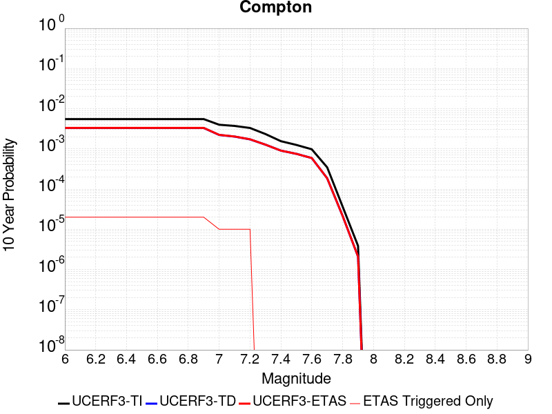 |

| Magnitude | 1 wk TI Prob | 1 wk TD Prob | 1 wk ETAS Prob | 1 wk ETAS/TD Gain | 1 wk ETAS Triggered Only | 1 mo TI Prob | 1 mo TD Prob | 1 mo ETAS Prob | 1 mo ETAS/TD Gain | 1 mo ETAS Triggered Only | 1 yr TI Prob | 1 yr TD Prob | 1 yr ETAS Prob | 1 yr ETAS/TD Gain | 1 yr ETAS Triggered Only | 10 yr TI Prob | 10 yr TD Prob | 10 yr ETAS Prob | 10 yr ETAS/TD Gain | 10 yr ETAS Triggered Only |
|-----|-----|-----|-----|-----|-----|-----|-----|-----|-----|-----|-----|-----|-----|-----|-----|-----|-----|-----|-----|-----|
| 6.0 | 1.06050875E-5 | 6.35892E-6 | 1.6358856E-5 | 2.5725842 | 1.0E-5 | 4.5449582E-5 | 2.7252245E-5 | 3.725197E-5 | 1.3669323 | 1.0E-5 | 5.5320817E-4 | 3.3174842E-4 | 3.4174512E-4 | 1.0301334 | 1.0E-5 | 0.0055183303 | 0.003312816 | 0.0033327495 | 1.0060172 | 2.0E-5 |
| 6.1 | 1.06050875E-5 | 6.35892E-6 | 1.6358856E-5 | 2.5725842 | 1.0E-5 | 4.5449582E-5 | 2.7252245E-5 | 3.725197E-5 | 1.3669323 | 1.0E-5 | 5.5320817E-4 | 3.3174842E-4 | 3.4174512E-4 | 1.0301334 | 1.0E-5 | 0.0055183303 | 0.003312816 | 0.0033327495 | 1.0060172 | 2.0E-5 |
| 6.2 | 1.06050875E-5 | 6.35892E-6 | 1.6358856E-5 | 2.5725842 | 1.0E-5 | 4.5449582E-5 | 2.7252245E-5 | 3.725197E-5 | 1.3669323 | 1.0E-5 | 5.5320817E-4 | 3.3174842E-4 | 3.4174512E-4 | 1.0301334 | 1.0E-5 | 0.0055183303 | 0.003312816 | 0.0033327495 | 1.0060172 | 2.0E-5 |
| 6.3 | 1.06050875E-5 | 6.35892E-6 | 1.6358856E-5 | 2.5725842 | 1.0E-5 | 4.5449582E-5 | 2.7252245E-5 | 3.725197E-5 | 1.3669323 | 1.0E-5 | 5.5320817E-4 | 3.3174842E-4 | 3.4174512E-4 | 1.0301334 | 1.0E-5 | 0.0055183303 | 0.003312816 | 0.0033327495 | 1.0060172 | 2.0E-5 |
| 6.4 | 1.06050875E-5 | 6.35892E-6 | 1.6358856E-5 | 2.5725842 | 1.0E-5 | 4.5449582E-5 | 2.7252245E-5 | 3.725197E-5 | 1.3669323 | 1.0E-5 | 5.5320817E-4 | 3.3174842E-4 | 3.4174512E-4 | 1.0301334 | 1.0E-5 | 0.0055183303 | 0.003312816 | 0.0033327495 | 1.0060172 | 2.0E-5 |
| 6.5 | 1.06050875E-5 | 6.35892E-6 | 1.6358856E-5 | 2.5725842 | 1.0E-5 | 4.5449582E-5 | 2.7252245E-5 | 3.725197E-5 | 1.3669323 | 1.0E-5 | 5.5320817E-4 | 3.3174842E-4 | 3.4174512E-4 | 1.0301334 | 1.0E-5 | 0.0055183303 | 0.003312816 | 0.0033327495 | 1.0060172 | 2.0E-5 |
| 6.6 | 1.06050875E-5 | 6.35892E-6 | 1.6358856E-5 | 2.5725842 | 1.0E-5 | 4.5449582E-5 | 2.7252245E-5 | 3.725197E-5 | 1.3669323 | 1.0E-5 | 5.5320817E-4 | 3.3174842E-4 | 3.4174512E-4 | 1.0301334 | 1.0E-5 | 0.0055183303 | 0.003312816 | 0.0033327495 | 1.0060172 | 2.0E-5 |
| 6.7 | 1.06050875E-5 | 6.35892E-6 | 1.6358856E-5 | 2.5725842 | 1.0E-5 | 4.5449582E-5 | 2.7252245E-5 | 3.725197E-5 | 1.3669323 | 1.0E-5 | 5.5320817E-4 | 3.3174842E-4 | 3.4174512E-4 | 1.0301334 | 1.0E-5 | 0.0055183303 | 0.003312816 | 0.0033327495 | 1.0060172 | 2.0E-5 |
| 6.8 | 1.06050875E-5 | 6.35892E-6 | 1.6358856E-5 | 2.5725842 | 1.0E-5 | 4.5449582E-5 | 2.7252245E-5 | 3.725197E-5 | 1.3669323 | 1.0E-5 | 5.5320817E-4 | 3.3174842E-4 | 3.4174512E-4 | 1.0301334 | 1.0E-5 | 0.0055183303 | 0.003312816 | 0.0033327495 | 1.0060172 | 2.0E-5 |
| 6.9 | 1.06050875E-5 | 6.35892E-6 | 1.6358856E-5 | 2.5725842 | 1.0E-5 | 4.5449582E-5 | 2.7252245E-5 | 3.725197E-5 | 1.3669323 | 1.0E-5 | 5.5320817E-4 | 3.3174842E-4 | 3.4174512E-4 | 1.0301334 | 1.0E-5 | 0.0055183303 | 0.003312816 | 0.0033327495 | 1.0060172 | 2.0E-5 |
| 7.0 | 7.672486E-6 | 4.272077E-6 | 4.272077E-6 | 1.0 | 0.0 | 3.288167E-5 | 1.8308778E-5 | 1.8308778E-5 | 1.0 | 0.0 | 4.0026082E-4 | 2.2288719E-4 | 2.2288719E-4 | 1.0 | 0.0 | 0.0039954064 | 0.0022266984 | 0.0022366764 | 1.004481 | 1.0E-5 |
| 7.1 | 7.163992E-6 | 3.883783E-6 | 3.883783E-6 | 1.0 | 0.0 | 3.0702464E-5 | 1.664468E-5 | 1.664468E-5 | 1.0 | 0.0 | 3.7373835E-4 | 2.0263072E-4 | 2.0263072E-4 | 1.0 | 0.0 | 0.0037311043 | 0.0020245167 | 0.0020344963 | 1.0049294 | 1.0E-5 |
| 7.2 | 6.3689185E-6 | 3.3101053E-6 | 3.3101053E-6 | 1.0 | 0.0 | 2.729508E-5 | 1.4186091E-5 | 1.4186091E-5 | 1.0 | 0.0 | 3.322669E-4 | 1.7270239E-4 | 1.7270239E-4 | 1.0 | 0.0 | 0.0033177056 | 0.0017257235 | 0.0017357062 | 1.0057846 | 1.0E-5 |
| 7.3 | 4.4987873E-6 | 2.4480198E-6 | 2.4480198E-6 | 1.0 | 0.0 | 1.9280375E-5 | 1.0491473E-5 | 1.0491473E-5 | 1.0 | 0.0 | 2.3471327E-4 | 1.2772651E-4 | 1.2772651E-4 | 1.0 | 0.0 | 0.002344655 | 0.0012765612 | 0.0012765612 | 1.0 | 0.0 |
| 7.4 | 2.987296E-6 | 1.7394043E-6 | 1.7394043E-6 | 1.0 | 0.0 | 1.2802635E-5 | 7.4545687E-6 | 7.4545687E-6 | 1.0 | 0.0 | 1.5586092E-4 | 9.075565E-5 | 9.075565E-5 | 1.0 | 0.0 | 0.0015575165 | 9.071917E-4 | 9.071917E-4 | 1.0 | 0.0 |
| 7.5 | 2.4111696E-6 | 1.4471991E-6 | 1.4471991E-6 | 1.0 | 0.0 | 1.0333543E-5 | 6.2022677E-6 | 6.2022677E-6 | 1.0 | 0.0 | 1.2580362E-4 | 7.551004E-5 | 7.551004E-5 | 1.0 | 0.0 | 0.0012573242 | 7.548485E-4 | 7.548485E-4 | 1.0 | 0.0 |
| 7.6 | 1.8783096E-6 | 1.1360306E-6 | 1.1360306E-6 | 1.0 | 0.0 | 8.049874E-6 | 4.868694E-6 | 4.868694E-6 | 1.0 | 0.0 | 9.8002805E-5 | 5.9274775E-5 | 5.9274775E-5 | 1.0 | 0.0 | 9.795959E-4 | 5.925936E-4 | 5.925936E-4 | 1.0 | 0.0 |
| 7.7 | 6.6646817E-7 | 3.5601457E-7 | 3.5601457E-7 | 1.0 | 0.0 | 2.856289E-6 | 1.5257759E-6 | 1.5257759E-6 | 1.0 | 0.0 | 3.4774763E-5 | 1.8576176E-5 | 1.8576176E-5 | 1.0 | 0.0 | 3.4769322E-4 | 1.8574759E-4 | 1.8574759E-4 | 1.0 | 0.0 |
| 7.8 | 7.054689E-8 | 4.1342012E-8 | 4.1342012E-8 | 1.0 | 0.0 | 3.0234378E-7 | 1.7718004E-7 | 1.7718004E-7 | 1.0 | 0.0 | 3.6810293E-6 | 2.157165E-6 | 2.157165E-6 | 1.0 | 0.0 | 3.6809684E-5 | 2.157145E-5 | 2.157145E-5 | 1.0 | 0.0 |
| 7.9 | 7.420925E-9 | 4.0130637E-9 | 4.0130637E-9 | 1.0 | 0.0 | 3.1803964E-8 | 1.7198845E-8 | 1.7198845E-8 | 1.0 | 0.0 | 3.872132E-7 | 2.0939592E-7 | 2.0939592E-7 | 1.0 | 0.0 | 3.872125E-6 | 2.0939574E-6 | 2.0939574E-6 | 1.0 | 0.0 |

## White Wolf
*[(top)](#table-of-contents)*

| 1 Week | 1 Month | 1 Year | 10 Year |
|-----|-----|-----|-----|
|  |  |  |  |

| Magnitude | 1 wk TI Prob | 1 wk TD Prob | 1 wk ETAS Prob | 1 wk ETAS/TD Gain | 1 wk ETAS Triggered Only | 1 mo TI Prob | 1 mo TD Prob | 1 mo ETAS Prob | 1 mo ETAS/TD Gain | 1 mo ETAS Triggered Only | 1 yr TI Prob | 1 yr TD Prob | 1 yr ETAS Prob | 1 yr ETAS/TD Gain | 1 yr ETAS Triggered Only | 10 yr TI Prob | 10 yr TD Prob | 10 yr ETAS Prob | 10 yr ETAS/TD Gain | 10 yr ETAS Triggered Only |
|-----|-----|-----|-----|-----|-----|-----|-----|-----|-----|-----|-----|-----|-----|-----|-----|-----|-----|-----|-----|-----|
| 6.0 | 2.0037822E-5 | 1.0468583E-6 | 1.1046848E-5 | 10.5523815 | 1.0E-5 | 8.587355E-5 | 4.4865283E-6 | 1.4486483E-5 | 3.228885 | 1.0E-5 | 0.001045009 | 5.4622164E-5 | 6.4621614E-5 | 1.1830659 | 1.0E-5 | 0.010401085 | 5.4609246E-4 | 5.660815E-4 | 1.0366038 | 2.0E-5 |
| 6.1 | 2.0037822E-5 | 1.0468583E-6 | 1.1046848E-5 | 10.5523815 | 1.0E-5 | 8.587355E-5 | 4.4865283E-6 | 1.4486483E-5 | 3.228885 | 1.0E-5 | 0.001045009 | 5.4622164E-5 | 6.4621614E-5 | 1.1830659 | 1.0E-5 | 0.010401085 | 5.4609246E-4 | 5.660815E-4 | 1.0366038 | 2.0E-5 |
| 6.2 | 2.0037822E-5 | 1.0468583E-6 | 1.1046848E-5 | 10.5523815 | 1.0E-5 | 8.587355E-5 | 4.4865283E-6 | 1.4486483E-5 | 3.228885 | 1.0E-5 | 0.001045009 | 5.4622164E-5 | 6.4621614E-5 | 1.1830659 | 1.0E-5 | 0.010401085 | 5.4609246E-4 | 5.660815E-4 | 1.0366038 | 2.0E-5 |
| 6.3 | 2.0037822E-5 | 1.0468583E-6 | 1.1046848E-5 | 10.5523815 | 1.0E-5 | 8.587355E-5 | 4.4865283E-6 | 1.4486483E-5 | 3.228885 | 1.0E-5 | 0.001045009 | 5.4622164E-5 | 6.4621614E-5 | 1.1830659 | 1.0E-5 | 0.010401085 | 5.4609246E-4 | 5.660815E-4 | 1.0366038 | 2.0E-5 |
| 6.4 | 1.132487E-5 | 1.0468583E-6 | 1.1046848E-5 | 10.5523815 | 1.0E-5 | 4.8534253E-5 | 4.4865283E-6 | 1.4486483E-5 | 3.228885 | 1.0E-5 | 5.907443E-4 | 5.4622164E-5 | 6.4621614E-5 | 1.1830659 | 1.0E-5 | 0.005891764 | 5.4609246E-4 | 5.660815E-4 | 1.0366038 | 2.0E-5 |
| 6.5 | 1.132487E-5 | 1.0468583E-6 | 1.1046848E-5 | 10.5523815 | 1.0E-5 | 4.8534253E-5 | 4.4865283E-6 | 1.4486483E-5 | 3.228885 | 1.0E-5 | 5.907443E-4 | 5.4622164E-5 | 6.4621614E-5 | 1.1830659 | 1.0E-5 | 0.005891764 | 5.4609246E-4 | 5.660815E-4 | 1.0366038 | 2.0E-5 |
| 6.6 | 9.347473E-6 | 1.0468583E-6 | 1.1046848E-5 | 10.5523815 | 1.0E-5 | 4.0059982E-5 | 4.4865283E-6 | 1.4486483E-5 | 3.228885 | 1.0E-5 | 4.8762115E-4 | 5.4622164E-5 | 6.4621614E-5 | 1.1830659 | 1.0E-5 | 0.0048655253 | 5.4609246E-4 | 5.660815E-4 | 1.0366038 | 2.0E-5 |
| 6.7 | 7.842647E-6 | 1.0047773E-6 | 1.1004768E-5 | 10.952444 | 1.0E-5 | 3.361091E-5 | 4.306182E-6 | 1.4306139E-5 | 3.322233 | 1.0E-5 | 4.0913603E-4 | 5.2426552E-5 | 6.242603E-5 | 1.1907331 | 1.0E-5 | 0.004083836 | 5.241468E-4 | 5.4413633E-4 | 1.0381372 | 2.0E-5 |
| 6.8 | 6.26597E-6 | 9.734289E-7 | 1.0973419E-5 | 11.272955 | 1.0E-5 | 2.685388E-5 | 4.1718313E-6 | 1.417179E-5 | 3.3970187 | 1.0E-5 | 3.2689696E-4 | 5.0790914E-5 | 6.0790408E-5 | 1.1968756 | 1.0E-5 | 0.003264165 | 5.07798E-4 | 5.2778784E-4 | 1.0393658 | 2.0E-5 |
| 6.9 | 5.258436E-6 | 9.1827343E-7 | 1.0918264E-5 | 11.889993 | 1.0E-5 | 2.2535958E-5 | 3.935452E-6 | 1.3935412E-5 | 3.5409942 | 1.0E-5 | 2.7434074E-4 | 4.7913123E-5 | 5.7912643E-5 | 1.2087011 | 1.0E-5 | 0.0027400232 | 4.7903272E-4 | 4.990231E-4 | 1.0417308 | 2.0E-5 |
| 7.0 | 4.675028E-6 | 8.660704E-7 | 1.08660615E-5 | 12.546395 | 1.0E-5 | 2.003568E-5 | 3.7117254E-6 | 1.3711689E-5 | 3.694155 | 1.0E-5 | 2.4390711E-4 | 4.518937E-5 | 5.5188913E-5 | 1.221281 | 1.0E-5 | 0.0024363957 | 4.518065E-4 | 4.7179745E-4 | 1.0442468 | 2.0E-5 |
| 7.1 | 2.8270078E-6 | 6.8737717E-7 | 1.068737E-5 | 15.548044 | 1.0E-5 | 1.2115692E-5 | 2.945899E-6 | 1.29458695E-5 | 4.3945394 | 1.0E-5 | 1.4749856E-4 | 3.586577E-5 | 4.5865414E-5 | 1.2788074 | 1.0E-5 | 0.001474007 | 3.5860392E-4 | 3.7859674E-4 | 1.0557518 | 2.0E-5 |
| 7.2 | 1.6881406E-6 | 2.2703432E-7 | 2.2703432E-7 | 1.0 | 0.0 | 7.2348685E-6 | 9.730038E-7 | 9.730038E-7 | 1.0 | 0.0 | 8.808096E-5 | 1.1846259E-5 | 1.1846259E-5 | 1.0 | 0.0 | 8.8046055E-4 | 1.1845643E-4 | 1.1845643E-4 | 1.0 | 0.0 |
| 7.3 | 9.086107E-7 | 1.5264496E-7 | 1.5264496E-7 | 1.0 | 0.0 | 3.8940398E-6 | 6.5419255E-7 | 6.5419255E-7 | 1.0 | 0.0 | 4.7408903E-5 | 7.964766E-6 | 7.964766E-6 | 1.0 | 0.0 | 4.739879E-4 | 7.964489E-5 | 7.964489E-5 | 1.0 | 0.0 |
| 7.4 | 1.9717383E-7 | 9.003399E-8 | 9.003399E-8 | 1.0 | 0.0 | 8.450304E-7 | 3.8585992E-7 | 3.8585992E-7 | 1.0 | 0.0 | 1.0288197E-5 | 4.697835E-6 | 4.697835E-6 | 1.0 | 0.0 | 1.028772E-4 | 4.6977384E-5 | 4.6977384E-5 | 1.0 | 0.0 |
| 7.5 | 1.086975E-7 | 6.659662E-8 | 6.659662E-8 | 1.0 | 0.0 | 4.6584634E-7 | 2.8541407E-7 | 2.8541407E-7 | 1.0 | 0.0 | 5.6716644E-6 | 3.474911E-6 | 3.474911E-6 | 1.0 | 0.0 | 5.6715195E-5 | 3.474859E-5 | 3.474859E-5 | 1.0 | 0.0 |
| 7.6 | 2.4217808E-8 | 1.5820849E-8 | 1.5820849E-8 | 1.0 | 0.0 | 1.03790605E-7 | 6.780364E-8 | 6.780364E-8 | 1.0 | 0.0 | 1.2636499E-6 | 8.25509E-7 | 8.25509E-7 | 1.0 | 0.0 | 1.2636427E-5 | 8.255064E-6 | 8.255064E-6 | 1.0 | 0.0 |

## Cucamonga
*[(top)](#table-of-contents)*

| 1 Week | 1 Month | 1 Year | 10 Year |
|-----|-----|-----|-----|
|  |  |  |  |

| Magnitude | 1 wk TI Prob | 1 wk TD Prob | 1 wk ETAS Prob | 1 wk ETAS/TD Gain | 1 wk ETAS Triggered Only | 1 mo TI Prob | 1 mo TD Prob | 1 mo ETAS Prob | 1 mo ETAS/TD Gain | 1 mo ETAS Triggered Only | 1 yr TI Prob | 1 yr TD Prob | 1 yr ETAS Prob | 1 yr ETAS/TD Gain | 1 yr ETAS Triggered Only | 10 yr TI Prob | 10 yr TD Prob | 10 yr ETAS Prob | 10 yr ETAS/TD Gain | 10 yr ETAS Triggered Only |
|-----|-----|-----|-----|-----|-----|-----|-----|-----|-----|-----|-----|-----|-----|-----|-----|-----|-----|-----|-----|-----|
| 6.0 | 1.1848348E-5 | 1.1737109E-5 | 1.1737109E-5 | 1.0 | 0.0 | 5.0777642E-5 | 5.0300943E-5 | 5.0300943E-5 | 1.0 | 0.0 | 6.180424E-4 | 6.122446E-4 | 6.222385E-4 | 1.0163233 | 1.0E-5 | 0.0061632637 | 0.006106745 | 0.0061266227 | 1.003255 | 2.0E-5 |
| 6.1 | 1.1848348E-5 | 1.1737109E-5 | 1.1737109E-5 | 1.0 | 0.0 | 5.0777642E-5 | 5.0300943E-5 | 5.0300943E-5 | 1.0 | 0.0 | 6.180424E-4 | 6.122446E-4 | 6.222385E-4 | 1.0163233 | 1.0E-5 | 0.0061632637 | 0.006106745 | 0.0061266227 | 1.003255 | 2.0E-5 |
| 6.2 | 1.1848348E-5 | 1.1737109E-5 | 1.1737109E-5 | 1.0 | 0.0 | 5.0777642E-5 | 5.0300943E-5 | 5.0300943E-5 | 1.0 | 0.0 | 6.180424E-4 | 6.122446E-4 | 6.222385E-4 | 1.0163233 | 1.0E-5 | 0.0061632637 | 0.006106745 | 0.0061266227 | 1.003255 | 2.0E-5 |
| 6.3 | 1.1848348E-5 | 1.1737109E-5 | 1.1737109E-5 | 1.0 | 0.0 | 5.0777642E-5 | 5.0300943E-5 | 5.0300943E-5 | 1.0 | 0.0 | 6.180424E-4 | 6.122446E-4 | 6.222385E-4 | 1.0163233 | 1.0E-5 | 0.0061632637 | 0.006106745 | 0.0061266227 | 1.003255 | 2.0E-5 |
| 6.4 | 1.1848348E-5 | 1.1737109E-5 | 1.1737109E-5 | 1.0 | 0.0 | 5.0777642E-5 | 5.0300943E-5 | 5.0300943E-5 | 1.0 | 0.0 | 6.180424E-4 | 6.122446E-4 | 6.222385E-4 | 1.0163233 | 1.0E-5 | 0.0061632637 | 0.006106745 | 0.0061266227 | 1.003255 | 2.0E-5 |
| 6.5 | 1.16988695E-5 | 1.157614E-5 | 1.157614E-5 | 1.0 | 0.0 | 5.013705E-5 | 4.9611102E-5 | 4.9611102E-5 | 1.0 | 0.0 | 6.102476E-4 | 6.0385047E-4 | 6.138444E-4 | 1.0165504 | 1.0E-5 | 0.006085745 | 0.0060232594 | 0.006043139 | 1.0033004 | 2.0E-5 |
| 6.6 | 1.16988695E-5 | 1.157614E-5 | 1.157614E-5 | 1.0 | 0.0 | 5.013705E-5 | 4.9611102E-5 | 4.9611102E-5 | 1.0 | 0.0 | 6.102476E-4 | 6.0385047E-4 | 6.138444E-4 | 1.0165504 | 1.0E-5 | 0.006085745 | 0.0060232594 | 0.006043139 | 1.0033004 | 2.0E-5 |
| 6.7 | 1.1397107E-5 | 1.1115039E-5 | 1.1115039E-5 | 1.0 | 0.0 | 4.884383E-5 | 4.7635025E-5 | 4.7635025E-5 | 1.0 | 0.0 | 5.9451134E-4 | 5.798046E-4 | 5.897988E-4 | 1.0172372 | 1.0E-5 | 0.005929234 | 0.005784061 | 0.005803945 | 1.0034378 | 2.0E-5 |
| 6.8 | 1.058387E-5 | 9.785037E-6 | 9.785037E-6 | 1.0 | 0.0 | 4.5358654E-5 | 4.1935207E-5 | 4.1935207E-5 | 1.0 | 0.0 | 5.521017E-4 | 5.1044265E-4 | 5.2043755E-4 | 1.0195808 | 1.0E-5 | 0.00550732 | 0.005093702 | 0.0051136003 | 1.0039064 | 2.0E-5 |
| 6.9 | 9.690046E-6 | 8.579504E-6 | 8.579504E-6 | 1.0 | 0.0 | 4.1528107E-5 | 3.6768783E-5 | 3.6768783E-5 | 1.0 | 0.0 | 5.054874E-4 | 4.475684E-4 | 4.5756393E-4 | 1.0223329 | 1.0E-5 | 0.005043391 | 0.0044675954 | 0.004487506 | 1.0044566 | 2.0E-5 |
| 7.0 | 9.381461E-6 | 8.18712E-6 | 8.18712E-6 | 1.0 | 0.0 | 4.020564E-5 | 3.508719E-5 | 3.508719E-5 | 1.0 | 0.0 | 4.893937E-4 | 4.2710314E-4 | 4.3709888E-4 | 1.0234035 | 1.0E-5 | 0.0048831734 | 0.004263747 | 0.004283662 | 1.0046707 | 2.0E-5 |
| 7.1 | 8.946492E-6 | 7.781904E-6 | 7.781904E-6 | 1.0 | 0.0 | 3.8341543E-5 | 3.3350592E-5 | 3.3350592E-5 | 1.0 | 0.0 | 4.667083E-4 | 4.0596814E-4 | 4.1596408E-4 | 1.0246224 | 1.0E-5 | 0.0046572937 | 0.0040531927 | 0.0040731113 | 1.0049144 | 2.0E-5 |
| 7.2 | 8.251016E-6 | 6.9752878E-6 | 6.9752878E-6 | 1.0 | 0.0 | 3.5361016E-5 | 2.9893748E-5 | 2.9893748E-5 | 1.0 | 0.0 | 4.3043532E-4 | 3.6389584E-4 | 3.7389222E-4 | 1.0274704 | 1.0E-5 | 0.0042960253 | 0.0036339252 | 0.0036538525 | 1.0054837 | 2.0E-5 |
| 7.3 | 7.717881E-6 | 6.4863584E-6 | 6.4863584E-6 | 1.0 | 0.0 | 3.3076216E-5 | 2.7798384E-5 | 2.7798384E-5 | 1.0 | 0.0 | 4.026285E-4 | 3.38393E-4 | 3.483896E-4 | 1.0295415 | 1.0E-5 | 0.004018998 | 0.0033797103 | 0.0033996427 | 1.0058976 | 2.0E-5 |
| 7.4 | 7.275623E-6 | 6.032004E-6 | 6.032004E-6 | 1.0 | 0.0 | 3.118087E-5 | 2.5851192E-5 | 2.5851192E-5 | 1.0 | 0.0 | 3.7956095E-4 | 3.1469302E-4 | 3.2468987E-4 | 1.031767 | 1.0E-5 | 0.0037891332 | 0.0031434046 | 0.003163342 | 1.0063425 | 2.0E-5 |
| 7.5 | 6.5109502E-6 | 5.100593E-6 | 5.100593E-6 | 1.0 | 0.0 | 2.7903774E-5 | 2.1859503E-5 | 2.1859503E-5 | 1.0 | 0.0 | 3.3967546E-4 | 2.661071E-4 | 2.661071E-4 | 1.0 | 0.0 | 0.0033915674 | 0.0026588016 | 0.0026588016 | 1.0 | 0.0 |
| 7.6 | 5.4495326E-6 | 3.908547E-6 | 3.908547E-6 | 1.0 | 0.0 | 2.335493E-5 | 1.6750808E-5 | 1.6750808E-5 | 1.0 | 0.0 | 2.8430918E-4 | 2.0392207E-4 | 2.0392207E-4 | 1.0 | 0.0 | 0.0028394572 | 0.0020382616 | 0.0020382616 | 1.0 | 0.0 |
| 7.7 | 4.7997164E-6 | 3.2002263E-6 | 3.2002263E-6 | 1.0 | 0.0 | 2.057005E-5 | 1.3715184E-5 | 1.3715184E-5 | 1.0 | 0.0 | 2.504116E-4 | 1.6696959E-4 | 1.6696959E-4 | 1.0 | 0.0 | 0.002501296 | 0.0016693701 | 0.0016693701 | 1.0 | 0.0 |
| 7.8 | 3.3941733E-6 | 2.0641678E-6 | 2.0641678E-6 | 1.0 | 0.0 | 1.4546376E-5 | 8.846404E-6 | 8.846404E-6 | 1.0 | 0.0 | 1.7708774E-4 | 1.07699656E-4 | 1.07699656E-4 | 1.0 | 0.0 | 0.0017694668 | 0.0010766032 | 0.0010766032 | 1.0 | 0.0 |
| 7.9 | 9.750552E-7 | 5.155798E-7 | 5.155798E-7 | 1.0 | 0.0 | 4.178801E-6 | 2.2096258E-6 | 2.2096258E-6 | 1.0 | 0.0 | 5.0875715E-5 | 2.6901867E-5 | 2.6901867E-5 | 1.0 | 0.0 | 5.086407E-4 | 2.689865E-4 | 2.689865E-4 | 1.0 | 0.0 |
| 8.0 | 1.133857E-7 | 6.053372E-8 | 6.053372E-8 | 1.0 | 0.0 | 4.8593864E-7 | 2.594302E-7 | 2.594302E-7 | 1.0 | 0.0 | 5.9162867E-6 | 3.1585582E-6 | 3.1585582E-6 | 1.0 | 0.0 | 5.916129E-5 | 3.158515E-5 | 3.158515E-5 | 1.0 | 0.0 |

## Owens Valley Keough Hot Springs
*[(top)](#table-of-contents)*

| 1 Week | 1 Month | 1 Year | 10 Year |
|-----|-----|-----|-----|
|  |  | 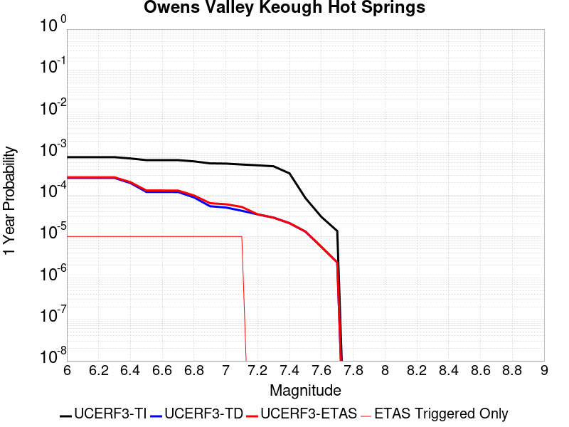 |  |

| Magnitude | 1 wk TI Prob | 1 wk TD Prob | 1 wk ETAS Prob | 1 wk ETAS/TD Gain | 1 wk ETAS Triggered Only | 1 mo TI Prob | 1 mo TD Prob | 1 mo ETAS Prob | 1 mo ETAS/TD Gain | 1 mo ETAS Triggered Only | 1 yr TI Prob | 1 yr TD Prob | 1 yr ETAS Prob | 1 yr ETAS/TD Gain | 1 yr ETAS Triggered Only | 10 yr TI Prob | 10 yr TD Prob | 10 yr ETAS Prob | 10 yr ETAS/TD Gain | 10 yr ETAS Triggered Only |
|-----|-----|-----|-----|-----|-----|-----|-----|-----|-----|-----|-----|-----|-----|-----|-----|-----|-----|-----|-----|-----|
| 6.0 | 1.5708529E-5 | 4.950463E-6 | 4.950463E-6 | 1.0 | 0.0 | 6.7320536E-5 | 2.1216127E-5 | 2.1216127E-5 | 1.0 | 0.0 | 8.193192E-4 | 2.5828084E-4 | 2.6827827E-4 | 1.0387075 | 1.0E-5 | 0.008163051 | 0.0025804387 | 0.0026003872 | 1.0077306 | 2.0E-5 |
| 6.1 | 1.5708529E-5 | 4.950463E-6 | 4.950463E-6 | 1.0 | 0.0 | 6.7320536E-5 | 2.1216127E-5 | 2.1216127E-5 | 1.0 | 0.0 | 8.193192E-4 | 2.5828084E-4 | 2.6827827E-4 | 1.0387075 | 1.0E-5 | 0.008163051 | 0.0025804387 | 0.0026003872 | 1.0077306 | 2.0E-5 |
| 6.2 | 1.5708529E-5 | 4.950463E-6 | 4.950463E-6 | 1.0 | 0.0 | 6.7320536E-5 | 2.1216127E-5 | 2.1216127E-5 | 1.0 | 0.0 | 8.193192E-4 | 2.5828084E-4 | 2.6827827E-4 | 1.0387075 | 1.0E-5 | 0.008163051 | 0.0025804387 | 0.0026003872 | 1.0077306 | 2.0E-5 |
| 6.3 | 1.5708529E-5 | 4.950463E-6 | 4.950463E-6 | 1.0 | 0.0 | 6.7320536E-5 | 2.1216127E-5 | 2.1216127E-5 | 1.0 | 0.0 | 8.193192E-4 | 2.5828084E-4 | 2.6827827E-4 | 1.0387075 | 1.0E-5 | 0.008163051 | 0.0025804387 | 0.0026003872 | 1.0077306 | 2.0E-5 |
| 6.4 | 1.4622509E-5 | 3.7263276E-6 | 3.7263276E-6 | 1.0 | 0.0 | 6.266639E-5 | 1.5969896E-5 | 1.5969896E-5 | 1.0 | 0.0 | 7.626962E-4 | 1.9441944E-4 | 2.044175E-4 | 1.0514252 | 1.0E-5 | 0.007600839 | 0.0019429466 | 0.0019629078 | 1.0102737 | 2.0E-5 |
| 6.5 | 1.3335527E-5 | 2.2775241E-6 | 2.2775241E-6 | 1.0 | 0.0 | 5.7151006E-5 | 9.760785E-6 | 9.760785E-6 | 1.0 | 0.0 | 6.955913E-4 | 1.1883176E-4 | 1.2883058E-4 | 1.0841426 | 1.0E-5 | 0.0069341804 | 0.001187878 | 0.0012078542 | 1.0168167 | 2.0E-5 |
| 6.6 | 1.3332855E-5 | 2.2746733E-6 | 2.2746733E-6 | 1.0 | 0.0 | 5.7139558E-5 | 9.748568E-6 | 9.748568E-6 | 1.0 | 0.0 | 6.9545204E-4 | 1.1868303E-4 | 1.2868184E-4 | 1.0842481 | 1.0E-5 | 0.0069327964 | 0.0011863923 | 0.0012063686 | 1.0168378 | 2.0E-5 |
| 6.7 | 1.3318214E-5 | 2.2639038E-6 | 2.2639038E-6 | 1.0 | 0.0 | 5.707681E-5 | 9.702413E-6 | 9.702413E-6 | 1.0 | 0.0 | 6.946886E-4 | 1.18121156E-4 | 1.2811998E-4 | 1.0846488 | 1.0E-5 | 0.0069252094 | 0.0011807795 | 0.0012007558 | 1.016918 | 2.0E-5 |
| 6.8 | 1.2441338E-5 | 1.677594E-6 | 1.677594E-6 | 1.0 | 0.0 | 5.331893E-5 | 7.1896707E-6 | 7.1896707E-6 | 1.0 | 0.0 | 6.489646E-4 | 8.753102E-5 | 9.7530145E-5 | 1.1142352 | 1.0E-5 | 0.0064707273 | 8.751236E-4 | 8.951061E-4 | 1.022834 | 2.0E-5 |
| 6.9 | 1.1130476E-5 | 1.0302234E-6 | 1.0302234E-6 | 1.0 | 0.0 | 4.7701167E-5 | 4.4152357E-6 | 4.4152357E-6 | 1.0 | 0.0 | 5.806069E-4 | 5.3754186E-5 | 6.375365E-5 | 1.186022 | 1.0E-5 | 0.0057909233 | 5.375404E-4 | 5.575297E-4 | 1.0371865 | 2.0E-5 |
| 7.0 | 1.0986073E-5 | 9.577824E-7 | 9.577824E-7 | 1.0 | 0.0 | 4.7082318E-5 | 4.1047756E-6 | 4.1047756E-6 | 1.0 | 0.0 | 5.730765E-4 | 4.9974507E-5 | 5.997401E-5 | 1.2000921 | 1.0E-5 | 0.0057160086 | 4.997603E-4 | 5.0975534E-4 | 1.0199996 | 1.0E-5 |
| 7.1 | 1.0451338E-5 | 7.9988575E-7 | 7.9988575E-7 | 1.0 | 0.0 | 4.4790682E-5 | 3.4280772E-6 | 3.4280772E-6 | 1.0 | 0.0 | 5.451901E-4 | 4.1736046E-5 | 5.1735627E-5 | 1.239591 | 1.0E-5 | 0.005438545 | 4.1740583E-4 | 4.2740165E-4 | 1.0239475 | 1.0E-5 |
| 7.2 | 9.989061E-6 | 6.543693E-7 | 6.543693E-7 | 1.0 | 0.0 | 4.280956E-5 | 2.8044367E-6 | 2.8044367E-6 | 1.0 | 0.0 | 5.2108173E-4 | 3.4143486E-5 | 3.4143486E-5 | 1.0 | 0.0 | 0.0051986156 | 3.41488E-4 | 3.41488E-4 | 1.0 | 0.0 |
| 7.3 | 9.465365E-6 | 5.458855E-7 | 5.458855E-7 | 1.0 | 0.0 | 4.056522E-5 | 2.3395073E-6 | 2.3395073E-6 | 1.0 | 0.0 | 4.937696E-4 | 2.8483131E-5 | 2.8483131E-5 | 1.0 | 0.0 | 0.0049267393 | 2.8489542E-4 | 2.8489542E-4 | 1.0 | 0.0 |
| 7.4 | 6.3824805E-6 | 4.0153776E-7 | 4.0153776E-7 | 1.0 | 0.0 | 2.73532E-5 | 1.7208749E-6 | 1.7208749E-6 | 1.0 | 0.0 | 3.3297433E-4 | 2.0951453E-5 | 2.0951453E-5 | 1.0 | 0.0 | 0.0033247585 | 2.0955436E-4 | 2.0955436E-4 | 1.0 | 0.0 |
| 7.5 | 1.6192645E-6 | 2.5156373E-7 | 2.5156373E-7 | 1.0 | 0.0 | 6.9396865E-6 | 1.0781299E-6 | 1.0781299E-6 | 1.0 | 0.0 | 8.448741E-5 | 1.3126153E-5 | 1.3126153E-5 | 1.0 | 0.0 | 8.4455294E-4 | 1.3125391E-4 | 1.3125391E-4 | 1.0 | 0.0 |
| 7.6 | 5.7062545E-7 | 1.0790214E-7 | 1.0790214E-7 | 1.0 | 0.0 | 2.4455355E-6 | 4.6243767E-7 | 4.6243767E-7 | 1.0 | 0.0 | 2.9773988E-5 | 5.630165E-6 | 5.630165E-6 | 1.0 | 0.0 | 2.977E-4 | 5.6300305E-5 | 5.6300305E-5 | 1.0 | 0.0 |
| 7.7 | 2.5988817E-7 | 4.5445965E-8 | 4.5445965E-8 | 1.0 | 0.0 | 1.113806E-6 | 1.9476842E-7 | 1.9476842E-7 | 1.0 | 0.0 | 1.3560503E-5 | 2.3713033E-6 | 2.3713033E-6 | 1.0 | 0.0 | 1.3559677E-4 | 2.3712824E-5 | 2.3712824E-5 | 1.0 | 0.0 |

## Calaveras (So) 2011 CFM
*[(top)](#table-of-contents)*

| 1 Week | 1 Month | 1 Year | 10 Year |
|-----|-----|-----|-----|
|  |  | 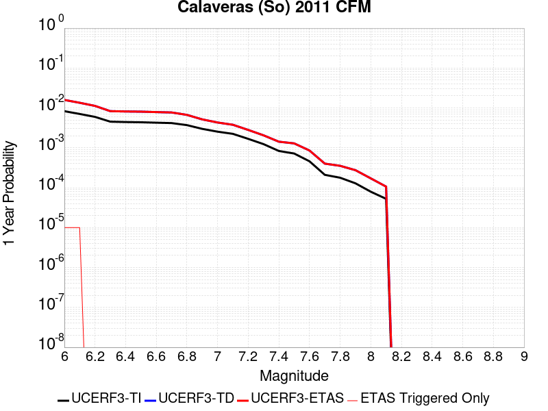 |  |

| Magnitude | 1 wk TI Prob | 1 wk TD Prob | 1 wk ETAS Prob | 1 wk ETAS/TD Gain | 1 wk ETAS Triggered Only | 1 mo TI Prob | 1 mo TD Prob | 1 mo ETAS Prob | 1 mo ETAS/TD Gain | 1 mo ETAS Triggered Only | 1 yr TI Prob | 1 yr TD Prob | 1 yr ETAS Prob | 1 yr ETAS/TD Gain | 1 yr ETAS Triggered Only | 10 yr TI Prob | 10 yr TD Prob | 10 yr ETAS Prob | 10 yr ETAS/TD Gain | 10 yr ETAS Triggered Only |
|-----|-----|-----|-----|-----|-----|-----|-----|-----|-----|-----|-----|-----|-----|-----|-----|-----|-----|-----|-----|-----|
| 6.0 | 1.5950744E-4 | 3.0713255E-4 | 3.0713255E-4 | 1.0 | 0.0 | 6.834242E-4 | 0.001315409 | 0.001315409 | 1.0 | 0.0 | 0.00828899 | 0.015858326 | 0.015868168 | 1.0006206 | 1.0E-5 | 0.079865426 | 0.14440185 | 0.14441895 | 1.0001185 | 2.0E-5 |
| 6.1 | 1.3584697E-4 | 2.603514E-4 | 2.603514E-4 | 1.0 | 0.0 | 5.8207137E-4 | 0.0011151754 | 0.0011151754 | 1.0 | 0.0 | 0.007063716 | 0.013461385 | 0.01347125 | 1.0007329 | 1.0E-5 | 0.06843361 | 0.124029994 | 0.124038756 | 1.0000706 | 1.0E-5 |
| 6.2 | 1.14676266E-4 | 2.1714384E-4 | 2.1714384E-4 | 1.0 | 0.0 | 4.9137714E-4 | 9.30223E-4 | 9.30223E-4 | 1.0 | 0.0 | 0.0059661185 | 0.011245058 | 0.011245058 | 1.0 | 0.0 | 0.058084648 | 0.10502057 | 0.10502057 | 1.0 | 0.0 |
| 6.3 | 8.691518E-5 | 1.5987935E-4 | 1.5987935E-4 | 1.0 | 0.0 | 3.7244044E-4 | 6.849807E-4 | 6.849807E-4 | 1.0 | 0.0 | 0.004525038 | 0.008301122 | 0.008301122 | 1.0 | 0.0 | 0.044339992 | 0.0793365 | 0.0793365 | 1.0 | 0.0 |
| 6.4 | 8.50982E-5 | 1.5694331E-4 | 1.5694331E-4 | 1.0 | 0.0 | 3.646556E-4 | 6.724042E-4 | 6.724042E-4 | 1.0 | 0.0 | 0.0044306475 | 0.008149155 | 0.008149155 | 1.0 | 0.0 | 0.04343345 | 0.07794268 | 0.07794268 | 1.0 | 0.0 |
| 6.5 | 8.4062965E-5 | 1.5518743E-4 | 1.5518743E-4 | 1.0 | 0.0 | 3.602201E-4 | 6.6488347E-4 | 6.6488347E-4 | 1.0 | 0.0 | 0.004376863 | 0.008058365 | 0.008058365 | 1.0 | 0.0 | 0.042916555 | 0.07711388 | 0.07711388 | 1.0 | 0.0 |
| 6.6 | 8.194716E-5 | 1.5154552E-4 | 1.5154552E-4 | 1.0 | 0.0 | 3.5115483E-4 | 6.492843E-4 | 6.492843E-4 | 1.0 | 0.0 | 0.0042669317 | 0.007870209 | 0.007870209 | 1.0 | 0.0 | 0.04185927 | 0.07539919 | 0.07539919 | 1.0 | 0.0 |
| 6.7 | 8.012326E-5 | 1.4822475E-4 | 1.4822475E-4 | 1.0 | 0.0 | 3.433402E-4 | 6.350612E-4 | 6.350612E-4 | 1.0 | 0.0 | 0.004172157 | 0.007698701 | 0.007698701 | 1.0 | 0.0 | 0.040946912 | 0.07384132 | 0.07384132 | 1.0 | 0.0 |
| 6.8 | 7.119773E-5 | 1.2881879E-4 | 1.2881879E-4 | 1.0 | 0.0 | 3.0509746E-4 | 5.519494E-4 | 5.519494E-4 | 1.0 | 0.0 | 0.0037082357 | 0.006696066 | 0.006696066 | 1.0 | 0.0 | 0.036469642 | 0.06468575 | 0.06468575 | 1.0 | 0.0 |
| 6.9 | 5.7343088E-5 | 9.919277E-5 | 9.919277E-5 | 1.0 | 0.0 | 2.4573295E-4 | 4.25043E-4 | 4.25043E-4 | 1.0 | 0.0 | 0.0029876942 | 0.005162694 | 0.005162694 | 1.0 | 0.0 | 0.02947844 | 0.05051036 | 0.05051036 | 1.0 | 0.0 |
| 7.0 | 4.8746577E-5 | 8.2850725E-5 | 8.2850725E-5 | 1.0 | 0.0 | 2.0889717E-4 | 3.5502657E-4 | 3.5502657E-4 | 1.0 | 0.0 | 0.0025403565 | 0.004313948 | 0.004313948 | 1.0 | 0.0 | 0.025115121 | 0.042485245 | 0.042485245 | 1.0 | 0.0 |
| 7.1 | 4.2998014E-5 | 7.265203E-5 | 7.265203E-5 | 1.0 | 0.0 | 1.8426418E-4 | 3.1132903E-4 | 3.1132903E-4 | 1.0 | 0.0 | 0.002241108 | 0.003783903 | 0.003783903 | 1.0 | 0.0 | 0.022186412 | 0.037423562 | 0.037423562 | 1.0 | 0.0 |
| 7.2 | 3.221292E-5 | 5.390791E-5 | 5.390791E-5 | 1.0 | 0.0 | 1.3804805E-4 | 2.3101359E-4 | 2.3101359E-4 | 1.0 | 0.0 | 0.0016794393 | 0.0028089907 | 0.0028089907 | 1.0 | 0.0 | 0.016668037 | 0.02803602 | 0.02803602 | 1.0 | 0.0 |
| 7.3 | 2.3756531E-5 | 3.9473416E-5 | 3.9473416E-5 | 1.0 | 0.0 | 1.0180973E-4 | 1.6916092E-4 | 1.6916092E-4 | 1.0 | 0.0 | 0.0012388286 | 0.0020576057 | 0.0020576057 | 1.0 | 0.0 | 0.012319452 | 0.020643145 | 0.020643145 | 1.0 | 0.0 |
| 7.4 | 1.5997684E-5 | 2.7342163E-5 | 2.7342163E-5 | 1.0 | 0.0 | 6.8559704E-5 | 1.1717545E-4 | 1.1717545E-4 | 1.0 | 0.0 | 8.343947E-4 | 0.00142568 | 0.00142568 | 1.0 | 0.0 | 0.008312687 | 0.014376011 | 0.014376011 | 1.0 | 0.0 |
| 7.5 | 1.3814293E-5 | 2.4783874E-5 | 2.4783874E-5 | 1.0 | 0.0 | 5.9202768E-5 | 1.062123E-4 | 1.062123E-4 | 1.0 | 0.0 | 7.205553E-4 | 0.00129237 | 0.00129237 | 1.0 | 0.0 | 0.007182234 | 0.013055085 | 0.013055085 | 1.0 | 0.0 |
| 7.6 | 8.817309E-6 | 1.6430757E-5 | 1.6430757E-5 | 1.0 | 0.0 | 3.7787922E-5 | 7.0415634E-5 | 7.0415634E-5 | 1.0 | 0.0 | 4.5997082E-4 | 8.569745E-4 | 8.569745E-4 | 1.0 | 0.0 | 0.004590199 | 0.008719284 | 0.008719284 | 1.0 | 0.0 |
| 7.7 | 4.0352206E-6 | 7.707318E-6 | 7.707318E-6 | 1.0 | 0.0 | 1.7293689E-5 | 3.3030945E-5 | 3.3030945E-5 | 1.0 | 0.0 | 2.1053031E-4 | 4.0207763E-4 | 4.0207763E-4 | 1.0 | 0.0 | 0.0021033096 | 0.004165172 | 0.004165172 | 1.0 | 0.0 |
| 7.8 | 3.413169E-6 | 6.787282E-6 | 6.787282E-6 | 1.0 | 0.0 | 1.4627784E-5 | 2.9088029E-5 | 2.9088029E-5 | 1.0 | 0.0 | 1.7807873E-4 | 3.5408925E-4 | 3.5408925E-4 | 1.0 | 0.0 | 0.0017793609 | 0.0036665166 | 0.0036665166 | 1.0 | 0.0 |
| 7.9 | 2.4740732E-6 | 5.2791843E-6 | 5.2791843E-6 | 1.0 | 0.0 | 1.06031275E-5 | 2.262488E-5 | 2.262488E-5 | 1.0 | 0.0 | 1.2908543E-4 | 2.7542314E-4 | 2.7542314E-4 | 1.0 | 0.0 | 0.0012901047 | 0.0028347955 | 0.0028347955 | 1.0 | 0.0 |
| 8.0 | 1.5231818E-6 | 3.2889548E-6 | 3.2889548E-6 | 1.0 | 0.0 | 6.527906E-6 | 1.40954435E-5 | 1.40954435E-5 | 1.0 | 0.0 | 7.9474354E-5 | 1.7159856E-4 | 1.7159856E-4 | 1.0 | 0.0 | 7.944594E-4 | 0.0017564303 | 0.0017564303 | 1.0 | 0.0 |
| 8.1 | 1.0104524E-6 | 2.045782E-6 | 2.045782E-6 | 1.0 | 0.0 | 4.330503E-6 | 8.767608E-6 | 8.767608E-6 | 1.0 | 0.0 | 5.2722597E-5 | 1.0674043E-4 | 1.0674043E-4 | 1.0 | 0.0 | 5.271009E-4 | 0.001092934 | 0.001092934 | 1.0 | 0.0 |

## Redondo Canyon alt 1
*[(top)](#table-of-contents)*

| 1 Week | 1 Month | 1 Year | 10 Year |
|-----|-----|-----|-----|
|  |  |  |  |

| Magnitude | 1 wk TI Prob | 1 wk TD Prob | 1 wk ETAS Prob | 1 wk ETAS/TD Gain | 1 wk ETAS Triggered Only | 1 mo TI Prob | 1 mo TD Prob | 1 mo ETAS Prob | 1 mo ETAS/TD Gain | 1 mo ETAS Triggered Only | 1 yr TI Prob | 1 yr TD Prob | 1 yr ETAS Prob | 1 yr ETAS/TD Gain | 1 yr ETAS Triggered Only | 10 yr TI Prob | 10 yr TD Prob | 10 yr ETAS Prob | 10 yr ETAS/TD Gain | 10 yr ETAS Triggered Only |
|-----|-----|-----|-----|-----|-----|-----|-----|-----|-----|-----|-----|-----|-----|-----|-----|-----|-----|-----|-----|-----|
| 6.0 | 1.0346246E-5 | 1.0981325E-5 | 2.0981215E-5 | 1.9106269 | 1.0E-5 | 4.43403E-5 | 4.7062418E-5 | 5.706195E-5 | 1.2124738 | 1.0E-5 | 5.3970946E-4 | 5.729132E-4 | 5.8290747E-4 | 1.0174446 | 1.0E-5 | 0.0053840056 | 0.0057221013 | 0.005741987 | 1.0034752 | 2.0E-5 |
| 6.1 | 1.0346246E-5 | 1.0981325E-5 | 2.0981215E-5 | 1.9106269 | 1.0E-5 | 4.43403E-5 | 4.7062418E-5 | 5.706195E-5 | 1.2124738 | 1.0E-5 | 5.3970946E-4 | 5.729132E-4 | 5.8290747E-4 | 1.0174446 | 1.0E-5 | 0.0053840056 | 0.0057221013 | 0.005741987 | 1.0034752 | 2.0E-5 |
| 6.2 | 1.0346246E-5 | 1.0981325E-5 | 2.0981215E-5 | 1.9106269 | 1.0E-5 | 4.43403E-5 | 4.7062418E-5 | 5.706195E-5 | 1.2124738 | 1.0E-5 | 5.3970946E-4 | 5.729132E-4 | 5.8290747E-4 | 1.0174446 | 1.0E-5 | 0.0053840056 | 0.0057221013 | 0.005741987 | 1.0034752 | 2.0E-5 |
| 6.3 | 3.2052794E-6 | 3.2360983E-6 | 3.2360983E-6 | 1.0 | 0.0 | 1.373684E-5 | 1.3868941E-5 | 1.3868941E-5 | 1.0 | 0.0 | 1.6723319E-4 | 1.6884525E-4 | 1.6884525E-4 | 1.0 | 0.0 | 0.001671074 | 0.0016875593 | 0.0016975424 | 1.0059158 | 1.0E-5 |
| 6.4 | 3.2052794E-6 | 3.2360983E-6 | 3.2360983E-6 | 1.0 | 0.0 | 1.373684E-5 | 1.3868941E-5 | 1.3868941E-5 | 1.0 | 0.0 | 1.6723319E-4 | 1.6884525E-4 | 1.6884525E-4 | 1.0 | 0.0 | 0.001671074 | 0.0016875593 | 0.0016975424 | 1.0059158 | 1.0E-5 |
| 6.5 | 3.2052794E-6 | 3.2360983E-6 | 3.2360983E-6 | 1.0 | 0.0 | 1.373684E-5 | 1.3868941E-5 | 1.3868941E-5 | 1.0 | 0.0 | 1.6723319E-4 | 1.6884525E-4 | 1.6884525E-4 | 1.0 | 0.0 | 0.001671074 | 0.0016875593 | 0.0016975424 | 1.0059158 | 1.0E-5 |
| 6.6 | 1.948328E-6 | 1.8288489E-6 | 1.8288489E-6 | 1.0 | 0.0 | 8.349951E-6 | 7.837909E-6 | 7.837909E-6 | 1.0 | 0.0 | 1.016559E-4 | 9.5423864E-5 | 9.5423864E-5 | 1.0 | 0.0 | 0.0010160941 | 9.5397583E-4 | 9.639663E-4 | 1.0104724 | 1.0E-5 |
| 6.7 | 1.948328E-6 | 1.8288489E-6 | 1.8288489E-6 | 1.0 | 0.0 | 8.349951E-6 | 7.837909E-6 | 7.837909E-6 | 1.0 | 0.0 | 1.016559E-4 | 9.5423864E-5 | 9.5423864E-5 | 1.0 | 0.0 | 0.0010160941 | 9.5397583E-4 | 9.639663E-4 | 1.0104724 | 1.0E-5 |
| 6.8 | 1.1278219E-6 | 9.032885E-7 | 9.032885E-7 | 1.0 | 0.0 | 4.8335132E-6 | 3.871233E-6 | 3.871233E-6 | 1.0 | 0.0 | 5.8846435E-5 | 4.713167E-5 | 4.713167E-5 | 1.0 | 0.0 | 5.8830855E-4 | 4.7125877E-4 | 4.8125404E-4 | 1.0212097 | 1.0E-5 |
| 6.9 | 1.1278219E-6 | 9.032885E-7 | 9.032885E-7 | 1.0 | 0.0 | 4.8335132E-6 | 3.871233E-6 | 3.871233E-6 | 1.0 | 0.0 | 5.8846435E-5 | 4.713167E-5 | 4.713167E-5 | 1.0 | 0.0 | 5.8830855E-4 | 4.7125877E-4 | 4.8125404E-4 | 1.0212097 | 1.0E-5 |
| 7.0 | 1.1278219E-6 | 9.032885E-7 | 9.032885E-7 | 1.0 | 0.0 | 4.8335132E-6 | 3.871233E-6 | 3.871233E-6 | 1.0 | 0.0 | 5.8846435E-5 | 4.713167E-5 | 4.713167E-5 | 1.0 | 0.0 | 5.8830855E-4 | 4.7125877E-4 | 4.8125404E-4 | 1.0212097 | 1.0E-5 |
| 7.1 | 1.0545139E-6 | 8.5690925E-7 | 8.5690925E-7 | 1.0 | 0.0 | 4.5193374E-6 | 3.6724655E-6 | 3.6724655E-6 | 1.0 | 0.0 | 5.5021545E-5 | 4.4711775E-5 | 4.4711775E-5 | 1.0 | 0.0 | 5.500792E-4 | 4.4706953E-4 | 4.5706506E-4 | 1.022358 | 1.0E-5 |
| 7.2 | 1.0545139E-6 | 8.5690925E-7 | 8.5690925E-7 | 1.0 | 0.0 | 4.5193374E-6 | 3.6724655E-6 | 3.6724655E-6 | 1.0 | 0.0 | 5.5021545E-5 | 4.4711775E-5 | 4.4711775E-5 | 1.0 | 0.0 | 5.500792E-4 | 4.4706953E-4 | 4.5706506E-4 | 1.022358 | 1.0E-5 |
| 7.3 | 9.505161E-8 | 5.8955752E-8 | 5.8955752E-8 | 1.0 | 0.0 | 4.0736398E-7 | 2.526675E-7 | 2.526675E-7 | 1.0 | 0.0 | 4.959645E-6 | 3.0762235E-6 | 3.0762235E-6 | 1.0 | 0.0 | 4.9595343E-5 | 3.076193E-5 | 3.076193E-5 | 1.0 | 0.0 |
| 7.4 | 3.9520785E-8 | 2.6987088E-8 | 2.6987088E-8 | 1.0 | 0.0 | 1.6937479E-7 | 1.1565894E-7 | 1.1565894E-7 | 1.0 | 0.0 | 2.062136E-6 | 1.408147E-6 | 1.408147E-6 | 1.0 | 0.0 | 2.062117E-5 | 1.4081407E-5 | 1.4081407E-5 | 1.0 | 0.0 |
| 7.5 | 5.6133214E-9 | 3.7367687E-9 | 3.7367687E-9 | 1.0 | 0.0 | 2.4057092E-8 | 1.6014722E-8 | 1.6014722E-8 | 1.0 | 0.0 | 2.9289507E-7 | 1.9497922E-7 | 1.9497922E-7 | 1.0 | 0.0 | 2.9289467E-6 | 1.9497909E-6 | 1.9497909E-6 | 1.0 | 0.0 |
| 7.6 | 4.1064334E-9 | 2.5957205E-9 | 2.5957205E-9 | 1.0 | 0.0 | 1.7599E-8 | 1.1124517E-8 | 1.1124517E-8 | 1.0 | 0.0 | 2.142678E-7 | 1.3544098E-7 | 1.3544098E-7 | 1.0 | 0.0 | 2.1426758E-6 | 1.3544093E-6 | 1.3544093E-6 | 1.0 | 0.0 |
| 7.7 | 1.361975E-9 | 6.360521E-10 | 6.360521E-10 | 1.0 | 0.0 | 5.8370353E-9 | 2.7259377E-9 | 2.7259377E-9 | 1.0 | 0.0 | 7.1065905E-8 | 3.318829E-8 | 3.318829E-8 | 1.0 | 0.0 | 7.106588E-7 | 3.3188286E-7 | 3.3188286E-7 | 1.0 | 0.0 |
| 7.8 | 1.361975E-9 | 6.360521E-10 | 6.360521E-10 | 1.0 | 0.0 | 5.8370353E-9 | 2.7259377E-9 | 2.7259377E-9 | 1.0 | 0.0 | 7.1065905E-8 | 3.318829E-8 | 3.318829E-8 | 1.0 | 0.0 | 7.106588E-7 | 3.3188286E-7 | 3.3188286E-7 | 1.0 | 0.0 |

## Hosgri (Extension)
*[(top)](#table-of-contents)*

| 1 Week | 1 Month | 1 Year | 10 Year |
|-----|-----|-----|-----|
|  |  |  |  |

| Magnitude | 1 wk TI Prob | 1 wk TD Prob | 1 wk ETAS Prob | 1 wk ETAS/TD Gain | 1 wk ETAS Triggered Only | 1 mo TI Prob | 1 mo TD Prob | 1 mo ETAS Prob | 1 mo ETAS/TD Gain | 1 mo ETAS Triggered Only | 1 yr TI Prob | 1 yr TD Prob | 1 yr ETAS Prob | 1 yr ETAS/TD Gain | 1 yr ETAS Triggered Only | 10 yr TI Prob | 10 yr TD Prob | 10 yr ETAS Prob | 10 yr ETAS/TD Gain | 10 yr ETAS Triggered Only |
|-----|-----|-----|-----|-----|-----|-----|-----|-----|-----|-----|-----|-----|-----|-----|-----|-----|-----|-----|-----|-----|
| 6.0 | 1.1369135E-5 | 1.2083073E-5 | 1.2083073E-5 | 1.0 | 0.0 | 4.8723956E-5 | 5.17837E-5 | 5.17837E-5 | 1.0 | 0.0 | 5.9305265E-4 | 6.303069E-4 | 6.303069E-4 | 1.0 | 0.0 | 0.005914725 | 0.00628744 | 0.0063073146 | 1.003161 | 2.0E-5 |
| 6.1 | 6.934979E-6 | 7.324556E-6 | 7.324556E-6 | 1.0 | 0.0 | 2.9721E-5 | 3.13906E-5 | 3.13906E-5 | 1.0 | 0.0 | 3.617931E-4 | 3.821177E-4 | 3.821177E-4 | 1.0 | 0.0 | 0.0036120464 | 0.003815019 | 0.0038349428 | 1.0052224 | 2.0E-5 |
| 6.2 | 6.934979E-6 | 7.324556E-6 | 7.324556E-6 | 1.0 | 0.0 | 2.9721E-5 | 3.13906E-5 | 3.13906E-5 | 1.0 | 0.0 | 3.617931E-4 | 3.821177E-4 | 3.821177E-4 | 1.0 | 0.0 | 0.0036120464 | 0.003815019 | 0.0038349428 | 1.0052224 | 2.0E-5 |
| 6.3 | 4.5484676E-6 | 4.769331E-6 | 4.769331E-6 | 1.0 | 0.0 | 1.9493287E-5 | 2.0439833E-5 | 2.0439833E-5 | 1.0 | 0.0 | 2.3730492E-4 | 2.4882698E-4 | 2.4882698E-4 | 1.0 | 0.0 | 0.0023705168 | 0.0024855263 | 0.0024955014 | 1.0040133 | 1.0E-5 |
| 6.4 | 4.218095E-6 | 4.416863E-6 | 4.416863E-6 | 1.0 | 0.0 | 1.8077424E-5 | 1.8929275E-5 | 1.8929275E-5 | 1.0 | 0.0 | 2.2007042E-4 | 2.3043988E-4 | 2.3043988E-4 | 1.0 | 0.0 | 0.002198526 | 0.002302043 | 0.00231202 | 1.004334 | 1.0E-5 |
| 6.5 | 3.717374E-6 | 3.883879E-6 | 3.883879E-6 | 1.0 | 0.0 | 1.5931506E-5 | 1.664509E-5 | 1.664509E-5 | 1.0 | 0.0 | 1.9394881E-4 | 2.026353E-4 | 2.026353E-4 | 1.0 | 0.0 | 0.0019377962 | 0.0020245241 | 0.002034504 | 1.0049294 | 1.0E-5 |
| 6.6 | 3.4605036E-6 | 3.6083072E-6 | 3.6083072E-6 | 1.0 | 0.0 | 1.4830645E-5 | 1.5464082E-5 | 1.5464082E-5 | 1.0 | 0.0 | 1.8054814E-4 | 1.8825909E-4 | 1.8825909E-4 | 1.0 | 0.0 | 0.0018040152 | 0.0018810107 | 0.0018909919 | 1.0053062 | 1.0E-5 |
| 6.7 | 3.123439E-6 | 3.2465698E-6 | 3.2465698E-6 | 1.0 | 0.0 | 1.33860985E-5 | 1.39137965E-5 | 1.39137965E-5 | 1.0 | 0.0 | 1.6296357E-4 | 1.6938741E-4 | 1.6938741E-4 | 1.0 | 0.0 | 0.001628441 | 0.001692594 | 0.0017025771 | 1.0058981 | 1.0E-5 |
| 6.8 | 2.8290783E-6 | 2.9305413E-6 | 2.9305413E-6 | 1.0 | 0.0 | 1.2124565E-5 | 1.2559403E-5 | 1.2559403E-5 | 1.0 | 0.0 | 1.4760658E-4 | 1.5290009E-4 | 1.5290009E-4 | 1.0 | 0.0 | 0.0014750857 | 0.0015279576 | 0.0015379423 | 1.0065347 | 1.0E-5 |
| 6.9 | 2.454112E-6 | 2.5283207E-6 | 2.5283207E-6 | 1.0 | 0.0 | 1.0517581E-5 | 1.0835615E-5 | 1.0835615E-5 | 1.0 | 0.0 | 1.2804402E-4 | 1.3191569E-4 | 1.3191569E-4 | 1.0 | 0.0 | 0.0012797028 | 0.0013183799 | 0.0013283667 | 1.007575 | 1.0E-5 |
| 7.0 | 2.1008145E-6 | 2.1498715E-6 | 2.1498715E-6 | 1.0 | 0.0 | 9.003459E-6 | 9.2137025E-6 | 9.2137025E-6 | 1.0 | 0.0 | 1.096116E-4 | 1.1217109E-4 | 1.1217109E-4 | 1.0 | 0.0 | 0.0010955755 | 0.0011211485 | 0.0011311373 | 1.0089095 | 1.0E-5 |
| 7.1 | 1.744384E-6 | 1.7686364E-6 | 1.7686364E-6 | 1.0 | 0.0 | 7.47591E-6 | 7.579848E-6 | 7.579848E-6 | 1.0 | 0.0 | 9.1015405E-5 | 9.228076E-5 | 9.228076E-5 | 1.0 | 0.0 | 9.097813E-4 | 9.224261E-4 | 9.324169E-4 | 1.010831 | 1.0E-5 |
| 7.2 | 1.5456587E-6 | 1.5562894E-6 | 1.5562894E-6 | 1.0 | 0.0 | 6.6242346E-6 | 6.6697944E-6 | 6.6697944E-6 | 1.0 | 0.0 | 8.064707E-5 | 8.120173E-5 | 8.120173E-5 | 1.0 | 0.0 | 8.0617814E-4 | 8.117219E-4 | 8.117219E-4 | 1.0 | 0.0 |
| 7.3 | 1.3775123E-6 | 1.3766092E-6 | 1.3766092E-6 | 1.0 | 0.0 | 5.9036106E-6 | 5.8997407E-6 | 5.8997407E-6 | 1.0 | 0.0 | 7.187409E-5 | 7.182699E-5 | 7.182699E-5 | 1.0 | 0.0 | 7.185085E-4 | 7.180387E-4 | 7.180387E-4 | 1.0 | 0.0 |
| 7.4 | 1.214491E-6 | 1.2023471E-6 | 1.2023471E-6 | 1.0 | 0.0 | 5.2049513E-6 | 5.152906E-6 | 5.152906E-6 | 1.0 | 0.0 | 6.336844E-5 | 6.2734835E-5 | 6.2734835E-5 | 1.0 | 0.0 | 6.335037E-4 | 6.2717206E-4 | 6.2717206E-4 | 1.0 | 0.0 |
| 7.5 | 1.0101123E-6 | 9.842256E-7 | 9.842256E-7 | 1.0 | 0.0 | 4.3290456E-6 | 4.218103E-6 | 4.218103E-6 | 1.0 | 0.0 | 5.2704854E-5 | 5.13542E-5 | 5.13542E-5 | 1.0 | 0.0 | 5.2692357E-4 | 5.1342393E-4 | 5.1342393E-4 | 1.0 | 0.0 |
| 7.6 | 8.1558215E-7 | 7.765977E-7 | 7.765977E-7 | 1.0 | 0.0 | 3.4953473E-6 | 3.3282718E-6 | 3.3282718E-6 | 1.0 | 0.0 | 4.255502E-5 | 4.0520958E-5 | 4.0520958E-5 | 1.0 | 0.0 | 4.2546875E-4 | 4.0513615E-4 | 4.0513615E-4 | 1.0 | 0.0 |
| 7.7 | 4.757816E-7 | 4.1308996E-7 | 4.1308996E-7 | 1.0 | 0.0 | 2.0390623E-6 | 1.7703843E-6 | 1.7703843E-6 | 1.0 | 0.0 | 2.4825302E-5 | 2.1554217E-5 | 2.1554217E-5 | 1.0 | 0.0 | 2.482253E-4 | 2.1552139E-4 | 2.1552139E-4 | 1.0 | 0.0 |
| 7.8 | 2.782787E-7 | 2.004783E-7 | 2.004783E-7 | 1.0 | 0.0 | 1.1926223E-6 | 8.591924E-7 | 8.591924E-7 | 1.0 | 0.0 | 1.452008E-5 | 1.0460618E-5 | 1.0460618E-5 | 1.0 | 0.0 | 1.4519131E-4 | 1.04601284E-4 | 1.04601284E-4 | 1.0 | 0.0 |
| 7.9 | 1.6948086E-7 | 9.243938E-8 | 9.243938E-8 | 1.0 | 0.0 | 7.2634634E-7 | 3.961687E-7 | 3.961687E-7 | 1.0 | 0.0 | 8.843231E-6 | 4.8233433E-6 | 4.8233433E-6 | 1.0 | 0.0 | 8.842879E-5 | 4.8232392E-5 | 4.8232392E-5 | 1.0 | 0.0 |
| 8.0 | 1.0225492E-7 | 4.473497E-8 | 4.473497E-8 | 1.0 | 0.0 | 4.382353E-7 | 1.917213E-7 | 1.917213E-7 | 1.0 | 0.0 | 5.335502E-6 | 2.3342043E-6 | 2.3342043E-6 | 1.0 | 0.0 | 5.335374E-5 | 2.33418E-5 | 2.33418E-5 | 1.0 | 0.0 |
| 8.1 | 1.43711345E-8 | 5.78716E-9 | 5.78716E-9 | 1.0 | 0.0 | 6.1590576E-8 | 2.4802116E-8 | 2.4802116E-8 | 1.0 | 0.0 | 7.4986497E-7 | 3.019657E-7 | 3.019657E-7 | 1.0 | 0.0 | 7.4986247E-6 | 3.0196536E-6 | 3.0196536E-6 | 1.0 | 0.0 |

## Hunting Creek - Berryessa 2011 CFM
*[(top)](#table-of-contents)*

| 1 Week | 1 Month | 1 Year | 10 Year |
|-----|-----|-----|-----|
|  |  |  | 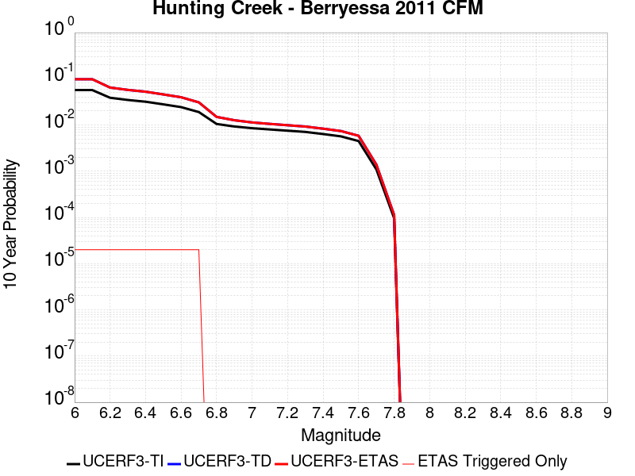 |

| Magnitude | 1 wk TI Prob | 1 wk TD Prob | 1 wk ETAS Prob | 1 wk ETAS/TD Gain | 1 wk ETAS Triggered Only | 1 mo TI Prob | 1 mo TD Prob | 1 mo ETAS Prob | 1 mo ETAS/TD Gain | 1 mo ETAS Triggered Only | 1 yr TI Prob | 1 yr TD Prob | 1 yr ETAS Prob | 1 yr ETAS/TD Gain | 1 yr ETAS Triggered Only | 10 yr TI Prob | 10 yr TD Prob | 10 yr ETAS Prob | 10 yr ETAS/TD Gain | 10 yr ETAS Triggered Only |
|-----|-----|-----|-----|-----|-----|-----|-----|-----|-----|-----|-----|-----|-----|-----|-----|-----|-----|-----|-----|-----|
| 6.0 | 1.1270982E-4 | 2.0028367E-4 | 2.0028367E-4 | 1.0 | 0.0 | 4.8295266E-4 | 8.579912E-4 | 8.579912E-4 | 1.0 | 0.0 | 0.0058641075 | 0.010386173 | 0.010396069 | 1.0009528 | 1.0E-5 | 0.057117578 | 0.09804048 | 0.098058514 | 1.0001839 | 2.0E-5 |
| 6.1 | 1.1239393E-4 | 1.9976508E-4 | 1.9976508E-4 | 1.0 | 0.0 | 4.8159933E-4 | 8.557703E-4 | 8.557703E-4 | 1.0 | 0.0 | 0.0058477195 | 0.010359417 | 0.010369313 | 1.0009553 | 1.0E-5 | 0.056962132 | 0.09779895 | 0.097817 | 1.0001845 | 2.0E-5 |
| 6.2 | 7.596265E-5 | 1.2933646E-4 | 1.2933646E-4 | 1.0 | 0.0 | 3.2551357E-4 | 5.5415573E-4 | 5.5415573E-4 | 1.0 | 0.0 | 0.0039559277 | 0.0067213587 | 0.006731292 | 1.0014778 | 1.0E-5 | 0.038862433 | 0.06459229 | 0.064610995 | 1.0002897 | 2.0E-5 |
| 6.3 | 6.78794E-5 | 1.1448377E-4 | 1.1448377E-4 | 1.0 | 0.0 | 2.9087928E-4 | 4.9052597E-4 | 4.9052597E-4 | 1.0 | 0.0 | 0.003535705 | 0.005952661 | 0.0059626014 | 1.0016699 | 1.0E-5 | 0.034799766 | 0.057466213 | 0.057485063 | 1.0003281 | 2.0E-5 |
| 6.4 | 6.2165134E-5 | 1.0434825E-4 | 1.0434825E-4 | 1.0 | 0.0 | 2.6639478E-4 | 4.4711027E-4 | 4.4711027E-4 | 1.0 | 0.0 | 0.0032385332 | 0.0054274183 | 0.005437364 | 1.0018325 | 1.0E-5 | 0.03191742 | 0.05255138 | 0.052570328 | 1.0003606 | 2.0E-5 |
| 6.5 | 5.4368087E-5 | 9.070258E-5 | 9.070258E-5 | 1.0 | 0.0 | 2.3298527E-4 | 3.886537E-4 | 3.886537E-4 | 1.0 | 0.0 | 0.0028329059 | 0.0047197016 | 0.0047296546 | 1.0021088 | 1.0E-5 | 0.027970633 | 0.045881182 | 0.045900263 | 1.0004159 | 2.0E-5 |
| 6.6 | 4.729947E-5 | 7.847101E-5 | 7.847101E-5 | 1.0 | 0.0 | 2.0269625E-4 | 3.3624718E-4 | 3.3624718E-4 | 1.0 | 0.0 | 0.002465034 | 0.004084746 | 0.004094705 | 1.0024382 | 1.0E-5 | 0.02437869 | 0.03985269 | 0.03987189 | 1.0004818 | 2.0E-5 |
| 6.7 | 3.6875328E-5 | 6.0443555E-5 | 6.0443555E-5 | 1.0 | 0.0 | 1.5802756E-4 | 2.5900968E-4 | 2.5900968E-4 | 1.0 | 0.0 | 0.0019222875 | 0.0031482724 | 0.0031582408 | 1.0031663 | 1.0E-5 | 0.019057442 | 0.03089371 | 0.030913092 | 1.0006274 | 2.0E-5 |
| 6.8 | 2.0292036E-5 | 2.8976721E-5 | 2.8976721E-5 | 1.0 | 0.0 | 8.6962966E-5 | 1.2417998E-4 | 1.2417998E-4 | 1.0 | 0.0 | 0.0010582599 | 0.0015108302 | 0.0015108302 | 1.0 | 0.0 | 0.010532344 | 0.0149790775 | 0.0149790775 | 1.0 | 0.0 |
| 6.9 | 1.7871042E-5 | 2.4472653E-5 | 2.4472653E-5 | 1.0 | 0.0 | 7.658793E-5 | 1.04878585E-4 | 1.04878585E-4 | 1.0 | 0.0 | 9.320591E-4 | 0.0012761486 | 0.0012761486 | 1.0 | 0.0 | 0.009281595 | 0.012680395 | 0.012680395 | 1.0 | 0.0 |
| 7.0 | 1.6415532E-5 | 2.1906566E-5 | 2.1906566E-5 | 1.0 | 0.0 | 7.035038E-5 | 9.388191E-5 | 9.388191E-5 | 1.0 | 0.0 | 8.561793E-4 | 0.0011424144 | 0.0011424144 | 1.0 | 0.0 | 0.008528882 | 0.011365017 | 0.011365017 | 1.0 | 0.0 |
| 7.1 | 1.5409885E-5 | 2.0346588E-5 | 2.0346588E-5 | 1.0 | 0.0 | 6.6040695E-5 | 8.719676E-5 | 8.719676E-5 | 1.0 | 0.0 | 8.0374884E-4 | 0.0010611062 | 0.0010611062 | 1.0 | 0.0 | 0.00800848 | 0.010560924 | 0.010560924 | 1.0 | 0.0 |
| 7.2 | 1.4497423E-5 | 1.905519E-5 | 1.905519E-5 | 1.0 | 0.0 | 6.213033E-5 | 8.166256E-5 | 8.166256E-5 | 1.0 | 0.0 | 7.5617427E-4 | 9.937913E-4 | 9.937913E-4 | 1.0 | 0.0 | 0.0075360634 | 0.00989425 | 0.00989425 | 1.0 | 0.0 |
| 7.3 | 1.3615175E-5 | 1.7826347E-5 | 1.7826347E-5 | 1.0 | 0.0 | 5.8349444E-5 | 7.6396405E-5 | 7.6396405E-5 | 1.0 | 0.0 | 7.101729E-4 | 9.297323E-4 | 9.297323E-4 | 1.0 | 0.0 | 0.0070790765 | 0.009259124 | 0.009259124 | 1.0 | 0.0 |
| 7.4 | 1.2252825E-5 | 1.6026455E-5 | 1.6026455E-5 | 1.0 | 0.0 | 5.251105E-5 | 6.868302E-5 | 6.868302E-5 | 1.0 | 0.0 | 6.391345E-4 | 8.3589775E-4 | 8.3589775E-4 | 1.0 | 0.0 | 0.0063729943 | 0.008328172 | 0.008328172 | 1.0 | 0.0 |
| 7.5 | 1.0913301E-5 | 1.4241286E-5 | 1.4241286E-5 | 1.0 | 0.0 | 4.6770452E-5 | 6.103267E-5 | 6.103267E-5 | 1.0 | 0.0 | 5.6928146E-4 | 7.428222E-4 | 7.428222E-4 | 1.0 | 0.0 | 0.0056782532 | 0.0074039865 | 0.0074039865 | 1.0 | 0.0 |
| 7.6 | 8.623192E-6 | 1.12347825E-5 | 1.12347825E-5 | 1.0 | 0.0 | 3.6956015E-5 | 4.8148195E-5 | 4.8148195E-5 | 1.0 | 0.0 | 4.4984656E-4 | 5.8604917E-4 | 5.8604917E-4 | 1.0 | 0.0 | 0.00448937 | 0.005845504 | 0.005845504 | 1.0 | 0.0 |
| 7.7 | 2.0993634E-6 | 2.66264E-6 | 2.66264E-6 | 1.0 | 0.0 | 8.997241E-6 | 1.1411265E-5 | 1.1411265E-5 | 1.0 | 0.0 | 1.09535904E-4 | 1.3892337E-4 | 1.3892337E-4 | 1.0 | 0.0 | 0.0010948193 | 0.0013883994 | 0.0013883994 | 1.0 | 0.0 |
| 7.8 | 1.8428308E-7 | 2.1674624E-7 | 2.1674624E-7 | 1.0 | 0.0 | 7.897844E-7 | 9.289122E-7 | 9.289122E-7 | 1.0 | 0.0 | 9.615583E-6 | 1.130945E-5 | 1.130945E-5 | 1.0 | 0.0 | 9.615166E-5 | 1.1308173E-4 | 1.1308173E-4 | 1.0 | 0.0 |

## Lions Head 2011 CFM
*[(top)](#table-of-contents)*

| 1 Week | 1 Month | 1 Year | 10 Year |
|-----|-----|-----|-----|
| 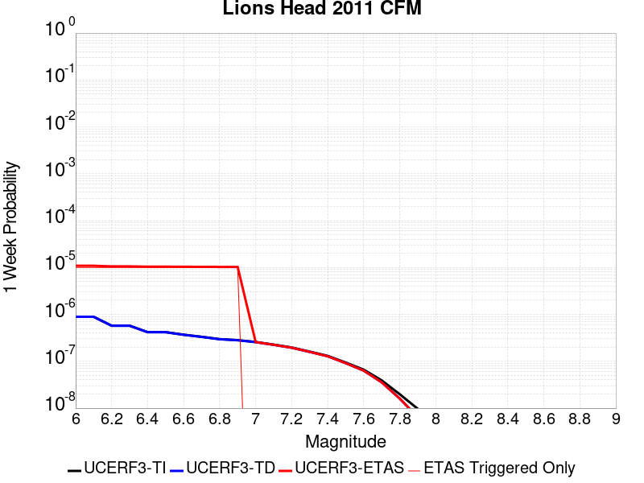 | 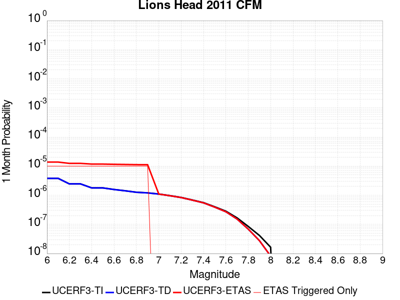 | 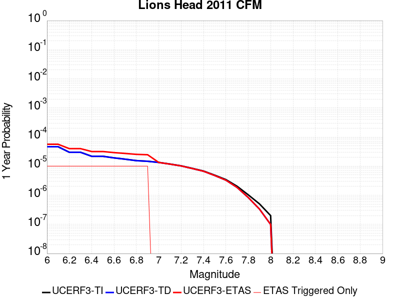 | 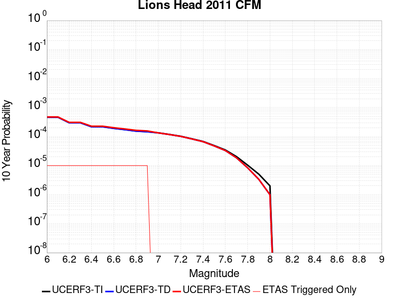 |

| Magnitude | 1 wk TI Prob | 1 wk TD Prob | 1 wk ETAS Prob | 1 wk ETAS/TD Gain | 1 wk ETAS Triggered Only | 1 mo TI Prob | 1 mo TD Prob | 1 mo ETAS Prob | 1 mo ETAS/TD Gain | 1 mo ETAS Triggered Only | 1 yr TI Prob | 1 yr TD Prob | 1 yr ETAS Prob | 1 yr ETAS/TD Gain | 1 yr ETAS Triggered Only | 10 yr TI Prob | 10 yr TD Prob | 10 yr ETAS Prob | 10 yr ETAS/TD Gain | 10 yr ETAS Triggered Only |
|-----|-----|-----|-----|-----|-----|-----|-----|-----|-----|-----|-----|-----|-----|-----|-----|-----|-----|-----|-----|-----|
| 6.0 | 8.889363E-7 | 8.891427E-7 | 1.0889134E-5 | 12.2467785 | 1.0E-5 | 3.8097214E-6 | 3.8106066E-6 | 1.3810569E-5 | 3.6242442 | 1.0E-5 | 4.638237E-5 | 4.639321E-5 | 5.6392746E-5 | 1.2155387 | 1.0E-5 | 4.637269E-4 | 4.6384154E-4 | 4.738369E-4 | 1.0215491 | 1.0E-5 |
| 6.1 | 8.889363E-7 | 8.891427E-7 | 1.0889134E-5 | 12.2467785 | 1.0E-5 | 3.8097214E-6 | 3.8106066E-6 | 1.3810569E-5 | 3.6242442 | 1.0E-5 | 4.638237E-5 | 4.639321E-5 | 5.6392746E-5 | 1.2155387 | 1.0E-5 | 4.637269E-4 | 4.6384154E-4 | 4.738369E-4 | 1.0215491 | 1.0E-5 |
| 6.2 | 5.7435483E-7 | 5.736074E-7 | 1.0573602E-5 | 18.433517 | 1.0E-5 | 2.4615185E-6 | 2.458315E-6 | 1.245829E-5 | 5.0678167 | 1.0E-5 | 2.9968574E-5 | 2.992959E-5 | 3.992929E-5 | 1.3341075 | 1.0E-5 | 2.9964533E-4 | 2.9925702E-4 | 3.0925404E-4 | 1.0334061 | 1.0E-5 |
| 6.3 | 5.7435483E-7 | 5.736074E-7 | 1.0573602E-5 | 18.433517 | 1.0E-5 | 2.4615185E-6 | 2.458315E-6 | 1.245829E-5 | 5.0678167 | 1.0E-5 | 2.9968574E-5 | 2.992959E-5 | 3.992929E-5 | 1.3341075 | 1.0E-5 | 2.9964533E-4 | 2.9925702E-4 | 3.0925404E-4 | 1.0334061 | 1.0E-5 |
| 6.4 | 4.1835764E-7 | 4.1715435E-7 | 1.041715E-5 | 24.971931 | 1.0E-5 | 1.7929601E-6 | 1.7878032E-6 | 1.1787785E-5 | 6.593447 | 1.0E-5 | 2.1829072E-5 | 2.1766287E-5 | 3.176607E-5 | 1.459416 | 1.0E-5 | 2.1826927E-4 | 2.176418E-4 | 2.2763963E-4 | 1.0459371 | 1.0E-5 |
| 6.5 | 4.1835764E-7 | 4.1715435E-7 | 1.041715E-5 | 24.971931 | 1.0E-5 | 1.7929601E-6 | 1.7878032E-6 | 1.1787785E-5 | 6.593447 | 1.0E-5 | 2.1829072E-5 | 2.1766287E-5 | 3.176607E-5 | 1.459416 | 1.0E-5 | 2.1826927E-4 | 2.176418E-4 | 2.2763963E-4 | 1.0459371 | 1.0E-5 |
| 6.6 | 3.6896213E-7 | 3.676191E-7 | 1.0367616E-5 | 28.202059 | 1.0E-5 | 1.5812653E-6 | 1.5755095E-6 | 1.1575494E-5 | 7.347143 | 1.0E-5 | 1.9251736E-5 | 1.918166E-5 | 2.9181469E-5 | 1.5213213 | 1.0E-5 | 1.9250068E-4 | 1.9180018E-4 | 2.0179826E-4 | 1.0521276 | 1.0E-5 |
| 6.7 | 3.3283942E-7 | 3.313985E-7 | 1.0331395E-5 | 31.175142 | 1.0E-5 | 1.4264539E-6 | 1.4202784E-6 | 1.1420264E-5 | 8.040863 | 1.0E-5 | 1.7366938E-5 | 1.7291753E-5 | 2.729158E-5 | 1.5783004 | 1.0E-5 | 1.736558E-4 | 1.7290414E-4 | 1.8290241E-4 | 1.0578256 | 1.0E-5 |
| 6.8 | 2.9684807E-7 | 2.9531475E-7 | 1.0295312E-5 | 34.862167 | 1.0E-5 | 1.2722054E-6 | 1.265634E-6 | 1.1265622E-5 | 8.901169 | 1.0E-5 | 1.5488991E-5 | 1.5408985E-5 | 2.5408832E-5 | 1.648962 | 1.0E-5 | 1.5487912E-4 | 1.540792E-4 | 1.6407766E-4 | 1.0648917 | 1.0E-5 |
| 6.9 | 2.8254823E-7 | 2.8096676E-7 | 1.0280964E-5 | 36.59139 | 1.0E-5 | 1.2109203E-6 | 1.2041426E-6 | 1.1204131E-5 | 9.304654 | 1.0E-5 | 1.4742856E-5 | 1.4660338E-5 | 2.466019E-5 | 1.6821026 | 1.0E-5 | 1.4741877E-4 | 1.4659374E-4 | 1.5659227E-4 | 1.0682057 | 1.0E-5 |
| 7.0 | 2.5794475E-7 | 2.5627173E-7 | 2.5627173E-7 | 1.0 | 0.0 | 1.105477E-6 | 1.0983069E-6 | 1.0983069E-6 | 1.0 | 0.0 | 1.34591E-5 | 1.3371806E-5 | 1.3371806E-5 | 1.0 | 0.0 | 1.3458285E-4 | 1.3371003E-4 | 1.3371003E-4 | 1.0 | 0.0 |
| 7.1 | 2.2678832E-7 | 2.2496157E-7 | 2.2496157E-7 | 1.0 | 0.0 | 9.719496E-7 | 9.641207E-7 | 9.641207E-7 | 1.0 | 0.0 | 1.1833421E-5 | 1.1738105E-5 | 1.1738105E-5 | 1.0 | 0.0 | 1.1832791E-4 | 1.1737487E-4 | 1.1737487E-4 | 1.0 | 0.0 |
| 7.2 | 1.968546E-7 | 1.9487963E-7 | 1.9487963E-7 | 1.0 | 0.0 | 8.436623E-7 | 8.3519814E-7 | 8.3519814E-7 | 1.0 | 0.0 | 1.027154E-5 | 1.016849E-5 | 1.016849E-5 | 1.0 | 0.0 | 1.0271065E-4 | 1.01680256E-4 | 1.01680256E-4 | 1.0 | 0.0 |
| 7.3 | 1.6101195E-7 | 1.5880485E-7 | 1.5880485E-7 | 1.0 | 0.0 | 6.90051E-7 | 6.80592E-7 | 6.80592E-7 | 1.0 | 0.0 | 8.401339E-6 | 8.286176E-6 | 8.286176E-6 | 1.0 | 0.0 | 8.4010215E-5 | 8.285868E-5 | 8.285868E-5 | 1.0 | 0.0 |
| 7.4 | 1.304744E-7 | 1.2803415E-7 | 1.2803415E-7 | 1.0 | 0.0 | 5.591759E-7 | 5.4871765E-7 | 5.4871765E-7 | 1.0 | 0.0 | 6.807945E-6 | 6.6806165E-6 | 6.6806165E-6 | 1.0 | 0.0 | 6.807737E-5 | 6.680416E-5 | 6.680416E-5 | 1.0 | 0.0 |
| 7.5 | 9.410614E-8 | 9.132625E-8 | 9.132625E-8 | 1.0 | 0.0 | 4.0331196E-7 | 3.9139815E-7 | 3.9139815E-7 | 1.0 | 0.0 | 4.910312E-6 | 4.765262E-6 | 4.765262E-6 | 1.0 | 0.0 | 4.9102036E-5 | 4.76516E-5 | 4.76516E-5 | 1.0 | 0.0 |
| 7.6 | 6.6360826E-8 | 6.327081E-8 | 6.327081E-8 | 1.0 | 0.0 | 2.844035E-7 | 2.711606E-7 | 2.711606E-7 | 1.0 | 0.0 | 3.462607E-6 | 3.301375E-6 | 3.301375E-6 | 1.0 | 0.0 | 3.4625533E-5 | 3.301326E-5 | 3.301326E-5 | 1.0 | 0.0 |
| 7.7 | 3.9100893E-8 | 3.5618154E-8 | 3.5618154E-8 | 1.0 | 0.0 | 1.6757524E-7 | 1.5264922E-7 | 1.5264922E-7 | 1.0 | 0.0 | 2.0402267E-6 | 1.8585027E-6 | 1.8585027E-6 | 1.0 | 0.0 | 2.040208E-5 | 1.8584873E-5 | 1.8584873E-5 | 1.0 | 0.0 |
| 7.8 | 1.9858547E-8 | 1.6059335E-8 | 1.6059335E-8 | 1.0 | 0.0 | 8.5108056E-8 | 6.882573E-8 | 6.882573E-8 | 1.0 | 0.0 | 1.0361902E-6 | 8.379529E-7 | 8.379529E-7 | 1.0 | 0.0 | 1.0361853E-5 | 8.379498E-6 | 8.379498E-6 | 1.0 | 0.0 |
| 7.9 | 9.717722E-9 | 6.444841E-9 | 6.444841E-9 | 1.0 | 0.0 | 4.1647375E-8 | 2.762075E-8 | 2.762075E-8 | 1.0 | 0.0 | 5.070567E-7 | 3.3628257E-7 | 3.3628257E-7 | 1.0 | 0.0 | 5.0705553E-6 | 3.3628207E-6 | 3.3628207E-6 | 1.0 | 0.0 |
| 8.0 | 3.8397716E-9 | 1.908825E-9 | 1.908825E-9 | 1.0 | 0.0 | 1.6456164E-8 | 8.180682E-9 | 8.180682E-9 | 1.0 | 0.0 | 2.0035378E-7 | 9.959979E-8 | 9.959979E-8 | 1.0 | 0.0 | 2.0035359E-6 | 9.959974E-7 | 9.959974E-7 | 1.0 | 0.0 |

## Fitzhugh Creek
*[(top)](#table-of-contents)*

| 1 Week | 1 Month | 1 Year | 10 Year |
|-----|-----|-----|-----|
|  |  |  |  |

| Magnitude | 1 wk TI Prob | 1 wk TD Prob | 1 wk ETAS Prob | 1 wk ETAS/TD Gain | 1 wk ETAS Triggered Only | 1 mo TI Prob | 1 mo TD Prob | 1 mo ETAS Prob | 1 mo ETAS/TD Gain | 1 mo ETAS Triggered Only | 1 yr TI Prob | 1 yr TD Prob | 1 yr ETAS Prob | 1 yr ETAS/TD Gain | 1 yr ETAS Triggered Only | 10 yr TI Prob | 10 yr TD Prob | 10 yr ETAS Prob | 10 yr ETAS/TD Gain | 10 yr ETAS Triggered Only |
|-----|-----|-----|-----|-----|-----|-----|-----|-----|-----|-----|-----|-----|-----|-----|-----|-----|-----|-----|-----|-----|
| 6.0 | 6.1090436E-6 | 6.2101562E-6 | 1.6210093E-5 | 2.6102555 | 1.0E-5 | 2.6181353E-5 | 2.6614709E-5 | 3.661444E-5 | 1.375722 | 1.0E-5 | 3.1871133E-4 | 3.239904E-4 | 3.3398715E-4 | 1.0308551 | 1.0E-5 | 0.0031825465 | 0.0032356246 | 0.0032455921 | 1.0030806 | 1.0E-5 |
| 6.1 | 2.9741811E-6 | 3.021581E-6 | 3.021581E-6 | 1.0 | 0.0 | 1.2746428E-5 | 1.2949574E-5 | 1.2949574E-5 | 1.0 | 0.0 | 1.5517672E-4 | 1.576506E-4 | 1.576506E-4 | 1.0 | 0.0 | 0.001550684 | 0.0015754806 | 0.0015754806 | 1.0 | 0.0 |
| 6.2 | 2.9741811E-6 | 3.021581E-6 | 3.021581E-6 | 1.0 | 0.0 | 1.2746428E-5 | 1.2949574E-5 | 1.2949574E-5 | 1.0 | 0.0 | 1.5517672E-4 | 1.576506E-4 | 1.576506E-4 | 1.0 | 0.0 | 0.001550684 | 0.0015754806 | 0.0015754806 | 1.0 | 0.0 |
| 6.3 | 1.4781198E-6 | 1.5012708E-6 | 1.5012708E-6 | 1.0 | 0.0 | 6.3347834E-6 | 6.4340034E-6 | 6.4340034E-6 | 1.0 | 0.0 | 7.712326E-5 | 7.833137E-5 | 7.833137E-5 | 1.0 | 0.0 | 7.70965E-4 | 7.830576E-4 | 7.830576E-4 | 1.0 | 0.0 |
| 6.4 | 1.4781198E-6 | 1.5012708E-6 | 1.5012708E-6 | 1.0 | 0.0 | 6.3347834E-6 | 6.4340034E-6 | 6.4340034E-6 | 1.0 | 0.0 | 7.712326E-5 | 7.833137E-5 | 7.833137E-5 | 1.0 | 0.0 | 7.70965E-4 | 7.830576E-4 | 7.830576E-4 | 1.0 | 0.0 |
| 6.5 | 9.5176676E-7 | 9.66606E-7 | 9.66606E-7 | 1.0 | 0.0 | 4.078994E-6 | 4.142591E-6 | 4.142591E-6 | 1.0 | 0.0 | 4.9660623E-5 | 5.0434985E-5 | 5.0434985E-5 | 1.0 | 0.0 | 4.964952E-4 | 5.042458E-4 | 5.042458E-4 | 1.0 | 0.0 |
| 6.6 | 6.21145E-7 | 6.3085855E-7 | 6.3085855E-7 | 1.0 | 0.0 | 2.662047E-6 | 2.7036772E-6 | 2.7036772E-6 | 1.0 | 0.0 | 3.2409942E-5 | 3.291684E-5 | 3.291684E-5 | 1.0 | 0.0 | 3.2405215E-4 | 3.2912623E-4 | 3.2912623E-4 | 1.0 | 0.0 |
| 6.7 | 2.2377962E-7 | 2.2734636E-7 | 2.2734636E-7 | 1.0 | 0.0 | 9.590551E-7 | 9.743413E-7 | 9.743413E-7 | 1.0 | 0.0 | 1.1676434E-5 | 1.1862574E-5 | 1.1862574E-5 | 1.0 | 0.0 | 1.1675821E-4 | 1.1862254E-4 | 1.1862254E-4 | 1.0 | 0.0 |
| 6.8 | 1.4785022E-7 | 1.5021492E-7 | 1.5021492E-7 | 1.0 | 0.0 | 6.3364365E-7 | 6.4377826E-7 | 6.4377826E-7 | 1.0 | 0.0 | 7.714584E-6 | 7.838E-6 | 7.838E-6 | 1.0 | 0.0 | 7.714316E-5 | 7.838E-5 | 7.838E-5 | 1.0 | 0.0 |

## Ozena
*[(top)](#table-of-contents)*

| 1 Week | 1 Month | 1 Year | 10 Year |
|-----|-----|-----|-----|
| 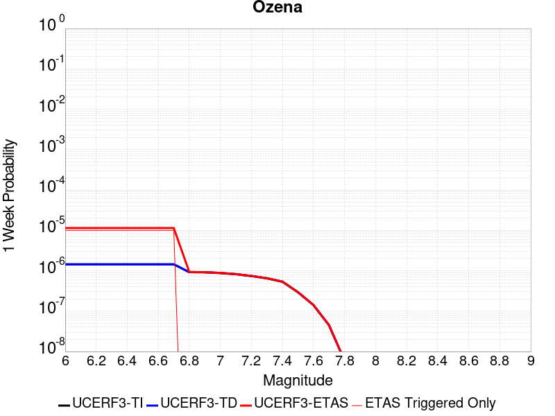 | 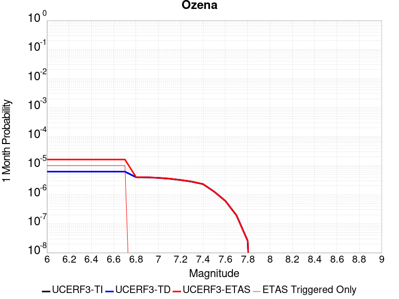 | 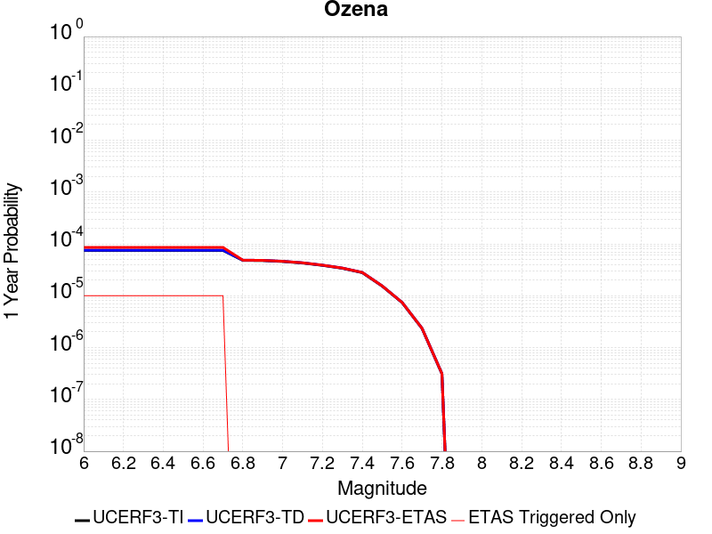 |  |

| Magnitude | 1 wk TI Prob | 1 wk TD Prob | 1 wk ETAS Prob | 1 wk ETAS/TD Gain | 1 wk ETAS Triggered Only | 1 mo TI Prob | 1 mo TD Prob | 1 mo ETAS Prob | 1 mo ETAS/TD Gain | 1 mo ETAS Triggered Only | 1 yr TI Prob | 1 yr TD Prob | 1 yr ETAS Prob | 1 yr ETAS/TD Gain | 1 yr ETAS Triggered Only | 10 yr TI Prob | 10 yr TD Prob | 10 yr ETAS Prob | 10 yr ETAS/TD Gain | 10 yr ETAS Triggered Only |
|-----|-----|-----|-----|-----|-----|-----|-----|-----|-----|-----|-----|-----|-----|-----|-----|-----|-----|-----|-----|-----|
| 6.0 | 1.4377547E-6 | 1.4513782E-6 | 1.1451364E-5 | 7.889992 | 1.0E-5 | 6.161791E-6 | 6.2201793E-6 | 1.6220118E-5 | 2.6076608 | 1.0E-5 | 7.5017226E-5 | 7.572832E-5 | 8.5727566E-5 | 1.132041 | 1.0E-5 | 7.4991904E-4 | 7.570518E-4 | 7.670442E-4 | 1.0131991 | 1.0E-5 |
| 6.1 | 1.4377547E-6 | 1.4513782E-6 | 1.1451364E-5 | 7.889992 | 1.0E-5 | 6.161791E-6 | 6.2201793E-6 | 1.6220118E-5 | 2.6076608 | 1.0E-5 | 7.5017226E-5 | 7.572832E-5 | 8.5727566E-5 | 1.132041 | 1.0E-5 | 7.4991904E-4 | 7.570518E-4 | 7.670442E-4 | 1.0131991 | 1.0E-5 |
| 6.2 | 1.4377547E-6 | 1.4513782E-6 | 1.1451364E-5 | 7.889992 | 1.0E-5 | 6.161791E-6 | 6.2201793E-6 | 1.6220118E-5 | 2.6076608 | 1.0E-5 | 7.5017226E-5 | 7.572832E-5 | 8.5727566E-5 | 1.132041 | 1.0E-5 | 7.4991904E-4 | 7.570518E-4 | 7.670442E-4 | 1.0131991 | 1.0E-5 |
| 6.3 | 1.4377547E-6 | 1.4513782E-6 | 1.1451364E-5 | 7.889992 | 1.0E-5 | 6.161791E-6 | 6.2201793E-6 | 1.6220118E-5 | 2.6076608 | 1.0E-5 | 7.5017226E-5 | 7.572832E-5 | 8.5727566E-5 | 1.132041 | 1.0E-5 | 7.4991904E-4 | 7.570518E-4 | 7.670442E-4 | 1.0131991 | 1.0E-5 |
| 6.4 | 1.4377547E-6 | 1.4513782E-6 | 1.1451364E-5 | 7.889992 | 1.0E-5 | 6.161791E-6 | 6.2201793E-6 | 1.6220118E-5 | 2.6076608 | 1.0E-5 | 7.5017226E-5 | 7.572832E-5 | 8.5727566E-5 | 1.132041 | 1.0E-5 | 7.4991904E-4 | 7.570518E-4 | 7.670442E-4 | 1.0131991 | 1.0E-5 |
| 6.5 | 1.4377547E-6 | 1.4513782E-6 | 1.1451364E-5 | 7.889992 | 1.0E-5 | 6.161791E-6 | 6.2201793E-6 | 1.6220118E-5 | 2.6076608 | 1.0E-5 | 7.5017226E-5 | 7.572832E-5 | 8.5727566E-5 | 1.132041 | 1.0E-5 | 7.4991904E-4 | 7.570518E-4 | 7.670442E-4 | 1.0131991 | 1.0E-5 |
| 6.6 | 1.4377547E-6 | 1.4513782E-6 | 1.1451364E-5 | 7.889992 | 1.0E-5 | 6.161791E-6 | 6.2201793E-6 | 1.6220118E-5 | 2.6076608 | 1.0E-5 | 7.5017226E-5 | 7.572832E-5 | 8.5727566E-5 | 1.132041 | 1.0E-5 | 7.4991904E-4 | 7.570518E-4 | 7.670442E-4 | 1.0131991 | 1.0E-5 |
| 6.7 | 1.4377547E-6 | 1.4513782E-6 | 1.1451364E-5 | 7.889992 | 1.0E-5 | 6.161791E-6 | 6.2201793E-6 | 1.6220118E-5 | 2.6076608 | 1.0E-5 | 7.5017226E-5 | 7.572832E-5 | 8.5727566E-5 | 1.132041 | 1.0E-5 | 7.4991904E-4 | 7.570518E-4 | 7.670442E-4 | 1.0131991 | 1.0E-5 |
| 6.8 | 9.223257E-7 | 9.317624E-7 | 9.317624E-7 | 1.0 | 0.0 | 3.9528186E-6 | 3.9932615E-6 | 3.9932615E-6 | 1.0 | 0.0 | 4.81245E-5 | 4.8616912E-5 | 4.8616912E-5 | 1.0 | 0.0 | 4.811408E-4 | 4.860668E-4 | 4.860668E-4 | 1.0 | 0.0 |
| 6.9 | 9.141515E-7 | 9.235371E-7 | 9.235371E-7 | 1.0 | 0.0 | 3.917786E-6 | 3.9580104E-6 | 3.9580104E-6 | 1.0 | 0.0 | 4.7698002E-5 | 4.818775E-5 | 4.818775E-5 | 1.0 | 0.0 | 4.7687767E-4 | 4.8177704E-4 | 4.8177704E-4 | 1.0 | 0.0 |
| 7.0 | 8.767648E-7 | 8.8585773E-7 | 8.8585773E-7 | 1.0 | 0.0 | 3.757558E-6 | 3.7965276E-6 | 3.7965276E-6 | 1.0 | 0.0 | 4.5747307E-5 | 4.6221783E-5 | 4.6221783E-5 | 1.0 | 0.0 | 4.5737892E-4 | 4.6212564E-4 | 4.6212564E-4 | 1.0 | 0.0 |
| 7.1 | 8.199402E-7 | 8.2853984E-7 | 8.2853984E-7 | 1.0 | 0.0 | 3.5140247E-6 | 3.5508804E-6 | 3.5508804E-6 | 1.0 | 0.0 | 4.2782412E-5 | 4.323115E-5 | 4.323115E-5 | 1.0 | 0.0 | 4.2774176E-4 | 4.322311E-4 | 4.322311E-4 | 1.0 | 0.0 |
| 7.2 | 7.38705E-7 | 7.464262E-7 | 7.464262E-7 | 1.0 | 0.0 | 3.1658747E-6 | 3.198966E-6 | 3.198966E-6 | 1.0 | 0.0 | 3.8543843E-5 | 3.894675E-5 | 3.894675E-5 | 1.0 | 0.0 | 3.853716E-4 | 3.8940276E-4 | 3.8940276E-4 | 1.0 | 0.0 |
| 7.3 | 6.490017E-7 | 6.557802E-7 | 6.557802E-7 | 1.0 | 0.0 | 2.7814328E-6 | 2.8104837E-6 | 2.8104837E-6 | 1.0 | 0.0 | 3.386342E-5 | 3.4217133E-5 | 3.4217133E-5 | 1.0 | 0.0 | 3.3858258E-4 | 3.4212202E-4 | 3.4212202E-4 | 1.0 | 0.0 |
| 7.4 | 5.346736E-7 | 5.4022604E-7 | 5.4022604E-7 | 1.0 | 0.0 | 2.291456E-6 | 2.3152527E-6 | 2.3152527E-6 | 1.0 | 0.0 | 2.789812E-5 | 2.8187867E-5 | 2.8187867E-5 | 1.0 | 0.0 | 2.789462E-4 | 2.8184598E-4 | 2.8184598E-4 | 1.0 | 0.0 |
| 7.5 | 2.939325E-7 | 2.9666057E-7 | 2.9666057E-7 | 1.0 | 0.0 | 1.25971E-6 | 1.271402E-6 | 1.271402E-6 | 1.0 | 0.0 | 1.5336862E-5 | 1.5479225E-5 | 1.5479225E-5 | 1.0 | 0.0 | 1.5335804E-4 | 1.5478309E-4 | 1.5478309E-4 | 1.0 | 0.0 |
| 7.6 | 1.4151905E-7 | 1.4253266E-7 | 1.4253266E-7 | 1.0 | 0.0 | 6.065101E-7 | 6.108541E-7 | 6.108541E-7 | 1.0 | 0.0 | 7.3842357E-6 | 7.4371237E-6 | 7.4371237E-6 | 1.0 | 0.0 | 7.38399E-5 | 7.436883E-5 | 7.436883E-5 | 1.0 | 0.0 |
| 7.7 | 4.4957577E-8 | 4.5252243E-8 | 4.5252243E-8 | 1.0 | 0.0 | 1.9267533E-7 | 1.9393818E-7 | 1.9393818E-7 | 1.0 | 0.0 | 2.3458194E-6 | 2.3611947E-6 | 2.3611947E-6 | 1.0 | 0.0 | 2.3457947E-5 | 2.3611707E-5 | 2.3611707E-5 | 1.0 | 0.0 |
| 7.8 | 5.9993255E-9 | 6.0412972E-9 | 6.0412972E-9 | 1.0 | 0.0 | 2.5711394E-8 | 2.5891273E-8 | 2.5891273E-8 | 1.0 | 0.0 | 3.1303617E-7 | 3.1522623E-7 | 3.1522623E-7 | 1.0 | 0.0 | 3.1303573E-6 | 3.1522588E-6 | 3.1522588E-6 | 1.0 | 0.0 |

## Earthquake Valley (So Extension)
*[(top)](#table-of-contents)*

| 1 Week | 1 Month | 1 Year | 10 Year |
|-----|-----|-----|-----|
|  |  |  |  |

| Magnitude | 1 wk TI Prob | 1 wk TD Prob | 1 wk ETAS Prob | 1 wk ETAS/TD Gain | 1 wk ETAS Triggered Only | 1 mo TI Prob | 1 mo TD Prob | 1 mo ETAS Prob | 1 mo ETAS/TD Gain | 1 mo ETAS Triggered Only | 1 yr TI Prob | 1 yr TD Prob | 1 yr ETAS Prob | 1 yr ETAS/TD Gain | 1 yr ETAS Triggered Only | 10 yr TI Prob | 10 yr TD Prob | 10 yr ETAS Prob | 10 yr ETAS/TD Gain | 10 yr ETAS Triggered Only |
|-----|-----|-----|-----|-----|-----|-----|-----|-----|-----|-----|-----|-----|-----|-----|-----|-----|-----|-----|-----|-----|
| 6.0 | 3.0194888E-5 | 3.707208E-5 | 4.707171E-5 | 1.2697347 | 1.0E-5 | 1.2940024E-4 | 1.5887374E-4 | 1.6887215E-4 | 1.0629331 | 1.0E-5 | 0.0015743093 | 0.0019330877 | 0.0019430685 | 1.0051631 | 1.0E-5 | 0.01563203 | 0.0192131 | 0.01922291 | 1.0005105 | 1.0E-5 |
| 6.1 | 3.0194888E-5 | 3.707208E-5 | 4.707171E-5 | 1.2697347 | 1.0E-5 | 1.2940024E-4 | 1.5887374E-4 | 1.6887215E-4 | 1.0629331 | 1.0E-5 | 0.0015743093 | 0.0019330877 | 0.0019430685 | 1.0051631 | 1.0E-5 | 0.01563203 | 0.0192131 | 0.01922291 | 1.0005105 | 1.0E-5 |
| 6.2 | 3.0194888E-5 | 3.707208E-5 | 4.707171E-5 | 1.2697347 | 1.0E-5 | 1.2940024E-4 | 1.5887374E-4 | 1.6887215E-4 | 1.0629331 | 1.0E-5 | 0.0015743093 | 0.0019330877 | 0.0019430685 | 1.0051631 | 1.0E-5 | 0.01563203 | 0.0192131 | 0.01922291 | 1.0005105 | 1.0E-5 |
| 6.3 | 1.5795305E-5 | 1.8446612E-5 | 2.8446428E-5 | 1.542095 | 1.0E-5 | 6.769241E-5 | 7.905514E-5 | 8.905435E-5 | 1.126484 | 1.0E-5 | 8.238434E-4 | 9.621823E-4 | 9.721727E-4 | 1.010383 | 1.0E-5 | 0.008207959 | 0.0095910635 | 0.009600967 | 1.0010326 | 1.0E-5 |
| 6.4 | 1.5795305E-5 | 1.8446612E-5 | 2.8446428E-5 | 1.542095 | 1.0E-5 | 6.769241E-5 | 7.905514E-5 | 8.905435E-5 | 1.126484 | 1.0E-5 | 8.238434E-4 | 9.621823E-4 | 9.721727E-4 | 1.010383 | 1.0E-5 | 0.008207959 | 0.0095910635 | 0.009600967 | 1.0010326 | 1.0E-5 |
| 6.5 | 1.5795305E-5 | 1.8446612E-5 | 2.8446428E-5 | 1.542095 | 1.0E-5 | 6.769241E-5 | 7.905514E-5 | 8.905435E-5 | 1.126484 | 1.0E-5 | 8.238434E-4 | 9.621823E-4 | 9.721727E-4 | 1.010383 | 1.0E-5 | 0.008207959 | 0.0095910635 | 0.009600967 | 1.0010326 | 1.0E-5 |
| 6.6 | 1.5795305E-5 | 1.8446612E-5 | 2.8446428E-5 | 1.542095 | 1.0E-5 | 6.769241E-5 | 7.905514E-5 | 8.905435E-5 | 1.126484 | 1.0E-5 | 8.238434E-4 | 9.621823E-4 | 9.721727E-4 | 1.010383 | 1.0E-5 | 0.008207959 | 0.0095910635 | 0.009600967 | 1.0010326 | 1.0E-5 |
| 6.7 | 1.1363076E-5 | 1.3138288E-5 | 2.3138156E-5 | 1.7611241 | 1.0E-5 | 4.8697988E-5 | 5.6306162E-5 | 6.63056E-5 | 1.1775905 | 1.0E-5 | 5.927367E-4 | 6.8538805E-4 | 6.953812E-4 | 1.0145802 | 1.0E-5 | 0.0059115817 | 0.006840215 | 0.0068501467 | 1.001452 | 1.0E-5 |
| 6.8 | 1.0049611E-5 | 1.1594328E-5 | 2.1594211E-5 | 1.8624808 | 1.0E-5 | 4.306905E-5 | 4.968944E-5 | 5.9688944E-5 | 1.20124 | 1.0E-5 | 5.242395E-4 | 6.0487416E-4 | 6.148681E-4 | 1.0165224 | 1.0E-5 | 0.0052300454 | 0.0060394546 | 0.0060493946 | 1.0016458 | 1.0E-5 |
| 6.9 | 1.0049611E-5 | 1.1594328E-5 | 2.1594211E-5 | 1.8624808 | 1.0E-5 | 4.306905E-5 | 4.968944E-5 | 5.9688944E-5 | 1.20124 | 1.0E-5 | 5.242395E-4 | 6.0487416E-4 | 6.148681E-4 | 1.0165224 | 1.0E-5 | 0.0052300454 | 0.0060394546 | 0.0060493946 | 1.0016458 | 1.0E-5 |
| 7.0 | 1.0049611E-5 | 1.1594328E-5 | 2.1594211E-5 | 1.8624808 | 1.0E-5 | 4.306905E-5 | 4.968944E-5 | 5.9688944E-5 | 1.20124 | 1.0E-5 | 5.242395E-4 | 6.0487416E-4 | 6.148681E-4 | 1.0165224 | 1.0E-5 | 0.0052300454 | 0.0060394546 | 0.0060493946 | 1.0016458 | 1.0E-5 |
| 7.1 | 8.140254E-6 | 9.3834515E-6 | 1.9383357E-5 | 2.065696 | 1.0E-5 | 3.4886336E-5 | 4.021455E-5 | 5.021415E-5 | 1.2486563 | 1.0E-5 | 4.2465836E-4 | 4.895692E-4 | 4.9956434E-4 | 1.0204161 | 1.0E-5 | 0.0042384774 | 0.004891483 | 0.0049014343 | 1.0020344 | 1.0E-5 |
| 7.2 | 1.673835E-7 | 1.4153493E-7 | 1.4153493E-7 | 1.0 | 0.0 | 7.173577E-7 | 6.065781E-7 | 6.065781E-7 | 1.0 | 0.0 | 8.733795E-6 | 7.3850674E-6 | 7.3850674E-6 | 1.0 | 0.0 | 8.733451E-5 | 7.3848576E-5 | 7.3848576E-5 | 1.0 | 0.0 |
| 7.3 | 1.6632116E-7 | 1.4051723E-7 | 1.4051723E-7 | 1.0 | 0.0 | 7.1280476E-7 | 6.022166E-7 | 6.022166E-7 | 1.0 | 0.0 | 8.678364E-6 | 7.331966E-6 | 7.331966E-6 | 1.0 | 0.0 | 8.6780245E-5 | 7.33176E-5 | 7.33176E-5 | 1.0 | 0.0 |
| 7.4 | 1.6569169E-7 | 1.3996352E-7 | 1.3996352E-7 | 1.0 | 0.0 | 7.1010703E-7 | 5.9984353E-7 | 5.9984353E-7 | 1.0 | 0.0 | 8.645519E-6 | 7.303074E-6 | 7.303074E-6 | 1.0 | 0.0 | 8.645182E-5 | 7.30287E-5 | 7.30287E-5 | 1.0 | 0.0 |
| 7.5 | 1.1764555E-7 | 1.0095245E-7 | 1.0095245E-7 | 1.0 | 0.0 | 5.041951E-7 | 4.3265328E-7 | 4.3265328E-7 | 1.0 | 0.0 | 6.138558E-6 | 5.267543E-6 | 5.267543E-6 | 1.0 | 0.0 | 6.1383886E-5 | 5.2674397E-5 | 5.2674397E-5 | 1.0 | 0.0 |
| 7.6 | 1.07927605E-7 | 9.2600665E-8 | 9.2600665E-8 | 1.0 | 0.0 | 4.6254678E-7 | 3.9685995E-7 | 3.9685995E-7 | 1.0 | 0.0 | 5.6314925E-6 | 4.8317615E-6 | 4.8317615E-6 | 1.0 | 0.0 | 5.63135E-5 | 4.831677E-5 | 4.831677E-5 | 1.0 | 0.0 |
| 7.7 | 2.1826905E-8 | 1.1179958E-8 | 1.1179958E-8 | 1.0 | 0.0 | 9.3543875E-8 | 4.791411E-8 | 4.791411E-8 | 1.0 | 0.0 | 1.1388961E-6 | 5.8335416E-7 | 5.8335416E-7 | 1.0 | 0.0 | 1.1388902E-5 | 5.8335318E-6 | 5.8335318E-6 | 1.0 | 0.0 |
| 7.8 | 2.6169649E-9 | 1.1968753E-9 | 1.1968753E-9 | 1.0 | 0.0 | 1.1215564E-8 | 5.1294657E-9 | 5.1294657E-9 | 1.0 | 0.0 | 1.3654947E-7 | 6.245124E-8 | 6.245124E-8 | 1.0 | 0.0 | 1.365494E-6 | 6.2451244E-7 | 6.2451244E-7 | 1.0 | 0.0 |

## Earthquake Valley (No  Extension)
*[(top)](#table-of-contents)*

| 1 Week | 1 Month | 1 Year | 10 Year |
|-----|-----|-----|-----|
| 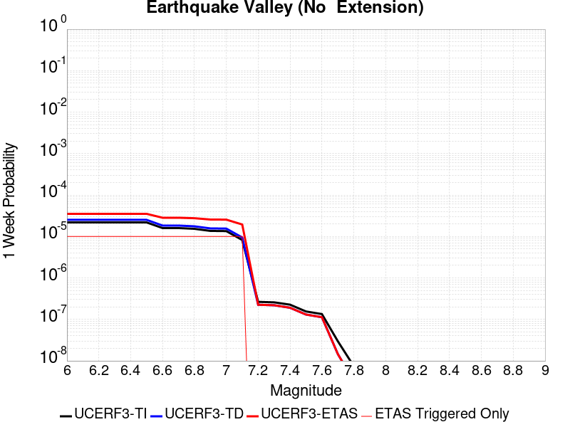 |  |  |  |

| Magnitude | 1 wk TI Prob | 1 wk TD Prob | 1 wk ETAS Prob | 1 wk ETAS/TD Gain | 1 wk ETAS Triggered Only | 1 mo TI Prob | 1 mo TD Prob | 1 mo ETAS Prob | 1 mo ETAS/TD Gain | 1 mo ETAS Triggered Only | 1 yr TI Prob | 1 yr TD Prob | 1 yr ETAS Prob | 1 yr ETAS/TD Gain | 1 yr ETAS Triggered Only | 10 yr TI Prob | 10 yr TD Prob | 10 yr ETAS Prob | 10 yr ETAS/TD Gain | 10 yr ETAS Triggered Only |
|-----|-----|-----|-----|-----|-----|-----|-----|-----|-----|-----|-----|-----|-----|-----|-----|-----|-----|-----|-----|-----|
| 6.0 | 2.1859703E-5 | 2.5198351E-5 | 3.51981E-5 | 1.3968414 | 1.0E-5 | 9.3681076E-5 | 1.0798928E-4 | 1.179882E-4 | 1.0925918 | 1.0E-5 | 0.0011399703 | 0.0013141216 | 0.0013241085 | 1.0075996 | 1.0E-5 | 0.011341401 | 0.013077869 | 0.013087738 | 1.0007546 | 1.0E-5 |
| 6.1 | 2.1859703E-5 | 2.5198351E-5 | 3.51981E-5 | 1.3968414 | 1.0E-5 | 9.3681076E-5 | 1.0798928E-4 | 1.179882E-4 | 1.0925918 | 1.0E-5 | 0.0011399703 | 0.0013141216 | 0.0013241085 | 1.0075996 | 1.0E-5 | 0.011341401 | 0.013077869 | 0.013087738 | 1.0007546 | 1.0E-5 |
| 6.2 | 2.1859703E-5 | 2.5198351E-5 | 3.51981E-5 | 1.3968414 | 1.0E-5 | 9.3681076E-5 | 1.0798928E-4 | 1.179882E-4 | 1.0925918 | 1.0E-5 | 0.0011399703 | 0.0013141216 | 0.0013241085 | 1.0075996 | 1.0E-5 | 0.011341401 | 0.013077869 | 0.013087738 | 1.0007546 | 1.0E-5 |
| 6.3 | 2.1859703E-5 | 2.5198351E-5 | 3.51981E-5 | 1.3968414 | 1.0E-5 | 9.3681076E-5 | 1.0798928E-4 | 1.179882E-4 | 1.0925918 | 1.0E-5 | 0.0011399703 | 0.0013141216 | 0.0013241085 | 1.0075996 | 1.0E-5 | 0.011341401 | 0.013077869 | 0.013087738 | 1.0007546 | 1.0E-5 |
| 6.4 | 2.1859703E-5 | 2.5198351E-5 | 3.51981E-5 | 1.3968414 | 1.0E-5 | 9.3681076E-5 | 1.0798928E-4 | 1.179882E-4 | 1.0925918 | 1.0E-5 | 0.0011399703 | 0.0013141216 | 0.0013241085 | 1.0075996 | 1.0E-5 | 0.011341401 | 0.013077869 | 0.013087738 | 1.0007546 | 1.0E-5 |
| 6.5 | 2.1859703E-5 | 2.5198351E-5 | 3.51981E-5 | 1.3968414 | 1.0E-5 | 9.3681076E-5 | 1.0798928E-4 | 1.179882E-4 | 1.0925918 | 1.0E-5 | 0.0011399703 | 0.0013141216 | 0.0013241085 | 1.0075996 | 1.0E-5 | 0.011341401 | 0.013077869 | 0.013087738 | 1.0007546 | 1.0E-5 |
| 6.6 | 1.597E-5 | 1.835627E-5 | 2.8356086E-5 | 1.544763 | 1.0E-5 | 6.8441055E-5 | 7.866784E-5 | 8.866706E-5 | 1.1271068 | 1.0E-5 | 8.329513E-4 | 9.5744745E-4 | 9.6743787E-4 | 1.0104344 | 1.0E-5 | 0.008298361 | 0.009541833 | 0.009551737 | 1.0010381 | 1.0E-5 |
| 6.7 | 1.597E-5 | 1.835627E-5 | 2.8356086E-5 | 1.544763 | 1.0E-5 | 6.8441055E-5 | 7.866784E-5 | 8.866706E-5 | 1.1271068 | 1.0E-5 | 8.329513E-4 | 9.5744745E-4 | 9.6743787E-4 | 1.0104344 | 1.0E-5 | 0.008298361 | 0.009541833 | 0.009551737 | 1.0010381 | 1.0E-5 |
| 6.8 | 1.5315149E-5 | 1.7602086E-5 | 2.760191E-5 | 1.5681045 | 1.0E-5 | 6.5634704E-5 | 7.543582E-5 | 8.543506E-5 | 1.132553 | 1.0E-5 | 7.988095E-4 | 9.1813074E-4 | 9.2812156E-4 | 1.0108817 | 1.0E-5 | 0.007959441 | 0.009151915 | 0.009161824 | 1.0010827 | 1.0E-5 |
| 6.9 | 1.3634728E-5 | 1.5675814E-5 | 2.5675658E-5 | 1.6379154 | 1.0E-5 | 5.8433237E-5 | 6.7180794E-5 | 7.718013E-5 | 1.1488421 | 1.0E-5 | 7.1119244E-4 | 8.1770134E-4 | 8.2769315E-4 | 1.0122194 | 1.0E-5 | 0.007089207 | 0.008154998 | 0.008164915 | 1.0012163 | 1.0E-5 |
| 7.0 | 1.3496271E-5 | 1.5517848E-5 | 2.5517691E-5 | 1.6444093 | 1.0E-5 | 5.783988E-5 | 6.6503824E-5 | 7.650316E-5 | 1.1503572 | 1.0E-5 | 7.03973E-4 | 8.0946536E-4 | 8.194573E-4 | 1.0123439 | 1.0E-5 | 0.007017471 | 0.008073238 | 0.008083156 | 1.0012287 | 1.0E-5 |
| 7.1 | 8.242798E-6 | 9.472594E-6 | 1.9472498E-5 | 2.0556672 | 1.0E-5 | 3.53258E-5 | 4.0596577E-5 | 5.059617E-5 | 1.2463162 | 1.0E-5 | 4.300067E-4 | 4.9421826E-4 | 5.042133E-4 | 1.020224 | 1.0E-5 | 0.004291756 | 0.0049377684 | 0.004947719 | 1.0020152 | 1.0E-5 |
| 7.2 | 2.6506527E-7 | 2.2559628E-7 | 2.2559628E-7 | 1.0 | 0.0 | 1.1359936E-6 | 9.668408E-7 | 9.668408E-7 | 1.0 | 0.0 | 1.3830633E-5 | 1.1771229E-5 | 1.1771229E-5 | 1.0 | 0.0 | 1.3829772E-4 | 1.1770646E-4 | 1.1770646E-4 | 1.0 | 0.0 |
| 7.3 | 2.5810488E-7 | 2.1954757E-7 | 2.1954757E-7 | 1.0 | 0.0 | 1.1061633E-6 | 9.4091786E-7 | 9.4091786E-7 | 1.0 | 0.0 | 1.3467455E-5 | 1.1455619E-5 | 1.1455619E-5 | 1.0 | 0.0 | 1.3466639E-4 | 1.145507E-4 | 1.145507E-4 | 1.0 | 0.0 |
| 7.4 | 2.2676066E-7 | 1.9109943E-7 | 1.9109943E-7 | 1.0 | 0.0 | 9.71831E-7 | 8.189973E-7 | 8.189973E-7 | 1.0 | 0.0 | 1.1831979E-5 | 9.971251E-6 | 9.971251E-6 | 1.0 | 0.0 | 1.1831349E-4 | 9.970842E-5 | 9.970842E-5 | 1.0 | 0.0 |
| 7.5 | 1.5553917E-7 | 1.311138E-7 | 1.311138E-7 | 1.0 | 0.0 | 6.6659624E-7 | 5.619162E-7 | 5.619162E-7 | 1.0 | 0.0 | 8.115779E-6 | 6.84131E-6 | 6.84131E-6 | 1.0 | 0.0 | 8.115482E-5 | 6.841121E-5 | 6.841121E-5 | 1.0 | 0.0 |
| 7.6 | 1.3448629E-7 | 1.1287708E-7 | 1.1287708E-7 | 1.0 | 0.0 | 5.7636964E-7 | 4.8375887E-7 | 4.8375887E-7 | 1.0 | 0.0 | 7.017278E-6 | 5.8897504E-6 | 5.8897504E-6 | 1.0 | 0.0 | 7.0170565E-5 | 5.8896156E-5 | 5.8896156E-5 | 1.0 | 0.0 |
| 7.7 | 2.9719402E-8 | 1.4581234E-8 | 1.4581234E-8 | 1.0 | 0.0 | 1.2736886E-7 | 6.2491004E-8 | 6.2491004E-8 | 1.0 | 0.0 | 1.5507147E-6 | 7.6082773E-7 | 7.6082773E-7 | 1.0 | 0.0 | 1.550704E-5 | 7.608257E-6 | 7.608257E-6 | 1.0 | 0.0 |
| 7.8 | 7.4390196E-9 | 3.249962E-9 | 3.249962E-9 | 1.0 | 0.0 | 3.1881513E-8 | 1.39284095E-8 | 1.39284095E-8 | 1.0 | 0.0 | 3.8815733E-7 | 1.6957837E-7 | 1.6957837E-7 | 1.0 | 0.0 | 3.8815665E-6 | 1.6957828E-6 | 1.6957828E-6 | 1.0 | 0.0 |
| 7.9 | 1.5373532E-9 | 8.4400953E-10 | 8.4400953E-10 | 1.0 | 0.0 | 6.5886567E-9 | 3.6171839E-9 | 3.6171839E-9 | 1.0 | 0.0 | 8.021689E-8 | 4.403921E-8 | 4.403921E-8 | 1.0 | 0.0 | 8.0216864E-7 | 4.403921E-7 | 4.403921E-7 | 1.0 | 0.0 |

## Newport-Inglewood alt 1
*[(top)](#table-of-contents)*

| 1 Week | 1 Month | 1 Year | 10 Year |
|-----|-----|-----|-----|
|  |  | 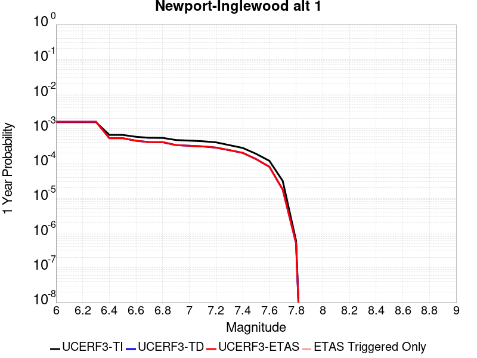 |  |

| Magnitude | 1 wk TI Prob | 1 wk TD Prob | 1 wk ETAS Prob | 1 wk ETAS/TD Gain | 1 wk ETAS Triggered Only | 1 mo TI Prob | 1 mo TD Prob | 1 mo ETAS Prob | 1 mo ETAS/TD Gain | 1 mo ETAS Triggered Only | 1 yr TI Prob | 1 yr TD Prob | 1 yr ETAS Prob | 1 yr ETAS/TD Gain | 1 yr ETAS Triggered Only | 10 yr TI Prob | 10 yr TD Prob | 10 yr ETAS Prob | 10 yr ETAS/TD Gain | 10 yr ETAS Triggered Only |
|-----|-----|-----|-----|-----|-----|-----|-----|-----|-----|-----|-----|-----|-----|-----|-----|-----|-----|-----|-----|-----|
| 6.0 | 2.9668912E-5 | 3.0404828E-5 | 3.0404828E-5 | 1.0 | 0.0 | 1.2714628E-4 | 1.3030265E-4 | 1.3030265E-4 | 1.0 | 0.0 | 0.0015469068 | 0.0015857654 | 0.0015857654 | 1.0 | 0.0 | 0.015361829 | 0.01579211 | 0.015801951 | 1.0006232 | 1.0E-5 |
| 6.1 | 2.9668912E-5 | 3.0404828E-5 | 3.0404828E-5 | 1.0 | 0.0 | 1.2714628E-4 | 1.3030265E-4 | 1.3030265E-4 | 1.0 | 0.0 | 0.0015469068 | 0.0015857654 | 0.0015857654 | 1.0 | 0.0 | 0.015361829 | 0.01579211 | 0.015801951 | 1.0006232 | 1.0E-5 |
| 6.2 | 2.9668912E-5 | 3.0404828E-5 | 3.0404828E-5 | 1.0 | 0.0 | 1.2714628E-4 | 1.3030265E-4 | 1.3030265E-4 | 1.0 | 0.0 | 0.0015469068 | 0.0015857654 | 0.0015857654 | 1.0 | 0.0 | 0.015361829 | 0.01579211 | 0.015801951 | 1.0006232 | 1.0E-5 |
| 6.3 | 2.9668912E-5 | 3.0404828E-5 | 3.0404828E-5 | 1.0 | 0.0 | 1.2714628E-4 | 1.3030265E-4 | 1.3030265E-4 | 1.0 | 0.0 | 0.0015469068 | 0.0015857654 | 0.0015857654 | 1.0 | 0.0 | 0.015361829 | 0.01579211 | 0.015801951 | 1.0006232 | 1.0E-5 |
| 6.4 | 1.275942E-5 | 1.02725335E-5 | 1.02725335E-5 | 1.0 | 0.0 | 5.4682085E-5 | 4.4024422E-5 | 4.4024422E-5 | 1.0 | 0.0 | 6.65551E-4 | 5.358697E-4 | 5.358697E-4 | 1.0 | 0.0 | 0.0066356123 | 0.0053462 | 0.0053462 | 1.0 | 0.0 |
| 6.5 | 1.275942E-5 | 1.02725335E-5 | 1.02725335E-5 | 1.0 | 0.0 | 5.4682085E-5 | 4.4024422E-5 | 4.4024422E-5 | 1.0 | 0.0 | 6.65551E-4 | 5.358697E-4 | 5.358697E-4 | 1.0 | 0.0 | 0.0066356123 | 0.0053462 | 0.0053462 | 1.0 | 0.0 |
| 6.6 | 1.1255358E-5 | 8.661911E-6 | 8.661911E-6 | 1.0 | 0.0 | 4.8236358E-5 | 3.7121958E-5 | 3.7121958E-5 | 1.0 | 0.0 | 5.871194E-4 | 4.5186782E-4 | 4.5186782E-4 | 1.0 | 0.0 | 0.005855706 | 0.0045096674 | 0.0045096674 | 1.0 | 0.0 |
| 6.7 | 1.0504745E-5 | 7.8998455E-6 | 7.8998455E-6 | 1.0 | 0.0 | 4.5019555E-5 | 3.385605E-5 | 3.385605E-5 | 1.0 | 0.0 | 5.4797524E-4 | 4.121207E-4 | 4.121207E-4 | 1.0 | 0.0 | 0.0054662596 | 0.004113694 | 0.004113694 | 1.0 | 0.0 |
| 6.8 | 1.0476007E-5 | 7.881227E-6 | 7.881227E-6 | 1.0 | 0.0 | 4.4896402E-5 | 3.3776258E-5 | 3.3776258E-5 | 1.0 | 0.0 | 5.464766E-4 | 4.1114958E-4 | 4.1114958E-4 | 1.0 | 0.0 | 0.005451347 | 0.004104019 | 0.004104019 | 1.0 | 0.0 |
| 6.9 | 9.076797E-6 | 6.4896567E-6 | 6.4896567E-6 | 1.0 | 0.0 | 3.889998E-5 | 2.7812519E-5 | 2.7812519E-5 | 1.0 | 0.0 | 4.7350433E-4 | 3.3856515E-4 | 3.3856515E-4 | 1.0 | 0.0 | 0.004724967 | 0.003380531 | 0.003380531 | 1.0 | 0.0 |
| 7.0 | 8.73795E-6 | 6.2120503E-6 | 6.2120503E-6 | 1.0 | 0.0 | 3.7447822E-5 | 2.6622802E-5 | 2.6622802E-5 | 1.0 | 0.0 | 4.5583185E-4 | 3.2408469E-4 | 3.2408469E-4 | 1.0 | 0.0 | 0.0045489795 | 0.0032361522 | 0.0032361522 | 1.0 | 0.0 |
| 7.1 | 8.391299E-6 | 5.9557533E-6 | 5.9557533E-6 | 1.0 | 0.0 | 3.5962214E-5 | 2.5524409E-5 | 2.5524409E-5 | 1.0 | 0.0 | 4.37752E-4 | 3.1071564E-4 | 3.1071564E-4 | 1.0 | 0.0 | 0.004368907 | 0.0031028416 | 0.0031028416 | 1.0 | 0.0 |
| 7.2 | 7.796882E-6 | 5.4964826E-6 | 5.4964826E-6 | 1.0 | 0.0 | 3.341478E-5 | 2.3556144E-5 | 2.3556144E-5 | 1.0 | 0.0 | 4.06749E-4 | 2.867585E-4 | 2.867585E-4 | 1.0 | 0.0 | 0.0040600533 | 0.002863909 | 0.002863909 | 1.0 | 0.0 |
| 7.3 | 6.4738833E-6 | 4.6477753E-6 | 4.6477753E-6 | 1.0 | 0.0 | 2.774492E-5 | 1.9918885E-5 | 1.9918885E-5 | 1.0 | 0.0 | 3.3774204E-4 | 2.424856E-4 | 2.424856E-4 | 1.0 | 0.0 | 0.0033722918 | 0.0024222268 | 0.0024222268 | 1.0 | 0.0 |
| 7.4 | 5.382145E-6 | 3.8857215E-6 | 3.8857215E-6 | 1.0 | 0.0 | 2.3066134E-5 | 1.6652988E-5 | 1.6652988E-5 | 1.0 | 0.0 | 2.8079396E-4 | 2.0273139E-4 | 2.0273139E-4 | 1.0 | 0.0 | 0.0028043943 | 0.002025479 | 0.002025479 | 1.0 | 0.0 |
| 7.5 | 3.648244E-6 | 2.5737634E-6 | 2.5737634E-6 | 1.0 | 0.0 | 1.5635238E-5 | 1.1030369E-5 | 1.1030369E-5 | 1.0 | 0.0 | 1.9034238E-4 | 1.3428657E-4 | 1.3428657E-4 | 1.0 | 0.0 | 0.0019017943 | 0.0013420646 | 0.0013420646 | 1.0 | 0.0 |
| 7.6 | 2.2906888E-6 | 1.547986E-6 | 1.547986E-6 | 1.0 | 0.0 | 9.817201E-6 | 6.634209E-6 | 6.634209E-6 | 1.0 | 0.0 | 1.1951787E-4 | 8.076857E-5 | 8.076857E-5 | 1.0 | 0.0 | 0.0011945361 | 8.073989E-4 | 8.073989E-4 | 1.0 | 0.0 |
| 7.7 | 6.0479874E-7 | 3.397468E-7 | 3.397468E-7 | 1.0 | 0.0 | 2.5919921E-6 | 1.456057E-6 | 1.456057E-6 | 1.0 | 0.0 | 3.1557047E-5 | 1.7727363E-5 | 1.7727363E-5 | 1.0 | 0.0 | 3.1552566E-4 | 1.7726087E-4 | 1.7726087E-4 | 1.0 | 0.0 |
| 7.8 | 1.16056995E-8 | 9.782997E-9 | 9.782997E-9 | 1.0 | 0.0 | 4.9738713E-8 | 4.1927127E-8 | 4.1927127E-8 | 1.0 | 0.0 | 6.0556863E-7 | 5.1046277E-7 | 5.1046277E-7 | 1.0 | 0.0 | 6.05567E-6 | 5.1046277E-6 | 5.1046277E-6 | 1.0 | 0.0 |

## Carlsbad
*[(top)](#table-of-contents)*

| 1 Week | 1 Month | 1 Year | 10 Year |
|-----|-----|-----|-----|
| 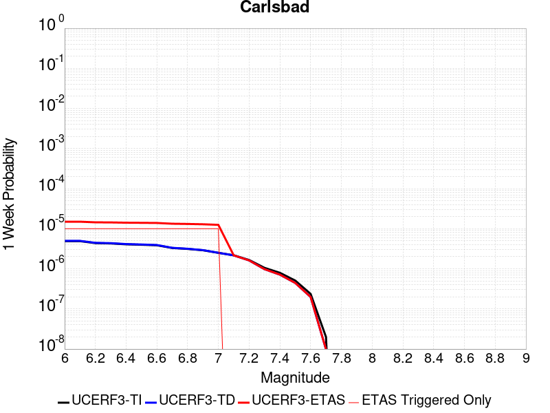 | 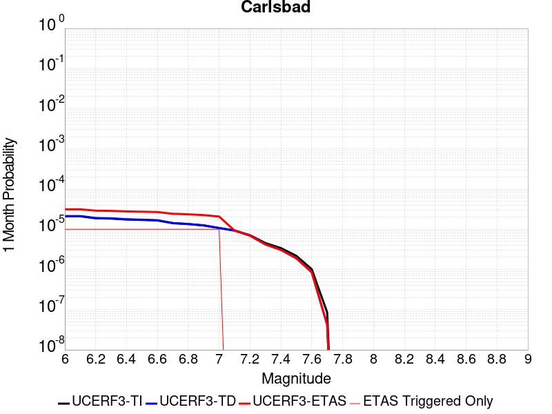 | 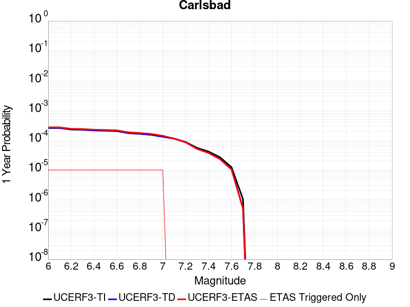 | 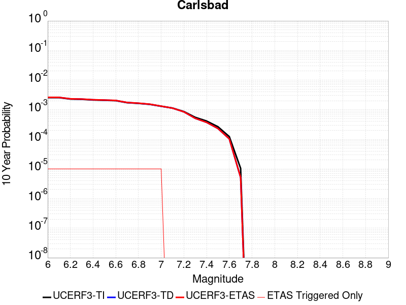 |

| Magnitude | 1 wk TI Prob | 1 wk TD Prob | 1 wk ETAS Prob | 1 wk ETAS/TD Gain | 1 wk ETAS Triggered Only | 1 mo TI Prob | 1 mo TD Prob | 1 mo ETAS Prob | 1 mo ETAS/TD Gain | 1 mo ETAS Triggered Only | 1 yr TI Prob | 1 yr TD Prob | 1 yr ETAS Prob | 1 yr ETAS/TD Gain | 1 yr ETAS Triggered Only | 10 yr TI Prob | 10 yr TD Prob | 10 yr ETAS Prob | 10 yr ETAS/TD Gain | 10 yr ETAS Triggered Only |
|-----|-----|-----|-----|-----|-----|-----|-----|-----|-----|-----|-----|-----|-----|-----|-----|-----|-----|-----|-----|-----|
| 6.0 | 4.9038536E-6 | 4.9872688E-6 | 1.4987219E-5 | 3.0050955 | 1.0E-5 | 2.1016345E-5 | 2.1373837E-5 | 3.1373624E-5 | 1.4678518 | 1.0E-5 | 2.5584397E-4 | 2.6019584E-4 | 2.7019324E-4 | 1.0384226 | 1.0E-5 | 0.002555496 | 0.002598959 | 0.002608933 | 1.0038377 | 1.0E-5 |
| 6.1 | 4.9038536E-6 | 4.9872688E-6 | 1.4987219E-5 | 3.0050955 | 1.0E-5 | 2.1016345E-5 | 2.1373837E-5 | 3.1373624E-5 | 1.4678518 | 1.0E-5 | 2.5584397E-4 | 2.6019584E-4 | 2.7019324E-4 | 1.0384226 | 1.0E-5 | 0.002555496 | 0.002598959 | 0.002608933 | 1.0038377 | 1.0E-5 |
| 6.2 | 4.3820614E-6 | 4.4547814E-6 | 1.4454737E-5 | 3.244769 | 1.0E-5 | 1.8780129E-5 | 1.9091782E-5 | 2.909159E-5 | 1.5237756 | 1.0E-5 | 2.2862408E-4 | 2.3241801E-4 | 2.4241568E-4 | 1.043016 | 1.0E-5 | 0.00228389 | 0.002321785 | 0.0023317619 | 1.004297 | 1.0E-5 |
| 6.3 | 4.302872E-6 | 4.373019E-6 | 1.4372975E-5 | 3.2867398 | 1.0E-5 | 1.8440749E-5 | 1.8741377E-5 | 2.874119E-5 | 1.5335687 | 1.0E-5 | 2.24493E-4 | 2.2815271E-4 | 2.3815043E-4 | 1.0438203 | 1.0E-5 | 0.0022426634 | 0.0022792201 | 0.0022891972 | 1.0043775 | 1.0E-5 |
| 6.4 | 4.0835243E-6 | 4.147667E-6 | 1.4147626E-5 | 3.410984 | 1.0E-5 | 1.75007E-5 | 1.7775597E-5 | 2.7775419E-5 | 1.562559 | 1.0E-5 | 2.1305021E-4 | 2.1639673E-4 | 2.2639456E-4 | 1.0462015 | 1.0E-5 | 0.0021284607 | 0.0021618942 | 0.0021718726 | 1.0046155 | 1.0E-5 |
| 6.5 | 3.987806E-6 | 4.048899E-6 | 1.4048858E-5 | 3.4697971 | 1.0E-5 | 1.7090486E-5 | 1.7352311E-5 | 2.7352138E-5 | 1.5762821 | 1.0E-5 | 2.080568E-4 | 2.1124425E-4 | 2.2124212E-4 | 1.0473286 | 1.0E-5 | 0.002078621 | 0.0021104682 | 0.002120447 | 1.0047283 | 1.0E-5 |
| 6.6 | 3.8707576E-6 | 3.927501E-6 | 1.3927462E-5 | 3.5461383 | 1.0E-5 | 1.6588854E-5 | 1.683204E-5 | 2.683187E-5 | 1.5940951 | 1.0E-5 | 2.0195059E-4 | 2.0491115E-4 | 2.149091E-4 | 1.0487916 | 1.0E-5 | 0.0020176715 | 0.0020472556 | 0.0020572352 | 1.0048746 | 1.0E-5 |
| 6.7 | 3.3093434E-6 | 3.3424044E-6 | 1.3342371E-5 | 3.9918482 | 1.0E-5 | 1.4182823E-5 | 1.4324512E-5 | 2.4324368E-5 | 1.698094 | 1.0E-5 | 1.7266218E-4 | 1.7438704E-4 | 1.843853E-4 | 1.0573337 | 1.0E-5 | 0.001725281 | 0.001742508 | 0.0017524905 | 1.0057288 | 1.0E-5 |
| 6.8 | 3.136983E-6 | 3.1664663E-6 | 1.3166435E-5 | 4.1580844 | 1.0E-5 | 1.3444143E-5 | 1.35704995E-5 | 2.3570365E-5 | 1.7368826 | 1.0E-5 | 1.6367015E-4 | 1.6520836E-4 | 1.752067E-4 | 1.0605196 | 1.0E-5 | 0.0016354966 | 0.0016508611 | 0.0016608447 | 1.0060475 | 1.0E-5 |
| 6.9 | 2.9056644E-6 | 2.9267715E-6 | 1.2926742E-5 | 4.416724 | 1.0E-5 | 1.2452788E-5 | 1.2543246E-5 | 2.2543121E-5 | 1.7972318 | 1.0E-5 | 1.5160214E-4 | 1.5270336E-4 | 1.6270184E-4 | 1.0654764 | 1.0E-5 | 0.0015149876 | 0.0015259896 | 0.0015359744 | 1.0065432 | 1.0E-5 |
| 7.0 | 2.5071035E-6 | 2.51141E-6 | 1.2511385E-5 | 4.981817 | 1.0E-5 | 1.0744685E-5 | 1.0763142E-5 | 2.0763035E-5 | 1.9290868 | 1.0E-5 | 1.308087E-4 | 1.310334E-4 | 1.4103208E-4 | 1.0763065 | 1.0E-5 | 0.0013073172 | 0.0013095647 | 0.0013195515 | 1.0076262 | 1.0E-5 |
| 7.1 | 2.1786877E-6 | 2.1678952E-6 | 2.1678952E-6 | 1.0 | 0.0 | 9.3372E-6 | 9.290947E-6 | 9.290947E-6 | 1.0 | 0.0 | 1.13674476E-4 | 1.13111426E-4 | 1.13111426E-4 | 1.0 | 0.0 | 0.0011361635 | 0.0011305414 | 0.0011305414 | 1.0 | 0.0 |
| 7.2 | 1.6628418E-6 | 1.6213987E-6 | 1.6213987E-6 | 1.0 | 0.0 | 7.1264453E-6 | 6.9488333E-6 | 6.9488333E-6 | 1.0 | 0.0 | 8.676102E-5 | 8.459878E-5 | 8.459878E-5 | 1.0 | 0.0 | 8.672715E-4 | 8.4566796E-4 | 8.4566796E-4 | 1.0 | 0.0 |
| 7.3 | 1.0595926E-6 | 9.816912E-7 | 9.816912E-7 | 1.0 | 0.0 | 4.541103E-6 | 4.207241E-6 | 4.207241E-6 | 1.0 | 0.0 | 5.5286528E-5 | 5.1221967E-5 | 5.1221967E-5 | 1.0 | 0.0 | 5.527277E-4 | 5.121025E-4 | 5.121025E-4 | 1.0 | 0.0 |
| 7.4 | 7.956623E-7 | 7.173889E-7 | 7.173889E-7 | 1.0 | 0.0 | 3.4099767E-6 | 3.0745202E-6 | 3.0745202E-6 | 1.0 | 0.0 | 4.1515676E-5 | 3.7431648E-5 | 3.7431648E-5 | 1.0 | 0.0 | 4.150792E-4 | 3.7425413E-4 | 3.7425413E-4 | 1.0 | 0.0 |
| 7.5 | 5.1043804E-7 | 4.448447E-7 | 4.448447E-7 | 1.0 | 0.0 | 2.1875896E-6 | 1.9064759E-6 | 1.9064759E-6 | 1.0 | 0.0 | 2.663358E-5 | 2.3211102E-5 | 2.3211102E-5 | 1.0 | 0.0 | 2.6630386E-4 | 2.3208735E-4 | 2.3208735E-4 | 1.0 | 0.0 |
| 7.6 | 2.3723294E-7 | 1.9896439E-7 | 1.9896439E-7 | 1.0 | 0.0 | 1.0167122E-6 | 8.527042E-7 | 8.527042E-7 | 1.0 | 0.0 | 1.2378401E-5 | 1.0381627E-5 | 1.0381627E-5 | 1.0 | 0.0 | 1.237771E-4 | 1.038117E-4 | 1.038117E-4 | 1.0 | 0.0 |
| 7.7 | 1.9992152E-8 | 9.860285E-9 | 9.860285E-9 | 1.0 | 0.0 | 8.568065E-8 | 4.2258364E-8 | 4.2258364E-8 | 1.0 | 0.0 | 1.0431614E-6 | 5.144956E-7 | 5.144956E-7 | 1.0 | 0.0 | 1.0431565E-5 | 5.144956E-6 | 5.144956E-6 | 1.0 | 0.0 |

## Thirty Mile Bank
*[(top)](#table-of-contents)*

| 1 Week | 1 Month | 1 Year | 10 Year |
|-----|-----|-----|-----|
| 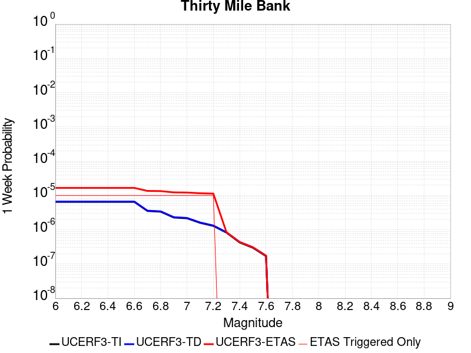 | 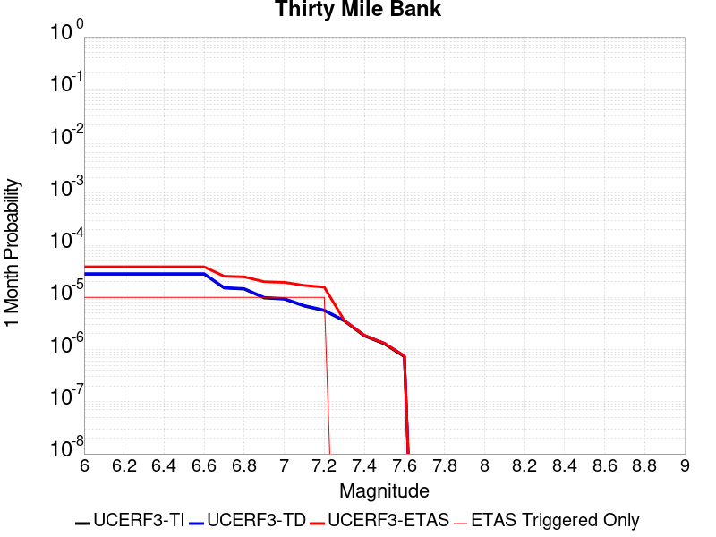 | 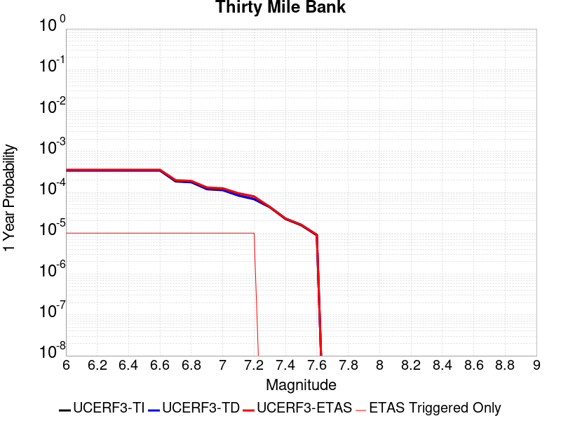 | 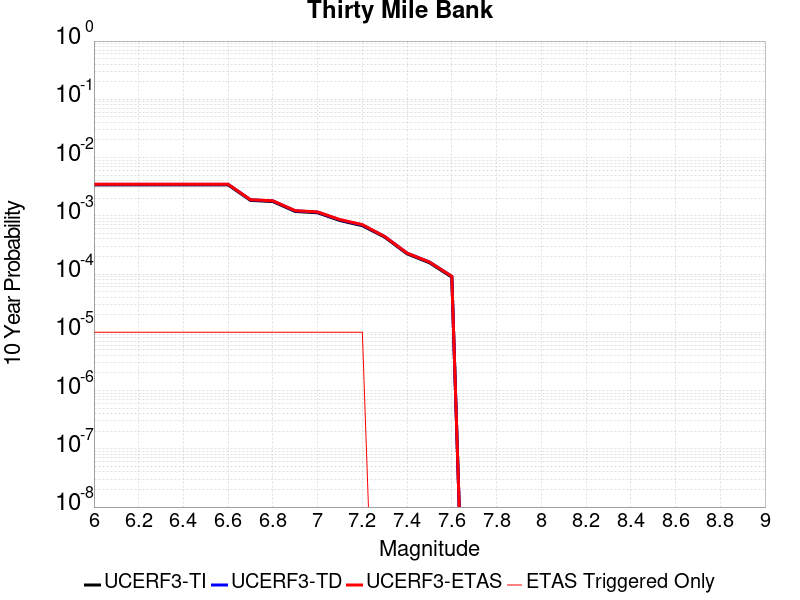 |

| Magnitude | 1 wk TI Prob | 1 wk TD Prob | 1 wk ETAS Prob | 1 wk ETAS/TD Gain | 1 wk ETAS Triggered Only | 1 mo TI Prob | 1 mo TD Prob | 1 mo ETAS Prob | 1 mo ETAS/TD Gain | 1 mo ETAS Triggered Only | 1 yr TI Prob | 1 yr TD Prob | 1 yr ETAS Prob | 1 yr ETAS/TD Gain | 1 yr ETAS Triggered Only | 10 yr TI Prob | 10 yr TD Prob | 10 yr ETAS Prob | 10 yr ETAS/TD Gain | 10 yr ETAS Triggered Only |
|-----|-----|-----|-----|-----|-----|-----|-----|-----|-----|-----|-----|-----|-----|-----|-----|-----|-----|-----|-----|-----|
| 6.0 | 6.5124755E-6 | 6.6592643E-6 | 1.6659198E-5 | 2.5016575 | 1.0E-5 | 2.791031E-5 | 2.8539416E-5 | 3.8539132E-5 | 1.3503826 | 1.0E-5 | 3.3975503E-4 | 3.4741635E-4 | 3.5741288E-4 | 1.0287739 | 1.0E-5 | 0.0033923604 | 0.003469164 | 0.0034791294 | 1.0028726 | 1.0E-5 |
| 6.1 | 6.5124755E-6 | 6.6592643E-6 | 1.6659198E-5 | 2.5016575 | 1.0E-5 | 2.791031E-5 | 2.8539416E-5 | 3.8539132E-5 | 1.3503826 | 1.0E-5 | 3.3975503E-4 | 3.4741635E-4 | 3.5741288E-4 | 1.0287739 | 1.0E-5 | 0.0033923604 | 0.003469164 | 0.0034791294 | 1.0028726 | 1.0E-5 |
| 6.2 | 6.5124755E-6 | 6.6592643E-6 | 1.6659198E-5 | 2.5016575 | 1.0E-5 | 2.791031E-5 | 2.8539416E-5 | 3.8539132E-5 | 1.3503826 | 1.0E-5 | 3.3975503E-4 | 3.4741635E-4 | 3.5741288E-4 | 1.0287739 | 1.0E-5 | 0.0033923604 | 0.003469164 | 0.0034791294 | 1.0028726 | 1.0E-5 |
| 6.3 | 6.5124755E-6 | 6.6592643E-6 | 1.6659198E-5 | 2.5016575 | 1.0E-5 | 2.791031E-5 | 2.8539416E-5 | 3.8539132E-5 | 1.3503826 | 1.0E-5 | 3.3975503E-4 | 3.4741635E-4 | 3.5741288E-4 | 1.0287739 | 1.0E-5 | 0.0033923604 | 0.003469164 | 0.0034791294 | 1.0028726 | 1.0E-5 |
| 6.4 | 6.5124755E-6 | 6.6592643E-6 | 1.6659198E-5 | 2.5016575 | 1.0E-5 | 2.791031E-5 | 2.8539416E-5 | 3.8539132E-5 | 1.3503826 | 1.0E-5 | 3.3975503E-4 | 3.4741635E-4 | 3.5741288E-4 | 1.0287739 | 1.0E-5 | 0.0033923604 | 0.003469164 | 0.0034791294 | 1.0028726 | 1.0E-5 |
| 6.5 | 6.5124755E-6 | 6.6592643E-6 | 1.6659198E-5 | 2.5016575 | 1.0E-5 | 2.791031E-5 | 2.8539416E-5 | 3.8539132E-5 | 1.3503826 | 1.0E-5 | 3.3975503E-4 | 3.4741635E-4 | 3.5741288E-4 | 1.0287739 | 1.0E-5 | 0.0033923604 | 0.003469164 | 0.0034791294 | 1.0028726 | 1.0E-5 |
| 6.6 | 6.5124755E-6 | 6.6592643E-6 | 1.6659198E-5 | 2.5016575 | 1.0E-5 | 2.791031E-5 | 2.8539416E-5 | 3.8539132E-5 | 1.3503826 | 1.0E-5 | 3.3975503E-4 | 3.4741635E-4 | 3.5741288E-4 | 1.0287739 | 1.0E-5 | 0.0033923604 | 0.003469164 | 0.0034791294 | 1.0028726 | 1.0E-5 |
| 6.7 | 3.5261137E-6 | 3.6098995E-6 | 1.3609863E-5 | 3.7701502 | 1.0E-5 | 1.5111828E-5 | 1.547091E-5 | 2.5470756E-5 | 1.6463643 | 1.0E-5 | 1.8397097E-4 | 1.883427E-4 | 1.9834083E-4 | 1.0530847 | 1.0E-5 | 0.0018381875 | 0.0018818958 | 0.001891877 | 1.0053037 | 1.0E-5 |
| 6.8 | 3.370743E-6 | 3.4509355E-6 | 1.3450901E-5 | 3.897755 | 1.0E-5 | 1.4445961E-5 | 1.47896435E-5 | 2.4789495E-5 | 1.6761389 | 1.0E-5 | 1.7586538E-4 | 1.8004965E-4 | 1.9004785E-4 | 1.0555302 | 1.0E-5 | 0.0017572626 | 0.0017990996 | 0.0018090816 | 1.0055484 | 1.0E-5 |
| 6.9 | 2.2756835E-6 | 2.333161E-6 | 1.2333137E-5 | 5.2860208 | 1.0E-5 | 9.752893E-6 | 9.999225E-6 | 1.9999125E-5 | 2.0000675 | 1.0E-5 | 1.18735006E-4 | 1.2173401E-4 | 1.317328E-4 | 1.0821363 | 1.0E-5 | 0.0011867158 | 0.0012166979 | 0.0012266857 | 1.008209 | 1.0E-5 |
| 7.0 | 2.1617404E-6 | 2.21598E-6 | 1.2215958E-5 | 5.512666 | 1.0E-5 | 9.264569E-6 | 9.497024E-6 | 1.9496929E-5 | 2.0529513 | 1.0E-5 | 1.1279029E-4 | 1.1562037E-4 | 1.2561922E-4 | 1.0864799 | 1.0E-5 | 0.0011273306 | 0.0011556263 | 0.0011656147 | 1.0086433 | 1.0E-5 |
| 7.1 | 1.5900777E-6 | 1.6327014E-6 | 1.1632685E-5 | 7.124809 | 1.0E-5 | 6.814601E-6 | 6.997274E-6 | 1.6997205E-5 | 2.4291182 | 1.0E-5 | 8.296461E-5 | 8.518861E-5 | 9.518775E-5 | 1.1173766 | 1.0E-5 | 8.293364E-4 | 8.5157226E-4 | 8.615638E-4 | 1.0117329 | 1.0E-5 |
| 7.2 | 1.2971728E-6 | 1.3328992E-6 | 1.1332886E-5 | 8.502433 | 1.0E-5 | 5.5593005E-6 | 5.712413E-6 | 1.5712356E-5 | 2.7505636 | 1.0E-5 | 6.768238E-5 | 6.954651E-5 | 7.954582E-5 | 1.1437787 | 1.0E-5 | 6.7661767E-4 | 6.952578E-4 | 7.052509E-4 | 1.0143732 | 1.0E-5 |
| 7.3 | 8.2454284E-7 | 8.448891E-7 | 8.448891E-7 | 1.0 | 0.0 | 3.5337503E-6 | 3.6209485E-6 | 3.6209485E-6 | 1.0 | 0.0 | 4.302256E-5 | 4.408422E-5 | 4.408422E-5 | 1.0 | 0.0 | 4.301423E-4 | 4.4076078E-4 | 4.4076078E-4 | 1.0 | 0.0 |
| 7.4 | 4.2619024E-7 | 4.3863466E-7 | 4.3863466E-7 | 1.0 | 0.0 | 1.8265283E-6 | 1.8798615E-6 | 1.8798615E-6 | 1.0 | 0.0 | 2.2237757E-5 | 2.2887078E-5 | 2.2887078E-5 | 1.0 | 0.0 | 2.223553E-4 | 2.288476E-4 | 2.288476E-4 | 1.0 | 0.0 |
| 7.5 | 2.993922E-7 | 3.086453E-7 | 3.086453E-7 | 1.0 | 0.0 | 1.2831089E-6 | 1.3227649E-6 | 1.3227649E-6 | 1.0 | 0.0 | 1.5621737E-5 | 1.6104546E-5 | 1.6104546E-5 | 1.0 | 0.0 | 1.562064E-4 | 1.6103406E-4 | 1.6103406E-4 | 1.0 | 0.0 |
| 7.6 | 1.6988751E-7 | 1.7533823E-7 | 1.7533823E-7 | 1.0 | 0.0 | 7.2808916E-7 | 7.5144936E-7 | 7.5144936E-7 | 1.0 | 0.0 | 8.864449E-6 | 9.14886E-6 | 9.14886E-6 | 1.0 | 0.0 | 8.8640954E-5 | 9.1485024E-5 | 9.1485024E-5 | 1.0 | 0.0 |

## Verdugo
*[(top)](#table-of-contents)*

| 1 Week | 1 Month | 1 Year | 10 Year |
|-----|-----|-----|-----|
|  |  | 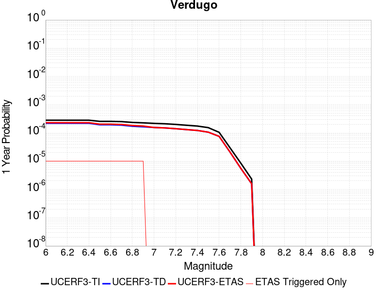 |  |

| Magnitude | 1 wk TI Prob | 1 wk TD Prob | 1 wk ETAS Prob | 1 wk ETAS/TD Gain | 1 wk ETAS Triggered Only | 1 mo TI Prob | 1 mo TD Prob | 1 mo ETAS Prob | 1 mo ETAS/TD Gain | 1 mo ETAS Triggered Only | 1 yr TI Prob | 1 yr TD Prob | 1 yr ETAS Prob | 1 yr ETAS/TD Gain | 1 yr ETAS Triggered Only | 10 yr TI Prob | 10 yr TD Prob | 10 yr ETAS Prob | 10 yr ETAS/TD Gain | 10 yr ETAS Triggered Only |
|-----|-----|-----|-----|-----|-----|-----|-----|-----|-----|-----|-----|-----|-----|-----|-----|-----|-----|-----|-----|-----|
| 6.0 | 5.392987E-6 | 4.2164934E-6 | 1.4216451E-5 | 3.371629 | 1.0E-5 | 2.3112598E-5 | 1.8070563E-5 | 2.8070383E-5 | 1.5533762 | 1.0E-5 | 2.8135953E-4 | 2.1998737E-4 | 2.2998518E-4 | 1.0454471 | 1.0E-5 | 0.0028100356 | 0.0021977439 | 0.0022077218 | 1.0045401 | 1.0E-5 |
| 6.1 | 5.392987E-6 | 4.2164934E-6 | 1.4216451E-5 | 3.371629 | 1.0E-5 | 2.3112598E-5 | 1.8070563E-5 | 2.8070383E-5 | 1.5533762 | 1.0E-5 | 2.8135953E-4 | 2.1998737E-4 | 2.2998518E-4 | 1.0454471 | 1.0E-5 | 0.0028100356 | 0.0021977439 | 0.0022077218 | 1.0045401 | 1.0E-5 |
| 6.2 | 5.392987E-6 | 4.2164934E-6 | 1.4216451E-5 | 3.371629 | 1.0E-5 | 2.3112598E-5 | 1.8070563E-5 | 2.8070383E-5 | 1.5533762 | 1.0E-5 | 2.8135953E-4 | 2.1998737E-4 | 2.2998518E-4 | 1.0454471 | 1.0E-5 | 0.0028100356 | 0.0021977439 | 0.0022077218 | 1.0045401 | 1.0E-5 |
| 6.3 | 5.392987E-6 | 4.2164934E-6 | 1.4216451E-5 | 3.371629 | 1.0E-5 | 2.3112598E-5 | 1.8070563E-5 | 2.8070383E-5 | 1.5533762 | 1.0E-5 | 2.8135953E-4 | 2.1998737E-4 | 2.2998518E-4 | 1.0454471 | 1.0E-5 | 0.0028100356 | 0.0021977439 | 0.0022077218 | 1.0045401 | 1.0E-5 |
| 6.4 | 5.392987E-6 | 4.2164934E-6 | 1.4216451E-5 | 3.371629 | 1.0E-5 | 2.3112598E-5 | 1.8070563E-5 | 2.8070383E-5 | 1.5533762 | 1.0E-5 | 2.8135953E-4 | 2.1998737E-4 | 2.2998518E-4 | 1.0454471 | 1.0E-5 | 0.0028100356 | 0.0021977439 | 0.0022077218 | 1.0045401 | 1.0E-5 |
| 6.5 | 4.9154837E-6 | 3.7224413E-6 | 1.3722404E-5 | 3.686399 | 1.0E-5 | 2.1066187E-5 | 1.5953223E-5 | 2.5953064E-5 | 1.6268226 | 1.0E-5 | 2.5645064E-4 | 1.9421338E-4 | 2.0421145E-4 | 1.0514797 | 1.0E-5 | 0.002561549 | 0.0019404575 | 0.001950438 | 1.0051434 | 1.0E-5 |
| 6.6 | 4.9154837E-6 | 3.7224413E-6 | 1.3722404E-5 | 3.686399 | 1.0E-5 | 2.1066187E-5 | 1.5953223E-5 | 2.5953064E-5 | 1.6268226 | 1.0E-5 | 2.5645064E-4 | 1.9421338E-4 | 2.0421145E-4 | 1.0514797 | 1.0E-5 | 0.002561549 | 0.0019404575 | 0.001950438 | 1.0051434 | 1.0E-5 |
| 6.7 | 4.817006E-6 | 3.620628E-6 | 1.3620592E-5 | 3.761942 | 1.0E-5 | 2.0644147E-5 | 1.5516885E-5 | 2.551673E-5 | 1.6444492 | 1.0E-5 | 2.513135E-4 | 1.889019E-4 | 1.9890002E-4 | 1.0529275 | 1.0E-5 | 0.0025102948 | 0.0018874329 | 0.0018974141 | 1.0052882 | 1.0E-5 |
| 6.8 | 4.507407E-6 | 3.3070805E-6 | 1.3307047E-5 | 4.023805 | 1.0E-5 | 1.9317316E-5 | 1.4173126E-5 | 2.4172985E-5 | 1.7055507 | 1.0E-5 | 2.3516294E-4 | 1.7254429E-4 | 1.8254256E-4 | 1.0579461 | 1.0E-5 | 0.0023491425 | 0.0017241176 | 0.0017341003 | 1.0057901 | 1.0E-5 |
| 6.9 | 4.3573054E-6 | 3.1609877E-6 | 1.3160956E-5 | 4.163558 | 1.0E-5 | 1.8674033E-5 | 1.354702E-5 | 2.3546885E-5 | 1.7381597 | 1.0E-5 | 2.2733262E-4 | 1.649226E-4 | 1.7492096E-4 | 1.0606245 | 1.0E-5 | 0.0022710022 | 0.0016480145 | 0.0016579981 | 1.0060579 | 1.0E-5 |
| 7.0 | 4.171527E-6 | 2.9836467E-6 | 2.9836467E-6 | 1.0 | 0.0 | 1.787785E-5 | 1.2786995E-5 | 1.2786995E-5 | 1.0 | 0.0 | 2.1764109E-4 | 1.5567066E-4 | 1.5567066E-4 | 1.0 | 0.0 | 0.0021742806 | 0.0015556274 | 0.0015556274 | 1.0 | 0.0 |
| 7.1 | 4.0405484E-6 | 2.882238E-6 | 2.882238E-6 | 1.0 | 0.0 | 1.731652E-5 | 1.23523905E-5 | 1.23523905E-5 | 1.0 | 0.0 | 2.1080824E-4 | 1.5038009E-4 | 1.5038009E-4 | 1.0 | 0.0 | 0.0021060838 | 0.0015027943 | 0.0015027943 | 1.0 | 0.0 |
| 7.2 | 3.8306007E-6 | 2.701823E-6 | 2.701823E-6 | 1.0 | 0.0 | 1.6416758E-5 | 1.157919E-5 | 1.157919E-5 | 1.0 | 0.0 | 1.9985568E-4 | 1.4096762E-4 | 1.4096762E-4 | 1.0 | 0.0 | 0.0019967605 | 0.0014087928 | 0.0014087928 | 1.0 | 0.0 |
| 7.3 | 3.5750938E-6 | 2.512154E-6 | 2.512154E-6 | 1.0 | 0.0 | 1.532174E-5 | 1.076633E-5 | 1.076633E-5 | 1.0 | 0.0 | 1.8652623E-4 | 1.3107229E-4 | 1.3107229E-4 | 1.0 | 0.0 | 0.0018636974 | 0.0013099604 | 0.0013099604 | 1.0 | 0.0 |
| 7.4 | 3.3510041E-6 | 2.340838E-6 | 2.340838E-6 | 1.0 | 0.0 | 1.4361368E-5 | 1.0032124E-5 | 1.0032124E-5 | 1.0 | 0.0 | 1.7483562E-4 | 1.2213437E-4 | 1.2213437E-4 | 1.0 | 0.0 | 0.0017469813 | 0.0012206829 | 0.0012206829 | 1.0 | 0.0 |
| 7.5 | 2.948287E-6 | 2.0390912E-6 | 2.0390912E-6 | 1.0 | 0.0 | 1.2635454E-5 | 8.7389335E-6 | 8.7389335E-6 | 1.0 | 0.0 | 1.538258E-4 | 1.06391424E-4 | 1.06391424E-4 | 1.0 | 0.0 | 0.0015371935 | 0.0010634151 | 0.0010634151 | 1.0 | 0.0 |
| 7.6 | 2.0134323E-6 | 1.4471086E-6 | 1.4471086E-6 | 1.0 | 0.0 | 8.628967E-6 | 6.20188E-6 | 6.20188E-6 | 1.0 | 0.0 | 1.05052604E-4 | 7.550536E-5 | 7.550536E-5 | 1.0 | 0.0 | 0.0010500296 | 7.548059E-4 | 7.548059E-4 | 1.0 | 0.0 |
| 7.7 | 5.726436E-7 | 4.0453273E-7 | 4.0453273E-7 | 1.0 | 0.0 | 2.4541846E-6 | 1.7337106E-6 | 1.7337106E-6 | 1.0 | 0.0 | 2.9879287E-5 | 2.110775E-5 | 2.110775E-5 | 1.0 | 0.0 | 2.987527E-4 | 2.1105999E-4 | 2.1105999E-4 | 1.0 | 0.0 |
| 7.8 | 1.6248204E-7 | 1.06879604E-7 | 1.06879604E-7 | 1.0 | 0.0 | 6.963514E-7 | 4.5805535E-7 | 4.5805535E-7 | 1.0 | 0.0 | 8.478045E-6 | 5.57681E-6 | 5.57681E-6 | 1.0 | 0.0 | 8.477722E-5 | 5.5766737E-5 | 5.5766737E-5 | 1.0 | 0.0 |
| 7.9 | 4.4475744E-8 | 3.037888E-8 | 3.037888E-8 | 1.0 | 0.0 | 1.9061031E-7 | 1.301952E-7 | 1.301952E-7 | 1.0 | 0.0 | 2.320678E-6 | 1.5851255E-6 | 1.5851255E-6 | 1.0 | 0.0 | 2.3206538E-5 | 1.5851156E-5 | 1.5851156E-5 | 1.0 | 0.0 |

## East Huasna 2011 CFM
*[(top)](#table-of-contents)*

| 1 Week | 1 Month | 1 Year | 10 Year |
|-----|-----|-----|-----|
|  |  | 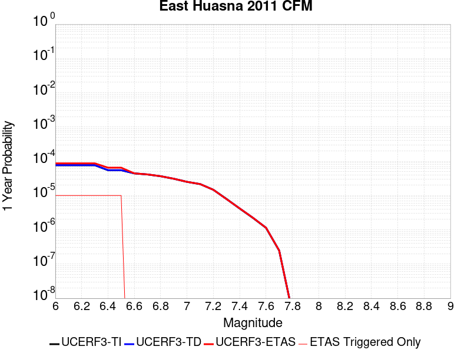 |  |

| Magnitude | 1 wk TI Prob | 1 wk TD Prob | 1 wk ETAS Prob | 1 wk ETAS/TD Gain | 1 wk ETAS Triggered Only | 1 mo TI Prob | 1 mo TD Prob | 1 mo ETAS Prob | 1 mo ETAS/TD Gain | 1 mo ETAS Triggered Only | 1 yr TI Prob | 1 yr TD Prob | 1 yr ETAS Prob | 1 yr ETAS/TD Gain | 1 yr ETAS Triggered Only | 10 yr TI Prob | 10 yr TD Prob | 10 yr ETAS Prob | 10 yr ETAS/TD Gain | 10 yr ETAS Triggered Only |
|-----|-----|-----|-----|-----|-----|-----|-----|-----|-----|-----|-----|-----|-----|-----|-----|-----|-----|-----|-----|-----|
| 6.0 | 1.4658423E-6 | 1.471566E-6 | 1.471566E-6 | 1.0 | 0.0 | 6.282166E-6 | 6.3066964E-6 | 6.3066964E-6 | 1.0 | 0.0 | 7.6482684E-5 | 7.67814E-5 | 8.678063E-5 | 1.1302298 | 1.0E-5 | 7.645637E-4 | 7.6755567E-4 | 7.77548E-4 | 1.0130184 | 1.0E-5 |
| 6.1 | 1.4658423E-6 | 1.471566E-6 | 1.471566E-6 | 1.0 | 0.0 | 6.282166E-6 | 6.3066964E-6 | 6.3066964E-6 | 1.0 | 0.0 | 7.6482684E-5 | 7.67814E-5 | 8.678063E-5 | 1.1302298 | 1.0E-5 | 7.645637E-4 | 7.6755567E-4 | 7.77548E-4 | 1.0130184 | 1.0E-5 |
| 6.2 | 1.4658423E-6 | 1.471566E-6 | 1.471566E-6 | 1.0 | 0.0 | 6.282166E-6 | 6.3066964E-6 | 6.3066964E-6 | 1.0 | 0.0 | 7.6482684E-5 | 7.67814E-5 | 8.678063E-5 | 1.1302298 | 1.0E-5 | 7.645637E-4 | 7.6755567E-4 | 7.77548E-4 | 1.0130184 | 1.0E-5 |
| 6.3 | 1.4658423E-6 | 1.471566E-6 | 1.471566E-6 | 1.0 | 0.0 | 6.282166E-6 | 6.3066964E-6 | 6.3066964E-6 | 1.0 | 0.0 | 7.6482684E-5 | 7.67814E-5 | 8.678063E-5 | 1.1302298 | 1.0E-5 | 7.645637E-4 | 7.6755567E-4 | 7.77548E-4 | 1.0130184 | 1.0E-5 |
| 6.4 | 1.0488257E-6 | 1.0527515E-6 | 1.0527515E-6 | 1.0 | 0.0 | 4.4949593E-6 | 4.5117845E-6 | 4.5117845E-6 | 1.0 | 0.0 | 5.472476E-5 | 5.492961E-5 | 6.492906E-5 | 1.1820412 | 1.0E-5 | 5.4711284E-4 | 5.491622E-4 | 5.591567E-4 | 1.0181996 | 1.0E-5 |
| 6.5 | 1.0488257E-6 | 1.0527515E-6 | 1.0527515E-6 | 1.0 | 0.0 | 4.4949593E-6 | 4.5117845E-6 | 4.5117845E-6 | 1.0 | 0.0 | 5.472476E-5 | 5.492961E-5 | 6.492906E-5 | 1.1820412 | 1.0E-5 | 5.4711284E-4 | 5.491622E-4 | 5.591567E-4 | 1.0181996 | 1.0E-5 |
| 6.6 | 8.463064E-7 | 8.4936323E-7 | 8.4936323E-7 | 1.0 | 0.0 | 3.6270226E-6 | 3.6401232E-6 | 3.6401232E-6 | 1.0 | 0.0 | 4.4158103E-5 | 4.4317607E-5 | 4.4317607E-5 | 1.0 | 0.0 | 4.414933E-4 | 4.4308856E-4 | 4.4308856E-4 | 1.0 | 0.0 |
| 6.7 | 7.876149E-7 | 7.902533E-7 | 7.902533E-7 | 1.0 | 0.0 | 3.375488E-6 | 3.3867955E-6 | 3.3867955E-6 | 1.0 | 0.0 | 4.109579E-5 | 4.1233463E-5 | 4.1233463E-5 | 1.0 | 0.0 | 4.108819E-4 | 4.1225873E-4 | 4.1225873E-4 | 1.0 | 0.0 |
| 6.8 | 6.9940785E-7 | 7.0165777E-7 | 7.0165777E-7 | 1.0 | 0.0 | 2.9974588E-6 | 3.0071012E-6 | 3.0071012E-6 | 1.0 | 0.0 | 3.649345E-5 | 3.6610847E-5 | 3.6610847E-5 | 1.0 | 0.0 | 3.6487455E-4 | 3.6604863E-4 | 3.6604863E-4 | 1.0 | 0.0 |
| 6.9 | 5.899658E-7 | 5.9155997E-7 | 5.9155997E-7 | 1.0 | 0.0 | 2.5284223E-6 | 2.5352545E-6 | 2.5352545E-6 | 1.0 | 0.0 | 3.0783107E-5 | 3.086629E-5 | 3.086629E-5 | 1.0 | 0.0 | 3.0778843E-4 | 3.086203E-4 | 3.086203E-4 | 1.0 | 0.0 |
| 7.0 | 4.793814E-7 | 4.803273E-7 | 4.803273E-7 | 1.0 | 0.0 | 2.05449E-6 | 2.058544E-6 | 2.058544E-6 | 1.0 | 0.0 | 2.501313E-5 | 2.5062485E-5 | 2.5062485E-5 | 1.0 | 0.0 | 2.5010316E-4 | 2.505968E-4 | 2.505968E-4 | 1.0 | 0.0 |
| 7.1 | 4.1256908E-7 | 4.129941E-7 | 4.129941E-7 | 1.0 | 0.0 | 1.768152E-6 | 1.7699736E-6 | 1.7699736E-6 | 1.0 | 0.0 | 2.1527037E-5 | 2.1549216E-5 | 2.1549216E-5 | 1.0 | 0.0 | 2.1524953E-4 | 2.1547142E-4 | 2.1547142E-4 | 1.0 | 0.0 |
| 7.2 | 2.822599E-7 | 2.8161418E-7 | 2.8161418E-7 | 1.0 | 0.0 | 1.2096847E-6 | 1.2069174E-6 | 1.2069174E-6 | 1.0 | 0.0 | 1.47278115E-5 | 1.4694121E-5 | 1.4694121E-5 | 1.0 | 0.0 | 1.4726835E-4 | 1.4693156E-4 | 1.4693156E-4 | 1.0 | 0.0 |
| 7.3 | 1.5261652E-7 | 1.5075021E-7 | 1.5075021E-7 | 1.0 | 0.0 | 6.540707E-7 | 6.460722E-7 | 6.460722E-7 | 1.0 | 0.0 | 7.963281E-6 | 7.8659E-6 | 7.8659E-6 | 1.0 | 0.0 | 7.962996E-5 | 7.865624E-5 | 7.865624E-5 | 1.0 | 0.0 |
| 7.4 | 7.976414E-8 | 8.057865E-8 | 8.057865E-8 | 1.0 | 0.0 | 3.418463E-7 | 3.45337E-7 | 3.45337E-7 | 1.0 | 0.0 | 4.1619705E-6 | 4.2044703E-6 | 4.2044703E-6 | 1.0 | 0.0 | 4.161893E-5 | 4.2043914E-5 | 4.2043914E-5 | 1.0 | 0.0 |
| 7.5 | 4.2715055E-8 | 4.3202512E-8 | 4.3202512E-8 | 1.0 | 0.0 | 1.830645E-7 | 1.8515361E-7 | 1.8515361E-7 | 1.0 | 0.0 | 2.228808E-6 | 2.2542429E-6 | 2.2542429E-6 | 1.0 | 0.0 | 2.2287857E-5 | 2.2542203E-5 | 2.2542203E-5 | 1.0 | 0.0 |
| 7.6 | 2.1807532E-8 | 2.2057476E-8 | 2.2057476E-8 | 1.0 | 0.0 | 9.346085E-8 | 9.4532034E-8 | 9.4532034E-8 | 1.0 | 0.0 | 1.1378852E-6 | 1.1509269E-6 | 1.1509269E-6 | 1.0 | 0.0 | 1.1378794E-5 | 1.1509211E-5 | 1.1509211E-5 | 1.0 | 0.0 |
| 7.7 | 4.7196043E-9 | 4.767283E-9 | 4.767283E-9 | 1.0 | 0.0 | 2.0226874E-8 | 2.0431212E-8 | 2.0431212E-8 | 1.0 | 0.0 | 2.4626218E-7 | 2.4874998E-7 | 2.4874998E-7 | 1.0 | 0.0 | 2.462619E-6 | 2.487497E-6 | 2.487497E-6 | 1.0 | 0.0 |
| 7.8 | 7.400003E-11 | 7.4654505E-11 | 7.4654505E-11 | 1.0 | 0.0 | 3.171432E-10 | 3.1994773E-10 | 3.1994773E-10 | 1.0 | 0.0 | 3.861218E-9 | 3.895363E-9 | 3.895363E-9 | 1.0 | 0.0 | 3.861218E-8 | 3.895363E-8 | 3.895363E-8 | 1.0 | 0.0 |

## Burnt Mtn
*[(top)](#table-of-contents)*

| 1 Week | 1 Month | 1 Year | 10 Year |
|-----|-----|-----|-----|
|  |  | 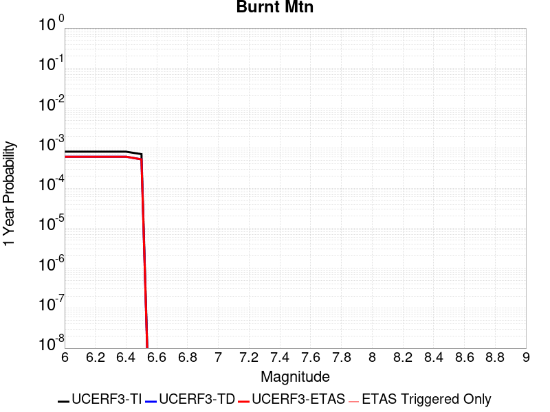 |  |

| Magnitude | 1 wk TI Prob | 1 wk TD Prob | 1 wk ETAS Prob | 1 wk ETAS/TD Gain | 1 wk ETAS Triggered Only | 1 mo TI Prob | 1 mo TD Prob | 1 mo ETAS Prob | 1 mo ETAS/TD Gain | 1 mo ETAS Triggered Only | 1 yr TI Prob | 1 yr TD Prob | 1 yr ETAS Prob | 1 yr ETAS/TD Gain | 1 yr ETAS Triggered Only | 10 yr TI Prob | 10 yr TD Prob | 10 yr ETAS Prob | 10 yr ETAS/TD Gain | 10 yr ETAS Triggered Only |
|-----|-----|-----|-----|-----|-----|-----|-----|-----|-----|-----|-----|-----|-----|-----|-----|-----|-----|-----|-----|-----|
| 6.0 | 1.5673151E-5 | 1.1749247E-5 | 1.1749247E-5 | 1.0 | 0.0 | 6.716892E-5 | 5.0353672E-5 | 5.0353672E-5 | 1.0 | 0.0 | 8.1747473E-4 | 6.130124E-4 | 6.130124E-4 | 1.0 | 0.0 | 0.008144741 | 0.006125855 | 0.0061357934 | 1.0016224 | 1.0E-5 |
| 6.1 | 1.5673151E-5 | 1.1749247E-5 | 1.1749247E-5 | 1.0 | 0.0 | 6.716892E-5 | 5.0353672E-5 | 5.0353672E-5 | 1.0 | 0.0 | 8.1747473E-4 | 6.130124E-4 | 6.130124E-4 | 1.0 | 0.0 | 0.008144741 | 0.006125855 | 0.0061357934 | 1.0016224 | 1.0E-5 |
| 6.2 | 1.5673151E-5 | 1.1749247E-5 | 1.1749247E-5 | 1.0 | 0.0 | 6.716892E-5 | 5.0353672E-5 | 5.0353672E-5 | 1.0 | 0.0 | 8.1747473E-4 | 6.130124E-4 | 6.130124E-4 | 1.0 | 0.0 | 0.008144741 | 0.006125855 | 0.0061357934 | 1.0016224 | 1.0E-5 |
| 6.3 | 1.5673151E-5 | 1.1749247E-5 | 1.1749247E-5 | 1.0 | 0.0 | 6.716892E-5 | 5.0353672E-5 | 5.0353672E-5 | 1.0 | 0.0 | 8.1747473E-4 | 6.130124E-4 | 6.130124E-4 | 1.0 | 0.0 | 0.008144741 | 0.006125855 | 0.0061357934 | 1.0016224 | 1.0E-5 |
| 6.4 | 1.5673151E-5 | 1.1749247E-5 | 1.1749247E-5 | 1.0 | 0.0 | 6.716892E-5 | 5.0353672E-5 | 5.0353672E-5 | 1.0 | 0.0 | 8.1747473E-4 | 6.130124E-4 | 6.130124E-4 | 1.0 | 0.0 | 0.008144741 | 0.006125855 | 0.0061357934 | 1.0016224 | 1.0E-5 |
| 6.5 | 1.36191375E-5 | 1.007816E-5 | 1.007816E-5 | 1.0 | 0.0 | 5.8366426E-5 | 4.319211E-5 | 4.319211E-5 | 1.0 | 0.0 | 7.103795E-4 | 5.2586396E-4 | 5.2586396E-4 | 1.0 | 0.0 | 0.0070811296 | 0.00525864 | 0.0052685873 | 1.0018916 | 1.0E-5 |

## Goose Lake 2011 CFM
*[(top)](#table-of-contents)*

| 1 Week | 1 Month | 1 Year | 10 Year |
|-----|-----|-----|-----|
| 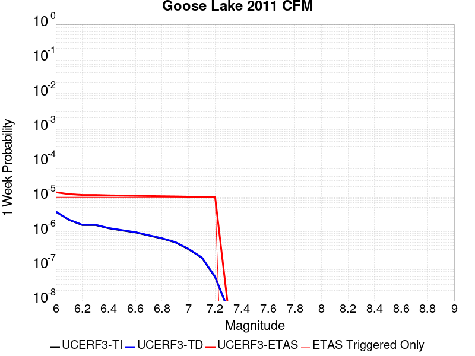 | 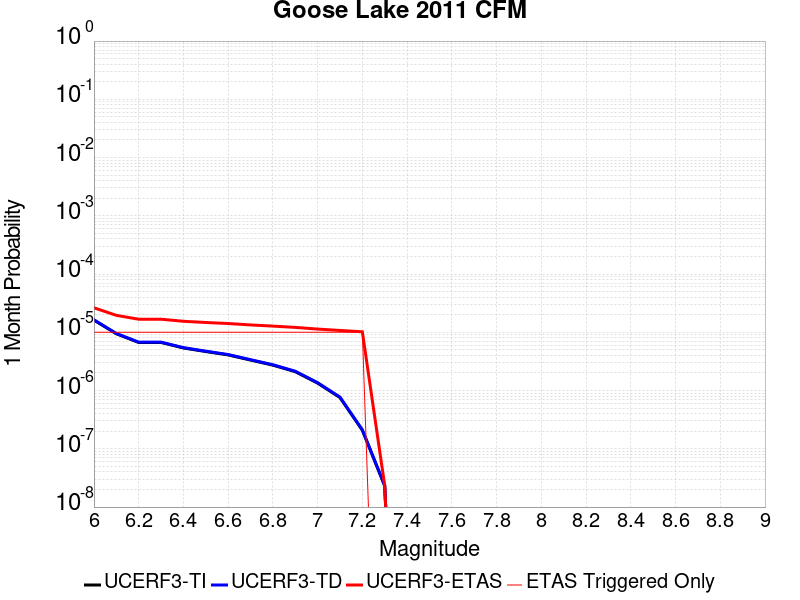 | 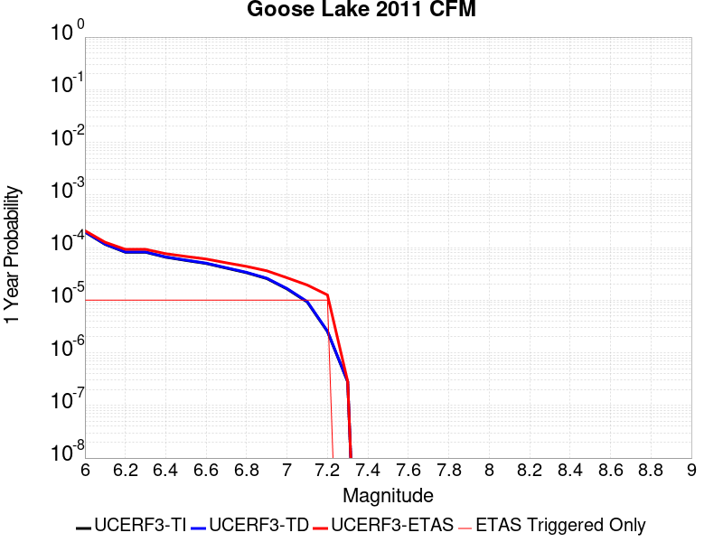 | 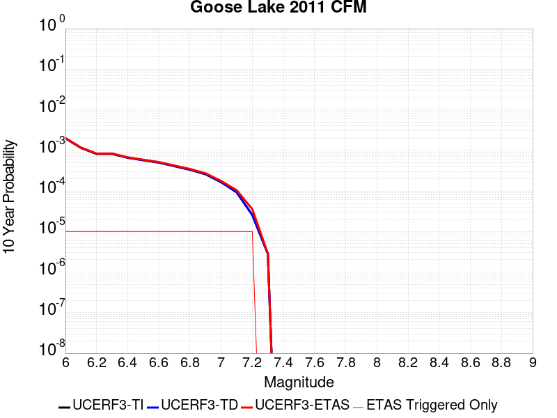 |

| Magnitude | 1 wk TI Prob | 1 wk TD Prob | 1 wk ETAS Prob | 1 wk ETAS/TD Gain | 1 wk ETAS Triggered Only | 1 mo TI Prob | 1 mo TD Prob | 1 mo ETAS Prob | 1 mo ETAS/TD Gain | 1 mo ETAS Triggered Only | 1 yr TI Prob | 1 yr TD Prob | 1 yr ETAS Prob | 1 yr ETAS/TD Gain | 1 yr ETAS Triggered Only | 10 yr TI Prob | 10 yr TD Prob | 10 yr ETAS Prob | 10 yr ETAS/TD Gain | 10 yr ETAS Triggered Only |
|-----|-----|-----|-----|-----|-----|-----|-----|-----|-----|-----|-----|-----|-----|-----|-----|-----|-----|-----|-----|-----|
| 6.0 | 3.780968E-6 | 3.8230223E-6 | 1.3822984E-5 | 3.6157215 | 1.0E-5 | 1.6204049E-5 | 1.6384285E-5 | 2.6384121E-5 | 1.6103309 | 1.0E-5 | 1.9726643E-4 | 1.994615E-4 | 2.0945951E-4 | 1.050125 | 1.0E-5 | 0.001970914 | 0.001992933 | 0.002002913 | 1.0050077 | 1.0E-5 |
| 6.1 | 2.2035124E-6 | 2.229801E-6 | 1.2229779E-5 | 5.4846945 | 1.0E-5 | 9.443591E-6 | 9.556257E-6 | 1.955616E-5 | 2.0464249 | 1.0E-5 | 1.1496965E-4 | 1.163414E-4 | 1.2634024E-4 | 1.0859439 | 1.0E-5 | 0.0011491019 | 0.0011628233 | 0.0011728116 | 1.0085897 | 1.0E-5 |
| 6.2 | 1.5624689E-6 | 1.5826923E-6 | 1.1582676E-5 | 7.3183374 | 1.0E-5 | 6.6962784E-6 | 6.7829496E-6 | 1.6782882E-5 | 2.4742749 | 1.0E-5 | 8.152414E-5 | 8.2579325E-5 | 9.25785E-5 | 1.1210856 | 1.0E-5 | 8.1494235E-4 | 8.2549086E-4 | 8.354826E-4 | 1.012104 | 1.0E-5 |
| 6.3 | 1.5624689E-6 | 1.5826923E-6 | 1.1582676E-5 | 7.3183374 | 1.0E-5 | 6.6962784E-6 | 6.7829496E-6 | 1.6782882E-5 | 2.4742749 | 1.0E-5 | 8.152414E-5 | 8.2579325E-5 | 9.25785E-5 | 1.1210856 | 1.0E-5 | 8.1494235E-4 | 8.2549086E-4 | 8.354826E-4 | 1.012104 | 1.0E-5 |
| 6.4 | 1.256464E-6 | 1.2738695E-6 | 1.1273857E-5 | 8.850087 | 1.0E-5 | 5.3848344E-6 | 5.4594293E-6 | 1.5459374E-5 | 2.8316832 | 1.0E-5 | 6.5558386E-5 | 6.646655E-5 | 7.646588E-5 | 1.1504416 | 1.0E-5 | 6.553905E-4 | 6.644687E-4 | 6.7446206E-4 | 1.0150396 | 1.0E-5 |
| 6.5 | 1.0910911E-6 | 1.1069404E-6 | 1.1106929E-5 | 10.0339 | 1.0E-5 | 4.6760965E-6 | 4.7440217E-6 | 1.4743974E-5 | 3.107906 | 1.0E-5 | 5.692999E-5 | 5.7756948E-5 | 6.775637E-5 | 1.1731293 | 1.0E-5 | 5.6915404E-4 | 5.7742064E-4 | 5.8741483E-4 | 1.0173084 | 1.0E-5 |
| 6.6 | 9.546601E-7 | 9.691246E-7 | 1.0969115E-5 | 11.318581 | 1.0E-5 | 4.091394E-6 | 4.1533845E-6 | 1.4153343E-5 | 3.407665 | 1.0E-5 | 4.9811584E-5 | 5.056629E-5 | 6.0565784E-5 | 1.1977502 | 1.0E-5 | 4.980042E-4 | 5.055487E-4 | 5.155437E-4 | 1.0197705 | 1.0E-5 |
| 6.7 | 7.790316E-7 | 7.9159634E-7 | 1.07915885E-5 | 13.632691 | 1.0E-5 | 3.3387028E-6 | 3.3925514E-6 | 1.3392518E-5 | 3.947624 | 1.0E-5 | 4.0647945E-5 | 4.1303538E-5 | 5.1303123E-5 | 1.2421 | 1.0E-5 | 4.0640513E-4 | 4.129592E-4 | 4.2295505E-4 | 1.0242054 | 1.0E-5 |
| 6.8 | 6.3714384E-7 | 6.4787395E-7 | 1.0647867E-5 | 16.435091 | 1.0E-5 | 2.7306137E-6 | 2.7765998E-6 | 1.2776572E-5 | 4.601517 | 1.0E-5 | 3.3244716E-5 | 3.3804583E-5 | 4.3804244E-5 | 1.2958078 | 1.0E-5 | 3.323974E-4 | 3.379949E-4 | 3.479915E-4 | 1.0295763 | 1.0E-5 |
| 6.9 | 4.92586E-7 | 5.0139147E-7 | 1.0501387E-5 | 20.944485 | 1.0E-5 | 2.1110811E-6 | 2.1488188E-6 | 1.2148797E-5 | 5.6537094 | 1.0E-5 | 2.5702111E-5 | 2.616156E-5 | 3.61613E-5 | 1.3822302 | 1.0E-5 | 2.569914E-4 | 2.6158517E-4 | 2.7158257E-4 | 1.0382185 | 1.0E-5 |
| 7.0 | 3.130245E-7 | 3.190354E-7 | 1.0319032E-5 | 32.344475 | 1.0E-5 | 1.3415328E-6 | 1.3672939E-6 | 1.136728E-5 | 8.313706 | 1.0E-5 | 1.6333039E-5 | 1.6646678E-5 | 2.664651E-5 | 1.6007105 | 1.0E-5 | 1.6331839E-4 | 1.6645451E-4 | 1.7645284E-4 | 1.0600665 | 1.0E-5 |
| 7.1 | 1.7680084E-7 | 1.8023923E-7 | 1.0180237E-5 | 56.48181 | 1.0E-5 | 7.5771766E-7 | 7.724536E-7 | 1.0772445E-5 | 13.945752 | 1.0E-5 | 9.225173E-6 | 9.404583E-6 | 1.940449E-5 | 2.0633013 | 1.0E-5 | 9.22479E-5 | 9.4041956E-5 | 1.0404101E-4 | 1.1063255 | 1.0E-5 |
| 7.2 | 4.8641045E-8 | 4.9402068E-8 | 1.0049402E-5 | 203.42067 | 1.0E-5 | 2.084616E-7 | 2.1172312E-7 | 1.0211721E-5 | 48.231487 | 1.0E-5 | 2.538017E-6 | 2.577726E-6 | 1.25777005E-5 | 4.8793783 | 1.0E-5 | 2.537988E-5 | 2.5776973E-5 | 3.5776717E-5 | 1.3879331 | 1.0E-5 |
| 7.3 | 5.3911844E-9 | 5.4758145E-9 | 5.4758145E-9 | 1.0 | 0.0 | 2.3105075E-8 | 2.3467775E-8 | 2.3467775E-8 | 1.0 | 0.0 | 2.8130427E-7 | 2.8572015E-7 | 2.8572015E-7 | 1.0 | 0.0 | 2.8130391E-6 | 2.8571992E-6 | 2.8571992E-6 | 1.0 | 0.0 |

## Clamshell-Sawpit
*[(top)](#table-of-contents)*

| 1 Week | 1 Month | 1 Year | 10 Year |
|-----|-----|-----|-----|
|  |  |  |  |

| Magnitude | 1 wk TI Prob | 1 wk TD Prob | 1 wk ETAS Prob | 1 wk ETAS/TD Gain | 1 wk ETAS Triggered Only | 1 mo TI Prob | 1 mo TD Prob | 1 mo ETAS Prob | 1 mo ETAS/TD Gain | 1 mo ETAS Triggered Only | 1 yr TI Prob | 1 yr TD Prob | 1 yr ETAS Prob | 1 yr ETAS/TD Gain | 1 yr ETAS Triggered Only | 10 yr TI Prob | 10 yr TD Prob | 10 yr ETAS Prob | 10 yr ETAS/TD Gain | 10 yr ETAS Triggered Only |
|-----|-----|-----|-----|-----|-----|-----|-----|-----|-----|-----|-----|-----|-----|-----|-----|-----|-----|-----|-----|-----|
| 6.0 | 3.202998E-6 | 3.0127642E-6 | 1.3012734E-5 | 4.319201 | 1.0E-5 | 1.3727062E-5 | 1.2911787E-5 | 2.2911658E-5 | 1.7744762 | 1.0E-5 | 1.6711417E-4 | 1.5719047E-4 | 1.671889E-4 | 1.0636071 | 1.0E-5 | 0.0016698855 | 0.0015708723 | 0.0015808566 | 1.0063559 | 1.0E-5 |
| 6.1 | 3.202998E-6 | 3.0127642E-6 | 1.3012734E-5 | 4.319201 | 1.0E-5 | 1.3727062E-5 | 1.2911787E-5 | 2.2911658E-5 | 1.7744762 | 1.0E-5 | 1.6711417E-4 | 1.5719047E-4 | 1.671889E-4 | 1.0636071 | 1.0E-5 | 0.0016698855 | 0.0015708723 | 0.0015808566 | 1.0063559 | 1.0E-5 |
| 6.2 | 3.202998E-6 | 3.0127642E-6 | 1.3012734E-5 | 4.319201 | 1.0E-5 | 1.3727062E-5 | 1.2911787E-5 | 2.2911658E-5 | 1.7744762 | 1.0E-5 | 1.6711417E-4 | 1.5719047E-4 | 1.671889E-4 | 1.0636071 | 1.0E-5 | 0.0016698855 | 0.0015708723 | 0.0015808566 | 1.0063559 | 1.0E-5 |
| 6.3 | 3.202998E-6 | 3.0127642E-6 | 1.3012734E-5 | 4.319201 | 1.0E-5 | 1.3727062E-5 | 1.2911787E-5 | 2.2911658E-5 | 1.7744762 | 1.0E-5 | 1.6711417E-4 | 1.5719047E-4 | 1.671889E-4 | 1.0636071 | 1.0E-5 | 0.0016698855 | 0.0015708723 | 0.0015808566 | 1.0063559 | 1.0E-5 |
| 6.4 | 3.202998E-6 | 3.0127642E-6 | 1.3012734E-5 | 4.319201 | 1.0E-5 | 1.3727062E-5 | 1.2911787E-5 | 2.2911658E-5 | 1.7744762 | 1.0E-5 | 1.6711417E-4 | 1.5719047E-4 | 1.671889E-4 | 1.0636071 | 1.0E-5 | 0.0016698855 | 0.0015708723 | 0.0015808566 | 1.0063559 | 1.0E-5 |
| 6.5 | 2.5862723E-6 | 2.3807747E-6 | 1.2380751E-5 | 5.200303 | 1.0E-5 | 1.1083977E-5 | 1.0203283E-5 | 2.020318E-5 | 1.9800668 | 1.0E-5 | 1.3493907E-4 | 1.2421819E-4 | 1.3421694E-4 | 1.0804935 | 1.0E-5 | 0.0013485716 | 0.0012415178 | 0.0012515055 | 1.0080446 | 1.0E-5 |
| 6.6 | 2.5862723E-6 | 2.3807747E-6 | 1.2380751E-5 | 5.200303 | 1.0E-5 | 1.1083977E-5 | 1.0203283E-5 | 2.020318E-5 | 1.9800668 | 1.0E-5 | 1.3493907E-4 | 1.2421819E-4 | 1.3421694E-4 | 1.0804935 | 1.0E-5 | 0.0013485716 | 0.0012415178 | 0.0012515055 | 1.0080446 | 1.0E-5 |
| 6.7 | 2.5862723E-6 | 2.3807747E-6 | 1.2380751E-5 | 5.200303 | 1.0E-5 | 1.1083977E-5 | 1.0203283E-5 | 2.020318E-5 | 1.9800668 | 1.0E-5 | 1.3493907E-4 | 1.2421819E-4 | 1.3421694E-4 | 1.0804935 | 1.0E-5 | 0.0013485716 | 0.0012415178 | 0.0012515055 | 1.0080446 | 1.0E-5 |
| 6.8 | 2.4098806E-6 | 2.1977307E-6 | 1.2197709E-5 | 5.550138 | 1.0E-5 | 1.0328019E-5 | 9.4188135E-6 | 1.941872E-5 | 2.0616949 | 1.0E-5 | 1.2573638E-4 | 1.14668284E-4 | 1.2466715E-4 | 1.087198 | 1.0E-5 | 0.0012566525 | 0.0011461178 | 0.0011561064 | 1.0087152 | 1.0E-5 |
| 6.9 | 2.0073985E-6 | 1.7784247E-6 | 1.1778407E-5 | 6.622944 | 1.0E-5 | 8.603109E-6 | 7.6217984E-6 | 1.7621722E-5 | 2.3120162 | 1.0E-5 | 1.0473781E-4 | 9.279157E-5 | 1.0279064E-4 | 1.1077584 | 1.0E-5 | 0.0010468846 | 9.2754007E-4 | 9.3753083E-4 | 1.0107712 | 1.0E-5 |
| 7.0 | 1.8166766E-6 | 1.5807094E-6 | 1.5807094E-6 | 1.0 | 0.0 | 7.785734E-6 | 6.774452E-6 | 6.774452E-6 | 1.0 | 0.0 | 9.478718E-5 | 8.247593E-5 | 8.247593E-5 | 1.0 | 0.0 | 9.4746763E-4 | 8.244633E-4 | 8.244633E-4 | 1.0 | 0.0 |
| 7.1 | 1.5471421E-6 | 1.3052961E-6 | 1.3052961E-6 | 1.0 | 0.0 | 6.6305925E-6 | 5.5941146E-6 | 5.5941146E-6 | 1.0 | 0.0 | 8.072447E-5 | 6.810627E-5 | 6.810627E-5 | 1.0 | 0.0 | 8.0695155E-4 | 6.8085943E-4 | 6.8085943E-4 | 1.0 | 0.0 |
| 7.2 | 1.3608037E-6 | 1.1153442E-6 | 1.1153442E-6 | 1.0 | 0.0 | 5.8320024E-6 | 4.780038E-6 | 4.780038E-6 | 1.0 | 0.0 | 7.1002316E-5 | 5.8195455E-5 | 5.8195455E-5 | 1.0 | 0.0 | 7.097964E-4 | 5.818068E-4 | 5.818068E-4 | 1.0 | 0.0 |
| 7.3 | 1.0749634E-6 | 8.384255E-7 | 8.384255E-7 | 1.0 | 0.0 | 4.6069777E-6 | 3.5932474E-6 | 3.5932474E-6 | 1.0 | 0.0 | 5.608851E-5 | 4.3746935E-5 | 4.3746935E-5 | 1.0 | 0.0 | 5.6074356E-4 | 4.3738607E-4 | 4.3738607E-4 | 1.0 | 0.0 |
| 7.4 | 8.416856E-7 | 6.2000527E-7 | 6.2000527E-7 | 1.0 | 0.0 | 3.607219E-6 | 2.657163E-6 | 2.657163E-6 | 1.0 | 0.0 | 4.3917007E-5 | 3.2350497E-5 | 3.2350497E-5 | 1.0 | 0.0 | 4.390833E-4 | 3.2345986E-4 | 3.2345986E-4 | 1.0 | 0.0 |
| 7.5 | 6.2779594E-7 | 4.4968908E-7 | 4.4968908E-7 | 1.0 | 0.0 | 2.6905511E-6 | 1.9272377E-6 | 1.9272377E-6 | 1.0 | 0.0 | 3.275697E-5 | 2.3463885E-5 | 2.3463885E-5 | 1.0 | 0.0 | 3.275214E-4 | 2.3461595E-4 | 2.3461595E-4 | 1.0 | 0.0 |
| 7.6 | 4.3822078E-7 | 3.059551E-7 | 3.059551E-7 | 1.0 | 0.0 | 1.8780877E-6 | 1.3112356E-6 | 1.3112356E-6 | 1.0 | 0.0 | 2.2865479E-5 | 1.5964191E-5 | 1.5964191E-5 | 1.0 | 0.0 | 2.2863125E-4 | 1.5963199E-4 | 1.5963199E-4 | 1.0 | 0.0 |
| 7.7 | 1.8704569E-7 | 1.12379E-7 | 1.12379E-7 | 1.0 | 0.0 | 8.0162414E-7 | 4.8162417E-7 | 4.8162417E-7 | 1.0 | 0.0 | 9.75973E-6 | 5.8637593E-6 | 5.8637593E-6 | 1.0 | 0.0 | 9.7593016E-5 | 5.863611E-5 | 5.863611E-5 | 1.0 | 0.0 |
| 7.8 | 3.5378733E-8 | 2.1838002E-8 | 2.1838002E-8 | 1.0 | 0.0 | 1.5162313E-7 | 9.359143E-8 | 9.359143E-8 | 1.0 | 0.0 | 1.84601E-6 | 1.1394751E-6 | 1.1394751E-6 | 1.0 | 0.0 | 1.8459947E-5 | 1.1394695E-5 | 1.1394695E-5 | 1.0 | 0.0 |
| 7.9 | 7.504945E-9 | 5.1921663E-9 | 5.1921663E-9 | 1.0 | 0.0 | 3.2164053E-8 | 2.2252141E-8 | 2.2252141E-8 | 1.0 | 0.0 | 3.9159727E-7 | 2.709198E-7 | 2.709198E-7 | 1.0 | 0.0 | 3.915966E-6 | 2.7091953E-6 | 2.7091953E-6 | 1.0 | 0.0 |
| 8.0 | 1.6554036E-10 | 1.418149E-10 | 1.418149E-10 | 1.0 | 0.0 | 7.0945894E-10 | 6.0777794E-10 | 6.0777794E-10 | 1.0 | 0.0 | 8.637662E-9 | 7.3996964E-9 | 7.3996964E-9 | 1.0 | 0.0 | 8.6376616E-8 | 7.3996965E-8 | 7.3996965E-8 | 1.0 | 0.0 |

## Earthquake Valley
*[(top)](#table-of-contents)*

| 1 Week | 1 Month | 1 Year | 10 Year |
|-----|-----|-----|-----|
|  |  |  | 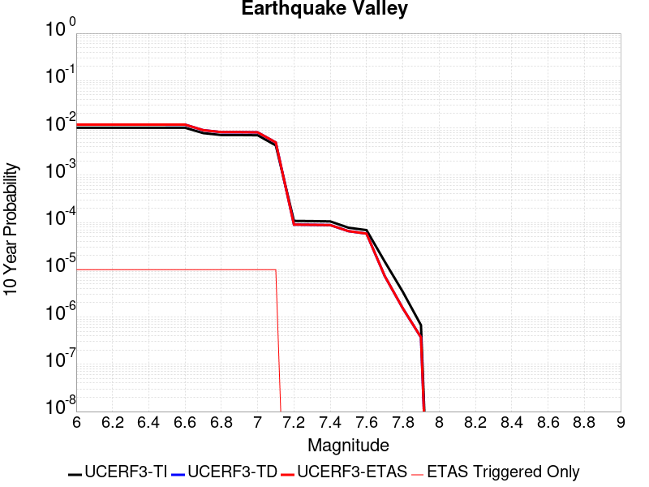 |

| Magnitude | 1 wk TI Prob | 1 wk TD Prob | 1 wk ETAS Prob | 1 wk ETAS/TD Gain | 1 wk ETAS Triggered Only | 1 mo TI Prob | 1 mo TD Prob | 1 mo ETAS Prob | 1 mo ETAS/TD Gain | 1 mo ETAS Triggered Only | 1 yr TI Prob | 1 yr TD Prob | 1 yr ETAS Prob | 1 yr ETAS/TD Gain | 1 yr ETAS Triggered Only | 10 yr TI Prob | 10 yr TD Prob | 10 yr ETAS Prob | 10 yr ETAS/TD Gain | 10 yr ETAS Triggered Only |
|-----|-----|-----|-----|-----|-----|-----|-----|-----|-----|-----|-----|-----|-----|-----|-----|-----|-----|-----|-----|-----|
| 6.0 | 1.9416384E-5 | 2.258411E-5 | 3.2583885E-5 | 1.4427792 | 1.0E-5 | 8.321042E-5 | 9.6786134E-5 | 1.0678516E-4 | 1.1033106 | 1.0E-5 | 0.001012616 | 0.001177854 | 0.0011878422 | 1.0084801 | 1.0E-5 | 0.010080142 | 0.011727945 | 0.011737828 | 1.0008427 | 1.0E-5 |
| 6.1 | 1.9416384E-5 | 2.258411E-5 | 3.2583885E-5 | 1.4427792 | 1.0E-5 | 8.321042E-5 | 9.6786134E-5 | 1.0678516E-4 | 1.1033106 | 1.0E-5 | 0.001012616 | 0.001177854 | 0.0011878422 | 1.0084801 | 1.0E-5 | 0.010080142 | 0.011727945 | 0.011737828 | 1.0008427 | 1.0E-5 |
| 6.2 | 1.9416384E-5 | 2.258411E-5 | 3.2583885E-5 | 1.4427792 | 1.0E-5 | 8.321042E-5 | 9.6786134E-5 | 1.0678516E-4 | 1.1033106 | 1.0E-5 | 0.001012616 | 0.001177854 | 0.0011878422 | 1.0084801 | 1.0E-5 | 0.010080142 | 0.011727945 | 0.011737828 | 1.0008427 | 1.0E-5 |
| 6.3 | 1.9416384E-5 | 2.258411E-5 | 3.2583885E-5 | 1.4427792 | 1.0E-5 | 8.321042E-5 | 9.6786134E-5 | 1.0678516E-4 | 1.1033106 | 1.0E-5 | 0.001012616 | 0.001177854 | 0.0011878422 | 1.0084801 | 1.0E-5 | 0.010080142 | 0.011727945 | 0.011737828 | 1.0008427 | 1.0E-5 |
| 6.4 | 1.9416384E-5 | 2.258411E-5 | 3.2583885E-5 | 1.4427792 | 1.0E-5 | 8.321042E-5 | 9.6786134E-5 | 1.0678516E-4 | 1.1033106 | 1.0E-5 | 0.001012616 | 0.001177854 | 0.0011878422 | 1.0084801 | 1.0E-5 | 0.010080142 | 0.011727945 | 0.011737828 | 1.0008427 | 1.0E-5 |
| 6.5 | 1.9389157E-5 | 2.25527E-5 | 3.2552474E-5 | 1.4433959 | 1.0E-5 | 8.309374E-5 | 9.665152E-5 | 1.0665056E-4 | 1.1034545 | 1.0E-5 | 0.0010111968 | 0.001176217 | 0.0011862052 | 1.0084919 | 1.0E-5 | 0.010066078 | 0.011711747 | 0.01172163 | 1.0008439 | 1.0E-5 |
| 6.6 | 1.9389157E-5 | 2.25527E-5 | 3.2552474E-5 | 1.4433959 | 1.0E-5 | 8.309374E-5 | 9.665152E-5 | 1.0665056E-4 | 1.1034545 | 1.0E-5 | 0.0010111968 | 0.001176217 | 0.0011862052 | 1.0084919 | 1.0E-5 | 0.010066078 | 0.011711747 | 0.01172163 | 1.0008439 | 1.0E-5 |
| 6.7 | 1.4925434E-5 | 1.720822E-5 | 2.7208049E-5 | 1.5811076 | 1.0E-5 | 6.396457E-5 | 7.374791E-5 | 8.3747174E-5 | 1.1355871 | 1.0E-5 | 7.7849044E-4 | 8.97596E-4 | 9.07587E-4 | 1.0111309 | 1.0E-5 | 0.007757689 | 0.008948081 | 0.008957992 | 1.0011076 | 1.0E-5 |
| 6.8 | 1.3570335E-5 | 1.5616837E-5 | 2.561668E-5 | 1.6403246 | 1.0E-5 | 5.8157282E-5 | 6.692804E-5 | 7.6927376E-5 | 1.1494042 | 1.0E-5 | 7.0783484E-4 | 8.146264E-4 | 8.2461827E-4 | 1.0122656 | 1.0E-5 | 0.0070558446 | 0.008124473 | 0.008134392 | 1.0012208 | 1.0E-5 |
| 6.9 | 1.3570335E-5 | 1.5616837E-5 | 2.561668E-5 | 1.6403246 | 1.0E-5 | 5.8157282E-5 | 6.692804E-5 | 7.6927376E-5 | 1.1494042 | 1.0E-5 | 7.0783484E-4 | 8.146264E-4 | 8.2461827E-4 | 1.0122656 | 1.0E-5 | 0.0070558446 | 0.008124473 | 0.008134392 | 1.0012208 | 1.0E-5 |
| 7.0 | 1.3433392E-5 | 1.546038E-5 | 2.5460226E-5 | 1.6468046 | 1.0E-5 | 5.757041E-5 | 6.6257555E-5 | 7.625689E-5 | 1.1509162 | 1.0E-5 | 7.0069433E-4 | 8.064692E-4 | 8.164611E-4 | 1.0123898 | 1.0E-5 | 0.006984891 | 0.008043493 | 0.008053413 | 1.0012332 | 1.0E-5 |
| 7.1 | 8.181609E-6 | 9.4168445E-6 | 1.941675E-5 | 2.0619168 | 1.0E-5 | 3.5063567E-5 | 4.0357656E-5 | 5.0357252E-5 | 1.2477745 | 1.0E-5 | 4.268153E-4 | 4.913108E-4 | 5.0130585E-4 | 1.0203437 | 1.0E-5 | 0.0042599645 | 0.004908822 | 0.0049187727 | 1.0020272 | 1.0E-5 |
| 7.2 | 2.0663983E-7 | 1.7262263E-7 | 1.7262263E-7 | 1.0 | 0.0 | 8.855989E-7 | 7.398111E-7 | 7.398111E-7 | 1.0 | 0.0 | 1.0782113E-5 | 9.007167E-6 | 9.007167E-6 | 1.0 | 0.0 | 1.07815904E-4 | 9.006837E-5 | 9.006837E-5 | 1.0 | 0.0 |
| 7.3 | 2.0462376E-7 | 1.7077758E-7 | 1.7077758E-7 | 1.0 | 0.0 | 8.7695867E-7 | 7.319037E-7 | 7.319037E-7 | 1.0 | 0.0 | 1.0676919E-5 | 8.910895E-6 | 8.910895E-6 | 1.0 | 0.0 | 1.0676406E-4 | 8.9105735E-5 | 8.9105735E-5 | 1.0 | 0.0 |
| 7.4 | 2.0171088E-7 | 1.6860244E-7 | 1.6860244E-7 | 1.0 | 0.0 | 8.644749E-7 | 7.2258166E-7 | 7.2258166E-7 | 1.0 | 0.0 | 1.0524931E-5 | 8.7974E-6 | 8.7974E-6 | 1.0 | 0.0 | 1.05244326E-4 | 8.7970875E-5 | 8.7970875E-5 | 1.0 | 0.0 |
| 7.5 | 1.4847944E-7 | 1.2558573E-7 | 1.2558573E-7 | 1.0 | 0.0 | 6.363403E-7 | 5.382244E-7 | 5.382244E-7 | 1.0 | 0.0 | 7.747416E-6 | 6.5528648E-6 | 6.5528648E-6 | 1.0 | 0.0 | 7.747146E-5 | 6.552693E-5 | 6.552693E-5 | 1.0 | 0.0 |
| 7.6 | 1.3185847E-7 | 1.1122516E-7 | 1.1122516E-7 | 1.0 | 0.0 | 5.6510765E-7 | 4.766792E-7 | 4.766792E-7 | 1.0 | 0.0 | 6.8801637E-6 | 5.803556E-6 | 5.803556E-6 | 1.0 | 0.0 | 6.8799505E-5 | 5.8034257E-5 | 5.8034257E-5 | 1.0 | 0.0 |
| 7.7 | 2.8609954E-8 | 1.4170218E-8 | 1.4170218E-8 | 1.0 | 0.0 | 1.2261408E-7 | 6.0729505E-8 | 6.0729505E-8 | 1.0 | 0.0 | 1.4928254E-6 | 7.393815E-7 | 7.393815E-7 | 1.0 | 0.0 | 1.4928154E-5 | 7.393796E-6 | 7.393796E-6 | 1.0 | 0.0 |
| 7.8 | 6.527266E-9 | 2.9232412E-9 | 2.9232412E-9 | 1.0 | 0.0 | 2.7973995E-8 | 1.2528178E-8 | 1.2528178E-8 | 1.0 | 0.0 | 3.4058334E-7 | 1.5253055E-7 | 1.5253055E-7 | 1.0 | 0.0 | 3.4058282E-6 | 1.5253047E-6 | 1.5253047E-6 | 1.0 | 0.0 |
| 7.9 | 1.2898267E-9 | 7.127704E-10 | 7.127704E-10 | 1.0 | 0.0 | 5.527829E-9 | 3.0547302E-9 | 3.0547302E-9 | 1.0 | 0.0 | 6.7301315E-8 | 3.719134E-8 | 3.719134E-8 | 1.0 | 0.0 | 6.7301295E-7 | 3.7191342E-7 | 3.7191342E-7 | 1.0 | 0.0 |

## Greenville (No) 2011 CFM
*[(top)](#table-of-contents)*

| 1 Week | 1 Month | 1 Year | 10 Year |
|-----|-----|-----|-----|
| 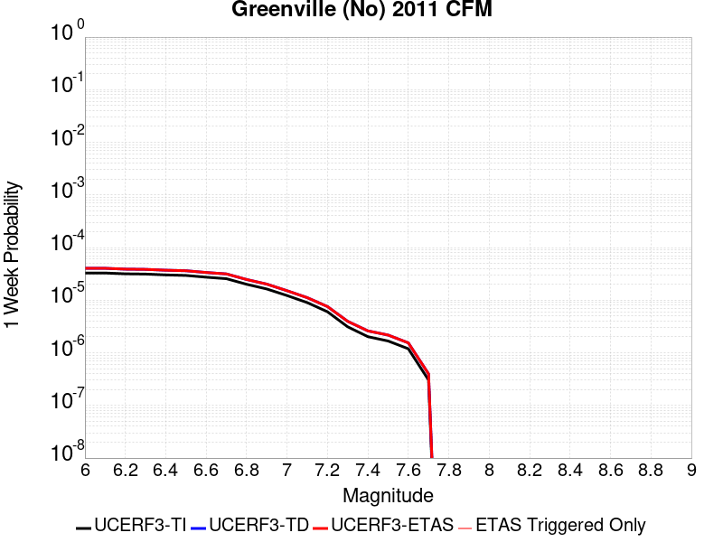 |  |  |  |

| Magnitude | 1 wk TI Prob | 1 wk TD Prob | 1 wk ETAS Prob | 1 wk ETAS/TD Gain | 1 wk ETAS Triggered Only | 1 mo TI Prob | 1 mo TD Prob | 1 mo ETAS Prob | 1 mo ETAS/TD Gain | 1 mo ETAS Triggered Only | 1 yr TI Prob | 1 yr TD Prob | 1 yr ETAS Prob | 1 yr ETAS/TD Gain | 1 yr ETAS Triggered Only | 10 yr TI Prob | 10 yr TD Prob | 10 yr ETAS Prob | 10 yr ETAS/TD Gain | 10 yr ETAS Triggered Only |
|-----|-----|-----|-----|-----|-----|-----|-----|-----|-----|-----|-----|-----|-----|-----|-----|-----|-----|-----|-----|-----|
| 6.0 | 3.286654E-5 | 4.036671E-5 | 4.036671E-5 | 1.0 | 0.0 | 1.4084899E-4 | 1.7298892E-4 | 1.7298892E-4 | 1.0 | 0.0 | 0.0017134876 | 0.0021041434 | 0.0021041434 | 1.0 | 0.0 | 0.017003356 | 0.02084759 | 0.02085738 | 1.0004697 | 1.0E-5 |
| 6.1 | 3.286654E-5 | 4.036671E-5 | 4.036671E-5 | 1.0 | 0.0 | 1.4084899E-4 | 1.7298892E-4 | 1.7298892E-4 | 1.0 | 0.0 | 0.0017134876 | 0.0021041434 | 0.0021041434 | 1.0 | 0.0 | 0.017003356 | 0.02084759 | 0.02084759 | 1.0 | 0.0 |
| 6.2 | 3.1697953E-5 | 3.8929615E-5 | 3.8929615E-5 | 1.0 | 0.0 | 1.358413E-4 | 1.6683072E-4 | 1.6683072E-4 | 1.0 | 0.0 | 0.0016526132 | 0.0020293088 | 0.0020293088 | 1.0 | 0.0 | 0.01640377 | 0.020112982 | 0.020112982 | 1.0 | 0.0 |
| 6.3 | 3.1363317E-5 | 3.8518487E-5 | 3.8518487E-5 | 1.0 | 0.0 | 1.344073E-4 | 1.6506898E-4 | 1.6506898E-4 | 1.0 | 0.0 | 0.0016351803 | 0.0020078993 | 0.0020078993 | 1.0 | 0.0 | 0.016232004 | 0.019902749 | 0.019902749 | 1.0 | 0.0 |
| 6.4 | 3.0228604E-5 | 3.712561E-5 | 3.712561E-5 | 1.0 | 0.0 | 1.2954473E-4 | 1.5910025E-4 | 1.5910025E-4 | 1.0 | 0.0 | 0.0015760659 | 0.001935361 | 0.001935361 | 1.0 | 0.0 | 0.015649348 | 0.01919009 | 0.01919009 | 1.0 | 0.0 |
| 6.5 | 2.9537814E-5 | 3.628106E-5 | 3.628106E-5 | 1.0 | 0.0 | 1.2658449E-4 | 1.5548118E-4 | 1.5548118E-4 | 1.0 | 0.0 | 0.0015400766 | 0.0018913761 | 0.0018913761 | 1.0 | 0.0 | 0.01529447 | 0.018757751 | 0.018757751 | 1.0 | 0.0 |
| 6.6 | 2.7345395E-5 | 3.359038E-5 | 3.359038E-5 | 1.0 | 0.0 | 1.1718928E-4 | 1.43951E-4 | 1.43951E-4 | 1.0 | 0.0 | 0.0014258457 | 0.0017512254 | 0.0017512254 | 1.0 | 0.0 | 0.014167317 | 0.017378574 | 0.017378574 | 1.0 | 0.0 |
| 6.7 | 2.5615784E-5 | 3.1567277E-5 | 3.1567277E-5 | 1.0 | 0.0 | 1.09777306E-4 | 1.352815E-4 | 1.352815E-4 | 1.0 | 0.0 | 0.0013357193 | 0.0016458385 | 0.0016458385 | 1.0 | 0.0 | 0.013277191 | 0.016340667 | 0.016340667 | 1.0 | 0.0 |
| 6.8 | 2.0059057E-5 | 2.4712264E-5 | 2.4712264E-5 | 1.0 | 0.0 | 8.596455E-5 | 1.059055E-4 | 1.059055E-4 | 1.0 | 0.0 | 0.0010461159 | 0.001288653 | 0.001288653 | 1.0 | 0.0 | 0.0104120495 | 0.012814328 | 0.012814328 | 1.0 | 0.0 |
| 6.9 | 1.6321746E-5 | 2.018486E-5 | 2.018486E-5 | 1.0 | 0.0 | 6.9948466E-5 | 8.6503744E-5 | 8.6503744E-5 | 1.0 | 0.0 | 8.5128983E-4 | 0.0010526866 | 0.0010526866 | 1.0 | 0.0 | 0.008480361 | 0.010479037 | 0.010479037 | 1.0 | 0.0 |
| 7.0 | 1.22527645E-5 | 1.5135808E-5 | 1.5135808E-5 | 1.0 | 0.0 | 5.2510793E-5 | 6.486616E-5 | 6.486616E-5 | 1.0 | 0.0 | 6.3913135E-4 | 7.894636E-4 | 7.894636E-4 | 1.0 | 0.0 | 0.0063729626 | 0.007867573 | 0.007867573 | 1.0 | 0.0 |
| 7.1 | 8.996482E-6 | 1.1165116E-5 | 1.1165116E-5 | 1.0 | 0.0 | 3.8555783E-5 | 4.784963E-5 | 4.784963E-5 | 1.0 | 0.0 | 4.6931554E-4 | 5.8241474E-4 | 5.8241474E-4 | 1.0 | 0.0 | 0.004683256 | 0.0058096354 | 0.0058096354 | 1.0 | 0.0 |
| 7.2 | 6.0273087E-6 | 7.569621E-6 | 7.569621E-6 | 1.0 | 0.0 | 2.5831067E-5 | 3.2440836E-5 | 3.2440836E-5 | 1.0 | 0.0 | 3.1444785E-4 | 3.9489628E-4 | 3.9489628E-4 | 1.0 | 0.0 | 0.0031400328 | 0.003942419 | 0.003942419 | 1.0 | 0.0 |
| 7.3 | 3.1209995E-6 | 3.9664565E-6 | 3.9664565E-6 | 1.0 | 0.0 | 1.3375643E-5 | 1.6998989E-5 | 1.6998989E-5 | 1.0 | 0.0 | 1.6283628E-4 | 2.069432E-4 | 2.069432E-4 | 1.0 | 0.0 | 0.0016271701 | 0.0020678395 | 0.0020678395 | 1.0 | 0.0 |
| 7.4 | 2.0254208E-6 | 2.6096657E-6 | 2.6096657E-6 | 1.0 | 0.0 | 8.680347E-6 | 1.1184234E-5 | 1.1184234E-5 | 1.0 | 0.0 | 1.0567809E-4 | 1.361596E-4 | 1.361596E-4 | 1.0 | 0.0 | 0.0010562785 | 0.0013611179 | 0.0013611179 | 1.0 | 0.0 |
| 7.5 | 1.6763418E-6 | 2.1734072E-6 | 2.1734072E-6 | 1.0 | 0.0 | 7.184302E-6 | 9.314569E-6 | 9.314569E-6 | 1.0 | 0.0 | 8.746537E-5 | 1.1339904E-4 | 1.1339904E-4 | 1.0 | 0.0 | 8.743095E-4 | 0.0011337536 | 0.0011337536 | 1.0 | 0.0 |
| 7.6 | 1.1935462E-6 | 1.5458915E-6 | 1.5458915E-6 | 1.0 | 0.0 | 5.115188E-6 | 6.625233E-6 | 6.625233E-6 | 1.0 | 0.0 | 6.2275634E-5 | 8.0659265E-5 | 8.0659265E-5 | 1.0 | 0.0 | 6.2258187E-4 | 8.0655375E-4 | 8.0655375E-4 | 1.0 | 0.0 |
| 7.7 | 3.0464201E-7 | 3.9848686E-7 | 3.9848686E-7 | 1.0 | 0.0 | 1.3056081E-6 | 1.7077997E-6 | 1.7077997E-6 | 1.0 | 0.0 | 1.589566E-5 | 2.0792268E-5 | 2.0792268E-5 | 1.0 | 0.0 | 1.5894524E-4 | 2.0793018E-4 | 2.0793018E-4 | 1.0 | 0.0 |

## San Cayetano
*[(top)](#table-of-contents)*

| 1 Week | 1 Month | 1 Year | 10 Year |
|-----|-----|-----|-----|
| 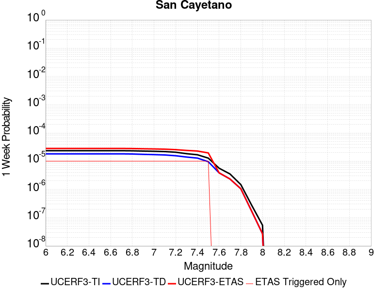 | 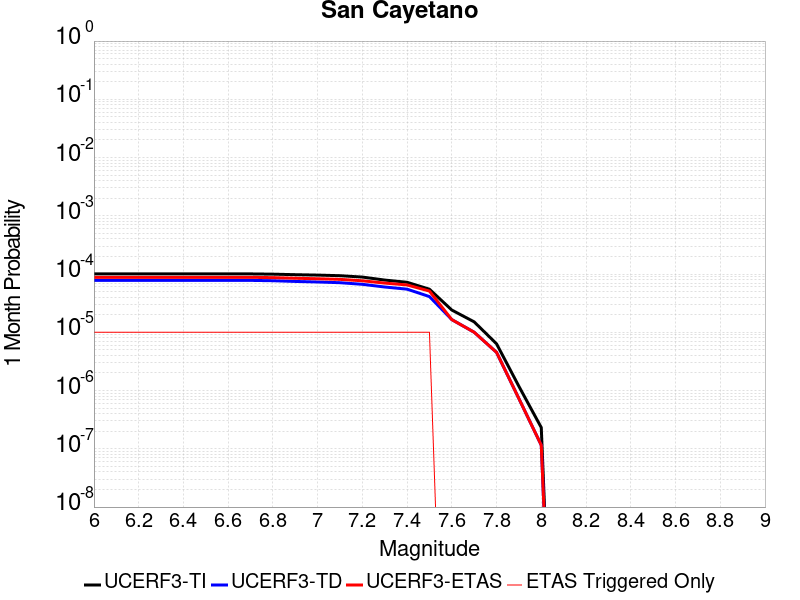 | 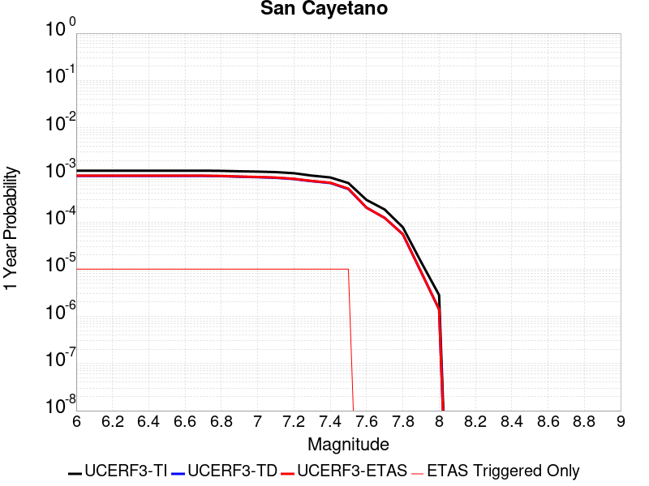 | 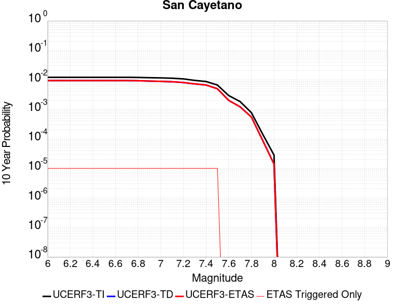 |

| Magnitude | 1 wk TI Prob | 1 wk TD Prob | 1 wk ETAS Prob | 1 wk ETAS/TD Gain | 1 wk ETAS Triggered Only | 1 mo TI Prob | 1 mo TD Prob | 1 mo ETAS Prob | 1 mo ETAS/TD Gain | 1 mo ETAS Triggered Only | 1 yr TI Prob | 1 yr TD Prob | 1 yr ETAS Prob | 1 yr ETAS/TD Gain | 1 yr ETAS Triggered Only | 10 yr TI Prob | 10 yr TD Prob | 10 yr ETAS Prob | 10 yr ETAS/TD Gain | 10 yr ETAS Triggered Only |
|-----|-----|-----|-----|-----|-----|-----|-----|-----|-----|-----|-----|-----|-----|-----|-----|-----|-----|-----|-----|-----|
| 6.0 | 2.3476267E-5 | 1.8169216E-5 | 2.8169034E-5 | 1.5503715 | 1.0E-5 | 1.0060869E-4 | 7.786576E-5 | 8.786499E-5 | 1.1284162 | 1.0E-5 | 0.0012242225 | 9.4760704E-4 | 9.575976E-4 | 1.0105429 | 1.0E-5 | 0.012175002 | 0.00943675 | 0.009446655 | 1.0010496 | 1.0E-5 |
| 6.1 | 2.3476267E-5 | 1.8169216E-5 | 2.8169034E-5 | 1.5503715 | 1.0E-5 | 1.0060869E-4 | 7.786576E-5 | 8.786499E-5 | 1.1284162 | 1.0E-5 | 0.0012242225 | 9.4760704E-4 | 9.575976E-4 | 1.0105429 | 1.0E-5 | 0.012175002 | 0.00943675 | 0.009446655 | 1.0010496 | 1.0E-5 |
| 6.2 | 2.3476267E-5 | 1.8169216E-5 | 2.8169034E-5 | 1.5503715 | 1.0E-5 | 1.0060869E-4 | 7.786576E-5 | 8.786499E-5 | 1.1284162 | 1.0E-5 | 0.0012242225 | 9.4760704E-4 | 9.575976E-4 | 1.0105429 | 1.0E-5 | 0.012175002 | 0.00943675 | 0.009446655 | 1.0010496 | 1.0E-5 |
| 6.3 | 2.3476267E-5 | 1.8169216E-5 | 2.8169034E-5 | 1.5503715 | 1.0E-5 | 1.0060869E-4 | 7.786576E-5 | 8.786499E-5 | 1.1284162 | 1.0E-5 | 0.0012242225 | 9.4760704E-4 | 9.575976E-4 | 1.0105429 | 1.0E-5 | 0.012175002 | 0.00943675 | 0.009446655 | 1.0010496 | 1.0E-5 |
| 6.4 | 2.3476267E-5 | 1.8169216E-5 | 2.8169034E-5 | 1.5503715 | 1.0E-5 | 1.0060869E-4 | 7.786576E-5 | 8.786499E-5 | 1.1284162 | 1.0E-5 | 0.0012242225 | 9.4760704E-4 | 9.575976E-4 | 1.0105429 | 1.0E-5 | 0.012175002 | 0.00943675 | 0.009446655 | 1.0010496 | 1.0E-5 |
| 6.5 | 2.3476267E-5 | 1.8169216E-5 | 2.8169034E-5 | 1.5503715 | 1.0E-5 | 1.0060869E-4 | 7.786576E-5 | 8.786499E-5 | 1.1284162 | 1.0E-5 | 0.0012242225 | 9.4760704E-4 | 9.575976E-4 | 1.0105429 | 1.0E-5 | 0.012175002 | 0.00943675 | 0.009446655 | 1.0010496 | 1.0E-5 |
| 6.6 | 2.3476267E-5 | 1.8169216E-5 | 2.8169034E-5 | 1.5503715 | 1.0E-5 | 1.0060869E-4 | 7.786576E-5 | 8.786499E-5 | 1.1284162 | 1.0E-5 | 0.0012242225 | 9.4760704E-4 | 9.575976E-4 | 1.0105429 | 1.0E-5 | 0.012175002 | 0.00943675 | 0.009446655 | 1.0010496 | 1.0E-5 |
| 6.7 | 2.3476267E-5 | 1.8169216E-5 | 2.8169034E-5 | 1.5503715 | 1.0E-5 | 1.0060869E-4 | 7.786576E-5 | 8.786499E-5 | 1.1284162 | 1.0E-5 | 0.0012242225 | 9.4760704E-4 | 9.575976E-4 | 1.0105429 | 1.0E-5 | 0.012175002 | 0.00943675 | 0.009446655 | 1.0010496 | 1.0E-5 |
| 6.8 | 2.3241924E-5 | 1.7936945E-5 | 2.7936767E-5 | 1.5574985 | 1.0E-5 | 9.960445E-5 | 7.687038E-5 | 8.6869615E-5 | 1.1300792 | 1.0E-5 | 0.0012120095 | 9.354987E-4 | 9.4548933E-4 | 1.0106795 | 1.0E-5 | 0.012054204 | 0.0093166195 | 0.009326526 | 1.0010633 | 1.0E-5 |
| 6.9 | 2.2761007E-5 | 1.7432383E-5 | 2.743221E-5 | 1.573635 | 1.0E-5 | 9.7543525E-5 | 7.47081E-5 | 8.470735E-5 | 1.1338443 | 1.0E-5 | 0.0011869454 | 9.09195E-4 | 9.1918587E-4 | 1.0109887 | 1.0E-5 | 0.011806256 | 0.009055741 | 0.00906565 | 1.0010942 | 1.0E-5 |
| 7.0 | 2.240283E-5 | 1.7066137E-5 | 2.7065966E-5 | 1.5859457 | 1.0E-5 | 9.600859E-5 | 7.313856E-5 | 8.313783E-5 | 1.1367168 | 1.0E-5 | 0.0011682777 | 8.9010154E-4 | 9.0009265E-4 | 1.0112246 | 1.0E-5 | 0.011621549 | 0.008866336 | 0.008876247 | 1.0011178 | 1.0E-5 |
| 7.1 | 2.1871154E-5 | 1.658602E-5 | 2.6585854E-5 | 1.6029074 | 1.0E-5 | 9.373015E-5 | 7.108103E-5 | 8.108031E-5 | 1.1406745 | 1.0E-5 | 0.0011405671 | 8.6507126E-4 | 8.750626E-4 | 1.0115497 | 1.0E-5 | 0.011347309 | 0.008617996 | 0.00862791 | 1.0011504 | 1.0E-5 |
| 7.2 | 2.0714133E-5 | 1.5564563E-5 | 2.5564406E-5 | 1.6424751 | 1.0E-5 | 8.8771834E-5 | 6.670358E-5 | 7.670291E-5 | 1.149907 | 1.0E-5 | 0.0010802611 | 8.118168E-4 | 8.2180864E-4 | 1.012308 | 1.0E-5 | 0.010750249 | 0.008089443 | 0.008099362 | 1.0012262 | 1.0E-5 |
| 7.3 | 1.8408395E-5 | 1.3996829E-5 | 2.3996688E-5 | 1.7144376 | 1.0E-5 | 7.8890735E-5 | 5.9985046E-5 | 6.9984446E-5 | 1.1666982 | 1.0E-5 | 9.600714E-4 | 7.300762E-4 | 7.400689E-4 | 1.0136873 | 1.0E-5 | 0.009559342 | 0.0072776447 | 0.0072875717 | 1.0013641 | 1.0E-5 |
| 7.4 | 1.6856795E-5 | 1.285006E-5 | 2.284993E-5 | 1.7781966 | 1.0E-5 | 7.2241404E-5 | 5.5070537E-5 | 6.506999E-5 | 1.1815753 | 1.0E-5 | 8.7918417E-4 | 6.7028037E-4 | 6.802737E-4 | 1.0149091 | 1.0E-5 | 0.00875714 | 0.0066834087 | 0.006693342 | 1.0014863 | 1.0E-5 |
| 7.5 | 1.2822778E-5 | 9.577415E-6 | 1.957732E-5 | 2.0441132 | 1.0E-5 | 5.495361E-5 | 4.1045427E-5 | 5.1045015E-5 | 1.2436225 | 1.0E-5 | 6.688548E-4 | 4.9961504E-4 | 5.0961005E-4 | 1.0200055 | 1.0E-5 | 0.006668452 | 0.0049851923 | 0.004995142 | 1.0019959 | 1.0E-5 |
| 7.6 | 5.6272684E-6 | 3.854899E-6 | 3.854899E-6 | 1.0 | 0.0 | 2.4116642E-5 | 1.6520893E-5 | 1.6520893E-5 | 1.0 | 0.0 | 2.9358055E-4 | 2.0112342E-4 | 2.0112342E-4 | 1.0 | 0.0 | 0.0029319301 | 0.0020094248 | 0.0020094248 | 1.0 | 0.0 |
| 7.7 | 3.5261346E-6 | 2.3407094E-6 | 2.3407094E-6 | 1.0 | 0.0 | 1.5111918E-5 | 1.0031574E-5 | 1.0031574E-5 | 1.0 | 0.0 | 1.8397206E-4 | 1.2212765E-4 | 1.2212765E-4 | 1.0 | 0.0 | 0.0018381984 | 0.0012206127 | 0.0012206127 | 1.0 | 0.0 |
| 7.8 | 1.4826929E-6 | 1.0564395E-6 | 1.0564395E-6 | 1.0 | 0.0 | 6.354383E-6 | 4.52759E-6 | 4.52759E-6 | 1.0 | 0.0 | 7.736187E-5 | 5.5122033E-5 | 5.5122033E-5 | 1.0 | 0.0 | 7.733494E-4 | 5.510856E-4 | 5.510856E-4 | 1.0 | 0.0 |
| 7.9 | 2.7568166E-7 | 1.6977887E-7 | 1.6977887E-7 | 1.0 | 0.0 | 1.1814923E-6 | 7.276235E-7 | 7.276235E-7 | 1.0 | 0.0 | 1.4384574E-5 | 8.85878E-6 | 8.85878E-6 | 1.0 | 0.0 | 1.4383643E-4 | 8.858431E-5 | 8.858431E-5 | 1.0 | 0.0 |
| 8.0 | 5.407832E-8 | 2.688677E-8 | 2.688677E-8 | 1.0 | 0.0 | 2.3176422E-7 | 1.15229014E-7 | 1.15229014E-7 | 1.0 | 0.0 | 2.8217257E-6 | 1.4029123E-6 | 1.4029123E-6 | 1.0 | 0.0 | 2.8216898E-5 | 1.40290385E-5 | 1.40290385E-5 | 1.0 | 0.0 |

## Casmalia 2011 CFM
*[(top)](#table-of-contents)*

| 1 Week | 1 Month | 1 Year | 10 Year |
|-----|-----|-----|-----|
| 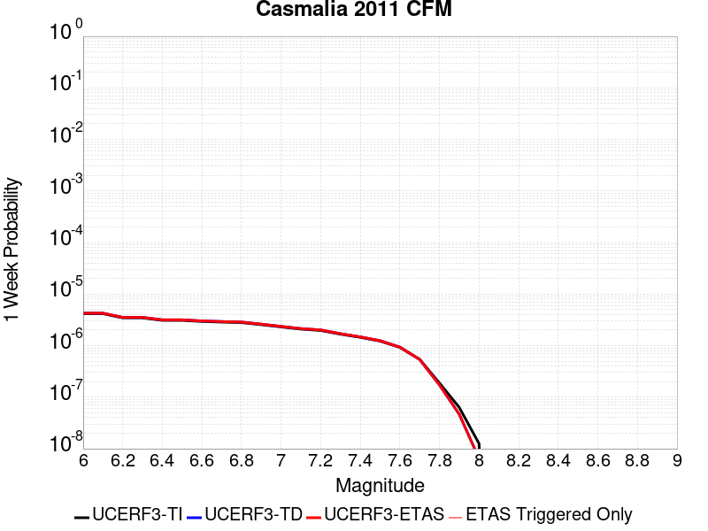 |  | 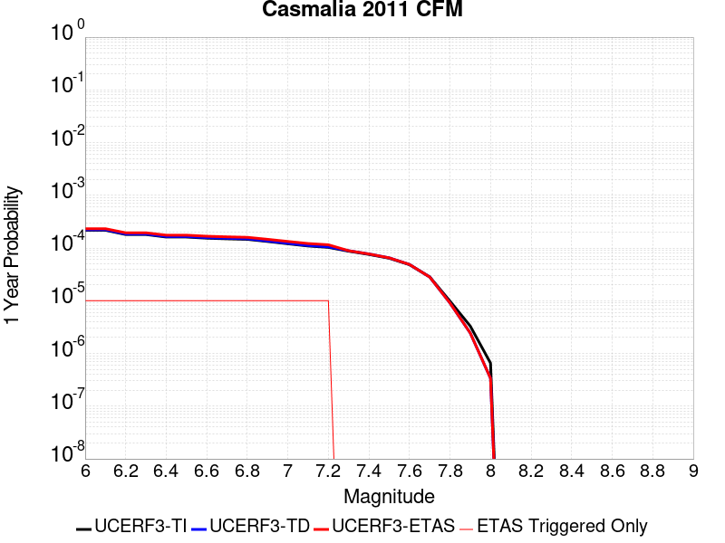 | 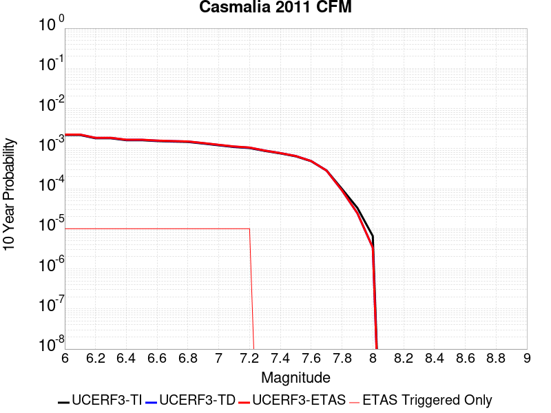 |

| Magnitude | 1 wk TI Prob | 1 wk TD Prob | 1 wk ETAS Prob | 1 wk ETAS/TD Gain | 1 wk ETAS Triggered Only | 1 mo TI Prob | 1 mo TD Prob | 1 mo ETAS Prob | 1 mo ETAS/TD Gain | 1 mo ETAS Triggered Only | 1 yr TI Prob | 1 yr TD Prob | 1 yr ETAS Prob | 1 yr ETAS/TD Gain | 1 yr ETAS Triggered Only | 10 yr TI Prob | 10 yr TD Prob | 10 yr ETAS Prob | 10 yr ETAS/TD Gain | 10 yr ETAS Triggered Only |
|-----|-----|-----|-----|-----|-----|-----|-----|-----|-----|-----|-----|-----|-----|-----|-----|-----|-----|-----|-----|-----|
| 6.0 | 4.1704893E-6 | 4.2624843E-6 | 4.2624843E-6 | 1.0 | 0.0 | 1.7873403E-5 | 1.8267663E-5 | 1.8267663E-5 | 1.0 | 0.0 | 2.1758694E-4 | 2.223863E-4 | 2.3238407E-4 | 1.0449568 | 1.0E-5 | 0.0021737402 | 0.0022216584 | 0.0022316363 | 1.0044911 | 1.0E-5 |
| 6.1 | 4.1704893E-6 | 4.2624843E-6 | 4.2624843E-6 | 1.0 | 0.0 | 1.7873403E-5 | 1.8267663E-5 | 1.8267663E-5 | 1.0 | 0.0 | 2.1758694E-4 | 2.223863E-4 | 2.3238407E-4 | 1.0449568 | 1.0E-5 | 0.0021737402 | 0.0022216584 | 0.0022316363 | 1.0044911 | 1.0E-5 |
| 6.2 | 3.457312E-6 | 3.537023E-6 | 3.537023E-6 | 1.0 | 0.0 | 1.4816967E-5 | 1.5158583E-5 | 1.5158583E-5 | 1.0 | 0.0 | 1.8038164E-4 | 1.845402E-4 | 1.9453836E-4 | 1.0541787 | 1.0E-5 | 0.001802353 | 0.0018438791 | 0.0018538607 | 1.0054133 | 1.0E-5 |
| 6.3 | 3.457312E-6 | 3.537023E-6 | 3.537023E-6 | 1.0 | 0.0 | 1.4816967E-5 | 1.5158583E-5 | 1.5158583E-5 | 1.0 | 0.0 | 1.8038164E-4 | 1.845402E-4 | 1.9453836E-4 | 1.0541787 | 1.0E-5 | 0.001802353 | 0.0018438791 | 0.0018538607 | 1.0054133 | 1.0E-5 |
| 6.4 | 3.0957337E-6 | 3.169227E-6 | 3.169227E-6 | 1.0 | 0.0 | 1.3267363E-5 | 1.3582331E-5 | 1.3582331E-5 | 1.0 | 0.0 | 1.6151817E-4 | 1.653524E-4 | 1.7535074E-4 | 1.0604669 | 1.0E-5 | 0.0016140083 | 0.0016522998 | 0.0016622832 | 1.0060421 | 1.0E-5 |
| 6.5 | 3.0957337E-6 | 3.169227E-6 | 3.169227E-6 | 1.0 | 0.0 | 1.3267363E-5 | 1.3582331E-5 | 1.3582331E-5 | 1.0 | 0.0 | 1.6151817E-4 | 1.653524E-4 | 1.7535074E-4 | 1.0604669 | 1.0E-5 | 0.0016140083 | 0.0016522998 | 0.0016622832 | 1.0060421 | 1.0E-5 |
| 6.6 | 2.9459152E-6 | 3.0165766E-6 | 3.0165766E-6 | 1.0 | 0.0 | 1.262529E-5 | 1.2928121E-5 | 1.2928121E-5 | 1.0 | 0.0 | 1.5370206E-4 | 1.5738855E-4 | 1.6738698E-4 | 1.063527 | 1.0E-5 | 0.0015359579 | 0.0015727765 | 0.0015827608 | 1.0063481 | 1.0E-5 |
| 6.7 | 2.8634809E-6 | 2.932474E-6 | 2.932474E-6 | 1.0 | 0.0 | 1.2272003E-5 | 1.2567685E-5 | 1.2567685E-5 | 1.0 | 0.0 | 1.4940138E-4 | 1.5300087E-4 | 1.6299935E-4 | 1.0653491 | 1.0E-5 | 0.0014930099 | 0.0015289608 | 0.0015389455 | 1.0065304 | 1.0E-5 |
| 6.8 | 2.7999822E-6 | 2.867598E-6 | 2.867598E-6 | 1.0 | 0.0 | 1.1999869E-5 | 1.2289648E-5 | 1.2289648E-5 | 1.0 | 0.0 | 1.460886E-4 | 1.4961624E-4 | 1.5961475E-4 | 1.0668277 | 1.0E-5 | 0.001459926 | 0.0014951604 | 0.0015051455 | 1.0066782 | 1.0E-5 |
| 6.9 | 2.551052E-6 | 2.6119662E-6 | 2.6119662E-6 | 1.0 | 0.0 | 1.0933034E-5 | 1.1194093E-5 | 1.1194093E-5 | 1.0 | 0.0 | 1.3310155E-4 | 1.3627959E-4 | 1.4627824E-4 | 1.0733685 | 1.0E-5 | 0.0013302186 | 0.0013619643 | 0.0013719506 | 1.0073323 | 1.0E-5 |
| 7.0 | 2.3081875E-6 | 2.3624102E-6 | 2.3624102E-6 | 1.0 | 0.0 | 9.892195E-6 | 1.0124576E-5 | 1.0124576E-5 | 1.0 | 0.0 | 1.20430814E-4 | 1.2325977E-4 | 1.3325854E-4 | 1.0811194 | 1.0E-5 | 0.0012036557 | 0.0012319168 | 0.0012419046 | 1.0081074 | 1.0E-5 |
| 7.1 | 2.093245E-6 | 2.1417256E-6 | 2.1417256E-6 | 1.0 | 0.0 | 8.971019E-6 | 9.1787915E-6 | 9.1787915E-6 | 1.0 | 0.0 | 1.09216686E-4 | 1.1174608E-4 | 1.2174496E-4 | 1.0894786 | 1.0E-5 | 0.0010916302 | 0.0011169009 | 0.0011268897 | 1.0089433 | 1.0E-5 |
| 7.2 | 1.9714576E-6 | 2.0165105E-6 | 2.0165105E-6 | 1.0 | 0.0 | 8.449076E-6 | 8.642159E-6 | 8.642159E-6 | 1.0 | 0.0 | 1.0286264E-4 | 1.0521322E-4 | 1.1521217E-4 | 1.0950351 | 1.0E-5 | 0.0010281504 | 0.001051636 | 0.0010616254 | 1.009499 | 1.0E-5 |
| 7.3 | 1.6689512E-6 | 1.7047145E-6 | 1.7047145E-6 | 1.0 | 0.0 | 7.1526288E-6 | 7.3058986E-6 | 7.3058986E-6 | 1.0 | 0.0 | 8.7079774E-5 | 8.894569E-5 | 8.894569E-5 | 1.0 | 0.0 | 8.7045657E-4 | 8.891017E-4 | 8.891017E-4 | 1.0 | 0.0 |
| 7.4 | 1.4490954E-6 | 1.4778922E-6 | 1.4778922E-6 | 1.0 | 0.0 | 6.210394E-6 | 6.333808E-6 | 6.333808E-6 | 1.0 | 0.0 | 7.560892E-5 | 7.711139E-5 | 7.711139E-5 | 1.0 | 0.0 | 7.55832E-4 | 7.7084696E-4 | 7.7084696E-4 | 1.0 | 0.0 |
| 7.5 | 1.226873E-6 | 1.2481714E-6 | 1.2481714E-6 | 1.0 | 0.0 | 5.2580162E-6 | 5.3492954E-6 | 5.3492954E-6 | 1.0 | 0.0 | 6.401447E-5 | 6.512573E-5 | 6.512573E-5 | 1.0 | 0.0 | 6.399603E-4 | 6.5106695E-4 | 6.5106695E-4 | 1.0 | 0.0 |
| 7.6 | 9.2561345E-7 | 9.3619366E-7 | 9.3619366E-7 | 1.0 | 0.0 | 3.966909E-6 | 4.0122522E-6 | 4.0122522E-6 | 1.0 | 0.0 | 4.8296046E-5 | 4.884808E-5 | 4.884808E-5 | 1.0 | 0.0 | 4.828555E-4 | 4.8837386E-4 | 4.8837386E-4 | 1.0 | 0.0 |
| 7.7 | 5.4367933E-7 | 5.3929017E-7 | 5.3929017E-7 | 1.0 | 0.0 | 2.3300522E-6 | 2.3112416E-6 | 2.3112416E-6 | 1.0 | 0.0 | 2.8368017E-5 | 2.8139004E-5 | 2.8139004E-5 | 1.0 | 0.0 | 2.8364395E-4 | 2.8135453E-4 | 2.8135453E-4 | 1.0 | 0.0 |
| 7.8 | 1.8825742E-7 | 1.7342425E-7 | 1.7342425E-7 | 1.0 | 0.0 | 8.068173E-7 | 7.432466E-7 | 7.432466E-7 | 1.0 | 0.0 | 9.822956E-6 | 9.048989E-6 | 9.048989E-6 | 1.0 | 0.0 | 9.822522E-5 | 9.048623E-5 | 9.048623E-5 | 1.0 | 0.0 |
| 7.9 | 6.342771E-8 | 4.679002E-8 | 4.679002E-8 | 1.0 | 0.0 | 2.7183304E-7 | 2.0052863E-7 | 2.0052863E-7 | 1.0 | 0.0 | 3.3095623E-6 | 2.4414335E-6 | 2.4414335E-6 | 1.0 | 0.0 | 3.309513E-5 | 2.441407E-5 | 2.441407E-5 | 1.0 | 0.0 |
| 8.0 | 1.2574819E-8 | 6.4727095E-9 | 6.4727095E-9 | 1.0 | 0.0 | 5.3892084E-8 | 2.7740182E-8 | 2.7740182E-8 | 1.0 | 0.0 | 6.561359E-7 | 3.3773665E-7 | 3.3773665E-7 | 1.0 | 0.0 | 6.56134E-6 | 3.3773617E-6 | 3.3773617E-6 | 1.0 | 0.0 |

## West Napa 2011 CFM
*[(top)](#table-of-contents)*

| 1 Week | 1 Month | 1 Year | 10 Year |
|-----|-----|-----|-----|
|  |  | 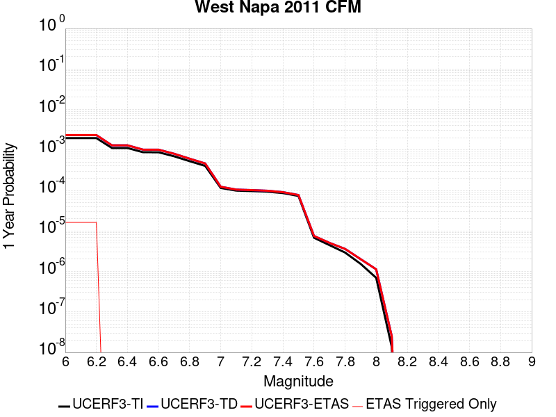 | 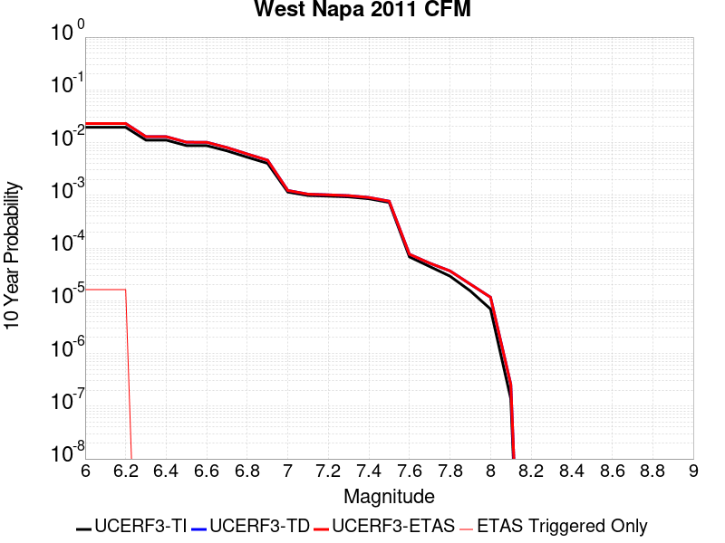 |

| Magnitude | 1 wk TI Prob | 1 wk TD Prob | 1 wk ETAS Prob | 1 wk ETAS/TD Gain | 1 wk ETAS Triggered Only | 1 mo TI Prob | 1 mo TD Prob | 1 mo ETAS Prob | 1 mo ETAS/TD Gain | 1 mo ETAS Triggered Only | 1 yr TI Prob | 1 yr TD Prob | 1 yr ETAS Prob | 1 yr ETAS/TD Gain | 1 yr ETAS Triggered Only | 10 yr TI Prob | 10 yr TD Prob | 10 yr ETAS Prob | 10 yr ETAS/TD Gain | 10 yr ETAS Triggered Only |
|-----|-----|-----|-----|-----|-----|-----|-----|-----|-----|-----|-----|-----|-----|-----|-----|-----|-----|-----|-----|-----|
| 6.0 | 3.773104E-5 | 4.4528504E-5 | 4.4528504E-5 | 1.0 | 0.0 | 1.6169442E-4 | 1.9082428E-4 | 1.9082428E-4 | 1.0 | 0.0 | 0.001966852 | 0.0023211278 | 0.0023311046 | 1.0042982 | 1.0E-5 | 0.019495348 | 0.023002012 | 0.023011781 | 1.0004247 | 1.0E-5 |
| 6.1 | 3.773104E-5 | 4.4528504E-5 | 4.4528504E-5 | 1.0 | 0.0 | 1.6169442E-4 | 1.9082428E-4 | 1.9082428E-4 | 1.0 | 0.0 | 0.001966852 | 0.0023211278 | 0.0023311046 | 1.0042982 | 1.0E-5 | 0.019495348 | 0.023002012 | 0.023011781 | 1.0004247 | 1.0E-5 |
| 6.2 | 3.773104E-5 | 4.4528504E-5 | 4.4528504E-5 | 1.0 | 0.0 | 1.6169442E-4 | 1.9082428E-4 | 1.9082428E-4 | 1.0 | 0.0 | 0.001966852 | 0.0023211278 | 0.0023311046 | 1.0042982 | 1.0E-5 | 0.019495348 | 0.023002012 | 0.023011781 | 1.0004247 | 1.0E-5 |
| 6.3 | 2.147964E-5 | 2.4987066E-5 | 2.4987066E-5 | 1.0 | 0.0 | 9.2052345E-5 | 1.0708355E-4 | 1.0708355E-4 | 1.0 | 0.0 | 0.001120161 | 0.0013030542 | 0.0013030542 | 1.0 | 0.0 | 0.011145315 | 0.012964482 | 0.012964482 | 1.0 | 0.0 |
| 6.4 | 2.147964E-5 | 2.4987066E-5 | 2.4987066E-5 | 1.0 | 0.0 | 9.2052345E-5 | 1.0708355E-4 | 1.0708355E-4 | 1.0 | 0.0 | 0.001120161 | 0.0013030542 | 0.0013030542 | 1.0 | 0.0 | 0.011145315 | 0.012964482 | 0.012964482 | 1.0 | 0.0 |
| 6.5 | 1.688201E-5 | 1.9547371E-5 | 1.9547371E-5 | 1.0 | 0.0 | 7.234947E-5 | 8.377217E-5 | 8.377217E-5 | 1.0 | 0.0 | 8.804988E-4 | 0.0010195216 | 0.0010195216 | 1.0 | 0.0 | 0.008770182 | 0.01015684 | 0.01015684 | 1.0 | 0.0 |
| 6.6 | 1.6846381E-5 | 1.9507064E-5 | 1.9507064E-5 | 1.0 | 0.0 | 7.219678E-5 | 8.3599436E-5 | 8.3599436E-5 | 1.0 | 0.0 | 8.7864127E-4 | 0.0010174206 | 0.0010174206 | 1.0 | 0.0 | 0.008751754 | 0.010136021 | 0.010136021 | 1.0 | 0.0 |
| 6.7 | 1.3396501E-5 | 1.5467684E-5 | 1.5467684E-5 | 1.0 | 0.0 | 5.7412315E-5 | 6.628875E-5 | 6.628875E-5 | 1.0 | 0.0 | 6.9877075E-4 | 8.068302E-4 | 8.068302E-4 | 1.0 | 0.0 | 0.0069657755 | 0.008046459 | 0.008046459 | 1.0 | 0.0 |
| 6.8 | 1.0139058E-5 | 1.16721785E-5 | 1.16721785E-5 | 1.0 | 0.0 | 4.3452383E-5 | 5.0022976E-5 | 5.0022976E-5 | 1.0 | 0.0 | 5.289043E-4 | 6.0891506E-4 | 6.0891506E-4 | 1.0 | 0.0 | 0.005276473 | 0.0060791126 | 0.0060791126 | 1.0 | 0.0 |
| 6.9 | 7.761281E-6 | 8.890723E-6 | 8.890723E-6 | 1.0 | 0.0 | 3.326221E-5 | 3.810283E-5 | 3.810283E-5 | 1.0 | 0.0 | 4.0489217E-4 | 4.6385458E-4 | 4.6385458E-4 | 1.0 | 0.0 | 0.0040415525 | 0.0046351026 | 0.0046351026 | 1.0 | 0.0 |
| 7.0 | 2.2109202E-6 | 2.3666319E-6 | 2.3666319E-6 | 1.0 | 0.0 | 9.475338E-6 | 1.01426685E-5 | 1.01426685E-5 | 1.0 | 0.0 | 1.1535613E-4 | 1.2348007E-4 | 1.2348007E-4 | 1.0 | 0.0 | 0.0011529627 | 0.0012353238 | 0.0012353238 | 1.0 | 0.0 |
| 7.1 | 1.9008926E-6 | 2.0133207E-6 | 2.0133207E-6 | 1.0 | 0.0 | 8.146657E-6 | 8.628488E-6 | 8.628488E-6 | 1.0 | 0.0 | 9.918104E-5 | 1.05046805E-4 | 1.05046805E-4 | 1.0 | 0.0 | 9.913679E-4 | 0.0010511756 | 0.0010511756 | 1.0 | 0.0 |
| 7.2 | 1.8495944E-6 | 1.9561273E-6 | 1.9561273E-6 | 1.0 | 0.0 | 7.926808E-6 | 8.383376E-6 | 8.383376E-6 | 1.0 | 0.0 | 9.650462E-5 | 1.0206285E-4 | 1.0206285E-4 | 1.0 | 0.0 | 9.6462725E-4 | 0.0010213639 | 0.0010213639 | 1.0 | 0.0 |
| 7.3 | 1.7883189E-6 | 1.8880897E-6 | 1.8880897E-6 | 1.0 | 0.0 | 7.664201E-6 | 8.091788E-6 | 8.091788E-6 | 1.0 | 0.0 | 9.330765E-5 | 9.85131E-5 | 9.85131E-5 | 1.0 | 0.0 | 9.3268487E-4 | 9.858976E-4 | 9.858976E-4 | 1.0 | 0.0 |
| 7.4 | 1.6520572E-6 | 1.7415113E-6 | 1.7415113E-6 | 1.0 | 0.0 | 7.0802257E-6 | 7.463598E-6 | 7.463598E-6 | 1.0 | 0.0 | 8.6198335E-5 | 9.086554E-5 | 9.086554E-5 | 1.0 | 0.0 | 8.616491E-4 | 9.0948684E-4 | 9.0948684E-4 | 1.0 | 0.0 |
| 7.5 | 1.4040345E-6 | 1.4800271E-6 | 1.4800271E-6 | 1.0 | 0.0 | 6.0172765E-6 | 6.342958E-6 | 6.342958E-6 | 1.0 | 0.0 | 7.325788E-5 | 7.72228E-5 | 7.72228E-5 | 1.0 | 0.0 | 7.3233736E-4 | 7.7311805E-4 | 7.7311805E-4 | 1.0 | 0.0 |
| 7.6 | 1.3013842E-7 | 1.4416163E-7 | 1.4416163E-7 | 1.0 | 0.0 | 5.57736E-7 | 6.178354E-7 | 6.178354E-7 | 1.0 | 0.0 | 6.790414E-6 | 7.52212E-6 | 7.52212E-6 | 1.0 | 0.0 | 6.790207E-5 | 7.61463E-5 | 7.61463E-5 | 1.0 | 0.0 |
| 7.7 | 8.541512E-8 | 9.716462E-8 | 9.716462E-8 | 1.0 | 0.0 | 3.6606474E-7 | 4.1641974E-7 | 4.1641974E-7 | 1.0 | 0.0 | 4.456829E-6 | 5.069898E-6 | 5.069898E-6 | 1.0 | 0.0 | 4.4567398E-5 | 5.160189E-5 | 5.160189E-5 | 1.0 | 0.0 |
| 7.8 | 5.6074793E-8 | 6.895456E-8 | 6.895456E-8 | 1.0 | 0.0 | 2.403205E-7 | 2.955195E-7 | 2.955195E-7 | 1.0 | 0.0 | 2.9258983E-6 | 3.597944E-6 | 3.597944E-6 | 1.0 | 0.0 | 2.9258597E-5 | 3.6812045E-5 | 3.6812045E-5 | 1.0 | 0.0 |
| 7.9 | 2.9475839E-8 | 3.8567407E-8 | 3.8567407E-8 | 1.0 | 0.0 | 1.2632502E-7 | 1.6528887E-7 | 1.6528887E-7 | 1.0 | 0.0 | 1.538006E-6 | 2.01239E-6 | 2.01239E-6 | 1.0 | 0.0 | 1.5379954E-5 | 2.0664074E-5 | 2.0664074E-5 | 1.0 | 0.0 |
| 8.0 | 1.3337122E-8 | 2.1632943E-8 | 2.1632943E-8 | 1.0 | 0.0 | 5.7159088E-8 | 9.2712604E-8 | 9.2712604E-8 | 1.0 | 0.0 | 6.959117E-7 | 1.1287754E-6 | 1.1287754E-6 | 1.0 | 0.0 | 6.959095E-6 | 1.1644432E-5 | 1.1644432E-5 | 1.0 | 0.0 |
| 8.1 | 2.6589986E-10 | 4.8617654E-10 | 4.8617654E-10 | 1.0 | 0.0 | 1.1395708E-9 | 2.0836133E-9 | 2.0836133E-9 | 1.0 | 0.0 | 1.3874274E-8 | 2.536799E-8 | 2.536799E-8 | 1.0 | 0.0 | 1.3874273E-7 | 2.6036727E-7 | 2.6036727E-7 | 1.0 | 0.0 |

## La Panza 2011
*[(top)](#table-of-contents)*

| 1 Week | 1 Month | 1 Year | 10 Year |
|-----|-----|-----|-----|
|  |  |  |  |

| Magnitude | 1 wk TI Prob | 1 wk TD Prob | 1 wk ETAS Prob | 1 wk ETAS/TD Gain | 1 wk ETAS Triggered Only | 1 mo TI Prob | 1 mo TD Prob | 1 mo ETAS Prob | 1 mo ETAS/TD Gain | 1 mo ETAS Triggered Only | 1 yr TI Prob | 1 yr TD Prob | 1 yr ETAS Prob | 1 yr ETAS/TD Gain | 1 yr ETAS Triggered Only | 10 yr TI Prob | 10 yr TD Prob | 10 yr ETAS Prob | 10 yr ETAS/TD Gain | 10 yr ETAS Triggered Only |
|-----|-----|-----|-----|-----|-----|-----|-----|-----|-----|-----|-----|-----|-----|-----|-----|-----|-----|-----|-----|-----|
| 6.0 | 4.6754544E-6 | 4.7175886E-6 | 1.47175415E-5 | 3.119717 | 1.0E-5 | 2.0037509E-5 | 2.021809E-5 | 3.0217889E-5 | 1.4945965 | 1.0E-5 | 2.4392935E-4 | 2.4612944E-4 | 2.5612698E-4 | 1.040619 | 1.0E-5 | 0.0024366176 | 0.0024587628 | 0.0024687382 | 1.004057 | 1.0E-5 |
| 6.1 | 4.6754544E-6 | 4.7175886E-6 | 1.47175415E-5 | 3.119717 | 1.0E-5 | 2.0037509E-5 | 2.021809E-5 | 3.0217889E-5 | 1.4945965 | 1.0E-5 | 2.4392935E-4 | 2.4612944E-4 | 2.5612698E-4 | 1.040619 | 1.0E-5 | 0.0024366176 | 0.0024587628 | 0.0024687382 | 1.004057 | 1.0E-5 |
| 6.2 | 4.6754544E-6 | 4.7175886E-6 | 1.47175415E-5 | 3.119717 | 1.0E-5 | 2.0037509E-5 | 2.021809E-5 | 3.0217889E-5 | 1.4945965 | 1.0E-5 | 2.4392935E-4 | 2.4612944E-4 | 2.5612698E-4 | 1.040619 | 1.0E-5 | 0.0024366176 | 0.0024587628 | 0.0024687382 | 1.004057 | 1.0E-5 |
| 6.3 | 4.6754544E-6 | 4.7175886E-6 | 1.47175415E-5 | 3.119717 | 1.0E-5 | 2.0037509E-5 | 2.021809E-5 | 3.0217889E-5 | 1.4945965 | 1.0E-5 | 2.4392935E-4 | 2.4612944E-4 | 2.5612698E-4 | 1.040619 | 1.0E-5 | 0.0024366176 | 0.0024587628 | 0.0024687382 | 1.004057 | 1.0E-5 |
| 6.4 | 4.6754544E-6 | 4.7175886E-6 | 1.47175415E-5 | 3.119717 | 1.0E-5 | 2.0037509E-5 | 2.021809E-5 | 3.0217889E-5 | 1.4945965 | 1.0E-5 | 2.4392935E-4 | 2.4612944E-4 | 2.5612698E-4 | 1.040619 | 1.0E-5 | 0.0024366176 | 0.0024587628 | 0.0024687382 | 1.004057 | 1.0E-5 |
| 6.5 | 2.485343E-6 | 2.5006007E-6 | 2.5006007E-6 | 1.0 | 0.0 | 1.0651426E-5 | 1.0716818E-5 | 1.0716818E-5 | 1.0 | 0.0 | 1.296734E-4 | 1.3046984E-4 | 1.3046984E-4 | 1.0 | 0.0 | 0.0012959775 | 0.0013039707 | 0.0013039707 | 1.0 | 0.0 |
| 6.6 | 2.485343E-6 | 2.5006007E-6 | 2.5006007E-6 | 1.0 | 0.0 | 1.0651426E-5 | 1.0716818E-5 | 1.0716818E-5 | 1.0 | 0.0 | 1.296734E-4 | 1.3046984E-4 | 1.3046984E-4 | 1.0 | 0.0 | 0.0012959775 | 0.0013039707 | 0.0013039707 | 1.0 | 0.0 |
| 6.7 | 1.5108508E-6 | 1.514639E-6 | 1.514639E-6 | 1.0 | 0.0 | 6.4750584E-6 | 6.4912947E-6 | 6.4912947E-6 | 1.0 | 0.0 | 7.8830984E-5 | 7.902876E-5 | 7.902876E-5 | 1.0 | 0.0 | 7.880303E-4 | 7.9001737E-4 | 7.9001737E-4 | 1.0 | 0.0 |
| 6.8 | 1.3865837E-6 | 1.3885118E-6 | 1.3885118E-6 | 1.0 | 0.0 | 5.942488E-6 | 5.950752E-6 | 5.950752E-6 | 1.0 | 0.0 | 7.234739E-5 | 7.244809E-5 | 7.244809E-5 | 1.0 | 0.0 | 7.232384E-4 | 7.242546E-4 | 7.242546E-4 | 1.0 | 0.0 |
| 6.9 | 9.826583E-7 | 9.796303E-7 | 9.796303E-7 | 1.0 | 0.0 | 4.2113857E-6 | 4.198409E-6 | 4.198409E-6 | 1.0 | 0.0 | 5.1272415E-5 | 5.1114486E-5 | 5.1114486E-5 | 1.0 | 0.0 | 5.126059E-4 | 5.1103265E-4 | 5.1103265E-4 | 1.0 | 0.0 |
| 7.0 | 6.7797646E-7 | 6.710231E-7 | 6.710231E-7 | 1.0 | 0.0 | 2.9056102E-6 | 2.8758104E-6 | 2.8758104E-6 | 1.0 | 0.0 | 3.537523E-5 | 3.501246E-5 | 3.501246E-5 | 1.0 | 0.0 | 3.5369597E-4 | 3.5007254E-4 | 3.5007254E-4 | 1.0 | 0.0 |
| 7.1 | 3.4979826E-7 | 3.3874045E-7 | 3.3874045E-7 | 1.0 | 0.0 | 1.4991346E-6 | 1.4517441E-6 | 1.4517441E-6 | 1.0 | 0.0 | 1.825181E-5 | 1.7674853E-5 | 1.7674853E-5 | 1.0 | 0.0 | 1.825031E-4 | 1.7673563E-4 | 1.7673563E-4 | 1.0 | 0.0 |
| 7.2 | 2.5088332E-7 | 2.3832064E-7 | 2.3832064E-7 | 1.0 | 0.0 | 1.0752137E-6 | 1.0213738E-6 | 1.0213738E-6 | 1.0 | 0.0 | 1.3090649E-5 | 1.2435164E-5 | 1.2435164E-5 | 1.0 | 0.0 | 1.3089878E-4 | 1.2434553E-4 | 1.2434553E-4 | 1.0 | 0.0 |
| 7.3 | 1.0159086E-7 | 8.644785E-8 | 8.644785E-8 | 1.0 | 0.0 | 4.3538932E-7 | 3.704907E-7 | 3.704907E-7 | 1.0 | 0.0 | 5.300852E-6 | 4.510716E-6 | 4.510716E-6 | 1.0 | 0.0 | 5.3007258E-5 | 4.510628E-5 | 4.510628E-5 | 1.0 | 0.0 |
| 7.4 | 3.5006252E-8 | 1.9403883E-8 | 1.9403883E-8 | 1.0 | 0.0 | 1.5002678E-7 | 8.315949E-8 | 8.315949E-8 | 1.0 | 0.0 | 1.8265745E-6 | 1.0124663E-6 | 1.0124663E-6 | 1.0 | 0.0 | 1.8265595E-5 | 1.012462E-5 | 1.012462E-5 | 1.0 | 0.0 |
| 7.5 | 2.592274E-8 | 1.0238468E-8 | 1.0238468E-8 | 1.0 | 0.0 | 1.1109746E-7 | 4.3879147E-8 | 4.3879147E-8 | 1.0 | 0.0 | 1.3526106E-6 | 5.342285E-7 | 5.342285E-7 | 1.0 | 0.0 | 1.3526024E-5 | 5.342273E-6 | 5.342273E-6 | 1.0 | 0.0 |
| 7.6 | 1.9016717E-8 | 5.2442264E-9 | 5.2442264E-9 | 1.0 | 0.0 | 8.150022E-8 | 2.2475257E-8 | 2.2475257E-8 | 1.0 | 0.0 | 9.922647E-7 | 2.736362E-7 | 2.736362E-7 | 1.0 | 0.0 | 9.922603E-6 | 2.736359E-6 | 2.736359E-6 | 1.0 | 0.0 |
| 7.7 | 1.17738495E-8 | 1.2393437E-9 | 1.2393437E-9 | 1.0 | 0.0 | 5.0459356E-8 | 5.3114735E-9 | 5.3114735E-9 | 1.0 | 0.0 | 6.1434247E-7 | 6.466719E-8 | 6.466719E-8 | 1.0 | 0.0 | 6.143408E-6 | 6.466717E-7 | 6.466717E-7 | 1.0 | 0.0 |
| 7.8 | 5.489079E-9 | 2.009185E-10 | 2.009185E-10 | 1.0 | 0.0 | 2.3524624E-8 | 8.61079E-10 | 8.61079E-10 | 1.0 | 0.0 | 2.8641225E-7 | 1.0483639E-8 | 1.0483639E-8 | 1.0 | 0.0 | 2.8641189E-6 | 1.0483638E-7 | 1.0483638E-7 | 1.0 | 0.0 |
| 7.9 | 2.5081048E-9 | 6.675449E-11 | 6.675449E-11 | 1.0 | 0.0 | 1.0749021E-8 | 2.8609015E-10 | 2.8609015E-10 | 1.0 | 0.0 | 1.3086932E-7 | 3.483148E-9 | 3.483148E-9 | 1.0 | 0.0 | 1.3086925E-6 | 3.483148E-8 | 3.483148E-8 | 1.0 | 0.0 |

## Reliz 2011 CFM
*[(top)](#table-of-contents)*

| 1 Week | 1 Month | 1 Year | 10 Year |
|-----|-----|-----|-----|
|  | 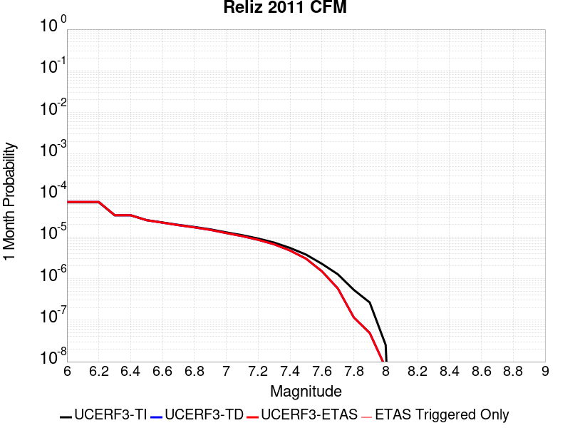 |  | 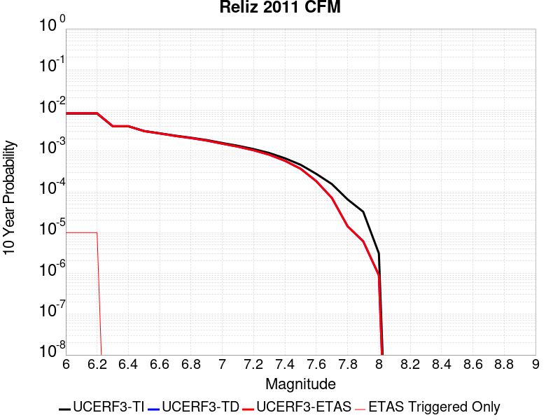 |

| Magnitude | 1 wk TI Prob | 1 wk TD Prob | 1 wk ETAS Prob | 1 wk ETAS/TD Gain | 1 wk ETAS Triggered Only | 1 mo TI Prob | 1 mo TD Prob | 1 mo ETAS Prob | 1 mo ETAS/TD Gain | 1 mo ETAS Triggered Only | 1 yr TI Prob | 1 yr TD Prob | 1 yr ETAS Prob | 1 yr ETAS/TD Gain | 1 yr ETAS Triggered Only | 10 yr TI Prob | 10 yr TD Prob | 10 yr ETAS Prob | 10 yr ETAS/TD Gain | 10 yr ETAS Triggered Only |
|-----|-----|-----|-----|-----|-----|-----|-----|-----|-----|-----|-----|-----|-----|-----|-----|-----|-----|-----|-----|-----|
| 6.0 | 1.6002472E-5 | 1.6282795E-5 | 1.6282795E-5 | 1.0 | 0.0 | 6.8580215E-5 | 6.978165E-5 | 6.978165E-5 | 1.0 | 0.0 | 8.3464425E-4 | 8.492802E-4 | 8.492802E-4 | 1.0 | 0.0 | 0.008315164 | 0.008462543 | 0.008472458 | 1.0011717 | 1.0E-5 |
| 6.1 | 1.6002472E-5 | 1.6282795E-5 | 1.6282795E-5 | 1.0 | 0.0 | 6.8580215E-5 | 6.978165E-5 | 6.978165E-5 | 1.0 | 0.0 | 8.3464425E-4 | 8.492802E-4 | 8.492802E-4 | 1.0 | 0.0 | 0.008315164 | 0.008462543 | 0.008472458 | 1.0011717 | 1.0E-5 |
| 6.2 | 1.6002472E-5 | 1.6282795E-5 | 1.6282795E-5 | 1.0 | 0.0 | 6.8580215E-5 | 6.978165E-5 | 6.978165E-5 | 1.0 | 0.0 | 8.3464425E-4 | 8.492802E-4 | 8.492802E-4 | 1.0 | 0.0 | 0.008315164 | 0.008462543 | 0.008472458 | 1.0011717 | 1.0E-5 |
| 6.3 | 7.792404E-6 | 7.803792E-6 | 7.803792E-6 | 1.0 | 0.0 | 3.339559E-5 | 3.3444398E-5 | 3.3444398E-5 | 1.0 | 0.0 | 4.0651546E-4 | 4.0711026E-4 | 4.0711026E-4 | 1.0 | 0.0 | 0.0040577264 | 0.0040639215 | 0.0040639215 | 1.0 | 0.0 |
| 6.4 | 7.792404E-6 | 7.803792E-6 | 7.803792E-6 | 1.0 | 0.0 | 3.339559E-5 | 3.3444398E-5 | 3.3444398E-5 | 1.0 | 0.0 | 4.0651546E-4 | 4.0711026E-4 | 4.0711026E-4 | 1.0 | 0.0 | 0.0040577264 | 0.0040639215 | 0.0040639215 | 1.0 | 0.0 |
| 6.5 | 5.9659374E-6 | 5.928728E-6 | 5.928728E-6 | 1.0 | 0.0 | 2.5568053E-5 | 2.5408588E-5 | 2.5408588E-5 | 1.0 | 0.0 | 3.1124658E-4 | 3.0930588E-4 | 3.0930588E-4 | 1.0 | 0.0 | 0.00310811 | 0.003088972 | 0.003088972 | 1.0 | 0.0 |
| 6.6 | 5.2350692E-6 | 5.178976E-6 | 5.178976E-6 | 1.0 | 0.0 | 2.2435817E-5 | 2.2195423E-5 | 2.2195423E-5 | 1.0 | 0.0 | 2.7312184E-4 | 2.7019592E-4 | 2.7019592E-4 | 1.0 | 0.0 | 0.002727864 | 0.0026988846 | 0.0026988846 | 1.0 | 0.0 |
| 6.7 | 4.580206E-6 | 4.50611E-6 | 4.50611E-6 | 1.0 | 0.0 | 1.9629308E-5 | 1.931176E-5 | 1.931176E-5 | 1.0 | 0.0 | 2.389606E-4 | 2.3509537E-4 | 2.3509537E-4 | 1.0 | 0.0 | 0.002387038 | 0.002348669 | 0.002348669 | 1.0 | 0.0 |
| 6.8 | 4.0765017E-6 | 3.988228E-6 | 3.988228E-6 | 1.0 | 0.0 | 1.7470604E-5 | 1.7092294E-5 | 1.7092294E-5 | 1.0 | 0.0 | 2.1268385E-4 | 2.0807884E-4 | 2.0807884E-4 | 1.0 | 0.0 | 0.002124804 | 0.0020790389 | 0.0020790389 | 1.0 | 0.0 |
| 6.9 | 3.5752896E-6 | 3.4725074E-6 | 3.4725074E-6 | 1.0 | 0.0 | 1.532258E-5 | 1.488209E-5 | 1.488209E-5 | 1.0 | 0.0 | 1.8653645E-4 | 1.811744E-4 | 1.811744E-4 | 1.0 | 0.0 | 0.0018637994 | 0.001810464 | 0.001810464 | 1.0 | 0.0 |
| 7.0 | 3.0259848E-6 | 2.9079317E-6 | 2.9079317E-6 | 1.0 | 0.0 | 1.2968442E-5 | 1.2462505E-5 | 1.2462505E-5 | 1.0 | 0.0 | 1.5787935E-4 | 1.5172044E-4 | 1.5172044E-4 | 1.0 | 0.0 | 0.0015776722 | 0.0015163644 | 0.0015163644 | 1.0 | 0.0 |
| 7.1 | 2.5861116E-6 | 2.455157E-6 | 2.455157E-6 | 1.0 | 0.0 | 1.1083288E-5 | 1.0522059E-5 | 1.0522059E-5 | 1.0 | 0.0 | 1.3493067E-4 | 1.2809855E-4 | 1.2809855E-4 | 1.0 | 0.0 | 0.0013484878 | 0.0012804423 | 0.0012804423 | 1.0 | 0.0 |
| 7.2 | 2.1482588E-6 | 2.0032267E-6 | 2.0032267E-6 | 1.0 | 0.0 | 9.20679E-6 | 8.585229E-6 | 8.585229E-6 | 1.0 | 0.0 | 1.12086906E-4 | 1.0452016E-4 | 1.0452016E-4 | 1.0 | 0.0 | 0.0011203039 | 0.0010449048 | 0.0010449048 | 1.0 | 0.0 |
| 7.3 | 1.7194744E-6 | 1.561114E-6 | 1.561114E-6 | 1.0 | 0.0 | 7.3691554E-6 | 6.6904713E-6 | 6.6904713E-6 | 1.0 | 0.0 | 8.971577E-5 | 8.145344E-5 | 8.145344E-5 | 1.0 | 0.0 | 8.967956E-4 | 8.144305E-4 | 8.144305E-4 | 1.0 | 0.0 |
| 7.4 | 1.2755178E-6 | 1.1056196E-6 | 1.1056196E-6 | 1.0 | 0.0 | 5.4664933E-6 | 4.738361E-6 | 4.738361E-6 | 1.0 | 0.0 | 6.655252E-5 | 5.768802E-5 | 5.768802E-5 | 1.0 | 0.0 | 6.6532596E-4 | 5.769249E-4 | 5.769249E-4 | 1.0 | 0.0 |
| 7.5 | 8.8463224E-7 | 7.0579193E-7 | 7.0579193E-7 | 1.0 | 0.0 | 3.7912755E-6 | 3.0248189E-6 | 3.0248189E-6 | 1.0 | 0.0 | 4.6157802E-5 | 3.682655E-5 | 3.682655E-5 | 1.0 | 0.0 | 4.6148215E-4 | 3.683988E-4 | 3.683988E-4 | 1.0 | 0.0 |
| 7.6 | 5.291355E-7 | 3.5006548E-7 | 3.5006548E-7 | 1.0 | 0.0 | 2.2677216E-6 | 1.5002796E-6 | 1.5002796E-6 | 1.0 | 0.0 | 2.760916E-5 | 1.8265751E-5 | 1.8265751E-5 | 1.0 | 0.0 | 2.760573E-4 | 1.8283579E-4 | 1.8283579E-4 | 1.0 | 0.0 |
| 7.7 | 2.9663357E-7 | 1.3509886E-7 | 1.3509886E-7 | 1.0 | 0.0 | 1.2712861E-6 | 5.7899496E-7 | 5.7899496E-7 | 1.0 | 0.0 | 1.5477797E-5 | 7.0492406E-6 | 7.0492406E-6 | 1.0 | 0.0 | 1.547672E-4 | 7.0675895E-5 | 7.0675895E-5 | 1.0 | 0.0 |
| 7.8 | 1.2509386E-7 | 2.7148959E-8 | 2.7148959E-8 | 1.0 | 0.0 | 5.3611643E-7 | 1.1635268E-7 | 1.1635268E-7 | 1.0 | 0.0 | 6.527198E-6 | 1.4165929E-6 | 1.4165929E-6 | 1.0 | 0.0 | 6.527006E-5 | 1.4322827E-5 | 1.4322827E-5 | 1.0 | 0.0 |
| 7.9 | 6.213493E-8 | 1.1477568E-8 | 1.1477568E-8 | 1.0 | 0.0 | 2.6629255E-7 | 4.9189577E-8 | 4.9189577E-8 | 1.0 | 0.0 | 3.242107E-6 | 5.9888293E-7 | 5.9888293E-7 | 1.0 | 0.0 | 3.2420594E-5 | 6.1203536E-6 | 6.1203536E-6 | 1.0 | 0.0 |
| 8.0 | 5.92383E-9 | 1.6775827E-9 | 1.6775827E-9 | 1.0 | 0.0 | 2.5387841E-8 | 7.18964E-9 | 7.18964E-9 | 1.0 | 0.0 | 3.0909692E-7 | 8.753386E-8 | 8.753386E-8 | 1.0 | 0.0 | 3.090965E-6 | 8.992677E-7 | 8.992677E-7 | 1.0 | 0.0 |

## Pitas Point (Lower)-Montalvo
*[(top)](#table-of-contents)*

| 1 Week | 1 Month | 1 Year | 10 Year |
|-----|-----|-----|-----|
|  |  |  |  |

| Magnitude | 1 wk TI Prob | 1 wk TD Prob | 1 wk ETAS Prob | 1 wk ETAS/TD Gain | 1 wk ETAS Triggered Only | 1 mo TI Prob | 1 mo TD Prob | 1 mo ETAS Prob | 1 mo ETAS/TD Gain | 1 mo ETAS Triggered Only | 1 yr TI Prob | 1 yr TD Prob | 1 yr ETAS Prob | 1 yr ETAS/TD Gain | 1 yr ETAS Triggered Only | 10 yr TI Prob | 10 yr TD Prob | 10 yr ETAS Prob | 10 yr ETAS/TD Gain | 10 yr ETAS Triggered Only |
|-----|-----|-----|-----|-----|-----|-----|-----|-----|-----|-----|-----|-----|-----|-----|-----|-----|-----|-----|-----|-----|
| 6.0 | 5.2543637E-6 | 4.8379025E-6 | 4.8379025E-6 | 1.0 | 0.0 | 2.2518509E-5 | 2.0733705E-5 | 2.0733705E-5 | 1.0 | 0.0 | 2.7412834E-4 | 2.5240393E-4 | 2.5240393E-4 | 1.0 | 0.0 | 0.0027379042 | 0.0025212052 | 0.00253118 | 1.0039563 | 1.0E-5 |
| 6.1 | 5.2543637E-6 | 4.8379025E-6 | 4.8379025E-6 | 1.0 | 0.0 | 2.2518509E-5 | 2.0733705E-5 | 2.0733705E-5 | 1.0 | 0.0 | 2.7412834E-4 | 2.5240393E-4 | 2.5240393E-4 | 1.0 | 0.0 | 0.0027379042 | 0.0025212052 | 0.00253118 | 1.0039563 | 1.0E-5 |
| 6.2 | 5.2543637E-6 | 4.8379025E-6 | 4.8379025E-6 | 1.0 | 0.0 | 2.2518509E-5 | 2.0733705E-5 | 2.0733705E-5 | 1.0 | 0.0 | 2.7412834E-4 | 2.5240393E-4 | 2.5240393E-4 | 1.0 | 0.0 | 0.0027379042 | 0.0025212052 | 0.00253118 | 1.0039563 | 1.0E-5 |
| 6.3 | 5.2543637E-6 | 4.8379025E-6 | 4.8379025E-6 | 1.0 | 0.0 | 2.2518509E-5 | 2.0733705E-5 | 2.0733705E-5 | 1.0 | 0.0 | 2.7412834E-4 | 2.5240393E-4 | 2.5240393E-4 | 1.0 | 0.0 | 0.0027379042 | 0.0025212052 | 0.00253118 | 1.0039563 | 1.0E-5 |
| 6.4 | 5.2543637E-6 | 4.8379025E-6 | 4.8379025E-6 | 1.0 | 0.0 | 2.2518509E-5 | 2.0733705E-5 | 2.0733705E-5 | 1.0 | 0.0 | 2.7412834E-4 | 2.5240393E-4 | 2.5240393E-4 | 1.0 | 0.0 | 0.0027379042 | 0.0025212052 | 0.00253118 | 1.0039563 | 1.0E-5 |
| 6.5 | 5.2543637E-6 | 4.8379025E-6 | 4.8379025E-6 | 1.0 | 0.0 | 2.2518509E-5 | 2.0733705E-5 | 2.0733705E-5 | 1.0 | 0.0 | 2.7412834E-4 | 2.5240393E-4 | 2.5240393E-4 | 1.0 | 0.0 | 0.0027379042 | 0.0025212052 | 0.00253118 | 1.0039563 | 1.0E-5 |
| 6.6 | 5.2543637E-6 | 4.8379025E-6 | 4.8379025E-6 | 1.0 | 0.0 | 2.2518509E-5 | 2.0733705E-5 | 2.0733705E-5 | 1.0 | 0.0 | 2.7412834E-4 | 2.5240393E-4 | 2.5240393E-4 | 1.0 | 0.0 | 0.0027379042 | 0.0025212052 | 0.00253118 | 1.0039563 | 1.0E-5 |
| 6.7 | 5.2543637E-6 | 4.8379025E-6 | 4.8379025E-6 | 1.0 | 0.0 | 2.2518509E-5 | 2.0733705E-5 | 2.0733705E-5 | 1.0 | 0.0 | 2.7412834E-4 | 2.5240393E-4 | 2.5240393E-4 | 1.0 | 0.0 | 0.0027379042 | 0.0025212052 | 0.00253118 | 1.0039563 | 1.0E-5 |
| 6.8 | 5.2543637E-6 | 4.8379025E-6 | 4.8379025E-6 | 1.0 | 0.0 | 2.2518509E-5 | 2.0733705E-5 | 2.0733705E-5 | 1.0 | 0.0 | 2.7412834E-4 | 2.5240393E-4 | 2.5240393E-4 | 1.0 | 0.0 | 0.0027379042 | 0.0025212052 | 0.00253118 | 1.0039563 | 1.0E-5 |
| 6.9 | 5.2543637E-6 | 4.8379025E-6 | 4.8379025E-6 | 1.0 | 0.0 | 2.2518509E-5 | 2.0733705E-5 | 2.0733705E-5 | 1.0 | 0.0 | 2.7412834E-4 | 2.5240393E-4 | 2.5240393E-4 | 1.0 | 0.0 | 0.0027379042 | 0.0025212052 | 0.00253118 | 1.0039563 | 1.0E-5 |
| 7.0 | 5.2543637E-6 | 4.8379025E-6 | 4.8379025E-6 | 1.0 | 0.0 | 2.2518509E-5 | 2.0733705E-5 | 2.0733705E-5 | 1.0 | 0.0 | 2.7412834E-4 | 2.5240393E-4 | 2.5240393E-4 | 1.0 | 0.0 | 0.0027379042 | 0.0025212052 | 0.00253118 | 1.0039563 | 1.0E-5 |
| 7.1 | 5.2543637E-6 | 4.8379025E-6 | 4.8379025E-6 | 1.0 | 0.0 | 2.2518509E-5 | 2.0733705E-5 | 2.0733705E-5 | 1.0 | 0.0 | 2.7412834E-4 | 2.5240393E-4 | 2.5240393E-4 | 1.0 | 0.0 | 0.0027379042 | 0.0025212052 | 0.00253118 | 1.0039563 | 1.0E-5 |
| 7.2 | 5.2458695E-6 | 4.8290563E-6 | 4.8290563E-6 | 1.0 | 0.0 | 2.2482105E-5 | 2.0695794E-5 | 2.0695794E-5 | 1.0 | 0.0 | 2.7368523E-4 | 2.5194246E-4 | 2.5194246E-4 | 1.0 | 0.0 | 0.0027334841 | 0.002516601 | 0.0025265757 | 1.0039636 | 1.0E-5 |
| 7.3 | 5.22665E-6 | 4.8089737E-6 | 4.8089737E-6 | 1.0 | 0.0 | 2.2399736E-5 | 2.0609727E-5 | 2.0609727E-5 | 1.0 | 0.0 | 2.7268266E-4 | 2.5089484E-4 | 2.5089484E-4 | 1.0 | 0.0 | 0.002723483 | 0.0025061483 | 0.0025161232 | 1.0039802 | 1.0E-5 |
| 7.4 | 5.210642E-6 | 4.7921862E-6 | 4.7921862E-6 | 1.0 | 0.0 | 2.233113E-5 | 2.053778E-5 | 2.053778E-5 | 1.0 | 0.0 | 2.718476E-4 | 2.500191E-4 | 2.500191E-4 | 1.0 | 0.0 | 0.002715153 | 0.0024974106 | 0.0025073856 | 1.0039941 | 1.0E-5 |
| 7.5 | 5.1226016E-6 | 4.7000726E-6 | 4.7000726E-6 | 1.0 | 0.0 | 2.1953823E-5 | 2.0143016E-5 | 2.0143016E-5 | 1.0 | 0.0 | 2.67255E-4 | 2.4521392E-4 | 2.4521392E-4 | 1.0 | 0.0 | 0.0026693381 | 0.002449465 | 0.0024594406 | 1.0040725 | 1.0E-5 |
| 7.6 | 4.8796987E-6 | 4.4449725E-6 | 4.4449725E-6 | 1.0 | 0.0 | 2.0912828E-5 | 1.9049745E-5 | 1.9049745E-5 | 1.0 | 0.0 | 2.5458392E-4 | 2.3190626E-4 | 2.3190626E-4 | 1.0 | 0.0 | 0.0025429246 | 0.0023166733 | 0.00232665 | 1.0043066 | 1.0E-5 |
| 7.7 | 4.0834398E-6 | 3.6091444E-6 | 3.6091444E-6 | 1.0 | 0.0 | 1.7500339E-5 | 1.546767E-5 | 1.546767E-5 | 1.0 | 0.0 | 2.1304579E-4 | 1.8830286E-4 | 1.8830286E-4 | 1.0 | 0.0 | 0.0021284167 | 0.0018814567 | 0.0018914379 | 1.005305 | 1.0E-5 |
| 7.8 | 2.5445438E-6 | 2.1212566E-6 | 2.1212566E-6 | 1.0 | 0.0 | 1.0905142E-5 | 9.091068E-6 | 9.091068E-6 | 1.0 | 0.0 | 1.3276201E-4 | 1.1067818E-4 | 1.1067818E-4 | 1.0 | 0.0 | 0.0013268272 | 0.0011062352 | 0.0011162242 | 1.0090296 | 1.0E-5 |
| 7.9 | 4.1677114E-7 | 3.3294015E-7 | 3.3294015E-7 | 1.0 | 0.0 | 1.7861609E-6 | 1.4268857E-6 | 1.4268857E-6 | 1.0 | 0.0 | 2.1746291E-5 | 1.7372196E-5 | 1.7372196E-5 | 1.0 | 0.0 | 2.1744163E-4 | 1.737087E-4 | 1.737087E-4 | 1.0 | 0.0 |
| 8.0 | 7.791402E-9 | 5.6836056E-9 | 5.6836056E-9 | 1.0 | 0.0 | 3.3391725E-8 | 2.4358311E-8 | 2.4358311E-8 | 1.0 | 0.0 | 4.0654416E-7 | 2.965624E-7 | 2.965624E-7 | 1.0 | 0.0 | 4.065434E-6 | 2.9656223E-6 | 2.9656223E-6 | 1.0 | 0.0 |

## Gillem - Big Crack 2011 CFM
*[(top)](#table-of-contents)*

| 1 Week | 1 Month | 1 Year | 10 Year |
|-----|-----|-----|-----|
| 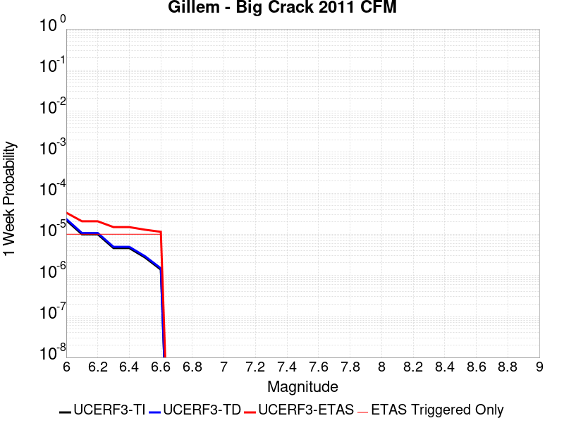 | 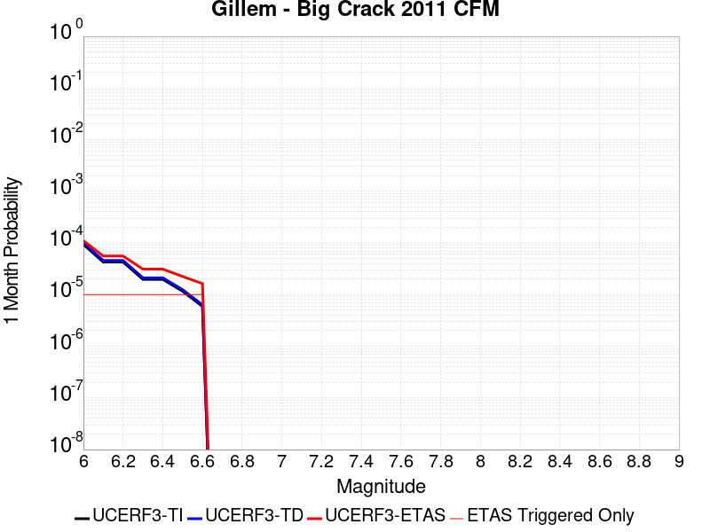 | 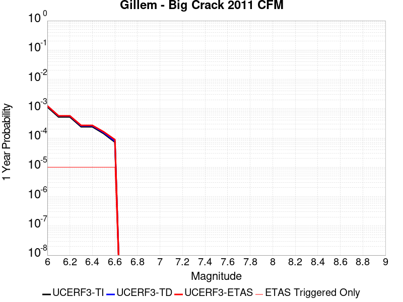 |  |

| Magnitude | 1 wk TI Prob | 1 wk TD Prob | 1 wk ETAS Prob | 1 wk ETAS/TD Gain | 1 wk ETAS Triggered Only | 1 mo TI Prob | 1 mo TD Prob | 1 mo ETAS Prob | 1 mo ETAS/TD Gain | 1 mo ETAS Triggered Only | 1 yr TI Prob | 1 yr TD Prob | 1 yr ETAS Prob | 1 yr ETAS/TD Gain | 1 yr ETAS Triggered Only | 10 yr TI Prob | 10 yr TD Prob | 10 yr ETAS Prob | 10 yr ETAS/TD Gain | 10 yr ETAS Triggered Only |
|-----|-----|-----|-----|-----|-----|-----|-----|-----|-----|-----|-----|-----|-----|-----|-----|-----|-----|-----|-----|-----|
| 6.0 | 2.196852E-5 | 2.3604485E-5 | 3.360425E-5 | 1.4236383 | 1.0E-5 | 9.4147406E-5 | 1.01158665E-4 | 1.1115765E-4 | 1.0988446 | 1.0E-5 | 0.0011456419 | 0.0012309998 | 0.0012409874 | 1.0081135 | 1.0E-5 | 0.011397537 | 0.012250669 | 0.012260547 | 1.0008063 | 1.0E-5 |
| 6.1 | 9.992795E-6 | 1.071189E-5 | 2.0711783E-5 | 1.9335321 | 1.0E-5 | 4.2825563E-5 | 4.5907396E-5 | 5.5906938E-5 | 1.2178198 | 1.0E-5 | 5.2127644E-4 | 5.587975E-4 | 5.6879193E-4 | 1.0178856 | 1.0E-5 | 0.0052005537 | 0.0055757347 | 0.005585679 | 1.0017835 | 1.0E-5 |
| 6.2 | 9.992795E-6 | 1.071189E-5 | 2.0711783E-5 | 1.9335321 | 1.0E-5 | 4.2825563E-5 | 4.5907396E-5 | 5.5906938E-5 | 1.2178198 | 1.0E-5 | 5.2127644E-4 | 5.587975E-4 | 5.6879193E-4 | 1.0178856 | 1.0E-5 | 0.0052005537 | 0.0055757347 | 0.005585679 | 1.0017835 | 1.0E-5 |
| 6.3 | 4.6127884E-6 | 4.942657E-6 | 1.4942608E-5 | 3.0231934 | 1.0E-5 | 1.9768944E-5 | 2.1182668E-5 | 3.118246E-5 | 1.472074 | 1.0E-5 | 2.406603E-4 | 2.5787292E-4 | 2.6787035E-4 | 1.0387688 | 1.0E-5 | 0.0024039985 | 0.0025761751 | 0.0025861494 | 1.0038717 | 1.0E-5 |
| 6.4 | 4.6127884E-6 | 4.942657E-6 | 1.4942608E-5 | 3.0231934 | 1.0E-5 | 1.9768944E-5 | 2.1182668E-5 | 3.118246E-5 | 1.472074 | 1.0E-5 | 2.406603E-4 | 2.5787292E-4 | 2.6787035E-4 | 1.0387688 | 1.0E-5 | 0.0024039985 | 0.0025761751 | 0.0025861494 | 1.0038717 | 1.0E-5 |
| 6.5 | 2.716712E-6 | 2.9111113E-6 | 1.2911082E-5 | 4.4351044 | 1.0E-5 | 1.1643E-5 | 1.24761455E-5 | 2.247602E-5 | 1.8015196 | 1.0E-5 | 1.417443E-4 | 1.5188892E-4 | 1.618874E-4 | 1.0658276 | 1.0E-5 | 0.0014165393 | 0.001518089 | 0.0015280738 | 1.0065773 | 1.0E-5 |
| 6.6 | 1.3818255E-6 | 1.4820689E-6 | 1.1482054E-5 | 7.7473145 | 1.0E-5 | 5.922096E-6 | 6.3517155E-6 | 1.6351652E-5 | 2.5743678 | 1.0E-5 | 7.209913E-5 | 7.7330624E-5 | 8.732985E-5 | 1.1293049 | 1.0E-5 | 7.2075747E-4 | 7.7315804E-4 | 7.831503E-4 | 1.012924 | 1.0E-5 |

## Superstition Hills
*[(top)](#table-of-contents)*

| 1 Week | 1 Month | 1 Year | 10 Year |
|-----|-----|-----|-----|
|  |  |  |  |

| Magnitude | 1 wk TI Prob | 1 wk TD Prob | 1 wk ETAS Prob | 1 wk ETAS/TD Gain | 1 wk ETAS Triggered Only | 1 mo TI Prob | 1 mo TD Prob | 1 mo ETAS Prob | 1 mo ETAS/TD Gain | 1 mo ETAS Triggered Only | 1 yr TI Prob | 1 yr TD Prob | 1 yr ETAS Prob | 1 yr ETAS/TD Gain | 1 yr ETAS Triggered Only | 10 yr TI Prob | 10 yr TD Prob | 10 yr ETAS Prob | 10 yr ETAS/TD Gain | 10 yr ETAS Triggered Only |
|-----|-----|-----|-----|-----|-----|-----|-----|-----|-----|-----|-----|-----|-----|-----|-----|-----|-----|-----|-----|-----|
| 6.0 | 6.6865185E-5 | 1.4137668E-5 | 1.4137668E-5 | 1.0 | 0.0 | 2.8653358E-4 | 6.058869E-5 | 6.058869E-5 | 1.0 | 0.0 | 0.0034829667 | 7.374338E-4 | 7.474264E-4 | 1.0135505 | 1.0E-5 | 0.03428881 | 0.007520696 | 0.007530621 | 1.0013196 | 1.0E-5 |
| 6.1 | 6.544851E-5 | 1.4137668E-5 | 1.4137668E-5 | 1.0 | 0.0 | 2.8046346E-4 | 6.058869E-5 | 6.058869E-5 | 1.0 | 0.0 | 0.0034092965 | 7.374338E-4 | 7.474264E-4 | 1.0135505 | 1.0E-5 | 0.033574644 | 0.0075206957 | 0.0075306203 | 1.0013196 | 1.0E-5 |
| 6.2 | 6.544851E-5 | 1.4137668E-5 | 1.4137668E-5 | 1.0 | 0.0 | 2.8046346E-4 | 6.058869E-5 | 6.058869E-5 | 1.0 | 0.0 | 0.0034092965 | 7.374338E-4 | 7.474264E-4 | 1.0135505 | 1.0E-5 | 0.033574644 | 0.0075206957 | 0.0075306203 | 1.0013196 | 1.0E-5 |
| 6.3 | 5.2402065E-5 | 1.4137667E-5 | 1.4137667E-5 | 1.0 | 0.0 | 2.2456095E-4 | 6.0588685E-5 | 6.0588685E-5 | 1.0 | 0.0 | 0.0027306017 | 7.374338E-4 | 7.474264E-4 | 1.0135505 | 1.0E-5 | 0.02697292 | 0.0075206906 | 0.007530615 | 1.0013196 | 1.0E-5 |
| 6.4 | 4.542238E-5 | 1.4137666E-5 | 1.4137666E-5 | 1.0 | 0.0 | 1.9465282E-4 | 6.058868E-5 | 6.058868E-5 | 1.0 | 0.0 | 0.0023673223 | 7.3743373E-4 | 7.4742635E-4 | 1.0135505 | 1.0E-5 | 0.023422617 | 0.007520688 | 0.007530613 | 1.0013196 | 1.0E-5 |
| 6.5 | 2.9672969E-5 | 1.4137665E-5 | 1.4137665E-5 | 1.0 | 0.0 | 1.2716366E-4 | 6.0588678E-5 | 6.0588678E-5 | 1.0 | 0.0 | 0.0015471181 | 7.374337E-4 | 7.474263E-4 | 1.0135505 | 1.0E-5 | 0.015363912 | 0.0075206826 | 0.0075306077 | 1.0013196 | 1.0E-5 |
| 6.6 | 2.6056105E-5 | 1.3803436E-5 | 1.3803436E-5 | 1.0 | 0.0 | 1.1166424E-4 | 5.915633E-5 | 5.915633E-5 | 1.0 | 0.0 | 0.0013586642 | 7.200064E-4 | 7.299992E-4 | 1.0138788 | 1.0E-5 | 0.013503874 | 0.0073450673 | 0.007354994 | 1.0013515 | 1.0E-5 |
| 6.7 | 1.4611248E-5 | 1.338333E-5 | 1.338333E-5 | 1.0 | 0.0 | 6.261813E-5 | 5.7355956E-5 | 5.7355956E-5 | 1.0 | 0.0 | 7.6210906E-4 | 6.9810095E-4 | 7.08094E-4 | 1.0143145 | 1.0E-5 | 0.0075950073 | 0.0071262526 | 0.0071361815 | 1.0013933 | 1.0E-5 |
| 6.8 | 1.30607E-5 | 1.09787115E-5 | 1.09787115E-5 | 1.0 | 0.0 | 5.597323E-5 | 4.705082E-5 | 4.705082E-5 | 1.0 | 0.0 | 6.8126095E-4 | 5.727019E-4 | 5.826962E-4 | 1.017451 | 1.0E-5 | 0.006791762 | 0.005873964 | 0.0058839056 | 1.0016924 | 1.0E-5 |
| 6.9 | 1.0443096E-5 | 8.19507E-6 | 8.19507E-6 | 1.0 | 0.0 | 4.4755358E-5 | 3.512127E-5 | 3.512127E-5 | 1.0 | 0.0 | 5.447602E-4 | 4.2751993E-4 | 4.3751564E-4 | 1.0233808 | 1.0E-5 | 0.005434267 | 0.004409497 | 0.004419453 | 1.0022578 | 1.0E-5 |
| 7.0 | 8.045912E-6 | 6.739447E-6 | 6.739447E-6 | 1.0 | 0.0 | 3.4482026E-5 | 2.888303E-5 | 2.888303E-5 | 1.0 | 0.0 | 4.197378E-4 | 3.5159517E-4 | 3.6159166E-4 | 1.0284318 | 1.0E-5 | 0.0041894587 | 0.0036335257 | 0.0036434894 | 1.0027422 | 1.0E-5 |
| 7.1 | 8.045912E-6 | 6.739447E-6 | 6.739447E-6 | 1.0 | 0.0 | 3.4482026E-5 | 2.888303E-5 | 2.888303E-5 | 1.0 | 0.0 | 4.197378E-4 | 3.5159517E-4 | 3.6159166E-4 | 1.0284318 | 1.0E-5 | 0.0041894587 | 0.0036335257 | 0.0036434894 | 1.0027422 | 1.0E-5 |
| 7.2 | 7.375506E-6 | 6.2463805E-6 | 6.2463805E-6 | 1.0 | 0.0 | 3.1608928E-5 | 2.6769932E-5 | 2.6769932E-5 | 1.0 | 0.0 | 3.8477074E-4 | 3.2587603E-4 | 3.3587278E-4 | 1.0306765 | 1.0E-5 | 0.003841052 | 0.0033741172 | 0.0033840835 | 1.0029538 | 1.0E-5 |
| 7.3 | 6.6063913E-6 | 5.798824E-6 | 5.798824E-6 | 1.0 | 0.0 | 2.8312797E-5 | 2.4851872E-5 | 2.4851872E-5 | 1.0 | 0.0 | 3.446538E-4 | 3.0253024E-4 | 3.125272E-4 | 1.0330446 | 1.0E-5 | 0.0034411973 | 0.0031383524 | 0.003148321 | 1.0031763 | 1.0E-5 |
| 7.4 | 6.4313126E-6 | 5.6802523E-6 | 5.6802523E-6 | 1.0 | 0.0 | 2.7562477E-5 | 2.4343715E-5 | 2.4343715E-5 | 1.0 | 0.0 | 3.355215E-4 | 2.963451E-4 | 3.0634215E-4 | 1.0337344 | 1.0E-5 | 0.0033501536 | 0.003076105 | 0.003086074 | 1.0032408 | 1.0E-5 |
| 7.5 | 6.0742927E-6 | 5.476088E-6 | 5.476088E-6 | 1.0 | 0.0 | 2.6032423E-5 | 2.3468741E-5 | 2.3468741E-5 | 1.0 | 0.0 | 3.1689866E-4 | 2.8569513E-4 | 2.956923E-4 | 1.0349923 | 1.0E-5 | 0.0031644711 | 0.0029679502 | 0.0029779205 | 1.0033593 | 1.0E-5 |
| 7.6 | 5.6987187E-6 | 5.2943155E-6 | 5.2943155E-6 | 1.0 | 0.0 | 2.4422852E-5 | 2.268973E-5 | 2.268973E-5 | 1.0 | 0.0 | 2.9730765E-4 | 2.762131E-4 | 2.8621033E-4 | 1.036194 | 1.0E-5 | 0.002969102 | 0.0028712032 | 0.0028811747 | 1.0034728 | 1.0E-5 |
| 7.7 | 5.1658035E-6 | 4.925336E-6 | 4.925336E-6 | 1.0 | 0.0 | 2.2138971E-5 | 2.1108413E-5 | 2.1108413E-5 | 1.0 | 0.0 | 2.6950863E-4 | 2.5696523E-4 | 2.6696266E-4 | 1.0389057 | 1.0E-5 | 0.00269182 | 0.0026763005 | 0.0026862738 | 1.0037265 | 1.0E-5 |
| 7.8 | 3.6864697E-6 | 4.1963563E-6 | 4.1963563E-6 | 1.0 | 0.0 | 1.579906E-5 | 1.7984263E-5 | 1.7984263E-5 | 1.0 | 0.0 | 1.9233658E-4 | 2.1893687E-4 | 2.2893467E-4 | 1.0456653 | 1.0E-5 | 0.0019217018 | 0.0022895595 | 0.0022995365 | 1.0043577 | 1.0E-5 |
| 7.9 | 3.0265903E-6 | 3.5636078E-6 | 3.5636078E-6 | 1.0 | 0.0 | 1.2971037E-5 | 1.5272519E-5 | 1.5272519E-5 | 1.0 | 0.0 | 1.5791094E-4 | 1.8592748E-4 | 1.8592748E-4 | 1.0 | 0.0 | 0.0015779877 | 0.0019537222 | 0.0019537222 | 1.0 | 0.0 |
| 8.0 | 2.5271493E-6 | 3.0866524E-6 | 3.0866524E-6 | 1.0 | 0.0 | 1.0830595E-5 | 1.3228446E-5 | 1.3228446E-5 | 1.0 | 0.0 | 1.3185451E-4 | 1.6104484E-4 | 1.6104484E-4 | 1.0 | 0.0 | 0.0013177631 | 0.0016975543 | 0.0016975543 | 1.0 | 0.0 |
| 8.1 | 2.3749135E-6 | 2.9172957E-6 | 2.9172957E-6 | 1.0 | 0.0 | 1.0178161E-5 | 1.2502638E-5 | 1.2502638E-5 | 1.0 | 0.0 | 1.2391206E-4 | 1.522094E-4 | 1.522094E-4 | 1.0 | 0.0 | 0.0012384299 | 0.0016051348 | 0.0016051348 | 1.0 | 0.0 |
| 8.2 | 1.7186406E-9 | 1.1438838E-9 | 1.1438838E-9 | 1.0 | 0.0 | 7.3656024E-9 | 4.902359E-9 | 4.902359E-9 | 1.0 | 0.0 | 8.9676206E-8 | 5.968622E-8 | 5.968622E-8 | 1.0 | 0.0 | 8.9676166E-7 | 6.386644E-7 | 6.386644E-7 | 1.0 | 0.0 |

## Richfield
*[(top)](#table-of-contents)*

| 1 Week | 1 Month | 1 Year | 10 Year |
|-----|-----|-----|-----|
|  | 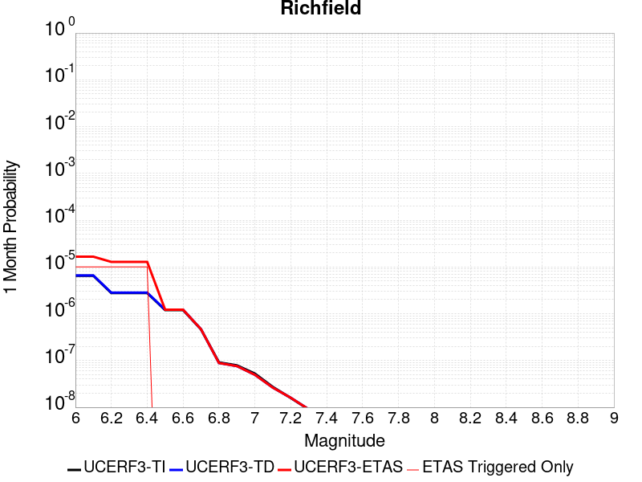 |  |  |

| Magnitude | 1 wk TI Prob | 1 wk TD Prob | 1 wk ETAS Prob | 1 wk ETAS/TD Gain | 1 wk ETAS Triggered Only | 1 mo TI Prob | 1 mo TD Prob | 1 mo ETAS Prob | 1 mo ETAS/TD Gain | 1 mo ETAS Triggered Only | 1 yr TI Prob | 1 yr TD Prob | 1 yr ETAS Prob | 1 yr ETAS/TD Gain | 1 yr ETAS Triggered Only | 10 yr TI Prob | 10 yr TD Prob | 10 yr ETAS Prob | 10 yr ETAS/TD Gain | 10 yr ETAS Triggered Only |
|-----|-----|-----|-----|-----|-----|-----|-----|-----|-----|-----|-----|-----|-----|-----|-----|-----|-----|-----|-----|-----|
| 6.0 | 1.5166896E-6 | 1.5392679E-6 | 1.5392679E-6 | 1.0 | 0.0 | 6.5000822E-6 | 6.596852E-6 | 1.6596787E-5 | 2.5158646 | 1.0E-5 | 7.913562E-5 | 8.0314814E-5 | 9.031401E-5 | 1.1245 | 1.0E-5 | 7.910745E-4 | 8.0296566E-4 | 8.129576E-4 | 1.0124438 | 1.0E-5 |
| 6.1 | 1.5166896E-6 | 1.5392679E-6 | 1.5392679E-6 | 1.0 | 0.0 | 6.5000822E-6 | 6.596852E-6 | 1.6596787E-5 | 2.5158646 | 1.0E-5 | 7.913562E-5 | 8.0314814E-5 | 9.031401E-5 | 1.1245 | 1.0E-5 | 7.910745E-4 | 8.0296566E-4 | 8.129576E-4 | 1.0124438 | 1.0E-5 |
| 6.2 | 6.473272E-7 | 6.598479E-7 | 6.598479E-7 | 1.0 | 0.0 | 2.7742565E-6 | 2.8279171E-6 | 1.2827889E-5 | 4.5361614 | 1.0E-5 | 3.377605E-5 | 3.442948E-5 | 4.4429136E-5 | 1.2904388 | 1.0E-5 | 3.3770915E-4 | 3.4425448E-4 | 3.5425107E-4 | 1.0290383 | 1.0E-5 |
| 6.3 | 6.473272E-7 | 6.598479E-7 | 6.598479E-7 | 1.0 | 0.0 | 2.7742565E-6 | 2.8279171E-6 | 1.2827889E-5 | 4.5361614 | 1.0E-5 | 3.377605E-5 | 3.442948E-5 | 4.4429136E-5 | 1.2904388 | 1.0E-5 | 3.3770915E-4 | 3.4425448E-4 | 3.5425107E-4 | 1.0290383 | 1.0E-5 |
| 6.4 | 6.473272E-7 | 6.598479E-7 | 6.598479E-7 | 1.0 | 0.0 | 2.7742565E-6 | 2.8279171E-6 | 1.2827889E-5 | 4.5361614 | 1.0E-5 | 3.377605E-5 | 3.442948E-5 | 4.4429136E-5 | 1.2904388 | 1.0E-5 | 3.3770915E-4 | 3.4425448E-4 | 3.5425107E-4 | 1.0290383 | 1.0E-5 |
| 6.5 | 2.7954403E-7 | 2.85316E-7 | 2.85316E-7 | 1.0 | 0.0 | 1.1980452E-6 | 1.2227825E-6 | 1.2227825E-6 | 1.0 | 0.0 | 1.4586103E-5 | 1.4887319E-5 | 1.4887319E-5 | 1.0 | 0.0 | 1.4585146E-4 | 1.4886746E-4 | 1.4886746E-4 | 1.0 | 0.0 |
| 6.6 | 2.7954403E-7 | 2.85316E-7 | 2.85316E-7 | 1.0 | 0.0 | 1.1980452E-6 | 1.2227825E-6 | 1.2227825E-6 | 1.0 | 0.0 | 1.4586103E-5 | 1.4887319E-5 | 1.4887319E-5 | 1.0 | 0.0 | 1.4585146E-4 | 1.4886746E-4 | 1.4886746E-4 | 1.0 | 0.0 |
| 6.7 | 1.0777299E-7 | 1.0878809E-7 | 1.0878809E-7 | 1.0 | 0.0 | 4.6188418E-7 | 4.662346E-7 | 4.662346E-7 | 1.0 | 0.0 | 5.6234253E-6 | 5.676396E-6 | 5.676396E-6 | 1.0 | 0.0 | 5.623283E-5 | 5.676294E-5 | 5.676294E-5 | 1.0 | 0.0 |
| 6.8 | 2.1301874E-8 | 2.0666132E-8 | 2.0666132E-8 | 1.0 | 0.0 | 9.129375E-8 | 8.856914E-8 | 8.856914E-8 | 1.0 | 0.0 | 1.1115008E-6 | 1.0783288E-6 | 1.0783288E-6 | 1.0 | 0.0 | 1.1114952E-5 | 1.0783239E-5 | 1.0783239E-5 | 1.0 | 0.0 |
| 6.9 | 1.8413502E-8 | 1.7751097E-8 | 1.7751097E-8 | 1.0 | 0.0 | 7.891501E-8 | 7.607613E-8 | 7.607613E-8 | 1.0 | 0.0 | 9.607899E-7 | 9.2622645E-7 | 9.2622645E-7 | 1.0 | 0.0 | 9.607857E-6 | 9.2622295E-6 | 9.2622295E-6 | 1.0 | 0.0 |
| 7.0 | 1.2290541E-8 | 1.1574315E-8 | 1.1574315E-8 | 1.0 | 0.0 | 5.2673748E-8 | 4.9604207E-8 | 4.9604207E-8 | 1.0 | 0.0 | 6.413027E-7 | 6.03931E-7 | 6.03931E-7 | 1.0 | 0.0 | 6.4130086E-6 | 6.0392954E-6 | 6.0392954E-6 | 1.0 | 0.0 |
| 7.1 | 6.373573E-9 | 6.155758E-9 | 6.155758E-9 | 1.0 | 0.0 | 2.7315311E-8 | 2.6381821E-8 | 2.6381821E-8 | 1.0 | 0.0 | 3.3256384E-7 | 3.2119863E-7 | 3.2119863E-7 | 1.0 | 0.0 | 3.3256335E-6 | 3.211982E-6 | 3.211982E-6 | 1.0 | 0.0 |
| 7.2 | 3.6989944E-9 | 3.7360146E-9 | 3.7360146E-9 | 1.0 | 0.0 | 1.5852834E-8 | 1.6011493E-8 | 1.6011493E-8 | 1.0 | 0.0 | 1.9300822E-7 | 1.9493989E-7 | 1.9493989E-7 | 1.0 | 0.0 | 1.9300805E-6 | 1.9493975E-6 | 1.9493975E-6 | 1.0 | 0.0 |
| 7.3 | 2.097397E-9 | 2.1200501E-9 | 2.1200501E-9 | 1.0 | 0.0 | 8.9888434E-9 | 9.085929E-9 | 9.085929E-9 | 1.0 | 0.0 | 1.0943917E-7 | 1.1062118E-7 | 1.1062118E-7 | 1.0 | 0.0 | 1.0943911E-6 | 1.1062115E-6 | 1.1062115E-6 | 1.0 | 0.0 |
| 7.4 | 5.8314464E-12 | 5.8918426E-12 | 5.8918426E-12 | 1.0 | 0.0 | 2.4991786E-11 | 2.5250912E-11 | 2.5250912E-11 | 1.0 | 0.0 | 3.0427527E-10 | 3.0742975E-10 | 3.0742975E-10 | 1.0 | 0.0 | 3.0427532E-9 | 3.0742973E-9 | 3.0742973E-9 | 1.0 | 0.0 |

## Fontana (Seismicity)
*[(top)](#table-of-contents)*

| 1 Week | 1 Month | 1 Year | 10 Year |
|-----|-----|-----|-----|
|  |  |  |  |

| Magnitude | 1 wk TI Prob | 1 wk TD Prob | 1 wk ETAS Prob | 1 wk ETAS/TD Gain | 1 wk ETAS Triggered Only | 1 mo TI Prob | 1 mo TD Prob | 1 mo ETAS Prob | 1 mo ETAS/TD Gain | 1 mo ETAS Triggered Only | 1 yr TI Prob | 1 yr TD Prob | 1 yr ETAS Prob | 1 yr ETAS/TD Gain | 1 yr ETAS Triggered Only | 10 yr TI Prob | 10 yr TD Prob | 10 yr ETAS Prob | 10 yr ETAS/TD Gain | 10 yr ETAS Triggered Only |
|-----|-----|-----|-----|-----|-----|-----|-----|-----|-----|-----|-----|-----|-----|-----|-----|-----|-----|-----|-----|-----|
| 6.0 | 7.1789214E-6 | 7.5520006E-6 | 1.7551925E-5 | 2.3241425 | 1.0E-5 | 3.076644E-5 | 3.2365548E-5 | 4.2365224E-5 | 1.3089606 | 1.0E-5 | 3.7451705E-4 | 3.9402005E-4 | 4.0401611E-4 | 1.0253694 | 1.0E-5 | 0.003738865 | 0.003937214 | 0.0039471746 | 1.0025299 | 1.0E-5 |
| 6.1 | 7.1789214E-6 | 7.5520006E-6 | 1.7551925E-5 | 2.3241425 | 1.0E-5 | 3.076644E-5 | 3.2365548E-5 | 4.2365224E-5 | 1.3089606 | 1.0E-5 | 3.7451705E-4 | 3.9402005E-4 | 4.0401611E-4 | 1.0253694 | 1.0E-5 | 0.003738865 | 0.003937214 | 0.0039471746 | 1.0025299 | 1.0E-5 |
| 6.2 | 7.1789214E-6 | 7.5520006E-6 | 1.7551925E-5 | 2.3241425 | 1.0E-5 | 3.076644E-5 | 3.2365548E-5 | 4.2365224E-5 | 1.3089606 | 1.0E-5 | 3.7451705E-4 | 3.9402005E-4 | 4.0401611E-4 | 1.0253694 | 1.0E-5 | 0.003738865 | 0.003937214 | 0.0039471746 | 1.0025299 | 1.0E-5 |
| 6.3 | 7.1789214E-6 | 7.5520006E-6 | 1.7551925E-5 | 2.3241425 | 1.0E-5 | 3.076644E-5 | 3.2365548E-5 | 4.2365224E-5 | 1.3089606 | 1.0E-5 | 3.7451705E-4 | 3.9402005E-4 | 4.0401611E-4 | 1.0253694 | 1.0E-5 | 0.003738865 | 0.003937214 | 0.0039471746 | 1.0025299 | 1.0E-5 |
| 6.4 | 7.1789214E-6 | 7.5520006E-6 | 1.7551925E-5 | 2.3241425 | 1.0E-5 | 3.076644E-5 | 3.2365548E-5 | 4.2365224E-5 | 1.3089606 | 1.0E-5 | 3.7451705E-4 | 3.9402005E-4 | 4.0401611E-4 | 1.0253694 | 1.0E-5 | 0.003738865 | 0.003937214 | 0.0039471746 | 1.0025299 | 1.0E-5 |
| 6.5 | 5.2611317E-6 | 5.532726E-6 | 5.532726E-6 | 1.0 | 0.0 | 2.2547512E-5 | 2.3711682E-5 | 2.3711682E-5 | 1.0 | 0.0 | 2.744814E-4 | 2.8868974E-4 | 2.8868974E-4 | 1.0 | 0.0 | 0.002741426 | 0.0028868972 | 0.0028868972 | 1.0 | 0.0 |
| 6.6 | 5.2611317E-6 | 5.532726E-6 | 5.532726E-6 | 1.0 | 0.0 | 2.2547512E-5 | 2.3711682E-5 | 2.3711682E-5 | 1.0 | 0.0 | 2.744814E-4 | 2.8868974E-4 | 2.8868974E-4 | 1.0 | 0.0 | 0.002741426 | 0.0028868972 | 0.0028868972 | 1.0 | 0.0 |

## Hayward (No) 2011 CFM
*[(top)](#table-of-contents)*

| 1 Week | 1 Month | 1 Year | 10 Year |
|-----|-----|-----|-----|
|  |  |  |  |

| Magnitude | 1 wk TI Prob | 1 wk TD Prob | 1 wk ETAS Prob | 1 wk ETAS/TD Gain | 1 wk ETAS Triggered Only | 1 mo TI Prob | 1 mo TD Prob | 1 mo ETAS Prob | 1 mo ETAS/TD Gain | 1 mo ETAS Triggered Only | 1 yr TI Prob | 1 yr TD Prob | 1 yr ETAS Prob | 1 yr ETAS/TD Gain | 1 yr ETAS Triggered Only | 10 yr TI Prob | 10 yr TD Prob | 10 yr ETAS Prob | 10 yr ETAS/TD Gain | 10 yr ETAS Triggered Only |
|-----|-----|-----|-----|-----|-----|-----|-----|-----|-----|-----|-----|-----|-----|-----|-----|-----|-----|-----|-----|-----|
| 6.0 | 9.3068506E-5 | 1.739643E-4 | 1.739643E-4 | 1.0 | 0.0 | 3.9880406E-4 | 7.453474E-4 | 7.453474E-4 | 1.0 | 0.0 | 0.0048446343 | 0.009036727 | 0.009036727 | 1.0 | 0.0 | 0.047403704 | 0.086396605 | 0.08640575 | 1.0001057 | 1.0E-5 |
| 6.1 | 9.055486E-5 | 1.6947639E-4 | 1.6947639E-4 | 1.0 | 0.0 | 3.880345E-4 | 7.2612526E-4 | 7.2612526E-4 | 1.0 | 0.0 | 0.0047140904 | 0.008804814 | 0.008804814 | 1.0 | 0.0 | 0.046153355 | 0.08428568 | 0.08429483 | 1.0001086 | 1.0E-5 |
| 6.2 | 9.006742E-5 | 1.6868232E-4 | 1.6868232E-4 | 1.0 | 0.0 | 3.859461E-4 | 7.227246E-4 | 7.227246E-4 | 1.0 | 0.0 | 0.0046887742 | 0.00876378 | 0.00876378 | 1.0 | 0.0 | 0.0459107 | 0.08390991 | 0.08391907 | 1.0001092 | 1.0E-5 |
| 6.3 | 8.8336754E-5 | 1.6547782E-4 | 1.6547782E-4 | 1.0 | 0.0 | 3.7853114E-4 | 7.0899865E-4 | 7.0899865E-4 | 1.0 | 0.0 | 0.004598882 | 0.008598051 | 0.008598051 | 1.0 | 0.0 | 0.04504866 | 0.08240195 | 0.082411125 | 1.0001113 | 1.0E-5 |
| 6.4 | 8.526157E-5 | 1.5974796E-4 | 1.5974796E-4 | 1.0 | 0.0 | 3.6535555E-4 | 6.844552E-4 | 6.844552E-4 | 1.0 | 0.0 | 0.0044391346 | 0.00830156 | 0.00830156 | 1.0 | 0.0 | 0.043514993 | 0.07968467 | 0.07969387 | 1.0001155 | 1.0E-5 |
| 6.5 | 8.152396E-5 | 1.5307199E-4 | 1.5307199E-4 | 1.0 | 0.0 | 3.493416E-4 | 6.558586E-4 | 6.558586E-4 | 1.0 | 0.0 | 0.0042449418 | 0.007955993 | 0.007955993 | 1.0 | 0.0 | 0.04164765 | 0.07651448 | 0.07652372 | 1.0001206 | 1.0E-5 |
| 6.6 | 7.987405E-5 | 1.5011412E-4 | 1.5011412E-4 | 1.0 | 0.0 | 3.4227243E-4 | 6.431883E-4 | 6.431883E-4 | 1.0 | 0.0 | 0.0041592065 | 0.007802858 | 0.007802858 | 1.0 | 0.0 | 0.04082218 | 0.075105876 | 0.07511512 | 1.0001231 | 1.0E-5 |
| 6.7 | 7.777665E-5 | 1.4650672E-4 | 1.4650672E-4 | 1.0 | 0.0 | 3.332859E-4 | 6.277355E-4 | 6.277355E-4 | 1.0 | 0.0 | 0.004050208 | 0.007616053 | 0.007616053 | 1.0 | 0.0 | 0.039771806 | 0.0733825 | 0.073391765 | 1.0001262 | 1.0E-5 |
| 6.8 | 7.3284005E-5 | 1.3801287E-4 | 1.3801287E-4 | 1.0 | 0.0 | 3.140365E-4 | 5.9135025E-4 | 5.9135025E-4 | 1.0 | 0.0 | 0.0038166929 | 0.007176059 | 0.007176059 | 1.0 | 0.0 | 0.037518036 | 0.06929624 | 0.069305554 | 1.0001343 | 1.0E-5 |
| 6.9 | 6.458263E-5 | 1.21319164E-4 | 1.21319164E-4 | 1.0 | 0.0 | 2.7675333E-4 | 5.1983615E-4 | 5.1983615E-4 | 1.0 | 0.0 | 0.0033642664 | 0.0063107396 | 0.0063107396 | 1.0 | 0.0 | 0.033137884 | 0.061224625 | 0.061234012 | 1.0001533 | 1.0E-5 |
| 7.0 | 5.3853604E-5 | 1.00254634E-4 | 1.00254634E-4 | 1.0 | 0.0 | 2.3078074E-4 | 4.295923E-4 | 4.295923E-4 | 1.0 | 0.0 | 0.0028061352 | 0.0052178074 | 0.0052178074 | 1.0 | 0.0 | 0.027709642 | 0.050957024 | 0.050957024 | 1.0 | 0.0 |
| 7.1 | 4.4308683E-5 | 8.17098E-5 | 8.17098E-5 | 1.0 | 0.0 | 1.8988053E-4 | 3.5013806E-4 | 3.5013806E-4 | 1.0 | 0.0 | 0.0023093442 | 0.0042546396 | 0.0042546396 | 1.0 | 0.0 | 0.022854926 | 0.041824497 | 0.041824497 | 1.0 | 0.0 |
| 7.2 | 3.295973E-5 | 6.0774026E-5 | 6.0774026E-5 | 1.0 | 0.0 | 1.4124835E-4 | 2.6043423E-4 | 2.6043423E-4 | 1.0 | 0.0 | 0.0017183421 | 0.0031661994 | 0.0031661994 | 1.0 | 0.0 | 0.017051157 | 0.031370014 | 0.031370014 | 1.0 | 0.0 |
| 7.3 | 2.452256E-5 | 4.518223E-5 | 4.518223E-5 | 1.0 | 0.0 | 1.05092455E-4 | 1.9362383E-4 | 1.9362383E-4 | 1.0 | 0.0 | 0.0012787496 | 0.0023548352 | 0.0023548352 | 1.0 | 0.0 | 0.0127141625 | 0.023442036 | 0.023442036 | 1.0 | 0.0 |
| 7.4 | 1.8829967E-5 | 3.4604043E-5 | 3.4604043E-5 | 1.0 | 0.0 | 8.069736E-5 | 1.4829468E-4 | 1.4829468E-4 | 1.0 | 0.0 | 9.820475E-4 | 0.0018040023 | 0.0018040023 | 1.0 | 0.0 | 0.009777189 | 0.01802003 | 0.01802003 | 1.0 | 0.0 |
| 7.5 | 1.26374125E-5 | 2.292219E-5 | 2.292219E-5 | 1.0 | 0.0 | 5.4159216E-5 | 9.823428E-5 | 9.823428E-5 | 1.0 | 0.0 | 6.5918895E-4 | 0.0011953521 | 0.0011953521 | 1.0 | 0.0 | 0.00657237 | 0.011988704 | 0.011988704 | 1.0 | 0.0 |
| 7.6 | 4.666429E-6 | 8.479636E-6 | 8.479636E-6 | 1.0 | 0.0 | 1.9998828E-5 | 3.6340796E-5 | 3.6340796E-5 | 1.0 | 0.0 | 2.4345852E-4 | 4.423606E-4 | 4.423606E-4 | 1.0 | 0.0 | 0.0024319198 | 0.004458377 | 0.004458377 | 1.0 | 0.0 |
| 7.7 | 3.8399318E-7 | 7.1343146E-7 | 7.1343146E-7 | 1.0 | 0.0 | 1.6456839E-6 | 3.0575598E-6 | 3.0575598E-6 | 1.0 | 0.0 | 2.003602E-5 | 3.7225156E-5 | 3.7225156E-5 | 1.0 | 0.0 | 2.0034213E-4 | 3.86166E-4 | 3.86166E-4 | 1.0 | 0.0 |
| 7.8 | 2.5637698E-7 | 5.3666145E-7 | 5.3666145E-7 | 1.0 | 0.0 | 1.098758E-6 | 2.2999754E-6 | 2.2999754E-6 | 1.0 | 0.0 | 1.3377297E-5 | 2.8001843E-5 | 2.8001843E-5 | 1.0 | 0.0 | 1.3376492E-4 | 2.9246495E-4 | 2.9246495E-4 | 1.0 | 0.0 |
| 7.9 | 1.7141245E-7 | 3.7293606E-7 | 3.7293606E-7 | 1.0 | 0.0 | 7.3462456E-7 | 1.5982963E-6 | 1.5982963E-6 | 1.0 | 0.0 | 8.944017E-6 | 1.9459085E-5 | 1.9459085E-5 | 1.0 | 0.0 | 8.943657E-5 | 2.0246378E-4 | 2.0246378E-4 | 1.0 | 0.0 |
| 8.0 | 1.1808895E-7 | 2.7512246E-7 | 2.7512246E-7 | 1.0 | 0.0 | 5.060954E-7 | 1.1790958E-6 | 1.1790958E-6 | 1.0 | 0.0 | 6.161694E-6 | 1.4355397E-5 | 1.4355397E-5 | 1.0 | 0.0 | 6.161523E-5 | 1.4817173E-4 | 1.4817173E-4 | 1.0 | 0.0 |
| 8.1 | 5.138535E-8 | 1.12307575E-7 | 1.12307575E-7 | 1.0 | 0.0 | 2.2022292E-7 | 4.8131807E-7 | 4.8131807E-7 | 1.0 | 0.0 | 2.6812106E-6 | 5.860032E-6 | 5.860032E-6 | 1.0 | 0.0 | 2.6811784E-5 | 6.0156468E-5 | 6.0156468E-5 | 1.0 | 0.0 |

## Cerro Prieto
*[(top)](#table-of-contents)*

| 1 Week | 1 Month | 1 Year | 10 Year |
|-----|-----|-----|-----|
| 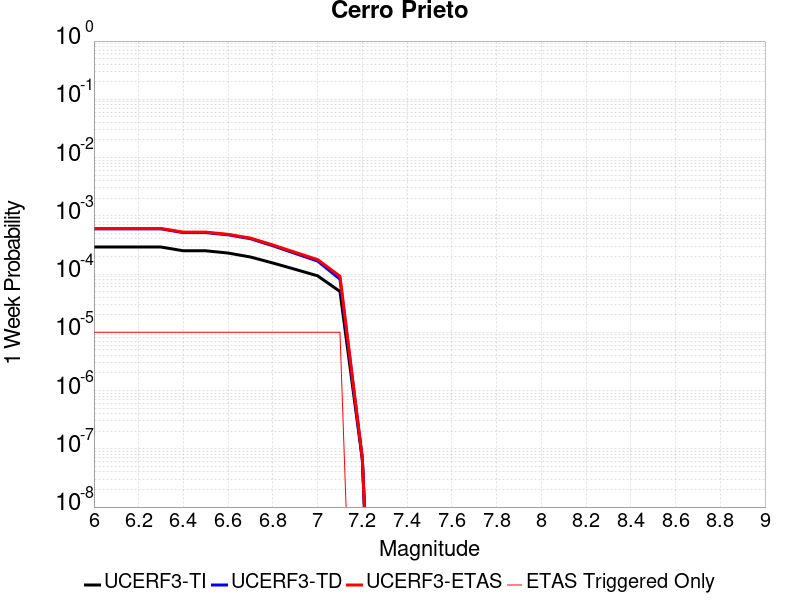 | 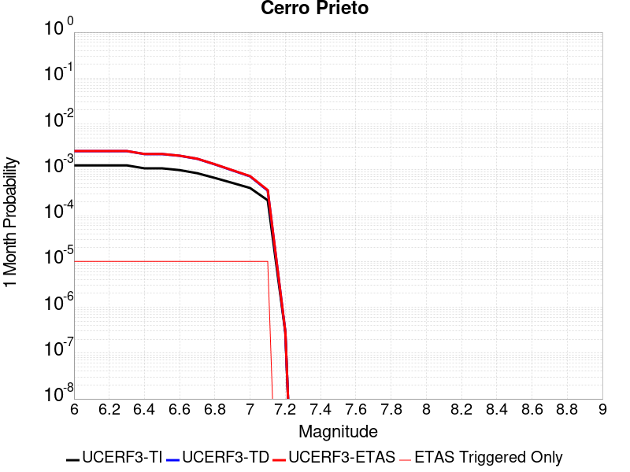 |  |  |

| Magnitude | 1 wk TI Prob | 1 wk TD Prob | 1 wk ETAS Prob | 1 wk ETAS/TD Gain | 1 wk ETAS Triggered Only | 1 mo TI Prob | 1 mo TD Prob | 1 mo ETAS Prob | 1 mo ETAS/TD Gain | 1 mo ETAS Triggered Only | 1 yr TI Prob | 1 yr TD Prob | 1 yr ETAS Prob | 1 yr ETAS/TD Gain | 1 yr ETAS Triggered Only | 10 yr TI Prob | 10 yr TD Prob | 10 yr ETAS Prob | 10 yr ETAS/TD Gain | 10 yr ETAS Triggered Only |
|-----|-----|-----|-----|-----|-----|-----|-----|-----|-----|-----|-----|-----|-----|-----|-----|-----|-----|-----|-----|-----|
| 6.0 | 2.9101528E-4 | 5.9654453E-4 | 6.0653855E-4 | 1.0167532 | 1.0E-5 | 0.0012466122 | 0.0025543566 | 0.002564331 | 1.0039049 | 1.0E-5 | 0.015072231 | 0.030802928 | 0.03081262 | 1.0003146 | 1.0E-5 | 0.14089979 | 0.25386256 | 0.25387004 | 1.0000294 | 1.0E-5 |
| 6.1 | 2.9101528E-4 | 5.9654453E-4 | 6.0653855E-4 | 1.0167532 | 1.0E-5 | 0.0012466122 | 0.0025543566 | 0.002564331 | 1.0039049 | 1.0E-5 | 0.015072231 | 0.030802928 | 0.03081262 | 1.0003146 | 1.0E-5 | 0.14089979 | 0.25386256 | 0.25387004 | 1.0000294 | 1.0E-5 |
| 6.2 | 2.9101528E-4 | 5.9654453E-4 | 6.0653855E-4 | 1.0167532 | 1.0E-5 | 0.0012466122 | 0.0025543566 | 0.002564331 | 1.0039049 | 1.0E-5 | 0.015072231 | 0.030802928 | 0.03081262 | 1.0003146 | 1.0E-5 | 0.14089979 | 0.25386256 | 0.25387004 | 1.0000294 | 1.0E-5 |
| 6.3 | 2.9101528E-4 | 5.9654453E-4 | 6.0653855E-4 | 1.0167532 | 1.0E-5 | 0.0012466122 | 0.0025543566 | 0.002564331 | 1.0039049 | 1.0E-5 | 0.015072231 | 0.030802928 | 0.03081262 | 1.0003146 | 1.0E-5 | 0.14089979 | 0.25386256 | 0.25387004 | 1.0000294 | 1.0E-5 |
| 6.4 | 2.508648E-4 | 5.140412E-4 | 5.240361E-4 | 1.0194438 | 1.0E-5 | 0.0010746918 | 0.0022013725 | 0.0022113505 | 1.0045326 | 1.0E-5 | 0.013006088 | 0.026629416 | 0.02663915 | 1.0003655 | 1.0E-5 | 0.12270685 | 0.2242222 | 0.22422995 | 1.0000346 | 1.0E-5 |
| 6.5 | 2.508648E-4 | 5.140412E-4 | 5.240361E-4 | 1.0194438 | 1.0E-5 | 0.0010746918 | 0.0022013725 | 0.0022113505 | 1.0045326 | 1.0E-5 | 0.013006088 | 0.026629416 | 0.02663915 | 1.0003655 | 1.0E-5 | 0.12270685 | 0.2242222 | 0.22422995 | 1.0000346 | 1.0E-5 |
| 6.6 | 2.294914E-4 | 4.7123645E-4 | 4.8123175E-4 | 1.0212108 | 1.0E-5 | 9.831638E-4 | 0.0020182093 | 0.0020281891 | 1.0049449 | 1.0E-5 | 0.011904482 | 0.024394194 | 0.02440395 | 1.0004 | 1.0E-5 | 0.11286586 | 0.20837563 | 0.20838355 | 1.000038 | 1.0E-5 |
| 6.7 | 1.9621674E-4 | 4.0426268E-4 | 4.1425863E-4 | 1.0247264 | 1.0E-5 | 8.4065786E-4 | 0.0017315624 | 0.001741545 | 1.0057651 | 1.0E-5 | 0.010187071 | 0.020888962 | 0.020898754 | 1.0004687 | 1.0E-5 | 0.09732539 | 0.18264732 | 0.18265548 | 1.0000447 | 1.0E-5 |
| 6.8 | 1.5476145E-4 | 3.0572579E-4 | 3.1572272E-4 | 1.0326991 | 1.0E-5 | 6.6309475E-4 | 0.0013096977 | 0.0013196847 | 1.0076253 | 1.0E-5 | 0.008043335 | 0.015826825 | 0.015836667 | 1.0006218 | 1.0E-5 | 0.07758363 | 0.14310057 | 0.14310914 | 1.0000598 | 1.0E-5 |
| 6.9 | 1.20509176E-4 | 2.2588465E-4 | 2.358824E-4 | 1.0442604 | 1.0E-5 | 5.1636563E-4 | 9.6778123E-4 | 9.777716E-4 | 1.0103229 | 1.0E-5 | 0.006268645 | 0.011734025 | 0.011743907 | 1.0008422 | 1.0E-5 | 0.060947374 | 0.10917958 | 0.10918849 | 1.0000815 | 1.0E-5 |
| 7.0 | 9.3269155E-5 | 1.6721459E-4 | 1.7721292E-4 | 1.0597934 | 1.0E-5 | 3.9966372E-4 | 7.1648025E-4 | 7.264731E-4 | 1.0139471 | 1.0E-5 | 0.0048550544 | 0.008695914 | 0.008705827 | 1.00114 | 1.0E-5 | 0.04750344 | 0.082943216 | 0.08295239 | 1.0001105 | 1.0E-5 |
| 7.1 | 5.029709E-5 | 8.174011E-5 | 9.173929E-5 | 1.122329 | 1.0E-5 | 2.1554115E-4 | 3.50287E-4 | 3.602835E-4 | 1.028538 | 1.0E-5 | 0.0026210553 | 0.004259821 | 0.0042697787 | 1.0023376 | 1.0E-5 | 0.025903556 | 0.04226813 | 0.04227771 | 1.0002266 | 1.0E-5 |
| 7.2 | 6.5445185E-8 | 6.824737E-8 | 6.824737E-8 | 1.0 | 0.0 | 2.8047933E-7 | 2.9248872E-7 | 2.9248872E-7 | 1.0 | 0.0 | 3.4148304E-6 | 3.56105E-6 | 3.56105E-6 | 1.0 | 0.0 | 3.414778E-5 | 3.56105E-5 | 3.56105E-5 | 1.0 | 0.0 |

## Hector Mine
*[(top)](#table-of-contents)*

| 1 Week | 1 Month | 1 Year | 10 Year |
|-----|-----|-----|-----|
|  |  | 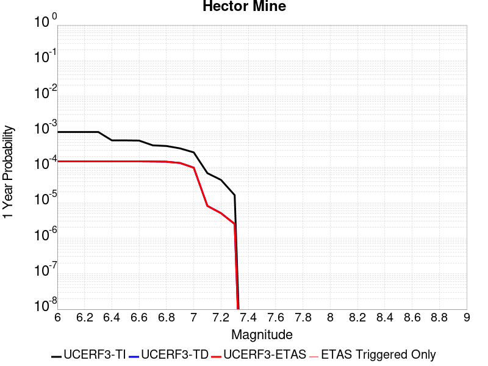 |  |

| Magnitude | 1 wk TI Prob | 1 wk TD Prob | 1 wk ETAS Prob | 1 wk ETAS/TD Gain | 1 wk ETAS Triggered Only | 1 mo TI Prob | 1 mo TD Prob | 1 mo ETAS Prob | 1 mo ETAS/TD Gain | 1 mo ETAS Triggered Only | 1 yr TI Prob | 1 yr TD Prob | 1 yr ETAS Prob | 1 yr ETAS/TD Gain | 1 yr ETAS Triggered Only | 10 yr TI Prob | 10 yr TD Prob | 10 yr ETAS Prob | 10 yr ETAS/TD Gain | 10 yr ETAS Triggered Only |
|-----|-----|-----|-----|-----|-----|-----|-----|-----|-----|-----|-----|-----|-----|-----|-----|-----|-----|-----|-----|-----|
| 6.0 | 1.8760093E-5 | 2.7962699E-6 | 2.7962699E-6 | 1.0 | 0.0 | 8.039792E-5 | 1.19839815E-5 | 1.19839815E-5 | 1.0 | 0.0 | 9.78405E-4 | 1.458992E-4 | 1.458992E-4 | 1.0 | 0.0 | 0.009741086 | 0.0014584264 | 0.0014684118 | 1.0068467 | 1.0E-5 |
| 6.1 | 1.8760093E-5 | 2.7962699E-6 | 2.7962699E-6 | 1.0 | 0.0 | 8.039792E-5 | 1.19839815E-5 | 1.19839815E-5 | 1.0 | 0.0 | 9.78405E-4 | 1.458992E-4 | 1.458992E-4 | 1.0 | 0.0 | 0.009741086 | 0.0014584264 | 0.0014684118 | 1.0068467 | 1.0E-5 |
| 6.2 | 1.8760093E-5 | 2.7962699E-6 | 2.7962699E-6 | 1.0 | 0.0 | 8.039792E-5 | 1.19839815E-5 | 1.19839815E-5 | 1.0 | 0.0 | 9.78405E-4 | 1.458992E-4 | 1.458992E-4 | 1.0 | 0.0 | 0.009741086 | 0.0014584264 | 0.0014684118 | 1.0068467 | 1.0E-5 |
| 6.3 | 1.8760093E-5 | 2.7962699E-6 | 2.7962699E-6 | 1.0 | 0.0 | 8.039792E-5 | 1.19839815E-5 | 1.19839815E-5 | 1.0 | 0.0 | 9.78405E-4 | 1.458992E-4 | 1.458992E-4 | 1.0 | 0.0 | 0.009741086 | 0.0014584264 | 0.0014684118 | 1.0068467 | 1.0E-5 |
| 6.4 | 1.0888055E-5 | 2.7962699E-6 | 2.7962699E-6 | 1.0 | 0.0 | 4.666226E-5 | 1.19839815E-5 | 1.19839815E-5 | 1.0 | 0.0 | 5.679649E-4 | 1.458992E-4 | 1.458992E-4 | 1.0 | 0.0 | 0.0056651547 | 0.0014584264 | 0.0014684118 | 1.0068467 | 1.0E-5 |
| 6.5 | 1.0888055E-5 | 2.7962699E-6 | 2.7962699E-6 | 1.0 | 0.0 | 4.666226E-5 | 1.19839815E-5 | 1.19839815E-5 | 1.0 | 0.0 | 5.679649E-4 | 1.458992E-4 | 1.458992E-4 | 1.0 | 0.0 | 0.0056651547 | 0.0014584264 | 0.0014684118 | 1.0068467 | 1.0E-5 |
| 6.6 | 1.0730738E-5 | 2.7962699E-6 | 2.7962699E-6 | 1.0 | 0.0 | 4.5988065E-5 | 1.19839815E-5 | 1.19839815E-5 | 1.0 | 0.0 | 5.5976084E-4 | 1.458992E-4 | 1.458992E-4 | 1.0 | 0.0 | 0.0055835294 | 0.0014584264 | 0.0014684118 | 1.0068467 | 1.0E-5 |
| 6.7 | 7.881326E-6 | 2.770952E-6 | 2.770952E-6 | 1.0 | 0.0 | 3.3776672E-5 | 1.1875478E-5 | 1.1875478E-5 | 1.0 | 0.0 | 4.111534E-4 | 1.4457834E-4 | 1.4457834E-4 | 1.0 | 0.0 | 0.0041039353 | 0.001445235 | 0.0014552205 | 1.0069093 | 1.0E-5 |
| 6.8 | 7.5683483E-6 | 2.7327321E-6 | 2.7327321E-6 | 1.0 | 0.0 | 3.2435375E-5 | 1.1711679E-5 | 1.1711679E-5 | 1.0 | 0.0 | 3.9482914E-4 | 1.4258435E-4 | 1.4258435E-4 | 1.0 | 0.0 | 0.0039412836 | 0.0014253207 | 0.0014353065 | 1.0070059 | 1.0E-5 |
| 6.9 | 6.473048E-6 | 2.513824E-6 | 2.513824E-6 | 1.0 | 0.0 | 2.7741338E-5 | 1.07735095E-5 | 1.07735095E-5 | 1.0 | 0.0 | 3.3769844E-4 | 1.3116356E-4 | 1.3116356E-4 | 1.0 | 0.0 | 0.0033718573 | 0.001311251 | 0.0013212378 | 1.0076163 | 1.0E-5 |
| 7.0 | 4.9959954E-6 | 1.8564588E-6 | 1.8564588E-6 | 1.0 | 0.0 | 2.1411232E-5 | 7.956248E-6 | 7.956248E-6 | 1.0 | 0.0 | 2.6065056E-4 | 9.686658E-5 | 9.686658E-5 | 1.0 | 0.0 | 0.0026034506 | 9.685931E-4 | 9.785835E-4 | 1.0103142 | 1.0E-5 |
| 7.1 | 1.2997541E-6 | 1.5599346E-7 | 1.5599346E-7 | 1.0 | 0.0 | 5.5703626E-6 | 6.685433E-7 | 6.685433E-7 | 1.0 | 0.0 | 6.7817055E-5 | 8.139488E-6 | 8.139488E-6 | 1.0 | 0.0 | 6.779636E-4 | 8.1392296E-5 | 8.1392296E-5 | 1.0 | 0.0 |
| 7.2 | 8.392699E-7 | 9.725453E-8 | 9.725453E-8 | 1.0 | 0.0 | 3.596866E-6 | 4.1680505E-7 | 4.1680505E-7 | 1.0 | 0.0 | 4.3790962E-5 | 5.0745916E-6 | 5.0745916E-6 | 1.0 | 0.0 | 4.3782333E-4 | 5.074495E-5 | 5.074495E-5 | 1.0 | 0.0 |
| 7.3 | 3.13015E-7 | 4.8283802E-8 | 4.8283802E-8 | 1.0 | 0.0 | 1.3414921E-6 | 2.0693057E-7 | 2.0693057E-7 | 1.0 | 0.0 | 1.6332544E-5 | 2.5193776E-6 | 2.5193776E-6 | 1.0 | 0.0 | 1.6331344E-4 | 2.5193574E-5 | 2.5193574E-5 | 1.0 | 0.0 |

## Yorba Linda
*[(top)](#table-of-contents)*

| 1 Week | 1 Month | 1 Year | 10 Year |
|-----|-----|-----|-----|
|  |  |  |  |

| Magnitude | 1 wk TI Prob | 1 wk TD Prob | 1 wk ETAS Prob | 1 wk ETAS/TD Gain | 1 wk ETAS Triggered Only | 1 mo TI Prob | 1 mo TD Prob | 1 mo ETAS Prob | 1 mo ETAS/TD Gain | 1 mo ETAS Triggered Only | 1 yr TI Prob | 1 yr TD Prob | 1 yr ETAS Prob | 1 yr ETAS/TD Gain | 1 yr ETAS Triggered Only | 10 yr TI Prob | 10 yr TD Prob | 10 yr ETAS Prob | 10 yr ETAS/TD Gain | 10 yr ETAS Triggered Only |
|-----|-----|-----|-----|-----|-----|-----|-----|-----|-----|-----|-----|-----|-----|-----|-----|-----|-----|-----|-----|-----|
| 6.0 | 1.9346849E-6 | 1.6909112E-6 | 1.6909112E-6 | 1.0 | 0.0 | 8.29148E-6 | 7.2467474E-6 | 7.2467474E-6 | 1.0 | 0.0 | 1.009441E-4 | 8.822652E-5 | 8.822652E-5 | 1.0 | 0.0 | 0.0010089825 | 8.8200805E-4 | 8.919992E-4 | 1.0113277 | 1.0E-5 |
| 6.1 | 1.9346849E-6 | 1.6909112E-6 | 1.6909112E-6 | 1.0 | 0.0 | 8.29148E-6 | 7.2467474E-6 | 7.2467474E-6 | 1.0 | 0.0 | 1.009441E-4 | 8.822652E-5 | 8.822652E-5 | 1.0 | 0.0 | 0.0010089825 | 8.8200805E-4 | 8.919992E-4 | 1.0113277 | 1.0E-5 |
| 6.2 | 1.9346849E-6 | 1.6909112E-6 | 1.6909112E-6 | 1.0 | 0.0 | 8.29148E-6 | 7.2467474E-6 | 7.2467474E-6 | 1.0 | 0.0 | 1.009441E-4 | 8.822652E-5 | 8.822652E-5 | 1.0 | 0.0 | 0.0010089825 | 8.8200805E-4 | 8.919992E-4 | 1.0113277 | 1.0E-5 |
| 6.3 | 1.1028608E-6 | 8.481863E-7 | 8.481863E-7 | 1.0 | 0.0 | 4.7265376E-6 | 3.6350793E-6 | 3.6350793E-6 | 1.0 | 0.0 | 5.754407E-5 | 4.425626E-5 | 4.425626E-5 | 1.0 | 0.0 | 5.7529175E-4 | 4.42481E-4 | 4.5247655E-4 | 1.0225898 | 1.0E-5 |
| 6.4 | 1.1028608E-6 | 8.481863E-7 | 8.481863E-7 | 1.0 | 0.0 | 4.7265376E-6 | 3.6350793E-6 | 3.6350793E-6 | 1.0 | 0.0 | 5.754407E-5 | 4.425626E-5 | 4.425626E-5 | 1.0 | 0.0 | 5.7529175E-4 | 4.42481E-4 | 4.5247655E-4 | 1.0225898 | 1.0E-5 |
| 6.5 | 8.4451364E-7 | 5.869109E-7 | 5.869109E-7 | 1.0 | 0.0 | 3.619339E-6 | 2.5153304E-6 | 2.5153304E-6 | 1.0 | 0.0 | 4.406456E-5 | 3.0623738E-5 | 3.0623738E-5 | 1.0 | 0.0 | 4.4055824E-4 | 3.0619733E-4 | 3.1619426E-4 | 1.0326487 | 1.0E-5 |
| 6.6 | 8.422957E-7 | 5.844643E-7 | 5.844643E-7 | 1.0 | 0.0 | 3.6098338E-6 | 2.5048448E-6 | 2.5048448E-6 | 1.0 | 0.0 | 4.3948843E-5 | 3.049608E-5 | 3.049608E-5 | 1.0 | 0.0 | 4.394015E-4 | 3.049211E-4 | 3.1491803E-4 | 1.0327854 | 1.0E-5 |
| 6.7 | 8.4119705E-7 | 5.832485E-7 | 5.832485E-7 | 1.0 | 0.0 | 3.6051254E-6 | 2.499634E-6 | 2.499634E-6 | 1.0 | 0.0 | 4.3891516E-5 | 3.0432642E-5 | 3.0432642E-5 | 1.0 | 0.0 | 4.388285E-4 | 3.042869E-4 | 3.1428385E-4 | 1.0328537 | 1.0E-5 |
| 6.8 | 7.5919155E-7 | 4.9949944E-7 | 4.9949944E-7 | 1.0 | 0.0 | 3.253674E-6 | 2.1407102E-6 | 2.1407102E-6 | 1.0 | 0.0 | 3.961276E-5 | 2.6062853E-5 | 2.6062853E-5 | 1.0 | 0.0 | 3.9605703E-4 | 2.6059969E-4 | 2.7059708E-4 | 1.038363 | 1.0E-5 |
| 6.9 | 7.5804564E-7 | 4.981178E-7 | 4.981178E-7 | 1.0 | 0.0 | 3.248763E-6 | 2.134789E-6 | 2.134789E-6 | 1.0 | 0.0 | 3.955297E-5 | 2.5990763E-5 | 2.5990763E-5 | 1.0 | 0.0 | 3.9545933E-4 | 2.5987893E-4 | 2.6987636E-4 | 1.0384694 | 1.0E-5 |
| 7.0 | 7.539293E-7 | 4.943313E-7 | 4.943313E-7 | 1.0 | 0.0 | 3.2311218E-6 | 2.118561E-6 | 2.118561E-6 | 1.0 | 0.0 | 3.9338196E-5 | 2.5793192E-5 | 2.5793192E-5 | 1.0 | 0.0 | 3.9331234E-4 | 2.579037E-4 | 2.679011E-4 | 1.0387641 | 1.0E-5 |
| 7.1 | 6.0900885E-7 | 3.7817128E-7 | 3.7817128E-7 | 1.0 | 0.0 | 2.6100352E-6 | 1.6207331E-6 | 1.6207331E-6 | 1.0 | 0.0 | 3.1776715E-5 | 1.973225E-5 | 1.973225E-5 | 1.0 | 0.0 | 3.1772171E-4 | 1.9730533E-4 | 2.0730335E-4 | 1.0506729 | 1.0E-5 |
| 7.2 | 5.849925E-7 | 3.5878818E-7 | 3.5878818E-7 | 1.0 | 0.0 | 2.5071083E-6 | 1.5376628E-6 | 1.5376628E-6 | 1.0 | 0.0 | 3.0523614E-5 | 1.8720886E-5 | 1.8720886E-5 | 1.0 | 0.0 | 3.0519423E-4 | 1.8719342E-4 | 1.9719155E-4 | 1.0534106 | 1.0E-5 |
| 7.3 | 4.89808E-7 | 3.0379488E-7 | 3.0379488E-7 | 1.0 | 0.0 | 2.0991754E-6 | 1.3019775E-6 | 1.3019775E-6 | 1.0 | 0.0 | 2.5557161E-5 | 1.5851463E-5 | 1.5851463E-5 | 1.0 | 0.0 | 2.5554223E-4 | 1.5850355E-4 | 1.5850355E-4 | 1.0 | 0.0 |
| 7.4 | 3.8700415E-7 | 2.4722343E-7 | 2.4722343E-7 | 1.0 | 0.0 | 1.6585881E-6 | 1.0595286E-6 | 1.0595286E-6 | 1.0 | 0.0 | 2.0193123E-5 | 1.2899685E-5 | 1.2899685E-5 | 1.0 | 0.0 | 2.0191289E-4 | 1.2898949E-4 | 1.2898949E-4 | 1.0 | 0.0 |
| 7.5 | 2.900565E-7 | 1.8637462E-7 | 1.8637462E-7 | 1.0 | 0.0 | 1.2430987E-6 | 7.9874815E-7 | 7.9874815E-7 | 1.0 | 0.0 | 1.5134622E-5 | 9.724716E-6 | 9.724716E-6 | 1.0 | 0.0 | 1.5133592E-4 | 9.7242984E-5 | 9.7242984E-5 | 1.0 | 0.0 |
| 7.6 | 2.2770318E-7 | 1.4814276E-7 | 1.4814276E-7 | 1.0 | 0.0 | 9.758704E-7 | 6.348974E-7 | 6.348974E-7 | 1.0 | 0.0 | 1.1881158E-5 | 7.729848E-6 | 7.729848E-6 | 1.0 | 0.0 | 1.1880523E-4 | 7.729585E-5 | 7.729585E-5 | 1.0 | 0.0 |
| 7.7 | 1.5017194E-7 | 8.7355275E-8 | 8.7355275E-8 | 1.0 | 0.0 | 6.4359386E-7 | 3.7437968E-7 | 3.7437968E-7 | 1.0 | 0.0 | 7.835727E-6 | 4.5580637E-6 | 4.5580637E-6 | 1.0 | 0.0 | 7.835451E-5 | 4.5579727E-5 | 4.5579727E-5 | 1.0 | 0.0 |
| 7.8 | 3.895753E-8 | 1.8532088E-8 | 1.8532088E-8 | 1.0 | 0.0 | 1.6696083E-7 | 7.942323E-8 | 7.942323E-8 | 1.0 | 0.0 | 2.0327461E-6 | 9.669774E-7 | 9.669774E-7 | 1.0 | 0.0 | 2.0327276E-5 | 9.669734E-6 | 9.669734E-6 | 1.0 | 0.0 |
| 7.9 | 6.648505E-9 | 3.4183114E-9 | 3.4183114E-9 | 1.0 | 0.0 | 2.8493591E-8 | 1.4649906E-8 | 1.4649906E-8 | 1.0 | 0.0 | 3.4690942E-7 | 1.783626E-7 | 1.783626E-7 | 1.0 | 0.0 | 3.4690888E-6 | 1.7836247E-6 | 1.7836247E-6 | 1.0 | 0.0 |

## Mission Hills 2011
*[(top)](#table-of-contents)*

| 1 Week | 1 Month | 1 Year | 10 Year |
|-----|-----|-----|-----|
| 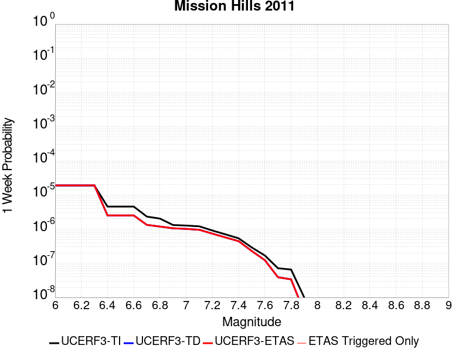 | 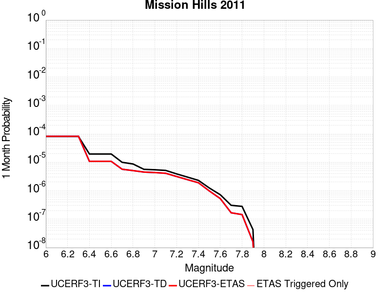 | 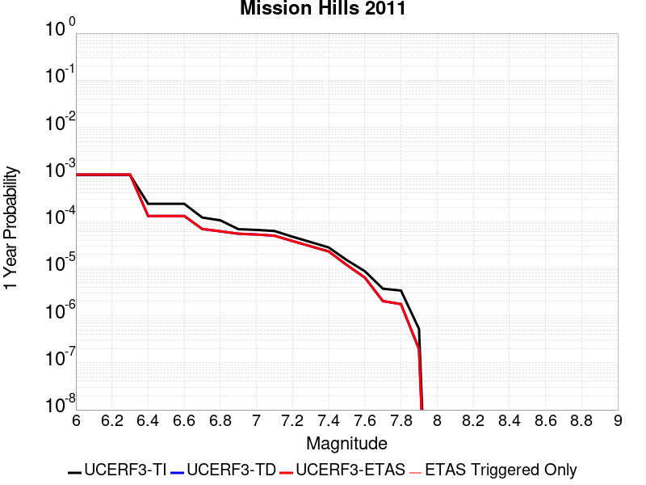 | 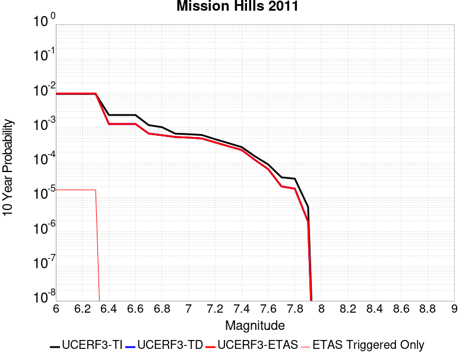 |

| Magnitude | 1 wk TI Prob | 1 wk TD Prob | 1 wk ETAS Prob | 1 wk ETAS/TD Gain | 1 wk ETAS Triggered Only | 1 mo TI Prob | 1 mo TD Prob | 1 mo ETAS Prob | 1 mo ETAS/TD Gain | 1 mo ETAS Triggered Only | 1 yr TI Prob | 1 yr TD Prob | 1 yr ETAS Prob | 1 yr ETAS/TD Gain | 1 yr ETAS Triggered Only | 10 yr TI Prob | 10 yr TD Prob | 10 yr ETAS Prob | 10 yr ETAS/TD Gain | 10 yr ETAS Triggered Only |
|-----|-----|-----|-----|-----|-----|-----|-----|-----|-----|-----|-----|-----|-----|-----|-----|-----|-----|-----|-----|-----|
| 6.0 | 1.8765717E-5 | 1.9054629E-5 | 1.9054629E-5 | 1.0 | 0.0 | 8.0422025E-5 | 8.1662074E-5 | 8.1662074E-5 | 1.0 | 0.0 | 9.786983E-4 | 9.941256E-4 | 9.941256E-4 | 1.0 | 0.0 | 0.009743992 | 0.00993045 | 0.00994035 | 1.000997 | 1.0E-5 |
| 6.1 | 1.8765717E-5 | 1.9054629E-5 | 1.9054629E-5 | 1.0 | 0.0 | 8.0422025E-5 | 8.1662074E-5 | 8.1662074E-5 | 1.0 | 0.0 | 9.786983E-4 | 9.941256E-4 | 9.941256E-4 | 1.0 | 0.0 | 0.009743992 | 0.00993045 | 0.00994035 | 1.000997 | 1.0E-5 |
| 6.2 | 1.8765717E-5 | 1.9054629E-5 | 1.9054629E-5 | 1.0 | 0.0 | 8.0422025E-5 | 8.1662074E-5 | 8.1662074E-5 | 1.0 | 0.0 | 9.786983E-4 | 9.941256E-4 | 9.941256E-4 | 1.0 | 0.0 | 0.009743992 | 0.00993045 | 0.00994035 | 1.000997 | 1.0E-5 |
| 6.3 | 1.8765717E-5 | 1.9054629E-5 | 1.9054629E-5 | 1.0 | 0.0 | 8.0422025E-5 | 8.1662074E-5 | 8.1662074E-5 | 1.0 | 0.0 | 9.786983E-4 | 9.941256E-4 | 9.941256E-4 | 1.0 | 0.0 | 0.009743992 | 0.00993045 | 0.00994035 | 1.000997 | 1.0E-5 |
| 6.4 | 4.566357E-6 | 2.5148213E-6 | 2.5148213E-6 | 1.0 | 0.0 | 1.9569954E-5 | 1.0777771E-5 | 1.0777771E-5 | 1.0 | 0.0 | 2.3823815E-4 | 1.3121328E-4 | 1.3121328E-4 | 1.0 | 0.0 | 0.002379829 | 0.0013115364 | 0.0013115364 | 1.0 | 0.0 |
| 6.5 | 4.566357E-6 | 2.5148213E-6 | 2.5148213E-6 | 1.0 | 0.0 | 1.9569954E-5 | 1.0777771E-5 | 1.0777771E-5 | 1.0 | 0.0 | 2.3823815E-4 | 1.3121328E-4 | 1.3121328E-4 | 1.0 | 0.0 | 0.002379829 | 0.0013115364 | 0.0013115364 | 1.0 | 0.0 |
| 6.6 | 4.566357E-6 | 2.5148213E-6 | 2.5148213E-6 | 1.0 | 0.0 | 1.9569954E-5 | 1.0777771E-5 | 1.0777771E-5 | 1.0 | 0.0 | 2.3823815E-4 | 1.3121328E-4 | 1.3121328E-4 | 1.0 | 0.0 | 0.002379829 | 0.0013115364 | 0.0013115364 | 1.0 | 0.0 |
| 6.7 | 2.3266773E-6 | 1.3296132E-6 | 1.3296132E-6 | 1.0 | 0.0 | 9.971435E-6 | 5.69833E-6 | 5.69833E-6 | 1.0 | 0.0 | 1.2139547E-4 | 6.937502E-5 | 6.937502E-5 | 1.0 | 0.0 | 0.0012132917 | 6.935397E-4 | 6.935397E-4 | 1.0 | 0.0 |
| 6.8 | 2.032735E-6 | 1.1894101E-6 | 1.1894101E-6 | 1.0 | 0.0 | 8.711692E-6 | 5.0974622E-6 | 5.0974622E-6 | 1.0 | 0.0 | 1.06059684E-4 | 6.205988E-5 | 6.205988E-5 | 1.0 | 0.0 | 0.0010600908 | 6.204304E-4 | 6.204304E-4 | 1.0 | 0.0 |
| 6.9 | 1.3186259E-6 | 1.0561989E-6 | 1.0561989E-6 | 1.0 | 0.0 | 5.6512413E-6 | 4.526559E-6 | 4.526559E-6 | 1.0 | 0.0 | 6.8801695E-5 | 5.5109493E-5 | 5.5109493E-5 | 1.0 | 0.0 | 6.8780396E-4 | 5.5096124E-4 | 5.5096124E-4 | 1.0 | 0.0 |
| 7.0 | 1.2726016E-6 | 1.0159295E-6 | 1.0159295E-6 | 1.0 | 0.0 | 5.4539955E-6 | 4.3539762E-6 | 4.3539762E-6 | 1.0 | 0.0 | 6.6400375E-5 | 5.30084E-5 | 5.30084E-5 | 1.0 | 0.0 | 6.6380535E-4 | 5.299604E-4 | 5.299604E-4 | 1.0 | 0.0 |
| 7.1 | 1.2063913E-6 | 9.570282E-7 | 9.570282E-7 | 1.0 | 0.0 | 5.170238E-6 | 4.101543E-6 | 4.101543E-6 | 1.0 | 0.0 | 6.294583E-5 | 4.9935166E-5 | 4.9935166E-5 | 1.0 | 0.0 | 6.2928005E-4 | 4.9924204E-4 | 4.9924204E-4 | 1.0 | 0.0 |
| 7.2 | 9.105806E-7 | 7.3767757E-7 | 7.3767757E-7 | 1.0 | 0.0 | 3.9024826E-6 | 3.1614716E-6 | 3.1614716E-6 | 1.0 | 0.0 | 4.7511687E-5 | 3.8490252E-5 | 3.8490252E-5 | 1.0 | 0.0 | 4.7501532E-4 | 3.8483742E-4 | 3.8483742E-4 | 1.0 | 0.0 |
| 7.3 | 7.020432E-7 | 5.7103375E-7 | 5.7103375E-7 | 1.0 | 0.0 | 3.0087533E-6 | 2.4472852E-6 | 2.4472852E-6 | 1.0 | 0.0 | 3.6630954E-5 | 2.9795303E-5 | 2.9795303E-5 | 1.0 | 0.0 | 3.6624918E-4 | 2.979144E-4 | 2.979144E-4 | 1.0 | 0.0 |
| 7.4 | 5.3900635E-7 | 4.4483278E-7 | 4.4483278E-7 | 1.0 | 0.0 | 2.3100251E-6 | 1.9064248E-6 | 1.9064248E-6 | 1.0 | 0.0 | 2.8124194E-5 | 2.3210489E-5 | 2.3210489E-5 | 1.0 | 0.0 | 2.8120633E-4 | 2.3208185E-4 | 2.3208185E-4 | 1.0 | 0.0 |
| 7.5 | 2.907075E-7 | 2.2875324E-7 | 2.2875324E-7 | 1.0 | 0.0 | 1.2458887E-6 | 9.803706E-7 | 9.803706E-7 | 1.0 | 0.0 | 1.5168589E-5 | 1.1935949E-5 | 1.1935949E-5 | 1.0 | 0.0 | 1.5167553E-4 | 1.1935326E-4 | 1.1935326E-4 | 1.0 | 0.0 |
| 7.6 | 1.6903675E-7 | 1.2353401E-7 | 1.2353401E-7 | 1.0 | 0.0 | 7.2444305E-7 | 5.2943136E-7 | 5.2943136E-7 | 1.0 | 0.0 | 8.820059E-6 | 6.4458086E-6 | 6.4458086E-6 | 1.0 | 0.0 | 8.8197085E-5 | 6.445634E-5 | 6.445634E-5 | 1.0 | 0.0 |
| 7.7 | 7.168073E-8 | 3.9134374E-8 | 3.9134374E-8 | 1.0 | 0.0 | 3.072031E-7 | 1.6771872E-7 | 1.6771872E-7 | 1.0 | 0.0 | 3.7401915E-6 | 2.0419736E-6 | 2.0419736E-6 | 1.0 | 0.0 | 3.7401285E-5 | 2.041956E-5 | 2.041956E-5 | 1.0 | 0.0 |
| 7.8 | 6.564101E-8 | 3.3834656E-8 | 3.3834656E-8 | 1.0 | 0.0 | 2.813186E-7 | 1.4500566E-7 | 1.4500566E-7 | 1.0 | 0.0 | 3.4250486E-6 | 1.7654426E-6 | 1.7654426E-6 | 1.0 | 0.0 | 3.424996E-5 | 1.7654296E-5 | 1.7654296E-5 | 1.0 | 0.0 |
| 7.9 | 1.0029074E-8 | 3.728858E-9 | 3.728858E-9 | 1.0 | 0.0 | 4.2981743E-8 | 1.598082E-8 | 1.598082E-8 | 1.0 | 0.0 | 5.2330256E-7 | 1.945665E-7 | 1.945665E-7 | 1.0 | 0.0 | 5.2330133E-6 | 1.9456643E-6 | 1.9456643E-6 | 1.0 | 0.0 |

## Cedar Mtn-Mahogany Mtn
*[(top)](#table-of-contents)*

| 1 Week | 1 Month | 1 Year | 10 Year |
|-----|-----|-----|-----|
|  |  | 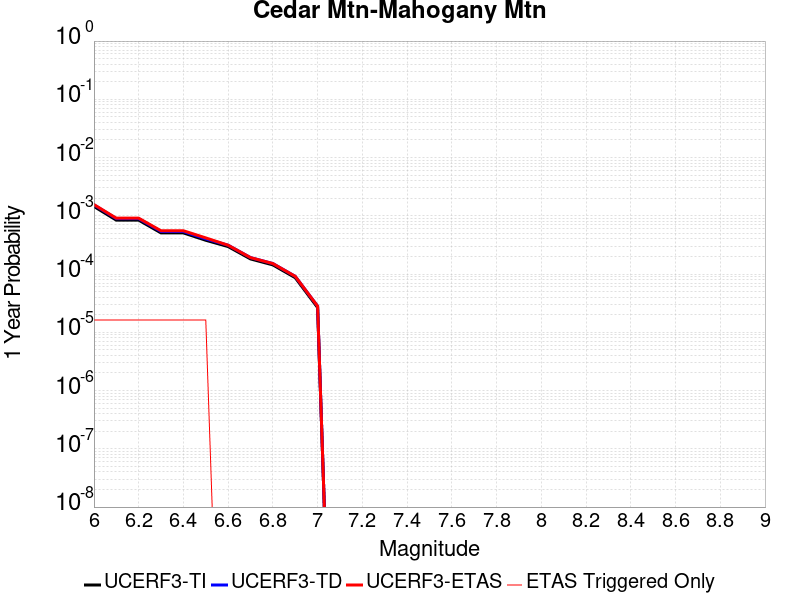 | 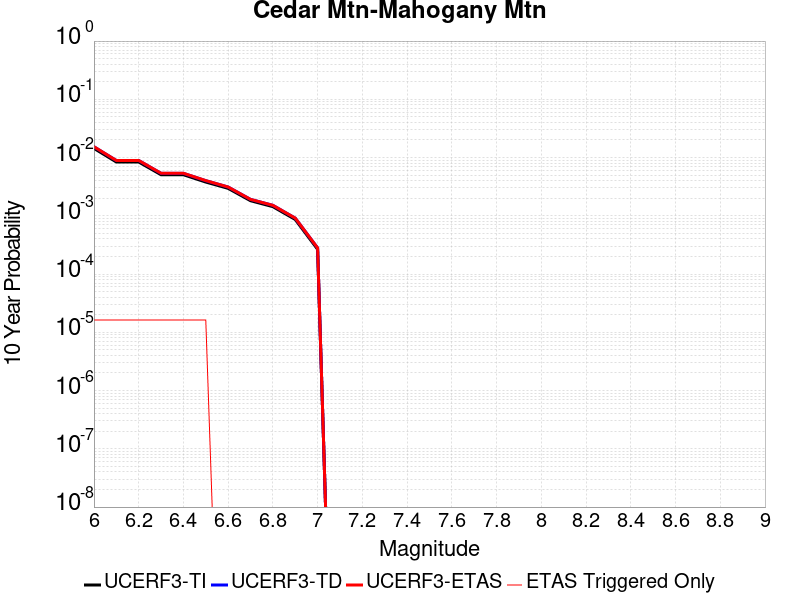 |

| Magnitude | 1 wk TI Prob | 1 wk TD Prob | 1 wk ETAS Prob | 1 wk ETAS/TD Gain | 1 wk ETAS Triggered Only | 1 mo TI Prob | 1 mo TD Prob | 1 mo ETAS Prob | 1 mo ETAS/TD Gain | 1 mo ETAS Triggered Only | 1 yr TI Prob | 1 yr TD Prob | 1 yr ETAS Prob | 1 yr ETAS/TD Gain | 1 yr ETAS Triggered Only | 10 yr TI Prob | 10 yr TD Prob | 10 yr ETAS Prob | 10 yr ETAS/TD Gain | 10 yr ETAS Triggered Only |
|-----|-----|-----|-----|-----|-----|-----|-----|-----|-----|-----|-----|-----|-----|-----|-----|-----|-----|-----|-----|-----|
| 6.0 | 2.7763876E-5 | 2.9588866E-5 | 2.9588866E-5 | 1.0 | 0.0 | 1.1898261E-4 | 1.2680366E-4 | 1.2680366E-4 | 1.0 | 0.0 | 0.0014476506 | 0.0015428112 | 0.0015527958 | 1.0064716 | 1.0E-5 | 0.0143825635 | 0.015328225 | 0.015338072 | 1.0006424 | 1.0E-5 |
| 6.1 | 1.6162443E-5 | 1.7142966E-5 | 1.7142966E-5 | 1.0 | 0.0 | 6.926578E-5 | 7.346788E-5 | 7.346788E-5 | 1.0 | 0.0 | 8.4298453E-4 | 8.941221E-4 | 9.0411317E-4 | 1.0111742 | 1.0E-5 | 0.008397939 | 0.008907059 | 0.008916969 | 1.0011127 | 1.0E-5 |
| 6.2 | 1.6162443E-5 | 1.7142966E-5 | 1.7142966E-5 | 1.0 | 0.0 | 6.926578E-5 | 7.346788E-5 | 7.346788E-5 | 1.0 | 0.0 | 8.4298453E-4 | 8.941221E-4 | 9.0411317E-4 | 1.0111742 | 1.0E-5 | 0.008397939 | 0.008907059 | 0.008916969 | 1.0011127 | 1.0E-5 |
| 6.3 | 9.746053E-6 | 1.0303152E-5 | 1.0303152E-5 | 1.0 | 0.0 | 4.1768133E-5 | 4.415564E-5 | 4.415564E-5 | 1.0 | 0.0 | 5.0840835E-4 | 5.3746643E-4 | 5.4746104E-4 | 1.0185958 | 1.0E-5 | 0.0050724675 | 0.005362084 | 0.0053720307 | 1.0018549 | 1.0E-5 |
| 6.4 | 9.746053E-6 | 1.0303152E-5 | 1.0303152E-5 | 1.0 | 0.0 | 4.1768133E-5 | 4.415564E-5 | 4.415564E-5 | 1.0 | 0.0 | 5.0840835E-4 | 5.3746643E-4 | 5.4746104E-4 | 1.0185958 | 1.0E-5 | 0.0050724675 | 0.005362084 | 0.0053720307 | 1.0018549 | 1.0E-5 |
| 6.5 | 7.290083E-6 | 7.695325E-6 | 7.695325E-6 | 1.0 | 0.0 | 3.124284E-5 | 3.297956E-5 | 3.297956E-5 | 1.0 | 0.0 | 3.8031515E-4 | 4.014543E-4 | 4.1145028E-4 | 1.0248995 | 1.0E-5 | 0.0037966494 | 0.004007511 | 0.004017471 | 1.0024853 | 1.0E-5 |
| 6.6 | 5.67907E-6 | 5.9891527E-6 | 5.9891527E-6 | 1.0 | 0.0 | 2.4338644E-5 | 2.5667552E-5 | 2.5667552E-5 | 1.0 | 0.0 | 2.962827E-4 | 3.12459E-4 | 3.12459E-4 | 1.0 | 0.0 | 0.0029588798 | 0.003120333 | 0.003120333 | 1.0 | 0.0 |
| 6.7 | 3.4853963E-6 | 3.672631E-6 | 3.672631E-6 | 1.0 | 0.0 | 1.4937327E-5 | 1.5739755E-5 | 1.5739755E-5 | 1.0 | 0.0 | 1.8184677E-4 | 1.916153E-4 | 1.916153E-4 | 1.0 | 0.0 | 0.0018169804 | 0.0019145629 | 0.0019145629 | 1.0 | 0.0 |
| 6.8 | 2.7535168E-6 | 2.9015764E-6 | 2.9015764E-6 | 1.0 | 0.0 | 1.1800733E-5 | 1.2435271E-5 | 1.2435271E-5 | 1.0 | 0.0 | 1.4366445E-4 | 1.5138938E-4 | 1.5138938E-4 | 1.0 | 0.0 | 0.0014357162 | 0.0015129098 | 0.0015129098 | 1.0 | 0.0 |
| 6.9 | 1.6594106E-6 | 1.7496985E-6 | 1.7496985E-6 | 1.0 | 0.0 | 7.1117406E-6 | 7.4986883E-6 | 7.4986883E-6 | 1.0 | 0.0 | 8.6582E-5 | 9.129302E-5 | 9.129302E-5 | 1.0 | 0.0 | 8.654827E-4 | 9.125856E-4 | 9.125856E-4 | 1.0 | 0.0 |
| 7.0 | 5.10215E-7 | 5.389254E-7 | 5.389254E-7 | 1.0 | 0.0 | 2.186634E-6 | 2.3096788E-6 | 2.3096788E-6 | 1.0 | 0.0 | 2.6621943E-5 | 2.8120105E-5 | 2.8120105E-5 | 1.0 | 0.0 | 2.6618753E-4 | 2.81178E-4 | 2.81178E-4 | 1.0 | 0.0 |

## San Luis Range - Oceano 2011 CFM
*[(top)](#table-of-contents)*

| 1 Week | 1 Month | 1 Year | 10 Year |
|-----|-----|-----|-----|
|  |  |  |  |

| Magnitude | 1 wk TI Prob | 1 wk TD Prob | 1 wk ETAS Prob | 1 wk ETAS/TD Gain | 1 wk ETAS Triggered Only | 1 mo TI Prob | 1 mo TD Prob | 1 mo ETAS Prob | 1 mo ETAS/TD Gain | 1 mo ETAS Triggered Only | 1 yr TI Prob | 1 yr TD Prob | 1 yr ETAS Prob | 1 yr ETAS/TD Gain | 1 yr ETAS Triggered Only | 10 yr TI Prob | 10 yr TD Prob | 10 yr ETAS Prob | 10 yr ETAS/TD Gain | 10 yr ETAS Triggered Only |
|-----|-----|-----|-----|-----|-----|-----|-----|-----|-----|-----|-----|-----|-----|-----|-----|-----|-----|-----|-----|-----|
| 6.0 | 1.6025788E-6 | 1.620119E-6 | 1.620119E-6 | 1.0 | 0.0 | 6.8681766E-6 | 6.943351E-6 | 6.943351E-6 | 1.0 | 0.0 | 8.361684E-5 | 8.453243E-5 | 9.4531584E-5 | 1.1182878 | 1.0E-5 | 8.3585386E-4 | 8.4504357E-4 | 8.5503515E-4 | 1.0118237 | 1.0E-5 |
| 6.1 | 1.6025788E-6 | 1.620119E-6 | 1.620119E-6 | 1.0 | 0.0 | 6.8681766E-6 | 6.943351E-6 | 6.943351E-6 | 1.0 | 0.0 | 8.361684E-5 | 8.453243E-5 | 9.4531584E-5 | 1.1182878 | 1.0E-5 | 8.3585386E-4 | 8.4504357E-4 | 8.5503515E-4 | 1.0118237 | 1.0E-5 |
| 6.2 | 1.6025788E-6 | 1.620119E-6 | 1.620119E-6 | 1.0 | 0.0 | 6.8681766E-6 | 6.943351E-6 | 6.943351E-6 | 1.0 | 0.0 | 8.361684E-5 | 8.453243E-5 | 9.4531584E-5 | 1.1182878 | 1.0E-5 | 8.3585386E-4 | 8.4504357E-4 | 8.5503515E-4 | 1.0118237 | 1.0E-5 |
| 6.3 | 1.6025788E-6 | 1.620119E-6 | 1.620119E-6 | 1.0 | 0.0 | 6.8681766E-6 | 6.943351E-6 | 6.943351E-6 | 1.0 | 0.0 | 8.361684E-5 | 8.453243E-5 | 9.4531584E-5 | 1.1182878 | 1.0E-5 | 8.3585386E-4 | 8.4504357E-4 | 8.5503515E-4 | 1.0118237 | 1.0E-5 |
| 6.4 | 1.1621186E-6 | 1.1749894E-6 | 1.1749894E-6 | 1.0 | 0.0 | 4.980499E-6 | 5.0356607E-6 | 5.0356607E-6 | 1.0 | 0.0 | 6.0635884E-5 | 6.130771E-5 | 7.1307106E-5 | 1.1631016 | 1.0E-5 | 6.0619344E-4 | 6.1293464E-4 | 6.229285E-4 | 1.016305 | 1.0E-5 |
| 6.5 | 1.1621186E-6 | 1.1749894E-6 | 1.1749894E-6 | 1.0 | 0.0 | 4.980499E-6 | 5.0356607E-6 | 5.0356607E-6 | 1.0 | 0.0 | 6.0635884E-5 | 6.130771E-5 | 7.1307106E-5 | 1.1631016 | 1.0E-5 | 6.0619344E-4 | 6.1293464E-4 | 6.229285E-4 | 1.016305 | 1.0E-5 |
| 6.6 | 7.164729E-7 | 7.2485784E-7 | 7.2485784E-7 | 1.0 | 0.0 | 3.0705946E-6 | 3.10653E-6 | 3.10653E-6 | 1.0 | 0.0 | 3.738385E-5 | 3.7821363E-5 | 4.7820984E-5 | 1.2643908 | 1.0E-5 | 3.737756E-4 | 3.7815105E-4 | 3.8814725E-4 | 1.0264344 | 1.0E-5 |
| 6.7 | 7.164729E-7 | 7.2485784E-7 | 7.2485784E-7 | 1.0 | 0.0 | 3.0705946E-6 | 3.10653E-6 | 3.10653E-6 | 1.0 | 0.0 | 3.738385E-5 | 3.7821363E-5 | 4.7820984E-5 | 1.2643908 | 1.0E-5 | 3.737756E-4 | 3.7815105E-4 | 3.8814725E-4 | 1.0264344 | 1.0E-5 |
| 6.8 | 6.700177E-7 | 6.7774397E-7 | 6.7774397E-7 | 1.0 | 0.0 | 2.8715012E-6 | 2.904614E-6 | 2.904614E-6 | 1.0 | 0.0 | 3.495997E-5 | 3.536312E-5 | 4.536276E-5 | 1.2827705 | 1.0E-5 | 3.495447E-4 | 3.5357653E-4 | 3.63573E-4 | 1.0282724 | 1.0E-5 |
| 6.9 | 5.657865E-7 | 5.7217864E-7 | 5.7217864E-7 | 1.0 | 0.0 | 2.424797E-6 | 2.452192E-6 | 2.452192E-6 | 1.0 | 0.0 | 2.9521503E-5 | 2.9855039E-5 | 3.9854738E-5 | 1.3349419 | 1.0E-5 | 2.9517582E-4 | 2.9851135E-4 | 3.0850834E-4 | 1.0334896 | 1.0E-5 |
| 7.0 | 4.608413E-7 | 4.660169E-7 | 4.660169E-7 | 1.0 | 0.0 | 1.9750328E-6 | 1.9972138E-6 | 1.9972138E-6 | 1.0 | 0.0 | 2.4045758E-5 | 2.431581E-5 | 2.431581E-5 | 1.0 | 0.0 | 2.4043156E-4 | 2.4313178E-4 | 2.4313178E-4 | 1.0 | 0.0 |
| 7.1 | 3.9177846E-7 | 3.9621602E-7 | 3.9621602E-7 | 1.0 | 0.0 | 1.6790494E-6 | 1.6980675E-6 | 1.6980675E-6 | 1.0 | 0.0 | 2.0442236E-5 | 2.0673779E-5 | 2.0673779E-5 | 1.0 | 0.0 | 2.0440355E-4 | 2.067187E-4 | 2.067187E-4 | 1.0 | 0.0 |
| 7.2 | 3.3974752E-7 | 3.436653E-7 | 3.436653E-7 | 1.0 | 0.0 | 1.45606E-6 | 1.4728505E-6 | 1.4728505E-6 | 1.0 | 0.0 | 1.7727387E-5 | 1.7931809E-5 | 1.7931809E-5 | 1.0 | 0.0 | 1.7725973E-4 | 1.7930372E-4 | 1.7930372E-4 | 1.0 | 0.0 |
| 7.3 | 2.8900928E-7 | 2.923402E-7 | 2.923402E-7 | 1.0 | 0.0 | 1.2386106E-6 | 1.2528859E-6 | 1.2528859E-6 | 1.0 | 0.0 | 1.5079979E-5 | 1.525378E-5 | 1.525378E-5 | 1.0 | 0.0 | 1.5078956E-4 | 1.5252741E-4 | 1.5252741E-4 | 1.0 | 0.0 |
| 7.4 | 2.1881527E-7 | 2.2139594E-7 | 2.2139594E-7 | 1.0 | 0.0 | 9.3777936E-7 | 9.488394E-7 | 9.488394E-7 | 1.0 | 0.0 | 1.14174045E-5 | 1.1552059E-5 | 1.1552059E-5 | 1.0 | 0.0 | 1.1416818E-4 | 1.1551464E-4 | 1.1551464E-4 | 1.0 | 0.0 |
| 7.5 | 1.356398E-7 | 1.3718639E-7 | 1.3718639E-7 | 1.0 | 0.0 | 5.813133E-7 | 5.8794154E-7 | 5.8794154E-7 | 1.0 | 0.0 | 7.0774663E-6 | 7.158165E-6 | 7.158165E-6 | 1.0 | 0.0 | 7.077241E-5 | 7.157937E-5 | 7.157937E-5 | 1.0 | 0.0 |
| 7.6 | 5.9269272E-8 | 6.001364E-8 | 6.001364E-8 | 1.0 | 0.0 | 2.5401116E-7 | 2.572013E-7 | 2.572013E-7 | 1.0 | 0.0 | 3.0925814E-6 | 3.1314214E-6 | 3.1314214E-6 | 1.0 | 0.0 | 3.0925385E-5 | 3.1313786E-5 | 3.1313786E-5 | 1.0 | 0.0 |
| 7.7 | 5.946232E-9 | 6.036928E-9 | 6.036928E-9 | 1.0 | 0.0 | 2.5483851E-8 | 2.5872547E-8 | 2.5872547E-8 | 1.0 | 0.0 | 3.1026585E-7 | 3.1499823E-7 | 3.1499823E-7 | 1.0 | 0.0 | 3.102654E-6 | 3.1499787E-6 | 3.1499787E-6 | 1.0 | 0.0 |

## Elsinore (Julian)
*[(top)](#table-of-contents)*

| 1 Week | 1 Month | 1 Year | 10 Year |
|-----|-----|-----|-----|
| 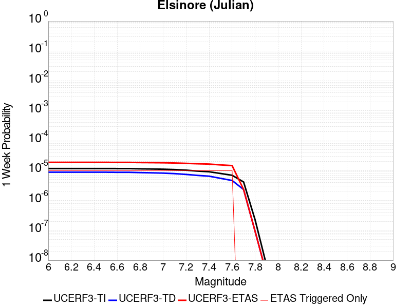 | 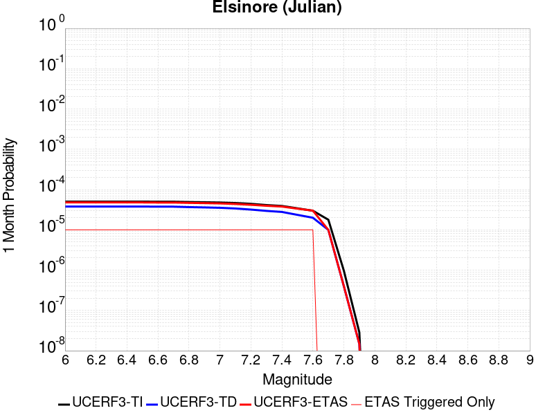 | 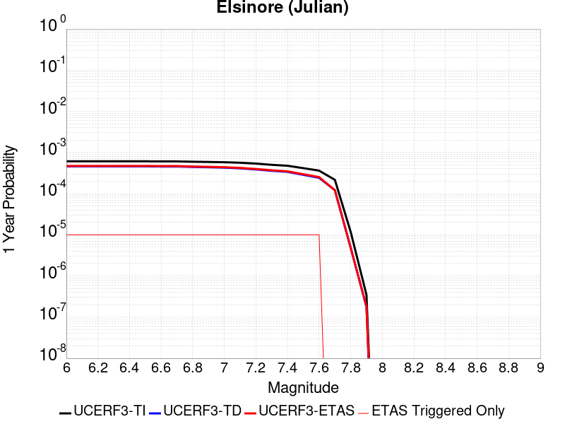 | 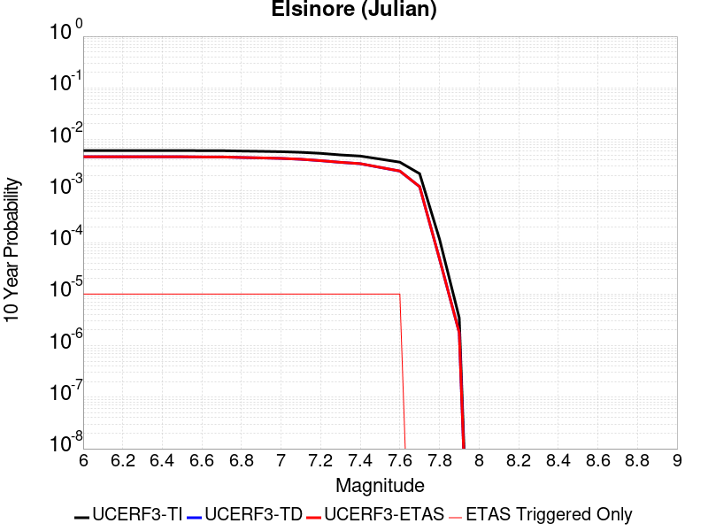 |

| Magnitude | 1 wk TI Prob | 1 wk TD Prob | 1 wk ETAS Prob | 1 wk ETAS/TD Gain | 1 wk ETAS Triggered Only | 1 mo TI Prob | 1 mo TD Prob | 1 mo ETAS Prob | 1 mo ETAS/TD Gain | 1 mo ETAS Triggered Only | 1 yr TI Prob | 1 yr TD Prob | 1 yr ETAS Prob | 1 yr ETAS/TD Gain | 1 yr ETAS Triggered Only | 10 yr TI Prob | 10 yr TD Prob | 10 yr ETAS Prob | 10 yr ETAS/TD Gain | 10 yr ETAS Triggered Only |
|-----|-----|-----|-----|-----|-----|-----|-----|-----|-----|-----|-----|-----|-----|-----|-----|-----|-----|-----|-----|-----|
| 6.0 | 1.1710231E-5 | 8.845315E-6 | 1.8845227E-5 | 2.130532 | 1.0E-5 | 5.0185736E-5 | 3.7907954E-5 | 4.7907575E-5 | 1.2637869 | 1.0E-5 | 6.1084004E-4 | 4.614333E-4 | 4.7142868E-4 | 1.0216616 | 1.0E-5 | 0.006091637 | 0.0046049724 | 0.0046149264 | 1.0021616 | 1.0E-5 |
| 6.1 | 1.1710231E-5 | 8.845315E-6 | 1.8845227E-5 | 2.130532 | 1.0E-5 | 5.0185736E-5 | 3.7907954E-5 | 4.7907575E-5 | 1.2637869 | 1.0E-5 | 6.1084004E-4 | 4.614333E-4 | 4.7142868E-4 | 1.0216616 | 1.0E-5 | 0.006091637 | 0.0046049724 | 0.0046149264 | 1.0021616 | 1.0E-5 |
| 6.2 | 1.1710231E-5 | 8.845315E-6 | 1.8845227E-5 | 2.130532 | 1.0E-5 | 5.0185736E-5 | 3.7907954E-5 | 4.7907575E-5 | 1.2637869 | 1.0E-5 | 6.1084004E-4 | 4.614333E-4 | 4.7142868E-4 | 1.0216616 | 1.0E-5 | 0.006091637 | 0.0046049724 | 0.0046149264 | 1.0021616 | 1.0E-5 |
| 6.3 | 1.1710231E-5 | 8.845315E-6 | 1.8845227E-5 | 2.130532 | 1.0E-5 | 5.0185736E-5 | 3.7907954E-5 | 4.7907575E-5 | 1.2637869 | 1.0E-5 | 6.1084004E-4 | 4.614333E-4 | 4.7142868E-4 | 1.0216616 | 1.0E-5 | 0.006091637 | 0.0046049724 | 0.0046149264 | 1.0021616 | 1.0E-5 |
| 6.4 | 1.1710231E-5 | 8.845315E-6 | 1.8845227E-5 | 2.130532 | 1.0E-5 | 5.0185736E-5 | 3.7907954E-5 | 4.7907575E-5 | 1.2637869 | 1.0E-5 | 6.1084004E-4 | 4.614333E-4 | 4.7142868E-4 | 1.0216616 | 1.0E-5 | 0.006091637 | 0.0046049724 | 0.0046149264 | 1.0021616 | 1.0E-5 |
| 6.5 | 1.1710231E-5 | 8.845315E-6 | 1.8845227E-5 | 2.130532 | 1.0E-5 | 5.0185736E-5 | 3.7907954E-5 | 4.7907575E-5 | 1.2637869 | 1.0E-5 | 6.1084004E-4 | 4.614333E-4 | 4.7142868E-4 | 1.0216616 | 1.0E-5 | 0.006091637 | 0.0046049724 | 0.0046149264 | 1.0021616 | 1.0E-5 |
| 6.6 | 1.1650619E-5 | 8.777691E-6 | 1.8777604E-5 | 2.1392417 | 1.0E-5 | 4.993027E-5 | 3.761814E-5 | 4.7617767E-5 | 1.2658192 | 1.0E-5 | 6.0773146E-4 | 4.5790634E-4 | 4.6790176E-4 | 1.0218285 | 1.0E-5 | 0.0060607214 | 0.004569848 | 0.0045798025 | 1.0021783 | 1.0E-5 |
| 6.7 | 1.1650619E-5 | 8.777691E-6 | 1.8777604E-5 | 2.1392417 | 1.0E-5 | 4.993027E-5 | 3.761814E-5 | 4.7617767E-5 | 1.2658192 | 1.0E-5 | 6.0773146E-4 | 4.5790634E-4 | 4.6790176E-4 | 1.0218285 | 1.0E-5 | 0.0060607214 | 0.004569848 | 0.0045798025 | 1.0021783 | 1.0E-5 |
| 6.8 | 1.1442698E-5 | 8.560841E-6 | 1.8560755E-5 | 2.1680994 | 1.0E-5 | 4.9039216E-5 | 3.6688813E-5 | 4.6688445E-5 | 1.2725526 | 1.0E-5 | 5.968889E-4 | 4.4659642E-4 | 4.5659195E-4 | 1.0223815 | 1.0E-5 | 0.0059528816 | 0.004457207 | 0.004467163 | 1.0022335 | 1.0E-5 |
| 6.9 | 1.1300589E-5 | 8.408708E-6 | 1.8408624E-5 | 2.1892333 | 1.0E-5 | 4.8430196E-5 | 3.603683E-5 | 4.6036468E-5 | 1.2774839 | 1.0E-5 | 5.894781E-4 | 4.3866172E-4 | 4.4865735E-4 | 1.0227866 | 1.0E-5 | 0.005879169 | 0.0043781744 | 0.0043881307 | 1.002274 | 1.0E-5 |
| 7.0 | 1.1117729E-5 | 8.225868E-6 | 1.8225786E-5 | 2.215667 | 1.0E-5 | 4.764654E-5 | 3.5253255E-5 | 4.5252902E-5 | 1.2836517 | 1.0E-5 | 5.799422E-4 | 4.291255E-4 | 4.391212E-4 | 1.0232933 | 1.0E-5 | 0.0057843104 | 0.0042831833 | 0.0042931405 | 1.0023247 | 1.0E-5 |
| 7.1 | 1.08053955E-5 | 7.911498E-6 | 1.791142E-5 | 2.263973 | 1.0E-5 | 4.6308014E-5 | 3.3905988E-5 | 4.390565E-5 | 1.2949232 | 1.0E-5 | 5.6365423E-4 | 4.1272887E-4 | 4.2272473E-4 | 1.024219 | 1.0E-5 | 0.005622267 | 0.004119835 | 0.004129794 | 1.0024173 | 1.0E-5 |
| 7.2 | 1.032804E-5 | 7.432751E-6 | 1.7432676E-5 | 2.345387 | 1.0E-5 | 4.4262277E-5 | 3.1854266E-5 | 4.1853946E-5 | 1.3139197 | 1.0E-5 | 5.387599E-4 | 3.8775822E-4 | 3.9775437E-4 | 1.0257792 | 1.0E-5 | 0.0053745564 | 0.00387102 | 0.0038809814 | 1.0025733 | 1.0E-5 |
| 7.3 | 9.622426E-6 | 6.897587E-6 | 1.6897518E-5 | 2.4497724 | 1.0E-5 | 4.1238312E-5 | 2.956076E-5 | 3.9560466E-5 | 1.3382763 | 1.0E-5 | 5.019608E-4 | 3.5984424E-4 | 3.6984065E-4 | 1.0277798 | 1.0E-5 | 0.005008285 | 0.0035928036 | 0.0036027676 | 1.0027733 | 1.0E-5 |
| 7.4 | 9.144434E-6 | 6.496142E-6 | 1.6496077E-5 | 2.5393653 | 1.0E-5 | 3.9189843E-5 | 2.7840319E-5 | 3.784004E-5 | 1.3591813 | 1.0E-5 | 4.7703186E-4 | 3.3890453E-4 | 3.4890114E-4 | 1.0294968 | 1.0E-5 | 0.0047600917 | 0.0033840172 | 0.0033939832 | 1.0029451 | 1.0E-5 |
| 7.5 | 7.988981E-6 | 5.498105E-6 | 1.549805E-5 | 2.8187985 | 1.0E-5 | 3.4238044E-5 | 2.3563101E-5 | 3.3562865E-5 | 1.4243823 | 1.0E-5 | 4.1676845E-4 | 2.8684427E-4 | 2.968414E-4 | 1.0348521 | 1.0E-5 | 0.0041598766 | 0.0028648674 | 0.002874839 | 1.0034806 | 1.0E-5 |
| 7.6 | 6.9554876E-6 | 4.6623254E-6 | 1.4662279E-5 | 3.1448424 | 1.0E-5 | 2.9808893E-5 | 1.998125E-5 | 2.9981049E-5 | 1.5004592 | 1.0E-5 | 3.6286283E-4 | 2.4324573E-4 | 2.5324328E-4 | 1.0411007 | 1.0E-5 | 0.0036227088 | 0.002429911 | 0.0024398866 | 1.0041053 | 1.0E-5 |
| 7.7 | 4.1557314E-6 | 2.3244427E-6 | 2.3244427E-6 | 1.0 | 0.0 | 1.7810156E-5 | 9.961864E-6 | 9.961864E-6 | 1.0 | 0.0 | 2.1681708E-4 | 1.2127968E-4 | 1.2127968E-4 | 1.0 | 0.0 | 0.0021660565 | 0.001212208 | 0.001212208 | 1.0 | 0.0 |
| 7.8 | 2.2597293E-7 | 9.331864E-8 | 9.331864E-8 | 1.0 | 0.0 | 9.684551E-7 | 3.99937E-7 | 3.99937E-7 | 1.0 | 0.0 | 1.1790877E-5 | 4.8692254E-6 | 4.8692254E-6 | 1.0 | 0.0 | 1.17902506E-4 | 4.8691512E-5 | 4.8691512E-5 | 1.0 | 0.0 |
| 7.9 | 6.676829E-9 | 3.4397174E-9 | 3.4397174E-9 | 1.0 | 0.0 | 2.861498E-8 | 1.4741646E-8 | 1.4741646E-8 | 1.0 | 0.0 | 3.4838732E-7 | 1.7947953E-7 | 1.7947953E-7 | 1.0 | 0.0 | 3.4838679E-6 | 1.794794E-6 | 1.794794E-6 | 1.0 | 0.0 |

## Little Salmon (Onshore)
*[(top)](#table-of-contents)*

| 1 Week | 1 Month | 1 Year | 10 Year |
|-----|-----|-----|-----|
|  |  |  |  |

| Magnitude | 1 wk TI Prob | 1 wk TD Prob | 1 wk ETAS Prob | 1 wk ETAS/TD Gain | 1 wk ETAS Triggered Only | 1 mo TI Prob | 1 mo TD Prob | 1 mo ETAS Prob | 1 mo ETAS/TD Gain | 1 mo ETAS Triggered Only | 1 yr TI Prob | 1 yr TD Prob | 1 yr ETAS Prob | 1 yr ETAS/TD Gain | 1 yr ETAS Triggered Only | 10 yr TI Prob | 10 yr TD Prob | 10 yr ETAS Prob | 10 yr ETAS/TD Gain | 10 yr ETAS Triggered Only |
|-----|-----|-----|-----|-----|-----|-----|-----|-----|-----|-----|-----|-----|-----|-----|-----|-----|-----|-----|-----|-----|
| 6.0 | 4.1582247E-5 | 5.1820014E-5 | 5.1820014E-5 | 1.0 | 0.0 | 1.7819746E-4 | 2.2207153E-4 | 2.2207153E-4 | 1.0 | 0.0 | 0.0021673953 | 0.0027011954 | 0.0027111683 | 1.003692 | 1.0E-5 | 0.021463778 | 0.027034452 | 0.02704418 | 1.0003599 | 1.0E-5 |
| 6.1 | 4.1582247E-5 | 5.1820014E-5 | 5.1820014E-5 | 1.0 | 0.0 | 1.7819746E-4 | 2.2207153E-4 | 2.2207153E-4 | 1.0 | 0.0 | 0.0021673953 | 0.0027011954 | 0.0027111683 | 1.003692 | 1.0E-5 | 0.021463778 | 0.027034452 | 0.02704418 | 1.0003599 | 1.0E-5 |
| 6.2 | 4.1582247E-5 | 5.1820014E-5 | 5.1820014E-5 | 1.0 | 0.0 | 1.7819746E-4 | 2.2207153E-4 | 2.2207153E-4 | 1.0 | 0.0 | 0.0021673953 | 0.0027011954 | 0.0027111683 | 1.003692 | 1.0E-5 | 0.021463778 | 0.027034452 | 0.02704418 | 1.0003599 | 1.0E-5 |
| 6.3 | 4.1582247E-5 | 5.1820014E-5 | 5.1820014E-5 | 1.0 | 0.0 | 1.7819746E-4 | 2.2207153E-4 | 2.2207153E-4 | 1.0 | 0.0 | 0.0021673953 | 0.0027011954 | 0.0027111683 | 1.003692 | 1.0E-5 | 0.021463778 | 0.027034452 | 0.02704418 | 1.0003599 | 1.0E-5 |
| 6.4 | 4.1582247E-5 | 5.1820014E-5 | 5.1820014E-5 | 1.0 | 0.0 | 1.7819746E-4 | 2.2207153E-4 | 2.2207153E-4 | 1.0 | 0.0 | 0.0021673953 | 0.0027011954 | 0.0027111683 | 1.003692 | 1.0E-5 | 0.021463778 | 0.027034452 | 0.02704418 | 1.0003599 | 1.0E-5 |
| 6.5 | 4.1582247E-5 | 5.1820014E-5 | 5.1820014E-5 | 1.0 | 0.0 | 1.7819746E-4 | 2.2207153E-4 | 2.2207153E-4 | 1.0 | 0.0 | 0.0021673953 | 0.0027011954 | 0.0027111683 | 1.003692 | 1.0E-5 | 0.021463778 | 0.027034452 | 0.02704418 | 1.0003599 | 1.0E-5 |
| 6.6 | 4.1582247E-5 | 5.1820014E-5 | 5.1820014E-5 | 1.0 | 0.0 | 1.7819746E-4 | 2.2207153E-4 | 2.2207153E-4 | 1.0 | 0.0 | 0.0021673953 | 0.0027011954 | 0.0027111683 | 1.003692 | 1.0E-5 | 0.021463778 | 0.027034452 | 0.02704418 | 1.0003599 | 1.0E-5 |
| 6.7 | 4.1582247E-5 | 5.1820014E-5 | 5.1820014E-5 | 1.0 | 0.0 | 1.7819746E-4 | 2.2207153E-4 | 2.2207153E-4 | 1.0 | 0.0 | 0.0021673953 | 0.0027011954 | 0.0027111683 | 1.003692 | 1.0E-5 | 0.021463778 | 0.027034452 | 0.02704418 | 1.0003599 | 1.0E-5 |
| 6.8 | 3.4607925E-5 | 4.094412E-5 | 4.094412E-5 | 1.0 | 0.0 | 1.4831126E-4 | 1.7546724E-4 | 1.7546724E-4 | 1.0 | 0.0 | 0.001804194 | 0.0021349725 | 0.0021449511 | 1.004674 | 1.0E-5 | 0.01789616 | 0.021454342 | 0.021464126 | 1.0004561 | 1.0E-5 |
| 6.9 | 3.4607925E-5 | 4.094412E-5 | 4.094412E-5 | 1.0 | 0.0 | 1.4831126E-4 | 1.7546724E-4 | 1.7546724E-4 | 1.0 | 0.0 | 0.001804194 | 0.0021349725 | 0.0021449511 | 1.004674 | 1.0E-5 | 0.01789616 | 0.021454342 | 0.021464126 | 1.0004561 | 1.0E-5 |
| 7.0 | 1.8411014E-5 | 1.7285503E-5 | 1.7285503E-5 | 1.0 | 0.0 | 7.8901954E-5 | 7.4078926E-5 | 7.4078926E-5 | 1.0 | 0.0 | 9.6020795E-4 | 9.0159115E-4 | 9.0159115E-4 | 1.0 | 0.0 | 0.009560696 | 0.009006166 | 0.009006166 | 1.0 | 0.0 |
| 7.1 | 1.6183103E-5 | 1.4205894E-5 | 1.4205894E-5 | 1.0 | 0.0 | 6.935431E-5 | 6.088125E-5 | 6.088125E-5 | 1.0 | 0.0 | 8.440616E-4 | 7.410246E-4 | 7.410246E-4 | 1.0 | 0.0 | 0.008408628 | 0.0074117873 | 0.0074117873 | 1.0 | 0.0 |
| 7.2 | 1.4868988E-5 | 1.2585783E-5 | 1.2585783E-5 | 1.0 | 0.0 | 6.372268E-5 | 5.393821E-5 | 5.393821E-5 | 1.0 | 0.0 | 7.755474E-4 | 6.5654493E-4 | 6.5654493E-4 | 1.0 | 0.0 | 0.0077284635 | 0.0065716365 | 0.0065716365 | 1.0 | 0.0 |
| 7.3 | 9.3599865E-6 | 7.694566E-6 | 7.694566E-6 | 1.0 | 0.0 | 4.011361E-5 | 3.2976495E-5 | 3.2976495E-5 | 1.0 | 0.0 | 4.8827377E-4 | 4.0145052E-4 | 4.0145052E-4 | 1.0 | 0.0 | 0.004872023 | 0.0040242276 | 0.0040242276 | 1.0 | 0.0 |
| 7.4 | 5.941556E-6 | 4.9508285E-6 | 4.9508285E-6 | 1.0 | 0.0 | 2.5463563E-5 | 2.1217837E-5 | 2.1217837E-5 | 1.0 | 0.0 | 3.0997477E-4 | 2.5832717E-4 | 2.5832717E-4 | 1.0 | 0.0 | 0.0030954275 | 0.0025927064 | 0.0025927064 | 1.0 | 0.0 |

## Quien Sabe 2011 CFM
*[(top)](#table-of-contents)*

| 1 Week | 1 Month | 1 Year | 10 Year |
|-----|-----|-----|-----|
| 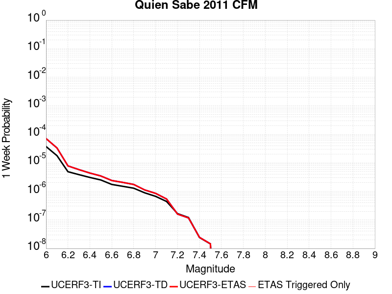 | 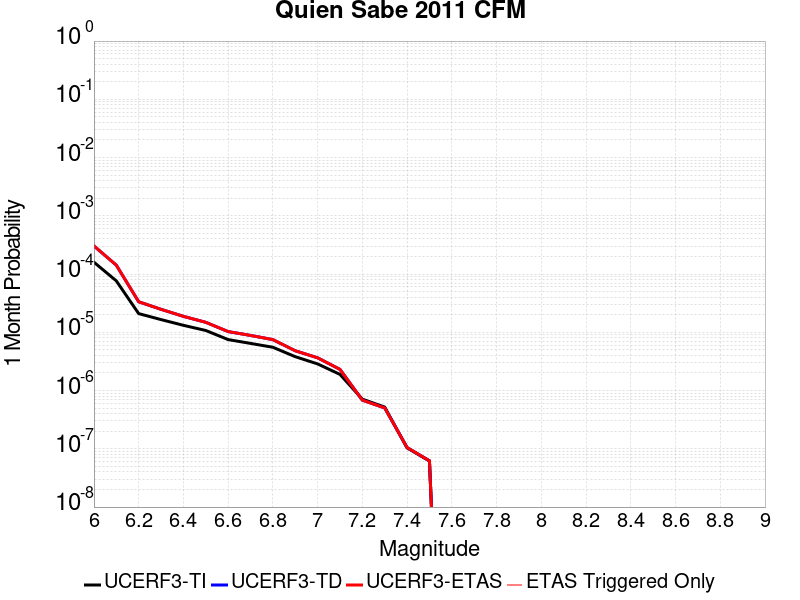 | 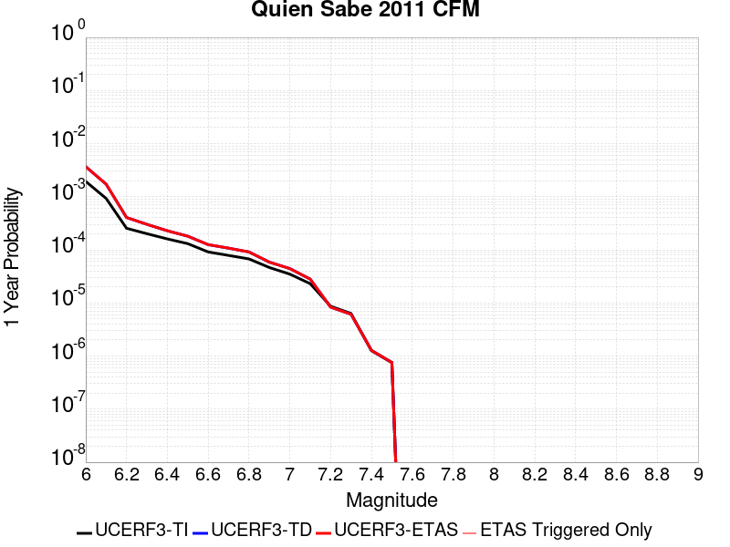 |  |

| Magnitude | 1 wk TI Prob | 1 wk TD Prob | 1 wk ETAS Prob | 1 wk ETAS/TD Gain | 1 wk ETAS Triggered Only | 1 mo TI Prob | 1 mo TD Prob | 1 mo ETAS Prob | 1 mo ETAS/TD Gain | 1 mo ETAS Triggered Only | 1 yr TI Prob | 1 yr TD Prob | 1 yr ETAS Prob | 1 yr ETAS/TD Gain | 1 yr ETAS Triggered Only | 10 yr TI Prob | 10 yr TD Prob | 10 yr ETAS Prob | 10 yr ETAS/TD Gain | 10 yr ETAS Triggered Only |
|-----|-----|-----|-----|-----|-----|-----|-----|-----|-----|-----|-----|-----|-----|-----|-----|-----|-----|-----|-----|-----|
| 6.0 | 3.729899E-5 | 7.094885E-5 | 7.094885E-5 | 1.0 | 0.0 | 1.5984301E-4 | 3.0394195E-4 | 3.0394195E-4 | 1.0 | 0.0 | 0.0019443515 | 0.0036850597 | 0.0036850597 | 1.0 | 0.0 | 0.019274272 | 0.035349693 | 0.035359338 | 1.0002729 | 1.0E-5 |
| 6.1 | 1.7825725E-5 | 3.3210796E-5 | 3.3210796E-5 | 1.0 | 0.0 | 7.639373E-5 | 1.4227985E-4 | 1.4227985E-4 | 1.0 | 0.0 | 9.296967E-4 | 0.0017266083 | 0.0017266083 | 1.0 | 0.0 | 0.009258169 | 0.016698873 | 0.016698873 | 1.0 | 0.0 |
| 6.2 | 4.8865336E-6 | 7.807397E-6 | 7.807397E-6 | 1.0 | 0.0 | 2.0942118E-5 | 3.3456672E-5 | 3.3456672E-5 | 1.0 | 0.0 | 2.5494045E-4 | 4.0691794E-4 | 4.0691794E-4 | 1.0 | 0.0 | 0.0025464818 | 0.0040135398 | 0.0040135398 | 1.0 | 0.0 |
| 6.3 | 3.858491E-6 | 5.7896764E-6 | 5.7896764E-6 | 1.0 | 0.0 | 1.6536285E-5 | 2.4812689E-5 | 2.4812689E-5 | 1.0 | 0.0 | 2.0131067E-4 | 3.020573E-4 | 3.020573E-4 | 1.0 | 0.0 | 0.002011284 | 0.0030020247 | 0.0030020247 | 1.0 | 0.0 |
| 6.4 | 3.0771805E-6 | 4.3848822E-6 | 4.3848822E-6 | 1.0 | 0.0 | 1.318785E-5 | 1.879223E-5 | 1.879223E-5 | 1.0 | 0.0 | 1.6055023E-4 | 2.287738E-4 | 2.287738E-4 | 1.0 | 0.0 | 0.001604343 | 0.0022864633 | 0.0022864633 | 1.0 | 0.0 |
| 6.5 | 2.5081235E-6 | 3.4635768E-6 | 3.4635768E-6 | 1.0 | 0.0 | 1.0749056E-5 | 1.4843825E-5 | 1.4843825E-5 | 1.0 | 0.0 | 1.308619E-4 | 1.8071005E-4 | 1.8071005E-4 | 1.0 | 0.0 | 0.0013078486 | 0.0018122483 | 0.0018122483 | 1.0 | 0.0 |
| 6.6 | 1.7505364E-6 | 2.4023664E-6 | 2.4023664E-6 | 1.0 | 0.0 | 7.502277E-6 | 1.0295819E-5 | 1.0295819E-5 | 1.0 | 0.0 | 9.13364E-5 | 1.253451E-4 | 1.253451E-4 | 1.0 | 0.0 | 9.129886E-4 | 0.0012582706 | 0.0012582706 | 1.0 | 0.0 |
| 6.7 | 1.505737E-6 | 2.063768E-6 | 2.063768E-6 | 1.0 | 0.0 | 6.4531428E-6 | 8.844693E-6 | 8.844693E-6 | 1.0 | 0.0 | 7.8564175E-5 | 1.0767942E-4 | 1.0767942E-4 | 1.0 | 0.0 | 7.853641E-4 | 0.0010818074 | 0.0010818074 | 1.0 | 0.0 |
| 6.8 | 1.2924105E-6 | 1.7484224E-6 | 1.7484224E-6 | 1.0 | 0.0 | 5.5388905E-6 | 7.4932204E-6 | 7.4932204E-6 | 1.0 | 0.0 | 6.74339E-5 | 9.1226684E-5 | 9.1226684E-5 | 1.0 | 0.0 | 6.741344E-4 | 9.1608387E-4 | 9.1608387E-4 | 1.0 | 0.0 |
| 6.9 | 8.9075286E-7 | 1.1249912E-6 | 1.1249912E-6 | 1.0 | 0.0 | 3.8175067E-6 | 4.8213833E-6 | 4.8213833E-6 | 1.0 | 0.0 | 4.6477155E-5 | 5.869898E-5 | 5.869898E-5 | 1.0 | 0.0 | 4.6467435E-4 | 5.903731E-4 | 5.903731E-4 | 1.0 | 0.0 |
| 7.0 | 6.6891175E-7 | 8.516645E-7 | 8.516645E-7 | 1.0 | 0.0 | 2.8667614E-6 | 3.6499866E-6 | 3.6499866E-6 | 1.0 | 0.0 | 3.4902263E-5 | 4.443788E-5 | 4.443788E-5 | 1.0 | 0.0 | 3.4896782E-4 | 4.4676356E-4 | 4.4676356E-4 | 1.0 | 0.0 |
| 7.1 | 4.4205015E-7 | 5.391929E-7 | 5.391929E-7 | 1.0 | 0.0 | 1.8944993E-6 | 2.3108257E-6 | 2.3108257E-6 | 1.0 | 0.0 | 2.3065284E-5 | 2.8134109E-5 | 2.8134109E-5 | 1.0 | 0.0 | 2.3062891E-4 | 2.826615E-4 | 2.826615E-4 | 1.0 | 0.0 |
| 7.2 | 1.6620965E-7 | 1.5987632E-7 | 1.5987632E-7 | 1.0 | 0.0 | 7.123269E-7 | 6.851841E-7 | 6.851841E-7 | 1.0 | 0.0 | 8.672545E-6 | 8.342088E-6 | 8.342088E-6 | 1.0 | 0.0 | 8.6722066E-5 | 8.354316E-5 | 8.354316E-5 | 1.0 | 0.0 |
| 7.3 | 1.2142488E-7 | 1.1726676E-7 | 1.1726676E-7 | 1.0 | 0.0 | 5.2039223E-7 | 5.025717E-7 | 5.025717E-7 | 1.0 | 0.0 | 6.335757E-6 | 6.118797E-6 | 6.118797E-6 | 1.0 | 0.0 | 6.3355765E-5 | 6.120608E-5 | 6.120608E-5 | 1.0 | 0.0 |
| 7.4 | 2.4192937E-8 | 2.4545901E-8 | 2.4545901E-8 | 1.0 | 0.0 | 1.0368401E-7 | 1.0519671E-7 | 1.0519671E-7 | 1.0 | 0.0 | 1.2623522E-6 | 1.2807693E-6 | 1.2807693E-6 | 1.0 | 0.0 | 1.2623449E-5 | 1.2768185E-5 | 1.2768185E-5 | 1.0 | 0.0 |
| 7.5 | 1.4432802E-8 | 1.4508743E-8 | 1.4508743E-8 | 1.0 | 0.0 | 6.185486E-8 | 6.218033E-8 | 6.218033E-8 | 1.0 | 0.0 | 7.530827E-7 | 7.5704526E-7 | 7.5704526E-7 | 1.0 | 0.0 | 7.530801E-6 | 7.528889E-6 | 7.528889E-6 | 1.0 | 0.0 |

## Homestead Valley 2011
*[(top)](#table-of-contents)*

| 1 Week | 1 Month | 1 Year | 10 Year |
|-----|-----|-----|-----|
| 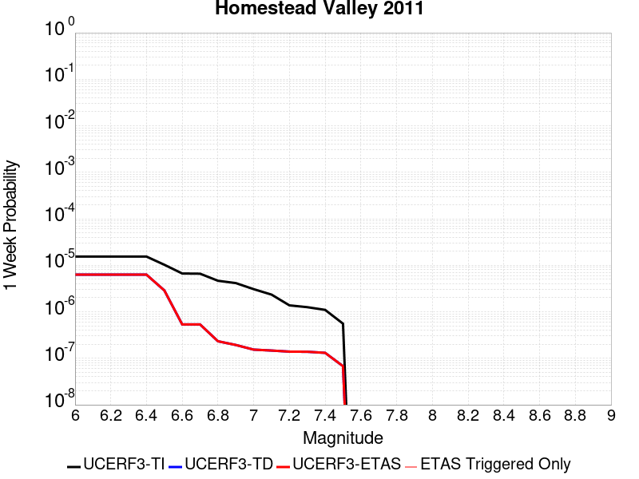 | 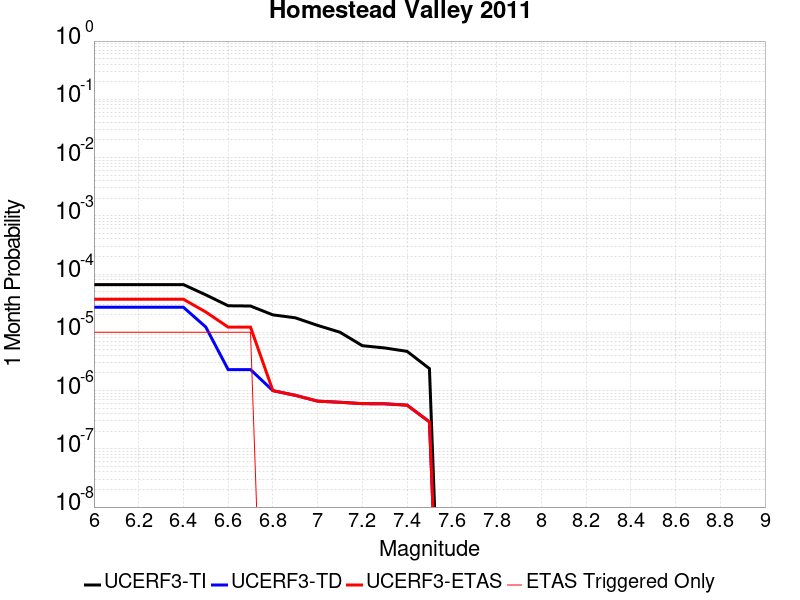 | 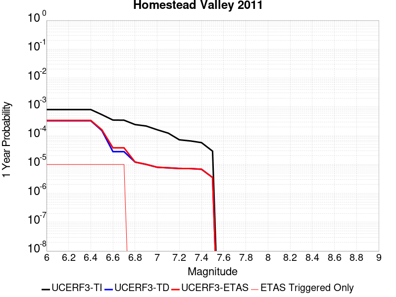 | 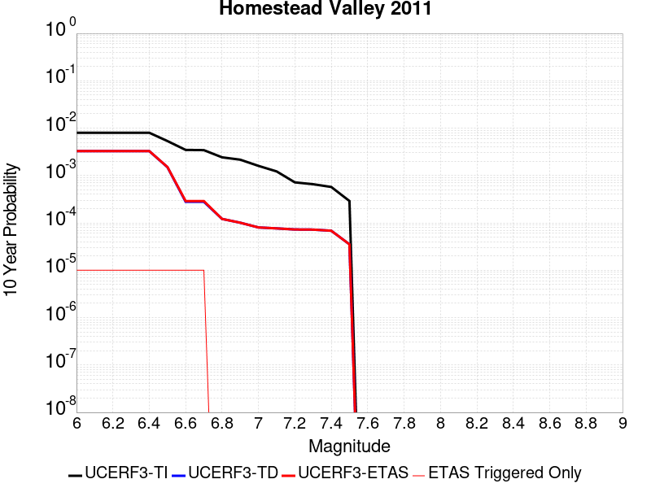 |

| Magnitude | 1 wk TI Prob | 1 wk TD Prob | 1 wk ETAS Prob | 1 wk ETAS/TD Gain | 1 wk ETAS Triggered Only | 1 mo TI Prob | 1 mo TD Prob | 1 mo ETAS Prob | 1 mo ETAS/TD Gain | 1 mo ETAS Triggered Only | 1 yr TI Prob | 1 yr TD Prob | 1 yr ETAS Prob | 1 yr ETAS/TD Gain | 1 yr ETAS Triggered Only | 10 yr TI Prob | 10 yr TD Prob | 10 yr ETAS Prob | 10 yr ETAS/TD Gain | 10 yr ETAS Triggered Only |
|-----|-----|-----|-----|-----|-----|-----|-----|-----|-----|-----|-----|-----|-----|-----|-----|-----|-----|-----|-----|-----|
| 6.0 | 1.539795E-5 | 6.286469E-6 | 6.286469E-6 | 1.0 | 0.0 | 6.5989545E-5 | 2.6941849E-5 | 3.694158E-5 | 1.3711598 | 1.0E-5 | 8.0312655E-4 | 3.2798824E-4 | 3.3798497E-4 | 1.030479 | 1.0E-5 | 0.008002302 | 0.0032770627 | 0.00328703 | 1.0030415 | 1.0E-5 |
| 6.1 | 1.539795E-5 | 6.286469E-6 | 6.286469E-6 | 1.0 | 0.0 | 6.5989545E-5 | 2.6941849E-5 | 3.694158E-5 | 1.3711598 | 1.0E-5 | 8.0312655E-4 | 3.2798824E-4 | 3.3798497E-4 | 1.030479 | 1.0E-5 | 0.008002302 | 0.0032770627 | 0.00328703 | 1.0030415 | 1.0E-5 |
| 6.2 | 1.539795E-5 | 6.286469E-6 | 6.286469E-6 | 1.0 | 0.0 | 6.5989545E-5 | 2.6941849E-5 | 3.694158E-5 | 1.3711598 | 1.0E-5 | 8.0312655E-4 | 3.2798824E-4 | 3.3798497E-4 | 1.030479 | 1.0E-5 | 0.008002302 | 0.0032770627 | 0.00328703 | 1.0030415 | 1.0E-5 |
| 6.3 | 1.539795E-5 | 6.286469E-6 | 6.286469E-6 | 1.0 | 0.0 | 6.5989545E-5 | 2.6941849E-5 | 3.694158E-5 | 1.3711598 | 1.0E-5 | 8.0312655E-4 | 3.2798824E-4 | 3.3798497E-4 | 1.030479 | 1.0E-5 | 0.008002302 | 0.0032770627 | 0.00328703 | 1.0030415 | 1.0E-5 |
| 6.4 | 1.539795E-5 | 6.286469E-6 | 6.286469E-6 | 1.0 | 0.0 | 6.5989545E-5 | 2.6941849E-5 | 3.694158E-5 | 1.3711598 | 1.0E-5 | 8.0312655E-4 | 3.2798824E-4 | 3.3798497E-4 | 1.030479 | 1.0E-5 | 0.008002302 | 0.0032770627 | 0.00328703 | 1.0030415 | 1.0E-5 |
| 6.5 | 1.0265258E-5 | 2.8786876E-6 | 2.8786876E-6 | 1.0 | 0.0 | 4.3993223E-5 | 1.2337214E-5 | 2.233709E-5 | 1.8105458 | 1.0E-5 | 5.3548586E-4 | 1.5020218E-4 | 1.6020068E-4 | 1.066567 | 1.0E-5 | 0.005341973 | 0.0015016886 | 0.0015116736 | 1.0066491 | 1.0E-5 |
| 6.6 | 6.664671E-6 | 5.343859E-7 | 5.343859E-7 | 1.0 | 0.0 | 2.8562565E-5 | 2.2902238E-6 | 1.2290201E-5 | 5.3663754 | 1.0E-5 | 3.476937E-4 | 2.7883236E-5 | 3.7882957E-5 | 1.3586284 | 1.0E-5 | 0.003471502 | 2.78809E-4 | 2.8880622E-4 | 1.0358568 | 1.0E-5 |
| 6.7 | 6.5954046E-6 | 5.343859E-7 | 5.343859E-7 | 1.0 | 0.0 | 2.8265715E-5 | 2.2902238E-6 | 1.2290201E-5 | 5.3663754 | 1.0E-5 | 3.4408073E-4 | 2.7883236E-5 | 3.7882957E-5 | 1.3586284 | 1.0E-5 | 0.0034354846 | 2.78809E-4 | 2.8880622E-4 | 1.0358568 | 1.0E-5 |
| 6.8 | 4.648189E-6 | 2.3257238E-7 | 2.3257238E-7 | 1.0 | 0.0 | 1.9920659E-5 | 9.967384E-7 | 9.967384E-7 | 1.0 | 0.0 | 2.4250703E-4 | 1.2135227E-5 | 1.2135227E-5 | 1.0 | 0.0 | 0.0024224254 | 1.2134612E-4 | 1.2134612E-4 | 1.0 | 0.0 |
| 6.9 | 4.1428534E-6 | 1.9342777E-7 | 1.9342777E-7 | 1.0 | 0.0 | 1.7754966E-5 | 8.289759E-7 | 8.289759E-7 | 1.0 | 0.0 | 2.1614527E-4 | 1.0092737E-5 | 1.0092737E-5 | 1.0 | 0.0 | 0.0021593515 | 1.0092309E-4 | 1.0092309E-4 | 1.0 | 0.0 |
| 7.0 | 3.0673707E-6 | 1.5364343E-7 | 1.5364343E-7 | 1.0 | 0.0 | 1.3145808E-5 | 6.5847166E-7 | 6.5847166E-7 | 1.0 | 0.0 | 1.6003846E-4 | 8.016864E-6 | 8.016864E-6 | 1.0 | 0.0 | 0.0015992324 | 8.016585E-5 | 8.016585E-5 | 1.0 | 0.0 |
| 7.1 | 2.340854E-6 | 1.4684727E-7 | 1.4684727E-7 | 1.0 | 0.0 | 1.0032193E-5 | 6.293453E-7 | 6.293453E-7 | 1.0 | 0.0 | 1.221351E-4 | 7.662254E-6 | 7.662254E-6 | 1.0 | 0.0 | 0.00122068 | 7.661999E-5 | 7.661999E-5 | 1.0 | 0.0 |
| 7.2 | 1.3754182E-6 | 1.3920152E-7 | 1.3920152E-7 | 1.0 | 0.0 | 5.8946357E-6 | 5.965778E-7 | 5.965778E-7 | 1.0 | 0.0 | 7.176483E-5 | 7.2633115E-6 | 7.2633115E-6 | 1.0 | 0.0 | 7.174166E-4 | 7.2630835E-5 | 7.2630835E-5 | 1.0 | 0.0 |
| 7.3 | 1.2573237E-6 | 1.3824703E-7 | 1.3824703E-7 | 1.0 | 0.0 | 5.388519E-6 | 5.9248714E-7 | 5.9248714E-7 | 1.0 | 0.0 | 6.560324E-5 | 7.213508E-6 | 7.213508E-6 | 1.0 | 0.0 | 6.558388E-4 | 7.213283E-5 | 7.213283E-5 | 1.0 | 0.0 |
| 7.4 | 1.0994207E-6 | 1.3103899E-7 | 1.3103899E-7 | 1.0 | 0.0 | 4.7117946E-6 | 5.615955E-7 | 5.615955E-7 | 1.0 | 0.0 | 5.736459E-5 | 6.837405E-6 | 6.837405E-6 | 1.0 | 0.0 | 5.734978E-4 | 6.837204E-5 | 6.837204E-5 | 1.0 | 0.0 |
| 7.5 | 5.5569126E-7 | 6.7717565E-8 | 6.7717565E-8 | 1.0 | 0.0 | 2.3815317E-6 | 2.902181E-7 | 2.902181E-7 | 1.0 | 0.0 | 2.8994764E-5 | 3.5334003E-6 | 3.5334003E-6 | 1.0 | 0.0 | 2.899098E-4 | 3.5333505E-5 | 3.5333505E-5 | 1.0 | 0.0 |

## Davis Creek
*[(top)](#table-of-contents)*

| 1 Week | 1 Month | 1 Year | 10 Year |
|-----|-----|-----|-----|
| 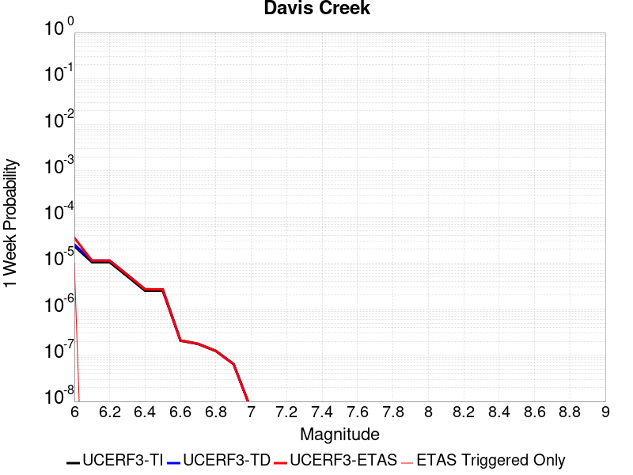 | 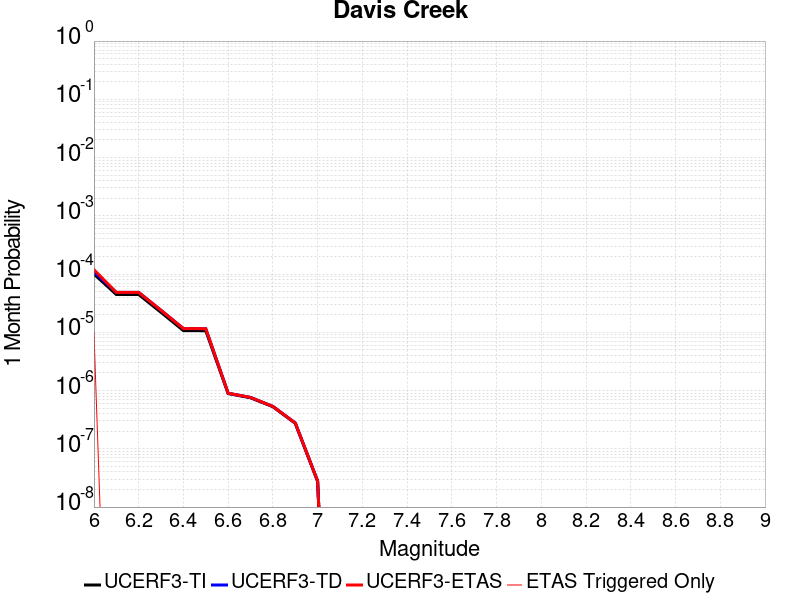 |  |  |

| Magnitude | 1 wk TI Prob | 1 wk TD Prob | 1 wk ETAS Prob | 1 wk ETAS/TD Gain | 1 wk ETAS Triggered Only | 1 mo TI Prob | 1 mo TD Prob | 1 mo ETAS Prob | 1 mo ETAS/TD Gain | 1 mo ETAS Triggered Only | 1 yr TI Prob | 1 yr TD Prob | 1 yr ETAS Prob | 1 yr ETAS/TD Gain | 1 yr ETAS Triggered Only | 10 yr TI Prob | 10 yr TD Prob | 10 yr ETAS Prob | 10 yr ETAS/TD Gain | 10 yr ETAS Triggered Only |
|-----|-----|-----|-----|-----|-----|-----|-----|-----|-----|-----|-----|-----|-----|-----|-----|-----|-----|-----|-----|-----|
| 6.0 | 2.331472E-5 | 2.5417214E-5 | 3.541696E-5 | 1.3934242 | 1.0E-5 | 9.99164E-5 | 1.0892704E-4 | 1.1892595E-4 | 1.0917946 | 1.0E-5 | 0.0012158032 | 0.0013254983 | 0.0013354851 | 1.0075344 | 1.0E-5 | 0.01209173 | 0.013187704 | 0.013197572 | 1.0007483 | 1.0E-5 |
| 6.1 | 1.0407654E-5 | 1.1316986E-5 | 1.1316986E-5 | 1.0 | 0.0 | 4.4603472E-5 | 4.8500624E-5 | 4.8500624E-5 | 1.0 | 0.0 | 5.4291193E-4 | 5.9036224E-4 | 5.9036224E-4 | 1.0 | 0.0 | 0.0054158745 | 0.005890611 | 0.005890611 | 1.0 | 0.0 |
| 6.2 | 1.0407654E-5 | 1.1316986E-5 | 1.1316986E-5 | 1.0 | 0.0 | 4.4603472E-5 | 4.8500624E-5 | 4.8500624E-5 | 1.0 | 0.0 | 5.4291193E-4 | 5.9036224E-4 | 5.9036224E-4 | 1.0 | 0.0 | 0.0054158745 | 0.005890611 | 0.005890611 | 1.0 | 0.0 |
| 6.3 | 5.1323277E-6 | 5.568556E-6 | 5.568556E-6 | 1.0 | 0.0 | 2.1995505E-5 | 2.386507E-5 | 2.386507E-5 | 1.0 | 0.0 | 2.6776237E-4 | 2.905271E-4 | 2.905271E-4 | 1.0 | 0.0 | 0.0026743996 | 0.0029023192 | 0.0029023192 | 1.0 | 0.0 |
| 6.4 | 2.4985154E-6 | 2.704538E-6 | 2.704538E-6 | 1.0 | 0.0 | 1.07078795E-5 | 1.1590847E-5 | 1.1590847E-5 | 1.0 | 0.0 | 1.3036063E-4 | 1.4111304E-4 | 1.4111304E-4 | 1.0 | 0.0 | 0.0013028418 | 0.001410589 | 0.001410589 | 1.0 | 0.0 |
| 6.5 | 2.4846438E-6 | 2.6904722E-6 | 2.6904722E-6 | 1.0 | 0.0 | 1.064843E-5 | 1.1530565E-5 | 1.1530565E-5 | 1.0 | 0.0 | 1.2963692E-4 | 1.403792E-4 | 1.403792E-4 | 1.0 | 0.0 | 0.0012956132 | 0.0014032599 | 0.0014032599 | 1.0 | 0.0 |
| 6.6 | 2.072566E-7 | 2.1018087E-7 | 2.1018087E-7 | 1.0 | 0.0 | 8.882423E-7 | 9.0077486E-7 | 9.0077486E-7 | 1.0 | 0.0 | 1.0814296E-5 | 1.0966881E-5 | 1.0966881E-5 | 1.0 | 0.0 | 1.081377E-4 | 1.09663575E-4 | 1.09663575E-4 | 1.0 | 0.0 |
| 6.7 | 1.7544528E-7 | 1.7790826E-7 | 1.7790826E-7 | 1.0 | 0.0 | 7.5190815E-7 | 7.6246374E-7 | 7.6246374E-7 | 1.0 | 0.0 | 9.154443E-6 | 9.282958E-6 | 9.282958E-6 | 1.0 | 0.0 | 9.1540656E-5 | 9.282586E-5 | 9.282586E-5 | 1.0 | 0.0 |
| 6.8 | 1.2320395E-7 | 1.2481138E-7 | 1.2481138E-7 | 1.0 | 0.0 | 5.280168E-7 | 5.349058E-7 | 5.349058E-7 | 1.0 | 0.0 | 6.428586E-6 | 6.5124595E-6 | 6.5124595E-6 | 1.0 | 0.0 | 6.4284E-5 | 6.5122804E-5 | 6.5122804E-5 | 1.0 | 0.0 |
| 6.9 | 6.399997E-8 | 6.486058E-8 | 6.486058E-8 | 1.0 | 0.0 | 2.7428555E-7 | 2.7797387E-7 | 2.7797387E-7 | 1.0 | 0.0 | 3.3394215E-6 | 3.3843273E-6 | 3.3843273E-6 | 1.0 | 0.0 | 3.3393713E-5 | 3.384282E-5 | 3.384282E-5 | 1.0 | 0.0 |
| 7.0 | 6.4455685E-9 | 6.535264E-9 | 6.535264E-9 | 1.0 | 0.0 | 2.7623864E-8 | 2.8008275E-8 | 2.8008275E-8 | 1.0 | 0.0 | 3.3632048E-7 | 3.4100074E-7 | 3.4100074E-7 | 1.0 | 0.0 | 3.3631998E-6 | 3.4100074E-6 | 3.4100074E-6 | 1.0 | 0.0 |

## San Luis Range - Pecho 2011 CFM
*[(top)](#table-of-contents)*

| 1 Week | 1 Month | 1 Year | 10 Year |
|-----|-----|-----|-----|
|  |  |  |  |

| Magnitude | 1 wk TI Prob | 1 wk TD Prob | 1 wk ETAS Prob | 1 wk ETAS/TD Gain | 1 wk ETAS Triggered Only | 1 mo TI Prob | 1 mo TD Prob | 1 mo ETAS Prob | 1 mo ETAS/TD Gain | 1 mo ETAS Triggered Only | 1 yr TI Prob | 1 yr TD Prob | 1 yr ETAS Prob | 1 yr ETAS/TD Gain | 1 yr ETAS Triggered Only | 10 yr TI Prob | 10 yr TD Prob | 10 yr ETAS Prob | 10 yr ETAS/TD Gain | 10 yr ETAS Triggered Only |
|-----|-----|-----|-----|-----|-----|-----|-----|-----|-----|-----|-----|-----|-----|-----|-----|-----|-----|-----|-----|-----|
| 6.0 | 1.687423E-6 | 1.6921944E-6 | 1.6921944E-6 | 1.0 | 0.0 | 7.231793E-6 | 7.252243E-6 | 7.252243E-6 | 1.0 | 0.0 | 8.804352E-5 | 8.829272E-5 | 8.829272E-5 | 1.0 | 0.0 | 8.8008645E-4 | 8.826003E-4 | 8.9259155E-4 | 1.0113201 | 1.0E-5 |
| 6.1 | 1.687423E-6 | 1.6921944E-6 | 1.6921944E-6 | 1.0 | 0.0 | 7.231793E-6 | 7.252243E-6 | 7.252243E-6 | 1.0 | 0.0 | 8.804352E-5 | 8.829272E-5 | 8.829272E-5 | 1.0 | 0.0 | 8.8008645E-4 | 8.826003E-4 | 8.9259155E-4 | 1.0113201 | 1.0E-5 |
| 6.2 | 1.0765672E-6 | 1.0770541E-6 | 1.0770541E-6 | 1.0 | 0.0 | 4.613851E-6 | 4.615938E-6 | 4.615938E-6 | 1.0 | 0.0 | 5.617219E-5 | 5.6197663E-5 | 5.6197663E-5 | 1.0 | 0.0 | 5.6157995E-4 | 5.618408E-4 | 5.7183515E-4 | 1.0177886 | 1.0E-5 |
| 6.3 | 8.523104E-7 | 8.5130216E-7 | 8.5130216E-7 | 1.0 | 0.0 | 3.6527538E-6 | 3.648433E-6 | 3.648433E-6 | 1.0 | 0.0 | 4.447137E-5 | 4.4418797E-5 | 4.4418797E-5 | 1.0 | 0.0 | 4.4462472E-4 | 4.441024E-4 | 4.5409796E-4 | 1.0225073 | 1.0E-5 |
| 6.4 | 8.523104E-7 | 8.5130216E-7 | 8.5130216E-7 | 1.0 | 0.0 | 3.6527538E-6 | 3.648433E-6 | 3.648433E-6 | 1.0 | 0.0 | 4.447137E-5 | 4.4418797E-5 | 4.4418797E-5 | 1.0 | 0.0 | 4.4462472E-4 | 4.441024E-4 | 4.5409796E-4 | 1.0225073 | 1.0E-5 |
| 6.5 | 7.0029404E-7 | 6.976438E-7 | 6.976438E-7 | 1.0 | 0.0 | 3.0012568E-6 | 2.9898988E-6 | 2.9898988E-6 | 1.0 | 0.0 | 3.6539688E-5 | 3.6401427E-5 | 3.6401427E-5 | 1.0 | 0.0 | 3.653368E-4 | 3.6395632E-4 | 3.6395632E-4 | 1.0 | 0.0 |
| 6.6 | 5.583906E-7 | 5.5428296E-7 | 5.5428296E-7 | 1.0 | 0.0 | 2.3931002E-6 | 2.3754963E-6 | 2.3754963E-6 | 1.0 | 0.0 | 2.9135606E-5 | 2.892129E-5 | 2.892129E-5 | 1.0 | 0.0 | 2.9131788E-4 | 2.89176E-4 | 2.89176E-4 | 1.0 | 0.0 |
| 6.7 | 4.73441E-7 | 4.6830658E-7 | 4.6830658E-7 | 1.0 | 0.0 | 2.0290313E-6 | 2.0070268E-6 | 2.0070268E-6 | 1.0 | 0.0 | 2.4703175E-5 | 2.4435281E-5 | 2.4435281E-5 | 1.0 | 0.0 | 2.470043E-4 | 2.443264E-4 | 2.443264E-4 | 1.0 | 0.0 |
| 6.8 | 4.1466086E-7 | 4.087795E-7 | 4.087795E-7 | 1.0 | 0.0 | 1.7771167E-6 | 1.751911E-6 | 1.751911E-6 | 1.0 | 0.0 | 2.1636182E-5 | 2.132931E-5 | 2.132931E-5 | 1.0 | 0.0 | 2.1634075E-4 | 2.1327297E-4 | 2.1327297E-4 | 1.0 | 0.0 |
| 6.9 | 3.2056641E-7 | 3.13293E-7 | 3.13293E-7 | 1.0 | 0.0 | 1.3738553E-6 | 1.3426836E-6 | 1.3426836E-6 | 1.0 | 0.0 | 1.6726559E-5 | 1.6347052E-5 | 1.6347052E-5 | 1.0 | 0.0 | 1.67253E-4 | 1.6345865E-4 | 1.6345865E-4 | 1.0 | 0.0 |
| 7.0 | 2.6315942E-7 | 2.5489675E-7 | 2.5489675E-7 | 1.0 | 0.0 | 1.1278256E-6 | 1.0924141E-6 | 1.0924141E-6 | 1.0 | 0.0 | 1.3731191E-5 | 1.3300061E-5 | 1.3300061E-5 | 1.0 | 0.0 | 1.3730342E-4 | 1.3299273E-4 | 1.3299273E-4 | 1.0 | 0.0 |
| 7.1 | 2.1832436E-7 | 2.0917312E-7 | 2.0917312E-7 | 1.0 | 0.0 | 9.356755E-7 | 8.9645596E-7 | 8.9645596E-7 | 1.0 | 0.0 | 1.13917895E-5 | 1.0914297E-5 | 1.0914297E-5 | 1.0 | 0.0 | 1.1391206E-4 | 1.0913766E-4 | 1.0913766E-4 | 1.0 | 0.0 |
| 7.2 | 1.7393015E-7 | 1.6376592E-7 | 1.6376592E-7 | 1.0 | 0.0 | 7.454147E-7 | 7.018537E-7 | 7.018537E-7 | 1.0 | 0.0 | 9.075386E-6 | 8.545036E-6 | 8.545036E-6 | 1.0 | 0.0 | 9.075015E-5 | 8.54471E-5 | 8.54471E-5 | 1.0 | 0.0 |
| 7.3 | 1.3744894E-7 | 1.263862E-7 | 1.263862E-7 | 1.0 | 0.0 | 5.890667E-7 | 5.4165497E-7 | 5.4165497E-7 | 1.0 | 0.0 | 7.1718637E-6 | 6.5946297E-6 | 6.5946297E-6 | 1.0 | 0.0 | 7.171632E-5 | 6.5944354E-5 | 6.5944354E-5 | 1.0 | 0.0 |
| 7.4 | 1.0915278E-7 | 9.727534E-8 | 9.727534E-8 | 1.0 | 0.0 | 4.6779755E-7 | 4.1689424E-7 | 4.1689424E-7 | 1.0 | 0.0 | 5.6954204E-6 | 5.0756753E-6 | 5.0756753E-6 | 1.0 | 0.0 | 5.6952744E-5 | 5.0755603E-5 | 5.0755603E-5 | 1.0 | 0.0 |
| 7.5 | 9.490291E-8 | 8.257131E-8 | 8.257131E-8 | 1.0 | 0.0 | 4.0672668E-7 | 3.53877E-7 | 3.53877E-7 | 1.0 | 0.0 | 4.9518862E-6 | 4.308444E-6 | 4.308444E-6 | 1.0 | 0.0 | 4.951776E-5 | 4.308361E-5 | 4.308361E-5 | 1.0 | 0.0 |
| 7.6 | 7.256678E-8 | 5.942529E-8 | 5.942529E-8 | 1.0 | 0.0 | 3.1100043E-7 | 2.546798E-7 | 2.546798E-7 | 1.0 | 0.0 | 3.7864236E-6 | 3.100722E-6 | 3.100722E-6 | 1.0 | 0.0 | 3.7863592E-5 | 3.100679E-5 | 3.100679E-5 | 1.0 | 0.0 |
| 7.7 | 5.446273E-8 | 4.057937E-8 | 4.057937E-8 | 1.0 | 0.0 | 2.3341168E-7 | 1.7391157E-7 | 1.7391157E-7 | 1.0 | 0.0 | 2.8417835E-6 | 2.1173712E-6 | 2.1173712E-6 | 1.0 | 0.0 | 2.8417471E-5 | 2.1173511E-5 | 2.1173511E-5 | 1.0 | 0.0 |
| 7.8 | 3.5850867E-8 | 2.1520364E-8 | 2.1520364E-8 | 1.0 | 0.0 | 1.5364655E-7 | 9.2230124E-8 | 9.2230124E-8 | 1.0 | 0.0 | 1.8706452E-6 | 1.1229012E-6 | 1.1229012E-6 | 1.0 | 0.0 | 1.8706294E-5 | 1.1228955E-5 | 1.1228955E-5 | 1.0 | 0.0 |
| 7.9 | 2.45879E-8 | 1.1394102E-8 | 1.1394102E-8 | 1.0 | 0.0 | 1.0537671E-7 | 4.883186E-8 | 4.883186E-8 | 1.0 | 0.0 | 1.2829606E-6 | 5.9452776E-7 | 5.9452776E-7 | 1.0 | 0.0 | 1.2829532E-5 | 5.945262E-6 | 5.945262E-6 | 1.0 | 0.0 |
| 8.0 | 1.8151761E-8 | 7.4404523E-9 | 7.4404523E-9 | 1.0 | 0.0 | 7.779326E-8 | 3.188765E-8 | 3.188765E-8 | 1.0 | 0.0 | 9.4713255E-7 | 3.8823208E-7 | 3.8823208E-7 | 1.0 | 0.0 | 9.471285E-6 | 3.882314E-6 | 3.882314E-6 | 1.0 | 0.0 |
| 8.1 | 9.559205E-9 | 4.100115E-9 | 4.100115E-9 | 1.0 | 0.0 | 4.096802E-8 | 1.7571923E-8 | 1.7571923E-8 | 1.0 | 0.0 | 4.9878554E-7 | 2.1393814E-7 | 2.1393814E-7 | 1.0 | 0.0 | 4.987844E-6 | 2.1393794E-6 | 2.1393794E-6 | 1.0 | 0.0 |

## Calaveras (No) 2011 CFM
*[(top)](#table-of-contents)*

| 1 Week | 1 Month | 1 Year | 10 Year |
|-----|-----|-----|-----|
|  |  | 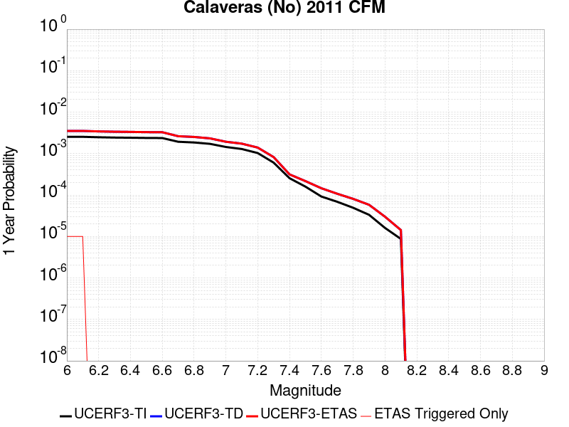 |  |

| Magnitude | 1 wk TI Prob | 1 wk TD Prob | 1 wk ETAS Prob | 1 wk ETAS/TD Gain | 1 wk ETAS Triggered Only | 1 mo TI Prob | 1 mo TD Prob | 1 mo ETAS Prob | 1 mo ETAS/TD Gain | 1 mo ETAS Triggered Only | 1 yr TI Prob | 1 yr TD Prob | 1 yr ETAS Prob | 1 yr ETAS/TD Gain | 1 yr ETAS Triggered Only | 10 yr TI Prob | 10 yr TD Prob | 10 yr ETAS Prob | 10 yr ETAS/TD Gain | 10 yr ETAS Triggered Only |
|-----|-----|-----|-----|-----|-----|-----|-----|-----|-----|-----|-----|-----|-----|-----|-----|-----|-----|-----|-----|-----|
| 6.0 | 4.8694856E-5 | 6.747457E-5 | 6.747457E-5 | 1.0 | 0.0 | 2.0867554E-4 | 2.891453E-4 | 2.991424E-4 | 1.0345746 | 1.0E-5 | 0.0025376645 | 0.0035146773 | 0.0035246422 | 1.0028352 | 1.0E-5 | 0.02508881 | 0.034771074 | 0.034780726 | 1.0002776 | 1.0E-5 |
| 6.1 | 4.8694856E-5 | 6.747457E-5 | 6.747457E-5 | 1.0 | 0.0 | 2.0867554E-4 | 2.891453E-4 | 2.991424E-4 | 1.0345746 | 1.0E-5 | 0.0025376645 | 0.0035146773 | 0.0035246422 | 1.0028352 | 1.0E-5 | 0.02508881 | 0.034771074 | 0.034780726 | 1.0002776 | 1.0E-5 |
| 6.2 | 4.7541962E-5 | 6.5805805E-5 | 6.5805805E-5 | 1.0 | 0.0 | 2.0373536E-4 | 2.8199502E-4 | 2.8199502E-4 | 1.0 | 0.0 | 0.0024776561 | 0.003427919 | 0.003427919 | 1.0 | 0.0 | 0.024502134 | 0.0339325 | 0.0339325 | 1.0 | 0.0 |
| 6.3 | 4.6717287E-5 | 6.463939E-5 | 6.463939E-5 | 1.0 | 0.0 | 2.0020158E-4 | 2.7699716E-4 | 2.7699716E-4 | 1.0 | 0.0 | 0.0024347296 | 0.0033672696 | 0.0033672696 | 1.0 | 0.0 | 0.024082264 | 0.033345006 | 0.033345006 | 1.0 | 0.0 |
| 6.4 | 4.6276386E-5 | 6.400103E-5 | 6.400103E-5 | 1.0 | 0.0 | 1.983123E-4 | 2.7426204E-4 | 2.7426204E-4 | 1.0 | 0.0 | 0.0024117786 | 0.00333408 | 0.00333408 | 1.0 | 0.0 | 0.02385771 | 0.03302388 | 0.03302388 | 1.0 | 0.0 |
| 6.5 | 4.5720994E-5 | 6.32025E-5 | 6.32025E-5 | 1.0 | 0.0 | 1.9593239E-4 | 2.7084045E-4 | 2.7084045E-4 | 1.0 | 0.0 | 0.002382867 | 0.0032925585 | 0.0032925585 | 1.0 | 0.0 | 0.023574775 | 0.032621842 | 0.032621842 | 1.0 | 0.0 |
| 6.6 | 4.549134E-5 | 6.285557E-5 | 6.285557E-5 | 1.0 | 0.0 | 1.949483E-4 | 2.693539E-4 | 2.693539E-4 | 1.0 | 0.0 | 0.0023709119 | 0.0032745146 | 0.0032745146 | 1.0 | 0.0 | 0.023457756 | 0.03244731 | 0.03244731 | 1.0 | 0.0 |
| 6.7 | 3.701047E-5 | 5.03607E-5 | 5.03607E-5 | 1.0 | 0.0 | 1.5860666E-4 | 2.1581395E-4 | 2.1581395E-4 | 1.0 | 0.0 | 0.0019293258 | 0.002624412 | 0.002624412 | 1.0 | 0.0 | 0.019126613 | 0.026125198 | 0.026125198 | 1.0 | 0.0 |
| 6.8 | 3.5523568E-5 | 4.834225E-5 | 4.834225E-5 | 1.0 | 0.0 | 1.5223498E-4 | 2.0716486E-4 | 2.0716486E-4 | 1.0 | 0.0 | 0.0018518851 | 0.0025193577 | 0.0025193577 | 1.0 | 0.0 | 0.018365284 | 0.025097623 | 0.025097623 | 1.0 | 0.0 |
| 6.9 | 3.2946147E-5 | 4.4663826E-5 | 4.4663826E-5 | 1.0 | 0.0 | 1.4119013E-4 | 1.9140259E-4 | 1.9140259E-4 | 1.0 | 0.0 | 0.0017176344 | 0.0023278783 | 0.0023278783 | 1.0 | 0.0 | 0.017044188 | 0.023219762 | 0.023219762 | 1.0 | 0.0 |
| 7.0 | 2.7682381E-5 | 3.7023216E-5 | 3.7023216E-5 | 1.0 | 0.0 | 1.1863338E-4 | 1.5866144E-4 | 1.5866144E-4 | 1.0 | 0.0 | 0.0014434044 | 0.0019300217 | 0.0019300217 | 1.0 | 0.0 | 0.01434065 | 0.019311164 | 0.019311164 | 1.0 | 0.0 |
| 7.1 | 2.471967E-5 | 3.328756E-5 | 3.328756E-5 | 1.0 | 0.0 | 1.05937135E-4 | 1.4265333E-4 | 1.4265333E-4 | 1.0 | 0.0 | 0.0012890215 | 0.0017354497 | 0.0017354497 | 1.0 | 0.0 | 0.0128157 | 0.017386293 | 0.017386293 | 1.0 | 0.0 |
| 7.2 | 1.9748062E-5 | 2.6775411E-5 | 2.6775411E-5 | 1.0 | 0.0 | 8.463181E-5 | 1.1474685E-4 | 1.1474685E-4 | 1.0 | 0.0 | 0.0010299052 | 0.001396171 | 0.001396171 | 1.0 | 0.0 | 0.01025145 | 0.014031046 | 0.014031046 | 1.0 | 0.0 |
| 7.3 | 1.1603734E-5 | 1.5784257E-5 | 1.5784257E-5 | 1.0 | 0.0 | 4.9729337E-5 | 6.7645145E-5 | 6.7645145E-5 | 1.0 | 0.0 | 6.052865E-4 | 8.232826E-4 | 8.232826E-4 | 1.0 | 0.0 | 0.0060364045 | 0.008308739 | 0.008308739 | 1.0 | 0.0 |
| 7.4 | 4.885381E-6 | 6.035117E-6 | 6.035117E-6 | 1.0 | 0.0 | 2.0937177E-5 | 2.5864532E-5 | 2.5864532E-5 | 1.0 | 0.0 | 2.5488032E-4 | 3.1485534E-4 | 3.1485534E-4 | 1.0 | 0.0 | 0.0025458818 | 0.0032009764 | 0.0032009764 | 1.0 | 0.0 |
| 7.5 | 3.0571264E-6 | 4.1554085E-6 | 4.1554085E-6 | 1.0 | 0.0 | 1.3101904E-5 | 1.7808772E-5 | 1.7808772E-5 | 1.0 | 0.0 | 1.5950401E-4 | 2.1680034E-4 | 2.1680034E-4 | 1.0 | 0.0 | 0.0015938957 | 0.0022209007 | 0.0022209007 | 1.0 | 0.0 |
| 7.6 | 1.764948E-6 | 2.795641E-6 | 2.795641E-6 | 1.0 | 0.0 | 7.564041E-6 | 1.1981264E-5 | 1.1981264E-5 | 1.0 | 0.0 | 9.208831E-5 | 1.458622E-4 | 1.458622E-4 | 1.0 | 0.0 | 9.205016E-4 | 0.0015124046 | 0.0015124046 | 1.0 | 0.0 |
| 7.7 | 1.3173734E-6 | 2.0585271E-6 | 2.0585271E-6 | 1.0 | 0.0 | 5.645874E-6 | 8.82223E-6 | 8.82223E-6 | 1.0 | 0.0 | 6.873634E-5 | 1.0740537E-4 | 1.0740537E-4 | 1.0 | 0.0 | 6.8715087E-4 | 0.0011261607 | 0.0011261607 | 1.0 | 0.0 |
| 7.8 | 9.4429885E-7 | 1.5490102E-6 | 1.5490102E-6 | 1.0 | 0.0 | 4.0469886E-6 | 6.6385983E-6 | 6.6385983E-6 | 1.0 | 0.0 | 4.9270973E-5 | 8.082195E-5 | 8.082195E-5 | 1.0 | 0.0 | 4.926005E-4 | 8.501931E-4 | 8.501931E-4 | 1.0 | 0.0 |
| 7.9 | 6.388233E-7 | 1.11492E-6 | 1.11492E-6 | 1.0 | 0.0 | 2.7378112E-6 | 4.7782196E-6 | 4.7782196E-6 | 1.0 | 0.0 | 3.3332344E-5 | 5.8173282E-5 | 5.8173282E-5 | 1.0 | 0.0 | 3.3327343E-4 | 6.096674E-4 | 6.096674E-4 | 1.0 | 0.0 |
| 8.0 | 3.087986E-7 | 5.754721E-7 | 5.754721E-7 | 1.0 | 0.0 | 1.323422E-6 | 2.4663066E-6 | 2.4663066E-6 | 1.0 | 0.0 | 1.6112543E-5 | 3.0026871E-5 | 3.0026871E-5 | 1.0 | 0.0 | 1.6111376E-4 | 3.110238E-4 | 3.110238E-4 | 1.0 | 0.0 |
| 8.1 | 1.6725647E-7 | 2.7410795E-7 | 2.7410795E-7 | 1.0 | 0.0 | 7.168133E-7 | 1.1747478E-6 | 1.1747478E-6 | 1.0 | 0.0 | 8.7271665E-6 | 1.4302462E-5 | 1.4302462E-5 | 1.0 | 0.0 | 8.726824E-5 | 1.4847395E-4 | 1.4847395E-4 | 1.0 | 0.0 |

## Concord 2011 CFM
*[(top)](#table-of-contents)*

| 1 Week | 1 Month | 1 Year | 10 Year |
|-----|-----|-----|-----|
|  |  |  |  |

| Magnitude | 1 wk TI Prob | 1 wk TD Prob | 1 wk ETAS Prob | 1 wk ETAS/TD Gain | 1 wk ETAS Triggered Only | 1 mo TI Prob | 1 mo TD Prob | 1 mo ETAS Prob | 1 mo ETAS/TD Gain | 1 mo ETAS Triggered Only | 1 yr TI Prob | 1 yr TD Prob | 1 yr ETAS Prob | 1 yr ETAS/TD Gain | 1 yr ETAS Triggered Only | 10 yr TI Prob | 10 yr TD Prob | 10 yr ETAS Prob | 10 yr ETAS/TD Gain | 10 yr ETAS Triggered Only |
|-----|-----|-----|-----|-----|-----|-----|-----|-----|-----|-----|-----|-----|-----|-----|-----|-----|-----|-----|-----|-----|
| 6.0 | 5.7865112E-5 | 9.7585355E-5 | 9.7585355E-5 | 1.0 | 0.0 | 2.4796976E-4 | 4.181607E-4 | 4.181607E-4 | 1.0 | 0.0 | 0.0030148525 | 0.005079743 | 0.0050896923 | 1.0019586 | 1.0E-5 | 0.029742775 | 0.049266078 | 0.049275585 | 1.000193 | 1.0E-5 |
| 6.1 | 5.7865112E-5 | 9.7585355E-5 | 9.7585355E-5 | 1.0 | 0.0 | 2.4796976E-4 | 4.181607E-4 | 4.181607E-4 | 1.0 | 0.0 | 0.0030148525 | 0.005079743 | 0.0050896923 | 1.0019586 | 1.0E-5 | 0.029742775 | 0.049266078 | 0.049275585 | 1.000193 | 1.0E-5 |
| 6.2 | 5.6789337E-5 | 9.578793E-5 | 9.578793E-5 | 1.0 | 0.0 | 2.4336016E-4 | 4.1045985E-4 | 4.1045985E-4 | 1.0 | 0.0 | 0.0029588845 | 0.0049864696 | 0.0049964194 | 1.0019954 | 1.0E-5 | 0.029197963 | 0.04838257 | 0.048392083 | 1.0001967 | 1.0E-5 |
| 6.3 | 5.203322E-5 | 8.803241E-5 | 8.803241E-5 | 1.0 | 0.0 | 2.2298045E-4 | 3.772316E-4 | 3.772316E-4 | 1.0 | 0.0 | 0.0027114071 | 0.0045839064 | 0.0045938604 | 1.0021715 | 1.0E-5 | 0.026785625 | 0.04455397 | 0.044563524 | 1.0002145 | 1.0E-5 |
| 6.4 | 4.7120942E-5 | 7.897583E-5 | 7.897583E-5 | 1.0 | 0.0 | 2.0193127E-4 | 3.3842813E-4 | 3.3842813E-4 | 1.0 | 0.0 | 0.0024557412 | 0.004113323 | 0.0041232817 | 1.0024211 | 1.0E-5 | 0.024287801 | 0.040080756 | 0.040090356 | 1.0002395 | 1.0E-5 |
| 6.5 | 2.9598437E-5 | 4.6675777E-5 | 4.6675777E-5 | 1.0 | 0.0 | 1.2684427E-4 | 2.000249E-4 | 2.000249E-4 | 1.0 | 0.0 | 0.001543235 | 0.0024327936 | 0.0024427692 | 1.0041004 | 1.0E-5 | 0.015325619 | 0.023909668 | 0.02391943 | 1.0004083 | 1.0E-5 |
| 6.6 | 2.0443718E-5 | 2.9984873E-5 | 2.9984873E-5 | 1.0 | 0.0 | 8.7613E-5 | 1.2850047E-4 | 1.2850047E-4 | 1.0 | 0.0 | 0.0010661662 | 0.0015634067 | 0.0015634067 | 1.0 | 0.0 | 0.010610655 | 0.0154669015 | 0.0154669015 | 1.0 | 0.0 |
| 6.7 | 1.798539E-5 | 2.5557883E-5 | 2.5557883E-5 | 1.0 | 0.0 | 7.7077966E-5 | 1.0952931E-4 | 1.0952931E-4 | 1.0 | 0.0 | 9.380202E-4 | 0.0013327252 | 0.0013327252 | 1.0 | 0.0 | 0.009340706 | 0.013217516 | 0.013217516 | 1.0 | 0.0 |
| 6.8 | 1.613555E-5 | 2.1959608E-5 | 2.1959608E-5 | 1.0 | 0.0 | 6.915052E-5 | 9.4109295E-5 | 9.4109295E-5 | 1.0 | 0.0 | 8.4158237E-4 | 0.0011451923 | 0.0011451923 | 1.0 | 0.0 | 0.008384023 | 0.011378321 | 0.011378321 | 1.0 | 0.0 |
| 6.9 | 1.2916435E-5 | 1.708134E-5 | 1.708134E-5 | 1.0 | 0.0 | 5.5354973E-5 | 7.320372E-5 | 7.320372E-5 | 1.0 | 0.0 | 6.7373837E-4 | 8.908967E-4 | 8.908967E-4 | 1.0 | 0.0 | 0.006716994 | 0.008867833 | 0.008867833 | 1.0 | 0.0 |
| 7.0 | 9.81129E-6 | 1.2631038E-5 | 1.2631038E-5 | 1.0 | 0.0 | 4.2047708E-5 | 5.4131906E-5 | 5.4131906E-5 | 1.0 | 0.0 | 5.118106E-4 | 6.588583E-4 | 6.588583E-4 | 1.0 | 0.0 | 0.005106334 | 0.0065697595 | 0.0065697595 | 1.0 | 0.0 |
| 7.1 | 8.0889195E-6 | 1.04184555E-5 | 1.04184555E-5 | 1.0 | 0.0 | 3.4666336E-5 | 4.4649765E-5 | 4.4649765E-5 | 1.0 | 0.0 | 4.219809E-4 | 5.434764E-4 | 5.434764E-4 | 1.0 | 0.0 | 0.004211805 | 0.0054219896 | 0.0054219896 | 1.0 | 0.0 |
| 7.2 | 6.267438E-6 | 8.115879E-6 | 8.115879E-6 | 1.0 | 0.0 | 2.6860173E-5 | 3.478188E-5 | 3.478188E-5 | 1.0 | 0.0 | 3.2697353E-4 | 4.2338783E-4 | 4.2338783E-4 | 1.0 | 0.0 | 0.0032649285 | 0.004226169 | 0.004226169 | 1.0 | 0.0 |
| 7.3 | 3.6761196E-6 | 4.840281E-6 | 4.840281E-6 | 1.0 | 0.0 | 1.5754704E-5 | 2.0743897E-5 | 2.0743897E-5 | 1.0 | 0.0 | 1.9179663E-4 | 2.5252788E-4 | 2.5252788E-4 | 1.0 | 0.0 | 0.0019163118 | 0.0025226264 | 0.0025226264 | 1.0 | 0.0 |
| 7.4 | 2.8044356E-6 | 3.7096993E-6 | 3.7096993E-6 | 1.0 | 0.0 | 1.2018954E-5 | 1.5898615E-5 | 1.5898615E-5 | 1.0 | 0.0 | 1.4632095E-4 | 1.9354856E-4 | 1.9354856E-4 | 1.0 | 0.0 | 0.0014622464 | 0.0019340349 | 0.0019340349 | 1.0 | 0.0 |
| 7.5 | 2.4578699E-6 | 3.2448306E-6 | 3.2448306E-6 | 1.0 | 0.0 | 1.0533685E-5 | 1.3906343E-5 | 1.3906343E-5 | 1.0 | 0.0 | 1.2824008E-4 | 1.6929668E-4 | 1.6929668E-4 | 1.0 | 0.0 | 0.0012816609 | 0.0016918926 | 0.0016918926 | 1.0 | 0.0 |
| 7.6 | 1.7713267E-6 | 2.335189E-6 | 2.335189E-6 | 1.0 | 0.0 | 7.591378E-6 | 1.0007916E-5 | 1.0007916E-5 | 1.0 | 0.0 | 9.2421105E-5 | 1.2183965E-4 | 1.2183965E-4 | 1.0 | 0.0 | 9.2382677E-4 | 0.0012178655 | 0.0012178655 | 1.0 | 0.0 |
| 7.7 | 5.1912366E-7 | 6.829346E-7 | 6.829346E-7 | 1.0 | 0.0 | 2.2248137E-6 | 2.9268595E-6 | 2.9268595E-6 | 1.0 | 0.0 | 2.708677E-5 | 3.5633944E-5 | 3.5633944E-5 | 1.0 | 0.0 | 2.708347E-4 | 3.5630353E-4 | 3.5630353E-4 | 1.0 | 0.0 |

## Channel Islands Western Deep Ramp
*[(top)](#table-of-contents)*

| 1 Week | 1 Month | 1 Year | 10 Year |
|-----|-----|-----|-----|
|  |  |  |  |

| Magnitude | 1 wk TI Prob | 1 wk TD Prob | 1 wk ETAS Prob | 1 wk ETAS/TD Gain | 1 wk ETAS Triggered Only | 1 mo TI Prob | 1 mo TD Prob | 1 mo ETAS Prob | 1 mo ETAS/TD Gain | 1 mo ETAS Triggered Only | 1 yr TI Prob | 1 yr TD Prob | 1 yr ETAS Prob | 1 yr ETAS/TD Gain | 1 yr ETAS Triggered Only | 10 yr TI Prob | 10 yr TD Prob | 10 yr ETAS Prob | 10 yr ETAS/TD Gain | 10 yr ETAS Triggered Only |
|-----|-----|-----|-----|-----|-----|-----|-----|-----|-----|-----|-----|-----|-----|-----|-----|-----|-----|-----|-----|-----|
| 6.0 | 6.0213506E-6 | 6.2548684E-6 | 6.2548684E-6 | 1.0 | 0.0 | 2.5805533E-5 | 2.6806329E-5 | 2.6806329E-5 | 1.0 | 0.0 | 3.1413708E-4 | 3.2632265E-4 | 3.3631938E-4 | 1.0306345 | 1.0E-5 | 0.0031369338 | 0.0032588763 | 0.0032688437 | 1.0030586 | 1.0E-5 |
| 6.1 | 6.0213506E-6 | 6.2548684E-6 | 6.2548684E-6 | 1.0 | 0.0 | 2.5805533E-5 | 2.6806329E-5 | 2.6806329E-5 | 1.0 | 0.0 | 3.1413708E-4 | 3.2632265E-4 | 3.3631938E-4 | 1.0306345 | 1.0E-5 | 0.0031369338 | 0.0032588763 | 0.0032688437 | 1.0030586 | 1.0E-5 |
| 6.2 | 6.0213506E-6 | 6.2548684E-6 | 6.2548684E-6 | 1.0 | 0.0 | 2.5805533E-5 | 2.6806329E-5 | 2.6806329E-5 | 1.0 | 0.0 | 3.1413708E-4 | 3.2632265E-4 | 3.3631938E-4 | 1.0306345 | 1.0E-5 | 0.0031369338 | 0.0032588763 | 0.0032688437 | 1.0030586 | 1.0E-5 |
| 6.3 | 6.0213506E-6 | 6.2548684E-6 | 6.2548684E-6 | 1.0 | 0.0 | 2.5805533E-5 | 2.6806329E-5 | 2.6806329E-5 | 1.0 | 0.0 | 3.1413708E-4 | 3.2632265E-4 | 3.3631938E-4 | 1.0306345 | 1.0E-5 | 0.0031369338 | 0.0032588763 | 0.0032688437 | 1.0030586 | 1.0E-5 |
| 6.4 | 6.0213506E-6 | 6.2548684E-6 | 6.2548684E-6 | 1.0 | 0.0 | 2.5805533E-5 | 2.6806329E-5 | 2.6806329E-5 | 1.0 | 0.0 | 3.1413708E-4 | 3.2632265E-4 | 3.3631938E-4 | 1.0306345 | 1.0E-5 | 0.0031369338 | 0.0032588763 | 0.0032688437 | 1.0030586 | 1.0E-5 |
| 6.5 | 6.0213506E-6 | 6.2548684E-6 | 6.2548684E-6 | 1.0 | 0.0 | 2.5805533E-5 | 2.6806329E-5 | 2.6806329E-5 | 1.0 | 0.0 | 3.1413708E-4 | 3.2632265E-4 | 3.3631938E-4 | 1.0306345 | 1.0E-5 | 0.0031369338 | 0.0032588763 | 0.0032688437 | 1.0030586 | 1.0E-5 |
| 6.6 | 6.0213506E-6 | 6.2548684E-6 | 6.2548684E-6 | 1.0 | 0.0 | 2.5805533E-5 | 2.6806329E-5 | 2.6806329E-5 | 1.0 | 0.0 | 3.1413708E-4 | 3.2632265E-4 | 3.3631938E-4 | 1.0306345 | 1.0E-5 | 0.0031369338 | 0.0032588763 | 0.0032688437 | 1.0030586 | 1.0E-5 |
| 6.7 | 5.313309E-6 | 5.5252403E-6 | 5.5252403E-6 | 1.0 | 0.0 | 2.2771126E-5 | 2.367941E-5 | 2.367941E-5 | 1.0 | 0.0 | 2.772032E-4 | 2.8826276E-4 | 2.982599E-4 | 1.0346806 | 1.0E-5 | 0.0027685766 | 0.0028792918 | 0.002889263 | 1.003463 | 1.0E-5 |
| 6.8 | 5.313309E-6 | 5.5252403E-6 | 5.5252403E-6 | 1.0 | 0.0 | 2.2771126E-5 | 2.367941E-5 | 2.367941E-5 | 1.0 | 0.0 | 2.772032E-4 | 2.8826276E-4 | 2.982599E-4 | 1.0346806 | 1.0E-5 | 0.0027685766 | 0.0028792918 | 0.002889263 | 1.003463 | 1.0E-5 |
| 6.9 | 4.744377E-6 | 4.9394303E-6 | 4.9394303E-6 | 1.0 | 0.0 | 2.0332885E-5 | 2.1168837E-5 | 2.1168837E-5 | 1.0 | 0.0 | 2.4752476E-4 | 2.5770385E-4 | 2.6770125E-4 | 1.0387943 | 1.0E-5 | 0.0024724922 | 0.0025744175 | 0.0025843917 | 1.0038744 | 1.0E-5 |
| 7.0 | 4.722209E-6 | 4.9164732E-6 | 4.9164732E-6 | 1.0 | 0.0 | 2.0237881E-5 | 2.107045E-5 | 2.107045E-5 | 1.0 | 0.0 | 2.4636835E-4 | 2.5650626E-4 | 2.665037E-4 | 1.0389754 | 1.0E-5 | 0.002460954 | 0.0025624693 | 0.0025724438 | 1.0038925 | 1.0E-5 |
| 7.1 | 4.611174E-6 | 4.801409E-6 | 4.801409E-6 | 1.0 | 0.0 | 1.9762025E-5 | 2.0577325E-5 | 2.0577325E-5 | 1.0 | 0.0 | 2.4057609E-4 | 2.5050386E-4 | 2.6050137E-4 | 1.0399096 | 1.0E-5 | 0.002403158 | 0.002502582 | 0.002512557 | 1.0039859 | 1.0E-5 |
| 7.2 | 4.043994E-6 | 4.2120264E-6 | 4.2120264E-6 | 1.0 | 0.0 | 1.7331287E-5 | 1.8051438E-5 | 1.8051438E-5 | 1.0 | 0.0 | 2.10988E-4 | 2.1975765E-4 | 2.2975546E-4 | 1.0454947 | 1.0E-5 | 0.002107878 | 0.0021957543 | 0.0022057323 | 1.0045443 | 1.0E-5 |
| 7.3 | 2.1233036E-6 | 2.2297875E-6 | 2.2297875E-6 | 1.0 | 0.0 | 9.099841E-6 | 9.556197E-6 | 9.556197E-6 | 1.0 | 0.0 | 1.1078493E-4 | 1.1634055E-4 | 1.1634055E-4 | 1.0 | 0.0 | 0.0011072971 | 0.001162802 | 0.001162802 | 1.0 | 0.0 |
| 7.4 | 1.9051884E-6 | 2.0014973E-6 | 2.0014973E-6 | 1.0 | 0.0 | 8.165067E-6 | 8.577817E-6 | 8.577817E-6 | 1.0 | 0.0 | 9.940516E-5 | 1.0442998E-4 | 1.0442998E-4 | 1.0 | 0.0 | 9.93607E-4 | 0.0010438144 | 0.0010438144 | 1.0 | 0.0 |
| 7.5 | 1.2408497E-6 | 1.3038839E-6 | 1.3038839E-6 | 1.0 | 0.0 | 5.317916E-6 | 5.588062E-6 | 5.588062E-6 | 1.0 | 0.0 | 6.4743705E-5 | 6.8032554E-5 | 6.8032554E-5 | 1.0 | 0.0 | 6.4724847E-4 | 6.8011944E-4 | 6.8011944E-4 | 1.0 | 0.0 |
| 7.6 | 6.5440025E-7 | 6.886718E-7 | 6.886718E-7 | 1.0 | 0.0 | 2.8045695E-6 | 2.9514472E-6 | 2.9514472E-6 | 1.0 | 0.0 | 3.4145098E-5 | 3.593329E-5 | 3.593329E-5 | 1.0 | 0.0 | 3.4139853E-4 | 3.5927625E-4 | 3.5927625E-4 | 1.0 | 0.0 |
| 7.7 | 3.985963E-7 | 4.1930787E-7 | 4.1930787E-7 | 1.0 | 0.0 | 1.7082689E-6 | 1.7970326E-6 | 1.7970326E-6 | 1.0 | 0.0 | 2.0797976E-5 | 2.1878664E-5 | 2.1878664E-5 | 1.0 | 0.0 | 2.0796029E-4 | 2.1876628E-4 | 2.1876628E-4 | 1.0 | 0.0 |
| 7.8 | 3.706329E-8 | 3.8591796E-8 | 3.8591796E-8 | 1.0 | 0.0 | 1.5884267E-7 | 1.653934E-7 | 1.653934E-7 | 1.0 | 0.0 | 1.9339077E-6 | 2.0136629E-6 | 2.0136629E-6 | 1.0 | 0.0 | 1.933891E-5 | 2.0136458E-5 | 2.0136458E-5 | 1.0 | 0.0 |

## Puente Hills
*[(top)](#table-of-contents)*

| 1 Week | 1 Month | 1 Year | 10 Year |
|-----|-----|-----|-----|
|  | 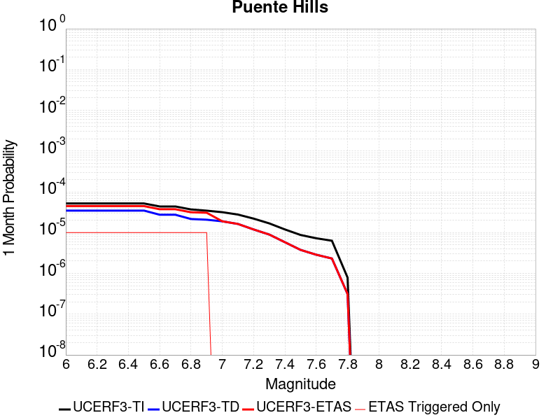 | 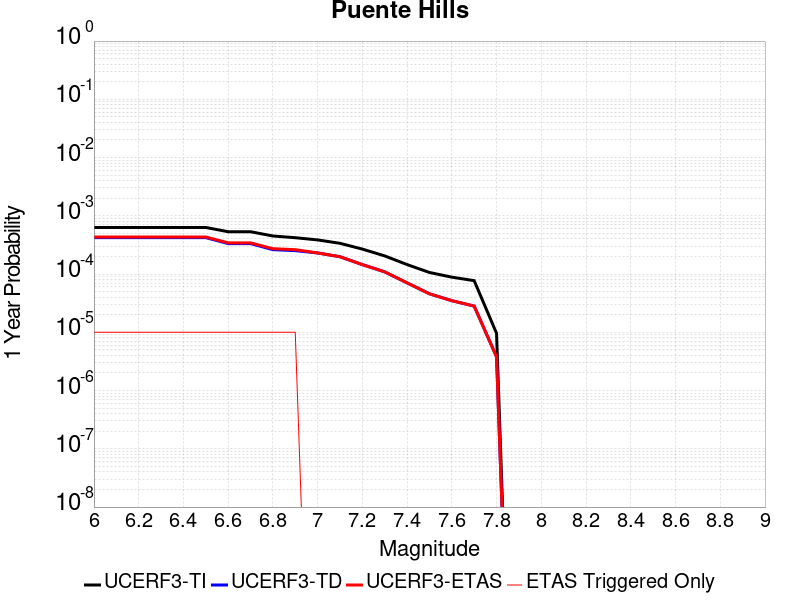 | 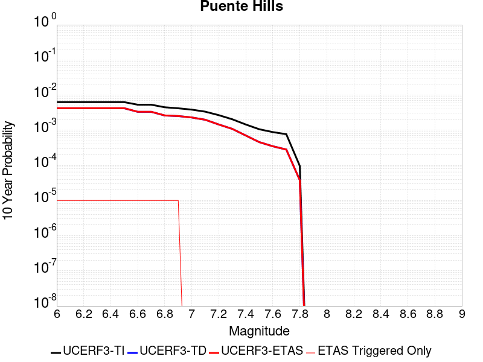 |

| Magnitude | 1 wk TI Prob | 1 wk TD Prob | 1 wk ETAS Prob | 1 wk ETAS/TD Gain | 1 wk ETAS Triggered Only | 1 mo TI Prob | 1 mo TD Prob | 1 mo ETAS Prob | 1 mo ETAS/TD Gain | 1 mo ETAS Triggered Only | 1 yr TI Prob | 1 yr TD Prob | 1 yr ETAS Prob | 1 yr ETAS/TD Gain | 1 yr ETAS Triggered Only | 10 yr TI Prob | 10 yr TD Prob | 10 yr ETAS Prob | 10 yr ETAS/TD Gain | 10 yr ETAS Triggered Only |
|-----|-----|-----|-----|-----|-----|-----|-----|-----|-----|-----|-----|-----|-----|-----|-----|-----|-----|-----|-----|-----|
| 6.0 | 1.2101656E-5 | 8.098448E-6 | 8.098448E-6 | 1.0 | 0.0 | 5.1863204E-5 | 3.4707205E-5 | 4.4706856E-5 | 1.2881147 | 1.0E-5 | 6.312516E-4 | 4.2248392E-4 | 4.324797E-4 | 1.0236596 | 1.0E-5 | 0.0062946146 | 0.0042173676 | 0.0042273253 | 1.0023612 | 1.0E-5 |
| 6.1 | 1.2101656E-5 | 8.098448E-6 | 8.098448E-6 | 1.0 | 0.0 | 5.1863204E-5 | 3.4707205E-5 | 4.4706856E-5 | 1.2881147 | 1.0E-5 | 6.312516E-4 | 4.2248392E-4 | 4.324797E-4 | 1.0236596 | 1.0E-5 | 0.0062946146 | 0.0042173676 | 0.0042273253 | 1.0023612 | 1.0E-5 |
| 6.2 | 1.2101656E-5 | 8.098448E-6 | 8.098448E-6 | 1.0 | 0.0 | 5.1863204E-5 | 3.4707205E-5 | 4.4706856E-5 | 1.2881147 | 1.0E-5 | 6.312516E-4 | 4.2248392E-4 | 4.324797E-4 | 1.0236596 | 1.0E-5 | 0.0062946146 | 0.0042173676 | 0.0042273253 | 1.0023612 | 1.0E-5 |
| 6.3 | 1.2101656E-5 | 8.098448E-6 | 8.098448E-6 | 1.0 | 0.0 | 5.1863204E-5 | 3.4707205E-5 | 4.4706856E-5 | 1.2881147 | 1.0E-5 | 6.312516E-4 | 4.2248392E-4 | 4.324797E-4 | 1.0236596 | 1.0E-5 | 0.0062946146 | 0.0042173676 | 0.0042273253 | 1.0023612 | 1.0E-5 |
| 6.4 | 1.2101656E-5 | 8.098448E-6 | 8.098448E-6 | 1.0 | 0.0 | 5.1863204E-5 | 3.4707205E-5 | 4.4706856E-5 | 1.2881147 | 1.0E-5 | 6.312516E-4 | 4.2248392E-4 | 4.324797E-4 | 1.0236596 | 1.0E-5 | 0.0062946146 | 0.0042173676 | 0.0042273253 | 1.0023612 | 1.0E-5 |
| 6.5 | 1.2101656E-5 | 8.098448E-6 | 8.098448E-6 | 1.0 | 0.0 | 5.1863204E-5 | 3.4707205E-5 | 4.4706856E-5 | 1.2881147 | 1.0E-5 | 6.312516E-4 | 4.2248392E-4 | 4.324797E-4 | 1.0236596 | 1.0E-5 | 0.0062946146 | 0.0042173676 | 0.0042273253 | 1.0023612 | 1.0E-5 |
| 6.6 | 1.0222488E-5 | 6.399079E-6 | 6.399079E-6 | 1.0 | 0.0 | 4.3809923E-5 | 2.742435E-5 | 3.7424077E-5 | 1.3646294 | 1.0E-5 | 5.332553E-4 | 3.3384276E-4 | 3.4383943E-4 | 1.0299442 | 1.0E-5 | 0.0053197746 | 0.0033336577 | 0.0033436243 | 1.0029896 | 1.0E-5 |
| 6.7 | 1.0222488E-5 | 6.399079E-6 | 6.399079E-6 | 1.0 | 0.0 | 4.3809923E-5 | 2.742435E-5 | 3.7424077E-5 | 1.3646294 | 1.0E-5 | 5.332553E-4 | 3.3384276E-4 | 3.4383943E-4 | 1.0299442 | 1.0E-5 | 0.0053197746 | 0.0033336577 | 0.0033436243 | 1.0029896 | 1.0E-5 |
| 6.8 | 8.6367845E-6 | 5.028129E-6 | 5.028129E-6 | 1.0 | 0.0 | 3.7014266E-5 | 2.1548949E-5 | 3.1548734E-5 | 1.4640497 | 1.0E-5 | 4.505555E-4 | 2.6232743E-4 | 2.723248E-4 | 1.0381103 | 1.0E-5 | 0.004496431 | 0.002620234 | 0.0026302077 | 1.0038065 | 1.0E-5 |
| 6.9 | 8.066481E-6 | 4.8360116E-6 | 4.8360116E-6 | 1.0 | 0.0 | 3.4570177E-5 | 2.0725602E-5 | 3.0725394E-5 | 1.482485 | 1.0E-5 | 4.2081063E-4 | 2.523055E-4 | 2.62303E-4 | 1.0396245 | 1.0E-5 | 0.0042001465 | 0.0025202443 | 0.0025302193 | 1.0039579 | 1.0E-5 |
| 7.0 | 7.393828E-6 | 4.4172275E-6 | 4.4172275E-6 | 1.0 | 0.0 | 3.168745E-5 | 1.8930841E-5 | 1.8930841E-5 | 1.0 | 0.0 | 3.857264E-4 | 2.3045906E-4 | 2.3045906E-4 | 1.0 | 0.0 | 0.0038505755 | 0.0023022462 | 0.0023022462 | 1.0 | 0.0 |
| 7.1 | 6.4660953E-6 | 3.8043859E-6 | 3.8043859E-6 | 1.0 | 0.0 | 2.7711543E-5 | 1.630441E-5 | 1.630441E-5 | 1.0 | 0.0 | 3.373358E-4 | 1.9848847E-4 | 1.9848847E-4 | 1.0 | 0.0 | 0.0033682417 | 0.0019831478 | 0.0019831478 | 1.0 | 0.0 |
| 7.2 | 5.143232E-6 | 2.7864896E-6 | 2.7864896E-6 | 1.0 | 0.0 | 2.2042237E-5 | 1.1942045E-5 | 1.1942045E-5 | 1.0 | 0.0 | 2.6833118E-4 | 1.453848E-4 | 1.453848E-4 | 1.0 | 0.0 | 0.002680074 | 0.0014529065 | 0.0014529065 | 1.0 | 0.0 |
| 7.3 | 3.928255E-6 | 2.091338E-6 | 2.091338E-6 | 1.0 | 0.0 | 1.683527E-5 | 8.962847E-6 | 8.962847E-6 | 1.0 | 0.0 | 2.0495013E-4 | 1.0911726E-4 | 1.0911726E-4 | 1.0 | 0.0 | 0.002047612 | 0.0010906435 | 0.0010906435 | 1.0 | 0.0 |
| 7.4 | 2.7894434E-6 | 1.3546429E-6 | 1.3546429E-6 | 1.0 | 0.0 | 1.1954703E-5 | 5.8056E-6 | 5.8056E-6 | 1.0 | 0.0 | 1.4553878E-4 | 7.068093E-5 | 7.068093E-5 | 1.0 | 0.0 | 0.001454435 | 7.0658885E-4 | 7.0658885E-4 | 1.0 | 0.0 |
| 7.5 | 2.041735E-6 | 8.786996E-7 | 8.786996E-7 | 1.0 | 0.0 | 8.750263E-6 | 3.7658504E-6 | 3.7658504E-6 | 1.0 | 0.0 | 1.06529245E-4 | 4.5848297E-5 | 4.5848297E-5 | 1.0 | 0.0 | 0.0010647819 | 4.5839173E-4 | 4.5839173E-4 | 1.0 | 0.0 |
| 7.6 | 1.6959062E-6 | 6.698339E-7 | 6.698339E-7 | 1.0 | 0.0 | 7.268149E-6 | 2.8707138E-6 | 2.8707138E-6 | 1.0 | 0.0 | 8.848612E-5 | 3.4950408E-5 | 3.4950408E-5 | 1.0 | 0.0 | 8.84509E-4 | 3.4945202E-4 | 3.4945202E-4 | 1.0 | 0.0 |
| 7.7 | 1.4767965E-6 | 5.407146E-7 | 5.407146E-7 | 1.0 | 0.0 | 6.3291122E-6 | 2.3173466E-6 | 2.3173466E-6 | 1.0 | 0.0 | 7.705422E-5 | 2.8213353E-5 | 2.8213353E-5 | 1.0 | 0.0 | 7.702751E-4 | 2.8210029E-4 | 2.8210029E-4 | 1.0 | 0.0 |
| 7.8 | 1.8432911E-7 | 7.2811105E-8 | 7.2811105E-8 | 1.0 | 0.0 | 7.8998164E-7 | 3.1204758E-7 | 3.1204758E-7 | 1.0 | 0.0 | 9.617985E-6 | 3.799176E-6 | 3.799176E-6 | 1.0 | 0.0 | 9.617568E-5 | 3.7991435E-5 | 3.7991435E-5 | 1.0 | 0.0 |

## Garberville - Briceland 2011 CFM
*[(top)](#table-of-contents)*

| 1 Week | 1 Month | 1 Year | 10 Year |
|-----|-----|-----|-----|
| 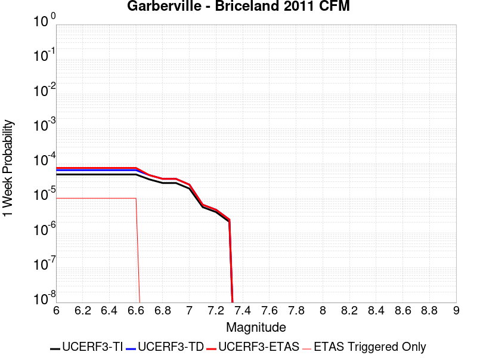 | 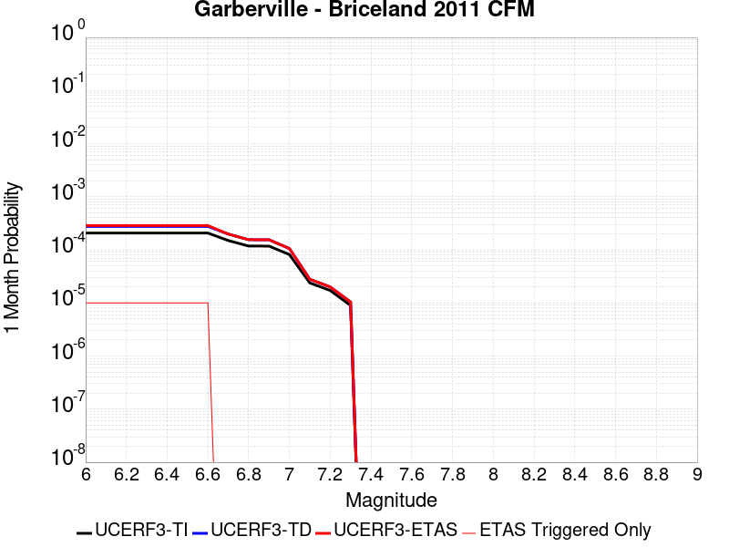 | 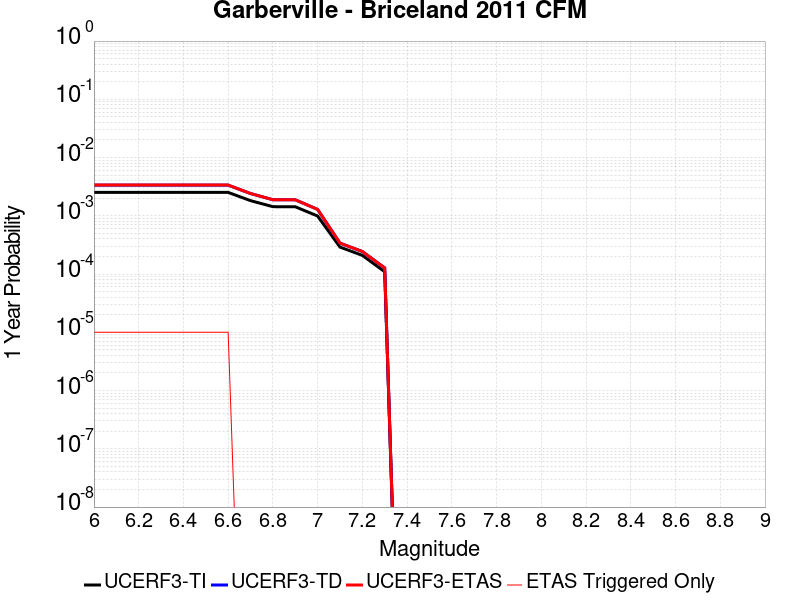 | 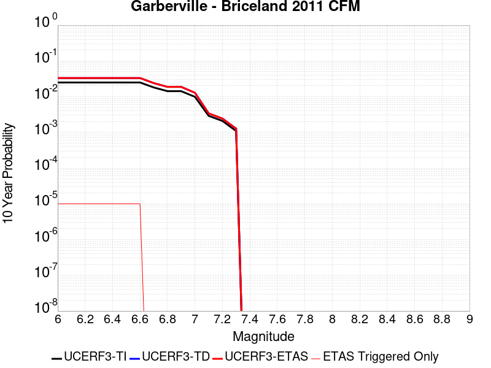 |

| Magnitude | 1 wk TI Prob | 1 wk TD Prob | 1 wk ETAS Prob | 1 wk ETAS/TD Gain | 1 wk ETAS Triggered Only | 1 mo TI Prob | 1 mo TD Prob | 1 mo ETAS Prob | 1 mo ETAS/TD Gain | 1 mo ETAS Triggered Only | 1 yr TI Prob | 1 yr TD Prob | 1 yr ETAS Prob | 1 yr ETAS/TD Gain | 1 yr ETAS Triggered Only | 10 yr TI Prob | 10 yr TD Prob | 10 yr ETAS Prob | 10 yr ETAS/TD Gain | 10 yr ETAS Triggered Only |
|-----|-----|-----|-----|-----|-----|-----|-----|-----|-----|-----|-----|-----|-----|-----|-----|-----|-----|-----|-----|-----|
| 6.0 | 4.8399295E-5 | 6.4527754E-5 | 7.452711E-5 | 1.1549621 | 1.0E-5 | 2.0740906E-4 | 2.765224E-4 | 2.8651961E-4 | 1.0361534 | 1.0E-5 | 0.002522281 | 0.0033621131 | 0.0033720795 | 1.0029644 | 1.0E-5 | 0.024938442 | 0.03317879 | 0.03318846 | 1.0002913 | 1.0E-5 |
| 6.1 | 4.8399295E-5 | 6.4527754E-5 | 7.452711E-5 | 1.1549621 | 1.0E-5 | 2.0740906E-4 | 2.765224E-4 | 2.8651961E-4 | 1.0361534 | 1.0E-5 | 0.002522281 | 0.0033621131 | 0.0033720795 | 1.0029644 | 1.0E-5 | 0.024938442 | 0.03317879 | 0.03318846 | 1.0002913 | 1.0E-5 |
| 6.2 | 4.8399295E-5 | 6.4527754E-5 | 7.452711E-5 | 1.1549621 | 1.0E-5 | 2.0740906E-4 | 2.765224E-4 | 2.8651961E-4 | 1.0361534 | 1.0E-5 | 0.002522281 | 0.0033621131 | 0.0033720795 | 1.0029644 | 1.0E-5 | 0.024938442 | 0.03317879 | 0.03318846 | 1.0002913 | 1.0E-5 |
| 6.3 | 4.8399295E-5 | 6.4527754E-5 | 7.452711E-5 | 1.1549621 | 1.0E-5 | 2.0740906E-4 | 2.765224E-4 | 2.8651961E-4 | 1.0361534 | 1.0E-5 | 0.002522281 | 0.0033621131 | 0.0033720795 | 1.0029644 | 1.0E-5 | 0.024938442 | 0.03317879 | 0.03318846 | 1.0002913 | 1.0E-5 |
| 6.4 | 4.8399295E-5 | 6.4527754E-5 | 7.452711E-5 | 1.1549621 | 1.0E-5 | 2.0740906E-4 | 2.765224E-4 | 2.8651961E-4 | 1.0361534 | 1.0E-5 | 0.002522281 | 0.0033621131 | 0.0033720795 | 1.0029644 | 1.0E-5 | 0.024938442 | 0.03317879 | 0.03318846 | 1.0002913 | 1.0E-5 |
| 6.5 | 4.8399295E-5 | 6.4527754E-5 | 7.452711E-5 | 1.1549621 | 1.0E-5 | 2.0740906E-4 | 2.765224E-4 | 2.8651961E-4 | 1.0361534 | 1.0E-5 | 0.002522281 | 0.0033621131 | 0.0033720795 | 1.0029644 | 1.0E-5 | 0.024938442 | 0.03317879 | 0.03318846 | 1.0002913 | 1.0E-5 |
| 6.6 | 4.8399295E-5 | 6.4527754E-5 | 7.452711E-5 | 1.1549621 | 1.0E-5 | 2.0740906E-4 | 2.765224E-4 | 2.8651961E-4 | 1.0361534 | 1.0E-5 | 0.002522281 | 0.0033621131 | 0.0033720795 | 1.0029644 | 1.0E-5 | 0.024938442 | 0.03317879 | 0.03318846 | 1.0002913 | 1.0E-5 |
| 6.7 | 3.495179E-5 | 4.630908E-5 | 4.630908E-5 | 1.0 | 0.0 | 1.4978478E-4 | 1.9845538E-4 | 1.9845538E-4 | 1.0 | 0.0 | 0.0018221042 | 0.0024140473 | 0.0024140473 | 1.0 | 0.0 | 0.018072363 | 0.023930654 | 0.023930654 | 1.0 | 0.0 |
| 6.8 | 2.7517597E-5 | 3.62417E-5 | 3.62417E-5 | 1.0 | 0.0 | 1.1792722E-4 | 1.5531495E-4 | 1.5531495E-4 | 1.0 | 0.0 | 0.0014348183 | 0.0018897917 | 0.0018897917 | 1.0 | 0.0 | 0.014255894 | 0.01878354 | 0.01878354 | 1.0 | 0.0 |
| 6.9 | 2.74461E-5 | 3.6159425E-5 | 3.6159425E-5 | 1.0 | 0.0 | 1.1762084E-4 | 1.5496238E-4 | 1.5496238E-4 | 1.0 | 0.0 | 0.001431093 | 0.0018855067 | 0.0018855067 | 1.0 | 0.0 | 0.014219119 | 0.018741412 | 0.018741412 | 1.0 | 0.0 |
| 7.0 | 1.9023773E-5 | 2.4707771E-5 | 2.4707771E-5 | 1.0 | 0.0 | 8.152791E-5 | 1.0588833E-4 | 1.0588833E-4 | 1.0 | 0.0 | 9.921503E-4 | 0.0012888273 | 0.0012888273 | 1.0 | 0.0 | 0.009877323 | 0.012852578 | 0.012852578 | 1.0 | 0.0 |
| 7.1 | 5.566844E-6 | 6.512147E-6 | 6.512147E-6 | 1.0 | 0.0 | 2.3857683E-5 | 2.7908927E-5 | 2.7908927E-5 | 1.0 | 0.0 | 2.9042858E-4 | 3.3974246E-4 | 3.3974246E-4 | 1.0 | 0.0 | 0.002900493 | 0.0033926512 | 0.0033926512 | 1.0 | 0.0 |
| 7.2 | 4.011353E-6 | 4.6746213E-6 | 4.6746213E-6 | 1.0 | 0.0 | 1.7191402E-5 | 2.0033956E-5 | 2.0033956E-5 | 1.0 | 0.0 | 2.0928521E-4 | 2.4388955E-4 | 2.4388955E-4 | 1.0 | 0.0 | 0.0020908823 | 0.0024365564 | 0.0024365564 | 1.0 | 0.0 |
| 7.3 | 2.0974871E-6 | 2.4395908E-6 | 2.4395908E-6 | 1.0 | 0.0 | 8.989199E-6 | 1.0455362E-5 | 1.0455362E-5 | 1.0 | 0.0 | 1.09438006E-4 | 1.272891E-4 | 1.272891E-4 | 1.0 | 0.0 | 0.0010938413 | 0.0012724071 | 0.0012724071 | 1.0 | 0.0 |

## Oceanside alt1
*[(top)](#table-of-contents)*

| 1 Week | 1 Month | 1 Year | 10 Year |
|-----|-----|-----|-----|
| 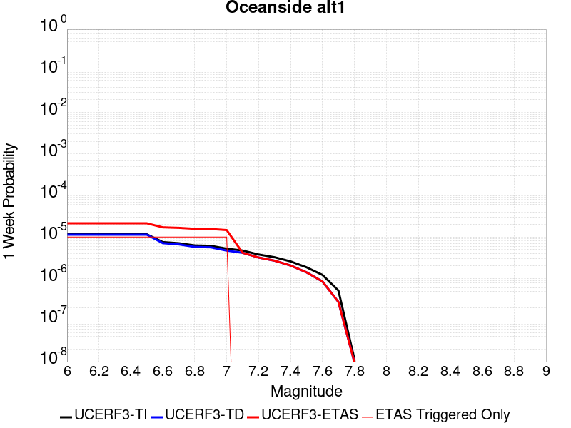 | 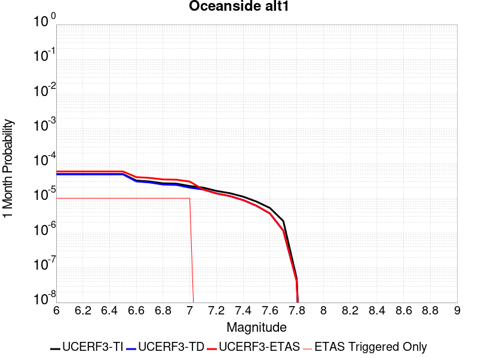 | 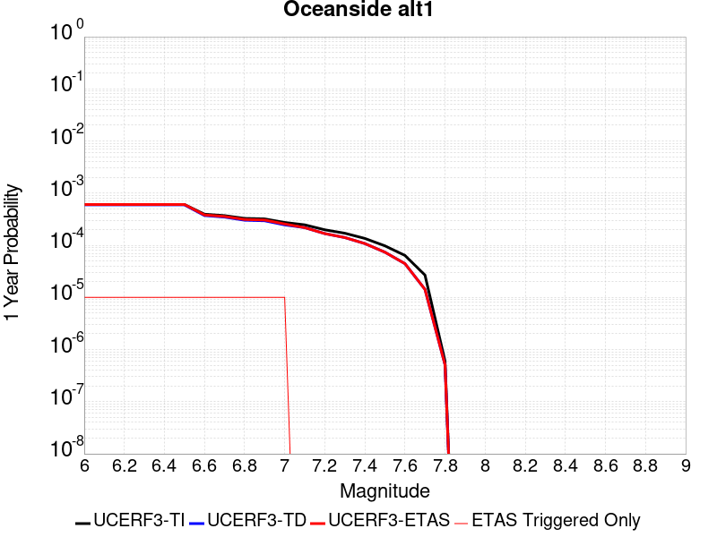 | 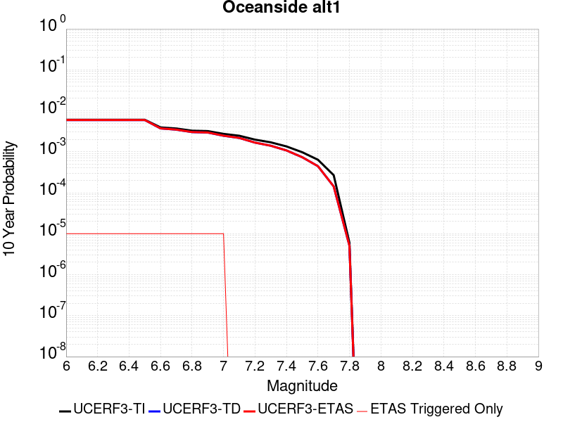 |

| Magnitude | 1 wk TI Prob | 1 wk TD Prob | 1 wk ETAS Prob | 1 wk ETAS/TD Gain | 1 wk ETAS Triggered Only | 1 mo TI Prob | 1 mo TD Prob | 1 mo ETAS Prob | 1 mo ETAS/TD Gain | 1 mo ETAS Triggered Only | 1 yr TI Prob | 1 yr TD Prob | 1 yr ETAS Prob | 1 yr ETAS/TD Gain | 1 yr ETAS Triggered Only | 10 yr TI Prob | 10 yr TD Prob | 10 yr ETAS Prob | 10 yr ETAS/TD Gain | 10 yr ETAS Triggered Only |
|-----|-----|-----|-----|-----|-----|-----|-----|-----|-----|-----|-----|-----|-----|-----|-----|-----|-----|-----|-----|-----|
| 6.0 | 1.1617542E-5 | 1.1423485E-5 | 2.1423371E-5 | 1.8753796 | 1.0E-5 | 4.9788516E-5 | 4.8956965E-5 | 5.8956477E-5 | 1.204251 | 1.0E-5 | 6.060066E-4 | 5.9590413E-4 | 6.058982E-4 | 1.0167712 | 1.0E-5 | 0.0060435664 | 0.0059446604 | 0.005954601 | 1.0016721 | 1.0E-5 |
| 6.1 | 1.1617542E-5 | 1.1423485E-5 | 2.1423371E-5 | 1.8753796 | 1.0E-5 | 4.9788516E-5 | 4.8956965E-5 | 5.8956477E-5 | 1.204251 | 1.0E-5 | 6.060066E-4 | 5.9590413E-4 | 6.058982E-4 | 1.0167712 | 1.0E-5 | 0.0060435664 | 0.0059446604 | 0.005954601 | 1.0016721 | 1.0E-5 |
| 6.2 | 1.1617542E-5 | 1.1423485E-5 | 2.1423371E-5 | 1.8753796 | 1.0E-5 | 4.9788516E-5 | 4.8956965E-5 | 5.8956477E-5 | 1.204251 | 1.0E-5 | 6.060066E-4 | 5.9590413E-4 | 6.058982E-4 | 1.0167712 | 1.0E-5 | 0.0060435664 | 0.0059446604 | 0.005954601 | 1.0016721 | 1.0E-5 |
| 6.3 | 1.1617542E-5 | 1.1423485E-5 | 2.1423371E-5 | 1.8753796 | 1.0E-5 | 4.9788516E-5 | 4.8956965E-5 | 5.8956477E-5 | 1.204251 | 1.0E-5 | 6.060066E-4 | 5.9590413E-4 | 6.058982E-4 | 1.0167712 | 1.0E-5 | 0.0060435664 | 0.0059446604 | 0.005954601 | 1.0016721 | 1.0E-5 |
| 6.4 | 1.1617542E-5 | 1.1423485E-5 | 2.1423371E-5 | 1.8753796 | 1.0E-5 | 4.9788516E-5 | 4.8956965E-5 | 5.8956477E-5 | 1.204251 | 1.0E-5 | 6.060066E-4 | 5.9590413E-4 | 6.058982E-4 | 1.0167712 | 1.0E-5 | 0.0060435664 | 0.0059446604 | 0.005954601 | 1.0016721 | 1.0E-5 |
| 6.5 | 1.1617542E-5 | 1.1423485E-5 | 2.1423371E-5 | 1.8753796 | 1.0E-5 | 4.9788516E-5 | 4.8956965E-5 | 5.8956477E-5 | 1.204251 | 1.0E-5 | 6.060066E-4 | 5.9590413E-4 | 6.058982E-4 | 1.0167712 | 1.0E-5 | 0.0060435664 | 0.0059446604 | 0.005954601 | 1.0016721 | 1.0E-5 |
| 6.6 | 7.561768E-6 | 7.1336085E-6 | 1.7133538E-5 | 2.4018052 | 1.0E-5 | 3.2407173E-5 | 3.0572253E-5 | 4.0571947E-5 | 1.327084 | 1.0E-5 | 3.9448592E-4 | 3.721547E-4 | 3.82151E-4 | 1.0268606 | 1.0E-5 | 0.0039378637 | 0.0037154262 | 0.003725389 | 1.0026815 | 1.0E-5 |
| 6.7 | 7.1042605E-6 | 6.6556786E-6 | 1.6655611E-5 | 2.5024664 | 1.0E-5 | 3.0446476E-5 | 2.852403E-5 | 3.8523744E-5 | 1.3505716 | 1.0E-5 | 3.706228E-4 | 3.4722552E-4 | 3.5722204E-4 | 1.0287898 | 1.0E-5 | 0.0037000529 | 0.0034669132 | 0.0034768786 | 1.0028744 | 1.0E-5 |
| 6.8 | 6.285554E-6 | 5.7996986E-6 | 1.579964E-5 | 2.7242174 | 1.0E-5 | 2.693781E-5 | 2.4855617E-5 | 3.485537E-5 | 1.4023136 | 1.0E-5 | 3.2791847E-4 | 3.0257567E-4 | 3.1257264E-4 | 1.0330396 | 1.0E-5 | 0.0032743502 | 0.0030216945 | 0.0030316643 | 1.0032994 | 1.0E-5 |
| 6.9 | 6.148883E-6 | 5.6565373E-6 | 1.565648E-5 | 2.7678561 | 1.0E-5 | 2.635209E-5 | 2.4242081E-5 | 3.424184E-5 | 1.4124959 | 1.0E-5 | 3.2078946E-4 | 2.951079E-4 | 3.0510494E-4 | 1.033876 | 1.0E-5 | 0.003203268 | 0.002947217 | 0.0029571876 | 1.003383 | 1.0E-5 |
| 7.0 | 5.253857E-6 | 4.7223966E-6 | 1.4722349E-5 | 3.1175587 | 1.0E-5 | 2.2516335E-5 | 2.0238687E-5 | 3.0238485E-5 | 1.4940932 | 1.0E-5 | 2.7410188E-4 | 2.4637848E-4 | 2.56376E-4 | 1.040578 | 1.0E-5 | 0.0027376404 | 0.0024610846 | 0.00247106 | 1.0040532 | 1.0E-5 |
| 7.1 | 4.730754E-6 | 4.1785024E-6 | 4.1785024E-6 | 1.0 | 0.0 | 2.0274503E-5 | 1.7907745E-5 | 1.7907745E-5 | 1.0 | 0.0 | 2.468141E-4 | 2.1800524E-4 | 2.1800524E-4 | 1.0 | 0.0 | 0.0024654015 | 0.0021779404 | 0.0021779404 | 1.0 | 0.0 |
| 7.2 | 3.7998386E-6 | 3.2140165E-6 | 3.2140165E-6 | 1.0 | 0.0 | 1.6284921E-5 | 1.37742845E-5 | 1.37742845E-5 | 1.0 | 0.0 | 1.9825088E-4 | 1.6768913E-4 | 1.6768913E-4 | 1.0 | 0.0 | 0.001980741 | 0.0016756381 | 0.0016756381 | 1.0 | 0.0 |
| 7.3 | 3.2656465E-6 | 2.6983669E-6 | 2.6983669E-6 | 1.0 | 0.0 | 1.3995553E-5 | 1.1564379E-5 | 1.1564379E-5 | 1.0 | 0.0 | 1.7038253E-4 | 1.4078732E-4 | 1.4078732E-4 | 1.0 | 0.0 | 0.0017025196 | 0.0014069924 | 0.0014069924 | 1.0 | 0.0 |
| 7.4 | 2.593703E-6 | 2.0680227E-6 | 2.0680227E-6 | 1.0 | 0.0 | 1.1115822E-5 | 8.862925E-6 | 8.862925E-6 | 1.0 | 0.0 | 1.3532673E-4 | 1.0790086E-4 | 1.0790086E-4 | 1.0 | 0.0 | 0.0013524436 | 0.0010784935 | 0.0010784935 | 1.0 | 0.0 |
| 7.5 | 1.8715585E-6 | 1.4137277E-6 | 1.4137277E-6 | 1.0 | 0.0 | 8.020941E-6 | 6.058819E-6 | 6.058819E-6 | 1.0 | 0.0 | 9.7650576E-5 | 7.376369E-5 | 7.376369E-5 | 1.0 | 0.0 | 9.7607676E-4 | 7.373981E-4 | 7.373981E-4 | 1.0 | 0.0 |
| 7.6 | 1.2246786E-6 | 8.526946E-7 | 8.526946E-7 | 1.0 | 0.0 | 5.248612E-6 | 3.6544006E-6 | 3.6544006E-6 | 1.0 | 0.0 | 6.389998E-5 | 4.4491466E-5 | 4.4491466E-5 | 1.0 | 0.0 | 6.3881604E-4 | 4.4483008E-4 | 4.4483008E-4 | 1.0 | 0.0 |
| 7.7 | 5.140719E-7 | 2.7346528E-7 | 2.7346528E-7 | 1.0 | 0.0 | 2.2031636E-6 | 1.1719936E-6 | 1.1719936E-6 | 1.0 | 0.0 | 2.6823185E-5 | 1.4268943E-5 | 1.4268943E-5 | 1.0 | 0.0 | 2.6819948E-4 | 1.4268162E-4 | 1.4268162E-4 | 1.0 | 0.0 |
| 7.8 | 1.16056995E-8 | 9.782997E-9 | 9.782997E-9 | 1.0 | 0.0 | 4.9738713E-8 | 4.1927127E-8 | 4.1927127E-8 | 1.0 | 0.0 | 6.0556863E-7 | 5.1046277E-7 | 5.1046277E-7 | 1.0 | 0.0 | 6.05567E-6 | 5.1046277E-6 | 5.1046277E-6 | 1.0 | 0.0 |

## Northridge
*[(top)](#table-of-contents)*

| 1 Week | 1 Month | 1 Year | 10 Year |
|-----|-----|-----|-----|
|  |  | 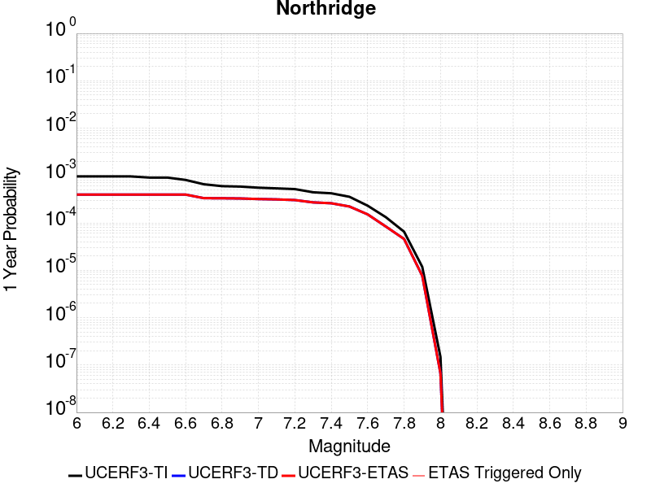 |  |

| Magnitude | 1 wk TI Prob | 1 wk TD Prob | 1 wk ETAS Prob | 1 wk ETAS/TD Gain | 1 wk ETAS Triggered Only | 1 mo TI Prob | 1 mo TD Prob | 1 mo ETAS Prob | 1 mo ETAS/TD Gain | 1 mo ETAS Triggered Only | 1 yr TI Prob | 1 yr TD Prob | 1 yr ETAS Prob | 1 yr ETAS/TD Gain | 1 yr ETAS Triggered Only | 10 yr TI Prob | 10 yr TD Prob | 10 yr ETAS Prob | 10 yr ETAS/TD Gain | 10 yr ETAS Triggered Only |
|-----|-----|-----|-----|-----|-----|-----|-----|-----|-----|-----|-----|-----|-----|-----|-----|-----|-----|-----|-----|-----|
| 6.0 | 1.8340852E-5 | 7.5878907E-6 | 7.5878907E-6 | 1.0 | 0.0 | 7.860128E-5 | 3.251914E-5 | 3.251914E-5 | 1.0 | 0.0 | 9.565505E-4 | 3.9585077E-4 | 3.9585077E-4 | 1.0 | 0.0 | 0.009524435 | 0.0039516874 | 0.003961648 | 1.0025206 | 1.0E-5 |
| 6.1 | 1.8340852E-5 | 7.5878907E-6 | 7.5878907E-6 | 1.0 | 0.0 | 7.860128E-5 | 3.251914E-5 | 3.251914E-5 | 1.0 | 0.0 | 9.565505E-4 | 3.9585077E-4 | 3.9585077E-4 | 1.0 | 0.0 | 0.009524435 | 0.0039516874 | 0.003961648 | 1.0025206 | 1.0E-5 |
| 6.2 | 1.8340852E-5 | 7.5878907E-6 | 7.5878907E-6 | 1.0 | 0.0 | 7.860128E-5 | 3.251914E-5 | 3.251914E-5 | 1.0 | 0.0 | 9.565505E-4 | 3.9585077E-4 | 3.9585077E-4 | 1.0 | 0.0 | 0.009524435 | 0.0039516874 | 0.003961648 | 1.0025206 | 1.0E-5 |
| 6.3 | 1.8340852E-5 | 7.5878907E-6 | 7.5878907E-6 | 1.0 | 0.0 | 7.860128E-5 | 3.251914E-5 | 3.251914E-5 | 1.0 | 0.0 | 9.565505E-4 | 3.9585077E-4 | 3.9585077E-4 | 1.0 | 0.0 | 0.009524435 | 0.0039516874 | 0.003961648 | 1.0025206 | 1.0E-5 |
| 6.4 | 1.7361892E-5 | 7.5878907E-6 | 7.5878907E-6 | 1.0 | 0.0 | 7.440598E-5 | 3.251914E-5 | 3.251914E-5 | 1.0 | 0.0 | 9.055163E-4 | 3.9585077E-4 | 3.9585077E-4 | 1.0 | 0.0 | 0.009018354 | 0.0039516874 | 0.003961648 | 1.0025206 | 1.0E-5 |
| 6.5 | 1.7361892E-5 | 7.5878907E-6 | 7.5878907E-6 | 1.0 | 0.0 | 7.440598E-5 | 3.251914E-5 | 3.251914E-5 | 1.0 | 0.0 | 9.055163E-4 | 3.9585077E-4 | 3.9585077E-4 | 1.0 | 0.0 | 0.009018354 | 0.0039516874 | 0.003961648 | 1.0025206 | 1.0E-5 |
| 6.6 | 1.5458201E-5 | 7.5878907E-6 | 7.5878907E-6 | 1.0 | 0.0 | 6.624775E-5 | 3.251914E-5 | 3.251914E-5 | 1.0 | 0.0 | 8.0626784E-4 | 3.9585077E-4 | 3.9585077E-4 | 1.0 | 0.0 | 0.008033488 | 0.0039516874 | 0.003961648 | 1.0025206 | 1.0E-5 |
| 6.7 | 1.2538368E-5 | 6.381497E-6 | 6.381497E-6 | 1.0 | 0.0 | 5.3734755E-5 | 2.7348988E-5 | 2.7348988E-5 | 1.0 | 0.0 | 6.5402425E-4 | 3.329235E-4 | 3.329235E-4 | 1.0 | 0.0 | 0.0065210275 | 0.0033243035 | 0.0033342703 | 1.0029981 | 1.0E-5 |
| 6.8 | 1.1438097E-5 | 6.350156E-6 | 6.350156E-6 | 1.0 | 0.0 | 4.9019498E-5 | 2.7214674E-5 | 2.7214674E-5 | 1.0 | 0.0 | 5.9664896E-4 | 3.3128873E-4 | 3.3128873E-4 | 1.0 | 0.0 | 0.005950495 | 0.0033080047 | 0.0033179715 | 1.003013 | 1.0E-5 |
| 6.9 | 1.1204891E-5 | 6.2866116E-6 | 6.2866116E-6 | 1.0 | 0.0 | 4.8020076E-5 | 2.6942345E-5 | 2.6942345E-5 | 1.0 | 0.0 | 5.8448757E-4 | 3.2797412E-4 | 3.2797412E-4 | 1.0 | 0.0 | 0.0058295266 | 0.0032749567 | 0.003284924 | 1.0030435 | 1.0E-5 |
| 7.0 | 1.061046E-5 | 6.1152687E-6 | 6.1152687E-6 | 1.0 | 0.0 | 4.5472607E-5 | 2.6208034E-5 | 2.6208034E-5 | 1.0 | 0.0 | 5.534883E-4 | 3.190365E-4 | 3.190365E-4 | 1.0 | 0.0 | 0.0055211177 | 0.0031858315 | 0.0031957994 | 1.0031289 | 1.0E-5 |
| 7.1 | 1.0266979E-5 | 6.0041907E-6 | 6.0041907E-6 | 1.0 | 0.0 | 4.40006E-5 | 2.5731995E-5 | 2.5731995E-5 | 1.0 | 0.0 | 5.355756E-4 | 3.1324243E-4 | 3.1324243E-4 | 1.0 | 0.0 | 0.0053428668 | 0.0031280548 | 0.0031380234 | 1.0031868 | 1.0E-5 |
| 7.2 | 9.91273E-6 | 5.819906E-6 | 5.819906E-6 | 1.0 | 0.0 | 4.248244E-5 | 2.4942217E-5 | 2.4942217E-5 | 1.0 | 0.0 | 5.171009E-4 | 3.036296E-4 | 3.036296E-4 | 1.0 | 0.0 | 0.0051589934 | 0.0030321924 | 0.0030421622 | 1.0032879 | 1.0E-5 |
| 7.3 | 8.4959265E-6 | 5.1930183E-6 | 5.1930183E-6 | 1.0 | 0.0 | 3.6410605E-5 | 2.2255605E-5 | 2.2255605E-5 | 1.0 | 0.0 | 4.4320893E-4 | 2.7092852E-4 | 2.7092852E-4 | 1.0 | 0.0 | 0.00442326 | 0.0027060085 | 0.0027159813 | 1.0036855 | 1.0E-5 |
| 7.4 | 8.0847185E-6 | 4.9818977E-6 | 4.9818977E-6 | 1.0 | 0.0 | 3.4648332E-5 | 2.1350817E-5 | 2.1350817E-5 | 1.0 | 0.0 | 4.2176177E-4 | 2.5991542E-4 | 2.5991542E-4 | 1.0 | 0.0 | 0.0042096223 | 0.0025961401 | 0.0026061141 | 1.0038419 | 1.0E-5 |
| 7.5 | 6.8220684E-6 | 4.2532647E-6 | 4.2532647E-6 | 1.0 | 0.0 | 2.9237108E-5 | 1.8228153E-5 | 1.8228153E-5 | 1.0 | 0.0 | 3.5590364E-4 | 2.2190536E-4 | 2.2190536E-4 | 1.0 | 0.0 | 0.0035533418 | 0.0022168586 | 0.0022268365 | 1.0045009 | 1.0E-5 |
| 7.6 | 4.4224143E-6 | 2.8999295E-6 | 2.8999295E-6 | 1.0 | 0.0 | 1.8953066E-5 | 1.24282105E-5 | 1.24282105E-5 | 1.0 | 0.0 | 2.3072914E-4 | 1.5130307E-4 | 1.5130307E-4 | 1.0 | 0.0 | 0.0023048974 | 0.0015120122 | 0.001521997 | 1.0066037 | 1.0E-5 |
| 7.7 | 2.5297056E-6 | 1.6045943E-6 | 1.6045943E-6 | 1.0 | 0.0 | 1.0841551E-5 | 6.876815E-6 | 6.876815E-6 | 1.0 | 0.0 | 1.319879E-4 | 8.372205E-5 | 8.372205E-5 | 1.0 | 0.0 | 0.0013190953 | 8.369098E-4 | 8.4690144E-4 | 1.0119387 | 1.0E-5 |
| 7.8 | 1.2508156E-6 | 8.780148E-7 | 8.780148E-7 | 1.0 | 0.0 | 5.3606273E-6 | 3.7629154E-6 | 3.7629154E-6 | 1.0 | 0.0 | 6.526368E-5 | 4.5812543E-5 | 4.5812543E-5 | 1.0 | 0.0 | 6.524452E-4 | 4.580323E-4 | 4.6802772E-4 | 1.0218226 | 1.0E-5 |
| 7.9 | 2.262199E-7 | 1.466491E-7 | 1.466491E-7 | 1.0 | 0.0 | 9.695135E-7 | 6.2849597E-7 | 6.2849597E-7 | 1.0 | 0.0 | 1.1803763E-5 | 7.651913E-6 | 7.651913E-6 | 1.0 | 0.0 | 1.1803136E-4 | 7.651657E-5 | 7.651657E-5 | 1.0 | 0.0 |
| 8.0 | 2.865362E-9 | 1.27525E-9 | 1.27525E-9 | 1.0 | 0.0 | 1.2280123E-8 | 5.465357E-9 | 5.465357E-9 | 1.0 | 0.0 | 1.4951048E-7 | 6.654073E-8 | 6.654073E-8 | 1.0 | 0.0 | 1.4951038E-6 | 6.6540724E-7 | 6.6540724E-7 | 1.0 | 0.0 |

## Almanor 2011 CFM
*[(top)](#table-of-contents)*

| 1 Week | 1 Month | 1 Year | 10 Year |
|-----|-----|-----|-----|
|  | 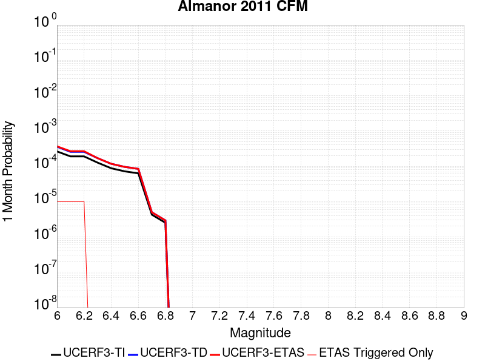 | 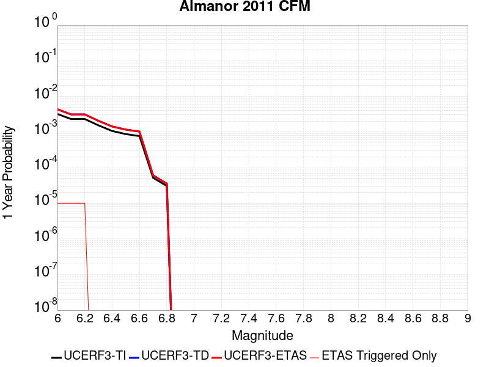 |  |

| Magnitude | 1 wk TI Prob | 1 wk TD Prob | 1 wk ETAS Prob | 1 wk ETAS/TD Gain | 1 wk ETAS Triggered Only | 1 mo TI Prob | 1 mo TD Prob | 1 mo ETAS Prob | 1 mo ETAS/TD Gain | 1 mo ETAS Triggered Only | 1 yr TI Prob | 1 yr TD Prob | 1 yr ETAS Prob | 1 yr ETAS/TD Gain | 1 yr ETAS Triggered Only | 10 yr TI Prob | 10 yr TD Prob | 10 yr ETAS Prob | 10 yr ETAS/TD Gain | 10 yr ETAS Triggered Only |
|-----|-----|-----|-----|-----|-----|-----|-----|-----|-----|-----|-----|-----|-----|-----|-----|-----|-----|-----|-----|-----|
| 6.0 | 6.1479834E-5 | 8.327245E-5 | 9.3271614E-5 | 1.1200777 | 1.0E-5 | 2.6345838E-4 | 3.5683523E-4 | 3.6683163E-4 | 1.0280142 | 1.0E-5 | 0.0032028882 | 0.004336495 | 0.0043464517 | 1.002296 | 1.0E-5 | 0.031571172 | 0.04258658 | 0.042596154 | 1.0002248 | 1.0E-5 |
| 6.1 | 4.4387216E-5 | 5.9767433E-5 | 6.976684E-5 | 1.1673052 | 1.0E-5 | 1.9021705E-4 | 2.561236E-4 | 2.6612106E-4 | 1.0390337 | 1.0E-5 | 0.0023134327 | 0.003114351 | 0.0031243197 | 1.0032009 | 1.0E-5 | 0.022894967 | 0.030755581 | 0.030765275 | 1.0003152 | 1.0E-5 |
| 6.2 | 4.4387216E-5 | 5.9767433E-5 | 6.976684E-5 | 1.1673052 | 1.0E-5 | 1.9021705E-4 | 2.561236E-4 | 2.6612106E-4 | 1.0390337 | 1.0E-5 | 0.0023134327 | 0.003114351 | 0.0031243197 | 1.0032009 | 1.0E-5 | 0.022894967 | 0.030755581 | 0.030765275 | 1.0003152 | 1.0E-5 |
| 6.3 | 2.9523822E-5 | 3.9546965E-5 | 3.9546965E-5 | 1.0 | 0.0 | 1.2652454E-4 | 1.6947731E-4 | 1.6947731E-4 | 1.0 | 0.0 | 0.0015393476 | 0.0020617929 | 0.0020617929 | 1.0 | 0.0 | 0.015287281 | 0.020461112 | 0.020461112 | 1.0 | 0.0 |
| 6.4 | 2.0512744E-5 | 2.7430639E-5 | 2.7430639E-5 | 1.0 | 0.0 | 8.79088E-5 | 1.17555675E-4 | 1.17555675E-4 | 1.0 | 0.0 | 0.001069764 | 0.0014306171 | 0.0014306171 | 1.0 | 0.0 | 0.010646289 | 0.01424458 | 0.01424458 | 1.0 | 0.0 |
| 6.5 | 1.6750226E-5 | 2.2390364E-5 | 2.2390364E-5 | 1.0 | 0.0 | 7.178471E-5 | 9.595619E-5 | 9.595619E-5 | 1.0 | 0.0 | 8.7362836E-4 | 0.0011679606 | 0.0011679606 | 1.0 | 0.0 | 0.008702018 | 0.011649196 | 0.011649196 | 1.0 | 0.0 |
| 6.6 | 1.4745303E-5 | 1.970686E-5 | 1.970686E-5 | 1.0 | 0.0 | 6.319262E-5 | 8.445639E-5 | 8.445639E-5 | 1.0 | 0.0 | 7.690986E-4 | 0.0010280984 | 0.0010280984 | 1.0 | 0.0 | 0.0076644225 | 0.01026513 | 0.01026513 | 1.0 | 0.0 |
| 6.7 | 9.951145E-7 | 1.1616347E-6 | 1.1616347E-6 | 1.0 | 0.0 | 4.26477E-6 | 4.9784257E-6 | 4.9784257E-6 | 1.0 | 0.0 | 5.1922336E-5 | 6.0610826E-5 | 6.0610826E-5 | 1.0 | 0.0 | 5.1910203E-4 | 6.059602E-4 | 6.059602E-4 | 1.0 | 0.0 |
| 6.8 | 5.866312E-7 | 6.849384E-7 | 6.849384E-7 | 1.0 | 0.0 | 2.5141312E-6 | 2.9354478E-6 | 2.9354478E-6 | 1.0 | 0.0 | 3.0609117E-5 | 3.5738623E-5 | 3.5738623E-5 | 1.0 | 0.0 | 3.06049E-4 | 3.5734157E-4 | 3.5734157E-4 | 1.0 | 0.0 |

## Peralta Hills
*[(top)](#table-of-contents)*

| 1 Week | 1 Month | 1 Year | 10 Year |
|-----|-----|-----|-----|
|  |  |  |  |

| Magnitude | 1 wk TI Prob | 1 wk TD Prob | 1 wk ETAS Prob | 1 wk ETAS/TD Gain | 1 wk ETAS Triggered Only | 1 mo TI Prob | 1 mo TD Prob | 1 mo ETAS Prob | 1 mo ETAS/TD Gain | 1 mo ETAS Triggered Only | 1 yr TI Prob | 1 yr TD Prob | 1 yr ETAS Prob | 1 yr ETAS/TD Gain | 1 yr ETAS Triggered Only | 10 yr TI Prob | 10 yr TD Prob | 10 yr ETAS Prob | 10 yr ETAS/TD Gain | 10 yr ETAS Triggered Only |
|-----|-----|-----|-----|-----|-----|-----|-----|-----|-----|-----|-----|-----|-----|-----|-----|-----|-----|-----|-----|-----|
| 6.0 | 3.8850067E-6 | 3.8395046E-6 | 3.8395046E-6 | 1.0 | 0.0 | 1.6649923E-5 | 1.6454958E-5 | 1.6454958E-5 | 1.0 | 0.0 | 2.0269395E-4 | 2.0032811E-4 | 2.0032811E-4 | 1.0 | 0.0 | 0.0020250916 | 0.002002203 | 0.002012183 | 1.0049845 | 1.0E-5 |
| 6.1 | 3.8850067E-6 | 3.8395046E-6 | 3.8395046E-6 | 1.0 | 0.0 | 1.6649923E-5 | 1.6454958E-5 | 1.6454958E-5 | 1.0 | 0.0 | 2.0269395E-4 | 2.0032811E-4 | 2.0032811E-4 | 1.0 | 0.0 | 0.0020250916 | 0.002002203 | 0.002012183 | 1.0049845 | 1.0E-5 |
| 6.2 | 3.8850067E-6 | 3.8395046E-6 | 3.8395046E-6 | 1.0 | 0.0 | 1.6649923E-5 | 1.6454958E-5 | 1.6454958E-5 | 1.0 | 0.0 | 2.0269395E-4 | 2.0032811E-4 | 2.0032811E-4 | 1.0 | 0.0 | 0.0020250916 | 0.002002203 | 0.002012183 | 1.0049845 | 1.0E-5 |
| 6.3 | 3.8850067E-6 | 3.8395046E-6 | 3.8395046E-6 | 1.0 | 0.0 | 1.6649923E-5 | 1.6454958E-5 | 1.6454958E-5 | 1.0 | 0.0 | 2.0269395E-4 | 2.0032811E-4 | 2.0032811E-4 | 1.0 | 0.0 | 0.0020250916 | 0.002002203 | 0.002012183 | 1.0049845 | 1.0E-5 |
| 6.4 | 3.8850067E-6 | 3.8395046E-6 | 3.8395046E-6 | 1.0 | 0.0 | 1.6649923E-5 | 1.6454958E-5 | 1.6454958E-5 | 1.0 | 0.0 | 2.0269395E-4 | 2.0032811E-4 | 2.0032811E-4 | 1.0 | 0.0 | 0.0020250916 | 0.002002203 | 0.002012183 | 1.0049845 | 1.0E-5 |
| 6.5 | 1.5587785E-6 | 1.4430725E-6 | 1.4430725E-6 | 1.0 | 0.0 | 6.6804623E-6 | 6.184583E-6 | 6.184583E-6 | 1.0 | 0.0 | 8.133159E-5 | 7.529494E-5 | 7.529494E-5 | 1.0 | 0.0 | 8.1301836E-4 | 7.527183E-4 | 7.527183E-4 | 1.0 | 0.0 |
| 6.6 | 1.5587785E-6 | 1.4430725E-6 | 1.4430725E-6 | 1.0 | 0.0 | 6.6804623E-6 | 6.184583E-6 | 6.184583E-6 | 1.0 | 0.0 | 8.133159E-5 | 7.529494E-5 | 7.529494E-5 | 1.0 | 0.0 | 8.1301836E-4 | 7.527183E-4 | 7.527183E-4 | 1.0 | 0.0 |
| 6.7 | 1.5018579E-6 | 1.3836951E-6 | 1.3836951E-6 | 1.0 | 0.0 | 6.436518E-6 | 5.9301096E-6 | 5.9301096E-6 | 1.0 | 0.0 | 7.836179E-5 | 7.219693E-5 | 7.219693E-5 | 1.0 | 0.0 | 7.833416E-4 | 7.2175835E-4 | 7.2175835E-4 | 1.0 | 0.0 |
| 6.8 | 1.4584314E-6 | 1.3381272E-6 | 1.3381272E-6 | 1.0 | 0.0 | 6.250405E-6 | 5.7348193E-6 | 5.7348193E-6 | 1.0 | 0.0 | 7.6096025E-5 | 6.981943E-5 | 6.981943E-5 | 1.0 | 0.0 | 7.6069974E-4 | 6.9799833E-4 | 6.9799833E-4 | 1.0 | 0.0 |
| 6.9 | 1.1382393E-6 | 9.862176E-7 | 9.862176E-7 | 1.0 | 0.0 | 4.8781594E-6 | 4.2266406E-6 | 4.2266406E-6 | 1.0 | 0.0 | 5.9389975E-5 | 5.145822E-5 | 5.145822E-5 | 1.0 | 0.0 | 5.93741E-4 | 5.1447126E-4 | 5.1447126E-4 | 1.0 | 0.0 |
| 7.0 | 9.970413E-7 | 8.3095136E-7 | 8.3095136E-7 | 1.0 | 0.0 | 4.273027E-6 | 3.5612156E-6 | 3.5612156E-6 | 1.0 | 0.0 | 5.2022864E-5 | 4.3357006E-5 | 4.3357006E-5 | 1.0 | 0.0 | 5.2010687E-4 | 4.3349227E-4 | 4.3349227E-4 | 1.0 | 0.0 |
| 7.1 | 9.684443E-7 | 7.993957E-7 | 7.993957E-7 | 1.0 | 0.0 | 4.150469E-6 | 3.4259774E-6 | 3.4259774E-6 | 1.0 | 0.0 | 5.053079E-5 | 4.1710548E-5 | 4.1710548E-5 | 1.0 | 0.0 | 5.05193E-4 | 4.170339E-4 | 4.170339E-4 | 1.0 | 0.0 |
| 7.2 | 9.240811E-7 | 7.503015E-7 | 7.503015E-7 | 1.0 | 0.0 | 3.960342E-6 | 3.2155742E-6 | 3.2155742E-6 | 1.0 | 0.0 | 4.8216094E-5 | 3.914898E-5 | 3.914898E-5 | 1.0 | 0.0 | 4.8205635E-4 | 3.9142737E-4 | 3.9142737E-4 | 1.0 | 0.0 |
| 7.3 | 8.158643E-7 | 6.34986E-7 | 6.34986E-7 | 1.0 | 0.0 | 3.4965567E-6 | 2.7213662E-6 | 2.7213662E-6 | 1.0 | 0.0 | 4.2569747E-5 | 3.3132193E-5 | 3.3132193E-5 | 1.0 | 0.0 | 4.2561593E-4 | 3.3127866E-4 | 3.3127866E-4 | 1.0 | 0.0 |
| 7.4 | 6.3822824E-7 | 4.79557E-7 | 4.79557E-7 | 1.0 | 0.0 | 2.7352612E-6 | 2.0552432E-6 | 2.0552432E-6 | 1.0 | 0.0 | 3.3301294E-5 | 2.502235E-5 | 2.502235E-5 | 1.0 | 0.0 | 3.3296304E-4 | 2.5020045E-4 | 2.5020045E-4 | 1.0 | 0.0 |
| 7.5 | 4.0292628E-7 | 2.7844956E-7 | 2.7844956E-7 | 1.0 | 0.0 | 1.7268258E-6 | 1.1933548E-6 | 1.1933548E-6 | 1.0 | 0.0 | 2.1023901E-5 | 1.4529027E-5 | 1.4529027E-5 | 1.0 | 0.0 | 2.1021912E-4 | 1.4528356E-4 | 1.4528356E-4 | 1.0 | 0.0 |
| 7.6 | 3.672993E-7 | 2.4854202E-7 | 2.4854202E-7 | 1.0 | 0.0 | 1.5741389E-6 | 1.0651798E-6 | 1.0651798E-6 | 1.0 | 0.0 | 1.9164972E-5 | 1.2968516E-5 | 1.2968516E-5 | 1.0 | 0.0 | 1.916332E-4 | 1.2968031E-4 | 1.2968031E-4 | 1.0 | 0.0 |
| 7.7 | 2.8466823E-7 | 1.7858805E-7 | 1.7858805E-7 | 1.0 | 0.0 | 1.2200061E-6 | 7.653773E-7 | 7.653773E-7 | 1.0 | 0.0 | 1.4853474E-5 | 9.318455E-6 | 9.318455E-6 | 1.0 | 0.0 | 1.485248E-4 | 9.318324E-5 | 9.318324E-5 | 1.0 | 0.0 |

## Hunting Creek - Bartlett Springs connector 2011
*[(top)](#table-of-contents)*

| 1 Week | 1 Month | 1 Year | 10 Year |
|-----|-----|-----|-----|
|  |  |  |  |

| Magnitude | 1 wk TI Prob | 1 wk TD Prob | 1 wk ETAS Prob | 1 wk ETAS/TD Gain | 1 wk ETAS Triggered Only | 1 mo TI Prob | 1 mo TD Prob | 1 mo ETAS Prob | 1 mo ETAS/TD Gain | 1 mo ETAS Triggered Only | 1 yr TI Prob | 1 yr TD Prob | 1 yr ETAS Prob | 1 yr ETAS/TD Gain | 1 yr ETAS Triggered Only | 10 yr TI Prob | 10 yr TD Prob | 10 yr ETAS Prob | 10 yr ETAS/TD Gain | 10 yr ETAS Triggered Only |
|-----|-----|-----|-----|-----|-----|-----|-----|-----|-----|-----|-----|-----|-----|-----|-----|-----|-----|-----|-----|-----|
| 6.0 | 4.940016E-5 | 6.7870766E-5 | 6.7870766E-5 | 1.0 | 0.0 | 2.1169778E-4 | 2.9084194E-4 | 2.9084194E-4 | 1.0 | 0.0 | 0.002574374 | 0.0035350819 | 0.0035450463 | 1.0028188 | 1.0E-5 | 0.025447546 | 0.03477475 | 0.034784403 | 1.0002775 | 1.0E-5 |
| 6.1 | 4.940016E-5 | 6.7870766E-5 | 6.7870766E-5 | 1.0 | 0.0 | 2.1169778E-4 | 2.9084194E-4 | 2.9084194E-4 | 1.0 | 0.0 | 0.002574374 | 0.0035350819 | 0.0035450463 | 1.0028188 | 1.0E-5 | 0.025447546 | 0.03477475 | 0.034784403 | 1.0002775 | 1.0E-5 |
| 6.2 | 4.472471E-5 | 6.100572E-5 | 6.100572E-5 | 1.0 | 0.0 | 1.9166325E-4 | 2.6142647E-4 | 2.6142647E-4 | 1.0 | 0.0 | 0.0023310026 | 0.0031781218 | 0.0031781218 | 1.0 | 0.0 | 0.02306703 | 0.031317808 | 0.031317808 | 1.0 | 0.0 |
| 6.3 | 4.472471E-5 | 6.100572E-5 | 6.100572E-5 | 1.0 | 0.0 | 1.9166325E-4 | 2.6142647E-4 | 2.6142647E-4 | 1.0 | 0.0 | 0.0023310026 | 0.0031781218 | 0.0031781218 | 1.0 | 0.0 | 0.02306703 | 0.031317808 | 0.031317808 | 1.0 | 0.0 |
| 6.4 | 4.0001003E-5 | 5.410516E-5 | 5.410516E-5 | 1.0 | 0.0 | 1.714216E-4 | 2.318579E-4 | 2.318579E-4 | 1.0 | 0.0 | 0.0020850603 | 0.0028191686 | 0.0028191686 | 1.0 | 0.0 | 0.02065605 | 0.027829198 | 0.027829198 | 1.0 | 0.0 |
| 6.5 | 3.8033053E-5 | 5.126649E-5 | 5.126649E-5 | 1.0 | 0.0 | 1.6298861E-4 | 2.1969521E-4 | 2.1969521E-4 | 1.0 | 0.0 | 0.0019825802 | 0.0026714848 | 0.0026714848 | 1.0 | 0.0 | 0.019649856 | 0.026391273 | 0.026391273 | 1.0 | 0.0 |
| 6.6 | 3.653754E-5 | 4.912955E-5 | 4.912955E-5 | 1.0 | 0.0 | 1.5658008E-4 | 2.1053842E-4 | 2.1053842E-4 | 1.0 | 0.0 | 0.0019046954 | 0.0025602889 | 0.0025602889 | 1.0 | 0.0 | 0.018884527 | 0.025307199 | 0.025307199 | 1.0 | 0.0 |
| 6.7 | 3.372024E-5 | 4.5140216E-5 | 4.5140216E-5 | 1.0 | 0.0 | 1.4450731E-4 | 1.9344388E-4 | 1.9344388E-4 | 1.0 | 0.0 | 0.0017579567 | 0.0023526535 | 0.0023526535 | 1.0 | 0.0 | 0.017441148 | 0.023278862 | 0.023278862 | 1.0 | 0.0 |
| 6.8 | 2.9650024E-5 | 3.9411647E-5 | 3.9411647E-5 | 1.0 | 0.0 | 1.2706534E-4 | 1.6889606E-4 | 1.6889606E-4 | 1.0 | 0.0 | 0.0015459227 | 0.0020543607 | 0.0020543607 | 1.0 | 0.0 | 0.015352124 | 0.020351961 | 0.020351961 | 1.0 | 0.0 |
| 6.9 | 2.860775E-5 | 3.7812886E-5 | 3.7812886E-5 | 1.0 | 0.0 | 1.2259888E-4 | 1.620452E-4 | 1.620452E-4 | 1.0 | 0.0 | 0.0014916194 | 0.0019711219 | 0.0019711219 | 1.0 | 0.0 | 0.014816469 | 0.019536555 | 0.019536555 | 1.0 | 0.0 |
| 7.0 | 2.6696067E-5 | 3.5067544E-5 | 3.5067544E-5 | 1.0 | 0.0 | 1.144067E-4 | 1.5028086E-4 | 1.5028086E-4 | 1.0 | 0.0 | 0.0013920115 | 0.0018281427 | 0.0018281427 | 1.0 | 0.0 | 0.013833242 | 0.01813184 | 0.01813184 | 1.0 | 0.0 |
| 7.1 | 2.456087E-5 | 3.2013326E-5 | 3.2013326E-5 | 1.0 | 0.0 | 1.0525662E-4 | 1.3719281E-4 | 1.3719281E-4 | 1.0 | 0.0 | 0.001280746 | 0.0016690517 | 0.0016690517 | 1.0 | 0.0 | 0.012733897 | 0.016566671 | 0.016566671 | 1.0 | 0.0 |
| 7.2 | 2.295761E-5 | 2.9823148E-5 | 2.9823148E-5 | 1.0 | 0.0 | 9.8386045E-5 | 1.2780727E-4 | 1.2780727E-4 | 1.0 | 0.0 | 0.0011971919 | 0.0015549522 | 0.0015549522 | 1.0 | 0.0 | 0.011907627 | 0.015442378 | 0.015442378 | 1.0 | 0.0 |
| 7.3 | 2.1256936E-5 | 2.7542124E-5 | 2.7542124E-5 | 1.0 | 0.0 | 9.109797E-5 | 1.1803238E-4 | 1.1803238E-4 | 1.0 | 0.0 | 0.0011085535 | 0.0014361058 | 0.0014361058 | 1.0 | 0.0 | 0.011030397 | 0.014269741 | 0.014269741 | 1.0 | 0.0 |
| 7.4 | 1.8784336E-5 | 2.430697E-5 | 2.430697E-5 | 1.0 | 0.0 | 8.050181E-5 | 1.0416861E-4 | 1.0416861E-4 | 1.0 | 0.0 | 9.796688E-4 | 0.0012675226 | 0.0012675226 | 1.0 | 0.0 | 0.009753612 | 0.012604194 | 0.012604194 | 1.0 | 0.0 |
| 7.5 | 1.7248298E-5 | 2.2269056E-5 | 2.2269056E-5 | 1.0 | 0.0 | 7.391918E-5 | 9.543537E-5 | 9.543537E-5 | 1.0 | 0.0 | 8.9959445E-4 | 0.0011613137 | 0.0011613137 | 1.0 | 0.0 | 0.008959615 | 0.011553645 | 0.011553645 | 1.0 | 0.0 |
| 7.6 | 1.0653709E-5 | 1.3722259E-5 | 1.3722259E-5 | 1.0 | 0.0 | 4.5657955E-5 | 5.880837E-5 | 5.880837E-5 | 1.0 | 0.0 | 5.557438E-4 | 7.157594E-4 | 7.157594E-4 | 1.0 | 0.0 | 0.0055435603 | 0.0071350415 | 0.0071350415 | 1.0 | 0.0 |
| 7.7 | 3.286316E-6 | 4.0903997E-6 | 4.0903997E-6 | 1.0 | 0.0 | 1.4084137E-5 | 1.7530168E-5 | 1.7530168E-5 | 1.0 | 0.0 | 1.7146087E-4 | 2.1340905E-4 | 2.1340905E-4 | 1.0 | 0.0 | 0.0017132863 | 0.0021320845 | 0.0021320845 | 1.0 | 0.0 |
| 7.8 | 5.1855085E-7 | 5.972095E-7 | 5.972095E-7 | 1.0 | 0.0 | 2.222359E-6 | 2.5594668E-6 | 2.5594668E-6 | 1.0 | 0.0 | 2.7056883E-5 | 3.1161075E-5 | 3.1161075E-5 | 1.0 | 0.0 | 2.705359E-4 | 3.1156064E-4 | 3.1156064E-4 | 1.0 | 0.0 |

## San Gabriel (Extension)
*[(top)](#table-of-contents)*

| 1 Week | 1 Month | 1 Year | 10 Year |
|-----|-----|-----|-----|
|  | 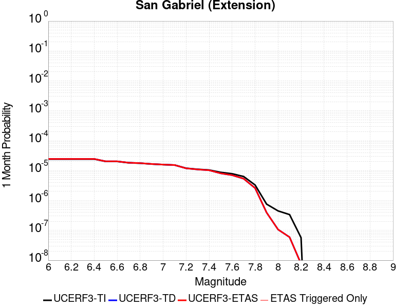 | 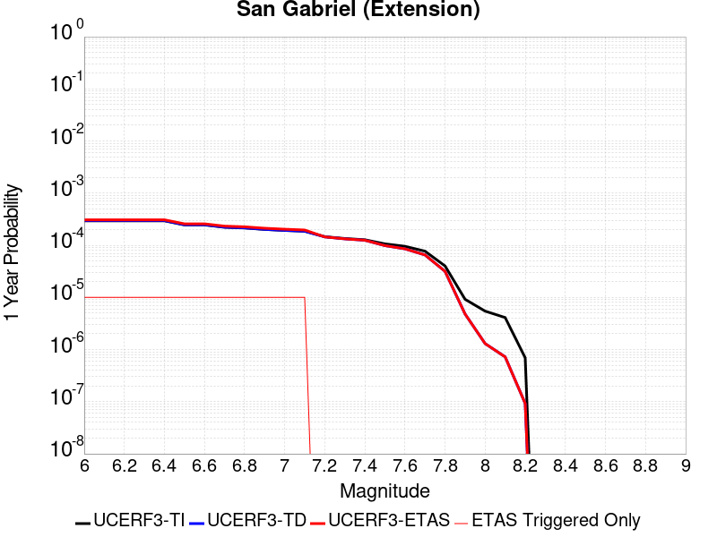 | 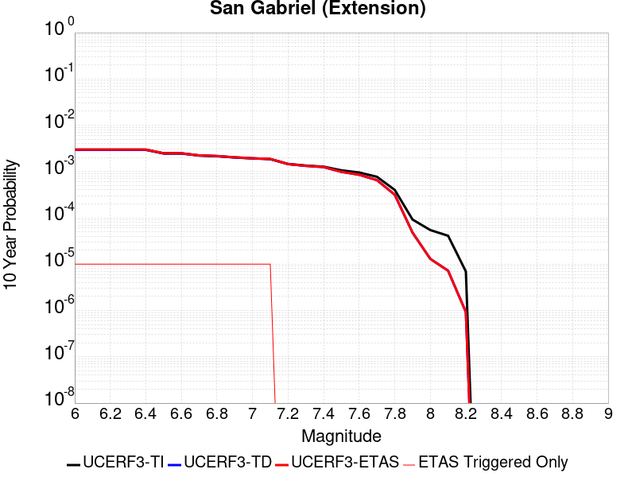 |

| Magnitude | 1 wk TI Prob | 1 wk TD Prob | 1 wk ETAS Prob | 1 wk ETAS/TD Gain | 1 wk ETAS Triggered Only | 1 mo TI Prob | 1 mo TD Prob | 1 mo ETAS Prob | 1 mo ETAS/TD Gain | 1 mo ETAS Triggered Only | 1 yr TI Prob | 1 yr TD Prob | 1 yr ETAS Prob | 1 yr ETAS/TD Gain | 1 yr ETAS Triggered Only | 10 yr TI Prob | 10 yr TD Prob | 10 yr ETAS Prob | 10 yr ETAS/TD Gain | 10 yr ETAS Triggered Only |
|-----|-----|-----|-----|-----|-----|-----|-----|-----|-----|-----|-----|-----|-----|-----|-----|-----|-----|-----|-----|-----|
| 6.0 | 5.6486106E-6 | 5.7168368E-6 | 5.7168368E-6 | 1.0 | 0.0 | 2.4208108E-5 | 2.4500505E-5 | 2.4500505E-5 | 1.0 | 0.0 | 2.9469383E-4 | 2.9825408E-4 | 3.082511E-4 | 1.0335184 | 1.0E-5 | 0.0029430336 | 0.0029786646 | 0.0029886349 | 1.0033472 | 1.0E-5 |
| 6.1 | 5.6486106E-6 | 5.7168368E-6 | 5.7168368E-6 | 1.0 | 0.0 | 2.4208108E-5 | 2.4500505E-5 | 2.4500505E-5 | 1.0 | 0.0 | 2.9469383E-4 | 2.9825408E-4 | 3.082511E-4 | 1.0335184 | 1.0E-5 | 0.0029430336 | 0.0029786646 | 0.0029886349 | 1.0033472 | 1.0E-5 |
| 6.2 | 5.6486106E-6 | 5.7168368E-6 | 5.7168368E-6 | 1.0 | 0.0 | 2.4208108E-5 | 2.4500505E-5 | 2.4500505E-5 | 1.0 | 0.0 | 2.9469383E-4 | 2.9825408E-4 | 3.082511E-4 | 1.0335184 | 1.0E-5 | 0.0029430336 | 0.0029786646 | 0.0029886349 | 1.0033472 | 1.0E-5 |
| 6.3 | 5.6486106E-6 | 5.7168368E-6 | 5.7168368E-6 | 1.0 | 0.0 | 2.4208108E-5 | 2.4500505E-5 | 2.4500505E-5 | 1.0 | 0.0 | 2.9469383E-4 | 2.9825408E-4 | 3.082511E-4 | 1.0335184 | 1.0E-5 | 0.0029430336 | 0.0029786646 | 0.0029886349 | 1.0033472 | 1.0E-5 |
| 6.4 | 5.6486106E-6 | 5.7168368E-6 | 5.7168368E-6 | 1.0 | 0.0 | 2.4208108E-5 | 2.4500505E-5 | 2.4500505E-5 | 1.0 | 0.0 | 2.9469383E-4 | 2.9825408E-4 | 3.082511E-4 | 1.0335184 | 1.0E-5 | 0.0029430336 | 0.0029786646 | 0.0029886349 | 1.0033472 | 1.0E-5 |
| 6.5 | 4.7134554E-6 | 4.7542608E-6 | 4.7542608E-6 | 1.0 | 0.0 | 2.0200367E-5 | 2.0375248E-5 | 2.0375248E-5 | 1.0 | 0.0 | 2.459117E-4 | 2.4804127E-4 | 2.5803878E-4 | 1.0403059 | 1.0E-5 | 0.0024563975 | 0.0024777285 | 0.0024877037 | 1.0040259 | 1.0E-5 |
| 6.6 | 4.7134554E-6 | 4.7542608E-6 | 4.7542608E-6 | 1.0 | 0.0 | 2.0200367E-5 | 2.0375248E-5 | 2.0375248E-5 | 1.0 | 0.0 | 2.459117E-4 | 2.4804127E-4 | 2.5803878E-4 | 1.0403059 | 1.0E-5 | 0.0024563975 | 0.0024777285 | 0.0024877037 | 1.0040259 | 1.0E-5 |
| 6.7 | 4.2468837E-6 | 4.274078E-6 | 4.274078E-6 | 1.0 | 0.0 | 1.8200803E-5 | 1.8317352E-5 | 1.8317352E-5 | 1.0 | 0.0 | 2.2157225E-4 | 2.2299167E-4 | 2.3298943E-4 | 1.0448347 | 1.0E-5 | 0.0022135144 | 0.0022277513 | 0.002237729 | 1.0044788 | 1.0E-5 |
| 6.8 | 4.1180615E-6 | 4.1414673E-6 | 4.1414673E-6 | 1.0 | 0.0 | 1.7648716E-5 | 1.774903E-5 | 1.774903E-5 | 1.0 | 0.0 | 2.1485193E-4 | 2.1607373E-4 | 2.2607157E-4 | 1.0462705 | 1.0E-5 | 0.0021464431 | 0.0021587077 | 0.0021686861 | 1.0046225 | 1.0E-5 |
| 6.9 | 3.863861E-6 | 3.879783E-6 | 3.879783E-6 | 1.0 | 0.0 | 1.65593E-5 | 1.6627539E-5 | 1.6627539E-5 | 1.0 | 0.0 | 2.0159081E-4 | 2.0242216E-4 | 2.1242014E-4 | 1.0493917 | 1.0E-5 | 0.0020140803 | 0.0020224454 | 0.0020324253 | 1.0049345 | 1.0E-5 |
| 7.0 | 3.6947372E-6 | 3.705682E-6 | 3.705682E-6 | 1.0 | 0.0 | 1.5834492E-5 | 1.5881402E-5 | 1.5881402E-5 | 1.0 | 0.0 | 1.9276788E-4 | 1.9333958E-4 | 2.0333765E-4 | 1.0517125 | 1.0E-5 | 0.0019260074 | 0.0019317803 | 0.0019417609 | 1.0051665 | 1.0E-5 |
| 7.1 | 3.5686835E-6 | 3.5729024E-6 | 3.5729024E-6 | 1.0 | 0.0 | 1.5294268E-5 | 1.5312353E-5 | 1.5312353E-5 | 1.0 | 0.0 | 1.861918E-4 | 1.8641262E-4 | 1.9641075E-4 | 1.0536344 | 1.0E-5 | 0.0018603588 | 0.0018626284 | 0.0018726097 | 1.0053588 | 1.0E-5 |
| 7.2 | 2.8023446E-6 | 2.776794E-6 | 2.776794E-6 | 1.0 | 0.0 | 1.2009994E-5 | 1.1900492E-5 | 1.1900492E-5 | 1.0 | 0.0 | 1.4621185E-4 | 1.4487897E-4 | 1.4487897E-4 | 1.0 | 0.0 | 0.001461157 | 0.001447856 | 0.001447856 | 1.0 | 0.0 |
| 7.3 | 2.5843012E-6 | 2.5459692E-6 | 2.5459692E-6 | 1.0 | 0.0 | 1.1075529E-5 | 1.0911252E-5 | 1.0911252E-5 | 1.0 | 0.0 | 1.3483623E-4 | 1.3283649E-4 | 1.3283649E-4 | 1.0 | 0.0 | 0.0013475444 | 0.0013275805 | 0.0013275805 | 1.0 | 0.0 |
| 7.4 | 2.4464468E-6 | 2.396669E-6 | 2.396669E-6 | 1.0 | 0.0 | 1.04847295E-5 | 1.0271398E-5 | 1.0271398E-5 | 1.0 | 0.0 | 1.276441E-4 | 1.250472E-4 | 1.250472E-4 | 1.0 | 0.0 | 0.0012757082 | 0.001249778 | 0.001249778 | 1.0 | 0.0 |
| 7.5 | 2.0420266E-6 | 1.8910376E-6 | 1.8910376E-6 | 1.0 | 0.0 | 8.751514E-6 | 8.104422E-6 | 8.104422E-6 | 1.0 | 0.0 | 1.0654447E-4 | 9.866691E-5 | 9.866691E-5 | 1.0 | 0.0 | 0.001064934 | 9.862344E-4 | 9.862344E-4 | 1.0 | 0.0 |
| 7.6 | 1.8326596E-6 | 1.6398233E-6 | 1.6398233E-6 | 1.0 | 0.0 | 7.854232E-6 | 7.027795E-6 | 7.027795E-6 | 1.0 | 0.0 | 9.562107E-5 | 8.556007E-5 | 8.556007E-5 | 1.0 | 0.0 | 9.5579936E-4 | 8.552735E-4 | 8.552735E-4 | 1.0 | 0.0 |
| 7.7 | 1.4786998E-6 | 1.2523672E-6 | 1.2523672E-6 | 1.0 | 0.0 | 6.3372695E-6 | 5.3672766E-6 | 5.3672766E-6 | 1.0 | 0.0 | 7.715353E-5 | 6.534465E-5 | 6.534465E-5 | 1.0 | 0.0 | 7.7126746E-4 | 6.5325975E-4 | 6.5325975E-4 | 1.0 | 0.0 |
| 7.8 | 7.6975533E-7 | 6.069207E-7 | 6.069207E-7 | 1.0 | 0.0 | 3.2989474E-6 | 2.6010862E-6 | 2.6010862E-6 | 1.0 | 0.0 | 4.0163945E-5 | 3.1667765E-5 | 3.1667765E-5 | 1.0 | 0.0 | 4.0156685E-4 | 3.166365E-4 | 3.166365E-4 | 1.0 | 0.0 |
| 7.9 | 1.7645915E-7 | 9.211899E-8 | 9.211899E-8 | 1.0 | 0.0 | 7.562533E-7 | 3.947956E-7 | 3.947956E-7 | 1.0 | 0.0 | 9.207345E-6 | 4.806626E-6 | 4.806626E-6 | 1.0 | 0.0 | 9.206964E-5 | 4.8069025E-5 | 4.8069025E-5 | 1.0 | 0.0 |
| 8.0 | 1.0463461E-7 | 2.4937416E-8 | 2.4937416E-8 | 1.0 | 0.0 | 4.4843398E-7 | 1.0687464E-7 | 1.0687464E-7 | 1.0 | 0.0 | 5.45967E-6 | 1.3011979E-6 | 1.3011979E-6 | 1.0 | 0.0 | 5.459536E-5 | 1.3015701E-5 | 1.3015701E-5 | 1.0 | 0.0 |
| 8.1 | 7.875717E-8 | 1.3857542E-8 | 1.3857542E-8 | 1.0 | 0.0 | 3.3753068E-7 | 5.9389468E-8 | 5.9389468E-8 | 1.0 | 0.0 | 4.109428E-6 | 7.2306653E-7 | 7.2306653E-7 | 1.0 | 0.0 | 4.109352E-5 | 7.234439E-6 | 7.234439E-6 | 1.0 | 0.0 |
| 8.2 | 1.33163E-8 | 1.7720816E-9 | 1.7720816E-9 | 1.0 | 0.0 | 5.7069855E-8 | 7.594638E-9 | 7.594638E-9 | 1.0 | 0.0 | 6.9482525E-7 | 9.246471E-8 | 9.246471E-8 | 1.0 | 0.0 | 6.9482307E-6 | 9.2664203E-7 | 9.2664203E-7 | 1.0 | 0.0 |

