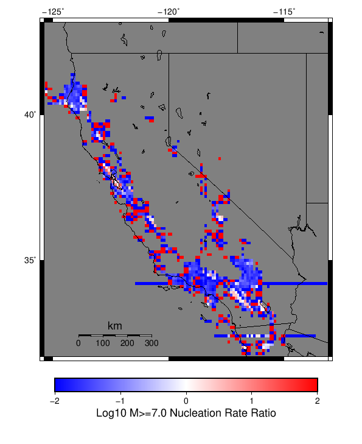

# Start 2012, 500 yr, kCOV=1.5, Spontaneous, Historical Catalog Results

|   | Start 2012, 500 yr, kCOV=1.5, Spontaneous, Historical Catalog |
|-----|-----|
| Num Simulations | 1000 |
| Start Time | 2012/01/01 00:00:00 UTC |
| Start Time Epoch Milliseconds | 1325376000000 |
| Duration | 500 Years |
| Includes Spontaneous? | true |
| Trigger Ruptures | *(none)* |
| Trigger Ruptures | 60366 Trigger Ruptures |
|   | First: M7.3 at 1852/01/05 04:40:39 UTC |
|   | Last: M3.2 at 2011/12/31 19:14:44 UTC |
|   | Largest: M7.9 at 1857/01/09 16:25:39 UTC |
| Config Generated With | u3etas_config_builder.sh --start-year 2012 --num-simulations 1000 --duration-years 500 --include-spontaneous --historical-catalog --etas-k-cov 1.5 --random-seed 123456789 --hpc-site USC_HPC --nodes 36 --hours 24 --queue scec |

## Table Of Contents

* [Magnitude Frequency Distribution](#magnitude-frequency-distribution)
  * [Magnitude Frequency Distribution, Including Spontaneous](#magnitude-frequency-distribution-including-spontaneous)
  * [Magnitude Frequency Distribution, Including Spontaneous, Triggered Events](#magnitude-frequency-distribution-including-spontaneous-triggered-events)
* [Long Term Rate Variability](#long-term-rate-variability)
  * [162 Year Variability](#162-year-variability)
  * [80 Year Variability](#80-year-variability)
  * [28 Year Variability](#28-year-variability)
  * [Variability Duration Dependence](#variability-duration-dependence)
* [Simulation Stationarity](#simulation-stationarity)
* [Section Participation](#section-participation)
  * [Section Participation Plots](#section-participation-plots)
  * [Supra-Seismogenic Parent Sections Table](#supra-seismogenic-parent-sections-table)
  * [M≥6.5 Parent Sections Table](#m65-parent-sections-table)
  * [M≥7 Parent Sections Table](#m7-parent-sections-table)
  * [M≥7.5 Parent Sections Table](#m75-parent-sections-table)
  * [M≥8 Parent Sections Table](#m8-parent-sections-table)
* [Gridded Nucleation](#gridded-nucleation)
* [JSON Input File](#json-input-file)

## Magnitude Frequency Distribution
*[(top)](#table-of-contents)*

### Magnitude Frequency Distribution, Including Spontaneous
*[(top)](#table-of-contents)*

*Note: This section includes both spontaneous and triggered events*

**Legend**
* **Mean** (thick black line): mean annual rate across all 1000 catalogs
* **2.5%,97.5%** (thin black lines): annual rate percentiles across all 1000 catalogs
* **Median** (thin blue line): median annual rate across all 1000 catalogs
* **Mode** (thin cyan line): modal annual rate across all 1000 catalogs (scaled to annualized value)
* **Fault System Solution** (brown line): long-term MFD from the UCERF3 fault system solution
* **500 yr Probability** (thin red line): 500 year probability calculated as the fraction of catalogs with at least 1 occurrence
* **500 yr Supraseismogenic Probability** (thin dashed red line): same as above, but only for supraseismogenic ruptures on explicitly modeled UCERF3 faults
* **95% Conf** (light red shaded region): binomial 95% confidence bounds on probability
* **Primary** (thin green line): mean annual rate from primary triggered aftershocks only (no secondary, tertiary, etc...) across all 1000 catalogs


| Mag | Mean | 2.5 %ile | 97.5 %ile | Median | Mode | Long-Term Fault System Solution | 500 yr Probability | 500 yr Prob 95% Conf | 500 yr Supra-Seis Prob |
|-----|-----|-----|-----|-----|-----|-----|-----|-----|-----|
| **M&ge;5** | 7.768 | 6.542 | 9.850 | 7.626 | 7.444 | 8.609 | 1.000 (100.00%) | [99.52% 100.00%] | 1.000 (100.00%) |
| **M&ge;5.1** | 6.140 | 5.172 | 7.708 | 6.036 | 6.524 | 6.830 | 1.000 (100.00%) | [99.52% 100.00%] | 1.000 (100.00%) |
| **M&ge;5.2** | 4.850 | 4.080 | 6.070 | 4.770 | 4.918 | 5.417 | 1.000 (100.00%) | [99.52% 100.00%] | 1.000 (100.00%) |
| **M&ge;5.3** | 3.822 | 3.216 | 4.732 | 3.754 | 3.836 | 4.295 | 1.000 (100.00%) | [99.52% 100.00%] | 1.000 (100.00%) |
| **M&ge;5.4** | 3.010 | 2.556 | 3.742 | 2.966 | 2.940 | 3.404 | 1.000 (100.00%) | [99.52% 100.00%] | 1.000 (100.00%) |
| **M&ge;5.5** | 2.364 | 2.000 | 2.916 | 2.334 | 2.384 | 2.696 | 1.000 (100.00%) | [99.52% 100.00%] | 1.000 (100.00%) |
| **M&ge;5.6** | 1.851 | 1.568 | 2.284 | 1.828 | 1.886 | 2.133 | 1.000 (100.00%) | [99.52% 100.00%] | 1.000 (100.00%) |
| **M&ge;5.7** | 1.442 | 1.222 | 1.756 | 1.428 | 1.332 | 1.686 | 1.000 (100.00%) | [99.52% 100.00%] | 1.000 (100.00%) |
| **M&ge;5.8** | 1.116 | 0.948 | 1.348 | 1.106 | 1.068 | 1.331 | 1.000 (100.00%) | [99.52% 100.00%] | 1.000 (100.00%) |
| **M&ge;5.9** | 0.847 | 0.716 | 1.010 | 0.844 | 0.872 | 1.036 | 1.000 (100.00%) | [99.52% 100.00%] | 1.000 (100.00%) |
| **M&ge;6** | 0.669 | 0.568 | 0.784 | 0.666 | 0.652 | 0.836 | 1.000 (100.00%) | [99.52% 100.00%] | 1.000 (100.00%) |
| **M&ge;6.1** | 0.514 | 0.436 | 0.604 | 0.512 | 0.504 | 0.660 | 1.000 (100.00%) | [99.52% 100.00%] | 1.000 (100.00%) |
| **M&ge;6.2** | 0.405 | 0.338 | 0.478 | 0.404 | 0.398 | 0.529 | 1.000 (100.00%) | [99.52% 100.00%] | 1.000 (100.00%) |
| **M&ge;6.3** | 0.319 | 0.266 | 0.378 | 0.318 | 0.316 | 0.420 | 1.000 (100.00%) | [99.52% 100.00%] | 1.000 (100.00%) |
| **M&ge;6.4** | 0.250 | 0.206 | 0.300 | 0.250 | 0.250 | 0.332 | 1.000 (100.00%) | [99.52% 100.00%] | 1.000 (100.00%) |
| **M&ge;6.5** | 0.193 | 0.156 | 0.232 | 0.192 | 0.192 | 0.260 | 1.000 (100.00%) | [99.52% 100.00%] | 1.000 (100.00%) |
| **M&ge;6.6** | 0.151 | 0.120 | 0.182 | 0.150 | 0.144 | 0.205 | 1.000 (100.00%) | [99.52% 100.00%] | 1.000 (100.00%) |
| **M&ge;6.7** | 0.117 | 0.092 | 0.146 | 0.116 | 0.114 | 0.160 | 1.000 (100.00%) | [99.52% 100.00%] | 1.000 (100.00%) |
| **M&ge;6.8** | 0.092 | 0.070 | 0.118 | 0.092 | 0.088 | 0.127 | 1.000 (100.00%) | [99.52% 100.00%] | 1.000 (100.00%) |
| **M&ge;6.9** | 0.073 | 0.054 | 0.094 | 0.072 | 0.072 | 0.100 | 1.000 (100.00%) | [99.52% 100.00%] | 1.000 (100.00%) |
| **M&ge;7** | 0.057 | 0.040 | 0.076 | 0.056 | 0.054 | 0.078 | 1.000 (100.00%) | [99.52% 100.00%] | 1.000 (100.00%) |
| **M&ge;7.1** | 0.043 | 0.028 | 0.058 | 0.042 | 0.040 | 0.060 | 1.000 (100.00%) | [99.52% 100.00%] | 1.000 (100.00%) |
| **M&ge;7.2** | 0.033 | 0.020 | 0.046 | 0.032 | 0.030 | 0.045 | 1.000 (100.00%) | [99.52% 100.00%] | 1.000 (100.00%) |
| **M&ge;7.3** | 0.026 | 0.016 | 0.038 | 0.026 | 0.026 | 0.035 | 1.000 (100.00%) | [99.52% 100.00%] | 1.000 (100.00%) |
| **M&ge;7.4** | 0.020 | 0.012 | 0.030 | 0.020 | 0.020 | 0.027 | 1.000 (100.00%) | [99.52% 100.00%] | 1.000 (100.00%) |
| **M&ge;7.5** | 0.014 | 8.00E-3 | 0.022 | 0.014 | 0.014 | 0.019 | 1.000 (100.00%) | [99.52% 100.00%] | 1.000 (100.00%) |
| **M&ge;7.6** | 0.011 | 6.00E-3 | 0.018 | 0.010 | 0.010 | 0.014 | 1.000 (100.00%) | [99.52% 100.00%] | 1.000 (100.00%) |
| **M&ge;7.7** | 7.84E-3 | 4.00E-3 | 0.012 | 8.00E-3 | 8.00E-3 | 9.58E-3 | 1.000 (100.00%) | [99.52% 100.00%] | 1.000 (100.00%) |
| **M&ge;7.8** | 5.53E-3 | 2.00E-3 | 0.010 | 6.00E-3 | 6.00E-3 | 6.19E-3 | 0.989 (98.90%) | [97.98% 99.42%] | 0.989 (98.90%) |
| **M&ge;7.9** | 3.00E-3 | 0.000 | 6.00E-3 | 2.00E-3 | 4.00E-3 | 3.51E-3 | 0.855 (85.50%) | [83.13% 87.59%] | 0.855 (85.50%) |
| **M&ge;8** | 1.53E-3 | 0.000 | 4.00E-3 | 2.00E-3 | 2.00E-3 | 2.03E-3 | 0.601 (60.10%) | [56.98% 63.14%] | 0.601 (60.10%) |
| **M&ge;8.1** | 7.16E-4 | 0.000 | 4.00E-3 | 0.000 | 0.000 | 1.02E-3 | 0.321 (32.10%) | [29.23% 35.11%] | 0.321 (32.10%) |
| **M&ge;8.2** | 2.84E-4 | 0.000 | 2.00E-3 | 0.000 | 0.000 | 4.48E-4 | 0.139 (13.90%) | [11.85% 16.24%] | 0.139 (13.90%) |
| **M&ge;8.3** | 6.40E-5 | 0.000 | 2.00E-3 | 0.000 | 0.000 | 1.02E-4 | 0.032 (3.20%) | [2.23% 4.54%] | 0.032 (3.20%) |
| **M&ge;8.4** | 0.000 | 0.000 | 0.000 | 0.000 | 0.000 | 0.000 | 0.000 (0.00%) | [0.00% 0.48%] | 0.000 (0.00%) |
| **M&ge;8.5** | 0.000 | 0.000 | 0.000 | 0.000 | 0.000 | 0.000 | 0.000 (0.00%) | [0.00% 0.48%] | 0.000 (0.00%) |
| **M&ge;8.6** | 0.000 | 0.000 | 0.000 | 0.000 | 0.000 | 0.000 | 0.000 (0.00%) | [0.00% 0.48%] | 0.000 (0.00%) |
| **M&ge;8.7** | 0.000 | 0.000 | 0.000 | 0.000 | 0.000 | 0.000 | 0.000 (0.00%) | [0.00% 0.48%] | 0.000 (0.00%) |
| **M&ge;8.8** | 0.000 | 0.000 | 0.000 | 0.000 | 0.000 | 0.000 | 0.000 (0.00%) | [0.00% 0.48%] | 0.000 (0.00%) |
| **M&ge;8.9** | 0.000 | 0.000 | 0.000 | 0.000 | 0.000 | 0.000 | 0.000 (0.00%) | [0.00% 0.48%] | 0.000 (0.00%) |
| **M&ge;9** | 0.000 | 0.000 | 0.000 | 0.000 | 0.000 | 0.000 | 0.000 (0.00%) | [0.00% 0.48%] | 0.000 (0.00%) |

### Magnitude Frequency Distribution, Including Spontaneous, Triggered Events
*[(top)](#table-of-contents)*

*Note: This section only includes triggered events, spontaneous were calculated but filtered out here*

**Legend**
* **Mean** (thick black line): mean annual rate across all 1000 catalogs
* **2.5%,97.5%** (thin black lines): annual rate percentiles across all 1000 catalogs
* **Median** (thin blue line): median annual rate across all 1000 catalogs
* **Mode** (thin cyan line): modal annual rate across all 1000 catalogs (scaled to annualized value)
* **Fault System Solution** (brown line): long-term MFD from the UCERF3 fault system solution
* **500 yr Probability** (thin red line): 500 year probability calculated as the fraction of catalogs with at least 1 occurrence
* **500 yr Supraseismogenic Probability** (thin dashed red line): same as above, but only for supraseismogenic ruptures on explicitly modeled UCERF3 faults
* **95% Conf** (light red shaded region): binomial 95% confidence bounds on probability
* **Primary** (thin green line): mean annual rate from primary triggered aftershocks only (no secondary, tertiary, etc...) across all 1000 catalogs


| Mag | Mean | 2.5 %ile | 97.5 %ile | Median | Mode | Long-Term Fault System Solution | 500 yr Probability | 500 yr Prob 95% Conf | 500 yr Supra-Seis Prob | Primary Aftershocks Mean |
|-----|-----|-----|-----|-----|-----|-----|-----|-----|-----|-----|
| **M&ge;5** | 0.336 | 0.142 | 0.908 | 0.266 | 0.234 | 8.609 | 1.000 (100.00%) | [99.52% 100.00%] | 0.995 (99.50%) | 0.090 |
| **M&ge;5.1** | 0.266 | 0.108 | 0.710 | 0.212 | 0.160 | 6.830 | 1.000 (100.00%) | [99.52% 100.00%] | 0.995 (99.50%) | 0.072 |
| **M&ge;5.2** | 0.210 | 0.084 | 0.558 | 0.168 | 0.148 | 5.417 | 1.000 (100.00%) | [99.52% 100.00%] | 0.995 (99.50%) | 0.057 |
| **M&ge;5.3** | 0.166 | 0.064 | 0.438 | 0.134 | 0.110 | 4.295 | 1.000 (100.00%) | [99.52% 100.00%] | 0.995 (99.50%) | 0.046 |
| **M&ge;5.4** | 0.131 | 0.048 | 0.344 | 0.106 | 0.074 | 3.404 | 1.000 (100.00%) | [99.52% 100.00%] | 0.995 (99.50%) | 0.037 |
| **M&ge;5.5** | 0.103 | 0.036 | 0.266 | 0.084 | 0.058 | 2.696 | 1.000 (100.00%) | [99.52% 100.00%] | 0.995 (99.50%) | 0.029 |
| **M&ge;5.6** | 0.081 | 0.026 | 0.208 | 0.066 | 0.052 | 2.133 | 1.000 (100.00%) | [99.52% 100.00%] | 0.995 (99.50%) | 0.024 |
| **M&ge;5.7** | 0.063 | 0.020 | 0.162 | 0.052 | 0.044 | 1.686 | 1.000 (100.00%) | [99.52% 100.00%] | 0.995 (99.50%) | 0.019 |
| **M&ge;5.8** | 0.049 | 0.014 | 0.126 | 0.040 | 0.024 | 1.331 | 1.000 (100.00%) | [99.52% 100.00%] | 0.995 (99.50%) | 0.015 |
| **M&ge;5.9** | 0.036 | 0.010 | 0.096 | 0.030 | 0.024 | 1.036 | 1.000 (100.00%) | [99.52% 100.00%] | 0.994 (99.40%) | 0.012 |
| **M&ge;6** | 0.028 | 8.00E-3 | 0.070 | 0.024 | 0.022 | 0.836 | 1.000 (100.00%) | [99.52% 100.00%] | 0.994 (99.40%) | 9.74E-3 |
| **M&ge;6.1** | 0.021 | 4.00E-3 | 0.052 | 0.018 | 0.014 | 0.660 | 0.998 (99.80%) | [99.20% 99.97%] | 0.986 (98.60%) | 7.55E-3 |
| **M&ge;6.2** | 0.017 | 4.00E-3 | 0.044 | 0.016 | 0.016 | 0.529 | 0.993 (99.30%) | [98.50% 99.69%] | 0.975 (97.50%) | 6.24E-3 |
| **M&ge;6.3** | 0.014 | 2.00E-3 | 0.038 | 0.012 | 8.00E-3 | 0.420 | 0.985 (98.50%) | [97.48% 99.13%] | 0.972 (97.20%) | 5.26E-3 |
| **M&ge;6.4** | 0.011 | 2.00E-3 | 0.028 | 0.010 | 8.00E-3 | 0.332 | 0.976 (97.60%) | [96.39% 98.42%] | 0.961 (96.10%) | 4.19E-3 |
| **M&ge;6.5** | 8.46E-3 | 0.000 | 0.022 | 8.00E-3 | 6.00E-3 | 0.260 | 0.959 (95.90%) | [94.43% 97.01%] | 0.935 (93.50%) | 3.28E-3 |
| **M&ge;6.6** | 6.72E-3 | 0.000 | 0.018 | 6.00E-3 | 4.00E-3 | 0.205 | 0.930 (93.00%) | [91.19% 94.47%] | 0.895 (89.50%) | 2.67E-3 |
| **M&ge;6.7** | 5.20E-3 | 0.000 | 0.014 | 4.00E-3 | 2.00E-3 | 0.160 | 0.875 (87.50%) | [85.25% 89.45%] | 0.836 (83.60%) | 2.11E-3 |
| **M&ge;6.8** | 4.17E-3 | 0.000 | 0.014 | 4.00E-3 | 2.00E-3 | 0.127 | 0.813 (81.30%) | [78.71% 83.64%] | 0.774 (77.40%) | 1.74E-3 |
| **M&ge;6.9** | 3.37E-3 | 0.000 | 0.012 | 2.00E-3 | 2.00E-3 | 0.100 | 0.753 (75.30%) | [72.48% 77.92%] | 0.722 (72.20%) | 1.45E-3 |
| **M&ge;7** | 2.76E-3 | 0.000 | 0.010 | 2.00E-3 | 0.000 | 0.078 | 0.674 (67.40%) | [64.38% 70.28%] | 0.654 (65.40%) | 1.21E-3 |
| **M&ge;7.1** | 2.08E-3 | 0.000 | 8.00E-3 | 2.00E-3 | 0.000 | 0.060 | 0.582 (58.20%) | [55.07% 61.27%] | 0.563 (56.30%) | 9.32E-4 |
| **M&ge;7.2** | 1.66E-3 | 0.000 | 8.00E-3 | 2.00E-3 | 0.000 | 0.045 | 0.511 (51.10%) | [47.95% 54.24%] | 0.502 (50.20%) | 7.60E-4 |
| **M&ge;7.3** | 1.38E-3 | 0.000 | 6.00E-3 | 0.000 | 0.000 | 0.035 | 0.447 (44.70%) | [41.60% 47.85%] | 0.441 (44.10%) | 6.50E-4 |
| **M&ge;7.4** | 1.12E-3 | 0.000 | 6.00E-3 | 0.000 | 0.000 | 0.027 | 0.389 (38.90%) | [35.88% 42.01%] | 0.387 (38.70%) | 5.34E-4 |
| **M&ge;7.5** | 8.74E-4 | 0.000 | 6.00E-3 | 0.000 | 0.000 | 0.019 | 0.321 (32.10%) | [29.23% 35.11%] | 0.320 (32.00%) | 4.06E-4 |
| **M&ge;7.6** | 6.94E-4 | 0.000 | 4.00E-3 | 0.000 | 0.000 | 0.014 | 0.262 (26.20%) | [23.52% 29.06%] | 0.262 (26.20%) | 3.06E-4 |
| **M&ge;7.7** | 5.22E-4 | 0.000 | 4.00E-3 | 0.000 | 0.000 | 9.58E-3 | 0.210 (21.00%) | [18.54% 23.69%] | 0.210 (21.00%) | 2.32E-4 |
| **M&ge;7.8** | 4.14E-4 | 0.000 | 4.00E-3 | 0.000 | 0.000 | 6.19E-3 | 0.174 (17.40%) | [15.13% 19.93%] | 0.174 (17.40%) | 1.86E-4 |
| **M&ge;7.9** | 2.08E-4 | 0.000 | 2.00E-3 | 0.000 | 0.000 | 3.51E-3 | 0.096 (9.60%) | [7.88% 11.64%] | 0.096 (9.60%) | 7.80E-5 |
| **M&ge;8** | 9.80E-5 | 0.000 | 2.00E-3 | 0.000 | 0.000 | 2.03E-3 | 0.048 (4.80%) | [3.60% 6.36%] | 0.048 (4.80%) | 4.40E-5 |
| **M&ge;8.1** | 3.20E-5 | 0.000 | 0.000 | 0.000 | 0.000 | 1.02E-3 | 0.016 (1.60%) | [0.95% 2.64%] | 0.016 (1.60%) | 1.00E-5 |
| **M&ge;8.2** | 8.00E-6 | 0.000 | 0.000 | 0.000 | 0.000 | 4.48E-4 | 4.00E-3 (0.40%) | [0.13% 1.10%] | 4.00E-3 (0.40%) | 2.00E-6 |
| **M&ge;8.3** | 0.000 | 0.000 | 0.000 | 0.000 | 0.000 | 1.02E-4 | 0.000 (0.00%) | [0.00% 0.48%] | 0.000 (0.00%) | 0.000 |
| **M&ge;8.4** | 0.000 | 0.000 | 0.000 | 0.000 | 0.000 | 0.000 | 0.000 (0.00%) | [0.00% 0.48%] | 0.000 (0.00%) | 0.000 |
| **M&ge;8.5** | 0.000 | 0.000 | 0.000 | 0.000 | 0.000 | 0.000 | 0.000 (0.00%) | [0.00% 0.48%] | 0.000 (0.00%) | 0.000 |
| **M&ge;8.6** | 0.000 | 0.000 | 0.000 | 0.000 | 0.000 | 0.000 | 0.000 (0.00%) | [0.00% 0.48%] | 0.000 (0.00%) | 0.000 |
| **M&ge;8.7** | 0.000 | 0.000 | 0.000 | 0.000 | 0.000 | 0.000 | 0.000 (0.00%) | [0.00% 0.48%] | 0.000 (0.00%) | 0.000 |
| **M&ge;8.8** | 0.000 | 0.000 | 0.000 | 0.000 | 0.000 | 0.000 | 0.000 (0.00%) | [0.00% 0.48%] | 0.000 (0.00%) | 0.000 |
| **M&ge;8.9** | 0.000 | 0.000 | 0.000 | 0.000 | 0.000 | 0.000 | 0.000 (0.00%) | [0.00% 0.48%] | 0.000 (0.00%) | 0.000 |
| **M&ge;9** | 0.000 | 0.000 | 0.000 | 0.000 | 0.000 | 0.000 | 0.000 (0.00%) | [0.00% 0.48%] | 0.000 (0.00%) | 0.000 |


## Long Term Rate Variability
*[(top)](#table-of-contents)*

### 162 Year Variability
*[(top)](#table-of-contents)*


[Download CSV Here](plots/long_term_var_162yr.csv)

| **Magnitude** | Mean | Median | Mode | Std. Dev. | 2.5 %-ile | 16 %-ile | 84 %-ile | 97.5 %-ile |
|-----|-----|-----|-----|-----|-----|-----|-----|-----|
| **5.0** | 7.7685637 | 7.5061727 | 7.1358023 | 1.4661759 | 5.987654 | 6.6358023 | 8.765432 | 11.148149 |
| **5.1** | 6.14094 | 5.932099 | 5.660494 | 1.1499317 | 4.7222223 | 5.234568 | 6.932099 | 8.796296 |
| **5.2** | 4.8508663 | 4.691358 | 4.4506173 | 0.89777005 | 3.7222223 | 4.1419754 | 5.4814816 | 6.9135804 |
| **5.3** | 3.8229444 | 3.691358 | 3.5864198 | 0.7020231 | 2.9382715 | 3.2530863 | 4.3271604 | 5.4691358 |
| **5.4** | 3.0100906 | 2.919753 | 3.0 | 0.5458646 | 2.3024693 | 2.5679011 | 3.4135802 | 4.296296 |
| **5.5** | 2.3646564 | 2.2962964 | 2.2222223 | 0.42040807 | 1.7962962 | 2.0185184 | 2.6790123 | 3.3395061 |
| **5.6** | 1.8510823 | 1.8024691 | 1.654321 | 0.3225281 | 1.4012346 | 1.5802469 | 2.1049383 | 2.6049383 |
| **5.7** | 1.4422922 | 1.4074074 | 1.3395061 | 0.24371105 | 1.0925926 | 1.2345679 | 1.6419753 | 2.0123458 |
| **5.8** | 1.1165391 | 1.0864197 | 1.0679013 | 0.18281259 | 0.83950615 | 0.95679015 | 1.2716049 | 1.537037 |
| **5.9** | 0.8477366 | 0.8333333 | 0.7839506 | 0.1326236 | 0.63580245 | 0.7222222 | 0.9691358 | 1.1481482 |
| **6.0** | 0.6689177 | 0.66049385 | 0.6419753 | 0.10127716 | 0.5 | 0.5740741 | 0.7654321 | 0.8888889 |
| **6.1** | 0.5141975 | 0.50617284 | 0.5 | 0.079499684 | 0.37654322 | 0.4382716 | 0.58641976 | 0.6851852 |
| **6.2** | 0.40529835 | 0.40123457 | 0.39506173 | 0.06412694 | 0.29012346 | 0.34567901 | 0.4691358 | 0.537037 |
| **6.3** | 0.31956378 | 0.3148148 | 0.2962963 | 0.05272925 | 0.22222222 | 0.27160493 | 0.37037036 | 0.43209878 |
| **6.4** | 0.25061524 | 0.24691358 | 0.22839506 | 0.0434719 | 0.17283951 | 0.20987654 | 0.2962963 | 0.33950618 |
| **6.5** | 0.19314404 | 0.19135803 | 0.18518518 | 0.036510464 | 0.12962963 | 0.15432099 | 0.22839506 | 0.27160493 |
| **6.6** | 0.15125103 | 0.14814815 | 0.14197531 | 0.031086437 | 0.09876543 | 0.12345679 | 0.18518518 | 0.21604939 |
| **6.7** | 0.11722222 | 0.11728395 | 0.11728395 | 0.026272353 | 0.06790123 | 0.09259259 | 0.14197531 | 0.17283951 |
| **6.8** | 0.09235802 | 0.09259259 | 0.086419754 | 0.022363426 | 0.049382716 | 0.06790123 | 0.11728395 | 0.13580246 |
| **6.9** | 0.072390944 | 0.074074075 | 0.06790123 | 0.019650893 | 0.037037037 | 0.055555556 | 0.09259259 | 0.11111111 |
| **7.0** | 0.05673457 | 0.055555556 | 0.055555556 | 0.017210145 | 0.024691358 | 0.037037037 | 0.074074075 | 0.09259259 |
| **7.1** | 0.043201648 | 0.043209877 | 0.043209877 | 0.014662278 | 0.018518519 | 0.030864198 | 0.055555556 | 0.074074075 |
| **7.2** | 0.032829218 | 0.030864198 | 0.030864198 | 0.012389322 | 0.012345679 | 0.018518519 | 0.043209877 | 0.061728396 |
| **7.3** | 0.026041152 | 0.024691358 | 0.024691358 | 0.010688437 | 0.0061728396 | 0.018518519 | 0.037037037 | 0.049382716 |
| **7.4** | 0.020082304 | 0.018518519 | 0.018518519 | 0.009169294 | 0.0061728396 | 0.012345679 | 0.030864198 | 0.037037037 |
| **7.5** | 0.014454733 | 0.012345679 | 0.012345679 | 0.007781036 | 0.0 | 0.0061728396 | 0.024691358 | 0.030864198 |
| **7.6** | 0.010909465 | 0.012345679 | 0.012345679 | 0.0064501483 | 0.0 | 0.0061728396 | 0.018518519 | 0.024691358 |
| **7.7** | 0.007820988 | 0.0061728396 | 0.0061728396 | 0.0053257607 | 0.0 | 0.0 | 0.012345679 | 0.018518519 |
| **7.8** | 0.0055 | 0.0061728396 | 0.0061728396 | 0.0045463806 | 0.0 | 0.0 | 0.012345679 | 0.012345679 |
| **7.9** | 0.0029814814 | 0.0 | 0.0 | 0.0035623452 | 0.0 | 0.0 | 0.0061728396 | 0.012345679 |
| **8.0** | 0.0015349794 | 0.0 | 0.0 | 0.0027571125 | 0.0 | 0.0 | 0.0061728396 | 0.0061728396 |
| **8.1** | 7.160494E-4 | 0.0 | 0.0 | 0.0019831122 | 0.0 | 0.0 | 0.0 | 0.0061728396 |
| **8.2** | 2.8395062E-4 | 0.0 | 0.0 | 0.0012931178 | 0.0 | 0.0 | 0.0 | 0.0061728396 |
| **8.3** | 6.378601E-5 | 0.0 | 0.0 | 6.2423723E-4 | 0.0 | 0.0 | 0.0 | 0.0 |
| **8.4** | 0.0 | 0.0 | 0.0 | 0.0 | 0.0 | 0.0 | 0.0 | 0.0 |
| **8.5** | 0.0 | 0.0 | 0.0 | 0.0 | 0.0 | 0.0 | 0.0 | 0.0 |
| **8.6** | 0.0 | 0.0 | 0.0 | 0.0 | 0.0 | 0.0 | 0.0 | 0.0 |
| **8.7** | 0.0 | 0.0 | 0.0 | 0.0 | 0.0 | 0.0 | 0.0 | 0.0 |
| **8.8** | 0.0 | 0.0 | 0.0 | 0.0 | 0.0 | 0.0 | 0.0 | 0.0 |
| **8.9** | 0.0 | 0.0 | 0.0 | 0.0 | 0.0 | 0.0 | 0.0 | 0.0 |
| **9.0** | 0.0 | 0.0 | 0.0 | 0.0 | 0.0 | 0.0 | 0.0 | 0.0 |

### 80 Year Variability
*[(top)](#table-of-contents)*


[Download CSV Here](plots/long_term_var_80yr.csv)

| **Magnitude** | Mean | Median | Mode | Std. Dev. | 2.5 %-ile | 16 %-ile | 84 %-ile | 97.5 %-ile |
|-----|-----|-----|-----|-----|-----|-----|-----|-----|
| **5.0** | 7.765954 | 7.3375 | 7.0625 | 2.0350904 | 5.5 | 6.3 | 9.05 | 12.575 |
| **5.1** | 6.13889 | 5.8125 | 5.375 | 1.5977448 | 4.3375 | 4.975 | 7.1625 | 9.925 |
| **5.2** | 4.849196 | 4.6 | 4.375 | 1.2495692 | 3.425 | 3.925 | 5.6625 | 7.8 |
| **5.3** | 3.8214855 | 3.625 | 3.625 | 0.97813946 | 2.6875 | 3.0875 | 4.4625 | 6.1375 |
| **5.4** | 3.009 | 2.8625 | 2.8125 | 0.7615893 | 2.1 | 2.425 | 3.525 | 4.8 |
| **5.5** | 2.363727 | 2.2625 | 2.225 | 0.58753985 | 1.6375 | 1.9 | 2.775 | 3.75 |
| **5.6** | 1.8503875 | 1.775 | 1.7375 | 0.45100704 | 1.2625 | 1.4875 | 2.175 | 2.925 |
| **5.7** | 1.4416479 | 1.3875 | 1.45 | 0.3422961 | 0.975 | 1.1625 | 1.7 | 2.2375 |
| **5.8** | 1.1160604 | 1.075 | 1.125 | 0.2568635 | 0.75 | 0.9 | 1.3125 | 1.725 |
| **5.9** | 0.8474375 | 0.825 | 0.7875 | 0.18764077 | 0.5625 | 0.6875 | 1.0125 | 1.275 |
| **6.0** | 0.6687792 | 0.65 | 0.625 | 0.14455806 | 0.4375 | 0.5375 | 0.8 | 0.9875 |
| **6.1** | 0.5141042 | 0.5 | 0.475 | 0.114153266 | 0.325 | 0.4 | 0.625 | 0.7625 |
| **6.2** | 0.40519166 | 0.4 | 0.3875 | 0.09299179 | 0.2375 | 0.3125 | 0.5 | 0.6125 |
| **6.3** | 0.3195271 | 0.3125 | 0.3 | 0.076569825 | 0.1875 | 0.25 | 0.3875 | 0.4875 |
| **6.4** | 0.25057918 | 0.25 | 0.2375 | 0.06393827 | 0.1375 | 0.1875 | 0.3125 | 0.3875 |
| **6.5** | 0.19309166 | 0.1875 | 0.1875 | 0.05432861 | 0.1 | 0.1375 | 0.25 | 0.3125 |
| **6.6** | 0.15123333 | 0.15 | 0.125 | 0.04643252 | 0.075 | 0.1 | 0.2 | 0.25 |
| **6.7** | 0.11716667 | 0.1125 | 0.1125 | 0.03963431 | 0.05 | 0.075 | 0.15 | 0.2 |
| **6.8** | 0.09233125 | 0.0875 | 0.0875 | 0.034207053 | 0.0375 | 0.0625 | 0.125 | 0.1625 |
| **6.9** | 0.072377086 | 0.075 | 0.0625 | 0.030151017 | 0.025 | 0.0375 | 0.1 | 0.1375 |
| **7.0** | 0.056741666 | 0.05 | 0.05 | 0.026321687 | 0.0125 | 0.025 | 0.0875 | 0.1125 |
| **7.1** | 0.043202084 | 0.0375 | 0.0375 | 0.022723699 | 0.0 | 0.025 | 0.0625 | 0.0875 |
| **7.2** | 0.032810416 | 0.025 | 0.025 | 0.019237077 | 0.0 | 0.0125 | 0.05 | 0.075 |
| **7.3** | 0.0260375 | 0.025 | 0.025 | 0.01672282 | 0.0 | 0.0125 | 0.0375 | 0.0625 |
| **7.4** | 0.020077083 | 0.0125 | 0.0125 | 0.014446716 | 0.0 | 0.0 | 0.0375 | 0.05 |
| **7.5** | 0.014466667 | 0.0125 | 0.0125 | 0.012293585 | 0.0 | 0.0 | 0.025 | 0.0375 |
| **7.6** | 0.010927083 | 0.0125 | 0.0125 | 0.010473175 | 0.0 | 0.0 | 0.025 | 0.0375 |
| **7.7** | 0.007841666 | 0.0125 | 0.0 | 0.008724243 | 0.0 | 0.0 | 0.0125 | 0.025 |
| **7.8** | 0.0055166665 | 0.0 | 0.0 | 0.0073515684 | 0.0 | 0.0 | 0.0125 | 0.025 |
| **7.9** | 0.00299375 | 0.0 | 0.0 | 0.0056107193 | 0.0 | 0.0 | 0.0125 | 0.0125 |
| **8.0** | 0.0015416667 | 0.0 | 0.0 | 0.0041543567 | 0.0 | 0.0 | 0.0 | 0.0125 |
| **8.1** | 7.208333E-4 | 0.0 | 0.0 | 0.002922824 | 0.0 | 0.0 | 0.0 | 0.0125 |
| **8.2** | 2.875E-4 | 0.0 | 0.0 | 0.0018737913 | 0.0 | 0.0 | 0.0 | 0.0 |
| **8.3** | 6.4583335E-5 | 0.0 | 0.0 | 8.9617E-4 | 0.0 | 0.0 | 0.0 | 0.0 |
| **8.4** | 0.0 | 0.0 | 0.0 | 0.0 | 0.0 | 0.0 | 0.0 | 0.0 |
| **8.5** | 0.0 | 0.0 | 0.0 | 0.0 | 0.0 | 0.0 | 0.0 | 0.0 |
| **8.6** | 0.0 | 0.0 | 0.0 | 0.0 | 0.0 | 0.0 | 0.0 | 0.0 |
| **8.7** | 0.0 | 0.0 | 0.0 | 0.0 | 0.0 | 0.0 | 0.0 | 0.0 |
| **8.8** | 0.0 | 0.0 | 0.0 | 0.0 | 0.0 | 0.0 | 0.0 | 0.0 |
| **8.9** | 0.0 | 0.0 | 0.0 | 0.0 | 0.0 | 0.0 | 0.0 | 0.0 |
| **9.0** | 0.0 | 0.0 | 0.0 | 0.0 | 0.0 | 0.0 | 0.0 | 0.0 |

### 28 Year Variability
*[(top)](#table-of-contents)*


[Download CSV Here](plots/long_term_var_28yr.csv)

| **Magnitude** | Mean | Median | Mode | Std. Dev. | 2.5 %-ile | 16 %-ile | 84 %-ile | 97.5 %-ile |
|-----|-----|-----|-----|-----|-----|-----|-----|-----|
| **5.0** | 7.764145 | 7.035714 | 6.357143 | 3.218453 | 4.821429 | 5.75 | 9.428572 | 15.107142 |
| **5.1** | 6.1372795 | 5.571429 | 5.214286 | 2.5292492 | 3.7857144 | 4.535714 | 7.464286 | 11.892858 |
| **5.2** | 4.8481617 | 4.428571 | 4.142857 | 1.9839704 | 2.9285715 | 3.5357144 | 5.928571 | 9.428572 |
| **5.3** | 3.8204517 | 3.5 | 3.2857144 | 1.5553195 | 2.25 | 2.7857144 | 4.678571 | 7.392857 |
| **5.4** | 3.0078928 | 2.75 | 2.5714285 | 1.2162458 | 1.7142857 | 2.1785715 | 3.7142856 | 5.821429 |
| **5.5** | 2.362878 | 2.1785715 | 1.9285715 | 0.94227856 | 1.3214285 | 1.7142857 | 2.9285715 | 4.535714 |
| **5.6** | 1.8496723 | 1.7142857 | 1.5 | 0.72427803 | 1.0 | 1.3214285 | 2.3214285 | 3.5 |
| **5.7** | 1.4411491 | 1.3571428 | 1.25 | 0.5518757 | 0.75 | 1.0357143 | 1.8214285 | 2.7142856 |
| **5.8** | 1.1157206 | 1.0357143 | 0.96428573 | 0.41770434 | 0.5714286 | 0.78571427 | 1.4285715 | 2.0714285 |
| **5.9** | 0.84728783 | 0.78571427 | 0.75 | 0.3123547 | 0.39285713 | 0.5714286 | 1.1071428 | 1.5714285 |
| **6.0** | 0.668687 | 0.64285713 | 0.5714286 | 0.2433739 | 0.2857143 | 0.4642857 | 0.89285713 | 1.2142857 |
| **6.1** | 0.51404834 | 0.5 | 0.4642857 | 0.19343801 | 0.21428572 | 0.32142857 | 0.6785714 | 0.96428573 |
| **6.2** | 0.40511766 | 0.39285713 | 0.35714287 | 0.15907203 | 0.14285715 | 0.25 | 0.53571427 | 0.75 |
| **6.3** | 0.31941807 | 0.32142857 | 0.25 | 0.13298424 | 0.10714286 | 0.17857143 | 0.42857143 | 0.60714287 |
| **6.4** | 0.2505168 | 0.25 | 0.21428572 | 0.112313755 | 0.071428575 | 0.14285715 | 0.35714287 | 0.5 |
| **6.5** | 0.1929958 | 0.17857143 | 0.17857143 | 0.09577077 | 0.035714287 | 0.10714286 | 0.2857143 | 0.39285713 |
| **6.6** | 0.15120168 | 0.14285715 | 0.14285715 | 0.08169771 | 0.035714287 | 0.071428575 | 0.21428572 | 0.32142857 |
| **6.7** | 0.11713235 | 0.10714286 | 0.10714286 | 0.06986793 | 0.0 | 0.035714287 | 0.17857143 | 0.2857143 |
| **6.8** | 0.092319325 | 0.071428575 | 0.071428575 | 0.06066072 | 0.0 | 0.035714287 | 0.14285715 | 0.21428572 |
| **6.9** | 0.07235084 | 0.071428575 | 0.035714287 | 0.052947108 | 0.0 | 0.035714287 | 0.10714286 | 0.17857143 |
| **7.0** | 0.05672059 | 0.035714287 | 0.035714287 | 0.046211373 | 0.0 | 0.0 | 0.10714286 | 0.17857143 |
| **7.1** | 0.043195378 | 0.035714287 | 0.035714287 | 0.040118255 | 0.0 | 0.0 | 0.071428575 | 0.14285715 |
| **7.2** | 0.032819327 | 0.035714287 | 0.0 | 0.03448983 | 0.0 | 0.0 | 0.071428575 | 0.10714286 |
| **7.3** | 0.026039915 | 0.035714287 | 0.0 | 0.030457184 | 0.0 | 0.0 | 0.071428575 | 0.10714286 |
| **7.4** | 0.020088235 | 0.0 | 0.0 | 0.026491601 | 0.0 | 0.0 | 0.035714287 | 0.071428575 |
| **7.5** | 0.01447479 | 0.0 | 0.0 | 0.022430237 | 0.0 | 0.0 | 0.035714287 | 0.071428575 |
| **7.6** | 0.010930672 | 0.0 | 0.0 | 0.019319484 | 0.0 | 0.0 | 0.035714287 | 0.071428575 |
| **7.7** | 0.007836134 | 0.0 | 0.0 | 0.016176349 | 0.0 | 0.0 | 0.035714287 | 0.035714287 |
| **7.8** | 0.005512605 | 0.0 | 0.0 | 0.013522074 | 0.0 | 0.0 | 0.0 | 0.035714287 |
| **7.9** | 0.0029894959 | 0.0 | 0.0 | 0.010048974 | 0.0 | 0.0 | 0.0 | 0.035714287 |
| **8.0** | 0.0015462185 | 0.0 | 0.0 | 0.0072891302 | 0.0 | 0.0 | 0.0 | 0.035714287 |
| **8.1** | 7.2058826E-4 | 0.0 | 0.0 | 0.0050364775 | 0.0 | 0.0 | 0.0 | 0.0 |
| **8.2** | 2.8571428E-4 | 0.0 | 0.0 | 0.0031815795 | 0.0 | 0.0 | 0.0 | 0.0 |
| **8.3** | 6.512605E-5 | 0.0 | 0.0 | 0.0015237089 | 0.0 | 0.0 | 0.0 | 0.0 |
| **8.4** | 0.0 | 0.0 | 0.0 | 0.0 | 0.0 | 0.0 | 0.0 | 0.0 |
| **8.5** | 0.0 | 0.0 | 0.0 | 0.0 | 0.0 | 0.0 | 0.0 | 0.0 |
| **8.6** | 0.0 | 0.0 | 0.0 | 0.0 | 0.0 | 0.0 | 0.0 | 0.0 |
| **8.7** | 0.0 | 0.0 | 0.0 | 0.0 | 0.0 | 0.0 | 0.0 | 0.0 |
| **8.8** | 0.0 | 0.0 | 0.0 | 0.0 | 0.0 | 0.0 | 0.0 | 0.0 |
| **8.9** | 0.0 | 0.0 | 0.0 | 0.0 | 0.0 | 0.0 | 0.0 | 0.0 |
| **9.0** | 0.0 | 0.0 | 0.0 | 0.0 | 0.0 | 0.0 | 0.0 | 0.0 |

### Variability Duration Dependence
*[(top)](#table-of-contents)*


[Download CSV Here](plots/long_term_var_m5.csv)

| **Duration (years)** | Mean | Median | Mode | Std. Dev. | 2.5 %-ile | 16 %-ile | 84 %-ile | 97.5 %-ile |
|-----|-----|-----|-----|-----|-----|-----|-----|-----|
| **1.0** | 7.767964 | 6.0 | 5.0 | 12.856002 | 1.0 | 3.0 | 11.0 | 25.0 |
| **4.0** | 7.767964 | 6.5 | 5.75 | 7.35842 | 3.0 | 4.5 | 10.0 | 21.0 |
| **8.0** | 7.7684155 | 6.625 | 6.0 | 5.5158467 | 3.75 | 5.0 | 9.75 | 18.875 |
| **12.0** | 7.769872 | 6.75 | 5.8333335 | 4.674463 | 4.1666665 | 5.25 | 9.583333 | 17.5 |
| **16.0** | 7.7684155 | 6.875 | 6.125 | 4.1250362 | 4.375 | 5.375 | 9.625 | 16.6875 |
| **20.0** | 7.767964 | 6.95 | 6.05 | 3.7533112 | 4.55 | 5.5 | 9.55 | 16.25 |
| **24.0** | 7.765954 | 7.0 | 6.875 | 3.4750772 | 4.7083335 | 5.625 | 9.458333 | 15.625 |
| **28.0** | 7.764145 | 7.035714 | 6.357143 | 3.218453 | 4.821429 | 5.75 | 9.428572 | 15.107142 |
| **32.0** | 7.765954 | 7.09375 | 6.09375 | 3.073232 | 4.90625 | 5.78125 | 9.40625 | 14.6875 |
| **36.0** | 7.7674403 | 7.138889 | 6.2777777 | 2.8818474 | 5.0 | 5.861111 | 9.333333 | 14.444445 |
| **40.0** | 7.765954 | 7.15 | 6.225 | 2.8101218 | 5.075 | 5.925 | 9.3 | 14.225 |
| **44.0** | 7.768843 | 7.181818 | 6.7272725 | 2.648329 | 5.159091 | 5.9772725 | 9.272727 | 14.0 |
| **48.0** | 7.765954 | 7.2291665 | 6.7291665 | 2.5408976 | 5.1875 | 6.0208335 | 9.229167 | 13.625 |
| **52.0** | 7.7674403 | 7.230769 | 6.769231 | 2.498504 | 5.269231 | 6.0384617 | 9.192307 | 13.442307 |
| **56.0** | 7.775877 | 7.267857 | 6.482143 | 2.347491 | 5.357143 | 6.107143 | 9.196428 | 13.178572 |
| **60.0** | 7.765954 | 7.2833333 | 7.0333333 | 2.292651 | 5.366667 | 6.133333 | 9.166667 | 13.233334 |
| **64.0** | 7.775877 | 7.3125 | 6.703125 | 2.2727287 | 5.421875 | 6.1875 | 9.15625 | 13.046875 |
| **68.0** | 7.764145 | 7.3235292 | 6.852941 | 2.1871288 | 5.4411764 | 6.1911764 | 9.117647 | 12.926471 |
| **72.0** | 7.7896714 | 7.3333335 | 6.75 | 2.1158943 | 5.5277777 | 6.25 | 9.111111 | 12.944445 |
| **76.0** | 7.7730436 | 7.3421054 | 7.131579 | 2.0927944 | 5.5 | 6.25 | 9.078947 | 12.671053 |
| **80.0** | 7.765954 | 7.3375 | 7.0625 | 2.0350904 | 5.5 | 6.3 | 9.05 | 12.575 |
| **84.0** | 7.788907 | 7.3809524 | 7.3333335 | 1.9442937 | 5.595238 | 6.345238 | 9.011905 | 12.464286 |
| **88.0** | 7.7826886 | 7.375 | 6.8636365 | 1.9375085 | 5.6363635 | 6.3522725 | 9.011364 | 12.340909 |
| **92.0** | 7.772363 | 7.380435 | 6.9673915 | 1.9251361 | 5.619565 | 6.3586955 | 8.978261 | 12.336957 |
| **96.0** | 7.765954 | 7.375 | 7.3125 | 1.8894236 | 5.65625 | 6.3645835 | 9.010417 | 12.1875 |
| **100.0** | 7.767964 | 7.39 | 7.47 | 1.8401414 | 5.68 | 6.41 | 9.0 | 12.05 |
| **200.0** | 7.7877927 | 7.525 | 7.485 | 1.3102924 | 6.12 | 6.75 | 8.765 | 10.585 |
| **300.0** | 7.8125367 | 7.68 | 7.68 | 1.0002967 | 6.3766665 | 6.9066668 | 8.643333 | 10.16 |
| **400.0** | 7.7877927 | 7.6425 | 7.6575 | 0.929494 | 6.5325 | 6.965 | 8.565 | 9.7825 |
| **500.0** | 7.767964 | 7.626 | 7.444 | 0.86621904 | 6.542 | 6.998 | 8.474 | 9.85 |


## Simulation Stationarity
*[(top)](#table-of-contents)*


## Section Participation
*[(top)](#table-of-contents)*

### Section Participation Plots
*[(top)](#table-of-contents)*

| Min Mag | Complete Catalog (including spontaneous) | Ratio WRT Long-Term Model | Triggered Ruptures (no spontaneous) | Triggered Ruptures (primary aftershocks only) |
|-----|-----|-----|-----|-----|
| **All Supra. Seis.** |  |  |  |  |
| **M&ge;6.5** |  |  |  |  |
| **M&ge;7** |  |  |  |  |
| **M&ge;7.5** |  |  |  |  |
| **M&ge;8** |  |  |  |  |

### Supra-Seismogenic Parent Sections Table
*[(top)](#table-of-contents)*

*First 10 of 313 with matching ruptures shown*

| Parent Name | Total Mean Annual Rate | Total 500 Year Prob | Total 500 Year 95% Conf | Triggered Mean Annual Rate | Triggered 500 Year Prob | Triggered 500 Year 95% Conf | Triggered Primary Mean Annual Rate | Long-Term Fault System Solution Rate |
|-----|-----|-----|-----|-----|-----|-----|-----|-----|
| San Andreas (Parkfield) | 0.042382 | 1.000 (100.00%) | [99.52% 100.00%] | 0.004074 | 0.708 (70.80%) | [67.86% 73.58%] | 0.001726 | 0.047238618 |
| San Andreas (Creeping Section) 2011 CFM | 0.027894 | 1.000 (100.00%) | [99.52% 100.00%] | 0.001066 | 0.348 (34.80%) | [31.86% 37.86%] | 4.44E-4 | 0.03419009 |
| San Andreas (Mojave S) | 0.018794 | 1.000 (100.00%) | [99.52% 100.00%] | 0.001714 | 0.336 (33.60%) | [30.69% 36.64%] | 6.96E-4 | 0.016211301 |
| Mendocino | 0.017886 | 1.000 (100.00%) | [99.52% 100.00%] | 0.00114 | 0.388 (38.80%) | [35.78% 41.91%] | 5.64E-4 | 0.028919645 |
| Cerro Prieto | 0.013388 | 1.000 (100.00%) | [99.52% 100.00%] | 8.0E-4 | 0.243 (24.30%) | [21.70% 27.11%] | 2.7E-4 | 0.015186971 |
| Imperial | 0.011784 | 1.000 (100.00%) | [99.52% 100.00%] | 5.74E-4 | 0.223 (22.30%) | [19.78% 25.04%] | 2.66E-4 | 0.014349225 |
| Brawley (Seismic Zone) alt 1 | 0.011024 | 1.000 (100.00%) | [99.52% 100.00%] | 4.58E-4 | 0.187 (18.70%) | [16.36% 21.29%] | 2.06E-4 | 0.013392845 |
| Hayward (So) 2011 CFM | 0.009442 | 1.000 (100.00%) | [99.52% 100.00%] | 5.64E-4 | 0.205 (20.50%) | [18.07% 23.16%] | 2.48E-4 | 0.009440966 |
| San Andreas (Offshore) 2011 CFM | 0.0084 | 1.000 (100.00%) | [99.52% 100.00%] | 8.48E-4 | 0.278 (27.80%) | [25.06% 30.71%] | 3.8E-4 | 0.008909097 |
| Elsinore (Glen Ivy) rev | 0.007912 | 0.985 (98.50%) | [97.48% 99.13%] | 2.76E-4 | 0.082 (8.20%) | [6.61% 10.12%] | 8.2E-5 | 0.008455746 |

### M≥6.5 Parent Sections Table
*[(top)](#table-of-contents)*

*First 10 of 306 with matching ruptures shown*

| Parent Name | Total Mean Annual Rate | Total 500 Year Prob | Total 500 Year 95% Conf | Triggered Mean Annual Rate | Triggered 500 Year Prob | Triggered 500 Year 95% Conf | Triggered Primary Mean Annual Rate | Long-Term Fault System Solution Rate |
|-----|-----|-----|-----|-----|-----|-----|-----|-----|
| Cerro Prieto | 0.011412 | 1.000 (100.00%) | [99.52% 100.00%] | 7.04E-4 | 0.229 (22.90%) | [20.35% 25.66%] | 2.48E-4 | 0.013091409 |
| San Andreas (Creeping Section) 2011 CFM | 0.010878 | 1.000 (100.00%) | [99.52% 100.00%] | 5.58E-4 | 0.217 (21.70%) | [19.21% 24.41%] | 2.38E-4 | 0.012216282 |
| Mendocino | 0.009128 | 0.999 (99.90%) | [99.35% 99.99%] | 7.56E-4 | 0.289 (28.90%) | [26.13% 31.84%] | 3.62E-4 | 0.012516479 |
| Imperial | 0.008256 | 1.000 (100.00%) | [99.52% 100.00%] | 3.64E-4 | 0.153 (15.30%) | [13.16% 17.72%] | 1.66E-4 | 0.0096799815 |
| Hayward (So) 2011 CFM | 0.008028 | 0.998 (99.80%) | [99.20% 99.97%] | 4.6E-4 | 0.174 (17.40%) | [15.13% 19.93%] | 1.94E-4 | 0.008140643 |
| Brawley (Seismic Zone) alt 1 | 0.007892 | 1.000 (100.00%) | [99.52% 100.00%] | 3.4E-4 | 0.143 (14.30%) | [12.22% 16.66%] | 1.44E-4 | 0.009075132 |
| San Andreas (Mojave S) | 0.007096 | 0.998 (99.80%) | [99.20% 99.97%] | 5.36E-4 | 0.185 (18.50%) | [16.17% 21.08%] | 2.32E-4 | 0.0067372364 |
| San Andreas (Santa Cruz Mts) 2011 CFM | 0.006932 | 1.000 (100.00%) | [99.52% 100.00%] | 4.7E-4 | 0.194 (19.40%) | [17.02% 22.02%] | 2.26E-4 | 0.00821497 |
| San Andreas (San Bernardino N) | 0.006624 | 0.995 (99.50%) | [98.77% 99.82%] | 3.68E-4 | 0.136 (13.60%) | [11.57% 15.92%] | 1.28E-4 | 0.0067538084 |
| San Andreas (Cholame) rev | 0.00608 | 1.000 (100.00%) | [99.52% 100.00%] | 5.66E-4 | 0.209 (20.90%) | [18.45% 23.58%] | 2.6E-4 | 0.006128417 |

### M≥7 Parent Sections Table
*[(top)](#table-of-contents)*

*First 10 of 273 with matching ruptures shown*

| Parent Name | Total Mean Annual Rate | Total 500 Year Prob | Total 500 Year 95% Conf | Triggered Mean Annual Rate | Triggered 500 Year Prob | Triggered 500 Year 95% Conf | Triggered Primary Mean Annual Rate | Long-Term Fault System Solution Rate |
|-----|-----|-----|-----|-----|-----|-----|-----|-----|
| San Andreas (Creeping Section) 2011 CFM | 0.00684 | 0.990 (99.00%) | [98.10% 99.49%] | 4.1E-4 | 0.172 (17.20%) | [14.94% 19.72%] | 1.8E-4 | 0.007612852 |
| San Andreas (Cholame) rev | 0.005716 | 1.000 (100.00%) | [99.52% 100.00%] | 5.22E-4 | 0.198 (19.80%) | [17.40% 22.44%] | 2.44E-4 | 0.005722108 |
| San Andreas (Carrizo) rev | 0.005672 | 1.000 (100.00%) | [99.52% 100.00%] | 5.04E-4 | 0.189 (18.90%) | [16.55% 21.50%] | 2.42E-4 | 0.0057427646 |
| San Andreas (Santa Cruz Mts) 2011 CFM | 0.005436 | 0.995 (99.50%) | [98.77% 99.82%] | 3.28E-4 | 0.142 (14.20%) | [12.13% 16.55%] | 1.54E-4 | 0.0062776324 |
| San Andreas (Mojave S) | 0.005382 | 0.996 (99.60%) | [98.90% 99.87%] | 4.08E-4 | 0.159 (15.90%) | [13.72% 18.35%] | 1.92E-4 | 0.0052993274 |
| San Andreas (Mojave N) | 0.00496 | 0.997 (99.70%) | [99.05% 99.92%] | 4.02E-4 | 0.163 (16.30%) | [14.09% 18.77%] | 1.86E-4 | 0.0051040766 |
| San Andreas (San Bernardino N) | 0.004736 | 0.979 (97.90%) | [96.75% 98.66%] | 2.88E-4 | 0.121 (12.10%) | [10.18% 14.32%] | 1.14E-4 | 0.004749499 |
| San Andreas (North Coast) 2011 CFM | 0.004674 | 0.995 (99.50%) | [98.77% 99.82%] | 3.52E-4 | 0.149 (14.90%) | [12.78% 17.29%] | 1.64E-4 | 0.005556243 |
| San Andreas (Big Bend) | 0.00461 | 0.993 (99.30%) | [98.50% 99.69%] | 4.02E-4 | 0.165 (16.50%) | [14.28% 18.98%] | 1.92E-4 | 0.0045623486 |
| San Andreas (Parkfield) | 0.004368 | 0.956 (95.60%) | [94.09% 96.75%] | 3.54E-4 | 0.147 (14.70%) | [12.59% 17.08%] | 1.62E-4 | 0.004465195 |

### M≥7.5 Parent Sections Table
*[(top)](#table-of-contents)*

*First 10 of 209 with matching ruptures shown*

| Parent Name | Total Mean Annual Rate | Total 500 Year Prob | Total 500 Year 95% Conf | Triggered Mean Annual Rate | Triggered 500 Year Prob | Triggered 500 Year 95% Conf | Triggered Primary Mean Annual Rate | Long-Term Fault System Solution Rate |
|-----|-----|-----|-----|-----|-----|-----|-----|-----|
| San Andreas (Mojave N) | 0.004838 | 0.997 (99.70%) | [99.05% 99.92%] | 4.0E-4 | 0.162 (16.20%) | [14.00% 18.66%] | 1.86E-4 | 0.0049894005 |
| San Andreas (Big Bend) | 0.00446 | 0.993 (99.30%) | [98.50% 99.69%] | 3.94E-4 | 0.162 (16.20%) | [14.00% 18.66%] | 1.88E-4 | 0.0044245115 |
| San Andreas (Mojave S) | 0.004404 | 0.991 (99.10%) | [98.23% 99.56%] | 3.28E-4 | 0.136 (13.60%) | [11.57% 15.92%] | 1.58E-4 | 0.0045267143 |
| San Andreas (Carrizo) rev | 0.004208 | 0.988 (98.80%) | [97.85% 99.35%] | 3.68E-4 | 0.152 (15.20%) | [13.06% 17.61%] | 1.8E-4 | 0.004201805 |
| San Andreas (Cholame) rev | 0.004028 | 0.981 (98.10%) | [96.99% 98.82%] | 3.54E-4 | 0.148 (14.80%) | [12.69% 17.19%] | 1.72E-4 | 0.0040264158 |
| San Andreas (North Coast) 2011 CFM | 0.00369 | 0.984 (98.40%) | [97.36% 99.05%] | 2.6E-4 | 0.118 (11.80%) | [9.90% 14.00%] | 1.14E-4 | 0.0045710644 |
| San Andreas (San Bernardino N) | 0.003634 | 0.945 (94.50%) | [92.85% 95.79%] | 2.24E-4 | 0.097 (9.70%) | [7.97% 11.75%] | 9.2E-5 | 0.0037959707 |
| San Andreas (Creeping Section) 2011 CFM | 0.003416 | 0.886 (88.60%) | [86.43% 90.47%] | 2.32E-4 | 0.107 (10.70%) | [8.89% 12.82%] | 1.04E-4 | 0.0038110747 |
| San Andreas (Parkfield) | 0.003094 | 0.893 (89.30%) | [87.18% 91.11%] | 2.32E-4 | 0.101 (10.10%) | [8.34% 12.18%] | 1.1E-4 | 0.0032088608 |
| San Andreas (Peninsula) 2011 CFM | 0.003018 | 0.925 (92.50%) | [90.65% 94.02%] | 2.02E-4 | 0.093 (9.30%) | [7.61% 11.31%] | 9.8E-5 | 0.0035515025 |

### M≥8 Parent Sections Table
*[(top)](#table-of-contents)*

*First 10 of 61 with matching ruptures shown*

| Parent Name | Total Mean Annual Rate | Total 500 Year Prob | Total 500 Year 95% Conf | Triggered Mean Annual Rate | Triggered 500 Year Prob | Triggered 500 Year 95% Conf | Triggered Primary Mean Annual Rate | Long-Term Fault System Solution Rate |
|-----|-----|-----|-----|-----|-----|-----|-----|-----|
| San Andreas (Mojave N) | 0.00137 | 0.557 (55.70%) | [52.56% 58.80%] | 8.2E-5 | 0.040 (4.00%) | [2.91% 5.46%] | 3.8E-5 | 0.0018098651 |
| San Andreas (Carrizo) rev | 0.001366 | 0.555 (55.50%) | [52.35% 58.60%] | 8.4E-5 | 0.041 (4.10%) | [2.99% 5.57%] | 4.0E-5 | 0.0017508415 |
| San Andreas (Big Bend) | 0.00136 | 0.552 (55.20%) | [52.05% 58.31%] | 8.4E-5 | 0.041 (4.10%) | [2.99% 5.57%] | 4.0E-5 | 0.0017453934 |
| San Andreas (Cholame) rev | 0.00135 | 0.551 (55.10%) | [51.95% 58.21%] | 8.6E-5 | 0.042 (4.20%) | [3.08% 5.69%] | 4.0E-5 | 0.0017193216 |
| San Andreas (Mojave S) | 0.001346 | 0.550 (55.00%) | [51.85% 58.11%] | 8.2E-5 | 0.040 (4.00%) | [2.91% 5.46%] | 3.8E-5 | 0.0017636013 |
| San Andreas (San Bernardino N) | 0.00129 | 0.534 (53.40%) | [50.25% 56.52%] | 8.0E-5 | 0.039 (3.90%) | [2.82% 5.34%] | 3.6E-5 | 0.0016807786 |
| San Andreas (Parkfield) | 0.00118 | 0.492 (49.20%) | [46.06% 52.35%] | 7.0E-5 | 0.034 (3.40%) | [2.40% 4.77%] | 3.4E-5 | 0.0015122787 |
| San Andreas (Creeping Section) 2011 CFM | 0.001072 | 0.452 (45.20%) | [42.09% 48.35%] | 6.8E-5 | 0.033 (3.30%) | [2.32% 4.66%] | 3.4E-5 | 0.0014250289 |
| San Andreas (Santa Cruz Mts) 2011 CFM | 7.38E-4 | 0.330 (33.00%) | [30.11% 36.03%] | 4.2E-5 | 0.021 (2.10%) | [1.34% 3.25%] | 1.8E-5 | 0.0010319632 |
| San Andreas (Peninsula) 2011 CFM | 6.36E-4 | 0.292 (29.20%) | [26.42% 32.14%] | 3.4E-5 | 0.017 (1.70%) | [1.03% 2.77%] | 1.6E-5 | 9.2652056E-4 |

## Gridded Nucleation
*[(top)](#table-of-contents)*

| Min Mag | Complete Catalog (including spontaneous) | Ratio WRT Long-Term Model | Triggered Ruptures (no spontaneous) | Triggered Ruptures (primary aftershocks only) |
|-----|-----|-----|-----|-----|
| **M&ge;5** |  |  |  |  |
| **M&ge;6** |  |  |  |  |
| **M&ge;7** |  |  |  |  |


## JSON Input File
*[(top)](#table-of-contents)*

```
{
  "numSimulations": 1000,
  "duration": 500.0,
  "startYear": 2012,
  "includeSpontaneous": true,
  "randomSeed": 123456789,
  "binaryOutput": true,
  "binaryOutputFilters": [
    {
      "prefix": "results_complete",
      "descendantsOnly": false
    },
    {
      "prefix": "results_m5_preserve_chain",
      "minMag": 5.0,
      "preserveChainBelowMag": true,
      "descendantsOnly": false
    },
    {
      "prefix": "results_triggered_descendants",
      "descendantsOnly": true
    }
  ],
  "forceRecalc": false,
  "simulationName": "Start 2012, 500 yr, kCOV\u003d1.5, Spontaneous, Historical Catalog",
  "numRetries": 3,
  "outputDir": "${ETAS_SIM_DIR}/2019_10_29-Start2012_500yr_kCOV1p5_Spontaneous_HistoricalCatalog",
  "triggerCatalog": "${ETAS_LAUNCHER}/inputs/u3_historical_catalog.txt",
  "triggerCatalogSurfaceMappings": "${ETAS_LAUNCHER}/inputs/u3_historical_catalog_finite_fault_mappings.xml",
  "treatTriggerCatalogAsSpontaneous": false,
  "cacheDir": "${ETAS_LAUNCHER}/inputs/cache_fm3p1_ba",
  "fssFile": "${ETAS_LAUNCHER}/inputs/2013_05_10-ucerf3p3-production-10runs_COMPOUND_SOL_FM3_1_SpatSeisU3_MEAN_BRANCH_AVG_SOL.zip",
  "probModel": "FULL_TD",
  "applySubSeisForSupraNucl": true,
  "totRateScaleFactor": 1.14,
  "gridSeisCorr": true,
  "timeIndependentERF": false,
  "griddedOnly": false,
  "imposeGR": false,
  "includeIndirectTriggering": true,
  "gridSeisDiscr": 0.1,
  "catalogCompletenessModel": "RELAXED",
  "etas_k_cov": 1.5,
  "configCommand": "u3etas_config_builder.sh --start-year 2012 --num-simulations 1000 --duration-years 500 --include-spontaneous --historical-catalog --etas-k-cov 1.5 --random-seed 123456789 --hpc-site USC_HPC --nodes 36 --hours 24 --queue scec",
  "configTime": 1572354013349
}
```

