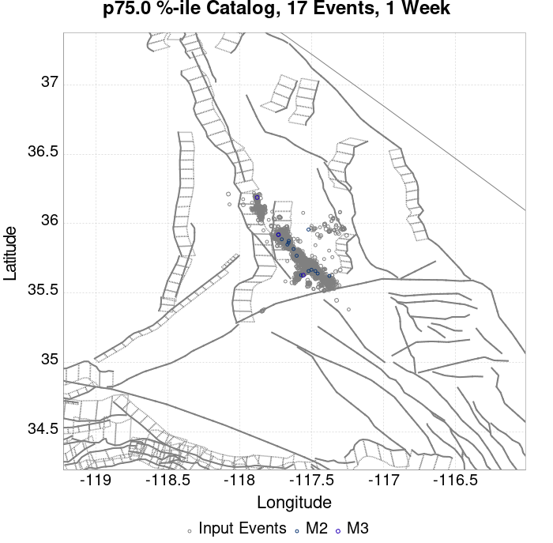
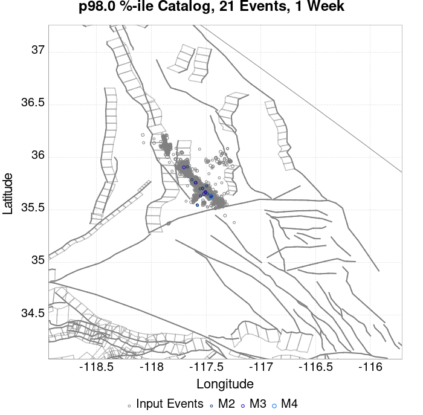
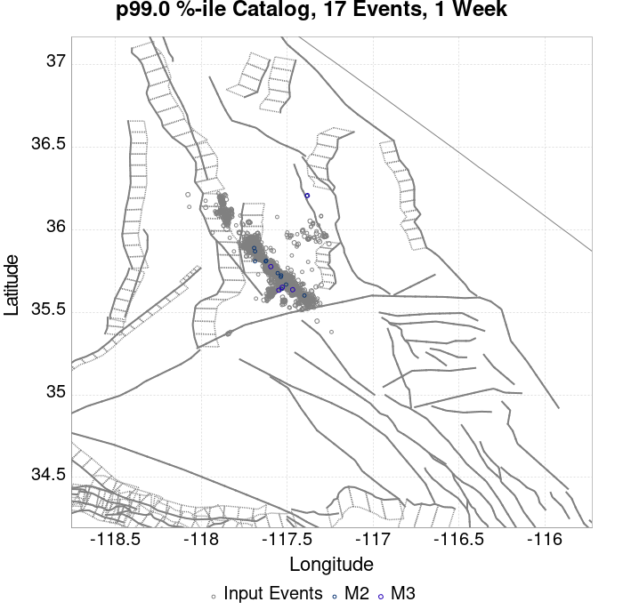
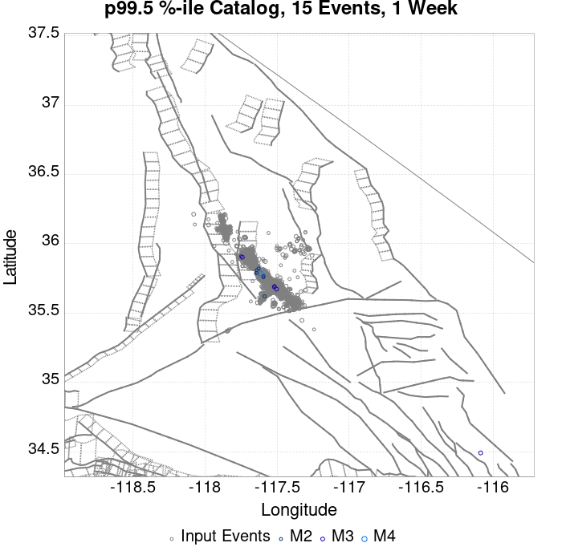
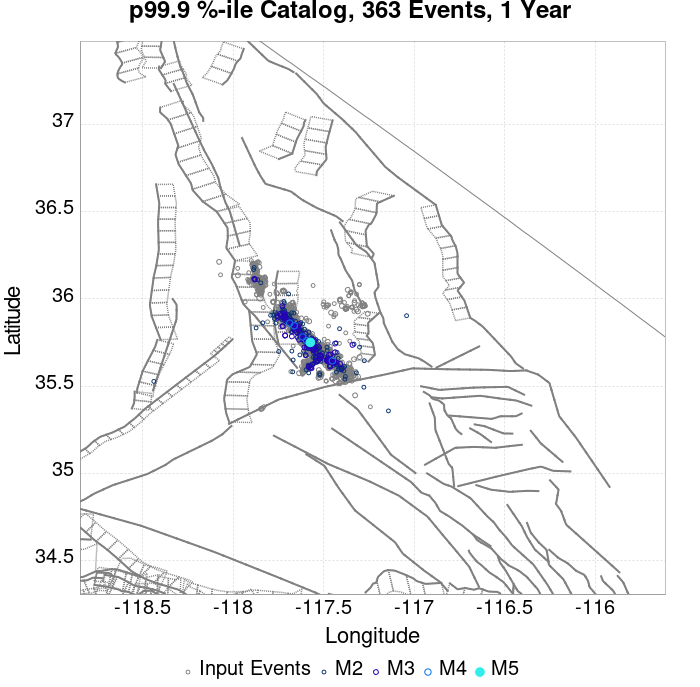
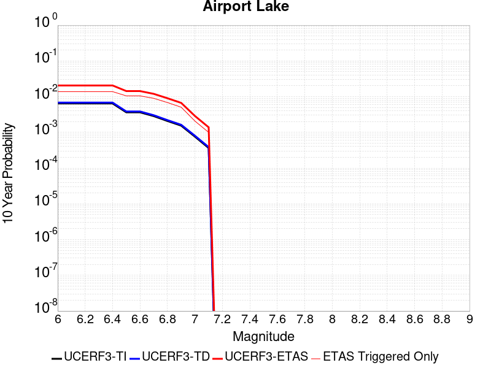

# ComCat M7.1 (ci38457511), 122 Days After, ShakeMap Surfaces Results

|   | ComCat M7.1 (ci38457511), 122 Days After, ShakeMap Surfaces |
|-----|-----|
| Num Simulations | 87772 (incomplete) |
| Start Time | 2019/11/05 03:05:42 UTC |
| Start Time Epoch Milliseconds | 1572923142971 |
| Duration | 10 Years |
| Includes Spontaneous? | false |
| Trigger Ruptures | 2373 Trigger Ruptures |
|   | First: M3.98 at 2019/07/04 17:02:55 UTC |
|   | Last: M2.52 at 2019/11/05 02:13:21 UTC |
|   | Largest: M7.1 at 2019/07/06 03:19:53 UTC |
| Trigger Ruptures | *(none)* |
| Config Generated With | u3etas_comcat_event_config_builder.sh --event-id ci38457511 --num-simulations 100000 --days-before 7 --end-now --mag-complete 3.5 --finite-surf-shakemap --finite-surf-shakemap-min-mag 5 --hpc-site USC_HPC --nodes 36 --hours 24 --queue scec |

## Table Of Contents

* [Probabilities Summary Table](#probabilities-summary-table)
* [Magnitude Number Distribution](#magnitude-number-distribution)
  * [10 Year Magnitude Number Distribution](#10-year-magnitude-number-distribution)
  * [1 Year Magnitude Number Distribution](#1-year-magnitude-number-distribution)
  * [1 Month Magnitude Number Distribution](#1-month-magnitude-number-distribution)
  * [1 Week Magnitude Number Distribution](#1-week-magnitude-number-distribution)
  * [1 Day Magnitude Number Distribution](#1-day-magnitude-number-distribution)
  * [1 Hour Magnitude Number Distribution](#1-hour-magnitude-number-distribution)
* [Hazard Change Over Time](#hazard-change-over-time)
  * [M&ge;5.0 Hazard Change Over Time](#m50-hazard-change-over-time)
  * [M&ge;6.0 Hazard Change Over Time](#m60-hazard-change-over-time)
  * [M&ge;7.0 Hazard Change Over Time](#m70-hazard-change-over-time)
  * [M&ge;8.0 Hazard Change Over Time](#m80-hazard-change-over-time)
* [Trigger Rupture Fault Map](#trigger-rupture-fault-map)
* [Trigger Rupture Depth Map](#trigger-rupture-depth-map)
* [Fault Distances To Triggers](#fault-distances-to-triggers)
* [Individual Simulated Catalog Maps](#individual-simulated-catalog-maps)
* [ComCat Data Comparisons](#comcat-data-comparisons)
* [Section Participation](#section-participation)
  * [Section Participation Plots](#section-participation-plots)
  * [Supra-Seismogenic Parent Sections Table](#supra-seismogenic-parent-sections-table)
  * [M≥6.5 Parent Sections Table](#m65-parent-sections-table)
  * [M≥7 Parent Sections Table](#m7-parent-sections-table)
  * [M≥7.5 Parent Sections Table](#m75-parent-sections-table)
  * [M≥8 Parent Sections Table](#m8-parent-sections-table)
  * [Fault Magnitude-Probability Distributions](#fault-magnitude-probability-distributions)
* [Gridded Nucleation](#gridded-nucleation)
* [JSON Input File](#json-input-file)

## Probabilities Summary Table
*[(top)](#table-of-contents)*

| Magnitude | 1 Hour Prob | 1 Day Prob | 1 Week Prob | 1 Month Prob | 1 Year Prob | 10 Year Prob |
|-----|-----|-----|-----|-----|-----|-----|
| **M&ge;4** | 2.64E-3 (0.26%) | 0.060 (5.95%) | 0.349 (34.89%) | 0.817 (81.74%) | 1.000 (100.00%) | 1.000 (100.00%) |
| **M&ge;4.5** | 7.63E-4 (0.08%) | 0.019 (1.92%) | 0.129 (12.94%) | 0.428 (42.79%) | 0.970 (97.03%) | 1.000 (99.98%) |
| **M&ge;5** | 3.19E-4 (0.03%) | 6.45E-3 (0.64%) | 0.044 (4.40%) | 0.166 (16.60%) | 0.688 (68.82%) | 0.941 (94.12%) |
| **M&ge;5.5** | 5.70E-5 (0.01%) | 1.78E-3 (0.18%) | 0.013 (1.28%) | 0.054 (5.44%) | 0.311 (31.10%) | 0.605 (60.48%) |
| **M&ge;6** | 0.000 (0.00%) | 4.67E-4 (0.05%) | 3.70E-3 (0.37%) | 0.016 (1.60%) | 0.101 (10.14%) | 0.238 (23.79%) |
| **M&ge;6.5** | 0.000 (0.00%) | 7.98E-5 (0.01%) | 8.66E-4 (0.09%) | 3.60E-3 (0.36%) | 0.024 (2.39%) | 0.060 (5.98%) |
| **M&ge;7** | 0.000 (0.00%) | 2.28E-5 (0.00%) | 2.62E-4 (0.03%) | 1.21E-3 (0.12%) | 8.08E-3 (0.81%) | 0.021 (2.12%) |
| **M&ge;7.1** | 0.000 (0.00%) | 1.14E-5 (0.00%) | 2.05E-4 (0.02%) | 9.91E-4 (0.10%) | 6.95E-3 (0.69%) | 0.018 (1.82%) |
| **M&ge;7.5** | 0.000 (0.00%) | 0.000 (0.00%) | 3.42E-5 (0.00%) | 3.19E-4 (0.03%) | 2.43E-3 (0.24%) | 6.37E-3 (0.64%) |
| **M&ge;8** | 0.000 (0.00%) | 0.000 (0.00%) | 0.000 (0.00%) | 0.000 (0.00%) | 4.56E-5 (0.00%) | 1.25E-4 (0.01%) |

## Magnitude Number Distribution
*[(top)](#table-of-contents)*

### 10 Year Magnitude Number Distribution
*[(top)](#table-of-contents)*

**Legend**
* **Mean** (thick black line): mean expected number across all 87772 catalogs
* **2.5%,97.5%** (thin black lines): expected number percentiles across all 87772 catalogs
* **Median** (thin blue line): median expected number across all 87772 catalogs
* **Mode** (thin cyan line): modal expected number across all 87772 catalogs
* **10 yr Probability** (thin red line): 10 year probability calculated as the fraction of catalogs with at least 1 occurrence
* **10 yr Supraseismogenic Probability** (thin dashed red line): same as above, but only for supraseismogenic ruptures on explicitly modeled UCERF3 faults
* **95% Conf** (light red shaded region): binomial 95% confidence bounds on probability
* **Primary** (thin green line): mean expected number from primary triggered aftershocks only (no secondary, tertiary, etc...) across all 87772 catalogs


| Mag | Mean | 2.5 %ile | 97.5 %ile | Median | Mode | 10 yr Probability | 10 yr Supra-Seis Prob | Primary Aftershocks Mean |
|-----|-----|-----|-----|-----|-----|-----|-----|-----|
| **M&ge;2.5** | 1460.505 | 875.000 | 4164.000 | 1136.000 | 990.000 | 1.000 (100.00%) | 0.095 (9.47%) | 648.006 |
| **M&ge;2.6** | 1160.078 | 691.000 | 3302.000 | 903.000 | 779.000 | 1.000 (100.00%) | 0.095 (9.47%) | 514.705 |
| **M&ge;2.7** | 921.440 | 545.000 | 2632.000 | 718.000 | 637.000 | 1.000 (100.00%) | 0.095 (9.47%) | 408.839 |
| **M&ge;2.8** | 731.917 | 430.000 | 2091.000 | 570.000 | 494.000 | 1.000 (100.00%) | 0.095 (9.47%) | 324.720 |
| **M&ge;2.9** | 581.300 | 338.000 | 1659.000 | 454.000 | 414.000 | 1.000 (100.00%) | 0.095 (9.47%) | 257.925 |
| **M&ge;3** | 461.714 | 266.000 | 1320.000 | 361.000 | 323.000 | 1.000 (100.00%) | 0.095 (9.47%) | 204.893 |
| **M&ge;3.1** | 366.693 | 208.000 | 1050.000 | 287.000 | 263.000 | 1.000 (100.00%) | 0.095 (9.47%) | 162.729 |
| **M&ge;3.2** | 291.260 | 163.000 | 835.000 | 228.000 | 205.000 | 1.000 (100.00%) | 0.095 (9.47%) | 129.253 |
| **M&ge;3.3** | 231.323 | 127.000 | 663.000 | 181.000 | 165.000 | 1.000 (100.00%) | 0.095 (9.47%) | 102.649 |
| **M&ge;3.4** | 183.703 | 99.000 | 528.000 | 144.000 | 128.000 | 1.000 (100.00%) | 0.095 (9.47%) | 81.510 |
| **M&ge;3.5** | 145.908 | 76.000 | 419.000 | 115.000 | 106.000 | 1.000 (100.00%) | 0.095 (9.47%) | 64.737 |
| **M&ge;3.6** | 115.854 | 59.000 | 334.000 | 91.000 | 82.000 | 1.000 (100.00%) | 0.095 (9.47%) | 51.400 |
| **M&ge;3.7** | 92.005 | 45.000 | 265.000 | 73.000 | 68.000 | 1.000 (100.00%) | 0.095 (9.47%) | 40.819 |
| **M&ge;3.8** | 73.069 | 35.000 | 212.000 | 58.000 | 53.000 | 1.000 (100.00%) | 0.095 (9.47%) | 32.420 |
| **M&ge;3.9** | 58.024 | 26.000 | 168.000 | 46.000 | 40.000 | 1.000 (100.00%) | 0.095 (9.47%) | 25.752 |
| **M&ge;4** | 46.054 | 20.000 | 134.000 | 36.000 | 32.000 | 1.000 (100.00%) | 0.095 (9.47%) | 20.430 |
| **M&ge;4.1** | 36.552 | 15.000 | 107.000 | 29.000 | 26.000 | 1.000 (100.00%) | 0.095 (9.47%) | 16.219 |
| **M&ge;4.2** | 29.017 | 11.000 | 86.000 | 23.000 | 20.000 | 1.000 (100.00%) | 0.095 (9.47%) | 12.874 |
| **M&ge;4.3** | 23.028 | 8.000 | 69.000 | 18.000 | 16.000 | 1.000 (100.00%) | 0.095 (9.47%) | 10.214 |
| **M&ge;4.4** | 18.279 | 6.000 | 55.000 | 14.000 | 12.000 | 1.000 (100.00%) | 0.095 (9.47%) | 8.108 |
| **M&ge;4.5** | 14.480 | 4.000 | 45.000 | 11.000 | 10.000 | 1.000 (99.98%) | 0.095 (9.47%) | 6.423 |
| **M&ge;4.6** | 11.474 | 3.000 | 36.000 | 9.000 | 7.000 | 0.999 (99.88%) | 0.095 (9.47%) | 5.092 |
| **M&ge;4.7** | 9.093 | 2.000 | 29.000 | 7.000 | 5.000 | 0.996 (99.57%) | 0.095 (9.47%) | 4.039 |
| **M&ge;4.8** | 7.196 | 1.000 | 23.000 | 6.000 | 4.000 | 0.988 (98.78%) | 0.095 (9.47%) | 3.197 |
| **M&ge;4.9** | 5.685 | 0.000 | 19.000 | 4.000 | 3.000 | 0.970 (97.03%) | 0.095 (9.47%) | 2.528 |
| **M&ge;5** | 4.491 | 0.000 | 15.000 | 3.000 | 2.000 | 0.941 (94.12%) | 0.095 (9.47%) | 1.995 |
| **M&ge;5.1** | 3.541 | 0.000 | 13.000 | 3.000 | 2.000 | 0.897 (89.73%) | 0.095 (9.47%) | 1.575 |
| **M&ge;5.2** | 2.791 | 0.000 | 10.000 | 2.000 | 1.000 | 0.839 (83.93%) | 0.095 (9.47%) | 1.243 |
| **M&ge;5.3** | 2.192 | 0.000 | 9.000 | 1.000 | 1.000 | 0.769 (76.93%) | 0.095 (9.47%) | 0.977 |
| **M&ge;5.4** | 1.716 | 0.000 | 7.000 | 1.000 | 0.000 | 0.689 (68.91%) | 0.095 (9.47%) | 0.766 |
| **M&ge;5.5** | 1.338 | 0.000 | 6.000 | 1.000 | 0.000 | 0.605 (60.48%) | 0.095 (9.47%) | 0.596 |
| **M&ge;5.6** | 1.037 | 0.000 | 5.000 | 1.000 | 0.000 | 0.521 (52.06%) | 0.095 (9.47%) | 0.463 |
| **M&ge;5.7** | 0.798 | 0.000 | 4.000 | 0.000 | 0.000 | 0.439 (43.89%) | 0.095 (9.47%) | 0.356 |
| **M&ge;5.8** | 0.607 | 0.000 | 4.000 | 0.000 | 0.000 | 0.363 (36.32%) | 0.095 (9.47%) | 0.273 |
| **M&ge;5.9** | 0.456 | 0.000 | 3.000 | 0.000 | 0.000 | 0.294 (29.42%) | 0.095 (9.46%) | 0.205 |
| **M&ge;6** | 0.351 | 0.000 | 2.000 | 0.000 | 0.000 | 0.238 (23.79%) | 0.095 (9.46%) | 0.156 |
| **M&ge;6.1** | 0.256 | 0.000 | 2.000 | 0.000 | 0.000 | 0.184 (18.42%) | 0.081 (8.14%) | 0.116 |
| **M&ge;6.2** | 0.170 | 0.000 | 2.000 | 0.000 | 0.000 | 0.130 (12.97%) | 0.064 (6.40%) | 0.078 |
| **M&ge;6.3** | 0.125 | 0.000 | 1.000 | 0.000 | 0.000 | 0.099 (9.92%) | 0.053 (5.29%) | 0.058 |
| **M&ge;6.4** | 0.095 | 0.000 | 1.000 | 0.000 | 0.000 | 0.076 (7.63%) | 0.046 (4.58%) | 0.042 |
| **M&ge;6.5** | 0.073 | 0.000 | 1.000 | 0.000 | 0.000 | 0.060 (5.98%) | 0.039 (3.93%) | 0.033 |
| **M&ge;6.6** | 0.058 | 0.000 | 1.000 | 0.000 | 0.000 | 0.050 (5.03%) | 0.036 (3.58%) | 0.028 |
| **M&ge;6.7** | 0.047 | 0.000 | 1.000 | 0.000 | 0.000 | 0.041 (4.10%) | 0.031 (3.09%) | 0.022 |
| **M&ge;6.8** | 0.037 | 0.000 | 1.000 | 0.000 | 0.000 | 0.034 (3.38%) | 0.027 (2.69%) | 0.018 |
| **M&ge;6.9** | 0.029 | 0.000 | 1.000 | 0.000 | 0.000 | 0.027 (2.72%) | 0.023 (2.26%) | 0.015 |
| **M&ge;7** | 0.022 | 0.000 | 0.000 | 0.000 | 0.000 | 0.021 (2.12%) | 0.019 (1.86%) | 0.011 |
| **M&ge;7.1** | 0.019 | 0.000 | 0.000 | 0.000 | 0.000 | 0.018 (1.82%) | 0.017 (1.66%) | 9.66E-3 |
| **M&ge;7.2** | 0.014 | 0.000 | 0.000 | 0.000 | 0.000 | 0.014 (1.38%) | 0.013 (1.29%) | 7.26E-3 |
| **M&ge;7.3** | 9.80E-3 | 0.000 | 0.000 | 0.000 | 0.000 | 9.58E-3 (0.96%) | 9.14E-3 (0.91%) | 4.97E-3 |
| **M&ge;7.4** | 8.44E-3 | 0.000 | 0.000 | 0.000 | 0.000 | 8.27E-3 (0.83%) | 8.08E-3 (0.81%) | 4.27E-3 |
| **M&ge;7.5** | 6.48E-3 | 0.000 | 0.000 | 0.000 | 0.000 | 6.37E-3 (0.64%) | 6.31E-3 (0.63%) | 3.32E-3 |
| **M&ge;7.6** | 3.47E-3 | 0.000 | 0.000 | 0.000 | 0.000 | 3.38E-3 (0.34%) | 3.37E-3 (0.34%) | 1.73E-3 |
| **M&ge;7.7** | 1.22E-3 | 0.000 | 0.000 | 0.000 | 0.000 | 1.18E-3 (0.12%) | 1.18E-3 (0.12%) | 6.72E-4 |
| **M&ge;7.8** | 7.52E-4 | 0.000 | 0.000 | 0.000 | 0.000 | 7.52E-4 (0.08%) | 7.52E-4 (0.08%) | 3.99E-4 |
| **M&ge;7.9** | 4.33E-4 | 0.000 | 0.000 | 0.000 | 0.000 | 4.33E-4 (0.04%) | 4.33E-4 (0.04%) | 2.62E-4 |
| **M&ge;8** | 1.25E-4 | 0.000 | 0.000 | 0.000 | 0.000 | 1.25E-4 (0.01%) | 1.25E-4 (0.01%) | 3.42E-5 |
| **M&ge;8.1** | 2.28E-5 | 0.000 | 0.000 | 0.000 | 0.000 | 2.28E-5 (0.00%) | 2.28E-5 (0.00%) | 0.000 |
| **M&ge;8.2** | 0.000 | 0.000 | 0.000 | 0.000 | 0.000 | 0.000 (0.00%) | 0.000 (0.00%) | 0.000 |
| **M&ge;8.3** | 0.000 | 0.000 | 0.000 | 0.000 | 0.000 | 0.000 (0.00%) | 0.000 (0.00%) | 0.000 |
| **M&ge;8.4** | 0.000 | 0.000 | 0.000 | 0.000 | 0.000 | 0.000 (0.00%) | 0.000 (0.00%) | 0.000 |
| **M&ge;8.5** | 0.000 | 0.000 | 0.000 | 0.000 | 0.000 | 0.000 (0.00%) | 0.000 (0.00%) | 0.000 |
| **M&ge;8.6** | 0.000 | 0.000 | 0.000 | 0.000 | 0.000 | 0.000 (0.00%) | 0.000 (0.00%) | 0.000 |
| **M&ge;8.7** | 0.000 | 0.000 | 0.000 | 0.000 | 0.000 | 0.000 (0.00%) | 0.000 (0.00%) | 0.000 |
| **M&ge;8.8** | 0.000 | 0.000 | 0.000 | 0.000 | 0.000 | 0.000 (0.00%) | 0.000 (0.00%) | 0.000 |
| **M&ge;8.9** | 0.000 | 0.000 | 0.000 | 0.000 | 0.000 | 0.000 (0.00%) | 0.000 (0.00%) | 0.000 |
| **M&ge;9** | 0.000 | 0.000 | 0.000 | 0.000 | 0.000 | 0.000 (0.00%) | 0.000 (0.00%) | 0.000 |

### 1 Year Magnitude Number Distribution
*[(top)](#table-of-contents)*

**Legend**
* **Mean** (thick black line): mean expected number across all 87772 catalogs
* **2.5%,97.5%** (thin black lines): expected number percentiles across all 87772 catalogs
* **Median** (thin blue line): median expected number across all 87772 catalogs
* **Mode** (thin cyan line): modal expected number across all 87772 catalogs
* **1 yr Probability** (thin red line): 1 year probability calculated as the fraction of catalogs with at least 1 occurrence
* **1 yr Supraseismogenic Probability** (thin dashed red line): same as above, but only for supraseismogenic ruptures on explicitly modeled UCERF3 faults
* **95% Conf** (light red shaded region): binomial 95% confidence bounds on probability
* **Primary** (thin green line): mean expected number from primary triggered aftershocks only (no secondary, tertiary, etc...) across all 87772 catalogs


| Mag | Mean | 2.5 %ile | 97.5 %ile | Median | Mode | 1 yr Probability | 1 yr Supra-Seis Prob | Primary Aftershocks Mean |
|-----|-----|-----|-----|-----|-----|-----|-----|-----|
| **M&ge;2.5** | 543.134 | 331.000 | 1278.000 | 426.000 | 386.000 | 1.000 (100.00%) | 0.038 (3.80%) | 281.687 |
| **M&ge;2.6** | 431.391 | 260.000 | 1017.000 | 339.000 | 314.000 | 1.000 (100.00%) | 0.038 (3.80%) | 223.739 |
| **M&ge;2.7** | 342.624 | 204.000 | 810.000 | 270.000 | 246.000 | 1.000 (100.00%) | 0.038 (3.80%) | 177.702 |
| **M&ge;2.8** | 272.182 | 159.000 | 643.000 | 215.000 | 196.000 | 1.000 (100.00%) | 0.038 (3.80%) | 141.156 |
| **M&ge;2.9** | 216.158 | 124.000 | 511.000 | 171.000 | 158.000 | 1.000 (100.00%) | 0.038 (3.80%) | 112.110 |
| **M&ge;3** | 171.726 | 97.000 | 406.000 | 136.000 | 124.000 | 1.000 (100.00%) | 0.038 (3.80%) | 89.082 |
| **M&ge;3.1** | 136.395 | 75.000 | 324.000 | 108.000 | 99.000 | 1.000 (100.00%) | 0.038 (3.80%) | 70.764 |
| **M&ge;3.2** | 108.349 | 58.000 | 257.000 | 86.000 | 80.000 | 1.000 (100.00%) | 0.038 (3.80%) | 56.211 |
| **M&ge;3.3** | 86.054 | 44.000 | 205.000 | 69.000 | 61.000 | 1.000 (100.00%) | 0.038 (3.80%) | 44.642 |
| **M&ge;3.4** | 68.342 | 34.000 | 164.000 | 54.000 | 50.000 | 1.000 (100.00%) | 0.038 (3.80%) | 35.456 |
| **M&ge;3.5** | 54.292 | 26.000 | 131.000 | 43.000 | 38.000 | 1.000 (100.00%) | 0.038 (3.80%) | 28.161 |
| **M&ge;3.6** | 43.111 | 19.000 | 105.000 | 34.000 | 30.000 | 1.000 (100.00%) | 0.038 (3.80%) | 22.362 |
| **M&ge;3.7** | 34.228 | 14.000 | 84.000 | 27.000 | 24.000 | 1.000 (100.00%) | 0.038 (3.80%) | 17.754 |
| **M&ge;3.8** | 27.171 | 11.000 | 67.000 | 22.000 | 20.000 | 1.000 (100.00%) | 0.038 (3.80%) | 14.100 |
| **M&ge;3.9** | 21.588 | 8.000 | 54.000 | 17.000 | 15.000 | 1.000 (100.00%) | 0.038 (3.80%) | 11.200 |
| **M&ge;4** | 17.130 | 5.000 | 44.000 | 14.000 | 12.000 | 1.000 (100.00%) | 0.038 (3.80%) | 8.881 |
| **M&ge;4.1** | 13.590 | 4.000 | 35.000 | 11.000 | 9.000 | 1.000 (99.99%) | 0.038 (3.80%) | 7.044 |
| **M&ge;4.2** | 10.796 | 2.000 | 29.000 | 9.000 | 7.000 | 0.999 (99.88%) | 0.038 (3.80%) | 5.597 |
| **M&ge;4.3** | 8.562 | 2.000 | 23.000 | 7.000 | 5.000 | 0.995 (99.53%) | 0.038 (3.80%) | 4.438 |
| **M&ge;4.4** | 6.800 | 1.000 | 19.000 | 5.000 | 4.000 | 0.987 (98.74%) | 0.038 (3.80%) | 3.523 |
| **M&ge;4.5** | 5.387 | 0.000 | 16.000 | 4.000 | 3.000 | 0.970 (97.03%) | 0.038 (3.80%) | 2.791 |
| **M&ge;4.6** | 4.267 | 0.000 | 13.000 | 3.000 | 2.000 | 0.941 (94.07%) | 0.038 (3.80%) | 2.212 |
| **M&ge;4.7** | 3.381 | 0.000 | 11.000 | 2.000 | 2.000 | 0.897 (89.65%) | 0.038 (3.80%) | 1.753 |
| **M&ge;4.8** | 2.674 | 0.000 | 9.000 | 2.000 | 1.000 | 0.838 (83.79%) | 0.038 (3.80%) | 1.385 |
| **M&ge;4.9** | 2.112 | 0.000 | 8.000 | 1.000 | 1.000 | 0.767 (76.66%) | 0.038 (3.80%) | 1.094 |
| **M&ge;5** | 1.670 | 0.000 | 7.000 | 1.000 | 0.000 | 0.688 (68.82%) | 0.038 (3.80%) | 0.864 |
| **M&ge;5.1** | 1.316 | 0.000 | 6.000 | 1.000 | 0.000 | 0.607 (60.72%) | 0.038 (3.80%) | 0.681 |
| **M&ge;5.2** | 1.036 | 0.000 | 5.000 | 1.000 | 0.000 | 0.525 (52.54%) | 0.038 (3.80%) | 0.536 |
| **M&ge;5.3** | 0.813 | 0.000 | 4.000 | 0.000 | 0.000 | 0.449 (44.87%) | 0.038 (3.80%) | 0.422 |
| **M&ge;5.4** | 0.638 | 0.000 | 3.000 | 0.000 | 0.000 | 0.376 (37.62%) | 0.038 (3.80%) | 0.331 |
| **M&ge;5.5** | 0.496 | 0.000 | 3.000 | 0.000 | 0.000 | 0.311 (31.10%) | 0.038 (3.80%) | 0.257 |
| **M&ge;5.6** | 0.385 | 0.000 | 2.000 | 0.000 | 0.000 | 0.255 (25.50%) | 0.038 (3.80%) | 0.201 |
| **M&ge;5.7** | 0.295 | 0.000 | 2.000 | 0.000 | 0.000 | 0.206 (20.57%) | 0.038 (3.80%) | 0.154 |
| **M&ge;5.8** | 0.225 | 0.000 | 2.000 | 0.000 | 0.000 | 0.164 (16.40%) | 0.038 (3.80%) | 0.118 |
| **M&ge;5.9** | 0.170 | 0.000 | 2.000 | 0.000 | 0.000 | 0.128 (12.83%) | 0.038 (3.80%) | 0.089 |
| **M&ge;6** | 0.131 | 0.000 | 1.000 | 0.000 | 0.000 | 0.101 (10.14%) | 0.038 (3.80%) | 0.068 |
| **M&ge;6.1** | 0.096 | 0.000 | 1.000 | 0.000 | 0.000 | 0.077 (7.65%) | 0.033 (3.28%) | 0.050 |
| **M&ge;6.2** | 0.064 | 0.000 | 1.000 | 0.000 | 0.000 | 0.053 (5.31%) | 0.026 (2.57%) | 0.034 |
| **M&ge;6.3** | 0.047 | 0.000 | 1.000 | 0.000 | 0.000 | 0.040 (3.99%) | 0.021 (2.12%) | 0.025 |
| **M&ge;6.4** | 0.036 | 0.000 | 1.000 | 0.000 | 0.000 | 0.031 (3.05%) | 0.018 (1.82%) | 0.019 |
| **M&ge;6.5** | 0.028 | 0.000 | 0.000 | 0.000 | 0.000 | 0.024 (2.39%) | 0.016 (1.56%) | 0.015 |
| **M&ge;6.6** | 0.022 | 0.000 | 0.000 | 0.000 | 0.000 | 0.020 (2.01%) | 0.014 (1.43%) | 0.012 |
| **M&ge;6.7** | 0.018 | 0.000 | 0.000 | 0.000 | 0.000 | 0.016 (1.63%) | 0.012 (1.24%) | 0.010 |
| **M&ge;6.8** | 0.015 | 0.000 | 0.000 | 0.000 | 0.000 | 0.013 (1.34%) | 0.011 (1.08%) | 8.31E-3 |
| **M&ge;6.9** | 0.011 | 0.000 | 0.000 | 0.000 | 0.000 | 0.011 (1.07%) | 9.02E-3 (0.90%) | 6.52E-3 |
| **M&ge;7** | 8.35E-3 | 0.000 | 0.000 | 0.000 | 0.000 | 8.08E-3 (0.81%) | 7.21E-3 (0.72%) | 4.86E-3 |
| **M&ge;7.1** | 7.11E-3 | 0.000 | 0.000 | 0.000 | 0.000 | 6.95E-3 (0.69%) | 6.46E-3 (0.65%) | 4.11E-3 |
| **M&ge;7.2** | 5.51E-3 | 0.000 | 0.000 | 0.000 | 0.000 | 5.38E-3 (0.54%) | 5.09E-3 (0.51%) | 3.17E-3 |
| **M&ge;7.3** | 3.82E-3 | 0.000 | 0.000 | 0.000 | 0.000 | 3.73E-3 (0.37%) | 3.58E-3 (0.36%) | 2.14E-3 |
| **M&ge;7.4** | 3.21E-3 | 0.000 | 0.000 | 0.000 | 0.000 | 3.16E-3 (0.32%) | 3.08E-3 (0.31%) | 1.80E-3 |
| **M&ge;7.5** | 2.46E-3 | 0.000 | 0.000 | 0.000 | 0.000 | 2.43E-3 (0.24%) | 2.40E-3 (0.24%) | 1.41E-3 |
| **M&ge;7.6** | 1.36E-3 | 0.000 | 0.000 | 0.000 | 0.000 | 1.32E-3 (0.13%) | 1.32E-3 (0.13%) | 7.75E-4 |
| **M&ge;7.7** | 3.99E-4 | 0.000 | 0.000 | 0.000 | 0.000 | 3.99E-4 (0.04%) | 3.99E-4 (0.04%) | 2.51E-4 |
| **M&ge;7.8** | 2.39E-4 | 0.000 | 0.000 | 0.000 | 0.000 | 2.39E-4 (0.02%) | 2.39E-4 (0.02%) | 1.48E-4 |
| **M&ge;7.9** | 1.48E-4 | 0.000 | 0.000 | 0.000 | 0.000 | 1.48E-4 (0.01%) | 1.48E-4 (0.01%) | 1.03E-4 |
| **M&ge;8** | 4.56E-5 | 0.000 | 0.000 | 0.000 | 0.000 | 4.56E-5 (0.00%) | 4.56E-5 (0.00%) | 1.14E-5 |
| **M&ge;8.1** | 1.14E-5 | 0.000 | 0.000 | 0.000 | 0.000 | 1.14E-5 (0.00%) | 1.14E-5 (0.00%) | 0.000 |
| **M&ge;8.2** | 0.000 | 0.000 | 0.000 | 0.000 | 0.000 | 0.000 (0.00%) | 0.000 (0.00%) | 0.000 |
| **M&ge;8.3** | 0.000 | 0.000 | 0.000 | 0.000 | 0.000 | 0.000 (0.00%) | 0.000 (0.00%) | 0.000 |
| **M&ge;8.4** | 0.000 | 0.000 | 0.000 | 0.000 | 0.000 | 0.000 (0.00%) | 0.000 (0.00%) | 0.000 |
| **M&ge;8.5** | 0.000 | 0.000 | 0.000 | 0.000 | 0.000 | 0.000 (0.00%) | 0.000 (0.00%) | 0.000 |
| **M&ge;8.6** | 0.000 | 0.000 | 0.000 | 0.000 | 0.000 | 0.000 (0.00%) | 0.000 (0.00%) | 0.000 |
| **M&ge;8.7** | 0.000 | 0.000 | 0.000 | 0.000 | 0.000 | 0.000 (0.00%) | 0.000 (0.00%) | 0.000 |
| **M&ge;8.8** | 0.000 | 0.000 | 0.000 | 0.000 | 0.000 | 0.000 (0.00%) | 0.000 (0.00%) | 0.000 |
| **M&ge;8.9** | 0.000 | 0.000 | 0.000 | 0.000 | 0.000 | 0.000 (0.00%) | 0.000 (0.00%) | 0.000 |
| **M&ge;9** | 0.000 | 0.000 | 0.000 | 0.000 | 0.000 | 0.000 (0.00%) | 0.000 (0.00%) | 0.000 |

### 1 Month Magnitude Number Distribution
*[(top)](#table-of-contents)*

**Legend**
* **Mean** (thick black line): mean expected number across all 87772 catalogs
* **2.5%,97.5%** (thin black lines): expected number percentiles across all 87772 catalogs
* **Median** (thin blue line): median expected number across all 87772 catalogs
* **Mode** (thin cyan line): modal expected number across all 87772 catalogs
* **1 mo Probability** (thin red line): 1 month probability calculated as the fraction of catalogs with at least 1 occurrence
* **1 mo Supraseismogenic Probability** (thin dashed red line): same as above, but only for supraseismogenic ruptures on explicitly modeled UCERF3 faults
* **95% Conf** (light red shaded region): binomial 95% confidence bounds on probability
* **Primary** (thin green line): mean expected number from primary triggered aftershocks only (no secondary, tertiary, etc...) across all 87772 catalogs


| Mag | Mean | 2.5 %ile | 97.5 %ile | Median | Mode | 1 mo Probability | 1 mo Supra-Seis Prob | Primary Aftershocks Mean |
|-----|-----|-----|-----|-----|-----|-----|-----|-----|
| **M&ge;2.5** | 75.957 | 40.000 | 176.000 | 61.000 | 57.000 | 1.000 (100.00%) | 5.76E-3 (0.58%) | 47.240 |
| **M&ge;2.6** | 60.326 | 31.000 | 140.000 | 48.000 | 44.000 | 1.000 (100.00%) | 5.76E-3 (0.58%) | 37.516 |
| **M&ge;2.7** | 47.899 | 23.000 | 112.000 | 38.000 | 35.000 | 1.000 (100.00%) | 5.76E-3 (0.58%) | 29.783 |
| **M&ge;2.8** | 38.042 | 18.000 | 90.000 | 30.000 | 27.000 | 1.000 (100.00%) | 5.76E-3 (0.58%) | 23.651 |
| **M&ge;2.9** | 30.215 | 13.000 | 71.000 | 24.000 | 23.000 | 1.000 (100.00%) | 5.76E-3 (0.58%) | 18.783 |
| **M&ge;3** | 24.002 | 9.000 | 57.000 | 19.000 | 18.000 | 1.000 (100.00%) | 5.76E-3 (0.58%) | 14.924 |
| **M&ge;3.1** | 19.068 | 7.000 | 46.000 | 15.000 | 14.000 | 1.000 (100.00%) | 5.76E-3 (0.58%) | 11.853 |
| **M&ge;3.2** | 15.146 | 5.000 | 37.000 | 12.000 | 11.000 | 1.000 (100.00%) | 5.76E-3 (0.58%) | 9.415 |
| **M&ge;3.3** | 12.031 | 3.000 | 30.000 | 10.000 | 8.000 | 1.000 (99.97%) | 5.76E-3 (0.58%) | 7.480 |
| **M&ge;3.4** | 9.552 | 2.000 | 24.000 | 8.000 | 7.000 | 0.999 (99.85%) | 5.76E-3 (0.58%) | 5.938 |
| **M&ge;3.5** | 7.589 | 1.000 | 20.000 | 6.000 | 5.000 | 0.995 (99.46%) | 5.76E-3 (0.58%) | 4.719 |
| **M&ge;3.6** | 6.023 | 1.000 | 16.000 | 5.000 | 4.000 | 0.984 (98.41%) | 5.76E-3 (0.58%) | 3.747 |
| **M&ge;3.7** | 4.781 | 0.000 | 13.000 | 4.000 | 3.000 | 0.964 (96.35%) | 5.76E-3 (0.58%) | 2.975 |
| **M&ge;3.8** | 3.800 | 0.000 | 11.000 | 3.000 | 2.000 | 0.930 (92.99%) | 5.76E-3 (0.58%) | 2.367 |
| **M&ge;3.9** | 3.017 | 0.000 | 9.000 | 2.000 | 2.000 | 0.880 (88.02%) | 5.76E-3 (0.58%) | 1.880 |
| **M&ge;4** | 2.394 | 0.000 | 8.000 | 2.000 | 1.000 | 0.817 (81.74%) | 5.76E-3 (0.58%) | 1.490 |
| **M&ge;4.1** | 1.898 | 0.000 | 7.000 | 1.000 | 1.000 | 0.743 (74.30%) | 5.76E-3 (0.58%) | 1.181 |
| **M&ge;4.2** | 1.510 | 0.000 | 6.000 | 1.000 | 0.000 | 0.664 (66.41%) | 5.76E-3 (0.58%) | 0.939 |
| **M&ge;4.3** | 1.198 | 0.000 | 5.000 | 1.000 | 0.000 | 0.582 (58.21%) | 5.76E-3 (0.58%) | 0.745 |
| **M&ge;4.4** | 0.951 | 0.000 | 4.000 | 1.000 | 0.000 | 0.503 (50.32%) | 5.76E-3 (0.58%) | 0.592 |
| **M&ge;4.5** | 0.753 | 0.000 | 4.000 | 0.000 | 0.000 | 0.428 (42.79%) | 5.76E-3 (0.58%) | 0.469 |
| **M&ge;4.6** | 0.597 | 0.000 | 3.000 | 0.000 | 0.000 | 0.360 (36.02%) | 5.76E-3 (0.58%) | 0.371 |
| **M&ge;4.7** | 0.474 | 0.000 | 3.000 | 0.000 | 0.000 | 0.302 (30.18%) | 5.76E-3 (0.58%) | 0.295 |
| **M&ge;4.8** | 0.375 | 0.000 | 2.000 | 0.000 | 0.000 | 0.249 (24.93%) | 5.76E-3 (0.58%) | 0.234 |
| **M&ge;4.9** | 0.294 | 0.000 | 2.000 | 0.000 | 0.000 | 0.203 (20.26%) | 5.76E-3 (0.58%) | 0.183 |
| **M&ge;5** | 0.234 | 0.000 | 2.000 | 0.000 | 0.000 | 0.166 (16.60%) | 5.76E-3 (0.58%) | 0.145 |
| **M&ge;5.1** | 0.184 | 0.000 | 2.000 | 0.000 | 0.000 | 0.134 (13.42%) | 5.76E-3 (0.58%) | 0.114 |
| **M&ge;5.2** | 0.144 | 0.000 | 1.000 | 0.000 | 0.000 | 0.108 (10.81%) | 5.76E-3 (0.58%) | 0.089 |
| **M&ge;5.3** | 0.113 | 0.000 | 1.000 | 0.000 | 0.000 | 0.087 (8.70%) | 5.76E-3 (0.58%) | 0.070 |
| **M&ge;5.4** | 0.088 | 0.000 | 1.000 | 0.000 | 0.000 | 0.069 (6.92%) | 5.76E-3 (0.58%) | 0.055 |
| **M&ge;5.5** | 0.068 | 0.000 | 1.000 | 0.000 | 0.000 | 0.054 (5.44%) | 5.76E-3 (0.58%) | 0.042 |
| **M&ge;5.6** | 0.053 | 0.000 | 1.000 | 0.000 | 0.000 | 0.043 (4.31%) | 5.76E-3 (0.58%) | 0.033 |
| **M&ge;5.7** | 0.041 | 0.000 | 1.000 | 0.000 | 0.000 | 0.034 (3.36%) | 5.76E-3 (0.58%) | 0.025 |
| **M&ge;5.8** | 0.031 | 0.000 | 1.000 | 0.000 | 0.000 | 0.026 (2.64%) | 5.76E-3 (0.58%) | 0.020 |
| **M&ge;5.9** | 0.024 | 0.000 | 0.000 | 0.000 | 0.000 | 0.020 (2.03%) | 5.75E-3 (0.58%) | 0.015 |
| **M&ge;6** | 0.018 | 0.000 | 0.000 | 0.000 | 0.000 | 0.016 (1.60%) | 5.74E-3 (0.57%) | 0.011 |
| **M&ge;6.1** | 0.013 | 0.000 | 0.000 | 0.000 | 0.000 | 0.012 (1.17%) | 4.90E-3 (0.49%) | 8.35E-3 |
| **M&ge;6.2** | 8.99E-3 | 0.000 | 0.000 | 0.000 | 0.000 | 8.09E-3 (0.81%) | 3.90E-3 (0.39%) | 5.58E-3 |
| **M&ge;6.3** | 6.80E-3 | 0.000 | 0.000 | 0.000 | 0.000 | 6.21E-3 (0.62%) | 3.26E-3 (0.33%) | 4.37E-3 |
| **M&ge;6.4** | 4.98E-3 | 0.000 | 0.000 | 0.000 | 0.000 | 4.53E-3 (0.45%) | 2.76E-3 (0.28%) | 3.03E-3 |
| **M&ge;6.5** | 3.91E-3 | 0.000 | 0.000 | 0.000 | 0.000 | 3.60E-3 (0.36%) | 2.34E-3 (0.23%) | 2.46E-3 |
| **M&ge;6.6** | 3.02E-3 | 0.000 | 0.000 | 0.000 | 0.000 | 2.87E-3 (0.29%) | 2.07E-3 (0.21%) | 1.98E-3 |
| **M&ge;6.7** | 2.44E-3 | 0.000 | 0.000 | 0.000 | 0.000 | 2.31E-3 (0.23%) | 1.79E-3 (0.18%) | 1.54E-3 |
| **M&ge;6.8** | 1.95E-3 | 0.000 | 0.000 | 0.000 | 0.000 | 1.86E-3 (0.19%) | 1.53E-3 (0.15%) | 1.26E-3 |
| **M&ge;6.9** | 1.53E-3 | 0.000 | 0.000 | 0.000 | 0.000 | 1.48E-3 (0.15%) | 1.26E-3 (0.13%) | 1.04E-3 |
| **M&ge;7** | 1.23E-3 | 0.000 | 0.000 | 0.000 | 0.000 | 1.21E-3 (0.12%) | 1.12E-3 (0.11%) | 8.20E-4 |
| **M&ge;7.1** | 9.91E-4 | 0.000 | 0.000 | 0.000 | 0.000 | 9.91E-4 (0.10%) | 9.57E-4 (0.10%) | 6.49E-4 |
| **M&ge;7.2** | 7.41E-4 | 0.000 | 0.000 | 0.000 | 0.000 | 7.41E-4 (0.07%) | 7.29E-4 (0.07%) | 4.67E-4 |
| **M&ge;7.3** | 5.01E-4 | 0.000 | 0.000 | 0.000 | 0.000 | 5.01E-4 (0.05%) | 4.90E-4 (0.05%) | 2.73E-4 |
| **M&ge;7.4** | 3.99E-4 | 0.000 | 0.000 | 0.000 | 0.000 | 3.99E-4 (0.04%) | 3.87E-4 (0.04%) | 2.05E-4 |
| **M&ge;7.5** | 3.19E-4 | 0.000 | 0.000 | 0.000 | 0.000 | 3.19E-4 (0.03%) | 3.19E-4 (0.03%) | 1.71E-4 |
| **M&ge;7.6** | 1.37E-4 | 0.000 | 0.000 | 0.000 | 0.000 | 1.37E-4 (0.01%) | 1.37E-4 (0.01%) | 7.98E-5 |
| **M&ge;7.7** | 4.56E-5 | 0.000 | 0.000 | 0.000 | 0.000 | 4.56E-5 (0.00%) | 4.56E-5 (0.00%) | 3.42E-5 |
| **M&ge;7.8** | 2.28E-5 | 0.000 | 0.000 | 0.000 | 0.000 | 2.28E-5 (0.00%) | 2.28E-5 (0.00%) | 1.14E-5 |
| **M&ge;7.9** | 1.14E-5 | 0.000 | 0.000 | 0.000 | 0.000 | 1.14E-5 (0.00%) | 1.14E-5 (0.00%) | 1.14E-5 |
| **M&ge;8** | 0.000 | 0.000 | 0.000 | 0.000 | 0.000 | 0.000 (0.00%) | 0.000 (0.00%) | 0.000 |
| **M&ge;8.1** | 0.000 | 0.000 | 0.000 | 0.000 | 0.000 | 0.000 (0.00%) | 0.000 (0.00%) | 0.000 |
| **M&ge;8.2** | 0.000 | 0.000 | 0.000 | 0.000 | 0.000 | 0.000 (0.00%) | 0.000 (0.00%) | 0.000 |
| **M&ge;8.3** | 0.000 | 0.000 | 0.000 | 0.000 | 0.000 | 0.000 (0.00%) | 0.000 (0.00%) | 0.000 |
| **M&ge;8.4** | 0.000 | 0.000 | 0.000 | 0.000 | 0.000 | 0.000 (0.00%) | 0.000 (0.00%) | 0.000 |
| **M&ge;8.5** | 0.000 | 0.000 | 0.000 | 0.000 | 0.000 | 0.000 (0.00%) | 0.000 (0.00%) | 0.000 |
| **M&ge;8.6** | 0.000 | 0.000 | 0.000 | 0.000 | 0.000 | 0.000 (0.00%) | 0.000 (0.00%) | 0.000 |
| **M&ge;8.7** | 0.000 | 0.000 | 0.000 | 0.000 | 0.000 | 0.000 (0.00%) | 0.000 (0.00%) | 0.000 |
| **M&ge;8.8** | 0.000 | 0.000 | 0.000 | 0.000 | 0.000 | 0.000 (0.00%) | 0.000 (0.00%) | 0.000 |
| **M&ge;8.9** | 0.000 | 0.000 | 0.000 | 0.000 | 0.000 | 0.000 (0.00%) | 0.000 (0.00%) | 0.000 |
| **M&ge;9** | 0.000 | 0.000 | 0.000 | 0.000 | 0.000 | 0.000 (0.00%) | 0.000 (0.00%) | 0.000 |

### 1 Week Magnitude Number Distribution
*[(top)](#table-of-contents)*

**Legend**
* **Mean** (thick black line): mean expected number across all 87772 catalogs
* **2.5%,97.5%** (thin black lines): expected number percentiles across all 87772 catalogs
* **Median** (thin blue line): median expected number across all 87772 catalogs
* **Mode** (thin cyan line): modal expected number across all 87772 catalogs
* **1 wk Probability** (thin red line): 1 week probability calculated as the fraction of catalogs with at least 1 occurrence
* **1 wk Supraseismogenic Probability** (thin dashed red line): same as above, but only for supraseismogenic ruptures on explicitly modeled UCERF3 faults
* **95% Conf** (light red shaded region): binomial 95% confidence bounds on probability
* **Primary** (thin green line): mean expected number from primary triggered aftershocks only (no secondary, tertiary, etc...) across all 87772 catalogs


| Mag | Mean | 2.5 %ile | 97.5 %ile | Median | Mode | 1 wk Probability | 1 wk Supra-Seis Prob | Primary Aftershocks Mean |
|-----|-----|-----|-----|-----|-----|-----|-----|-----|
| **M&ge;2.5** | 17.647 | 6.000 | 38.000 | 14.000 | 13.000 | 1.000 (100.00%) | 1.32E-3 (0.13%) | 12.204 |
| **M&ge;2.6** | 14.009 | 4.000 | 31.000 | 11.000 | 10.000 | 1.000 (100.00%) | 1.32E-3 (0.13%) | 9.687 |
| **M&ge;2.7** | 11.121 | 3.000 | 25.000 | 9.000 | 8.000 | 1.000 (99.96%) | 1.32E-3 (0.13%) | 7.686 |
| **M&ge;2.8** | 8.833 | 2.000 | 20.000 | 7.000 | 6.000 | 0.998 (99.79%) | 1.32E-3 (0.13%) | 6.105 |
| **M&ge;2.9** | 7.010 | 1.000 | 17.000 | 6.000 | 5.000 | 0.993 (99.28%) | 1.32E-3 (0.13%) | 4.844 |
| **M&ge;3** | 5.566 | 1.000 | 14.000 | 4.000 | 4.000 | 0.981 (98.08%) | 1.32E-3 (0.13%) | 3.845 |
| **M&ge;3.1** | 4.420 | 0.000 | 12.000 | 3.000 | 3.000 | 0.958 (95.77%) | 1.32E-3 (0.13%) | 3.054 |
| **M&ge;3.2** | 3.510 | 0.000 | 10.000 | 3.000 | 2.000 | 0.922 (92.24%) | 1.32E-3 (0.13%) | 2.423 |
| **M&ge;3.3** | 2.787 | 0.000 | 8.000 | 2.000 | 1.000 | 0.870 (87.03%) | 1.32E-3 (0.13%) | 1.925 |
| **M&ge;3.4** | 2.216 | 0.000 | 7.000 | 2.000 | 1.000 | 0.805 (80.50%) | 1.32E-3 (0.13%) | 1.530 |
| **M&ge;3.5** | 1.760 | 0.000 | 6.000 | 1.000 | 1.000 | 0.730 (72.96%) | 1.32E-3 (0.13%) | 1.216 |
| **M&ge;3.6** | 1.396 | 0.000 | 5.000 | 1.000 | 0.000 | 0.649 (64.86%) | 1.32E-3 (0.13%) | 0.965 |
| **M&ge;3.7** | 1.108 | 0.000 | 4.000 | 1.000 | 0.000 | 0.565 (56.51%) | 1.32E-3 (0.13%) | 0.767 |
| **M&ge;3.8** | 0.879 | 0.000 | 4.000 | 0.000 | 0.000 | 0.487 (48.67%) | 1.32E-3 (0.13%) | 0.610 |
| **M&ge;3.9** | 0.697 | 0.000 | 3.000 | 0.000 | 0.000 | 0.414 (41.37%) | 1.32E-3 (0.13%) | 0.483 |
| **M&ge;4** | 0.555 | 0.000 | 3.000 | 0.000 | 0.000 | 0.349 (34.89%) | 1.32E-3 (0.13%) | 0.384 |
| **M&ge;4.1** | 0.439 | 0.000 | 2.000 | 0.000 | 0.000 | 0.289 (28.93%) | 1.32E-3 (0.13%) | 0.303 |
| **M&ge;4.2** | 0.349 | 0.000 | 2.000 | 0.000 | 0.000 | 0.239 (23.88%) | 1.32E-3 (0.13%) | 0.241 |
| **M&ge;4.3** | 0.278 | 0.000 | 2.000 | 0.000 | 0.000 | 0.196 (19.63%) | 1.32E-3 (0.13%) | 0.192 |
| **M&ge;4.4** | 0.220 | 0.000 | 2.000 | 0.000 | 0.000 | 0.160 (16.01%) | 1.32E-3 (0.13%) | 0.152 |
| **M&ge;4.5** | 0.174 | 0.000 | 1.000 | 0.000 | 0.000 | 0.129 (12.94%) | 1.32E-3 (0.13%) | 0.120 |
| **M&ge;4.6** | 0.139 | 0.000 | 1.000 | 0.000 | 0.000 | 0.106 (10.56%) | 1.32E-3 (0.13%) | 0.096 |
| **M&ge;4.7** | 0.110 | 0.000 | 1.000 | 0.000 | 0.000 | 0.086 (8.56%) | 1.32E-3 (0.13%) | 0.076 |
| **M&ge;4.8** | 0.087 | 0.000 | 1.000 | 0.000 | 0.000 | 0.068 (6.82%) | 1.32E-3 (0.13%) | 0.060 |
| **M&ge;4.9** | 0.068 | 0.000 | 1.000 | 0.000 | 0.000 | 0.054 (5.41%) | 1.32E-3 (0.13%) | 0.047 |
| **M&ge;5** | 0.054 | 0.000 | 1.000 | 0.000 | 0.000 | 0.044 (4.40%) | 1.32E-3 (0.13%) | 0.038 |
| **M&ge;5.1** | 0.042 | 0.000 | 1.000 | 0.000 | 0.000 | 0.035 (3.47%) | 1.32E-3 (0.13%) | 0.029 |
| **M&ge;5.2** | 0.033 | 0.000 | 1.000 | 0.000 | 0.000 | 0.027 (2.72%) | 1.32E-3 (0.13%) | 0.023 |
| **M&ge;5.3** | 0.026 | 0.000 | 0.000 | 0.000 | 0.000 | 0.021 (2.13%) | 1.32E-3 (0.13%) | 0.018 |
| **M&ge;5.4** | 0.020 | 0.000 | 0.000 | 0.000 | 0.000 | 0.017 (1.68%) | 1.32E-3 (0.13%) | 0.014 |
| **M&ge;5.5** | 0.015 | 0.000 | 0.000 | 0.000 | 0.000 | 0.013 (1.28%) | 1.32E-3 (0.13%) | 0.010 |
| **M&ge;5.6** | 0.012 | 0.000 | 0.000 | 0.000 | 0.000 | 0.010 (1.02%) | 1.32E-3 (0.13%) | 8.05E-3 |
| **M&ge;5.7** | 9.00E-3 | 0.000 | 0.000 | 0.000 | 0.000 | 7.75E-3 (0.77%) | 1.32E-3 (0.13%) | 6.15E-3 |
| **M&ge;5.8** | 6.93E-3 | 0.000 | 0.000 | 0.000 | 0.000 | 6.10E-3 (0.61%) | 1.32E-3 (0.13%) | 4.79E-3 |
| **M&ge;5.9** | 5.18E-3 | 0.000 | 0.000 | 0.000 | 0.000 | 4.60E-3 (0.46%) | 1.31E-3 (0.13%) | 3.58E-3 |
| **M&ge;6** | 4.06E-3 | 0.000 | 0.000 | 0.000 | 0.000 | 3.70E-3 (0.37%) | 1.31E-3 (0.13%) | 2.75E-3 |
| **M&ge;6.1** | 2.75E-3 | 0.000 | 0.000 | 0.000 | 0.000 | 2.55E-3 (0.26%) | 1.15E-3 (0.12%) | 1.83E-3 |
| **M&ge;6.2** | 1.88E-3 | 0.000 | 0.000 | 0.000 | 0.000 | 1.77E-3 (0.18%) | 9.23E-4 (0.09%) | 1.23E-3 |
| **M&ge;6.3** | 1.41E-3 | 0.000 | 0.000 | 0.000 | 0.000 | 1.37E-3 (0.14%) | 7.52E-4 (0.08%) | 9.57E-4 |
| **M&ge;6.4** | 1.09E-3 | 0.000 | 0.000 | 0.000 | 0.000 | 1.06E-3 (0.11%) | 6.49E-4 (0.06%) | 7.06E-4 |
| **M&ge;6.5** | 8.89E-4 | 0.000 | 0.000 | 0.000 | 0.000 | 8.66E-4 (0.09%) | 5.81E-4 (0.06%) | 5.81E-4 |
| **M&ge;6.6** | 6.49E-4 | 0.000 | 0.000 | 0.000 | 0.000 | 6.38E-4 (0.06%) | 4.90E-4 (0.05%) | 4.22E-4 |
| **M&ge;6.7** | 5.24E-4 | 0.000 | 0.000 | 0.000 | 0.000 | 5.13E-4 (0.05%) | 4.10E-4 (0.04%) | 3.53E-4 |
| **M&ge;6.8** | 4.33E-4 | 0.000 | 0.000 | 0.000 | 0.000 | 4.22E-4 (0.04%) | 3.53E-4 (0.04%) | 2.85E-4 |
| **M&ge;6.9** | 2.96E-4 | 0.000 | 0.000 | 0.000 | 0.000 | 2.96E-4 (0.03%) | 2.73E-4 (0.03%) | 2.16E-4 |
| **M&ge;7** | 2.62E-4 | 0.000 | 0.000 | 0.000 | 0.000 | 2.62E-4 (0.03%) | 2.51E-4 (0.03%) | 1.82E-4 |
| **M&ge;7.1** | 2.05E-4 | 0.000 | 0.000 | 0.000 | 0.000 | 2.05E-4 (0.02%) | 2.05E-4 (0.02%) | 1.37E-4 |
| **M&ge;7.2** | 1.60E-4 | 0.000 | 0.000 | 0.000 | 0.000 | 1.60E-4 (0.02%) | 1.60E-4 (0.02%) | 1.03E-4 |
| **M&ge;7.3** | 6.84E-5 | 0.000 | 0.000 | 0.000 | 0.000 | 6.84E-5 (0.01%) | 6.84E-5 (0.01%) | 3.42E-5 |
| **M&ge;7.4** | 6.84E-5 | 0.000 | 0.000 | 0.000 | 0.000 | 6.84E-5 (0.01%) | 6.84E-5 (0.01%) | 3.42E-5 |
| **M&ge;7.5** | 3.42E-5 | 0.000 | 0.000 | 0.000 | 0.000 | 3.42E-5 (0.00%) | 3.42E-5 (0.00%) | 2.28E-5 |
| **M&ge;7.6** | 2.28E-5 | 0.000 | 0.000 | 0.000 | 0.000 | 2.28E-5 (0.00%) | 2.28E-5 (0.00%) | 1.14E-5 |
| **M&ge;7.7** | 0.000 | 0.000 | 0.000 | 0.000 | 0.000 | 0.000 (0.00%) | 0.000 (0.00%) | 0.000 |
| **M&ge;7.8** | 0.000 | 0.000 | 0.000 | 0.000 | 0.000 | 0.000 (0.00%) | 0.000 (0.00%) | 0.000 |
| **M&ge;7.9** | 0.000 | 0.000 | 0.000 | 0.000 | 0.000 | 0.000 (0.00%) | 0.000 (0.00%) | 0.000 |
| **M&ge;8** | 0.000 | 0.000 | 0.000 | 0.000 | 0.000 | 0.000 (0.00%) | 0.000 (0.00%) | 0.000 |
| **M&ge;8.1** | 0.000 | 0.000 | 0.000 | 0.000 | 0.000 | 0.000 (0.00%) | 0.000 (0.00%) | 0.000 |
| **M&ge;8.2** | 0.000 | 0.000 | 0.000 | 0.000 | 0.000 | 0.000 (0.00%) | 0.000 (0.00%) | 0.000 |
| **M&ge;8.3** | 0.000 | 0.000 | 0.000 | 0.000 | 0.000 | 0.000 (0.00%) | 0.000 (0.00%) | 0.000 |
| **M&ge;8.4** | 0.000 | 0.000 | 0.000 | 0.000 | 0.000 | 0.000 (0.00%) | 0.000 (0.00%) | 0.000 |
| **M&ge;8.5** | 0.000 | 0.000 | 0.000 | 0.000 | 0.000 | 0.000 (0.00%) | 0.000 (0.00%) | 0.000 |
| **M&ge;8.6** | 0.000 | 0.000 | 0.000 | 0.000 | 0.000 | 0.000 (0.00%) | 0.000 (0.00%) | 0.000 |
| **M&ge;8.7** | 0.000 | 0.000 | 0.000 | 0.000 | 0.000 | 0.000 (0.00%) | 0.000 (0.00%) | 0.000 |
| **M&ge;8.8** | 0.000 | 0.000 | 0.000 | 0.000 | 0.000 | 0.000 (0.00%) | 0.000 (0.00%) | 0.000 |
| **M&ge;8.9** | 0.000 | 0.000 | 0.000 | 0.000 | 0.000 | 0.000 (0.00%) | 0.000 (0.00%) | 0.000 |
| **M&ge;9** | 0.000 | 0.000 | 0.000 | 0.000 | 0.000 | 0.000 (0.00%) | 0.000 (0.00%) | 0.000 |

### 1 Day Magnitude Number Distribution
*[(top)](#table-of-contents)*

**Legend**
* **Mean** (thick black line): mean expected number across all 87772 catalogs
* **2.5%,97.5%** (thin black lines): expected number percentiles across all 87772 catalogs
* **Median** (thin blue line): median expected number across all 87772 catalogs
* **Mode** (thin cyan line): modal expected number across all 87772 catalogs
* **1 d Probability** (thin red line): 1 day probability calculated as the fraction of catalogs with at least 1 occurrence
* **1 d Supraseismogenic Probability** (thin dashed red line): same as above, but only for supraseismogenic ruptures on explicitly modeled UCERF3 faults
* **95% Conf** (light red shaded region): binomial 95% confidence bounds on probability
* **Primary** (thin green line): mean expected number from primary triggered aftershocks only (no secondary, tertiary, etc...) across all 87772 catalogs


| Mag | Mean | 2.5 %ile | 97.5 %ile | Median | Mode | 1 d Probability | 1 d Supra-Seis Prob | Primary Aftershocks Mean |
|-----|-----|-----|-----|-----|-----|-----|-----|-----|
| **M&ge;2.5** | 2.310 | 0.000 | 7.000 | 2.000 | 1.000 | 0.838 (83.82%) | 2.05E-4 (0.02%) | 1.821 |
| **M&ge;2.6** | 1.832 | 0.000 | 6.000 | 1.000 | 1.000 | 0.768 (76.76%) | 2.05E-4 (0.02%) | 1.444 |
| **M&ge;2.7** | 1.454 | 0.000 | 5.000 | 1.000 | 1.000 | 0.687 (68.66%) | 2.05E-4 (0.02%) | 1.147 |
| **M&ge;2.8** | 1.155 | 0.000 | 4.000 | 1.000 | 0.000 | 0.604 (60.40%) | 2.05E-4 (0.02%) | 0.911 |
| **M&ge;2.9** | 0.914 | 0.000 | 4.000 | 1.000 | 0.000 | 0.521 (52.11%) | 2.05E-4 (0.02%) | 0.720 |
| **M&ge;3** | 0.728 | 0.000 | 3.000 | 0.000 | 0.000 | 0.445 (44.47%) | 2.05E-4 (0.02%) | 0.573 |
| **M&ge;3.1** | 0.578 | 0.000 | 3.000 | 0.000 | 0.000 | 0.375 (37.47%) | 2.05E-4 (0.02%) | 0.454 |
| **M&ge;3.2** | 0.458 | 0.000 | 2.000 | 0.000 | 0.000 | 0.313 (31.28%) | 2.05E-4 (0.02%) | 0.360 |
| **M&ge;3.3** | 0.364 | 0.000 | 2.000 | 0.000 | 0.000 | 0.259 (25.89%) | 2.05E-4 (0.02%) | 0.287 |
| **M&ge;3.4** | 0.288 | 0.000 | 2.000 | 0.000 | 0.000 | 0.211 (21.12%) | 2.05E-4 (0.02%) | 0.226 |
| **M&ge;3.5** | 0.229 | 0.000 | 2.000 | 0.000 | 0.000 | 0.173 (17.28%) | 2.05E-4 (0.02%) | 0.180 |
| **M&ge;3.6** | 0.182 | 0.000 | 1.000 | 0.000 | 0.000 | 0.141 (14.12%) | 2.05E-4 (0.02%) | 0.143 |
| **M&ge;3.7** | 0.144 | 0.000 | 1.000 | 0.000 | 0.000 | 0.114 (11.38%) | 2.05E-4 (0.02%) | 0.113 |
| **M&ge;3.8** | 0.114 | 0.000 | 1.000 | 0.000 | 0.000 | 0.092 (9.18%) | 2.05E-4 (0.02%) | 0.090 |
| **M&ge;3.9** | 0.090 | 0.000 | 1.000 | 0.000 | 0.000 | 0.074 (7.35%) | 2.05E-4 (0.02%) | 0.070 |
| **M&ge;4** | 0.072 | 0.000 | 1.000 | 0.000 | 0.000 | 0.060 (5.95%) | 2.05E-4 (0.02%) | 0.056 |
| **M&ge;4.1** | 0.057 | 0.000 | 1.000 | 0.000 | 0.000 | 0.047 (4.74%) | 2.05E-4 (0.02%) | 0.045 |
| **M&ge;4.2** | 0.045 | 0.000 | 1.000 | 0.000 | 0.000 | 0.038 (3.79%) | 2.05E-4 (0.02%) | 0.035 |
| **M&ge;4.3** | 0.036 | 0.000 | 1.000 | 0.000 | 0.000 | 0.030 (3.03%) | 2.05E-4 (0.02%) | 0.028 |
| **M&ge;4.4** | 0.028 | 0.000 | 0.000 | 0.000 | 0.000 | 0.024 (2.43%) | 2.05E-4 (0.02%) | 0.022 |
| **M&ge;4.5** | 0.022 | 0.000 | 0.000 | 0.000 | 0.000 | 0.019 (1.92%) | 2.05E-4 (0.02%) | 0.017 |
| **M&ge;4.6** | 0.018 | 0.000 | 0.000 | 0.000 | 0.000 | 0.016 (1.55%) | 2.05E-4 (0.02%) | 0.014 |
| **M&ge;4.7** | 0.014 | 0.000 | 0.000 | 0.000 | 0.000 | 0.013 (1.26%) | 2.05E-4 (0.02%) | 0.011 |
| **M&ge;4.8** | 0.011 | 0.000 | 0.000 | 0.000 | 0.000 | 0.010 (1.01%) | 2.05E-4 (0.02%) | 9.05E-3 |
| **M&ge;4.9** | 8.98E-3 | 0.000 | 0.000 | 0.000 | 0.000 | 7.99E-3 (0.80%) | 2.05E-4 (0.02%) | 7.08E-3 |
| **M&ge;5** | 7.29E-3 | 0.000 | 0.000 | 0.000 | 0.000 | 6.45E-3 (0.64%) | 2.05E-4 (0.02%) | 5.76E-3 |
| **M&ge;5.1** | 5.50E-3 | 0.000 | 0.000 | 0.000 | 0.000 | 4.92E-3 (0.49%) | 2.05E-4 (0.02%) | 4.32E-3 |
| **M&ge;5.2** | 4.33E-3 | 0.000 | 0.000 | 0.000 | 0.000 | 3.87E-3 (0.39%) | 2.05E-4 (0.02%) | 3.42E-3 |
| **M&ge;5.3** | 3.30E-3 | 0.000 | 0.000 | 0.000 | 0.000 | 3.03E-3 (0.30%) | 2.05E-4 (0.02%) | 2.61E-3 |
| **M&ge;5.4** | 2.62E-3 | 0.000 | 0.000 | 0.000 | 0.000 | 2.40E-3 (0.24%) | 2.05E-4 (0.02%) | 2.04E-3 |
| **M&ge;5.5** | 1.93E-3 | 0.000 | 0.000 | 0.000 | 0.000 | 1.78E-3 (0.18%) | 2.05E-4 (0.02%) | 1.46E-3 |
| **M&ge;5.6** | 1.60E-3 | 0.000 | 0.000 | 0.000 | 0.000 | 1.47E-3 (0.15%) | 2.05E-4 (0.02%) | 1.17E-3 |
| **M&ge;5.7** | 1.18E-3 | 0.000 | 0.000 | 0.000 | 0.000 | 1.07E-3 (0.11%) | 2.05E-4 (0.02%) | 8.77E-4 |
| **M&ge;5.8** | 9.23E-4 | 0.000 | 0.000 | 0.000 | 0.000 | 8.43E-4 (0.08%) | 2.05E-4 (0.02%) | 6.84E-4 |
| **M&ge;5.9** | 7.18E-4 | 0.000 | 0.000 | 0.000 | 0.000 | 6.49E-4 (0.06%) | 1.94E-4 (0.02%) | 5.01E-4 |
| **M&ge;6** | 5.13E-4 | 0.000 | 0.000 | 0.000 | 0.000 | 4.67E-4 (0.05%) | 1.94E-4 (0.02%) | 3.30E-4 |
| **M&ge;6.1** | 3.65E-4 | 0.000 | 0.000 | 0.000 | 0.000 | 3.42E-4 (0.03%) | 1.71E-4 (0.02%) | 2.39E-4 |
| **M&ge;6.2** | 2.73E-4 | 0.000 | 0.000 | 0.000 | 0.000 | 2.51E-4 (0.03%) | 1.14E-4 (0.01%) | 1.82E-4 |
| **M&ge;6.3** | 2.16E-4 | 0.000 | 0.000 | 0.000 | 0.000 | 2.05E-4 (0.02%) | 9.11E-5 (0.01%) | 1.60E-4 |
| **M&ge;6.4** | 1.25E-4 | 0.000 | 0.000 | 0.000 | 0.000 | 1.14E-4 (0.01%) | 6.84E-5 (0.01%) | 9.11E-5 |
| **M&ge;6.5** | 9.11E-5 | 0.000 | 0.000 | 0.000 | 0.000 | 7.98E-5 (0.01%) | 4.56E-5 (0.00%) | 6.84E-5 |
| **M&ge;6.6** | 6.84E-5 | 0.000 | 0.000 | 0.000 | 0.000 | 5.70E-5 (0.01%) | 4.56E-5 (0.00%) | 4.56E-5 |
| **M&ge;6.7** | 5.70E-5 | 0.000 | 0.000 | 0.000 | 0.000 | 4.56E-5 (0.00%) | 3.42E-5 (0.00%) | 4.56E-5 |
| **M&ge;6.8** | 5.70E-5 | 0.000 | 0.000 | 0.000 | 0.000 | 4.56E-5 (0.00%) | 3.42E-5 (0.00%) | 4.56E-5 |
| **M&ge;6.9** | 2.28E-5 | 0.000 | 0.000 | 0.000 | 0.000 | 2.28E-5 (0.00%) | 1.14E-5 (0.00%) | 2.28E-5 |
| **M&ge;7** | 2.28E-5 | 0.000 | 0.000 | 0.000 | 0.000 | 2.28E-5 (0.00%) | 1.14E-5 (0.00%) | 2.28E-5 |
| **M&ge;7.1** | 1.14E-5 | 0.000 | 0.000 | 0.000 | 0.000 | 1.14E-5 (0.00%) | 1.14E-5 (0.00%) | 1.14E-5 |
| **M&ge;7.2** | 1.14E-5 | 0.000 | 0.000 | 0.000 | 0.000 | 1.14E-5 (0.00%) | 1.14E-5 (0.00%) | 1.14E-5 |
| **M&ge;7.3** | 1.14E-5 | 0.000 | 0.000 | 0.000 | 0.000 | 1.14E-5 (0.00%) | 1.14E-5 (0.00%) | 1.14E-5 |
| **M&ge;7.4** | 1.14E-5 | 0.000 | 0.000 | 0.000 | 0.000 | 1.14E-5 (0.00%) | 1.14E-5 (0.00%) | 1.14E-5 |
| **M&ge;7.5** | 0.000 | 0.000 | 0.000 | 0.000 | 0.000 | 0.000 (0.00%) | 0.000 (0.00%) | 0.000 |
| **M&ge;7.6** | 0.000 | 0.000 | 0.000 | 0.000 | 0.000 | 0.000 (0.00%) | 0.000 (0.00%) | 0.000 |
| **M&ge;7.7** | 0.000 | 0.000 | 0.000 | 0.000 | 0.000 | 0.000 (0.00%) | 0.000 (0.00%) | 0.000 |
| **M&ge;7.8** | 0.000 | 0.000 | 0.000 | 0.000 | 0.000 | 0.000 (0.00%) | 0.000 (0.00%) | 0.000 |
| **M&ge;7.9** | 0.000 | 0.000 | 0.000 | 0.000 | 0.000 | 0.000 (0.00%) | 0.000 (0.00%) | 0.000 |
| **M&ge;8** | 0.000 | 0.000 | 0.000 | 0.000 | 0.000 | 0.000 (0.00%) | 0.000 (0.00%) | 0.000 |
| **M&ge;8.1** | 0.000 | 0.000 | 0.000 | 0.000 | 0.000 | 0.000 (0.00%) | 0.000 (0.00%) | 0.000 |
| **M&ge;8.2** | 0.000 | 0.000 | 0.000 | 0.000 | 0.000 | 0.000 (0.00%) | 0.000 (0.00%) | 0.000 |
| **M&ge;8.3** | 0.000 | 0.000 | 0.000 | 0.000 | 0.000 | 0.000 (0.00%) | 0.000 (0.00%) | 0.000 |
| **M&ge;8.4** | 0.000 | 0.000 | 0.000 | 0.000 | 0.000 | 0.000 (0.00%) | 0.000 (0.00%) | 0.000 |
| **M&ge;8.5** | 0.000 | 0.000 | 0.000 | 0.000 | 0.000 | 0.000 (0.00%) | 0.000 (0.00%) | 0.000 |
| **M&ge;8.6** | 0.000 | 0.000 | 0.000 | 0.000 | 0.000 | 0.000 (0.00%) | 0.000 (0.00%) | 0.000 |
| **M&ge;8.7** | 0.000 | 0.000 | 0.000 | 0.000 | 0.000 | 0.000 (0.00%) | 0.000 (0.00%) | 0.000 |
| **M&ge;8.8** | 0.000 | 0.000 | 0.000 | 0.000 | 0.000 | 0.000 (0.00%) | 0.000 (0.00%) | 0.000 |
| **M&ge;8.9** | 0.000 | 0.000 | 0.000 | 0.000 | 0.000 | 0.000 (0.00%) | 0.000 (0.00%) | 0.000 |
| **M&ge;9** | 0.000 | 0.000 | 0.000 | 0.000 | 0.000 | 0.000 (0.00%) | 0.000 (0.00%) | 0.000 |

### 1 Hour Magnitude Number Distribution
*[(top)](#table-of-contents)*

**Legend**
* **Mean** (thick black line): mean expected number across all 87772 catalogs
* **2.5%,97.5%** (thin black lines): expected number percentiles across all 87772 catalogs
* **Median** (thin blue line): median expected number across all 87772 catalogs
* **Mode** (thin cyan line): modal expected number across all 87772 catalogs
* **1 hr Probability** (thin red line): 1 hour probability calculated as the fraction of catalogs with at least 1 occurrence
* **1 hr Supraseismogenic Probability** (thin dashed red line): same as above, but only for supraseismogenic ruptures on explicitly modeled UCERF3 faults
* **95% Conf** (light red shaded region): binomial 95% confidence bounds on probability
* **Primary** (thin green line): mean expected number from primary triggered aftershocks only (no secondary, tertiary, etc...) across all 87772 catalogs


| Mag | Mean | 2.5 %ile | 97.5 %ile | Median | Mode | 1 hr Probability | 1 hr Supra-Seis Prob | Primary Aftershocks Mean |
|-----|-----|-----|-----|-----|-----|-----|-----|-----|
| **M&ge;2.5** | 0.085 | 0.000 | 1.000 | 0.000 | 0.000 | 0.077 (7.72%) | 0.000 (0.00%) | 0.080 |
| **M&ge;2.6** | 0.068 | 0.000 | 1.000 | 0.000 | 0.000 | 0.062 (6.24%) | 0.000 (0.00%) | 0.064 |
| **M&ge;2.7** | 0.054 | 0.000 | 1.000 | 0.000 | 0.000 | 0.050 (4.96%) | 0.000 (0.00%) | 0.051 |
| **M&ge;2.8** | 0.043 | 0.000 | 1.000 | 0.000 | 0.000 | 0.040 (4.00%) | 0.000 (0.00%) | 0.040 |
| **M&ge;2.9** | 0.034 | 0.000 | 1.000 | 0.000 | 0.000 | 0.032 (3.22%) | 0.000 (0.00%) | 0.032 |
| **M&ge;3** | 0.027 | 0.000 | 1.000 | 0.000 | 0.000 | 0.026 (2.58%) | 0.000 (0.00%) | 0.026 |
| **M&ge;3.1** | 0.022 | 0.000 | 0.000 | 0.000 | 0.000 | 0.020 (2.04%) | 0.000 (0.00%) | 0.020 |
| **M&ge;3.2** | 0.017 | 0.000 | 0.000 | 0.000 | 0.000 | 0.016 (1.58%) | 0.000 (0.00%) | 0.016 |
| **M&ge;3.3** | 0.013 | 0.000 | 0.000 | 0.000 | 0.000 | 0.013 (1.28%) | 0.000 (0.00%) | 0.013 |
| **M&ge;3.4** | 0.011 | 0.000 | 0.000 | 0.000 | 0.000 | 0.010 (1.04%) | 0.000 (0.00%) | 0.010 |
| **M&ge;3.5** | 8.59E-3 | 0.000 | 0.000 | 0.000 | 0.000 | 8.23E-3 (0.82%) | 0.000 (0.00%) | 8.09E-3 |
| **M&ge;3.6** | 6.86E-3 | 0.000 | 0.000 | 0.000 | 0.000 | 6.57E-3 (0.66%) | 0.000 (0.00%) | 6.45E-3 |
| **M&ge;3.7** | 5.46E-3 | 0.000 | 0.000 | 0.000 | 0.000 | 5.22E-3 (0.52%) | 0.000 (0.00%) | 5.08E-3 |
| **M&ge;3.8** | 4.48E-3 | 0.000 | 0.000 | 0.000 | 0.000 | 4.33E-3 (0.43%) | 0.000 (0.00%) | 4.18E-3 |
| **M&ge;3.9** | 3.46E-3 | 0.000 | 0.000 | 0.000 | 0.000 | 3.36E-3 (0.34%) | 0.000 (0.00%) | 3.21E-3 |
| **M&ge;4** | 2.72E-3 | 0.000 | 0.000 | 0.000 | 0.000 | 2.64E-3 (0.26%) | 0.000 (0.00%) | 2.52E-3 |
| **M&ge;4.1** | 2.14E-3 | 0.000 | 0.000 | 0.000 | 0.000 | 2.07E-3 (0.21%) | 0.000 (0.00%) | 1.98E-3 |
| **M&ge;4.2** | 1.66E-3 | 0.000 | 0.000 | 0.000 | 0.000 | 1.61E-3 (0.16%) | 0.000 (0.00%) | 1.53E-3 |
| **M&ge;4.3** | 1.30E-3 | 0.000 | 0.000 | 0.000 | 0.000 | 1.25E-3 (0.13%) | 0.000 (0.00%) | 1.17E-3 |
| **M&ge;4.4** | 1.03E-3 | 0.000 | 0.000 | 0.000 | 0.000 | 9.80E-4 (0.10%) | 0.000 (0.00%) | 9.23E-4 |
| **M&ge;4.5** | 7.86E-4 | 0.000 | 0.000 | 0.000 | 0.000 | 7.63E-4 (0.08%) | 0.000 (0.00%) | 7.18E-4 |
| **M&ge;4.6** | 6.84E-4 | 0.000 | 0.000 | 0.000 | 0.000 | 6.72E-4 (0.07%) | 0.000 (0.00%) | 6.38E-4 |
| **M&ge;4.7** | 5.81E-4 | 0.000 | 0.000 | 0.000 | 0.000 | 5.70E-4 (0.06%) | 0.000 (0.00%) | 5.47E-4 |
| **M&ge;4.8** | 4.67E-4 | 0.000 | 0.000 | 0.000 | 0.000 | 4.56E-4 (0.05%) | 0.000 (0.00%) | 4.33E-4 |
| **M&ge;4.9** | 3.87E-4 | 0.000 | 0.000 | 0.000 | 0.000 | 3.76E-4 (0.04%) | 0.000 (0.00%) | 3.53E-4 |
| **M&ge;5** | 3.19E-4 | 0.000 | 0.000 | 0.000 | 0.000 | 3.19E-4 (0.03%) | 0.000 (0.00%) | 2.96E-4 |
| **M&ge;5.1** | 1.94E-4 | 0.000 | 0.000 | 0.000 | 0.000 | 1.94E-4 (0.02%) | 0.000 (0.00%) | 1.71E-4 |
| **M&ge;5.2** | 1.25E-4 | 0.000 | 0.000 | 0.000 | 0.000 | 1.25E-4 (0.01%) | 0.000 (0.00%) | 1.14E-4 |
| **M&ge;5.3** | 9.11E-5 | 0.000 | 0.000 | 0.000 | 0.000 | 9.11E-5 (0.01%) | 0.000 (0.00%) | 7.98E-5 |
| **M&ge;5.4** | 6.84E-5 | 0.000 | 0.000 | 0.000 | 0.000 | 6.84E-5 (0.01%) | 0.000 (0.00%) | 6.84E-5 |
| **M&ge;5.5** | 5.70E-5 | 0.000 | 0.000 | 0.000 | 0.000 | 5.70E-5 (0.01%) | 0.000 (0.00%) | 5.70E-5 |
| **M&ge;5.6** | 3.42E-5 | 0.000 | 0.000 | 0.000 | 0.000 | 3.42E-5 (0.00%) | 0.000 (0.00%) | 3.42E-5 |
| **M&ge;5.7** | 0.000 | 0.000 | 0.000 | 0.000 | 0.000 | 0.000 (0.00%) | 0.000 (0.00%) | 0.000 |
| **M&ge;5.8** | 0.000 | 0.000 | 0.000 | 0.000 | 0.000 | 0.000 (0.00%) | 0.000 (0.00%) | 0.000 |
| **M&ge;5.9** | 0.000 | 0.000 | 0.000 | 0.000 | 0.000 | 0.000 (0.00%) | 0.000 (0.00%) | 0.000 |
| **M&ge;6** | 0.000 | 0.000 | 0.000 | 0.000 | 0.000 | 0.000 (0.00%) | 0.000 (0.00%) | 0.000 |
| **M&ge;6.1** | 0.000 | 0.000 | 0.000 | 0.000 | 0.000 | 0.000 (0.00%) | 0.000 (0.00%) | 0.000 |
| **M&ge;6.2** | 0.000 | 0.000 | 0.000 | 0.000 | 0.000 | 0.000 (0.00%) | 0.000 (0.00%) | 0.000 |
| **M&ge;6.3** | 0.000 | 0.000 | 0.000 | 0.000 | 0.000 | 0.000 (0.00%) | 0.000 (0.00%) | 0.000 |
| **M&ge;6.4** | 0.000 | 0.000 | 0.000 | 0.000 | 0.000 | 0.000 (0.00%) | 0.000 (0.00%) | 0.000 |
| **M&ge;6.5** | 0.000 | 0.000 | 0.000 | 0.000 | 0.000 | 0.000 (0.00%) | 0.000 (0.00%) | 0.000 |
| **M&ge;6.6** | 0.000 | 0.000 | 0.000 | 0.000 | 0.000 | 0.000 (0.00%) | 0.000 (0.00%) | 0.000 |
| **M&ge;6.7** | 0.000 | 0.000 | 0.000 | 0.000 | 0.000 | 0.000 (0.00%) | 0.000 (0.00%) | 0.000 |
| **M&ge;6.8** | 0.000 | 0.000 | 0.000 | 0.000 | 0.000 | 0.000 (0.00%) | 0.000 (0.00%) | 0.000 |
| **M&ge;6.9** | 0.000 | 0.000 | 0.000 | 0.000 | 0.000 | 0.000 (0.00%) | 0.000 (0.00%) | 0.000 |
| **M&ge;7** | 0.000 | 0.000 | 0.000 | 0.000 | 0.000 | 0.000 (0.00%) | 0.000 (0.00%) | 0.000 |
| **M&ge;7.1** | 0.000 | 0.000 | 0.000 | 0.000 | 0.000 | 0.000 (0.00%) | 0.000 (0.00%) | 0.000 |
| **M&ge;7.2** | 0.000 | 0.000 | 0.000 | 0.000 | 0.000 | 0.000 (0.00%) | 0.000 (0.00%) | 0.000 |
| **M&ge;7.3** | 0.000 | 0.000 | 0.000 | 0.000 | 0.000 | 0.000 (0.00%) | 0.000 (0.00%) | 0.000 |
| **M&ge;7.4** | 0.000 | 0.000 | 0.000 | 0.000 | 0.000 | 0.000 (0.00%) | 0.000 (0.00%) | 0.000 |
| **M&ge;7.5** | 0.000 | 0.000 | 0.000 | 0.000 | 0.000 | 0.000 (0.00%) | 0.000 (0.00%) | 0.000 |
| **M&ge;7.6** | 0.000 | 0.000 | 0.000 | 0.000 | 0.000 | 0.000 (0.00%) | 0.000 (0.00%) | 0.000 |
| **M&ge;7.7** | 0.000 | 0.000 | 0.000 | 0.000 | 0.000 | 0.000 (0.00%) | 0.000 (0.00%) | 0.000 |
| **M&ge;7.8** | 0.000 | 0.000 | 0.000 | 0.000 | 0.000 | 0.000 (0.00%) | 0.000 (0.00%) | 0.000 |
| **M&ge;7.9** | 0.000 | 0.000 | 0.000 | 0.000 | 0.000 | 0.000 (0.00%) | 0.000 (0.00%) | 0.000 |
| **M&ge;8** | 0.000 | 0.000 | 0.000 | 0.000 | 0.000 | 0.000 (0.00%) | 0.000 (0.00%) | 0.000 |
| **M&ge;8.1** | 0.000 | 0.000 | 0.000 | 0.000 | 0.000 | 0.000 (0.00%) | 0.000 (0.00%) | 0.000 |
| **M&ge;8.2** | 0.000 | 0.000 | 0.000 | 0.000 | 0.000 | 0.000 (0.00%) | 0.000 (0.00%) | 0.000 |
| **M&ge;8.3** | 0.000 | 0.000 | 0.000 | 0.000 | 0.000 | 0.000 (0.00%) | 0.000 (0.00%) | 0.000 |
| **M&ge;8.4** | 0.000 | 0.000 | 0.000 | 0.000 | 0.000 | 0.000 (0.00%) | 0.000 (0.00%) | 0.000 |
| **M&ge;8.5** | 0.000 | 0.000 | 0.000 | 0.000 | 0.000 | 0.000 (0.00%) | 0.000 (0.00%) | 0.000 |
| **M&ge;8.6** | 0.000 | 0.000 | 0.000 | 0.000 | 0.000 | 0.000 (0.00%) | 0.000 (0.00%) | 0.000 |
| **M&ge;8.7** | 0.000 | 0.000 | 0.000 | 0.000 | 0.000 | 0.000 (0.00%) | 0.000 (0.00%) | 0.000 |
| **M&ge;8.8** | 0.000 | 0.000 | 0.000 | 0.000 | 0.000 | 0.000 (0.00%) | 0.000 (0.00%) | 0.000 |
| **M&ge;8.9** | 0.000 | 0.000 | 0.000 | 0.000 | 0.000 | 0.000 (0.00%) | 0.000 (0.00%) | 0.000 |
| **M&ge;9** | 0.000 | 0.000 | 0.000 | 0.000 | 0.000 | 0.000 (0.00%) | 0.000 (0.00%) | 0.000 |


## Hazard Change Over Time
*[(top)](#table-of-contents)*

These plots show how the probability of ruptures of various magnitudes within the region used to fetch ComCat trigger ruptures changes over time

### M&ge;5.0 Hazard Change Over Time
*[(top)](#table-of-contents)*


| Forecast Duration | UCERF3-ETAS [95% Conf] | UCERF3-ETAS Triggered Only | UCERF3-TD | UCERF3-ETAS/TD Gain | UCERF3-TI |
|-----|-----|-----|-----|-----|-----|
| 1 Hour | 3.49E-4 [2.46E-4 - 4.98E-4] | 3.19E-4 | 3.02E-5 | 11.55 | 3.00E-5 |
| 1 Day | 7.11E-3 [6.60E-3 - 7.67E-3] | 6.39E-3 | 7.25E-4 | 9.81 | 7.20E-4 |
| 1 Week | 0.048 [0.047 - 0.050] | 0.043 | 5.07E-3 | 9.51 | 5.03E-3 |
| 1 Month | 0.181 [0.179 - 0.184] | 0.163 | 0.022 | 8.43 | 0.021 |
| 1 Year | 0.756 [0.753 - 0.758] | 0.682 | 0.233 | 3.25 | 0.231 |
| 10 Years | 0.996 [0.996 - 0.996] | 0.938 | 0.929 | 1.07 | 0.928 |
| 30 Years | 1.000 [1.000 - 1.000] \* | \* | 1.000 | 1 \* | 1.000 |
| 100 Years | 1.000 [1.000 - 1.000] \* | \* | 1.000 | 1 \* | 1.000 |

\* *forecast duration is longer than simulation length, only ETAS ruptures from the first 10 years are included*
### M&ge;6.0 Hazard Change Over Time
*[(top)](#table-of-contents)*


| Forecast Duration | UCERF3-ETAS [95% Conf] | UCERF3-ETAS Triggered Only | UCERF3-TD | UCERF3-ETAS/TD Gain | UCERF3-TI |
|-----|-----|-----|-----|-----|-----|
| 1 Hour | 3.50E-6 [3.50E-6 - 5.81E-5] | 0.000 | 3.50E-6 | 1 | 3.28E-6 |
| 1 Day | 5.51E-4 [4.24E-4 - 7.24E-4] | 4.67E-4 | 8.40E-5 | 6.56 | 7.86E-5 |
| 1 Week | 4.24E-3 [3.86E-3 - 4.67E-3] | 3.66E-3 | 5.88E-4 | 7.22 | 5.50E-4 |
| 1 Month | 0.018 [0.017 - 0.019] | 0.016 | 2.52E-3 | 7.22 | 2.36E-3 |
| 1 Year | 0.126 [0.124 - 0.128] | 0.099 | 0.030 | 4.18 | 0.028 |
| 10 Years | 0.435 [0.433 - 0.437] | 0.232 | 0.264 | 1.65 | 0.250 |
| 30 Years | 0.695 [0.694 - 0.697] \* | \* | 0.603 | 1.15 \* | 0.578 |
| 100 Years | 0.966 [0.966 - 0.966] \* | \* | 0.956 | 1.01 \* | 0.943 |

\* *forecast duration is longer than simulation length, only ETAS ruptures from the first 10 years are included*
### M&ge;7.0 Hazard Change Over Time
*[(top)](#table-of-contents)*


| Forecast Duration | UCERF3-ETAS [95% Conf] | UCERF3-ETAS Triggered Only | UCERF3-TD | UCERF3-ETAS/TD Gain | UCERF3-TI |
|-----|-----|-----|-----|-----|-----|
| 1 Hour | 3.60E-7 [3.60E-7 - 5.49E-5] | 0.000 | 3.60E-7 | 1 | 3.22E-7 |
| 1 Day | 3.14E-5 [1.26E-5 - 1.01E-4] | 2.28E-5 | 8.65E-6 | 3.63 | 7.72E-6 |
| 1 Week | 3.23E-4 [2.31E-4 - 4.61E-4] | 2.62E-4 | 6.06E-5 | 5.33 | 5.40E-5 |
| 1 Month | 1.47E-3 [1.25E-3 - 1.73E-3] | 1.21E-3 | 2.60E-4 | 5.65 | 2.31E-4 |
| 1 Year | 0.011 [0.011 - 0.012] | 7.94E-3 | 3.16E-3 | 3.51 | 2.81E-3 |
| 10 Years | 0.051 [0.050 - 0.052] | 0.021 | 0.031 | 1.64 | 0.028 |
| 30 Years | 0.112 [0.111 - 0.113] \* | \* | 0.093 | 1.2 \* | 0.081 |
| 100 Years | 0.309 [0.308 - 0.309] \* | \* | 0.294 | 1.05 \* | 0.246 |

\* *forecast duration is longer than simulation length, only ETAS ruptures from the first 10 years are included*
### M&ge;8.0 Hazard Change Over Time
*[(top)](#table-of-contents)*


| Forecast Duration | UCERF3-ETAS [95% Conf] | UCERF3-ETAS Triggered Only | UCERF3-TD | UCERF3-ETAS/TD Gain | UCERF3-TI |
|-----|-----|-----|-----|-----|-----|
| 1 Hour | 1.24E-8 [1.24E-8 - 5.46E-5] | 0.000 | 1.24E-8 | 1 | 1.07E-8 |
| 1 Day | 2.98E-7 [2.98E-7 - 5.49E-5] | 0.000 | 2.98E-7 | 1 | 2.56E-7 |
| 1 Week | 2.09E-6 [2.09E-6 - 5.67E-5] | 0.000 | 2.09E-6 | 1 | 1.79E-6 |
| 1 Month | 8.95E-6 [8.95E-6 - 6.35E-5] | 0.000 | 8.95E-6 | 1 | 7.67E-6 |
| 1 Year | 1.32E-4 [1.13E-4 - 2.01E-4] | 2.28E-5 | 1.09E-4 | 1.21 | 9.34E-5 |
| 10 Years | 1.19E-3 [1.14E-3 - 1.29E-3] | 9.11E-5 | 1.10E-3 | 1.08 | 9.34E-4 |
| 30 Years | 3.61E-3 [3.56E-3 - 3.71E-3] \* | \* | 3.52E-3 | 1.03 \* | 2.80E-3 |
| 100 Years | 0.014 [0.014 - 0.014] \* | \* | 0.014 | 1.01 \* | 9.30E-3 |

\* *forecast duration is longer than simulation length, only ETAS ruptures from the first 10 years are included*

## Trigger Rupture Fault Map
*[(top)](#table-of-contents)*


## Trigger Rupture Depth Map
*[(top)](#table-of-contents)*


## Fault Distances To Triggers
*[(top)](#table-of-contents)*

| Section Name | Strike, Dip, Rake | # Hypos In Poly | Max Mag w/ Hypo In Poly | # Surfs In Poly | Max Mag w/ Surf In Poly | Min Dist To Any (km) | Min Poly Dist To Any (km) | Min Dist To Largest (km) | Min Poly Dist To Largest (km) | Min Hypo Dist To Largest (km) | Min Hypo Poly Dist To Largest (km) |
|-----|-----|-----|-----|-----|-----|-----|-----|-----|-----|-----|-----|
| Airport Lake | 359, 50, -90 | 1263 | 7.1 | 1263 | 7.1 | 0.036 | 0.000 | 0.036 | 0.000 | 5.612 | 0.000 |
| Little Lake | 327, 90, 180 | 405 | 5.5 | 406 | 7.1 | 2.268 | 0.000 | 11.284 | 0.000 | 13.471 | 1.469 |
| Garlock (Central) | 71, 90, 0 | 194 | 4.73 | 195 | 7.1 | 0.225 | 0.000 | 5.600 | 0.000 | 22.766 | 10.797 |
| So Sierra Nevada | 2, 50, -90 | 126 | 4.62 | 126 | 4.62 | 0.916 | 0.000 | 4.248 | 4.233 | 16.191 | 15.188 |
| Ash Hill | 162, 90, 180 | 30 | 3.57 | 30 | 3.57 | 0.088 | 0.000 | 34.883 | 23.252 | 35.690 | 25.242 |
| Panamint Valley | 334, 90, -150 | 21 | 3.57 | 21 | 3.57 | 6.249 | 0.000 | 29.583 | 17.627 | 34.350 | 22.425 |
| Tank Canyon | 189, 50, -90 | 2 | 3.02 | 2 | 3.02 | 0.751 | 0.000 | 9.015 | 9.011 | 17.039 | 16.895 |
| Blackwater | 323, 90, 180 | 2 | 3.54 | 2 | 3.54 | 5.396 | 0.000 | 14.394 | 8.726 | 29.622 | 27.613 |
| Sierra Nevada  (No Extension) | 344, 50, -90 | 0 |  | 0 |  | 5.696 | 1.331 | 39.627 | 39.626 | 58.680 | 58.391 |
| Owens Valley | 346, 90, 180 | 0 |  | 0 |  | 11.268 | 7.068 | 49.013 | 48.524 | 68.299 | 66.819 |
| Lenwood-Lockhart-Old Woman Springs | 301, 90, 180 | 0 |  | 0 |  | 18.221 | 16.222 | 53.532 | 41.707 | 59.786 | 48.595 |
| Towne Pass | 186, 50, -90 | 0 |  | 0 |  | 18.237 | 18.158 | 52.561 | 52.559 | 59.662 | 59.451 |
| Garlock (West) | 55, 90, 0 | 0 |  | 0 |  | 18.439 | 18.373 | 63.115 | 60.529 | 66.575 | 62.627 |

## Individual Simulated Catalog Maps
*[(top)](#table-of-contents)*

These are map plots of individual catalogs from the simulations, selected as the closest catalog to each of the given percentiles in terms of total number of events.

| Duration | p0.0 %-ile | p25.0 %-ile | p50.0 %-ile | p75.0 %-ile | p90.0 %-ile | p95.0 %-ile | p97.5 %-ile | p98.0 %-ile | p99.0 %-ile | p99.5 %-ile | p99.9 %-ile | p99.998861 %-ile |
|-----|-----|-----|-----|-----|-----|-----|-----|-----|-----|-----|-----|-----|
| **1 Week** |  |  |  |  |  |  |  |  |  |  |  |  |
| **1 Month** |  |  |  |  |  |  |  |  |  |  |  |  |
| **1 Year** |  |  |  |  |  |  |  |  |  |  |  |  |
| **10 Year** |  |  |  |  |  |  |  |  |  |  |  |  |

## ComCat Data Comparisons
*[(top)](#table-of-contents)*

No ComCat events found

## Section Participation
*[(top)](#table-of-contents)*

### Section Participation Plots
*[(top)](#table-of-contents)*

| Min Mag | 1 yr Triggered Ruptures (no spontaneous) | 10 yr Triggered Ruptures (no spontaneous) | 10 yr Triggered Ruptures (primary aftershocks only) |
|-----|-----|-----|-----|
| **All Supra. Seis.** |  |  |  |
| **M&ge;6.5** |  |  |  |
| **M&ge;7** |  |  |  |
| **M&ge;7.5** |  |  |  |
| **M&ge;8** |  |  |  |

### Supra-Seismogenic Parent Sections Table
*[(top)](#table-of-contents)*

*First 10 of 147 with matching ruptures shown*

| Parent Name | Triggered 10 Year Mean Count | Triggered 1 Day Prob | Triggered 1 Week Prob | Triggered 1 Month Prob | Triggered 1 Year Prob | Triggered 10 Year Prob | Triggered 10 Year Primary Mean Count |
|-----|-----|-----|-----|-----|-----|-----|-----|
| Garlock (Central) | 0.039739326 | 1.253247E-4 | 5.2408513E-4 | 0.0023128104 | 0.015369366 | 0.03863419 | 0.02231919 |
| Tank Canyon | 0.030556442 | 2.278631E-5 | 3.0761518E-4 | 0.0014355375 | 0.009194276 | 0.026238436 | 0.008066353 |
| Little Lake | 0.017830288 | 4.557262E-5 | 3.1900834E-4 | 0.001105136 | 0.007200474 | 0.017511278 | 0.010208267 |
| Airport Lake | 0.01361482 | 1.1393155E-5 | 1.8229047E-4 | 7.7473454E-4 | 0.005878868 | 0.013580641 | 0.0088069085 |
| Owl Lake | 0.012748941 | 1.1393155E-5 | 1.025384E-4 | 5.012988E-4 | 0.00404457 | 0.011370368 | 0.0033951602 |
| Panamint Valley | 0.008749943 | 0.0 | 9.114524E-5 | 5.12692E-4 | 0.0031786903 | 0.008567653 | 0.003087545 |
| Garlock (East) | 0.00852208 | 1.1393155E-5 | 6.835893E-5 | 3.8736727E-4 | 0.0027571435 | 0.0076562003 | 0.0023014173 |
| Ash Hill | 0.0051724925 | 0.0 | 5.6965775E-5 | 2.7343573E-4 | 0.0018570842 | 0.004762339 | 0.0014925033 |
| Hunter Mountain-Saline Valley | 0.0038394933 | 0.0 | 3.4179466E-5 | 2.278631E-4 | 0.0015038964 | 0.003748348 | 0.0018115117 |
| Blackwater | 0.0032128696 | 0.0 | 1.1393155E-5 | 6.835893E-5 | 0.0010595634 | 0.003087545 | 6.380167E-4 |

### M≥6.5 Parent Sections Table
*[(top)](#table-of-contents)*

*First 10 of 118 with matching ruptures shown*

| Parent Name | Triggered 10 Year Mean Count | Triggered 1 Day Prob | Triggered 1 Week Prob | Triggered 1 Month Prob | Triggered 1 Year Prob | Triggered 10 Year Prob | Triggered 10 Year Primary Mean Count |
|-----|-----|-----|-----|-----|-----|-----|-----|
| Garlock (Central) | 0.016930228 | 2.278631E-5 | 2.506494E-4 | 0.0010139908 | 0.0065852436 | 0.01667958 | 0.009046165 |
| Airport Lake | 0.010481702 | 1.1393155E-5 | 1.4811101E-4 | 6.4940983E-4 | 0.004568655 | 0.010470309 | 0.0068245 |
| Little Lake | 0.01040195 | 2.278631E-5 | 2.278631E-4 | 7.0637563E-4 | 0.0042382535 | 0.010253839 | 0.006232056 |
| Panamint Valley | 0.0080549605 | 0.0 | 9.114524E-5 | 4.6711936E-4 | 0.0029166476 | 0.0079068495 | 0.0029850067 |
| Owl Lake | 0.0075308755 | 0.0 | 6.835893E-5 | 3.6458095E-4 | 0.0026773915 | 0.007519482 | 0.0031217244 |
| Garlock (East) | 0.0058674747 | 1.1393155E-5 | 5.6965775E-5 | 3.1900834E-4 | 0.00213052 | 0.005582646 | 0.002210272 |
| Hunter Mountain-Saline Valley | 0.0037369549 | 0.0 | 3.4179466E-5 | 2.278631E-4 | 0.0014469307 | 0.0036685958 | 0.0017887254 |
| Tank Canyon | 0.0032926218 | 0.0 | 2.278631E-5 | 1.3671786E-4 | 9.456319E-4 | 0.0032698354 | 8.203072E-4 |
| Garlock (West) | 0.0027343573 | 0.0 | 0.0 | 1.025384E-4 | 0.0010139908 | 0.0027343573 | 0.001538076 |
| So Sierra Nevada | 0.0015950417 | 0.0 | 0.0 | 6.835893E-5 | 6.380167E-4 | 0.0015836485 | 3.5318782E-4 |

### M≥7 Parent Sections Table
*[(top)](#table-of-contents)*

*First 10 of 90 with matching ruptures shown*

| Parent Name | Triggered 10 Year Mean Count | Triggered 1 Day Prob | Triggered 1 Week Prob | Triggered 1 Month Prob | Triggered 1 Year Prob | Triggered 10 Year Prob | Triggered 10 Year Primary Mean Count |
|-----|-----|-----|-----|-----|-----|-----|-----|
| Garlock (Central) | 0.014902247 | 1.1393155E-5 | 1.7089733E-4 | 8.772729E-4 | 0.005799116 | 0.014765529 | 0.008020781 |
| Panamint Valley | 0.0054915007 | 0.0 | 7.9752084E-5 | 3.6458095E-4 | 0.0021077336 | 0.005457321 | 0.002643212 |
| Owl Lake | 0.0054687145 | 0.0 | 4.557262E-5 | 2.848289E-4 | 0.0020963405 | 0.0054687145 | 0.0030077929 |
| Garlock (East) | 0.0042154673 | 1.1393155E-5 | 4.557262E-5 | 2.3925626E-4 | 0.0016975801 | 0.004192681 | 0.0021077336 |
| Hunter Mountain-Saline Valley | 0.0035660574 | 0.0 | 3.4179466E-5 | 2.1646994E-4 | 0.0014127513 | 0.0035660574 | 0.0017203664 |
| Garlock (West) | 0.0027229642 | 0.0 | 0.0 | 1.025384E-4 | 0.0010139908 | 0.0027229642 | 0.001538076 |
| Little Lake | 0.0023355968 | 0.0 | 7.9752084E-5 | 1.9368363E-4 | 9.456319E-4 | 0.0023355968 | 0.001469717 |
| Airport Lake | 0.0020849474 | 0.0 | 7.9752084E-5 | 1.9368363E-4 | 8.6587976E-4 | 0.0020849474 | 0.001389965 |
| San Andreas (Mojave N) | 0.0012418539 | 0.0 | 0.0 | 4.557262E-5 | 3.9876043E-4 | 0.0012190676 | 6.949825E-4 |
| San Andreas (Mojave S) | 9.342387E-4 | 0.0 | 0.0 | 3.4179466E-5 | 2.7343573E-4 | 9.114524E-4 | 4.8990565E-4 |

### M≥7.5 Parent Sections Table
*[(top)](#table-of-contents)*

*First 10 of 55 with matching ruptures shown*

| Parent Name | Triggered 10 Year Mean Count | Triggered 1 Day Prob | Triggered 1 Week Prob | Triggered 1 Month Prob | Triggered 1 Year Prob | Triggered 10 Year Prob | Triggered 10 Year Primary Mean Count |
|-----|-----|-----|-----|-----|-----|-----|-----|
| Garlock (Central) | 0.00574215 | 0.0 | 3.4179466E-5 | 3.1900834E-4 | 0.0022672378 | 0.00574215 | 0.0030989381 |
| Panamint Valley | 0.003531878 | 0.0 | 3.4179466E-5 | 2.1646994E-4 | 0.001401358 | 0.003531878 | 0.0017431527 |
| Hunter Mountain-Saline Valley | 0.0034863055 | 0.0 | 3.4179466E-5 | 2.1646994E-4 | 0.001389965 | 0.0034863055 | 0.0017203664 |
| Garlock (West) | 0.0024837079 | 0.0 | 0.0 | 1.025384E-4 | 9.342387E-4 | 0.0024837079 | 0.0014469307 |
| Garlock (East) | 0.0016520075 | 0.0 | 0.0 | 7.9752084E-5 | 6.266235E-4 | 0.0016520075 | 9.456319E-4 |
| San Andreas (Mojave N) | 0.0012418539 | 0.0 | 0.0 | 4.557262E-5 | 3.9876043E-4 | 0.0012190676 | 6.949825E-4 |
| San Andreas (Mojave S) | 8.886661E-4 | 0.0 | 0.0 | 3.4179466E-5 | 2.7343573E-4 | 8.772729E-4 | 4.8990565E-4 |
| San Andreas (San Bernardino N) | 5.012988E-4 | 0.0 | 0.0 | 1.1393155E-5 | 1.7089733E-4 | 5.012988E-4 | 2.848289E-4 |
| Owl Lake | 4.6711936E-4 | 0.0 | 0.0 | 2.278631E-5 | 2.050768E-4 | 4.6711936E-4 | 2.848289E-4 |
| San Andreas (San Bernardino S) | 2.506494E-4 | 0.0 | 0.0 | 0.0 | 1.025384E-4 | 2.506494E-4 | 1.4811101E-4 |

### M≥8 Parent Sections Table
*[(top)](#table-of-contents)*

*First 10 of 26 with matching ruptures shown*

| Parent Name | Triggered 10 Year Mean Count | Triggered 1 Day Prob | Triggered 1 Week Prob | Triggered 1 Month Prob | Triggered 1 Year Prob | Triggered 10 Year Prob | Triggered 10 Year Primary Mean Count |
|-----|-----|-----|-----|-----|-----|-----|-----|
| San Andreas (Mojave N) | 1.253247E-4 | 0.0 | 0.0 | 0.0 | 4.557262E-5 | 1.253247E-4 | 3.4179466E-5 |
| San Andreas (Mojave S) | 1.253247E-4 | 0.0 | 0.0 | 0.0 | 4.557262E-5 | 1.253247E-4 | 3.4179466E-5 |
| San Andreas (San Bernardino N) | 1.253247E-4 | 0.0 | 0.0 | 0.0 | 4.557262E-5 | 1.253247E-4 | 3.4179466E-5 |
| Garlock (Central) | 9.114524E-5 | 0.0 | 0.0 | 0.0 | 2.278631E-5 | 9.114524E-5 | 3.4179466E-5 |
| Garlock (East) | 9.114524E-5 | 0.0 | 0.0 | 0.0 | 2.278631E-5 | 9.114524E-5 | 3.4179466E-5 |
| Garlock (West) | 9.114524E-5 | 0.0 | 0.0 | 0.0 | 2.278631E-5 | 9.114524E-5 | 3.4179466E-5 |
| San Andreas (San Bernardino S) | 7.9752084E-5 | 0.0 | 0.0 | 0.0 | 4.557262E-5 | 7.9752084E-5 | 1.1393155E-5 |
| San Andreas (Coachella) rev | 6.835893E-5 | 0.0 | 0.0 | 0.0 | 3.4179466E-5 | 6.835893E-5 | 1.1393155E-5 |
| San Andreas (San Gorgonio Pass-Garnet HIll) | 6.835893E-5 | 0.0 | 0.0 | 0.0 | 3.4179466E-5 | 6.835893E-5 | 0.0 |
| San Andreas (Big Bend) | 3.4179466E-5 | 0.0 | 0.0 | 0.0 | 2.278631E-5 | 3.4179466E-5 | 0.0 |

### Fault Magnitude-Probability Distributions
*[(top)](#table-of-contents)*

The first 5 sections (sorted by trigger rate) are plotted below. All fault MPDs are available [here](plots/parent_sect_mpds/README.md)

| 1 Week | 1 Month | 1 Year | 10 Year |
|-----|-----|-----|-----|
|  |  |  |  |
|  |  |  |  |
|  |  |  |  |
|  |  |  |  |
|  |  |  |  |

## Gridded Nucleation
*[(top)](#table-of-contents)*

| Min Mag | Triggered Ruptures (no spontaneous) | Triggered Ruptures (primary aftershocks only) |
|-----|-----|-----|
| **M&ge;2.5** |  |  |
| **M&ge;5** |  |  |
| **M&ge;6** |  |  |
| **M&ge;7** |  |  |


## JSON Input File
*[(top)](#table-of-contents)*

```
{
  "numSimulations": 100000,
  "duration": 10.0,
  "startTimeMillis": 1572923142971,
  "includeSpontaneous": false,
  "randomSeed": 1572923149135,
  "binaryOutput": true,
  "binaryOutputFilters": [
    {
      "prefix": "results_complete",
      "descendantsOnly": false
    },
    {
      "prefix": "results_m5_preserve_chain",
      "minMag": 5.0,
      "preserveChainBelowMag": true,
      "descendantsOnly": false
    }
  ],
  "forceRecalc": false,
  "simulationName": "ComCat M7.1 (ci38457511), 122 Days After, ShakeMap Surfaces",
  "numRetries": 3,
  "outputDir": "/home/scec-02/kmilner/ucerf3/etas_sim/2019_11_04-ComCatM7p1_ci38457511_122DaysAfter_ShakeMapSurfaces",
  "treatTriggerCatalogAsSpontaneous": false,
  "triggerRuptures": [
    "omitted due to length, see original input file"
  ],
  "cacheDir": "/home/scec-02/kmilner/ucerf3/ucerf3-etas-launcher/inputs/cache_fm3p1_ba",
  "fssFile": "/home/scec-02/kmilner/ucerf3/ucerf3-etas-launcher/inputs/2013_05_10-ucerf3p3-production-10runs_COMPOUND_SOL_FM3_1_SpatSeisU3_MEAN_BRANCH_AVG_SOL.zip",
  "probModel": "FULL_TD",
  "applySubSeisForSupraNucl": true,
  "totRateScaleFactor": 1.14,
  "gridSeisCorr": true,
  "timeIndependentERF": false,
  "griddedOnly": false,
  "imposeGR": false,
  "includeIndirectTriggering": true,
  "gridSeisDiscr": 0.1,
  "catalogCompletenessModel": "RELAXED",
  "configCommand": "u3etas_comcat_event_config_builder.sh --event-id ci38457511 --num-simulations 100000 --days-before 7 --end-now --mag-complete 3.5 --finite-surf-shakemap --finite-surf-shakemap-min-mag 5 --hpc-site USC_HPC --nodes 36 --hours 24 --queue scec",
  "configTime": 1572923149135,
  "comcatMetadata": {
    "region": {
      "border": [
        {
          "latitude": 35.15123745324938,
          "longitude": -117.46198765392752
        },
        {
          "latitude": 35.170513097218205,
          "longitude": -117.55046477274733
        },
        {
          "latitude": 35.201997575622634,
          "longitude": -117.63356287896195
        },
        {
          "latitude": 35.24474776584818,
          "longitude": -117.70878534540662
        },
        {
          "latitude": 35.2893890362986,
          "longitude": -117.76387551603122
        },
        {
          "latitude": 35.288830898189985,
          "longitude": -117.76465036296011
        },
        {
          "latitude": 35.62116745212862,
          "longitude": -118.13026990137416
        },
        {
          "latitude": 35.621789874646055,
          "longitude": -118.12940866580139
        },
        {
          "latitude": 35.621789874646055,
          "longitude": -118.12940866580136
        },
        {
          "latitude": 35.63100857737423,
          "longitude": -118.14083341711117
        },
        {
          "latitude": 35.69213881200874,
          "longitude": -118.19401186444136
        },
        {
          "latitude": 35.759827796433385,
          "longitude": -118.23338865654299
        },
        {
          "latitude": 35.8320329014668,
          "longitude": -118.25773927868946
        },
        {
          "latitude": 35.906569563076914,
          "longitude": -118.26628547708222
        },
        {
          "latitude": 35.9811764992231,
          "longitude": -118.25872343341653
        },
        {
          "latitude": 36.05358395358725,
          "longitude": -118.23523828089384
        },
        {
          "latitude": 36.12158296055357,
          "longitude": -118.19650389473806
        },
        {
          "latitude": 36.18309350302806,
          "longitude": -118.14366730262441
        },
        {
          "latitude": 36.23622937613509,
          "longitude": -118.07831757407638
        },
        {
          "latitude": 36.279357589115186,
          "longitude": -118.00243964650828
        },
        {
          "latitude": 36.31115024550475,
          "longitude": -117.91835419890715
        },
        {
          "latitude": 36.33062704347584,
          "longitude": -117.82864534929934
        },
        {
          "latitude": 36.337186832826475,
          "longitude": -117.7360785775
        },
        {
          "latitude": 36.33062704347584,
          "longitude": -117.64351180570065
        },
        {
          "latitude": 36.31115024550475,
          "longitude": -117.55380295609284
        },
        {
          "latitude": 36.279357589115186,
          "longitude": -117.46971750849171
        },
        {
          "latitude": 36.23622937613509,
          "longitude": -117.39383958092363
        },
        {
          "latitude": 36.19237301765921,
          "longitude": -117.33990236386252
        },
        {
          "latitude": 36.19237301765921,
          "longitude": -117.3399023638625
        },
        {
          "latitude": 36.19300476664728,
          "longitude": -117.33902822340912
        },
        {
          "latitude": 35.858277657147454,
          "longitude": -116.97410396317103
        },
        {
          "latitude": 35.85771127553969,
          "longitude": -116.97489025431044
        },
        {
          "latitude": 35.849566414597014,
          "longitude": -116.96491461360324
        },
        {
          "latitude": 35.78805819220281,
          "longitude": -116.9122967694479
        },
        {
          "latitude": 35.72006106557635,
          "longitude": -116.87372034968973
        },
        {
          "latitude": 35.64765482528862,
          "longitude": -116.85032807444419
        },
        {
          "latitude": 35.57304829206068,
          "longitude": -116.8427916482061
        },
        {
          "latitude": 35.49851117585832,
          "longitude": -116.8512961557198
        },
        {
          "latitude": 35.42630481575459,
          "longitude": -116.87553976530553
        },
        {
          "latitude": 35.35861392859174,
          "longitude": -116.91474809853695
        },
        {
          "latitude": 35.29748137319737,
          "longitude": -116.96770221389164
        },
        {
          "latitude": 35.24474776584818,
          "longitude": -117.03277884359336
        },
        {
          "latitude": 35.201997575622634,
          "longitude": -117.10800131003803
        },
        {
          "latitude": 35.170513097218205,
          "longitude": -117.19109941625265
        },
        {
          "latitude": 35.15123745324938,
          "longitude": -117.27957653507247
        },
        {
          "latitude": 35.14474752487352,
          "longitude": -117.3707820945
        }
      ]
    },
    "eventID": "ci38457511",
    "minDepth": -10.0,
    "maxDepth": 24.0,
    "minMag": 2.5,
    "startTime": 1561778393040,
    "endTime": 1572923141971,
    "magComplete": 3.5
  }
}
```

