# ComCat M7.1 (ci38457511), 122 Days After, ShakeMap Surfaces Results

|   | ComCat M7.1 (ci38457511), 122 Days After, ShakeMap Surfaces |
|-----|-----|
| Num Simulations | 3700 (incomplete) |
| Start Time | 2019/11/05 03:05:42 UTC |
| Start Time Epoch Milliseconds | 1572923142971 |
| Duration | 10 Years |
| Includes Spontaneous? | false |
| Trigger Ruptures | 2373 Trigger Ruptures |
|   | First: M3.98 at 2019/07/04 17:02:55 UTC |
|   | Last: M2.52 at 2019/11/05 02:13:21 UTC |
|   | Largest: M7.1 at 2019/07/06 03:19:53 UTC |
| Trigger Ruptures | *(none)* |
| Config Generated With | u3etas_comcat_event_config_builder.sh --event-id ci38457511 --num-simulations 100000 --days-before 7 --end-now --mag-complete 3.5 --finite-surf-shakemap --finite-surf-shakemap-min-mag 5 --hpc-site USC_HPC --nodes 36 --hours 24 --queue scec |

## Table Of Contents

* [Probabilities Summary Table](#probabilities-summary-table)
* [Magnitude Number Distribution](#magnitude-number-distribution)
  * [10 Year Magnitude Number Distribution](#10-year-magnitude-number-distribution)
  * [1 Year Magnitude Number Distribution](#1-year-magnitude-number-distribution)
  * [1 Month Magnitude Number Distribution](#1-month-magnitude-number-distribution)
  * [1 Week Magnitude Number Distribution](#1-week-magnitude-number-distribution)
  * [1 Day Magnitude Number Distribution](#1-day-magnitude-number-distribution)
  * [1 Hour Magnitude Number Distribution](#1-hour-magnitude-number-distribution)
* [Hazard Change Over Time](#hazard-change-over-time)
  * [M&ge;5.0 Hazard Change Over Time](#m50-hazard-change-over-time)
  * [M&ge;6.0 Hazard Change Over Time](#m60-hazard-change-over-time)
  * [M&ge;7.0 Hazard Change Over Time](#m70-hazard-change-over-time)
* [Trigger Rupture Fault Map](#trigger-rupture-fault-map)
* [Trigger Rupture Depth Map](#trigger-rupture-depth-map)
* [Fault Distances To Triggers](#fault-distances-to-triggers)
* [Individual Simulated Catalog Maps](#individual-simulated-catalog-maps)
* [ComCat Data Comparisons](#comcat-data-comparisons)
* [Section Participation](#section-participation)
  * [Section Participation Plots](#section-participation-plots)
  * [Supra-Seismogenic Parent Sections Table](#supra-seismogenic-parent-sections-table)
  * [M≥6.5 Parent Sections Table](#m65-parent-sections-table)
  * [M≥7 Parent Sections Table](#m7-parent-sections-table)
  * [M≥7.5 Parent Sections Table](#m75-parent-sections-table)
  * [Fault Magnitude-Probability Distributions](#fault-magnitude-probability-distributions)
* [Gridded Nucleation](#gridded-nucleation)
* [JSON Input File](#json-input-file)

## Probabilities Summary Table
*[(top)](#table-of-contents)*

| Magnitude | 1 Hour Prob | 1 Day Prob | 1 Week Prob | 1 Month Prob | 1 Year Prob | 10 Year Prob |
|-----|-----|-----|-----|-----|-----|-----|
| **M&ge;4** | 1.89E-3 (0.19%) | 0.063 (6.27%) | 0.342 (34.16%) | 0.810 (80.97%) | 1.000 (100.00%) | 1.000 (100.00%) |
| **M&ge;4.5** | 0.000 (0.00%) | 0.018 (1.81%) | 0.125 (12.46%) | 0.424 (42.35%) | 0.975 (97.54%) | 1.000 (99.97%) |
| **M&ge;5** | 0.000 (0.00%) | 6.76E-3 (0.68%) | 0.044 (4.41%) | 0.172 (17.24%) | 0.703 (70.27%) | 0.939 (93.86%) |
| **M&ge;5.5** | 0.000 (0.00%) | 2.97E-3 (0.30%) | 0.016 (1.57%) | 0.058 (5.76%) | 0.317 (31.68%) | 0.610 (61.00%) |
| **M&ge;6** | 0.000 (0.00%) | 2.70E-4 (0.03%) | 3.51E-3 (0.35%) | 0.015 (1.46%) | 0.102 (10.16%) | 0.229 (22.86%) |
| **M&ge;6.5** | 0.000 (0.00%) | 0.000 (0.00%) | 8.11E-4 (0.08%) | 1.89E-3 (0.19%) | 0.027 (2.70%) | 0.060 (6.03%) |
| **M&ge;7** | 0.000 (0.00%) | 0.000 (0.00%) | 2.70E-4 (0.03%) | 5.41E-4 (0.05%) | 0.010 (1.03%) | 0.022 (2.22%) |
| **M&ge;7.1** | 0.000 (0.00%) | 0.000 (0.00%) | 2.70E-4 (0.03%) | 5.41E-4 (0.05%) | 8.38E-3 (0.84%) | 0.019 (1.86%) |
| **M&ge;7.5** | 0.000 (0.00%) | 0.000 (0.00%) | 0.000 (0.00%) | 0.000 (0.00%) | 2.16E-3 (0.22%) | 7.03E-3 (0.70%) |

## Magnitude Number Distribution
*[(top)](#table-of-contents)*

### 10 Year Magnitude Number Distribution
*[(top)](#table-of-contents)*

**Legend**
* **Mean** (thick black line): mean expected number across all 3700 catalogs
* **2.5%,97.5%** (thin black lines): expected number percentiles across all 3700 catalogs
* **Median** (thin blue line): median expected number across all 3700 catalogs
* **Mode** (thin cyan line): modal expected number across all 3700 catalogs
* **10 yr Probability** (thin red line): 10 year probability calculated as the fraction of catalogs with at least 1 occurrence
* **10 yr Supraseismogenic Probability** (thin dashed red line): same as above, but only for supraseismogenic ruptures on explicitly modeled UCERF3 faults
* **95% Conf** (light red shaded region): binomial 95% confidence bounds on probability
* **Primary** (thin green line): mean expected number from primary triggered aftershocks only (no secondary, tertiary, etc...) across all 3700 catalogs


| Mag | Mean | 2.5 %ile | 97.5 %ile | Median | Mode | 10 yr Probability | 10 yr Supra-Seis Prob | Primary Aftershocks Mean |
|-----|-----|-----|-----|-----|-----|-----|-----|-----|
| **M&ge;2.5** | 1464.236 | 875.000 | 4151.000 | 1139.000 | 1067.000 | 1.000 (100.00%) | 0.092 (9.24%) | 647.799 |
| **M&ge;2.6** | 1163.295 | 692.000 | 3285.000 | 902.000 | 870.000 | 1.000 (100.00%) | 0.092 (9.24%) | 514.583 |
| **M&ge;2.7** | 923.876 | 546.000 | 2620.000 | 718.000 | 604.000 | 1.000 (100.00%) | 0.092 (9.24%) | 408.794 |
| **M&ge;2.8** | 734.045 | 429.000 | 2074.000 | 571.000 | 492.000 | 1.000 (100.00%) | 0.092 (9.24%) | 324.886 |
| **M&ge;2.9** | 582.892 | 337.000 | 1676.000 | 455.000 | 392.000 | 1.000 (100.00%) | 0.092 (9.24%) | 258.084 |
| **M&ge;3** | 462.944 | 265.000 | 1318.000 | 362.000 | 324.000 | 1.000 (100.00%) | 0.092 (9.24%) | 204.986 |
| **M&ge;3.1** | 367.538 | 207.000 | 1050.000 | 287.000 | 286.000 | 1.000 (100.00%) | 0.092 (9.24%) | 162.748 |
| **M&ge;3.2** | 291.817 | 161.000 | 837.000 | 228.000 | 207.000 | 1.000 (100.00%) | 0.092 (9.24%) | 129.141 |
| **M&ge;3.3** | 231.777 | 126.000 | 669.000 | 181.000 | 162.000 | 1.000 (100.00%) | 0.092 (9.24%) | 102.627 |
| **M&ge;3.4** | 184.089 | 97.000 | 537.000 | 145.000 | 127.000 | 1.000 (100.00%) | 0.092 (9.24%) | 81.546 |
| **M&ge;3.5** | 146.294 | 75.000 | 417.000 | 115.000 | 105.000 | 1.000 (100.00%) | 0.092 (9.24%) | 64.832 |
| **M&ge;3.6** | 116.116 | 59.000 | 333.000 | 91.000 | 91.000 | 1.000 (100.00%) | 0.092 (9.24%) | 51.447 |
| **M&ge;3.7** | 92.199 | 45.000 | 271.000 | 73.000 | 64.000 | 1.000 (100.00%) | 0.092 (9.24%) | 40.876 |
| **M&ge;3.8** | 73.228 | 34.000 | 215.000 | 58.000 | 46.000 | 1.000 (100.00%) | 0.092 (9.24%) | 32.495 |
| **M&ge;3.9** | 58.158 | 26.000 | 171.000 | 46.000 | 39.000 | 1.000 (100.00%) | 0.092 (9.24%) | 25.815 |
| **M&ge;4** | 46.204 | 20.000 | 137.000 | 37.000 | 34.000 | 1.000 (100.00%) | 0.092 (9.24%) | 20.504 |
| **M&ge;4.1** | 36.668 | 14.000 | 110.000 | 29.000 | 28.000 | 1.000 (100.00%) | 0.092 (9.24%) | 16.268 |
| **M&ge;4.2** | 29.021 | 10.000 | 90.000 | 23.000 | 22.000 | 1.000 (100.00%) | 0.092 (9.24%) | 12.899 |
| **M&ge;4.3** | 22.995 | 8.000 | 70.000 | 18.000 | 16.000 | 1.000 (100.00%) | 0.092 (9.24%) | 10.214 |
| **M&ge;4.4** | 18.211 | 5.000 | 57.000 | 14.000 | 13.000 | 1.000 (100.00%) | 0.092 (9.24%) | 8.099 |
| **M&ge;4.5** | 14.414 | 4.000 | 46.000 | 11.000 | 11.000 | 1.000 (99.97%) | 0.092 (9.24%) | 6.398 |
| **M&ge;4.6** | 11.440 | 2.000 | 38.000 | 9.000 | 8.000 | 0.998 (99.84%) | 0.092 (9.24%) | 5.059 |
| **M&ge;4.7** | 9.105 | 2.000 | 31.000 | 7.000 | 5.000 | 0.995 (99.51%) | 0.092 (9.24%) | 4.034 |
| **M&ge;4.8** | 7.198 | 1.000 | 25.000 | 6.000 | 5.000 | 0.988 (98.76%) | 0.092 (9.24%) | 3.185 |
| **M&ge;4.9** | 5.699 | 0.000 | 20.000 | 4.000 | 3.000 | 0.969 (96.92%) | 0.092 (9.24%) | 2.534 |
| **M&ge;5** | 4.510 | 0.000 | 16.000 | 3.000 | 2.000 | 0.939 (93.86%) | 0.092 (9.24%) | 2.014 |
| **M&ge;5.1** | 3.555 | 0.000 | 13.000 | 3.000 | 1.000 | 0.896 (89.62%) | 0.092 (9.24%) | 1.579 |
| **M&ge;5.2** | 2.824 | 0.000 | 11.000 | 2.000 | 1.000 | 0.839 (83.89%) | 0.092 (9.24%) | 1.267 |
| **M&ge;5.3** | 2.215 | 0.000 | 9.000 | 2.000 | 1.000 | 0.771 (77.11%) | 0.092 (9.24%) | 1.001 |
| **M&ge;5.4** | 1.727 | 0.000 | 7.000 | 1.000 | 0.000 | 0.693 (69.27%) | 0.092 (9.24%) | 0.789 |
| **M&ge;5.5** | 1.362 | 0.000 | 6.000 | 1.000 | 0.000 | 0.610 (61.00%) | 0.092 (9.24%) | 0.618 |
| **M&ge;5.6** | 1.058 | 0.000 | 5.000 | 1.000 | 0.000 | 0.523 (52.30%) | 0.092 (9.24%) | 0.484 |
| **M&ge;5.7** | 0.805 | 0.000 | 4.000 | 0.000 | 0.000 | 0.441 (44.05%) | 0.092 (9.24%) | 0.371 |
| **M&ge;5.8** | 0.613 | 0.000 | 4.000 | 0.000 | 0.000 | 0.365 (36.51%) | 0.092 (9.24%) | 0.282 |
| **M&ge;5.9** | 0.448 | 0.000 | 3.000 | 0.000 | 0.000 | 0.290 (28.97%) | 0.092 (9.22%) | 0.204 |
| **M&ge;6** | 0.336 | 0.000 | 2.000 | 0.000 | 0.000 | 0.229 (22.86%) | 0.092 (9.22%) | 0.149 |
| **M&ge;6.1** | 0.248 | 0.000 | 2.000 | 0.000 | 0.000 | 0.179 (17.89%) | 0.079 (7.92%) | 0.108 |
| **M&ge;6.2** | 0.169 | 0.000 | 2.000 | 0.000 | 0.000 | 0.129 (12.92%) | 0.061 (6.14%) | 0.077 |
| **M&ge;6.3** | 0.125 | 0.000 | 1.000 | 0.000 | 0.000 | 0.100 (9.97%) | 0.051 (5.05%) | 0.057 |
| **M&ge;6.4** | 0.094 | 0.000 | 1.000 | 0.000 | 0.000 | 0.074 (7.43%) | 0.044 (4.35%) | 0.039 |
| **M&ge;6.5** | 0.074 | 0.000 | 1.000 | 0.000 | 0.000 | 0.060 (6.03%) | 0.038 (3.76%) | 0.032 |
| **M&ge;6.6** | 0.059 | 0.000 | 1.000 | 0.000 | 0.000 | 0.052 (5.16%) | 0.034 (3.35%) | 0.028 |
| **M&ge;6.7** | 0.048 | 0.000 | 1.000 | 0.000 | 0.000 | 0.042 (4.19%) | 0.029 (2.95%) | 0.023 |
| **M&ge;6.8** | 0.041 | 0.000 | 1.000 | 0.000 | 0.000 | 0.036 (3.57%) | 0.027 (2.70%) | 0.019 |
| **M&ge;6.9** | 0.030 | 0.000 | 1.000 | 0.000 | 0.000 | 0.028 (2.84%) | 0.023 (2.32%) | 0.014 |
| **M&ge;7** | 0.023 | 0.000 | 0.000 | 0.000 | 0.000 | 0.022 (2.22%) | 0.020 (1.97%) | 0.010 |
| **M&ge;7.1** | 0.019 | 0.000 | 0.000 | 0.000 | 0.000 | 0.019 (1.86%) | 0.017 (1.68%) | 8.38E-3 |
| **M&ge;7.2** | 0.014 | 0.000 | 0.000 | 0.000 | 0.000 | 0.014 (1.43%) | 0.013 (1.32%) | 6.76E-3 |
| **M&ge;7.3** | 0.010 | 0.000 | 0.000 | 0.000 | 0.000 | 0.010 (1.00%) | 8.92E-3 (0.89%) | 4.32E-3 |
| **M&ge;7.4** | 8.11E-3 | 0.000 | 0.000 | 0.000 | 0.000 | 8.11E-3 (0.81%) | 8.11E-3 (0.81%) | 3.51E-3 |
| **M&ge;7.5** | 7.03E-3 | 0.000 | 0.000 | 0.000 | 0.000 | 7.03E-3 (0.70%) | 7.03E-3 (0.70%) | 3.24E-3 |
| **M&ge;7.6** | 4.05E-3 | 0.000 | 0.000 | 0.000 | 0.000 | 4.05E-3 (0.41%) | 4.05E-3 (0.41%) | 2.16E-3 |
| **M&ge;7.7** | 1.08E-3 | 0.000 | 0.000 | 0.000 | 0.000 | 1.08E-3 (0.11%) | 1.08E-3 (0.11%) | 1.08E-3 |
| **M&ge;7.8** | 1.08E-3 | 0.000 | 0.000 | 0.000 | 0.000 | 1.08E-3 (0.11%) | 1.08E-3 (0.11%) | 1.08E-3 |
| **M&ge;7.9** | 8.11E-4 | 0.000 | 0.000 | 0.000 | 0.000 | 8.11E-4 (0.08%) | 8.11E-4 (0.08%) | 8.11E-4 |
| **M&ge;8** | 0.000 | 0.000 | 0.000 | 0.000 | 0.000 | 0.000 (0.00%) | 0.000 (0.00%) | 0.000 |
| **M&ge;8.1** | 0.000 | 0.000 | 0.000 | 0.000 | 0.000 | 0.000 (0.00%) | 0.000 (0.00%) | 0.000 |
| **M&ge;8.2** | 0.000 | 0.000 | 0.000 | 0.000 | 0.000 | 0.000 (0.00%) | 0.000 (0.00%) | 0.000 |
| **M&ge;8.3** | 0.000 | 0.000 | 0.000 | 0.000 | 0.000 | 0.000 (0.00%) | 0.000 (0.00%) | 0.000 |
| **M&ge;8.4** | 0.000 | 0.000 | 0.000 | 0.000 | 0.000 | 0.000 (0.00%) | 0.000 (0.00%) | 0.000 |
| **M&ge;8.5** | 0.000 | 0.000 | 0.000 | 0.000 | 0.000 | 0.000 (0.00%) | 0.000 (0.00%) | 0.000 |
| **M&ge;8.6** | 0.000 | 0.000 | 0.000 | 0.000 | 0.000 | 0.000 (0.00%) | 0.000 (0.00%) | 0.000 |
| **M&ge;8.7** | 0.000 | 0.000 | 0.000 | 0.000 | 0.000 | 0.000 (0.00%) | 0.000 (0.00%) | 0.000 |
| **M&ge;8.8** | 0.000 | 0.000 | 0.000 | 0.000 | 0.000 | 0.000 (0.00%) | 0.000 (0.00%) | 0.000 |
| **M&ge;8.9** | 0.000 | 0.000 | 0.000 | 0.000 | 0.000 | 0.000 (0.00%) | 0.000 (0.00%) | 0.000 |
| **M&ge;9** | 0.000 | 0.000 | 0.000 | 0.000 | 0.000 | 0.000 (0.00%) | 0.000 (0.00%) | 0.000 |

### 1 Year Magnitude Number Distribution
*[(top)](#table-of-contents)*

**Legend**
* **Mean** (thick black line): mean expected number across all 3700 catalogs
* **2.5%,97.5%** (thin black lines): expected number percentiles across all 3700 catalogs
* **Median** (thin blue line): median expected number across all 3700 catalogs
* **Mode** (thin cyan line): modal expected number across all 3700 catalogs
* **1 yr Probability** (thin red line): 1 year probability calculated as the fraction of catalogs with at least 1 occurrence
* **1 yr Supraseismogenic Probability** (thin dashed red line): same as above, but only for supraseismogenic ruptures on explicitly modeled UCERF3 faults
* **95% Conf** (light red shaded region): binomial 95% confidence bounds on probability
* **Primary** (thin green line): mean expected number from primary triggered aftershocks only (no secondary, tertiary, etc...) across all 3700 catalogs


| Mag | Mean | 2.5 %ile | 97.5 %ile | Median | Mode | 1 yr Probability | 1 yr Supra-Seis Prob | Primary Aftershocks Mean |
|-----|-----|-----|-----|-----|-----|-----|-----|-----|
| **M&ge;2.5** | 549.577 | 331.000 | 1375.000 | 426.000 | 413.000 | 1.000 (100.00%) | 0.041 (4.05%) | 281.679 |
| **M&ge;2.6** | 436.456 | 260.000 | 1091.000 | 339.000 | 323.000 | 1.000 (100.00%) | 0.041 (4.05%) | 223.535 |
| **M&ge;2.7** | 346.770 | 204.000 | 865.000 | 270.000 | 248.000 | 1.000 (100.00%) | 0.041 (4.05%) | 177.632 |
| **M&ge;2.8** | 275.581 | 159.000 | 683.000 | 215.000 | 196.000 | 1.000 (100.00%) | 0.041 (4.05%) | 141.159 |
| **M&ge;2.9** | 218.732 | 125.000 | 550.000 | 171.000 | 154.000 | 1.000 (100.00%) | 0.041 (4.05%) | 112.134 |
| **M&ge;3** | 173.643 | 97.000 | 441.000 | 136.000 | 128.000 | 1.000 (100.00%) | 0.041 (4.05%) | 89.074 |
| **M&ge;3.1** | 137.859 | 75.000 | 354.000 | 109.000 | 98.000 | 1.000 (100.00%) | 0.041 (4.05%) | 70.754 |
| **M&ge;3.2** | 109.430 | 57.000 | 278.000 | 87.000 | 84.000 | 1.000 (100.00%) | 0.041 (4.05%) | 56.102 |
| **M&ge;3.3** | 86.986 | 44.000 | 224.000 | 69.000 | 69.000 | 1.000 (100.00%) | 0.041 (4.05%) | 44.642 |
| **M&ge;3.4** | 69.024 | 34.000 | 175.000 | 55.000 | 51.000 | 1.000 (100.00%) | 0.041 (4.05%) | 35.435 |
| **M&ge;3.5** | 54.812 | 26.000 | 136.000 | 44.000 | 37.000 | 1.000 (100.00%) | 0.041 (4.05%) | 28.129 |
| **M&ge;3.6** | 43.530 | 19.000 | 108.000 | 34.000 | 31.000 | 1.000 (100.00%) | 0.041 (4.05%) | 22.324 |
| **M&ge;3.7** | 34.589 | 14.000 | 86.000 | 27.000 | 26.000 | 1.000 (100.00%) | 0.041 (4.05%) | 17.745 |
| **M&ge;3.8** | 27.433 | 11.000 | 68.000 | 22.000 | 18.000 | 1.000 (100.00%) | 0.041 (4.05%) | 14.099 |
| **M&ge;3.9** | 21.821 | 8.000 | 55.000 | 17.000 | 15.000 | 1.000 (100.00%) | 0.041 (4.05%) | 11.192 |
| **M&ge;4** | 17.357 | 5.000 | 45.000 | 14.000 | 12.000 | 1.000 (100.00%) | 0.041 (4.05%) | 8.879 |
| **M&ge;4.1** | 13.792 | 4.000 | 37.000 | 11.000 | 9.000 | 1.000 (100.00%) | 0.041 (4.05%) | 7.051 |
| **M&ge;4.2** | 10.904 | 2.000 | 30.000 | 9.000 | 7.000 | 0.999 (99.86%) | 0.041 (4.05%) | 5.575 |
| **M&ge;4.3** | 8.597 | 2.000 | 24.000 | 7.000 | 5.000 | 0.996 (99.62%) | 0.041 (4.05%) | 4.402 |
| **M&ge;4.4** | 6.835 | 1.000 | 20.000 | 5.000 | 4.000 | 0.989 (98.95%) | 0.041 (4.05%) | 3.503 |
| **M&ge;4.5** | 5.406 | 1.000 | 17.000 | 4.000 | 3.000 | 0.975 (97.54%) | 0.041 (4.05%) | 2.765 |
| **M&ge;4.6** | 4.283 | 0.000 | 13.000 | 3.000 | 2.000 | 0.944 (94.38%) | 0.041 (4.05%) | 2.183 |
| **M&ge;4.7** | 3.414 | 0.000 | 11.000 | 2.000 | 2.000 | 0.897 (89.73%) | 0.041 (4.05%) | 1.735 |
| **M&ge;4.8** | 2.705 | 0.000 | 10.000 | 2.000 | 1.000 | 0.840 (84.00%) | 0.041 (4.05%) | 1.368 |
| **M&ge;4.9** | 2.148 | 0.000 | 8.000 | 1.000 | 1.000 | 0.775 (77.49%) | 0.041 (4.05%) | 1.095 |
| **M&ge;5** | 1.703 | 0.000 | 7.000 | 1.000 | 1.000 | 0.703 (70.27%) | 0.041 (4.05%) | 0.873 |
| **M&ge;5.1** | 1.340 | 0.000 | 6.000 | 1.000 | 0.000 | 0.617 (61.70%) | 0.041 (4.05%) | 0.685 |
| **M&ge;5.2** | 1.061 | 0.000 | 5.000 | 1.000 | 0.000 | 0.540 (54.03%) | 0.041 (4.05%) | 0.547 |
| **M&ge;5.3** | 0.834 | 0.000 | 4.000 | 0.000 | 0.000 | 0.466 (46.65%) | 0.041 (4.05%) | 0.433 |
| **M&ge;5.4** | 0.650 | 0.000 | 4.000 | 0.000 | 0.000 | 0.385 (38.54%) | 0.041 (4.05%) | 0.340 |
| **M&ge;5.5** | 0.512 | 0.000 | 3.000 | 0.000 | 0.000 | 0.317 (31.68%) | 0.041 (4.05%) | 0.261 |
| **M&ge;5.6** | 0.399 | 0.000 | 3.000 | 0.000 | 0.000 | 0.261 (26.08%) | 0.041 (4.05%) | 0.208 |
| **M&ge;5.7** | 0.305 | 0.000 | 2.000 | 0.000 | 0.000 | 0.212 (21.19%) | 0.041 (4.05%) | 0.159 |
| **M&ge;5.8** | 0.237 | 0.000 | 2.000 | 0.000 | 0.000 | 0.174 (17.43%) | 0.041 (4.05%) | 0.126 |
| **M&ge;5.9** | 0.175 | 0.000 | 2.000 | 0.000 | 0.000 | 0.135 (13.51%) | 0.040 (4.03%) | 0.092 |
| **M&ge;6** | 0.129 | 0.000 | 1.000 | 0.000 | 0.000 | 0.102 (10.16%) | 0.040 (4.03%) | 0.067 |
| **M&ge;6.1** | 0.096 | 0.000 | 1.000 | 0.000 | 0.000 | 0.078 (7.81%) | 0.035 (3.51%) | 0.049 |
| **M&ge;6.2** | 0.066 | 0.000 | 1.000 | 0.000 | 0.000 | 0.056 (5.57%) | 0.027 (2.73%) | 0.035 |
| **M&ge;6.3** | 0.051 | 0.000 | 1.000 | 0.000 | 0.000 | 0.042 (4.19%) | 0.022 (2.24%) | 0.026 |
| **M&ge;6.4** | 0.039 | 0.000 | 1.000 | 0.000 | 0.000 | 0.032 (3.24%) | 0.020 (1.97%) | 0.019 |
| **M&ge;6.5** | 0.031 | 0.000 | 1.000 | 0.000 | 0.000 | 0.027 (2.70%) | 0.017 (1.73%) | 0.016 |
| **M&ge;6.6** | 0.024 | 0.000 | 0.000 | 0.000 | 0.000 | 0.022 (2.16%) | 0.015 (1.54%) | 0.014 |
| **M&ge;6.7** | 0.020 | 0.000 | 0.000 | 0.000 | 0.000 | 0.018 (1.81%) | 0.014 (1.38%) | 0.011 |
| **M&ge;6.8** | 0.017 | 0.000 | 0.000 | 0.000 | 0.000 | 0.015 (1.51%) | 0.013 (1.27%) | 8.65E-3 |
| **M&ge;6.9** | 0.013 | 0.000 | 0.000 | 0.000 | 0.000 | 0.013 (1.27%) | 0.011 (1.05%) | 6.49E-3 |
| **M&ge;7** | 0.011 | 0.000 | 0.000 | 0.000 | 0.000 | 0.010 (1.03%) | 9.46E-3 (0.95%) | 5.14E-3 |
| **M&ge;7.1** | 8.38E-3 | 0.000 | 0.000 | 0.000 | 0.000 | 8.38E-3 (0.84%) | 7.84E-3 (0.78%) | 4.05E-3 |
| **M&ge;7.2** | 6.49E-3 | 0.000 | 0.000 | 0.000 | 0.000 | 6.49E-3 (0.65%) | 5.95E-3 (0.59%) | 3.24E-3 |
| **M&ge;7.3** | 4.05E-3 | 0.000 | 0.000 | 0.000 | 0.000 | 4.05E-3 (0.41%) | 3.51E-3 (0.35%) | 2.16E-3 |
| **M&ge;7.4** | 2.97E-3 | 0.000 | 0.000 | 0.000 | 0.000 | 2.97E-3 (0.30%) | 2.97E-3 (0.30%) | 1.35E-3 |
| **M&ge;7.5** | 2.16E-3 | 0.000 | 0.000 | 0.000 | 0.000 | 2.16E-3 (0.22%) | 2.16E-3 (0.22%) | 1.08E-3 |
| **M&ge;7.6** | 1.08E-3 | 0.000 | 0.000 | 0.000 | 0.000 | 1.08E-3 (0.11%) | 1.08E-3 (0.11%) | 5.41E-4 |
| **M&ge;7.7** | 2.70E-4 | 0.000 | 0.000 | 0.000 | 0.000 | 2.70E-4 (0.03%) | 2.70E-4 (0.03%) | 2.70E-4 |
| **M&ge;7.8** | 2.70E-4 | 0.000 | 0.000 | 0.000 | 0.000 | 2.70E-4 (0.03%) | 2.70E-4 (0.03%) | 2.70E-4 |
| **M&ge;7.9** | 2.70E-4 | 0.000 | 0.000 | 0.000 | 0.000 | 2.70E-4 (0.03%) | 2.70E-4 (0.03%) | 2.70E-4 |
| **M&ge;8** | 0.000 | 0.000 | 0.000 | 0.000 | 0.000 | 0.000 (0.00%) | 0.000 (0.00%) | 0.000 |
| **M&ge;8.1** | 0.000 | 0.000 | 0.000 | 0.000 | 0.000 | 0.000 (0.00%) | 0.000 (0.00%) | 0.000 |
| **M&ge;8.2** | 0.000 | 0.000 | 0.000 | 0.000 | 0.000 | 0.000 (0.00%) | 0.000 (0.00%) | 0.000 |
| **M&ge;8.3** | 0.000 | 0.000 | 0.000 | 0.000 | 0.000 | 0.000 (0.00%) | 0.000 (0.00%) | 0.000 |
| **M&ge;8.4** | 0.000 | 0.000 | 0.000 | 0.000 | 0.000 | 0.000 (0.00%) | 0.000 (0.00%) | 0.000 |
| **M&ge;8.5** | 0.000 | 0.000 | 0.000 | 0.000 | 0.000 | 0.000 (0.00%) | 0.000 (0.00%) | 0.000 |
| **M&ge;8.6** | 0.000 | 0.000 | 0.000 | 0.000 | 0.000 | 0.000 (0.00%) | 0.000 (0.00%) | 0.000 |
| **M&ge;8.7** | 0.000 | 0.000 | 0.000 | 0.000 | 0.000 | 0.000 (0.00%) | 0.000 (0.00%) | 0.000 |
| **M&ge;8.8** | 0.000 | 0.000 | 0.000 | 0.000 | 0.000 | 0.000 (0.00%) | 0.000 (0.00%) | 0.000 |
| **M&ge;8.9** | 0.000 | 0.000 | 0.000 | 0.000 | 0.000 | 0.000 (0.00%) | 0.000 (0.00%) | 0.000 |
| **M&ge;9** | 0.000 | 0.000 | 0.000 | 0.000 | 0.000 | 0.000 (0.00%) | 0.000 (0.00%) | 0.000 |

### 1 Month Magnitude Number Distribution
*[(top)](#table-of-contents)*

**Legend**
* **Mean** (thick black line): mean expected number across all 3700 catalogs
* **2.5%,97.5%** (thin black lines): expected number percentiles across all 3700 catalogs
* **Median** (thin blue line): median expected number across all 3700 catalogs
* **Mode** (thin cyan line): modal expected number across all 3700 catalogs
* **1 mo Probability** (thin red line): 1 month probability calculated as the fraction of catalogs with at least 1 occurrence
* **1 mo Supraseismogenic Probability** (thin dashed red line): same as above, but only for supraseismogenic ruptures on explicitly modeled UCERF3 faults
* **95% Conf** (light red shaded region): binomial 95% confidence bounds on probability
* **Primary** (thin green line): mean expected number from primary triggered aftershocks only (no secondary, tertiary, etc...) across all 3700 catalogs


| Mag | Mean | 2.5 %ile | 97.5 %ile | Median | Mode | 1 mo Probability | 1 mo Supra-Seis Prob | Primary Aftershocks Mean |
|-----|-----|-----|-----|-----|-----|-----|-----|-----|
| **M&ge;2.5** | 72.124 | 40.000 | 183.000 | 61.000 | 58.000 | 1.000 (100.00%) | 5.14E-3 (0.51%) | 47.218 |
| **M&ge;2.6** | 57.305 | 31.000 | 146.000 | 48.000 | 44.000 | 1.000 (100.00%) | 5.14E-3 (0.51%) | 37.441 |
| **M&ge;2.7** | 45.464 | 23.000 | 116.000 | 38.000 | 34.000 | 1.000 (100.00%) | 5.14E-3 (0.51%) | 29.712 |
| **M&ge;2.8** | 36.136 | 18.000 | 93.000 | 30.000 | 28.000 | 1.000 (100.00%) | 5.14E-3 (0.51%) | 23.618 |
| **M&ge;2.9** | 28.699 | 13.000 | 74.000 | 24.000 | 24.000 | 1.000 (100.00%) | 5.14E-3 (0.51%) | 18.743 |
| **M&ge;3** | 22.735 | 9.000 | 59.000 | 19.000 | 18.000 | 1.000 (100.00%) | 5.14E-3 (0.51%) | 14.852 |
| **M&ge;3.1** | 18.038 | 7.000 | 48.000 | 15.000 | 15.000 | 1.000 (100.00%) | 5.14E-3 (0.51%) | 11.804 |
| **M&ge;3.2** | 14.305 | 5.000 | 40.000 | 12.000 | 11.000 | 1.000 (100.00%) | 5.14E-3 (0.51%) | 9.345 |
| **M&ge;3.3** | 11.407 | 3.000 | 32.000 | 10.000 | 10.000 | 1.000 (100.00%) | 5.14E-3 (0.51%) | 7.462 |
| **M&ge;3.4** | 9.010 | 2.000 | 25.000 | 8.000 | 7.000 | 0.999 (99.92%) | 5.14E-3 (0.51%) | 5.910 |
| **M&ge;3.5** | 7.161 | 1.000 | 20.000 | 6.000 | 5.000 | 0.996 (99.57%) | 5.14E-3 (0.51%) | 4.696 |
| **M&ge;3.6** | 5.675 | 1.000 | 16.000 | 5.000 | 3.000 | 0.984 (98.35%) | 5.14E-3 (0.51%) | 3.716 |
| **M&ge;3.7** | 4.493 | 0.000 | 13.000 | 4.000 | 3.000 | 0.959 (95.89%) | 5.14E-3 (0.51%) | 2.958 |
| **M&ge;3.8** | 3.562 | 0.000 | 11.000 | 3.000 | 2.000 | 0.923 (92.32%) | 5.14E-3 (0.51%) | 2.349 |
| **M&ge;3.9** | 2.839 | 0.000 | 9.000 | 2.000 | 2.000 | 0.874 (87.41%) | 5.14E-3 (0.51%) | 1.874 |
| **M&ge;4** | 2.258 | 0.000 | 8.000 | 2.000 | 1.000 | 0.810 (80.97%) | 5.14E-3 (0.51%) | 1.489 |
| **M&ge;4.1** | 1.802 | 0.000 | 7.000 | 1.000 | 1.000 | 0.741 (74.14%) | 5.14E-3 (0.51%) | 1.185 |
| **M&ge;4.2** | 1.425 | 0.000 | 6.000 | 1.000 | 0.000 | 0.656 (65.59%) | 5.14E-3 (0.51%) | 0.935 |
| **M&ge;4.3** | 1.130 | 0.000 | 5.000 | 1.000 | 0.000 | 0.577 (57.68%) | 5.14E-3 (0.51%) | 0.737 |
| **M&ge;4.4** | 0.891 | 0.000 | 4.000 | 0.000 | 0.000 | 0.498 (49.78%) | 5.14E-3 (0.51%) | 0.579 |
| **M&ge;4.5** | 0.708 | 0.000 | 4.000 | 0.000 | 0.000 | 0.424 (42.35%) | 5.14E-3 (0.51%) | 0.457 |
| **M&ge;4.6** | 0.558 | 0.000 | 3.000 | 0.000 | 0.000 | 0.356 (35.59%) | 5.14E-3 (0.51%) | 0.361 |
| **M&ge;4.7** | 0.450 | 0.000 | 3.000 | 0.000 | 0.000 | 0.300 (29.97%) | 5.14E-3 (0.51%) | 0.289 |
| **M&ge;4.8** | 0.363 | 0.000 | 2.000 | 0.000 | 0.000 | 0.252 (25.19%) | 5.14E-3 (0.51%) | 0.232 |
| **M&ge;4.9** | 0.288 | 0.000 | 2.000 | 0.000 | 0.000 | 0.212 (21.19%) | 5.14E-3 (0.51%) | 0.187 |
| **M&ge;5** | 0.229 | 0.000 | 2.000 | 0.000 | 0.000 | 0.172 (17.24%) | 5.14E-3 (0.51%) | 0.148 |
| **M&ge;5.1** | 0.179 | 0.000 | 2.000 | 0.000 | 0.000 | 0.137 (13.73%) | 5.14E-3 (0.51%) | 0.118 |
| **M&ge;5.2** | 0.142 | 0.000 | 1.000 | 0.000 | 0.000 | 0.112 (11.22%) | 5.14E-3 (0.51%) | 0.093 |
| **M&ge;5.3** | 0.112 | 0.000 | 1.000 | 0.000 | 0.000 | 0.093 (9.27%) | 5.14E-3 (0.51%) | 0.074 |
| **M&ge;5.4** | 0.087 | 0.000 | 1.000 | 0.000 | 0.000 | 0.074 (7.41%) | 5.14E-3 (0.51%) | 0.058 |
| **M&ge;5.5** | 0.068 | 0.000 | 1.000 | 0.000 | 0.000 | 0.058 (5.76%) | 5.14E-3 (0.51%) | 0.045 |
| **M&ge;5.6** | 0.049 | 0.000 | 1.000 | 0.000 | 0.000 | 0.044 (4.38%) | 5.14E-3 (0.51%) | 0.033 |
| **M&ge;5.7** | 0.037 | 0.000 | 1.000 | 0.000 | 0.000 | 0.033 (3.32%) | 5.14E-3 (0.51%) | 0.025 |
| **M&ge;5.8** | 0.029 | 0.000 | 1.000 | 0.000 | 0.000 | 0.027 (2.70%) | 5.14E-3 (0.51%) | 0.020 |
| **M&ge;5.9** | 0.020 | 0.000 | 0.000 | 0.000 | 0.000 | 0.019 (1.86%) | 4.86E-3 (0.49%) | 0.013 |
| **M&ge;6** | 0.016 | 0.000 | 0.000 | 0.000 | 0.000 | 0.015 (1.46%) | 4.86E-3 (0.49%) | 0.010 |
| **M&ge;6.1** | 0.011 | 0.000 | 0.000 | 0.000 | 0.000 | 0.011 (1.08%) | 4.05E-3 (0.41%) | 6.76E-3 |
| **M&ge;6.2** | 7.57E-3 | 0.000 | 0.000 | 0.000 | 0.000 | 7.30E-3 (0.73%) | 2.97E-3 (0.30%) | 4.32E-3 |
| **M&ge;6.3** | 4.86E-3 | 0.000 | 0.000 | 0.000 | 0.000 | 4.59E-3 (0.46%) | 1.89E-3 (0.19%) | 2.70E-3 |
| **M&ge;6.4** | 3.51E-3 | 0.000 | 0.000 | 0.000 | 0.000 | 3.24E-3 (0.32%) | 1.62E-3 (0.16%) | 1.35E-3 |
| **M&ge;6.5** | 2.16E-3 | 0.000 | 0.000 | 0.000 | 0.000 | 1.89E-3 (0.19%) | 8.11E-4 (0.08%) | 1.08E-3 |
| **M&ge;6.6** | 1.62E-3 | 0.000 | 0.000 | 0.000 | 0.000 | 1.62E-3 (0.16%) | 8.11E-4 (0.08%) | 1.08E-3 |
| **M&ge;6.7** | 1.35E-3 | 0.000 | 0.000 | 0.000 | 0.000 | 1.35E-3 (0.14%) | 8.11E-4 (0.08%) | 8.11E-4 |
| **M&ge;6.8** | 8.11E-4 | 0.000 | 0.000 | 0.000 | 0.000 | 8.11E-4 (0.08%) | 8.11E-4 (0.08%) | 5.41E-4 |
| **M&ge;6.9** | 8.11E-4 | 0.000 | 0.000 | 0.000 | 0.000 | 8.11E-4 (0.08%) | 8.11E-4 (0.08%) | 5.41E-4 |
| **M&ge;7** | 5.41E-4 | 0.000 | 0.000 | 0.000 | 0.000 | 5.41E-4 (0.05%) | 5.41E-4 (0.05%) | 2.70E-4 |
| **M&ge;7.1** | 5.41E-4 | 0.000 | 0.000 | 0.000 | 0.000 | 5.41E-4 (0.05%) | 5.41E-4 (0.05%) | 2.70E-4 |
| **M&ge;7.2** | 0.000 | 0.000 | 0.000 | 0.000 | 0.000 | 0.000 (0.00%) | 0.000 (0.00%) | 0.000 |
| **M&ge;7.3** | 0.000 | 0.000 | 0.000 | 0.000 | 0.000 | 0.000 (0.00%) | 0.000 (0.00%) | 0.000 |
| **M&ge;7.4** | 0.000 | 0.000 | 0.000 | 0.000 | 0.000 | 0.000 (0.00%) | 0.000 (0.00%) | 0.000 |
| **M&ge;7.5** | 0.000 | 0.000 | 0.000 | 0.000 | 0.000 | 0.000 (0.00%) | 0.000 (0.00%) | 0.000 |
| **M&ge;7.6** | 0.000 | 0.000 | 0.000 | 0.000 | 0.000 | 0.000 (0.00%) | 0.000 (0.00%) | 0.000 |
| **M&ge;7.7** | 0.000 | 0.000 | 0.000 | 0.000 | 0.000 | 0.000 (0.00%) | 0.000 (0.00%) | 0.000 |
| **M&ge;7.8** | 0.000 | 0.000 | 0.000 | 0.000 | 0.000 | 0.000 (0.00%) | 0.000 (0.00%) | 0.000 |
| **M&ge;7.9** | 0.000 | 0.000 | 0.000 | 0.000 | 0.000 | 0.000 (0.00%) | 0.000 (0.00%) | 0.000 |
| **M&ge;8** | 0.000 | 0.000 | 0.000 | 0.000 | 0.000 | 0.000 (0.00%) | 0.000 (0.00%) | 0.000 |
| **M&ge;8.1** | 0.000 | 0.000 | 0.000 | 0.000 | 0.000 | 0.000 (0.00%) | 0.000 (0.00%) | 0.000 |
| **M&ge;8.2** | 0.000 | 0.000 | 0.000 | 0.000 | 0.000 | 0.000 (0.00%) | 0.000 (0.00%) | 0.000 |
| **M&ge;8.3** | 0.000 | 0.000 | 0.000 | 0.000 | 0.000 | 0.000 (0.00%) | 0.000 (0.00%) | 0.000 |
| **M&ge;8.4** | 0.000 | 0.000 | 0.000 | 0.000 | 0.000 | 0.000 (0.00%) | 0.000 (0.00%) | 0.000 |
| **M&ge;8.5** | 0.000 | 0.000 | 0.000 | 0.000 | 0.000 | 0.000 (0.00%) | 0.000 (0.00%) | 0.000 |
| **M&ge;8.6** | 0.000 | 0.000 | 0.000 | 0.000 | 0.000 | 0.000 (0.00%) | 0.000 (0.00%) | 0.000 |
| **M&ge;8.7** | 0.000 | 0.000 | 0.000 | 0.000 | 0.000 | 0.000 (0.00%) | 0.000 (0.00%) | 0.000 |
| **M&ge;8.8** | 0.000 | 0.000 | 0.000 | 0.000 | 0.000 | 0.000 (0.00%) | 0.000 (0.00%) | 0.000 |
| **M&ge;8.9** | 0.000 | 0.000 | 0.000 | 0.000 | 0.000 | 0.000 (0.00%) | 0.000 (0.00%) | 0.000 |
| **M&ge;9** | 0.000 | 0.000 | 0.000 | 0.000 | 0.000 | 0.000 (0.00%) | 0.000 (0.00%) | 0.000 |

### 1 Week Magnitude Number Distribution
*[(top)](#table-of-contents)*

**Legend**
* **Mean** (thick black line): mean expected number across all 3700 catalogs
* **2.5%,97.5%** (thin black lines): expected number percentiles across all 3700 catalogs
* **Median** (thin blue line): median expected number across all 3700 catalogs
* **Mode** (thin cyan line): modal expected number across all 3700 catalogs
* **1 wk Probability** (thin red line): 1 week probability calculated as the fraction of catalogs with at least 1 occurrence
* **1 wk Supraseismogenic Probability** (thin dashed red line): same as above, but only for supraseismogenic ruptures on explicitly modeled UCERF3 faults
* **95% Conf** (light red shaded region): binomial 95% confidence bounds on probability
* **Primary** (thin green line): mean expected number from primary triggered aftershocks only (no secondary, tertiary, etc...) across all 3700 catalogs


| Mag | Mean | 2.5 %ile | 97.5 %ile | Median | Mode | 1 wk Probability | 1 wk Supra-Seis Prob | Primary Aftershocks Mean |
|-----|-----|-----|-----|-----|-----|-----|-----|-----|
| **M&ge;2.5** | 17.561 | 6.000 | 40.000 | 14.000 | 13.000 | 1.000 (100.00%) | 1.89E-3 (0.19%) | 12.182 |
| **M&ge;2.6** | 13.950 | 4.000 | 33.000 | 11.000 | 10.000 | 1.000 (100.00%) | 1.89E-3 (0.19%) | 9.664 |
| **M&ge;2.7** | 11.058 | 3.000 | 27.000 | 9.000 | 7.000 | 0.999 (99.86%) | 1.89E-3 (0.19%) | 7.638 |
| **M&ge;2.8** | 8.775 | 2.000 | 21.000 | 7.000 | 6.000 | 0.996 (99.65%) | 1.89E-3 (0.19%) | 6.068 |
| **M&ge;2.9** | 6.972 | 1.000 | 18.000 | 6.000 | 5.000 | 0.993 (99.27%) | 1.89E-3 (0.19%) | 4.817 |
| **M&ge;3** | 5.542 | 1.000 | 14.000 | 4.000 | 3.000 | 0.979 (97.95%) | 1.89E-3 (0.19%) | 3.841 |
| **M&ge;3.1** | 4.374 | 0.000 | 12.000 | 3.000 | 3.000 | 0.959 (95.89%) | 1.89E-3 (0.19%) | 3.032 |
| **M&ge;3.2** | 3.474 | 0.000 | 10.000 | 3.000 | 2.000 | 0.922 (92.16%) | 1.89E-3 (0.19%) | 2.398 |
| **M&ge;3.3** | 2.761 | 0.000 | 8.000 | 2.000 | 1.000 | 0.872 (87.19%) | 1.89E-3 (0.19%) | 1.912 |
| **M&ge;3.4** | 2.179 | 0.000 | 7.000 | 2.000 | 1.000 | 0.807 (80.73%) | 1.89E-3 (0.19%) | 1.517 |
| **M&ge;3.5** | 1.732 | 0.000 | 6.000 | 1.000 | 1.000 | 0.727 (72.68%) | 1.89E-3 (0.19%) | 1.196 |
| **M&ge;3.6** | 1.375 | 0.000 | 5.000 | 1.000 | 0.000 | 0.645 (64.51%) | 1.89E-3 (0.19%) | 0.949 |
| **M&ge;3.7** | 1.088 | 0.000 | 4.000 | 1.000 | 0.000 | 0.560 (55.97%) | 1.89E-3 (0.19%) | 0.757 |
| **M&ge;3.8** | 0.852 | 0.000 | 4.000 | 0.000 | 0.000 | 0.476 (47.59%) | 1.89E-3 (0.19%) | 0.590 |
| **M&ge;3.9** | 0.689 | 0.000 | 3.000 | 0.000 | 0.000 | 0.410 (41.03%) | 1.89E-3 (0.19%) | 0.478 |
| **M&ge;4** | 0.543 | 0.000 | 3.000 | 0.000 | 0.000 | 0.342 (34.16%) | 1.89E-3 (0.19%) | 0.376 |
| **M&ge;4.1** | 0.430 | 0.000 | 3.000 | 0.000 | 0.000 | 0.282 (28.22%) | 1.89E-3 (0.19%) | 0.295 |
| **M&ge;4.2** | 0.340 | 0.000 | 2.000 | 0.000 | 0.000 | 0.231 (23.08%) | 1.89E-3 (0.19%) | 0.231 |
| **M&ge;4.3** | 0.270 | 0.000 | 2.000 | 0.000 | 0.000 | 0.191 (19.11%) | 1.89E-3 (0.19%) | 0.185 |
| **M&ge;4.4** | 0.210 | 0.000 | 2.000 | 0.000 | 0.000 | 0.153 (15.27%) | 1.89E-3 (0.19%) | 0.143 |
| **M&ge;4.5** | 0.168 | 0.000 | 1.000 | 0.000 | 0.000 | 0.125 (12.46%) | 1.89E-3 (0.19%) | 0.114 |
| **M&ge;4.6** | 0.128 | 0.000 | 1.000 | 0.000 | 0.000 | 0.099 (9.95%) | 1.89E-3 (0.19%) | 0.088 |
| **M&ge;4.7** | 0.106 | 0.000 | 1.000 | 0.000 | 0.000 | 0.082 (8.19%) | 1.89E-3 (0.19%) | 0.072 |
| **M&ge;4.8** | 0.084 | 0.000 | 1.000 | 0.000 | 0.000 | 0.067 (6.70%) | 1.89E-3 (0.19%) | 0.057 |
| **M&ge;4.9** | 0.067 | 0.000 | 1.000 | 0.000 | 0.000 | 0.056 (5.57%) | 1.89E-3 (0.19%) | 0.046 |
| **M&ge;5** | 0.055 | 0.000 | 1.000 | 0.000 | 0.000 | 0.044 (4.41%) | 1.89E-3 (0.19%) | 0.037 |
| **M&ge;5.1** | 0.044 | 0.000 | 1.000 | 0.000 | 0.000 | 0.036 (3.62%) | 1.89E-3 (0.19%) | 0.031 |
| **M&ge;5.2** | 0.034 | 0.000 | 1.000 | 0.000 | 0.000 | 0.029 (2.86%) | 1.89E-3 (0.19%) | 0.024 |
| **M&ge;5.3** | 0.028 | 0.000 | 0.000 | 0.000 | 0.000 | 0.023 (2.32%) | 1.89E-3 (0.19%) | 0.019 |
| **M&ge;5.4** | 0.022 | 0.000 | 0.000 | 0.000 | 0.000 | 0.019 (1.89%) | 1.89E-3 (0.19%) | 0.015 |
| **M&ge;5.5** | 0.018 | 0.000 | 0.000 | 0.000 | 0.000 | 0.016 (1.57%) | 1.89E-3 (0.19%) | 0.012 |
| **M&ge;5.6** | 0.013 | 0.000 | 0.000 | 0.000 | 0.000 | 0.011 (1.14%) | 1.89E-3 (0.19%) | 7.84E-3 |
| **M&ge;5.7** | 0.010 | 0.000 | 0.000 | 0.000 | 0.000 | 8.38E-3 (0.84%) | 1.89E-3 (0.19%) | 5.95E-3 |
| **M&ge;5.8** | 7.30E-3 | 0.000 | 0.000 | 0.000 | 0.000 | 6.49E-3 (0.65%) | 1.89E-3 (0.19%) | 4.86E-3 |
| **M&ge;5.9** | 4.59E-3 | 0.000 | 0.000 | 0.000 | 0.000 | 4.05E-3 (0.41%) | 1.62E-3 (0.16%) | 3.24E-3 |
| **M&ge;6** | 3.78E-3 | 0.000 | 0.000 | 0.000 | 0.000 | 3.51E-3 (0.35%) | 1.62E-3 (0.16%) | 2.43E-3 |
| **M&ge;6.1** | 2.43E-3 | 0.000 | 0.000 | 0.000 | 0.000 | 2.43E-3 (0.24%) | 1.08E-3 (0.11%) | 1.35E-3 |
| **M&ge;6.2** | 1.35E-3 | 0.000 | 0.000 | 0.000 | 0.000 | 1.35E-3 (0.14%) | 8.11E-4 (0.08%) | 5.41E-4 |
| **M&ge;6.3** | 1.08E-3 | 0.000 | 0.000 | 0.000 | 0.000 | 1.08E-3 (0.11%) | 8.11E-4 (0.08%) | 2.70E-4 |
| **M&ge;6.4** | 1.08E-3 | 0.000 | 0.000 | 0.000 | 0.000 | 1.08E-3 (0.11%) | 8.11E-4 (0.08%) | 2.70E-4 |
| **M&ge;6.5** | 8.11E-4 | 0.000 | 0.000 | 0.000 | 0.000 | 8.11E-4 (0.08%) | 5.41E-4 (0.05%) | 2.70E-4 |
| **M&ge;6.6** | 5.41E-4 | 0.000 | 0.000 | 0.000 | 0.000 | 5.41E-4 (0.05%) | 5.41E-4 (0.05%) | 2.70E-4 |
| **M&ge;6.7** | 5.41E-4 | 0.000 | 0.000 | 0.000 | 0.000 | 5.41E-4 (0.05%) | 5.41E-4 (0.05%) | 2.70E-4 |
| **M&ge;6.8** | 5.41E-4 | 0.000 | 0.000 | 0.000 | 0.000 | 5.41E-4 (0.05%) | 5.41E-4 (0.05%) | 2.70E-4 |
| **M&ge;6.9** | 5.41E-4 | 0.000 | 0.000 | 0.000 | 0.000 | 5.41E-4 (0.05%) | 5.41E-4 (0.05%) | 2.70E-4 |
| **M&ge;7** | 2.70E-4 | 0.000 | 0.000 | 0.000 | 0.000 | 2.70E-4 (0.03%) | 2.70E-4 (0.03%) | 0.000 |
| **M&ge;7.1** | 2.70E-4 | 0.000 | 0.000 | 0.000 | 0.000 | 2.70E-4 (0.03%) | 2.70E-4 (0.03%) | 0.000 |
| **M&ge;7.2** | 0.000 | 0.000 | 0.000 | 0.000 | 0.000 | 0.000 (0.00%) | 0.000 (0.00%) | 0.000 |
| **M&ge;7.3** | 0.000 | 0.000 | 0.000 | 0.000 | 0.000 | 0.000 (0.00%) | 0.000 (0.00%) | 0.000 |
| **M&ge;7.4** | 0.000 | 0.000 | 0.000 | 0.000 | 0.000 | 0.000 (0.00%) | 0.000 (0.00%) | 0.000 |
| **M&ge;7.5** | 0.000 | 0.000 | 0.000 | 0.000 | 0.000 | 0.000 (0.00%) | 0.000 (0.00%) | 0.000 |
| **M&ge;7.6** | 0.000 | 0.000 | 0.000 | 0.000 | 0.000 | 0.000 (0.00%) | 0.000 (0.00%) | 0.000 |
| **M&ge;7.7** | 0.000 | 0.000 | 0.000 | 0.000 | 0.000 | 0.000 (0.00%) | 0.000 (0.00%) | 0.000 |
| **M&ge;7.8** | 0.000 | 0.000 | 0.000 | 0.000 | 0.000 | 0.000 (0.00%) | 0.000 (0.00%) | 0.000 |
| **M&ge;7.9** | 0.000 | 0.000 | 0.000 | 0.000 | 0.000 | 0.000 (0.00%) | 0.000 (0.00%) | 0.000 |
| **M&ge;8** | 0.000 | 0.000 | 0.000 | 0.000 | 0.000 | 0.000 (0.00%) | 0.000 (0.00%) | 0.000 |
| **M&ge;8.1** | 0.000 | 0.000 | 0.000 | 0.000 | 0.000 | 0.000 (0.00%) | 0.000 (0.00%) | 0.000 |
| **M&ge;8.2** | 0.000 | 0.000 | 0.000 | 0.000 | 0.000 | 0.000 (0.00%) | 0.000 (0.00%) | 0.000 |
| **M&ge;8.3** | 0.000 | 0.000 | 0.000 | 0.000 | 0.000 | 0.000 (0.00%) | 0.000 (0.00%) | 0.000 |
| **M&ge;8.4** | 0.000 | 0.000 | 0.000 | 0.000 | 0.000 | 0.000 (0.00%) | 0.000 (0.00%) | 0.000 |
| **M&ge;8.5** | 0.000 | 0.000 | 0.000 | 0.000 | 0.000 | 0.000 (0.00%) | 0.000 (0.00%) | 0.000 |
| **M&ge;8.6** | 0.000 | 0.000 | 0.000 | 0.000 | 0.000 | 0.000 (0.00%) | 0.000 (0.00%) | 0.000 |
| **M&ge;8.7** | 0.000 | 0.000 | 0.000 | 0.000 | 0.000 | 0.000 (0.00%) | 0.000 (0.00%) | 0.000 |
| **M&ge;8.8** | 0.000 | 0.000 | 0.000 | 0.000 | 0.000 | 0.000 (0.00%) | 0.000 (0.00%) | 0.000 |
| **M&ge;8.9** | 0.000 | 0.000 | 0.000 | 0.000 | 0.000 | 0.000 (0.00%) | 0.000 (0.00%) | 0.000 |
| **M&ge;9** | 0.000 | 0.000 | 0.000 | 0.000 | 0.000 | 0.000 (0.00%) | 0.000 (0.00%) | 0.000 |

### 1 Day Magnitude Number Distribution
*[(top)](#table-of-contents)*

**Legend**
* **Mean** (thick black line): mean expected number across all 3700 catalogs
* **2.5%,97.5%** (thin black lines): expected number percentiles across all 3700 catalogs
* **Median** (thin blue line): median expected number across all 3700 catalogs
* **Mode** (thin cyan line): modal expected number across all 3700 catalogs
* **1 d Probability** (thin red line): 1 day probability calculated as the fraction of catalogs with at least 1 occurrence
* **1 d Supraseismogenic Probability** (thin dashed red line): same as above, but only for supraseismogenic ruptures on explicitly modeled UCERF3 faults
* **95% Conf** (light red shaded region): binomial 95% confidence bounds on probability
* **Primary** (thin green line): mean expected number from primary triggered aftershocks only (no secondary, tertiary, etc...) across all 3700 catalogs


| Mag | Mean | 2.5 %ile | 97.5 %ile | Median | Mode | 1 d Probability | 1 d Supra-Seis Prob | Primary Aftershocks Mean |
|-----|-----|-----|-----|-----|-----|-----|-----|-----|
| **M&ge;2.5** | 2.249 | 0.000 | 7.000 | 2.000 | 1.000 | 0.838 (83.78%) | 2.70E-4 (0.03%) | 1.802 |
| **M&ge;2.6** | 1.791 | 0.000 | 5.000 | 1.000 | 1.000 | 0.771 (77.11%) | 2.70E-4 (0.03%) | 1.435 |
| **M&ge;2.7** | 1.435 | 0.000 | 5.000 | 1.000 | 1.000 | 0.692 (69.16%) | 2.70E-4 (0.03%) | 1.146 |
| **M&ge;2.8** | 1.136 | 0.000 | 4.000 | 1.000 | 0.000 | 0.609 (60.89%) | 2.70E-4 (0.03%) | 0.905 |
| **M&ge;2.9** | 0.911 | 0.000 | 4.000 | 1.000 | 0.000 | 0.527 (52.73%) | 2.70E-4 (0.03%) | 0.724 |
| **M&ge;3** | 0.724 | 0.000 | 3.000 | 0.000 | 0.000 | 0.448 (44.81%) | 2.70E-4 (0.03%) | 0.572 |
| **M&ge;3.1** | 0.571 | 0.000 | 3.000 | 0.000 | 0.000 | 0.374 (37.43%) | 2.70E-4 (0.03%) | 0.452 |
| **M&ge;3.2** | 0.454 | 0.000 | 2.000 | 0.000 | 0.000 | 0.315 (31.51%) | 2.70E-4 (0.03%) | 0.359 |
| **M&ge;3.3** | 0.362 | 0.000 | 2.000 | 0.000 | 0.000 | 0.263 (26.30%) | 2.70E-4 (0.03%) | 0.287 |
| **M&ge;3.4** | 0.288 | 0.000 | 2.000 | 0.000 | 0.000 | 0.216 (21.59%) | 2.70E-4 (0.03%) | 0.228 |
| **M&ge;3.5** | 0.226 | 0.000 | 2.000 | 0.000 | 0.000 | 0.174 (17.35%) | 2.70E-4 (0.03%) | 0.178 |
| **M&ge;3.6** | 0.181 | 0.000 | 1.000 | 0.000 | 0.000 | 0.143 (14.32%) | 2.70E-4 (0.03%) | 0.143 |
| **M&ge;3.7** | 0.144 | 0.000 | 1.000 | 0.000 | 0.000 | 0.115 (11.49%) | 2.70E-4 (0.03%) | 0.114 |
| **M&ge;3.8** | 0.111 | 0.000 | 1.000 | 0.000 | 0.000 | 0.091 (9.05%) | 2.70E-4 (0.03%) | 0.087 |
| **M&ge;3.9** | 0.091 | 0.000 | 1.000 | 0.000 | 0.000 | 0.076 (7.57%) | 2.70E-4 (0.03%) | 0.072 |
| **M&ge;4** | 0.076 | 0.000 | 1.000 | 0.000 | 0.000 | 0.063 (6.27%) | 2.70E-4 (0.03%) | 0.060 |
| **M&ge;4.1** | 0.058 | 0.000 | 1.000 | 0.000 | 0.000 | 0.049 (4.92%) | 2.70E-4 (0.03%) | 0.046 |
| **M&ge;4.2** | 0.043 | 0.000 | 1.000 | 0.000 | 0.000 | 0.036 (3.65%) | 2.70E-4 (0.03%) | 0.033 |
| **M&ge;4.3** | 0.035 | 0.000 | 1.000 | 0.000 | 0.000 | 0.029 (2.89%) | 2.70E-4 (0.03%) | 0.026 |
| **M&ge;4.4** | 0.027 | 0.000 | 0.000 | 0.000 | 0.000 | 0.022 (2.24%) | 2.70E-4 (0.03%) | 0.021 |
| **M&ge;4.5** | 0.022 | 0.000 | 0.000 | 0.000 | 0.000 | 0.018 (1.81%) | 2.70E-4 (0.03%) | 0.016 |
| **M&ge;4.6** | 0.018 | 0.000 | 0.000 | 0.000 | 0.000 | 0.015 (1.49%) | 2.70E-4 (0.03%) | 0.013 |
| **M&ge;4.7** | 0.014 | 0.000 | 0.000 | 0.000 | 0.000 | 0.012 (1.16%) | 2.70E-4 (0.03%) | 9.73E-3 |
| **M&ge;4.8** | 0.011 | 0.000 | 0.000 | 0.000 | 0.000 | 9.73E-3 (0.97%) | 2.70E-4 (0.03%) | 7.84E-3 |
| **M&ge;4.9** | 9.19E-3 | 0.000 | 0.000 | 0.000 | 0.000 | 8.38E-3 (0.84%) | 2.70E-4 (0.03%) | 6.76E-3 |
| **M&ge;5** | 7.57E-3 | 0.000 | 0.000 | 0.000 | 0.000 | 6.76E-3 (0.68%) | 2.70E-4 (0.03%) | 5.68E-3 |
| **M&ge;5.1** | 6.49E-3 | 0.000 | 0.000 | 0.000 | 0.000 | 5.68E-3 (0.57%) | 2.70E-4 (0.03%) | 4.59E-3 |
| **M&ge;5.2** | 4.32E-3 | 0.000 | 0.000 | 0.000 | 0.000 | 4.32E-3 (0.43%) | 2.70E-4 (0.03%) | 3.51E-3 |
| **M&ge;5.3** | 3.78E-3 | 0.000 | 0.000 | 0.000 | 0.000 | 3.78E-3 (0.38%) | 2.70E-4 (0.03%) | 2.97E-3 |
| **M&ge;5.4** | 3.78E-3 | 0.000 | 0.000 | 0.000 | 0.000 | 3.78E-3 (0.38%) | 2.70E-4 (0.03%) | 2.97E-3 |
| **M&ge;5.5** | 2.97E-3 | 0.000 | 0.000 | 0.000 | 0.000 | 2.97E-3 (0.30%) | 2.70E-4 (0.03%) | 2.16E-3 |
| **M&ge;5.6** | 2.16E-3 | 0.000 | 0.000 | 0.000 | 0.000 | 2.16E-3 (0.22%) | 2.70E-4 (0.03%) | 1.62E-3 |
| **M&ge;5.7** | 1.08E-3 | 0.000 | 0.000 | 0.000 | 0.000 | 1.08E-3 (0.11%) | 2.70E-4 (0.03%) | 1.08E-3 |
| **M&ge;5.8** | 8.11E-4 | 0.000 | 0.000 | 0.000 | 0.000 | 8.11E-4 (0.08%) | 2.70E-4 (0.03%) | 8.11E-4 |
| **M&ge;5.9** | 5.41E-4 | 0.000 | 0.000 | 0.000 | 0.000 | 5.41E-4 (0.05%) | 0.000 (0.00%) | 5.41E-4 |
| **M&ge;6** | 2.70E-4 | 0.000 | 0.000 | 0.000 | 0.000 | 2.70E-4 (0.03%) | 0.000 (0.00%) | 2.70E-4 |
| **M&ge;6.1** | 2.70E-4 | 0.000 | 0.000 | 0.000 | 0.000 | 2.70E-4 (0.03%) | 0.000 (0.00%) | 2.70E-4 |
| **M&ge;6.2** | 0.000 | 0.000 | 0.000 | 0.000 | 0.000 | 0.000 (0.00%) | 0.000 (0.00%) | 0.000 |
| **M&ge;6.3** | 0.000 | 0.000 | 0.000 | 0.000 | 0.000 | 0.000 (0.00%) | 0.000 (0.00%) | 0.000 |
| **M&ge;6.4** | 0.000 | 0.000 | 0.000 | 0.000 | 0.000 | 0.000 (0.00%) | 0.000 (0.00%) | 0.000 |
| **M&ge;6.5** | 0.000 | 0.000 | 0.000 | 0.000 | 0.000 | 0.000 (0.00%) | 0.000 (0.00%) | 0.000 |
| **M&ge;6.6** | 0.000 | 0.000 | 0.000 | 0.000 | 0.000 | 0.000 (0.00%) | 0.000 (0.00%) | 0.000 |
| **M&ge;6.7** | 0.000 | 0.000 | 0.000 | 0.000 | 0.000 | 0.000 (0.00%) | 0.000 (0.00%) | 0.000 |
| **M&ge;6.8** | 0.000 | 0.000 | 0.000 | 0.000 | 0.000 | 0.000 (0.00%) | 0.000 (0.00%) | 0.000 |
| **M&ge;6.9** | 0.000 | 0.000 | 0.000 | 0.000 | 0.000 | 0.000 (0.00%) | 0.000 (0.00%) | 0.000 |
| **M&ge;7** | 0.000 | 0.000 | 0.000 | 0.000 | 0.000 | 0.000 (0.00%) | 0.000 (0.00%) | 0.000 |
| **M&ge;7.1** | 0.000 | 0.000 | 0.000 | 0.000 | 0.000 | 0.000 (0.00%) | 0.000 (0.00%) | 0.000 |
| **M&ge;7.2** | 0.000 | 0.000 | 0.000 | 0.000 | 0.000 | 0.000 (0.00%) | 0.000 (0.00%) | 0.000 |
| **M&ge;7.3** | 0.000 | 0.000 | 0.000 | 0.000 | 0.000 | 0.000 (0.00%) | 0.000 (0.00%) | 0.000 |
| **M&ge;7.4** | 0.000 | 0.000 | 0.000 | 0.000 | 0.000 | 0.000 (0.00%) | 0.000 (0.00%) | 0.000 |
| **M&ge;7.5** | 0.000 | 0.000 | 0.000 | 0.000 | 0.000 | 0.000 (0.00%) | 0.000 (0.00%) | 0.000 |
| **M&ge;7.6** | 0.000 | 0.000 | 0.000 | 0.000 | 0.000 | 0.000 (0.00%) | 0.000 (0.00%) | 0.000 |
| **M&ge;7.7** | 0.000 | 0.000 | 0.000 | 0.000 | 0.000 | 0.000 (0.00%) | 0.000 (0.00%) | 0.000 |
| **M&ge;7.8** | 0.000 | 0.000 | 0.000 | 0.000 | 0.000 | 0.000 (0.00%) | 0.000 (0.00%) | 0.000 |
| **M&ge;7.9** | 0.000 | 0.000 | 0.000 | 0.000 | 0.000 | 0.000 (0.00%) | 0.000 (0.00%) | 0.000 |
| **M&ge;8** | 0.000 | 0.000 | 0.000 | 0.000 | 0.000 | 0.000 (0.00%) | 0.000 (0.00%) | 0.000 |
| **M&ge;8.1** | 0.000 | 0.000 | 0.000 | 0.000 | 0.000 | 0.000 (0.00%) | 0.000 (0.00%) | 0.000 |
| **M&ge;8.2** | 0.000 | 0.000 | 0.000 | 0.000 | 0.000 | 0.000 (0.00%) | 0.000 (0.00%) | 0.000 |
| **M&ge;8.3** | 0.000 | 0.000 | 0.000 | 0.000 | 0.000 | 0.000 (0.00%) | 0.000 (0.00%) | 0.000 |
| **M&ge;8.4** | 0.000 | 0.000 | 0.000 | 0.000 | 0.000 | 0.000 (0.00%) | 0.000 (0.00%) | 0.000 |
| **M&ge;8.5** | 0.000 | 0.000 | 0.000 | 0.000 | 0.000 | 0.000 (0.00%) | 0.000 (0.00%) | 0.000 |
| **M&ge;8.6** | 0.000 | 0.000 | 0.000 | 0.000 | 0.000 | 0.000 (0.00%) | 0.000 (0.00%) | 0.000 |
| **M&ge;8.7** | 0.000 | 0.000 | 0.000 | 0.000 | 0.000 | 0.000 (0.00%) | 0.000 (0.00%) | 0.000 |
| **M&ge;8.8** | 0.000 | 0.000 | 0.000 | 0.000 | 0.000 | 0.000 (0.00%) | 0.000 (0.00%) | 0.000 |
| **M&ge;8.9** | 0.000 | 0.000 | 0.000 | 0.000 | 0.000 | 0.000 (0.00%) | 0.000 (0.00%) | 0.000 |
| **M&ge;9** | 0.000 | 0.000 | 0.000 | 0.000 | 0.000 | 0.000 (0.00%) | 0.000 (0.00%) | 0.000 |

### 1 Hour Magnitude Number Distribution
*[(top)](#table-of-contents)*

**Legend**
* **Mean** (thick black line): mean expected number across all 3700 catalogs
* **2.5%,97.5%** (thin black lines): expected number percentiles across all 3700 catalogs
* **Median** (thin blue line): median expected number across all 3700 catalogs
* **Mode** (thin cyan line): modal expected number across all 3700 catalogs
* **1 hr Probability** (thin red line): 1 hour probability calculated as the fraction of catalogs with at least 1 occurrence
* **1 hr Supraseismogenic Probability** (thin dashed red line): same as above, but only for supraseismogenic ruptures on explicitly modeled UCERF3 faults
* **95% Conf** (light red shaded region): binomial 95% confidence bounds on probability
* **Primary** (thin green line): mean expected number from primary triggered aftershocks only (no secondary, tertiary, etc...) across all 3700 catalogs


| Mag | Mean | 2.5 %ile | 97.5 %ile | Median | Mode | 1 hr Probability | 1 hr Supra-Seis Prob | Primary Aftershocks Mean |
|-----|-----|-----|-----|-----|-----|-----|-----|-----|
| **M&ge;2.5** | 0.078 | 0.000 | 1.000 | 0.000 | 0.000 | 0.074 (7.41%) | 0.000 (0.00%) | 0.076 |
| **M&ge;2.6** | 0.062 | 0.000 | 1.000 | 0.000 | 0.000 | 0.059 (5.89%) | 0.000 (0.00%) | 0.061 |
| **M&ge;2.7** | 0.051 | 0.000 | 1.000 | 0.000 | 0.000 | 0.049 (4.95%) | 0.000 (0.00%) | 0.050 |
| **M&ge;2.8** | 0.039 | 0.000 | 1.000 | 0.000 | 0.000 | 0.038 (3.84%) | 0.000 (0.00%) | 0.039 |
| **M&ge;2.9** | 0.031 | 0.000 | 1.000 | 0.000 | 0.000 | 0.030 (3.03%) | 0.000 (0.00%) | 0.030 |
| **M&ge;3** | 0.024 | 0.000 | 0.000 | 0.000 | 0.000 | 0.024 (2.38%) | 0.000 (0.00%) | 0.024 |
| **M&ge;3.1** | 0.018 | 0.000 | 0.000 | 0.000 | 0.000 | 0.018 (1.81%) | 0.000 (0.00%) | 0.018 |
| **M&ge;3.2** | 0.014 | 0.000 | 0.000 | 0.000 | 0.000 | 0.014 (1.41%) | 0.000 (0.00%) | 0.014 |
| **M&ge;3.3** | 0.010 | 0.000 | 0.000 | 0.000 | 0.000 | 0.010 (1.00%) | 0.000 (0.00%) | 0.010 |
| **M&ge;3.4** | 8.65E-3 | 0.000 | 0.000 | 0.000 | 0.000 | 8.65E-3 (0.86%) | 0.000 (0.00%) | 8.65E-3 |
| **M&ge;3.5** | 7.57E-3 | 0.000 | 0.000 | 0.000 | 0.000 | 7.57E-3 (0.76%) | 0.000 (0.00%) | 7.57E-3 |
| **M&ge;3.6** | 4.59E-3 | 0.000 | 0.000 | 0.000 | 0.000 | 4.59E-3 (0.46%) | 0.000 (0.00%) | 4.59E-3 |
| **M&ge;3.7** | 3.51E-3 | 0.000 | 0.000 | 0.000 | 0.000 | 3.51E-3 (0.35%) | 0.000 (0.00%) | 3.51E-3 |
| **M&ge;3.8** | 3.24E-3 | 0.000 | 0.000 | 0.000 | 0.000 | 3.24E-3 (0.32%) | 0.000 (0.00%) | 3.24E-3 |
| **M&ge;3.9** | 2.97E-3 | 0.000 | 0.000 | 0.000 | 0.000 | 2.97E-3 (0.30%) | 0.000 (0.00%) | 2.97E-3 |
| **M&ge;4** | 1.89E-3 | 0.000 | 0.000 | 0.000 | 0.000 | 1.89E-3 (0.19%) | 0.000 (0.00%) | 1.89E-3 |
| **M&ge;4.1** | 1.62E-3 | 0.000 | 0.000 | 0.000 | 0.000 | 1.62E-3 (0.16%) | 0.000 (0.00%) | 1.62E-3 |
| **M&ge;4.2** | 1.35E-3 | 0.000 | 0.000 | 0.000 | 0.000 | 1.35E-3 (0.14%) | 0.000 (0.00%) | 1.35E-3 |
| **M&ge;4.3** | 5.41E-4 | 0.000 | 0.000 | 0.000 | 0.000 | 5.41E-4 (0.05%) | 0.000 (0.00%) | 5.41E-4 |
| **M&ge;4.4** | 2.70E-4 | 0.000 | 0.000 | 0.000 | 0.000 | 2.70E-4 (0.03%) | 0.000 (0.00%) | 2.70E-4 |
| **M&ge;4.5** | 0.000 | 0.000 | 0.000 | 0.000 | 0.000 | 0.000 (0.00%) | 0.000 (0.00%) | 0.000 |
| **M&ge;4.6** | 0.000 | 0.000 | 0.000 | 0.000 | 0.000 | 0.000 (0.00%) | 0.000 (0.00%) | 0.000 |
| **M&ge;4.7** | 0.000 | 0.000 | 0.000 | 0.000 | 0.000 | 0.000 (0.00%) | 0.000 (0.00%) | 0.000 |
| **M&ge;4.8** | 0.000 | 0.000 | 0.000 | 0.000 | 0.000 | 0.000 (0.00%) | 0.000 (0.00%) | 0.000 |
| **M&ge;4.9** | 0.000 | 0.000 | 0.000 | 0.000 | 0.000 | 0.000 (0.00%) | 0.000 (0.00%) | 0.000 |
| **M&ge;5** | 0.000 | 0.000 | 0.000 | 0.000 | 0.000 | 0.000 (0.00%) | 0.000 (0.00%) | 0.000 |
| **M&ge;5.1** | 0.000 | 0.000 | 0.000 | 0.000 | 0.000 | 0.000 (0.00%) | 0.000 (0.00%) | 0.000 |
| **M&ge;5.2** | 0.000 | 0.000 | 0.000 | 0.000 | 0.000 | 0.000 (0.00%) | 0.000 (0.00%) | 0.000 |
| **M&ge;5.3** | 0.000 | 0.000 | 0.000 | 0.000 | 0.000 | 0.000 (0.00%) | 0.000 (0.00%) | 0.000 |
| **M&ge;5.4** | 0.000 | 0.000 | 0.000 | 0.000 | 0.000 | 0.000 (0.00%) | 0.000 (0.00%) | 0.000 |
| **M&ge;5.5** | 0.000 | 0.000 | 0.000 | 0.000 | 0.000 | 0.000 (0.00%) | 0.000 (0.00%) | 0.000 |
| **M&ge;5.6** | 0.000 | 0.000 | 0.000 | 0.000 | 0.000 | 0.000 (0.00%) | 0.000 (0.00%) | 0.000 |
| **M&ge;5.7** | 0.000 | 0.000 | 0.000 | 0.000 | 0.000 | 0.000 (0.00%) | 0.000 (0.00%) | 0.000 |
| **M&ge;5.8** | 0.000 | 0.000 | 0.000 | 0.000 | 0.000 | 0.000 (0.00%) | 0.000 (0.00%) | 0.000 |
| **M&ge;5.9** | 0.000 | 0.000 | 0.000 | 0.000 | 0.000 | 0.000 (0.00%) | 0.000 (0.00%) | 0.000 |
| **M&ge;6** | 0.000 | 0.000 | 0.000 | 0.000 | 0.000 | 0.000 (0.00%) | 0.000 (0.00%) | 0.000 |
| **M&ge;6.1** | 0.000 | 0.000 | 0.000 | 0.000 | 0.000 | 0.000 (0.00%) | 0.000 (0.00%) | 0.000 |
| **M&ge;6.2** | 0.000 | 0.000 | 0.000 | 0.000 | 0.000 | 0.000 (0.00%) | 0.000 (0.00%) | 0.000 |
| **M&ge;6.3** | 0.000 | 0.000 | 0.000 | 0.000 | 0.000 | 0.000 (0.00%) | 0.000 (0.00%) | 0.000 |
| **M&ge;6.4** | 0.000 | 0.000 | 0.000 | 0.000 | 0.000 | 0.000 (0.00%) | 0.000 (0.00%) | 0.000 |
| **M&ge;6.5** | 0.000 | 0.000 | 0.000 | 0.000 | 0.000 | 0.000 (0.00%) | 0.000 (0.00%) | 0.000 |
| **M&ge;6.6** | 0.000 | 0.000 | 0.000 | 0.000 | 0.000 | 0.000 (0.00%) | 0.000 (0.00%) | 0.000 |
| **M&ge;6.7** | 0.000 | 0.000 | 0.000 | 0.000 | 0.000 | 0.000 (0.00%) | 0.000 (0.00%) | 0.000 |
| **M&ge;6.8** | 0.000 | 0.000 | 0.000 | 0.000 | 0.000 | 0.000 (0.00%) | 0.000 (0.00%) | 0.000 |
| **M&ge;6.9** | 0.000 | 0.000 | 0.000 | 0.000 | 0.000 | 0.000 (0.00%) | 0.000 (0.00%) | 0.000 |
| **M&ge;7** | 0.000 | 0.000 | 0.000 | 0.000 | 0.000 | 0.000 (0.00%) | 0.000 (0.00%) | 0.000 |
| **M&ge;7.1** | 0.000 | 0.000 | 0.000 | 0.000 | 0.000 | 0.000 (0.00%) | 0.000 (0.00%) | 0.000 |
| **M&ge;7.2** | 0.000 | 0.000 | 0.000 | 0.000 | 0.000 | 0.000 (0.00%) | 0.000 (0.00%) | 0.000 |
| **M&ge;7.3** | 0.000 | 0.000 | 0.000 | 0.000 | 0.000 | 0.000 (0.00%) | 0.000 (0.00%) | 0.000 |
| **M&ge;7.4** | 0.000 | 0.000 | 0.000 | 0.000 | 0.000 | 0.000 (0.00%) | 0.000 (0.00%) | 0.000 |
| **M&ge;7.5** | 0.000 | 0.000 | 0.000 | 0.000 | 0.000 | 0.000 (0.00%) | 0.000 (0.00%) | 0.000 |
| **M&ge;7.6** | 0.000 | 0.000 | 0.000 | 0.000 | 0.000 | 0.000 (0.00%) | 0.000 (0.00%) | 0.000 |
| **M&ge;7.7** | 0.000 | 0.000 | 0.000 | 0.000 | 0.000 | 0.000 (0.00%) | 0.000 (0.00%) | 0.000 |
| **M&ge;7.8** | 0.000 | 0.000 | 0.000 | 0.000 | 0.000 | 0.000 (0.00%) | 0.000 (0.00%) | 0.000 |
| **M&ge;7.9** | 0.000 | 0.000 | 0.000 | 0.000 | 0.000 | 0.000 (0.00%) | 0.000 (0.00%) | 0.000 |
| **M&ge;8** | 0.000 | 0.000 | 0.000 | 0.000 | 0.000 | 0.000 (0.00%) | 0.000 (0.00%) | 0.000 |
| **M&ge;8.1** | 0.000 | 0.000 | 0.000 | 0.000 | 0.000 | 0.000 (0.00%) | 0.000 (0.00%) | 0.000 |
| **M&ge;8.2** | 0.000 | 0.000 | 0.000 | 0.000 | 0.000 | 0.000 (0.00%) | 0.000 (0.00%) | 0.000 |
| **M&ge;8.3** | 0.000 | 0.000 | 0.000 | 0.000 | 0.000 | 0.000 (0.00%) | 0.000 (0.00%) | 0.000 |
| **M&ge;8.4** | 0.000 | 0.000 | 0.000 | 0.000 | 0.000 | 0.000 (0.00%) | 0.000 (0.00%) | 0.000 |
| **M&ge;8.5** | 0.000 | 0.000 | 0.000 | 0.000 | 0.000 | 0.000 (0.00%) | 0.000 (0.00%) | 0.000 |
| **M&ge;8.6** | 0.000 | 0.000 | 0.000 | 0.000 | 0.000 | 0.000 (0.00%) | 0.000 (0.00%) | 0.000 |
| **M&ge;8.7** | 0.000 | 0.000 | 0.000 | 0.000 | 0.000 | 0.000 (0.00%) | 0.000 (0.00%) | 0.000 |
| **M&ge;8.8** | 0.000 | 0.000 | 0.000 | 0.000 | 0.000 | 0.000 (0.00%) | 0.000 (0.00%) | 0.000 |
| **M&ge;8.9** | 0.000 | 0.000 | 0.000 | 0.000 | 0.000 | 0.000 (0.00%) | 0.000 (0.00%) | 0.000 |
| **M&ge;9** | 0.000 | 0.000 | 0.000 | 0.000 | 0.000 | 0.000 (0.00%) | 0.000 (0.00%) | 0.000 |


## Hazard Change Over Time
*[(top)](#table-of-contents)*

These plots show how the probability of ruptures of various magnitudes within the region used to fetch ComCat trigger ruptures changes over time

### M&ge;5.0 Hazard Change Over Time
*[(top)](#table-of-contents)*


| Forecast Duration | UCERF3-ETAS [95% Conf] | UCERF3-ETAS Triggered Only | UCERF3-TD | UCERF3-ETAS/TD Gain | UCERF3-TI |
|-----|-----|-----|-----|-----|-----|
| 1 Hour | 3.02E-5 [3.02E-5 - 1.32E-3] | 0.000 | 3.02E-5 | 1 | 3.00E-5 |
| 1 Day | 7.21E-3 [4.98E-3 - 0.011] | 6.49E-3 | 7.25E-4 | 9.94 | 7.20E-4 |
| 1 Week | 0.048 [0.042 - 0.056] | 0.044 | 5.07E-3 | 9.55 | 5.03E-3 |
| 1 Month | 0.187 [0.175 - 0.199] | 0.169 | 0.022 | 8.69 | 0.021 |
| 1 Year | 0.768 [0.757 - 0.780] | 0.698 | 0.233 | 3.3 | 0.231 |
| 10 Years | 0.996 [0.995 - 0.996] | 0.937 | 0.929 | 1.07 | 0.928 |
| 30 Years | 1.000 [1.000 - 1.000] \* | \* | 1.000 | 1 \* | 1.000 |
| 100 Years | 1.000 [1.000 - 1.000] \* | \* | 1.000 | 1 \* | 1.000 |

\* *forecast duration is longer than simulation length, only ETAS ruptures from the first 10 years are included*
### M&ge;6.0 Hazard Change Over Time
*[(top)](#table-of-contents)*

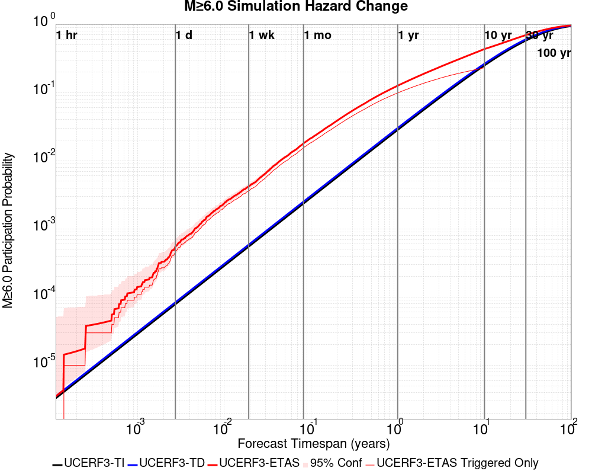

| Forecast Duration | UCERF3-ETAS [95% Conf] | UCERF3-ETAS Triggered Only | UCERF3-TD | UCERF3-ETAS/TD Gain | UCERF3-TI |
|-----|-----|-----|-----|-----|-----|
| 1 Hour | 3.50E-6 [3.50E-6 - 1.30E-3] | 0.000 | 3.50E-6 | 1 | 3.28E-6 |
| 1 Day | 3.54E-4 [9.81E-5 - 1.84E-3] | 2.70E-4 | 8.40E-5 | 4.22 | 7.86E-5 |
| 1 Week | 4.10E-3 [2.54E-3 - 6.76E-3] | 3.51E-3 | 5.88E-4 | 6.97 | 5.50E-4 |
| 1 Month | 0.016 [0.013 - 0.020] | 0.014 | 2.52E-3 | 6.35 | 2.36E-3 |
| 1 Year | 0.126 [0.117 - 0.136] | 0.099 | 0.030 | 4.17 | 0.028 |
| 10 Years | 0.429 [0.419 - 0.439] | 0.224 | 0.264 | 1.62 | 0.250 |
| 30 Years | 0.692 [0.687 - 0.698] \* | \* | 0.603 | 1.15 \* | 0.578 |
| 100 Years | 0.966 [0.965 - 0.966] \* | \* | 0.956 | 1.01 \* | 0.943 |

\* *forecast duration is longer than simulation length, only ETAS ruptures from the first 10 years are included*
### M&ge;7.0 Hazard Change Over Time
*[(top)](#table-of-contents)*


| Forecast Duration | UCERF3-ETAS [95% Conf] | UCERF3-ETAS Triggered Only | UCERF3-TD | UCERF3-ETAS/TD Gain | UCERF3-TI |
|-----|-----|-----|-----|-----|-----|
| 1 Hour | 3.60E-7 [3.60E-7 - 1.29E-3] | 0.000 | 3.60E-7 | 1 | 3.22E-7 |
| 1 Day | 8.65E-6 [8.65E-6 - 1.30E-3] | 0.000 | 8.65E-6 | 1 | 7.72E-6 |
| 1 Week | 3.31E-4 [7.47E-5 - 1.81E-3] | 2.70E-4 | 6.06E-5 | 5.46 | 5.40E-5 |
| 1 Month | 8.00E-4 [3.53E-4 - 2.44E-3] | 5.41E-4 | 2.60E-4 | 3.08 | 2.31E-4 |
| 1 Year | 0.013 [9.83E-3 - 0.016] | 9.46E-3 | 3.16E-3 | 3.99 | 2.81E-3 |
| 10 Years | 0.051 [0.047 - 0.056] | 0.021 | 0.031 | 1.65 | 0.028 |
| 30 Years | 0.112 [0.108 - 0.116] \* | \* | 0.093 | 1.2 \* | 0.081 |
| 100 Years | 0.309 [0.306 - 0.313] \* | \* | 0.294 | 1.05 \* | 0.246 |

\* *forecast duration is longer than simulation length, only ETAS ruptures from the first 10 years are included*

## Trigger Rupture Fault Map
*[(top)](#table-of-contents)*

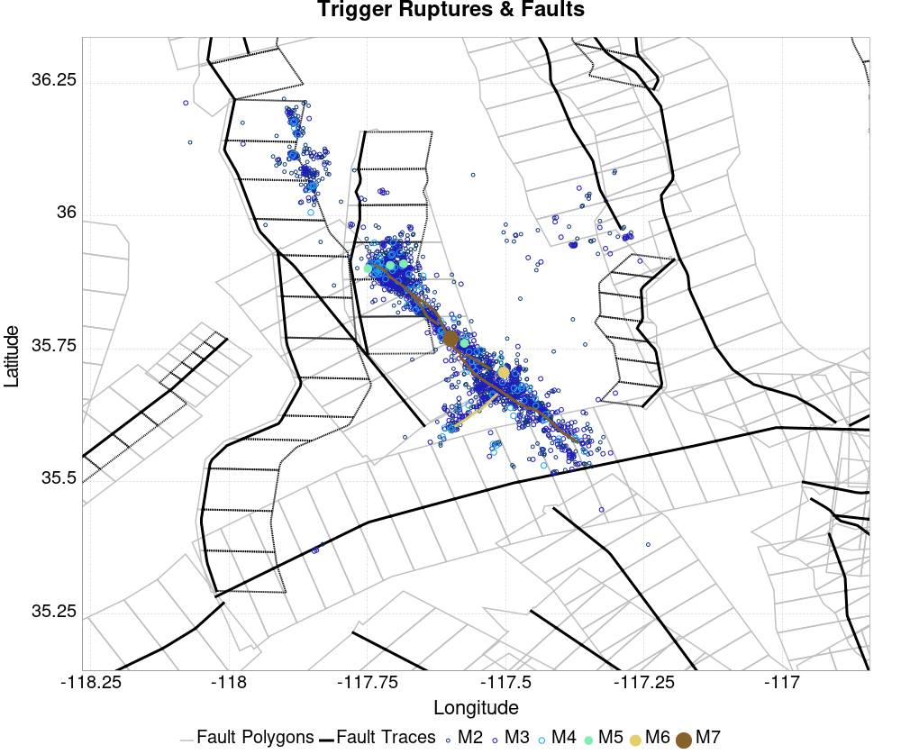
## Trigger Rupture Depth Map
*[(top)](#table-of-contents)*


## Fault Distances To Triggers
*[(top)](#table-of-contents)*

| Section Name | Strike, Dip, Rake | # Hypos In Poly | Max Mag w/ Hypo In Poly | # Surfs In Poly | Max Mag w/ Surf In Poly | Min Dist To Any (km) | Min Poly Dist To Any (km) | Min Dist To Largest (km) | Min Poly Dist To Largest (km) | Min Hypo Dist To Largest (km) | Min Hypo Poly Dist To Largest (km) |
|-----|-----|-----|-----|-----|-----|-----|-----|-----|-----|-----|-----|
| Airport Lake | 359, 50, -90 | 1263 | 7.1 | 1263 | 7.1 | 0.036 | 0.000 | 0.036 | 0.000 | 5.612 | 0.000 |
| Little Lake | 327, 90, 180 | 405 | 5.5 | 406 | 7.1 | 2.268 | 0.000 | 11.284 | 0.000 | 13.471 | 1.469 |
| Garlock (Central) | 71, 90, 0 | 194 | 4.73 | 195 | 7.1 | 0.225 | 0.000 | 5.600 | 0.000 | 22.766 | 10.797 |
| So Sierra Nevada | 2, 50, -90 | 126 | 4.62 | 126 | 4.62 | 0.916 | 0.000 | 4.248 | 4.233 | 16.191 | 15.188 |
| Ash Hill | 162, 90, 180 | 30 | 3.57 | 30 | 3.57 | 0.088 | 0.000 | 34.883 | 23.252 | 35.690 | 25.242 |
| Panamint Valley | 334, 90, -150 | 21 | 3.57 | 21 | 3.57 | 6.249 | 0.000 | 29.583 | 17.627 | 34.350 | 22.425 |
| Tank Canyon | 189, 50, -90 | 2 | 3.02 | 2 | 3.02 | 0.751 | 0.000 | 9.015 | 9.011 | 17.039 | 16.895 |
| Blackwater | 323, 90, 180 | 2 | 3.54 | 2 | 3.54 | 5.396 | 0.000 | 14.394 | 8.726 | 29.622 | 27.613 |
| Sierra Nevada  (No Extension) | 344, 50, -90 | 0 |  | 0 |  | 5.696 | 1.331 | 39.627 | 39.626 | 58.680 | 58.391 |
| Owens Valley | 346, 90, 180 | 0 |  | 0 |  | 11.268 | 7.068 | 49.013 | 48.524 | 68.299 | 66.819 |
| Lenwood-Lockhart-Old Woman Springs | 301, 90, 180 | 0 |  | 0 |  | 18.221 | 16.222 | 53.532 | 41.707 | 59.786 | 48.595 |
| Towne Pass | 186, 50, -90 | 0 |  | 0 |  | 18.237 | 18.158 | 52.561 | 52.559 | 59.662 | 59.451 |
| Garlock (West) | 55, 90, 0 | 0 |  | 0 |  | 18.439 | 18.373 | 63.115 | 60.529 | 66.575 | 62.627 |

## Individual Simulated Catalog Maps
*[(top)](#table-of-contents)*

These are map plots of individual catalogs from the simulations, selected as the closest catalog to each of the given percentiles in terms of total number of events.

| Duration | p0.0 %-ile | p25.0 %-ile | p50.0 %-ile | p75.0 %-ile | p90.0 %-ile | p95.0 %-ile | p97.5 %-ile | p98.0 %-ile | p99.0 %-ile | p99.5 %-ile | p99.9 %-ile | p99.972973 %-ile |
|-----|-----|-----|-----|-----|-----|-----|-----|-----|-----|-----|-----|-----|
| **1 Week** |  |  | 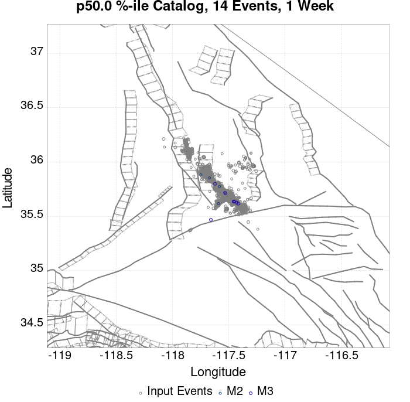 |  |  |  |  |  |  |  | 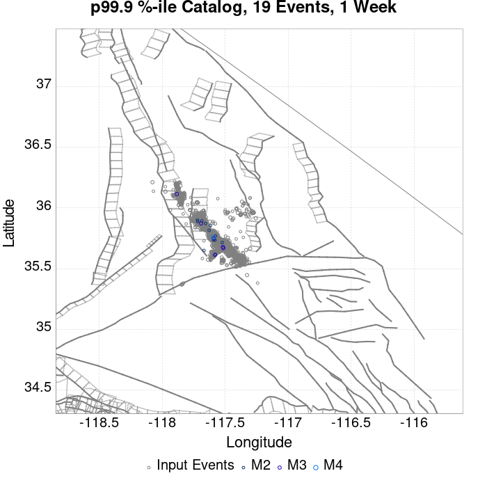 |  |
| **1 Month** |  |  |  |  |  | 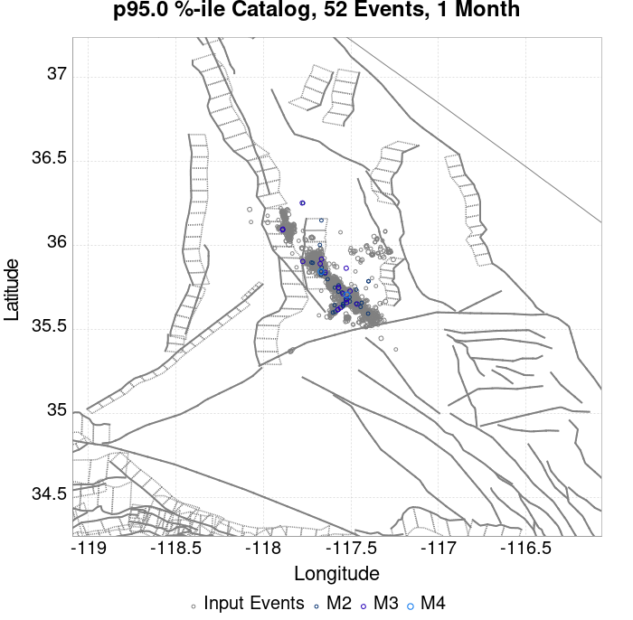 |  | 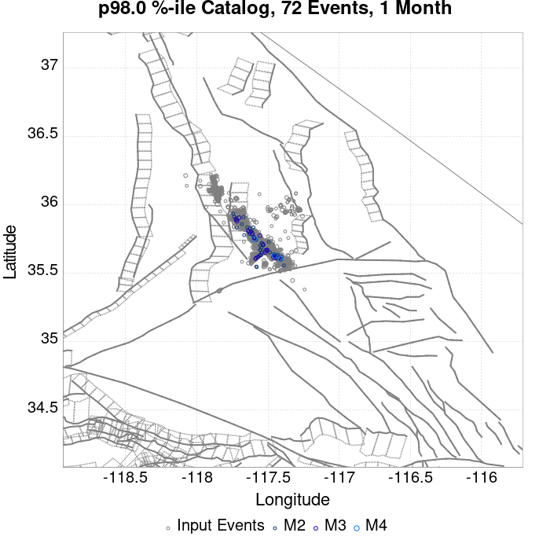 |  |  |  |  |
| **1 Year** | 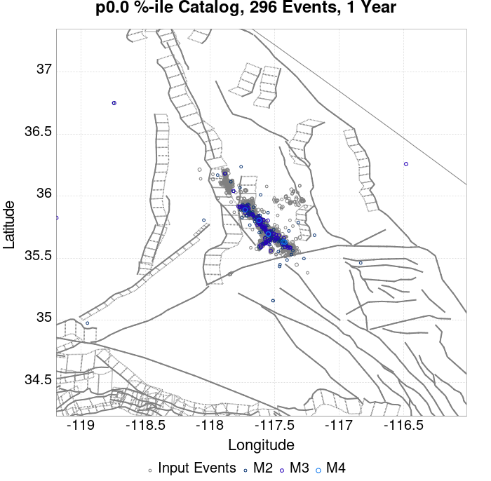 |  |  |  |  |  |  |  |  |  |  |  |
| **10 Year** |  |  |  |  |  |  |  | 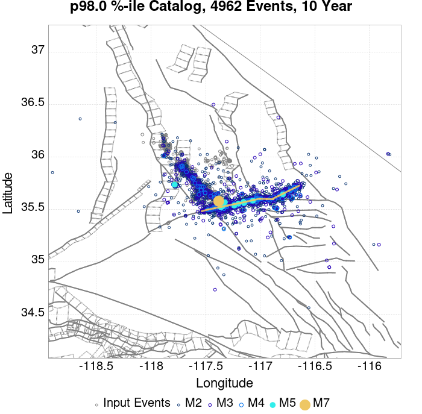 |  |  |  |  |

## ComCat Data Comparisons
*[(top)](#table-of-contents)*

No ComCat events found

## Section Participation
*[(top)](#table-of-contents)*

### Section Participation Plots
*[(top)](#table-of-contents)*

| Min Mag | 1 yr Triggered Ruptures (no spontaneous) | 10 yr Triggered Ruptures (no spontaneous) | 10 yr Triggered Ruptures (primary aftershocks only) |
|-----|-----|-----|-----|
| **All Supra. Seis.** | 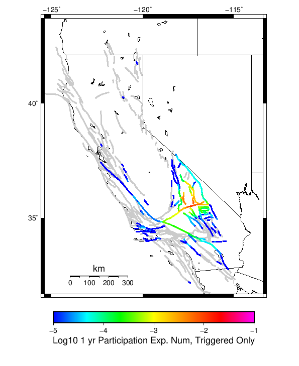 |  |  |
| **M&ge;6.5** |  |  |  |
| **M&ge;7** | 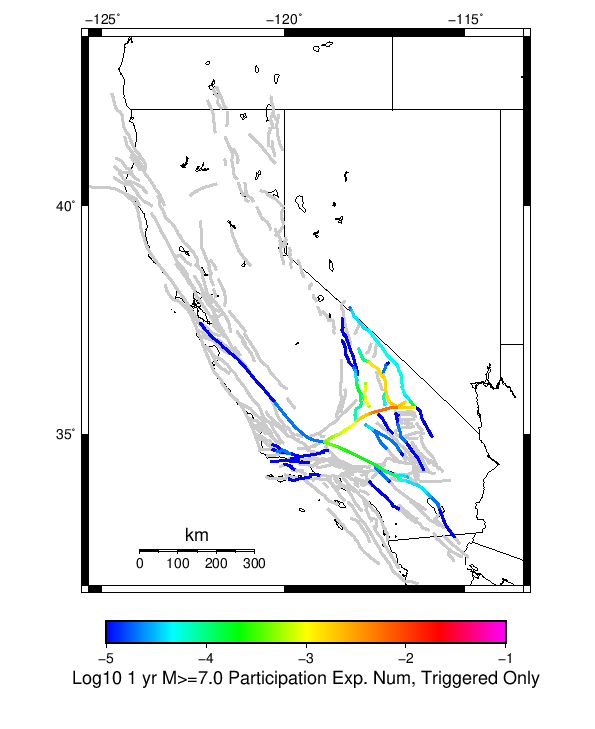 |  |  |
| **M&ge;7.5** | 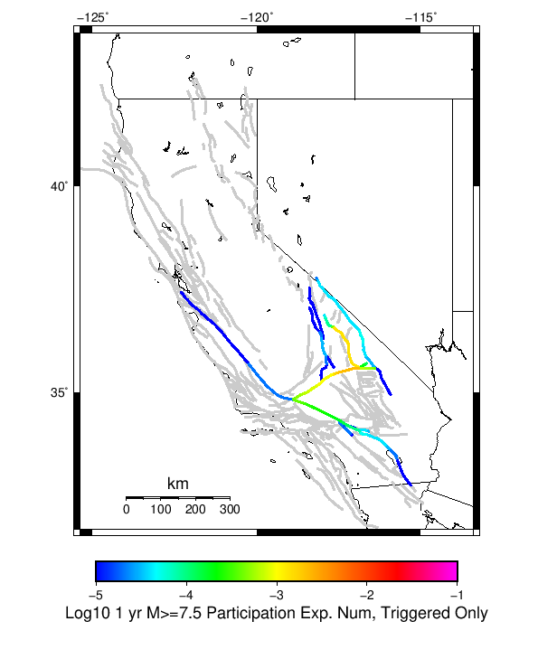 |  |  |

### Supra-Seismogenic Parent Sections Table
*[(top)](#table-of-contents)*

*First 10 of 47 with matching ruptures shown*

| Parent Name | Triggered 10 Year Mean Count | Triggered 1 Day Prob | Triggered 1 Week Prob | Triggered 1 Month Prob | Triggered 1 Year Prob | Triggered 10 Year Prob | Triggered 10 Year Primary Mean Count |
|-----|-----|-----|-----|-----|-----|-----|-----|
| Garlock (Central) | 0.041351352 | 0.0 | 5.4054055E-4 | 0.0018918919 | 0.017027028 | 0.040810812 | 0.021891892 |
| Tank Canyon | 0.02918919 | 0.0 | 8.1081083E-4 | 0.0013513514 | 0.007837838 | 0.024324324 | 0.009189189 |
| Little Lake | 0.018918918 | 0.0 | 2.7027028E-4 | 0.0010810811 | 0.009189189 | 0.018918918 | 0.011081081 |
| Owl Lake | 0.013243243 | 0.0 | 0.0 | 0.0 | 0.004864865 | 0.011891892 | 0.002972973 |
| Airport Lake | 0.012162162 | 0.0 | 2.7027028E-4 | 2.7027028E-4 | 0.0054054055 | 0.012162162 | 0.007027027 |
| Garlock (East) | 0.010810811 | 0.0 | 0.0 | 0.0 | 0.0045945947 | 0.009459459 | 0.0021621622 |
| Panamint Valley | 0.0102702705 | 0.0 | 0.0 | 2.7027028E-4 | 0.002972973 | 0.00972973 | 0.0027027028 |
| Ash Hill | 0.004054054 | 0.0 | 0.0 | 2.7027028E-4 | 8.1081083E-4 | 0.0037837839 | 0.0018918919 |
| Hunter Mountain-Saline Valley | 0.0035135136 | 0.0 | 0.0 | 0.0 | 0.0010810811 | 0.0035135136 | 8.1081083E-4 |
| Garlock (West) | 0.0032432433 | 0.0 | 0.0 | 0.0 | 0.0010810811 | 0.0032432433 | 0.0021621622 |

### M≥6.5 Parent Sections Table
*[(top)](#table-of-contents)*

*First 10 of 36 with matching ruptures shown*

| Parent Name | Triggered 10 Year Mean Count | Triggered 1 Day Prob | Triggered 1 Week Prob | Triggered 1 Month Prob | Triggered 1 Year Prob | Triggered 10 Year Prob | Triggered 10 Year Primary Mean Count |
|-----|-----|-----|-----|-----|-----|-----|-----|
| Garlock (Central) | 0.016486486 | 0.0 | 2.7027028E-4 | 5.4054055E-4 | 0.0075675678 | 0.016486486 | 0.008108108 |
| Little Lake | 0.010810811 | 0.0 | 2.7027028E-4 | 2.7027028E-4 | 0.0054054055 | 0.010810811 | 0.006756757 |
| Airport Lake | 0.00972973 | 0.0 | 2.7027028E-4 | 2.7027028E-4 | 0.0051351353 | 0.00972973 | 0.005945946 |
| Panamint Valley | 0.009189189 | 0.0 | 0.0 | 2.7027028E-4 | 0.0024324325 | 0.008648649 | 0.0021621622 |
| Garlock (East) | 0.0075675678 | 0.0 | 0.0 | 0.0 | 0.0037837839 | 0.007027027 | 0.0021621622 |
| Owl Lake | 0.0072972975 | 0.0 | 0.0 | 0.0 | 0.0032432433 | 0.0072972975 | 0.002972973 |
| Hunter Mountain-Saline Valley | 0.0035135136 | 0.0 | 0.0 | 0.0 | 0.0010810811 | 0.0035135136 | 8.1081083E-4 |
| Garlock (West) | 0.0032432433 | 0.0 | 0.0 | 0.0 | 0.0010810811 | 0.0032432433 | 0.0021621622 |
| Tank Canyon | 0.002972973 | 0.0 | 0.0 | 0.0 | 5.4054055E-4 | 0.002972973 | 8.1081083E-4 |
| So Sierra Nevada | 0.0016216217 | 0.0 | 0.0 | 0.0 | 0.0010810811 | 0.0016216217 | 2.7027028E-4 |

### M≥7 Parent Sections Table
*[(top)](#table-of-contents)*

*First 10 of 28 with matching ruptures shown*

| Parent Name | Triggered 10 Year Mean Count | Triggered 1 Day Prob | Triggered 1 Week Prob | Triggered 1 Month Prob | Triggered 1 Year Prob | Triggered 10 Year Prob | Triggered 10 Year Primary Mean Count |
|-----|-----|-----|-----|-----|-----|-----|-----|
| Garlock (Central) | 0.014864865 | 0.0 | 0.0 | 2.7027028E-4 | 0.0064864866 | 0.014864865 | 0.007027027 |
| Panamint Valley | 0.0062162164 | 0.0 | 0.0 | 2.7027028E-4 | 0.0018918919 | 0.005945946 | 0.0018918919 |
| Owl Lake | 0.004864865 | 0.0 | 0.0 | 0.0 | 0.0024324325 | 0.004864865 | 0.002972973 |
| Garlock (East) | 0.0045945947 | 0.0 | 0.0 | 0.0 | 0.0027027028 | 0.0045945947 | 0.0016216217 |
| Hunter Mountain-Saline Valley | 0.0035135136 | 0.0 | 0.0 | 0.0 | 0.0010810811 | 0.0035135136 | 8.1081083E-4 |
| Airport Lake | 0.0032432433 | 0.0 | 2.7027028E-4 | 2.7027028E-4 | 0.0021621622 | 0.0032432433 | 0.0021621622 |
| Garlock (West) | 0.0032432433 | 0.0 | 0.0 | 0.0 | 0.0010810811 | 0.0032432433 | 0.0021621622 |
| Little Lake | 0.0032432433 | 0.0 | 2.7027028E-4 | 2.7027028E-4 | 0.0021621622 | 0.0032432433 | 0.0021621622 |
| San Andreas (Mojave S) | 0.0013513514 | 0.0 | 0.0 | 0.0 | 2.7027028E-4 | 0.0010810811 | 0.0010810811 |
| San Andreas (Mojave N) | 0.0010810811 | 0.0 | 0.0 | 0.0 | 2.7027028E-4 | 0.0010810811 | 0.0010810811 |

### M≥7.5 Parent Sections Table
*[(top)](#table-of-contents)*

*First 10 of 18 with matching ruptures shown*

| Parent Name | Triggered 10 Year Mean Count | Triggered 1 Day Prob | Triggered 1 Week Prob | Triggered 1 Month Prob | Triggered 1 Year Prob | Triggered 10 Year Prob | Triggered 10 Year Primary Mean Count |
|-----|-----|-----|-----|-----|-----|-----|-----|
| Garlock (Central) | 0.006756757 | 0.0 | 0.0 | 0.0 | 0.0021621622 | 0.006756757 | 0.002972973 |
| Panamint Valley | 0.0037837839 | 0.0 | 0.0 | 0.0 | 0.0010810811 | 0.0037837839 | 8.1081083E-4 |
| Hunter Mountain-Saline Valley | 0.0035135136 | 0.0 | 0.0 | 0.0 | 0.0010810811 | 0.0035135136 | 8.1081083E-4 |
| Garlock (West) | 0.0032432433 | 0.0 | 0.0 | 0.0 | 0.0010810811 | 0.0032432433 | 0.0021621622 |
| Garlock (East) | 0.0018918919 | 0.0 | 0.0 | 0.0 | 5.4054055E-4 | 0.0018918919 | 0.0010810811 |
| San Andreas (Mojave N) | 0.0010810811 | 0.0 | 0.0 | 0.0 | 2.7027028E-4 | 0.0010810811 | 0.0010810811 |
| San Andreas (Mojave S) | 0.0010810811 | 0.0 | 0.0 | 0.0 | 2.7027028E-4 | 0.0010810811 | 0.0010810811 |
| San Andreas (San Bernardino N) | 8.1081083E-4 | 0.0 | 0.0 | 0.0 | 2.7027028E-4 | 8.1081083E-4 | 8.1081083E-4 |
| Owl Lake | 5.4054055E-4 | 0.0 | 0.0 | 0.0 | 5.4054055E-4 | 5.4054055E-4 | 5.4054055E-4 |
| San Jacinto (San Bernardino) | 5.4054055E-4 | 0.0 | 0.0 | 0.0 | 2.7027028E-4 | 5.4054055E-4 | 5.4054055E-4 |

### Fault Magnitude-Probability Distributions
*[(top)](#table-of-contents)*

The first 5 sections (sorted by trigger rate) are plotted below. All fault MPDs are available [here](plots/parent_sect_mpds/README.md)

| 1 Week | 1 Month | 1 Year | 10 Year |
|-----|-----|-----|-----|
|  |  |  |  |
|  |  |  |  |
|  | 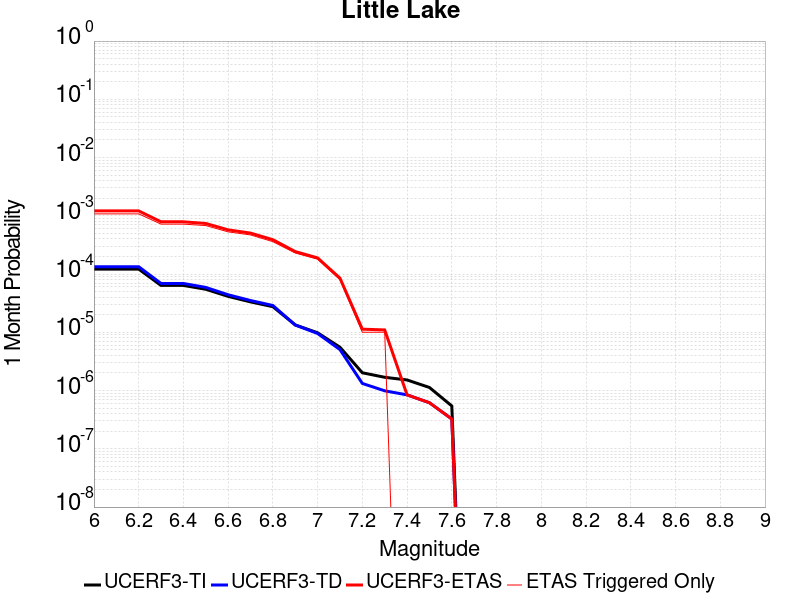 | 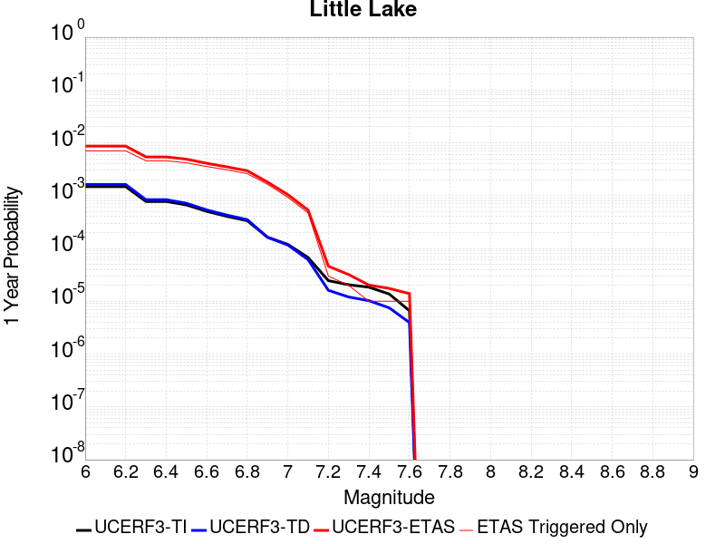 |  |
|  |  |  |  |
|  |  |  |  |

## Gridded Nucleation
*[(top)](#table-of-contents)*

| Min Mag | Triggered Ruptures (no spontaneous) | Triggered Ruptures (primary aftershocks only) |
|-----|-----|-----|
| **M&ge;2.5** |  |  |
| **M&ge;5** |  |  |
| **M&ge;6** | 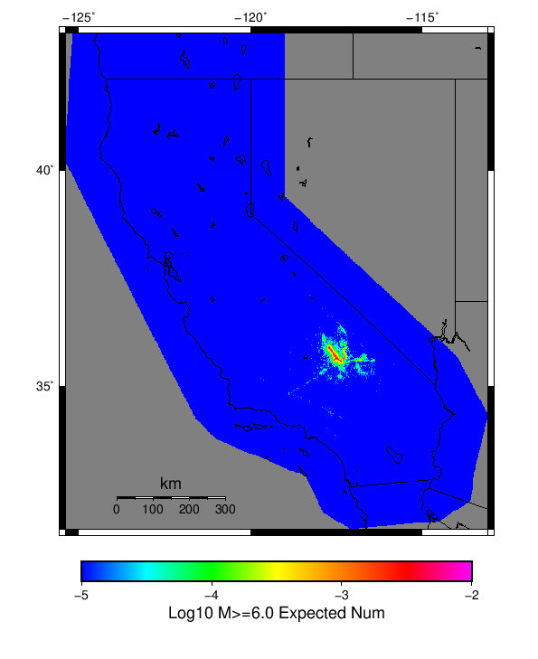 | 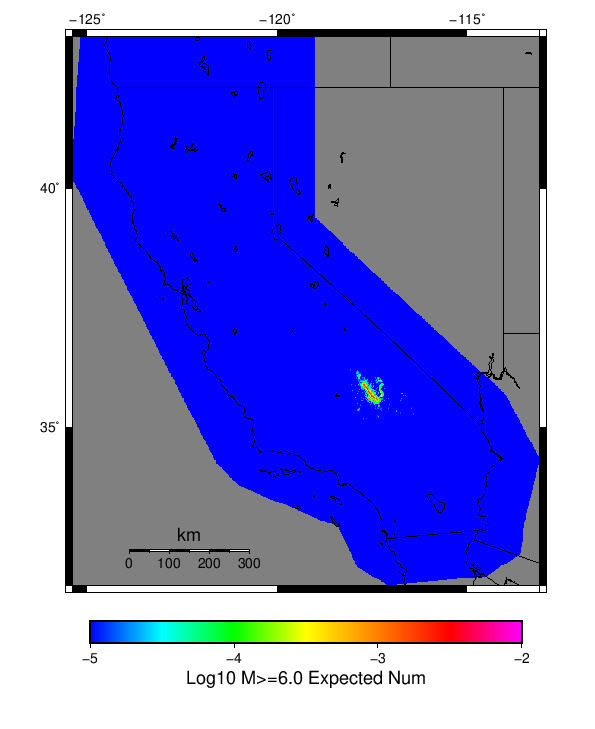 |
| **M&ge;7** |  |  |


## JSON Input File
*[(top)](#table-of-contents)*

```
{
  "numSimulations": 100000,
  "duration": 10.0,
  "startTimeMillis": 1572923142971,
  "includeSpontaneous": false,
  "randomSeed": 1572923149135,
  "binaryOutput": true,
  "binaryOutputFilters": [
    {
      "prefix": "results_complete",
      "descendantsOnly": false
    },
    {
      "prefix": "results_m5_preserve_chain",
      "minMag": 5.0,
      "preserveChainBelowMag": true,
      "descendantsOnly": false
    }
  ],
  "forceRecalc": false,
  "simulationName": "ComCat M7.1 (ci38457511), 122 Days After, ShakeMap Surfaces",
  "numRetries": 3,
  "outputDir": "/home/scec-02/kmilner/ucerf3/etas_sim/2019_11_04-ComCatM7p1_ci38457511_122DaysAfter_ShakeMapSurfaces",
  "treatTriggerCatalogAsSpontaneous": false,
  "triggerRuptures": [
    "omitted due to length, see original input file"
  ],
  "cacheDir": "/home/scec-02/kmilner/ucerf3/ucerf3-etas-launcher/inputs/cache_fm3p1_ba",
  "fssFile": "/home/scec-02/kmilner/ucerf3/ucerf3-etas-launcher/inputs/2013_05_10-ucerf3p3-production-10runs_COMPOUND_SOL_FM3_1_SpatSeisU3_MEAN_BRANCH_AVG_SOL.zip",
  "probModel": "FULL_TD",
  "applySubSeisForSupraNucl": true,
  "totRateScaleFactor": 1.14,
  "gridSeisCorr": true,
  "timeIndependentERF": false,
  "griddedOnly": false,
  "imposeGR": false,
  "includeIndirectTriggering": true,
  "gridSeisDiscr": 0.1,
  "catalogCompletenessModel": "RELAXED",
  "configCommand": "u3etas_comcat_event_config_builder.sh --event-id ci38457511 --num-simulations 100000 --days-before 7 --end-now --mag-complete 3.5 --finite-surf-shakemap --finite-surf-shakemap-min-mag 5 --hpc-site USC_HPC --nodes 36 --hours 24 --queue scec",
  "configTime": 1572923149135,
  "comcatMetadata": {
    "region": {
      "border": [
        {
          "latitude": 35.15123745324938,
          "longitude": -117.46198765392752
        },
        {
          "latitude": 35.170513097218205,
          "longitude": -117.55046477274733
        },
        {
          "latitude": 35.201997575622634,
          "longitude": -117.63356287896195
        },
        {
          "latitude": 35.24474776584818,
          "longitude": -117.70878534540662
        },
        {
          "latitude": 35.2893890362986,
          "longitude": -117.76387551603122
        },
        {
          "latitude": 35.288830898189985,
          "longitude": -117.76465036296011
        },
        {
          "latitude": 35.62116745212862,
          "longitude": -118.13026990137416
        },
        {
          "latitude": 35.621789874646055,
          "longitude": -118.12940866580139
        },
        {
          "latitude": 35.621789874646055,
          "longitude": -118.12940866580136
        },
        {
          "latitude": 35.63100857737423,
          "longitude": -118.14083341711117
        },
        {
          "latitude": 35.69213881200874,
          "longitude": -118.19401186444136
        },
        {
          "latitude": 35.759827796433385,
          "longitude": -118.23338865654299
        },
        {
          "latitude": 35.8320329014668,
          "longitude": -118.25773927868946
        },
        {
          "latitude": 35.906569563076914,
          "longitude": -118.26628547708222
        },
        {
          "latitude": 35.9811764992231,
          "longitude": -118.25872343341653
        },
        {
          "latitude": 36.05358395358725,
          "longitude": -118.23523828089384
        },
        {
          "latitude": 36.12158296055357,
          "longitude": -118.19650389473806
        },
        {
          "latitude": 36.18309350302806,
          "longitude": -118.14366730262441
        },
        {
          "latitude": 36.23622937613509,
          "longitude": -118.07831757407638
        },
        {
          "latitude": 36.279357589115186,
          "longitude": -118.00243964650828
        },
        {
          "latitude": 36.31115024550475,
          "longitude": -117.91835419890715
        },
        {
          "latitude": 36.33062704347584,
          "longitude": -117.82864534929934
        },
        {
          "latitude": 36.337186832826475,
          "longitude": -117.7360785775
        },
        {
          "latitude": 36.33062704347584,
          "longitude": -117.64351180570065
        },
        {
          "latitude": 36.31115024550475,
          "longitude": -117.55380295609284
        },
        {
          "latitude": 36.279357589115186,
          "longitude": -117.46971750849171
        },
        {
          "latitude": 36.23622937613509,
          "longitude": -117.39383958092363
        },
        {
          "latitude": 36.19237301765921,
          "longitude": -117.33990236386252
        },
        {
          "latitude": 36.19237301765921,
          "longitude": -117.3399023638625
        },
        {
          "latitude": 36.19300476664728,
          "longitude": -117.33902822340912
        },
        {
          "latitude": 35.858277657147454,
          "longitude": -116.97410396317103
        },
        {
          "latitude": 35.85771127553969,
          "longitude": -116.97489025431044
        },
        {
          "latitude": 35.849566414597014,
          "longitude": -116.96491461360324
        },
        {
          "latitude": 35.78805819220281,
          "longitude": -116.9122967694479
        },
        {
          "latitude": 35.72006106557635,
          "longitude": -116.87372034968973
        },
        {
          "latitude": 35.64765482528862,
          "longitude": -116.85032807444419
        },
        {
          "latitude": 35.57304829206068,
          "longitude": -116.8427916482061
        },
        {
          "latitude": 35.49851117585832,
          "longitude": -116.8512961557198
        },
        {
          "latitude": 35.42630481575459,
          "longitude": -116.87553976530553
        },
        {
          "latitude": 35.35861392859174,
          "longitude": -116.91474809853695
        },
        {
          "latitude": 35.29748137319737,
          "longitude": -116.96770221389164
        },
        {
          "latitude": 35.24474776584818,
          "longitude": -117.03277884359336
        },
        {
          "latitude": 35.201997575622634,
          "longitude": -117.10800131003803
        },
        {
          "latitude": 35.170513097218205,
          "longitude": -117.19109941625265
        },
        {
          "latitude": 35.15123745324938,
          "longitude": -117.27957653507247
        },
        {
          "latitude": 35.14474752487352,
          "longitude": -117.3707820945
        }
      ]
    },
    "eventID": "ci38457511",
    "minDepth": -10.0,
    "maxDepth": 24.0,
    "minMag": 2.5,
    "startTime": 1561778393040,
    "endTime": 1572923141971,
    "magComplete": 3.5
  }
}
```

