# ComCat M7.1 (ci38457511), 122 Days After, ShakeMap Surfaces Results

|   | ComCat M7.1 (ci38457511), 122 Days After, ShakeMap Surfaces |
|-----|-----|
| Num Simulations | 50200 (incomplete) |
| Start Time | 2019/11/05 03:05:42 UTC |
| Start Time Epoch Milliseconds | 1572923142971 |
| Duration | 10 Years |
| Includes Spontaneous? | false |
| Trigger Ruptures | 2373 Trigger Ruptures |
|   | First: M3.98 at 2019/07/04 17:02:55 UTC |
|   | Last: M2.52 at 2019/11/05 02:13:21 UTC |
|   | Largest: M7.1 at 2019/07/06 03:19:53 UTC |
| Trigger Ruptures | *(none)* |
| Config Generated With | u3etas_comcat_event_config_builder.sh --event-id ci38457511 --num-simulations 100000 --days-before 7 --end-now --mag-complete 3.5 --finite-surf-shakemap --finite-surf-shakemap-min-mag 5 --hpc-site USC_HPC --nodes 36 --hours 24 --queue scec |

## Table Of Contents

* [Probabilities Summary Table](#probabilities-summary-table)
* [Magnitude Number Distribution](#magnitude-number-distribution)
  * [10 Year Magnitude Number Distribution](#10-year-magnitude-number-distribution)
  * [1 Year Magnitude Number Distribution](#1-year-magnitude-number-distribution)
  * [1 Month Magnitude Number Distribution](#1-month-magnitude-number-distribution)
  * [1 Week Magnitude Number Distribution](#1-week-magnitude-number-distribution)
  * [1 Day Magnitude Number Distribution](#1-day-magnitude-number-distribution)
  * [1 Hour Magnitude Number Distribution](#1-hour-magnitude-number-distribution)
* [Hazard Change Over Time](#hazard-change-over-time)
  * [M&ge;5.0 Hazard Change Over Time](#m50-hazard-change-over-time)
  * [M&ge;6.0 Hazard Change Over Time](#m60-hazard-change-over-time)
  * [M&ge;7.0 Hazard Change Over Time](#m70-hazard-change-over-time)
  * [M&ge;8.0 Hazard Change Over Time](#m80-hazard-change-over-time)
* [Trigger Rupture Fault Map](#trigger-rupture-fault-map)
* [Trigger Rupture Depth Map](#trigger-rupture-depth-map)
* [Fault Distances To Triggers](#fault-distances-to-triggers)
* [Individual Simulated Catalog Maps](#individual-simulated-catalog-maps)
* [ComCat Data Comparisons](#comcat-data-comparisons)
* [Section Participation](#section-participation)
  * [Section Participation Plots](#section-participation-plots)
  * [Supra-Seismogenic Parent Sections Table](#supra-seismogenic-parent-sections-table)
  * [M≥6.5 Parent Sections Table](#m65-parent-sections-table)
  * [M≥7 Parent Sections Table](#m7-parent-sections-table)
  * [M≥7.5 Parent Sections Table](#m75-parent-sections-table)
  * [M≥8 Parent Sections Table](#m8-parent-sections-table)
  * [Fault Magnitude-Probability Distributions](#fault-magnitude-probability-distributions)
* [Gridded Nucleation](#gridded-nucleation)
* [JSON Input File](#json-input-file)

## Probabilities Summary Table
*[(top)](#table-of-contents)*

| Magnitude | 1 Hour Prob | 1 Day Prob | 1 Week Prob | 1 Month Prob | 1 Year Prob | 10 Year Prob |
|-----|-----|-----|-----|-----|-----|-----|
| **M&ge;4** | 2.73E-3 (0.27%) | 0.060 (6.04%) | 0.351 (35.11%) | 0.818 (81.76%) | 1.000 (100.00%) | 1.000 (100.00%) |
| **M&ge;4.5** | 6.97E-4 (0.07%) | 0.020 (1.98%) | 0.129 (12.95%) | 0.429 (42.93%) | 0.970 (97.01%) | 1.000 (99.98%) |
| **M&ge;5** | 2.59E-4 (0.03%) | 6.95E-3 (0.70%) | 0.045 (4.54%) | 0.168 (16.82%) | 0.685 (68.51%) | 0.940 (94.04%) |
| **M&ge;5.5** | 5.98E-5 (0.01%) | 1.99E-3 (0.20%) | 0.013 (1.32%) | 0.055 (5.46%) | 0.311 (31.07%) | 0.604 (60.45%) |
| **M&ge;6** | 0.000 (0.00%) | 4.18E-4 (0.04%) | 3.88E-3 (0.39%) | 0.016 (1.58%) | 0.100 (10.03%) | 0.236 (23.59%) |
| **M&ge;6.5** | 0.000 (0.00%) | 7.97E-5 (0.01%) | 8.96E-4 (0.09%) | 3.73E-3 (0.37%) | 0.023 (2.31%) | 0.058 (5.84%) |
| **M&ge;7** | 0.000 (0.00%) | 3.98E-5 (0.00%) | 2.59E-4 (0.03%) | 1.25E-3 (0.13%) | 7.93E-3 (0.79%) | 0.021 (2.09%) |
| **M&ge;7.1** | 0.000 (0.00%) | 1.99E-5 (0.00%) | 1.79E-4 (0.02%) | 9.56E-4 (0.10%) | 6.73E-3 (0.67%) | 0.018 (1.78%) |
| **M&ge;7.5** | 0.000 (0.00%) | 0.000 (0.00%) | 3.98E-5 (0.00%) | 2.99E-4 (0.03%) | 2.33E-3 (0.23%) | 6.27E-3 (0.63%) |
| **M&ge;8** | 0.000 (0.00%) | 0.000 (0.00%) | 0.000 (0.00%) | 0.000 (0.00%) | 7.97E-5 (0.01%) | 1.39E-4 (0.01%) |

## Magnitude Number Distribution
*[(top)](#table-of-contents)*

### 10 Year Magnitude Number Distribution
*[(top)](#table-of-contents)*

**Legend**
* **Mean** (thick black line): mean expected number across all 50200 catalogs
* **2.5%,97.5%** (thin black lines): expected number percentiles across all 50200 catalogs
* **Median** (thin blue line): median expected number across all 50200 catalogs
* **Mode** (thin cyan line): modal expected number across all 50200 catalogs
* **10 yr Probability** (thin red line): 10 year probability calculated as the fraction of catalogs with at least 1 occurrence
* **10 yr Supraseismogenic Probability** (thin dashed red line): same as above, but only for supraseismogenic ruptures on explicitly modeled UCERF3 faults
* **95% Conf** (light red shaded region): binomial 95% confidence bounds on probability
* **Primary** (thin green line): mean expected number from primary triggered aftershocks only (no secondary, tertiary, etc...) across all 50200 catalogs


| Mag | Mean | 2.5 %ile | 97.5 %ile | Median | Mode | 10 yr Probability | 10 yr Supra-Seis Prob | Primary Aftershocks Mean |
|-----|-----|-----|-----|-----|-----|-----|-----|-----|
| **M&ge;2.5** | 1453.482 | 874.000 | 4084.000 | 1135.000 | 996.000 | 1.000 (100.00%) | 0.093 (9.31%) | 648.018 |
| **M&ge;2.6** | 1154.486 | 690.000 | 3243.000 | 902.000 | 789.000 | 1.000 (100.00%) | 0.093 (9.31%) | 514.693 |
| **M&ge;2.7** | 916.954 | 545.000 | 2579.000 | 717.000 | 619.000 | 1.000 (100.00%) | 0.093 (9.31%) | 408.796 |
| **M&ge;2.8** | 728.346 | 430.000 | 2047.000 | 570.000 | 534.000 | 1.000 (100.00%) | 0.093 (9.31%) | 324.681 |
| **M&ge;2.9** | 578.487 | 338.000 | 1633.000 | 453.000 | 414.000 | 1.000 (100.00%) | 0.093 (9.31%) | 257.924 |
| **M&ge;3** | 459.430 | 266.000 | 1295.000 | 360.000 | 323.000 | 1.000 (100.00%) | 0.093 (9.31%) | 204.870 |
| **M&ge;3.1** | 364.891 | 208.000 | 1028.000 | 287.000 | 263.000 | 1.000 (100.00%) | 0.093 (9.31%) | 162.720 |
| **M&ge;3.2** | 289.825 | 163.000 | 817.000 | 228.000 | 205.000 | 1.000 (100.00%) | 0.093 (9.31%) | 129.252 |
| **M&ge;3.3** | 230.188 | 127.000 | 649.000 | 181.000 | 165.000 | 1.000 (100.00%) | 0.093 (9.31%) | 102.657 |
| **M&ge;3.4** | 182.786 | 99.000 | 517.000 | 144.000 | 124.000 | 1.000 (100.00%) | 0.093 (9.31%) | 81.527 |
| **M&ge;3.5** | 145.170 | 76.000 | 411.000 | 115.000 | 106.000 | 1.000 (100.00%) | 0.093 (9.31%) | 64.752 |
| **M&ge;3.6** | 115.278 | 59.000 | 326.000 | 91.000 | 85.000 | 1.000 (100.00%) | 0.093 (9.31%) | 51.424 |
| **M&ge;3.7** | 91.541 | 45.000 | 260.000 | 73.000 | 64.000 | 1.000 (100.00%) | 0.093 (9.31%) | 40.834 |
| **M&ge;3.8** | 72.721 | 35.000 | 207.000 | 58.000 | 49.000 | 1.000 (100.00%) | 0.093 (9.31%) | 32.433 |
| **M&ge;3.9** | 57.738 | 26.000 | 165.000 | 46.000 | 40.000 | 1.000 (100.00%) | 0.093 (9.31%) | 25.762 |
| **M&ge;4** | 45.841 | 20.000 | 131.000 | 37.000 | 32.000 | 1.000 (100.00%) | 0.093 (9.31%) | 20.447 |
| **M&ge;4.1** | 36.382 | 15.000 | 105.000 | 29.000 | 26.000 | 1.000 (100.00%) | 0.093 (9.31%) | 16.235 |
| **M&ge;4.2** | 28.883 | 11.000 | 84.000 | 23.000 | 21.000 | 1.000 (100.00%) | 0.093 (9.31%) | 12.884 |
| **M&ge;4.3** | 22.916 | 8.000 | 67.000 | 18.000 | 16.000 | 1.000 (100.00%) | 0.093 (9.31%) | 10.219 |
| **M&ge;4.4** | 18.182 | 6.000 | 54.000 | 14.000 | 12.000 | 1.000 (100.00%) | 0.093 (9.31%) | 8.112 |
| **M&ge;4.5** | 14.390 | 4.000 | 44.000 | 11.000 | 9.000 | 1.000 (99.98%) | 0.093 (9.31%) | 6.422 |
| **M&ge;4.6** | 11.397 | 3.000 | 35.000 | 9.000 | 7.000 | 0.999 (99.87%) | 0.093 (9.31%) | 5.089 |
| **M&ge;4.7** | 9.034 | 2.000 | 28.000 | 7.000 | 5.000 | 0.996 (99.56%) | 0.093 (9.31%) | 4.039 |
| **M&ge;4.8** | 7.145 | 1.000 | 23.000 | 6.000 | 4.000 | 0.988 (98.80%) | 0.093 (9.31%) | 3.196 |
| **M&ge;4.9** | 5.645 | 0.000 | 18.000 | 4.000 | 3.000 | 0.970 (97.03%) | 0.093 (9.31%) | 2.526 |
| **M&ge;5** | 4.460 | 0.000 | 15.000 | 3.000 | 2.000 | 0.940 (94.04%) | 0.093 (9.31%) | 1.994 |
| **M&ge;5.1** | 3.520 | 0.000 | 12.000 | 3.000 | 2.000 | 0.896 (89.62%) | 0.093 (9.31%) | 1.575 |
| **M&ge;5.2** | 2.776 | 0.000 | 10.000 | 2.000 | 1.000 | 0.838 (83.83%) | 0.093 (9.31%) | 1.243 |
| **M&ge;5.3** | 2.179 | 0.000 | 9.000 | 1.000 | 1.000 | 0.768 (76.76%) | 0.093 (9.31%) | 0.977 |
| **M&ge;5.4** | 1.707 | 0.000 | 7.000 | 1.000 | 0.000 | 0.688 (68.85%) | 0.093 (9.31%) | 0.766 |
| **M&ge;5.5** | 1.331 | 0.000 | 6.000 | 1.000 | 0.000 | 0.604 (60.45%) | 0.093 (9.31%) | 0.596 |
| **M&ge;5.6** | 1.031 | 0.000 | 5.000 | 1.000 | 0.000 | 0.520 (52.03%) | 0.093 (9.31%) | 0.463 |
| **M&ge;5.7** | 0.791 | 0.000 | 4.000 | 0.000 | 0.000 | 0.438 (43.84%) | 0.093 (9.31%) | 0.356 |
| **M&ge;5.8** | 0.602 | 0.000 | 3.000 | 0.000 | 0.000 | 0.363 (36.27%) | 0.093 (9.31%) | 0.272 |
| **M&ge;5.9** | 0.451 | 0.000 | 3.000 | 0.000 | 0.000 | 0.293 (29.27%) | 0.093 (9.30%) | 0.204 |
| **M&ge;6** | 0.345 | 0.000 | 2.000 | 0.000 | 0.000 | 0.236 (23.59%) | 0.093 (9.30%) | 0.155 |
| **M&ge;6.1** | 0.251 | 0.000 | 2.000 | 0.000 | 0.000 | 0.182 (18.19%) | 0.080 (7.96%) | 0.114 |
| **M&ge;6.2** | 0.166 | 0.000 | 2.000 | 0.000 | 0.000 | 0.128 (12.77%) | 0.062 (6.24%) | 0.077 |
| **M&ge;6.3** | 0.123 | 0.000 | 1.000 | 0.000 | 0.000 | 0.097 (9.73%) | 0.051 (5.10%) | 0.057 |
| **M&ge;6.4** | 0.093 | 0.000 | 1.000 | 0.000 | 0.000 | 0.075 (7.49%) | 0.045 (4.45%) | 0.042 |
| **M&ge;6.5** | 0.071 | 0.000 | 1.000 | 0.000 | 0.000 | 0.058 (5.84%) | 0.038 (3.84%) | 0.032 |
| **M&ge;6.6** | 0.057 | 0.000 | 1.000 | 0.000 | 0.000 | 0.050 (4.95%) | 0.035 (3.53%) | 0.028 |
| **M&ge;6.7** | 0.045 | 0.000 | 1.000 | 0.000 | 0.000 | 0.040 (4.00%) | 0.030 (3.01%) | 0.022 |
| **M&ge;6.8** | 0.036 | 0.000 | 1.000 | 0.000 | 0.000 | 0.033 (3.31%) | 0.026 (2.63%) | 0.018 |
| **M&ge;6.9** | 0.028 | 0.000 | 1.000 | 0.000 | 0.000 | 0.027 (2.67%) | 0.022 (2.20%) | 0.015 |
| **M&ge;7** | 0.022 | 0.000 | 0.000 | 0.000 | 0.000 | 0.021 (2.09%) | 0.018 (1.82%) | 0.011 |
| **M&ge;7.1** | 0.018 | 0.000 | 0.000 | 0.000 | 0.000 | 0.018 (1.78%) | 0.016 (1.62%) | 9.38E-3 |
| **M&ge;7.2** | 0.014 | 0.000 | 0.000 | 0.000 | 0.000 | 0.014 (1.36%) | 0.013 (1.29%) | 7.11E-3 |
| **M&ge;7.3** | 9.76E-3 | 0.000 | 0.000 | 0.000 | 0.000 | 9.54E-3 (0.95%) | 9.06E-3 (0.91%) | 4.90E-3 |
| **M&ge;7.4** | 8.37E-3 | 0.000 | 0.000 | 0.000 | 0.000 | 8.21E-3 (0.82%) | 7.97E-3 (0.80%) | 4.14E-3 |
| **M&ge;7.5** | 6.35E-3 | 0.000 | 0.000 | 0.000 | 0.000 | 6.27E-3 (0.63%) | 6.20E-3 (0.62%) | 3.17E-3 |
| **M&ge;7.6** | 3.21E-3 | 0.000 | 0.000 | 0.000 | 0.000 | 3.15E-3 (0.31%) | 3.13E-3 (0.31%) | 1.53E-3 |
| **M&ge;7.7** | 1.16E-3 | 0.000 | 0.000 | 0.000 | 0.000 | 1.16E-3 (0.12%) | 1.16E-3 (0.12%) | 6.57E-4 |
| **M&ge;7.8** | 7.97E-4 | 0.000 | 0.000 | 0.000 | 0.000 | 7.97E-4 (0.08%) | 7.97E-4 (0.08%) | 4.38E-4 |
| **M&ge;7.9** | 4.78E-4 | 0.000 | 0.000 | 0.000 | 0.000 | 4.78E-4 (0.05%) | 4.78E-4 (0.05%) | 2.99E-4 |
| **M&ge;8** | 1.39E-4 | 0.000 | 0.000 | 0.000 | 0.000 | 1.39E-4 (0.01%) | 1.39E-4 (0.01%) | 3.98E-5 |
| **M&ge;8.1** | 3.98E-5 | 0.000 | 0.000 | 0.000 | 0.000 | 3.98E-5 (0.00%) | 3.98E-5 (0.00%) | 0.000 |
| **M&ge;8.2** | 0.000 | 0.000 | 0.000 | 0.000 | 0.000 | 0.000 (0.00%) | 0.000 (0.00%) | 0.000 |
| **M&ge;8.3** | 0.000 | 0.000 | 0.000 | 0.000 | 0.000 | 0.000 (0.00%) | 0.000 (0.00%) | 0.000 |
| **M&ge;8.4** | 0.000 | 0.000 | 0.000 | 0.000 | 0.000 | 0.000 (0.00%) | 0.000 (0.00%) | 0.000 |
| **M&ge;8.5** | 0.000 | 0.000 | 0.000 | 0.000 | 0.000 | 0.000 (0.00%) | 0.000 (0.00%) | 0.000 |
| **M&ge;8.6** | 0.000 | 0.000 | 0.000 | 0.000 | 0.000 | 0.000 (0.00%) | 0.000 (0.00%) | 0.000 |
| **M&ge;8.7** | 0.000 | 0.000 | 0.000 | 0.000 | 0.000 | 0.000 (0.00%) | 0.000 (0.00%) | 0.000 |
| **M&ge;8.8** | 0.000 | 0.000 | 0.000 | 0.000 | 0.000 | 0.000 (0.00%) | 0.000 (0.00%) | 0.000 |
| **M&ge;8.9** | 0.000 | 0.000 | 0.000 | 0.000 | 0.000 | 0.000 (0.00%) | 0.000 (0.00%) | 0.000 |
| **M&ge;9** | 0.000 | 0.000 | 0.000 | 0.000 | 0.000 | 0.000 (0.00%) | 0.000 (0.00%) | 0.000 |

### 1 Year Magnitude Number Distribution
*[(top)](#table-of-contents)*

**Legend**
* **Mean** (thick black line): mean expected number across all 50200 catalogs
* **2.5%,97.5%** (thin black lines): expected number percentiles across all 50200 catalogs
* **Median** (thin blue line): median expected number across all 50200 catalogs
* **Mode** (thin cyan line): modal expected number across all 50200 catalogs
* **1 yr Probability** (thin red line): 1 year probability calculated as the fraction of catalogs with at least 1 occurrence
* **1 yr Supraseismogenic Probability** (thin dashed red line): same as above, but only for supraseismogenic ruptures on explicitly modeled UCERF3 faults
* **95% Conf** (light red shaded region): binomial 95% confidence bounds on probability
* **Primary** (thin green line): mean expected number from primary triggered aftershocks only (no secondary, tertiary, etc...) across all 50200 catalogs


| Mag | Mean | 2.5 %ile | 97.5 %ile | Median | Mode | 1 yr Probability | 1 yr Supra-Seis Prob | Primary Aftershocks Mean |
|-----|-----|-----|-----|-----|-----|-----|-----|-----|
| **M&ge;2.5** | 541.402 | 331.000 | 1261.000 | 426.000 | 397.000 | 1.000 (100.00%) | 0.037 (3.71%) | 281.690 |
| **M&ge;2.6** | 429.980 | 260.000 | 1000.000 | 339.000 | 314.000 | 1.000 (100.00%) | 0.037 (3.71%) | 223.719 |
| **M&ge;2.7** | 341.501 | 203.000 | 797.000 | 270.000 | 248.000 | 1.000 (100.00%) | 0.037 (3.71%) | 177.688 |
| **M&ge;2.8** | 271.288 | 159.000 | 633.000 | 215.000 | 195.000 | 1.000 (100.00%) | 0.037 (3.71%) | 141.149 |
| **M&ge;2.9** | 215.463 | 124.000 | 504.000 | 171.000 | 154.000 | 1.000 (100.00%) | 0.037 (3.71%) | 112.107 |
| **M&ge;3** | 171.156 | 97.000 | 401.000 | 136.000 | 124.000 | 1.000 (100.00%) | 0.037 (3.71%) | 89.072 |
| **M&ge;3.1** | 135.958 | 75.000 | 319.000 | 108.000 | 101.000 | 1.000 (100.00%) | 0.037 (3.71%) | 70.778 |
| **M&ge;3.2** | 108.014 | 58.000 | 254.000 | 86.000 | 79.000 | 1.000 (100.00%) | 0.037 (3.71%) | 56.222 |
| **M&ge;3.3** | 85.774 | 44.000 | 203.000 | 68.000 | 60.000 | 1.000 (100.00%) | 0.037 (3.71%) | 44.648 |
| **M&ge;3.4** | 68.127 | 34.000 | 162.000 | 54.000 | 50.000 | 1.000 (100.00%) | 0.037 (3.71%) | 35.471 |
| **M&ge;3.5** | 54.123 | 26.000 | 129.000 | 43.000 | 38.000 | 1.000 (100.00%) | 0.037 (3.71%) | 28.170 |
| **M&ge;3.6** | 42.976 | 19.000 | 104.000 | 34.000 | 30.000 | 1.000 (100.00%) | 0.037 (3.71%) | 22.372 |
| **M&ge;3.7** | 34.128 | 14.000 | 83.000 | 27.000 | 25.000 | 1.000 (100.00%) | 0.037 (3.71%) | 17.766 |
| **M&ge;3.8** | 27.094 | 11.000 | 67.000 | 22.000 | 19.000 | 1.000 (100.00%) | 0.037 (3.71%) | 14.107 |
| **M&ge;3.9** | 21.530 | 8.000 | 54.000 | 17.000 | 15.000 | 1.000 (100.00%) | 0.037 (3.71%) | 11.209 |
| **M&ge;4** | 17.088 | 5.000 | 43.000 | 14.000 | 12.000 | 1.000 (100.00%) | 0.037 (3.71%) | 8.890 |
| **M&ge;4.1** | 13.565 | 4.000 | 35.000 | 11.000 | 9.000 | 1.000 (99.99%) | 0.037 (3.71%) | 7.058 |
| **M&ge;4.2** | 10.777 | 2.000 | 29.000 | 9.000 | 7.000 | 0.999 (99.89%) | 0.037 (3.71%) | 5.609 |
| **M&ge;4.3** | 8.541 | 2.000 | 23.000 | 7.000 | 5.000 | 0.995 (99.53%) | 0.037 (3.71%) | 4.444 |
| **M&ge;4.4** | 6.782 | 1.000 | 19.000 | 5.000 | 4.000 | 0.988 (98.75%) | 0.037 (3.71%) | 3.532 |
| **M&ge;4.5** | 5.366 | 0.000 | 16.000 | 4.000 | 3.000 | 0.970 (97.01%) | 0.037 (3.71%) | 2.794 |
| **M&ge;4.6** | 4.249 | 0.000 | 13.000 | 3.000 | 2.000 | 0.941 (94.07%) | 0.037 (3.71%) | 2.216 |
| **M&ge;4.7** | 3.369 | 0.000 | 11.000 | 2.000 | 2.000 | 0.897 (89.66%) | 0.037 (3.71%) | 1.756 |
| **M&ge;4.8** | 2.665 | 0.000 | 9.000 | 2.000 | 1.000 | 0.837 (83.72%) | 0.037 (3.71%) | 1.387 |
| **M&ge;4.9** | 2.104 | 0.000 | 8.000 | 1.000 | 1.000 | 0.764 (76.39%) | 0.037 (3.71%) | 1.094 |
| **M&ge;5** | 1.662 | 0.000 | 7.000 | 1.000 | 0.000 | 0.685 (68.51%) | 0.037 (3.71%) | 0.863 |
| **M&ge;5.1** | 1.311 | 0.000 | 6.000 | 1.000 | 0.000 | 0.605 (60.54%) | 0.037 (3.71%) | 0.682 |
| **M&ge;5.2** | 1.032 | 0.000 | 5.000 | 1.000 | 0.000 | 0.524 (52.40%) | 0.037 (3.71%) | 0.536 |
| **M&ge;5.3** | 0.809 | 0.000 | 4.000 | 0.000 | 0.000 | 0.448 (44.78%) | 0.037 (3.71%) | 0.421 |
| **M&ge;5.4** | 0.635 | 0.000 | 3.000 | 0.000 | 0.000 | 0.376 (37.57%) | 0.037 (3.71%) | 0.331 |
| **M&ge;5.5** | 0.494 | 0.000 | 3.000 | 0.000 | 0.000 | 0.311 (31.07%) | 0.037 (3.71%) | 0.257 |
| **M&ge;5.6** | 0.382 | 0.000 | 2.000 | 0.000 | 0.000 | 0.254 (25.44%) | 0.037 (3.71%) | 0.199 |
| **M&ge;5.7** | 0.292 | 0.000 | 2.000 | 0.000 | 0.000 | 0.205 (20.50%) | 0.037 (3.71%) | 0.154 |
| **M&ge;5.8** | 0.223 | 0.000 | 2.000 | 0.000 | 0.000 | 0.164 (16.36%) | 0.037 (3.70%) | 0.118 |
| **M&ge;5.9** | 0.168 | 0.000 | 2.000 | 0.000 | 0.000 | 0.128 (12.79%) | 0.037 (3.70%) | 0.089 |
| **M&ge;6** | 0.128 | 0.000 | 1.000 | 0.000 | 0.000 | 0.100 (10.03%) | 0.037 (3.70%) | 0.067 |
| **M&ge;6.1** | 0.093 | 0.000 | 1.000 | 0.000 | 0.000 | 0.075 (7.51%) | 0.032 (3.18%) | 0.050 |
| **M&ge;6.2** | 0.062 | 0.000 | 1.000 | 0.000 | 0.000 | 0.052 (5.16%) | 0.025 (2.45%) | 0.033 |
| **M&ge;6.3** | 0.045 | 0.000 | 1.000 | 0.000 | 0.000 | 0.038 (3.82%) | 0.020 (2.00%) | 0.024 |
| **M&ge;6.4** | 0.035 | 0.000 | 1.000 | 0.000 | 0.000 | 0.029 (2.95%) | 0.017 (1.74%) | 0.018 |
| **M&ge;6.5** | 0.027 | 0.000 | 0.000 | 0.000 | 0.000 | 0.023 (2.31%) | 0.015 (1.51%) | 0.014 |
| **M&ge;6.6** | 0.022 | 0.000 | 0.000 | 0.000 | 0.000 | 0.020 (1.96%) | 0.014 (1.40%) | 0.012 |
| **M&ge;6.7** | 0.017 | 0.000 | 0.000 | 0.000 | 0.000 | 0.016 (1.57%) | 0.012 (1.19%) | 9.68E-3 |
| **M&ge;6.8** | 0.014 | 0.000 | 0.000 | 0.000 | 0.000 | 0.013 (1.29%) | 0.011 (1.05%) | 7.87E-3 |
| **M&ge;6.9** | 0.011 | 0.000 | 0.000 | 0.000 | 0.000 | 0.010 (1.04%) | 8.65E-3 (0.86%) | 6.24E-3 |
| **M&ge;7** | 8.23E-3 | 0.000 | 0.000 | 0.000 | 0.000 | 7.93E-3 (0.79%) | 7.05E-3 (0.71%) | 4.70E-3 |
| **M&ge;7.1** | 6.91E-3 | 0.000 | 0.000 | 0.000 | 0.000 | 6.73E-3 (0.67%) | 6.27E-3 (0.63%) | 3.88E-3 |
| **M&ge;7.2** | 5.42E-3 | 0.000 | 0.000 | 0.000 | 0.000 | 5.26E-3 (0.53%) | 5.00E-3 (0.50%) | 3.03E-3 |
| **M&ge;7.3** | 3.78E-3 | 0.000 | 0.000 | 0.000 | 0.000 | 3.67E-3 (0.37%) | 3.49E-3 (0.35%) | 2.13E-3 |
| **M&ge;7.4** | 3.15E-3 | 0.000 | 0.000 | 0.000 | 0.000 | 3.07E-3 (0.31%) | 2.95E-3 (0.29%) | 1.75E-3 |
| **M&ge;7.5** | 2.37E-3 | 0.000 | 0.000 | 0.000 | 0.000 | 2.33E-3 (0.23%) | 2.29E-3 (0.23%) | 1.39E-3 |
| **M&ge;7.6** | 1.25E-3 | 0.000 | 0.000 | 0.000 | 0.000 | 1.22E-3 (0.12%) | 1.22E-3 (0.12%) | 7.77E-4 |
| **M&ge;7.7** | 4.38E-4 | 0.000 | 0.000 | 0.000 | 0.000 | 4.38E-4 (0.04%) | 4.38E-4 (0.04%) | 2.79E-4 |
| **M&ge;7.8** | 3.19E-4 | 0.000 | 0.000 | 0.000 | 0.000 | 3.19E-4 (0.03%) | 3.19E-4 (0.03%) | 1.99E-4 |
| **M&ge;7.9** | 2.19E-4 | 0.000 | 0.000 | 0.000 | 0.000 | 2.19E-4 (0.02%) | 2.19E-4 (0.02%) | 1.39E-4 |
| **M&ge;8** | 7.97E-5 | 0.000 | 0.000 | 0.000 | 0.000 | 7.97E-5 (0.01%) | 7.97E-5 (0.01%) | 1.99E-5 |
| **M&ge;8.1** | 1.99E-5 | 0.000 | 0.000 | 0.000 | 0.000 | 1.99E-5 (0.00%) | 1.99E-5 (0.00%) | 0.000 |
| **M&ge;8.2** | 0.000 | 0.000 | 0.000 | 0.000 | 0.000 | 0.000 (0.00%) | 0.000 (0.00%) | 0.000 |
| **M&ge;8.3** | 0.000 | 0.000 | 0.000 | 0.000 | 0.000 | 0.000 (0.00%) | 0.000 (0.00%) | 0.000 |
| **M&ge;8.4** | 0.000 | 0.000 | 0.000 | 0.000 | 0.000 | 0.000 (0.00%) | 0.000 (0.00%) | 0.000 |
| **M&ge;8.5** | 0.000 | 0.000 | 0.000 | 0.000 | 0.000 | 0.000 (0.00%) | 0.000 (0.00%) | 0.000 |
| **M&ge;8.6** | 0.000 | 0.000 | 0.000 | 0.000 | 0.000 | 0.000 (0.00%) | 0.000 (0.00%) | 0.000 |
| **M&ge;8.7** | 0.000 | 0.000 | 0.000 | 0.000 | 0.000 | 0.000 (0.00%) | 0.000 (0.00%) | 0.000 |
| **M&ge;8.8** | 0.000 | 0.000 | 0.000 | 0.000 | 0.000 | 0.000 (0.00%) | 0.000 (0.00%) | 0.000 |
| **M&ge;8.9** | 0.000 | 0.000 | 0.000 | 0.000 | 0.000 | 0.000 (0.00%) | 0.000 (0.00%) | 0.000 |
| **M&ge;9** | 0.000 | 0.000 | 0.000 | 0.000 | 0.000 | 0.000 (0.00%) | 0.000 (0.00%) | 0.000 |

### 1 Month Magnitude Number Distribution
*[(top)](#table-of-contents)*

**Legend**
* **Mean** (thick black line): mean expected number across all 50200 catalogs
* **2.5%,97.5%** (thin black lines): expected number percentiles across all 50200 catalogs
* **Median** (thin blue line): median expected number across all 50200 catalogs
* **Mode** (thin cyan line): modal expected number across all 50200 catalogs
* **1 mo Probability** (thin red line): 1 month probability calculated as the fraction of catalogs with at least 1 occurrence
* **1 mo Supraseismogenic Probability** (thin dashed red line): same as above, but only for supraseismogenic ruptures on explicitly modeled UCERF3 faults
* **95% Conf** (light red shaded region): binomial 95% confidence bounds on probability
* **Primary** (thin green line): mean expected number from primary triggered aftershocks only (no secondary, tertiary, etc...) across all 50200 catalogs


| Mag | Mean | 2.5 %ile | 97.5 %ile | Median | Mode | 1 mo Probability | 1 mo Supra-Seis Prob | Primary Aftershocks Mean |
|-----|-----|-----|-----|-----|-----|-----|-----|-----|
| **M&ge;2.5** | 75.720 | 40.000 | 175.000 | 61.000 | 57.000 | 1.000 (100.00%) | 5.84E-3 (0.58%) | 47.247 |
| **M&ge;2.6** | 60.131 | 31.000 | 140.000 | 48.000 | 45.000 | 1.000 (100.00%) | 5.84E-3 (0.58%) | 37.514 |
| **M&ge;2.7** | 47.743 | 23.000 | 111.000 | 38.000 | 35.000 | 1.000 (100.00%) | 5.84E-3 (0.58%) | 29.783 |
| **M&ge;2.8** | 37.907 | 17.000 | 89.000 | 30.000 | 28.000 | 1.000 (100.00%) | 5.84E-3 (0.58%) | 23.641 |
| **M&ge;2.9** | 30.110 | 13.000 | 71.000 | 24.000 | 23.000 | 1.000 (100.00%) | 5.84E-3 (0.58%) | 18.776 |
| **M&ge;3** | 23.914 | 9.000 | 57.000 | 19.000 | 18.000 | 1.000 (100.00%) | 5.84E-3 (0.58%) | 14.918 |
| **M&ge;3.1** | 19.000 | 7.000 | 46.000 | 15.000 | 14.000 | 1.000 (100.00%) | 5.84E-3 (0.58%) | 11.852 |
| **M&ge;3.2** | 15.089 | 5.000 | 37.000 | 12.000 | 11.000 | 1.000 (100.00%) | 5.84E-3 (0.58%) | 9.412 |
| **M&ge;3.3** | 11.987 | 3.000 | 30.000 | 10.000 | 8.000 | 1.000 (99.97%) | 5.84E-3 (0.58%) | 7.477 |
| **M&ge;3.4** | 9.517 | 2.000 | 24.000 | 8.000 | 7.000 | 0.999 (99.86%) | 5.84E-3 (0.58%) | 5.939 |
| **M&ge;3.5** | 7.562 | 1.000 | 20.000 | 6.000 | 5.000 | 0.995 (99.48%) | 5.84E-3 (0.58%) | 4.720 |
| **M&ge;3.6** | 6.001 | 1.000 | 16.000 | 5.000 | 4.000 | 0.984 (98.40%) | 5.84E-3 (0.58%) | 3.743 |
| **M&ge;3.7** | 4.762 | 0.000 | 14.000 | 4.000 | 3.000 | 0.963 (96.33%) | 5.84E-3 (0.58%) | 2.972 |
| **M&ge;3.8** | 3.787 | 0.000 | 11.000 | 3.000 | 2.000 | 0.929 (92.92%) | 5.84E-3 (0.58%) | 2.364 |
| **M&ge;3.9** | 3.008 | 0.000 | 9.000 | 2.000 | 2.000 | 0.879 (87.90%) | 5.84E-3 (0.58%) | 1.881 |
| **M&ge;4** | 2.391 | 0.000 | 8.000 | 2.000 | 1.000 | 0.818 (81.76%) | 5.84E-3 (0.58%) | 1.496 |
| **M&ge;4.1** | 1.896 | 0.000 | 7.000 | 1.000 | 1.000 | 0.744 (74.43%) | 5.84E-3 (0.58%) | 1.188 |
| **M&ge;4.2** | 1.507 | 0.000 | 6.000 | 1.000 | 0.000 | 0.664 (66.44%) | 5.84E-3 (0.58%) | 0.944 |
| **M&ge;4.3** | 1.196 | 0.000 | 5.000 | 1.000 | 0.000 | 0.582 (58.23%) | 5.84E-3 (0.58%) | 0.749 |
| **M&ge;4.4** | 0.951 | 0.000 | 4.000 | 1.000 | 0.000 | 0.505 (50.47%) | 5.84E-3 (0.58%) | 0.595 |
| **M&ge;4.5** | 0.751 | 0.000 | 4.000 | 0.000 | 0.000 | 0.429 (42.93%) | 5.84E-3 (0.58%) | 0.471 |
| **M&ge;4.6** | 0.595 | 0.000 | 3.000 | 0.000 | 0.000 | 0.362 (36.23%) | 5.84E-3 (0.58%) | 0.374 |
| **M&ge;4.7** | 0.473 | 0.000 | 3.000 | 0.000 | 0.000 | 0.304 (30.43%) | 5.84E-3 (0.58%) | 0.298 |
| **M&ge;4.8** | 0.376 | 0.000 | 2.000 | 0.000 | 0.000 | 0.252 (25.19%) | 5.84E-3 (0.58%) | 0.237 |
| **M&ge;4.9** | 0.295 | 0.000 | 2.000 | 0.000 | 0.000 | 0.205 (20.49%) | 5.84E-3 (0.58%) | 0.186 |
| **M&ge;5** | 0.235 | 0.000 | 2.000 | 0.000 | 0.000 | 0.168 (16.82%) | 5.84E-3 (0.58%) | 0.148 |
| **M&ge;5.1** | 0.185 | 0.000 | 2.000 | 0.000 | 0.000 | 0.136 (13.63%) | 5.84E-3 (0.58%) | 0.117 |
| **M&ge;5.2** | 0.144 | 0.000 | 1.000 | 0.000 | 0.000 | 0.109 (10.90%) | 5.84E-3 (0.58%) | 0.091 |
| **M&ge;5.3** | 0.113 | 0.000 | 1.000 | 0.000 | 0.000 | 0.088 (8.78%) | 5.84E-3 (0.58%) | 0.071 |
| **M&ge;5.4** | 0.088 | 0.000 | 1.000 | 0.000 | 0.000 | 0.070 (6.99%) | 5.84E-3 (0.58%) | 0.056 |
| **M&ge;5.5** | 0.068 | 0.000 | 1.000 | 0.000 | 0.000 | 0.055 (5.46%) | 5.84E-3 (0.58%) | 0.043 |
| **M&ge;5.6** | 0.053 | 0.000 | 1.000 | 0.000 | 0.000 | 0.043 (4.33%) | 5.84E-3 (0.58%) | 0.033 |
| **M&ge;5.7** | 0.040 | 0.000 | 1.000 | 0.000 | 0.000 | 0.033 (3.33%) | 5.84E-3 (0.58%) | 0.025 |
| **M&ge;5.8** | 0.031 | 0.000 | 1.000 | 0.000 | 0.000 | 0.026 (2.63%) | 5.84E-3 (0.58%) | 0.020 |
| **M&ge;5.9** | 0.023 | 0.000 | 0.000 | 0.000 | 0.000 | 0.020 (2.03%) | 5.82E-3 (0.58%) | 0.015 |
| **M&ge;6** | 0.018 | 0.000 | 0.000 | 0.000 | 0.000 | 0.016 (1.58%) | 5.80E-3 (0.58%) | 0.011 |
| **M&ge;6.1** | 0.013 | 0.000 | 0.000 | 0.000 | 0.000 | 0.012 (1.15%) | 5.00E-3 (0.50%) | 8.15E-3 |
| **M&ge;6.2** | 8.78E-3 | 0.000 | 0.000 | 0.000 | 0.000 | 8.03E-3 (0.80%) | 3.94E-3 (0.39%) | 5.50E-3 |
| **M&ge;6.3** | 6.69E-3 | 0.000 | 0.000 | 0.000 | 0.000 | 6.14E-3 (0.61%) | 3.33E-3 (0.33%) | 4.24E-3 |
| **M&ge;6.4** | 5.00E-3 | 0.000 | 0.000 | 0.000 | 0.000 | 4.54E-3 (0.45%) | 2.87E-3 (0.29%) | 2.99E-3 |
| **M&ge;6.5** | 4.04E-3 | 0.000 | 0.000 | 0.000 | 0.000 | 3.73E-3 (0.37%) | 2.51E-3 (0.25%) | 2.51E-3 |
| **M&ge;6.6** | 3.05E-3 | 0.000 | 0.000 | 0.000 | 0.000 | 2.91E-3 (0.29%) | 2.23E-3 (0.22%) | 1.95E-3 |
| **M&ge;6.7** | 2.53E-3 | 0.000 | 0.000 | 0.000 | 0.000 | 2.41E-3 (0.24%) | 1.95E-3 (0.20%) | 1.55E-3 |
| **M&ge;6.8** | 1.95E-3 | 0.000 | 0.000 | 0.000 | 0.000 | 1.89E-3 (0.19%) | 1.69E-3 (0.17%) | 1.22E-3 |
| **M&ge;6.9** | 1.57E-3 | 0.000 | 0.000 | 0.000 | 0.000 | 1.55E-3 (0.16%) | 1.37E-3 (0.14%) | 1.02E-3 |
| **M&ge;7** | 1.27E-3 | 0.000 | 0.000 | 0.000 | 0.000 | 1.25E-3 (0.13%) | 1.16E-3 (0.12%) | 7.77E-4 |
| **M&ge;7.1** | 9.56E-4 | 0.000 | 0.000 | 0.000 | 0.000 | 9.56E-4 (0.10%) | 9.16E-4 (0.09%) | 5.38E-4 |
| **M&ge;7.2** | 7.17E-4 | 0.000 | 0.000 | 0.000 | 0.000 | 7.17E-4 (0.07%) | 6.97E-4 (0.07%) | 3.78E-4 |
| **M&ge;7.3** | 4.98E-4 | 0.000 | 0.000 | 0.000 | 0.000 | 4.98E-4 (0.05%) | 4.78E-4 (0.05%) | 2.39E-4 |
| **M&ge;7.4** | 3.98E-4 | 0.000 | 0.000 | 0.000 | 0.000 | 3.98E-4 (0.04%) | 3.78E-4 (0.04%) | 1.99E-4 |
| **M&ge;7.5** | 2.99E-4 | 0.000 | 0.000 | 0.000 | 0.000 | 2.99E-4 (0.03%) | 2.99E-4 (0.03%) | 1.59E-4 |
| **M&ge;7.6** | 1.20E-4 | 0.000 | 0.000 | 0.000 | 0.000 | 1.20E-4 (0.01%) | 1.20E-4 (0.01%) | 5.98E-5 |
| **M&ge;7.7** | 0.000 | 0.000 | 0.000 | 0.000 | 0.000 | 0.000 (0.00%) | 0.000 (0.00%) | 0.000 |
| **M&ge;7.8** | 0.000 | 0.000 | 0.000 | 0.000 | 0.000 | 0.000 (0.00%) | 0.000 (0.00%) | 0.000 |
| **M&ge;7.9** | 0.000 | 0.000 | 0.000 | 0.000 | 0.000 | 0.000 (0.00%) | 0.000 (0.00%) | 0.000 |
| **M&ge;8** | 0.000 | 0.000 | 0.000 | 0.000 | 0.000 | 0.000 (0.00%) | 0.000 (0.00%) | 0.000 |
| **M&ge;8.1** | 0.000 | 0.000 | 0.000 | 0.000 | 0.000 | 0.000 (0.00%) | 0.000 (0.00%) | 0.000 |
| **M&ge;8.2** | 0.000 | 0.000 | 0.000 | 0.000 | 0.000 | 0.000 (0.00%) | 0.000 (0.00%) | 0.000 |
| **M&ge;8.3** | 0.000 | 0.000 | 0.000 | 0.000 | 0.000 | 0.000 (0.00%) | 0.000 (0.00%) | 0.000 |
| **M&ge;8.4** | 0.000 | 0.000 | 0.000 | 0.000 | 0.000 | 0.000 (0.00%) | 0.000 (0.00%) | 0.000 |
| **M&ge;8.5** | 0.000 | 0.000 | 0.000 | 0.000 | 0.000 | 0.000 (0.00%) | 0.000 (0.00%) | 0.000 |
| **M&ge;8.6** | 0.000 | 0.000 | 0.000 | 0.000 | 0.000 | 0.000 (0.00%) | 0.000 (0.00%) | 0.000 |
| **M&ge;8.7** | 0.000 | 0.000 | 0.000 | 0.000 | 0.000 | 0.000 (0.00%) | 0.000 (0.00%) | 0.000 |
| **M&ge;8.8** | 0.000 | 0.000 | 0.000 | 0.000 | 0.000 | 0.000 (0.00%) | 0.000 (0.00%) | 0.000 |
| **M&ge;8.9** | 0.000 | 0.000 | 0.000 | 0.000 | 0.000 | 0.000 (0.00%) | 0.000 (0.00%) | 0.000 |
| **M&ge;9** | 0.000 | 0.000 | 0.000 | 0.000 | 0.000 | 0.000 (0.00%) | 0.000 (0.00%) | 0.000 |

### 1 Week Magnitude Number Distribution
*[(top)](#table-of-contents)*

**Legend**
* **Mean** (thick black line): mean expected number across all 50200 catalogs
* **2.5%,97.5%** (thin black lines): expected number percentiles across all 50200 catalogs
* **Median** (thin blue line): median expected number across all 50200 catalogs
* **Mode** (thin cyan line): modal expected number across all 50200 catalogs
* **1 wk Probability** (thin red line): 1 week probability calculated as the fraction of catalogs with at least 1 occurrence
* **1 wk Supraseismogenic Probability** (thin dashed red line): same as above, but only for supraseismogenic ruptures on explicitly modeled UCERF3 faults
* **95% Conf** (light red shaded region): binomial 95% confidence bounds on probability
* **Primary** (thin green line): mean expected number from primary triggered aftershocks only (no secondary, tertiary, etc...) across all 50200 catalogs


| Mag | Mean | 2.5 %ile | 97.5 %ile | Median | Mode | 1 wk Probability | 1 wk Supra-Seis Prob | Primary Aftershocks Mean |
|-----|-----|-----|-----|-----|-----|-----|-----|-----|
| **M&ge;2.5** | 17.762 | 6.000 | 39.000 | 14.000 | 13.000 | 1.000 (100.00%) | 1.41E-3 (0.14%) | 12.205 |
| **M&ge;2.6** | 14.098 | 4.000 | 31.000 | 11.000 | 10.000 | 1.000 (99.99%) | 1.41E-3 (0.14%) | 9.681 |
| **M&ge;2.7** | 11.185 | 3.000 | 26.000 | 9.000 | 8.000 | 1.000 (99.96%) | 1.41E-3 (0.14%) | 7.678 |
| **M&ge;2.8** | 8.885 | 2.000 | 21.000 | 7.000 | 6.000 | 0.998 (99.79%) | 1.41E-3 (0.14%) | 6.096 |
| **M&ge;2.9** | 7.052 | 1.000 | 17.000 | 6.000 | 5.000 | 0.993 (99.30%) | 1.41E-3 (0.14%) | 4.837 |
| **M&ge;3** | 5.603 | 1.000 | 14.000 | 4.000 | 4.000 | 0.981 (98.11%) | 1.41E-3 (0.14%) | 3.841 |
| **M&ge;3.1** | 4.448 | 0.000 | 12.000 | 3.000 | 3.000 | 0.958 (95.76%) | 1.41E-3 (0.14%) | 3.050 |
| **M&ge;3.2** | 3.531 | 0.000 | 10.000 | 3.000 | 2.000 | 0.923 (92.26%) | 1.41E-3 (0.14%) | 2.420 |
| **M&ge;3.3** | 2.802 | 0.000 | 8.000 | 2.000 | 1.000 | 0.871 (87.06%) | 1.41E-3 (0.14%) | 1.922 |
| **M&ge;3.4** | 2.228 | 0.000 | 7.000 | 2.000 | 1.000 | 0.805 (80.48%) | 1.41E-3 (0.14%) | 1.530 |
| **M&ge;3.5** | 1.768 | 0.000 | 6.000 | 1.000 | 1.000 | 0.729 (72.94%) | 1.41E-3 (0.14%) | 1.215 |
| **M&ge;3.6** | 1.402 | 0.000 | 5.000 | 1.000 | 0.000 | 0.649 (64.87%) | 1.41E-3 (0.14%) | 0.965 |
| **M&ge;3.7** | 1.112 | 0.000 | 4.000 | 1.000 | 0.000 | 0.565 (56.52%) | 1.41E-3 (0.14%) | 0.766 |
| **M&ge;3.8** | 0.883 | 0.000 | 4.000 | 0.000 | 0.000 | 0.487 (48.72%) | 1.41E-3 (0.14%) | 0.608 |
| **M&ge;3.9** | 0.701 | 0.000 | 3.000 | 0.000 | 0.000 | 0.416 (41.58%) | 1.41E-3 (0.14%) | 0.484 |
| **M&ge;4** | 0.559 | 0.000 | 3.000 | 0.000 | 0.000 | 0.351 (35.11%) | 1.41E-3 (0.14%) | 0.386 |
| **M&ge;4.1** | 0.443 | 0.000 | 2.000 | 0.000 | 0.000 | 0.291 (29.15%) | 1.41E-3 (0.14%) | 0.306 |
| **M&ge;4.2** | 0.351 | 0.000 | 2.000 | 0.000 | 0.000 | 0.240 (24.00%) | 1.41E-3 (0.14%) | 0.242 |
| **M&ge;4.3** | 0.279 | 0.000 | 2.000 | 0.000 | 0.000 | 0.197 (19.69%) | 1.41E-3 (0.14%) | 0.192 |
| **M&ge;4.4** | 0.221 | 0.000 | 2.000 | 0.000 | 0.000 | 0.161 (16.05%) | 1.41E-3 (0.14%) | 0.152 |
| **M&ge;4.5** | 0.174 | 0.000 | 1.000 | 0.000 | 0.000 | 0.129 (12.95%) | 1.41E-3 (0.14%) | 0.120 |
| **M&ge;4.6** | 0.139 | 0.000 | 1.000 | 0.000 | 0.000 | 0.106 (10.61%) | 1.41E-3 (0.14%) | 0.096 |
| **M&ge;4.7** | 0.111 | 0.000 | 1.000 | 0.000 | 0.000 | 0.086 (8.61%) | 1.41E-3 (0.14%) | 0.076 |
| **M&ge;4.8** | 0.087 | 0.000 | 1.000 | 0.000 | 0.000 | 0.069 (6.87%) | 1.41E-3 (0.14%) | 0.060 |
| **M&ge;4.9** | 0.069 | 0.000 | 1.000 | 0.000 | 0.000 | 0.055 (5.51%) | 1.41E-3 (0.14%) | 0.047 |
| **M&ge;5** | 0.056 | 0.000 | 1.000 | 0.000 | 0.000 | 0.045 (4.54%) | 1.41E-3 (0.14%) | 0.039 |
| **M&ge;5.1** | 0.044 | 0.000 | 1.000 | 0.000 | 0.000 | 0.036 (3.63%) | 1.41E-3 (0.14%) | 0.031 |
| **M&ge;5.2** | 0.034 | 0.000 | 1.000 | 0.000 | 0.000 | 0.028 (2.84%) | 1.41E-3 (0.14%) | 0.024 |
| **M&ge;5.3** | 0.027 | 0.000 | 0.000 | 0.000 | 0.000 | 0.022 (2.23%) | 1.41E-3 (0.14%) | 0.018 |
| **M&ge;5.4** | 0.020 | 0.000 | 0.000 | 0.000 | 0.000 | 0.017 (1.74%) | 1.41E-3 (0.14%) | 0.014 |
| **M&ge;5.5** | 0.016 | 0.000 | 0.000 | 0.000 | 0.000 | 0.013 (1.32%) | 1.41E-3 (0.14%) | 0.011 |
| **M&ge;5.6** | 0.012 | 0.000 | 0.000 | 0.000 | 0.000 | 0.011 (1.05%) | 1.41E-3 (0.14%) | 8.29E-3 |
| **M&ge;5.7** | 9.08E-3 | 0.000 | 0.000 | 0.000 | 0.000 | 7.85E-3 (0.78%) | 1.41E-3 (0.14%) | 6.22E-3 |
| **M&ge;5.8** | 6.99E-3 | 0.000 | 0.000 | 0.000 | 0.000 | 6.16E-3 (0.62%) | 1.41E-3 (0.14%) | 4.82E-3 |
| **M&ge;5.9** | 5.36E-3 | 0.000 | 0.000 | 0.000 | 0.000 | 4.74E-3 (0.47%) | 1.39E-3 (0.14%) | 3.71E-3 |
| **M&ge;6** | 4.26E-3 | 0.000 | 0.000 | 0.000 | 0.000 | 3.88E-3 (0.39%) | 1.39E-3 (0.14%) | 2.89E-3 |
| **M&ge;6.1** | 2.87E-3 | 0.000 | 0.000 | 0.000 | 0.000 | 2.65E-3 (0.26%) | 1.24E-3 (0.12%) | 1.91E-3 |
| **M&ge;6.2** | 1.91E-3 | 0.000 | 0.000 | 0.000 | 0.000 | 1.81E-3 (0.18%) | 9.76E-4 (0.10%) | 1.27E-3 |
| **M&ge;6.3** | 1.45E-3 | 0.000 | 0.000 | 0.000 | 0.000 | 1.39E-3 (0.14%) | 8.37E-4 (0.08%) | 9.56E-4 |
| **M&ge;6.4** | 1.18E-3 | 0.000 | 0.000 | 0.000 | 0.000 | 1.12E-3 (0.11%) | 7.17E-4 (0.07%) | 7.57E-4 |
| **M&ge;6.5** | 9.36E-4 | 0.000 | 0.000 | 0.000 | 0.000 | 8.96E-4 (0.09%) | 6.37E-4 (0.06%) | 5.98E-4 |
| **M&ge;6.6** | 6.57E-4 | 0.000 | 0.000 | 0.000 | 0.000 | 6.37E-4 (0.06%) | 5.18E-4 (0.05%) | 3.98E-4 |
| **M&ge;6.7** | 5.38E-4 | 0.000 | 0.000 | 0.000 | 0.000 | 5.18E-4 (0.05%) | 4.18E-4 (0.04%) | 3.19E-4 |
| **M&ge;6.8** | 4.38E-4 | 0.000 | 0.000 | 0.000 | 0.000 | 4.18E-4 (0.04%) | 3.59E-4 (0.04%) | 2.39E-4 |
| **M&ge;6.9** | 3.19E-4 | 0.000 | 0.000 | 0.000 | 0.000 | 3.19E-4 (0.03%) | 2.79E-4 (0.03%) | 1.99E-4 |
| **M&ge;7** | 2.59E-4 | 0.000 | 0.000 | 0.000 | 0.000 | 2.59E-4 (0.03%) | 2.39E-4 (0.02%) | 1.39E-4 |
| **M&ge;7.1** | 1.79E-4 | 0.000 | 0.000 | 0.000 | 0.000 | 1.79E-4 (0.02%) | 1.79E-4 (0.02%) | 7.97E-5 |
| **M&ge;7.2** | 1.59E-4 | 0.000 | 0.000 | 0.000 | 0.000 | 1.59E-4 (0.02%) | 1.59E-4 (0.02%) | 7.97E-5 |
| **M&ge;7.3** | 7.97E-5 | 0.000 | 0.000 | 0.000 | 0.000 | 7.97E-5 (0.01%) | 7.97E-5 (0.01%) | 3.98E-5 |
| **M&ge;7.4** | 7.97E-5 | 0.000 | 0.000 | 0.000 | 0.000 | 7.97E-5 (0.01%) | 7.97E-5 (0.01%) | 3.98E-5 |
| **M&ge;7.5** | 3.98E-5 | 0.000 | 0.000 | 0.000 | 0.000 | 3.98E-5 (0.00%) | 3.98E-5 (0.00%) | 1.99E-5 |
| **M&ge;7.6** | 3.98E-5 | 0.000 | 0.000 | 0.000 | 0.000 | 3.98E-5 (0.00%) | 3.98E-5 (0.00%) | 1.99E-5 |
| **M&ge;7.7** | 0.000 | 0.000 | 0.000 | 0.000 | 0.000 | 0.000 (0.00%) | 0.000 (0.00%) | 0.000 |
| **M&ge;7.8** | 0.000 | 0.000 | 0.000 | 0.000 | 0.000 | 0.000 (0.00%) | 0.000 (0.00%) | 0.000 |
| **M&ge;7.9** | 0.000 | 0.000 | 0.000 | 0.000 | 0.000 | 0.000 (0.00%) | 0.000 (0.00%) | 0.000 |
| **M&ge;8** | 0.000 | 0.000 | 0.000 | 0.000 | 0.000 | 0.000 (0.00%) | 0.000 (0.00%) | 0.000 |
| **M&ge;8.1** | 0.000 | 0.000 | 0.000 | 0.000 | 0.000 | 0.000 (0.00%) | 0.000 (0.00%) | 0.000 |
| **M&ge;8.2** | 0.000 | 0.000 | 0.000 | 0.000 | 0.000 | 0.000 (0.00%) | 0.000 (0.00%) | 0.000 |
| **M&ge;8.3** | 0.000 | 0.000 | 0.000 | 0.000 | 0.000 | 0.000 (0.00%) | 0.000 (0.00%) | 0.000 |
| **M&ge;8.4** | 0.000 | 0.000 | 0.000 | 0.000 | 0.000 | 0.000 (0.00%) | 0.000 (0.00%) | 0.000 |
| **M&ge;8.5** | 0.000 | 0.000 | 0.000 | 0.000 | 0.000 | 0.000 (0.00%) | 0.000 (0.00%) | 0.000 |
| **M&ge;8.6** | 0.000 | 0.000 | 0.000 | 0.000 | 0.000 | 0.000 (0.00%) | 0.000 (0.00%) | 0.000 |
| **M&ge;8.7** | 0.000 | 0.000 | 0.000 | 0.000 | 0.000 | 0.000 (0.00%) | 0.000 (0.00%) | 0.000 |
| **M&ge;8.8** | 0.000 | 0.000 | 0.000 | 0.000 | 0.000 | 0.000 (0.00%) | 0.000 (0.00%) | 0.000 |
| **M&ge;8.9** | 0.000 | 0.000 | 0.000 | 0.000 | 0.000 | 0.000 (0.00%) | 0.000 (0.00%) | 0.000 |
| **M&ge;9** | 0.000 | 0.000 | 0.000 | 0.000 | 0.000 | 0.000 (0.00%) | 0.000 (0.00%) | 0.000 |

### 1 Day Magnitude Number Distribution
*[(top)](#table-of-contents)*

**Legend**
* **Mean** (thick black line): mean expected number across all 50200 catalogs
* **2.5%,97.5%** (thin black lines): expected number percentiles across all 50200 catalogs
* **Median** (thin blue line): median expected number across all 50200 catalogs
* **Mode** (thin cyan line): modal expected number across all 50200 catalogs
* **1 d Probability** (thin red line): 1 day probability calculated as the fraction of catalogs with at least 1 occurrence
* **1 d Supraseismogenic Probability** (thin dashed red line): same as above, but only for supraseismogenic ruptures on explicitly modeled UCERF3 faults
* **95% Conf** (light red shaded region): binomial 95% confidence bounds on probability
* **Primary** (thin green line): mean expected number from primary triggered aftershocks only (no secondary, tertiary, etc...) across all 50200 catalogs


| Mag | Mean | 2.5 %ile | 97.5 %ile | Median | Mode | 1 d Probability | 1 d Supra-Seis Prob | Primary Aftershocks Mean |
|-----|-----|-----|-----|-----|-----|-----|-----|-----|
| **M&ge;2.5** | 2.345 | 0.000 | 7.000 | 2.000 | 1.000 | 0.838 (83.76%) | 2.19E-4 (0.02%) | 1.819 |
| **M&ge;2.6** | 1.859 | 0.000 | 6.000 | 1.000 | 1.000 | 0.766 (76.57%) | 2.19E-4 (0.02%) | 1.440 |
| **M&ge;2.7** | 1.478 | 0.000 | 5.000 | 1.000 | 1.000 | 0.685 (68.54%) | 2.19E-4 (0.02%) | 1.146 |
| **M&ge;2.8** | 1.173 | 0.000 | 4.000 | 1.000 | 0.000 | 0.603 (60.26%) | 2.19E-4 (0.02%) | 0.910 |
| **M&ge;2.9** | 0.929 | 0.000 | 4.000 | 1.000 | 0.000 | 0.520 (52.00%) | 2.19E-4 (0.02%) | 0.719 |
| **M&ge;3** | 0.740 | 0.000 | 3.000 | 0.000 | 0.000 | 0.444 (44.43%) | 2.19E-4 (0.02%) | 0.573 |
| **M&ge;3.1** | 0.587 | 0.000 | 3.000 | 0.000 | 0.000 | 0.374 (37.45%) | 2.19E-4 (0.02%) | 0.454 |
| **M&ge;3.2** | 0.464 | 0.000 | 2.000 | 0.000 | 0.000 | 0.312 (31.22%) | 2.19E-4 (0.02%) | 0.359 |
| **M&ge;3.3** | 0.368 | 0.000 | 2.000 | 0.000 | 0.000 | 0.258 (25.84%) | 2.19E-4 (0.02%) | 0.285 |
| **M&ge;3.4** | 0.291 | 0.000 | 2.000 | 0.000 | 0.000 | 0.211 (21.08%) | 2.19E-4 (0.02%) | 0.225 |
| **M&ge;3.5** | 0.232 | 0.000 | 2.000 | 0.000 | 0.000 | 0.173 (17.31%) | 2.19E-4 (0.02%) | 0.180 |
| **M&ge;3.6** | 0.184 | 0.000 | 1.000 | 0.000 | 0.000 | 0.141 (14.08%) | 2.19E-4 (0.02%) | 0.143 |
| **M&ge;3.7** | 0.146 | 0.000 | 1.000 | 0.000 | 0.000 | 0.114 (11.37%) | 2.19E-4 (0.02%) | 0.113 |
| **M&ge;3.8** | 0.115 | 0.000 | 1.000 | 0.000 | 0.000 | 0.091 (9.13%) | 2.19E-4 (0.02%) | 0.089 |
| **M&ge;3.9** | 0.091 | 0.000 | 1.000 | 0.000 | 0.000 | 0.074 (7.37%) | 2.19E-4 (0.02%) | 0.071 |
| **M&ge;4** | 0.074 | 0.000 | 1.000 | 0.000 | 0.000 | 0.060 (6.04%) | 2.19E-4 (0.02%) | 0.057 |
| **M&ge;4.1** | 0.059 | 0.000 | 1.000 | 0.000 | 0.000 | 0.048 (4.84%) | 2.19E-4 (0.02%) | 0.046 |
| **M&ge;4.2** | 0.047 | 0.000 | 1.000 | 0.000 | 0.000 | 0.039 (3.85%) | 2.19E-4 (0.02%) | 0.036 |
| **M&ge;4.3** | 0.037 | 0.000 | 1.000 | 0.000 | 0.000 | 0.031 (3.09%) | 2.19E-4 (0.02%) | 0.028 |
| **M&ge;4.4** | 0.030 | 0.000 | 0.000 | 0.000 | 0.000 | 0.025 (2.49%) | 2.19E-4 (0.02%) | 0.023 |
| **M&ge;4.5** | 0.023 | 0.000 | 0.000 | 0.000 | 0.000 | 0.020 (1.98%) | 2.19E-4 (0.02%) | 0.018 |
| **M&ge;4.6** | 0.019 | 0.000 | 0.000 | 0.000 | 0.000 | 0.016 (1.61%) | 2.19E-4 (0.02%) | 0.015 |
| **M&ge;4.7** | 0.015 | 0.000 | 0.000 | 0.000 | 0.000 | 0.013 (1.29%) | 2.19E-4 (0.02%) | 0.012 |
| **M&ge;4.8** | 0.012 | 0.000 | 0.000 | 0.000 | 0.000 | 0.010 (1.04%) | 2.19E-4 (0.02%) | 9.26E-3 |
| **M&ge;4.9** | 9.56E-3 | 0.000 | 0.000 | 0.000 | 0.000 | 8.37E-3 (0.84%) | 2.19E-4 (0.02%) | 7.37E-3 |
| **M&ge;5** | 7.99E-3 | 0.000 | 0.000 | 0.000 | 0.000 | 6.95E-3 (0.70%) | 2.19E-4 (0.02%) | 6.18E-3 |
| **M&ge;5.1** | 6.10E-3 | 0.000 | 0.000 | 0.000 | 0.000 | 5.40E-3 (0.54%) | 2.19E-4 (0.02%) | 4.70E-3 |
| **M&ge;5.2** | 4.80E-3 | 0.000 | 0.000 | 0.000 | 0.000 | 4.26E-3 (0.43%) | 2.19E-4 (0.02%) | 3.71E-3 |
| **M&ge;5.3** | 3.69E-3 | 0.000 | 0.000 | 0.000 | 0.000 | 3.37E-3 (0.34%) | 2.19E-4 (0.02%) | 2.85E-3 |
| **M&ge;5.4** | 2.93E-3 | 0.000 | 0.000 | 0.000 | 0.000 | 2.69E-3 (0.27%) | 2.19E-4 (0.02%) | 2.25E-3 |
| **M&ge;5.5** | 2.17E-3 | 0.000 | 0.000 | 0.000 | 0.000 | 1.99E-3 (0.20%) | 2.19E-4 (0.02%) | 1.61E-3 |
| **M&ge;5.6** | 1.79E-3 | 0.000 | 0.000 | 0.000 | 0.000 | 1.65E-3 (0.17%) | 2.19E-4 (0.02%) | 1.29E-3 |
| **M&ge;5.7** | 1.18E-3 | 0.000 | 0.000 | 0.000 | 0.000 | 1.06E-3 (0.11%) | 2.19E-4 (0.02%) | 8.57E-4 |
| **M&ge;5.8** | 9.56E-4 | 0.000 | 0.000 | 0.000 | 0.000 | 8.57E-4 (0.09%) | 2.19E-4 (0.02%) | 6.97E-4 |
| **M&ge;5.9** | 6.97E-4 | 0.000 | 0.000 | 0.000 | 0.000 | 6.18E-4 (0.06%) | 1.99E-4 (0.02%) | 4.58E-4 |
| **M&ge;6** | 4.98E-4 | 0.000 | 0.000 | 0.000 | 0.000 | 4.18E-4 (0.04%) | 1.99E-4 (0.02%) | 2.79E-4 |
| **M&ge;6.1** | 3.59E-4 | 0.000 | 0.000 | 0.000 | 0.000 | 3.19E-4 (0.03%) | 1.99E-4 (0.02%) | 1.99E-4 |
| **M&ge;6.2** | 2.79E-4 | 0.000 | 0.000 | 0.000 | 0.000 | 2.39E-4 (0.02%) | 1.59E-4 (0.02%) | 1.59E-4 |
| **M&ge;6.3** | 2.39E-4 | 0.000 | 0.000 | 0.000 | 0.000 | 2.19E-4 (0.02%) | 1.39E-4 (0.01%) | 1.59E-4 |
| **M&ge;6.4** | 1.39E-4 | 0.000 | 0.000 | 0.000 | 0.000 | 1.20E-4 (0.01%) | 9.96E-5 (0.01%) | 9.96E-5 |
| **M&ge;6.5** | 9.96E-5 | 0.000 | 0.000 | 0.000 | 0.000 | 7.97E-5 (0.01%) | 5.98E-5 (0.01%) | 5.98E-5 |
| **M&ge;6.6** | 9.96E-5 | 0.000 | 0.000 | 0.000 | 0.000 | 7.97E-5 (0.01%) | 5.98E-5 (0.01%) | 5.98E-5 |
| **M&ge;6.7** | 7.97E-5 | 0.000 | 0.000 | 0.000 | 0.000 | 5.98E-5 (0.01%) | 3.98E-5 (0.00%) | 5.98E-5 |
| **M&ge;6.8** | 7.97E-5 | 0.000 | 0.000 | 0.000 | 0.000 | 5.98E-5 (0.01%) | 3.98E-5 (0.00%) | 5.98E-5 |
| **M&ge;6.9** | 3.98E-5 | 0.000 | 0.000 | 0.000 | 0.000 | 3.98E-5 (0.00%) | 1.99E-5 (0.00%) | 3.98E-5 |
| **M&ge;7** | 3.98E-5 | 0.000 | 0.000 | 0.000 | 0.000 | 3.98E-5 (0.00%) | 1.99E-5 (0.00%) | 3.98E-5 |
| **M&ge;7.1** | 1.99E-5 | 0.000 | 0.000 | 0.000 | 0.000 | 1.99E-5 (0.00%) | 1.99E-5 (0.00%) | 1.99E-5 |
| **M&ge;7.2** | 1.99E-5 | 0.000 | 0.000 | 0.000 | 0.000 | 1.99E-5 (0.00%) | 1.99E-5 (0.00%) | 1.99E-5 |
| **M&ge;7.3** | 1.99E-5 | 0.000 | 0.000 | 0.000 | 0.000 | 1.99E-5 (0.00%) | 1.99E-5 (0.00%) | 1.99E-5 |
| **M&ge;7.4** | 1.99E-5 | 0.000 | 0.000 | 0.000 | 0.000 | 1.99E-5 (0.00%) | 1.99E-5 (0.00%) | 1.99E-5 |
| **M&ge;7.5** | 0.000 | 0.000 | 0.000 | 0.000 | 0.000 | 0.000 (0.00%) | 0.000 (0.00%) | 0.000 |
| **M&ge;7.6** | 0.000 | 0.000 | 0.000 | 0.000 | 0.000 | 0.000 (0.00%) | 0.000 (0.00%) | 0.000 |
| **M&ge;7.7** | 0.000 | 0.000 | 0.000 | 0.000 | 0.000 | 0.000 (0.00%) | 0.000 (0.00%) | 0.000 |
| **M&ge;7.8** | 0.000 | 0.000 | 0.000 | 0.000 | 0.000 | 0.000 (0.00%) | 0.000 (0.00%) | 0.000 |
| **M&ge;7.9** | 0.000 | 0.000 | 0.000 | 0.000 | 0.000 | 0.000 (0.00%) | 0.000 (0.00%) | 0.000 |
| **M&ge;8** | 0.000 | 0.000 | 0.000 | 0.000 | 0.000 | 0.000 (0.00%) | 0.000 (0.00%) | 0.000 |
| **M&ge;8.1** | 0.000 | 0.000 | 0.000 | 0.000 | 0.000 | 0.000 (0.00%) | 0.000 (0.00%) | 0.000 |
| **M&ge;8.2** | 0.000 | 0.000 | 0.000 | 0.000 | 0.000 | 0.000 (0.00%) | 0.000 (0.00%) | 0.000 |
| **M&ge;8.3** | 0.000 | 0.000 | 0.000 | 0.000 | 0.000 | 0.000 (0.00%) | 0.000 (0.00%) | 0.000 |
| **M&ge;8.4** | 0.000 | 0.000 | 0.000 | 0.000 | 0.000 | 0.000 (0.00%) | 0.000 (0.00%) | 0.000 |
| **M&ge;8.5** | 0.000 | 0.000 | 0.000 | 0.000 | 0.000 | 0.000 (0.00%) | 0.000 (0.00%) | 0.000 |
| **M&ge;8.6** | 0.000 | 0.000 | 0.000 | 0.000 | 0.000 | 0.000 (0.00%) | 0.000 (0.00%) | 0.000 |
| **M&ge;8.7** | 0.000 | 0.000 | 0.000 | 0.000 | 0.000 | 0.000 (0.00%) | 0.000 (0.00%) | 0.000 |
| **M&ge;8.8** | 0.000 | 0.000 | 0.000 | 0.000 | 0.000 | 0.000 (0.00%) | 0.000 (0.00%) | 0.000 |
| **M&ge;8.9** | 0.000 | 0.000 | 0.000 | 0.000 | 0.000 | 0.000 (0.00%) | 0.000 (0.00%) | 0.000 |
| **M&ge;9** | 0.000 | 0.000 | 0.000 | 0.000 | 0.000 | 0.000 (0.00%) | 0.000 (0.00%) | 0.000 |

### 1 Hour Magnitude Number Distribution
*[(top)](#table-of-contents)*

**Legend**
* **Mean** (thick black line): mean expected number across all 50200 catalogs
* **2.5%,97.5%** (thin black lines): expected number percentiles across all 50200 catalogs
* **Median** (thin blue line): median expected number across all 50200 catalogs
* **Mode** (thin cyan line): modal expected number across all 50200 catalogs
* **1 hr Probability** (thin red line): 1 hour probability calculated as the fraction of catalogs with at least 1 occurrence
* **1 hr Supraseismogenic Probability** (thin dashed red line): same as above, but only for supraseismogenic ruptures on explicitly modeled UCERF3 faults
* **95% Conf** (light red shaded region): binomial 95% confidence bounds on probability
* **Primary** (thin green line): mean expected number from primary triggered aftershocks only (no secondary, tertiary, etc...) across all 50200 catalogs

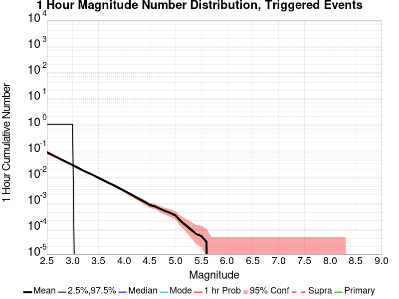

| Mag | Mean | 2.5 %ile | 97.5 %ile | Median | Mode | 1 hr Probability | 1 hr Supra-Seis Prob | Primary Aftershocks Mean |
|-----|-----|-----|-----|-----|-----|-----|-----|-----|
| **M&ge;2.5** | 0.085 | 0.000 | 1.000 | 0.000 | 0.000 | 0.077 (7.71%) | 0.000 (0.00%) | 0.080 |
| **M&ge;2.6** | 0.068 | 0.000 | 1.000 | 0.000 | 0.000 | 0.063 (6.25%) | 0.000 (0.00%) | 0.064 |
| **M&ge;2.7** | 0.054 | 0.000 | 1.000 | 0.000 | 0.000 | 0.050 (4.95%) | 0.000 (0.00%) | 0.051 |
| **M&ge;2.8** | 0.043 | 0.000 | 1.000 | 0.000 | 0.000 | 0.040 (3.98%) | 0.000 (0.00%) | 0.040 |
| **M&ge;2.9** | 0.034 | 0.000 | 1.000 | 0.000 | 0.000 | 0.032 (3.20%) | 0.000 (0.00%) | 0.032 |
| **M&ge;3** | 0.027 | 0.000 | 1.000 | 0.000 | 0.000 | 0.026 (2.59%) | 0.000 (0.00%) | 0.026 |
| **M&ge;3.1** | 0.022 | 0.000 | 0.000 | 0.000 | 0.000 | 0.020 (2.04%) | 0.000 (0.00%) | 0.020 |
| **M&ge;3.2** | 0.017 | 0.000 | 0.000 | 0.000 | 0.000 | 0.016 (1.58%) | 0.000 (0.00%) | 0.016 |
| **M&ge;3.3** | 0.013 | 0.000 | 0.000 | 0.000 | 0.000 | 0.013 (1.27%) | 0.000 (0.00%) | 0.013 |
| **M&ge;3.4** | 0.011 | 0.000 | 0.000 | 0.000 | 0.000 | 0.010 (1.03%) | 0.000 (0.00%) | 0.010 |
| **M&ge;3.5** | 8.61E-3 | 0.000 | 0.000 | 0.000 | 0.000 | 8.19E-3 (0.82%) | 0.000 (0.00%) | 8.11E-3 |
| **M&ge;3.6** | 6.87E-3 | 0.000 | 0.000 | 0.000 | 0.000 | 6.55E-3 (0.66%) | 0.000 (0.00%) | 6.45E-3 |
| **M&ge;3.7** | 5.32E-3 | 0.000 | 0.000 | 0.000 | 0.000 | 5.04E-3 (0.50%) | 0.000 (0.00%) | 4.92E-3 |
| **M&ge;3.8** | 4.30E-3 | 0.000 | 0.000 | 0.000 | 0.000 | 4.14E-3 (0.41%) | 0.000 (0.00%) | 4.00E-3 |
| **M&ge;3.9** | 3.35E-3 | 0.000 | 0.000 | 0.000 | 0.000 | 3.23E-3 (0.32%) | 0.000 (0.00%) | 3.07E-3 |
| **M&ge;4** | 2.83E-3 | 0.000 | 0.000 | 0.000 | 0.000 | 2.73E-3 (0.27%) | 0.000 (0.00%) | 2.57E-3 |
| **M&ge;4.1** | 2.21E-3 | 0.000 | 0.000 | 0.000 | 0.000 | 2.13E-3 (0.21%) | 0.000 (0.00%) | 2.01E-3 |
| **M&ge;4.2** | 1.67E-3 | 0.000 | 0.000 | 0.000 | 0.000 | 1.59E-3 (0.16%) | 0.000 (0.00%) | 1.47E-3 |
| **M&ge;4.3** | 1.25E-3 | 0.000 | 0.000 | 0.000 | 0.000 | 1.18E-3 (0.12%) | 0.000 (0.00%) | 1.08E-3 |
| **M&ge;4.4** | 1.06E-3 | 0.000 | 0.000 | 0.000 | 0.000 | 9.76E-4 (0.10%) | 0.000 (0.00%) | 8.96E-4 |
| **M&ge;4.5** | 7.37E-4 | 0.000 | 0.000 | 0.000 | 0.000 | 6.97E-4 (0.07%) | 0.000 (0.00%) | 6.37E-4 |
| **M&ge;4.6** | 5.98E-4 | 0.000 | 0.000 | 0.000 | 0.000 | 5.78E-4 (0.06%) | 0.000 (0.00%) | 5.38E-4 |
| **M&ge;4.7** | 4.98E-4 | 0.000 | 0.000 | 0.000 | 0.000 | 4.78E-4 (0.05%) | 0.000 (0.00%) | 4.38E-4 |
| **M&ge;4.8** | 3.59E-4 | 0.000 | 0.000 | 0.000 | 0.000 | 3.39E-4 (0.03%) | 0.000 (0.00%) | 2.99E-4 |
| **M&ge;4.9** | 2.99E-4 | 0.000 | 0.000 | 0.000 | 0.000 | 2.79E-4 (0.03%) | 0.000 (0.00%) | 2.39E-4 |
| **M&ge;5** | 2.59E-4 | 0.000 | 0.000 | 0.000 | 0.000 | 2.59E-4 (0.03%) | 0.000 (0.00%) | 2.19E-4 |
| **M&ge;5.1** | 1.59E-4 | 0.000 | 0.000 | 0.000 | 0.000 | 1.59E-4 (0.02%) | 0.000 (0.00%) | 1.20E-4 |
| **M&ge;5.2** | 9.96E-5 | 0.000 | 0.000 | 0.000 | 0.000 | 9.96E-5 (0.01%) | 0.000 (0.00%) | 7.97E-5 |
| **M&ge;5.3** | 7.97E-5 | 0.000 | 0.000 | 0.000 | 0.000 | 7.97E-5 (0.01%) | 0.000 (0.00%) | 5.98E-5 |
| **M&ge;5.4** | 5.98E-5 | 0.000 | 0.000 | 0.000 | 0.000 | 5.98E-5 (0.01%) | 0.000 (0.00%) | 5.98E-5 |
| **M&ge;5.5** | 5.98E-5 | 0.000 | 0.000 | 0.000 | 0.000 | 5.98E-5 (0.01%) | 0.000 (0.00%) | 5.98E-5 |
| **M&ge;5.6** | 5.98E-5 | 0.000 | 0.000 | 0.000 | 0.000 | 5.98E-5 (0.01%) | 0.000 (0.00%) | 5.98E-5 |
| **M&ge;5.7** | 0.000 | 0.000 | 0.000 | 0.000 | 0.000 | 0.000 (0.00%) | 0.000 (0.00%) | 0.000 |
| **M&ge;5.8** | 0.000 | 0.000 | 0.000 | 0.000 | 0.000 | 0.000 (0.00%) | 0.000 (0.00%) | 0.000 |
| **M&ge;5.9** | 0.000 | 0.000 | 0.000 | 0.000 | 0.000 | 0.000 (0.00%) | 0.000 (0.00%) | 0.000 |
| **M&ge;6** | 0.000 | 0.000 | 0.000 | 0.000 | 0.000 | 0.000 (0.00%) | 0.000 (0.00%) | 0.000 |
| **M&ge;6.1** | 0.000 | 0.000 | 0.000 | 0.000 | 0.000 | 0.000 (0.00%) | 0.000 (0.00%) | 0.000 |
| **M&ge;6.2** | 0.000 | 0.000 | 0.000 | 0.000 | 0.000 | 0.000 (0.00%) | 0.000 (0.00%) | 0.000 |
| **M&ge;6.3** | 0.000 | 0.000 | 0.000 | 0.000 | 0.000 | 0.000 (0.00%) | 0.000 (0.00%) | 0.000 |
| **M&ge;6.4** | 0.000 | 0.000 | 0.000 | 0.000 | 0.000 | 0.000 (0.00%) | 0.000 (0.00%) | 0.000 |
| **M&ge;6.5** | 0.000 | 0.000 | 0.000 | 0.000 | 0.000 | 0.000 (0.00%) | 0.000 (0.00%) | 0.000 |
| **M&ge;6.6** | 0.000 | 0.000 | 0.000 | 0.000 | 0.000 | 0.000 (0.00%) | 0.000 (0.00%) | 0.000 |
| **M&ge;6.7** | 0.000 | 0.000 | 0.000 | 0.000 | 0.000 | 0.000 (0.00%) | 0.000 (0.00%) | 0.000 |
| **M&ge;6.8** | 0.000 | 0.000 | 0.000 | 0.000 | 0.000 | 0.000 (0.00%) | 0.000 (0.00%) | 0.000 |
| **M&ge;6.9** | 0.000 | 0.000 | 0.000 | 0.000 | 0.000 | 0.000 (0.00%) | 0.000 (0.00%) | 0.000 |
| **M&ge;7** | 0.000 | 0.000 | 0.000 | 0.000 | 0.000 | 0.000 (0.00%) | 0.000 (0.00%) | 0.000 |
| **M&ge;7.1** | 0.000 | 0.000 | 0.000 | 0.000 | 0.000 | 0.000 (0.00%) | 0.000 (0.00%) | 0.000 |
| **M&ge;7.2** | 0.000 | 0.000 | 0.000 | 0.000 | 0.000 | 0.000 (0.00%) | 0.000 (0.00%) | 0.000 |
| **M&ge;7.3** | 0.000 | 0.000 | 0.000 | 0.000 | 0.000 | 0.000 (0.00%) | 0.000 (0.00%) | 0.000 |
| **M&ge;7.4** | 0.000 | 0.000 | 0.000 | 0.000 | 0.000 | 0.000 (0.00%) | 0.000 (0.00%) | 0.000 |
| **M&ge;7.5** | 0.000 | 0.000 | 0.000 | 0.000 | 0.000 | 0.000 (0.00%) | 0.000 (0.00%) | 0.000 |
| **M&ge;7.6** | 0.000 | 0.000 | 0.000 | 0.000 | 0.000 | 0.000 (0.00%) | 0.000 (0.00%) | 0.000 |
| **M&ge;7.7** | 0.000 | 0.000 | 0.000 | 0.000 | 0.000 | 0.000 (0.00%) | 0.000 (0.00%) | 0.000 |
| **M&ge;7.8** | 0.000 | 0.000 | 0.000 | 0.000 | 0.000 | 0.000 (0.00%) | 0.000 (0.00%) | 0.000 |
| **M&ge;7.9** | 0.000 | 0.000 | 0.000 | 0.000 | 0.000 | 0.000 (0.00%) | 0.000 (0.00%) | 0.000 |
| **M&ge;8** | 0.000 | 0.000 | 0.000 | 0.000 | 0.000 | 0.000 (0.00%) | 0.000 (0.00%) | 0.000 |
| **M&ge;8.1** | 0.000 | 0.000 | 0.000 | 0.000 | 0.000 | 0.000 (0.00%) | 0.000 (0.00%) | 0.000 |
| **M&ge;8.2** | 0.000 | 0.000 | 0.000 | 0.000 | 0.000 | 0.000 (0.00%) | 0.000 (0.00%) | 0.000 |
| **M&ge;8.3** | 0.000 | 0.000 | 0.000 | 0.000 | 0.000 | 0.000 (0.00%) | 0.000 (0.00%) | 0.000 |
| **M&ge;8.4** | 0.000 | 0.000 | 0.000 | 0.000 | 0.000 | 0.000 (0.00%) | 0.000 (0.00%) | 0.000 |
| **M&ge;8.5** | 0.000 | 0.000 | 0.000 | 0.000 | 0.000 | 0.000 (0.00%) | 0.000 (0.00%) | 0.000 |
| **M&ge;8.6** | 0.000 | 0.000 | 0.000 | 0.000 | 0.000 | 0.000 (0.00%) | 0.000 (0.00%) | 0.000 |
| **M&ge;8.7** | 0.000 | 0.000 | 0.000 | 0.000 | 0.000 | 0.000 (0.00%) | 0.000 (0.00%) | 0.000 |
| **M&ge;8.8** | 0.000 | 0.000 | 0.000 | 0.000 | 0.000 | 0.000 (0.00%) | 0.000 (0.00%) | 0.000 |
| **M&ge;8.9** | 0.000 | 0.000 | 0.000 | 0.000 | 0.000 | 0.000 (0.00%) | 0.000 (0.00%) | 0.000 |
| **M&ge;9** | 0.000 | 0.000 | 0.000 | 0.000 | 0.000 | 0.000 (0.00%) | 0.000 (0.00%) | 0.000 |


## Hazard Change Over Time
*[(top)](#table-of-contents)*

These plots show how the probability of ruptures of various magnitudes within the region used to fetch ComCat trigger ruptures changes over time

### M&ge;5.0 Hazard Change Over Time
*[(top)](#table-of-contents)*


| Forecast Duration | UCERF3-ETAS [95% Conf] | UCERF3-ETAS Triggered Only | UCERF3-TD | UCERF3-ETAS/TD Gain | UCERF3-TI |
|-----|-----|-----|-----|-----|-----|
| 1 Hour | 2.89E-4 [1.74E-4 - 4.86E-4] | 2.59E-4 | 3.02E-5 | 9.57 | 3.00E-5 |
| 1 Day | 7.63E-3 [6.94E-3 - 8.41E-3] | 6.91E-3 | 7.25E-4 | 10.52 | 7.20E-4 |
| 1 Week | 0.050 [0.048 - 0.052] | 0.045 | 5.07E-3 | 9.82 | 5.03E-3 |
| 1 Month | 0.184 [0.180 - 0.187] | 0.166 | 0.022 | 8.53 | 0.021 |
| 1 Year | 0.753 [0.750 - 0.756] | 0.678 | 0.233 | 3.24 | 0.231 |
| 10 Years | 0.996 [0.995 - 0.996] | 0.937 | 0.929 | 1.07 | 0.928 |
| 30 Years | 1.000 [1.000 - 1.000] \* | \* | 1.000 | 1 \* | 1.000 |
| 100 Years | 1.000 [1.000 - 1.000] \* | \* | 1.000 | 1 \* | 1.000 |

\* *forecast duration is longer than simulation length, only ETAS ruptures from the first 10 years are included*
### M&ge;6.0 Hazard Change Over Time
*[(top)](#table-of-contents)*


| Forecast Duration | UCERF3-ETAS [95% Conf] | UCERF3-ETAS Triggered Only | UCERF3-TD | UCERF3-ETAS/TD Gain | UCERF3-TI |
|-----|-----|-----|-----|-----|-----|
| 1 Hour | 3.50E-6 [3.50E-6 - 9.89E-5] | 0.000 | 3.50E-6 | 1 | 3.28E-6 |
| 1 Day | 5.02E-4 [3.50E-4 - 7.35E-4] | 4.18E-4 | 8.40E-5 | 5.98 | 7.86E-5 |
| 1 Week | 4.45E-3 [3.94E-3 - 5.04E-3] | 3.86E-3 | 5.88E-4 | 7.57 | 5.50E-4 |
| 1 Month | 0.018 [0.017 - 0.019] | 0.016 | 2.52E-3 | 7.15 | 2.36E-3 |
| 1 Year | 0.125 [0.123 - 0.128] | 0.098 | 0.030 | 4.14 | 0.028 |
| 10 Years | 0.434 [0.431 - 0.437] | 0.230 | 0.264 | 1.64 | 0.250 |
| 30 Years | 0.695 [0.693 - 0.696] \* | \* | 0.603 | 1.15 \* | 0.578 |
| 100 Years | 0.966 [0.966 - 0.966] \* | \* | 0.956 | 1.01 \* | 0.943 |

\* *forecast duration is longer than simulation length, only ETAS ruptures from the first 10 years are included*
### M&ge;7.0 Hazard Change Over Time
*[(top)](#table-of-contents)*


| Forecast Duration | UCERF3-ETAS [95% Conf] | UCERF3-ETAS Triggered Only | UCERF3-TD | UCERF3-ETAS/TD Gain | UCERF3-TI |
|-----|-----|-----|-----|-----|-----|
| 1 Hour | 3.60E-7 [3.60E-7 - 9.58E-5] | 0.000 | 3.60E-7 | 1 | 3.22E-7 |
| 1 Day | 4.85E-5 [1.56E-5 - 1.69E-4] | 3.98E-5 | 8.65E-6 | 5.6 | 7.72E-6 |
| 1 Week | 3.20E-4 [2.05E-4 - 5.16E-4] | 2.59E-4 | 6.06E-5 | 5.28 | 5.40E-5 |
| 1 Month | 1.51E-3 [1.23E-3 - 1.88E-3] | 1.25E-3 | 2.60E-4 | 5.83 | 2.31E-4 |
| 1 Year | 0.011 [0.010 - 0.012] | 7.73E-3 | 3.16E-3 | 3.44 | 2.81E-3 |
| 10 Years | 0.051 [0.050 - 0.052] | 0.020 | 0.031 | 1.63 | 0.028 |
| 30 Years | 0.111 [0.110 - 0.112] \* | \* | 0.093 | 1.2 \* | 0.081 |
| 100 Years | 0.308 [0.308 - 0.309] \* | \* | 0.294 | 1.05 \* | 0.246 |

\* *forecast duration is longer than simulation length, only ETAS ruptures from the first 10 years are included*
### M&ge;8.0 Hazard Change Over Time
*[(top)](#table-of-contents)*


| Forecast Duration | UCERF3-ETAS [95% Conf] | UCERF3-ETAS Triggered Only | UCERF3-TD | UCERF3-ETAS/TD Gain | UCERF3-TI |
|-----|-----|-----|-----|-----|-----|
| 1 Hour | 1.24E-8 [1.24E-8 - 9.54E-5] | 0.000 | 1.24E-8 | 1 | 1.07E-8 |
| 1 Day | 2.98E-7 [2.98E-7 - 9.57E-5] | 0.000 | 2.98E-7 | 1 | 2.56E-7 |
| 1 Week | 2.09E-6 [2.09E-6 - 9.75E-5] | 0.000 | 2.09E-6 | 1 | 1.79E-6 |
| 1 Month | 8.95E-6 [8.95E-6 - 1.04E-4] | 0.000 | 8.95E-6 | 1 | 7.67E-6 |
| 1 Year | 1.49E-4 [1.16E-4 - 2.70E-4] | 3.98E-5 | 1.09E-4 | 1.37 | 9.34E-5 |
| 10 Years | 1.18E-3 [1.13E-3 - 1.32E-3] | 7.97E-5 | 1.10E-3 | 1.07 | 9.34E-4 |
| 30 Years | 3.60E-3 [3.55E-3 - 3.74E-3] \* | \* | 3.52E-3 | 1.02 \* | 2.80E-3 |
| 100 Years | 0.014 [0.014 - 0.014] \* | \* | 0.014 | 1.01 \* | 9.30E-3 |

\* *forecast duration is longer than simulation length, only ETAS ruptures from the first 10 years are included*

## Trigger Rupture Fault Map
*[(top)](#table-of-contents)*


## Trigger Rupture Depth Map
*[(top)](#table-of-contents)*


## Fault Distances To Triggers
*[(top)](#table-of-contents)*

| Section Name | Strike, Dip, Rake | # Hypos In Poly | Max Mag w/ Hypo In Poly | # Surfs In Poly | Max Mag w/ Surf In Poly | Min Dist To Any (km) | Min Poly Dist To Any (km) | Min Dist To Largest (km) | Min Poly Dist To Largest (km) | Min Hypo Dist To Largest (km) | Min Hypo Poly Dist To Largest (km) |
|-----|-----|-----|-----|-----|-----|-----|-----|-----|-----|-----|-----|
| Airport Lake | 359, 50, -90 | 1263 | 7.1 | 1263 | 7.1 | 0.036 | 0.000 | 0.036 | 0.000 | 5.612 | 0.000 |
| Little Lake | 327, 90, 180 | 405 | 5.5 | 406 | 7.1 | 2.268 | 0.000 | 11.284 | 0.000 | 13.471 | 1.469 |
| Garlock (Central) | 71, 90, 0 | 194 | 4.73 | 195 | 7.1 | 0.225 | 0.000 | 5.600 | 0.000 | 22.766 | 10.797 |
| So Sierra Nevada | 2, 50, -90 | 126 | 4.62 | 126 | 4.62 | 0.916 | 0.000 | 4.248 | 4.233 | 16.191 | 15.188 |
| Ash Hill | 162, 90, 180 | 30 | 3.57 | 30 | 3.57 | 0.088 | 0.000 | 34.883 | 23.252 | 35.690 | 25.242 |
| Panamint Valley | 334, 90, -150 | 21 | 3.57 | 21 | 3.57 | 6.249 | 0.000 | 29.583 | 17.627 | 34.350 | 22.425 |
| Tank Canyon | 189, 50, -90 | 2 | 3.02 | 2 | 3.02 | 0.751 | 0.000 | 9.015 | 9.011 | 17.039 | 16.895 |
| Blackwater | 323, 90, 180 | 2 | 3.54 | 2 | 3.54 | 5.396 | 0.000 | 14.394 | 8.726 | 29.622 | 27.613 |
| Sierra Nevada  (No Extension) | 344, 50, -90 | 0 |  | 0 |  | 5.696 | 1.331 | 39.627 | 39.626 | 58.680 | 58.391 |
| Owens Valley | 346, 90, 180 | 0 |  | 0 |  | 11.268 | 7.068 | 49.013 | 48.524 | 68.299 | 66.819 |
| Lenwood-Lockhart-Old Woman Springs | 301, 90, 180 | 0 |  | 0 |  | 18.221 | 16.222 | 53.532 | 41.707 | 59.786 | 48.595 |
| Towne Pass | 186, 50, -90 | 0 |  | 0 |  | 18.237 | 18.158 | 52.561 | 52.559 | 59.662 | 59.451 |
| Garlock (West) | 55, 90, 0 | 0 |  | 0 |  | 18.439 | 18.373 | 63.115 | 60.529 | 66.575 | 62.627 |

## Individual Simulated Catalog Maps
*[(top)](#table-of-contents)*

These are map plots of individual catalogs from the simulations, selected as the closest catalog to each of the given percentiles in terms of total number of events.

| Duration | p0.0 %-ile | p25.0 %-ile | p50.0 %-ile | p75.0 %-ile | p90.0 %-ile | p95.0 %-ile | p97.5 %-ile | p98.0 %-ile | p99.0 %-ile | p99.5 %-ile | p99.9 %-ile | p99.998008 %-ile |
|-----|-----|-----|-----|-----|-----|-----|-----|-----|-----|-----|-----|-----|
| **1 Week** |  |  |  |  |  |  |  |  |  |  |  |  |
| **1 Month** |  | 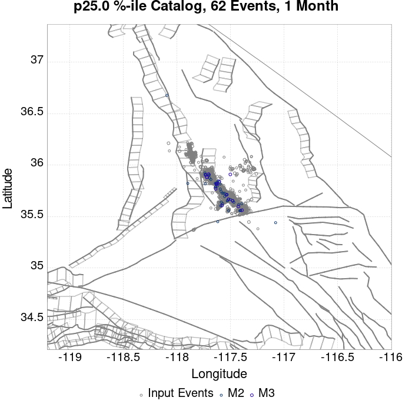 |  |  |  |  |  |  |  |  | 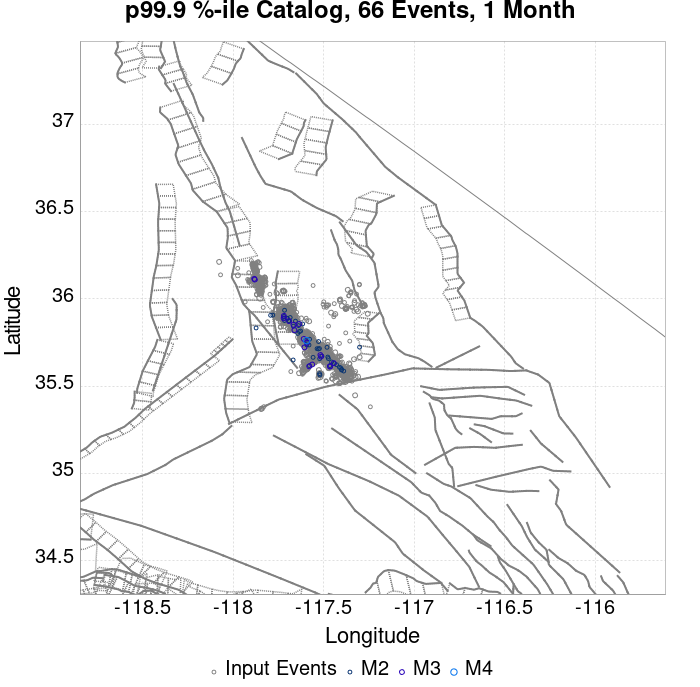 |  |
| **1 Year** |  |  | 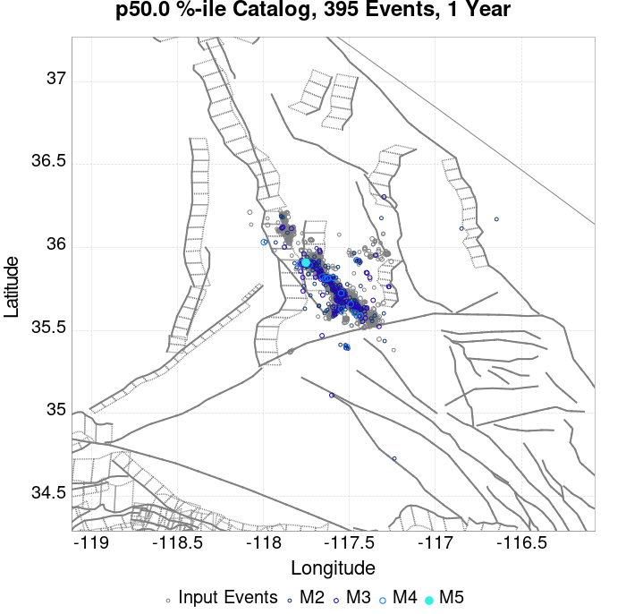 |  |  |  | 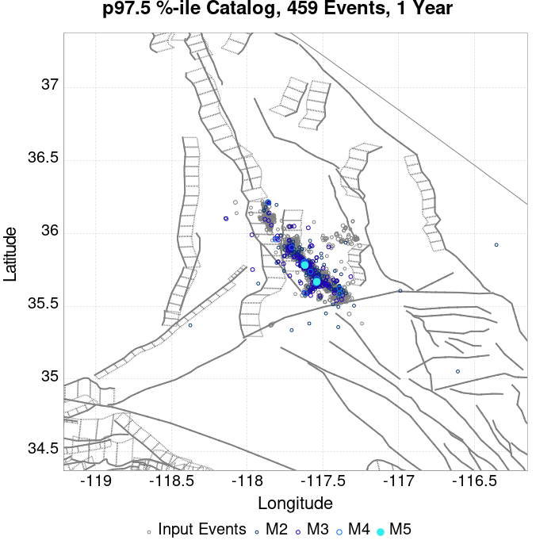 | 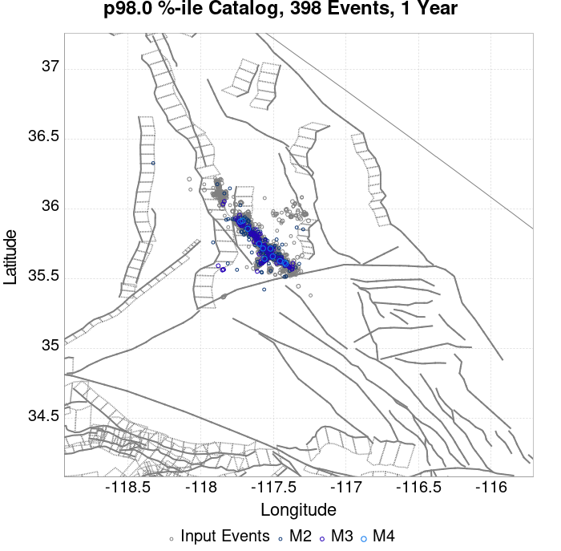 | 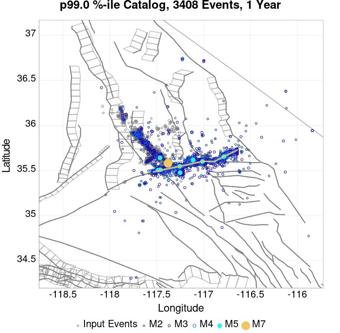 |  |  |  |
| **10 Year** |  |  | 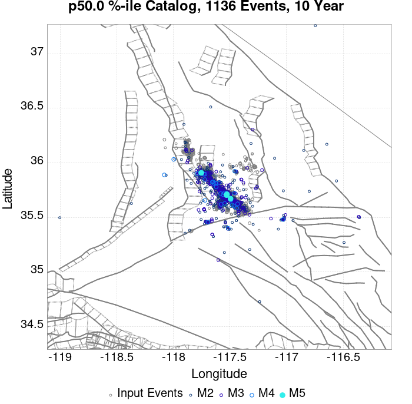 | 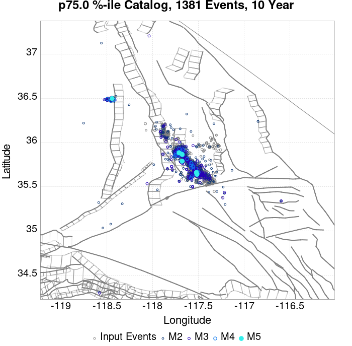 |  |  |  |  |  |  |  |  |

## ComCat Data Comparisons
*[(top)](#table-of-contents)*

No ComCat events found

## Section Participation
*[(top)](#table-of-contents)*

### Section Participation Plots
*[(top)](#table-of-contents)*

| Min Mag | 1 yr Triggered Ruptures (no spontaneous) | 10 yr Triggered Ruptures (no spontaneous) | 10 yr Triggered Ruptures (primary aftershocks only) |
|-----|-----|-----|-----|
| **All Supra. Seis.** |  |  |  |
| **M&ge;6.5** |  |  | 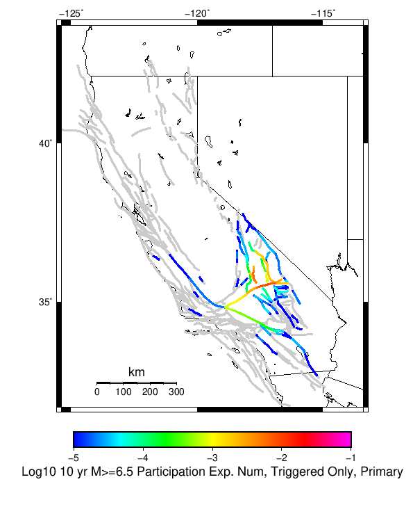 |
| **M&ge;7** |  |  |  |
| **M&ge;7.5** |  |  |  |
| **M&ge;8** |  |  |  |

### Supra-Seismogenic Parent Sections Table
*[(top)](#table-of-contents)*

*First 10 of 129 with matching ruptures shown*

| Parent Name | Triggered 10 Year Mean Count | Triggered 1 Day Prob | Triggered 1 Week Prob | Triggered 1 Month Prob | Triggered 1 Year Prob | Triggered 10 Year Prob | Triggered 10 Year Primary Mean Count |
|-----|-----|-----|-----|-----|-----|-----|-----|
| Garlock (Central) | 0.03860558 | 1.5936255E-4 | 5.378486E-4 | 0.0022908368 | 0.015 | 0.0376494 | 0.021533864 |
| Tank Canyon | 0.030697212 | 0.0 | 3.187251E-4 | 0.0013944223 | 0.009063745 | 0.026235059 | 0.008505976 |
| Little Lake | 0.01756972 | 3.9840637E-5 | 3.5856574E-4 | 0.0011354581 | 0.0070119523 | 0.017290836 | 0.010239044 |
| Airport Lake | 0.0139243025 | 0.0 | 2.1912351E-4 | 8.7649404E-4 | 0.005816733 | 0.0139243025 | 0.009342629 |
| Owl Lake | 0.012270916 | 1.9920319E-5 | 1.19521916E-4 | 4.5816734E-4 | 0.0040239044 | 0.0108964145 | 0.0032669322 |
| Panamint Valley | 0.008505976 | 0.0 | 7.9681275E-5 | 5.9760956E-4 | 0.0029083665 | 0.008366534 | 0.0031075696 |
| Garlock (East) | 0.008187251 | 1.9920319E-5 | 7.9681275E-5 | 3.7848606E-4 | 0.0027290836 | 0.007310757 | 0.002250996 |
| Ash Hill | 0.0046812748 | 0.0 | 3.9840637E-5 | 2.3904383E-4 | 0.0015338645 | 0.00438247 | 0.0013147411 |
| Hunter Mountain-Saline Valley | 0.0036055776 | 0.0 | 3.9840637E-5 | 2.7888446E-4 | 0.0013147411 | 0.0035258965 | 0.0017131474 |
| Blackwater | 0.0032868525 | 0.0 | 1.9920319E-5 | 5.9760958E-5 | 0.0010756972 | 0.00312749 | 7.3705177E-4 |

### M≥6.5 Parent Sections Table
*[(top)](#table-of-contents)*

*First 10 of 98 with matching ruptures shown*

| Parent Name | Triggered 10 Year Mean Count | Triggered 1 Day Prob | Triggered 1 Week Prob | Triggered 1 Month Prob | Triggered 1 Year Prob | Triggered 10 Year Prob | Triggered 10 Year Primary Mean Count |
|-----|-----|-----|-----|-----|-----|-----|-----|
| Garlock (Central) | 0.016673306 | 3.9840637E-5 | 2.5896414E-4 | 0.0010557768 | 0.0066135456 | 0.016513944 | 0.008924303 |
| Airport Lake | 0.010557769 | 0.0 | 1.5936255E-4 | 7.569721E-4 | 0.00440239 | 0.010557769 | 0.0070119523 |
| Little Lake | 0.010239044 | 1.9920319E-5 | 2.7888446E-4 | 8.1673305E-4 | 0.0040239044 | 0.010119522 | 0.006294821 |
| Panamint Valley | 0.007808765 | 0.0 | 7.9681275E-5 | 5.378486E-4 | 0.0026494025 | 0.007689243 | 0.0029681276 |
| Owl Lake | 0.007231076 | 0.0 | 7.9681275E-5 | 3.5856574E-4 | 0.0027091634 | 0.007231076 | 0.0030079682 |
| Garlock (East) | 0.0056573707 | 1.9920319E-5 | 5.9760958E-5 | 2.9880478E-4 | 0.0021115537 | 0.0053585656 | 0.0021713148 |
| Hunter Mountain-Saline Valley | 0.003565737 | 0.0 | 3.9840637E-5 | 2.7888446E-4 | 0.0012948207 | 0.0035059762 | 0.0017131474 |
| Tank Canyon | 0.0031474105 | 0.0 | 1.9920319E-5 | 9.9601595E-5 | 7.768924E-4 | 0.0031075696 | 8.1673305E-4 |
| Garlock (West) | 0.0027689242 | 0.0 | 0.0 | 3.9840637E-5 | 0.0010358565 | 0.0027689242 | 0.0014741035 |
| So Sierra Nevada | 0.0015737052 | 0.0 | 0.0 | 5.9760958E-5 | 6.5737055E-4 | 0.0015537848 | 3.7848606E-4 |

### M≥7 Parent Sections Table
*[(top)](#table-of-contents)*

*First 10 of 78 with matching ruptures shown*

| Parent Name | Triggered 10 Year Mean Count | Triggered 1 Day Prob | Triggered 1 Week Prob | Triggered 1 Month Prob | Triggered 1 Year Prob | Triggered 10 Year Prob | Triggered 10 Year Primary Mean Count |
|-----|-----|-----|-----|-----|-----|-----|-----|
| Garlock (Central) | 0.014501992 | 1.9920319E-5 | 1.5936255E-4 | 8.9641433E-4 | 0.005756972 | 0.01440239 | 0.0077888444 |
| Panamint Valley | 0.005378486 | 0.0 | 5.9760958E-5 | 4.3824702E-4 | 0.0019721116 | 0.0053386455 | 0.0025896414 |
| Owl Lake | 0.0051593627 | 0.0 | 3.9840637E-5 | 2.3904383E-4 | 0.002191235 | 0.0051593627 | 0.0029282868 |
| Garlock (East) | 0.0042031873 | 1.9920319E-5 | 5.9760958E-5 | 2.3904383E-4 | 0.0016733068 | 0.0041633467 | 0.0020517928 |
| Hunter Mountain-Saline Valley | 0.0033864542 | 0.0 | 3.9840637E-5 | 2.5896414E-4 | 0.0012549801 | 0.0033864542 | 0.0016533864 |
| Garlock (West) | 0.002749004 | 0.0 | 0.0 | 3.9840637E-5 | 0.0010358565 | 0.002749004 | 0.0014741035 |
| Little Lake | 0.002250996 | 0.0 | 7.9681275E-5 | 2.1912351E-4 | 7.9681276E-4 | 0.002250996 | 0.0014541832 |
| Airport Lake | 0.0020318725 | 0.0 | 7.9681275E-5 | 2.1912351E-4 | 7.569721E-4 | 0.0020318725 | 0.0013944223 |
| San Andreas (Mojave N) | 0.0011155378 | 0.0 | 0.0 | 0.0 | 3.7848606E-4 | 0.0011155378 | 5.7768926E-4 |
| San Andreas (Mojave S) | 9.163347E-4 | 0.0 | 0.0 | 0.0 | 3.3864542E-4 | 8.9641433E-4 | 4.7808766E-4 |

### M≥7.5 Parent Sections Table
*[(top)](#table-of-contents)*

*First 10 of 50 with matching ruptures shown*

| Parent Name | Triggered 10 Year Mean Count | Triggered 1 Day Prob | Triggered 1 Week Prob | Triggered 1 Month Prob | Triggered 1 Year Prob | Triggered 10 Year Prob | Triggered 10 Year Primary Mean Count |
|-----|-----|-----|-----|-----|-----|-----|-----|
| Garlock (Central) | 0.0056573707 | 0.0 | 3.9840637E-5 | 2.9880478E-4 | 0.0021713148 | 0.0056573707 | 0.002988048 |
| Panamint Valley | 0.0033864542 | 0.0 | 3.9840637E-5 | 2.5896414E-4 | 0.0012549801 | 0.0033864542 | 0.0016733068 |
| Hunter Mountain-Saline Valley | 0.0033466136 | 0.0 | 3.9840637E-5 | 2.5896414E-4 | 0.0012549801 | 0.0033466136 | 0.0016533864 |
| Garlock (West) | 0.0025099602 | 0.0 | 0.0 | 3.9840637E-5 | 9.561753E-4 | 0.0025099602 | 0.001374502 |
| Garlock (East) | 0.0015936255 | 0.0 | 0.0 | 3.9840637E-5 | 6.374502E-4 | 0.0015936255 | 8.9641433E-4 |
| San Andreas (Mojave N) | 0.0011155378 | 0.0 | 0.0 | 0.0 | 3.7848606E-4 | 0.0011155378 | 5.7768926E-4 |
| San Andreas (Mojave S) | 8.7649404E-4 | 0.0 | 0.0 | 0.0 | 3.3864542E-4 | 8.7649404E-4 | 4.7808766E-4 |
| San Andreas (San Bernardino N) | 5.7768926E-4 | 0.0 | 0.0 | 0.0 | 2.5896414E-4 | 5.7768926E-4 | 3.3864542E-4 |
| Owl Lake | 4.98008E-4 | 0.0 | 0.0 | 0.0 | 2.1912351E-4 | 4.98008E-4 | 2.7888446E-4 |
| San Andreas (San Bernardino S) | 2.9880478E-4 | 0.0 | 0.0 | 0.0 | 1.5936255E-4 | 2.9880478E-4 | 1.7928287E-4 |

### M≥8 Parent Sections Table
*[(top)](#table-of-contents)*

*First 10 of 26 with matching ruptures shown*

| Parent Name | Triggered 10 Year Mean Count | Triggered 1 Day Prob | Triggered 1 Week Prob | Triggered 1 Month Prob | Triggered 1 Year Prob | Triggered 10 Year Prob | Triggered 10 Year Primary Mean Count |
|-----|-----|-----|-----|-----|-----|-----|-----|
| San Andreas (Mojave N) | 1.3944223E-4 | 0.0 | 0.0 | 0.0 | 7.9681275E-5 | 1.3944223E-4 | 3.9840637E-5 |
| San Andreas (Mojave S) | 1.3944223E-4 | 0.0 | 0.0 | 0.0 | 7.9681275E-5 | 1.3944223E-4 | 3.9840637E-5 |
| San Andreas (San Bernardino N) | 1.3944223E-4 | 0.0 | 0.0 | 0.0 | 7.9681275E-5 | 1.3944223E-4 | 3.9840637E-5 |
| San Andreas (San Bernardino S) | 9.9601595E-5 | 0.0 | 0.0 | 0.0 | 7.9681275E-5 | 9.9601595E-5 | 1.9920319E-5 |
| Garlock (Central) | 7.9681275E-5 | 0.0 | 0.0 | 0.0 | 3.9840637E-5 | 7.9681275E-5 | 3.9840637E-5 |
| Garlock (East) | 7.9681275E-5 | 0.0 | 0.0 | 0.0 | 3.9840637E-5 | 7.9681275E-5 | 3.9840637E-5 |
| Garlock (West) | 7.9681275E-5 | 0.0 | 0.0 | 0.0 | 3.9840637E-5 | 7.9681275E-5 | 3.9840637E-5 |
| San Andreas (Coachella) rev | 7.9681275E-5 | 0.0 | 0.0 | 0.0 | 5.9760958E-5 | 7.9681275E-5 | 0.0 |
| San Andreas (San Gorgonio Pass-Garnet HIll) | 7.9681275E-5 | 0.0 | 0.0 | 0.0 | 5.9760958E-5 | 7.9681275E-5 | 0.0 |
| San Andreas (Big Bend) | 5.9760958E-5 | 0.0 | 0.0 | 0.0 | 3.9840637E-5 | 5.9760958E-5 | 0.0 |

### Fault Magnitude-Probability Distributions
*[(top)](#table-of-contents)*

The first 5 sections (sorted by trigger rate) are plotted below. All fault MPDs are available [here](plots/parent_sect_mpds/README.md)

| 1 Week | 1 Month | 1 Year | 10 Year |
|-----|-----|-----|-----|
| 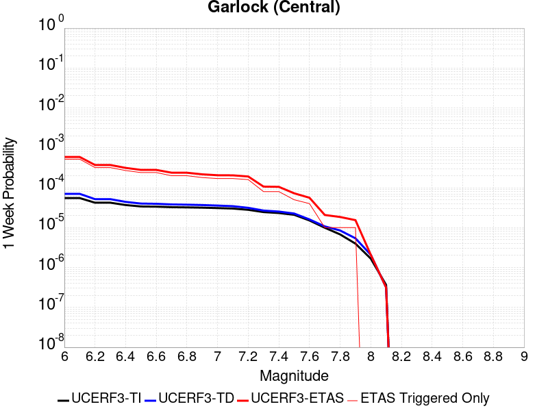 |  |  |  |
|  |  |  |  |
|  |  |  |  |
|  |  |  |  |
|  |  |  |  |

## Gridded Nucleation
*[(top)](#table-of-contents)*

| Min Mag | Triggered Ruptures (no spontaneous) | Triggered Ruptures (primary aftershocks only) |
|-----|-----|-----|
| **M&ge;2.5** |  |  |
| **M&ge;5** |  |  |
| **M&ge;6** |  |  |
| **M&ge;7** |  |  |


## JSON Input File
*[(top)](#table-of-contents)*

```
{
  "numSimulations": 100000,
  "duration": 10.0,
  "startTimeMillis": 1572923142971,
  "includeSpontaneous": false,
  "randomSeed": 1572923149135,
  "binaryOutput": true,
  "binaryOutputFilters": [
    {
      "prefix": "results_complete",
      "descendantsOnly": false
    },
    {
      "prefix": "results_m5_preserve_chain",
      "minMag": 5.0,
      "preserveChainBelowMag": true,
      "descendantsOnly": false
    }
  ],
  "forceRecalc": false,
  "simulationName": "ComCat M7.1 (ci38457511), 122 Days After, ShakeMap Surfaces",
  "numRetries": 3,
  "outputDir": "/home/scec-02/kmilner/ucerf3/etas_sim/2019_11_04-ComCatM7p1_ci38457511_122DaysAfter_ShakeMapSurfaces",
  "treatTriggerCatalogAsSpontaneous": false,
  "triggerRuptures": [
    "omitted due to length, see original input file"
  ],
  "cacheDir": "/home/scec-02/kmilner/ucerf3/ucerf3-etas-launcher/inputs/cache_fm3p1_ba",
  "fssFile": "/home/scec-02/kmilner/ucerf3/ucerf3-etas-launcher/inputs/2013_05_10-ucerf3p3-production-10runs_COMPOUND_SOL_FM3_1_SpatSeisU3_MEAN_BRANCH_AVG_SOL.zip",
  "probModel": "FULL_TD",
  "applySubSeisForSupraNucl": true,
  "totRateScaleFactor": 1.14,
  "gridSeisCorr": true,
  "timeIndependentERF": false,
  "griddedOnly": false,
  "imposeGR": false,
  "includeIndirectTriggering": true,
  "gridSeisDiscr": 0.1,
  "catalogCompletenessModel": "RELAXED",
  "configCommand": "u3etas_comcat_event_config_builder.sh --event-id ci38457511 --num-simulations 100000 --days-before 7 --end-now --mag-complete 3.5 --finite-surf-shakemap --finite-surf-shakemap-min-mag 5 --hpc-site USC_HPC --nodes 36 --hours 24 --queue scec",
  "configTime": 1572923149135,
  "comcatMetadata": {
    "region": {
      "border": [
        {
          "latitude": 35.15123745324938,
          "longitude": -117.46198765392752
        },
        {
          "latitude": 35.170513097218205,
          "longitude": -117.55046477274733
        },
        {
          "latitude": 35.201997575622634,
          "longitude": -117.63356287896195
        },
        {
          "latitude": 35.24474776584818,
          "longitude": -117.70878534540662
        },
        {
          "latitude": 35.2893890362986,
          "longitude": -117.76387551603122
        },
        {
          "latitude": 35.288830898189985,
          "longitude": -117.76465036296011
        },
        {
          "latitude": 35.62116745212862,
          "longitude": -118.13026990137416
        },
        {
          "latitude": 35.621789874646055,
          "longitude": -118.12940866580139
        },
        {
          "latitude": 35.621789874646055,
          "longitude": -118.12940866580136
        },
        {
          "latitude": 35.63100857737423,
          "longitude": -118.14083341711117
        },
        {
          "latitude": 35.69213881200874,
          "longitude": -118.19401186444136
        },
        {
          "latitude": 35.759827796433385,
          "longitude": -118.23338865654299
        },
        {
          "latitude": 35.8320329014668,
          "longitude": -118.25773927868946
        },
        {
          "latitude": 35.906569563076914,
          "longitude": -118.26628547708222
        },
        {
          "latitude": 35.9811764992231,
          "longitude": -118.25872343341653
        },
        {
          "latitude": 36.05358395358725,
          "longitude": -118.23523828089384
        },
        {
          "latitude": 36.12158296055357,
          "longitude": -118.19650389473806
        },
        {
          "latitude": 36.18309350302806,
          "longitude": -118.14366730262441
        },
        {
          "latitude": 36.23622937613509,
          "longitude": -118.07831757407638
        },
        {
          "latitude": 36.279357589115186,
          "longitude": -118.00243964650828
        },
        {
          "latitude": 36.31115024550475,
          "longitude": -117.91835419890715
        },
        {
          "latitude": 36.33062704347584,
          "longitude": -117.82864534929934
        },
        {
          "latitude": 36.337186832826475,
          "longitude": -117.7360785775
        },
        {
          "latitude": 36.33062704347584,
          "longitude": -117.64351180570065
        },
        {
          "latitude": 36.31115024550475,
          "longitude": -117.55380295609284
        },
        {
          "latitude": 36.279357589115186,
          "longitude": -117.46971750849171
        },
        {
          "latitude": 36.23622937613509,
          "longitude": -117.39383958092363
        },
        {
          "latitude": 36.19237301765921,
          "longitude": -117.33990236386252
        },
        {
          "latitude": 36.19237301765921,
          "longitude": -117.3399023638625
        },
        {
          "latitude": 36.19300476664728,
          "longitude": -117.33902822340912
        },
        {
          "latitude": 35.858277657147454,
          "longitude": -116.97410396317103
        },
        {
          "latitude": 35.85771127553969,
          "longitude": -116.97489025431044
        },
        {
          "latitude": 35.849566414597014,
          "longitude": -116.96491461360324
        },
        {
          "latitude": 35.78805819220281,
          "longitude": -116.9122967694479
        },
        {
          "latitude": 35.72006106557635,
          "longitude": -116.87372034968973
        },
        {
          "latitude": 35.64765482528862,
          "longitude": -116.85032807444419
        },
        {
          "latitude": 35.57304829206068,
          "longitude": -116.8427916482061
        },
        {
          "latitude": 35.49851117585832,
          "longitude": -116.8512961557198
        },
        {
          "latitude": 35.42630481575459,
          "longitude": -116.87553976530553
        },
        {
          "latitude": 35.35861392859174,
          "longitude": -116.91474809853695
        },
        {
          "latitude": 35.29748137319737,
          "longitude": -116.96770221389164
        },
        {
          "latitude": 35.24474776584818,
          "longitude": -117.03277884359336
        },
        {
          "latitude": 35.201997575622634,
          "longitude": -117.10800131003803
        },
        {
          "latitude": 35.170513097218205,
          "longitude": -117.19109941625265
        },
        {
          "latitude": 35.15123745324938,
          "longitude": -117.27957653507247
        },
        {
          "latitude": 35.14474752487352,
          "longitude": -117.3707820945
        }
      ]
    },
    "eventID": "ci38457511",
    "minDepth": -10.0,
    "maxDepth": 24.0,
    "minMag": 2.5,
    "startTime": 1561778393040,
    "endTime": 1572923141971,
    "magComplete": 3.5
  }
}
```

